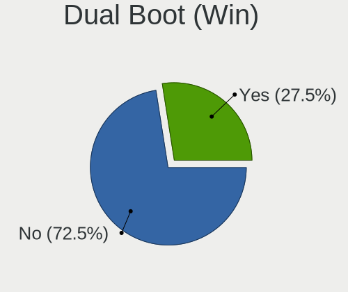
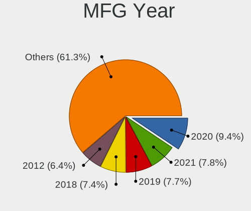
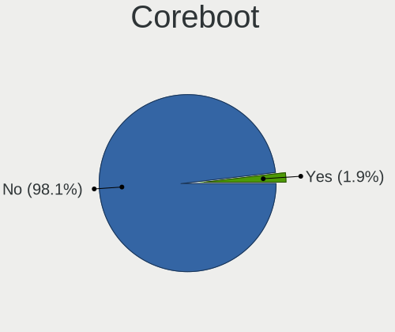
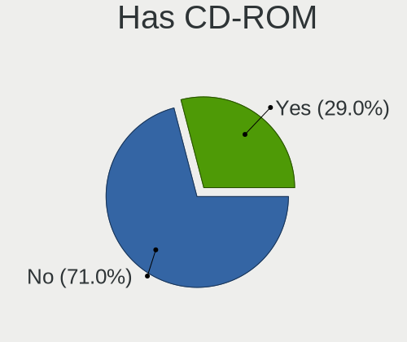
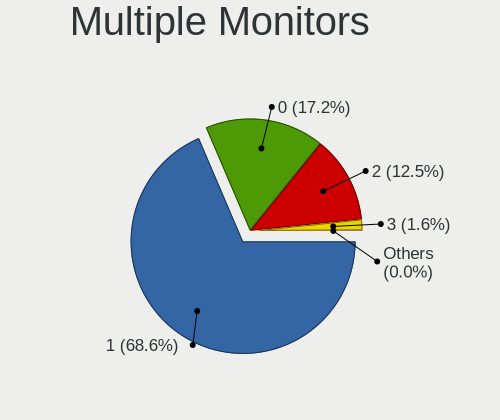
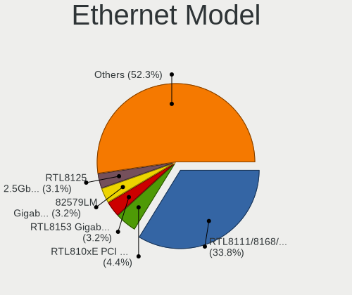
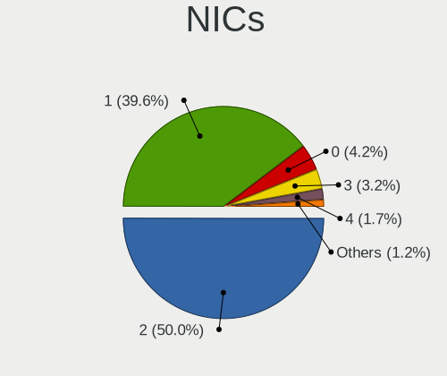

Debian - Tested Hardware & Statistics
-------------------------------------

A project to collect tested hardware configurations for Debian.

Anyone can contribute to this report by the [hw-probe](https://github.com/linuxhw/hw-probe) tool:

    sudo -E hw-probe -all -upload

Please contribute! Especially if your hardware is rare.

This is a report for all computer types. See also reports for [desktops](/Dist/Debian/Desktop/README.md) and [notebooks](/Dist/Debian/Notebook/README.md).

Contents
--------

* [ Test Cases ](#test-cases)

* [ System ](#system)
  - [ OS                       ](#os)
  - [ OS Family                ](#os-family)
  - [ Kernel                   ](#kernel)
  - [ Kernel Family            ](#kernel-family)
  - [ Kernel Major Ver.        ](#kernel-major-ver)
  - [ Arch                     ](#arch)
  - [ DE                       ](#de)
  - [ Display Server           ](#display-server)
  - [ Display Manager          ](#display-manager)
  - [ OS Lang                  ](#os-lang)
  - [ Boot Mode                ](#boot-mode)
  - [ Filesystem               ](#filesystem)
  - [ Part. scheme             ](#part-scheme)
  - [ Dual Boot with Linux/BSD ](#dual-boot-with-linuxbsd)
  - [ Dual Boot (Win)          ](#dual-boot-win)

* [ Board ](#board)
  - [ Vendor                   ](#vendor)
  - [ Model                    ](#model)
  - [ Model Family             ](#model-family)
  - [ MFG Year                 ](#mfg-year)
  - [ Form Factor              ](#form-factor)
  - [ Secure Boot              ](#secure-boot)
  - [ Coreboot                 ](#coreboot)
  - [ RAM Size                 ](#ram-size)
  - [ RAM Used                 ](#ram-used)
  - [ Total Drives             ](#total-drives)
  - [ Has CD-ROM               ](#has-cd-rom)
  - [ Has Ethernet             ](#has-ethernet)
  - [ Has WiFi                 ](#has-wifi)
  - [ Has Bluetooth            ](#has-bluetooth)

* [ Location ](#location)
  - [ Country                  ](#country)
  - [ City                     ](#city)

* [ Drives ](#drives)
  - [ Drive Vendor             ](#drive-vendor)
  - [ Drive Model              ](#drive-model)
  - [ HDD Vendor               ](#hdd-vendor)
  - [ SSD Vendor               ](#ssd-vendor)
  - [ Drive Kind               ](#drive-kind)
  - [ Drive Connector          ](#drive-connector)
  - [ Drive Size               ](#drive-size)
  - [ Space Total              ](#space-total)
  - [ Space Used               ](#space-used)
  - [ Malfunc. Drives          ](#malfunc-drives)
  - [ Malfunc. Drive Vendor    ](#malfunc-drive-vendor)
  - [ Malfunc. HDD Vendor      ](#malfunc-hdd-vendor)
  - [ Malfunc. Drive Kind      ](#malfunc-drive-kind)
  - [ Failed Drives            ](#failed-drives)
  - [ Failed Drive Vendor      ](#failed-drive-vendor)
  - [ Drive Status             ](#drive-status)

* [ Storage controller ](#storage-controller)
  - [ Storage Vendor           ](#storage-vendor)
  - [ Storage Model            ](#storage-model)
  - [ Storage Kind             ](#storage-kind)

* [ Processor ](#processor)
  - [ CPU Vendor               ](#cpu-vendor)
  - [ CPU Model                ](#cpu-model)
  - [ CPU Model Family         ](#cpu-model-family)
  - [ CPU Cores                ](#cpu-cores)
  - [ CPU Sockets              ](#cpu-sockets)
  - [ CPU Threads              ](#cpu-threads)
  - [ CPU Op-Modes             ](#cpu-op-modes)
  - [ CPU Microcode            ](#cpu-microcode)
  - [ CPU Microarch            ](#cpu-microarch)

* [ Graphics ](#graphics)
  - [ GPU Vendor               ](#gpu-vendor)
  - [ GPU Model                ](#gpu-model)
  - [ GPU Combo                ](#gpu-combo)
  - [ GPU Driver               ](#gpu-driver)
  - [ GPU Memory               ](#gpu-memory)

* [ Monitor ](#monitor)
  - [ Monitor Vendor           ](#monitor-vendor)
  - [ Monitor Model            ](#monitor-model)
  - [ Monitor Resolution       ](#monitor-resolution)
  - [ Monitor Diagonal         ](#monitor-diagonal)
  - [ Monitor Width            ](#monitor-width)
  - [ Aspect Ratio             ](#aspect-ratio)
  - [ Monitor Area             ](#monitor-area)
  - [ Pixel Density            ](#pixel-density)
  - [ Multiple Monitors        ](#multiple-monitors)

* [ Network ](#network)
  - [ Net Controller Vendor    ](#net-controller-vendor)
  - [ Net Controller Model     ](#net-controller-model)
  - [ Wireless Vendor          ](#wireless-vendor)
  - [ Wireless Model           ](#wireless-model)
  - [ Ethernet Vendor          ](#ethernet-vendor)
  - [ Ethernet Model           ](#ethernet-model)
  - [ Net Controller Kind      ](#net-controller-kind)
  - [ Used Controller          ](#used-controller)
  - [ NICs                     ](#nics)
  - [ IPv6                     ](#ipv6)

* [ Bluetooth ](#bluetooth)
  - [ Bluetooth Vendor         ](#bluetooth-vendor)
  - [ Bluetooth Model          ](#bluetooth-model)

* [ Sound ](#sound)
  - [ Sound Vendor             ](#sound-vendor)
  - [ Sound Model              ](#sound-model)

* [ Memory ](#memory)
  - [ Memory Vendor            ](#memory-vendor)
  - [ Memory Model             ](#memory-model)
  - [ Memory Kind              ](#memory-kind)
  - [ Memory Form Factor       ](#memory-form-factor)
  - [ Memory Size              ](#memory-size)
  - [ Memory Speed             ](#memory-speed)

* [ Printers & scanners ](#printers--scanners)
  - [ Printer Vendor           ](#printer-vendor)
  - [ Printer Model            ](#printer-model)
  - [ Scanner Vendor           ](#scanner-vendor)
  - [ Scanner Model            ](#scanner-model)

* [ Camera ](#camera)
  - [ Camera Vendor            ](#camera-vendor)
  - [ Camera Model             ](#camera-model)

* [ Security ](#security)
  - [ Fingerprint Vendor       ](#fingerprint-vendor)
  - [ Fingerprint Model        ](#fingerprint-model)
  - [ Chipcard Vendor          ](#chipcard-vendor)
  - [ Chipcard Model           ](#chipcard-model)

* [ Unsupported ](#unsupported)
  - [ Unsupported Devices      ](#unsupported-devices)
  - [ Unsupported Device Types ](#unsupported-device-types)

Test Cases
----------

Total: 9190

| Vendor        | Model                       | Form-Factor | Probe                                                      | Date         |
|---------------|-----------------------------|-------------|------------------------------------------------------------|--------------|
| Gigabyte      | H110M-Gaming3-CF            | Desktop     | [99a140d79b](https://linux-hardware.org/?probe=99a140d79b) | Aug 01, 2022 |
| Dell          | Inspiron 13-7378            | Notebook    | [c08447d945](https://linux-hardware.org/?probe=c08447d945) | Aug 01, 2022 |
| Notebook      | V15x_V17xPNKPNJPNH          | Notebook    | [ae2fa8b811](https://linux-hardware.org/?probe=ae2fa8b811) | Aug 01, 2022 |
| MSI           | MAG B550 TOMAHAWK           | Desktop     | [0d7342cca0](https://linux-hardware.org/?probe=0d7342cca0) | Aug 01, 2022 |
| Dell          | Latitude 7420               | Notebook    | [d498af2db5](https://linux-hardware.org/?probe=d498af2db5) | Aug 01, 2022 |
| ASRock        | H470M-HVS                   | Desktop     | [5282e92d2c](https://linux-hardware.org/?probe=5282e92d2c) | Aug 01, 2022 |
| Toshiba       | TECRA Z40-C                 | Notebook    | [9612659f60](https://linux-hardware.org/?probe=9612659f60) | Aug 01, 2022 |
| Dell          | 0PV3YR A05                  | Server      | [2c00e0e66e](https://linux-hardware.org/?probe=2c00e0e66e) | Aug 01, 2022 |
| Apple         | MacBookPro11,5              | Notebook    | [24ccaddbf8](https://linux-hardware.org/?probe=24ccaddbf8) | Jul 31, 2022 |
| ASUSTek       | P9X79                       | Desktop     | [4a518ab792](https://linux-hardware.org/?probe=4a518ab792) | Jul 31, 2022 |
| Gigabyte      | Z590 UD AC                  | Desktop     | [12cf4f1c81](https://linux-hardware.org/?probe=12cf4f1c81) | Jul 31, 2022 |
| Intel         | NUC7i5BNB J31144-302        | Mini pc     | [638275ad97](https://linux-hardware.org/?probe=638275ad97) | Jul 31, 2022 |
| Dell          | 0PV3YR A05                  | Server      | [47310a6478](https://linux-hardware.org/?probe=47310a6478) | Jul 31, 2022 |
| HP            | ProBook 4310s               | Notebook    | [d15b493637](https://linux-hardware.org/?probe=d15b493637) | Jul 31, 2022 |
| Dell          | Latitude 3320               | Notebook    | [183ae38016](https://linux-hardware.org/?probe=183ae38016) | Jul 31, 2022 |
| Lenovo        | 3106 SDK0J40697 WIN 3305... | Desktop     | [cc1944f4a3](https://linux-hardware.org/?probe=cc1944f4a3) | Jul 31, 2022 |
| Gigabyte      | A320M-H-CF                  | Desktop     | [5facb7723f](https://linux-hardware.org/?probe=5facb7723f) | Jul 30, 2022 |
| MSI           | MS-7418 100                 | Desktop     | [c17e48cc2b](https://linux-hardware.org/?probe=c17e48cc2b) | Jul 30, 2022 |
| MSI           | MS-7418 100                 | Desktop     | [4644e4eaa8](https://linux-hardware.org/?probe=4644e4eaa8) | Jul 30, 2022 |
| ASUSTek       | P8B75-M                     | Desktop     | [ddf26da899](https://linux-hardware.org/?probe=ddf26da899) | Jul 30, 2022 |
| HP            | ENVY x360 Convertible 13... | Convertible | [d704ff7364](https://linux-hardware.org/?probe=d704ff7364) | Jul 30, 2022 |
| ASUSTek       | P8H61-M LX3                 | Desktop     | [0cdabe4b69](https://linux-hardware.org/?probe=0cdabe4b69) | Jul 30, 2022 |
| Gigabyte      | B450M DS3H-CF               | Desktop     | [e3a44e4c5b](https://linux-hardware.org/?probe=e3a44e4c5b) | Jul 30, 2022 |
| Intel         | N5095-AIO T1 E1.0G          | All in one  | [20ff37511f](https://linux-hardware.org/?probe=20ff37511f) | Jul 30, 2022 |
| ASUSTek       | STRIX Z270F GAMING          | Desktop     | [3b1f863612](https://linux-hardware.org/?probe=3b1f863612) | Jul 30, 2022 |
| Dell          | Latitude 3320               | Notebook    | [a849c0d90a](https://linux-hardware.org/?probe=a849c0d90a) | Jul 30, 2022 |
| Dell          | 0PV3YR A05                  | Server      | [33ffdbbe27](https://linux-hardware.org/?probe=33ffdbbe27) | Jul 30, 2022 |
| Lenovo        | ThinkPad T15 Gen 1 20S60... | Notebook    | [9b362907fc](https://linux-hardware.org/?probe=9b362907fc) | Jul 30, 2022 |
| Lenovo        | ThinkPad T15 Gen 1 20S60... | Notebook    | [61aed5ab55](https://linux-hardware.org/?probe=61aed5ab55) | Jul 30, 2022 |
| Apple         | MacBookPro11,5              | Notebook    | [1b94bd5797](https://linux-hardware.org/?probe=1b94bd5797) | Jul 29, 2022 |
| Intel         | TR440BXA A16643-311         | Desktop     | [e6245255f4](https://linux-hardware.org/?probe=e6245255f4) | Jul 29, 2022 |
| Acer          | AO756                       | Notebook    | [8203ac54d7](https://linux-hardware.org/?probe=8203ac54d7) | Jul 29, 2022 |
| ASUSTek       | GL553VE                     | Notebook    | [0bbcd152c5](https://linux-hardware.org/?probe=0bbcd152c5) | Jul 29, 2022 |
| Intel         | N5095-AIO T1 E1.0G          | All in one  | [08a5cff3a6](https://linux-hardware.org/?probe=08a5cff3a6) | Jul 29, 2022 |
| Samsung       | R505                        | Notebook    | [4f92cf3c93](https://linux-hardware.org/?probe=4f92cf3c93) | Jul 29, 2022 |
| ASUSTek       | TUF B360M-PLUS GAMING/BR    | Desktop     | [8c57fbc9e8](https://linux-hardware.org/?probe=8c57fbc9e8) | Jul 29, 2022 |
| MSI           | H110M PRO-VD                | Desktop     | [675b1fa2ff](https://linux-hardware.org/?probe=675b1fa2ff) | Jul 29, 2022 |
| Lenovo        | ThinkPad E14 Gen 4 21E30... | Notebook    | [0121efa569](https://linux-hardware.org/?probe=0121efa569) | Jul 29, 2022 |
| HUAWEI        | BOHK-WAX9X                  | Notebook    | [bc5b132a8d](https://linux-hardware.org/?probe=bc5b132a8d) | Jul 29, 2022 |
| ASUSTek       | B85M-E/DASH                 | Desktop     | [2ebbaa4052](https://linux-hardware.org/?probe=2ebbaa4052) | Jul 29, 2022 |
| Intel         | NUC11TNBv7 K87766-405       | Mini pc     | [e82d9ce558](https://linux-hardware.org/?probe=e82d9ce558) | Jul 29, 2022 |
| Fujitsu       | D3313-A1 S26361-D3313-A1    | Desktop     | [902ee3b350](https://linux-hardware.org/?probe=902ee3b350) | Jul 29, 2022 |
| Dell          | 0PV3YR A05                  | Server      | [06e863c8c6](https://linux-hardware.org/?probe=06e863c8c6) | Jul 29, 2022 |
| Lenovo        | ThinkPad L480 20LS002CPB    | Notebook    | [35764371d6](https://linux-hardware.org/?probe=35764371d6) | Jul 29, 2022 |
| AZW           | MINI S                      | Desktop     | [53ba28d9c3](https://linux-hardware.org/?probe=53ba28d9c3) | Jul 28, 2022 |
| AZW           | MINI S                      | Desktop     | [46216b2db1](https://linux-hardware.org/?probe=46216b2db1) | Jul 28, 2022 |
| MSI           | Z370 GAMING M5              | Desktop     | [b9ec9e3dd4](https://linux-hardware.org/?probe=b9ec9e3dd4) | Jul 28, 2022 |
| MSI           | X470 GAMING PLUS            | Desktop     | [8415a45799](https://linux-hardware.org/?probe=8415a45799) | Jul 28, 2022 |
| HP            | 8158 A01                    | Mini pc     | [56631cd6ac](https://linux-hardware.org/?probe=56631cd6ac) | Jul 28, 2022 |
| MSI           | PRO Z690-A DDR4             | Desktop     | [b5b5f049d0](https://linux-hardware.org/?probe=b5b5f049d0) | Jul 28, 2022 |
| HP            | ProLiant MicroServer        | Desktop     | [8104eee56e](https://linux-hardware.org/?probe=8104eee56e) | Jul 28, 2022 |
| Gigabyte      | A520M DS3H                  | Desktop     | [900a5b4f7f](https://linux-hardware.org/?probe=900a5b4f7f) | Jul 28, 2022 |
| ASUSTek       | P7P55D                      | Desktop     | [0c9828e226](https://linux-hardware.org/?probe=0c9828e226) | Jul 28, 2022 |
| Intel         | DH61AG AAG23736-505         | Desktop     | [7fd3a18899](https://linux-hardware.org/?probe=7fd3a18899) | Jul 28, 2022 |
| HP            | EliteBook 820 G2            | Notebook    | [0735a357ee](https://linux-hardware.org/?probe=0735a357ee) | Jul 28, 2022 |
| Dell          | Latitude E5500              | Notebook    | [ba214335da](https://linux-hardware.org/?probe=ba214335da) | Jul 28, 2022 |
| HP            | Compaq 8510p                | Notebook    | [2a005b06da](https://linux-hardware.org/?probe=2a005b06da) | Jul 28, 2022 |
| ASUSTek       | H97-PRO                     | Desktop     | [ca77f59b41](https://linux-hardware.org/?probe=ca77f59b41) | Jul 28, 2022 |
| MSI           | H110M PRO-VD                | Desktop     | [33961c087b](https://linux-hardware.org/?probe=33961c087b) | Jul 28, 2022 |
| HP            | 3048h                       | Desktop     | [01d1b1e99a](https://linux-hardware.org/?probe=01d1b1e99a) | Jul 28, 2022 |
| MSI           | H110I PRO                   | Desktop     | [1dcc4b694a](https://linux-hardware.org/?probe=1dcc4b694a) | Jul 28, 2022 |
| Acer          | Spin SP513-52N              | Convertible | [975a56edb1](https://linux-hardware.org/?probe=975a56edb1) | Jul 28, 2022 |
| ASUSTek       | PN50                        | Mini pc     | [033cb3886a](https://linux-hardware.org/?probe=033cb3886a) | Jul 28, 2022 |
| ASUSTek       | ROG Zephyrus M15 GU502LW... | Notebook    | [a05f5dc510](https://linux-hardware.org/?probe=a05f5dc510) | Jul 28, 2022 |
| Dell          | 0PV3YR A05                  | Server      | [13d33e8cbc](https://linux-hardware.org/?probe=13d33e8cbc) | Jul 28, 2022 |
| MSI           | X470 GAMING PLUS            | Desktop     | [88ac64a1bd](https://linux-hardware.org/?probe=88ac64a1bd) | Jul 28, 2022 |
| Lenovo        | S21e-20 80M4                | Notebook    | [bec71c2353](https://linux-hardware.org/?probe=bec71c2353) | Jul 27, 2022 |
| Gigabyte      | B660M GAMING DDR4           | Desktop     | [661a4a67d4](https://linux-hardware.org/?probe=661a4a67d4) | Jul 27, 2022 |
| Lenovo        | IdeaPad 5 Pro 14ACN6 82L... | Notebook    | [f062c9d4c7](https://linux-hardware.org/?probe=f062c9d4c7) | Jul 27, 2022 |
| Intel         | NUC11TNBv7 K87766-405       | Mini pc     | [c086eb22b3](https://linux-hardware.org/?probe=c086eb22b3) | Jul 27, 2022 |
| ECS           | G31T-M9                     | Desktop     | [5537dcbed3](https://linux-hardware.org/?probe=5537dcbed3) | Jul 27, 2022 |
| MSI           | MPG X570S EDGE MAX WIFI     | Desktop     | [29780cf747](https://linux-hardware.org/?probe=29780cf747) | Jul 27, 2022 |
| Apple         | Mac-F226BEC8 PVT            | All in one  | [d83f785b08](https://linux-hardware.org/?probe=d83f785b08) | Jul 27, 2022 |
| Lenovo        | IdeaPad 3 15ALC6 82MF       | Notebook    | [87f0eb95eb](https://linux-hardware.org/?probe=87f0eb95eb) | Jul 27, 2022 |
| HP            | Stream Notebook PC 11       | Notebook    | [e3c8a52e5b](https://linux-hardware.org/?probe=e3c8a52e5b) | Jul 27, 2022 |
| HP            | ProLiant DL360 Gen9         | Server      | [7901fea9f3](https://linux-hardware.org/?probe=7901fea9f3) | Jul 27, 2022 |
| Medion        | MS-7728                     | Desktop     | [662e3948f2](https://linux-hardware.org/?probe=662e3948f2) | Jul 27, 2022 |
| HP            | ProLiant DL360 Gen9         | Server      | [520d9f8703](https://linux-hardware.org/?probe=520d9f8703) | Jul 27, 2022 |
| Gigabyte      | H470M DS3H                  | Desktop     | [5f90ec9763](https://linux-hardware.org/?probe=5f90ec9763) | Jul 27, 2022 |
| Acer          | Aspire A515-43              | Notebook    | [d378021961](https://linux-hardware.org/?probe=d378021961) | Jul 26, 2022 |
| HP            | Notebook                    | Notebook    | [9a4fc65b6a](https://linux-hardware.org/?probe=9a4fc65b6a) | Jul 26, 2022 |
| HP            | 0AACh                       | Desktop     | [d7df31df8c](https://linux-hardware.org/?probe=d7df31df8c) | Jul 26, 2022 |
| HP            | 0AACh                       | Desktop     | [357aa343ec](https://linux-hardware.org/?probe=357aa343ec) | Jul 26, 2022 |
| ASUSTek       | ZenBook UX325UA             | Notebook    | [587ea51239](https://linux-hardware.org/?probe=587ea51239) | Jul 26, 2022 |
| ASUSTek       | PRIME H310M-K               | Desktop     | [ba71ad5870](https://linux-hardware.org/?probe=ba71ad5870) | Jul 26, 2022 |
| Notebook      | V15x_V17xPNKPNJPNH          | Notebook    | [8aa5207a61](https://linux-hardware.org/?probe=8aa5207a61) | Jul 26, 2022 |
| ASRock        | H510M-HDV/M.2               | Desktop     | [e7672c215b](https://linux-hardware.org/?probe=e7672c215b) | Jul 26, 2022 |
| Notebook      | V15x_V17xPNKPNJPNH          | Notebook    | [fc5bf3cb22](https://linux-hardware.org/?probe=fc5bf3cb22) | Jul 26, 2022 |
| Gigabyte      | H61M-S1                     | Desktop     | [5e8e9fbd71](https://linux-hardware.org/?probe=5e8e9fbd71) | Jul 26, 2022 |
| Notebook      | V15x_V17xPNKPNJPNH          | Notebook    | [c0b3aa1bea](https://linux-hardware.org/?probe=c0b3aa1bea) | Jul 26, 2022 |
| HONOR         | BBR-WAX9                    | Notebook    | [afe7a4d56a](https://linux-hardware.org/?probe=afe7a4d56a) | Jul 26, 2022 |
| ASUSTek       | P8B75-M                     | Desktop     | [46e85f96ca](https://linux-hardware.org/?probe=46e85f96ca) | Jul 26, 2022 |
| Lenovo        | ThinkPad T14 Gen 2a 20XL... | Notebook    | [c80bf22d79](https://linux-hardware.org/?probe=c80bf22d79) | Jul 26, 2022 |
| ASUSTek       | AT5NM10T-I                  | Desktop     | [9738c4bebc](https://linux-hardware.org/?probe=9738c4bebc) | Jul 26, 2022 |
| Panasonic     | CF-53SJCZYLM                | Notebook    | [188bf4dcb5](https://linux-hardware.org/?probe=188bf4dcb5) | Jul 26, 2022 |
| Lenovo        | G410 20237                  | Notebook    | [c23a040e55](https://linux-hardware.org/?probe=c23a040e55) | Jul 25, 2022 |
| ASUSTek       | PRIME Z690M-HZ              | Desktop     | [9d3da43bea](https://linux-hardware.org/?probe=9d3da43bea) | Jul 25, 2022 |
| Dell          | 03NVJ6 A01                  | Desktop     | [3998c390f0](https://linux-hardware.org/?probe=3998c390f0) | Jul 25, 2022 |
| Intel         | N5095-AIO T1 E1.0G          | All in one  | [ce9121a53b](https://linux-hardware.org/?probe=ce9121a53b) | Jul 25, 2022 |
| ASRock        | H470M Pro4                  | Desktop     | [5a709f059c](https://linux-hardware.org/?probe=5a709f059c) | Jul 25, 2022 |
| HP            | Notebook                    | Notebook    | [fdc7478b06](https://linux-hardware.org/?probe=fdc7478b06) | Jul 25, 2022 |
| ASRockRack    | B565D4-V1L                  | Desktop     | [1301ad9bd0](https://linux-hardware.org/?probe=1301ad9bd0) | Jul 25, 2022 |
| ASUSTek       | VivoBook_ASUSLaptop X515... | Notebook    | [bf2cecb453](https://linux-hardware.org/?probe=bf2cecb453) | Jul 25, 2022 |
| Unknown       | Amlogic Meson GXL (S905W... | Soc         | [c74cc1e78c](https://linux-hardware.org/?probe=c74cc1e78c) | Jul 25, 2022 |
| Dell          | 0PV3YR A05                  | Server      | [b7caa2c8e5](https://linux-hardware.org/?probe=b7caa2c8e5) | Jul 25, 2022 |
| Acer          | Aspire A315-23G             | Notebook    | [df57effbc5](https://linux-hardware.org/?probe=df57effbc5) | Jul 25, 2022 |
| Gigabyte      | B365M DS3H                  | Desktop     | [571655453a](https://linux-hardware.org/?probe=571655453a) | Jul 24, 2022 |
| AZW           | U59                         | Desktop     | [82e7dfdca5](https://linux-hardware.org/?probe=82e7dfdca5) | Jul 24, 2022 |
| ASUSTek       | VivoBook_ASUSLaptop X515... | Notebook    | [e2a1804b90](https://linux-hardware.org/?probe=e2a1804b90) | Jul 24, 2022 |
| ASUSTek       | TUF Gaming H570-PRO         | Desktop     | [36edefbce1](https://linux-hardware.org/?probe=36edefbce1) | Jul 24, 2022 |
| ASUSTek       | TUF Gaming B550-PLUS        | Desktop     | [de6f28d0f7](https://linux-hardware.org/?probe=de6f28d0f7) | Jul 24, 2022 |
| ASRock        | J5005-ITX                   | Desktop     | [8fdd045c35](https://linux-hardware.org/?probe=8fdd045c35) | Jul 24, 2022 |
| ASUSTek       | PRIME Z390-A                | Desktop     | [9a3ffce1a4](https://linux-hardware.org/?probe=9a3ffce1a4) | Jul 24, 2022 |
| Lenovo        | ThinkBook 15 G2 ARE 20VG    | Notebook    | [04737cec4e](https://linux-hardware.org/?probe=04737cec4e) | Jul 24, 2022 |
| Dell          | Latitude E5430 non-vPro     | Notebook    | [f8808faaf0](https://linux-hardware.org/?probe=f8808faaf0) | Jul 24, 2022 |
| Dell          | 0PV3YR A05                  | Server      | [3d21a6de4b](https://linux-hardware.org/?probe=3d21a6de4b) | Jul 24, 2022 |
| HP            | EliteBook 845 G8 Noteboo... | Notebook    | [45e79d015c](https://linux-hardware.org/?probe=45e79d015c) | Jul 23, 2022 |
| HP            | ProBook 450 G3              | Notebook    | [288db20204](https://linux-hardware.org/?probe=288db20204) | Jul 23, 2022 |
| Dell          | 0PV3YR A05                  | Server      | [7002f5be12](https://linux-hardware.org/?probe=7002f5be12) | Jul 23, 2022 |
| ECS           | G31T-M9                     | Desktop     | [f7489c3b16](https://linux-hardware.org/?probe=f7489c3b16) | Jul 22, 2022 |
| MSI           | H110M PRO-VD                | Desktop     | [ffd65c627e](https://linux-hardware.org/?probe=ffd65c627e) | Jul 22, 2022 |
| Lenovo        | Yoga 720-15IKB              | Convertible | [b9e70cb819](https://linux-hardware.org/?probe=b9e70cb819) | Jul 22, 2022 |
| Lenovo        | B50-30 80ES                 | Notebook    | [086b4a93eb](https://linux-hardware.org/?probe=086b4a93eb) | Jul 22, 2022 |
| Dell          | 0PV3YR A05                  | Server      | [bf7916cfe0](https://linux-hardware.org/?probe=bf7916cfe0) | Jul 22, 2022 |
| IceWhale T... | ZimaBoard 832 ZMB           | Desktop     | [7cd95094de](https://linux-hardware.org/?probe=7cd95094de) | Jul 21, 2022 |
| IceWhale T... | ZimaBoard 832 ZMB           | Desktop     | [4655fe2442](https://linux-hardware.org/?probe=4655fe2442) | Jul 21, 2022 |
| Lenovo        | ThinkPad L13 Yoga Gen 2 ... | Convertible | [0ef18844c3](https://linux-hardware.org/?probe=0ef18844c3) | Jul 21, 2022 |
| ASUSTek       | X541UVK                     | Notebook    | [fb1513d31e](https://linux-hardware.org/?probe=fb1513d31e) | Jul 21, 2022 |
| MSI           | H110M PRO-VD                | Desktop     | [ffcc0670ba](https://linux-hardware.org/?probe=ffcc0670ba) | Jul 21, 2022 |
| Gigabyte      | M68MT-S2                    | Desktop     | [e505d3e2da](https://linux-hardware.org/?probe=e505d3e2da) | Jul 21, 2022 |
| Dell          | Latitude 5420               | Notebook    | [51cf24b119](https://linux-hardware.org/?probe=51cf24b119) | Jul 21, 2022 |
| MSI           | B150M BAZOOKA               | Desktop     | [41053f8c0e](https://linux-hardware.org/?probe=41053f8c0e) | Jul 21, 2022 |
| MSI           | G31TM-P21                   | Desktop     | [34b4e0a6ea](https://linux-hardware.org/?probe=34b4e0a6ea) | Jul 21, 2022 |
| Gigabyte      | M68MT-S2                    | Desktop     | [de41a6c75f](https://linux-hardware.org/?probe=de41a6c75f) | Jul 21, 2022 |
| Lenovo        | ThinkPad T490 20N2000FIX    | Notebook    | [a68ebe9c0c](https://linux-hardware.org/?probe=a68ebe9c0c) | Jul 21, 2022 |
| Intel         | DH67BL AAG10189-209         | Desktop     | [8b924d9018](https://linux-hardware.org/?probe=8b924d9018) | Jul 21, 2022 |
| HP            | ZBook 15 G3                 | Notebook    | [758ce4f6b4](https://linux-hardware.org/?probe=758ce4f6b4) | Jul 21, 2022 |
| Dell          | 0HD5W2 A01                  | Desktop     | [e2eca7122c](https://linux-hardware.org/?probe=e2eca7122c) | Jul 21, 2022 |
| Unknown       | W1415A                      | Notebook    | [3a2f4f9848](https://linux-hardware.org/?probe=3a2f4f9848) | Jul 21, 2022 |
| Dell          | 0PV3YR A05                  | Server      | [1dcc22ccf4](https://linux-hardware.org/?probe=1dcc22ccf4) | Jul 21, 2022 |
| Intel         | DH67BL AAG10189-209         | Desktop     | [d9ce312767](https://linux-hardware.org/?probe=d9ce312767) | Jul 20, 2022 |
| ASUSTek       | M4A89GTD-PRO/USB3           | Desktop     | [8ad4c64b76](https://linux-hardware.org/?probe=8ad4c64b76) | Jul 20, 2022 |
| MSI           | MPG X570S EDGE MAX WIFI     | Desktop     | [f7678fb134](https://linux-hardware.org/?probe=f7678fb134) | Jul 20, 2022 |
| Intel         | DH67BL AAG10189-209         | Desktop     | [7bb5f0bd56](https://linux-hardware.org/?probe=7bb5f0bd56) | Jul 20, 2022 |
| MSI           | MS-7236                     | Desktop     | [e824199021](https://linux-hardware.org/?probe=e824199021) | Jul 20, 2022 |
| Acer          | TravelMate 8371             | Notebook    | [4af529e1c4](https://linux-hardware.org/?probe=4af529e1c4) | Jul 20, 2022 |
| ASUSTek       | Pro WS 565-ACE              | Desktop     | [b35dabeb45](https://linux-hardware.org/?probe=b35dabeb45) | Jul 20, 2022 |
| Acer          | Aspire TC-120               | Desktop     | [2625b243eb](https://linux-hardware.org/?probe=2625b243eb) | Jul 20, 2022 |
| Acer          | Aspire TC-120               | Desktop     | [25728e964b](https://linux-hardware.org/?probe=25728e964b) | Jul 20, 2022 |
| Thecus        | N2810 0001                  | Desktop     | [dd4d9fb1d5](https://linux-hardware.org/?probe=dd4d9fb1d5) | Jul 20, 2022 |
| Dell          | 07T4MC A11                  | Desktop     | [61d394116d](https://linux-hardware.org/?probe=61d394116d) | Jul 20, 2022 |
| Dell          | 0PV3YR A05                  | Server      | [03ce6d28fd](https://linux-hardware.org/?probe=03ce6d28fd) | Jul 20, 2022 |
| Avell High... | A40 LIV                     | Notebook    | [7a685eedd0](https://linux-hardware.org/?probe=7a685eedd0) | Jul 20, 2022 |
| Gigabyte      | B365M DS3H                  | Desktop     | [27bf18a32e](https://linux-hardware.org/?probe=27bf18a32e) | Jul 20, 2022 |
| Gigabyte      | H61M-S2PV                   | Desktop     | [44b9b405c2](https://linux-hardware.org/?probe=44b9b405c2) | Jul 20, 2022 |
| ASUSTek       | 1215P                       | Notebook    | [3bb44d06d1](https://linux-hardware.org/?probe=3bb44d06d1) | Jul 20, 2022 |
| Dell          | Precision 7760              | Notebook    | [742cb747ef](https://linux-hardware.org/?probe=742cb747ef) | Jul 20, 2022 |
| Lenovo        | G550 2958                   | Notebook    | [caeec900b9](https://linux-hardware.org/?probe=caeec900b9) | Jul 19, 2022 |
| Acer          | Aspire A515-45              | Notebook    | [4189e96860](https://linux-hardware.org/?probe=4189e96860) | Jul 19, 2022 |
| MSI           | MPG X570S EDGE MAX WIFI     | Desktop     | [fdc7518bfd](https://linux-hardware.org/?probe=fdc7518bfd) | Jul 19, 2022 |
| HP            | 255 G8 Notebook PC          | Notebook    | [59e9017400](https://linux-hardware.org/?probe=59e9017400) | Jul 19, 2022 |
| Intel         | DH67BL AAG10189-209         | Desktop     | [ff8bfdfce1](https://linux-hardware.org/?probe=ff8bfdfce1) | Jul 19, 2022 |
| Raspberry ... | Raspberry Pi 4 Model B R... | Soc         | [d12b4ae25d](https://linux-hardware.org/?probe=d12b4ae25d) | Jul 19, 2022 |
| Sony          | VPCEH37FJ                   | Notebook    | [1cc39f5c15](https://linux-hardware.org/?probe=1cc39f5c15) | Jul 19, 2022 |
| Lenovo        | G550 2958                   | Notebook    | [ee73634801](https://linux-hardware.org/?probe=ee73634801) | Jul 19, 2022 |
| ASUSTek       | PRIME H510M-A               | Desktop     | [6e29d1e7e1](https://linux-hardware.org/?probe=6e29d1e7e1) | Jul 19, 2022 |
| MSI           | H110M PRO-VD                | Desktop     | [ecf613ee2c](https://linux-hardware.org/?probe=ecf613ee2c) | Jul 19, 2022 |
| ASRock        | H470M-HVS                   | Desktop     | [2ccd5ab488](https://linux-hardware.org/?probe=2ccd5ab488) | Jul 19, 2022 |
| ASUSTek       | M4A89GTD-PRO/USB3           | Desktop     | [44035117ae](https://linux-hardware.org/?probe=44035117ae) | Jul 19, 2022 |
| MSI           | H110M PRO-VD                | Desktop     | [069d79d670](https://linux-hardware.org/?probe=069d79d670) | Jul 19, 2022 |
| ASUSTek       | Z170M-PLUS                  | Desktop     | [85df5dd7a2](https://linux-hardware.org/?probe=85df5dd7a2) | Jul 19, 2022 |
| ASUSTek       | M4A89GTD-PRO/USB3           | Desktop     | [4f256f41a7](https://linux-hardware.org/?probe=4f256f41a7) | Jul 19, 2022 |
| Gigabyte      | GA-880GM-UD2H               | Desktop     | [a5082efd70](https://linux-hardware.org/?probe=a5082efd70) | Jul 19, 2022 |
| Lenovo        | ThinkPad E14 Gen 3 20YDS... | Notebook    | [9d756ec471](https://linux-hardware.org/?probe=9d756ec471) | Jul 18, 2022 |
| HP            | Compaq 6910p                | Notebook    | [e6a5ffa902](https://linux-hardware.org/?probe=e6a5ffa902) | Jul 18, 2022 |
| Compaq        | 07A8h                       | Desktop     | [329d1b25c3](https://linux-hardware.org/?probe=329d1b25c3) | Jul 18, 2022 |
| Dell          | Inspiron 3583               | Notebook    | [6f281be47b](https://linux-hardware.org/?probe=6f281be47b) | Jul 18, 2022 |
| Razer         | Blade 15 Advanced Model ... | Notebook    | [8f3842495f](https://linux-hardware.org/?probe=8f3842495f) | Jul 18, 2022 |
| MSI           | H110M PRO-VD                | Desktop     | [b9799fcb96](https://linux-hardware.org/?probe=b9799fcb96) | Jul 18, 2022 |
| Notebook      | V15x_V17xPNKPNJPNH          | Notebook    | [92136ca850](https://linux-hardware.org/?probe=92136ca850) | Jul 18, 2022 |
| ASUSTek       | P5K SE/EPU                  | Desktop     | [b2b12a6837](https://linux-hardware.org/?probe=b2b12a6837) | Jul 18, 2022 |
| Notebook      | V15x_V17xPNKPNJPNH          | Notebook    | [56fbc3bbaa](https://linux-hardware.org/?probe=56fbc3bbaa) | Jul 18, 2022 |
| ASUSTek       | P5K                         | Desktop     | [f3c730853e](https://linux-hardware.org/?probe=f3c730853e) | Jul 18, 2022 |
| ASUSTek       | P5K                         | Desktop     | [581ed01922](https://linux-hardware.org/?probe=581ed01922) | Jul 18, 2022 |
| ASUSTek       | ZenBook UX391FA_UX391FA     | Notebook    | [aa5bdf4dd0](https://linux-hardware.org/?probe=aa5bdf4dd0) | Jul 18, 2022 |
| ASUSTek       | P8Z77-V                     | Desktop     | [bb9f40d075](https://linux-hardware.org/?probe=bb9f40d075) | Jul 18, 2022 |
| Acer          | Aspire A315-23G             | Notebook    | [268d2145ff](https://linux-hardware.org/?probe=268d2145ff) | Jul 17, 2022 |
| Apple         | Mac-F226BEC8 PVT            | All in one  | [8d0399bc8d](https://linux-hardware.org/?probe=8d0399bc8d) | Jul 17, 2022 |
| ASRock        | X300M-STX                   | Desktop     | [150da602c4](https://linux-hardware.org/?probe=150da602c4) | Jul 17, 2022 |
| ASRock        | X300M-STX                   | Desktop     | [a46f6b3901](https://linux-hardware.org/?probe=a46f6b3901) | Jul 17, 2022 |
| ASUSTek       | ZenBook UX391FA_UX391FA     | Notebook    | [42d7df651d](https://linux-hardware.org/?probe=42d7df651d) | Jul 17, 2022 |
| ASUSTek       | ZenBook UX391FA_UX391FA     | Notebook    | [9fd4b3dd50](https://linux-hardware.org/?probe=9fd4b3dd50) | Jul 17, 2022 |
| Lenovo        | ThinkPad P51s 20HB000URT    | Notebook    | [7f9c1a586d](https://linux-hardware.org/?probe=7f9c1a586d) | Jul 17, 2022 |
| Gigabyte      | F2A78M-DS2                  | Desktop     | [00a709911c](https://linux-hardware.org/?probe=00a709911c) | Jul 17, 2022 |
| Lenovo        | ThinkPad T14 Gen 2a 20XK... | Notebook    | [41fd0bf728](https://linux-hardware.org/?probe=41fd0bf728) | Jul 16, 2022 |
| Apple         | Mac-F226BEC8 PVT            | All in one  | [ef61582503](https://linux-hardware.org/?probe=ef61582503) | Jul 16, 2022 |
| Dell          | Vostro 3550                 | Notebook    | [9bd81d608a](https://linux-hardware.org/?probe=9bd81d608a) | Jul 15, 2022 |
| Unknown       | Unknown                     | Desktop     | [e862207f95](https://linux-hardware.org/?probe=e862207f95) | Jul 15, 2022 |
| HP            | ZBook Power 15.6 inch G8... | Notebook    | [e442e954fb](https://linux-hardware.org/?probe=e442e954fb) | Jul 15, 2022 |
| Fanless Mi... | Rev JSL1                    | Mini pc     | [f739115136](https://linux-hardware.org/?probe=f739115136) | Jul 15, 2022 |
| ASUSTek       | Zephyrus S GX531GS_GX531... | Notebook    | [28257dbd66](https://linux-hardware.org/?probe=28257dbd66) | Jul 15, 2022 |
| Gigabyte      | B450M S2H                   | Desktop     | [2fcccdc54a](https://linux-hardware.org/?probe=2fcccdc54a) | Jul 15, 2022 |
| HP            | Unknown                     | Notebook    | [e4ccba30f8](https://linux-hardware.org/?probe=e4ccba30f8) | Jul 15, 2022 |
| HP            | 0B4Ch D                     | Desktop     | [a27d53815e](https://linux-hardware.org/?probe=a27d53815e) | Jul 15, 2022 |
| Gateway       | SX2803                      | Desktop     | [e92bbb285f](https://linux-hardware.org/?probe=e92bbb285f) | Jul 15, 2022 |
| Dell          | XPS 13 7390                 | Notebook    | [82b077a668](https://linux-hardware.org/?probe=82b077a668) | Jul 15, 2022 |
| Gigabyte      | X570 AORUS MASTER           | Desktop     | [aa2a721361](https://linux-hardware.org/?probe=aa2a721361) | Jul 15, 2022 |
| IP3 Tech      | AB4                         | Mini pc     | [74f40a40b2](https://linux-hardware.org/?probe=74f40a40b2) | Jul 15, 2022 |
| Lenovo        | Yoga 9 14ITL5 82BG          | Convertible | [b9f3070f3a](https://linux-hardware.org/?probe=b9f3070f3a) | Jul 15, 2022 |
| GPU Compan... | GWTN156-9                   | Notebook    | [df5c4b480d](https://linux-hardware.org/?probe=df5c4b480d) | Jul 15, 2022 |
| ASUSTek       | P8H61/USB3 R2.0             | Desktop     | [e53d3eb407](https://linux-hardware.org/?probe=e53d3eb407) | Jul 15, 2022 |
| Acer          | Aspire 7741                 | Notebook    | [c243e256b8](https://linux-hardware.org/?probe=c243e256b8) | Jul 14, 2022 |
| Gigabyte      | B250M-DS3H-CF               | Desktop     | [85f6b3a720](https://linux-hardware.org/?probe=85f6b3a720) | Jul 14, 2022 |
| Acer          | Aspire 7741                 | Notebook    | [0578837b28](https://linux-hardware.org/?probe=0578837b28) | Jul 14, 2022 |
| Acer          | AOD257                      | Notebook    | [ba11099c7f](https://linux-hardware.org/?probe=ba11099c7f) | Jul 14, 2022 |
| Intel         | DH67BL AAG10189-209         | Desktop     | [15c0aec8fc](https://linux-hardware.org/?probe=15c0aec8fc) | Jul 14, 2022 |
| Lenovo        | ThinkPad L13 Yoga Gen 2 ... | Convertible | [8848eae2ec](https://linux-hardware.org/?probe=8848eae2ec) | Jul 14, 2022 |
| Intel         | D425KT AAE93083-301         | Mini pc     | [1905189a80](https://linux-hardware.org/?probe=1905189a80) | Jul 14, 2022 |
| HUAWEI        | BOM-WXX9                    | Notebook    | [63c4a7a0bd](https://linux-hardware.org/?probe=63c4a7a0bd) | Jul 14, 2022 |
| Gigabyte      | H61M-DS2                    | Desktop     | [d0f1a65579](https://linux-hardware.org/?probe=d0f1a65579) | Jul 14, 2022 |
| HP            | Pavilion g4                 | Notebook    | [40067cace0](https://linux-hardware.org/?probe=40067cace0) | Jul 14, 2022 |
| HP            | Pavilion g4                 | Notebook    | [26859467e9](https://linux-hardware.org/?probe=26859467e9) | Jul 14, 2022 |
| Acer          | Aspire A315-23G             | Notebook    | [09f86c23ae](https://linux-hardware.org/?probe=09f86c23ae) | Jul 14, 2022 |
| Dell          | 09D2HH A00                  | Desktop     | [aadb1249e7](https://linux-hardware.org/?probe=aadb1249e7) | Jul 13, 2022 |
| Lenovo        | ThinkPad L13 Yoga Gen 2 ... | Convertible | [a305944d05](https://linux-hardware.org/?probe=a305944d05) | Jul 13, 2022 |
| Lenovo        | ThinkPad L13 Yoga Gen 2 ... | Convertible | [f48f6670c2](https://linux-hardware.org/?probe=f48f6670c2) | Jul 13, 2022 |
| Gigabyte      | H61M-DS2                    | Desktop     | [d581679f95](https://linux-hardware.org/?probe=d581679f95) | Jul 13, 2022 |
| Gigabyte      | B550M AORUS PRO-P           | Desktop     | [0c4f85c70e](https://linux-hardware.org/?probe=0c4f85c70e) | Jul 13, 2022 |
| Dell          | Latitude 5310               | Notebook    | [bc161b95e9](https://linux-hardware.org/?probe=bc161b95e9) | Jul 13, 2022 |
| ASUSTek       | H110M-R                     | Desktop     | [b1ec1ae2ba](https://linux-hardware.org/?probe=b1ec1ae2ba) | Jul 13, 2022 |
| ASRock        | H470M-HVS                   | Desktop     | [8f07cb2956](https://linux-hardware.org/?probe=8f07cb2956) | Jul 13, 2022 |
| HP            | 871B                        | All in one  | [eb4b572a21](https://linux-hardware.org/?probe=eb4b572a21) | Jul 13, 2022 |
| HP            | Laptop 15-ef2xxx            | Notebook    | [77bf0433d1](https://linux-hardware.org/?probe=77bf0433d1) | Jul 13, 2022 |
| HP            | Laptop 15-ef2xxx            | Notebook    | [6b488ff0fd](https://linux-hardware.org/?probe=6b488ff0fd) | Jul 13, 2022 |
| Intel         | D946GZIS AAD66165-301       | Desktop     | [3d3076977a](https://linux-hardware.org/?probe=3d3076977a) | Jul 12, 2022 |
| Lenovo        | ThinkPad X1 Carbon Gen 8... | Notebook    | [3a612ba2bd](https://linux-hardware.org/?probe=3a612ba2bd) | Jul 12, 2022 |
| Supermicro    | X9DRW                       | Server      | [d6aab037e2](https://linux-hardware.org/?probe=d6aab037e2) | Jul 12, 2022 |
| Lenovo        | ThinkPad X140e 20BLA00C0... | Notebook    | [8c160ae192](https://linux-hardware.org/?probe=8c160ae192) | Jul 12, 2022 |
| Lenovo        | ThinkPad L13 Yoga Gen 2 ... | Convertible | [d35d21ddbe](https://linux-hardware.org/?probe=d35d21ddbe) | Jul 12, 2022 |
| Gigabyte      | B450M S2H                   | Desktop     | [0287348f80](https://linux-hardware.org/?probe=0287348f80) | Jul 12, 2022 |
| Unknown       | Unknown                     | Soc         | [d3742575fd](https://linux-hardware.org/?probe=d3742575fd) | Jul 12, 2022 |
| HP            | 250 G8 Notebook PC          | Notebook    | [17cdd0291e](https://linux-hardware.org/?probe=17cdd0291e) | Jul 12, 2022 |
| Dell          | 0PV3YR A05                  | Server      | [7f4fad6e47](https://linux-hardware.org/?probe=7f4fad6e47) | Jul 12, 2022 |
| Lenovo        | IdeaPad L340-15IWL 81LG     | Notebook    | [7cab42adeb](https://linux-hardware.org/?probe=7cab42adeb) | Jul 12, 2022 |
| ASUSTek       | Maximus VIII HERO           | Desktop     | [491e37bdfb](https://linux-hardware.org/?probe=491e37bdfb) | Jul 12, 2022 |
| Dell          | 0N4YC8 A00                  | Desktop     | [7bee96ebd2](https://linux-hardware.org/?probe=7bee96ebd2) | Jul 12, 2022 |
| ASUSTek       | X541UJ                      | Notebook    | [1725714269](https://linux-hardware.org/?probe=1725714269) | Jul 11, 2022 |
| ASUSTek       | X541UJ                      | Notebook    | [cc10e6800a](https://linux-hardware.org/?probe=cc10e6800a) | Jul 11, 2022 |
| Dell          | Latitude 5510               | Notebook    | [5f1abb9d12](https://linux-hardware.org/?probe=5f1abb9d12) | Jul 11, 2022 |
| ECS           | G31T-M9                     | Desktop     | [3465370e70](https://linux-hardware.org/?probe=3465370e70) | Jul 11, 2022 |
| HP            | Compaq Presario C700        | Notebook    | [46a0239813](https://linux-hardware.org/?probe=46a0239813) | Jul 11, 2022 |
| MSI           | H110M PRO-VD                | Desktop     | [4fd6d22bdc](https://linux-hardware.org/?probe=4fd6d22bdc) | Jul 11, 2022 |
| Lenovo        | ThinkPad T490 20N3SEYA00    | Notebook    | [3370fd5142](https://linux-hardware.org/?probe=3370fd5142) | Jul 11, 2022 |
| Unknown       | Unknown                     | Notebook    | [1b418731e4](https://linux-hardware.org/?probe=1b418731e4) | Jul 11, 2022 |
| ASRock        | H470M-HVS                   | Desktop     | [d670acc906](https://linux-hardware.org/?probe=d670acc906) | Jul 11, 2022 |
| ASUSTek       | TUF B450M-PRO GAMING        | Desktop     | [33c06e2d9c](https://linux-hardware.org/?probe=33c06e2d9c) | Jul 11, 2022 |
| Unknown       | Unknown                     | Notebook    | [40a3dfbb11](https://linux-hardware.org/?probe=40a3dfbb11) | Jul 11, 2022 |
| MSI           | H110M PRO-VD                | Desktop     | [56a2a5762d](https://linux-hardware.org/?probe=56a2a5762d) | Jul 11, 2022 |
| Raspberry ... | Raspberry Pi 4 Model B R... | Soc         | [11ddd8feab](https://linux-hardware.org/?probe=11ddd8feab) | Jul 11, 2022 |
| ASUSTek       | VivoBook_ASUSLaptop M350... | Notebook    | [a42efbead1](https://linux-hardware.org/?probe=a42efbead1) | Jul 11, 2022 |
| MSI           | B350 GAMING PLUS            | Desktop     | [778b1989d4](https://linux-hardware.org/?probe=778b1989d4) | Jul 11, 2022 |
| HP            | Pavilion g4                 | Notebook    | [96ba266748](https://linux-hardware.org/?probe=96ba266748) | Jul 11, 2022 |
| Intel         | NUC10i7FNB K61360-302       | Mini pc     | [f5982952c2](https://linux-hardware.org/?probe=f5982952c2) | Jul 11, 2022 |
| Dell          | 0PV3YR A05                  | Server      | [dd8cd4809a](https://linux-hardware.org/?probe=dd8cd4809a) | Jul 11, 2022 |
| ASUSTek       | PRIME Z690M-HZ              | Desktop     | [abf6dfebe1](https://linux-hardware.org/?probe=abf6dfebe1) | Jul 11, 2022 |
| ASUSTek       | PRIME Z690M-HZ              | Desktop     | [6aeac582a4](https://linux-hardware.org/?probe=6aeac582a4) | Jul 11, 2022 |
| Raspberry ... | Raspberry Pi 4 Model B R... | Soc         | [e9bfe6de60](https://linux-hardware.org/?probe=e9bfe6de60) | Jul 10, 2022 |
| Raspberry ... | Raspberry Pi 4 Model B R... | Soc         | [51d0d7cd6e](https://linux-hardware.org/?probe=51d0d7cd6e) | Jul 10, 2022 |
| Fujitsu       | FMVNP7HER                   | Notebook    | [e87161bce7](https://linux-hardware.org/?probe=e87161bce7) | Jul 10, 2022 |
| Dell          | 042P49 A00                  | Desktop     | [58ae3712ed](https://linux-hardware.org/?probe=58ae3712ed) | Jul 10, 2022 |
| Supermicro    | X9DRW                       | Server      | [fb9b03532c](https://linux-hardware.org/?probe=fb9b03532c) | Jul 10, 2022 |
| Supermicro    | X9DRW                       | Server      | [460b89e61f](https://linux-hardware.org/?probe=460b89e61f) | Jul 10, 2022 |
| Lenovo        | ThinkPad T400 2768WGB       | Notebook    | [6998a6fb37](https://linux-hardware.org/?probe=6998a6fb37) | Jul 10, 2022 |
| ASUSTek       | VivoBook_ASUSLaptop M350... | Notebook    | [0e13eaa824](https://linux-hardware.org/?probe=0e13eaa824) | Jul 10, 2022 |
| Lenovo        | ThinkPad P15v Gen 3 21D8... | Notebook    | [179ad71f6a](https://linux-hardware.org/?probe=179ad71f6a) | Jul 10, 2022 |
| Lenovo        | ThinkPad P15v Gen 3 21D8... | Notebook    | [7cfc308ed6](https://linux-hardware.org/?probe=7cfc308ed6) | Jul 10, 2022 |
| ASUSTek       | PRIME H510M-A WIFI          | Desktop     | [7b4eeea730](https://linux-hardware.org/?probe=7b4eeea730) | Jul 10, 2022 |
| Acer          | Aspire A315-23G             | Notebook    | [a2ef844aef](https://linux-hardware.org/?probe=a2ef844aef) | Jul 10, 2022 |
| ASRock        | 990FX Killer                | Desktop     | [397d8bb63f](https://linux-hardware.org/?probe=397d8bb63f) | Jul 10, 2022 |
| HP            | 829A                        | Mini pc     | [86b4817c20](https://linux-hardware.org/?probe=86b4817c20) | Jul 10, 2022 |
| HUAWEI        | WRTB-WXX9                   | Notebook    | [b7efa7907b](https://linux-hardware.org/?probe=b7efa7907b) | Jul 09, 2022 |
| ASRock        | Z77 Extreme6                | Desktop     | [fd8bd29c03](https://linux-hardware.org/?probe=fd8bd29c03) | Jul 09, 2022 |
| Lenovo        | 3132 SDK0R32862 WIN 3258... | Desktop     | [8c3180c6f5](https://linux-hardware.org/?probe=8c3180c6f5) | Jul 09, 2022 |
| AXDIA Inte... | MYBOOK 14 PRO               | Notebook    | [6f45ac99b1](https://linux-hardware.org/?probe=6f45ac99b1) | Jul 08, 2022 |
| Dell          | 0N4YC8 A00                  | Desktop     | [f83cbbc674](https://linux-hardware.org/?probe=f83cbbc674) | Jul 08, 2022 |
| Acer          | Aspire A715-75G             | Notebook    | [4a6cc98dd6](https://linux-hardware.org/?probe=4a6cc98dd6) | Jul 08, 2022 |
| Dell          | 0N4YC8 A00                  | Desktop     | [dbda4f9266](https://linux-hardware.org/?probe=dbda4f9266) | Jul 08, 2022 |
| Dell          | Latitude D620               | Notebook    | [70be0d553e](https://linux-hardware.org/?probe=70be0d553e) | Jul 08, 2022 |
| Google        | Terra                       | Notebook    | [7623f51d7a](https://linux-hardware.org/?probe=7623f51d7a) | Jul 08, 2022 |
| ASRock        | H470M-HVS                   | Desktop     | [ec73826821](https://linux-hardware.org/?probe=ec73826821) | Jul 08, 2022 |
| ASRock        | H470M-HVS                   | Desktop     | [ef38616f11](https://linux-hardware.org/?probe=ef38616f11) | Jul 08, 2022 |
| ASRock        | H470M-HVS                   | Desktop     | [d6274d6dbb](https://linux-hardware.org/?probe=d6274d6dbb) | Jul 08, 2022 |
| ASRock        | H470M-HVS                   | Desktop     | [d3f3acf23a](https://linux-hardware.org/?probe=d3f3acf23a) | Jul 08, 2022 |
| ASRock        | H470M-HVS                   | Desktop     | [0d57ba971f](https://linux-hardware.org/?probe=0d57ba971f) | Jul 08, 2022 |
| ASRock        | H470M-HVS                   | Desktop     | [1d775a2c62](https://linux-hardware.org/?probe=1d775a2c62) | Jul 08, 2022 |
| ASRock        | H470M-HVS                   | Desktop     | [74b436de8d](https://linux-hardware.org/?probe=74b436de8d) | Jul 08, 2022 |
| ASRock        | H470M-HVS                   | Desktop     | [8a7a7fc746](https://linux-hardware.org/?probe=8a7a7fc746) | Jul 08, 2022 |
| ASRock        | H470M-HVS                   | Desktop     | [cfbc35dc7d](https://linux-hardware.org/?probe=cfbc35dc7d) | Jul 08, 2022 |
| Intel         | S3210SH FRU Ver             | Server      | [40fc7cd8aa](https://linux-hardware.org/?probe=40fc7cd8aa) | Jul 08, 2022 |
| ASRock        | H470M-HVS                   | Desktop     | [6e1e9f1321](https://linux-hardware.org/?probe=6e1e9f1321) | Jul 08, 2022 |
| ASRock        | M3A UCC                     | Desktop     | [a7ffeac935](https://linux-hardware.org/?probe=a7ffeac935) | Jul 08, 2022 |
| Dell          | 0590KW A02                  | Server      | [470ccef528](https://linux-hardware.org/?probe=470ccef528) | Jul 08, 2022 |
| Intel         | DH61CR AAG14064-204         | Desktop     | [0ebf0eb484](https://linux-hardware.org/?probe=0ebf0eb484) | Jul 08, 2022 |
| Raspberry ... | Raspberry Pi 4 Model B R... | Soc         | [4f51cd80f3](https://linux-hardware.org/?probe=4f51cd80f3) | Jul 08, 2022 |
| HUAWEI        | BOD-WXX9                    | Notebook    | [f4d2c6bb1e](https://linux-hardware.org/?probe=f4d2c6bb1e) | Jul 08, 2022 |
| AZW           | T3 MRD                      | Notebook    | [7f8d8245e1](https://linux-hardware.org/?probe=7f8d8245e1) | Jul 08, 2022 |
| Raspberry ... | Raspberry Pi 4 Model B R... | Soc         | [6915522c72](https://linux-hardware.org/?probe=6915522c72) | Jul 08, 2022 |
| Dell          | Latitude E5530 non-vPro     | Notebook    | [6a78826e86](https://linux-hardware.org/?probe=6a78826e86) | Jul 07, 2022 |
| DEPO Compu... | DPC621-LA DACN.469555.01... | Server      | [4fa144a66c](https://linux-hardware.org/?probe=4fa144a66c) | Jul 07, 2022 |
| ASUSTek       | P8H61-M LX3 R2.0            | Desktop     | [28a59cd061](https://linux-hardware.org/?probe=28a59cd061) | Jul 07, 2022 |
| Intel         | DQ35MP AAD82086-801         | Desktop     | [1f861ad92a](https://linux-hardware.org/?probe=1f861ad92a) | Jul 07, 2022 |
| Lenovo        | ThinkPad L14 Gen 1 20U50... | Notebook    | [f4a2814329](https://linux-hardware.org/?probe=f4a2814329) | Jul 07, 2022 |
| Dell          | Latitude 5285               | Notebook    | [1faeae7b00](https://linux-hardware.org/?probe=1faeae7b00) | Jul 07, 2022 |
| Supermicro    | X9SCL/X9SCM                 | Desktop     | [b806c8fc09](https://linux-hardware.org/?probe=b806c8fc09) | Jul 07, 2022 |
| Supermicro    | X10SRW-FB                   | Desktop     | [17c2ecc642](https://linux-hardware.org/?probe=17c2ecc642) | Jul 07, 2022 |
| HP            | Laptop 15-bw0xx             | Notebook    | [c5cc2b52bb](https://linux-hardware.org/?probe=c5cc2b52bb) | Jul 07, 2022 |
| Dell          | Vostro 15 3510              | Notebook    | [bb44d4f6ba](https://linux-hardware.org/?probe=bb44d4f6ba) | Jul 07, 2022 |
| ASRock        | B450M Pro4                  | Desktop     | [ff75212757](https://linux-hardware.org/?probe=ff75212757) | Jul 07, 2022 |
| Inventec      | D CLASS A02                 | Desktop     | [0fecc82851](https://linux-hardware.org/?probe=0fecc82851) | Jul 06, 2022 |
| congatec      | TS170 B.0                   | Desktop     | [b9469e26f8](https://linux-hardware.org/?probe=b9469e26f8) | Jul 06, 2022 |
| Intel         | powered classmate PC        | Tablet      | [1abacce964](https://linux-hardware.org/?probe=1abacce964) | Jul 06, 2022 |
| Gigabyte      | X99-UD4-CF                  | Desktop     | [5ac5b5f182](https://linux-hardware.org/?probe=5ac5b5f182) | Jul 06, 2022 |
| ECS           | G31T-M9                     | Desktop     | [f075057e96](https://linux-hardware.org/?probe=f075057e96) | Jul 06, 2022 |
| ASRockRack    | B565D4-V1L                  | Desktop     | [a363492ad6](https://linux-hardware.org/?probe=a363492ad6) | Jul 06, 2022 |
| Gigabyte      | B450M S2H V2                | Desktop     | [5da0f57567](https://linux-hardware.org/?probe=5da0f57567) | Jul 06, 2022 |
| MSI           | Creator TRX40               | Desktop     | [8d512a1405](https://linux-hardware.org/?probe=8d512a1405) | Jul 06, 2022 |
| Google        | Enguarde                    | Notebook    | [bd97b057e3](https://linux-hardware.org/?probe=bd97b057e3) | Jul 06, 2022 |
| Google        | Peppy                       | Notebook    | [fe053f74c7](https://linux-hardware.org/?probe=fe053f74c7) | Jul 06, 2022 |
| Unknown       | Unknown                     | Desktop     | [7b1c72c3e7](https://linux-hardware.org/?probe=7b1c72c3e7) | Jul 06, 2022 |
| Google        | Coral                       | Notebook    | [47442944de](https://linux-hardware.org/?probe=47442944de) | Jul 06, 2022 |
| ASRock        | K10N78D                     | Desktop     | [650465a972](https://linux-hardware.org/?probe=650465a972) | Jul 06, 2022 |
| Dell          | Latitude 3120               | Notebook    | [361c9c4fa3](https://linux-hardware.org/?probe=361c9c4fa3) | Jul 06, 2022 |
| HP            | EliteBook 2530p             | Notebook    | [a4b4609db8](https://linux-hardware.org/?probe=a4b4609db8) | Jul 05, 2022 |
| Intel         | NUC10i5FNB K61361-303       | Mini pc     | [cb9b207471](https://linux-hardware.org/?probe=cb9b207471) | Jul 05, 2022 |
| Gigabyte      | B450M DS3H-CF               | Desktop     | [5636dc957a](https://linux-hardware.org/?probe=5636dc957a) | Jul 05, 2022 |
| ASUSTek       | G55VW                       | Notebook    | [fa0346f5df](https://linux-hardware.org/?probe=fa0346f5df) | Jul 05, 2022 |
| ASUSTek       | G55VW                       | Notebook    | [832ca8cf45](https://linux-hardware.org/?probe=832ca8cf45) | Jul 05, 2022 |
| HP            | 8433 11                     | Desktop     | [308e487f48](https://linux-hardware.org/?probe=308e487f48) | Jul 05, 2022 |
| HUAWEI        | KLVD-WXX9                   | Notebook    | [422a12c217](https://linux-hardware.org/?probe=422a12c217) | Jul 05, 2022 |
| MSI           | H61M-P31/W8                 | Desktop     | [ae5c00cbd0](https://linux-hardware.org/?probe=ae5c00cbd0) | Jul 05, 2022 |
| MSI           | H110M PRO-VD                | Desktop     | [cf4ef3e43e](https://linux-hardware.org/?probe=cf4ef3e43e) | Jul 05, 2022 |
| Dell          | Latitude 5421               | Notebook    | [8a40be5ce5](https://linux-hardware.org/?probe=8a40be5ce5) | Jul 05, 2022 |
| MSI           | H510M-A PRO                 | Desktop     | [f87b1f0fb5](https://linux-hardware.org/?probe=f87b1f0fb5) | Jul 05, 2022 |
| Raspberry ... | Raspberry Pi 4 Model B R... | Soc         | [816649bb4a](https://linux-hardware.org/?probe=816649bb4a) | Jul 04, 2022 |
| Raspberry ... | Raspberry Pi 4 Model B R... | Soc         | [4c2a2c798d](https://linux-hardware.org/?probe=4c2a2c798d) | Jul 04, 2022 |
| ASRock        | A300M-STX                   | Desktop     | [0e77b5637c](https://linux-hardware.org/?probe=0e77b5637c) | Jul 04, 2022 |
| HUAWEI        | NBLB-WAX9N                  | Notebook    | [b06bcf591e](https://linux-hardware.org/?probe=b06bcf591e) | Jul 04, 2022 |
| ASUSTek       | H97-PLUS                    | Desktop     | [07a45bcfef](https://linux-hardware.org/?probe=07a45bcfef) | Jul 04, 2022 |
| Intel         | MAHOBAY                     | Desktop     | [39c0379cee](https://linux-hardware.org/?probe=39c0379cee) | Jul 04, 2022 |
| Dell          | Inspiron 5570               | Notebook    | [2a161e0d10](https://linux-hardware.org/?probe=2a161e0d10) | Jul 04, 2022 |
| MSI           | H510M-A PRO                 | Desktop     | [12a1f193b8](https://linux-hardware.org/?probe=12a1f193b8) | Jul 04, 2022 |
| Gigabyte      | X570 AORUS ELITE            | Desktop     | [9fd928b97f](https://linux-hardware.org/?probe=9fd928b97f) | Jul 03, 2022 |
| Gigabyte      | 945GCM-S2L                  | Desktop     | [2d627ba67d](https://linux-hardware.org/?probe=2d627ba67d) | Jul 03, 2022 |
| Unknown       | Unknown                     | Notebook    | [78e8133c88](https://linux-hardware.org/?probe=78e8133c88) | Jul 03, 2022 |
| Dell          | Vostro 3549                 | Notebook    | [d23ff685fc](https://linux-hardware.org/?probe=d23ff685fc) | Jul 03, 2022 |
| Raspberry ... | Raspberry Pi 4 Model B R... | Soc         | [565fb652b8](https://linux-hardware.org/?probe=565fb652b8) | Jul 03, 2022 |
| BESSTAR Te... | HM90                        | Desktop     | [064e176be8](https://linux-hardware.org/?probe=064e176be8) | Jul 02, 2022 |
| ASUSTek       | H97-PLUS                    | Desktop     | [85de5cfaff](https://linux-hardware.org/?probe=85de5cfaff) | Jul 02, 2022 |
| Lenovo        | IdeaPad 3 15ALC6 82MF       | Notebook    | [75f07cbe46](https://linux-hardware.org/?probe=75f07cbe46) | Jul 02, 2022 |
| MSI           | 880GMA-E35                  | Desktop     | [8bcc34797b](https://linux-hardware.org/?probe=8bcc34797b) | Jul 02, 2022 |
| Acer          | Nitro AN517-52              | Notebook    | [3920a80387](https://linux-hardware.org/?probe=3920a80387) | Jul 02, 2022 |
| Unknown       | Unknown                     | Notebook    | [72833df63f](https://linux-hardware.org/?probe=72833df63f) | Jul 02, 2022 |
| ASRock        | B450M Pro4                  | Desktop     | [64eae559ae](https://linux-hardware.org/?probe=64eae559ae) | Jul 02, 2022 |
| Acer          | Nitro AN517-52              | Notebook    | [37fbd3a600](https://linux-hardware.org/?probe=37fbd3a600) | Jul 02, 2022 |
| Dell          | 0PV3YR A05                  | Server      | [0d0e2b31b7](https://linux-hardware.org/?probe=0d0e2b31b7) | Jul 02, 2022 |
| HP            | ENVY x360 Convertible 13... | Convertible | [00e5e6f0f8](https://linux-hardware.org/?probe=00e5e6f0f8) | Jul 02, 2022 |
| Medion        | E122X                       | Notebook    | [ccc1d37532](https://linux-hardware.org/?probe=ccc1d37532) | Jul 02, 2022 |
| Lenovo        | ThinkBook 16p Gen 2 20YM    | Notebook    | [ad993981af](https://linux-hardware.org/?probe=ad993981af) | Jul 02, 2022 |
| Acer          | Aspire A315-23G             | Notebook    | [6fc80d8654](https://linux-hardware.org/?probe=6fc80d8654) | Jul 02, 2022 |
| Dell          | Vostro 3550                 | Notebook    | [d68e2660b7](https://linux-hardware.org/?probe=d68e2660b7) | Jul 02, 2022 |
| HP            | Pavilion Aero Laptop 13-... | Notebook    | [9b8bb07ff0](https://linux-hardware.org/?probe=9b8bb07ff0) | Jul 01, 2022 |
| Gigabyte      | H81M-DS2V                   | Desktop     | [5f35ee7109](https://linux-hardware.org/?probe=5f35ee7109) | Jul 01, 2022 |
| Dell          | 0R5KP9 A04                  | Server      | [2a9a66a9d9](https://linux-hardware.org/?probe=2a9a66a9d9) | Jul 01, 2022 |
| ASUSTek       | PRIME H310M-R R2.0          | Desktop     | [d7d9387e6d](https://linux-hardware.org/?probe=d7d9387e6d) | Jul 01, 2022 |
| Raspberry ... | Raspberry Pi 4 Model B R... | Soc         | [5a2507857c](https://linux-hardware.org/?probe=5a2507857c) | Jul 01, 2022 |
| Gigabyte      | B85M-D3H                    | Desktop     | [d0d9e7b5c7](https://linux-hardware.org/?probe=d0d9e7b5c7) | Jul 01, 2022 |
| Dell          | 0PV3YR A05                  | Server      | [bae33da030](https://linux-hardware.org/?probe=bae33da030) | Jul 01, 2022 |
| ASUSTek       | X756UQK                     | Notebook    | [62595fe324](https://linux-hardware.org/?probe=62595fe324) | Jul 01, 2022 |
| Sony          | VPCEH37FJ                   | Notebook    | [509fe56362](https://linux-hardware.org/?probe=509fe56362) | Jul 01, 2022 |
| Lenovo        | IdeaPad Slim 1-14AST-05 ... | Notebook    | [75b3bd3b8c](https://linux-hardware.org/?probe=75b3bd3b8c) | Jun 30, 2022 |
| LG Electro... | A410-G.BC48P1               | Notebook    | [41e6b25be5](https://linux-hardware.org/?probe=41e6b25be5) | Jun 30, 2022 |
| Acer          | Aspire V3-571G              | Notebook    | [e5283c0142](https://linux-hardware.org/?probe=e5283c0142) | Jun 30, 2022 |
| AXDIA Inte... | MYBOOK 14 PRO               | Notebook    | [980925115f](https://linux-hardware.org/?probe=980925115f) | Jun 30, 2022 |
| Acer          | Aspire V3-571G              | Notebook    | [5e795f7aa1](https://linux-hardware.org/?probe=5e795f7aa1) | Jun 30, 2022 |
| MSI           | B75MA-E33                   | Desktop     | [482aec0a52](https://linux-hardware.org/?probe=482aec0a52) | Jun 30, 2022 |
| ASUSTek       | P5KPL-E                     | Desktop     | [c969c7cce8](https://linux-hardware.org/?probe=c969c7cce8) | Jun 30, 2022 |
| Dell          | 0PV3YR A05                  | Server      | [14f548c649](https://linux-hardware.org/?probe=14f548c649) | Jun 30, 2022 |
| ASUSTek       | VivoBook_ASUSLaptop X515... | Notebook    | [3a423eae14](https://linux-hardware.org/?probe=3a423eae14) | Jun 30, 2022 |
| Acer          | Aspire A315-23G             | Notebook    | [f5ca75e65b](https://linux-hardware.org/?probe=f5ca75e65b) | Jun 30, 2022 |
| Lenovo        | ThinkPad L13 Yoga Gen 2 ... | Convertible | [8eb132916c](https://linux-hardware.org/?probe=8eb132916c) | Jun 29, 2022 |
| Lenovo        | ThinkPad L13 Yoga Gen 2 ... | Convertible | [4ba6826e21](https://linux-hardware.org/?probe=4ba6826e21) | Jun 29, 2022 |
| ASUSTek       | ZenBook UX425EA_UX425EA     | Notebook    | [91c5f849c5](https://linux-hardware.org/?probe=91c5f849c5) | Jun 29, 2022 |
| Lenovo        | ThinkPad P1 20MDCTO1WW      | Notebook    | [4b2106c800](https://linux-hardware.org/?probe=4b2106c800) | Jun 29, 2022 |
| Dell          | Latitude D610               | Notebook    | [0d55e1e388](https://linux-hardware.org/?probe=0d55e1e388) | Jun 29, 2022 |
| Lenovo        | ThinkPad X230 2325AEG       | Notebook    | [eaa3a2096e](https://linux-hardware.org/?probe=eaa3a2096e) | Jun 29, 2022 |
| Dell          | 0D441T A01                  | Desktop     | [b205bc201e](https://linux-hardware.org/?probe=b205bc201e) | Jun 29, 2022 |
| Dell          | 0M858N A01                  | Desktop     | [6cc8dcd51e](https://linux-hardware.org/?probe=6cc8dcd51e) | Jun 29, 2022 |
| Dell          | Latitude 5430               | Notebook    | [119502eddb](https://linux-hardware.org/?probe=119502eddb) | Jun 29, 2022 |
| Dell          | 0PV3YR A05                  | Server      | [82f4bd4a6d](https://linux-hardware.org/?probe=82f4bd4a6d) | Jun 29, 2022 |
| HP            | EliteBook 840 G3            | Notebook    | [d7282a0f61](https://linux-hardware.org/?probe=d7282a0f61) | Jun 29, 2022 |
| HP            | EliteBook 840 G3            | Notebook    | [e4dd9b130e](https://linux-hardware.org/?probe=e4dd9b130e) | Jun 29, 2022 |
| ASUSTek       | G752VT                      | Notebook    | [d51730ccbf](https://linux-hardware.org/?probe=d51730ccbf) | Jun 29, 2022 |
| Gigabyte      | B150-HD3 DDR3-CF            | Desktop     | [3fe71d66c6](https://linux-hardware.org/?probe=3fe71d66c6) | Jun 28, 2022 |
| ECS           | G41T-M16                    | Desktop     | [5a3363d66f](https://linux-hardware.org/?probe=5a3363d66f) | Jun 28, 2022 |
| Lenovo        | IdeaPad S340-15IWL 81N8     | Notebook    | [c4dea8fa5d](https://linux-hardware.org/?probe=c4dea8fa5d) | Jun 28, 2022 |
| Intel         | D945PLRN AAD32731-404       | Desktop     | [d9519690b8](https://linux-hardware.org/?probe=d9519690b8) | Jun 28, 2022 |
| Razer         | Blade 15 Base Model (Ear... | Notebook    | [93c43f6ee7](https://linux-hardware.org/?probe=93c43f6ee7) | Jun 28, 2022 |
| Lenovo        | ThinkPad X140e 20BLA00C0... | Notebook    | [01fbfc98f8](https://linux-hardware.org/?probe=01fbfc98f8) | Jun 27, 2022 |
| BenQ          | Joybook Lite U102           | Notebook    | [49bbad20bd](https://linux-hardware.org/?probe=49bbad20bd) | Jun 27, 2022 |
| Dell          | Vostro 3550                 | Notebook    | [5c998424fb](https://linux-hardware.org/?probe=5c998424fb) | Jun 27, 2022 |
| Supermicro    | X11SSH-F                    | Server      | [2d43f6d7eb](https://linux-hardware.org/?probe=2d43f6d7eb) | Jun 27, 2022 |
| HP            | EliteBook 840 G1            | Notebook    | [a1bfc8261f](https://linux-hardware.org/?probe=a1bfc8261f) | Jun 27, 2022 |
| ASUSTek       | B85M-G                      | Desktop     | [642e677d05](https://linux-hardware.org/?probe=642e677d05) | Jun 27, 2022 |
| Lenovo        | ThinkPad T470 20HES07J00    | Notebook    | [4be29eb5f1](https://linux-hardware.org/?probe=4be29eb5f1) | Jun 27, 2022 |
| HP            | ProBook 440 G0              | Notebook    | [4dbdbb04d3](https://linux-hardware.org/?probe=4dbdbb04d3) | Jun 27, 2022 |
| Aquarius      | NS585                       | Notebook    | [fd6aad4d1b](https://linux-hardware.org/?probe=fd6aad4d1b) | Jun 27, 2022 |
| Aquarius      | NS585                       | Notebook    | [107a5ae472](https://linux-hardware.org/?probe=107a5ae472) | Jun 27, 2022 |
| ASUSTek       | ZenBook UX431DA_UM431DA     | Notebook    | [e7f9c90280](https://linux-hardware.org/?probe=e7f9c90280) | Jun 27, 2022 |
| ASUSTek       | H81M-P PLUS                 | Desktop     | [6c18625cb3](https://linux-hardware.org/?probe=6c18625cb3) | Jun 27, 2022 |
| ASUSTek       | PRIME B450M-A               | Desktop     | [60810eb934](https://linux-hardware.org/?probe=60810eb934) | Jun 27, 2022 |
| ASUSTek       | P5K                         | Desktop     | [e401eb71bc](https://linux-hardware.org/?probe=e401eb71bc) | Jun 27, 2022 |
| ASUSTek       | PRIME B450M-A               | Desktop     | [6ab12fa31e](https://linux-hardware.org/?probe=6ab12fa31e) | Jun 27, 2022 |
| EVGA          | 151-HE-E999                 | Desktop     | [2725b53d0c](https://linux-hardware.org/?probe=2725b53d0c) | Jun 27, 2022 |
| HUAWEI        | KLVD-WXX9                   | Notebook    | [b947b14fe4](https://linux-hardware.org/?probe=b947b14fe4) | Jun 27, 2022 |
| MSI           | Z170A GAMING PRO            | Desktop     | [70e3e75c86](https://linux-hardware.org/?probe=70e3e75c86) | Jun 27, 2022 |
| Dell          | Inspiron 13-7378            | Notebook    | [cc5a145cac](https://linux-hardware.org/?probe=cc5a145cac) | Jun 27, 2022 |
| Dell          | Inspiron 13-7378            | Notebook    | [a9fdf3f471](https://linux-hardware.org/?probe=a9fdf3f471) | Jun 26, 2022 |
| MSI           | 2A9C                        | Desktop     | [c4d999a9a5](https://linux-hardware.org/?probe=c4d999a9a5) | Jun 26, 2022 |
| Maxtang       | FP30 V1.0                   | Desktop     | [6d86a132d4](https://linux-hardware.org/?probe=6d86a132d4) | Jun 26, 2022 |
| ASUSTek       | P8Z77-V PRO                 | Desktop     | [838a928e6a](https://linux-hardware.org/?probe=838a928e6a) | Jun 26, 2022 |
| Dell          | Latitude E6520              | Notebook    | [3cbcb5e5d5](https://linux-hardware.org/?probe=3cbcb5e5d5) | Jun 26, 2022 |
| Dell          | Inspiron 5502               | Notebook    | [c3e90d4ebd](https://linux-hardware.org/?probe=c3e90d4ebd) | Jun 26, 2022 |
| Acer          | Aspire A114-31              | Notebook    | [8fd4467dfd](https://linux-hardware.org/?probe=8fd4467dfd) | Jun 25, 2022 |
| Dell          | Latitude E6520              | Notebook    | [e4aeec08da](https://linux-hardware.org/?probe=e4aeec08da) | Jun 25, 2022 |
| Lenovo        | Edge 15 80K9                | Notebook    | [9399fd58cc](https://linux-hardware.org/?probe=9399fd58cc) | Jun 25, 2022 |
| Medion        | E16402                      | Notebook    | [1e16a44daa](https://linux-hardware.org/?probe=1e16a44daa) | Jun 25, 2022 |
| Lenovo        | ThinkBook 14p Gen 2 20YN    | Notebook    | [e91c32dba7](https://linux-hardware.org/?probe=e91c32dba7) | Jun 25, 2022 |
| Dell          | Latitude E6330              | Notebook    | [969981b8cb](https://linux-hardware.org/?probe=969981b8cb) | Jun 25, 2022 |
| ASUSTek       | PRIME X570-PRO              | Desktop     | [c2e6e05eea](https://linux-hardware.org/?probe=c2e6e05eea) | Jun 25, 2022 |
| Lenovo        | ThinkPad T61 7659CA1        | Notebook    | [adce1c6762](https://linux-hardware.org/?probe=adce1c6762) | Jun 25, 2022 |
| AXDIA Inte... | MYBOOK 14 PRO               | Notebook    | [ba9c4d7141](https://linux-hardware.org/?probe=ba9c4d7141) | Jun 25, 2022 |
| Unknown       | Unknown                     | Desktop     | [b3def4c8ad](https://linux-hardware.org/?probe=b3def4c8ad) | Jun 25, 2022 |
| ASUSTek       | X751LK                      | Notebook    | [e864b5e674](https://linux-hardware.org/?probe=e864b5e674) | Jun 24, 2022 |
| Gigabyte      | M52LT-D3                    | Desktop     | [6c650dabf3](https://linux-hardware.org/?probe=6c650dabf3) | Jun 24, 2022 |
| Gigabyte      | B150-HD3P-CF                | Desktop     | [c62062eac9](https://linux-hardware.org/?probe=c62062eac9) | Jun 24, 2022 |
| Intel         | MAHOBAY                     | Desktop     | [c292904665](https://linux-hardware.org/?probe=c292904665) | Jun 24, 2022 |
| HP            | 17E2                        | Mini pc     | [af384322c4](https://linux-hardware.org/?probe=af384322c4) | Jun 24, 2022 |
| Lenovo        | ThinkServer TS440           | Desktop     | [e68364c28e](https://linux-hardware.org/?probe=e68364c28e) | Jun 24, 2022 |
| Lenovo        | XiaoXinPro-13ARE 2020 82... | Notebook    | [eaf51fc79f](https://linux-hardware.org/?probe=eaf51fc79f) | Jun 24, 2022 |
| Raspberry ... | Raspberry Pi Compute Mod... | Soc         | [015aa87271](https://linux-hardware.org/?probe=015aa87271) | Jun 24, 2022 |
| Gigabyte      | H470M DS3H                  | Desktop     | [624ad307fc](https://linux-hardware.org/?probe=624ad307fc) | Jun 24, 2022 |
| Lenovo        | 3111 SDK0J40697 WIN 3305... | Mini pc     | [d87c55111a](https://linux-hardware.org/?probe=d87c55111a) | Jun 23, 2022 |
| Lenovo        | 3111 SDK0J40697 WIN 3305... | Mini pc     | [1091cc416e](https://linux-hardware.org/?probe=1091cc416e) | Jun 23, 2022 |
| ASUSTek       | ROG STRIX B550-I GAMING     | Desktop     | [cf76d2d9a4](https://linux-hardware.org/?probe=cf76d2d9a4) | Jun 23, 2022 |
| HP            | 830C                        | Desktop     | [7e34e5c70d](https://linux-hardware.org/?probe=7e34e5c70d) | Jun 23, 2022 |
| ASUSTek       | PRIME A320M-K/BR            | Desktop     | [c44391986b](https://linux-hardware.org/?probe=c44391986b) | Jun 23, 2022 |
| Lenovo        | IdeaPad Slim 1-14AST-05 ... | Notebook    | [d742e624c6](https://linux-hardware.org/?probe=d742e624c6) | Jun 23, 2022 |
| Lenovo        | IdeaPad Slim 1-14AST-05 ... | Notebook    | [8df3dc4de2](https://linux-hardware.org/?probe=8df3dc4de2) | Jun 23, 2022 |
| MSI           | MPG X570S EDGE MAX WIFI     | Desktop     | [2c1f55aa8f](https://linux-hardware.org/?probe=2c1f55aa8f) | Jun 23, 2022 |
| ECS           | G31T-M9                     | Desktop     | [79e0e345f0](https://linux-hardware.org/?probe=79e0e345f0) | Jun 23, 2022 |
| Aquarius      | NS585                       | Notebook    | [1e0b20db82](https://linux-hardware.org/?probe=1e0b20db82) | Jun 23, 2022 |
| Dell          | 0J8885                      | Desktop     | [06e5e2fe54](https://linux-hardware.org/?probe=06e5e2fe54) | Jun 23, 2022 |
| Dell          | Latitude 5490               | Notebook    | [f0726860d4](https://linux-hardware.org/?probe=f0726860d4) | Jun 23, 2022 |
| HP            | 3397                        | Desktop     | [3c7afd0ee2](https://linux-hardware.org/?probe=3c7afd0ee2) | Jun 23, 2022 |
| Xunlong       | Orange Pi Plus 2E           | Soc         | [e2beed8ee0](https://linux-hardware.org/?probe=e2beed8ee0) | Jun 23, 2022 |
| Gigabyte      | B450 AORUS PRO-CF           | Desktop     | [989b450d8b](https://linux-hardware.org/?probe=989b450d8b) | Jun 23, 2022 |
| ASUSTek       | ProArt X570-CREATOR WIFI    | Desktop     | [39cc29c976](https://linux-hardware.org/?probe=39cc29c976) | Jun 23, 2022 |
| Raspberry ... | Raspberry Pi 400 Rev 1.1    | Soc         | [19449c5073](https://linux-hardware.org/?probe=19449c5073) | Jun 22, 2022 |
| ASUSTek       | STRIX Z270F GAMING          | Desktop     | [d5d735e981](https://linux-hardware.org/?probe=d5d735e981) | Jun 22, 2022 |
| ASUSTek       | H81M-P PLUS                 | Desktop     | [b91a1b0ded](https://linux-hardware.org/?probe=b91a1b0ded) | Jun 22, 2022 |
| Dell          | Precision 7560              | Notebook    | [760bb908b9](https://linux-hardware.org/?probe=760bb908b9) | Jun 22, 2022 |
| Gigabyte      | B660M GAMING X DDR4         | Desktop     | [d2d5590419](https://linux-hardware.org/?probe=d2d5590419) | Jun 22, 2022 |
| MSI           | H110M PRO-VD                | Desktop     | [a46ae32016](https://linux-hardware.org/?probe=a46ae32016) | Jun 22, 2022 |
| Gigabyte      | H97M-D3H                    | Desktop     | [1529cf29a5](https://linux-hardware.org/?probe=1529cf29a5) | Jun 22, 2022 |
| Gigabyte      | H97M-D3H                    | Desktop     | [4a2493f02c](https://linux-hardware.org/?probe=4a2493f02c) | Jun 22, 2022 |
| Lenovo        | IdeaPad 5 Pro 16IHU6 82L... | Notebook    | [a2a6f48fe2](https://linux-hardware.org/?probe=a2a6f48fe2) | Jun 22, 2022 |
| Dell          | Latitude E6440              | Notebook    | [ea3bfb384f](https://linux-hardware.org/?probe=ea3bfb384f) | Jun 22, 2022 |
| HP            | 255 G3                      | Notebook    | [def96ad707](https://linux-hardware.org/?probe=def96ad707) | Jun 21, 2022 |
| Dell          | G15 5510                    | Notebook    | [cfd6e8f4d6](https://linux-hardware.org/?probe=cfd6e8f4d6) | Jun 21, 2022 |
| Unknown       | Unknown                     | Desktop     | [6024015ecc](https://linux-hardware.org/?probe=6024015ecc) | Jun 21, 2022 |
| ASUSTek       | M5A78L-M/USB3               | Desktop     | [273f19137a](https://linux-hardware.org/?probe=273f19137a) | Jun 21, 2022 |
| ASUSTek       | H110M-R                     | Desktop     | [49fca67e16](https://linux-hardware.org/?probe=49fca67e16) | Jun 21, 2022 |
| ASUSTek       | P5KPL-AM SE                 | Desktop     | [fd01dae061](https://linux-hardware.org/?probe=fd01dae061) | Jun 21, 2022 |
| Gigabyte      | B360M H                     | Desktop     | [3b3898bab6](https://linux-hardware.org/?probe=3b3898bab6) | Jun 21, 2022 |
| Lenovo        | ThinkStation S20 4105J6G    | Desktop     | [3182b17f83](https://linux-hardware.org/?probe=3182b17f83) | Jun 21, 2022 |
| Gigabyte      | B360M H                     | Desktop     | [9302b49143](https://linux-hardware.org/?probe=9302b49143) | Jun 21, 2022 |
| Lenovo        | ThinkPad L390 Yoga 20NT0... | Convertible | [2c0dd875b3](https://linux-hardware.org/?probe=2c0dd875b3) | Jun 21, 2022 |
| Fujitsu       | LIFEBOOK E744               | Notebook    | [093dfd12e4](https://linux-hardware.org/?probe=093dfd12e4) | Jun 21, 2022 |
| Fujitsu       | LIFEBOOK E744               | Notebook    | [b741aac903](https://linux-hardware.org/?probe=b741aac903) | Jun 21, 2022 |
| ASUSTek       | P5G41T-M LE                 | Desktop     | [2ff86ed754](https://linux-hardware.org/?probe=2ff86ed754) | Jun 21, 2022 |
| Intel         | CD952                       | Desktop     | [da181703fa](https://linux-hardware.org/?probe=da181703fa) | Jun 21, 2022 |
| Lenovo        | ThinkPad T14s Gen 1 20UH... | Notebook    | [0fab4a4228](https://linux-hardware.org/?probe=0fab4a4228) | Jun 21, 2022 |
| HP            | 250 G6 Notebook PC          | Notebook    | [30d0a46d81](https://linux-hardware.org/?probe=30d0a46d81) | Jun 21, 2022 |
| Acer          | Nitro AN515-55              | Notebook    | [b3b8a4d0c8](https://linux-hardware.org/?probe=b3b8a4d0c8) | Jun 21, 2022 |
| Lenovo        | ThinkPad X260 VB6R77903H    | Notebook    | [bd4de35624](https://linux-hardware.org/?probe=bd4de35624) | Jun 20, 2022 |
| Lenovo        | ThinkPad X260 VB6R77903H    | Notebook    | [9dd9dbdaa4](https://linux-hardware.org/?probe=9dd9dbdaa4) | Jun 20, 2022 |
| Lenovo        | ThinkPad X260 VB6R77903H    | Notebook    | [0483d0dd9e](https://linux-hardware.org/?probe=0483d0dd9e) | Jun 20, 2022 |
| ASUSTek       | X556UQK                     | Notebook    | [6ce6e1d459](https://linux-hardware.org/?probe=6ce6e1d459) | Jun 20, 2022 |
| HP            | ProLiant DL385 G7           | Server      | [89a03359cd](https://linux-hardware.org/?probe=89a03359cd) | Jun 20, 2022 |
| Samsung       | 935XDB                      | Notebook    | [7089a0f6bc](https://linux-hardware.org/?probe=7089a0f6bc) | Jun 20, 2022 |
| Xunlong       | Orange Pi Lite              | Soc         | [3584e25b54](https://linux-hardware.org/?probe=3584e25b54) | Jun 20, 2022 |
| Unknown       | Unknown                     | Desktop     | [604913c4e4](https://linux-hardware.org/?probe=604913c4e4) | Jun 20, 2022 |
| ASUSTek       | PN51                        | Mini pc     | [af5bb55ac5](https://linux-hardware.org/?probe=af5bb55ac5) | Jun 20, 2022 |
| PC Special... | Standard                    | Notebook    | [ab0d32b043](https://linux-hardware.org/?probe=ab0d32b043) | Jun 20, 2022 |
| Lenovo        | ThinkPad X1 Carbon 4th 2... | Notebook    | [f013ebb91b](https://linux-hardware.org/?probe=f013ebb91b) | Jun 20, 2022 |
| ASUSTek       | P5GC-MX/1333                | Desktop     | [e7527331d5](https://linux-hardware.org/?probe=e7527331d5) | Jun 20, 2022 |
| Aquarius      | NS585                       | Notebook    | [b08de59180](https://linux-hardware.org/?probe=b08de59180) | Jun 20, 2022 |
| Aquarius      | NS585                       | Notebook    | [28e0ced692](https://linux-hardware.org/?probe=28e0ced692) | Jun 20, 2022 |
| Aquarius      | NS585                       | Notebook    | [446cb710dc](https://linux-hardware.org/?probe=446cb710dc) | Jun 20, 2022 |
| Foxconn       | G33M03                      | Desktop     | [e66dc33431](https://linux-hardware.org/?probe=e66dc33431) | Jun 20, 2022 |
| Notebook      | NL40_50CU                   | Notebook    | [b0b1068b47](https://linux-hardware.org/?probe=b0b1068b47) | Jun 20, 2022 |
| HP            | ProLiant ML350 G5           | Desktop     | [57a6a7a493](https://linux-hardware.org/?probe=57a6a7a493) | Jun 20, 2022 |
| ASUSTek       | PRIME H310M-R R2.0          | Desktop     | [e6bd544051](https://linux-hardware.org/?probe=e6bd544051) | Jun 20, 2022 |
| Gigabyte      | B450M S2H                   | Desktop     | [deae1c7af7](https://linux-hardware.org/?probe=deae1c7af7) | Jun 19, 2022 |
| Chuwi         | LarkBook                    | Notebook    | [881773273b](https://linux-hardware.org/?probe=881773273b) | Jun 19, 2022 |
| Lenovo        | ThinkServer TS440           | Desktop     | [42bf4b080d](https://linux-hardware.org/?probe=42bf4b080d) | Jun 19, 2022 |
| Lenovo        | 3132 SDK0R32862 WIN 3258... | Desktop     | [473e2262b2](https://linux-hardware.org/?probe=473e2262b2) | Jun 19, 2022 |
| Lenovo        | 3132 SDK0R32862 WIN 3258... | Desktop     | [83858f351b](https://linux-hardware.org/?probe=83858f351b) | Jun 19, 2022 |
| Dell          | 00V62H A00                  | Desktop     | [b902ece510](https://linux-hardware.org/?probe=b902ece510) | Jun 19, 2022 |
| ASUSTek       | KGPE-D16                    | Desktop     | [8a0bcff648](https://linux-hardware.org/?probe=8a0bcff648) | Jun 19, 2022 |
| ASUSTek       | KGPE-D16                    | Desktop     | [2ce805f758](https://linux-hardware.org/?probe=2ce805f758) | Jun 19, 2022 |
| Lenovo        | ThinkPad T470 20HD000EUK    | Notebook    | [6cc2ca4099](https://linux-hardware.org/?probe=6cc2ca4099) | Jun 19, 2022 |
| Acer          | Aspire V5-571               | Notebook    | [694dbcacc1](https://linux-hardware.org/?probe=694dbcacc1) | Jun 19, 2022 |
| Dell          | Inspiron 3442               | Notebook    | [b71d801e61](https://linux-hardware.org/?probe=b71d801e61) | Jun 18, 2022 |
| ASUSTek       | Z77-A                       | Desktop     | [b416c587af](https://linux-hardware.org/?probe=b416c587af) | Jun 18, 2022 |
| Lenovo        | ThinkPad X1 Carbon Gen 1... | Notebook    | [bfc7b65dee](https://linux-hardware.org/?probe=bfc7b65dee) | Jun 18, 2022 |
| Dell          | Inspiron 7370               | Notebook    | [e8a53b7f1b](https://linux-hardware.org/?probe=e8a53b7f1b) | Jun 18, 2022 |
| Lenovo        | ThinkPad X1 Carbon Gen 1... | Notebook    | [eb60cda77f](https://linux-hardware.org/?probe=eb60cda77f) | Jun 18, 2022 |
| Acer          | Aspire A315-23G             | Notebook    | [2ec41b35a4](https://linux-hardware.org/?probe=2ec41b35a4) | Jun 18, 2022 |
| Dell          | 0PV3YR A05                  | Server      | [912464698f](https://linux-hardware.org/?probe=912464698f) | Jun 18, 2022 |
| Raspberry ... | Raspberry Pi 3 Model B R... | Soc         | [8c4d011042](https://linux-hardware.org/?probe=8c4d011042) | Jun 18, 2022 |
| ZOTAC         | ZBOX-CI527/CI547            | Mini pc     | [a0aa1042a3](https://linux-hardware.org/?probe=a0aa1042a3) | Jun 18, 2022 |
| ASUSTek       | P9X79 DELUXE                | Desktop     | [a6cb0e21fc](https://linux-hardware.org/?probe=a6cb0e21fc) | Jun 17, 2022 |
| Dell          | 0P9XHK A00                  | Desktop     | [e167c05dd2](https://linux-hardware.org/?probe=e167c05dd2) | Jun 17, 2022 |
| ASUSTek       | H110M-R                     | Desktop     | [575d907137](https://linux-hardware.org/?probe=575d907137) | Jun 17, 2022 |
| ASUSTek       | P5G41T-M LE                 | Desktop     | [9f392efe48](https://linux-hardware.org/?probe=9f392efe48) | Jun 17, 2022 |
| ASUSTek       | M5401WUA                    | All in one  | [fd9f1b2ef6](https://linux-hardware.org/?probe=fd9f1b2ef6) | Jun 17, 2022 |
| ASUSTek       | A7N8X2.0                    | Desktop     | [0078dfa592](https://linux-hardware.org/?probe=0078dfa592) | Jun 17, 2022 |
| HP            | ProLiant DL360e Gen8        | Server      | [d40d2af6ca](https://linux-hardware.org/?probe=d40d2af6ca) | Jun 17, 2022 |
| Fujitsu       | D3221-A1 S26361-D3221-A1    | Desktop     | [eb011c0886](https://linux-hardware.org/?probe=eb011c0886) | Jun 17, 2022 |
| ASUSTek       | S550CM                      | Notebook    | [43ddcf21fb](https://linux-hardware.org/?probe=43ddcf21fb) | Jun 17, 2022 |
| Dell          | 0PV3YR A05                  | Server      | [92cad662a4](https://linux-hardware.org/?probe=92cad662a4) | Jun 17, 2022 |
| Lenovo        | XiaoXinPro-13ARE 2020 82... | Notebook    | [8d56f09226](https://linux-hardware.org/?probe=8d56f09226) | Jun 17, 2022 |
| MSI           | A68HM-E33 V2                | Desktop     | [244067b8a7](https://linux-hardware.org/?probe=244067b8a7) | Jun 17, 2022 |
| Acer          | Nitro AN515-51              | Notebook    | [51caf7f2a3](https://linux-hardware.org/?probe=51caf7f2a3) | Jun 16, 2022 |
| Lenovo        | Yoga 6 13ALC7 82UD          | Convertible | [8b759eef12](https://linux-hardware.org/?probe=8b759eef12) | Jun 16, 2022 |
| Dell          | 0NDYHG A01                  | Desktop     | [c4ed1ece70](https://linux-hardware.org/?probe=c4ed1ece70) | Jun 16, 2022 |
| TUXEDO        | Aura 15 Gen1                | Notebook    | [cc3a77a798](https://linux-hardware.org/?probe=cc3a77a798) | Jun 16, 2022 |
| Gigabyte      | B75-D3V                     | Desktop     | [3de9ecfb70](https://linux-hardware.org/?probe=3de9ecfb70) | Jun 16, 2022 |
| Aquarius      | NS585                       | Notebook    | [e569242ae1](https://linux-hardware.org/?probe=e569242ae1) | Jun 16, 2022 |
| Aquarius      | NS585                       | Notebook    | [955b8f0fb2](https://linux-hardware.org/?probe=955b8f0fb2) | Jun 16, 2022 |
| Aquarius      | NS585                       | Notebook    | [815d2fd86a](https://linux-hardware.org/?probe=815d2fd86a) | Jun 16, 2022 |
| Aquarius      | NS585                       | Notebook    | [95b4800d70](https://linux-hardware.org/?probe=95b4800d70) | Jun 16, 2022 |
| Aquarius      | NS585                       | Notebook    | [944dcbf099](https://linux-hardware.org/?probe=944dcbf099) | Jun 16, 2022 |
| HUAWEI        | KLVD-WXX9                   | Notebook    | [4c97b8cc3a](https://linux-hardware.org/?probe=4c97b8cc3a) | Jun 16, 2022 |
| Apple         | Mac-F2208EC8                | Mini pc     | [497fb48a4a](https://linux-hardware.org/?probe=497fb48a4a) | Jun 16, 2022 |
| HP            | Stream Laptop 11-y0XX       | Notebook    | [5a762627ab](https://linux-hardware.org/?probe=5a762627ab) | Jun 16, 2022 |
| Lenovo        | ThinkPad P15s Gen 2i 20W... | Notebook    | [b61e91e363](https://linux-hardware.org/?probe=b61e91e363) | Jun 15, 2022 |
| Gigabyte      | H81M-S2V                    | Desktop     | [de482da93c](https://linux-hardware.org/?probe=de482da93c) | Jun 15, 2022 |
| Gigabyte      | H81M-S2V                    | Desktop     | [2af43ca43d](https://linux-hardware.org/?probe=2af43ca43d) | Jun 15, 2022 |
| Aquarius      | NS585                       | Notebook    | [bf740af11c](https://linux-hardware.org/?probe=bf740af11c) | Jun 15, 2022 |
| Aquarius      | NS585                       | Notebook    | [e2906f745c](https://linux-hardware.org/?probe=e2906f745c) | Jun 15, 2022 |
| Aquarius      | NS585                       | Notebook    | [ced17caa07](https://linux-hardware.org/?probe=ced17caa07) | Jun 15, 2022 |
| Aquarius      | NS585                       | Notebook    | [08614740a5](https://linux-hardware.org/?probe=08614740a5) | Jun 15, 2022 |
| Aquarius      | NS585                       | Notebook    | [ba7a3660fb](https://linux-hardware.org/?probe=ba7a3660fb) | Jun 15, 2022 |
| Aquarius      | NS585                       | Notebook    | [a2cfae14e3](https://linux-hardware.org/?probe=a2cfae14e3) | Jun 15, 2022 |
| Aquarius      | NS585                       | Notebook    | [ea1cdaa121](https://linux-hardware.org/?probe=ea1cdaa121) | Jun 15, 2022 |
| Aquarius      | NS585                       | Notebook    | [358e315ac6](https://linux-hardware.org/?probe=358e315ac6) | Jun 15, 2022 |
| Aquarius      | NS585                       | Notebook    | [906c1b911b](https://linux-hardware.org/?probe=906c1b911b) | Jun 15, 2022 |
| Lenovo        | ThinkPad X1 Carbon Gen 9... | Notebook    | [ce37872e58](https://linux-hardware.org/?probe=ce37872e58) | Jun 15, 2022 |
| Lenovo        | IdeaPad S145-15API 81UT     | Notebook    | [60969fcd9a](https://linux-hardware.org/?probe=60969fcd9a) | Jun 15, 2022 |
| Google        | Celes                       | Notebook    | [7f6beef1e7](https://linux-hardware.org/?probe=7f6beef1e7) | Jun 15, 2022 |
| ASUSTek       | PRIME B450M-A               | Desktop     | [16a9126560](https://linux-hardware.org/?probe=16a9126560) | Jun 15, 2022 |
| MSI           | H110M PRO-VD                | Desktop     | [9ac46f589f](https://linux-hardware.org/?probe=9ac46f589f) | Jun 14, 2022 |
| ASUSTek       | PRIME H310M-R R2.0          | Desktop     | [0c8ec2807f](https://linux-hardware.org/?probe=0c8ec2807f) | Jun 14, 2022 |
| ASUSTek       | PRIME B360M-C               | Desktop     | [c250d3b2e0](https://linux-hardware.org/?probe=c250d3b2e0) | Jun 14, 2022 |
| HP            | Elite x2 1012 G2            | Tablet      | [d8c42034fa](https://linux-hardware.org/?probe=d8c42034fa) | Jun 14, 2022 |
| ASUSTek       | PRIME H310M-R R2.0          | Desktop     | [54800ad012](https://linux-hardware.org/?probe=54800ad012) | Jun 14, 2022 |
| Lenovo        | ThinkPad T480 20L5000BGE    | Notebook    | [8f42361336](https://linux-hardware.org/?probe=8f42361336) | Jun 14, 2022 |
| Lenovo        | ThinkPad T480 20L5000BGE    | Notebook    | [e06841340d](https://linux-hardware.org/?probe=e06841340d) | Jun 14, 2022 |
| ASUSTek       | P8Z68-V GEN3                | Desktop     | [863fc6a3bd](https://linux-hardware.org/?probe=863fc6a3bd) | Jun 14, 2022 |
| Dell          | 0PV3YR A05                  | Server      | [bd57c8fb7b](https://linux-hardware.org/?probe=bd57c8fb7b) | Jun 14, 2022 |
| Dell          | Latitude E5470              | Notebook    | [a4533cfbc7](https://linux-hardware.org/?probe=a4533cfbc7) | Jun 14, 2022 |
| Acer          | Aspire A315-23G             | Notebook    | [b7223cfa1f](https://linux-hardware.org/?probe=b7223cfa1f) | Jun 14, 2022 |
| Dell          | Latitude 3120               | Notebook    | [c5c6eed0d9](https://linux-hardware.org/?probe=c5c6eed0d9) | Jun 14, 2022 |
| ASUSTek       | SABERTOOTH 990FX R2.0       | Desktop     | [cdbe0685be](https://linux-hardware.org/?probe=cdbe0685be) | Jun 13, 2022 |
| Lenovo        | Legion 5 17ACH6 82K0        | Notebook    | [67dece9099](https://linux-hardware.org/?probe=67dece9099) | Jun 13, 2022 |
| Microsoft     | Surface Laptop 2            | Tablet      | [39ea8517ca](https://linux-hardware.org/?probe=39ea8517ca) | Jun 13, 2022 |
| Dell          | 0PV3YR A05                  | Server      | [e4f61a0a11](https://linux-hardware.org/?probe=e4f61a0a11) | Jun 13, 2022 |
| ASUSTek       | P8H77-M PRO                 | Desktop     | [674cb88747](https://linux-hardware.org/?probe=674cb88747) | Jun 13, 2022 |
| Supermicro    | X8STi                       | Desktop     | [d99d775afe](https://linux-hardware.org/?probe=d99d775afe) | Jun 12, 2022 |
| MSI           | MAG X570 TOMAHAWK WIFI      | Desktop     | [3ddbde438b](https://linux-hardware.org/?probe=3ddbde438b) | Jun 12, 2022 |
| Lenovo        | ThinkPad L15 Gen 1 20U70... | Notebook    | [0da40dea6c](https://linux-hardware.org/?probe=0da40dea6c) | Jun 12, 2022 |
| Toshiba       | Satellite A300              | Notebook    | [3bfbcd1181](https://linux-hardware.org/?probe=3bfbcd1181) | Jun 12, 2022 |
| Timi          | A7S                         | Notebook    | [a43809f0a8](https://linux-hardware.org/?probe=a43809f0a8) | Jun 12, 2022 |
| Apple         | MacBookPro14,1              | Notebook    | [537b26aaf0](https://linux-hardware.org/?probe=537b26aaf0) | Jun 12, 2022 |
| HP            | EliteBook 830 G5            | Notebook    | [f7d3ee91c6](https://linux-hardware.org/?probe=f7d3ee91c6) | Jun 12, 2022 |
| HP            | EliteBook 830 G5            | Notebook    | [4347d50981](https://linux-hardware.org/?probe=4347d50981) | Jun 12, 2022 |
| Apple         | MacBookPro14,1              | Notebook    | [ca2c0e822c](https://linux-hardware.org/?probe=ca2c0e822c) | Jun 11, 2022 |
| ASUSTek       | PRIME H310M-R R2.0          | Desktop     | [b15a9cd9ec](https://linux-hardware.org/?probe=b15a9cd9ec) | Jun 11, 2022 |
| ASUSTek       | PRIME H310M-R R2.0          | Desktop     | [530d14088b](https://linux-hardware.org/?probe=530d14088b) | Jun 11, 2022 |
| ASUSTek       | PRIME B350-PLUS             | Desktop     | [55be0755f9](https://linux-hardware.org/?probe=55be0755f9) | Jun 11, 2022 |
| ASUSTek       | PRIME H310M-R R2.0          | Desktop     | [288ab3a8ad](https://linux-hardware.org/?probe=288ab3a8ad) | Jun 11, 2022 |
| ASUSTek       | PRIME H310M-R R2.0          | Desktop     | [e7931e1d59](https://linux-hardware.org/?probe=e7931e1d59) | Jun 11, 2022 |
| ASUSTek       | PRIME H310M-R R2.0          | Desktop     | [4624e51d0d](https://linux-hardware.org/?probe=4624e51d0d) | Jun 11, 2022 |
| ASUSTek       | PRIME H310M-R R2.0          | Desktop     | [4d5e823219](https://linux-hardware.org/?probe=4d5e823219) | Jun 11, 2022 |
| ASUSTek       | PRIME H310M-R R2.0          | Desktop     | [d185e26655](https://linux-hardware.org/?probe=d185e26655) | Jun 11, 2022 |
| ASUSTek       | PRIME H310M-R R2.0          | Desktop     | [c184039865](https://linux-hardware.org/?probe=c184039865) | Jun 11, 2022 |
| ASUSTek       | PRIME H310M-R R2.0          | Desktop     | [96026aee3c](https://linux-hardware.org/?probe=96026aee3c) | Jun 11, 2022 |
| ASUSTek       | PRIME H310M-R R2.0          | Desktop     | [a7feb8b173](https://linux-hardware.org/?probe=a7feb8b173) | Jun 11, 2022 |
| ASUSTek       | PRIME H310M-R R2.0          | Desktop     | [8cf2ab21a1](https://linux-hardware.org/?probe=8cf2ab21a1) | Jun 11, 2022 |
| ASUSTek       | PRIME H310M-R R2.0          | Desktop     | [361ad1fd01](https://linux-hardware.org/?probe=361ad1fd01) | Jun 11, 2022 |
| ASUSTek       | PRIME H310M-R R2.0          | Desktop     | [2f0948a486](https://linux-hardware.org/?probe=2f0948a486) | Jun 11, 2022 |
| ASUSTek       | PRIME H310M-R R2.0          | Desktop     | [cbe79f811b](https://linux-hardware.org/?probe=cbe79f811b) | Jun 11, 2022 |
| ASUSTek       | PRIME H310M-R R2.0          | Desktop     | [128a4f95b3](https://linux-hardware.org/?probe=128a4f95b3) | Jun 11, 2022 |
| ASUSTek       | PRIME H310M-R R2.0          | Desktop     | [62c847aae6](https://linux-hardware.org/?probe=62c847aae6) | Jun 11, 2022 |
| ASUSTek       | PRIME H310M-R R2.0          | Desktop     | [0cdb0bc0ec](https://linux-hardware.org/?probe=0cdb0bc0ec) | Jun 11, 2022 |
| ASUSTek       | PRIME H310M-R R2.0          | Desktop     | [c6ea351f57](https://linux-hardware.org/?probe=c6ea351f57) | Jun 11, 2022 |
| ASUSTek       | PRIME H310M-R R2.0          | Desktop     | [a9a0fd0187](https://linux-hardware.org/?probe=a9a0fd0187) | Jun 11, 2022 |
| ASUSTek       | PRIME H310M-R R2.0          | Desktop     | [e0610fc3ee](https://linux-hardware.org/?probe=e0610fc3ee) | Jun 11, 2022 |
| ASUSTek       | PRIME H310M-R R2.0          | Desktop     | [17e9ad5909](https://linux-hardware.org/?probe=17e9ad5909) | Jun 11, 2022 |
| ASUSTek       | PRIME H310M-R R2.0          | Desktop     | [3ddd67d79c](https://linux-hardware.org/?probe=3ddd67d79c) | Jun 11, 2022 |
| ASUSTek       | PRIME H310M-R R2.0          | Desktop     | [52b1a2ddcc](https://linux-hardware.org/?probe=52b1a2ddcc) | Jun 11, 2022 |
| ASUSTek       | PRIME H310M-R R2.0          | Desktop     | [855eccf466](https://linux-hardware.org/?probe=855eccf466) | Jun 11, 2022 |
| ASUSTek       | PRIME H310M-R R2.0          | Desktop     | [8e97ffd0ce](https://linux-hardware.org/?probe=8e97ffd0ce) | Jun 11, 2022 |
| ASUSTek       | PRIME H310M-R R2.0          | Desktop     | [4c0f195f39](https://linux-hardware.org/?probe=4c0f195f39) | Jun 11, 2022 |
| ASUSTek       | PRIME H310M-R R2.0          | Desktop     | [e525f8832b](https://linux-hardware.org/?probe=e525f8832b) | Jun 11, 2022 |
| ASUSTek       | PRIME H310M-R R2.0          | Desktop     | [8511f3e652](https://linux-hardware.org/?probe=8511f3e652) | Jun 11, 2022 |
| ASUSTek       | PRIME H310M-R R2.0          | Desktop     | [44e4fe183c](https://linux-hardware.org/?probe=44e4fe183c) | Jun 11, 2022 |
| ASUSTek       | PRIME H310M-R R2.0          | Desktop     | [f8f771b95b](https://linux-hardware.org/?probe=f8f771b95b) | Jun 11, 2022 |
| ASUSTek       | PRIME H310M-R R2.0          | Desktop     | [3c70a63df1](https://linux-hardware.org/?probe=3c70a63df1) | Jun 11, 2022 |
| ASUSTek       | PRIME H310M-R R2.0          | Desktop     | [ea7ec909e0](https://linux-hardware.org/?probe=ea7ec909e0) | Jun 11, 2022 |
| Acer          | Aspire T5000                | Notebook    | [38e164657d](https://linux-hardware.org/?probe=38e164657d) | Jun 11, 2022 |
| HP            | EliteBook 840 G6            | Notebook    | [f2351bb361](https://linux-hardware.org/?probe=f2351bb361) | Jun 11, 2022 |
| Dell          | 0TDG4V A01                  | Desktop     | [3da09dbe5d](https://linux-hardware.org/?probe=3da09dbe5d) | Jun 10, 2022 |
| ASUSTek       | N550JK                      | Notebook    | [2c4116c1eb](https://linux-hardware.org/?probe=2c4116c1eb) | Jun 10, 2022 |
| ASRock        | G31M-VS2                    | Desktop     | [8da76dfd88](https://linux-hardware.org/?probe=8da76dfd88) | Jun 10, 2022 |
| Gigabyte      | H81M-DS2                    | Desktop     | [8f6316f63d](https://linux-hardware.org/?probe=8f6316f63d) | Jun 10, 2022 |
| ASUSTek       | PRIME H310M-R R2.0          | Desktop     | [25b0162512](https://linux-hardware.org/?probe=25b0162512) | Jun 10, 2022 |
| ASUSTek       | PRIME H310M-R R2.0          | Desktop     | [dec67b7ea7](https://linux-hardware.org/?probe=dec67b7ea7) | Jun 10, 2022 |
| ASUSTek       | PRIME H310M-R R2.0          | Desktop     | [a1af74a271](https://linux-hardware.org/?probe=a1af74a271) | Jun 10, 2022 |
| ASUSTek       | PRIME H310M-R R2.0          | Desktop     | [5863863487](https://linux-hardware.org/?probe=5863863487) | Jun 10, 2022 |
| ASUSTek       | PRIME H310M-R R2.0          | Desktop     | [4dd447cf4a](https://linux-hardware.org/?probe=4dd447cf4a) | Jun 10, 2022 |
| ASUSTek       | PRIME H310M-R R2.0          | Desktop     | [b248c80824](https://linux-hardware.org/?probe=b248c80824) | Jun 10, 2022 |
| ASUSTek       | PRIME H310M-R R2.0          | Desktop     | [ec484ac5f1](https://linux-hardware.org/?probe=ec484ac5f1) | Jun 10, 2022 |
| ASUSTek       | PRIME H310M-R R2.0          | Desktop     | [fbfb5f5567](https://linux-hardware.org/?probe=fbfb5f5567) | Jun 10, 2022 |
| ASUSTek       | PRIME H310M-R R2.0          | Desktop     | [69177b9dd1](https://linux-hardware.org/?probe=69177b9dd1) | Jun 10, 2022 |
| ASUSTek       | PRIME H310M-R R2.0          | Desktop     | [7b37f934d9](https://linux-hardware.org/?probe=7b37f934d9) | Jun 10, 2022 |
| ASUSTek       | PRIME H310M-R R2.0          | Desktop     | [f81bbaa809](https://linux-hardware.org/?probe=f81bbaa809) | Jun 10, 2022 |
| ASUSTek       | PRIME H310M-R R2.0          | Desktop     | [53cde78383](https://linux-hardware.org/?probe=53cde78383) | Jun 10, 2022 |
| Aquarius      | NS585                       | Notebook    | [bec14fe850](https://linux-hardware.org/?probe=bec14fe850) | Jun 10, 2022 |
| Gigabyte      | H410M S2H                   | Desktop     | [958add1814](https://linux-hardware.org/?probe=958add1814) | Jun 10, 2022 |
| Gigabyte      | H410M S2H                   | Desktop     | [0045fbc083](https://linux-hardware.org/?probe=0045fbc083) | Jun 10, 2022 |
| Gigabyte      | H410M S2H                   | Desktop     | [4e319d922b](https://linux-hardware.org/?probe=4e319d922b) | Jun 10, 2022 |
| Gigabyte      | H410M S2H                   | Desktop     | [6d0ab85ca8](https://linux-hardware.org/?probe=6d0ab85ca8) | Jun 10, 2022 |
| Gigabyte      | H410M S2H                   | Desktop     | [057d965770](https://linux-hardware.org/?probe=057d965770) | Jun 10, 2022 |
| Gigabyte      | H410M S2H                   | Desktop     | [47adb91a17](https://linux-hardware.org/?probe=47adb91a17) | Jun 10, 2022 |
| Gigabyte      | H410M S2H                   | Desktop     | [e6c10e7c75](https://linux-hardware.org/?probe=e6c10e7c75) | Jun 10, 2022 |
| Gigabyte      | H410M S2H                   | Desktop     | [aa239405c6](https://linux-hardware.org/?probe=aa239405c6) | Jun 10, 2022 |
| Gigabyte      | H410M S2H                   | Desktop     | [c581adfc75](https://linux-hardware.org/?probe=c581adfc75) | Jun 10, 2022 |
| Gigabyte      | H410M S2H                   | Desktop     | [36a127b30b](https://linux-hardware.org/?probe=36a127b30b) | Jun 10, 2022 |
| Gigabyte      | H410M S2H                   | Desktop     | [c265928721](https://linux-hardware.org/?probe=c265928721) | Jun 10, 2022 |
| Gigabyte      | H410M S2H                   | Desktop     | [bc6f4accca](https://linux-hardware.org/?probe=bc6f4accca) | Jun 10, 2022 |
| Gigabyte      | H410M S2H                   | Desktop     | [495a331678](https://linux-hardware.org/?probe=495a331678) | Jun 10, 2022 |
| Gigabyte      | H410M S2H                   | Desktop     | [50d4873224](https://linux-hardware.org/?probe=50d4873224) | Jun 10, 2022 |
| Gigabyte      | H410M S2H                   | Desktop     | [e90c802b8a](https://linux-hardware.org/?probe=e90c802b8a) | Jun 10, 2022 |
| Dell          | 0X75JG A01                  | Desktop     | [04a5e20d9e](https://linux-hardware.org/?probe=04a5e20d9e) | Jun 10, 2022 |
| MSI           | X99S GAMING 7               | Desktop     | [d36fec156a](https://linux-hardware.org/?probe=d36fec156a) | Jun 10, 2022 |
| Dell          | Latitude 5310               | Notebook    | [fe0ffed6e4](https://linux-hardware.org/?probe=fe0ffed6e4) | Jun 10, 2022 |
| ASRock        | 970 Performance             | Desktop     | [d017602bb8](https://linux-hardware.org/?probe=d017602bb8) | Jun 10, 2022 |
| HP            | EliteBook 850 G3            | Notebook    | [e086b31446](https://linux-hardware.org/?probe=e086b31446) | Jun 10, 2022 |
| ASRock        | 970 Performance             | Desktop     | [a2afdf2651](https://linux-hardware.org/?probe=a2afdf2651) | Jun 10, 2022 |
| Dell          | Latitude E6410              | Notebook    | [6e26870ebe](https://linux-hardware.org/?probe=6e26870ebe) | Jun 10, 2022 |
| HP            | 240 G7                      | Notebook    | [bf52288eb2](https://linux-hardware.org/?probe=bf52288eb2) | Jun 10, 2022 |
| HUAWEI        | NBD-WXX9                    | Notebook    | [b8e097f983](https://linux-hardware.org/?probe=b8e097f983) | Jun 10, 2022 |
| Lenovo        | IdeaPad 5-15IIL05 81YK      | Notebook    | [b194866bb7](https://linux-hardware.org/?probe=b194866bb7) | Jun 10, 2022 |
| ASRockRack    | X470D4U                     | Desktop     | [bdf16fa487](https://linux-hardware.org/?probe=bdf16fa487) | Jun 09, 2022 |
| ASUSTek       | X541UAK                     | Notebook    | [111ebf5004](https://linux-hardware.org/?probe=111ebf5004) | Jun 09, 2022 |
| MSI           | B550-A PRO                  | Desktop     | [f549e0407f](https://linux-hardware.org/?probe=f549e0407f) | Jun 09, 2022 |
| HP            | Pavilion 17                 | Notebook    | [f4afc30981](https://linux-hardware.org/?probe=f4afc30981) | Jun 09, 2022 |
| Acer          | Aspire R5-471T              | Notebook    | [d621ad4f4a](https://linux-hardware.org/?probe=d621ad4f4a) | Jun 09, 2022 |
| Unknown       | Unknown                     | Notebook    | [1168cffe7b](https://linux-hardware.org/?probe=1168cffe7b) | Jun 09, 2022 |
| Gigabyte      | B360M H                     | Desktop     | [94843ffed7](https://linux-hardware.org/?probe=94843ffed7) | Jun 09, 2022 |
| Aquarius      | NS585                       | Notebook    | [43bdbb4f7c](https://linux-hardware.org/?probe=43bdbb4f7c) | Jun 09, 2022 |
| MSI           | H110M PRO-VD                | Desktop     | [d731f8ac03](https://linux-hardware.org/?probe=d731f8ac03) | Jun 09, 2022 |
| Fujitsu       | LIFEBOOK E752               | Notebook    | [6047335005](https://linux-hardware.org/?probe=6047335005) | Jun 09, 2022 |
| ASUSTek       | P5G41T-M LE                 | Desktop     | [6ae73c0b67](https://linux-hardware.org/?probe=6ae73c0b67) | Jun 09, 2022 |
| Unknown       | Unknown                     | Other       | [d1d5741aff](https://linux-hardware.org/?probe=d1d5741aff) | Jun 09, 2022 |
| Dell          | 0F0T70 A00                  | Server      | [37ec70158c](https://linux-hardware.org/?probe=37ec70158c) | Jun 08, 2022 |
| Dell          | 0M877N A01                  | Server      | [d1ce341f63](https://linux-hardware.org/?probe=d1ce341f63) | Jun 08, 2022 |
| HP            | 085Ch                       | Desktop     | [357911a814](https://linux-hardware.org/?probe=357911a814) | Jun 08, 2022 |
| ASRock        | B450 Gaming-ITX/ac          | Desktop     | [6daae3f4db](https://linux-hardware.org/?probe=6daae3f4db) | Jun 08, 2022 |
| MSI           | H110M PRO-VD                | Desktop     | [aac1519759](https://linux-hardware.org/?probe=aac1519759) | Jun 08, 2022 |
| ASUSTek       | X541UAK                     | Notebook    | [6903499468](https://linux-hardware.org/?probe=6903499468) | Jun 08, 2022 |
| ASRock        | H470M-HVS                   | Desktop     | [0de4237fba](https://linux-hardware.org/?probe=0de4237fba) | Jun 08, 2022 |
| Aquarius      | NS585                       | Notebook    | [5b578cce47](https://linux-hardware.org/?probe=5b578cce47) | Jun 08, 2022 |
| Aquarius      | NS585                       | Notebook    | [c621cccd03](https://linux-hardware.org/?probe=c621cccd03) | Jun 08, 2022 |
| Aquarius      | NS585                       | Notebook    | [901fd6aaa4](https://linux-hardware.org/?probe=901fd6aaa4) | Jun 08, 2022 |
| HP            | Pavilion 15                 | Notebook    | [08a042a74a](https://linux-hardware.org/?probe=08a042a74a) | Jun 08, 2022 |
| MSI           | H110M PRO-VD                | Desktop     | [0f1129c5f3](https://linux-hardware.org/?probe=0f1129c5f3) | Jun 08, 2022 |
| Lenovo        | ThinkPad L14 Gen 1 20U50... | Notebook    | [d9ac2ec5c8](https://linux-hardware.org/?probe=d9ac2ec5c8) | Jun 08, 2022 |
| Lenovo        | ThinkBook 15 G3 ACL 21A4    | Notebook    | [a38fb61dfb](https://linux-hardware.org/?probe=a38fb61dfb) | Jun 08, 2022 |
| HP            | ProLiant DL385 G7           | Server      | [a232d0abd8](https://linux-hardware.org/?probe=a232d0abd8) | Jun 08, 2022 |
| ASUSTek       | H110M-R                     | Desktop     | [75c023ebe1](https://linux-hardware.org/?probe=75c023ebe1) | Jun 08, 2022 |
| ASUSTek       | G752VT                      | Notebook    | [bb5bb68126](https://linux-hardware.org/?probe=bb5bb68126) | Jun 08, 2022 |
| SANTECH       | NHx0DB,DE                   | Notebook    | [17b16800ba](https://linux-hardware.org/?probe=17b16800ba) | Jun 08, 2022 |
| Dell          | Vostro 15 3510              | Notebook    | [471dc7f2db](https://linux-hardware.org/?probe=471dc7f2db) | Jun 07, 2022 |
| MSI           | H110M PRO-VH                | Desktop     | [ceae668577](https://linux-hardware.org/?probe=ceae668577) | Jun 07, 2022 |
| Gigabyte      | H81M-S2H                    | Desktop     | [4ca91078a2](https://linux-hardware.org/?probe=4ca91078a2) | Jun 07, 2022 |
| MSI           | B450M PRO-VDH MAX           | Desktop     | [11c7f60ef1](https://linux-hardware.org/?probe=11c7f60ef1) | Jun 07, 2022 |
| ASRock        | B365M Pro4-F                | Desktop     | [90b2505b78](https://linux-hardware.org/?probe=90b2505b78) | Jun 07, 2022 |
| Lenovo        | ThinkPad T14 Gen 1 20S1S... | Notebook    | [ea589a3279](https://linux-hardware.org/?probe=ea589a3279) | Jun 07, 2022 |
| MSI           | H110M PRO-VD                | Desktop     | [dbea5c81f2](https://linux-hardware.org/?probe=dbea5c81f2) | Jun 07, 2022 |
| Flipkart I... | NKi510TL85S                 | Notebook    | [6e1326c27f](https://linux-hardware.org/?probe=6e1326c27f) | Jun 07, 2022 |
| HP            | EliteBook 845 G7 Noteboo... | Notebook    | [b2f7663fc9](https://linux-hardware.org/?probe=b2f7663fc9) | Jun 07, 2022 |
| HP            | EliteBook 845 G7 Noteboo... | Notebook    | [39bb0fa0c5](https://linux-hardware.org/?probe=39bb0fa0c5) | Jun 07, 2022 |
| ASUSTek       | B85M-G                      | Desktop     | [67662acc02](https://linux-hardware.org/?probe=67662acc02) | Jun 07, 2022 |
| MSI           | H81M-E33                    | Desktop     | [b2ce1d66a3](https://linux-hardware.org/?probe=b2ce1d66a3) | Jun 07, 2022 |
| ASRock        | B85M Pro3                   | Desktop     | [929408f1cd](https://linux-hardware.org/?probe=929408f1cd) | Jun 07, 2022 |
| Apple         | MacBookPro11,4              | Notebook    | [d6662c5acf](https://linux-hardware.org/?probe=d6662c5acf) | Jun 07, 2022 |
| Dell          | 0PV3YR A05                  | Server      | [ae8d18e8a2](https://linux-hardware.org/?probe=ae8d18e8a2) | Jun 07, 2022 |
| Google        | Cave                        | Notebook    | [16183f9a77](https://linux-hardware.org/?probe=16183f9a77) | Jun 07, 2022 |
| Raspberry ... | Raspberry Pi 4 Model B R... | Soc         | [781ae865b0](https://linux-hardware.org/?probe=781ae865b0) | Jun 07, 2022 |
| Dell          | 040DDP A01                  | Desktop     | [94cce73a9d](https://linux-hardware.org/?probe=94cce73a9d) | Jun 07, 2022 |
| Toshiba       | Satellite L850              | Notebook    | [809d0bbd73](https://linux-hardware.org/?probe=809d0bbd73) | Jun 07, 2022 |
| Toshiba       | Satellite L850              | Notebook    | [761d37bd31](https://linux-hardware.org/?probe=761d37bd31) | Jun 06, 2022 |
| ASRock        | B365M Pro4-F                | Desktop     | [722cfa9375](https://linux-hardware.org/?probe=722cfa9375) | Jun 06, 2022 |
| PC Engines    | APU2                        | Desktop     | [269fa69513](https://linux-hardware.org/?probe=269fa69513) | Jun 06, 2022 |
| ASUSTek       | P8H61-MX                    | Desktop     | [a1b3220a4e](https://linux-hardware.org/?probe=a1b3220a4e) | Jun 06, 2022 |
| Dell          | Latitude E5530 non-vPro     | Notebook    | [e4ba25767a](https://linux-hardware.org/?probe=e4ba25767a) | Jun 06, 2022 |
| Foxconn       | 2ADA                        | Desktop     | [1242ad2894](https://linux-hardware.org/?probe=1242ad2894) | Jun 06, 2022 |
| ASRock        | H310CM-DVS                  | Desktop     | [2c46c3adb2](https://linux-hardware.org/?probe=2c46c3adb2) | Jun 06, 2022 |
| Gigabyte      | X570 AORUS MASTER           | Desktop     | [9998592ce0](https://linux-hardware.org/?probe=9998592ce0) | Jun 06, 2022 |
| Aquarius      | NS585                       | Notebook    | [7325c6d9c0](https://linux-hardware.org/?probe=7325c6d9c0) | Jun 06, 2022 |
| Aquarius      | NS585                       | Notebook    | [b2905bee15](https://linux-hardware.org/?probe=b2905bee15) | Jun 06, 2022 |
| MSI           | B450M PRO-VDH MAX           | Desktop     | [2aeb22bc4b](https://linux-hardware.org/?probe=2aeb22bc4b) | Jun 06, 2022 |
| Dell          | 0PV3YR A05                  | Server      | [5e26488e5e](https://linux-hardware.org/?probe=5e26488e5e) | Jun 06, 2022 |
| Insyde        | GeminiLake                  | Notebook    | [4f2f6240b1](https://linux-hardware.org/?probe=4f2f6240b1) | Jun 06, 2022 |
| Insyde        | GeminiLake                  | Notebook    | [1c308cac35](https://linux-hardware.org/?probe=1c308cac35) | Jun 05, 2022 |
| Gigabyte      | A320M-S2H-CF                | Desktop     | [e3c84aefa8](https://linux-hardware.org/?probe=e3c84aefa8) | Jun 05, 2022 |
| Unknown       | Unknown                     | Notebook    | [a6ac5e74e9](https://linux-hardware.org/?probe=a6ac5e74e9) | Jun 05, 2022 |
| Raspberry ... | Raspberry Pi 3 Model B R... | Soc         | [407adc10b9](https://linux-hardware.org/?probe=407adc10b9) | Jun 05, 2022 |
| Lenovo        | ThinkPad T14 Gen 1 20S1S... | Notebook    | [721f0da2de](https://linux-hardware.org/?probe=721f0da2de) | Jun 05, 2022 |
| ASRock        | B450 Gaming-ITX/ac          | Desktop     | [0948fcded8](https://linux-hardware.org/?probe=0948fcded8) | Jun 05, 2022 |
| Dell          | Latitude E6400              | Notebook    | [e4f54892c2](https://linux-hardware.org/?probe=e4f54892c2) | Jun 05, 2022 |
| MSI           | E350IA-E45                  | Desktop     | [048b860a2e](https://linux-hardware.org/?probe=048b860a2e) | Jun 05, 2022 |
| Lenovo        | ThinkPad X1 Carbon 2nd 2... | Notebook    | [f3bdd4cf82](https://linux-hardware.org/?probe=f3bdd4cf82) | Jun 05, 2022 |
| Unknown       | Unknown                     | Desktop     | [2a25ea86fc](https://linux-hardware.org/?probe=2a25ea86fc) | Jun 05, 2022 |
| Unknown       | Unknown                     | Desktop     | [e10faf271c](https://linux-hardware.org/?probe=e10faf271c) | Jun 05, 2022 |
| HP            | 250 G7 Notebook PC          | Notebook    | [ab5f939022](https://linux-hardware.org/?probe=ab5f939022) | Jun 04, 2022 |
| HP            | 250 G7 Notebook PC          | Notebook    | [f2ad368041](https://linux-hardware.org/?probe=f2ad368041) | Jun 04, 2022 |
| HP            | 250 G7 Notebook PC          | Notebook    | [1053e6f6d2](https://linux-hardware.org/?probe=1053e6f6d2) | Jun 04, 2022 |
| Dell          | 0WR7PY A01                  | Desktop     | [39c37e56ec](https://linux-hardware.org/?probe=39c37e56ec) | Jun 04, 2022 |
| ASUSTek       | PRIME B360M-C               | Desktop     | [b57fa63f1a](https://linux-hardware.org/?probe=b57fa63f1a) | Jun 04, 2022 |
| BESSTAR Te... | HM90                        | Desktop     | [5272429aa9](https://linux-hardware.org/?probe=5272429aa9) | Jun 04, 2022 |
| Gigabyte      | H61M-USB3H                  | Desktop     | [1f88a2c07c](https://linux-hardware.org/?probe=1f88a2c07c) | Jun 04, 2022 |
| Gigabyte      | H61M-USB3H                  | Desktop     | [3cc513c431](https://linux-hardware.org/?probe=3cc513c431) | Jun 04, 2022 |
| Samsung       | 950QCG                      | Convertible | [1e34480b19](https://linux-hardware.org/?probe=1e34480b19) | Jun 04, 2022 |
| Samsung       | 950QCG                      | Convertible | [25e905cf92](https://linux-hardware.org/?probe=25e905cf92) | Jun 04, 2022 |
| MSI           | E350IA-E45                  | Desktop     | [cf188991af](https://linux-hardware.org/?probe=cf188991af) | Jun 04, 2022 |
| Raspberry ... | Raspberry Pi                | Soc         | [e72bb071dc](https://linux-hardware.org/?probe=e72bb071dc) | Jun 04, 2022 |
| Lenovo        | ThinkPad T14 Gen 3 21AH0... | Notebook    | [d147abfc52](https://linux-hardware.org/?probe=d147abfc52) | Jun 04, 2022 |
| Dell          | Vostro 3480                 | Notebook    | [31825ebb84](https://linux-hardware.org/?probe=31825ebb84) | Jun 04, 2022 |
| Lenovo        | ThinkPad T14 Gen 3 21AH0... | Notebook    | [eaad038fde](https://linux-hardware.org/?probe=eaad038fde) | Jun 03, 2022 |
| ASUSTek       | PRIME A320M-A               | Desktop     | [b610820278](https://linux-hardware.org/?probe=b610820278) | Jun 03, 2022 |
| Gigabyte      | B360M H                     | Desktop     | [8f5cd5eef5](https://linux-hardware.org/?probe=8f5cd5eef5) | Jun 03, 2022 |
| ASUSTek       | ASUS TUF Gaming A15 FA50... | Notebook    | [9533388943](https://linux-hardware.org/?probe=9533388943) | Jun 03, 2022 |
| Gigabyte      | B360M H                     | Desktop     | [3cd0f35827](https://linux-hardware.org/?probe=3cd0f35827) | Jun 03, 2022 |
| HP            | ZBook Fury 17.3 inch G8 ... | Notebook    | [2b704f7e81](https://linux-hardware.org/?probe=2b704f7e81) | Jun 03, 2022 |
| Gigabyte      | M61PME-S2P                  | Desktop     | [a56a39a60e](https://linux-hardware.org/?probe=a56a39a60e) | Jun 03, 2022 |
| MSI           | H81M-P33                    | Desktop     | [c7974d4e6d](https://linux-hardware.org/?probe=c7974d4e6d) | Jun 03, 2022 |
| ASUSTek       | H81M-P PLUS                 | Desktop     | [8c60f1e8e0](https://linux-hardware.org/?probe=8c60f1e8e0) | Jun 03, 2022 |
| ASUSTek       | P5K                         | Desktop     | [2e621739e6](https://linux-hardware.org/?probe=2e621739e6) | Jun 03, 2022 |
| ASUSTek       | PRIME H310M-R R2.0          | Desktop     | [b20f8a904c](https://linux-hardware.org/?probe=b20f8a904c) | Jun 03, 2022 |
| ASUSTek       | PRIME H310M-R R2.0          | Desktop     | [deaecc76bb](https://linux-hardware.org/?probe=deaecc76bb) | Jun 03, 2022 |
| ASUSTek       | PRIME H310M-R R2.0          | Desktop     | [65725a95b9](https://linux-hardware.org/?probe=65725a95b9) | Jun 03, 2022 |
| ASUSTek       | PRIME H310M-R R2.0          | Desktop     | [a4622d1f55](https://linux-hardware.org/?probe=a4622d1f55) | Jun 03, 2022 |
| ASUSTek       | PRIME H310M-R R2.0          | Desktop     | [e8019b4f83](https://linux-hardware.org/?probe=e8019b4f83) | Jun 03, 2022 |
| ASUSTek       | PRIME H310M-R R2.0          | Desktop     | [afba735e60](https://linux-hardware.org/?probe=afba735e60) | Jun 03, 2022 |
| ASUSTek       | PRIME H310M-R R2.0          | Desktop     | [7f34664fe0](https://linux-hardware.org/?probe=7f34664fe0) | Jun 03, 2022 |
| ASUSTek       | PRIME H310M-R R2.0          | Desktop     | [feaafa4cfa](https://linux-hardware.org/?probe=feaafa4cfa) | Jun 03, 2022 |
| ASUSTek       | PRIME H310M-R R2.0          | Desktop     | [61260328d6](https://linux-hardware.org/?probe=61260328d6) | Jun 03, 2022 |
| ASUSTek       | PRIME H310M-R R2.0          | Desktop     | [5dcef6967d](https://linux-hardware.org/?probe=5dcef6967d) | Jun 03, 2022 |
| ASUSTek       | PRIME H310M-R R2.0          | Desktop     | [3a2e3ed469](https://linux-hardware.org/?probe=3a2e3ed469) | Jun 03, 2022 |
| HP            | 250 G7 Notebook PC          | Notebook    | [e6fc1445a0](https://linux-hardware.org/?probe=e6fc1445a0) | Jun 03, 2022 |
| Aquarius      | NS585                       | Notebook    | [1747344540](https://linux-hardware.org/?probe=1747344540) | Jun 03, 2022 |
| Aquarius      | NS585                       | Notebook    | [1cf86cb83b](https://linux-hardware.org/?probe=1cf86cb83b) | Jun 03, 2022 |
| Aquarius      | NS585                       | Notebook    | [27744ecba9](https://linux-hardware.org/?probe=27744ecba9) | Jun 03, 2022 |
| Raspberry ... | Raspberry Pi 4 Model B R... | Soc         | [c3e0f9969f](https://linux-hardware.org/?probe=c3e0f9969f) | Jun 03, 2022 |
| Gigabyte      | H57M-USB3                   | Desktop     | [ad3c50375c](https://linux-hardware.org/?probe=ad3c50375c) | Jun 03, 2022 |
| Acer          | Aspire A315-23G             | Notebook    | [7b3b8ff142](https://linux-hardware.org/?probe=7b3b8ff142) | Jun 03, 2022 |
| Acer          | Aspire A315-23G             | Notebook    | [cfb73d2727](https://linux-hardware.org/?probe=cfb73d2727) | Jun 02, 2022 |
| Apple         | MacBookPro11,1              | Notebook    | [b12802bc7a](https://linux-hardware.org/?probe=b12802bc7a) | Jun 02, 2022 |
| ASUSTek       | PRIME H310M-R R2.0          | Desktop     | [7725e74369](https://linux-hardware.org/?probe=7725e74369) | Jun 02, 2022 |
| MSI           | H110M PRO-VD                | Desktop     | [cd124df84c](https://linux-hardware.org/?probe=cd124df84c) | Jun 02, 2022 |
| Gigabyte      | M68MT-S2                    | Desktop     | [c71933a046](https://linux-hardware.org/?probe=c71933a046) | Jun 02, 2022 |
| HP            | 250 G6 Notebook PC          | Notebook    | [878274dbce](https://linux-hardware.org/?probe=878274dbce) | Jun 02, 2022 |
| Dell          | 0PV3YR A05                  | Server      | [a887526016](https://linux-hardware.org/?probe=a887526016) | Jun 02, 2022 |
| Lenovo        | 3132 SDK0R32862 WIN 3258... | Desktop     | [459a6a7c75](https://linux-hardware.org/?probe=459a6a7c75) | Jun 02, 2022 |
| HP            | Pavilion g6                 | Notebook    | [7840b394d3](https://linux-hardware.org/?probe=7840b394d3) | Jun 02, 2022 |
| Lenovo        | 30D9 SDK0J40705 WIN 3425... | Desktop     | [b9eb4d507e](https://linux-hardware.org/?probe=b9eb4d507e) | Jun 02, 2022 |
| TEKNOSERVI... | PORTATIL TTL 14             | Notebook    | [7af14493e8](https://linux-hardware.org/?probe=7af14493e8) | Jun 01, 2022 |
| Dell          | 0J8885                      | Desktop     | [1b1eafbd15](https://linux-hardware.org/?probe=1b1eafbd15) | Jun 01, 2022 |
| Gigabyte      | 970A-DS3P                   | Desktop     | [272322b54a](https://linux-hardware.org/?probe=272322b54a) | Jun 01, 2022 |
| HP            | Pavilion g4                 | Notebook    | [321300f927](https://linux-hardware.org/?probe=321300f927) | Jun 01, 2022 |
| ASRock        | A320M-HDV R3.0              | Desktop     | [1b402ad8a4](https://linux-hardware.org/?probe=1b402ad8a4) | Jun 01, 2022 |
| Unknown       | Unknown                     | Other       | [bcb55ce8ce](https://linux-hardware.org/?probe=bcb55ce8ce) | Jun 01, 2022 |
| Gigabyte      | M68MT-S2                    | Desktop     | [24ef5903aa](https://linux-hardware.org/?probe=24ef5903aa) | Jun 01, 2022 |
| HP            | OMEN Laptop 15-ek0xxx       | Notebook    | [5a584e3f70](https://linux-hardware.org/?probe=5a584e3f70) | Jun 01, 2022 |
| HP            | OMEN Laptop 15-ek0xxx       | Notebook    | [1e3f021750](https://linux-hardware.org/?probe=1e3f021750) | Jun 01, 2022 |
| Gigabyte      | B450M DS3H-CF               | Desktop     | [3a7e7b471a](https://linux-hardware.org/?probe=3a7e7b471a) | Jun 01, 2022 |
| Dell          | Inspiron 5749               | Notebook    | [408e42beb8](https://linux-hardware.org/?probe=408e42beb8) | Jun 01, 2022 |
| Lenovo        | ThinkPad T440s 20AQ008FU... | Notebook    | [3b5255ec2c](https://linux-hardware.org/?probe=3b5255ec2c) | Jun 01, 2022 |
| Dell          | 0PV3YR A05                  | Server      | [f77e0018cf](https://linux-hardware.org/?probe=f77e0018cf) | Jun 01, 2022 |
| Intel         | DH61BF AAG81311-101         | Desktop     | [b1fe95fd93](https://linux-hardware.org/?probe=b1fe95fd93) | May 31, 2022 |
| HP            | ProLiant ML110 Gen9         | Desktop     | [2940e1d0b2](https://linux-hardware.org/?probe=2940e1d0b2) | May 31, 2022 |
| Dell          | Latitude E6400              | Notebook    | [85d314bfd8](https://linux-hardware.org/?probe=85d314bfd8) | May 31, 2022 |
| ASUSTek       | PRIME H310M-R R2.0          | Desktop     | [4dad4a323a](https://linux-hardware.org/?probe=4dad4a323a) | May 31, 2022 |
| Aquarius      | NS585                       | Notebook    | [44bd30c95d](https://linux-hardware.org/?probe=44bd30c95d) | May 31, 2022 |
| Aquarius      | NS585                       | Notebook    | [2a7545f0f9](https://linux-hardware.org/?probe=2a7545f0f9) | May 31, 2022 |
| Aquarius      | NS585                       | Notebook    | [12e45f7665](https://linux-hardware.org/?probe=12e45f7665) | May 31, 2022 |
| Aquarius      | NS585                       | Notebook    | [c420e4cafb](https://linux-hardware.org/?probe=c420e4cafb) | May 31, 2022 |
| Aquarius      | NS585                       | Notebook    | [e562931a35](https://linux-hardware.org/?probe=e562931a35) | May 31, 2022 |
| Aquarius      | NS585                       | Notebook    | [26a3362040](https://linux-hardware.org/?probe=26a3362040) | May 31, 2022 |
| Aquarius      | NS585                       | Notebook    | [51595712dd](https://linux-hardware.org/?probe=51595712dd) | May 31, 2022 |
| MSI           | A320M-HDV R4.0              | Desktop     | [c6f912a3cd](https://linux-hardware.org/?probe=c6f912a3cd) | May 31, 2022 |
| ASUSTek       | PRIME H310M-R R2.0          | Desktop     | [c60a969370](https://linux-hardware.org/?probe=c60a969370) | May 31, 2022 |
| Aquarius      | NS585                       | Notebook    | [0d31fa737e](https://linux-hardware.org/?probe=0d31fa737e) | May 31, 2022 |
| Aquarius      | NS585                       | Notebook    | [6e5a613444](https://linux-hardware.org/?probe=6e5a613444) | May 31, 2022 |
| Aquarius      | NS585                       | Notebook    | [7744e6a785](https://linux-hardware.org/?probe=7744e6a785) | May 31, 2022 |
| Aquarius      | NS585                       | Notebook    | [828c791c7c](https://linux-hardware.org/?probe=828c791c7c) | May 31, 2022 |
| Aquarius      | NS585                       | Notebook    | [ff8ca3e68b](https://linux-hardware.org/?probe=ff8ca3e68b) | May 31, 2022 |
| Aquarius      | NS585                       | Notebook    | [dbbe2e1b71](https://linux-hardware.org/?probe=dbbe2e1b71) | May 31, 2022 |
| Aquarius      | NS585                       | Notebook    | [099918e5b2](https://linux-hardware.org/?probe=099918e5b2) | May 31, 2022 |
| Aquarius      | NS585                       | Notebook    | [bdcf61dc44](https://linux-hardware.org/?probe=bdcf61dc44) | May 31, 2022 |
| Aquarius      | NS585                       | Notebook    | [3693e77fee](https://linux-hardware.org/?probe=3693e77fee) | May 31, 2022 |
| ASUSTek       | P8H61-M LX3 R2.0            | Desktop     | [7bd2b1490a](https://linux-hardware.org/?probe=7bd2b1490a) | May 31, 2022 |
| Aquarius      | NS585                       | Notebook    | [e41a23ba31](https://linux-hardware.org/?probe=e41a23ba31) | May 31, 2022 |
| Aquarius      | NS585                       | Notebook    | [a8aa698844](https://linux-hardware.org/?probe=a8aa698844) | May 31, 2022 |
| Dell          | Latitude E6400              | Notebook    | [f5ae9fef9c](https://linux-hardware.org/?probe=f5ae9fef9c) | May 31, 2022 |
| Aquarius      | NS585                       | Notebook    | [f0c6dbeb87](https://linux-hardware.org/?probe=f0c6dbeb87) | May 31, 2022 |
| Aquarius      | NS585                       | Notebook    | [ff453a32b6](https://linux-hardware.org/?probe=ff453a32b6) | May 31, 2022 |
| ASUSTek       | P7H55-M SI                  | Desktop     | [bd7e895652](https://linux-hardware.org/?probe=bd7e895652) | May 31, 2022 |
| Aquarius      | NS585                       | Notebook    | [1ed72b7951](https://linux-hardware.org/?probe=1ed72b7951) | May 31, 2022 |
| MSI           | G31TM-P21                   | Desktop     | [3ddbd38a08](https://linux-hardware.org/?probe=3ddbd38a08) | May 31, 2022 |
| Gigabyte      | M61PME-S2P                  | Desktop     | [6960eaa85b](https://linux-hardware.org/?probe=6960eaa85b) | May 31, 2022 |
| Raspberry ... | Raspberry Pi 4 Model B R... | Soc         | [e5e0ab76de](https://linux-hardware.org/?probe=e5e0ab76de) | May 31, 2022 |
| Aquarius      | NS585                       | Notebook    | [222ff0011e](https://linux-hardware.org/?probe=222ff0011e) | May 31, 2022 |
| Acer          | Aspire T5000                | Notebook    | [55aaebdab5](https://linux-hardware.org/?probe=55aaebdab5) | May 31, 2022 |
| Raspberry ... | Raspberry Pi 4 Model B R... | Soc         | [e2855e4c95](https://linux-hardware.org/?probe=e2855e4c95) | May 31, 2022 |
| HP            | 158A                        | Desktop     | [7f7c6ae514](https://linux-hardware.org/?probe=7f7c6ae514) | May 31, 2022 |
| Acer          | Aspire T5000                | Notebook    | [7bdeb5fb3b](https://linux-hardware.org/?probe=7bdeb5fb3b) | May 31, 2022 |
| Dell          | 0PV3YR A05                  | Server      | [43d826eb72](https://linux-hardware.org/?probe=43d826eb72) | May 31, 2022 |
| Alienware     | 15 R2                       | Notebook    | [776abe61ea](https://linux-hardware.org/?probe=776abe61ea) | May 31, 2022 |
| Acer          | Aspire E5-575G              | Notebook    | [7c44163245](https://linux-hardware.org/?probe=7c44163245) | May 31, 2022 |
| SANTECH       | NHx0DB,DE                   | Notebook    | [f3444e62bb](https://linux-hardware.org/?probe=f3444e62bb) | May 30, 2022 |
| SANTECH       | NHx0DB,DE                   | Notebook    | [4fbdcfe44b](https://linux-hardware.org/?probe=4fbdcfe44b) | May 30, 2022 |
| ASUSTek       | ROG Strix G713IH_G713IH     | Notebook    | [883f055fb1](https://linux-hardware.org/?probe=883f055fb1) | May 30, 2022 |
| ASUSTek       | ROG Strix G713IH_G713IH     | Notebook    | [e475b560cf](https://linux-hardware.org/?probe=e475b560cf) | May 30, 2022 |
| Gigabyte      | H61M-S2-B3                  | Desktop     | [3de5695c62](https://linux-hardware.org/?probe=3de5695c62) | May 30, 2022 |
| Gigabyte      | H61M-S2PV                   | Desktop     | [b002ab0fe8](https://linux-hardware.org/?probe=b002ab0fe8) | May 30, 2022 |
| Apple         | Mac-FFE5EF870D7BA81A iMa... | All in one  | [f4c9e8f3f2](https://linux-hardware.org/?probe=f4c9e8f3f2) | May 30, 2022 |
| Gigabyte      | M52L-S3                     | Desktop     | [1add8e904e](https://linux-hardware.org/?probe=1add8e904e) | May 30, 2022 |
| Apple         | Mac-FFE5EF870D7BA81A iMa... | All in one  | [14ebca03fe](https://linux-hardware.org/?probe=14ebca03fe) | May 30, 2022 |
| Lenovo        | ThinkPad X1 Carbon 6th 2... | Notebook    | [e72ac27af1](https://linux-hardware.org/?probe=e72ac27af1) | May 30, 2022 |
| Gigabyte      | H61M-S2PV                   | Desktop     | [990a8757b8](https://linux-hardware.org/?probe=990a8757b8) | May 30, 2022 |
| Gigabyte      | M52L-S3                     | Desktop     | [e49b2962df](https://linux-hardware.org/?probe=e49b2962df) | May 30, 2022 |
| Raspberry ... | Raspberry Pi 4 Model B R... | Soc         | [92a956a8b0](https://linux-hardware.org/?probe=92a956a8b0) | May 30, 2022 |
| Gigabyte      | GA-78LMT-USB3               | Desktop     | [33ac99c04e](https://linux-hardware.org/?probe=33ac99c04e) | May 30, 2022 |
| ASRock        | H470M-HVS                   | Desktop     | [b7404d28e0](https://linux-hardware.org/?probe=b7404d28e0) | May 30, 2022 |
| Dell          | 0PV3YR A05                  | Server      | [9a53f74b70](https://linux-hardware.org/?probe=9a53f74b70) | May 30, 2022 |
| ASRock        | B450M-HDV R4.0              | Desktop     | [b6d663fde6](https://linux-hardware.org/?probe=b6d663fde6) | May 29, 2022 |
| Notebook      | W65_67SJ                    | Notebook    | [2f6d77befb](https://linux-hardware.org/?probe=2f6d77befb) | May 29, 2022 |
| Kllisre       | X99-B5 V1.1                 | Desktop     | [a4e80143d1](https://linux-hardware.org/?probe=a4e80143d1) | May 29, 2022 |
| Raspberry ... | Raspberry Pi 4 Model B R... | Soc         | [bee7f3506c](https://linux-hardware.org/?probe=bee7f3506c) | May 29, 2022 |
| Dell          | 0PV3YR A05                  | Server      | [37f53be1d7](https://linux-hardware.org/?probe=37f53be1d7) | May 29, 2022 |
| Lenovo        | ThinkPad W500 4061W8H       | Notebook    | [db9160e089](https://linux-hardware.org/?probe=db9160e089) | May 29, 2022 |
| MSI           | MAG B550M BAZOOKA           | Desktop     | [9399a639c8](https://linux-hardware.org/?probe=9399a639c8) | May 29, 2022 |
| Biostar       | X470GTQ                     | Desktop     | [44e1072418](https://linux-hardware.org/?probe=44e1072418) | May 28, 2022 |
| Dell          | Vostro 3546                 | Notebook    | [3acd5d4cb0](https://linux-hardware.org/?probe=3acd5d4cb0) | May 28, 2022 |
| HP            | 213D A01                    | Desktop     | [1be94a04b6](https://linux-hardware.org/?probe=1be94a04b6) | May 28, 2022 |
| Unknown       | Unknown                     | Desktop     | [0ac7c4deee](https://linux-hardware.org/?probe=0ac7c4deee) | May 28, 2022 |
| BESSTAR Te... | HM80                        | Desktop     | [f507d65c2e](https://linux-hardware.org/?probe=f507d65c2e) | May 28, 2022 |
| Lenovo        | Yoga 910-13IKB 80VF         | Convertible | [f36cd0847f](https://linux-hardware.org/?probe=f36cd0847f) | May 28, 2022 |
| Gigabyte      | B450M DS3H-CF               | Desktop     | [ed9c55ffc6](https://linux-hardware.org/?probe=ed9c55ffc6) | May 28, 2022 |
| Teclast       | X16                         | Tablet      | [f896e98656](https://linux-hardware.org/?probe=f896e98656) | May 28, 2022 |
| MSI           | MAG B550M BAZOOKA           | Desktop     | [42b16ce834](https://linux-hardware.org/?probe=42b16ce834) | May 28, 2022 |
| MSI           | MAG B550M BAZOOKA           | Desktop     | [4620e51e7b](https://linux-hardware.org/?probe=4620e51e7b) | May 28, 2022 |
| Fanless Mi... | Rev GMLR1                   | Mini pc     | [3442533a85](https://linux-hardware.org/?probe=3442533a85) | May 28, 2022 |
| HP            | 17E2                        | Mini pc     | [ef752c1a0b](https://linux-hardware.org/?probe=ef752c1a0b) | May 28, 2022 |
| ASUSTek       | 900                         | Notebook    | [e50c30c38d](https://linux-hardware.org/?probe=e50c30c38d) | May 28, 2022 |
| Dell          | 0PV3YR A05                  | Server      | [2accc22366](https://linux-hardware.org/?probe=2accc22366) | May 28, 2022 |
| ASUSTek       | 900                         | Notebook    | [dfd6af657c](https://linux-hardware.org/?probe=dfd6af657c) | May 28, 2022 |
| Dell          | Vostro 5490                 | Notebook    | [56ffa50c5b](https://linux-hardware.org/?probe=56ffa50c5b) | May 28, 2022 |
| Lenovo        | ThinkPad P14s Gen 1 20Y1... | Notebook    | [24fc1b394e](https://linux-hardware.org/?probe=24fc1b394e) | May 27, 2022 |
| ASUSTek       | P5K                         | Desktop     | [2b5230c5f8](https://linux-hardware.org/?probe=2b5230c5f8) | May 27, 2022 |
| ASUSTek       | P5K                         | Desktop     | [b816732403](https://linux-hardware.org/?probe=b816732403) | May 27, 2022 |
| ASRock        | AM2NF6G-VSTA                | Desktop     | [475179d795](https://linux-hardware.org/?probe=475179d795) | May 27, 2022 |
| HP            | Notebook                    | Notebook    | [9900044e89](https://linux-hardware.org/?probe=9900044e89) | May 27, 2022 |
| MSI           | H110M PRO-VD                | Desktop     | [6c505927be](https://linux-hardware.org/?probe=6c505927be) | May 27, 2022 |
| HP            | 255 G8 Notebook PC          | Notebook    | [9430147fab](https://linux-hardware.org/?probe=9430147fab) | May 27, 2022 |
| Gigabyte      | B85M-D3H                    | Desktop     | [dc5f3161bd](https://linux-hardware.org/?probe=dc5f3161bd) | May 27, 2022 |
| ASRock        | 970M Pro3                   | Desktop     | [7c13c36e57](https://linux-hardware.org/?probe=7c13c36e57) | May 27, 2022 |
| ECS           | H61H2-M13                   | Desktop     | [6c5eea6e0a](https://linux-hardware.org/?probe=6c5eea6e0a) | May 27, 2022 |
| ASUSTek       | PRIME H310M-R R2.0          | Desktop     | [e28ecda6a9](https://linux-hardware.org/?probe=e28ecda6a9) | May 27, 2022 |
| ASRock        | IMB-185                     | Desktop     | [f7b3b565a0](https://linux-hardware.org/?probe=f7b3b565a0) | May 27, 2022 |
| ASUSTek       | PRIME H310M-R R2.0          | Desktop     | [5b4a1a0b2d](https://linux-hardware.org/?probe=5b4a1a0b2d) | May 27, 2022 |
| ASUSTek       | PRIME H310M-R R2.0          | Desktop     | [8a9debf1da](https://linux-hardware.org/?probe=8a9debf1da) | May 27, 2022 |
| ASUSTek       | PRIME H310M-R R2.0          | Desktop     | [c34cf96051](https://linux-hardware.org/?probe=c34cf96051) | May 27, 2022 |
| Lenovo        | ThinkPad X1 Carbon Gen 9... | Notebook    | [d2581e2c05](https://linux-hardware.org/?probe=d2581e2c05) | May 27, 2022 |
| MSI           | Katana GF66 11UD            | Notebook    | [f3ee20f625](https://linux-hardware.org/?probe=f3ee20f625) | May 27, 2022 |
| HP            | Pavilion g6                 | Notebook    | [0e98027e39](https://linux-hardware.org/?probe=0e98027e39) | May 26, 2022 |
| Dell          | Latitude 3520               | Notebook    | [6c5618416d](https://linux-hardware.org/?probe=6c5618416d) | May 26, 2022 |
| ASUSTek       | K43E                        | Notebook    | [968007a0a9](https://linux-hardware.org/?probe=968007a0a9) | May 26, 2022 |
| Gigabyte      | H110M-S2H-CF                | Desktop     | [305a4aa2be](https://linux-hardware.org/?probe=305a4aa2be) | May 26, 2022 |
| Lenovo        | ThinkPad T490 20N2000LMZ    | Notebook    | [9ebff03a43](https://linux-hardware.org/?probe=9ebff03a43) | May 26, 2022 |
| Dell          | Inspiron 1420               | Notebook    | [4ca4bb715c](https://linux-hardware.org/?probe=4ca4bb715c) | May 26, 2022 |
| Gigabyte      | H410M S2H                   | Desktop     | [c7e011235c](https://linux-hardware.org/?probe=c7e011235c) | May 26, 2022 |
| Lenovo        | ThinkPad T490 20N2000LMZ    | Notebook    | [cc80808aea](https://linux-hardware.org/?probe=cc80808aea) | May 26, 2022 |
| ASUSTek       | ASUS EXPERTBOOK B9400CEA... | Notebook    | [f5488ccb22](https://linux-hardware.org/?probe=f5488ccb22) | May 26, 2022 |
| MSI           | H110M PRO-VD                | Desktop     | [f50e4f5314](https://linux-hardware.org/?probe=f50e4f5314) | May 26, 2022 |
| American M... | K7S41GX                     | Desktop     | [b311270c22](https://linux-hardware.org/?probe=b311270c22) | May 26, 2022 |
| ASRock        | H470M-HVS                   | Desktop     | [134bd88895](https://linux-hardware.org/?probe=134bd88895) | May 26, 2022 |
| Gigabyte      | Z77-DS3H                    | Desktop     | [fe6eb0ff04](https://linux-hardware.org/?probe=fe6eb0ff04) | May 26, 2022 |
| ASUSTek       | H81M-K                      | Desktop     | [3fc005308d](https://linux-hardware.org/?probe=3fc005308d) | May 26, 2022 |
| Lenovo        | ThinkPad P15 Gen 1 20SUS... | Notebook    | [75063d8f18](https://linux-hardware.org/?probe=75063d8f18) | May 26, 2022 |
| Lenovo        | ThinkPad P15 Gen 1 20SUS... | Notebook    | [0d1ba4ee73](https://linux-hardware.org/?probe=0d1ba4ee73) | May 26, 2022 |
| Lenovo        | V145-15AST 81MT             | Notebook    | [86f00d534a](https://linux-hardware.org/?probe=86f00d534a) | May 26, 2022 |
| Lenovo        | IdeaPad Slim 1-14AST-05 ... | Notebook    | [0f450fb6e0](https://linux-hardware.org/?probe=0f450fb6e0) | May 26, 2022 |
| Lenovo        | V145-15AST 81MT             | Notebook    | [3929f17532](https://linux-hardware.org/?probe=3929f17532) | May 26, 2022 |
| Intel         | DZ77SL-50K AAG55115-300     | Desktop     | [a05a4109f7](https://linux-hardware.org/?probe=a05a4109f7) | May 26, 2022 |
| Samsung       | 350V5C/351V5C/3540VC/344... | Notebook    | [29b8def5b3](https://linux-hardware.org/?probe=29b8def5b3) | May 25, 2022 |
| Gigabyte      | Z590 AORUS ULTRA            | Desktop     | [544888143f](https://linux-hardware.org/?probe=544888143f) | May 25, 2022 |
| ECS           | G31T-M9                     | Desktop     | [cbc52e0724](https://linux-hardware.org/?probe=cbc52e0724) | May 25, 2022 |
| Foxconn       | H61MXL/H61MXL-K             | Desktop     | [c44b877046](https://linux-hardware.org/?probe=c44b877046) | May 25, 2022 |
| ASUSTek       | M4A785TD-V EVO              | Desktop     | [29dd7760ba](https://linux-hardware.org/?probe=29dd7760ba) | May 25, 2022 |
| Apple         | MacBookPro15,2              | Notebook    | [c0fe1740e0](https://linux-hardware.org/?probe=c0fe1740e0) | May 25, 2022 |
| Dell          | Latitude 5310               | Notebook    | [2117fbfccb](https://linux-hardware.org/?probe=2117fbfccb) | May 25, 2022 |
| AMI           | Aptio CRB A                 | Mini pc     | [2ab0d31bce](https://linux-hardware.org/?probe=2ab0d31bce) | May 25, 2022 |
| Acer          | Aspire A715-42G             | Notebook    | [b343d4e9b9](https://linux-hardware.org/?probe=b343d4e9b9) | May 25, 2022 |
| Acer          | Aspire A715-42G             | Notebook    | [89a48429dc](https://linux-hardware.org/?probe=89a48429dc) | May 25, 2022 |
| Acer          | Aspire A315-23              | Notebook    | [dd46d19f05](https://linux-hardware.org/?probe=dd46d19f05) | May 25, 2022 |
| Packard Be... | IMEDIA S3840                | Desktop     | [d102437a6f](https://linux-hardware.org/?probe=d102437a6f) | May 25, 2022 |
| Quanta        | Leopard ORv2-DDR4 31F06M... | Server      | [b133e19c7a](https://linux-hardware.org/?probe=b133e19c7a) | May 25, 2022 |
| MSI           | GP62MVR 6RF                 | Notebook    | [1dd5741ea8](https://linux-hardware.org/?probe=1dd5741ea8) | May 25, 2022 |
| ASUSTek       | K52F                        | Notebook    | [601b1c4857](https://linux-hardware.org/?probe=601b1c4857) | May 25, 2022 |
| Dell          | Inspiron 3543               | Notebook    | [c48c32ae19](https://linux-hardware.org/?probe=c48c32ae19) | May 25, 2022 |
| Acer          | Nitro AN515-42              | Notebook    | [c755d907ca](https://linux-hardware.org/?probe=c755d907ca) | May 24, 2022 |
| Dell          | Latitude 5310               | Notebook    | [cb40714b3f](https://linux-hardware.org/?probe=cb40714b3f) | May 24, 2022 |
| Foxconn       | G31MXP FAB:1.1              | Desktop     | [64552194de](https://linux-hardware.org/?probe=64552194de) | May 24, 2022 |
| Gigabyte      | H510M H                     | Desktop     | [4bf981574e](https://linux-hardware.org/?probe=4bf981574e) | May 24, 2022 |
| MACHINIST     | X99-RS9 V2.0                | Desktop     | [ca5eb0e4ff](https://linux-hardware.org/?probe=ca5eb0e4ff) | May 24, 2022 |
| ASUSTek       | Z97M-PLUS/BR                | Desktop     | [66b8c4e68c](https://linux-hardware.org/?probe=66b8c4e68c) | May 24, 2022 |
| MSI           | H110M PRO-VD                | Desktop     | [5f3d17f133](https://linux-hardware.org/?probe=5f3d17f133) | May 24, 2022 |
| Dell          | Latitude 5300               | Notebook    | [b2e8f91f15](https://linux-hardware.org/?probe=b2e8f91f15) | May 24, 2022 |
| Dell          | XPS 13 9360                 | Notebook    | [41f966f459](https://linux-hardware.org/?probe=41f966f459) | May 24, 2022 |
| Intel         | DX79SR AAG57199-200         | Desktop     | [0675f1755a](https://linux-hardware.org/?probe=0675f1755a) | May 24, 2022 |
| Dell          | Latitude E5570              | Notebook    | [310aadd79a](https://linux-hardware.org/?probe=310aadd79a) | May 24, 2022 |
| HP            | 8158 A01                    | Mini pc     | [8a68f9f326](https://linux-hardware.org/?probe=8a68f9f326) | May 23, 2022 |
| Gigabyte      | H61M-DS2                    | Desktop     | [1613ab8b42](https://linux-hardware.org/?probe=1613ab8b42) | May 23, 2022 |
| HP            | 8158 A01                    | Mini pc     | [04bee24742](https://linux-hardware.org/?probe=04bee24742) | May 23, 2022 |
| ASRock        | H470M-HVS                   | Desktop     | [0e8f0ed773](https://linux-hardware.org/?probe=0e8f0ed773) | May 23, 2022 |
| Unknown       | Unknown                     | Desktop     | [98a5322922](https://linux-hardware.org/?probe=98a5322922) | May 23, 2022 |
| HUAWEI        | BOHB-WAX9                   | Notebook    | [64a3f31676](https://linux-hardware.org/?probe=64a3f31676) | May 23, 2022 |
| ASRock        | H470M-HVS                   | Desktop     | [193d7daf36](https://linux-hardware.org/?probe=193d7daf36) | May 23, 2022 |
| ASRock        | H470M-HVS                   | Desktop     | [0d1907cc6f](https://linux-hardware.org/?probe=0d1907cc6f) | May 23, 2022 |
| ASRock        | H470M-HVS                   | Desktop     | [ea8294c786](https://linux-hardware.org/?probe=ea8294c786) | May 23, 2022 |
| ASRock        | H470M-HVS                   | Desktop     | [a888bc633f](https://linux-hardware.org/?probe=a888bc633f) | May 23, 2022 |
| ASRock        | H470M-HVS                   | Desktop     | [4277ebe7e7](https://linux-hardware.org/?probe=4277ebe7e7) | May 23, 2022 |
| ASRock        | H470M-HVS                   | Desktop     | [6bfc4ef24f](https://linux-hardware.org/?probe=6bfc4ef24f) | May 23, 2022 |
| ASRock        | H470M-HVS                   | Desktop     | [3629d7c796](https://linux-hardware.org/?probe=3629d7c796) | May 23, 2022 |
| ASRock        | H470M-HVS                   | Desktop     | [9938056162](https://linux-hardware.org/?probe=9938056162) | May 23, 2022 |
| ASRock        | H470M-HVS                   | Desktop     | [02393f8ed7](https://linux-hardware.org/?probe=02393f8ed7) | May 23, 2022 |
| ASRock        | H470M-HVS                   | Desktop     | [f8257427c6](https://linux-hardware.org/?probe=f8257427c6) | May 23, 2022 |
| ASRock        | H470M-HVS                   | Desktop     | [3c545f2940](https://linux-hardware.org/?probe=3c545f2940) | May 23, 2022 |
| MSI           | Prestige 14Evo A11M         | Notebook    | [166b6b7ac3](https://linux-hardware.org/?probe=166b6b7ac3) | May 23, 2022 |
| Lenovo        | ThinkPad X1 Extreme 20MF... | Notebook    | [1d8684d1f5](https://linux-hardware.org/?probe=1d8684d1f5) | May 23, 2022 |
| ECS           | H61H2-MV                    | Desktop     | [13918cd2b7](https://linux-hardware.org/?probe=13918cd2b7) | May 23, 2022 |
| ASUSTek       | F50SL                       | Notebook    | [7d588b102d](https://linux-hardware.org/?probe=7d588b102d) | May 23, 2022 |
| Dell          | Latitude 3120               | Notebook    | [e97cf58459](https://linux-hardware.org/?probe=e97cf58459) | May 23, 2022 |
| Samsung       | SR70S/SR71S                 | Notebook    | [53642077bd](https://linux-hardware.org/?probe=53642077bd) | May 23, 2022 |
| MSI           | H81M-P33                    | Desktop     | [5694eb0d0e](https://linux-hardware.org/?probe=5694eb0d0e) | May 22, 2022 |
| HP            | ENVY x360 Convertible 13... | Convertible | [c4c8431707](https://linux-hardware.org/?probe=c4c8431707) | May 22, 2022 |
| Google        | Glimmer                     | Notebook    | [f16458e3ea](https://linux-hardware.org/?probe=f16458e3ea) | May 22, 2022 |
| HP            | ENVY x360 Convertible 13... | Convertible | [a8e1b16b1b](https://linux-hardware.org/?probe=a8e1b16b1b) | May 22, 2022 |
| Dell          | 0PV3YR A05                  | Server      | [76925ad5ca](https://linux-hardware.org/?probe=76925ad5ca) | May 22, 2022 |
| LG Electro... | A410-G.BC48P1               | Notebook    | [fb2344f915](https://linux-hardware.org/?probe=fb2344f915) | May 22, 2022 |
| Lenovo        | ThinkPad T450s 20BXCTO1W... | Notebook    | [c1b20c63e0](https://linux-hardware.org/?probe=c1b20c63e0) | May 22, 2022 |
| HP            | ENVY x360 Convertible 13... | Convertible | [c687aa039e](https://linux-hardware.org/?probe=c687aa039e) | May 21, 2022 |
| MSI           | MAG X570S TORPEDO MAX       | Desktop     | [eaf9e6332b](https://linux-hardware.org/?probe=eaf9e6332b) | May 21, 2022 |
| ASRock        | B460 Phantom Gaming 4       | Desktop     | [f697c39b33](https://linux-hardware.org/?probe=f697c39b33) | May 21, 2022 |
| TUXEDO        | Unknown                     | Notebook    | [487d75fce7](https://linux-hardware.org/?probe=487d75fce7) | May 21, 2022 |
| Dell          | Inspiron 1545               | Notebook    | [890010e793](https://linux-hardware.org/?probe=890010e793) | May 21, 2022 |
| ASUSTek       | 900                         | Notebook    | [082b51aa29](https://linux-hardware.org/?probe=082b51aa29) | May 21, 2022 |
| Dell          | 0PV3YR A05                  | Server      | [484739016d](https://linux-hardware.org/?probe=484739016d) | May 21, 2022 |
| Lenovo        | ThinkPad E550 20DF002YUS    | Notebook    | [fe9f7989ef](https://linux-hardware.org/?probe=fe9f7989ef) | May 21, 2022 |
| HP            | ENVY x360 Convertible 13... | Convertible | [b8b132df34](https://linux-hardware.org/?probe=b8b132df34) | May 21, 2022 |
| ASRock        | B460 Phantom Gaming 4       | Desktop     | [280302cc7b](https://linux-hardware.org/?probe=280302cc7b) | May 20, 2022 |
| Gigabyte      | G41MT-S2                    | Desktop     | [0245a34484](https://linux-hardware.org/?probe=0245a34484) | May 20, 2022 |
| ASUSTek       | H81M-R                      | Desktop     | [d29d7ee0ad](https://linux-hardware.org/?probe=d29d7ee0ad) | May 20, 2022 |
| ASRock        | B460 Phantom Gaming 4       | Desktop     | [6e8eed720d](https://linux-hardware.org/?probe=6e8eed720d) | May 20, 2022 |
| Lenovo        | Legion 5 15ACH6H 82JU       | Notebook    | [c273310228](https://linux-hardware.org/?probe=c273310228) | May 20, 2022 |
| Dell          | 0D6H9T A02                  | Desktop     | [3f87c84f7a](https://linux-hardware.org/?probe=3f87c84f7a) | May 20, 2022 |
| Intel         | CM-iAM/SBC-FITPC2i          | Desktop     | [cbfe433386](https://linux-hardware.org/?probe=cbfe433386) | May 20, 2022 |
| Unknown       | Unknown                     | Soc         | [3028420085](https://linux-hardware.org/?probe=3028420085) | May 20, 2022 |
| Apple         | Mac-F4208DC8 PVT            | Desktop     | [9330599ada](https://linux-hardware.org/?probe=9330599ada) | May 20, 2022 |
| MSI           | H110M PRO-VD                | Desktop     | [a9d54e08c9](https://linux-hardware.org/?probe=a9d54e08c9) | May 20, 2022 |
| Gigabyte      | X570S AORUS MASTER          | Desktop     | [d26b453c29](https://linux-hardware.org/?probe=d26b453c29) | May 20, 2022 |
| MSI           | B550-A PRO                  | Desktop     | [373569ca56](https://linux-hardware.org/?probe=373569ca56) | May 20, 2022 |
| HP            | 250 G3                      | Notebook    | [463622ad88](https://linux-hardware.org/?probe=463622ad88) | May 20, 2022 |
| HP            | ENVY x360 Convertible 13... | Convertible | [42315f5cab](https://linux-hardware.org/?probe=42315f5cab) | May 19, 2022 |
| HP            | 8298                        | Desktop     | [3f45b43adb](https://linux-hardware.org/?probe=3f45b43adb) | May 19, 2022 |
| ASUSTek       | UX330UAK                    | Notebook    | [7b50efe523](https://linux-hardware.org/?probe=7b50efe523) | May 19, 2022 |
| ASRock        | H470M-HVS                   | Desktop     | [b78055bf57](https://linux-hardware.org/?probe=b78055bf57) | May 19, 2022 |
| Lenovo        | ThinkPad E14 Gen 2 20TA0... | Notebook    | [2972e28673](https://linux-hardware.org/?probe=2972e28673) | May 19, 2022 |
| Dell          | Latitude E4310              | Notebook    | [79cda1608c](https://linux-hardware.org/?probe=79cda1608c) | May 19, 2022 |
| System76      | Kudu                        | Notebook    | [78ce5e3b3e](https://linux-hardware.org/?probe=78ce5e3b3e) | May 19, 2022 |
| HP            | ProLiant DL360e Gen8        | Server      | [5ac7cb91c3](https://linux-hardware.org/?probe=5ac7cb91c3) | May 18, 2022 |
| HP            | 158A                        | Desktop     | [befd0b5756](https://linux-hardware.org/?probe=befd0b5756) | May 18, 2022 |
| Gigabyte      | B75-D3V                     | Desktop     | [81bd72f465](https://linux-hardware.org/?probe=81bd72f465) | May 18, 2022 |
| MouseCompu... | B360M-ITX                   | Desktop     | [bee48ca0b0](https://linux-hardware.org/?probe=bee48ca0b0) | May 18, 2022 |
| ASUSTek       | ROG STRIX X570-I GAMING     | Desktop     | [05c3d14729](https://linux-hardware.org/?probe=05c3d14729) | May 18, 2022 |
| ASUSTek       | P8Z68-V                     | Desktop     | [4e8ebb2b51](https://linux-hardware.org/?probe=4e8ebb2b51) | May 17, 2022 |
| Acer          | Aspire 5750                 | Notebook    | [4c6bbffcae](https://linux-hardware.org/?probe=4c6bbffcae) | May 17, 2022 |
| ASUSTek       | VivoBook 15_ASUS Laptop ... | Notebook    | [61e58bea6c](https://linux-hardware.org/?probe=61e58bea6c) | May 17, 2022 |
| Gigabyte      | B75M-D2V                    | Desktop     | [6eba5e9bf2](https://linux-hardware.org/?probe=6eba5e9bf2) | May 17, 2022 |
| HP            | 1905                        | Desktop     | [eae1688df4](https://linux-hardware.org/?probe=eae1688df4) | May 17, 2022 |
| HP            | ProLiant MicroServer Gen... | Desktop     | [2a8a53c628](https://linux-hardware.org/?probe=2a8a53c628) | May 17, 2022 |
| Supermicro    | X9SRA/X9SRA-3               | Server      | [2e9d55d3a7](https://linux-hardware.org/?probe=2e9d55d3a7) | May 17, 2022 |
| ASRock        | H470M-HVS                   | Desktop     | [d71e59e4ef](https://linux-hardware.org/?probe=d71e59e4ef) | May 17, 2022 |
| Gigabyte      | G31M-ES2L                   | Desktop     | [1ab7586d5f](https://linux-hardware.org/?probe=1ab7586d5f) | May 17, 2022 |
| Dell          | 07N90W A01                  | Desktop     | [09d256b2ea](https://linux-hardware.org/?probe=09d256b2ea) | May 17, 2022 |
| ASUSTek       | Pro WS X570-ACE             | Desktop     | [79682a20fa](https://linux-hardware.org/?probe=79682a20fa) | May 16, 2022 |
| IP3 Tech      | TB20                        | Desktop     | [1cf2be0840](https://linux-hardware.org/?probe=1cf2be0840) | May 16, 2022 |
| HP            | ProBook 4720s               | Notebook    | [887ea9cd89](https://linux-hardware.org/?probe=887ea9cd89) | May 16, 2022 |
| Lenovo        | V145-15AST 81MT             | Notebook    | [486b786e45](https://linux-hardware.org/?probe=486b786e45) | May 16, 2022 |
| Gigabyte      | B75M-D2V                    | Desktop     | [86de85c736](https://linux-hardware.org/?probe=86de85c736) | May 16, 2022 |
| HP            | ProBook 4720s               | Notebook    | [09bb5a5088](https://linux-hardware.org/?probe=09bb5a5088) | May 16, 2022 |
| Gigabyte      | H81M-S2V                    | Desktop     | [f5817a11ec](https://linux-hardware.org/?probe=f5817a11ec) | May 16, 2022 |
| HP            | EliteBook 820 G1            | Notebook    | [f06eee580b](https://linux-hardware.org/?probe=f06eee580b) | May 16, 2022 |
| ASUSTek       | H97M-PLUS                   | Desktop     | [d2e3603431](https://linux-hardware.org/?probe=d2e3603431) | May 16, 2022 |
| Gigabyte      | X570S AORUS MASTER          | Desktop     | [e12a8b383f](https://linux-hardware.org/?probe=e12a8b383f) | May 16, 2022 |
| Dell          | Precision 3551              | Notebook    | [f134f92d00](https://linux-hardware.org/?probe=f134f92d00) | May 16, 2022 |
| HP            | ProBook 6470b               | Notebook    | [9cdf33bcc1](https://linux-hardware.org/?probe=9cdf33bcc1) | May 16, 2022 |
| Gigabyte      | B550I AORUS PRO AX          | Desktop     | [244be4f232](https://linux-hardware.org/?probe=244be4f232) | May 15, 2022 |
| Gigabyte      | B550I AORUS PRO AX          | Desktop     | [587c1deb4c](https://linux-hardware.org/?probe=587c1deb4c) | May 15, 2022 |
| Dell          | Precision M4400             | Notebook    | [d0d09df553](https://linux-hardware.org/?probe=d0d09df553) | May 15, 2022 |
| HP            | ProLiant DL360e Gen8        | Server      | [af20282390](https://linux-hardware.org/?probe=af20282390) | May 15, 2022 |
| ASUSTek       | ROG STRIX Z370-H GAMING     | Desktop     | [709552ce76](https://linux-hardware.org/?probe=709552ce76) | May 15, 2022 |
| ASUSTek       | X550LD                      | Notebook    | [75c6734097](https://linux-hardware.org/?probe=75c6734097) | May 15, 2022 |
| Dell          | Precision M4400             | Notebook    | [96af5a9104](https://linux-hardware.org/?probe=96af5a9104) | May 15, 2022 |
| Lenovo        | ThinkServer TS440           | Desktop     | [bde3f15809](https://linux-hardware.org/?probe=bde3f15809) | May 15, 2022 |
| HP            | Laptop 15-bs0xx             | Notebook    | [9445ab07bf](https://linux-hardware.org/?probe=9445ab07bf) | May 15, 2022 |
| Lenovo        | ThinkPad W520 4284D47       | Notebook    | [f0fef230c2](https://linux-hardware.org/?probe=f0fef230c2) | May 15, 2022 |
| Lenovo        | ThinkPad W520 4284D47       | Notebook    | [2f0e46cc27](https://linux-hardware.org/?probe=2f0e46cc27) | May 15, 2022 |
| Dell          | 0654JC A01                  | Desktop     | [ed0864a499](https://linux-hardware.org/?probe=ed0864a499) | May 14, 2022 |
| Dell          | 0654JC A01                  | Desktop     | [ed8e9e61b7](https://linux-hardware.org/?probe=ed8e9e61b7) | May 14, 2022 |
| Dell          | 0N83VF A03                  | Server      | [c479c3eea8](https://linux-hardware.org/?probe=c479c3eea8) | May 14, 2022 |
| Dell          | 01V648 A01                  | Server      | [4dec278347](https://linux-hardware.org/?probe=4dec278347) | May 14, 2022 |
| Fujitsu       | D3813-A1 S26361-D3813-A1... | Desktop     | [f0e3c26d56](https://linux-hardware.org/?probe=f0e3c26d56) | May 14, 2022 |
| Dell          | 0JGM7F A00                  | Desktop     | [49bb61d936](https://linux-hardware.org/?probe=49bb61d936) | May 14, 2022 |
| Dell          | 0JGM7F A00                  | Desktop     | [1f5b1d9c0a](https://linux-hardware.org/?probe=1f5b1d9c0a) | May 14, 2022 |
| HP            | 2129                        | Desktop     | [d0babde387](https://linux-hardware.org/?probe=d0babde387) | May 14, 2022 |
| ASUSTek       | CROSSHAIR V FORMULA-Z       | Desktop     | [e39a3d8da2](https://linux-hardware.org/?probe=e39a3d8da2) | May 14, 2022 |
| Lenovo        | ThinkPad X260 20F5S4C000    | Notebook    | [66fe039d1a](https://linux-hardware.org/?probe=66fe039d1a) | May 14, 2022 |
| Dell          | 0HY9JP A02                  | Desktop     | [5f98aaf42c](https://linux-hardware.org/?probe=5f98aaf42c) | May 14, 2022 |
| Dell          | MXG061                      | Notebook    | [36b09ae01e](https://linux-hardware.org/?probe=36b09ae01e) | May 14, 2022 |
| Lenovo        | ThinkPad X1 Carbon 4th 2... | Notebook    | [3f84f4220e](https://linux-hardware.org/?probe=3f84f4220e) | May 14, 2022 |
| Gigabyte      | B450M S2H                   | Desktop     | [1185abcaaa](https://linux-hardware.org/?probe=1185abcaaa) | May 14, 2022 |
| Lenovo        | ThinkPad X260 20F5S4C000    | Notebook    | [96693754dd](https://linux-hardware.org/?probe=96693754dd) | May 14, 2022 |
| Raspberry ... | Raspberry Pi 4 Model B R... | Soc         | [2f3b6548d0](https://linux-hardware.org/?probe=2f3b6548d0) | May 14, 2022 |
| Raspberry ... | Raspberry Pi 4 Model B R... | Soc         | [826dfbee64](https://linux-hardware.org/?probe=826dfbee64) | May 13, 2022 |
| Lenovo        | ThinkPad T14 Gen 1 20UDC... | Notebook    | [d8cfc5384f](https://linux-hardware.org/?probe=d8cfc5384f) | May 13, 2022 |
| Dell          | System Inspiron N7110       | Notebook    | [f397801c5f](https://linux-hardware.org/?probe=f397801c5f) | May 13, 2022 |
| HP            | Elite x2 1012 G2            | Tablet      | [507f02ae9e](https://linux-hardware.org/?probe=507f02ae9e) | May 13, 2022 |
| ASUSTek       | ROG ZENITH II EXTREME AL... | Desktop     | [bc9270aeff](https://linux-hardware.org/?probe=bc9270aeff) | May 13, 2022 |
| HP            | 158A                        | Desktop     | [a6bbb73cc3](https://linux-hardware.org/?probe=a6bbb73cc3) | May 13, 2022 |
| Lenovo        | ThinkPad T14 Gen 1 20S1S... | Notebook    | [8866f1fd7c](https://linux-hardware.org/?probe=8866f1fd7c) | May 13, 2022 |
| Lenovo        | ThinkPad T14 Gen 1 20S1S... | Notebook    | [76a04f4e4e](https://linux-hardware.org/?probe=76a04f4e4e) | May 13, 2022 |
| HP            | EliteBook 820 G1            | Notebook    | [dd51bb3592](https://linux-hardware.org/?probe=dd51bb3592) | May 12, 2022 |
| Lenovo        | IdeaPad 3 15ALC6 82MF       | Notebook    | [8431edf013](https://linux-hardware.org/?probe=8431edf013) | May 12, 2022 |
| MSI           | 870S-C45                    | Desktop     | [eefd6f4979](https://linux-hardware.org/?probe=eefd6f4979) | May 12, 2022 |
| ASRock        | B365M Pro4-F                | Desktop     | [75587e5d3e](https://linux-hardware.org/?probe=75587e5d3e) | May 12, 2022 |
| Acer          | Aspire 5750                 | Notebook    | [008e256981](https://linux-hardware.org/?probe=008e256981) | May 12, 2022 |
| ASRockRack    | X399D8A-2T                  | Desktop     | [f1d2fbc435](https://linux-hardware.org/?probe=f1d2fbc435) | May 12, 2022 |
| HP            | Notebook                    | Notebook    | [3b4cd7fe5a](https://linux-hardware.org/?probe=3b4cd7fe5a) | May 12, 2022 |
| Medion        | Z370H4-EM                   | Desktop     | [2030abcd26](https://linux-hardware.org/?probe=2030abcd26) | May 12, 2022 |
| ASUSTek       | ASUS TUF Gaming A17 FA70... | Notebook    | [53aed63d64](https://linux-hardware.org/?probe=53aed63d64) | May 12, 2022 |
| Raspberry ... | Raspberry Pi 4 Model B R... | Soc         | [05b277774e](https://linux-hardware.org/?probe=05b277774e) | May 12, 2022 |
| Samsung       | 950QDB                      | Convertible | [f790d71d97](https://linux-hardware.org/?probe=f790d71d97) | May 12, 2022 |
| Gigabyte      | B550 GAMING X V2            | Desktop     | [41e7969ff2](https://linux-hardware.org/?probe=41e7969ff2) | May 12, 2022 |
| ASUSTek       | ASUS TUF Gaming A17 FA70... | Notebook    | [7d03983e37](https://linux-hardware.org/?probe=7d03983e37) | May 11, 2022 |
| Lenovo        | ThinkPad L13 Yoga Gen 2 ... | Convertible | [4a63c97cb8](https://linux-hardware.org/?probe=4a63c97cb8) | May 11, 2022 |
| ASUSTek       | ROG ZENITH II EXTREME AL... | Desktop     | [f0e5f896a4](https://linux-hardware.org/?probe=f0e5f896a4) | May 11, 2022 |
| HP            | 8446                        | All in one  | [821752cb21](https://linux-hardware.org/?probe=821752cb21) | May 11, 2022 |
| TUXEDO        | InfinityBook Pro 14 Gen6    | Notebook    | [f71977d1fa](https://linux-hardware.org/?probe=f71977d1fa) | May 11, 2022 |
| ASRock        | H570M-ITX/ac                | Desktop     | [74f198b961](https://linux-hardware.org/?probe=74f198b961) | May 11, 2022 |
| HP            | 250 G6 Notebook PC          | Notebook    | [f2f010a36d](https://linux-hardware.org/?probe=f2f010a36d) | May 11, 2022 |
| MSI           | MPG X570S EDGE MAX WIFI     | Desktop     | [f790f52fa7](https://linux-hardware.org/?probe=f790f52fa7) | May 11, 2022 |
| Notebook      | NS50_70MU                   | Notebook    | [40fe0416f5](https://linux-hardware.org/?probe=40fe0416f5) | May 11, 2022 |
| MSI           | H97M-E35                    | Desktop     | [fdd0f51b46](https://linux-hardware.org/?probe=fdd0f51b46) | May 10, 2022 |
| Gigabyte      | H370M D3H-CF                | Desktop     | [ffc3d3cf27](https://linux-hardware.org/?probe=ffc3d3cf27) | May 10, 2022 |
| HP            | 3395                        | All in one  | [7ba85be5f2](https://linux-hardware.org/?probe=7ba85be5f2) | May 10, 2022 |
| ASRock        | B450 Gaming-ITX/ac          | Desktop     | [8575f58f88](https://linux-hardware.org/?probe=8575f58f88) | May 10, 2022 |
| Lenovo        | Legion 5 Pro 16IAH7H 82R... | Notebook    | [e6d1749248](https://linux-hardware.org/?probe=e6d1749248) | May 10, 2022 |
| HP            | ENVY TS 17                  | Notebook    | [2423c94072](https://linux-hardware.org/?probe=2423c94072) | May 10, 2022 |
| HP            | OMEN by Laptop 15-dh1xxx    | Notebook    | [3314cd39d7](https://linux-hardware.org/?probe=3314cd39d7) | May 10, 2022 |
| MSI           | Modern 15 A11M              | Notebook    | [8fe60eb961](https://linux-hardware.org/?probe=8fe60eb961) | May 10, 2022 |
| MSI           | A68HM-E33 V2                | Desktop     | [dedc4ce0d5](https://linux-hardware.org/?probe=dedc4ce0d5) | May 10, 2022 |
| Dell          | 0KV3RP A00                  | Desktop     | [6ef8c2f171](https://linux-hardware.org/?probe=6ef8c2f171) | May 10, 2022 |
| Apple         | Mac-031AEE4D24BFF0B1 Mac... | Mini pc     | [ac9cea2d6c](https://linux-hardware.org/?probe=ac9cea2d6c) | May 10, 2022 |
| ASUSTek       | PRIME H510M-E               | Desktop     | [0fed762686](https://linux-hardware.org/?probe=0fed762686) | May 10, 2022 |
| HP            | EliteBook 840 G3            | Notebook    | [9d0ee854e4](https://linux-hardware.org/?probe=9d0ee854e4) | May 10, 2022 |
| Intel         | NUC7JYB J67967-404          | Mini pc     | [5f0cc663e0](https://linux-hardware.org/?probe=5f0cc663e0) | May 10, 2022 |
| Apple         | Mac-F2268DAE                | All in one  | [def5dc3173](https://linux-hardware.org/?probe=def5dc3173) | May 10, 2022 |
| Acer          | Swift SF314-52              | Notebook    | [ee252c0c42](https://linux-hardware.org/?probe=ee252c0c42) | May 10, 2022 |
| Thirdwave     | DX-T7                       | Notebook    | [b90ec1bf3a](https://linux-hardware.org/?probe=b90ec1bf3a) | May 10, 2022 |
| Apple         | MacBook1,1                  | Notebook    | [399e291a66](https://linux-hardware.org/?probe=399e291a66) | May 09, 2022 |
| Acer          | Aspire 5750                 | Notebook    | [200ac122e9](https://linux-hardware.org/?probe=200ac122e9) | May 09, 2022 |
| ASUSTek       | VivoBook_ASUSLaptop X509... | Notebook    | [65ef6677b9](https://linux-hardware.org/?probe=65ef6677b9) | May 09, 2022 |
| Dell          | 0T7D40 A01                  | Desktop     | [36b253f8bc](https://linux-hardware.org/?probe=36b253f8bc) | May 09, 2022 |
| Dell          | 0J37VM A01                  | Desktop     | [a5363ae511](https://linux-hardware.org/?probe=a5363ae511) | May 09, 2022 |
| ASUSTek       | PRIME H510M-A               | Desktop     | [1e2ee4a2fb](https://linux-hardware.org/?probe=1e2ee4a2fb) | May 09, 2022 |
| ASRock        | Z87 Extreme4                | Desktop     | [db3a8bef92](https://linux-hardware.org/?probe=db3a8bef92) | May 09, 2022 |
| Lenovo        | IdeaPad Yoga 13 20175       | Notebook    | [019117605e](https://linux-hardware.org/?probe=019117605e) | May 08, 2022 |
| HP            | ProBook x360 11 G1 EE       | Notebook    | [cfe7a62390](https://linux-hardware.org/?probe=cfe7a62390) | May 08, 2022 |
| Panasonic     | CF-AX2LDCZMF                | Notebook    | [0eb2c8ff07](https://linux-hardware.org/?probe=0eb2c8ff07) | May 08, 2022 |
| Acer          | Aspire 5755G                | Notebook    | [634471ce19](https://linux-hardware.org/?probe=634471ce19) | May 08, 2022 |
| AAEON         | MedPC-2000 V1.0             | Desktop     | [2375c6016b](https://linux-hardware.org/?probe=2375c6016b) | May 08, 2022 |
| Packard Be... | 1.XX                        | Desktop     | [d06b70fd87](https://linux-hardware.org/?probe=d06b70fd87) | May 08, 2022 |
| Packard Be... | 1.XX                        | Desktop     | [9f3bfe5333](https://linux-hardware.org/?probe=9f3bfe5333) | May 08, 2022 |
| ASUSTek       | 900                         | Notebook    | [a4dc643c13](https://linux-hardware.org/?probe=a4dc643c13) | May 08, 2022 |
| Dell          | Inspiron 13-7378            | Notebook    | [7a8fd14c85](https://linux-hardware.org/?probe=7a8fd14c85) | May 08, 2022 |
| ASUSTek       | TUF Gaming B550M-PLUS       | Desktop     | [c16ef97196](https://linux-hardware.org/?probe=c16ef97196) | May 08, 2022 |
| Alienware     | 0N43JM A00                  | Desktop     | [ec934dd53b](https://linux-hardware.org/?probe=ec934dd53b) | May 07, 2022 |
| Lenovo        | ThinkPad X250 20CLS2TQ22    | Notebook    | [8fa9fd80a0](https://linux-hardware.org/?probe=8fa9fd80a0) | May 07, 2022 |
| SLIMBOOK      | Essential15L                | Notebook    | [1a244b5f4a](https://linux-hardware.org/?probe=1a244b5f4a) | May 07, 2022 |
| SLIMBOOK      | Essential15L                | Notebook    | [4f64e62082](https://linux-hardware.org/?probe=4f64e62082) | May 07, 2022 |
| Gigabyte      | Z170X-Gaming 3              | Desktop     | [48cfd98488](https://linux-hardware.org/?probe=48cfd98488) | May 07, 2022 |
| HP            | EliteBook 845 G8 Noteboo... | Notebook    | [1d84f1a74a](https://linux-hardware.org/?probe=1d84f1a74a) | May 07, 2022 |
| Dell          | 0654JC A01                  | Desktop     | [ffd1f62dd4](https://linux-hardware.org/?probe=ffd1f62dd4) | May 07, 2022 |
| ASUSTek       | Z97M-PLUS/BR                | Desktop     | [4c2b573647](https://linux-hardware.org/?probe=4c2b573647) | May 07, 2022 |
| Lenovo        | ThinkPad T15 Gen 2i 20W4... | Notebook    | [591d3fa922](https://linux-hardware.org/?probe=591d3fa922) | May 07, 2022 |
| Dell          | Latitude E6330              | Notebook    | [cbfc4e6f78](https://linux-hardware.org/?probe=cbfc4e6f78) | May 07, 2022 |
| ASUSTek       | Z97M-PLUS                   | Desktop     | [d5210f6852](https://linux-hardware.org/?probe=d5210f6852) | May 07, 2022 |
| Dell          | 0D6H9T A00                  | Desktop     | [d9c26e7eee](https://linux-hardware.org/?probe=d9c26e7eee) | May 07, 2022 |
| MSI           | C236A WORKSTATION           | Desktop     | [57d0654584](https://linux-hardware.org/?probe=57d0654584) | May 06, 2022 |
| Lenovo        | ThinkPad W540 20BG0011US    | Notebook    | [1679543d3d](https://linux-hardware.org/?probe=1679543d3d) | May 06, 2022 |
| Lenovo        | ThinkPad T450s 20BWS1U60... | Notebook    | [ffafca2b97](https://linux-hardware.org/?probe=ffafca2b97) | May 06, 2022 |
| MSI           | Prestige 14Evo A11M         | Notebook    | [5de20a7cb4](https://linux-hardware.org/?probe=5de20a7cb4) | May 06, 2022 |
| Lenovo        | ThinkPad L13 Yoga Gen 2 ... | Convertible | [3ad1c93995](https://linux-hardware.org/?probe=3ad1c93995) | May 06, 2022 |
| Lenovo        | Legion 5 15ARH05H 82B1      | Notebook    | [53e5fa5fd0](https://linux-hardware.org/?probe=53e5fa5fd0) | May 06, 2022 |
| HP            | 870C                        | Desktop     | [49c59843d3](https://linux-hardware.org/?probe=49c59843d3) | May 06, 2022 |
| HP            | 158A                        | Desktop     | [842aab71bd](https://linux-hardware.org/?probe=842aab71bd) | May 06, 2022 |
| Gigabyte      | B550 AORUS PRO AC           | Desktop     | [033456f893](https://linux-hardware.org/?probe=033456f893) | May 06, 2022 |
| ASRock        | B450 Steel Legend           | Desktop     | [d2a6709c96](https://linux-hardware.org/?probe=d2a6709c96) | May 06, 2022 |
| Lenovo        | ThinkPad L470 20J4003WGE    | Notebook    | [79bb6b88d3](https://linux-hardware.org/?probe=79bb6b88d3) | May 06, 2022 |
| Lenovo        | Z710 20250                  | Notebook    | [955a89377b](https://linux-hardware.org/?probe=955a89377b) | May 06, 2022 |
| Lenovo        | ThinkPad X280 20KES94F05    | Notebook    | [16b4cbc9fb](https://linux-hardware.org/?probe=16b4cbc9fb) | May 05, 2022 |
| ASUSTek       | ASUS TUF Dash F15 FX517Z... | Notebook    | [9df718b88f](https://linux-hardware.org/?probe=9df718b88f) | May 05, 2022 |
| ASUSTek       | UX430UAR                    | Notebook    | [6d471de246](https://linux-hardware.org/?probe=6d471de246) | May 05, 2022 |
| ASUSTek       | UX430UAR                    | Notebook    | [4aea04443a](https://linux-hardware.org/?probe=4aea04443a) | May 05, 2022 |
| Apple         | Mac-F60DEB81FF30ACF6 Mac... | Desktop     | [35aa84c6f4](https://linux-hardware.org/?probe=35aa84c6f4) | May 05, 2022 |
| Clientron     | Sunshine Valley             | Desktop     | [97a95fa1af](https://linux-hardware.org/?probe=97a95fa1af) | May 05, 2022 |
| Lenovo        | Y520-15IKBN 80WK            | Notebook    | [5cba3c93ba](https://linux-hardware.org/?probe=5cba3c93ba) | May 05, 2022 |
| Intel         | NUC7JYB J67967-404          | Mini pc     | [e4f2477273](https://linux-hardware.org/?probe=e4f2477273) | May 05, 2022 |
| ASUSTek       | VM42                        | Desktop     | [cb73da6c51](https://linux-hardware.org/?probe=cb73da6c51) | May 05, 2022 |
| ASUSTek       | VM42                        | Desktop     | [1fb131686b](https://linux-hardware.org/?probe=1fb131686b) | May 05, 2022 |
| Lenovo        | ThinkPad L412 0585AV3       | Notebook    | [4208da52ad](https://linux-hardware.org/?probe=4208da52ad) | May 04, 2022 |
| Lenovo        | ThinkPad L13 Yoga Gen 2 ... | Convertible | [ab2a599951](https://linux-hardware.org/?probe=ab2a599951) | May 04, 2022 |
| HP            | Pavilion g7                 | Notebook    | [e213ff845c](https://linux-hardware.org/?probe=e213ff845c) | May 04, 2022 |
| Dell          | Latitude 5300               | Notebook    | [fa0246b764](https://linux-hardware.org/?probe=fa0246b764) | May 04, 2022 |
| Gigabyte      | H110M-DS2-CF                | Desktop     | [374070d210](https://linux-hardware.org/?probe=374070d210) | May 04, 2022 |
| Dell          | Latitude 3520               | Notebook    | [586dc3475e](https://linux-hardware.org/?probe=586dc3475e) | May 04, 2022 |
| HP            | ProBook 4330s               | Notebook    | [7cad0acb2c](https://linux-hardware.org/?probe=7cad0acb2c) | May 04, 2022 |
| HP            | ProBook 4330s               | Notebook    | [ca6474fbfc](https://linux-hardware.org/?probe=ca6474fbfc) | May 04, 2022 |
| Lenovo        | ThinkPad P15 Gen 1 20STS... | Notebook    | [1d4b493814](https://linux-hardware.org/?probe=1d4b493814) | May 03, 2022 |
| Acer          | Aspire A315-23G             | Notebook    | [f749343aee](https://linux-hardware.org/?probe=f749343aee) | May 03, 2022 |
| Dell          | 0NDYHG A01                  | Desktop     | [2c2fd29320](https://linux-hardware.org/?probe=2c2fd29320) | May 03, 2022 |
| Fujitsu       | LIFEBOOK A3510              | Notebook    | [d5908498e1](https://linux-hardware.org/?probe=d5908498e1) | May 02, 2022 |
| ASUSTek       | PN50                        | Mini pc     | [01de94a143](https://linux-hardware.org/?probe=01de94a143) | May 02, 2022 |
| ASUSTek       | E403SA                      | Notebook    | [c59815fc46](https://linux-hardware.org/?probe=c59815fc46) | May 02, 2022 |
| ASUSTek       | A6G                         | Notebook    | [a873db0112](https://linux-hardware.org/?probe=a873db0112) | May 02, 2022 |
| ASUSTek       | E403SA                      | Notebook    | [1036fd29cb](https://linux-hardware.org/?probe=1036fd29cb) | May 02, 2022 |
| Dell          | 0K7CVF A03                  | Server      | [05ac618789](https://linux-hardware.org/?probe=05ac618789) | May 02, 2022 |
| ASUSTek       | VivoBook_ASUSLaptop X530... | Notebook    | [20420f0426](https://linux-hardware.org/?probe=20420f0426) | May 02, 2022 |
| Samsung       | 300E4C/300E5C/300E7C        | Notebook    | [d9878767eb](https://linux-hardware.org/?probe=d9878767eb) | May 02, 2022 |
| MSI           | MS-7053                     | Desktop     | [6de132b805](https://linux-hardware.org/?probe=6de132b805) | May 02, 2022 |
| Gigabyte      | B560M D3H                   | Desktop     | [4a93a15de8](https://linux-hardware.org/?probe=4a93a15de8) | May 02, 2022 |
| Panasonic     | CF-31-5                     | Notebook    | [d17d17b778](https://linux-hardware.org/?probe=d17d17b778) | May 02, 2022 |
| Dell          | Inspiron 14 7420 2-in-1     | Convertible | [6203143b59](https://linux-hardware.org/?probe=6203143b59) | May 02, 2022 |
| Dell          | Vostro 5470                 | Notebook    | [8fbdd05b2a](https://linux-hardware.org/?probe=8fbdd05b2a) | May 02, 2022 |
| Lenovo        | IdeaPad 3 15ALC6 82MF       | Notebook    | [414334d8e3](https://linux-hardware.org/?probe=414334d8e3) | May 01, 2022 |
| Apple         | Mac-F22C86C8                | Mini pc     | [ee04a42912](https://linux-hardware.org/?probe=ee04a42912) | May 01, 2022 |
| Acer          | Aspire E1-532               | Notebook    | [38d01733a6](https://linux-hardware.org/?probe=38d01733a6) | May 01, 2022 |
| Gigabyte      | B550 AORUS PRO AC           | Desktop     | [5e020f2247](https://linux-hardware.org/?probe=5e020f2247) | May 01, 2022 |
| Dell          | 0G919G A00                  | Desktop     | [f70b64d6b4](https://linux-hardware.org/?probe=f70b64d6b4) | May 01, 2022 |
| Dell          | 0PV3YR A05                  | Server      | [e91d9c480d](https://linux-hardware.org/?probe=e91d9c480d) | May 01, 2022 |
| Lenovo        | ThinkPad T14 Gen 1 20UDC... | Notebook    | [acdc37bb16](https://linux-hardware.org/?probe=acdc37bb16) | May 01, 2022 |
| Positivo      | POS-EIH110EA                | Desktop     | [d0a20e98ac](https://linux-hardware.org/?probe=d0a20e98ac) | May 01, 2022 |
| ASUSTek       | PRIME B550M-A               | Desktop     | [0132f4f349](https://linux-hardware.org/?probe=0132f4f349) | May 01, 2022 |
| ASUSTek       | PRIME B550M-A               | Desktop     | [f2dccc8fb8](https://linux-hardware.org/?probe=f2dccc8fb8) | May 01, 2022 |
| ASUSTek       | PRIME B550M-A               | Desktop     | [379c6be15c](https://linux-hardware.org/?probe=379c6be15c) | May 01, 2022 |
| ASUSTek       | PRIME B550M-A               | Desktop     | [620c550b04](https://linux-hardware.org/?probe=620c550b04) | May 01, 2022 |
| MSI           | B560M-A PRO                 | Desktop     | [21dbd84bbc](https://linux-hardware.org/?probe=21dbd84bbc) | Apr 30, 2022 |
| Dell          | Precision M6500             | Notebook    | [a3d82a4f1a](https://linux-hardware.org/?probe=a3d82a4f1a) | Apr 30, 2022 |
| Dell          | Precision M6500             | Notebook    | [cb7e68eb50](https://linux-hardware.org/?probe=cb7e68eb50) | Apr 30, 2022 |
| Lenovo        | ThinkPad X270 W10DG 20K5... | Notebook    | [e14a2c047d](https://linux-hardware.org/?probe=e14a2c047d) | Apr 30, 2022 |
| HP            | Stream Notebook PC 13       | Notebook    | [f4eb2d351c](https://linux-hardware.org/?probe=f4eb2d351c) | Apr 30, 2022 |
| HUAWEI        | BOM-WXX9                    | Notebook    | [faa7213f5c](https://linux-hardware.org/?probe=faa7213f5c) | Apr 30, 2022 |
| ASRock        | A300M-STX                   | Desktop     | [1c72c0839b](https://linux-hardware.org/?probe=1c72c0839b) | Apr 30, 2022 |
| MSI           | H87I                        | Desktop     | [af4a26a5ea](https://linux-hardware.org/?probe=af4a26a5ea) | Apr 30, 2022 |
| MSI           | MPG X570 GAMING PLUS        | Desktop     | [af01f27647](https://linux-hardware.org/?probe=af01f27647) | Apr 30, 2022 |
| Dell          | 0PV3YR A05                  | Server      | [627cbf0981](https://linux-hardware.org/?probe=627cbf0981) | Apr 30, 2022 |
| HP            | 18E7                        | Desktop     | [90a161bd80](https://linux-hardware.org/?probe=90a161bd80) | Apr 30, 2022 |
| ASUSTek       | P8Z68-V                     | Desktop     | [e6557824cb](https://linux-hardware.org/?probe=e6557824cb) | Apr 30, 2022 |
| Dell          | Inspiron 15-3565            | Notebook    | [a26578c0fc](https://linux-hardware.org/?probe=a26578c0fc) | Apr 30, 2022 |
| Dell          | Inspiron N5050              | Notebook    | [7d3cb853e6](https://linux-hardware.org/?probe=7d3cb853e6) | Apr 29, 2022 |
| Lenovo        | MAHOBAY NOK                 | Desktop     | [ab21675303](https://linux-hardware.org/?probe=ab21675303) | Apr 29, 2022 |
| Supermicro    | X7DB8                       | Desktop     | [a2dd962374](https://linux-hardware.org/?probe=a2dd962374) | Apr 29, 2022 |
| Google        | Enguarde                    | Notebook    | [878203f099](https://linux-hardware.org/?probe=878203f099) | Apr 29, 2022 |
| Supermicro    | X11SSH-F                    | Desktop     | [0d475e91f3](https://linux-hardware.org/?probe=0d475e91f3) | Apr 29, 2022 |
| Hardkernel    | ODROID-H2                   | Desktop     | [c3303164ff](https://linux-hardware.org/?probe=c3303164ff) | Apr 29, 2022 |
| MSI           | H110M PRO-VD                | Desktop     | [e750916955](https://linux-hardware.org/?probe=e750916955) | Apr 29, 2022 |
| Dell          | Inspiron 14 7420 2-in-1     | Convertible | [71fee7e383](https://linux-hardware.org/?probe=71fee7e383) | Apr 29, 2022 |
| Gigabyte      | X570 AORUS ULTRA            | Desktop     | [6bb8f4af30](https://linux-hardware.org/?probe=6bb8f4af30) | Apr 29, 2022 |
| ASUSTek       | ASUS TUF Gaming F15 FX50... | Notebook    | [df82c076b8](https://linux-hardware.org/?probe=df82c076b8) | Apr 29, 2022 |
| Google        | Enguarde                    | Notebook    | [194e2eb81b](https://linux-hardware.org/?probe=194e2eb81b) | Apr 28, 2022 |
| Acer          | Aspire A315-42G             | Notebook    | [03c0f64a6e](https://linux-hardware.org/?probe=03c0f64a6e) | Apr 28, 2022 |
| Google        | Enguarde                    | Notebook    | [37794c3d3a](https://linux-hardware.org/?probe=37794c3d3a) | Apr 28, 2022 |
| Lenovo        | ThinkPad L13 Yoga Gen 2 ... | Convertible | [f3eb7d23b1](https://linux-hardware.org/?probe=f3eb7d23b1) | Apr 28, 2022 |
| Lenovo        | IdeaPad 330-15AST 81D6      | Notebook    | [f98b9b686e](https://linux-hardware.org/?probe=f98b9b686e) | Apr 28, 2022 |
| Lenovo        | IdeaPad 330-15AST 81D6      | Notebook    | [674c8c1bf3](https://linux-hardware.org/?probe=674c8c1bf3) | Apr 28, 2022 |
| Gigabyte      | B450M DS3H V2               | Desktop     | [94a47b7e85](https://linux-hardware.org/?probe=94a47b7e85) | Apr 28, 2022 |
| Dell          | Inspiron 15-3565            | Notebook    | [66d159169f](https://linux-hardware.org/?probe=66d159169f) | Apr 28, 2022 |
| ASUSTek       | H110M-D D3                  | Desktop     | [e94f15dbb8](https://linux-hardware.org/?probe=e94f15dbb8) | Apr 27, 2022 |
| Dell          | 0M5DCD A00                  | Desktop     | [f420f53eca](https://linux-hardware.org/?probe=f420f53eca) | Apr 27, 2022 |
| Intel         | DH61BF AAG81311-101         | Desktop     | [f40f12b9be](https://linux-hardware.org/?probe=f40f12b9be) | Apr 27, 2022 |
| Dell          | 0M5DCD A00                  | Desktop     | [a8752656c1](https://linux-hardware.org/?probe=a8752656c1) | Apr 27, 2022 |
| ASUSTek       | Z97M-PLUS/BR                | Desktop     | [c82cd4f476](https://linux-hardware.org/?probe=c82cd4f476) | Apr 27, 2022 |
| IBM           | 94Y7718 SIT                 | Server      | [074e80349e](https://linux-hardware.org/?probe=074e80349e) | Apr 27, 2022 |
| ASRockRack    | B565D4-V1L                  | Desktop     | [bf0b5a06c9](https://linux-hardware.org/?probe=bf0b5a06c9) | Apr 27, 2022 |
| Lenovo        | ThinkPad T470 W10DG 20JN... | Notebook    | [37501fa5f3](https://linux-hardware.org/?probe=37501fa5f3) | Apr 27, 2022 |
| Lenovo        | IdeaPad S145-15API 81V7     | Notebook    | [9e7c77d251](https://linux-hardware.org/?probe=9e7c77d251) | Apr 27, 2022 |
| ASUSTek       | H110M-D D3                  | Desktop     | [abc1b924c9](https://linux-hardware.org/?probe=abc1b924c9) | Apr 27, 2022 |
| ASUSTek       | Z97M-PLUS/BR                | Desktop     | [8dafe7350b](https://linux-hardware.org/?probe=8dafe7350b) | Apr 27, 2022 |
| MSI           | Z370 SLI PLUS               | Desktop     | [75dbc4ddab](https://linux-hardware.org/?probe=75dbc4ddab) | Apr 27, 2022 |
| ASUSTek       | VivoBook_ASUS Laptop E21... | Notebook    | [73de8fd9f4](https://linux-hardware.org/?probe=73de8fd9f4) | Apr 26, 2022 |
| Raspberry ... | Raspberry Pi 4 Model B R... | Soc         | [0f8a6e887d](https://linux-hardware.org/?probe=0f8a6e887d) | Apr 26, 2022 |
| Gigabyte      | H67MA-USB3-B3               | Desktop     | [f2fb45ef53](https://linux-hardware.org/?probe=f2fb45ef53) | Apr 26, 2022 |
| Gigabyte      | H67MA-USB3-B3               | Desktop     | [d1e23f1023](https://linux-hardware.org/?probe=d1e23f1023) | Apr 26, 2022 |
| Unknown       | Unknown                     | Soc         | [5937b60f18](https://linux-hardware.org/?probe=5937b60f18) | Apr 26, 2022 |
| Dell          | XPS 17 9710                 | Notebook    | [c7dfc69b32](https://linux-hardware.org/?probe=c7dfc69b32) | Apr 26, 2022 |
| ASUSTek       | VivoBook_ASUSLaptop X530... | Notebook    | [5c309ec35d](https://linux-hardware.org/?probe=5c309ec35d) | Apr 26, 2022 |
| Intel         | Crestline & ICH8M Chipse... | Notebook    | [b410b890ef](https://linux-hardware.org/?probe=b410b890ef) | Apr 26, 2022 |
| Intel         | Crestline & ICH8M Chipse... | Notebook    | [4435386574](https://linux-hardware.org/?probe=4435386574) | Apr 26, 2022 |
| HP            | Notebook                    | Notebook    | [94f0ce7610](https://linux-hardware.org/?probe=94f0ce7610) | Apr 26, 2022 |
| Dell          | 0FDT3J A04                  | Server      | [20586ef3ab](https://linux-hardware.org/?probe=20586ef3ab) | Apr 26, 2022 |
| Raspberry ... | Raspberry Pi 3 Model B P... | Soc         | [319157372c](https://linux-hardware.org/?probe=319157372c) | Apr 25, 2022 |
| Lenovo        | Reno                        | Server      | [02fecd4d4a](https://linux-hardware.org/?probe=02fecd4d4a) | Apr 25, 2022 |
| Acer          | Aspire A717-71G             | Notebook    | [55baa49b73](https://linux-hardware.org/?probe=55baa49b73) | Apr 25, 2022 |
| ASRock        | G31M-VS2                    | Desktop     | [912aa8341f](https://linux-hardware.org/?probe=912aa8341f) | Apr 25, 2022 |
| Lenovo        | IdeaPad 510-15IKB 80SV      | Notebook    | [2d1a1334c6](https://linux-hardware.org/?probe=2d1a1334c6) | Apr 25, 2022 |
| Google        | Enguarde                    | Notebook    | [9b28418435](https://linux-hardware.org/?probe=9b28418435) | Apr 25, 2022 |
| ASUSTek       | UX303LN                     | Notebook    | [13a99f1912](https://linux-hardware.org/?probe=13a99f1912) | Apr 25, 2022 |
| ASUSTek       | VivoBook_ASUSLaptop X513... | Notebook    | [a33d02fb0e](https://linux-hardware.org/?probe=a33d02fb0e) | Apr 25, 2022 |
| ASUSTek       | P5KPL-AM EPU                | Desktop     | [71c83c7998](https://linux-hardware.org/?probe=71c83c7998) | Apr 25, 2022 |
| ASUSTek       | VivoBook_ASUSLaptop X530... | Notebook    | [710ddc650e](https://linux-hardware.org/?probe=710ddc650e) | Apr 25, 2022 |
| ASUSTek       | PRO A320M-R WI-FI           | Desktop     | [0cbc3290f0](https://linux-hardware.org/?probe=0cbc3290f0) | Apr 25, 2022 |
| Pegatron      | Narra6                      | Desktop     | [0bfaba2999](https://linux-hardware.org/?probe=0bfaba2999) | Apr 25, 2022 |
| Supermicro    | X7DWT                       | Desktop     | [d7d46c682c](https://linux-hardware.org/?probe=d7d46c682c) | Apr 25, 2022 |
| Supermicro    | X7DWT                       | Desktop     | [4570a2caf7](https://linux-hardware.org/?probe=4570a2caf7) | Apr 25, 2022 |
| Foxconn       | 2ABF                        | Desktop     | [a7f5507dcd](https://linux-hardware.org/?probe=a7f5507dcd) | Apr 24, 2022 |
| Foxconn       | 2ABF                        | Desktop     | [e039df74b3](https://linux-hardware.org/?probe=e039df74b3) | Apr 24, 2022 |
| Dell          | Vostro 3405                 | Notebook    | [2d5bae0eeb](https://linux-hardware.org/?probe=2d5bae0eeb) | Apr 24, 2022 |
| ASUSTek       | VivoBook_ASUSLaptop M350... | Notebook    | [de4fb8782a](https://linux-hardware.org/?probe=de4fb8782a) | Apr 24, 2022 |
| ASUSTek       | S551LN                      | Notebook    | [779fe5a429](https://linux-hardware.org/?probe=779fe5a429) | Apr 24, 2022 |
| Gigabyte      | H110M-S2PV-CF               | Desktop     | [d076b5c763](https://linux-hardware.org/?probe=d076b5c763) | Apr 24, 2022 |
| HP            | Laptop 15-bw0xx             | Notebook    | [e83ffcb04f](https://linux-hardware.org/?probe=e83ffcb04f) | Apr 24, 2022 |
| HP            | Laptop 15-bw0xx             | Notebook    | [25e6181500](https://linux-hardware.org/?probe=25e6181500) | Apr 24, 2022 |
| Timi          | TM1612                      | Notebook    | [9e6b6f4737](https://linux-hardware.org/?probe=9e6b6f4737) | Apr 24, 2022 |
| MSI           | GX700                       | Notebook    | [b2cc52d381](https://linux-hardware.org/?probe=b2cc52d381) | Apr 24, 2022 |
| ASUSTek       | K55A                        | Notebook    | [079c627411](https://linux-hardware.org/?probe=079c627411) | Apr 24, 2022 |
| Dell          | Inspiron 11-3168            | Notebook    | [79460e1288](https://linux-hardware.org/?probe=79460e1288) | Apr 24, 2022 |
| HP            | Laptop 17-bs0xx             | Notebook    | [8a4835680a](https://linux-hardware.org/?probe=8a4835680a) | Apr 24, 2022 |
| MSI           | E350IA-E45                  | Desktop     | [8271a7f1d5](https://linux-hardware.org/?probe=8271a7f1d5) | Apr 23, 2022 |
| Intel         | X99                         | Desktop     | [1c9a508130](https://linux-hardware.org/?probe=1c9a508130) | Apr 23, 2022 |
| HP            | Pavilion Laptop 17-ar0xx    | Notebook    | [c1c54ece08](https://linux-hardware.org/?probe=c1c54ece08) | Apr 23, 2022 |
| Lenovo        | ThinkPad T540p 20BES05A0... | Notebook    | [41276f12db](https://linux-hardware.org/?probe=41276f12db) | Apr 23, 2022 |
| Dell          | XPS 17 9700                 | Notebook    | [2d275ba888](https://linux-hardware.org/?probe=2d275ba888) | Apr 23, 2022 |
| Lenovo        | ThinkPad T540p 20BES05A0... | Notebook    | [55733b5ae3](https://linux-hardware.org/?probe=55733b5ae3) | Apr 23, 2022 |
| Unknown       | Unknown                     | Desktop     | [5d54074527](https://linux-hardware.org/?probe=5d54074527) | Apr 23, 2022 |
| Dell          | Precision 3551              | Notebook    | [e1921eba79](https://linux-hardware.org/?probe=e1921eba79) | Apr 23, 2022 |
| HP            | Pavilion Laptop 17-ar0xx    | Notebook    | [9f7348e2ec](https://linux-hardware.org/?probe=9f7348e2ec) | Apr 23, 2022 |
| HP            | Unknown                     | Notebook    | [0a47967da0](https://linux-hardware.org/?probe=0a47967da0) | Apr 23, 2022 |
| Dell          | 0GY6Y8 A00                  | Desktop     | [cb93a4a05d](https://linux-hardware.org/?probe=cb93a4a05d) | Apr 23, 2022 |
| Dell          | Latitude 3120               | Notebook    | [632ba0bee8](https://linux-hardware.org/?probe=632ba0bee8) | Apr 23, 2022 |
| HP            | Unknown                     | Notebook    | [fa5bba3e33](https://linux-hardware.org/?probe=fa5bba3e33) | Apr 22, 2022 |
| Supermicro    | X5DP8                       | Desktop     | [991180636d](https://linux-hardware.org/?probe=991180636d) | Apr 22, 2022 |
| Lenovo        | E31-70 80KX                 | Notebook    | [21f5bdfbc7](https://linux-hardware.org/?probe=21f5bdfbc7) | Apr 22, 2022 |
| Google        | Enguarde                    | Notebook    | [d23e0dd7ea](https://linux-hardware.org/?probe=d23e0dd7ea) | Apr 22, 2022 |
| Supermicro    | X5DP8                       | Desktop     | [3e50d9b6b4](https://linux-hardware.org/?probe=3e50d9b6b4) | Apr 22, 2022 |
| Raspberry ... | Raspberry Pi 4 Model B R... | Soc         | [46ae253039](https://linux-hardware.org/?probe=46ae253039) | Apr 22, 2022 |
| Lenovo        | E31-70 80KX                 | Notebook    | [6910bac4f7](https://linux-hardware.org/?probe=6910bac4f7) | Apr 22, 2022 |
| ASUSTek       | K54HR                       | Notebook    | [9d42053630](https://linux-hardware.org/?probe=9d42053630) | Apr 22, 2022 |
| Dell          | 0HY9JP A00                  | Desktop     | [40d59bce4b](https://linux-hardware.org/?probe=40d59bce4b) | Apr 22, 2022 |
| Lenovo        | ThinkPad P53 20QN000ESP     | Notebook    | [16b3189bd8](https://linux-hardware.org/?probe=16b3189bd8) | Apr 22, 2022 |
| ASUSTek       | ZenBook Pro Duo UX581GV_... | Notebook    | [0cd6fe25ec](https://linux-hardware.org/?probe=0cd6fe25ec) | Apr 22, 2022 |
| MSI           | GE60 2PC                    | Notebook    | [0614a4172b](https://linux-hardware.org/?probe=0614a4172b) | Apr 22, 2022 |
| ASUSTek       | K53E                        | Notebook    | [14e628cbba](https://linux-hardware.org/?probe=14e628cbba) | Apr 22, 2022 |
| Biostar       | TB250-BTC                   | Desktop     | [dd7f66f6dc](https://linux-hardware.org/?probe=dd7f66f6dc) | Apr 22, 2022 |
| Dell          | 073MMW A03                  | Desktop     | [f3ecf74145](https://linux-hardware.org/?probe=f3ecf74145) | Apr 22, 2022 |
| MSI           | 970A-G45                    | Desktop     | [35f8f0652d](https://linux-hardware.org/?probe=35f8f0652d) | Apr 21, 2022 |
| ASUSTek       | PN51                        | Mini pc     | [757b005814](https://linux-hardware.org/?probe=757b005814) | Apr 21, 2022 |
| ASRock        | H61M-VG4                    | Desktop     | [a2452e4824](https://linux-hardware.org/?probe=a2452e4824) | Apr 21, 2022 |
| ASUSTek       | UX31E                       | Notebook    | [ca406cf975](https://linux-hardware.org/?probe=ca406cf975) | Apr 21, 2022 |
| ASUSTek       | UX31E                       | Notebook    | [32d9d8c8df](https://linux-hardware.org/?probe=32d9d8c8df) | Apr 21, 2022 |
| Lenovo        | ThinkPad T450s 20BWS2US0... | Notebook    | [1a7a85a6ca](https://linux-hardware.org/?probe=1a7a85a6ca) | Apr 21, 2022 |
| HP            | Laptop 15s-fq2xxx           | Notebook    | [cba42e1765](https://linux-hardware.org/?probe=cba42e1765) | Apr 21, 2022 |
| Gigabyte      | B550 AORUS ELITE V2         | Desktop     | [cb4bc274b3](https://linux-hardware.org/?probe=cb4bc274b3) | Apr 21, 2022 |
| Dell          | Latitude 7320 Detachable    | Tablet      | [c5158da48f](https://linux-hardware.org/?probe=c5158da48f) | Apr 21, 2022 |
| ASUSTek       | PN51                        | Mini pc     | [94e43177eb](https://linux-hardware.org/?probe=94e43177eb) | Apr 21, 2022 |
| Lenovo        | ThinkPad E580 20KS006EMZ    | Notebook    | [4d54c594ff](https://linux-hardware.org/?probe=4d54c594ff) | Apr 20, 2022 |
| Unknown       | RS780-SB700                 | Desktop     | [eb3aa5fa60](https://linux-hardware.org/?probe=eb3aa5fa60) | Apr 20, 2022 |
| Google        | Enguarde                    | Notebook    | [2bad463aa0](https://linux-hardware.org/?probe=2bad463aa0) | Apr 20, 2022 |
| Google        | Enguarde                    | Notebook    | [d39dbe919e](https://linux-hardware.org/?probe=d39dbe919e) | Apr 20, 2022 |
| Google        | Enguarde                    | Notebook    | [63afa83513](https://linux-hardware.org/?probe=63afa83513) | Apr 20, 2022 |
| Google        | Enguarde                    | Notebook    | [75c049c0a1](https://linux-hardware.org/?probe=75c049c0a1) | Apr 20, 2022 |
| Google        | Enguarde                    | Notebook    | [181bb3b047](https://linux-hardware.org/?probe=181bb3b047) | Apr 20, 2022 |
| Google        | Enguarde                    | Notebook    | [9b62ce9d7f](https://linux-hardware.org/?probe=9b62ce9d7f) | Apr 20, 2022 |
| Google        | Enguarde                    | Notebook    | [3e6dd7d3ee](https://linux-hardware.org/?probe=3e6dd7d3ee) | Apr 20, 2022 |
| Dell          | Latitude E6430              | Notebook    | [91bbf4068b](https://linux-hardware.org/?probe=91bbf4068b) | Apr 20, 2022 |
| Lenovo        | ThinkPad T400 64754B9       | Notebook    | [443f31afef](https://linux-hardware.org/?probe=443f31afef) | Apr 20, 2022 |
| Lenovo        | ThinkPad T400 64754B9       | Notebook    | [11ed3cef75](https://linux-hardware.org/?probe=11ed3cef75) | Apr 20, 2022 |
| HP            | G72                         | Notebook    | [255c100d4f](https://linux-hardware.org/?probe=255c100d4f) | Apr 20, 2022 |
| Google        | Enguarde                    | Notebook    | [ad9cda8c65](https://linux-hardware.org/?probe=ad9cda8c65) | Apr 19, 2022 |
| Google        | Enguarde                    | Notebook    | [8a92222bf2](https://linux-hardware.org/?probe=8a92222bf2) | Apr 19, 2022 |
| Lenovo        | IdeaPad 3 15ADA05 81W1      | Notebook    | [ee565a2f35](https://linux-hardware.org/?probe=ee565a2f35) | Apr 19, 2022 |
| Dell          | Latitude E6230              | Notebook    | [617c507040](https://linux-hardware.org/?probe=617c507040) | Apr 19, 2022 |
| Lenovo        | ThinkPad SL 2743X12         | Notebook    | [ad56efc5ff](https://linux-hardware.org/?probe=ad56efc5ff) | Apr 19, 2022 |
| Dell          | Latitude E6230              | Notebook    | [98f4014ead](https://linux-hardware.org/?probe=98f4014ead) | Apr 19, 2022 |
| Lenovo        | ThinkPad X1 Extreme Gen ... | Notebook    | [4047b55bcf](https://linux-hardware.org/?probe=4047b55bcf) | Apr 19, 2022 |
| Unknown       | Unknown                     | Soc         | [290d2ba979](https://linux-hardware.org/?probe=290d2ba979) | Apr 19, 2022 |
| ASUSTek       | M5A97                       | Desktop     | [8a262ac580](https://linux-hardware.org/?probe=8a262ac580) | Apr 19, 2022 |
| HP            | 18E7                        | Desktop     | [5f675779f1](https://linux-hardware.org/?probe=5f675779f1) | Apr 19, 2022 |
| Lenovo        | IdeaPad S540-15IML D 81N... | Notebook    | [58dc7c7bf2](https://linux-hardware.org/?probe=58dc7c7bf2) | Apr 19, 2022 |
| Razer         | Blade 15 Base Model (Ear... | Notebook    | [4c845dc459](https://linux-hardware.org/?probe=4c845dc459) | Apr 19, 2022 |
| ASUSTek       | M5A97                       | Desktop     | [3a20d298f9](https://linux-hardware.org/?probe=3a20d298f9) | Apr 19, 2022 |
| Intel         | X79G V2.x                   | Desktop     | [497807c732](https://linux-hardware.org/?probe=497807c732) | Apr 18, 2022 |
| Gigabyte      | B365M DS3H                  | Desktop     | [ed62d97841](https://linux-hardware.org/?probe=ed62d97841) | Apr 18, 2022 |
| ASUSTek       | PRIME H510M-A               | Desktop     | [59fb2af2c2](https://linux-hardware.org/?probe=59fb2af2c2) | Apr 18, 2022 |
| ASUSTek       | 1101HA                      | Notebook    | [fc482cbbe1](https://linux-hardware.org/?probe=fc482cbbe1) | Apr 18, 2022 |
| ASUSTek       | PRIME X399-A                | Desktop     | [e595903b64](https://linux-hardware.org/?probe=e595903b64) | Apr 18, 2022 |
| Packard Be... | DOTM                        | Notebook    | [fc12f3ef5e](https://linux-hardware.org/?probe=fc12f3ef5e) | Apr 18, 2022 |
| MSI           | G41M-P33 Combo              | Desktop     | [b3c127802c](https://linux-hardware.org/?probe=b3c127802c) | Apr 18, 2022 |
| Dell          | Latitude 3120               | Notebook    | [c6b9dfe36e](https://linux-hardware.org/?probe=c6b9dfe36e) | Apr 18, 2022 |
| Chuwi         | Unknown                     | Notebook    | [a44bd392c5](https://linux-hardware.org/?probe=a44bd392c5) | Apr 18, 2022 |
| ASUSTek       | H87-PLUS                    | Desktop     | [10e97d2168](https://linux-hardware.org/?probe=10e97d2168) | Apr 18, 2022 |
| Gigabyte      | A320M-H-CF                  | Desktop     | [6247b19a2f](https://linux-hardware.org/?probe=6247b19a2f) | Apr 18, 2022 |
| Lenovo        | IdeaPad S145-15API 81UT     | Notebook    | [094918a3ca](https://linux-hardware.org/?probe=094918a3ca) | Apr 18, 2022 |
| ASUSTek       | TUF Z390-PLUS GAMING        | Desktop     | [dddd6b6edd](https://linux-hardware.org/?probe=dddd6b6edd) | Apr 18, 2022 |
| Google        | Cave                        | Notebook    | [c762019e08](https://linux-hardware.org/?probe=c762019e08) | Apr 18, 2022 |
| Unknown       | Unknown                     | Notebook    | [cfd3bd53a8](https://linux-hardware.org/?probe=cfd3bd53a8) | Apr 18, 2022 |
| HP            | Laptop 14-dq4xxx            | Notebook    | [4d29f7d8eb](https://linux-hardware.org/?probe=4d29f7d8eb) | Apr 17, 2022 |
| HP            | 250 G7 Notebook PC          | Notebook    | [4058d0c1ca](https://linux-hardware.org/?probe=4058d0c1ca) | Apr 17, 2022 |
| MSI           | GF75 Thin 10UEK             | Notebook    | [866aa88f0f](https://linux-hardware.org/?probe=866aa88f0f) | Apr 17, 2022 |
| Timi          | A7S                         | Notebook    | [a9d2b97739](https://linux-hardware.org/?probe=a9d2b97739) | Apr 17, 2022 |
| Samsung       | RV415/RV515                 | Notebook    | [e2462a2328](https://linux-hardware.org/?probe=e2462a2328) | Apr 17, 2022 |
| Toshiba       | Satellite L50D-B            | Notebook    | [c5d02ba256](https://linux-hardware.org/?probe=c5d02ba256) | Apr 17, 2022 |
| Gigabyte      | M61PME-S2P                  | Desktop     | [c354af5ec4](https://linux-hardware.org/?probe=c354af5ec4) | Apr 17, 2022 |
| J&W           | J1900T                      | Desktop     | [7c87f17ed7](https://linux-hardware.org/?probe=7c87f17ed7) | Apr 17, 2022 |
| ASUSTek       | PRIME X399-A                | Desktop     | [b2fe9a09fd](https://linux-hardware.org/?probe=b2fe9a09fd) | Apr 17, 2022 |
| MSI           | B450I GAMING PLUS MAX WI... | Desktop     | [f0d5c82d74](https://linux-hardware.org/?probe=f0d5c82d74) | Apr 17, 2022 |
| HP            | EliteBook 830 G5            | Notebook    | [601cc73b24](https://linux-hardware.org/?probe=601cc73b24) | Apr 17, 2022 |
| Fanless Mi... | Rev GMLR1                   | Mini pc     | [1d954567bf](https://linux-hardware.org/?probe=1d954567bf) | Apr 17, 2022 |
| Dell          | Inspiron 5555               | Notebook    | [9123d206b0](https://linux-hardware.org/?probe=9123d206b0) | Apr 16, 2022 |
| HP            | ENVY TS 17                  | Notebook    | [83c35e58d5](https://linux-hardware.org/?probe=83c35e58d5) | Apr 16, 2022 |
| GMKTEC        | NucBox4                     | Mini pc     | [d29e9757d0](https://linux-hardware.org/?probe=d29e9757d0) | Apr 16, 2022 |
| HP            | Pavilion Gaming Laptop 1... | Notebook    | [c5e6eae8d7](https://linux-hardware.org/?probe=c5e6eae8d7) | Apr 16, 2022 |
| Dell          | Inspiron 5406 2n1           | Convertible | [24a1739a88](https://linux-hardware.org/?probe=24a1739a88) | Apr 16, 2022 |
| HP            | EliteBook 820 G2            | Notebook    | [65c9ced61d](https://linux-hardware.org/?probe=65c9ced61d) | Apr 16, 2022 |
| Lenovo        | IdeaPad 320-15ABR 80XS      | Notebook    | [fccfb454e4](https://linux-hardware.org/?probe=fccfb454e4) | Apr 16, 2022 |
| Dell          | Inspiron 15 7000 Gaming     | Notebook    | [ca0b0f6a8a](https://linux-hardware.org/?probe=ca0b0f6a8a) | Apr 16, 2022 |
| Dell          | 0VHXCD A03                  | Desktop     | [290987223e](https://linux-hardware.org/?probe=290987223e) | Apr 16, 2022 |
| Thirdwave     | DX-T7                       | Notebook    | [b03707283b](https://linux-hardware.org/?probe=b03707283b) | Apr 16, 2022 |
| HP            | Pavilion dv5                | Notebook    | [22aa828b2f](https://linux-hardware.org/?probe=22aa828b2f) | Apr 16, 2022 |
| Gigabyte      | B450M DS3H-CF               | Desktop     | [c8161370ea](https://linux-hardware.org/?probe=c8161370ea) | Apr 15, 2022 |
| Google        | Enguarde                    | Notebook    | [6e1d5488f8](https://linux-hardware.org/?probe=6e1d5488f8) | Apr 15, 2022 |
| Toshiba       | Satellite L50D-B            | Notebook    | [912c61bb9b](https://linux-hardware.org/?probe=912c61bb9b) | Apr 15, 2022 |
| Google        | Enguarde                    | Notebook    | [7c4a4092d5](https://linux-hardware.org/?probe=7c4a4092d5) | Apr 15, 2022 |
| Google        | Enguarde                    | Notebook    | [26c2f26771](https://linux-hardware.org/?probe=26c2f26771) | Apr 15, 2022 |
| Toshiba       | TECRA X40-E                 | Notebook    | [0ec808bca1](https://linux-hardware.org/?probe=0ec808bca1) | Apr 15, 2022 |
| HP            | 2129                        | Desktop     | [be64efcffd](https://linux-hardware.org/?probe=be64efcffd) | Apr 15, 2022 |
| Google        | Enguarde                    | Notebook    | [f0ec477b78](https://linux-hardware.org/?probe=f0ec477b78) | Apr 15, 2022 |
| ASUSTek       | 1001PX                      | Notebook    | [520db05629](https://linux-hardware.org/?probe=520db05629) | Apr 15, 2022 |
| ASRock        | G41M-VGS3                   | Desktop     | [62f424c896](https://linux-hardware.org/?probe=62f424c896) | Apr 15, 2022 |
| Acer          | TMP455-M                    | Notebook    | [451dbf0a20](https://linux-hardware.org/?probe=451dbf0a20) | Apr 15, 2022 |
| Dell          | Latitude 7210 2-in-1        | Tablet      | [568ce07bd0](https://linux-hardware.org/?probe=568ce07bd0) | Apr 15, 2022 |
| MSI           | B85I GAMING                 | Desktop     | [be865001b9](https://linux-hardware.org/?probe=be865001b9) | Apr 15, 2022 |
| Gigabyte      | B550I AORUS PRO AX          | Desktop     | [14f5389e9e](https://linux-hardware.org/?probe=14f5389e9e) | Apr 15, 2022 |
| Acer          | TMP455-M                    | Notebook    | [b7b9924190](https://linux-hardware.org/?probe=b7b9924190) | Apr 15, 2022 |
| Lenovo        | ThinkPad T440 20B7S1970B    | Notebook    | [055812a1f1](https://linux-hardware.org/?probe=055812a1f1) | Apr 14, 2022 |
| Dell          | XPS L322X                   | Notebook    | [eee5065a27](https://linux-hardware.org/?probe=eee5065a27) | Apr 14, 2022 |
| Google        | Enguarde                    | Notebook    | [d8235b139b](https://linux-hardware.org/?probe=d8235b139b) | Apr 14, 2022 |
| Google        | Enguarde                    | Notebook    | [3f5020068f](https://linux-hardware.org/?probe=3f5020068f) | Apr 14, 2022 |
| HP            | Laptop 15-db0xxx            | Notebook    | [ffe2d9db36](https://linux-hardware.org/?probe=ffe2d9db36) | Apr 14, 2022 |
| Google        | Enguarde                    | Notebook    | [c54f344fdb](https://linux-hardware.org/?probe=c54f344fdb) | Apr 14, 2022 |
| HP            | ENVY 6                      | Notebook    | [deb09d7d7c](https://linux-hardware.org/?probe=deb09d7d7c) | Apr 14, 2022 |
| Clevo         | W240EU/W250EUQ/W270EUQ      | Notebook    | [799b4d2e08](https://linux-hardware.org/?probe=799b4d2e08) | Apr 14, 2022 |
| HP            | ENVY 6                      | Notebook    | [6cde3d35d8](https://linux-hardware.org/?probe=6cde3d35d8) | Apr 14, 2022 |
| Lenovo        | IdeaPad 5 Pro 16IHU6 82L... | Notebook    | [4838334e73](https://linux-hardware.org/?probe=4838334e73) | Apr 14, 2022 |
| Google        | Enguarde                    | Notebook    | [089fb5aac7](https://linux-hardware.org/?probe=089fb5aac7) | Apr 14, 2022 |
| Lenovo        | Legion 5 15IMH05 82AU       | Notebook    | [4b3cedca6f](https://linux-hardware.org/?probe=4b3cedca6f) | Apr 14, 2022 |
| Google        | Enguarde                    | Notebook    | [f0cbf88366](https://linux-hardware.org/?probe=f0cbf88366) | Apr 14, 2022 |
| Google        | Enguarde                    | Notebook    | [411f63de57](https://linux-hardware.org/?probe=411f63de57) | Apr 14, 2022 |
| ASUSTek       | M5A78L-M LX/BR              | Desktop     | [83dda83cdf](https://linux-hardware.org/?probe=83dda83cdf) | Apr 14, 2022 |
| Google        | Enguarde                    | Notebook    | [3fd74b2f86](https://linux-hardware.org/?probe=3fd74b2f86) | Apr 14, 2022 |
| ASUSTek       | M5A78L-M LX/BR              | Desktop     | [92eaa72b3c](https://linux-hardware.org/?probe=92eaa72b3c) | Apr 14, 2022 |
| Google        | Enguarde                    | Notebook    | [b06b81bc8f](https://linux-hardware.org/?probe=b06b81bc8f) | Apr 14, 2022 |
| Sony          | SVE1712S1EB                 | Notebook    | [546692479d](https://linux-hardware.org/?probe=546692479d) | Apr 14, 2022 |
| Lenovo        | ThinkPad X230 2306CTO       | Notebook    | [7a0b2570f3](https://linux-hardware.org/?probe=7a0b2570f3) | Apr 14, 2022 |
| Gigabyte      | B85M-D3H                    | Desktop     | [a0c2314e31](https://linux-hardware.org/?probe=a0c2314e31) | Apr 14, 2022 |
| HP            | EliteBook 840 G8 Noteboo... | Notebook    | [b6834625e2](https://linux-hardware.org/?probe=b6834625e2) | Apr 14, 2022 |
| HP            | ProLiant ML330 G6           | Desktop     | [a62736690a](https://linux-hardware.org/?probe=a62736690a) | Apr 14, 2022 |
| Dell          | Latitude 3520               | Notebook    | [8003f0258a](https://linux-hardware.org/?probe=8003f0258a) | Apr 14, 2022 |
| Dell          | 0Y2MRG A00                  | Desktop     | [47f495eda5](https://linux-hardware.org/?probe=47f495eda5) | Apr 14, 2022 |
| ASUSTek       | ASUS TUF Gaming F15 FX50... | Notebook    | [0517baf6ee](https://linux-hardware.org/?probe=0517baf6ee) | Apr 14, 2022 |
| Lenovo        | 30C9 SDK0J40697 WIN 3305... | Desktop     | [d00bde2a05](https://linux-hardware.org/?probe=d00bde2a05) | Apr 14, 2022 |
| Lenovo        | ThinkPad W510 4391DK3       | Notebook    | [d73ef83ae7](https://linux-hardware.org/?probe=d73ef83ae7) | Apr 14, 2022 |
| Lenovo        | 30D0 SDK0J40697 WIN 3305... | Desktop     | [91a7810a37](https://linux-hardware.org/?probe=91a7810a37) | Apr 14, 2022 |
| Lenovo        | ThinkPad X1 Carbon 4th 2... | Notebook    | [848f50a317](https://linux-hardware.org/?probe=848f50a317) | Apr 13, 2022 |
| Google        | Enguarde                    | Notebook    | [7accbcbfdb](https://linux-hardware.org/?probe=7accbcbfdb) | Apr 13, 2022 |
| Dell          | Inspiron 3521               | Notebook    | [b7043f3712](https://linux-hardware.org/?probe=b7043f3712) | Apr 13, 2022 |
| ASUSTek       | Z97-A                       | Desktop     | [df33a057b6](https://linux-hardware.org/?probe=df33a057b6) | Apr 13, 2022 |
| ASUSTek       | PRIME H310M-A R2.0          | Desktop     | [4c86ab8c47](https://linux-hardware.org/?probe=4c86ab8c47) | Apr 13, 2022 |
| ASUSTek       | PRIME B450-PLUS             | Desktop     | [e3cc5e949a](https://linux-hardware.org/?probe=e3cc5e949a) | Apr 13, 2022 |
| ASUSTek       | Z97-A                       | Desktop     | [94783711b3](https://linux-hardware.org/?probe=94783711b3) | Apr 13, 2022 |
| HP            | 250 G5 Notebook PC          | Notebook    | [92b78eaf1b](https://linux-hardware.org/?probe=92b78eaf1b) | Apr 13, 2022 |
| ASRock        | H97 Pro4                    | Desktop     | [0ad016db29](https://linux-hardware.org/?probe=0ad016db29) | Apr 13, 2022 |
| Dell          | Inspiron 5577               | Notebook    | [d82fa1bfc9](https://linux-hardware.org/?probe=d82fa1bfc9) | Apr 13, 2022 |
| ASUSTek       | PRIME X370-A                | Desktop     | [cb3eb74403](https://linux-hardware.org/?probe=cb3eb74403) | Apr 13, 2022 |
| ASUSTek       | PRIME A520M-K               | Desktop     | [58dab53fb1](https://linux-hardware.org/?probe=58dab53fb1) | Apr 13, 2022 |
| ASRockRack    | ROMED8-2T                   | Desktop     | [600b198520](https://linux-hardware.org/?probe=600b198520) | Apr 13, 2022 |
| Intel         | NUC5CPYB H61145-408         | Mini pc     | [6113e480b5](https://linux-hardware.org/?probe=6113e480b5) | Apr 13, 2022 |
| Toshiba       | TECRA X40-D                 | Notebook    | [d18cfd17bb](https://linux-hardware.org/?probe=d18cfd17bb) | Apr 13, 2022 |
| Dell          | G5 5587                     | Notebook    | [b3c44a59f0](https://linux-hardware.org/?probe=b3c44a59f0) | Apr 13, 2022 |
| ASUSTek       | ASUS TUF Gaming A17 FA70... | Notebook    | [080a434f1e](https://linux-hardware.org/?probe=080a434f1e) | Apr 13, 2022 |
| Lenovo        | ThinkPad T420 N1004Z1       | Notebook    | [b92e24104f](https://linux-hardware.org/?probe=b92e24104f) | Apr 13, 2022 |
| Lenovo        | ThinkPad 13 2nd Gen 20J1... | Notebook    | [7f3347b13e](https://linux-hardware.org/?probe=7f3347b13e) | Apr 13, 2022 |
| Lenovo        | ThinkPad 13 2nd Gen 20J1... | Notebook    | [dbe88a4373](https://linux-hardware.org/?probe=dbe88a4373) | Apr 13, 2022 |
| MSI           | MAG X570 TOMAHAWK WIFI      | Desktop     | [11ca71a8e4](https://linux-hardware.org/?probe=11ca71a8e4) | Apr 13, 2022 |
| Gigabyte      | X570S I AORUS PRO AX        | Desktop     | [47267431ed](https://linux-hardware.org/?probe=47267431ed) | Apr 13, 2022 |
| Unknown       | Xiaobao Nas I               | Soc         | [0acc620cac](https://linux-hardware.org/?probe=0acc620cac) | Apr 13, 2022 |
| Toshiba       | Satellite A300              | Notebook    | [1773d841d4](https://linux-hardware.org/?probe=1773d841d4) | Apr 13, 2022 |
| Gigabyte      | B150M-D3H-CF                | Desktop     | [33cce38b5e](https://linux-hardware.org/?probe=33cce38b5e) | Apr 13, 2022 |
| Dell          | Latitude 5310               | Notebook    | [5b0e8b3b6a](https://linux-hardware.org/?probe=5b0e8b3b6a) | Apr 13, 2022 |
| Lenovo        | ThinkPad T480 20L5CTO1WW    | Notebook    | [5584985b1e](https://linux-hardware.org/?probe=5584985b1e) | Apr 13, 2022 |
| Acer          | Aspire E5-553G              | Notebook    | [abebd4506d](https://linux-hardware.org/?probe=abebd4506d) | Apr 13, 2022 |
| Unknown       | Z37S                        | Notebook    | [25d5118843](https://linux-hardware.org/?probe=25d5118843) | Apr 13, 2022 |
| ASUSTek       | P9X79                       | Desktop     | [b7a035ea6b](https://linux-hardware.org/?probe=b7a035ea6b) | Apr 13, 2022 |
| HP            | ProBook 640 G8 Notebook ... | Notebook    | [0357e04d4f](https://linux-hardware.org/?probe=0357e04d4f) | Apr 13, 2022 |
| HP            | Compaq Mini CQ10-100        | Notebook    | [1acc227c33](https://linux-hardware.org/?probe=1acc227c33) | Apr 13, 2022 |
| ASUSTek       | P8H61-M LX3 PLUS R2.0       | Desktop     | [123febbcd2](https://linux-hardware.org/?probe=123febbcd2) | Apr 13, 2022 |
| Gigabyte      | B560M DS3H V2               | Desktop     | [175d1ee5ad](https://linux-hardware.org/?probe=175d1ee5ad) | Apr 12, 2022 |
| Intel         | DP43TF AAE34878-401         | Desktop     | [69a9b1705c](https://linux-hardware.org/?probe=69a9b1705c) | Apr 12, 2022 |
| ASUSTek       | PRIME H510M-A               | Desktop     | [3cd8b545ab](https://linux-hardware.org/?probe=3cd8b545ab) | Apr 12, 2022 |
| Lenovo        | ThinkPad Z61m 94528QG       | Notebook    | [0da32925f1](https://linux-hardware.org/?probe=0da32925f1) | Apr 12, 2022 |
| ASUSTek       | VivoBook_ASUSLaptop M350... | Notebook    | [e41a749271](https://linux-hardware.org/?probe=e41a749271) | Apr 12, 2022 |
| Intel         | DN2820FYK H24582-201        | Desktop     | [401c412e61](https://linux-hardware.org/?probe=401c412e61) | Apr 12, 2022 |
| Acer          | Swift SF314-54              | Notebook    | [c40cfcc7fe](https://linux-hardware.org/?probe=c40cfcc7fe) | Apr 12, 2022 |
| Gigabyte      | H61M-D2P-B3                 | Desktop     | [a8e2ef2c76](https://linux-hardware.org/?probe=a8e2ef2c76) | Apr 12, 2022 |
| Supermicro    | X10SRL-FB                   | Server      | [617c029290](https://linux-hardware.org/?probe=617c029290) | Apr 12, 2022 |
| ASRock        | Z97E-ITX/ac                 | Desktop     | [082a102be9](https://linux-hardware.org/?probe=082a102be9) | Apr 12, 2022 |
| ASRockRack    | X470D4U                     | Desktop     | [69fbad2150](https://linux-hardware.org/?probe=69fbad2150) | Apr 12, 2022 |
| ASRock        | AB350 Gaming-ITX/ac         | Desktop     | [b9f39d99ba](https://linux-hardware.org/?probe=b9f39d99ba) | Apr 12, 2022 |
| Intel         | DN2820FYK H24582-201        | Desktop     | [9618216033](https://linux-hardware.org/?probe=9618216033) | Apr 11, 2022 |
| Intel         | DN2820FYK H24582-201        | Desktop     | [10d0131978](https://linux-hardware.org/?probe=10d0131978) | Apr 11, 2022 |
| Lenovo        | ThinkPad E570 20H500B5IX    | Notebook    | [28ab9096ba](https://linux-hardware.org/?probe=28ab9096ba) | Apr 11, 2022 |
| Intel         | DP43TF AAE34878-401         | Desktop     | [7ddb79a059](https://linux-hardware.org/?probe=7ddb79a059) | Apr 11, 2022 |
| Lenovo        | ThinkCentre M55p 8808D8U    | Desktop     | [7536bcd98d](https://linux-hardware.org/?probe=7536bcd98d) | Apr 11, 2022 |
| Gigabyte      | Z170X-Gaming 3              | Desktop     | [69eac21427](https://linux-hardware.org/?probe=69eac21427) | Apr 11, 2022 |
| MSI           | Z490-A PRO                  | Desktop     | [3e5dde6b49](https://linux-hardware.org/?probe=3e5dde6b49) | Apr 11, 2022 |
| HP            | EliteBook 840 G3            | Notebook    | [659999d04a](https://linux-hardware.org/?probe=659999d04a) | Apr 11, 2022 |
| Dell          | Latitude D400               | Notebook    | [46981d939b](https://linux-hardware.org/?probe=46981d939b) | Apr 11, 2022 |
| PC Engines    | apu4                        | Desktop     | [601866ecaa](https://linux-hardware.org/?probe=601866ecaa) | Apr 11, 2022 |
| Intel         | powered classmate PC        | Notebook    | [39f9a3dcac](https://linux-hardware.org/?probe=39f9a3dcac) | Apr 11, 2022 |
| MSI           | MAG X570S TORPEDO MAX       | Desktop     | [8c2362aa24](https://linux-hardware.org/?probe=8c2362aa24) | Apr 11, 2022 |
| eMachines     | EL1850                      | Desktop     | [4c641c8e6a](https://linux-hardware.org/?probe=4c641c8e6a) | Apr 11, 2022 |
| Apple         | Mac-DB15BD556843C820 iMa... | All in one  | [5756c7991b](https://linux-hardware.org/?probe=5756c7991b) | Apr 11, 2022 |
| MSI           | N3150I ECO                  | Desktop     | [afe5c622e2](https://linux-hardware.org/?probe=afe5c622e2) | Apr 11, 2022 |
| Dell          | Inspiron 7405 2n1           | Convertible | [9fa115228c](https://linux-hardware.org/?probe=9fa115228c) | Apr 11, 2022 |
| Lenovo        | ThinkPad X1 Carbon 4th 2... | Notebook    | [4ca643452e](https://linux-hardware.org/?probe=4ca643452e) | Apr 10, 2022 |
| ASUSTek       | P6T                         | Desktop     | [579a4a7f83](https://linux-hardware.org/?probe=579a4a7f83) | Apr 10, 2022 |
| ASUSTek       | ProArt X570-CREATOR WIFI    | Desktop     | [e4fc7cc2cc](https://linux-hardware.org/?probe=e4fc7cc2cc) | Apr 10, 2022 |
| MSI           | A68HM-E33 V2                | Desktop     | [cfa5407b7f](https://linux-hardware.org/?probe=cfa5407b7f) | Apr 10, 2022 |
| Lenovo        | ThinkPad X260 20F5S6QV00    | Notebook    | [315f7326a1](https://linux-hardware.org/?probe=315f7326a1) | Apr 10, 2022 |
| TUXEDO        | Pulse 15 Gen1               | Notebook    | [8a0974e971](https://linux-hardware.org/?probe=8a0974e971) | Apr 10, 2022 |
| HP            | OMEN by Laptop              | Notebook    | [f83f7f076a](https://linux-hardware.org/?probe=f83f7f076a) | Apr 10, 2022 |
| ASRock        | A300M-STX                   | Desktop     | [6d3fe856b8](https://linux-hardware.org/?probe=6d3fe856b8) | Apr 10, 2022 |
| ASUSTek       | PRIME A320M-K               | Desktop     | [9cc7cc23d6](https://linux-hardware.org/?probe=9cc7cc23d6) | Apr 10, 2022 |
| ASUSTek       | PRIME A320M-K               | Desktop     | [3845180872](https://linux-hardware.org/?probe=3845180872) | Apr 10, 2022 |
| Dell          | 0MN1TX A02                  | Desktop     | [cf2e65caf4](https://linux-hardware.org/?probe=cf2e65caf4) | Apr 10, 2022 |
| HP            | Laptop 15-da1xxx            | Notebook    | [8d9c212045](https://linux-hardware.org/?probe=8d9c212045) | Apr 10, 2022 |
| Gigabyte      | GA-MA78GM-S2H               | Desktop     | [a56209b0c7](https://linux-hardware.org/?probe=a56209b0c7) | Apr 09, 2022 |
| Dell          | 0HY9JP A02                  | Desktop     | [84b46b3236](https://linux-hardware.org/?probe=84b46b3236) | Apr 09, 2022 |
| Sony          | VGN-NR31ZR_S                | Notebook    | [aa9e4ae485](https://linux-hardware.org/?probe=aa9e4ae485) | Apr 09, 2022 |
| MACHINIST     | X99-RS9 V2.0                | Desktop     | [862e7ffc88](https://linux-hardware.org/?probe=862e7ffc88) | Apr 09, 2022 |
| MACHINIST     | X99-RS9 V2.0                | Desktop     | [e20b365083](https://linux-hardware.org/?probe=e20b365083) | Apr 09, 2022 |
| HP            | Laptop 15s-fq2xxx           | Notebook    | [a0001e2492](https://linux-hardware.org/?probe=a0001e2492) | Apr 09, 2022 |
| MSI           | B550M PRO-VDH               | Desktop     | [9597b0a2d9](https://linux-hardware.org/?probe=9597b0a2d9) | Apr 09, 2022 |
| HP            | EliteBook 840 G3            | Notebook    | [227c3936b8](https://linux-hardware.org/?probe=227c3936b8) | Apr 09, 2022 |
| Supermicro    | X9SRH-7F/7TF                | Desktop     | [ad534e1bb2](https://linux-hardware.org/?probe=ad534e1bb2) | Apr 09, 2022 |
| Advent        | Tacto Purple                | Notebook    | [5ad7851c7a](https://linux-hardware.org/?probe=5ad7851c7a) | Apr 09, 2022 |
| HP            | Pavilion dv6                | Notebook    | [9d37acefa0](https://linux-hardware.org/?probe=9d37acefa0) | Apr 09, 2022 |
| HP            | EliteBook 840 G3            | Notebook    | [a78a4e608e](https://linux-hardware.org/?probe=a78a4e608e) | Apr 09, 2022 |
| HP            | 250 G7 Notebook PC          | Notebook    | [6271f39c13](https://linux-hardware.org/?probe=6271f39c13) | Apr 08, 2022 |
| Fujitsu       | D3219-A1 S26361-D3219-A1    | Desktop     | [53afee4cf6](https://linux-hardware.org/?probe=53afee4cf6) | Apr 08, 2022 |
| ASUSTek       | PRIME H510M-A               | Desktop     | [7a337eb0a8](https://linux-hardware.org/?probe=7a337eb0a8) | Apr 08, 2022 |
| Supermicro    | X9SRH-7F/7TF                | Server      | [6241aab42a](https://linux-hardware.org/?probe=6241aab42a) | Apr 08, 2022 |
| Supermicro    | X10SDV-TLN4F                | Server      | [bd1e7ab252](https://linux-hardware.org/?probe=bd1e7ab252) | Apr 08, 2022 |
| ASRockRack    | B565D4-V1L                  | Desktop     | [12f3bc72ea](https://linux-hardware.org/?probe=12f3bc72ea) | Apr 08, 2022 |
| Supermicro    | X9SRE/X9SRE-3F/X9SRi/X9S... | Server      | [21e11ad4fe](https://linux-hardware.org/?probe=21e11ad4fe) | Apr 08, 2022 |
| Acer          | EG43M                       | Desktop     | [cf64046a46](https://linux-hardware.org/?probe=cf64046a46) | Apr 08, 2022 |
| ASUSTek       | H87M-PRO                    | Desktop     | [86b82467fd](https://linux-hardware.org/?probe=86b82467fd) | Apr 08, 2022 |
| Gigabyte      | B550M DS3H                  | Desktop     | [0291e8b387](https://linux-hardware.org/?probe=0291e8b387) | Apr 08, 2022 |
| Acer          | Aspire 7720G                | Notebook    | [8cdee656da](https://linux-hardware.org/?probe=8cdee656da) | Apr 08, 2022 |
| Getac         | S400                        | Notebook    | [7f8a76a614](https://linux-hardware.org/?probe=7f8a76a614) | Apr 08, 2022 |
| Gigabyte      | X570 AORUS MASTER           | Desktop     | [40c5824930](https://linux-hardware.org/?probe=40c5824930) | Apr 08, 2022 |
| ASRock        | Z77 Extreme4                | Desktop     | [3524c0ef61](https://linux-hardware.org/?probe=3524c0ef61) | Apr 08, 2022 |
| Acer          | Aspire E5-553G              | Notebook    | [cdc96ed221](https://linux-hardware.org/?probe=cdc96ed221) | Apr 08, 2022 |
| ASUSTek       | TUF Gaming X570-PLUS        | Desktop     | [d75f38ec35](https://linux-hardware.org/?probe=d75f38ec35) | Apr 08, 2022 |
| HP            | ProBook 430 G1              | Notebook    | [8bcbe236a7](https://linux-hardware.org/?probe=8bcbe236a7) | Apr 07, 2022 |
| Intel         | NUC8CCHB K44767-503         | Mini pc     | [d686b50ba5](https://linux-hardware.org/?probe=d686b50ba5) | Apr 07, 2022 |
| MSI           | Z77A-GD65                   | Desktop     | [030e3f6ea9](https://linux-hardware.org/?probe=030e3f6ea9) | Apr 07, 2022 |
| MSI           | H81M-P33                    | Desktop     | [2dc40369ce](https://linux-hardware.org/?probe=2dc40369ce) | Apr 07, 2022 |
| ASUSTek       | 1005HA                      | Notebook    | [6af126abbf](https://linux-hardware.org/?probe=6af126abbf) | Apr 07, 2022 |
| ASUSTek       | PRIME H510M-K               | Desktop     | [3b8c5ecec8](https://linux-hardware.org/?probe=3b8c5ecec8) | Apr 07, 2022 |
| ASUSTek       | PRIME H510M-K               | Desktop     | [311f56085c](https://linux-hardware.org/?probe=311f56085c) | Apr 07, 2022 |
| Lenovo        | ThinkPad L440 20ASS34K00    | Notebook    | [357d9151c6](https://linux-hardware.org/?probe=357d9151c6) | Apr 07, 2022 |
| ASUSTek       | Z11PG-D16 Series            | Server      | [1126ae11ae](https://linux-hardware.org/?probe=1126ae11ae) | Apr 07, 2022 |
| Gigabyte      | H61M-D2P-B3                 | Desktop     | [686ef53bc5](https://linux-hardware.org/?probe=686ef53bc5) | Apr 07, 2022 |
| ASUSTek       | Z10PG-D16 Series            | Desktop     | [9076954881](https://linux-hardware.org/?probe=9076954881) | Apr 07, 2022 |
| Lenovo        | ThinkBook 14p Gen 2 20YN    | Notebook    | [1724b1c64e](https://linux-hardware.org/?probe=1724b1c64e) | Apr 07, 2022 |
| Dell          | Vostro 5402                 | Notebook    | [6cb82accd9](https://linux-hardware.org/?probe=6cb82accd9) | Apr 07, 2022 |
| ASRock        | Z390 Phantom Gaming 4S/a... | Desktop     | [836d139ea0](https://linux-hardware.org/?probe=836d139ea0) | Apr 07, 2022 |
| MSI           | Prestige 14Evo A11M         | Notebook    | [c711343703](https://linux-hardware.org/?probe=c711343703) | Apr 07, 2022 |
| Clevo         | M1110M                      | Notebook    | [6094ad097f](https://linux-hardware.org/?probe=6094ad097f) | Apr 07, 2022 |
| MSI           | B450-A PRO                  | Desktop     | [682206ff84](https://linux-hardware.org/?probe=682206ff84) | Apr 07, 2022 |
| HP            | Spectre x360 Convertible... | Convertible | [4e2246e56f](https://linux-hardware.org/?probe=4e2246e56f) | Apr 06, 2022 |
| Supermicro    | X9DRW                       | Server      | [cbd2d7d7b8](https://linux-hardware.org/?probe=cbd2d7d7b8) | Apr 06, 2022 |
| HP            | Pavilion g6                 | Notebook    | [24ebf3af72](https://linux-hardware.org/?probe=24ebf3af72) | Apr 06, 2022 |
| Gigabyte      | H410M S2H                   | Desktop     | [eff608a49e](https://linux-hardware.org/?probe=eff608a49e) | Apr 06, 2022 |
| Gigabyte      | H410M S2H                   | Desktop     | [a2cbf77c20](https://linux-hardware.org/?probe=a2cbf77c20) | Apr 06, 2022 |
| Gigabyte      | H410M S2H                   | Desktop     | [281a36cc7d](https://linux-hardware.org/?probe=281a36cc7d) | Apr 06, 2022 |
| Gigabyte      | H410M S2H                   | Desktop     | [b498ef386c](https://linux-hardware.org/?probe=b498ef386c) | Apr 06, 2022 |
| Gigabyte      | H410M S2H                   | Desktop     | [5f0fbae656](https://linux-hardware.org/?probe=5f0fbae656) | Apr 06, 2022 |
| Gigabyte      | H410M S2H                   | Desktop     | [e543d9b013](https://linux-hardware.org/?probe=e543d9b013) | Apr 06, 2022 |
| Gigabyte      | H410M S2H                   | Desktop     | [0bfc08cf7d](https://linux-hardware.org/?probe=0bfc08cf7d) | Apr 06, 2022 |
| Lenovo        | ThinkBook 14p Gen 2 20YN    | Notebook    | [5a344e20d6](https://linux-hardware.org/?probe=5a344e20d6) | Apr 06, 2022 |
| Gigabyte      | H410M S2H                   | Desktop     | [9e22b32d6b](https://linux-hardware.org/?probe=9e22b32d6b) | Apr 06, 2022 |
| Gigabyte      | H410M S2H                   | Desktop     | [d11fa87811](https://linux-hardware.org/?probe=d11fa87811) | Apr 06, 2022 |
| Gigabyte      | H410M S2H                   | Desktop     | [01f4e56f26](https://linux-hardware.org/?probe=01f4e56f26) | Apr 06, 2022 |
| Gigabyte      | H410M S2H                   | Desktop     | [360473d244](https://linux-hardware.org/?probe=360473d244) | Apr 06, 2022 |
| Gigabyte      | H410M S2H                   | Desktop     | [7154fae7e4](https://linux-hardware.org/?probe=7154fae7e4) | Apr 06, 2022 |
| Gigabyte      | H410M S2H                   | Desktop     | [b5dcbdd4b0](https://linux-hardware.org/?probe=b5dcbdd4b0) | Apr 06, 2022 |
| Gigabyte      | H410M S2H                   | Desktop     | [22e3c6f830](https://linux-hardware.org/?probe=22e3c6f830) | Apr 06, 2022 |
| MSI           | CX61 0OC/CX61 0OD/CX61 0... | Notebook    | [4aaa2a3959](https://linux-hardware.org/?probe=4aaa2a3959) | Apr 06, 2022 |
| HP            | Laptop 14-df0xxx            | Notebook    | [11e5440dde](https://linux-hardware.org/?probe=11e5440dde) | Apr 06, 2022 |
| HP            | Laptop 14-df0xxx            | Notebook    | [509c236d89](https://linux-hardware.org/?probe=509c236d89) | Apr 06, 2022 |
| Dell          | Latitude 3120               | Notebook    | [c0df9a1ac0](https://linux-hardware.org/?probe=c0df9a1ac0) | Apr 06, 2022 |
| ASUSTek       | X756UQK                     | Notebook    | [136b45b510](https://linux-hardware.org/?probe=136b45b510) | Apr 06, 2022 |
| TrekStor      | Notebook Slim S130          | Notebook    | [e941163105](https://linux-hardware.org/?probe=e941163105) | Apr 06, 2022 |
| Gigabyte      | H61M-D2P-B3                 | Desktop     | [aad4b24a04](https://linux-hardware.org/?probe=aad4b24a04) | Apr 06, 2022 |
| Samsung       | 270E5J/2570EJ               | Notebook    | [0887c85f98](https://linux-hardware.org/?probe=0887c85f98) | Apr 06, 2022 |
| Dell          | Inspiron 5458               | Notebook    | [6caf8b778d](https://linux-hardware.org/?probe=6caf8b778d) | Apr 06, 2022 |
| Dell          | Inspiron 5458               | Notebook    | [d430c4bae4](https://linux-hardware.org/?probe=d430c4bae4) | Apr 06, 2022 |
| Lenovo        | ThinkPad X1 Carbon Gen 8... | Notebook    | [27004240de](https://linux-hardware.org/?probe=27004240de) | Apr 06, 2022 |
| ASRock        | Z97 Pro3                    | Desktop     | [68397184cf](https://linux-hardware.org/?probe=68397184cf) | Apr 06, 2022 |
| MSI           | 2A9C                        | Desktop     | [d56d880fd1](https://linux-hardware.org/?probe=d56d880fd1) | Apr 05, 2022 |
| ASUSTek       | 1005HA                      | Notebook    | [93cd6f380c](https://linux-hardware.org/?probe=93cd6f380c) | Apr 05, 2022 |
| ASUSTek       | 1005HA                      | Notebook    | [aedb38f5de](https://linux-hardware.org/?probe=aedb38f5de) | Apr 05, 2022 |
| ASUSTek       | 1005HA                      | Notebook    | [95ffbe83e4](https://linux-hardware.org/?probe=95ffbe83e4) | Apr 05, 2022 |
| ASUSTek       | 1005HA                      | Notebook    | [13e25ee6db](https://linux-hardware.org/?probe=13e25ee6db) | Apr 05, 2022 |
| ASUSTek       | PRIME H510M-E               | Desktop     | [77b4a03b19](https://linux-hardware.org/?probe=77b4a03b19) | Apr 05, 2022 |
| Dell          | 0DR845                      | Desktop     | [d7fc0864f8](https://linux-hardware.org/?probe=d7fc0864f8) | Apr 05, 2022 |
| Supermicro    | X11DDW-NT                   | Server      | [a593b1b67e](https://linux-hardware.org/?probe=a593b1b67e) | Apr 05, 2022 |
| ASUSTek       | 1005HA                      | Notebook    | [f5f6f27478](https://linux-hardware.org/?probe=f5f6f27478) | Apr 05, 2022 |
| ASUSTek       | 1005HA                      | Notebook    | [f6b6435546](https://linux-hardware.org/?probe=f6b6435546) | Apr 05, 2022 |
| Dell          | 0HY9JP A02                  | Desktop     | [ed1cda9998](https://linux-hardware.org/?probe=ed1cda9998) | Apr 05, 2022 |
| Lenovo        | 312A SDK0J40700 WIN 3258... | Desktop     | [a645768047](https://linux-hardware.org/?probe=a645768047) | Apr 05, 2022 |
| ASUSTek       | PRIME H510M-A               | Desktop     | [1737ff348a](https://linux-hardware.org/?probe=1737ff348a) | Apr 05, 2022 |
| ASUSTek       | 1005HA                      | Notebook    | [3e71b939a5](https://linux-hardware.org/?probe=3e71b939a5) | Apr 05, 2022 |
| ASUSTek       | 1005HA                      | Notebook    | [1599d3b8b5](https://linux-hardware.org/?probe=1599d3b8b5) | Apr 05, 2022 |
| ASUSTek       | X756UQK                     | Notebook    | [fc8869d11f](https://linux-hardware.org/?probe=fc8869d11f) | Apr 05, 2022 |
| Gigabyte      | B450M S2H                   | Desktop     | [046d0eb6c8](https://linux-hardware.org/?probe=046d0eb6c8) | Apr 05, 2022 |
| Lenovo        | G580 20150                  | Notebook    | [d85f7abf8c](https://linux-hardware.org/?probe=d85f7abf8c) | Apr 05, 2022 |
| ASUSTek       | TUF Gaming B560-PLUS WIF... | Desktop     | [db18e71352](https://linux-hardware.org/?probe=db18e71352) | Apr 05, 2022 |
| ASUSTek       | 1005HA                      | Notebook    | [5a31323a98](https://linux-hardware.org/?probe=5a31323a98) | Apr 04, 2022 |
| ASUSTek       | 1005HA                      | Notebook    | [6d2af993e2](https://linux-hardware.org/?probe=6d2af993e2) | Apr 04, 2022 |
| ASRock        | G31M-VS2                    | Desktop     | [e618635f7e](https://linux-hardware.org/?probe=e618635f7e) | Apr 04, 2022 |
| Acer          | Aspire M1470                | Desktop     | [6612952747](https://linux-hardware.org/?probe=6612952747) | Apr 04, 2022 |
| HP            | 3395                        | All in one  | [6d14906f2b](https://linux-hardware.org/?probe=6d14906f2b) | Apr 04, 2022 |
| Lenovo        | ThinkCentre M55p 8808D8U    | Desktop     | [2553eb95aa](https://linux-hardware.org/?probe=2553eb95aa) | Apr 04, 2022 |
| Gigabyte      | H410M S2H                   | Desktop     | [02c8690b96](https://linux-hardware.org/?probe=02c8690b96) | Apr 04, 2022 |
| Gigabyte      | H410M S2H                   | Desktop     | [52cdca6be2](https://linux-hardware.org/?probe=52cdca6be2) | Apr 04, 2022 |
| Gigabyte      | H410M S2H                   | Desktop     | [04078826f9](https://linux-hardware.org/?probe=04078826f9) | Apr 04, 2022 |
| Gigabyte      | H410M S2H                   | Desktop     | [beff3d022a](https://linux-hardware.org/?probe=beff3d022a) | Apr 04, 2022 |
| Gigabyte      | H410M S2H                   | Desktop     | [b50bb2ee16](https://linux-hardware.org/?probe=b50bb2ee16) | Apr 04, 2022 |
| Gigabyte      | H410M S2H                   | Desktop     | [b78fd6db36](https://linux-hardware.org/?probe=b78fd6db36) | Apr 04, 2022 |
| Gigabyte      | H410M S2H                   | Desktop     | [7482990555](https://linux-hardware.org/?probe=7482990555) | Apr 04, 2022 |
| Gigabyte      | H410M S2H                   | Desktop     | [8b9056398a](https://linux-hardware.org/?probe=8b9056398a) | Apr 04, 2022 |
| Gigabyte      | H410M S2H                   | Desktop     | [6243da846e](https://linux-hardware.org/?probe=6243da846e) | Apr 04, 2022 |
| Gigabyte      | H410M S2H                   | Desktop     | [42553daa02](https://linux-hardware.org/?probe=42553daa02) | Apr 04, 2022 |
| Gigabyte      | H410M S2H                   | Desktop     | [f8fa4a854a](https://linux-hardware.org/?probe=f8fa4a854a) | Apr 04, 2022 |
| Gigabyte      | H410M S2H                   | Desktop     | [5e53b0911d](https://linux-hardware.org/?probe=5e53b0911d) | Apr 04, 2022 |
| Gigabyte      | H410M S2H                   | Desktop     | [1029c094d5](https://linux-hardware.org/?probe=1029c094d5) | Apr 04, 2022 |
| Gigabyte      | H410M S2H                   | Desktop     | [fcc9bc2d30](https://linux-hardware.org/?probe=fcc9bc2d30) | Apr 04, 2022 |
| Acer          | Aspire M1470                | Desktop     | [d32d46984e](https://linux-hardware.org/?probe=d32d46984e) | Apr 04, 2022 |
| Gigabyte      | H410M S2H                   | Desktop     | [a88a724049](https://linux-hardware.org/?probe=a88a724049) | Apr 04, 2022 |
| Lenovo        | ThinkPad P51s 20HB000URT    | Notebook    | [0f3902ac09](https://linux-hardware.org/?probe=0f3902ac09) | Apr 04, 2022 |
| HP            | Presario R4100 (PN495AV)    | Notebook    | [22b3001c0d](https://linux-hardware.org/?probe=22b3001c0d) | Apr 04, 2022 |
| HP            | ProBook 450 G8 Notebook ... | Notebook    | [3b80743731](https://linux-hardware.org/?probe=3b80743731) | Apr 04, 2022 |
| Acer          | Revo RL80                   | Desktop     | [414f1870b3](https://linux-hardware.org/?probe=414f1870b3) | Apr 04, 2022 |
| Dell          | Inspiron 3576               | Notebook    | [b768d18e12](https://linux-hardware.org/?probe=b768d18e12) | Apr 04, 2022 |
| Lenovo        | ThinkPad T440 20B6005RUS    | Notebook    | [9104f4d730](https://linux-hardware.org/?probe=9104f4d730) | Apr 04, 2022 |
| Dell          | Latitude D820               | Notebook    | [d07a035b7b](https://linux-hardware.org/?probe=d07a035b7b) | Apr 04, 2022 |
| Lenovo        | ThinkPad T440 20B6005RUS    | Notebook    | [5231ab387c](https://linux-hardware.org/?probe=5231ab387c) | Apr 04, 2022 |
| Dell          | 0NDYHG A01                  | Desktop     | [26629406de](https://linux-hardware.org/?probe=26629406de) | Apr 03, 2022 |
| ZOTAC         | ZBOX-CI331NANO              | Mini pc     | [82755e6bda](https://linux-hardware.org/?probe=82755e6bda) | Apr 03, 2022 |
| HP            | Laptop 15-da0xxx            | Notebook    | [7894bcc256](https://linux-hardware.org/?probe=7894bcc256) | Apr 03, 2022 |
| Packard Be... | Cuba MS-7301                | Desktop     | [1a89e021cd](https://linux-hardware.org/?probe=1a89e021cd) | Apr 03, 2022 |
| ZOTAC         | ZBOX-CI331NANO              | Mini pc     | [6803d4bbe7](https://linux-hardware.org/?probe=6803d4bbe7) | Apr 03, 2022 |
| Unknown       | Unknown                     | Desktop     | [aac8a6f7e4](https://linux-hardware.org/?probe=aac8a6f7e4) | Apr 03, 2022 |
| Medion        | Z370H4-EM                   | Desktop     | [0f9b0bf367](https://linux-hardware.org/?probe=0f9b0bf367) | Apr 03, 2022 |
| MSI           | A88XM-E35 V2                | Desktop     | [2366707e2c](https://linux-hardware.org/?probe=2366707e2c) | Apr 03, 2022 |
| MSI           | MEG X570 UNIFY              | Desktop     | [0c57600526](https://linux-hardware.org/?probe=0c57600526) | Apr 03, 2022 |
| Lenovo        | G580 20157                  | Notebook    | [2b0ff22151](https://linux-hardware.org/?probe=2b0ff22151) | Apr 02, 2022 |
| Unknown       | Unknown                     | Notebook    | [110d7ffd9f](https://linux-hardware.org/?probe=110d7ffd9f) | Apr 02, 2022 |
| HP            | EliteBook 840 G8 Noteboo... | Notebook    | [26082e6921](https://linux-hardware.org/?probe=26082e6921) | Apr 02, 2022 |
| ASUSTek       | P5KPL-AM-CKD-VISUM-SI       | Desktop     | [42038ab400](https://linux-hardware.org/?probe=42038ab400) | Apr 02, 2022 |
| Lenovo        | QiTianM7150                 | Desktop     | [a6a37565b7](https://linux-hardware.org/?probe=a6a37565b7) | Apr 02, 2022 |
| Fujitsu       | D3221-A1 S26361-D3221-A1    | Desktop     | [981ddceae1](https://linux-hardware.org/?probe=981ddceae1) | Apr 02, 2022 |
| Fujitsu       | D3221-A1 S26361-D3221-A1    | Desktop     | [b88c7aef34](https://linux-hardware.org/?probe=b88c7aef34) | Apr 02, 2022 |
| Lenovo        | IdeaPad 110-15AST 80TR      | Notebook    | [fec94b0f90](https://linux-hardware.org/?probe=fec94b0f90) | Apr 02, 2022 |
| ASUSTek       | P5KPL-AM-CKD-VISUM-SI       | Desktop     | [ba7a9c106a](https://linux-hardware.org/?probe=ba7a9c106a) | Apr 02, 2022 |
| HP            | EliteBook 840 G8 Noteboo... | Notebook    | [0f191252cb](https://linux-hardware.org/?probe=0f191252cb) | Apr 02, 2022 |
| Supermicro    | X9DRW                       | Server      | [0ebc379f84](https://linux-hardware.org/?probe=0ebc379f84) | Apr 01, 2022 |
| HP            | Pavilion dm4                | Notebook    | [269069b765](https://linux-hardware.org/?probe=269069b765) | Apr 01, 2022 |
| Wistron       | ProLiant ML110 G5           | Desktop     | [ccea23c3b5](https://linux-hardware.org/?probe=ccea23c3b5) | Apr 01, 2022 |
| Wistron       | ProLiant ML110 G5           | Desktop     | [4c01aec65d](https://linux-hardware.org/?probe=4c01aec65d) | Apr 01, 2022 |
| Apple         | MacBook5,2                  | Notebook    | [dea55476fe](https://linux-hardware.org/?probe=dea55476fe) | Apr 01, 2022 |
| Apple         | MacBook5,2                  | Notebook    | [b96ec01020](https://linux-hardware.org/?probe=b96ec01020) | Apr 01, 2022 |
| Apple         | MacBook5,2                  | Notebook    | [ef9f9c2f65](https://linux-hardware.org/?probe=ef9f9c2f65) | Apr 01, 2022 |
| Apple         | MacBook5,2                  | Notebook    | [af9d333cd4](https://linux-hardware.org/?probe=af9d333cd4) | Apr 01, 2022 |
| HP            | Notebook                    | Notebook    | [81df1f83df](https://linux-hardware.org/?probe=81df1f83df) | Apr 01, 2022 |
| Apple         | MacBook5,2                  | Notebook    | [b2eaafbf96](https://linux-hardware.org/?probe=b2eaafbf96) | Apr 01, 2022 |
| Apple         | MacBook5,2                  | Notebook    | [0804424b4a](https://linux-hardware.org/?probe=0804424b4a) | Apr 01, 2022 |
| Apple         | MacBook5,2                  | Notebook    | [62f07bc1cf](https://linux-hardware.org/?probe=62f07bc1cf) | Apr 01, 2022 |
| Apple         | MacBook5,2                  | Notebook    | [b22e4b7f86](https://linux-hardware.org/?probe=b22e4b7f86) | Apr 01, 2022 |
| Apple         | MacBook5,2                  | Notebook    | [574953b85a](https://linux-hardware.org/?probe=574953b85a) | Apr 01, 2022 |
| Apple         | MacBook5,2                  | Notebook    | [cf24d6edcd](https://linux-hardware.org/?probe=cf24d6edcd) | Apr 01, 2022 |
| Apple         | MacBook5,2                  | Notebook    | [48f4708670](https://linux-hardware.org/?probe=48f4708670) | Apr 01, 2022 |
| Apple         | MacBook5,2                  | Notebook    | [22036d225f](https://linux-hardware.org/?probe=22036d225f) | Apr 01, 2022 |
| Apple         | MacBook5,2                  | Notebook    | [24401fbb54](https://linux-hardware.org/?probe=24401fbb54) | Apr 01, 2022 |
| Apple         | MacBook5,2                  | Notebook    | [d0961cfe8d](https://linux-hardware.org/?probe=d0961cfe8d) | Apr 01, 2022 |
| Apple         | MacBook2,1                  | Notebook    | [b1a83acfb6](https://linux-hardware.org/?probe=b1a83acfb6) | Apr 01, 2022 |
| Gigabyte      | H81M-S1                     | Desktop     | [08db8019f3](https://linux-hardware.org/?probe=08db8019f3) | Apr 01, 2022 |
| Supermicro    | X9DRW                       | Server      | [30644d34ca](https://linux-hardware.org/?probe=30644d34ca) | Apr 01, 2022 |
| Apple         | MacBook5,2                  | Notebook    | [f584ce346d](https://linux-hardware.org/?probe=f584ce346d) | Apr 01, 2022 |
| Apple         | MacBook5,2                  | Notebook    | [2dc0936b94](https://linux-hardware.org/?probe=2dc0936b94) | Apr 01, 2022 |
| Apple         | MacBook5,2                  | Notebook    | [33ca39806c](https://linux-hardware.org/?probe=33ca39806c) | Apr 01, 2022 |
| Apple         | MacBook5,2                  | Notebook    | [db32d2887b](https://linux-hardware.org/?probe=db32d2887b) | Apr 01, 2022 |
| Apple         | MacBook5,2                  | Notebook    | [981900a07b](https://linux-hardware.org/?probe=981900a07b) | Apr 01, 2022 |
| Apple         | MacBook2,1                  | Notebook    | [5679458b7b](https://linux-hardware.org/?probe=5679458b7b) | Apr 01, 2022 |
| Apple         | MacBook2,1                  | Notebook    | [94f7b6208e](https://linux-hardware.org/?probe=94f7b6208e) | Apr 01, 2022 |
| HP            | Stream Notebook PC 11       | Notebook    | [8fc09857a6](https://linux-hardware.org/?probe=8fc09857a6) | Apr 01, 2022 |
| Intel         | powered classmate PC        | Notebook    | [8ce4fa1757](https://linux-hardware.org/?probe=8ce4fa1757) | Apr 01, 2022 |
| Samsung       | 300V3A/300V4A/300V5A        | Notebook    | [0b475b4bac](https://linux-hardware.org/?probe=0b475b4bac) | Apr 01, 2022 |
| ASRock        | G31M-S                      | Desktop     | [33737ec5ba](https://linux-hardware.org/?probe=33737ec5ba) | Apr 01, 2022 |
| HP            | Laptop 14-dq0xxx            | Notebook    | [5f95e49b5f](https://linux-hardware.org/?probe=5f95e49b5f) | Mar 31, 2022 |
| Raspberry ... | Raspberry Pi                | Soc         | [4dccfefe8a](https://linux-hardware.org/?probe=4dccfefe8a) | Mar 31, 2022 |
| Lenovo        | SHARKBAY 0B98401 WIN        | Desktop     | [5215972642](https://linux-hardware.org/?probe=5215972642) | Mar 31, 2022 |
| Raspberry ... | Raspberry Pi                | Soc         | [c226f684e8](https://linux-hardware.org/?probe=c226f684e8) | Mar 31, 2022 |
| ASUSTek       | N550JV                      | Notebook    | [6096184486](https://linux-hardware.org/?probe=6096184486) | Mar 31, 2022 |
| Apple         | MacBookPro9,2               | Notebook    | [f646cb03d2](https://linux-hardware.org/?probe=f646cb03d2) | Mar 31, 2022 |
| Lenovo        | ThinkCentre M91p 4524AS3    | Desktop     | [c338f4ffd4](https://linux-hardware.org/?probe=c338f4ffd4) | Mar 31, 2022 |
| Apple         | MacBook7,1                  | Notebook    | [ea7372d041](https://linux-hardware.org/?probe=ea7372d041) | Mar 31, 2022 |
| Apple         | MacBook6,1                  | Notebook    | [f330902df9](https://linux-hardware.org/?probe=f330902df9) | Mar 31, 2022 |
| Apple         | MacBook7,1                  | Notebook    | [9a7f8f2cf8](https://linux-hardware.org/?probe=9a7f8f2cf8) | Mar 31, 2022 |
| Apple         | MacBook7,1                  | Notebook    | [38772371c1](https://linux-hardware.org/?probe=38772371c1) | Mar 31, 2022 |
| Apple         | MacBook7,1                  | Notebook    | [ec255331c0](https://linux-hardware.org/?probe=ec255331c0) | Mar 31, 2022 |
| Gigabyte      | B360M H                     | Desktop     | [c6d64363b9](https://linux-hardware.org/?probe=c6d64363b9) | Mar 31, 2022 |
| Gigabyte      | H81M-S2V                    | Desktop     | [f2dc785121](https://linux-hardware.org/?probe=f2dc785121) | Mar 31, 2022 |
| Dell          | XPS 13 9310                 | Notebook    | [cbdf6cd38b](https://linux-hardware.org/?probe=cbdf6cd38b) | Mar 31, 2022 |
| Dell          | XPS 13 9310                 | Notebook    | [54ebfbd580](https://linux-hardware.org/?probe=54ebfbd580) | Mar 31, 2022 |
| Dell          | 0MN1TX A02                  | Desktop     | [f9be94fa9b](https://linux-hardware.org/?probe=f9be94fa9b) | Mar 31, 2022 |
| Dell          | OptiPlex 7010               | Desktop     | [f1167c797e](https://linux-hardware.org/?probe=f1167c797e) | Mar 31, 2022 |
| ASUSTek       | Zephyrus M GU502GW          | Notebook    | [9d604c46d4](https://linux-hardware.org/?probe=9d604c46d4) | Mar 30, 2022 |
| ASRock        | FM2A88X-ITX+                | Desktop     | [edf21d564c](https://linux-hardware.org/?probe=edf21d564c) | Mar 30, 2022 |
| Apple         | MacBook7,1                  | Notebook    | [d19fa42706](https://linux-hardware.org/?probe=d19fa42706) | Mar 30, 2022 |
| Apple         | MacBook4,1                  | Notebook    | [bf34d64bea](https://linux-hardware.org/?probe=bf34d64bea) | Mar 30, 2022 |
| Apple         | MacBook2,1                  | Notebook    | [c230fd441f](https://linux-hardware.org/?probe=c230fd441f) | Mar 30, 2022 |
| Apple         | MacBook4,1                  | Notebook    | [11b3bf1895](https://linux-hardware.org/?probe=11b3bf1895) | Mar 30, 2022 |
| Dell          | Inspiron 5100               | Notebook    | [f83d4681a5](https://linux-hardware.org/?probe=f83d4681a5) | Mar 30, 2022 |
| Apple         | MacBook2,1                  | Notebook    | [760130a724](https://linux-hardware.org/?probe=760130a724) | Mar 30, 2022 |
| Apple         | MacBook2,1                  | Notebook    | [0eba3f5110](https://linux-hardware.org/?probe=0eba3f5110) | Mar 30, 2022 |
| Apple         | MacBook4,1                  | Notebook    | [9031594389](https://linux-hardware.org/?probe=9031594389) | Mar 30, 2022 |
| Apple         | MacBook2,1                  | Notebook    | [70136a8a52](https://linux-hardware.org/?probe=70136a8a52) | Mar 30, 2022 |
| Apple         | MacBook2,1                  | Notebook    | [4b33b74c8d](https://linux-hardware.org/?probe=4b33b74c8d) | Mar 30, 2022 |
| Dell          | Inspiron 5100               | Notebook    | [ba75246f7d](https://linux-hardware.org/?probe=ba75246f7d) | Mar 30, 2022 |
| Apple         | MacBook4,1                  | Notebook    | [23c567f8ae](https://linux-hardware.org/?probe=23c567f8ae) | Mar 30, 2022 |
| Apple         | MacBook2,1                  | Notebook    | [c98ccf97ad](https://linux-hardware.org/?probe=c98ccf97ad) | Mar 30, 2022 |
| Apple         | MacBook4,1                  | Notebook    | [44539860bb](https://linux-hardware.org/?probe=44539860bb) | Mar 30, 2022 |
| Apple         | MacBook4,1                  | Notebook    | [2620b02831](https://linux-hardware.org/?probe=2620b02831) | Mar 30, 2022 |
| Apple         | MacBook2,1                  | Notebook    | [61f09eb46a](https://linux-hardware.org/?probe=61f09eb46a) | Mar 30, 2022 |
| Dell          | Inspiron 5100               | Notebook    | [7752026321](https://linux-hardware.org/?probe=7752026321) | Mar 30, 2022 |
| Apple         | MacBook4,1                  | Notebook    | [ab864365bf](https://linux-hardware.org/?probe=ab864365bf) | Mar 30, 2022 |
| Apple         | MacBook2,1                  | Notebook    | [e05e42cfe8](https://linux-hardware.org/?probe=e05e42cfe8) | Mar 30, 2022 |
| Apple         | MacBook2,1                  | Notebook    | [01a45d419a](https://linux-hardware.org/?probe=01a45d419a) | Mar 30, 2022 |
| Apple         | MacBook2,1                  | Notebook    | [933efd1329](https://linux-hardware.org/?probe=933efd1329) | Mar 30, 2022 |
| Acer          | Aspire A715-42G             | Notebook    | [9359d0549c](https://linux-hardware.org/?probe=9359d0549c) | Mar 30, 2022 |
| Apple         | MacBook4,1                  | Notebook    | [b3fbea8036](https://linux-hardware.org/?probe=b3fbea8036) | Mar 30, 2022 |
| Apple         | MacBook2,1                  | Notebook    | [cab2537c84](https://linux-hardware.org/?probe=cab2537c84) | Mar 30, 2022 |
| Apple         | MacBookAir7,2               | Notebook    | [d42d4a24cd](https://linux-hardware.org/?probe=d42d4a24cd) | Mar 30, 2022 |
| Apple         | MacBook2,1                  | Notebook    | [9cdc782ae4](https://linux-hardware.org/?probe=9cdc782ae4) | Mar 30, 2022 |
| Apple         | MacBook4,1                  | Notebook    | [82626bd1a6](https://linux-hardware.org/?probe=82626bd1a6) | Mar 30, 2022 |
| Apple         | MacBook2,1                  | Notebook    | [cd13aaa811](https://linux-hardware.org/?probe=cd13aaa811) | Mar 30, 2022 |
| Dell          | Inspiron 5100               | Notebook    | [62d19db44d](https://linux-hardware.org/?probe=62d19db44d) | Mar 30, 2022 |
| Lenovo        | ThinkPad X270 W10DG 20K5... | Notebook    | [c6726e85ab](https://linux-hardware.org/?probe=c6726e85ab) | Mar 30, 2022 |
| MSI           | H110M PRO-VD                | Desktop     | [e299a5abe8](https://linux-hardware.org/?probe=e299a5abe8) | Mar 30, 2022 |
| Apple         | MacBook5,2                  | Notebook    | [d466363fa3](https://linux-hardware.org/?probe=d466363fa3) | Mar 30, 2022 |
| Apple         | MacBook2,1                  | Notebook    | [4f76df5f21](https://linux-hardware.org/?probe=4f76df5f21) | Mar 30, 2022 |
| ASUSTek       | H81M-K                      | Desktop     | [cefeb9762e](https://linux-hardware.org/?probe=cefeb9762e) | Mar 30, 2022 |
| Apple         | MacBook2,1                  | Notebook    | [a26bba474b](https://linux-hardware.org/?probe=a26bba474b) | Mar 30, 2022 |
| Apple         | MacBook2,1                  | Notebook    | [e29a05bc98](https://linux-hardware.org/?probe=e29a05bc98) | Mar 30, 2022 |
| Apple         | MacBook2,1                  | Notebook    | [3577dffc4a](https://linux-hardware.org/?probe=3577dffc4a) | Mar 30, 2022 |
| Apple         | MacBook2,1                  | Notebook    | [8c3096482b](https://linux-hardware.org/?probe=8c3096482b) | Mar 30, 2022 |
| Dell          | Inspiron 5100               | Notebook    | [d479b367f3](https://linux-hardware.org/?probe=d479b367f3) | Mar 30, 2022 |
| Apple         | MacBook4,1                  | Notebook    | [5f02f56ad9](https://linux-hardware.org/?probe=5f02f56ad9) | Mar 30, 2022 |
| Apple         | MacBook2,1                  | Notebook    | [b15259b9b9](https://linux-hardware.org/?probe=b15259b9b9) | Mar 30, 2022 |
| Apple         | MacBook4,1                  | Notebook    | [781cfeebd7](https://linux-hardware.org/?probe=781cfeebd7) | Mar 30, 2022 |
| Apple         | MacBook2,1                  | Notebook    | [3c1da81190](https://linux-hardware.org/?probe=3c1da81190) | Mar 30, 2022 |
| Dell          | Inspiron 5100               | Notebook    | [64fefc70d1](https://linux-hardware.org/?probe=64fefc70d1) | Mar 30, 2022 |
| Apple         | MacBook2,1                  | Notebook    | [38ef312ce4](https://linux-hardware.org/?probe=38ef312ce4) | Mar 30, 2022 |
| Apple         | MacBook4,1                  | Notebook    | [80fbb03d04](https://linux-hardware.org/?probe=80fbb03d04) | Mar 30, 2022 |
| Apple         | MacBook4,1                  | Notebook    | [c561ead77d](https://linux-hardware.org/?probe=c561ead77d) | Mar 30, 2022 |
| Apple         | MacBook2,1                  | Notebook    | [8fb97ff64b](https://linux-hardware.org/?probe=8fb97ff64b) | Mar 30, 2022 |
| Apple         | MacBook2,1                  | Notebook    | [64849cb92f](https://linux-hardware.org/?probe=64849cb92f) | Mar 30, 2022 |
| Apple         | MacBook2,1                  | Notebook    | [71c9be4b4e](https://linux-hardware.org/?probe=71c9be4b4e) | Mar 30, 2022 |
| Apple         | MacBook2,1                  | Notebook    | [8c96659249](https://linux-hardware.org/?probe=8c96659249) | Mar 30, 2022 |
| Apple         | MacBook5,2                  | Notebook    | [ade49f5201](https://linux-hardware.org/?probe=ade49f5201) | Mar 30, 2022 |
| Apple         | MacBook2,1                  | Notebook    | [1db213284b](https://linux-hardware.org/?probe=1db213284b) | Mar 30, 2022 |
| HP            | Compaq nx6110 (PZ065UA#A... | Notebook    | [d4352ae69d](https://linux-hardware.org/?probe=d4352ae69d) | Mar 30, 2022 |
| Apple         | MacBook2,1                  | Notebook    | [b36ea3eb7b](https://linux-hardware.org/?probe=b36ea3eb7b) | Mar 30, 2022 |
| Apple         | MacBook2,1                  | Notebook    | [731fe969ef](https://linux-hardware.org/?probe=731fe969ef) | Mar 30, 2022 |
| Apple         | MacBook2,1                  | Notebook    | [354d8402cf](https://linux-hardware.org/?probe=354d8402cf) | Mar 30, 2022 |
| Apple         | MacBook2,1                  | Notebook    | [c2ceaea91f](https://linux-hardware.org/?probe=c2ceaea91f) | Mar 30, 2022 |
| Apple         | MacBook4,1                  | Notebook    | [ec7465ab62](https://linux-hardware.org/?probe=ec7465ab62) | Mar 30, 2022 |
| HP            | Compaq nx6110 (PZ065UA#A... | Notebook    | [9c5ceb2c7d](https://linux-hardware.org/?probe=9c5ceb2c7d) | Mar 30, 2022 |
| Apple         | MacBook2,1                  | Notebook    | [a7bbd66733](https://linux-hardware.org/?probe=a7bbd66733) | Mar 30, 2022 |
| Apple         | MacBook2,1                  | Notebook    | [b981a3ff94](https://linux-hardware.org/?probe=b981a3ff94) | Mar 30, 2022 |
| Apple         | MacBook2,1                  | Notebook    | [21fb011d5a](https://linux-hardware.org/?probe=21fb011d5a) | Mar 30, 2022 |
| Apple         | MacBook4,1                  | Notebook    | [97d8bc4ad6](https://linux-hardware.org/?probe=97d8bc4ad6) | Mar 30, 2022 |
| Apple         | MacBook2,1                  | Notebook    | [4ce8485084](https://linux-hardware.org/?probe=4ce8485084) | Mar 30, 2022 |
| Gigabyte      | P35-DS3L                    | Desktop     | [8167ee62f2](https://linux-hardware.org/?probe=8167ee62f2) | Mar 30, 2022 |
| Acer          | Aspire E5-573G              | Notebook    | [39d3a3ac9d](https://linux-hardware.org/?probe=39d3a3ac9d) | Mar 30, 2022 |
| Gigabyte      | Z270-Gaming K3              | Desktop     | [50780eda28](https://linux-hardware.org/?probe=50780eda28) | Mar 30, 2022 |
| Lenovo        | Myrtle CRB SDK0J40700 WI... | Desktop     | [078946745f](https://linux-hardware.org/?probe=078946745f) | Mar 30, 2022 |
| Lenovo        | ThinkPad X230 23259S9       | Notebook    | [a461555ba9](https://linux-hardware.org/?probe=a461555ba9) | Mar 30, 2022 |
| Getac         | B300G5                      | Notebook    | [9a1ef08d85](https://linux-hardware.org/?probe=9a1ef08d85) | Mar 30, 2022 |
| ASUSTek       | TUF Gaming X570-PRO         | Desktop     | [3e182ccdbe](https://linux-hardware.org/?probe=3e182ccdbe) | Mar 30, 2022 |
| ASUSTek       | G750JM                      | Notebook    | [03f1e79745](https://linux-hardware.org/?probe=03f1e79745) | Mar 29, 2022 |
| Apple         | MacBook2,1                  | Notebook    | [2515533d52](https://linux-hardware.org/?probe=2515533d52) | Mar 29, 2022 |
| Apple         | MacBook2,1                  | Notebook    | [f9f0d59a6a](https://linux-hardware.org/?probe=f9f0d59a6a) | Mar 29, 2022 |
| Apple         | MacBook2,1                  | Notebook    | [5d91344a23](https://linux-hardware.org/?probe=5d91344a23) | Mar 29, 2022 |
| Apple         | MacBook4,1                  | Notebook    | [048725554b](https://linux-hardware.org/?probe=048725554b) | Mar 29, 2022 |
| HP            | Compaq nx6125 (PZ849UA#A... | Notebook    | [9424649aa5](https://linux-hardware.org/?probe=9424649aa5) | Mar 29, 2022 |
| Apple         | MacBook2,1                  | Notebook    | [df356ba664](https://linux-hardware.org/?probe=df356ba664) | Mar 29, 2022 |
| Apple         | MacBook4,1                  | Notebook    | [3cadd2951c](https://linux-hardware.org/?probe=3cadd2951c) | Mar 29, 2022 |
| Apple         | MacBook2,1                  | Notebook    | [3ab0308776](https://linux-hardware.org/?probe=3ab0308776) | Mar 29, 2022 |
| Apple         | MacBook2,1                  | Notebook    | [0a003d8ab8](https://linux-hardware.org/?probe=0a003d8ab8) | Mar 29, 2022 |
| Apple         | MacBook2,1                  | Notebook    | [cacdb5e357](https://linux-hardware.org/?probe=cacdb5e357) | Mar 29, 2022 |
| Apple         | MacBook2,1                  | Notebook    | [95abe0d79d](https://linux-hardware.org/?probe=95abe0d79d) | Mar 29, 2022 |
| HP            | Compaq nx6125 (PZ849UA#A... | Notebook    | [b9b4a49da0](https://linux-hardware.org/?probe=b9b4a49da0) | Mar 29, 2022 |
| Apple         | MacBook2,1                  | Notebook    | [9a53450a67](https://linux-hardware.org/?probe=9a53450a67) | Mar 29, 2022 |
| Apple         | MacBook2,1                  | Notebook    | [0a51e9f7e3](https://linux-hardware.org/?probe=0a51e9f7e3) | Mar 29, 2022 |
| Apple         | MacBook2,1                  | Notebook    | [d2fdc4290a](https://linux-hardware.org/?probe=d2fdc4290a) | Mar 29, 2022 |
| Apple         | MacBook2,1                  | Notebook    | [3881639f77](https://linux-hardware.org/?probe=3881639f77) | Mar 29, 2022 |
| Apple         | MacBook2,1                  | Notebook    | [0c1586c75f](https://linux-hardware.org/?probe=0c1586c75f) | Mar 29, 2022 |
| Apple         | MacBook5,2                  | Notebook    | [506d1ce2f4](https://linux-hardware.org/?probe=506d1ce2f4) | Mar 29, 2022 |
| Apple         | MacBook2,1                  | Notebook    | [f8ce95fcf1](https://linux-hardware.org/?probe=f8ce95fcf1) | Mar 29, 2022 |
| Apple         | MacBook5,2                  | Notebook    | [2441749cc0](https://linux-hardware.org/?probe=2441749cc0) | Mar 29, 2022 |
| Apple         | MacBook4,1                  | Notebook    | [47040a16f3](https://linux-hardware.org/?probe=47040a16f3) | Mar 29, 2022 |
| Apple         | MacBook5,2                  | Notebook    | [0394259b79](https://linux-hardware.org/?probe=0394259b79) | Mar 29, 2022 |
| Apple         | MacBook2,1                  | Notebook    | [bf18a492d3](https://linux-hardware.org/?probe=bf18a492d3) | Mar 29, 2022 |
| Apple         | MacBook4,1                  | Notebook    | [6a9aeeecb7](https://linux-hardware.org/?probe=6a9aeeecb7) | Mar 29, 2022 |
| Apple         | MacBook4,1                  | Notebook    | [d132380ec5](https://linux-hardware.org/?probe=d132380ec5) | Mar 29, 2022 |
| Apple         | MacBook2,1                  | Notebook    | [6e07849e21](https://linux-hardware.org/?probe=6e07849e21) | Mar 29, 2022 |
| Apple         | MacBook2,1                  | Notebook    | [1bd6fc632b](https://linux-hardware.org/?probe=1bd6fc632b) | Mar 29, 2022 |
| Apple         | MacBook7,1                  | Notebook    | [b38fbe5154](https://linux-hardware.org/?probe=b38fbe5154) | Mar 29, 2022 |
| BUYMPC Mic... | EU3G00                      | Notebook    | [28ad16f130](https://linux-hardware.org/?probe=28ad16f130) | Mar 29, 2022 |
| Apple         | MacBook5,2                  | Notebook    | [660ce58e45](https://linux-hardware.org/?probe=660ce58e45) | Mar 29, 2022 |
| Apple         | MacBook5,2                  | Notebook    | [bd0fe415fe](https://linux-hardware.org/?probe=bd0fe415fe) | Mar 29, 2022 |
| Apple         | MacBook5,2                  | Notebook    | [8fc2c1595f](https://linux-hardware.org/?probe=8fc2c1595f) | Mar 29, 2022 |
| Apple         | MacBook5,2                  | Notebook    | [f1cbe3ec83](https://linux-hardware.org/?probe=f1cbe3ec83) | Mar 29, 2022 |
| Apple         | MacBook5,2                  | Notebook    | [345d3921c7](https://linux-hardware.org/?probe=345d3921c7) | Mar 29, 2022 |
| Apple         | MacBook5,2                  | Notebook    | [3278bd5768](https://linux-hardware.org/?probe=3278bd5768) | Mar 29, 2022 |
| Apple         | MacBook5,2                  | Notebook    | [bf479b678d](https://linux-hardware.org/?probe=bf479b678d) | Mar 29, 2022 |
| Apple         | MacBook5,2                  | Notebook    | [9a7a8222ac](https://linux-hardware.org/?probe=9a7a8222ac) | Mar 29, 2022 |
| ASUSTek       | PRIME B460M-A               | Desktop     | [519c65be70](https://linux-hardware.org/?probe=519c65be70) | Mar 29, 2022 |
| ZOTAC         | ZBOX-ID88/ID89/ID90         | Mini pc     | [dbf958a815](https://linux-hardware.org/?probe=dbf958a815) | Mar 29, 2022 |
| ASUSTek       | PRIME B460M-A               | Desktop     | [f21f3af1ca](https://linux-hardware.org/?probe=f21f3af1ca) | Mar 29, 2022 |
| MSI           | H81M-P33                    | Desktop     | [853b5b2236](https://linux-hardware.org/?probe=853b5b2236) | Mar 29, 2022 |
| Apple         | MacBook5,2                  | Notebook    | [74b5af8c0c](https://linux-hardware.org/?probe=74b5af8c0c) | Mar 29, 2022 |
| Apple         | MacBook5,2                  | Notebook    | [a07c0e57cc](https://linux-hardware.org/?probe=a07c0e57cc) | Mar 29, 2022 |
| Apple         | MacBook5,2                  | Notebook    | [2313250bcb](https://linux-hardware.org/?probe=2313250bcb) | Mar 29, 2022 |
| Apple         | MacBook5,2                  | Notebook    | [c689323c11](https://linux-hardware.org/?probe=c689323c11) | Mar 29, 2022 |
| Apple         | MacBook5,2                  | Notebook    | [ab646d59d1](https://linux-hardware.org/?probe=ab646d59d1) | Mar 29, 2022 |
| Apple         | MacBook5,2                  | Notebook    | [018c06cb92](https://linux-hardware.org/?probe=018c06cb92) | Mar 29, 2022 |
| Apple         | MacBook5,2                  | Notebook    | [d2588cac79](https://linux-hardware.org/?probe=d2588cac79) | Mar 29, 2022 |
| Apple         | MacBook5,2                  | Notebook    | [2b871b3da9](https://linux-hardware.org/?probe=2b871b3da9) | Mar 29, 2022 |
| Apple         | MacBook5,2                  | Notebook    | [aa39d43d92](https://linux-hardware.org/?probe=aa39d43d92) | Mar 29, 2022 |
| MicronPc_M... | EU3G00                      | Notebook    | [2d442b0016](https://linux-hardware.org/?probe=2d442b0016) | Mar 29, 2022 |
| Lenovo        | B50-30 20382                | Notebook    | [3c24d3510d](https://linux-hardware.org/?probe=3c24d3510d) | Mar 29, 2022 |
| Apple         | MacBook5,2                  | Notebook    | [d7da50d464](https://linux-hardware.org/?probe=d7da50d464) | Mar 29, 2022 |
| Apple         | MacBook5,2                  | Notebook    | [5c562b0228](https://linux-hardware.org/?probe=5c562b0228) | Mar 29, 2022 |
| Apple         | MacBook5,2                  | Notebook    | [8c1d82154a](https://linux-hardware.org/?probe=8c1d82154a) | Mar 29, 2022 |
| Apple         | MacBook5,2                  | Notebook    | [9e4fb8b26d](https://linux-hardware.org/?probe=9e4fb8b26d) | Mar 29, 2022 |
| Apple         | MacBook5,2                  | Notebook    | [38d65a3bc2](https://linux-hardware.org/?probe=38d65a3bc2) | Mar 29, 2022 |
| Apple         | MacBook5,2                  | Notebook    | [d4733c58dd](https://linux-hardware.org/?probe=d4733c58dd) | Mar 29, 2022 |
| Apple         | MacBook5,2                  | Notebook    | [eaf3a98419](https://linux-hardware.org/?probe=eaf3a98419) | Mar 29, 2022 |
| Apple         | MacBook5,2                  | Notebook    | [6a6bb9ee06](https://linux-hardware.org/?probe=6a6bb9ee06) | Mar 29, 2022 |
| Foxconn       | H61MXL-K                    | Desktop     | [50b743dab8](https://linux-hardware.org/?probe=50b743dab8) | Mar 29, 2022 |
| Lenovo        | ThinkPad X1 Carbon 7th 2... | Notebook    | [7a2f8d09f9](https://linux-hardware.org/?probe=7a2f8d09f9) | Mar 29, 2022 |
| ASUSTek       | PRIME H310M-R R2.0          | Desktop     | [0ff3da859e](https://linux-hardware.org/?probe=0ff3da859e) | Mar 29, 2022 |
| ASUSTek       | P6T                         | Desktop     | [00868ae20c](https://linux-hardware.org/?probe=00868ae20c) | Mar 29, 2022 |
| Acer          | Aspire 1640                 | Notebook    | [93f44fda5e](https://linux-hardware.org/?probe=93f44fda5e) | Mar 28, 2022 |
| Apple         | MacBook4,1                  | Notebook    | [e9097a9cd4](https://linux-hardware.org/?probe=e9097a9cd4) | Mar 28, 2022 |
| Apple         | MacBook5,2                  | Notebook    | [440e0a4b6a](https://linux-hardware.org/?probe=440e0a4b6a) | Mar 28, 2022 |
| Apple         | MacBook5,2                  | Notebook    | [12f752cfc8](https://linux-hardware.org/?probe=12f752cfc8) | Mar 28, 2022 |
| Apple         | MacBook5,2                  | Notebook    | [a974509dee](https://linux-hardware.org/?probe=a974509dee) | Mar 28, 2022 |
| Apple         | MacBook5,2                  | Notebook    | [d7a5ae41f2](https://linux-hardware.org/?probe=d7a5ae41f2) | Mar 28, 2022 |
| Apple         | MacBook5,2                  | Notebook    | [008012c088](https://linux-hardware.org/?probe=008012c088) | Mar 28, 2022 |
| Apple         | MacBook5,2                  | Notebook    | [17805ee544](https://linux-hardware.org/?probe=17805ee544) | Mar 28, 2022 |
| Apple         | MacBook5,2                  | Notebook    | [54e0481249](https://linux-hardware.org/?probe=54e0481249) | Mar 28, 2022 |
| Apple         | MacBook5,2                  | Notebook    | [4d81d40f34](https://linux-hardware.org/?probe=4d81d40f34) | Mar 28, 2022 |
| Apple         | MacBook5,2                  | Notebook    | [c7ff0867fc](https://linux-hardware.org/?probe=c7ff0867fc) | Mar 28, 2022 |
| Apple         | MacBook5,2                  | Notebook    | [e216cbf213](https://linux-hardware.org/?probe=e216cbf213) | Mar 28, 2022 |
| Apple         | MacBook5,2                  | Notebook    | [5709a6e5d0](https://linux-hardware.org/?probe=5709a6e5d0) | Mar 28, 2022 |
| Apple         | MacBook5,2                  | Notebook    | [0e99c719be](https://linux-hardware.org/?probe=0e99c719be) | Mar 28, 2022 |
| Apple         | MacBook5,2                  | Notebook    | [f32dd8d233](https://linux-hardware.org/?probe=f32dd8d233) | Mar 28, 2022 |
| Apple         | MacBook5,2                  | Notebook    | [fd4baa1c1e](https://linux-hardware.org/?probe=fd4baa1c1e) | Mar 28, 2022 |
| Apple         | MacBook4,1                  | Notebook    | [7c1a584c98](https://linux-hardware.org/?probe=7c1a584c98) | Mar 28, 2022 |
| Apple         | MacBook5,2                  | Notebook    | [d3d93cf582](https://linux-hardware.org/?probe=d3d93cf582) | Mar 28, 2022 |
| Apple         | MacBook5,2                  | Notebook    | [456c7e3e39](https://linux-hardware.org/?probe=456c7e3e39) | Mar 28, 2022 |
| Apple         | MacBook5,2                  | Notebook    | [be84a067b1](https://linux-hardware.org/?probe=be84a067b1) | Mar 28, 2022 |
| Apple         | MacBook5,2                  | Notebook    | [f0d0126345](https://linux-hardware.org/?probe=f0d0126345) | Mar 28, 2022 |
| Apple         | MacBook5,2                  | Notebook    | [c8d9b1bbbb](https://linux-hardware.org/?probe=c8d9b1bbbb) | Mar 28, 2022 |
| Apple         | MacBook5,2                  | Notebook    | [1c3b0cc9e8](https://linux-hardware.org/?probe=1c3b0cc9e8) | Mar 28, 2022 |
| Apple         | MacBook5,2                  | Notebook    | [a8ef2cbae1](https://linux-hardware.org/?probe=a8ef2cbae1) | Mar 28, 2022 |
| Apple         | MacBook5,2                  | Notebook    | [719f1a8407](https://linux-hardware.org/?probe=719f1a8407) | Mar 28, 2022 |
| Apple         | MacBook5,2                  | Notebook    | [956cfe6d5c](https://linux-hardware.org/?probe=956cfe6d5c) | Mar 28, 2022 |
| Apple         | MacBook5,2                  | Notebook    | [4b6a0f5fd2](https://linux-hardware.org/?probe=4b6a0f5fd2) | Mar 28, 2022 |
| Apple         | MacBook5,2                  | Notebook    | [6d24b5808d](https://linux-hardware.org/?probe=6d24b5808d) | Mar 28, 2022 |
| Apple         | MacBook5,2                  | Notebook    | [f4fea2bd15](https://linux-hardware.org/?probe=f4fea2bd15) | Mar 28, 2022 |
| Apple         | MacBook5,2                  | Notebook    | [a9c2095b0b](https://linux-hardware.org/?probe=a9c2095b0b) | Mar 28, 2022 |
| Apple         | MacBook5,2                  | Notebook    | [f5176d36d5](https://linux-hardware.org/?probe=f5176d36d5) | Mar 28, 2022 |
| Apple         | MacBook5,2                  | Notebook    | [e23415449a](https://linux-hardware.org/?probe=e23415449a) | Mar 28, 2022 |
| Gigabyte      | H97M-HD3                    | Desktop     | [9027088a52](https://linux-hardware.org/?probe=9027088a52) | Mar 28, 2022 |
| Apple         | MacBook5,2                  | Notebook    | [02740e983b](https://linux-hardware.org/?probe=02740e983b) | Mar 28, 2022 |
| Apple         | MacBook5,2                  | Notebook    | [2c0ff98f42](https://linux-hardware.org/?probe=2c0ff98f42) | Mar 28, 2022 |
| Apple         | MacBook5,2                  | Notebook    | [7bde6013e3](https://linux-hardware.org/?probe=7bde6013e3) | Mar 28, 2022 |
| Apple         | MacBook5,2                  | Notebook    | [6659ce53aa](https://linux-hardware.org/?probe=6659ce53aa) | Mar 28, 2022 |
| ASUSTek       | PRIME H310M-R R2.0          | Desktop     | [7fe672d3a9](https://linux-hardware.org/?probe=7fe672d3a9) | Mar 28, 2022 |
| Apple         | MacBook5,2                  | Notebook    | [ddac67a3a6](https://linux-hardware.org/?probe=ddac67a3a6) | Mar 28, 2022 |
| Apple         | MacBook5,2                  | Notebook    | [fc280527ac](https://linux-hardware.org/?probe=fc280527ac) | Mar 28, 2022 |
| HP            | Pavilion g7                 | Notebook    | [44a6ea06b0](https://linux-hardware.org/?probe=44a6ea06b0) | Mar 28, 2022 |
| Apple         | MacBook5,2                  | Notebook    | [2283ac732b](https://linux-hardware.org/?probe=2283ac732b) | Mar 28, 2022 |
| Apple         | MacBook5,2                  | Notebook    | [0cc32ff2fb](https://linux-hardware.org/?probe=0cc32ff2fb) | Mar 28, 2022 |
| Apple         | MacBook5,2                  | Notebook    | [dae44fb976](https://linux-hardware.org/?probe=dae44fb976) | Mar 28, 2022 |
| Apple         | MacBook5,2                  | Notebook    | [63946e4ce7](https://linux-hardware.org/?probe=63946e4ce7) | Mar 28, 2022 |
| Apple         | MacBook5,2                  | Notebook    | [f9282ec588](https://linux-hardware.org/?probe=f9282ec588) | Mar 28, 2022 |
| Apple         | MacBook5,2                  | Notebook    | [e51526c34e](https://linux-hardware.org/?probe=e51526c34e) | Mar 28, 2022 |
| Apple         | MacBook5,2                  | Notebook    | [ebc5c80b22](https://linux-hardware.org/?probe=ebc5c80b22) | Mar 28, 2022 |
| Apple         | MacBook5,2                  | Notebook    | [b9443a4996](https://linux-hardware.org/?probe=b9443a4996) | Mar 28, 2022 |
| Apple         | MacBook5,2                  | Notebook    | [d98f1e1341](https://linux-hardware.org/?probe=d98f1e1341) | Mar 28, 2022 |
| Radxa         | ROCK Pi 4B                  | Soc         | [9ae359b8f0](https://linux-hardware.org/?probe=9ae359b8f0) | Mar 28, 2022 |
| Apple         | MacBook5,2                  | Notebook    | [f384fccae7](https://linux-hardware.org/?probe=f384fccae7) | Mar 28, 2022 |
| Apple         | MacBook5,2                  | Notebook    | [22132403ff](https://linux-hardware.org/?probe=22132403ff) | Mar 28, 2022 |
| Apple         | MacBook5,2                  | Notebook    | [4f653f41d0](https://linux-hardware.org/?probe=4f653f41d0) | Mar 28, 2022 |
| Radxa         | ROCK Pi 4B                  | Soc         | [a8c2931b5a](https://linux-hardware.org/?probe=a8c2931b5a) | Mar 28, 2022 |
| Apple         | MacBook5,2                  | Notebook    | [ab1880f222](https://linux-hardware.org/?probe=ab1880f222) | Mar 28, 2022 |
| Apple         | MacBook5,2                  | Notebook    | [77fa32cd21](https://linux-hardware.org/?probe=77fa32cd21) | Mar 28, 2022 |
| Apple         | MacBook5,2                  | Notebook    | [cc5db0e4f8](https://linux-hardware.org/?probe=cc5db0e4f8) | Mar 28, 2022 |
| Apple         | MacBook5,2                  | Notebook    | [50d7e4493e](https://linux-hardware.org/?probe=50d7e4493e) | Mar 28, 2022 |
| Apple         | MacBook5,2                  | Notebook    | [2e4fe83644](https://linux-hardware.org/?probe=2e4fe83644) | Mar 28, 2022 |
| Apple         | MacBook5,2                  | Notebook    | [2d7895b0fc](https://linux-hardware.org/?probe=2d7895b0fc) | Mar 28, 2022 |
| Apple         | MacBook5,2                  | Notebook    | [c6baccbb87](https://linux-hardware.org/?probe=c6baccbb87) | Mar 28, 2022 |
| Apple         | MacBook5,2                  | Notebook    | [6636104d38](https://linux-hardware.org/?probe=6636104d38) | Mar 28, 2022 |
| Apple         | MacBook5,2                  | Notebook    | [c3380865d9](https://linux-hardware.org/?probe=c3380865d9) | Mar 28, 2022 |
| Apple         | MacBook5,2                  | Notebook    | [1bd520a5d4](https://linux-hardware.org/?probe=1bd520a5d4) | Mar 28, 2022 |
| Apple         | MacBook5,2                  | Notebook    | [637b3b139a](https://linux-hardware.org/?probe=637b3b139a) | Mar 28, 2022 |
| Apple         | MacBook5,2                  | Notebook    | [389c81b3ba](https://linux-hardware.org/?probe=389c81b3ba) | Mar 28, 2022 |
| Apple         | MacBook5,2                  | Notebook    | [c0f7394bf5](https://linux-hardware.org/?probe=c0f7394bf5) | Mar 28, 2022 |
| Apple         | MacBook5,2                  | Notebook    | [e6fbc3ef69](https://linux-hardware.org/?probe=e6fbc3ef69) | Mar 28, 2022 |
| HP            | Laptop 15-bw0xx             | Notebook    | [c2ae1d8052](https://linux-hardware.org/?probe=c2ae1d8052) | Mar 28, 2022 |
| Lenovo        | ThinkPad T61 7661WE7        | Notebook    | [30fce12920](https://linux-hardware.org/?probe=30fce12920) | Mar 27, 2022 |
| ASUSTek       | B85-PRO GAMER               | Desktop     | [44913af0e4](https://linux-hardware.org/?probe=44913af0e4) | Mar 27, 2022 |
| Dell          | Latitude 3410               | Notebook    | [503bb0a712](https://linux-hardware.org/?probe=503bb0a712) | Mar 27, 2022 |
| Lenovo        | 361A SDK0K17763 WIN         | Desktop     | [334c4c0ff2](https://linux-hardware.org/?probe=334c4c0ff2) | Mar 27, 2022 |
| Apple         | Mac-CFF7D910A743CAAF iMa... | All in one  | [bf70acd34b](https://linux-hardware.org/?probe=bf70acd34b) | Mar 27, 2022 |
| Lenovo        | ThinkPad X1 Carbon Gen 9... | Notebook    | [a8cacc7845](https://linux-hardware.org/?probe=a8cacc7845) | Mar 27, 2022 |
| Intel         | NUC8BEB J72692-308          | Mini pc     | [11e1d2297b](https://linux-hardware.org/?probe=11e1d2297b) | Mar 27, 2022 |
| HP            | Compaq 615                  | Notebook    | [906354c0ce](https://linux-hardware.org/?probe=906354c0ce) | Mar 27, 2022 |
| Lenovo        | ThinkPad T495 20NKS13Q00    | Notebook    | [95d0d1e82a](https://linux-hardware.org/?probe=95d0d1e82a) | Mar 27, 2022 |
| HP            | ENVY Laptop 13-ba0xxx       | Notebook    | [0bf3028253](https://linux-hardware.org/?probe=0bf3028253) | Mar 27, 2022 |
| Lenovo        | ThinkServer TS440           | Desktop     | [a356a33d0a](https://linux-hardware.org/?probe=a356a33d0a) | Mar 27, 2022 |
| Intel         | NUC8BEB J72692-308          | Mini pc     | [09b7586491](https://linux-hardware.org/?probe=09b7586491) | Mar 27, 2022 |
| ASRock        | B550M-ITX/ac                | Desktop     | [8766d8c04e](https://linux-hardware.org/?probe=8766d8c04e) | Mar 27, 2022 |
| Dell          | 0PC5F7 A03                  | Desktop     | [aeb87f174c](https://linux-hardware.org/?probe=aeb87f174c) | Mar 27, 2022 |
| ASUSTek       | 1101HA                      | Notebook    | [2c4815fb69](https://linux-hardware.org/?probe=2c4815fb69) | Mar 26, 2022 |
| MSI           | Prestige 14Evo A11M         | Notebook    | [5f0a0a6f31](https://linux-hardware.org/?probe=5f0a0a6f31) | Mar 26, 2022 |
| Gigabyte      | H61M-USB3H                  | Desktop     | [f852a0cb0d](https://linux-hardware.org/?probe=f852a0cb0d) | Mar 26, 2022 |
| ASRock        | FM2A88X-ITX+                | Desktop     | [dc35b742d2](https://linux-hardware.org/?probe=dc35b742d2) | Mar 26, 2022 |
| ASRock        | B550M-ITX/ac                | Desktop     | [156a0ab630](https://linux-hardware.org/?probe=156a0ab630) | Mar 26, 2022 |
| Lenovo        | ThinkCentre M91p 4524AS3    | Desktop     | [7e1b536f6b](https://linux-hardware.org/?probe=7e1b536f6b) | Mar 26, 2022 |
| HP            | ProBook 6470b               | Notebook    | [02dd6d658c](https://linux-hardware.org/?probe=02dd6d658c) | Mar 26, 2022 |
| Dell          | 0PV3YR A05                  | Server      | [d23f0ea2dc](https://linux-hardware.org/?probe=d23f0ea2dc) | Mar 26, 2022 |
| Dell          | Latitude 3120               | Notebook    | [69b7d6b1a3](https://linux-hardware.org/?probe=69b7d6b1a3) | Mar 26, 2022 |
| Dell          | Latitude 3120               | Notebook    | [78ae48c482](https://linux-hardware.org/?probe=78ae48c482) | Mar 26, 2022 |
| Biostar       | B450MH                      | Desktop     | [9152345747](https://linux-hardware.org/?probe=9152345747) | Mar 26, 2022 |
| Fujitsu       | D3221-A1 S26361-D3221-A1    | Desktop     | [c8a76eb9ae](https://linux-hardware.org/?probe=c8a76eb9ae) | Mar 25, 2022 |
| Apple         | MacBook5,2                  | Notebook    | [7807908b58](https://linux-hardware.org/?probe=7807908b58) | Mar 25, 2022 |
| Apple         | MacBook5,2                  | Notebook    | [dde1d560f2](https://linux-hardware.org/?probe=dde1d560f2) | Mar 25, 2022 |
| Apple         | MacBook5,2                  | Notebook    | [f434655dac](https://linux-hardware.org/?probe=f434655dac) | Mar 25, 2022 |
| Apple         | MacBook5,2                  | Notebook    | [8a36194692](https://linux-hardware.org/?probe=8a36194692) | Mar 25, 2022 |
| HP            | Compaq 615                  | Notebook    | [28368f4366](https://linux-hardware.org/?probe=28368f4366) | Mar 25, 2022 |
| Apple         | MacBook5,2                  | Notebook    | [65ba230e9d](https://linux-hardware.org/?probe=65ba230e9d) | Mar 25, 2022 |
| Apple         | MacBook5,2                  | Notebook    | [0c1eb0be3b](https://linux-hardware.org/?probe=0c1eb0be3b) | Mar 25, 2022 |
| Apple         | MacBook5,2                  | Notebook    | [33fca0b8e8](https://linux-hardware.org/?probe=33fca0b8e8) | Mar 25, 2022 |
| Apple         | MacBook5,2                  | Notebook    | [2c807078d7](https://linux-hardware.org/?probe=2c807078d7) | Mar 25, 2022 |
| Apple         | MacBook5,2                  | Notebook    | [6b32ecb341](https://linux-hardware.org/?probe=6b32ecb341) | Mar 25, 2022 |
| Apple         | MacBook5,2                  | Notebook    | [b437d8da72](https://linux-hardware.org/?probe=b437d8da72) | Mar 25, 2022 |
| Apple         | MacBook5,2                  | Notebook    | [5125c0521c](https://linux-hardware.org/?probe=5125c0521c) | Mar 25, 2022 |
| Apple         | MacBook5,2                  | Notebook    | [abc708b290](https://linux-hardware.org/?probe=abc708b290) | Mar 25, 2022 |
| Apple         | MacBook5,2                  | Notebook    | [1e1bb4af73](https://linux-hardware.org/?probe=1e1bb4af73) | Mar 25, 2022 |
| Apple         | MacBook5,2                  | Notebook    | [9704e96de5](https://linux-hardware.org/?probe=9704e96de5) | Mar 25, 2022 |
| Apple         | MacBook5,2                  | Notebook    | [e7330e61bb](https://linux-hardware.org/?probe=e7330e61bb) | Mar 25, 2022 |
| Apple         | MacBook5,2                  | Notebook    | [c27e4bc406](https://linux-hardware.org/?probe=c27e4bc406) | Mar 25, 2022 |
| Apple         | MacBook5,2                  | Notebook    | [bc3f554cff](https://linux-hardware.org/?probe=bc3f554cff) | Mar 25, 2022 |
| Apple         | MacBook5,2                  | Notebook    | [c5ee11038e](https://linux-hardware.org/?probe=c5ee11038e) | Mar 25, 2022 |
| Apple         | MacBook5,2                  | Notebook    | [9a61f61544](https://linux-hardware.org/?probe=9a61f61544) | Mar 25, 2022 |
| Apple         | MacBook5,2                  | Notebook    | [fcdb43fa91](https://linux-hardware.org/?probe=fcdb43fa91) | Mar 25, 2022 |
| Apple         | MacBook5,2                  | Notebook    | [9d79605905](https://linux-hardware.org/?probe=9d79605905) | Mar 25, 2022 |
| HP            | 250 G5 Notebook PC          | Notebook    | [24664b0486](https://linux-hardware.org/?probe=24664b0486) | Mar 25, 2022 |
| Apple         | MacBook5,2                  | Notebook    | [aa99f96a44](https://linux-hardware.org/?probe=aa99f96a44) | Mar 25, 2022 |
| Apple         | MacBook5,2                  | Notebook    | [df8eb24e3c](https://linux-hardware.org/?probe=df8eb24e3c) | Mar 25, 2022 |
| Apple         | MacBook5,2                  | Notebook    | [c657a9d192](https://linux-hardware.org/?probe=c657a9d192) | Mar 25, 2022 |
| Apple         | MacBook5,2                  | Notebook    | [4336eaee74](https://linux-hardware.org/?probe=4336eaee74) | Mar 25, 2022 |
| Apple         | MacBook5,2                  | Notebook    | [74fcf8c949](https://linux-hardware.org/?probe=74fcf8c949) | Mar 25, 2022 |
| Apple         | MacBook5,2                  | Notebook    | [8d3414ad53](https://linux-hardware.org/?probe=8d3414ad53) | Mar 25, 2022 |
| Timi          | A7S                         | Notebook    | [c39211692e](https://linux-hardware.org/?probe=c39211692e) | Mar 25, 2022 |
| Gigabyte      | H510M H                     | Desktop     | [d809ca0f7a](https://linux-hardware.org/?probe=d809ca0f7a) | Mar 25, 2022 |
| Apple         | MacBook5,2                  | Notebook    | [78578266ad](https://linux-hardware.org/?probe=78578266ad) | Mar 25, 2022 |
| Apple         | MacBook5,2                  | Notebook    | [7d91fcf80d](https://linux-hardware.org/?probe=7d91fcf80d) | Mar 25, 2022 |
| Apple         | MacBook5,2                  | Notebook    | [cf2a01ff9c](https://linux-hardware.org/?probe=cf2a01ff9c) | Mar 25, 2022 |
| HP            | 250 G5 Notebook PC          | Notebook    | [1cb13706a4](https://linux-hardware.org/?probe=1cb13706a4) | Mar 25, 2022 |
| Apple         | MacBook5,2                  | Notebook    | [82faeea830](https://linux-hardware.org/?probe=82faeea830) | Mar 25, 2022 |
| Apple         | MacBook5,2                  | Notebook    | [cf84791e1f](https://linux-hardware.org/?probe=cf84791e1f) | Mar 25, 2022 |
| Apple         | MacBook5,2                  | Notebook    | [ba101b1005](https://linux-hardware.org/?probe=ba101b1005) | Mar 25, 2022 |
| Apple         | MacBook5,2                  | Notebook    | [c36888e0db](https://linux-hardware.org/?probe=c36888e0db) | Mar 25, 2022 |
| Apple         | MacBook5,2                  | Notebook    | [4d1111031e](https://linux-hardware.org/?probe=4d1111031e) | Mar 25, 2022 |
| Apple         | MacBook5,2                  | Notebook    | [c581266c76](https://linux-hardware.org/?probe=c581266c76) | Mar 25, 2022 |
| Apple         | MacBook5,2                  | Notebook    | [9744a2e3db](https://linux-hardware.org/?probe=9744a2e3db) | Mar 25, 2022 |
| Apple         | MacBook5,2                  | Notebook    | [b7d0c4f4c3](https://linux-hardware.org/?probe=b7d0c4f4c3) | Mar 25, 2022 |
| Apple         | MacBook5,2                  | Notebook    | [e4f0fbf6c3](https://linux-hardware.org/?probe=e4f0fbf6c3) | Mar 25, 2022 |
| Apple         | MacBook5,2                  | Notebook    | [b530d04a82](https://linux-hardware.org/?probe=b530d04a82) | Mar 25, 2022 |
| Apple         | MacBook5,2                  | Notebook    | [b322ce7a81](https://linux-hardware.org/?probe=b322ce7a81) | Mar 25, 2022 |
| Apple         | MacBook5,2                  | Notebook    | [f7b8fa68ec](https://linux-hardware.org/?probe=f7b8fa68ec) | Mar 25, 2022 |
| Apple         | MacBook5,2                  | Notebook    | [215f7f551f](https://linux-hardware.org/?probe=215f7f551f) | Mar 25, 2022 |
| Apple         | MacBook5,2                  | Notebook    | [ac11ee21c5](https://linux-hardware.org/?probe=ac11ee21c5) | Mar 25, 2022 |
| Apple         | MacBook5,2                  | Notebook    | [62c53df9ac](https://linux-hardware.org/?probe=62c53df9ac) | Mar 25, 2022 |
| Apple         | MacBook5,2                  | Notebook    | [8f3bdec5eb](https://linux-hardware.org/?probe=8f3bdec5eb) | Mar 25, 2022 |
| Apple         | MacBook5,2                  | Notebook    | [279defcae0](https://linux-hardware.org/?probe=279defcae0) | Mar 25, 2022 |
| Apple         | MacBook5,2                  | Notebook    | [3263f3eee4](https://linux-hardware.org/?probe=3263f3eee4) | Mar 25, 2022 |
| Apple         | MacBook5,2                  | Notebook    | [e1dfe6c51c](https://linux-hardware.org/?probe=e1dfe6c51c) | Mar 25, 2022 |
| Apple         | MacBook5,2                  | Notebook    | [84ee0b4519](https://linux-hardware.org/?probe=84ee0b4519) | Mar 25, 2022 |
| Apple         | MacBook5,2                  | Notebook    | [d835835c89](https://linux-hardware.org/?probe=d835835c89) | Mar 25, 2022 |
| Dell          | Inspiron 1521               | Notebook    | [546a428d9d](https://linux-hardware.org/?probe=546a428d9d) | Mar 25, 2022 |
| Intel         | B75                         | Desktop     | [9f73efdcc8](https://linux-hardware.org/?probe=9f73efdcc8) | Mar 25, 2022 |
| Apple         | MacBook5,2                  | Notebook    | [73117249bd](https://linux-hardware.org/?probe=73117249bd) | Mar 25, 2022 |
| Apple         | MacBook5,2                  | Notebook    | [40d76c9602](https://linux-hardware.org/?probe=40d76c9602) | Mar 25, 2022 |
| Apple         | MacBook5,2                  | Notebook    | [c4062b3cd1](https://linux-hardware.org/?probe=c4062b3cd1) | Mar 25, 2022 |
| Dell          | Latitude E6320              | Notebook    | [9f34afdd61](https://linux-hardware.org/?probe=9f34afdd61) | Mar 25, 2022 |
| Apple         | MacBook5,2                  | Notebook    | [34a1bfdb97](https://linux-hardware.org/?probe=34a1bfdb97) | Mar 25, 2022 |
| Apple         | MacBook5,2                  | Notebook    | [7b5dde6c42](https://linux-hardware.org/?probe=7b5dde6c42) | Mar 25, 2022 |
| Apple         | MacBook5,2                  | Notebook    | [fcc6373f81](https://linux-hardware.org/?probe=fcc6373f81) | Mar 25, 2022 |
| Apple         | MacBook5,2                  | Notebook    | [6c83d2fc1a](https://linux-hardware.org/?probe=6c83d2fc1a) | Mar 25, 2022 |
| Apple         | MacBook5,2                  | Notebook    | [21864991c1](https://linux-hardware.org/?probe=21864991c1) | Mar 25, 2022 |
| Lenovo        | E31-80 80MX                 | Notebook    | [8dc93e34e9](https://linux-hardware.org/?probe=8dc93e34e9) | Mar 25, 2022 |
| HP            | 255 G8 Notebook PC          | Notebook    | [d51166d2be](https://linux-hardware.org/?probe=d51166d2be) | Mar 25, 2022 |
| HP            | 255 G8 Notebook PC          | Notebook    | [496d2fd146](https://linux-hardware.org/?probe=496d2fd146) | Mar 25, 2022 |
| Supermicro    | X11SSH-F                    | Server      | [a50c6c203e](https://linux-hardware.org/?probe=a50c6c203e) | Mar 25, 2022 |
| Dell          | Latitude E6420              | Notebook    | [bcf7ead91d](https://linux-hardware.org/?probe=bcf7ead91d) | Mar 24, 2022 |
| Apple         | MacBook5,2                  | Notebook    | [aab65645ee](https://linux-hardware.org/?probe=aab65645ee) | Mar 24, 2022 |
| Apple         | MacBook5,2                  | Notebook    | [62cb62ab87](https://linux-hardware.org/?probe=62cb62ab87) | Mar 24, 2022 |
| Apple         | MacBook5,2                  | Notebook    | [ae6ec4d664](https://linux-hardware.org/?probe=ae6ec4d664) | Mar 24, 2022 |
| Apple         | MacBook5,2                  | Notebook    | [f2dffc79e4](https://linux-hardware.org/?probe=f2dffc79e4) | Mar 24, 2022 |
| Apple         | MacBook5,2                  | Notebook    | [15754d5c95](https://linux-hardware.org/?probe=15754d5c95) | Mar 24, 2022 |
| Apple         | MacBook5,2                  | Notebook    | [ee8a7cd57e](https://linux-hardware.org/?probe=ee8a7cd57e) | Mar 24, 2022 |
| Apple         | MacBook5,2                  | Notebook    | [94c7609895](https://linux-hardware.org/?probe=94c7609895) | Mar 24, 2022 |
| Apple         | MacBook5,2                  | Notebook    | [0d4426b790](https://linux-hardware.org/?probe=0d4426b790) | Mar 24, 2022 |
| Apple         | MacBook5,2                  | Notebook    | [7102173ac3](https://linux-hardware.org/?probe=7102173ac3) | Mar 24, 2022 |
| Apple         | MacBook5,2                  | Notebook    | [62af595883](https://linux-hardware.org/?probe=62af595883) | Mar 24, 2022 |
| Apple         | MacBook5,2                  | Notebook    | [bb744f9763](https://linux-hardware.org/?probe=bb744f9763) | Mar 24, 2022 |
| Apple         | MacBook5,2                  | Notebook    | [2ccfbd59d3](https://linux-hardware.org/?probe=2ccfbd59d3) | Mar 24, 2022 |
| Apple         | MacBook5,2                  | Notebook    | [65cb054464](https://linux-hardware.org/?probe=65cb054464) | Mar 24, 2022 |
| Apple         | MacBook5,2                  | Notebook    | [d734538c37](https://linux-hardware.org/?probe=d734538c37) | Mar 24, 2022 |
| Apple         | MacBook5,2                  | Notebook    | [bf707614f0](https://linux-hardware.org/?probe=bf707614f0) | Mar 24, 2022 |
| Apple         | MacBook5,2                  | Notebook    | [28be54345a](https://linux-hardware.org/?probe=28be54345a) | Mar 24, 2022 |
| Apple         | MacBook5,2                  | Notebook    | [6e466ec146](https://linux-hardware.org/?probe=6e466ec146) | Mar 24, 2022 |
| Apple         | MacBook5,2                  | Notebook    | [995b41ef83](https://linux-hardware.org/?probe=995b41ef83) | Mar 24, 2022 |
| Apple         | MacBook5,2                  | Notebook    | [e09f56c996](https://linux-hardware.org/?probe=e09f56c996) | Mar 24, 2022 |
| Apple         | MacBook5,2                  | Notebook    | [a0ada25db4](https://linux-hardware.org/?probe=a0ada25db4) | Mar 24, 2022 |
| Apple         | MacBook5,2                  | Notebook    | [47936430a1](https://linux-hardware.org/?probe=47936430a1) | Mar 24, 2022 |
| Apple         | MacBook5,2                  | Notebook    | [37c1241c1c](https://linux-hardware.org/?probe=37c1241c1c) | Mar 24, 2022 |
| Apple         | MacBook5,2                  | Notebook    | [41d33f527a](https://linux-hardware.org/?probe=41d33f527a) | Mar 24, 2022 |
| Apple         | MacBook5,2                  | Notebook    | [f136c79dbc](https://linux-hardware.org/?probe=f136c79dbc) | Mar 24, 2022 |
| Apple         | MacBook5,2                  | Notebook    | [128118c93d](https://linux-hardware.org/?probe=128118c93d) | Mar 24, 2022 |
| Apple         | MacBook5,2                  | Notebook    | [e87cdc1828](https://linux-hardware.org/?probe=e87cdc1828) | Mar 24, 2022 |
| Lenovo        | ThinkPad X140e 20BLA00C0... | Notebook    | [9cad677222](https://linux-hardware.org/?probe=9cad677222) | Mar 24, 2022 |
| Apple         | MacBook5,2                  | Notebook    | [8f1306f636](https://linux-hardware.org/?probe=8f1306f636) | Mar 24, 2022 |
| Apple         | MacBook5,2                  | Notebook    | [6635105391](https://linux-hardware.org/?probe=6635105391) | Mar 24, 2022 |
| Apple         | MacBook5,2                  | Notebook    | [cc133ffbd7](https://linux-hardware.org/?probe=cc133ffbd7) | Mar 24, 2022 |
| Apple         | MacBook5,2                  | Notebook    | [b86ea04329](https://linux-hardware.org/?probe=b86ea04329) | Mar 24, 2022 |
| Apple         | MacBook5,2                  | Notebook    | [baab66b8b3](https://linux-hardware.org/?probe=baab66b8b3) | Mar 24, 2022 |
| Apple         | MacBook5,2                  | Notebook    | [05e7265b57](https://linux-hardware.org/?probe=05e7265b57) | Mar 24, 2022 |
| Apple         | MacBook5,2                  | Notebook    | [fe835fdaef](https://linux-hardware.org/?probe=fe835fdaef) | Mar 24, 2022 |
| Apple         | MacBook5,2                  | Notebook    | [90c5855c40](https://linux-hardware.org/?probe=90c5855c40) | Mar 24, 2022 |
| Apple         | MacBook5,2                  | Notebook    | [a67d7b4b52](https://linux-hardware.org/?probe=a67d7b4b52) | Mar 24, 2022 |
| Apple         | MacBook5,2                  | Notebook    | [2122efb62f](https://linux-hardware.org/?probe=2122efb62f) | Mar 24, 2022 |
| Apple         | MacBook5,2                  | Notebook    | [dff3a1e5e0](https://linux-hardware.org/?probe=dff3a1e5e0) | Mar 24, 2022 |
| Apple         | MacBook5,2                  | Notebook    | [28c45e2dc9](https://linux-hardware.org/?probe=28c45e2dc9) | Mar 24, 2022 |
| Apple         | MacBook5,2                  | Notebook    | [fb057065f3](https://linux-hardware.org/?probe=fb057065f3) | Mar 24, 2022 |
| Apple         | MacBook2,1                  | Notebook    | [53ed9f8c5e](https://linux-hardware.org/?probe=53ed9f8c5e) | Mar 24, 2022 |
| Apple         | MacBook5,2                  | Notebook    | [fe472b0e78](https://linux-hardware.org/?probe=fe472b0e78) | Mar 24, 2022 |
| Apple         | MacBook5,2                  | Notebook    | [b7a00a8bde](https://linux-hardware.org/?probe=b7a00a8bde) | Mar 24, 2022 |
| Apple         | MacBook5,2                  | Notebook    | [53b374ae77](https://linux-hardware.org/?probe=53b374ae77) | Mar 24, 2022 |
| Apple         | MacBook5,2                  | Notebook    | [f6ed637eb2](https://linux-hardware.org/?probe=f6ed637eb2) | Mar 24, 2022 |
| Apple         | MacBook5,2                  | Notebook    | [bb47dbf24f](https://linux-hardware.org/?probe=bb47dbf24f) | Mar 24, 2022 |
| Apple         | MacBook5,2                  | Notebook    | [392e41cec2](https://linux-hardware.org/?probe=392e41cec2) | Mar 24, 2022 |
| Apple         | MacBook5,2                  | Notebook    | [58f1f922d2](https://linux-hardware.org/?probe=58f1f922d2) | Mar 24, 2022 |
| Apple         | MacBook5,2                  | Notebook    | [367de3521a](https://linux-hardware.org/?probe=367de3521a) | Mar 24, 2022 |
| Apple         | MacBook5,2                  | Notebook    | [cd3f77fcf2](https://linux-hardware.org/?probe=cd3f77fcf2) | Mar 24, 2022 |
| Apple         | MacBook5,2                  | Notebook    | [6a59e4c1b2](https://linux-hardware.org/?probe=6a59e4c1b2) | Mar 24, 2022 |
| Apple         | MacBook5,2                  | Notebook    | [93e3bd611b](https://linux-hardware.org/?probe=93e3bd611b) | Mar 24, 2022 |
| Apple         | MacBook5,2                  | Notebook    | [8102e35a3d](https://linux-hardware.org/?probe=8102e35a3d) | Mar 24, 2022 |
| Apple         | MacBook5,2                  | Notebook    | [ab53fea207](https://linux-hardware.org/?probe=ab53fea207) | Mar 24, 2022 |
| Apple         | MacBook5,2                  | Notebook    | [5868e6209c](https://linux-hardware.org/?probe=5868e6209c) | Mar 24, 2022 |
| Apple         | MacBook5,2                  | Notebook    | [c510eb8c99](https://linux-hardware.org/?probe=c510eb8c99) | Mar 24, 2022 |
| Apple         | MacBook5,2                  | Notebook    | [2a93c0b48a](https://linux-hardware.org/?probe=2a93c0b48a) | Mar 24, 2022 |
| Apple         | MacBook5,2                  | Notebook    | [9a536804c6](https://linux-hardware.org/?probe=9a536804c6) | Mar 24, 2022 |
| Apple         | MacBook5,2                  | Notebook    | [fde5826e36](https://linux-hardware.org/?probe=fde5826e36) | Mar 24, 2022 |
| Dell          | Latitude E6420              | Notebook    | [bb8709d24f](https://linux-hardware.org/?probe=bb8709d24f) | Mar 24, 2022 |
| Apple         | MacBook5,2                  | Notebook    | [d4144cc441](https://linux-hardware.org/?probe=d4144cc441) | Mar 24, 2022 |
| Apple         | MacBook5,2                  | Notebook    | [5d45d7b64f](https://linux-hardware.org/?probe=5d45d7b64f) | Mar 24, 2022 |
| Dell          | Latitude E6420              | Notebook    | [3c0bae87d1](https://linux-hardware.org/?probe=3c0bae87d1) | Mar 24, 2022 |
| HP            | EliteBook 8460p             | Notebook    | [00fe92cee0](https://linux-hardware.org/?probe=00fe92cee0) | Mar 24, 2022 |
| Apple         | MacBook5,2                  | Notebook    | [c291d8eef5](https://linux-hardware.org/?probe=c291d8eef5) | Mar 24, 2022 |
| Apple         | MacBook5,2                  | Notebook    | [8f415cbd99](https://linux-hardware.org/?probe=8f415cbd99) | Mar 24, 2022 |
| Apple         | MacBook5,2                  | Notebook    | [6460babd10](https://linux-hardware.org/?probe=6460babd10) | Mar 24, 2022 |
| Apple         | MacBook5,2                  | Notebook    | [6d4bd09da1](https://linux-hardware.org/?probe=6d4bd09da1) | Mar 24, 2022 |
| Apple         | MacBook5,2                  | Notebook    | [794e2f8f7d](https://linux-hardware.org/?probe=794e2f8f7d) | Mar 24, 2022 |
| Apple         | MacBook5,2                  | Notebook    | [b3241d1c46](https://linux-hardware.org/?probe=b3241d1c46) | Mar 24, 2022 |
| Lenovo        | SHARKBAY SDK0E50510 WIN     | Desktop     | [9da89c589d](https://linux-hardware.org/?probe=9da89c589d) | Mar 24, 2022 |
| ASUSTek       | PRIME H510M-A               | Desktop     | [9590cc2288](https://linux-hardware.org/?probe=9590cc2288) | Mar 24, 2022 |
| Lenovo        | IdeaPad 330-14AST 81D5      | Notebook    | [4b955479cc](https://linux-hardware.org/?probe=4b955479cc) | Mar 24, 2022 |
| Biostar       | G31D-M7                     | Desktop     | [9882f292ea](https://linux-hardware.org/?probe=9882f292ea) | Mar 24, 2022 |
| Lenovo        | IdeaPad S145-15API 81V7     | Notebook    | [9612c1e4bd](https://linux-hardware.org/?probe=9612c1e4bd) | Mar 24, 2022 |
| Lenovo        | IdeaPad S145-15API 81V7     | Notebook    | [08c4b3b7a5](https://linux-hardware.org/?probe=08c4b3b7a5) | Mar 24, 2022 |
| Apple         | MacBook5,2                  | Notebook    | [4b51a85bb4](https://linux-hardware.org/?probe=4b51a85bb4) | Mar 23, 2022 |
| Apple         | MacBook5,2                  | Notebook    | [508ed60efb](https://linux-hardware.org/?probe=508ed60efb) | Mar 23, 2022 |
| Apple         | MacBook5,2                  | Notebook    | [0b3b856a53](https://linux-hardware.org/?probe=0b3b856a53) | Mar 23, 2022 |
| Apple         | MacBook5,2                  | Notebook    | [18547acdd1](https://linux-hardware.org/?probe=18547acdd1) | Mar 23, 2022 |
| Apple         | MacBook5,2                  | Notebook    | [f85ce6fe0c](https://linux-hardware.org/?probe=f85ce6fe0c) | Mar 23, 2022 |
| Apple         | MacBook5,2                  | Notebook    | [637e407924](https://linux-hardware.org/?probe=637e407924) | Mar 23, 2022 |
| Apple         | MacBook5,2                  | Notebook    | [2616ad6b02](https://linux-hardware.org/?probe=2616ad6b02) | Mar 23, 2022 |
| Apple         | MacBook5,2                  | Notebook    | [2e6b70998b](https://linux-hardware.org/?probe=2e6b70998b) | Mar 23, 2022 |
| Apple         | MacBook5,2                  | Notebook    | [4626c38970](https://linux-hardware.org/?probe=4626c38970) | Mar 23, 2022 |
| Apple         | MacBook5,2                  | Notebook    | [eaf6dbd4f8](https://linux-hardware.org/?probe=eaf6dbd4f8) | Mar 23, 2022 |
| Apple         | MacBook5,2                  | Notebook    | [e6f7fdf843](https://linux-hardware.org/?probe=e6f7fdf843) | Mar 23, 2022 |
| Apple         | MacBook5,2                  | Notebook    | [8c6409aaba](https://linux-hardware.org/?probe=8c6409aaba) | Mar 23, 2022 |
| Apple         | MacBook5,2                  | Notebook    | [bc27c043c5](https://linux-hardware.org/?probe=bc27c043c5) | Mar 23, 2022 |
| Apple         | MacBook5,2                  | Notebook    | [430a34c792](https://linux-hardware.org/?probe=430a34c792) | Mar 23, 2022 |
| Apple         | MacBook5,2                  | Notebook    | [1e4b172f54](https://linux-hardware.org/?probe=1e4b172f54) | Mar 23, 2022 |
| Apple         | MacBook5,2                  | Notebook    | [6bf3e48b09](https://linux-hardware.org/?probe=6bf3e48b09) | Mar 23, 2022 |
| Apple         | MacBook5,2                  | Notebook    | [582db03602](https://linux-hardware.org/?probe=582db03602) | Mar 23, 2022 |
| Apple         | MacBook5,2                  | Notebook    | [5e68d6cb5c](https://linux-hardware.org/?probe=5e68d6cb5c) | Mar 23, 2022 |
| Apple         | MacBook5,2                  | Notebook    | [50bc4ca517](https://linux-hardware.org/?probe=50bc4ca517) | Mar 23, 2022 |
| Apple         | MacBook5,2                  | Notebook    | [e16f90e260](https://linux-hardware.org/?probe=e16f90e260) | Mar 23, 2022 |
| Apple         | MacBook5,2                  | Notebook    | [85a1ede47b](https://linux-hardware.org/?probe=85a1ede47b) | Mar 23, 2022 |
| Apple         | MacBook5,2                  | Notebook    | [d47415dd08](https://linux-hardware.org/?probe=d47415dd08) | Mar 23, 2022 |
| Apple         | MacBook5,2                  | Notebook    | [d7de78e9e1](https://linux-hardware.org/?probe=d7de78e9e1) | Mar 23, 2022 |
| Apple         | MacBook5,2                  | Notebook    | [4853561da5](https://linux-hardware.org/?probe=4853561da5) | Mar 23, 2022 |
| Apple         | MacBook5,2                  | Notebook    | [418c2622f2](https://linux-hardware.org/?probe=418c2622f2) | Mar 23, 2022 |
| Apple         | MacBook5,2                  | Notebook    | [a88309b4bf](https://linux-hardware.org/?probe=a88309b4bf) | Mar 23, 2022 |
| Apple         | MacBook5,2                  | Notebook    | [08dbb01903](https://linux-hardware.org/?probe=08dbb01903) | Mar 23, 2022 |
| Dell          | 0Y7WYT A00                  | Desktop     | [2376c46c04](https://linux-hardware.org/?probe=2376c46c04) | Mar 23, 2022 |
| Dell          | Latitude E7450              | Notebook    | [57111f23b4](https://linux-hardware.org/?probe=57111f23b4) | Mar 23, 2022 |
| Apple         | MacBook5,2                  | Notebook    | [ffeb6952f6](https://linux-hardware.org/?probe=ffeb6952f6) | Mar 23, 2022 |
| Apple         | MacBook5,2                  | Notebook    | [22bb81595e](https://linux-hardware.org/?probe=22bb81595e) | Mar 23, 2022 |
| Apple         | MacBook5,2                  | Notebook    | [be978d1795](https://linux-hardware.org/?probe=be978d1795) | Mar 23, 2022 |
| Apple         | MacBook5,2                  | Notebook    | [d9c9b752b6](https://linux-hardware.org/?probe=d9c9b752b6) | Mar 23, 2022 |
| Dell          | Latitude E7450              | Notebook    | [ad41ea623a](https://linux-hardware.org/?probe=ad41ea623a) | Mar 23, 2022 |
| Apple         | MacBook5,2                  | Notebook    | [17b58d5660](https://linux-hardware.org/?probe=17b58d5660) | Mar 23, 2022 |
| ASUSTek       | TUF B450M-PLUS GAMING       | Desktop     | [847b9e1fbb](https://linux-hardware.org/?probe=847b9e1fbb) | Mar 23, 2022 |
| Apple         | MacBook5,2                  | Notebook    | [401373809f](https://linux-hardware.org/?probe=401373809f) | Mar 23, 2022 |
| Apple         | MacBook5,2                  | Notebook    | [2b95b80b3c](https://linux-hardware.org/?probe=2b95b80b3c) | Mar 23, 2022 |
| Apple         | MacBook5,2                  | Notebook    | [a6bb3d9848](https://linux-hardware.org/?probe=a6bb3d9848) | Mar 23, 2022 |
| Apple         | MacBook5,2                  | Notebook    | [7c85c90d78](https://linux-hardware.org/?probe=7c85c90d78) | Mar 23, 2022 |
| Apple         | MacBook5,2                  | Notebook    | [2a2cf984ae](https://linux-hardware.org/?probe=2a2cf984ae) | Mar 23, 2022 |
| Apple         | MacBook5,2                  | Notebook    | [cb79c4afd7](https://linux-hardware.org/?probe=cb79c4afd7) | Mar 23, 2022 |
| Apple         | MacBook5,2                  | Notebook    | [3d143aaa23](https://linux-hardware.org/?probe=3d143aaa23) | Mar 23, 2022 |
| Apple         | MacBook5,2                  | Notebook    | [0a88a77844](https://linux-hardware.org/?probe=0a88a77844) | Mar 23, 2022 |
| Apple         | MacBook5,2                  | Notebook    | [74de92b5d5](https://linux-hardware.org/?probe=74de92b5d5) | Mar 23, 2022 |
| Apple         | MacBook5,2                  | Notebook    | [4be2205977](https://linux-hardware.org/?probe=4be2205977) | Mar 23, 2022 |
| Apple         | MacBook5,2                  | Notebook    | [a50b453324](https://linux-hardware.org/?probe=a50b453324) | Mar 23, 2022 |
| Apple         | MacBook5,2                  | Notebook    | [d822d3976a](https://linux-hardware.org/?probe=d822d3976a) | Mar 23, 2022 |
| Apple         | MacBook5,2                  | Notebook    | [bf779a4e15](https://linux-hardware.org/?probe=bf779a4e15) | Mar 23, 2022 |
| Dell          | Inspiron 7400               | Notebook    | [a17dc3be48](https://linux-hardware.org/?probe=a17dc3be48) | Mar 23, 2022 |
| Dell          | 0D61XP A02                  | Server      | [87f57e757f](https://linux-hardware.org/?probe=87f57e757f) | Mar 23, 2022 |
| Dell          | 0NT78X A08                  | Server      | [99cdcd7a9d](https://linux-hardware.org/?probe=99cdcd7a9d) | Mar 23, 2022 |
| Apple         | Mac-F2218EC8                | All in one  | [eed3af8969](https://linux-hardware.org/?probe=eed3af8969) | Mar 23, 2022 |
| Apple         | MacBook5,2                  | Notebook    | [285d6800fc](https://linux-hardware.org/?probe=285d6800fc) | Mar 22, 2022 |
| Apple         | MacBook5,2                  | Notebook    | [33d0891c50](https://linux-hardware.org/?probe=33d0891c50) | Mar 22, 2022 |
| Apple         | MacBook5,2                  | Notebook    | [8317fd0383](https://linux-hardware.org/?probe=8317fd0383) | Mar 22, 2022 |
| Apple         | MacBook5,2                  | Notebook    | [b06e223c59](https://linux-hardware.org/?probe=b06e223c59) | Mar 22, 2022 |
| Apple         | MacBook5,2                  | Notebook    | [76aa9f3f9e](https://linux-hardware.org/?probe=76aa9f3f9e) | Mar 22, 2022 |
| Apple         | MacBook5,2                  | Notebook    | [ab9b2cba96](https://linux-hardware.org/?probe=ab9b2cba96) | Mar 22, 2022 |
| Apple         | MacBook5,2                  | Notebook    | [4a729eb987](https://linux-hardware.org/?probe=4a729eb987) | Mar 22, 2022 |
| Apple         | MacBook5,2                  | Notebook    | [34676db3b2](https://linux-hardware.org/?probe=34676db3b2) | Mar 22, 2022 |
| Apple         | MacBook5,2                  | Notebook    | [d84c579f5d](https://linux-hardware.org/?probe=d84c579f5d) | Mar 22, 2022 |
| Apple         | MacBook5,2                  | Notebook    | [2a7bb7679e](https://linux-hardware.org/?probe=2a7bb7679e) | Mar 22, 2022 |
| Apple         | MacBook5,2                  | Notebook    | [aafc2871d3](https://linux-hardware.org/?probe=aafc2871d3) | Mar 22, 2022 |
| Apple         | MacBook5,2                  | Notebook    | [fcad1031fe](https://linux-hardware.org/?probe=fcad1031fe) | Mar 22, 2022 |
| Apple         | MacBook5,2                  | Notebook    | [04d444e019](https://linux-hardware.org/?probe=04d444e019) | Mar 22, 2022 |
| Apple         | MacBook5,2                  | Notebook    | [245849a085](https://linux-hardware.org/?probe=245849a085) | Mar 22, 2022 |
| Apple         | MacBook5,2                  | Notebook    | [7e271264aa](https://linux-hardware.org/?probe=7e271264aa) | Mar 22, 2022 |
| Apple         | MacBook5,2                  | Notebook    | [c557216143](https://linux-hardware.org/?probe=c557216143) | Mar 22, 2022 |
| Dell          | Latitude E6330              | Notebook    | [a8d483108b](https://linux-hardware.org/?probe=a8d483108b) | Mar 22, 2022 |
| Apple         | MacBook5,2                  | Notebook    | [d510106ed6](https://linux-hardware.org/?probe=d510106ed6) | Mar 22, 2022 |
| Apple         | MacBook5,2                  | Notebook    | [74c5cea3d3](https://linux-hardware.org/?probe=74c5cea3d3) | Mar 22, 2022 |
| Apple         | MacBook5,2                  | Notebook    | [eaf7658e60](https://linux-hardware.org/?probe=eaf7658e60) | Mar 22, 2022 |
| Apple         | MacBook5,2                  | Notebook    | [9b259c8e34](https://linux-hardware.org/?probe=9b259c8e34) | Mar 22, 2022 |
| Apple         | MacBook5,2                  | Notebook    | [46f732ce06](https://linux-hardware.org/?probe=46f732ce06) | Mar 22, 2022 |
| Gigabyte      | MU71-SU0-00 01000100        | Server      | [10e5711367](https://linux-hardware.org/?probe=10e5711367) | Mar 22, 2022 |
| Apple         | MacBook5,2                  | Notebook    | [75f9b4edf4](https://linux-hardware.org/?probe=75f9b4edf4) | Mar 22, 2022 |
| Apple         | MacBook5,2                  | Notebook    | [245f481ab3](https://linux-hardware.org/?probe=245f481ab3) | Mar 22, 2022 |
| Apple         | MacBook5,2                  | Notebook    | [ccce01ca4d](https://linux-hardware.org/?probe=ccce01ca4d) | Mar 22, 2022 |
| Apple         | MacBook5,2                  | Notebook    | [fb4b10e80f](https://linux-hardware.org/?probe=fb4b10e80f) | Mar 22, 2022 |
| Lenovo        | SHARKBAY SDK0E50510 WIN     | Desktop     | [7a02e1b55c](https://linux-hardware.org/?probe=7a02e1b55c) | Mar 22, 2022 |
| Apple         | MacBook5,2                  | Notebook    | [7662580f58](https://linux-hardware.org/?probe=7662580f58) | Mar 22, 2022 |
| HP            | 1589                        | Desktop     | [a97fa22164](https://linux-hardware.org/?probe=a97fa22164) | Mar 22, 2022 |
| Apple         | MacBook5,2                  | Notebook    | [b2bd27f11b](https://linux-hardware.org/?probe=b2bd27f11b) | Mar 22, 2022 |
| Apple         | MacBook5,2                  | Notebook    | [4133dff23f](https://linux-hardware.org/?probe=4133dff23f) | Mar 22, 2022 |
| Lenovo        | IdeaPad 3 15IML05 82BS      | Notebook    | [edaf75da5f](https://linux-hardware.org/?probe=edaf75da5f) | Mar 22, 2022 |
| Apple         | MacBook5,2                  | Notebook    | [3b0fd0ec8b](https://linux-hardware.org/?probe=3b0fd0ec8b) | Mar 22, 2022 |
| Aquarius      | NS585                       | Notebook    | [2cc901ad54](https://linux-hardware.org/?probe=2cc901ad54) | Mar 22, 2022 |
| Dell          | XPS 15 9570                 | Notebook    | [d4b19324b2](https://linux-hardware.org/?probe=d4b19324b2) | Mar 22, 2022 |
| Digiboard     | MPxx                        | Desktop     | [b3bb9ff288](https://linux-hardware.org/?probe=b3bb9ff288) | Mar 22, 2022 |
| Packard Be... | EasyNote TK85               | Notebook    | [7b2ab61a6e](https://linux-hardware.org/?probe=7b2ab61a6e) | Mar 21, 2022 |
| MSI           | 760GM -E51                  | Desktop     | [fd746ce3ee](https://linux-hardware.org/?probe=fd746ce3ee) | Mar 21, 2022 |
| ASUSTek       | H81M-E                      | Desktop     | [069849c461](https://linux-hardware.org/?probe=069849c461) | Mar 21, 2022 |
| MSI           | B560-A PRO                  | Desktop     | [70f24bb773](https://linux-hardware.org/?probe=70f24bb773) | Mar 21, 2022 |
| Lenovo        | Legion Y540-17IRH 81Q4      | Notebook    | [26a88b6d1f](https://linux-hardware.org/?probe=26a88b6d1f) | Mar 21, 2022 |
| MSI           | E350IA-E45                  | Desktop     | [84a19b6203](https://linux-hardware.org/?probe=84a19b6203) | Mar 21, 2022 |
| Dell          | Latitude 3410               | Notebook    | [6d78749bd6](https://linux-hardware.org/?probe=6d78749bd6) | Mar 21, 2022 |
| Multilaser    | MLSH1H LINUX                | Notebook    | [fcf20188d2](https://linux-hardware.org/?probe=fcf20188d2) | Mar 21, 2022 |
| Apple         | MacBook7,1                  | Notebook    | [0aa28d1e37](https://linux-hardware.org/?probe=0aa28d1e37) | Mar 21, 2022 |
| ASUSTek       | PRIME H510M-A               | Desktop     | [9c0d4c37d8](https://linux-hardware.org/?probe=9c0d4c37d8) | Mar 21, 2022 |
| Gigabyte      | H81M-S2V                    | Desktop     | [d8f482f916](https://linux-hardware.org/?probe=d8f482f916) | Mar 21, 2022 |
| Lenovo        | ThinkPad L470 20J4003WGE    | Notebook    | [62b1219002](https://linux-hardware.org/?probe=62b1219002) | Mar 21, 2022 |
| Aquarius      | NS585                       | Notebook    | [c0f64e7b67](https://linux-hardware.org/?probe=c0f64e7b67) | Mar 21, 2022 |
| Aquarius      | NS585                       | Notebook    | [2bd62b79af](https://linux-hardware.org/?probe=2bd62b79af) | Mar 21, 2022 |
| Aquarius      | NS585                       | Notebook    | [77fe07b69f](https://linux-hardware.org/?probe=77fe07b69f) | Mar 21, 2022 |
| IBM           | 94Y7718 SIT                 | Server      | [9c5faf3552](https://linux-hardware.org/?probe=9c5faf3552) | Mar 21, 2022 |
| Lenovo        | ThinkPad P51s 20HB000URT    | Notebook    | [595bf8f0af](https://linux-hardware.org/?probe=595bf8f0af) | Mar 21, 2022 |
| Lenovo        | ThinkPad X220 4291G26       | Notebook    | [c2f45496d1](https://linux-hardware.org/?probe=c2f45496d1) | Mar 21, 2022 |
| Dell          | 07T4MC A09                  | Desktop     | [ef5f0dcfe7](https://linux-hardware.org/?probe=ef5f0dcfe7) | Mar 21, 2022 |
| Raspberry ... | Raspberry Pi 4 Model B R... | Soc         | [18294dd367](https://linux-hardware.org/?probe=18294dd367) | Mar 21, 2022 |
| Raspberry ... | Raspberry Pi 4 Model B R... | Soc         | [f51c0bb134](https://linux-hardware.org/?probe=f51c0bb134) | Mar 21, 2022 |
| HP            | ProBook 450 G5              | Notebook    | [8ff982fca7](https://linux-hardware.org/?probe=8ff982fca7) | Mar 21, 2022 |
| Lenovo        | IdeaPad S540-13API 81XC     | Notebook    | [543e44c95a](https://linux-hardware.org/?probe=543e44c95a) | Mar 20, 2022 |
| Dell          | Latitude 7300               | Notebook    | [751dc53e2b](https://linux-hardware.org/?probe=751dc53e2b) | Mar 20, 2022 |
| HP            | 18E7                        | Desktop     | [727446a2df](https://linux-hardware.org/?probe=727446a2df) | Mar 20, 2022 |
| Lenovo        | ThinkPad P53 20QQA004CD     | Notebook    | [c99fae499f](https://linux-hardware.org/?probe=c99fae499f) | Mar 20, 2022 |
| Lenovo        | IdeaPad 330S-14IKB 81F4     | Notebook    | [b8b480e048](https://linux-hardware.org/?probe=b8b480e048) | Mar 20, 2022 |
| Fujitsu Si... | LIFEBOOK E8410              | Notebook    | [1b9131d30f](https://linux-hardware.org/?probe=1b9131d30f) | Mar 19, 2022 |
| Fujitsu Si... | LIFEBOOK E8410              | Notebook    | [e5e77babce](https://linux-hardware.org/?probe=e5e77babce) | Mar 19, 2022 |
| Gigabyte      | B450M GAMING                | Desktop     | [9cc0fc6cd0](https://linux-hardware.org/?probe=9cc0fc6cd0) | Mar 19, 2022 |
| Dell          | Inspiron 5502               | Notebook    | [9719c4cdeb](https://linux-hardware.org/?probe=9719c4cdeb) | Mar 19, 2022 |
| MSI           | A320M-A PRO MAX             | Desktop     | [b77a3343c9](https://linux-hardware.org/?probe=b77a3343c9) | Mar 19, 2022 |
| AMI           | Cherry Trail CR             | Notebook    | [ad3e8cb6c8](https://linux-hardware.org/?probe=ad3e8cb6c8) | Mar 19, 2022 |
| AMI           | Cherry Trail CR             | Notebook    | [9ad3eef70b](https://linux-hardware.org/?probe=9ad3eef70b) | Mar 19, 2022 |
| Dell          | Latitude E5430 non-vPro     | Notebook    | [28d7818dd8](https://linux-hardware.org/?probe=28d7818dd8) | Mar 19, 2022 |
| Unknown       | MNT Reform 2                | Soc         | [e76c7cf9c8](https://linux-hardware.org/?probe=e76c7cf9c8) | Mar 19, 2022 |
| Samsung       | R509                        | Notebook    | [f557f45389](https://linux-hardware.org/?probe=f557f45389) | Mar 19, 2022 |
| Dell          | 0P611C A00                  | Desktop     | [0c433bca90](https://linux-hardware.org/?probe=0c433bca90) | Mar 18, 2022 |
| Dell          | MXG071                      | Notebook    | [aefb0e99b0](https://linux-hardware.org/?probe=aefb0e99b0) | Mar 18, 2022 |
| ASUSTek       | X751MD                      | Notebook    | [28ea617ca1](https://linux-hardware.org/?probe=28ea617ca1) | Mar 18, 2022 |
| Raspberry ... | Raspberry Pi 400 Rev 1.0    | Soc         | [d581be232a](https://linux-hardware.org/?probe=d581be232a) | Mar 18, 2022 |
| Raspberry ... | Raspberry Pi                | Soc         | [3467378e7f](https://linux-hardware.org/?probe=3467378e7f) | Mar 18, 2022 |
| Lenovo        | Unknown                     | Notebook    | [661ddbd0df](https://linux-hardware.org/?probe=661ddbd0df) | Mar 18, 2022 |
| Gigabyte      | G31M-S2L                    | Desktop     | [b9822ea50b](https://linux-hardware.org/?probe=b9822ea50b) | Mar 18, 2022 |
| HP            | Laptop 15-bw0xx             | Notebook    | [e9ebe9f2cd](https://linux-hardware.org/?probe=e9ebe9f2cd) | Mar 18, 2022 |
| HP            | Laptop 15-bw0xx             | Notebook    | [959aaa3f2d](https://linux-hardware.org/?probe=959aaa3f2d) | Mar 18, 2022 |
| HP            | Pavilion g6                 | Notebook    | [0762474e5f](https://linux-hardware.org/?probe=0762474e5f) | Mar 18, 2022 |
| ASRock        | Z87 Pro4                    | Desktop     | [7c46cc65dc](https://linux-hardware.org/?probe=7c46cc65dc) | Mar 18, 2022 |
| Lenovo        | ThinkPad L13 Yoga Gen 2 ... | Convertible | [c5e201fa28](https://linux-hardware.org/?probe=c5e201fa28) | Mar 17, 2022 |
| Lenovo        | ThinkPad L13 Yoga Gen 2 ... | Convertible | [4730bac7be](https://linux-hardware.org/?probe=4730bac7be) | Mar 17, 2022 |
| MSI           | J1900I                      | Desktop     | [991f20b3b8](https://linux-hardware.org/?probe=991f20b3b8) | Mar 17, 2022 |
| Lenovo        | MIIX 2 10 20359             | Tablet      | [212388e78b](https://linux-hardware.org/?probe=212388e78b) | Mar 17, 2022 |
| ASUSTek       | P5K/EPU                     | Desktop     | [38de085421](https://linux-hardware.org/?probe=38de085421) | Mar 17, 2022 |
| Intel         | DH67BL AAG10189-211         | Desktop     | [90b9116ab3](https://linux-hardware.org/?probe=90b9116ab3) | Mar 17, 2022 |
| Acer          | Aspire A315-23              | Notebook    | [45a830000a](https://linux-hardware.org/?probe=45a830000a) | Mar 17, 2022 |
| ASUSTek       | PRIME H510M-A               | Desktop     | [d71d1c794b](https://linux-hardware.org/?probe=d71d1c794b) | Mar 17, 2022 |
| Gigabyte      | B360M H                     | Desktop     | [3190c29544](https://linux-hardware.org/?probe=3190c29544) | Mar 17, 2022 |
| Unknown       | Unknown                     | Desktop     | [1aaee68ff4](https://linux-hardware.org/?probe=1aaee68ff4) | Mar 16, 2022 |
| MSI           | 760GM -E51                  | Desktop     | [0d9d56531d](https://linux-hardware.org/?probe=0d9d56531d) | Mar 16, 2022 |
| Dell          | Latitude E7470              | Notebook    | [2eca1925d5](https://linux-hardware.org/?probe=2eca1925d5) | Mar 16, 2022 |
| Lenovo        | ThinkPad T495 20NJ000XRT    | Notebook    | [54a5b7d556](https://linux-hardware.org/?probe=54a5b7d556) | Mar 16, 2022 |
| ASUSTek       | PRIME Z690-A                | Desktop     | [228a532955](https://linux-hardware.org/?probe=228a532955) | Mar 16, 2022 |
| HUAWEI        | MACH-WX9                    | Notebook    | [a62b3060e7](https://linux-hardware.org/?probe=a62b3060e7) | Mar 16, 2022 |
| Dell          | 0P611C A00                  | Desktop     | [72593cf88a](https://linux-hardware.org/?probe=72593cf88a) | Mar 16, 2022 |
| Dell          | Latitude E7470              | Notebook    | [b10d8b3a00](https://linux-hardware.org/?probe=b10d8b3a00) | Mar 16, 2022 |
| Raspberry ... | Raspberry Pi 400 Rev 1.0    | Soc         | [e7fb180535](https://linux-hardware.org/?probe=e7fb180535) | Mar 16, 2022 |
| ASUSTek       | PRIME H510M-A               | Desktop     | [fedff7063c](https://linux-hardware.org/?probe=fedff7063c) | Mar 16, 2022 |
| MSI           | H110M PRO-VD                | Desktop     | [c187336160](https://linux-hardware.org/?probe=c187336160) | Mar 16, 2022 |
| Raspberry ... | Raspberry Pi 4 Model B R... | Soc         | [68aaea88ba](https://linux-hardware.org/?probe=68aaea88ba) | Mar 16, 2022 |
| HP            | Spectre x360 Convertible... | Convertible | [0553e8f35e](https://linux-hardware.org/?probe=0553e8f35e) | Mar 16, 2022 |
| MSI           | MAG X570 TOMAHAWK WIFI      | Desktop     | [11bc08ed1f](https://linux-hardware.org/?probe=11bc08ed1f) | Mar 16, 2022 |
| HP            | ProLiant MicroServer Gen... | Desktop     | [9da39d2356](https://linux-hardware.org/?probe=9da39d2356) | Mar 15, 2022 |
| MSI           | Katana GF66 12UC            | Notebook    | [bc07a3de3d](https://linux-hardware.org/?probe=bc07a3de3d) | Mar 15, 2022 |
| MSI           | Katana GF66 12UC            | Notebook    | [ddbc85ab3a](https://linux-hardware.org/?probe=ddbc85ab3a) | Mar 15, 2022 |
| ASUSTek       | SABERTOOTH 990FX R2.0       | Desktop     | [539ebb7dd9](https://linux-hardware.org/?probe=539ebb7dd9) | Mar 15, 2022 |
| Lenovo        | IdeaPad L3 15ITL6 82HL      | Notebook    | [c4ce1fa83f](https://linux-hardware.org/?probe=c4ce1fa83f) | Mar 15, 2022 |
| Samsung       | 300V3A/300V4A/300V5A        | Notebook    | [c0fcc559b7](https://linux-hardware.org/?probe=c0fcc559b7) | Mar 15, 2022 |
| ASUSTek       | X550VXK                     | Notebook    | [9d51869d37](https://linux-hardware.org/?probe=9d51869d37) | Mar 15, 2022 |
| ASUSTek       | B85M-G                      | Desktop     | [aa7912e58f](https://linux-hardware.org/?probe=aa7912e58f) | Mar 15, 2022 |
| Lenovo        | G505 20240                  | Notebook    | [c21e84e1a7](https://linux-hardware.org/?probe=c21e84e1a7) | Mar 15, 2022 |
| ASUSTek       | X441NA                      | Notebook    | [b7cf53ebcc](https://linux-hardware.org/?probe=b7cf53ebcc) | Mar 15, 2022 |
| ASUSTek       | VivoBook_ASUSLaptop X515... | Notebook    | [25c0bbffe2](https://linux-hardware.org/?probe=25c0bbffe2) | Mar 15, 2022 |
| AXDIA Inte... | MYBOOK 14 PRO               | Notebook    | [89baa8a149](https://linux-hardware.org/?probe=89baa8a149) | Mar 14, 2022 |
| Apple         | Mac-CFF7D910A743CAAF iMa... | All in one  | [58d2e77531](https://linux-hardware.org/?probe=58d2e77531) | Mar 14, 2022 |
| Dell          | 0T7D40 A01                  | Desktop     | [192926e183](https://linux-hardware.org/?probe=192926e183) | Mar 14, 2022 |
| Samsung       | 300V3A/300V4A/300V5A        | Notebook    | [a503416ccd](https://linux-hardware.org/?probe=a503416ccd) | Mar 14, 2022 |
| ASUSTek       | B85M-G                      | Desktop     | [cc44f7c610](https://linux-hardware.org/?probe=cc44f7c610) | Mar 14, 2022 |
| Dell          | Latitude D830               | Notebook    | [d1059491da](https://linux-hardware.org/?probe=d1059491da) | Mar 14, 2022 |
| Aquarius      | AQH310CM                    | Desktop     | [e2d2a06fac](https://linux-hardware.org/?probe=e2d2a06fac) | Mar 14, 2022 |
| Supermicro    | A1SRi-2758F                 | Desktop     | [f78973af80](https://linux-hardware.org/?probe=f78973af80) | Mar 14, 2022 |
| Acer          | Aspire VN7-572G             | Notebook    | [dc759490e1](https://linux-hardware.org/?probe=dc759490e1) | Mar 14, 2022 |
| Lenovo        | ThinkPad L13 Yoga Gen 2 ... | Convertible | [a15fc5e821](https://linux-hardware.org/?probe=a15fc5e821) | Mar 14, 2022 |
| Lenovo        | ThinkPad T450s 20BXCTO1W... | Notebook    | [4d32980028](https://linux-hardware.org/?probe=4d32980028) | Mar 14, 2022 |
| Gigabyte      | M68MT-S2                    | Desktop     | [7f4d5a9689](https://linux-hardware.org/?probe=7f4d5a9689) | Mar 14, 2022 |
| Lenovo        | ThinkPad P15v Gen 1 20TQ... | Notebook    | [2ea48b8569](https://linux-hardware.org/?probe=2ea48b8569) | Mar 14, 2022 |
| Apple         | Mac-F2268DAE                | All in one  | [7cdec0f827](https://linux-hardware.org/?probe=7cdec0f827) | Mar 14, 2022 |
| Toshiba       | Satellite P850              | Notebook    | [0cd9132f27](https://linux-hardware.org/?probe=0cd9132f27) | Mar 14, 2022 |
| ASUSTek       | M5A78L-M LX/BR              | Desktop     | [2e828331f3](https://linux-hardware.org/?probe=2e828331f3) | Mar 14, 2022 |
| ASRock        | Z490 Phantom Gaming 4       | Desktop     | [1a1f571027](https://linux-hardware.org/?probe=1a1f571027) | Mar 14, 2022 |
| Dell          | 0PV3YR A05                  | Server      | [7b964bbd1f](https://linux-hardware.org/?probe=7b964bbd1f) | Mar 14, 2022 |
| Gigabyte      | GA-78LMT-USB3 SEx           | Desktop     | [3a5b71395a](https://linux-hardware.org/?probe=3a5b71395a) | Mar 13, 2022 |
| Gigabyte      | GA-78LMT-USB3 SEx           | Desktop     | [8cfd0e9795](https://linux-hardware.org/?probe=8cfd0e9795) | Mar 13, 2022 |
| Raspberry ... | Raspberry Pi 3 Model B R... | Soc         | [b8354230c7](https://linux-hardware.org/?probe=b8354230c7) | Mar 13, 2022 |
| Lenovo        | ThinkPad T410 2522DK2       | Notebook    | [9990e887c2](https://linux-hardware.org/?probe=9990e887c2) | Mar 13, 2022 |
| Dell          | Precision 5510              | Notebook    | [50ca449b34](https://linux-hardware.org/?probe=50ca449b34) | Mar 13, 2022 |
| Fujitsu       | LIFEBOOK E546               | Notebook    | [247dd3e47c](https://linux-hardware.org/?probe=247dd3e47c) | Mar 13, 2022 |
| ASUSTek       | ASUS EXPERTBOOK B3302FEA... | Convertible | [13ddfa4486](https://linux-hardware.org/?probe=13ddfa4486) | Mar 13, 2022 |
| MSI           | MPG X570S EDGE MAX WIFI     | Desktop     | [595ba4af42](https://linux-hardware.org/?probe=595ba4af42) | Mar 13, 2022 |
| Lenovo        | MAHOBAY                     | Desktop     | [0141fa64e7](https://linux-hardware.org/?probe=0141fa64e7) | Mar 13, 2022 |
| Lenovo        | ThinkPad X230 23252EG       | Notebook    | [6acfb59dd3](https://linux-hardware.org/?probe=6acfb59dd3) | Mar 13, 2022 |
| Lenovo        | MAHOBAY                     | Desktop     | [1dac441515](https://linux-hardware.org/?probe=1dac441515) | Mar 12, 2022 |
| Dell          | Inspiron 5502               | Notebook    | [3dcc73772f](https://linux-hardware.org/?probe=3dcc73772f) | Mar 12, 2022 |
| IPASON        | MaxBook P1                  | Notebook    | [70a5dc4f94](https://linux-hardware.org/?probe=70a5dc4f94) | Mar 12, 2022 |
| IPASON        | MaxBook P1                  | Notebook    | [8fdeae3b33](https://linux-hardware.org/?probe=8fdeae3b33) | Mar 12, 2022 |
| MSI           | B560-A PRO                  | Desktop     | [b3b7fa5c21](https://linux-hardware.org/?probe=b3b7fa5c21) | Mar 12, 2022 |
| ASUSTek       | TUF B450M-PLUS GAMING       | Desktop     | [85920b5b34](https://linux-hardware.org/?probe=85920b5b34) | Mar 12, 2022 |
| MSI           | B450M PRO-VDH MAX           | Desktop     | [2f53098049](https://linux-hardware.org/?probe=2f53098049) | Mar 12, 2022 |
| MSI           | H81M-P33                    | Desktop     | [0f103bcb15](https://linux-hardware.org/?probe=0f103bcb15) | Mar 12, 2022 |
| ASUSTek       | M5A97                       | Desktop     | [a89e3579bb](https://linux-hardware.org/?probe=a89e3579bb) | Mar 12, 2022 |
| ASUSTek       | X551MA                      | Notebook    | [ba5f39003e](https://linux-hardware.org/?probe=ba5f39003e) | Mar 11, 2022 |
| ASUSTek       | X200MA                      | Notebook    | [d98e8dd76d](https://linux-hardware.org/?probe=d98e8dd76d) | Mar 11, 2022 |
| HP            | Pavilion g6                 | Notebook    | [a7ca755c8e](https://linux-hardware.org/?probe=a7ca755c8e) | Mar 11, 2022 |
| Lenovo        | ThinkServer TS440           | Desktop     | [ec0e6e5114](https://linux-hardware.org/?probe=ec0e6e5114) | Mar 11, 2022 |
| ASUSTek       | P5KPL-AM IN/GB              | Desktop     | [927be27436](https://linux-hardware.org/?probe=927be27436) | Mar 11, 2022 |
| Lenovo        | ThinkPad L13 Yoga Gen 2 ... | Convertible | [e3c4fb5a9c](https://linux-hardware.org/?probe=e3c4fb5a9c) | Mar 11, 2022 |
| MSI           | H81M-P33                    | Desktop     | [304738db66](https://linux-hardware.org/?probe=304738db66) | Mar 11, 2022 |
| Eluktronic... | MAG-15u                     | Notebook    | [93c4944323](https://linux-hardware.org/?probe=93c4944323) | Mar 11, 2022 |
| Gigabyte      | M61PME-S2P                  | Desktop     | [37c37094b9](https://linux-hardware.org/?probe=37c37094b9) | Mar 11, 2022 |
| Fujitsu       | D3221-A1 S26361-D3221-A1    | Desktop     | [2d3f5f0f14](https://linux-hardware.org/?probe=2d3f5f0f14) | Mar 11, 2022 |
| Lenovo        | ThinkPad T440s 20ARS08Q0... | Notebook    | [10655c6e60](https://linux-hardware.org/?probe=10655c6e60) | Mar 11, 2022 |
| Fujitsu       | D3221-A1 S26361-D3221-A1    | Desktop     | [11b61d2b8a](https://linux-hardware.org/?probe=11b61d2b8a) | Mar 11, 2022 |
| ECS           | H61H2-M13                   | Desktop     | [c10003c041](https://linux-hardware.org/?probe=c10003c041) | Mar 11, 2022 |
| Pine Micro... | Pine64 PinePhone (1.2)      | Phone       | [8898d4987b](https://linux-hardware.org/?probe=8898d4987b) | Mar 11, 2022 |
| Apple         | Mac-DB15BD556843C820 iMa... | All in one  | [4fd151ada5](https://linux-hardware.org/?probe=4fd151ada5) | Mar 11, 2022 |
| HP            | HDX18                       | Notebook    | [a6788bfe93](https://linux-hardware.org/?probe=a6788bfe93) | Mar 11, 2022 |
| Samsung       | RC530/RC730                 | Notebook    | [859b5c10cd](https://linux-hardware.org/?probe=859b5c10cd) | Mar 10, 2022 |
| Dell          | Inspiron 3793               | Notebook    | [f094b510c8](https://linux-hardware.org/?probe=f094b510c8) | Mar 10, 2022 |
| Gigabyte      | H81M-S2V                    | Desktop     | [db28c629ec](https://linux-hardware.org/?probe=db28c629ec) | Mar 10, 2022 |
| Gigabyte      | M68MT-S2                    | Desktop     | [e3ff8d781a](https://linux-hardware.org/?probe=e3ff8d781a) | Mar 10, 2022 |
| HONOR         | BMH-WCX9                    | Notebook    | [d3ad998dfa](https://linux-hardware.org/?probe=d3ad998dfa) | Mar 09, 2022 |
| Dell          | Latitude E6420              | Notebook    | [30aa9c3047](https://linux-hardware.org/?probe=30aa9c3047) | Mar 09, 2022 |
| Lenovo        | IdeaPad C340-14IWL 81RL     | Convertible | [17f7f8858f](https://linux-hardware.org/?probe=17f7f8858f) | Mar 09, 2022 |
| ASUSTek       | BU401LA                     | Notebook    | [2df54ef02e](https://linux-hardware.org/?probe=2df54ef02e) | Mar 08, 2022 |
| MSI           | 3664h                       | Desktop     | [e5eaec6553](https://linux-hardware.org/?probe=e5eaec6553) | Mar 08, 2022 |
| Lenovo        | ThinkPad L13 Yoga Gen 2 ... | Convertible | [ed11376acd](https://linux-hardware.org/?probe=ed11376acd) | Mar 08, 2022 |
| HP            | ProBook 4540s               | Notebook    | [2665d70122](https://linux-hardware.org/?probe=2665d70122) | Mar 08, 2022 |
| MSI           | B550M PRO-VDH WIFI          | Desktop     | [5b31db42d4](https://linux-hardware.org/?probe=5b31db42d4) | Mar 08, 2022 |
| Dell          | Latitude 7400               | Notebook    | [85fb049c80](https://linux-hardware.org/?probe=85fb049c80) | Mar 08, 2022 |
| HP            | 1589                        | Desktop     | [5a3c3065d0](https://linux-hardware.org/?probe=5a3c3065d0) | Mar 07, 2022 |
| HP            | Laptop 15-db0xxx            | Notebook    | [6765f9623b](https://linux-hardware.org/?probe=6765f9623b) | Mar 07, 2022 |
| Gigabyte      | GA-990FXA-D3                | Desktop     | [35e716f504](https://linux-hardware.org/?probe=35e716f504) | Mar 07, 2022 |
| AMI           | Aptio CRB A                 | Mini pc     | [bf7c2c6d9b](https://linux-hardware.org/?probe=bf7c2c6d9b) | Mar 07, 2022 |
| Notebook      | PCx0Dx                      | Notebook    | [2819c9e72e](https://linux-hardware.org/?probe=2819c9e72e) | Mar 07, 2022 |
| ASUSTek       | X99-A                       | Desktop     | [0a0f830750](https://linux-hardware.org/?probe=0a0f830750) | Mar 07, 2022 |
| AMI           | Aptio CRB A                 | Mini pc     | [4fc79fb935](https://linux-hardware.org/?probe=4fc79fb935) | Mar 07, 2022 |
| HP            | 3399                        | Desktop     | [60fa2f3867](https://linux-hardware.org/?probe=60fa2f3867) | Mar 07, 2022 |
| Notebook      | PCx0Dx                      | Notebook    | [38c484b64e](https://linux-hardware.org/?probe=38c484b64e) | Mar 07, 2022 |
| HP            | ProBook 455 G3              | Notebook    | [7ad342e02e](https://linux-hardware.org/?probe=7ad342e02e) | Mar 07, 2022 |
| Acer          | Aspire ES1-572              | Notebook    | [5e63db91a1](https://linux-hardware.org/?probe=5e63db91a1) | Mar 07, 2022 |
| Lenovo        | ThinkPad E14 Gen 3 20YDS... | Notebook    | [eccfe5b35c](https://linux-hardware.org/?probe=eccfe5b35c) | Mar 07, 2022 |
| Lenovo        | ThinkPad E14 Gen 3 20YDS... | Notebook    | [af11e24c3a](https://linux-hardware.org/?probe=af11e24c3a) | Mar 07, 2022 |
| ASRock        | FM2A88X+ Killer             | Desktop     | [c75eb0d27f](https://linux-hardware.org/?probe=c75eb0d27f) | Mar 07, 2022 |
| Dell          | Latitude E5430 non-vPro     | Notebook    | [04d9923f43](https://linux-hardware.org/?probe=04d9923f43) | Mar 06, 2022 |
| Acer          | EG43M                       | Desktop     | [3df7717081](https://linux-hardware.org/?probe=3df7717081) | Mar 06, 2022 |
| Dell          | 0P611C A00                  | Desktop     | [8acced42b7](https://linux-hardware.org/?probe=8acced42b7) | Mar 06, 2022 |
| Dell          | MXG071                      | Notebook    | [62a45db2eb](https://linux-hardware.org/?probe=62a45db2eb) | Mar 06, 2022 |
| ASUSTek       | PRIME H510M-A               | Desktop     | [6381e8c673](https://linux-hardware.org/?probe=6381e8c673) | Mar 06, 2022 |
| Gigabyte      | H110M-S2PV-CF               | Desktop     | [87bffb084f](https://linux-hardware.org/?probe=87bffb084f) | Mar 06, 2022 |
| Gigabyte      | M68MT-S2                    | Desktop     | [b57d637fce](https://linux-hardware.org/?probe=b57d637fce) | Mar 06, 2022 |
| Microsoft     | Surface 3                   | Tablet      | [d8ea22eff5](https://linux-hardware.org/?probe=d8ea22eff5) | Mar 06, 2022 |
| MSI           | B450I GAMING PLUS MAX WI... | Desktop     | [be30358301](https://linux-hardware.org/?probe=be30358301) | Mar 06, 2022 |
| IP3 Tech      | GB3B                        | Mini pc     | [b78185d870](https://linux-hardware.org/?probe=b78185d870) | Mar 06, 2022 |
| Lenovo        | IdeaPad 330S-15ARR 81FB     | Notebook    | [a630a0c13c](https://linux-hardware.org/?probe=a630a0c13c) | Mar 06, 2022 |
| Dell          | Latitude E6330              | Notebook    | [f4491d2da7](https://linux-hardware.org/?probe=f4491d2da7) | Mar 06, 2022 |
| Dell          | 0YXT71 A03                  | Desktop     | [efb5f5ca61](https://linux-hardware.org/?probe=efb5f5ca61) | Mar 05, 2022 |
| Gigabyte      | H110M-S2H-CF                | Desktop     | [2df5098230](https://linux-hardware.org/?probe=2df5098230) | Mar 05, 2022 |
| Foxconn       | 2A8Ch                       | Desktop     | [49093d0be0](https://linux-hardware.org/?probe=49093d0be0) | Mar 05, 2022 |
| Raspberry ... | Raspberry Pi                | Soc         | [aff575b483](https://linux-hardware.org/?probe=aff575b483) | Mar 05, 2022 |
| Elife         | series                      | Notebook    | [dddf04aa69](https://linux-hardware.org/?probe=dddf04aa69) | Mar 05, 2022 |
| Elife         | series                      | Notebook    | [979e43c05a](https://linux-hardware.org/?probe=979e43c05a) | Mar 05, 2022 |
| ASUSTek       | H87M-PRO                    | Desktop     | [99effa6921](https://linux-hardware.org/?probe=99effa6921) | Mar 05, 2022 |
| MSI           | MPG X570 GAMING PLUS        | Desktop     | [ac671d5e38](https://linux-hardware.org/?probe=ac671d5e38) | Mar 05, 2022 |
| Gigabyte      | Z390 AORUS MASTER-CF        | Desktop     | [90e4cc2972](https://linux-hardware.org/?probe=90e4cc2972) | Mar 05, 2022 |
| Gigabyte      | Z390 AORUS MASTER-CF        | Desktop     | [a786074185](https://linux-hardware.org/?probe=a786074185) | Mar 05, 2022 |
| ASUSTek       | X541UV                      | Notebook    | [b5678eb9d3](https://linux-hardware.org/?probe=b5678eb9d3) | Mar 05, 2022 |
| Avell High... | A40 LIV                     | Notebook    | [6056996dfb](https://linux-hardware.org/?probe=6056996dfb) | Mar 05, 2022 |
| Raspberry ... | Raspberry Pi 4 Model B R... | Soc         | [fae9412031](https://linux-hardware.org/?probe=fae9412031) | Mar 05, 2022 |
| System76      | Kudu Professional           | Notebook    | [6dd5d90fae](https://linux-hardware.org/?probe=6dd5d90fae) | Mar 04, 2022 |
| Apple         | Mac-F226BEC8 PVT            | All in one  | [3345ff19cd](https://linux-hardware.org/?probe=3345ff19cd) | Mar 04, 2022 |
| MSI           | H110M PRO-VD                | Desktop     | [015cea29f4](https://linux-hardware.org/?probe=015cea29f4) | Mar 04, 2022 |
| Lenovo        | IdeaPad 5 14ALC05 82LM      | Notebook    | [5fa0d18666](https://linux-hardware.org/?probe=5fa0d18666) | Mar 04, 2022 |
| HP            | Pavilion dv6700             | Notebook    | [4702dab234](https://linux-hardware.org/?probe=4702dab234) | Mar 04, 2022 |
| Acer          | Aspire A515-51G             | Notebook    | [058cafa79c](https://linux-hardware.org/?probe=058cafa79c) | Mar 04, 2022 |
| HP            | Pavilion x360 Convertibl... | Convertible | [afa2ad19c8](https://linux-hardware.org/?probe=afa2ad19c8) | Mar 04, 2022 |
| Dell          | 0YXT71 A03                  | Desktop     | [4ac263a1a4](https://linux-hardware.org/?probe=4ac263a1a4) | Mar 04, 2022 |
| VIT           | NP3020M3                    | Server      | [9fbb87a829](https://linux-hardware.org/?probe=9fbb87a829) | Mar 03, 2022 |
| Raspberry ... | Raspberry Pi 4 Model B R... | Soc         | [8c13511a03](https://linux-hardware.org/?probe=8c13511a03) | Mar 03, 2022 |
| Dell          | 0YXT71 A03                  | Desktop     | [73b9b32509](https://linux-hardware.org/?probe=73b9b32509) | Mar 03, 2022 |
| Gigabyte      | B450M S2H V2                | Desktop     | [000ae29fb1](https://linux-hardware.org/?probe=000ae29fb1) | Mar 03, 2022 |
| Fujitsu       | D3090-A1 S26361-D3090-A1    | Server      | [ee54bb96c5](https://linux-hardware.org/?probe=ee54bb96c5) | Mar 03, 2022 |
| Foxconn       | Irvine HP P/N               | Desktop     | [1d37020507](https://linux-hardware.org/?probe=1d37020507) | Mar 03, 2022 |
| ASUSTek       | PRIME H510M-A               | Desktop     | [0195fe9da4](https://linux-hardware.org/?probe=0195fe9da4) | Mar 03, 2022 |
| Dell          | 0RM5DR A00                  | Desktop     | [2a8f42bdc3](https://linux-hardware.org/?probe=2a8f42bdc3) | Mar 03, 2022 |
| ASRock        | B550M Pro4                  | Desktop     | [c67a313947](https://linux-hardware.org/?probe=c67a313947) | Mar 03, 2022 |
| Intel         | DG41CN AAE82429-102         | Desktop     | [0e75969d4d](https://linux-hardware.org/?probe=0e75969d4d) | Mar 03, 2022 |
| HUAWEI        | BOHK-WAX9X                  | Notebook    | [c1b8c2903d](https://linux-hardware.org/?probe=c1b8c2903d) | Mar 02, 2022 |
| Acer          | Aspire A315-21              | Notebook    | [435c237f8f](https://linux-hardware.org/?probe=435c237f8f) | Mar 02, 2022 |
| HP            | 2140                        | Notebook    | [6956607bfd](https://linux-hardware.org/?probe=6956607bfd) | Mar 02, 2022 |
| Microsoft     | Surface Go                  | Tablet      | [547e8c2e0b](https://linux-hardware.org/?probe=547e8c2e0b) | Mar 02, 2022 |
| Intel         | DG41CN AAE82429-102         | Desktop     | [a4145828e3](https://linux-hardware.org/?probe=a4145828e3) | Mar 02, 2022 |
| Dell          | Inspiron 5566               | Notebook    | [9b5ba1cd95](https://linux-hardware.org/?probe=9b5ba1cd95) | Mar 02, 2022 |
| Gigabyte      | B85M-D3H                    | Desktop     | [a90b7bb57e](https://linux-hardware.org/?probe=a90b7bb57e) | Mar 02, 2022 |
| Acer          | Aspire A515-54G             | Notebook    | [67241eca45](https://linux-hardware.org/?probe=67241eca45) | Mar 02, 2022 |
| Dell          | Latitude E5430 non-vPro     | Notebook    | [3f1e43c90c](https://linux-hardware.org/?probe=3f1e43c90c) | Mar 01, 2022 |
| Gigabyte      | B85M-D3H                    | Desktop     | [6e98976f1a](https://linux-hardware.org/?probe=6e98976f1a) | Mar 01, 2022 |
| Lenovo        | ThinkPad 13 2nd Gen 20J1... | Notebook    | [3e10ea1487](https://linux-hardware.org/?probe=3e10ea1487) | Mar 01, 2022 |
| ASUSTek       | PRIME H510M-A               | Desktop     | [e683855566](https://linux-hardware.org/?probe=e683855566) | Mar 01, 2022 |
| Microsoft     | Surface Go                  | Tablet      | [65a2479cda](https://linux-hardware.org/?probe=65a2479cda) | Mar 01, 2022 |
| ASUSTek       | PRIME H510M-A               | Desktop     | [c5b8c08527](https://linux-hardware.org/?probe=c5b8c08527) | Mar 01, 2022 |
| Lenovo        | ThinkPad L13 Yoga Gen 2 ... | Convertible | [4bc0114fa0](https://linux-hardware.org/?probe=4bc0114fa0) | Mar 01, 2022 |
| Dell          | 04JN2K A09                  | Server      | [4b1dc70687](https://linux-hardware.org/?probe=4b1dc70687) | Mar 01, 2022 |
| Dell          | 04JN2K A09                  | Server      | [dfc56ee37b](https://linux-hardware.org/?probe=dfc56ee37b) | Mar 01, 2022 |
| ASUSTek       | PRIME H510M-A               | Desktop     | [e61dde5545](https://linux-hardware.org/?probe=e61dde5545) | Mar 01, 2022 |
| Lenovo        | MAHOBAY                     | Desktop     | [cd7e96054b](https://linux-hardware.org/?probe=cd7e96054b) | Mar 01, 2022 |
| Microsoft     | Surface Pro 6               | Tablet      | [daef2e33ab](https://linux-hardware.org/?probe=daef2e33ab) | Mar 01, 2022 |
| Philco        | O E M                       | Notebook    | [47cc99022d](https://linux-hardware.org/?probe=47cc99022d) | Mar 01, 2022 |
| Dell          | Inspiron N5110              | Notebook    | [6cec0db416](https://linux-hardware.org/?probe=6cec0db416) | Mar 01, 2022 |
| Dell          | Inspiron N5110              | Notebook    | [c88c351a35](https://linux-hardware.org/?probe=c88c351a35) | Mar 01, 2022 |
| HP            | Laptop 15-db1xxx            | Notebook    | [03394e745c](https://linux-hardware.org/?probe=03394e745c) | Feb 28, 2022 |
| Acer          | Swift SF314-41              | Notebook    | [23c2a93047](https://linux-hardware.org/?probe=23c2a93047) | Feb 28, 2022 |
| Gigabyte      | GA-78LMT-S2                 | Desktop     | [87083d1a0f](https://linux-hardware.org/?probe=87083d1a0f) | Feb 28, 2022 |
| ASUSTek       | PRIME H510M-A               | Desktop     | [efcd8651f8](https://linux-hardware.org/?probe=efcd8651f8) | Feb 28, 2022 |
| ASUSTek       | SABERTOOTH 990FX R2.0       | Desktop     | [332a3f936b](https://linux-hardware.org/?probe=332a3f936b) | Feb 28, 2022 |
| ASUSTek       | ROG STRIX Z370-H GAMING     | Desktop     | [0bb471d9a2](https://linux-hardware.org/?probe=0bb471d9a2) | Feb 28, 2022 |
| ASUSTek       | PRIME H510M-A               | Desktop     | [a032cb00cd](https://linux-hardware.org/?probe=a032cb00cd) | Feb 28, 2022 |
| Acer          | TravelMate P215-41-G2       | Notebook    | [5485738b5a](https://linux-hardware.org/?probe=5485738b5a) | Feb 28, 2022 |
| HP            | 09F8h                       | Desktop     | [19dc89049d](https://linux-hardware.org/?probe=19dc89049d) | Feb 28, 2022 |
| ASRock        | 760GM-HDV                   | Desktop     | [7f7cbc5231](https://linux-hardware.org/?probe=7f7cbc5231) | Feb 28, 2022 |
| Gigabyte      | H61M-DS2                    | Desktop     | [905f4927f5](https://linux-hardware.org/?probe=905f4927f5) | Feb 28, 2022 |
| ASUSTek       | X401A                       | Notebook    | [e97f529634](https://linux-hardware.org/?probe=e97f529634) | Feb 28, 2022 |
| MSI           | B450I GAMING PLUS MAX WI... | Desktop     | [6c23424026](https://linux-hardware.org/?probe=6c23424026) | Feb 28, 2022 |
| Acer          | Aspire A315-23G             | Notebook    | [21165232d6](https://linux-hardware.org/?probe=21165232d6) | Feb 28, 2022 |
| Lenovo        | ThinkPad T490 20RXS0VX00    | Notebook    | [8f42f6fd5f](https://linux-hardware.org/?probe=8f42f6fd5f) | Feb 28, 2022 |
| Fujitsu       | FMVA05007                   | Notebook    | [21c7863329](https://linux-hardware.org/?probe=21c7863329) | Feb 27, 2022 |
| Apple         | Mac-F2268DC8                | All in one  | [9a13daf94a](https://linux-hardware.org/?probe=9a13daf94a) | Feb 27, 2022 |
| Intel         | H81                         | Desktop     | [a62759e3c8](https://linux-hardware.org/?probe=a62759e3c8) | Feb 27, 2022 |
| Intel         | H81                         | Desktop     | [d1f816774f](https://linux-hardware.org/?probe=d1f816774f) | Feb 27, 2022 |
| Digiboard     | MPxx                        | Desktop     | [9ad44a5962](https://linux-hardware.org/?probe=9ad44a5962) | Feb 26, 2022 |
| ASRock        | FM2A88X+ Killer             | Desktop     | [4f5cd3d750](https://linux-hardware.org/?probe=4f5cd3d750) | Feb 26, 2022 |
| ASRock        | FM2A88X+ Killer             | Desktop     | [cc86c9d580](https://linux-hardware.org/?probe=cc86c9d580) | Feb 26, 2022 |
| ASRock        | N68-VS3 UCC                 | Desktop     | [39389b9ddf](https://linux-hardware.org/?probe=39389b9ddf) | Feb 26, 2022 |
| Lenovo        | 3132 SDK0R32862 WIN 3258... | Desktop     | [4492e8dd58](https://linux-hardware.org/?probe=4492e8dd58) | Feb 26, 2022 |
| Clientron ... | L700                        | Desktop     | [c2cebca02b](https://linux-hardware.org/?probe=c2cebca02b) | Feb 26, 2022 |
| Acer          | Aspire A515-56              | Notebook    | [bedf3d3105](https://linux-hardware.org/?probe=bedf3d3105) | Feb 26, 2022 |
| Acer          | Aspire E1-571               | Notebook    | [c8dd47fb82](https://linux-hardware.org/?probe=c8dd47fb82) | Feb 26, 2022 |
| Lenovo        | IdeaPad S540-13API 81XC     | Notebook    | [f719a93837](https://linux-hardware.org/?probe=f719a93837) | Feb 25, 2022 |
| Gigabyte      | X570 AORUS ELITE            | Desktop     | [7fb770cac8](https://linux-hardware.org/?probe=7fb770cac8) | Feb 25, 2022 |
| Gigabyte      | H61M-DS2                    | Desktop     | [c4d875ab4f](https://linux-hardware.org/?probe=c4d875ab4f) | Feb 25, 2022 |
| ASUSTek       | N82JV                       | Notebook    | [30b9ccdcc9](https://linux-hardware.org/?probe=30b9ccdcc9) | Feb 25, 2022 |
| Lenovo        | ThinkPad E15 Gen 3 20YGC... | Notebook    | [279a26d7e5](https://linux-hardware.org/?probe=279a26d7e5) | Feb 25, 2022 |
| HP            | Laptop 14s-fq0xxx           | Notebook    | [8e06c09393](https://linux-hardware.org/?probe=8e06c09393) | Feb 25, 2022 |
| ASUSTek       | PRIME H510M-A               | Desktop     | [50f19dd349](https://linux-hardware.org/?probe=50f19dd349) | Feb 25, 2022 |
| Gigabyte      | 8I945GZME-RH                | Desktop     | [4afdb1534e](https://linux-hardware.org/?probe=4afdb1534e) | Feb 25, 2022 |
| Lenovo        | B50-80 80LT                 | Notebook    | [b5dd44876a](https://linux-hardware.org/?probe=b5dd44876a) | Feb 25, 2022 |
| Lenovo        | B50-80 80LT                 | Notebook    | [d4775df51b](https://linux-hardware.org/?probe=d4775df51b) | Feb 25, 2022 |
| Gigabyte      | B250M-D2V-CF                | Desktop     | [e97bd26a11](https://linux-hardware.org/?probe=e97bd26a11) | Feb 25, 2022 |
| ASUSTek       | P5G41T-M LE                 | Desktop     | [a8f77b99e9](https://linux-hardware.org/?probe=a8f77b99e9) | Feb 25, 2022 |
| ECS           | G31T-M9                     | Desktop     | [4de828bf82](https://linux-hardware.org/?probe=4de828bf82) | Feb 25, 2022 |
| Lenovo        | IdeaPad 330-15IGM 81D1      | Notebook    | [b3086480e5](https://linux-hardware.org/?probe=b3086480e5) | Feb 25, 2022 |
| ASUSTek       | P9X79                       | Desktop     | [cd0609e2cc](https://linux-hardware.org/?probe=cd0609e2cc) | Feb 25, 2022 |
| Apple         | MacBook8,1                  | Notebook    | [b7b8d7f677](https://linux-hardware.org/?probe=b7b8d7f677) | Feb 24, 2022 |
| Lenovo        | ThinkPad T410 2537A12       | Notebook    | [ec01c23749](https://linux-hardware.org/?probe=ec01c23749) | Feb 24, 2022 |
| ASUSTek       | P9X79                       | Desktop     | [f576f08ecb](https://linux-hardware.org/?probe=f576f08ecb) | Feb 24, 2022 |
| MSI           | H81M-P33                    | Desktop     | [64955f775b](https://linux-hardware.org/?probe=64955f775b) | Feb 24, 2022 |
| ASUSTek       | BU203UA                     | Notebook    | [20764e8ede](https://linux-hardware.org/?probe=20764e8ede) | Feb 24, 2022 |
| Lenovo        | IdeaPad Z460 20059          | Notebook    | [621999b245](https://linux-hardware.org/?probe=621999b245) | Feb 24, 2022 |
| ASUSTek       | PRIME H510M-A               | Desktop     | [0b5555f2ed](https://linux-hardware.org/?probe=0b5555f2ed) | Feb 24, 2022 |
| Gigabyte      | 8I945GZME-RH                | Desktop     | [a7414ad5c1](https://linux-hardware.org/?probe=a7414ad5c1) | Feb 24, 2022 |
| Unknown       | Unknown                     | Desktop     | [be7b7ac530](https://linux-hardware.org/?probe=be7b7ac530) | Feb 24, 2022 |
| MSI           | H110M PRO-VD                | Desktop     | [5e687a3ff4](https://linux-hardware.org/?probe=5e687a3ff4) | Feb 24, 2022 |
| ECS           | G31T-M9                     | Desktop     | [a5898e6474](https://linux-hardware.org/?probe=a5898e6474) | Feb 24, 2022 |
| ASUSTek       | PRIME H510M-A               | Desktop     | [00e3cebb2f](https://linux-hardware.org/?probe=00e3cebb2f) | Feb 24, 2022 |
| ASUSTek       | PRIME H510M-A               | Desktop     | [cbf876b408](https://linux-hardware.org/?probe=cbf876b408) | Feb 24, 2022 |
| Dell          | Latitude E4300              | Notebook    | [bfa3fa7218](https://linux-hardware.org/?probe=bfa3fa7218) | Feb 24, 2022 |
| Fujitsu       | LIFEBOOK E752               | Notebook    | [f82673bb20](https://linux-hardware.org/?probe=f82673bb20) | Feb 24, 2022 |
| Gigabyte      | H410M S2H                   | Desktop     | [71de12f898](https://linux-hardware.org/?probe=71de12f898) | Feb 24, 2022 |
| Clientron ... | L700                        | Desktop     | [0a16915d4f](https://linux-hardware.org/?probe=0a16915d4f) | Feb 23, 2022 |
| Clientron ... | L700                        | Desktop     | [64f361f774](https://linux-hardware.org/?probe=64f361f774) | Feb 23, 2022 |
| Gigabyte      | H410M S2H                   | Desktop     | [399a541ed9](https://linux-hardware.org/?probe=399a541ed9) | Feb 23, 2022 |
| Gigabyte      | B550M AORUS PRO             | Desktop     | [98a6706e6a](https://linux-hardware.org/?probe=98a6706e6a) | Feb 23, 2022 |
| Raspberry ... | Raspberry Pi 4 Model B R... | Soc         | [46cf1eb748](https://linux-hardware.org/?probe=46cf1eb748) | Feb 23, 2022 |
| Raspberry ... | Raspberry Pi 4 Model B R... | Soc         | [dd889a3b3e](https://linux-hardware.org/?probe=dd889a3b3e) | Feb 23, 2022 |
| HP            | Laptop 15-db1xxx            | Notebook    | [ad30c9f5ed](https://linux-hardware.org/?probe=ad30c9f5ed) | Feb 23, 2022 |
| Raspberry ... | Raspberry Pi 3 Model B P... | Soc         | [6a686b1a1d](https://linux-hardware.org/?probe=6a686b1a1d) | Feb 23, 2022 |
| Dell          | 0DRR0P A08                  | Server      | [5011114071](https://linux-hardware.org/?probe=5011114071) | Feb 23, 2022 |
| Dell          | Inspiron 3721               | Notebook    | [da9c47ddfc](https://linux-hardware.org/?probe=da9c47ddfc) | Feb 22, 2022 |
| MSI           | Z97 GAMING 5                | Desktop     | [779dfa3e78](https://linux-hardware.org/?probe=779dfa3e78) | Feb 22, 2022 |
| Supermicro    | X8DTL                       | Server      | [89d676af03](https://linux-hardware.org/?probe=89d676af03) | Feb 22, 2022 |
| Supermicro    | X8DTL                       | Server      | [a1bb16c84f](https://linux-hardware.org/?probe=a1bb16c84f) | Feb 22, 2022 |
| Gigabyte      | G31M-S2L                    | Desktop     | [8580399323](https://linux-hardware.org/?probe=8580399323) | Feb 22, 2022 |
| ASUSTek       | M70Vn                       | Notebook    | [ae56cd459a](https://linux-hardware.org/?probe=ae56cd459a) | Feb 22, 2022 |
| HP            | ZBook Studio G3             | Notebook    | [4d97cb439b](https://linux-hardware.org/?probe=4d97cb439b) | Feb 22, 2022 |
| Gigabyte      | Z390 GAMING X-CF            | Desktop     | [611cfcfbaa](https://linux-hardware.org/?probe=611cfcfbaa) | Feb 22, 2022 |
| ASUSTek       | P6X58D PREMIUM              | Desktop     | [286998a230](https://linux-hardware.org/?probe=286998a230) | Feb 22, 2022 |
| Google        | Barla                       | Notebook    | [12180ab1ff](https://linux-hardware.org/?probe=12180ab1ff) | Feb 22, 2022 |
| HP            | EliteBook Revolve 810 G1    | Notebook    | [838f13e574](https://linux-hardware.org/?probe=838f13e574) | Feb 21, 2022 |
| ASUSTek       | X555LD                      | Notebook    | [6921a2b793](https://linux-hardware.org/?probe=6921a2b793) | Feb 21, 2022 |
| ECS           | G31T-M9                     | Desktop     | [a1c64c22b2](https://linux-hardware.org/?probe=a1c64c22b2) | Feb 21, 2022 |
| ASUSTek       | K52F                        | Notebook    | [51504b5b77](https://linux-hardware.org/?probe=51504b5b77) | Feb 21, 2022 |
| Gigabyte      | H81M-DS2V                   | Desktop     | [d4f94f7b98](https://linux-hardware.org/?probe=d4f94f7b98) | Feb 21, 2022 |
| Acer          | Aspire E5-553G              | Notebook    | [750e864bf2](https://linux-hardware.org/?probe=750e864bf2) | Feb 21, 2022 |
| Acer          | Aspire E5-553G              | Notebook    | [c84d38d52f](https://linux-hardware.org/?probe=c84d38d52f) | Feb 21, 2022 |
| Foxconn       | H61MXL-K                    | Desktop     | [2a9136e1ad](https://linux-hardware.org/?probe=2a9136e1ad) | Feb 21, 2022 |
| Gigabyte      | B250M-DS3H-CF               | Desktop     | [62161a1c28](https://linux-hardware.org/?probe=62161a1c28) | Feb 21, 2022 |
| Lenovo        | 3172 SDK0J40697 WIN 3305... | Mini pc     | [c419233c03](https://linux-hardware.org/?probe=c419233c03) | Feb 21, 2022 |
| Gigabyte      | B250M-DS3H-CF               | Desktop     | [aeba2103e0](https://linux-hardware.org/?probe=aeba2103e0) | Feb 21, 2022 |
| Timi          | RedmiBook 16                | Notebook    | [cca94f2eda](https://linux-hardware.org/?probe=cca94f2eda) | Feb 21, 2022 |
| Toshiba       | Satellite L775D             | Notebook    | [29f68fd73c](https://linux-hardware.org/?probe=29f68fd73c) | Feb 21, 2022 |
| Lenovo        | IdeaPad 100-15IBD 80QQ      | Notebook    | [a941fd5481](https://linux-hardware.org/?probe=a941fd5481) | Feb 21, 2022 |
| Raspberry ... | Raspberry Pi                | Soc         | [41a38c1e60](https://linux-hardware.org/?probe=41a38c1e60) | Feb 21, 2022 |
| ASRock        | B450 Pro4                   | Desktop     | [cf906c0ca1](https://linux-hardware.org/?probe=cf906c0ca1) | Feb 20, 2022 |
| ASUSTek       | PRIME B450M-A II            | Desktop     | [2a57fc9391](https://linux-hardware.org/?probe=2a57fc9391) | Feb 20, 2022 |
| ASRock        | B450 Pro4                   | Desktop     | [807790386b](https://linux-hardware.org/?probe=807790386b) | Feb 20, 2022 |
| ASUSTek       | X751LK                      | Notebook    | [59056d9df8](https://linux-hardware.org/?probe=59056d9df8) | Feb 20, 2022 |
| Unknown       | Unknown                     | Notebook    | [129c8a24d9](https://linux-hardware.org/?probe=129c8a24d9) | Feb 20, 2022 |
| MSI           | B350 PC MATE                | Desktop     | [5b9ec4cd6a](https://linux-hardware.org/?probe=5b9ec4cd6a) | Feb 20, 2022 |
| ASUSTek       | 1015BX                      | Notebook    | [9b3fb4a52b](https://linux-hardware.org/?probe=9b3fb4a52b) | Feb 20, 2022 |
| Notebook      | W65_W670SR                  | Notebook    | [53c885fa6e](https://linux-hardware.org/?probe=53c885fa6e) | Feb 20, 2022 |
| Lenovo        | ThinkPad L15 Gen 2 20X4S... | Notebook    | [b355ea1ff3](https://linux-hardware.org/?probe=b355ea1ff3) | Feb 20, 2022 |
| ASUSTek       | ZenBook UX331FA_UX331FA     | Notebook    | [06b52bc271](https://linux-hardware.org/?probe=06b52bc271) | Feb 20, 2022 |
| ASRock        | J4205-ITX                   | Desktop     | [e7e09c80fa](https://linux-hardware.org/?probe=e7e09c80fa) | Feb 20, 2022 |
| ASUSTek       | X55C                        | Notebook    | [ae05784a4a](https://linux-hardware.org/?probe=ae05784a4a) | Feb 19, 2022 |
| Lenovo        | ThinkPad T410 2537A12       | Notebook    | [7326d20b88](https://linux-hardware.org/?probe=7326d20b88) | Feb 19, 2022 |
| HP            | 158A                        | Desktop     | [f31e70e834](https://linux-hardware.org/?probe=f31e70e834) | Feb 19, 2022 |
| Dell          | 0PU052                      | Desktop     | [20d5c30034](https://linux-hardware.org/?probe=20d5c30034) | Feb 19, 2022 |
| Raspberry ... | Raspberry Pi Compute Mod... | Soc         | [811ec775f8](https://linux-hardware.org/?probe=811ec775f8) | Feb 19, 2022 |
| ASUSTek       | X751LD                      | Notebook    | [074c993361](https://linux-hardware.org/?probe=074c993361) | Feb 19, 2022 |
| ASUSTek       | X756UXK                     | Notebook    | [b71ec18dba](https://linux-hardware.org/?probe=b71ec18dba) | Feb 19, 2022 |
| Lenovo        | ThinkPad X220 4291Q50       | Notebook    | [600a3137e2](https://linux-hardware.org/?probe=600a3137e2) | Feb 19, 2022 |
| HP            | Compaq CQ58                 | Notebook    | [fc3b92e02f](https://linux-hardware.org/?probe=fc3b92e02f) | Feb 19, 2022 |
| Dell          | XPS L521X                   | Notebook    | [1826f26221](https://linux-hardware.org/?probe=1826f26221) | Feb 19, 2022 |
| Lenovo        | 3130 SDK0J40697 WIN 3305... | Mini pc     | [40f1930253](https://linux-hardware.org/?probe=40f1930253) | Feb 19, 2022 |
| Raspberry ... | Raspberry Pi 4 Model B R... | Soc         | [6cbb067e83](https://linux-hardware.org/?probe=6cbb067e83) | Feb 19, 2022 |
| Lenovo        | IdeaPad S145-15API 81V7     | Notebook    | [ef345f036b](https://linux-hardware.org/?probe=ef345f036b) | Feb 19, 2022 |
| ASRock        | A320M-HDV                   | Desktop     | [6678e3ba4a](https://linux-hardware.org/?probe=6678e3ba4a) | Feb 18, 2022 |
| Lenovo        | ThinkPad L13 Yoga Gen 2 ... | Convertible | [8d1aba98b7](https://linux-hardware.org/?probe=8d1aba98b7) | Feb 18, 2022 |
| Gigabyte      | M52L-S3P                    | Desktop     | [b8aecf78e9](https://linux-hardware.org/?probe=b8aecf78e9) | Feb 18, 2022 |
| MSI           | H81M-P33                    | Desktop     | [ee22059bf7](https://linux-hardware.org/?probe=ee22059bf7) | Feb 18, 2022 |
| Lenovo        | IdeaPad 3 14ITL05 81X7      | Notebook    | [0c75e0962a](https://linux-hardware.org/?probe=0c75e0962a) | Feb 18, 2022 |
| ASRock        | H570M-ITX/ac                | Desktop     | [3eb9652b7e](https://linux-hardware.org/?probe=3eb9652b7e) | Feb 18, 2022 |
| HP            | Laptop 15-db0xxx            | Notebook    | [a59f3617da](https://linux-hardware.org/?probe=a59f3617da) | Feb 18, 2022 |
| MSI           | B250M BAZOOKA               | Desktop     | [a84030753d](https://linux-hardware.org/?probe=a84030753d) | Feb 18, 2022 |
| Acer          | Aspire F5-771G              | Notebook    | [056c9c48f6](https://linux-hardware.org/?probe=056c9c48f6) | Feb 18, 2022 |
| Gigabyte      | H110M-S2V-CF                | Desktop     | [37b0807b22](https://linux-hardware.org/?probe=37b0807b22) | Feb 18, 2022 |
| Gigabyte      | M61PME-S2                   | Desktop     | [c1b7bc8432](https://linux-hardware.org/?probe=c1b7bc8432) | Feb 18, 2022 |
| HP            | 0AACh                       | Desktop     | [5a45fe2b9b](https://linux-hardware.org/?probe=5a45fe2b9b) | Feb 18, 2022 |
| sunxi         | Banana Pi BPI-M2-Plus H3    | Soc         | [1f12724cce](https://linux-hardware.org/?probe=1f12724cce) | Feb 18, 2022 |
| HP            | Presario CQ61               | Notebook    | [92054824d8](https://linux-hardware.org/?probe=92054824d8) | Feb 18, 2022 |
| HP            | Presario CQ61               | Notebook    | [bb314dee54](https://linux-hardware.org/?probe=bb314dee54) | Feb 18, 2022 |
| Raspberry ... | Raspberry Pi 4 Model B R... | Soc         | [784eb9d04f](https://linux-hardware.org/?probe=784eb9d04f) | Feb 18, 2022 |
| ASRock        | A320M-HDV                   | Desktop     | [f37110c1d5](https://linux-hardware.org/?probe=f37110c1d5) | Feb 18, 2022 |
| VIT           | P3400                       | Notebook    | [b90c32748d](https://linux-hardware.org/?probe=b90c32748d) | Feb 18, 2022 |
| HP            | ZBook Firefly 15 inch G8... | Notebook    | [5323885713](https://linux-hardware.org/?probe=5323885713) | Feb 17, 2022 |
| ASUSTek       | TP550LAB                    | Notebook    | [96c969a4b4](https://linux-hardware.org/?probe=96c969a4b4) | Feb 17, 2022 |
| ECS           | G31T-M9                     | Desktop     | [c239ee9817](https://linux-hardware.org/?probe=c239ee9817) | Feb 17, 2022 |
| ASUSTek       | A68HM-K                     | Desktop     | [2024310fec](https://linux-hardware.org/?probe=2024310fec) | Feb 17, 2022 |
| Lenovo        | ThinkPad E15 Gen 3 20YHS... | Notebook    | [eb1d4cf9d8](https://linux-hardware.org/?probe=eb1d4cf9d8) | Feb 17, 2022 |
| Lenovo        | IdeaPad S540-13API 81XC     | Notebook    | [b9dec24676](https://linux-hardware.org/?probe=b9dec24676) | Feb 17, 2022 |
| Gigabyte      | M61PME-S2                   | Desktop     | [9dca95891f](https://linux-hardware.org/?probe=9dca95891f) | Feb 17, 2022 |
| ASUSTek       | T200TAC                     | Notebook    | [ffd9891203](https://linux-hardware.org/?probe=ffd9891203) | Feb 17, 2022 |
| ASUSTek       | Z97-A                       | Desktop     | [b1ab92368d](https://linux-hardware.org/?probe=b1ab92368d) | Feb 17, 2022 |
| ASUSTek       | H61M-E                      | Desktop     | [8500cd1a03](https://linux-hardware.org/?probe=8500cd1a03) | Feb 17, 2022 |
| Acer          | Aspire E5-573G              | Notebook    | [e162c17653](https://linux-hardware.org/?probe=e162c17653) | Feb 17, 2022 |
| Dell          | 0PTTT9 A01                  | Desktop     | [89cecb62bc](https://linux-hardware.org/?probe=89cecb62bc) | Feb 17, 2022 |
| Lenovo        | ThinkPad X200 7459ZC2       | Notebook    | [897152c39c](https://linux-hardware.org/?probe=897152c39c) | Feb 16, 2022 |
| ASRock        | G41M-VGS3                   | Desktop     | [b0d8f9faed](https://linux-hardware.org/?probe=b0d8f9faed) | Feb 16, 2022 |
| Lenovo        | Legion 5 15IMH05H 81Y6      | Notebook    | [1fa5e259f5](https://linux-hardware.org/?probe=1fa5e259f5) | Feb 16, 2022 |
| Raspberry ... | Raspberry Pi                | Soc         | [41039ffe41](https://linux-hardware.org/?probe=41039ffe41) | Feb 16, 2022 |
| Gigabyte      | P55-UD3L                    | Desktop     | [e7318489dd](https://linux-hardware.org/?probe=e7318489dd) | Feb 16, 2022 |
| Samsung       | N230                        | Notebook    | [f16e2ce417](https://linux-hardware.org/?probe=f16e2ce417) | Feb 16, 2022 |
| Samsung       | N230                        | Notebook    | [10be19ecbf](https://linux-hardware.org/?probe=10be19ecbf) | Feb 16, 2022 |
| HP            | 2B2F MVB,A                  | All in one  | [06be58f9b6](https://linux-hardware.org/?probe=06be58f9b6) | Feb 16, 2022 |
| Lenovo        | Legion 5 15IMH05H 81Y6      | Notebook    | [92ccebcc90](https://linux-hardware.org/?probe=92ccebcc90) | Feb 16, 2022 |
| Lenovo        | 312D SDK0J40697 WIN 3305... | Mini pc     | [88a943ec80](https://linux-hardware.org/?probe=88a943ec80) | Feb 16, 2022 |
| HP            | 8433 11                     | Desktop     | [3e76b8876b](https://linux-hardware.org/?probe=3e76b8876b) | Feb 16, 2022 |
| HP            | Laptop 15-da0xxx            | Notebook    | [84171dc3cd](https://linux-hardware.org/?probe=84171dc3cd) | Feb 16, 2022 |
| HP            | ZBook Firefly 14 G7 Mobi... | Notebook    | [c9b5c461da](https://linux-hardware.org/?probe=c9b5c461da) | Feb 15, 2022 |
| Lenovo        | ThinkPad L13 Yoga Gen 2 ... | Convertible | [bd330ce757](https://linux-hardware.org/?probe=bd330ce757) | Feb 15, 2022 |
| Intel         | NUC8BEB J72693-308          | Mini pc     | [849a97d8c3](https://linux-hardware.org/?probe=849a97d8c3) | Feb 15, 2022 |
| HP            | Pavilion TS 15              | Notebook    | [6248023e72](https://linux-hardware.org/?probe=6248023e72) | Feb 15, 2022 |
| System76      | Gazelle Professional        | Notebook    | [bd2eeafecc](https://linux-hardware.org/?probe=bd2eeafecc) | Feb 15, 2022 |
| ASUSTek       | P8Z68 DELUXE                | Desktop     | [8b588bf90b](https://linux-hardware.org/?probe=8b588bf90b) | Feb 15, 2022 |
| MSI           | MPG X570S CARBON MAX WIF... | Desktop     | [b11d43558e](https://linux-hardware.org/?probe=b11d43558e) | Feb 15, 2022 |
| MSI           | GP72M 7RDX                  | Notebook    | [2a55fc3b23](https://linux-hardware.org/?probe=2a55fc3b23) | Feb 15, 2022 |
| Dell          | 0CRH6C A02                  | Desktop     | [f014fcba4f](https://linux-hardware.org/?probe=f014fcba4f) | Feb 14, 2022 |
| Lenovo        | ThinkPad E15 Gen 3 20YHS... | Notebook    | [a533f0d469](https://linux-hardware.org/?probe=a533f0d469) | Feb 14, 2022 |
| HP            | OMEN by Laptop              | Notebook    | [863340bab2](https://linux-hardware.org/?probe=863340bab2) | Feb 14, 2022 |
| Positivo      | CHT12CP                     | Notebook    | [d0d94ff35a](https://linux-hardware.org/?probe=d0d94ff35a) | Feb 14, 2022 |
| GPU Compan... | GWTC116-2                   | Notebook    | [84d678da21](https://linux-hardware.org/?probe=84d678da21) | Feb 14, 2022 |
| Gigabyte      | P55-UD3L                    | Desktop     | [bf852c386f](https://linux-hardware.org/?probe=bf852c386f) | Feb 14, 2022 |
| Medion        | Z370H4-EM                   | Desktop     | [254b8351a1](https://linux-hardware.org/?probe=254b8351a1) | Feb 14, 2022 |
| GPU Compan... | GWTC116-2                   | Notebook    | [9e7bbafd9c](https://linux-hardware.org/?probe=9e7bbafd9c) | Feb 13, 2022 |
| HP            | Pavilion g6                 | Notebook    | [3971fd709d](https://linux-hardware.org/?probe=3971fd709d) | Feb 13, 2022 |
| Acer          | Aspire E5-553G              | Notebook    | [0303c5a132](https://linux-hardware.org/?probe=0303c5a132) | Feb 13, 2022 |
| ASRock        | FM2A68M-HD+                 | Desktop     | [c034584d73](https://linux-hardware.org/?probe=c034584d73) | Feb 13, 2022 |
| MSI           | MS-7053                     | Desktop     | [2ee97bf0a8](https://linux-hardware.org/?probe=2ee97bf0a8) | Feb 13, 2022 |
| Lenovo        | MAHOBAY NO DPK              | Desktop     | [d5ba9deed5](https://linux-hardware.org/?probe=d5ba9deed5) | Feb 13, 2022 |
| Gateway       | SX2865 V1.0                 | Desktop     | [890768bebd](https://linux-hardware.org/?probe=890768bebd) | Feb 12, 2022 |
| Packard Be... | EasyNote TE11HC             | Notebook    | [e7c108139b](https://linux-hardware.org/?probe=e7c108139b) | Feb 12, 2022 |
| ASRock        | K8A780LM                    | Desktop     | [4ad26b4255](https://linux-hardware.org/?probe=4ad26b4255) | Feb 12, 2022 |
| ASRock        | K8A780LM                    | Desktop     | [d9641143f2](https://linux-hardware.org/?probe=d9641143f2) | Feb 12, 2022 |
| Gigabyte      | GA-78LMT-USB3 SEx           | Desktop     | [393686a6c4](https://linux-hardware.org/?probe=393686a6c4) | Feb 12, 2022 |
| HP            | 829A                        | Mini pc     | [dfd0cb667c](https://linux-hardware.org/?probe=dfd0cb667c) | Feb 12, 2022 |
| Gigabyte      | H97M-HD3                    | Desktop     | [46b9019417](https://linux-hardware.org/?probe=46b9019417) | Feb 12, 2022 |
| Lenovo        | ThinkBook 14 G2 ARE 20VF    | Notebook    | [068bd73cb9](https://linux-hardware.org/?probe=068bd73cb9) | Feb 12, 2022 |
| ASUSTek       | ROG STRIX B560-E GAMING ... | Desktop     | [9b5ea5d470](https://linux-hardware.org/?probe=9b5ea5d470) | Feb 12, 2022 |
| Lenovo        | ThinkBook 14 G2 ARE 20VF    | Notebook    | [daa132c040](https://linux-hardware.org/?probe=daa132c040) | Feb 12, 2022 |
| Foxconn       | nT-iBT18/nT-iBT19/nT-iBT... | Desktop     | [51095189f7](https://linux-hardware.org/?probe=51095189f7) | Feb 12, 2022 |
| Dell          | Vostro 5490                 | Notebook    | [d601a2b4ee](https://linux-hardware.org/?probe=d601a2b4ee) | Feb 12, 2022 |
| ASUSTek       | PRIME B460M-A               | Desktop     | [92246486de](https://linux-hardware.org/?probe=92246486de) | Feb 12, 2022 |
| Lenovo        | IdeaPad 320S-14IKB 81BN     | Notebook    | [5d4b14e3e0](https://linux-hardware.org/?probe=5d4b14e3e0) | Feb 12, 2022 |
| Dell          | Latitude 3410               | Notebook    | [5dfcbcab80](https://linux-hardware.org/?probe=5dfcbcab80) | Feb 12, 2022 |
| Dell          | XPS 13 9310                 | Notebook    | [64cfd66662](https://linux-hardware.org/?probe=64cfd66662) | Feb 11, 2022 |
| ASRock        | Z68 Pro3 Gen3               | Desktop     | [01677c38f7](https://linux-hardware.org/?probe=01677c38f7) | Feb 11, 2022 |
| HP            | EliteBook 8570p             | Notebook    | [9db0010267](https://linux-hardware.org/?probe=9db0010267) | Feb 11, 2022 |
| TUXEDO        | Pulse 15 Gen1               | Notebook    | [7ffdca7ea4](https://linux-hardware.org/?probe=7ffdca7ea4) | Feb 11, 2022 |
| Positivo      | POS-EAA75DE                 | Desktop     | [1b14cace5c](https://linux-hardware.org/?probe=1b14cace5c) | Feb 11, 2022 |
| Lenovo        | MAHOBAY NO DPK              | Desktop     | [1b6bf699a8](https://linux-hardware.org/?probe=1b6bf699a8) | Feb 11, 2022 |
| Lenovo        | ThinkPad X230 2325V4D       | Notebook    | [a6d2aed78b](https://linux-hardware.org/?probe=a6d2aed78b) | Feb 11, 2022 |
| Gigabyte      | B360M H                     | Desktop     | [565dc78c67](https://linux-hardware.org/?probe=565dc78c67) | Feb 11, 2022 |
| Lenovo        | ThinkPad X230 2325V4D       | Notebook    | [48f266c11e](https://linux-hardware.org/?probe=48f266c11e) | Feb 11, 2022 |
| HP            | Laptop 15-dw0xxx            | Notebook    | [16157beba6](https://linux-hardware.org/?probe=16157beba6) | Feb 11, 2022 |
| Dell          | Latitude 7424 Rugged Ext... | Notebook    | [64ef1d30c3](https://linux-hardware.org/?probe=64ef1d30c3) | Feb 11, 2022 |
| HP            | OMEN Laptop 15-ek0xxx       | Notebook    | [0576901513](https://linux-hardware.org/?probe=0576901513) | Feb 11, 2022 |
| HP            | 2B34                        | Desktop     | [1281e2e4dd](https://linux-hardware.org/?probe=1281e2e4dd) | Feb 10, 2022 |
| ASRockRack    | X470D4U2-2T                 | Desktop     | [c462619a26](https://linux-hardware.org/?probe=c462619a26) | Feb 10, 2022 |
| HP            | 83E0                        | Desktop     | [12a6ad4f59](https://linux-hardware.org/?probe=12a6ad4f59) | Feb 10, 2022 |
| Biostar       | A68MHE                      | Desktop     | [d66f9ea911](https://linux-hardware.org/?probe=d66f9ea911) | Feb 10, 2022 |
| ASUSTek       | P8H61-M LX3 R2.0            | Desktop     | [44a8558637](https://linux-hardware.org/?probe=44a8558637) | Feb 10, 2022 |
| Acer          | Aspire F5-573G              | Notebook    | [de6408497a](https://linux-hardware.org/?probe=de6408497a) | Feb 10, 2022 |
| Biostar       | A68MHE                      | Desktop     | [edc710a49e](https://linux-hardware.org/?probe=edc710a49e) | Feb 10, 2022 |
| ASUSTek       | P5B SE                      | Desktop     | [cf067d000a](https://linux-hardware.org/?probe=cf067d000a) | Feb 10, 2022 |
| Lenovo        | ThinkPad L530 24813QG       | Notebook    | [c051e2ad9b](https://linux-hardware.org/?probe=c051e2ad9b) | Feb 09, 2022 |
| ASUSTek       | EX-A320M-GAMING             | Desktop     | [8e73dc39ab](https://linux-hardware.org/?probe=8e73dc39ab) | Feb 09, 2022 |
| Intel         | NUC5CPYB H61145-402         | Mini pc     | [762d0d5c0b](https://linux-hardware.org/?probe=762d0d5c0b) | Feb 09, 2022 |
| Dell          | XPS 13 9370                 | Notebook    | [7360a72c44](https://linux-hardware.org/?probe=7360a72c44) | Feb 09, 2022 |
| ASRock        | G31M-VS2                    | Desktop     | [9ec5d393d6](https://linux-hardware.org/?probe=9ec5d393d6) | Feb 09, 2022 |
| ASUSTek       | PRIME H510M-A               | Desktop     | [516754657f](https://linux-hardware.org/?probe=516754657f) | Feb 09, 2022 |
| Dell          | XPS 13 9370                 | Notebook    | [d0bfe3fa56](https://linux-hardware.org/?probe=d0bfe3fa56) | Feb 09, 2022 |
| Lenovo        | IdeaPad 320S-14IKB 81BN     | Notebook    | [54e246f496](https://linux-hardware.org/?probe=54e246f496) | Feb 09, 2022 |
| eMachines     | eME728                      | Notebook    | [345b9ef3cd](https://linux-hardware.org/?probe=345b9ef3cd) | Feb 09, 2022 |
| Lenovo        | IdeaPad Z460 20059          | Notebook    | [0de3e1022e](https://linux-hardware.org/?probe=0de3e1022e) | Feb 09, 2022 |
| Dell          | XPS L421X                   | Notebook    | [f84aa1d978](https://linux-hardware.org/?probe=f84aa1d978) | Feb 09, 2022 |
| Dell          | XPS L421X                   | Notebook    | [e869731d45](https://linux-hardware.org/?probe=e869731d45) | Feb 09, 2022 |
| ASUSTek       | H97M-PLUS                   | Desktop     | [75b31509a3](https://linux-hardware.org/?probe=75b31509a3) | Feb 09, 2022 |
| Raspberry ... | Raspberry Pi 3 Model B R... | Soc         | [f826957241](https://linux-hardware.org/?probe=f826957241) | Feb 08, 2022 |
| Unknown       | Amlogic Meson GXL (S905X... | Soc         | [71f0e328a1](https://linux-hardware.org/?probe=71f0e328a1) | Feb 08, 2022 |
| Lenovo        | ThinkPad L13 Yoga Gen 2 ... | Convertible | [44d65a3073](https://linux-hardware.org/?probe=44d65a3073) | Feb 08, 2022 |
| Intel         | NUC10i5FNB M38063-307       | Mini pc     | [c62c19ef52](https://linux-hardware.org/?probe=c62c19ef52) | Feb 08, 2022 |
| MSI           | G41M-P28                    | Desktop     | [bf1ae3ecc9](https://linux-hardware.org/?probe=bf1ae3ecc9) | Feb 08, 2022 |
| Dell          | Inspiron 15-3567            | Notebook    | [c5f7e8a1d6](https://linux-hardware.org/?probe=c5f7e8a1d6) | Feb 08, 2022 |
| HP            | ProLiant MicroServer Gen... | Desktop     | [0b17c19b0f](https://linux-hardware.org/?probe=0b17c19b0f) | Feb 08, 2022 |
| Intel         | DZ68DB AAG27985-104         | Desktop     | [bc0462d8e3](https://linux-hardware.org/?probe=bc0462d8e3) | Feb 08, 2022 |
| eMachines     | eME728                      | Notebook    | [c04471203f](https://linux-hardware.org/?probe=c04471203f) | Feb 08, 2022 |
| Lenovo        | G580 20157                  | Notebook    | [e159605a22](https://linux-hardware.org/?probe=e159605a22) | Feb 08, 2022 |
| Gigabyte      | H81M-D2V                    | Desktop     | [fb079a5d70](https://linux-hardware.org/?probe=fb079a5d70) | Feb 08, 2022 |
| Gigabyte      | H81M-D2V                    | Desktop     | [99626fa6fd](https://linux-hardware.org/?probe=99626fa6fd) | Feb 08, 2022 |
| ASRock        | J4125M                      | Desktop     | [fa6797fc35](https://linux-hardware.org/?probe=fa6797fc35) | Feb 08, 2022 |
| HP            | Pavilion 17                 | Notebook    | [6343416eef](https://linux-hardware.org/?probe=6343416eef) | Feb 07, 2022 |
| Gigabyte      | B550M AORUS PRO-P           | Desktop     | [4ceccc2e76](https://linux-hardware.org/?probe=4ceccc2e76) | Feb 07, 2022 |
| HP            | Pavilion Gaming Laptop 1... | Notebook    | [3ce22a5559](https://linux-hardware.org/?probe=3ce22a5559) | Feb 07, 2022 |
| Lenovo        | ThinkPad E475 20H40006US    | Notebook    | [c329b2c380](https://linux-hardware.org/?probe=c329b2c380) | Feb 07, 2022 |
| Gigabyte      | B660M GAMING DDR4           | Desktop     | [8291648326](https://linux-hardware.org/?probe=8291648326) | Feb 07, 2022 |
| Phytium       | FT-2000/4 V0001             | Server      | [0e264c593f](https://linux-hardware.org/?probe=0e264c593f) | Feb 07, 2022 |
| Lenovo        | G580 20157                  | Notebook    | [c0ddaf9205](https://linux-hardware.org/?probe=c0ddaf9205) | Feb 07, 2022 |
| HP            | Pavilion Gaming Laptop 1... | Notebook    | [05e8132fd3](https://linux-hardware.org/?probe=05e8132fd3) | Feb 07, 2022 |
| ASUSTek       | B85M-G                      | Desktop     | [7d8714b9f8](https://linux-hardware.org/?probe=7d8714b9f8) | Feb 07, 2022 |
| Samsung       | N150P/N210P/N220P           | Notebook    | [b654dcd163](https://linux-hardware.org/?probe=b654dcd163) | Feb 07, 2022 |
| Lenovo        | ThinkPad L440 20ASS3A300    | Notebook    | [136f9d4c89](https://linux-hardware.org/?probe=136f9d4c89) | Feb 07, 2022 |
| ASUSTek       | B85M-G                      | Desktop     | [20b4867308](https://linux-hardware.org/?probe=20b4867308) | Feb 07, 2022 |
| ASUSTek       | H97M-PLUS                   | Desktop     | [88fdd17fc6](https://linux-hardware.org/?probe=88fdd17fc6) | Feb 07, 2022 |
| Raspberry ... | Raspberry Pi 4 Model B R... | Soc         | [bac2b2959d](https://linux-hardware.org/?probe=bac2b2959d) | Feb 07, 2022 |
| Lenovo        | IdeaPad 330-14AST 81D5      | Notebook    | [aaceb070e8](https://linux-hardware.org/?probe=aaceb070e8) | Feb 07, 2022 |
| Gigabyte      | B550 GAMING X V2            | Desktop     | [8aef7273dc](https://linux-hardware.org/?probe=8aef7273dc) | Feb 07, 2022 |
| HP            | 81B3                        | Desktop     | [aecaad32ad](https://linux-hardware.org/?probe=aecaad32ad) | Feb 07, 2022 |
| ASUSTek       | TUF Gaming B550M-PLUS       | Desktop     | [72a1b5ae56](https://linux-hardware.org/?probe=72a1b5ae56) | Feb 07, 2022 |
| HP            | 250 G3                      | Notebook    | [c54f59d942](https://linux-hardware.org/?probe=c54f59d942) | Feb 06, 2022 |
| Acer          | Aspire E5-553G              | Notebook    | [d6f8f41bc5](https://linux-hardware.org/?probe=d6f8f41bc5) | Feb 06, 2022 |
| Dell          | Latitude E6410              | Notebook    | [e8e62d3cde](https://linux-hardware.org/?probe=e8e62d3cde) | Feb 06, 2022 |
| Gigabyte      | B550M AORUS PRO-P           | Desktop     | [9ac652a7bf](https://linux-hardware.org/?probe=9ac652a7bf) | Feb 06, 2022 |
| Dell          | Inspiron 15 5510            | Notebook    | [3dbd4103ce](https://linux-hardware.org/?probe=3dbd4103ce) | Feb 06, 2022 |
| Dell          | 06CV2N A00                  | Desktop     | [b3be05cbce](https://linux-hardware.org/?probe=b3be05cbce) | Feb 06, 2022 |
| Gigabyte      | B550 GAMING X V2            | Desktop     | [8ff51e06b8](https://linux-hardware.org/?probe=8ff51e06b8) | Feb 06, 2022 |
| Lenovo        | B590 20206                  | Notebook    | [6d6a3d2ac4](https://linux-hardware.org/?probe=6d6a3d2ac4) | Feb 06, 2022 |
| Dell          | Latitude D630               | Notebook    | [b2d5d4aa5a](https://linux-hardware.org/?probe=b2d5d4aa5a) | Feb 05, 2022 |
| Lenovo        | ThinkPad E15 Gen 3 20YHS... | Notebook    | [5a11c55e55](https://linux-hardware.org/?probe=5a11c55e55) | Feb 05, 2022 |
| Acer          | Swift SF314-57              | Notebook    | [de92ca9fec](https://linux-hardware.org/?probe=de92ca9fec) | Feb 05, 2022 |
| HP            | EliteBook 840 G2            | Notebook    | [711d2a668d](https://linux-hardware.org/?probe=711d2a668d) | Feb 05, 2022 |
| ASRock        | G31M-S                      | Desktop     | [2b4d2d640f](https://linux-hardware.org/?probe=2b4d2d640f) | Feb 05, 2022 |
| Google        | Guado                       | Desktop     | [bfe64f10a1](https://linux-hardware.org/?probe=bfe64f10a1) | Feb 05, 2022 |
| Toshiba       | Satellite E45DW-C           | Notebook    | [e106d541e5](https://linux-hardware.org/?probe=e106d541e5) | Feb 05, 2022 |
| Dell          | 0GY6Y8 A01                  | Desktop     | [f979fa1136](https://linux-hardware.org/?probe=f979fa1136) | Feb 05, 2022 |
| HP            | ZBook Fury 17.3 inch G8 ... | Notebook    | [5520691017](https://linux-hardware.org/?probe=5520691017) | Feb 05, 2022 |
| Gigabyte      | B365M DS3H                  | Desktop     | [6d5ae4cd37](https://linux-hardware.org/?probe=6d5ae4cd37) | Feb 05, 2022 |
| Gigabyte      | B365M DS3H                  | Desktop     | [b11a458ecb](https://linux-hardware.org/?probe=b11a458ecb) | Feb 04, 2022 |
| Lenovo        | 316E SDK0J40697 WIN 3305... | Mini pc     | [b961721ed1](https://linux-hardware.org/?probe=b961721ed1) | Feb 04, 2022 |
| ASUSTek       | P5Q-EM                      | Desktop     | [834bc65728](https://linux-hardware.org/?probe=834bc65728) | Feb 04, 2022 |
| ASUSTek       | P5Q-EM                      | Desktop     | [887e40e6c7](https://linux-hardware.org/?probe=887e40e6c7) | Feb 04, 2022 |
| Fujitsu       | LIFEBOOK A3510              | Notebook    | [09f190d4b4](https://linux-hardware.org/?probe=09f190d4b4) | Feb 04, 2022 |
| Acer          | Nitro AN515-44              | Notebook    | [37c0fc9564](https://linux-hardware.org/?probe=37c0fc9564) | Feb 04, 2022 |
| Acer          | Nitro AN515-44              | Notebook    | [417bb2f526](https://linux-hardware.org/?probe=417bb2f526) | Feb 04, 2022 |
| ASRock        | B450 Steel Legend           | Desktop     | [8c7f779c9f](https://linux-hardware.org/?probe=8c7f779c9f) | Feb 04, 2022 |
| Fujitsu       | LIFEBOOK A3510              | Notebook    | [abe18af5e7](https://linux-hardware.org/?probe=abe18af5e7) | Feb 04, 2022 |
| Dell          | 0KCKR5 A02                  | Server      | [3a287683dc](https://linux-hardware.org/?probe=3a287683dc) | Feb 04, 2022 |
| MSI           | H81M-P33                    | Desktop     | [38b8a1408d](https://linux-hardware.org/?probe=38b8a1408d) | Feb 04, 2022 |
| MSI           | X470 GAMING PLUS            | Desktop     | [b0c6fdf764](https://linux-hardware.org/?probe=b0c6fdf764) | Feb 04, 2022 |
| ASUSTek       | PRIME TRX40-PRO S           | Desktop     | [cc04fe990c](https://linux-hardware.org/?probe=cc04fe990c) | Feb 03, 2022 |
| HP            | EliteBook 845 G8 Noteboo... | Notebook    | [0b95e33d17](https://linux-hardware.org/?probe=0b95e33d17) | Feb 03, 2022 |
| ASRock        | FM2A68M-HD+ R2.0            | Desktop     | [2f5f68141f](https://linux-hardware.org/?probe=2f5f68141f) | Feb 03, 2022 |
| Gigabyte      | GA-78LMT-S2P                | Desktop     | [8c7268f192](https://linux-hardware.org/?probe=8c7268f192) | Feb 03, 2022 |
| HP            | EliteBook 845 G8 Noteboo... | Notebook    | [3171e9710d](https://linux-hardware.org/?probe=3171e9710d) | Feb 03, 2022 |
| Dell          | 0GY6Y8 A01                  | Desktop     | [a3590999f3](https://linux-hardware.org/?probe=a3590999f3) | Feb 03, 2022 |
| Intel         | NUC10i3FNB M38070-307       | Mini pc     | [f9b5b8a8a6](https://linux-hardware.org/?probe=f9b5b8a8a6) | Feb 03, 2022 |
| Chuwi         | GemiBook                    | Notebook    | [8a892ea268](https://linux-hardware.org/?probe=8a892ea268) | Feb 03, 2022 |
| MSI           | MS-7309                     | Desktop     | [75c2bc30ee](https://linux-hardware.org/?probe=75c2bc30ee) | Feb 03, 2022 |
| ASRock        | A320M-DGS                   | Desktop     | [c8857db260](https://linux-hardware.org/?probe=c8857db260) | Feb 03, 2022 |
| ASRock        | A320M-DGS                   | Desktop     | [be8b394e63](https://linux-hardware.org/?probe=be8b394e63) | Feb 03, 2022 |
| Dell          | 0HY9JP A00                  | Desktop     | [7795931f5c](https://linux-hardware.org/?probe=7795931f5c) | Feb 02, 2022 |
| Dell          | 0HY9JP A00                  | Desktop     | [bed385cef6](https://linux-hardware.org/?probe=bed385cef6) | Feb 02, 2022 |
| ABIT          | IP35 PRO                    | Desktop     | [fb20f8b8dd](https://linux-hardware.org/?probe=fb20f8b8dd) | Feb 02, 2022 |
| HP            | 1587h                       | Desktop     | [92625959b4](https://linux-hardware.org/?probe=92625959b4) | Feb 02, 2022 |
| Acer          | Aspire E5-553G              | Notebook    | [a7b8841235](https://linux-hardware.org/?probe=a7b8841235) | Feb 02, 2022 |
| Acer          | Aspire E5-553G              | Notebook    | [f8f690a2b4](https://linux-hardware.org/?probe=f8f690a2b4) | Feb 02, 2022 |
| Lenovo        | IdeaPad L340-15API 81LW     | Notebook    | [7808ed67c3](https://linux-hardware.org/?probe=7808ed67c3) | Feb 02, 2022 |
| Acer          | Aspire E5-553G              | Notebook    | [9d8d2dafa1](https://linux-hardware.org/?probe=9d8d2dafa1) | Feb 02, 2022 |
| Lenovo        | ThinkPad R61e 7649AL6       | Notebook    | [e7595e9b45](https://linux-hardware.org/?probe=e7595e9b45) | Feb 02, 2022 |
| Dell          | 0Y1861 A00                  | Desktop     | [cb60a2e337](https://linux-hardware.org/?probe=cb60a2e337) | Feb 02, 2022 |
| Gigabyte      | X570 AORUS PRO              | Desktop     | [55dc5e6e08](https://linux-hardware.org/?probe=55dc5e6e08) | Feb 01, 2022 |
| Dell          | 0Y1861 A00                  | Desktop     | [1a05a6ca0e](https://linux-hardware.org/?probe=1a05a6ca0e) | Feb 01, 2022 |
| Sony          | SVE1713F1EW                 | Notebook    | [34db9cd3c0](https://linux-hardware.org/?probe=34db9cd3c0) | Feb 01, 2022 |
| Lenovo        | ThinkPad L13 Yoga Gen 2 ... | Convertible | [8e65cfd2b2](https://linux-hardware.org/?probe=8e65cfd2b2) | Feb 01, 2022 |
| Samsung       | RC530/RC730                 | Notebook    | [d541cf4375](https://linux-hardware.org/?probe=d541cf4375) | Feb 01, 2022 |
| Sony          | SVE1713F1EW                 | Notebook    | [591b6e4d01](https://linux-hardware.org/?probe=591b6e4d01) | Feb 01, 2022 |
| Lenovo        | IdeaPad 5 Pro 16ACH6 82L... | Notebook    | [3ecb394afb](https://linux-hardware.org/?probe=3ecb394afb) | Feb 01, 2022 |
| Dell          | 0M863N A00                  | Desktop     | [7b6c2d4857](https://linux-hardware.org/?probe=7b6c2d4857) | Feb 01, 2022 |
| Lenovo        | V14-ARE 82DQ                | Notebook    | [b3cfaa23eb](https://linux-hardware.org/?probe=b3cfaa23eb) | Feb 01, 2022 |
| Digiboard     | MPxx                        | Desktop     | [1ea5e5205c](https://linux-hardware.org/?probe=1ea5e5205c) | Feb 01, 2022 |
| HP            | 158A                        | Desktop     | [1f77d0f211](https://linux-hardware.org/?probe=1f77d0f211) | Feb 01, 2022 |
| Samsung       | 355V4C/356V4C/3445VC/354... | Notebook    | [ac9ed3224d](https://linux-hardware.org/?probe=ac9ed3224d) | Feb 01, 2022 |
| Dell          | XPS 15 9560                 | Notebook    | [2a3b959f49](https://linux-hardware.org/?probe=2a3b959f49) | Feb 01, 2022 |
| Lenovo        | 374F SDK0R32862 WIN 3258... | Desktop     | [ee7ecf2967](https://linux-hardware.org/?probe=ee7ecf2967) | Jan 31, 2022 |
| Lenovo        | IdeaPad Slim 1-14AST-05 ... | Notebook    | [512c8c256a](https://linux-hardware.org/?probe=512c8c256a) | Jan 31, 2022 |
| Lenovo        | ThinkPad T430s 2356A89      | Notebook    | [98dc82b4af](https://linux-hardware.org/?probe=98dc82b4af) | Jan 31, 2022 |
| Acer          | Aspire ES1-411              | Notebook    | [8d478b1936](https://linux-hardware.org/?probe=8d478b1936) | Jan 31, 2022 |
| EPoX Compu... | nForce3 DDR: 8KDA3I Seri... | Desktop     | [29b8359b05](https://linux-hardware.org/?probe=29b8359b05) | Jan 31, 2022 |
| EPoX Compu... | nForce3 DDR: 8KDA3I Seri... | Desktop     | [c9e2f8c425](https://linux-hardware.org/?probe=c9e2f8c425) | Jan 31, 2022 |
| ASUSTek       | ZenBook 13 UX331UAL         | Notebook    | [1202dc6569](https://linux-hardware.org/?probe=1202dc6569) | Jan 31, 2022 |
| HP            | 3031h                       | Desktop     | [6d72e2608a](https://linux-hardware.org/?probe=6d72e2608a) | Jan 31, 2022 |
| ASUSTek       | P8H61-M LX3                 | Desktop     | [b80429c5fe](https://linux-hardware.org/?probe=b80429c5fe) | Jan 31, 2022 |
| HP            | 3031h                       | Desktop     | [dcda450860](https://linux-hardware.org/?probe=dcda450860) | Jan 31, 2022 |
| Dell          | 096PH3 A00                  | Mini pc     | [74450c0224](https://linux-hardware.org/?probe=74450c0224) | Jan 31, 2022 |
| ASUSTek       | P8H77-V LE                  | Desktop     | [cd91d445e6](https://linux-hardware.org/?probe=cd91d445e6) | Jan 30, 2022 |
| ASUSTek       | P8H77-V LE                  | Desktop     | [c1703ee8ee](https://linux-hardware.org/?probe=c1703ee8ee) | Jan 30, 2022 |
| MSI           | GE70 2OC\2OD\2OE            | Notebook    | [f9efba7bbf](https://linux-hardware.org/?probe=f9efba7bbf) | Jan 30, 2022 |
| ASRock        | N68C-S                      | Desktop     | [a53e0201fe](https://linux-hardware.org/?probe=a53e0201fe) | Jan 30, 2022 |
| Lenovo        | IdeaPad Slim 7 Carbon 14... | Notebook    | [105f93d011](https://linux-hardware.org/?probe=105f93d011) | Jan 30, 2022 |
| Inventec      | DQ Class A02                | Desktop     | [a10cf02e71](https://linux-hardware.org/?probe=a10cf02e71) | Jan 30, 2022 |
| Lenovo        | IdeaPad 720S-14IKB 81BD     | Notebook    | [9e3040619f](https://linux-hardware.org/?probe=9e3040619f) | Jan 30, 2022 |
| HP            | Laptop 15-db0xxx            | Notebook    | [aa29a61907](https://linux-hardware.org/?probe=aa29a61907) | Jan 30, 2022 |
| Lenovo        | ThinkPad T430 2349GCG       | Notebook    | [9c94c598d3](https://linux-hardware.org/?probe=9c94c598d3) | Jan 30, 2022 |
| Toshiba       | TECRA R950                  | Notebook    | [53fc5e9542](https://linux-hardware.org/?probe=53fc5e9542) | Jan 29, 2022 |
| Lenovo        | ThinkStation S20 4105L1U    | Desktop     | [f34d9d82dd](https://linux-hardware.org/?probe=f34d9d82dd) | Jan 29, 2022 |
| Lenovo        | ThinkPad X1 Carbon 3rd 2... | Notebook    | [6158642c8d](https://linux-hardware.org/?probe=6158642c8d) | Jan 29, 2022 |
| Gigabyte      | H110M-S2H-CF                | Desktop     | [fe5bd0b5ed](https://linux-hardware.org/?probe=fe5bd0b5ed) | Jan 29, 2022 |
| Micro Elec... | MG-VCTR002-2060             | Notebook    | [1da9bc576d](https://linux-hardware.org/?probe=1da9bc576d) | Jan 29, 2022 |
| MSI           | H81M-P33                    | Desktop     | [d06c6f8577](https://linux-hardware.org/?probe=d06c6f8577) | Jan 29, 2022 |
| ZOTAC         | ZBOX-CI527/CI547            | Mini pc     | [e4bbe42b5a](https://linux-hardware.org/?probe=e4bbe42b5a) | Jan 29, 2022 |
| ASRock        | B550 Taichi                 | Desktop     | [9816a8594b](https://linux-hardware.org/?probe=9816a8594b) | Jan 29, 2022 |
| Lenovo        | ThinkServer TS440           | Desktop     | [eaef3cbdab](https://linux-hardware.org/?probe=eaef3cbdab) | Jan 29, 2022 |
| Gigabyte      | B550 GAMING X V2            | Desktop     | [579b23602f](https://linux-hardware.org/?probe=579b23602f) | Jan 29, 2022 |
| Lenovo        | ThinkPad T430 2349GCG       | Notebook    | [79073707f7](https://linux-hardware.org/?probe=79073707f7) | Jan 29, 2022 |
| Packard Be... | EasyNote LM98               | Notebook    | [92ea2431b4](https://linux-hardware.org/?probe=92ea2431b4) | Jan 29, 2022 |
| Apple         | MacBookPro11,1              | Notebook    | [c6bbc9eee8](https://linux-hardware.org/?probe=c6bbc9eee8) | Jan 29, 2022 |
| MSI           | A68HM-E33 V2                | Desktop     | [42abbebf28](https://linux-hardware.org/?probe=42abbebf28) | Jan 29, 2022 |
| ASUSTek       | X555BA                      | Notebook    | [526e03cf05](https://linux-hardware.org/?probe=526e03cf05) | Jan 28, 2022 |
| HP            | Laptop 15-db0xxx            | Notebook    | [5dbc003da9](https://linux-hardware.org/?probe=5dbc003da9) | Jan 28, 2022 |
| HP            | Spectre x360 Convertible... | Convertible | [31a1c1d4ab](https://linux-hardware.org/?probe=31a1c1d4ab) | Jan 28, 2022 |
| HP            | Laptop 15-db0xxx            | Notebook    | [64400dd3d5](https://linux-hardware.org/?probe=64400dd3d5) | Jan 28, 2022 |
| ASUSTek       | PU403UA                     | Notebook    | [25ac7ce226](https://linux-hardware.org/?probe=25ac7ce226) | Jan 28, 2022 |
| Phytium       | FT-2000/4 V0001             | Server      | [fb7e1fcf47](https://linux-hardware.org/?probe=fb7e1fcf47) | Jan 28, 2022 |
| ASUSTek       | ZenBook UX325UAZ_UM325UA... | Notebook    | [7a90772bfd](https://linux-hardware.org/?probe=7a90772bfd) | Jan 27, 2022 |
| HP            | OMEN Laptop 15-ek0xxx       | Notebook    | [b2461c5213](https://linux-hardware.org/?probe=b2461c5213) | Jan 27, 2022 |
| ASUSTek       | PRIME H510M-A               | Desktop     | [fa25de8775](https://linux-hardware.org/?probe=fa25de8775) | Jan 27, 2022 |
| ASUSTek       | TUF Gaming B550M-PLUS       | Desktop     | [4ba7714220](https://linux-hardware.org/?probe=4ba7714220) | Jan 27, 2022 |
| ASUSTek       | PRIME H510M-A               | Desktop     | [cf83c49673](https://linux-hardware.org/?probe=cf83c49673) | Jan 27, 2022 |
| Samsung       | N150P/N210P/N220P           | Notebook    | [b7b95978f9](https://linux-hardware.org/?probe=b7b95978f9) | Jan 27, 2022 |
| ASUSTek       | B85M-G                      | Desktop     | [b994601640](https://linux-hardware.org/?probe=b994601640) | Jan 27, 2022 |
| Toshiba       | Satellite P850              | Notebook    | [9fed64bb7e](https://linux-hardware.org/?probe=9fed64bb7e) | Jan 27, 2022 |
| Dell          | Inspiron 3505               | Notebook    | [343ab23f97](https://linux-hardware.org/?probe=343ab23f97) | Jan 27, 2022 |
| ASUSTek       | M51BC                       | Desktop     | [b491c2ea72](https://linux-hardware.org/?probe=b491c2ea72) | Jan 27, 2022 |
| Dell          | Latitude 7480               | Notebook    | [03d42cf11e](https://linux-hardware.org/?probe=03d42cf11e) | Jan 27, 2022 |
| Positivo      | Harrison                    | Notebook    | [320f20f33d](https://linux-hardware.org/?probe=320f20f33d) | Jan 27, 2022 |
| HP            | Pavilion Gaming Laptop 1... | Notebook    | [dc0ea304b7](https://linux-hardware.org/?probe=dc0ea304b7) | Jan 26, 2022 |
| ASRock        | ION3D-HT                    | Desktop     | [dc36b83c20](https://linux-hardware.org/?probe=dc36b83c20) | Jan 26, 2022 |
| Gigabyte      | 2AC8                        | Desktop     | [dddbfc539d](https://linux-hardware.org/?probe=dddbfc539d) | Jan 26, 2022 |
| Lenovo        | ThinkPad P15s Gen 2i 20W... | Notebook    | [2d908d8204](https://linux-hardware.org/?probe=2d908d8204) | Jan 26, 2022 |
| Acer          | Swift SF314-43              | Notebook    | [11f5908f13](https://linux-hardware.org/?probe=11f5908f13) | Jan 26, 2022 |
| Lenovo        | IdeaPad 3 15ADA05 81W1      | Notebook    | [f7c5fb7450](https://linux-hardware.org/?probe=f7c5fb7450) | Jan 26, 2022 |
| MSI           | H110M PRO-VH PLUS           | Desktop     | [62e942ea94](https://linux-hardware.org/?probe=62e942ea94) | Jan 26, 2022 |
| Sony          | SVE15127CDS                 | Notebook    | [b3908594f0](https://linux-hardware.org/?probe=b3908594f0) | Jan 26, 2022 |
| HP            | Pavilion Gaming Laptop 1... | Notebook    | [04c45929e9](https://linux-hardware.org/?probe=04c45929e9) | Jan 25, 2022 |
| HP            | Pavilion Gaming Laptop 1... | Notebook    | [f38245d80d](https://linux-hardware.org/?probe=f38245d80d) | Jan 25, 2022 |
| HP            | 3647h                       | Desktop     | [6d141f0ee8](https://linux-hardware.org/?probe=6d141f0ee8) | Jan 25, 2022 |
| ASUSTek       | PRIME H510M-A               | Desktop     | [f2eb94b9ee](https://linux-hardware.org/?probe=f2eb94b9ee) | Jan 25, 2022 |
| Acer          | Aspire A515-56              | Notebook    | [718b441098](https://linux-hardware.org/?probe=718b441098) | Jan 25, 2022 |
| Gigabyte      | H81M-S2V                    | Desktop     | [7500a45a9c](https://linux-hardware.org/?probe=7500a45a9c) | Jan 25, 2022 |
| HP            | ProBook 650 G5              | Notebook    | [fe61272ae2](https://linux-hardware.org/?probe=fe61272ae2) | Jan 25, 2022 |
| Lenovo        | B475 Sabine                 | Notebook    | [2093f6f299](https://linux-hardware.org/?probe=2093f6f299) | Jan 25, 2022 |
| Unknown       | T3 MRD                      | Notebook    | [2a812850f1](https://linux-hardware.org/?probe=2a812850f1) | Jan 25, 2022 |
| Acer          | Aspire 1640                 | Notebook    | [f46c03801f](https://linux-hardware.org/?probe=f46c03801f) | Jan 24, 2022 |
| Biostar       | TA970                       | Desktop     | [cf3df73bc5](https://linux-hardware.org/?probe=cf3df73bc5) | Jan 24, 2022 |
| Gigabyte      | B450M DS3H-CF               | Desktop     | [7b46c1043e](https://linux-hardware.org/?probe=7b46c1043e) | Jan 24, 2022 |
| Acer          | Aspire A515-56              | Notebook    | [bda0e1f7eb](https://linux-hardware.org/?probe=bda0e1f7eb) | Jan 24, 2022 |
| Dell          | Latitude E7250              | Notebook    | [2ebc0c7092](https://linux-hardware.org/?probe=2ebc0c7092) | Jan 24, 2022 |
| HP            | 83E2                        | Desktop     | [1f0f221e5b](https://linux-hardware.org/?probe=1f0f221e5b) | Jan 24, 2022 |
| Dell          | 0W13NR A02                  | Server      | [fbe32aca1d](https://linux-hardware.org/?probe=fbe32aca1d) | Jan 24, 2022 |
| HP            | 250 G7 Notebook PC          | Notebook    | [1364acf470](https://linux-hardware.org/?probe=1364acf470) | Jan 24, 2022 |
| Lenovo        | ThinkPad L13 Yoga Gen 2 ... | Convertible | [346d44071e](https://linux-hardware.org/?probe=346d44071e) | Jan 24, 2022 |
| Lenovo        | ThinkPad L13 Yoga Gen 2 ... | Convertible | [ebd7350895](https://linux-hardware.org/?probe=ebd7350895) | Jan 24, 2022 |
| Lenovo        | ThinkPad L13 Yoga Gen 2 ... | Convertible | [f90526243e](https://linux-hardware.org/?probe=f90526243e) | Jan 24, 2022 |
| HP            | Laptop 14s-dq0xxx           | Notebook    | [095fa0909e](https://linux-hardware.org/?probe=095fa0909e) | Jan 24, 2022 |
| HP            | 250 G7 Notebook PC          | Notebook    | [032ee6d6c0](https://linux-hardware.org/?probe=032ee6d6c0) | Jan 24, 2022 |
| Unknown       | 0XWDCF A01                  | Server      | [f5f07bffc2](https://linux-hardware.org/?probe=f5f07bffc2) | Jan 24, 2022 |
| Dell          | Inspiron 3583               | Notebook    | [9ea2007217](https://linux-hardware.org/?probe=9ea2007217) | Jan 24, 2022 |
| ASUSTek       | TUF Gaming X570-PLUS        | Desktop     | [7f69220928](https://linux-hardware.org/?probe=7f69220928) | Jan 24, 2022 |
| ASUSTek       | B85M-G                      | Desktop     | [d89e0eaac6](https://linux-hardware.org/?probe=d89e0eaac6) | Jan 24, 2022 |
| Gigabyte      | B560M DS3H V2               | Desktop     | [1f1008ad86](https://linux-hardware.org/?probe=1f1008ad86) | Jan 24, 2022 |
| Lenovo        | ThinkPad T580 20LAS4KG0Q    | Notebook    | [b552b967e4](https://linux-hardware.org/?probe=b552b967e4) | Jan 24, 2022 |
| Lenovo        | Yoga 14cACN 2021 82N7       | Convertible | [a3aa535c25](https://linux-hardware.org/?probe=a3aa535c25) | Jan 24, 2022 |
| HP            | 250 G6 Notebook PC          | Notebook    | [dae0e58890](https://linux-hardware.org/?probe=dae0e58890) | Jan 23, 2022 |
| Lenovo        | ThinkPad X250 20CMS02F00    | Notebook    | [e4d90a5ae8](https://linux-hardware.org/?probe=e4d90a5ae8) | Jan 23, 2022 |
| HP            | ProBook 445 G8 Notebook ... | Notebook    | [8ee01c475e](https://linux-hardware.org/?probe=8ee01c475e) | Jan 23, 2022 |
| HP            | 250 G7 Notebook PC          | Notebook    | [739904e65c](https://linux-hardware.org/?probe=739904e65c) | Jan 23, 2022 |
| ASUSTek       | UX370UAF                    | Convertible | [7a28c6dd1d](https://linux-hardware.org/?probe=7a28c6dd1d) | Jan 23, 2022 |
| Foxconn       | 2A8Ch                       | Desktop     | [276caa5169](https://linux-hardware.org/?probe=276caa5169) | Jan 23, 2022 |
| ASUSTek       | B85M-G PLUS/USB             | Desktop     | [f02501a8a9](https://linux-hardware.org/?probe=f02501a8a9) | Jan 23, 2022 |
| HP            | 17E2                        | Mini pc     | [ae54c309d5](https://linux-hardware.org/?probe=ae54c309d5) | Jan 23, 2022 |
| Dell          | XPS 15 7590                 | Notebook    | [96f97ed2d6](https://linux-hardware.org/?probe=96f97ed2d6) | Jan 23, 2022 |
| Dell          | Latitude 5310               | Notebook    | [424fadc888](https://linux-hardware.org/?probe=424fadc888) | Jan 23, 2022 |
| Dell          | Inspiron 5559               | Notebook    | [5832d766ab](https://linux-hardware.org/?probe=5832d766ab) | Jan 23, 2022 |
| Raspberry ... | Raspberry Pi 4 Model B R... | Soc         | [3fd790d682](https://linux-hardware.org/?probe=3fd790d682) | Jan 23, 2022 |
| Lenovo        | IdeaPad 3 15ALC6 82KU       | Notebook    | [586c28a98a](https://linux-hardware.org/?probe=586c28a98a) | Jan 23, 2022 |
| Dell          | Inspiron 5580               | Notebook    | [515465fd5a](https://linux-hardware.org/?probe=515465fd5a) | Jan 22, 2022 |
| ASUSTek       | ROG STRIX B560-I GAMING ... | Desktop     | [012cafbe22](https://linux-hardware.org/?probe=012cafbe22) | Jan 22, 2022 |
| Phytium       | FT-2000/4 V0001             | Server      | [794a06d193](https://linux-hardware.org/?probe=794a06d193) | Jan 22, 2022 |
| Dell          | Inspiron 6000               | Notebook    | [9bbb0b47c9](https://linux-hardware.org/?probe=9bbb0b47c9) | Jan 22, 2022 |
| ASUSTek       | P8H77-M PRO                 | Desktop     | [c706f6dd55](https://linux-hardware.org/?probe=c706f6dd55) | Jan 21, 2022 |
| Lenovo        | ThinkServer TS440           | Desktop     | [b736a56c19](https://linux-hardware.org/?probe=b736a56c19) | Jan 21, 2022 |
| Lenovo        | ThinkServer TS440           | Desktop     | [1f5146de0a](https://linux-hardware.org/?probe=1f5146de0a) | Jan 21, 2022 |
| Dell          | Latitude 7410               | Convertible | [e738a67125](https://linux-hardware.org/?probe=e738a67125) | Jan 21, 2022 |
| MSI           | B350 PC MATE                | Desktop     | [ab31e5f54c](https://linux-hardware.org/?probe=ab31e5f54c) | Jan 21, 2022 |
| Unknown       | Unknown                     | Notebook    | [05e17dc297](https://linux-hardware.org/?probe=05e17dc297) | Jan 21, 2022 |
| Gigabyte      | B560M DS3H V2               | Desktop     | [c2bec0fc16](https://linux-hardware.org/?probe=c2bec0fc16) | Jan 21, 2022 |
| Gigabyte      | B560M DS3H V2               | Desktop     | [16dc35d7f3](https://linux-hardware.org/?probe=16dc35d7f3) | Jan 21, 2022 |
| ASUSTek       | PRIME B450M-A               | Desktop     | [e211c03111](https://linux-hardware.org/?probe=e211c03111) | Jan 21, 2022 |
| ECS           | H61H2-M13                   | Desktop     | [bb336e025c](https://linux-hardware.org/?probe=bb336e025c) | Jan 21, 2022 |
| ASUSTek       | M4A77TD                     | Desktop     | [def5a2ab70](https://linux-hardware.org/?probe=def5a2ab70) | Jan 21, 2022 |
| ASUSTek       | PRIME B450M-A               | Desktop     | [913bcfdde8](https://linux-hardware.org/?probe=913bcfdde8) | Jan 21, 2022 |
| ASUSTek       | PRIME B450M-A               | Desktop     | [0962dc3d31](https://linux-hardware.org/?probe=0962dc3d31) | Jan 21, 2022 |
| ASUSTek       | PRIME B450M-A               | Desktop     | [76589eb682](https://linux-hardware.org/?probe=76589eb682) | Jan 21, 2022 |
| HP            | 158A                        | Desktop     | [c889f7be59](https://linux-hardware.org/?probe=c889f7be59) | Jan 21, 2022 |
| Lenovo        | ThinkPad E15 Gen 3 20YHS... | Notebook    | [f9deb1d329](https://linux-hardware.org/?probe=f9deb1d329) | Jan 20, 2022 |
| Alienware     | x15 R1                      | Notebook    | [5f9dce49b3](https://linux-hardware.org/?probe=5f9dce49b3) | Jan 20, 2022 |
| Dell          | Latitude E6410              | Notebook    | [2e43a65524](https://linux-hardware.org/?probe=2e43a65524) | Jan 20, 2022 |
| Supermicro    | X11SAE                      | Server      | [79e6eafc82](https://linux-hardware.org/?probe=79e6eafc82) | Jan 20, 2022 |
| Timi          | A7S                         | Notebook    | [9c419e0bab](https://linux-hardware.org/?probe=9c419e0bab) | Jan 20, 2022 |
| HP            | Pavilion g7                 | Notebook    | [064474c7e0](https://linux-hardware.org/?probe=064474c7e0) | Jan 20, 2022 |
| ASRock        | Z97 Extreme6                | Desktop     | [4b8a587819](https://linux-hardware.org/?probe=4b8a587819) | Jan 20, 2022 |
| Lenovo        | ThinkPad T530 24296HG       | Notebook    | [e2161b5856](https://linux-hardware.org/?probe=e2161b5856) | Jan 20, 2022 |
| Intel         | S1200RP G62251-406          | Server      | [f257c969da](https://linux-hardware.org/?probe=f257c969da) | Jan 20, 2022 |
| Intel         | S1200RP G62251-406          | Server      | [981732655f](https://linux-hardware.org/?probe=981732655f) | Jan 20, 2022 |
| ASRock        | B560M-ITX/ac                | Desktop     | [a09767a55e](https://linux-hardware.org/?probe=a09767a55e) | Jan 20, 2022 |
| Alienware     | 17 R3                       | Notebook    | [032772ad42](https://linux-hardware.org/?probe=032772ad42) | Jan 20, 2022 |
| Supermicro    | X8DA3                       | Server      | [67816634d5](https://linux-hardware.org/?probe=67816634d5) | Jan 20, 2022 |
| MSI           | X470 GAMING PLUS            | Desktop     | [8433f6a685](https://linux-hardware.org/?probe=8433f6a685) | Jan 20, 2022 |
| ASRock        | G31M-S                      | Desktop     | [9d338d58c9](https://linux-hardware.org/?probe=9d338d58c9) | Jan 20, 2022 |
| AZW           | GK55                        | Desktop     | [f7fbdb5987](https://linux-hardware.org/?probe=f7fbdb5987) | Jan 19, 2022 |
| Lenovo        | ThinkPad X230 23252EG       | Notebook    | [e236263783](https://linux-hardware.org/?probe=e236263783) | Jan 19, 2022 |
| Samsung       | 340XAA/350XAA/550XAA        | Notebook    | [6a311bab4a](https://linux-hardware.org/?probe=6a311bab4a) | Jan 19, 2022 |
| MSI           | B365M PRO-VH                | Desktop     | [8e66dbbe5c](https://linux-hardware.org/?probe=8e66dbbe5c) | Jan 19, 2022 |
| Dell          | Precision 3561              | Notebook    | [05b06d8c48](https://linux-hardware.org/?probe=05b06d8c48) | Jan 19, 2022 |
| Lenovo        | ThinkBook 13s G2 ITL 20V... | Notebook    | [d99cb4b767](https://linux-hardware.org/?probe=d99cb4b767) | Jan 19, 2022 |
| HP            | Pavilion g6                 | Notebook    | [2acc56ff71](https://linux-hardware.org/?probe=2acc56ff71) | Jan 19, 2022 |
| Lenovo        | IdeaPad S540-13API 81XC     | Notebook    | [29fd90e072](https://linux-hardware.org/?probe=29fd90e072) | Jan 19, 2022 |
| Gigabyte      | H81M-S2V                    | Desktop     | [700b09fbb1](https://linux-hardware.org/?probe=700b09fbb1) | Jan 19, 2022 |
| Dell          | Precision 5560              | Notebook    | [4404c43852](https://linux-hardware.org/?probe=4404c43852) | Jan 19, 2022 |
| HP            | Pavilion Notebook           | Notebook    | [c4465062c7](https://linux-hardware.org/?probe=c4465062c7) | Jan 19, 2022 |
| Lenovo        | ThinkPad E15 Gen 3 20YHS... | Notebook    | [efdc064669](https://linux-hardware.org/?probe=efdc064669) | Jan 19, 2022 |
| Sony          | VPCF12C5E                   | Notebook    | [7c8ee2ed3b](https://linux-hardware.org/?probe=7c8ee2ed3b) | Jan 19, 2022 |
| Intel         | NUC11PHBi7 M26151-404       | Mini pc     | [1158cbfeaa](https://linux-hardware.org/?probe=1158cbfeaa) | Jan 18, 2022 |
| Samsung       | N150P/N210P/N220P           | Notebook    | [53b6312ff6](https://linux-hardware.org/?probe=53b6312ff6) | Jan 18, 2022 |
| Lenovo        | B475 Sabine                 | Notebook    | [68b04eef9d](https://linux-hardware.org/?probe=68b04eef9d) | Jan 18, 2022 |
| Apple         | MacBookAir7,1               | Notebook    | [1d5ac9894a](https://linux-hardware.org/?probe=1d5ac9894a) | Jan 18, 2022 |
| Lenovo        | G580                        | Notebook    | [b575a14a10](https://linux-hardware.org/?probe=b575a14a10) | Jan 18, 2022 |
| HP            | EliteBook 8440p             | Notebook    | [eea8c3a5c3](https://linux-hardware.org/?probe=eea8c3a5c3) | Jan 18, 2022 |
| Lenovo        | IdeaPad 320S-14IKB 81BN     | Notebook    | [c021e3bb40](https://linux-hardware.org/?probe=c021e3bb40) | Jan 18, 2022 |
| Lenovo        | 1046 SDK0T08861 WIN 3305... | Desktop     | [fc313a8f4a](https://linux-hardware.org/?probe=fc313a8f4a) | Jan 18, 2022 |
| ASRock        | B450M Pro4                  | Desktop     | [5232d69014](https://linux-hardware.org/?probe=5232d69014) | Jan 18, 2022 |
| HP            | EliteBook 840 G1            | Notebook    | [743d1b6641](https://linux-hardware.org/?probe=743d1b6641) | Jan 18, 2022 |
| HP            | Notebook                    | Notebook    | [782c51f796](https://linux-hardware.org/?probe=782c51f796) | Jan 17, 2022 |
| Dell          | Latitude 5420               | Notebook    | [dd45d8465d](https://linux-hardware.org/?probe=dd45d8465d) | Jan 17, 2022 |
| ASUSTek       | H81M-C                      | Desktop     | [a28c50c71f](https://linux-hardware.org/?probe=a28c50c71f) | Jan 17, 2022 |
| HP            | EliteBook 8440p             | Notebook    | [a3133c9aab](https://linux-hardware.org/?probe=a3133c9aab) | Jan 17, 2022 |
| ASRock        | Z97 Extreme6                | Desktop     | [d897de368d](https://linux-hardware.org/?probe=d897de368d) | Jan 17, 2022 |
| Gigabyte      | Z170X-Gaming 3              | Desktop     | [5052313cdf](https://linux-hardware.org/?probe=5052313cdf) | Jan 17, 2022 |
| Lenovo        | G580                        | Notebook    | [554ee0ef82](https://linux-hardware.org/?probe=554ee0ef82) | Jan 17, 2022 |
| MSI           | B550-A PRO                  | Desktop     | [72d6b552aa](https://linux-hardware.org/?probe=72d6b552aa) | Jan 17, 2022 |
| HP            | 2B2F MVB,A                  | All in one  | [f6f22d94e8](https://linux-hardware.org/?probe=f6f22d94e8) | Jan 17, 2022 |
| Gigabyte      | H81M-S2V                    | Desktop     | [957331295f](https://linux-hardware.org/?probe=957331295f) | Jan 17, 2022 |
| IBM           | 2647QU6                     | Notebook    | [41283220a2](https://linux-hardware.org/?probe=41283220a2) | Jan 17, 2022 |
| Dell          | Latitude E5570              | Notebook    | [5c4c02c6f4](https://linux-hardware.org/?probe=5c4c02c6f4) | Jan 16, 2022 |
| Gigabyte      | G31M-S2C                    | Desktop     | [07f1a949ab](https://linux-hardware.org/?probe=07f1a949ab) | Jan 16, 2022 |
| ASUSTek       | TUF Gaming X570-PLUS        | Desktop     | [ee6c3d4eef](https://linux-hardware.org/?probe=ee6c3d4eef) | Jan 16, 2022 |
| Lenovo        | ThinkPad T480 20L6A0UGCL    | Notebook    | [e9dbb29c83](https://linux-hardware.org/?probe=e9dbb29c83) | Jan 16, 2022 |
| Intel         | MAHOBAY                     | Desktop     | [86b8b64223](https://linux-hardware.org/?probe=86b8b64223) | Jan 16, 2022 |
| Toshiba       | Satellite L50-B             | Notebook    | [c0f3709a57](https://linux-hardware.org/?probe=c0f3709a57) | Jan 15, 2022 |
| Dell          | Vostro 5470                 | Notebook    | [1e97f26a27](https://linux-hardware.org/?probe=1e97f26a27) | Jan 15, 2022 |
| Lenovo        | IdeaPad S540-13API 81XC     | Notebook    | [142bc361ba](https://linux-hardware.org/?probe=142bc361ba) | Jan 15, 2022 |
| Lenovo        | ThinkPad X1 Carbon 2nd 2... | Notebook    | [dae8d10589](https://linux-hardware.org/?probe=dae8d10589) | Jan 15, 2022 |
| Lenovo        | ThinkPad X1 Carbon 2nd 2... | Notebook    | [fb799bb9f5](https://linux-hardware.org/?probe=fb799bb9f5) | Jan 15, 2022 |
| AZW           | GK mini                     | Mini pc     | [7fb0a9b2e9](https://linux-hardware.org/?probe=7fb0a9b2e9) | Jan 15, 2022 |
| Lenovo        | ThinkServer TS440           | Desktop     | [bae7c1cd50](https://linux-hardware.org/?probe=bae7c1cd50) | Jan 15, 2022 |
| ASUSTek       | P5QL PRO                    | Desktop     | [18abe058ad](https://linux-hardware.org/?probe=18abe058ad) | Jan 15, 2022 |
| HP            | Pavilion x360 Convertibl... | Convertible | [aec7aaa74d](https://linux-hardware.org/?probe=aec7aaa74d) | Jan 15, 2022 |
| ASUSTek       | X550VX                      | Notebook    | [96b0a9dbdc](https://linux-hardware.org/?probe=96b0a9dbdc) | Jan 14, 2022 |
| Gigabyte      | H81M-S                      | Desktop     | [9418716c6b](https://linux-hardware.org/?probe=9418716c6b) | Jan 14, 2022 |
| Lenovo        | V510-15IKB 80WQ             | Notebook    | [53c16c3d57](https://linux-hardware.org/?probe=53c16c3d57) | Jan 14, 2022 |
| ASUSTek       | M4A77TD                     | Desktop     | [f9f3b0fe25](https://linux-hardware.org/?probe=f9f3b0fe25) | Jan 14, 2022 |
| MSI           | MS-1454                     | Notebook    | [1cb9a056e7](https://linux-hardware.org/?probe=1cb9a056e7) | Jan 14, 2022 |
| ASUSTek       | ROG STRIX B550-F GAMING     | Desktop     | [57fe150494](https://linux-hardware.org/?probe=57fe150494) | Jan 14, 2022 |
| Acer          | Aspire V3-772               | Notebook    | [79e884f81e](https://linux-hardware.org/?probe=79e884f81e) | Jan 14, 2022 |
| Gigabyte      | B560M DS3H V2               | Desktop     | [6eea3739a1](https://linux-hardware.org/?probe=6eea3739a1) | Jan 14, 2022 |
| Lex BayTra... | 3I380A                      | Notebook    | [7f59432801](https://linux-hardware.org/?probe=7f59432801) | Jan 14, 2022 |
| ASRock        | H61M-VG4                    | Desktop     | [ee03e4043a](https://linux-hardware.org/?probe=ee03e4043a) | Jan 14, 2022 |
| HP            | Mini 110-1100               | Notebook    | [10271759b0](https://linux-hardware.org/?probe=10271759b0) | Jan 14, 2022 |
| MSI           | MS-7255                     | Desktop     | [bf4604061a](https://linux-hardware.org/?probe=bf4604061a) | Jan 14, 2022 |
| Supermicro    | X9SRA/X9SRA-3               | Server      | [3a0dfc604b](https://linux-hardware.org/?probe=3a0dfc604b) | Jan 14, 2022 |
| Supermicro    | X9SRA/X9SRA-3               | Server      | [fe9a417d5d](https://linux-hardware.org/?probe=fe9a417d5d) | Jan 14, 2022 |
| HP            | Laptop 17-cn0xxx            | Notebook    | [5cb4bc2ed8](https://linux-hardware.org/?probe=5cb4bc2ed8) | Jan 14, 2022 |
| Medion        | Z370H4-EM                   | Desktop     | [a4bb231aa7](https://linux-hardware.org/?probe=a4bb231aa7) | Jan 13, 2022 |
| Raspberry ... | Raspberry Pi 4 Model B R... | Soc         | [8eab984583](https://linux-hardware.org/?probe=8eab984583) | Jan 13, 2022 |
| Lenovo        | ThinkPad T14 Gen 2a 20XL... | Notebook    | [3050abff3a](https://linux-hardware.org/?probe=3050abff3a) | Jan 13, 2022 |
| Lenovo        | IdeaPad S340-14API 81NB     | Notebook    | [a68454eff9](https://linux-hardware.org/?probe=a68454eff9) | Jan 13, 2022 |
| Acer          | AOD255E                     | Notebook    | [cf1f3ab0e0](https://linux-hardware.org/?probe=cf1f3ab0e0) | Jan 13, 2022 |
| HP            | 1998                        | Desktop     | [54b2e986da](https://linux-hardware.org/?probe=54b2e986da) | Jan 13, 2022 |
| MSI           | MS-7309                     | Desktop     | [b980404ce1](https://linux-hardware.org/?probe=b980404ce1) | Jan 13, 2022 |
| Dell          | Inspiron 7415 2-in-1        | Convertible | [8f8b9d9cc5](https://linux-hardware.org/?probe=8f8b9d9cc5) | Jan 13, 2022 |
| Lenovo        | 3190 SDK0J40697 WIN 3305... | Mini pc     | [ef676712a0](https://linux-hardware.org/?probe=ef676712a0) | Jan 12, 2022 |
| Lenovo        | ThinkPad E470 20H2S00400    | Notebook    | [d717ae7a04](https://linux-hardware.org/?probe=d717ae7a04) | Jan 12, 2022 |
| ASRock        | B85M-HDS                    | Desktop     | [77cb3218a8](https://linux-hardware.org/?probe=77cb3218a8) | Jan 12, 2022 |
| MSI           | MPG X570 GAMING PLUS        | Desktop     | [9f68c2c102](https://linux-hardware.org/?probe=9f68c2c102) | Jan 12, 2022 |
| Samsung       | 535U3C                      | Notebook    | [c18e5d660d](https://linux-hardware.org/?probe=c18e5d660d) | Jan 12, 2022 |
| HP            | 82B4                        | Desktop     | [79444cc816](https://linux-hardware.org/?probe=79444cc816) | Jan 12, 2022 |
| Dell          | Inspiron 3593               | Notebook    | [9c5f9bb3c6](https://linux-hardware.org/?probe=9c5f9bb3c6) | Jan 12, 2022 |
| Apple         | MacBookPro5,5               | Notebook    | [46d42db225](https://linux-hardware.org/?probe=46d42db225) | Jan 12, 2022 |
| Apple         | MacBookPro5,5               | Notebook    | [5c58aa5b86](https://linux-hardware.org/?probe=5c58aa5b86) | Jan 12, 2022 |
| Compal        | NCL60/61                    | Notebook    | [3f71d0d088](https://linux-hardware.org/?probe=3f71d0d088) | Jan 12, 2022 |
| Lenovo        | G50-70 20351                | Notebook    | [fb5417c823](https://linux-hardware.org/?probe=fb5417c823) | Jan 12, 2022 |
| Lenovo        | G50-70 20351                | Notebook    | [d0e05a158d](https://linux-hardware.org/?probe=d0e05a158d) | Jan 11, 2022 |
| ASUSTek       | X510UAR                     | Notebook    | [fa5b04fccd](https://linux-hardware.org/?probe=fa5b04fccd) | Jan 11, 2022 |
| Dell          | 0GDG8Y A00                  | Desktop     | [8700fd1193](https://linux-hardware.org/?probe=8700fd1193) | Jan 11, 2022 |
| Gigabyte      | Z77X-D3H                    | Desktop     | [4168195256](https://linux-hardware.org/?probe=4168195256) | Jan 11, 2022 |
| Dell          | Inspiron 13 5310            | Notebook    | [f45f45197a](https://linux-hardware.org/?probe=f45f45197a) | Jan 11, 2022 |
| Aquarius      | NS585                       | Notebook    | [05fa3aee01](https://linux-hardware.org/?probe=05fa3aee01) | Jan 11, 2022 |
| Aquarius      | NS585                       | Notebook    | [00bdbd3175](https://linux-hardware.org/?probe=00bdbd3175) | Jan 11, 2022 |
| Aquarius      | NS585                       | Notebook    | [ff9e56cc49](https://linux-hardware.org/?probe=ff9e56cc49) | Jan 11, 2022 |
| Aquarius      | NS585                       | Notebook    | [4225f64fae](https://linux-hardware.org/?probe=4225f64fae) | Jan 11, 2022 |
| Aquarius      | NS585                       | Notebook    | [fc09ae03e2](https://linux-hardware.org/?probe=fc09ae03e2) | Jan 11, 2022 |
| Toshiba       | Satellite C660D             | Notebook    | [99758d2a73](https://linux-hardware.org/?probe=99758d2a73) | Jan 11, 2022 |
| Aquarius      | NS585                       | Notebook    | [e892be3b29](https://linux-hardware.org/?probe=e892be3b29) | Jan 11, 2022 |
| Dell          | Inspiron 13 5310            | Notebook    | [fd57c1981b](https://linux-hardware.org/?probe=fd57c1981b) | Jan 11, 2022 |
| HP            | EliteBook 8440p             | Notebook    | [c15f816857](https://linux-hardware.org/?probe=c15f816857) | Jan 11, 2022 |
| Lenovo        | IdeaPad Slim 1-14AST-05 ... | Notebook    | [f21bede8f0](https://linux-hardware.org/?probe=f21bede8f0) | Jan 11, 2022 |
| ASUSTek       | ROG STRIX Z390-H GAMING     | Desktop     | [19857c8f84](https://linux-hardware.org/?probe=19857c8f84) | Jan 11, 2022 |
| Lenovo        | 374F SDK0R32862 WIN 3258... | Desktop     | [dcd83fe037](https://linux-hardware.org/?probe=dcd83fe037) | Jan 10, 2022 |
| MOTION        | KEX00                       | Notebook    | [8ff3554d7d](https://linux-hardware.org/?probe=8ff3554d7d) | Jan 10, 2022 |
| Lenovo        | V14-IIL 82C4                | Notebook    | [e9f4084086](https://linux-hardware.org/?probe=e9f4084086) | Jan 10, 2022 |
| Medion        | MS-7708                     | Desktop     | [730133d40b](https://linux-hardware.org/?probe=730133d40b) | Jan 10, 2022 |
| Dell          | Inspiron 15-3567            | Notebook    | [acd9a0596c](https://linux-hardware.org/?probe=acd9a0596c) | Jan 10, 2022 |
| ASRock        | H470M-HVS                   | Desktop     | [ec14408cbe](https://linux-hardware.org/?probe=ec14408cbe) | Jan 10, 2022 |
| MSI           | B360M PRO-VDH               | Desktop     | [bd136c19e0](https://linux-hardware.org/?probe=bd136c19e0) | Jan 10, 2022 |
| Gigabyte      | Z77X-D3H                    | Desktop     | [57fc8e39d7](https://linux-hardware.org/?probe=57fc8e39d7) | Jan 10, 2022 |
| Lenovo        | ThinkPad T14 Gen 2a 20XL... | Notebook    | [7ce7a30da1](https://linux-hardware.org/?probe=7ce7a30da1) | Jan 10, 2022 |
| Lenovo        | ThinkPad T14 Gen 2a 20XL... | Notebook    | [ac620bc1b6](https://linux-hardware.org/?probe=ac620bc1b6) | Jan 10, 2022 |
| ASRock        | H470M-HVS                   | Desktop     | [b874d96145](https://linux-hardware.org/?probe=b874d96145) | Jan 10, 2022 |
| HP            | 1589                        | Desktop     | [fea389a369](https://linux-hardware.org/?probe=fea389a369) | Jan 10, 2022 |
| Lenovo        | B490 37722LP                | Notebook    | [c36fa4c158](https://linux-hardware.org/?probe=c36fa4c158) | Jan 10, 2022 |
| Intel         | DP55WB AAE64798-205         | Desktop     | [7e26a217f2](https://linux-hardware.org/?probe=7e26a217f2) | Jan 09, 2022 |
| HP            | Presario CQ56               | Notebook    | [17e7a9c9d1](https://linux-hardware.org/?probe=17e7a9c9d1) | Jan 09, 2022 |
| HP            | 1589                        | Desktop     | [402f1722ab](https://linux-hardware.org/?probe=402f1722ab) | Jan 09, 2022 |
| Sony          | VPCS13V9E                   | Notebook    | [609e1c504a](https://linux-hardware.org/?probe=609e1c504a) | Jan 09, 2022 |
| ASRock        | FM2A88X+ Killer             | Desktop     | [fdcf291970](https://linux-hardware.org/?probe=fdcf291970) | Jan 09, 2022 |
| MSI           | GL65 9SC                    | Notebook    | [24c204f7cf](https://linux-hardware.org/?probe=24c204f7cf) | Jan 09, 2022 |
| Dell          | Inspiron 15-3567            | Notebook    | [bd9f3dfc93](https://linux-hardware.org/?probe=bd9f3dfc93) | Jan 09, 2022 |
| TUXEDO        | Polaris 15 AMD Gen1         | Notebook    | [4df70f0938](https://linux-hardware.org/?probe=4df70f0938) | Jan 09, 2022 |
| Gigabyte      | W480M VISION W              | Desktop     | [dca115751f](https://linux-hardware.org/?probe=dca115751f) | Jan 09, 2022 |
| Acer          | Aspire 5755G                | Notebook    | [2bb43fbbb1](https://linux-hardware.org/?probe=2bb43fbbb1) | Jan 09, 2022 |
| HP            | EliteBook 840 G2            | Notebook    | [5de9fddbf7](https://linux-hardware.org/?probe=5de9fddbf7) | Jan 09, 2022 |
| Lenovo        | ThinkPad E15 Gen 3 20YHS... | Notebook    | [99a245965c](https://linux-hardware.org/?probe=99a245965c) | Jan 09, 2022 |
| Dell          | Latitude E5420              | Notebook    | [28c33b9e71](https://linux-hardware.org/?probe=28c33b9e71) | Jan 09, 2022 |
| Lenovo        | V130-15IGM 81HL             | Notebook    | [c6da06ae31](https://linux-hardware.org/?probe=c6da06ae31) | Jan 09, 2022 |
| Sony          | SVS13A1C5E                  | Notebook    | [891a2d4782](https://linux-hardware.org/?probe=891a2d4782) | Jan 09, 2022 |
| MSI           | Z490-A PRO                  | Desktop     | [aa059ae8f8](https://linux-hardware.org/?probe=aa059ae8f8) | Jan 09, 2022 |
| ASRock        | B450 Pro4                   | Desktop     | [56ebb4b643](https://linux-hardware.org/?probe=56ebb4b643) | Jan 09, 2022 |
| HP            | 18E7                        | Desktop     | [a46399c837](https://linux-hardware.org/?probe=a46399c837) | Jan 08, 2022 |
| ASUSTek       | ROG STRIX B560-I GAMING ... | Desktop     | [c290fc6fc3](https://linux-hardware.org/?probe=c290fc6fc3) | Jan 08, 2022 |
| Dell          | Latitude E6330              | Notebook    | [da29c6f100](https://linux-hardware.org/?probe=da29c6f100) | Jan 08, 2022 |
| ASUSTek       | P8H61-I                     | Desktop     | [261ea10bf8](https://linux-hardware.org/?probe=261ea10bf8) | Jan 08, 2022 |
| Acer          | Aspire 5755G                | Notebook    | [e96ad6257b](https://linux-hardware.org/?probe=e96ad6257b) | Jan 08, 2022 |
| MSI           | Z490-A PRO                  | Desktop     | [8401b2859b](https://linux-hardware.org/?probe=8401b2859b) | Jan 08, 2022 |
| Toshiba       | TECRA A50-C                 | Notebook    | [9ab17f5eae](https://linux-hardware.org/?probe=9ab17f5eae) | Jan 07, 2022 |
| Sony          | VPCEB3S1E                   | Notebook    | [6f78e2d423](https://linux-hardware.org/?probe=6f78e2d423) | Jan 07, 2022 |
| Acer          | Aspire 7720G                | Notebook    | [61e120f622](https://linux-hardware.org/?probe=61e120f622) | Jan 07, 2022 |
| Lenovo        | ThinkPad L14 Gen 2 20X10... | Notebook    | [261fe8bda7](https://linux-hardware.org/?probe=261fe8bda7) | Jan 07, 2022 |
| Raspberry ... | Raspberry Pi 400 Rev 1.0    | Soc         | [f09949e50f](https://linux-hardware.org/?probe=f09949e50f) | Jan 07, 2022 |
| Lenovo        | ThinkPad E14 Gen 3 20Y70... | Notebook    | [ee6b48f115](https://linux-hardware.org/?probe=ee6b48f115) | Jan 07, 2022 |
| Dell          | Latitude E5420              | Notebook    | [89617aa917](https://linux-hardware.org/?probe=89617aa917) | Jan 07, 2022 |
| ASUSTek       | K53U                        | Notebook    | [62410e0adc](https://linux-hardware.org/?probe=62410e0adc) | Jan 07, 2022 |
| Gigabyte      | GA-890FXA-UD5               | Desktop     | [1f828632ed](https://linux-hardware.org/?probe=1f828632ed) | Jan 07, 2022 |
| ASUSTek       | ROG Strix G733QM_G733QM     | Notebook    | [232b0ed628](https://linux-hardware.org/?probe=232b0ed628) | Jan 07, 2022 |
| Notebook      | W65_67SZ                    | Notebook    | [a38592dcaf](https://linux-hardware.org/?probe=a38592dcaf) | Jan 06, 2022 |

...

See full list of test cases in the file [Test_Cases.md](</Dist/Debian/All/Test_Cases.md>).

System
------

OS
--

Installed operating systems

| Name                            | Computers | Percent |
|---------------------------------|-----------|---------|
| Debian 11                       | 3873      | 57.13%  |
| Debian 10                       | 1703      | 25.12%  |
| Debian Testing                  | 573       | 8.45%   |
| Debian 9                        | 318       | 4.69%   |
| Debian Unstable                 | 233       | 3.44%   |
| Debian 8                        | 33        | 0.49%   |
| Debian 11-updates               | 30        | 0.44%   |
| Debian Testing/unstable         | 4         | 0.06%   |
| Debian Testing-proposed-updates | 3         | 0.04%   |
| Debian 7                        | 3         | 0.04%   |
| Debian Sid                      | 2         | 0.03%   |
| Debian 99                       | 1         | 0.01%   |
| Debian 21                       | 1         | 0.01%   |
| Debian 16                       | 1         | 0.01%   |
| Debian                          | 1         | 0.01%   |

OS Family
---------

OS without a version

| Name   | Computers | Percent |
|--------|-----------|---------|
| Debian | 6608      | 100%    |

Kernel
------

Version of the Linux kernel

| Version              | Computers | Percent |
|----------------------|-----------|---------|
| 5.10.0-8-amd64       | 976       | 13.31%  |
| 5.10.0-7-amd64       | 604       | 8.24%   |
| 5.10.0-10-amd64      | 570       | 7.77%   |
| 5.10.0-9-amd64       | 320       | 4.36%   |
| 5.10.0-13-amd64      | 252       | 3.44%   |
| 5.10.0-11-amd64      | 190       | 2.59%   |
| 4.19.0-9-amd64       | 143       | 1.95%   |
| 4.19.0-6-amd64       | 142       | 1.94%   |
| 5.10.0-14-amd64      | 135       | 1.84%   |
| 4.19.0-13-amd64      | 123       | 1.68%   |
| 4.19.0-8-amd64       | 119       | 1.62%   |
| 5.10.0-2-amd64       | 114       | 1.55%   |
| 4.19.0-16-amd64      | 108       | 1.47%   |
| 4.19.0-14-amd64      | 104       | 1.42%   |
| 5.15.0-2-amd64       | 95        | 1.3%    |
| 4.19.0-17-amd64      | 94        | 1.28%   |
| 4.19.0-12-amd64      | 88        | 1.2%    |
| 4.19.0-10-amd64      | 87        | 1.19%   |
| 5.10.0-16-amd64      | 78        | 1.06%   |
| 5.10.0-15-amd64      | 78        | 1.06%   |
| 4.9.0-8-amd64        | 70        | 0.95%   |
| 5.10.0-12-amd64      | 69        | 0.94%   |
| 5.10.0-6-amd64       | 66        | 0.9%    |
| 5.6.0-2-amd64        | 53        | 0.72%   |
| 5.18.0-2-amd64       | 51        | 0.7%    |
| 4.19.0-5-amd64       | 48        | 0.65%   |
| 5.4.0-4-amd64        | 45        | 0.61%   |
| 5.7.0-1-amd64        | 44        | 0.6%    |
| 5.10.0-3-amd64       | 44        | 0.6%    |
| 5.17.0-1-amd64       | 40        | 0.55%   |
| 4.19.0-11-amd64      | 40        | 0.55%   |
| 5.8.0-2-amd64        | 36        | 0.49%   |
| 5.16.0-6-amd64       | 36        | 0.49%   |
| 5.9.0-1-amd64        | 35        | 0.48%   |
| 5.10.0-5-amd64       | 35        | 0.48%   |
| 4.19.0-18-amd64      | 35        | 0.48%   |
| 5.10.0-4-amd64       | 34        | 0.46%   |
| 4.9.0-11-amd64       | 33        | 0.45%   |
| 4.9.0-9-amd64        | 32        | 0.44%   |
| 5.9.0-4-amd64        | 30        | 0.41%   |
| 5.16.0-0.bpo.4-amd64 | 30        | 0.41%   |
| 5.10.0-13-686-pae    | 30        | 0.41%   |
| 5.8.0-3-amd64        | 29        | 0.4%    |
| 5.7.0-2-amd64        | 27        | 0.37%   |
| 5.6.0-1-amd64        | 27        | 0.37%   |
| 5.8.0-0.bpo.2-amd64  | 26        | 0.35%   |
| 5.7.0-3-amd64        | 26        | 0.35%   |
| 5.10.0-0.bpo.3-amd64 | 25        | 0.34%   |
| 4.9.0-12-amd64       | 25        | 0.34%   |
| 5.9.0-5-amd64        | 24        | 0.33%   |
| 5.14.0-2-amd64       | 24        | 0.33%   |
| 5.14.0-0.bpo.2-amd64 | 24        | 0.33%   |
| 5.10.0-1-amd64       | 24        | 0.33%   |
| 5.15.0-3-amd64       | 23        | 0.31%   |
| 5.3.0-2-amd64        | 19        | 0.26%   |
| 5.10.0-0.bpo.5-amd64 | 19        | 0.26%   |
| 5.7.0-0.bpo.2-amd64  | 18        | 0.25%   |
| 5.10.0-8-arm64       | 18        | 0.25%   |
| 5.9.0-0.bpo.2-amd64  | 17        | 0.23%   |
| 5.8.0-1-amd64        | 17        | 0.23%   |

Kernel Family
-------------

Linux kernel without a distro release

| Version  | Computers | Percent |
|----------|-----------|---------|
| 5.10.0   | 3639      | 52.05%  |
| 4.19.0   | 1200      | 17.16%  |
| 4.9.0    | 240       | 3.43%   |
| 5.15.0   | 157       | 2.25%   |
| 5.9.0    | 149       | 2.13%   |
| 5.16.0   | 126       | 1.8%    |
| 5.8.0    | 120       | 1.72%   |
| 5.7.0    | 120       | 1.72%   |
| 5.4.0    | 117       | 1.67%   |
| 5.6.0    | 100       | 1.43%   |
| 5.14.0   | 89        | 1.27%   |
| 5.18.0   | 80        | 1.14%   |
| 5.17.0   | 69        | 0.99%   |
| 5.13.19  | 49        | 0.7%    |
| 5.3.0    | 39        | 0.56%   |
| 5.5.0    | 32        | 0.46%   |
| 5.11.22  | 27        | 0.39%   |
| 5.2.0    | 21        | 0.3%    |
| 4.18.0   | 21        | 0.3%    |
| 3.16.0   | 18        | 0.26%   |
| 5.15.32  | 17        | 0.24%   |
| 5.15.35  | 16        | 0.23%   |
| 5.4.106  | 15        | 0.21%   |
| 4.15.18  | 14        | 0.2%    |
| 5.10.92  | 13        | 0.19%   |
| 5.4.78   | 11        | 0.16%   |
| 5.13.0   | 11        | 0.16%   |
| 5.4.65   | 9         | 0.13%   |
| 5.12.0   | 9         | 0.13%   |
| 5.10.63  | 8         | 0.11%   |
| 4.17.0   | 8         | 0.11%   |
| 5.4.44   | 7         | 0.1%    |
| 5.8.16   | 6         | 0.09%   |
| 5.3.18   | 6         | 0.09%   |
| 5.15.39  | 6         | 0.09%   |
| 5.11.0   | 6         | 0.09%   |
| 5.10.17  | 6         | 0.09%   |
| 5.10     | 6         | 0.09%   |
| 5.4.73   | 5         | 0.07%   |
| 5.4.28   | 5         | 0.07%   |
| 5.4.119  | 5         | 0.07%   |
| 5.4.114  | 5         | 0.07%   |
| 5.15.30  | 5         | 0.07%   |
| 5.10.60  | 5         | 0.07%   |
| 5.10.109 | 5         | 0.07%   |
| 5.10.10  | 5         | 0.07%   |
| 5.0.21   | 5         | 0.07%   |
| 5.0.0    | 5         | 0.07%   |
| 5.4.60   | 4         | 0.06%   |
| 5.4.41   | 4         | 0.06%   |
| 5.3.6    | 4         | 0.06%   |
| 5.17.5   | 4         | 0.06%   |
| 5.10.103 | 4         | 0.06%   |
| 4.15.0   | 4         | 0.06%   |
| 4.14.0   | 4         | 0.06%   |
| 5.6.10   | 3         | 0.04%   |
| 5.4.128  | 3         | 0.04%   |
| 5.4.103  | 3         | 0.04%   |
| 5.3.13   | 3         | 0.04%   |
| 5.3.1    | 3         | 0.04%   |

Kernel Major Ver.
-----------------

Linux kernel major version

| Version | Computers | Percent |
|---------|-----------|---------|
| 5.10    | 3726      | 53.49%  |
| 4.19    | 1212      | 17.4%   |
| 4.9     | 250       | 3.59%   |
| 5.15    | 225       | 3.23%   |
| 5.4     | 212       | 3.04%   |
| 5.9     | 158       | 2.27%   |
| 5.8     | 132       | 1.89%   |
| 5.16    | 132       | 1.89%   |
| 5.7     | 128       | 1.84%   |
| 5.6     | 110       | 1.58%   |
| 5.14    | 98        | 1.41%   |
| 5.18    | 85        | 1.22%   |
| 5.17    | 83        | 1.19%   |
| 5.13    | 73        | 1.05%   |
| 5.3     | 64        | 0.92%   |
| 5.11    | 49        | 0.7%    |
| 5.5     | 38        | 0.55%   |
| 5.2     | 26        | 0.37%   |
| 4.18    | 22        | 0.32%   |
| 4.15    | 19        | 0.27%   |
| 3.16    | 18        | 0.26%   |
| 5.12    | 16        | 0.23%   |
| 5.0     | 13        | 0.19%   |
| 5       | 11        | 0.16%   |
| 4.4     | 11        | 0.16%   |
| 4.17    | 8         | 0.11%   |
| 5.1     | 6         | 0.09%   |
| 4.14    | 6         | 0.09%   |
| 4.1     | 4         | 0.06%   |
| 3.10    | 4         | 0.06%   |
| 5.19    | 3         | 0.04%   |
| 4.20    | 3         | 0.04%   |
| 4.16    | 3         | 0.04%   |
| 4.13    | 3         | 0.04%   |
| 4.8     | 2         | 0.03%   |
| 4.10    | 2         | 0.03%   |
| 5.4.104 | 1         | 0.01%   |
| 5.15.6  | 1         | 0.01%   |
| 4.6     | 1         | 0.01%   |
| 4.5     | 1         | 0.01%   |
| 4.3     | 1         | 0.01%   |
| 4.2     | 1         | 0.01%   |
| 4.12    | 1         | 0.01%   |
| 4.11    | 1         | 0.01%   |
| 3.8     | 1         | 0.01%   |
| 3.2     | 1         | 0.01%   |
| 3.0     | 1         | 0.01%   |

Arch
----

OS architecture (x86_64, i586, etc.)

| Name    | Computers | Percent |
|---------|-----------|---------|
| x86_64  | 6202      | 93.83%  |
| i686    | 243       | 3.68%   |
| aarch64 | 117       | 1.77%   |
| armv7l  | 36        | 0.54%   |
| riscv64 | 6         | 0.09%   |
| ppc64   | 3         | 0.05%   |
| mips64  | 1         | 0.02%   |
| i586    | 1         | 0.02%   |
| armv6l  | 1         | 0.02%   |

DE
--

Desktop Environment

| Name              | Computers | Percent |
|-------------------|-----------|---------|
| Unknown           | 2371      | 35.09%  |
| GNOME             | 1394      | 20.63%  |
| XFCE              | 801       | 11.86%  |
| KDE5              | 718       | 10.63%  |
| MATE              | 292       | 4.32%   |
| X-Cinnamon        | 194       | 2.87%   |
| KDE               | 194       | 2.87%   |
| Cinnamon          | 192       | 2.84%   |
| LXDE              | 182       | 2.69%   |
| i3                | 95        | 1.41%   |
| LXQt              | 89        | 1.32%   |
| Openbox           | 40        | 0.59%   |
| GNOME Flashback   | 39        | 0.58%   |
| lightdm-xsession  | 37        | 0.55%   |
| trinity           | 19        | 0.28%   |
| Budgie            | 19        | 0.28%   |
| GNOME Classic     | 17        | 0.25%   |
| awesome           | 8         | 0.12%   |
| sway              | 6         | 0.09%   |
| KDE4              | 6         | 0.09%   |
| fluxbox           | 6         | 0.09%   |
| ICEWM             | 4         | 0.06%   |
| Enlightenment     | 4         | 0.06%   |
| DWM               | 4         | 0.06%   |
| bspwm             | 4         | 0.06%   |
| default           | 3         | 0.04%   |
| Unity             | 2         | 0.03%   |
| Phosh:GNOME       | 2         | 0.03%   |
| GNUstep           | 2         | 0.03%   |
| Cutefish          | 2         | 0.03%   |
| xmonad            | 1         | 0.01%   |
| x-session-manager | 1         | 0.01%   |
| wmaker-common     | 1         | 0.01%   |
| UKUI              | 1         | 0.01%   |
| matchbox          | 1         | 0.01%   |
| jwm               | 1         | 0.01%   |
| i3-with-shmlog    | 1         | 0.01%   |
| i3-gaps           | 1         | 0.01%   |
| fvwm              | 1         | 0.01%   |
| Deepin            | 1         | 0.01%   |

Display Server
--------------

X11 or Wayland

| Name    | Computers | Percent |
|---------|-----------|---------|
| X11     | 3533      | 52.57%  |
| Unknown | 1686      | 25.09%  |
| Wayland | 918       | 13.66%  |
| Tty     | 584       | 8.69%   |

Display Manager
---------------

SDDM, LightDM, etc.

| Name    | Computers | Percent |
|---------|-----------|---------|
| Unknown | 3366      | 49.86%  |
| GDM     | 1035      | 15.33%  |
| LightDM | 792       | 11.73%  |
| SDDM    | 714       | 10.58%  |
| TDM     | 597       | 8.84%   |
| GDM3    | 162       | 2.4%    |
| XDM     | 29        | 0.43%   |
| SLiM    | 26        | 0.39%   |
| NODM    | 14        | 0.21%   |
| KDM     | 10        | 0.15%   |
| LXDM    | 3         | 0.04%   |
| WDM     | 2         | 0.03%   |
| Ly      | 1         | 0.01%   |

OS Lang
-------

Language

| Lang    | Computers | Percent |
|---------|-----------|---------|
| en_US   | 1992      | 29.7%   |
| Unknown | 1332      | 19.86%  |
| ru_RU   | 849       | 12.66%  |
| de_DE   | 371       | 5.53%   |
| en_GB   | 303       | 4.52%   |
| fr_FR   | 292       | 4.35%   |
| pt_BR   | 222       | 3.31%   |
| es_ES   | 160       | 2.39%   |
| it_IT   | 130       | 1.94%   |
| pl_PL   | 92        | 1.37%   |
| en_AU   | 83        | 1.24%   |
| C       | 79        | 1.18%   |
| en_CA   | 77        | 1.15%   |
| es_MX   | 43        | 0.64%   |
| en_IN   | 43        | 0.64%   |
| zh_CN   | 38        | 0.57%   |
| en_IE   | 36        | 0.54%   |
| hu_HU   | 32        | 0.48%   |
| es_AR   | 32        | 0.48%   |
| es_CL   | 29        | 0.43%   |
| ja_JP   | 27        | 0.4%    |
| es_VE   | 25        | 0.37%   |
| pt_PT   | 24        | 0.36%   |
| de_CH   | 23        | 0.34%   |
| de_AT   | 21        | 0.31%   |
| nl_NL   | 20        | 0.3%    |
| cs_CZ   | 20        | 0.3%    |
| sv_SE   | 18        | 0.27%   |
| en_ZA   | 18        | 0.27%   |
| ru_UA   | 15        | 0.22%   |
| fi_FI   | 14        | 0.21%   |
| es_CO   | 13        | 0.19%   |
| en_NZ   | 13        | 0.19%   |
| nl_BE   | 12        | 0.18%   |
| uk_UA   | 11        | 0.16%   |
| tr_TR   | 10        | 0.15%   |
| fr_CH   | 9         | 0.13%   |
| fr_BE   | 9         | 0.13%   |
| hr_HR   | 8         | 0.12%   |
| en_SG   | 8         | 0.12%   |
| da_DK   | 8         | 0.12%   |
| ca_ES   | 8         | 0.12%   |
| ko_KR   | 7         | 0.1%    |
| en_DK   | 7         | 0.1%    |
| sk_SK   | 6         | 0.09%   |
| es_PE   | 6         | 0.09%   |
| es_EC   | 6         | 0.09%   |
| en_HK   | 6         | 0.09%   |
| el_GR   | 6         | 0.09%   |
| fr_CA   | 5         | 0.07%   |
| eu_ES   | 5         | 0.07%   |
| es_CR   | 5         | 0.07%   |
| en_DE   | 5         | 0.07%   |
| bg_BG   | 5         | 0.07%   |
| zh_TW   | 4         | 0.06%   |
| ro_RO   | 4         | 0.06%   |
| nb_NO   | 4         | 0.06%   |
| nn_NO   | 3         | 0.04%   |
| es_UY   | 3         | 0.04%   |
| en_PH   | 3         | 0.04%   |

Boot Mode
---------

EFI or BIOS

| Mode | Computers | Percent |
|------|-----------|---------|
| BIOS | 3346      | 50.01%  |
| EFI  | 3345      | 49.99%  |

Filesystem
----------

Type of filesystem

| Type       | Computers | Percent |
|------------|-----------|---------|
| Ext4       | 4486      | 67.35%  |
| Overlay    | 1544      | 23.18%  |
| Btrfs      | 220       | 3.3%    |
| Unknown    | 167       | 2.51%   |
| Zfs        | 83        | 1.25%   |
| Xfs        | 74        | 1.11%   |
| Ext3       | 26        | 0.39%   |
| Ext2       | 22        | 0.33%   |
| Tmpfs      | 10        | 0.15%   |
| Rootfs     | 10        | 0.15%   |
| F2fs       | 6         | 0.09%   |
| Aufs       | 6         | 0.09%   |
| XXXXXXX    | 2         | 0.03%   |
| Ubifs      | 2         | 0.03%   |
| Jfs        | 2         | 0.03%   |
| Fuse.sshfs | 1         | 0.02%   |

Part. scheme
------------

Scheme of partitioning

| Type    | Computers | Percent |
|---------|-----------|---------|
| GPT     | 3534      | 52.5%   |
| MBR     | 1745      | 25.92%  |
| Unknown | 1453      | 21.58%  |

Dual Boot with Linux/BSD
------------------------

Hosting more than one Linux/BSD

| Dual boot | Computers | Percent |
|-----------|-----------|---------|
| No        | 5419      | 81.12%  |
| Yes       | 1261      | 18.88%  |

Dual Boot (Win)
---------------

Hosting Linux and Windows

| Dual boot | Computers | Percent |
|-----------|-----------|---------|
| No        | 4756      | 71.19%  |
| Yes       | 1925      | 28.81%  |

Board
-----

Vendor
------

Motherboard manufacturer

| Name                    | Computers | Percent |
|-------------------------|-----------|---------|
| ASUSTek Computer        | 1030      | 15.59%  |
| Lenovo                  | 984       | 14.89%  |
| Hewlett-Packard         | 694       | 10.5%   |
| Dell                    | 690       | 10.44%  |
| Apple                   | 613       | 9.28%   |
| Gigabyte Technology     | 438       | 6.63%   |
| MSI                     | 310       | 4.69%   |
| ASRock                  | 283       | 4.28%   |
| Acer                    | 244       | 3.69%   |
| Intel                   | 149       | 2.25%   |
| Google                  | 94        | 1.42%   |
| Raspberry Pi Foundation | 75        | 1.13%   |
| Unknown                 | 70        | 1.06%   |
| Supermicro              | 65        | 0.98%   |
| Samsung Electronics     | 59        | 0.89%   |
| Toshiba                 | 53        | 0.8%    |
| Aquarius                | 43        | 0.65%   |
| ECS                     | 42        | 0.64%   |
| Fujitsu                 | 37        | 0.56%   |
| Sony                    | 36        | 0.54%   |
| Foxconn                 | 28        | 0.42%   |
| Positivo                | 22        | 0.33%   |
| HUAWEI                  | 22        | 0.33%   |
| Notebook                | 20        | 0.3%    |
| Medion                  | 19        | 0.29%   |
| IBM                     | 17        | 0.26%   |
| Fujitsu Siemens         | 16        | 0.24%   |
| ASRockRack              | 16        | 0.24%   |
| Pegatron                | 14        | 0.21%   |
| Biostar                 | 14        | 0.21%   |
| AZW                     | 14        | 0.21%   |
| Alienware               | 14        | 0.21%   |
| Pine Microsystems       | 12        | 0.18%   |
| Microsoft               | 12        | 0.18%   |
| sunxi                   | 11        | 0.17%   |
| Timi                    | 10        | 0.15%   |
| Packard Bell            | 10        | 0.15%   |
| AMI                     | 10        | 0.15%   |
| Shuttle                 | 9         | 0.14%   |
| Hardkernel              | 9         | 0.14%   |
| Huanan                  | 8         | 0.12%   |
| Clevo                   | 8         | 0.12%   |
| ZOTAC                   | 7         | 0.11%   |
| TUXEDO                  | 7         | 0.11%   |
| Panasonic               | 7         | 0.11%   |
| LG Electronics          | 7         | 0.11%   |
| Gateway                 | 6         | 0.09%   |
| eMachines               | 6         | 0.09%   |
| Chuwi                   | 6         | 0.09%   |
| Razer                   | 5         | 0.08%   |
| PC Specialist           | 5         | 0.08%   |
| HPE                     | 5         | 0.08%   |
| BESSTAR Tech            | 5         | 0.08%   |
| Xunlong                 | 4         | 0.06%   |
| WeiBu                   | 4         | 0.06%   |
| SLIMBOOK                | 4         | 0.06%   |
| Quanta                  | 4         | 0.06%   |
| Compal                  | 4         | 0.06%   |
| Avell High Performance  | 4         | 0.06%   |
| Wistron                 | 3         | 0.05%   |

Model
-----

Motherboard model

| Name                                      | Computers | Percent |
|-------------------------------------------|-----------|---------|
| Apple MacBook5,2                          | 304       | 4.6%    |
| Lenovo ThinkPad L13 Yoga Gen 2 20VK0019US | 110       | 1.66%   |
| ASUS All Series                           | 105       | 1.59%   |
| Unknown                                   | 94        | 1.42%   |
| Apple MacBookAir7,1                       | 75        | 1.13%   |
| Google Enguarde                           | 74        | 1.12%   |
| Apple MacBookAir7,2                       | 70        | 1.06%   |
| Apple MacBook2,1                          | 56        | 0.85%   |
| ASUS S20 K29                              | 54        | 0.82%   |
| Aquarius NS585                            | 42        | 0.64%   |
| MSI MS-7996                               | 30        | 0.45%   |
| Lenovo ThinkPad E475 20H40006US           | 23        | 0.35%   |
| Apple MacBook4,1                          | 23        | 0.35%   |
| ASRock H470M-HVS                          | 20        | 0.3%    |
| ASUS PRIME H510M-A                        | 19        | 0.29%   |
| HP Notebook                               | 17        | 0.26%   |
| RPi Raspberry Pi 4 Model B Rev 1.4        | 16        | 0.24%   |
| RPi Raspberry Pi 4 Model B Rev 1.2        | 16        | 0.24%   |
| Lenovo ThinkPad 13 2nd Gen 20J10046US     | 16        | 0.24%   |
| Gigabyte H410M S2H                        | 16        | 0.24%   |
| ECS H61H2-M13                             | 16        | 0.24%   |
| Acer Aspire A315-23                       | 16        | 0.24%   |
| Supermicro Super Server                   | 15        | 0.23%   |
| MSI MS-7817                               | 15        | 0.23%   |
| ECS G31T-M9                               | 15        | 0.23%   |
| Gigabyte H81M-S2V                         | 14        | 0.21%   |
| Dell OptiPlex 7010                        | 14        | 0.21%   |
| HP Pavilion g6                            | 13        | 0.2%    |
| ASUS P8H61-M LX3 R2.0                     | 13        | 0.2%    |
| ASUS 1005HA                               | 13        | 0.2%    |
| RPi Raspberry Pi 3 Model B Rev 1.2        | 11        | 0.17%   |
| Gigabyte B450M DS3H                       | 11        | 0.17%   |
| ASUS PRIME A320M-K                        | 11        | 0.17%   |
| Gigabyte B450M S2H                        | 10        | 0.15%   |
| ASUS TUF Gaming X570-PLUS                 | 10        | 0.15%   |
| ASRock B450M Pro4                         | 10        | 0.15%   |
| RPi Raspberry Pi 4 Model B Rev 1.1        | 9         | 0.14%   |
| MSI MS-7C56                               | 9         | 0.14%   |
| HP EliteBook 8460p                        | 9         | 0.14%   |
| ASUS PRIME B450M-A                        | 9         | 0.14%   |
| ASRock H61M-VG4                           | 9         | 0.14%   |
| RPi Raspberry Pi                          | 8         | 0.12%   |
| MSI MS-7B79                               | 8         | 0.12%   |
| MSI MS-7721                               | 8         | 0.12%   |
| HP Laptop 15-db0xxx                       | 8         | 0.12%   |
| HP 250 G7 Notebook PC                     | 8         | 0.12%   |
| Gigabyte H61M-S2PV                        | 8         | 0.12%   |
| Dell XPS 13 9310                          | 8         | 0.12%   |
| Dell Inspiron 5570                        | 8         | 0.12%   |
| ASUS PRIME X370-PRO                       | 8         | 0.12%   |
| ASUS P8H61-M LX3 PLUS R2.0                | 8         | 0.12%   |
| ASUS M5A78L-M/USB3                        | 8         | 0.12%   |
| ASUS H110M-R                              | 8         | 0.12%   |
| ASRock B450 Pro4                          | 8         | 0.12%   |
| Pine Microsystems Pine64 PinePhone (1.2)  | 7         | 0.11%   |
| MSI MS-7C84                               | 7         | 0.11%   |
| HP ProLiant MicroServer                   | 7         | 0.11%   |
| HP Pavilion Gaming Laptop 15-ec1xxx       | 7         | 0.11%   |
| HP Pavilion dv6                           | 7         | 0.11%   |
| Gigabyte X570 AORUS ELITE                 | 7         | 0.11%   |

Model Family
------------

Motherboard model prefix

| Name               | Computers | Percent |
|--------------------|-----------|---------|
| Lenovo ThinkPad    | 619       | 9.37%   |
| Apple MacBook5     | 305       | 4.62%   |
| Dell Inspiron      | 181       | 2.74%   |
| Dell Latitude      | 178       | 2.69%   |
| Acer Aspire        | 158       | 2.39%   |
| Apple MacBookAir7  | 145       | 2.19%   |
| Lenovo IdeaPad     | 135       | 2.04%   |
| ASUS PRIME         | 135       | 2.04%   |
| ASUS All           | 105       | 1.59%   |
| HP EliteBook       | 98        | 1.48%   |
| HP Pavilion        | 95        | 1.44%   |
| Unknown            | 94        | 1.42%   |
| Dell OptiPlex      | 92        | 1.39%   |
| RPi Raspberry      | 75        | 1.13%   |
| Google Enguarde    | 74        | 1.12%   |
| HP Laptop          | 70        | 1.06%   |
| HP Compaq          | 69        | 1.04%   |
| HP ProBook         | 68        | 1.03%   |
| Dell Precision     | 60        | 0.91%   |
| Dell XPS           | 59        | 0.89%   |
| ASUS ROG           | 58        | 0.88%   |
| Apple MacBook2     | 56        | 0.85%   |
| ASUS S20           | 54        | 0.82%   |
| Dell Vostro        | 51        | 0.77%   |
| ASUS TUF           | 48        | 0.73%   |
| Lenovo ThinkCentre | 44        | 0.67%   |
| Aquarius NS585     | 42        | 0.64%   |
| Toshiba Satellite  | 40        | 0.61%   |
| Dell PowerEdge     | 36        | 0.54%   |
| HP ProLiant        | 31        | 0.47%   |
| MSI MS-7996        | 30        | 0.45%   |
| ASUS VivoBook      | 30        | 0.45%   |
| ASUS P8H61-M       | 28        | 0.42%   |
| Gigabyte B450M     | 27        | 0.41%   |
| HP 250             | 24        | 0.36%   |
| ASUS ZenBook       | 23        | 0.35%   |
| Apple MacBook4     | 23        | 0.35%   |
| Lenovo Yoga        | 22        | 0.33%   |
| HP EliteDesk       | 21        | 0.32%   |
| HP ENVY            | 20        | 0.3%    |
| Gigabyte X570      | 20        | 0.3%    |
| ASRock H470M-HVS   | 20        | 0.3%    |
| Lenovo Legion      | 18        | 0.27%   |
| HP ZBook           | 18        | 0.27%   |
| ASRock B450M       | 18        | 0.27%   |
| HP Notebook        | 17        | 0.26%   |
| Gigabyte H410M     | 17        | 0.26%   |
| ASUS M5A78L-M      | 17        | 0.26%   |
| Acer Swift         | 17        | 0.26%   |
| ECS H61H2-M13      | 16        | 0.24%   |
| ASUS ASUS          | 16        | 0.24%   |
| ASRock B450        | 16        | 0.24%   |
| Supermicro Super   | 15        | 0.23%   |
| MSI MS-7817        | 15        | 0.23%   |
| Lenovo ThinkBook   | 15        | 0.23%   |
| HP OMEN            | 15        | 0.23%   |
| ECS G31T-M9        | 15        | 0.23%   |
| Acer Nitro         | 15        | 0.23%   |
| Gigabyte H81M-S2V  | 14        | 0.21%   |
| Acer TravelMate    | 14        | 0.21%   |

MFG Year
--------

Motherboard manufacture year

| Year    | Computers | Percent |
|---------|-----------|---------|
| 2020    | 746       | 11.29%  |
| 2018    | 568       | 8.6%    |
| 2009    | 560       | 8.47%   |
| 2019    | 557       | 8.43%   |
| 2012    | 478       | 7.23%   |
| 2011    | 436       | 6.6%    |
| 2017    | 414       | 6.27%   |
| 2021    | 410       | 6.2%    |
| 2015    | 383       | 5.8%    |
| 2013    | 377       | 5.71%   |
| 2016    | 354       | 5.36%   |
| 2014    | 322       | 4.87%   |
| 2010    | 258       | 3.9%    |
| 2008    | 225       | 3.4%    |
| 2007    | 189       | 2.86%   |
| Unknown | 144       | 2.18%   |
| 2022    | 64        | 0.97%   |
| 2006    | 50        | 0.76%   |
| 2005    | 35        | 0.53%   |
| 2004    | 16        | 0.24%   |
| 2003    | 15        | 0.23%   |
| 2002    | 3         | 0.05%   |
| 2001    | 3         | 0.05%   |
| 2000    | 1         | 0.02%   |

Form Factor
-----------

Physical design of the computer

| Name           | Computers | Percent |
|----------------|-----------|---------|
| Notebook       | 3417      | 51.71%  |
| Desktop        | 2529      | 38.27%  |
| Convertible    | 211       | 3.19%   |
| System on chip | 124       | 1.88%   |
| Server         | 123       | 1.86%   |
| Mini pc        | 109       | 1.65%   |
| All in one     | 48        | 0.73%   |
| Tablet         | 36        | 0.54%   |
| Phone          | 9         | 0.14%   |
| Other          | 2         | 0.03%   |

Secure Boot
-----------

Enabled or disabled

| State    | Computers | Percent |
|----------|-----------|---------|
| Disabled | 6318      | 95.22%  |
| Enabled  | 317       | 4.78%   |

Coreboot
--------

Have coreboot on board

| Used | Computers | Percent |
|------|-----------|---------|
| No   | 6496      | 98.31%  |
| Yes  | 112       | 1.69%   |

RAM Size
--------

Total RAM memory

| Size in GB      | Computers | Percent |
|-----------------|-----------|---------|
| 4.01-8.0        | 1401      | 21%     |
| 16.01-24.0      | 1245      | 18.66%  |
| 3.01-4.0        | 1173      | 17.58%  |
| 8.01-16.0       | 1015      | 15.22%  |
| 1.01-2.0        | 633       | 9.49%   |
| 32.01-64.0      | 549       | 8.23%   |
| 64.01-256.0     | 238       | 3.57%   |
| 2.01-3.0        | 141       | 2.11%   |
| 0.51-1.0        | 119       | 1.78%   |
| 24.01-32.0      | 99        | 1.48%   |
| 0.01-0.5        | 33        | 0.49%   |
| More than 256.0 | 17        | 0.25%   |
| Unknown         | 8         | 0.12%   |

RAM Used
--------

Used RAM memory

| Used GB         | Computers | Percent |
|-----------------|-----------|---------|
| 1.01-2.0        | 2340      | 33.08%  |
| 2.01-3.0        | 1216      | 17.19%  |
| 0.51-1.0        | 1136      | 16.06%  |
| 4.01-8.0        | 918       | 12.98%  |
| 3.01-4.0        | 665       | 9.4%    |
| 8.01-16.0       | 317       | 4.48%   |
| 0.01-0.5        | 286       | 4.04%   |
| 16.01-24.0      | 93        | 1.31%   |
| 32.01-64.0      | 41        | 0.58%   |
| 24.01-32.0      | 34        | 0.48%   |
| Unknown         | 14        | 0.2%    |
| 64.01-256.0     | 12        | 0.17%   |
| More than 256.0 | 1         | 0.01%   |
| 0               | 1         | 0.01%   |

Total Drives
------------

Number of drives on board

| Drives  | Computers | Percent |
|---------|-----------|---------|
| 1       | 4296      | 63.77%  |
| 2       | 1375      | 20.41%  |
| 3       | 445       | 6.61%   |
| 4       | 260       | 3.86%   |
| 5       | 125       | 1.86%   |
| 6       | 65        | 0.96%   |
| 0       | 46        | 0.68%   |
| 7       | 45        | 0.67%   |
| 8       | 31        | 0.46%   |
| 9       | 17        | 0.25%   |
| 10      | 9         | 0.13%   |
| 11      | 6         | 0.09%   |
| 13      | 3         | 0.04%   |
| 12      | 3         | 0.04%   |
| Unknown | 3         | 0.04%   |
| 28      | 2         | 0.03%   |
| 16      | 2         | 0.03%   |
| 14      | 2         | 0.03%   |
| 27      | 1         | 0.01%   |
| 17      | 1         | 0.01%   |

Has CD-ROM
----------

Has CD-ROM on board

| Presented | Computers | Percent |
|-----------|-----------|---------|
| No        | 4293      | 64.65%  |
| Yes       | 2347      | 35.35%  |

Has Ethernet
------------

Has Ethernet on board

| Presented | Computers | Percent |
|-----------|-----------|---------|
| Yes       | 5769      | 87.17%  |
| No        | 849       | 12.83%  |

Has WiFi
--------

Has WiFi module

| Presented | Computers | Percent |
|-----------|-----------|---------|
| Yes       | 4478      | 67.51%  |
| No        | 2155      | 32.49%  |

Has Bluetooth
-------------

Has Bluetooth module

| Presented | Computers | Percent |
|-----------|-----------|---------|
| Yes       | 3656      | 54.91%  |
| No        | 3002      | 45.09%  |

Location
--------

Country
-------

Geographic location (country)

| Country      | Computers | Percent |
|--------------|-----------|---------|
| USA          | 1604      | 24.17%  |
| Russia       | 984       | 14.83%  |
| Germany      | 582       | 8.77%   |
| France       | 397       | 5.98%   |
| Brazil       | 342       | 5.15%   |
| Spain        | 244       | 3.68%   |
| Italy        | 201       | 3.03%   |
| UK           | 185       | 2.79%   |
| Poland       | 147       | 2.22%   |
| Canada       | 124       | 1.87%   |
| Switzerland  | 112       | 1.69%   |
| Netherlands  | 100       | 1.51%   |
| Australia    | 98        | 1.48%   |
| Ukraine      | 88        | 1.33%   |
| China        | 71        | 1.07%   |
| India        | 66        | 0.99%   |
| Mexico       | 65        | 0.98%   |
| Hungary      | 62        | 0.93%   |
| Sweden       | 60        | 0.9%    |
| Austria      | 57        | 0.86%   |
| Portugal     | 54        | 0.81%   |
| Belgium      | 53        | 0.8%    |
| Argentina    | 53        | 0.8%    |
| Czechia      | 50        | 0.75%   |
| Finland      | 45        | 0.68%   |
| Turkey       | 41        | 0.62%   |
| Norway       | 38        | 0.57%   |
| Japan        | 37        | 0.56%   |
| Chile        | 35        | 0.53%   |
| Greece       | 31        | 0.47%   |
| Ireland      | 30        | 0.45%   |
| Venezuela    | 29        | 0.44%   |
| Romania      | 26        | 0.39%   |
| Bulgaria     | 26        | 0.39%   |
| South Africa | 22        | 0.33%   |
| Denmark      | 22        | 0.33%   |
| Colombia     | 22        | 0.33%   |
| Indonesia    | 21        | 0.32%   |
| New Zealand  | 20        | 0.3%    |
| Belarus      | 19        | 0.29%   |
| Croatia      | 18        | 0.27%   |
| Thailand     | 17        | 0.26%   |
| Slovakia     | 16        | 0.24%   |
| Taiwan       | 13        | 0.2%    |
| Slovenia     | 12        | 0.18%   |
| Singapore    | 12        | 0.18%   |
| Kazakhstan   | 12        | 0.18%   |
| Saudi Arabia | 11        | 0.17%   |
| Peru         | 11        | 0.17%   |
| Pakistan     | 11        | 0.17%   |
| Latvia       | 11        | 0.17%   |
| Vietnam      | 10        | 0.15%   |
| Morocco      | 10        | 0.15%   |
| Ecuador      | 10        | 0.15%   |
| Philippines  | 9         | 0.14%   |
| South Korea  | 8         | 0.12%   |
| Serbia       | 8         | 0.12%   |
| Lithuania    | 8         | 0.12%   |
| Israel       | 8         | 0.12%   |
| Costa Rica   | 8         | 0.12%   |

City
----

Geographic location (city)

| City              | Computers | Percent |
|-------------------|-----------|---------|
| Voronezh          | 594       | 8.61%   |
| Bangor            | 551       | 7.99%   |
| Dover-Foxcroft    | 305       | 4.42%   |
| Moscow            | 92        | 1.33%   |
| St Petersburg     | 90        | 1.31%   |
| Paris             | 67        | 0.97%   |
| Sao Paulo         | 57        | 0.83%   |
| Berlin            | 57        | 0.83%   |
| Zurich            | 44        | 0.64%   |
| Vienna            | 43        | 0.62%   |
| Madrid            | 39        | 0.57%   |
| Warsaw            | 37        | 0.54%   |
| Munich            | 34        | 0.49%   |
| Seville           | 32        | 0.46%   |
| Amsterdam         | 32        | 0.46%   |
| Milan             | 28        | 0.41%   |
| Hamburg           | 27        | 0.39%   |
| Sydney            | 26        | 0.38%   |
| Perm              | 26        | 0.38%   |
| Budapest          | 26        | 0.38%   |
| Barcelona         | 25        | 0.36%   |
| London            | 24        | 0.35%   |
| Prague            | 23        | 0.33%   |
| Kyiv              | 22        | 0.32%   |
| Dublin            | 21        | 0.3%    |
| Brisbane          | 21        | 0.3%    |
| Rio de Janeiro    | 20        | 0.29%   |
| Helsinki          | 20        | 0.29%   |
| San Jose          | 19        | 0.28%   |
| Melbourne         | 18        | 0.26%   |
| Frankfurt am Main | 18        | 0.26%   |
| Braslia         | 18        | 0.26%   |
| Athens            | 18        | 0.26%   |
| Yekaterinburg     | 17        | 0.25%   |
| Toronto           | 17        | 0.25%   |
| New York          | 17        | 0.25%   |
| Rome              | 16        | 0.23%   |
| Istanbul          | 16        | 0.23%   |
| Falkenstein       | 16        | 0.23%   |
| Valencia          | 15        | 0.22%   |
| Stockholm         | 15        | 0.22%   |
| Sofia             | 15        | 0.22%   |
| Lisbon            | 15        | 0.22%   |
| Cologne           | 15        | 0.22%   |
| Lyon              | 14        | 0.2%    |
| Dallas            | 14        | 0.2%    |
| Curitiba          | 14        | 0.2%    |
| Chicago           | 13        | 0.19%   |
| Blizniew          | 13        | 0.19%   |
| Phoenix           | 12        | 0.17%   |
| Oslo              | 12        | 0.17%   |
| Leipzig           | 12        | 0.17%   |
| Beijing           | 12        | 0.17%   |
| Bangkok           | 12        | 0.17%   |
| Zagreb            | 11        | 0.16%   |
| Winterport        | 11        | 0.16%   |
| Stuttgart         | 11        | 0.16%   |
| Singapore         | 11        | 0.16%   |
| Montreal          | 11        | 0.16%   |
| Minsk             | 11        | 0.16%   |

Drives
------

Drive Vendor
------------

Hard drive vendors

| Vendor                    | Computers | Drives | Percent |
|---------------------------|-----------|--------|---------|
| Samsung Electronics       | 1407      | 1983   | 15.05%  |
| WDC                       | 1395      | 2265   | 14.92%  |
| Seagate                   | 1323      | 2109   | 14.15%  |
| Toshiba                   | 681       | 984    | 7.28%   |
| Kingston                  | 539       | 677    | 5.77%   |
| Unknown                   | 459       | 611    | 4.91%   |
| Crucial                   | 431       | 549    | 4.61%   |
| SanDisk                   | 360       | 449    | 3.85%   |
| Hitachi                   | 304       | 397    | 3.25%   |
| Fujitsu                   | 258       | 267    | 2.76%   |
| Intel                     | 202       | 275    | 2.16%   |
| SK hynix                  | 184       | 226    | 1.97%   |
| Apple                     | 181       | 214    | 1.94%   |
| A-DATA Technology         | 179       | 251    | 1.91%   |
| HGST                      | 161       | 258    | 1.72%   |
| Micron Technology         | 89        | 97     | 0.95%   |
| China                     | 62        | 69     | 0.66%   |
| Phison                    | 53        | 75     | 0.57%   |
| Transcend                 | 52        | 60     | 0.56%   |
| OCZ                       | 51        | 63     | 0.55%   |
| SPCC                      | 47        | 53     | 0.5%    |
| KIOXIA                    | 41        | 50     | 0.44%   |
| PNY                       | 39        | 53     | 0.42%   |
| Patriot                   | 38        | 46     | 0.41%   |
| Maxtor                    | 37        | 49     | 0.4%    |
| Corsair                   | 37        | 52     | 0.4%    |
| Intenso                   | 36        | 47     | 0.39%   |
| Hewlett-Packard           | 34        | 55     | 0.36%   |
| LITEON                    | 32        | 38     | 0.34%   |
| Netac                     | 29        | 76     | 0.31%   |
| Silicon Motion            | 28        | 32     | 0.3%    |
| SABRENT                   | 28        | 30     | 0.3%    |
| Unknown                   | 27        | 28     | 0.29%   |
| JMicron Technology        | 23        | 24     | 0.25%   |
| GOODRAM                   | 22        | 33     | 0.24%   |
| Gigabyte Technology       | 20        | 26     | 0.21%   |
| XPG                       | 17        | 22     | 0.18%   |
| Team                      | 15        | 22     | 0.16%   |
| Plextor                   | 15        | 20     | 0.16%   |
| KingDian                  | 15        | 16     | 0.16%   |
| LITEONIT                  | 14        | 17     | 0.15%   |
| LDLC                      | 13        | 15     | 0.14%   |
| ASMT                      | 13        | 23     | 0.14%   |
| Micron/Crucial Technology | 12        | 13     | 0.13%   |
| Apacer                    | 11        | 11     | 0.12%   |
| KingSpec                  | 10        | 10     | 0.11%   |
| Lexar                     | 9         | 12     | 0.1%    |
| Lenovo                    | 9         | 11     | 0.1%    |
| Mushkin                   | 8         | 9      | 0.09%   |
| Union Memory              | 7         | 8      | 0.07%   |
| BIWIN                     | 7         | 7      | 0.07%   |
| SSSTC                     | 6         | 6      | 0.06%   |
| Hajaan                    | 6         | 8      | 0.06%   |
| Phison Electronics        | 5         | 8      | 0.05%   |
| KIOXIA-EXCERIA            | 5         | 7      | 0.05%   |
| IBM/Hitachi               | 5         | 6      | 0.05%   |
| FORESEE                   | 5         | 6      | 0.05%   |
| Dell                      | 5         | 6      | 0.05%   |
| Xinhaike                  | 4         | 6      | 0.04%   |
| UMIS                      | 4         | 6      | 0.04%   |

Drive Model
-----------

Hard drive models

| Model                              | Computers | Percent |
|------------------------------------|-----------|---------|
| Fujitsu MHZ2160BH FFS G1 160GB     | 201       | 1.95%   |
| Samsung MZVLB512HBJQ-000L7 512GB   | 122       | 1.18%   |
| Kingston SA400S37240G 240GB SSD    | 116       | 1.12%   |
| Seagate ST500DM002-1BD142 500GB    | 82        | 0.79%   |
| Kingston SA400S37120G 120GB SSD    | 81        | 0.78%   |
| Apple SSD AP0128H 121GB            | 75        | 0.73%   |
| Crucial CT480BX500SSD1 480GB       | 74        | 0.72%   |
| Apple SSD SM0128G 121GB            | 69        | 0.67%   |
| Samsung SSD 850 EVO 250GB          | 66        | 0.64%   |
| Seagate ST1000DM010-2EP102 1TB     | 65        | 0.63%   |
| Seagate ST1000LM035-1RK172 1TB     | 63        | 0.61%   |
| Samsung SSD 860 EVO 500GB          | 63        | 0.61%   |
| Samsung SSD 860 EVO 1TB            | 60        | 0.58%   |
| Samsung SSD 860 EVO 250GB          | 57        | 0.55%   |
| Kingston SV300S37A120G 120GB SSD   | 56        | 0.54%   |
| Kingston SA400S37480G 480GB SSD    | 56        | 0.54%   |
| Seagate ST1000LM024 HN-M101MBB 1TB | 54        | 0.52%   |
| Crucial CT500MX500SSD1 500GB       | 54        | 0.52%   |
| Toshiba DT01ACA050 500GB           | 51        | 0.49%   |
| Samsung SSD 970 EVO Plus 1TB       | 50        | 0.48%   |
| A-DATA SU800 512GB SSD             | 48        | 0.46%   |
| Toshiba MK1655GSXF 160GB           | 47        | 0.46%   |
| Unknown MMC Card  32GB             | 46        | 0.45%   |
| Samsung SSD 970 EVO Plus 500GB     | 43        | 0.42%   |
| Toshiba MK1653GSX 160GB            | 42        | 0.41%   |
| Crucial CT240BX500SSD1 240GB       | 42        | 0.41%   |
| Toshiba MQ01ABD100 1TB             | 41        | 0.4%    |
| Toshiba HDWD110 1TB                | 41        | 0.4%    |
| Unknown AGND3R  16GB               | 40        | 0.39%   |
| HGST HTS721010A9E630 1TB           | 39        | 0.38%   |
| Crucial CT1000MX500SSD1 1TB        | 39        | 0.38%   |
| Samsung SSD 850 EVO 500GB          | 37        | 0.36%   |
| Toshiba DT01ACA100 1TB             | 36        | 0.35%   |
| WDC WD5000AAKX-60U6AA0 500GB       | 34        | 0.33%   |
| WDC WD10EZEX-08WN4A0 1TB           | 34        | 0.33%   |
| Unknown MMC Card  64GB             | 33        | 0.32%   |
| Seagate ST1000DM003-1ER162 1TB     | 32        | 0.31%   |
| Unknown HAG2e  16GB                | 31        | 0.3%    |
| Seagate ST1000DM003-1CH162 1TB     | 31        | 0.3%    |
| Seagate ST2000DM008-2FR102 2TB     | 30        | 0.29%   |
| Toshiba MQ01ABF050 500GB           | 29        | 0.28%   |
| Hitachi HDS721050CLA362 500GB      | 29        | 0.28%   |
| Crucial CT250MX500SSD1 250GB       | 29        | 0.28%   |
| WDC WDS240G2G0A-00JH30 240GB SSD   | 28        | 0.27%   |
| Seagate ST1000LM048-2E7172 1TB     | 28        | 0.27%   |
| Seagate ST4000DM004-2CV104 4TB     | 27        | 0.26%   |
| SABRENT Disk 1TB                   | 27        | 0.26%   |
| Unknown                            | 27        | 0.26%   |
| Seagate ST2000DM001-1ER164 2TB     | 25        | 0.24%   |
| WDC WD20EFRX-68EUZN0 2TB           | 24        | 0.23%   |
| Toshiba MQ04ABF100 1TB             | 24        | 0.23%   |
| Seagate ST3500418AS 500GB          | 24        | 0.23%   |
| SanDisk SSD PLUS 240GB             | 24        | 0.23%   |
| Unknown SD/MMC/MS PRO 64GB         | 23        | 0.22%   |
| Kingston SUV400S37240G 240GB SSD   | 23        | 0.22%   |
| Toshiba DT01ACA200 2TB             | 22        | 0.21%   |
| Seagate ST9500325AS 500GB          | 22        | 0.21%   |
| Samsung SSD 870 EVO 500GB          | 22        | 0.21%   |
| Kingston SUV400S37120G 120GB SSD   | 22        | 0.21%   |
| Seagate ST31000528AS 1TB           | 21        | 0.2%    |

HDD Vendor
----------

Hard disk drive vendors

| Vendor              | Computers | Drives | Percent |
|---------------------|-----------|--------|---------|
| Seagate             | 1291      | 2058   | 32.52%  |
| WDC                 | 1091      | 1836   | 27.48%  |
| Toshiba             | 550       | 817    | 13.85%  |
| Hitachi             | 303       | 395    | 7.63%   |
| Fujitsu             | 258       | 267    | 6.5%    |
| HGST                | 161       | 258    | 4.06%   |
| Samsung Electronics | 149       | 192    | 3.75%   |
| Maxtor              | 36        | 42     | 0.91%   |
| Unknown             | 29        | 43     | 0.73%   |
| SABRENT             | 28        | 30     | 0.71%   |
| Apple               | 13        | 17     | 0.33%   |
| Hewlett-Packard     | 9         | 21     | 0.23%   |
| Intenso             | 6         | 7      | 0.15%   |
| IBM/Hitachi         | 5         | 6      | 0.13%   |
| HPE                 | 3         | 5      | 0.08%   |
| ASMT                | 3         | 4      | 0.08%   |
| SILICONMOTION       | 2         | 2      | 0.05%   |
| Pear 2TB            | 2         | 2      | 0.05%   |
| NETAPP              | 2         | 6      | 0.05%   |
| IET                 | 2         | 2      | 0.05%   |
| USB3.0              | 1         | 1      | 0.03%   |
| USB 3.0             | 1         | 2      | 0.03%   |
| Unknown (CF)        | 1         | 1      | 0.03%   |
| TrueNAS             | 1         | 1      | 0.03%   |
| RSH-319             | 1         | 1      | 0.03%   |
| Quantum             | 1         | 1      | 0.03%   |
| QNAP                | 1         | 2      | 0.03%   |
| pqi                 | 1         | 1      | 0.03%   |
| PHD 3.0             | 1         | 1      | 0.03%   |
| NAS                 | 1         | 10     | 0.03%   |
| Maxone              | 1         | 1      | 0.03%   |
| MaxDigital          | 1         | 4      | 0.03%   |
| MARSHAL             | 1         | 1      | 0.03%   |
| Magnetic Data       | 1         | 1      | 0.03%   |
| LIO-ORG             | 1         | 8      | 0.03%   |
| LaCie               | 1         | 1      | 0.03%   |
| Innodisk            | 1         | 1      | 0.03%   |
| IBM-ESXS            | 1         | 2      | 0.03%   |
| IBM-207x            | 1         | 4      | 0.03%   |
| IBM H0              | 1         | 1      | 0.03%   |
| IBM                 | 1         | 1      | 0.03%   |
| ExcelStor           | 1         | 1      | 0.03%   |
| DAS                 | 1         | 1      | 0.03%   |
| ASMedia             | 1         | 1      | 0.03%   |
| AMP                 | 1         | 1      | 0.03%   |
| 3ware               | 1         | 4      | 0.03%   |
| 128MB               | 1         | 1      | 0.03%   |

SSD Vendor
----------

Solid state drive vendors

| Vendor              | Computers | Drives | Percent |
|---------------------|-----------|--------|---------|
| Samsung Electronics | 693       | 953    | 21.92%  |
| Kingston            | 470       | 589    | 14.87%  |
| Crucial             | 400       | 507    | 12.65%  |
| SanDisk             | 283       | 357    | 8.95%   |
| WDC                 | 150       | 180    | 4.75%   |
| A-DATA Technology   | 141       | 201    | 4.46%   |
| Apple               | 85        | 90     | 2.69%   |
| Intel               | 84        | 109    | 2.66%   |
| China               | 61        | 68     | 1.93%   |
| Micron Technology   | 54        | 60     | 1.71%   |
| Toshiba             | 51        | 65     | 1.61%   |
| OCZ                 | 51        | 63     | 1.61%   |
| Transcend           | 48        | 56     | 1.52%   |
| SK hynix            | 48        | 55     | 1.52%   |
| SPCC                | 38        | 40     | 1.2%    |
| Patriot             | 32        | 38     | 1.01%   |
| PNY                 | 30        | 40     | 0.95%   |
| Netac               | 29        | 76     | 0.92%   |
| Intenso             | 27        | 34     | 0.85%   |
| LITEON              | 25        | 31     | 0.79%   |
| GOODRAM             | 19        | 26     | 0.6%    |
| Corsair             | 19        | 23     | 0.6%    |
| Team                | 14        | 21     | 0.44%   |
| Plextor             | 14        | 19     | 0.44%   |
| LITEONIT            | 14        | 17     | 0.44%   |
| KingDian            | 14        | 15     | 0.44%   |
| Seagate             | 13        | 14     | 0.41%   |
| Unknown             | 11        | 14     | 0.35%   |
| LDLC                | 11        | 11     | 0.35%   |
| Hewlett-Packard     | 11        | 12     | 0.35%   |
| Gigabyte Technology | 11        | 13     | 0.35%   |
| KingSpec            | 10        | 10     | 0.32%   |
| ASMT                | 9         | 17     | 0.28%   |
| Unknown             | 9         | 10     | 0.28%   |
| Mushkin             | 8         | 9      | 0.25%   |
| Lexar               | 8         | 11     | 0.25%   |
| Apacer              | 8         | 8      | 0.25%   |
| Hajaan              | 6         | 8      | 0.19%   |
| BIWIN               | 6         | 6      | 0.19%   |
| Xinhaike            | 4         | 6      | 0.13%   |
| TO Exter            | 4         | 4      | 0.13%   |
| Smartbuy            | 4         | 4      | 0.13%   |
| KIOXIA-EXCERIA      | 4         | 6      | 0.13%   |
| JMicron Technology  | 4         | 5      | 0.13%   |
| Hoodisk             | 4         | 4      | 0.13%   |
| Foxline             | 4         | 4      | 0.13%   |
| Dogfish             | 4         | 6      | 0.13%   |
| ASUS-PHISON         | 4         | 5      | 0.13%   |
| Zheino              | 3         | 6      | 0.09%   |
| Vaseky              | 3         | 4      | 0.09%   |
| NGFF                | 3         | 3      | 0.09%   |
| MyDigitalSSD        | 3         | 3      | 0.09%   |
| Lenovo              | 3         | 3      | 0.09%   |
| FORESEE             | 3         | 4      | 0.09%   |
| Drevo               | 3         | 3      | 0.09%   |
| ASMedia             | 3         | 3      | 0.09%   |
| AMD                 | 3         | 5      | 0.09%   |
| ZTC                 | 2         | 5      | 0.06%   |
| USB3.0              | 2         | 2      | 0.06%   |
| TrekStor            | 2         | 2      | 0.06%   |

Drive Kind
----------

HDD or SSD

| Kind    | Computers | Drives | Percent |
|---------|-----------|--------|---------|
| HDD     | 3369      | 6065   | 39.99%  |
| SSD     | 2792      | 4059   | 33.14%  |
| NVMe    | 1731      | 2330   | 20.55%  |
| MMC     | 442       | 570    | 5.25%   |
| Unknown | 90        | 136    | 1.07%   |

Drive Connector
---------------

SATA, SAS, NVMe, etc.

| Type | Computers | Drives | Percent |
|------|-----------|--------|---------|
| SATA | 5039      | 9726   | 67.04%  |
| NVMe | 1718      | 2311   | 22.86%  |
| MMC  | 442       | 570    | 5.88%   |
| SAS  | 317       | 553    | 4.22%   |

Drive Size
----------

Size of hard drive

| Size in TB  | Computers | Drives  | Percent |
|-------------|-----------|---------|---------|
| 0.01-0.5    | 3933      | 5684    | 60.31%  |
| 0.51-1.0    | 1638      | 2454    | 25.12%  |
| 1.01-2.0    | 429       | 759     | 6.58%   |
| 3.01-4.0    | 220       | 505     | 3.37%   |
| 4.01-10.0   | 149       | 373     | 2.28%   |
| 2.01-3.0    | 117       | 209     | 1.79%   |
| 10.01-20.0  | 33        | 136     | 0.51%   |
| 50.01-100.0 | 1         | 4       | 0.02%   |
| 0           | 1         | Unknown | 0.02%   |

Space Total
-----------

Amount of disk space available on the file system

| Size in GB     | Computers | Percent |
|----------------|-----------|---------|
| 101-250        | 1527      | 22.42%  |
| Unknown        | 1277      | 18.75%  |
| 251-500        | 1196      | 17.56%  |
| 501-1000       | 816       | 11.98%  |
| 1001-2000      | 447       | 6.56%   |
| 51-100         | 419       | 6.15%   |
| More than 3000 | 375       | 5.5%    |
| 1-20           | 323       | 4.74%   |
| 21-50          | 261       | 3.83%   |
| 2001-3000      | 171       | 2.51%   |

Space Used
----------

Amount of used disk space

| Used GB        | Computers | Percent |
|----------------|-----------|---------|
| 1-20           | 2208      | 31.61%  |
| Unknown        | 1277      | 18.28%  |
| 101-250        | 778       | 11.14%  |
| 21-50          | 740       | 10.59%  |
| 51-100         | 614       | 8.79%   |
| 251-500        | 502       | 7.19%   |
| 501-1000       | 370       | 5.3%    |
| 1001-2000      | 228       | 3.26%   |
| More than 3000 | 168       | 2.4%    |
| 2001-3000      | 86        | 1.23%   |
| 0              | 15        | 0.21%   |

Malfunc. Drives
---------------

Drive models with a malfunction

| Model                                 | Computers | Drives | Percent |
|---------------------------------------|-----------|--------|---------|
| Fujitsu MHZ2160BH FFS G1 160GB        | 20        | 20     | 2.09%   |
| Seagate ST500DM002-1BD142 500GB       | 19        | 19     | 1.98%   |
| WDC WD5000AAKX-60U6AA0 500GB          | 17        | 19     | 1.77%   |
| Kingston SV300S37A120G 120GB SSD      | 11        | 11     | 1.15%   |
| Seagate ST9500325AS 500GB             | 10        | 12     | 1.04%   |
| Seagate ST1000LM024 HN-M101MBB 1TB    | 10        | 13     | 1.04%   |
| Toshiba MK1653GSX 160GB               | 9         | 9      | 0.94%   |
| Hitachi HDS721050CLA362 500GB         | 9         | 9      | 0.94%   |
| Toshiba MK1655GSXF 160GB              | 8         | 8      | 0.84%   |
| Toshiba MQ01ABD100 1TB                | 7         | 7      | 0.73%   |
| Seagate ST9500420AS 500GB             | 7         | 7      | 0.73%   |
| Seagate ST3500418AS 500GB             | 7         | 10     | 0.73%   |
| Seagate ST31500341AS 1TB              | 7         | 12     | 0.73%   |
| Seagate ST1000DM003-9YN162 1TB        | 7         | 8      | 0.73%   |
| HGST HTS725050A7E630 500GB            | 7         | 8      | 0.73%   |
| Seagate ST500LT012-9WS142 500GB       | 6         | 7      | 0.63%   |
| Seagate ST3160815AS 160GB             | 6         | 8      | 0.63%   |
| Seagate ST31000528AS 1TB              | 6         | 6      | 0.63%   |
| Hitachi HTS543216L9SA02 160GB         | 6         | 6      | 0.63%   |
| WDC WD5000AAKX-08U6AA0 500GB          | 5         | 5      | 0.52%   |
| WDC WD10EADS-00M2B0 1TB               | 5         | 5      | 0.52%   |
| Seagate ST3250318AS 250GB             | 5         | 6      | 0.52%   |
| Seagate ST250DM000-1BD141 250GB       | 5         | 5      | 0.52%   |
| Seagate ST1000LM035-1RK172 1TB        | 5         | 5      | 0.52%   |
| Seagate ST1000DM003-1CH162 1TB        | 5         | 5      | 0.52%   |
| Samsung Electronics SSD 850 EVO 1TB   | 5         | 6      | 0.52%   |
| Hitachi HTS542512K9SA00 120GB         | 5         | 6      | 0.52%   |
| Hitachi HDS721050DLE630 500GB         | 5         | 5      | 0.52%   |
| WDC WDS120G2G0A-00JH30 120GB SSD      | 4         | 4      | 0.42%   |
| WDC WD5000AAKX-001CA0 500GB           | 4         | 6      | 0.42%   |
| WDC WD20EFRX-68EUZN0 2TB              | 4         | 15     | 0.42%   |
| WDC WD20EARS-00MVWB0 2TB              | 4         | 4      | 0.42%   |
| WDC WD1600BUDT-63DPZY0 160GB          | 4         | 4      | 0.42%   |
| Toshiba DT01ACA100 1TB                | 4         | 5      | 0.42%   |
| Seagate ST500LM021-1KJ152 500GB       | 4         | 4      | 0.42%   |
| Seagate ST3320613AS 320GB             | 4         | 4      | 0.42%   |
| Seagate ST31000524AS 1TB              | 4         | 4      | 0.42%   |
| Samsung Electronics HD103UJ 1TB       | 4         | 5      | 0.42%   |
| Kingston SHFS37A120G 120GB SSD        | 4         | 4      | 0.42%   |
| Hitachi HTS547575A9E384 752GB         | 4         | 4      | 0.42%   |
| Hitachi HTS545050B9A300 500GB         | 4         | 4      | 0.42%   |
| A-DATA Technology SU800 256GB SSD     | 4         | 7      | 0.42%   |
| WDC WD5000AAKX-00ERMA0 500GB          | 3         | 4      | 0.31%   |
| WDC WD2500AAJS-00B4A0 250GB           | 3         | 3      | 0.31%   |
| WDC WD2002FAEX-007BA0 2TB             | 3         | 4      | 0.31%   |
| WDC WD10EZEX-08WN4A0 1TB              | 3         | 3      | 0.31%   |
| WDC WD10EARS-00Y5B1 1TB               | 3         | 3      | 0.31%   |
| WDC WD10EADS-65M2B1 1TB               | 3         | 4      | 0.31%   |
| Toshiba MQ04ABF100 1TB                | 3         | 3      | 0.31%   |
| Toshiba MQ01ABF050 500GB              | 3         | 3      | 0.31%   |
| Toshiba DT01ACA050 500GB              | 3         | 4      | 0.31%   |
| SK hynix HFS256G39MND-2300A 256GB SSD | 3         | 3      | 0.31%   |
| Seagate ST980811AS 80GB               | 3         | 3      | 0.31%   |
| Seagate ST9250315AS 250GB             | 3         | 4      | 0.31%   |
| Seagate ST750LM022 HN-M750MBB 752GB   | 3         | 3      | 0.31%   |
| Seagate ST500LT012-1DG142 500GB       | 3         | 3      | 0.31%   |
| Seagate ST500LM000-SSHD-8GB           | 3         | 3      | 0.31%   |
| Seagate ST4000DM000-1F2168 4TB        | 3         | 3      | 0.31%   |
| Seagate ST380815AS 80GB               | 3         | 4      | 0.31%   |
| Seagate ST3250410AS 250GB             | 3         | 4      | 0.31%   |

Malfunc. Drive Vendor
---------------------

Vendors of faulty drives

| Vendor              | Computers | Drives | Percent |
|---------------------|-----------|--------|---------|
| Seagate             | 242       | 316    | 26.16%  |
| WDC                 | 197       | 256    | 21.3%   |
| Hitachi             | 100       | 119    | 10.81%  |
| Toshiba             | 66        | 75     | 7.14%   |
| Samsung Electronics | 66        | 75     | 7.14%   |
| Fujitsu             | 35        | 36     | 3.78%   |
| Kingston            | 33        | 35     | 3.57%   |
| Intel               | 27        | 36     | 2.92%   |
| HGST                | 23        | 24     | 2.49%   |
| Crucial             | 22        | 25     | 2.38%   |
| A-DATA Technology   | 20        | 25     | 2.16%   |
| SK hynix            | 14        | 18     | 1.51%   |
| SanDisk             | 14        | 19     | 1.51%   |
| Micron Technology   | 12        | 12     | 1.3%    |
| Maxtor              | 11        | 12     | 1.19%   |
| OCZ                 | 6         | 7      | 0.65%   |
| KingDian            | 5         | 5      | 0.54%   |
| Corsair             | 5         | 5      | 0.54%   |
| LITEONIT            | 4         | 4      | 0.43%   |
| China               | 3         | 3      | 0.32%   |
| Unknown             | 2         | 2      | 0.22%   |
| LITEON              | 2         | 2      | 0.22%   |
| IBM/Hitachi         | 2         | 2      | 0.22%   |
| Zheino              | 1         | 1      | 0.11%   |
| Team                | 1         | 1      | 0.11%   |
| ShiJi               | 1         | 1      | 0.11%   |
| PNY                 | 1         | 1      | 0.11%   |
| Plextor             | 1         | 2      | 0.11%   |
| Lenovo              | 1         | 1      | 0.11%   |
| KingSpec            | 1         | 1      | 0.11%   |
| JMicron Technology  | 1         | 1      | 0.11%   |
| IBM                 | 1         | 1      | 0.11%   |
| Hypertec            | 1         | 1      | 0.11%   |
| Hewlett-Packard     | 1         | 2      | 0.11%   |
| GOODRAM             | 1         | 1      | 0.11%   |
| ASMT                | 1         | 2      | 0.11%   |
| Apple               | 1         | 1      | 0.11%   |

Malfunc. HDD Vendor
-------------------

Vendors of faulty HDD drives

| Vendor              | Computers | Drives | Percent |
|---------------------|-----------|--------|---------|
| Seagate             | 242       | 316    | 33.75%  |
| WDC                 | 191       | 249    | 26.64%  |
| Hitachi             | 100       | 119    | 13.95%  |
| Toshiba             | 65        | 74     | 9.07%   |
| Samsung Electronics | 45        | 50     | 6.28%   |
| Fujitsu             | 35        | 36     | 4.88%   |
| HGST                | 23        | 24     | 3.21%   |
| Maxtor              | 11        | 12     | 1.53%   |
| IBM/Hitachi         | 2         | 2      | 0.28%   |
| Unknown             | 1         | 1      | 0.14%   |
| IBM                 | 1         | 1      | 0.14%   |
| Hewlett-Packard     | 1         | 2      | 0.14%   |

Malfunc. Drive Kind
-------------------

Kinds of faulty drives

| Kind | Computers | Drives | Percent |
|------|-----------|--------|---------|
| HDD  | 677       | 886    | 76.5%   |
| SSD  | 183       | 214    | 20.68%  |
| NVMe | 25        | 30     | 2.82%   |

Failed Drives
-------------

Failed drive models

| Model                                            | Computers | Drives | Percent |
|--------------------------------------------------|-----------|--------|---------|
| Samsung Electronics MZ7LN512HAJQ-00000 512GB SSD | 2         | 5      | 11.76%  |
| WDC WD5000BEVT-35A0RT0 500GB                     | 1         | 1      | 5.88%   |
| WDC WD4001FFSX-68JNUN0 4TB                       | 1         | 1      | 5.88%   |
| WDC WD30EZRS-00J99B0 3TB                         | 1         | 1      | 5.88%   |
| Toshiba MK6465GSX 640GB                          | 1         | 1      | 5.88%   |
| Seagate ST500LT012-1DG142 500GB                  | 1         | 1      | 5.88%   |
| Seagate ST500LM000-1EJ162 500GB                  | 1         | 1      | 5.88%   |
| Seagate ST500DM005 HD502HJ 500GB                 | 1         | 1      | 5.88%   |
| Seagate ST500DM002-1BD142 500GB                  | 1         | 1      | 5.88%   |
| Seagate ST3500830AS 500GB                        | 1         | 1      | 5.88%   |
| Samsung Electronics MZVLB512HAJQ-000H1 512GB     | 1         | 1      | 5.88%   |
| Samsung Electronics HE103SJ 1TB                  | 1         | 2      | 5.88%   |
| KingDian S400 120GB SSD                          | 1         | 1      | 5.88%   |
| Hitachi HTS545050A7E380 500GB                    | 1         | 1      | 5.88%   |
| HGST HDN724040ALE640 4TB                         | 1         | 1      | 5.88%   |
| Crucial CT1000P1SSD8 1TB                         | 1         | 1      | 5.88%   |

Failed Drive Vendor
-------------------

Failed drive vendors

| Vendor              | Computers | Drives | Percent |
|---------------------|-----------|--------|---------|
| Seagate             | 5         | 5      | 29.41%  |
| Samsung Electronics | 4         | 8      | 23.53%  |
| WDC                 | 3         | 3      | 17.65%  |
| Toshiba             | 1         | 1      | 5.88%   |
| KingDian            | 1         | 1      | 5.88%   |
| Hitachi             | 1         | 1      | 5.88%   |
| HGST                | 1         | 1      | 5.88%   |
| Crucial             | 1         | 1      | 5.88%   |

Drive Status
------------

Number of failed and malfunc. drives

| Status   | Computers | Drives | Percent |
|----------|-----------|--------|---------|
| Works    | 4474      | 8167   | 61.05%  |
| Detected | 1977      | 3840   | 26.98%  |
| Malfunc  | 859       | 1130   | 11.72%  |
| Failed   | 17        | 21     | 0.23%   |
| Limited  | 2         | 2      | 0.03%   |

Storage controller
------------------

Storage Vendor
--------------

Storage controller vendors

| Vendor                           | Computers | Percent |
|----------------------------------|-----------|---------|
| Intel                            | 4060      | 51.81%  |
| AMD                              | 1089      | 13.9%   |
| Samsung Electronics              | 748       | 9.55%   |
| Nvidia                           | 390       | 4.98%   |
| SanDisk                          | 240       | 3.06%   |
| SK hynix                         | 128       | 1.63%   |
| ASMedia Technology               | 123       | 1.57%   |
| Marvell Technology Group         | 114       | 1.45%   |
| Phison Electronics               | 105       | 1.34%   |
| Toshiba America Info Systems     | 89        | 1.14%   |
| Apple                            | 83        | 1.06%   |
| Kingston Technology Company      | 77        | 0.98%   |
| JMicron Technology               | 76        | 0.97%   |
| Silicon Motion                   | 61        | 0.78%   |
| LSI Logic / Symbios Logic        | 61        | 0.78%   |
| ADATA Technology                 | 52        | 0.66%   |
| Micron/Crucial Technology        | 49        | 0.63%   |
| KIOXIA                           | 39        | 0.5%    |
| Micron Technology                | 36        | 0.46%   |
| Broadcom / LSI                   | 33        | 0.42%   |
| VIA Technologies                 | 31        | 0.4%    |
| Silicon Image                    | 17        | 0.22%   |
| Adaptec                          | 14        | 0.18%   |
| Seagate Technology               | 13        | 0.17%   |
| Hewlett-Packard                  | 13        | 0.17%   |
| Realtek Semiconductor            | 12        | 0.15%   |
| Union Memory (Shenzhen)          | 11        | 0.14%   |
| Silicon Integrated Systems [SiS] | 11        | 0.14%   |
| Lite-On Technology               | 11        | 0.14%   |
| Solid State Storage Technology   | 10        | 0.13%   |
| Shenzhen Longsys Electronics     | 6         | 0.08%   |
| Lenovo                           | 5         | 0.06%   |
| 3ware                            | 4         | 0.05%   |
| Integrated Technology Express    | 3         | 0.04%   |
| ULi Electronics                  | 2         | 0.03%   |
| OCZ Technology Group             | 2         | 0.03%   |
| Mylex                            | 2         | 0.03%   |
| MAXIO Technology (Hangzhou)      | 2         | 0.03%   |
| HighPoint Technologies           | 2         | 0.03%   |
| Chelsio Communications           | 2         | 0.03%   |
| Biwin Storage Technology         | 2         | 0.03%   |
| Unknown                          | 2         | 0.03%   |
| Yangtze Memory Technologies      | 1         | 0.01%   |
| Unknown                          | 1         | 0.01%   |
| Tekram Technology                | 1         | 0.01%   |
| Loongson Technology              | 1         | 0.01%   |
| IBM                              | 1         | 0.01%   |
| Broadcom                         | 1         | 0.01%   |

Storage Model
-------------

Storage controller models

| Model                                                                                   | Computers | Percent |
|-----------------------------------------------------------------------------------------|-----------|---------|
| AMD FCH SATA Controller [AHCI mode]                                                     | 763       | 8.37%   |
| Samsung NVMe SSD Controller SM981/PM981/PM983                                           | 444       | 4.87%   |
| Intel Sunrise Point-LP SATA Controller [AHCI mode]                                      | 316       | 3.47%   |
| Nvidia MCP79 AHCI Controller                                                            | 314       | 3.45%   |
| Intel 8 Series/C220 Series Chipset Family 6-port SATA Controller 1 [AHCI mode]          | 308       | 3.38%   |
| Intel 7 Series Chipset Family 6-port SATA Controller [AHCI mode]                        | 233       | 2.56%   |
| Intel 82801G (ICH7 Family) IDE Controller                                               | 181       | 1.99%   |
| Intel Q170/Q150/B150/H170/H110/Z170/CM236 Chipset SATA Controller [AHCI Mode]           | 159       | 1.74%   |
| AMD 400 Series Chipset SATA Controller                                                  | 159       | 1.74%   |
| Intel 82801 Mobile SATA Controller [RAID mode]                                          | 157       | 1.72%   |
| Intel 6 Series/C200 Series Chipset Family 6 port Mobile SATA AHCI Controller            | 156       | 1.71%   |
| Intel 6 Series/C200 Series Chipset Family 6 port Desktop SATA AHCI Controller           | 150       | 1.65%   |
| Intel 200 Series PCH SATA controller [AHCI mode]                                        | 150       | 1.65%   |
| Intel NM10/ICH7 Family SATA Controller [IDE mode]                                       | 140       | 1.54%   |
| AMD SB7x0/SB8x0/SB9x0 SATA Controller [AHCI mode]                                       | 134       | 1.47%   |
| AMD SB7x0/SB8x0/SB9x0 IDE Controller                                                    | 117       | 1.28%   |
| Intel 8 Series SATA Controller 1 [AHCI mode]                                            | 113       | 1.24%   |
| Intel Cannon Lake PCH SATA AHCI Controller                                              | 112       | 1.23%   |
| ASMedia ASM1062 Serial ATA Controller                                                   | 110       | 1.21%   |
| Intel Comet Lake SATA AHCI Controller                                                   | 107       | 1.17%   |
| Intel Wildcat Point-LP SATA Controller [AHCI Mode]                                      | 101       | 1.11%   |
| Samsung NVMe SSD Controller 980                                                         | 93        | 1.02%   |
| Intel 7 Series/C210 Series Chipset Family 6-port SATA Controller [AHCI mode]            | 92        | 1.01%   |
| Intel 82801IBM/IEM (ICH9M/ICH9M-E) 4 port SATA Controller [AHCI mode]                   | 90        | 0.99%   |
| Intel 82801GBM/GHM (ICH7-M Family) SATA Controller [AHCI mode]                          | 89        | 0.98%   |
| Intel 82801HM/HEM (ICH8M/ICH8M-E) IDE Controller                                        | 81        | 0.89%   |
| Samsung Electronics SATA controller                                                     | 79        | 0.87%   |
| Intel Volume Management Device NVMe RAID Controller                                     | 78        | 0.86%   |
| Apple S1X NVMe Controller                                                               | 77        | 0.85%   |
| Intel 5 Series/3400 Series Chipset 6 port SATA AHCI Controller                          | 76        | 0.83%   |
| SanDisk WD Black SN750 / PC SN730 NVMe SSD                                              | 72        | 0.79%   |
| Intel 82801HM/HEM (ICH8M/ICH8M-E) SATA Controller [AHCI mode]                           | 72        | 0.79%   |
| AMD SB7x0/SB8x0/SB9x0 SATA Controller [IDE mode]                                        | 70        | 0.77%   |
| Samsung NVMe SSD Controller SM961/PM961/SM963                                           | 69        | 0.76%   |
| Intel SATA Controller [RAID mode]                                                       | 69        | 0.76%   |
| Intel 6 Series/C200 Series Chipset Family Desktop SATA Controller (IDE mode, ports 4-5) | 68        | 0.75%   |
| AMD 500 Series Chipset SATA Controller                                                  | 68        | 0.75%   |
| Intel 6 Series/C200 Series Chipset Family Desktop SATA Controller (IDE mode, ports 0-3) | 67        | 0.74%   |
| Intel Cannon Lake Mobile PCH SATA AHCI Controller                                       | 64        | 0.7%    |
| Intel Celeron/Pentium Silver Processor SATA Controller                                  | 62        | 0.68%   |
| Intel 500 Series Chipset Family SATA AHCI Controller                                    | 60        | 0.66%   |
| Intel 5 Series/3400 Series Chipset 4 port SATA AHCI Controller                          | 59        | 0.65%   |
| Intel C600/X79 series chipset 6-Port SATA AHCI Controller                               | 58        | 0.64%   |
| Intel Cannon Point-LP SATA Controller [AHCI Mode]                                       | 56        | 0.61%   |
| SanDisk WD Blue SN550 NVMe SSD                                                          | 54        | 0.59%   |
| Phison E12 NVMe Controller                                                              | 54        | 0.59%   |
| Intel 400 Series Chipset Family SATA AHCI Controller                                    | 53        | 0.58%   |
| Intel Celeron N3350/Pentium N4200/Atom E3900 Series SATA AHCI Controller                | 52        | 0.57%   |
| Intel SSD 660P Series                                                                   | 51        | 0.56%   |
| Intel 82801JI (ICH10 Family) SATA AHCI Controller                                       | 51        | 0.56%   |
| Intel HM170/QM170 Chipset SATA Controller [AHCI Mode]                                   | 48        | 0.53%   |
| Samsung NVMe SSD Controller PM9A1/PM9A3/980PRO                                          | 47        | 0.52%   |
| Silicon Motion SM2263EN/SM2263XT SSD Controller                                         | 45        | 0.49%   |
| Toshiba America Info Systems XG6 NVMe SSD Controller                                    | 44        | 0.48%   |
| Intel Atom/Celeron/Pentium Processor x5-E8000/J3xxx/N3xxx Series SATA Controller        | 44        | 0.48%   |
| Intel 9 Series Chipset Family SATA Controller [AHCI Mode]                               | 44        | 0.48%   |
| Intel NM10/ICH7 Family SATA Controller [AHCI mode]                                      | 42        | 0.46%   |
| Intel Atom Processor E3800 Series SATA AHCI Controller                                  | 41        | 0.45%   |
| SK hynix Gold P31 SSD                                                                   | 40        | 0.44%   |
| JMicron JMB363 SATA/IDE Controller                                                      | 40        | 0.44%   |

Storage Kind
------------

Kind of storage controller (IDE, SATA, NVMe, SAS, ...)

| Kind | Computers | Percent |
|------|-----------|---------|
| SATA | 4745      | 59.28%  |
| NVMe | 1734      | 21.66%  |
| IDE  | 1015      | 12.68%  |
| RAID | 415       | 5.18%   |
| SAS  | 65        | 0.81%   |
| SCSI | 31        | 0.39%   |

Processor
---------

CPU Vendor
----------

Processor vendors

| Vendor            | Computers | Percent |
|-------------------|-----------|---------|
| Intel             | 5154      | 78%     |
| AMD               | 1283      | 19.42%  |
| ARM               | 149       | 2.25%   |
| CentaurHauls      | 6         | 0.09%   |
| Unknown           | 5         | 0.08%   |
| sifive,bullet0    | 3         | 0.05%   |
| Phytium           | 2         | 0.03%   |
| CHRP IBM,9131-52A | 2         | 0.03%   |
| sifive,u74-mc     | 1         | 0.02%   |
| QUALCOMM          | 1         | 0.02%   |
| CHRP IBM,8233-E8B | 1         | 0.02%   |
| AppliedMicro      | 1         | 0.02%   |

CPU Model
---------

Processor models

| Model                                         | Computers | Percent |
|-----------------------------------------------|-----------|---------|
| Intel Core 2 Duo CPU P7450 @ 2.13GHz          | 304       | 4.6%    |
| Intel 11th Gen Core i7-1165G7 @ 2.80GHz       | 158       | 2.39%   |
| Intel Core i5-5250U CPU @ 1.60GHz             | 143       | 2.16%   |
| ARM Processor                                 | 105       | 1.59%   |
| Intel Celeron CPU N2840 @ 2.16GHz             | 88        | 1.33%   |
| Intel Core i7-8550U CPU @ 1.80GHz             | 66        | 1%      |
| Intel Core i5-8250U CPU @ 1.60GHz             | 66        | 1%      |
| Intel Core i5-7200U CPU @ 2.50GHz             | 66        | 1%      |
| Intel Core i5-9400 CPU @ 2.90GHz              | 59        | 0.89%   |
| Intel Core i7-8565U CPU @ 1.80GHz             | 58        | 0.88%   |
| Intel Core 2 CPU T7200 @ 2.00GHz              | 58        | 0.88%   |
| Intel 11th Gen Core i5-1135G7 @ 2.40GHz       | 53        | 0.8%    |
| AMD Ryzen 5 3500U with Radeon Vega Mobile Gfx | 50        | 0.76%   |
| Intel Core i3-9100 CPU @ 3.60GHz              | 45        | 0.68%   |
| AMD Ryzen 5 3600 6-Core Processor             | 45        | 0.68%   |
| Intel Core i5-8265U CPU @ 1.60GHz             | 44        | 0.67%   |
| Intel Core i5-10210U CPU @ 1.60GHz            | 43        | 0.65%   |
| Intel Core i7-10510U CPU @ 1.80GHz            | 42        | 0.64%   |
| Intel Core i5-3320M CPU @ 2.60GHz             | 42        | 0.64%   |
| Intel Core i7-7500U CPU @ 2.70GHz             | 40        | 0.6%    |
| Intel Core i5-2520M CPU @ 2.50GHz             | 39        | 0.59%   |
| Intel Pentium CPU G3420 @ 3.20GHz             | 35        | 0.53%   |
| Intel Core i5-6200U CPU @ 2.30GHz             | 34        | 0.51%   |
| AMD Ryzen 7 3700X 8-Core Processor            | 31        | 0.47%   |
| Intel Core i5-6300U CPU @ 2.40GHz             | 30        | 0.45%   |
| Intel Core i5-3210M CPU @ 2.50GHz             | 29        | 0.44%   |
| Intel Atom CPU N270 @ 1.60GHz                 | 29        | 0.44%   |
| Intel Core i7-9750H CPU @ 2.60GHz             | 28        | 0.42%   |
| Intel Pentium CPU G4400 @ 3.30GHz             | 27        | 0.41%   |
| Intel Core i7-8750H CPU @ 2.20GHz             | 26        | 0.39%   |
| Intel Core i7-10700 CPU @ 2.90GHz             | 26        | 0.39%   |
| Intel Core i5-2400 CPU @ 3.10GHz              | 26        | 0.39%   |
| Intel Core i7-4790 CPU @ 3.60GHz              | 25        | 0.38%   |
| Intel Core i7-10750H CPU @ 2.60GHz            | 25        | 0.38%   |
| Intel Core i3-10100 CPU @ 3.60GHz             | 25        | 0.38%   |
| Intel Core 2 Duo CPU E8400 @ 3.00GHz          | 25        | 0.38%   |
| Intel Core i5-5200U CPU @ 2.20GHz             | 24        | 0.36%   |
| Intel Core 2 Duo CPU T8100 @ 2.10GHz          | 24        | 0.36%   |
| AMD Ryzen 9 3900X 12-Core Processor           | 24        | 0.36%   |
| AMD Ryzen 5 3400G with Radeon Vega Graphics   | 24        | 0.36%   |
| Intel Core i7-7700HQ CPU @ 2.80GHz            | 23        | 0.35%   |
| Intel Core i5-10400 CPU @ 2.90GHz             | 23        | 0.35%   |
| Intel Core i3-4130 CPU @ 3.40GHz              | 23        | 0.35%   |
| Intel Core 2 Duo CPU E7500 @ 2.93GHz          | 23        | 0.35%   |
| AMD PRO A6-9500B R5, 6 COMPUTE CORES 2C+4G    | 23        | 0.35%   |
| Intel Pentium Dual-Core CPU E6500 @ 2.93GHz   | 22        | 0.33%   |
| Intel Core i5-3470 CPU @ 3.20GHz              | 22        | 0.33%   |
| Intel Core i5 CPU M 520 @ 2.40GHz             | 22        | 0.33%   |
| AMD Ryzen 5 5500U with Radeon Graphics        | 21        | 0.32%   |
| Intel Pentium CPU G630 @ 2.70GHz              | 20        | 0.3%    |
| Intel Core i5-5300U CPU @ 2.30GHz             | 20        | 0.3%    |
| Intel Core i3-2120 CPU @ 3.30GHz              | 20        | 0.3%    |
| AMD Ryzen 7 4700U with Radeon Graphics        | 20        | 0.3%    |
| AMD Ryzen 7 2700X Eight-Core Processor        | 20        | 0.3%    |
| AMD Ryzen 5 2500U with Radeon Vega Mobile Gfx | 20        | 0.3%    |
| AMD Ryzen 5 1600 Six-Core Processor           | 20        | 0.3%    |
| AMD FX-8350 Eight-Core Processor              | 20        | 0.3%    |
| Intel Core i7-6600U CPU @ 2.60GHz             | 19        | 0.29%   |
| Intel Core i5-4210U CPU @ 1.70GHz             | 19        | 0.29%   |
| Intel Core i5-3230M CPU @ 2.60GHz             | 19        | 0.29%   |

CPU Model Family
----------------

Processor model prefix

| Model                   | Computers | Percent |
|-------------------------|-----------|---------|
| Intel Core i5           | 1376      | 20.82%  |
| Intel Core i7           | 989       | 14.96%  |
| Intel Core 2 Duo        | 570       | 8.62%   |
| Other                   | 487       | 7.37%   |
| Intel Core i3           | 487       | 7.37%   |
| Intel Celeron           | 368       | 5.57%   |
| AMD Ryzen 5             | 303       | 4.58%   |
| Intel Xeon              | 252       | 3.81%   |
| Intel Pentium           | 224       | 3.39%   |
| AMD Ryzen 7             | 211       | 3.19%   |
| Intel Atom              | 150       | 2.27%   |
| Intel Core 2            | 92        | 1.39%   |
| AMD FX                  | 89        | 1.35%   |
| AMD Ryzen 9             | 75        | 1.13%   |
| Intel Pentium Dual-Core | 68        | 1.03%   |
| AMD Ryzen 3             | 68        | 1.03%   |
| Intel Core 2 Quad       | 49        | 0.74%   |
| AMD A8                  | 40        | 0.61%   |
| AMD A6                  | 33        | 0.5%    |
| AMD A10                 | 31        | 0.47%   |
| AMD Ryzen 7 PRO         | 30        | 0.45%   |
| Intel Pentium Dual      | 28        | 0.42%   |
| Intel Pentium 4         | 28        | 0.42%   |
| Intel Pentium M         | 27        | 0.41%   |
| Intel Core i9           | 26        | 0.39%   |
| AMD Ryzen Threadripper  | 26        | 0.39%   |
| AMD Phenom II X4        | 25        | 0.38%   |
| AMD Athlon              | 25        | 0.38%   |
| AMD Athlon II X2        | 24        | 0.36%   |
| AMD A4                  | 24        | 0.36%   |
| Intel Pentium Gold      | 23        | 0.35%   |
| AMD Athlon 64 X2        | 22        | 0.33%   |
| Intel Genuine           | 20        | 0.3%    |
| AMD E1                  | 20        | 0.3%    |
| AMD Ryzen 5 PRO         | 17        | 0.26%   |
| AMD E                   | 17        | 0.26%   |
| Intel Pentium Silver    | 13        | 0.2%    |
| ARM Allwinner           | 13        | 0.2%    |
| AMD Sempron             | 13        | 0.2%    |
| Intel Xeon Silver       | 11        | 0.17%   |
| AMD Phenom II X6        | 11        | 0.17%   |
| AMD GX                  | 10        | 0.15%   |
| AMD Phenom              | 9         | 0.14%   |
| AMD E2                  | 9         | 0.14%   |
| AMD Athlon 64           | 9         | 0.14%   |
| Intel Celeron M         | 8         | 0.12%   |
| AMD Opteron             | 8         | 0.12%   |
| AMD Athlon X4           | 8         | 0.12%   |
| ARM AArch64             | 7         | 0.11%   |
| AMD Athlon II X4        | 7         | 0.11%   |
| Intel Pentium D         | 6         | 0.09%   |
| Intel Core m3           | 6         | 0.09%   |
| AMD Turion II Neo       | 6         | 0.09%   |
| AMD G                   | 6         | 0.09%   |
| AMD A12                 | 6         | 0.09%   |
| Intel Pentium III       | 5         | 0.08%   |
| ARM BCM                 | 5         | 0.08%   |
| ARM ARMv7               | 5         | 0.08%   |
| AMD Turion 64 X2 Mobile | 5         | 0.08%   |
| AMD EPYC                | 5         | 0.08%   |

CPU Cores
---------

Number of processor cores

| Number  | Computers | Percent |
|---------|-----------|---------|
| 2       | 2939      | 44.42%  |
| 4       | 2240      | 33.85%  |
| 6       | 549       | 8.3%    |
| 8       | 392       | 5.92%   |
| 1       | 258       | 3.9%    |
| 12      | 73        | 1.1%    |
| 16      | 61        | 0.92%   |
| 3       | 30        | 0.45%   |
| 10      | 18        | 0.27%   |
| 24      | 12        | 0.18%   |
| 20      | 10        | 0.15%   |
| Unknown | 10        | 0.15%   |
| 32      | 9         | 0.14%   |
| 14      | 5         | 0.08%   |
| 28      | 3         | 0.05%   |
| 64      | 2         | 0.03%   |
| 44      | 2         | 0.03%   |
| 18      | 2         | 0.03%   |
| 48      | 1         | 0.02%   |
| 22      | 1         | 0.02%   |

CPU Sockets
-----------

Number of sockets

| Number  | Computers | Percent |
|---------|-----------|---------|
| 1       | 6487      | 98.09%  |
| 2       | 113       | 1.71%   |
| Unknown | 10        | 0.15%   |
| 4       | 3         | 0.05%   |

CPU Threads
-----------

Threads per core (Hyper-Threading)

| Number  | Computers | Percent |
|---------|-----------|---------|
| 2       | 3933      | 59.48%  |
| 1       | 2667      | 40.34%  |
| Unknown | 10        | 0.15%   |
| 4       | 2         | 0.03%   |

CPU Op-Modes
------------

CPU Operation Modes (32-bit, 64-bit)

| Op mode        | Computers | Percent |
|----------------|-----------|---------|
| 32-bit, 64-bit | 6278      | 94.86%  |
| Unknown        | 204       | 3.08%   |
| 32-bit         | 123       | 1.86%   |
| 64-bit         | 13        | 0.2%    |

CPU Microcode
-------------

Microcode number

| Number     | Computers | Percent |
|------------|-----------|---------|
| Unknown    | 1619      | 23.9%   |
| 0x1067a    | 510       | 7.53%   |
| 0x206a7    | 308       | 4.55%   |
| 0x306c3    | 293       | 4.32%   |
| 0x306a9    | 271       | 4%      |
| 0x306d4    | 229       | 3.38%   |
| 0x806c1    | 219       | 3.23%   |
| 0x906ea    | 170       | 2.51%   |
| 0x806ec    | 160       | 2.36%   |
| 0x806e9    | 124       | 1.83%   |
| 0x506e3    | 124       | 1.83%   |
| 0x30678    | 122       | 1.8%    |
| 0x806ea    | 112       | 1.65%   |
| 0x406e3    | 89        | 1.31%   |
| 0x40651    | 88        | 1.3%    |
| 0x906e9    | 86        | 1.27%   |
| 0x08701021 | 86        | 1.27%   |
| 0x08108109 | 76        | 1.12%   |
| 0x6f6      | 73        | 1.08%   |
| 0xa0653    | 64        | 0.94%   |
| 0x906eb    | 61        | 0.9%    |
| 0x20655    | 61        | 0.9%    |
| 0x10676    | 57        | 0.84%   |
| 0x6fd      | 50        | 0.74%   |
| 0x08600106 | 50        | 0.74%   |
| 0x0800820d | 47        | 0.69%   |
| 0xa0655    | 46        | 0.68%   |
| 0xa0652    | 42        | 0.62%   |
| 0x08108102 | 42        | 0.62%   |
| 0x0a50000c | 40        | 0.59%   |
| 0x706e5    | 39        | 0.58%   |
| 0x406c4    | 38        | 0.56%   |
| 0x106c2    | 37        | 0.55%   |
| 0x506c9    | 36        | 0.53%   |
| 0x206d7    | 36        | 0.53%   |
| 0x906ed    | 33        | 0.49%   |
| 0x0600611a | 33        | 0.49%   |
| 0x406c3    | 32        | 0.47%   |
| 0x0a201016 | 32        | 0.47%   |
| 0x806eb    | 31        | 0.46%   |
| 0x706a8    | 31        | 0.46%   |
| 0x6fb      | 31        | 0.46%   |
| 0x20652    | 31        | 0.46%   |
| 0x106ca    | 31        | 0.46%   |
| 0x206c2    | 30        | 0.44%   |
| 0x08701013 | 30        | 0.44%   |
| 0x010000c8 | 30        | 0.44%   |
| 0x08608103 | 29        | 0.43%   |
| 0x0810100b | 28        | 0.41%   |
| 0xa0671    | 26        | 0.38%   |
| 0x06003106 | 26        | 0.38%   |
| 0x306e4    | 25        | 0.37%   |
| 0x6d8      | 24        | 0.35%   |
| 0x106e5    | 24        | 0.35%   |
| 0x706a1    | 23        | 0.34%   |
| 0x06000852 | 22        | 0.32%   |
| 0x306f2    | 21        | 0.31%   |
| 0x06006705 | 21        | 0.31%   |
| 0x06001119 | 20        | 0.3%    |
| 0x106a5    | 18        | 0.27%   |

CPU Microarch
-------------

Microarchitecture

| Name             | Computers | Percent |
|------------------|-----------|---------|
| KabyLake         | 1009      | 15.26%  |
| Penryn           | 641       | 9.69%   |
| Haswell          | 537       | 8.12%   |
| SandyBridge      | 446       | 6.75%   |
| IvyBridge        | 398       | 6.02%   |
| Skylake          | 318       | 4.81%   |
| Broadwell        | 273       | 4.13%   |
| Zen 2            | 253       | 3.83%   |
| TigerLake        | 250       | 3.78%   |
| Unknown          | 239       | 3.61%   |
| Silvermont       | 236       | 3.57%   |
| Zen+             | 227       | 3.43%   |
| Core             | 218       | 3.3%    |
| CometLake        | 181       | 2.74%   |
| Westmere         | 162       | 2.45%   |
| Zen              | 128       | 1.94%   |
| Zen 3            | 117       | 1.77%   |
| K10              | 105       | 1.59%   |
| Piledriver       | 97        | 1.47%   |
| Bonnell          | 89        | 1.35%   |
| Excavator        | 85        | 1.29%   |
| Nehalem          | 64        | 0.97%   |
| IceLake          | 63        | 0.95%   |
| Goldmont plus    | 63        | 0.95%   |
| K8 Hammer        | 55        | 0.83%   |
| Goldmont         | 55        | 0.83%   |
| P6               | 52        | 0.79%   |
| NetBurst         | 45        | 0.68%   |
| Bobcat           | 42        | 0.64%   |
| Steamroller      | 35        | 0.53%   |
| Jaguar           | 27        | 0.41%   |
| Puma             | 26        | 0.39%   |
| Bulldozer        | 23        | 0.35%   |
| K10 Llano        | 18        | 0.27%   |
| Alderlake Hybrid | 14        | 0.21%   |
| Tremont          | 10        | 0.15%   |
| K6               | 6         | 0.09%   |
| K8 & K10 hybrid  | 5         | 0.08%   |

Graphics
--------

GPU Vendor
----------

Vendors of graphics cards

| Vendor                           | Computers | Percent |
|----------------------------------|-----------|---------|
| Intel                            | 3814      | 52.35%  |
| Nvidia                           | 1907      | 26.18%  |
| AMD                              | 1386      | 19.03%  |
| Matrox Electronics Systems       | 94        | 1.29%   |
| ASPEED Technology                | 62        | 0.85%   |
| VIA Technologies                 | 9         | 0.12%   |
| Silicon Integrated Systems [SiS] | 6         | 0.08%   |
| S3 Graphics                      | 2         | 0.03%   |
| Silicon Motion                   | 1         | 0.01%   |
| Neomagic                         | 1         | 0.01%   |
| Loongson Technology              | 1         | 0.01%   |
| Huawei Technologies              | 1         | 0.01%   |
| ATI Technologies                 | 1         | 0.01%   |

GPU Model
---------

Graphics card models

| Model                                                                                    | Computers | Percent |
|------------------------------------------------------------------------------------------|-----------|---------|
| Nvidia C79 [GeForce 9400M G]                                                             | 304       | 4.02%   |
| Intel 2nd Generation Core Processor Family Integrated Graphics Controller                | 291       | 3.85%   |
| Intel TigerLake-LP GT2 [Iris Xe Graphics]                                                | 236       | 3.12%   |
| Intel 3rd Gen Core processor Graphics Controller                                         | 208       | 2.75%   |
| Intel UHD Graphics 620                                                                   | 163       | 2.16%   |
| Intel CoffeeLake-S GT2 [UHD Graphics 630]                                                | 157       | 2.08%   |
| Intel Xeon E3-1200 v3/4th Gen Core Processor Integrated Graphics Controller              | 152       | 2.01%   |
| Intel HD Graphics 6000                                                                   | 147       | 1.94%   |
| Intel Atom Processor Z36xxx/Z37xxx Series Graphics & Display                             | 147       | 1.94%   |
| AMD Picasso/Raven 2 [Radeon Vega Series / Radeon Vega Mobile Series]                     | 146       | 1.93%   |
| Intel HD Graphics 620                                                                    | 134       | 1.77%   |
| Intel WhiskeyLake-U GT2 [UHD Graphics 620]                                               | 129       | 1.71%   |
| Intel Skylake GT2 [HD Graphics 520]                                                      | 122       | 1.61%   |
| Intel Haswell-ULT Integrated Graphics Controller                                         | 119       | 1.57%   |
| AMD Ellesmere [Radeon RX 470/480/570/570X/580/580X/590]                                  | 111       | 1.47%   |
| Intel CometLake-U GT2 [UHD Graphics]                                                     | 106       | 1.4%    |
| Intel Mobile 945GM/GMS/GME, 943/940GML Express Integrated Graphics Controller            | 104       | 1.38%   |
| AMD Renoir                                                                               | 99        | 1.31%   |
| Intel HD Graphics 5500                                                                   | 98        | 1.3%    |
| Intel Core Processor Integrated Graphics Controller                                      | 85        | 1.12%   |
| Intel Atom/Celeron/Pentium Processor x5-E8000/J3xxx/N3xxx Integrated Graphics Controller | 85        | 1.12%   |
| Intel HD Graphics 530                                                                    | 78        | 1.03%   |
| Intel CoffeeLake-H GT2 [UHD Graphics 630]                                                | 78        | 1.03%   |
| Intel Mobile 4 Series Chipset Integrated Graphics Controller                             | 77        | 1.02%   |
| Intel HD Graphics 630                                                                    | 76        | 1.01%   |
| Intel Mobile 945GM/GMS, 943/940GML Express Integrated Graphics Controller                | 73        | 0.97%   |
| Intel Xeon E3-1200 v2/3rd Gen Core processor Graphics Controller                         | 71        | 0.94%   |
| Intel 4th Gen Core Processor Integrated Graphics Controller                              | 70        | 0.93%   |
| Intel CometLake-S GT2 [UHD Graphics 630]                                                 | 69        | 0.91%   |
| Intel Mobile GM965/GL960 Integrated Graphics Controller (secondary)                      | 67        | 0.89%   |
| Intel Mobile GM965/GL960 Integrated Graphics Controller (primary)                        | 67        | 0.89%   |
| ASPEED Technology ASPEED Graphics Family                                                 | 62        | 0.82%   |
| Intel 4 Series Chipset Integrated Graphics Controller                                    | 60        | 0.79%   |
| AMD Raven Ridge [Radeon Vega Series / Radeon Vega Mobile Series]                         | 60        | 0.79%   |
| Nvidia GP107 [GeForce GTX 1050 Ti]                                                       | 57        | 0.75%   |
| Nvidia GK208B [GeForce GT 710]                                                           | 55        | 0.73%   |
| Intel GeminiLake [UHD Graphics 600]                                                      | 54        | 0.71%   |
| Intel 82G33/G31 Express Integrated Graphics Controller                                   | 53        | 0.7%    |
| AMD Cezanne                                                                              | 49        | 0.65%   |
| Intel CometLake-H GT2 [UHD Graphics]                                                     | 47        | 0.62%   |
| AMD Wani [Radeon R5/R6/R7 Graphics]                                                      | 47        | 0.62%   |
| Intel 4th Generation Core Processor Family Integrated Graphics Controller                | 46        | 0.61%   |
| Intel HD Graphics 500                                                                    | 42        | 0.56%   |
| AMD Topaz XT [Radeon R7 M260/M265 / M340/M360 / M440/M445 / 530/535 / 620/625 Mobile]    | 40        | 0.53%   |
| Intel Atom Processor D4xx/D5xx/N4xx/N5xx Integrated Graphics Controller                  | 38        | 0.5%    |
| Nvidia GT218 [GeForce 210]                                                               | 36        | 0.48%   |
| AMD Lexa PRO [Radeon 540/540X/550/550X / RX 540X/550/550X]                               | 36        | 0.48%   |
| Nvidia GP106 [GeForce GTX 1060 6GB]                                                      | 34        | 0.45%   |
| Nvidia GF108 [GeForce GT 730]                                                            | 33        | 0.44%   |
| AMD Lucienne                                                                             | 33        | 0.44%   |
| Intel Mobile 945GSE Express Integrated Graphics Controller                               | 32        | 0.42%   |
| Nvidia GP107M [GeForce GTX 1050 Mobile]                                                  | 31        | 0.41%   |
| AMD Stoney [Radeon R2/R3/R4/R5 Graphics]                                                 | 31        | 0.41%   |
| Matrox Electronics Systems MGA G200eW WPCM450                                            | 30        | 0.4%    |
| Nvidia GP108 [GeForce GT 1030]                                                           | 29        | 0.38%   |
| Intel Iris Plus Graphics G1 (Ice Lake)                                                   | 29        | 0.38%   |
| Intel HD Graphics 510                                                                    | 29        | 0.38%   |
| Nvidia TU106 [GeForce RTX 2060 Rev. A]                                                   | 27        | 0.36%   |
| Nvidia GP108M [GeForce MX150]                                                            | 27        | 0.36%   |
| Nvidia GF117M [GeForce 610M/710M/810M/820M / GT 620M/625M/630M/720M]                     | 27        | 0.36%   |

GPU Combo
---------

Combinations of graphics cards

| Name                              | Computers | Percent |
|-----------------------------------|-----------|---------|
| 1 x Intel                         | 3056      | 46.06%  |
| 1 x Nvidia                        | 1277      | 19.25%  |
| 1 x AMD                           | 1128      | 17%     |
| Intel + Nvidia                    | 558       | 8.41%   |
| Other                             | 174       | 2.62%   |
| Intel + AMD                       | 134       | 2.02%   |
| 1 x Matrox                        | 90        | 1.36%   |
| 2 x AMD                           | 66        | 0.99%   |
| 1 x ASPEED                        | 51        | 0.77%   |
| AMD + Nvidia                      | 48        | 0.72%   |
| 2 x Nvidia                        | 10        | 0.15%   |
| 1 x VIA                           | 9         | 0.14%   |
| 1 x SiS                           | 6         | 0.09%   |
| Nvidia + ASPEED                   | 6         | 0.09%   |
| Intel + 2 x Nvidia                | 5         | 0.08%   |
| AMD + ASPEED                      | 4         | 0.06%   |
| Nvidia + Matrox                   | 3         | 0.05%   |
| 1 x S3 Graphics                   | 2         | 0.03%   |
| 3 x AMD                           | 1         | 0.02%   |
| 2 x Loongson Technology           | 1         | 0.02%   |
| 2 x Intel                         | 1         | 0.02%   |
| 2 x AMD + 1 x Nvidia + 1 x ASPEED | 1         | 0.02%   |
| 1 x Silicon Motion                | 1         | 0.02%   |
| Nvidia + Huawei Technologies      | 1         | 0.02%   |
| 1 x Neomagic                      | 1         | 0.02%   |
| AMD + Matrox                      | 1         | 0.02%   |

GPU Driver
----------

Free vs proprietary

| Driver      | Computers | Percent |
|-------------|-----------|---------|
| Free        | 4901      | 73.54%  |
| Unknown     | 1039      | 15.59%  |
| Proprietary | 724       | 10.86%  |

GPU Memory
----------

Total video memory

| Size in GB | Computers | Percent |
|------------|-----------|---------|
| Unknown    | 4622      | 68.9%   |
| 0.01-0.5   | 771       | 11.49%  |
| 1.01-2.0   | 447       | 6.66%   |
| 0.51-1.0   | 304       | 4.53%   |
| 3.01-4.0   | 255       | 3.8%    |
| 7.01-8.0   | 154       | 2.3%    |
| 5.01-6.0   | 88        | 1.31%   |
| 2.01-3.0   | 32        | 0.48%   |
| 8.01-16.0  | 30        | 0.45%   |
| 16.01-24.0 | 4         | 0.06%   |
| 24.01-32.0 | 1         | 0.01%   |

Monitor
-------

Monitor Vendor
--------------

Monitor vendors

| Vendor                  | Computers | Percent |
|-------------------------|-----------|---------|
| AU Optronics            | 766       | 12.22%  |
| Samsung Electronics     | 677       | 10.8%   |
| Apple                   | 597       | 9.53%   |
| BOE                     | 499       | 7.96%   |
| LG Display              | 458       | 7.31%   |
| Chimei Innolux          | 416       | 6.64%   |
| Dell                    | 377       | 6.02%   |
| Goldstar                | 298       | 4.76%   |
| Hewlett-Packard         | 186       | 2.97%   |
| BenQ                    | 175       | 2.79%   |
| Acer                    | 160       | 2.55%   |
| Philips                 | 144       | 2.3%    |
| AOC                     | 137       | 2.19%   |
| Lenovo                  | 133       | 2.12%   |
| Ancor Communications    | 129       | 2.06%   |
| Iiyama                  | 81        | 1.29%   |
| Sharp                   | 79        | 1.26%   |
| ViewSonic               | 71        | 1.13%   |
| Chi Mei Optoelectronics | 67        | 1.07%   |
| Unknown                 | 64        | 1.02%   |
| InfoVision              | 48        | 0.77%   |
| Eizo                    | 39        | 0.62%   |
| Sony                    | 37        | 0.59%   |
| PANDA                   | 37        | 0.59%   |
| HannStar                | 37        | 0.59%   |
| ASUSTek Computer        | 33        | 0.53%   |
| LG Electronics          | 31        | 0.49%   |
| NEC Computers           | 30        | 0.48%   |
| LG Philips              | 24        | 0.38%   |
| CSO                     | 17        | 0.27%   |
| Fujitsu Siemens         | 16        | 0.26%   |
| Panasonic               | 15        | 0.24%   |
| Medion                  | 15        | 0.24%   |
| CPT                     | 14        | 0.22%   |
| Vizio                   | 11        | 0.18%   |
| Toshiba                 | 11        | 0.18%   |
| Hitachi                 | 9         | 0.14%   |
| Unknown                 | 9         | 0.14%   |
| Vestel Elektronik       | 8         | 0.13%   |
| MSI                     | 8         | 0.13%   |
| Sceptre Tech            | 7         | 0.11%   |
| Quanta Display          | 7         | 0.11%   |
| Idek Iiyama             | 7         | 0.11%   |
| ___                     | 6         | 0.1%    |
| RTK                     | 6         | 0.1%    |
| MStar                   | 6         | 0.1%    |
| Grundig                 | 6         | 0.1%    |
| Belinea                 | 6         | 0.1%    |
| Packard Bell            | 5         | 0.08%   |
| ONN                     | 5         | 0.08%   |
| CHR                     | 5         | 0.08%   |
| Targa Visionary         | 4         | 0.06%   |
| SGT                     | 4         | 0.06%   |
| Mi                      | 4         | 0.06%   |
| Lenovo Group Limited    | 4         | 0.06%   |
| ITE                     | 4         | 0.06%   |
| InnoLux Display         | 4         | 0.06%   |
| Denver                  | 4         | 0.06%   |
| AGO                     | 4         | 0.06%   |
| Xiaomi                  | 3         | 0.05%   |

Monitor Model
-------------

Monitor models

| Model                                                                 | Computers | Percent |
|-----------------------------------------------------------------------|-----------|---------|
| Apple Color LCD APP9C5B 1280x800 290x180mm 13.4-inch                  | 200       | 3.09%   |
| Apple LCD Monitor APP9C5F 1280x800 286x179mm 13.3-inch                | 151       | 2.33%   |
| AU Optronics LCD Monitor AUO592D 1920x1080 293x165mm 13.2-inch        | 108       | 1.67%   |
| BOE LCD Monitor BOE0609 1366x768 256x144mm 11.6-inch                  | 49        | 0.76%   |
| Apple Color LCD APP9CDF 1440x900 286x179mm 13.3-inch                  | 42        | 0.65%   |
| Apple Color LCD APP9CF3 1366x768 260x140mm 11.6-inch                  | 40        | 0.62%   |
| AU Optronics LCD Monitor AUO38ED 1920x1080 344x193mm 15.5-inch        | 37        | 0.57%   |
| Apple Color LCD APP9CF2 1366x768 256x144mm 11.6-inch                  | 35        | 0.54%   |
| Unknown LCD Monitor FFFF 2288x1287 2550x2550mm 142.0-inch             | 30        | 0.46%   |
| Goldstar ULTRAWIDE GSM59F1 2560x1080 673x284mm 28.8-inch              | 29        | 0.45%   |
| BOE LCD Monitor BOE06B3 1920x1080                                     | 28        | 0.43%   |
| Chimei Innolux LCD Monitor CMN14D4 1920x1080 309x173mm 13.9-inch      | 26        | 0.4%    |
| Apple Color LCD APP9CF0 1440x900 290x180mm 13.4-inch                  | 24        | 0.37%   |
| Samsung Electronics LCD Monitor SEC5441 1366x768 344x194mm 15.5-inch  | 21        | 0.32%   |
| AU Optronics LCD Monitor AUO235C 1366x768 256x144mm 11.6-inch         | 21        | 0.32%   |
| AU Optronics LCD Monitor AUO21ED 1920x1080 344x194mm 15.5-inch        | 21        | 0.32%   |
| Apple Color LCD APP9C5C 1280x800 286x179mm 13.3-inch                  | 21        | 0.32%   |
| AU Optronics LCD Monitor AUO106C 1366x768 277x156mm 12.5-inch         | 20        | 0.31%   |
| HannStar HSD101PFW2 HSD03E9 1024x600 222x125mm 10.0-inch              | 19        | 0.29%   |
| Goldstar FULL HD GSM5B55 1920x1080 480x270mm 21.7-inch                | 19        | 0.29%   |
| Chimei Innolux LCD Monitor CMN15DB 1366x768 344x193mm 15.5-inch       | 19        | 0.29%   |
| Chimei Innolux LCD Monitor CMN1132 1366x768 256x144mm 11.6-inch       | 19        | 0.29%   |
| LG Display LCD Monitor LGD02DC 1366x768 344x194mm 15.5-inch           | 16        | 0.25%   |
| AU Optronics LCD Monitor AUO61ED 1920x1080 344x193mm 15.5-inch        | 16        | 0.25%   |
| AU Optronics LCD Monitor AUO403D 1920x1080 309x174mm 14.0-inch        | 15        | 0.23%   |
| AU Optronics LCD Monitor AUO22EC 1366x768 344x193mm 15.5-inch         | 14        | 0.22%   |
| Apple Color LCD APP9C5E 1280x800 286x178mm 13.3-inch                  | 14        | 0.22%   |
| ViewSonic VG730m VSC951E 1280x1024 338x270mm 17.0-inch                | 13        | 0.2%    |
| LG Display LCD Monitor LGD02D8 1366x768 277x156mm 12.5-inch           | 13        | 0.2%    |
| Chimei Innolux LCD Monitor CMN15E8 1920x1080 344x193mm 15.5-inch      | 13        | 0.2%    |
| BOE LCD Monitor BOE0687 1920x1080 344x193mm 15.5-inch                 | 13        | 0.2%    |
| Chimei Innolux LCD Monitor CMN15F5 1920x1080 344x193mm 15.5-inch      | 12        | 0.19%   |
| Chimei Innolux LCD Monitor CMN14C9 1920x1080 309x173mm 13.9-inch      | 12        | 0.19%   |
| AU Optronics LCD Monitor AUO71EC 1366x768 344x193mm 15.5-inch         | 12        | 0.19%   |
| AU Optronics LCD Monitor AUO133D 1920x1080 309x173mm 13.9-inch        | 12        | 0.19%   |
| Samsung Electronics S24F350 SAM0D20 1920x1080 521x293mm 23.5-inch     | 11        | 0.17%   |
| Philips PHL 243V7 PHLC155 1920x1080 527x296mm 23.8-inch               | 11        | 0.17%   |
| Dell U2412M DELA07A 1920x1200 518x324mm 24.1-inch                     | 11        | 0.17%   |
| BOE LCD Monitor BOE06CF 1366x768 277x156mm 12.5-inch                  | 11        | 0.17%   |
| AU Optronics LCD Monitor AUO213E 1600x900 309x174mm 14.0-inch         | 11        | 0.17%   |
| Dell U2412M DELA07B 1920x1200 518x324mm 24.1-inch                     | 10        | 0.15%   |
| AU Optronics LCD Monitor AUO26EC 1366x768 344x193mm 15.5-inch         | 10        | 0.15%   |
| AU Optronics LCD Monitor AUO183C 1366x768 309x173mm 13.9-inch         | 10        | 0.15%   |
| AU Optronics LCD Monitor AUO10EC 1366x768 344x193mm 15.5-inch         | 10        | 0.15%   |
| Samsung Electronics C27F390 SAM0D32 1920x1080 598x336mm 27.0-inch     | 9         | 0.14%   |
| Lenovo LCD Monitor LEN40BA 1920x1080 344x194mm 15.5-inch              | 9         | 0.14%   |
| Lenovo LCD Monitor LEN4036 1440x900 303x189mm 14.1-inch               | 9         | 0.14%   |
| Goldstar IPS FULLHD GSM5AB8 1920x1080 480x270mm 21.7-inch             | 9         | 0.14%   |
| BOE LCD Monitor BOE0718 1920x1080 309x173mm 13.9-inch                 | 9         | 0.14%   |
| BOE LCD Monitor BOE06A9 1920x1080 344x193mm 15.5-inch                 | 9         | 0.14%   |
| BenQ GW2480 BNQ78E7 1920x1080 527x296mm 23.8-inch                     | 9         | 0.14%   |
| AU Optronics LCD Monitor AUO123D 1920x1080 309x173mm 13.9-inch        | 9         | 0.14%   |
| Unknown                                                               | 9         | 0.14%   |
| Vestel Elektronik 39FHD_LCD_TV VES3700 1920x1080 1280x720mm 57.8-inch | 8         | 0.12%   |
| Samsung Electronics SyncMaster SAM01B7 1280x1024 338x270mm 17.0-inch  | 8         | 0.12%   |
| Philips PHL 243V5 PHLC0D1 1920x1080 521x293mm 23.5-inch               | 8         | 0.12%   |
| LG Display LCD Monitor LGD02E9 1366x768 309x174mm 14.0-inch           | 8         | 0.12%   |
| Lenovo LCD Monitor LEN40B2 1920x1080 344x193mm 15.5-inch              | 8         | 0.12%   |
| InfoVision LCD Monitor IVO0533 1366x768 293x165mm 13.2-inch           | 8         | 0.12%   |
| Dell U2518D DEL413A 2560x1440 550x310mm 24.9-inch                     | 8         | 0.12%   |

Monitor Resolution
------------------

Monitor screen resolution

| Resolution         | Computers | Percent |
|--------------------|-----------|---------|
| 1920x1080 (FHD)    | 2399      | 39.67%  |
| 1366x768 (WXGA)    | 1074      | 17.76%  |
| 1280x800 (WXGA)    | 498       | 8.24%   |
| 3840x2160 (4K)     | 319       | 5.28%   |
| 1280x1024 (SXGA)   | 238       | 3.94%   |
| 2560x1440 (QHD)    | 233       | 3.85%   |
| 1600x900 (HD+)     | 208       | 3.44%   |
| 1440x900 (WXGA+)   | 176       | 2.91%   |
| 1920x1200 (WUXGA)  | 165       | 2.73%   |
| 1680x1050 (WSXGA+) | 153       | 2.53%   |
| Unknown            | 77        | 1.27%   |
| 1024x600           | 53        | 0.88%   |
| 2560x1080          | 50        | 0.83%   |
| 1024x768 (XGA)     | 42        | 0.69%   |
| 3440x1440          | 40        | 0.66%   |
| 1360x768           | 40        | 0.66%   |
| 2560x1600          | 32        | 0.53%   |
| 2288x1287          | 31        | 0.51%   |
| 1600x1200          | 28        | 0.46%   |
| 3840x1080          | 25        | 0.41%   |
| 1920x540           | 17        | 0.28%   |
| 2880x1800          | 13        | 0.21%   |
| 3840x2400          | 9         | 0.15%   |
| 3200x1800 (QHD+)   | 9         | 0.15%   |
| 2160x1440          | 8         | 0.13%   |
| 1280x720 (HD)      | 8         | 0.13%   |
| 4480x1440          | 7         | 0.12%   |
| 2736x1824          | 7         | 0.12%   |
| 3840x1600          | 5         | 0.08%   |
| 3200x1080          | 5         | 0.08%   |
| 7680x2160          | 4         | 0.07%   |
| 5760x2160          | 4         | 0.07%   |
| 5760x1080          | 4         | 0.07%   |
| 1920x1280          | 4         | 0.07%   |
| 1400x1050          | 4         | 0.07%   |
| 3840x1100          | 3         | 0.05%   |
| 3360x1050          | 3         | 0.05%   |
| 2240x1400          | 3         | 0.05%   |
| 2048x1152          | 3         | 0.05%   |
| 5760x1200          | 2         | 0.03%   |
| 5360x1440          | 2         | 0.03%   |
| 2880x1920          | 2         | 0.03%   |
| 2560x1024          | 2         | 0.03%   |
| 2304x1440          | 2         | 0.03%   |
| 2256x1504          | 2         | 0.03%   |
| 2048x1536          | 2         | 0.03%   |
| 1800x1440          | 2         | 0.03%   |
| 1800x1200          | 2         | 0.03%   |
| 7680x4320          | 1         | 0.02%   |
| 7680x1440          | 1         | 0.02%   |
| 640x480            | 1         | 0.02%   |
| 6400x2160          | 1         | 0.02%   |
| 5120x2160          | 1         | 0.02%   |
| 5120x1440          | 1         | 0.02%   |
| 5120x1200          | 1         | 0.02%   |
| 5120x1080          | 1         | 0.02%   |
| 4880x1080          | 1         | 0.02%   |
| 4160x1440          | 1         | 0.02%   |
| 3840x1200          | 1         | 0.02%   |
| 3640x1920          | 1         | 0.02%   |

Monitor Diagonal
----------------

Diagonal size in inches

| Inches  | Computers | Percent |
|---------|-----------|---------|
| 15      | 1169      | 18.71%  |
| 13      | 1087      | 17.39%  |
| 14      | 490       | 7.84%   |
| 24      | 446       | 7.14%   |
| 27      | 396       | 6.34%   |
| 23      | 368       | 5.89%   |
| 21      | 313       | 5.01%   |
| 17      | 299       | 4.78%   |
| Unknown | 259       | 4.14%   |
| 11      | 222       | 3.55%   |
| 19      | 177       | 2.83%   |
| 12      | 158       | 2.53%   |
| 18      | 120       | 1.92%   |
| 22      | 105       | 1.68%   |
| 31      | 89        | 1.42%   |
| 20      | 78        | 1.25%   |
| 34      | 72        | 1.15%   |
| 10      | 55        | 0.88%   |
| 25      | 39        | 0.62%   |
| 84      | 35        | 0.56%   |
| 72      | 33        | 0.53%   |
| 142     | 30        | 0.48%   |
| 54      | 23        | 0.37%   |
| 16      | 21        | 0.34%   |
| 32      | 19        | 0.3%    |
| 40      | 16        | 0.26%   |
| 29      | 16        | 0.26%   |
| 52      | 13        | 0.21%   |
| 26      | 12        | 0.19%   |
| 48      | 9         | 0.14%   |
| 28      | 9         | 0.14%   |
| 65      | 8         | 0.13%   |
| 46      | 8         | 0.13%   |
| 39      | 7         | 0.11%   |
| 8       | 6         | 0.1%    |
| 49      | 5         | 0.08%   |
| 37      | 5         | 0.08%   |
| 33      | 5         | 0.08%   |
| 43      | 4         | 0.06%   |
| 38      | 4         | 0.06%   |
| 35      | 4         | 0.06%   |
| 55      | 3         | 0.05%   |
| 47      | 3         | 0.05%   |
| 42      | 3         | 0.05%   |
| 50      | 2         | 0.03%   |
| 74      | 1         | 0.02%   |
| 36      | 1         | 0.02%   |
| 9       | 1         | 0.02%   |
| 7       | 1         | 0.02%   |

Monitor Width
-------------

Physical width

| Width in mm    | Computers | Percent |
|----------------|-----------|---------|
| 301-350        | 2020      | 32.87%  |
| 201-300        | 1239      | 20.16%  |
| 501-600        | 1130      | 18.39%  |
| 401-500        | 668       | 10.87%  |
| 351-400        | 342       | 5.56%   |
| Unknown        | 259       | 4.21%   |
| 601-700        | 168       | 2.73%   |
| 701-800        | 96        | 1.56%   |
| 1001-1500      | 75        | 1.22%   |
| 1501-2000      | 69        | 1.12%   |
| 801-900        | 35        | 0.57%   |
| More than 2000 | 30        | 0.49%   |
| 101-200        | 8         | 0.13%   |
| 901-1000       | 7         | 0.11%   |

Aspect Ratio
------------

Proportional relationship between the width and the height

| Ratio   | Computers | Percent |
|---------|-----------|---------|
| 16/9    | 3933      | 69.1%   |
| 16/10   | 1038      | 18.24%  |
| 5/4     | 222       | 3.9%    |
| Unknown | 211       | 3.71%   |
| 4/3     | 90        | 1.58%   |
| 21/9    | 86        | 1.51%   |
| 3/2     | 51        | 0.9%    |
| 1.00    | 31        | 0.54%   |
| 32/9    | 11        | 0.19%   |
| 6/5     | 8         | 0.14%   |
| 3.40    | 3         | 0.05%   |
| 2.65    | 3         | 0.05%   |
| 1.96    | 2         | 0.04%   |
| 3.73    | 1         | 0.02%   |
| 3.20    | 1         | 0.02%   |
| 2.00    | 1         | 0.02%   |

Monitor Area
------------

Area in inch

| Area in inch | Computers | Percent |
|----------------|-----------|---------|
| 81-90          | 1193      | 19.25%  |
| 101-110        | 1164      | 18.78%  |
| 201-250        | 973       | 15.7%   |
| 301-350        | 402       | 6.49%   |
| 71-80          | 388       | 6.26%   |
| 151-200        | 350       | 5.65%   |
| Unknown        | 259       | 4.18%   |
| 51-60          | 225       | 3.63%   |
| 351-500        | 206       | 3.32%   |
| 141-150        | 203       | 3.28%   |
| 251-300        | 195       | 3.15%   |
| 121-130        | 161       | 2.6%    |
| More than 1000 | 153       | 2.47%   |
| 61-70          | 146       | 2.36%   |
| 501-1000       | 58        | 0.94%   |
| 41-50          | 55        | 0.89%   |
| 131-140        | 29        | 0.47%   |
| 91-100         | 15        | 0.24%   |
| 111-120        | 14        | 0.23%   |
| 1-40           | 8         | 0.13%   |

Pixel Density
-------------

Pixels per inch

| Density       | Computers | Percent |
|---------------|-----------|---------|
| 51-100        | 1828      | 30.32%  |
| 101-120       | 1679      | 27.84%  |
| 121-160       | 1623      | 26.92%  |
| 161-240       | 414       | 6.87%   |
| Unknown       | 260       | 4.31%   |
| 1-50          | 140       | 2.32%   |
| More than 240 | 86        | 1.43%   |

Multiple Monitors
-----------------

Total monitors connected

| Total | Computers | Percent |
|-------|-----------|---------|
| 1     | 4597      | 68.39%  |
| 0     | 1143      | 17%     |
| 2     | 880       | 13.09%  |
| 3     | 96        | 1.43%   |
| 4     | 5         | 0.07%   |
| 5     | 1         | 0.01%   |

Network
-------

Net Controller Vendor
---------------------

Controller vendors

| Vendor                            | Computers | Percent |
|-----------------------------------|-----------|---------|
| Realtek Semiconductor             | 3114      | 32.53%  |
| Intel                             | 2954      | 30.86%  |
| Qualcomm Atheros                  | 1006      | 10.51%  |
| Broadcom                          | 758       | 7.92%   |
| Nvidia                            | 375       | 3.92%   |
| Broadcom Limited                  | 251       | 2.62%   |
| Marvell Technology Group          | 178       | 1.86%   |
| Ralink Technology                 | 82        | 0.86%   |
| Ralink                            | 79        | 0.83%   |
| TP-Link                           | 62        | 0.65%   |
| ASIX Electronics                  | 41        | 0.43%   |
| MediaTek                          | 39        | 0.41%   |
| Samsung Electronics               | 30        | 0.31%   |
| Dell                              | 29        | 0.3%    |
| Lenovo                            | 28        | 0.29%   |
| JMicron Technology                | 26        | 0.27%   |
| Qualcomm Atheros Communications   | 23        | 0.24%   |
| D-Link System                     | 22        | 0.23%   |
| Huawei Technologies               | 21        | 0.22%   |
| Sierra Wireless                   | 20        | 0.21%   |
| Microsoft                         | 20        | 0.21%   |
| Microchip Technology              | 20        | 0.21%   |
| Aquantia                          | 18        | 0.19%   |
| Ericsson Business Mobile Networks | 17        | 0.18%   |
| Xiaomi                            | 16        | 0.17%   |
| ASUSTek Computer                  | 16        | 0.17%   |
| Mellanox Technologies             | 15        | 0.16%   |
| D-Link                            | 15        | 0.16%   |
| DisplayLink                       | 14        | 0.15%   |
| Qualcomm                          | 13        | 0.14%   |
| NetGear                           | 12        | 0.13%   |
| Fibocom                           | 12        | 0.13%   |
| VIA Technologies                  | 11        | 0.11%   |
| Silicon Integrated Systems [SiS]  | 11        | 0.11%   |
| Hewlett-Packard                   | 10        | 0.1%    |
| ICS Advent                        | 9         | 0.09%   |
| IBM                               | 9         | 0.09%   |
| Edimax Technology                 | 9         | 0.09%   |
| 3Com                              | 9         | 0.09%   |
| Motorola PCS                      | 7         | 0.07%   |
| Dresden Elektronik                | 7         | 0.07%   |
| Cypress Semiconductor             | 7         | 0.07%   |
| Belkin Components                 | 6         | 0.06%   |
| Attansic Technology               | 6         | 0.06%   |
| American Megatrends               | 6         | 0.06%   |
| Sundance Technology Inc / IC Plus | 5         | 0.05%   |
| IMC Networks                      | 5         | 0.05%   |
| Google                            | 5         | 0.05%   |
| Apple                             | 5         | 0.05%   |
| U-Blox                            | 4         | 0.04%   |
| Standard Microsystems             | 4         | 0.04%   |
| Gemtek                            | 4         | 0.04%   |
| Wilocity                          | 3         | 0.03%   |
| Texas Instruments                 | 3         | 0.03%   |
| Spreadtrum Communications         | 3         | 0.03%   |
| Sigma Designs                     | 3         | 0.03%   |
| QLogic                            | 3         | 0.03%   |
| OPPO Electronics                  | 3         | 0.03%   |
| Linksys                           | 3         | 0.03%   |
| LG Electronics                    | 3         | 0.03%   |

Net Controller Model
--------------------

Controller models

| Model                                                                                 | Computers | Percent |
|---------------------------------------------------------------------------------------|-----------|---------|
| Realtek RTL8111/8168/8411 PCI Express Gigabit Ethernet Controller                     | 2250      | 20.14%  |
| Realtek RTL810xE PCI Express Fast Ethernet controller                                 | 354       | 3.17%   |
| Nvidia MCP79 Ethernet                                                                 | 315       | 2.82%   |
| Broadcom BCM4322 802.11a/b/g/n Wireless LAN Controller                                | 311       | 2.78%   |
| Intel Wi-Fi 6 AX200                                                                   | 213       | 1.91%   |
| Intel 82579LM Gigabit Network Connection (Lewisville)                                 | 213       | 1.91%   |
| Intel Wi-Fi 6 AX201                                                                   | 207       | 1.85%   |
| Intel Wireless 7260                                                                   | 179       | 1.6%    |
| Qualcomm Atheros QCA9377 802.11ac Wireless Network Adapter                            | 178       | 1.59%   |
| Intel Wireless 8265 / 8275                                                            | 162       | 1.45%   |
| Intel I211 Gigabit Network Connection                                                 | 152       | 1.36%   |
| Broadcom Limited BCM4360 802.11ac Wireless Network Adapter                            | 151       | 1.35%   |
| Realtek RTL8153 Gigabit Ethernet Adapter                                              | 146       | 1.31%   |
| Qualcomm Atheros AR9285 Wireless Network Adapter (PCI-Express)                        | 127       | 1.14%   |
| Intel Ethernet Connection (13) I219-V                                                 | 124       | 1.11%   |
| Intel Wireless 7265                                                                   | 113       | 1.01%   |
| Qualcomm Atheros AR9485 Wireless Network Adapter                                      | 107       | 0.96%   |
| Qualcomm Atheros QCA9565 / AR9565 Wireless Network Adapter                            | 100       | 0.9%    |
| Intel Cannon Lake PCH CNVi WiFi                                                       | 100       | 0.9%    |
| Intel Comet Lake PCH-LP CNVi WiFi                                                     | 96        | 0.86%   |
| Intel Cannon Point-LP CNVi [Wireless-AC]                                              | 96        | 0.86%   |
| Intel Wireless 8260                                                                   | 94        | 0.84%   |
| Intel Centrino Advanced-N 6205 [Taylor Peak]                                          | 94        | 0.84%   |
| Realtek RTL8125 2.5GbE Controller                                                     | 89        | 0.8%    |
| Qualcomm Atheros QCA6174 802.11ac Wireless Network Adapter                            | 84        | 0.75%   |
| Realtek RTL8821CE 802.11ac PCIe Wireless Network Adapter                              | 82        | 0.73%   |
| Intel Wireless 3165                                                                   | 81        | 0.72%   |
| Intel Ethernet Connection (2) I219-V                                                  | 76        | 0.68%   |
| Realtek RTL8822CE 802.11ac PCIe Wireless Network Adapter                              | 73        | 0.65%   |
| Intel I210 Gigabit Network Connection                                                 | 71        | 0.64%   |
| Intel 82579V Gigabit Network Connection                                               | 71        | 0.64%   |
| Intel Dual Band Wireless-AC 3168NGW [Stone Peak]                                      | 66        | 0.59%   |
| Intel Ethernet Connection I217-LM                                                     | 65        | 0.58%   |
| Marvell Group 88E8053 PCI-E Gigabit Ethernet Controller                               | 62        | 0.55%   |
| Intel 82574L Gigabit Network Connection                                               | 62        | 0.55%   |
| Intel Comet Lake PCH CNVi WiFi                                                        | 60        | 0.54%   |
| Intel Wireless-AC 9260                                                                | 59        | 0.53%   |
| Realtek RTL8723BE PCIe Wireless Network Adapter                                       | 58        | 0.52%   |
| Qualcomm Atheros AR5418 Wireless Network Adapter [AR5008E 802.11(a)bgn] (PCI-Express) | 58        | 0.52%   |
| Intel Ethernet Connection (4) I219-V                                                  | 58        | 0.52%   |
| Qualcomm Atheros AR8151 v2.0 Gigabit Ethernet                                         | 49        | 0.44%   |
| Intel Ethernet Connection (6) I219-V                                                  | 49        | 0.44%   |
| Intel Ethernet Connection I219-LM                                                     | 48        | 0.43%   |
| Broadcom BCM4313 802.11bgn Wireless Network Adapter                                   | 46        | 0.41%   |
| Qualcomm Atheros AR9462 Wireless Network Adapter                                      | 43        | 0.38%   |
| Intel Ethernet Connection (7) I219-V                                                  | 43        | 0.38%   |
| Realtek RTL-8100/8101L/8139 PCI Fast Ethernet Adapter                                 | 42        | 0.38%   |
| Intel Ethernet Connection (3) I218-LM                                                 | 42        | 0.38%   |
| Intel Ethernet Connection (4) I219-LM                                                 | 40        | 0.36%   |
| Realtek RTL8822BE 802.11a/b/g/n/ac WiFi adapter                                       | 39        | 0.35%   |
| Intel Ethernet Connection I217-V                                                      | 38        | 0.34%   |
| Intel 82577LM Gigabit Network Connection                                              | 38        | 0.34%   |
| Intel Wireless 3160                                                                   | 37        | 0.33%   |
| Intel Ethernet Connection I218-LM                                                     | 37        | 0.33%   |
| Broadcom BCM43142 802.11b/g/n                                                         | 37        | 0.33%   |
| Qualcomm Atheros AR242x / AR542x Wireless Network Adapter (PCI-Express)               | 35        | 0.31%   |
| Nvidia MCP61 Ethernet                                                                 | 35        | 0.31%   |
| Intel Wi-Fi 6 AX210/AX211/AX411 160MHz                                                | 35        | 0.31%   |
| Intel I350 Gigabit Network Connection                                                 | 35        | 0.31%   |
| Intel Ethernet Connection (2) I218-V                                                  | 35        | 0.31%   |

Wireless Vendor
---------------

Wireless vendors

| Vendor                                | Computers | Percent |
|---------------------------------------|-----------|---------|
| Intel                                 | 2069      | 44.57%  |
| Qualcomm Atheros                      | 824       | 17.75%  |
| Realtek Semiconductor                 | 571       | 12.3%   |
| Broadcom                              | 553       | 11.91%  |
| Broadcom Limited                      | 194       | 4.18%   |
| Ralink Technology                     | 82        | 1.77%   |
| Ralink                                | 79        | 1.7%    |
| TP-Link                               | 46        | 0.99%   |
| MediaTek                              | 32        | 0.69%   |
| Qualcomm Atheros Communications       | 23        | 0.5%    |
| Sierra Wireless                       | 20        | 0.43%   |
| ASUSTek Computer                      | 16        | 0.34%   |
| Dell                                  | 14        | 0.3%    |
| Microsoft                             | 13        | 0.28%   |
| D-Link                                | 13        | 0.28%   |
| NetGear                               | 12        | 0.26%   |
| D-Link System                         | 12        | 0.26%   |
| Marvell Technology Group              | 9         | 0.19%   |
| Fibocom                               | 9         | 0.19%   |
| Edimax Technology                     | 9         | 0.19%   |
| Belkin Components                     | 6         | 0.13%   |
| IMC Networks                          | 5         | 0.11%   |
| Qualcomm                              | 4         | 0.09%   |
| Wilocity                              | 3         | 0.06%   |
| Linksys                               | 3         | 0.06%   |
| Hewlett-Packard                       | 3         | 0.06%   |
| Micro Star International              | 2         | 0.04%   |
| Gemtek                                | 2         | 0.04%   |
| AVM                                   | 2         | 0.04%   |
| 3Com                                  | 2         | 0.04%   |
| ZyXEL Communications                  | 1         | 0.02%   |
| Z-Com                                 | 1         | 0.02%   |
| TRENDnet                              | 1         | 0.02%   |
| Sitecom Europe                        | 1         | 0.02%   |
| Quectel Wireless Solutions            | 1         | 0.02%   |
| PLANEX                                | 1         | 0.02%   |
| Fiberline                             | 1         | 0.02%   |
| Cinterion                             | 1         | 0.02%   |
| BUFFALO                               | 1         | 0.02%   |
| 802.11g Adapter [Linksys WUSB54GC v3] | 1         | 0.02%   |

Wireless Model
--------------

Wireless models

| Model                                                                                 | Computers | Percent |
|---------------------------------------------------------------------------------------|-----------|---------|
| Broadcom BCM4322 802.11a/b/g/n Wireless LAN Controller                                | 311       | 6.67%   |
| Intel Wi-Fi 6 AX200                                                                   | 213       | 4.56%   |
| Intel Wi-Fi 6 AX201                                                                   | 207       | 4.44%   |
| Intel Wireless 7260                                                                   | 179       | 3.84%   |
| Qualcomm Atheros QCA9377 802.11ac Wireless Network Adapter                            | 178       | 3.81%   |
| Intel Wireless 8265 / 8275                                                            | 162       | 3.47%   |
| Broadcom Limited BCM4360 802.11ac Wireless Network Adapter                            | 151       | 3.24%   |
| Qualcomm Atheros AR9285 Wireless Network Adapter (PCI-Express)                        | 127       | 2.72%   |
| Intel Wireless 7265                                                                   | 113       | 2.42%   |
| Qualcomm Atheros AR9485 Wireless Network Adapter                                      | 107       | 2.29%   |
| Qualcomm Atheros QCA9565 / AR9565 Wireless Network Adapter                            | 100       | 2.14%   |
| Intel Cannon Lake PCH CNVi WiFi                                                       | 100       | 2.14%   |
| Intel Comet Lake PCH-LP CNVi WiFi                                                     | 96        | 2.06%   |
| Intel Cannon Point-LP CNVi [Wireless-AC]                                              | 96        | 2.06%   |
| Intel Wireless 8260                                                                   | 94        | 2.01%   |
| Intel Centrino Advanced-N 6205 [Taylor Peak]                                          | 94        | 2.01%   |
| Qualcomm Atheros QCA6174 802.11ac Wireless Network Adapter                            | 84        | 1.8%    |
| Realtek RTL8821CE 802.11ac PCIe Wireless Network Adapter                              | 82        | 1.76%   |
| Intel Wireless 3165                                                                   | 81        | 1.74%   |
| Realtek RTL8822CE 802.11ac PCIe Wireless Network Adapter                              | 73        | 1.56%   |
| Intel Dual Band Wireless-AC 3168NGW [Stone Peak]                                      | 66        | 1.41%   |
| Intel Comet Lake PCH CNVi WiFi                                                        | 60        | 1.29%   |
| Intel Wireless-AC 9260                                                                | 59        | 1.26%   |
| Realtek RTL8723BE PCIe Wireless Network Adapter                                       | 58        | 1.24%   |
| Qualcomm Atheros AR5418 Wireless Network Adapter [AR5008E 802.11(a)bgn] (PCI-Express) | 58        | 1.24%   |
| Broadcom BCM4313 802.11bgn Wireless Network Adapter                                   | 46        | 0.99%   |
| Qualcomm Atheros AR9462 Wireless Network Adapter                                      | 43        | 0.92%   |
| Realtek RTL8822BE 802.11a/b/g/n/ac WiFi adapter                                       | 39        | 0.84%   |
| Intel Wireless 3160                                                                   | 37        | 0.79%   |
| Broadcom BCM43142 802.11b/g/n                                                         | 37        | 0.79%   |
| Qualcomm Atheros AR242x / AR542x Wireless Network Adapter (PCI-Express)               | 35        | 0.75%   |
| Intel Wi-Fi 6 AX210/AX211/AX411 160MHz                                                | 35        | 0.75%   |
| Qualcomm Atheros AR928X Wireless Network Adapter (PCI-Express)                        | 33        | 0.71%   |
| Intel Dual Band Wireless-AC 3165 Plus Bluetooth                                       | 32        | 0.69%   |
| Ralink MT7601U Wireless Adapter                                                       | 30        | 0.64%   |
| Intel PRO/Wireless 3945ABG [Golan] Network Connection                                 | 30        | 0.64%   |
| Intel Centrino Ultimate-N 6300                                                        | 29        | 0.62%   |
| Intel Centrino Advanced-N 6200                                                        | 29        | 0.62%   |
| Broadcom BCM4321 802.11a/b/g/n                                                        | 29        | 0.62%   |
| Realtek RTL8188CE 802.11b/g/n WiFi Adapter                                            | 28        | 0.6%    |
| Realtek RTL88x2bu [AC1200 Techkey]                                                    | 27        | 0.58%   |
| MediaTek MT7921 802.11ax PCI Express Wireless Network Adapter                         | 25        | 0.54%   |
| Intel Centrino Advanced-N 6235                                                        | 25        | 0.54%   |
| Realtek RTL8723DE Wireless Network Adapter                                            | 24        | 0.51%   |
| Realtek RTL8188EUS 802.11n Wireless Network Adapter                                   | 24        | 0.51%   |
| Intel Ice Lake-LP PCH CNVi WiFi                                                       | 24        | 0.51%   |
| Intel WiFi Link 5100                                                                  | 22        | 0.47%   |
| Intel Centrino Wireless-N 2230                                                        | 22        | 0.47%   |
| Ralink RT5370 Wireless Adapter                                                        | 21        | 0.45%   |
| Qualcomm Atheros AR93xx Wireless Network Adapter                                      | 21        | 0.45%   |
| Intel PRO/Wireless 4965 AG or AGN [Kedron] Network Connection                         | 21        | 0.45%   |
| Broadcom BCM4360 802.11ac Wireless Network Adapter                                    | 21        | 0.45%   |
| Broadcom BCM4312 802.11b/g LP-PHY                                                     | 21        | 0.45%   |
| Qualcomm Atheros AR9271 802.11n                                                       | 20        | 0.43%   |
| Realtek RTL8192EE PCIe Wireless Network Adapter                                       | 18        | 0.39%   |
| Realtek 802.11ac NIC                                                                  | 18        | 0.39%   |
| Intel PRO/Wireless 2200BG [Calexico2] Network Connection                              | 18        | 0.39%   |
| Broadcom BCM43228 802.11a/b/g/n                                                       | 18        | 0.39%   |
| Realtek RTL8852AE 802.11ax PCIe Wireless Network Adapter                              | 17        | 0.36%   |
| Ralink RT3290 Wireless 802.11n 1T/1R PCIe                                             | 17        | 0.36%   |

Ethernet Vendor
---------------

Ethernet vendors

| Vendor                                 | Computers | Percent |
|----------------------------------------|-----------|---------|
| Realtek Semiconductor                  | 2900      | 47%     |
| Intel                                  | 1748      | 28.33%  |
| Nvidia                                 | 375       | 6.08%   |
| Qualcomm Atheros                       | 273       | 4.42%   |
| Broadcom                               | 245       | 3.97%   |
| Marvell Technology Group               | 169       | 2.74%   |
| Broadcom Limited                       | 58        | 0.94%   |
| ASIX Electronics                       | 41        | 0.66%   |
| Samsung Electronics                    | 30        | 0.49%   |
| Lenovo                                 | 28        | 0.45%   |
| JMicron Technology                     | 26        | 0.42%   |
| Microchip Technology                   | 19        | 0.31%   |
| Aquantia                               | 18        | 0.29%   |
| Xiaomi                                 | 16        | 0.26%   |
| TP-Link                                | 16        | 0.26%   |
| Huawei Technologies                    | 15        | 0.24%   |
| Mellanox Technologies                  | 14        | 0.23%   |
| DisplayLink                            | 14        | 0.23%   |
| VIA Technologies                       | 11        | 0.18%   |
| Silicon Integrated Systems [SiS]       | 11        | 0.18%   |
| D-Link System                          | 10        | 0.16%   |
| ICS Advent                             | 9         | 0.15%   |
| IBM                                    | 9         | 0.15%   |
| Qualcomm                               | 7         | 0.11%   |
| Microsoft                              | 7         | 0.11%   |
| Cypress Semiconductor                  | 7         | 0.11%   |
| 3Com                                   | 7         | 0.11%   |
| Motorola PCS                           | 6         | 0.1%    |
| MediaTek                               | 6         | 0.1%    |
| Attansic Technology                    | 6         | 0.1%    |
| American Megatrends                    | 6         | 0.1%    |
| Sundance Technology Inc / IC Plus      | 5         | 0.08%   |
| Apple                                  | 5         | 0.08%   |
| Standard Microsystems                  | 4         | 0.06%   |
| Google                                 | 4         | 0.06%   |
| Spreadtrum Communications              | 3         | 0.05%   |
| QLogic                                 | 3         | 0.05%   |
| OPPO Electronics                       | 3         | 0.05%   |
| LG Electronics                         | 3         | 0.05%   |
| Emulex                                 | 3         | 0.05%   |
| Sony Ericsson Mobile Communications AB | 2         | 0.03%   |
| National Semiconductor                 | 2         | 0.03%   |
| HMD Global                             | 2         | 0.03%   |
| Hewlett-Packard                        | 2         | 0.03%   |
| Gemtek                                 | 2         | 0.03%   |
| Fibocom                                | 2         | 0.03%   |
| D-Link                                 | 2         | 0.03%   |
| Chelsio Communications                 | 2         | 0.03%   |
| ADMtek                                 | 2         | 0.03%   |
| ZTE WCDMA Technologies MSM             | 1         | 0.02%   |
| SysKonnect                             | 1         | 0.02%   |
| Solarflare Communications              | 1         | 0.02%   |
| OnePlus Technology (Shenzhen)          | 1         | 0.02%   |
| NetXen Incorporated                    | 1         | 0.02%   |
| Linux 3.4.39 with sunxi_usb_udc        | 1         | 0.02%   |
| HTC (High Tech Computer)               | 1         | 0.02%   |
| GCT Semiconductor                      | 1         | 0.02%   |
| Foxconn / Hon Hai                      | 1         | 0.02%   |
| Davicom Semiconductor                  | 1         | 0.02%   |
| ATEN International                     | 1         | 0.02%   |

Ethernet Model
--------------

Ethernet models

| Model                                                             | Computers | Percent |
|-------------------------------------------------------------------|-----------|---------|
| Realtek RTL8111/8168/8411 PCI Express Gigabit Ethernet Controller | 2250      | 35.42%  |
| Realtek RTL810xE PCI Express Fast Ethernet controller             | 354       | 5.57%   |
| Nvidia MCP79 Ethernet                                             | 315       | 4.96%   |
| Intel 82579LM Gigabit Network Connection (Lewisville)             | 213       | 3.35%   |
| Intel I211 Gigabit Network Connection                             | 152       | 2.39%   |
| Realtek RTL8153 Gigabit Ethernet Adapter                          | 146       | 2.3%    |
| Intel Ethernet Connection (13) I219-V                             | 124       | 1.95%   |
| Realtek RTL8125 2.5GbE Controller                                 | 89        | 1.4%    |
| Intel Ethernet Connection (2) I219-V                              | 76        | 1.2%    |
| Intel I210 Gigabit Network Connection                             | 71        | 1.12%   |
| Intel 82579V Gigabit Network Connection                           | 71        | 1.12%   |
| Intel Ethernet Connection I217-LM                                 | 65        | 1.02%   |
| Marvell Group 88E8053 PCI-E Gigabit Ethernet Controller           | 62        | 0.98%   |
| Intel 82574L Gigabit Network Connection                           | 62        | 0.98%   |
| Intel Ethernet Connection (4) I219-V                              | 58        | 0.91%   |
| Qualcomm Atheros AR8151 v2.0 Gigabit Ethernet                     | 49        | 0.77%   |
| Intel Ethernet Connection (6) I219-V                              | 49        | 0.77%   |
| Intel Ethernet Connection I219-LM                                 | 48        | 0.76%   |
| Intel Ethernet Connection (7) I219-V                              | 43        | 0.68%   |
| Realtek RTL-8100/8101L/8139 PCI Fast Ethernet Adapter             | 42        | 0.66%   |
| Intel Ethernet Connection (3) I218-LM                             | 42        | 0.66%   |
| Intel Ethernet Connection (4) I219-LM                             | 40        | 0.63%   |
| Intel Ethernet Connection I217-V                                  | 38        | 0.6%    |
| Intel 82577LM Gigabit Network Connection                          | 38        | 0.6%    |
| Intel Ethernet Connection I218-LM                                 | 37        | 0.58%   |
| Nvidia MCP61 Ethernet                                             | 35        | 0.55%   |
| Intel I350 Gigabit Network Connection                             | 35        | 0.55%   |
| Intel Ethernet Connection (2) I218-V                              | 35        | 0.55%   |
| Intel Ethernet Connection (14) I219-V                             | 35        | 0.55%   |
| Intel Ethernet Connection (2) I219-LM                             | 34        | 0.54%   |
| Intel Ethernet Connection (10) I219-V                             | 30        | 0.47%   |
| Intel 82567LM Gigabit Network Connection                          | 29        | 0.46%   |
| Realtek RTL8169 PCI Gigabit Ethernet Controller                   | 28        | 0.44%   |
| Qualcomm Atheros AR8132 Fast Ethernet                             | 28        | 0.44%   |
| Marvell Group 88E8058 PCI-E Gigabit Ethernet Controller           | 28        | 0.44%   |
| Intel Ethernet Controller I225-V                                  | 26        | 0.41%   |
| Intel 82567LM-3 Gigabit Network Connection                        | 26        | 0.41%   |
| Qualcomm Atheros AR8131 Gigabit Ethernet                          | 25        | 0.39%   |
| ASIX AX88179 Gigabit Ethernet                                     | 25        | 0.39%   |
| Realtek RTL8152 Fast Ethernet Adapter                             | 23        | 0.36%   |
| Qualcomm Atheros Killer E220x Gigabit Ethernet Controller         | 23        | 0.36%   |
| Qualcomm Atheros AR8161 Gigabit Ethernet                          | 23        | 0.36%   |
| Broadcom NetXtreme BCM5720 Gigabit Ethernet PCIe                  | 22        | 0.35%   |
| Intel Ethernet Connection I219-V                                  | 21        | 0.33%   |
| Intel Ethernet Connection (7) I219-LM                             | 21        | 0.33%   |
| Broadcom NetLink BCM57785 Gigabit Ethernet PCIe                   | 21        | 0.33%   |
| Qualcomm Atheros QCA8171 Gigabit Ethernet                         | 20        | 0.31%   |
| Marvell Group 88E8040 PCI-E Fast Ethernet Controller              | 20        | 0.31%   |
| Qualcomm Atheros AR8121/AR8113/AR8114 Gigabit or Fast Ethernet    | 19        | 0.3%    |
| JMicron JMC250 PCI Express Gigabit Ethernet Controller            | 19        | 0.3%    |
| Qualcomm Atheros Killer E2500 Gigabit Ethernet Controller         | 17        | 0.27%   |
| Microchip SMSC9512/9514 Fast Ethernet Adapter                     | 17        | 0.27%   |
| Samsung GT-I9070 (network tethering, USB debugging enabled)       | 16        | 0.25%   |
| Marvell Group 88E8056 PCI-E Gigabit Ethernet Controller           | 16        | 0.25%   |
| Intel Ethernet Connection (6) I219-LM                             | 16        | 0.25%   |
| Broadcom NetXtreme BCM5761 Gigabit Ethernet PCIe                  | 16        | 0.25%   |
| TP-Link UE300 10/100/1000 LAN (ethernet mode) [Realtek RTL8153]   | 15        | 0.24%   |
| Intel Ethernet Connection (5) I219-LM                             | 15        | 0.24%   |
| Intel 82599ES 10-Gigabit SFI/SFP+ Network Connection              | 15        | 0.24%   |
| Intel 82566DM-2 Gigabit Network Connection                        | 15        | 0.24%   |

Net Controller Kind
-------------------

Ethernet, WiFi or modem

| Kind     | Computers | Percent |
|----------|-----------|---------|
| Ethernet | 5766      | 55.54%  |
| WiFi     | 4466      | 43.02%  |
| Modem    | 136       | 1.31%   |
| Unknown  | 14        | 0.13%   |

Used Controller
---------------

Currently used network controller

| Kind     | Computers | Percent |
|----------|-----------|---------|
| Ethernet | 3373      | 50.74%  |
| WiFi     | 3271      | 49.21%  |
| Unknown  | 2         | 0.03%   |
| Modem    | 1         | 0.02%   |

NICs
----

Total network controllers on board

| Total | Computers | Percent |
|-------|-----------|---------|
| 2     | 3509      | 52.97%  |
| 1     | 2628      | 39.67%  |
| 0     | 219       | 3.31%   |
| 3     | 161       | 2.43%   |
| 4     | 68        | 1.03%   |
| 6     | 17        | 0.26%   |
| 5     | 9         | 0.14%   |
| 8     | 6         | 0.09%   |
| 10    | 2         | 0.03%   |
| 21    | 1         | 0.02%   |
| 14    | 1         | 0.02%   |
| 13    | 1         | 0.02%   |
| 9     | 1         | 0.02%   |
| 7     | 1         | 0.02%   |

IPv6
----

IPv6 vs IPv4

| Used    | Computers | Percent |
|---------|-----------|---------|
| No      | 5832      | 87.21%  |
| Yes     | 854       | 12.77%  |
| Unknown | 1         | 0.01%   |

Bluetooth
---------

Bluetooth Vendor
----------------

Controller vendors

| Vendor                          | Computers | Percent |
|---------------------------------|-----------|---------|
| Intel                           | 1647      | 44.55%  |
| Apple                           | 596       | 16.12%  |
| Qualcomm Atheros Communications | 305       | 8.25%   |
| Realtek Semiconductor           | 283       | 7.65%   |
| Broadcom                        | 180       | 4.87%   |
| Cambridge Silicon Radio         | 165       | 4.46%   |
| Lite-On Technology              | 104       | 2.81%   |
| IMC Networks                    | 103       | 2.79%   |
| ASUSTek Computer                | 73        | 1.97%   |
| Foxconn / Hon Hai               | 63        | 1.7%    |
| Dell                            | 45        | 1.22%   |
| Hewlett-Packard                 | 34        | 0.92%   |
| Toshiba                         | 20        | 0.54%   |
| Ralink                          | 17        | 0.46%   |
| Realtek                         | 14        | 0.38%   |
| Foxconn International           | 7         | 0.19%   |
| MediaTek                        | 4         | 0.11%   |
| Belkin Components               | 4         | 0.11%   |
| Alps Electric                   | 4         | 0.11%   |
| Taiyo Yuden                     | 3         | 0.08%   |
| Ralink Technology               | 3         | 0.08%   |
| Marvell Semiconductor           | 3         | 0.08%   |
| Edimax Technology               | 3         | 0.08%   |
| Unknown                         | 2         | 0.05%   |
| Qcom                            | 2         | 0.05%   |
| Micro Star International        | 2         | 0.05%   |
| USI                             | 1         | 0.03%   |
| TP-Link                         | 1         | 0.03%   |
| Sitecom Europe                  | 1         | 0.03%   |
| Opticis                         | 1         | 0.03%   |
| Kensington                      | 1         | 0.03%   |
| Integrated System Solution      | 1         | 0.03%   |
| Fujitsu                         | 1         | 0.03%   |
| Dynex                           | 1         | 0.03%   |
| Com One                         | 1         | 0.03%   |
| Chicony Electronics             | 1         | 0.03%   |
| Askey Computer                  | 1         | 0.03%   |

Bluetooth Model
---------------

Controller models

| Model                                                                               | Computers | Percent |
|-------------------------------------------------------------------------------------|-----------|---------|
| Intel Bluetooth wireless interface                                                  | 630       | 17.02%  |
| Intel AX201 Bluetooth                                                               | 349       | 9.43%   |
| Apple Built-in Bluetooth 2.0+EDR HCI                                                | 311       | 8.4%    |
| Intel Bluetooth 9460/9560 Jefferson Peak (JfP)                                      | 237       | 6.4%    |
| Intel AX200 Bluetooth                                                               | 207       | 5.59%   |
| Qualcomm Atheros  Bluetooth Device                                                  | 203       | 5.49%   |
| Realtek Bluetooth Radio                                                             | 167       | 4.51%   |
| Cambridge Silicon Radio Bluetooth Dongle (HCI mode)                                 | 165       | 4.46%   |
| Apple Bluetooth USB Host Controller                                                 | 162       | 4.38%   |
| Intel Bluetooth Device                                                              | 91        | 2.46%   |
| Apple Bluetooth HCI MacBookPro (HID mode)                                           | 79        | 2.13%   |
| Realtek  Bluetooth 4.2 Adapter                                                      | 78        | 2.11%   |
| Intel Wireless-AC 3168 Bluetooth                                                    | 64        | 1.73%   |
| Intel Centrino Bluetooth Wireless Transceiver                                       | 45        | 1.22%   |
| Lite-On Qualcomm Atheros QCA9377 Bluetooth                                          | 42        | 1.13%   |
| IMC Networks Bluetooth Device                                                       | 38        | 1.03%   |
| Qualcomm Atheros AR3012 Bluetooth 4.0                                               | 36        | 0.97%   |
| Broadcom BCM2045B (BDC-2.1)                                                         | 34        | 0.92%   |
| Apple Bluetooth Host Controller                                                     | 32        | 0.86%   |
| Broadcom BCM20702A0 Bluetooth 4.0                                                   | 31        | 0.84%   |
| Qualcomm Atheros AR3011 Bluetooth                                                   | 28        | 0.76%   |
| Intel AX210 Bluetooth                                                               | 28        | 0.76%   |
| IMC Networks Bluetooth Radio                                                        | 27        | 0.73%   |
| Broadcom BCM20702 Bluetooth 4.0 [ThinkPad]                                          | 26        | 0.7%    |
| Lite-On Bluetooth Device                                                            | 24        | 0.65%   |
| Foxconn / Hon Hai Bluetooth Device                                                  | 24        | 0.65%   |
| ASUS Broadcom BCM20702A0 Bluetooth                                                  | 20        | 0.54%   |
| Ralink RT3290 Bluetooth                                                             | 17        | 0.46%   |
| Lite-On Atheros AR3012 Bluetooth                                                    | 17        | 0.46%   |
| Dell DW375 Bluetooth Module                                                         | 17        | 0.46%   |
| HP Broadcom 2070 Bluetooth Combo                                                    | 16        | 0.43%   |
| Realtek Bluetooth Radio                                                             | 14        | 0.38%   |
| Qualcomm Atheros Bluetooth USB Host Controller                                      | 13        | 0.35%   |
| HP Bluetooth 2.0 Interface [Broadcom BCM2045]                                       | 13        | 0.35%   |
| Realtek RTL8822BE Bluetooth 4.2 Adapter                                             | 12        | 0.32%   |
| Realtek RTL8723B Bluetooth                                                          | 12        | 0.32%   |
| Qualcomm Atheros AR9462 Bluetooth                                                   | 12        | 0.32%   |
| Apple Bluetooth HCI                                                                 | 12        | 0.32%   |
| ASUS Bluetooth Adapter                                                              | 11        | 0.3%    |
| Realtek RTL8821A Bluetooth                                                          | 10        | 0.27%   |
| IMC Networks Atheros AR3012 Bluetooth 4.0 Adapter                                   | 10        | 0.27%   |
| Foxconn / Hon Hai Wireless_Device                                                   | 10        | 0.27%   |
| Qualcomm Atheros Bluetooth                                                          | 9         | 0.24%   |
| IMC Networks Wireless_Device                                                        | 9         | 0.24%   |
| Dell BCM20702A0 Bluetooth Module                                                    | 9         | 0.24%   |
| Broadcom BCM43142A0 Bluetooth 4.0                                                   | 9         | 0.24%   |
| Toshiba Bluetooth Device                                                            | 8         | 0.22%   |
| Broadcom BCM43142 Bluetooth 4.0                                                     | 8         | 0.22%   |
| Broadcom BCM2070 Bluetooth Device                                                   | 8         | 0.22%   |
| Broadcom BCM2045B (BDC-2) [Bluetooth Controller]                                    | 8         | 0.22%   |
| Broadcom BCM2045 Bluetooth                                                          | 8         | 0.22%   |
| Lite-On Broadcom BCM43142A0 Bluetooth Device                                        | 7         | 0.19%   |
| Foxconn International BCM43142A0 Bluetooth module                                   | 7         | 0.19%   |
| Foxconn / Hon Hai Foxconn T77H114 BCM2070 [Single-Chip Bluetooth 2.1 + EDR Adapter] | 7         | 0.19%   |
| Broadcom HP Portable Bumble Bee                                                     | 7         | 0.19%   |
| Broadcom BCM2045B (BDC-2.1) [Bluetooth Controller]                                  | 7         | 0.19%   |
| ASUS Bluetooth Radio                                                                | 7         | 0.19%   |
| Lite-On Wireless_Device                                                             | 6         | 0.16%   |
| Foxconn / Hon Hai Bluetooth USB Host Controller                                     | 6         | 0.16%   |
| Dell Wireless 365 Bluetooth                                                         | 6         | 0.16%   |

Sound
-----

Sound Vendor
------------

Sound card vendors

| Vendor                                       | Computers | Percent |
|----------------------------------------------|-----------|---------|
| Intel                                        | 4518      | 55.33%  |
| Nvidia                                       | 1475      | 18.06%  |
| AMD                                          | 1455      | 17.82%  |
| C-Media Electronics                          | 107       | 1.31%   |
| Logitech                                     | 68        | 0.83%   |
| Creative Labs                                | 39        | 0.48%   |
| Texas Instruments                            | 36        | 0.44%   |
| Generalplus Technology                       | 28        | 0.34%   |
| Lenovo                                       | 26        | 0.32%   |
| Plantronics                                  | 24        | 0.29%   |
| GN Netcom                                    | 23        | 0.28%   |
| Realtek Semiconductor                        | 20        | 0.24%   |
| Creative Technology                          | 20        | 0.24%   |
| JMTek                                        | 19        | 0.23%   |
| ASUSTek Computer                             | 16        | 0.2%    |
| Focusrite-Novation                           | 14        | 0.17%   |
| VIA Technologies                             | 13        | 0.16%   |
| Kingston Technology                          | 12        | 0.15%   |
| Silicon Integrated Systems [SiS]             | 11        | 0.13%   |
| RODE Microphones                             | 11        | 0.13%   |
| Dell                                         | 10        | 0.12%   |
| BEHRINGER International                      | 10        | 0.12%   |
| Sennheiser Communications                    | 9         | 0.11%   |
| Razer USA                                    | 9         | 0.11%   |
| Micro Star International                     | 9         | 0.11%   |
| Hewlett-Packard                              | 9         | 0.11%   |
| GYROCOM C&C                                  | 9         | 0.11%   |
| Microsoft                                    | 8         | 0.1%    |
| SteelSeries ApS                              | 7         | 0.09%   |
| Blue Microphones                             | 7         | 0.09%   |
| Yamaha                                       | 6         | 0.07%   |
| M-Audio                                      | 6         | 0.07%   |
| Corsair                                      | 5         | 0.06%   |
| Cambridge Silicon Radio                      | 5         | 0.06%   |
| XMOS                                         | 4         | 0.05%   |
| Unknown                                      | 4         | 0.05%   |
| Samsung Electronics                          | 4         | 0.05%   |
| Samson Technologies                          | 4         | 0.05%   |
| Apple                                        | 4         | 0.05%   |
| ROCCAT                                       | 3         | 0.04%   |
| Musical Fidelity                             | 3         | 0.04%   |
| ESS Technology                               | 3         | 0.04%   |
| AKAI Professional M.I.                       | 3         | 0.04%   |
| Valve Software                               | 2         | 0.02%   |
| ULi Electronics                              | 2         | 0.02%   |
| Tenx Technology                              | 2         | 0.02%   |
| TEAC                                         | 2         | 0.02%   |
| Studiologic                                  | 2         | 0.02%   |
| Sony                                         | 2         | 0.02%   |
| SAVITECH                                     | 2         | 0.02%   |
| Native Instruments                           | 2         | 0.02%   |
| Guillemot                                    | 2         | 0.02%   |
| Giga-Byte Technology                         | 2         | 0.02%   |
| Ensoniq                                      | 2         | 0.02%   |
| EGO SYStems                                  | 2         | 0.02%   |
| DCMT Technology                              | 2         | 0.02%   |
| C&T                                          | 2         | 0.02%   |
| Astro Gaming                                 | 2         | 0.02%   |
| Zoran Co. Personal Media Division (Nogatech) | 1         | 0.01%   |
| ZOOM                                         | 1         | 0.01%   |

Sound Model
-----------

Sound card models

| Model                                                                                             | Computers | Percent |
|---------------------------------------------------------------------------------------------------|-----------|---------|
| Intel Sunrise Point-LP HD Audio                                                                   | 470       | 4.86%   |
| AMD Family 17h/19h HD Audio Controller                                                            | 390       | 4.04%   |
| Intel 6 Series/C200 Series Chipset Family High Definition Audio Controller                        | 384       | 3.97%   |
| Intel 7 Series/C216 Chipset Family High Definition Audio Controller                               | 362       | 3.75%   |
| Nvidia MCP79 High Definition Audio                                                                | 316       | 3.27%   |
| Intel 8 Series/C220 Series Chipset High Definition Audio Controller                               | 314       | 3.25%   |
| Intel NM10/ICH7 Family High Definition Audio Controller                                           | 280       | 2.9%    |
| Intel Broadwell-U Audio Controller                                                                | 255       | 2.64%   |
| Intel Wildcat Point-LP High Definition Audio Controller                                           | 253       | 2.62%   |
| Intel Xeon E3-1200 v3/4th Gen Core Processor HD Audio Controller                                  | 250       | 2.59%   |
| Intel Tiger Lake-LP Smart Sound Technology Audio Controller                                       | 249       | 2.58%   |
| AMD Raven/Raven2/Fenghuang HDMI/DP Audio Controller                                               | 204       | 2.11%   |
| AMD Starship/Matisse HD Audio Controller                                                          | 200       | 2.07%   |
| AMD SBx00 Azalia (Intel HDA)                                                                      | 199       | 2.06%   |
| Intel Cannon Lake PCH cAVS                                                                        | 197       | 2.04%   |
| Intel 100 Series/C230 Series Chipset Family HD Audio Controller                                   | 164       | 1.7%    |
| AMD Renoir Radeon High Definition Audio Controller                                                | 161       | 1.67%   |
| Intel 5 Series/3400 Series Chipset High Definition Audio                                          | 153       | 1.58%   |
| Intel 200 Series PCH HD Audio                                                                     | 153       | 1.58%   |
| AMD FCH Azalia Controller                                                                         | 152       | 1.57%   |
| Intel 82801I (ICH9 Family) HD Audio Controller                                                    | 146       | 1.51%   |
| Intel Cannon Point-LP High Definition Audio Controller                                            | 140       | 1.45%   |
| AMD Family 17h (Models 00h-0fh) HD Audio Controller                                               | 131       | 1.36%   |
| Intel Atom Processor Z36xxx/Z37xxx Series High Definition Audio Controller                        | 125       | 1.29%   |
| Intel Haswell-ULT HD Audio Controller                                                             | 121       | 1.25%   |
| Intel 8 Series HD Audio Controller                                                                | 121       | 1.25%   |
| Intel Comet Lake PCH-LP cAVS                                                                      | 117       | 1.21%   |
| AMD Ellesmere HDMI Audio [Radeon RX 470/480 / 570/580/590]                                        | 115       | 1.19%   |
| Nvidia GF108 High Definition Audio Controller                                                     | 111       | 1.15%   |
| Intel Comet Lake PCH cAVS                                                                         | 108       | 1.12%   |
| Intel 82801H (ICH8 Family) HD Audio Controller                                                    | 107       | 1.11%   |
| Nvidia GP107GL High Definition Audio Controller                                                   | 106       | 1.1%    |
| AMD Kabini HDMI/DP Audio                                                                          | 95        | 0.98%   |
| Nvidia GK208 HDMI/DP Audio Controller                                                             | 91        | 0.94%   |
| AMD Family 15h (Models 60h-6fh) Audio Controller                                                  | 76        | 0.79%   |
| Nvidia TU106 High Definition Audio Controller                                                     | 72        | 0.75%   |
| Nvidia High Definition Audio Controller                                                           | 69        | 0.71%   |
| AMD Oland/Hainan/Cape Verde/Pitcairn HDMI Audio [Radeon HD 7000 Series]                           | 69        | 0.71%   |
| Intel 82801JI (ICH10 Family) HD Audio Controller                                                  | 63        | 0.65%   |
| Nvidia GP106 High Definition Audio Controller                                                     | 62        | 0.64%   |
| Intel Celeron/Pentium Silver Processor High Definition Audio                                      | 62        | 0.64%   |
| Nvidia TU107 GeForce GTX 1650 High Definition Audio Controller                                    | 55        | 0.57%   |
| Nvidia TU116 High Definition Audio Controller                                                     | 53        | 0.55%   |
| AMD Baffin HDMI/DP Audio [Radeon RX 550 640SP / RX 560/560X]                                      | 52        | 0.54%   |
| Nvidia GK107 HDMI Audio Controller                                                                | 51        | 0.53%   |
| Intel Atom/Celeron/Pentium Processor x5-E8000/J3xxx/N3xxx Series High Definition Audio Controller | 51        | 0.53%   |
| Intel Celeron N3350/Pentium N4200/Atom E3900 Series Audio Cluster                                 | 50        | 0.52%   |
| Nvidia GM107 High Definition Audio Controller [GeForce 940MX]                                     | 47        | 0.49%   |
| Intel C600/X79 series chipset High Definition Audio Controller                                    | 47        | 0.49%   |
| Intel 9 Series Chipset Family HD Audio Controller                                                 | 46        | 0.48%   |
| Nvidia GP104 High Definition Audio Controller                                                     | 44        | 0.46%   |
| Nvidia GF119 HDMI Audio Controller                                                                | 44        | 0.46%   |
| Intel Ice Lake-LP Smart Sound Technology Audio Controller                                         | 44        | 0.46%   |
| Intel Tiger Lake-H HD Audio Controller                                                            | 40        | 0.41%   |
| AMD Caicos HDMI Audio [Radeon HD 6450 / 7450/8450/8490 OEM / R5 230/235/235X OEM]                 | 40        | 0.41%   |
| Intel CM238 HD Audio Controller                                                                   | 38        | 0.39%   |
| Nvidia MCP61 High Definition Audio                                                                | 37        | 0.38%   |
| Nvidia GM204 High Definition Audio Controller                                                     | 37        | 0.38%   |
| AMD Cedar HDMI Audio [Radeon HD 5400/6300/7300 Series]                                            | 37        | 0.38%   |
| AMD Wrestler HDMI Audio                                                                           | 35        | 0.36%   |

Memory
------

Memory Vendor
-------------

Memory module vendors

| Vendor                       | Computers | Percent |
|------------------------------|-----------|---------|
| Samsung Electronics          | 1263      | 21.09%  |
| SK hynix                     | 1231      | 20.55%  |
| Kingston                     | 711       | 11.87%  |
| Unknown                      | 623       | 10.4%   |
| Crucial                      | 489       | 8.16%   |
| Micron Technology            | 436       | 7.28%   |
| Corsair                      | 230       | 3.84%   |
| G.Skill                      | 170       | 2.84%   |
| Elpida                       | 120       | 2%      |
| A-DATA Technology            | 86        | 1.44%   |
| Ramaxel Technology           | 85        | 1.42%   |
| Patriot                      | 70        | 1.17%   |
| Nanya Technology             | 59        | 0.98%   |
| Unknown (ABCD)               | 40        | 0.67%   |
| Smart                        | 35        | 0.58%   |
| Transcend                    | 29        | 0.48%   |
| Team                         | 26        | 0.43%   |
| GOODRAM                      | 25        | 0.42%   |
| Unknown                      | 25        | 0.42%   |
| Hikvision                    | 20        | 0.33%   |
| AMD                          | 20        | 0.33%   |
| Teikon                       | 13        | 0.22%   |
| Apacer                       | 11        | 0.18%   |
| 48spaces                     | 10        | 0.17%   |
| Hewlett-Packard              | 9         | 0.15%   |
| Silicon Power                | 8         | 0.13%   |
| Qimonda                      | 8         | 0.13%   |
| PNY                          | 6         | 0.1%    |
| GeIL                         | 6         | 0.1%    |
| Smart Brazil                 | 5         | 0.08%   |
| Avant                        | 5         | 0.08%   |
| ASint Technology             | 5         | 0.08%   |
| Timetec                      | 4         | 0.07%   |
| Infineon                     | 4         | 0.07%   |
| Goldkey                      | 4         | 0.07%   |
| Wilk                         | 3         | 0.05%   |
| Unifosa                      | 3         | 0.05%   |
| Kllisre                      | 3         | 0.05%   |
| Kimtigo                      | 3         | 0.05%   |
| HPE                          | 3         | 0.05%   |
| CSX                          | 3         | 0.05%   |
| Wilk Elektronik              | 2         | 0.03%   |
| V-Color                      | 2         | 0.03%   |
| Unknown (0x07D5)             | 2         | 0.03%   |
| Unknown (08C8)               | 2         | 0.03%   |
| Toshiba                      | 2         | 0.03%   |
| TEXTORM                      | 2         | 0.03%   |
| SHARETRONIC                  | 2         | 0.03%   |
| Patriot Memory (PDP Systems) | 2         | 0.03%   |
| OSV                          | 2         | 0.03%   |
| Neo Forza                    | 2         | 0.03%   |
| KLEVV                        | 2         | 0.03%   |
| Kingmax                      | 2         | 0.03%   |
| KETECH                       | 2         | 0.03%   |
| High Bridge                  | 2         | 0.03%   |
| Essencore                    | 2         | 0.03%   |
| Axiom                        | 2         | 0.03%   |
| ATP                          | 2         | 0.03%   |
| Atermiter                    | 2         | 0.03%   |
| A-DA                         | 2         | 0.03%   |

Memory Model
------------

Memory module models

| Model                                                            | Computers | Percent |
|------------------------------------------------------------------|-----------|---------|
| SK hynix RAM Module 1GB SODIMM DDR2 800MT/s                      | 256       | 3.97%   |
| Samsung RAM M471A1G44AB0-CWE 8192MB SODIMM DDR4 3200MT/s         | 137       | 2.12%   |
| SK hynix RAM Module 1GB SODIMM DDR2 667MT/s                      | 68        | 1.05%   |
| Samsung RAM M471B5674QH0-YK0 2GB SODIMM DDR3 1600MT/s            | 67        | 1.04%   |
| Samsung RAM Module 2GB SODIMM DDR3 1600MT/s                      | 61        | 0.95%   |
| Crucial RAM CT8G4SFRA266.C8FD1 8GB SODIMM DDR4 2667MT/s          | 42        | 0.65%   |
| SK hynix RAM HMA81GS6AFR8N-UH 8GB SODIMM DDR4 2667MT/s           | 35        | 0.54%   |
| Samsung RAM M471A5244CB0-CTD 4096MB SODIMM DDR4 3266MT/s         | 35        | 0.54%   |
| Elpida RAM Module 4GB SODIMM DDR3 1600MT/s                       | 34        | 0.53%   |
| SK hynix RAM HMT351S6CFR8C-PB 4GB SODIMM DDR3 1600MT/s           | 32        | 0.5%    |
| SK hynix RAM HMT451S6BFR8A-PB 4GB SODIMM DDR3 1600MT/s           | 31        | 0.48%   |
| Samsung RAM M471B5273CH0-CH9 4GB SODIMM DDR3 1334MT/s            | 31        | 0.48%   |
| Kingston RAM 99U5584-010.A00LF 4GB DIMM DDR3 1866MT/s            | 31        | 0.48%   |
| Crucial RAM CT8G4DFRA266.M16FG 8192MB DIMM DDR4 2666MT/s         | 30        | 0.46%   |
| Unknown RAM Module 2GB DIMM SDRAM                                | 29        | 0.45%   |
| Samsung RAM Module 1GB SODIMM DDR2 800MT/s                       | 29        | 0.45%   |
| Samsung RAM M471B5273DH0-CH9 4GB SODIMM DDR3 1334MT/s            | 29        | 0.45%   |
| Samsung RAM M471B5173DB0-YK0 4GB SODIMM DDR3 1600MT/s            | 27        | 0.42%   |
| SK hynix RAM Module 4GB SODIMM DDR3 1600MT/s                     | 25        | 0.39%   |
| Samsung RAM M471B5173QH0-YK0 4GB SODIMM DDR3 1600MT/s            | 25        | 0.39%   |
| Micron RAM 4ATF51264HZ-3G2J1 4GB SODIMM DDR4 3200MT/s            | 25        | 0.39%   |
| Unknown                                                          | 25        | 0.39%   |
| SK hynix RAM Module 2GB SODIMM DDR2 800MT/s                      | 24        | 0.37%   |
| Samsung RAM M471B5173EB0-YK0 4GB SODIMM DDR3 1600MT/s            | 24        | 0.37%   |
| Crucial RAM CT8G4SFS824A.M8FE 8GB SODIMM DDR4 2667MT/s           | 24        | 0.37%   |
| Crucial RAM CT8G4DFRA266.C8FN 8GB DIMM DDR4 2866MT/s             | 24        | 0.37%   |
| Samsung RAM M471A5244CB0-CRC 4GB SODIMM DDR4 2667MT/s            | 23        | 0.36%   |
| Unknown (ABCD) RAM 123456789012345678 4GB SODIMM LPDDR4 2400MT/s | 22        | 0.34%   |
| SK hynix RAM HMT41GS6BFR8A-PB 8GB SODIMM DDR3 1600MT/s           | 22        | 0.34%   |
| Samsung RAM M471A1K43BB1-CRC 8GB SODIMM DDR4 2667MT/s            | 22        | 0.34%   |
| Crucial RAM CT4G4DFS8213.C8FAR2 4GB DIMM DDR4 2133MT/s           | 22        | 0.34%   |
| Samsung RAM Module 4GB SODIMM DDR3 1600MT/s                      | 20        | 0.31%   |
| Samsung RAM M471A1K43CB1-CTD 8GB SODIMM DDR4 2667MT/s            | 20        | 0.31%   |
| Hikvision RAM HKED4161DAA1D0MA1 16GB DIMM DDR4 2667MT/s          | 20        | 0.31%   |
| SK hynix RAM HMAA1GS6CJR6N-XN 8GB SODIMM DDR4 3200MT/s           | 19        | 0.29%   |
| Samsung RAM M471A1K43CB1-CRC 8GB SODIMM DDR4 2667MT/s            | 19        | 0.29%   |
| Unknown (ABCD) RAM 123456789012345678 4GB DIMM LPDDR4 2400MT/s   | 18        | 0.28%   |
| SK hynix RAM HMT351S6EFR8A-PB 4GB SODIMM DDR3 1600MT/s           | 18        | 0.28%   |
| SK hynix RAM HMA82GU6JJR8N-VK 16GB DIMM DDR4 2667MT/s            | 18        | 0.28%   |
| Samsung RAM M471B1G73DB0-YK0 8GB SODIMM DDR3 1600MT/s            | 18        | 0.28%   |
| Unknown RAM Module 2GB DIMM DDR2 800MT/s                         | 17        | 0.26%   |
| SK hynix RAM HMA81GS6CJR8N-VK 8GB SODIMM DDR4 2667MT/s           | 17        | 0.26%   |
| Unknown RAM Module 2048MB DIMM DDR2 800MT/s                      | 16        | 0.25%   |
| SK hynix RAM HMA81GS6JJR8N-VK 8GB SODIMM DDR4 2667MT/s           | 16        | 0.25%   |
| SK hynix RAM HMA81GS6DJR8N-XN 8GB SODIMM DDR4 3200MT/s           | 16        | 0.25%   |
| SK hynix RAM HMA41GS6AFR8N-TF 8192MB SODIMM DDR4 2667MT/s        | 16        | 0.25%   |
| Samsung RAM M471A1K43DB1-CWE 8GB SODIMM DDR4 3200MT/s            | 16        | 0.25%   |
| Micron RAM 4KTF25664HZ-1G6E 2GB SODIMM DDR3 1333MT/s             | 16        | 0.25%   |
| Elpida RAM Module 2GB SODIMM DDR3 1600MT/s                       | 16        | 0.25%   |
| Unknown RAM Module 1GB SODIMM SDRAM                              | 15        | 0.23%   |
| Samsung RAM M471B1G73QH0-YK0 8GB SODIMM DDR3 1600MT/s            | 15        | 0.23%   |
| Patriot RAM PSD34G160081 4GB DIMM DDR3 1600MT/s                  | 15        | 0.23%   |
| Micron RAM 4ATF51264HZ-3G2J1 4GB Row Of Chips DDR4 3200MT/s      | 15        | 0.23%   |
| Corsair RAM CMK16GX4M2B3200C16 8GB DIMM DDR4 3600MT/s            | 15        | 0.23%   |
| Unknown RAM Module 2GB DIMM 1333MT/s                             | 14        | 0.22%   |
| Unknown RAM Module 1GB DIMM SDRAM                                | 14        | 0.22%   |
| Patriot RAM PSD32G13332 2GB DIMM DDR3 1333MT/s                   | 14        | 0.22%   |
| Corsair RAM CMK32GX4M2B3200C16 16GB DIMM DDR4 3400MT/s           | 14        | 0.22%   |
| Unknown RAM Module 4GB DIMM 1333MT/s                             | 13        | 0.2%    |
| Unknown RAM Module 4096MB DIMM 1333MT/s                          | 13        | 0.2%    |

Memory Kind
-----------

Memory module kinds

| Kind         | Computers | Percent |
|--------------|-----------|---------|
| DDR4         | 2177      | 40.92%  |
| DDR3         | 1871      | 35.17%  |
| DDR2         | 638       | 11.99%  |
| SDRAM        | 174       | 3.27%   |
| Unknown      | 170       | 3.2%    |
| LPDDR4       | 122       | 2.29%   |
| LPDDR3       | 96        | 1.8%    |
| DDR          | 57        | 1.07%   |
| DRAM         | 11        | 0.21%   |
| DDR5         | 2         | 0.04%   |
| RAM          | 1         | 0.02%   |
| DDR2 FB-DIMM | 1         | 0.02%   |

Memory Form Factor
------------------

Physical design of the memory module

| Name         | Computers | Percent |
|--------------|-----------|---------|
| SODIMM       | 2965      | 56.05%  |
| DIMM         | 2059      | 38.92%  |
| Row Of Chips | 206       | 3.89%   |
| Chip         | 28        | 0.53%   |
| Unknown      | 18        | 0.34%   |
| FB-DIMM      | 11        | 0.21%   |
| RIMM         | 3         | 0.06%   |

Memory Size
-----------

Memory module size

| Size  | Computers | Percent |
|-------|-----------|---------|
| 8192  | 1823      | 31.7%   |
| 4096  | 1476      | 25.67%  |
| 2048  | 912       | 15.86%  |
| 16384 | 685       | 11.91%  |
| 1024  | 612       | 10.64%  |
| 32768 | 154       | 2.68%   |
| 512   | 59        | 1.03%   |
| 256   | 20        | 0.35%   |
| 128   | 4         | 0.07%   |
| 65536 | 3         | 0.05%   |
| 1536  | 3         | 0.05%   |

Memory Speed
------------

Memory module speed

| Speed   | Computers | Percent |
|---------|-----------|---------|
| 1600    | 1257      | 22.08%  |
| 2667    | 753       | 13.22%  |
| 3200    | 642       | 11.28%  |
| 800     | 445       | 7.82%   |
| 1333    | 408       | 7.17%   |
| 2400    | 358       | 6.29%   |
| 2133    | 281       | 4.94%   |
| 667     | 227       | 3.99%   |
| Unknown | 162       | 2.85%   |
| 1334    | 142       | 2.49%   |
| 3600    | 109       | 1.91%   |
| 1866    | 74        | 1.3%    |
| 2666    | 73        | 1.28%   |
| 1867    | 73        | 1.28%   |
| 1067    | 70        | 1.23%   |
| 1066    | 55        | 0.97%   |
| 4267    | 50        | 0.88%   |
| 3000    | 39        | 0.68%   |
| 2933    | 36        | 0.63%   |
| 3266    | 35        | 0.61%   |
| 533     | 31        | 0.54%   |
| 3466    | 29        | 0.51%   |
| 3400    | 28        | 0.49%   |
| 2866    | 26        | 0.46%   |
| 4199    | 24        | 0.42%   |
| 400     | 23        | 0.4%    |
| 2048    | 21        | 0.37%   |
| 975     | 17        | 0.3%    |
| 3733    | 16        | 0.28%   |
| 1800    | 15        | 0.26%   |
| 8400    | 14        | 0.25%   |
| 333     | 14        | 0.25%   |
| 266     | 12        | 0.21%   |
| 3800    | 11        | 0.19%   |
| 3334    | 8         | 0.14%   |
| 3100    | 8         | 0.14%   |
| 4266    | 7         | 0.12%   |
| 4800    | 6         | 0.11%   |
| 4333    | 6         | 0.11%   |
| 3333    | 6         | 0.11%   |
| 3066    | 6         | 0.11%   |
| 1639    | 6         | 0.11%   |
| 3666    | 5         | 0.09%   |
| 3500    | 4         | 0.07%   |
| 2200    | 4         | 0.07%   |
| 1400    | 4         | 0.07%   |
| 49926   | 3         | 0.05%   |
| 3866    | 3         | 0.05%   |
| 3151    | 3         | 0.05%   |
| 2800    | 3         | 0.05%   |
| 2465    | 3         | 0.05%   |
| 2134    | 3         | 0.05%   |
| 4000    | 2         | 0.04%   |
| 2733    | 2         | 0.04%   |
| 2668    | 2         | 0.04%   |
| 2000    | 2         | 0.04%   |
| 1776    | 2         | 0.04%   |
| 1332    | 2         | 0.04%   |
| 933     | 2         | 0.04%   |
| 66      | 2         | 0.04%   |

Printers & scanners
-------------------

Printer Vendor
--------------

Printer device vendors

| Vendor                | Computers | Percent |
|-----------------------|-----------|---------|
| Hewlett-Packard       | 54        | 37.5%   |
| Brother Industries    | 21        | 14.58%  |
| Canon                 | 14        | 9.72%   |
| Samsung Electronics   | 12        | 8.33%   |
| Xerox                 | 7         | 4.86%   |
| Seiko Epson           | 7         | 4.86%   |
| Prolific Technology   | 5         | 3.47%   |
| Dymo-CoStar           | 4         | 2.78%   |
| Zebra                 | 3         | 2.08%   |
| Kyocera               | 3         | 2.08%   |
| STMicroelectronics    | 2         | 1.39%   |
| Pantum                | 2         | 1.39%   |
| Datamax-O'Neil        | 2         | 1.39%   |
| Xiaomi                | 1         | 0.69%   |
| Ricoh                 | 1         | 0.69%   |
| QinHeng Electronics   | 1         | 0.69%   |
| Oki Data              | 1         | 0.69%   |
| Lexmark International | 1         | 0.69%   |
| Konica Minolta        | 1         | 0.69%   |
| GODEX INTERNATIONAL   | 1         | 0.69%   |
| Dell                  | 1         | 0.69%   |

Printer Model
-------------

Printer device models

| Model                                                                 | Computers | Percent |
|-----------------------------------------------------------------------|-----------|---------|
| Xerox B205                                                            | 7         | 4.79%   |
| HP LaserJet 1020                                                      | 7         | 4.79%   |
| Prolific PL2305 Parallel Port                                         | 5         | 3.42%   |
| HP LaserJet 1200                                                      | 4         | 2.74%   |
| HP LaserJet M101-M106                                                 | 3         | 2.05%   |
| HP DeskJet 2130 series                                                | 3         | 2.05%   |
| Brother HL-52x0 series                                                | 3         | 2.05%   |
| STMicroelectronics LED badge -- mini LED display -- 11x44             | 2         | 1.37%   |
| Samsung ML-216x Series Laser Printer                                  | 2         | 1.37%   |
| Samsung ML-1660 Series                                                | 2         | 1.37%   |
| Pantum P2500W series                                                  | 2         | 1.37%   |
| HP LaserJet Pro M404-M405                                             | 2         | 1.37%   |
| HP LaserJet P1005                                                     | 2         | 1.37%   |
| HP LaserJet M14-M17                                                   | 2         | 1.37%   |
| HP LaserJet 400 M401dne                                               | 2         | 1.37%   |
| HP ENVY Photo 6200 series                                             | 2         | 1.37%   |
| HP ENVY 4520 series                                                   | 2         | 1.37%   |
| HP DeskJet Plus 4100 series                                           | 2         | 1.37%   |
| HP DeskJet 2620 All-in-One Printer                                    | 2         | 1.37%   |
| Dymo-CoStar LabelWriter 450                                           | 2         | 1.37%   |
| Dymo-CoStar DYMO LabelWriter 450 Turbo                                | 2         | 1.37%   |
| Datamax-O'Neil Datamax E-4304                                         | 2         | 1.37%   |
| Canon PIXMA MG3600 Series                                             | 2         | 1.37%   |
| Brother Printer                                                       | 2         | 1.37%   |
| Zebra ZTC ZP 500 (ZPL)                                                | 1         | 0.68%   |
| Zebra ZTC ZD420-203dpi ZPL                                            | 1         | 0.68%   |
| Zebra ZTC S4M-200dpi ZPL                                              | 1         | 0.68%   |
| Xiaomi MiMouse 2                                                      | 1         | 0.68%   |
| Seiko Epson XP-15000 Series                                           | 1         | 0.68%   |
| Seiko Epson Printer                                                   | 1         | 0.68%   |
| Seiko Epson ME OFFICE 620F Series/Stylus Office BX305F/BX305FW/TX320F | 1         | 0.68%   |
| Seiko Epson L4150 Series                                              | 1         | 0.68%   |
| Seiko Epson L395 Series                                               | 1         | 0.68%   |
| Seiko Epson L210 Series                                               | 1         | 0.68%   |
| Seiko Epson AL-M310DN                                                 | 1         | 0.68%   |
| Samsung SCX-4650 4x21S Series                                         | 1         | 0.68%   |
| Samsung SCX-4600 Series                                               | 1         | 0.68%   |
| Samsung SCX-4200 series                                               | 1         | 0.68%   |
| Samsung SCX-3400 Series                                               | 1         | 0.68%   |
| Samsung SCX-3200 Series                                               | 1         | 0.68%   |
| Samsung ML-2010P Mono Laser Printer                                   | 1         | 0.68%   |
| Samsung ML-1520 Laser Printer                                         | 1         | 0.68%   |
| Samsung CLX-3300 Series                                               | 1         | 0.68%   |
| Ricoh Aficio SP 100SU                                                 | 1         | 0.68%   |
| QinHeng CH340S                                                        | 1         | 0.68%   |
| Oki Data USB Device                                                   | 1         | 0.68%   |
| Lexmark International CS417dn                                         | 1         | 0.68%   |
| Kyocera FS-1120D                                                      | 1         | 0.68%   |
| Kyocera ECOSYS P2335d                                                 | 1         | 0.68%   |
| Kyocera ECOSYS M5521cdn                                               | 1         | 0.68%   |
| Konica Minolta bizhub 4402P                                           | 1         | 0.68%   |
| HP PhotoSmart P1000                                                   | 1         | 0.68%   |
| HP Officejet J4500 series                                             | 1         | 0.68%   |
| HP Officejet 7110 series                                              | 1         | 0.68%   |
| HP OfficeJet 3830 series                                              | 1         | 0.68%   |
| HP LaserJet Pro M148f-M149f                                           | 1         | 0.68%   |
| HP LaserJet P2055 series                                              | 1         | 0.68%   |
| HP LaserJet P1102                                                     | 1         | 0.68%   |
| HP LaserJet P1006                                                     | 1         | 0.68%   |
| HP LaserJet 1300                                                      | 1         | 0.68%   |

Scanner Vendor
--------------

Scanner device vendors

| Vendor             | Computers | Percent |
|--------------------|-----------|---------|
| Canon              | 25        | 54.35%  |
| Seiko Epson        | 10        | 21.74%  |
| Hewlett-Packard    | 6         | 13.04%  |
| Mustek Systems     | 2         | 4.35%   |
| AGFA-Gevaert NV    | 2         | 4.35%   |
| Ultima Electronics | 1         | 2.17%   |

Scanner Model
-------------

Scanner device models

| Model                                                                                 | Computers | Percent |
|---------------------------------------------------------------------------------------|-----------|---------|
| Canon CanoScan LiDE 110                                                               | 8         | 17.39%  |
| Canon CanoScan N670U/N676U/LiDE 20                                                    | 3         | 6.52%   |
| Canon CanoScan LiDE 220                                                               | 3         | 6.52%   |
| Seiko Epson GT-7300U [Perfection 1260/1260 PHOTO]                                     | 2         | 4.35%   |
| Canon CanoScan N1240U/LiDE 30                                                         | 2         | 4.35%   |
| Canon CanoScan LIDE 25                                                                | 2         | 4.35%   |
| Canon CanoScan LiDE 210                                                               | 2         | 4.35%   |
| Canon CanoScan LiDE 120                                                               | 2         | 4.35%   |
| AGFA-Gevaert NV SnapScan 1212U (?)                                                    | 2         | 4.35%   |
| Ultima Artec Ultima 2000 (GT6801 based)/Lifetec LT9385/ScanMagic 1200 UB Plus Scanner | 1         | 2.17%   |
| Seiko Epson GT-F650 [GT-S600/Perfection V10/V100]                                     | 1         | 2.17%   |
| Seiko Epson GT-F500/GT-F550 [Perfection 2480/2580 PHOTO]                              | 1         | 2.17%   |
| Seiko Epson GT-9800F [Perfection 3200]                                                | 1         | 2.17%   |
| Seiko Epson GT-9700F [Perfection 2450 PHOTO]                                          | 1         | 2.17%   |
| Seiko Epson GT-9300UF [Perfection 2400 PHOTO]                                         | 1         | 2.17%   |
| Seiko Epson GT-8300UF [Perfection 1660 PHOTO]                                         | 1         | 2.17%   |
| Seiko Epson GT-8200U/GT-8200UF [Perfection 1650/1650 PHOTO]                           | 1         | 2.17%   |
| Seiko Epson GT-7700U [Perfection 1240U]                                               | 1         | 2.17%   |
| Mustek Systems SNAPSCAN e22                                                           | 1         | 2.17%   |
| Mustek Systems BearPaw 2448 TA Pro                                                    | 1         | 2.17%   |
| HP ScanJet Pro 2500 f1                                                                | 1         | 2.17%   |
| HP ScanJet 82x0C                                                                      | 1         | 2.17%   |
| HP ScanJet 7650                                                                       | 1         | 2.17%   |
| HP ScanJet 3970c                                                                      | 1         | 2.17%   |
| HP Scanjet 300                                                                        | 1         | 2.17%   |
| HP Scanjet 200                                                                        | 1         | 2.17%   |
| Canon CanoScan 9000F Mark II                                                          | 1         | 2.17%   |
| Canon CanoScan 8800F                                                                  | 1         | 2.17%   |
| Canon CanoScan 5600F                                                                  | 1         | 2.17%   |

Camera
------

Camera Vendor
-------------

Camera device vendors

| Vendor                                 | Computers | Percent |
|----------------------------------------|-----------|---------|
| Chicony Electronics                    | 730       | 22.07%  |
| Acer                                   | 377       | 11.4%   |
| IMC Networks                           | 287       | 8.68%   |
| Microdia                               | 256       | 7.74%   |
| Realtek Semiconductor                  | 236       | 7.13%   |
| Logitech                               | 218       | 6.59%   |
| Quanta                                 | 191       | 5.77%   |
| Sunplus Innovation Technology          | 163       | 4.93%   |
| Suyin                                  | 93        | 2.81%   |
| Cheng Uei Precision Industry (Foxlink) | 92        | 2.78%   |
| Apple                                  | 78        | 2.36%   |
| Lite-On Technology                     | 69        | 2.09%   |
| Syntek                                 | 64        | 1.93%   |
| Silicon Motion                         | 42        | 1.27%   |
| Alcor Micro                            | 37        | 1.12%   |
| Luxvisions Innotech Limited            | 36        | 1.09%   |
| Samsung Electronics                    | 31        | 0.94%   |
| Z-Star Microelectronics                | 30        | 0.91%   |
| Ricoh                                  | 27        | 0.82%   |
| Microsoft                              | 27        | 0.82%   |
| Lenovo                                 | 24        | 0.73%   |
| Generalplus Technology                 | 20        | 0.6%    |
| Creative Technology                    | 12        | 0.36%   |
| Primax Electronics                     | 11        | 0.33%   |
| Genesys Logic                          | 10        | 0.3%    |
| KYE Systems (Mouse Systems)            | 9         | 0.27%   |
| GEMBIRD                                | 9         | 0.27%   |
| Jieli Technology                       | 8         | 0.24%   |
| ARC International                      | 8         | 0.24%   |
| ALi                                    | 8         | 0.24%   |
| Unknown                                | 7         | 0.21%   |
| Sonix Technology                       | 7         | 0.21%   |
| OmniVision Technologies                | 5         | 0.15%   |
| MacroSilicon                           | 5         | 0.15%   |
| Importek                               | 5         | 0.15%   |
| Intel                                  | 4         | 0.12%   |
| Cubeternet                             | 4         | 0.12%   |
| Xiongmai                               | 3         | 0.09%   |
| SunplusIT                              | 3         | 0.09%   |
| Pixart Imaging                         | 3         | 0.09%   |
| Mimaki Engineering                     | 3         | 0.09%   |
| icSpring                               | 3         | 0.09%   |
| Huawei Technologies                    | 3         | 0.09%   |
| Hewlett-Packard                        | 3         | 0.09%   |
| eMPIA Technology                       | 3         | 0.09%   |
| Trust                                  | 2         | 0.06%   |
| Tobii Technology AB                    | 2         | 0.06%   |
| Sunplus Technology                     | 2         | 0.06%   |
| Razer USA                              | 2         | 0.06%   |
| Novatek Microelectronics               | 2         | 0.06%   |
| Nintendo                               | 2         | 0.06%   |
| AVerMedia Technologies                 | 2         | 0.06%   |
| Aveo Technology                        | 2         | 0.06%   |
| Arkmicro Technologies                  | 2         | 0.06%   |
| YGTek                                  | 1         | 0.03%   |
| Y Media                                | 1         | 0.03%   |
| Xiaomi                                 | 1         | 0.03%   |
| Valve Software                         | 1         | 0.03%   |
| U0AS01A-0                              | 1         | 0.03%   |
| Spreadtrum Communications              | 1         | 0.03%   |

Camera Model
------------

Camera device models

| Model                                                          | Computers | Percent |
|----------------------------------------------------------------|-----------|---------|
| Chicony Integrated Camera                                      | 217       | 6.45%   |
| Acer Integrated Camera                                         | 144       | 4.28%   |
| IMC Networks Integrated Camera                                 | 101       | 3%      |
| Microdia Integrated_Webcam_HD                                  | 96        | 2.86%   |
| Realtek Integrated_Webcam_HD                                   | 88        | 2.62%   |
| Acer Integrated 5M Camera                                      | 68        | 2.02%   |
| Chicony HD WebCam                                              | 65        | 1.93%   |
| Quanta Chromebook HD Camera                                    | 59        | 1.75%   |
| Logitech Webcam C270                                           | 57        | 1.7%    |
| IMC Networks USB2.0 HD UVC WebCam                              | 56        | 1.67%   |
| Sunplus Integrated_Webcam_HD                                   | 55        | 1.64%   |
| Acer BisonCam, NB Pro                                          | 54        | 1.61%   |
| Chicony Integrated 5M Camera                                   | 43        | 1.28%   |
| Logitech HD Pro Webcam C920                                    | 35        | 1.04%   |
| Syntek Integrated Camera                                       | 34        | 1.01%   |
| Chicony HP HD Camera                                           | 31        | 0.92%   |
| Samsung Galaxy A5 (MTP)                                        | 30        | 0.89%   |
| Lite-On Integrated Camera                                      | 30        | 0.89%   |
| Quanta HP TrueVision HD Camera                                 | 28        | 0.83%   |
| Acer SunplusIT Integrated Camera                               | 27        | 0.8%    |
| IMC Networks USB2.0 VGA UVC WebCam                             | 26        | 0.77%   |
| Apple iPhone 5/5C/5S/6/SE                                      | 26        | 0.77%   |
| Apple Built-in iSight                                          | 25        | 0.74%   |
| Acer Lenovo EasyCamera                                         | 23        | 0.68%   |
| Chicony Integrated Camera (1280x720@30)                        | 22        | 0.65%   |
| Sunplus HD WebCam                                              | 20        | 0.59%   |
| Quanta VGA WebCam                                              | 20        | 0.59%   |
| Microdia Integrated Webcam                                     | 20        | 0.59%   |
| Logitech C922 Pro Stream Webcam                                | 20        | 0.59%   |
| Luxvisions Innotech Limited HP TrueVision HD Camera            | 19        | 0.57%   |
| Quanta HP HD Camera                                            | 17        | 0.51%   |
| Lite-On HP HD Camera                                           | 17        | 0.51%   |
| Chicony EasyCamera                                             | 17        | 0.51%   |
| Realtek USB2.0 HD UVC WebCam                                   | 16        | 0.48%   |
| Realtek Integrated Webcam                                      | 16        | 0.48%   |
| Acer Lenovo Integrated Webcam                                  | 16        | 0.48%   |
| Sunplus Laptop_Integrated_Webcam_FHD                           | 15        | 0.45%   |
| Chicony USB2.0 HD UVC WebCam                                   | 15        | 0.45%   |
| Chicony USB 2.0 Camera                                         | 15        | 0.45%   |
| Chicony Lenovo EasyCamera                                      | 15        | 0.45%   |
| Chicony HP Webcam                                              | 15        | 0.45%   |
| Chicony Chromebook HD Camera                                   | 15        | 0.45%   |
| Cheng Uei Precision Industry (Foxlink) HP TrueVision HD Camera | 15        | 0.45%   |
| Acer EasyCamera                                                | 15        | 0.45%   |
| Suyin HP Truevision HD                                         | 14        | 0.42%   |
| Realtek USB Camera                                             | 14        | 0.42%   |
| Quanta HD WebCam                                               | 14        | 0.42%   |
| Quanta HD User Facing                                          | 14        | 0.42%   |
| Chicony USB2.0 VGA UVC WebCam                                  | 14        | 0.42%   |
| Chicony USB2.0 Camera                                          | 14        | 0.42%   |
| Chicony HP TrueVision HD                                       | 14        | 0.42%   |
| Chicony HD User Facing                                         | 14        | 0.42%   |
| Microsoft LifeCam HD-3000                                      | 13        | 0.39%   |
| Logitech Webcam C170                                           | 13        | 0.39%   |
| Generalplus WEB CAM                                            | 13        | 0.39%   |
| Chicony HP TrueVision HD Camera                                | 13        | 0.39%   |
| Apple FaceTime HD Camera (Built-in)                            | 13        | 0.39%   |
| Microdia Laptop_Integrated_Webcam_HD                           | 12        | 0.36%   |
| Microdia Amcrest AWC2198 USB Webcam                            | 12        | 0.36%   |
| Lenovo Integrated Webcam                                       | 12        | 0.36%   |

Security
--------

Fingerprint Vendor
------------------

Fingerprint sensor vendors

| Vendor                     | Computers | Percent |
|----------------------------|-----------|---------|
| Synaptics                  | 306       | 42.8%   |
| Validity Sensors           | 196       | 27.41%  |
| Shenzhen Goodix Technology | 71        | 9.93%   |
| AuthenTec                  | 37        | 5.17%   |
| Upek                       | 35        | 4.9%    |
| Elan Microelectronics      | 33        | 4.62%   |
| LighTuning Technology      | 20        | 2.8%    |
| STMicroelectronics         | 12        | 1.68%   |
| Samsung Electronics        | 4         | 0.56%   |
| Microsoft                  | 1         | 0.14%   |

Fingerprint Model
-----------------

Fingerprint sensor models

| Model                                                                      | Computers | Percent |
|----------------------------------------------------------------------------|-----------|---------|
| Synaptics Prometheus MIS Touch Fingerprint Reader                          | 190       | 26.57%  |
| Validity Sensors VFS5011 Fingerprint Reader                                | 50        | 6.99%   |
| Shenzhen Goodix  Fingerprint Device                                        | 40        | 5.59%   |
| Validity Sensors VFS 5011 fingerprint sensor                               | 35        | 4.9%    |
| Unknown                                                                    | 34        | 4.76%   |
| Validity Sensors VFS495 Fingerprint Reader                                 | 32        | 4.48%   |
| Upek Biometric Touchchip/Touchstrip Fingerprint Sensor                     | 32        | 4.48%   |
| Synaptics Metallica MIS Touch Fingerprint Reader                           | 27        | 3.78%   |
| Elan ELAN:Fingerprint                                                      | 22        | 3.08%   |
| Shenzhen Goodix Fingerprint Reader                                         | 18        | 2.52%   |
| Validity Sensors Synaptics WBDI                                            | 16        | 2.24%   |
| Synaptics Metallica MOH Touch Fingerprint Reader                           | 16        | 2.24%   |
| AuthenTec AES2810                                                          | 16        | 2.24%   |
| Synaptics  FS7604 Touch Fingerprint Sensor with PurePrint                  | 14        | 1.96%   |
| Synaptics  WBDI                                                            | 13        | 1.82%   |
| Shenzhen Goodix FingerPrint                                                | 13        | 1.82%   |
| Validity Sensors Synaptics VFS7552 Touch Fingerprint Sensor with PurePrint | 12        | 1.68%   |
| LighTuning EgisTec Touch Fingerprint Sensor                                | 12        | 1.68%   |
| Synaptics  VFS7552 Touch Fingerprint Sensor with PurePrint                 | 11        | 1.54%   |
| Elan ELAN:ARM-M4                                                           | 11        | 1.54%   |
| STMicroelectronics Fingerprint Reader                                      | 10        | 1.4%    |
| AuthenTec AES2501 Fingerprint Sensor                                       | 10        | 1.4%    |
| Validity Sensors VFS Fingerprint sensor                                    | 9         | 1.26%   |
| Validity Sensors VFS471 Fingerprint Reader                                 | 8         | 1.12%   |
| Validity Sensors VFS7500 Touch Fingerprint Sensor                          | 7         | 0.98%   |
| Validity Sensors Swipe Fingerprint Sensor                                  | 7         | 0.98%   |
| LighTuning ES603 Swipe Fingerprint Sensor                                  | 6         | 0.84%   |
| Validity Sensors VFS491                                                    | 5         | 0.7%    |
| Validity Sensors VFS451 Fingerprint Reader                                 | 4         | 0.56%   |
| Validity Sensors Fingerprint scanner                                       | 4         | 0.56%   |
| AuthenTec AES1660 Fingerprint Sensor                                       | 4         | 0.56%   |
| Upek TCS5B Fingerprint sensor                                              | 3         | 0.42%   |
| Samsung Fingerprint Sensor Device - 730B                                   | 3         | 0.42%   |
| AuthenTec Fingerprint Sensor                                               | 3         | 0.42%   |
| AuthenTec AES2550 Fingerprint Sensor                                       | 3         | 0.42%   |
| Validity Sensors VFS7552 Touch Fingerprint Sensor                          | 2         | 0.28%   |
| Validity Sensors VFS301 Fingerprint Reader                                 | 2         | 0.28%   |
| Validity Sensors Synaptics VFS7552 Touch Fingerprint Sensor                | 2         | 0.28%   |
| STMicroelectronics TouchChip Fingerprint Reader                          | 2         | 0.28%   |
| LighTuning Fingerprint Reader                                              | 2         | 0.28%   |
| Validity Sensors VFS101 Fingerprint Reader                                 | 1         | 0.14%   |
| Synaptics WBDI Device                                                      | 1         | 0.14%   |
| Samsung Fingerprint Device                                                 | 1         | 0.14%   |
| Microsoft Fingerprint Reader                                               | 1         | 0.14%   |
| AuthenTec AES1600                                                          | 1         | 0.14%   |

Chipcard Vendor
---------------

Chipcard module vendors

| Vendor                     | Computers | Percent |
|----------------------------|-----------|---------|
| Broadcom                   | 107       | 34.97%  |
| Alcor Micro                | 104       | 33.99%  |
| Upek                       | 22        | 7.19%   |
| Lenovo                     | 21        | 6.86%   |
| O2 Micro                   | 18        | 5.88%   |
| Gemalto (was Gemplus)      | 7         | 2.29%   |
| Clay Logic                 | 5         | 1.63%   |
| SCM Microsystems           | 4         | 1.31%   |
| Aladdin Knowledge Systems  | 4         | 1.31%   |
| Cherry                     | 3         | 0.98%   |
| Yubico.com                 | 2         | 0.65%   |
| Chicony Electronics        | 2         | 0.65%   |
| Advanced Card Systems      | 2         | 0.65%   |
| Reiner SCT Kartensysteme   | 1         | 0.33%   |
| Realtek Semiconductor      | 1         | 0.33%   |
| OmniKey                    | 1         | 0.33%   |
| Hewlett-Packard            | 1         | 0.33%   |
| Athena Smartcard Solutions | 1         | 0.33%   |

Chipcard Model
--------------

Chipcard module models

| Model                                                                        | Computers | Percent |
|------------------------------------------------------------------------------|-----------|---------|
| Alcor Micro AU9540 Smartcard Reader                                          | 101       | 33.01%  |
| Broadcom BCM5880 Secure Applications Processor                               | 36        | 11.76%  |
| Broadcom 5880                                                                | 27        | 8.82%   |
| Broadcom 58200                                                               | 26        | 8.5%    |
| Upek TouchChip Fingerprint Coprocessor (WBF advanced mode)                   | 22        | 7.19%   |
| Lenovo Integrated Smart Card Reader                                          | 21        | 6.86%   |
| Broadcom BCM5880 Secure Applications Processor with fingerprint swipe sensor | 17        | 5.56%   |
| O2 Micro OZ776 CCID Smartcard Reader                                         | 15        | 4.9%    |
| Gemalto (was Gemplus) GemPC Twin SmartCard Reader                            | 4         | 1.31%   |
| Aladdin Knowledge Systems Token JC                                           | 4         | 1.31%   |
| O2 Micro Oz776 SmartCard Reader                                              | 3         | 0.98%   |
| Clay Logic Nitrokey Start                                                    | 3         | 0.98%   |
| Alcor Micro Watchdata W 1981                                                 | 3         | 0.98%   |
| Gemalto (was Gemplus) Compact Smart Card Reader Writer                       | 2         | 0.65%   |
| Clay Logic Nitrokey Pro                                                      | 2         | 0.65%   |
| Chicony Electronics HP Skylab USB Smartcard Keyboard                         | 2         | 0.65%   |
| Advanced Card Systems ACR38 SmartCard Reader                                 | 2         | 0.65%   |
| Yubico.com Yubikey 4/5 U2F+CCID                                              | 1         | 0.33%   |
| Yubico.com Yubikey 4/5 CCID                                                  | 1         | 0.33%   |
| SCM Microsystems uTrust FIDO2 Security Key                                   | 1         | 0.33%   |
| SCM Microsystems uTrust 3512 SAM slot Token                                  | 1         | 0.33%   |
| SCM Microsystems SCR335 SmartCard Reader                                     | 1         | 0.33%   |
| SCM Microsystems SCR331-LC1 / SCR3310 SmartCard Reader                       | 1         | 0.33%   |
| Reiner SCT Kartensysteme cyberJack RFID basis contactless smartcard reader   | 1         | 0.33%   |
| Realtek Semiconductor Smart Card Reader Interface                            | 1         | 0.33%   |
| OmniKey CardMan 4321                                                         | 1         | 0.33%   |
| Hewlett-Packard SC Keyboard - Apollo (Liteon)                                | 1         | 0.33%   |
| Gemalto (was Gemplus) GemPC Key SmartCard Reader                             | 1         | 0.33%   |
| Cherry SmartTerminal XX1X                                                    | 1         | 0.33%   |
| Cherry SmartCard Reader Keyboard KC 1000 SC                                  | 1         | 0.33%   |
| Cherry Cherry GmbH CHERRY SECURE BOARD 1.0                                   | 1         | 0.33%   |
| Broadcom BCM5880 Secure Applications Processor with fingerprint touch sensor | 1         | 0.33%   |
| Athena Smartcard Solutions ASEDrive CCID                                     | 1         | 0.33%   |

Unsupported
-----------

Unsupported Devices
-------------------

Total unsupported devices on board

| Total | Computers | Percent |
|-------|-----------|---------|
| 0     | 4122      | 61.41%  |
| 1     | 2086      | 31.08%  |
| 2     | 401       | 5.97%   |
| 3     | 79        | 1.18%   |
| 4     | 14        | 0.21%   |
| 5     | 6         | 0.09%   |
| 6     | 3         | 0.04%   |
| 7     | 1         | 0.01%   |

Unsupported Device Types
------------------------

Types of unsupported devices

| Type                     | Computers | Percent |
|--------------------------|-----------|---------|
| Graphics card            | 1135      | 37.27%  |
| Fingerprint reader       | 711       | 23.35%  |
| Chipcard                 | 267       | 8.77%   |
| Multimedia controller    | 254       | 8.34%   |
| Net/wireless             | 227       | 7.45%   |
| Communication controller | 112       | 3.68%   |
| Unassigned class         | 68        | 2.23%   |
| Bluetooth                | 57        | 1.87%   |
| Card reader              | 44        | 1.44%   |
| Camera                   | 36        | 1.18%   |
| Sound                    | 33        | 1.08%   |
| Storage                  | 32        | 1.05%   |
| Net/ethernet             | 25        | 0.82%   |
| Network                  | 13        | 0.43%   |
| Modem                    | 7         | 0.23%   |
| Storage/ide              | 6         | 0.2%    |
| Flash memory             | 4         | 0.13%   |
| Dvb card                 | 4         | 0.13%   |
| Tv card                  | 3         | 0.1%    |
| Storage/raid             | 3         | 0.1%    |
| Firewire controller      | 2         | 0.07%   |
| Wireless                 | 1         | 0.03%   |
| Storage/ata              | 1         | 0.03%   |

