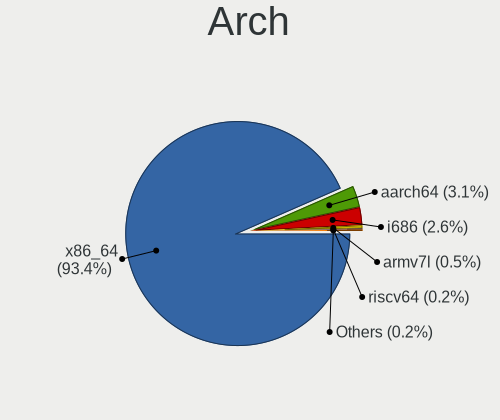
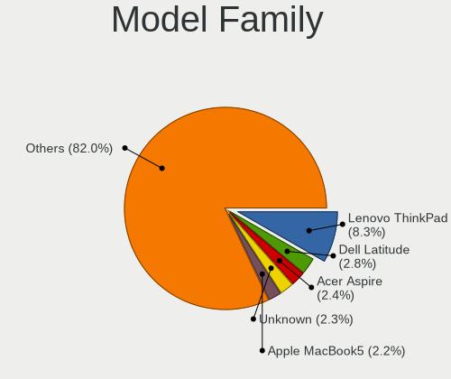
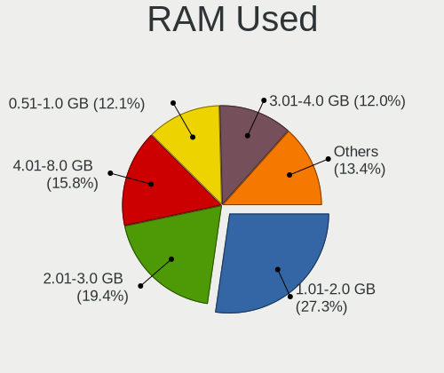
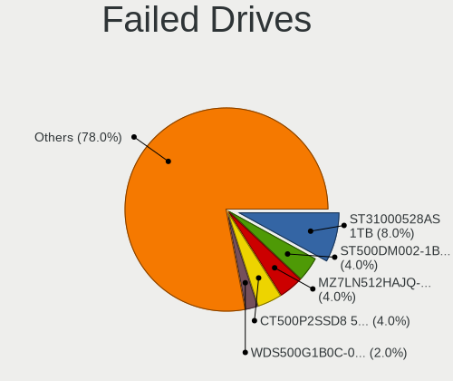
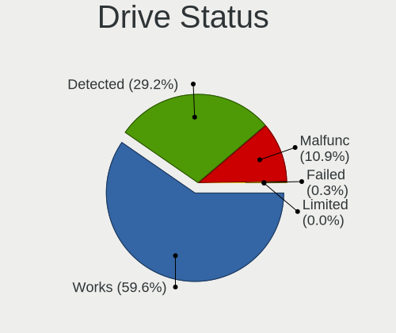
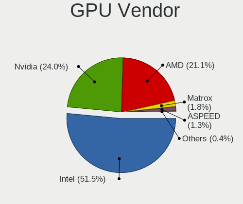
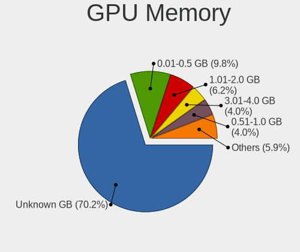
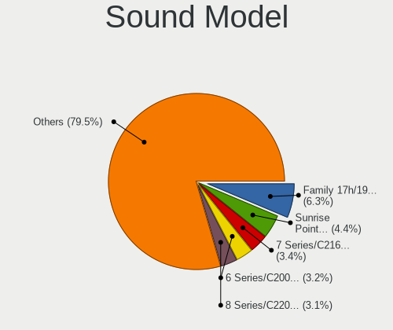
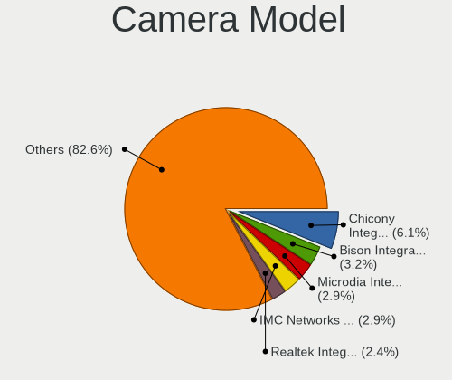

Debian - Tested Hardware & Statistics
-------------------------------------

A project to collect tested hardware configurations for Debian.

Anyone can contribute to this report by the [hw-probe](https://github.com/linuxhw/hw-probe) tool:

    sudo -E hw-probe -all -upload

Please contribute! Especially if your hardware is rare.

This is a report for all computer types. See also reports for [desktops](/Dist/Debian/Desktop/README.md) and [notebooks](/Dist/Debian/Notebook/README.md).

Contents
--------

* [ Test Cases ](#test-cases)

* [ System ](#system)
  - [ OS                       ](#os)
  - [ OS Family                ](#os-family)
  - [ Kernel                   ](#kernel)
  - [ Kernel Family            ](#kernel-family)
  - [ Kernel Major Ver.        ](#kernel-major-ver)
  - [ Arch                     ](#arch)
  - [ DE                       ](#de)
  - [ Display Server           ](#display-server)
  - [ Display Manager          ](#display-manager)
  - [ OS Lang                  ](#os-lang)
  - [ Boot Mode                ](#boot-mode)
  - [ Filesystem               ](#filesystem)
  - [ Part. scheme             ](#part-scheme)
  - [ Dual Boot with Linux/BSD ](#dual-boot-with-linuxbsd)
  - [ Dual Boot (Win)          ](#dual-boot-win)

* [ Board ](#board)
  - [ Vendor                   ](#vendor)
  - [ Model                    ](#model)
  - [ Model Family             ](#model-family)
  - [ MFG Year                 ](#mfg-year)
  - [ Form Factor              ](#form-factor)
  - [ Secure Boot              ](#secure-boot)
  - [ Coreboot                 ](#coreboot)
  - [ RAM Size                 ](#ram-size)
  - [ RAM Used                 ](#ram-used)
  - [ Total Drives             ](#total-drives)
  - [ Has CD-ROM               ](#has-cd-rom)
  - [ Has Ethernet             ](#has-ethernet)
  - [ Has WiFi                 ](#has-wifi)
  - [ Has Bluetooth            ](#has-bluetooth)

* [ Location ](#location)
  - [ Country                  ](#country)
  - [ City                     ](#city)

* [ Drives ](#drives)
  - [ Drive Vendor             ](#drive-vendor)
  - [ Drive Model              ](#drive-model)
  - [ HDD Vendor               ](#hdd-vendor)
  - [ SSD Vendor               ](#ssd-vendor)
  - [ Drive Kind               ](#drive-kind)
  - [ Drive Connector          ](#drive-connector)
  - [ Drive Size               ](#drive-size)
  - [ Space Total              ](#space-total)
  - [ Space Used               ](#space-used)
  - [ Malfunc. Drives          ](#malfunc-drives)
  - [ Malfunc. Drive Vendor    ](#malfunc-drive-vendor)
  - [ Malfunc. HDD Vendor      ](#malfunc-hdd-vendor)
  - [ Malfunc. Drive Kind      ](#malfunc-drive-kind)
  - [ Failed Drives            ](#failed-drives)
  - [ Failed Drive Vendor      ](#failed-drive-vendor)
  - [ Drive Status             ](#drive-status)

* [ Storage controller ](#storage-controller)
  - [ Storage Vendor           ](#storage-vendor)
  - [ Storage Model            ](#storage-model)
  - [ Storage Kind             ](#storage-kind)

* [ Processor ](#processor)
  - [ CPU Vendor               ](#cpu-vendor)
  - [ CPU Model                ](#cpu-model)
  - [ CPU Model Family         ](#cpu-model-family)
  - [ CPU Cores                ](#cpu-cores)
  - [ CPU Sockets              ](#cpu-sockets)
  - [ CPU Threads              ](#cpu-threads)
  - [ CPU Op-Modes             ](#cpu-op-modes)
  - [ CPU Microcode            ](#cpu-microcode)
  - [ CPU Microarch            ](#cpu-microarch)

* [ Graphics ](#graphics)
  - [ GPU Vendor               ](#gpu-vendor)
  - [ GPU Model                ](#gpu-model)
  - [ GPU Combo                ](#gpu-combo)
  - [ GPU Driver               ](#gpu-driver)
  - [ GPU Memory               ](#gpu-memory)

* [ Monitor ](#monitor)
  - [ Monitor Vendor           ](#monitor-vendor)
  - [ Monitor Model            ](#monitor-model)
  - [ Monitor Resolution       ](#monitor-resolution)
  - [ Monitor Diagonal         ](#monitor-diagonal)
  - [ Monitor Width            ](#monitor-width)
  - [ Aspect Ratio             ](#aspect-ratio)
  - [ Monitor Area             ](#monitor-area)
  - [ Pixel Density            ](#pixel-density)
  - [ Multiple Monitors        ](#multiple-monitors)

* [ Network ](#network)
  - [ Net Controller Vendor    ](#net-controller-vendor)
  - [ Net Controller Model     ](#net-controller-model)
  - [ Wireless Vendor          ](#wireless-vendor)
  - [ Wireless Model           ](#wireless-model)
  - [ Ethernet Vendor          ](#ethernet-vendor)
  - [ Ethernet Model           ](#ethernet-model)
  - [ Net Controller Kind      ](#net-controller-kind)
  - [ Used Controller          ](#used-controller)
  - [ NICs                     ](#nics)
  - [ IPv6                     ](#ipv6)

* [ Bluetooth ](#bluetooth)
  - [ Bluetooth Vendor         ](#bluetooth-vendor)
  - [ Bluetooth Model          ](#bluetooth-model)

* [ Sound ](#sound)
  - [ Sound Vendor             ](#sound-vendor)
  - [ Sound Model              ](#sound-model)

* [ Memory ](#memory)
  - [ Memory Vendor            ](#memory-vendor)
  - [ Memory Model             ](#memory-model)
  - [ Memory Kind              ](#memory-kind)
  - [ Memory Form Factor       ](#memory-form-factor)
  - [ Memory Size              ](#memory-size)
  - [ Memory Speed             ](#memory-speed)

* [ Printers & scanners ](#printers--scanners)
  - [ Printer Vendor           ](#printer-vendor)
  - [ Printer Model            ](#printer-model)
  - [ Scanner Vendor           ](#scanner-vendor)
  - [ Scanner Model            ](#scanner-model)

* [ Camera ](#camera)
  - [ Camera Vendor            ](#camera-vendor)
  - [ Camera Model             ](#camera-model)

* [ Security ](#security)
  - [ Fingerprint Vendor       ](#fingerprint-vendor)
  - [ Fingerprint Model        ](#fingerprint-model)
  - [ Chipcard Vendor          ](#chipcard-vendor)
  - [ Chipcard Model           ](#chipcard-model)

* [ Unsupported ](#unsupported)
  - [ Unsupported Devices      ](#unsupported-devices)
  - [ Unsupported Device Types ](#unsupported-device-types)

Test Cases
----------

Total: 13571

| Vendor        | Model                       | Form-Factor | Probe                                                      | Date         |
|---------------|-----------------------------|-------------|------------------------------------------------------------|--------------|
| Dell          | 0PV3YR A05                  | Server      | [f5f4abd1f3](https://linux-hardware.org/?probe=f5f4abd1f3) | May 01, 2023 |
| HP            | 2B38                        | Desktop     | [bf99202e8b](https://linux-hardware.org/?probe=bf99202e8b) | May 01, 2023 |
| Dell          | 0NC2VH A01                  | Desktop     | [7fb1708706](https://linux-hardware.org/?probe=7fb1708706) | May 01, 2023 |
| HP            | 2B38                        | Desktop     | [6942eb2544](https://linux-hardware.org/?probe=6942eb2544) | May 01, 2023 |
| Lenovo        | Slim 9 14IAP7 82T1          | Notebook    | [fe1b421c9d](https://linux-hardware.org/?probe=fe1b421c9d) | May 01, 2023 |
| HP            | Pavilion x360 Convertibl... | Convertible | [1b2adc0ae5](https://linux-hardware.org/?probe=1b2adc0ae5) | May 01, 2023 |
| ASUSTek       | ProArt X670E-CREATOR WIF... | Desktop     | [d85b7a2592](https://linux-hardware.org/?probe=d85b7a2592) | Apr 30, 2023 |
| Acer          | Aspire E1-571               | Notebook    | [e03d5ff056](https://linux-hardware.org/?probe=e03d5ff056) | Apr 30, 2023 |
| HP            | ProBook 655 G3              | Notebook    | [07e2cc77f8](https://linux-hardware.org/?probe=07e2cc77f8) | Apr 30, 2023 |
| HP            | ProBook 655 G3              | Notebook    | [638e747fb1](https://linux-hardware.org/?probe=638e747fb1) | Apr 30, 2023 |
| HP            | Compaq Mini CQ10-500        | Notebook    | [9a1134210f](https://linux-hardware.org/?probe=9a1134210f) | Apr 30, 2023 |
| Apple         | Mac-00BE6ED71E35EB86 iMa... | All in one  | [c8c9c1e591](https://linux-hardware.org/?probe=c8c9c1e591) | Apr 30, 2023 |
| Positivo      | Q464C                       | Notebook    | [8e41593bd3](https://linux-hardware.org/?probe=8e41593bd3) | Apr 30, 2023 |
| HP            | 255 G8 Notebook PC          | Notebook    | [7262375294](https://linux-hardware.org/?probe=7262375294) | Apr 30, 2023 |
| Gigabyte      | GA-78LMT-USB3 SEx           | Desktop     | [ccb46c2a2b](https://linux-hardware.org/?probe=ccb46c2a2b) | Apr 30, 2023 |
| Dell          | Inspiron MXC061             | Notebook    | [2d1ab773dd](https://linux-hardware.org/?probe=2d1ab773dd) | Apr 30, 2023 |
| Dell          | 0PV3YR A05                  | Server      | [7804689b38](https://linux-hardware.org/?probe=7804689b38) | Apr 30, 2023 |
| Lenovo        | ThinkPad T14 Gen 2i 20W1... | Notebook    | [0a9a85f5f0](https://linux-hardware.org/?probe=0a9a85f5f0) | Apr 29, 2023 |
| Lenovo        | ThinkPad T14 Gen 2i 20W1... | Notebook    | [83b10185e8](https://linux-hardware.org/?probe=83b10185e8) | Apr 29, 2023 |
| Acidanther... | Mac-CFF7D910A743CAAF iMa... | All in one  | [88d774df0d](https://linux-hardware.org/?probe=88d774df0d) | Apr 29, 2023 |
| COPELION I... | QX-250 Series               | Notebook    | [409821566f](https://linux-hardware.org/?probe=409821566f) | Apr 29, 2023 |
| Hardkernel    | ODROID-H3                   | Desktop     | [139d61e128](https://linux-hardware.org/?probe=139d61e128) | Apr 29, 2023 |
| HP            | 3397                        | Desktop     | [8b84766d3d](https://linux-hardware.org/?probe=8b84766d3d) | Apr 29, 2023 |
| Microsoft     | Surface Laptop Go           | Tablet      | [4cc7c839fb](https://linux-hardware.org/?probe=4cc7c839fb) | Apr 29, 2023 |
| Lenovo        | ThinkPad X280 20KESBC402    | Notebook    | [0d5b86146e](https://linux-hardware.org/?probe=0d5b86146e) | Apr 29, 2023 |
| Aquarius      | NS585                       | Notebook    | [b23696ca41](https://linux-hardware.org/?probe=b23696ca41) | Apr 28, 2023 |
| Medion        | MS-7708                     | Desktop     | [af2020cd9c](https://linux-hardware.org/?probe=af2020cd9c) | Apr 28, 2023 |
| Rockchip      | Unknown                     | Soc         | [5236b9452c](https://linux-hardware.org/?probe=5236b9452c) | Apr 28, 2023 |
| Medion        | MS-7708                     | Desktop     | [424c4ca2db](https://linux-hardware.org/?probe=424c4ca2db) | Apr 28, 2023 |
| Intel         | H61 V124                    | Desktop     | [1fa0b34b3c](https://linux-hardware.org/?probe=1fa0b34b3c) | Apr 28, 2023 |
| sunxi         | FriendlyArm NanoPi M1       | Soc         | [dcfa7042da](https://linux-hardware.org/?probe=dcfa7042da) | Apr 28, 2023 |
| Supermicro    | X12SPL-F                    | Server      | [8382988ca9](https://linux-hardware.org/?probe=8382988ca9) | Apr 28, 2023 |
| Unknown       | iKoolCore R1 iKoolCore R... | Desktop     | [429d6f994a](https://linux-hardware.org/?probe=429d6f994a) | Apr 28, 2023 |
| ASUSTek       | B150-PRO D3                 | Desktop     | [35fa6f9a33](https://linux-hardware.org/?probe=35fa6f9a33) | Apr 28, 2023 |
| ASRock        | X470 Master SLI             | Desktop     | [cded55a936](https://linux-hardware.org/?probe=cded55a936) | Apr 28, 2023 |
| Dell          | Latitude E7450              | Notebook    | [6afa2ff009](https://linux-hardware.org/?probe=6afa2ff009) | Apr 28, 2023 |
| Dell          | Latitude D630               | Notebook    | [a3c3e09675](https://linux-hardware.org/?probe=a3c3e09675) | Apr 28, 2023 |
| Unknown       | Unknown                     | Soc         | [e5ff381254](https://linux-hardware.org/?probe=e5ff381254) | Apr 28, 2023 |
| BESSTAR Te... | HM80                        | Desktop     | [476c573547](https://linux-hardware.org/?probe=476c573547) | Apr 28, 2023 |
| Lenovo        | ThinkPad L13 Yoga Gen 2 ... | Convertible | [bab222234a](https://linux-hardware.org/?probe=bab222234a) | Apr 27, 2023 |
| Unknown       | Unknown                     | Desktop     | [5f5809c40f](https://linux-hardware.org/?probe=5f5809c40f) | Apr 27, 2023 |
| Shenzhen M... | F6BFC                       | Desktop     | [e2f7b853b1](https://linux-hardware.org/?probe=e2f7b853b1) | Apr 27, 2023 |
| ASUSTek       | ASUS TUF Gaming A15 FA50... | Notebook    | [2474e8e580](https://linux-hardware.org/?probe=2474e8e580) | Apr 27, 2023 |
| Unknown       | Unknown                     | Desktop     | [e9f8ff6596](https://linux-hardware.org/?probe=e9f8ff6596) | Apr 27, 2023 |
| HP            | 17E2                        | Mini pc     | [02ee837763](https://linux-hardware.org/?probe=02ee837763) | Apr 27, 2023 |
| ASUSTek       | Z97M-PLUS/BR                | Desktop     | [3255acf414](https://linux-hardware.org/?probe=3255acf414) | Apr 27, 2023 |
| Lenovo        | ThinkPad E14 Gen 2 20TA0... | Notebook    | [69d1f17b35](https://linux-hardware.org/?probe=69d1f17b35) | Apr 27, 2023 |
| ASRock        | A320M-HDV R3.0              | Desktop     | [d395c6168d](https://linux-hardware.org/?probe=d395c6168d) | Apr 27, 2023 |
| ARDOR GAMI... | PD5x_7xPNP_PNR_PNN_PNT      | Notebook    | [e61f528ba5](https://linux-hardware.org/?probe=e61f528ba5) | Apr 27, 2023 |
| AMD           | Volcano                     | Server      | [b7e67f8130](https://linux-hardware.org/?probe=b7e67f8130) | Apr 27, 2023 |
| ASUSTek       | Zenbook UX535QE_UM535QE     | Notebook    | [2093399e21](https://linux-hardware.org/?probe=2093399e21) | Apr 27, 2023 |
| Dell          | 0PV3YR A05                  | Server      | [475e46f565](https://linux-hardware.org/?probe=475e46f565) | Apr 27, 2023 |
| Lenovo        | IdeaPad 110S-11IBR 80WG     | Notebook    | [73141c5006](https://linux-hardware.org/?probe=73141c5006) | Apr 27, 2023 |
| Lenovo        | IdeaPad 110S-11IBR 80WG     | Notebook    | [0cb164ac2f](https://linux-hardware.org/?probe=0cb164ac2f) | Apr 27, 2023 |
| HP            | Laptop 15s-eq2xxx           | Notebook    | [198fa6162e](https://linux-hardware.org/?probe=198fa6162e) | Apr 27, 2023 |
| Gigabyte      | B450 I AORUS PRO WIFI-CF    | Desktop     | [2dcf65cf8e](https://linux-hardware.org/?probe=2dcf65cf8e) | Apr 26, 2023 |
| IGEL Techn... | M340C                       | Notebook    | [40970f0528](https://linux-hardware.org/?probe=40970f0528) | Apr 26, 2023 |
| MSI           | MS-B0A21                    | Desktop     | [646d14f7b0](https://linux-hardware.org/?probe=646d14f7b0) | Apr 26, 2023 |
| ARDOR GAMI... | PD5x_7xPNP_PNR_PNN_PNT      | Notebook    | [cec3a72c8a](https://linux-hardware.org/?probe=cec3a72c8a) | Apr 26, 2023 |
| Dell          | Latitude D630               | Notebook    | [850df6e76f](https://linux-hardware.org/?probe=850df6e76f) | Apr 26, 2023 |
| HP            | 8309                        | Desktop     | [cde28bd710](https://linux-hardware.org/?probe=cde28bd710) | Apr 26, 2023 |
| Google        | Terra                       | Notebook    | [b22deb9f09](https://linux-hardware.org/?probe=b22deb9f09) | Apr 26, 2023 |
| Dell          | Latitude E6440              | Notebook    | [f5cdf825fa](https://linux-hardware.org/?probe=f5cdf825fa) | Apr 26, 2023 |
| ASUSTek       | VivoBook_ASUSLaptop M640... | Notebook    | [0234325d36](https://linux-hardware.org/?probe=0234325d36) | Apr 26, 2023 |
| HP            | ENVY 15                     | Notebook    | [1f50420c44](https://linux-hardware.org/?probe=1f50420c44) | Apr 26, 2023 |
| HP            | 250 G6 Notebook PC          | Notebook    | [90e4883dca](https://linux-hardware.org/?probe=90e4883dca) | Apr 26, 2023 |
| IGEL Techn... | M340C                       | Notebook    | [c3c972facf](https://linux-hardware.org/?probe=c3c972facf) | Apr 26, 2023 |
| IGEL Techn... | M340C                       | Notebook    | [f993513cd3](https://linux-hardware.org/?probe=f993513cd3) | Apr 26, 2023 |
| HP            | Pavilion Gaming Laptop 1... | Notebook    | [d8088982c3](https://linux-hardware.org/?probe=d8088982c3) | Apr 26, 2023 |
| HP            | Pavilion Gaming Laptop 1... | Notebook    | [4cffa55fb1](https://linux-hardware.org/?probe=4cffa55fb1) | Apr 26, 2023 |
| HP            | Laptop 15-db1xxx            | Notebook    | [e6380a2186](https://linux-hardware.org/?probe=e6380a2186) | Apr 26, 2023 |
| HP            | Laptop 15                   | Notebook    | [34a2ebf6a1](https://linux-hardware.org/?probe=34a2ebf6a1) | Apr 26, 2023 |
| HP            | Laptop 15-db1xxx            | Notebook    | [872138980a](https://linux-hardware.org/?probe=872138980a) | Apr 26, 2023 |
| HP            | Pavilion Gaming Laptop 1... | Notebook    | [2122bd37a5](https://linux-hardware.org/?probe=2122bd37a5) | Apr 26, 2023 |
| HP            | Pavilion Gaming Laptop 1... | Notebook    | [af7b14d259](https://linux-hardware.org/?probe=af7b14d259) | Apr 26, 2023 |
| HP            | Pavilion Gaming Laptop 1... | Notebook    | [7fbd802154](https://linux-hardware.org/?probe=7fbd802154) | Apr 26, 2023 |
| HP            | Pavilion Gaming Laptop 1... | Notebook    | [ffe6065419](https://linux-hardware.org/?probe=ffe6065419) | Apr 26, 2023 |
| HP            | Pavilion Gaming Laptop 1... | Notebook    | [94ddc76aae](https://linux-hardware.org/?probe=94ddc76aae) | Apr 26, 2023 |
| Dell          | 0PV3YR A05                  | Server      | [23571a99b1](https://linux-hardware.org/?probe=23571a99b1) | Apr 26, 2023 |
| ASUSTek       | PRIME B660-PLUS D4          | Desktop     | [a343d9158a](https://linux-hardware.org/?probe=a343d9158a) | Apr 26, 2023 |
| HP            | 1632                        | Desktop     | [ace6df6aee](https://linux-hardware.org/?probe=ace6df6aee) | Apr 25, 2023 |
| Dell          | Cherry Trail CR A00         | Mini pc     | [f1fb89d0f7](https://linux-hardware.org/?probe=f1fb89d0f7) | Apr 25, 2023 |
| ASUSTek       | Z170-A                      | Desktop     | [fa21ed6900](https://linux-hardware.org/?probe=fa21ed6900) | Apr 25, 2023 |
| Lenovo        | ThinkPad T530 23594ZC       | Notebook    | [7aec73dfa1](https://linux-hardware.org/?probe=7aec73dfa1) | Apr 25, 2023 |
| Lenovo        | ThinkPad X200 7459KM3       | Notebook    | [cbea785e27](https://linux-hardware.org/?probe=cbea785e27) | Apr 25, 2023 |
| Dell          | 0KYJ8C A00                  | Desktop     | [1e8226d149](https://linux-hardware.org/?probe=1e8226d149) | Apr 25, 2023 |
| Aquarius      | NS585                       | Notebook    | [a0983c89d8](https://linux-hardware.org/?probe=a0983c89d8) | Apr 25, 2023 |
| Aquarius      | NS585                       | Notebook    | [5d9edb6ed4](https://linux-hardware.org/?probe=5d9edb6ed4) | Apr 25, 2023 |
| Aquarius      | NS585                       | Notebook    | [972d7f6e4a](https://linux-hardware.org/?probe=972d7f6e4a) | Apr 25, 2023 |
| Aquarius      | NS585                       | Notebook    | [c89bbd8bc0](https://linux-hardware.org/?probe=c89bbd8bc0) | Apr 25, 2023 |
| Aquarius      | NS585                       | Notebook    | [a6e5a5f3d1](https://linux-hardware.org/?probe=a6e5a5f3d1) | Apr 25, 2023 |
| Aquarius      | NS585                       | Notebook    | [b6dac5b058](https://linux-hardware.org/?probe=b6dac5b058) | Apr 25, 2023 |
| Aquarius      | NS585                       | Notebook    | [1563889dac](https://linux-hardware.org/?probe=1563889dac) | Apr 25, 2023 |
| Aquarius      | NS585                       | Notebook    | [9bdbad2ab7](https://linux-hardware.org/?probe=9bdbad2ab7) | Apr 25, 2023 |
| Aquarius      | NS585                       | Notebook    | [e30d7dde7b](https://linux-hardware.org/?probe=e30d7dde7b) | Apr 25, 2023 |
| Aquarius      | NS585                       | Notebook    | [68527a900f](https://linux-hardware.org/?probe=68527a900f) | Apr 25, 2023 |
| Aquarius      | NS585                       | Notebook    | [ce99b27fb4](https://linux-hardware.org/?probe=ce99b27fb4) | Apr 25, 2023 |
| Aquarius      | NS585                       | Notebook    | [fc377acae2](https://linux-hardware.org/?probe=fc377acae2) | Apr 25, 2023 |
| Aquarius      | NS585                       | Notebook    | [ed32f24d6e](https://linux-hardware.org/?probe=ed32f24d6e) | Apr 25, 2023 |
| Aquarius      | NS585                       | Notebook    | [ea60267a5b](https://linux-hardware.org/?probe=ea60267a5b) | Apr 25, 2023 |
| Aquarius      | NS585                       | Notebook    | [f71897bf76](https://linux-hardware.org/?probe=f71897bf76) | Apr 25, 2023 |
| Aquarius      | NS585                       | Notebook    | [7aa4561ca5](https://linux-hardware.org/?probe=7aa4561ca5) | Apr 25, 2023 |
| Aquarius      | NS585                       | Notebook    | [385ce8cd93](https://linux-hardware.org/?probe=385ce8cd93) | Apr 25, 2023 |
| Aquarius      | NS585                       | Notebook    | [3fc8926a1a](https://linux-hardware.org/?probe=3fc8926a1a) | Apr 25, 2023 |
| Lenovo        | V15 G2 ALC 82KD             | Notebook    | [9e6ce2eb71](https://linux-hardware.org/?probe=9e6ce2eb71) | Apr 25, 2023 |
| Aquarius      | NS585                       | Notebook    | [58306d0266](https://linux-hardware.org/?probe=58306d0266) | Apr 25, 2023 |
| ASRock        | 960GC-GS FX                 | Desktop     | [1cd850e8af](https://linux-hardware.org/?probe=1cd850e8af) | Apr 25, 2023 |
| ASUSTek       | ProArt X670E-CREATOR WIF... | Desktop     | [c5f2fa1c5a](https://linux-hardware.org/?probe=c5f2fa1c5a) | Apr 25, 2023 |
| Acer          | Aspire E5-576G              | Notebook    | [9ca5902786](https://linux-hardware.org/?probe=9ca5902786) | Apr 25, 2023 |
| ASUSTek       | PRIME Z590-P                | Desktop     | [5d03070db6](https://linux-hardware.org/?probe=5d03070db6) | Apr 24, 2023 |
| Dell          | 08HPGT A02                  | Desktop     | [04f68362d5](https://linux-hardware.org/?probe=04f68362d5) | Apr 24, 2023 |
| Lenovo        | ThinkPad P15s Gen 2i 20W... | Notebook    | [aa1b58a2a2](https://linux-hardware.org/?probe=aa1b58a2a2) | Apr 24, 2023 |
| Dell          | 08HPGT A02                  | Desktop     | [d352ecf4ed](https://linux-hardware.org/?probe=d352ecf4ed) | Apr 24, 2023 |
| HP            | ProBook 4520s               | Notebook    | [b680525b61](https://linux-hardware.org/?probe=b680525b61) | Apr 24, 2023 |
| HP            | 8056                        | Desktop     | [a7686ee1af](https://linux-hardware.org/?probe=a7686ee1af) | Apr 24, 2023 |
| HP            | ProBook 4520s               | Notebook    | [e4ce7aed55](https://linux-hardware.org/?probe=e4ce7aed55) | Apr 24, 2023 |
| AZW           | MINI S                      | Desktop     | [d71153ae6e](https://linux-hardware.org/?probe=d71153ae6e) | Apr 24, 2023 |
| Apple         | MacBookPro5,5               | Notebook    | [de825a326c](https://linux-hardware.org/?probe=de825a326c) | Apr 24, 2023 |
| Intel         | SE7320EP2 D11950-402        | Desktop     | [ad1a126878](https://linux-hardware.org/?probe=ad1a126878) | Apr 24, 2023 |
| MSI           | Z87-G43                     | Desktop     | [4d908cb615](https://linux-hardware.org/?probe=4d908cb615) | Apr 24, 2023 |
| Dell          | 0N0992 A01                  | Desktop     | [a8e8000610](https://linux-hardware.org/?probe=a8e8000610) | Apr 24, 2023 |
| Dell          | Inspiron 5537               | Notebook    | [971055139b](https://linux-hardware.org/?probe=971055139b) | Apr 24, 2023 |
| Dell          | 03FV9K A00                  | Server      | [4d9f06ca7b](https://linux-hardware.org/?probe=4d9f06ca7b) | Apr 24, 2023 |
| Lenovo        | ThinkBook 14-IML 20RV       | Notebook    | [32546113c8](https://linux-hardware.org/?probe=32546113c8) | Apr 24, 2023 |
| Hampoo        | Cherry Trail CR V200        | Notebook    | [f3d90b0d4a](https://linux-hardware.org/?probe=f3d90b0d4a) | Apr 23, 2023 |
| Raspberry ... | Raspberry Pi                | Soc         | [5f760ed90e](https://linux-hardware.org/?probe=5f760ed90e) | Apr 23, 2023 |
| Biostar       | B350ET2                     | Desktop     | [47289e48eb](https://linux-hardware.org/?probe=47289e48eb) | Apr 23, 2023 |
| ASRock        | B560 Pro4                   | Desktop     | [3a9f7b19fa](https://linux-hardware.org/?probe=3a9f7b19fa) | Apr 23, 2023 |
| MSI           | Z390-A PRO                  | Desktop     | [74cf7ef6e5](https://linux-hardware.org/?probe=74cf7ef6e5) | Apr 23, 2023 |
| HP            | 15                          | Notebook    | [fd68fb06af](https://linux-hardware.org/?probe=fd68fb06af) | Apr 23, 2023 |
| Fujitsu       | D3313-G1 S26361-D3313-G1    | Desktop     | [78c1951456](https://linux-hardware.org/?probe=78c1951456) | Apr 23, 2023 |
| ASRock        | B560 Pro4                   | Desktop     | [965aa93228](https://linux-hardware.org/?probe=965aa93228) | Apr 23, 2023 |
| Unknown       | Unknown                     | Desktop     | [0605faa66d](https://linux-hardware.org/?probe=0605faa66d) | Apr 23, 2023 |
| Microsoft     | Surface Pro 3               | Tablet      | [67dc214198](https://linux-hardware.org/?probe=67dc214198) | Apr 23, 2023 |
| AZW           | U59                         | Desktop     | [8921a6910d](https://linux-hardware.org/?probe=8921a6910d) | Apr 23, 2023 |
| ASRockRack    | ROMED8-2T                   | Server      | [c88cba109a](https://linux-hardware.org/?probe=c88cba109a) | Apr 23, 2023 |
| Toshiba       | PORTEGE Z20t-C              | Notebook    | [45d7bd0907](https://linux-hardware.org/?probe=45d7bd0907) | Apr 23, 2023 |
| Shuttle       | DS20U                       | Desktop     | [2e8e79b5ff](https://linux-hardware.org/?probe=2e8e79b5ff) | Apr 23, 2023 |
| Toshiba       | PORTEGE Z20t-C              | Notebook    | [c7367bfdff](https://linux-hardware.org/?probe=c7367bfdff) | Apr 23, 2023 |
| HP            | 845A                        | Desktop     | [41a0cad635](https://linux-hardware.org/?probe=41a0cad635) | Apr 23, 2023 |
| Gigabyte      | B550 VISION D-P             | Desktop     | [ccb49b32a0](https://linux-hardware.org/?probe=ccb49b32a0) | Apr 23, 2023 |
| Gigabyte      | B550 VISION D-P             | Desktop     | [2651f47f8c](https://linux-hardware.org/?probe=2651f47f8c) | Apr 23, 2023 |
| sunxi         | FriendlyArm NanoPi M1       | Soc         | [90f041e2a1](https://linux-hardware.org/?probe=90f041e2a1) | Apr 23, 2023 |
| sunxi         | FriendlyArm NanoPi M1       | Soc         | [6d06ef4fa1](https://linux-hardware.org/?probe=6d06ef4fa1) | Apr 23, 2023 |
| Acer          | Aspire E1-571G              | Notebook    | [0e2671ee2e](https://linux-hardware.org/?probe=0e2671ee2e) | Apr 23, 2023 |
| MSI           | X370 GAMING PLUS            | Desktop     | [5d61deb4d4](https://linux-hardware.org/?probe=5d61deb4d4) | Apr 23, 2023 |
| Toshiba       | Satellite C70D-A            | Notebook    | [adee59c351](https://linux-hardware.org/?probe=adee59c351) | Apr 23, 2023 |
| Toshiba       | Satellite C70D-A            | Notebook    | [c5c43186bc](https://linux-hardware.org/?probe=c5c43186bc) | Apr 23, 2023 |
| Dell          | G15 5520                    | Notebook    | [238c8f53aa](https://linux-hardware.org/?probe=238c8f53aa) | Apr 22, 2023 |
| sunxi         | FriendlyArm NanoPi M1       | Soc         | [3e4c8bce3b](https://linux-hardware.org/?probe=3e4c8bce3b) | Apr 22, 2023 |
| Gigabyte      | X570S AORUS ELITE AX        | Desktop     | [9c3e15de68](https://linux-hardware.org/?probe=9c3e15de68) | Apr 22, 2023 |
| Dell          | Inspiron 7591 2n1           | Convertible | [9896e8b804](https://linux-hardware.org/?probe=9896e8b804) | Apr 22, 2023 |
| Dell          | Latitude E6330              | Notebook    | [b532a9756c](https://linux-hardware.org/?probe=b532a9756c) | Apr 22, 2023 |
| Dell          | G15 5520                    | Notebook    | [07751c950a](https://linux-hardware.org/?probe=07751c950a) | Apr 22, 2023 |
| ASUSTek       | P5N-D                       | Desktop     | [c1af2b9a2c](https://linux-hardware.org/?probe=c1af2b9a2c) | Apr 22, 2023 |
| ASUSTek       | ROG STRIX B660-I GAMING ... | Desktop     | [03a331aa44](https://linux-hardware.org/?probe=03a331aa44) | Apr 22, 2023 |
| ASUSTek       | PRIME B650M-A AX            | Desktop     | [0a90dc180c](https://linux-hardware.org/?probe=0a90dc180c) | Apr 22, 2023 |
| MW            | GMLK-2_5G4L                 | Desktop     | [b5ffb4ee22](https://linux-hardware.org/?probe=b5ffb4ee22) | Apr 22, 2023 |
| HP            | Laptop 15s-du3xxx           | Notebook    | [45af810de1](https://linux-hardware.org/?probe=45af810de1) | Apr 21, 2023 |
| Intel         | NUC11TNBi3 M11908-403       | Mini pc     | [868456ca5d](https://linux-hardware.org/?probe=868456ca5d) | Apr 21, 2023 |
| ASUSTek       | VivoBook_ASUSLaptop X509... | Notebook    | [5f61e3a174](https://linux-hardware.org/?probe=5f61e3a174) | Apr 21, 2023 |
| Gigabyte      | B550M DS3H                  | Desktop     | [e98b4fdd23](https://linux-hardware.org/?probe=e98b4fdd23) | Apr 21, 2023 |
| Acer          | Nitro AN515-45              | Notebook    | [91f538e2ab](https://linux-hardware.org/?probe=91f538e2ab) | Apr 21, 2023 |
| Lenovo        | IdeaPad S510p 20298         | Notebook    | [8a1e6b7f32](https://linux-hardware.org/?probe=8a1e6b7f32) | Apr 21, 2023 |
| Intel         | NUC8BEB J72692-306          | Mini pc     | [a92b4a305f](https://linux-hardware.org/?probe=a92b4a305f) | Apr 21, 2023 |
| HP            | ZBook Power 15.6 inch G9... | Notebook    | [036616c992](https://linux-hardware.org/?probe=036616c992) | Apr 21, 2023 |
| HP            | OMEN Laptop 15-en1xxx       | Notebook    | [3caa3d5076](https://linux-hardware.org/?probe=3caa3d5076) | Apr 21, 2023 |
| HP            | ZBook Power 15.6 inch G9... | Notebook    | [8c8d2eb3b5](https://linux-hardware.org/?probe=8c8d2eb3b5) | Apr 21, 2023 |
| HP            | ZBook Power 15.6 inch G8... | Notebook    | [cb40e046d8](https://linux-hardware.org/?probe=cb40e046d8) | Apr 21, 2023 |
| Dell          | Precision 3550              | Notebook    | [7434822402](https://linux-hardware.org/?probe=7434822402) | Apr 21, 2023 |
| ASUSTek       | B85M-G                      | Desktop     | [4392c46287](https://linux-hardware.org/?probe=4392c46287) | Apr 20, 2023 |
| Gigabyte      | Z77-DS3H                    | Desktop     | [cde1ecf1c6](https://linux-hardware.org/?probe=cde1ecf1c6) | Apr 20, 2023 |
| Toshiba       | Satellite X200              | Notebook    | [15035835d0](https://linux-hardware.org/?probe=15035835d0) | Apr 20, 2023 |
| Toshiba       | Satellite Pro NB10-A-125    | Notebook    | [3a77f344af](https://linux-hardware.org/?probe=3a77f344af) | Apr 20, 2023 |
| Shuttle       | FS81                        | Desktop     | [051b7f4753](https://linux-hardware.org/?probe=051b7f4753) | Apr 20, 2023 |
| ASUSTek       | X550CA                      | Notebook    | [cb5f73ff63](https://linux-hardware.org/?probe=cb5f73ff63) | Apr 20, 2023 |
| HP            | Notebook                    | Notebook    | [7174065ed3](https://linux-hardware.org/?probe=7174065ed3) | Apr 20, 2023 |
| Aquarius      | NS585                       | Notebook    | [753222f54f](https://linux-hardware.org/?probe=753222f54f) | Apr 20, 2023 |
| Aquarius      | NS585                       | Notebook    | [be0bc2be01](https://linux-hardware.org/?probe=be0bc2be01) | Apr 20, 2023 |
| Acer          | Aspire E3-111               | Notebook    | [9af253f4e0](https://linux-hardware.org/?probe=9af253f4e0) | Apr 20, 2023 |
| HP            | EliteBook 830 G5            | Notebook    | [6090be709d](https://linux-hardware.org/?probe=6090be709d) | Apr 20, 2023 |
| HP            | ProLiant ML150 G6           | Desktop     | [76dc3db16a](https://linux-hardware.org/?probe=76dc3db16a) | Apr 20, 2023 |
| Aquarius      | NS585                       | Notebook    | [f7f0464c39](https://linux-hardware.org/?probe=f7f0464c39) | Apr 20, 2023 |
| Aquarius      | NS585                       | Notebook    | [8393642230](https://linux-hardware.org/?probe=8393642230) | Apr 20, 2023 |
| Aquarius      | NS585                       | Notebook    | [a5b9a09e63](https://linux-hardware.org/?probe=a5b9a09e63) | Apr 20, 2023 |
| ASRock        | B550 Pro4                   | Desktop     | [2d4578e52a](https://linux-hardware.org/?probe=2d4578e52a) | Apr 20, 2023 |
| Unknown       | Unknown                     | Soc         | [909f002719](https://linux-hardware.org/?probe=909f002719) | Apr 20, 2023 |
| Medion        | P17605                      | Notebook    | [b68359f3d1](https://linux-hardware.org/?probe=b68359f3d1) | Apr 20, 2023 |
| HP            | Laptop 15-db0xxx            | Notebook    | [9ab965fcb8](https://linux-hardware.org/?probe=9ab965fcb8) | Apr 19, 2023 |
| ASUSTek       | SABERTOOTH 990FX R2.0       | Desktop     | [4abfcb4ab3](https://linux-hardware.org/?probe=4abfcb4ab3) | Apr 19, 2023 |
| ASUSTek       | SABERTOOTH 990FX R2.0       | Desktop     | [e93357961f](https://linux-hardware.org/?probe=e93357961f) | Apr 19, 2023 |
| Lenovo        | ThinkPad T500 2055WAB       | Notebook    | [4e293261bb](https://linux-hardware.org/?probe=4e293261bb) | Apr 19, 2023 |
| HP            | ProBook 450 G2              | Notebook    | [3b8c115c1a](https://linux-hardware.org/?probe=3b8c115c1a) | Apr 19, 2023 |
| Unknown       | Unknown                     | Soc         | [f07d0fd264](https://linux-hardware.org/?probe=f07d0fd264) | Apr 19, 2023 |
| MSI           | MPG Z590 GAMING EDGE WIF... | Desktop     | [97860c01ca](https://linux-hardware.org/?probe=97860c01ca) | Apr 19, 2023 |
| Toshiba       | Satellite Pro A100          | Notebook    | [4240870be8](https://linux-hardware.org/?probe=4240870be8) | Apr 19, 2023 |
| Lenovo        | Yoga 300-11IBR 80M1         | Notebook    | [f691871296](https://linux-hardware.org/?probe=f691871296) | Apr 19, 2023 |
| Acer          | Swift SF314-57              | Notebook    | [5fc25cc033](https://linux-hardware.org/?probe=5fc25cc033) | Apr 19, 2023 |
| MSI           | B450 GAMING PRO CARBON A... | Desktop     | [e1da556a0b](https://linux-hardware.org/?probe=e1da556a0b) | Apr 19, 2023 |
| ASUSTek       | VivoBook_ASUSLaptop M350... | Notebook    | [d669bcc680](https://linux-hardware.org/?probe=d669bcc680) | Apr 19, 2023 |
| ASRock        | J3455-ITX                   | Desktop     | [895abaa15e](https://linux-hardware.org/?probe=895abaa15e) | Apr 19, 2023 |
| ASRock        | J3455-ITX                   | Desktop     | [f70d811bbd](https://linux-hardware.org/?probe=f70d811bbd) | Apr 19, 2023 |
| MSI           | H110M PRO-VD                | Desktop     | [d04a1b7f36](https://linux-hardware.org/?probe=d04a1b7f36) | Apr 19, 2023 |
| ASUSTek       | P8B75-V                     | Desktop     | [8957c4fdd0](https://linux-hardware.org/?probe=8957c4fdd0) | Apr 19, 2023 |
| Microsoft     | Surface Pro 3               | Tablet      | [8538987e5c](https://linux-hardware.org/?probe=8538987e5c) | Apr 19, 2023 |
| sunxi         | Unknown                     | Soc         | [bb26b3803b](https://linux-hardware.org/?probe=bb26b3803b) | Apr 19, 2023 |
| HP            | 255 G8 Notebook PC          | Notebook    | [699e2a2a80](https://linux-hardware.org/?probe=699e2a2a80) | Apr 18, 2023 |
| Intel         | NUC8BEB J72692-309          | Mini pc     | [213cd129cd](https://linux-hardware.org/?probe=213cd129cd) | Apr 18, 2023 |
| sunxi         | Unknown                     | Soc         | [586cbefdb3](https://linux-hardware.org/?probe=586cbefdb3) | Apr 18, 2023 |
| Tactus        | GeoBook 140                 | Notebook    | [704da241f5](https://linux-hardware.org/?probe=704da241f5) | Apr 18, 2023 |
| Dell          | Vostro 5402                 | Notebook    | [e492c87b46](https://linux-hardware.org/?probe=e492c87b46) | Apr 18, 2023 |
| Dell          | Vostro 5402                 | Notebook    | [b15f47258b](https://linux-hardware.org/?probe=b15f47258b) | Apr 18, 2023 |
| HP            | ENVY x360 Convertible 13... | Convertible | [52272d52d3](https://linux-hardware.org/?probe=52272d52d3) | Apr 18, 2023 |
| PC Special... | NV4XMB,ME,MZ                | Notebook    | [65c0a28c58](https://linux-hardware.org/?probe=65c0a28c58) | Apr 18, 2023 |
| Lenovo        | IdeaPad S510p 20298         | Notebook    | [7f0be1868e](https://linux-hardware.org/?probe=7f0be1868e) | Apr 18, 2023 |
| Dell          | 0D4VY1 A00                  | All in one  | [ddbd926522](https://linux-hardware.org/?probe=ddbd926522) | Apr 18, 2023 |
| Dell          | 0R4CNN A02                  | Server      | [237a3cd682](https://linux-hardware.org/?probe=237a3cd682) | Apr 18, 2023 |
| MSI           | Prestige 15 A12UC           | Notebook    | [0f4c1e1ac3](https://linux-hardware.org/?probe=0f4c1e1ac3) | Apr 18, 2023 |
| Lenovo        | 374B No DPK                 | All in one  | [c87417466c](https://linux-hardware.org/?probe=c87417466c) | Apr 18, 2023 |
| Lenovo        | 374B No DPK                 | All in one  | [4a7133799c](https://linux-hardware.org/?probe=4a7133799c) | Apr 18, 2023 |
| Toshiba       | Satellite Pro C850-1J2      | Notebook    | [e5c63957a2](https://linux-hardware.org/?probe=e5c63957a2) | Apr 18, 2023 |
| ASUSTek       | PRIME A320M-K               | Desktop     | [fd82dc08dc](https://linux-hardware.org/?probe=fd82dc08dc) | Apr 18, 2023 |
| ASUSTek       | G551JW                      | Notebook    | [65f6143e36](https://linux-hardware.org/?probe=65f6143e36) | Apr 18, 2023 |
| Lenovo        | ThinkPad L540 20AUA39QJP    | Notebook    | [180ef53338](https://linux-hardware.org/?probe=180ef53338) | Apr 18, 2023 |
| Lenovo        | ThinkPad L540 20AUA39QJP    | Notebook    | [fd3b20c292](https://linux-hardware.org/?probe=fd3b20c292) | Apr 18, 2023 |
| LG Electro... | 17Z90Q-K.AA78A1             | Notebook    | [594a7fa16b](https://linux-hardware.org/?probe=594a7fa16b) | Apr 18, 2023 |
| Apple         | Mac-35C5E08120C7EEAF Mac... | Mini pc     | [35c6970ec2](https://linux-hardware.org/?probe=35c6970ec2) | Apr 18, 2023 |
| IBM           | ThinkPad R51 1836Q4U        | Notebook    | [ebec8b53eb](https://linux-hardware.org/?probe=ebec8b53eb) | Apr 18, 2023 |
| Supermicro    | X9DRW                       | Server      | [6994c89077](https://linux-hardware.org/?probe=6994c89077) | Apr 17, 2023 |
| MSI           | MAG Z390M MORTAR            | Desktop     | [121237b9c1](https://linux-hardware.org/?probe=121237b9c1) | Apr 17, 2023 |
| MSI           | MPG B650I EDGE WIFI         | Desktop     | [11f85df48e](https://linux-hardware.org/?probe=11f85df48e) | Apr 17, 2023 |
| Lenovo        | ThinkPad E15 Gen 3 20YHS... | Notebook    | [94f62c41e5](https://linux-hardware.org/?probe=94f62c41e5) | Apr 17, 2023 |
| ASRock        | H310M-STX                   | Desktop     | [438e774de5](https://linux-hardware.org/?probe=438e774de5) | Apr 17, 2023 |
| HP            | 0AECh D                     | Desktop     | [f6c67d337e](https://linux-hardware.org/?probe=f6c67d337e) | Apr 17, 2023 |
| LG Electro... | P530-KE6BK                  | Notebook    | [b1f0863c79](https://linux-hardware.org/?probe=b1f0863c79) | Apr 17, 2023 |
| ASUSTek       | K30BF_M32BF                 | Desktop     | [6ea01fad49](https://linux-hardware.org/?probe=6ea01fad49) | Apr 17, 2023 |
| Gigabyte      | GA-78LMT-USB3 SEx           | Desktop     | [7f5feb82ab](https://linux-hardware.org/?probe=7f5feb82ab) | Apr 17, 2023 |
| Gigabyte      | Z690 AORUS ULTRA            | Desktop     | [a4bb147f89](https://linux-hardware.org/?probe=a4bb147f89) | Apr 17, 2023 |
| MSI           | MPG X570 GAMING PLUS        | Desktop     | [c4d3eabb55](https://linux-hardware.org/?probe=c4d3eabb55) | Apr 17, 2023 |
| Lenovo        | Legion Y540-15IRH 81SX      | Notebook    | [d5db24c28d](https://linux-hardware.org/?probe=d5db24c28d) | Apr 17, 2023 |
| Lenovo        | Legion Y540-15IRH 81SX      | Notebook    | [89eb2b2c32](https://linux-hardware.org/?probe=89eb2b2c32) | Apr 17, 2023 |
| ASUSTek       | P8H77-M                     | Desktop     | [6364dbb93a](https://linux-hardware.org/?probe=6364dbb93a) | Apr 16, 2023 |
| Dell          | Latitude 5420               | Notebook    | [4f3345aced](https://linux-hardware.org/?probe=4f3345aced) | Apr 16, 2023 |
| Dell          | 0HHV7N A00                  | Desktop     | [4443ff9154](https://linux-hardware.org/?probe=4443ff9154) | Apr 16, 2023 |
| Apple         | Mac-F4238CC8 PVT            | All in one  | [9c885fa5cf](https://linux-hardware.org/?probe=9c885fa5cf) | Apr 16, 2023 |
| Acer          | Swift SF314-41              | Notebook    | [8c42a0aba8](https://linux-hardware.org/?probe=8c42a0aba8) | Apr 16, 2023 |
| HP            | 18E7                        | Desktop     | [6c2c248eec](https://linux-hardware.org/?probe=6c2c248eec) | Apr 16, 2023 |
| Dell          | XPS 13 9305                 | Notebook    | [838519057f](https://linux-hardware.org/?probe=838519057f) | Apr 16, 2023 |
| Apple         | Mac-F4238CC8 PVT            | All in one  | [8fb4ed64eb](https://linux-hardware.org/?probe=8fb4ed64eb) | Apr 16, 2023 |
| Apple         | Mac-F4238CC8 PVT            | All in one  | [5943787304](https://linux-hardware.org/?probe=5943787304) | Apr 16, 2023 |
| ASUSTek       | PRIME X570-P                | Desktop     | [1f02ee3393](https://linux-hardware.org/?probe=1f02ee3393) | Apr 16, 2023 |
| Lenovo        | ThinkBook 14-IML 20RV       | Notebook    | [d532f6fdbd](https://linux-hardware.org/?probe=d532f6fdbd) | Apr 16, 2023 |
| Lenovo        | ThinkPad T470s W10DG 20J... | Notebook    | [c622c73721](https://linux-hardware.org/?probe=c622c73721) | Apr 16, 2023 |
| Biostar       | A10N-8800E                  | Desktop     | [31557d5e8c](https://linux-hardware.org/?probe=31557d5e8c) | Apr 15, 2023 |
| Unknown       | Unknown                     | Soc         | [018daf402b](https://linux-hardware.org/?probe=018daf402b) | Apr 15, 2023 |
| HP            | Notebook                    | Notebook    | [7614984f1d](https://linux-hardware.org/?probe=7614984f1d) | Apr 15, 2023 |
| ASUSTek       | Z87-A                       | Desktop     | [3e96076874](https://linux-hardware.org/?probe=3e96076874) | Apr 15, 2023 |
| Lenovo        | XiaoXinPro 16ACH 2021 82... | Notebook    | [8ca60a45fe](https://linux-hardware.org/?probe=8ca60a45fe) | Apr 15, 2023 |
| Gigabyte      | GA-78LMT-USB3 SEx           | Desktop     | [7d9278e08a](https://linux-hardware.org/?probe=7d9278e08a) | Apr 15, 2023 |
| ASRock        | H61M-DGS                    | Desktop     | [e0b2a066ee](https://linux-hardware.org/?probe=e0b2a066ee) | Apr 15, 2023 |
| Acer          | WG43M                       | Desktop     | [a3a49836f9](https://linux-hardware.org/?probe=a3a49836f9) | Apr 15, 2023 |
| Raspberry ... | Raspberry Pi 4 Model B R... | Soc         | [be369fe18a](https://linux-hardware.org/?probe=be369fe18a) | Apr 15, 2023 |
| HP            | EliteBook 850 G4            | Notebook    | [984cf8fd47](https://linux-hardware.org/?probe=984cf8fd47) | Apr 14, 2023 |
| Raspberry ... | Raspberry Pi Zero 2 W Re... | Soc         | [cb1763401c](https://linux-hardware.org/?probe=cb1763401c) | Apr 14, 2023 |
| Medion        | TJ4125                      | Desktop     | [887d24e023](https://linux-hardware.org/?probe=887d24e023) | Apr 14, 2023 |
| Lenovo        | 7Z73CTO1WW 05               | Server      | [29f89998ee](https://linux-hardware.org/?probe=29f89998ee) | Apr 14, 2023 |
| Acer          | Aspire E5-575G              | Notebook    | [39afaea9e3](https://linux-hardware.org/?probe=39afaea9e3) | Apr 14, 2023 |
| Intel         | Alder Lake-H PCH E1.0G      | Desktop     | [0ec41c7bd8](https://linux-hardware.org/?probe=0ec41c7bd8) | Apr 14, 2023 |
| HP            | Laptop 17-cp0xxx            | Notebook    | [6fdb6931f0](https://linux-hardware.org/?probe=6fdb6931f0) | Apr 14, 2023 |
| ASUSTek       | ROG STRIX B550-F GAMING     | Desktop     | [d7768947bc](https://linux-hardware.org/?probe=d7768947bc) | Apr 14, 2023 |
| ASUSTek       | P11C-X Series               | Desktop     | [2ab6f2745c](https://linux-hardware.org/?probe=2ab6f2745c) | Apr 14, 2023 |
| ASUSTek       | P11C-X Series               | Desktop     | [55f8d9f172](https://linux-hardware.org/?probe=55f8d9f172) | Apr 14, 2023 |
| HP            | 255 G8 Notebook PC          | Notebook    | [58ec498e8f](https://linux-hardware.org/?probe=58ec498e8f) | Apr 14, 2023 |
| Acer          | Extensa 5635Z               | Notebook    | [b3c99bf352](https://linux-hardware.org/?probe=b3c99bf352) | Apr 14, 2023 |
| Notebook      | N7x0WU                      | Notebook    | [5d37070bf0](https://linux-hardware.org/?probe=5d37070bf0) | Apr 14, 2023 |
| ASUSTek       | VivoBook_ASUSLaptop M160... | Notebook    | [6af1f492c4](https://linux-hardware.org/?probe=6af1f492c4) | Apr 14, 2023 |
| Unknown       | Unknown                     | Desktop     | [6925c48705](https://linux-hardware.org/?probe=6925c48705) | Apr 14, 2023 |
| Gigabyte      | B550 AORUS PRO V2           | Desktop     | [f4cbe67033](https://linux-hardware.org/?probe=f4cbe67033) | Apr 14, 2023 |
| ASRock        | H81M-VG4 R2.0               | Desktop     | [cc951809ed](https://linux-hardware.org/?probe=cc951809ed) | Apr 14, 2023 |
| Lenovo        | Flex 2-14 20404             | Notebook    | [c76a516113](https://linux-hardware.org/?probe=c76a516113) | Apr 14, 2023 |
| Dell          | Inspiron 1525               | Notebook    | [9ab8e04a20](https://linux-hardware.org/?probe=9ab8e04a20) | Apr 14, 2023 |
| Acer          | AO756                       | Notebook    | [58efd2f87f](https://linux-hardware.org/?probe=58efd2f87f) | Apr 14, 2023 |
| Toshiba       | Satellite L850              | Notebook    | [15de4db91b](https://linux-hardware.org/?probe=15de4db91b) | Apr 14, 2023 |
| Lenovo        | ThinkStation D30 42234T7    | Desktop     | [7730eb04fa](https://linux-hardware.org/?probe=7730eb04fa) | Apr 14, 2023 |
| Gigabyte      | B75M-D3H                    | Desktop     | [6106a2c31f](https://linux-hardware.org/?probe=6106a2c31f) | Apr 13, 2023 |
| sunxi         | LeMaker Banana Pi           | Soc         | [7a60bb63b4](https://linux-hardware.org/?probe=7a60bb63b4) | Apr 13, 2023 |
| ASUSTek       | M5A97 EVO R2.0              | Desktop     | [70e0ac9475](https://linux-hardware.org/?probe=70e0ac9475) | Apr 13, 2023 |
| Fujitsu       | D3403-A1 S26361-D3403-A1    | Desktop     | [5be961705c](https://linux-hardware.org/?probe=5be961705c) | Apr 13, 2023 |
| Dell          | Inspiron 1525               | Notebook    | [1a327ce647](https://linux-hardware.org/?probe=1a327ce647) | Apr 13, 2023 |
| Dell          | G15 5510                    | Notebook    | [6b4ef54307](https://linux-hardware.org/?probe=6b4ef54307) | Apr 13, 2023 |
| IceWhale T... | ZimaBoard 216 ZMB           | Desktop     | [33a7fad816](https://linux-hardware.org/?probe=33a7fad816) | Apr 13, 2023 |
| ASUSTek       | TUF B450-PLUS GAMING        | Desktop     | [721a60ff30](https://linux-hardware.org/?probe=721a60ff30) | Apr 13, 2023 |
| Intel         | Alder Lake-H PCH E1.0G      | Desktop     | [9cf22928fb](https://linux-hardware.org/?probe=9cf22928fb) | Apr 13, 2023 |
| Dell          | Inspiron 1525               | Notebook    | [bc3ccff50c](https://linux-hardware.org/?probe=bc3ccff50c) | Apr 13, 2023 |
| ASRock        | H410M-HVS R2.0              | Desktop     | [7f388965d7](https://linux-hardware.org/?probe=7f388965d7) | Apr 13, 2023 |
| HP            | Pavilion Laptop 15-eh1xx... | Notebook    | [60f7db51fa](https://linux-hardware.org/?probe=60f7db51fa) | Apr 13, 2023 |
| HP            | Pavilion Laptop 15-eh1xx... | Notebook    | [e9708d65e9](https://linux-hardware.org/?probe=e9708d65e9) | Apr 13, 2023 |
| HP            | 21EF                        | Desktop     | [d2b3751fd1](https://linux-hardware.org/?probe=d2b3751fd1) | Apr 13, 2023 |
| Acer          | Aspire A315-51              | Notebook    | [c3962286cb](https://linux-hardware.org/?probe=c3962286cb) | Apr 13, 2023 |
| Unknown       | Unknown                     | Desktop     | [158dacc1ce](https://linux-hardware.org/?probe=158dacc1ce) | Apr 13, 2023 |
| Unknown       | Unknown                     | Desktop     | [52aeca6f98](https://linux-hardware.org/?probe=52aeca6f98) | Apr 13, 2023 |
| Dell          | 0XD433 A00                  | Desktop     | [e0a30bf441](https://linux-hardware.org/?probe=e0a30bf441) | Apr 12, 2023 |
| Raspberry ... | Raspberry Pi 3 Model B R... | Soc         | [533131a67a](https://linux-hardware.org/?probe=533131a67a) | Apr 12, 2023 |
| Apple         | MacBookPro5,5               | Notebook    | [401c4d8143](https://linux-hardware.org/?probe=401c4d8143) | Apr 12, 2023 |
| HP            | Laptop 15s-eq2xxx           | Notebook    | [abedf2741f](https://linux-hardware.org/?probe=abedf2741f) | Apr 12, 2023 |
| HP            | ZBook 15 G3                 | Notebook    | [5411d789c3](https://linux-hardware.org/?probe=5411d789c3) | Apr 12, 2023 |
| Dell          | Latitude 5490               | Notebook    | [38ebdedf58](https://linux-hardware.org/?probe=38ebdedf58) | Apr 12, 2023 |
| HP            | Pavilion dv6                | Notebook    | [09b80dd551](https://linux-hardware.org/?probe=09b80dd551) | Apr 12, 2023 |
| HP            | Pavilion dv7                | Notebook    | [4363479bf0](https://linux-hardware.org/?probe=4363479bf0) | Apr 12, 2023 |
| Dell          | 03V7GF A01                  | Desktop     | [c309233437](https://linux-hardware.org/?probe=c309233437) | Apr 12, 2023 |
| AMI           | Aptio CRB                   | Mini pc     | [9408f6348b](https://linux-hardware.org/?probe=9408f6348b) | Apr 12, 2023 |
| ASUSTek       | PRIME B450-PLUS             | Desktop     | [108725a205](https://linux-hardware.org/?probe=108725a205) | Apr 12, 2023 |
| Dell          | 03V7GF A02                  | Desktop     | [cb72d83566](https://linux-hardware.org/?probe=cb72d83566) | Apr 12, 2023 |
| MSI           | Z370 PC PRO                 | Desktop     | [fb3078d5c3](https://linux-hardware.org/?probe=fb3078d5c3) | Apr 12, 2023 |
| Intel         | H61 V124                    | Desktop     | [28b73b97b3](https://linux-hardware.org/?probe=28b73b97b3) | Apr 12, 2023 |
| Dell          | 01XK1W A00                  | Desktop     | [4eb8c9f372](https://linux-hardware.org/?probe=4eb8c9f372) | Apr 12, 2023 |
| MSI           | MS-7060                     | Desktop     | [d78aaad9ec](https://linux-hardware.org/?probe=d78aaad9ec) | Apr 12, 2023 |
| Dell          | Inspiron 15-3567            | Notebook    | [23c158b19b](https://linux-hardware.org/?probe=23c158b19b) | Apr 12, 2023 |
| Lenovo        | ThinkPad E470 20H2S00700    | Notebook    | [ea2aa5245d](https://linux-hardware.org/?probe=ea2aa5245d) | Apr 11, 2023 |
| Samsung       | 550XCJ/550XCR               | Notebook    | [c074d665d9](https://linux-hardware.org/?probe=c074d665d9) | Apr 11, 2023 |
| Samsung       | 550XCJ/550XCR               | Notebook    | [845a04c326](https://linux-hardware.org/?probe=845a04c326) | Apr 11, 2023 |
| HP            | 8158 A01                    | Mini pc     | [a7d7e5c675](https://linux-hardware.org/?probe=a7d7e5c675) | Apr 11, 2023 |
| Packard Be... | EasyNote_MX45               | Notebook    | [95935443c0](https://linux-hardware.org/?probe=95935443c0) | Apr 11, 2023 |
| HP            | 1589                        | Desktop     | [c04488f359](https://linux-hardware.org/?probe=c04488f359) | Apr 11, 2023 |
| Gigabyte      | H61M-DS2                    | Desktop     | [e0b6eda111](https://linux-hardware.org/?probe=e0b6eda111) | Apr 11, 2023 |
| Lenovo        | 32E6 NOK                    | Desktop     | [c1d51dba1d](https://linux-hardware.org/?probe=c1d51dba1d) | Apr 11, 2023 |
| ASUSTek       | PRIME Z590-P                | Desktop     | [e4299a2ce6](https://linux-hardware.org/?probe=e4299a2ce6) | Apr 11, 2023 |
| ASUSTek       | X550JF                      | Notebook    | [dff4654bd2](https://linux-hardware.org/?probe=dff4654bd2) | Apr 11, 2023 |
| Acer          | Aspire E1-571G              | Notebook    | [45a3503764](https://linux-hardware.org/?probe=45a3503764) | Apr 11, 2023 |
| Intel         | NUC11PABi5 K90634-305       | Mini pc     | [7232d92c69](https://linux-hardware.org/?probe=7232d92c69) | Apr 11, 2023 |
| Acer          | Aspire 5738                 | Notebook    | [c039220e20](https://linux-hardware.org/?probe=c039220e20) | Apr 11, 2023 |
| Aquarius      | NS585                       | Notebook    | [6f4b987640](https://linux-hardware.org/?probe=6f4b987640) | Apr 11, 2023 |
| AMI           | Aptio CRB                   | Mini pc     | [1f19b2c0dc](https://linux-hardware.org/?probe=1f19b2c0dc) | Apr 11, 2023 |
| ASUSTek       | P7H55                       | Desktop     | [8ee190d352](https://linux-hardware.org/?probe=8ee190d352) | Apr 11, 2023 |
| HP            | 1589                        | Desktop     | [e52c705c13](https://linux-hardware.org/?probe=e52c705c13) | Apr 11, 2023 |
| Samsung       | 550XDA                      | Notebook    | [e1d5d2f193](https://linux-hardware.org/?probe=e1d5d2f193) | Apr 11, 2023 |
| ASUSTek       | PRIME Z370-A                | Desktop     | [64759fca72](https://linux-hardware.org/?probe=64759fca72) | Apr 10, 2023 |
| Dell          | Inspiron 15 5510            | Notebook    | [5d84a5a711](https://linux-hardware.org/?probe=5d84a5a711) | Apr 10, 2023 |
| Apple         | MacBookAir7,2               | Notebook    | [94efe20a0f](https://linux-hardware.org/?probe=94efe20a0f) | Apr 10, 2023 |
| Dell          | Latitude 3320               | Notebook    | [b7c2bb88b3](https://linux-hardware.org/?probe=b7c2bb88b3) | Apr 10, 2023 |
| Dell          | Latitude 3320               | Notebook    | [436e7b8903](https://linux-hardware.org/?probe=436e7b8903) | Apr 10, 2023 |
| Dell          | 0PV3YR A05                  | Server      | [a3062022a3](https://linux-hardware.org/?probe=a3062022a3) | Apr 10, 2023 |
| Lenovo        | ThinkPad T480 20L6S0CE1M    | Notebook    | [eb794b0dc7](https://linux-hardware.org/?probe=eb794b0dc7) | Apr 10, 2023 |
| Lenovo        | ThinkPad L470 20J4000LGE    | Notebook    | [fec574fe0d](https://linux-hardware.org/?probe=fec574fe0d) | Apr 10, 2023 |
| Lenovo        | Yoga 500-15IBD 80N6         | Notebook    | [885fff9ddb](https://linux-hardware.org/?probe=885fff9ddb) | Apr 10, 2023 |
| Lenovo        | ThinkPad L470 20J4000LGE    | Notebook    | [f97c4e6d47](https://linux-hardware.org/?probe=f97c4e6d47) | Apr 10, 2023 |
| Samsung       | RF511/RF411/RF711           | Notebook    | [ea4fdd80e6](https://linux-hardware.org/?probe=ea4fdd80e6) | Apr 09, 2023 |
| ASUSTek       | ROG STRIX Z390-F GAMING     | Desktop     | [5b0601fc42](https://linux-hardware.org/?probe=5b0601fc42) | Apr 09, 2023 |
| Medion        | TJ4125                      | Desktop     | [5c5f39a8fd](https://linux-hardware.org/?probe=5c5f39a8fd) | Apr 09, 2023 |
| Techvision    | TVI7309X B0                 | Desktop     | [d24ce5fa44](https://linux-hardware.org/?probe=d24ce5fa44) | Apr 09, 2023 |
| Lenovo        | ThinkPad X220 4291LR6       | Notebook    | [ea86227d59](https://linux-hardware.org/?probe=ea86227d59) | Apr 09, 2023 |
| Supermicro    | X9DRW                       | Server      | [dae7b6b11e](https://linux-hardware.org/?probe=dae7b6b11e) | Apr 09, 2023 |
| Lenovo        | ThinkPad P15v Gen 3 21D8... | Notebook    | [8d4288ca33](https://linux-hardware.org/?probe=8d4288ca33) | Apr 09, 2023 |
| Dell          | 0PV3YR A05                  | Server      | [085d715399](https://linux-hardware.org/?probe=085d715399) | Apr 09, 2023 |
| HP            | 2B29                        | Desktop     | [b909d3c46d](https://linux-hardware.org/?probe=b909d3c46d) | Apr 09, 2023 |
| HP            | 2B29                        | Desktop     | [1fd9cd3d7c](https://linux-hardware.org/?probe=1fd9cd3d7c) | Apr 09, 2023 |
| ASUSTek       | PRIME B450-PLUS             | Desktop     | [3b665833d1](https://linux-hardware.org/?probe=3b665833d1) | Apr 09, 2023 |
| ASUSTek       | X756UQ                      | Notebook    | [bff5545041](https://linux-hardware.org/?probe=bff5545041) | Apr 08, 2023 |
| Lenovo        | 500w Gen 3 82J3             | Convertible | [63945c445c](https://linux-hardware.org/?probe=63945c445c) | Apr 08, 2023 |
| HP            | 83E9                        | Desktop     | [4e62f72ee2](https://linux-hardware.org/?probe=4e62f72ee2) | Apr 08, 2023 |
| HP            | 83E9                        | Desktop     | [36fdd064cc](https://linux-hardware.org/?probe=36fdd064cc) | Apr 08, 2023 |
| libre-comp... | aml-s905x-cc                | Soc         | [2c41d3c020](https://linux-hardware.org/?probe=2c41d3c020) | Apr 08, 2023 |
| Apple         | Mac-77EB7D7DAF985301 iMa... | All in one  | [d5fb19d97c](https://linux-hardware.org/?probe=d5fb19d97c) | Apr 08, 2023 |
| Lenovo        | ThinkPad E15 Gen 2 20TD0... | Notebook    | [fc28f6d3f0](https://linux-hardware.org/?probe=fc28f6d3f0) | Apr 08, 2023 |
| HP            | ENVY dv6                    | Notebook    | [0d89a1797e](https://linux-hardware.org/?probe=0d89a1797e) | Apr 08, 2023 |
| MSI           | GL65 Leopard 10SCSR         | Notebook    | [3063414a8c](https://linux-hardware.org/?probe=3063414a8c) | Apr 08, 2023 |
| AMI           | Intel                       | Desktop     | [48c620d141](https://linux-hardware.org/?probe=48c620d141) | Apr 08, 2023 |
| Raspberry ... | Raspberry Pi 4 Model B R... | Soc         | [48ab84d4f4](https://linux-hardware.org/?probe=48ab84d4f4) | Apr 08, 2023 |
| ASUSTek       | PN41                        | Mini pc     | [8f34b2347f](https://linux-hardware.org/?probe=8f34b2347f) | Apr 07, 2023 |
| ASRock        | B450 Gaming-ITX/ac          | Desktop     | [36c87da9d9](https://linux-hardware.org/?probe=36c87da9d9) | Apr 07, 2023 |
| Lenovo        | ThinkPad T450 20BUA05900    | Notebook    | [e771177cca](https://linux-hardware.org/?probe=e771177cca) | Apr 07, 2023 |
| Acer          | TravelMate 5735Z            | Notebook    | [6d50e55675](https://linux-hardware.org/?probe=6d50e55675) | Apr 07, 2023 |
| HP            | Pavilion dv7                | Notebook    | [3ec1e98abd](https://linux-hardware.org/?probe=3ec1e98abd) | Apr 07, 2023 |
| Google        | Reks                        | Notebook    | [25341f2040](https://linux-hardware.org/?probe=25341f2040) | Apr 07, 2023 |
| Google        | Reks                        | Notebook    | [21c7e0c282](https://linux-hardware.org/?probe=21c7e0c282) | Apr 07, 2023 |
| Google        | Terra                       | Notebook    | [09a6a1ca8f](https://linux-hardware.org/?probe=09a6a1ca8f) | Apr 07, 2023 |
| Inventec      | D CLASS A02                 | Desktop     | [3d53baddbf](https://linux-hardware.org/?probe=3d53baddbf) | Apr 07, 2023 |
| Inventec      | VXC Class A02               | Desktop     | [3ff1b18b81](https://linux-hardware.org/?probe=3ff1b18b81) | Apr 07, 2023 |
| ASUSTek       | P7H55                       | Desktop     | [89966b216e](https://linux-hardware.org/?probe=89966b216e) | Apr 07, 2023 |
| Acer          | TravelMate 5735Z            | Notebook    | [a74c66fc15](https://linux-hardware.org/?probe=a74c66fc15) | Apr 07, 2023 |
| Dell          | 01XK1W A00                  | Desktop     | [023a578b76](https://linux-hardware.org/?probe=023a578b76) | Apr 07, 2023 |
| Acer          | TravelMate 5735Z            | Notebook    | [46990342e8](https://linux-hardware.org/?probe=46990342e8) | Apr 06, 2023 |
| Acer          | TravelMate 5735Z            | Notebook    | [6d0065dea2](https://linux-hardware.org/?probe=6d0065dea2) | Apr 06, 2023 |
| ASUSTek       | ASUS EXPERTBOOK B1400CEA... | Notebook    | [d5c75a0967](https://linux-hardware.org/?probe=d5c75a0967) | Apr 06, 2023 |
| QTQD          | Unknown                     | Desktop     | [5cb163c75a](https://linux-hardware.org/?probe=5cb163c75a) | Apr 06, 2023 |
| MSI           | MS-7253                     | Desktop     | [1b9074e1ac](https://linux-hardware.org/?probe=1b9074e1ac) | Apr 06, 2023 |
| Dell          | Latitude E7250              | Notebook    | [e5fe0c7962](https://linux-hardware.org/?probe=e5fe0c7962) | Apr 06, 2023 |
| Foxconn       | 2A8C                        | Desktop     | [f202bac0de](https://linux-hardware.org/?probe=f202bac0de) | Apr 06, 2023 |
| MSI           | Z68A-GD65                   | Desktop     | [a8939164e7](https://linux-hardware.org/?probe=a8939164e7) | Apr 06, 2023 |
| Huanan        | X99-F8D PLUS V1.1           | Desktop     | [6d7db3d917](https://linux-hardware.org/?probe=6d7db3d917) | Apr 06, 2023 |
| Gigabyte      | B550 AORUS ELITE            | Desktop     | [ca1cdc7f46](https://linux-hardware.org/?probe=ca1cdc7f46) | Apr 06, 2023 |
| MSI           | MS-B1831                    | Desktop     | [9ea2ec4f47](https://linux-hardware.org/?probe=9ea2ec4f47) | Apr 06, 2023 |
| Apple         | Mac-FC02E91DDD3FA6A4 iMa... | All in one  | [6a8c52faa7](https://linux-hardware.org/?probe=6a8c52faa7) | Apr 06, 2023 |
| Gigabyte      | F2A88XN-WIFI                | Desktop     | [ea7a921618](https://linux-hardware.org/?probe=ea7a921618) | Apr 06, 2023 |
| Gigabyte      | F2A88XN-WIFI                | Desktop     | [125f93468e](https://linux-hardware.org/?probe=125f93468e) | Apr 06, 2023 |
| Gigabyte      | B550 UD AC                  | Desktop     | [a639dfd228](https://linux-hardware.org/?probe=a639dfd228) | Apr 06, 2023 |
| HP            | 895C                        | Desktop     | [27de3e2244](https://linux-hardware.org/?probe=27de3e2244) | Apr 06, 2023 |
| MSI           | MPG X570S CARBON MAX WIF... | Desktop     | [55ea8a957b](https://linux-hardware.org/?probe=55ea8a957b) | Apr 06, 2023 |
| Lenovo        | ThinkPad X1 Yoga 2nd 20J... | Convertible | [a1d46a2184](https://linux-hardware.org/?probe=a1d46a2184) | Apr 06, 2023 |
| Huanan        | X99-F8D PLUS V1.1           | Desktop     | [9c6a3de994](https://linux-hardware.org/?probe=9c6a3de994) | Apr 05, 2023 |
| HP            | 895C                        | Desktop     | [3c87e6de19](https://linux-hardware.org/?probe=3c87e6de19) | Apr 05, 2023 |
| ASUSTek       | PRIME A320M-K               | Desktop     | [6dbb59e2fc](https://linux-hardware.org/?probe=6dbb59e2fc) | Apr 05, 2023 |
| eMachines     | eME728                      | Notebook    | [aff08e7f2d](https://linux-hardware.org/?probe=aff08e7f2d) | Apr 05, 2023 |
| MSI           | MPG X570 GAMING PLUS        | Desktop     | [eadee78860](https://linux-hardware.org/?probe=eadee78860) | Apr 05, 2023 |
| eMachines     | eMachiens G443              | Notebook    | [58c297218a](https://linux-hardware.org/?probe=58c297218a) | Apr 05, 2023 |
| Dell          | 0V0D45 A01                  | All in one  | [1940c6417c](https://linux-hardware.org/?probe=1940c6417c) | Apr 05, 2023 |
| Toshiba       | Satellite C855D-12J         | Notebook    | [cb3dedf5e8](https://linux-hardware.org/?probe=cb3dedf5e8) | Apr 05, 2023 |
| System76      | Lemur Pro                   | Notebook    | [2232424d5a](https://linux-hardware.org/?probe=2232424d5a) | Apr 05, 2023 |
| ASUSTek       | VM42                        | Desktop     | [84f848ea21](https://linux-hardware.org/?probe=84f848ea21) | Apr 05, 2023 |
| ASUSTek       | Z170-K                      | Desktop     | [d9ab0a1946](https://linux-hardware.org/?probe=d9ab0a1946) | Apr 05, 2023 |
| ASUSTek       | PRIME B250M-PLUS            | Desktop     | [6f4013d94e](https://linux-hardware.org/?probe=6f4013d94e) | Apr 05, 2023 |
| Gigabyte      | Z97X-UD3H-BK-CF             | Desktop     | [2783ec6da9](https://linux-hardware.org/?probe=2783ec6da9) | Apr 05, 2023 |
| Acer          | Aspire E1-532               | Notebook    | [ba90a2c123](https://linux-hardware.org/?probe=ba90a2c123) | Apr 05, 2023 |
| Shenzhen M... | F7BFD                       | Desktop     | [7f6103b394](https://linux-hardware.org/?probe=7f6103b394) | Apr 05, 2023 |
| ASUSTek       | TUF Gaming B460M-PLUS       | Desktop     | [5f9965b18e](https://linux-hardware.org/?probe=5f9965b18e) | Apr 05, 2023 |
| Shenzhen M... | F7BFD                       | Desktop     | [ac039ed7e6](https://linux-hardware.org/?probe=ac039ed7e6) | Apr 05, 2023 |
| Dell          | Precision M4700             | Notebook    | [1e2be52d80](https://linux-hardware.org/?probe=1e2be52d80) | Apr 05, 2023 |
| HP            | 1790                        | Desktop     | [55e3d423e0](https://linux-hardware.org/?probe=55e3d423e0) | Apr 05, 2023 |
| HONOR         | NMH-WCX9                    | Notebook    | [9ea45909a2](https://linux-hardware.org/?probe=9ea45909a2) | Apr 05, 2023 |
| Inventec      | D CLASS A02                 | Desktop     | [58cf8c28ff](https://linux-hardware.org/?probe=58cf8c28ff) | Apr 05, 2023 |
| Inventec      | D CLASS A02                 | Desktop     | [7f904181ea](https://linux-hardware.org/?probe=7f904181ea) | Apr 04, 2023 |
| Gigabyte      | Z68A-D3-B3                  | Desktop     | [6fb463806f](https://linux-hardware.org/?probe=6fb463806f) | Apr 04, 2023 |
| ASUSTek       | PRIME B250M-PLUS            | Desktop     | [0401a50bac](https://linux-hardware.org/?probe=0401a50bac) | Apr 04, 2023 |
| Acer          | TravelMate P215-53          | Notebook    | [0808bd0d17](https://linux-hardware.org/?probe=0808bd0d17) | Apr 04, 2023 |
| Gigabyte      | B450 AORUS PRO-CF           | Desktop     | [b5106f816a](https://linux-hardware.org/?probe=b5106f816a) | Apr 04, 2023 |
| Gigabyte      | H61M-DS2                    | Desktop     | [5a83d4ef1e](https://linux-hardware.org/?probe=5a83d4ef1e) | Apr 04, 2023 |
| Acer          | WG43M                       | Desktop     | [10bf0c0d1a](https://linux-hardware.org/?probe=10bf0c0d1a) | Apr 04, 2023 |
| ASRockRack    | W680D4U-1L                  | Server      | [82dd0c6aa9](https://linux-hardware.org/?probe=82dd0c6aa9) | Apr 04, 2023 |
| ASRockRack    | W680D4U-1L                  | Server      | [f2b531c785](https://linux-hardware.org/?probe=f2b531c785) | Apr 04, 2023 |
| MSI           | MPG X570 GAMING PLUS        | Desktop     | [739f49ff7e](https://linux-hardware.org/?probe=739f49ff7e) | Apr 04, 2023 |
| Raspberry ... | Raspberry Pi 400 Rev 1.0    | Soc         | [094563419e](https://linux-hardware.org/?probe=094563419e) | Apr 04, 2023 |
| Apple         | Mac-8ED6AF5B48C039E1 Mac... | Mini pc     | [f2da8ef06f](https://linux-hardware.org/?probe=f2da8ef06f) | Apr 04, 2023 |
| MSI           | MAG B460 TORPEDO            | Desktop     | [62a628da55](https://linux-hardware.org/?probe=62a628da55) | Apr 04, 2023 |
| Unknown       | Q-790                       | Desktop     | [5f41d7d182](https://linux-hardware.org/?probe=5f41d7d182) | Apr 04, 2023 |
| Apple         | MacBookPro10,2              | Notebook    | [ad5d8f611a](https://linux-hardware.org/?probe=ad5d8f611a) | Apr 04, 2023 |
| ASUSTek       | P8Z77-M                     | Desktop     | [ec9901fcd5](https://linux-hardware.org/?probe=ec9901fcd5) | Apr 04, 2023 |
| Raspberry ... | Raspberry Pi 4 Model B R... | Soc         | [ba7a43587c](https://linux-hardware.org/?probe=ba7a43587c) | Apr 04, 2023 |
| Dell          | Latitude 5430               | Notebook    | [6494113c9b](https://linux-hardware.org/?probe=6494113c9b) | Apr 04, 2023 |
| Framework     | Laptop                      | Notebook    | [5bb187865d](https://linux-hardware.org/?probe=5bb187865d) | Apr 04, 2023 |
| Pegatron      | Benicia                     | Desktop     | [96ba9b6040](https://linux-hardware.org/?probe=96ba9b6040) | Apr 04, 2023 |
| HP            | EliteBook 840 G3            | Notebook    | [36f4574fd4](https://linux-hardware.org/?probe=36f4574fd4) | Apr 03, 2023 |
| Techvision    | TVI7309X B0                 | Desktop     | [dbbe4bbbc5](https://linux-hardware.org/?probe=dbbe4bbbc5) | Apr 03, 2023 |
| Lenovo        | ThinkPad T530 242962G       | Notebook    | [58d0ea734d](https://linux-hardware.org/?probe=58d0ea734d) | Apr 03, 2023 |
| ASUSTek       | TUF Gaming X570-PRO         | Desktop     | [849adee9bf](https://linux-hardware.org/?probe=849adee9bf) | Apr 03, 2023 |
| Apple         | Mac-8ED6AF5B48C039E1 Mac... | Mini pc     | [01569f8bef](https://linux-hardware.org/?probe=01569f8bef) | Apr 03, 2023 |
| Toshiba       | Satellite Pro C850-1K0      | Notebook    | [893534249a](https://linux-hardware.org/?probe=893534249a) | Apr 03, 2023 |
| Dell          | OptiPlex 9020 AIO           | All in one  | [757ae6aa73](https://linux-hardware.org/?probe=757ae6aa73) | Apr 03, 2023 |
| Fujitsu       | D3220-A1 S26361-D3220-A1    | Desktop     | [6b554016fe](https://linux-hardware.org/?probe=6b554016fe) | Apr 03, 2023 |
| Fujitsu       | D3403-A1 S26361-D3403-A1    | Desktop     | [aaa2e273c1](https://linux-hardware.org/?probe=aaa2e273c1) | Apr 03, 2023 |
| Dell          | 07N90W A02                  | Desktop     | [fd992821e0](https://linux-hardware.org/?probe=fd992821e0) | Apr 03, 2023 |
| Unknown       | Unknown                     | Desktop     | [cdd67e12ca](https://linux-hardware.org/?probe=cdd67e12ca) | Apr 03, 2023 |
| ASUSTek       | PRIME B450M-A               | Desktop     | [1b35a0e9f7](https://linux-hardware.org/?probe=1b35a0e9f7) | Apr 03, 2023 |
| ASUSTek       | ROG Zephyrus G14 GA401QM... | Notebook    | [0f4881cccf](https://linux-hardware.org/?probe=0f4881cccf) | Apr 03, 2023 |
| Unknown       | Unknown                     | Desktop     | [cbcfbb8783](https://linux-hardware.org/?probe=cbcfbb8783) | Apr 03, 2023 |
| BESSTAR Te... | HM90                        | Desktop     | [722013016f](https://linux-hardware.org/?probe=722013016f) | Apr 03, 2023 |
| HP            | EliteBook 850 G6            | Notebook    | [1af731cc92](https://linux-hardware.org/?probe=1af731cc92) | Apr 03, 2023 |
| ASUSTek       | M5401WUA                    | All in one  | [f6285d1100](https://linux-hardware.org/?probe=f6285d1100) | Apr 03, 2023 |
| HP            | ENVY x360 Convertible 13... | Convertible | [70ed012fb4](https://linux-hardware.org/?probe=70ed012fb4) | Apr 03, 2023 |
| Shuttle       | FH370                       | Desktop     | [29b2ad6149](https://linux-hardware.org/?probe=29b2ad6149) | Apr 03, 2023 |
| Clevo         | P170HMx                     | Notebook    | [c963b350fc](https://linux-hardware.org/?probe=c963b350fc) | Apr 03, 2023 |
| Apple         | MacBookAir6,1               | Notebook    | [423c5d2481](https://linux-hardware.org/?probe=423c5d2481) | Apr 03, 2023 |
| ASUSTek       | PRIME B450M-A               | Desktop     | [734efd13d3](https://linux-hardware.org/?probe=734efd13d3) | Apr 03, 2023 |
| HP            | Laptop 15s-eq2xxx           | Notebook    | [3034a3d11a](https://linux-hardware.org/?probe=3034a3d11a) | Apr 03, 2023 |
| ASUSTek       | ASUS TUF Gaming A15 FA50... | Notebook    | [89d4ef9333](https://linux-hardware.org/?probe=89d4ef9333) | Apr 02, 2023 |
| Acer          | Aspire A515-45              | Notebook    | [8fa60907d5](https://linux-hardware.org/?probe=8fa60907d5) | Apr 02, 2023 |
| Dell          | Precision M4700             | Notebook    | [aea1cc51a5](https://linux-hardware.org/?probe=aea1cc51a5) | Apr 02, 2023 |
| HP            | EliteBook Folio 1040 G3     | Notebook    | [9e25dfd6bb](https://linux-hardware.org/?probe=9e25dfd6bb) | Apr 02, 2023 |
| ASRock        | X470 Gaming-ITX/ac          | Desktop     | [48f07855d1](https://linux-hardware.org/?probe=48f07855d1) | Apr 02, 2023 |
| Raspberry ... | Raspberry Pi 400 Rev 1.0    | Soc         | [a7283d568f](https://linux-hardware.org/?probe=a7283d568f) | Apr 02, 2023 |
| Dell          | Venue 11 Pro 7130 vPro      | Notebook    | [e42bc1dd05](https://linux-hardware.org/?probe=e42bc1dd05) | Apr 02, 2023 |
| ASUSTek       | ROG Rampage VI EXTREME      | Desktop     | [03fe72ba57](https://linux-hardware.org/?probe=03fe72ba57) | Apr 02, 2023 |
| Gigabyte      | B550 AORUS ELITE            | Desktop     | [6844d471e4](https://linux-hardware.org/?probe=6844d471e4) | Apr 02, 2023 |
| Packard Be... | EasyNote TJ65               | Notebook    | [cd6a05149d](https://linux-hardware.org/?probe=cd6a05149d) | Apr 02, 2023 |
| Acer          | TravelMate P215-53          | Notebook    | [bd1d2b4102](https://linux-hardware.org/?probe=bd1d2b4102) | Apr 02, 2023 |
| Google        | Snappy                      | Notebook    | [16dda325bf](https://linux-hardware.org/?probe=16dda325bf) | Apr 02, 2023 |
| Dell          | Precision 5540              | Notebook    | [f25b25b590](https://linux-hardware.org/?probe=f25b25b590) | Apr 02, 2023 |
| HP            | Laptop 15s-eq2xxx           | Notebook    | [2f2326e574](https://linux-hardware.org/?probe=2f2326e574) | Apr 02, 2023 |
| Dell          | 0PV3YR A05                  | Server      | [15e027637f](https://linux-hardware.org/?probe=15e027637f) | Apr 02, 2023 |
| Unknown       | Unknown                     | Desktop     | [077bed9951](https://linux-hardware.org/?probe=077bed9951) | Apr 02, 2023 |
| Supermicro    | M11SDV-8C-LN4F              | Server      | [89e91928bb](https://linux-hardware.org/?probe=89e91928bb) | Apr 02, 2023 |
| Google        | Panther                     | Desktop     | [73f3ed3c65](https://linux-hardware.org/?probe=73f3ed3c65) | Apr 02, 2023 |
| Supermicro    | M11SDV-8C-LN4F              | Server      | [c953f8caed](https://linux-hardware.org/?probe=c953f8caed) | Apr 02, 2023 |
| Schenker      | XMG CORE (REN/M20)          | Notebook    | [50e9dee7b1](https://linux-hardware.org/?probe=50e9dee7b1) | Apr 01, 2023 |
| MSI           | MS-7318                     | Desktop     | [3d02816b24](https://linux-hardware.org/?probe=3d02816b24) | Apr 01, 2023 |
| ASUSTek       | PRIME X670-P WIFI           | Desktop     | [2a597d7a33](https://linux-hardware.org/?probe=2a597d7a33) | Apr 01, 2023 |
| Dell          | 040DDP A00                  | Desktop     | [0771f1547e](https://linux-hardware.org/?probe=0771f1547e) | Apr 01, 2023 |
| Gigabyte      | B550 AORUS ELITE AX V2      | Desktop     | [32c0716bfa](https://linux-hardware.org/?probe=32c0716bfa) | Apr 01, 2023 |
| Medion        | TJ4125                      | Desktop     | [2627cc2d42](https://linux-hardware.org/?probe=2627cc2d42) | Apr 01, 2023 |
| HP            | Notebook                    | Notebook    | [348d80772f](https://linux-hardware.org/?probe=348d80772f) | Apr 01, 2023 |
| HP            | EliteBook 840 G5            | Notebook    | [3c509a7075](https://linux-hardware.org/?probe=3c509a7075) | Apr 01, 2023 |
| Tactus        | GeoBook 140                 | Notebook    | [0ceb5a3b7c](https://linux-hardware.org/?probe=0ceb5a3b7c) | Apr 01, 2023 |
| MSI           | Vector GP66 12UGS           | Notebook    | [4787e68a9c](https://linux-hardware.org/?probe=4787e68a9c) | Apr 01, 2023 |
| MSI           | Vector GP66 12UGS           | Notebook    | [12e105f6da](https://linux-hardware.org/?probe=12e105f6da) | Apr 01, 2023 |
| ASUSTek       | ROG STRIX X570-E GAMING     | Desktop     | [6fd833b58c](https://linux-hardware.org/?probe=6fd833b58c) | Apr 01, 2023 |
| Unknown       | Unknown                     | Soc         | [15a1a38207](https://linux-hardware.org/?probe=15a1a38207) | Apr 01, 2023 |
| Lenovo        | G50-45 80E3                 | Notebook    | [f75af97954](https://linux-hardware.org/?probe=f75af97954) | Apr 01, 2023 |
| Dell          | 0PV3YR A05                  | Server      | [2175527bda](https://linux-hardware.org/?probe=2175527bda) | Apr 01, 2023 |
| Gigabyte      | A320M-H-CF                  | Desktop     | [a5c21e7892](https://linux-hardware.org/?probe=a5c21e7892) | Apr 01, 2023 |
| Gigabyte      | A320M-H-CF                  | Desktop     | [4b873550ab](https://linux-hardware.org/?probe=4b873550ab) | Apr 01, 2023 |
| HP            | Pavilion dv7                | Notebook    | [00bbec023a](https://linux-hardware.org/?probe=00bbec023a) | Apr 01, 2023 |
| HP            | ENVY x360 Convertible       | Convertible | [3c163a3b34](https://linux-hardware.org/?probe=3c163a3b34) | Mar 31, 2023 |
| HP            | ENVY x360 Convertible       | Convertible | [8d2858a444](https://linux-hardware.org/?probe=8d2858a444) | Mar 31, 2023 |
| ASUSTek       | X202E                       | Notebook    | [cdcccb09e7](https://linux-hardware.org/?probe=cdcccb09e7) | Mar 31, 2023 |
| ASUSTek       | X202E                       | Notebook    | [ac12ec53a3](https://linux-hardware.org/?probe=ac12ec53a3) | Mar 31, 2023 |
| ASUSTek       | TS10                        | Desktop     | [054de4f36a](https://linux-hardware.org/?probe=054de4f36a) | Mar 31, 2023 |
| Gigabyte      | H61M-DS2                    | Desktop     | [35e4f876ca](https://linux-hardware.org/?probe=35e4f876ca) | Mar 31, 2023 |
| Gigabyte      | H61M-DS2                    | Desktop     | [fca09d31a2](https://linux-hardware.org/?probe=fca09d31a2) | Mar 31, 2023 |
| Lenovo        | ThinkStation D30 42234T7    | Desktop     | [47f6f4653b](https://linux-hardware.org/?probe=47f6f4653b) | Mar 31, 2023 |
| ASRock        | B760M Pro RS/D4             | Desktop     | [6a63402e9c](https://linux-hardware.org/?probe=6a63402e9c) | Mar 31, 2023 |
| Lenovo        | Yoga 3 11 80J8              | Notebook    | [fce7483fa0](https://linux-hardware.org/?probe=fce7483fa0) | Mar 31, 2023 |
| ASUSTek       | P8H67-M                     | Desktop     | [3806b33cae](https://linux-hardware.org/?probe=3806b33cae) | Mar 31, 2023 |
| Intel         | S1200BTL E98681-352         | Server      | [6d9ff27de2](https://linux-hardware.org/?probe=6d9ff27de2) | Mar 31, 2023 |
| Intel         | S1200BTL E98681-352         | Server      | [50c3fba233](https://linux-hardware.org/?probe=50c3fba233) | Mar 31, 2023 |
| ASUSTek       | M4A88TD-V EVO/USB3          | Desktop     | [624d23335b](https://linux-hardware.org/?probe=624d23335b) | Mar 31, 2023 |
| Dell          | Latitude E6330              | Notebook    | [ae7a7254b8](https://linux-hardware.org/?probe=ae7a7254b8) | Mar 31, 2023 |
| Dell          | Latitude E6330              | Notebook    | [2239e12384](https://linux-hardware.org/?probe=2239e12384) | Mar 31, 2023 |
| Lenovo        | IdeaPad 100-15IBY 80MJ      | Notebook    | [3399c2f210](https://linux-hardware.org/?probe=3399c2f210) | Mar 31, 2023 |
| Dell          | Precision M4700             | Notebook    | [7c93bc178e](https://linux-hardware.org/?probe=7c93bc178e) | Mar 31, 2023 |
| MSI           | X470 GAMING PLUS MAX        | Desktop     | [d6b6c88578](https://linux-hardware.org/?probe=d6b6c88578) | Mar 31, 2023 |
| MSI           | X470 GAMING PLUS MAX        | Desktop     | [704145641e](https://linux-hardware.org/?probe=704145641e) | Mar 31, 2023 |
| Fujitsu       | D3417-B2 S26361-D3417-B2    | Desktop     | [56c886069b](https://linux-hardware.org/?probe=56c886069b) | Mar 31, 2023 |
| Unknown       | iKoolCore R1 iKoolCore R... | Desktop     | [050875ba5f](https://linux-hardware.org/?probe=050875ba5f) | Mar 30, 2023 |
| AZW           | U59                         | Desktop     | [c87edfe3b6](https://linux-hardware.org/?probe=c87edfe3b6) | Mar 30, 2023 |
| Lenovo        | ThinkPad T460 20FMA0APAR    | Notebook    | [2ca1607b80](https://linux-hardware.org/?probe=2ca1607b80) | Mar 30, 2023 |
| Raspberry ... | Raspberry Pi Compute Mod... | Soc         | [3494b0fdd9](https://linux-hardware.org/?probe=3494b0fdd9) | Mar 30, 2023 |
| ASUSTek       | ROG STRIX TRX40-E GAMING    | Desktop     | [fbcdd4ed13](https://linux-hardware.org/?probe=fbcdd4ed13) | Mar 30, 2023 |
| ASUSTek       | ROG STRIX B660-F GAMING ... | Desktop     | [de5bf4239c](https://linux-hardware.org/?probe=de5bf4239c) | Mar 30, 2023 |
| ASUSTek       | P5G41T-M LX2/GB             | Desktop     | [f310910b0e](https://linux-hardware.org/?probe=f310910b0e) | Mar 30, 2023 |
| ASRock        | X670E PG Lightning          | Desktop     | [6078dd3087](https://linux-hardware.org/?probe=6078dd3087) | Mar 30, 2023 |
| Dell          | XPS 13 7390                 | Notebook    | [990f324256](https://linux-hardware.org/?probe=990f324256) | Mar 30, 2023 |
| Gigabyte      | H61M-S1                     | Desktop     | [76e79f5f19](https://linux-hardware.org/?probe=76e79f5f19) | Mar 30, 2023 |
| Gigabyte      | H61M-S1                     | Desktop     | [78d1316a55](https://linux-hardware.org/?probe=78d1316a55) | Mar 30, 2023 |
| Dell          | XPS 13 7390                 | Notebook    | [b6226ae481](https://linux-hardware.org/?probe=b6226ae481) | Mar 30, 2023 |
| Fujitsu Si... | D2764-A1 S26361-D2764-A1    | Desktop     | [08af010307](https://linux-hardware.org/?probe=08af010307) | Mar 30, 2023 |
| Fujitsu       | LIFEBOOK S752               | Notebook    | [bf3d484605](https://linux-hardware.org/?probe=bf3d484605) | Mar 30, 2023 |
| Fujitsu       | LIFEBOOK S752               | Notebook    | [3e4d9fac89](https://linux-hardware.org/?probe=3e4d9fac89) | Mar 30, 2023 |
| ASUSTek       | ROG STRIX B550-F GAMING     | Desktop     | [244ffc8736](https://linux-hardware.org/?probe=244ffc8736) | Mar 30, 2023 |
| ASUSTek       | F2A85-M                     | Desktop     | [4d6ae3ef0f](https://linux-hardware.org/?probe=4d6ae3ef0f) | Mar 30, 2023 |
| HP            | 213D A01                    | Desktop     | [d5fb38a71b](https://linux-hardware.org/?probe=d5fb38a71b) | Mar 30, 2023 |
| HP            | 213D A01                    | Desktop     | [79d8e1b64f](https://linux-hardware.org/?probe=79d8e1b64f) | Mar 30, 2023 |
| Apple         | Mac-35C5E08120C7EEAF Mac... | Mini pc     | [18f4d18529](https://linux-hardware.org/?probe=18f4d18529) | Mar 30, 2023 |
| HP            | 3048h                       | Desktop     | [1a4d86fca8](https://linux-hardware.org/?probe=1a4d86fca8) | Mar 30, 2023 |
| ASUSTek       | VivoBook_ASUSLaptop X515... | Notebook    | [e85544a3d7](https://linux-hardware.org/?probe=e85544a3d7) | Mar 30, 2023 |
| ASUSTek       | TUF Gaming B550M-PLUS       | Desktop     | [82118905ba](https://linux-hardware.org/?probe=82118905ba) | Mar 30, 2023 |
| ASUSTek       | TUF Z270 MARK 2             | Desktop     | [4976f6b6b2](https://linux-hardware.org/?probe=4976f6b6b2) | Mar 30, 2023 |
| Dell          | Precision M4800             | Notebook    | [ebd0442adc](https://linux-hardware.org/?probe=ebd0442adc) | Mar 30, 2023 |
| ASUSTek       | Pro WS X570-ACE             | Desktop     | [6cc34607d1](https://linux-hardware.org/?probe=6cc34607d1) | Mar 30, 2023 |
| Lenovo        | ThinkPad T60 195143U        | Notebook    | [4de196550b](https://linux-hardware.org/?probe=4de196550b) | Mar 30, 2023 |
| MSI           | B450 TOMAHAWK               | Desktop     | [9251f2d561](https://linux-hardware.org/?probe=9251f2d561) | Mar 30, 2023 |
| MSI           | B450 TOMAHAWK               | Desktop     | [2d28ba397e](https://linux-hardware.org/?probe=2d28ba397e) | Mar 29, 2023 |
| OEGStone      | W54_55SU1,SUW               | Notebook    | [a771622660](https://linux-hardware.org/?probe=a771622660) | Mar 29, 2023 |
| OEGStone      | W54_55SU1,SUW               | Notebook    | [1e0c5a90c9](https://linux-hardware.org/?probe=1e0c5a90c9) | Mar 29, 2023 |
| Fujitsu       | D3401-A1 S26361-D3401-A1    | Desktop     | [e772d0e916](https://linux-hardware.org/?probe=e772d0e916) | Mar 29, 2023 |
| AZW           | U59                         | Desktop     | [3776cd7fb3](https://linux-hardware.org/?probe=3776cd7fb3) | Mar 29, 2023 |
| AZW           | U59                         | Desktop     | [f7958b8f39](https://linux-hardware.org/?probe=f7958b8f39) | Mar 29, 2023 |
| Medion        | TJ4125                      | Desktop     | [e03693b0f0](https://linux-hardware.org/?probe=e03693b0f0) | Mar 29, 2023 |
| ASRockRack    | X470D4U2-2T                 | Desktop     | [38e3ecfb84](https://linux-hardware.org/?probe=38e3ecfb84) | Mar 29, 2023 |
| Lenovo        | ThinkPad T14s Gen 2i 20W... | Notebook    | [a9e7ad7ecd](https://linux-hardware.org/?probe=a9e7ad7ecd) | Mar 29, 2023 |
| MSI           | Prestige 14Evo A11M         | Notebook    | [fc06b01f31](https://linux-hardware.org/?probe=fc06b01f31) | Mar 29, 2023 |
| MSI           | Prestige 14Evo A11M         | Notebook    | [5ac693dbd4](https://linux-hardware.org/?probe=5ac693dbd4) | Mar 29, 2023 |
| Acer          | Nitro AN515-43              | Notebook    | [47c758c261](https://linux-hardware.org/?probe=47c758c261) | Mar 29, 2023 |
| Unknown       | Unknown                     | Notebook    | [7d3374d52b](https://linux-hardware.org/?probe=7d3374d52b) | Mar 29, 2023 |
| Intel         | 945GCT-M                    | Desktop     | [d7e65e945e](https://linux-hardware.org/?probe=d7e65e945e) | Mar 29, 2023 |
| Lenovo        | IdeaPad 100-15IBY 80MJ      | Notebook    | [77e01c9b12](https://linux-hardware.org/?probe=77e01c9b12) | Mar 29, 2023 |
| Lenovo        | G50-45 80E3                 | Notebook    | [7bfed0aedd](https://linux-hardware.org/?probe=7bfed0aedd) | Mar 29, 2023 |
| HP            | 1495                        | Desktop     | [75702f8b1d](https://linux-hardware.org/?probe=75702f8b1d) | Mar 29, 2023 |
| HP            | 1495                        | Desktop     | [c342260a77](https://linux-hardware.org/?probe=c342260a77) | Mar 29, 2023 |
| ECS           | G31T-M                      | Desktop     | [d6149cbd0d](https://linux-hardware.org/?probe=d6149cbd0d) | Mar 29, 2023 |
| Acer          | Aspire A315-23G             | Notebook    | [5c6734f5e6](https://linux-hardware.org/?probe=5c6734f5e6) | Mar 29, 2023 |
| ASUSTek       | ROG STRIX B660-F GAMING ... | Desktop     | [dadeec8815](https://linux-hardware.org/?probe=dadeec8815) | Mar 29, 2023 |
| Dell          | 01XK1W A00                  | Desktop     | [bf9252a1ac](https://linux-hardware.org/?probe=bf9252a1ac) | Mar 29, 2023 |
| Medion        | P7641 MD99856               | Notebook    | [7347a28d53](https://linux-hardware.org/?probe=7347a28d53) | Mar 28, 2023 |
| HP            | 89B4 A                      | Desktop     | [cb8136a176](https://linux-hardware.org/?probe=cb8136a176) | Mar 28, 2023 |
| HP            | Pavilion dv5000 (EW771EA... | Notebook    | [db28f35ce0](https://linux-hardware.org/?probe=db28f35ce0) | Mar 28, 2023 |
| Acer          | Aspire V3-571G              | Notebook    | [289bd8c2fd](https://linux-hardware.org/?probe=289bd8c2fd) | Mar 28, 2023 |
| THUNDEROBO... | 911 Plus                    | Notebook    | [6617ad47b7](https://linux-hardware.org/?probe=6617ad47b7) | Mar 28, 2023 |
| ASUSTek       | PRIME B450M-A II            | Desktop     | [4fe0ddab4b](https://linux-hardware.org/?probe=4fe0ddab4b) | Mar 28, 2023 |
| Pegatron      | Maureen                     | Desktop     | [0fdcf4a5bc](https://linux-hardware.org/?probe=0fdcf4a5bc) | Mar 28, 2023 |
| Pine Micro... | Pine64 PinePhone (1.2)      | Phone       | [caf2461355](https://linux-hardware.org/?probe=caf2461355) | Mar 28, 2023 |
| Google        | Swanky                      | Notebook    | [0f32e48b38](https://linux-hardware.org/?probe=0f32e48b38) | Mar 28, 2023 |
| Unknown       | FT2000plus Generic Borad... | Desktop     | [43ec5396f3](https://linux-hardware.org/?probe=43ec5396f3) | Mar 28, 2023 |
| Unknown       | FT2000plus Generic Borad... | Desktop     | [c305aa7562](https://linux-hardware.org/?probe=c305aa7562) | Mar 28, 2023 |
| Intel         | NUC8BEB J72693-307          | Mini pc     | [21cf1ad0bb](https://linux-hardware.org/?probe=21cf1ad0bb) | Mar 28, 2023 |
| Unknown       | Unknown                     | Desktop     | [8f1561c37b](https://linux-hardware.org/?probe=8f1561c37b) | Mar 28, 2023 |
| ASUSTek       | TUF Gaming B550M-PLUS       | Desktop     | [5969fea8f0](https://linux-hardware.org/?probe=5969fea8f0) | Mar 28, 2023 |
| ASUSTek       | X541SA                      | Notebook    | [f281edd494](https://linux-hardware.org/?probe=f281edd494) | Mar 28, 2023 |
| MSI           | MAG B660M MORTAR WIFI DD... | Desktop     | [11cb22743c](https://linux-hardware.org/?probe=11cb22743c) | Mar 27, 2023 |
| Gigabyte      | H97M-HD3                    | Desktop     | [1b531d5ada](https://linux-hardware.org/?probe=1b531d5ada) | Mar 27, 2023 |
| Lenovo        | ThinkPad L13 Gen 3 21B9C... | Notebook    | [0744b26f5c](https://linux-hardware.org/?probe=0744b26f5c) | Mar 27, 2023 |
| ASRock        | 770 Extreme3                | Desktop     | [9cd5d1485c](https://linux-hardware.org/?probe=9cd5d1485c) | Mar 27, 2023 |
| HP            | EliteBook 840 G3            | Notebook    | [58d5e99cd1](https://linux-hardware.org/?probe=58d5e99cd1) | Mar 27, 2023 |
| HP            | 18E6                        | Desktop     | [a406dc2463](https://linux-hardware.org/?probe=a406dc2463) | Mar 27, 2023 |
| Medion        | TJ4125                      | Desktop     | [571b476915](https://linux-hardware.org/?probe=571b476915) | Mar 27, 2023 |
| ASRock        | FM2A88X+ Killer             | Desktop     | [6180e562dd](https://linux-hardware.org/?probe=6180e562dd) | Mar 27, 2023 |
| GPD           | P3 MAX                      | Notebook    | [b3627909f1](https://linux-hardware.org/?probe=b3627909f1) | Mar 27, 2023 |
| Dell          | Latitude E5430 non-vPro     | Notebook    | [17794caffa](https://linux-hardware.org/?probe=17794caffa) | Mar 27, 2023 |
| Lenovo        | ThinkPad L13 Yoga Gen 2 ... | Convertible | [c1e74d51ee](https://linux-hardware.org/?probe=c1e74d51ee) | Mar 27, 2023 |
| ASUSTek       | VivoBook_ASUSLaptop X403... | Notebook    | [9fd0ee0183](https://linux-hardware.org/?probe=9fd0ee0183) | Mar 27, 2023 |
| ASUSTek       | VivoBook_ASUSLaptop X403... | Notebook    | [d0f84e1bd4](https://linux-hardware.org/?probe=d0f84e1bd4) | Mar 27, 2023 |
| Lenovo        | SHARKBAY SDK0E50510 WIN     | Desktop     | [ebed945eae](https://linux-hardware.org/?probe=ebed945eae) | Mar 27, 2023 |
| Lenovo        | ThinkPad P73 20QRCTO1WW     | Notebook    | [7cd7234999](https://linux-hardware.org/?probe=7cd7234999) | Mar 27, 2023 |
| Lenovo        | SHARKBAY SDK0E50510 WIN     | Desktop     | [fd16b858df](https://linux-hardware.org/?probe=fd16b858df) | Mar 27, 2023 |
| Gigabyte      | B550 AORUS ELITE V2         | Desktop     | [33608bbcda](https://linux-hardware.org/?probe=33608bbcda) | Mar 27, 2023 |
| HP            | 895D                        | Desktop     | [1cba23395d](https://linux-hardware.org/?probe=1cba23395d) | Mar 27, 2023 |
| HP            | ZBook Fury 16 G9 Mobile ... | Notebook    | [dd84425bc7](https://linux-hardware.org/?probe=dd84425bc7) | Mar 27, 2023 |
| Dell          | 0PV3YR A05                  | Server      | [46fbf61289](https://linux-hardware.org/?probe=46fbf61289) | Mar 27, 2023 |
| Raspberry ... | Raspberry Pi                | Soc         | [645c8515a1](https://linux-hardware.org/?probe=645c8515a1) | Mar 27, 2023 |
| Lenovo        | ThinkStation D30 42234T7    | Desktop     | [cfb8c9d396](https://linux-hardware.org/?probe=cfb8c9d396) | Mar 27, 2023 |
| Raspberry ... | Raspberry Pi                | Soc         | [5dcd20300a](https://linux-hardware.org/?probe=5dcd20300a) | Mar 27, 2023 |
| ASRockRack    | D1541D4U-2T8R               | Desktop     | [012c10ae8c](https://linux-hardware.org/?probe=012c10ae8c) | Mar 27, 2023 |
| Lenovo        | G50-45 80E3                 | Notebook    | [279d3659a9](https://linux-hardware.org/?probe=279d3659a9) | Mar 26, 2023 |
| Dell          | Venue 11 Pro 7130 vPro      | Notebook    | [d1f406ffe7](https://linux-hardware.org/?probe=d1f406ffe7) | Mar 26, 2023 |
| ASUSTek       | P8Z77-V LE                  | Desktop     | [b6a0d45508](https://linux-hardware.org/?probe=b6a0d45508) | Mar 26, 2023 |
| Gigabyte      | B550 AORUS MASTER           | Desktop     | [a4f4013e4e](https://linux-hardware.org/?probe=a4f4013e4e) | Mar 26, 2023 |
| Gigabyte      | B550 AORUS MASTER           | Desktop     | [af88fa64c6](https://linux-hardware.org/?probe=af88fa64c6) | Mar 26, 2023 |
| Apple         | Mac-27ADBB7B4CEE8E61 iMa... | All in one  | [e67759f49b](https://linux-hardware.org/?probe=e67759f49b) | Mar 26, 2023 |
| Lenovo        | ThinkPad P73 20QRCTO1WW     | Notebook    | [2d83ebd124](https://linux-hardware.org/?probe=2d83ebd124) | Mar 26, 2023 |
| Acer          | Nitro AN515-52              | Notebook    | [d2f95decbe](https://linux-hardware.org/?probe=d2f95decbe) | Mar 26, 2023 |
| Dell          | 0HY9JP A00                  | Desktop     | [d1c982b241](https://linux-hardware.org/?probe=d1c982b241) | Mar 26, 2023 |
| Dell          | 0PV3YR A05                  | Server      | [f0d9554e41](https://linux-hardware.org/?probe=f0d9554e41) | Mar 26, 2023 |
| HP            | 83E2                        | Desktop     | [00f64e69cd](https://linux-hardware.org/?probe=00f64e69cd) | Mar 26, 2023 |
| Dell          | Precision 5570              | Notebook    | [454590a1a8](https://linux-hardware.org/?probe=454590a1a8) | Mar 26, 2023 |
| Acer          | Nitro AN515-52              | Notebook    | [1377a2ea15](https://linux-hardware.org/?probe=1377a2ea15) | Mar 26, 2023 |
| Medion        | TJ4125                      | Desktop     | [74b96baec4](https://linux-hardware.org/?probe=74b96baec4) | Mar 25, 2023 |
| HP            | 1497                        | Desktop     | [fb8706575a](https://linux-hardware.org/?probe=fb8706575a) | Mar 25, 2023 |
| MSI           | B450M PRO-VDH MAX           | Desktop     | [76338f95ea](https://linux-hardware.org/?probe=76338f95ea) | Mar 25, 2023 |
| Dell          | Latitude E6330              | Notebook    | [32833b4683](https://linux-hardware.org/?probe=32833b4683) | Mar 25, 2023 |
| Gigabyte      | B450 AORUS ELITE            | Desktop     | [6e459078e7](https://linux-hardware.org/?probe=6e459078e7) | Mar 25, 2023 |
| HP            | 83E2                        | Desktop     | [cd40c6aa18](https://linux-hardware.org/?probe=cd40c6aa18) | Mar 25, 2023 |
| ASRockRack    | ROMED8-2T                   | Server      | [eb1d734a53](https://linux-hardware.org/?probe=eb1d734a53) | Mar 25, 2023 |
| ASUSTek       | Pro WS WRX80E-SAGE SE WI... | Desktop     | [b9d321c70e](https://linux-hardware.org/?probe=b9d321c70e) | Mar 25, 2023 |
| Raspberry ... | Raspberry Pi 4 Model B R... | Soc         | [de369a751a](https://linux-hardware.org/?probe=de369a751a) | Mar 25, 2023 |
| Lenovo        | ThinkPad T480s 20L8S0C40... | Notebook    | [39b2a59543](https://linux-hardware.org/?probe=39b2a59543) | Mar 25, 2023 |
| HUAWEI        | NBD-WXX9                    | Notebook    | [7eb3d40bd8](https://linux-hardware.org/?probe=7eb3d40bd8) | Mar 25, 2023 |
| ASUSTek       | PRIME X470-PRO              | Desktop     | [a05e768cca](https://linux-hardware.org/?probe=a05e768cca) | Mar 25, 2023 |
| Dell          | 0PU052                      | Desktop     | [ccea2ad8e8](https://linux-hardware.org/?probe=ccea2ad8e8) | Mar 25, 2023 |
| Gigabyte      | Z690 AORUS PRO              | Desktop     | [9b8ddda3c3](https://linux-hardware.org/?probe=9b8ddda3c3) | Mar 24, 2023 |
| Lenovo        | ThinkPad 13 2nd Gen 20J1... | Notebook    | [9b9a21b7da](https://linux-hardware.org/?probe=9b9a21b7da) | Mar 24, 2023 |
| Gigabyte      | H61M-DS2                    | Desktop     | [cea1787057](https://linux-hardware.org/?probe=cea1787057) | Mar 24, 2023 |
| HP            | ENVY x360 2-in-1 Laptop ... | Convertible | [728f83932f](https://linux-hardware.org/?probe=728f83932f) | Mar 24, 2023 |
| ALLDOCUBE     | i1025P                      | Tablet      | [d4acdf3439](https://linux-hardware.org/?probe=d4acdf3439) | Mar 24, 2023 |
| Packard Be... | H17HV                       | Notebook    | [c4bddccbd8](https://linux-hardware.org/?probe=c4bddccbd8) | Mar 24, 2023 |
| Lenovo        | ThinkPad 13 2nd Gen 20J1... | Notebook    | [58f8d5849a](https://linux-hardware.org/?probe=58f8d5849a) | Mar 24, 2023 |
| Lenovo        | Z50-75 80EC                 | Notebook    | [d6783c57a6](https://linux-hardware.org/?probe=d6783c57a6) | Mar 24, 2023 |
| Lenovo        | Z50-75 80EC                 | Notebook    | [353666c217](https://linux-hardware.org/?probe=353666c217) | Mar 24, 2023 |
| Microsoft     | Surface Go                  | Tablet      | [e6ecf47eda](https://linux-hardware.org/?probe=e6ecf47eda) | Mar 24, 2023 |
| Dell          | Inspiron 7348               | Notebook    | [4011322039](https://linux-hardware.org/?probe=4011322039) | Mar 24, 2023 |
| Toshiba       | Satellite C50-B             | Notebook    | [4b563f19dd](https://linux-hardware.org/?probe=4b563f19dd) | Mar 24, 2023 |
| HP            | ENVY x360 2-in-1 Laptop ... | Convertible | [5a94081c24](https://linux-hardware.org/?probe=5a94081c24) | Mar 24, 2023 |
| HP            | EliteBook 850 G5            | Notebook    | [cde421908c](https://linux-hardware.org/?probe=cde421908c) | Mar 24, 2023 |
| Gigabyte      | B550 AORUS MASTER           | Desktop     | [1f7c1bfa41](https://linux-hardware.org/?probe=1f7c1bfa41) | Mar 24, 2023 |
| Sony          | SVE1512M6ESI                | Notebook    | [db00c70eb7](https://linux-hardware.org/?probe=db00c70eb7) | Mar 24, 2023 |
| AZW           | U59                         | Desktop     | [b4058b773d](https://linux-hardware.org/?probe=b4058b773d) | Mar 24, 2023 |
| ASUSTek       | N56VJ                       | Notebook    | [da2c5d6ff1](https://linux-hardware.org/?probe=da2c5d6ff1) | Mar 24, 2023 |
| ALLDOCUBE     | i1025P                      | Tablet      | [080e9de73f](https://linux-hardware.org/?probe=080e9de73f) | Mar 23, 2023 |
| Raspberry ... | Raspberry Pi Compute Mod... | Soc         | [6be57a7e6f](https://linux-hardware.org/?probe=6be57a7e6f) | Mar 23, 2023 |
| Iskratel, ... | IN6011AX                    | Desktop     | [037350830e](https://linux-hardware.org/?probe=037350830e) | Mar 23, 2023 |
| Raspberry ... | Raspberry Pi 4 Model B R... | Soc         | [c65fd15277](https://linux-hardware.org/?probe=c65fd15277) | Mar 23, 2023 |
| Lenovo        | ThinkPad L13 Yoga Gen 2 ... | Convertible | [c9a721f7d1](https://linux-hardware.org/?probe=c9a721f7d1) | Mar 23, 2023 |
| ASUSTek       | PRIME Z690-P                | Desktop     | [6b3cdb2b1a](https://linux-hardware.org/?probe=6b3cdb2b1a) | Mar 23, 2023 |
| HP            | 8715                        | Mini pc     | [9ce704a4b9](https://linux-hardware.org/?probe=9ce704a4b9) | Mar 23, 2023 |
| ASRockRack    | E3C242D4U2-2T               | Desktop     | [05eb6d08bd](https://linux-hardware.org/?probe=05eb6d08bd) | Mar 23, 2023 |
| Dell          | Inspiron 15 3511            | Notebook    | [7aa41dd248](https://linux-hardware.org/?probe=7aa41dd248) | Mar 23, 2023 |
| ECS           | G31T-M9                     | Desktop     | [e314bf5403](https://linux-hardware.org/?probe=e314bf5403) | Mar 23, 2023 |
| HP            | Pavilion Laptop 15-eh1xx... | Notebook    | [32a4fc1880](https://linux-hardware.org/?probe=32a4fc1880) | Mar 23, 2023 |
| Lenovo        | 500w Gen 3 82J3             | Convertible | [26ca87e272](https://linux-hardware.org/?probe=26ca87e272) | Mar 23, 2023 |
| Dell          | 0J3C2F A02                  | Desktop     | [cb6e3973c8](https://linux-hardware.org/?probe=cb6e3973c8) | Mar 23, 2023 |
| HP            | 0A68h                       | Desktop     | [527cad6ad0](https://linux-hardware.org/?probe=527cad6ad0) | Mar 23, 2023 |
| HP            | ProLiant DL380p Gen8        | Server      | [517da38f28](https://linux-hardware.org/?probe=517da38f28) | Mar 23, 2023 |
| Acer          | Aspire VN7-791              | Notebook    | [054efde4e8](https://linux-hardware.org/?probe=054efde4e8) | Mar 22, 2023 |
| Unknown       | BQ-H616                     | Soc         | [ba0b4036b6](https://linux-hardware.org/?probe=ba0b4036b6) | Mar 22, 2023 |
| Lenovo        | ThinkPad X270 20HMS10600    | Notebook    | [5e97d4fdf3](https://linux-hardware.org/?probe=5e97d4fdf3) | Mar 22, 2023 |
| Gigabyte      | H97M-HD3                    | Desktop     | [ab4dce8483](https://linux-hardware.org/?probe=ab4dce8483) | Mar 22, 2023 |
| Apple         | MacBookPro11,2              | Notebook    | [92208949d5](https://linux-hardware.org/?probe=92208949d5) | Mar 22, 2023 |
| Apple         | MacBookPro11,2              | Notebook    | [aa71c25dba](https://linux-hardware.org/?probe=aa71c25dba) | Mar 22, 2023 |
| Unknown       | Unknown                     | Notebook    | [ef5bf53c45](https://linux-hardware.org/?probe=ef5bf53c45) | Mar 22, 2023 |
| Dell          | G3 3579                     | Notebook    | [b6f8dd5ffe](https://linux-hardware.org/?probe=b6f8dd5ffe) | Mar 22, 2023 |
| Gigabyte      | B450 AORUS ELITE            | Desktop     | [e2fe65e540](https://linux-hardware.org/?probe=e2fe65e540) | Mar 22, 2023 |
| Dell          | 0HHV7N A00                  | Desktop     | [7b10e71784](https://linux-hardware.org/?probe=7b10e71784) | Mar 22, 2023 |
| Unknown       | Unknown                     | Notebook    | [b96104604a](https://linux-hardware.org/?probe=b96104604a) | Mar 22, 2023 |
| ASUSTek       | Zenbook UX535QE_UM535QE     | Notebook    | [1f5d2a057c](https://linux-hardware.org/?probe=1f5d2a057c) | Mar 22, 2023 |
| HP            | 3048h                       | Desktop     | [5163f9de22](https://linux-hardware.org/?probe=5163f9de22) | Mar 22, 2023 |
| Lenovo        | ThinkPad T440 20B7S3N304    | Notebook    | [af39e826be](https://linux-hardware.org/?probe=af39e826be) | Mar 22, 2023 |
| Lenovo        | ThinkPad T14s Gen 1 20UJ... | Notebook    | [de7c628210](https://linux-hardware.org/?probe=de7c628210) | Mar 22, 2023 |
| Techvision    | TVI7309X B0                 | Desktop     | [468588ab96](https://linux-hardware.org/?probe=468588ab96) | Mar 21, 2023 |
| Apple         | MacBookPro5,5               | Notebook    | [849f9d23c7](https://linux-hardware.org/?probe=849f9d23c7) | Mar 21, 2023 |
| Lenovo        | SHARKBAY SDK0E50510 WIN     | Desktop     | [57a69bcf57](https://linux-hardware.org/?probe=57a69bcf57) | Mar 21, 2023 |
| Lenovo        | ThinkPad X230s 20AHS0070... | Notebook    | [9d86eaf558](https://linux-hardware.org/?probe=9d86eaf558) | Mar 21, 2023 |
| Acer          | Spin SP314-54N              | Convertible | [4f2e83ab00](https://linux-hardware.org/?probe=4f2e83ab00) | Mar 21, 2023 |
| Lenovo        | ThinkPad T14 Gen 2a 20XL... | Notebook    | [4c7add7cd1](https://linux-hardware.org/?probe=4c7add7cd1) | Mar 21, 2023 |
| Gigabyte      | EX38-DS4                    | Desktop     | [6dd3e18637](https://linux-hardware.org/?probe=6dd3e18637) | Mar 21, 2023 |
| Dell          | Inspiron 5570               | Notebook    | [e311e9a53a](https://linux-hardware.org/?probe=e311e9a53a) | Mar 21, 2023 |
| HP            | EliteBook 850 G5            | Notebook    | [5ca3a1b044](https://linux-hardware.org/?probe=5ca3a1b044) | Mar 21, 2023 |
| ASUSTek       | PRIME H310M-R R2.0          | Desktop     | [6b25c70b9f](https://linux-hardware.org/?probe=6b25c70b9f) | Mar 21, 2023 |
| Lenovo        | G570 20079                  | Notebook    | [8657b8d645](https://linux-hardware.org/?probe=8657b8d645) | Mar 21, 2023 |
| Gigabyte      | Z77X-UD3H                   | Desktop     | [3b06195ff0](https://linux-hardware.org/?probe=3b06195ff0) | Mar 21, 2023 |
| HP            | Spectre x360 2-in-1 Lapt... | Convertible | [c5c907b643](https://linux-hardware.org/?probe=c5c907b643) | Mar 21, 2023 |
| Google        | Teemo                       | Desktop     | [3e60b11752](https://linux-hardware.org/?probe=3e60b11752) | Mar 21, 2023 |
| ASUSTek       | ASUS BR1100FKA BR1100FKA... | Convertible | [0acde77545](https://linux-hardware.org/?probe=0acde77545) | Mar 21, 2023 |
| ASUSTek       | S551LB                      | Notebook    | [da9a9373a6](https://linux-hardware.org/?probe=da9a9373a6) | Mar 20, 2023 |
| Toshiba       | Satellite C50-B             | Notebook    | [b9bf22cc53](https://linux-hardware.org/?probe=b9bf22cc53) | Mar 20, 2023 |
| Dell          | Latitude E6420              | Notebook    | [e564f25125](https://linux-hardware.org/?probe=e564f25125) | Mar 20, 2023 |
| HP            | ProLiant DL380p Gen8        | Server      | [1d9fe6158b](https://linux-hardware.org/?probe=1d9fe6158b) | Mar 20, 2023 |
| Supermicro    | X10DRi-T4+                  | Desktop     | [3aa5aebaee](https://linux-hardware.org/?probe=3aa5aebaee) | Mar 20, 2023 |
| Lenovo        | ThinkPad E15 Gen 4 21E60... | Notebook    | [7bc035af43](https://linux-hardware.org/?probe=7bc035af43) | Mar 20, 2023 |
| HP            | 1825                        | Desktop     | [73a2e18f3a](https://linux-hardware.org/?probe=73a2e18f3a) | Mar 20, 2023 |
| Fujitsu       | LIFEBOOK E734               | Notebook    | [0c4119f8b3](https://linux-hardware.org/?probe=0c4119f8b3) | Mar 20, 2023 |
| Samsung       | RF511/RF411/RF711           | Notebook    | [bff0b1d8a4](https://linux-hardware.org/?probe=bff0b1d8a4) | Mar 20, 2023 |
| Techvision    | TVI7309X B0                 | Desktop     | [67b681a703](https://linux-hardware.org/?probe=67b681a703) | Mar 20, 2023 |
| Dell          | Latitude 7480               | Notebook    | [00d8228ec6](https://linux-hardware.org/?probe=00d8228ec6) | Mar 20, 2023 |
| Acer          | Spin SP314-54N              | Convertible | [40d6f69489](https://linux-hardware.org/?probe=40d6f69489) | Mar 20, 2023 |
| MSI           | MAG B550 TOMAHAWK MAX WI... | Desktop     | [1a21f25ce5](https://linux-hardware.org/?probe=1a21f25ce5) | Mar 20, 2023 |
| Dell          | G3 3590                     | Notebook    | [cba689e7f5](https://linux-hardware.org/?probe=cba689e7f5) | Mar 20, 2023 |
| ASUSTek       | A88X-PRO                    | Desktop     | [ea415770cb](https://linux-hardware.org/?probe=ea415770cb) | Mar 20, 2023 |
| ASUSTek       | ZenBook 13 UX331UAL         | Notebook    | [9d44bf5769](https://linux-hardware.org/?probe=9d44bf5769) | Mar 20, 2023 |
| TUXEDO        | N13xWU                      | Notebook    | [e9614af654](https://linux-hardware.org/?probe=e9614af654) | Mar 19, 2023 |
| Dell          | Latitude 7480               | Notebook    | [bbdb75bdce](https://linux-hardware.org/?probe=bbdb75bdce) | Mar 19, 2023 |
| ASUSTek       | ROG STRIX B660-F GAMING ... | Desktop     | [b5d9053f1c](https://linux-hardware.org/?probe=b5d9053f1c) | Mar 19, 2023 |
| ASUSTek       | ROG STRIX B660-F GAMING ... | Desktop     | [660ae0f7ed](https://linux-hardware.org/?probe=660ae0f7ed) | Mar 19, 2023 |
| HP            | Pavilion g7                 | Notebook    | [e591ea2173](https://linux-hardware.org/?probe=e591ea2173) | Mar 19, 2023 |
| Lenovo        | ThinkPad T540p 20BE00B8M... | Notebook    | [4cb81db618](https://linux-hardware.org/?probe=4cb81db618) | Mar 19, 2023 |
| Gigabyte      | B550 AORUS ELITE            | Desktop     | [d7b27c1822](https://linux-hardware.org/?probe=d7b27c1822) | Mar 19, 2023 |
| Acer          | Aspire V5-552PG             | Notebook    | [d895f0f391](https://linux-hardware.org/?probe=d895f0f391) | Mar 19, 2023 |
| Dell          | 0PV3YR A05                  | Server      | [22bd6400f6](https://linux-hardware.org/?probe=22bd6400f6) | Mar 19, 2023 |
| Intel         | STK2M3W64CC H89289-506      | Desktop     | [5386cc221b](https://linux-hardware.org/?probe=5386cc221b) | Mar 19, 2023 |
| Toshiba       | Satellite C655              | Notebook    | [229dcc2cb0](https://linux-hardware.org/?probe=229dcc2cb0) | Mar 19, 2023 |
| Toshiba       | Satellite C655              | Notebook    | [5037090da8](https://linux-hardware.org/?probe=5037090da8) | Mar 19, 2023 |
| ASUSTek       | PRIME Z690-P D4             | Desktop     | [5308592de8](https://linux-hardware.org/?probe=5308592de8) | Mar 19, 2023 |
| Intel         | 945GCT-M                    | Desktop     | [ac83eeefb9](https://linux-hardware.org/?probe=ac83eeefb9) | Mar 19, 2023 |
| ASRock        | Z590M-ITX/ax                | Desktop     | [715b1e5c6b](https://linux-hardware.org/?probe=715b1e5c6b) | Mar 18, 2023 |
| Lenovo        | V15 G2 ITL 82KB             | Notebook    | [eea214ee38](https://linux-hardware.org/?probe=eea214ee38) | Mar 18, 2023 |
| HP            | Laptop 14-cm0xxx            | Notebook    | [b939c61b5a](https://linux-hardware.org/?probe=b939c61b5a) | Mar 18, 2023 |
| Medion        | TJ4125                      | Desktop     | [6895b929a4](https://linux-hardware.org/?probe=6895b929a4) | Mar 18, 2023 |
| Lenovo        | SHARKBAY SDK0E50510 WIN     | Desktop     | [1e96b578fa](https://linux-hardware.org/?probe=1e96b578fa) | Mar 18, 2023 |
| Supermicro    | X10SRi-FB                   | Server      | [746daacc72](https://linux-hardware.org/?probe=746daacc72) | Mar 18, 2023 |
| Gigabyte      | Q270M-D3H                   | Desktop     | [b244f2a8fd](https://linux-hardware.org/?probe=b244f2a8fd) | Mar 18, 2023 |
| ASRock        | X570 PG Velocita            | Desktop     | [bc3f2240b9](https://linux-hardware.org/?probe=bc3f2240b9) | Mar 18, 2023 |
| Techvision    | TVI7309X B0                 | Desktop     | [d1a16fdb17](https://linux-hardware.org/?probe=d1a16fdb17) | Mar 18, 2023 |
| Fujitsu       | D3601-A1 S26361-D3601-A1    | Desktop     | [ec47c2dcb7](https://linux-hardware.org/?probe=ec47c2dcb7) | Mar 18, 2023 |
| Techvision    | TVI7309X B0                 | Desktop     | [08572d5e7c](https://linux-hardware.org/?probe=08572d5e7c) | Mar 18, 2023 |
| Techvision    | TVI7309X B0                 | Desktop     | [82914cf856](https://linux-hardware.org/?probe=82914cf856) | Mar 18, 2023 |
| Lenovo        | ThinkServer TS440           | Desktop     | [f34d8572e9](https://linux-hardware.org/?probe=f34d8572e9) | Mar 18, 2023 |
| Samsung       | RF511/RF411/RF711           | Notebook    | [f3a832587b](https://linux-hardware.org/?probe=f3a832587b) | Mar 18, 2023 |
| Lenovo        | IdeaPad 5 14ALC05 82LM      | Notebook    | [d58b6cfe61](https://linux-hardware.org/?probe=d58b6cfe61) | Mar 18, 2023 |
| ASUSTek       | ASUS BR1100FKA BR1100FKA... | Convertible | [262faf6d70](https://linux-hardware.org/?probe=262faf6d70) | Mar 18, 2023 |
| Dell          | 0PV3YR A05                  | Server      | [252cd1ff88](https://linux-hardware.org/?probe=252cd1ff88) | Mar 18, 2023 |
| HP            | ProBook 470 G3              | Notebook    | [3cdb0bbdf6](https://linux-hardware.org/?probe=3cdb0bbdf6) | Mar 17, 2023 |
| HP            | 198E                        | Desktop     | [23e214216d](https://linux-hardware.org/?probe=23e214216d) | Mar 17, 2023 |
| HP            | 198E                        | Desktop     | [d5d5af66a8](https://linux-hardware.org/?probe=d5d5af66a8) | Mar 17, 2023 |
| Aquarius      | NS585                       | Notebook    | [cd1e92458f](https://linux-hardware.org/?probe=cd1e92458f) | Mar 17, 2023 |
| Dell          | PowerEdge M620              | Desktop     | [c628cb7f90](https://linux-hardware.org/?probe=c628cb7f90) | Mar 17, 2023 |
| Apple         | MacBook5,2                  | Notebook    | [2020cf3584](https://linux-hardware.org/?probe=2020cf3584) | Mar 17, 2023 |
| Apple         | MacBook5,2                  | Notebook    | [e7ebc0ec0e](https://linux-hardware.org/?probe=e7ebc0ec0e) | Mar 17, 2023 |
| Apple         | MacBook5,2                  | Notebook    | [c343e79a84](https://linux-hardware.org/?probe=c343e79a84) | Mar 17, 2023 |
| Apple         | MacBook5,2                  | Notebook    | [5391c84cf4](https://linux-hardware.org/?probe=5391c84cf4) | Mar 17, 2023 |
| Apple         | MacBook5,2                  | Notebook    | [8fcb466fab](https://linux-hardware.org/?probe=8fcb466fab) | Mar 17, 2023 |
| Apple         | MacBook5,2                  | Notebook    | [7aa3efb2fd](https://linux-hardware.org/?probe=7aa3efb2fd) | Mar 17, 2023 |
| Apple         | MacBook5,2                  | Notebook    | [8319fcb9da](https://linux-hardware.org/?probe=8319fcb9da) | Mar 17, 2023 |
| Apple         | MacBook5,2                  | Notebook    | [6bf9694348](https://linux-hardware.org/?probe=6bf9694348) | Mar 17, 2023 |
| Apple         | MacBook5,2                  | Notebook    | [c3c0ef4a31](https://linux-hardware.org/?probe=c3c0ef4a31) | Mar 17, 2023 |
| Lenovo        | ThinkPad L13 Yoga Gen 2 ... | Convertible | [551bb0a214](https://linux-hardware.org/?probe=551bb0a214) | Mar 17, 2023 |
| HP            | 871A                        | Mini pc     | [b4b1c552ad](https://linux-hardware.org/?probe=b4b1c552ad) | Mar 17, 2023 |
| Lenovo        | ThinkPad L13 Yoga Gen 2 ... | Convertible | [7a45a46793](https://linux-hardware.org/?probe=7a45a46793) | Mar 17, 2023 |
| Gigabyte      | M52L-S3P                    | Desktop     | [89660a09c2](https://linux-hardware.org/?probe=89660a09c2) | Mar 17, 2023 |
| Lenovo        | ThinkPad E15 Gen 4 21ED0... | Notebook    | [66f4a76724](https://linux-hardware.org/?probe=66f4a76724) | Mar 17, 2023 |
| HP            | 255 G3                      | Notebook    | [3e5f860704](https://linux-hardware.org/?probe=3e5f860704) | Mar 17, 2023 |
| Intel         | NUC12SNKi72 M45201-500      | Mini pc     | [67985889b2](https://linux-hardware.org/?probe=67985889b2) | Mar 17, 2023 |
| Samsung       | RF511/RF411/RF711           | Notebook    | [ecb08b3c5e](https://linux-hardware.org/?probe=ecb08b3c5e) | Mar 17, 2023 |
| Dell          | Latitude 7480               | Notebook    | [ee6015f962](https://linux-hardware.org/?probe=ee6015f962) | Mar 17, 2023 |
| MSI           | GF72 8RE                    | Notebook    | [4610dffdcc](https://linux-hardware.org/?probe=4610dffdcc) | Mar 17, 2023 |
| MSI           | MPG Z690 EDGE TI WIFI DD... | Desktop     | [b42850eb13](https://linux-hardware.org/?probe=b42850eb13) | Mar 17, 2023 |
| HP            | Notebook                    | Notebook    | [e901631805](https://linux-hardware.org/?probe=e901631805) | Mar 17, 2023 |
| Lenovo        | ThinkPad E15 Gen 4 21ED0... | Notebook    | [b50b834744](https://linux-hardware.org/?probe=b50b834744) | Mar 16, 2023 |
| Lenovo        | ThinkPad 13 2nd Gen 20J1... | Notebook    | [f3ee556fb5](https://linux-hardware.org/?probe=f3ee556fb5) | Mar 16, 2023 |
| Gigabyte      | AX370-Gaming 5              | Desktop     | [97d434b3b5](https://linux-hardware.org/?probe=97d434b3b5) | Mar 16, 2023 |
| Gigabyte      | AX370-Gaming 5              | Desktop     | [dd101b4b05](https://linux-hardware.org/?probe=dd101b4b05) | Mar 16, 2023 |
| Dell          | Precision M6800             | Notebook    | [db62a370ed](https://linux-hardware.org/?probe=db62a370ed) | Mar 16, 2023 |
| HP            | EliteBook 8460p             | Notebook    | [e8d00684ac](https://linux-hardware.org/?probe=e8d00684ac) | Mar 16, 2023 |
| PC Special... | P65_67RSRP                  | Notebook    | [71a45943c1](https://linux-hardware.org/?probe=71a45943c1) | Mar 16, 2023 |
| MicroByte     | ezpad                       | Tablet      | [745babb415](https://linux-hardware.org/?probe=745babb415) | Mar 16, 2023 |
| HP            | EliteBook 840 G6            | Notebook    | [57f2de5da4](https://linux-hardware.org/?probe=57f2de5da4) | Mar 16, 2023 |
| HP            | EliteBook 840 G6            | Notebook    | [2a316e6d03](https://linux-hardware.org/?probe=2a316e6d03) | Mar 16, 2023 |
| HP            | EliteBook 830 G5            | Notebook    | [c6aa050dd1](https://linux-hardware.org/?probe=c6aa050dd1) | Mar 16, 2023 |
| Dell          | Latitude 7480               | Notebook    | [72069037ca](https://linux-hardware.org/?probe=72069037ca) | Mar 16, 2023 |
| ASUSTek       | M4A88T-M                    | Desktop     | [372deb4bed](https://linux-hardware.org/?probe=372deb4bed) | Mar 16, 2023 |
| ASUSTek       | M4A88T-M                    | Desktop     | [d8e1601e65](https://linux-hardware.org/?probe=d8e1601e65) | Mar 16, 2023 |
| ASUSTek       | PRIME X670-P WIFI           | Desktop     | [0b9755873a](https://linux-hardware.org/?probe=0b9755873a) | Mar 16, 2023 |
| MSI           | B450 TOMAHAWK MAX II        | Desktop     | [4e61f760cb](https://linux-hardware.org/?probe=4e61f760cb) | Mar 16, 2023 |
| HP            | ProBook 430 G8 Notebook ... | Notebook    | [ca6ab3c197](https://linux-hardware.org/?probe=ca6ab3c197) | Mar 16, 2023 |
| MSI           | B450 TOMAHAWK MAX II        | Desktop     | [b7671cbae5](https://linux-hardware.org/?probe=b7671cbae5) | Mar 16, 2023 |
| Gigabyte      | Q270M-D3H                   | Desktop     | [8841b23ef7](https://linux-hardware.org/?probe=8841b23ef7) | Mar 16, 2023 |
| ASRock        | X570 PG Velocita            | Desktop     | [bd8bc5740e](https://linux-hardware.org/?probe=bd8bc5740e) | Mar 16, 2023 |
| Samsung       | 550XBE/350XBE               | Notebook    | [3f7d27d637](https://linux-hardware.org/?probe=3f7d27d637) | Mar 16, 2023 |
| HP            | Laptop 14-cf3xxx            | Notebook    | [bdb510861b](https://linux-hardware.org/?probe=bdb510861b) | Mar 16, 2023 |
| HP            | Laptop 14-cf3xxx            | Notebook    | [75a93c0ac6](https://linux-hardware.org/?probe=75a93c0ac6) | Mar 16, 2023 |
| Samsung       | 550XBE/350XBE               | Notebook    | [e670ea3583](https://linux-hardware.org/?probe=e670ea3583) | Mar 16, 2023 |
| ASRock        | B450M Pro4                  | Desktop     | [108d237ebe](https://linux-hardware.org/?probe=108d237ebe) | Mar 16, 2023 |
| Acer          | Aspire ES1-521              | Notebook    | [b78130eae1](https://linux-hardware.org/?probe=b78130eae1) | Mar 16, 2023 |
| Acer          | Aspire ES1-521              | Notebook    | [8ea6223dc5](https://linux-hardware.org/?probe=8ea6223dc5) | Mar 16, 2023 |
| Gigabyte      | B450 I AORUS PRO WIFI-CF    | Desktop     | [b843a727ce](https://linux-hardware.org/?probe=b843a727ce) | Mar 15, 2023 |
| HP            | 8715                        | Mini pc     | [7f9acb1f3e](https://linux-hardware.org/?probe=7f9acb1f3e) | Mar 15, 2023 |
| Raspberry ... | Raspberry Pi 3 Model B R... | Soc         | [ee177d0e61](https://linux-hardware.org/?probe=ee177d0e61) | Mar 15, 2023 |
| Gigabyte      | Z77X-UD3H                   | Desktop     | [a22bba0e53](https://linux-hardware.org/?probe=a22bba0e53) | Mar 15, 2023 |
| Acer          | AO756                       | Notebook    | [21ba8b2996](https://linux-hardware.org/?probe=21ba8b2996) | Mar 15, 2023 |
| Cincoze       | P1101.01.001                | Desktop     | [9443379d5e](https://linux-hardware.org/?probe=9443379d5e) | Mar 15, 2023 |
| iEi           | SAT3 V1.03                  | Desktop     | [2d3c739ac5](https://linux-hardware.org/?probe=2d3c739ac5) | Mar 15, 2023 |
| Apple         | MacBook5,2                  | Notebook    | [c8c6ab5fce](https://linux-hardware.org/?probe=c8c6ab5fce) | Mar 15, 2023 |
| iEi           | SAT3 V1.03                  | Desktop     | [f6f29a0f8a](https://linux-hardware.org/?probe=f6f29a0f8a) | Mar 15, 2023 |
| ASUSTek       | B85M-G                      | Desktop     | [ea280402ca](https://linux-hardware.org/?probe=ea280402ca) | Mar 15, 2023 |
| ASUSTek       | B85M-G                      | Desktop     | [513385d981](https://linux-hardware.org/?probe=513385d981) | Mar 15, 2023 |
| ASUSTek       | PRIME Z370-P                | Desktop     | [82e7940a77](https://linux-hardware.org/?probe=82e7940a77) | Mar 15, 2023 |
| Acer          | Aspire 7720                 | Notebook    | [0f040d8292](https://linux-hardware.org/?probe=0f040d8292) | Mar 15, 2023 |
| Unknown       | Unknown                     | Desktop     | [0eb13c3117](https://linux-hardware.org/?probe=0eb13c3117) | Mar 15, 2023 |
| Unknown       | Unknown                     | Desktop     | [6e24f7a3c1](https://linux-hardware.org/?probe=6e24f7a3c1) | Mar 15, 2023 |
| Gigabyte      | B450M DS3H V2               | Desktop     | [b952483e9a](https://linux-hardware.org/?probe=b952483e9a) | Mar 15, 2023 |
| Microsoft     | Surface Laptop Go           | Tablet      | [f4926b859a](https://linux-hardware.org/?probe=f4926b859a) | Mar 15, 2023 |
| HP            | Mini 210-1000               | Notebook    | [cccfcdba22](https://linux-hardware.org/?probe=cccfcdba22) | Mar 15, 2023 |
| Unknown       | Unknown                     | Soc         | [946622b351](https://linux-hardware.org/?probe=946622b351) | Mar 15, 2023 |
| HP            | 1495                        | Desktop     | [72769abb34](https://linux-hardware.org/?probe=72769abb34) | Mar 15, 2023 |
| Gigabyte      | H97M-HD3                    | Desktop     | [6831505433](https://linux-hardware.org/?probe=6831505433) | Mar 14, 2023 |
| TUXEDO        | Aura 15 Gen2                | Notebook    | [15d4cdae49](https://linux-hardware.org/?probe=15d4cdae49) | Mar 14, 2023 |
| Raspberry ... | Raspberry Pi 4 Model B R... | Soc         | [37a6b115cb](https://linux-hardware.org/?probe=37a6b115cb) | Mar 14, 2023 |
| Apple         | MacBook5,2                  | Notebook    | [634ae1ae2b](https://linux-hardware.org/?probe=634ae1ae2b) | Mar 14, 2023 |
| ASUSTek       | ZenBook UX534FAC_UX533FA... | Notebook    | [83351958e6](https://linux-hardware.org/?probe=83351958e6) | Mar 14, 2023 |
| Apple         | MacBook5,2                  | Notebook    | [a897cf713a](https://linux-hardware.org/?probe=a897cf713a) | Mar 14, 2023 |
| Apple         | MacBook5,2                  | Notebook    | [63cbbd1f57](https://linux-hardware.org/?probe=63cbbd1f57) | Mar 14, 2023 |
| TUXEDO        | InfinityBook Pro 14 v4      | Notebook    | [f5cbc232d7](https://linux-hardware.org/?probe=f5cbc232d7) | Mar 14, 2023 |
| Dell          | 064N3D A00                  | All in one  | [4721bf0213](https://linux-hardware.org/?probe=4721bf0213) | Mar 14, 2023 |
| Apple         | MacBook5,2                  | Notebook    | [aeb56fbebc](https://linux-hardware.org/?probe=aeb56fbebc) | Mar 14, 2023 |
| Apple         | MacBook5,2                  | Notebook    | [ee034131c0](https://linux-hardware.org/?probe=ee034131c0) | Mar 14, 2023 |
| Apple         | MacBook5,2                  | Notebook    | [438caf3588](https://linux-hardware.org/?probe=438caf3588) | Mar 14, 2023 |
| Apple         | MacBook5,2                  | Notebook    | [57d173995a](https://linux-hardware.org/?probe=57d173995a) | Mar 14, 2023 |
| Acer          | Aspire 7739G                | Notebook    | [aeff2df11c](https://linux-hardware.org/?probe=aeff2df11c) | Mar 14, 2023 |
| Lenovo        | Flex 2-14 20404             | Notebook    | [812104dae3](https://linux-hardware.org/?probe=812104dae3) | Mar 14, 2023 |
| Apple         | MacBook5,2                  | Notebook    | [27c3c24dfc](https://linux-hardware.org/?probe=27c3c24dfc) | Mar 14, 2023 |
| Apple         | MacBook5,2                  | Notebook    | [714f8e1321](https://linux-hardware.org/?probe=714f8e1321) | Mar 14, 2023 |
| Acer          | Aspire 7720                 | Notebook    | [b80fa5f7ff](https://linux-hardware.org/?probe=b80fa5f7ff) | Mar 14, 2023 |
| Apple         | MacBook5,2                  | Notebook    | [500bee4bb7](https://linux-hardware.org/?probe=500bee4bb7) | Mar 14, 2023 |
| Apple         | MacBook5,2                  | Notebook    | [189b1a8ec7](https://linux-hardware.org/?probe=189b1a8ec7) | Mar 14, 2023 |
| Apple         | MacBook5,2                  | Notebook    | [9be2c9ee2b](https://linux-hardware.org/?probe=9be2c9ee2b) | Mar 14, 2023 |
| Lenovo        | ThinkPad T14 Gen 2a 20XL... | Notebook    | [054bb62a67](https://linux-hardware.org/?probe=054bb62a67) | Mar 14, 2023 |
| HP            | ProLiant SL4540 Gen8        | Desktop     | [fb493ce600](https://linux-hardware.org/?probe=fb493ce600) | Mar 14, 2023 |
| Lenovo        | Z710 20250                  | Notebook    | [3a99fb6400](https://linux-hardware.org/?probe=3a99fb6400) | Mar 14, 2023 |
| sunxi         | LeMaker Banana Pi           | Soc         | [d27d307085](https://linux-hardware.org/?probe=d27d307085) | Mar 14, 2023 |
| Acer          | Aspire E5-551G              | Notebook    | [7a992ff109](https://linux-hardware.org/?probe=7a992ff109) | Mar 14, 2023 |
| Hardkernel    | ODROID-N2Plus               | Soc         | [36bcd11bd3](https://linux-hardware.org/?probe=36bcd11bd3) | Mar 14, 2023 |
| Intel         | D945GCPE AAD97209-201       | Desktop     | [7733f89d7d](https://linux-hardware.org/?probe=7733f89d7d) | Mar 14, 2023 |
| Lenovo        | ThinkPad X1 Carbon Gen 1... | Notebook    | [d9d4f5649a](https://linux-hardware.org/?probe=d9d4f5649a) | Mar 14, 2023 |
| Unknown       | Unknown                     | Desktop     | [3c314ab1c2](https://linux-hardware.org/?probe=3c314ab1c2) | Mar 14, 2023 |
| Unknown       | Unknown                     | Desktop     | [eff328db22](https://linux-hardware.org/?probe=eff328db22) | Mar 14, 2023 |
| Hardkernel    | ODROID-N2Plus               | Soc         | [aca12aa4c5](https://linux-hardware.org/?probe=aca12aa4c5) | Mar 13, 2023 |
| Schenker      | VIA 15 Pro                  | Notebook    | [ef02f8156e](https://linux-hardware.org/?probe=ef02f8156e) | Mar 13, 2023 |
| Apple         | MacBook5,2                  | Notebook    | [5c4b7a9754](https://linux-hardware.org/?probe=5c4b7a9754) | Mar 13, 2023 |
| Samsung       | 300E4A/300E5A/300E7A        | Notebook    | [6c76af84cb](https://linux-hardware.org/?probe=6c76af84cb) | Mar 13, 2023 |
| Apple         | MacBook5,2                  | Notebook    | [481073d13f](https://linux-hardware.org/?probe=481073d13f) | Mar 13, 2023 |
| Apple         | MacBook5,2                  | Notebook    | [497a7bdef5](https://linux-hardware.org/?probe=497a7bdef5) | Mar 13, 2023 |
| ASUSTek       | VivoBook_ASUSLaptop X515... | Notebook    | [cc878090ee](https://linux-hardware.org/?probe=cc878090ee) | Mar 13, 2023 |
| Apple         | MacBook5,2                  | Notebook    | [07ceb1e102](https://linux-hardware.org/?probe=07ceb1e102) | Mar 13, 2023 |
| ASUSTek       | GL753VE                     | Notebook    | [8100c63113](https://linux-hardware.org/?probe=8100c63113) | Mar 13, 2023 |
| Apple         | MacBook5,2                  | Notebook    | [79fdcb1951](https://linux-hardware.org/?probe=79fdcb1951) | Mar 13, 2023 |
| Apple         | MacBook5,2                  | Notebook    | [73e4261a63](https://linux-hardware.org/?probe=73e4261a63) | Mar 13, 2023 |
| Apple         | MacBook5,2                  | Notebook    | [44784531d4](https://linux-hardware.org/?probe=44784531d4) | Mar 13, 2023 |
| Acer          | Aspire E5-511               | Notebook    | [5343f73c67](https://linux-hardware.org/?probe=5343f73c67) | Mar 13, 2023 |
| Apple         | MacBook5,2                  | Notebook    | [e58e88f5fd](https://linux-hardware.org/?probe=e58e88f5fd) | Mar 13, 2023 |
| Apple         | MacBook5,2                  | Notebook    | [267c6693a0](https://linux-hardware.org/?probe=267c6693a0) | Mar 13, 2023 |
| Apple         | MacBook5,2                  | Notebook    | [bdb4c28449](https://linux-hardware.org/?probe=bdb4c28449) | Mar 13, 2023 |
| Apple         | MacBook5,2                  | Notebook    | [d9226f0ad6](https://linux-hardware.org/?probe=d9226f0ad6) | Mar 13, 2023 |
| Apple         | MacBook5,2                  | Notebook    | [906f70a5e9](https://linux-hardware.org/?probe=906f70a5e9) | Mar 13, 2023 |
| Lenovo        | Yoga 2 Pro 20266            | Notebook    | [f762c7cc29](https://linux-hardware.org/?probe=f762c7cc29) | Mar 13, 2023 |
| Fujitsu       | D3221-A1 S26361-D3221-A1    | Desktop     | [9793c62af0](https://linux-hardware.org/?probe=9793c62af0) | Mar 13, 2023 |
| Lenovo        | Legion 5 15IAH7H 82RB       | Notebook    | [9841e70d67](https://linux-hardware.org/?probe=9841e70d67) | Mar 13, 2023 |
| MSI           | H110M PRO-VH PLUS           | Desktop     | [088b681bdd](https://linux-hardware.org/?probe=088b681bdd) | Mar 13, 2023 |
| ASUSTek       | Pro WS WRX80E-SAGE SE WI... | Desktop     | [5545b43cf0](https://linux-hardware.org/?probe=5545b43cf0) | Mar 13, 2023 |
| ASUSTek       | Pro WS WRX80E-SAGE SE WI... | Desktop     | [0211c6712f](https://linux-hardware.org/?probe=0211c6712f) | Mar 13, 2023 |
| Gigabyte      | H61M-DS2                    | Desktop     | [0cee087c15](https://linux-hardware.org/?probe=0cee087c15) | Mar 13, 2023 |
| Gigabyte      | X570 UD                     | Desktop     | [839a069bc4](https://linux-hardware.org/?probe=839a069bc4) | Mar 13, 2023 |
| HP            | Pavilion x360 Convertibl... | Convertible | [4d7dad3628](https://linux-hardware.org/?probe=4d7dad3628) | Mar 13, 2023 |
| ASRock        | 970M Pro3                   | Desktop     | [a35e76c9bf](https://linux-hardware.org/?probe=a35e76c9bf) | Mar 13, 2023 |
| Dell          | 09N44V A05                  | Server      | [d1a141052c](https://linux-hardware.org/?probe=d1a141052c) | Mar 13, 2023 |
| ASUSTek       | PRIME B450M-A               | Desktop     | [881e48f258](https://linux-hardware.org/?probe=881e48f258) | Mar 13, 2023 |
| Acer          | Aspire 5738                 | Notebook    | [bd231fbff6](https://linux-hardware.org/?probe=bd231fbff6) | Mar 12, 2023 |
| ASUSTek       | PRIME B450M-A               | Desktop     | [6ddc564b5d](https://linux-hardware.org/?probe=6ddc564b5d) | Mar 12, 2023 |
| HP            | 1825                        | Desktop     | [85011ed37d](https://linux-hardware.org/?probe=85011ed37d) | Mar 12, 2023 |
| Lenovo        | ThinkPad P14s Gen 2i 20V... | Notebook    | [fd6d58db15](https://linux-hardware.org/?probe=fd6d58db15) | Mar 12, 2023 |
| ASUSTek       | ZenBook UX431FLC_UX431FL    | Notebook    | [fc75288cce](https://linux-hardware.org/?probe=fc75288cce) | Mar 12, 2023 |
| HP            | ZBook 17 G3                 | Notebook    | [f69ef4ff89](https://linux-hardware.org/?probe=f69ef4ff89) | Mar 12, 2023 |
| Medion        | TJ4125                      | Desktop     | [5b8893bf40](https://linux-hardware.org/?probe=5b8893bf40) | Mar 12, 2023 |
| Lenovo        | ThinkPad X131e 3367AG9      | Notebook    | [0ff86711d1](https://linux-hardware.org/?probe=0ff86711d1) | Mar 12, 2023 |
| Dell          | Latitude 3510               | Notebook    | [13ed29770d](https://linux-hardware.org/?probe=13ed29770d) | Mar 12, 2023 |
| ASRock        | B450 Pro4                   | Desktop     | [4dd7be5be9](https://linux-hardware.org/?probe=4dd7be5be9) | Mar 12, 2023 |
| ASRock        | B450 Pro4                   | Desktop     | [ce0343a044](https://linux-hardware.org/?probe=ce0343a044) | Mar 12, 2023 |
| Dell          | 0PV3YR A05                  | Server      | [2e839dd9f0](https://linux-hardware.org/?probe=2e839dd9f0) | Mar 12, 2023 |
| Dell          | Inspiron 5593               | Notebook    | [631b554e46](https://linux-hardware.org/?probe=631b554e46) | Mar 12, 2023 |
| ASUSTek       | VivoBook_ASUSLaptop M340... | Notebook    | [55a73e2e07](https://linux-hardware.org/?probe=55a73e2e07) | Mar 12, 2023 |
| HP            | ProBook 4415s               | Notebook    | [8b974a2717](https://linux-hardware.org/?probe=8b974a2717) | Mar 12, 2023 |
| Gigabyte      | B760M AORUS ELITE AX        | Desktop     | [daf687f0a1](https://linux-hardware.org/?probe=daf687f0a1) | Mar 12, 2023 |
| Medion        | TJ4125                      | Desktop     | [a93f645a7b](https://linux-hardware.org/?probe=a93f645a7b) | Mar 11, 2023 |
| HP            | Pavilion Notebook           | Notebook    | [158d246d65](https://linux-hardware.org/?probe=158d246d65) | Mar 11, 2023 |
| Lenovo        | SKYBAY SDK0J40705 WIN 34... | Desktop     | [c91efb0de0](https://linux-hardware.org/?probe=c91efb0de0) | Mar 11, 2023 |
| MSI           | MS-B1831                    | Desktop     | [a9bfb4f294](https://linux-hardware.org/?probe=a9bfb4f294) | Mar 11, 2023 |
| ASRock        | 970M Pro3                   | Desktop     | [988d270005](https://linux-hardware.org/?probe=988d270005) | Mar 11, 2023 |
| ASRock        | B660M-STX                   | Desktop     | [2d0fdf6553](https://linux-hardware.org/?probe=2d0fdf6553) | Mar 11, 2023 |
| ASRock        | B660M-STX                   | Desktop     | [34a92205b4](https://linux-hardware.org/?probe=34a92205b4) | Mar 11, 2023 |
| MSI           | B560M PRO-VDH WIFI [CEC]    | Desktop     | [eff63861e7](https://linux-hardware.org/?probe=eff63861e7) | Mar 11, 2023 |
| Dell          | Precision 5570              | Notebook    | [470ba58973](https://linux-hardware.org/?probe=470ba58973) | Mar 11, 2023 |
| ASRock        | Z790 Taichi Carrara         | Desktop     | [629adaf380](https://linux-hardware.org/?probe=629adaf380) | Mar 11, 2023 |
| HP            | Compaq nx9420 (ES444ET#A... | Notebook    | [f066472937](https://linux-hardware.org/?probe=f066472937) | Mar 11, 2023 |
| HP            | Pavilion x360 Convertibl... | Convertible | [5d7fdfa3ab](https://linux-hardware.org/?probe=5d7fdfa3ab) | Mar 11, 2023 |
| HP            | 8076 MVB,A                  | Desktop     | [20150077f5](https://linux-hardware.org/?probe=20150077f5) | Mar 11, 2023 |
| Dell          | 0PV3YR A05                  | Server      | [92e7dacbc6](https://linux-hardware.org/?probe=92e7dacbc6) | Mar 11, 2023 |
| Dell          | Latitude E6430              | Notebook    | [080ad6aa2a](https://linux-hardware.org/?probe=080ad6aa2a) | Mar 11, 2023 |
| Dell          | 01XK1W A00                  | Desktop     | [f8e050789f](https://linux-hardware.org/?probe=f8e050789f) | Mar 11, 2023 |
| AZW           | SER                         | Mini pc     | [86a3944105](https://linux-hardware.org/?probe=86a3944105) | Mar 11, 2023 |
| AZW           | SER                         | Mini pc     | [96c3aadd1e](https://linux-hardware.org/?probe=96c3aadd1e) | Mar 11, 2023 |
| Acer          | Swift SF314-43              | Notebook    | [dc1a94966b](https://linux-hardware.org/?probe=dc1a94966b) | Mar 11, 2023 |
| Dell          | Latitude 3320               | Notebook    | [2a58a07005](https://linux-hardware.org/?probe=2a58a07005) | Mar 11, 2023 |
| Dell          | Latitude 3320               | Notebook    | [d17364c0ef](https://linux-hardware.org/?probe=d17364c0ef) | Mar 11, 2023 |
| ASUSTek       | AT3N7A-I                    | Desktop     | [59de62aac5](https://linux-hardware.org/?probe=59de62aac5) | Mar 11, 2023 |
| Dell          | XPS 13 9310                 | Notebook    | [c528b16696](https://linux-hardware.org/?probe=c528b16696) | Mar 10, 2023 |
| Gigabyte      | Z77X-UD3H                   | Desktop     | [823c3530a1](https://linux-hardware.org/?probe=823c3530a1) | Mar 10, 2023 |
| System76      | Gazelle Professional        | Notebook    | [42f5755b1d](https://linux-hardware.org/?probe=42f5755b1d) | Mar 10, 2023 |
| Apple         | MacBook5,2                  | Notebook    | [ffb66872c2](https://linux-hardware.org/?probe=ffb66872c2) | Mar 10, 2023 |
| Apple         | MacBook5,2                  | Notebook    | [9736a383d7](https://linux-hardware.org/?probe=9736a383d7) | Mar 10, 2023 |
| Apple         | MacBook5,2                  | Notebook    | [f9bd57cf06](https://linux-hardware.org/?probe=f9bd57cf06) | Mar 10, 2023 |
| Apple         | MacBook5,2                  | Notebook    | [a71d5d0d96](https://linux-hardware.org/?probe=a71d5d0d96) | Mar 10, 2023 |
| Gigabyte      | X570 AORUS ULTRA            | Desktop     | [35ab0f32c5](https://linux-hardware.org/?probe=35ab0f32c5) | Mar 10, 2023 |
| Gigabyte      | B360M D2V                   | Desktop     | [dd67a26e98](https://linux-hardware.org/?probe=dd67a26e98) | Mar 10, 2023 |
| HP            | ProLiant DL380 Gen9         | Server      | [5f85fdadf1](https://linux-hardware.org/?probe=5f85fdadf1) | Mar 10, 2023 |
| Dell          | 072XWF A03                  | Server      | [87ee1b58e4](https://linux-hardware.org/?probe=87ee1b58e4) | Mar 10, 2023 |
| ASUSTek       | Zenbook UX535QE_UM535QE     | Notebook    | [87aa621d6a](https://linux-hardware.org/?probe=87aa621d6a) | Mar 10, 2023 |
| Dell          | Latitude 7285               | Notebook    | [dfc4961010](https://linux-hardware.org/?probe=dfc4961010) | Mar 09, 2023 |
| Apple         | MacBook5,2                  | Notebook    | [91985ffa00](https://linux-hardware.org/?probe=91985ffa00) | Mar 09, 2023 |
| Apple         | MacBook5,2                  | Notebook    | [40499e56d1](https://linux-hardware.org/?probe=40499e56d1) | Mar 09, 2023 |
| Apple         | MacBook5,2                  | Notebook    | [3abbf961d5](https://linux-hardware.org/?probe=3abbf961d5) | Mar 09, 2023 |
| Apple         | MacBook5,2                  | Notebook    | [734afe2673](https://linux-hardware.org/?probe=734afe2673) | Mar 09, 2023 |
| Apple         | MacBook5,2                  | Notebook    | [364b9159c4](https://linux-hardware.org/?probe=364b9159c4) | Mar 09, 2023 |
| Lenovo        | ThinkPad X1 Carbon Gen 1... | Notebook    | [276ce8bd7c](https://linux-hardware.org/?probe=276ce8bd7c) | Mar 09, 2023 |
| Lenovo        | ThinkPad X1 Carbon Gen 1... | Notebook    | [3daf833362](https://linux-hardware.org/?probe=3daf833362) | Mar 09, 2023 |
| HP            | Compaq nx9420 (ES446EA#A... | Notebook    | [b876c92a6e](https://linux-hardware.org/?probe=b876c92a6e) | Mar 09, 2023 |
| MSI           | MPG X570 GAMING PLUS        | Desktop     | [cfacdb386a](https://linux-hardware.org/?probe=cfacdb386a) | Mar 09, 2023 |
| Dell          | Latitude E6440              | Notebook    | [b00f44cd46](https://linux-hardware.org/?probe=b00f44cd46) | Mar 09, 2023 |
| GoWin Solu... | R86S                        | Desktop     | [495614211e](https://linux-hardware.org/?probe=495614211e) | Mar 09, 2023 |
| FriendlyEl... | NanoPC-T4                   | Soc         | [901194d1e1](https://linux-hardware.org/?probe=901194d1e1) | Mar 09, 2023 |
| Raspberry ... | Raspberry Pi 4 Model B R... | Soc         | [9946c1c6dc](https://linux-hardware.org/?probe=9946c1c6dc) | Mar 09, 2023 |
| Lenovo        | ThinkBook 14 G3 ACL 21A2    | Notebook    | [5bc1f5d6d8](https://linux-hardware.org/?probe=5bc1f5d6d8) | Mar 09, 2023 |
| Dell          | Latitude E6440              | Notebook    | [3b9229e07a](https://linux-hardware.org/?probe=3b9229e07a) | Mar 09, 2023 |
| ASRock        | G31M-VS2                    | Desktop     | [c098fa3ee0](https://linux-hardware.org/?probe=c098fa3ee0) | Mar 09, 2023 |
| AZW           | MINI S                      | Desktop     | [e304668a70](https://linux-hardware.org/?probe=e304668a70) | Mar 09, 2023 |
| Fujitsu       | LIFEBOOK U7312              | Notebook    | [74bbf2c865](https://linux-hardware.org/?probe=74bbf2c865) | Mar 09, 2023 |
| ASRock        | 990FX Killer                | Desktop     | [326cdc81b2](https://linux-hardware.org/?probe=326cdc81b2) | Mar 09, 2023 |
| libre-comp... | aml-s905x-cc                | Soc         | [fba90acf4d](https://linux-hardware.org/?probe=fba90acf4d) | Mar 09, 2023 |
| Lenovo        | ThinkPad X1 Carbon Gen 1... | Notebook    | [7f3075e65e](https://linux-hardware.org/?probe=7f3075e65e) | Mar 08, 2023 |
| Medion        | E122X                       | Notebook    | [dad02f1ac7](https://linux-hardware.org/?probe=dad02f1ac7) | Mar 08, 2023 |
| Lenovo        | ThinkPad 13 2nd Gen 20J1... | Notebook    | [07f425d57f](https://linux-hardware.org/?probe=07f425d57f) | Mar 08, 2023 |
| Lenovo        | ThinkPad 13 2nd Gen 20J1... | Notebook    | [f62ef69dcc](https://linux-hardware.org/?probe=f62ef69dcc) | Mar 08, 2023 |
| ASUSTek       | PRIME X570-P                | Desktop     | [588a008ee1](https://linux-hardware.org/?probe=588a008ee1) | Mar 08, 2023 |
| HP            | ENVY x360 Convertible 15... | Convertible | [0a5c3f157b](https://linux-hardware.org/?probe=0a5c3f157b) | Mar 08, 2023 |
| ASUSTek       | P5G41T-M LX                 | Desktop     | [4f55573ba6](https://linux-hardware.org/?probe=4f55573ba6) | Mar 08, 2023 |
| Dell          | Precision 3560              | Notebook    | [0873d45206](https://linux-hardware.org/?probe=0873d45206) | Mar 08, 2023 |
| HP            | ZBook Studio G3             | Notebook    | [d059dad473](https://linux-hardware.org/?probe=d059dad473) | Mar 08, 2023 |
| Dell          | XPS 15 9570                 | Notebook    | [fc0152a6de](https://linux-hardware.org/?probe=fc0152a6de) | Mar 08, 2023 |
| Intel         | JSL MRD                     | Desktop     | [ac75dbf1f6](https://linux-hardware.org/?probe=ac75dbf1f6) | Mar 08, 2023 |
| HP            | 0AACh                       | Desktop     | [2f4ba72670](https://linux-hardware.org/?probe=2f4ba72670) | Mar 08, 2023 |
| Acer          | Nitro AN515-43              | Notebook    | [32d1af5dee](https://linux-hardware.org/?probe=32d1af5dee) | Mar 07, 2023 |
| ASUSTek       | ROG STRIX B550-E GAMING     | Desktop     | [69dd85d8cf](https://linux-hardware.org/?probe=69dd85d8cf) | Mar 07, 2023 |
| Intel         | NUC6i3SYB H81132-505        | Mini pc     | [cfb630c626](https://linux-hardware.org/?probe=cfb630c626) | Mar 07, 2023 |
| MSI           | MPG B550 GAMING EDGE WIF... | Desktop     | [ced1079ce2](https://linux-hardware.org/?probe=ced1079ce2) | Mar 07, 2023 |
| Apple         | MacBook5,2                  | Notebook    | [e6cbad4861](https://linux-hardware.org/?probe=e6cbad4861) | Mar 07, 2023 |
| ASRock        | B450M-HDV                   | Desktop     | [cca3440ed3](https://linux-hardware.org/?probe=cca3440ed3) | Mar 07, 2023 |
| Apple         | MacBook5,2                  | Notebook    | [6fa1bc8547](https://linux-hardware.org/?probe=6fa1bc8547) | Mar 07, 2023 |
| Apple         | MacBook5,2                  | Notebook    | [ce9ba5580b](https://linux-hardware.org/?probe=ce9ba5580b) | Mar 07, 2023 |
| Apple         | MacBook5,2                  | Notebook    | [9a8f396913](https://linux-hardware.org/?probe=9a8f396913) | Mar 07, 2023 |
| Apple         | MacBook5,2                  | Notebook    | [07709f5f79](https://linux-hardware.org/?probe=07709f5f79) | Mar 07, 2023 |
| Apple         | MacBook5,2                  | Notebook    | [8bbc04cb55](https://linux-hardware.org/?probe=8bbc04cb55) | Mar 07, 2023 |
| Lenovo        | IdeaPad S340-15API 81NC     | Notebook    | [a3682a5cb6](https://linux-hardware.org/?probe=a3682a5cb6) | Mar 07, 2023 |
| Apple         | MacBook5,2                  | Notebook    | [7b1918ab47](https://linux-hardware.org/?probe=7b1918ab47) | Mar 07, 2023 |
| Apple         | MacBook5,2                  | Notebook    | [0d996d4041](https://linux-hardware.org/?probe=0d996d4041) | Mar 07, 2023 |
| Apple         | MacBook5,2                  | Notebook    | [eb4c28b498](https://linux-hardware.org/?probe=eb4c28b498) | Mar 07, 2023 |
| MSI           | 880GM-E43                   | Desktop     | [f4027fb865](https://linux-hardware.org/?probe=f4027fb865) | Mar 07, 2023 |
| Lenovo        | MAHOBAY                     | Desktop     | [e4e709f69a](https://linux-hardware.org/?probe=e4e709f69a) | Mar 07, 2023 |
| Lenovo        | ThinkBook 14 G4 IAP 21DH    | Notebook    | [124045e654](https://linux-hardware.org/?probe=124045e654) | Mar 07, 2023 |
| ASUSTek       | VivoBook_ASUSLaptop X150... | Notebook    | [ac92e5ce13](https://linux-hardware.org/?probe=ac92e5ce13) | Mar 07, 2023 |
| Lenovo        | ThinkPad X1 Carbon 5th 2... | Notebook    | [92f8093adb](https://linux-hardware.org/?probe=92f8093adb) | Mar 07, 2023 |
| Raspberry ... | Raspberry Pi Compute Mod... | Soc         | [8659fe0f82](https://linux-hardware.org/?probe=8659fe0f82) | Mar 07, 2023 |
| Dell          | 0PV3YR A05                  | Server      | [242bd44f0c](https://linux-hardware.org/?probe=242bd44f0c) | Mar 07, 2023 |
| Gigabyte      | B360M DS3H                  | Desktop     | [5a1521197e](https://linux-hardware.org/?probe=5a1521197e) | Mar 07, 2023 |
| HP            | ZBook 15 G3                 | Notebook    | [b00f87c99b](https://linux-hardware.org/?probe=b00f87c99b) | Mar 06, 2023 |
| Lenovo        | IdeaPad 520-15IKB 81BF      | Notebook    | [119a07048d](https://linux-hardware.org/?probe=119a07048d) | Mar 06, 2023 |
| HP            | EliteBook 830 G7 Noteboo... | Notebook    | [cee8496315](https://linux-hardware.org/?probe=cee8496315) | Mar 06, 2023 |
| Samsung       | 300V3A/300V4A/300V5A/200... | Notebook    | [91db409270](https://linux-hardware.org/?probe=91db409270) | Mar 06, 2023 |
| Dell          | 0F5C5X A00                  | Desktop     | [5f0ab2a253](https://linux-hardware.org/?probe=5f0ab2a253) | Mar 06, 2023 |
| ASUSTek       | M4N68T-M-LE-V2              | Desktop     | [a0bccf2d2b](https://linux-hardware.org/?probe=a0bccf2d2b) | Mar 06, 2023 |
| ASUSTek       | X550JX                      | Notebook    | [a9a82b2395](https://linux-hardware.org/?probe=a9a82b2395) | Mar 06, 2023 |
| Fujitsu       | LIFEBOOK U9312              | Notebook    | [19a72f502b](https://linux-hardware.org/?probe=19a72f502b) | Mar 06, 2023 |
| Intel         | NUC7JYB J67967-404          | Mini pc     | [e93c6204c1](https://linux-hardware.org/?probe=e93c6204c1) | Mar 06, 2023 |
| HP            | ProLiant MicroServer Gen... | Desktop     | [ae0bbd2f73](https://linux-hardware.org/?probe=ae0bbd2f73) | Mar 06, 2023 |
| Lenovo        | 310B SDK0J40697 WIN 3305... | Mini pc     | [3f57fb1495](https://linux-hardware.org/?probe=3f57fb1495) | Mar 06, 2023 |
| HP            | ENVY x360 2-in-1 Laptop ... | Convertible | [423b13a62d](https://linux-hardware.org/?probe=423b13a62d) | Mar 06, 2023 |
| ASRock        | B450M Pro4 R2.0             | Desktop     | [31376d711e](https://linux-hardware.org/?probe=31376d711e) | Mar 06, 2023 |
| ASUSTek       | M4N68T-M-LE-V2              | Desktop     | [2f63b318f6](https://linux-hardware.org/?probe=2f63b318f6) | Mar 06, 2023 |
| Gigabyte      | Z68X-UD3-B3                 | Desktop     | [f2be73745e](https://linux-hardware.org/?probe=f2be73745e) | Mar 06, 2023 |

...

See full list of test cases in the file [Test_Cases.md](</Dist/Debian/All/Test_Cases.md>).

System
------

OS
--

Installed operating systems

| Name                            | Computers | Percent |
|---------------------------------|-----------|---------|
| Debian 11                       | 6117      | 63.45%  |
| Debian 10                       | 1765      | 18.31%  |
| Debian Testing                  | 644       | 6.68%   |
| Debian 9                        | 321       | 3.33%   |
| Debian                          | 271       | 2.81%   |
| Debian Unstable                 | 263       | 2.73%   |
| Debian 12                       | 152       | 1.58%   |
| Debian 11-updates               | 47        | 0.49%   |
| Debian 8                        | 39        | 0.4%    |
| Debian Sid                      | 6         | 0.06%   |
| Debian Testing/unstable         | 5         | 0.05%   |
| Debian 7                        | 5         | 0.05%   |
| Debian Testing-proposed-updates | 3         | 0.03%   |
| Debian 99                       | 1         | 0.01%   |
| Debian 6                        | 1         | 0.01%   |

OS Family
---------

OS without a version

| Name   | Computers | Percent |
|--------|-----------|---------|
| Debian | 9337      | 100%    |

Kernel
------

Version of the Linux kernel

| Version               | Computers | Percent |
|-----------------------|-----------|---------|
| 5.10.0-8-amd64        | 979       | 9.17%   |
| 5.10.0-7-amd64        | 691       | 6.47%   |
| 5.10.0-10-amd64       | 576       | 5.39%   |
| 5.10.0-21-amd64       | 446       | 4.18%   |
| 5.10.0-16-amd64       | 370       | 3.46%   |
| 5.10.0-20-amd64       | 349       | 3.27%   |
| 5.10.0-9-amd64        | 330       | 3.09%   |
| 5.10.0-19-amd64       | 289       | 2.71%   |
| 5.10.0-18-amd64       | 288       | 2.7%    |
| 5.10.0-13-amd64       | 263       | 2.46%   |
| 5.10.0-11-amd64       | 194       | 1.82%   |
| 5.10.0-2-amd64        | 167       | 1.56%   |
| 4.19.0-6-amd64        | 145       | 1.36%   |
| 4.19.0-9-amd64        | 143       | 1.34%   |
| 5.10.0-14-amd64       | 141       | 1.32%   |
| 5.10.0-17-amd64       | 126       | 1.18%   |
| 4.19.0-13-amd64       | 125       | 1.17%   |
| 4.19.0-8-amd64        | 120       | 1.12%   |
| 4.19.0-16-amd64       | 110       | 1.03%   |
| 4.19.0-14-amd64       | 104       | 0.97%   |
| 5.10.0-15-amd64       | 100       | 0.94%   |
| 5.15.0-2-amd64        | 95        | 0.89%   |
| 4.19.0-17-amd64       | 94        | 0.88%   |
| 4.19.0-12-amd64       | 88        | 0.82%   |
| 4.19.0-10-amd64       | 87        | 0.81%   |
| 5.10.0-12-amd64       | 73        | 0.68%   |
| 6.1.0-7-amd64         | 70        | 0.66%   |
| 4.9.0-8-amd64         | 70        | 0.66%   |
| 5.10.0-6-amd64        | 66        | 0.62%   |
| 5.6.0-2-amd64         | 53        | 0.5%    |
| 5.18.0-2-amd64        | 52        | 0.49%   |
| 6.0.0-6-amd64         | 51        | 0.48%   |
| 4.19.0-5-amd64        | 48        | 0.45%   |
| 6.1.0-4-amd64         | 47        | 0.44%   |
| 6.0.0-0.deb11.6-amd64 | 45        | 0.42%   |
| 5.4.0-4-amd64         | 45        | 0.42%   |
| 6.1.0-6-amd64         | 44        | 0.41%   |
| 5.7.0-1-amd64         | 44        | 0.41%   |
| 5.10.0-3-amd64        | 44        | 0.41%   |
| 5.17.0-1-amd64        | 42        | 0.39%   |

Kernel Family
-------------

Linux kernel without a distro release

| Version  | Computers | Percent |
|----------|-----------|---------|
| 5.10.0   | 5378      | 53.99%  |
| 4.19.0   | 1244      | 12.49%  |
| 6.1.0    | 284       | 2.85%   |
| 6.0.0    | 247       | 2.48%   |
| 4.9.0    | 241       | 2.42%   |
| 5.18.0   | 197       | 1.98%   |
| 5.15.0   | 163       | 1.64%   |
| 5.9.0    | 150       | 1.51%   |
| 5.16.0   | 133       | 1.34%   |
| 5.7.0    | 121       | 1.21%   |
| 5.8.0    | 120       | 1.2%    |
| 5.19.0   | 120       | 1.2%    |
| 5.4.0    | 118       | 1.18%   |
| 5.6.0    | 100       | 1%      |
| 5.14.0   | 92        | 0.92%   |
| 5.17.0   | 71        | 0.71%   |
| 5.13.19  | 59        | 0.59%   |
| 5.3.0    | 39        | 0.39%   |
| 5.5.0    | 32        | 0.32%   |
| 5.15.74  | 30        | 0.3%    |
| 5.11.22  | 28        | 0.28%   |
| 5.2.0    | 21        | 0.21%   |
| 4.18.0   | 21        | 0.21%   |
| 5.15.85  | 20        | 0.2%    |
| 5.15.32  | 19        | 0.19%   |
| 5.15.84  | 18        | 0.18%   |
| 5.15.83  | 18        | 0.18%   |
| 5.15.39  | 18        | 0.18%   |
| 5.15.30  | 18        | 0.18%   |
| 3.16.0   | 18        | 0.18%   |
| 5.15.35  | 17        | 0.17%   |
| 5.4.106  | 15        | 0.15%   |
| 5.15.76  | 15        | 0.15%   |
| 5.10.92  | 15        | 0.15%   |
| 5.15.53  | 14        | 0.14%   |
| 4.15.18  | 14        | 0.14%   |
| 5.15.61  | 13        | 0.13%   |
| 5.4.78   | 11        | 0.11%   |
| 5.15.102 | 10        | 0.1%    |
| 5.13.0   | 10        | 0.1%    |

Kernel Major Ver.
-----------------

Linux kernel major version

| Version | Computers | Percent |
|---------|-----------|---------|
| 5.10    | 5486      | 55.36%  |
| 4.19    | 1264      | 12.76%  |
| 5.15    | 431       | 4.35%   |
| 6.1     | 315       | 3.18%   |
| 6.0     | 265       | 2.67%   |
| 4.9     | 252       | 2.54%   |
| 5.4     | 219       | 2.21%   |
| 5.18    | 210       | 2.12%   |
| 5.9     | 159       | 1.6%    |
| 5.16    | 145       | 1.46%   |
| 5.19    | 141       | 1.42%   |
| 5.8     | 132       | 1.33%   |
| 5.7     | 129       | 1.3%    |
| 5.6     | 110       | 1.11%   |
| 5.14    | 102       | 1.03%   |
| 5.17    | 86        | 0.87%   |
| 5.13    | 82        | 0.83%   |
| 5.3     | 66        | 0.67%   |
| 5.11    | 51        | 0.51%   |
| 5.5     | 38        | 0.38%   |
| 5.2     | 27        | 0.27%   |
| 6.2     | 23        | 0.23%   |
| 4.18    | 22        | 0.22%   |
| 4.15    | 19        | 0.19%   |
| 3.16    | 18        | 0.18%   |
| 5.12    | 16        | 0.16%   |
| 5.0     | 13        | 0.13%   |
| 4.4     | 13        | 0.13%   |
| 5       | 11        | 0.11%   |
| 4.17    | 8         | 0.08%   |
| 4.1     | 8         | 0.08%   |
| 4.14    | 7         | 0.07%   |
| 5.1     | 6         | 0.06%   |
| 3.10    | 4         | 0.04%   |
| 4.8     | 3         | 0.03%   |
| 4.20    | 3         | 0.03%   |
| 4.16    | 3         | 0.03%   |
| 4.13    | 3         | 0.03%   |
| 4.10    | 2         | 0.02%   |
| 3.18    | 2         | 0.02%   |

Arch
----

OS architecture (x86_64, i586, etc.)

| Name    | Computers | Percent |
|---------|-----------|---------|
| x86_64  | 8737      | 93.55%  |
| i686    | 311       | 3.33%   |
| aarch64 | 210       | 2.25%   |
| armv7l  | 54        | 0.58%   |
| riscv64 | 10        | 0.11%   |
| ppc64   | 7         | 0.07%   |
| i586    | 3         | 0.03%   |
| ppc64le | 2         | 0.02%   |
| mips64  | 2         | 0.02%   |
| sparc64 | 1         | 0.01%   |
| sh4a    | 1         | 0.01%   |
| armv6l  | 1         | 0.01%   |

DE
--

Desktop Environment

| Name              | Computers | Percent |
|-------------------|-----------|---------|
| Unknown           | 3045      | 31.86%  |
| GNOME             | 2143      | 22.43%  |
| XFCE              | 1172      | 12.26%  |
| KDE5              | 1113      | 11.65%  |
| MATE              | 398       | 4.16%   |
| X-Cinnamon        | 318       | 3.33%   |
| LXDE              | 284       | 2.97%   |
| Cinnamon          | 271       | 2.84%   |
| KDE               | 212       | 2.22%   |
| LXQt              | 142       | 1.49%   |
| i3                | 134       | 1.4%    |
| Openbox           | 60        | 0.63%   |
| GNOME Flashback   | 59        | 0.62%   |
| lightdm-xsession  | 44        | 0.46%   |
| trinity           | 26        | 0.27%   |
| Budgie            | 25        | 0.26%   |
| GNOME Classic     | 23        | 0.24%   |
| awesome           | 10        | 0.1%    |
| sway              | 8         | 0.08%   |
| fluxbox           | 8         | 0.08%   |
| Enlightenment     | 7         | 0.07%   |
| KDE4              | 6         | 0.06%   |
| ICEWM             | 4         | 0.04%   |
| GNUstep           | 4         | 0.04%   |
| DWM               | 4         | 0.04%   |
| bspwm             | 4         | 0.04%   |
| xmonad            | 3         | 0.03%   |
| x-session-manager | 3         | 0.03%   |
| default           | 3         | 0.03%   |
| Cutefish          | 3         | 0.03%   |
| BunsenLabs        | 3         | 0.03%   |
| Unity             | 2         | 0.02%   |
| Phosh:GNOME       | 2         | 0.02%   |
| fvwm              | 2         | 0.02%   |
| wmaker-common     | 1         | 0.01%   |
| UKUI              | 1         | 0.01%   |
| mwm               | 1         | 0.01%   |
| matchbox          | 1         | 0.01%   |
| jwm               | 1         | 0.01%   |
| i3-with-shmlog    | 1         | 0.01%   |

Display Server
--------------

X11 or Wayland

| Name        | Computers | Percent |
|-------------|-----------|---------|
| X11         | 5027      | 52.85%  |
| Unknown     | 2031      | 21.35%  |
| Wayland     | 1425      | 14.98%  |
| Tty         | 1020      | 10.72%  |
| Unspecified | 5         | 0.05%   |
| Web         | 3         | 0.03%   |

Display Manager
---------------

SDDM, LightDM, etc.

| Name    | Computers | Percent |
|---------|-----------|---------|
| Unknown | 4313      | 45.18%  |
| GDM     | 1532      | 16.05%  |
| LightDM | 1525      | 15.98%  |
| SDDM    | 1070      | 11.21%  |
| TDM     | 598       | 6.26%   |
| GDM3    | 382       | 4%      |
| XDM     | 41        | 0.43%   |
| SLiM    | 32        | 0.34%   |
| NODM    | 21        | 0.22%   |
| KDM     | 13        | 0.14%   |
| LXDM    | 10        | 0.1%    |
| Ly      | 3         | 0.03%   |
| WDM     | 2         | 0.02%   |
| SU      | 2         | 0.02%   |
| GREETD  | 2         | 0.02%   |

OS Lang
-------

Language

| Lang    | Computers | Percent |
|---------|-----------|---------|
| en_US   | 3067      | 32.33%  |
| Unknown | 1455      | 15.34%  |
| ru_RU   | 1111      | 11.71%  |
| de_DE   | 584       | 6.16%   |
| fr_FR   | 475       | 5.01%   |
| en_GB   | 460       | 4.85%   |
| pt_BR   | 278       | 2.93%   |
| es_ES   | 265       | 2.79%   |
| it_IT   | 224       | 2.36%   |
| C       | 142       | 1.5%    |
| pl_PL   | 141       | 1.49%   |
| en_CA   | 119       | 1.25%   |
| en_AU   | 114       | 1.2%    |
| es_MX   | 64        | 0.67%   |
| zh_CN   | 63        | 0.66%   |
| en_IN   | 57        | 0.6%    |
| es_AR   | 52        | 0.55%   |
| en_IE   | 48        | 0.51%   |
| hu_HU   | 45        | 0.47%   |
| es_VE   | 38        | 0.4%    |
| de_CH   | 37        | 0.39%   |
| es_CL   | 36        | 0.38%   |
| de_AT   | 34        | 0.36%   |
| ja_JP   | 32        | 0.34%   |
| pt_PT   | 30        | 0.32%   |
| nl_NL   | 29        | 0.31%   |
| en_NZ   | 27        | 0.28%   |
| cs_CZ   | 25        | 0.26%   |
| fi_FI   | 21        | 0.22%   |
| en_ZA   | 21        | 0.22%   |
| sv_SE   | 20        | 0.21%   |
| fr_BE   | 19        | 0.2%    |
| nl_BE   | 17        | 0.18%   |
| es_CO   | 17        | 0.18%   |
| ru_UA   | 15        | 0.16%   |
| fr_CH   | 15        | 0.16%   |
| tr_TR   | 14        | 0.15%   |
| ca_ES   | 14        | 0.15%   |
| uk_UA   | 13        | 0.14%   |
| en_SG   | 13        | 0.14%   |

Boot Mode
---------

EFI or BIOS

| Mode | Computers | Percent |
|------|-----------|---------|
| EFI  | 5045      | 53.38%  |
| BIOS | 4406      | 46.62%  |

Filesystem
----------

Type of filesystem

| Type       | Computers | Percent |
|------------|-----------|---------|
| Ext4       | 6630      | 70.46%  |
| Overlay    | 1917      | 20.37%  |
| Btrfs      | 324       | 3.44%   |
| Unknown    | 168       | 1.79%   |
| Zfs        | 140       | 1.49%   |
| Xfs        | 120       | 1.28%   |
| Ext3       | 30        | 0.32%   |
| Ext2       | 24        | 0.26%   |
| Tmpfs      | 18        | 0.19%   |
| Rootfs     | 18        | 0.19%   |
| Aufs       | 8         | 0.09%   |
| F2fs       | 6         | 0.06%   |
| XXXXXXX    | 2         | 0.02%   |
| Ubifs      | 2         | 0.02%   |
| Jfs        | 2         | 0.02%   |
| Fuse.sshfs | 1         | 0.01%   |

Part. scheme
------------

Scheme of partitioning

| Type    | Computers | Percent |
|---------|-----------|---------|
| GPT     | 5350      | 56.3%   |
| MBR     | 2389      | 25.14%  |
| Unknown | 1764      | 18.56%  |

Dual Boot with Linux/BSD
------------------------

Hosting more than one Linux/BSD

| Dual boot | Computers | Percent |
|-----------|-----------|---------|
| No        | 7738      | 81.86%  |
| Yes       | 1715      | 18.14%  |

Dual Boot (Win)
---------------

Hosting Linux and Windows

| Dual boot | Computers | Percent |
|-----------|-----------|---------|
| No        | 6684      | 70.77%  |
| Yes       | 2761      | 29.23%  |

Board
-----

Vendor
------

Motherboard manufacturer

| Name                    | Computers | Percent |
|-------------------------|-----------|---------|
| ASUSTek Computer        | 1439      | 15.41%  |
| Lenovo                  | 1341      | 14.36%  |
| Hewlett-Packard         | 1029      | 11.02%  |
| Dell                    | 995       | 10.66%  |
| Apple                   | 719       | 7.7%    |
| Gigabyte Technology     | 602       | 6.45%   |
| MSI                     | 446       | 4.78%   |
| ASRock                  | 369       | 3.95%   |
| Acer                    | 348       | 3.73%   |
| Intel                   | 214       | 2.29%   |
| Google                  | 152       | 1.63%   |
| Unknown                 | 140       | 1.5%    |
| Raspberry Pi Foundation | 139       | 1.49%   |
| Supermicro              | 94        | 1.01%   |
| Toshiba                 | 84        | 0.9%    |
| Samsung Electronics     | 79        | 0.85%   |
| Fujitsu                 | 62        | 0.66%   |
| ECS                     | 54        | 0.58%   |
| Aquarius                | 51        | 0.55%   |
| HUAWEI                  | 41        | 0.44%   |
| Sony                    | 40        | 0.43%   |
| Foxconn                 | 38        | 0.41%   |
| AZW                     | 35        | 0.37%   |
| ASRockRack              | 30        | 0.32%   |
| Notebook                | 29        | 0.31%   |
| Positivo                | 26        | 0.28%   |
| Medion                  | 26        | 0.28%   |
| IBM                     | 23        | 0.25%   |
| Pegatron                | 22        | 0.24%   |
| Biostar                 | 21        | 0.22%   |
| Microsoft               | 20        | 0.21%   |
| Fujitsu Siemens         | 19        | 0.2%    |
| sunxi                   | 17        | 0.18%   |
| AMI                     | 17        | 0.18%   |
| Alienware               | 17        | 0.18%   |
| Packard Bell            | 16        | 0.17%   |
| Hardkernel              | 15        | 0.16%   |
| Panasonic               | 14        | 0.15%   |
| TUXEDO                  | 13        | 0.14%   |
| Pine Microsystems       | 13        | 0.14%   |

Model
-----

Motherboard model

| Name                                      | Computers | Percent |
|-------------------------------------------|-----------|---------|
| Apple MacBook5,2                          | 354       | 3.79%   |
| Unknown                                   | 170       | 1.82%   |
| ASUS All Series                           | 118       | 1.26%   |
| Lenovo ThinkPad L13 Yoga Gen 2 20VK0019US | 114       | 1.22%   |
| Apple MacBookAir7,2                       | 77        | 0.82%   |
| Apple MacBookAir7,1                       | 77        | 0.82%   |
| Google Enguarde                           | 74        | 0.79%   |
| Apple MacBook2,1                          | 56        | 0.6%    |
| ASUS S20 K29                              | 55        | 0.59%   |
| Aquarius NS585                            | 48        | 0.51%   |
| MSI MS-7996                               | 39        | 0.42%   |
| RPi Raspberry Pi 4 Model B Rev 1.4        | 29        | 0.31%   |
| HP Notebook                               | 26        | 0.28%   |
| Supermicro Super Server                   | 25        | 0.27%   |
| Lenovo ThinkPad E475 20H40006US           | 24        | 0.26%   |
| MSI MS-7817                               | 23        | 0.25%   |
| Google Terra                              | 23        | 0.25%   |
| ECS G31T-M9                               | 23        | 0.25%   |
| Apple MacBook4,1                          | 23        | 0.25%   |
| RPi Raspberry Pi 3 Model B Rev 1.2        | 22        | 0.24%   |
| RPi Raspberry Pi 4 Model B Rev 1.2        | 21        | 0.22%   |
| ASRock H470M-HVS                          | 20        | 0.21%   |
| RPi Raspberry Pi 4 Model B Rev 1.1        | 19        | 0.2%    |
| Dell OptiPlex 7010                        | 19        | 0.2%    |
| ASUS PRIME H510M-A                        | 19        | 0.2%    |
| Gigabyte H81M-S2V                         | 18        | 0.19%   |
| HP Pavilion g6                            | 17        | 0.18%   |
| Lenovo ThinkPad 13 2nd Gen 20J10046US     | 16        | 0.17%   |
| Gigabyte H410M S2H                        | 16        | 0.17%   |
| Gigabyte B450M DS3H                       | 16        | 0.17%   |
| ECS H61H2-M13                             | 16        | 0.17%   |
| Acer Aspire A315-23                       | 16        | 0.17%   |
| ASUS P8H61-M LX3 R2.0                     | 15        | 0.16%   |
| ASUS 1005HA                               | 15        | 0.16%   |
| ASUS TUF Gaming X570-PLUS                 | 14        | 0.15%   |
| ASUS PRIME A320M-K                        | 14        | 0.15%   |
| ASRock B450M Pro4                         | 14        | 0.15%   |
| Google Reks                               | 13        | 0.14%   |
| Dell Latitude E7440                       | 13        | 0.14%   |
| ASUS PRIME B450M-A                        | 13        | 0.14%   |

Model Family
------------

Motherboard model prefix

| Name               | Computers | Percent |
|--------------------|-----------|---------|
| Lenovo ThinkPad    | 821       | 8.79%   |
| Apple MacBook5     | 355       | 3.8%    |
| Dell Latitude      | 267       | 2.86%   |
| Dell Inspiron      | 236       | 2.53%   |
| Acer Aspire        | 220       | 2.36%   |
| ASUS PRIME         | 197       | 2.11%   |
| Lenovo IdeaPad     | 181       | 1.94%   |
| Unknown            | 170       | 1.82%   |
| Apple MacBookAir7  | 154       | 1.65%   |
| HP EliteBook       | 150       | 1.61%   |
| RPi Raspberry      | 139       | 1.49%   |
| Dell OptiPlex      | 130       | 1.39%   |
| HP Pavilion        | 129       | 1.38%   |
| ASUS All           | 118       | 1.26%   |
| HP Compaq          | 103       | 1.1%    |
| Dell Precision     | 101       | 1.08%   |
| ASUS ROG           | 96        | 1.03%   |
| HP Laptop          | 93        | 1%      |
| HP ProBook         | 91        | 0.97%   |
| Dell XPS           | 85        | 0.91%   |
| Google Enguarde    | 74        | 0.79%   |
| Dell Vostro        | 72        | 0.77%   |
| Lenovo ThinkCentre | 70        | 0.75%   |
| ASUS TUF           | 69        | 0.74%   |
| Toshiba Satellite  | 66        | 0.71%   |
| ASUS VivoBook      | 66        | 0.71%   |
| Apple MacBook2     | 56        | 0.6%    |
| Dell PowerEdge     | 55        | 0.59%   |
| ASUS S20           | 55        | 0.59%   |
| HP ProLiant        | 51        | 0.55%   |
| Aquarius NS585     | 48        | 0.51%   |
| MSI MS-7996        | 39        | 0.42%   |
| Lenovo Yoga        | 36        | 0.39%   |
| Gigabyte B450M     | 36        | 0.39%   |
| HP ENVY            | 35        | 0.37%   |
| ASUS ZenBook       | 34        | 0.36%   |
| ASUS P8H61-M       | 34        | 0.36%   |
| HP ZBook           | 32        | 0.34%   |
| HP EliteDesk       | 31        | 0.33%   |
| Lenovo Legion      | 30        | 0.32%   |

MFG Year
--------

Motherboard manufacture year

| Year    | Computers | Percent |
|---------|-----------|---------|
| 2020    | 983       | 10.53%  |
| 2019    | 810       | 8.68%   |
| 2018    | 744       | 7.97%   |
| 2021    | 701       | 7.51%   |
| 2009    | 691       | 7.4%    |
| 2012    | 660       | 7.07%   |
| 2011    | 548       | 5.87%   |
| 2013    | 547       | 5.86%   |
| 2017    | 546       | 5.85%   |
| 2015    | 514       | 5.5%    |
| 2016    | 483       | 5.17%   |
| 2014    | 429       | 4.59%   |
| 2010    | 362       | 3.88%   |
| 2022    | 359       | 3.84%   |
| 2008    | 285       | 3.05%   |
| Unknown | 252       | 2.7%    |
| 2007    | 234       | 2.51%   |
| 2006    | 81        | 0.87%   |
| 2005    | 49        | 0.52%   |
| 2004    | 19        | 0.2%    |
| 2023    | 16        | 0.17%   |
| 2003    | 16        | 0.17%   |
| 2002    | 3         | 0.03%   |
| 2001    | 3         | 0.03%   |
| 2000    | 2         | 0.02%   |

Form Factor
-----------

Physical design of the computer

| Name           | Computers | Percent |
|----------------|-----------|---------|
| Notebook       | 4751      | 50.88%  |
| Desktop        | 3561      | 38.14%  |
| Convertible    | 265       | 2.84%   |
| System on chip | 232       | 2.48%   |
| Mini pc        | 195       | 2.09%   |
| Server         | 191       | 2.05%   |
| All in one     | 79        | 0.85%   |
| Tablet         | 52        | 0.56%   |
| Phone          | 10        | 0.11%   |
| Stick pc       | 1         | 0.01%   |

Secure Boot
-----------

Enabled or disabled

| State    | Computers | Percent |
|----------|-----------|---------|
| Disabled | 8864      | 94.46%  |
| Enabled  | 520       | 5.54%   |

Coreboot
--------

Have coreboot on board

| Used | Computers | Percent |
|------|-----------|---------|
| No   | 9161      | 98.1%   |
| Yes  | 177       | 1.9%    |

RAM Size
--------

Total RAM memory

| Size in GB      | Computers | Percent |
|-----------------|-----------|---------|
| 4.01-8.0        | 1978      | 20.95%  |
| 16.01-24.0      | 1757      | 18.61%  |
| 3.01-4.0        | 1646      | 17.43%  |
| 8.01-16.0       | 1403      | 14.86%  |
| 32.01-64.0      | 855       | 9.06%   |
| 1.01-2.0        | 781       | 8.27%   |
| 64.01-256.0     | 422       | 4.47%   |
| 2.01-3.0        | 180       | 1.91%   |
| 0.51-1.0        | 164       | 1.74%   |
| 24.01-32.0      | 156       | 1.65%   |
| 0.01-0.5        | 49        | 0.52%   |
| More than 256.0 | 31        | 0.33%   |
| Unknown         | 18        | 0.19%   |
| 0               | 1         | 0.01%   |

RAM Used
--------

Used RAM memory

| Used GB         | Computers | Percent |
|-----------------|-----------|---------|
| 1.01-2.0        | 3129      | 31.17%  |
| 2.01-3.0        | 1827      | 18.2%   |
| 0.51-1.0        | 1509      | 15.03%  |
| 4.01-8.0        | 1355      | 13.5%   |
| 3.01-4.0        | 996       | 9.92%   |
| 8.01-16.0       | 472       | 4.7%    |
| 0.01-0.5        | 449       | 4.47%   |
| 16.01-24.0      | 128       | 1.28%   |
| 32.01-64.0      | 69        | 0.69%   |
| 24.01-32.0      | 50        | 0.5%    |
| 64.01-256.0     | 26        | 0.26%   |
| Unknown         | 26        | 0.26%   |
| More than 256.0 | 2         | 0.02%   |
| 0               | 1         | 0.01%   |

Total Drives
------------

Number of drives on board

| Drives  | Computers | Percent |
|---------|-----------|---------|
| 1       | 6030      | 63.25%  |
| 2       | 1958      | 20.54%  |
| 3       | 637       | 6.68%   |
| 4       | 369       | 3.87%   |
| 5       | 180       | 1.89%   |
| 6       | 92        | 0.97%   |
| 0       | 72        | 0.76%   |
| 7       | 63        | 0.66%   |
| 8       | 47        | 0.49%   |
| 9       | 25        | 0.26%   |
| 10      | 15        | 0.16%   |
| 13      | 11        | 0.12%   |
| 11      | 7         | 0.07%   |
| 14      | 6         | 0.06%   |
| 12      | 6         | 0.06%   |
| Unknown | 3         | 0.03%   |
| 28      | 2         | 0.02%   |
| 16      | 2         | 0.02%   |
| 46      | 1         | 0.01%   |
| 29      | 1         | 0.01%   |
| 27      | 1         | 0.01%   |
| 26      | 1         | 0.01%   |
| 22      | 1         | 0.01%   |
| 21      | 1         | 0.01%   |
| 18      | 1         | 0.01%   |
| 17      | 1         | 0.01%   |

Has CD-ROM
----------

Has CD-ROM on board

| Presented | Computers | Percent |
|-----------|-----------|---------|
| No        | 6302      | 67.11%  |
| Yes       | 3088      | 32.89%  |

Has Ethernet
------------

Has Ethernet on board

| Presented | Computers | Percent |
|-----------|-----------|---------|
| Yes       | 8109      | 86.65%  |
| No        | 1249      | 13.35%  |

Has WiFi
--------

Has WiFi module

| Presented | Computers | Percent |
|-----------|-----------|---------|
| Yes       | 6348      | 67.71%  |
| No        | 3027      | 32.29%  |

Has Bluetooth
-------------

Has Bluetooth module

| Presented | Computers | Percent |
|-----------|-----------|---------|
| Yes       | 5215      | 55.43%  |
| No        | 4193      | 44.57%  |

Location
--------

Country
-------

Geographic location (country)

| Country      | Computers | Percent |
|--------------|-----------|---------|
| USA          | 2092      | 22.31%  |
| Russia       | 1282      | 13.67%  |
| Germany      | 922       | 9.83%   |
| France       | 622       | 6.63%   |
| Brazil       | 432       | 4.61%   |
| Spain        | 380       | 4.05%   |
| Italy        | 337       | 3.59%   |
| UK           | 259       | 2.76%   |
| Poland       | 225       | 2.4%    |
| Canada       | 195       | 2.08%   |
| Switzerland  | 156       | 1.66%   |
| Netherlands  | 154       | 1.64%   |
| Australia    | 147       | 1.57%   |
| China        | 120       | 1.28%   |
| Mexico       | 104       | 1.11%   |
| Ukraine      | 94        | 1%      |
| India        | 86        | 0.92%   |
| Belgium      | 84        | 0.9%    |
| Austria      | 84        | 0.9%    |
| Hungary      | 82        | 0.87%   |
| Argentina    | 82        | 0.87%   |
| Sweden       | 81        | 0.86%   |
| Portugal     | 69        | 0.74%   |
| Finland      | 69        | 0.74%   |
| Czechia      | 61        | 0.65%   |
| Turkey       | 60        | 0.64%   |
| Norway       | 55        | 0.59%   |
| Romania      | 49        | 0.52%   |
| Japan        | 48        | 0.51%   |
| Chile        | 46        | 0.49%   |
| Venezuela    | 44        | 0.47%   |
| Bulgaria     | 42        | 0.45%   |
| Greece       | 39        | 0.42%   |
| Ireland      | 37        | 0.39%   |
| New Zealand  | 36        | 0.38%   |
| Denmark      | 32        | 0.34%   |
| Colombia     | 32        | 0.34%   |
| Indonesia    | 31        | 0.33%   |
| South Africa | 29        | 0.31%   |
| Belarus      | 29        | 0.31%   |

City
----

Geographic location (city)

| City              | Computers | Percent |
|-------------------|-----------|---------|
| Bangor            | 754       | 7.64%   |
| Voronezh          | 743       | 7.52%   |
| Dover-Foxcroft    | 305       | 3.09%   |
| Moscow            | 135       | 1.37%   |
| St Petersburg     | 116       | 1.17%   |
| Paris             | 110       | 1.11%   |
| Berlin            | 79        | 0.8%    |
| Sao Paulo         | 69        | 0.7%    |
| Vienna            | 63        | 0.64%   |
| Madrid            | 62        | 0.63%   |
| Seville           | 60        | 0.61%   |
| Zurich            | 56        | 0.57%   |
| Warsaw            | 51        | 0.52%   |
| Munich            | 49        | 0.5%    |
| Amsterdam         | 48        | 0.49%   |
| Milan             | 45        | 0.46%   |
| Barcelona         | 43        | 0.44%   |
| Hamburg           | 41        | 0.42%   |
| Sydney            | 38        | 0.38%   |
| London            | 34        | 0.34%   |
| Budapest          | 34        | 0.34%   |
| Toronto           | 33        | 0.33%   |
| Helsinki          | 33        | 0.33%   |
| Perm              | 32        | 0.32%   |
| Frankfurt am Main | 32        | 0.32%   |
| Falkenstein       | 30        | 0.3%    |
| Melbourne         | 29        | 0.29%   |
| Rio de Janeiro    | 28        | 0.28%   |
| Prague            | 28        | 0.28%   |
| Brisbane          | 28        | 0.28%   |
| Cologne           | 26        | 0.26%   |
| San Jos         | 25        | 0.25%   |
| Istanbul          | 25        | 0.25%   |
| Yekaterinburg     | 24        | 0.24%   |
| Rome              | 24        | 0.24%   |
| Kyiv              | 24        | 0.24%   |
| New York          | 23        | 0.23%   |
| Dublin            | 23        | 0.23%   |
| Braslia         | 23        | 0.23%   |
| Stuttgart         | 22        | 0.22%   |

Drives
------

Drive Vendor
------------

Hard drive vendors

| Vendor              | Computers | Drives | Percent |
|---------------------|-----------|--------|---------|
| Samsung Electronics | 2046      | 3039   | 15.34%  |
| WDC                 | 1920      | 3194   | 14.4%   |
| Seagate             | 1798      | 3062   | 13.48%  |
| Toshiba             | 906       | 1340   | 6.79%   |
| Kingston            | 793       | 1021   | 5.95%   |
| Unknown             | 710       | 934    | 5.32%   |
| Crucial             | 594       | 767    | 4.45%   |
| SanDisk             | 542       | 698    | 4.06%   |
| Hitachi             | 398       | 553    | 2.98%   |
| Intel               | 308       | 433    | 2.31%   |
| Fujitsu             | 298       | 309    | 2.23%   |
| SK hynix            | 273       | 348    | 2.05%   |
| A-DATA Technology   | 240       | 396    | 1.8%    |
| HGST                | 224       | 351    | 1.68%   |
| Apple               | 217       | 269    | 1.63%   |
| Micron Technology   | 169       | 202    | 1.27%   |
| China               | 119       | 139    | 0.89%   |
| Phison              | 80        | 110    | 0.6%    |
| SPCC                | 77        | 87     | 0.58%   |
| Transcend           | 75        | 85     | 0.56%   |
| KIOXIA              | 74        | 89     | 0.55%   |
| Unknown             | 73        | 77     | 0.55%   |
| PNY                 | 68        | 115    | 0.51%   |
| OCZ                 | 60        | 73     | 0.45%   |
| Corsair             | 56        | 83     | 0.42%   |
| Intenso             | 55        | 74     | 0.41%   |
| LITEON              | 51        | 61     | 0.38%   |
| Hewlett-Packard     | 48        | 81     | 0.36%   |
| JMicron Technology  | 47        | 52     | 0.35%   |
| Patriot             | 46        | 56     | 0.34%   |
| Maxtor              | 44        | 57     | 0.33%   |
| Silicon Motion      | 38        | 47     | 0.28%   |
| Netac               | 38        | 102    | 0.28%   |
| GOODRAM             | 36        | 54     | 0.27%   |
| Gigabyte Technology | 34        | 40     | 0.25%   |
| SABRENT             | 32        | 34     | 0.24%   |
| Team                | 27        | 46     | 0.2%    |
| ASMT                | 24        | 34     | 0.18%   |
| LITEONIT            | 23        | 30     | 0.17%   |
| Apacer              | 23        | 25     | 0.17%   |

Drive Model
-----------

Hard drive models

| Model                              | Computers | Percent |
|------------------------------------|-----------|---------|
| Fujitsu MHZ2160BH FFS G1 160GB     | 238       | 1.61%   |
| Kingston SA400S37240G 240GB SSD    | 173       | 1.17%   |
| Samsung MZVLB512HBJQ-000L7 512GB   | 133       | 0.9%    |
| Seagate ST500DM002-1BD142 500GB    | 107       | 0.72%   |
| Kingston SA400S37120G 120GB SSD    | 106       | 0.72%   |
| Samsung SSD 860 EVO 500GB          | 90        | 0.61%   |
| Kingston SA400S37480G 480GB SSD    | 87        | 0.59%   |
| Crucial CT480BX500SSD1 480GB       | 86        | 0.58%   |
| Kingston SV300S37A120G 120GB SSD   | 85        | 0.58%   |
| Samsung SSD 850 EVO 250GB          | 84        | 0.57%   |
| Seagate ST1000DM010-2EP102 1TB     | 81        | 0.55%   |
| Samsung SSD 860 EVO 1TB            | 78        | 0.53%   |
| Seagate ST1000LM035-1RK172 970GB   | 77        | 0.52%   |
| Samsung SSD 860 EVO 250GB          | 77        | 0.52%   |
| Apple SSD AP0128H 121GB            | 77        | 0.52%   |
| Crucial CT500MX500SSD1 500GB       | 75        | 0.51%   |
| Apple SSD SM0128G 121GB            | 74        | 0.5%    |
| Toshiba DT01ACA050 500GB           | 73        | 0.49%   |
| Samsung SSD 970 EVO Plus 1TB       | 73        | 0.49%   |
| Unknown                            | 73        | 0.49%   |
| Unknown MMC Card  32GB             | 67        | 0.45%   |
| Seagate ST1000LM024 HN-M101MBB 1TB | 67        | 0.45%   |
| Crucial CT1000MX500SSD1 1TB        | 62        | 0.42%   |
| Samsung SSD 850 EVO 500GB          | 61        | 0.41%   |
| Crucial CT240BX500SSD1 240GB       | 60        | 0.41%   |
| Samsung SSD 970 EVO Plus 500GB     | 56        | 0.38%   |
| Toshiba DT01ACA100 1TB             | 55        | 0.37%   |
| A-DATA SU800 512GB SSD             | 55        | 0.37%   |
| Toshiba MK1655GSXF 160GB           | 53        | 0.36%   |
| Toshiba MQ01ABD100 1TB             | 52        | 0.35%   |
| WDC WD10EZEX-08WN4A0 1TB           | 49        | 0.33%   |
| HGST HTS721010A9E630 1TB           | 49        | 0.33%   |
| Toshiba HDWD110 1TB                | 45        | 0.3%    |
| Seagate ST2000DM008-2FR102 2TB     | 45        | 0.3%    |
| Unknown MMC Card  64GB             | 44        | 0.3%    |
| Toshiba MK1653GSX 160GB            | 43        | 0.29%   |
| Seagate ST1000DM003-1ER162 1TB     | 42        | 0.28%   |
| Crucial CT250MX500SSD1 250GB       | 42        | 0.28%   |
| Seagate ST1000DM003-1CH162 1TB     | 41        | 0.28%   |
| WDC WD5000AAKX-60U6AA0 500GB       | 40        | 0.27%   |

HDD Vendor
----------

Hard disk drive vendors

| Vendor              | Computers | Drives | Percent |
|---------------------|-----------|--------|---------|
| Seagate             | 1749      | 2974   | 33.16%  |
| WDC                 | 1466      | 2531   | 27.79%  |
| Toshiba             | 725       | 1103   | 13.74%  |
| Hitachi             | 397       | 551    | 7.53%   |
| Fujitsu             | 298       | 309    | 5.65%   |
| HGST                | 223       | 349    | 4.23%   |
| Samsung Electronics | 186       | 243    | 3.53%   |
| Maxtor              | 42        | 49     | 0.8%    |
| Unknown             | 40        | 54     | 0.76%   |
| JMicron Technology  | 27        | 32     | 0.51%   |
| Apple               | 25        | 29     | 0.47%   |
| Hewlett-Packard     | 10        | 25     | 0.19%   |
| ASMT                | 9         | 17     | 0.17%   |
| Intenso             | 8         | 10     | 0.15%   |
| ASMedia             | 7         | 7      | 0.13%   |
| IBM/Hitachi         | 6         | 7      | 0.11%   |
| HPE                 | 5         | 10     | 0.09%   |
| USB3.0              | 4         | 4      | 0.08%   |
| QNAP                | 3         | 5      | 0.06%   |
| IBM-ESXS            | 3         | 6      | 0.06%   |
| SILICONMOTION       | 2         | 2      | 0.04%   |
| Pear 2TB            | 2         | 2      | 0.04%   |
| NETAPP              | 2         | 6      | 0.04%   |
| IET                 | 2         | 2      | 0.04%   |
| USB 3.0             | 1         | 2      | 0.02%   |
| Unknown (CF)        | 1         | 1      | 0.02%   |
| TrueNAS             | 1         | 1      | 0.02%   |
| Synology            | 1         | 1      | 0.02%   |
| StoreJet            | 1         | 1      | 0.02%   |
| SD                  | 1         | 1      | 0.02%   |
| SAGE                | 1         | 1      | 0.02%   |
| SABRENT             | 1         | 2      | 0.02%   |
| RSH-319             | 1         | 1      | 0.02%   |
| Quantum             | 1         | 1      | 0.02%   |
| pqi                 | 1         | 1      | 0.02%   |
| PHD 3.0             | 1         | 1      | 0.02%   |
| NAS                 | 1         | 10     | 0.02%   |
| Maxone              | 1         | 1      | 0.02%   |
| MaxDigital          | 1         | 4      | 0.02%   |
| MARSHAL             | 1         | 1      | 0.02%   |

SSD Vendor
----------

Solid state drive vendors

| Vendor              | Computers | Drives | Percent |
|---------------------|-----------|--------|---------|
| Samsung Electronics | 969       | 1346   | 21.7%   |
| Kingston            | 673       | 873    | 15.07%  |
| Crucial             | 529       | 681    | 11.85%  |
| SanDisk             | 384       | 502    | 8.6%    |
| WDC                 | 211       | 261    | 4.73%   |
| A-DATA Technology   | 180       | 305    | 4.03%   |
| Intel               | 130       | 184    | 2.91%   |
| China               | 117       | 137    | 2.62%   |
| Apple               | 106       | 116    | 2.37%   |
| Micron Technology   | 80        | 104    | 1.79%   |
| Toshiba             | 70        | 91     | 1.57%   |
| Transcend           | 68        | 78     | 1.52%   |
| SPCC                | 62        | 68     | 1.39%   |
| SK hynix            | 61        | 74     | 1.37%   |
| OCZ                 | 60        | 73     | 1.34%   |
| PNY                 | 51        | 91     | 1.14%   |
| Intenso             | 43        | 57     | 0.96%   |
| LITEON              | 40        | 48     | 0.9%    |
| Patriot             | 38        | 44     | 0.85%   |
| Netac               | 37        | 101    | 0.83%   |
| Goodram             | 30        | 39     | 0.67%   |
| Team                | 24        | 42     | 0.54%   |
| Corsair             | 24        | 29     | 0.54%   |
| LITEONIT            | 23        | 30     | 0.52%   |
| KingDian            | 19        | 20     | 0.43%   |
| Plextor             | 18        | 24     | 0.4%    |
| Hewlett-Packard     | 18        | 24     | 0.4%    |
| Apacer              | 18        | 18     | 0.4%    |
| Seagate             | 17        | 21     | 0.38%   |
| Gigabyte Technology | 16        | 18     | 0.36%   |
| Unknown             | 15        | 16     | 0.34%   |
| Unknown             | 13        | 16     | 0.29%   |
| ASMT                | 13        | 14     | 0.29%   |
| LDLC                | 12        | 12     | 0.27%   |
| KingSpec            | 11        | 12     | 0.25%   |
| TO Exter            | 9         | 10     | 0.2%    |
| Mushkin             | 9         | 10     | 0.2%    |
| Lexar               | 9         | 12     | 0.2%    |
| Hajaan              | 8         | 11     | 0.18%   |
| FORESEE             | 7         | 8      | 0.16%   |

Drive Kind
----------

HDD or SSD

| Kind    | Computers | Drives | Percent |
|---------|-----------|--------|---------|
| HDD     | 4455      | 8390   | 37.15%  |
| SSD     | 3922      | 5921   | 32.7%   |
| NVMe    | 2746      | 3941   | 22.9%   |
| MMC     | 721       | 922    | 6.01%   |
| Unknown | 149       | 215    | 1.24%   |

Drive Connector
---------------

SATA, SAS, NVMe, etc.

| Type | Computers | Drives | Percent |
|------|-----------|--------|---------|
| SATA | 6813      | 13669  | 63.36%  |
| NVMe | 2717      | 3895   | 25.27%  |
| MMC  | 721       | 922    | 6.71%   |
| SAS  | 501       | 903    | 4.66%   |

Drive Size
----------

Size of hard drive

| Size in TB  | Computers | Drives  | Percent |
|-------------|-----------|---------|---------|
| 0.01-0.5    | 5280      | 7805    | 59.3%   |
| 0.51-1.0    | 2183      | 3412    | 24.52%  |
| 1.01-2.0    | 649       | 1173    | 7.29%   |
| 3.01-4.0    | 309       | 699     | 3.47%   |
| 4.01-10.0   | 244       | 630     | 2.74%   |
| 2.01-3.0    | 164       | 308     | 1.84%   |
| 10.01-20.0  | 72        | 279     | 0.81%   |
| 20.01-50.0  | 1         | 1       | 0.01%   |
| 50.01-100.0 | 1         | 4       | 0.01%   |
| 0           | 1         | Unknown | 0.01%   |

Space Total
-----------

Amount of disk space available on the file system

| Size in GB     | Computers | Percent |
|----------------|-----------|---------|
| 101-250        | 2147      | 22.22%  |
| 251-500        | 1749      | 18.1%   |
| Unknown        | 1649      | 17.06%  |
| 501-1000       | 1190      | 12.31%  |
| 1001-2000      | 646       | 6.68%   |
| 51-100         | 633       | 6.55%   |
| More than 3000 | 529       | 5.47%   |
| 1-20           | 466       | 4.82%   |
| 21-50          | 406       | 4.2%    |
| 2001-3000      | 249       | 2.58%   |

Space Used
----------

Amount of used disk space

| Used GB        | Computers | Percent |
|----------------|-----------|---------|
| 1-20           | 3333      | 33.58%  |
| Unknown        | 1649      | 16.61%  |
| 101-250        | 1112      | 11.2%   |
| 21-50          | 1056      | 10.64%  |
| 51-100         | 868       | 8.74%   |
| 251-500        | 690       | 6.95%   |
| 501-1000       | 532       | 5.36%   |
| 1001-2000      | 316       | 3.18%   |
| More than 3000 | 222       | 2.24%   |
| 2001-3000      | 124       | 1.25%   |
| 0              | 24        | 0.24%   |

Malfunc. Drives
---------------

Drive models with a malfunction

| Model                                | Computers | Drives | Percent |
|--------------------------------------|-----------|--------|---------|
| Seagate ST500DM002-1BD142 500GB      | 26        | 37     | 1.86%   |
| Fujitsu MHZ2160BH FFS G1 160GB       | 25        | 25     | 1.79%   |
| Kingston SV300S37A120G 120GB SSD     | 23        | 23     | 1.64%   |
| WDC WD5000AAKX-60U6AA0 500GB         | 21        | 25     | 1.5%    |
| Seagate ST9500325AS 500GB            | 14        | 16     | 1%      |
| Seagate ST1000LM024 HN-M101MBB 1TB   | 13        | 16     | 0.93%   |
| Hitachi HTS543216L9SA02 160GB        | 11        | 11     | 0.79%   |
| Hitachi HDS721050CLA362 500GB        | 11        | 11     | 0.79%   |
| Toshiba MQ01ABD100 1TB               | 10        | 10     | 0.71%   |
| Toshiba MK1655GSXF 160GB             | 9         | 9      | 0.64%   |
| Toshiba MK1653GSX 160GB              | 9         | 9      | 0.64%   |
| Seagate ST9500420AS 500GB            | 9         | 9      | 0.64%   |
| Seagate ST31500341AS 1TB             | 9         | 15     | 0.64%   |
| Seagate ST31000528AS 1TB             | 9         | 10     | 0.64%   |
| Seagate ST1000DM003-9YN162 1TB       | 9         | 10     | 0.64%   |
| WDC WD5000AAKX-08U6AA0 500GB         | 8         | 8      | 0.57%   |
| Toshiba DT01ACA050 500GB             | 8         | 9      | 0.57%   |
| Seagate ST3500418AS 500GB            | 8         | 13     | 0.57%   |
| Seagate ST1000LM035-1RK172 970GB     | 8         | 9      | 0.57%   |
| Toshiba DT01ACA100 1TB               | 7         | 9      | 0.5%    |
| Seagate ST500LT012-9WS142 500GB      | 7         | 8      | 0.5%    |
| Seagate ST500LM021-1KJ152 500GB      | 7         | 7      | 0.5%    |
| Seagate ST3250318AS 250GB            | 7         | 8      | 0.5%    |
| Seagate ST250DM000-1BD141 250GB      | 7         | 7      | 0.5%    |
| Seagate ST1000DM003-1CH162 1TB       | 7         | 7      | 0.5%    |
| HGST HTS725050A7E630 500GB           | 7         | 9      | 0.5%    |
| WDC WD5000AAKX-001CA0 500GB          | 6         | 8      | 0.43%   |
| SK hynix PC711 HFS512GDE9X073N 512GB | 6         | 7      | 0.43%   |
| Seagate ST3320613AS 320GB            | 6         | 6      | 0.43%   |
| Seagate ST3160815AS 160GB            | 6         | 8      | 0.43%   |
| Hitachi HTS545050B9A300 500GB        | 6         | 6      | 0.43%   |
| Hitachi HDS721050DLE630 500GB        | 6         | 11     | 0.43%   |
| HGST HTS541010A9E680 1TB             | 6         | 6      | 0.43%   |
| WDC WDS120G2G0A-00JH30 120GB SSD     | 5         | 5      | 0.36%   |
| WDC WD5000AAKX-00ERMA0 500GB         | 5         | 6      | 0.36%   |
| WDC WD20EFRX-68EUZN0 2TB             | 5         | 16     | 0.36%   |
| WDC WD20EARX-00PASB0 2TB             | 5         | 7      | 0.36%   |
| WDC WD10EZEX-08WN4A0 1TB             | 5         | 5      | 0.36%   |
| WDC WD10EARS-00Y5B1 1TB              | 5         | 5      | 0.36%   |
| WDC WD10EADS-00M2B0 1TB              | 5         | 5      | 0.36%   |

Malfunc. Drive Vendor
---------------------

Vendors of faulty drives

| Vendor              | Computers | Drives | Percent |
|---------------------|-----------|--------|---------|
| Seagate             | 359       | 482    | 26.59%  |
| WDC                 | 286       | 380    | 21.19%  |
| Hitachi             | 132       | 163    | 9.78%   |
| Samsung Electronics | 99        | 110    | 7.33%   |
| Toshiba             | 98        | 109    | 7.26%   |
| Kingston            | 56        | 63     | 4.15%   |
| Intel               | 41        | 52     | 3.04%   |
| Fujitsu             | 40        | 41     | 2.96%   |
| HGST                | 34        | 37     | 2.52%   |
| SK hynix            | 27        | 33     | 2%      |
| Crucial             | 27        | 34     | 2%      |
| A-DATA Technology   | 24        | 32     | 1.78%   |
| SanDisk             | 23        | 28     | 1.7%    |
| Micron Technology   | 19        | 25     | 1.41%   |
| Maxtor              | 14        | 15     | 1.04%   |
| OCZ                 | 8         | 9      | 0.59%   |
| China               | 6         | 6      | 0.44%   |
| LITEONIT            | 5         | 6      | 0.37%   |
| KingDian            | 5         | 5      | 0.37%   |
| LITEON              | 4         | 4      | 0.3%    |
| Corsair             | 4         | 4      | 0.3%    |
| JMicron Technology  | 3         | 4      | 0.22%   |
| Unknown             | 2         | 2      | 0.15%   |
| ShiJi               | 2         | 2      | 0.15%   |
| PNY                 | 2         | 7      | 0.15%   |
| Plextor             | 2         | 3      | 0.15%   |
| KingSpec            | 2         | 2      | 0.15%   |
| IBM/Hitachi         | 2         | 2      | 0.15%   |
| Hewlett-Packard     | 2         | 3      | 0.15%   |
| Apple               | 2         | 2      | 0.15%   |
| Apacer              | 2         | 2      | 0.15%   |
| Unknown             | 2         | 2      | 0.15%   |
| Zheino              | 1         | 1      | 0.07%   |
| USB3.0              | 1         | 1      | 0.07%   |
| Transcend           | 1         | 1      | 0.07%   |
| Teclast             | 1         | 1      | 0.07%   |
| Team                | 1         | 1      | 0.07%   |
| SSSTC               | 1         | 1      | 0.07%   |
| SPCC                | 1         | 1      | 0.07%   |
| Netac               | 1         | 1      | 0.07%   |

Malfunc. HDD Vendor
-------------------

Vendors of faulty HDD drives

| Vendor              | Computers | Drives | Percent |
|---------------------|-----------|--------|---------|
| Seagate             | 359       | 482    | 35.13%  |
| WDC                 | 277       | 370    | 27.1%   |
| Hitachi             | 132       | 163    | 12.92%  |
| Toshiba             | 95        | 106    | 9.3%    |
| Samsung Electronics | 58        | 63     | 5.68%   |
| Fujitsu             | 40        | 41     | 3.91%   |
| HGST                | 34        | 37     | 3.33%   |
| Maxtor              | 14        | 15     | 1.37%   |
| JMicron Technology  | 3         | 4      | 0.29%   |
| IBM/Hitachi         | 2         | 2      | 0.2%    |
| Hewlett-Packard     | 2         | 3      | 0.2%    |
| USB3.0              | 1         | 1      | 0.1%    |
| Unknown             | 1         | 1      | 0.1%    |
| IBM                 | 1         | 1      | 0.1%    |
| ASMT                | 1         | 2      | 0.1%    |
| ASMedia             | 1         | 1      | 0.1%    |
| Apple               | 1         | 1      | 0.1%    |

Malfunc. Drive Kind
-------------------

Kinds of faulty drives

| Kind | Computers | Drives | Percent |
|------|-----------|--------|---------|
| HDD  | 960       | 1293   | 74.65%  |
| SSD  | 282       | 340    | 21.93%  |
| NVMe | 44        | 53     | 3.42%   |

Failed Drives
-------------

Failed drive models

| Model                                            | Computers | Drives | Percent |
|--------------------------------------------------|-----------|--------|---------|
| Seagate ST500DM002-1BD142 500GB                  | 2         | 3      | 6.45%   |
| Samsung Electronics MZ7LN512HAJQ-00000 512GB SSD | 2         | 5      | 6.45%   |
| WDC WD5000BEVT-35A0RT0 500GB                     | 1         | 1      | 3.23%   |
| WDC WD4001FFSX-68JNUN0 4TB                       | 1         | 1      | 3.23%   |
| WDC WD30EZRS-00J99B0 3TB                         | 1         | 1      | 3.23%   |
| Toshiba MK6465GSX 640GB                          | 1         | 1      | 3.23%   |
| Seagate ST500LT012-1DG142 500GB                  | 1         | 1      | 3.23%   |
| Seagate ST500LM000-1EJ162 500GB                  | 1         | 1      | 3.23%   |
| Seagate ST500DM005 HD502HJ 500GB                 | 1         | 1      | 3.23%   |
| Seagate ST3500830AS 500GB                        | 1         | 1      | 3.23%   |
| Seagate ST3500630A 500GB                         | 1         | 1      | 3.23%   |
| Samsung Electronics SSD 980 250GB                | 1         | 1      | 3.23%   |
| Samsung Electronics SSD 980 1TB                  | 1         | 1      | 3.23%   |
| Samsung Electronics SP0802N 80GB                 | 1         | 1      | 3.23%   |
| Samsung Electronics MZVLB512HAJQ-000H1 512GB     | 1         | 1      | 3.23%   |
| Samsung Electronics MZMPC032HBCD-000H1 32GB SSD  | 1         | 1      | 3.23%   |
| Samsung Electronics HE103SJ 1TB                  | 1         | 2      | 3.23%   |
| Samsung Electronics HD253GJ 250GB                | 1         | 1      | 3.23%   |
| Samsung Electronics HD103SJ 1TB                  | 1         | 1      | 3.23%   |
| KingDian S400 120GB SSD                          | 1         | 1      | 3.23%   |
| Inland SATA SSD 128GB                            | 1         | 1      | 3.23%   |
| IBM-ESXS ST9300605SS 304GB                       | 1         | 2      | 3.23%   |
| Hitachi HTS545050A7E380 500GB                    | 1         | 2      | 3.23%   |
| HGST HUH728080ALN600 8TB                         | 1         | 1      | 3.23%   |
| HGST HTS725050A7E630 500GB                       | 1         | 2      | 3.23%   |
| HGST HDN724040ALE640 4TB                         | 1         | 1      | 3.23%   |
| Hewlett-Packard SSD S700 500GB                   | 1         | 2      | 3.23%   |
| Crucial CT500P2SSD8 500GB                        | 1         | 1      | 3.23%   |
| Crucial CT1000P1SSD8 1TB                         | 1         | 1      | 3.23%   |

Failed Drive Vendor
-------------------

Failed drive vendors

| Vendor              | Computers | Drives | Percent |
|---------------------|-----------|--------|---------|
| Samsung Electronics | 10        | 14     | 32.26%  |
| Seagate             | 7         | 8      | 22.58%  |
| WDC                 | 3         | 3      | 9.68%   |
| HGST                | 3         | 4      | 9.68%   |
| Crucial             | 2         | 2      | 6.45%   |
| Toshiba             | 1         | 1      | 3.23%   |
| KingDian            | 1         | 1      | 3.23%   |
| Inland              | 1         | 1      | 3.23%   |
| IBM-ESXS            | 1         | 2      | 3.23%   |
| Hitachi             | 1         | 2      | 3.23%   |
| Hewlett-Packard     | 1         | 2      | 3.23%   |

Drive Status
------------

Number of failed and malfunc. drives

| Status   | Computers | Drives | Percent |
|----------|-----------|--------|---------|
| Works    | 6435      | 12317  | 61.68%  |
| Detected | 2719      | 5344   | 26.06%  |
| Malfunc  | 1246      | 1686   | 11.94%  |
| Failed   | 31        | 40     | 0.3%    |
| Limited  | 2         | 2      | 0.02%   |

Storage controller
------------------

Storage Vendor
--------------

Storage controller vendors

| Vendor                           | Computers | Percent |
|----------------------------------|-----------|---------|
| Intel                            | 5688      | 50.31%  |
| AMD                              | 1564      | 13.83%  |
| Samsung Electronics              | 1113      | 9.84%   |
| Nvidia                           | 472       | 4.17%   |
| SanDisk                          | 425       | 3.76%   |
| SK hynix                         | 198       | 1.75%   |
| ASMedia Technology               | 198       | 1.75%   |
| Phison Electronics               | 176       | 1.56%   |
| Marvell Technology Group         | 149       | 1.32%   |
| Kingston Technology Company      | 134       | 1.19%   |
| Toshiba America Info Systems     | 124       | 1.1%    |
| JMicron Technology               | 105       | 0.93%   |
| LSI Logic / Symbios Logic        | 98        | 0.87%   |
| Micron/Crucial Technology        | 90        | 0.8%    |
| Micron Technology                | 90        | 0.8%    |
| Apple                            | 87        | 0.77%   |
| Silicon Motion                   | 83        | 0.73%   |
| ADATA Technology                 | 81        | 0.72%   |
| KIOXIA                           | 80        | 0.71%   |
| Broadcom / LSI                   | 63        | 0.56%   |
| VIA Technologies                 | 45        | 0.4%    |
| Hewlett-Packard                  | 24        | 0.21%   |
| Solid State Storage Technology   | 23        | 0.2%    |
| Silicon Image                    | 23        | 0.2%    |
| Adaptec                          | 22        | 0.19%   |
| Realtek Semiconductor            | 18        | 0.16%   |
| Lite-On Technology               | 17        | 0.15%   |
| Silicon Integrated Systems [SiS] | 16        | 0.14%   |
| Seagate Technology               | 15        | 0.13%   |
| Union Memory (Shenzhen)          | 13        | 0.11%   |
| MAXIO Technology (Hangzhou)      | 12        | 0.11%   |
| Shenzhen Longsys Electronics     | 6         | 0.05%   |
| Lenovo                           | 5         | 0.04%   |
| IBM                              | 5         | 0.04%   |
| Biwin Storage Technology         | 5         | 0.04%   |
| ULi Electronics                  | 4         | 0.04%   |
| Jiangsu Huacun Elec.             | 4         | 0.04%   |
| Integrated Technology Express    | 4         | 0.04%   |
| INNOGRIT                         | 4         | 0.04%   |
| 3ware                            | 4         | 0.04%   |

Storage Model
-------------

Storage controller models

| Model                                                                                   | Computers | Percent |
|-----------------------------------------------------------------------------------------|-----------|---------|
| AMD FCH SATA Controller [AHCI mode]                                                     | 1067      | 8.15%   |
| Samsung NVMe SSD Controller SM981/PM981/PM983                                           | 595       | 4.55%   |
| Intel Sunrise Point-LP SATA Controller [AHCI mode]                                      | 424       | 3.24%   |
| Intel 8 Series/C220 Series Chipset Family 6-port SATA Controller 1 [AHCI mode]          | 404       | 3.09%   |
| Nvidia MCP79 AHCI Controller                                                            | 371       | 2.83%   |
| Intel 7 Series Chipset Family 6-port SATA Controller [AHCI mode]                        | 330       | 2.52%   |
| AMD 400 Series Chipset SATA Controller                                                  | 230       | 1.76%   |
| Intel 82801G (ICH7 Family) IDE Controller                                               | 228       | 1.74%   |
| Intel 82801 Mobile SATA Controller [RAID mode]                                          | 225       | 1.72%   |
| Intel Q170/Q150/B150/H170/H110/Z170/CM236 Chipset SATA Controller [AHCI Mode]           | 211       | 1.61%   |
| Intel 6 Series/C200 Series Chipset Family 6 port Mobile SATA AHCI Controller            | 210       | 1.6%    |
| Intel 200 Series PCH SATA controller [AHCI mode]                                        | 197       | 1.51%   |
| Intel 6 Series/C200 Series Chipset Family 6 port Desktop SATA AHCI Controller           | 196       | 1.5%    |
| Intel NM10/ICH7 Family SATA Controller [IDE mode]                                       | 192       | 1.47%   |
| Intel Volume Management Device NVMe RAID Controller                                     | 185       | 1.41%   |
| AMD SB7x0/SB8x0/SB9x0 SATA Controller [AHCI mode]                                       | 184       | 1.41%   |
| ASMedia ASM1062 Serial ATA Controller                                                   | 171       | 1.31%   |
| Samsung NVMe SSD Controller 980                                                         | 170       | 1.3%    |
| Intel 8 Series SATA Controller 1 [AHCI mode]                                            | 166       | 1.27%   |
| AMD SB7x0/SB8x0/SB9x0 IDE Controller                                                    | 160       | 1.22%   |
| Intel Comet Lake SATA AHCI Controller                                                   | 154       | 1.18%   |
| Intel Cannon Lake PCH SATA AHCI Controller                                              | 148       | 1.13%   |
| Samsung NVMe SSD Controller PM9A1/PM9A3/980PRO                                          | 144       | 1.1%    |
| Intel Wildcat Point-LP SATA Controller [AHCI Mode]                                      | 134       | 1.02%   |
| Intel 7 Series/C210 Series Chipset Family 6-port SATA Controller [AHCI mode]            | 126       | 0.96%   |
| AMD 500 Series Chipset SATA Controller                                                  | 121       | 0.92%   |
| Intel 82801IBM/IEM (ICH9M/ICH9M-E) 4 port SATA Controller [AHCI mode]                   | 113       | 0.86%   |
| SanDisk WD Black SN750 / PC SN730 NVMe SSD                                              | 110       | 0.84%   |
| Intel Celeron/Pentium Silver Processor SATA Controller                                  | 106       | 0.81%   |
| Intel 82801GBM/GHM (ICH7-M Family) SATA Controller [AHCI mode]                          | 102       | 0.78%   |
| Intel 82801HM/HEM (ICH8M/ICH8M-E) IDE Controller                                        | 99        | 0.76%   |
| SanDisk WD Blue SN550 NVMe SSD                                                          | 96        | 0.73%   |
| AMD SB7x0/SB8x0/SB9x0 SATA Controller [IDE mode]                                        | 96        | 0.73%   |
| Samsung NVMe SSD Controller SM961/PM961/SM963                                           | 93        | 0.71%   |
| Samsung Electronics SATA controller                                                     | 91        | 0.7%    |
| Intel SATA Controller [RAID mode]                                                       | 91        | 0.7%    |
| Intel 82801HM/HEM (ICH8M/ICH8M-E) SATA Controller [AHCI mode]                           | 89        | 0.68%   |
| Intel 6 Series/C200 Series Chipset Family Desktop SATA Controller (IDE mode, ports 4-5) | 89        | 0.68%   |
| Intel 5 Series/3400 Series Chipset 6 port SATA AHCI Controller                          | 89        | 0.68%   |
| Intel 6 Series/C200 Series Chipset Family Desktop SATA Controller (IDE mode, ports 0-3) | 88        | 0.67%   |

Storage Kind
------------

Kind of storage controller (IDE, SATA, NVMe, SAS, ...)

| Kind | Computers | Percent |
|------|-----------|---------|
| SATA | 6578      | 57.21%  |
| NVMe | 2729      | 23.74%  |
| IDE  | 1350      | 11.74%  |
| RAID | 688       | 5.98%   |
| SAS  | 111       | 0.97%   |
| SCSI | 41        | 0.36%   |

Processor
---------

CPU Vendor
----------

Processor vendors

| Vendor                | Computers | Percent |
|-----------------------|-----------|---------|
| Intel                 | 7162      | 76.7%   |
| AMD                   | 1876      | 20.09%  |
| ARM                   | 254       | 2.72%   |
| CentaurHauls          | 11        | 0.12%   |
| Unknown               | 10        | 0.11%   |
| sifive,u74-mc         | 5         | 0.05%   |
| CHRP IBM,8233-E8B     | 5         | 0.05%   |
| sifive,bullet0        | 3         | 0.03%   |
| Phytium               | 3         | 0.03%   |
| QUALCOMM              | 2         | 0.02%   |
| CHRP IBM,9131-52A     | 2         | 0.02%   |
| PowerNV FP5466G2      | 1         | 0.01%   |
| PowerNV C829UAG3      | 1         | 0.01%   |
| Marvell Semiconductor | 1         | 0.01%   |
| HISILICON             | 1         | 0.01%   |
| AppliedMicro          | 1         | 0.01%   |

CPU Model
---------

Processor models

| Model                                         | Computers | Percent |
|-----------------------------------------------|-----------|---------|
| Intel Core 2 Duo CPU P7450 @ 2.13GHz          | 356       | 3.81%   |
| Intel 11th Gen Core i7-1165G7 @ 2.80GHz       | 198       | 2.12%   |
| ARM Processor                                 | 191       | 2.04%   |
| Intel Core i5-5250U CPU @ 1.60GHz             | 148       | 1.58%   |
| Intel Celeron CPU N2840 @ 2.16GHz             | 95        | 1.02%   |
| Intel 11th Gen Core i5-1135G7 @ 2.40GHz       | 94        | 1.01%   |
| Intel Core i7-8550U CPU @ 1.80GHz             | 85        | 0.91%   |
| Intel Core i5-8250U CPU @ 1.60GHz             | 83        | 0.89%   |
| Intel Core i5-7200U CPU @ 2.50GHz             | 79        | 0.84%   |
| Intel Core i7-8565U CPU @ 1.80GHz             | 69        | 0.74%   |
| Intel Core i5-10210U CPU @ 1.60GHz            | 69        | 0.74%   |
| AMD Ryzen 5 3500U with Radeon Vega Mobile Gfx | 69        | 0.74%   |
| Intel Core i5-9400 CPU @ 2.90GHz              | 64        | 0.68%   |
| Intel Core 2 CPU T7200 @ 2.00GHz              | 62        | 0.66%   |
| Intel Core i5-8265U CPU @ 1.60GHz             | 61        | 0.65%   |
| AMD Ryzen 5 3600 6-Core Processor             | 60        | 0.64%   |
| Intel Core i5-3320M CPU @ 2.60GHz             | 59        | 0.63%   |
| Intel Celeron CPU N3060 @ 1.60GHz             | 56        | 0.6%    |
| Intel Core i7-10510U CPU @ 1.80GHz            | 54        | 0.58%   |
| Intel Core i3-9100 CPU @ 3.60GHz              | 51        | 0.55%   |
| Intel Core i7-7500U CPU @ 2.70GHz             | 50        | 0.53%   |
| Intel Core i5-2520M CPU @ 2.50GHz             | 50        | 0.53%   |
| Intel Core i5-6200U CPU @ 2.30GHz             | 45        | 0.48%   |
| Intel Core i5-6300U CPU @ 2.40GHz             | 40        | 0.43%   |
| AMD Ryzen 7 3700X 8-Core Processor            | 40        | 0.43%   |
| Intel Core i7-9750H CPU @ 2.60GHz             | 39        | 0.42%   |
| AMD Ryzen 5 5500U with Radeon Graphics        | 39        | 0.42%   |
| Intel Core i7-10750H CPU @ 2.60GHz            | 38        | 0.41%   |
| AMD Ryzen 9 5950X 16-Core Processor           | 38        | 0.41%   |
| Intel Pentium CPU G3420 @ 3.20GHz             | 37        | 0.4%    |
| Intel Core i5-3210M CPU @ 2.50GHz             | 36        | 0.38%   |
| Intel Pentium CPU G4400 @ 3.30GHz             | 34        | 0.36%   |
| Intel Core i7-8750H CPU @ 2.20GHz             | 34        | 0.36%   |
| Intel Celeron N5105 @ 2.00GHz                 | 34        | 0.36%   |
| AMD Ryzen 5 5600X 6-Core Processor            | 34        | 0.36%   |
| Intel Core 2 Duo CPU E8400 @ 3.00GHz          | 33        | 0.35%   |
| Intel Atom CPU N270 @ 1.60GHz                 | 33        | 0.35%   |
| Intel Celeron CPU N3350 @ 1.10GHz             | 32        | 0.34%   |
| Intel Atom x5-Z8350 CPU @ 1.44GHz             | 32        | 0.34%   |
| AMD Ryzen 9 3900X 12-Core Processor           | 32        | 0.34%   |

CPU Model Family
----------------

Processor model prefix

| Model                   | Computers | Percent |
|-------------------------|-----------|---------|
| Intel Core i5           | 1827      | 19.55%  |
| Intel Core i7           | 1331      | 14.24%  |
| Other                   | 895       | 9.58%   |
| Intel Core 2 Duo        | 701       | 7.5%    |
| Intel Core i3           | 659       | 7.05%   |
| Intel Celeron           | 606       | 6.48%   |
| AMD Ryzen 5             | 455       | 4.87%   |
| Intel Xeon              | 369       | 3.95%   |
| AMD Ryzen 7             | 335       | 3.58%   |
| Intel Pentium           | 289       | 3.09%   |
| Intel Atom              | 204       | 2.18%   |
| AMD Ryzen 9             | 134       | 1.43%   |
| AMD FX                  | 118       | 1.26%   |
| Intel Core 2            | 103       | 1.1%    |
| Intel Pentium Dual-Core | 99        | 1.06%   |
| AMD Ryzen 3             | 80        | 0.86%   |
| Intel Core 2 Quad       | 65        | 0.7%    |
| AMD Ryzen 7 PRO         | 51        | 0.55%   |
| AMD A8                  | 45        | 0.48%   |
| AMD A6                  | 43        | 0.46%   |
| AMD A10                 | 43        | 0.46%   |
| Intel Core i9           | 42        | 0.45%   |
| AMD Ryzen Threadripper  | 37        | 0.4%    |
| Intel Pentium Dual      | 36        | 0.39%   |
| AMD A4                  | 36        | 0.39%   |
| Intel Pentium 4         | 35        | 0.37%   |
| Intel Pentium M         | 34        | 0.36%   |
| AMD Ryzen 5 PRO         | 34        | 0.36%   |
| AMD Athlon II X2        | 33        | 0.35%   |
| AMD Athlon              | 33        | 0.35%   |
| AMD Phenom II X4        | 32        | 0.34%   |
| AMD Athlon 64 X2        | 32        | 0.34%   |
| Intel Genuine           | 31        | 0.33%   |
| Intel Pentium Gold      | 30        | 0.32%   |
| Intel Pentium Silver    | 28        | 0.3%    |
| ARM Allwinner           | 24        | 0.26%   |
| AMD E                   | 24        | 0.26%   |
| AMD E1                  | 21        | 0.22%   |
| AMD GX                  | 18        | 0.19%   |
| AMD Phenom II X6        | 17        | 0.18%   |

CPU Cores
---------

Number of processor cores

| Number  | Computers | Percent |
|---------|-----------|---------|
| 2       | 3895      | 41.64%  |
| 4       | 3192      | 34.12%  |
| 6       | 812       | 8.68%   |
| 8       | 625       | 6.68%   |
| 1       | 327       | 3.5%    |
| 12      | 153       | 1.64%   |
| 16      | 121       | 1.29%   |
| 10      | 57        | 0.61%   |
| 3       | 41        | 0.44%   |
| 14      | 34        | 0.36%   |
| Unknown | 24        | 0.26%   |
| 32      | 20        | 0.21%   |
| 24      | 18        | 0.19%   |
| 20      | 13        | 0.14%   |
| 18      | 4         | 0.04%   |
| 64      | 3         | 0.03%   |
| 44      | 3         | 0.03%   |
| 28      | 3         | 0.03%   |
| 48      | 2         | 0.02%   |
| 36      | 2         | 0.02%   |
| 22      | 2         | 0.02%   |
| 192     | 1         | 0.01%   |
| 80      | 1         | 0.01%   |
| 56      | 1         | 0.01%   |

CPU Sockets
-----------

Number of sockets

| Number  | Computers | Percent |
|---------|-----------|---------|
| 1       | 9133      | 97.74%  |
| 2       | 179       | 1.92%   |
| Unknown | 24        | 0.26%   |
| 4       | 4         | 0.04%   |
| 3       | 2         | 0.02%   |
| 16      | 1         | 0.01%   |
| 8       | 1         | 0.01%   |

CPU Threads
-----------

Threads per core (Hyper-Threading)

| Number  | Computers | Percent |
|---------|-----------|---------|
| 2       | 5582      | 59.69%  |
| 1       | 3737      | 39.96%  |
| Unknown | 24        | 0.26%   |
| 4       | 7         | 0.07%   |
| 8       | 1         | 0.01%   |

CPU Op-Modes
------------

CPU Operation Modes (32-bit, 64-bit)

| Op mode        | Computers | Percent |
|----------------|-----------|---------|
| 32-bit, 64-bit | 8932      | 95.54%  |
| Unknown        | 236       | 2.52%   |
| 32-bit         | 160       | 1.71%   |
| 64-bit         | 21        | 0.22%   |

CPU Microcode
-------------

Microcode number

| Number     | Computers | Percent |
|------------|-----------|---------|
| Unknown    | 2172      | 22.7%   |
| 0x1067a    | 640       | 6.69%   |
| 0x306a9    | 411       | 4.3%    |
| 0x206a7    | 405       | 4.23%   |
| 0x306c3    | 393       | 4.11%   |
| 0x806c1    | 320       | 3.34%   |
| 0x306d4    | 265       | 2.77%   |
| 0x806ec    | 217       | 2.27%   |
| 0x906ea    | 213       | 2.23%   |
| 0x506e3    | 178       | 1.86%   |
| 0x806e9    | 172       | 1.8%    |
| 0x806ea    | 164       | 1.71%   |
| 0x30678    | 145       | 1.52%   |
| 0x40651    | 143       | 1.49%   |
| 0x406e3    | 127       | 1.33%   |
| 0x906e9    | 118       | 1.23%   |
| 0x08701021 | 117       | 1.22%   |
| 0x08108109 | 103       | 1.08%   |
| 0x406c4    | 99        | 1.03%   |
| 0xa0653    | 86        | 0.9%    |
| 0x20655    | 83        | 0.87%   |
| 0x0a50000c | 83        | 0.87%   |
| 0x6f6      | 81        | 0.85%   |
| 0x08600106 | 79        | 0.83%   |
| 0x906eb    | 73        | 0.76%   |
| 0x10676    | 71        | 0.74%   |
| 0x6fd      | 70        | 0.73%   |
| 0xa0652    | 69        | 0.72%   |
| 0x906c0    | 64        | 0.67%   |
| 0x706a8    | 64        | 0.67%   |
| 0x0800820d | 64        | 0.67%   |
| 0x506c9    | 62        | 0.65%   |
| 0x706e5    | 56        | 0.59%   |
| 0x08108102 | 56        | 0.59%   |
| 0xa0655    | 54        | 0.56%   |
| 0x906a3    | 54        | 0.56%   |
| 0x08608103 | 54        | 0.56%   |
| 0x0a201016 | 53        | 0.55%   |
| 0x206d7    | 49        | 0.51%   |
| 0x906ed    | 47        | 0.49%   |

CPU Microarch
-------------

Microarchitecture

| Name             | Computers | Percent |
|------------------|-----------|---------|
| KabyLake         | 1347      | 14.4%   |
| Penryn           | 796       | 8.51%   |
| Haswell          | 744       | 7.96%   |
| SandyBridge      | 586       | 6.27%   |
| IvyBridge        | 574       | 6.14%   |
| Unknown          | 508       | 5.43%   |
| Skylake          | 443       | 4.74%   |
| TigerLake        | 369       | 3.95%   |
| Zen 2            | 356       | 3.81%   |
| Silvermont       | 345       | 3.69%   |
| Broadwell        | 330       | 3.53%   |
| Zen+             | 300       | 3.21%   |
| Core             | 275       | 2.94%   |
| CometLake        | 255       | 2.73%   |
| Zen 3            | 250       | 2.67%   |
| Westmere         | 209       | 2.24%   |
| Zen              | 171       | 1.83%   |
| K10              | 147       | 1.57%   |
| Piledriver       | 126       | 1.35%   |
| Bonnell          | 116       | 1.24%   |
| Goldmont plus    | 115       | 1.23%   |
| Excavator        | 112       | 1.2%    |
| IceLake          | 99        | 1.06%   |
| Alderlake Hybrid | 95        | 1.02%   |
| Goldmont         | 88        | 0.94%   |
| P6               | 75        | 0.8%    |
| Nehalem          | 75        | 0.8%    |
| K8 Hammer        | 72        | 0.77%   |
| Tremont          | 69        | 0.74%   |
| NetBurst         | 60        | 0.64%   |
| Bobcat           | 59        | 0.63%   |
| Steamroller      | 42        | 0.45%   |
| Puma             | 40        | 0.43%   |
| Jaguar           | 37        | 0.4%    |
| Bulldozer        | 31        | 0.33%   |
| K10 Llano        | 21        | 0.22%   |
| K8 & K10 hybrid  | 7         | 0.07%   |
| K6               | 6         | 0.06%   |
| Geode            | 1         | 0.01%   |

Graphics
--------

GPU Vendor
----------

Vendors of graphics cards

| Vendor                                       | Computers | Percent |
|----------------------------------------------|-----------|---------|
| Intel                                        | 5389      | 52.21%  |
| Nvidia                                       | 2650      | 25.68%  |
| AMD                                          | 1986      | 19.24%  |
| Matrox Electronics Systems                   | 144       | 1.4%    |
| ASPEED Technology                            | 117       | 1.13%   |
| VIA Technologies                             | 12        | 0.12%   |
| Silicon Integrated Systems [SiS]             | 9         | 0.09%   |
| Zhaoxin                                      | 4         | 0.04%   |
| S3 Graphics                                  | 2         | 0.02%   |
| XGI Technology (eXtreme Graphics Innovation) | 1         | 0.01%   |
| Silicon Motion                               | 1         | 0.01%   |
| Neomagic                                     | 1         | 0.01%   |
| Loongson Technology                          | 1         | 0.01%   |
| Huawei Technologies                          | 1         | 0.01%   |
| Cirrus Logic                                 | 1         | 0.01%   |
| ATI Technologies                             | 1         | 0.01%   |
| 3DLabs                                       | 1         | 0.01%   |

GPU Model
---------

Graphics card models

| Model                                                                                    | Computers | Percent |
|------------------------------------------------------------------------------------------|-----------|---------|
| Intel 2nd Generation Core Processor Family Integrated Graphics Controller                | 389       | 3.64%   |
| Nvidia C79 [GeForce 9400M G]                                                             | 354       | 3.32%   |
| Intel TigerLake-LP GT2 [Iris Xe Graphics]                                                | 343       | 3.21%   |
| Intel 3rd Gen Core processor Graphics Controller                                         | 296       | 2.77%   |
| Intel UHD Graphics 620                                                                   | 215       | 2.01%   |
| Intel Xeon E3-1200 v3/4th Gen Core Processor Integrated Graphics Controller              | 209       | 1.96%   |
| Intel HD Graphics 620                                                                    | 194       | 1.82%   |
| AMD Picasso/Raven 2 [Radeon Vega Series / Radeon Vega Mobile Series]                     | 194       | 1.82%   |
| Intel CoffeeLake-S GT2 [UHD Graphics 630]                                                | 188       | 1.76%   |
| Intel Haswell-ULT Integrated Graphics Controller                                         | 183       | 1.71%   |
| Intel Atom Processor Z36xxx/Z37xxx Series Graphics & Display                             | 181       | 1.7%    |
| Intel WhiskeyLake-U GT2 [UHD Graphics 620]                                               | 163       | 1.53%   |
| Intel Skylake GT2 [HD Graphics 520]                                                      | 160       | 1.5%    |
| Intel Atom/Celeron/Pentium Processor x5-E8000/J3xxx/N3xxx Integrated Graphics Controller | 159       | 1.49%   |
| Intel HD Graphics 6000                                                                   | 156       | 1.46%   |
| Intel CometLake-U GT2 [UHD Graphics]                                                     | 152       | 1.42%   |
| AMD Renoir                                                                               | 146       | 1.37%   |
| AMD Ellesmere [Radeon RX 470/480/570/570X/580/580X/590]                                  | 137       | 1.28%   |
| Intel HD Graphics 5500                                                                   | 129       | 1.21%   |
| Intel Mobile 945GM/GMS/GME, 943/940GML Express Integrated Graphics Controller            | 121       | 1.13%   |
| ASPEED Technology ASPEED Graphics Family                                                 | 117       | 1.1%    |
| Intel HD Graphics 530                                                                    | 115       | 1.08%   |
| AMD Cezanne [Radeon Vega Series / Radeon Vega Mobile Series]                             | 111       | 1.04%   |
| Intel Core Processor Integrated Graphics Controller                                      | 108       | 1.01%   |
| Intel CoffeeLake-H GT2 [UHD Graphics 630]                                                | 105       | 0.98%   |
| Intel Mobile 4 Series Chipset Integrated Graphics Controller                             | 103       | 0.96%   |
| Intel HD Graphics 630                                                                    | 103       | 0.96%   |
| Intel GeminiLake [UHD Graphics 600]                                                      | 101       | 0.95%   |
| Intel 4th Gen Core Processor Integrated Graphics Controller                              | 100       | 0.94%   |
| Intel Xeon E3-1200 v2/3rd Gen Core processor Graphics Controller                         | 95        | 0.89%   |
| Intel CometLake-S GT2 [UHD Graphics 630]                                                 | 92        | 0.86%   |
| Intel 4 Series Chipset Integrated Graphics Controller                                    | 86        | 0.81%   |
| Intel Mobile 945GM/GMS, 943/940GML Express Integrated Graphics Controller                | 84        | 0.79%   |
| AMD Raven Ridge [Radeon Vega Series / Radeon Vega Mobile Series]                         | 82        | 0.77%   |
| Nvidia GK208B [GeForce GT 710]                                                           | 78        | 0.73%   |
| Intel Mobile GM965/GL960 Integrated Graphics Controller (secondary)                      | 78        | 0.73%   |
| Intel Mobile GM965/GL960 Integrated Graphics Controller (primary)                        | 78        | 0.73%   |
| Nvidia GP107 [GeForce GTX 1050 Ti]                                                       | 74        | 0.69%   |
| Intel CometLake-H GT2 [UHD Graphics]                                                     | 73        | 0.68%   |
| Intel HD Graphics 500                                                                    | 69        | 0.65%   |

GPU Combo
---------

Combinations of graphics cards

| Name                              | Computers | Percent |
|-----------------------------------|-----------|---------|
| 1 x Intel                         | 4285      | 45.63%  |
| 1 x Nvidia                        | 1679      | 17.88%  |
| 1 x AMD                           | 1597      | 17.01%  |
| Intel + Nvidia                    | 831       | 8.85%   |
| Other                             | 301       | 3.21%   |
| Intel + AMD                       | 178       | 1.9%    |
| 1 x Matrox                        | 136       | 1.45%   |
| AMD + Nvidia                      | 100       | 1.06%   |
| 2 x AMD                           | 96        | 1.02%   |
| 1 x ASPEED                        | 95        | 1.01%   |
| 2 x Nvidia                        | 15        | 0.16%   |
| Nvidia + ASPEED                   | 13        | 0.14%   |
| 1 x VIA                           | 12        | 0.13%   |
| 1 x SiS                           | 9         | 0.1%    |
| AMD + ASPEED                      | 7         | 0.07%   |
| 2 x Intel                         | 6         | 0.06%   |
| Nvidia + Matrox                   | 6         | 0.06%   |
| Intel + 2 x Nvidia                | 5         | 0.05%   |
| 1 x Zhaoxin                       | 4         | 0.04%   |
| AMD + Matrox                      | 4         | 0.04%   |
| 1 x S3 Graphics                   | 2         | 0.02%   |
| 3 x AMD                           | 1         | 0.01%   |
| 2 x Nvidia + 1 x ASPEED           | 1         | 0.01%   |
| 2 x Loongson Technology           | 1         | 0.01%   |
| 2 x AMD + 1 x Nvidia + 1 x ASPEED | 1         | 0.01%   |
| 1 x Silicon Motion                | 1         | 0.01%   |
| Nvidia + XGI                      | 1         | 0.01%   |
| Nvidia + Huawei Technologies      | 1         | 0.01%   |
| 1 x Neomagic                      | 1         | 0.01%   |
| 1 x Cirrus Logic                  | 1         | 0.01%   |
| AMD + 3DLabs                      | 1         | 0.01%   |

GPU Driver
----------

Free vs proprietary

| Driver      | Computers | Percent |
|-------------|-----------|---------|
| Free        | 6863      | 72.85%  |
| Unknown     | 1568      | 16.64%  |
| Proprietary | 990       | 10.51%  |

GPU Memory
----------

Total video memory

| Size in GB     | Computers | Percent |
|----------------|-----------|---------|
| Unknown        | 6561      | 69.15%  |
| 0.01-0.5       | 1025      | 10.8%   |
| 1.01-2.0       | 623       | 6.57%   |
| 0.51-1.0       | 423       | 4.46%   |
| 3.01-4.0       | 372       | 3.92%   |
| 7.01-8.0       | 231       | 2.43%   |
| 5.01-6.0       | 132       | 1.39%   |
| 8.01-16.0      | 55        | 0.58%   |
| 2.01-3.0       | 46        | 0.48%   |
| 16.01-24.0     | 14        | 0.15%   |
| 4.01-5.0       | 4         | 0.04%   |
| More than 64.0 | 1         | 0.01%   |
| 24.01-32.0     | 1         | 0.01%   |

Monitor
-------

Monitor Vendor
--------------

Monitor vendors

| Vendor                  | Computers | Percent |
|-------------------------|-----------|---------|
| AU Optronics            | 1044      | 12.02%  |
| Samsung Electronics     | 933       | 10.74%  |
| BOE                     | 707       | 8.14%   |
| Apple                   | 687       | 7.91%   |
| LG Display              | 654       | 7.53%   |
| Chimei Innolux          | 605       | 6.96%   |
| Dell                    | 531       | 6.11%   |
| Goldstar                | 401       | 4.62%   |
| Hewlett-Packard         | 270       | 3.11%   |
| BenQ                    | 239       | 2.75%   |
| Acer                    | 237       | 2.73%   |
| Philips                 | 210       | 2.42%   |
| AOC                     | 199       | 2.29%   |
| Lenovo                  | 175       | 2.01%   |
| Ancor Communications    | 161       | 1.85%   |
| Sharp                   | 115       | 1.32%   |
| Iiyama                  | 115       | 1.32%   |
| ViewSonic               | 98        | 1.13%   |
| Chi Mei Optoelectronics | 92        | 1.06%   |
| Unknown                 | 87        | 1%      |
| InfoVision              | 82        | 0.94%   |
| PANDA                   | 58        | 0.67%   |
| Eizo                    | 55        | 0.63%   |
| ASUSTek Computer        | 55        | 0.63%   |
| Sony                    | 49        | 0.56%   |
| LG Electronics          | 44        | 0.51%   |
| HannStar                | 43        | 0.49%   |
| NEC Computers           | 42        | 0.48%   |
| LG Philips              | 33        | 0.38%   |
| CSO                     | 29        | 0.33%   |
| Panasonic               | 20        | 0.23%   |
| Fujitsu Siemens         | 20        | 0.23%   |
| Unknown                 | 20        | 0.23%   |
| MSI                     | 19        | 0.22%   |
| Medion                  | 18        | 0.21%   |
| Vizio                   | 17        | 0.2%    |
| Vestel Elektronik       | 16        | 0.18%   |
| CPT                     | 16        | 0.18%   |
| Toshiba                 | 14        | 0.16%   |
| Hitachi                 | 13        | 0.15%   |

Monitor Model
-------------

Monitor models

| Model                                                                  | Computers | Percent |
|------------------------------------------------------------------------|-----------|---------|
| Apple Color LCD APP9C5B 1280x800 286x179mm 13.3-inch                   | 210       | 2.34%   |
| Apple LCD Monitor APP9C5F 1280x800 286x179mm 13.3-inch                 | 189       | 2.11%   |
| AU Optronics LCD Monitor AUO592D 1920x1080 293x165mm 13.2-inch         | 112       | 1.25%   |
| BOE LCD Monitor BOE0609 1366x768 256x144mm 11.6-inch                   | 54        | 0.6%    |
| Unknown LCD Monitor FFFF 2288x1287 2550x2550mm 142.0-inch              | 49        | 0.55%   |
| AU Optronics LCD Monitor AUO235C 1366x768 256x144mm 11.6-inch          | 44        | 0.49%   |
| Apple Color LCD APP9CDF 1440x900 286x179mm 13.3-inch                   | 44        | 0.49%   |
| AU Optronics LCD Monitor AUO38ED 1920x1080 344x193mm 15.5-inch         | 43        | 0.48%   |
| Apple Color LCD APP9CF3 1366x768 260x140mm 11.6-inch                   | 41        | 0.46%   |
| Chimei Innolux LCD Monitor CMN14D4 1920x1080 309x173mm 13.9-inch       | 40        | 0.45%   |
| Goldstar ULTRAWIDE GSM59F1 2560x1080 673x284mm 28.8-inch               | 38        | 0.42%   |
| Apple Color LCD APP9CF2 1366x768 256x144mm 11.6-inch                   | 38        | 0.42%   |
| BOE LCD Monitor BOE06B3 1366x768 309x173mm 13.9-inch                   | 29        | 0.32%   |
| Apple Color LCD APP9CF0 1440x900 290x180mm 13.4-inch                   | 28        | 0.31%   |
| AU Optronics LCD Monitor AUO21ED 1920x1080 344x193mm 15.5-inch         | 27        | 0.3%    |
| Chimei Innolux LCD Monitor CMN15DB 1366x768 344x193mm 15.5-inch        | 26        | 0.29%   |
| AU Optronics LCD Monitor AUO106C 1366x768 277x156mm 12.5-inch          | 26        | 0.29%   |
| Chimei Innolux LCD Monitor CMN1132 1366x768 256x144mm 11.6-inch        | 25        | 0.28%   |
| HannStar LCD Monitor HSD03E9 1024x600 220x129mm 10.0-inch              | 23        | 0.26%   |
| Goldstar FULL HD GSM5B55 1920x1080 480x270mm 21.7-inch                 | 23        | 0.26%   |
| Samsung Electronics LCD Monitor SEC5441 1366x768 344x194mm 15.5-inch   | 22        | 0.25%   |
| Apple Color LCD APP9C5C 1280x800 286x179mm 13.3-inch                   | 22        | 0.25%   |
| AU Optronics LCD Monitor AUO22EC 1366x768 344x193mm 15.5-inch          | 21        | 0.23%   |
| Unknown                                                                | 20        | 0.22%   |
| ViewSonic VG730m VSC951E 1280x1024 338x270mm 17.0-inch                 | 19        | 0.21%   |
| Dell U2412M DELA07A 1920x1200 518x324mm 24.1-inch                      | 19        | 0.21%   |
| AU Optronics LCD Monitor AUO403D 1920x1080 309x174mm 14.0-inch         | 19        | 0.21%   |
| Chimei Innolux LCD Monitor CMN14C9 1920x1080 309x173mm 13.9-inch       | 18        | 0.2%    |
| LG Display LCD Monitor LGD02DC 1366x768 344x194mm 15.5-inch            | 17        | 0.19%   |
| Chimei Innolux LCD Monitor CMN15F5 1920x1080 344x193mm 15.5-inch       | 17        | 0.19%   |
| BOE LCD Monitor BOE0687 1920x1080 344x193mm 15.5-inch                  | 17        | 0.19%   |
| Samsung Electronics C27F390 SAM0D32 1920x1080 598x336mm 27.0-inch      | 16        | 0.18%   |
| LG Display LCD Monitor LGD02D8 1366x768 277x156mm 12.5-inch            | 16        | 0.18%   |
| AU Optronics LCD Monitor AUO71EC 1366x768 344x193mm 15.5-inch          | 16        | 0.18%   |
| AU Optronics LCD Monitor AUO2E3C 1366x768 309x173mm 13.9-inch          | 16        | 0.18%   |
| Vestel Elektronik 55UHD_LCD_TV VES3700 3840x2160 1872x1053mm 84.6-inch | 15        | 0.17%   |
| Samsung Electronics S24F350 SAM0D20 1920x1080 521x293mm 23.5-inch      | 15        | 0.17%   |
| AU Optronics LCD Monitor AUO26EC 1366x768 344x193mm 15.5-inch          | 15        | 0.17%   |
| Philips PHL 243V7 PHLC155 1920x1080 527x296mm 23.8-inch                | 14        | 0.16%   |
| Chimei Innolux LCD Monitor CMN15E8 1920x1080 344x193mm 15.5-inch       | 14        | 0.16%   |

Monitor Resolution
------------------

Monitor screen resolution

| Resolution         | Computers | Percent |
|--------------------|-----------|---------|
| 1920x1080 (FHD)    | 3376      | 40.41%  |
| 1366x768 (WXGA)    | 1456      | 17.43%  |
| 1280x800 (WXGA)    | 578       | 6.92%   |
| 3840x2160 (4K)     | 458       | 5.48%   |
| 2560x1440 (QHD)    | 344       | 4.12%   |
| 1280x1024 (SXGA)   | 332       | 3.97%   |
| 1600x900 (HD+)     | 286       | 3.42%   |
| 1920x1200 (WUXGA)  | 229       | 2.74%   |
| 1440x900 (WXGA+)   | 222       | 2.66%   |
| 1680x1050 (WSXGA+) | 203       | 2.43%   |
| Unknown            | 115       | 1.38%   |
| 2560x1080          | 78        | 0.93%   |
| 1024x600           | 68        | 0.81%   |
| 3440x1440          | 63        | 0.75%   |
| 1024x768 (XGA)     | 55        | 0.66%   |
| 1360x768           | 54        | 0.65%   |
| 2288x1287          | 51        | 0.61%   |
| 2560x1600          | 48        | 0.57%   |
| 3840x1080          | 41        | 0.49%   |
| 1600x1200          | 37        | 0.44%   |
| 3840x2400          | 27        | 0.32%   |
| 1920x540           | 22        | 0.26%   |
| 2880x1800          | 20        | 0.24%   |
| 2160x1440          | 14        | 0.17%   |
| 3200x1800 (QHD+)   | 11        | 0.13%   |
| 1280x720 (HD)      | 11        | 0.13%   |
| 2736x1824          | 9         | 0.11%   |
| 4480x1440          | 8         | 0.1%    |
| 1920x1280          | 8         | 0.1%    |
| 1400x1050          | 8         | 0.1%    |
| 3200x1080          | 7         | 0.08%   |
| 5760x2160          | 6         | 0.07%   |
| 5760x1080          | 6         | 0.07%   |
| 3840x1600          | 6         | 0.07%   |
| 3840x1200          | 6         | 0.07%   |
| 7680x2160          | 5         | 0.06%   |
| 2048x1152          | 5         | 0.06%   |
| 2256x1504          | 4         | 0.05%   |
| 2240x1400          | 4         | 0.05%   |
| 1800x1200          | 4         | 0.05%   |

Monitor Diagonal
----------------

Diagonal size in inches

| Inches  | Computers | Percent |
|---------|-----------|---------|
| 15      | 1677      | 19.41%  |
| 13      | 1354      | 15.67%  |
| 14      | 694       | 8.03%   |
| 24      | 632       | 7.31%   |
| 27      | 541       | 6.26%   |
| 23      | 510       | 5.9%    |
| 17      | 433       | 5.01%   |
| 21      | 431       | 4.99%   |
| Unknown | 369       | 4.27%   |
| 11      | 294       | 3.4%    |
| 19      | 241       | 2.79%   |
| 12      | 206       | 2.38%   |
| 18      | 166       | 1.92%   |
| 31      | 136       | 1.57%   |
| 22      | 127       | 1.47%   |
| 20      | 117       | 1.35%   |
| 34      | 112       | 1.3%    |
| 10      | 76        | 0.88%   |
| 84      | 53        | 0.61%   |
| 142     | 49        | 0.57%   |
| 25      | 49        | 0.57%   |
| 72      | 41        | 0.47%   |
| 16      | 41        | 0.47%   |
| 32      | 35        | 0.4%    |
| 54      | 33        | 0.38%   |
| 40      | 31        | 0.36%   |
| 26      | 25        | 0.29%   |
| 29      | 19        | 0.22%   |
| 28      | 16        | 0.19%   |
| 52      | 14        | 0.16%   |
| 48      | 12        | 0.14%   |
| 65      | 9         | 0.1%    |
| 46      | 9         | 0.1%    |
| 43      | 9         | 0.1%    |
| 8       | 8         | 0.09%   |
| 39      | 7         | 0.08%   |
| 33      | 7         | 0.08%   |
| 49      | 6         | 0.07%   |
| 37      | 6         | 0.07%   |
| 55      | 5         | 0.06%   |

Monitor Width
-------------

Physical width

| Width in mm    | Computers | Percent |
|----------------|-----------|---------|
| 301-350        | 2897      | 34.07%  |
| 501-600        | 1575      | 18.52%  |
| 201-300        | 1533      | 18.03%  |
| 401-500        | 916       | 10.77%  |
| 351-400        | 486       | 5.72%   |
| Unknown        | 369       | 4.34%   |
| 601-700        | 244       | 2.87%   |
| 701-800        | 156       | 1.83%   |
| 1001-1500      | 103       | 1.21%   |
| 1501-2000      | 98        | 1.15%   |
| 801-900        | 52        | 0.61%   |
| More than 2000 | 50        | 0.59%   |
| 901-1000       | 13        | 0.15%   |
| 101-200        | 11        | 0.13%   |

Aspect Ratio
------------

Proportional relationship between the width and the height

| Ratio   | Computers | Percent |
|---------|-----------|---------|
| 16/9    | 5494      | 69.78%  |
| 16/10   | 1331      | 16.91%  |
| 5/4     | 308       | 3.91%   |
| Unknown | 308       | 3.91%   |
| 21/9    | 133       | 1.69%   |
| 4/3     | 124       | 1.58%   |
| 3/2     | 76        | 0.97%   |
| 1.00    | 51        | 0.65%   |
| 6/5     | 16        | 0.2%    |
| 32/9    | 11        | 0.14%   |
| 2.65    | 5         | 0.06%   |
| 3.40    | 3         | 0.04%   |
| 3.20    | 3         | 0.04%   |
| 1.96    | 3         | 0.04%   |
| 2.00    | 2         | 0.03%   |
| 0.56    | 2         | 0.03%   |
| 3.73    | 1         | 0.01%   |
| 11/10   | 1         | 0.01%   |
| 0.62    | 1         | 0.01%   |

Monitor Area
------------

Area in inch

| Area in inch | Computers | Percent |
|----------------|-----------|---------|
| 101-110        | 1659      | 19.37%  |
| 81-90          | 1580      | 18.45%  |
| 201-250        | 1332      | 15.55%  |
| 301-350        | 557       | 6.5%    |
| 151-200        | 489       | 5.71%   |
| 71-80          | 472       | 5.51%   |
| Unknown        | 369       | 4.31%   |
| 351-500        | 318       | 3.71%   |
| 51-60          | 298       | 3.48%   |
| 141-150        | 284       | 3.32%   |
| 251-300        | 275       | 3.21%   |
| 121-130        | 238       | 2.78%   |
| More than 1000 | 226       | 2.64%   |
| 61-70          | 189       | 2.21%   |
| 501-1000       | 87        | 1.02%   |
| 41-50          | 75        | 0.88%   |
| 131-140        | 46        | 0.54%   |
| 111-120        | 38        | 0.44%   |
| 91-100         | 23        | 0.27%   |
| 1-40           | 11        | 0.13%   |

Pixel Density
-------------

Pixels per inch

| Density       | Computers | Percent |
|---------------|-----------|---------|
| 51-100        | 2547      | 30.55%  |
| 121-160       | 2305      | 27.65%  |
| 101-120       | 2233      | 26.79%  |
| 161-240       | 555       | 6.66%   |
| Unknown       | 370       | 4.44%   |
| 1-50          | 194       | 2.33%   |
| More than 240 | 132       | 1.58%   |

Multiple Monitors
-----------------

Total monitors connected

| Total | Computers | Percent |
|-------|-----------|---------|
| 1     | 6408      | 67.25%  |
| 0     | 1740      | 18.26%  |
| 2     | 1241      | 13.02%  |
| 3     | 134       | 1.41%   |
| 4     | 5         | 0.05%   |
| 5     | 1         | 0.01%   |

Network
-------

Net Controller Vendor
---------------------

Controller vendors

| Vendor                            | Computers | Percent |
|-----------------------------------|-----------|---------|
| Realtek Semiconductor             | 4450      | 32.74%  |
| Intel                             | 4324      | 31.82%  |
| Qualcomm Atheros                  | 1319      | 9.71%   |
| Broadcom                          | 1004      | 7.39%   |
| Nvidia                            | 452       | 3.33%   |
| Broadcom Limited                  | 318       | 2.34%   |
| Marvell Technology Group          | 201       | 1.48%   |
| Ralink Technology                 | 126       | 0.93%   |
| MediaTek                          | 121       | 0.89%   |
| TP-Link                           | 104       | 0.77%   |
| Ralink                            | 100       | 0.74%   |
| ASIX Electronics                  | 88        | 0.65%   |
| Samsung Electronics               | 59        | 0.43%   |
| Dell                              | 44        | 0.32%   |
| Lenovo                            | 37        | 0.27%   |
| Microchip Technology              | 36        | 0.26%   |
| Huawei Technologies               | 36        | 0.26%   |
| Sierra Wireless                   | 35        | 0.26%   |
| Xiaomi                            | 32        | 0.24%   |
| Aquantia                          | 32        | 0.24%   |
| Qualcomm Atheros Communications   | 31        | 0.23%   |
| Mellanox Technologies             | 30        | 0.22%   |
| JMicron Technology                | 29        | 0.21%   |
| D-Link System                     | 29        | 0.21%   |
| Qualcomm                          | 27        | 0.2%    |
| Ericsson Business Mobile Networks | 25        | 0.18%   |
| DisplayLink                       | 24        | 0.18%   |
| NetGear                           | 22        | 0.16%   |
| Microsoft                         | 22        | 0.16%   |
| ASUSTek Computer                  | 22        | 0.16%   |
| D-Link                            | 20        | 0.15%   |
| VIA Technologies                  | 17        | 0.13%   |
| Hewlett-Packard                   | 17        | 0.13%   |
| IBM                               | 16        | 0.12%   |
| Silicon Integrated Systems [SiS]  | 15        | 0.11%   |
| Edimax Technology                 | 15        | 0.11%   |
| FIBOCOM                           | 14        | 0.1%    |
| American Megatrends               | 14        | 0.1%    |
| Dresden Elektronik                | 12        | 0.09%   |
| 3Com                              | 12        | 0.09%   |

Net Controller Model
--------------------

Controller models

| Model                                                             | Computers | Percent |
|-------------------------------------------------------------------|-----------|---------|
| Realtek RTL8111/8168/8411 PCI Express Gigabit Ethernet Controller | 3135      | 19.7%   |
| Realtek RTL810xE PCI Express Fast Ethernet controller             | 474       | 2.98%   |
| Nvidia MCP79 Ethernet                                             | 372       | 2.34%   |
| Broadcom BCM4322 802.11a/b/g/n Wireless LAN Controller            | 366       | 2.3%    |
| Intel Wi-Fi 6 AX200                                               | 304       | 1.91%   |
| Intel 82579LM Gigabit Network Connection (Lewisville)             | 303       | 1.9%    |
| Intel Wi-Fi 6 AX201                                               | 298       | 1.87%   |
| Realtek RTL8153 Gigabit Ethernet Adapter                          | 245       | 1.54%   |
| Intel Wireless 8265 / 8275                                        | 237       | 1.49%   |
| Intel Wireless 7260                                               | 231       | 1.45%   |
| Qualcomm Atheros QCA9377 802.11ac Wireless Network Adapter        | 222       | 1.39%   |
| Intel Wireless 7265                                               | 210       | 1.32%   |
| Intel I211 Gigabit Network Connection                             | 200       | 1.26%   |
| Realtek RTL8125 2.5GbE Controller                                 | 176       | 1.11%   |
| Broadcom Limited BCM4360 802.11ac Wireless Network Adapter        | 168       | 1.06%   |
| Qualcomm Atheros AR9285 Wireless Network Adapter (PCI-Express)    | 160       | 1.01%   |
| Realtek RTL8821CE 802.11ac PCIe Wireless Network Adapter          | 145       | 0.91%   |
| Qualcomm Atheros QCA9565 / AR9565 Wireless Network Adapter        | 145       | 0.91%   |
| Qualcomm Atheros AR9485 Wireless Network Adapter                  | 144       | 0.9%    |
| Intel Ethernet Connection (13) I219-V                             | 143       | 0.9%    |
| Intel Comet Lake PCH-LP CNVi WiFi                                 | 140       | 0.88%   |
| Intel Wireless 8260                                               | 129       | 0.81%   |
| Intel Cannon Lake PCH CNVi WiFi                                   | 128       | 0.8%    |
| Intel Wireless 3165                                               | 124       | 0.78%   |
| Intel Cannon Point-LP CNVi [Wireless-AC]                          | 123       | 0.77%   |
| Intel Centrino Advanced-N 6205 [Taylor Peak]                      | 118       | 0.74%   |
| Realtek RTL8822CE 802.11ac PCIe Wireless Network Adapter          | 111       | 0.7%    |
| Qualcomm Atheros QCA6174 802.11ac Wireless Network Adapter        | 110       | 0.69%   |
| Intel I210 Gigabit Network Connection                             | 108       | 0.68%   |
| Intel Ethernet Connection (2) I219-V                              | 104       | 0.65%   |
| Intel Ethernet Connection I217-LM                                 | 100       | 0.63%   |
| Intel Ethernet Controller I225-V                                  | 97        | 0.61%   |
| Intel Comet Lake PCH CNVi WiFi                                    | 93        | 0.58%   |
| Intel Wireless-AC 9260                                            | 89        | 0.56%   |
| Intel Dual Band Wireless-AC 3168NGW [Stone Peak]                  | 88        | 0.55%   |
| Intel 82579V Gigabit Network Connection                           | 86        | 0.54%   |
| Intel Alder Lake-P PCH CNVi WiFi                                  | 84        | 0.53%   |
| Realtek RTL8723BE PCIe Wireless Network Adapter                   | 81        | 0.51%   |
| Intel 82574L Gigabit Network Connection                           | 77        | 0.48%   |
| Intel Ethernet Connection (4) I219-V                              | 71        | 0.45%   |

Wireless Vendor
---------------

Wireless vendors

| Vendor                                | Computers | Percent |
|---------------------------------------|-----------|---------|
| Intel                                 | 3040      | 46.03%  |
| Qualcomm Atheros                      | 1078      | 16.32%  |
| Realtek Semiconductor                 | 862       | 13.05%  |
| Broadcom                              | 692       | 10.48%  |
| Broadcom Limited                      | 240       | 3.63%   |
| Ralink Technology                     | 126       | 1.91%   |
| MediaTek                              | 111       | 1.68%   |
| Ralink                                | 100       | 1.51%   |
| TP-Link                               | 79        | 1.2%    |
| Qualcomm Atheros Communications       | 31        | 0.47%   |
| Dell                                  | 25        | 0.38%   |
| Sierra Wireless                       | 22        | 0.33%   |
| NetGear                               | 22        | 0.33%   |
| ASUSTek Computer                      | 22        | 0.33%   |
| D-Link                                | 18        | 0.27%   |
| D-Link System                         | 16        | 0.24%   |
| Marvell Technology Group              | 15        | 0.23%   |
| Edimax Technology                     | 15        | 0.23%   |
| Fibocom                               | 14        | 0.21%   |
| Microsoft                             | 13        | 0.2%    |
| Qualcomm                              | 11        | 0.17%   |
| Belkin Components                     | 9         | 0.14%   |
| IMC Networks                          | 5         | 0.08%   |
| Gemtek                                | 5         | 0.08%   |
| Wilocity                              | 4         | 0.06%   |
| Linksys                               | 4         | 0.06%   |
| Hewlett-Packard                       | 3         | 0.05%   |
| Quectel Wireless Solutions            | 2         | 0.03%   |
| Micro Star International              | 2         | 0.03%   |
| AVM                                   | 2         | 0.03%   |
| 802.11g Adapter [Linksys WUSB54GC v3] | 2         | 0.03%   |
| 3Com                                  | 2         | 0.03%   |
| ZyXEL Communications                  | 1         | 0.02%   |
| ZyDAS                                 | 1         | 0.02%   |
| Z-Com                                 | 1         | 0.02%   |
| Winbond Electronics                   | 1         | 0.02%   |
| TRENDnet                              | 1         | 0.02%   |
| Tenda                                 | 1         | 0.02%   |
| Sitecom Europe                        | 1         | 0.02%   |
| PLANEX                                | 1         | 0.02%   |

Wireless Model
--------------

Wireless models

| Model                                                                                 | Computers | Percent |
|---------------------------------------------------------------------------------------|-----------|---------|
| Broadcom BCM4322 802.11a/b/g/n Wireless LAN Controller                                | 366       | 5.51%   |
| Intel Wi-Fi 6 AX200                                                                   | 304       | 4.58%   |
| Intel Wi-Fi 6 AX201                                                                   | 298       | 4.49%   |
| Intel Wireless 8265 / 8275                                                            | 237       | 3.57%   |
| Intel Wireless 7260                                                                   | 231       | 3.48%   |
| Qualcomm Atheros QCA9377 802.11ac Wireless Network Adapter                            | 222       | 3.34%   |
| Intel Wireless 7265                                                                   | 210       | 3.16%   |
| Broadcom Limited BCM4360 802.11ac Wireless Network Adapter                            | 168       | 2.53%   |
| Qualcomm Atheros AR9285 Wireless Network Adapter (PCI-Express)                        | 160       | 2.41%   |
| Realtek RTL8821CE 802.11ac PCIe Wireless Network Adapter                              | 145       | 2.18%   |
| Qualcomm Atheros QCA9565 / AR9565 Wireless Network Adapter                            | 145       | 2.18%   |
| Qualcomm Atheros AR9485 Wireless Network Adapter                                      | 144       | 2.17%   |
| Intel Comet Lake PCH-LP CNVi WiFi                                                     | 140       | 2.11%   |
| Intel Wireless 8260                                                                   | 129       | 1.94%   |
| Intel Cannon Lake PCH CNVi WiFi                                                       | 128       | 1.93%   |
| Intel Wireless 3165                                                                   | 124       | 1.87%   |
| Intel Cannon Point-LP CNVi [Wireless-AC]                                              | 123       | 1.85%   |
| Intel Centrino Advanced-N 6205 [Taylor Peak]                                          | 118       | 1.78%   |
| Realtek RTL8822CE 802.11ac PCIe Wireless Network Adapter                              | 111       | 1.67%   |
| Qualcomm Atheros QCA6174 802.11ac Wireless Network Adapter                            | 110       | 1.66%   |
| Intel Comet Lake PCH CNVi WiFi                                                        | 93        | 1.4%    |
| Intel Wireless-AC 9260                                                                | 89        | 1.34%   |
| Intel Dual Band Wireless-AC 3168NGW [Stone Peak]                                      | 88        | 1.33%   |
| Intel Alder Lake-P PCH CNVi WiFi                                                      | 84        | 1.27%   |
| Realtek RTL8723BE PCIe Wireless Network Adapter                                       | 81        | 1.22%   |
| Broadcom BCM4313 802.11bgn Wireless Network Adapter                                   | 68        | 1.02%   |
| Intel Wi-Fi 6 AX210/AX211/AX411 160MHz                                                | 67        | 1.01%   |
| MediaTek MT7921 802.11ax PCI Express Wireless Network Adapter                         | 64        | 0.96%   |
| Qualcomm Atheros AR9462 Wireless Network Adapter                                      | 63        | 0.95%   |
| Qualcomm Atheros AR5418 Wireless Network Adapter [AR5008E 802.11(a)bgn] (PCI-Express) | 60        | 0.9%    |
| Intel PRO/Wireless 3945ABG [Golan] Network Connection                                 | 54        | 0.81%   |
| Intel Wireless 3160                                                                   | 48        | 0.72%   |
| Broadcom BCM43142 802.11b/g/n                                                         | 48        | 0.72%   |
| Realtek RTL8822BE 802.11a/b/g/n/ac WiFi adapter                                       | 46        | 0.69%   |
| Ralink MT7601U Wireless Adapter                                                       | 46        | 0.69%   |
| Qualcomm Atheros AR928X Wireless Network Adapter (PCI-Express)                        | 44        | 0.66%   |
| Realtek RTL88x2bu [AC1200 Techkey]                                                    | 43        | 0.65%   |
| Intel Centrino Ultimate-N 6300                                                        | 43        | 0.65%   |
| Realtek RTL8188CE 802.11b/g/n WiFi Adapter                                            | 42        | 0.63%   |
| Qualcomm Atheros AR242x / AR542x Wireless Network Adapter (PCI-Express)               | 42        | 0.63%   |

Ethernet Vendor
---------------

Ethernet vendors

| Vendor                            | Computers | Percent |
|-----------------------------------|-----------|---------|
| Realtek Semiconductor             | 4111      | 46.98%  |
| Intel                             | 2522      | 28.82%  |
| Nvidia                            | 452       | 5.17%   |
| Broadcom                          | 373       | 4.26%   |
| Qualcomm Atheros                  | 370       | 4.23%   |
| Marvell Technology Group          | 187       | 2.14%   |
| ASIX Electronics                  | 88        | 1.01%   |
| Broadcom Limited                  | 81        | 0.93%   |
| Samsung Electronics               | 37        | 0.42%   |
| Lenovo                            | 37        | 0.42%   |
| Microchip Technology              | 35        | 0.4%    |
| Xiaomi                            | 32        | 0.37%   |
| Aquantia                          | 32        | 0.37%   |
| JMicron Technology                | 29        | 0.33%   |
| Mellanox Technologies             | 27        | 0.31%   |
| TP-Link                           | 25        | 0.29%   |
| Huawei Technologies               | 25        | 0.29%   |
| DisplayLink                       | 24        | 0.27%   |
| VIA Technologies                  | 17        | 0.19%   |
| IBM                               | 16        | 0.18%   |
| Silicon Integrated Systems [SiS]  | 15        | 0.17%   |
| Qualcomm                          | 14        | 0.16%   |
| American Megatrends               | 14        | 0.16%   |
| Sierra Wireless                   | 13        | 0.15%   |
| D-Link System                     | 13        | 0.15%   |
| ICS Advent                        | 10        | 0.11%   |
| 3Com                              | 10        | 0.11%   |
| OPPO Electronics                  | 9         | 0.1%    |
| Microsoft                         | 9         | 0.1%    |
| MediaTek                          | 9         | 0.1%    |
| Motorola PCS                      | 8         | 0.09%   |
| Cypress Semiconductor             | 8         | 0.09%   |
| Standard Microsystems             | 6         | 0.07%   |
| Hewlett-Packard                   | 6         | 0.07%   |
| Attansic Technology               | 6         | 0.07%   |
| Apple                             | 6         | 0.07%   |
| Sundance Technology Inc / IC Plus | 5         | 0.06%   |
| Emulex                            | 5         | 0.06%   |
| ZTE WCDMA Technologies MSM        | 4         | 0.05%   |
| Spreadtrum Communications         | 4         | 0.05%   |

Ethernet Model
--------------

Ethernet models

| Model                                                             | Computers | Percent |
|-------------------------------------------------------------------|-----------|---------|
| Realtek RTL8111/8168/8411 PCI Express Gigabit Ethernet Controller | 3135      | 34.7%   |
| Realtek RTL810xE PCI Express Fast Ethernet controller             | 474       | 5.25%   |
| Nvidia MCP79 Ethernet                                             | 372       | 4.12%   |
| Intel 82579LM Gigabit Network Connection (Lewisville)             | 303       | 3.35%   |
| Realtek RTL8153 Gigabit Ethernet Adapter                          | 245       | 2.71%   |
| Intel I211 Gigabit Network Connection                             | 200       | 2.21%   |
| Realtek RTL8125 2.5GbE Controller                                 | 176       | 1.95%   |
| Intel Ethernet Connection (13) I219-V                             | 143       | 1.58%   |
| Intel I210 Gigabit Network Connection                             | 108       | 1.2%    |
| Intel Ethernet Connection (2) I219-V                              | 104       | 1.15%   |
| Intel Ethernet Connection I217-LM                                 | 100       | 1.11%   |
| Intel Ethernet Controller I225-V                                  | 97        | 1.07%   |
| Intel 82579V Gigabit Network Connection                           | 86        | 0.95%   |
| Intel 82574L Gigabit Network Connection                           | 77        | 0.85%   |
| Intel Ethernet Connection (4) I219-V                              | 71        | 0.79%   |
| Intel Ethernet Connection (4) I219-LM                             | 70        | 0.77%   |
| ASIX AX88179 Gigabit Ethernet                                     | 67        | 0.74%   |
| Qualcomm Atheros AR8151 v2.0 Gigabit Ethernet                     | 65        | 0.72%   |
| Marvell Group 88E8053 PCI-E Gigabit Ethernet Controller           | 65        | 0.72%   |
| Intel I350 Gigabit Network Connection                             | 64        | 0.71%   |
| Intel Ethernet Connection (6) I219-V                              | 64        | 0.71%   |
| Intel Ethernet Connection I219-LM                                 | 61        | 0.68%   |
| Intel Ethernet Connection (7) I219-V                              | 60        | 0.66%   |
| Intel Ethernet Connection I218-LM                                 | 59        | 0.65%   |
| Realtek RTL-8100/8101L/8139 PCI Fast Ethernet Adapter             | 56        | 0.62%   |
| Intel Ethernet Connection (3) I218-LM                             | 56        | 0.62%   |
| Intel Ethernet Connection (2) I219-LM                             | 56        | 0.62%   |
| Intel Ethernet Connection I217-V                                  | 50        | 0.55%   |
| Intel Ethernet Connection (14) I219-V                             | 47        | 0.52%   |
| Nvidia MCP61 Ethernet                                             | 44        | 0.49%   |
| Intel 82577LM Gigabit Network Connection                          | 42        | 0.46%   |
| Intel Ethernet Connection (10) I219-V                             | 41        | 0.45%   |
| Intel Ethernet Connection (2) I218-V                              | 40        | 0.44%   |
| Realtek RTL8152 Fast Ethernet Adapter                             | 39        | 0.43%   |
| Qualcomm Atheros AR8131 Gigabit Ethernet                          | 37        | 0.41%   |
| Qualcomm Atheros AR8132 Fast Ethernet                             | 36        | 0.4%    |
| Realtek RTL8169 PCI Gigabit Ethernet Controller                   | 35        | 0.39%   |
| Intel 82567LM Gigabit Network Connection                          | 35        | 0.39%   |
| Broadcom NetXtreme BCM5720 Gigabit Ethernet PCIe                  | 35        | 0.39%   |
| Samsung Galaxy series, misc. (tethering mode)                     | 34        | 0.38%   |

Net Controller Kind
-------------------

Ethernet, WiFi or modem

| Kind     | Computers | Percent |
|----------|-----------|---------|
| Ethernet | 8102      | 55.22%  |
| WiFi     | 6335      | 43.17%  |
| Modem    | 218       | 1.49%   |
| Unknown  | 18        | 0.12%   |

Used Controller
---------------

Currently used network controller

| Kind     | Computers | Percent |
|----------|-----------|---------|
| Ethernet | 4923      | 52.51%  |
| WiFi     | 4451      | 47.48%  |
| Modem    | 1         | 0.01%   |

NICs
----

Total network controllers on board

| Total | Computers | Percent |
|-------|-----------|---------|
| 2     | 4876      | 52.04%  |
| 1     | 3654      | 39%     |
| 0     | 369       | 3.94%   |
| 3     | 275       | 2.93%   |
| 4     | 113       | 1.21%   |
| 6     | 30        | 0.32%   |
| 5     | 24        | 0.26%   |
| 8     | 13        | 0.14%   |
| 7     | 3         | 0.03%   |
| 20    | 2         | 0.02%   |
| 10    | 2         | 0.02%   |
| 9     | 2         | 0.02%   |
| 21    | 1         | 0.01%   |
| 17    | 1         | 0.01%   |
| 16    | 1         | 0.01%   |
| 14    | 1         | 0.01%   |
| 13    | 1         | 0.01%   |
| 12    | 1         | 0.01%   |
| 11    | 1         | 0.01%   |

IPv6
----

IPv6 vs IPv4

| Used    | Computers | Percent |
|---------|-----------|---------|
| No      | 7937      | 83.92%  |
| Yes     | 1520      | 16.07%  |
| Unknown | 1         | 0.01%   |

Bluetooth
---------

Bluetooth Vendor
----------------

Controller vendors

| Vendor                          | Computers | Percent |
|---------------------------------|-----------|---------|
| Intel                           | 2462      | 46.62%  |
| Apple                           | 702       | 13.29%  |
| Realtek Semiconductor           | 422       | 7.99%   |
| Qualcomm Atheros Communications | 388       | 7.35%   |
| Cambridge Silicon Radio         | 257       | 4.87%   |
| Broadcom                        | 244       | 4.62%   |
| IMC Networks                    | 175       | 3.31%   |
| Lite-On Technology              | 151       | 2.86%   |
| Foxconn / Hon Hai               | 108       | 2.05%   |
| ASUSTek Computer                | 93        | 1.76%   |
| Dell                            | 64        | 1.21%   |
| Hewlett-Packard                 | 45        | 0.85%   |
| Toshiba                         | 28        | 0.53%   |
| MediaTek                        | 28        | 0.53%   |
| Realtek                         | 24        | 0.45%   |
| Ralink                          | 19        | 0.36%   |
| Foxconn International           | 9         | 0.17%   |
| TP-Link                         | 8         | 0.15%   |
| Ralink Technology               | 6         | 0.11%   |
| Marvell Semiconductor           | 6         | 0.11%   |
| Alps Electric                   | 6         | 0.11%   |
| Belkin Components               | 5         | 0.09%   |
| Edimax Technology               | 4         | 0.08%   |
| Taiyo Yuden                     | 3         | 0.06%   |
| USI                             | 2         | 0.04%   |
| Qcom                            | 2         | 0.04%   |
| Micro Star International        | 2         | 0.04%   |
| Integrated System Solution      | 2         | 0.04%   |
| Fujitsu                         | 2         | 0.04%   |
| Chicony Electronics             | 2         | 0.04%   |
| Unknown                         | 2         | 0.04%   |
| Unknown                         | 1         | 0.02%   |
| Smart Modular Technologies      | 1         | 0.02%   |
| Sitecom Europe                  | 1         | 0.02%   |
| SINO WEALTH                     | 1         | 0.02%   |
| Opticis                         | 1         | 0.02%   |
| Microsoft                       | 1         | 0.02%   |
| Kensington                      | 1         | 0.02%   |
| Dynex                           | 1         | 0.02%   |
| Com One                         | 1         | 0.02%   |

Bluetooth Model
---------------

Controller models

| Model                                               | Computers | Percent |
|-----------------------------------------------------|-----------|---------|
| Intel Bluetooth wireless interface                  | 924       | 17.48%  |
| Intel AX201 Bluetooth                               | 522       | 9.87%   |
| Apple Built-in Bluetooth 2.0+EDR HCI                | 370       | 7%      |
| Intel Bluetooth 9460/9560 Jefferson Peak (JfP)      | 345       | 6.53%   |
| Intel AX200 Bluetooth                               | 293       | 5.54%   |
| Realtek Bluetooth Radio                             | 267       | 5.05%   |
| Qualcomm Atheros  Bluetooth Device                  | 259       | 4.9%    |
| Cambridge Silicon Radio Bluetooth Dongle (HCI mode) | 257       | 4.86%   |
| Apple Bluetooth USB Host Controller                 | 178       | 3.37%   |
| Realtek  Bluetooth 4.2 Adapter                      | 100       | 1.89%   |
| Intel Wireless-AC 3168 Bluetooth                    | 86        | 1.63%   |
| Intel Wireless-AC 9260 Bluetooth Adapter            | 83        | 1.57%   |
| Apple Bluetooth HCI MacBookPro (HID mode)           | 79        | 1.49%   |
| Intel Bluetooth Device                              | 72        | 1.36%   |
| Apple Bluetooth Host Controller                     | 59        | 1.12%   |
| Intel AX210 Bluetooth                               | 56        | 1.06%   |
| Intel Centrino Bluetooth Wireless Transceiver       | 54        | 1.02%   |
| IMC Networks Bluetooth Radio                        | 53        | 1%      |
| Lite-On Qualcomm Atheros QCA9377 Bluetooth          | 52        | 0.98%   |
| IMC Networks Bluetooth Device                       | 50        | 0.95%   |
| Qualcomm Atheros AR3012 Bluetooth 4.0               | 47        | 0.89%   |
| Lite-On Bluetooth Device                            | 41        | 0.78%   |
| Broadcom BCM20702A0 Bluetooth 4.0                   | 39        | 0.74%   |
| Broadcom BCM2045B (BDC-2.1)                         | 39        | 0.74%   |
| Foxconn / Hon Hai Bluetooth Device                  | 37        | 0.7%    |
| Broadcom BCM20702 Bluetooth 4.0 [ThinkPad]          | 36        | 0.68%   |
| Qualcomm Atheros AR3011 Bluetooth                   | 34        | 0.64%   |
| Intel Centrino Advanced-N 6230 Bluetooth adapter    | 32        | 0.61%   |
| Foxconn / Hon Hai Wireless_Device                   | 31        | 0.59%   |
| IMC Networks Wireless_Device                        | 30        | 0.57%   |
| MediaTek Wireless_Device                            | 27        | 0.51%   |
| ASUS Broadcom BCM20702A0 Bluetooth                  | 24        | 0.45%   |
| Lite-On Atheros AR3012 Bluetooth                    | 23        | 0.44%   |
| Realtek RTL8723B Bluetooth                          | 22        | 0.42%   |
| Dell DW375 Bluetooth Module                         | 21        | 0.4%    |
| HP Broadcom 2070 Bluetooth Combo                    | 20        | 0.38%   |
| Realtek 802.11ac WLAN Adapter                       | 19        | 0.36%   |
| Ralink RT3290 Bluetooth                             | 19        | 0.36%   |
| Qualcomm Atheros AR9462 Bluetooth                   | 18        | 0.34%   |
| HP Bluetooth 2.0 Interface [Broadcom BCM2045]       | 18        | 0.34%   |

Sound
-----

Sound Vendor
------------

Sound card vendors

| Vendor                                       | Computers | Percent |
|----------------------------------------------|-----------|---------|
| Intel                                        | 6313      | 54.6%   |
| AMD                                          | 2106      | 18.21%  |
| Nvidia                                       | 2031      | 17.57%  |
| C-Media Electronics                          | 167       | 1.44%   |
| Logitech                                     | 88        | 0.76%   |
| Creative Labs                                | 60        | 0.52%   |
| Texas Instruments                            | 46        | 0.4%    |
| Realtek Semiconductor                        | 41        | 0.35%   |
| ASUSTek Computer                             | 41        | 0.35%   |
| GN Netcom                                    | 39        | 0.34%   |
| Lenovo                                       | 38        | 0.33%   |
| Plantronics                                  | 34        | 0.29%   |
| Generalplus Technology                       | 33        | 0.29%   |
| JMTek                                        | 26        | 0.22%   |
| Creative Technology                          | 26        | 0.22%   |
| Focusrite-Novation                           | 24        | 0.21%   |
| Kingston Technology                          | 22        | 0.19%   |
| VIA Technologies                             | 21        | 0.18%   |
| Micro Star International                     | 19        | 0.16%   |
| KTMicro                                      | 17        | 0.15%   |
| Dell                                         | 17        | 0.15%   |
| Silicon Integrated Systems [SiS]             | 16        | 0.14%   |
| Hewlett-Packard                              | 15        | 0.13%   |
| RODE Microphones                             | 13        | 0.11%   |
| Razer USA                                    | 13        | 0.11%   |
| BEHRINGER International                      | 13        | 0.11%   |
| SteelSeries ApS                              | 12        | 0.1%    |
| Microsoft                                    | 12        | 0.1%    |
| Zoran Co. Personal Media Division (Nogatech) | 11        | 0.1%    |
| GYROCOM C&C                                  | 10        | 0.09%   |
| Corsair                                      | 10        | 0.09%   |
| Blue Microphones                             | 10        | 0.09%   |
| Sennheiser Communications                    | 9         | 0.08%   |
| Yamaha                                       | 7         | 0.06%   |
| M-Audio                                      | 7         | 0.06%   |
| Tenx Technology                              | 6         | 0.05%   |
| Cambridge Silicon Radio                      | 6         | 0.05%   |
| XMOS                                         | 5         | 0.04%   |
| Samsung Electronics                          | 5         | 0.04%   |
| Samson Technologies                          | 5         | 0.04%   |

Sound Model
-----------

Sound card models

| Model                                                                                             | Computers | Percent |
|---------------------------------------------------------------------------------------------------|-----------|---------|
| AMD Family 17h/19h HD Audio Controller                                                            | 640       | 4.68%   |
| Intel Sunrise Point-LP HD Audio                                                                   | 633       | 4.62%   |
| Intel 7 Series/C216 Chipset Family High Definition Audio Controller                               | 518       | 3.78%   |
| Intel 6 Series/C200 Series Chipset Family High Definition Audio Controller                        | 500       | 3.65%   |
| Intel 8 Series/C220 Series Chipset High Definition Audio Controller                               | 421       | 3.08%   |
| Nvidia MCP79 High Definition Audio                                                                | 375       | 2.74%   |
| Intel NM10/ICH7 Family High Definition Audio Controller                                           | 369       | 2.7%    |
| Intel Tiger Lake-LP Smart Sound Technology Audio Controller                                       | 367       | 2.68%   |
| Intel Xeon E3-1200 v3/4th Gen Core Processor HD Audio Controller                                  | 342       | 2.5%    |
| AMD Starship/Matisse HD Audio Controller                                                          | 303       | 2.21%   |
| Intel Broadwell-U Audio Controller                                                                | 302       | 2.21%   |
| AMD Renoir Radeon High Definition Audio Controller                                                | 301       | 2.2%    |
| Intel Wildcat Point-LP High Definition Audio Controller                                           | 297       | 2.17%   |
| AMD SBx00 Azalia (Intel HDA)                                                                      | 274       | 2%      |
| AMD Raven/Raven2/Fenghuang HDMI/DP Audio Controller                                               | 273       | 1.99%   |
| Intel Cannon Lake PCH cAVS                                                                        | 262       | 1.91%   |
| Intel 100 Series/C230 Series Chipset Family HD Audio Controller                                   | 220       | 1.61%   |
| Intel 200 Series PCH HD Audio                                                                     | 199       | 1.45%   |
| AMD FCH Azalia Controller                                                                         | 194       | 1.42%   |
| Intel 5 Series/3400 Series Chipset High Definition Audio                                          | 191       | 1.4%    |
| Intel 82801I (ICH9 Family) HD Audio Controller                                                    | 189       | 1.38%   |
| Intel Haswell-ULT HD Audio Controller                                                             | 187       | 1.37%   |
| Intel 8 Series HD Audio Controller                                                                | 187       | 1.37%   |
| Intel Cannon Point-LP High Definition Audio Controller                                            | 184       | 1.34%   |
| Intel Comet Lake PCH-LP cAVS                                                                      | 170       | 1.24%   |
| AMD Family 17h (Models 00h-0fh) HD Audio Controller                                               | 170       | 1.24%   |
| Nvidia GF108 High Definition Audio Controller                                                     | 154       | 1.13%   |
| Intel Comet Lake PCH cAVS                                                                         | 154       | 1.13%   |
| Intel Atom Processor Z36xxx/Z37xxx Series High Definition Audio Controller                        | 150       | 1.1%    |
| AMD Ellesmere HDMI Audio [Radeon RX 470/480 / 570/580/590]                                        | 141       | 1.03%   |
| Nvidia GP107GL High Definition Audio Controller                                                   | 138       | 1.01%   |
| Nvidia GK208 HDMI/DP Audio Controller                                                             | 136       | 0.99%   |
| Intel 82801H (ICH8 Family) HD Audio Controller                                                    | 132       | 0.96%   |
| AMD Kabini HDMI/DP Audio                                                                          | 128       | 0.94%   |
| Intel Celeron/Pentium Silver Processor High Definition Audio                                      | 114       | 0.83%   |
| Intel Atom/Celeron/Pentium Processor x5-E8000/J3xxx/N3xxx Series High Definition Audio Controller | 107       | 0.78%   |
| AMD Family 15h (Models 60h-6fh) Audio Controller                                                  | 100       | 0.73%   |
| Nvidia TU106 High Definition Audio Controller                                                     | 93        | 0.68%   |
| Nvidia GP106 High Definition Audio Controller                                                     | 87        | 0.64%   |
| Intel Alder Lake PCH-P High Definition Audio Controller                                           | 87        | 0.64%   |

Memory
------

Memory Vendor
-------------

Memory module vendors

| Vendor                       | Computers | Percent |
|------------------------------|-----------|---------|
| Samsung Electronics          | 1815      | 20.97%  |
| SK hynix                     | 1694      | 19.57%  |
| Kingston                     | 1010      | 11.67%  |
| Unknown                      | 910       | 10.52%  |
| Micron Technology            | 727       | 8.4%    |
| Crucial                      | 644       | 7.44%   |
| Corsair                      | 349       | 4.03%   |
| G.Skill                      | 251       | 2.9%    |
| Elpida                       | 160       | 1.85%   |
| A-DATA Technology            | 147       | 1.7%    |
| Ramaxel Technology           | 115       | 1.33%   |
| Patriot                      | 86        | 0.99%   |
| Unknown (ABCD)               | 80        | 0.92%   |
| Nanya Technology             | 77        | 0.89%   |
| Unknown                      | 57        | 0.66%   |
| Smart                        | 49        | 0.57%   |
| Team                         | 46        | 0.53%   |
| Transcend                    | 39        | 0.45%   |
| GOODRAM                      | 36        | 0.42%   |
| AMD                          | 28        | 0.32%   |
| Hikvision                    | 21        | 0.24%   |
| Hewlett-Packard              | 19        | 0.22%   |
| Apacer                       | 19        | 0.22%   |
| Teikon                       | 13        | 0.15%   |
| Qimonda                      | 12        | 0.14%   |
| 48spaces                     | 12        | 0.14%   |
| Silicon Power                | 11        | 0.13%   |
| Timetec                      | 9         | 0.1%    |
| PNY                          | 9         | 0.1%    |
| GeIL                         | 8         | 0.09%   |
| ASint Technology             | 8         | 0.09%   |
| Avant                        | 7         | 0.08%   |
| Wilk                         | 6         | 0.07%   |
| Smart Brazil                 | 6         | 0.07%   |
| Goldkey                      | 6         | 0.07%   |
| Unifosa                      | 5         | 0.06%   |
| Neo Forza                    | 5         | 0.06%   |
| Infineon                     | 5         | 0.06%   |
| Toshiba                      | 4         | 0.05%   |
| Patriot Memory (PDP Systems) | 4         | 0.05%   |

Memory Model
------------

Memory module models

| Model                                                            | Computers | Percent |
|------------------------------------------------------------------|-----------|---------|
| SK hynix RAM Module 1GB SODIMM DDR2 800MT/s                      | 264       | 2.84%   |
| Samsung RAM M471A1G44AB0-CWE 8GB SODIMM DDR4 3200MT/s            | 156       | 1.68%   |
| SK hynix RAM Module 1GB SODIMM DDR2 667MT/s                      | 69        | 0.74%   |
| Samsung RAM M471B5674QH0-YK0 2GB SODIMM DDR3 1600MT/s            | 68        | 0.73%   |
| Samsung RAM Module 2GB SODIMM DDR3 1600MT/s                      | 63        | 0.68%   |
| Unknown                                                          | 57        | 0.61%   |
| SK hynix RAM HMA81GS6AFR8N-UH 8GB SODIMM DDR4 2667MT/s           | 52        | 0.56%   |
| Crucial RAM CT8G4SFRA266.C8FD1 8GB SODIMM DDR4 2667MT/s          | 48        | 0.52%   |
| Unknown RAM Module 2GB DIMM SDRAM                                | 46        | 0.49%   |
| SK hynix RAM HMT451S6BFR8A-PB 4GB SODIMM DDR3 1600MT/s           | 45        | 0.48%   |
| SK hynix RAM HMT351S6CFR8C-PB 4GB SODIMM DDR3 1600MT/s           | 44        | 0.47%   |
| Samsung RAM M471B5173DB0-YK0 4GB SODIMM DDR3 1600MT/s            | 44        | 0.47%   |
| Samsung RAM M471A5244CB0-CTD 4GB SODIMM DDR4 3266MT/s            | 42        | 0.45%   |
| Unknown (ABCD) RAM 123456789012345678 3GB SODIMM LPDDR4 2400MT/s | 41        | 0.44%   |
| Elpida RAM Module 4GB SODIMM DDR3 1600MT/s                       | 41        | 0.44%   |
| SK hynix RAM HMT41GS6BFR8A-PB 8GB SODIMM DDR3 1600MT/s           | 40        | 0.43%   |
| Samsung RAM M471B5273CH0-CH9 4GB SODIMM DDR3 1334MT/s            | 40        | 0.43%   |
| Samsung RAM M471B5173QH0-YK0 4GB SODIMM DDR3 1600MT/s            | 40        | 0.43%   |
| Unknown (ABCD) RAM 123456789012345678 2GB DIMM LPDDR4 2400MT/s   | 39        | 0.42%   |
| SK hynix RAM Module 4GB SODIMM DDR3 1600MT/s                     | 39        | 0.42%   |
| Samsung RAM M471B5273DH0-CH9 4GB SODIMM DDR3 1334MT/s            | 38        | 0.41%   |
| SK hynix RAM HMA81GS6DJR8N-XN 8GB SODIMM DDR4 3200MT/s           | 37        | 0.4%    |
| Samsung RAM M471B5173EB0-YK0 4GB SODIMM DDR3 1600MT/s            | 36        | 0.39%   |
| Kingston RAM 99U5584-010.A00LF 4GB DIMM DDR3 1866MT/s            | 36        | 0.39%   |
| Micron RAM 4ATF51264HZ-3G2J1 4GB SODIMM DDR4 3200MT/s            | 35        | 0.38%   |
| SK hynix RAM HMAA1GS6CJR6N-XN 8GB SODIMM DDR4 3200MT/s           | 34        | 0.37%   |
| SK hynix RAM HMA81GS6CJR8N-VK 8GB SODIMM DDR4 2667MT/s           | 31        | 0.33%   |
| Samsung RAM M471A5244CB0-CRC 4GB SODIMM DDR4 2667MT/s            | 31        | 0.33%   |
| Crucial RAM CT8G4DFRA266.M16FG 8GB DIMM DDR4 2666MT/s            | 31        | 0.33%   |
| Crucial RAM CT4G4DFS8213.C8FAR2 4GB DIMM DDR4 2133MT/s           | 30        | 0.32%   |
| Samsung RAM Module 1GB SODIMM DDR2 800MT/s                       | 29        | 0.31%   |
| Samsung RAM M471B1G73DB0-YK0 8GB SODIMM DDR3 1600MT/s            | 29        | 0.31%   |
| Samsung RAM M471A1K43CB1-CTD 8GB SODIMM DDR4 2667MT/s            | 29        | 0.31%   |
| Corsair RAM CMK16GX4M2B3200C16 8GB DIMM DDR4 3600MT/s            | 29        | 0.31%   |
| Unknown RAM Module 1GB DIMM SDRAM                                | 28        | 0.3%    |
| Samsung RAM M471A1K43DB1-CWE 8GB SODIMM DDR4 3200MT/s            | 28        | 0.3%    |
| Samsung RAM M471A1K43CB1-CRC 8GB SODIMM DDR4 2667MT/s            | 28        | 0.3%    |
| Unknown RAM Module 2GB SODIMM DDR2 800MT/s                       | 26        | 0.28%   |
| Samsung RAM M471A1K43BB1-CRC 8GB SODIMM DDR4 2667MT/s            | 26        | 0.28%   |
| SK hynix RAM Module 2GB SODIMM DDR2 800MT/s                      | 25        | 0.27%   |

Memory Kind
-----------

Memory module kinds

| Kind         | Computers | Percent |
|--------------|-----------|---------|
| DDR4         | 3250      | 42.48%  |
| DDR3         | 2546      | 33.28%  |
| DDR2         | 785       | 10.26%  |
| Unknown      | 251       | 3.28%   |
| SDRAM        | 247       | 3.23%   |
| LPDDR4       | 225       | 2.94%   |
| LPDDR3       | 172       | 2.25%   |
| DDR          | 79        | 1.03%   |
| DDR5         | 55        | 0.72%   |
| LPDDR5       | 23        | 0.3%    |
| DRAM         | 15        | 0.2%    |
| RAM          | 1         | 0.01%   |
| DDR2 FB-DIMM | 1         | 0.01%   |

Memory Form Factor
------------------

Physical design of the memory module

| Name         | Computers | Percent |
|--------------|-----------|---------|
| SODIMM       | 4234      | 55.64%  |
| DIMM         | 2908      | 38.21%  |
| Row Of Chips | 347       | 4.56%   |
| Unknown      | 66        | 0.87%   |
| Chip         | 35        | 0.46%   |
| FB-DIMM      | 14        | 0.18%   |
| RIMM         | 6         | 0.08%   |

Memory Size
-----------

Memory module size

| Size    | Computers | Percent |
|---------|-----------|---------|
| 8192    | 2681      | 32.43%  |
| 4096    | 2045      | 24.74%  |
| 2048    | 1271      | 15.38%  |
| 16384   | 1104      | 13.36%  |
| 1024    | 727       | 8.8%    |
| 32768   | 318       | 3.85%   |
| 512     | 79        | 0.96%   |
| 256     | 23        | 0.28%   |
| 65536   | 7         | 0.08%   |
| 1536    | 4         | 0.05%   |
| 128     | 4         | 0.05%   |
| 384     | 1         | 0.01%   |
| 64      | 1         | 0.01%   |
| Unknown | 1         | 0.01%   |

Memory Speed
------------

Memory module speed

| Speed   | Computers | Percent |
|---------|-----------|---------|
| 1600    | 1735      | 21.16%  |
| 3200    | 1079      | 13.16%  |
| 2667    | 1054      | 12.85%  |
| 1333    | 558       | 6.8%    |
| 800     | 551       | 6.72%   |
| 2400    | 533       | 6.5%    |
| 2133    | 395       | 4.82%   |
| 667     | 287       | 3.5%    |
| Unknown | 224       | 2.73%   |
| 1334    | 186       | 2.27%   |
| 3600    | 171       | 2.09%   |
| 1867    | 122       | 1.49%   |
| 1067    | 93        | 1.13%   |
| 1866    | 92        | 1.12%   |
| 2666    | 91        | 1.11%   |
| 1066    | 83        | 1.01%   |
| 4267    | 75        | 0.91%   |
| 3266    | 60        | 0.73%   |
| 2933    | 54        | 0.66%   |
| 4800    | 53        | 0.65%   |
| 3400    | 50        | 0.61%   |
| 3000    | 46        | 0.56%   |
| 3733    | 45        | 0.55%   |
| 533     | 43        | 0.52%   |
| 3466    | 37        | 0.45%   |
| 4199    | 34        | 0.41%   |
| 2048    | 31        | 0.38%   |
| 400     | 30        | 0.37%   |
| 2866    | 27        | 0.33%   |
| 6400    | 26        | 0.32%   |
| 3800    | 23        | 0.28%   |
| 1800    | 23        | 0.28%   |
| 975     | 19        | 0.23%   |
| 8400    | 17        | 0.21%   |
| 333     | 17        | 0.21%   |
| 4266    | 14        | 0.17%   |
| 3866    | 14        | 0.17%   |
| 266     | 13        | 0.16%   |
| 3100    | 12        | 0.15%   |
| 3666    | 10        | 0.12%   |

Printers & scanners
-------------------

Printer Vendor
--------------

Printer device vendors

| Vendor                 | Computers | Percent |
|------------------------|-----------|---------|
| Hewlett-Packard        | 61        | 30.81%  |
| Brother Industries     | 37        | 18.69%  |
| Canon                  | 25        | 12.63%  |
| Samsung Electronics    | 15        | 7.58%   |
| Seiko Epson            | 11        | 5.56%   |
| Xerox                  | 8         | 4.04%   |
| Dymo-CoStar            | 6         | 3.03%   |
| Prolific Technology    | 5         | 2.53%   |
| Zebra                  | 4         | 2.02%   |
| Kyocera                | 4         | 2.02%   |
| Pantum                 | 3         | 1.52%   |
| Lexmark International  | 3         | 1.52%   |
| STMicroelectronics     | 2         | 1.01%   |
| QinHeng Electronics    | 2         | 1.01%   |
| Oki Data               | 2         | 1.01%   |
| Datamax-O'Neil         | 2         | 1.01%   |
| Xiaomi                 | 1         | 0.51%   |
| Ricoh                  | 1         | 0.51%   |
| Printer                | 1         | 0.51%   |
| Panasonic (Matsushita) | 1         | 0.51%   |
| Konica Minolta         | 1         | 0.51%   |
| GODEX INTERNATIONAL    | 1         | 0.51%   |
| Dell                   | 1         | 0.51%   |
| Apple                  | 1         | 0.51%   |

Printer Model
-------------

Printer device models

| Model                                                     | Computers | Percent |
|-----------------------------------------------------------|-----------|---------|
| Xerox B205                                                | 7         | 3.5%    |
| HP LaserJet 1020                                          | 7         | 3.5%    |
| Prolific PL2305 Parallel Port                             | 5         | 2.5%    |
| HP LaserJet 1200                                          | 4         | 2%      |
| HP DeskJet 2130 series                                    | 4         | 2%      |
| Canon PIXMA MG3600 Series                                 | 4         | 2%      |
| Samsung ML-1660 Series                                    | 3         | 1.5%    |
| HP LaserJet M101-M106                                     | 3         | 1.5%    |
| Brother HL-52x0 series                                    | 3         | 1.5%    |
| STMicroelectronics LED badge -- mini LED display -- 11x44 | 2         | 1%      |
| Samsung ML-216x Series Laser Printer                      | 2         | 1%      |
| QinHeng CH340S                                            | 2         | 1%      |
| Pantum P2500W series                                      | 2         | 1%      |
| Oki Data USB Device                                       | 2         | 1%      |
| Lexmark International CS417dn                             | 2         | 1%      |
| HP LaserJet Pro M404-M405                                 | 2         | 1%      |
| HP LaserJet P1005                                         | 2         | 1%      |
| HP LaserJet M14-M17                                       | 2         | 1%      |
| HP LaserJet 400 M401a                                     | 2         | 1%      |
| HP LaserJet 1150                                          | 2         | 1%      |
| HP ENVY Photo 6200 series                                 | 2         | 1%      |
| HP ENVY 4520 series                                       | 2         | 1%      |
| HP DeskJet Plus 4100 series                               | 2         | 1%      |
| HP DeskJet 2620 All-in-One Printer                        | 2         | 1%      |
| Dymo-CoStar LabelWriter 450                               | 2         | 1%      |
| Dymo-CoStar DYMO LabelWriter 450 Turbo                    | 2         | 1%      |
| Datamax-O'Neil Datamax E-4304                             | 2         | 1%      |
| Canon PIXMA MX920 Series                                  | 2         | 1%      |
| Canon MF4410                                              | 2         | 1%      |
| Canon LiDE 400                                            | 2         | 1%      |
| Canon G3010 series                                        | 2         | 1%      |
| Brother PT-9500PC                                         | 2         | 1%      |
| Brother Printer                                           | 2         | 1%      |
| Brother MFC-L2710DW series                                | 2         | 1%      |
| Brother HL-L2395DW series                                 | 2         | 1%      |
| Brother HL-3040CN series                                  | 2         | 1%      |
| Brother HL-1110 series                                    | 2         | 1%      |
| Zebra ZTC ZP 500 (ZPL)                                    | 1         | 0.5%    |
| Zebra ZTC ZD420-203dpi ZPL                                | 1         | 0.5%    |
| Zebra ZTC S4M-200dpi ZPL                                  | 1         | 0.5%    |

Scanner Vendor
--------------

Scanner device vendors

| Vendor             | Computers | Percent |
|--------------------|-----------|---------|
| Canon              | 32        | 57.14%  |
| Seiko Epson        | 13        | 23.21%  |
| Hewlett-Packard    | 6         | 10.71%  |
| Mustek Systems     | 2         | 3.57%   |
| AGFA-Gevaert NV    | 2         | 3.57%   |
| Ultima Electronics | 1         | 1.79%   |

Scanner Model
-------------

Scanner device models

| Model                                                                                 | Computers | Percent |
|---------------------------------------------------------------------------------------|-----------|---------|
| Canon CanoScan LiDE 110                                                               | 8         | 14.29%  |
| Canon CanoScan N670U/N676U/LiDE 20                                                    | 7         | 12.5%   |
| Canon CanoScan LiDE 220                                                               | 4         | 7.14%   |
| Canon CanoScan LiDE 210                                                               | 3         | 5.36%   |
| Seiko Epson GT-7300U [Perfection 1260/1260 PHOTO]                                     | 2         | 3.57%   |
| Canon CanoScan N1240U/LiDE 30                                                         | 2         | 3.57%   |
| Canon CanoScan LIDE 25                                                                | 2         | 3.57%   |
| Canon CanoScan LiDE 120                                                               | 2         | 3.57%   |
| AGFA-Gevaert NV SnapScan 1212U (?)                                                    | 2         | 3.57%   |
| Ultima Artec Ultima 2000 (GT6801 based)/Lifetec LT9385/ScanMagic 1200 UB Plus Scanner | 1         | 1.79%   |
| Seiko Epson GT-X770 [Perfection V500]                                                 | 1         | 1.79%   |
| Seiko Epson GT-F650 [GT-S600/Perfection V10/V100]                                     | 1         | 1.79%   |
| Seiko Epson GT-F500/GT-F550 [Perfection 2480/2580 PHOTO]                              | 1         | 1.79%   |
| Seiko Epson GT-9800F [Perfection 3200]                                                | 1         | 1.79%   |
| Seiko Epson GT-9700F [Perfection 2450 PHOTO]                                          | 1         | 1.79%   |
| Seiko Epson GT-9300UF [Perfection 2400 PHOTO]                                         | 1         | 1.79%   |
| Seiko Epson GT-8700/GT-8700F [Perfection 1640SU/1640SU PHOTO]                         | 1         | 1.79%   |
| Seiko Epson GT-8300UF [Perfection 1660 PHOTO]                                         | 1         | 1.79%   |
| Seiko Epson GT-8200U/GT-8200UF [Perfection 1650/1650 PHOTO]                           | 1         | 1.79%   |
| Seiko Epson GT-7700U [Perfection 1240U]                                               | 1         | 1.79%   |
| Seiko Epson GT-6600U [Perfection 610]                                                 | 1         | 1.79%   |
| Mustek Systems SNAPSCAN e22                                                           | 1         | 1.79%   |
| Mustek Systems BearPaw 2448 TA Pro                                                    | 1         | 1.79%   |
| HP ScanJet Pro 2500 f1                                                                | 1         | 1.79%   |
| HP ScanJet 82x0C                                                                      | 1         | 1.79%   |
| HP ScanJet 7650                                                                       | 1         | 1.79%   |
| HP ScanJet 3970c                                                                      | 1         | 1.79%   |
| HP Scanjet 300                                                                        | 1         | 1.79%   |
| HP Scanjet 200                                                                        | 1         | 1.79%   |
| Canon CanoScan LiDE 50/LiDE 35/LiDE 40                                                | 1         | 1.79%   |
| Canon CanoScan 9000F Mark II                                                          | 1         | 1.79%   |
| Canon CanoScan 8800F                                                                  | 1         | 1.79%   |
| Canon CanoScan 5600F                                                                  | 1         | 1.79%   |

Camera
------

Camera Vendor
-------------

Camera device vendors

| Vendor                                 | Computers | Percent |
|----------------------------------------|-----------|---------|
| Chicony Electronics                    | 1018      | 21.69%  |
| IMC Networks                           | 431       | 9.18%   |
| Microdia                               | 361       | 7.69%   |
| Acer                                   | 333       | 7.09%   |
| Realtek Semiconductor                  | 326       | 6.95%   |
| Logitech                               | 306       | 6.52%   |
| Quanta                                 | 289       | 6.16%   |
| Sunplus Innovation Technology          | 225       | 4.79%   |
| Bison Electronics                      | 165       | 3.52%   |
| Cheng Uei Precision Industry (Foxlink) | 126       | 2.68%   |
| Suyin                                  | 121       | 2.58%   |
| Apple                                  | 119       | 2.54%   |
| Lite-On Technology                     | 100       | 2.13%   |
| Syntek                                 | 95        | 2.02%   |
| Luxvisions Innotech Limited            | 75        | 1.6%    |
| Silicon Motion                         | 55        | 1.17%   |
| Alcor Micro                            | 51        | 1.09%   |
| Microsoft                              | 41        | 0.87%   |
| Samsung Electronics                    | 38        | 0.81%   |
| Z-Star Microelectronics                | 34        | 0.72%   |
| Lenovo                                 | 33        | 0.7%    |
| Ricoh                                  | 30        | 0.64%   |
| Generalplus Technology                 | 24        | 0.51%   |
| Sonix Technology                       | 18        | 0.38%   |
| Primax Electronics                     | 18        | 0.38%   |
| Creative Technology                    | 16        | 0.34%   |
| GEMBIRD                                | 14        | 0.3%    |
| Genesys Logic                          | 13        | 0.28%   |
| ARC International                      | 13        | 0.28%   |
| Jieli Technology                       | 12        | 0.26%   |
| ALi                                    | 11        | 0.23%   |
| KYE Systems (Mouse Systems)            | 10        | 0.21%   |
| Importek                               | 10        | 0.21%   |
| MacroSilicon                           | 9         | 0.19%   |
| SunplusIT                              | 8         | 0.17%   |
| icSpring                               | 8         | 0.17%   |
| Cubeternet                             | 7         | 0.15%   |
| Shenzhen Kingcome Optoelectronic       | 6         | 0.13%   |
| OmniVision Technologies                | 6         | 0.13%   |
| Intel                                  | 6         | 0.13%   |

Camera Model
------------

Camera device models

| Model                                               | Computers | Percent |
|-----------------------------------------------------|-----------|---------|
| Chicony Integrated Camera                           | 289       | 6.07%   |
| Microdia Integrated_Webcam_HD                       | 153       | 3.21%   |
| IMC Networks Integrated Camera                      | 142       | 2.98%   |
| Acer Integrated Camera                              | 123       | 2.58%   |
| Realtek Integrated_Webcam_HD                        | 122       | 2.56%   |
| IMC Networks USB2.0 HD UVC WebCam                   | 98        | 2.06%   |
| Chicony HD WebCam                                   | 87        | 1.83%   |
| Logitech Webcam C270                                | 79        | 1.66%   |
| Sunplus Integrated_Webcam_HD                        | 75        | 1.57%   |
| Acer Integrated 5M Camera                           | 73        | 1.53%   |
| Quanta Chromebook HD Camera                         | 70        | 1.47%   |
| Acer BisonCam, NB Pro                               | 63        | 1.32%   |
| Bison Integrated Camera                             | 53        | 1.11%   |
| Syntek Integrated Camera                            | 51        | 1.07%   |
| Chicony HP HD Camera                                | 49        | 1.03%   |
| Chicony USB2.0 HD UVC WebCam                        | 45        | 0.94%   |
| Logitech HD Pro Webcam C920                         | 44        | 0.92%   |
| IMC Networks USB2.0 VGA UVC WebCam                  | 44        | 0.92%   |
| Quanta HP TrueVision HD Camera                      | 43        | 0.9%    |
| Chicony Integrated 5M Camera                        | 43        | 0.9%    |
| Lite-On Integrated Camera                           | 38        | 0.8%    |
| Samsung Galaxy series, misc. (MTP mode)             | 37        | 0.78%   |
| Microdia Integrated Webcam                          | 35        | 0.73%   |
| Apple iPhone 5/5C/5S/6/SE/7/8/X                     | 35        | 0.73%   |
| Apple Built-in iSight                               | 35        | 0.73%   |
| Bison SunplusIT Integrated Camera                   | 33        | 0.69%   |
| Quanta HP HD Camera                                 | 32        | 0.67%   |
| Quanta HD User Facing                               | 32        | 0.67%   |
| Chicony Integrated Camera (1280x720@30)             | 30        | 0.63%   |
| Apple FaceTime HD Camera (Built-in)                 | 28        | 0.59%   |
| Luxvisions Innotech Limited HP TrueVision HD Camera | 27        | 0.57%   |
| Logitech C922 Pro Stream Webcam                     | 26        | 0.55%   |
| Chicony HP Truevision HD camera                     | 26        | 0.55%   |
| Chicony EasyCamera                                  | 26        | 0.55%   |
| Sunplus HD Webcam                                   | 25        | 0.52%   |
| Chicony HD User Facing                              | 25        | 0.52%   |
| Quanta VGA WebCam                                   | 24        | 0.5%    |
| Microdia USB 2.0 Camera                             | 24        | 0.5%    |
| Chicony USB2.0 Camera                               | 24        | 0.5%    |
| Realtek USB Camera                                  | 23        | 0.48%   |

Security
--------

Fingerprint Vendor
------------------

Fingerprint sensor vendors

| Vendor                             | Computers | Percent |
|------------------------------------|-----------|---------|
| Synaptics                          | 392       | 40.79%  |
| Validity Sensors                   | 272       | 28.3%   |
| Shenzhen Goodix Technology         | 113       | 11.76%  |
| Upek                               | 45        | 4.68%   |
| Elan Microelectronics              | 45        | 4.68%   |
| AuthenTec                          | 45        | 4.68%   |
| LighTuning Technology              | 24        | 2.5%    |
| STMicroelectronics                 | 17        | 1.77%   |
| Samsung Electronics                | 4         | 0.42%   |
| Realtek USB2.0 Finger Print Bridge | 3         | 0.31%   |
| Microsoft                          | 1         | 0.1%    |

Fingerprint Model
-----------------

Fingerprint sensor models

| Model                                                                      | Computers | Percent |
|----------------------------------------------------------------------------|-----------|---------|
| Synaptics Prometheus MIS Touch Fingerprint Reader                          | 224       | 23.31%  |
| Shenzhen Goodix  FingerPrint Device                                        | 64        | 6.66%   |
| Validity Sensors VFS5011 Fingerprint Reader                                | 57        | 5.93%   |
| Validity Sensors VFS 5011 fingerprint sensor                               | 53        | 5.52%   |
| Validity Sensors VFS495 Fingerprint Reader                                 | 47        | 4.89%   |
| Upek Biometric Touchchip/Touchstrip Fingerprint Sensor                     | 40        | 4.16%   |
| Synaptics Metallica MIS Touch Fingerprint Reader                           | 34        | 3.54%   |
| Shenzhen Goodix Fingerprint Reader                                         | 30        | 3.12%   |
| Validity Sensors Synaptics WBDI                                            | 26        | 2.71%   |
| Elan ELAN:Fingerprint                                                      | 26        | 2.71%   |
| Synaptics Metallica MOH Touch Fingerprint Reader                           | 22        | 2.29%   |
| Synaptics  FS7604 Touch Fingerprint Sensor with PurePrint                  | 19        | 1.98%   |
| Synaptics FS7604 Touch Fingerprint Sensor with PurePrint                   | 19        | 1.98%   |
| Shenzhen Goodix FingerPrint                                                | 19        | 1.98%   |
| AuthenTec AES2810                                                          | 19        | 1.98%   |
| Elan ELAN:ARM-M4                                                           | 18        | 1.87%   |
| Synaptics  WBDI                                                            | 16        | 1.66%   |
| Synaptics  VFS7552 Touch Fingerprint Sensor with PurePrint                 | 16        | 1.66%   |
| LighTuning EgisTec Touch Fingerprint Sensor                                | 16        | 1.66%   |
| Validity Sensors Synaptics VFS7552 Touch Fingerprint Sensor with PurePrint | 15        | 1.56%   |
| Synaptics WBDI                                                             | 15        | 1.56%   |
| STMicroelectronics Fingerprint Reader                                      | 15        | 1.56%   |
| AuthenTec AES2501 Fingerprint Sensor                                       | 14        | 1.46%   |
| Validity Sensors VFS491                                                    | 12        | 1.25%   |
| Synaptics UWP WBDI                                                         | 11        | 1.14%   |
| Validity Sensors VFS471 Fingerprint Reader                                 | 10        | 1.04%   |
| Validity Sensors Swipe Fingerprint Sensor                                  | 10        | 1.04%   |
| Validity Sensors VFS7500 Touch Fingerprint Sensor                          | 9         | 0.94%   |
| Validity Sensors VFS Fingerprint sensor                                    | 9         | 0.94%   |
| Validity Sensors Fingerprint scanner                                       | 9         | 0.94%   |
| Validity Sensors VFS451 Fingerprint Reader                                 | 6         | 0.62%   |
| Synaptics WBDI Fingerprint Reader USB 086                                  | 6         | 0.62%   |
| Synaptics UWP WBDI Device                                                  | 6         | 0.62%   |
| LighTuning ES603 Swipe Fingerprint Sensor                                  | 6         | 0.62%   |
| Upek TCS5B Fingerprint sensor                                              | 5         | 0.52%   |
| Validity Sensors Synaptics VFS7552 Touch Fingerprint Sensor                | 4         | 0.42%   |
| AuthenTec Fingerprint Sensor                                               | 4         | 0.42%   |
| AuthenTec AES1660 Fingerprint Sensor                                       | 4         | 0.42%   |
| Samsung Fingerprint Sensor Device - 730B                                   | 3         | 0.31%   |
| Realtek USB2.0 Finger Print Bridge FocalTech Fingerprint Device            | 3         | 0.31%   |

Chipcard Vendor
---------------

Chipcard module vendors

| Vendor                     | Computers | Percent |
|----------------------------|-----------|---------|
| Broadcom                   | 158       | 35.19%  |
| Alcor Micro                | 155       | 34.52%  |
| O2 Micro                   | 29        | 6.46%   |
| Upek                       | 28        | 6.24%   |
| Lenovo                     | 28        | 6.24%   |
| Gemalto (was Gemplus)      | 8         | 1.78%   |
| SCM Microsystems           | 7         | 1.56%   |
| Clay Logic                 | 6         | 1.34%   |
| Yubico.com                 | 5         | 1.11%   |
| Advanced Card Systems      | 5         | 1.11%   |
| Cherry                     | 4         | 0.89%   |
| Aladdin Knowledge Systems  | 4         | 0.89%   |
| Realtek Semiconductor      | 3         | 0.67%   |
| Reiner SCT Kartensysteme   | 2         | 0.45%   |
| Chicony Electronics        | 2         | 0.45%   |
| OmniKey                    | 1         | 0.22%   |
| Hewlett-Packard            | 1         | 0.22%   |
| Feitian Technologies       | 1         | 0.22%   |
| C3PO                       | 1         | 0.22%   |
| Athena Smartcard Solutions | 1         | 0.22%   |

Chipcard Model
--------------

Chipcard module models

| Model                                                                        | Computers | Percent |
|------------------------------------------------------------------------------|-----------|---------|
| Alcor Micro AU9540 Smartcard Reader                                          | 151       | 33.63%  |
| Broadcom BCM5880 Secure Applications Processor                               | 49        | 10.91%  |
| Broadcom 58200                                                               | 43        | 9.58%   |
| Broadcom 5880                                                                | 37        | 8.24%   |
| Upek TouchChip Fingerprint Coprocessor (WBF advanced mode)                   | 28        | 6.24%   |
| Lenovo Integrated Smart Card Reader                                          | 27        | 6.01%   |
| Broadcom BCM5880 Secure Applications Processor with fingerprint swipe sensor | 27        | 6.01%   |
| O2 Micro OZ776 CCID Smartcard Reader                                         | 25        | 5.57%   |
| Gemalto (was Gemplus) GemPC Twin SmartCard Reader                            | 5         | 1.11%   |
| Yubico.com Yubikey 4 U2F+CCID                                                | 4         | 0.89%   |
| O2 Micro Oz776 SmartCard Reader                                              | 4         | 0.89%   |
| Alcor Micro Watchdata W 1981                                                 | 4         | 0.89%   |
| Aladdin Knowledge Systems Token JC                                           | 4         | 0.89%   |
| SCM Microsystems SCR331-LC1 / SCR3310 SmartCard Reader                       | 3         | 0.67%   |
| Realtek Semiconductor Smart Card Reader Interface                            | 3         | 0.67%   |
| Clay Logic Nitrokey Start                                                    | 3         | 0.67%   |
| Clay Logic Nitrokey Pro                                                      | 3         | 0.67%   |
| Reiner SCT Kartensysteme cyberJack RFID basis contactless smartcard reader   | 2         | 0.45%   |
| Gemalto (was Gemplus) Compact Smart Card Reader Writer                       | 2         | 0.45%   |
| Chicony Electronics HP Skylab USB Smartcard Keyboard                         | 2         | 0.45%   |
| Cherry SmartCard Reader Keyboard KC 1000 SC                                  | 2         | 0.45%   |
| Broadcom BCM5880 Secure Applications Processor with fingerprint touch sensor | 2         | 0.45%   |
| Advanced Card Systems ACR39U                                                 | 2         | 0.45%   |
| Advanced Card Systems ACR38 SmartCard Reader                                 | 2         | 0.45%   |
| Yubico.com Yubikey 4/5 CCID                                                  | 1         | 0.22%   |
| SCM Microsystems uTrust FIDO2 Security Key                                   | 1         | 0.22%   |
| SCM Microsystems uTrust 3512 SAM slot Token                                  | 1         | 0.22%   |
| SCM Microsystems SCR335 SmartCard Reader                                     | 1         | 0.22%   |
| SCM Microsystems SCR3340 - ExpressCard54 Smart Card Reader                   | 1         | 0.22%   |
| OmniKey CardMan 4321                                                         | 1         | 0.22%   |
| Lenovo Smartcard Keyboard                                                    | 1         | 0.22%   |
| Hewlett-Packard SC Keyboard - Apollo (Liteon)                                | 1         | 0.22%   |
| Gemalto (was Gemplus) GemPC Key SmartCard Reader                             | 1         | 0.22%   |
| Feitian Technologies SCR301                                                  | 1         | 0.22%   |
| Cherry SmartTerminal XX1X                                                    | 1         | 0.22%   |
| Cherry Cherry GmbH CHERRY SECURE BOARD 1.0                                   | 1         | 0.22%   |
| C3PO LTC31v2                                                                 | 1         | 0.22%   |
| Athena Smartcard Solutions ASEDrive CCID                                     | 1         | 0.22%   |
| Advanced Card Systems ACR1281 1S Dual Reader                                 | 1         | 0.22%   |

Unsupported
-----------

Unsupported Devices
-------------------

Total unsupported devices on board

| Total | Computers | Percent |
|-------|-----------|---------|
| 0     | 5812      | 61.2%   |
| 1     | 2886      | 30.39%  |
| 2     | 626       | 6.59%   |
| 3     | 134       | 1.41%   |
| 4     | 24        | 0.25%   |
| 5     | 9         | 0.09%   |
| 6     | 3         | 0.03%   |
| 7     | 2         | 0.02%   |

Unsupported Device Types
------------------------

Types of unsupported devices

| Type                     | Computers | Percent |
|--------------------------|-----------|---------|
| Graphics card            | 1691      | 38.37%  |
| Fingerprint reader       | 957       | 21.72%  |
| Chipcard                 | 394       | 8.94%   |
| Net/wireless             | 378       | 8.58%   |
| Multimedia controller    | 298       | 6.76%   |
| Communication controller | 181       | 4.11%   |
| Unassigned class         | 110       | 2.5%    |
| Bluetooth                | 79        | 1.79%   |
| Camera                   | 75        | 1.7%    |
| Sound                    | 52        | 1.18%   |
| Card reader              | 52        | 1.18%   |
| Storage                  | 40        | 0.91%   |
| Net/ethernet             | 37        | 0.84%   |
| Network                  | 18        | 0.41%   |
| Modem                    | 12        | 0.27%   |
| Storage/raid             | 8         | 0.18%   |
| Storage/ide              | 7         | 0.16%   |
| Flash memory             | 5         | 0.11%   |
| Tv card                  | 4         | 0.09%   |
| Dvb card                 | 4         | 0.09%   |
| Firewire controller      | 3         | 0.07%   |
| Wireless                 | 1         | 0.02%   |
| Storage/ata              | 1         | 0.02%   |

