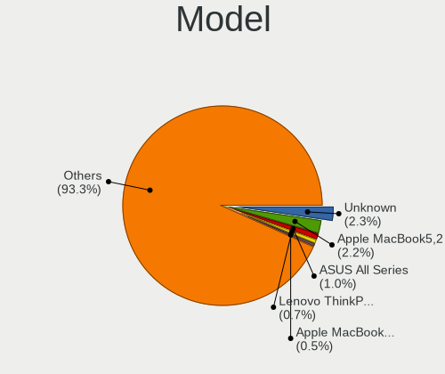
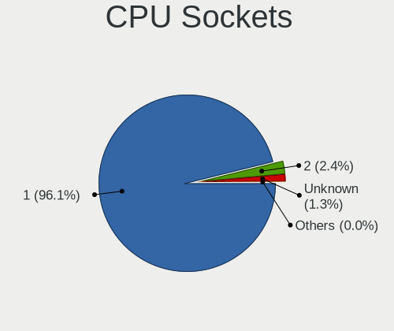
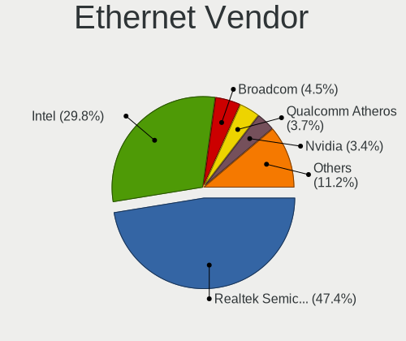
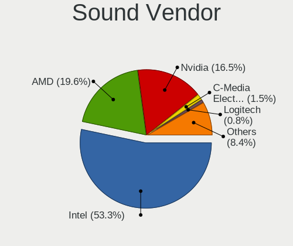

Debian - Tested Hardware & Statistics
-------------------------------------

A project to collect tested hardware configurations for Debian.

Anyone can contribute to this report by the [hw-probe](https://github.com/linuxhw/hw-probe) tool:

    sudo -E hw-probe -all -upload

Please contribute! Especially if your hardware is rare.

This is a report for all computer types. See also reports for [desktops](/Dist/Debian/Desktop/README.md) and [notebooks](/Dist/Debian/Notebook/README.md).

Contents
--------

* [ Test Cases ](#test-cases)

* [ System ](#system)
  - [ OS                       ](#os)
  - [ OS Family                ](#os-family)
  - [ Kernel                   ](#kernel)
  - [ Kernel Family            ](#kernel-family)
  - [ Kernel Major Ver.        ](#kernel-major-ver)
  - [ Arch                     ](#arch)
  - [ DE                       ](#de)
  - [ Display Server           ](#display-server)
  - [ Display Manager          ](#display-manager)
  - [ OS Lang                  ](#os-lang)
  - [ Boot Mode                ](#boot-mode)
  - [ Filesystem               ](#filesystem)
  - [ Part. scheme             ](#part-scheme)
  - [ Dual Boot with Linux/BSD ](#dual-boot-with-linuxbsd)
  - [ Dual Boot (Win)          ](#dual-boot-win)

* [ Board ](#board)
  - [ Vendor                   ](#vendor)
  - [ Model                    ](#model)
  - [ Model Family             ](#model-family)
  - [ MFG Year                 ](#mfg-year)
  - [ Form Factor              ](#form-factor)
  - [ Secure Boot              ](#secure-boot)
  - [ Coreboot                 ](#coreboot)
  - [ RAM Size                 ](#ram-size)
  - [ RAM Used                 ](#ram-used)
  - [ Total Drives             ](#total-drives)
  - [ Has CD-ROM               ](#has-cd-rom)
  - [ Has Ethernet             ](#has-ethernet)
  - [ Has WiFi                 ](#has-wifi)
  - [ Has Bluetooth            ](#has-bluetooth)

* [ Location ](#location)
  - [ Country                  ](#country)
  - [ City                     ](#city)

* [ Drives ](#drives)
  - [ Drive Vendor             ](#drive-vendor)
  - [ Drive Model              ](#drive-model)
  - [ HDD Vendor               ](#hdd-vendor)
  - [ SSD Vendor               ](#ssd-vendor)
  - [ Drive Kind               ](#drive-kind)
  - [ Drive Connector          ](#drive-connector)
  - [ Drive Size               ](#drive-size)
  - [ Space Total              ](#space-total)
  - [ Space Used               ](#space-used)
  - [ Malfunc. Drives          ](#malfunc-drives)
  - [ Malfunc. Drive Vendor    ](#malfunc-drive-vendor)
  - [ Malfunc. HDD Vendor      ](#malfunc-hdd-vendor)
  - [ Malfunc. Drive Kind      ](#malfunc-drive-kind)
  - [ Failed Drives            ](#failed-drives)
  - [ Failed Drive Vendor      ](#failed-drive-vendor)
  - [ Drive Status             ](#drive-status)

* [ Storage controller ](#storage-controller)
  - [ Storage Vendor           ](#storage-vendor)
  - [ Storage Model            ](#storage-model)
  - [ Storage Kind             ](#storage-kind)

* [ Processor ](#processor)
  - [ CPU Vendor               ](#cpu-vendor)
  - [ CPU Model                ](#cpu-model)
  - [ CPU Model Family         ](#cpu-model-family)
  - [ CPU Cores                ](#cpu-cores)
  - [ CPU Sockets              ](#cpu-sockets)
  - [ CPU Threads              ](#cpu-threads)
  - [ CPU Op-Modes             ](#cpu-op-modes)
  - [ CPU Microcode            ](#cpu-microcode)
  - [ CPU Microarch            ](#cpu-microarch)

* [ Graphics ](#graphics)
  - [ GPU Vendor               ](#gpu-vendor)
  - [ GPU Model                ](#gpu-model)
  - [ GPU Combo                ](#gpu-combo)
  - [ GPU Driver               ](#gpu-driver)
  - [ GPU Memory               ](#gpu-memory)

* [ Monitor ](#monitor)
  - [ Monitor Vendor           ](#monitor-vendor)
  - [ Monitor Model            ](#monitor-model)
  - [ Monitor Resolution       ](#monitor-resolution)
  - [ Monitor Diagonal         ](#monitor-diagonal)
  - [ Monitor Width            ](#monitor-width)
  - [ Aspect Ratio             ](#aspect-ratio)
  - [ Monitor Area             ](#monitor-area)
  - [ Pixel Density            ](#pixel-density)
  - [ Multiple Monitors        ](#multiple-monitors)

* [ Network ](#network)
  - [ Net Controller Vendor    ](#net-controller-vendor)
  - [ Net Controller Model     ](#net-controller-model)
  - [ Wireless Vendor          ](#wireless-vendor)
  - [ Wireless Model           ](#wireless-model)
  - [ Ethernet Vendor          ](#ethernet-vendor)
  - [ Ethernet Model           ](#ethernet-model)
  - [ Net Controller Kind      ](#net-controller-kind)
  - [ Used Controller          ](#used-controller)
  - [ NICs                     ](#nics)
  - [ IPv6                     ](#ipv6)

* [ Bluetooth ](#bluetooth)
  - [ Bluetooth Vendor         ](#bluetooth-vendor)
  - [ Bluetooth Model          ](#bluetooth-model)

* [ Sound ](#sound)
  - [ Sound Vendor             ](#sound-vendor)
  - [ Sound Model              ](#sound-model)

* [ Memory ](#memory)
  - [ Memory Vendor            ](#memory-vendor)
  - [ Memory Model             ](#memory-model)
  - [ Memory Kind              ](#memory-kind)
  - [ Memory Form Factor       ](#memory-form-factor)
  - [ Memory Size              ](#memory-size)
  - [ Memory Speed             ](#memory-speed)

* [ Printers & scanners ](#printers--scanners)
  - [ Printer Vendor           ](#printer-vendor)
  - [ Printer Model            ](#printer-model)
  - [ Scanner Vendor           ](#scanner-vendor)
  - [ Scanner Model            ](#scanner-model)

* [ Camera ](#camera)
  - [ Camera Vendor            ](#camera-vendor)
  - [ Camera Model             ](#camera-model)

* [ Security ](#security)
  - [ Fingerprint Vendor       ](#fingerprint-vendor)
  - [ Fingerprint Model        ](#fingerprint-model)
  - [ Chipcard Vendor          ](#chipcard-vendor)
  - [ Chipcard Model           ](#chipcard-model)

* [ Unsupported ](#unsupported)
  - [ Unsupported Devices      ](#unsupported-devices)
  - [ Unsupported Device Types ](#unsupported-device-types)

Test Cases
----------

Total: 15827

| Vendor        | Model                       | Form-Factor | Probe                                                      | Date         |
|---------------|-----------------------------|-------------|------------------------------------------------------------|--------------|
| Gigabyte      | Z790 UD                     | Desktop     | [3f67617c93](https://linux-hardware.org/?probe=3f67617c93) | Sep 07, 2023 |
| Dell          | 0PV3YR A05                  | Server      | [da21e863a4](https://linux-hardware.org/?probe=da21e863a4) | Sep 07, 2023 |
| Dell          | 0R96K1 A00                  | Mini pc     | [3498c7ff1c](https://linux-hardware.org/?probe=3498c7ff1c) | Sep 07, 2023 |
| ASRock        | Z97 Killer                  | Desktop     | [a1537a06ee](https://linux-hardware.org/?probe=a1537a06ee) | Sep 07, 2023 |
| ASUSTek       | N751JX                      | Notebook    | [8ece217753](https://linux-hardware.org/?probe=8ece217753) | Sep 06, 2023 |
| JGINYUE       | X79M-PLUS V2.2              | Desktop     | [602bfb550f](https://linux-hardware.org/?probe=602bfb550f) | Sep 06, 2023 |
| JGINYUE       | X79M-PLUS V2.2              | Desktop     | [1535be8e5f](https://linux-hardware.org/?probe=1535be8e5f) | Sep 06, 2023 |
| Intel         | DN2800MT AAG23738-803       | Desktop     | [8bdf13908a](https://linux-hardware.org/?probe=8bdf13908a) | Sep 06, 2023 |
| Lenovo        | ThinkPad E14 Gen 2 20TA0... | Notebook    | [0468bc91fc](https://linux-hardware.org/?probe=0468bc91fc) | Sep 06, 2023 |
| ASRock        | Z97M OC Formula             | Desktop     | [1f2c20e8cf](https://linux-hardware.org/?probe=1f2c20e8cf) | Sep 06, 2023 |
| Lenovo        | 3144                        | Mini pc     | [8dbb3d65e7](https://linux-hardware.org/?probe=8dbb3d65e7) | Sep 06, 2023 |
| MSI           | Z370-A PRO                  | Desktop     | [19dc657d04](https://linux-hardware.org/?probe=19dc657d04) | Sep 06, 2023 |
| MSI           | X470 GAMING PLUS            | Desktop     | [f20b630cf8](https://linux-hardware.org/?probe=f20b630cf8) | Sep 06, 2023 |
| ASUSTek       | X542UQ                      | Notebook    | [50ecc5159c](https://linux-hardware.org/?probe=50ecc5159c) | Sep 06, 2023 |
| MSI           | X470 GAMING PLUS            | Desktop     | [2b9d42ccc9](https://linux-hardware.org/?probe=2b9d42ccc9) | Sep 06, 2023 |
| ASUSTek       | X542UQ                      | Notebook    | [b34e0e7866](https://linux-hardware.org/?probe=b34e0e7866) | Sep 06, 2023 |
| Acer          | Aspire E1-531               | Notebook    | [9d5880bc6c](https://linux-hardware.org/?probe=9d5880bc6c) | Sep 06, 2023 |
| Acer          | Aspire E1-531               | Notebook    | [6ffc334cf9](https://linux-hardware.org/?probe=6ffc334cf9) | Sep 06, 2023 |
| ASRockRack    | B565D4-V1L                  | Desktop     | [ff236ef40e](https://linux-hardware.org/?probe=ff236ef40e) | Sep 06, 2023 |
| Microsoft     | Surface Pro 6               | Tablet      | [4ae2ea34c2](https://linux-hardware.org/?probe=4ae2ea34c2) | Sep 06, 2023 |
| HP            | Laptop 15s-eq2xxx           | Notebook    | [03f6b3b62b](https://linux-hardware.org/?probe=03f6b3b62b) | Sep 06, 2023 |
| Toshiba       | Satellite A205              | Notebook    | [9a44e74608](https://linux-hardware.org/?probe=9a44e74608) | Sep 06, 2023 |
| Toshiba       | Satellite A205              | Notebook    | [a2b456886d](https://linux-hardware.org/?probe=a2b456886d) | Sep 05, 2023 |
| Intel         | D33217GKE G76540-205        | Desktop     | [98630bd8bd](https://linux-hardware.org/?probe=98630bd8bd) | Sep 05, 2023 |
| HP            | ZBook 15 G3                 | Notebook    | [faac131992](https://linux-hardware.org/?probe=faac131992) | Sep 05, 2023 |
| Framework     | Laptop (13th Gen Intel C... | Notebook    | [1bcf7b95c6](https://linux-hardware.org/?probe=1bcf7b95c6) | Sep 05, 2023 |
| Lenovo        | ThinkPad T490 20N2001YUS    | Notebook    | [75c15ac2e8](https://linux-hardware.org/?probe=75c15ac2e8) | Sep 05, 2023 |
| MSI           | Z370-A PRO                  | Desktop     | [8415f054e5](https://linux-hardware.org/?probe=8415f054e5) | Sep 05, 2023 |
| ASUSTek       | K53SD                       | Notebook    | [051fefc7ca](https://linux-hardware.org/?probe=051fefc7ca) | Sep 05, 2023 |
| Gigabyte      | GA-790FXTA-UD5              | Desktop     | [a97cdf671b](https://linux-hardware.org/?probe=a97cdf671b) | Sep 05, 2023 |
| Techvision    | TVI7309X B0                 | Desktop     | [846d8027c3](https://linux-hardware.org/?probe=846d8027c3) | Sep 05, 2023 |
| Lenovo        | ThinkPad T520 4243WCR       | Notebook    | [181ef642cd](https://linux-hardware.org/?probe=181ef642cd) | Sep 05, 2023 |
| ASUSTek       | TUF Gaming B660-PLUS WIF... | Desktop     | [0874ee1444](https://linux-hardware.org/?probe=0874ee1444) | Sep 05, 2023 |
| Sony          | VGN-CS108D                  | Notebook    | [24bf5bb06c](https://linux-hardware.org/?probe=24bf5bb06c) | Sep 05, 2023 |
| Lenovo        | IdeaPad 330S-15ARR 81FB     | Notebook    | [eb05baece5](https://linux-hardware.org/?probe=eb05baece5) | Sep 05, 2023 |
| Dell          | 0PV3YR A05                  | Server      | [0841c5e196](https://linux-hardware.org/?probe=0841c5e196) | Sep 05, 2023 |
| ASRock        | B550 Phantom Gaming-ITX/... | Desktop     | [5a4f7a4641](https://linux-hardware.org/?probe=5a4f7a4641) | Sep 05, 2023 |
| Unknown       | Unknown                     | Soc         | [ac8b7f6a77](https://linux-hardware.org/?probe=ac8b7f6a77) | Sep 05, 2023 |
| HUAWEI        | NBD-WXX9                    | Notebook    | [005ebd39ce](https://linux-hardware.org/?probe=005ebd39ce) | Sep 05, 2023 |
| ASUSTek       | X541NC                      | Notebook    | [927ba04557](https://linux-hardware.org/?probe=927ba04557) | Sep 05, 2023 |
| Fujitsu       | D3183-A1 S26361-D3183-A1    | Desktop     | [85e1b123db](https://linux-hardware.org/?probe=85e1b123db) | Sep 04, 2023 |
| Gigabyte      | GA-790FXTA-UD5              | Desktop     | [6c90c83d67](https://linux-hardware.org/?probe=6c90c83d67) | Sep 04, 2023 |
| Dell          | 0Y2MRG A00                  | Desktop     | [893bd8a261](https://linux-hardware.org/?probe=893bd8a261) | Sep 04, 2023 |
| MSI           | Z370-A PRO                  | Desktop     | [b670e69634](https://linux-hardware.org/?probe=b670e69634) | Sep 04, 2023 |
| Dell          | 06FW8M A00                  | Server      | [afde437d5d](https://linux-hardware.org/?probe=afde437d5d) | Sep 04, 2023 |
| Fujitsu       | D3400-A1 S26361-D3400-A1    | Desktop     | [49e3c842c1](https://linux-hardware.org/?probe=49e3c842c1) | Sep 04, 2023 |
| Acer          | Aspire E1-531               | Notebook    | [7f9460a97c](https://linux-hardware.org/?probe=7f9460a97c) | Sep 04, 2023 |
| eMachines     | Rhine V1.42                 | Notebook    | [c18c4d64bd](https://linux-hardware.org/?probe=c18c4d64bd) | Sep 04, 2023 |
| ASUSTek       | ROG Strix G531GT_G531GT     | Notebook    | [f7a6b9d479](https://linux-hardware.org/?probe=f7a6b9d479) | Sep 04, 2023 |
| Unknown       | Unknown                     | Desktop     | [0c53c2df55](https://linux-hardware.org/?probe=0c53c2df55) | Sep 04, 2023 |
| ASRockRack    | X470D4U                     | Desktop     | [d38e269d11](https://linux-hardware.org/?probe=d38e269d11) | Sep 04, 2023 |
| HUAWEI        | BC11HGSC0 V100R003          | Server      | [6ce4aa2350](https://linux-hardware.org/?probe=6ce4aa2350) | Sep 04, 2023 |
| MSI           | PRO X670-P WIFI             | Desktop     | [326596a962](https://linux-hardware.org/?probe=326596a962) | Sep 04, 2023 |
| Dell          | 0PV3YR A05                  | Server      | [8d52d37e1e](https://linux-hardware.org/?probe=8d52d37e1e) | Sep 04, 2023 |
| Dell          | 0CU409                      | Desktop     | [ca461ddc28](https://linux-hardware.org/?probe=ca461ddc28) | Sep 04, 2023 |
| Gigabyte      | B450 AORUS ELITE V2         | Desktop     | [2292824064](https://linux-hardware.org/?probe=2292824064) | Sep 04, 2023 |
| HP            | Pavilion Gaming Laptop 1... | Notebook    | [d075cbe2e0](https://linux-hardware.org/?probe=d075cbe2e0) | Sep 04, 2023 |
| Acer          | Aspire ES1-533              | Notebook    | [9c788645a1](https://linux-hardware.org/?probe=9c788645a1) | Sep 03, 2023 |
| Gigabyte      | B85M-D3H                    | Desktop     | [9d4d9e6ffa](https://linux-hardware.org/?probe=9d4d9e6ffa) | Sep 03, 2023 |
| ASUSTek       | X507UB                      | Notebook    | [e74c3ad568](https://linux-hardware.org/?probe=e74c3ad568) | Sep 03, 2023 |
| HP            | EliteBook 2740p             | Notebook    | [c6d9dc5a3b](https://linux-hardware.org/?probe=c6d9dc5a3b) | Sep 03, 2023 |
| Dell          | Latitude 5414               | Notebook    | [704d861366](https://linux-hardware.org/?probe=704d861366) | Sep 03, 2023 |
| HP            | 1825                        | Desktop     | [38d038d2ad](https://linux-hardware.org/?probe=38d038d2ad) | Sep 03, 2023 |
| Lenovo        | ThinkPad X1 Carbon 6th 2... | Notebook    | [526a6826ab](https://linux-hardware.org/?probe=526a6826ab) | Sep 03, 2023 |
| Google        | Droid                       | Notebook    | [da26431a82](https://linux-hardware.org/?probe=da26431a82) | Sep 03, 2023 |
| Google        | Droid                       | Notebook    | [278861e9e8](https://linux-hardware.org/?probe=278861e9e8) | Sep 03, 2023 |
| Lenovo        | ThinkPad T480 20L6S2KV20    | Notebook    | [248ef69016](https://linux-hardware.org/?probe=248ef69016) | Sep 03, 2023 |
| Acer          | Aspire A515-56              | Notebook    | [435cb2d610](https://linux-hardware.org/?probe=435cb2d610) | Sep 03, 2023 |
| HP            | 255 15.6 inch G9 Noteboo... | Notebook    | [7ba8b58ea7](https://linux-hardware.org/?probe=7ba8b58ea7) | Sep 03, 2023 |
| MEGA          | G41T-M7 LGT                 | Desktop     | [8d645686ff](https://linux-hardware.org/?probe=8d645686ff) | Sep 02, 2023 |
| Toshiba       | Satellite L10W-B-101        | Notebook    | [1865cdf1ad](https://linux-hardware.org/?probe=1865cdf1ad) | Sep 02, 2023 |
| HP            | ZBook 15 G2                 | Notebook    | [d20f8f324d](https://linux-hardware.org/?probe=d20f8f324d) | Sep 02, 2023 |
| Lenovo        | IdeaPad 3 15IML05 81WB      | Notebook    | [d00f64dfcf](https://linux-hardware.org/?probe=d00f64dfcf) | Sep 02, 2023 |
| ASUSTek       | Pro WS X570-ACE             | Desktop     | [c3dc3fd84b](https://linux-hardware.org/?probe=c3dc3fd84b) | Sep 02, 2023 |
| Raspberry ... | Raspberry Pi 4 Model B R... | Soc         | [c3fe8cb8e9](https://linux-hardware.org/?probe=c3fe8cb8e9) | Sep 02, 2023 |
| Samsung       | RF511/RF411/RF711           | Notebook    | [ab39767c20](https://linux-hardware.org/?probe=ab39767c20) | Sep 02, 2023 |
| Gigabyte      | B550 GAMING X V2            | Desktop     | [9259a8f3f3](https://linux-hardware.org/?probe=9259a8f3f3) | Sep 02, 2023 |
| Gigabyte      | Z87X-UD4H-CF                | Desktop     | [213b7c59de](https://linux-hardware.org/?probe=213b7c59de) | Sep 02, 2023 |
| Dell          | 02C2CP A01                  | Server      | [8928318f7a](https://linux-hardware.org/?probe=8928318f7a) | Sep 02, 2023 |
| Raspberry ... | Raspberry Pi 3 Model B R... | Soc         | [e0133bb14e](https://linux-hardware.org/?probe=e0133bb14e) | Sep 02, 2023 |
| Dell          | Latitude E6520              | Notebook    | [b53cd78958](https://linux-hardware.org/?probe=b53cd78958) | Sep 02, 2023 |
| Lenovo        | G505 20240                  | Notebook    | [ea15ab596a](https://linux-hardware.org/?probe=ea15ab596a) | Sep 02, 2023 |
| MSI           | MPG B650I EDGE WIFI         | Desktop     | [3ea725d275](https://linux-hardware.org/?probe=3ea725d275) | Sep 02, 2023 |
| ASRock        | B650M PG Riptide            | Desktop     | [0f1a250c7f](https://linux-hardware.org/?probe=0f1a250c7f) | Sep 02, 2023 |
| Lenovo        | IdeaPad 5 14ARE05 81YM      | Notebook    | [155023d91f](https://linux-hardware.org/?probe=155023d91f) | Sep 02, 2023 |
| Raspberry ... | Raspberry Pi 4 Model B R... | Soc         | [a200aa5407](https://linux-hardware.org/?probe=a200aa5407) | Sep 02, 2023 |
| Broadcom      | platform                    | Soc         | [7b330403ca](https://linux-hardware.org/?probe=7b330403ca) | Sep 02, 2023 |
| ASUSTek       | TUF Gaming B550M-PLUS       | Desktop     | [7e93b2a981](https://linux-hardware.org/?probe=7e93b2a981) | Sep 02, 2023 |
| Lenovo        | Legion 5 15ACH6 82QJ        | Notebook    | [5897684d9e](https://linux-hardware.org/?probe=5897684d9e) | Sep 02, 2023 |
| ASUSTek       | Vivobook ASUSLaptop TP34... | Convertible | [8194030163](https://linux-hardware.org/?probe=8194030163) | Sep 02, 2023 |
| Dell          | Latitude 5430               | Notebook    | [7a9eb9995d](https://linux-hardware.org/?probe=7a9eb9995d) | Sep 02, 2023 |
| ASUSTek       | ROG Maximus XIII HERO       | Desktop     | [91d7a53a1b](https://linux-hardware.org/?probe=91d7a53a1b) | Sep 01, 2023 |
| Lenovo        | ThinkPad Z13 Gen 1 21D20... | Notebook    | [52e8a720ba](https://linux-hardware.org/?probe=52e8a720ba) | Sep 01, 2023 |
| Lenovo        | 36EE SDK0J40700 WIN 3258... | Desktop     | [0075af1992](https://linux-hardware.org/?probe=0075af1992) | Sep 01, 2023 |
| Lenovo        | ThinkPad X1 Carbon 6th 2... | Notebook    | [062f19958d](https://linux-hardware.org/?probe=062f19958d) | Sep 01, 2023 |
| Gigabyte      | H110M-H-CF                  | Desktop     | [ec5d9509f6](https://linux-hardware.org/?probe=ec5d9509f6) | Sep 01, 2023 |
| ASUSTek       | VivoBook_ASUSLaptop M160... | Notebook    | [af78cafb1a](https://linux-hardware.org/?probe=af78cafb1a) | Sep 01, 2023 |
| ASUSTek       | P8Q77-M                     | Desktop     | [0192700365](https://linux-hardware.org/?probe=0192700365) | Sep 01, 2023 |
| Unknown       | Unknown                     | Desktop     | [3e3433226b](https://linux-hardware.org/?probe=3e3433226b) | Sep 01, 2023 |
| Lenovo        | IdeaPad 1 15IGL7 82V7       | Notebook    | [5db10955f8](https://linux-hardware.org/?probe=5db10955f8) | Sep 01, 2023 |
| ASUSTek       | ASUS BR1100FKA BR1100FKA... | Convertible | [25b3fed672](https://linux-hardware.org/?probe=25b3fed672) | Aug 31, 2023 |
| Lenovo        | ThinkPad 13 2nd Gen 20J1... | Notebook    | [f98a2afc33](https://linux-hardware.org/?probe=f98a2afc33) | Aug 31, 2023 |
| Dell          | 0GM819                      | Desktop     | [8144006f85](https://linux-hardware.org/?probe=8144006f85) | Aug 31, 2023 |
| Dell          | 0GM819                      | Desktop     | [f7c99aa51b](https://linux-hardware.org/?probe=f7c99aa51b) | Aug 31, 2023 |
| HP            | 1495                        | Desktop     | [09b1cf815c](https://linux-hardware.org/?probe=09b1cf815c) | Aug 31, 2023 |
| Acer          | Swift SF314-42              | Notebook    | [80bebab849](https://linux-hardware.org/?probe=80bebab849) | Aug 31, 2023 |
| Gigabyte      | X570S AERO G                | Desktop     | [f367356391](https://linux-hardware.org/?probe=f367356391) | Aug 30, 2023 |
| Google        | Enguarde                    | Notebook    | [d67a18c110](https://linux-hardware.org/?probe=d67a18c110) | Aug 30, 2023 |
| HP            | 8158 A01                    | Mini pc     | [9be38fb21f](https://linux-hardware.org/?probe=9be38fb21f) | Aug 30, 2023 |
| HP            | ProBook 6460b               | Notebook    | [18deeb6be6](https://linux-hardware.org/?probe=18deeb6be6) | Aug 30, 2023 |
| GPU Compan... | GWTN156-9                   | Notebook    | [4c8ea16ab2](https://linux-hardware.org/?probe=4c8ea16ab2) | Aug 30, 2023 |
| ASUSTek       | PRIME Z790-P D4             | Desktop     | [1cea30e36a](https://linux-hardware.org/?probe=1cea30e36a) | Aug 30, 2023 |
| ASUSTek       | PRIME Z790-P D4             | Desktop     | [20b35a5d4f](https://linux-hardware.org/?probe=20b35a5d4f) | Aug 30, 2023 |
| HP            | Laptop 15s-fq2xxx           | Notebook    | [6d85c1d397](https://linux-hardware.org/?probe=6d85c1d397) | Aug 30, 2023 |
| Acer          | Aspire A515-57              | Notebook    | [c9a61f810d](https://linux-hardware.org/?probe=c9a61f810d) | Aug 30, 2023 |
| Acer          | Aspire A515-57              | Notebook    | [d6fded6169](https://linux-hardware.org/?probe=d6fded6169) | Aug 30, 2023 |
| Lenovo        | ThinkPad L13 Yoga 20R6S0... | Convertible | [52582bbad0](https://linux-hardware.org/?probe=52582bbad0) | Aug 30, 2023 |
| Google        | Enguarde                    | Notebook    | [08ff2764b2](https://linux-hardware.org/?probe=08ff2764b2) | Aug 30, 2023 |
| Unknown       | Unknown                     | Notebook    | [3718299cea](https://linux-hardware.org/?probe=3718299cea) | Aug 29, 2023 |
| Google        | Enguarde                    | Notebook    | [e2e5a3dadc](https://linux-hardware.org/?probe=e2e5a3dadc) | Aug 29, 2023 |
| Google        | Enguarde                    | Notebook    | [e7a59ac286](https://linux-hardware.org/?probe=e7a59ac286) | Aug 29, 2023 |
| Raspberry ... | Raspberry Pi 3 Model B P... | Soc         | [52306fce15](https://linux-hardware.org/?probe=52306fce15) | Aug 29, 2023 |
| Lenovo        | ThinkPad T495s 20QJCTO1W... | Notebook    | [4bdfa8b9ea](https://linux-hardware.org/?probe=4bdfa8b9ea) | Aug 29, 2023 |
| Intel         | DG41TY AAE47335-301         | Desktop     | [1f8897e1a2](https://linux-hardware.org/?probe=1f8897e1a2) | Aug 29, 2023 |
| HP            | EliteBook 845 14 inch G9... | Notebook    | [41ce572b6d](https://linux-hardware.org/?probe=41ce572b6d) | Aug 29, 2023 |
| Acer          | Swift SF314-512             | Notebook    | [a41a08d4ae](https://linux-hardware.org/?probe=a41a08d4ae) | Aug 29, 2023 |
| ASUSTek       | TUF Gaming FX504GD_FX80G... | Notebook    | [62ff88eaf7](https://linux-hardware.org/?probe=62ff88eaf7) | Aug 29, 2023 |
| Lenovo        | 102F SDK0Q40081 WIN 3305... | Desktop     | [b6478eb429](https://linux-hardware.org/?probe=b6478eb429) | Aug 29, 2023 |
| Dell          | 0T10XW A00                  | Desktop     | [cc093c964f](https://linux-hardware.org/?probe=cc093c964f) | Aug 29, 2023 |
| HP            | 82A2                        | Desktop     | [44e0a72dad](https://linux-hardware.org/?probe=44e0a72dad) | Aug 28, 2023 |
| BESSTAR Te... | TH50                        | Desktop     | [816347743d](https://linux-hardware.org/?probe=816347743d) | Aug 28, 2023 |
| Lenovo        | ThinkPad L13 Yoga Gen 2 ... | Convertible | [2a473fdb4a](https://linux-hardware.org/?probe=2a473fdb4a) | Aug 28, 2023 |
| Lenovo        | ThinkPad L13 Yoga Gen 2 ... | Convertible | [95128ee415](https://linux-hardware.org/?probe=95128ee415) | Aug 28, 2023 |
| Lenovo        | ThinkPad L13 Yoga Gen 2 ... | Convertible | [b54f472d37](https://linux-hardware.org/?probe=b54f472d37) | Aug 28, 2023 |
| Lenovo        | ThinkPad L13 Yoga Gen 2 ... | Convertible | [9d10db6fe6](https://linux-hardware.org/?probe=9d10db6fe6) | Aug 28, 2023 |
| ASUSTek       | ASUS EXPERTBOOK B1500CBA... | Notebook    | [243b20df85](https://linux-hardware.org/?probe=243b20df85) | Aug 28, 2023 |
| Lenovo        | ThinkPad L13 Yoga Gen 2 ... | Convertible | [03402979d2](https://linux-hardware.org/?probe=03402979d2) | Aug 28, 2023 |
| Lenovo        | ThinkPad L13 Yoga Gen 2 ... | Convertible | [2b71412aa1](https://linux-hardware.org/?probe=2b71412aa1) | Aug 28, 2023 |
| Lenovo        | ThinkPad L13 Yoga Gen 2 ... | Convertible | [d816edb954](https://linux-hardware.org/?probe=d816edb954) | Aug 28, 2023 |
| Dell          | 0JP3NX A01                  | Desktop     | [f52ee2433e](https://linux-hardware.org/?probe=f52ee2433e) | Aug 28, 2023 |
| Gigabyte      | X570 AORUS MASTER           | Desktop     | [89e3ba3d7d](https://linux-hardware.org/?probe=89e3ba3d7d) | Aug 28, 2023 |
| Gigabyte      | X570 AORUS MASTER           | Desktop     | [0150e826ac](https://linux-hardware.org/?probe=0150e826ac) | Aug 28, 2023 |
| Lenovo        | ThinkPad E470 20H2S00700    | Notebook    | [cea73826dc](https://linux-hardware.org/?probe=cea73826dc) | Aug 28, 2023 |
| win elemen... | MoreFine S500+              | Notebook    | [9675488adc](https://linux-hardware.org/?probe=9675488adc) | Aug 28, 2023 |
| Gigabyte      | H410M S2H V3                | Desktop     | [c772f3df30](https://linux-hardware.org/?probe=c772f3df30) | Aug 28, 2023 |
| Intel         | NUC13SBBi9 M58736-303       | Mini pc     | [513140b0b6](https://linux-hardware.org/?probe=513140b0b6) | Aug 28, 2023 |
| ASUSTek       | PRIME X470-PRO              | Desktop     | [eef69bf730](https://linux-hardware.org/?probe=eef69bf730) | Aug 28, 2023 |
| langchao      | IPM41-D3                    | Desktop     | [a6b482f110](https://linux-hardware.org/?probe=a6b482f110) | Aug 27, 2023 |
| Dell          | Latitude 7400 2-in-1        | Convertible | [b21ba1741e](https://linux-hardware.org/?probe=b21ba1741e) | Aug 27, 2023 |
| ASUSTek       | Z170-A                      | Desktop     | [eadbc95dc7](https://linux-hardware.org/?probe=eadbc95dc7) | Aug 27, 2023 |
| Lenovo        | IdeaPadFlex 5 14ALC05 82... | Convertible | [484e6e6997](https://linux-hardware.org/?probe=484e6e6997) | Aug 27, 2023 |
| win elemen... | MoreFine S500+              | Notebook    | [29e062fb36](https://linux-hardware.org/?probe=29e062fb36) | Aug 27, 2023 |
| Gigabyte      | GA-MA78GM-S2H               | Desktop     | [8ee437beac](https://linux-hardware.org/?probe=8ee437beac) | Aug 27, 2023 |
| Apple         | MacBookPro6,2               | Notebook    | [e25e18e9b1](https://linux-hardware.org/?probe=e25e18e9b1) | Aug 27, 2023 |
| Lenovo        | B590 20208                  | Notebook    | [65bf0970da](https://linux-hardware.org/?probe=65bf0970da) | Aug 27, 2023 |
| ASUSTek       | VivoBook_ASUSLaptop X760... | Notebook    | [5ef3048a11](https://linux-hardware.org/?probe=5ef3048a11) | Aug 26, 2023 |
| Dell          | Latitude E6420              | Notebook    | [ae48a8c618](https://linux-hardware.org/?probe=ae48a8c618) | Aug 26, 2023 |
| MSI           | GP76 Leopard 11UG           | Notebook    | [5de726089b](https://linux-hardware.org/?probe=5de726089b) | Aug 26, 2023 |
| HP            | 1495                        | Desktop     | [86b148e011](https://linux-hardware.org/?probe=86b148e011) | Aug 26, 2023 |
| Unknown       | MediaTek kodama sku288      | Soc         | [7c4afe8e55](https://linux-hardware.org/?probe=7c4afe8e55) | Aug 26, 2023 |
| Lenovo        | ThinkPad W540 20BG0016US    | Notebook    | [3b5476180b](https://linux-hardware.org/?probe=3b5476180b) | Aug 26, 2023 |
| Alienware     | m16 R1                      | Notebook    | [75f20a1519](https://linux-hardware.org/?probe=75f20a1519) | Aug 26, 2023 |
| Essentiel ... | MS-7848                     | Desktop     | [228bdfda30](https://linux-hardware.org/?probe=228bdfda30) | Aug 26, 2023 |
| Essentiel ... | MS-7848                     | Desktop     | [9ce89a0c87](https://linux-hardware.org/?probe=9ce89a0c87) | Aug 26, 2023 |
| Unknown       | MediaTek kodama sku288      | Soc         | [1b7e6141b6](https://linux-hardware.org/?probe=1b7e6141b6) | Aug 26, 2023 |
| Alienware     | m16 R1                      | Notebook    | [89cffc75ea](https://linux-hardware.org/?probe=89cffc75ea) | Aug 26, 2023 |
| Lenovo        | ThinkPad L13 Yoga Gen 2 ... | Convertible | [2e662cc73a](https://linux-hardware.org/?probe=2e662cc73a) | Aug 25, 2023 |
| Lenovo        | ThinkPad L13 Yoga Gen 2 ... | Convertible | [1ec5f419d8](https://linux-hardware.org/?probe=1ec5f419d8) | Aug 25, 2023 |
| MSI           | MPG X670E CARBON WIFI       | Desktop     | [3add2f8945](https://linux-hardware.org/?probe=3add2f8945) | Aug 25, 2023 |
| Lenovo        | ThinkPad 13 2nd Gen 20J1... | Notebook    | [4ca70b63ef](https://linux-hardware.org/?probe=4ca70b63ef) | Aug 25, 2023 |
| ASUSTek       | ProArt X670E-CREATOR WIF... | Desktop     | [3067310cf8](https://linux-hardware.org/?probe=3067310cf8) | Aug 25, 2023 |
| HP            | EliteBook 845 G8 Noteboo... | Notebook    | [c288ff6b78](https://linux-hardware.org/?probe=c288ff6b78) | Aug 25, 2023 |
| HP            | Pavilion dv5                | Notebook    | [8e621682ec](https://linux-hardware.org/?probe=8e621682ec) | Aug 25, 2023 |
| Acer          | Aspire VN7-793G             | Notebook    | [5d748b1e22](https://linux-hardware.org/?probe=5d748b1e22) | Aug 25, 2023 |
| ASUSTek       | PRIME H310M-R R2.0          | Desktop     | [0cc7a0f138](https://linux-hardware.org/?probe=0cc7a0f138) | Aug 25, 2023 |
| Shenzhen M... | F7BAA                       | Desktop     | [3ac1398c61](https://linux-hardware.org/?probe=3ac1398c61) | Aug 25, 2023 |
| Acer          | TravelMate P215-53          | Notebook    | [113a5418ca](https://linux-hardware.org/?probe=113a5418ca) | Aug 25, 2023 |
| Unknown       | Unknown                     | Desktop     | [7e6d5fa7bc](https://linux-hardware.org/?probe=7e6d5fa7bc) | Aug 25, 2023 |
| Acer          | TravelMate P215-53          | Notebook    | [b2579f594d](https://linux-hardware.org/?probe=b2579f594d) | Aug 25, 2023 |
| ASUSTek       | PRIME H310M-R R2.0          | Desktop     | [241fead3e6](https://linux-hardware.org/?probe=241fead3e6) | Aug 25, 2023 |
| Lenovo        | IdeaPadFlex 5 14ABR8 82X... | Convertible | [243def9aa8](https://linux-hardware.org/?probe=243def9aa8) | Aug 25, 2023 |
| HP            | 158A                        | Desktop     | [e154a48901](https://linux-hardware.org/?probe=e154a48901) | Aug 25, 2023 |
| ASUSTek       | ROG Maximus XII EXTREME     | Desktop     | [815a77392c](https://linux-hardware.org/?probe=815a77392c) | Aug 25, 2023 |
| HP            | 18E4                        | Desktop     | [e209d700ef](https://linux-hardware.org/?probe=e209d700ef) | Aug 25, 2023 |
| MSI           | GS65 Stealth Thin 8RE       | Notebook    | [b53212efce](https://linux-hardware.org/?probe=b53212efce) | Aug 24, 2023 |
| Dell          | XPS 9320                    | Notebook    | [1ba8e13634](https://linux-hardware.org/?probe=1ba8e13634) | Aug 24, 2023 |
| Dell          | 03NVJ6 A01                  | Desktop     | [71102ac92b](https://linux-hardware.org/?probe=71102ac92b) | Aug 24, 2023 |
| ASUSTek       | X450LD                      | Notebook    | [b9187b37b7](https://linux-hardware.org/?probe=b9187b37b7) | Aug 24, 2023 |
| Lenovo        | ThinkPad L13 Yoga Gen 2 ... | Convertible | [172876d77a](https://linux-hardware.org/?probe=172876d77a) | Aug 24, 2023 |
| Acer          | Aspire 7741                 | Notebook    | [648f667e11](https://linux-hardware.org/?probe=648f667e11) | Aug 24, 2023 |
| Acer          | Aspire XC-780               | Desktop     | [e154995d9e](https://linux-hardware.org/?probe=e154995d9e) | Aug 24, 2023 |
| Lenovo        | ThinkServer RD450 70DC00... | Server      | [71859969f5](https://linux-hardware.org/?probe=71859969f5) | Aug 24, 2023 |
| Unknown       | Unknown                     | Desktop     | [0e86c5864d](https://linux-hardware.org/?probe=0e86c5864d) | Aug 24, 2023 |
| Raspberry ... | Raspberry Pi 4 Model B R... | Soc         | [d648900305](https://linux-hardware.org/?probe=d648900305) | Aug 24, 2023 |
| Rockchip      | RK3568 EVB1 DDR4 V10        | Soc         | [846c733ed7](https://linux-hardware.org/?probe=846c733ed7) | Aug 24, 2023 |
| Dell          | 06D7TR A02                  | Desktop     | [d0b04a9056](https://linux-hardware.org/?probe=d0b04a9056) | Aug 24, 2023 |
| Intel         | DN2820FYK H24582-201        | Desktop     | [bb1402894c](https://linux-hardware.org/?probe=bb1402894c) | Aug 24, 2023 |
| Lenovo        | ThinkPad L13 Yoga Gen 2 ... | Convertible | [9c25696a2d](https://linux-hardware.org/?probe=9c25696a2d) | Aug 24, 2023 |
| Raspberry ... | Raspberry Pi 4 Model B R... | Soc         | [0ec42f4555](https://linux-hardware.org/?probe=0ec42f4555) | Aug 24, 2023 |
| ASUSTek       | STRIX H270F GAMING          | Desktop     | [eeff109a12](https://linux-hardware.org/?probe=eeff109a12) | Aug 24, 2023 |
| HC Technol... | HCAR357-NR                  | Desktop     | [3cd017db11](https://linux-hardware.org/?probe=3cd017db11) | Aug 24, 2023 |
| Lenovo        | ThinkPad Z13 Gen 1 21D20... | Notebook    | [4d1d53f6d8](https://linux-hardware.org/?probe=4d1d53f6d8) | Aug 24, 2023 |
| ASUSTek       | VivoBook_ASUSLaptop X150... | Notebook    | [5a6247f9b2](https://linux-hardware.org/?probe=5a6247f9b2) | Aug 24, 2023 |
| Lenovo        | ThinkServer RD450 70DC00... | Server      | [cfeb45f5a1](https://linux-hardware.org/?probe=cfeb45f5a1) | Aug 24, 2023 |
| HP            | Laptop 17-by4xxx            | Notebook    | [9fd582b91e](https://linux-hardware.org/?probe=9fd582b91e) | Aug 24, 2023 |
| HP            | ZBook 14 G2                 | Notebook    | [fcbebfc95a](https://linux-hardware.org/?probe=fcbebfc95a) | Aug 23, 2023 |
| Acer          | Aspire ES1-311              | Notebook    | [93f204808e](https://linux-hardware.org/?probe=93f204808e) | Aug 23, 2023 |
| MSI           | MAG B560 TORPEDO            | Desktop     | [a3ec958f0c](https://linux-hardware.org/?probe=a3ec958f0c) | Aug 23, 2023 |
| ASUSTek       | ROG STRIX B550-F GAMING     | Desktop     | [acc3f87d28](https://linux-hardware.org/?probe=acc3f87d28) | Aug 23, 2023 |
| ASRock        | FM2A68M-HD+                 | Desktop     | [6811a2231b](https://linux-hardware.org/?probe=6811a2231b) | Aug 23, 2023 |
| Apple         | Mac-F2238BAE iMac11,3       | All in one  | [a1bdeba9c8](https://linux-hardware.org/?probe=a1bdeba9c8) | Aug 23, 2023 |
| Lenovo        | IdeaPad Z485 20151          | Notebook    | [599346f806](https://linux-hardware.org/?probe=599346f806) | Aug 23, 2023 |
| Panasonic     | CFMX4-1                     | Notebook    | [fd352acae8](https://linux-hardware.org/?probe=fd352acae8) | Aug 23, 2023 |
| MSI           | MAG B560 TORPEDO            | Desktop     | [79db65495a](https://linux-hardware.org/?probe=79db65495a) | Aug 23, 2023 |
| Acer          | TravelMate P214-52          | Notebook    | [6d7eeef62a](https://linux-hardware.org/?probe=6d7eeef62a) | Aug 23, 2023 |
| Acer          | TravelMate P214-52          | Notebook    | [0a000435ae](https://linux-hardware.org/?probe=0a000435ae) | Aug 23, 2023 |
| HP            | 8835                        | Desktop     | [6d48f6a632](https://linux-hardware.org/?probe=6d48f6a632) | Aug 23, 2023 |
| HP            | 8835                        | Desktop     | [01d495ff7c](https://linux-hardware.org/?probe=01d495ff7c) | Aug 23, 2023 |
| MSI           | Stealth 17Studio A13VF      | Notebook    | [ca952946e9](https://linux-hardware.org/?probe=ca952946e9) | Aug 23, 2023 |
| Gigabyte      | B550 GAMING X V2            | Desktop     | [5663c30e5e](https://linux-hardware.org/?probe=5663c30e5e) | Aug 23, 2023 |
| ASUSTek       | PRIME X299-DELUXE           | Desktop     | [266edae3d0](https://linux-hardware.org/?probe=266edae3d0) | Aug 23, 2023 |
| ASUSTek       | X507UB                      | Notebook    | [6c8e9739d4](https://linux-hardware.org/?probe=6c8e9739d4) | Aug 23, 2023 |
| MSI           | Z270 GAMING PRO CARBON      | Desktop     | [78bfc9060d](https://linux-hardware.org/?probe=78bfc9060d) | Aug 23, 2023 |
| Gigabyte      | AORUS 5 KE                  | Notebook    | [abfb96067f](https://linux-hardware.org/?probe=abfb96067f) | Aug 23, 2023 |
| Lenovo        | IdeaPad 1 15IGL7 82V7       | Notebook    | [3e831762f2](https://linux-hardware.org/?probe=3e831762f2) | Aug 22, 2023 |
| Lenovo        | ThinkPad L13 Yoga Gen 2 ... | Convertible | [94440c6201](https://linux-hardware.org/?probe=94440c6201) | Aug 22, 2023 |
| Gigabyte      | B550 GAMING X V2            | Desktop     | [5a9553b9a2](https://linux-hardware.org/?probe=5a9553b9a2) | Aug 22, 2023 |
| Positivo      | Mobile                      | Notebook    | [e39dbd02a9](https://linux-hardware.org/?probe=e39dbd02a9) | Aug 22, 2023 |
| Lenovo        | ThinkPad L13 Yoga Gen 2 ... | Convertible | [9df41d9b29](https://linux-hardware.org/?probe=9df41d9b29) | Aug 22, 2023 |
| ASUSTek       | ZenBook UX425UG_Q408UG      | Notebook    | [8b219ffa3b](https://linux-hardware.org/?probe=8b219ffa3b) | Aug 22, 2023 |
| Supermicro    | H12SSL-i                    | Desktop     | [0981b40b5c](https://linux-hardware.org/?probe=0981b40b5c) | Aug 22, 2023 |
| Lenovo        | ThinkPad T14 Gen 2a 20XL... | Notebook    | [b460d0aa2d](https://linux-hardware.org/?probe=b460d0aa2d) | Aug 22, 2023 |
| ASUSTek       | E35M1-M                     | Desktop     | [5b3a30e3bc](https://linux-hardware.org/?probe=5b3a30e3bc) | Aug 22, 2023 |
| Lenovo        | ThinkPad T14 Gen 2i 20W0... | Notebook    | [285b51551c](https://linux-hardware.org/?probe=285b51551c) | Aug 22, 2023 |
| Samsung       | 905S3G/906S3G/915S3G        | Notebook    | [ae599c9d4b](https://linux-hardware.org/?probe=ae599c9d4b) | Aug 22, 2023 |
| ASUSTek       | ROG Strix G531GU_G531GU     | Notebook    | [627606b933](https://linux-hardware.org/?probe=627606b933) | Aug 22, 2023 |
| HP            | Laptop 15z-ef3xxx           | Notebook    | [cf603a20c0](https://linux-hardware.org/?probe=cf603a20c0) | Aug 22, 2023 |
| Sony          | SVE14123CBW                 | Notebook    | [b7891b51b2](https://linux-hardware.org/?probe=b7891b51b2) | Aug 21, 2023 |
| Sony          | SVE14123CBW                 | Notebook    | [9730d7f8f5](https://linux-hardware.org/?probe=9730d7f8f5) | Aug 21, 2023 |
| Lenovo        | ThinkPad L13 Yoga Gen 2 ... | Convertible | [f144b0be1c](https://linux-hardware.org/?probe=f144b0be1c) | Aug 21, 2023 |
| ASRock        | J4125B-ITX                  | Desktop     | [93853db701](https://linux-hardware.org/?probe=93853db701) | Aug 21, 2023 |
| ASRock        | J4125B-ITX                  | Desktop     | [f9058bcea1](https://linux-hardware.org/?probe=f9058bcea1) | Aug 21, 2023 |
| Dell          | 0V52N7 A02                  | Server      | [5f5f76ff98](https://linux-hardware.org/?probe=5f5f76ff98) | Aug 21, 2023 |
| Lenovo        | ThinkPad L13 Yoga Gen 2 ... | Convertible | [6a7f21ab63](https://linux-hardware.org/?probe=6a7f21ab63) | Aug 21, 2023 |
| Inspur        | H110H4-EM                   | Desktop     | [75ce94f0f9](https://linux-hardware.org/?probe=75ce94f0f9) | Aug 21, 2023 |
| Lenovo        | ThinkPad L13 Yoga Gen 2 ... | Convertible | [31be3dd9f9](https://linux-hardware.org/?probe=31be3dd9f9) | Aug 21, 2023 |
| HP            | 250 G7 Notebook PC          | Notebook    | [cb4da51551](https://linux-hardware.org/?probe=cb4da51551) | Aug 21, 2023 |
| Lenovo        | ThinkPad L13 Yoga Gen 2 ... | Convertible | [003f15dcd3](https://linux-hardware.org/?probe=003f15dcd3) | Aug 21, 2023 |
| Gigabyte      | MZA2-CE0-00 02010201        | Server      | [853b026197](https://linux-hardware.org/?probe=853b026197) | Aug 21, 2023 |
| Lenovo        | ThinkPad T14 Gen 2i 20W0... | Notebook    | [0baece8878](https://linux-hardware.org/?probe=0baece8878) | Aug 21, 2023 |
| ASUSTek       | E35M1-M                     | Desktop     | [c3207e25fd](https://linux-hardware.org/?probe=c3207e25fd) | Aug 21, 2023 |
| Lenovo        | ThinkPad L13 Yoga Gen 2 ... | Convertible | [dbf7a1d1a0](https://linux-hardware.org/?probe=dbf7a1d1a0) | Aug 21, 2023 |
| Lenovo        | ThinkPad L13 Yoga Gen 2 ... | Convertible | [f6d0755d11](https://linux-hardware.org/?probe=f6d0755d11) | Aug 21, 2023 |
| Lenovo        | ThinkPad L13 Yoga Gen 2 ... | Convertible | [9159447894](https://linux-hardware.org/?probe=9159447894) | Aug 21, 2023 |
| Lenovo        | Legion 5 15ACH6H 82JU       | Notebook    | [43d120af0e](https://linux-hardware.org/?probe=43d120af0e) | Aug 21, 2023 |
| Lenovo        | ThinkPad L13 Yoga Gen 2 ... | Convertible | [470aee52f3](https://linux-hardware.org/?probe=470aee52f3) | Aug 21, 2023 |
| Lenovo        | ThinkPad L13 Yoga Gen 2 ... | Convertible | [69bd11ee78](https://linux-hardware.org/?probe=69bd11ee78) | Aug 21, 2023 |
| Lenovo        | ThinkPad L13 Yoga Gen 2 ... | Convertible | [c9ea975568](https://linux-hardware.org/?probe=c9ea975568) | Aug 21, 2023 |
| Dell          | Inspiron 15 3515            | Notebook    | [534e1dc3e5](https://linux-hardware.org/?probe=534e1dc3e5) | Aug 21, 2023 |
| Unknown       | Unknown                     | Desktop     | [4d4fcc02f3](https://linux-hardware.org/?probe=4d4fcc02f3) | Aug 21, 2023 |
| Sony          | VPCEH2J9R                   | Notebook    | [a919beee79](https://linux-hardware.org/?probe=a919beee79) | Aug 21, 2023 |
| Raspberry ... | Raspberry Pi 3 Model B R... | Soc         | [fd5614f8d1](https://linux-hardware.org/?probe=fd5614f8d1) | Aug 21, 2023 |
| Lenovo        | IdeaPad S145-15IIL 82DJ     | Notebook    | [e2c346429e](https://linux-hardware.org/?probe=e2c346429e) | Aug 21, 2023 |
| Dell          | 06X1TJ A00                  | Desktop     | [85ba56b138](https://linux-hardware.org/?probe=85ba56b138) | Aug 20, 2023 |
| Acer          | Aspire A517-53G             | Notebook    | [692bd3fa37](https://linux-hardware.org/?probe=692bd3fa37) | Aug 20, 2023 |
| Acer          | Aspire A517-53G             | Notebook    | [6313b3f69e](https://linux-hardware.org/?probe=6313b3f69e) | Aug 20, 2023 |
| Dell          | Latitude E5550              | Notebook    | [0f3afef2ac](https://linux-hardware.org/?probe=0f3afef2ac) | Aug 20, 2023 |
| Valve         | Jupiter                     | Notebook    | [36e4b2146b](https://linux-hardware.org/?probe=36e4b2146b) | Aug 20, 2023 |
| MSI           | PRO B760M-A WIFI DDR4       | Desktop     | [109c0dbb17](https://linux-hardware.org/?probe=109c0dbb17) | Aug 20, 2023 |
| EUROCOM       | RACER 2.0                   | Notebook    | [b27f687c16](https://linux-hardware.org/?probe=b27f687c16) | Aug 20, 2023 |
| Acer          | Aspire A515-56              | Notebook    | [501ee4caf7](https://linux-hardware.org/?probe=501ee4caf7) | Aug 20, 2023 |
| MSI           | B450M BAZOOKA               | Desktop     | [569655b0f2](https://linux-hardware.org/?probe=569655b0f2) | Aug 20, 2023 |
| Bananapi      | BPI-M5                      | Soc         | [0bd2202791](https://linux-hardware.org/?probe=0bd2202791) | Aug 19, 2023 |
| ASRockRack    | EP2C612D16C-4L              | Desktop     | [61802adf5b](https://linux-hardware.org/?probe=61802adf5b) | Aug 19, 2023 |
| MSI           | B350 TOMAHAWK               | Desktop     | [8b6ec2d9e2](https://linux-hardware.org/?probe=8b6ec2d9e2) | Aug 19, 2023 |
| ASRockRack    | EP2C612D16C-4L              | Desktop     | [52d818cdbd](https://linux-hardware.org/?probe=52d818cdbd) | Aug 19, 2023 |
| MSI           | KA790GX-M                   | Desktop     | [050157c33b](https://linux-hardware.org/?probe=050157c33b) | Aug 19, 2023 |
| MSI           | B350 TOMAHAWK               | Desktop     | [cf83ce90b0](https://linux-hardware.org/?probe=cf83ce90b0) | Aug 19, 2023 |
| Apple         | MacBookAir7,2               | Notebook    | [fb3c8c793c](https://linux-hardware.org/?probe=fb3c8c793c) | Aug 19, 2023 |
| Medion        | MS-7728                     | Desktop     | [f548540f0c](https://linux-hardware.org/?probe=f548540f0c) | Aug 19, 2023 |
| Lenovo        | ThinkPad X1 Carbon Gen 9... | Notebook    | [ab5bc08964](https://linux-hardware.org/?probe=ab5bc08964) | Aug 19, 2023 |
| Dell          | 06X1TJ A00                  | Desktop     | [9580f6451c](https://linux-hardware.org/?probe=9580f6451c) | Aug 19, 2023 |
| HP            | 8266                        | Desktop     | [22a06599a1](https://linux-hardware.org/?probe=22a06599a1) | Aug 19, 2023 |
| Intel         | NUC7i5BNB J31144-305        | Mini pc     | [8b347c4d9d](https://linux-hardware.org/?probe=8b347c4d9d) | Aug 19, 2023 |
| Dell          | 0PU052                      | Desktop     | [2b5816a194](https://linux-hardware.org/?probe=2b5816a194) | Aug 19, 2023 |
| ASUSTek       | TUF Gaming X570-PRO         | Desktop     | [c3d45a0b50](https://linux-hardware.org/?probe=c3d45a0b50) | Aug 18, 2023 |
| Dell          | Vostro 3501                 | Notebook    | [5369c283ad](https://linux-hardware.org/?probe=5369c283ad) | Aug 18, 2023 |
| Intel         | NUC10i7FNB M38062-307       | Mini pc     | [9c749716e8](https://linux-hardware.org/?probe=9c749716e8) | Aug 18, 2023 |
| Acer          | Extensa 5235                | Notebook    | [1dc9843f33](https://linux-hardware.org/?probe=1dc9843f33) | Aug 18, 2023 |
| Acer          | Aspire VN7-793G             | Notebook    | [b88e1a5605](https://linux-hardware.org/?probe=b88e1a5605) | Aug 18, 2023 |
| HP            | 3047h                       | Desktop     | [a6a9afac2a](https://linux-hardware.org/?probe=a6a9afac2a) | Aug 18, 2023 |
| HP            | 3047h                       | Desktop     | [762697d775](https://linux-hardware.org/?probe=762697d775) | Aug 18, 2023 |
| ASUSTek       | ROG STRIX Z690-A GAMING ... | Desktop     | [5f5f5280d8](https://linux-hardware.org/?probe=5f5f5280d8) | Aug 18, 2023 |
| Lenovo        | ThinkPad L13 Yoga Gen 2 ... | Convertible | [1888a07128](https://linux-hardware.org/?probe=1888a07128) | Aug 18, 2023 |
| Lenovo        | ThinkPad L13 Yoga Gen 2 ... | Convertible | [a732f9384c](https://linux-hardware.org/?probe=a732f9384c) | Aug 18, 2023 |
| Lenovo        | ThinkPad 13 2nd Gen 20J1... | Notebook    | [95c536cff4](https://linux-hardware.org/?probe=95c536cff4) | Aug 18, 2023 |
| Gigabyte      | B450 AORUS ELITE            | Desktop     | [097825338b](https://linux-hardware.org/?probe=097825338b) | Aug 18, 2023 |
| ASUSTek       | ROG STRIX Z690-F GAMING ... | Desktop     | [7911ff1df6](https://linux-hardware.org/?probe=7911ff1df6) | Aug 18, 2023 |
| ASUSTek       | M3N                         | Notebook    | [7c4b9386db](https://linux-hardware.org/?probe=7c4b9386db) | Aug 18, 2023 |
| Lenovo        | ThinkPad T430s 2355C33      | Notebook    | [4c589a0320](https://linux-hardware.org/?probe=4c589a0320) | Aug 18, 2023 |
| HUAWEI        | NBLK-WAX9X                  | Notebook    | [e66c463188](https://linux-hardware.org/?probe=e66c463188) | Aug 18, 2023 |
| ASUSTek       | CM1630                      | Desktop     | [c1fd29e307](https://linux-hardware.org/?probe=c1fd29e307) | Aug 18, 2023 |
| Lenovo        | IdeaPad S145-15IIL 82DJ     | Notebook    | [55b9d87888](https://linux-hardware.org/?probe=55b9d87888) | Aug 18, 2023 |
| HP            | Laptop 15-dy0xxx            | Notebook    | [f938725821](https://linux-hardware.org/?probe=f938725821) | Aug 18, 2023 |
| Alienware     | 17 R4                       | Notebook    | [c16cb58f29](https://linux-hardware.org/?probe=c16cb58f29) | Aug 18, 2023 |
| Lenovo        | ThinkPad T14 Gen 2i 20W1... | Notebook    | [748298f0c8](https://linux-hardware.org/?probe=748298f0c8) | Aug 18, 2023 |
| Lenovo        | ThinkPad L13 Yoga Gen 2 ... | Convertible | [5c79b899f3](https://linux-hardware.org/?probe=5c79b899f3) | Aug 17, 2023 |
| HP            | ProBook 445 G8 Notebook ... | Notebook    | [24a295f95b](https://linux-hardware.org/?probe=24a295f95b) | Aug 17, 2023 |
| Intel         | X99H                        | Desktop     | [ee1fff7602](https://linux-hardware.org/?probe=ee1fff7602) | Aug 17, 2023 |
| Lenovo        | ThinkPad L13 Yoga Gen 2 ... | Convertible | [d78bb8f579](https://linux-hardware.org/?probe=d78bb8f579) | Aug 17, 2023 |
| Lenovo        | ThinkPad L13 Yoga Gen 2 ... | Convertible | [b54e97094d](https://linux-hardware.org/?probe=b54e97094d) | Aug 17, 2023 |
| Lenovo        | ThinkPad L13 Yoga Gen 2 ... | Convertible | [e12c89f151](https://linux-hardware.org/?probe=e12c89f151) | Aug 17, 2023 |
| Lenovo        | ThinkPad L13 Yoga Gen 2 ... | Convertible | [e299c08bce](https://linux-hardware.org/?probe=e299c08bce) | Aug 17, 2023 |
| Lenovo        | ThinkPad L13 Yoga Gen 2 ... | Convertible | [e2de45e4e9](https://linux-hardware.org/?probe=e2de45e4e9) | Aug 17, 2023 |
| Lenovo        | ThinkPad L13 Yoga Gen 2 ... | Convertible | [bc68909e3a](https://linux-hardware.org/?probe=bc68909e3a) | Aug 17, 2023 |
| Lenovo        | ThinkPad L13 Yoga Gen 2 ... | Convertible | [14cab7625e](https://linux-hardware.org/?probe=14cab7625e) | Aug 17, 2023 |
| Lenovo        | ThinkPad X220 4291MW5       | Notebook    | [adf4aceec8](https://linux-hardware.org/?probe=adf4aceec8) | Aug 17, 2023 |
| AZW           | SER V1.0                    | Mini pc     | [8c850ed196](https://linux-hardware.org/?probe=8c850ed196) | Aug 17, 2023 |
| AZW           | SER V1.0                    | Mini pc     | [4337d3d1e2](https://linux-hardware.org/?probe=4337d3d1e2) | Aug 17, 2023 |
| ASUSTek       | ROG Maximus XII EXTREME     | Desktop     | [1742c682fc](https://linux-hardware.org/?probe=1742c682fc) | Aug 16, 2023 |
| HP            | Laptop 15s-eq2xxx           | Notebook    | [c647987aaf](https://linux-hardware.org/?probe=c647987aaf) | Aug 16, 2023 |
| Lenovo        | ThinkPad L13 Yoga Gen 2 ... | Convertible | [d727b73287](https://linux-hardware.org/?probe=d727b73287) | Aug 16, 2023 |
| Lenovo        | ThinkPad L13 Yoga Gen 2 ... | Convertible | [6db1970bd6](https://linux-hardware.org/?probe=6db1970bd6) | Aug 16, 2023 |
| Lenovo        | ThinkPad L13 Yoga Gen 2 ... | Convertible | [5d6f8fade6](https://linux-hardware.org/?probe=5d6f8fade6) | Aug 16, 2023 |
| Lenovo        | ThinkPad L13 Yoga Gen 2 ... | Convertible | [ee260f72ef](https://linux-hardware.org/?probe=ee260f72ef) | Aug 16, 2023 |
| Lenovo        | ThinkPad L13 Yoga Gen 2 ... | Convertible | [280336fd4f](https://linux-hardware.org/?probe=280336fd4f) | Aug 16, 2023 |
| Lenovo        | ThinkPad L13 Yoga Gen 2 ... | Convertible | [f4e527bf3c](https://linux-hardware.org/?probe=f4e527bf3c) | Aug 16, 2023 |
| Acer          | Aspire one                  | Notebook    | [47131c09b2](https://linux-hardware.org/?probe=47131c09b2) | Aug 16, 2023 |
| Lenovo        | ThinkPad L13 Yoga Gen 2 ... | Convertible | [e36ddd7ea0](https://linux-hardware.org/?probe=e36ddd7ea0) | Aug 16, 2023 |
| Acer          | Aspire A515-52G             | Notebook    | [2d38a6554a](https://linux-hardware.org/?probe=2d38a6554a) | Aug 16, 2023 |
| Lenovo        | ThinkPad L13 Yoga Gen 2 ... | Convertible | [2f24332f97](https://linux-hardware.org/?probe=2f24332f97) | Aug 16, 2023 |
| Lenovo        | ThinkPad L13 Yoga Gen 2 ... | Convertible | [8acff47e76](https://linux-hardware.org/?probe=8acff47e76) | Aug 16, 2023 |
| Lenovo        | ThinkPad L13 Yoga Gen 2 ... | Convertible | [b237d71268](https://linux-hardware.org/?probe=b237d71268) | Aug 16, 2023 |
| Lenovo        | ThinkPad L13 Yoga Gen 2 ... | Convertible | [5b96fd204a](https://linux-hardware.org/?probe=5b96fd204a) | Aug 16, 2023 |
| Lenovo        | ThinkPad L13 Yoga Gen 2 ... | Convertible | [57e50d645f](https://linux-hardware.org/?probe=57e50d645f) | Aug 16, 2023 |
| Lenovo        | ThinkPad L13 Yoga Gen 2 ... | Convertible | [7574c3c944](https://linux-hardware.org/?probe=7574c3c944) | Aug 16, 2023 |
| Lenovo        | ThinkPad L13 Yoga Gen 2 ... | Convertible | [b41d66568b](https://linux-hardware.org/?probe=b41d66568b) | Aug 16, 2023 |
| Lenovo        | ThinkPad L13 Yoga Gen 2 ... | Convertible | [dda2263ded](https://linux-hardware.org/?probe=dda2263ded) | Aug 16, 2023 |
| Lenovo        | ThinkPad L13 Yoga Gen 2 ... | Convertible | [97311bdbdc](https://linux-hardware.org/?probe=97311bdbdc) | Aug 16, 2023 |
| Lenovo        | ThinkPad L13 Yoga Gen 2 ... | Convertible | [1cc8cf3629](https://linux-hardware.org/?probe=1cc8cf3629) | Aug 16, 2023 |
| Lenovo        | ThinkPad L13 Yoga Gen 2 ... | Convertible | [10afc68b3b](https://linux-hardware.org/?probe=10afc68b3b) | Aug 16, 2023 |
| Lenovo        | ThinkPad L13 Yoga Gen 2 ... | Convertible | [3b14ad433f](https://linux-hardware.org/?probe=3b14ad433f) | Aug 16, 2023 |
| Lenovo        | ThinkPad L13 Yoga Gen 2 ... | Convertible | [ed03ef6d95](https://linux-hardware.org/?probe=ed03ef6d95) | Aug 16, 2023 |
| Lenovo        | ThinkPad L13 Yoga Gen 2 ... | Convertible | [6b1d961798](https://linux-hardware.org/?probe=6b1d961798) | Aug 16, 2023 |
| Lenovo        | G505s 20255                 | Notebook    | [2486dc323f](https://linux-hardware.org/?probe=2486dc323f) | Aug 16, 2023 |
| Lenovo        | ThinkPad L13 Yoga Gen 2 ... | Convertible | [b18cc3f558](https://linux-hardware.org/?probe=b18cc3f558) | Aug 16, 2023 |
| Lenovo        | ThinkPad L13 Yoga Gen 2 ... | Convertible | [ea12c6311a](https://linux-hardware.org/?probe=ea12c6311a) | Aug 16, 2023 |
| Lenovo        | ThinkPad L13 Yoga Gen 2 ... | Convertible | [fe7f0f85d6](https://linux-hardware.org/?probe=fe7f0f85d6) | Aug 16, 2023 |
| Lenovo        | ThinkPad L13 Yoga Gen 2 ... | Convertible | [4b65151537](https://linux-hardware.org/?probe=4b65151537) | Aug 16, 2023 |
| Lenovo        | ThinkPad L13 Yoga Gen 2 ... | Convertible | [8812148df1](https://linux-hardware.org/?probe=8812148df1) | Aug 16, 2023 |
| Lenovo        | ThinkPad L13 Yoga Gen 2 ... | Convertible | [86233e56c3](https://linux-hardware.org/?probe=86233e56c3) | Aug 16, 2023 |
| Lenovo        | ThinkPad L13 Yoga Gen 2 ... | Convertible | [9da4d1f499](https://linux-hardware.org/?probe=9da4d1f499) | Aug 16, 2023 |
| Apple         | Mac-F221BEC8                | Desktop     | [2db998a2ca](https://linux-hardware.org/?probe=2db998a2ca) | Aug 16, 2023 |
| Raspberry ... | Raspberry Pi 3 Model B R... | Soc         | [4906f87d9e](https://linux-hardware.org/?probe=4906f87d9e) | Aug 16, 2023 |
| Dell          | Latitude 7210 2-in-1        | Tablet      | [59b0f15b1d](https://linux-hardware.org/?probe=59b0f15b1d) | Aug 16, 2023 |
| Lenovo        | ThinkPad L580 20LW000WGE    | Notebook    | [69e443b8a8](https://linux-hardware.org/?probe=69e443b8a8) | Aug 16, 2023 |
| Lenovo        | ThinkPad T480 20L5S2J200    | Notebook    | [66c997fdec](https://linux-hardware.org/?probe=66c997fdec) | Aug 16, 2023 |
| Lenovo        | ThinkPad T480 20L5S2J200    | Notebook    | [e57e76260c](https://linux-hardware.org/?probe=e57e76260c) | Aug 16, 2023 |
| Google        | Phaser360                   | Notebook    | [3c248cc2c8](https://linux-hardware.org/?probe=3c248cc2c8) | Aug 16, 2023 |
| Lenovo        | 1036 NO DPK                 | Desktop     | [61eb0b10f6](https://linux-hardware.org/?probe=61eb0b10f6) | Aug 16, 2023 |
| ASUSTek       | PRIME A320M-R               | Desktop     | [0e1d37c108](https://linux-hardware.org/?probe=0e1d37c108) | Aug 16, 2023 |
| HP            | Spectre x360 Convertible... | Convertible | [defef9b917](https://linux-hardware.org/?probe=defef9b917) | Aug 16, 2023 |
| PCWare        | IPMH110G                    | Desktop     | [c07caba6a9](https://linux-hardware.org/?probe=c07caba6a9) | Aug 16, 2023 |
| ASUSTek       | Pro WS X570-ACE             | Desktop     | [a247bcbeb2](https://linux-hardware.org/?probe=a247bcbeb2) | Aug 16, 2023 |
| Dell          | Vostro 3501                 | Notebook    | [c36d4d9de0](https://linux-hardware.org/?probe=c36d4d9de0) | Aug 15, 2023 |
| Lenovo        | ThinkPad L13 Yoga Gen 2 ... | Convertible | [38af025960](https://linux-hardware.org/?probe=38af025960) | Aug 15, 2023 |
| Lenovo        | ThinkPad L13 Yoga Gen 2 ... | Convertible | [1892ff601a](https://linux-hardware.org/?probe=1892ff601a) | Aug 15, 2023 |
| Lenovo        | ThinkPad L13 Yoga Gen 2 ... | Convertible | [51bd33992e](https://linux-hardware.org/?probe=51bd33992e) | Aug 15, 2023 |
| Lenovo        | ThinkPad L13 Yoga Gen 2 ... | Convertible | [fb27772f10](https://linux-hardware.org/?probe=fb27772f10) | Aug 15, 2023 |
| Lenovo        | ThinkPad L13 Yoga Gen 2 ... | Convertible | [f5d288873e](https://linux-hardware.org/?probe=f5d288873e) | Aug 15, 2023 |
| Intel         | NUC7i3BNB J22859-313        | Mini pc     | [a720060bf6](https://linux-hardware.org/?probe=a720060bf6) | Aug 15, 2023 |
| Lenovo        | ThinkPad L13 Yoga Gen 2 ... | Convertible | [b591f4e424](https://linux-hardware.org/?probe=b591f4e424) | Aug 15, 2023 |
| Lenovo        | ThinkPad L13 Yoga Gen 2 ... | Convertible | [da662c67ac](https://linux-hardware.org/?probe=da662c67ac) | Aug 15, 2023 |
| Lenovo        | ThinkPad L13 Yoga Gen 2 ... | Convertible | [38226abcf6](https://linux-hardware.org/?probe=38226abcf6) | Aug 15, 2023 |
| Lenovo        | ThinkPad L13 Yoga Gen 2 ... | Convertible | [1dfbda34b5](https://linux-hardware.org/?probe=1dfbda34b5) | Aug 15, 2023 |
| Lenovo        | ThinkPad L13 Yoga Gen 2 ... | Convertible | [9ec7c6fd58](https://linux-hardware.org/?probe=9ec7c6fd58) | Aug 15, 2023 |
| Lenovo        | ThinkPad L13 Yoga Gen 2 ... | Convertible | [327533783c](https://linux-hardware.org/?probe=327533783c) | Aug 15, 2023 |
| Lenovo        | ThinkPad L13 Yoga Gen 2 ... | Convertible | [f8a040871d](https://linux-hardware.org/?probe=f8a040871d) | Aug 15, 2023 |
| Acer          | Aspire A315-59              | Notebook    | [901f34e440](https://linux-hardware.org/?probe=901f34e440) | Aug 15, 2023 |
| Lenovo        | ThinkPad L13 Yoga Gen 2 ... | Convertible | [c771b09d1c](https://linux-hardware.org/?probe=c771b09d1c) | Aug 15, 2023 |
| Lenovo        | ThinkPad L13 Yoga Gen 2 ... | Convertible | [dd87624b5c](https://linux-hardware.org/?probe=dd87624b5c) | Aug 15, 2023 |
| Lenovo        | ThinkPad L13 Yoga Gen 2 ... | Convertible | [376348ff55](https://linux-hardware.org/?probe=376348ff55) | Aug 15, 2023 |
| Lenovo        | ThinkPad L13 Yoga Gen 2 ... | Convertible | [d790ad0818](https://linux-hardware.org/?probe=d790ad0818) | Aug 15, 2023 |
| Lenovo        | ThinkPad L13 Yoga Gen 2 ... | Convertible | [28d434fbf0](https://linux-hardware.org/?probe=28d434fbf0) | Aug 15, 2023 |
| Lenovo        | ThinkPad L13 Yoga Gen 2 ... | Convertible | [65d7bccabe](https://linux-hardware.org/?probe=65d7bccabe) | Aug 15, 2023 |
| Lenovo        | ThinkPad L13 Yoga Gen 2 ... | Convertible | [b891f51d4a](https://linux-hardware.org/?probe=b891f51d4a) | Aug 15, 2023 |
| Lenovo        | ThinkPad L13 Yoga Gen 2 ... | Convertible | [efc25af8ef](https://linux-hardware.org/?probe=efc25af8ef) | Aug 15, 2023 |
| Lenovo        | ThinkPad L13 Yoga Gen 2 ... | Convertible | [dde26ee96a](https://linux-hardware.org/?probe=dde26ee96a) | Aug 15, 2023 |
| Lenovo        | ThinkPad L13 Yoga Gen 2 ... | Convertible | [0cd500df40](https://linux-hardware.org/?probe=0cd500df40) | Aug 15, 2023 |
| Lenovo        | ThinkPad L13 Yoga Gen 2 ... | Convertible | [f5f3782d6d](https://linux-hardware.org/?probe=f5f3782d6d) | Aug 15, 2023 |
| Lenovo        | ThinkPad L13 Yoga Gen 2 ... | Convertible | [285e864287](https://linux-hardware.org/?probe=285e864287) | Aug 15, 2023 |
| Lenovo        | ThinkPad L13 Yoga Gen 2 ... | Convertible | [b86696f203](https://linux-hardware.org/?probe=b86696f203) | Aug 15, 2023 |
| Lenovo        | ThinkPad L13 Yoga Gen 2 ... | Convertible | [6f734e32db](https://linux-hardware.org/?probe=6f734e32db) | Aug 15, 2023 |
| Lenovo        | ThinkPad L13 Yoga Gen 2 ... | Convertible | [8fb06d8886](https://linux-hardware.org/?probe=8fb06d8886) | Aug 15, 2023 |
| Framework     | Laptop (13th Gen Intel C... | Notebook    | [268eeb2657](https://linux-hardware.org/?probe=268eeb2657) | Aug 15, 2023 |
| Lenovo        | ThinkPad L13 Yoga Gen 2 ... | Convertible | [b0106d0388](https://linux-hardware.org/?probe=b0106d0388) | Aug 15, 2023 |
| Lenovo        | ThinkPad L13 Yoga Gen 2 ... | Convertible | [4b47dc68a7](https://linux-hardware.org/?probe=4b47dc68a7) | Aug 15, 2023 |
| Lenovo        | ThinkPad L13 Yoga Gen 2 ... | Convertible | [a345b2f1a8](https://linux-hardware.org/?probe=a345b2f1a8) | Aug 15, 2023 |
| Lenovo        | ThinkPad L13 Yoga Gen 2 ... | Convertible | [083c967c61](https://linux-hardware.org/?probe=083c967c61) | Aug 15, 2023 |
| Lenovo        | ThinkPad L13 Yoga Gen 2 ... | Convertible | [79096a1042](https://linux-hardware.org/?probe=79096a1042) | Aug 15, 2023 |
| Lenovo        | ThinkPad L13 Yoga Gen 2 ... | Convertible | [703775b071](https://linux-hardware.org/?probe=703775b071) | Aug 15, 2023 |
| Lenovo        | ThinkPad L13 Yoga Gen 2 ... | Convertible | [8a9369f769](https://linux-hardware.org/?probe=8a9369f769) | Aug 15, 2023 |
| Lenovo        | ThinkPad L13 Yoga Gen 2 ... | Convertible | [6c6ed40614](https://linux-hardware.org/?probe=6c6ed40614) | Aug 15, 2023 |
| Apple         | Mac-63001698E7A34814 iMa... | All in one  | [12e5d1c399](https://linux-hardware.org/?probe=12e5d1c399) | Aug 15, 2023 |
| Supermicro    | X10DRH-i                    | Server      | [fe5b74afef](https://linux-hardware.org/?probe=fe5b74afef) | Aug 15, 2023 |
| Unknown       | Variscite DART-MX8M-MINI... | Soc         | [a185c83285](https://linux-hardware.org/?probe=a185c83285) | Aug 15, 2023 |
| Lenovo        | ThinkPad L14 Gen 1 20U50... | Notebook    | [4c24f10db4](https://linux-hardware.org/?probe=4c24f10db4) | Aug 15, 2023 |
| Lenovo        | Yoga Pro 9 16IRP8 83BY      | Notebook    | [6242833326](https://linux-hardware.org/?probe=6242833326) | Aug 15, 2023 |
| Lenovo        | Yoga Pro 9 16IRP8 83BY      | Notebook    | [22252eb1d9](https://linux-hardware.org/?probe=22252eb1d9) | Aug 15, 2023 |
| Gigabyte      | B450M DS3H-CF               | Desktop     | [ec0576c5aa](https://linux-hardware.org/?probe=ec0576c5aa) | Aug 15, 2023 |
| ASUSTek       | TUF Gaming Z790-PLUS WIF... | Desktop     | [780b9a9e3a](https://linux-hardware.org/?probe=780b9a9e3a) | Aug 15, 2023 |
| ASUSTek       | ROG ZENITH EXTREME          | Desktop     | [48ae062db8](https://linux-hardware.org/?probe=48ae062db8) | Aug 15, 2023 |
| Dell          | XPS 13 7390 2-in-1          | Convertible | [ae71874b8a](https://linux-hardware.org/?probe=ae71874b8a) | Aug 15, 2023 |
| Alienware     | m15 R4                      | Notebook    | [40d4ad1e4f](https://linux-hardware.org/?probe=40d4ad1e4f) | Aug 14, 2023 |
| Framework     | Laptop (13th Gen Intel C... | Notebook    | [72e71d1afc](https://linux-hardware.org/?probe=72e71d1afc) | Aug 14, 2023 |
| Lenovo        | ThinkPad L13 Yoga Gen 2 ... | Convertible | [948fd89d33](https://linux-hardware.org/?probe=948fd89d33) | Aug 14, 2023 |
| Lenovo        | ThinkPad L13 Yoga Gen 2 ... | Convertible | [829ed67cb4](https://linux-hardware.org/?probe=829ed67cb4) | Aug 14, 2023 |
| Dell          | XPS 13 9360                 | Notebook    | [69b51e3f5a](https://linux-hardware.org/?probe=69b51e3f5a) | Aug 14, 2023 |
| Lenovo        | ThinkPad L13 Yoga Gen 2 ... | Convertible | [3329b2a55b](https://linux-hardware.org/?probe=3329b2a55b) | Aug 14, 2023 |
| MSI           | X470 GAMING PLUS            | Desktop     | [5297d177b4](https://linux-hardware.org/?probe=5297d177b4) | Aug 14, 2023 |
| MSI           | Z790 GAMING WIFI            | Notebook    | [95e340d91b](https://linux-hardware.org/?probe=95e340d91b) | Aug 14, 2023 |
| ASUSTek       | TUF Gaming B550-PLUS        | Desktop     | [c5ad691377](https://linux-hardware.org/?probe=c5ad691377) | Aug 14, 2023 |
| Dell          | 0CT017                      | Desktop     | [0800c86065](https://linux-hardware.org/?probe=0800c86065) | Aug 14, 2023 |
| Lenovo        | ThinkCentre M58p 7220AR1    | Desktop     | [2bc1532fb7](https://linux-hardware.org/?probe=2bc1532fb7) | Aug 14, 2023 |
| Beelink       | Gemini X                    | Notebook    | [1610652627](https://linux-hardware.org/?probe=1610652627) | Aug 14, 2023 |
| Google        | Blooglet                    | Notebook    | [b9967e65c2](https://linux-hardware.org/?probe=b9967e65c2) | Aug 14, 2023 |
| Lenovo        | ThinkPad P50 20EQS1WW00     | Notebook    | [57af1d89d6](https://linux-hardware.org/?probe=57af1d89d6) | Aug 14, 2023 |
| Unknown       | CN700-8237                  | Desktop     | [5890f075f7](https://linux-hardware.org/?probe=5890f075f7) | Aug 13, 2023 |
| ECS           | H61H2-CM                    | Desktop     | [7e33e0f06c](https://linux-hardware.org/?probe=7e33e0f06c) | Aug 13, 2023 |
| MSI           | B450 TOMAHAWK MAX II        | Desktop     | [493f1773eb](https://linux-hardware.org/?probe=493f1773eb) | Aug 13, 2023 |
| HP            | 829A                        | Mini pc     | [e404e2bd31](https://linux-hardware.org/?probe=e404e2bd31) | Aug 13, 2023 |
| ECS           | H61H2-CM                    | Desktop     | [2656581f21](https://linux-hardware.org/?probe=2656581f21) | Aug 13, 2023 |
| HP            | 829A                        | Mini pc     | [80e284bcb5](https://linux-hardware.org/?probe=80e284bcb5) | Aug 13, 2023 |
| ASUSTek       | VivoBook_ASUSLaptop M760... | Notebook    | [ab5728ee52](https://linux-hardware.org/?probe=ab5728ee52) | Aug 13, 2023 |
| Gigabyte      | B360HD3PLM-CF               | Desktop     | [650f840aa5](https://linux-hardware.org/?probe=650f840aa5) | Aug 13, 2023 |
| ASUSTek       | GL552VW                     | Notebook    | [1d77ac2450](https://linux-hardware.org/?probe=1d77ac2450) | Aug 13, 2023 |
| Lenovo        | ThinkPad W530 24477V0       | Notebook    | [2e09955f2f](https://linux-hardware.org/?probe=2e09955f2f) | Aug 13, 2023 |
| Gigabyte      | B85M-D3H                    | Desktop     | [448534f935](https://linux-hardware.org/?probe=448534f935) | Aug 13, 2023 |
| ASRock        | B550M PG Riptide            | Desktop     | [642c45af5d](https://linux-hardware.org/?probe=642c45af5d) | Aug 13, 2023 |
| HP            | Pavilion dv5                | Notebook    | [78530d4418](https://linux-hardware.org/?probe=78530d4418) | Aug 13, 2023 |
| Apple         | MacBookPro8,1               | Notebook    | [c7bc7c3f16](https://linux-hardware.org/?probe=c7bc7c3f16) | Aug 13, 2023 |
| Dell          | 0PV3YR A05                  | Server      | [3508d6c711](https://linux-hardware.org/?probe=3508d6c711) | Aug 13, 2023 |
| HP            | 82A5                        | Mini pc     | [de3ae5a3fd](https://linux-hardware.org/?probe=de3ae5a3fd) | Aug 13, 2023 |
| Lenovo        | ThinkPad E15 Gen 4 21ED0... | Notebook    | [b0524c4203](https://linux-hardware.org/?probe=b0524c4203) | Aug 13, 2023 |
| Dell          | 0K2MN4 A01                  | All in one  | [b70bf5282e](https://linux-hardware.org/?probe=b70bf5282e) | Aug 12, 2023 |
| ASUSTek       | GL552VW                     | Notebook    | [6986ca63da](https://linux-hardware.org/?probe=6986ca63da) | Aug 12, 2023 |
| Acer          | Swift SF314-512             | Notebook    | [7158f3e437](https://linux-hardware.org/?probe=7158f3e437) | Aug 12, 2023 |
| ASRock        | B85M Pro4                   | Desktop     | [108dae1eae](https://linux-hardware.org/?probe=108dae1eae) | Aug 12, 2023 |
| Dell          | Vostro 3500                 | Notebook    | [2ec62f31c9](https://linux-hardware.org/?probe=2ec62f31c9) | Aug 12, 2023 |
| Dell          | Latitude E6430              | Notebook    | [8037585070](https://linux-hardware.org/?probe=8037585070) | Aug 12, 2023 |
| HP            | ZBook 17 G3                 | Notebook    | [475b07d2dc](https://linux-hardware.org/?probe=475b07d2dc) | Aug 12, 2023 |
| Unknown       | Unknown                     | Notebook    | [2e76349d2c](https://linux-hardware.org/?probe=2e76349d2c) | Aug 12, 2023 |
| CWWK          | CW-J6-6L                    | Desktop     | [8321dcc5ea](https://linux-hardware.org/?probe=8321dcc5ea) | Aug 12, 2023 |
| Dell          | 0FDT3J A01                  | Server      | [fce762afa4](https://linux-hardware.org/?probe=fce762afa4) | Aug 12, 2023 |
| HP            | ENVY x360 Convertible 13... | Convertible | [618857a4ae](https://linux-hardware.org/?probe=618857a4ae) | Aug 12, 2023 |
| ASUSTek       | PRIME B660M-K D4            | Desktop     | [dad31fab00](https://linux-hardware.org/?probe=dad31fab00) | Aug 12, 2023 |
| Unknown       | Unknown                     | Soc         | [a28cd220cd](https://linux-hardware.org/?probe=a28cd220cd) | Aug 12, 2023 |
| Unknown       | Unknown                     | Soc         | [f62d9a8a9a](https://linux-hardware.org/?probe=f62d9a8a9a) | Aug 12, 2023 |
| ASUSTek       | ProArt X670E-CREATOR WIF... | Desktop     | [4f6d84a4dd](https://linux-hardware.org/?probe=4f6d84a4dd) | Aug 12, 2023 |
| Dell          | 0PV3YR A05                  | Server      | [ed029dd5e3](https://linux-hardware.org/?probe=ed029dd5e3) | Aug 12, 2023 |
| Unknown       | Unknown                     | Notebook    | [8d7674c3b3](https://linux-hardware.org/?probe=8d7674c3b3) | Aug 11, 2023 |
| HP            | Pavilion dv5                | Notebook    | [41c7682f98](https://linux-hardware.org/?probe=41c7682f98) | Aug 11, 2023 |
| HP            | Pavilion dv5                | Notebook    | [a8f62e42dc](https://linux-hardware.org/?probe=a8f62e42dc) | Aug 11, 2023 |
| Unknown       | Unknown                     | Notebook    | [a064a2d5fd](https://linux-hardware.org/?probe=a064a2d5fd) | Aug 11, 2023 |
| ASRock        | J4125B-ITX                  | Desktop     | [fa9ebd523f](https://linux-hardware.org/?probe=fa9ebd523f) | Aug 11, 2023 |
| MSI           | G33M                        | Desktop     | [65de454e8b](https://linux-hardware.org/?probe=65de454e8b) | Aug 11, 2023 |
| Dell          | 0PV3YR A05                  | Server      | [053608e18a](https://linux-hardware.org/?probe=053608e18a) | Aug 11, 2023 |
| Dell          | 06X1TJ A00                  | Desktop     | [91ecb8253e](https://linux-hardware.org/?probe=91ecb8253e) | Aug 11, 2023 |
| Dell          | Inspiron 3531               | Notebook    | [0384e8a950](https://linux-hardware.org/?probe=0384e8a950) | Aug 11, 2023 |
| Avell High... | A40 LIV                     | Notebook    | [9bc62c7eec](https://linux-hardware.org/?probe=9bc62c7eec) | Aug 11, 2023 |
| Lenovo        | 3740 NOK                    | Desktop     | [9964e9a820](https://linux-hardware.org/?probe=9964e9a820) | Aug 11, 2023 |
| HP            | Laptop 15s-eq2xxx           | Notebook    | [e45562b838](https://linux-hardware.org/?probe=e45562b838) | Aug 10, 2023 |
| ASUSTek       | 1005PE                      | Notebook    | [088a155ec9](https://linux-hardware.org/?probe=088a155ec9) | Aug 10, 2023 |
| AZW           | GTR V01                     | Mini pc     | [8b0b0e8cc4](https://linux-hardware.org/?probe=8b0b0e8cc4) | Aug 10, 2023 |
| Acer          | Swift SF314-512             | Notebook    | [e168ac1e62](https://linux-hardware.org/?probe=e168ac1e62) | Aug 10, 2023 |
| ASUSTek       | ROG Maximus XII EXTREME     | Desktop     | [a0350a164c](https://linux-hardware.org/?probe=a0350a164c) | Aug 10, 2023 |
| PC Special... | NH5xAx                      | Notebook    | [891b5ec398](https://linux-hardware.org/?probe=891b5ec398) | Aug 10, 2023 |
| Lenovo        | ThinkPad T410 25372E6       | Notebook    | [69c4723b51](https://linux-hardware.org/?probe=69c4723b51) | Aug 10, 2023 |
| Dell          | 0VXN67 A01                  | Desktop     | [4fbd39d860](https://linux-hardware.org/?probe=4fbd39d860) | Aug 10, 2023 |
| Lenovo        | ThinkPad T480 20L6S29D00    | Notebook    | [a728658683](https://linux-hardware.org/?probe=a728658683) | Aug 10, 2023 |
| HP            | Laptop 15s-eq2xxx           | Notebook    | [c87b299407](https://linux-hardware.org/?probe=c87b299407) | Aug 10, 2023 |
| ASRock        | Z68 Pro3                    | Desktop     | [f949a6e2a5](https://linux-hardware.org/?probe=f949a6e2a5) | Aug 09, 2023 |
| ASUSTek       | Pro WS 565-ACE              | Desktop     | [3d9112e038](https://linux-hardware.org/?probe=3d9112e038) | Aug 09, 2023 |
| Acer          | Aspire A515-57              | Notebook    | [b95e28ab5d](https://linux-hardware.org/?probe=b95e28ab5d) | Aug 09, 2023 |
| Lenovo        | G460 20041                  | Notebook    | [709445c691](https://linux-hardware.org/?probe=709445c691) | Aug 09, 2023 |
| ASUSTek       | ROG STRIX B450-F GAMING     | Desktop     | [2be2a9d5f4](https://linux-hardware.org/?probe=2be2a9d5f4) | Aug 09, 2023 |
| HP            | 8433 11                     | Desktop     | [93432b3df2](https://linux-hardware.org/?probe=93432b3df2) | Aug 09, 2023 |
| Unknown       | AB07H                       | Desktop     | [d0b6bc1fce](https://linux-hardware.org/?probe=d0b6bc1fce) | Aug 09, 2023 |
| ASUSTek       | B85M-G                      | Desktop     | [9fcf84ff7c](https://linux-hardware.org/?probe=9fcf84ff7c) | Aug 09, 2023 |
| Supermicro    | X8ST3                       | Desktop     | [13099babf6](https://linux-hardware.org/?probe=13099babf6) | Aug 09, 2023 |
| Unknown       | Unknown                     | Soc         | [42d4093f63](https://linux-hardware.org/?probe=42d4093f63) | Aug 08, 2023 |
| Lenovo        | ThinkPad X1 Carbon 4th 2... | Notebook    | [72655a5d65](https://linux-hardware.org/?probe=72655a5d65) | Aug 08, 2023 |
| ASUSTek       | P5LD2-SE                    | Desktop     | [04d19635d5](https://linux-hardware.org/?probe=04d19635d5) | Aug 08, 2023 |
| ASUSTek       | P5LD2-SE                    | Desktop     | [671a686166](https://linux-hardware.org/?probe=671a686166) | Aug 08, 2023 |
| Dell          | Inspiron 7537               | Notebook    | [61093a9af1](https://linux-hardware.org/?probe=61093a9af1) | Aug 08, 2023 |
| Lenovo        | IdeaPad 330-15IKB 81FE      | Notebook    | [965f96493c](https://linux-hardware.org/?probe=965f96493c) | Aug 08, 2023 |
| HONOR         | HYM-WXX                     | Notebook    | [6f5e2be121](https://linux-hardware.org/?probe=6f5e2be121) | Aug 08, 2023 |
| Lenovo        | IdeaPad Gaming 3 15IHU6 ... | Notebook    | [c06b23398a](https://linux-hardware.org/?probe=c06b23398a) | Aug 08, 2023 |
| Acer          | Aspire E5-573G              | Notebook    | [305061b67e](https://linux-hardware.org/?probe=305061b67e) | Aug 08, 2023 |
| ASUSTek       | STRIX H270F GAMING          | Desktop     | [ab74b5c684](https://linux-hardware.org/?probe=ab74b5c684) | Aug 08, 2023 |
| ASUSTek       | STRIX H270F GAMING          | Desktop     | [85ffbedac4](https://linux-hardware.org/?probe=85ffbedac4) | Aug 08, 2023 |
| Avell High... | A40 LIV                     | Notebook    | [4022d66d9a](https://linux-hardware.org/?probe=4022d66d9a) | Aug 08, 2023 |
| Lenovo        | ThinkPad T530 2394EN6       | Notebook    | [d348a65379](https://linux-hardware.org/?probe=d348a65379) | Aug 07, 2023 |
| Echips Imp... | NQ15E                       | Notebook    | [7d5e97a545](https://linux-hardware.org/?probe=7d5e97a545) | Aug 07, 2023 |
| ASUSTek       | ZenBook UX431DA_UM431DA     | Notebook    | [36c52dfe36](https://linux-hardware.org/?probe=36c52dfe36) | Aug 07, 2023 |
| Lenovo        | IdeaPad Gaming 3 15IHU6 ... | Notebook    | [543719cf07](https://linux-hardware.org/?probe=543719cf07) | Aug 07, 2023 |
| ASUSTek       | ZenBook UX431DA_UM431DA     | Notebook    | [be823adc05](https://linux-hardware.org/?probe=be823adc05) | Aug 07, 2023 |
| Unknown       | Unknown                     | Desktop     | [14114ca4aa](https://linux-hardware.org/?probe=14114ca4aa) | Aug 07, 2023 |
| Gigabyte      | H81M-S2H                    | Desktop     | [f895d0afe3](https://linux-hardware.org/?probe=f895d0afe3) | Aug 07, 2023 |
| Unknown       | Unknown                     | Desktop     | [946d81eb9d](https://linux-hardware.org/?probe=946d81eb9d) | Aug 07, 2023 |
| Acer          | Aspire TC-605               | Desktop     | [f3bac278d5](https://linux-hardware.org/?probe=f3bac278d5) | Aug 07, 2023 |
| Acer          | Aspire V5-121               | Notebook    | [4b8b0f132d](https://linux-hardware.org/?probe=4b8b0f132d) | Aug 07, 2023 |
| Lenovo        | ThinkPad T480 20L6S29E02    | Notebook    | [a3e3489451](https://linux-hardware.org/?probe=a3e3489451) | Aug 07, 2023 |
| Supermicro    | X8DTU-LN4+                  | Server      | [4e56bb1720](https://linux-hardware.org/?probe=4e56bb1720) | Aug 07, 2023 |
| Lenovo        | IdeaPad 330-15IKB 81FE      | Notebook    | [7e185ae211](https://linux-hardware.org/?probe=7e185ae211) | Aug 07, 2023 |
| ASRock        | B460M Pro4                  | Desktop     | [66f1fd8cc5](https://linux-hardware.org/?probe=66f1fd8cc5) | Aug 07, 2023 |
| Lenovo        | IdeaPad 120S-14IAP 81A5     | Notebook    | [053d461635](https://linux-hardware.org/?probe=053d461635) | Aug 06, 2023 |
| Apple         | MacBook7,1                  | Notebook    | [38d285144e](https://linux-hardware.org/?probe=38d285144e) | Aug 06, 2023 |
| Lenovo        | ThinkPad T440s 20AQ005TU... | Notebook    | [55e9e43f37](https://linux-hardware.org/?probe=55e9e43f37) | Aug 06, 2023 |
| Dell          | Inspiron 5547               | Notebook    | [8f33c0cf28](https://linux-hardware.org/?probe=8f33c0cf28) | Aug 06, 2023 |
| Foxconn       | 2ADA                        | Desktop     | [17d44b6d2c](https://linux-hardware.org/?probe=17d44b6d2c) | Aug 06, 2023 |
| ASRock        | Q1900M                      | Desktop     | [51f69dffd5](https://linux-hardware.org/?probe=51f69dffd5) | Aug 06, 2023 |
| HP            | Presario CQ57               | Notebook    | [cd84f6fa01](https://linux-hardware.org/?probe=cd84f6fa01) | Aug 06, 2023 |
| GPU Compan... | GWNR71517                   | Notebook    | [d754d51977](https://linux-hardware.org/?probe=d754d51977) | Aug 06, 2023 |
| Dell          | Latitude E5440              | Notebook    | [326ba9627a](https://linux-hardware.org/?probe=326ba9627a) | Aug 06, 2023 |
| BESSTAR Te... | GB1                         | Mini pc     | [2058978754](https://linux-hardware.org/?probe=2058978754) | Aug 06, 2023 |
| Dell          | Latitude 5290 2-in-1        | Notebook    | [b4cc5c436c](https://linux-hardware.org/?probe=b4cc5c436c) | Aug 06, 2023 |
| HP            | ENVY x360 Convertible 13... | Convertible | [a2847b90c6](https://linux-hardware.org/?probe=a2847b90c6) | Aug 06, 2023 |
| HP            | ENVY Laptop 17-ch1xxx       | Notebook    | [89119ae1fc](https://linux-hardware.org/?probe=89119ae1fc) | Aug 06, 2023 |
| Biostar       | B365MHC                     | Desktop     | [1a7d051f1e](https://linux-hardware.org/?probe=1a7d051f1e) | Aug 06, 2023 |
| Lenovo        | 1036 NO DPK                 | Desktop     | [d039bb9d5c](https://linux-hardware.org/?probe=d039bb9d5c) | Aug 06, 2023 |
| Gigabyte      | 990FXA-UD3                  | Desktop     | [4b57f7d6ea](https://linux-hardware.org/?probe=4b57f7d6ea) | Aug 06, 2023 |
| HP            | EliteBook 840 G3            | Notebook    | [9c2b1b1da7](https://linux-hardware.org/?probe=9c2b1b1da7) | Aug 06, 2023 |
| Dell          | Inspiron 15 3511            | Notebook    | [217bd70a25](https://linux-hardware.org/?probe=217bd70a25) | Aug 06, 2023 |
| Gigabyte      | B85M-D3H                    | Desktop     | [ed642341d8](https://linux-hardware.org/?probe=ed642341d8) | Aug 06, 2023 |
| MSI           | B450M MORTAR MAX            | Desktop     | [456ac6507d](https://linux-hardware.org/?probe=456ac6507d) | Aug 05, 2023 |
| Gigabyte      | GA-880GM-UD2H               | Desktop     | [6622cd2887](https://linux-hardware.org/?probe=6622cd2887) | Aug 05, 2023 |
| Acer          | Aspire E5-553G              | Notebook    | [39140ff7de](https://linux-hardware.org/?probe=39140ff7de) | Aug 05, 2023 |
| Acer          | Aspire A315-59              | Notebook    | [fc1d6007aa](https://linux-hardware.org/?probe=fc1d6007aa) | Aug 05, 2023 |
| Acer          | Aspire A315-59              | Notebook    | [deff4c99b6](https://linux-hardware.org/?probe=deff4c99b6) | Aug 05, 2023 |
| HP            | 829A                        | Mini pc     | [8d7ea68ded](https://linux-hardware.org/?probe=8d7ea68ded) | Aug 05, 2023 |
| Lenovo        | ThinkBook 16p Gen 2 20YM    | Notebook    | [2f529a830c](https://linux-hardware.org/?probe=2f529a830c) | Aug 05, 2023 |
| Lenovo        | ThinkBook 16p Gen 2 20YM    | Notebook    | [9d00f10bab](https://linux-hardware.org/?probe=9d00f10bab) | Aug 05, 2023 |
| HUAWEI        | MACHD-WXX9                  | Notebook    | [8511f4c245](https://linux-hardware.org/?probe=8511f4c245) | Aug 05, 2023 |
| ASUSTek       | PN41                        | Mini pc     | [079428c572](https://linux-hardware.org/?probe=079428c572) | Aug 05, 2023 |
| HP            | ENVY x360 Convertible 13... | Convertible | [5a0ec66589](https://linux-hardware.org/?probe=5a0ec66589) | Aug 05, 2023 |
| ASUSTek       | PN41                        | Mini pc     | [663f989185](https://linux-hardware.org/?probe=663f989185) | Aug 05, 2023 |
| MSI           | B350 TOMAHAWK               | Desktop     | [3aa0e077c0](https://linux-hardware.org/?probe=3aa0e077c0) | Aug 05, 2023 |
| Intel         | NUC6CAYB J23203-403         | Mini pc     | [c157382bd3](https://linux-hardware.org/?probe=c157382bd3) | Aug 05, 2023 |
| Acer          | Swift SF314-512             | Notebook    | [ca109297da](https://linux-hardware.org/?probe=ca109297da) | Aug 05, 2023 |
| Sony          | VGN-NS11S_S                 | Notebook    | [8ad31bd20c](https://linux-hardware.org/?probe=8ad31bd20c) | Aug 05, 2023 |
| Shuttle       | DS47D                       | Notebook    | [7d1ceb9b3a](https://linux-hardware.org/?probe=7d1ceb9b3a) | Aug 05, 2023 |
| Dell          | 0PV3YR A05                  | Server      | [da2ada0c83](https://linux-hardware.org/?probe=da2ada0c83) | Aug 05, 2023 |
| Shenzhen M... | HX90G                       | Desktop     | [04a083671d](https://linux-hardware.org/?probe=04a083671d) | Aug 05, 2023 |
| Lenovo        | IdeaPad 5 14ALC05 82LM      | Notebook    | [76662ba2c9](https://linux-hardware.org/?probe=76662ba2c9) | Aug 05, 2023 |
| ASRockRack    | X470D4U                     | Desktop     | [3c7626751d](https://linux-hardware.org/?probe=3c7626751d) | Aug 04, 2023 |
| Acer          | Veriton M2632G V:1.0        | Desktop     | [b66051af86](https://linux-hardware.org/?probe=b66051af86) | Aug 04, 2023 |
| ASUSTek       | N501JW                      | Notebook    | [e7d254dbe5](https://linux-hardware.org/?probe=e7d254dbe5) | Aug 04, 2023 |
| Gigabyte      | B85M-D3H                    | Desktop     | [5157c58f81](https://linux-hardware.org/?probe=5157c58f81) | Aug 04, 2023 |
| ASUSTek       | H81M-C                      | Desktop     | [cd16d74fc1](https://linux-hardware.org/?probe=cd16d74fc1) | Aug 04, 2023 |
| ASRock        | FM2A68M-DG3+                | Desktop     | [d930261042](https://linux-hardware.org/?probe=d930261042) | Aug 04, 2023 |
| Dell          | 06X1TJ A00                  | Desktop     | [ac23fbd687](https://linux-hardware.org/?probe=ac23fbd687) | Aug 04, 2023 |
| Dell          | Latitude E6400              | Notebook    | [ca61145546](https://linux-hardware.org/?probe=ca61145546) | Aug 04, 2023 |
| Lenovo        | Legion Pro 5 16IRX8 82WK    | Notebook    | [12948b89f6](https://linux-hardware.org/?probe=12948b89f6) | Aug 04, 2023 |
| Lenovo        | 314D SDK0J40697 WIN 3305... | Mini pc     | [1b1f671f30](https://linux-hardware.org/?probe=1b1f671f30) | Aug 04, 2023 |
| ASUSTek       | P5K SE/EPU                  | Desktop     | [c125911c18](https://linux-hardware.org/?probe=c125911c18) | Aug 04, 2023 |
| ASUSTek       | M4A785T-M                   | Desktop     | [f297c8efa8](https://linux-hardware.org/?probe=f297c8efa8) | Aug 04, 2023 |
| HP            | 8620                        | Mini pc     | [3203f90412](https://linux-hardware.org/?probe=3203f90412) | Aug 04, 2023 |
| HP            | ProBook 640 G2              | Notebook    | [7cacb46425](https://linux-hardware.org/?probe=7cacb46425) | Aug 04, 2023 |
| Dell          | XPS 9320                    | Notebook    | [140f8f8b2e](https://linux-hardware.org/?probe=140f8f8b2e) | Aug 04, 2023 |
| Gigabyte      | B250M-DS3H-CF               | Desktop     | [701c63b20d](https://linux-hardware.org/?probe=701c63b20d) | Aug 04, 2023 |
| Dell          | 0K095G A01                  | Desktop     | [ee2fb87d2f](https://linux-hardware.org/?probe=ee2fb87d2f) | Aug 04, 2023 |
| Dell          | 0WXD1Y A00                  | Server      | [fab223d590](https://linux-hardware.org/?probe=fab223d590) | Aug 04, 2023 |
| Sony          | VGN-FW373D                  | Notebook    | [535f0edf33](https://linux-hardware.org/?probe=535f0edf33) | Aug 04, 2023 |
| ASUSTek       | TUF Gaming B450M-PLUS II    | Desktop     | [18f95b58ac](https://linux-hardware.org/?probe=18f95b58ac) | Aug 04, 2023 |
| Dell          | 0PV3YR A05                  | Server      | [df3495c01c](https://linux-hardware.org/?probe=df3495c01c) | Aug 04, 2023 |
| HP            | Lantis                      | Notebook    | [2c917365b3](https://linux-hardware.org/?probe=2c917365b3) | Aug 04, 2023 |
| ASUSTek       | TUF Gaming B450M-PLUS II    | Desktop     | [349de8928b](https://linux-hardware.org/?probe=349de8928b) | Aug 04, 2023 |
| Lenovo        | ThinkPad E15 Gen 4 21ED0... | Notebook    | [51ad22a795](https://linux-hardware.org/?probe=51ad22a795) | Aug 03, 2023 |
| Dell          | Vostro 3405                 | Notebook    | [db4954c21d](https://linux-hardware.org/?probe=db4954c21d) | Aug 03, 2023 |
| Lenovo        | 1036 NO DPK                 | Desktop     | [a3f6a98176](https://linux-hardware.org/?probe=a3f6a98176) | Aug 03, 2023 |
| Lenovo        | ThinkPad T480 20L6S5LF00    | Notebook    | [6bc628f4e6](https://linux-hardware.org/?probe=6bc628f4e6) | Aug 03, 2023 |
| Google        | Enguarde                    | Notebook    | [663e44ce58](https://linux-hardware.org/?probe=663e44ce58) | Aug 03, 2023 |
| Intel         | NUC5i3RYB H41000-502        | Mini pc     | [de2d8bc0e8](https://linux-hardware.org/?probe=de2d8bc0e8) | Aug 03, 2023 |
| Intel         | NUC10i3FNB K61362-302       | Mini pc     | [341ea8b96e](https://linux-hardware.org/?probe=341ea8b96e) | Aug 03, 2023 |
| Dell          | Inspiron 5566               | Notebook    | [21d7f13381](https://linux-hardware.org/?probe=21d7f13381) | Aug 03, 2023 |
| Lenovo        | 1036 NO DPK                 | Desktop     | [3aa878541c](https://linux-hardware.org/?probe=3aa878541c) | Aug 03, 2023 |
| Acer          | Nitro AN515-57              | Notebook    | [cef74aa3cb](https://linux-hardware.org/?probe=cef74aa3cb) | Aug 03, 2023 |
| Lenovo        | Yoga Pro 7 14ARP8 83AU      | Notebook    | [1317097350](https://linux-hardware.org/?probe=1317097350) | Aug 03, 2023 |
| ASUSTek       | TUF Gaming FX505DV_FX505... | Notebook    | [8036065591](https://linux-hardware.org/?probe=8036065591) | Aug 03, 2023 |
| ASUSTek       | P8B75-M LX                  | Desktop     | [6d7ac5bfd2](https://linux-hardware.org/?probe=6d7ac5bfd2) | Aug 03, 2023 |
| Intel         | NUC7i3BNB J22859-303        | Mini pc     | [53976b8021](https://linux-hardware.org/?probe=53976b8021) | Aug 03, 2023 |
| Samsung       | 305U1A                      | Notebook    | [f65d34a8fb](https://linux-hardware.org/?probe=f65d34a8fb) | Aug 03, 2023 |
| Intel         | H61                         | Desktop     | [7b2774c1a1](https://linux-hardware.org/?probe=7b2774c1a1) | Aug 03, 2023 |
| MouseCompu... | WHLD4-P1                    | Mini pc     | [3006496f16](https://linux-hardware.org/?probe=3006496f16) | Aug 03, 2023 |
| Intel         | H61                         | Desktop     | [8d450f7e6e](https://linux-hardware.org/?probe=8d450f7e6e) | Aug 03, 2023 |
| Gigabyte      | H510M H                     | Desktop     | [d74aab937a](https://linux-hardware.org/?probe=d74aab937a) | Aug 02, 2023 |
| Gigabyte      | B450M DS3H V2               | Desktop     | [909896213c](https://linux-hardware.org/?probe=909896213c) | Aug 02, 2023 |
| ASUSTek       | 1015BX                      | Notebook    | [4770dbfc22](https://linux-hardware.org/?probe=4770dbfc22) | Aug 02, 2023 |
| MSI           | MAG B650M MORTAR WIFI       | Desktop     | [fd259f2acd](https://linux-hardware.org/?probe=fd259f2acd) | Aug 02, 2023 |
| ASUSTek       | ZenBook UX431DA_UM431DA     | Notebook    | [a1f99c3e4d](https://linux-hardware.org/?probe=a1f99c3e4d) | Aug 02, 2023 |
| Lenovo        | Legion 5 15ARH05 82B5       | Notebook    | [433a85501a](https://linux-hardware.org/?probe=433a85501a) | Aug 02, 2023 |
| Gigabyte      | B85M-D3H                    | Desktop     | [4e092275e4](https://linux-hardware.org/?probe=4e092275e4) | Aug 02, 2023 |
| HP            | EliteBook 840 G3            | Notebook    | [0ae0b35097](https://linux-hardware.org/?probe=0ae0b35097) | Aug 02, 2023 |
| Dell          | Vostro 5515                 | Notebook    | [0e031a4729](https://linux-hardware.org/?probe=0e031a4729) | Aug 02, 2023 |
| HP            | EliteBook x360 1030 G2      | Convertible | [89f3f7544e](https://linux-hardware.org/?probe=89f3f7544e) | Aug 02, 2023 |
| HP            | EliteBook x360 1030 G2      | Convertible | [9ce9b8ab52](https://linux-hardware.org/?probe=9ce9b8ab52) | Aug 02, 2023 |
| HP            | Laptop 15s-eq2xxx           | Notebook    | [2d046d70cc](https://linux-hardware.org/?probe=2d046d70cc) | Aug 02, 2023 |
| Dell          | 06X1TJ A00                  | Desktop     | [5f9df619f5](https://linux-hardware.org/?probe=5f9df619f5) | Aug 02, 2023 |
| ASUSTek       | ROG STRIX Z370-H GAMING     | Desktop     | [e0c07e2d0c](https://linux-hardware.org/?probe=e0c07e2d0c) | Aug 02, 2023 |
| HP            | ProLiant DL360 G7           | Server      | [127555ff0c](https://linux-hardware.org/?probe=127555ff0c) | Aug 02, 2023 |
| Samsung       | 300E5M/300E5L               | Notebook    | [d4c5149060](https://linux-hardware.org/?probe=d4c5149060) | Aug 02, 2023 |
| Lenovo        | ThinkPad X1 Carbon Gen 8... | Notebook    | [291bf82303](https://linux-hardware.org/?probe=291bf82303) | Aug 02, 2023 |
| Lenovo        | ThinkPad X1 Carbon Gen 8... | Notebook    | [7a9c57ad84](https://linux-hardware.org/?probe=7a9c57ad84) | Aug 02, 2023 |
| Lenovo        | ThinkPad E475 20H40006US    | Notebook    | [dfb33be517](https://linux-hardware.org/?probe=dfb33be517) | Aug 01, 2023 |
| Apple         | Mac-35C5E08120C7EEAF Mac... | Mini pc     | [1abb46d019](https://linux-hardware.org/?probe=1abb46d019) | Aug 01, 2023 |
| Lenovo        | ThinkPad L13 Yoga Gen 2 ... | Convertible | [7203f5ba4d](https://linux-hardware.org/?probe=7203f5ba4d) | Aug 01, 2023 |
| Intel         | NUC10i3FNB K61362-302       | Mini pc     | [ed16f197f0](https://linux-hardware.org/?probe=ed16f197f0) | Aug 01, 2023 |
| HP            | EliteBook 840 G3            | Notebook    | [b53d4c2fad](https://linux-hardware.org/?probe=b53d4c2fad) | Aug 01, 2023 |
| Lenovo        | ThinkPad 13 2nd Gen 20J1... | Notebook    | [d3250ef8d7](https://linux-hardware.org/?probe=d3250ef8d7) | Aug 01, 2023 |
| HP            | Laptop 15s-eq2xxx           | Notebook    | [4a4ac95dcc](https://linux-hardware.org/?probe=4a4ac95dcc) | Aug 01, 2023 |
| Timi          | Xiaomi Book Pro 16 2022     | Notebook    | [1e963cc76b](https://linux-hardware.org/?probe=1e963cc76b) | Aug 01, 2023 |
| ASUSTek       | Z170-A                      | Desktop     | [3367a6e149](https://linux-hardware.org/?probe=3367a6e149) | Aug 01, 2023 |
| ASUSTek       | G750JX                      | Notebook    | [06279baf34](https://linux-hardware.org/?probe=06279baf34) | Aug 01, 2023 |
| Fujitsu       | D3543-A1 S26361-D3543-A1... | Desktop     | [30389578ca](https://linux-hardware.org/?probe=30389578ca) | Aug 01, 2023 |
| ASRock        | X300-ITX                    | Desktop     | [70a181c62b](https://linux-hardware.org/?probe=70a181c62b) | Jul 31, 2023 |
| Samsung       | 305E4Z/305E5Z/305E7Z        | Notebook    | [a9232da3e4](https://linux-hardware.org/?probe=a9232da3e4) | Jul 31, 2023 |
| Lenovo        | Flex 2-14 20404             | Notebook    | [dd24507513](https://linux-hardware.org/?probe=dd24507513) | Jul 31, 2023 |
| Intel         | DH55HC AAE70933-502         | Desktop     | [e849da706a](https://linux-hardware.org/?probe=e849da706a) | Jul 31, 2023 |
| Google        | Hanawl                      | Soc         | [08995c0e52](https://linux-hardware.org/?probe=08995c0e52) | Jul 31, 2023 |
| Google        | Kevin                       | Notebook    | [ca1037f6ca](https://linux-hardware.org/?probe=ca1037f6ca) | Jul 31, 2023 |
| ASUSTek       | TUF Gaming B550M-E WIFI     | Desktop     | [54462345a7](https://linux-hardware.org/?probe=54462345a7) | Jul 31, 2023 |
| Lenovo        | IdeaPad C340-14API 81N6     | Notebook    | [961a4eebbd](https://linux-hardware.org/?probe=961a4eebbd) | Jul 31, 2023 |
| Packard Be... | H17HV                       | Notebook    | [de2003d390](https://linux-hardware.org/?probe=de2003d390) | Jul 31, 2023 |
| Unknown       | Unknown                     | Desktop     | [11d7923fa3](https://linux-hardware.org/?probe=11d7923fa3) | Jul 31, 2023 |
| HP            | ProBook 640 G2              | Notebook    | [9e297e7c8e](https://linux-hardware.org/?probe=9e297e7c8e) | Jul 31, 2023 |
| ASUSTek       | H97M-PLUS                   | Desktop     | [940e14c90d](https://linux-hardware.org/?probe=940e14c90d) | Jul 31, 2023 |
| ASUSTek       | M4N78-AM                    | Desktop     | [a4740d2b14](https://linux-hardware.org/?probe=a4740d2b14) | Jul 31, 2023 |
| Gigabyte      | B550M K                     | Desktop     | [139e314619](https://linux-hardware.org/?probe=139e314619) | Jul 31, 2023 |
| Raspberry ... | Raspberry Pi 3 Model B R... | Soc         | [cd8671be26](https://linux-hardware.org/?probe=cd8671be26) | Jul 31, 2023 |
| HP            | Elite x2 1012 G2            | Tablet      | [de727e7124](https://linux-hardware.org/?probe=de727e7124) | Jul 31, 2023 |
| Dell          | Inspiron 15 3511            | Notebook    | [3ea3ff2535](https://linux-hardware.org/?probe=3ea3ff2535) | Jul 31, 2023 |
| Apple         | Mac-27ADBB7B4CEE8E61 iMa... | All in one  | [7a8510c7fd](https://linux-hardware.org/?probe=7a8510c7fd) | Jul 31, 2023 |
| NEC Comput... | PC-VY22GXZCA                | Notebook    | [180d6cf97d](https://linux-hardware.org/?probe=180d6cf97d) | Jul 31, 2023 |
| Apple         | MacBookAir3,1               | Notebook    | [1859204a6f](https://linux-hardware.org/?probe=1859204a6f) | Jul 31, 2023 |
| Intel         | NUC7i7DNB J83500-207        | Mini pc     | [e18855dc59](https://linux-hardware.org/?probe=e18855dc59) | Jul 30, 2023 |
| Dell          | 0K240Y A01                  | Desktop     | [80b81f5eff](https://linux-hardware.org/?probe=80b81f5eff) | Jul 30, 2023 |
| Apple         | MacBookPro5,5               | Notebook    | [f201460a34](https://linux-hardware.org/?probe=f201460a34) | Jul 30, 2023 |
| Dell          | Inspiron 5547               | Notebook    | [f3de23350d](https://linux-hardware.org/?probe=f3de23350d) | Jul 30, 2023 |
| Dell          | Inspiron 5547               | Notebook    | [3be466c09c](https://linux-hardware.org/?probe=3be466c09c) | Jul 30, 2023 |
| Apple         | MacBookPro6,2               | Notebook    | [c5205f5512](https://linux-hardware.org/?probe=c5205f5512) | Jul 30, 2023 |
| Dell          | Latitude E5270              | Notebook    | [ae07c57989](https://linux-hardware.org/?probe=ae07c57989) | Jul 30, 2023 |
| Apple         | MacBookPro8,2               | Notebook    | [ffda715e5e](https://linux-hardware.org/?probe=ffda715e5e) | Jul 30, 2023 |
| Unknown       | Unknown                     | Desktop     | [a15a3cfa70](https://linux-hardware.org/?probe=a15a3cfa70) | Jul 30, 2023 |
| Apple         | MacBookPro9,1               | Notebook    | [3b030b25ac](https://linux-hardware.org/?probe=3b030b25ac) | Jul 30, 2023 |
| Dell          | 0Y5DDC A00                  | Desktop     | [43624df7d4](https://linux-hardware.org/?probe=43624df7d4) | Jul 30, 2023 |
| Lenovo        | ThinkPad X220 42914XG       | Notebook    | [053a30cc87](https://linux-hardware.org/?probe=053a30cc87) | Jul 30, 2023 |
| HP            | ProBook 640 G2              | Notebook    | [87a4b835cf](https://linux-hardware.org/?probe=87a4b835cf) | Jul 30, 2023 |
| MSI           | B250 PC MATE                | Desktop     | [9163341ff4](https://linux-hardware.org/?probe=9163341ff4) | Jul 30, 2023 |
| Lenovo        | ThinkPad Edge E430 32543... | Notebook    | [b30651e46f](https://linux-hardware.org/?probe=b30651e46f) | Jul 30, 2023 |
| Gigabyte      | GA-MA78GM-S2H               | Desktop     | [37e282ff80](https://linux-hardware.org/?probe=37e282ff80) | Jul 30, 2023 |
| Lenovo        | ThinkPad T480s 20L8S0YW0... | Notebook    | [3ff995e8b7](https://linux-hardware.org/?probe=3ff995e8b7) | Jul 30, 2023 |
| ASUSTek       | Zephyrus S GX701GX_GX701... | Notebook    | [69da742061](https://linux-hardware.org/?probe=69da742061) | Jul 30, 2023 |
| Lenovo        | ThinkPad X201 3680BF5       | Notebook    | [dd11ccaaad](https://linux-hardware.org/?probe=dd11ccaaad) | Jul 29, 2023 |
| ASUSTek       | VivoBook_ASUSLaptop M350... | Notebook    | [d1a4b2769a](https://linux-hardware.org/?probe=d1a4b2769a) | Jul 29, 2023 |
| Unknown       | Generic RK322x Tv Box       | Other       | [db0911c516](https://linux-hardware.org/?probe=db0911c516) | Jul 29, 2023 |
| ASUSTek       | ASUS TUF Gaming F17 FX70... | Notebook    | [d1bf55b135](https://linux-hardware.org/?probe=d1bf55b135) | Jul 29, 2023 |
| ASUSTek       | ASUS TUF Gaming F17 FX70... | Notebook    | [ea8a893b11](https://linux-hardware.org/?probe=ea8a893b11) | Jul 29, 2023 |
| Sony          | SVS13A1Z9RN                 | Notebook    | [533b3018ea](https://linux-hardware.org/?probe=533b3018ea) | Jul 29, 2023 |
| Acer          | Swift SF315-52G             | Notebook    | [aca997f2b5](https://linux-hardware.org/?probe=aca997f2b5) | Jul 29, 2023 |
| ASUSTek       | VivoBook_ASUS Laptop E41... | Notebook    | [ce140941bc](https://linux-hardware.org/?probe=ce140941bc) | Jul 29, 2023 |
| ASUSTek       | VivoBook_ASUS Laptop E41... | Notebook    | [19850c3ad1](https://linux-hardware.org/?probe=19850c3ad1) | Jul 29, 2023 |
| Lenovo        | IdeaPad 1 15ADA7 82R1       | Notebook    | [7207a12cd1](https://linux-hardware.org/?probe=7207a12cd1) | Jul 29, 2023 |
| Dell          | Latitude 5520               | Notebook    | [5151c4275a](https://linux-hardware.org/?probe=5151c4275a) | Jul 29, 2023 |
| ASRockRack    | X470D4U                     | Desktop     | [532a72a722](https://linux-hardware.org/?probe=532a72a722) | Jul 29, 2023 |
| Dell          | 0HD5W2 A01                  | Desktop     | [76394a9fc7](https://linux-hardware.org/?probe=76394a9fc7) | Jul 29, 2023 |
| ASRock        | A620M-HDV/M.2+              | Desktop     | [ea91ff9db6](https://linux-hardware.org/?probe=ea91ff9db6) | Jul 28, 2023 |
| Lenovo        | MAHOBAY NO DPK              | Desktop     | [f591b4a83a](https://linux-hardware.org/?probe=f591b4a83a) | Jul 28, 2023 |
| VALE          | Notebook Classic C140       | Notebook    | [ec65662265](https://linux-hardware.org/?probe=ec65662265) | Jul 28, 2023 |
| Dell          | 05GD68 A00                  | Desktop     | [47759e14b4](https://linux-hardware.org/?probe=47759e14b4) | Jul 28, 2023 |
| HP            | Pavilion Gaming Laptop      | Notebook    | [b277fcda26](https://linux-hardware.org/?probe=b277fcda26) | Jul 28, 2023 |
| HP            | Victus by Gaming Laptop ... | Notebook    | [7595472fb4](https://linux-hardware.org/?probe=7595472fb4) | Jul 28, 2023 |
| IceWhale T... | ZimaBoard 832 ZMB           | Desktop     | [4cbba6622f](https://linux-hardware.org/?probe=4cbba6622f) | Jul 28, 2023 |
| Dell          | Latitude 7480               | Notebook    | [4287f8186f](https://linux-hardware.org/?probe=4287f8186f) | Jul 28, 2023 |
| Chitech Sh... | Tibuta_MasterPad-W100       | Notebook    | [202a9be7b7](https://linux-hardware.org/?probe=202a9be7b7) | Jul 28, 2023 |
| Lenovo        | ThinkPad L13 Yoga Gen 2 ... | Convertible | [3a3d1b8e9e](https://linux-hardware.org/?probe=3a3d1b8e9e) | Jul 28, 2023 |
| Lenovo        | Yoga 6 13ABR8 83B2          | Convertible | [7adc21dcee](https://linux-hardware.org/?probe=7adc21dcee) | Jul 28, 2023 |
| Gigabyte      | B550M AORUS PRO AX          | Desktop     | [f53eed4658](https://linux-hardware.org/?probe=f53eed4658) | Jul 28, 2023 |
| IceWhale T... | ZimaBoard 832 ZMB           | Desktop     | [8cf3decf30](https://linux-hardware.org/?probe=8cf3decf30) | Jul 28, 2023 |
| Gigabyte      | A320M-H-CF                  | Desktop     | [2e2b9a12a6](https://linux-hardware.org/?probe=2e2b9a12a6) | Jul 28, 2023 |
| Gigabyte      | P55-UD3L                    | Desktop     | [82a3947c74](https://linux-hardware.org/?probe=82a3947c74) | Jul 28, 2023 |
| AZW           | MINI S 10                   | Desktop     | [3501ec2e9a](https://linux-hardware.org/?probe=3501ec2e9a) | Jul 28, 2023 |
| Casper        | EXCALIBUR G770              | Notebook    | [1b416b9f01](https://linux-hardware.org/?probe=1b416b9f01) | Jul 28, 2023 |
| Dell          | Precision 3520              | Notebook    | [bc2e0ff018](https://linux-hardware.org/?probe=bc2e0ff018) | Jul 28, 2023 |
| ASUSTek       | PRIME B350M-A               | Desktop     | [d52776a0a8](https://linux-hardware.org/?probe=d52776a0a8) | Jul 28, 2023 |
| ASUSTek       | VivoBook_ASUSLaptop M350... | Notebook    | [9cbedced8b](https://linux-hardware.org/?probe=9cbedced8b) | Jul 28, 2023 |
| Gigabyte      | H610M H DDR4                | Desktop     | [1950bcc818](https://linux-hardware.org/?probe=1950bcc818) | Jul 28, 2023 |
| Dell          | System XPS L702X            | Notebook    | [5e9f83aa10](https://linux-hardware.org/?probe=5e9f83aa10) | Jul 28, 2023 |
| Acer          | Aspire A315-21G             | Notebook    | [0a4e1c4510](https://linux-hardware.org/?probe=0a4e1c4510) | Jul 28, 2023 |
| Dell          | Latitude 5290 2-in-1        | Tablet      | [83a69f246c](https://linux-hardware.org/?probe=83a69f246c) | Jul 28, 2023 |
| Unknown       | Unknown                     | Desktop     | [d9c029afa4](https://linux-hardware.org/?probe=d9c029afa4) | Jul 28, 2023 |
| Apple         | MacBookPro5,2               | Notebook    | [2c6617e2f9](https://linux-hardware.org/?probe=2c6617e2f9) | Jul 27, 2023 |
| Acer          | Extensa 215-32              | Notebook    | [18d32a6c36](https://linux-hardware.org/?probe=18d32a6c36) | Jul 27, 2023 |
| Dell          | 06X1TJ A00                  | Desktop     | [e873051e73](https://linux-hardware.org/?probe=e873051e73) | Jul 27, 2023 |
| Compaq        | PRESARIOCQ18                | Notebook    | [c528c90b50](https://linux-hardware.org/?probe=c528c90b50) | Jul 27, 2023 |
| ASRock        | H470M-HVS                   | Desktop     | [23183da982](https://linux-hardware.org/?probe=23183da982) | Jul 27, 2023 |
| ASRock        | H470M-HVS                   | Desktop     | [77d42f4b5c](https://linux-hardware.org/?probe=77d42f4b5c) | Jul 27, 2023 |
| Lenovo        | ThinkPad P15 Gen 2i 20YQ... | Notebook    | [6e7d094f7f](https://linux-hardware.org/?probe=6e7d094f7f) | Jul 27, 2023 |
| ASRock        | H470M-HVS                   | Desktop     | [e8abbb213e](https://linux-hardware.org/?probe=e8abbb213e) | Jul 27, 2023 |
| ASRock        | H470M-HVS                   | Desktop     | [bb4812527c](https://linux-hardware.org/?probe=bb4812527c) | Jul 27, 2023 |
| ASRock        | H470M-HVS                   | Desktop     | [2b7085bd2b](https://linux-hardware.org/?probe=2b7085bd2b) | Jul 27, 2023 |
| MSI           | Z97A GAMING 7               | Desktop     | [cf2d32f045](https://linux-hardware.org/?probe=cf2d32f045) | Jul 27, 2023 |
| Dell          | Inspiron 5720               | Notebook    | [8674c464bd](https://linux-hardware.org/?probe=8674c464bd) | Jul 27, 2023 |
| Google        | Vortininja                  | Notebook    | [70f9ee30d3](https://linux-hardware.org/?probe=70f9ee30d3) | Jul 27, 2023 |
| Intel         | X99H                        | Desktop     | [1e85498a86](https://linux-hardware.org/?probe=1e85498a86) | Jul 27, 2023 |
| ABIT          | NF7-S/NF7,NF7-V,1.0         | Desktop     | [f5184af4e0](https://linux-hardware.org/?probe=f5184af4e0) | Jul 27, 2023 |
| Acer          | Aspire A315-23G             | Notebook    | [4d7b874be2](https://linux-hardware.org/?probe=4d7b874be2) | Jul 27, 2023 |
| Fujitsu       | LIFEBOOK U748               | Notebook    | [23d71a87d0](https://linux-hardware.org/?probe=23d71a87d0) | Jul 26, 2023 |
| ASRock        | H470M-HVS                   | Desktop     | [a375e21964](https://linux-hardware.org/?probe=a375e21964) | Jul 26, 2023 |
| ASRock        | H470M-HVS                   | Desktop     | [d0e6321772](https://linux-hardware.org/?probe=d0e6321772) | Jul 26, 2023 |
| ASRock        | H470M-HVS                   | Desktop     | [28ea1c85d1](https://linux-hardware.org/?probe=28ea1c85d1) | Jul 26, 2023 |
| ASRock        | H470M-HVS                   | Desktop     | [3fd18c9a77](https://linux-hardware.org/?probe=3fd18c9a77) | Jul 26, 2023 |
| ASRock        | H470M-HVS                   | Desktop     | [d974298840](https://linux-hardware.org/?probe=d974298840) | Jul 26, 2023 |
| ASRock        | H470M-HVS                   | Desktop     | [b06f493001](https://linux-hardware.org/?probe=b06f493001) | Jul 26, 2023 |
| ASRock        | H470M-HVS                   | Desktop     | [894bb319dc](https://linux-hardware.org/?probe=894bb319dc) | Jul 26, 2023 |
| ASRock        | H470M-HVS                   | Desktop     | [7ec6d64d2f](https://linux-hardware.org/?probe=7ec6d64d2f) | Jul 26, 2023 |
| ASRock        | H470M-HVS                   | Desktop     | [09662b0f5d](https://linux-hardware.org/?probe=09662b0f5d) | Jul 26, 2023 |
| ASRock        | H470M-HVS                   | Desktop     | [3c8721254c](https://linux-hardware.org/?probe=3c8721254c) | Jul 26, 2023 |
| ASRock        | H470M-HVS                   | Desktop     | [7dfa96789f](https://linux-hardware.org/?probe=7dfa96789f) | Jul 26, 2023 |
| ASRock        | H470M-HVS                   | Desktop     | [c538742db7](https://linux-hardware.org/?probe=c538742db7) | Jul 26, 2023 |
| ASRock        | H470M-HVS                   | Desktop     | [9da53986f9](https://linux-hardware.org/?probe=9da53986f9) | Jul 26, 2023 |
| ASRock        | H470M-HVS                   | Desktop     | [c950f7dbc1](https://linux-hardware.org/?probe=c950f7dbc1) | Jul 26, 2023 |
| ASRock        | H470M-HVS                   | Desktop     | [dcf4ead958](https://linux-hardware.org/?probe=dcf4ead958) | Jul 26, 2023 |
| Unknown       | Apple MacBook Pro (14-in... | Notebook    | [0552cb3e44](https://linux-hardware.org/?probe=0552cb3e44) | Jul 26, 2023 |
| ASRock        | N68C-GS FX                  | Desktop     | [6b35cdc0ae](https://linux-hardware.org/?probe=6b35cdc0ae) | Jul 26, 2023 |
| Gigabyte      | A320M-S2H V2-CF             | Desktop     | [759b0f997f](https://linux-hardware.org/?probe=759b0f997f) | Jul 26, 2023 |
| Gigabyte      | A320M-S2H V2-CF             | Desktop     | [a1ef57fb8e](https://linux-hardware.org/?probe=a1ef57fb8e) | Jul 26, 2023 |
| ASRock        | A320M Pro4                  | Desktop     | [9ecdd1e4d3](https://linux-hardware.org/?probe=9ecdd1e4d3) | Jul 26, 2023 |
| Gigabyte      | A320M-S2H V2-CF             | Desktop     | [f45c4baaa3](https://linux-hardware.org/?probe=f45c4baaa3) | Jul 26, 2023 |
| Gigabyte      | A320M-S2H V2-CF             | Desktop     | [7abbda5ed3](https://linux-hardware.org/?probe=7abbda5ed3) | Jul 26, 2023 |
| Lenovo        | IdeaPad 120S-14IAP 81A5     | Notebook    | [b2dd23136f](https://linux-hardware.org/?probe=b2dd23136f) | Jul 26, 2023 |
| Gigabyte      | A320M-S2H V2-CF             | Desktop     | [67036356d3](https://linux-hardware.org/?probe=67036356d3) | Jul 26, 2023 |
| Gigabyte      | A320M-S2H V2-CF             | Desktop     | [5a134aede2](https://linux-hardware.org/?probe=5a134aede2) | Jul 26, 2023 |
| Gigabyte      | A320M-S2H V2-CF             | Desktop     | [28c92b6f8d](https://linux-hardware.org/?probe=28c92b6f8d) | Jul 26, 2023 |
| Dell          | XPS 13 7390                 | Notebook    | [0217675942](https://linux-hardware.org/?probe=0217675942) | Jul 26, 2023 |
| MSI           | H110M PRO-VD                | Desktop     | [808dae186a](https://linux-hardware.org/?probe=808dae186a) | Jul 26, 2023 |
| Lenovo        | ThinkPad L13 Yoga Gen 2 ... | Convertible | [68ec8c0bdf](https://linux-hardware.org/?probe=68ec8c0bdf) | Jul 26, 2023 |
| MSI           | H110M PRO-VD                | Desktop     | [b45586c5cf](https://linux-hardware.org/?probe=b45586c5cf) | Jul 26, 2023 |
| Gigabyte      | GA-A55M-S2HP                | Other       | [5b1e00b374](https://linux-hardware.org/?probe=5b1e00b374) | Jul 26, 2023 |
| Dell          | Precision 3520              | Notebook    | [2502fbaef2](https://linux-hardware.org/?probe=2502fbaef2) | Jul 26, 2023 |
| Raspberry ... | Raspberry Pi Zero 2 W Re... | Soc         | [c7373023dd](https://linux-hardware.org/?probe=c7373023dd) | Jul 26, 2023 |
| Lenovo        | 1036 NO DPK                 | Desktop     | [725aae77c4](https://linux-hardware.org/?probe=725aae77c4) | Jul 26, 2023 |
| Gigabyte      | X570 GAMING X               | Desktop     | [f67be57cba](https://linux-hardware.org/?probe=f67be57cba) | Jul 26, 2023 |
| Dell          | 01XK1W A00                  | Desktop     | [9793da4c20](https://linux-hardware.org/?probe=9793da4c20) | Jul 26, 2023 |
| Dell          | 0PV3YR A05                  | Server      | [2fa28e6952](https://linux-hardware.org/?probe=2fa28e6952) | Jul 26, 2023 |
| ASRock        | X570 PG Velocita            | Desktop     | [64d86600a4](https://linux-hardware.org/?probe=64d86600a4) | Jul 26, 2023 |
| Acer          | Swift SF314-512             | Notebook    | [856e36fa9c](https://linux-hardware.org/?probe=856e36fa9c) | Jul 26, 2023 |
| Dell          | 09CGW2 A04                  | Server      | [159d6b1be1](https://linux-hardware.org/?probe=159d6b1be1) | Jul 26, 2023 |
| Dell          | Vostro 3405                 | Notebook    | [82a990b785](https://linux-hardware.org/?probe=82a990b785) | Jul 26, 2023 |
| Dell          | Vostro 3405                 | Notebook    | [dc97ca175a](https://linux-hardware.org/?probe=dc97ca175a) | Jul 25, 2023 |
| HP            | ProBook 640 G2              | Notebook    | [ae244aab21](https://linux-hardware.org/?probe=ae244aab21) | Jul 25, 2023 |
| Apple         | MacBookPro5,5               | Notebook    | [9cf2abf318](https://linux-hardware.org/?probe=9cf2abf318) | Jul 25, 2023 |
| Google        | Droid                       | Notebook    | [ae803483c2](https://linux-hardware.org/?probe=ae803483c2) | Jul 25, 2023 |
| Dell          | XPS 13 9370                 | Notebook    | [835ca23b88](https://linux-hardware.org/?probe=835ca23b88) | Jul 25, 2023 |
| HP            | Laptop 15-db0xxx            | Notebook    | [f01ec95642](https://linux-hardware.org/?probe=f01ec95642) | Jul 25, 2023 |
| Dell          | XPS 13 9370                 | Notebook    | [321bdf6295](https://linux-hardware.org/?probe=321bdf6295) | Jul 25, 2023 |
| Acer          | Aspire 3610                 | Notebook    | [b40dd6ad17](https://linux-hardware.org/?probe=b40dd6ad17) | Jul 25, 2023 |
| MSI           | Katana GF66 11UG            | Notebook    | [bd45023e8e](https://linux-hardware.org/?probe=bd45023e8e) | Jul 25, 2023 |
| Intel         | NUC10i7FNB K61360-302       | Mini pc     | [9fbb932f79](https://linux-hardware.org/?probe=9fbb932f79) | Jul 25, 2023 |
| Gigabyte      | Z77X-UD3H                   | Desktop     | [b75ed54995](https://linux-hardware.org/?probe=b75ed54995) | Jul 25, 2023 |
| ASUSTek       | Pro WS X570-ACE             | Desktop     | [d60f3de4c7](https://linux-hardware.org/?probe=d60f3de4c7) | Jul 25, 2023 |
| MSI           | PRO B660M-A WIFI DDR4       | Desktop     | [bf88e1114e](https://linux-hardware.org/?probe=bf88e1114e) | Jul 25, 2023 |
| MSI           | PRO B660M-A WIFI DDR4       | Desktop     | [69b707119e](https://linux-hardware.org/?probe=69b707119e) | Jul 25, 2023 |
| MSI           | Z77A-GD65                   | Desktop     | [4df7cd69af](https://linux-hardware.org/?probe=4df7cd69af) | Jul 25, 2023 |
| Phoenix Co... | PSB514 A11                  | Desktop     | [9791c84b0d](https://linux-hardware.org/?probe=9791c84b0d) | Jul 25, 2023 |
| Dell          | 0PV3YR A05                  | Server      | [787c6a9252](https://linux-hardware.org/?probe=787c6a9252) | Jul 25, 2023 |
| HP            | Laptop 15-fc0xxx            | Notebook    | [5c52eecd16](https://linux-hardware.org/?probe=5c52eecd16) | Jul 25, 2023 |
| Lenovo        | ThinkServer TS140           | Desktop     | [24b688cbfd](https://linux-hardware.org/?probe=24b688cbfd) | Jul 25, 2023 |
| Intel         | D34010WYK H14771-304        | Desktop     | [c5960175bc](https://linux-hardware.org/?probe=c5960175bc) | Jul 25, 2023 |
| SANTECH       | NHx0DB,DE                   | Notebook    | [80aa11a7e8](https://linux-hardware.org/?probe=80aa11a7e8) | Jul 25, 2023 |
| Dell          | Latitude 3420               | Notebook    | [18d920dab2](https://linux-hardware.org/?probe=18d920dab2) | Jul 24, 2023 |
| Lenovo        | ThinkPad 13 2nd Gen 20J1... | Notebook    | [fd441fa52f](https://linux-hardware.org/?probe=fd441fa52f) | Jul 24, 2023 |
| Phoenix Co... | PSB514 A11                  | Desktop     | [8e271c334d](https://linux-hardware.org/?probe=8e271c334d) | Jul 24, 2023 |
| ASUSTek       | X541UV                      | Notebook    | [eb0aac9c32](https://linux-hardware.org/?probe=eb0aac9c32) | Jul 24, 2023 |
| MSI           | H110M PRO-VD                | Desktop     | [7076b096fd](https://linux-hardware.org/?probe=7076b096fd) | Jul 24, 2023 |
| HP            | ProLiant DL580 G7           | Server      | [5a9a1e320d](https://linux-hardware.org/?probe=5a9a1e320d) | Jul 24, 2023 |
| Acer          | Nitro AN515-57              | Notebook    | [ae6caf81d7](https://linux-hardware.org/?probe=ae6caf81d7) | Jul 24, 2023 |
| Raspberry ... | Raspberry Pi 3 Model B R... | Soc         | [9243bb6a08](https://linux-hardware.org/?probe=9243bb6a08) | Jul 24, 2023 |
| HUAWEI        | PAK-AL09                    | Tablet      | [367318c8f5](https://linux-hardware.org/?probe=367318c8f5) | Jul 24, 2023 |
| Acer          | Aspire A515-45              | Notebook    | [e1de4fabc7](https://linux-hardware.org/?probe=e1de4fabc7) | Jul 24, 2023 |
| Timi          | A7S                         | Notebook    | [d0bcd36416](https://linux-hardware.org/?probe=d0bcd36416) | Jul 24, 2023 |
| Dell          | Inspiron 15 3511            | Notebook    | [980ed56abe](https://linux-hardware.org/?probe=980ed56abe) | Jul 24, 2023 |
| Lenovo        | 1036 NO DPK                 | Desktop     | [15c9141aa3](https://linux-hardware.org/?probe=15c9141aa3) | Jul 24, 2023 |
| MSI           | B450-A PRO MAX              | Desktop     | [b54465e0da](https://linux-hardware.org/?probe=b54465e0da) | Jul 23, 2023 |
| MSI           | Alpha 15 B5EEK              | Notebook    | [ea2f3666ba](https://linux-hardware.org/?probe=ea2f3666ba) | Jul 23, 2023 |
| Hardkernel    | ODROID-N2Plus               | Soc         | [73f0811a7b](https://linux-hardware.org/?probe=73f0811a7b) | Jul 23, 2023 |
| Dell          | Latitude E7250              | Notebook    | [4b91b375d4](https://linux-hardware.org/?probe=4b91b375d4) | Jul 23, 2023 |
| Dell          | Latitude 7480               | Notebook    | [acad753aa8](https://linux-hardware.org/?probe=acad753aa8) | Jul 23, 2023 |
| Dell          | 0K7CVF A03                  | Server      | [228949ef5a](https://linux-hardware.org/?probe=228949ef5a) | Jul 23, 2023 |
| Lenovo        | ThinkCentre M58 7360W1J     | Desktop     | [1e1e565ac4](https://linux-hardware.org/?probe=1e1e565ac4) | Jul 23, 2023 |
| Dell          | OptiPlex 755                | Desktop     | [9297c88bef](https://linux-hardware.org/?probe=9297c88bef) | Jul 23, 2023 |
| ASUSTek       | PRIME B650M-A WIFI II       | Desktop     | [f2e2436cf1](https://linux-hardware.org/?probe=f2e2436cf1) | Jul 23, 2023 |
| Radxa         | ROCK 5B                     | Soc         | [9f1e03d74d](https://linux-hardware.org/?probe=9f1e03d74d) | Jul 23, 2023 |
| Dell          | OptiPlex 755                | Desktop     | [15827e6939](https://linux-hardware.org/?probe=15827e6939) | Jul 23, 2023 |
| HP            | EliteBook 835 G8 Noteboo... | Notebook    | [a3350e1d80](https://linux-hardware.org/?probe=a3350e1d80) | Jul 23, 2023 |
| Acer          | Aspire A315-21              | Notebook    | [17f482e878](https://linux-hardware.org/?probe=17f482e878) | Jul 23, 2023 |
| Lenovo        | ThinkServer TS140           | Desktop     | [8c41263814](https://linux-hardware.org/?probe=8c41263814) | Jul 23, 2023 |
| Lenovo        | ThinkPad X1 Carbon 7th 2... | Notebook    | [d957d5efe0](https://linux-hardware.org/?probe=d957d5efe0) | Jul 22, 2023 |
| AZW           | SER V1.0                    | Mini pc     | [9d0eeb96a8](https://linux-hardware.org/?probe=9d0eeb96a8) | Jul 22, 2023 |
| Lenovo        | IdeaPad L340-15IRH Gamin... | Notebook    | [467cc30f89](https://linux-hardware.org/?probe=467cc30f89) | Jul 22, 2023 |
| ASUSTek       | ROG Strix G713QM_G713QM     | Notebook    | [bbd3181f1f](https://linux-hardware.org/?probe=bbd3181f1f) | Jul 22, 2023 |
| ASUSTek       | ProArt X670E-CREATOR WIF... | Desktop     | [8dbf2477d3](https://linux-hardware.org/?probe=8dbf2477d3) | Jul 22, 2023 |
| HP            | EliteBook 840 G1            | Notebook    | [cafa1082f8](https://linux-hardware.org/?probe=cafa1082f8) | Jul 22, 2023 |
| ASUSTek       | ProArt X670E-CREATOR WIF... | Desktop     | [4bd62a58b8](https://linux-hardware.org/?probe=4bd62a58b8) | Jul 22, 2023 |
| Unknown       | Generic RK322x Tv Box       | Other       | [18c7d0154b](https://linux-hardware.org/?probe=18c7d0154b) | Jul 22, 2023 |
| Lenovo        | IdeaPadFlex 5 16ABR8 82X... | Convertible | [b2938336ce](https://linux-hardware.org/?probe=b2938336ce) | Jul 22, 2023 |
| HP            | Presario CQ57               | Notebook    | [2c1bcfe898](https://linux-hardware.org/?probe=2c1bcfe898) | Jul 22, 2023 |
| Dell          | Inspiron 3558               | Notebook    | [2cad6d3cb7](https://linux-hardware.org/?probe=2cad6d3cb7) | Jul 22, 2023 |
| Dell          | Latitude 5580               | Notebook    | [06c9677557](https://linux-hardware.org/?probe=06c9677557) | Jul 22, 2023 |
| HP            | ENVY Laptop 17-ch2xxx       | Notebook    | [7d88a01e49](https://linux-hardware.org/?probe=7d88a01e49) | Jul 22, 2023 |
| HP            | 635                         | Notebook    | [bb148a8b2b](https://linux-hardware.org/?probe=bb148a8b2b) | Jul 21, 2023 |
| ASUSTek       | K72Jr                       | Notebook    | [cdb9b29f94](https://linux-hardware.org/?probe=cdb9b29f94) | Jul 21, 2023 |
| Lenovo        | V14 G2 ITL 82NM             | Notebook    | [031d46c9d0](https://linux-hardware.org/?probe=031d46c9d0) | Jul 21, 2023 |
| Fujitsu       | D3313-A1 S26361-D3313-A1    | Desktop     | [97edd15b78](https://linux-hardware.org/?probe=97edd15b78) | Jul 21, 2023 |
| Lenovo        | ThinkPad T450s 20BWS05G0... | Notebook    | [fc45e9b064](https://linux-hardware.org/?probe=fc45e9b064) | Jul 21, 2023 |
| HP            | ProLiant MicroServer Gen... | Desktop     | [a9214c4672](https://linux-hardware.org/?probe=a9214c4672) | Jul 21, 2023 |
| Lenovo        | ThinkPad L13 Yoga Gen 2 ... | Convertible | [08f1fe3568](https://linux-hardware.org/?probe=08f1fe3568) | Jul 20, 2023 |
| Acer          | Swift SF314-512             | Notebook    | [d82c78621f](https://linux-hardware.org/?probe=d82c78621f) | Jul 20, 2023 |
| ASUSTek       | P5Q-PRO                     | Desktop     | [cc299998bb](https://linux-hardware.org/?probe=cc299998bb) | Jul 20, 2023 |
| Lenovo        | ThinkPad T520 42435UG       | Notebook    | [820630ba9e](https://linux-hardware.org/?probe=820630ba9e) | Jul 20, 2023 |
| Lenovo        | ThinkPad P73 20QRCTO1WW     | Notebook    | [7527ca0197](https://linux-hardware.org/?probe=7527ca0197) | Jul 20, 2023 |
| HP            | Pavilion Notebook           | Notebook    | [d366e7101c](https://linux-hardware.org/?probe=d366e7101c) | Jul 20, 2023 |
| ASUSTek       | T100TAM                     | Notebook    | [43cb18f0ee](https://linux-hardware.org/?probe=43cb18f0ee) | Jul 20, 2023 |
| Dell          | 0KWVT8 A03                  | Desktop     | [77fd7def41](https://linux-hardware.org/?probe=77fd7def41) | Jul 20, 2023 |
| ASUSTek       | ROG CROSSHAIR VIII DARK ... | Desktop     | [cb0ad6375e](https://linux-hardware.org/?probe=cb0ad6375e) | Jul 20, 2023 |
| ASUSTek       | VivoBook E14 E402YA_L402... | Notebook    | [311144e138](https://linux-hardware.org/?probe=311144e138) | Jul 20, 2023 |
| Raspberry ... | Raspberry Pi 4 Model B R... | Soc         | [8f26110e1a](https://linux-hardware.org/?probe=8f26110e1a) | Jul 20, 2023 |
| Shanghai Z... | ZXE CRB                     | Notebook    | [da6bb4265c](https://linux-hardware.org/?probe=da6bb4265c) | Jul 20, 2023 |
| Notebook      | N650DU                      | Notebook    | [c04f4faa06](https://linux-hardware.org/?probe=c04f4faa06) | Jul 19, 2023 |
| ASRock        | B550M Steel Legend          | Desktop     | [6e0eb8c7f5](https://linux-hardware.org/?probe=6e0eb8c7f5) | Jul 19, 2023 |
| Acer          | Swift SF314-43              | Notebook    | [6f00498896](https://linux-hardware.org/?probe=6f00498896) | Jul 19, 2023 |
| HP            | Pavilion 15                 | Notebook    | [e1bfe97e63](https://linux-hardware.org/?probe=e1bfe97e63) | Jul 19, 2023 |
| Lenovo        | ThinkPad X1 Carbon 5th 2... | Notebook    | [524d69b498](https://linux-hardware.org/?probe=524d69b498) | Jul 19, 2023 |
| Acer          | Aspire 7739Z                | Notebook    | [3e75dec5e0](https://linux-hardware.org/?probe=3e75dec5e0) | Jul 19, 2023 |
| ASUSTek       | ZenBook Pro Duo UX581GV_... | Notebook    | [9672a393c9](https://linux-hardware.org/?probe=9672a393c9) | Jul 19, 2023 |
| HP            | Pavilion 17                 | Notebook    | [bf76e4c333](https://linux-hardware.org/?probe=bf76e4c333) | Jul 19, 2023 |
| Dell          | 05XKKK A05                  | Server      | [3e627de1a2](https://linux-hardware.org/?probe=3e627de1a2) | Jul 19, 2023 |
| Acer          | Extensa 215-22              | Notebook    | [fc3dadd5bc](https://linux-hardware.org/?probe=fc3dadd5bc) | Jul 19, 2023 |
| AAEON         | GENE-CML5 V1.0              | Desktop     | [4120e07431](https://linux-hardware.org/?probe=4120e07431) | Jul 19, 2023 |
| Unknown       | Unknown                     | Desktop     | [32816fb789](https://linux-hardware.org/?probe=32816fb789) | Jul 19, 2023 |
| Acer          | Nitro AN515-57              | Notebook    | [cdad3aa931](https://linux-hardware.org/?probe=cdad3aa931) | Jul 19, 2023 |
| Intel         | NUC13SBBi9 M58736-303       | Mini pc     | [f7075e50f4](https://linux-hardware.org/?probe=f7075e50f4) | Jul 19, 2023 |
| Lenovo        | IdeaPad 3 15ALC6 82MF       | Notebook    | [bddb3e26c1](https://linux-hardware.org/?probe=bddb3e26c1) | Jul 19, 2023 |
| ASUSTek       | VivoBook_ASUSLaptop X421... | Notebook    | [a4584a139f](https://linux-hardware.org/?probe=a4584a139f) | Jul 19, 2023 |
| Gigabyte      | X570 AORUS MASTER           | Desktop     | [98cddbfe0e](https://linux-hardware.org/?probe=98cddbfe0e) | Jul 18, 2023 |
| HP            | EliteBook 8570p             | Notebook    | [8e456f1108](https://linux-hardware.org/?probe=8e456f1108) | Jul 18, 2023 |
| Unknown       | Unknown                     | Desktop     | [ce80e4d17f](https://linux-hardware.org/?probe=ce80e4d17f) | Jul 18, 2023 |
| Lenovo        | ThinkPad T520 42435UG       | Notebook    | [f789cd31fa](https://linux-hardware.org/?probe=f789cd31fa) | Jul 18, 2023 |
| MSI           | GF63 Thin 11UC              | Notebook    | [3ef8cdcacb](https://linux-hardware.org/?probe=3ef8cdcacb) | Jul 18, 2023 |
| Dell          | Vostro 3500                 | Notebook    | [69cc1eb6f6](https://linux-hardware.org/?probe=69cc1eb6f6) | Jul 18, 2023 |
| ASUSTek       | H81M-K                      | Desktop     | [5facab887b](https://linux-hardware.org/?probe=5facab887b) | Jul 18, 2023 |
| ASUSTek       | P8H61-MX                    | Desktop     | [c68138ca5c](https://linux-hardware.org/?probe=c68138ca5c) | Jul 18, 2023 |
| Google        | Lillipup                    | Notebook    | [7f7ba76942](https://linux-hardware.org/?probe=7f7ba76942) | Jul 18, 2023 |
| HP            | Pavilion 15                 | Notebook    | [a5485bb7e0](https://linux-hardware.org/?probe=a5485bb7e0) | Jul 18, 2023 |
| Lenovo        | ThinkPad P16s Gen 1 21CK... | Notebook    | [c6da4f3b1e](https://linux-hardware.org/?probe=c6da4f3b1e) | Jul 18, 2023 |
| ASUSTek       | B85M-E/BR                   | Desktop     | [c2ac257f6e](https://linux-hardware.org/?probe=c2ac257f6e) | Jul 18, 2023 |
| ASUSTek       | TUF Gaming Z590-PLUS WIF... | Desktop     | [a6c81d2b9e](https://linux-hardware.org/?probe=a6c81d2b9e) | Jul 18, 2023 |
| Lenovo        | ThinkPad L580 20LW000WGE    | Notebook    | [1b210ca778](https://linux-hardware.org/?probe=1b210ca778) | Jul 18, 2023 |
| ASUSTek       | Z87-C                       | Desktop     | [5324c1542f](https://linux-hardware.org/?probe=5324c1542f) | Jul 18, 2023 |
| Lenovo        | ThinkPad E15 Gen 2 20T80... | Notebook    | [35d510901b](https://linux-hardware.org/?probe=35d510901b) | Jul 18, 2023 |
| Raspberry ... | Raspberry Pi 4 Model B R... | Soc         | [3539141ba9](https://linux-hardware.org/?probe=3539141ba9) | Jul 18, 2023 |
| ASRockRack    | X470D4U                     | Desktop     | [9bd188ee9b](https://linux-hardware.org/?probe=9bd188ee9b) | Jul 18, 2023 |
| HP            | Laptop 17-cp0xxx            | Notebook    | [9d9ff78d29](https://linux-hardware.org/?probe=9d9ff78d29) | Jul 18, 2023 |
| Toshiba       | Satellite L755              | Notebook    | [da4d6e8a5c](https://linux-hardware.org/?probe=da4d6e8a5c) | Jul 18, 2023 |
| Gigabyte      | A520M S2H                   | Desktop     | [801b25d335](https://linux-hardware.org/?probe=801b25d335) | Jul 18, 2023 |
| Foxconn       | 2A8C                        | Desktop     | [539fb9855b](https://linux-hardware.org/?probe=539fb9855b) | Jul 18, 2023 |
| Lenovo        | ThinkPad L13 Yoga Gen 2 ... | Convertible | [58e48b61c2](https://linux-hardware.org/?probe=58e48b61c2) | Jul 17, 2023 |
| MSI           | GF63 Thin 11UC              | Notebook    | [f4fc84ba4b](https://linux-hardware.org/?probe=f4fc84ba4b) | Jul 17, 2023 |
| Dell          | 0WKGTH A02                  | Server      | [00c711574a](https://linux-hardware.org/?probe=00c711574a) | Jul 17, 2023 |
| HP            | 805A                        | Desktop     | [d4e6fca09f](https://linux-hardware.org/?probe=d4e6fca09f) | Jul 17, 2023 |
| ASUSTek       | H81M-C                      | Desktop     | [d75cfffdca](https://linux-hardware.org/?probe=d75cfffdca) | Jul 17, 2023 |
| MSI           | 2A9C                        | Desktop     | [676f61f0c9](https://linux-hardware.org/?probe=676f61f0c9) | Jul 17, 2023 |
| ASUSTek       | X505BA                      | Notebook    | [fcd96492f0](https://linux-hardware.org/?probe=fcd96492f0) | Jul 17, 2023 |
| Lenovo        | Yoga 6 13ALC7 82UD          | Convertible | [17fa00886a](https://linux-hardware.org/?probe=17fa00886a) | Jul 17, 2023 |
| ASUSTek       | B85M-G                      | Desktop     | [fc5b33ac00](https://linux-hardware.org/?probe=fc5b33ac00) | Jul 17, 2023 |
| Unknown       | TU-142                      | Notebook    | [d62ade82c2](https://linux-hardware.org/?probe=d62ade82c2) | Jul 17, 2023 |
| ASUSTek       | M5A78L/USB3                 | Desktop     | [a8b082a8be](https://linux-hardware.org/?probe=a8b082a8be) | Jul 17, 2023 |
| Dell          | Inspiron 16 7610            | Notebook    | [6d77ef17a0](https://linux-hardware.org/?probe=6d77ef17a0) | Jul 17, 2023 |
| MSI           | 2A9C                        | Desktop     | [87dd24dabe](https://linux-hardware.org/?probe=87dd24dabe) | Jul 17, 2023 |
| HP            | Pavilion dm1                | Notebook    | [135bb20fbd](https://linux-hardware.org/?probe=135bb20fbd) | Jul 17, 2023 |
| Acer          | Aspire A515-57T             | Notebook    | [dd4a3bf595](https://linux-hardware.org/?probe=dd4a3bf595) | Jul 17, 2023 |
| Lenovo        | Yoga 7 14ARB7 82QF          | Convertible | [65a6e11166](https://linux-hardware.org/?probe=65a6e11166) | Jul 17, 2023 |
| Acer          | Aspire A315-23G             | Notebook    | [df26ae3dab](https://linux-hardware.org/?probe=df26ae3dab) | Jul 17, 2023 |
| MSI           | H81M-P33                    | Desktop     | [0d3af45e51](https://linux-hardware.org/?probe=0d3af45e51) | Jul 16, 2023 |
| Biostar       | B450MH                      | Desktop     | [22909715b3](https://linux-hardware.org/?probe=22909715b3) | Jul 16, 2023 |
| Lenovo        | IdeaPad 3 15IML05 81WB      | Notebook    | [ab43e6b8ef](https://linux-hardware.org/?probe=ab43e6b8ef) | Jul 16, 2023 |
| Lenovo        | IdeaPad 3 15IML05 81WB      | Notebook    | [6b52cef555](https://linux-hardware.org/?probe=6b52cef555) | Jul 16, 2023 |
| ASUSTek       | ROG STRIX Z790-E GAMING ... | Desktop     | [0c592730d7](https://linux-hardware.org/?probe=0c592730d7) | Jul 16, 2023 |
| Unknown       | Unknown                     | Desktop     | [29ed3e238d](https://linux-hardware.org/?probe=29ed3e238d) | Jul 16, 2023 |
| Dell          | Latitude E6440              | Notebook    | [c1de0cf4d1](https://linux-hardware.org/?probe=c1de0cf4d1) | Jul 16, 2023 |
| Dell          | Latitude E6320              | Notebook    | [0087a8e5cf](https://linux-hardware.org/?probe=0087a8e5cf) | Jul 16, 2023 |
| ASUSTek       | TUF Gaming FX505GT_FX505... | Notebook    | [65e4fb1356](https://linux-hardware.org/?probe=65e4fb1356) | Jul 16, 2023 |
| Lenovo        | Yoga 14sITL 2021 82G2       | Notebook    | [899c1452e4](https://linux-hardware.org/?probe=899c1452e4) | Jul 16, 2023 |
| Unknown       | Unknown                     | Desktop     | [1073620f0c](https://linux-hardware.org/?probe=1073620f0c) | Jul 16, 2023 |
| Supermicro    | X9SRA/X9SRA-3               | Server      | [15d31e889c](https://linux-hardware.org/?probe=15d31e889c) | Jul 16, 2023 |
| Lenovo        | ThinkPad X120e 0611AN2      | Notebook    | [497e6c5432](https://linux-hardware.org/?probe=497e6c5432) | Jul 16, 2023 |
| Unknown       | Unknown                     | Soc         | [99bfa94ff7](https://linux-hardware.org/?probe=99bfa94ff7) | Jul 16, 2023 |
| GEEKOM        | Mini IT 8                   | Desktop     | [4754a5fc1b](https://linux-hardware.org/?probe=4754a5fc1b) | Jul 16, 2023 |
| Dell          | Dimension 4500S             | Desktop     | [f10ee5f25d](https://linux-hardware.org/?probe=f10ee5f25d) | Jul 16, 2023 |
| HP            | Laptop 14s-dq2xxx           | Notebook    | [cd9bfc68b6](https://linux-hardware.org/?probe=cd9bfc68b6) | Jul 16, 2023 |
| SIRAGON       | LM-C100                     | Notebook    | [daef084233](https://linux-hardware.org/?probe=daef084233) | Jul 16, 2023 |
| Lenovo        | ThinkPad X1 Carbon 5th 2... | Notebook    | [1625385cef](https://linux-hardware.org/?probe=1625385cef) | Jul 16, 2023 |
| Dell          | Latitude D610               | Notebook    | [791cabd713](https://linux-hardware.org/?probe=791cabd713) | Jul 16, 2023 |
| MSI           | MPG B550 GAMING EDGE WIF... | Desktop     | [151797320d](https://linux-hardware.org/?probe=151797320d) | Jul 16, 2023 |
| MSI           | MPG B550 GAMING EDGE WIF... | Desktop     | [e760f4570f](https://linux-hardware.org/?probe=e760f4570f) | Jul 16, 2023 |
| Google        | Guado                       | Desktop     | [4216aa46a6](https://linux-hardware.org/?probe=4216aa46a6) | Jul 16, 2023 |
| Lenovo        | ThinkPad T440p 20AN0069U... | Notebook    | [02af27da78](https://linux-hardware.org/?probe=02af27da78) | Jul 16, 2023 |
| Lenovo        | IdeaPadFlex 5 16ABR8 82X... | Convertible | [d2620e5fee](https://linux-hardware.org/?probe=d2620e5fee) | Jul 16, 2023 |
| ASUSTek       | VivoBook_ASUSLaptop X515... | Notebook    | [d43ad7594c](https://linux-hardware.org/?probe=d43ad7594c) | Jul 16, 2023 |
| MSI           | MAG B550M MORTAR            | Desktop     | [74239bf89d](https://linux-hardware.org/?probe=74239bf89d) | Jul 16, 2023 |
| Dell          | Latitude E6330              | Notebook    | [6adb67344f](https://linux-hardware.org/?probe=6adb67344f) | Jul 15, 2023 |
| Lenovo        | 30BE SDK0J40697 WIN 3305... | Desktop     | [9161db3013](https://linux-hardware.org/?probe=9161db3013) | Jul 15, 2023 |
| ASUSTek       | Z87-C                       | Desktop     | [33e96d6f34](https://linux-hardware.org/?probe=33e96d6f34) | Jul 15, 2023 |
| Gigabyte      | H81M-HD3                    | Desktop     | [4a6f56c54a](https://linux-hardware.org/?probe=4a6f56c54a) | Jul 15, 2023 |
| Lenovo        | ThinkPad X260 20F5S04B00    | Notebook    | [8d3168b6c4](https://linux-hardware.org/?probe=8d3168b6c4) | Jul 15, 2023 |
| Acer          | Aspire R7-371T              | Notebook    | [c4f6270bdb](https://linux-hardware.org/?probe=c4f6270bdb) | Jul 15, 2023 |
| Google        | Guado                       | Desktop     | [9a3e217e78](https://linux-hardware.org/?probe=9a3e217e78) | Jul 15, 2023 |
| SLIMBOOK      | PROX15-AMD                  | Notebook    | [7e088e838b](https://linux-hardware.org/?probe=7e088e838b) | Jul 15, 2023 |
| Lenovo        | ThinkPad T470s 20HGS1VD0... | Notebook    | [b62ed55325](https://linux-hardware.org/?probe=b62ed55325) | Jul 15, 2023 |
| Dell          | Latitude 7490               | Notebook    | [6811ebe45a](https://linux-hardware.org/?probe=6811ebe45a) | Jul 15, 2023 |
| Apple         | MacBookPro14,3              | Notebook    | [bd2e85e3ce](https://linux-hardware.org/?probe=bd2e85e3ce) | Jul 15, 2023 |
| Dell          | 06X1TJ A00                  | Desktop     | [8ca31a1cfb](https://linux-hardware.org/?probe=8ca31a1cfb) | Jul 15, 2023 |
| Gigabyte      | X79-UD3                     | Desktop     | [ce378ce93b](https://linux-hardware.org/?probe=ce378ce93b) | Jul 15, 2023 |
| Lenovo        | Yoga C740-14IML 81TC        | Convertible | [b048c3ee50](https://linux-hardware.org/?probe=b048c3ee50) | Jul 15, 2023 |
| Gigabyte      | Z490M GAMING X              | Desktop     | [fc51c8fd14](https://linux-hardware.org/?probe=fc51c8fd14) | Jul 15, 2023 |
| Gigabyte      | Z490M GAMING X              | Desktop     | [1222689443](https://linux-hardware.org/?probe=1222689443) | Jul 15, 2023 |
| Biostar       | FX9830M                     | Desktop     | [db3c95d18d](https://linux-hardware.org/?probe=db3c95d18d) | Jul 15, 2023 |
| HUAWEI        | KLVL-WXXW                   | Notebook    | [c76e3df311](https://linux-hardware.org/?probe=c76e3df311) | Jul 14, 2023 |
| Lenovo        | ThinkPad T530 2429HD6       | Notebook    | [1c48702f3c](https://linux-hardware.org/?probe=1c48702f3c) | Jul 14, 2023 |
| Huanan        | X99-F8 GAMING V2.0          | Desktop     | [de6db92e0a](https://linux-hardware.org/?probe=de6db92e0a) | Jul 14, 2023 |
| Apple         | Mac-BE088AF8C5EB4FA2 iMa... | All in one  | [236c9f5565](https://linux-hardware.org/?probe=236c9f5565) | Jul 14, 2023 |
| Dell          | 0NDYHG A01                  | Desktop     | [f3723937e1](https://linux-hardware.org/?probe=f3723937e1) | Jul 14, 2023 |
| Intel         | M70KLP2SB M22209-100        | Server      | [afa5fbc4a3](https://linux-hardware.org/?probe=afa5fbc4a3) | Jul 14, 2023 |
| Coradir       | Coradir/ES10IS5             | Notebook    | [571080a9d5](https://linux-hardware.org/?probe=571080a9d5) | Jul 14, 2023 |
| ASRock        | B550M Steel Legend          | Desktop     | [c353f8ceea](https://linux-hardware.org/?probe=c353f8ceea) | Jul 14, 2023 |
| Lenovo        | ThinkPad X220 4290FC1       | Notebook    | [d6c0ccb8f1](https://linux-hardware.org/?probe=d6c0ccb8f1) | Jul 14, 2023 |
| HP            | ProBook 640 G2              | Notebook    | [e5efd1b971](https://linux-hardware.org/?probe=e5efd1b971) | Jul 14, 2023 |
| HP            | EliteBook 840 G5            | Notebook    | [02b5ea8525](https://linux-hardware.org/?probe=02b5ea8525) | Jul 14, 2023 |
| ASRock        | FM2A68M-DG3+                | Desktop     | [19fdd69149](https://linux-hardware.org/?probe=19fdd69149) | Jul 14, 2023 |
| MSI           | MAG B650 TOMAHAWK WIFI      | Desktop     | [9404c94281](https://linux-hardware.org/?probe=9404c94281) | Jul 14, 2023 |
| Unknown       | Unknown                     | Desktop     | [a63f044df1](https://linux-hardware.org/?probe=a63f044df1) | Jul 14, 2023 |
| HP            | Pavilion dm1                | Notebook    | [3b05c5dc5c](https://linux-hardware.org/?probe=3b05c5dc5c) | Jul 14, 2023 |
| Dell          | Inspiron 15 3511            | Notebook    | [e6d47a005f](https://linux-hardware.org/?probe=e6d47a005f) | Jul 14, 2023 |
| MSI           | B450M PRO-M2 MAX            | Desktop     | [dc3059f5b9](https://linux-hardware.org/?probe=dc3059f5b9) | Jul 14, 2023 |
| HP            | Pavilion Aero Laptop 13-... | Notebook    | [e790a3c22f](https://linux-hardware.org/?probe=e790a3c22f) | Jul 14, 2023 |
| HP            | Pavilion Aero Laptop 13-... | Notebook    | [dae11c33ed](https://linux-hardware.org/?probe=dae11c33ed) | Jul 14, 2023 |
| MSI           | MPG Z590 GAMING CARBON W... | Desktop     | [7e1752f29c](https://linux-hardware.org/?probe=7e1752f29c) | Jul 14, 2023 |
| Google        | Blorb                       | Notebook    | [6bbcc9b8f3](https://linux-hardware.org/?probe=6bbcc9b8f3) | Jul 14, 2023 |
| Supermicro    | X9DRT                       | Server      | [b95f28343e](https://linux-hardware.org/?probe=b95f28343e) | Jul 14, 2023 |
| Lenovo        | ThinkPad X260 20F5S04B00    | Notebook    | [ae8ecf10e7](https://linux-hardware.org/?probe=ae8ecf10e7) | Jul 13, 2023 |
| Lenovo        | V14-IIL 82C4                | Notebook    | [42aba63af0](https://linux-hardware.org/?probe=42aba63af0) | Jul 13, 2023 |
| Raspberry ... | Raspberry Pi 4 Model B R... | Soc         | [c4af2e9b6c](https://linux-hardware.org/?probe=c4af2e9b6c) | Jul 13, 2023 |
| HP            | 245 G8                      | Notebook    | [07eefc20b0](https://linux-hardware.org/?probe=07eefc20b0) | Jul 13, 2023 |
| Lenovo        | ThinkPad L13 Yoga Gen 2 ... | Convertible | [70b2ff6533](https://linux-hardware.org/?probe=70b2ff6533) | Jul 13, 2023 |
| Dell          | 0WKGTH A02                  | Server      | [13f3a107dc](https://linux-hardware.org/?probe=13f3a107dc) | Jul 13, 2023 |
| Valve         | Jupiter                     | Notebook    | [14f7ea4a48](https://linux-hardware.org/?probe=14f7ea4a48) | Jul 13, 2023 |
| Dell          | XPS 17 9730                 | Notebook    | [b074a1deb3](https://linux-hardware.org/?probe=b074a1deb3) | Jul 13, 2023 |
| ASUSTek       | H110M-R                     | Desktop     | [b52ebf4fc9](https://linux-hardware.org/?probe=b52ebf4fc9) | Jul 13, 2023 |
| Google        | Reks                        | Notebook    | [680b857c0d](https://linux-hardware.org/?probe=680b857c0d) | Jul 13, 2023 |
| Lenovo        | ThinkPad E475 20H40006US    | Notebook    | [7d2bb16563](https://linux-hardware.org/?probe=7d2bb16563) | Jul 13, 2023 |
| Lenovo        | ThinkPad E475 20H40006US    | Notebook    | [b054249d03](https://linux-hardware.org/?probe=b054249d03) | Jul 13, 2023 |
| ASUSTek       | PRIME Z390-A                | Desktop     | [2551062f30](https://linux-hardware.org/?probe=2551062f30) | Jul 13, 2023 |
| MSI           | H170M PRO-VDH               | Desktop     | [ce0a8a33fb](https://linux-hardware.org/?probe=ce0a8a33fb) | Jul 13, 2023 |
| ASUSTek       | P10S-I Series               | Desktop     | [109d52a9be](https://linux-hardware.org/?probe=109d52a9be) | Jul 13, 2023 |
| MSI           | Alpha 15 A4DEK              | Notebook    | [9a192c4a0b](https://linux-hardware.org/?probe=9a192c4a0b) | Jul 13, 2023 |
| ASUSTek       | VivoBook E14 E402YA_L402... | Notebook    | [34ec75d601](https://linux-hardware.org/?probe=34ec75d601) | Jul 13, 2023 |
| Dell          | Latitude E6330              | Notebook    | [58ec0684cd](https://linux-hardware.org/?probe=58ec0684cd) | Jul 13, 2023 |
| ASRockRack    | ROMED8QM-2T                 | Desktop     | [a4fe5ea9c9](https://linux-hardware.org/?probe=a4fe5ea9c9) | Jul 13, 2023 |
| MSI           | Stealth 16Studio A13VG      | Notebook    | [ab3683571a](https://linux-hardware.org/?probe=ab3683571a) | Jul 13, 2023 |
| Acer          | Aspire A515-52              | Notebook    | [56b110f152](https://linux-hardware.org/?probe=56b110f152) | Jul 13, 2023 |
| Acer          | Aspire A515-52              | Notebook    | [ad9fd505fa](https://linux-hardware.org/?probe=ad9fd505fa) | Jul 13, 2023 |
| HP            | 8643 SMVB                   | Desktop     | [1d6544e56b](https://linux-hardware.org/?probe=1d6544e56b) | Jul 12, 2023 |
| Dell          | 0D28YY A00                  | Desktop     | [1976f92f56](https://linux-hardware.org/?probe=1976f92f56) | Jul 12, 2023 |
| MSI           | MAG B550M MORTAR            | Desktop     | [b9ff94a143](https://linux-hardware.org/?probe=b9ff94a143) | Jul 12, 2023 |
| Toshiba       | Satellite S75-B             | Notebook    | [ee71e28c8f](https://linux-hardware.org/?probe=ee71e28c8f) | Jul 12, 2023 |
| Lenovo        | ThinkPad 13 2nd Gen 20J1... | Notebook    | [603a591fcb](https://linux-hardware.org/?probe=603a591fcb) | Jul 12, 2023 |
| Google        | Lillipup                    | Notebook    | [b7b430e7b4](https://linux-hardware.org/?probe=b7b430e7b4) | Jul 12, 2023 |
| Lenovo        | SHARKBAY NOK                | Desktop     | [66c5696981](https://linux-hardware.org/?probe=66c5696981) | Jul 12, 2023 |
| Lenovo        | ThinkPad L13 Yoga Gen 2 ... | Convertible | [8b8ef12b03](https://linux-hardware.org/?probe=8b8ef12b03) | Jul 12, 2023 |
| Positivo      | Mobile                      | Notebook    | [463636c0a2](https://linux-hardware.org/?probe=463636c0a2) | Jul 12, 2023 |
| Lenovo        | G570 4334                   | Notebook    | [27a207ead6](https://linux-hardware.org/?probe=27a207ead6) | Jul 12, 2023 |
| Acer          | Aspire 5820TG               | Notebook    | [86cfbf79ce](https://linux-hardware.org/?probe=86cfbf79ce) | Jul 12, 2023 |
| MSI           | FX603                       | Notebook    | [a2c598f9eb](https://linux-hardware.org/?probe=a2c598f9eb) | Jul 12, 2023 |
| MSI           | SUMMIT E13FlipEvo A12MT     | Notebook    | [90faae34f3](https://linux-hardware.org/?probe=90faae34f3) | Jul 12, 2023 |
| ASUSTek       | PRIME B360M-K               | Desktop     | [3a06b254a5](https://linux-hardware.org/?probe=3a06b254a5) | Jul 12, 2023 |
| Apple         | Mac-F221BEC8                | Desktop     | [83e08e8aca](https://linux-hardware.org/?probe=83e08e8aca) | Jul 12, 2023 |
| ASUSTek       | ASUS TUF Gaming F15 FX50... | Notebook    | [15c5dec8dc](https://linux-hardware.org/?probe=15c5dec8dc) | Jul 12, 2023 |
| Intel         | NUC11ATBC4 M53051-303       | Mini pc     | [ea706db679](https://linux-hardware.org/?probe=ea706db679) | Jul 12, 2023 |
| Unknown       | i855-W83627HF               | Desktop     | [b330e5c4fb](https://linux-hardware.org/?probe=b330e5c4fb) | Jul 12, 2023 |
| Unknown       | i855-W83627HF               | Desktop     | [c0fb949fdc](https://linux-hardware.org/?probe=c0fb949fdc) | Jul 12, 2023 |
| Dell          | 0Y2MRG A00                  | Desktop     | [3866c4a7ff](https://linux-hardware.org/?probe=3866c4a7ff) | Jul 12, 2023 |

...

See full list of test cases in the file [Test_Cases.md](</Dist/Debian/All/Test_Cases.md>).

System
------

OS
--

Installed operating systems

| Name                            | Computers | Percent |
|---------------------------------|-----------|---------|
| Debian 11                       | 6628      | 58.68%  |
| Debian 10                       | 1780      | 15.76%  |
| Debian 12                       | 1267      | 11.22%  |
| Debian Testing                  | 644       | 5.7%    |
| Debian 9                        | 322       | 2.85%   |
| Debian                          | 277       | 2.45%   |
| Debian Unstable                 | 263       | 2.33%   |
| Debian 11-updates               | 47        | 0.42%   |
| Debian 8                        | 40        | 0.35%   |
| Debian Sid                      | 6         | 0.05%   |
| Debian Testing/unstable         | 5         | 0.04%   |
| Debian 7                        | 5         | 0.04%   |
| Debian Testing-proposed-updates | 3         | 0.03%   |
| Debian 23                       | 3         | 0.03%   |
| Debian 22                       | 3         | 0.03%   |
| Debian 99                       | 1         | 0.01%   |
| Debian 6                        | 1         | 0.01%   |

OS Family
---------

OS without a version

| Name   | Computers | Percent |
|--------|-----------|---------|
| Debian | 10729     | 100%    |

Kernel
------

Version of the Linux kernel

| Version         | Computers | Percent |
|-----------------|-----------|---------|
| 5.10.0-8-amd64  | 982       | 7.9%    |
| 5.10.0-7-amd64  | 691       | 5.56%   |
| 5.10.0-10-amd64 | 578       | 4.65%   |
| 5.10.0-21-amd64 | 473       | 3.8%    |
| 5.10.0-16-amd64 | 372       | 2.99%   |
| 5.10.0-20-amd64 | 371       | 2.98%   |
| 5.10.0-9-amd64  | 330       | 2.65%   |
| 6.1.0-9-amd64   | 293       | 2.36%   |
| 5.10.0-18-amd64 | 292       | 2.35%   |
| 5.10.0-19-amd64 | 291       | 2.34%   |
| 5.10.0-13-amd64 | 265       | 2.13%   |
| 6.1.0-10-amd64  | 247       | 1.99%   |
| 6.1.0-11-amd64  | 224       | 1.8%    |
| 5.10.0-23-amd64 | 207       | 1.66%   |
| 5.10.0-11-amd64 | 196       | 1.58%   |
| 6.1.0-4-amd64   | 177       | 1.42%   |
| 5.10.0-2-amd64  | 167       | 1.34%   |
| 4.19.0-6-amd64  | 145       | 1.17%   |
| 4.19.0-9-amd64  | 143       | 1.15%   |
| 5.10.0-14-amd64 | 141       | 1.13%   |
| 5.10.0-17-amd64 | 126       | 1.01%   |
| 4.19.0-13-amd64 | 125       | 1.01%   |
| 4.19.0-8-amd64  | 120       | 0.96%   |
| 4.19.0-16-amd64 | 110       | 0.88%   |
| 5.10.0-15-amd64 | 106       | 0.85%   |
| 4.19.0-14-amd64 | 104       | 0.84%   |
| 5.10.0-22-amd64 | 101       | 0.81%   |
| 5.15.0-2-amd64  | 96        | 0.77%   |
| 6.1.0-7-amd64   | 95        | 0.76%   |
| 4.19.0-17-amd64 | 94        | 0.76%   |
| 4.19.0-10-amd64 | 92        | 0.74%   |
| 4.19.0-12-amd64 | 88        | 0.71%   |
| 5.10.0-12-amd64 | 74        | 0.6%    |
| 4.9.0-8-amd64   | 70        | 0.56%   |
| 5.10.0-6-amd64  | 66        | 0.53%   |
| 6.0.0-6-amd64   | 53        | 0.43%   |
| 5.6.0-2-amd64   | 53        | 0.43%   |
| 5.18.0-2-amd64  | 52        | 0.42%   |
| 4.19.0-5-amd64  | 49        | 0.39%   |
| 6.1.0-6-amd64   | 47        | 0.38%   |

Kernel Family
-------------

Linux kernel without a distro release

| Version  | Computers | Percent |
|----------|-----------|---------|
| 5.10.0   | 5755      | 49.43%  |
| 4.19.0   | 1257      | 10.8%   |
| 6.1.0    | 1241      | 10.66%  |
| 6.0.0    | 260       | 2.23%   |
| 4.9.0    | 242       | 2.08%   |
| 5.18.0   | 200       | 1.72%   |
| 5.15.0   | 165       | 1.42%   |
| 5.9.0    | 150       | 1.29%   |
| 5.16.0   | 137       | 1.18%   |
| 5.19.0   | 122       | 1.05%   |
| 5.7.0    | 121       | 1.04%   |
| 5.8.0    | 120       | 1.03%   |
| 5.4.0    | 118       | 1.01%   |
| 5.6.0    | 100       | 0.86%   |
| 5.14.0   | 92        | 0.79%   |
| 5.17.0   | 71        | 0.61%   |
| 5.13.19  | 59        | 0.51%   |
| 6.3.0    | 50        | 0.43%   |
| 6.4.0    | 44        | 0.38%   |
| 5.3.0    | 39        | 0.33%   |
| 6.2.16   | 36        | 0.31%   |
| 5.15.107 | 35        | 0.3%    |
| 5.5.0    | 32        | 0.27%   |
| 5.15.74  | 31        | 0.27%   |
| 5.11.22  | 28        | 0.24%   |
| 5.2.0    | 21        | 0.18%   |
| 5.15.85  | 21        | 0.18%   |
| 4.18.0   | 21        | 0.18%   |
| 5.15.84  | 20        | 0.17%   |
| 5.15.102 | 20        | 0.17%   |
| 5.15.83  | 19        | 0.16%   |
| 5.15.32  | 19        | 0.16%   |
| 3.16.0   | 19        | 0.16%   |
| 6.1.21   | 18        | 0.15%   |
| 5.15.39  | 18        | 0.15%   |
| 5.15.30  | 18        | 0.15%   |
| 5.15.35  | 17        | 0.15%   |
| 5.4.106  | 15        | 0.13%   |
| 5.15.76  | 15        | 0.13%   |
| 5.10.92  | 15        | 0.13%   |

Kernel Major Ver.
-----------------

Linux kernel major version

| Version | Computers | Percent |
|---------|-----------|---------|
| 5.10    | 5878      | 50.75%  |
| 6.1     | 1309      | 11.3%   |
| 4.19    | 1277      | 11.03%  |
| 5.15    | 491       | 4.24%   |
| 6.0     | 280       | 2.42%   |
| 4.9     | 255       | 2.2%    |
| 5.4     | 221       | 1.91%   |
| 5.18    | 213       | 1.84%   |
| 5.9     | 159       | 1.37%   |
| 5.16    | 150       | 1.3%    |
| 5.19    | 143       | 1.23%   |
| 5.8     | 132       | 1.14%   |
| 5.7     | 129       | 1.11%   |
| 5.6     | 110       | 0.95%   |
| 5.14    | 102       | 0.88%   |
| 5.17    | 86        | 0.74%   |
| 5.13    | 82        | 0.71%   |
| 6.2     | 68        | 0.59%   |
| 6.4     | 66        | 0.57%   |
| 5.3     | 66        | 0.57%   |
| 6.3     | 63        | 0.54%   |
| 5.11    | 51        | 0.44%   |
| 5.5     | 38        | 0.33%   |
| 5.2     | 27        | 0.23%   |
| 4.18    | 22        | 0.19%   |
| 4.15    | 19        | 0.16%   |
| 3.16    | 19        | 0.16%   |
| 5.12    | 16        | 0.14%   |
| 5.0     | 13        | 0.11%   |
| 4.4     | 13        | 0.11%   |
| 5       | 11        | 0.09%   |
| 4.14    | 9         | 0.08%   |
| 4.17    | 8         | 0.07%   |
| 4.1     | 8         | 0.07%   |
| 5.1     | 6         | 0.05%   |
| 6.5     | 5         | 0.04%   |
| 3.10    | 4         | 0.03%   |
| 4.8     | 3         | 0.03%   |
| 4.20    | 3         | 0.03%   |
| 4.16    | 3         | 0.03%   |

Arch
----

OS architecture (x86_64, i586, etc.)

| Name        | Computers | Percent |
|-------------|-----------|---------|
| x86_64      | 10050     | 93.65%  |
| i686        | 335       | 3.12%   |
| aarch64     | 254       | 2.37%   |
| armv7l      | 61        | 0.57%   |
| riscv64     | 13        | 0.12%   |
| ppc64       | 7         | 0.07%   |
| i586        | 3         | 0.03%   |
| ppc64le     | 2         | 0.02%   |
| mips64      | 2         | 0.02%   |
| sparc64     | 1         | 0.01%   |
| sh4a        | 1         | 0.01%   |
| loongarch64 | 1         | 0.01%   |
| armv6l      | 1         | 0.01%   |

DE
--

Desktop Environment

| Name              | Computers | Percent |
|-------------------|-----------|---------|
| Unknown           | 3340      | 30.4%   |
| GNOME             | 2598      | 23.64%  |
| KDE5              | 1356      | 12.34%  |
| XFCE              | 1352      | 12.3%   |
| MATE              | 465       | 4.23%   |
| X-Cinnamon        | 387       | 3.52%   |
| LXDE              | 320       | 2.91%   |
| Cinnamon          | 285       | 2.59%   |
| KDE               | 215       | 1.96%   |
| LXQt              | 167       | 1.52%   |
| i3                | 145       | 1.32%   |
| openbox           | 63        | 0.57%   |
| GNOME Flashback   | 62        | 0.56%   |
| lightdm-xsession  | 47        | 0.43%   |
| GNOME Classic     | 31        | 0.28%   |
| Budgie            | 31        | 0.28%   |
| Trinity           | 29        | 0.26%   |
| awesome           | 10        | 0.09%   |
| sway              | 8         | 0.07%   |
| fluxbox           | 8         | 0.07%   |
| Enlightenment     | 7         | 0.06%   |
| Dwm               | 7         | 0.06%   |
| KDE4              | 6         | 0.05%   |
| GNUstep           | 5         | 0.05%   |
| bspwm             | 5         | 0.05%   |
| icewm             | 4         | 0.04%   |
| Cutefish          | 4         | 0.04%   |
| xmonad            | 3         | 0.03%   |
| x-session-manager | 3         | 0.03%   |
| Phosh:GNOME       | 3         | 0.03%   |
| default           | 3         | 0.03%   |
| BunsenLabs        | 3         | 0.03%   |
| Unity             | 2         | 0.02%   |
| fvwm              | 2         | 0.02%   |
| wmaker-common     | 1         | 0.01%   |
| UKUI              | 1         | 0.01%   |
| Pantheon          | 1         | 0.01%   |
| mwm               | 1         | 0.01%   |
| matchbox          | 1         | 0.01%   |
| jwm               | 1         | 0.01%   |

Display Server
--------------

X11 or Wayland

| Name        | Computers | Percent |
|-------------|-----------|---------|
| X11         | 5722      | 52.28%  |
| Unknown     | 2201      | 20.11%  |
| Wayland     | 1830      | 16.72%  |
| Tty         | 1184      | 10.82%  |
| Unspecified | 5         | 0.05%   |
| Web         | 3         | 0.03%   |

Display Manager
---------------

SDDM, LightDM, etc.

| Name    | Computers | Percent |
|---------|-----------|---------|
| Unknown | 4883      | 44.47%  |
| LightDM | 1856      | 16.9%   |
| GDM     | 1624      | 14.79%  |
| SDDM    | 1252      | 11.4%   |
| GDM3    | 628       | 5.72%   |
| TDM     | 599       | 5.45%   |
| XDM     | 42        | 0.38%   |
| SLiM    | 34        | 0.31%   |
| NODM    | 21        | 0.19%   |
| LXDM    | 15        | 0.14%   |
| KDM     | 13        | 0.12%   |
| Ly      | 6         | 0.05%   |
| WDM     | 4         | 0.04%   |
| SU      | 2         | 0.02%   |
| GREETD  | 2         | 0.02%   |

OS Lang
-------

Language

| Lang    | Computers | Percent |
|---------|-----------|---------|
| en_US   | 3640      | 33.41%  |
| Unknown | 1493      | 13.7%   |
| ru_RU   | 1247      | 11.45%  |
| de_DE   | 693       | 6.36%   |
| en_GB   | 555       | 5.09%   |
| fr_FR   | 548       | 5.03%   |
| pt_BR   | 328       | 3.01%   |
| es_ES   | 291       | 2.67%   |
| it_IT   | 242       | 2.22%   |
| C       | 163       | 1.5%    |
| pl_PL   | 157       | 1.44%   |
| en_CA   | 148       | 1.36%   |
| en_AU   | 129       | 1.18%   |
| zh_CN   | 84        | 0.77%   |
| es_MX   | 74        | 0.68%   |
| en_IN   | 74        | 0.68%   |
| es_AR   | 65        | 0.6%    |
| en_IE   | 58        | 0.53%   |
| hu_HU   | 50        | 0.46%   |
| es_VE   | 47        | 0.43%   |
| es_CL   | 41        | 0.38%   |
| de_CH   | 41        | 0.38%   |
| sv_SE   | 39        | 0.36%   |
| de_AT   | 37        | 0.34%   |
| ja_JP   | 35        | 0.32%   |
| nl_NL   | 32        | 0.29%   |
| pt_PT   | 31        | 0.28%   |
| en_NZ   | 30        | 0.28%   |
| cs_CZ   | 29        | 0.27%   |
| en_ZA   | 28        | 0.26%   |
| fi_FI   | 26        | 0.24%   |
| fr_BE   | 21        | 0.19%   |
| fr_CH   | 20        | 0.18%   |
| nl_BE   | 19        | 0.17%   |
| es_CO   | 19        | 0.17%   |
| ca_ES   | 19        | 0.17%   |
| tr_TR   | 17        | 0.16%   |
| ru_UA   | 17        | 0.16%   |
| ko_KR   | 14        | 0.13%   |
| en_SG   | 14        | 0.13%   |

Boot Mode
---------

EFI or BIOS

| Mode | Computers | Percent |
|------|-----------|---------|
| EFI  | 5789      | 53.31%  |
| BIOS | 5071      | 46.69%  |

Filesystem
----------

Type of filesystem

| Type       | Computers | Percent |
|------------|-----------|---------|
| Ext4       | 7743      | 71.56%  |
| Overlay    | 2066      | 19.09%  |
| Btrfs      | 395       | 3.65%   |
| Unknown    | 169       | 1.56%   |
| Zfs        | 165       | 1.52%   |
| Xfs        | 134       | 1.24%   |
| Tmpfs      | 47        | 0.43%   |
| Ext3       | 32        | 0.3%    |
| Ext2       | 29        | 0.27%   |
| Rootfs     | 18        | 0.17%   |
| Aufs       | 8         | 0.07%   |
| F2fs       | 7         | 0.06%   |
| XXXXXXX    | 2         | 0.02%   |
| Ubifs      | 2         | 0.02%   |
| Jfs        | 2         | 0.02%   |
| Fuse.sshfs | 1         | 0.01%   |

Part. scheme
------------

Scheme of partitioning

| Type    | Computers | Percent |
|---------|-----------|---------|
| GPT     | 6167      | 56.52%  |
| MBR     | 2688      | 24.63%  |
| Unknown | 2057      | 18.85%  |

Dual Boot with Linux/BSD
------------------------

Hosting more than one Linux/BSD

| Dual boot | Computers | Percent |
|-----------|-----------|---------|
| No        | 8938      | 82.19%  |
| Yes       | 1937      | 17.81%  |

Dual Boot (Win)
---------------

Hosting Linux and Windows

| Dual boot | Computers | Percent |
|-----------|-----------|---------|
| No        | 7698      | 70.97%  |
| Yes       | 3149      | 29.03%  |

Board
-----

Vendor
------

Motherboard manufacturer

| Name                    | Computers | Percent |
|-------------------------|-----------|---------|
| ASUSTek Computer        | 1634      | 15.23%  |
| Lenovo                  | 1556      | 14.5%   |
| Hewlett-Packard         | 1185      | 11.04%  |
| Dell                    | 1166      | 10.87%  |
| Apple                   | 753       | 7.02%   |
| Gigabyte Technology     | 697       | 6.5%    |
| MSI                     | 529       | 4.93%   |
| Acer                    | 421       | 3.92%   |
| ASRock                  | 407       | 3.79%   |
| Intel                   | 249       | 2.32%   |
| Unknown                 | 180       | 1.68%   |
| Google                  | 165       | 1.54%   |
| Raspberry Pi Foundation | 162       | 1.51%   |
| Supermicro              | 113       | 1.05%   |
| Toshiba                 | 93        | 0.87%   |
| Samsung Electronics     | 87        | 0.81%   |
| Fujitsu                 | 79        | 0.74%   |
| ECS                     | 57        | 0.53%   |
| Aquarius                | 51        | 0.48%   |
| HUAWEI                  | 50        | 0.47%   |
| Sony                    | 48        | 0.45%   |
| AZW                     | 46        | 0.43%   |
| Foxconn                 | 42        | 0.39%   |
| ASRockRack              | 38        | 0.35%   |
| Notebook                | 31        | 0.29%   |
| Medion                  | 30        | 0.28%   |
| Positivo                | 29        | 0.27%   |
| Biostar                 | 26        | 0.24%   |
| Pegatron                | 25        | 0.23%   |
| Microsoft               | 23        | 0.21%   |
| IBM                     | 23        | 0.21%   |
| AMI                     | 21        | 0.2%    |
| Alienware               | 20        | 0.19%   |
| Fujitsu Siemens         | 19        | 0.18%   |
| sunxi                   | 18        | 0.17%   |
| Packard Bell            | 18        | 0.17%   |
| BESSTAR Tech            | 18        | 0.17%   |
| Hardkernel              | 16        | 0.15%   |
| Shuttle                 | 15        | 0.14%   |
| Panasonic               | 15        | 0.14%   |

Model
-----

Motherboard model

| Name                                      | Computers | Percent |
|-------------------------------------------|-----------|---------|
| Apple MacBook5,2                          | 355       | 3.31%   |
| Unknown                                   | 213       | 1.99%   |
| ASUS All Series                           | 135       | 1.26%   |
| Lenovo ThinkPad L13 Yoga Gen 2 20VK0019US | 114       | 1.06%   |
| Apple MacBookAir7,2                       | 79        | 0.74%   |
| Apple MacBookAir7,1                       | 77        | 0.72%   |
| Google Enguarde                           | 74        | 0.69%   |
| Apple MacBook2,1                          | 57        | 0.53%   |
| ASUS S20 K29                              | 55        | 0.51%   |
| Aquarius NS585                            | 48        | 0.45%   |
| MSI MS-7996                               | 44        | 0.41%   |
| RPi Raspberry Pi 4 Model B Rev 1.4        | 34        | 0.32%   |
| HP Notebook                               | 27        | 0.25%   |
| MSI MS-7817                               | 26        | 0.24%   |
| Supermicro Super Server                   | 25        | 0.23%   |
| ECS G31T-M9                               | 25        | 0.23%   |
| RPi Raspberry Pi 3 Model B Rev 1.2        | 24        | 0.22%   |
| Lenovo ThinkPad E475 20H40006US           | 24        | 0.22%   |
| Gigabyte H81M-S2V                         | 24        | 0.22%   |
| RPi Raspberry Pi 4 Model B Rev 1.1        | 23        | 0.21%   |
| Google Terra                              | 23        | 0.21%   |
| Apple MacBook4,1                          | 23        | 0.21%   |
| RPi Raspberry Pi 4 Model B Rev 1.2        | 22        | 0.21%   |
| Dell OptiPlex 7010                        | 20        | 0.19%   |
| ASRock H470M-HVS                          | 20        | 0.19%   |
| ASUS PRIME H510M-A                        | 19        | 0.18%   |
| HP Pavilion g6                            | 17        | 0.16%   |
| Gigabyte B450M DS3H                       | 17        | 0.16%   |
| Lenovo ThinkPad 13 2nd Gen 20J10046US     | 16        | 0.15%   |
| Gigabyte H410M S2H                        | 16        | 0.15%   |
| ECS H61H2-M13                             | 16        | 0.15%   |
| ASUS TUF Gaming X570-PLUS                 | 16        | 0.15%   |
| ASUS PRIME A320M-K                        | 16        | 0.15%   |
| Acer Aspire A315-23                       | 16        | 0.15%   |
| ASUS P8H61-M LX3 R2.0                     | 15        | 0.14%   |
| ASUS 1005HA                               | 15        | 0.14%   |
| Lenovo ThinkCentre M55p 8808D8U           | 14        | 0.13%   |
| Google Reks                               | 14        | 0.13%   |
| ASUS PRIME B450M-A                        | 14        | 0.13%   |
| ASRock B450M Pro4                         | 14        | 0.13%   |

Model Family
------------

Motherboard model prefix

| Name               | Computers | Percent |
|--------------------|-----------|---------|
| Lenovo ThinkPad    | 927       | 8.64%   |
| Apple MacBook5     | 356       | 3.32%   |
| Dell Latitude      | 322       | 3%      |
| Acer Aspire        | 270       | 2.52%   |
| Dell Inspiron      | 267       | 2.49%   |
| ASUS PRIME         | 237       | 2.21%   |
| Lenovo IdeaPad     | 214       | 1.99%   |
| Unknown            | 213       | 1.99%   |
| HP EliteBook       | 182       | 1.7%    |
| RPi Raspberry      | 162       | 1.51%   |
| Apple MacBookAir7  | 156       | 1.45%   |
| Dell OptiPlex      | 150       | 1.4%    |
| HP Pavilion        | 146       | 1.36%   |
| ASUS All           | 135       | 1.26%   |
| ASUS ROG           | 117       | 1.09%   |
| Dell Precision     | 116       | 1.08%   |
| HP Laptop          | 112       | 1.04%   |
| HP Compaq          | 111       | 1.03%   |
| HP ProBook         | 105       | 0.98%   |
| Dell XPS           | 103       | 0.96%   |
| Lenovo ThinkCentre | 98        | 0.91%   |
| Dell Vostro        | 83        | 0.77%   |
| ASUS TUF           | 83        | 0.77%   |
| ASUS VivoBook      | 80        | 0.75%   |
| Google Enguarde    | 74        | 0.69%   |
| Toshiba Satellite  | 73        | 0.68%   |
| Dell PowerEdge     | 68        | 0.63%   |
| Apple MacBook2     | 57        | 0.53%   |
| ASUS S20           | 55        | 0.51%   |
| HP ProLiant        | 53        | 0.49%   |
| Aquarius NS585     | 48        | 0.45%   |
| Lenovo Yoga        | 47        | 0.44%   |
| MSI MS-7996        | 44        | 0.41%   |
| HP ENVY            | 42        | 0.39%   |
| Gigabyte B450M     | 39        | 0.36%   |
| HP EliteDesk       | 38        | 0.35%   |
| ASUS ZenBook       | 38        | 0.35%   |
| HP ZBook           | 36        | 0.34%   |
| ASUS ASUS          | 36        | 0.34%   |
| Lenovo Legion      | 35        | 0.33%   |

MFG Year
--------

Motherboard manufacture year

| Year    | Computers | Percent |
|---------|-----------|---------|
| 2020    | 1105      | 10.3%   |
| 2019    | 889       | 8.29%   |
| 2018    | 854       | 7.96%   |
| 2021    | 852       | 7.94%   |
| 2012    | 737       | 6.87%   |
| 2009    | 735       | 6.85%   |
| 2013    | 623       | 5.81%   |
| 2017    | 622       | 5.8%    |
| 2011    | 621       | 5.79%   |
| 2015    | 554       | 5.16%   |
| 2016    | 544       | 5.07%   |
| 2014    | 515       | 4.8%    |
| 2022    | 510       | 4.75%   |
| 2010    | 421       | 3.92%   |
| 2008    | 324       | 3.02%   |
| Unknown | 304       | 2.83%   |
| 2007    | 261       | 2.43%   |
| 2006    | 85        | 0.79%   |
| 2023    | 75        | 0.7%    |
| 2005    | 51        | 0.48%   |
| 2004    | 21        | 0.2%    |
| 2003    | 17        | 0.16%   |
| 2002    | 4         | 0.04%   |
| 2001    | 3         | 0.03%   |
| 2000    | 2         | 0.02%   |

Form Factor
-----------

Physical design of the computer

| Name           | Computers | Percent |
|----------------|-----------|---------|
| Notebook       | 5403      | 50.36%  |
| Desktop        | 4111      | 38.32%  |
| Convertible    | 302       | 2.81%   |
| System on chip | 280       | 2.61%   |
| Mini pc        | 243       | 2.26%   |
| Server         | 224       | 2.09%   |
| All in one     | 91        | 0.85%   |
| Tablet         | 60        | 0.56%   |
| Phone          | 11        | 0.1%    |
| Other          | 2         | 0.02%   |
| Stick pc       | 2         | 0.02%   |

Secure Boot
-----------

Enabled or disabled

| State    | Computers | Percent |
|----------|-----------|---------|
| Disabled | 10160     | 94.21%  |
| Enabled  | 624       | 5.79%   |

Coreboot
--------

Have coreboot on board

| Used | Computers | Percent |
|------|-----------|---------|
| No   | 10541     | 98.24%  |
| Yes  | 189       | 1.76%   |

RAM Size
--------

Total RAM memory

| Size in GB      | Computers | Percent |
|-----------------|-----------|---------|
| 4.01-8.0        | 2302      | 21.01%  |
| 16.01-24.0      | 2022      | 18.45%  |
| 3.01-4.0        | 1823      | 16.63%  |
| 8.01-16.0       | 1745      | 15.92%  |
| 32.01-64.0      | 1044      | 9.53%   |
| 1.01-2.0        | 824       | 7.52%   |
| 64.01-256.0     | 510       | 4.65%   |
| 2.01-3.0        | 200       | 1.82%   |
| 0.51-1.0        | 188       | 1.72%   |
| 24.01-32.0      | 185       | 1.69%   |
| 0.01-0.5        | 53        | 0.48%   |
| More than 256.0 | 44        | 0.4%    |
| Unknown         | 18        | 0.16%   |
| 0               | 1         | 0.01%   |

RAM Used
--------

Used RAM memory

| Used GB         | Computers | Percent |
|-----------------|-----------|---------|
| 1.01-2.0        | 3497      | 30.23%  |
| 2.01-3.0        | 2153      | 18.61%  |
| 0.51-1.0        | 1673      | 14.46%  |
| 4.01-8.0        | 1633      | 14.12%  |
| 3.01-4.0        | 1189      | 10.28%  |
| 8.01-16.0       | 557       | 4.82%   |
| 0.01-0.5        | 516       | 4.46%   |
| 16.01-24.0      | 146       | 1.26%   |
| 32.01-64.0      | 79        | 0.68%   |
| 24.01-32.0      | 58        | 0.5%    |
| 64.01-256.0     | 36        | 0.31%   |
| Unknown         | 26        | 0.22%   |
| More than 256.0 | 3         | 0.03%   |
| 0               | 1         | 0.01%   |

Total Drives
------------

Number of drives on board

| Drives  | Computers | Percent |
|---------|-----------|---------|
| 1       | 6867      | 62.61%  |
| 2       | 2291      | 20.89%  |
| 3       | 758       | 6.91%   |
| 4       | 418       | 3.81%   |
| 5       | 204       | 1.86%   |
| 6       | 118       | 1.08%   |
| 0       | 85        | 0.77%   |
| 7       | 71        | 0.65%   |
| 8       | 54        | 0.49%   |
| 9       | 28        | 0.26%   |
| 10      | 19        | 0.17%   |
| 13      | 11        | 0.1%    |
| 12      | 8         | 0.07%   |
| 11      | 8         | 0.07%   |
| 14      | 6         | 0.05%   |
| Unknown | 3         | 0.03%   |
| 29      | 2         | 0.02%   |
| 28      | 2         | 0.02%   |
| 27      | 2         | 0.02%   |
| 19      | 2         | 0.02%   |
| 16      | 2         | 0.02%   |
| 79      | 1         | 0.01%   |
| 47      | 1         | 0.01%   |
| 46      | 1         | 0.01%   |
| 32      | 1         | 0.01%   |
| 26      | 1         | 0.01%   |
| 22      | 1         | 0.01%   |
| 21      | 1         | 0.01%   |
| 18      | 1         | 0.01%   |
| 17      | 1         | 0.01%   |

Has CD-ROM
----------

Has CD-ROM on board

| Presented | Computers | Percent |
|-----------|-----------|---------|
| No        | 7361      | 68.21%  |
| Yes       | 3431      | 31.79%  |

Has Ethernet
------------

Has Ethernet on board

| Presented | Computers | Percent |
|-----------|-----------|---------|
| Yes       | 9307      | 86.54%  |
| No        | 1447      | 13.46%  |

Has WiFi
--------

Has WiFi module

| Presented | Computers | Percent |
|-----------|-----------|---------|
| Yes       | 7300      | 67.76%  |
| No        | 3473      | 32.24%  |

Has Bluetooth
-------------

Has Bluetooth module

| Presented | Computers | Percent |
|-----------|-----------|---------|
| Yes       | 6001      | 55.48%  |
| No        | 4816      | 44.52%  |

Location
--------

Country
-------

Geographic location (country)

| Country      | Computers | Percent |
|--------------|-----------|---------|
| USA          | 2300      | 21.34%  |
| Russia       | 1444      | 13.4%   |
| Germany      | 1087      | 10.08%  |
| France       | 710       | 6.59%   |
| Brazil       | 500       | 4.64%   |
| Spain        | 421       | 3.91%   |
| Italy        | 372       | 3.45%   |
| UK           | 307       | 2.85%   |
| Poland       | 254       | 2.36%   |
| Canada       | 244       | 2.26%   |
| Netherlands  | 179       | 1.66%   |
| Switzerland  | 173       | 1.6%    |
| Australia    | 172       | 1.6%    |
| China        | 153       | 1.42%   |
| Sweden       | 120       | 1.11%   |
| Mexico       | 118       | 1.09%   |
| India        | 108       | 1%      |
| Argentina    | 105       | 0.97%   |
| Ukraine      | 102       | 0.95%   |
| Austria      | 97        | 0.9%    |
| Hungary      | 93        | 0.86%   |
| Belgium      | 89        | 0.83%   |
| Finland      | 80        | 0.74%   |
| Czechia      | 77        | 0.71%   |
| Turkey       | 75        | 0.7%    |
| Portugal     | 75        | 0.7%    |
| Norway       | 66        | 0.61%   |
| Venezuela    | 55        | 0.51%   |
| Romania      | 54        | 0.5%    |
| Japan        | 54        | 0.5%    |
| Chile        | 52        | 0.48%   |
| Bulgaria     | 48        | 0.45%   |
| Greece       | 47        | 0.44%   |
| Ireland      | 45        | 0.42%   |
| Denmark      | 42        | 0.39%   |
| New Zealand  | 41        | 0.38%   |
| Indonesia    | 39        | 0.36%   |
| South Africa | 36        | 0.33%   |
| Colombia     | 36        | 0.33%   |
| Slovakia     | 35        | 0.32%   |

City
----

Geographic location (city)

| City              | Computers | Percent |
|-------------------|-----------|---------|
| Voronezh          | 815       | 7.18%   |
| Bangor            | 784       | 6.91%   |
| Dover-Foxcroft    | 304       | 2.68%   |
| Moscow            | 173       | 1.52%   |
| St Petersburg     | 128       | 1.13%   |
| Paris             | 117       | 1.03%   |
| Berlin            | 91        | 0.8%    |
| Sao Paulo         | 73        | 0.64%   |
| Vienna            | 70        | 0.62%   |
| Madrid            | 68        | 0.6%    |
| Seville           | 62        | 0.55%   |
| Zurich            | 57        | 0.5%    |
| Warsaw            | 56        | 0.49%   |
| Amsterdam         | 52        | 0.46%   |
| Munich            | 51        | 0.45%   |
| Milan             | 51        | 0.45%   |
| Barcelona         | 46        | 0.41%   |
| Sydney            | 45        | 0.4%    |
| Hamburg           | 45        | 0.4%    |
| Frankfurt am Main | 42        | 0.37%   |
| Toronto           | 41        | 0.36%   |
| Budapest          | 38        | 0.33%   |
| Prague            | 37        | 0.33%   |
| Melbourne         | 36        | 0.32%   |
| London            | 36        | 0.32%   |
| Helsinki          | 35        | 0.31%   |
| Falkenstein       | 35        | 0.31%   |
| Rio de Janeiro    | 33        | 0.29%   |
| Perm              | 33        | 0.29%   |
| Brisbane          | 32        | 0.28%   |
| Cologne           | 31        | 0.27%   |
| Dublin            | 30        | 0.26%   |
| Braslia         | 30        | 0.26%   |
| Istanbul          | 29        | 0.26%   |
| Beijing           | 29        | 0.26%   |
| Stuttgart         | 27        | 0.24%   |
| San Jos         | 26        | 0.23%   |
| Kyiv              | 26        | 0.23%   |
| Athens            | 26        | 0.23%   |
| Yekaterinburg     | 25        | 0.22%   |

Drives
------

Drive Vendor
------------

Hard drive vendors

| Vendor                      | Computers | Drives | Percent |
|-----------------------------|-----------|--------|---------|
| Samsung Electronics         | 2367      | 3620   | 15.36%  |
| WDC                         | 2202      | 3752   | 14.29%  |
| Seagate                     | 2010      | 3554   | 13.04%  |
| Toshiba                     | 1006      | 1497   | 6.53%   |
| Kingston                    | 905       | 1151   | 5.87%   |
| Unknown                     | 812       | 1076   | 5.27%   |
| Crucial                     | 711       | 928    | 4.61%   |
| SanDisk                     | 648       | 837    | 4.2%    |
| Hitachi                     | 448       | 612    | 2.91%   |
| Intel                       | 358       | 505    | 2.32%   |
| SK hynix                    | 327       | 412    | 2.12%   |
| Fujitsu                     | 302       | 318    | 1.96%   |
| A-DATA Technology           | 267       | 445    | 1.73%   |
| HGST                        | 265       | 453    | 1.72%   |
| Apple                       | 229       | 296    | 1.49%   |
| Micron Technology           | 210       | 250    | 1.36%   |
| China                       | 143       | 167    | 0.93%   |
| SPCC                        | 97        | 115    | 0.63%   |
| Unknown                     | 97        | 105    | 0.63%   |
| KIOXIA                      | 95        | 111    | 0.62%   |
| Transcend                   | 91        | 105    | 0.59%   |
| Phison                      | 87        | 118    | 0.56%   |
| PNY                         | 81        | 135    | 0.53%   |
| Intenso                     | 68        | 90     | 0.44%   |
| OCZ                         | 64        | 77     | 0.42%   |
| Corsair                     | 62        | 90     | 0.4%    |
| Patriot                     | 59        | 72     | 0.38%   |
| LITEON                      | 59        | 71     | 0.38%   |
| JMicron Technology          | 57        | 63     | 0.37%   |
| Hewlett-Packard             | 56        | 93     | 0.36%   |
| Maxtor                      | 51        | 65     | 0.33%   |
| Silicon Motion              | 48        | 60     | 0.31%   |
| Netac                       | 47        | 131    | 0.3%    |
| Goodram                     | 40        | 60     | 0.26%   |
| Gigabyte Technology         | 40        | 47     | 0.26%   |
| SABRENT                     | 36        | 38     | 0.23%   |
| Team                        | 33        | 58     | 0.21%   |
| Kingston Technology Company | 32        | 40     | 0.21%   |
| Micron/Crucial Technology   | 31        | 36     | 0.2%    |
| ASMT                        | 28        | 43     | 0.18%   |

Drive Model
-----------

Hard drive models

| Model                              | Computers | Percent |
|------------------------------------|-----------|---------|
| Fujitsu MHZ2160BH FFS G1 160GB     | 239       | 1.39%   |
| Kingston SA400S37240G 240GB SSD    | 197       | 1.15%   |
| Samsung MZVLB512HBJQ-000L7 512GB   | 136       | 0.79%   |
| Kingston SA400S37120G 120GB SSD    | 115       | 0.67%   |
| Seagate ST500DM002-1BD142 500GB    | 111       | 0.65%   |
| Kingston SA400S37480G 480GB SSD    | 102       | 0.59%   |
| Samsung SSD 860 EVO 500GB          | 101       | 0.59%   |
| Crucial CT480BX500SSD1 480GB       | 98        | 0.57%   |
| Unknown                            | 97        | 0.57%   |
| Crucial CT500MX500SSD1 500GB       | 96        | 0.56%   |
| Samsung SSD 850 EVO 250GB          | 93        | 0.54%   |
| Kingston SV300S37A120G 120GB SSD   | 92        | 0.54%   |
| Seagate ST1000DM010-2EP102 1TB     | 91        | 0.53%   |
| Samsung SSD 970 EVO Plus 1TB       | 87        | 0.51%   |
| Samsung SSD 860 EVO 1TB            | 87        | 0.51%   |
| Seagate ST1000LM035-1RK172 1TB     | 84        | 0.49%   |
| Samsung SSD 860 EVO 250GB          | 84        | 0.49%   |
| Crucial CT1000MX500SSD1 1TB        | 81        | 0.47%   |
| Toshiba DT01ACA050 500GB           | 78        | 0.45%   |
| Apple SSD AP0128H 121GB            | 77        | 0.45%   |
| Unknown MMC Card  32GB             | 76        | 0.44%   |
| Apple SSD SM0128G 121GB            | 75        | 0.44%   |
| Samsung SSD 850 EVO 500GB          | 74        | 0.43%   |
| Crucial CT240BX500SSD1 240GB       | 74        | 0.43%   |
| Seagate ST1000LM024 HN-M101MBB 1TB | 72        | 0.42%   |
| Samsung SSD 970 EVO Plus 500GB     | 63        | 0.37%   |
| Toshiba DT01ACA100 1TB             | 59        | 0.34%   |
| Toshiba MQ01ABD100 1TB             | 57        | 0.33%   |
| HGST HTS721010A9E630 1TB           | 57        | 0.33%   |
| Seagate ST2000DM008-2FR102 2TB     | 55        | 0.32%   |
| A-DATA SU800 512GB SSD             | 55        | 0.32%   |
| WDC WD10EZEX-08WN4A0 1TB           | 54        | 0.31%   |
| Toshiba MK1655GSXF 160GB           | 53        | 0.31%   |
| Seagate ST1000DM003-1ER162 1TB     | 53        | 0.31%   |
| Samsung SSD 870 EVO 500GB          | 51        | 0.3%    |
| Unknown MMC Card  64GB             | 49        | 0.29%   |
| Samsung SSD 980 1TB                | 49        | 0.29%   |
| SanDisk NVMe SSD Drive 1TB         | 48        | 0.28%   |
| Seagate ST4000DM004-2CV104 4TB     | 47        | 0.27%   |
| Toshiba HDWD110 1TB                | 46        | 0.27%   |

HDD Vendor
----------

Hard disk drive vendors

| Vendor              | Computers | Drives | Percent |
|---------------------|-----------|--------|---------|
| Seagate             | 1957      | 3456   | 33.04%  |
| WDC                 | 1675      | 2954   | 28.28%  |
| Toshiba             | 798       | 1227   | 13.47%  |
| Hitachi             | 447       | 610    | 7.55%   |
| Fujitsu             | 302       | 318    | 5.1%    |
| HGST                | 264       | 451    | 4.46%   |
| Samsung Electronics | 198       | 259    | 3.34%   |
| Unknown             | 48        | 62     | 0.81%   |
| Maxtor              | 48        | 56     | 0.81%   |
| SABRENT             | 36        | 38     | 0.61%   |
| Apple               | 30        | 35     | 0.51%   |
| Hewlett-Packard     | 12        | 29     | 0.2%    |
| ASMT                | 9         | 17     | 0.15%   |
| Intenso             | 8         | 10     | 0.14%   |
| ASMedia             | 7         | 7      | 0.12%   |
| IBM/Hitachi         | 6         | 7      | 0.1%    |
| External            | 6         | 8      | 0.1%    |
| JMicron Technology  | 5         | 9      | 0.08%   |
| HPE                 | 5         | 13     | 0.08%   |
| USB3.0              | 4         | 4      | 0.07%   |
| QNAP                | 4         | 6      | 0.07%   |
| IBM-ESXS            | 3         | 6      | 0.05%   |
| USB                 | 2         | 2      | 0.03%   |
| SILICONMOTION       | 2         | 2      | 0.03%   |
| Pear 2TB            | 2         | 2      | 0.03%   |
| NETAPP              | 2         | 6      | 0.03%   |
| LaCie               | 2         | 2      | 0.03%   |
| Inateck             | 2         | 2      | 0.03%   |
| IET                 | 2         | 2      | 0.03%   |
| IBM                 | 2         | 2      | 0.03%   |
| DELLBOSS            | 2         | 2      | 0.03%   |
| WD MediaMax         | 1         | 6      | 0.02%   |
| WALRAM              | 1         | 1      | 0.02%   |
| USB 3.0             | 1         | 2      | 0.02%   |
| Unknown (CF)        | 1         | 1      | 0.02%   |
| Synology            | 1         | 1      | 0.02%   |
| SYMTEC              | 1         | 1      | 0.02%   |
| StoreJet            | 1         | 1      | 0.02%   |
| SSK                 | 1         | 1      | 0.02%   |
| SD                  | 1         | 1      | 0.02%   |

SSD Vendor
----------

Solid state drive vendors

| Vendor              | Computers | Drives | Percent |
|---------------------|-----------|--------|---------|
| Samsung Electronics | 1111      | 1552   | 21.43%  |
| Kingston            | 756       | 971    | 14.58%  |
| Crucial             | 625       | 809    | 12.06%  |
| SanDisk             | 426       | 561    | 8.22%   |
| WDC                 | 258       | 333    | 4.98%   |
| A-DATA Technology   | 193       | 335    | 3.72%   |
| Intel               | 150       | 217    | 2.89%   |
| China               | 141       | 165    | 2.72%   |
| Apple               | 112       | 129    | 2.16%   |
| Micron Technology   | 91        | 118    | 1.76%   |
| Transcend           | 81        | 94     | 1.56%   |
| SPCC                | 78        | 91     | 1.5%    |
| Toshiba             | 77        | 99     | 1.49%   |
| SK hynix            | 72        | 86     | 1.39%   |
| OCZ                 | 64        | 77     | 1.23%   |
| PNY                 | 62        | 109    | 1.2%    |
| Intenso             | 56        | 72     | 1.08%   |
| Patriot             | 47        | 54     | 0.91%   |
| LITEON              | 47        | 56     | 0.91%   |
| Netac               | 44        | 128    | 0.85%   |
| GOODRAM             | 34        | 45     | 0.66%   |
| Team                | 30        | 52     | 0.58%   |
| LITEONIT            | 27        | 36     | 0.52%   |
| JMicron Technology  | 27        | 28     | 0.52%   |
| Corsair             | 24        | 29     | 0.46%   |
| Plextor             | 23        | 29     | 0.44%   |
| Hewlett-Packard     | 22        | 30     | 0.42%   |
| Apacer              | 21        | 21     | 0.41%   |
| KingDian            | 20        | 21     | 0.39%   |
| Gigabyte Technology | 20        | 22     | 0.39%   |
| Unknown             | 20        | 24     | 0.39%   |
| Seagate             | 19        | 24     | 0.37%   |
| ASMT                | 15        | 18     | 0.29%   |
| Unknown             | 13        | 16     | 0.25%   |
| LDLC                | 13        | 13     | 0.25%   |
| KingSpec            | 12        | 13     | 0.23%   |
| TO Exter            | 11        | 12     | 0.21%   |
| Mushkin             | 11        | 12     | 0.21%   |
| Lexar               | 11        | 14     | 0.21%   |
| KIOXIA-EXCERIA      | 8         | 11     | 0.15%   |

Drive Kind
----------

HDD or SSD

| Kind    | Computers | Drives | Percent |
|---------|-----------|--------|---------|
| HDD     | 4992      | 9670   | 36.12%  |
| SSD     | 4524      | 6908   | 32.74%  |
| NVMe    | 3305      | 4874   | 23.92%  |
| MMC     | 824       | 1058   | 5.96%   |
| Unknown | 174       | 257    | 1.26%   |

Drive Connector
---------------

SATA, SAS, NVMe, etc.

| Type | Computers | Drives | Percent |
|------|-----------|--------|---------|
| SATA | 7720      | 15738  | 62.1%   |
| NVMe | 3297      | 4851   | 26.52%  |
| MMC  | 824       | 1058   | 6.63%   |
| SAS  | 591       | 1120   | 4.75%   |

Drive Size
----------

Size of hard drive

| Size in TB  | Computers | Drives  | Percent |
|-------------|-----------|---------|---------|
| 0.01-0.5    | 5941      | 8821    | 58.49%  |
| 0.51-1.0    | 2535      | 3967    | 24.96%  |
| 1.01-2.0    | 793       | 1427    | 7.81%   |
| 3.01-4.0    | 347       | 886     | 3.42%   |
| 4.01-10.0   | 273       | 796     | 2.69%   |
| 2.01-3.0    | 193       | 367     | 1.9%    |
| 10.01-20.0  | 73        | 309     | 0.72%   |
| 20.01-50.0  | 1         | 1       | 0.01%   |
| 50.01-100.0 | 1         | 4       | 0.01%   |
| 0           | 1         | Unknown | 0.01%   |

Space Total
-----------

Amount of disk space available on the file system

| Size in GB     | Computers | Percent |
|----------------|-----------|---------|
| 101-250        | 2484      | 22.35%  |
| 251-500        | 2048      | 18.43%  |
| Unknown        | 1795      | 16.15%  |
| 501-1000       | 1387      | 12.48%  |
| 1001-2000      | 747       | 6.72%   |
| 51-100         | 731       | 6.58%   |
| More than 3000 | 624       | 5.61%   |
| 1-20           | 535       | 4.81%   |
| 21-50          | 469       | 4.22%   |
| 2001-3000      | 295       | 2.65%   |

Space Used
----------

Amount of used disk space

| Used GB        | Computers | Percent |
|----------------|-----------|---------|
| 1-20           | 3888      | 34.01%  |
| Unknown        | 1795      | 15.7%   |
| 101-250        | 1276      | 11.16%  |
| 21-50          | 1261      | 11.03%  |
| 51-100         | 1003      | 8.77%   |
| 251-500        | 802       | 7.02%   |
| 501-1000       | 605       | 5.29%   |
| 1001-2000      | 368       | 3.22%   |
| More than 3000 | 265       | 2.32%   |
| 2001-3000      | 145       | 1.27%   |
| 0              | 24        | 0.21%   |

Malfunc. Drives
---------------

Drive models with a malfunction

| Model                                 | Computers | Drives | Percent |
|---------------------------------------|-----------|--------|---------|
| Seagate ST500DM002-1BD142 500GB       | 27        | 41     | 1.68%   |
| Kingston SV300S37A120G 120GB SSD      | 25        | 26     | 1.56%   |
| Fujitsu MHZ2160BH FFS G1 160GB        | 25        | 25     | 1.56%   |
| WDC WD5000AAKX-60U6AA0 500GB          | 21        | 37     | 1.31%   |
| Seagate ST9500325AS 500GB             | 17        | 19     | 1.06%   |
| Seagate ST1000LM024 HN-M101MBB 1TB    | 14        | 17     | 0.87%   |
| Hitachi HDS721050CLA362 500GB         | 12        | 13     | 0.75%   |
| Toshiba MQ01ABD100 1TB                | 11        | 11     | 0.68%   |
| Hitachi HTS543216L9SA02 160GB         | 11        | 11     | 0.68%   |
| Seagate ST9500420AS 500GB             | 10        | 10     | 0.62%   |
| Seagate ST3500418AS 500GB             | 10        | 15     | 0.62%   |
| Seagate ST31000528AS 1TB              | 10        | 12     | 0.62%   |
| Seagate ST1000DM003-9YN162 1TB        | 10        | 11     | 0.62%   |
| WDC WD5000AAKX-08U6AA0 500GB          | 9         | 9      | 0.56%   |
| Toshiba MK1655GSXF 160GB              | 9         | 9      | 0.56%   |
| Toshiba MK1653GSX 160GB               | 9         | 9      | 0.56%   |
| Seagate ST31500341AS 1TB              | 9         | 15     | 0.56%   |
| Toshiba DT01ACA050 500GB              | 8         | 9      | 0.5%    |
| SK hynix PC711 HFS512GDE9X073N 512GB  | 8         | 10     | 0.5%    |
| Seagate ST500LM021-1KJ152 500GB       | 8         | 8      | 0.5%    |
| Seagate ST3250318AS 250GB             | 8         | 9      | 0.5%    |
| Seagate ST1000LM035-1RK172 1TB        | 8         | 10     | 0.5%    |
| HGST HTS725050A7E630 500GB            | 8         | 10     | 0.5%    |
| Toshiba DT01ACA100 1TB                | 7         | 9      | 0.44%   |
| Seagate ST500LT012-9WS142 500GB       | 7         | 8      | 0.44%   |
| Seagate ST3160815AS 160GB             | 7         | 9      | 0.44%   |
| Seagate ST250DM000-1BD141 250GB       | 7         | 7      | 0.44%   |
| Seagate ST1000DM003-1CH162 1TB        | 7         | 7      | 0.44%   |
| Kingston SA400S37240G 240GB SSD       | 7         | 8      | 0.44%   |
| Hitachi HTS545050B9A300 500GB         | 7         | 7      | 0.44%   |
| HGST HTS541010A9E680 1TB              | 7         | 7      | 0.44%   |
| WDC WD5000AAKX-001CA0 500GB           | 6         | 8      | 0.37%   |
| WDC WD3200AAJS-00L7A0 320GB           | 6         | 6      | 0.37%   |
| WDC WD20EARX-00PASB0 2TB              | 6         | 8      | 0.37%   |
| Toshiba MQ01ABF050 500GB              | 6         | 6      | 0.37%   |
| Seagate ST3320613AS 320GB             | 6         | 6      | 0.37%   |
| Seagate ST3250410AS 250GB             | 6         | 7      | 0.37%   |
| Seagate ST320LT007-9ZV142 320GB       | 6         | 8      | 0.37%   |
| Samsung Electronics SSD 870 EVO 500GB | 6         | 6      | 0.37%   |
| Samsung Electronics SSD 850 EVO 1TB   | 6         | 7      | 0.37%   |

Malfunc. Drive Vendor
---------------------

Vendors of faulty drives

| Vendor              | Computers | Drives | Percent |
|---------------------|-----------|--------|---------|
| Seagate             | 400       | 545    | 25.81%  |
| WDC                 | 332       | 459    | 21.42%  |
| Hitachi             | 146       | 178    | 9.42%   |
| Samsung Electronics | 114       | 127    | 7.35%   |
| Toshiba             | 113       | 125    | 7.29%   |
| Kingston            | 65        | 73     | 4.19%   |
| Intel               | 47        | 61     | 3.03%   |
| HGST                | 43        | 46     | 2.77%   |
| Fujitsu             | 41        | 42     | 2.65%   |
| SK hynix            | 33        | 40     | 2.13%   |
| Crucial             | 33        | 40     | 2.13%   |
| A-DATA Technology   | 29        | 37     | 1.87%   |
| SanDisk             | 27        | 32     | 1.74%   |
| Micron Technology   | 20        | 27     | 1.29%   |
| Maxtor              | 18        | 20     | 1.16%   |
| OCZ                 | 8         | 9      | 0.52%   |
| LITEON              | 6         | 6      | 0.39%   |
| LITEONIT            | 5         | 6      | 0.32%   |
| KingDian            | 5         | 5      | 0.32%   |
| China               | 5         | 5      | 0.32%   |
| JMicron Technology  | 4         | 5      | 0.26%   |
| Corsair             | 4         | 4      | 0.26%   |
| Apple               | 4         | 5      | 0.26%   |
| SSSTC               | 3         | 3      | 0.19%   |
| KingSpec            | 3         | 3      | 0.19%   |
| Hewlett-Packard     | 3         | 5      | 0.19%   |
| Unknown             | 2         | 2      | 0.13%   |
| Transcend           | 2         | 2      | 0.13%   |
| SPCC                | 2         | 2      | 0.13%   |
| ShiJi               | 2         | 5      | 0.13%   |
| PNY                 | 2         | 7      | 0.13%   |
| Plextor             | 2         | 3      | 0.13%   |
| IBM/Hitachi         | 2         | 2      | 0.13%   |
| IBM                 | 2         | 2      | 0.13%   |
| Apacer              | 2         | 2      | 0.13%   |
| Unknown             | 2         | 2      | 0.13%   |
| ZHITAI              | 1         | 1      | 0.06%   |
| Zheino              | 1         | 1      | 0.06%   |
| Western Digital     | 1         | 2      | 0.06%   |
| USB3.0              | 1         | 1      | 0.06%   |

Malfunc. HDD Vendor
-------------------

Vendors of faulty HDD drives

| Vendor              | Computers | Drives | Percent |
|---------------------|-----------|--------|---------|
| Seagate             | 400       | 545    | 34.63%  |
| WDC                 | 318       | 443    | 27.53%  |
| Hitachi             | 146       | 178    | 12.64%  |
| Toshiba             | 109       | 121    | 9.44%   |
| Samsung Electronics | 64        | 70     | 5.54%   |
| HGST                | 43        | 46     | 3.72%   |
| Fujitsu             | 41        | 42     | 3.55%   |
| Maxtor              | 18        | 20     | 1.56%   |
| Hewlett-Packard     | 3         | 5      | 0.26%   |
| Apple               | 3         | 4      | 0.26%   |
| JMicron Technology  | 2         | 3      | 0.17%   |
| IBM/Hitachi         | 2         | 2      | 0.17%   |
| IBM                 | 2         | 2      | 0.17%   |
| USB3.0              | 1         | 1      | 0.09%   |
| Unknown             | 1         | 1      | 0.09%   |
| ASMT                | 1         | 2      | 0.09%   |
| ASMedia             | 1         | 1      | 0.09%   |

Malfunc. Drive Kind
-------------------

Kinds of faulty drives

| Kind    | Computers | Drives | Percent |
|---------|-----------|--------|---------|
| HDD     | 1081      | 1486   | 73.39%  |
| SSD     | 331       | 394    | 22.47%  |
| NVMe    | 60        | 77     | 4.07%   |
| Unknown | 1         | 1      | 0.07%   |

Failed Drives
-------------

Failed drive models

| Model                                            | Computers | Drives | Percent |
|--------------------------------------------------|-----------|--------|---------|
| Seagate ST500DM002-1BD142 500GB                  | 2         | 3      | 5.71%   |
| Samsung Electronics MZ7LN512HAJQ-00000 512GB SSD | 2         | 5      | 5.71%   |
| WDC WD5000BEVT-35A0RT0 500GB                     | 1         | 1      | 2.86%   |
| WDC WD4001FFSX-68JNUN0 4TB                       | 1         | 1      | 2.86%   |
| WDC WD30EZRS-00J99B0 3TB                         | 1         | 1      | 2.86%   |
| Toshiba MQ04ABF100 1TB                           | 1         | 1      | 2.86%   |
| Toshiba MK6465GSX 640GB                          | 1         | 1      | 2.86%   |
| Seagate ST500LT012-1DG142 500GB                  | 1         | 1      | 2.86%   |
| Seagate ST500LM000-1EJ162 500GB                  | 1         | 1      | 2.86%   |
| Seagate ST500DM005 HD502HJ 500GB                 | 1         | 1      | 2.86%   |
| Seagate ST3500830AS 500GB                        | 1         | 1      | 2.86%   |
| Seagate ST3500630A 500GB                         | 1         | 1      | 2.86%   |
| Seagate ST31000528AS 1TB                         | 1         | 1      | 2.86%   |
| Samsung Electronics SSD PM871 2.5 7mm 128GB      | 1         | 1      | 2.86%   |
| Samsung Electronics SSD 980 250GB                | 1         | 1      | 2.86%   |
| Samsung Electronics SSD 980 1TB                  | 1         | 1      | 2.86%   |
| Samsung Electronics SP0802N 80GB                 | 1         | 1      | 2.86%   |
| Samsung Electronics MZVLB512HAJQ-000H1 512GB     | 1         | 1      | 2.86%   |
| Samsung Electronics MZMPC032HBCD-000H1 32GB SSD  | 1         | 1      | 2.86%   |
| Samsung Electronics HE103SJ 1TB                  | 1         | 2      | 2.86%   |
| Samsung Electronics HD253GJ 250GB                | 1         | 1      | 2.86%   |
| Samsung Electronics HD103SJ 1TB                  | 1         | 2      | 2.86%   |
| KingDian S400 120GB                              | 1         | 1      | 2.86%   |
| Intel SSDSC2KW256G8 256GB                        | 1         | 1      | 2.86%   |
| Inland SATA SSD 128GB                            | 1         | 1      | 2.86%   |
| IBM-ESXS ST9300605SS 304GB                       | 1         | 2      | 2.86%   |
| Hitachi HTS545050A7E380 500GB                    | 1         | 2      | 2.86%   |
| HGST HUH728080ALN600 8TB                         | 1         | 1      | 2.86%   |
| HGST HTS725050A7E630 500GB                       | 1         | 2      | 2.86%   |
| HGST HDN724040ALE640 4TB                         | 1         | 1      | 2.86%   |
| Hewlett-Packard SSD S700 500GB                   | 1         | 2      | 2.86%   |
| Crucial CT500P2SSD8 500GB                        | 1         | 1      | 2.86%   |
| Crucial CT1000P1SSD8 1TB                         | 1         | 1      | 2.86%   |

Failed Drive Vendor
-------------------

Failed drive vendors

| Vendor              | Computers | Drives | Percent |
|---------------------|-----------|--------|---------|
| Samsung Electronics | 11        | 16     | 31.43%  |
| Seagate             | 8         | 9      | 22.86%  |
| WDC                 | 3         | 3      | 8.57%   |
| HGST                | 3         | 4      | 8.57%   |
| Toshiba             | 2         | 2      | 5.71%   |
| Crucial             | 2         | 2      | 5.71%   |
| KingDian            | 1         | 1      | 2.86%   |
| Intel               | 1         | 1      | 2.86%   |
| Inland              | 1         | 1      | 2.86%   |
| IBM-ESXS            | 1         | 2      | 2.86%   |
| Hitachi             | 1         | 2      | 2.86%   |
| Hewlett-Packard     | 1         | 2      | 2.86%   |

Drive Status
------------

Number of failed and malfunc. drives

| Status   | Computers | Drives | Percent |
|----------|-----------|--------|---------|
| Works    | 7332      | 14412  | 61.11%  |
| Detected | 3200      | 6349   | 26.67%  |
| Malfunc  | 1428      | 1958   | 11.9%   |
| Failed   | 35        | 45     | 0.29%   |
| Limited  | 3         | 3      | 0.03%   |

Storage controller
------------------

Storage Vendor
--------------

Storage controller vendors

| Vendor                           | Computers | Percent |
|----------------------------------|-----------|---------|
| Intel                            | 6542      | 49.66%  |
| AMD                              | 1821      | 13.82%  |
| Samsung Electronics              | 1303      | 9.89%   |
| SanDisk                          | 533       | 4.05%   |
| Nvidia                           | 486       | 3.69%   |
| SK hynix                         | 240       | 1.82%   |
| ASMedia Technology               | 235       | 1.78%   |
| Phison Electronics               | 206       | 1.56%   |
| Kingston Technology Company      | 189       | 1.43%   |
| Marvell Technology Group         | 164       | 1.24%   |
| Toshiba America Info Systems     | 147       | 1.12%   |
| Micron/Crucial Technology        | 125       | 0.95%   |
| JMicron Technology               | 121       | 0.92%   |
| Micron Technology                | 120       | 0.91%   |
| LSI Logic / Symbios Logic        | 107       | 0.81%   |
| ADATA Technology                 | 103       | 0.78%   |
| KIOXIA                           | 99        | 0.75%   |
| Silicon Motion                   | 97        | 0.74%   |
| Apple                            | 89        | 0.68%   |
| Broadcom / LSI                   | 83        | 0.63%   |
| VIA Technologies                 | 50        | 0.38%   |
| Solid State Storage Technology   | 31        | 0.24%   |
| Adaptec                          | 28        | 0.21%   |
| Silicon Image                    | 26        | 0.2%    |
| Hewlett-Packard                  | 25        | 0.19%   |
| Realtek Semiconductor            | 24        | 0.18%   |
| MAXIO Technology (Hangzhou)      | 21        | 0.16%   |
| Silicon Integrated Systems [SiS] | 18        | 0.14%   |
| Seagate Technology               | 18        | 0.14%   |
| Lite-On Technology               | 18        | 0.14%   |
| Union Memory (Shenzhen)          | 17        | 0.13%   |
| Yangtze Memory Technologies      | 9         | 0.07%   |
| Shenzhen Longsys Electronics     | 8         | 0.06%   |
| INNOGRIT                         | 8         | 0.06%   |
| Biwin Storage Technology         | 8         | 0.06%   |
| Lenovo                           | 5         | 0.04%   |
| IBM                              | 5         | 0.04%   |
| ULi Electronics                  | 4         | 0.03%   |
| Jiangsu Huacun Elec.             | 4         | 0.03%   |
| Integrated Technology Express    | 4         | 0.03%   |

Storage Model
-------------

Storage controller models

| Model                                                                                   | Computers | Percent |
|-----------------------------------------------------------------------------------------|-----------|---------|
| AMD FCH SATA Controller [AHCI mode]                                                     | 1241      | 8.16%   |
| Samsung NVMe SSD Controller SM981/PM981/PM983                                           | 663       | 4.36%   |
| Intel Sunrise Point-LP SATA Controller [AHCI mode]                                      | 484       | 3.18%   |
| Intel 8 Series/C220 Series Chipset Family 6-port SATA Controller 1 [AHCI mode]          | 472       | 3.1%    |
| Nvidia MCP79 AHCI Controller                                                            | 374       | 2.46%   |
| Intel 7 Series Chipset Family 6-port SATA Controller [AHCI mode]                        | 373       | 2.45%   |
| AMD 400 Series Chipset SATA Controller                                                  | 270       | 1.77%   |
| Intel Q170/Q150/B150/H170/H110/Z170/CM236 Chipset SATA Controller [AHCI Mode]           | 252       | 1.66%   |
| Intel 82801 Mobile SATA Controller [RAID mode]                                          | 250       | 1.64%   |
| Intel 82801G (ICH7 Family) IDE Controller                                               | 249       | 1.64%   |
| Intel 6 Series/C200 Series Chipset Family 6 port Mobile SATA AHCI Controller            | 236       | 1.55%   |
| Intel 200 Series PCH SATA controller [AHCI mode]                                        | 234       | 1.54%   |
| Intel Volume Management Device NVMe RAID Controller                                     | 232       | 1.52%   |
| Intel 6 Series/C200 Series Chipset Family 6 port Desktop SATA AHCI Controller           | 220       | 1.45%   |
| Samsung NVMe SSD Controller 980                                                         | 217       | 1.43%   |
| Intel NM10/ICH7 Family SATA Controller [IDE mode]                                       | 215       | 1.41%   |
| AMD SB7x0/SB8x0/SB9x0 SATA Controller [AHCI mode]                                       | 207       | 1.36%   |
| ASMedia ASM1062 Serial ATA Controller                                                   | 205       | 1.35%   |
| Samsung NVMe SSD Controller PM9A1/PM9A3/980PRO                                          | 190       | 1.25%   |
| Intel 8 Series SATA Controller 1 [AHCI mode]                                            | 187       | 1.23%   |
| AMD SB7x0/SB8x0/SB9x0 IDE Controller                                                    | 174       | 1.14%   |
| Intel Comet Lake SATA AHCI Controller                                                   | 173       | 1.14%   |
| Intel Cannon Lake PCH SATA AHCI Controller                                              | 164       | 1.08%   |
| AMD 500 Series Chipset SATA Controller                                                  | 155       | 1.02%   |
| Intel Wildcat Point-LP SATA Controller [AHCI Mode]                                      | 146       | 0.96%   |
| Intel 7 Series/C210 Series Chipset Family 6-port SATA Controller [AHCI mode]            | 137       | 0.9%    |
| SanDisk WD Black SN750 / PC SN730 NVMe SSD                                              | 132       | 0.87%   |
| Intel 82801IBM/IEM (ICH9M/ICH9M-E) 4 port SATA Controller [AHCI mode]                   | 132       | 0.87%   |
| Intel Celeron/Pentium Silver Processor SATA Controller                                  | 127       | 0.83%   |
| SanDisk WD Blue SN550 NVMe SSD                                                          | 115       | 0.76%   |
| Samsung NVMe SSD Controller SM961/PM961/SM963                                           | 114       | 0.75%   |
| Intel 82801GBM/GHM (ICH7-M Family) SATA Controller [AHCI mode]                          | 107       | 0.7%    |
| Intel 82801HM/HEM (ICH8M/ICH8M-E) IDE Controller                                        | 106       | 0.7%    |
| Intel 5 Series/3400 Series Chipset 6 port SATA AHCI Controller                          | 106       | 0.7%    |
| Intel Tiger Lake-LP SATA Controller                                                     | 104       | 0.68%   |
| AMD SB7x0/SB8x0/SB9x0 SATA Controller [IDE mode]                                        | 103       | 0.68%   |
| SK hynix Gold P31/BC711/PC711 NVMe Solid State Drive                                    | 102       | 0.67%   |
| Intel SATA Controller [RAID mode]                                                       | 100       | 0.66%   |
| Phison E12 NVMe Controller                                                              | 97        | 0.64%   |
| Intel 6 Series/C200 Series Chipset Family Desktop SATA Controller (IDE mode, ports 4-5) | 96        | 0.63%   |

Storage Kind
------------

Kind of storage controller (IDE, SATA, NVMe, SAS, ...)

| Kind | Computers | Percent |
|------|-----------|---------|
| SATA | 7557      | 56.69%  |
| NVMe | 3310      | 24.83%  |
| IDE  | 1485      | 11.14%  |
| RAID | 801       | 6.01%   |
| SAS  | 134       | 1.01%   |
| SCSI | 44        | 0.33%   |

Processor
---------

CPU Vendor
----------

Processor vendors

| Vendor                | Computers | Percent |
|-----------------------|-----------|---------|
| Intel                 | 8154      | 75.99%  |
| AMD                   | 2220      | 20.69%  |
| ARM                   | 300       | 2.8%    |
| CentaurHauls          | 12        | 0.11%   |
| Unknown               | 12        | 0.11%   |
| sifive,u74-mc         | 6         | 0.06%   |
| Qualcomm              | 5         | 0.05%   |
| CHRP IBM,8233-E8B     | 5         | 0.05%   |
| Phytium               | 4         | 0.04%   |
| sifive,bullet0        | 3         | 0.03%   |
| Marvell Semiconductor | 2         | 0.02%   |
| CHRP IBM,9131-52A     | 2         | 0.02%   |
| PowerNV FP5466G2      | 1         | 0.01%   |
| PowerNV C829UAG3      | 1         | 0.01%   |
| Loongson              | 1         | 0.01%   |
| HISILICON             | 1         | 0.01%   |
| AppliedMicro          | 1         | 0.01%   |

CPU Model
---------

Processor models

| Model                                         | Computers | Percent |
|-----------------------------------------------|-----------|---------|
| Intel Core 2 Duo CPU P7450 @ 2.13GHz          | 357       | 3.32%   |
| ARM Processor                                 | 231       | 2.15%   |
| Intel 11th Gen Core i7-1165G7 @ 2.80GHz       | 205       | 1.91%   |
| Intel Core i5-5250U CPU @ 1.60GHz             | 150       | 1.39%   |
| Intel 11th Gen Core i5-1135G7 @ 2.40GHz       | 125       | 1.16%   |
| Intel Celeron CPU N2840 @ 2.16GHz             | 98        | 0.91%   |
| Intel Core i5-8250U CPU @ 1.60GHz             | 93        | 0.86%   |
| Intel Core i5-7200U CPU @ 2.50GHz             | 90        | 0.84%   |
| Intel Core i7-8550U CPU @ 1.80GHz             | 89        | 0.83%   |
| AMD Ryzen 5 3500U with Radeon Vega Mobile Gfx | 78        | 0.73%   |
| Intel Core i5-10210U CPU @ 1.60GHz            | 76        | 0.71%   |
| Intel Core i7-8565U CPU @ 1.80GHz             | 72        | 0.67%   |
| AMD Ryzen 5 3600 6-Core Processor             | 68        | 0.63%   |
| Intel Core i5-9400 CPU @ 2.90GHz              | 67        | 0.62%   |
| Intel Core i5-8265U CPU @ 1.60GHz             | 67        | 0.62%   |
| Intel Core i5-3320M CPU @ 2.60GHz             | 66        | 0.61%   |
| Intel Core 2 CPU T7200 @ 2.00GHz              | 63        | 0.59%   |
| Intel Core i7-10510U CPU @ 1.80GHz            | 61        | 0.57%   |
| Intel Celeron CPU N3060 @ 1.60GHz             | 57        | 0.53%   |
| Intel Core i5-2520M CPU @ 2.50GHz             | 56        | 0.52%   |
| Intel Core i7-7500U CPU @ 2.70GHz             | 55        | 0.51%   |
| Intel Core i5-6200U CPU @ 2.30GHz             | 52        | 0.48%   |
| Intel Core i3-9100 CPU @ 3.60GHz              | 51        | 0.47%   |
| Intel Core i5-6300U CPU @ 2.40GHz             | 50        | 0.46%   |
| AMD Ryzen 5 5500U with Radeon Graphics        | 50        | 0.46%   |
| AMD Ryzen 7 3700X 8-Core Processor            | 47        | 0.44%   |
| Intel Core i7-9750H CPU @ 2.60GHz             | 44        | 0.41%   |
| Intel Core i5-3210M CPU @ 2.50GHz             | 42        | 0.39%   |
| AMD Ryzen 9 5950X 16-Core Processor           | 42        | 0.39%   |
| AMD Ryzen 5 5600X 6-Core Processor            | 41        | 0.38%   |
| Intel Core i7-10750H CPU @ 2.60GHz            | 40        | 0.37%   |
| Intel Celeron N5105 @ 2.00GHz                 | 40        | 0.37%   |
| Intel Pentium CPU G4400 @ 3.30GHz             | 39        | 0.36%   |
| Intel Celeron N4020 CPU @ 1.10GHz             | 39        | 0.36%   |
| Intel Pentium CPU G3420 @ 3.20GHz             | 38        | 0.35%   |
| Intel Core i7-8750H CPU @ 2.20GHz             | 38        | 0.35%   |
| Intel Celeron CPU N3350 @ 1.10GHz             | 38        | 0.35%   |
| AMD Ryzen 9 3900X 12-Core Processor           | 38        | 0.35%   |
| Intel Core i7-4790 CPU @ 3.60GHz              | 37        | 0.34%   |
| Intel Core i3-4130 CPU @ 3.40GHz              | 37        | 0.34%   |

CPU Model Family
----------------

Processor model prefix

| Model                   | Computers | Percent |
|-------------------------|-----------|---------|
| Intel Core i5           | 2080      | 19.36%  |
| Intel Core i7           | 1512      | 14.07%  |
| Other                   | 1120      | 10.43%  |
| Intel Core 2 Duo        | 744       | 6.93%   |
| Intel Core i3           | 740       | 6.89%   |
| Intel Celeron           | 682       | 6.35%   |
| AMD Ryzen 5             | 544       | 5.06%   |
| Intel Xeon              | 431       | 4.01%   |
| AMD Ryzen 7             | 425       | 3.96%   |
| Intel Pentium           | 325       | 3.03%   |
| Intel Atom              | 225       | 2.09%   |
| AMD Ryzen 9             | 176       | 1.64%   |
| AMD FX                  | 127       | 1.18%   |
| Intel Core 2            | 116       | 1.08%   |
| Intel Pentium Dual-Core | 114       | 1.06%   |
| AMD Ryzen 3             | 96        | 0.89%   |
| Intel Core 2 Quad       | 72        | 0.67%   |
| AMD Ryzen 7 PRO         | 57        | 0.53%   |
| AMD A6                  | 52        | 0.48%   |
| AMD A8                  | 49        | 0.46%   |
| AMD A10                 | 47        | 0.44%   |
| Intel Core i9           | 46        | 0.43%   |
| AMD Ryzen 5 PRO         | 45        | 0.42%   |
| AMD A4                  | 41        | 0.38%   |
| AMD Athlon              | 39        | 0.36%   |
| AMD Ryzen Threadripper  | 38        | 0.35%   |
| Intel Pentium Dual      | 37        | 0.34%   |
| Intel Pentium 4         | 37        | 0.34%   |
| AMD Athlon 64 X2        | 36        | 0.34%   |
| Intel Pentium Silver    | 35        | 0.33%   |
| Intel Pentium M         | 35        | 0.33%   |
| Intel Genuine           | 35        | 0.33%   |
| AMD Phenom II X4        | 35        | 0.33%   |
| AMD Athlon II X2        | 34        | 0.32%   |
| AMD E                   | 32        | 0.3%    |
| Intel Pentium Gold      | 31        | 0.29%   |
| ARM Allwinner           | 26        | 0.24%   |
| AMD E1                  | 24        | 0.22%   |
| AMD GX                  | 22        | 0.2%    |
| Intel Xeon Silver       | 19        | 0.18%   |

CPU Cores
---------

Number of processor cores

| Number  | Computers | Percent |
|---------|-----------|---------|
| 2       | 4358      | 40.53%  |
| 4       | 3653      | 33.98%  |
| 6       | 959       | 8.92%   |
| 8       | 760       | 7.07%   |
| 1       | 357       | 3.32%   |
| 12      | 203       | 1.89%   |
| 16      | 142       | 1.32%   |
| 10      | 91        | 0.85%   |
| 14      | 50        | 0.47%   |
| 3       | 46        | 0.43%   |
| Unknown | 33        | 0.31%   |
| 24      | 32        | 0.3%    |
| 32      | 22        | 0.2%    |
| 20      | 14        | 0.13%   |
| 28      | 6         | 0.06%   |
| 18      | 5         | 0.05%   |
| 64      | 4         | 0.04%   |
| 44      | 4         | 0.04%   |
| 48      | 3         | 0.03%   |
| 22      | 3         | 0.03%   |
| 36      | 2         | 0.02%   |
| 192     | 1         | 0.01%   |
| 96      | 1         | 0.01%   |
| 80      | 1         | 0.01%   |
| 56      | 1         | 0.01%   |
| 40      | 1         | 0.01%   |

CPU Sockets
-----------

Number of sockets

| Number  | Computers | Percent |
|---------|-----------|---------|
| 1       | 10479     | 97.61%  |
| 2       | 209       | 1.95%   |
| Unknown | 33        | 0.31%   |
| 4       | 7         | 0.07%   |
| 3       | 5         | 0.05%   |
| 16      | 1         | 0.01%   |
| 8       | 1         | 0.01%   |
| 0       | 1         | 0.01%   |

CPU Threads
-----------

Threads per core (Hyper-Threading)

| Number  | Computers | Percent |
|---------|-----------|---------|
| 2       | 6518      | 60.67%  |
| 1       | 4184      | 38.95%  |
| Unknown | 33        | 0.31%   |
| 4       | 7         | 0.07%   |
| 8       | 1         | 0.01%   |

CPU Op-Modes
------------

CPU Operation Modes (32-bit, 64-bit)

| Op mode        | Computers | Percent |
|----------------|-----------|---------|
| 32-bit, 64-bit | 10298     | 95.88%  |
| Unknown        | 248       | 2.31%   |
| 32-bit         | 171       | 1.59%   |
| 64-bit         | 24        | 0.22%   |

CPU Microcode
-------------

Microcode number

| Number     | Computers | Percent |
|------------|-----------|---------|
| Unknown    | 2675      | 24.29%  |
| 0x1067a    | 674       | 6.12%   |
| 0x306c3    | 452       | 4.1%    |
| 0x306a9    | 451       | 4.1%    |
| 0x206a7    | 445       | 4.04%   |
| 0x806c1    | 357       | 3.24%   |
| 0x306d4    | 277       | 2.52%   |
| 0x806ec    | 240       | 2.18%   |
| 0x906ea    | 231       | 2.1%    |
| 0x506e3    | 206       | 1.87%   |
| 0x806e9    | 196       | 1.78%   |
| 0x806ea    | 183       | 1.66%   |
| 0x40651    | 155       | 1.41%   |
| 0x30678    | 153       | 1.39%   |
| 0x406e3    | 148       | 1.34%   |
| 0x906e9    | 134       | 1.22%   |
| 0x08108109 | 134       | 1.22%   |
| 0x08701021 | 128       | 1.16%   |
| 0x406c4    | 103       | 0.94%   |
| 0x20655    | 102       | 0.93%   |
| 0x0a50000c | 97        | 0.88%   |
| 0xa0653    | 93        | 0.84%   |
| 0x08600106 | 88        | 0.8%    |
| 0x6f6      | 82        | 0.74%   |
| 0x906c0    | 80        | 0.73%   |
| 0x706a8    | 80        | 0.73%   |
| 0x10676    | 79        | 0.72%   |
| 0x906eb    | 76        | 0.69%   |
| 0xa0652    | 75        | 0.68%   |
| 0x6fd      | 75        | 0.68%   |
| 0x506c9    | 71        | 0.64%   |
| 0x0800820d | 67        | 0.61%   |
| 0x906a3    | 64        | 0.58%   |
| 0x08608103 | 63        | 0.57%   |
| 0x0a201016 | 59        | 0.54%   |
| 0x706e5    | 58        | 0.53%   |
| 0x08108102 | 58        | 0.53%   |
| 0xa0655    | 56        | 0.51%   |
| 0x906ed    | 56        | 0.51%   |
| 0x0a50000d | 53        | 0.48%   |

CPU Microarch
-------------

Microarchitecture

| Name             | Computers | Percent |
|------------------|-----------|---------|
| KabyLake         | 1528      | 14.21%  |
| Haswell          | 854       | 7.94%   |
| Penryn           | 852       | 7.92%   |
| Unknown          | 660       | 6.14%   |
| SandyBridge      | 651       | 6.05%   |
| IvyBridge        | 642       | 5.97%   |
| Skylake          | 529       | 4.92%   |
| TigerLake        | 428       | 3.98%   |
| Zen 2            | 406       | 3.78%   |
| Silvermont       | 367       | 3.41%   |
| Broadwell        | 358       | 3.33%   |
| Zen 3            | 348       | 3.24%   |
| Zen+             | 346       | 3.22%   |
| Core             | 307       | 2.85%   |
| CometLake        | 285       | 2.65%   |
| Westmere         | 252       | 2.34%   |
| Zen              | 192       | 1.79%   |
| K10              | 160       | 1.49%   |
| Alderlake Hybrid | 158       | 1.47%   |
| Goldmont plus    | 144       | 1.34%   |
| Piledriver       | 143       | 1.33%   |
| Bonnell          | 127       | 1.18%   |
| Excavator        | 124       | 1.15%   |
| IceLake          | 117       | 1.09%   |
| Goldmont         | 99        | 0.92%   |
| Tremont          | 89        | 0.83%   |
| Nehalem          | 87        | 0.81%   |
| P6               | 80        | 0.74%   |
| K8 Hammer        | 77        | 0.72%   |
| Bobcat           | 74        | 0.69%   |
| NetBurst         | 65        | 0.6%    |
| Jaguar           | 45        | 0.42%   |
| Steamroller      | 44        | 0.41%   |
| Puma             | 43        | 0.4%    |
| Bulldozer        | 32        | 0.3%    |
| K10 Llano        | 23        | 0.21%   |
| K8 & K10 hybrid  | 8         | 0.07%   |
| K6               | 7         | 0.07%   |
| Gracemont        | 2         | 0.02%   |
| Geode            | 1         | 0.01%   |

Graphics
--------

GPU Vendor
----------

Vendors of graphics cards

| Vendor                                       | Computers | Percent |
|----------------------------------------------|-----------|---------|
| Intel                                        | 6151      | 51.92%  |
| Nvidia                                       | 2981      | 25.16%  |
| AMD                                          | 2365      | 19.96%  |
| Matrox Electronics Systems                   | 166       | 1.4%    |
| ASPEED Technology                            | 145       | 1.22%   |
| VIA Technologies                             | 13        | 0.11%   |
| Silicon Integrated Systems [SiS]             | 11        | 0.09%   |
| Zhaoxin                                      | 4         | 0.03%   |
| S3 Graphics                                  | 2         | 0.02%   |
| Loongson Technology                          | 2         | 0.02%   |
| Huawei Technologies                          | 2         | 0.02%   |
| XGI Technology (eXtreme Graphics Innovation) | 1         | 0.01%   |
| Silicon Motion                               | 1         | 0.01%   |
| Neomagic                                     | 1         | 0.01%   |
| Cirrus Logic                                 | 1         | 0.01%   |
| ATI Technologies                             | 1         | 0.01%   |
| 3DLabs                                       | 1         | 0.01%   |

GPU Model
---------

Graphics card models

| Model                                                                                    | Computers | Percent |
|------------------------------------------------------------------------------------------|-----------|---------|
| Intel 2nd Generation Core Processor Family Integrated Graphics Controller                | 432       | 3.53%   |
| Intel TigerLake-LP GT2 [Iris Xe Graphics]                                                | 392       | 3.2%    |
| Nvidia C79 [GeForce 9400M G]                                                             | 355       | 2.9%    |
| Intel 3rd Gen Core processor Graphics Controller                                         | 335       | 2.74%   |
| Intel UHD Graphics 620                                                                   | 245       | 2%      |
| Intel Xeon E3-1200 v3/4th Gen Core Processor Integrated Graphics Controller              | 234       | 1.91%   |
| AMD Picasso/Raven 2 [Radeon Vega Series / Radeon Vega Mobile Series]                     | 233       | 1.9%    |
| Intel HD Graphics 620                                                                    | 228       | 1.86%   |
| Intel Haswell-ULT Integrated Graphics Controller                                         | 205       | 1.68%   |
| Intel CoffeeLake-S GT2 [UHD Graphics 630]                                                | 205       | 1.68%   |
| Intel Atom Processor Z36xxx/Z37xxx Series Graphics & Display                             | 195       | 1.59%   |
| Intel Skylake GT2 [HD Graphics 520]                                                      | 189       | 1.54%   |
| Intel WhiskeyLake-U GT2 [UHD Graphics 620]                                               | 181       | 1.48%   |
| Intel CometLake-U GT2 [UHD Graphics]                                                     | 169       | 1.38%   |
| Intel Atom/Celeron/Pentium Processor x5-E8000/J3xxx/N3xxx Integrated Graphics Controller | 167       | 1.36%   |
| AMD Renoir                                                                               | 164       | 1.34%   |
| Intel HD Graphics 6000                                                                   | 158       | 1.29%   |
| AMD Ellesmere [Radeon RX 470/480/570/570X/580/580X/590]                                  | 158       | 1.29%   |
| AMD Cezanne [Radeon Vega Series / Radeon Vega Mobile Series]                             | 154       | 1.26%   |
| Intel HD Graphics 5500                                                                   | 145       | 1.18%   |
| ASPEED Technology ASPEED Graphics Family                                                 | 145       | 1.18%   |
| Intel HD Graphics 530                                                                    | 137       | 1.12%   |
| Intel Core Processor Integrated Graphics Controller                                      | 135       | 1.1%    |
| Intel GeminiLake [UHD Graphics 600]                                                      | 127       | 1.04%   |
| Intel Mobile 945GM/GMS/GME, 943/940GML Express Integrated Graphics Controller            | 126       | 1.03%   |
| Intel HD Graphics 630                                                                    | 122       | 1%      |
| Intel Mobile 4 Series Chipset Integrated Graphics Controller                             | 117       | 0.96%   |
| Intel CoffeeLake-H GT2 [UHD Graphics 630]                                                | 117       | 0.96%   |
| Intel 4th Gen Core Processor Integrated Graphics Controller                              | 113       | 0.92%   |
| Intel Xeon E3-1200 v2/3rd Gen Core processor Graphics Controller                         | 103       | 0.84%   |
| Intel CometLake-S GT2 [UHD Graphics 630]                                                 | 103       | 0.84%   |
| AMD Raven Ridge [Radeon Vega Series / Radeon Vega Mobile Series]                         | 94        | 0.77%   |
| Intel 4 Series Chipset Integrated Graphics Controller                                    | 93        | 0.76%   |
| AMD Lucienne                                                                             | 90        | 0.74%   |
| Nvidia GK208B [GeForce GT 710]                                                           | 86        | 0.7%    |
| Intel Mobile 945GM/GMS, 943/940GML Express Integrated Graphics Controller                | 86        | 0.7%    |
| Intel JasperLake [UHD Graphics]                                                          | 85        | 0.69%   |
| Intel CometLake-H GT2 [UHD Graphics]                                                     | 83        | 0.68%   |
| Nvidia GP107 [GeForce GTX 1050 Ti]                                                       | 81        | 0.66%   |
| Intel Mobile GM965/GL960 Integrated Graphics Controller (secondary)                      | 81        | 0.66%   |

GPU Combo
---------

Combinations of graphics cards

| Name                              | Computers | Percent |
|-----------------------------------|-----------|---------|
| 1 x Intel                         | 4880      | 45.22%  |
| 1 x AMD                           | 1908      | 17.68%  |
| 1 x Nvidia                        | 1851      | 17.15%  |
| Intel + Nvidia                    | 958       | 8.88%   |
| Other                             | 362       | 3.35%   |
| Intel + AMD                       | 198       | 1.83%   |
| 1 x Matrox                        | 158       | 1.46%   |
| AMD + Nvidia                      | 124       | 1.15%   |
| 1 x ASPEED                        | 118       | 1.09%   |
| 2 x AMD                           | 116       | 1.07%   |
| 2 x Intel                         | 18        | 0.17%   |
| 2 x Nvidia                        | 17        | 0.16%   |
| Nvidia + ASPEED                   | 16        | 0.15%   |
| 1 x VIA                           | 13        | 0.12%   |
| 1 x SiS                           | 11        | 0.1%    |
| AMD + ASPEED                      | 9         | 0.08%   |
| Nvidia + Matrox                   | 6         | 0.06%   |
| Intel + 2 x Nvidia                | 5         | 0.05%   |
| 1 x Zhaoxin                       | 4         | 0.04%   |
| AMD + Matrox                      | 4         | 0.04%   |
| 2 x Nvidia + 1 x ASPEED           | 2         | 0.02%   |
| 1 x S3 Graphics                   | 2         | 0.02%   |
| 3 x AMD                           | 1         | 0.01%   |
| 2 x Loongson Technology           | 1         | 0.01%   |
| 2 x AMD + 1 x Nvidia + 1 x ASPEED | 1         | 0.01%   |
| 1 x Silicon Motion                | 1         | 0.01%   |
| Nvidia + XGI                      | 1         | 0.01%   |
| Nvidia + Huawei Technologies      | 1         | 0.01%   |
| 1 x Neomagic                      | 1         | 0.01%   |
| 1 x Loongson Technology           | 1         | 0.01%   |
| 1 x Huawei Technologies           | 1         | 0.01%   |
| 1 x Cirrus Logic                  | 1         | 0.01%   |
| AMD + 3DLabs                      | 1         | 0.01%   |

GPU Driver
----------

Free vs proprietary

| Driver      | Computers | Percent |
|-------------|-----------|---------|
| Free        | 7928      | 73.21%  |
| Unknown     | 1775      | 16.39%  |
| Proprietary | 1126      | 10.4%   |

GPU Memory
----------

Total video memory

| Size in GB     | Computers | Percent |
|----------------|-----------|---------|
| Unknown        | 7577      | 69.51%  |
| 0.01-0.5       | 1140      | 10.46%  |
| 1.01-2.0       | 707       | 6.49%   |
| 0.51-1.0       | 470       | 4.31%   |
| 3.01-4.0       | 428       | 3.93%   |
| 7.01-8.0       | 274       | 2.51%   |
| 5.01-6.0       | 147       | 1.35%   |
| 8.01-16.0      | 73        | 0.67%   |
| 2.01-3.0       | 56        | 0.51%   |
| 16.01-24.0     | 19        | 0.17%   |
| 4.01-5.0       | 6         | 0.06%   |
| More than 64.0 | 1         | 0.01%   |
| 32.01-64.0     | 1         | 0.01%   |
| 24.01-32.0     | 1         | 0.01%   |
| 0              | 1         | 0.01%   |

Monitor
-------

Monitor Vendor
--------------

Monitor vendors

| Vendor                  | Computers | Percent |
|-------------------------|-----------|---------|
| AU Optronics            | 1208      | 12.07%  |
| Samsung Electronics     | 1080      | 10.79%  |
| BOE                     | 821       | 8.2%    |
| LG Display              | 747       | 7.46%   |
| Chimei Innolux          | 713       | 7.12%   |
| Apple                   | 712       | 7.11%   |
| Dell                    | 602       | 6.01%   |
| Goldstar                | 468       | 4.67%   |
| Hewlett-Packard         | 315       | 3.15%   |
| Acer                    | 270       | 2.7%    |
| BenQ                    | 269       | 2.69%   |
| Philips                 | 234       | 2.34%   |
| AOC                     | 231       | 2.31%   |
| Lenovo                  | 218       | 2.18%   |
| Ancor Communications    | 200       | 2%      |
| Sharp                   | 141       | 1.41%   |
| Iiyama                  | 130       | 1.3%    |
| ViewSonic               | 115       | 1.15%   |
| Chi Mei Optoelectronics | 101       | 1.01%   |
| Unknown                 | 98        | 0.98%   |
| InfoVision              | 98        | 0.98%   |
| PANDA                   | 76        | 0.76%   |
| ASUSTek Computer        | 72        | 0.72%   |
| Eizo                    | 60        | 0.6%    |
| Sony                    | 56        | 0.56%   |
| LG Electronics          | 51        | 0.51%   |
| HannStar                | 50        | 0.5%    |
| NEC Computers           | 47        | 0.47%   |
| CSO                     | 39        | 0.39%   |
| LG Philips              | 38        | 0.38%   |
| Fujitsu Siemens         | 26        | 0.26%   |
| Panasonic               | 23        | 0.23%   |
| MSI                     | 23        | 0.23%   |
| Unknown                 | 23        | 0.23%   |
| Vizio                   | 21        | 0.21%   |
| Medion                  | 20        | 0.2%    |
| Vestel Elektronik       | 17        | 0.17%   |
| Toshiba                 | 17        | 0.17%   |
| CPT                     | 17        | 0.17%   |
| RTK                     | 14        | 0.14%   |

Monitor Model
-------------

Monitor models

| Model                                                                 | Computers | Percent |
|-----------------------------------------------------------------------|-----------|---------|
| Apple Color LCD APP9C5B 1280x800 286x179mm 13.3-inch                  | 210       | 2.03%   |
| Apple LCD Monitor APP9C5F 1280x800 286x179mm 13.3-inch                | 191       | 1.85%   |
| AU Optronics LCD Monitor AUO592D 1920x1080 293x165mm 13.2-inch        | 112       | 1.08%   |
| Unknown LCD Monitor FFFF 2288x1287 2550x2550mm 142.0-inch             | 56        | 0.54%   |
| BOE LCD Monitor BOE0609 1366x768 256x144mm 11.6-inch                  | 54        | 0.52%   |
| Chimei Innolux LCD Monitor CMN14D4 1920x1080 309x173mm 13.9-inch      | 51        | 0.49%   |
| AU Optronics LCD Monitor AUO38ED 1920x1080 344x193mm 15.5-inch        | 46        | 0.45%   |
| AU Optronics LCD Monitor AUO235C 1366x768 256x144mm 11.6-inch         | 45        | 0.44%   |
| Apple Color LCD APP9CDF 1440x900 286x179mm 13.3-inch                  | 44        | 0.43%   |
| Goldstar ULTRAWIDE GSM59F1 2560x1080 673x284mm 28.8-inch              | 43        | 0.42%   |
| Apple Color LCD APP9CF3 1366x768 260x140mm 11.6-inch                  | 42        | 0.41%   |
| Apple Color LCD APP9CF2 1366x768 256x144mm 11.6-inch                  | 38        | 0.37%   |
| Chimei Innolux LCD Monitor CMN15DB 1366x768 344x193mm 15.5-inch       | 29        | 0.28%   |
| BOE LCD Monitor BOE06B3 1920x1080                                     | 29        | 0.28%   |
| AU Optronics LCD Monitor AUO21ED 1920x1080 344x193mm 15.5-inch        | 29        | 0.28%   |
| Apple Color LCD APP9CF0 1440x900 290x180mm 13.4-inch                  | 29        | 0.28%   |
| AU Optronics LCD Monitor AUO106C 1366x768 276x155mm 12.5-inch         | 28        | 0.27%   |
| Chimei Innolux LCD Monitor CMN1132 1366x768 256x144mm 11.6-inch       | 27        | 0.26%   |
| HannStar LCD Monitor HSD03E9 1024x600 220x129mm 10.0-inch             | 25        | 0.24%   |
| Goldstar FULL HD GSM5B55 1920x1080 480x270mm 21.7-inch                | 25        | 0.24%   |
| Samsung Electronics LCD Monitor SEC5441 1280x800 331x207mm 15.4-inch  | 24        | 0.23%   |
| AU Optronics LCD Monitor AUO22EC 1366x768 344x193mm 15.5-inch         | 24        | 0.23%   |
| Unknown                                                               | 23        | 0.22%   |
| AU Optronics LCD Monitor AUO403D 1920x1080 309x173mm 13.9-inch        | 22        | 0.21%   |
| Apple Color LCD APP9C5C 1280x800 286x179mm 13.3-inch                  | 22        | 0.21%   |
| ViewSonic VG730m VSC951E 1280x1024 338x270mm 17.0-inch                | 20        | 0.19%   |
| Dell U2412M DELA07A 1920x1200 518x324mm 24.1-inch                     | 20        | 0.19%   |
| Chimei Innolux LCD Monitor CMN15F5 1920x1080 344x193mm 15.5-inch      | 20        | 0.19%   |
| Chimei Innolux LCD Monitor CMN14C9 1920x1080 309x173mm 13.9-inch      | 20        | 0.19%   |
| Samsung Electronics C27F390 SAM0D32 1920x1080 598x336mm 27.0-inch     | 19        | 0.18%   |
| LG Display LCD Monitor LGD02DC 1366x768 344x194mm 15.5-inch           | 19        | 0.18%   |
| AU Optronics LCD Monitor AUO2E3C 1366x768 309x173mm 13.9-inch         | 19        | 0.18%   |
| LG Display LCD Monitor LGD02D8 1366x768 277x156mm 12.5-inch           | 18        | 0.17%   |
| AU Optronics LCD Monitor AUO26EC 1366x768 344x193mm 15.5-inch         | 18        | 0.17%   |
| BOE LCD Monitor BOE0687 1920x1080 344x193mm 15.5-inch                 | 17        | 0.16%   |
| BenQ GW2480 BNQ78E7 1920x1080 530x300mm 24.0-inch                     | 17        | 0.16%   |
| Ancor Communications ASUS VS229 ACI22D3 1920x1080 475x267mm 21.5-inch | 17        | 0.16%   |
| Vestel Elektronik 40W_LCD_TV VES3700 1920x540                         | 16        | 0.15%   |
| Samsung Electronics S24F350 SAM0D20 1920x1080 521x293mm 23.5-inch     | 16        | 0.15%   |
| AU Optronics LCD Monitor AUO71EC 1366x768 344x193mm 15.5-inch         | 16        | 0.15%   |

Monitor Resolution
------------------

Monitor screen resolution

| Resolution         | Computers | Percent |
|--------------------|-----------|---------|
| 1920x1080 (FHD)    | 3961      | 41.2%   |
| 1366x768 (WXGA)    | 1640      | 17.06%  |
| 1280x800 (WXGA)    | 600       | 6.24%   |
| 3840x2160 (4K)     | 548       | 5.7%    |
| 2560x1440 (QHD)    | 412       | 4.28%   |
| 1280x1024 (SXGA)   | 363       | 3.78%   |
| 1600x900 (HD+)     | 333       | 3.46%   |
| 1920x1200 (WUXGA)  | 274       | 2.85%   |
| 1440x900 (WXGA+)   | 249       | 2.59%   |
| 1680x1050 (WSXGA+) | 225       | 2.34%   |
| Unknown            | 129       | 1.34%   |
| 2560x1080          | 87        | 0.9%    |
| 3440x1440          | 78        | 0.81%   |
| 1024x600           | 74        | 0.77%   |
| 2560x1600          | 62        | 0.64%   |
| 1024x768 (XGA)     | 62        | 0.64%   |
| 1360x768           | 61        | 0.63%   |
| 2288x1287          | 58        | 0.6%    |
| 3840x1080          | 43        | 0.45%   |
| 1600x1200          | 39        | 0.41%   |
| 3840x2400          | 31        | 0.32%   |
| 1920x540           | 27        | 0.28%   |
| 2880x1800          | 25        | 0.26%   |
| 2160x1440          | 15        | 0.16%   |
| 2736x1824          | 13        | 0.14%   |
| 4480x1440          | 12        | 0.12%   |
| 3200x1800 (QHD+)   | 11        | 0.11%   |
| 1280x720 (HD)      | 11        | 0.11%   |
| 1920x1280          | 10        | 0.1%    |
| 3840x1600          | 9         | 0.09%   |
| 1400x1050          | 9         | 0.09%   |
| 5760x2160          | 7         | 0.07%   |
| 3840x1200          | 7         | 0.07%   |
| 3200x1080          | 7         | 0.07%   |
| 2256x1504          | 7         | 0.07%   |
| 7680x2160          | 6         | 0.06%   |
| 5760x1080          | 6         | 0.06%   |
| 3000x2000          | 6         | 0.06%   |
| 2048x1152          | 6         | 0.06%   |
| 3072x1920          | 5         | 0.05%   |

Monitor Diagonal
----------------

Diagonal size in inches

| Inches  | Computers | Percent |
|---------|-----------|---------|
| 15      | 1957      | 19.65%  |
| 13      | 1487      | 14.93%  |
| 14      | 819       | 8.22%   |
| 24      | 730       | 7.33%   |
| 27      | 653       | 6.56%   |
| 23      | 587       | 5.89%   |
| 21      | 516       | 5.18%   |
| 17      | 492       | 4.94%   |
| Unknown | 410       | 4.12%   |
| 11      | 318       | 3.19%   |
| 19      | 270       | 2.71%   |
| 12      | 236       | 2.37%   |
| 18      | 190       | 1.91%   |
| 31      | 166       | 1.67%   |
| 22      | 143       | 1.44%   |
| 20      | 135       | 1.36%   |
| 34      | 130       | 1.31%   |
| 10      | 82        | 0.82%   |
| 84      | 62        | 0.62%   |
| 16      | 62        | 0.62%   |
| 142     | 56        | 0.56%   |
| 25      | 52        | 0.52%   |
| 72      | 46        | 0.46%   |
| 32      | 43        | 0.43%   |
| 54      | 41        | 0.41%   |
| 40      | 36        | 0.36%   |
| 26      | 29        | 0.29%   |
| 28      | 26        | 0.26%   |
| 29      | 20        | 0.2%    |
| 52      | 17        | 0.17%   |
| 48      | 14        | 0.14%   |
| 65      | 13        | 0.13%   |
| 46      | 12        | 0.12%   |
| 43      | 11        | 0.11%   |
| 39      | 9         | 0.09%   |
| 33      | 9         | 0.09%   |
| 8       | 9         | 0.09%   |
| 37      | 8         | 0.08%   |
| 35      | 8         | 0.08%   |
| 49      | 7         | 0.07%   |

Monitor Width
-------------

Physical width

| Width in mm    | Computers | Percent |
|----------------|-----------|---------|
| 301-350        | 3387      | 34.58%  |
| 501-600        | 1839      | 18.77%  |
| 201-300        | 1664      | 16.99%  |
| 401-500        | 1069      | 10.91%  |
| 351-400        | 556       | 5.68%   |
| Unknown        | 410       | 4.19%   |
| 601-700        | 296       | 3.02%   |
| 701-800        | 187       | 1.91%   |
| 1001-1500      | 121       | 1.24%   |
| 1501-2000      | 114       | 1.16%   |
| 801-900        | 65        | 0.66%   |
| More than 2000 | 57        | 0.58%   |
| 901-1000       | 17        | 0.17%   |
| 101-200        | 12        | 0.12%   |
| 1-100          | 2         | 0.02%   |

Aspect Ratio
------------

Proportional relationship between the width and the height

| Ratio   | Computers | Percent |
|---------|-----------|---------|
| 16/9    | 6405      | 70.7%   |
| 16/10   | 1470      | 16.23%  |
| Unknown | 341       | 3.76%   |
| 5/4     | 340       | 3.75%   |
| 21/9    | 157       | 1.73%   |
| 4/3     | 138       | 1.52%   |
| 3/2     | 94        | 1.04%   |
| 1.00    | 58        | 0.64%   |
| 6/5     | 18        | 0.2%    |
| 32/9    | 14        | 0.15%   |
| 2.65    | 5         | 0.06%   |
| 3.40    | 3         | 0.03%   |
| 3.20    | 3         | 0.03%   |
| 1.96    | 3         | 0.03%   |
| 2.00    | 2         | 0.02%   |
| 0.56    | 2         | 0.02%   |
| 0.45    | 2         | 0.02%   |
| 3.73    | 1         | 0.01%   |
| 11/10   | 1         | 0.01%   |
| 0.67    | 1         | 0.01%   |
| 0.58    | 1         | 0.01%   |

Monitor Area
------------

Area in inch

| Area in inch | Computers | Percent |
|----------------|-----------|---------|
| 101-110        | 1937      | 19.61%  |
| 81-90          | 1783      | 18.05%  |
| 201-250        | 1556      | 15.75%  |
| 301-350        | 673       | 6.81%   |
| 151-200        | 555       | 5.62%   |
| 71-80          | 529       | 5.36%   |
| Unknown        | 410       | 4.15%   |
| 351-500        | 391       | 3.96%   |
| 141-150        | 322       | 3.26%   |
| 51-60          | 321       | 3.25%   |
| 251-300        | 305       | 3.09%   |
| 121-130        | 272       | 2.75%   |
| More than 1000 | 269       | 2.72%   |
| 61-70          | 214       | 2.17%   |
| 501-1000       | 102       | 1.03%   |
| 41-50          | 81        | 0.82%   |
| 111-120        | 62        | 0.63%   |
| 131-140        | 56        | 0.57%   |
| 91-100         | 25        | 0.25%   |
| 1-40           | 14        | 0.14%   |

Pixel Density
-------------

Pixels per inch

| Density       | Computers | Percent |
|---------------|-----------|---------|
| 51-100        | 2928      | 30.48%  |
| 121-160       | 2678      | 27.88%  |
| 101-120       | 2534      | 26.38%  |
| 161-240       | 670       | 6.97%   |
| Unknown       | 411       | 4.28%   |
| 1-50          | 229       | 2.38%   |
| More than 240 | 156       | 1.62%   |

Multiple Monitors
-----------------

Total monitors connected

| Total | Computers | Percent |
|-------|-----------|---------|
| 1     | 7399      | 67.56%  |
| 0     | 1967      | 17.96%  |
| 2     | 1419      | 12.96%  |
| 3     | 159       | 1.45%   |
| 4     | 6         | 0.05%   |
| 5     | 1         | 0.01%   |

Network
-------

Net Controller Vendor
---------------------

Controller vendors

| Vendor                            | Computers | Percent |
|-----------------------------------|-----------|---------|
| Realtek Semiconductor             | 5198      | 33.2%   |
| Intel                             | 5013      | 32.02%  |
| Qualcomm Atheros                  | 1471      | 9.4%    |
| Broadcom                          | 1105      | 7.06%   |
| Nvidia                            | 462       | 2.95%   |
| Broadcom Limited                  | 342       | 2.18%   |
| Marvell Technology Group          | 220       | 1.41%   |
| MediaTek                          | 184       | 1.18%   |
| Ralink Technology                 | 144       | 0.92%   |
| TP-Link                           | 123       | 0.79%   |
| ASIX Electronics                  | 111       | 0.71%   |
| Ralink                            | 110       | 0.7%    |
| Samsung Electronics               | 69        | 0.44%   |
| Dell                              | 49        | 0.31%   |
| Sierra Wireless                   | 44        | 0.28%   |
| Qualcomm                          | 42        | 0.27%   |
| Lenovo                            | 42        | 0.27%   |
| Microchip Technology              | 41        | 0.26%   |
| Xiaomi                            | 40        | 0.26%   |
| Aquantia                          | 40        | 0.26%   |
| Huawei Technologies               | 39        | 0.25%   |
| Mellanox Technologies             | 38        | 0.24%   |
| Qualcomm Atheros Communications   | 34        | 0.22%   |
| JMicron Technology                | 34        | 0.22%   |
| Microsoft                         | 29        | 0.19%   |
| Ericsson Business Mobile Networks | 29        | 0.19%   |
| D-Link System                     | 29        | 0.19%   |
| DisplayLink                       | 28        | 0.18%   |
| ASUSTek Computer                  | 26        | 0.17%   |
| NetGear                           | 25        | 0.16%   |
| D-Link                            | 24        | 0.15%   |
| American Megatrends               | 21        | 0.13%   |
| Hewlett-Packard                   | 20        | 0.13%   |
| VIA Technologies                  | 19        | 0.12%   |
| Edimax Technology                 | 19        | 0.12%   |
| IBM                               | 17        | 0.11%   |
| Silicon Integrated Systems [SiS]  | 16        | 0.1%    |
| Fibocom                           | 15        | 0.1%    |
| 3Com                              | 14        | 0.09%   |
| Sigma Designs                     | 13        | 0.08%   |

Net Controller Model
--------------------

Controller models

| Model                                                             | Computers | Percent |
|-------------------------------------------------------------------|-----------|---------|
| Realtek RTL8111/8168/8411 PCI Express Gigabit Ethernet Controller | 3610      | 19.64%  |
| Realtek RTL810xE PCI Express Fast Ethernet controller             | 528       | 2.87%   |
| Nvidia MCP79 Ethernet                                             | 375       | 2.04%   |
| Broadcom BCM4322 802.11a/b/g/n Wireless LAN Controller            | 373       | 2.03%   |
| Intel Wi-Fi 6 AX200                                               | 352       | 1.92%   |
| Intel 82579LM Gigabit Network Connection (Lewisville)             | 342       | 1.86%   |
| Intel Wi-Fi 6 AX201                                               | 335       | 1.82%   |
| Realtek RTL8153 Gigabit Ethernet Adapter                          | 306       | 1.67%   |
| Intel Wireless 8265 / 8275                                        | 290       | 1.58%   |
| Intel Wireless 7260                                               | 256       | 1.39%   |
| Qualcomm Atheros QCA9377 802.11ac Wireless Network Adapter        | 247       | 1.34%   |
| Realtek RTL8125 2.5GbE Controller                                 | 239       | 1.3%    |
| Intel Wireless 7265                                               | 233       | 1.27%   |
| Intel I211 Gigabit Network Connection                             | 218       | 1.19%   |
| Qualcomm Atheros AR9285 Wireless Network Adapter (PCI-Express)    | 177       | 0.96%   |
| Broadcom Limited BCM4360 802.11ac Wireless Network Adapter        | 174       | 0.95%   |
| Realtek RTL8821CE 802.11ac PCIe Wireless Network Adapter          | 173       | 0.94%   |
| Qualcomm Atheros AR9485 Wireless Network Adapter                  | 158       | 0.86%   |
| Intel Comet Lake PCH-LP CNVi WiFi                                 | 158       | 0.86%   |
| Qualcomm Atheros QCA9565 / AR9565 Wireless Network Adapter        | 157       | 0.85%   |
| Intel Wireless 8260                                               | 156       | 0.85%   |
| Intel Ethernet Connection (13) I219-V                             | 153       | 0.83%   |
| Realtek RTL8822CE 802.11ac PCIe Wireless Network Adapter          | 138       | 0.75%   |
| Intel Centrino Advanced-N 6205 [Taylor Peak]                      | 138       | 0.75%   |
| Intel Wireless 3165                                               | 135       | 0.73%   |
| Intel Cannon Lake PCH CNVi WiFi                                   | 135       | 0.73%   |
| Intel Cannon Point-LP CNVi [Wireless-AC]                          | 132       | 0.72%   |
| Intel Ethernet Controller I225-V                                  | 129       | 0.7%    |
| Intel Ethernet Connection I217-LM                                 | 129       | 0.7%    |
| Qualcomm Atheros QCA6174 802.11ac Wireless Network Adapter        | 125       | 0.68%   |
| Intel Ethernet Connection (2) I219-V                              | 123       | 0.67%   |
| Intel I210 Gigabit Network Connection                             | 122       | 0.66%   |
| Intel Alder Lake-P PCH CNVi WiFi                                  | 114       | 0.62%   |
| Intel Comet Lake PCH CNVi WiFi                                    | 102       | 0.56%   |
| Intel Dual Band Wireless-AC 3168NGW [Stone Peak]                  | 101       | 0.55%   |
| Intel Wireless-AC 9260                                            | 96        | 0.52%   |
| Intel 82579V Gigabit Network Connection                           | 96        | 0.52%   |
| Intel Ethernet Connection (4) I219-LM                             | 94        | 0.51%   |
| Intel Wi-Fi 6 AX210/AX211/AX411 160MHz                            | 92        | 0.5%    |
| Realtek RTL8723BE PCIe Wireless Network Adapter                   | 88        | 0.48%   |

Wireless Vendor
---------------

Wireless vendors

| Vendor                                | Computers | Percent |
|---------------------------------------|-----------|---------|
| Intel                                 | 3521      | 46.07%  |
| Qualcomm Atheros                      | 1193      | 15.61%  |
| Realtek Semiconductor                 | 1048      | 13.71%  |
| Broadcom                              | 754       | 9.87%   |
| Broadcom Limited                      | 255       | 3.34%   |
| MediaTek                              | 170       | 2.22%   |
| Ralink Technology                     | 144       | 1.88%   |
| Ralink                                | 110       | 1.44%   |
| TP-Link                               | 96        | 1.26%   |
| Sierra Wireless                       | 44        | 0.58%   |
| Qualcomm Atheros Communications       | 34        | 0.44%   |
| Dell                                  | 27        | 0.35%   |
| ASUSTek Computer                      | 26        | 0.34%   |
| NetGear                               | 25        | 0.33%   |
| D-Link                                | 21        | 0.27%   |
| Marvell Technology Group              | 20        | 0.26%   |
| Qualcomm                              | 19        | 0.25%   |
| Edimax Technology                     | 19        | 0.25%   |
| Microsoft                             | 18        | 0.24%   |
| D-Link System                         | 16        | 0.21%   |
| Fibocom                               | 15        | 0.2%    |
| Belkin Components                     | 11        | 0.14%   |
| Wilocity                              | 6         | 0.08%   |
| Gemtek                                | 6         | 0.08%   |
| Linksys                               | 5         | 0.07%   |
| IMC Networks                          | 5         | 0.07%   |
| Ericsson Business Mobile Networks     | 5         | 0.07%   |
| Hewlett-Packard                       | 4         | 0.05%   |
| AVM                                   | 3         | 0.04%   |
| Quectel Wireless Solutions            | 2         | 0.03%   |
| Micro Star International              | 2         | 0.03%   |
| 802.11g Adapter [Linksys WUSB54GC v3] | 2         | 0.03%   |
| 3Com                                  | 2         | 0.03%   |
| ZyXEL Communications                  | 1         | 0.01%   |
| ZyDAS                                 | 1         | 0.01%   |
| Z-Com                                 | 1         | 0.01%   |
| Xiaomi                                | 1         | 0.01%   |
| Winbond Electronics                   | 1         | 0.01%   |
| Wacom                                 | 1         | 0.01%   |
| TRENDnet                              | 1         | 0.01%   |

Wireless Model
--------------

Wireless models

| Model                                                                                 | Computers | Percent |
|---------------------------------------------------------------------------------------|-----------|---------|
| Broadcom BCM4322 802.11a/b/g/n Wireless LAN Controller                                | 373       | 4.85%   |
| Intel Wi-Fi 6 AX200                                                                   | 352       | 4.58%   |
| Intel Wi-Fi 6 AX201                                                                   | 335       | 4.36%   |
| Intel Wireless 8265 / 8275                                                            | 290       | 3.77%   |
| Intel Wireless 7260                                                                   | 256       | 3.33%   |
| Qualcomm Atheros QCA9377 802.11ac Wireless Network Adapter                            | 247       | 3.21%   |
| Intel Wireless 7265                                                                   | 233       | 3.03%   |
| Qualcomm Atheros AR9285 Wireless Network Adapter (PCI-Express)                        | 177       | 2.3%    |
| Broadcom Limited BCM4360 802.11ac Wireless Network Adapter                            | 174       | 2.26%   |
| Realtek RTL8821CE 802.11ac PCIe Wireless Network Adapter                              | 173       | 2.25%   |
| Qualcomm Atheros AR9485 Wireless Network Adapter                                      | 158       | 2.06%   |
| Intel Comet Lake PCH-LP CNVi WiFi                                                     | 158       | 2.06%   |
| Qualcomm Atheros QCA9565 / AR9565 Wireless Network Adapter                            | 157       | 2.04%   |
| Intel Wireless 8260                                                                   | 156       | 2.03%   |
| Realtek RTL8822CE 802.11ac PCIe Wireless Network Adapter                              | 138       | 1.8%    |
| Intel Centrino Advanced-N 6205 [Taylor Peak]                                          | 138       | 1.8%    |
| Intel Wireless 3165                                                                   | 135       | 1.76%   |
| Intel Cannon Lake PCH CNVi WiFi                                                       | 135       | 1.76%   |
| Intel Cannon Point-LP CNVi [Wireless-AC]                                              | 132       | 1.72%   |
| Qualcomm Atheros QCA6174 802.11ac Wireless Network Adapter                            | 125       | 1.63%   |
| Intel Alder Lake-P PCH CNVi WiFi                                                      | 114       | 1.48%   |
| Intel Comet Lake PCH CNVi WiFi                                                        | 102       | 1.33%   |
| Intel Dual Band Wireless-AC 3168NGW [Stone Peak]                                      | 101       | 1.31%   |
| Intel Wireless-AC 9260                                                                | 96        | 1.25%   |
| Intel Wi-Fi 6 AX210/AX211/AX411 160MHz                                                | 92        | 1.2%    |
| Realtek RTL8723BE PCIe Wireless Network Adapter                                       | 88        | 1.14%   |
| MediaTek MT7921 802.11ax PCI Express Wireless Network Adapter                         | 86        | 1.12%   |
| Broadcom BCM4313 802.11bgn Wireless Network Adapter                                   | 81        | 1.05%   |
| Qualcomm Atheros AR9462 Wireless Network Adapter                                      | 71        | 0.92%   |
| Qualcomm Atheros AR5418 Wireless Network Adapter [AR5008E 802.11(a)bgn] (PCI-Express) | 61        | 0.79%   |
| Intel PRO/Wireless 3945ABG [Golan] Network Connection                                 | 57        | 0.74%   |
| Realtek RTL8188CE 802.11b/g/n WiFi Adapter                                            | 54        | 0.7%    |
| Realtek RTL8822BE 802.11a/b/g/n/ac WiFi adapter                                       | 53        | 0.69%   |
| Realtek RTL8852AE 802.11ax PCIe Wireless Network Adapter                              | 52        | 0.68%   |
| Intel Wireless 3160                                                                   | 52        | 0.68%   |
| Broadcom BCM43142 802.11b/g/n                                                         | 52        | 0.68%   |
| Ralink MT7601U Wireless Adapter                                                       | 51        | 0.66%   |
| Realtek RTL88x2bu [AC1200 Techkey]                                                    | 49        | 0.64%   |
| Realtek 802.11ac NIC                                                                  | 49        | 0.64%   |
| Intel Dual Band Wireless-AC 3165 Plus Bluetooth                                       | 49        | 0.64%   |

Ethernet Vendor
---------------

Ethernet vendors

| Vendor                            | Computers | Percent |
|-----------------------------------|-----------|---------|
| Realtek Semiconductor             | 4784      | 47.36%  |
| Intel                             | 2919      | 28.9%   |
| Nvidia                            | 462       | 4.57%   |
| Broadcom                          | 427       | 4.23%   |
| Qualcomm Atheros                  | 419       | 4.15%   |
| Marvell Technology Group          | 201       | 1.99%   |
| ASIX Electronics                  | 111       | 1.1%    |
| Broadcom Limited                  | 90        | 0.89%   |
| Samsung Electronics               | 69        | 0.68%   |
| Lenovo                            | 42        | 0.42%   |
| Microchip Technology              | 40        | 0.4%    |
| Aquantia                          | 40        | 0.4%    |
| Xiaomi                            | 39        | 0.39%   |
| Mellanox Technologies             | 35        | 0.35%   |
| JMicron Technology                | 34        | 0.34%   |
| DisplayLink                       | 28        | 0.28%   |
| TP-Link                           | 27        | 0.27%   |
| Huawei Technologies               | 27        | 0.27%   |
| Qualcomm                          | 21        | 0.21%   |
| American Megatrends               | 21        | 0.21%   |
| VIA Technologies                  | 19        | 0.19%   |
| IBM                               | 17        | 0.17%   |
| Silicon Integrated Systems [SiS]  | 16        | 0.16%   |
| MediaTek                          | 13        | 0.13%   |
| D-Link System                     | 13        | 0.13%   |
| OPPO Electronics                  | 12        | 0.12%   |
| 3Com                              | 12        | 0.12%   |
| ICS Advent                        | 11        | 0.11%   |
| Motorola PCS                      | 10        | 0.1%    |
| Microsoft                         | 10        | 0.1%    |
| Standard Microsystems             | 9         | 0.09%   |
| Hewlett-Packard                   | 8         | 0.08%   |
| Google                            | 8         | 0.08%   |
| Emulex                            | 8         | 0.08%   |
| Cypress Semiconductor             | 8         | 0.08%   |
| Dell                              | 7         | 0.07%   |
| Attansic Technology               | 7         | 0.07%   |
| Apple                             | 7         | 0.07%   |
| Sundance Technology Inc / IC Plus | 5         | 0.05%   |
| Spreadtrum Communications         | 5         | 0.05%   |

Ethernet Model
--------------

Ethernet models

| Model                                                             | Computers | Percent |
|-------------------------------------------------------------------|-----------|---------|
| Realtek RTL8111/8168/8411 PCI Express Gigabit Ethernet Controller | 3610      | 34.57%  |
| Realtek RTL810xE PCI Express Fast Ethernet controller             | 528       | 5.06%   |
| Nvidia MCP79 Ethernet                                             | 375       | 3.59%   |
| Intel 82579LM Gigabit Network Connection (Lewisville)             | 342       | 3.27%   |
| Realtek RTL8153 Gigabit Ethernet Adapter                          | 306       | 2.93%   |
| Realtek RTL8125 2.5GbE Controller                                 | 239       | 2.29%   |
| Intel I211 Gigabit Network Connection                             | 218       | 2.09%   |
| Intel Ethernet Connection (13) I219-V                             | 153       | 1.47%   |
| Intel Ethernet Controller I225-V                                  | 129       | 1.24%   |
| Intel Ethernet Connection I217-LM                                 | 129       | 1.24%   |
| Intel Ethernet Connection (2) I219-V                              | 123       | 1.18%   |
| Intel I210 Gigabit Network Connection                             | 122       | 1.17%   |
| Intel 82579V Gigabit Network Connection                           | 96        | 0.92%   |
| Intel Ethernet Connection (4) I219-LM                             | 94        | 0.9%    |
| ASIX AX88179 Gigabit Ethernet                                     | 86        | 0.82%   |
| Intel 82574L Gigabit Network Connection                           | 84        | 0.8%    |
| Intel I350 Gigabit Network Connection                             | 80        | 0.77%   |
| Intel Ethernet Connection I219-LM                                 | 78        | 0.75%   |
| Intel Ethernet Connection (4) I219-V                              | 78        | 0.75%   |
| Qualcomm Atheros AR8151 v2.0 Gigabit Ethernet                     | 72        | 0.69%   |
| Intel Ethernet Connection (6) I219-V                              | 69        | 0.66%   |
| Marvell Group 88E8053 PCI-E Gigabit Ethernet Controller           | 67        | 0.64%   |
| Intel Ethernet Connection I218-LM                                 | 65        | 0.62%   |
| Intel Ethernet Connection (2) I219-LM                             | 65        | 0.62%   |
| Intel Ethernet Connection (7) I219-V                              | 64        | 0.61%   |
| Intel Ethernet Connection (3) I218-LM                             | 64        | 0.61%   |
| Realtek RTL8152 Fast Ethernet Adapter                             | 61        | 0.58%   |
| Realtek RTL-8100/8101L/8139 PCI Fast Ethernet Adapter             | 61        | 0.58%   |
| Intel Ethernet Connection I217-V                                  | 54        | 0.52%   |
| Intel 82577LM Gigabit Network Connection                          | 50        | 0.48%   |
| Intel Ethernet Connection (14) I219-V                             | 48        | 0.46%   |
| Intel Ethernet Connection (10) I219-V                             | 47        | 0.45%   |
| Nvidia MCP61 Ethernet                                             | 46        | 0.44%   |
| Broadcom NetXtreme BCM5720 Gigabit Ethernet PCIe                  | 43        | 0.41%   |
| Qualcomm Atheros AR8132 Fast Ethernet                             | 42        | 0.4%    |
| Qualcomm Atheros AR8131 Gigabit Ethernet                          | 42        | 0.4%    |
| Intel 82567LM Gigabit Network Connection                          | 42        | 0.4%    |
| Intel Ethernet Connection (2) I218-V                              | 41        | 0.39%   |
| Broadcom NetXtreme BCM57766 Gigabit Ethernet PCIe                 | 40        | 0.38%   |
| Samsung Galaxy series, misc. (tethering mode)                     | 39        | 0.37%   |

Net Controller Kind
-------------------

Ethernet, WiFi or modem

| Kind     | Computers | Percent |
|----------|-----------|---------|
| Ethernet | 9300      | 55.27%  |
| WiFi     | 7286      | 43.3%   |
| Modem    | 217       | 1.29%   |
| Unknown  | 24        | 0.14%   |

Used Controller
---------------

Currently used network controller

| Kind     | Computers | Percent |
|----------|-----------|---------|
| Ethernet | 5686      | 52.87%  |
| WiFi     | 5069      | 47.13%  |

NICs
----

Total network controllers on board

| Total | Computers | Percent |
|-------|-----------|---------|
| 2     | 5565      | 51.66%  |
| 1     | 4217      | 39.15%  |
| 0     | 427       | 3.96%   |
| 3     | 316       | 2.93%   |
| 4     | 141       | 1.31%   |
| 6     | 38        | 0.35%   |
| 5     | 25        | 0.23%   |
| 8     | 16        | 0.15%   |
| 7     | 10        | 0.09%   |
| 9     | 4         | 0.04%   |
| 20    | 2         | 0.02%   |
| 12    | 2         | 0.02%   |
| 10    | 2         | 0.02%   |
| 33    | 1         | 0.01%   |
| 21    | 1         | 0.01%   |
| 17    | 1         | 0.01%   |
| 16    | 1         | 0.01%   |
| 14    | 1         | 0.01%   |
| 13    | 1         | 0.01%   |
| 11    | 1         | 0.01%   |

IPv6
----

IPv6 vs IPv4

| Used    | Computers | Percent |
|---------|-----------|---------|
| No      | 8986      | 82.6%   |
| Yes     | 1892      | 17.39%  |
| Unknown | 1         | 0.01%   |

Bluetooth
---------

Bluetooth Vendor
----------------

Controller vendors

| Vendor                          | Computers | Percent |
|---------------------------------|-----------|---------|
| Intel                           | 2863      | 47.1%   |
| Apple                           | 730       | 12.01%  |
| Realtek Semiconductor           | 531       | 8.73%   |
| Qualcomm Atheros Communications | 434       | 7.14%   |
| Cambridge Silicon Radio         | 288       | 4.74%   |
| Broadcom                        | 271       | 4.46%   |
| IMC Networks                    | 203       | 3.34%   |
| Lite-On Technology              | 172       | 2.83%   |
| Foxconn / Hon Hai               | 138       | 2.27%   |
| ASUSTek Computer                | 108       | 1.78%   |
| Dell                            | 68        | 1.12%   |
| Hewlett-Packard                 | 52        | 0.86%   |
| MediaTek                        | 46        | 0.76%   |
| Toshiba                         | 32        | 0.53%   |
| Realtek                         | 31        | 0.51%   |
| Ralink                          | 19        | 0.31%   |
| TP-Link                         | 11        | 0.18%   |
| Foxconn International           | 10        | 0.16%   |
| Marvell Semiconductor           | 9         | 0.15%   |
| Ralink Technology               | 8         | 0.13%   |
| Alps Electric                   | 7         | 0.12%   |
| Edimax Technology               | 5         | 0.08%   |
| Belkin Components               | 5         | 0.08%   |
| USI                             | 4         | 0.07%   |
| Micro Star International        | 4         | 0.07%   |
| Fujitsu                         | 4         | 0.07%   |
| Taiyo Yuden                     | 3         | 0.05%   |
| Integrated System Solution      | 3         | 0.05%   |
| Qcom                            | 2         | 0.03%   |
| Dynex                           | 2         | 0.03%   |
| Chicony Electronics             | 2         | 0.03%   |
| Askey Computer                  | 2         | 0.03%   |
| Unknown                         | 2         | 0.03%   |
| Unknown                         | 1         | 0.02%   |
| Smart Modular Technologies      | 1         | 0.02%   |
| Sitecom Europe                  | 1         | 0.02%   |
| SINO WEALTH                     | 1         | 0.02%   |
| Opticis                         | 1         | 0.02%   |
| Microsoft                       | 1         | 0.02%   |
| Kensington                      | 1         | 0.02%   |

Bluetooth Model
---------------

Controller models

| Model                                               | Computers | Percent |
|-----------------------------------------------------|-----------|---------|
| Intel Bluetooth wireless interface                  | 1065      | 17.5%   |
| Intel AX201 Bluetooth                               | 597       | 9.81%   |
| Intel Bluetooth 9460/9560 Jefferson Peak (JfP)      | 391       | 6.43%   |
| Realtek Bluetooth Radio                             | 383       | 6.29%   |
| Apple Built-in Bluetooth 2.0+EDR HCI                | 374       | 6.15%   |
| Intel AX200 Bluetooth                               | 337       | 5.54%   |
| Cambridge Silicon Radio Bluetooth Dongle (HCI mode) | 288       | 4.73%   |
| Qualcomm Atheros  Bluetooth Device                  | 242       | 3.98%   |
| Intel Bluetooth Device                              | 216       | 3.55%   |
| Apple Bluetooth USB Host Controller                 | 185       | 3.04%   |
| Realtek  Bluetooth 4.2 Adapter                      | 111       | 1.82%   |
| Intel Wireless-AC 9260 Bluetooth Adapter            | 91        | 1.5%    |
| Apple Bluetooth HCI MacBookPro (HID mode)           | 79        | 1.3%    |
| Intel AX210 Bluetooth                               | 77        | 1.27%   |
| Apple Bluetooth Host Controller                     | 73        | 1.2%    |
| IMC Networks Bluetooth Radio                        | 61        | 1%      |
| Intel Centrino Bluetooth Wireless Transceiver       | 60        | 0.99%   |
| Lite-On Qualcomm Atheros QCA9377 Bluetooth          | 57        | 0.94%   |
| IMC Networks Bluetooth Device                       | 56        | 0.92%   |
| Qualcomm Atheros AR3012 Bluetooth 4.0               | 52        | 0.85%   |
| Foxconn / Hon Hai Bluetooth Device                  | 48        | 0.79%   |
| Qualcomm Atheros QCA61x4 Bluetooth 4.0              | 46        | 0.76%   |
| Lite-On Bluetooth Device                            | 46        | 0.76%   |
| MediaTek Wireless_Device                            | 45        | 0.74%   |
| Broadcom BCM20702A0 Bluetooth 4.0                   | 43        | 0.71%   |
| Broadcom BCM2045B (BDC-2.1)                         | 43        | 0.71%   |
| Qualcomm Atheros AR3011 Bluetooth                   | 41        | 0.67%   |
| IMC Networks Wireless_Device                        | 40        | 0.66%   |
| Broadcom BCM20702 Bluetooth 4.0 [ThinkPad]          | 40        | 0.66%   |
| Intel Centrino Advanced-N 6230 Bluetooth adapter    | 34        | 0.56%   |
| ASUS Broadcom BCM20702A0 Bluetooth                  | 30        | 0.49%   |
| Lite-On Atheros AR3012 Bluetooth                    | 26        | 0.43%   |
| Realtek 802.11ac WLAN Adapter                       | 25        | 0.41%   |
| Foxconn / Hon Hai MediaTek Bluetooth Adapter        | 25        | 0.41%   |
| Lite-On Wireless_Device                             | 23        | 0.38%   |
| HP Broadcom 2070 Bluetooth Combo                    | 22        | 0.36%   |
| Foxconn / Hon Hai Wireless_Device                   | 22        | 0.36%   |
| Dell DW375 Bluetooth Module                         | 21        | 0.35%   |
| Dell BCM20702A0 Bluetooth Module                    | 21        | 0.35%   |
| HP Bluetooth 2.0 Interface [Broadcom BCM2045]       | 20        | 0.33%   |

Sound
-----

Sound Vendor
------------

Sound card vendors

| Vendor                                       | Computers | Percent |
|----------------------------------------------|-----------|---------|
| Intel                                        | 7228      | 54.21%  |
| AMD                                          | 2501      | 18.76%  |
| Nvidia                                       | 2284      | 17.13%  |
| C-Media Electronics                          | 200       | 1.5%    |
| Logitech                                     | 104       | 0.78%   |
| Creative Labs                                | 70        | 0.53%   |
| Realtek Semiconductor                        | 53        | 0.4%    |
| Texas Instruments                            | 51        | 0.38%   |
| ASUSTek Computer                             | 49        | 0.37%   |
| Lenovo                                       | 44        | 0.33%   |
| Plantronics                                  | 41        | 0.31%   |
| GN Netcom                                    | 41        | 0.31%   |
| Generalplus Technology                       | 40        | 0.3%    |
| JMTek                                        | 32        | 0.24%   |
| Creative Technology                          | 30        | 0.23%   |
| Focusrite-Novation                           | 29        | 0.22%   |
| Micro Star International                     | 26        | 0.2%    |
| VIA Technologies                             | 24        | 0.18%   |
| KTMicro                                      | 23        | 0.17%   |
| Kingston Technology                          | 23        | 0.17%   |
| Hewlett-Packard                              | 20        | 0.15%   |
| Silicon Integrated Systems [SiS]             | 18        | 0.14%   |
| Dell                                         | 18        | 0.14%   |
| Zoran Co. Personal Media Division (Nogatech) | 17        | 0.13%   |
| Razer USA                                    | 16        | 0.12%   |
| BEHRINGER International                      | 15        | 0.11%   |
| SteelSeries ApS                              | 14        | 0.11%   |
| RODE Microphones                             | 13        | 0.1%    |
| Microsoft                                    | 13        | 0.1%    |
| Corsair                                      | 12        | 0.09%   |
| Blue Microphones                             | 12        | 0.09%   |
| Yamaha                                       | 10        | 0.08%   |
| Sennheiser Communications                    | 10        | 0.08%   |
| GYROCOM C&C                                  | 10        | 0.08%   |
| M-Audio                                      | 8         | 0.06%   |
| Apple                                        | 8         | 0.06%   |
| Tenx Technology                              | 7         | 0.05%   |
| Samson Technologies                          | 7         | 0.05%   |
| Giga-Byte Technology                         | 7         | 0.05%   |
| Cambridge Silicon Radio                      | 7         | 0.05%   |

Sound Model
-----------

Sound card models

| Model                                                                                             | Computers | Percent |
|---------------------------------------------------------------------------------------------------|-----------|---------|
| AMD Family 17h/19h HD Audio Controller                                                            | 828       | 5.23%   |
| Intel Sunrise Point-LP HD Audio                                                                   | 733       | 4.63%   |
| Intel 7 Series/C216 Chipset Family High Definition Audio Controller                               | 578       | 3.65%   |
| Intel 6 Series/C200 Series Chipset Family High Definition Audio Controller                        | 560       | 3.53%   |
| Intel 8 Series/C220 Series Chipset High Definition Audio Controller                               | 491       | 3.1%    |
| Intel Tiger Lake-LP Smart Sound Technology Audio Controller                                       | 426       | 2.69%   |
| Intel NM10/ICH7 Family High Definition Audio Controller                                           | 403       | 2.54%   |
| AMD Renoir Radeon High Definition Audio Controller                                                | 401       | 2.53%   |
| Intel Xeon E3-1200 v3/4th Gen Core Processor HD Audio Controller                                  | 389       | 2.46%   |
| Nvidia MCP79 High Definition Audio                                                                | 378       | 2.39%   |
| AMD Starship/Matisse HD Audio Controller                                                          | 358       | 2.26%   |
| Intel Broadwell-U Audio Controller                                                                | 321       | 2.03%   |
| Intel Wildcat Point-LP High Definition Audio Controller                                           | 316       | 1.99%   |
| AMD Raven/Raven2/Fenghuang HDMI/DP Audio Controller                                               | 314       | 1.98%   |
| AMD SBx00 Azalia (Intel HDA)                                                                      | 303       | 1.91%   |
| Intel Cannon Lake PCH cAVS                                                                        | 287       | 1.81%   |
| Intel 100 Series/C230 Series Chipset Family HD Audio Controller                                   | 258       | 1.63%   |
| Intel 200 Series PCH HD Audio                                                                     | 235       | 1.48%   |
| Intel 5 Series/3400 Series Chipset High Definition Audio                                          | 228       | 1.44%   |
| AMD FCH Azalia Controller                                                                         | 223       | 1.41%   |
| Intel 82801I (ICH9 Family) HD Audio Controller                                                    | 219       | 1.38%   |
| Intel Haswell-ULT HD Audio Controller                                                             | 210       | 1.33%   |
| Intel 8 Series HD Audio Controller                                                                | 210       | 1.33%   |
| Intel Cannon Point-LP High Definition Audio Controller                                            | 206       | 1.3%    |
| Intel Comet Lake PCH-LP cAVS                                                                      | 191       | 1.21%   |
| AMD Family 17h (Models 00h-0fh) HD Audio Controller                                               | 185       | 1.17%   |
| Nvidia GF108 High Definition Audio Controller                                                     | 175       | 1.1%    |
| Intel Comet Lake PCH cAVS                                                                         | 170       | 1.07%   |
| AMD Ellesmere HDMI Audio [Radeon RX 470/480 / 570/580/590]                                        | 162       | 1.02%   |
| Intel Atom Processor Z36xxx/Z37xxx Series High Definition Audio Controller                        | 161       | 1.02%   |
| Nvidia GK208 HDMI/DP Audio Controller                                                             | 157       | 0.99%   |
| Nvidia GP107GL High Definition Audio Controller                                                   | 153       | 0.97%   |
| Intel 82801H (ICH8 Family) HD Audio Controller                                                    | 152       | 0.96%   |
| AMD Kabini HDMI/DP Audio                                                                          | 144       | 0.91%   |
| Intel Celeron/Pentium Silver Processor High Definition Audio                                      | 142       | 0.9%    |
| Intel Alder Lake PCH-P High Definition Audio Controller                                           | 126       | 0.8%    |
| AMD Family 15h (Models 60h-6fh) Audio Controller                                                  | 112       | 0.71%   |
| Intel Atom/Celeron/Pentium Processor x5-E8000/J3xxx/N3xxx Series High Definition Audio Controller | 110       | 0.69%   |
| Nvidia TU107 GeForce GTX 1650 High Definition Audio Controller                                    | 103       | 0.65%   |
| Nvidia TU106 High Definition Audio Controller                                                     | 102       | 0.64%   |

Memory
------

Memory Vendor
-------------

Memory module vendors

| Vendor              | Computers | Percent |
|---------------------|-----------|---------|
| Samsung Electronics | 2080      | 21.07%  |
| SK hynix            | 1892      | 19.17%  |
| Kingston            | 1157      | 11.72%  |
| Unknown             | 1005      | 10.18%  |
| Micron Technology   | 840       | 8.51%   |
| Crucial             | 735       | 7.45%   |
| Corsair             | 400       | 4.05%   |
| G.Skill             | 290       | 2.94%   |
| A-DATA Technology   | 182       | 1.84%   |
| Elpida              | 177       | 1.79%   |
| Ramaxel Technology  | 131       | 1.33%   |
| Patriot             | 98        | 0.99%   |
| Unknown (ABCD)      | 94        | 0.95%   |
| Nanya Technology    | 86        | 0.87%   |
| Unknown             | 74        | 0.75%   |
| Smart               | 58        | 0.59%   |
| Team                | 53        | 0.54%   |
| Transcend           | 45        | 0.46%   |
| GOODRAM             | 38        | 0.39%   |
| AMD                 | 32        | 0.32%   |
| Hikvision           | 21        | 0.21%   |
| Apacer              | 21        | 0.21%   |
| Hewlett-Packard     | 19        | 0.19%   |
| Timetec             | 14        | 0.14%   |
| Teikon              | 13        | 0.13%   |
| Silicon Power       | 13        | 0.13%   |
| Qimonda             | 12        | 0.12%   |
| 48spaces            | 12        | 0.12%   |
| PNY                 | 10        | 0.1%    |
| Avant               | 10        | 0.1%    |
| ASint Technology    | 10        | 0.1%    |
| GeIL                | 9         | 0.09%   |
| Micro Memory Bank   | 8         | 0.08%   |
| ff                  | 7         | 0.07%   |
| 4ea5                | 7         | 0.07%   |
| Wilk                | 6         | 0.06%   |
| Unknown (0x5846)    | 6         | 0.06%   |
| Toshiba             | 6         | 0.06%   |
| Smart Brazil        | 6         | 0.06%   |
| Goldkey             | 6         | 0.06%   |

Memory Model
------------

Memory module models

| Model                                                            | Computers | Percent |
|------------------------------------------------------------------|-----------|---------|
| SK hynix RAM Module 1GB SODIMM DDR2 800MT/s                      | 265       | 2.5%    |
| Samsung RAM M471A1G44AB0-CWE 8GB SODIMM DDR4 3200MT/s            | 164       | 1.55%   |
| Unknown                                                          | 74        | 0.7%    |
| SK hynix RAM Module 1GB SODIMM DDR2 667MT/s                      | 69        | 0.65%   |
| Samsung RAM M471B5674QH0-YK0 2048MB SODIMM DDR3 1600MT/s         | 69        | 0.65%   |
| Samsung RAM Module 2GB SODIMM DDR3 1600MT/s                      | 63        | 0.59%   |
| SK hynix RAM HMA81GS6AFR8N-UH 8GB SODIMM DDR4 2667MT/s           | 59        | 0.56%   |
| Unknown RAM Module 2GB DIMM SDRAM                                | 53        | 0.5%    |
| Samsung RAM M471A5244CB0-CTD 4GB SODIMM DDR4 3266MT/s            | 51        | 0.48%   |
| Unknown (ABCD) RAM 123456789012345678 4GB SODIMM LPDDR4 2400MT/s | 49        | 0.46%   |
| SK hynix RAM HMT351S6CFR8C-PB 4GB SODIMM DDR3 1600MT/s           | 48        | 0.45%   |
| Samsung RAM M471B5173DB0-YK0 4GB SODIMM DDR3 1600MT/s            | 48        | 0.45%   |
| Crucial RAM CT8G4SFRA266.C8FD1 8GB SODIMM DDR4 2667MT/s          | 48        | 0.45%   |
| SK hynix RAM HMT451S6BFR8A-PB 4GB SODIMM DDR3 1600MT/s           | 47        | 0.44%   |
| Samsung RAM M471B5173QH0-YK0 4GB SODIMM DDR3 1600MT/s            | 47        | 0.44%   |
| Samsung RAM M471B5273DH0-CH9 4GB SODIMM DDR3 1334MT/s            | 46        | 0.43%   |
| Unknown (ABCD) RAM 123456789012345678 2GB DIMM LPDDR4 2400MT/s   | 45        | 0.42%   |
| Samsung RAM M471B5273CH0-CH9 4GB SODIMM DDR3 1334MT/s            | 45        | 0.42%   |
| Elpida RAM Module 4GB SODIMM DDR3 1600MT/s                       | 45        | 0.42%   |
| SK hynix RAM HMAA1GS6CJR6N-XN 8GB SODIMM DDR4 3200MT/s           | 42        | 0.4%    |
| SK hynix RAM Module 4GB SODIMM DDR3 1600MT/s                     | 40        | 0.38%   |
| Samsung RAM M471B5173EB0-YK0 4GB SODIMM DDR3 1600MT/s            | 40        | 0.38%   |
| Micron RAM 4ATF51264HZ-3G2J1 4GB SODIMM DDR4 3200MT/s            | 40        | 0.38%   |
| SK hynix RAM HMA81GS6DJR8N-XN 8GB SODIMM DDR4 3200MT/s           | 39        | 0.37%   |
| Samsung RAM M471A1K43EB1-CWE 8GB SODIMM DDR4 3200MT/s            | 37        | 0.35%   |
| Kingston RAM 99U5584-010.A00LF 4GB DIMM DDR3 1866MT/s            | 37        | 0.35%   |
| SK hynix RAM HMA81GS6CJR8N-VK 8GB SODIMM DDR4 2667MT/s           | 35        | 0.33%   |
| Crucial RAM CT4G4DFS8213.C8FAR2 4GB DIMM DDR4 2133MT/s           | 35        | 0.33%   |
| Samsung RAM M471A1K43DB1-CWE 8GB SODIMM DDR4 3200MT/s            | 34        | 0.32%   |
| SK hynix RAM HMT41GS6BFR8A-PB 8192MB SODIMM DDR3 1600MT/s        | 33        | 0.31%   |
| Samsung RAM M471A1K43CB1-CTD 8GB SODIMM DDR4 2667MT/s            | 33        | 0.31%   |
| Samsung RAM M471A1K43CB1-CRC 8GB SODIMM DDR4 2667MT/s            | 33        | 0.31%   |
| Corsair RAM CMK16GX4M2B3200C16 8GB DIMM DDR4 3600MT/s            | 33        | 0.31%   |
| Samsung RAM M471A5244CB0-CRC 4GB SODIMM DDR4 2667MT/s            | 32        | 0.3%    |
| Crucial RAM CT8G4DFRA266.M16FG 8GB DIMM DDR4 2666MT/s            | 31        | 0.29%   |
| Unknown RAM Module 1GB DIMM SDRAM                                | 30        | 0.28%   |
| Samsung RAM M471B1G73DB0-YK0 8GB SODIMM DDR3 1600MT/s            | 30        | 0.28%   |
| Samsung RAM Module 1GB SODIMM DDR2 800MT/s                       | 29        | 0.27%   |
| Samsung RAM M471A1K43BB1-CRC 8GB SODIMM DDR4 2667MT/s            | 29        | 0.27%   |
| Unknown RAM Module 4GB DIMM 1333MT/s                             | 28        | 0.26%   |

Memory Kind
-----------

Memory module kinds

| Kind         | Computers | Percent |
|--------------|-----------|---------|
| DDR4         | 3775      | 43.37%  |
| DDR3         | 2827      | 32.48%  |
| DDR2         | 833       | 9.57%   |
| Unknown      | 282       | 3.24%   |
| SDRAM        | 275       | 3.16%   |
| LPDDR4       | 269       | 3.09%   |
| LPDDR3       | 199       | 2.29%   |
| DDR5         | 96        | 1.1%    |
| DDR          | 85        | 0.98%   |
| LPDDR5       | 35        | 0.4%    |
| DRAM         | 27        | 0.31%   |
| RAM          | 1         | 0.01%   |
| DDR2 FB-DIMM | 1         | 0.01%   |

Memory Form Factor
------------------

Physical design of the memory module

| Name         | Computers | Percent |
|--------------|-----------|---------|
| SODIMM       | 4786      | 55.21%  |
| DIMM         | 3321      | 38.31%  |
| Row Of Chips | 420       | 4.85%   |
| Unknown      | 75        | 0.87%   |
| Chip         | 38        | 0.44%   |
| FB-DIMM      | 16        | 0.18%   |
| RIMM         | 12        | 0.14%   |

Memory Size
-----------

Memory module size

| Size    | Computers | Percent |
|---------|-----------|---------|
| 8192    | 3178      | 33.64%  |
| 4096    | 2251      | 23.83%  |
| 2048    | 1392      | 14.73%  |
| 16384   | 1309      | 13.85%  |
| 1024    | 770       | 8.15%   |
| 32768   | 412       | 4.36%   |
| 512     | 89        | 0.94%   |
| 256     | 23        | 0.24%   |
| 65536   | 11        | 0.12%   |
| 1536    | 4         | 0.04%   |
| 128     | 4         | 0.04%   |
| 16315   | 1         | 0.01%   |
| 8072    | 1         | 0.01%   |
| 384     | 1         | 0.01%   |
| 64      | 1         | 0.01%   |
| Unknown | 1         | 0.01%   |

Memory Speed
------------

Memory module speed

| Speed   | Computers | Percent |
|---------|-----------|---------|
| 1600    | 1879      | 20.09%  |
| 3200    | 1314      | 14.05%  |
| 2667    | 1171      | 12.52%  |
| 1333    | 624       | 6.67%   |
| 2400    | 609       | 6.51%   |
| 800     | 574       | 6.14%   |
| 2133    | 468       | 5%      |
| 667     | 314       | 3.36%   |
| Unknown | 256       | 2.74%   |
| 1334    | 221       | 2.36%   |
| 3600    | 208       | 2.22%   |
| 1867    | 148       | 1.58%   |
| 1067    | 112       | 1.2%    |
| 2666    | 103       | 1.1%    |
| 1866    | 103       | 1.1%    |
| 1066    | 97        | 1.04%   |
| 4267    | 92        | 0.98%   |
| 4800    | 76        | 0.81%   |
| 3266    | 76        | 0.81%   |
| 2933    | 60        | 0.64%   |
| 3000    | 57        | 0.61%   |
| 3400    | 52        | 0.56%   |
| 3733    | 49        | 0.52%   |
| 1800    | 48        | 0.51%   |
| 533     | 45        | 0.48%   |
| 6400    | 40        | 0.43%   |
| 4199    | 37        | 0.4%    |
| 2048    | 35        | 0.37%   |
| 400     | 30        | 0.32%   |
| 3800    | 28        | 0.3%    |
| 2866    | 27        | 0.29%   |
| 3466    | 23        | 0.25%   |
| 975     | 22        | 0.24%   |
| 3533    | 20        | 0.21%   |
| 8400    | 19        | 0.2%    |
| 333     | 18        | 0.19%   |
| 4333    | 16        | 0.17%   |
| 4266    | 15        | 0.16%   |
| 3933    | 14        | 0.15%   |
| 3866    | 14        | 0.15%   |

Printers & scanners
-------------------

Printer Vendor
--------------

Printer device vendors

| Vendor                 | Computers | Percent |
|------------------------|-----------|---------|
| Hewlett-Packard        | 69        | 30.53%  |
| Brother Industries     | 44        | 19.47%  |
| Canon                  | 30        | 13.27%  |
| Samsung Electronics    | 17        | 7.52%   |
| Seiko Epson            | 13        | 5.75%   |
| Xerox                  | 9         | 3.98%   |
| Dymo-CoStar            | 7         | 3.1%    |
| Prolific Technology    | 5         | 2.21%   |
| Zebra                  | 4         | 1.77%   |
| Pantum                 | 4         | 1.77%   |
| Lexmark International  | 4         | 1.77%   |
| Kyocera                | 4         | 1.77%   |
| STMicroelectronics     | 2         | 0.88%   |
| QinHeng Electronics    | 2         | 0.88%   |
| Oki Data               | 2         | 0.88%   |
| Datamax-O'Neil         | 2         | 0.88%   |
| Xiaomi                 | 1         | 0.44%   |
| Ricoh                  | 1         | 0.44%   |
| Printer                | 1         | 0.44%   |
| Panasonic (Matsushita) | 1         | 0.44%   |
| Konica Minolta         | 1         | 0.44%   |
| GODEX INTERNATIONAL    | 1         | 0.44%   |
| Dell                   | 1         | 0.44%   |
| Apple                  | 1         | 0.44%   |

Printer Model
-------------

Printer device models

| Model                                                     | Computers | Percent |
|-----------------------------------------------------------|-----------|---------|
| Xerox B205                                                | 7         | 3.07%   |
| HP LaserJet 1020                                          | 7         | 3.07%   |
| HP LaserJet 1200                                          | 6         | 2.63%   |
| Prolific PL2305 Parallel Port                             | 5         | 2.19%   |
| HP DeskJet 2130 series                                    | 4         | 1.75%   |
| Canon PIXMA MG3600 Series                                 | 4         | 1.75%   |
| Samsung ML-1660 Series                                    | 3         | 1.32%   |
| Pantum P2500W series                                      | 3         | 1.32%   |
| HP LaserJet P1005                                         | 3         | 1.32%   |
| HP LaserJet M101-M106                                     | 3         | 1.32%   |
| Dymo-CoStar DYMO LabelWriter 450 Turbo                    | 3         | 1.32%   |
| Canon LiDE 400                                            | 3         | 1.32%   |
| Brother HL-52x0 series                                    | 3         | 1.32%   |
| STMicroelectronics LED badge -- mini LED display -- 11x44 | 2         | 0.88%   |
| Samsung ML-216x Series Laser Printer                      | 2         | 0.88%   |
| Samsung M2020 Series                                      | 2         | 0.88%   |
| QinHeng CH340S                                            | 2         | 0.88%   |
| Oki Data USB Device                                       | 2         | 0.88%   |
| Lexmark International CS417dn                             | 2         | 0.88%   |
| HP LaserJet Pro M404-M405                                 | 2         | 0.88%   |
| HP LaserJet M14-M17                                       | 2         | 0.88%   |
| HP LaserJet 400 M401a                                     | 2         | 0.88%   |
| HP LaserJet 1150                                          | 2         | 0.88%   |
| HP LaserJet 1022                                          | 2         | 0.88%   |
| HP ENVY Photo 6200 series                                 | 2         | 0.88%   |
| HP ENVY 4520 series                                       | 2         | 0.88%   |
| HP DeskJet Plus 4100 series                               | 2         | 0.88%   |
| HP DeskJet 2700 series                                    | 2         | 0.88%   |
| HP DeskJet 2600 series                                    | 2         | 0.88%   |
| Dymo-CoStar LabelWriter 450                               | 2         | 0.88%   |
| Datamax-O'Neil Datamax E-4304                             | 2         | 0.88%   |
| Canon PIXMA MX920 Series                                  | 2         | 0.88%   |
| Canon MF4410                                              | 2         | 0.88%   |
| Canon MF3010                                              | 2         | 0.88%   |
| Canon G3010 series                                        | 2         | 0.88%   |
| Brother PT-9500PC                                         | 2         | 0.88%   |
| Brother Printer                                           | 2         | 0.88%   |
| Brother MFC-L2710DW series                                | 2         | 0.88%   |
| Brother MFC-7460DN                                        | 2         | 0.88%   |
| Brother HL-L2395DW series                                 | 2         | 0.88%   |

Scanner Vendor
--------------

Scanner device vendors

| Vendor             | Computers | Percent |
|--------------------|-----------|---------|
| Canon              | 36        | 55.38%  |
| Seiko Epson        | 16        | 24.62%  |
| Hewlett-Packard    | 6         | 9.23%   |
| Mustek Systems     | 3         | 4.62%   |
| AGFA-Gevaert NV    | 2         | 3.08%   |
| Ultima Electronics | 1         | 1.54%   |
| Plustek            | 1         | 1.54%   |

Scanner Model
-------------

Scanner device models

| Model                                                                                 | Computers | Percent |
|---------------------------------------------------------------------------------------|-----------|---------|
| Canon CanoScan LiDE 110                                                               | 9         | 13.85%  |
| Canon CanoScan N670U/N676U/LiDE 20                                                    | 7         | 10.77%  |
| Canon CanoScan LiDE 220                                                               | 4         | 6.15%   |
| Canon CanoScan LiDE 210                                                               | 4         | 6.15%   |
| Seiko Epson GT-F650 [GT-S600/Perfection V10/V100]                                     | 2         | 3.08%   |
| Seiko Epson GT-8300UF [Perfection 1660 PHOTO]                                         | 2         | 3.08%   |
| Seiko Epson GT-7300U [Perfection 1260/1260 PHOTO]                                     | 2         | 3.08%   |
| Canon CanoScan N1240U/LiDE 30                                                         | 2         | 3.08%   |
| Canon CanoScan LIDE 25                                                                | 2         | 3.08%   |
| Canon CanoScan LiDE 120                                                               | 2         | 3.08%   |
| AGFA-Gevaert NV SnapScan 1212U (?)                                                    | 2         | 3.08%   |
| Ultima Artec Ultima 2000 (GT6801 based)/Lifetec LT9385/ScanMagic 1200 UB Plus Scanner | 1         | 1.54%   |
| Seiko Epson GT-X800 [Perfection 4990 PHOTO]                                           | 1         | 1.54%   |
| Seiko Epson GT-X770 [Perfection V500]                                                 | 1         | 1.54%   |
| Seiko Epson GT-F500/GT-F550 [Perfection 2480/2580 PHOTO]                              | 1         | 1.54%   |
| Seiko Epson GT-9800F [Perfection 3200]                                                | 1         | 1.54%   |
| Seiko Epson GT-9700F [Perfection 2450 PHOTO]                                          | 1         | 1.54%   |
| Seiko Epson GT-9300UF [Perfection 2400 PHOTO]                                         | 1         | 1.54%   |
| Seiko Epson GT-8700/GT-8700F [Perfection 1640SU/1640SU PHOTO]                         | 1         | 1.54%   |
| Seiko Epson GT-8200U/GT-8200UF [Perfection 1650/1650 PHOTO]                           | 1         | 1.54%   |
| Seiko Epson GT-7700U [Perfection 1240U]                                               | 1         | 1.54%   |
| Seiko Epson GT-6600U [Perfection 610]                                                 | 1         | 1.54%   |
| Plustek 1200dpi USB Scanner                                                           | 1         | 1.54%   |
| Mustek Systems SNAPSCAN e22                                                           | 1         | 1.54%   |
| Mustek Systems BearPaw 2448 TA Pro                                                    | 1         | 1.54%   |
| Mustek Systems BearPaw 2400 CU Plus                                                   | 1         | 1.54%   |
| HP ScanJet Pro 2500 f1                                                                | 1         | 1.54%   |
| HP ScanJet 82x0C                                                                      | 1         | 1.54%   |
| HP ScanJet 7650                                                                       | 1         | 1.54%   |
| HP ScanJet 3970c                                                                      | 1         | 1.54%   |
| HP Scanjet 300                                                                        | 1         | 1.54%   |
| HP Scanjet 200                                                                        | 1         | 1.54%   |
| Canon CanoScan LiDE 60                                                                | 1         | 1.54%   |
| Canon CanoScan LiDE 50/LiDE 35/LiDE 40                                                | 1         | 1.54%   |
| Canon CanoScan 9000F Mark II                                                          | 1         | 1.54%   |
| Canon CanoScan 8800F                                                                  | 1         | 1.54%   |
| Canon CanoScan 5600F                                                                  | 1         | 1.54%   |
| Canon CanoScan 4400F                                                                  | 1         | 1.54%   |

Camera
------

Camera Vendor
-------------

Camera device vendors

| Vendor                                 | Computers | Percent |
|----------------------------------------|-----------|---------|
| Chicony Electronics                    | 1179      | 21.83%  |
| IMC Networks                           | 499       | 9.24%   |
| Bison Electronics                      | 471       | 8.72%   |
| Microdia                               | 410       | 7.59%   |
| Realtek Semiconductor                  | 367       | 6.8%    |
| Logitech                               | 346       | 6.41%   |
| Quanta                                 | 330       | 6.11%   |
| Sunplus Innovation Technology          | 267       | 4.94%   |
| Cheng Uei Precision Industry (Foxlink) | 146       | 2.7%    |
| Apple                                  | 142       | 2.63%   |
| Suyin                                  | 135       | 2.5%    |
| Lite-On Technology                     | 119       | 2.2%    |
| Syntek                                 | 112       | 2.07%   |
| Luxvisions Innotech Limited            | 103       | 1.91%   |
| Acer                                   | 81        | 1.5%    |
| Silicon Motion                         | 65        | 1.2%    |
| Alcor Micro                            | 55        | 1.02%   |
| Microsoft                              | 50        | 0.93%   |
| Samsung Electronics                    | 40        | 0.74%   |
| Lenovo                                 | 39        | 0.72%   |
| Z-Star Microelectronics                | 36        | 0.67%   |
| Ricoh                                  | 34        | 0.63%   |
| Generalplus Technology                 | 30        | 0.56%   |
| Sonix Technology                       | 22        | 0.41%   |
| Primax Electronics                     | 19        | 0.35%   |
| Creative Technology                    | 18        | 0.33%   |
| GEMBIRD                                | 17        | 0.31%   |
| Jieli Technology                       | 16        | 0.3%    |
| ARC International                      | 15        | 0.28%   |
| KYE Systems (Mouse Systems)            | 13        | 0.24%   |
| Genesys Logic                          | 13        | 0.24%   |
| ALi                                    | 13        | 0.24%   |
| Importek                               | 11        | 0.2%    |
| icSpring                               | 11        | 0.2%    |
| SunplusIT                              | 10        | 0.19%   |
| OmniVision Technologies                | 9         | 0.17%   |
| MacroSilicon                           | 9         | 0.17%   |
| Huawei Technologies                    | 7         | 0.13%   |
| Cubeternet                             | 7         | 0.13%   |
| Shenzhen Kingcome Optoelectronic       | 6         | 0.11%   |

Camera Model
------------

Camera device models

| Model                                               | Computers | Percent |
|-----------------------------------------------------|-----------|---------|
| Chicony Integrated Camera                           | 330       | 6.02%   |
| Bison Integrated Camera                             | 177       | 3.23%   |
| Microdia Integrated_Webcam_HD                       | 175       | 3.19%   |
| IMC Networks Integrated Camera                      | 164       | 2.99%   |
| Realtek Integrated_Webcam_HD                        | 139       | 2.53%   |
| IMC Networks USB2.0 HD UVC WebCam                   | 116       | 2.11%   |
| Sunplus Integrated_Webcam_HD                        | 89        | 1.62%   |
| Chicony HD WebCam                                   | 87        | 1.59%   |
| Logitech Webcam C270                                | 86        | 1.57%   |
| Bison Integrated 5M Camera                          | 73        | 1.33%   |
| Quanta Chromebook HD Camera                         | 71        | 1.29%   |
| Syntek Integrated Camera                            | 64        | 1.17%   |
| Chicony HP HD Camera                                | 64        | 1.17%   |
| Logitech HD Pro Webcam C920                         | 63        | 1.15%   |
| Bison BisonCam, NB Pro                              | 63        | 1.15%   |
| IMC Networks USB2.0 VGA UVC WebCam                  | 50        | 0.91%   |
| Quanta HP TrueVision HD Camera                      | 47        | 0.86%   |
| Chicony USB2.0 HD UVC WebCam                        | 47        | 0.86%   |
| Lite-On Integrated Camera                           | 46        | 0.84%   |
| Quanta HD User Facing                               | 44        | 0.8%    |
| Chicony Integrated 5M Camera                        | 44        | 0.8%    |
| Apple Built-in iSight                               | 43        | 0.78%   |
| Samsung Galaxy series, misc. (MTP mode)             | 39        | 0.71%   |
| Microdia Integrated Webcam                          | 38        | 0.69%   |
| Apple iPhone 5/5C/5S/6/SE/7/8/X                     | 38        | 0.69%   |
| Luxvisions Innotech Limited HP TrueVision HD Camera | 37        | 0.67%   |
| Bison SunplusIT Integrated Camera                   | 37        | 0.67%   |
| Chicony Integrated Camera (1280x720@30)             | 36        | 0.66%   |
| Chicony HD User Facing                              | 35        | 0.64%   |
| Quanta HP HD Camera                                 | 34        | 0.62%   |
| Apple FaceTime HD Camera (Built-in)                 | 33        | 0.6%    |
| Sunplus HD WebCam                                   | 32        | 0.58%   |
| Logitech C922 Pro Stream Webcam                     | 32        | 0.58%   |
| Chicony HP TrueVision HD Camera                     | 31        | 0.57%   |
| Chicony EasyCamera                                  | 30        | 0.55%   |
| Lite-On HP HD Camera                                | 29        | 0.53%   |
| Quanta VGA WebCam                                   | 27        | 0.49%   |
| Realtek USB Camera                                  | 26        | 0.47%   |
| Chicony USB2.0 Camera                               | 26        | 0.47%   |
| Realtek Integrated Webcam                           | 25        | 0.46%   |

Security
--------

Fingerprint Vendor
------------------

Fingerprint sensor vendors

| Vendor                             | Computers | Percent |
|------------------------------------|-----------|---------|
| Synaptics                          | 437       | 39.84%  |
| Validity Sensors                   | 311       | 28.35%  |
| Shenzhen Goodix Technology         | 131       | 11.94%  |
| Elan Microelectronics              | 54        | 4.92%   |
| Upek                               | 53        | 4.83%   |
| AuthenTec                          | 53        | 4.83%   |
| LighTuning Technology              | 27        | 2.46%   |
| STMicroelectronics                 | 18        | 1.64%   |
| Realtek USB2.0 Finger Print Bridge | 5         | 0.46%   |
| Samsung Electronics                | 4         | 0.36%   |
| Focal-systems.Corp                 | 3         | 0.27%   |
| Microsoft                          | 1         | 0.09%   |

Fingerprint Model
-----------------

Fingerprint sensor models

| Model                                                                      | Computers | Percent |
|----------------------------------------------------------------------------|-----------|---------|
| Synaptics Prometheus MIS Touch Fingerprint Reader                          | 240       | 21.88%  |
| Shenzhen Goodix  FingerPrint Device                                        | 76        | 6.93%   |
| Validity Sensors VFS495 Fingerprint Reader                                 | 60        | 5.47%   |
| Validity Sensors VFS5011 Fingerprint Reader                                | 59        | 5.38%   |
| Validity Sensors VFS 5011 fingerprint sensor                               | 56        | 5.1%    |
| Upek Biometric Touchchip/Touchstrip Fingerprint Sensor                     | 47        | 4.28%   |
| Synaptics Metallica MIS Touch Fingerprint Reader                           | 44        | 4.01%   |
| Shenzhen Goodix Fingerprint Reader                                         | 36        | 3.28%   |
| Validity Sensors Synaptics WBDI                                            | 33        | 3.01%   |
| Elan ELAN:ARM-M4                                                           | 23        | 2.1%    |
| Synaptics Metallica MOH Touch Fingerprint Reader                           | 22        | 2.01%   |
| Synaptics FS7604 Touch Fingerprint Sensor with PurePrint                   | 22        | 2.01%   |
| Elan ELAN:Fingerprint                                                      | 22        | 2.01%   |
| AuthenTec AES2810                                                          | 22        | 2.01%   |
| Synaptics  FS7604 Touch Fingerprint Sensor with PurePrint                  | 19        | 1.73%   |
| Shenzhen Goodix FingerPrint                                                | 19        | 1.73%   |
| Validity Sensors Synaptics VFS7552 Touch Fingerprint Sensor with PurePrint | 18        | 1.64%   |
| Synaptics WBDI                                                             | 18        | 1.64%   |
| LighTuning EgisTec Touch Fingerprint Sensor                                | 18        | 1.64%   |
| Synaptics Fingerprint reader [HP G6]                                       | 17        | 1.55%   |
| Synaptics  WBDI                                                            | 16        | 1.46%   |
| STMicroelectronics Fingerprint Reader                                      | 16        | 1.46%   |
| Synaptics UWP WBDI                                                         | 14        | 1.28%   |
| AuthenTec AES2501 Fingerprint Sensor                                       | 14        | 1.28%   |
| Validity Sensors VFS491                                                    | 13        | 1.19%   |
| Validity Sensors VFS7500 Touch Fingerprint Sensor                          | 12        | 1.09%   |
| Validity Sensors VFS471 Fingerprint Reader                                 | 10        | 0.91%   |
| Validity Sensors VFS Fingerprint sensor                                    | 10        | 0.91%   |
| Validity Sensors Swipe Fingerprint Sensor                                  | 10        | 0.91%   |
| Validity Sensors Fingerprint scanner                                       | 10        | 0.91%   |
| Synaptics UWP WBDI Device                                                  | 9         | 0.82%   |
| Validity Sensors Synaptics VFS7552 Touch Fingerprint Sensor                | 8         | 0.73%   |
| Synaptics WBDI Fingerprint Reader USB 086                                  | 8         | 0.73%   |
| Elan WBF Fingerprint Sensor                                                | 8         | 0.73%   |
| Validity Sensors VFS451 Fingerprint Reader                                 | 7         | 0.64%   |
| Upek TCS5B Fingerprint sensor                                              | 6         | 0.55%   |
| LighTuning ES603 Swipe Fingerprint Sensor                                  | 6         | 0.55%   |
| Realtek USB2.0 Finger Print Bridge FocalTech Fingerprint Device            | 5         | 0.46%   |
| AuthenTec Fingerprint Sensor                                               | 5         | 0.46%   |
| AuthenTec AES1660 Fingerprint Sensor                                       | 5         | 0.46%   |

Chipcard Vendor
---------------

Chipcard module vendors

| Vendor                     | Computers | Percent |
|----------------------------|-----------|---------|
| Broadcom                   | 192       | 36.92%  |
| Alcor Micro                | 176       | 33.85%  |
| Upek                       | 33        | 6.35%   |
| Lenovo                     | 32        | 6.15%   |
| O2 Micro                   | 31        | 5.96%   |
| Gemalto (was Gemplus)      | 9         | 1.73%   |
| SCM Microsystems           | 8         | 1.54%   |
| Clay Logic                 | 6         | 1.15%   |
| Yubico.com                 | 5         | 0.96%   |
| Cherry                     | 5         | 0.96%   |
| Advanced Card Systems      | 5         | 0.96%   |
| Realtek Semiconductor      | 4         | 0.77%   |
| Aladdin Knowledge Systems  | 4         | 0.77%   |
| Reiner SCT Kartensysteme   | 3         | 0.58%   |
| Chicony Electronics        | 2         | 0.38%   |
| OmniKey                    | 1         | 0.19%   |
| Hewlett-Packard            | 1         | 0.19%   |
| Feitian Technologies       | 1         | 0.19%   |
| C3PO                       | 1         | 0.19%   |
| Athena Smartcard Solutions | 1         | 0.19%   |

Chipcard Model
--------------

Chipcard module models

| Model                                                                        | Computers | Percent |
|------------------------------------------------------------------------------|-----------|---------|
| Alcor Micro AU9540 Smartcard Reader                                          | 172       | 33.08%  |
| Broadcom 58200                                                               | 55        | 10.58%  |
| Broadcom BCM5880 Secure Applications Processor                               | 53        | 10.19%  |
| Broadcom 5880                                                                | 47        | 9.04%   |
| Broadcom BCM5880 Secure Applications Processor with fingerprint swipe sensor | 35        | 6.73%   |
| Upek TouchChip Fingerprint Coprocessor (WBF advanced mode)                   | 33        | 6.35%   |
| Lenovo Integrated Smart Card Reader                                          | 31        | 5.96%   |
| O2 Micro OZ776 CCID Smartcard Reader                                         | 26        | 5%      |
| O2 Micro Oz776 SmartCard Reader                                              | 5         | 0.96%   |
| Gemalto (was Gemplus) GemPC Twin SmartCard Reader                            | 5         | 0.96%   |
| Yubico.com Yubikey 4/5 U2F+CCID                                              | 4         | 0.77%   |
| Realtek Semiconductor Smart Card Reader Interface                            | 4         | 0.77%   |
| Alcor Micro Watchdata W 1981                                                 | 4         | 0.77%   |
| Aladdin Knowledge Systems Token JC                                           | 4         | 0.77%   |
| SCM Microsystems SCR331-LC1 / SCR3310 SmartCard Reader                       | 3         | 0.58%   |
| Reiner SCT Kartensysteme cyberJack RFID basis contactless smartcard reader   | 3         | 0.58%   |
| Gemalto (was Gemplus) Compact Smart Card Reader Writer                       | 3         | 0.58%   |
| Clay Logic Nitrokey Start                                                    | 3         | 0.58%   |
| Clay Logic Nitrokey Pro                                                      | 3         | 0.58%   |
| Cherry SmartCard Reader Keyboard KC 1000 SC                                  | 3         | 0.58%   |
| Chicony Electronics HP Skylab USB Smartcard Keyboard                         | 2         | 0.38%   |
| Broadcom BCM5880 Secure Applications Processor with fingerprint touch sensor | 2         | 0.38%   |
| Advanced Card Systems ACR39U                                                 | 2         | 0.38%   |
| Advanced Card Systems ACR38 SmartCard Reader                                 | 2         | 0.38%   |
| Yubico.com Yubikey 4/5 CCID                                                  | 1         | 0.19%   |
| SCM Microsystems uTrust FIDO2 Security Key                                   | 1         | 0.19%   |
| SCM Microsystems uTrust 3512 SAM slot Token                                  | 1         | 0.19%   |
| SCM Microsystems SCR335 SmartCard Reader                                     | 1         | 0.19%   |
| SCM Microsystems SCR3340 - ExpressCard54 Smart Card Reader                   | 1         | 0.19%   |
| SCM Microsystems SCR331 SmartCard Reader                                     | 1         | 0.19%   |
| OmniKey CardMan 4321                                                         | 1         | 0.19%   |
| Lenovo Smartcard Keyboard                                                    | 1         | 0.19%   |
| Hewlett-Packard SC Keyboard - Apollo (Liteon)                                | 1         | 0.19%   |
| Gemalto (was Gemplus) GemPC Key SmartCard Reader                             | 1         | 0.19%   |
| Feitian Technologies SCR301                                                  | 1         | 0.19%   |
| Cherry SmartTerminal XX1X                                                    | 1         | 0.19%   |
| Cherry Cherry GmbH CHERRY SECURE BOARD 1.0                                   | 1         | 0.19%   |
| C3PO LTC31v2                                                                 | 1         | 0.19%   |
| Athena Smartcard Solutions ASEDrive CCID                                     | 1         | 0.19%   |
| Advanced Card Systems ACR1281 1S Dual Reader                                 | 1         | 0.19%   |

Unsupported
-----------

Unsupported Devices
-------------------

Total unsupported devices on board

| Total | Computers | Percent |
|-------|-----------|---------|
| 0     | 6581      | 60.28%  |
| 1     | 3401      | 31.15%  |
| 2     | 730       | 6.69%   |
| 3     | 157       | 1.44%   |
| 4     | 32        | 0.29%   |
| 5     | 11        | 0.1%    |
| 6     | 4         | 0.04%   |
| 7     | 2         | 0.02%   |

Unsupported Device Types
------------------------

Types of unsupported devices

| Type                     | Computers | Percent |
|--------------------------|-----------|---------|
| Graphics card            | 2008      | 38.65%  |
| Fingerprint reader       | 1091      | 21%     |
| Net/wireless             | 467       | 8.99%   |
| Chipcard                 | 459       | 8.84%   |
| Multimedia controller    | 337       | 6.49%   |
| Communication controller | 216       | 4.16%   |
| Unassigned class         | 139       | 2.68%   |
| Camera                   | 105       | 2.02%   |
| Bluetooth                | 94        | 1.81%   |
| Sound                    | 62        | 1.19%   |
| Card reader              | 56        | 1.08%   |
| Storage                  | 43        | 0.83%   |
| Net/ethernet             | 39        | 0.75%   |
| Network                  | 22        | 0.42%   |
| Modem                    | 12        | 0.23%   |
| Storage/raid             | 11        | 0.21%   |
| Storage/ide              | 8         | 0.15%   |
| Flash memory             | 6         | 0.12%   |
| Dvb card                 | 6         | 0.12%   |
| Tv card                  | 5         | 0.1%    |
| Wireless                 | 3         | 0.06%   |
| Firewire controller      | 3         | 0.06%   |
| Storage/nvme             | 2         | 0.04%   |
| Storage/ata              | 1         | 0.02%   |

