Debian 10 - Tested Hardware & Statistics
----------------------------------------

A project to collect tested hardware configurations for Debian 10.

Anyone can contribute to this report by the [hw-probe](https://github.com/linuxhw/hw-probe) tool:

    sudo -E hw-probe -all -upload

Please contribute! Especially if your hardware is rare.

This is a report for all computer types. See also reports for [desktops](/Dist/Debian_10/Desktop/README.md) and [notebooks](/Dist/Debian_10/Notebook/README.md).

Contents
--------

* [ Test Cases ](#test-cases)

* [ System ](#system)
  - [ Kernel                   ](#kernel)
  - [ Kernel Family            ](#kernel-family)
  - [ Kernel Major Ver.        ](#kernel-major-ver)
  - [ Arch                     ](#arch)
  - [ DE                       ](#de)
  - [ Display Server           ](#display-server)
  - [ Display Manager          ](#display-manager)
  - [ OS Lang                  ](#os-lang)
  - [ Boot Mode                ](#boot-mode)
  - [ Filesystem               ](#filesystem)
  - [ Part. scheme             ](#part-scheme)
  - [ Dual Boot with Linux/BSD ](#dual-boot-with-linuxbsd)
  - [ Dual Boot (Win)          ](#dual-boot-win)

* [ Board ](#board)
  - [ Vendor                   ](#vendor)
  - [ Model                    ](#model)
  - [ Model Family             ](#model-family)
  - [ MFG Year                 ](#mfg-year)
  - [ Form Factor              ](#form-factor)
  - [ Secure Boot              ](#secure-boot)
  - [ Coreboot                 ](#coreboot)
  - [ RAM Size                 ](#ram-size)
  - [ RAM Used                 ](#ram-used)
  - [ Total Drives             ](#total-drives)
  - [ Has CD-ROM               ](#has-cd-rom)
  - [ Has Ethernet             ](#has-ethernet)
  - [ Has WiFi                 ](#has-wifi)
  - [ Has Bluetooth            ](#has-bluetooth)

* [ Location ](#location)
  - [ Country                  ](#country)
  - [ City                     ](#city)

* [ Drives ](#drives)
  - [ Drive Vendor             ](#drive-vendor)
  - [ Drive Model              ](#drive-model)
  - [ HDD Vendor               ](#hdd-vendor)
  - [ SSD Vendor               ](#ssd-vendor)
  - [ Drive Kind               ](#drive-kind)
  - [ Drive Connector          ](#drive-connector)
  - [ Drive Size               ](#drive-size)
  - [ Space Total              ](#space-total)
  - [ Space Used               ](#space-used)
  - [ Malfunc. Drives          ](#malfunc-drives)
  - [ Malfunc. Drive Vendor    ](#malfunc-drive-vendor)
  - [ Malfunc. HDD Vendor      ](#malfunc-hdd-vendor)
  - [ Malfunc. Drive Kind      ](#malfunc-drive-kind)
  - [ Failed Drives            ](#failed-drives)
  - [ Failed Drive Vendor      ](#failed-drive-vendor)
  - [ Drive Status             ](#drive-status)

* [ Storage controller ](#storage-controller)
  - [ Storage Vendor           ](#storage-vendor)
  - [ Storage Model            ](#storage-model)
  - [ Storage Kind             ](#storage-kind)

* [ Processor ](#processor)
  - [ CPU Vendor               ](#cpu-vendor)
  - [ CPU Model                ](#cpu-model)
  - [ CPU Model Family         ](#cpu-model-family)
  - [ CPU Cores                ](#cpu-cores)
  - [ CPU Sockets              ](#cpu-sockets)
  - [ CPU Threads              ](#cpu-threads)
  - [ CPU Op-Modes             ](#cpu-op-modes)
  - [ CPU Microcode            ](#cpu-microcode)
  - [ CPU Microarch            ](#cpu-microarch)

* [ Graphics ](#graphics)
  - [ GPU Vendor               ](#gpu-vendor)
  - [ GPU Model                ](#gpu-model)
  - [ GPU Combo                ](#gpu-combo)
  - [ GPU Driver               ](#gpu-driver)
  - [ GPU Memory               ](#gpu-memory)

* [ Monitor ](#monitor)
  - [ Monitor Vendor           ](#monitor-vendor)
  - [ Monitor Model            ](#monitor-model)
  - [ Monitor Resolution       ](#monitor-resolution)
  - [ Monitor Diagonal         ](#monitor-diagonal)
  - [ Monitor Width            ](#monitor-width)
  - [ Aspect Ratio             ](#aspect-ratio)
  - [ Monitor Area             ](#monitor-area)
  - [ Pixel Density            ](#pixel-density)
  - [ Multiple Monitors        ](#multiple-monitors)

* [ Network ](#network)
  - [ Net Controller Vendor    ](#net-controller-vendor)
  - [ Net Controller Model     ](#net-controller-model)
  - [ Wireless Vendor          ](#wireless-vendor)
  - [ Wireless Model           ](#wireless-model)
  - [ Ethernet Vendor          ](#ethernet-vendor)
  - [ Ethernet Model           ](#ethernet-model)
  - [ Net Controller Kind      ](#net-controller-kind)
  - [ Used Controller          ](#used-controller)
  - [ NICs                     ](#nics)
  - [ IPv6                     ](#ipv6)

* [ Bluetooth ](#bluetooth)
  - [ Bluetooth Vendor         ](#bluetooth-vendor)
  - [ Bluetooth Model          ](#bluetooth-model)

* [ Sound ](#sound)
  - [ Sound Vendor             ](#sound-vendor)
  - [ Sound Model              ](#sound-model)

* [ Memory ](#memory)
  - [ Memory Vendor            ](#memory-vendor)
  - [ Memory Model             ](#memory-model)
  - [ Memory Kind              ](#memory-kind)
  - [ Memory Form Factor       ](#memory-form-factor)
  - [ Memory Size              ](#memory-size)
  - [ Memory Speed             ](#memory-speed)

* [ Printers & scanners ](#printers--scanners)
  - [ Printer Vendor           ](#printer-vendor)
  - [ Printer Model            ](#printer-model)
  - [ Scanner Vendor           ](#scanner-vendor)
  - [ Scanner Model            ](#scanner-model)

* [ Camera ](#camera)
  - [ Camera Vendor            ](#camera-vendor)
  - [ Camera Model             ](#camera-model)

* [ Security ](#security)
  - [ Fingerprint Vendor       ](#fingerprint-vendor)
  - [ Fingerprint Model        ](#fingerprint-model)
  - [ Chipcard Vendor          ](#chipcard-vendor)
  - [ Chipcard Model           ](#chipcard-model)

* [ Unsupported ](#unsupported)
  - [ Unsupported Devices      ](#unsupported-devices)
  - [ Unsupported Device Types ](#unsupported-device-types)

Test Cases
----------

Total: 2533

| Vendor        | Model                       | Form-Factor | Probe                                                      | Date         |
|---------------|-----------------------------|-------------|------------------------------------------------------------|--------------|
| ASRock        | A320M-DGS                   | Desktop     | [a9df519d4f](https://linux-hardware.org/?probe=a9df519d4f) | Dec 31, 2022 |
| Supermicro    | H8SCM                       | Server      | [9ee42dcf6f](https://linux-hardware.org/?probe=9ee42dcf6f) | Dec 29, 2022 |
| Matrox Ele... | 4GPMOBIL 7449-03-0          | Desktop     | [c02a37a124](https://linux-hardware.org/?probe=c02a37a124) | Dec 26, 2022 |
| ASRock        | B450 Pro4                   | Desktop     | [70ff83271a](https://linux-hardware.org/?probe=70ff83271a) | Dec 24, 2022 |
| ASRock        | X570 Pro4                   | Desktop     | [713a2bcaf4](https://linux-hardware.org/?probe=713a2bcaf4) | Dec 15, 2022 |
| ASRock        | B75M R2.0                   | Desktop     | [93dc9d7b3e](https://linux-hardware.org/?probe=93dc9d7b3e) | Dec 06, 2022 |
| ASUSTek       | P5K                         | Desktop     | [8e3fef0d6b](https://linux-hardware.org/?probe=8e3fef0d6b) | Dec 06, 2022 |
| Lenovo        | V330-15IKB 81AX             | Notebook    | [becc2328fd](https://linux-hardware.org/?probe=becc2328fd) | Dec 01, 2022 |
| Gigabyte      | F2A88XM-D3H                 | Desktop     | [f5a5a30379](https://linux-hardware.org/?probe=f5a5a30379) | Dec 01, 2022 |
| Notebook      | RIM2520                     | Notebook    | [5f66abbb8b](https://linux-hardware.org/?probe=5f66abbb8b) | Nov 30, 2022 |
| HP            | 255 G6 Notebook PC          | Notebook    | [149cee1720](https://linux-hardware.org/?probe=149cee1720) | Nov 22, 2022 |
| Lenovo        | IdeaPad Y510P 20217         | Notebook    | [c38c6ddff6](https://linux-hardware.org/?probe=c38c6ddff6) | Nov 16, 2022 |
| Lenovo        | IdeaPad 330S-15ARR 81FB     | Notebook    | [c6e254c4ed](https://linux-hardware.org/?probe=c6e254c4ed) | Nov 14, 2022 |
| Dell          | 0ND1Y4 A02                  | Desktop     | [726074bce6](https://linux-hardware.org/?probe=726074bce6) | Nov 09, 2022 |
| Dell          | 0ND1Y4 A02                  | Desktop     | [3ac38eb9be](https://linux-hardware.org/?probe=3ac38eb9be) | Nov 09, 2022 |
| HP            | Pavilion g7                 | Notebook    | [47c2e96181](https://linux-hardware.org/?probe=47c2e96181) | Nov 08, 2022 |
| Gigabyte      | F2A88XM-D3H                 | Desktop     | [0fa75a005b](https://linux-hardware.org/?probe=0fa75a005b) | Nov 08, 2022 |
| ASUSTek       | P8H67-M LX                  | Desktop     | [277212bfc3](https://linux-hardware.org/?probe=277212bfc3) | Nov 08, 2022 |
| IBM           | M97IP SIT                   | Desktop     | [78703d62ae](https://linux-hardware.org/?probe=78703d62ae) | Nov 07, 2022 |
| IBM           | M97IP SIT                   | Desktop     | [0301b99674](https://linux-hardware.org/?probe=0301b99674) | Nov 07, 2022 |
| Unknown       | Unknown                     | Desktop     | [2032d5239e](https://linux-hardware.org/?probe=2032d5239e) | Nov 05, 2022 |
| Intel         | ChiefRiver                  | Desktop     | [1e1f44f251](https://linux-hardware.org/?probe=1e1f44f251) | Nov 04, 2022 |
| Dell          | 0ND1Y4 A02                  | Desktop     | [9017e31507](https://linux-hardware.org/?probe=9017e31507) | Nov 04, 2022 |
| Intel         | ChiefRiver                  | Desktop     | [64e4630da2](https://linux-hardware.org/?probe=64e4630da2) | Nov 04, 2022 |
| Juana Mans... | SF20GM7                     | Notebook    | [8e8c4f52f4](https://linux-hardware.org/?probe=8e8c4f52f4) | Nov 04, 2022 |
| Gigabyte      | H410M S2H V3                | Desktop     | [9e8ec19352](https://linux-hardware.org/?probe=9e8ec19352) | Oct 26, 2022 |
| Fujitsu       | D2679-B1 S26361-D2679-Bx... | Desktop     | [8e957f305e](https://linux-hardware.org/?probe=8e957f305e) | Oct 26, 2022 |
| HP            | Pavilion g6                 | Notebook    | [353259fad4](https://linux-hardware.org/?probe=353259fad4) | Oct 26, 2022 |
| Pegatron      | Benicia                     | Desktop     | [3735dca311](https://linux-hardware.org/?probe=3735dca311) | Oct 25, 2022 |
| Gigabyte      | E350N WIN8                  | Desktop     | [bff16c4d6c](https://linux-hardware.org/?probe=bff16c4d6c) | Oct 24, 2022 |
| Lenovo        | IdeaPad 120S-14IAP 81A5     | Notebook    | [45d7e6a1aa](https://linux-hardware.org/?probe=45d7e6a1aa) | Oct 21, 2022 |
| Gigabyte      | F2A88XM-D3H                 | Desktop     | [f750ea8b83](https://linux-hardware.org/?probe=f750ea8b83) | Sep 26, 2022 |
| Lenovo        | ThinkPad X220 4291G26       | Notebook    | [33654dfbfa](https://linux-hardware.org/?probe=33654dfbfa) | Sep 22, 2022 |
| Gigabyte      | F2A88XM-D3H                 | Desktop     | [4dce87f7fa](https://linux-hardware.org/?probe=4dce87f7fa) | Sep 16, 2022 |
| Unknown       | Unknown                     | Desktop     | [c292f41bc5](https://linux-hardware.org/?probe=c292f41bc5) | Sep 15, 2022 |
| Acer          | Aspire 5742                 | Notebook    | [9c37d390a7](https://linux-hardware.org/?probe=9c37d390a7) | Sep 13, 2022 |
| HP            | 2175                        | Desktop     | [97d08b25c7](https://linux-hardware.org/?probe=97d08b25c7) | Sep 08, 2022 |
| Raspberry ... | Raspberry Pi 3 Model B R... | Soc         | [06db70e407](https://linux-hardware.org/?probe=06db70e407) | Sep 08, 2022 |
| Dell          | 09KPNV A00                  | Desktop     | [7e03afa646](https://linux-hardware.org/?probe=7e03afa646) | Aug 28, 2022 |
| MSI           | E350IA-E45                  | Desktop     | [d1d570a455](https://linux-hardware.org/?probe=d1d570a455) | Aug 28, 2022 |
| Lenovo        | ThinkPad X260 20F5A050IG    | Notebook    | [33b5154a7a](https://linux-hardware.org/?probe=33b5154a7a) | Aug 27, 2022 |
| Dell          | 0X3D66 A14                  | Server      | [03b4bc97ad](https://linux-hardware.org/?probe=03b4bc97ad) | Aug 23, 2022 |
| retsamarre... | Unknown                     | Desktop     | [5bc4dd4776](https://linux-hardware.org/?probe=5bc4dd4776) | Aug 23, 2022 |
| retsamarre... | Unknown                     | Desktop     | [8f8e0f49df](https://linux-hardware.org/?probe=8f8e0f49df) | Aug 23, 2022 |
| HP            | 2187 A01                    | Desktop     | [ab44144f07](https://linux-hardware.org/?probe=ab44144f07) | Aug 22, 2022 |
| MSI           | G31M3                       | Desktop     | [3bb7906f56](https://linux-hardware.org/?probe=3bb7906f56) | Aug 20, 2022 |
| MSI           | X99A GAMING PRO CARBON      | Desktop     | [f526447f78](https://linux-hardware.org/?probe=f526447f78) | Aug 19, 2022 |
| Lenovo        | ThinkPad Edge E431 62774... | Notebook    | [b7d37d0c4c](https://linux-hardware.org/?probe=b7d37d0c4c) | Aug 18, 2022 |
| Intel         | DH61AG AAG23736-505         | Desktop     | [7fd3a18899](https://linux-hardware.org/?probe=7fd3a18899) | Jul 28, 2022 |
| Lenovo        | ThinkPad T490 20N2000FIX    | Notebook    | [a68ebe9c0c](https://linux-hardware.org/?probe=a68ebe9c0c) | Jul 21, 2022 |
| ASUSTek       | P5K                         | Desktop     | [f3c730853e](https://linux-hardware.org/?probe=f3c730853e) | Jul 18, 2022 |
| ASUSTek       | P5K                         | Desktop     | [581ed01922](https://linux-hardware.org/?probe=581ed01922) | Jul 18, 2022 |
| Fujitsu       | FMVNP7HER                   | Notebook    | [e87161bce7](https://linux-hardware.org/?probe=e87161bce7) | Jul 10, 2022 |
| Supermicro    | X9SCL/X9SCM                 | Desktop     | [b806c8fc09](https://linux-hardware.org/?probe=b806c8fc09) | Jul 07, 2022 |
| Supermicro    | X10SRW-FB                   | Desktop     | [17c2ecc642](https://linux-hardware.org/?probe=17c2ecc642) | Jul 07, 2022 |
| ASUSTek       | H81M-P PLUS                 | Desktop     | [6c18625cb3](https://linux-hardware.org/?probe=6c18625cb3) | Jun 27, 2022 |
| ASUSTek       | P5K                         | Desktop     | [e401eb71bc](https://linux-hardware.org/?probe=e401eb71bc) | Jun 27, 2022 |
| EVGA          | 151-HE-E999                 | Desktop     | [2725b53d0c](https://linux-hardware.org/?probe=2725b53d0c) | Jun 27, 2022 |
| MSI           | Z170A GAMING PRO            | Desktop     | [70e3e75c86](https://linux-hardware.org/?probe=70e3e75c86) | Jun 27, 2022 |
| ASUSTek       | PRIME X570-PRO              | Desktop     | [c2e6e05eea](https://linux-hardware.org/?probe=c2e6e05eea) | Jun 25, 2022 |
| ASUSTek       | H81M-P PLUS                 | Desktop     | [b91a1b0ded](https://linux-hardware.org/?probe=b91a1b0ded) | Jun 22, 2022 |
| Lenovo        | ThinkPad T14s Gen 1 20UH... | Notebook    | [0fab4a4228](https://linux-hardware.org/?probe=0fab4a4228) | Jun 21, 2022 |
| Notebook      | NL40_50CU                   | Notebook    | [b0b1068b47](https://linux-hardware.org/?probe=b0b1068b47) | Jun 20, 2022 |
| ASUSTek       | P9X79 DELUXE                | Desktop     | [a6cb0e21fc](https://linux-hardware.org/?probe=a6cb0e21fc) | Jun 17, 2022 |
| TUXEDO        | Aura 15 Gen1                | Notebook    | [cc3a77a798](https://linux-hardware.org/?probe=cc3a77a798) | Jun 16, 2022 |
| Dell          | Latitude E5470              | Notebook    | [a4533cfbc7](https://linux-hardware.org/?probe=a4533cfbc7) | Jun 14, 2022 |
| Toshiba       | Satellite A300              | Notebook    | [3bfbcd1181](https://linux-hardware.org/?probe=3bfbcd1181) | Jun 12, 2022 |
| Dell          | 0F0T70 A00                  | Server      | [37ec70158c](https://linux-hardware.org/?probe=37ec70158c) | Jun 08, 2022 |
| MSI           | E350IA-E45                  | Desktop     | [048b860a2e](https://linux-hardware.org/?probe=048b860a2e) | Jun 05, 2022 |
| MSI           | E350IA-E45                  | Desktop     | [cf188991af](https://linux-hardware.org/?probe=cf188991af) | Jun 04, 2022 |
| ASUSTek       | H81M-P PLUS                 | Desktop     | [8c60f1e8e0](https://linux-hardware.org/?probe=8c60f1e8e0) | Jun 03, 2022 |
| ASUSTek       | P5K                         | Desktop     | [2e621739e6](https://linux-hardware.org/?probe=2e621739e6) | Jun 03, 2022 |
| HP            | 250 G7 Notebook PC          | Notebook    | [e6fc1445a0](https://linux-hardware.org/?probe=e6fc1445a0) | Jun 03, 2022 |
| Gigabyte      | B450M DS3H-CF               | Desktop     | [3a7e7b471a](https://linux-hardware.org/?probe=3a7e7b471a) | Jun 01, 2022 |
| Dell          | Inspiron 5749               | Notebook    | [408e42beb8](https://linux-hardware.org/?probe=408e42beb8) | Jun 01, 2022 |
| Gigabyte      | GA-78LMT-USB3               | Desktop     | [33ac99c04e](https://linux-hardware.org/?probe=33ac99c04e) | May 30, 2022 |
| ASUSTek       | P5K                         | Desktop     | [b816732403](https://linux-hardware.org/?probe=b816732403) | May 27, 2022 |
| ASUSTek       | K52F                        | Notebook    | [601b1c4857](https://linux-hardware.org/?probe=601b1c4857) | May 25, 2022 |
| Dell          | XPS 13 9360                 | Notebook    | [41f966f459](https://linux-hardware.org/?probe=41f966f459) | May 24, 2022 |
| Dell          | Latitude E5570              | Notebook    | [310aadd79a](https://linux-hardware.org/?probe=310aadd79a) | May 24, 2022 |
| ASUSTek       | F50SL                       | Notebook    | [7d588b102d](https://linux-hardware.org/?probe=7d588b102d) | May 23, 2022 |
| ASRock        | B460 Phantom Gaming 4       | Desktop     | [280302cc7b](https://linux-hardware.org/?probe=280302cc7b) | May 20, 2022 |
| ASRock        | B460 Phantom Gaming 4       | Desktop     | [6e8eed720d](https://linux-hardware.org/?probe=6e8eed720d) | May 20, 2022 |
| Dell          | Precision M4400             | Notebook    | [d0d09df553](https://linux-hardware.org/?probe=d0d09df553) | May 15, 2022 |
| Dell          | Precision M4400             | Notebook    | [96af5a9104](https://linux-hardware.org/?probe=96af5a9104) | May 15, 2022 |
| Dell          | MXG061                      | Notebook    | [36b09ae01e](https://linux-hardware.org/?probe=36b09ae01e) | May 14, 2022 |
| MSI           | A68HM-E33 V2                | Desktop     | [dedc4ce0d5](https://linux-hardware.org/?probe=dedc4ce0d5) | May 10, 2022 |
| HP            | 158A                        | Desktop     | [842aab71bd](https://linux-hardware.org/?probe=842aab71bd) | May 06, 2022 |
| Lenovo        | ThinkPad L470 20J4003WGE    | Notebook    | [79bb6b88d3](https://linux-hardware.org/?probe=79bb6b88d3) | May 06, 2022 |
| Panasonic     | CF-31-5                     | Notebook    | [d17d17b778](https://linux-hardware.org/?probe=d17d17b778) | May 02, 2022 |
| Dell          | Vostro 5470                 | Notebook    | [8fbdd05b2a](https://linux-hardware.org/?probe=8fbdd05b2a) | May 02, 2022 |
| IBM           | 94Y7718 SIT                 | Server      | [074e80349e](https://linux-hardware.org/?probe=074e80349e) | Apr 27, 2022 |
| Lenovo        | IdeaPad S145-15API 81V7     | Notebook    | [9e7c77d251](https://linux-hardware.org/?probe=9e7c77d251) | Apr 27, 2022 |
| Timi          | TM1612                      | Notebook    | [9e6b6f4737](https://linux-hardware.org/?probe=9e6b6f4737) | Apr 24, 2022 |
| MSI           | E350IA-E45                  | Desktop     | [8271a7f1d5](https://linux-hardware.org/?probe=8271a7f1d5) | Apr 23, 2022 |
| Lenovo        | ThinkPad P53 20QN000ESP     | Notebook    | [16b3189bd8](https://linux-hardware.org/?probe=16b3189bd8) | Apr 22, 2022 |
| MSI           | 970A-G45                    | Desktop     | [35f8f0652d](https://linux-hardware.org/?probe=35f8f0652d) | Apr 21, 2022 |
| ASUSTek       | PRIME H510M-A               | Desktop     | [59fb2af2c2](https://linux-hardware.org/?probe=59fb2af2c2) | Apr 18, 2022 |
| MSI           | B450I GAMING PLUS MAX WI... | Desktop     | [f0d5c82d74](https://linux-hardware.org/?probe=f0d5c82d74) | Apr 17, 2022 |
| HP            | 2129                        | Desktop     | [be64efcffd](https://linux-hardware.org/?probe=be64efcffd) | Apr 15, 2022 |
| Dell          | Inspiron 5577               | Notebook    | [d82fa1bfc9](https://linux-hardware.org/?probe=d82fa1bfc9) | Apr 13, 2022 |
| Gigabyte      | H61M-D2P-B3                 | Desktop     | [a8e2ef2c76](https://linux-hardware.org/?probe=a8e2ef2c76) | Apr 12, 2022 |
| MSI           | N3150I ECO                  | Desktop     | [afe5c622e2](https://linux-hardware.org/?probe=afe5c622e2) | Apr 11, 2022 |
| Lenovo        | ThinkPad X1 Carbon 4th 2... | Notebook    | [4ca643452e](https://linux-hardware.org/?probe=4ca643452e) | Apr 10, 2022 |
| Lenovo        | ThinkPad X260 20F5S6QV00    | Notebook    | [315f7326a1](https://linux-hardware.org/?probe=315f7326a1) | Apr 10, 2022 |
| Gigabyte      | H61M-D2P-B3                 | Desktop     | [686ef53bc5](https://linux-hardware.org/?probe=686ef53bc5) | Apr 07, 2022 |
| Gigabyte      | H61M-D2P-B3                 | Desktop     | [aad4b24a04](https://linux-hardware.org/?probe=aad4b24a04) | Apr 06, 2022 |
| Samsung       | 270E5J/2570EJ               | Notebook    | [0887c85f98](https://linux-hardware.org/?probe=0887c85f98) | Apr 06, 2022 |
| ASRock        | Z97 Pro3                    | Desktop     | [68397184cf](https://linux-hardware.org/?probe=68397184cf) | Apr 06, 2022 |
| Packard Be... | Cuba MS-7301                | Desktop     | [1a89e021cd](https://linux-hardware.org/?probe=1a89e021cd) | Apr 03, 2022 |
| Lenovo        | QiTianM7150                 | Desktop     | [a6a37565b7](https://linux-hardware.org/?probe=a6a37565b7) | Apr 02, 2022 |
| Intel         | powered classmate PC        | Notebook    | [8ce4fa1757](https://linux-hardware.org/?probe=8ce4fa1757) | Apr 01, 2022 |
| Lenovo        | ThinkPad X230 23259S9       | Notebook    | [a461555ba9](https://linux-hardware.org/?probe=a461555ba9) | Mar 30, 2022 |
| Gigabyte      | H97M-HD3                    | Desktop     | [9027088a52](https://linux-hardware.org/?probe=9027088a52) | Mar 28, 2022 |
| Lenovo        | 361A SDK0K17763 WIN         | Desktop     | [334c4c0ff2](https://linux-hardware.org/?probe=334c4c0ff2) | Mar 27, 2022 |
| HP            | Compaq 615                  | Notebook    | [906354c0ce](https://linux-hardware.org/?probe=906354c0ce) | Mar 27, 2022 |
| Gigabyte      | H61M-USB3H                  | Desktop     | [f852a0cb0d](https://linux-hardware.org/?probe=f852a0cb0d) | Mar 26, 2022 |
| HP            | Compaq 615                  | Notebook    | [28368f4366](https://linux-hardware.org/?probe=28368f4366) | Mar 25, 2022 |
| Dell          | 0D61XP A02                  | Server      | [87f57e757f](https://linux-hardware.org/?probe=87f57e757f) | Mar 23, 2022 |
| Gigabyte      | MU71-SU0-00 01000100        | Server      | [10e5711367](https://linux-hardware.org/?probe=10e5711367) | Mar 22, 2022 |
| Dell          | XPS 15 9570                 | Notebook    | [d4b19324b2](https://linux-hardware.org/?probe=d4b19324b2) | Mar 22, 2022 |
| MSI           | E350IA-E45                  | Desktop     | [84a19b6203](https://linux-hardware.org/?probe=84a19b6203) | Mar 21, 2022 |
| Lenovo        | ThinkPad L470 20J4003WGE    | Notebook    | [62b1219002](https://linux-hardware.org/?probe=62b1219002) | Mar 21, 2022 |
| IBM           | 94Y7718 SIT                 | Server      | [9c5faf3552](https://linux-hardware.org/?probe=9c5faf3552) | Mar 21, 2022 |
| Lenovo        | ThinkPad X220 4291G26       | Notebook    | [c2f45496d1](https://linux-hardware.org/?probe=c2f45496d1) | Mar 21, 2022 |
| Raspberry ... | Raspberry Pi 4 Model B R... | Soc         | [f51c0bb134](https://linux-hardware.org/?probe=f51c0bb134) | Mar 21, 2022 |
| Dell          | 0P611C A00                  | Desktop     | [0c433bca90](https://linux-hardware.org/?probe=0c433bca90) | Mar 18, 2022 |
| Raspberry ... | Raspberry Pi                | Soc         | [3467378e7f](https://linux-hardware.org/?probe=3467378e7f) | Mar 18, 2022 |
| Dell          | 0P611C A00                  | Desktop     | [72593cf88a](https://linux-hardware.org/?probe=72593cf88a) | Mar 16, 2022 |
| Raspberry ... | Raspberry Pi 3 Model B R... | Soc         | [b8354230c7](https://linux-hardware.org/?probe=b8354230c7) | Mar 13, 2022 |
| Lenovo        | IdeaPad C340-14IWL 81RL     | Convertible | [17f7f8858f](https://linux-hardware.org/?probe=17f7f8858f) | Mar 09, 2022 |
| Dell          | 0P611C A00                  | Desktop     | [8acced42b7](https://linux-hardware.org/?probe=8acced42b7) | Mar 06, 2022 |
| Dell          | MXG071                      | Notebook    | [62a45db2eb](https://linux-hardware.org/?probe=62a45db2eb) | Mar 06, 2022 |
| ASUSTek       | PRIME H510M-A               | Desktop     | [6381e8c673](https://linux-hardware.org/?probe=6381e8c673) | Mar 06, 2022 |
| MSI           | B450I GAMING PLUS MAX WI... | Desktop     | [be30358301](https://linux-hardware.org/?probe=be30358301) | Mar 06, 2022 |
| Dell          | 0YXT71 A03                  | Desktop     | [efb5f5ca61](https://linux-hardware.org/?probe=efb5f5ca61) | Mar 05, 2022 |
| Dell          | 0YXT71 A03                  | Desktop     | [4ac263a1a4](https://linux-hardware.org/?probe=4ac263a1a4) | Mar 04, 2022 |
| VIT           | NP3020M3                    | Server      | [9fbb87a829](https://linux-hardware.org/?probe=9fbb87a829) | Mar 03, 2022 |
| Dell          | 0YXT71 A03                  | Desktop     | [73b9b32509](https://linux-hardware.org/?probe=73b9b32509) | Mar 03, 2022 |
| Lenovo        | MAHOBAY                     | Desktop     | [cd7e96054b](https://linux-hardware.org/?probe=cd7e96054b) | Mar 01, 2022 |
| MSI           | B450I GAMING PLUS MAX WI... | Desktop     | [6c23424026](https://linux-hardware.org/?probe=6c23424026) | Feb 28, 2022 |
| ASUSTek       | 1015BX                      | Notebook    | [9b3fb4a52b](https://linux-hardware.org/?probe=9b3fb4a52b) | Feb 20, 2022 |
| ASUSTek       | X55C                        | Notebook    | [ae05784a4a](https://linux-hardware.org/?probe=ae05784a4a) | Feb 19, 2022 |
| Samsung       | N230                        | Notebook    | [f16e2ce417](https://linux-hardware.org/?probe=f16e2ce417) | Feb 16, 2022 |
| Samsung       | N230                        | Notebook    | [10be19ecbf](https://linux-hardware.org/?probe=10be19ecbf) | Feb 16, 2022 |
| ASUSTek       | P8Z68 DELUXE                | Desktop     | [8b588bf90b](https://linux-hardware.org/?probe=8b588bf90b) | Feb 15, 2022 |
| Gigabyte      | H97M-HD3                    | Desktop     | [46b9019417](https://linux-hardware.org/?probe=46b9019417) | Feb 12, 2022 |
| ASRock        | Z68 Pro3 Gen3               | Desktop     | [01677c38f7](https://linux-hardware.org/?probe=01677c38f7) | Feb 11, 2022 |
| Dell          | 0KCKR5 A02                  | Server      | [3a287683dc](https://linux-hardware.org/?probe=3a287683dc) | Feb 04, 2022 |
| ASRock        | A320M-DGS                   | Desktop     | [c8857db260](https://linux-hardware.org/?probe=c8857db260) | Feb 03, 2022 |
| ASRock        | A320M-DGS                   | Desktop     | [be8b394e63](https://linux-hardware.org/?probe=be8b394e63) | Feb 03, 2022 |
| Lenovo        | IdeaPad 720S-14IKB 81BD     | Notebook    | [9e3040619f](https://linux-hardware.org/?probe=9e3040619f) | Jan 30, 2022 |
| Gigabyte      | H110M-S2H-CF                | Desktop     | [fe5bd0b5ed](https://linux-hardware.org/?probe=fe5bd0b5ed) | Jan 29, 2022 |
| MSI           | A68HM-E33 V2                | Desktop     | [42abbebf28](https://linux-hardware.org/?probe=42abbebf28) | Jan 29, 2022 |
| ASUSTek       | X555BA                      | Notebook    | [526e03cf05](https://linux-hardware.org/?probe=526e03cf05) | Jan 28, 2022 |
| ASRock        | ION3D-HT                    | Desktop     | [dc36b83c20](https://linux-hardware.org/?probe=dc36b83c20) | Jan 26, 2022 |
| ASRock        | B560M-ITX/ac                | Desktop     | [a09767a55e](https://linux-hardware.org/?probe=a09767a55e) | Jan 20, 2022 |
| Dell          | Vostro 5470                 | Notebook    | [1e97f26a27](https://linux-hardware.org/?probe=1e97f26a27) | Jan 15, 2022 |
| HP            | EliteBook 8440p             | Notebook    | [c15f816857](https://linux-hardware.org/?probe=c15f816857) | Jan 11, 2022 |
| Supermicro    | C7SIM-Q                     | Desktop     | [e4919133a9](https://linux-hardware.org/?probe=e4919133a9) | Jan 05, 2022 |
| Lenovo        | IdeaPad 120S-11IAP 81A4     | Notebook    | [c7f2471bdf](https://linux-hardware.org/?probe=c7f2471bdf) | Jan 04, 2022 |
| Gigabyte      | GA-970A-D3                  | Desktop     | [98280b3f37](https://linux-hardware.org/?probe=98280b3f37) | Jan 04, 2022 |
| MSI           | MAG Z490 TOMAHAWK           | Desktop     | [8de00c21aa](https://linux-hardware.org/?probe=8de00c21aa) | Jan 01, 2022 |
| HP            | Unknown                     | Notebook    | [e1eb3d8838](https://linux-hardware.org/?probe=e1eb3d8838) | Dec 30, 2021 |
| HP            | Pavilion dv3                | Notebook    | [3f3defcf69](https://linux-hardware.org/?probe=3f3defcf69) | Dec 28, 2021 |
| HP            | Pavilion dv3                | Notebook    | [750225c8c8](https://linux-hardware.org/?probe=750225c8c8) | Dec 28, 2021 |
| HP            | Compaq 6710b (RM405UT#AB... | Notebook    | [e4789d000a](https://linux-hardware.org/?probe=e4789d000a) | Dec 28, 2021 |
| Lenovo        | IdeaPad S145-15API 81V7     | Notebook    | [9a6b436bcb](https://linux-hardware.org/?probe=9a6b436bcb) | Dec 26, 2021 |
| ASUSTek       | PRIME B350M-A               | Desktop     | [7843ddc3fb](https://linux-hardware.org/?probe=7843ddc3fb) | Dec 24, 2021 |
| HP            | EliteBook 8470w             | Notebook    | [87c1cb1da7](https://linux-hardware.org/?probe=87c1cb1da7) | Dec 23, 2021 |
| Acer          | Aspire 5250                 | Notebook    | [856d94d47a](https://linux-hardware.org/?probe=856d94d47a) | Dec 21, 2021 |
| Dell          | 042P49 A01                  | Desktop     | [631c0da1c5](https://linux-hardware.org/?probe=631c0da1c5) | Dec 15, 2021 |
| Apple         | Mac-F4208EAA PVT            | Mini pc     | [2a96949fd0](https://linux-hardware.org/?probe=2a96949fd0) | Dec 14, 2021 |
| Lenovo        | [9532AC1] STC               | Server      | [78113d1370](https://linux-hardware.org/?probe=78113d1370) | Dec 13, 2021 |
| Supermicro    | X9SCL/X9SCM                 | Desktop     | [9c415e153b](https://linux-hardware.org/?probe=9c415e153b) | Dec 10, 2021 |
| Unknown       | MT6771V/CT (DT)             | Soc         | [8fc4d20686](https://linux-hardware.org/?probe=8fc4d20686) | Dec 09, 2021 |
| Dell          | Latitude E7440              | Notebook    | [bb71f679cf](https://linux-hardware.org/?probe=bb71f679cf) | Dec 06, 2021 |
| HUAWEI        | BC11SPCC V100R001C10        | Server      | [eb5771b190](https://linux-hardware.org/?probe=eb5771b190) | Nov 29, 2021 |
| ASUSTek       | P5G41T-M LX2/GB/LPT         | Desktop     | [402d467e5c](https://linux-hardware.org/?probe=402d467e5c) | Nov 28, 2021 |
| Philco        | OEM                         | Notebook    | [3d13f6a539](https://linux-hardware.org/?probe=3d13f6a539) | Nov 28, 2021 |
| Intel         | NUC6CAYB J26842-405         | Mini pc     | [f9a19f16ad](https://linux-hardware.org/?probe=f9a19f16ad) | Nov 26, 2021 |
| HP            | Pavilion Notebook           | Notebook    | [78bddf398e](https://linux-hardware.org/?probe=78bddf398e) | Nov 25, 2021 |
| SixForOne     | 64Megaspeed                 | Desktop     | [f85bf8ab77](https://linux-hardware.org/?probe=f85bf8ab77) | Nov 24, 2021 |
| SixForOne     | 64Megaspeed                 | Desktop     | [1cba9688c0](https://linux-hardware.org/?probe=1cba9688c0) | Nov 24, 2021 |
| Lenovo        | B40-70 20392                | Notebook    | [4f4458d61a](https://linux-hardware.org/?probe=4f4458d61a) | Nov 23, 2021 |
| ASUSTek       | K53U                        | Notebook    | [8b542e61d9](https://linux-hardware.org/?probe=8b542e61d9) | Nov 18, 2021 |
| ASUSTek       | P7P55D PRO                  | Desktop     | [1103284e51](https://linux-hardware.org/?probe=1103284e51) | Nov 17, 2021 |
| Dell          | 0NY667                      | Notebook    | [d0c838dff6](https://linux-hardware.org/?probe=d0c838dff6) | Nov 17, 2021 |
| Acer          | Aspire V3-772G              | Notebook    | [1e66881588](https://linux-hardware.org/?probe=1e66881588) | Nov 16, 2021 |
| Gigabyte      | GA-880GM-UD2H               | Desktop     | [3c083fe97c](https://linux-hardware.org/?probe=3c083fe97c) | Nov 15, 2021 |
| Gateway       | SX2185                      | Desktop     | [0e422edb56](https://linux-hardware.org/?probe=0e422edb56) | Nov 15, 2021 |
| AXDIA Inte... | Wintab 10                   | Notebook    | [0cf33496ad](https://linux-hardware.org/?probe=0cf33496ad) | Nov 14, 2021 |
| Dell          | Precision 7520              | Notebook    | [55077aa291](https://linux-hardware.org/?probe=55077aa291) | Nov 13, 2021 |
| Dell          | Inspiron 7447               | Notebook    | [4ca16063da](https://linux-hardware.org/?probe=4ca16063da) | Nov 12, 2021 |
| Quanta        | 2AC5 101                    | All in one  | [df20701c5e](https://linux-hardware.org/?probe=df20701c5e) | Nov 10, 2021 |
| Quanta        | 2AC5 101                    | All in one  | [692c643a24](https://linux-hardware.org/?probe=692c643a24) | Nov 10, 2021 |
| HP            | Stream Laptop 11-y0XX       | Notebook    | [1bd1ac9ae2](https://linux-hardware.org/?probe=1bd1ac9ae2) | Nov 08, 2021 |
| Dell          | Latitude E6420              | Notebook    | [66cfc6d85b](https://linux-hardware.org/?probe=66cfc6d85b) | Nov 07, 2021 |
| ASUSTek       | K52F                        | Notebook    | [f90cbb4d26](https://linux-hardware.org/?probe=f90cbb4d26) | Nov 04, 2021 |
| ASUSTek       | X555BA                      | Notebook    | [99ef7179aa](https://linux-hardware.org/?probe=99ef7179aa) | Nov 04, 2021 |
| Dell          | Latitude D600               | Notebook    | [024dd9fbc7](https://linux-hardware.org/?probe=024dd9fbc7) | Nov 02, 2021 |
| Raspberry ... | Raspberry Pi 3 Model B R... | Soc         | [41ea7af858](https://linux-hardware.org/?probe=41ea7af858) | Nov 02, 2021 |
| Acer          | Batman A01                  | Desktop     | [707f27e3e8](https://linux-hardware.org/?probe=707f27e3e8) | Oct 31, 2021 |
| Dell          | 08CYF7 A02                  | Server      | [e757687f86](https://linux-hardware.org/?probe=e757687f86) | Oct 30, 2021 |
| ASUSTek       | N10Jh                       | Notebook    | [9d10643a15](https://linux-hardware.org/?probe=9d10643a15) | Oct 30, 2021 |
| Gigabyte      | H110M-S2H-CF                | Desktop     | [fbaa649304](https://linux-hardware.org/?probe=fbaa649304) | Oct 30, 2021 |
| Lenovo        | G570 4334                   | Notebook    | [d1d57448c4](https://linux-hardware.org/?probe=d1d57448c4) | Oct 29, 2021 |
| Lenovo        | G570 4334                   | Notebook    | [f5112dbf47](https://linux-hardware.org/?probe=f5112dbf47) | Oct 29, 2021 |
| HP            | Compaq Presario CQ60        | Notebook    | [b9b0c35db8](https://linux-hardware.org/?probe=b9b0c35db8) | Oct 28, 2021 |
| Unknown       | Phitronics H55-M            | Desktop     | [df6d3817cb](https://linux-hardware.org/?probe=df6d3817cb) | Oct 28, 2021 |
| MSI           | GF615M-P33                  | Desktop     | [79851e843c](https://linux-hardware.org/?probe=79851e843c) | Oct 27, 2021 |
| ASRock        | X570 PG Velocita            | Desktop     | [f0411fba64](https://linux-hardware.org/?probe=f0411fba64) | Oct 27, 2021 |
| Lenovo        | ThinkPad T480s 20L7002AU... | Notebook    | [dda6d4cdcb](https://linux-hardware.org/?probe=dda6d4cdcb) | Oct 26, 2021 |
| Lenovo        | ThinkPad X1 Carbon Gen 9... | Notebook    | [67ab68b5f3](https://linux-hardware.org/?probe=67ab68b5f3) | Oct 26, 2021 |
| Dell          | Inspiron 5570               | Notebook    | [c01fa4b013](https://linux-hardware.org/?probe=c01fa4b013) | Oct 26, 2021 |
| ASUSTek       | TUF Gaming FX506LU_FX506... | Notebook    | [8f6efb8dbe](https://linux-hardware.org/?probe=8f6efb8dbe) | Oct 24, 2021 |
| ASUSTek       | P7P55D PRO                  | Desktop     | [8a6b85a2d2](https://linux-hardware.org/?probe=8a6b85a2d2) | Oct 24, 2021 |
| Acer          | Nitro AN515-42              | Notebook    | [2ff605bdb0](https://linux-hardware.org/?probe=2ff605bdb0) | Oct 20, 2021 |
| Dell          | 0H21J3 A07                  | Server      | [c7b39e92ca](https://linux-hardware.org/?probe=c7b39e92ca) | Oct 19, 2021 |
| Dell          | 0H21J3 A07                  | Server      | [9b3a90c143](https://linux-hardware.org/?probe=9b3a90c143) | Oct 19, 2021 |
| ASUSTek       | N551JW                      | Notebook    | [a6c41c9d3e](https://linux-hardware.org/?probe=a6c41c9d3e) | Oct 19, 2021 |
| Dell          | Inspiron 1545               | Notebook    | [4852d91477](https://linux-hardware.org/?probe=4852d91477) | Oct 17, 2021 |
| Dell          | Inspiron 1545               | Notebook    | [249e85b27d](https://linux-hardware.org/?probe=249e85b27d) | Oct 17, 2021 |
| Dell          | Inspiron 1440               | Notebook    | [9e9967a3fa](https://linux-hardware.org/?probe=9e9967a3fa) | Oct 17, 2021 |
| Dell          | Latitude D600               | Notebook    | [c4a1e26625](https://linux-hardware.org/?probe=c4a1e26625) | Oct 15, 2021 |
| Dell          | Latitude D600               | Notebook    | [994b244534](https://linux-hardware.org/?probe=994b244534) | Oct 15, 2021 |
| HP            | EliteBook 745 G6            | Notebook    | [295112838e](https://linux-hardware.org/?probe=295112838e) | Oct 14, 2021 |
| Dell          | MXG071                      | Notebook    | [5006aa0f75](https://linux-hardware.org/?probe=5006aa0f75) | Oct 12, 2021 |
| Unknown       | Pyra-Handheld-V5.3          | Notebook    | [3e61c199d6](https://linux-hardware.org/?probe=3e61c199d6) | Oct 12, 2021 |
| Dell          | 0P611C A00                  | Desktop     | [0693495a61](https://linux-hardware.org/?probe=0693495a61) | Oct 11, 2021 |
| Toshiba       | Satellite A215              | Notebook    | [06c3b56836](https://linux-hardware.org/?probe=06c3b56836) | Oct 11, 2021 |
| Dell          | System Inspiron 7720        | Notebook    | [6728cba5a1](https://linux-hardware.org/?probe=6728cba5a1) | Oct 09, 2021 |
| ASUSTek       | P8P67 PRO                   | Desktop     | [13fbf3ab3d](https://linux-hardware.org/?probe=13fbf3ab3d) | Oct 09, 2021 |
| Lenovo        | ThinkPad X1 Carbon Gen 9... | Notebook    | [04d8d207df](https://linux-hardware.org/?probe=04d8d207df) | Oct 08, 2021 |
| Lenovo        | ThinkPad X1 Carbon Gen 9... | Notebook    | [d0d578ae42](https://linux-hardware.org/?probe=d0d578ae42) | Oct 08, 2021 |
| Gigabyte      | H61M-S2PV                   | Desktop     | [727cc6a560](https://linux-hardware.org/?probe=727cc6a560) | Oct 07, 2021 |
| Lenovo        | ThinkPad T440 20B7S1X108    | Notebook    | [0ad6768049](https://linux-hardware.org/?probe=0ad6768049) | Oct 02, 2021 |
| Toshiba       | Satellite L500              | Notebook    | [07116867d0](https://linux-hardware.org/?probe=07116867d0) | Sep 30, 2021 |
| Dell          | Latitude 5411               | Notebook    | [b1b898bf2b](https://linux-hardware.org/?probe=b1b898bf2b) | Sep 30, 2021 |
| Acer          | Aspire A515-43              | Notebook    | [5edddc1e2c](https://linux-hardware.org/?probe=5edddc1e2c) | Sep 29, 2021 |
| ASUSTek       | PRIME X570-PRO              | Desktop     | [299d4c5a32](https://linux-hardware.org/?probe=299d4c5a32) | Sep 28, 2021 |
| ASUSTek       | PRIME X570-PRO              | Desktop     | [150644b98c](https://linux-hardware.org/?probe=150644b98c) | Sep 28, 2021 |
| Lenovo        | ThinkPad T15 Gen 1 20S60... | Notebook    | [3095cda8c3](https://linux-hardware.org/?probe=3095cda8c3) | Sep 27, 2021 |
| Lenovo        | ThinkPad T15 Gen 1 20S60... | Notebook    | [299d4edf8d](https://linux-hardware.org/?probe=299d4edf8d) | Sep 27, 2021 |
| Dell          | 0M017G A00                  | Desktop     | [e21c86fd3e](https://linux-hardware.org/?probe=e21c86fd3e) | Sep 24, 2021 |
| Supermicro    | X9SCL/X9SCM                 | Desktop     | [eb152f6d8d](https://linux-hardware.org/?probe=eb152f6d8d) | Sep 23, 2021 |
| ASUSTek       | TUF Gaming X570-PLUS        | Desktop     | [23d68ab2ea](https://linux-hardware.org/?probe=23d68ab2ea) | Sep 20, 2021 |
| Dell          | 0M017G A00                  | Desktop     | [7ccc604345](https://linux-hardware.org/?probe=7ccc604345) | Sep 20, 2021 |
| ASUSTek       | X540YA                      | Notebook    | [c0b5da7979](https://linux-hardware.org/?probe=c0b5da7979) | Sep 19, 2021 |
| Bananapi      | BPI-M5                      | Soc         | [77bb019fe0](https://linux-hardware.org/?probe=77bb019fe0) | Sep 19, 2021 |
| Dell          | 0M017G A00                  | Desktop     | [b4ecd86a69](https://linux-hardware.org/?probe=b4ecd86a69) | Sep 18, 2021 |
| Acer          | Aspire 5542                 | Notebook    | [dfa471a829](https://linux-hardware.org/?probe=dfa471a829) | Sep 17, 2021 |
| Acer          | Aspire 5542                 | Notebook    | [d862c4ce39](https://linux-hardware.org/?probe=d862c4ce39) | Sep 17, 2021 |
| Gigabyte      | GA-990FXA-UD3               | Desktop     | [8750af4b33](https://linux-hardware.org/?probe=8750af4b33) | Sep 16, 2021 |
| Wistron       | ProLiant ML110 G6           | Desktop     | [7deb832fbd](https://linux-hardware.org/?probe=7deb832fbd) | Sep 14, 2021 |
| Lenovo        | ThinkPad X1 Carbon 4th 2... | Notebook    | [232a307a5b](https://linux-hardware.org/?probe=232a307a5b) | Sep 14, 2021 |
| Lenovo        | ThinkPad T590 20N4000BFR    | Notebook    | [834ddc5e6a](https://linux-hardware.org/?probe=834ddc5e6a) | Sep 13, 2021 |
| Intel         | powered classmate PC        | Notebook    | [15cb9c7764](https://linux-hardware.org/?probe=15cb9c7764) | Sep 12, 2021 |
| HP            | 8704                        | Desktop     | [b26e444f12](https://linux-hardware.org/?probe=b26e444f12) | Sep 12, 2021 |
| Dell          | Inspiron 5420               | Notebook    | [bc80b42442](https://linux-hardware.org/?probe=bc80b42442) | Sep 12, 2021 |
| MSI           | MEG X299 CREATION           | Desktop     | [f6eed137f3](https://linux-hardware.org/?probe=f6eed137f3) | Sep 12, 2021 |
| ASUSTek       | P8H67-M PRO                 | Desktop     | [5027b9aa4d](https://linux-hardware.org/?probe=5027b9aa4d) | Sep 09, 2021 |
| Lenovo        | QIWY3                       | Notebook    | [9da123bf89](https://linux-hardware.org/?probe=9da123bf89) | Sep 09, 2021 |
| Lenovo        | QIWY3                       | Notebook    | [552b695b27](https://linux-hardware.org/?probe=552b695b27) | Sep 09, 2021 |
| Biostar       | A780L3C                     | Desktop     | [65fe5eaa0f](https://linux-hardware.org/?probe=65fe5eaa0f) | Sep 08, 2021 |
| MSI           | MEG X299 CREATION           | Desktop     | [856c31d8d4](https://linux-hardware.org/?probe=856c31d8d4) | Sep 08, 2021 |
| ASUSTek       | PRIME A320M-K               | Desktop     | [ee46f7aa7d](https://linux-hardware.org/?probe=ee46f7aa7d) | Sep 07, 2021 |
| Apple         | Mac-F227BEC8 PVT            | All in one  | [eac6bb47c1](https://linux-hardware.org/?probe=eac6bb47c1) | Sep 07, 2021 |
| GTZS          | Unknown                     | Notebook    | [e5d931aaf8](https://linux-hardware.org/?probe=e5d931aaf8) | Sep 06, 2021 |
| HP            | ProBook 6460b               | Notebook    | [7d379f011c](https://linux-hardware.org/?probe=7d379f011c) | Sep 04, 2021 |
| ASUSTek       | P8H67-M PRO                 | Desktop     | [33d31c555e](https://linux-hardware.org/?probe=33d31c555e) | Sep 02, 2021 |
| Lenovo        | ThinkPad R60 9462A45        | Notebook    | [5850a811e3](https://linux-hardware.org/?probe=5850a811e3) | Sep 01, 2021 |
| MSI           | A88XM-E35                   | Desktop     | [66070c788f](https://linux-hardware.org/?probe=66070c788f) | Sep 01, 2021 |
| Intel         | CM11EBC4W M15494-302        | Mini pc     | [bd9cfc6a29](https://linux-hardware.org/?probe=bd9cfc6a29) | Sep 01, 2021 |
| Dell          | 0N047H A03                  | Server      | [fef0199664](https://linux-hardware.org/?probe=fef0199664) | Sep 01, 2021 |
| Gigabyte      | MCMLUAB-00                  | Desktop     | [ba6aa808a1](https://linux-hardware.org/?probe=ba6aa808a1) | Aug 31, 2021 |
| HP            | 250 G4 Notebook PC          | Notebook    | [2cf6464047](https://linux-hardware.org/?probe=2cf6464047) | Aug 31, 2021 |
| HP            | EliteBook 850 G5            | Notebook    | [68149f9864](https://linux-hardware.org/?probe=68149f9864) | Aug 30, 2021 |
| YANYU         | M9F baytrail                | Desktop     | [0e5100e716](https://linux-hardware.org/?probe=0e5100e716) | Aug 29, 2021 |
| YANYU         | M9F baytrail                | Desktop     | [0bf997753c](https://linux-hardware.org/?probe=0bf997753c) | Aug 29, 2021 |
| Dell          | Studio XPS 1640             | Notebook    | [f0765cb8c8](https://linux-hardware.org/?probe=f0765cb8c8) | Aug 28, 2021 |
| Dell          | Studio XPS 1640             | Notebook    | [1e772e0237](https://linux-hardware.org/?probe=1e772e0237) | Aug 28, 2021 |
| Supermicro    | X8DT3                       | Server      | [afa93003e2](https://linux-hardware.org/?probe=afa93003e2) | Aug 28, 2021 |
| Lenovo        | ThinkPad X220 429044C       | Notebook    | [20057996af](https://linux-hardware.org/?probe=20057996af) | Aug 27, 2021 |
| Acer          | TravelMate 7750G            | Notebook    | [8d3d35021f](https://linux-hardware.org/?probe=8d3d35021f) | Aug 27, 2021 |
| Itautec       | Infoway w7535               | Notebook    | [f7d8a66820](https://linux-hardware.org/?probe=f7d8a66820) | Aug 27, 2021 |
| Lenovo        | ThinkPad X260 20F5S3J00D    | Notebook    | [eeb6586c28](https://linux-hardware.org/?probe=eeb6586c28) | Aug 26, 2021 |
| Dell          | 042P49 A02                  | Desktop     | [b3c942c238](https://linux-hardware.org/?probe=b3c942c238) | Aug 25, 2021 |
| ASUSTek       | P751JA                      | Notebook    | [0ba110ae45](https://linux-hardware.org/?probe=0ba110ae45) | Aug 25, 2021 |
| TQ-Group      | TQMxE39S                    | Notebook    | [69363368e2](https://linux-hardware.org/?probe=69363368e2) | Aug 23, 2021 |
| ASUSTek       | P5KPL-CM                    | Desktop     | [a88269301b](https://linux-hardware.org/?probe=a88269301b) | Aug 23, 2021 |
| ASUSTek       | P5KPL-CM                    | Desktop     | [25b17f5647](https://linux-hardware.org/?probe=25b17f5647) | Aug 23, 2021 |
| Dell          | Latitude 5175               | Tablet      | [d47ac58e2b](https://linux-hardware.org/?probe=d47ac58e2b) | Aug 22, 2021 |
| ASUSTek       | M51Sn                       | Notebook    | [4a85a76b94](https://linux-hardware.org/?probe=4a85a76b94) | Aug 21, 2021 |
| Toshiba       | Satellite C55D-B            | Notebook    | [3aa4e38d51](https://linux-hardware.org/?probe=3aa4e38d51) | Aug 21, 2021 |
| Itautec       | Infoway w7535               | Notebook    | [ea3f721976](https://linux-hardware.org/?probe=ea3f721976) | Aug 21, 2021 |
| Acer          | Aspire S5-371               | Notebook    | [5e3fcc0daa](https://linux-hardware.org/?probe=5e3fcc0daa) | Aug 21, 2021 |
| HP            | 0A58h                       | Desktop     | [e1d8370cba](https://linux-hardware.org/?probe=e1d8370cba) | Aug 20, 2021 |
| Dell          | 0HY9JP A02                  | Desktop     | [8da5fad507](https://linux-hardware.org/?probe=8da5fad507) | Aug 20, 2021 |
| Supermicro    | X10SRW-FB                   | Desktop     | [115f0bc999](https://linux-hardware.org/?probe=115f0bc999) | Aug 20, 2021 |
| ASUSTek       | M5A97 R2.0                  | Desktop     | [1c59d4f975](https://linux-hardware.org/?probe=1c59d4f975) | Aug 19, 2021 |
| Gigabyte      | B560M DS3H                  | Desktop     | [6972f0e79d](https://linux-hardware.org/?probe=6972f0e79d) | Aug 18, 2021 |
| ASRock        | B450 Steel Legend           | Desktop     | [c76e5dd087](https://linux-hardware.org/?probe=c76e5dd087) | Aug 18, 2021 |
| Microsoft     | Surface Pro 3               | Tablet      | [f31f072f5e](https://linux-hardware.org/?probe=f31f072f5e) | Aug 18, 2021 |
| ASUSTek       | M4N68T V2                   | Desktop     | [6441a522b9](https://linux-hardware.org/?probe=6441a522b9) | Aug 18, 2021 |
| Gigabyte      | H97M-HD3                    | Desktop     | [ab21753ce9](https://linux-hardware.org/?probe=ab21753ce9) | Aug 18, 2021 |
| ASUSTek       | E45M1-I DELUXE              | Desktop     | [d8aaf5c676](https://linux-hardware.org/?probe=d8aaf5c676) | Aug 17, 2021 |
| Lenovo        | SHARKBAY NOK                | Desktop     | [b32d294f8b](https://linux-hardware.org/?probe=b32d294f8b) | Aug 17, 2021 |
| ASRock        | P67 Pro3                    | Desktop     | [fd006189bc](https://linux-hardware.org/?probe=fd006189bc) | Aug 16, 2021 |
| Lenovo        | IdeaPad 100S-14IBR 80R9     | Notebook    | [e4ab15ad86](https://linux-hardware.org/?probe=e4ab15ad86) | Aug 16, 2021 |
| ASUSTek       | PRIME B365M-A               | Desktop     | [3c340a79fc](https://linux-hardware.org/?probe=3c340a79fc) | Aug 15, 2021 |
| Gigabyte      | Z390 AORUS PRO WIFI-CF      | Desktop     | [ccc387436e](https://linux-hardware.org/?probe=ccc387436e) | Aug 13, 2021 |
| HP            | 8446                        | All in one  | [430c02980a](https://linux-hardware.org/?probe=430c02980a) | Aug 13, 2021 |
| Apple         | Mac-F4208EAA PVT            | Mini pc     | [e1490a23c1](https://linux-hardware.org/?probe=e1490a23c1) | Aug 13, 2021 |
| ASUSTek       | N550JV                      | Notebook    | [631e697061](https://linux-hardware.org/?probe=631e697061) | Aug 13, 2021 |
| ASUSTek       | N550JV                      | Notebook    | [191ce05579](https://linux-hardware.org/?probe=191ce05579) | Aug 13, 2021 |
| Gigabyte      | H61M-S2PV                   | Desktop     | [3985c521c2](https://linux-hardware.org/?probe=3985c521c2) | Aug 12, 2021 |
| ASUSTek       | ROG Maximus XI HERO         | Desktop     | [345c99ec14](https://linux-hardware.org/?probe=345c99ec14) | Aug 12, 2021 |
| ASRock        | P67 Pro3                    | Desktop     | [e03db50d11](https://linux-hardware.org/?probe=e03db50d11) | Aug 12, 2021 |
| Unknown       | Ionics Carrier Board Adv... | Desktop     | [62a47a18c2](https://linux-hardware.org/?probe=62a47a18c2) | Aug 12, 2021 |
| ASRock        | P67 Pro3                    | Desktop     | [a9d6d51216](https://linux-hardware.org/?probe=a9d6d51216) | Aug 12, 2021 |
| Apple         | MacBookPro9,2               | Notebook    | [10a9ce514b](https://linux-hardware.org/?probe=10a9ce514b) | Aug 11, 2021 |
| Apple         | MacBookPro9,2               | Notebook    | [4a08b4bc9c](https://linux-hardware.org/?probe=4a08b4bc9c) | Aug 11, 2021 |
| Dell          | 0XJ8C4 A00                  | Desktop     | [e92b9a1203](https://linux-hardware.org/?probe=e92b9a1203) | Aug 11, 2021 |
| ASRockRack    | X470D4U2/1N1                | Desktop     | [b037023625](https://linux-hardware.org/?probe=b037023625) | Aug 11, 2021 |
| Gigabyte      | GA-990FXA-D3                | Desktop     | [c59dc746e2](https://linux-hardware.org/?probe=c59dc746e2) | Aug 11, 2021 |
| Gigabyte      | B450 AORUS M                | Desktop     | [2de3749bcf](https://linux-hardware.org/?probe=2de3749bcf) | Aug 11, 2021 |
| Google        | Careena                     | Notebook    | [a715f6f37f](https://linux-hardware.org/?probe=a715f6f37f) | Aug 10, 2021 |
| HP            | Pavilion Notebook           | Notebook    | [f8742367c3](https://linux-hardware.org/?probe=f8742367c3) | Aug 10, 2021 |
| Dell          | 0GXM1W A02                  | Desktop     | [519bd92b01](https://linux-hardware.org/?probe=519bd92b01) | Aug 09, 2021 |
| Dell          | 0GXM1W A02                  | Desktop     | [181a5b6f63](https://linux-hardware.org/?probe=181a5b6f63) | Aug 09, 2021 |
| HP            | Pavilion Notebook           | Notebook    | [7401df03e4](https://linux-hardware.org/?probe=7401df03e4) | Aug 09, 2021 |
| ASUSTek       | P5KC                        | Desktop     | [4fce5e2d88](https://linux-hardware.org/?probe=4fce5e2d88) | Aug 09, 2021 |
| Gateway       | MD7811U                     | Notebook    | [fdd99ed1fe](https://linux-hardware.org/?probe=fdd99ed1fe) | Aug 09, 2021 |
| Gateway       | MD7811U                     | Notebook    | [07d8dcb0ff](https://linux-hardware.org/?probe=07d8dcb0ff) | Aug 08, 2021 |
| DNS           | 101                         | Notebook    | [83fc7e7928](https://linux-hardware.org/?probe=83fc7e7928) | Aug 08, 2021 |
| Gigabyte      | H170-HD3-CF                 | Desktop     | [71aeb24115](https://linux-hardware.org/?probe=71aeb24115) | Aug 08, 2021 |
| ECS           | H81H3-M4                    | Desktop     | [a595ba80d3](https://linux-hardware.org/?probe=a595ba80d3) | Aug 08, 2021 |
| Lenovo        | ThinkPad T480s 20L7002AU... | Notebook    | [d19a600e79](https://linux-hardware.org/?probe=d19a600e79) | Aug 07, 2021 |
| ASUSTek       | N56VZ                       | Notebook    | [4080b39f00](https://linux-hardware.org/?probe=4080b39f00) | Aug 07, 2021 |
| Sony          | VPCS110FL                   | Notebook    | [2227fd7ae7](https://linux-hardware.org/?probe=2227fd7ae7) | Aug 07, 2021 |
| Sony          | VPCS110FL                   | Notebook    | [1741c7d3db](https://linux-hardware.org/?probe=1741c7d3db) | Aug 07, 2021 |
| Apple         | MacBookPro9,2               | Notebook    | [f4e31f03fb](https://linux-hardware.org/?probe=f4e31f03fb) | Aug 07, 2021 |
| HP            | 1791                        | Desktop     | [9de8ddbd32](https://linux-hardware.org/?probe=9de8ddbd32) | Aug 07, 2021 |
| Dell          | G3 3590                     | Notebook    | [16bdb588e1](https://linux-hardware.org/?probe=16bdb588e1) | Aug 05, 2021 |
| Dell          | G3 3590                     | Notebook    | [01a9560f9c](https://linux-hardware.org/?probe=01a9560f9c) | Aug 05, 2021 |
| Apple         | Mac-35C5E08120C7EEAF Mac... | Mini pc     | [b42339d870](https://linux-hardware.org/?probe=b42339d870) | Aug 03, 2021 |
| Google        | Zako                        | Desktop     | [f439c69ee5](https://linux-hardware.org/?probe=f439c69ee5) | Aug 03, 2021 |
| Dell          | Precision 3530              | Notebook    | [f2fb6b98ea](https://linux-hardware.org/?probe=f2fb6b98ea) | Aug 03, 2021 |
| Intel         | DH87RL AAG74240-403         | Desktop     | [ec1970f896](https://linux-hardware.org/?probe=ec1970f896) | Aug 02, 2021 |
| ASUSTek       | PRIME B350M-K               | Desktop     | [b195a48138](https://linux-hardware.org/?probe=b195a48138) | Aug 02, 2021 |
| ASUSTek       | P5GC-MX/1333                | Desktop     | [f4572f52ba](https://linux-hardware.org/?probe=f4572f52ba) | Aug 01, 2021 |
| ASUSTek       | P5GC-MX/1333                | Desktop     | [4f034fa5e5](https://linux-hardware.org/?probe=4f034fa5e5) | Aug 01, 2021 |
| Gigabyte      | GA-78LMT-USB3               | Desktop     | [710ec38bd4](https://linux-hardware.org/?probe=710ec38bd4) | Aug 01, 2021 |
| Supermicro    | X10SRW-FB                   | Desktop     | [be3e1efd8c](https://linux-hardware.org/?probe=be3e1efd8c) | Jul 30, 2021 |
| Gigabyte      | H61M-S2PV                   | Desktop     | [766df6d543](https://linux-hardware.org/?probe=766df6d543) | Jul 30, 2021 |
| Lenovo        | ThinkPad T490 20N2002AUS    | Notebook    | [557f9a87fa](https://linux-hardware.org/?probe=557f9a87fa) | Jul 30, 2021 |
| Fujitsu       | D3003-B1 S26361-D3003-B1    | Desktop     | [2a54dde7de](https://linux-hardware.org/?probe=2a54dde7de) | Jul 29, 2021 |
| MSI           | U210/U210 Light             | Notebook    | [98d5949e01](https://linux-hardware.org/?probe=98d5949e01) | Jul 29, 2021 |
| Intel         | DH55HC AAE70933-504         | Desktop     | [f3a838da1b](https://linux-hardware.org/?probe=f3a838da1b) | Jul 28, 2021 |
| ASUSTek       | PRIME A320M-K               | Desktop     | [64b86da0e0](https://linux-hardware.org/?probe=64b86da0e0) | Jul 28, 2021 |
| OrangePi      | 4                           | Soc         | [b638d18837](https://linux-hardware.org/?probe=b638d18837) | Jul 27, 2021 |
| ASRock        | J4105-ITX                   | Desktop     | [ba7a9ed588](https://linux-hardware.org/?probe=ba7a9ed588) | Jul 27, 2021 |
| ASUSTek       | PRIME B350-PLUS             | Desktop     | [7770cf36c7](https://linux-hardware.org/?probe=7770cf36c7) | Jul 27, 2021 |
| ASUSTek       | X205TA                      | Notebook    | [37efd6fc5e](https://linux-hardware.org/?probe=37efd6fc5e) | Jul 26, 2021 |
| ASUSTek       | PRIME X570-P                | Desktop     | [076f12ebe9](https://linux-hardware.org/?probe=076f12ebe9) | Jul 26, 2021 |
| Supermicro    | X8STi                       | Desktop     | [ace2d84680](https://linux-hardware.org/?probe=ace2d84680) | Jul 26, 2021 |
| MSI           | X570-A PRO                  | Desktop     | [db168e8daa](https://linux-hardware.org/?probe=db168e8daa) | Jul 26, 2021 |
| Lenovo        | B51-35 80LH                 | Notebook    | [662fffc9d2](https://linux-hardware.org/?probe=662fffc9d2) | Jul 25, 2021 |
| Lenovo        | B51-35 80LH                 | Notebook    | [bdaceebba4](https://linux-hardware.org/?probe=bdaceebba4) | Jul 25, 2021 |
| Lenovo        | ThinkPad X250 20CLS1G70A    | Notebook    | [7330b29e94](https://linux-hardware.org/?probe=7330b29e94) | Jul 25, 2021 |
| Lenovo        | ThinkPad X250 20CLS1G70A    | Notebook    | [1a104c4440](https://linux-hardware.org/?probe=1a104c4440) | Jul 25, 2021 |
| Acer          | AO725                       | Notebook    | [4e27f519f7](https://linux-hardware.org/?probe=4e27f519f7) | Jul 25, 2021 |
| Dell          | Vostro 1500                 | Notebook    | [f78b977663](https://linux-hardware.org/?probe=f78b977663) | Jul 25, 2021 |
| Intel         | DN2800MT AAG23738-600       | Desktop     | [37b38d65e6](https://linux-hardware.org/?probe=37b38d65e6) | Jul 25, 2021 |
| ASUSTek       | PRIME Z370-A                | Desktop     | [a54c9831cf](https://linux-hardware.org/?probe=a54c9831cf) | Jul 25, 2021 |
| ASUSTek       | M5A78L-M LX/BR              | Desktop     | [7a88cb266b](https://linux-hardware.org/?probe=7a88cb266b) | Jul 25, 2021 |
| Gigabyte      | Z390 AORUS ELITE-CF         | Desktop     | [f16cf342a6](https://linux-hardware.org/?probe=f16cf342a6) | Jul 24, 2021 |
| Gigabyte      | Z170X-GamingG1              | Desktop     | [b0ce1bc8f5](https://linux-hardware.org/?probe=b0ce1bc8f5) | Jul 24, 2021 |
| Raspberry ... | Raspberry Pi 4 Model B R... | Soc         | [fef12ee80a](https://linux-hardware.org/?probe=fef12ee80a) | Jul 24, 2021 |
| ASUSTek       | P8B WS                      | Desktop     | [328f1648f0](https://linux-hardware.org/?probe=328f1648f0) | Jul 23, 2021 |
| Supermicro    | X10SLL-F                    | Server      | [ea6fc4377f](https://linux-hardware.org/?probe=ea6fc4377f) | Jul 23, 2021 |
| Lenovo        | ThinkPad L390 20NRCTO1WW    | Notebook    | [0d77ee3e3d](https://linux-hardware.org/?probe=0d77ee3e3d) | Jul 22, 2021 |
| Acer          | Aspire A715-72G             | Notebook    | [d977beba9e](https://linux-hardware.org/?probe=d977beba9e) | Jul 22, 2021 |
| ASUSTek       | H170 PRO GAMING             | Desktop     | [8e9fa75ba6](https://linux-hardware.org/?probe=8e9fa75ba6) | Jul 21, 2021 |
| Toshiba       | Satellite M70               | Notebook    | [ffe4b92da3](https://linux-hardware.org/?probe=ffe4b92da3) | Jul 21, 2021 |
| YANYU         | ITX-M51_D2L baytrail        | Desktop     | [92dcf334a1](https://linux-hardware.org/?probe=92dcf334a1) | Jul 21, 2021 |
| Lenovo        | 1036 SDK0Q40104 WIN 3305... | Desktop     | [48145bef99](https://linux-hardware.org/?probe=48145bef99) | Jul 20, 2021 |
| ASRock        | A320M Pro4-F                | Desktop     | [c98085d169](https://linux-hardware.org/?probe=c98085d169) | Jul 20, 2021 |
| Dell          | 0W13NR A05                  | Server      | [ad7d2477f8](https://linux-hardware.org/?probe=ad7d2477f8) | Jul 19, 2021 |
| Lenovo        | 36C5 SDK0Q55724 WIN 3273... | Desktop     | [ccff510db8](https://linux-hardware.org/?probe=ccff510db8) | Jul 19, 2021 |
| ASUSTek       | TUF Gaming FX506LU_FX506... | Notebook    | [a347415235](https://linux-hardware.org/?probe=a347415235) | Jul 19, 2021 |
| MSI           | H97M-G43                    | Desktop     | [ba574c6794](https://linux-hardware.org/?probe=ba574c6794) | Jul 18, 2021 |
| Dell          | XPS M1330                   | Notebook    | [69cc932202](https://linux-hardware.org/?probe=69cc932202) | Jul 17, 2021 |
| ASUSTek       | TUF Gaming B460M-PLUS       | Desktop     | [da4454b08b](https://linux-hardware.org/?probe=da4454b08b) | Jul 16, 2021 |
| MSI           | GF65 Thin 10UE              | Notebook    | [0a875bd8bb](https://linux-hardware.org/?probe=0a875bd8bb) | Jul 15, 2021 |
| HP            | 0A58h                       | Desktop     | [91869f8bdf](https://linux-hardware.org/?probe=91869f8bdf) | Jul 15, 2021 |
| Dell          | Latitude E6420              | Notebook    | [e2e96ce9d8](https://linux-hardware.org/?probe=e2e96ce9d8) | Jul 14, 2021 |
| ASRock        | A75M-HVS                    | Desktop     | [95cf5b47dc](https://linux-hardware.org/?probe=95cf5b47dc) | Jul 14, 2021 |
| Dell          | Latitude E6420              | Notebook    | [eb1224a5ff](https://linux-hardware.org/?probe=eb1224a5ff) | Jul 14, 2021 |
| MSI           | MS-A912 200                 | All in one  | [b8b4472592](https://linux-hardware.org/?probe=b8b4472592) | Jul 14, 2021 |
| Dell          | 0F6X5P A00                  | Desktop     | [ef2cac7e8c](https://linux-hardware.org/?probe=ef2cac7e8c) | Jul 14, 2021 |
| ASUSTek       | TUF Gaming B460M-PLUS       | Desktop     | [6d381a9a63](https://linux-hardware.org/?probe=6d381a9a63) | Jul 13, 2021 |
| Intel         | NUC5i3RYB K23918-501        | Mini pc     | [5131c2b9c6](https://linux-hardware.org/?probe=5131c2b9c6) | Jul 13, 2021 |
| Acer          | Swift SF114-33              | Notebook    | [7aa338a8dc](https://linux-hardware.org/?probe=7aa338a8dc) | Jul 12, 2021 |
| One Educat... | Infinity:One                | Notebook    | [2f6016cb80](https://linux-hardware.org/?probe=2f6016cb80) | Jul 12, 2021 |
| Gigabyte      | AB350M-DS3H V2-CF           | Desktop     | [6c2c692062](https://linux-hardware.org/?probe=6c2c692062) | Jul 11, 2021 |
| HP            | ProBook 6460b               | Notebook    | [094d8f1435](https://linux-hardware.org/?probe=094d8f1435) | Jul 10, 2021 |
| Intel         | DH77EB AAG39073-304         | Desktop     | [e1aabfff9e](https://linux-hardware.org/?probe=e1aabfff9e) | Jul 10, 2021 |
| ASUSTek       | K56CB                       | Notebook    | [112f34cf11](https://linux-hardware.org/?probe=112f34cf11) | Jul 09, 2021 |
| HP            | 2B43                        | Desktop     | [990d8bae5e](https://linux-hardware.org/?probe=990d8bae5e) | Jul 09, 2021 |
| HP            | Spectre Laptop 13-af0xx     | Notebook    | [bfef4cded0](https://linux-hardware.org/?probe=bfef4cded0) | Jul 09, 2021 |
| ASUSTek       | PRIME A320M-K               | Desktop     | [195dc4b2d6](https://linux-hardware.org/?probe=195dc4b2d6) | Jul 08, 2021 |
| Apple         | Mac-35C5E08120C7EEAF Mac... | Mini pc     | [d3709d3b4f](https://linux-hardware.org/?probe=d3709d3b4f) | Jul 08, 2021 |
| ASRock        | N68-VS3 FX                  | Desktop     | [3bde956fe7](https://linux-hardware.org/?probe=3bde956fe7) | Jul 08, 2021 |
| Acer          | E1-510                      | Notebook    | [b1b6133207](https://linux-hardware.org/?probe=b1b6133207) | Jul 08, 2021 |
| ASRock        | A300M-STX                   | Desktop     | [315b07d723](https://linux-hardware.org/?probe=315b07d723) | Jul 08, 2021 |
| Lenovo        | ThinkPad R60 9462A45        | Notebook    | [541bb57585](https://linux-hardware.org/?probe=541bb57585) | Jul 07, 2021 |
| Apple         | Mac-35C5E08120C7EEAF Mac... | Mini pc     | [aa50175464](https://linux-hardware.org/?probe=aa50175464) | Jul 07, 2021 |
| ASRock        | G31M-S                      | Desktop     | [dea58c596a](https://linux-hardware.org/?probe=dea58c596a) | Jul 07, 2021 |
| Supermicro    | X11SAE                      | Server      | [be8471a6f1](https://linux-hardware.org/?probe=be8471a6f1) | Jul 06, 2021 |
| Lenovo        | 1036 SDK0Q40104 WIN 3305... | Desktop     | [37feca7fac](https://linux-hardware.org/?probe=37feca7fac) | Jul 06, 2021 |
| ASUSTek       | VivoBook S14 X411UF         | Notebook    | [f5a3e8f307](https://linux-hardware.org/?probe=f5a3e8f307) | Jul 06, 2021 |
| MSI           | MAG Z490 TOMAHAWK           | Desktop     | [55996ad01c](https://linux-hardware.org/?probe=55996ad01c) | Jul 05, 2021 |
| Dell          | OptiPlex FX170              | Desktop     | [a593dfa486](https://linux-hardware.org/?probe=a593dfa486) | Jul 05, 2021 |
| HP            | 3396                        | Desktop     | [28e2f6399c](https://linux-hardware.org/?probe=28e2f6399c) | Jul 05, 2021 |
| Lenovo        | ThinkPad L590 20Q7CTO1WW    | Notebook    | [ec305ddc45](https://linux-hardware.org/?probe=ec305ddc45) | Jul 05, 2021 |
| Lenovo        | B50-10 80QR                 | Notebook    | [56044931dc](https://linux-hardware.org/?probe=56044931dc) | Jul 04, 2021 |
| ASUSTek       | PRIME B460M-A               | Desktop     | [2e105c41dc](https://linux-hardware.org/?probe=2e105c41dc) | Jul 04, 2021 |
| HP            | 8433 11                     | Desktop     | [a1d7ee077e](https://linux-hardware.org/?probe=a1d7ee077e) | Jul 03, 2021 |
| ASUSTek       | PRIME A320M-K               | Desktop     | [205efc4b09](https://linux-hardware.org/?probe=205efc4b09) | Jul 02, 2021 |
| ASRock        | J4005M                      | Desktop     | [2a5b9e78a8](https://linux-hardware.org/?probe=2a5b9e78a8) | Jul 02, 2021 |
| Acer          | Aspire TC-780               | Desktop     | [db439f45a3](https://linux-hardware.org/?probe=db439f45a3) | Jul 02, 2021 |
| ASRock        | X570M Pro4                  | Desktop     | [aa62962d75](https://linux-hardware.org/?probe=aa62962d75) | Jul 01, 2021 |
| Dell          | 0R230R A00                  | Desktop     | [101517b2a0](https://linux-hardware.org/?probe=101517b2a0) | Jun 30, 2021 |
| Dell          | Latitude E6430              | Notebook    | [0c6585a784](https://linux-hardware.org/?probe=0c6585a784) | Jun 30, 2021 |
| ASUSTek       | M5A97 R2.0                  | Desktop     | [04c4ddf9b0](https://linux-hardware.org/?probe=04c4ddf9b0) | Jun 29, 2021 |
| Dell          | 0773VG A02                  | Desktop     | [5b6b35aeed](https://linux-hardware.org/?probe=5b6b35aeed) | Jun 29, 2021 |
| Dell          | Inspiron 3421               | Notebook    | [1900fb77ec](https://linux-hardware.org/?probe=1900fb77ec) | Jun 29, 2021 |
| Biostar       | P4M900-M7 FE Ver:1.0        | Desktop     | [a82bafec08](https://linux-hardware.org/?probe=a82bafec08) | Jun 29, 2021 |
| Intel         | DG33FB AAD81072-306         | Desktop     | [55c7b15db3](https://linux-hardware.org/?probe=55c7b15db3) | Jun 28, 2021 |
| Intel         | DG33FB AAD81072-306         | Desktop     | [5259f5e799](https://linux-hardware.org/?probe=5259f5e799) | Jun 28, 2021 |
| HP            | Spectre x2 Detachable 12... | Tablet      | [771f0fed2a](https://linux-hardware.org/?probe=771f0fed2a) | Jun 27, 2021 |
| Lenovo        | ThinkPad E15 20RD0011GE     | Notebook    | [d4a28fa40a](https://linux-hardware.org/?probe=d4a28fa40a) | Jun 27, 2021 |
| Samsung       | 355V4C/356V4C/3445VC/354... | Notebook    | [fc58981ecd](https://linux-hardware.org/?probe=fc58981ecd) | Jun 27, 2021 |
| Samsung       | 355V4C/356V4C/3445VC/354... | Notebook    | [bce9c74edb](https://linux-hardware.org/?probe=bce9c74edb) | Jun 27, 2021 |
| SAELITE       | ES1AU11                     | Notebook    | [25dc027ef1](https://linux-hardware.org/?probe=25dc027ef1) | Jun 26, 2021 |
| ASRock        | A300M-STX                   | Desktop     | [709a8c3662](https://linux-hardware.org/?probe=709a8c3662) | Jun 25, 2021 |
| IBM           | 8215D1U                     | Desktop     | [5d966df1d5](https://linux-hardware.org/?probe=5d966df1d5) | Jun 24, 2021 |
| ASUSTek       | Maximus VIII GENE           | Desktop     | [dc85bb471a](https://linux-hardware.org/?probe=dc85bb471a) | Jun 24, 2021 |
| ASUSTek       | P8B75-M LX                  | Desktop     | [454e6a3f6d](https://linux-hardware.org/?probe=454e6a3f6d) | Jun 24, 2021 |
| Lenovo        | ThinkPad X230 23252EG       | Notebook    | [77c68fb077](https://linux-hardware.org/?probe=77c68fb077) | Jun 23, 2021 |
| Gigabyte      | GA-970A-D3                  | Desktop     | [61460e5cfc](https://linux-hardware.org/?probe=61460e5cfc) | Jun 23, 2021 |
| Gigabyte      | GA-970A-D3                  | Desktop     | [c916e64b0d](https://linux-hardware.org/?probe=c916e64b0d) | Jun 23, 2021 |
| HP            | EliteBook 830 G7 Noteboo... | Notebook    | [0240acc863](https://linux-hardware.org/?probe=0240acc863) | Jun 22, 2021 |
| HP            | EliteBook 830 G7 Noteboo... | Notebook    | [f64428c049](https://linux-hardware.org/?probe=f64428c049) | Jun 22, 2021 |
| Dell          | Latitude 7480               | Notebook    | [28d1d17f13](https://linux-hardware.org/?probe=28d1d17f13) | Jun 22, 2021 |
| Lenovo        | 0x36BF SDK0J40688 WIN 34... | All in one  | [5ee73859b3](https://linux-hardware.org/?probe=5ee73859b3) | Jun 21, 2021 |
| Lenovo        | 0x36BF SDK0J40688 WIN 34... | All in one  | [001cc3458f](https://linux-hardware.org/?probe=001cc3458f) | Jun 21, 2021 |
| ASUSTek       | H81M-A/BR                   | Desktop     | [7f66c1890d](https://linux-hardware.org/?probe=7f66c1890d) | Jun 21, 2021 |
| Dell          | Latitude E6430              | Notebook    | [f0afba2500](https://linux-hardware.org/?probe=f0afba2500) | Jun 21, 2021 |
| Timi          | TM1612                      | Notebook    | [c4fb55cbfd](https://linux-hardware.org/?probe=c4fb55cbfd) | Jun 21, 2021 |
| Lenovo        | B50-10 80QR                 | Notebook    | [847e763107](https://linux-hardware.org/?probe=847e763107) | Jun 20, 2021 |
| HP            | 8184 X4                     | Desktop     | [429b73d4c9](https://linux-hardware.org/?probe=429b73d4c9) | Jun 20, 2021 |
| HP            | 8184 X4                     | Desktop     | [a7280fe917](https://linux-hardware.org/?probe=a7280fe917) | Jun 20, 2021 |
| HP            | 8184 X4                     | Desktop     | [dd1fa9b71e](https://linux-hardware.org/?probe=dd1fa9b71e) | Jun 20, 2021 |
| Timi          | TM1612                      | Notebook    | [dcb999a722](https://linux-hardware.org/?probe=dcb999a722) | Jun 20, 2021 |
| ASRock        | B450M/ac                    | Desktop     | [d37b2a101a](https://linux-hardware.org/?probe=d37b2a101a) | Jun 19, 2021 |
| Dell          | 0Y5DDC A00                  | Desktop     | [78557b4cba](https://linux-hardware.org/?probe=78557b4cba) | Jun 19, 2021 |
| ASUSTek       | ROG Strix G513IH_G513IH     | Notebook    | [3518f65e84](https://linux-hardware.org/?probe=3518f65e84) | Jun 18, 2021 |
| Dell          | Latitude 5420               | Notebook    | [1356be4391](https://linux-hardware.org/?probe=1356be4391) | Jun 18, 2021 |
| VIT           | P2400                       | Notebook    | [295d4d5a47](https://linux-hardware.org/?probe=295d4d5a47) | Jun 17, 2021 |
| Gigabyte      | AB350N-Gaming WIFI-CF       | Desktop     | [5aba9bb92a](https://linux-hardware.org/?probe=5aba9bb92a) | Jun 17, 2021 |
| Fujitsu       | LIFEBOOK BH531              | Notebook    | [688d9f583e](https://linux-hardware.org/?probe=688d9f583e) | Jun 16, 2021 |
| Sony          | VGN-FW21L                   | Notebook    | [fe6647a4b1](https://linux-hardware.org/?probe=fe6647a4b1) | Jun 15, 2021 |
| Sony          | VGN-FW21E                   | Notebook    | [f46b41cd2f](https://linux-hardware.org/?probe=f46b41cd2f) | Jun 15, 2021 |
| ASRock        | B450M Steel Legend          | Desktop     | [f2d49f0b64](https://linux-hardware.org/?probe=f2d49f0b64) | Jun 14, 2021 |
| Acer          | One S1003                   | Tablet      | [3ec2a7c672](https://linux-hardware.org/?probe=3ec2a7c672) | Jun 14, 2021 |
| Dell          | 0R230R A00                  | Desktop     | [11c08ffcb7](https://linux-hardware.org/?probe=11c08ffcb7) | Jun 14, 2021 |
| Dell          | XPS 13 9310                 | Notebook    | [278fd058ed](https://linux-hardware.org/?probe=278fd058ed) | Jun 14, 2021 |
| Dell          | 0R230R A00                  | Desktop     | [d21d1799e3](https://linux-hardware.org/?probe=d21d1799e3) | Jun 14, 2021 |
| ASUSTek       | F2A55-M LK                  | Desktop     | [40ba16d0f3](https://linux-hardware.org/?probe=40ba16d0f3) | Jun 13, 2021 |
| ASUSTek       | P8Z68-V                     | Desktop     | [9f21765a53](https://linux-hardware.org/?probe=9f21765a53) | Jun 13, 2021 |
| ASUSTek       | P8Z68-V                     | Desktop     | [130e8ce51b](https://linux-hardware.org/?probe=130e8ce51b) | Jun 13, 2021 |
| Supermicro    | X9SRE/X9SRE-3F/X9SRi/X9S... | Server      | [fd24b5d375](https://linux-hardware.org/?probe=fd24b5d375) | Jun 12, 2021 |
| HP            | Laptop 15s-fq2xxx           | Notebook    | [b592b452fe](https://linux-hardware.org/?probe=b592b452fe) | Jun 12, 2021 |
| IBM           | ThinkPad T42 23736YG        | Notebook    | [fbf7c66f92](https://linux-hardware.org/?probe=fbf7c66f92) | Jun 12, 2021 |
| HP            | Compaq Presario CQ71        | Notebook    | [37a87224fb](https://linux-hardware.org/?probe=37a87224fb) | Jun 12, 2021 |
| Dell          | 0WG864                      | Desktop     | [f87d1e613e](https://linux-hardware.org/?probe=f87d1e613e) | Jun 12, 2021 |
| ASUSTek       | P5E                         | Desktop     | [975bd773a1](https://linux-hardware.org/?probe=975bd773a1) | Jun 11, 2021 |
| Dell          | Latitude E7440              | Notebook    | [3f4df169bd](https://linux-hardware.org/?probe=3f4df169bd) | Jun 11, 2021 |
| ASUSTek       | E35M1-M PRO                 | Desktop     | [ce432dc65a](https://linux-hardware.org/?probe=ce432dc65a) | Jun 11, 2021 |
| Dell          | Inspiron 1525               | Notebook    | [511a525213](https://linux-hardware.org/?probe=511a525213) | Jun 11, 2021 |
| Raspberry ... | Raspberry Pi 4 Model B R... | Soc         | [7e69191372](https://linux-hardware.org/?probe=7e69191372) | Jun 11, 2021 |
| Gigabyte      | B150M-D3H-CF                | Desktop     | [93f4681a87](https://linux-hardware.org/?probe=93f4681a87) | Jun 10, 2021 |
| Acer          | Aspire X3400                | Desktop     | [8fcc9b6607](https://linux-hardware.org/?probe=8fcc9b6607) | Jun 10, 2021 |
| ASRock        | B450M Steel Legend          | Desktop     | [cca24bd3cc](https://linux-hardware.org/?probe=cca24bd3cc) | Jun 10, 2021 |
| ASUSTek       | TUF B450-PLUS GAMING        | Desktop     | [cded9fb832](https://linux-hardware.org/?probe=cded9fb832) | Jun 09, 2021 |
| HP            | ProBook 450 G6              | Notebook    | [e081b13666](https://linux-hardware.org/?probe=e081b13666) | Jun 09, 2021 |
| HP            | ProBook 450 G6              | Notebook    | [e3efe71b23](https://linux-hardware.org/?probe=e3efe71b23) | Jun 09, 2021 |
| HP            | Laptop 15-dw0xxx            | Notebook    | [95fdac8e1c](https://linux-hardware.org/?probe=95fdac8e1c) | Jun 08, 2021 |
| Lenovo        | ThinkPad E590 20NB001AGE    | Notebook    | [21cab94898](https://linux-hardware.org/?probe=21cab94898) | Jun 08, 2021 |
| HP            | EliteBook 820 G1            | Notebook    | [6fbdebda43](https://linux-hardware.org/?probe=6fbdebda43) | Jun 06, 2021 |
| sunxi         | Unknown                     | Soc         | [f2c4a2f8e9](https://linux-hardware.org/?probe=f2c4a2f8e9) | Jun 06, 2021 |
| Acer          | Aspire 5750G                | Notebook    | [45b5e8d8ae](https://linux-hardware.org/?probe=45b5e8d8ae) | Jun 06, 2021 |
| Dell          | Inspiron 5577               | Notebook    | [188fcc64df](https://linux-hardware.org/?probe=188fcc64df) | Jun 06, 2021 |
| Gigabyte      | X470 AORUS ULTRA GAMING-... | Desktop     | [204b2a5d7c](https://linux-hardware.org/?probe=204b2a5d7c) | Jun 05, 2021 |
| Dell          | 0WG864                      | Desktop     | [d72c25e601](https://linux-hardware.org/?probe=d72c25e601) | Jun 05, 2021 |
| Dell          | Latitude C810               | Notebook    | [f379321c88](https://linux-hardware.org/?probe=f379321c88) | Jun 05, 2021 |
| Dell          | Latitude E5470              | Notebook    | [5b65572d25](https://linux-hardware.org/?probe=5b65572d25) | Jun 05, 2021 |
| Timi          | TM1612                      | Notebook    | [40318f2d95](https://linux-hardware.org/?probe=40318f2d95) | Jun 05, 2021 |
| ASRock        | B450 Gaming K4              | Desktop     | [514ff6f90a](https://linux-hardware.org/?probe=514ff6f90a) | Jun 05, 2021 |
| Supermicro    | X11SSE-F                    | Mini pc     | [2a05e48525](https://linux-hardware.org/?probe=2a05e48525) | Jun 05, 2021 |
| Supermicro    | X11SCE-F                    | Server      | [f1bf9d35ef](https://linux-hardware.org/?probe=f1bf9d35ef) | Jun 05, 2021 |
| ASRock        | B450M Pro4                  | Desktop     | [74d4cdffc4](https://linux-hardware.org/?probe=74d4cdffc4) | Jun 05, 2021 |
| ASRockRack    | B450D4U-V1L                 | Desktop     | [49a0eec9f5](https://linux-hardware.org/?probe=49a0eec9f5) | Jun 05, 2021 |
| ASRock        | B450M Pro4                  | Desktop     | [d4b005244b](https://linux-hardware.org/?probe=d4b005244b) | Jun 05, 2021 |
| ASRock        | B450 Pro4                   | Desktop     | [eac7f9afec](https://linux-hardware.org/?probe=eac7f9afec) | Jun 05, 2021 |
| ASRock        | X570 Pro4                   | Desktop     | [bb16149062](https://linux-hardware.org/?probe=bb16149062) | Jun 05, 2021 |
| ASRock        | B450M Pro4                  | Desktop     | [c933ca0d6f](https://linux-hardware.org/?probe=c933ca0d6f) | Jun 05, 2021 |
| ASUSTek       | PRIME B365M-A               | Desktop     | [5f426dad05](https://linux-hardware.org/?probe=5f426dad05) | Jun 05, 2021 |
| ASRock        | B450 Pro4                   | Desktop     | [78b9b4f958](https://linux-hardware.org/?probe=78b9b4f958) | Jun 05, 2021 |
| Supermicro    | X10SLL-F                    | Server      | [666371d8a8](https://linux-hardware.org/?probe=666371d8a8) | Jun 05, 2021 |
| Supermicro    | X8DTU                       | Server      | [aca2a2ffdf](https://linux-hardware.org/?probe=aca2a2ffdf) | Jun 05, 2021 |
| ASRock        | B450M Pro4                  | Desktop     | [d3569d37e9](https://linux-hardware.org/?probe=d3569d37e9) | Jun 05, 2021 |
| Supermicro    | X10SLL-F                    | Server      | [74de7e2acf](https://linux-hardware.org/?probe=74de7e2acf) | Jun 05, 2021 |
| Supermicro    | X11SCL-F                    | Server      | [cac1b04e1e](https://linux-hardware.org/?probe=cac1b04e1e) | Jun 04, 2021 |
| ASUSTek       | H170M-PLUS                  | Desktop     | [0b5c7b1cb9](https://linux-hardware.org/?probe=0b5c7b1cb9) | Jun 04, 2021 |
| Dell          | Latitude C810               | Notebook    | [23e6f5572a](https://linux-hardware.org/?probe=23e6f5572a) | Jun 04, 2021 |
| Unknown       | Kunpeng Desktop Board D9... | Desktop     | [ead2c4250e](https://linux-hardware.org/?probe=ead2c4250e) | Jun 04, 2021 |
| Toshiba       | TECRA M4                    | Notebook    | [3ac511cc5f](https://linux-hardware.org/?probe=3ac511cc5f) | Jun 03, 2021 |
| HP            | 0A04h                       | Desktop     | [8368917bd7](https://linux-hardware.org/?probe=8368917bd7) | Jun 03, 2021 |
| ASRock        | B450 Steel Legend           | Desktop     | [f1ddb51b58](https://linux-hardware.org/?probe=f1ddb51b58) | Jun 02, 2021 |
| MSI           | H81M-P33                    | Desktop     | [a67e6bcfce](https://linux-hardware.org/?probe=a67e6bcfce) | Jun 02, 2021 |
| ASUSTek       | PRIME B360-PLUS             | Desktop     | [ca61b140f1](https://linux-hardware.org/?probe=ca61b140f1) | Jun 01, 2021 |
| Dell          | Inspiron 3501               | Notebook    | [3e23b17d66](https://linux-hardware.org/?probe=3e23b17d66) | Jun 01, 2021 |
| Lenovo        | ThinkPad T15 Gen 1 20S60... | Notebook    | [1505924642](https://linux-hardware.org/?probe=1505924642) | Jun 01, 2021 |
| Lenovo        | ThinkPad T430s 2356GBG      | Notebook    | [e67f4b0fd4](https://linux-hardware.org/?probe=e67f4b0fd4) | May 31, 2021 |
| HP            | EliteBook 830 G7 Noteboo... | Notebook    | [b7ec4606a3](https://linux-hardware.org/?probe=b7ec4606a3) | May 31, 2021 |
| HP            | 8595                        | Desktop     | [36248f1bf0](https://linux-hardware.org/?probe=36248f1bf0) | May 31, 2021 |
| Apple         | Mac-F42C88C8 Proto1         | Desktop     | [a0d316eb3e](https://linux-hardware.org/?probe=a0d316eb3e) | May 31, 2021 |
| HP            | 250 G7 Notebook PC          | Notebook    | [035b3cdc60](https://linux-hardware.org/?probe=035b3cdc60) | May 31, 2021 |
| Dell          | 0WG864                      | Desktop     | [3e22711262](https://linux-hardware.org/?probe=3e22711262) | May 31, 2021 |
| HP            | 250 G7 Notebook PC          | Notebook    | [e9148788a7](https://linux-hardware.org/?probe=e9148788a7) | May 30, 2021 |
| HP            | 3048h                       | Desktop     | [39204d22ae](https://linux-hardware.org/?probe=39204d22ae) | May 29, 2021 |
| ASUSTek       | H110M-PLUS                  | Desktop     | [3310677e00](https://linux-hardware.org/?probe=3310677e00) | May 29, 2021 |
| Gigabyte      | B450 I AORUS PRO WIFI-CF    | Desktop     | [f04a4bb553](https://linux-hardware.org/?probe=f04a4bb553) | May 28, 2021 |
| Raspberry ... | Raspberry Pi 4 Model B R... | Soc         | [6a8b41811a](https://linux-hardware.org/?probe=6a8b41811a) | May 28, 2021 |
| ASUSTek       | M5A97 R2.0                  | Desktop     | [f0145b568f](https://linux-hardware.org/?probe=f0145b568f) | May 27, 2021 |
| HP            | 250 G7 Notebook PC          | Notebook    | [0dbfbd4c06](https://linux-hardware.org/?probe=0dbfbd4c06) | May 27, 2021 |
| ASUSTek       | X450LN                      | Notebook    | [9157df68c1](https://linux-hardware.org/?probe=9157df68c1) | May 27, 2021 |
| Dell          | OptiPlex 980                | Desktop     | [1fe360b027](https://linux-hardware.org/?probe=1fe360b027) | May 26, 2021 |
| HP            | Laptop 15s-fq2xxx           | Notebook    | [72287f1bb4](https://linux-hardware.org/?probe=72287f1bb4) | May 25, 2021 |
| HP            | Laptop 15s-fq2xxx           | Notebook    | [f4713dbdb0](https://linux-hardware.org/?probe=f4713dbdb0) | May 25, 2021 |
| ASUSTek       | X450LN                      | Notebook    | [aa8e32e484](https://linux-hardware.org/?probe=aa8e32e484) | May 25, 2021 |
| Dell          | 0N047H A03                  | Server      | [bc635eb240](https://linux-hardware.org/?probe=bc635eb240) | May 25, 2021 |
| ASUSTek       | K52F                        | Notebook    | [92db46133f](https://linux-hardware.org/?probe=92db46133f) | May 24, 2021 |
| ASUSTek       | X553SA                      | Notebook    | [c470382d2a](https://linux-hardware.org/?probe=c470382d2a) | May 24, 2021 |
| ASUSTek       | X553SA                      | Notebook    | [31d6a914fd](https://linux-hardware.org/?probe=31d6a914fd) | May 24, 2021 |
| Acer          | Aspire 5750G                | Notebook    | [b420f25ed4](https://linux-hardware.org/?probe=b420f25ed4) | May 23, 2021 |
| ASRock        | H77M                        | Desktop     | [3a362598fb](https://linux-hardware.org/?probe=3a362598fb) | May 23, 2021 |
| AZW           | AP35                        | Desktop     | [7c30c0c3ca](https://linux-hardware.org/?probe=7c30c0c3ca) | May 22, 2021 |
| MSI           | B450 TOMAHAWK MAX           | Desktop     | [ec7ceee60c](https://linux-hardware.org/?probe=ec7ceee60c) | May 22, 2021 |
| MSI           | B450 TOMAHAWK MAX           | Desktop     | [8861e8ae8e](https://linux-hardware.org/?probe=8861e8ae8e) | May 22, 2021 |
| Apple         | MacBook5,2                  | Notebook    | [cc0fa80e46](https://linux-hardware.org/?probe=cc0fa80e46) | May 21, 2021 |
| ASUSTek       | J1900I-C                    | Desktop     | [560fd63326](https://linux-hardware.org/?probe=560fd63326) | May 21, 2021 |
| ASRock        | B365M Pro4-F                | Desktop     | [9b31a1e94f](https://linux-hardware.org/?probe=9b31a1e94f) | May 21, 2021 |
| ASUSTek       | ROG CROSSHAIR VII HERO      | Desktop     | [609c071902](https://linux-hardware.org/?probe=609c071902) | May 21, 2021 |
| Dell          | Inspiron 7460               | Notebook    | [b766b75906](https://linux-hardware.org/?probe=b766b75906) | May 21, 2021 |
| MSI           | Z77A-G43                    | Desktop     | [ea32add5cd](https://linux-hardware.org/?probe=ea32add5cd) | May 20, 2021 |
| ASRock        | B450 Steel Legend           | Desktop     | [7ca61ab765](https://linux-hardware.org/?probe=7ca61ab765) | May 20, 2021 |
| ASUSTek       | Z87-C                       | Desktop     | [90f950c23b](https://linux-hardware.org/?probe=90f950c23b) | May 19, 2021 |
| Toshiba       | Satellite C660              | Notebook    | [60eb674c8f](https://linux-hardware.org/?probe=60eb674c8f) | May 19, 2021 |
| HP            | ProBook 6460b               | Notebook    | [06bc21db81](https://linux-hardware.org/?probe=06bc21db81) | May 18, 2021 |
| Centrium      | C2018-H310CH5-M2            | Desktop     | [835165a55f](https://linux-hardware.org/?probe=835165a55f) | May 18, 2021 |
| Google        | Guado                       | Desktop     | [d60df18545](https://linux-hardware.org/?probe=d60df18545) | May 17, 2021 |
| ASUSTek       | P5B                         | Desktop     | [ff621cb51a](https://linux-hardware.org/?probe=ff621cb51a) | May 17, 2021 |
| Supermicro    | X10SLL-F                    | Server      | [7f5062ca8f](https://linux-hardware.org/?probe=7f5062ca8f) | May 17, 2021 |
| Apple         | Mac-F42C88C8 Proto1         | Desktop     | [9eb78f0eaa](https://linux-hardware.org/?probe=9eb78f0eaa) | May 17, 2021 |
| Intel         | DH87RL AAG74240-402         | Desktop     | [cdb24d5d69](https://linux-hardware.org/?probe=cdb24d5d69) | May 16, 2021 |
| ASUSTek       | PRIME X370-PRO              | Desktop     | [d180569750](https://linux-hardware.org/?probe=d180569750) | May 15, 2021 |
| LG Electro... | A410-K.BE43P1               | Notebook    | [48978860b6](https://linux-hardware.org/?probe=48978860b6) | May 15, 2021 |
| Raspberry ... | Raspberry Pi 4 Model B R... | Soc         | [83167b5550](https://linux-hardware.org/?probe=83167b5550) | May 15, 2021 |
| ASUSTek       | M5A78L-M LX/BR              | Desktop     | [e2b7358aa7](https://linux-hardware.org/?probe=e2b7358aa7) | May 14, 2021 |
| Dell          | 0T10XW A00                  | Desktop     | [10eeac5c65](https://linux-hardware.org/?probe=10eeac5c65) | May 14, 2021 |
| ASUSTek       | M5A78L-M LX/BR              | Desktop     | [3bc05945d2](https://linux-hardware.org/?probe=3bc05945d2) | May 13, 2021 |
| ASUSTek       | ROG STRIX B450-E GAMING     | Desktop     | [e311ba55e3](https://linux-hardware.org/?probe=e311ba55e3) | May 13, 2021 |
| Lenovo        | ThinkPad X1 Tablet 20GGS... | Tablet      | [ec046b0e9c](https://linux-hardware.org/?probe=ec046b0e9c) | May 12, 2021 |
| Huanan        | X99-F8 V2.0                 | Desktop     | [c2569c6c71](https://linux-hardware.org/?probe=c2569c6c71) | May 11, 2021 |
| Acer          | Swift SF114-33              | Notebook    | [e2d8f58e1e](https://linux-hardware.org/?probe=e2d8f58e1e) | May 11, 2021 |
| HP            | 2B43                        | Desktop     | [354c1b840d](https://linux-hardware.org/?probe=354c1b840d) | May 10, 2021 |
| Lenovo        | ThinkPad P14s Gen 1 20S4... | Notebook    | [2196430972](https://linux-hardware.org/?probe=2196430972) | May 09, 2021 |
| faytech       | FTJ1900-192                 | Desktop     | [4e210308e7](https://linux-hardware.org/?probe=4e210308e7) | May 09, 2021 |
| Intel         | S3210SH FRU Ver             | Server      | [f0473d3564](https://linux-hardware.org/?probe=f0473d3564) | May 09, 2021 |
| Intel         | S3210SH FRU Ver             | Server      | [578ef7debc](https://linux-hardware.org/?probe=578ef7debc) | May 09, 2021 |
| HP            | OMEN by Laptop 15-dc1xxx    | Notebook    | [5a99a3a590](https://linux-hardware.org/?probe=5a99a3a590) | May 08, 2021 |
| Gigabyte      | Z390 AORUS PRO WIFI-CF      | Desktop     | [b2a98215c7](https://linux-hardware.org/?probe=b2a98215c7) | May 08, 2021 |
| Acer          | Swift SF114-33              | Notebook    | [a6ed80ed47](https://linux-hardware.org/?probe=a6ed80ed47) | May 08, 2021 |
| ASUSTek       | ROG STRIX B365-G GAMING     | Desktop     | [0e50c08ab6](https://linux-hardware.org/?probe=0e50c08ab6) | May 08, 2021 |
| Gigabyte      | MZAPLBP-00                  | Desktop     | [7741641346](https://linux-hardware.org/?probe=7741641346) | May 07, 2021 |
| Lenovo        | G50-80 80E5                 | Notebook    | [d4b9ffef0a](https://linux-hardware.org/?probe=d4b9ffef0a) | May 06, 2021 |
| ASUSTek       | ROG STRIX B365-G GAMING     | Desktop     | [25108d77d7](https://linux-hardware.org/?probe=25108d77d7) | May 06, 2021 |
| IBM           | 69Y1006 SIT                 | Server      | [0bcd06daac](https://linux-hardware.org/?probe=0bcd06daac) | May 06, 2021 |
| Supermicro    | X11SCE-F                    | Server      | [16d1b33f25](https://linux-hardware.org/?probe=16d1b33f25) | May 06, 2021 |
| IBM           | 69Y1006 SIT                 | Server      | [a0448ce39a](https://linux-hardware.org/?probe=a0448ce39a) | May 06, 2021 |
| Supermicro    | X8DT3                       | Server      | [6ba00f03de](https://linux-hardware.org/?probe=6ba00f03de) | May 05, 2021 |
| Lenovo        | G570 4334                   | Notebook    | [f16304ca03](https://linux-hardware.org/?probe=f16304ca03) | May 04, 2021 |
| Lenovo        | G570 4334                   | Notebook    | [8eca6b6f79](https://linux-hardware.org/?probe=8eca6b6f79) | May 04, 2021 |
| ASUSTek       | N56VM                       | Notebook    | [b08edb12bf](https://linux-hardware.org/?probe=b08edb12bf) | May 04, 2021 |
| ASUSTek       | N56VM                       | Notebook    | [c387fd3d02](https://linux-hardware.org/?probe=c387fd3d02) | May 04, 2021 |
| Intel         | DG965SS AAD41678-308        | Desktop     | [d76e4b9ec3](https://linux-hardware.org/?probe=d76e4b9ec3) | May 04, 2021 |
| HP            | Laptop 15-bs0xx             | Notebook    | [57540cdfa4](https://linux-hardware.org/?probe=57540cdfa4) | May 03, 2021 |
| Gigabyte      | X99-UD5 WIFI-CF             | Desktop     | [22d4b9fb7b](https://linux-hardware.org/?probe=22d4b9fb7b) | May 03, 2021 |
| HP            | 2133                        | Notebook    | [e81cac058d](https://linux-hardware.org/?probe=e81cac058d) | May 03, 2021 |
| Dell          | 0T10XW A00                  | Desktop     | [1f44313223](https://linux-hardware.org/?probe=1f44313223) | May 03, 2021 |
| ASUSTek       | M3A79-T DELUXE              | Desktop     | [3a7bb902f4](https://linux-hardware.org/?probe=3a7bb902f4) | May 02, 2021 |
| Lenovo        | G570 4334                   | Notebook    | [bef0f33897](https://linux-hardware.org/?probe=bef0f33897) | May 02, 2021 |
| Raspberry ... | Raspberry Pi 400 Rev 1.0    | Soc         | [077445f205](https://linux-hardware.org/?probe=077445f205) | May 01, 2021 |
| Intel         | DH67BL AAG10189-209         | Desktop     | [61ae6af54a](https://linux-hardware.org/?probe=61ae6af54a) | May 01, 2021 |
| LG Electro... | 15ND530-GX30K               | Notebook    | [9d700ce0b6](https://linux-hardware.org/?probe=9d700ce0b6) | Apr 30, 2021 |
| HP            | EliteBook Folio 1040 G1     | Notebook    | [81557b6c6c](https://linux-hardware.org/?probe=81557b6c6c) | Apr 29, 2021 |
| Dell          | Latitude E5270              | Notebook    | [7344ffb994](https://linux-hardware.org/?probe=7344ffb994) | Apr 29, 2021 |
| Intel         | S5000VSA                    | Server      | [0a3f6d305b](https://linux-hardware.org/?probe=0a3f6d305b) | Apr 29, 2021 |
| HP            | 2133                        | Notebook    | [fd8d7a6a94](https://linux-hardware.org/?probe=fd8d7a6a94) | Apr 29, 2021 |
| Toshiba       | Satellite C50-A-K9K         | Notebook    | [f31812125b](https://linux-hardware.org/?probe=f31812125b) | Apr 28, 2021 |
| Dell          | Precision M4400             | Notebook    | [f7616a8e34](https://linux-hardware.org/?probe=f7616a8e34) | Apr 28, 2021 |
| Dell          | Latitude 2120               | Notebook    | [5bfebbf71d](https://linux-hardware.org/?probe=5bfebbf71d) | Apr 28, 2021 |
| Dell          | 0GXM1W A02                  | Desktop     | [0a78d6a11b](https://linux-hardware.org/?probe=0a78d6a11b) | Apr 28, 2021 |
| Dell          | Latitude D830               | Notebook    | [ddc172ef71](https://linux-hardware.org/?probe=ddc172ef71) | Apr 28, 2021 |
| Toshiba       | Satellite L505D             | Notebook    | [db2deee6fc](https://linux-hardware.org/?probe=db2deee6fc) | Apr 28, 2021 |
| Dell          | Precision M4600             | Notebook    | [f11bc44848](https://linux-hardware.org/?probe=f11bc44848) | Apr 28, 2021 |
| Toshiba       | Satellite Click W35Dt-A     | Notebook    | [7f18f2f6e4](https://linux-hardware.org/?probe=7f18f2f6e4) | Apr 28, 2021 |
| Dell          | 042P49 A02                  | Desktop     | [1b4c5aa3eb](https://linux-hardware.org/?probe=1b4c5aa3eb) | Apr 28, 2021 |
| Lenovo        | IdeaPad 310-15ISK 80UH      | Notebook    | [004380d8f4](https://linux-hardware.org/?probe=004380d8f4) | Apr 27, 2021 |
| ASUSTek       | Z170M-PLUS                  | Desktop     | [70cd900750](https://linux-hardware.org/?probe=70cd900750) | Apr 27, 2021 |
| Acer          | Aspire A515-51G             | Notebook    | [bbd69fd1b9](https://linux-hardware.org/?probe=bbd69fd1b9) | Apr 27, 2021 |
| Dell          | Latitude E6420              | Notebook    | [7dbd1d34b7](https://linux-hardware.org/?probe=7dbd1d34b7) | Apr 27, 2021 |
| HP            | ProBook 6460b               | Notebook    | [ee71283e78](https://linux-hardware.org/?probe=ee71283e78) | Apr 27, 2021 |
| Lenovo        | 36EE SDK0J40700 WIN 3258... | Desktop     | [16aa72ef55](https://linux-hardware.org/?probe=16aa72ef55) | Apr 26, 2021 |
| TQ-Group      | TQMxE39S                    | Notebook    | [f70e13fdba](https://linux-hardware.org/?probe=f70e13fdba) | Apr 26, 2021 |
| ASUSTek       | Maximus VI FORMULA          | Desktop     | [353b136c95](https://linux-hardware.org/?probe=353b136c95) | Apr 26, 2021 |
| ASUSTek       | ROG Strix G531GV_G531GV     | Notebook    | [4dfa28cef5](https://linux-hardware.org/?probe=4dfa28cef5) | Apr 25, 2021 |
| Dell          | 06FW8P A01                  | Desktop     | [08f4c825cc](https://linux-hardware.org/?probe=08f4c825cc) | Apr 25, 2021 |
| ASUSTek       | Rampage Formula             | Desktop     | [59d0d32d9c](https://linux-hardware.org/?probe=59d0d32d9c) | Apr 24, 2021 |
| ASUSTek       | Rampage Formula             | Desktop     | [3d78d59693](https://linux-hardware.org/?probe=3d78d59693) | Apr 24, 2021 |
| HP            | ENVY TS 15                  | Notebook    | [7ee12f0f12](https://linux-hardware.org/?probe=7ee12f0f12) | Apr 24, 2021 |
| HP            | ENVY TS 15                  | Notebook    | [1e93ee4ada](https://linux-hardware.org/?probe=1e93ee4ada) | Apr 23, 2021 |
| Dell          | 0VHRW1 A03                  | Desktop     | [bc7c3f8c4d](https://linux-hardware.org/?probe=bc7c3f8c4d) | Apr 23, 2021 |
| Lenovo        | IdeaPad 320-15IKB 81BG      | Notebook    | [eb3e5cf436](https://linux-hardware.org/?probe=eb3e5cf436) | Apr 22, 2021 |
| TQ-Group      | TQMxE39S                    | Notebook    | [0d550b5fcf](https://linux-hardware.org/?probe=0d550b5fcf) | Apr 21, 2021 |
| Intel         | NUC10i3FNB K61362-305       | Mini pc     | [291119278b](https://linux-hardware.org/?probe=291119278b) | Apr 21, 2021 |
| HP            | Compaq CQ58                 | Notebook    | [cf2de362ba](https://linux-hardware.org/?probe=cf2de362ba) | Apr 20, 2021 |
| Lenovo        | ThinkStation D30 4223CC9    | Desktop     | [8d7a62ce1a](https://linux-hardware.org/?probe=8d7a62ce1a) | Apr 20, 2021 |
| Dell          | 06FW8P A02                  | Desktop     | [583acd1f2e](https://linux-hardware.org/?probe=583acd1f2e) | Apr 20, 2021 |
| Dell          | 06FW8P A01                  | Desktop     | [a0b4b692ff](https://linux-hardware.org/?probe=a0b4b692ff) | Apr 20, 2021 |
| Shuttle       | FS81                        | Desktop     | [14e78cfe43](https://linux-hardware.org/?probe=14e78cfe43) | Apr 20, 2021 |
| Acer          | Aspire TC-895 V:1.0         | Desktop     | [77f6423cc2](https://linux-hardware.org/?probe=77f6423cc2) | Apr 20, 2021 |
| Acer          | Aspire M5910                | Desktop     | [6db90c645b](https://linux-hardware.org/?probe=6db90c645b) | Apr 19, 2021 |
| ASUSTek       | N501VW                      | Notebook    | [3a70b17a13](https://linux-hardware.org/?probe=3a70b17a13) | Apr 19, 2021 |
| Apple         | Mac-AA95B1DDAB278B95 iMa... | All in one  | [2140d3df59](https://linux-hardware.org/?probe=2140d3df59) | Apr 19, 2021 |
| ASUSTek       | N501VW                      | Notebook    | [58b2490001](https://linux-hardware.org/?probe=58b2490001) | Apr 19, 2021 |
| Lenovo        | ThinkPad T530 2394BK7       | Notebook    | [f8a3bc6b1d](https://linux-hardware.org/?probe=f8a3bc6b1d) | Apr 19, 2021 |
| Microsoft     | Surface Pro                 | Tablet      | [642a8e122e](https://linux-hardware.org/?probe=642a8e122e) | Apr 18, 2021 |
| Inventec      | R CLASS A02                 | Desktop     | [d678a44af1](https://linux-hardware.org/?probe=d678a44af1) | Apr 18, 2021 |
| Fujitsu       | LIFEBOOK BH531              | Notebook    | [2fa4c2d1ef](https://linux-hardware.org/?probe=2fa4c2d1ef) | Apr 18, 2021 |
| HP            | 8446                        | All in one  | [651c327218](https://linux-hardware.org/?probe=651c327218) | Apr 17, 2021 |
| ASUSTek       | J1900I-C                    | Desktop     | [e980e0a528](https://linux-hardware.org/?probe=e980e0a528) | Apr 17, 2021 |
| ASUSTek       | M2N68-VM                    | Desktop     | [611ca83c61](https://linux-hardware.org/?probe=611ca83c61) | Apr 17, 2021 |
| ASUSTek       | M2N68-VM                    | Desktop     | [cc3fcf1a7e](https://linux-hardware.org/?probe=cc3fcf1a7e) | Apr 17, 2021 |
| Apple         | MacBook4,1                  | Notebook    | [c81b5705ce](https://linux-hardware.org/?probe=c81b5705ce) | Apr 17, 2021 |
| ASUSTek       | PRIME B450M-GAMING/BR       | Desktop     | [66cce64a3e](https://linux-hardware.org/?probe=66cce64a3e) | Apr 17, 2021 |
| ASUSTek       | PRIME B450M-GAMING/BR       | Desktop     | [f8e204686b](https://linux-hardware.org/?probe=f8e204686b) | Apr 17, 2021 |
| Sony          | VPCM120AL                   | Notebook    | [e15b3dcfa3](https://linux-hardware.org/?probe=e15b3dcfa3) | Apr 16, 2021 |
| ASUSTek       | P9X79 PRO                   | Desktop     | [28a07ac7f9](https://linux-hardware.org/?probe=28a07ac7f9) | Apr 16, 2021 |
| Fujitsu       | LIFEBOOK S761               | Notebook    | [0115b1d779](https://linux-hardware.org/?probe=0115b1d779) | Apr 16, 2021 |
| Lenovo        | IdeaPad Gaming 3 15IMH05... | Notebook    | [66de8410b3](https://linux-hardware.org/?probe=66de8410b3) | Apr 16, 2021 |
| Dell          | 02N3WF A02                  | Desktop     | [f7e56af20d](https://linux-hardware.org/?probe=f7e56af20d) | Apr 16, 2021 |
| ASUSTek       | TUF Gaming X570-PLUS        | Desktop     | [06ee276b08](https://linux-hardware.org/?probe=06ee276b08) | Apr 15, 2021 |
| Acer          | Aspire F5-573               | Notebook    | [82de91c65b](https://linux-hardware.org/?probe=82de91c65b) | Apr 15, 2021 |
| HP            | 3048h                       | Desktop     | [65c7aa979f](https://linux-hardware.org/?probe=65c7aa979f) | Apr 15, 2021 |
| HP            | Stream Notebook PC 13       | Notebook    | [0bf3f6f761](https://linux-hardware.org/?probe=0bf3f6f761) | Apr 15, 2021 |
| Google        | Chell                       | Notebook    | [a570a864bb](https://linux-hardware.org/?probe=a570a864bb) | Apr 14, 2021 |
| Google        | Chell                       | Notebook    | [ef62c9f5d3](https://linux-hardware.org/?probe=ef62c9f5d3) | Apr 14, 2021 |
| ASRock        | FM2A88M-HD+ R2.0            | Desktop     | [fdac2fa1fd](https://linux-hardware.org/?probe=fdac2fa1fd) | Apr 14, 2021 |
| Lenovo        | ThinkPad T450s 20BWS2KM0... | Notebook    | [127928c404](https://linux-hardware.org/?probe=127928c404) | Apr 13, 2021 |
| Dell          | Inspiron 5566               | Notebook    | [3f063b636f](https://linux-hardware.org/?probe=3f063b636f) | Apr 13, 2021 |
| Lenovo        | ThinkPad T470 W10DG 20JN... | Notebook    | [80eb7bbfd6](https://linux-hardware.org/?probe=80eb7bbfd6) | Apr 12, 2021 |
| ASUSTek       | E45M1-I DELUXE              | Desktop     | [bb6849297b](https://linux-hardware.org/?probe=bb6849297b) | Apr 11, 2021 |
| Lenovo        | ThinkPad T14 Gen 1 20S1S... | Notebook    | [a6f88dd316](https://linux-hardware.org/?probe=a6f88dd316) | Apr 11, 2021 |
| ASRock        | X470 Taichi Ultimate        | Desktop     | [7ab07ae1e9](https://linux-hardware.org/?probe=7ab07ae1e9) | Apr 11, 2021 |
| ASRock        | X470 Taichi Ultimate        | Desktop     | [174dc97643](https://linux-hardware.org/?probe=174dc97643) | Apr 11, 2021 |
| Acer          | Aspire V3-771               | Notebook    | [e6c39f5551](https://linux-hardware.org/?probe=e6c39f5551) | Apr 11, 2021 |
| HP            | Pavilion Laptop 15-cc1xx    | Notebook    | [c9da6a52cb](https://linux-hardware.org/?probe=c9da6a52cb) | Apr 11, 2021 |
| ASUSTek       | E45M1-I DELUXE              | Desktop     | [7352afc8e6](https://linux-hardware.org/?probe=7352afc8e6) | Apr 10, 2021 |
| Dell          | Latitude E7440              | Notebook    | [f5329e62a2](https://linux-hardware.org/?probe=f5329e62a2) | Apr 10, 2021 |
| ECS           | X79R-AX                     | Desktop     | [53874d702a](https://linux-hardware.org/?probe=53874d702a) | Apr 10, 2021 |
| Sony          | VGN-FW31ZJ                  | Notebook    | [b1bc398f58](https://linux-hardware.org/?probe=b1bc398f58) | Apr 10, 2021 |
| HP            | ProLiant DL360 G7           | Server      | [f99032a72f](https://linux-hardware.org/?probe=f99032a72f) | Apr 10, 2021 |
| Acer          | Nitro AN515-42              | Notebook    | [4c7acbbbc1](https://linux-hardware.org/?probe=4c7acbbbc1) | Apr 10, 2021 |
| Lenovo        | Yoga 7 14ITL5 82BH          | Convertible | [0c34290b82](https://linux-hardware.org/?probe=0c34290b82) | Apr 09, 2021 |
| Acer          | Aspire V5-571G              | Notebook    | [bc54b9763a](https://linux-hardware.org/?probe=bc54b9763a) | Apr 08, 2021 |
| Samsung       | 300E4A/300E5A/300E7A/343... | Notebook    | [adb7fbfc0d](https://linux-hardware.org/?probe=adb7fbfc0d) | Apr 08, 2021 |
| Dell          | 0M858N A00                  | Desktop     | [10d5dd9621](https://linux-hardware.org/?probe=10d5dd9621) | Apr 08, 2021 |
| MSI           | AMETHYST-M                  | Desktop     | [e47db7138d](https://linux-hardware.org/?probe=e47db7138d) | Apr 07, 2021 |
| MSI           | AMETHYST-M                  | Desktop     | [d54c5d4ba2](https://linux-hardware.org/?probe=d54c5d4ba2) | Apr 07, 2021 |
| Toshiba       | Satellite M505D             | Notebook    | [2711ae5eca](https://linux-hardware.org/?probe=2711ae5eca) | Apr 07, 2021 |
| HP            | 2187 A01                    | Desktop     | [d20795e620](https://linux-hardware.org/?probe=d20795e620) | Apr 07, 2021 |
| ASUSTek       | ROG CROSSHAIR VI HERO       | Desktop     | [649a2a1da2](https://linux-hardware.org/?probe=649a2a1da2) | Apr 06, 2021 |
| HP            | ENVY Notebook               | Notebook    | [83a0078309](https://linux-hardware.org/?probe=83a0078309) | Apr 06, 2021 |
| Lenovo        | ThinkPad T460 20FMS0X022    | Notebook    | [02ce254082](https://linux-hardware.org/?probe=02ce254082) | Apr 06, 2021 |
| Lenovo        | ThinkCentre M58 7359A59     | Desktop     | [0784afdde4](https://linux-hardware.org/?probe=0784afdde4) | Apr 05, 2021 |
| Lenovo        | ThinkCentre M58 7359A59     | Desktop     | [3c49f2205f](https://linux-hardware.org/?probe=3c49f2205f) | Apr 05, 2021 |
| Sony          | VGN-FW31ZJ                  | Notebook    | [9de66e685f](https://linux-hardware.org/?probe=9de66e685f) | Apr 05, 2021 |
| MSI           | B350 PC MATE                | Desktop     | [ca96bbf9e2](https://linux-hardware.org/?probe=ca96bbf9e2) | Apr 05, 2021 |
| HP            | EliteBook 2170p             | Notebook    | [c45b758d6c](https://linux-hardware.org/?probe=c45b758d6c) | Apr 04, 2021 |
| Gigabyte      | MZBAYAP-00                  | Desktop     | [cdfb323202](https://linux-hardware.org/?probe=cdfb323202) | Apr 04, 2021 |
| Pine Micro... | Pine64 Pinebook Pro         | Notebook    | [8e270876a9](https://linux-hardware.org/?probe=8e270876a9) | Apr 03, 2021 |
| ASUSTek       | ROG STRIX B460-F GAMING     | Desktop     | [9b055bd98d](https://linux-hardware.org/?probe=9b055bd98d) | Apr 03, 2021 |
| Positivo      | M14                         | Desktop     | [a18117be54](https://linux-hardware.org/?probe=a18117be54) | Apr 02, 2021 |
| ASUSTek       | VivoBook_ASUSLaptop X530... | Notebook    | [11a0cd56e5](https://linux-hardware.org/?probe=11a0cd56e5) | Apr 02, 2021 |
| ASUSTek       | U32U                        | Notebook    | [2842f61fc9](https://linux-hardware.org/?probe=2842f61fc9) | Apr 02, 2021 |
| Dell          | 0WMJ54 A01                  | Desktop     | [92093b07f4](https://linux-hardware.org/?probe=92093b07f4) | Apr 02, 2021 |
| Dell          | 0WMJ54 A01                  | Desktop     | [b5d0cd8ccf](https://linux-hardware.org/?probe=b5d0cd8ccf) | Apr 02, 2021 |
| MSI           | MEG X299 CREATION           | Desktop     | [55cdaf18a6](https://linux-hardware.org/?probe=55cdaf18a6) | Apr 02, 2021 |
| Acer          | One S1003                   | Tablet      | [264a8fea1c](https://linux-hardware.org/?probe=264a8fea1c) | Apr 01, 2021 |
| ASRock        | A300M-STX                   | Desktop     | [87655d962f](https://linux-hardware.org/?probe=87655d962f) | Apr 01, 2021 |
| Supermicro    | X10SLL-F                    | Server      | [6b15ae62ec](https://linux-hardware.org/?probe=6b15ae62ec) | Mar 31, 2021 |
| Lenovo        | ThinkPad L390 20NRCTO1WW    | Notebook    | [09ae9c9787](https://linux-hardware.org/?probe=09ae9c9787) | Mar 31, 2021 |
| Lenovo        | 3140 SDK0J40700 WIN 3258... | Desktop     | [394a2510d4](https://linux-hardware.org/?probe=394a2510d4) | Mar 31, 2021 |
| Gigabyte      | F2A88XM-D3H                 | Desktop     | [0115e62e06](https://linux-hardware.org/?probe=0115e62e06) | Mar 31, 2021 |
| Raspberry ... | Raspberry Pi 4 Model B R... | Soc         | [fd8d00a7fa](https://linux-hardware.org/?probe=fd8d00a7fa) | Mar 31, 2021 |
| Apple         | MacBook4,1                  | Notebook    | [74bbc27867](https://linux-hardware.org/?probe=74bbc27867) | Mar 31, 2021 |
| Gigabyte      | Z390 AORUS PRO WIFI-CF      | Desktop     | [3515fc5b18](https://linux-hardware.org/?probe=3515fc5b18) | Mar 30, 2021 |
| Acer          | Aspire A315-53              | Notebook    | [4e040e7a0e](https://linux-hardware.org/?probe=4e040e7a0e) | Mar 30, 2021 |
| Medion        | Akoya P7818                 | Notebook    | [137cba154e](https://linux-hardware.org/?probe=137cba154e) | Mar 29, 2021 |
| Lenovo        | ThinkPad X1 Carbon 7th 2... | Notebook    | [3c1d98dce9](https://linux-hardware.org/?probe=3c1d98dce9) | Mar 29, 2021 |
| Dell          | Latitude 3400               | Notebook    | [e1cab5dc75](https://linux-hardware.org/?probe=e1cab5dc75) | Mar 29, 2021 |
| ASUSTek       | Z170-K                      | Desktop     | [48b797e6b3](https://linux-hardware.org/?probe=48b797e6b3) | Mar 29, 2021 |
| ASUSTek       | PRIME Z390M-PLUS            | Desktop     | [56de90095b](https://linux-hardware.org/?probe=56de90095b) | Mar 29, 2021 |
| Gigabyte      | M61PME-S2                   | Desktop     | [cd5fb42957](https://linux-hardware.org/?probe=cd5fb42957) | Mar 29, 2021 |
| Dell          | Latitude 5175               | Tablet      | [33fe389598](https://linux-hardware.org/?probe=33fe389598) | Mar 29, 2021 |
| ASUSTek       | ROG STRIX X570-E GAMING     | Desktop     | [03d1a82735](https://linux-hardware.org/?probe=03d1a82735) | Mar 29, 2021 |
| HP            | 18E5                        | Desktop     | [15dc965007](https://linux-hardware.org/?probe=15dc965007) | Mar 28, 2021 |
| Intel         | X99                         | Desktop     | [0d7ee3a993](https://linux-hardware.org/?probe=0d7ee3a993) | Mar 28, 2021 |
| ASUSTek       | X550VX                      | Notebook    | [8ca6d8ba59](https://linux-hardware.org/?probe=8ca6d8ba59) | Mar 28, 2021 |
| Lenovo        | IdeaPad 5 15IAL7 82SF       | Notebook    | [4d0b64cd52](https://linux-hardware.org/?probe=4d0b64cd52) | Mar 27, 2021 |
| Acer          | AOD255                      | Notebook    | [8b63787da8](https://linux-hardware.org/?probe=8b63787da8) | Mar 27, 2021 |
| Acer          | AOD255                      | Notebook    | [0bf011c9bf](https://linux-hardware.org/?probe=0bf011c9bf) | Mar 27, 2021 |
| Lenovo        | SHARKBAY 0B98401 WIN        | Desktop     | [743336069f](https://linux-hardware.org/?probe=743336069f) | Mar 27, 2021 |
| HP            | 8433 11                     | Desktop     | [3a2d54f9ca](https://linux-hardware.org/?probe=3a2d54f9ca) | Mar 26, 2021 |
| ASUSTek       | ASUS TUF Gaming F15 FX50... | Notebook    | [6dccadd611](https://linux-hardware.org/?probe=6dccadd611) | Mar 26, 2021 |
| Dell          | Latitude 5175               | Tablet      | [3cc2a691b6](https://linux-hardware.org/?probe=3cc2a691b6) | Mar 26, 2021 |
| ASRock        | A320M-HDV R3.0              | Desktop     | [a2ad3de5d8](https://linux-hardware.org/?probe=a2ad3de5d8) | Mar 25, 2021 |
| ASRock        | B450M Pro4-F                | Desktop     | [c7223020fe](https://linux-hardware.org/?probe=c7223020fe) | Mar 25, 2021 |
| Positivo      | Sinatra                     | Notebook    | [6bc774a94f](https://linux-hardware.org/?probe=6bc774a94f) | Mar 25, 2021 |
| Positivo      | Sinatra                     | Notebook    | [a9045ef086](https://linux-hardware.org/?probe=a9045ef086) | Mar 25, 2021 |
| Gigabyte      | M61PME-S2P                  | Desktop     | [246f71ebbb](https://linux-hardware.org/?probe=246f71ebbb) | Mar 25, 2021 |
| Gigabyte      | M61PME-S2P                  | Desktop     | [e03dc458e6](https://linux-hardware.org/?probe=e03dc458e6) | Mar 25, 2021 |
| HP            | ProLiant DL360 G5           | Server      | [fa5961b4c8](https://linux-hardware.org/?probe=fa5961b4c8) | Mar 25, 2021 |
| Intel         | DH87RL AAG74240-403         | Desktop     | [24a18712e2](https://linux-hardware.org/?probe=24a18712e2) | Mar 25, 2021 |
| Lenovo        | 36EE SDK0J40700 WIN 3258... | Desktop     | [cc06351c8c](https://linux-hardware.org/?probe=cc06351c8c) | Mar 24, 2021 |
| Dell          | 0T1D10 A01                  | Desktop     | [75042368b6](https://linux-hardware.org/?probe=75042368b6) | Mar 24, 2021 |
| ASUSTek       | PRIME H310M-K               | Desktop     | [1faa19e424](https://linux-hardware.org/?probe=1faa19e424) | Mar 24, 2021 |
| ASRock        | H61M-GE                     | Desktop     | [acf1f07ce8](https://linux-hardware.org/?probe=acf1f07ce8) | Mar 24, 2021 |
| Gigabyte      | B550M AORUS PRO-P           | Desktop     | [e19e7b3214](https://linux-hardware.org/?probe=e19e7b3214) | Mar 24, 2021 |
| Intel         | NUC8BEB J72693-307          | Mini pc     | [ac3d6fec6a](https://linux-hardware.org/?probe=ac3d6fec6a) | Mar 23, 2021 |
| Apple         | Mac-F227BEC8 PVT            | All in one  | [29fdfc8c36](https://linux-hardware.org/?probe=29fdfc8c36) | Mar 23, 2021 |
| Intel         | DQ45CB AAE30148-205         | Desktop     | [6edbd252d4](https://linux-hardware.org/?probe=6edbd252d4) | Mar 22, 2021 |
| HP            | ProBook 4520s               | Notebook    | [d94784890e](https://linux-hardware.org/?probe=d94784890e) | Mar 22, 2021 |
| ASUSTek       | Z8NA-D6                     | Desktop     | [7167d3456a](https://linux-hardware.org/?probe=7167d3456a) | Mar 22, 2021 |
| HP            | EliteBook 8460p             | Notebook    | [991778f7f8](https://linux-hardware.org/?probe=991778f7f8) | Mar 22, 2021 |
| ASUSTek       | TUF Gaming Z490-PLUS        | Desktop     | [5849ed10b6](https://linux-hardware.org/?probe=5849ed10b6) | Mar 21, 2021 |
| Unknown       | MS-N034                     | Notebook    | [cdae6abd0c](https://linux-hardware.org/?probe=cdae6abd0c) | Mar 21, 2021 |
| Sony          | VPCEH2F1E                   | Notebook    | [bebb08c44b](https://linux-hardware.org/?probe=bebb08c44b) | Mar 21, 2021 |
| Supermicro    | X10DRI-TB                   | Server      | [937de612e9](https://linux-hardware.org/?probe=937de612e9) | Mar 21, 2021 |
| Positivo      | C464C                       | Convertible | [58a89edc96](https://linux-hardware.org/?probe=58a89edc96) | Mar 20, 2021 |
| MSI           | 9871                        | Desktop     | [bc22572b66](https://linux-hardware.org/?probe=bc22572b66) | Mar 20, 2021 |
| Positivo      | C464C                       | Convertible | [759a515b0d](https://linux-hardware.org/?probe=759a515b0d) | Mar 20, 2021 |
| ASUSTek       | P8H61-M LX2                 | Desktop     | [1fbb1ece7a](https://linux-hardware.org/?probe=1fbb1ece7a) | Mar 20, 2021 |
| Acer          | Aspire 5750G                | Notebook    | [82fb28dfec](https://linux-hardware.org/?probe=82fb28dfec) | Mar 19, 2021 |
| HP            | 17E2                        | Mini pc     | [bf35f8c621](https://linux-hardware.org/?probe=bf35f8c621) | Mar 19, 2021 |
| HP            | 17E2                        | Mini pc     | [67884140af](https://linux-hardware.org/?probe=67884140af) | Mar 19, 2021 |
| Gigabyte      | H81-D3                      | Desktop     | [a06cd7a709](https://linux-hardware.org/?probe=a06cd7a709) | Mar 19, 2021 |
| HP            | Pavilion g6                 | Notebook    | [997f939dc8](https://linux-hardware.org/?probe=997f939dc8) | Mar 18, 2021 |
| Lenovo        | IdeaPad Z510 20287          | Notebook    | [b379414d3c](https://linux-hardware.org/?probe=b379414d3c) | Mar 18, 2021 |
| Dell          | Inspiron 5770               | Notebook    | [5ff61b6654](https://linux-hardware.org/?probe=5ff61b6654) | Mar 18, 2021 |
| DNS           | DNSNB                       | Notebook    | [52e82c78c3](https://linux-hardware.org/?probe=52e82c78c3) | Mar 18, 2021 |
| Lenovo        | G580 20150                  | Notebook    | [5732d94a88](https://linux-hardware.org/?probe=5732d94a88) | Mar 17, 2021 |
| MSI           | B450 GAMING PRO CARBON A... | Desktop     | [4a8122af58](https://linux-hardware.org/?probe=4a8122af58) | Mar 17, 2021 |
| ASUSTek       | PRIME A320M-K               | Desktop     | [8ce684e857](https://linux-hardware.org/?probe=8ce684e857) | Mar 17, 2021 |
| Lenovo        | IdeaPad 330S-15IKB 81F5     | Notebook    | [1f6ee03f00](https://linux-hardware.org/?probe=1f6ee03f00) | Mar 17, 2021 |
| Lenovo        | IdeaPad 330S-15IKB 81F5     | Notebook    | [abfe8f3adb](https://linux-hardware.org/?probe=abfe8f3adb) | Mar 17, 2021 |
| Gigabyte      | Z270-Gaming K3              | Desktop     | [1b6cfd046e](https://linux-hardware.org/?probe=1b6cfd046e) | Mar 17, 2021 |
| HP            | 21B4 A01                    | Desktop     | [bab965c49d](https://linux-hardware.org/?probe=bab965c49d) | Mar 17, 2021 |
| ASUSTek       | PRIME B365M-A               | Desktop     | [ce2583be9e](https://linux-hardware.org/?probe=ce2583be9e) | Mar 17, 2021 |
| Toshiba       | PORTEGE Z930                | Notebook    | [c0444e41ce](https://linux-hardware.org/?probe=c0444e41ce) | Mar 17, 2021 |
| ASUSTek       | TUF Gaming B550-PLUS        | Desktop     | [7d73263e02](https://linux-hardware.org/?probe=7d73263e02) | Mar 16, 2021 |
| Dell          | Inspiron 5558               | Notebook    | [437ce713e9](https://linux-hardware.org/?probe=437ce713e9) | Mar 16, 2021 |
| Dell          | Inspiron 5558               | Notebook    | [5af2be25f4](https://linux-hardware.org/?probe=5af2be25f4) | Mar 16, 2021 |
| ASRock        | H77M                        | Desktop     | [13d87f3380](https://linux-hardware.org/?probe=13d87f3380) | Mar 16, 2021 |
| Acer          | Extensa 5635                | Notebook    | [5bf0144cd3](https://linux-hardware.org/?probe=5bf0144cd3) | Mar 15, 2021 |
| Lenovo        | ThinkPad 11e 20DAS0PS00     | Notebook    | [85555153ea](https://linux-hardware.org/?probe=85555153ea) | Mar 15, 2021 |
| Unknown       | Intel X79                   | Desktop     | [a340f9988c](https://linux-hardware.org/?probe=a340f9988c) | Mar 15, 2021 |
| Fujitsu       | FMVA05007                   | Notebook    | [707f6a3ea5](https://linux-hardware.org/?probe=707f6a3ea5) | Mar 14, 2021 |
| ASRock        | H77M                        | Desktop     | [f7f669b943](https://linux-hardware.org/?probe=f7f669b943) | Mar 14, 2021 |
| ASRock        | B365M Pro4-F                | Desktop     | [0c6489fca5](https://linux-hardware.org/?probe=0c6489fca5) | Mar 14, 2021 |
| Raspberry ... | Raspberry Pi 4 Model B R... | Soc         | [737c5fc112](https://linux-hardware.org/?probe=737c5fc112) | Mar 14, 2021 |
| Lenovo        | ThinkPad X201 3249CTO       | Notebook    | [5461951b34](https://linux-hardware.org/?probe=5461951b34) | Mar 14, 2021 |
| HP            | 304Bh                       | Desktop     | [8ffb1720d8](https://linux-hardware.org/?probe=8ffb1720d8) | Mar 13, 2021 |
| Gigabyte      | Z87X-UD5H-CF                | Desktop     | [548afbb702](https://linux-hardware.org/?probe=548afbb702) | Mar 13, 2021 |
| Intel         | DH61CR AAG14064-209         | Desktop     | [549b5dc946](https://linux-hardware.org/?probe=549b5dc946) | Mar 11, 2021 |
| Acer          | RS740DVF                    | Desktop     | [f02d784520](https://linux-hardware.org/?probe=f02d784520) | Mar 11, 2021 |
| Acer          | RS740DVF                    | Desktop     | [9acc5ca1d0](https://linux-hardware.org/?probe=9acc5ca1d0) | Mar 11, 2021 |
| ASRock        | X299M Extreme4              | Desktop     | [6565147b81](https://linux-hardware.org/?probe=6565147b81) | Mar 11, 2021 |
| HP            | 8446                        | All in one  | [a52aa6f1bd](https://linux-hardware.org/?probe=a52aa6f1bd) | Mar 10, 2021 |
| Gigabyte      | Z390 GAMING X-CF            | Desktop     | [f0d57310c5](https://linux-hardware.org/?probe=f0d57310c5) | Mar 10, 2021 |
| Gigabyte      | Z390 GAMING X-CF            | Desktop     | [33471c1927](https://linux-hardware.org/?probe=33471c1927) | Mar 10, 2021 |
| Intel         | DE3815TYKH H26998-403       | Desktop     | [d4408f7b0e](https://linux-hardware.org/?probe=d4408f7b0e) | Mar 10, 2021 |
| HP            | EliteBook 820 G1            | Notebook    | [0cfc5a07d2](https://linux-hardware.org/?probe=0cfc5a07d2) | Mar 09, 2021 |
| ASRock        | AB350 Gaming-ITX/ac         | Desktop     | [26b1d3237f](https://linux-hardware.org/?probe=26b1d3237f) | Mar 09, 2021 |
| Gigabyte      | X570 I AORUS PRO WIFI       | Desktop     | [ae4c33fe91](https://linux-hardware.org/?probe=ae4c33fe91) | Mar 09, 2021 |
| MSI           | MEG X299 CREATION           | Desktop     | [167dcf290d](https://linux-hardware.org/?probe=167dcf290d) | Mar 09, 2021 |
| MSI           | MEG X299 CREATION           | Desktop     | [974f3ebb6c](https://linux-hardware.org/?probe=974f3ebb6c) | Mar 09, 2021 |
| HP            | 8446                        | All in one  | [2cdf1fd3be](https://linux-hardware.org/?probe=2cdf1fd3be) | Mar 08, 2021 |
| Lenovo        | ThinkPad T400 2768BM2       | Notebook    | [b9aea0e95e](https://linux-hardware.org/?probe=b9aea0e95e) | Mar 08, 2021 |
| Lenovo        | ThinkPad T400 2768BM2       | Notebook    | [906ea1b277](https://linux-hardware.org/?probe=906ea1b277) | Mar 08, 2021 |
| Lenovo        | ThinkPad T530 24296HG       | Notebook    | [09ff2814ff](https://linux-hardware.org/?probe=09ff2814ff) | Mar 08, 2021 |
| Medion        | P861X                       | Notebook    | [f163e14733](https://linux-hardware.org/?probe=f163e14733) | Mar 07, 2021 |
| Dell          | Vostro 5481                 | Notebook    | [f914e0d1b3](https://linux-hardware.org/?probe=f914e0d1b3) | Mar 07, 2021 |
| Supermicro    | X11SCE-F                    | Server      | [b4815515ec](https://linux-hardware.org/?probe=b4815515ec) | Mar 07, 2021 |
| ASUSTek       | P7F-M                       | Desktop     | [0f02f5a57c](https://linux-hardware.org/?probe=0f02f5a57c) | Mar 06, 2021 |
| Gigabyte      | GA-990XA-UD3                | Desktop     | [47d45dfe93](https://linux-hardware.org/?probe=47d45dfe93) | Mar 06, 2021 |
| Gigabyte      | GA-990XA-UD3                | Desktop     | [e0814ef8ec](https://linux-hardware.org/?probe=e0814ef8ec) | Mar 06, 2021 |
| Gigabyte      | H61M-S1                     | Desktop     | [98d2580d9e](https://linux-hardware.org/?probe=98d2580d9e) | Mar 06, 2021 |
| MSI           | B450M PRO-VDH MAX           | Desktop     | [7e8aa7dc5a](https://linux-hardware.org/?probe=7e8aa7dc5a) | Mar 06, 2021 |
| HP            | 8433 11                     | Desktop     | [d4c2e201e1](https://linux-hardware.org/?probe=d4c2e201e1) | Mar 05, 2021 |
| HP            | Notebook                    | Notebook    | [a12fa51807](https://linux-hardware.org/?probe=a12fa51807) | Mar 05, 2021 |
| Hardkernel    | ODROID-H2                   | Desktop     | [4047711d09](https://linux-hardware.org/?probe=4047711d09) | Mar 05, 2021 |
| HP            | ProBook 430 G6              | Notebook    | [5ed6cc994b](https://linux-hardware.org/?probe=5ed6cc994b) | Mar 05, 2021 |
| Gigabyte      | H61M-S1                     | Desktop     | [91cd908a95](https://linux-hardware.org/?probe=91cd908a95) | Mar 05, 2021 |
| Dell          | Inspiron 1525               | Notebook    | [92c198acb8](https://linux-hardware.org/?probe=92c198acb8) | Mar 05, 2021 |
| Sony          | VPCEG15FB                   | Notebook    | [c23aee4449](https://linux-hardware.org/?probe=c23aee4449) | Mar 05, 2021 |
| Packard Be... | EasyNote TE11HC             | Notebook    | [53a440907b](https://linux-hardware.org/?probe=53a440907b) | Mar 04, 2021 |
| SolidRun      | CEX7 Platform               | Desktop     | [66e1d65053](https://linux-hardware.org/?probe=66e1d65053) | Mar 04, 2021 |
| Supermicro    | X10DRI-TB                   | Server      | [33d9654ae5](https://linux-hardware.org/?probe=33d9654ae5) | Mar 04, 2021 |
| Medion        | P861X                       | Notebook    | [6b6562c621](https://linux-hardware.org/?probe=6b6562c621) | Mar 04, 2021 |
| ASUSTek       | M5A97 R2.0                  | Desktop     | [7ab4c4e090](https://linux-hardware.org/?probe=7ab4c4e090) | Mar 03, 2021 |
| HP            | ProBook 450 G5              | Notebook    | [ea8530ffe4](https://linux-hardware.org/?probe=ea8530ffe4) | Mar 03, 2021 |
| MSI           | P65 Creator 9SD             | Notebook    | [8cabd1eaa2](https://linux-hardware.org/?probe=8cabd1eaa2) | Mar 03, 2021 |
| MSI           | P65 Creator 9SD             | Notebook    | [217f63acba](https://linux-hardware.org/?probe=217f63acba) | Mar 03, 2021 |
| Dell          | 0Y2K8N A00                  | Desktop     | [eca9b9b213](https://linux-hardware.org/?probe=eca9b9b213) | Mar 02, 2021 |
| ASRock        | G41M-VS3                    | Desktop     | [587becd063](https://linux-hardware.org/?probe=587becd063) | Mar 02, 2021 |
| ASUSTek       | PRIME B450M-A II            | Desktop     | [71c4ab6da6](https://linux-hardware.org/?probe=71c4ab6da6) | Mar 01, 2021 |
| ASUSTek       | X99-A                       | Desktop     | [d8025d1213](https://linux-hardware.org/?probe=d8025d1213) | Mar 01, 2021 |
| Sony          | VPCEG15FB                   | Notebook    | [6d895891b9](https://linux-hardware.org/?probe=6d895891b9) | Mar 01, 2021 |
| Intel         | DH61CR AAG14064-207         | Desktop     | [307eff40e3](https://linux-hardware.org/?probe=307eff40e3) | Mar 01, 2021 |
| Intel         | DH61CR AAG14064-207         | Desktop     | [c669652423](https://linux-hardware.org/?probe=c669652423) | Feb 28, 2021 |
| Positivo      | C464C                       | Convertible | [7b5d755f07](https://linux-hardware.org/?probe=7b5d755f07) | Feb 28, 2021 |
| MSI           | Z97 GAMING 9 ACK            | Desktop     | [11e9217472](https://linux-hardware.org/?probe=11e9217472) | Feb 28, 2021 |
| Sony          | VPCEG15FB                   | Notebook    | [45318e0495](https://linux-hardware.org/?probe=45318e0495) | Feb 28, 2021 |
| HP            | EliteBook 850 G7 Noteboo... | Notebook    | [d589c2b2c9](https://linux-hardware.org/?probe=d589c2b2c9) | Feb 27, 2021 |
| MSI           | MPG Z490 GAMING PLUS        | Desktop     | [36543664dc](https://linux-hardware.org/?probe=36543664dc) | Feb 27, 2021 |
| Dell          | Latitude E7250              | Notebook    | [3900450df8](https://linux-hardware.org/?probe=3900450df8) | Feb 27, 2021 |
| Medion        | P861X                       | Notebook    | [b2b7b32fe1](https://linux-hardware.org/?probe=b2b7b32fe1) | Feb 26, 2021 |
| MSI           | MPG Z490 GAMING PLUS        | Desktop     | [6becd1cb83](https://linux-hardware.org/?probe=6becd1cb83) | Feb 26, 2021 |
| Medion        | P861X                       | Notebook    | [ef45a1774d](https://linux-hardware.org/?probe=ef45a1774d) | Feb 26, 2021 |
| HP            | ProBook 4540s               | Notebook    | [9ab78f21ad](https://linux-hardware.org/?probe=9ab78f21ad) | Feb 26, 2021 |
| HP            | ProBook 4540s               | Notebook    | [dd4d88de48](https://linux-hardware.org/?probe=dd4d88de48) | Feb 26, 2021 |
| Positivo      | C464C                       | Convertible | [ebdf06f616](https://linux-hardware.org/?probe=ebdf06f616) | Feb 25, 2021 |
| ASUSTek       | PRIME X370-PRO              | Desktop     | [50350be1af](https://linux-hardware.org/?probe=50350be1af) | Feb 25, 2021 |
| HP            | ProBook 450 G5              | Notebook    | [cf1f5f9e74](https://linux-hardware.org/?probe=cf1f5f9e74) | Feb 25, 2021 |
| Intel         | DN2800MT AAG23738-801       | Desktop     | [ed8bf69f6b](https://linux-hardware.org/?probe=ed8bf69f6b) | Feb 25, 2021 |
| Dell          | 0F8096                      | Desktop     | [307334b9d5](https://linux-hardware.org/?probe=307334b9d5) | Feb 24, 2021 |
| Samsung       | 450R4E/450R5E/450R4V/450... | Notebook    | [15dbf9fad6](https://linux-hardware.org/?probe=15dbf9fad6) | Feb 23, 2021 |
| ASRock        | X300M-STX                   | Desktop     | [89f61ec69c](https://linux-hardware.org/?probe=89f61ec69c) | Feb 23, 2021 |
| HP            | ProLiant BL460c Gen8        | Server      | [c2075dc2ce](https://linux-hardware.org/?probe=c2075dc2ce) | Feb 23, 2021 |
| HP            | ProLiant BL460c Gen8        | Server      | [4d2526e9f4](https://linux-hardware.org/?probe=4d2526e9f4) | Feb 23, 2021 |
| Lenovo        | IdeaPad 100S-11IBY 80R2     | Notebook    | [9924631e4c](https://linux-hardware.org/?probe=9924631e4c) | Feb 23, 2021 |
| Lenovo        | IdeaPad 100S-11IBY 80R2     | Notebook    | [fb1f894d4f](https://linux-hardware.org/?probe=fb1f894d4f) | Feb 22, 2021 |
| ASUSTek       | X502CA                      | Notebook    | [6d275cd9c1](https://linux-hardware.org/?probe=6d275cd9c1) | Feb 22, 2021 |
| Supermicro    | X11SCL-F                    | Server      | [bccc5130c5](https://linux-hardware.org/?probe=bccc5130c5) | Feb 21, 2021 |
| Toshiba       | PORTEGE Z30-A               | Notebook    | [a882768f72](https://linux-hardware.org/?probe=a882768f72) | Feb 21, 2021 |
| ASUSTek       | ROG CROSSHAIR VI HERO       | Desktop     | [3047e086a8](https://linux-hardware.org/?probe=3047e086a8) | Feb 21, 2021 |
| Raspberry ... | Raspberry Pi 3 Model B R... | Soc         | [dd8f825a76](https://linux-hardware.org/?probe=dd8f825a76) | Feb 20, 2021 |
| Raspberry ... | Raspberry Pi 3 Model B R... | Soc         | [ff48f1fbfb](https://linux-hardware.org/?probe=ff48f1fbfb) | Feb 20, 2021 |
| ASRock        | N68-S3 FX                   | Desktop     | [ef6f9922c0](https://linux-hardware.org/?probe=ef6f9922c0) | Feb 20, 2021 |
| Sony          | VGN-NW270F                  | Notebook    | [87b755412e](https://linux-hardware.org/?probe=87b755412e) | Feb 19, 2021 |
| Sony          | VGN-NW270F                  | Notebook    | [8d0bcb0740](https://linux-hardware.org/?probe=8d0bcb0740) | Feb 19, 2021 |
| ASUSTek       | X550CA                      | Notebook    | [6989572274](https://linux-hardware.org/?probe=6989572274) | Feb 18, 2021 |
| Dell          | Precision 7530              | Notebook    | [0abb5fcc9e](https://linux-hardware.org/?probe=0abb5fcc9e) | Feb 18, 2021 |
| Intel X79     | Unknown                     | Desktop     | [4fe62c374e](https://linux-hardware.org/?probe=4fe62c374e) | Feb 18, 2021 |
| AWOW          | AK41                        | Notebook    | [4b7c8d520f](https://linux-hardware.org/?probe=4b7c8d520f) | Feb 18, 2021 |
| ASUSTek       | M3N                         | Notebook    | [473966e549](https://linux-hardware.org/?probe=473966e549) | Feb 17, 2021 |
| ASUSTek       | ZenBook Q326FA_Q326FA       | Convertible | [79d9e16164](https://linux-hardware.org/?probe=79d9e16164) | Feb 17, 2021 |
| HP            | 21B4 A01                    | Desktop     | [0dab6984ed](https://linux-hardware.org/?probe=0dab6984ed) | Feb 16, 2021 |
| ASRock        | AB350M Pro4                 | Desktop     | [427b038f6c](https://linux-hardware.org/?probe=427b038f6c) | Feb 16, 2021 |
| HP            | 21D0                        | Desktop     | [2505114bad](https://linux-hardware.org/?probe=2505114bad) | Feb 15, 2021 |
| Dell          | Latitude 3400               | Notebook    | [38dbd98cd4](https://linux-hardware.org/?probe=38dbd98cd4) | Feb 15, 2021 |
| Dell          | Inspiron 1545               | Notebook    | [d753427b09](https://linux-hardware.org/?probe=d753427b09) | Feb 15, 2021 |
| Dell          | Latitude 7410               | Notebook    | [ff54e08073](https://linux-hardware.org/?probe=ff54e08073) | Feb 15, 2021 |
| Apple         | Mac-942B5BF58194151B        | All in one  | [db6693d76c](https://linux-hardware.org/?probe=db6693d76c) | Feb 14, 2021 |
| Apple         | Mac-942B5BF58194151B        | All in one  | [53a8711611](https://linux-hardware.org/?probe=53a8711611) | Feb 14, 2021 |
| Intel X79     | Unknown                     | Desktop     | [b74cbda521](https://linux-hardware.org/?probe=b74cbda521) | Feb 14, 2021 |
| Lenovo        | ThinkPad T440p 20AWS3UX0... | Notebook    | [f21b611e4c](https://linux-hardware.org/?probe=f21b611e4c) | Feb 14, 2021 |
| Samsung       | R540/R580/R780/SA41/E452    | Notebook    | [2fbfd3fb39](https://linux-hardware.org/?probe=2fbfd3fb39) | Feb 13, 2021 |
| Lenovo        | MAHOBAY                     | Desktop     | [a40dfa6272](https://linux-hardware.org/?probe=a40dfa6272) | Feb 13, 2021 |
| ASRock        | Z87 Extreme4                | Desktop     | [081e14044d](https://linux-hardware.org/?probe=081e14044d) | Feb 13, 2021 |
| ASUSTek       | X540LJ                      | Notebook    | [a175c9e1fa](https://linux-hardware.org/?probe=a175c9e1fa) | Feb 12, 2021 |
| ASUSTek       | PRIME B450-PLUS             | Desktop     | [183a4413fa](https://linux-hardware.org/?probe=183a4413fa) | Feb 12, 2021 |
| HP            | 2B47                        | Desktop     | [fed2a32cca](https://linux-hardware.org/?probe=fed2a32cca) | Feb 12, 2021 |
| ASUSTek       | SABERTOOTH X79              | Desktop     | [fc969f36d0](https://linux-hardware.org/?probe=fc969f36d0) | Feb 11, 2021 |
| Intel X79     | Unknown                     | Desktop     | [e0a4e5c1c4](https://linux-hardware.org/?probe=e0a4e5c1c4) | Feb 11, 2021 |
| Olimex        | A20-OLinuXino-LIME2         | Soc         | [891a90dbca](https://linux-hardware.org/?probe=891a90dbca) | Feb 11, 2021 |
| Compaq        | Presario CQ-31              | Notebook    | [1f32780fe6](https://linux-hardware.org/?probe=1f32780fe6) | Feb 10, 2021 |
| Gigabyte      | GA-78LMT-S2P                | Desktop     | [a2bd5bab18](https://linux-hardware.org/?probe=a2bd5bab18) | Feb 10, 2021 |
| ASUSTek       | X502CA                      | Notebook    | [d180e4c8a5](https://linux-hardware.org/?probe=d180e4c8a5) | Feb 10, 2021 |
| Notebook      | WID2010                     | Notebook    | [ab37cb3ea9](https://linux-hardware.org/?probe=ab37cb3ea9) | Feb 10, 2021 |
| Apple         | MacBookAir4,2               | Notebook    | [1f79c0af85](https://linux-hardware.org/?probe=1f79c0af85) | Feb 09, 2021 |
| Raspberry ... | Raspberry Pi 4 Model B R... | Soc         | [890647ae8a](https://linux-hardware.org/?probe=890647ae8a) | Feb 09, 2021 |
| Raspberry ... | Raspberry Pi 4 Model B R... | Soc         | [1daec7e4c8](https://linux-hardware.org/?probe=1daec7e4c8) | Feb 09, 2021 |
| Gigabyte      | B75M-D3H                    | Desktop     | [8ff77d6638](https://linux-hardware.org/?probe=8ff77d6638) | Feb 08, 2021 |
| Dell          | 0NNGP2 A00                  | Desktop     | [9be58392b6](https://linux-hardware.org/?probe=9be58392b6) | Feb 08, 2021 |
| NEC Comput... | PC-VY12FBHEW                | Notebook    | [e507fdbcf5](https://linux-hardware.org/?probe=e507fdbcf5) | Feb 08, 2021 |
| Lenovo        | IdeaPad 320-15ISK 80XH      | Notebook    | [f58cfe253f](https://linux-hardware.org/?probe=f58cfe253f) | Feb 07, 2021 |
| HP            | ProBook 6460b               | Notebook    | [1591c890ac](https://linux-hardware.org/?probe=1591c890ac) | Feb 07, 2021 |
| Dell          | 0J37VM A01                  | Desktop     | [3062914f46](https://linux-hardware.org/?probe=3062914f46) | Feb 07, 2021 |
| Dell          | 0J37VM A01                  | Desktop     | [34e1267a80](https://linux-hardware.org/?probe=34e1267a80) | Feb 07, 2021 |
| Lenovo        | ThinkPad W510 4389W1B       | Notebook    | [ec27151293](https://linux-hardware.org/?probe=ec27151293) | Feb 06, 2021 |
| Alienware     | 0FPV4P A00                  | Desktop     | [bc3b5377f0](https://linux-hardware.org/?probe=bc3b5377f0) | Feb 06, 2021 |
| Lenovo        | ThinkPad W540 20BG0011US    | Notebook    | [8c37963ac0](https://linux-hardware.org/?probe=8c37963ac0) | Feb 06, 2021 |
| HP            | 18E5                        | Desktop     | [f78d266260](https://linux-hardware.org/?probe=f78d266260) | Feb 06, 2021 |
| HP            | 18E5                        | Desktop     | [1e1e2ef32b](https://linux-hardware.org/?probe=1e1e2ef32b) | Feb 05, 2021 |
| Acer          | AO722                       | Notebook    | [24cb20b715](https://linux-hardware.org/?probe=24cb20b715) | Feb 04, 2021 |
| ASUSTek       | Z97-A                       | Desktop     | [fc8c462cc7](https://linux-hardware.org/?probe=fc8c462cc7) | Feb 04, 2021 |
| ASUSTek       | TUF Z270 MARK 1             | Desktop     | [ebdf056184](https://linux-hardware.org/?probe=ebdf056184) | Feb 04, 2021 |
| Lenovo        | ThinkPad L470 20J4003WGE    | Notebook    | [6738439de9](https://linux-hardware.org/?probe=6738439de9) | Feb 04, 2021 |
| Gigabyte      | H97M-HD3                    | Desktop     | [d7587e51af](https://linux-hardware.org/?probe=d7587e51af) | Feb 03, 2021 |
| Raspberry ... | Raspberry Pi                | Soc         | [308808fb7a](https://linux-hardware.org/?probe=308808fb7a) | Feb 03, 2021 |
| Gigabyte      | Z97X-SLI-CF                 | Desktop     | [38ac60e3d1](https://linux-hardware.org/?probe=38ac60e3d1) | Feb 03, 2021 |
| Acer          | Swift SF313-52G             | Notebook    | [2967386924](https://linux-hardware.org/?probe=2967386924) | Feb 03, 2021 |
| HP            | EliteBook 8560p             | Notebook    | [758cca4c76](https://linux-hardware.org/?probe=758cca4c76) | Feb 03, 2021 |
| TQ-Group      | TQMxE39S                    | Notebook    | [29e62e5a47](https://linux-hardware.org/?probe=29e62e5a47) | Feb 02, 2021 |
| ASUSTek       | TUF Gaming Z490-PLUS        | Desktop     | [793bc77e48](https://linux-hardware.org/?probe=793bc77e48) | Feb 02, 2021 |
| Lenovo        | ThinkPad P72 20MBCTO1WW     | Notebook    | [b877012ac5](https://linux-hardware.org/?probe=b877012ac5) | Feb 02, 2021 |
| Lenovo        | ThinkPad P72 20MBCTO1WW     | Notebook    | [a147d69ec6](https://linux-hardware.org/?probe=a147d69ec6) | Feb 02, 2021 |
| Toshiba       | Satellite L745              | Notebook    | [01a4eafbb6](https://linux-hardware.org/?probe=01a4eafbb6) | Feb 02, 2021 |
| Toshiba       | Satellite L745              | Notebook    | [9cc5c245d0](https://linux-hardware.org/?probe=9cc5c245d0) | Feb 02, 2021 |
| ASUSTek       | P5KPL-AM SE                 | Desktop     | [9b37eaa9f8](https://linux-hardware.org/?probe=9b37eaa9f8) | Feb 02, 2021 |
| TQ-Group      | TQMxE39S                    | Notebook    | [3ba32b937a](https://linux-hardware.org/?probe=3ba32b937a) | Feb 01, 2021 |
| ASRock        | AB350M Pro4                 | Desktop     | [f82376b2fc](https://linux-hardware.org/?probe=f82376b2fc) | Feb 01, 2021 |
| Dell          | Inspiron 3476               | Notebook    | [29d2ce51a0](https://linux-hardware.org/?probe=29d2ce51a0) | Feb 01, 2021 |
| ASUSTek       | Z87I-DELUXE                 | Desktop     | [24515ee809](https://linux-hardware.org/?probe=24515ee809) | Jan 31, 2021 |
| Dell          | Inspiron 3476               | Notebook    | [6571492610](https://linux-hardware.org/?probe=6571492610) | Jan 31, 2021 |
| Dell          | 0GXM1W A02                  | Desktop     | [fdca13ca28](https://linux-hardware.org/?probe=fdca13ca28) | Jan 30, 2021 |
| ASRock        | B85M Pro4                   | Desktop     | [d7b5c7e13c](https://linux-hardware.org/?probe=d7b5c7e13c) | Jan 30, 2021 |
| HP            | ZBook 15 G2                 | Notebook    | [cebba8a2a8](https://linux-hardware.org/?probe=cebba8a2a8) | Jan 30, 2021 |
| ASUSTek       | P5KPL-SE                    | Desktop     | [58ac4fe903](https://linux-hardware.org/?probe=58ac4fe903) | Jan 30, 2021 |
| ASUSTek       | P5KPL-SE                    | Desktop     | [cecce826bf](https://linux-hardware.org/?probe=cecce826bf) | Jan 29, 2021 |
| Toshiba       | PORTEGE Z30-E               | Notebook    | [34fed11e38](https://linux-hardware.org/?probe=34fed11e38) | Jan 29, 2021 |
| Lenovo        | 30D2 SDK0J40697 WIN 3305... | Desktop     | [dcf453c2da](https://linux-hardware.org/?probe=dcf453c2da) | Jan 29, 2021 |
| Lenovo        | 30D2 SDK0J40697 WIN 3305... | Desktop     | [ecdd27b523](https://linux-hardware.org/?probe=ecdd27b523) | Jan 29, 2021 |
| Medion        | H81M-E34                    | Desktop     | [fd62670499](https://linux-hardware.org/?probe=fd62670499) | Jan 28, 2021 |
| Medion        | H81M-E34                    | Desktop     | [8dd34b06cd](https://linux-hardware.org/?probe=8dd34b06cd) | Jan 28, 2021 |
| ASRock        | B85M DASH/OL R2.0           | Desktop     | [c1c5847225](https://linux-hardware.org/?probe=c1c5847225) | Jan 28, 2021 |
| Intel         | NUC7i5BNB J31144-310        | Mini pc     | [0ed76c2512](https://linux-hardware.org/?probe=0ed76c2512) | Jan 28, 2021 |
| ASRock        | B85M Pro4                   | Desktop     | [049bd1a01d](https://linux-hardware.org/?probe=049bd1a01d) | Jan 27, 2021 |
| Lenovo        | ThinkPad T430 2349W2P       | Notebook    | [58c2f66dd6](https://linux-hardware.org/?probe=58c2f66dd6) | Jan 26, 2021 |
| ASUSTek       | P5KPL-AM SE                 | Desktop     | [7d18048067](https://linux-hardware.org/?probe=7d18048067) | Jan 26, 2021 |
| Samsung       | 530XBB                      | Notebook    | [d26d07411e](https://linux-hardware.org/?probe=d26d07411e) | Jan 26, 2021 |
| Samsung       | 530XBB                      | Notebook    | [cfe518bb71](https://linux-hardware.org/?probe=cfe518bb71) | Jan 26, 2021 |
| Dell          | 0YH299                      | Desktop     | [6f463264fc](https://linux-hardware.org/?probe=6f463264fc) | Jan 25, 2021 |
| ASUSTek       | B85M-G                      | Desktop     | [e89c5a178e](https://linux-hardware.org/?probe=e89c5a178e) | Jan 25, 2021 |
| MSI           | MS-91E7-001 S21             | Server      | [460a274240](https://linux-hardware.org/?probe=460a274240) | Jan 25, 2021 |
| MSI           | MS-91E7-001 S21             | Server      | [0758c3da1a](https://linux-hardware.org/?probe=0758c3da1a) | Jan 25, 2021 |
| ASUSTek       | P7H55D-M EVO                | Desktop     | [cfc6294323](https://linux-hardware.org/?probe=cfc6294323) | Jan 25, 2021 |
| Dell          | Inspiron 5759               | Notebook    | [9e0d8f1e09](https://linux-hardware.org/?probe=9e0d8f1e09) | Jan 25, 2021 |
| IBM           | 69Y1006 SIT                 | Server      | [ce69fa1401](https://linux-hardware.org/?probe=ce69fa1401) | Jan 24, 2021 |
| HP            | Pavilion Sleekbook 15 PC    | Notebook    | [ea06fcd265](https://linux-hardware.org/?probe=ea06fcd265) | Jan 23, 2021 |
| HP            | Pavilion Sleekbook 15 PC    | Notebook    | [8730d258c7](https://linux-hardware.org/?probe=8730d258c7) | Jan 23, 2021 |
| Dell          | Latitude 5590               | Notebook    | [14a9a52de5](https://linux-hardware.org/?probe=14a9a52de5) | Jan 23, 2021 |
| Dell          | System XPS L321X            | Notebook    | [3473b7b95b](https://linux-hardware.org/?probe=3473b7b95b) | Jan 23, 2021 |
| Dell          | 0YH299                      | Desktop     | [2894a5398e](https://linux-hardware.org/?probe=2894a5398e) | Jan 23, 2021 |
| Dell          | Latitude 5500               | Notebook    | [4334424504](https://linux-hardware.org/?probe=4334424504) | Jan 22, 2021 |
| HP            | 14                          | Notebook    | [7c1ff6f4a8](https://linux-hardware.org/?probe=7c1ff6f4a8) | Jan 22, 2021 |
| Apple         | Mac-F221BEC8                | Desktop     | [63f1b08bde](https://linux-hardware.org/?probe=63f1b08bde) | Jan 22, 2021 |
| Dell          | Inspiron 5759               | Notebook    | [6e8ab4a0a6](https://linux-hardware.org/?probe=6e8ab4a0a6) | Jan 22, 2021 |
| ASUSTek       | ROG Strix G731GT_G731GT     | Notebook    | [fa99318483](https://linux-hardware.org/?probe=fa99318483) | Jan 21, 2021 |
| Fujitsu       | LIFEBOOK T936               | Notebook    | [50c2127f6c](https://linux-hardware.org/?probe=50c2127f6c) | Jan 20, 2021 |
| Dell          | Latitude E7250              | Notebook    | [d42f7cb3fa](https://linux-hardware.org/?probe=d42f7cb3fa) | Jan 20, 2021 |
| Lenovo        | ThinkPad E590 20NB0012RT    | Notebook    | [784b99a6ce](https://linux-hardware.org/?probe=784b99a6ce) | Jan 20, 2021 |
| HP            | ProBook 4430s               | Notebook    | [3257de56a2](https://linux-hardware.org/?probe=3257de56a2) | Jan 19, 2021 |
| ASUSTek       | Z87-C                       | Desktop     | [2320c57e92](https://linux-hardware.org/?probe=2320c57e92) | Jan 19, 2021 |
| Supermicro    | X9DRD-iF                    | Server      | [afe42b7e58](https://linux-hardware.org/?probe=afe42b7e58) | Jan 19, 2021 |
| HP            | 2000                        | Notebook    | [2519b222b7](https://linux-hardware.org/?probe=2519b222b7) | Jan 19, 2021 |
| Dell          | 05KX61 A01                  | Server      | [f21a3db016](https://linux-hardware.org/?probe=f21a3db016) | Jan 19, 2021 |
| Acer          | Nitro AN515-42              | Notebook    | [2e43134d4d](https://linux-hardware.org/?probe=2e43134d4d) | Jan 18, 2021 |
| Dell          | 0F8096                      | Desktop     | [27186bb8eb](https://linux-hardware.org/?probe=27186bb8eb) | Jan 18, 2021 |
| ASUSTek       | TUF Gaming B550-PLUS        | Desktop     | [ecb504df58](https://linux-hardware.org/?probe=ecb504df58) | Jan 18, 2021 |
| ASUSTek       | H61M-K                      | Desktop     | [c31f39f48f](https://linux-hardware.org/?probe=c31f39f48f) | Jan 18, 2021 |
| HP            | ProBook 4430s               | Notebook    | [7d8c32fade](https://linux-hardware.org/?probe=7d8c32fade) | Jan 18, 2021 |
| HP            | ProBook 4430s               | Notebook    | [d04aa71783](https://linux-hardware.org/?probe=d04aa71783) | Jan 18, 2021 |

...

See full list of test cases in the file [Test_Cases.md](</Dist/Debian_10/All/Test_Cases.md>).

System
------

Kernel
------

Version of the Linux kernel

| Version              | Computers | Percent |
|----------------------|-----------|---------|
| 4.19.0-9-amd64       | 142       | 7.33%   |
| 4.19.0-6-amd64       | 140       | 7.23%   |
| 4.19.0-13-amd64      | 122       | 6.3%    |
| 4.19.0-8-amd64       | 120       | 6.2%    |
| 4.19.0-16-amd64      | 107       | 5.53%   |
| 4.19.0-14-amd64      | 102       | 5.27%   |
| 4.19.0-17-amd64      | 93        | 4.8%    |
| 4.19.0-12-amd64      | 88        | 4.55%   |
| 4.19.0-10-amd64      | 86        | 4.44%   |
| 4.19.0-11-amd64      | 40        | 2.07%   |
| 4.19.0-5-amd64       | 39        | 2.01%   |
| 4.19.0-18-amd64      | 34        | 1.76%   |
| 5.8.0-0.bpo.2-amd64  | 26        | 1.34%   |
| 5.6.0-2-amd64        | 26        | 1.34%   |
| 5.10.0-0.bpo.3-amd64 | 25        | 1.29%   |
| 5.8.0-3-amd64        | 20        | 1.03%   |
| 5.7.0-0.bpo.2-amd64  | 19        | 0.98%   |
| 5.10.0-0.bpo.5-amd64 | 18        | 0.93%   |
| 5.9.0-0.bpo.2-amd64  | 17        | 0.88%   |
| 4.19.0-20-amd64      | 16        | 0.83%   |
| 5.4.106-1-pve        | 15        | 0.77%   |
| 5.10.0-0.bpo.7-amd64 | 15        | 0.77%   |
| 5.6.0-0.bpo.2-amd64  | 14        | 0.72%   |
| 5.4.0-4-amd64        | 13        | 0.67%   |
| 5.10.0-5mx-amd64     | 13        | 0.67%   |
| 5.4.0-0.bpo.4-amd64  | 11        | 0.57%   |
| 5.4.0-0.bpo.2-amd64  | 11        | 0.57%   |
| 5.9.0-0.bpo.5-amd64  | 10        | 0.52%   |
| 5.8.0-2-amd64        | 10        | 0.52%   |
| 5.7.0-1-amd64        | 10        | 0.52%   |
| 5.5.0-0.bpo.2-amd64  | 10        | 0.52%   |
| 5.9.0-4-amd64        | 9         | 0.46%   |
| 5.9.0-1-amd64        | 9         | 0.46%   |
| 5.4.78-2-pve         | 9         | 0.46%   |
| 5.10.0-0.bpo.8-amd64 | 9         | 0.46%   |
| 4.19.0-6-686-pae     | 9         | 0.46%   |
| 4.19.0-22-amd64      | 9         | 0.46%   |
| 5.4.65-1-pve         | 8         | 0.41%   |
| 4.19.0-21-amd64      | 8         | 0.41%   |
| 4.19.0-13-686-pae    | 8         | 0.41%   |

Kernel Family
-------------

Linux kernel without a distro release

| Version  | Computers | Percent |
|----------|-----------|---------|
| 4.19.0   | 1174      | 64.26%  |
| 5.10.0   | 99        | 5.42%   |
| 5.8.0    | 64        | 3.5%    |
| 5.4.0    | 57        | 3.12%   |
| 5.9.0    | 53        | 2.9%    |
| 5.6.0    | 49        | 2.68%   |
| 5.7.0    | 41        | 2.24%   |
| 5.5.0    | 19        | 1.04%   |
| 5.3.0    | 18        | 0.99%   |
| 5.4.106  | 15        | 0.82%   |
| 5.2.0    | 14        | 0.77%   |
| 5.4.78   | 11        | 0.6%    |
| 5.4.65   | 9         | 0.49%   |
| 5.4.44   | 7         | 0.38%   |
| 4.9.0    | 7         | 0.38%   |
| 5.3.18   | 6         | 0.33%   |
| 5.4.73   | 5         | 0.27%   |
| 5.4.28   | 5         | 0.27%   |
| 5.4.119  | 5         | 0.27%   |
| 5.4.114  | 5         | 0.27%   |
| 5.0.21   | 5         | 0.27%   |
| 4.19.147 | 5         | 0.27%   |
| 5.4.60   | 4         | 0.22%   |
| 5.4.41   | 4         | 0.22%   |
| 5.10.17  | 4         | 0.22%   |
| 5.8.16   | 3         | 0.16%   |
| 5.6.10   | 3         | 0.16%   |
| 5.4.128  | 3         | 0.16%   |
| 5.4.103  | 3         | 0.16%   |
| 5.3.6    | 3         | 0.16%   |
| 5.3.13   | 3         | 0.16%   |
| 5.3.1    | 3         | 0.16%   |
| 5.17.0   | 3         | 0.16%   |
| 5.12.0   | 3         | 0.16%   |
| 5.0.0    | 3         | 0.16%   |
| 5.8      | 2         | 0.11%   |
| 5.6.19   | 2         | 0.11%   |
| 5.4.55   | 2         | 0.11%   |
| 5.4.34   | 2         | 0.11%   |
| 5.4.143  | 2         | 0.11%   |

Kernel Major Ver.
-----------------

Linux kernel major version

| Version | Computers | Percent |
|---------|-----------|---------|
| 4.19    | 1185      | 65.54%  |
| 5.4     | 144       | 7.96%   |
| 5.10    | 114       | 6.31%   |
| 5.8     | 70        | 3.87%   |
| 5.6     | 57        | 3.15%   |
| 5.9     | 56        | 3.1%    |
| 5.7     | 44        | 2.43%   |
| 5.3     | 41        | 2.27%   |
| 5.5     | 22        | 1.22%   |
| 5.2     | 19        | 1.05%   |
| 4.9     | 11        | 0.61%   |
| 5.0     | 10        | 0.55%   |
| 5.11    | 8         | 0.44%   |
| 5.12    | 4         | 0.22%   |
| 5.17    | 3         | 0.17%   |
| 4.4     | 3         | 0.17%   |
| 5.13    | 2         | 0.11%   |
| 5.1     | 2         | 0.11%   |
| 5       | 2         | 0.11%   |
| 4.20    | 2         | 0.11%   |
| 3.10    | 2         | 0.11%   |
| 5.4.104 | 1         | 0.06%   |
| 5.18    | 1         | 0.06%   |
| 5.16    | 1         | 0.06%   |
| 5.15    | 1         | 0.06%   |
| 5.14    | 1         | 0.06%   |
| 4.8     | 1         | 0.06%   |
| 4.1     | 1         | 0.06%   |

Arch
----

OS architecture (x86_64, i586, etc.)

| Name    | Computers | Percent |
|---------|-----------|---------|
| x86_64  | 1620      | 93.26%  |
| i686    | 74        | 4.26%   |
| aarch64 | 27        | 1.55%   |
| armv7l  | 15        | 0.86%   |
| mips64  | 1         | 0.06%   |

DE
--

Desktop Environment

| Name             | Computers | Percent |
|------------------|-----------|---------|
| GNOME            | 408       | 22.95%  |
| Unknown          | 401       | 22.55%  |
| XFCE             | 298       | 16.76%  |
| KDE              | 160       | 9%      |
| KDE5             | 142       | 7.99%   |
| MATE             | 101       | 5.68%   |
| X-Cinnamon       | 58        | 3.26%   |
| LXDE             | 56        | 3.15%   |
| Cinnamon         | 54        | 3.04%   |
| LXQt             | 22        | 1.24%   |
| i3               | 20        | 1.12%   |
| Openbox          | 10        | 0.56%   |
| GNOME Flashback  | 8         | 0.45%   |
| GNOME Classic    | 8         | 0.45%   |
| lightdm-xsession | 7         | 0.39%   |
| Budgie           | 7         | 0.39%   |
| Trinity          | 5         | 0.28%   |
| fluxbox          | 5         | 0.28%   |
| Unity            | 1         | 0.06%   |
| ICEWM            | 1         | 0.06%   |
| i3-with-shmlog   | 1         | 0.06%   |
| i3-gaps          | 1         | 0.06%   |
| Enlightenment    | 1         | 0.06%   |
| DWM              | 1         | 0.06%   |
| default          | 1         | 0.06%   |
| awesome          | 1         | 0.06%   |

Display Server
--------------

X11 or Wayland

| Name    | Computers | Percent |
|---------|-----------|---------|
| X11     | 1227      | 69.32%  |
| Tty     | 209       | 11.81%  |
| Wayland | 208       | 11.75%  |
| Unknown | 126       | 7.12%   |

Display Manager
---------------

SDDM, LightDM, etc.

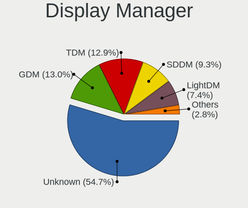

| Name    | Computers | Percent |
|---------|-----------|---------|
| Unknown | 964       | 54.56%  |
| TDM     | 239       | 13.53%  |
| GDM     | 238       | 13.47%  |
| SDDM    | 167       | 9.45%   |
| LightDM | 117       | 6.62%   |
| GDM3    | 19        | 1.08%   |
| XDM     | 9         | 0.51%   |
| SLiM    | 4         | 0.23%   |
| NODM    | 4         | 0.23%   |
| WDM     | 2         | 0.11%   |
| KDM     | 2         | 0.11%   |
| Ly      | 1         | 0.06%   |
| LXDM    | 1         | 0.06%   |

OS Lang
-------

Language

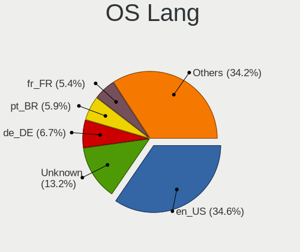

| Lang    | Computers | Percent |
|---------|-----------|---------|
| en_US   | 606       | 34.37%  |
| Unknown | 236       | 13.39%  |
| de_DE   | 117       | 6.64%   |
| pt_BR   | 107       | 6.07%   |
| fr_FR   | 98        | 5.56%   |
| ru_RU   | 86        | 4.88%   |
| en_GB   | 73        | 4.14%   |
| it_IT   | 48        | 2.72%   |
| es_ES   | 48        | 2.72%   |
| C       | 29        | 1.64%   |
| en_CA   | 26        | 1.47%   |
| pl_PL   | 23        | 1.3%    |
| en_IN   | 18        | 1.02%   |
| en_AU   | 17        | 0.96%   |
| es_MX   | 15        | 0.85%   |
| pt_PT   | 14        | 0.79%   |
| en_IE   | 14        | 0.79%   |
| es_CL   | 13        | 0.74%   |
| zh_CN   | 11        | 0.62%   |
| es_AR   | 11        | 0.62%   |
| de_CH   | 11        | 0.62%   |
| ru_UA   | 9         | 0.51%   |
| es_VE   | 8         | 0.45%   |
| cs_CZ   | 8         | 0.45%   |
| hu_HU   | 7         | 0.4%    |
| en_ZA   | 6         | 0.34%   |
| de_AT   | 6         | 0.34%   |
| sv_SE   | 5         | 0.28%   |
| nl_NL   | 5         | 0.28%   |
| fr_CH   | 5         | 0.28%   |
| fi_FI   | 5         | 0.28%   |
| es_CO   | 5         | 0.28%   |
| en_NZ   | 5         | 0.28%   |
| da_DK   | 5         | 0.28%   |
| sk_SK   | 4         | 0.23%   |
| nl_BE   | 4         | 0.23%   |
| ko_KR   | 4         | 0.23%   |
| ja_JP   | 4         | 0.23%   |
| es_CR   | 3         | 0.17%   |
| en_DK   | 3         | 0.17%   |

Boot Mode
---------

EFI or BIOS

| Mode | Computers | Percent |
|------|-----------|---------|
| BIOS | 1178      | 67.16%  |
| EFI  | 576       | 32.84%  |

Filesystem
----------

Type of filesystem

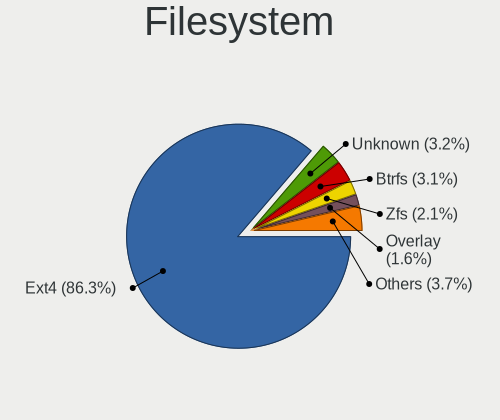

| Type    | Computers | Percent |
|---------|-----------|---------|
| Ext4    | 1527      | 87.31%  |
| Unknown | 59        | 3.37%   |
| Btrfs   | 55        | 3.14%   |
| Zfs     | 36        | 2.06%   |
| Xfs     | 22        | 1.26%   |
| Overlay | 18        | 1.03%   |
| Ext2    | 12        | 0.69%   |
| Ext3    | 7         | 0.4%    |
| Tmpfs   | 4         | 0.23%   |
| Rootfs  | 3         | 0.17%   |
| F2fs    | 3         | 0.17%   |
| Ubifs   | 2         | 0.11%   |
| Aufs    | 1         | 0.06%   |

Part. scheme
------------

Scheme of partitioning

| Type    | Computers | Percent |
|---------|-----------|---------|
| Unknown | 774       | 43.85%  |
| GPT     | 633       | 35.86%  |
| MBR     | 358       | 20.28%  |

Dual Boot with Linux/BSD
------------------------

Hosting more than one Linux/BSD

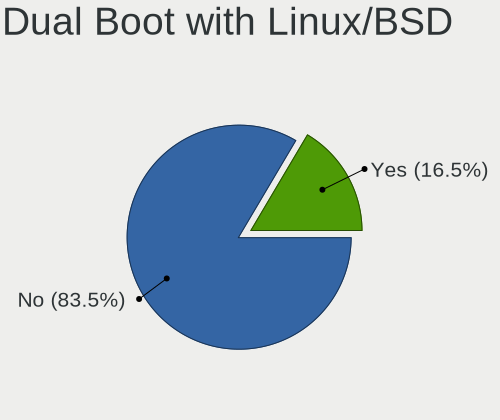

| Dual boot | Computers | Percent |
|-----------|-----------|---------|
| No        | 1471      | 83.77%  |
| Yes       | 285       | 16.23%  |

Dual Boot (Win)
---------------

Hosting Linux and Windows

| Dual boot | Computers | Percent |
|-----------|-----------|---------|
| No        | 1356      | 77.4%   |
| Yes       | 396       | 22.6%   |

Board
-----

Vendor
------

Motherboard manufacturer

| Name                    | Computers | Percent |
|-------------------------|-----------|---------|
| ASUSTek Computer        | 279       | 16.06%  |
| Dell                    | 247       | 14.22%  |
| Lenovo                  | 245       | 14.1%   |
| Hewlett-Packard         | 200       | 11.51%  |
| Gigabyte Technology     | 117       | 6.74%   |
| Acer                    | 94        | 5.41%   |
| ASRock                  | 84        | 4.84%   |
| MSI                     | 68        | 3.91%   |
| Intel                   | 49        | 2.82%   |
| Toshiba                 | 26        | 1.5%    |
| Supermicro              | 26        | 1.5%    |
| Apple                   | 25        | 1.44%   |
| Samsung Electronics     | 21        | 1.21%   |
| Unknown                 | 20        | 1.15%   |
| Sony                    | 16        | 0.92%   |
| Raspberry Pi Foundation | 13        | 0.75%   |
| Positivo                | 13        | 0.75%   |
| Fujitsu                 | 11        | 0.63%   |
| IBM                     | 9         | 0.52%   |
| Notebook                | 8         | 0.46%   |
| Medion                  | 7         | 0.4%    |
| AZW                     | 7         | 0.4%    |
| Fujitsu Siemens         | 6         | 0.35%   |
| ASRockRack              | 6         | 0.35%   |
| Alienware               | 6         | 0.35%   |
| sunxi                   | 5         | 0.29%   |
| Foxconn                 | 5         | 0.29%   |
| Pegatron                | 4         | 0.23%   |
| Google                  | 4         | 0.23%   |
| WeiBu                   | 3         | 0.17%   |
| Timi                    | 3         | 0.17%   |
| Shuttle                 | 3         | 0.17%   |
| Pine Microsystems       | 3         | 0.17%   |
| Panasonic               | 3         | 0.17%   |
| LG Electronics          | 3         | 0.17%   |
| Hardkernel              | 3         | 0.17%   |
| ECS                     | 3         | 0.17%   |
| Biostar                 | 3         | 0.17%   |
| AMI                     | 3         | 0.17%   |
| YANYU                   | 2         | 0.12%   |

Model
-----

Motherboard model

| Name                               | Computers | Percent |
|------------------------------------|-----------|---------|
| Unknown                            | 32        | 1.84%   |
| ASUS All Series                    | 24        | 1.38%   |
| Dell OptiPlex 7010                 | 6         | 0.35%   |
| Dell XPS 13 9360                   | 5         | 0.29%   |
| Dell OptiPlex 3010                 | 5         | 0.29%   |
| AZW AP35                           | 5         | 0.29%   |
| ASUS PRIME X370-PRO                | 5         | 0.29%   |
| ASRock B450M Pro4                  | 5         | 0.29%   |
| HP Pavilion Notebook               | 4         | 0.23%   |
| Gigabyte X470 AORUS ULTRA GAMING   | 4         | 0.23%   |
| Gigabyte B450M DS3H                | 4         | 0.23%   |
| Dell Inspiron 1545                 | 4         | 0.23%   |
| ASUS TUF Gaming X570-PLUS          | 4         | 0.23%   |
| ASUS M5A97 R2.0                    | 4         | 0.23%   |
| ASUS M5A78L-M/USB3                 | 4         | 0.23%   |
| WeiBu PSB133S01ZFP                 | 3         | 0.17%   |
| Supermicro Super Server            | 3         | 0.17%   |
| RPi Raspberry Pi 4 Model B Rev 1.4 | 3         | 0.17%   |
| RPi Raspberry Pi 4 Model B Rev 1.1 | 3         | 0.17%   |
| RPi Raspberry Pi 3 Model B Rev 1.2 | 3         | 0.17%   |
| RPi Raspberry Pi                   | 3         | 0.17%   |
| Positivo Mobile                    | 3         | 0.17%   |
| Positivo C464C                     | 3         | 0.17%   |
| Lenovo ThinkPad E480 20KN003WUS    | 3         | 0.17%   |
| Lenovo IdeaPad 330-15IKB 81FE      | 3         | 0.17%   |
| Lenovo IdeaPad 110-15IBR 80T7      | 3         | 0.17%   |
| Intel powered classmate PC         | 3         | 0.17%   |
| HP Stream Notebook PC 13           | 3         | 0.17%   |
| HP ProBook 4540s                   | 3         | 0.17%   |
| HP Pavilion g6                     | 3         | 0.17%   |
| HP Pavilion g4                     | 3         | 0.17%   |
| HP Notebook                        | 3         | 0.17%   |
| HP EliteBook 850 G5                | 3         | 0.17%   |
| HP 2000                            | 3         | 0.17%   |
| Gigabyte F2A88XM-D3H               | 3         | 0.17%   |
| Dell Precision 5530                | 3         | 0.17%   |
| Dell OptiPlex 760                  | 3         | 0.17%   |
| Dell OptiPlex 3020                 | 3         | 0.17%   |
| Dell Latitude E7450                | 3         | 0.17%   |
| Dell Latitude E6430                | 3         | 0.17%   |

Model Family
------------

Motherboard model prefix

| Name                    | Computers | Percent |
|-------------------------|-----------|---------|
| Lenovo ThinkPad         | 124       | 7.14%   |
| Dell Inspiron           | 68        | 3.91%   |
| Dell Latitude           | 64        | 3.68%   |
| Acer Aspire             | 62        | 3.57%   |
| Lenovo IdeaPad          | 44        | 2.53%   |
| ASUS PRIME              | 37        | 2.13%   |
| Dell OptiPlex           | 36        | 2.07%   |
| Unknown                 | 32        | 1.84%   |
| HP EliteBook            | 29        | 1.67%   |
| HP Pavilion             | 25        | 1.44%   |
| HP ProBook              | 24        | 1.38%   |
| ASUS All                | 24        | 1.38%   |
| Dell Precision          | 22        | 1.27%   |
| HP Compaq               | 21        | 1.21%   |
| Toshiba Satellite       | 20        | 1.15%   |
| Dell Vostro             | 18        | 1.04%   |
| ASUS ROG                | 16        | 0.92%   |
| Lenovo ThinkCentre      | 15        | 0.86%   |
| Dell PowerEdge          | 15        | 0.86%   |
| ASUS TUF                | 14        | 0.81%   |
| RPi Raspberry           | 13        | 0.75%   |
| HP Laptop               | 12        | 0.69%   |
| Dell XPS                | 12        | 0.69%   |
| HP ProLiant             | 10        | 0.58%   |
| ASUS VivoBook           | 10        | 0.58%   |
| Lenovo IdeaCentre       | 9         | 0.52%   |
| ASUS M5A78L-M           | 9         | 0.52%   |
| ASRock B450M            | 8         | 0.46%   |
| Lenovo Yoga             | 6         | 0.35%   |
| HP EliteDesk            | 6         | 0.35%   |
| Gigabyte B450M          | 6         | 0.35%   |
| Acer Swift              | 6         | 0.35%   |
| Lenovo ThinkStation     | 5         | 0.29%   |
| Lenovo Legion           | 5         | 0.29%   |
| IBM System              | 5         | 0.29%   |
| HP ENVY                 | 5         | 0.29%   |
| Gigabyte X470           | 5         | 0.29%   |
| Fujitsu Siemens ESPRIMO | 5         | 0.29%   |
| AZW AP35                | 5         | 0.29%   |
| ASRock B450             | 5         | 0.29%   |

MFG Year
--------

Motherboard manufacture year

| Year    | Computers | Percent |
|---------|-----------|---------|
| 2018    | 199       | 11.46%  |
| 2019    | 197       | 11.34%  |
| 2011    | 160       | 9.21%   |
| 2012    | 153       | 8.81%   |
| 2017    | 133       | 7.66%   |
| 2013    | 122       | 7.02%   |
| 2015    | 106       | 6.1%    |
| 2014    | 105       | 6.04%   |
| 2016    | 93        | 5.35%   |
| 2020    | 92        | 5.3%    |
| 2010    | 91        | 5.24%   |
| 2009    | 86        | 4.95%   |
| 2008    | 75        | 4.32%   |
| 2007    | 43        | 2.48%   |
| Unknown | 33        | 1.9%    |
| 2006    | 19        | 1.09%   |
| 2021    | 13        | 0.75%   |
| 2005    | 8         | 0.46%   |
| 2004    | 6         | 0.35%   |
| 2022    | 1         | 0.06%   |
| 2003    | 1         | 0.06%   |
| 2002    | 1         | 0.06%   |

Form Factor
-----------

Physical design of the computer

| Name           | Computers | Percent |
|----------------|-----------|---------|
| Notebook       | 844       | 48.59%  |
| Desktop        | 725       | 41.74%  |
| Server         | 51        | 2.94%   |
| System on chip | 31        | 1.78%   |
| Convertible    | 30        | 1.73%   |
| Mini pc        | 30        | 1.73%   |
| All in one     | 17        | 0.98%   |
| Tablet         | 7         | 0.4%    |
| Phone          | 2         | 0.12%   |

Secure Boot
-----------

Enabled or disabled

| State    | Computers | Percent |
|----------|-----------|---------|
| Disabled | 1693      | 97.35%  |
| Enabled  | 46        | 2.65%   |

Coreboot
--------

Have coreboot on board

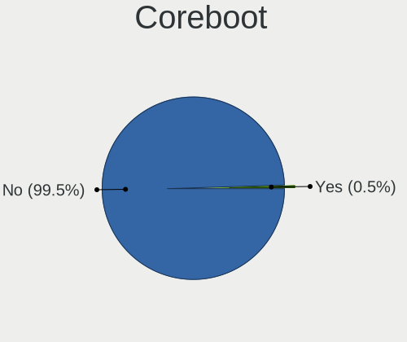

| Used | Computers | Percent |
|------|-----------|---------|
| No   | 1728      | 99.48%  |
| Yes  | 9         | 0.52%   |

RAM Size
--------

Total RAM memory

| Size in GB      | Computers | Percent |
|-----------------|-----------|---------|
| 3.01-4.0        | 338       | 19.26%  |
| 16.01-24.0      | 337       | 19.2%   |
| 8.01-16.0       | 336       | 19.15%  |
| 4.01-8.0        | 298       | 16.98%  |
| 32.01-64.0      | 150       | 8.55%   |
| 1.01-2.0        | 93        | 5.3%    |
| 64.01-256.0     | 71        | 4.05%   |
| 2.01-3.0        | 40        | 2.28%   |
| 24.01-32.0      | 35        | 1.99%   |
| 0.51-1.0        | 33        | 1.88%   |
| 0.01-0.5        | 9         | 0.51%   |
| Unknown         | 8         | 0.46%   |
| More than 256.0 | 7         | 0.4%    |

RAM Used
--------

Used RAM memory

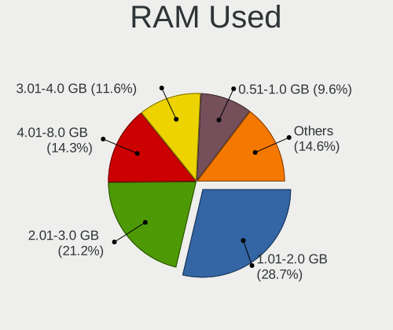

| Used GB         | Computers | Percent |
|-----------------|-----------|---------|
| 1.01-2.0        | 539       | 28.53%  |
| 2.01-3.0        | 407       | 21.55%  |
| 4.01-8.0        | 274       | 14.51%  |
| 3.01-4.0        | 223       | 11.81%  |
| 0.51-1.0        | 180       | 9.53%   |
| 8.01-16.0       | 119       | 6.3%    |
| 0.01-0.5        | 78        | 4.13%   |
| 16.01-24.0      | 26        | 1.38%   |
| 32.01-64.0      | 18        | 0.95%   |
| Unknown         | 10        | 0.53%   |
| 24.01-32.0      | 8         | 0.42%   |
| 64.01-256.0     | 6         | 0.32%   |
| More than 256.0 | 1         | 0.05%   |

Total Drives
------------

Number of drives on board

| Drives  | Computers | Percent |
|---------|-----------|---------|
| 1       | 942       | 53.07%  |
| 2       | 455       | 25.63%  |
| 3       | 156       | 8.79%   |
| 4       | 88        | 4.96%   |
| 5       | 49        | 2.76%   |
| 6       | 26        | 1.46%   |
| 7       | 20        | 1.13%   |
| 0       | 15        | 0.85%   |
| 9       | 10        | 0.56%   |
| 8       | 6         | 0.34%   |
| 17      | 1         | 0.06%   |
| 16      | 1         | 0.06%   |
| 14      | 1         | 0.06%   |
| 13      | 1         | 0.06%   |
| 12      | 1         | 0.06%   |
| 11      | 1         | 0.06%   |
| 10      | 1         | 0.06%   |
| Unknown | 1         | 0.06%   |

Has CD-ROM
----------

Has CD-ROM on board

| Presented | Computers | Percent |
|-----------|-----------|---------|
| No        | 1083      | 62.06%  |
| Yes       | 662       | 37.94%  |

Has Ethernet
------------

Has Ethernet on board

| Presented | Computers | Percent |
|-----------|-----------|---------|
| Yes       | 1580      | 90.91%  |
| No        | 158       | 9.09%   |

Has WiFi
--------

Has WiFi module

| Presented | Computers | Percent |
|-----------|-----------|---------|
| Yes       | 1162      | 66.55%  |
| No        | 584       | 33.45%  |

Has Bluetooth
-------------

Has Bluetooth module

| Presented | Computers | Percent |
|-----------|-----------|---------|
| No        | 886       | 50.54%  |
| Yes       | 867       | 49.46%  |

Location
--------

Country
-------

Geographic location (country)

| Country      | Computers | Percent |
|--------------|-----------|---------|
| USA          | 255       | 14.61%  |
| Russia       | 168       | 9.63%   |
| Germany      | 166       | 9.51%   |
| Brazil       | 155       | 8.88%   |
| France       | 134       | 7.68%   |
| Spain        | 81        | 4.64%   |
| Italy        | 79        | 4.53%   |
| UK           | 47        | 2.69%   |
| Switzerland  | 40        | 2.29%   |
| Poland       | 37        | 2.12%   |
| Canada       | 33        | 1.89%   |
| Ukraine      | 31        | 1.78%   |
| Netherlands  | 30        | 1.72%   |
| India        | 28        | 1.6%    |
| China        | 23        | 1.32%   |
| Portugal     | 21        | 1.2%    |
| Mexico       | 21        | 1.2%    |
| Hungary      | 21        | 1.2%    |
| Australia    | 21        | 1.2%    |
| Chile        | 17        | 0.97%   |
| Finland      | 15        | 0.86%   |
| Belgium      | 15        | 0.86%   |
| Sweden       | 14        | 0.8%    |
| Czechia      | 14        | 0.8%    |
| Argentina    | 14        | 0.8%    |
| Austria      | 13        | 0.74%   |
| Turkey       | 12        | 0.69%   |
| Romania      | 12        | 0.69%   |
| Greece       | 11        | 0.63%   |
| Venezuela    | 10        | 0.57%   |
| New Zealand  | 10        | 0.57%   |
| Ireland      | 10        | 0.57%   |
| Denmark      | 10        | 0.57%   |
| Norway       | 9         | 0.52%   |
| Indonesia    | 9         | 0.52%   |
| Colombia     | 8         | 0.46%   |
| Vietnam      | 7         | 0.4%    |
| South Africa | 7         | 0.4%    |
| Slovakia     | 7         | 0.4%    |
| Pakistan     | 6         | 0.34%   |

City
----

Geographic location (city)

| City              | Computers | Percent |
|-------------------|-----------|---------|
| St Petersburg     | 46        | 2.52%   |
| Moscow            | 41        | 2.24%   |
| Sao Paulo         | 32        | 1.75%   |
| Paris             | 20        | 1.09%   |
| Zurich            | 17        | 0.93%   |
| Madrid            | 14        | 0.77%   |
| Berlin            | 14        | 0.77%   |
| Amsterdam         | 12        | 0.66%   |
| Perm              | 11        | 0.6%    |
| New York          | 11        | 0.6%    |
| Hamburg           | 11        | 0.6%    |
| Budapest          | 11        | 0.6%    |
| Warsaw            | 10        | 0.55%   |
| Helsinki          | 10        | 0.55%   |
| Yekaterinburg     | 9         | 0.49%   |
| Vienna            | 9         | 0.49%   |
| Milan             | 9         | 0.49%   |
| Kyiv              | 9         | 0.49%   |
| Porto Alegre      | 8         | 0.44%   |
| Braslia         | 8         | 0.44%   |
| Belo Horizonte    | 8         | 0.44%   |
| Wooster           | 7         | 0.38%   |
| San Jose          | 7         | 0.38%   |
| Rio de Janeiro    | 7         | 0.38%   |
| Phoenix           | 7         | 0.38%   |
| Munich            | 7         | 0.38%   |
| Auckland          | 7         | 0.38%   |
| Voronezh          | 6         | 0.33%   |
| Sydney            | 6         | 0.33%   |
| Prague            | 6         | 0.33%   |
| Mexico City       | 6         | 0.33%   |
| Lisbon            | 6         | 0.33%   |
| Frankfurt am Main | 6         | 0.33%   |
| Dublin            | 6         | 0.33%   |
| Athens            | 6         | 0.33%   |
| Valencia          | 5         | 0.27%   |
| Strasbourg        | 5         | 0.27%   |
| Stockholm         | 5         | 0.27%   |
| Sofia             | 5         | 0.27%   |
| Rome              | 5         | 0.27%   |

Drives
------

Drive Vendor
------------

Hard drive vendors

| Vendor                    | Computers | Drives | Percent |
|---------------------------|-----------|--------|---------|
| WDC                       | 454       | 747    | 16.79%  |
| Seagate                   | 429       | 683    | 15.87%  |
| Samsung Electronics       | 386       | 545    | 14.28%  |
| Toshiba                   | 193       | 291    | 7.14%   |
| Kingston                  | 148       | 193    | 5.47%   |
| Unknown                   | 136       | 184    | 5.03%   |
| Crucial                   | 121       | 157    | 4.47%   |
| SanDisk                   | 115       | 151    | 4.25%   |
| Hitachi                   | 98        | 140    | 3.62%   |
| HGST                      | 60        | 88     | 2.22%   |
| Intel                     | 52        | 81     | 1.92%   |
| A-DATA Technology         | 49        | 62     | 1.81%   |
| SK hynix                  | 37        | 46     | 1.37%   |
| Phison                    | 24        | 36     | 0.89%   |
| OCZ                       | 22        | 26     | 0.81%   |
| China                     | 19        | 20     | 0.7%    |
| Transcend                 | 18        | 20     | 0.67%   |
| Micron Technology         | 17        | 19     | 0.63%   |
| Maxtor                    | 15        | 18     | 0.55%   |
| Hewlett-Packard           | 15        | 22     | 0.55%   |
| Intenso                   | 14        | 19     | 0.52%   |
| Corsair                   | 14        | 18     | 0.52%   |
| Patriot                   | 13        | 17     | 0.48%   |
| LITEON                    | 12        | 14     | 0.44%   |
| Fujitsu                   | 12        | 13     | 0.44%   |
| Apple                     | 12        | 15     | 0.44%   |
| SPCC                      | 9         | 10     | 0.33%   |
| Silicon Motion            | 9         | 10     | 0.33%   |
| PNY                       | 9         | 16     | 0.33%   |
| KingDian                  | 9         | 10     | 0.33%   |
| Micron/Crucial Technology | 8         | 8      | 0.3%    |
| LDLC                      | 8         | 10     | 0.3%    |
| GOODRAM                   | 8         | 8      | 0.3%    |
| Team                      | 7         | 10     | 0.26%   |
| JMicron Technology        | 7         | 7      | 0.26%   |
| ASMT                      | 7         | 14     | 0.26%   |
| Gigabyte Technology       | 6         | 9      | 0.22%   |
| LITEONIT                  | 5         | 5      | 0.18%   |
| Plextor                   | 4         | 6      | 0.15%   |
| Unknown                   | 4         | 5      | 0.15%   |

Drive Model
-----------

Hard drive models

| Model                                  | Computers | Percent |
|----------------------------------------|-----------|---------|
| Kingston SA400S37240G 240GB SSD        | 32        | 1.06%   |
| Samsung SSD 850 EVO 250GB              | 27        | 0.89%   |
| Unknown MMC Card  32GB                 | 25        | 0.83%   |
| Kingston SA400S37120G 120GB SSD        | 21        | 0.69%   |
| Crucial CT500MX500SSD1 500GB           | 21        | 0.69%   |
| Toshiba MQ01ABD100 1TB                 | 20        | 0.66%   |
| Seagate ST500DM002-1BD142 500GB        | 20        | 0.66%   |
| Seagate ST1000LM024 HN-M101MBB 1TB     | 20        | 0.66%   |
| Seagate ST1000DM010-2EP102 1TB         | 20        | 0.66%   |
| Samsung SSD 860 EVO 500GB              | 20        | 0.66%   |
| Unknown MMC Card  64GB                 | 18        | 0.6%    |
| Seagate ST1000LM035-1RK172 1TB         | 18        | 0.6%    |
| HGST HTS721010A9E630 1TB               | 17        | 0.56%   |
| WDC WDS240G2G0A-00JH30 240GB SSD       | 16        | 0.53%   |
| Kingston SV300S37A120G 120GB SSD       | 16        | 0.53%   |
| Kingston SA400S37480G 480GB SSD        | 15        | 0.5%    |
| Samsung SSD 860 EVO 1TB                | 14        | 0.46%   |
| Samsung NVMe SSD Drive 512GB           | 13        | 0.43%   |
| Seagate ST500LM012 HN-M500MBB 500GB    | 12        | 0.4%    |
| Seagate ST2000DM001-1ER164 2TB         | 12        | 0.4%    |
| Samsung SSD 860 EVO 250GB              | 12        | 0.4%    |
| Samsung SSD 850 EVO 500GB              | 12        | 0.4%    |
| Kingston SUV400S37240G 240GB SSD       | 12        | 0.4%    |
| Crucial CT240BX500SSD1 240GB           | 12        | 0.4%    |
| Toshiba DT01ACA100 1TB                 | 11        | 0.36%   |
| Seagate ST2000DM008-2FR102 2TB         | 11        | 0.36%   |
| Crucial CT250MX500SSD1 250GB           | 11        | 0.36%   |
| Toshiba HDWD120 2TB                    | 10        | 0.33%   |
| Toshiba DT01ACA050 500GB               | 10        | 0.33%   |
| Seagate ST9500325AS 500GB              | 10        | 0.33%   |
| Seagate ST2000DM006-2DM164 2TB         | 10        | 0.33%   |
| Seagate ST1000DM003-1CH162 1TB         | 10        | 0.33%   |
| Samsung SSD 970 EVO Plus 1TB           | 10        | 0.33%   |
| Samsung SM963 2.5" NVMe PCIe SSD 256GB | 10        | 0.33%   |
| WDC WD10EZEX-08WN4A0 1TB               | 9         | 0.3%    |
| Toshiba MQ01ABF050 500GB               | 9         | 0.3%    |
| Toshiba HDWD110 1TB                    | 9         | 0.3%    |
| Seagate ST500LT012-1DG142 500GB        | 9         | 0.3%    |
| Seagate ST1000LM048-2E7172 1TB         | 9         | 0.3%    |
| Samsung SSD 970 EVO Plus 500GB         | 9         | 0.3%    |

HDD Vendor
----------

Hard disk drive vendors

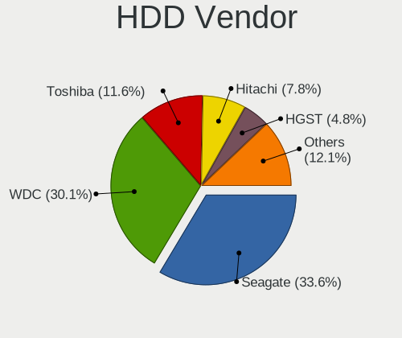

| Vendor              | Computers | Drives | Percent |
|---------------------|-----------|--------|---------|
| Seagate             | 416       | 664    | 33.88%  |
| WDC                 | 376       | 643    | 30.62%  |
| Toshiba             | 146       | 225    | 11.89%  |
| Hitachi             | 97        | 138    | 7.9%    |
| HGST                | 60        | 88     | 4.89%   |
| Samsung Electronics | 59        | 79     | 4.8%    |
| Maxtor              | 15        | 18     | 1.22%   |
| Fujitsu             | 12        | 13     | 0.98%   |
| Unknown             | 8         | 11     | 0.65%   |
| Apple               | 7         | 9      | 0.57%   |
| ASMT                | 6         | 13     | 0.49%   |
| Hewlett-Packard     | 5         | 9      | 0.41%   |
| Intenso             | 3         | 4      | 0.24%   |
| NETAPP              | 2         | 6      | 0.16%   |
| HPE                 | 2         | 2      | 0.16%   |
| USB 3.0             | 1         | 2      | 0.08%   |
| SILICONMOTION       | 1         | 1      | 0.08%   |
| SABRENT             | 1         | 2      | 0.08%   |
| Quantum             | 1         | 1      | 0.08%   |
| QNAP                | 1         | 2      | 0.08%   |
| PHD 3.0             | 1         | 1      | 0.08%   |
| Pear 2TB            | 1         | 1      | 0.08%   |
| LIO-ORG             | 1         | 8      | 0.08%   |
| LaCie               | 1         | 1      | 0.08%   |
| Innodisk            | 1         | 1      | 0.08%   |
| Inateck             | 1         | 1      | 0.08%   |
| IBM/Hitachi         | 1         | 2      | 0.08%   |
| ExcelStor           | 1         | 1      | 0.08%   |
| DAS                 | 1         | 1      | 0.08%   |

SSD Vendor
----------

Solid state drive vendors

| Vendor              | Computers | Drives | Percent |
|---------------------|-----------|--------|---------|
| Samsung Electronics | 222       | 292    | 22.72%  |
| Kingston            | 135       | 173    | 13.82%  |
| Crucial             | 113       | 147    | 11.57%  |
| SanDisk             | 86        | 114    | 8.8%    |
| WDC                 | 59        | 67     | 6.04%   |
| A-DATA Technology   | 40        | 53     | 4.09%   |
| Intel               | 31        | 49     | 3.17%   |
| OCZ                 | 22        | 26     | 2.25%   |
| China               | 19        | 20     | 1.94%   |
| Toshiba             | 18        | 23     | 1.84%   |
| Transcend           | 17        | 19     | 1.74%   |
| SK hynix            | 13        | 15     | 1.33%   |
| Micron Technology   | 13        | 15     | 1.33%   |
| Patriot             | 12        | 16     | 1.23%   |
| LITEON              | 10        | 12     | 1.02%   |
| Intenso             | 10        | 13     | 1.02%   |
| KingDian            | 8         | 9      | 0.82%   |
| SPCC                | 7         | 8      | 0.72%   |
| PNY                 | 7         | 11     | 0.72%   |
| GOODRAM             | 7         | 7      | 0.72%   |
| Team                | 6         | 9      | 0.61%   |
| Seagate             | 6         | 7      | 0.61%   |
| LDLC                | 6         | 6      | 0.61%   |
| Hewlett-Packard     | 6         | 6      | 0.61%   |
| Corsair             | 6         | 6      | 0.61%   |
| LITEONIT            | 5         | 5      | 0.51%   |
| Gigabyte Technology | 5         | 7      | 0.51%   |
| Apple               | 5         | 6      | 0.51%   |
| Plextor             | 4         | 6      | 0.41%   |
| JMicron Technology  | 4         | 4      | 0.41%   |
| Zheino              | 3         | 6      | 0.31%   |
| Unknown             | 3         | 3      | 0.31%   |
| TO Exter            | 3         | 3      | 0.31%   |
| KingSpec            | 3         | 3      | 0.31%   |
| Hajaan              | 3         | 3      | 0.31%   |
| AMD                 | 3         | 3      | 0.31%   |
| Super Talent        | 2         | 3      | 0.2%    |
| Lexar               | 2         | 2      | 0.2%    |
| FORESEE             | 2         | 3      | 0.2%    |
| Dogfish             | 2         | 4      | 0.2%    |

Drive Kind
----------

HDD or SSD

| Kind    | Computers | Drives | Percent |
|---------|-----------|--------|---------|
| HDD     | 1000      | 1947   | 42.43%  |
| SSD     | 846       | 1241   | 35.89%  |
| NVMe    | 346       | 493    | 14.68%  |
| MMC     | 126       | 170    | 5.35%   |
| Unknown | 39        | 53     | 1.65%   |

Drive Connector
---------------

SATA, SAS, NVMe, etc.

| Type | Computers | Drives | Percent |
|------|-----------|--------|---------|
| SATA | 1464      | 3073   | 71.76%  |
| NVMe | 345       | 489    | 16.91%  |
| MMC  | 126       | 170    | 6.18%   |
| SAS  | 105       | 172    | 5.15%   |

Drive Size
----------

Size of hard drive

| Size in TB | Computers | Drives | Percent |
|------------|-----------|--------|---------|
| 0.01-0.5   | 1106      | 1696   | 56.49%  |
| 0.51-1.0   | 521       | 800    | 26.61%  |
| 1.01-2.0   | 155       | 277    | 7.92%   |
| 3.01-4.0   | 76        | 185    | 3.88%   |
| 4.01-10.0  | 52        | 129    | 2.66%   |
| 2.01-3.0   | 41        | 85     | 2.09%   |
| 10.01-20.0 | 6         | 14     | 0.31%   |
| 20.01-50.0 | 1         | 2      | 0.05%   |

Space Total
-----------

Amount of disk space available on the file system

| Size in GB     | Computers | Percent |
|----------------|-----------|---------|
| 101-250        | 466       | 25.93%  |
| 251-500        | 357       | 19.87%  |
| 501-1000       | 244       | 13.58%  |
| 51-100         | 153       | 8.51%   |
| 1001-2000      | 143       | 7.96%   |
| Unknown        | 124       | 6.9%    |
| More than 3000 | 120       | 6.68%   |
| 21-50          | 82        | 4.56%   |
| 2001-3000      | 58        | 3.23%   |
| 1-20           | 50        | 2.78%   |

Space Used
----------

Amount of used disk space

| Used GB        | Computers | Percent |
|----------------|-----------|---------|
| 1-20           | 552       | 29.6%   |
| 101-250        | 276       | 14.8%   |
| 21-50          | 275       | 14.75%  |
| 51-100         | 202       | 10.83%  |
| 251-500        | 163       | 8.74%   |
| Unknown        | 124       | 6.65%   |
| 501-1000       | 112       | 6.01%   |
| 1001-2000      | 84        | 4.5%    |
| More than 3000 | 51        | 2.73%   |
| 2001-3000      | 25        | 1.34%   |
| 0              | 1         | 0.05%   |

Malfunc. Drives
---------------

Drive models with a malfunction

| Model                              | Computers | Drives | Percent |
|------------------------------------|-----------|--------|---------|
| WDC WD10EADS-00M2B0 1TB            | 4         | 4      | 1.57%   |
| Toshiba MQ01ABD100 1TB             | 4         | 4      | 1.57%   |
| WDC WD20EFRX-68EUZN0 2TB           | 3         | 9      | 1.18%   |
| Seagate ST1000LM035-1RK172 1TB     | 3         | 3      | 1.18%   |
| Seagate ST1000LM024 HN-M101MBB 1TB | 3         | 4      | 1.18%   |
| Samsung Electronics HD103UJ 1TB    | 3         | 4      | 1.18%   |
| A-DATA Technology SU800 256GB SSD  | 3         | 4      | 1.18%   |
| WDC WDS240G2G0A-00JH30 240GB SSD   | 2         | 2      | 0.78%   |
| WDC WD5000AAKX-003CA0 500GB        | 2         | 2      | 0.78%   |
| Toshiba MQ01ACF050 500GB           | 2         | 2      | 0.78%   |
| Seagate ST9500420AS 500GB          | 2         | 2      | 0.78%   |
| Seagate ST9500325AS 500GB          | 2         | 2      | 0.78%   |
| Seagate ST9250315AS 250GB          | 2         | 2      | 0.78%   |
| Seagate ST500LT012-9WS142 500GB    | 2         | 2      | 0.78%   |
| Seagate ST500LM021-1KJ152 500GB    | 2         | 2      | 0.78%   |
| Seagate ST500DM002-1BD142 500GB    | 2         | 2      | 0.78%   |
| Seagate ST4000DM000-1F2168 4TB     | 2         | 2      | 0.78%   |
| Seagate ST3500418AS 500GB          | 2         | 4      | 0.78%   |
| Seagate ST3250410AS 250GB          | 2         | 2      | 0.78%   |
| Seagate ST32000644NS 2TB           | 2         | 4      | 0.78%   |
| Seagate ST2000DM008-2FR1           | 2         | 2      | 0.78%   |
| Seagate ST1000DM010-2EP102 1TB     | 2         | 3      | 0.78%   |
| Samsung Electronics HD753LJ 752GB  | 2         | 3      | 0.78%   |
| Samsung Electronics HD154UI 1TB    | 2         | 3      | 0.78%   |
| Maxtor STM3250310AS 250GB          | 2         | 2      | 0.78%   |
| Kingston SUV400S37240G 240GB SSD   | 2         | 2      | 0.78%   |
| Kingston SH103S3120G 120GB SSD     | 2         | 2      | 0.78%   |
| KingDian S200 60GB                 | 2         | 2      | 0.78%   |
| Hitachi HTS547550A9E384 500GB      | 2         | 2      | 0.78%   |
| Hitachi HTS545016B9A300 160GB      | 2         | 2      | 0.78%   |
| Hitachi HDS721050CLA660 500GB      | 2         | 2      | 0.78%   |
| A-DATA Technology SX900 256GB SSD  | 2         | 2      | 0.78%   |
| Zheino CHN 25SATAA3 360 360GB SSD  | 1         | 1      | 0.39%   |
| WDC WDS120G2G0A-00JH30 120GB SSD   | 1         | 1      | 0.39%   |
| WDC WD7500BPVX-22JC3T0 752GB       | 1         | 1      | 0.39%   |
| WDC WD7500BPKT-75PK4T0 752GB       | 1         | 1      | 0.39%   |
| WDC WD7500AACS-65D6B0 752GB        | 1         | 1      | 0.39%   |
| WDC WD7500AACS-00ZJB0 752GB        | 1         | 1      | 0.39%   |
| WDC WD5002ABYS-02B1B0 500GB        | 1         | 1      | 0.39%   |
| WDC WD5001FZWX-00ZHUA0 5TB         | 1         | 4      | 0.39%   |

Malfunc. Drive Vendor
---------------------

Vendors of faulty drives

| Vendor              | Computers | Drives | Percent |
|---------------------|-----------|--------|---------|
| Seagate             | 64        | 79     | 25.7%   |
| WDC                 | 43        | 57     | 17.27%  |
| Samsung Electronics | 28        | 33     | 11.24%  |
| Hitachi             | 26        | 27     | 10.44%  |
| Toshiba             | 18        | 20     | 7.23%   |
| Intel               | 8         | 12     | 3.21%   |
| Crucial             | 8         | 8      | 3.21%   |
| SanDisk             | 7         | 10     | 2.81%   |
| Kingston            | 7         | 8      | 2.81%   |
| A-DATA Technology   | 7         | 8      | 2.81%   |
| Maxtor              | 5         | 5      | 2.01%   |
| Fujitsu             | 4         | 4      | 1.61%   |
| OCZ                 | 3         | 4      | 1.2%    |
| KingDian            | 3         | 3      | 1.2%    |
| HGST                | 3         | 3      | 1.2%    |
| SK hynix            | 2         | 2      | 0.8%    |
| Zheino              | 1         | 1      | 0.4%    |
| Unknown             | 1         | 1      | 0.4%    |
| Team                | 1         | 1      | 0.4%    |
| Plextor             | 1         | 2      | 0.4%    |
| Micron Technology   | 1         | 1      | 0.4%    |
| LITEONIT            | 1         | 1      | 0.4%    |
| LITEON              | 1         | 1      | 0.4%    |
| KingSpec            | 1         | 1      | 0.4%    |
| Hypertec            | 1         | 1      | 0.4%    |
| HP Phison           | 1         | 1      | 0.4%    |
| Corsair             | 1         | 1      | 0.4%    |
| ASMT                | 1         | 2      | 0.4%    |
| Apple               | 1         | 1      | 0.4%    |

Malfunc. HDD Vendor
-------------------

Vendors of faulty HDD drives

| Vendor              | Computers | Drives | Percent |
|---------------------|-----------|--------|---------|
| Seagate             | 64        | 79     | 35.16%  |
| WDC                 | 40        | 54     | 21.98%  |
| Hitachi             | 26        | 27     | 14.29%  |
| Samsung Electronics | 21        | 26     | 11.54%  |
| Toshiba             | 18        | 20     | 9.89%   |
| Maxtor              | 5         | 5      | 2.75%   |
| Fujitsu             | 4         | 4      | 2.2%    |
| HGST                | 3         | 3      | 1.65%   |
| ASMT                | 1         | 2      | 0.55%   |

Malfunc. Drive Kind
-------------------

Kinds of faulty drives

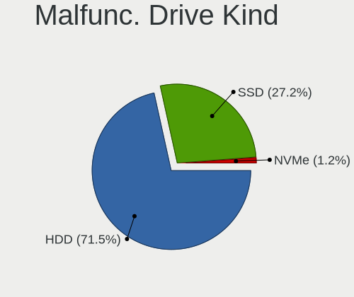

| Kind | Computers | Drives | Percent |
|------|-----------|--------|---------|
| HDD  | 170       | 220    | 71.73%  |
| SSD  | 64        | 75     | 27%     |
| NVMe | 3         | 3      | 1.27%   |

Failed Drives
-------------

Failed drive models

| Model                                            | Computers | Drives | Percent |
|--------------------------------------------------|-----------|--------|---------|
| Seagate ST500DM002-1BD142 500GB                  | 1         | 1      | 20%     |
| Samsung Electronics MZ7LN512HAJQ-00000 512GB SSD | 1         | 3      | 20%     |
| Samsung Electronics HE103SJ 1TB                  | 1         | 2      | 20%     |
| Samsung Electronics HD103SJ 1TB                  | 1         | 1      | 20%     |
| Crucial CT1000P1SSD8 1TB                         | 1         | 1      | 20%     |

Failed Drive Vendor
-------------------

Failed drive vendors

| Vendor              | Computers | Drives | Percent |
|---------------------|-----------|--------|---------|
| Samsung Electronics | 3         | 6      | 60%     |
| Seagate             | 1         | 1      | 20%     |
| Crucial             | 1         | 1      | 20%     |

Drive Status
------------

Number of failed and malfunc. drives

| Status   | Computers | Drives | Percent |
|----------|-----------|--------|---------|
| Detected | 915       | 1842   | 46.31%  |
| Works    | 827       | 1756   | 41.85%  |
| Malfunc  | 229       | 298    | 11.59%  |
| Failed   | 5         | 8      | 0.25%   |

Storage controller
------------------

Storage Vendor
--------------

Storage controller vendors

| Vendor                           | Computers | Percent |
|----------------------------------|-----------|---------|
| Intel                            | 1232      | 58.92%  |
| AMD                              | 302       | 14.44%  |
| Samsung Electronics              | 131       | 6.26%   |
| SanDisk                          | 47        | 2.25%   |
| ASMedia Technology               | 46        | 2.2%    |
| Marvell Technology Group         | 38        | 1.82%   |
| Phison Electronics               | 36        | 1.72%   |
| Toshiba America Info Systems     | 32        | 1.53%   |
| LSI Logic / Symbios Logic        | 30        | 1.43%   |
| Nvidia                           | 26        | 1.24%   |
| JMicron Technology               | 25        | 1.2%    |
| SK hynix                         | 18        | 0.86%   |
| Silicon Motion                   | 17        | 0.81%   |
| Micron/Crucial Technology        | 17        | 0.81%   |
| Kingston Technology Company      | 16        | 0.77%   |
| ADATA Technology                 | 13        | 0.62%   |
| Broadcom / LSI                   | 11        | 0.53%   |
| VIA Technologies                 | 7         | 0.33%   |
| Adaptec                          | 7         | 0.33%   |
| Silicon Image                    | 6         | 0.29%   |
| Hewlett-Packard                  | 6         | 0.29%   |
| Silicon Integrated Systems [SiS] | 4         | 0.19%   |
| Seagate Technology               | 4         | 0.19%   |
| Micron Technology                | 4         | 0.19%   |
| Lite-On Technology               | 4         | 0.19%   |
| KIOXIA                           | 4         | 0.19%   |
| Realtek Semiconductor            | 3         | 0.14%   |
| Union Memory (Shenzhen)          | 1         | 0.05%   |
| Shenzhen Longsys Electronics     | 1         | 0.05%   |
| Loongson Technology              | 1         | 0.05%   |
| Integrated Technology Express    | 1         | 0.05%   |
| 3ware                            | 1         | 0.05%   |

Storage Model
-------------

Storage controller models

| Model                                                                                   | Computers | Percent |
|-----------------------------------------------------------------------------------------|-----------|---------|
| AMD FCH SATA Controller [AHCI mode]                                                     | 205       | 8.29%   |
| Intel Sunrise Point-LP SATA Controller [AHCI mode]                                      | 119       | 4.81%   |
| Intel 8 Series/C220 Series Chipset Family 6-port SATA Controller 1 [AHCI mode]          | 87        | 3.52%   |
| Samsung NVMe SSD Controller SM981/PM981/PM983                                           | 85        | 3.44%   |
| Intel 7 Series Chipset Family 6-port SATA Controller [AHCI mode]                        | 82        | 3.32%   |
| Intel 6 Series/C200 Series Chipset Family 6 port Mobile SATA AHCI Controller            | 63        | 2.55%   |
| AMD 400 Series Chipset SATA Controller                                                  | 54        | 2.18%   |
| Intel 82801 Mobile SATA Controller [RAID mode]                                          | 50        | 2.02%   |
| AMD SB7x0/SB8x0/SB9x0 SATA Controller [AHCI mode]                                       | 47        | 1.9%    |
| Intel 82801IBM/IEM (ICH9M/ICH9M-E) 4 port SATA Controller [AHCI mode]                   | 46        | 1.86%   |
| Intel 6 Series/C200 Series Chipset Family 6 port Desktop SATA AHCI Controller           | 43        | 1.74%   |
| Intel Q170/Q150/B150/H170/H110/Z170/CM236 Chipset SATA Controller [AHCI Mode]           | 42        | 1.7%    |
| ASMedia ASM1062 Serial ATA Controller                                                   | 42        | 1.7%    |
| AMD SB7x0/SB8x0/SB9x0 IDE Controller                                                    | 42        | 1.7%    |
| Intel 8 Series SATA Controller 1 [AHCI mode]                                            | 41        | 1.66%   |
| Intel NM10/ICH7 Family SATA Controller [IDE mode]                                       | 39        | 1.58%   |
| Intel Wildcat Point-LP SATA Controller [AHCI Mode]                                      | 36        | 1.46%   |
| Intel 82801G (ICH7 Family) IDE Controller                                               | 35        | 1.42%   |
| Intel 7 Series/C210 Series Chipset Family 6-port SATA Controller [AHCI mode]            | 31        | 1.25%   |
| Intel 200 Series PCH SATA controller [AHCI mode]                                        | 28        | 1.13%   |
| Intel SATA Controller [RAID mode]                                                       | 27        | 1.09%   |
| AMD SB7x0/SB8x0/SB9x0 SATA Controller [IDE mode]                                        | 27        | 1.09%   |
| Intel Celeron N3350/Pentium N4200/Atom E3900 Series SATA AHCI Controller                | 26        | 1.05%   |
| Intel 5 Series/3400 Series Chipset 4 port SATA AHCI Controller                          | 26        | 1.05%   |
| Intel Atom/Celeron/Pentium Processor x5-E8000/J3xxx/N3xxx Series SATA Controller        | 25        | 1.01%   |
| Intel 5 Series/3400 Series Chipset 6 port SATA AHCI Controller                          | 25        | 1.01%   |
| Phison E12 NVMe Controller                                                              | 24        | 0.97%   |
| Intel Cannon Lake PCH SATA AHCI Controller                                              | 24        | 0.97%   |
| Intel Cannon Point-LP SATA Controller [AHCI Mode]                                       | 23        | 0.93%   |
| Intel Celeron/Pentium Silver Processor SATA Controller                                  | 22        | 0.89%   |
| Intel Cannon Lake Mobile PCH SATA AHCI Controller                                       | 21        | 0.85%   |
| Intel C600/X79 series chipset 6-Port SATA AHCI Controller                               | 21        | 0.85%   |
| Intel Comet Lake SATA AHCI Controller                                                   | 19        | 0.77%   |
| Samsung NVMe SSD Controller SM961/PM961/SM963                                           | 17        | 0.69%   |
| Intel NM10/ICH7 Family SATA Controller [AHCI mode]                                      | 17        | 0.69%   |
| Intel HM170/QM170 Chipset SATA Controller [AHCI Mode]                                   | 16        | 0.65%   |
| Intel 82801HM/HEM (ICH8M/ICH8M-E) IDE Controller                                        | 16        | 0.65%   |
| AMD X370 Series Chipset SATA Controller                                                 | 16        | 0.65%   |
| Intel Atom Processor E3800 Series SATA AHCI Controller                                  | 15        | 0.61%   |
| Intel 6 Series/C200 Series Chipset Family Desktop SATA Controller (IDE mode, ports 4-5) | 15        | 0.61%   |

Storage Kind
------------

Kind of storage controller (IDE, SATA, NVMe, SAS, ...)

| Kind | Computers | Percent |
|------|-----------|---------|
| SATA | 1318      | 62.29%  |
| NVMe | 348       | 16.45%  |
| IDE  | 296       | 13.99%  |
| RAID | 119       | 5.62%   |
| SAS  | 23        | 1.09%   |
| SCSI | 12        | 0.57%   |

Processor
---------

CPU Vendor
----------

Processor vendors

| Vendor       | Computers | Percent |
|--------------|-----------|---------|
| Intel        | 1355      | 78.01%  |
| AMD          | 336       | 19.34%  |
| ARM          | 42        | 2.42%   |
| CentaurHauls | 2         | 0.12%   |
| Unknown      | 2         | 0.12%   |

CPU Model
---------

Processor models

| Model                                       | Computers | Percent |
|---------------------------------------------|-----------|---------|
| Intel Core i7-8550U CPU @ 1.80GHz           | 32        | 1.84%   |
| Intel Core i5-8250U CPU @ 1.60GHz           | 29        | 1.67%   |
| Intel Core i7-8565U CPU @ 1.80GHz           | 26        | 1.5%    |
| Intel Core i5-7200U CPU @ 2.50GHz           | 21        | 1.21%   |
| ARM Processor                               | 21        | 1.21%   |
| Intel Core i7-7500U CPU @ 2.70GHz           | 17        | 0.98%   |
| Intel Core i5-3320M CPU @ 2.60GHz           | 15        | 0.86%   |
| Intel Core i5-8265U CPU @ 1.60GHz           | 14        | 0.81%   |
| Intel Core i5-6200U CPU @ 2.30GHz           | 14        | 0.81%   |
| Intel Core i5-2520M CPU @ 2.50GHz           | 14        | 0.81%   |
| AMD Ryzen 7 3700X 8-Core Processor          | 14        | 0.81%   |
| Intel Core i5-3470 CPU @ 3.20GHz            | 13        | 0.75%   |
| AMD Ryzen 5 3400G with Radeon Vega Graphics | 13        | 0.75%   |
| AMD Ryzen 5 3600 6-Core Processor           | 12        | 0.69%   |
| Intel Core i5-6300U CPU @ 2.40GHz           | 11        | 0.63%   |
| Intel Core i5-2410M CPU @ 2.30GHz           | 11        | 0.63%   |
| Intel Core i5-2400 CPU @ 3.10GHz            | 11        | 0.63%   |
| Intel Celeron CPU N3350 @ 1.10GHz           | 11        | 0.63%   |
| AMD Ryzen 7 2700X Eight-Core Processor      | 11        | 0.63%   |
| Intel Core i7-7700HQ CPU @ 2.80GHz          | 9         | 0.52%   |
| Intel Core i7-10510U CPU @ 1.80GHz          | 9         | 0.52%   |
| Intel Core i7-9750H CPU @ 2.60GHz           | 8         | 0.46%   |
| Intel Core i7-8750H CPU @ 2.20GHz           | 8         | 0.46%   |
| Intel Core i7-8665U CPU @ 1.90GHz           | 8         | 0.46%   |
| Intel Core i7-4790 CPU @ 3.60GHz            | 8         | 0.46%   |
| Intel Core i5-5300U CPU @ 2.30GHz           | 8         | 0.46%   |
| Intel Core i5-5200U CPU @ 2.20GHz           | 8         | 0.46%   |
| Intel Core i3-3110M CPU @ 2.40GHz           | 8         | 0.46%   |
| Intel Core i3-2100 CPU @ 3.10GHz            | 8         | 0.46%   |
| Intel Celeron CPU N3060 @ 1.60GHz           | 8         | 0.46%   |
| AMD Ryzen 9 3900X 12-Core Processor         | 8         | 0.46%   |
| AMD Ryzen 7 1700 Eight-Core Processor       | 8         | 0.46%   |
| Intel Core i7-6700K CPU @ 4.00GHz           | 7         | 0.4%    |
| Intel Core i7-6500U CPU @ 2.50GHz           | 7         | 0.4%    |
| Intel Core i5-3230M CPU @ 2.60GHz           | 7         | 0.4%    |
| Intel Core i5-3210M CPU @ 2.50GHz           | 7         | 0.4%    |
| Intel Core i3-5005U CPU @ 2.00GHz           | 7         | 0.4%    |
| Intel Core 2 Duo CPU E8400 @ 3.00GHz        | 7         | 0.4%    |
| Intel Core 2 Duo CPU E7500 @ 2.93GHz        | 7         | 0.4%    |
| Intel Celeron CPU N3050 @ 1.60GHz           | 7         | 0.4%    |

CPU Model Family
----------------

Processor model prefix

| Model                   | Computers | Percent |
|-------------------------|-----------|---------|
| Intel Core i5           | 366       | 21.07%  |
| Intel Core i7           | 350       | 20.15%  |
| Intel Core i3           | 143       | 8.23%   |
| Intel Celeron           | 107       | 6.16%   |
| Intel Xeon              | 92        | 5.3%    |
| Intel Core 2 Duo        | 76        | 4.38%   |
| AMD Ryzen 5             | 64        | 3.68%   |
| AMD Ryzen 7             | 51        | 2.94%   |
| Intel Atom              | 48        | 2.76%   |
| Other                   | 44        | 2.53%   |
| Intel Pentium           | 38        | 2.19%   |
| AMD FX                  | 27        | 1.55%   |
| Intel Core 2 Quad       | 19        | 1.09%   |
| Intel Core 2            | 18        | 1.04%   |
| AMD A8                  | 18        | 1.04%   |
| Intel Pentium Dual-Core | 17        | 0.98%   |
| AMD Ryzen 3             | 16        | 0.92%   |
| Intel Pentium Dual      | 15        | 0.86%   |
| AMD E                   | 11        | 0.63%   |
| AMD Athlon II X2        | 11        | 0.63%   |
| AMD A4                  | 10        | 0.58%   |
| AMD A10                 | 10        | 0.58%   |
| Intel Pentium M         | 9         | 0.52%   |
| AMD Phenom II X4        | 9         | 0.52%   |
| AMD Ryzen 9             | 8         | 0.46%   |
| AMD Athlon 64 X2        | 8         | 0.46%   |
| AMD A6                  | 8         | 0.46%   |
| Intel Core i9           | 7         | 0.4%    |
| AMD Ryzen 7 PRO         | 7         | 0.4%    |
| AMD E1                  | 7         | 0.4%    |
| Intel Xeon Silver       | 6         | 0.35%   |
| Intel Pentium 4         | 6         | 0.35%   |
| ARM Allwinner           | 6         | 0.35%   |
| Intel Pentium Silver    | 5         | 0.29%   |
| Intel Pentium Gold      | 5         | 0.29%   |
| ARM AArch64             | 5         | 0.29%   |
| AMD Ryzen Threadripper  | 5         | 0.29%   |
| AMD Phenom II X6        | 5         | 0.29%   |
| AMD Athlon 64           | 5         | 0.29%   |
| AMD Athlon              | 5         | 0.29%   |

CPU Cores
---------

Number of processor cores

| Number | Computers | Percent |
|--------|-----------|---------|
| 2      | 763       | 43.88%  |
| 4      | 639       | 36.75%  |
| 6      | 120       | 6.9%    |
| 8      | 88        | 5.06%   |
| 1      | 69        | 3.97%   |
| 12     | 23        | 1.32%   |
| 16     | 13        | 0.75%   |
| 3      | 9         | 0.52%   |
| 20     | 4         | 0.23%   |
| 32     | 3         | 0.17%   |
| 10     | 3         | 0.17%   |
| 24     | 2         | 0.12%   |
| 44     | 1         | 0.06%   |
| 22     | 1         | 0.06%   |
| 18     | 1         | 0.06%   |

CPU Sockets
-----------

Number of sockets

| Number | Computers | Percent |
|--------|-----------|---------|
| 1      | 1689      | 97.18%  |
| 2      | 48        | 2.76%   |
| 4      | 1         | 0.06%   |

CPU Threads
-----------

Threads per core (Hyper-Threading)

| Number | Computers | Percent |
|--------|-----------|---------|
| 2      | 1076      | 61.91%  |
| 1      | 662       | 38.09%  |

CPU Op-Modes
------------

CPU Operation Modes (32-bit, 64-bit)

| Op mode        | Computers | Percent |
|----------------|-----------|---------|
| 32-bit, 64-bit | 1626      | 93.45%  |
| Unknown        | 82        | 4.71%   |
| 32-bit         | 30        | 1.72%   |
| 64-bit         | 2         | 0.11%   |

CPU Microcode
-------------

Microcode number

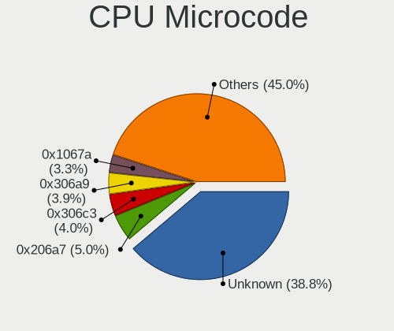

| Number     | Computers | Percent |
|------------|-----------|---------|
| Unknown    | 698       | 39.02%  |
| 0x206a7    | 88        | 4.92%   |
| 0x306c3    | 71        | 3.97%   |
| 0x306a9    | 69        | 3.86%   |
| 0x1067a    | 61        | 3.41%   |
| 0x806ec    | 43        | 2.4%    |
| 0x806ea    | 35        | 1.96%   |
| 0x306d4    | 28        | 1.57%   |
| 0x906ea    | 26        | 1.45%   |
| 0x40651    | 26        | 1.45%   |
| 0x806e9    | 24        | 1.34%   |
| 0x906e9    | 23        | 1.29%   |
| 0x506e3    | 22        | 1.23%   |
| 0x406e3    | 22        | 1.23%   |
| 0x20655    | 18        | 1.01%   |
| 0x08701021 | 18        | 1.01%   |
| 0x6fd      | 17        | 0.95%   |
| 0x406c3    | 17        | 0.95%   |
| 0x30678    | 16        | 0.89%   |
| 0x0800820d | 16        | 0.89%   |
| 0x206c2    | 14        | 0.78%   |
| 0x106e5    | 14        | 0.78%   |
| 0x106ca    | 14        | 0.78%   |
| 0x906ed    | 13        | 0.73%   |
| 0x20652    | 13        | 0.73%   |
| 0x08701013 | 13        | 0.73%   |
| 0x706a1    | 12        | 0.67%   |
| 0x506c9    | 11        | 0.61%   |
| 0x406c4    | 11        | 0.61%   |
| 0x206d7    | 11        | 0.61%   |
| 0x10676    | 11        | 0.61%   |
| 0x08108102 | 11        | 0.61%   |
| 0x05000119 | 11        | 0.61%   |
| 0x010000c8 | 11        | 0.61%   |
| 0x806eb    | 10        | 0.56%   |
| 0x306e4    | 10        | 0.56%   |
| 0x08108109 | 10        | 0.56%   |
| 0x6f6      | 9         | 0.5%    |
| 0x06003106 | 9         | 0.5%    |
| 0x50654    | 8         | 0.45%   |

CPU Microarch
-------------

Microarchitecture

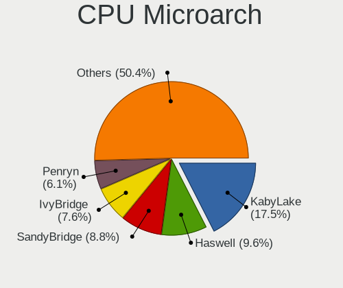

| Name            | Computers | Percent |
|-----------------|-----------|---------|
| KabyLake        | 307       | 17.66%  |
| Haswell         | 167       | 9.61%   |
| SandyBridge     | 153       | 8.8%    |
| IvyBridge       | 131       | 7.54%   |
| Penryn          | 105       | 6.04%   |
| Skylake         | 98        | 5.64%   |
| Zen+            | 63        | 3.62%   |
| Silvermont      | 61        | 3.51%   |
| Westmere        | 60        | 3.45%   |
| Core            | 59        | 3.39%   |
| Zen 2           | 50        | 2.88%   |
| Zen             | 46        | 2.65%   |
| Unknown         | 46        | 2.65%   |
| Broadwell       | 44        | 2.53%   |
| K10             | 36        | 2.07%   |
| Piledriver      | 33        | 1.9%    |
| Bonnell         | 32        | 1.84%   |
| Nehalem         | 27        | 1.55%   |
| Goldmont        | 26        | 1.5%    |
| K8 Hammer       | 23        | 1.32%   |
| Goldmont plus   | 22        | 1.27%   |
| CometLake       | 22        | 1.27%   |
| Bobcat          | 21        | 1.21%   |
| P6              | 15        | 0.86%   |
| Steamroller     | 13        | 0.75%   |
| Excavator       | 12        | 0.69%   |
| Puma            | 10        | 0.58%   |
| NetBurst        | 10        | 0.58%   |
| Jaguar          | 10        | 0.58%   |
| IceLake         | 9         | 0.52%   |
| TigerLake       | 7         | 0.4%    |
| K10 Llano       | 7         | 0.4%    |
| Bulldozer       | 7         | 0.4%    |
| K8 & K10 hybrid | 3         | 0.17%   |
| Zen 3           | 2         | 0.12%   |
| K6              | 1         | 0.06%   |

Graphics
--------

GPU Vendor
----------

Vendors of graphics cards

| Vendor                           | Computers | Percent |
|----------------------------------|-----------|---------|
| Intel                            | 1008      | 51.61%  |
| Nvidia                           | 499       | 25.55%  |
| AMD                              | 373       | 19.1%   |
| Matrox Electronics Systems       | 45        | 2.3%    |
| ASPEED Technology                | 19        | 0.97%   |
| VIA Technologies                 | 4         | 0.2%    |
| Silicon Integrated Systems [SiS] | 3         | 0.15%   |
| Loongson Technology              | 1         | 0.05%   |
| Huawei Technologies              | 1         | 0.05%   |

GPU Model
---------

Graphics card models

| Model                                                                                    | Computers | Percent |
|------------------------------------------------------------------------------------------|-----------|---------|
| Intel 2nd Generation Core Processor Family Integrated Graphics Controller                | 100       | 4.98%   |
| Intel 3rd Gen Core processor Graphics Controller                                         | 74        | 3.68%   |
| Intel UHD Graphics 620                                                                   | 70        | 3.48%   |
| Intel WhiskeyLake-U GT2 [UHD Graphics 620]                                               | 53        | 2.64%   |
| Intel HD Graphics 620                                                                    | 47        | 2.34%   |
| Intel Haswell-ULT Integrated Graphics Controller                                         | 44        | 2.19%   |
| Intel Mobile 4 Series Chipset Integrated Graphics Controller                             | 42        | 2.09%   |
| Intel Skylake GT2 [HD Graphics 520]                                                      | 40        | 1.99%   |
| Intel Xeon E3-1200 v3/4th Gen Core Processor Integrated Graphics Controller              | 36        | 1.79%   |
| Intel Atom/Celeron/Pentium Processor x5-E8000/J3xxx/N3xxx Integrated Graphics Controller | 36        | 1.79%   |
| Intel HD Graphics 5500                                                                   | 34        | 1.69%   |
| AMD Ellesmere [Radeon RX 470/480/570/570X/580/580X/590]                                  | 32        | 1.59%   |
| AMD Picasso/Raven 2 [Radeon Vega Series / Radeon Vega Mobile Series]                     | 31        | 1.54%   |
| Intel Core Processor Integrated Graphics Controller                                      | 29        | 1.44%   |
| Intel Atom Processor Z36xxx/Z37xxx Series Graphics & Display                             | 25        | 1.24%   |
| Intel HD Graphics 630                                                                    | 24        | 1.19%   |
| Intel HD Graphics 530                                                                    | 24        | 1.19%   |
| Intel HD Graphics 500                                                                    | 24        | 1.19%   |
| Intel CoffeeLake-H GT2 [UHD Graphics 630]                                                | 24        | 1.19%   |
| Intel 4th Gen Core Processor Integrated Graphics Controller                              | 23        | 1.14%   |
| Nvidia GK208B [GeForce GT 710]                                                           | 22        | 1.09%   |
| Intel CometLake-U GT2 [UHD Graphics]                                                     | 22        | 1.09%   |
| Intel CoffeeLake-S GT2 [UHD Graphics 630]                                                | 19        | 0.95%   |
| ASPEED Technology ASPEED Graphics Family                                                 | 19        | 0.95%   |
| AMD Raven Ridge [Radeon Vega Series / Radeon Vega Mobile Series]                         | 19        | 0.95%   |
| Matrox Electronics Systems MGA G200eW WPCM450                                            | 18        | 0.9%    |
| Intel Atom Processor D4xx/D5xx/N4xx/N5xx Integrated Graphics Controller                  | 18        | 0.9%    |
| Intel 4 Series Chipset Integrated Graphics Controller                                    | 18        | 0.9%    |
| Intel GeminiLake [UHD Graphics 600]                                                      | 17        | 0.85%   |
| Nvidia GT218 [GeForce 210]                                                               | 16        | 0.8%    |
| Nvidia GP107 [GeForce GTX 1050 Ti]                                                       | 15        | 0.75%   |
| AMD Topaz XT [Radeon R7 M260/M265 / M340/M360 / M440/M445 / 530/535 / 620/625 Mobile]    | 15        | 0.75%   |
| Nvidia GP106 [GeForce GTX 1060 6GB]                                                      | 14        | 0.7%    |
| Intel Xeon E3-1200 v2/3rd Gen Core processor Graphics Controller                         | 14        | 0.7%    |
| Intel Mobile 945GM/GMS/GME, 943/940GML Express Integrated Graphics Controller            | 13        | 0.65%   |
| Nvidia GP108M [GeForce MX150]                                                            | 12        | 0.6%    |
| Intel Mobile GM965/GL960 Integrated Graphics Controller (secondary)                      | 12        | 0.6%    |
| Intel Mobile GM965/GL960 Integrated Graphics Controller (primary)                        | 12        | 0.6%    |
| AMD Lexa PRO [Radeon 540/540X/550/550X / RX 540X/550/550X]                               | 12        | 0.6%    |
| Intel 4th Generation Core Processor Family Integrated Graphics Controller                | 11        | 0.55%   |

GPU Combo
---------

Combinations of graphics cards

| Name                         | Computers | Percent |
|------------------------------|-----------|---------|
| 1 x Intel                    | 758       | 43.41%  |
| 1 x Nvidia                   | 309       | 17.7%   |
| 1 x AMD                      | 292       | 16.72%  |
| Intel + Nvidia               | 176       | 10.08%  |
| Intel + AMD                  | 58        | 3.32%   |
| Other                        | 50        | 2.86%   |
| 1 x Matrox                   | 43        | 2.46%   |
| 2 x AMD                      | 20        | 1.15%   |
| 1 x ASPEED                   | 17        | 0.97%   |
| 2 x Nvidia                   | 6         | 0.34%   |
| 1 x VIA                      | 4         | 0.23%   |
| 1 x SiS                      | 3         | 0.17%   |
| Nvidia + Matrox              | 2         | 0.11%   |
| Nvidia + ASPEED              | 2         | 0.11%   |
| Intel + 2 x Nvidia           | 2         | 0.11%   |
| AMD + Nvidia                 | 2         | 0.11%   |
| 2 x Loongson Technology      | 1         | 0.06%   |
| Nvidia + Huawei Technologies | 1         | 0.06%   |

GPU Driver
----------

Free vs proprietary

| Driver      | Computers | Percent |
|-------------|-----------|---------|
| Free        | 1380      | 78.54%  |
| Proprietary | 248       | 14.11%  |
| Unknown     | 129       | 7.34%   |

GPU Memory
----------

Total video memory

| Size in GB | Computers | Percent |
|------------|-----------|---------|
| Unknown    | 1262      | 71.62%  |
| 1.01-2.0   | 126       | 7.15%   |
| 0.01-0.5   | 118       | 6.7%    |
| 0.51-1.0   | 113       | 6.41%   |
| 3.01-4.0   | 61        | 3.46%   |
| 7.01-8.0   | 37        | 2.1%    |
| 5.01-6.0   | 23        | 1.31%   |
| 2.01-3.0   | 16        | 0.91%   |
| 8.01-16.0  | 6         | 0.34%   |

Monitor
-------

Monitor Vendor
--------------

Monitor vendors

| Vendor                  | Computers | Percent |
|-------------------------|-----------|---------|
| Samsung Electronics     | 241       | 13.56%  |
| AU Optronics            | 208       | 11.71%  |
| LG Display              | 161       | 9.06%   |
| Dell                    | 128       | 7.2%    |
| BOE                     | 127       | 7.15%   |
| Chimei Innolux          | 106       | 5.97%   |
| Goldstar                | 90        | 5.06%   |
| Hewlett-Packard         | 64        | 3.6%    |
| BenQ                    | 56        | 3.15%   |
| Acer                    | 52        | 2.93%   |
| AOC                     | 49        | 2.76%   |
| Philips                 | 46        | 2.59%   |
| Lenovo                  | 35        | 1.97%   |
| Ancor Communications    | 35        | 1.97%   |
| Iiyama                  | 30        | 1.69%   |
| ViewSonic               | 24        | 1.35%   |
| Chi Mei Optoelectronics | 23        | 1.29%   |
| Apple                   | 22        | 1.24%   |
| Sharp                   | 19        | 1.07%   |
| Unknown                 | 18        | 1.01%   |
| LG Electronics          | 15        | 0.84%   |
| InfoVision              | 15        | 0.84%   |
| Sony                    | 12        | 0.68%   |
| PANDA                   | 12        | 0.68%   |
| HannStar                | 12        | 0.68%   |
| Fujitsu Siemens         | 10        | 0.56%   |
| LG Philips              | 7         | 0.39%   |
| Eizo                    | 7         | 0.39%   |
| Vizio                   | 6         | 0.34%   |
| NEC Computers           | 6         | 0.34%   |
| CPT                     | 6         | 0.34%   |
| ASUSTek Computer        | 6         | 0.34%   |
| Panasonic               | 5         | 0.28%   |
| Medion                  | 5         | 0.28%   |
| HPN                     | 4         | 0.23%   |
| Belinea                 | 4         | 0.23%   |
| Targa Visionary         | 3         | 0.17%   |
| MStar                   | 3         | 0.17%   |
| LGD                     | 3         | 0.17%   |
| ITE                     | 3         | 0.17%   |

Monitor Model
-------------

Monitor models

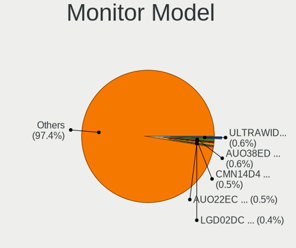

| Model                                                                | Computers | Percent |
|----------------------------------------------------------------------|-----------|---------|
| Goldstar ULTRAWIDE GSM59F1 2560x1080 798x334mm 34.1-inch             | 12        | 0.65%   |
| AU Optronics LCD Monitor AUO38ED 1920x1080 344x193mm 15.5-inch       | 11        | 0.6%    |
| Chimei Innolux LCD Monitor CMN14D4 1920x1080 309x173mm 13.9-inch     | 9         | 0.49%   |
| AU Optronics LCD Monitor AUO22EC 1366x768 344x193mm 15.5-inch        | 9         | 0.49%   |
| AU Optronics LCD Monitor AUO21ED 1920x1080 344x193mm 15.5-inch       | 8         | 0.43%   |
| LG Display LCD Monitor LGD02DC 1366x768 344x194mm 15.5-inch          | 7         | 0.38%   |
| Samsung Electronics LCD Monitor SEC5441 1366x768 344x194mm 15.5-inch | 6         | 0.33%   |
| LG Display LCD Monitor LGD02E9 1366x768 310x170mm 13.9-inch          | 6         | 0.33%   |
| LG Display LCD Monitor LGD02D8 1366x768 277x156mm 12.5-inch          | 6         | 0.33%   |
| Chimei Innolux LCD Monitor CMN15E8 1920x1080 344x193mm 15.5-inch     | 6         | 0.33%   |
| Chimei Innolux LCD Monitor CMN15DB 1366x768 344x193mm 15.5-inch      | 6         | 0.33%   |
| BOE LCD Monitor BOE0672 1366x768 344x194mm 15.5-inch                 | 6         | 0.33%   |
| AU Optronics LCD Monitor AUO106C 1366x768 276x155mm 12.5-inch        | 6         | 0.33%   |
| Samsung Electronics LCD Monitor SyncMaster                           | 5         | 0.27%   |
| Samsung Electronics C27F390 SAM0D32 1920x1080 598x336mm 27.0-inch    | 5         | 0.27%   |
| Fujitsu Siemens LL 3190T FUS07A3 1366x768 430x255mm 19.7-inch        | 5         | 0.27%   |
| Dell P2317H DEL40F4 1920x1080 509x286mm 23.0-inch                    | 5         | 0.27%   |
| AU Optronics LCD Monitor AUO133D 1920x1080 309x173mm 13.9-inch       | 5         | 0.27%   |
| AOC 2350 AOC2350 1920x1080 509x286mm 23.0-inch                       | 5         | 0.27%   |
| Sharp LCD Monitor SHP149A 1920x1080 344x194mm 15.5-inch              | 4         | 0.22%   |
| Samsung Electronics S22D300 SAM0B3F 1920x1080 477x268mm 21.5-inch    | 4         | 0.22%   |
| Samsung Electronics LCD Monitor SEC544B 1600x900 382x214mm 17.2-inch | 4         | 0.22%   |
| LG Display LCD Monitor LGD05E5 1920x1080 340x190mm 15.3-inch         | 4         | 0.22%   |
| LG Display LCD Monitor LGD033A 1366x768 344x194mm 15.5-inch          | 4         | 0.22%   |
| Lenovo LCD Monitor LEN40B2 1920x1080 344x193mm 15.5-inch             | 4         | 0.22%   |
| Lenovo LCD Monitor LEN4036 1440x900 303x189mm 14.1-inch              | 4         | 0.22%   |
| InfoVision LCD Monitor IVO03F4 1024x600 223x125mm 10.1-inch          | 4         | 0.22%   |
| HannStar HSD101PFW2 HSD03E9 1024x600 222x125mm 10.0-inch             | 4         | 0.22%   |
| Goldstar HDR WFHD GSM7714 2560x1080 798x334mm 34.1-inch              | 4         | 0.22%   |
| Dell U2414H DELA0A4 1920x1080 527x296mm 23.8-inch                    | 4         | 0.22%   |
| Dell P2719H DEL4184 1920x1080 600x340mm 27.2-inch                    | 4         | 0.22%   |
| Chimei Innolux LCD Monitor CMN1490 1366x768 309x173mm 13.9-inch      | 4         | 0.22%   |
| BOE LCD Monitor BOE0687 1920x1080 344x193mm 15.5-inch                | 4         | 0.22%   |
| AU Optronics LCD Monitor AUO71EC 1366x768 344x193mm 15.5-inch        | 4         | 0.22%   |
| AU Optronics LCD Monitor AUO47EC 1366x768 344x193mm 15.5-inch        | 4         | 0.22%   |
| AU Optronics LCD Monitor AUO423D 1920x1080 309x173mm 13.9-inch       | 4         | 0.22%   |
| AU Optronics LCD Monitor AUO2E3C 1366x768 309x173mm 13.9-inch        | 4         | 0.22%   |
| AU Optronics LCD Monitor AUO23ED 1920x1080 344x194mm 15.5-inch       | 4         | 0.22%   |
| AU Optronics LCD Monitor AUO213E 1600x900 309x174mm 14.0-inch        | 4         | 0.22%   |
| AU Optronics LCD Monitor AUO183C 1366x768 309x173mm 13.9-inch        | 4         | 0.22%   |

Monitor Resolution
------------------

Monitor screen resolution

| Resolution         | Computers | Percent |
|--------------------|-----------|---------|
| 1920x1080 (FHD)    | 680       | 39.58%  |
| 1366x768 (WXGA)    | 370       | 21.54%  |
| 1280x1024 (SXGA)   | 85        | 4.95%   |
| 3840x2160 (4K)     | 84        | 4.89%   |
| 1600x900 (HD+)     | 74        | 4.31%   |
| 1680x1050 (WSXGA+) | 61        | 3.55%   |
| 1920x1200 (WUXGA)  | 57        | 3.32%   |
| 2560x1440 (QHD)    | 54        | 3.14%   |
| 1440x900 (WXGA+)   | 36        | 2.1%    |
| 1280x800 (WXGA)    | 35        | 2.04%   |
| Unknown            | 32        | 1.86%   |
| 2560x1080          | 20        | 1.16%   |
| 1360x768           | 19        | 1.11%   |
| 1024x600           | 16        | 0.93%   |
| 3440x1440          | 13        | 0.76%   |
| 1024x768 (XGA)     | 11        | 0.64%   |
| 3840x1080          | 8         | 0.47%   |
| 1600x1200          | 6         | 0.35%   |
| 3200x1800 (QHD+)   | 5         | 0.29%   |
| 1280x720 (HD)      | 5         | 0.29%   |
| 3200x1080          | 4         | 0.23%   |
| 2880x1800          | 4         | 0.23%   |
| 2560x1600          | 4         | 0.23%   |
| 5760x2160          | 3         | 0.17%   |
| 1920x540           | 3         | 0.17%   |
| 7680x2160          | 2         | 0.12%   |
| 4480x1440          | 2         | 0.12%   |
| 3840x2400          | 2         | 0.12%   |
| 2048x1152          | 2         | 0.12%   |
| 7680x1440          | 1         | 0.06%   |
| 640x480            | 1         | 0.06%   |
| 5760x1200          | 1         | 0.06%   |
| 5120x1200          | 1         | 0.06%   |
| 4880x1080          | 1         | 0.06%   |
| 4160x1440          | 1         | 0.06%   |
| 4093x4093          | 1         | 0.06%   |
| 3840x1100          | 1         | 0.06%   |
| 3640x1920          | 1         | 0.06%   |
| 3600x1080          | 1         | 0.06%   |
| 3200x900           | 1         | 0.06%   |

Monitor Diagonal
----------------

Diagonal size in inches

| Inches  | Computers | Percent |
|---------|-----------|---------|
| 15      | 390       | 22.05%  |
| 13      | 149       | 8.42%   |
| 14      | 144       | 8.14%   |
| Unknown | 131       | 7.41%   |
| 24      | 130       | 7.35%   |
| 23      | 114       | 6.44%   |
| 21      | 108       | 6.11%   |
| 27      | 104       | 5.88%   |
| 17      | 93        | 5.26%   |
| 19      | 66        | 3.73%   |
| 12      | 52        | 2.94%   |
| 22      | 39        | 2.2%    |
| 18      | 36        | 2.04%   |
| 20      | 32        | 1.81%   |
| 34      | 27        | 1.53%   |
| 31      | 20        | 1.13%   |
| 11      | 19        | 1.07%   |
| 10      | 15        | 0.85%   |
| 84      | 14        | 0.79%   |
| 25      | 12        | 0.68%   |
| 72      | 10        | 0.57%   |
| 29      | 7         | 0.4%    |
| 26      | 7         | 0.4%    |
| 16      | 7         | 0.4%    |
| 54      | 6         | 0.34%   |
| 40      | 5         | 0.28%   |
| 32      | 5         | 0.28%   |
| 52      | 4         | 0.23%   |
| 38      | 3         | 0.17%   |
| 65      | 2         | 0.11%   |
| 58      | 2         | 0.11%   |
| 49      | 2         | 0.11%   |
| 48      | 2         | 0.11%   |
| 46      | 2         | 0.11%   |
| 43      | 2         | 0.11%   |
| 28      | 2         | 0.11%   |
| 8       | 2         | 0.11%   |
| 42      | 1         | 0.06%   |
| 39      | 1         | 0.06%   |
| 35      | 1         | 0.06%   |

Monitor Width
-------------

Physical width

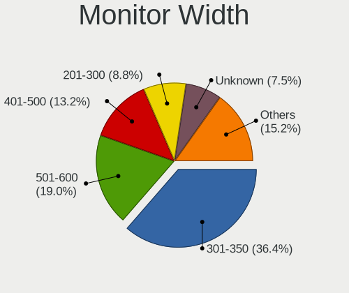

| Width in mm | Computers | Percent |
|-------------|-----------|---------|
| 301-350     | 634       | 36.58%  |
| 501-600     | 334       | 19.27%  |
| 401-500     | 232       | 13.39%  |
| 201-300     | 155       | 8.94%   |
| Unknown     | 131       | 7.56%   |
| 351-400     | 114       | 6.58%   |
| 601-700     | 41        | 2.37%   |
| 701-800     | 32        | 1.85%   |
| 1501-2000   | 24        | 1.38%   |
| 1001-1500   | 20        | 1.15%   |
| 801-900     | 10        | 0.58%   |
| 101-200     | 3         | 0.17%   |
| 901-1000    | 3         | 0.17%   |

Aspect Ratio
------------

Proportional relationship between the width and the height

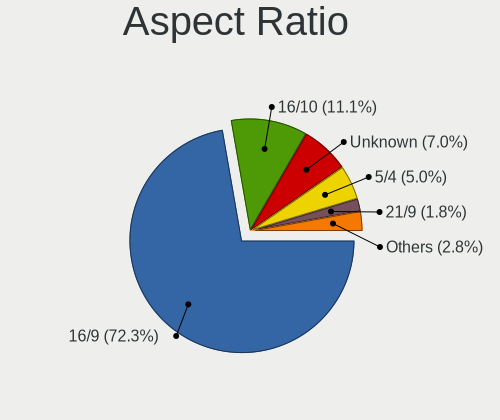

| Ratio   | Computers | Percent |
|---------|-----------|---------|
| 16/9    | 1167      | 72.62%  |
| 16/10   | 176       | 10.95%  |
| Unknown | 111       | 6.91%   |
| 5/4     | 78        | 4.85%   |
| 21/9    | 29        | 1.8%    |
| 4/3     | 28        | 1.74%   |
| 3/2     | 13        | 0.81%   |
| 6/5     | 3         | 0.19%   |
| 3.40    | 1         | 0.06%   |
| 1.96    | 1         | 0.06%   |

Monitor Area
------------

Area in inch

| Area in inch | Computers | Percent |
|----------------|-----------|---------|
| 101-110        | 384       | 21.92%  |
| 201-250        | 305       | 17.41%  |
| 81-90          | 230       | 13.13%  |
| Unknown        | 131       | 7.48%   |
| 151-200        | 129       | 7.36%   |
| 301-350        | 108       | 6.16%   |
| 71-80          | 67        | 3.82%   |
| 141-150        | 65        | 3.71%   |
| 351-500        | 60        | 3.42%   |
| 251-300        | 60        | 3.42%   |
| 121-130        | 50        | 2.85%   |
| 61-70          | 47        | 2.68%   |
| More than 1000 | 42        | 2.4%    |
| 51-60          | 20        | 1.14%   |
| 41-50          | 15        | 0.86%   |
| 501-1000       | 14        | 0.8%    |
| 131-140        | 12        | 0.68%   |
| 111-120        | 5         | 0.29%   |
| 91-100         | 5         | 0.29%   |
| 1-40           | 3         | 0.17%   |

Pixel Density
-------------

Pixels per inch

| Density       | Computers | Percent |
|---------------|-----------|---------|
| 51-100        | 588       | 34.61%  |
| 101-120       | 466       | 27.43%  |
| 121-160       | 377       | 22.19%  |
| Unknown       | 131       | 7.71%   |
| 161-240       | 77        | 4.53%   |
| 1-50          | 38        | 2.24%   |
| More than 240 | 22        | 1.29%   |

Multiple Monitors
-----------------

Total monitors connected

| Total | Computers | Percent |
|-------|-----------|---------|
| 1     | 1273      | 72.04%  |
| 2     | 270       | 15.28%  |
| 0     | 192       | 10.87%  |
| 3     | 32        | 1.81%   |

Network
-------

Net Controller Vendor
---------------------

Controller vendors

| Vendor                                 | Computers | Percent |
|----------------------------------------|-----------|---------|
| Realtek Semiconductor                  | 867       | 33.66%  |
| Intel                                  | 817       | 31.72%  |
| Qualcomm Atheros                       | 345       | 13.39%  |
| Broadcom                               | 139       | 5.4%    |
| Marvell Technology Group               | 46        | 1.79%   |
| Broadcom Limited                       | 36        | 1.4%    |
| Ralink Technology                      | 35        | 1.36%   |
| Ralink                                 | 28        | 1.09%   |
| Nvidia                                 | 21        | 0.82%   |
| TP-Link                                | 19        | 0.74%   |
| JMicron Technology                     | 14        | 0.54%   |
| ASIX Electronics                       | 14        | 0.54%   |
| Huawei Technologies                    | 12        | 0.47%   |
| Samsung Electronics                    | 10        | 0.39%   |
| Lenovo                                 | 9         | 0.35%   |
| Dell                                   | 9         | 0.35%   |
| D-Link System                          | 8         | 0.31%   |
| Sierra Wireless                        | 6         | 0.23%   |
| Qualcomm Atheros Communications        | 6         | 0.23%   |
| IBM                                    | 6         | 0.23%   |
| Ericsson Business Mobile Networks      | 6         | 0.23%   |
| ASUSTek Computer                       | 6         | 0.23%   |
| Aquantia                               | 6         | 0.23%   |
| Microchip Technology                   | 5         | 0.19%   |
| Xiaomi                                 | 4         | 0.16%   |
| Sundance Technology Inc / IC Plus      | 4         | 0.16%   |
| Silicon Integrated Systems [SiS]       | 4         | 0.16%   |
| Microsoft                              | 4         | 0.16%   |
| Mellanox Technologies                  | 4         | 0.16%   |
| MediaTek                               | 4         | 0.16%   |
| Fibocom                                | 4         | 0.16%   |
| Edimax Technology                      | 4         | 0.16%   |
| VIA Technologies                       | 3         | 0.12%   |
| Qualcomm                               | 3         | 0.12%   |
| Hewlett-Packard                        | 3         | 0.12%   |
| D-Link                                 | 3         | 0.12%   |
| Toshiba                                | 2         | 0.08%   |
| Spreadtrum Communications              | 2         | 0.08%   |
| Sony Ericsson Mobile Communications AB | 2         | 0.08%   |
| NetGear                                | 2         | 0.08%   |

Net Controller Model
--------------------

Controller models

| Model                                                             | Computers | Percent |
|-------------------------------------------------------------------|-----------|---------|
| Realtek RTL8111/8168/8411 PCI Express Gigabit Ethernet Controller | 627       | 20.53%  |
| Realtek RTL810xE PCI Express Fast Ethernet controller             | 119       | 3.9%    |
| Intel 82579LM Gigabit Network Connection (Lewisville)             | 75        | 2.46%   |
| Intel I211 Gigabit Network Connection                             | 54        | 1.77%   |
| Qualcomm Atheros AR9285 Wireless Network Adapter (PCI-Express)    | 51        | 1.67%   |
| Qualcomm Atheros QCA9377 802.11ac Wireless Network Adapter        | 48        | 1.57%   |
| Qualcomm Atheros QCA9565 / AR9565 Wireless Network Adapter        | 46        | 1.51%   |
| Qualcomm Atheros AR9485 Wireless Network Adapter                  | 45        | 1.47%   |
| Intel Wireless 8265 / 8275                                        | 45        | 1.47%   |
| Intel Cannon Point-LP CNVi [Wireless-AC]                          | 44        | 1.44%   |
| Realtek RTL8153 Gigabit Ethernet Adapter                          | 40        | 1.31%   |
| Intel Wi-Fi 6 AX200                                               | 39        | 1.28%   |
| Intel Wireless 7260                                               | 37        | 1.21%   |
| Intel Wireless 7265                                               | 34        | 1.11%   |
| Intel Centrino Advanced-N 6205 [Taylor Peak]                      | 34        | 1.11%   |
| Intel Wireless-AC 9260                                            | 33        | 1.08%   |
| Qualcomm Atheros QCA6174 802.11ac Wireless Network Adapter        | 29        | 0.95%   |
| Intel Wireless 3165                                               | 28        | 0.92%   |
| Intel 82579V Gigabit Network Connection                           | 27        | 0.88%   |
| Intel Ethernet Connection (2) I219-V                              | 26        | 0.85%   |
| Intel 82574L Gigabit Network Connection                           | 26        | 0.85%   |
| Intel Wireless 8260                                               | 24        | 0.79%   |
| Intel Ethernet Connection I217-LM                                 | 22        | 0.72%   |
| Intel Dual Band Wireless-AC 3168NGW [Stone Peak]                  | 22        | 0.72%   |
| Realtek RTL8723BE PCIe Wireless Network Adapter                   | 21        | 0.69%   |
| Realtek RTL8821CE 802.11ac PCIe Wireless Network Adapter          | 20        | 0.65%   |
| Intel I210 Gigabit Network Connection                             | 20        | 0.65%   |
| Intel Comet Lake PCH-LP CNVi WiFi                                 | 20        | 0.65%   |
| Broadcom BCM4313 802.11bgn Wireless Network Adapter               | 19        | 0.62%   |
| Ralink MT7601U Wireless Adapter                                   | 17        | 0.56%   |
| Realtek RTL8822BE 802.11a/b/g/n/ac WiFi adapter                   | 16        | 0.52%   |
| Intel Wireless 3160                                               | 16        | 0.52%   |
| Intel Ethernet Connection (6) I219-V                              | 16        | 0.52%   |
| Qualcomm Atheros AR9462 Wireless Network Adapter                  | 15        | 0.49%   |
| Intel I350 Gigabit Network Connection                             | 15        | 0.49%   |
| Intel Ethernet Connection I217-V                                  | 15        | 0.49%   |
| Intel Ethernet Connection (7) I219-V                              | 15        | 0.49%   |
| Intel Ethernet Connection (3) I218-LM                             | 15        | 0.49%   |
| Intel Dual Band Wireless-AC 3165 Plus Bluetooth                   | 15        | 0.49%   |
| Intel Cannon Lake PCH CNVi WiFi                                   | 15        | 0.49%   |

Wireless Vendor
---------------

Wireless vendors

| Vendor                                | Computers | Percent |
|---------------------------------------|-----------|---------|
| Intel                                 | 524       | 43.2%   |
| Qualcomm Atheros                      | 287       | 23.66%  |
| Realtek Semiconductor                 | 173       | 14.26%  |
| Broadcom                              | 77        | 6.35%   |
| Ralink Technology                     | 35        | 2.89%   |
| Ralink                                | 28        | 2.31%   |
| TP-Link                               | 15        | 1.24%   |
| Broadcom Limited                      | 15        | 1.24%   |
| Sierra Wireless                       | 6         | 0.49%   |
| Qualcomm Atheros Communications       | 6         | 0.49%   |
| ASUSTek Computer                      | 6         | 0.49%   |
| D-Link System                         | 5         | 0.41%   |
| Edimax Technology                     | 4         | 0.33%   |
| Dell                                  | 4         | 0.33%   |
| Microsoft                             | 3         | 0.25%   |
| Marvell Technology Group              | 3         | 0.25%   |
| Fibocom                               | 3         | 0.25%   |
| D-Link                                | 3         | 0.25%   |
| NetGear                               | 2         | 0.16%   |
| Linksys                               | 2         | 0.16%   |
| Gemtek                                | 2         | 0.16%   |
| ZyXEL Communications                  | 1         | 0.08%   |
| Wilocity                              | 1         | 0.08%   |
| TRENDnet                              | 1         | 0.08%   |
| Qualcomm                              | 1         | 0.08%   |
| Micro Star International              | 1         | 0.08%   |
| MediaTek                              | 1         | 0.08%   |
| IMC Networks                          | 1         | 0.08%   |
| Hewlett-Packard                       | 1         | 0.08%   |
| Cinterion                             | 1         | 0.08%   |
| 802.11g Adapter [Linksys WUSB54GC v3] | 1         | 0.08%   |

Wireless Model
--------------

Wireless models

| Model                                                                   | Computers | Percent |
|-------------------------------------------------------------------------|-----------|---------|
| Qualcomm Atheros AR9285 Wireless Network Adapter (PCI-Express)          | 51        | 4.17%   |
| Qualcomm Atheros QCA9377 802.11ac Wireless Network Adapter              | 48        | 3.93%   |
| Qualcomm Atheros QCA9565 / AR9565 Wireless Network Adapter              | 46        | 3.76%   |
| Qualcomm Atheros AR9485 Wireless Network Adapter                        | 45        | 3.68%   |
| Intel Wireless 8265 / 8275                                              | 45        | 3.68%   |
| Intel Cannon Point-LP CNVi [Wireless-AC]                                | 44        | 3.6%    |
| Intel Wi-Fi 6 AX200                                                     | 39        | 3.19%   |
| Intel Wireless 7260                                                     | 37        | 3.03%   |
| Intel Wireless 7265                                                     | 34        | 2.78%   |
| Intel Centrino Advanced-N 6205 [Taylor Peak]                            | 34        | 2.78%   |
| Intel Wireless-AC 9260                                                  | 33        | 2.7%    |
| Qualcomm Atheros QCA6174 802.11ac Wireless Network Adapter              | 29        | 2.37%   |
| Intel Wireless 3165                                                     | 28        | 2.29%   |
| Intel Wireless 8260                                                     | 24        | 1.96%   |
| Intel Dual Band Wireless-AC 3168NGW [Stone Peak]                        | 22        | 1.8%    |
| Realtek RTL8723BE PCIe Wireless Network Adapter                         | 21        | 1.72%   |
| Realtek RTL8821CE 802.11ac PCIe Wireless Network Adapter                | 20        | 1.64%   |
| Intel Comet Lake PCH-LP CNVi WiFi                                       | 20        | 1.64%   |
| Broadcom BCM4313 802.11bgn Wireless Network Adapter                     | 19        | 1.55%   |
| Ralink MT7601U Wireless Adapter                                         | 17        | 1.39%   |
| Realtek RTL8822BE 802.11a/b/g/n/ac WiFi adapter                         | 16        | 1.31%   |
| Intel Wireless 3160                                                     | 16        | 1.31%   |
| Qualcomm Atheros AR9462 Wireless Network Adapter                        | 15        | 1.23%   |
| Intel Dual Band Wireless-AC 3165 Plus Bluetooth                         | 15        | 1.23%   |
| Intel Cannon Lake PCH CNVi WiFi                                         | 15        | 1.23%   |
| Qualcomm Atheros AR242x / AR542x Wireless Network Adapter (PCI-Express) | 14        | 1.15%   |
| Intel WiFi Link 5100                                                    | 13        | 1.06%   |
| Realtek RTL8188EUS 802.11n Wireless Network Adapter                     | 12        | 0.98%   |
| Intel Centrino Ultimate-N 6300                                          | 11        | 0.9%    |
| Broadcom BCM43142 802.11b/g/n                                           | 11        | 0.9%    |
| Realtek 802.11n WLAN Adapter                                            | 10        | 0.82%   |
| Qualcomm Atheros AR93xx Wireless Network Adapter                        | 10        | 0.82%   |
| Intel PRO/Wireless 3945ABG [Golan] Network Connection                   | 10        | 0.82%   |
| Realtek RTL88x2bu [AC1200 Techkey]                                      | 9         | 0.74%   |
| Ralink RT5390 Wireless 802.11n 1T/1R PCIe                               | 9         | 0.74%   |
| Intel Centrino Advanced-N 6200                                          | 9         | 0.74%   |
| Broadcom BCM4312 802.11b/g LP-PHY                                       | 9         | 0.74%   |
| Realtek RTL8821AE 802.11ac PCIe Wireless Network Adapter                | 8         | 0.65%   |
| Realtek RTL8188CE 802.11b/g/n WiFi Adapter                              | 8         | 0.65%   |
| Qualcomm Atheros AR928X Wireless Network Adapter (PCI-Express)          | 8         | 0.65%   |

Ethernet Vendor
---------------

Ethernet vendors

| Vendor                                 | Computers | Percent |
|----------------------------------------|-----------|---------|
| Realtek Semiconductor                  | 804       | 46.96%  |
| Intel                                  | 521       | 30.43%  |
| Qualcomm Atheros                       | 94        | 5.49%   |
| Broadcom                               | 76        | 4.44%   |
| Marvell Technology Group               | 43        | 2.51%   |
| Nvidia                                 | 21        | 1.23%   |
| Broadcom Limited                       | 21        | 1.23%   |
| JMicron Technology                     | 14        | 0.82%   |
| ASIX Electronics                       | 14        | 0.82%   |
| Samsung Electronics                    | 10        | 0.58%   |
| Lenovo                                 | 9         | 0.53%   |
| Huawei Technologies                    | 9         | 0.53%   |
| IBM                                    | 6         | 0.35%   |
| Aquantia                               | 6         | 0.35%   |
| Xiaomi                                 | 4         | 0.23%   |
| TP-Link                                | 4         | 0.23%   |
| Sundance Technology Inc / IC Plus      | 4         | 0.23%   |
| Silicon Integrated Systems [SiS]       | 4         | 0.23%   |
| Microchip Technology                   | 4         | 0.23%   |
| Mellanox Technologies                  | 4         | 0.23%   |
| VIA Technologies                       | 3         | 0.18%   |
| MediaTek                               | 3         | 0.18%   |
| D-Link System                          | 3         | 0.18%   |
| Spreadtrum Communications              | 2         | 0.12%   |
| Sony Ericsson Mobile Communications AB | 2         | 0.12%   |
| HTC (High Tech Computer)               | 2         | 0.12%   |
| Emulex                                 | 2         | 0.12%   |
| DisplayLink                            | 2         | 0.12%   |
| Cypress Semiconductor                  | 2         | 0.12%   |
| American Megatrends                    | 2         | 0.12%   |
| 3Com                                   | 2         | 0.12%   |
| SysKonnect                             | 1         | 0.06%   |
| Solarflare Communications              | 1         | 0.06%   |
| Qualcomm                               | 1         | 0.06%   |
| QLogic                                 | 1         | 0.06%   |
| OnePlus Technology (Shenzhen)          | 1         | 0.06%   |
| NetXen Incorporated                    | 1         | 0.06%   |
| Motorola PCS                           | 1         | 0.06%   |
| Microsoft                              | 1         | 0.06%   |
| Linux 3.4.39 with sunxi_usb_udc        | 1         | 0.06%   |

Ethernet Model
--------------

Ethernet models

| Model                                                             | Computers | Percent |
|-------------------------------------------------------------------|-----------|---------|
| Realtek RTL8111/8168/8411 PCI Express Gigabit Ethernet Controller | 627       | 35.19%  |
| Realtek RTL810xE PCI Express Fast Ethernet controller             | 119       | 6.68%   |
| Intel 82579LM Gigabit Network Connection (Lewisville)             | 75        | 4.21%   |
| Intel I211 Gigabit Network Connection                             | 54        | 3.03%   |
| Realtek RTL8153 Gigabit Ethernet Adapter                          | 40        | 2.24%   |
| Intel 82579V Gigabit Network Connection                           | 27        | 1.52%   |
| Intel Ethernet Connection (2) I219-V                              | 26        | 1.46%   |
| Intel 82574L Gigabit Network Connection                           | 26        | 1.46%   |
| Intel Ethernet Connection I217-LM                                 | 22        | 1.23%   |
| Intel I210 Gigabit Network Connection                             | 20        | 1.12%   |
| Intel Ethernet Connection (6) I219-V                              | 16        | 0.9%    |
| Intel I350 Gigabit Network Connection                             | 15        | 0.84%   |
| Intel Ethernet Connection I217-V                                  | 15        | 0.84%   |
| Intel Ethernet Connection (7) I219-V                              | 15        | 0.84%   |
| Intel Ethernet Connection (3) I218-LM                             | 15        | 0.84%   |
| Qualcomm Atheros AR8151 v2.0 Gigabit Ethernet                     | 14        | 0.79%   |
| Intel Ethernet Connection (2) I218-V                              | 14        | 0.79%   |
| Realtek RTL8125 2.5GbE Controller                                 | 13        | 0.73%   |
| Intel Ethernet Connection I219-LM                                 | 13        | 0.73%   |
| Intel Ethernet Connection I218-LM                                 | 13        | 0.73%   |
| Intel 82577LM Gigabit Network Connection                          | 13        | 0.73%   |
| Intel 82567LM Gigabit Network Connection                          | 13        | 0.73%   |
| Intel Ethernet Connection (4) I219-V                              | 12        | 0.67%   |
| Intel Ethernet Connection (4) I219-LM                             | 12        | 0.67%   |
| Realtek RTL8169 PCI Gigabit Ethernet Controller                   | 11        | 0.62%   |
| Marvell Group 88E8040 PCI-E Fast Ethernet Controller              | 11        | 0.62%   |
| Qualcomm Atheros QCA8171 Gigabit Ethernet                         | 10        | 0.56%   |
| Qualcomm Atheros AR8152 v2.0 Fast Ethernet                        | 10        | 0.56%   |
| Intel Ethernet Connection (6) I219-LM                             | 10        | 0.56%   |
| Intel Ethernet Connection (2) I219-LM                             | 10        | 0.56%   |
| Intel 82567LM-3 Gigabit Network Connection                        | 10        | 0.56%   |
| Qualcomm Atheros Killer E2500 Gigabit Ethernet Controller         | 9         | 0.51%   |
| Qualcomm Atheros AR8161 Gigabit Ethernet                          | 9         | 0.51%   |
| Qualcomm Atheros AR8131 Gigabit Ethernet                          | 9         | 0.51%   |
| Nvidia MCP61 Ethernet                                             | 9         | 0.51%   |
| Intel 82599ES 10-Gigabit SFI/SFP+ Network Connection              | 9         | 0.51%   |
| Realtek RTL-8100/8101L/8139 PCI Fast Ethernet Adapter             | 8         | 0.45%   |
| JMicron JMC250 PCI Express Gigabit Ethernet Controller            | 8         | 0.45%   |
| Intel Ethernet Connection (7) I219-LM                             | 7         | 0.39%   |
| Broadcom NetXtreme II BCM5709 Gigabit Ethernet                    | 7         | 0.39%   |

Net Controller Kind
-------------------

Ethernet, WiFi or modem

| Kind     | Computers | Percent |
|----------|-----------|---------|
| Ethernet | 1578      | 56.66%  |
| WiFi     | 1159      | 41.62%  |
| Modem    | 41        | 1.47%   |
| Unknown  | 7         | 0.25%   |

Used Controller
---------------

Currently used network controller

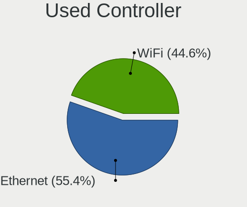

| Kind     | Computers | Percent |
|----------|-----------|---------|
| Ethernet | 961       | 54.73%  |
| WiFi     | 793       | 45.16%  |
| Unknown  | 2         | 0.11%   |

NICs
----

Total network controllers on board

| Total | Computers | Percent |
|-------|-----------|---------|
| 2     | 975       | 55.97%  |
| 1     | 610       | 35.02%  |
| 0     | 66        | 3.79%   |
| 3     | 51        | 2.93%   |
| 4     | 28        | 1.61%   |
| 6     | 5         | 0.29%   |
| 5     | 3         | 0.17%   |
| 10    | 2         | 0.11%   |
| 21    | 1         | 0.06%   |
| 8     | 1         | 0.06%   |

IPv6
----

IPv6 vs IPv4

| Used | Computers | Percent |
|------|-----------|---------|
| No   | 1623      | 92.16%  |
| Yes  | 138       | 7.84%   |

Bluetooth
---------

Bluetooth Vendor
----------------

Controller vendors

| Vendor                          | Computers | Percent |
|---------------------------------|-----------|---------|
| Intel                           | 380       | 43.38%  |
| Qualcomm Atheros Communications | 109       | 12.44%  |
| Realtek Semiconductor           | 72        | 8.22%   |
| Broadcom                        | 61        | 6.96%   |
| Cambridge Silicon Radio         | 55        | 6.28%   |
| Lite-On Technology              | 32        | 3.65%   |
| ASUSTek Computer                | 31        | 3.54%   |
| IMC Networks                    | 24        | 2.74%   |
| Apple                           | 23        | 2.63%   |
| Foxconn / Hon Hai               | 20        | 2.28%   |
| Dell                            | 20        | 2.28%   |
| Hewlett-Packard                 | 15        | 1.71%   |
| Toshiba                         | 10        | 1.14%   |
| Ralink                          | 4         | 0.46%   |
| Foxconn International           | 3         | 0.34%   |
| Alps Electric                   | 3         | 0.34%   |
| Unknown                         | 2         | 0.23%   |
| Belkin Components               | 2         | 0.23%   |
| Realtek                         | 1         | 0.11%   |
| Ralink Technology               | 1         | 0.11%   |
| Marvell Semiconductor           | 1         | 0.11%   |
| Kensington                      | 1         | 0.11%   |
| Integrated System Solution      | 1         | 0.11%   |
| Fujitsu                         | 1         | 0.11%   |
| Edimax Technology               | 1         | 0.11%   |
| Com One                         | 1         | 0.11%   |
| Chicony Electronics             | 1         | 0.11%   |
| Askey Computer                  | 1         | 0.11%   |

Bluetooth Model
---------------

Controller models

| Model                                               | Computers | Percent |
|-----------------------------------------------------|-----------|---------|
| Intel Bluetooth wireless interface                  | 175       | 19.93%  |
| Intel Bluetooth 9460/9560 Jefferson Peak (JfP)      | 64        | 7.29%   |
| Qualcomm Atheros  Bluetooth Device                  | 55        | 6.26%   |
| Cambridge Silicon Radio Bluetooth Dongle (HCI mode) | 55        | 6.26%   |
| Realtek Bluetooth Radio                             | 42        | 4.78%   |
| Intel AX200 Bluetooth                               | 35        | 3.99%   |
| Intel AX201 Bluetooth                               | 33        | 3.76%   |
| Intel Wireless-AC 9260 Bluetooth Adapter            | 31        | 3.53%   |
| Intel Wireless-AC 3168 Bluetooth                    | 21        | 2.39%   |
| Realtek  Bluetooth 4.2 Adapter                      | 20        | 2.28%   |
| Intel Centrino Bluetooth Wireless Transceiver       | 15        | 1.71%   |
| Qualcomm Atheros AR3011 Bluetooth                   | 13        | 1.48%   |
| Lite-On Qualcomm Atheros QCA9377 Bluetooth          | 13        | 1.48%   |
| IMC Networks Bluetooth Device                       | 13        | 1.48%   |
| Qualcomm Atheros AR3012 Bluetooth 4.0               | 12        | 1.37%   |
| Broadcom BCM2045B (BDC-2.1)                         | 12        | 1.37%   |
| Qualcomm Atheros QCA61x4 Bluetooth 4.0              | 10        | 1.14%   |
| Lite-On Atheros AR3012 Bluetooth                    | 9         | 1.03%   |
| Foxconn / Hon Hai Bluetooth Device                  | 9         | 1.03%   |
| Qualcomm Atheros Bluetooth USB Host Controller      | 8         | 0.91%   |
| Intel Centrino Advanced-N 6230 Bluetooth adapter    | 8         | 0.91%   |
| HP Bluetooth 2.0 Interface [Broadcom BCM2045]       | 8         | 0.91%   |
| Dell DW375 Bluetooth Module                         | 8         | 0.91%   |
| Broadcom BCM20702A0 Bluetooth 4.0                   | 8         | 0.91%   |
| Broadcom BCM20702 Bluetooth 4.0 [ThinkPad]          | 8         | 0.91%   |
| Apple Bluetooth Host Controller                     | 8         | 0.91%   |
| Realtek RTL8821A Bluetooth                          | 7         | 0.8%    |
| ASUS Bluetooth Adapter                              | 7         | 0.8%    |
| IMC Networks Bluetooth Radio                        | 6         | 0.68%   |
| ASUS Broadcom BCM20702A0 Bluetooth                  | 6         | 0.68%   |
| Qualcomm Atheros Bluetooth                          | 5         | 0.57%   |
| HP Broadcom 2070 Bluetooth Combo                    | 5         | 0.57%   |
| Broadcom BCM2045B (BDC-2.1) [Bluetooth Controller]  | 5         | 0.57%   |
| Apple Bluetooth USB Host Controller                 | 5         | 0.57%   |
| Apple Bluetooth HCI                                 | 5         | 0.57%   |
| Toshiba Bluetooth Device                            | 4         | 0.46%   |
| Ralink RT3290 Bluetooth                             | 4         | 0.46%   |
| Qualcomm Atheros AR9462 Bluetooth                   | 4         | 0.46%   |
| Lite-On Bluetooth Device                            | 4         | 0.46%   |
| Dell Wireless 365 Bluetooth                         | 4         | 0.46%   |

Sound
-----

Sound Vendor
------------

Sound card vendors

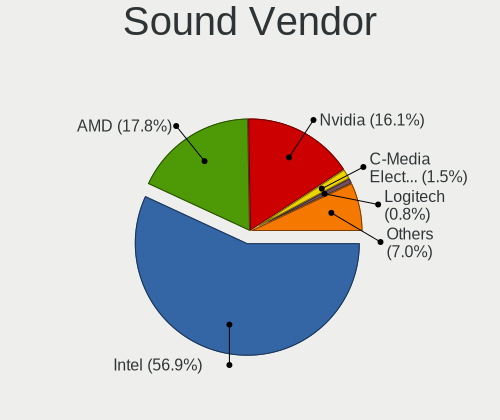

| Vendor                           | Computers | Percent |
|----------------------------------|-----------|---------|
| Intel                            | 1233      | 56.61%  |
| AMD                              | 392       | 18%     |
| Nvidia                           | 348       | 15.98%  |
| C-Media Electronics              | 33        | 1.52%   |
| Logitech                         | 17        | 0.78%   |
| Creative Labs                    | 14        | 0.64%   |
| Lenovo                           | 9         | 0.41%   |
| Texas Instruments                | 8         | 0.37%   |
| Realtek Semiconductor            | 8         | 0.37%   |
| GN Netcom                        | 8         | 0.37%   |
| Kingston Technology              | 6         | 0.28%   |
| JMTek                            | 6         | 0.28%   |
| Dell                             | 6         | 0.28%   |
| Creative Technology              | 6         | 0.28%   |
| VIA Technologies                 | 5         | 0.23%   |
| Silicon Integrated Systems [SiS] | 4         | 0.18%   |
| Plantronics                      | 4         | 0.18%   |
| Samsung Electronics              | 3         | 0.14%   |
| Razer USA                        | 3         | 0.14%   |
| Microsoft                        | 3         | 0.14%   |
| Generalplus Technology           | 3         | 0.14%   |
| Focusrite-Novation               | 3         | 0.14%   |
| Corsair                          | 3         | 0.14%   |
| BEHRINGER International          | 3         | 0.14%   |
| XMOS                             | 2         | 0.09%   |
| Native Instruments               | 2         | 0.09%   |
| Musical Fidelity                 | 2         | 0.09%   |
| Micro Star International         | 2         | 0.09%   |
| Hewlett-Packard                  | 2         | 0.09%   |
| DSEA A/S                         | 2         | 0.09%   |
| Blue Microphones                 | 2         | 0.09%   |
| ASUSTek Computer                 | 2         | 0.09%   |
| Astro Gaming                     | 2         | 0.09%   |
| AKAI Professional M.I.           | 2         | 0.09%   |
| Yamaha                           | 1         | 0.05%   |
| Veho                             | 1         | 0.05%   |
| USB MICROPHONE                   | 1         | 0.05%   |
| Tenx Technology                  | 1         | 0.05%   |
| SteelSeries ApS                  | 1         | 0.05%   |
| SmartlinkTechnology              | 1         | 0.05%   |

Sound Model
-----------

Sound card models

| Model                                                                                             | Computers | Percent |
|---------------------------------------------------------------------------------------------------|-----------|---------|
| Intel Sunrise Point-LP HD Audio                                                                   | 167       | 6.59%   |
| Intel 7 Series/C216 Chipset Family High Definition Audio Controller                               | 125       | 4.93%   |
| Intel 6 Series/C200 Series Chipset Family High Definition Audio Controller                        | 123       | 4.85%   |
| Intel 8 Series/C220 Series Chipset High Definition Audio Controller                               | 84        | 3.31%   |
| AMD SBx00 Azalia (Intel HDA)                                                                      | 76        | 3%      |
| Intel 82801I (ICH9 Family) HD Audio Controller                                                    | 70        | 2.76%   |
| Intel Xeon E3-1200 v3/4th Gen Core Processor HD Audio Controller                                  | 69        | 2.72%   |
| Intel NM10/ICH7 Family High Definition Audio Controller                                           | 69        | 2.72%   |
| Intel Cannon Point-LP High Definition Audio Controller                                            | 58        | 2.29%   |
| AMD FCH Azalia Controller                                                                         | 58        | 2.29%   |
| AMD Family 17h/19h HD Audio Controller                                                            | 54        | 2.13%   |
| Intel 5 Series/3400 Series Chipset High Definition Audio                                          | 53        | 2.09%   |
| AMD Family 17h (Models 00h-0fh) HD Audio Controller                                               | 53        | 2.09%   |
| Intel Cannon Lake PCH cAVS                                                                        | 50        | 1.97%   |
| AMD Raven/Raven2/Fenghuang HDMI/DP Audio Controller                                               | 50        | 1.97%   |
| AMD Starship/Matisse HD Audio Controller                                                          | 46        | 1.81%   |
| Intel Haswell-ULT HD Audio Controller                                                             | 45        | 1.77%   |
| Intel 8 Series HD Audio Controller                                                                | 45        | 1.77%   |
| Intel Wildcat Point-LP High Definition Audio Controller                                           | 39        | 1.54%   |
| Intel Broadwell-U Audio Controller                                                                | 39        | 1.54%   |
| Intel 100 Series/C230 Series Chipset Family HD Audio Controller                                   | 38        | 1.5%    |
| Nvidia GK208 HDMI/DP Audio Controller                                                             | 37        | 1.46%   |
| AMD Ellesmere HDMI Audio [Radeon RX 470/480 / 570/580/590]                                        | 35        | 1.38%   |
| Nvidia High Definition Audio Controller                                                           | 32        | 1.26%   |
| Intel 200 Series PCH HD Audio                                                                     | 30        | 1.18%   |
| Intel Atom/Celeron/Pentium Processor x5-E8000/J3xxx/N3xxx Series High Definition Audio Controller | 28        | 1.1%    |
| Nvidia GF108 High Definition Audio Controller                                                     | 27        | 1.06%   |
| Nvidia GP107GL High Definition Audio Controller                                                   | 26        | 1.03%   |
| Intel Celeron N3350/Pentium N4200/Atom E3900 Series Audio Cluster                                 | 25        | 0.99%   |
| Intel 82801H (ICH8 Family) HD Audio Controller                                                    | 25        | 0.99%   |
| Nvidia GP106 High Definition Audio Controller                                                     | 24        | 0.95%   |
| Intel Comet Lake PCH-LP cAVS                                                                      | 24        | 0.95%   |
| Nvidia GK107 HDMI Audio Controller                                                                | 21        | 0.83%   |
| Intel Celeron/Pentium Silver Processor High Definition Audio                                      | 21        | 0.83%   |
| AMD Kabini HDMI/DP Audio                                                                          | 21        | 0.83%   |
| Nvidia GM107 High Definition Audio Controller [GeForce 940MX]                                     | 19        | 0.75%   |
| AMD Caicos HDMI Audio [Radeon HD 6450 / 7450/8450/8490 OEM / R5 230/235/235X OEM]                 | 19        | 0.75%   |
| AMD Oland/Hainan/Cape Verde/Pitcairn HDMI Audio [Radeon HD 7000 Series]                           | 18        | 0.71%   |
| Intel Atom Processor Z36xxx/Z37xxx Series High Definition Audio Controller                        | 17        | 0.67%   |
| AMD Wrestler HDMI Audio                                                                           | 17        | 0.67%   |

Memory
------

Memory Vendor
-------------

Memory module vendors

| Vendor              | Computers | Percent |
|---------------------|-----------|---------|
| Samsung Electronics | 230       | 18.47%  |
| SK hynix            | 203       | 16.31%  |
| Kingston            | 188       | 15.1%   |
| Unknown             | 183       | 14.7%   |
| Micron Technology   | 99        | 7.95%   |
| Crucial             | 66        | 5.3%    |
| Corsair             | 57        | 4.58%   |
| G.Skill             | 42        | 3.37%   |
| Elpida              | 25        | 2.01%   |
| Ramaxel Technology  | 23        | 1.85%   |
| A-DATA Technology   | 18        | 1.45%   |
| Unknown (ABCD)      | 13        | 1.04%   |
| Smart               | 13        | 1.04%   |
| Nanya Technology    | 13        | 1.04%   |
| Transcend           | 10        | 0.8%    |
| Teikon              | 8         | 0.64%   |
| Patriot             | 4         | 0.32%   |
| Apacer              | 4         | 0.32%   |
| AMD                 | 4         | 0.32%   |
| Qimonda             | 3         | 0.24%   |
| Hewlett-Packard     | 3         | 0.24%   |
| 48spaces            | 3         | 0.24%   |
| Team                | 2         | 0.16%   |
| Silicon Power       | 2         | 0.16%   |
| PNY                 | 2         | 0.16%   |
| OSV                 | 2         | 0.16%   |
| Goodram             | 2         | 0.16%   |
| GeIL                | 2         | 0.16%   |
| Atermiter           | 2         | 0.16%   |
| Unknown (AB)        | 1         | 0.08%   |
| Unigen              | 1         | 0.08%   |
| Toshiba-0098        | 1         | 0.08%   |
| Timetec             | 1         | 0.08%   |
| TEXTORM             | 1         | 0.08%   |
| Swissbit            | 1         | 0.08%   |
| Smart Brazil        | 1         | 0.08%   |
| SHARETRONIC         | 1         | 0.08%   |
| Qumo                | 1         | 0.08%   |
| Princeton           | 1         | 0.08%   |
| Positivo            | 1         | 0.08%   |

Memory Model
------------

Memory module models

| Model                                                            | Computers | Percent |
|------------------------------------------------------------------|-----------|---------|
| SK hynix RAM HMT451S6BFR8A-PB 4GB SODIMM DDR3 1600MT/s           | 13        | 0.95%   |
| SK hynix RAM HMA81GS6AFR8N-UH 8GB SODIMM DDR4 2667MT/s           | 11        | 0.81%   |
| Samsung RAM M471A5244CB0-CRC 4GB SODIMM DDR4 2667MT/s            | 11        | 0.81%   |
| Samsung RAM M471B5273DH0-CH9 4096MB SODIMM DDR3 1334MT/s         | 10        | 0.73%   |
| Unknown RAM Module 4096MB DIMM 1333MT/s                          | 8         | 0.59%   |
| SK hynix RAM HMT41GS6BFR8A-PB 8GB SODIMM DDR3 1600MT/s           | 8         | 0.59%   |
| Samsung RAM M471B5273CH0-CH9 4GB SODIMM DDR3 1334MT/s            | 8         | 0.59%   |
| Samsung RAM M471B5173DB0-YK0 4GB SODIMM DDR3 1600MT/s            | 8         | 0.59%   |
| Micron RAM 8KTF51264HZ-1G6E1 4GB SODIMM DDR3 1600MT/s            | 8         | 0.59%   |
| Unknown RAM Module 2048MB SODIMM DDR3 1600MT/s                   | 7         | 0.51%   |
| Unknown RAM Module 2048MB DIMM DDR2 800MT/s                      | 7         | 0.51%   |
| Unknown (ABCD) RAM 123456789012345678 4GB DIMM DDR4 2400MT/s     | 7         | 0.51%   |
| SK hynix RAM HMT41GS6AFR8A-PB 8GB SODIMM DDR3 1600MT/s           | 7         | 0.51%   |
| SK hynix RAM HMT351S6CFR8C-PB 4GB SODIMM DDR3 1600MT/s           | 7         | 0.51%   |
| Samsung RAM M471B5173QH0-YK0 4GB SODIMM DDR3 1600MT/s            | 7         | 0.51%   |
| Samsung RAM M471B5173EB0-YK0 4GB SODIMM DDR3 1600MT/s            | 7         | 0.51%   |
| Unknown (ABCD) RAM 123456789012345678 2GB SODIMM LPDDR4 2400MT/s | 6         | 0.44%   |
| SK hynix RAM HYMP125S64CP8-S6 2GB SODIMM DDR2 800MT/s            | 6         | 0.44%   |
| SK hynix RAM HMA81GS6CJR8N-VK 8GB SODIMM DDR4 2667MT/s           | 6         | 0.44%   |
| Samsung RAM M471B5273DH0-CK0 4GB SODIMM DDR3 1600MT/s            | 6         | 0.44%   |
| Samsung RAM M471B1G73QH0-YK0 8192MB SODIMM DDR3 1600MT/s         | 6         | 0.44%   |
| Samsung RAM M471B1G73EB0-YK0 8GB SODIMM DDR3 1600MT/s            | 6         | 0.44%   |
| Samsung RAM M471B1G73DB0-YK0 8GB SODIMM DDR3 1600MT/s            | 6         | 0.44%   |
| Samsung RAM M471A5244CB0-CTD 4GB SODIMM DDR4 3266MT/s            | 6         | 0.44%   |
| Samsung RAM M471A1K43CB1-CRC 8GB SODIMM DDR4 2667MT/s            | 6         | 0.44%   |
| Micron RAM 16KTF51264HZ-1G6M1 4GB SODIMM DDR3 1600MT/s           | 6         | 0.44%   |
| Kingston RAM KHX3200C16D4/8GX 8GB DIMM DDR4 3600MT/s             | 6         | 0.44%   |
| Unknown RAM Module 8192MB DIMM DDR3 1600MT/s                     | 5         | 0.37%   |
| SK hynix RAM HMA851S6AFR6N-UH 2GB SODIMM LPDDR4 2667MT/s         | 5         | 0.37%   |
| Samsung RAM Module 16384MB SODIMM DDR4 2667MT/s                  | 5         | 0.37%   |
| Samsung RAM M471A1K43CB1-CTD 8GB SODIMM DDR4 2667MT/s            | 5         | 0.37%   |
| Kingston RAM KHX2133C14D4/8G 8GB DIMM DDR4 2667MT/s              | 5         | 0.37%   |
| Kingston RAM 99U5471-054.A00LF 8GB DIMM DDR3 1600MT/s            | 5         | 0.37%   |
| Unknown RAM Module 4096MB DIMM DDR3 1333MT/s                     | 4         | 0.29%   |
| Unknown RAM Module 2GB DIMM DDR2 800MT/s                         | 4         | 0.29%   |
| Unknown RAM Module 2048MB DIMM 800MT/s                           | 4         | 0.29%   |
| Unknown RAM Module 2048MB DIMM 667MT/s                           | 4         | 0.29%   |
| Unknown RAM Module 1024MB SODIMM DDR2                            | 4         | 0.29%   |
| SK hynix RAM HMT451S6AFR8A-PB 4GB SODIMM DDR3 1600MT/s           | 4         | 0.29%   |
| SK hynix RAM HMA82GS6JJR8N-VK 16GB SODIMM DDR4 2667MT/s          | 4         | 0.29%   |

Memory Kind
-----------

Memory module kinds

| Kind    | Computers | Percent |
|---------|-----------|---------|
| DDR3    | 457       | 42%     |
| DDR4    | 393       | 36.12%  |
| DDR2    | 95        | 8.73%   |
| Unknown | 42        | 3.86%   |
| SDRAM   | 38        | 3.49%   |
| LPDDR4  | 28        | 2.57%   |
| LPDDR3  | 18        | 1.65%   |
| DDR     | 10        | 0.92%   |
| DRAM    | 6         | 0.55%   |
| RAM     | 1         | 0.09%   |

Memory Form Factor
------------------

Physical design of the memory module

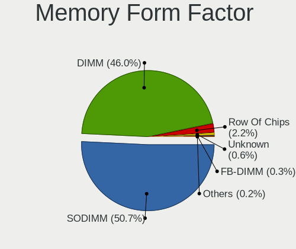

| Name         | Computers | Percent |
|--------------|-----------|---------|
| SODIMM       | 555       | 51.58%  |
| DIMM         | 486       | 45.17%  |
| Row Of Chips | 23        | 2.14%   |
| Unknown      | 7         | 0.65%   |
| FB-DIMM      | 3         | 0.28%   |
| Chip         | 2         | 0.19%   |

Memory Size
-----------

Memory module size

| Size  | Computers | Percent |
|-------|-----------|---------|
| 8192  | 380       | 31.69%  |
| 4096  | 337       | 28.11%  |
| 2048  | 205       | 17.1%   |
| 16384 | 171       | 14.26%  |
| 1024  | 68        | 5.67%   |
| 32768 | 19        | 1.58%   |
| 512   | 12        | 1%      |
| 1536  | 3         | 0.25%   |
| 256   | 3         | 0.25%   |
| 128   | 1         | 0.08%   |

Memory Speed
------------

Memory module speed

| Speed   | Computers | Percent |
|---------|-----------|---------|
| 1600    | 310       | 26.07%  |
| 2667    | 164       | 13.79%  |
| 2400    | 96        | 8.07%   |
| 1333    | 95        | 7.99%   |
| 2133    | 73        | 6.14%   |
| 3200    | 50        | 4.21%   |
| 800     | 48        | 4.04%   |
| 667     | 45        | 3.78%   |
| 1334    | 41        | 3.45%   |
| Unknown | 41        | 3.45%   |
| 3600    | 22        | 1.85%   |
| 1867    | 20        | 1.68%   |
| 1067    | 17        | 1.43%   |
| 1066    | 15        | 1.26%   |
| 2666    | 13        | 1.09%   |
| 1866    | 11        | 0.93%   |
| 533     | 11        | 0.93%   |
| 3000    | 9         | 0.76%   |
| 975     | 9         | 0.76%   |
| 400     | 9         | 0.76%   |
| 3466    | 8         | 0.67%   |
| 2933    | 8         | 0.67%   |
| 2048    | 7         | 0.59%   |
| 4199    | 6         | 0.5%    |
| 3400    | 6         | 0.5%    |
| 3266    | 6         | 0.5%    |
| 3334    | 4         | 0.34%   |
| 8400    | 3         | 0.25%   |
| 4267    | 3         | 0.25%   |
| 3333    | 3         | 0.25%   |
| 3151    | 3         | 0.25%   |
| 2800    | 3         | 0.25%   |
| 333     | 3         | 0.25%   |
| 3866    | 2         | 0.17%   |
| 3500    | 2         | 0.17%   |
| 3100    | 2         | 0.17%   |
| 2200    | 2         | 0.17%   |
| 2187    | 2         | 0.17%   |
| 1776    | 2         | 0.17%   |
| 1639    | 2         | 0.17%   |

Printers & scanners
-------------------

Printer Vendor
--------------

Printer device vendors

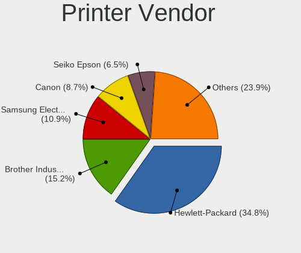

| Vendor                | Computers | Percent |
|-----------------------|-----------|---------|
| Hewlett-Packard       | 16        | 36.36%  |
| Brother Industries    | 6         | 13.64%  |
| Samsung Electronics   | 4         | 9.09%   |
| Canon                 | 4         | 9.09%   |
| Seiko Epson           | 3         | 6.82%   |
| Kyocera               | 2         | 4.55%   |
| Datamax-O'Neil        | 2         | 4.55%   |
| Zebra                 | 1         | 2.27%   |
| STMicroelectronics    | 1         | 2.27%   |
| Prolific Technology   | 1         | 2.27%   |
| Pantum                | 1         | 2.27%   |
| Oki Data              | 1         | 2.27%   |
| Lexmark International | 1         | 2.27%   |
| Dell                  | 1         | 2.27%   |

Printer Model
-------------

Printer device models

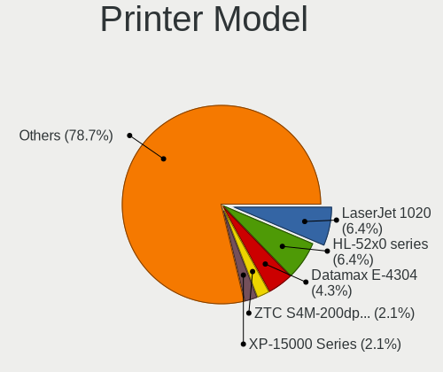

| Model                                                     | Computers | Percent |
|-----------------------------------------------------------|-----------|---------|
| HP LaserJet 1020                                          | 3         | 6.67%   |
| Brother HL-52x0 series                                    | 3         | 6.67%   |
| Datamax-O'Neil Datamax E-4304                             | 2         | 4.44%   |
| Zebra ZTC S4M-200dpi ZPL                                  | 1         | 2.22%   |
| STMicroelectronics LED badge -- mini LED display -- 11x44 | 1         | 2.22%   |
| Seiko Epson XP-15000 Series                               | 1         | 2.22%   |
| Seiko Epson Printer                                       | 1         | 2.22%   |
| Seiko Epson AL-M310DN                                     | 1         | 2.22%   |
| Samsung SCX-4600 Series                                   | 1         | 2.22%   |
| Samsung SCX-3400 Series                                   | 1         | 2.22%   |
| Samsung ML-216x Series Laser Printer                      | 1         | 2.22%   |
| Samsung CLX-3300 Series                                   | 1         | 2.22%   |
| Prolific PL2305 Parallel Port                             | 1         | 2.22%   |
| Pantum P2500W series                                      | 1         | 2.22%   |
| Oki Data USB Device                                       | 1         | 2.22%   |
| Lexmark International CS417dn                             | 1         | 2.22%   |
| Kyocera FS-1120D                                          | 1         | 2.22%   |
| Kyocera ECOSYS P2335d                                     | 1         | 2.22%   |
| HP PhotoSmart P1000                                       | 1         | 2.22%   |
| HP OfficeJet 3830 series                                  | 1         | 2.22%   |
| HP LaserJet Pro M404-M405                                 | 1         | 2.22%   |
| HP LaserJet P1102                                         | 1         | 2.22%   |
| HP LaserJet M14-M17                                       | 1         | 2.22%   |
| HP EWS UPD                                                | 1         | 2.22%   |
| HP ENVY Photo 6200 series                                 | 1         | 2.22%   |
| HP DeskJet Plus 4100 series                               | 1         | 2.22%   |
| HP DeskJet 6122                                           | 1         | 2.22%   |
| HP DeskJet 5850c                                          | 1         | 2.22%   |
| HP DeskJet 2700 series                                    | 1         | 2.22%   |
| HP Deskjet 2540 series                                    | 1         | 2.22%   |
| HP DeskJet 2130 series                                    | 1         | 2.22%   |
| HP Deskjet 1050 J410                                      | 1         | 2.22%   |
| Dell B1160w Mono Laser Printer                            | 1         | 2.22%   |
| Canon TS6400 series                                       | 1         | 2.22%   |
| Canon PIXMA MG3600 Series                                 | 1         | 2.22%   |
| Canon PIXMA MG2500 Series                                 | 1         | 2.22%   |
| Canon MB5300 series                                       | 1         | 2.22%   |
| Brother Printer                                           | 1         | 2.22%   |
| Brother HL-L2300D series                                  | 1         | 2.22%   |
| Brother HL-2220 series                                    | 1         | 2.22%   |

Scanner Vendor
--------------

Scanner device vendors

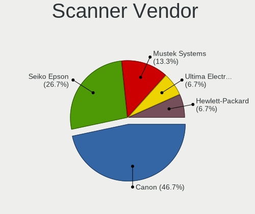

| Vendor             | Computers | Percent |
|--------------------|-----------|---------|
| Canon              | 6         | 46.15%  |
| Seiko Epson        | 3         | 23.08%  |
| Mustek Systems     | 2         | 15.38%  |
| Ultima Electronics | 1         | 7.69%   |
| Hewlett-Packard    | 1         | 7.69%   |

Scanner Model
-------------

Scanner device models

| Model                                                                                 | Computers | Percent |
|---------------------------------------------------------------------------------------|-----------|---------|
| Canon CanoScan LiDE 110                                                               | 3         | 23.08%  |
| Ultima Artec Ultima 2000 (GT6801 based)/Lifetec LT9385/ScanMagic 1200 UB Plus Scanner | 1         | 7.69%   |
| Seiko Epson GT-9700F [Perfection 2450 PHOTO]                                          | 1         | 7.69%   |
| Seiko Epson GT-8200U/GT-8200UF [Perfection 1650/1650 PHOTO]                           | 1         | 7.69%   |
| Seiko Epson GT-7300U [Perfection 1260/1260 PHOTO]                                     | 1         | 7.69%   |
| Mustek Systems SNAPSCAN e22                                                           | 1         | 7.69%   |
| Mustek Systems BearPaw 2448 TA Pro                                                    | 1         | 7.69%   |
| HP ScanJet 7650                                                                       | 1         | 7.69%   |
| Canon CanoScan N670U/N676U/LiDE 20                                                    | 1         | 7.69%   |
| Canon CanoScan LiDE 210                                                               | 1         | 7.69%   |
| Canon CanoScan 9000F Mark II                                                          | 1         | 7.69%   |

Camera
------

Camera Vendor
-------------

Camera device vendors

| Vendor                                 | Computers | Percent |
|----------------------------------------|-----------|---------|
| Chicony Electronics                    | 191       | 21.01%  |
| Microdia                               | 82        | 9.02%   |
| Realtek Semiconductor                  | 79        | 8.69%   |
| Sunplus Innovation Technology          | 75        | 8.25%   |
| Acer                                   | 74        | 8.14%   |
| Logitech                               | 69        | 7.59%   |
| IMC Networks                           | 60        | 6.6%    |
| Suyin                                  | 31        | 3.41%   |
| Quanta                                 | 22        | 2.42%   |
| Cheng Uei Precision Industry (Foxlink) | 22        | 2.42%   |
| Lite-On Technology                     | 21        | 2.31%   |
| Apple                                  | 20        | 2.2%    |
| Syntek                                 | 19        | 2.09%   |
| Silicon Motion                         | 18        | 1.98%   |
| Alcor Micro                            | 17        | 1.87%   |
| Ricoh                                  | 11        | 1.21%   |
| Lenovo                                 | 10        | 1.1%    |
| Samsung Electronics                    | 9         | 0.99%   |
| Z-Star Microelectronics                | 8         | 0.88%   |
| Microsoft                              | 8         | 0.88%   |
| Primax Electronics                     | 6         | 0.66%   |
| Generalplus Technology                 | 5         | 0.55%   |
| ALi                                    | 5         | 0.55%   |
| Jieli Technology                       | 4         | 0.44%   |
| GEMBIRD                                | 4         | 0.44%   |
| OmniVision Technologies                | 3         | 0.33%   |
| Genesys Logic                          | 3         | 0.33%   |
| Tobii Technology AB                    | 2         | 0.22%   |
| Philips (or NXP)                       | 2         | 0.22%   |
| Luxvisions Innotech Limited            | 2         | 0.22%   |
| Importek                               | 2         | 0.22%   |
| Huawei Technologies                    | 2         | 0.22%   |
| Hewlett-Packard                        | 2         | 0.22%   |
| Cubeternet                             | 2         | 0.22%   |
| Aveo Technology                        | 2         | 0.22%   |
| Xiongmai                               | 1         | 0.11%   |
| USB Camera                             | 1         | 0.11%   |
| Unknown                                | 1         | 0.11%   |
| Trust                                  | 1         | 0.11%   |
| SunplusIT                              | 1         | 0.11%   |

Camera Model
------------

Camera device models

| Model                                   | Computers | Percent |
|-----------------------------------------|-----------|---------|
| Realtek Integrated_Webcam_HD            | 35        | 3.83%   |
| Chicony Integrated Camera               | 27        | 2.95%   |
| Sunplus Integrated_Webcam_HD            | 24        | 2.63%   |
| IMC Networks Integrated Camera          | 22        | 2.41%   |
| Chicony HD WebCam                       | 22        | 2.41%   |
| Acer Integrated Camera                  | 20        | 2.19%   |
| Microdia Integrated_Webcam_HD           | 19        | 2.08%   |
| Logitech Webcam C270                    | 14        | 1.53%   |
| Acer Lenovo EasyCamera                  | 14        | 1.53%   |
| Logitech HD Pro Webcam C920             | 13        | 1.42%   |
| Acer SunplusIT Integrated Camera        | 12        | 1.31%   |
| Sunplus HD WebCam                       | 11        | 1.2%    |
| Lite-On Integrated Camera               | 11        | 1.2%    |
| IMC Networks USB2.0 HD UVC WebCam       | 11        | 1.2%    |
| Microdia USB 2.0 Camera                 | 10        | 1.09%   |
| Samsung Galaxy A5 (MTP)                 | 9         | 0.98%   |
| Microdia Integrated Webcam              | 9         | 0.98%   |
| Chicony HP HD Camera                    | 9         | 0.98%   |
| Chicony EasyCamera                      | 9         | 0.98%   |
| Alcor Micro USB 2.0 Camera              | 9         | 0.98%   |
| Syntek Integrated Camera                | 8         | 0.88%   |
| IMC Networks USB2.0 VGA UVC WebCam      | 8         | 0.88%   |
| Microdia Laptop_Integrated_Webcam_HD    | 7         | 0.77%   |
| Chicony Integrated Camera (1280x720@30) | 7         | 0.77%   |
| Apple iPhone5/5C/5S/6                   | 7         | 0.77%   |
| Sunplus Laptop_Integrated_Webcam_FHD    | 6         | 0.66%   |
| Sunplus Asus Webcam                     | 6         | 0.66%   |
| Realtek USB2.0 HD UVC WebCam            | 6         | 0.66%   |
| Realtek Integrated Webcam               | 6         | 0.66%   |
| Logitech HD Webcam C525                 | 6         | 0.66%   |
| Logitech C922 Pro Stream Webcam         | 6         | 0.66%   |
| Lenovo Integrated Webcam [R5U877]       | 6         | 0.66%   |
| Apple FaceTime HD Camera (Built-in)     | 6         | 0.66%   |
| Acer EasyCamera                         | 6         | 0.66%   |
| Sunplus Laptop Integrated Webcam HD     | 5         | 0.55%   |
| Realtek USB2.0 VGA UVC WebCam           | 5         | 0.55%   |
| Realtek HD WebCam                       | 5         | 0.55%   |
| Quanta HP TrueVision HD Camera          | 5         | 0.55%   |
| Quanta HP HD Camera                     | 5         | 0.55%   |
| Microsoft LifeCam HD-3000               | 5         | 0.55%   |

Security
--------

Fingerprint Vendor
------------------

Fingerprint sensor vendors

| Vendor                     | Computers | Percent |
|----------------------------|-----------|---------|
| Validity Sensors           | 61        | 35.06%  |
| Synaptics                  | 54        | 31.03%  |
| AuthenTec                  | 17        | 9.77%   |
| Shenzhen Goodix Technology | 13        | 7.47%   |
| Upek                       | 11        | 6.32%   |
| Elan Microelectronics      | 11        | 6.32%   |
| LighTuning Technology      | 4         | 2.3%    |
| STMicroelectronics         | 1         | 0.57%   |
| Samsung Electronics        | 1         | 0.57%   |
| Microsoft                  | 1         | 0.57%   |

Fingerprint Model
-----------------

Fingerprint sensor models

| Model                                                                      | Computers | Percent |
|----------------------------------------------------------------------------|-----------|---------|
| Synaptics Prometheus MIS Touch Fingerprint Reader                          | 22        | 12.64%  |
| Validity Sensors VFS 5011 fingerprint sensor                               | 13        | 7.47%   |
| Validity Sensors VFS5011 Fingerprint Reader                                | 12        | 6.9%    |
| Validity Sensors VFS495 Fingerprint Reader                                 | 11        | 6.32%   |
| Upek Biometric Touchchip/Touchstrip Fingerprint Sensor                     | 10        | 5.75%   |
| Synaptics Metallica MOH Touch Fingerprint Reader                           | 10        | 5.75%   |
| AuthenTec AES2810                                                          | 10        | 5.75%   |
| Synaptics  WBDI                                                            | 7         | 4.02%   |
| Elan ELAN:Fingerprint                                                      | 7         | 4.02%   |
| Validity Sensors Synaptics VFS7552 Touch Fingerprint Sensor with PurePrint | 6         | 3.45%   |
| Shenzhen Goodix Fingerprint Reader                                         | 6         | 3.45%   |
| Shenzhen Goodix  FingerPrint Device                                        | 5         | 2.87%   |
| Unknown                                                                    | 5         | 2.87%   |
| Validity Sensors Swipe Fingerprint Sensor                                  | 4         | 2.3%    |
| Synaptics  VFS7552 Touch Fingerprint Sensor with PurePrint                 | 4         | 2.3%    |
| LighTuning EgisTec Touch Fingerprint Sensor                                | 4         | 2.3%    |
| Validity Sensors VFS491                                                    | 3         | 1.72%   |
| Validity Sensors VFS471 Fingerprint Reader                                 | 3         | 1.72%   |
| Synaptics Metallica MIS Touch Fingerprint Reader                           | 3         | 1.72%   |
| Elan ELAN:ARM-M4                                                           | 3         | 1.72%   |
| AuthenTec AES2501 Fingerprint Sensor                                       | 3         | 1.72%   |
| Validity Sensors VFS Fingerprint sensor                                    | 2         | 1.15%   |
| Validity Sensors Synaptics WBDI                                            | 2         | 1.15%   |
| Validity Sensors Fingerprint scanner                                       | 2         | 1.15%   |
| Synaptics  FS7604 Touch Fingerprint Sensor with PurePrint                  | 2         | 1.15%   |
| Shenzhen Goodix FingerPrint                                                | 2         | 1.15%   |
| AuthenTec Fingerprint Sensor                                               | 2         | 1.15%   |
| Validity Sensors VFS7500 Touch Fingerprint Sensor                          | 1         | 0.57%   |
| Validity Sensors VFS451 Fingerprint Reader                                 | 1         | 0.57%   |
| Validity Sensors Synaptics VFS7552 Touch Fingerprint Sensor                | 1         | 0.57%   |
| Upek TCS5B Fingerprint sensor                                              | 1         | 0.57%   |
| Synaptics WBDI Device                                                      | 1         | 0.57%   |
| STMicroelectronics Fingerprint Reader                                      | 1         | 0.57%   |
| Samsung Fingerprint Device                                                 | 1         | 0.57%   |
| Microsoft Fingerprint Reader                                               | 1         | 0.57%   |
| Elan fingerprint sensor [FeinTech FPS00200]                                | 1         | 0.57%   |
| AuthenTec AES2550 Fingerprint Sensor                                       | 1         | 0.57%   |
| AuthenTec AES1660 Fingerprint Sensor                                       | 1         | 0.57%   |

Chipcard Vendor
---------------

Chipcard module vendors

| Vendor                    | Computers | Percent |
|---------------------------|-----------|---------|
| Broadcom                  | 42        | 42.86%  |
| Alcor Micro               | 27        | 27.55%  |
| Lenovo                    | 6         | 6.12%   |
| Upek                      | 5         | 5.1%    |
| O2 Micro                  | 5         | 5.1%    |
| Clay Logic                | 3         | 3.06%   |
| SCM Microsystems          | 2         | 2.04%   |
| Yubico.com                | 1         | 1.02%   |
| Reiner SCT Kartensysteme  | 1         | 1.02%   |
| Realtek Semiconductor     | 1         | 1.02%   |
| Gemalto (was Gemplus)     | 1         | 1.02%   |
| Chicony Electronics       | 1         | 1.02%   |
| Cherry                    | 1         | 1.02%   |
| Aladdin Knowledge Systems | 1         | 1.02%   |
| Advanced Card Systems     | 1         | 1.02%   |

Chipcard Model
--------------

Chipcard module models

| Model                                                                        | Computers | Percent |
|------------------------------------------------------------------------------|-----------|---------|
| Alcor Micro AU9540 Smartcard Reader                                          | 27        | 27.55%  |
| Broadcom BCM5880 Secure Applications Processor                               | 16        | 16.33%  |
| Broadcom 5880                                                                | 12        | 12.24%  |
| Broadcom BCM5880 Secure Applications Processor with fingerprint swipe sensor | 7         | 7.14%   |
| Broadcom 58200                                                               | 7         | 7.14%   |
| Lenovo Integrated Smart Card Reader                                          | 6         | 6.12%   |
| Upek TouchChip Fingerprint Coprocessor (WBF advanced mode)                   | 5         | 5.1%    |
| O2 Micro OZ776 CCID Smartcard Reader                                         | 4         | 4.08%   |
| Clay Logic Nitrokey Start                                                    | 2         | 2.04%   |
| Yubico.com Yubikey 4/5 U2F+CCID                                              | 1         | 1.02%   |
| SCM Microsystems SCR335 SmartCard Reader                                     | 1         | 1.02%   |
| SCM Microsystems SCR331-LC1 / SCR3310 SmartCard Reader                       | 1         | 1.02%   |
| Reiner SCT Kartensysteme cyberJack RFID basis contactless smartcard reader   | 1         | 1.02%   |
| Realtek Semiconductor Smart Card Reader Interface                            | 1         | 1.02%   |
| O2 Micro Oz776 SmartCard Reader                                              | 1         | 1.02%   |
| Gemalto (was Gemplus) Compact Smart Card Reader Writer                       | 1         | 1.02%   |
| Clay Logic Nitrokey Pro                                                      | 1         | 1.02%   |
| Chicony Electronics HP Skylab USB Smartcard Keyboard                         | 1         | 1.02%   |
| Cherry SmartCard Reader Keyboard KC 1000 SC                                  | 1         | 1.02%   |
| Aladdin Knowledge Systems Token JC                                           | 1         | 1.02%   |
| Advanced Card Systems ACR38 SmartCard Reader                                 | 1         | 1.02%   |

Unsupported
-----------

Unsupported Devices
-------------------

Total unsupported devices on board

| Total | Computers | Percent |
|-------|-----------|---------|
| 0     | 1194      | 67.57%  |
| 1     | 428       | 24.22%  |
| 2     | 114       | 6.45%   |
| 3     | 22        | 1.25%   |
| 4     | 7         | 0.4%    |
| 6     | 2         | 0.11%   |

Unsupported Device Types
------------------------

Types of unsupported devices

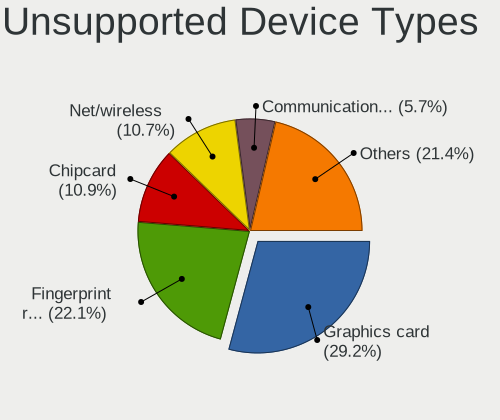

| Type                     | Computers | Percent |
|--------------------------|-----------|---------|
| Graphics card            | 180       | 24.97%  |
| Fingerprint reader       | 173       | 23.99%  |
| Chipcard                 | 85        | 11.79%  |
| Net/wireless             | 83        | 11.51%  |
| Communication controller | 36        | 4.99%   |
| Multimedia controller    | 35        | 4.85%   |
| Unassigned class         | 28        | 3.88%   |
| Bluetooth                | 22        | 3.05%   |
| Storage                  | 14        | 1.94%   |
| Card reader              | 14        | 1.94%   |
| Camera                   | 14        | 1.94%   |
| Sound                    | 13        | 1.8%    |
| Net/ethernet             | 11        | 1.53%   |
| Storage/ide              | 3         | 0.42%   |
| Network                  | 3         | 0.42%   |
| Modem                    | 3         | 0.42%   |
| Storage/raid             | 1         | 0.14%   |
| Storage/ata              | 1         | 0.14%   |
| Flash memory             | 1         | 0.14%   |
| Firewire controller      | 1         | 0.14%   |

