Debian 10 - Tested Hardware & Statistics (Desktops)
---------------------------------------------------

A project to collect tested hardware configurations for Debian 10.

Anyone can contribute to this report by the [hw-probe](https://github.com/linuxhw/hw-probe) tool:

    sudo -E hw-probe -all -upload

Please submit a probe of your configuration if it's not presented on the page or is rare.

Full-feature report is available here: https://linux-hardware.org/?view=trends

Contents
--------

* [ Test Cases ](#test-cases)

* [ System ](#system)
  - [ Kernel                   ](#kernel)
  - [ Kernel Family            ](#kernel-family)
  - [ Kernel Major Ver.        ](#kernel-major-ver)
  - [ Arch                     ](#arch)
  - [ DE                       ](#de)
  - [ Display Server           ](#display-server)
  - [ Display Manager          ](#display-manager)
  - [ OS Lang                  ](#os-lang)
  - [ Boot Mode                ](#boot-mode)
  - [ Filesystem               ](#filesystem)
  - [ Part. scheme             ](#part-scheme)
  - [ Dual Boot with Linux/BSD ](#dual-boot-with-linuxbsd)
  - [ Dual Boot (Win)          ](#dual-boot-win)

* [ Board ](#board)
  - [ Vendor                   ](#vendor)
  - [ Model                    ](#model)
  - [ Model Family             ](#model-family)
  - [ MFG Year                 ](#mfg-year)
  - [ Form Factor              ](#form-factor)
  - [ Secure Boot              ](#secure-boot)
  - [ Coreboot                 ](#coreboot)
  - [ RAM Size                 ](#ram-size)
  - [ RAM Used                 ](#ram-used)
  - [ Total Drives             ](#total-drives)
  - [ Has CD-ROM               ](#has-cd-rom)
  - [ Has Ethernet             ](#has-ethernet)
  - [ Has WiFi                 ](#has-wifi)
  - [ Has Bluetooth            ](#has-bluetooth)

* [ Location ](#location)
  - [ Country                  ](#country)
  - [ City                     ](#city)

* [ Drives ](#drives)
  - [ Drive Vendor             ](#drive-vendor)
  - [ Drive Model              ](#drive-model)
  - [ HDD Vendor               ](#hdd-vendor)
  - [ SSD Vendor               ](#ssd-vendor)
  - [ Drive Kind               ](#drive-kind)
  - [ Drive Connector          ](#drive-connector)
  - [ Drive Size               ](#drive-size)
  - [ Space Total              ](#space-total)
  - [ Space Used               ](#space-used)
  - [ Malfunc. Drives          ](#malfunc-drives)
  - [ Malfunc. Drive Vendor    ](#malfunc-drive-vendor)
  - [ Malfunc. HDD Vendor      ](#malfunc-hdd-vendor)
  - [ Malfunc. Drive Kind      ](#malfunc-drive-kind)
  - [ Failed Drives            ](#failed-drives)
  - [ Failed Drive Vendor      ](#failed-drive-vendor)
  - [ Drive Status             ](#drive-status)

* [ Storage controller ](#storage-controller)
  - [ Storage Vendor           ](#storage-vendor)
  - [ Storage Model            ](#storage-model)
  - [ Storage Kind             ](#storage-kind)

* [ Processor ](#processor)
  - [ CPU Vendor               ](#cpu-vendor)
  - [ CPU Model                ](#cpu-model)
  - [ CPU Model Family         ](#cpu-model-family)
  - [ CPU Cores                ](#cpu-cores)
  - [ CPU Sockets              ](#cpu-sockets)
  - [ CPU Threads              ](#cpu-threads)
  - [ CPU Op-Modes             ](#cpu-op-modes)
  - [ CPU Microcode            ](#cpu-microcode)
  - [ CPU Microarch            ](#cpu-microarch)

* [ Graphics ](#graphics)
  - [ GPU Vendor               ](#gpu-vendor)
  - [ GPU Model                ](#gpu-model)
  - [ GPU Combo                ](#gpu-combo)
  - [ GPU Driver               ](#gpu-driver)
  - [ GPU Memory               ](#gpu-memory)

* [ Monitor ](#monitor)
  - [ Monitor Vendor           ](#monitor-vendor)
  - [ Monitor Model            ](#monitor-model)
  - [ Monitor Resolution       ](#monitor-resolution)
  - [ Monitor Diagonal         ](#monitor-diagonal)
  - [ Monitor Width            ](#monitor-width)
  - [ Aspect Ratio             ](#aspect-ratio)
  - [ Monitor Area             ](#monitor-area)
  - [ Pixel Density            ](#pixel-density)
  - [ Multiple Monitors        ](#multiple-monitors)

* [ Network ](#network)
  - [ Net Controller Vendor    ](#net-controller-vendor)
  - [ Net Controller Model     ](#net-controller-model)
  - [ Wireless Vendor          ](#wireless-vendor)
  - [ Wireless Model           ](#wireless-model)
  - [ Ethernet Vendor          ](#ethernet-vendor)
  - [ Ethernet Model           ](#ethernet-model)
  - [ Net Controller Kind      ](#net-controller-kind)
  - [ Used Controller          ](#used-controller)
  - [ NICs                     ](#nics)
  - [ IPv6                     ](#ipv6)

* [ Bluetooth ](#bluetooth)
  - [ Bluetooth Vendor         ](#bluetooth-vendor)
  - [ Bluetooth Model          ](#bluetooth-model)

* [ Sound ](#sound)
  - [ Sound Vendor             ](#sound-vendor)
  - [ Sound Model              ](#sound-model)

* [ Memory ](#memory)
  - [ Memory Vendor            ](#memory-vendor)
  - [ Memory Model             ](#memory-model)
  - [ Memory Kind              ](#memory-kind)
  - [ Memory Form Factor       ](#memory-form-factor)
  - [ Memory Size              ](#memory-size)
  - [ Memory Speed             ](#memory-speed)

* [ Printers & scanners ](#printers--scanners)
  - [ Printer Vendor           ](#printer-vendor)
  - [ Printer Model            ](#printer-model)
  - [ Scanner Vendor           ](#scanner-vendor)
  - [ Scanner Model            ](#scanner-model)

* [ Camera ](#camera)
  - [ Camera Vendor            ](#camera-vendor)
  - [ Camera Model             ](#camera-model)

* [ Security ](#security)
  - [ Fingerprint Vendor       ](#fingerprint-vendor)
  - [ Fingerprint Model        ](#fingerprint-model)
  - [ Chipcard Vendor          ](#chipcard-vendor)
  - [ Chipcard Model           ](#chipcard-model)

* [ Unsupported ](#unsupported)
  - [ Unsupported Devices      ](#unsupported-devices)
  - [ Unsupported Device Types ](#unsupported-device-types)

Test Cases
----------

| Vendor        | Model                       | Probe                                                      | Date         |
|---------------|-----------------------------|------------------------------------------------------------|--------------|
| ASUSTek       | P5G41T-M LX2/GB/LPT         | [402d467e5c](https://linux-hardware.org/?probe=402d467e5c) | Nov 28, 2021 |
| SixForOne     | 64Megaspeed                 | [f85bf8ab77](https://linux-hardware.org/?probe=f85bf8ab77) | Nov 24, 2021 |
| SixForOne     | 64Megaspeed                 | [1cba9688c0](https://linux-hardware.org/?probe=1cba9688c0) | Nov 24, 2021 |
| ASUSTek       | P7P55D PRO                  | [1103284e51](https://linux-hardware.org/?probe=1103284e51) | Nov 17, 2021 |
| Gigabyte      | GA-880GM-UD2H               | [3c083fe97c](https://linux-hardware.org/?probe=3c083fe97c) | Nov 15, 2021 |
| Gateway       | SX2185                      | [0e422edb56](https://linux-hardware.org/?probe=0e422edb56) | Nov 15, 2021 |
| Acer          | Batman A01                  | [707f27e3e8](https://linux-hardware.org/?probe=707f27e3e8) | Oct 31, 2021 |
| Gigabyte      | H110M-S2H-CF                | [fbaa649304](https://linux-hardware.org/?probe=fbaa649304) | Oct 30, 2021 |
| Unknown       | Phitronics H55-M            | [df6d3817cb](https://linux-hardware.org/?probe=df6d3817cb) | Oct 28, 2021 |
| MSI           | GF615M-P33                  | [79851e843c](https://linux-hardware.org/?probe=79851e843c) | Oct 27, 2021 |
| ASRock        | X570 PG Velocita            | [f0411fba64](https://linux-hardware.org/?probe=f0411fba64) | Oct 27, 2021 |
| ASUSTek       | P7P55D PRO                  | [8a6b85a2d2](https://linux-hardware.org/?probe=8a6b85a2d2) | Oct 24, 2021 |
| Dell          | 0P611C A00                  | [0693495a61](https://linux-hardware.org/?probe=0693495a61) | Oct 11, 2021 |
| ASUSTek       | P8P67 PRO                   | [13fbf3ab3d](https://linux-hardware.org/?probe=13fbf3ab3d) | Oct 09, 2021 |
| Gigabyte      | H61M-S2PV                   | [727cc6a560](https://linux-hardware.org/?probe=727cc6a560) | Oct 07, 2021 |
| ASUSTek       | PRIME X570-PRO              | [299d4c5a32](https://linux-hardware.org/?probe=299d4c5a32) | Sep 28, 2021 |
| ASUSTek       | PRIME X570-PRO              | [150644b98c](https://linux-hardware.org/?probe=150644b98c) | Sep 28, 2021 |
| Dell          | 0M017G A00                  | [e21c86fd3e](https://linux-hardware.org/?probe=e21c86fd3e) | Sep 24, 2021 |
| Supermicro    | X9SCL/X9SCM                 | [eb152f6d8d](https://linux-hardware.org/?probe=eb152f6d8d) | Sep 23, 2021 |
| ASUSTek       | TUF GAMING X570-PLUS        | [23d68ab2ea](https://linux-hardware.org/?probe=23d68ab2ea) | Sep 20, 2021 |
| Dell          | 0M017G A00                  | [7ccc604345](https://linux-hardware.org/?probe=7ccc604345) | Sep 20, 2021 |
| Dell          | 0M017G A00                  | [b4ecd86a69](https://linux-hardware.org/?probe=b4ecd86a69) | Sep 18, 2021 |
| Gigabyte      | GA-990FXA-UD3               | [8750af4b33](https://linux-hardware.org/?probe=8750af4b33) | Sep 16, 2021 |
| Wistron       | ProLiant ML110 G6           | [7deb832fbd](https://linux-hardware.org/?probe=7deb832fbd) | Sep 14, 2021 |
| HP            | 8704                        | [b26e444f12](https://linux-hardware.org/?probe=b26e444f12) | Sep 12, 2021 |
| MSI           | MEG X299 CREATION           | [f6eed137f3](https://linux-hardware.org/?probe=f6eed137f3) | Sep 12, 2021 |
| ASUSTek       | P8H67-M PRO                 | [5027b9aa4d](https://linux-hardware.org/?probe=5027b9aa4d) | Sep 09, 2021 |
| Biostar       | A780L3C                     | [65fe5eaa0f](https://linux-hardware.org/?probe=65fe5eaa0f) | Sep 08, 2021 |
| MSI           | MEG X299 CREATION           | [856c31d8d4](https://linux-hardware.org/?probe=856c31d8d4) | Sep 08, 2021 |
| ASUSTek       | PRIME A320M-K               | [ee46f7aa7d](https://linux-hardware.org/?probe=ee46f7aa7d) | Sep 07, 2021 |
| ASUSTek       | P8H67-M PRO                 | [33d31c555e](https://linux-hardware.org/?probe=33d31c555e) | Sep 02, 2021 |
| MSI           | A88XM-E35                   | [66070c788f](https://linux-hardware.org/?probe=66070c788f) | Sep 01, 2021 |
| Gigabyte      | MCMLUAB-00                  | [ba6aa808a1](https://linux-hardware.org/?probe=ba6aa808a1) | Aug 31, 2021 |
| YANYU         | M9F baytrail                | [0e5100e716](https://linux-hardware.org/?probe=0e5100e716) | Aug 29, 2021 |
| YANYU         | M9F baytrail                | [0bf997753c](https://linux-hardware.org/?probe=0bf997753c) | Aug 29, 2021 |
| Dell          | 042P49 A02                  | [b3c942c238](https://linux-hardware.org/?probe=b3c942c238) | Aug 25, 2021 |
| ASUSTek       | P5KPL-CM                    | [a88269301b](https://linux-hardware.org/?probe=a88269301b) | Aug 23, 2021 |
| ASUSTek       | P5KPL-CM                    | [25b17f5647](https://linux-hardware.org/?probe=25b17f5647) | Aug 23, 2021 |
| HP            | 0A58h                       | [e1d8370cba](https://linux-hardware.org/?probe=e1d8370cba) | Aug 20, 2021 |
| Dell          | 0HY9JP A02                  | [8da5fad507](https://linux-hardware.org/?probe=8da5fad507) | Aug 20, 2021 |
| Supermicro    | X10SRW-FB                   | [115f0bc999](https://linux-hardware.org/?probe=115f0bc999) | Aug 20, 2021 |
| ASUSTek       | M5A97 R2.0                  | [1c59d4f975](https://linux-hardware.org/?probe=1c59d4f975) | Aug 19, 2021 |
| Supermicro    | X10SRW-FB                   | [7921589d07](https://linux-hardware.org/?probe=7921589d07) | Aug 19, 2021 |
| Supermicro    | X10SRW-FB                   | [7005c64171](https://linux-hardware.org/?probe=7005c64171) | Aug 19, 2021 |
| Gigabyte      | B560M DS3H                  | [6972f0e79d](https://linux-hardware.org/?probe=6972f0e79d) | Aug 18, 2021 |
| ASRock        | B450 Steel Legend           | [c76e5dd087](https://linux-hardware.org/?probe=c76e5dd087) | Aug 18, 2021 |
| ASUSTek       | M4N68T V2                   | [6441a522b9](https://linux-hardware.org/?probe=6441a522b9) | Aug 18, 2021 |
| Gigabyte      | H97M-HD3                    | [ab21753ce9](https://linux-hardware.org/?probe=ab21753ce9) | Aug 18, 2021 |
| ASUSTek       | E45M1-I DELUXE              | [d8aaf5c676](https://linux-hardware.org/?probe=d8aaf5c676) | Aug 17, 2021 |
| Lenovo        | SHARKBAY NOK                | [b32d294f8b](https://linux-hardware.org/?probe=b32d294f8b) | Aug 17, 2021 |
| ASRock        | P67 Pro3                    | [fd006189bc](https://linux-hardware.org/?probe=fd006189bc) | Aug 16, 2021 |
| ASUSTek       | PRIME B365M-A               | [3c340a79fc](https://linux-hardware.org/?probe=3c340a79fc) | Aug 15, 2021 |
| ASUSTek       | M5A97 R2.0                  | [69064747f1](https://linux-hardware.org/?probe=69064747f1) | Aug 13, 2021 |
| Gigabyte      | Z390 AORUS PRO WIFI-CF      | [ccc387436e](https://linux-hardware.org/?probe=ccc387436e) | Aug 13, 2021 |
| Gigabyte      | Z390 AORUS PRO WIFI-CF      | [fc9d4eb6f9](https://linux-hardware.org/?probe=fc9d4eb6f9) | Aug 13, 2021 |
| Gigabyte      | H61M-S2PV                   | [3985c521c2](https://linux-hardware.org/?probe=3985c521c2) | Aug 12, 2021 |
| ASUSTek       | ROG Maximus XI HERO         | [345c99ec14](https://linux-hardware.org/?probe=345c99ec14) | Aug 12, 2021 |
| ASRock        | P67 Pro3                    | [e03db50d11](https://linux-hardware.org/?probe=e03db50d11) | Aug 12, 2021 |
| Unknown       | Ionics Carrier Board Adv... | [62a47a18c2](https://linux-hardware.org/?probe=62a47a18c2) | Aug 12, 2021 |
| ASRock        | P67 Pro3                    | [a9d6d51216](https://linux-hardware.org/?probe=a9d6d51216) | Aug 12, 2021 |
| Dell          | 0XJ8C4 A00                  | [e92b9a1203](https://linux-hardware.org/?probe=e92b9a1203) | Aug 11, 2021 |
| ASRockRack    | X470D4U2/1N1                | [b037023625](https://linux-hardware.org/?probe=b037023625) | Aug 11, 2021 |
| Gigabyte      | GA-990FXA-D3                | [c59dc746e2](https://linux-hardware.org/?probe=c59dc746e2) | Aug 11, 2021 |
| Gigabyte      | B450 AORUS M                | [2de3749bcf](https://linux-hardware.org/?probe=2de3749bcf) | Aug 11, 2021 |
| Dell          | 0GXM1W A02                  | [519bd92b01](https://linux-hardware.org/?probe=519bd92b01) | Aug 09, 2021 |
| Dell          | 0GXM1W A02                  | [181a5b6f63](https://linux-hardware.org/?probe=181a5b6f63) | Aug 09, 2021 |
| ASUSTek       | P5KC                        | [4fce5e2d88](https://linux-hardware.org/?probe=4fce5e2d88) | Aug 09, 2021 |
| Gigabyte      | H170-HD3-CF                 | [71aeb24115](https://linux-hardware.org/?probe=71aeb24115) | Aug 08, 2021 |
| ECS           | H81H3-M4                    | [a595ba80d3](https://linux-hardware.org/?probe=a595ba80d3) | Aug 08, 2021 |
| HP            | 1791                        | [9de8ddbd32](https://linux-hardware.org/?probe=9de8ddbd32) | Aug 07, 2021 |
| Google        | Zako                        | [f439c69ee5](https://linux-hardware.org/?probe=f439c69ee5) | Aug 03, 2021 |
| Intel         | DH87RL AAG74240-403         | [ec1970f896](https://linux-hardware.org/?probe=ec1970f896) | Aug 02, 2021 |
| ASUSTek       | PRIME B350M-K               | [b195a48138](https://linux-hardware.org/?probe=b195a48138) | Aug 02, 2021 |
| ASUSTek       | P5GC-MX/1333                | [f4572f52ba](https://linux-hardware.org/?probe=f4572f52ba) | Aug 01, 2021 |
| ASUSTek       | P5GC-MX/1333                | [4f034fa5e5](https://linux-hardware.org/?probe=4f034fa5e5) | Aug 01, 2021 |
| Gigabyte      | GA-78LMT-USB3               | [710ec38bd4](https://linux-hardware.org/?probe=710ec38bd4) | Aug 01, 2021 |
| Supermicro    | X10SRW-FB                   | [be3e1efd8c](https://linux-hardware.org/?probe=be3e1efd8c) | Jul 30, 2021 |
| Gigabyte      | H61M-S2PV                   | [766df6d543](https://linux-hardware.org/?probe=766df6d543) | Jul 30, 2021 |
| Fujitsu       | D3003-B1 S26361-D3003-B1    | [2a54dde7de](https://linux-hardware.org/?probe=2a54dde7de) | Jul 29, 2021 |
| Intel         | DH55HC AAE70933-504         | [f3a838da1b](https://linux-hardware.org/?probe=f3a838da1b) | Jul 28, 2021 |
| ASUSTek       | PRIME A320M-K               | [64b86da0e0](https://linux-hardware.org/?probe=64b86da0e0) | Jul 28, 2021 |
| ASRock        | J4105-ITX                   | [ba7a9ed588](https://linux-hardware.org/?probe=ba7a9ed588) | Jul 27, 2021 |
| ASUSTek       | PRIME B350-PLUS             | [7770cf36c7](https://linux-hardware.org/?probe=7770cf36c7) | Jul 27, 2021 |
| ASUSTek       | PRIME X570-P                | [076f12ebe9](https://linux-hardware.org/?probe=076f12ebe9) | Jul 26, 2021 |
| Supermicro    | X8STi                       | [ace2d84680](https://linux-hardware.org/?probe=ace2d84680) | Jul 26, 2021 |
| MSI           | X570-A PRO                  | [db168e8daa](https://linux-hardware.org/?probe=db168e8daa) | Jul 26, 2021 |
| Intel         | DN2800MT AAG23738-600       | [37b38d65e6](https://linux-hardware.org/?probe=37b38d65e6) | Jul 25, 2021 |
| ASUSTek       | PRIME Z370-A                | [a54c9831cf](https://linux-hardware.org/?probe=a54c9831cf) | Jul 25, 2021 |
| ASUSTek       | M5A78L-M LX/BR              | [7a88cb266b](https://linux-hardware.org/?probe=7a88cb266b) | Jul 25, 2021 |
| Gigabyte      | Z390 AORUS ELITE-CF         | [f16cf342a6](https://linux-hardware.org/?probe=f16cf342a6) | Jul 24, 2021 |
| Gigabyte      | Z170X-GamingG1              | [b0ce1bc8f5](https://linux-hardware.org/?probe=b0ce1bc8f5) | Jul 24, 2021 |
| ASUSTek       | P8B WS                      | [328f1648f0](https://linux-hardware.org/?probe=328f1648f0) | Jul 23, 2021 |
| ASUSTek       | H170 PRO GAMING             | [8e9fa75ba6](https://linux-hardware.org/?probe=8e9fa75ba6) | Jul 21, 2021 |
| YANYU         | ITX-M51_D2L baytrail        | [92dcf334a1](https://linux-hardware.org/?probe=92dcf334a1) | Jul 21, 2021 |
| Lenovo        | 1036 SDK0Q40104 WIN 3305... | [48145bef99](https://linux-hardware.org/?probe=48145bef99) | Jul 20, 2021 |
| ASRock        | A320M Pro4-F                | [c98085d169](https://linux-hardware.org/?probe=c98085d169) | Jul 20, 2021 |
| Lenovo        | 36C5 SDK0Q55724 WIN 3273... | [ccff510db8](https://linux-hardware.org/?probe=ccff510db8) | Jul 19, 2021 |
| MSI           | H97M-G43                    | [ba574c6794](https://linux-hardware.org/?probe=ba574c6794) | Jul 18, 2021 |
| ASUSTek       | TUF GAMING B460M-PLUS       | [da4454b08b](https://linux-hardware.org/?probe=da4454b08b) | Jul 16, 2021 |
| HP            | 0A58h                       | [91869f8bdf](https://linux-hardware.org/?probe=91869f8bdf) | Jul 15, 2021 |
| ASRock        | A75M-HVS                    | [95cf5b47dc](https://linux-hardware.org/?probe=95cf5b47dc) | Jul 14, 2021 |
| Dell          | 0F6X5P A00                  | [ef2cac7e8c](https://linux-hardware.org/?probe=ef2cac7e8c) | Jul 14, 2021 |
| ASUSTek       | TUF GAMING B460M-PLUS       | [6d381a9a63](https://linux-hardware.org/?probe=6d381a9a63) | Jul 13, 2021 |
| Gigabyte      | AB350M-DS3H V2-CF           | [6c2c692062](https://linux-hardware.org/?probe=6c2c692062) | Jul 11, 2021 |
| Intel         | DH77EB AAG39073-304         | [e1aabfff9e](https://linux-hardware.org/?probe=e1aabfff9e) | Jul 10, 2021 |
| HP            | 2B43                        | [990d8bae5e](https://linux-hardware.org/?probe=990d8bae5e) | Jul 09, 2021 |
| ASUSTek       | PRIME A320M-K               | [195dc4b2d6](https://linux-hardware.org/?probe=195dc4b2d6) | Jul 08, 2021 |
| Gigabyte      | H97M-HD3                    | [1519fb9582](https://linux-hardware.org/?probe=1519fb9582) | Jul 08, 2021 |
| ASRock        | N68-VS3 FX                  | [3bde956fe7](https://linux-hardware.org/?probe=3bde956fe7) | Jul 08, 2021 |
| ASRock        | A300M-STX                   | [315b07d723](https://linux-hardware.org/?probe=315b07d723) | Jul 08, 2021 |
| ASRock        | A300M-STX                   | [88c4424345](https://linux-hardware.org/?probe=88c4424345) | Jul 08, 2021 |
| ASRock        | G31M-S                      | [dea58c596a](https://linux-hardware.org/?probe=dea58c596a) | Jul 07, 2021 |
| Lenovo        | 1036 SDK0Q40104 WIN 3305... | [37feca7fac](https://linux-hardware.org/?probe=37feca7fac) | Jul 06, 2021 |
| MSI           | MAG Z490 TOMAHAWK           | [55996ad01c](https://linux-hardware.org/?probe=55996ad01c) | Jul 05, 2021 |
| Dell          | Board                       | [a593dfa486](https://linux-hardware.org/?probe=a593dfa486) | Jul 05, 2021 |
| HP            | 3396                        | [28e2f6399c](https://linux-hardware.org/?probe=28e2f6399c) | Jul 05, 2021 |
| ASUSTek       | PRIME B460M-A               | [2e105c41dc](https://linux-hardware.org/?probe=2e105c41dc) | Jul 04, 2021 |
| HP            | 8433 11                     | [a1d7ee077e](https://linux-hardware.org/?probe=a1d7ee077e) | Jul 03, 2021 |
| ASUSTek       | PRIME A320M-K               | [205efc4b09](https://linux-hardware.org/?probe=205efc4b09) | Jul 02, 2021 |
| ASRock        | J4005M                      | [2a5b9e78a8](https://linux-hardware.org/?probe=2a5b9e78a8) | Jul 02, 2021 |
| Acer          | Aspire TC-780               | [db439f45a3](https://linux-hardware.org/?probe=db439f45a3) | Jul 02, 2021 |
| ASRock        | X570M Pro4                  | [aa62962d75](https://linux-hardware.org/?probe=aa62962d75) | Jul 01, 2021 |
| Dell          | 0R230R A00                  | [101517b2a0](https://linux-hardware.org/?probe=101517b2a0) | Jun 30, 2021 |
| ASUSTek       | M5A97 R2.0                  | [04c4ddf9b0](https://linux-hardware.org/?probe=04c4ddf9b0) | Jun 29, 2021 |
| Dell          | 0773VG A02                  | [5b6b35aeed](https://linux-hardware.org/?probe=5b6b35aeed) | Jun 29, 2021 |
| Biostar       | P4M900-M7 FE Ver:1.0        | [a82bafec08](https://linux-hardware.org/?probe=a82bafec08) | Jun 29, 2021 |
| Intel         | DG33FB AAD81072-306         | [55c7b15db3](https://linux-hardware.org/?probe=55c7b15db3) | Jun 28, 2021 |
| Intel         | DG33FB AAD81072-306         | [5259f5e799](https://linux-hardware.org/?probe=5259f5e799) | Jun 28, 2021 |
| ASRock        | A300M-STX                   | [709a8c3662](https://linux-hardware.org/?probe=709a8c3662) | Jun 25, 2021 |
| IBM           | Board                       | [5d966df1d5](https://linux-hardware.org/?probe=5d966df1d5) | Jun 24, 2021 |
| ASUSTek       | Maximus VIII GENE           | [dc85bb471a](https://linux-hardware.org/?probe=dc85bb471a) | Jun 24, 2021 |
| ASUSTek       | P8B75-M LX                  | [454e6a3f6d](https://linux-hardware.org/?probe=454e6a3f6d) | Jun 24, 2021 |
| Gigabyte      | GA-970A-D3                  | [61460e5cfc](https://linux-hardware.org/?probe=61460e5cfc) | Jun 23, 2021 |
| Gigabyte      | GA-970A-D3                  | [c916e64b0d](https://linux-hardware.org/?probe=c916e64b0d) | Jun 23, 2021 |
| ASUSTek       | H81M-A/BR                   | [7f66c1890d](https://linux-hardware.org/?probe=7f66c1890d) | Jun 21, 2021 |
| HP            | 8184 X4                     | [429b73d4c9](https://linux-hardware.org/?probe=429b73d4c9) | Jun 20, 2021 |
| HP            | 8184 X4                     | [a7280fe917](https://linux-hardware.org/?probe=a7280fe917) | Jun 20, 2021 |
| HP            | 8184 X4                     | [dd1fa9b71e](https://linux-hardware.org/?probe=dd1fa9b71e) | Jun 20, 2021 |
| ASRock        | B450M/ac                    | [d37b2a101a](https://linux-hardware.org/?probe=d37b2a101a) | Jun 19, 2021 |
| Dell          | 0Y5DDC A00                  | [78557b4cba](https://linux-hardware.org/?probe=78557b4cba) | Jun 19, 2021 |
| Gigabyte      | AB350N-Gaming WIFI-CF       | [5aba9bb92a](https://linux-hardware.org/?probe=5aba9bb92a) | Jun 17, 2021 |
| ASRock        | B450M Steel Legend          | [f2d49f0b64](https://linux-hardware.org/?probe=f2d49f0b64) | Jun 14, 2021 |
| Dell          | 0R230R A00                  | [11c08ffcb7](https://linux-hardware.org/?probe=11c08ffcb7) | Jun 14, 2021 |
| Dell          | 0R230R A00                  | [d21d1799e3](https://linux-hardware.org/?probe=d21d1799e3) | Jun 14, 2021 |
| ASUSTek       | F2A55-M LK                  | [40ba16d0f3](https://linux-hardware.org/?probe=40ba16d0f3) | Jun 13, 2021 |
| ASUSTek       | P8Z68-V                     | [9f21765a53](https://linux-hardware.org/?probe=9f21765a53) | Jun 13, 2021 |
| ASUSTek       | P8Z68-V                     | [130e8ce51b](https://linux-hardware.org/?probe=130e8ce51b) | Jun 13, 2021 |
| Dell          | 0WG864                      | [f87d1e613e](https://linux-hardware.org/?probe=f87d1e613e) | Jun 12, 2021 |
| ASUSTek       | P5E                         | [975bd773a1](https://linux-hardware.org/?probe=975bd773a1) | Jun 11, 2021 |
| ASUSTek       | E35M1-M PRO                 | [ce432dc65a](https://linux-hardware.org/?probe=ce432dc65a) | Jun 11, 2021 |
| Gigabyte      | B150M-D3H-CF                | [93f4681a87](https://linux-hardware.org/?probe=93f4681a87) | Jun 10, 2021 |
| Acer          | Aspire X3400                | [8fcc9b6607](https://linux-hardware.org/?probe=8fcc9b6607) | Jun 10, 2021 |
| ASRock        | B450M Steel Legend          | [cca24bd3cc](https://linux-hardware.org/?probe=cca24bd3cc) | Jun 10, 2021 |
| ASUSTek       | TUF B450-PLUS GAMING        | [cded9fb832](https://linux-hardware.org/?probe=cded9fb832) | Jun 09, 2021 |
| Gigabyte      | X470 AORUS ULTRA GAMING-... | [204b2a5d7c](https://linux-hardware.org/?probe=204b2a5d7c) | Jun 05, 2021 |
| Dell          | 0WG864                      | [d72c25e601](https://linux-hardware.org/?probe=d72c25e601) | Jun 05, 2021 |
| ASRock        | B450 Gaming K4              | [514ff6f90a](https://linux-hardware.org/?probe=514ff6f90a) | Jun 05, 2021 |
| ASRock        | B450M Pro4                  | [74d4cdffc4](https://linux-hardware.org/?probe=74d4cdffc4) | Jun 05, 2021 |
| ASRockRack    | B450D4U-V1L                 | [49a0eec9f5](https://linux-hardware.org/?probe=49a0eec9f5) | Jun 05, 2021 |
| ASRock        | B450M Pro4                  | [d4b005244b](https://linux-hardware.org/?probe=d4b005244b) | Jun 05, 2021 |
| ASRock        | B450 Pro4                   | [eac7f9afec](https://linux-hardware.org/?probe=eac7f9afec) | Jun 05, 2021 |
| ASRock        | X570 Pro4                   | [bb16149062](https://linux-hardware.org/?probe=bb16149062) | Jun 05, 2021 |
| ASRock        | B450M Pro4                  | [c933ca0d6f](https://linux-hardware.org/?probe=c933ca0d6f) | Jun 05, 2021 |
| ASUSTek       | PRIME B365M-A               | [5f426dad05](https://linux-hardware.org/?probe=5f426dad05) | Jun 05, 2021 |
| ASRock        | B450 Pro4                   | [78b9b4f958](https://linux-hardware.org/?probe=78b9b4f958) | Jun 05, 2021 |
| ASUSTek       | PRIME B365M-A               | [4afb5b5059](https://linux-hardware.org/?probe=4afb5b5059) | Jun 05, 2021 |
| ASRock        | B450M Pro4                  | [d3569d37e9](https://linux-hardware.org/?probe=d3569d37e9) | Jun 05, 2021 |
| ASUSTek       | H170M-PLUS                  | [0b5c7b1cb9](https://linux-hardware.org/?probe=0b5c7b1cb9) | Jun 04, 2021 |
| HP            | 0A04h                       | [8368917bd7](https://linux-hardware.org/?probe=8368917bd7) | Jun 03, 2021 |
| ASRock        | B450 Steel Legend           | [f1ddb51b58](https://linux-hardware.org/?probe=f1ddb51b58) | Jun 02, 2021 |
| MSI           | H81M-P33                    | [a67e6bcfce](https://linux-hardware.org/?probe=a67e6bcfce) | Jun 02, 2021 |
| ASUSTek       | PRIME B360-PLUS             | [ca61b140f1](https://linux-hardware.org/?probe=ca61b140f1) | Jun 01, 2021 |
| HP            | 8595                        | [36248f1bf0](https://linux-hardware.org/?probe=36248f1bf0) | May 31, 2021 |
| Apple         | Mac-F42C88C8 Proto1         | [a0d316eb3e](https://linux-hardware.org/?probe=a0d316eb3e) | May 31, 2021 |
| Dell          | 0WG864                      | [3e22711262](https://linux-hardware.org/?probe=3e22711262) | May 31, 2021 |
| HP            | 3048h                       | [39204d22ae](https://linux-hardware.org/?probe=39204d22ae) | May 29, 2021 |
| ASUSTek       | H110M-PLUS                  | [3310677e00](https://linux-hardware.org/?probe=3310677e00) | May 29, 2021 |
| Gigabyte      | B450 I AORUS PRO WIFI-CF    | [f04a4bb553](https://linux-hardware.org/?probe=f04a4bb553) | May 28, 2021 |
| ASUSTek       | M5A97 R2.0                  | [f0145b568f](https://linux-hardware.org/?probe=f0145b568f) | May 27, 2021 |
| Dell          | OptiPlex 980                | [1fe360b027](https://linux-hardware.org/?probe=1fe360b027) | May 26, 2021 |
| ASRock        | H77M                        | [3a362598fb](https://linux-hardware.org/?probe=3a362598fb) | May 23, 2021 |
| AZW           | AP35                        | [7c30c0c3ca](https://linux-hardware.org/?probe=7c30c0c3ca) | May 22, 2021 |
| MSI           | B450 TOMAHAWK MAX           | [ec7ceee60c](https://linux-hardware.org/?probe=ec7ceee60c) | May 22, 2021 |
| MSI           | B450 TOMAHAWK MAX           | [8861e8ae8e](https://linux-hardware.org/?probe=8861e8ae8e) | May 22, 2021 |
| ASUSTek       | J1900I-C                    | [560fd63326](https://linux-hardware.org/?probe=560fd63326) | May 21, 2021 |
| ASRock        | B365M Pro4-F                | [9b31a1e94f](https://linux-hardware.org/?probe=9b31a1e94f) | May 21, 2021 |
| ASUSTek       | ROG CROSSHAIR VII HERO      | [609c071902](https://linux-hardware.org/?probe=609c071902) | May 21, 2021 |
| MSI           | Z77A-G43                    | [ea32add5cd](https://linux-hardware.org/?probe=ea32add5cd) | May 20, 2021 |
| ASRock        | B450 Steel Legend           | [7ca61ab765](https://linux-hardware.org/?probe=7ca61ab765) | May 20, 2021 |
| ASUSTek       | Z87-C                       | [90f950c23b](https://linux-hardware.org/?probe=90f950c23b) | May 19, 2021 |
| Centrium      | C2018-H310CH5-M2            | [835165a55f](https://linux-hardware.org/?probe=835165a55f) | May 18, 2021 |
| Google        | Guado                       | [d60df18545](https://linux-hardware.org/?probe=d60df18545) | May 17, 2021 |
| ASUSTek       | P5B                         | [ff621cb51a](https://linux-hardware.org/?probe=ff621cb51a) | May 17, 2021 |
| Apple         | Mac-F42C88C8 Proto1         | [9eb78f0eaa](https://linux-hardware.org/?probe=9eb78f0eaa) | May 17, 2021 |
| ASUSTek       | TUF B450-PLUS GAMING        | [e67fd76442](https://linux-hardware.org/?probe=e67fd76442) | May 16, 2021 |
| Intel         | DH87RL AAG74240-402         | [cdb24d5d69](https://linux-hardware.org/?probe=cdb24d5d69) | May 16, 2021 |
| ASUSTek       | PRIME X370-PRO              | [d180569750](https://linux-hardware.org/?probe=d180569750) | May 15, 2021 |
| ASUSTek       | M5A78L-M LX/BR              | [e2b7358aa7](https://linux-hardware.org/?probe=e2b7358aa7) | May 14, 2021 |
| Dell          | 0T10XW A00                  | [10eeac5c65](https://linux-hardware.org/?probe=10eeac5c65) | May 14, 2021 |
| ASUSTek       | M5A97 R2.0                  | [b1ab9f6fb3](https://linux-hardware.org/?probe=b1ab9f6fb3) | May 13, 2021 |
| ASUSTek       | M5A78L-M LX/BR              | [3bc05945d2](https://linux-hardware.org/?probe=3bc05945d2) | May 13, 2021 |
| ASUSTek       | ROG STRIX B450-E GAMING     | [e311ba55e3](https://linux-hardware.org/?probe=e311ba55e3) | May 13, 2021 |
| Huanan        | X99-F8 V2.0                 | [c2569c6c71](https://linux-hardware.org/?probe=c2569c6c71) | May 11, 2021 |
| HP            | 2B43                        | [354c1b840d](https://linux-hardware.org/?probe=354c1b840d) | May 10, 2021 |
| faytech       | FTJ1900-192                 | [4e210308e7](https://linux-hardware.org/?probe=4e210308e7) | May 09, 2021 |
| Gigabyte      | Z390 AORUS PRO WIFI-CF      | [b2a98215c7](https://linux-hardware.org/?probe=b2a98215c7) | May 08, 2021 |
| ASUSTek       | ROG STRIX B365-G GAMING     | [0e50c08ab6](https://linux-hardware.org/?probe=0e50c08ab6) | May 08, 2021 |
| Gigabyte      | MZAPLBP-00                  | [7741641346](https://linux-hardware.org/?probe=7741641346) | May 07, 2021 |
| ASUSTek       | ROG STRIX B365-G GAMING     | [25108d77d7](https://linux-hardware.org/?probe=25108d77d7) | May 06, 2021 |
| Intel         | DG965SS AAD41678-308        | [d76e4b9ec3](https://linux-hardware.org/?probe=d76e4b9ec3) | May 04, 2021 |
| Gigabyte      | X99-UD5 WIFI-CF             | [22d4b9fb7b](https://linux-hardware.org/?probe=22d4b9fb7b) | May 03, 2021 |
| Dell          | 0T10XW A00                  | [1f44313223](https://linux-hardware.org/?probe=1f44313223) | May 03, 2021 |
| ASUSTek       | M3A79-T DELUXE              | [3a7bb902f4](https://linux-hardware.org/?probe=3a7bb902f4) | May 02, 2021 |
| Intel         | DH67BL AAG10189-209         | [61ae6af54a](https://linux-hardware.org/?probe=61ae6af54a) | May 01, 2021 |
| Dell          | 0GXM1W A02                  | [0a78d6a11b](https://linux-hardware.org/?probe=0a78d6a11b) | Apr 28, 2021 |
| Dell          | 042P49 A02                  | [1b4c5aa3eb](https://linux-hardware.org/?probe=1b4c5aa3eb) | Apr 28, 2021 |
| ASUSTek       | Z170M-PLUS                  | [70cd900750](https://linux-hardware.org/?probe=70cd900750) | Apr 27, 2021 |
| Lenovo        | 36EE SDK0J40700 WIN 3258... | [16aa72ef55](https://linux-hardware.org/?probe=16aa72ef55) | Apr 26, 2021 |
| Gigabyte      | H97M-HD3                    | [8015be7c06](https://linux-hardware.org/?probe=8015be7c06) | Apr 26, 2021 |
| ASUSTek       | Maximus VI FORMULA          | [353b136c95](https://linux-hardware.org/?probe=353b136c95) | Apr 26, 2021 |
| Dell          | 06FW8P A01                  | [08f4c825cc](https://linux-hardware.org/?probe=08f4c825cc) | Apr 25, 2021 |
| ASUSTek       | Rampage Formula             | [59d0d32d9c](https://linux-hardware.org/?probe=59d0d32d9c) | Apr 24, 2021 |
| ASUSTek       | Rampage Formula             | [3d78d59693](https://linux-hardware.org/?probe=3d78d59693) | Apr 24, 2021 |
| Dell          | 0VHRW1 A03                  | [bc7c3f8c4d](https://linux-hardware.org/?probe=bc7c3f8c4d) | Apr 23, 2021 |
| Lenovo        | ThinkStation D30 4223CC9    | [8d7a62ce1a](https://linux-hardware.org/?probe=8d7a62ce1a) | Apr 20, 2021 |
| Dell          | 06FW8P A02                  | [583acd1f2e](https://linux-hardware.org/?probe=583acd1f2e) | Apr 20, 2021 |
| Dell          | 06FW8P A01                  | [a0b4b692ff](https://linux-hardware.org/?probe=a0b4b692ff) | Apr 20, 2021 |
| Shuttle       | FS81                        | [14e78cfe43](https://linux-hardware.org/?probe=14e78cfe43) | Apr 20, 2021 |
| Gigabyte      | Z390 AORUS PRO WIFI-CF      | [ec7db56ae6](https://linux-hardware.org/?probe=ec7db56ae6) | Apr 20, 2021 |
| Acer          | Aspire TC-895 V:1.0         | [77f6423cc2](https://linux-hardware.org/?probe=77f6423cc2) | Apr 20, 2021 |
| Acer          | Aspire M5910                | [6db90c645b](https://linux-hardware.org/?probe=6db90c645b) | Apr 19, 2021 |
| Inventec      | R CLASS A02                 | [d678a44af1](https://linux-hardware.org/?probe=d678a44af1) | Apr 18, 2021 |
| ASUSTek       | J1900I-C                    | [e980e0a528](https://linux-hardware.org/?probe=e980e0a528) | Apr 17, 2021 |
| ASUSTek       | M2N68-VM                    | [611ca83c61](https://linux-hardware.org/?probe=611ca83c61) | Apr 17, 2021 |
| ASUSTek       | M2N68-VM                    | [cc3fcf1a7e](https://linux-hardware.org/?probe=cc3fcf1a7e) | Apr 17, 2021 |
| ASUSTek       | PRIME B450M-GAMING/BR       | [66cce64a3e](https://linux-hardware.org/?probe=66cce64a3e) | Apr 17, 2021 |
| ASUSTek       | PRIME B450M-GAMING/BR       | [f8e204686b](https://linux-hardware.org/?probe=f8e204686b) | Apr 17, 2021 |
| ASUSTek       | P9X79 PRO                   | [28a07ac7f9](https://linux-hardware.org/?probe=28a07ac7f9) | Apr 16, 2021 |
| Dell          | 02N3WF A02                  | [f7e56af20d](https://linux-hardware.org/?probe=f7e56af20d) | Apr 16, 2021 |
| ASUSTek       | TUF GAMING X570-PLUS        | [06ee276b08](https://linux-hardware.org/?probe=06ee276b08) | Apr 15, 2021 |
| HP            | 3048h                       | [65c7aa979f](https://linux-hardware.org/?probe=65c7aa979f) | Apr 15, 2021 |
| ASRock        | FM2A88M-HD+ R2.0            | [fdac2fa1fd](https://linux-hardware.org/?probe=fdac2fa1fd) | Apr 14, 2021 |
| Gigabyte      | Z390 AORUS PRO WIFI-CF      | [e3a7d59495](https://linux-hardware.org/?probe=e3a7d59495) | Apr 12, 2021 |
| ASUSTek       | E45M1-I DELUXE              | [bb6849297b](https://linux-hardware.org/?probe=bb6849297b) | Apr 11, 2021 |
| ASRock        | X470 Taichi Ultimate        | [7ab07ae1e9](https://linux-hardware.org/?probe=7ab07ae1e9) | Apr 11, 2021 |
| ASRock        | X470 Taichi Ultimate        | [174dc97643](https://linux-hardware.org/?probe=174dc97643) | Apr 11, 2021 |
| ASUSTek       | E45M1-I DELUXE              | [7352afc8e6](https://linux-hardware.org/?probe=7352afc8e6) | Apr 10, 2021 |
| ECS           | X79R-AX                     | [53874d702a](https://linux-hardware.org/?probe=53874d702a) | Apr 10, 2021 |
| Dell          | 0M858N A00                  | [10d5dd9621](https://linux-hardware.org/?probe=10d5dd9621) | Apr 08, 2021 |
| MSI           | AMETHYST-M                  | [e47db7138d](https://linux-hardware.org/?probe=e47db7138d) | Apr 07, 2021 |
| MSI           | AMETHYST-M                  | [d54c5d4ba2](https://linux-hardware.org/?probe=d54c5d4ba2) | Apr 07, 2021 |
| HP            | 2187 A01                    | [d20795e620](https://linux-hardware.org/?probe=d20795e620) | Apr 07, 2021 |
| ASUSTek       | ROG CROSSHAIR VI HERO       | [649a2a1da2](https://linux-hardware.org/?probe=649a2a1da2) | Apr 06, 2021 |
| Lenovo        | ThinkCentre M58 7359A59     | [0784afdde4](https://linux-hardware.org/?probe=0784afdde4) | Apr 05, 2021 |
| Lenovo        | ThinkCentre M58 7359A59     | [3c49f2205f](https://linux-hardware.org/?probe=3c49f2205f) | Apr 05, 2021 |
| MSI           | B350 PC MATE                | [ca96bbf9e2](https://linux-hardware.org/?probe=ca96bbf9e2) | Apr 05, 2021 |
| Gigabyte      | MZBAYAP-00                  | [cdfb323202](https://linux-hardware.org/?probe=cdfb323202) | Apr 04, 2021 |
| ASUSTek       | ROG STRIX B460-F GAMING     | [9b055bd98d](https://linux-hardware.org/?probe=9b055bd98d) | Apr 03, 2021 |
| Positivo      | M14                         | [a18117be54](https://linux-hardware.org/?probe=a18117be54) | Apr 02, 2021 |
| Dell          | 0WMJ54 A01                  | [92093b07f4](https://linux-hardware.org/?probe=92093b07f4) | Apr 02, 2021 |
| Dell          | 0WMJ54 A01                  | [b5d0cd8ccf](https://linux-hardware.org/?probe=b5d0cd8ccf) | Apr 02, 2021 |
| MSI           | MEG X299 CREATION           | [55cdaf18a6](https://linux-hardware.org/?probe=55cdaf18a6) | Apr 02, 2021 |
| ASRock        | A300M-STX                   | [87655d962f](https://linux-hardware.org/?probe=87655d962f) | Apr 01, 2021 |
| ASUSTek       | TUF B450-PLUS GAMING        | [b918348580](https://linux-hardware.org/?probe=b918348580) | Mar 31, 2021 |
| Lenovo        | 3140 SDK0J40700 WIN 3258... | [394a2510d4](https://linux-hardware.org/?probe=394a2510d4) | Mar 31, 2021 |
| Gigabyte      | F2A88XM-D3H                 | [0115e62e06](https://linux-hardware.org/?probe=0115e62e06) | Mar 31, 2021 |
| Gigabyte      | Z390 AORUS PRO WIFI-CF      | [3515fc5b18](https://linux-hardware.org/?probe=3515fc5b18) | Mar 30, 2021 |
| ASUSTek       | Z170-K                      | [48b797e6b3](https://linux-hardware.org/?probe=48b797e6b3) | Mar 29, 2021 |
| ASUSTek       | PRIME Z390M-PLUS            | [56de90095b](https://linux-hardware.org/?probe=56de90095b) | Mar 29, 2021 |
| Gigabyte      | M61PME-S2                   | [cd5fb42957](https://linux-hardware.org/?probe=cd5fb42957) | Mar 29, 2021 |
| ASUSTek       | ROG STRIX X570-E GAMING     | [03d1a82735](https://linux-hardware.org/?probe=03d1a82735) | Mar 29, 2021 |
| HP            | 18E5                        | [15dc965007](https://linux-hardware.org/?probe=15dc965007) | Mar 28, 2021 |
| Intel         | X99                         | [0d7ee3a993](https://linux-hardware.org/?probe=0d7ee3a993) | Mar 28, 2021 |
| Lenovo        | SHARKBAY 0B98401 WIN        | [743336069f](https://linux-hardware.org/?probe=743336069f) | Mar 27, 2021 |
| HP            | 8433 11                     | [3a2d54f9ca](https://linux-hardware.org/?probe=3a2d54f9ca) | Mar 26, 2021 |
| ASRock        | A320M-HDV R3.0              | [a2ad3de5d8](https://linux-hardware.org/?probe=a2ad3de5d8) | Mar 25, 2021 |
| ASRock        | B450M Pro4-F                | [c7223020fe](https://linux-hardware.org/?probe=c7223020fe) | Mar 25, 2021 |
| Gigabyte      | M61PME-S2P                  | [246f71ebbb](https://linux-hardware.org/?probe=246f71ebbb) | Mar 25, 2021 |
| Gigabyte      | M61PME-S2P                  | [e03dc458e6](https://linux-hardware.org/?probe=e03dc458e6) | Mar 25, 2021 |
| Intel         | DH87RL AAG74240-403         | [24a18712e2](https://linux-hardware.org/?probe=24a18712e2) | Mar 25, 2021 |
| Lenovo        | 36EE SDK0J40700 WIN 3258... | [cc06351c8c](https://linux-hardware.org/?probe=cc06351c8c) | Mar 24, 2021 |
| Dell          | 0T1D10 A01                  | [75042368b6](https://linux-hardware.org/?probe=75042368b6) | Mar 24, 2021 |
| ASUSTek       | PRIME H310M-K               | [1faa19e424](https://linux-hardware.org/?probe=1faa19e424) | Mar 24, 2021 |
| ASRock        | H61M-GE                     | [acf1f07ce8](https://linux-hardware.org/?probe=acf1f07ce8) | Mar 24, 2021 |
| Gigabyte      | B550M AORUS PRO-P           | [e19e7b3214](https://linux-hardware.org/?probe=e19e7b3214) | Mar 24, 2021 |
| Intel         | DQ45CB AAE30148-205         | [6edbd252d4](https://linux-hardware.org/?probe=6edbd252d4) | Mar 22, 2021 |
| ASUSTek       | Z8NA-D6                     | [7167d3456a](https://linux-hardware.org/?probe=7167d3456a) | Mar 22, 2021 |
| ASUSTek       | TUF GAMING Z490-PLUS        | [5849ed10b6](https://linux-hardware.org/?probe=5849ed10b6) | Mar 21, 2021 |
| MSI           | 9871                        | [bc22572b66](https://linux-hardware.org/?probe=bc22572b66) | Mar 20, 2021 |
| ASUSTek       | P8H61-M LX2                 | [1fbb1ece7a](https://linux-hardware.org/?probe=1fbb1ece7a) | Mar 20, 2021 |
| HP            | 3048h                       | [d0ea460b03](https://linux-hardware.org/?probe=d0ea460b03) | Mar 19, 2021 |
| Gigabyte      | H81-D3                      | [a06cd7a709](https://linux-hardware.org/?probe=a06cd7a709) | Mar 19, 2021 |
| MSI           | B450 GAMING PRO CARBON A... | [4a8122af58](https://linux-hardware.org/?probe=4a8122af58) | Mar 17, 2021 |
| ASUSTek       | PRIME A320M-K               | [8ce684e857](https://linux-hardware.org/?probe=8ce684e857) | Mar 17, 2021 |
| Gigabyte      | Z270-Gaming K3              | [1b6cfd046e](https://linux-hardware.org/?probe=1b6cfd046e) | Mar 17, 2021 |
| HP            | 21B4 A01                    | [bab965c49d](https://linux-hardware.org/?probe=bab965c49d) | Mar 17, 2021 |
| ASUSTek       | PRIME B365M-A               | [ce2583be9e](https://linux-hardware.org/?probe=ce2583be9e) | Mar 17, 2021 |
| ASUSTek       | TUF GAMING B550-PLUS        | [7d73263e02](https://linux-hardware.org/?probe=7d73263e02) | Mar 16, 2021 |
| ASRock        | B365M Pro4-F                | [334bf85f9c](https://linux-hardware.org/?probe=334bf85f9c) | Mar 16, 2021 |
| ASRock        | H77M                        | [13d87f3380](https://linux-hardware.org/?probe=13d87f3380) | Mar 16, 2021 |
| Unknown       | Intel X79                   | [a340f9988c](https://linux-hardware.org/?probe=a340f9988c) | Mar 15, 2021 |
| ASRock        | H77M                        | [f7f669b943](https://linux-hardware.org/?probe=f7f669b943) | Mar 14, 2021 |
| ASRock        | B365M Pro4-F                | [0c6489fca5](https://linux-hardware.org/?probe=0c6489fca5) | Mar 14, 2021 |
| HP            | 304Bh                       | [8ffb1720d8](https://linux-hardware.org/?probe=8ffb1720d8) | Mar 13, 2021 |
| Gigabyte      | Z87X-UD5H-CF                | [548afbb702](https://linux-hardware.org/?probe=548afbb702) | Mar 13, 2021 |
| Intel         | DH61CR AAG14064-209         | [549b5dc946](https://linux-hardware.org/?probe=549b5dc946) | Mar 11, 2021 |
| Acer          | RS740DVF                    | [f02d784520](https://linux-hardware.org/?probe=f02d784520) | Mar 11, 2021 |
| Acer          | RS740DVF                    | [9acc5ca1d0](https://linux-hardware.org/?probe=9acc5ca1d0) | Mar 11, 2021 |
| ASRock        | X299M Extreme4              | [6565147b81](https://linux-hardware.org/?probe=6565147b81) | Mar 11, 2021 |
| Gigabyte      | Z390 GAMING X-CF            | [f0d57310c5](https://linux-hardware.org/?probe=f0d57310c5) | Mar 10, 2021 |
| Gigabyte      | Z390 GAMING X-CF            | [c1a950bc71](https://linux-hardware.org/?probe=c1a950bc71) | Mar 10, 2021 |
| Gigabyte      | Z390 GAMING X-CF            | [33471c1927](https://linux-hardware.org/?probe=33471c1927) | Mar 10, 2021 |
| Intel         | DE3815TYKH H26998-403       | [d4408f7b0e](https://linux-hardware.org/?probe=d4408f7b0e) | Mar 10, 2021 |
| ASRock        | AB350 Gaming-ITX/ac         | [26b1d3237f](https://linux-hardware.org/?probe=26b1d3237f) | Mar 09, 2021 |
| Gigabyte      | X570 I AORUS PRO WIFI       | [ae4c33fe91](https://linux-hardware.org/?probe=ae4c33fe91) | Mar 09, 2021 |
| MSI           | MEG X299 CREATION           | [167dcf290d](https://linux-hardware.org/?probe=167dcf290d) | Mar 09, 2021 |
| MSI           | MEG X299 CREATION           | [974f3ebb6c](https://linux-hardware.org/?probe=974f3ebb6c) | Mar 09, 2021 |
| ASUSTek       | P7F-M                       | [0f02f5a57c](https://linux-hardware.org/?probe=0f02f5a57c) | Mar 06, 2021 |
| Gigabyte      | GA-990XA-UD3                | [47d45dfe93](https://linux-hardware.org/?probe=47d45dfe93) | Mar 06, 2021 |
| Gigabyte      | GA-990XA-UD3                | [e0814ef8ec](https://linux-hardware.org/?probe=e0814ef8ec) | Mar 06, 2021 |
| Gigabyte      | H61M-S1                     | [98d2580d9e](https://linux-hardware.org/?probe=98d2580d9e) | Mar 06, 2021 |
| Unknown       | Unknown                     | [7e8aa7dc5a](https://linux-hardware.org/?probe=7e8aa7dc5a) | Mar 06, 2021 |
| HP            | 8433 11                     | [d4c2e201e1](https://linux-hardware.org/?probe=d4c2e201e1) | Mar 05, 2021 |
| HARDKERNEL    | ODROID-H2                   | [4047711d09](https://linux-hardware.org/?probe=4047711d09) | Mar 05, 2021 |
| Gigabyte      | H61M-S1                     | [91cd908a95](https://linux-hardware.org/?probe=91cd908a95) | Mar 05, 2021 |
| SolidRun      | SolidRun CEX7 Platform      | [66e1d65053](https://linux-hardware.org/?probe=66e1d65053) | Mar 04, 2021 |
| ASUSTek       | M5A97 R2.0                  | [7ab4c4e090](https://linux-hardware.org/?probe=7ab4c4e090) | Mar 03, 2021 |
| Dell          | 0Y2K8N A00                  | [eca9b9b213](https://linux-hardware.org/?probe=eca9b9b213) | Mar 02, 2021 |
| ASRock        | G41M-VS3                    | [587becd063](https://linux-hardware.org/?probe=587becd063) | Mar 02, 2021 |
| ASUSTek       | PRIME B450M-A II            | [71c4ab6da6](https://linux-hardware.org/?probe=71c4ab6da6) | Mar 01, 2021 |
| ASUSTek       | X99-A                       | [d8025d1213](https://linux-hardware.org/?probe=d8025d1213) | Mar 01, 2021 |
| Intel         | DH61CR AAG14064-207         | [307eff40e3](https://linux-hardware.org/?probe=307eff40e3) | Mar 01, 2021 |
| Intel         | DH61CR AAG14064-207         | [c669652423](https://linux-hardware.org/?probe=c669652423) | Feb 28, 2021 |
| MSI           | Z97 GAMING 9 ACK            | [11e9217472](https://linux-hardware.org/?probe=11e9217472) | Feb 28, 2021 |
| MSI           | MPG Z490 GAMING PLUS        | [36543664dc](https://linux-hardware.org/?probe=36543664dc) | Feb 27, 2021 |
| MSI           | MPG Z490 GAMING PLUS        | [6becd1cb83](https://linux-hardware.org/?probe=6becd1cb83) | Feb 26, 2021 |
| ASUSTek       | PRIME X370-PRO              | [50350be1af](https://linux-hardware.org/?probe=50350be1af) | Feb 25, 2021 |
| Intel         | DN2800MT AAG23738-801       | [ed8bf69f6b](https://linux-hardware.org/?probe=ed8bf69f6b) | Feb 25, 2021 |
| Dell          | 0F8096                      | [307334b9d5](https://linux-hardware.org/?probe=307334b9d5) | Feb 24, 2021 |
| Intel         | DH87RL AAG74240-402         | [8c982ba0c4](https://linux-hardware.org/?probe=8c982ba0c4) | Feb 23, 2021 |
| ASRock        | X300M-STX                   | [89f61ec69c](https://linux-hardware.org/?probe=89f61ec69c) | Feb 23, 2021 |
| ASUSTek       | ROG CROSSHAIR VI HERO       | [3047e086a8](https://linux-hardware.org/?probe=3047e086a8) | Feb 21, 2021 |
| ASRock        | N68-S3 FX                   | [ef6f9922c0](https://linux-hardware.org/?probe=ef6f9922c0) | Feb 20, 2021 |
| Intel X79     | Unknown                     | [4fe62c374e](https://linux-hardware.org/?probe=4fe62c374e) | Feb 18, 2021 |
| HP            | 21B4 A01                    | [0dab6984ed](https://linux-hardware.org/?probe=0dab6984ed) | Feb 16, 2021 |
| ASRock        | AB350M Pro4                 | [427b038f6c](https://linux-hardware.org/?probe=427b038f6c) | Feb 16, 2021 |
| HP            | 21D0                        | [2505114bad](https://linux-hardware.org/?probe=2505114bad) | Feb 15, 2021 |
| Intel X79     | Unknown                     | [b74cbda521](https://linux-hardware.org/?probe=b74cbda521) | Feb 14, 2021 |
| Lenovo        | MAHOBAY                     | [a40dfa6272](https://linux-hardware.org/?probe=a40dfa6272) | Feb 13, 2021 |
| ASRock        | Z87 Extreme4                | [081e14044d](https://linux-hardware.org/?probe=081e14044d) | Feb 13, 2021 |
| ASUSTek       | PRIME B450-PLUS             | [183a4413fa](https://linux-hardware.org/?probe=183a4413fa) | Feb 12, 2021 |
| HP            | 2B47                        | [fed2a32cca](https://linux-hardware.org/?probe=fed2a32cca) | Feb 12, 2021 |
| ASUSTek       | SABERTOOTH X79              | [fc969f36d0](https://linux-hardware.org/?probe=fc969f36d0) | Feb 11, 2021 |
| Intel X79     | Unknown                     | [e0a4e5c1c4](https://linux-hardware.org/?probe=e0a4e5c1c4) | Feb 11, 2021 |
| Gigabyte      | GA-78LMT-S2P                | [a2bd5bab18](https://linux-hardware.org/?probe=a2bd5bab18) | Feb 10, 2021 |
| Gigabyte      | B75M-D3H                    | [8ff77d6638](https://linux-hardware.org/?probe=8ff77d6638) | Feb 08, 2021 |
| Dell          | 0NNGP2 A00                  | [9be58392b6](https://linux-hardware.org/?probe=9be58392b6) | Feb 08, 2021 |
| Dell          | 0J37VM A01                  | [3062914f46](https://linux-hardware.org/?probe=3062914f46) | Feb 07, 2021 |
| Dell          | 0J37VM A01                  | [34e1267a80](https://linux-hardware.org/?probe=34e1267a80) | Feb 07, 2021 |
| Alienware     | 0FPV4P A00                  | [bc3b5377f0](https://linux-hardware.org/?probe=bc3b5377f0) | Feb 06, 2021 |
| HP            | 18E5                        | [f78d266260](https://linux-hardware.org/?probe=f78d266260) | Feb 06, 2021 |
| HP            | 18E5                        | [1e1e2ef32b](https://linux-hardware.org/?probe=1e1e2ef32b) | Feb 05, 2021 |
| ASUSTek       | Z97-A                       | [fc8c462cc7](https://linux-hardware.org/?probe=fc8c462cc7) | Feb 04, 2021 |
| ASUSTek       | TUF Z270 MARK 1             | [ebdf056184](https://linux-hardware.org/?probe=ebdf056184) | Feb 04, 2021 |
| Gigabyte      | H97M-HD3                    | [d7587e51af](https://linux-hardware.org/?probe=d7587e51af) | Feb 03, 2021 |
| Gigabyte      | Z97X-SLI-CF                 | [38ac60e3d1](https://linux-hardware.org/?probe=38ac60e3d1) | Feb 03, 2021 |
| ASUSTek       | TUF GAMING Z490-PLUS        | [793bc77e48](https://linux-hardware.org/?probe=793bc77e48) | Feb 02, 2021 |
| ASUSTek       | P5KPL-AM SE                 | [9b37eaa9f8](https://linux-hardware.org/?probe=9b37eaa9f8) | Feb 02, 2021 |
| ASRock        | AB350M Pro4                 | [f82376b2fc](https://linux-hardware.org/?probe=f82376b2fc) | Feb 01, 2021 |
| ASUSTek       | Z87I-DELUXE                 | [24515ee809](https://linux-hardware.org/?probe=24515ee809) | Jan 31, 2021 |
| Dell          | 0GXM1W A02                  | [fdca13ca28](https://linux-hardware.org/?probe=fdca13ca28) | Jan 30, 2021 |
| ASRock        | B85M Pro4                   | [d7b5c7e13c](https://linux-hardware.org/?probe=d7b5c7e13c) | Jan 30, 2021 |
| ASUSTek       | P5KPL-SE                    | [58ac4fe903](https://linux-hardware.org/?probe=58ac4fe903) | Jan 30, 2021 |
| ASUSTek       | P5KPL-SE                    | [cecce826bf](https://linux-hardware.org/?probe=cecce826bf) | Jan 29, 2021 |
| Lenovo        | 30D2 SDK0J40697 WIN 3305... | [dcf453c2da](https://linux-hardware.org/?probe=dcf453c2da) | Jan 29, 2021 |
| Lenovo        | 30D2 SDK0J40697 WIN 3305... | [ecdd27b523](https://linux-hardware.org/?probe=ecdd27b523) | Jan 29, 2021 |
| Medion        | H81M-E34                    | [fd62670499](https://linux-hardware.org/?probe=fd62670499) | Jan 28, 2021 |
| Medion        | H81M-E34                    | [8dd34b06cd](https://linux-hardware.org/?probe=8dd34b06cd) | Jan 28, 2021 |
| ASRock        | B85M DASH/OL R2.0           | [c1c5847225](https://linux-hardware.org/?probe=c1c5847225) | Jan 28, 2021 |
| ASRock        | B85M Pro4                   | [049bd1a01d](https://linux-hardware.org/?probe=049bd1a01d) | Jan 27, 2021 |
| ASUSTek       | P5KPL-AM SE                 | [7d18048067](https://linux-hardware.org/?probe=7d18048067) | Jan 26, 2021 |
| Dell          | 0YH299                      | [6f463264fc](https://linux-hardware.org/?probe=6f463264fc) | Jan 25, 2021 |
| ASUSTek       | B85M-G                      | [e89c5a178e](https://linux-hardware.org/?probe=e89c5a178e) | Jan 25, 2021 |
| ASUSTek       | P7H55D-M EVO                | [cfc6294323](https://linux-hardware.org/?probe=cfc6294323) | Jan 25, 2021 |
| Dell          | 0YH299                      | [2894a5398e](https://linux-hardware.org/?probe=2894a5398e) | Jan 23, 2021 |
| Apple         | Mac-F221BEC8                | [63f1b08bde](https://linux-hardware.org/?probe=63f1b08bde) | Jan 22, 2021 |
| ASUSTek       | Z87-C                       | [2320c57e92](https://linux-hardware.org/?probe=2320c57e92) | Jan 19, 2021 |
| Dell          | 0F8096                      | [27186bb8eb](https://linux-hardware.org/?probe=27186bb8eb) | Jan 18, 2021 |
| ASUSTek       | TUF GAMING B550-PLUS        | [ecb504df58](https://linux-hardware.org/?probe=ecb504df58) | Jan 18, 2021 |
| ASUSTek       | H61M-K                      | [c31f39f48f](https://linux-hardware.org/?probe=c31f39f48f) | Jan 18, 2021 |
| ASRock        | A320M-HDV R3.0              | [ff70c56774](https://linux-hardware.org/?probe=ff70c56774) | Jan 16, 2021 |
| HARDKERNEL    | ODROID-H2                   | [612d77c58d](https://linux-hardware.org/?probe=612d77c58d) | Jan 16, 2021 |
| Intel         | DH87RL AAG74240-402         | [926473c2ac](https://linux-hardware.org/?probe=926473c2ac) | Jan 16, 2021 |
| ASUSTek       | M5A99FX PRO R2.0            | [51b1b87213](https://linux-hardware.org/?probe=51b1b87213) | Jan 16, 2021 |
| Supermicro    | X9DRi-LN4+/X9DR3-LN4+       | [2b8813f5c4](https://linux-hardware.org/?probe=2b8813f5c4) | Jan 15, 2021 |
| Lenovo        | SHARKBAY SDK0E50515 STD     | [e9acf54209](https://linux-hardware.org/?probe=e9acf54209) | Jan 15, 2021 |
| ASUSTek       | ROG STRIX B550-F GAMING     | [9bd74368f0](https://linux-hardware.org/?probe=9bd74368f0) | Jan 15, 2021 |
| Intel         | DH87RL AAG74240-402         | [dcbc8e3b20](https://linux-hardware.org/?probe=dcbc8e3b20) | Jan 14, 2021 |
| Intel         | DH87RL AAG74240-402         | [4877506709](https://linux-hardware.org/?probe=4877506709) | Jan 14, 2021 |
| PCWare        | IPMH61R2                    | [7a316c9f35](https://linux-hardware.org/?probe=7a316c9f35) | Jan 13, 2021 |
| ASUSTek       | M2A-VM                      | [054b5e3fd6](https://linux-hardware.org/?probe=054b5e3fd6) | Jan 13, 2021 |
| ASRock        | A320M-HDV R3.0              | [e420985501](https://linux-hardware.org/?probe=e420985501) | Jan 12, 2021 |
| ASUSTek       | ROG CROSSHAIR VI HERO       | [08a002baf3](https://linux-hardware.org/?probe=08a002baf3) | Jan 12, 2021 |
| ASUSTek       | ROG CROSSHAIR VI HERO       | [5ba2ff2f45](https://linux-hardware.org/?probe=5ba2ff2f45) | Jan 12, 2021 |
| MSI           | MAG X570 TOMAHAWK WIFI      | [6d0b6eb155](https://linux-hardware.org/?probe=6d0b6eb155) | Jan 12, 2021 |
| Lenovo        | SHARKBAY SDK0E50515 STD     | [d462b4ca25](https://linux-hardware.org/?probe=d462b4ca25) | Jan 12, 2021 |
| Intel         | DH87RL AAG74240-402         | [5e67f36f68](https://linux-hardware.org/?probe=5e67f36f68) | Jan 12, 2021 |
| Positivo      | POS-VVCN896BD               | [4c32986e5f](https://linux-hardware.org/?probe=4c32986e5f) | Jan 11, 2021 |
| Qbex          | H61H2-M2                    | [682a1da8fb](https://linux-hardware.org/?probe=682a1da8fb) | Jan 07, 2021 |
| NEXCOM        | NDIS B322                   | [c2789ca746](https://linux-hardware.org/?probe=c2789ca746) | Jan 06, 2021 |
| ASUSTek       | TUF B450-PLUS GAMING        | [1285858a22](https://linux-hardware.org/?probe=1285858a22) | Jan 06, 2021 |
| ASRock        | H110M-HDV R3.0              | [2d4610a61e](https://linux-hardware.org/?probe=2d4610a61e) | Jan 04, 2021 |
| HP            | 3048h                       | [4476c19b01](https://linux-hardware.org/?probe=4476c19b01) | Jan 03, 2021 |
| Lenovo        | 30D2 SDK0J40697 WIN 3305... | [5a214e240a](https://linux-hardware.org/?probe=5a214e240a) | Jan 03, 2021 |
| Lenovo        | SDK0E50510 WIN 262508091... | [29bb6e8f2d](https://linux-hardware.org/?probe=29bb6e8f2d) | Jan 03, 2021 |
| ASRock        | A320M-HDV R3.0              | [763a825c92](https://linux-hardware.org/?probe=763a825c92) | Jan 03, 2021 |
| ASUSTek       | TUF GAMING B550-PLUS        | [a3f1faa5db](https://linux-hardware.org/?probe=a3f1faa5db) | Jan 03, 2021 |
| HP            | ProLiant MicroServer Gen... | [a480941f8c](https://linux-hardware.org/?probe=a480941f8c) | Jan 02, 2021 |
| Gigabyte      | F2A78M-HD2                  | [d0530d0741](https://linux-hardware.org/?probe=d0530d0741) | Jan 02, 2021 |
| ASUSTek       | Z87I-DELUXE                 | [d043663b06](https://linux-hardware.org/?probe=d043663b06) | Jan 02, 2021 |
| ASUSTek       | ROG STRIX B360-I GAMING     | [32aae7f223](https://linux-hardware.org/?probe=32aae7f223) | Dec 31, 2020 |
| ASUSTek       | ROG STRIX B360-I GAMING     | [2331e1bc7b](https://linux-hardware.org/?probe=2331e1bc7b) | Dec 31, 2020 |
| ASUSTek       | PRIME B450-PLUS             | [837dc50ac4](https://linux-hardware.org/?probe=837dc50ac4) | Dec 31, 2020 |
| Dell          | 0K83V0 A00                  | [c4a35bef61](https://linux-hardware.org/?probe=c4a35bef61) | Dec 30, 2020 |
| HP            | 3641h                       | [f53841ba18](https://linux-hardware.org/?probe=f53841ba18) | Dec 30, 2020 |
| Dell          | 0CT017                      | [6affc8f13f](https://linux-hardware.org/?probe=6affc8f13f) | Dec 29, 2020 |
| ASUSTek       | P8Z77-I DELUXE              | [188b144bf8](https://linux-hardware.org/?probe=188b144bf8) | Dec 29, 2020 |
| Dell          | 042P49 A00                  | [5ae2867813](https://linux-hardware.org/?probe=5ae2867813) | Dec 28, 2020 |
| ASUSTek       | PRIME Z370-A                | [c0fe678cd0](https://linux-hardware.org/?probe=c0fe678cd0) | Dec 28, 2020 |
| Gigabyte      | X79-UP4                     | [f591c67467](https://linux-hardware.org/?probe=f591c67467) | Dec 28, 2020 |
| ASRock        | ConRoe945G-DVI              | [c80d106ccc](https://linux-hardware.org/?probe=c80d106ccc) | Dec 28, 2020 |
| Dell          | 042P49 A00                  | [2ce56a62c7](https://linux-hardware.org/?probe=2ce56a62c7) | Dec 28, 2020 |
| ASRock        | A780GMH/128M                | [bf97146186](https://linux-hardware.org/?probe=bf97146186) | Dec 28, 2020 |
| Unknown       | G41 Series                  | [5269381983](https://linux-hardware.org/?probe=5269381983) | Dec 25, 2020 |
| Unknown       | G41 Series                  | [b0a897d878](https://linux-hardware.org/?probe=b0a897d878) | Dec 25, 2020 |
| HP            | 2187 A01                    | [0e816c8ee5](https://linux-hardware.org/?probe=0e816c8ee5) | Dec 25, 2020 |
| MSI           | 970 GAMING                  | [c1da0ab577](https://linux-hardware.org/?probe=c1da0ab577) | Dec 24, 2020 |
| ASUSTek       | X99-DELUXE                  | [4c3b88972f](https://linux-hardware.org/?probe=4c3b88972f) | Dec 24, 2020 |
| ASUSTek       | ROG STRIX B450-E GAMING     | [e9db8f5ca6](https://linux-hardware.org/?probe=e9db8f5ca6) | Dec 23, 2020 |
| ASUSTek       | Rampage IV EXTREME          | [b7660e1e29](https://linux-hardware.org/?probe=b7660e1e29) | Dec 22, 2020 |
| ASUSTek       | P8Z68-V PRO                 | [3e6e5c0ff2](https://linux-hardware.org/?probe=3e6e5c0ff2) | Dec 21, 2020 |
| Lenovo        | CRESCENTBAY SDK0J40700 W... | [a4d7b52436](https://linux-hardware.org/?probe=a4d7b52436) | Dec 21, 2020 |
| ASUSTek       | P8Z68-V LE                  | [5a221d9743](https://linux-hardware.org/?probe=5a221d9743) | Dec 20, 2020 |
| Gigabyte      | G41MT-S2PT                  | [6c4fcafbcc](https://linux-hardware.org/?probe=6c4fcafbcc) | Dec 20, 2020 |
| HP            | 18E7                        | [a84ff44872](https://linux-hardware.org/?probe=a84ff44872) | Dec 20, 2020 |
| Fujitsu Si... | D2151-A1 S26361-D2151-A1    | [25895fd0a9](https://linux-hardware.org/?probe=25895fd0a9) | Dec 19, 2020 |
| ASUSTek       | H81M-PLUS                   | [ccb3c7aa09](https://linux-hardware.org/?probe=ccb3c7aa09) | Dec 19, 2020 |
| ASRock        | A320M-HDV R3.0              | [38f82ecb34](https://linux-hardware.org/?probe=38f82ecb34) | Dec 19, 2020 |
| ASUSTek       | P5LD2EB-DHS                 | [d8cb323624](https://linux-hardware.org/?probe=d8cb323624) | Dec 19, 2020 |
| ASRock        | A320M-HDV R3.0              | [a09c3ee698](https://linux-hardware.org/?probe=a09c3ee698) | Dec 18, 2020 |
| Lenovo        | 3140 SDK0J40700 WIN 3258... | [6cff41d0d5](https://linux-hardware.org/?probe=6cff41d0d5) | Dec 18, 2020 |
| Gigabyte      | H55-USB3                    | [1a4be8e99e](https://linux-hardware.org/?probe=1a4be8e99e) | Dec 18, 2020 |
| Pegatron      | 2AC2A                       | [ff38d73778](https://linux-hardware.org/?probe=ff38d73778) | Dec 17, 2020 |
| Intel         | DH61WW AAG23116-204         | [6c869ccb2b](https://linux-hardware.org/?probe=6c869ccb2b) | Dec 17, 2020 |
| ASUSTek       | M2N32-SLI DELUXE            | [b1c0b6230d](https://linux-hardware.org/?probe=b1c0b6230d) | Dec 17, 2020 |
| ASUSTek       | Rampage IV EXTREME          | [75f375567c](https://linux-hardware.org/?probe=75f375567c) | Dec 16, 2020 |
| ASUSTek       | Rampage IV EXTREME          | [2d6a917448](https://linux-hardware.org/?probe=2d6a917448) | Dec 16, 2020 |
| ASUSTek       | Rampage IV EXTREME          | [b77c353ce5](https://linux-hardware.org/?probe=b77c353ce5) | Dec 16, 2020 |
| Unknown       | MYIR YA157C v2 www.myir-... | [ff25232143](https://linux-hardware.org/?probe=ff25232143) | Dec 16, 2020 |
| Unknown       | MYIR YA157C v2 www.myir-... | [05c9576d64](https://linux-hardware.org/?probe=05c9576d64) | Dec 16, 2020 |
| Fujitsu Si... | D2348-A3 S26361-D2348-A3    | [d66bc8959a](https://linux-hardware.org/?probe=d66bc8959a) | Dec 16, 2020 |
| ASRock        | H110M-HDV R3.0              | [828060a4b7](https://linux-hardware.org/?probe=828060a4b7) | Dec 15, 2020 |
| Dell          | 0WMJ54 A01                  | [67ee19cbe2](https://linux-hardware.org/?probe=67ee19cbe2) | Dec 14, 2020 |
| ASUSTek       | Z170I PRO GAMING            | [5e1b23e45c](https://linux-hardware.org/?probe=5e1b23e45c) | Dec 14, 2020 |
| Gigabyte      | B450 AORUS PRO WIFI-CF      | [fed59b1011](https://linux-hardware.org/?probe=fed59b1011) | Dec 11, 2020 |
| MSI           | H81M-P33                    | [cca3c6312c](https://linux-hardware.org/?probe=cca3c6312c) | Dec 11, 2020 |
| ASUSTek       | P5G41T-M LX2/BR             | [f41192428f](https://linux-hardware.org/?probe=f41192428f) | Dec 10, 2020 |
| ASUSTek       | ROG ZENITH EXTREME          | [2012529d7d](https://linux-hardware.org/?probe=2012529d7d) | Dec 09, 2020 |
| Intel         | DH61WW AAG23116-204         | [73d09a904c](https://linux-hardware.org/?probe=73d09a904c) | Dec 09, 2020 |
| Lenovo        | MAHOBAY                     | [1713ff9b55](https://linux-hardware.org/?probe=1713ff9b55) | Dec 08, 2020 |
| HP            | 198E                        | [d6e4336d03](https://linux-hardware.org/?probe=d6e4336d03) | Dec 08, 2020 |
| ASRock        | J4105-ITX                   | [0fe9076bf2](https://linux-hardware.org/?probe=0fe9076bf2) | Dec 08, 2020 |
| ASUSTek       | Pro WS X570-ACE             | [8f0e11c580](https://linux-hardware.org/?probe=8f0e11c580) | Dec 07, 2020 |
| Lenovo        | 30C1                        | [fb66b925df](https://linux-hardware.org/?probe=fb66b925df) | Dec 06, 2020 |
| AZW           | GK55                        | [7c119fa50a](https://linux-hardware.org/?probe=7c119fa50a) | Dec 05, 2020 |
| Lenovo        | 0B98401 PRO                 | [ab06e56856](https://linux-hardware.org/?probe=ab06e56856) | Dec 04, 2020 |
| Fujitsu Si... | D2724-A1 S26361-D2724-A1    | [70ab40ca28](https://linux-hardware.org/?probe=70ab40ca28) | Dec 04, 2020 |
| MSI           | Z77A-GD65                   | [da3b838497](https://linux-hardware.org/?probe=da3b838497) | Dec 04, 2020 |
| Gigabyte      | X99-Gaming 7 WIFI           | [02f825c83c](https://linux-hardware.org/?probe=02f825c83c) | Dec 02, 2020 |
| MSI           | X470 GAMING PRO             | [b910c55313](https://linux-hardware.org/?probe=b910c55313) | Dec 01, 2020 |
| Dell          | 0CT017                      | [738fa375a9](https://linux-hardware.org/?probe=738fa375a9) | Nov 30, 2020 |
| ASUSTek       | P8H77-V LE                  | [a0a0a8b958](https://linux-hardware.org/?probe=a0a0a8b958) | Nov 29, 2020 |
| ASUSTek       | P8H77-V LE                  | [49e0e5afc0](https://linux-hardware.org/?probe=49e0e5afc0) | Nov 29, 2020 |
| ASRock        | X370 Gaming K4              | [7b8b964ce4](https://linux-hardware.org/?probe=7b8b964ce4) | Nov 29, 2020 |
| Gigabyte      | B450M DS3H-CF               | [341ccb93dd](https://linux-hardware.org/?probe=341ccb93dd) | Nov 28, 2020 |
| ASUSTek       | STRIX Z270F GAMING          | [888e9357fa](https://linux-hardware.org/?probe=888e9357fa) | Nov 27, 2020 |
| ASUSTek       | A7N8X-X                     | [e3c769130d](https://linux-hardware.org/?probe=e3c769130d) | Nov 27, 2020 |
| MSI           | A320M-A PRO                 | [ce774acedc](https://linux-hardware.org/?probe=ce774acedc) | Nov 27, 2020 |
| ASRock        | X370 Gaming X               | [97d8b548f4](https://linux-hardware.org/?probe=97d8b548f4) | Nov 26, 2020 |
| ASUSTek       | PRIME X370-PRO              | [45e6832bd6](https://linux-hardware.org/?probe=45e6832bd6) | Nov 26, 2020 |
| Dell          | Board                       | [203f23f8d5](https://linux-hardware.org/?probe=203f23f8d5) | Nov 26, 2020 |
| Gigabyte      | Z87X-UD5H-CF                | [62f7833596](https://linux-hardware.org/?probe=62f7833596) | Nov 26, 2020 |
| MSI           | B85M-G43                    | [ac6b5ed34e](https://linux-hardware.org/?probe=ac6b5ed34e) | Nov 26, 2020 |
| Gigabyte      | GA-990FXA-D3                | [ef2284e597](https://linux-hardware.org/?probe=ef2284e597) | Nov 25, 2020 |
| Dell          | Board                       | [9c01eac2db](https://linux-hardware.org/?probe=9c01eac2db) | Nov 25, 2020 |
| HP            | 8618                        | [91f724f25b](https://linux-hardware.org/?probe=91f724f25b) | Nov 25, 2020 |
| Foxconn       | 2AB1                        | [e9ab0b7c7c](https://linux-hardware.org/?probe=e9ab0b7c7c) | Nov 25, 2020 |
| Lenovo        | MAHOBAY                     | [a27083d7d3](https://linux-hardware.org/?probe=a27083d7d3) | Nov 25, 2020 |
| Lenovo        | MAHOBAY                     | [2cb396f734](https://linux-hardware.org/?probe=2cb396f734) | Nov 24, 2020 |
| ASRock        | AM2NF6G-VSTA                | [5751926628](https://linux-hardware.org/?probe=5751926628) | Nov 23, 2020 |
| ASRock        | AM2NF6G-VSTA                | [812b2188d4](https://linux-hardware.org/?probe=812b2188d4) | Nov 23, 2020 |
| Gigabyte      | MZBSWAP-K4                  | [88fb429442](https://linux-hardware.org/?probe=88fb429442) | Nov 22, 2020 |
| MSI           | MS-7368                     | [03a49d47f8](https://linux-hardware.org/?probe=03a49d47f8) | Nov 22, 2020 |
| Pegatron      | Benicia                     | [5022820b4c](https://linux-hardware.org/?probe=5022820b4c) | Nov 22, 2020 |
| Apple         | Mac-F221BEC8                | [99895c527f](https://linux-hardware.org/?probe=99895c527f) | Nov 22, 2020 |
| MSI           | B350 PC MATE                | [9935ba7ce5](https://linux-hardware.org/?probe=9935ba7ce5) | Nov 21, 2020 |
| MSI           | MPG Z490 GAMING EDGE WIF... | [d47b6c6cdb](https://linux-hardware.org/?probe=d47b6c6cdb) | Nov 20, 2020 |
| Unknown       | Unknown                     | [9fc31cde8f](https://linux-hardware.org/?probe=9fc31cde8f) | Nov 20, 2020 |
| Unknown       | Unknown                     | [0c209e45b2](https://linux-hardware.org/?probe=0c209e45b2) | Nov 20, 2020 |
| HP            | 8298                        | [4f8241fbe7](https://linux-hardware.org/?probe=4f8241fbe7) | Nov 20, 2020 |
| Gigabyte      | AB350-Gaming 3-CF           | [701229ee2c](https://linux-hardware.org/?probe=701229ee2c) | Nov 19, 2020 |
| ASUSTek       | M5A97 R2.0                  | [ad85bef2e7](https://linux-hardware.org/?probe=ad85bef2e7) | Nov 19, 2020 |
| MSI           | Z270-A PRO                  | [caf24dedc0](https://linux-hardware.org/?probe=caf24dedc0) | Nov 18, 2020 |
| MSI           | Z270-A PRO                  | [f5551f2781](https://linux-hardware.org/?probe=f5551f2781) | Nov 18, 2020 |
| Lenovo        | Remore CRB Win8 STD MM D... | [3fdbcc01bc](https://linux-hardware.org/?probe=3fdbcc01bc) | Nov 17, 2020 |
| Gigabyte      | Z97N-WIFI                   | [fe8412c266](https://linux-hardware.org/?probe=fe8412c266) | Nov 16, 2020 |
| ASRock        | H97M Pro4                   | [11527337b8](https://linux-hardware.org/?probe=11527337b8) | Nov 16, 2020 |
| ASUSTek       | M5A78L-M/USB3               | [2bf4bd6c9a](https://linux-hardware.org/?probe=2bf4bd6c9a) | Nov 15, 2020 |
| ASRock        | 870 Extreme3 R2.0           | [1c146f1cd6](https://linux-hardware.org/?probe=1c146f1cd6) | Nov 15, 2020 |
| ASUSTek       | TUF GAMING X570-PLUS        | [cfe6d18879](https://linux-hardware.org/?probe=cfe6d18879) | Nov 15, 2020 |
| Dell          | 042P49 A00                  | [e88a5663df](https://linux-hardware.org/?probe=e88a5663df) | Nov 15, 2020 |
| ASRock        | X570M Pro4                  | [a898d5f094](https://linux-hardware.org/?probe=a898d5f094) | Nov 13, 2020 |
| ASUSTek       | P5B-V                       | [304644e229](https://linux-hardware.org/?probe=304644e229) | Nov 13, 2020 |
| ASUSTek       | B150M-C                     | [db1931d498](https://linux-hardware.org/?probe=db1931d498) | Nov 13, 2020 |
| Gigabyte      | Z97N-WIFI                   | [7b36788150](https://linux-hardware.org/?probe=7b36788150) | Nov 13, 2020 |
| MSI           | Z77A-GD65                   | [ec5dc55eee](https://linux-hardware.org/?probe=ec5dc55eee) | Nov 12, 2020 |
| ASUSTek       | TUF GAMING X570-PLUS        | [6d86d3d7fd](https://linux-hardware.org/?probe=6d86d3d7fd) | Nov 12, 2020 |
| ASRock        | A55M-HVS                    | [5ad44f96db](https://linux-hardware.org/?probe=5ad44f96db) | Nov 10, 2020 |
| ASUSTek       | F2A85-M                     | [ab0866908c](https://linux-hardware.org/?probe=ab0866908c) | Nov 10, 2020 |
| Wistron       | ProLiant ML110 G6           | [a396b6d4f5](https://linux-hardware.org/?probe=a396b6d4f5) | Nov 10, 2020 |
| Megaware      | MW-H61H2-M2                 | [5fcb4ebbca](https://linux-hardware.org/?probe=5fcb4ebbca) | Nov 09, 2020 |
| Dell          | 0HN7XN A01                  | [fcb80e4af9](https://linux-hardware.org/?probe=fcb80e4af9) | Nov 09, 2020 |
| Gigabyte      | B250M-D3H-CF                | [7266773030](https://linux-hardware.org/?probe=7266773030) | Nov 08, 2020 |
| ASUSTek       | ROG ZENITH EXTREME          | [f33a623bd5](https://linux-hardware.org/?probe=f33a623bd5) | Nov 08, 2020 |
| ASUSTek       | PRIME B450-PLUS             | [78feb68c0c](https://linux-hardware.org/?probe=78feb68c0c) | Nov 06, 2020 |
| Dell          | 0HN7XN A01                  | [cd12fff60a](https://linux-hardware.org/?probe=cd12fff60a) | Nov 06, 2020 |
| ASUSTek       | M4N98TD EVO                 | [6c7624949a](https://linux-hardware.org/?probe=6c7624949a) | Nov 05, 2020 |
| ASRock        | 980DE3/U3S3                 | [be31445735](https://linux-hardware.org/?probe=be31445735) | Nov 05, 2020 |
| ASRock        | 980DE3/U3S3                 | [8083dfc89f](https://linux-hardware.org/?probe=8083dfc89f) | Nov 05, 2020 |
| Gigabyte      | B250M-D3H-CF                | [0a7ea62580](https://linux-hardware.org/?probe=0a7ea62580) | Nov 05, 2020 |
| Pegatron      | Benicia                     | [b424851832](https://linux-hardware.org/?probe=b424851832) | Nov 01, 2020 |
| Gigabyte      | 945GCM-S2L                  | [aad577e0e5](https://linux-hardware.org/?probe=aad577e0e5) | Oct 31, 2020 |
| ASRock        | 939A785GMH/128M             | [e5b7c1b0d3](https://linux-hardware.org/?probe=e5b7c1b0d3) | Oct 30, 2020 |
| Dell          | 0WX729                      | [e44b28e9c9](https://linux-hardware.org/?probe=e44b28e9c9) | Oct 29, 2020 |
| MSI           | Z87 MPOWER MAX              | [beeb97510d](https://linux-hardware.org/?probe=beeb97510d) | Oct 29, 2020 |
| ASRockRack    | X399D8A-2T                  | [069e75c80b](https://linux-hardware.org/?probe=069e75c80b) | Oct 28, 2020 |
| ASRockRack    | X399D8A-2T                  | [b8a8dbd1aa](https://linux-hardware.org/?probe=b8a8dbd1aa) | Oct 28, 2020 |
| ASUSTek       | P6T DELUXE V2               | [0283516646](https://linux-hardware.org/?probe=0283516646) | Oct 27, 2020 |
| ASUSTek       | H170M-PLUS                  | [d7ad752c1b](https://linux-hardware.org/?probe=d7ad752c1b) | Oct 27, 2020 |
| Gigabyte      | B550 AORUS ELITE            | [c2f5389d87](https://linux-hardware.org/?probe=c2f5389d87) | Oct 27, 2020 |
| Gigabyte      | B250M-D3H-CF                | [fb20b8ea23](https://linux-hardware.org/?probe=fb20b8ea23) | Oct 26, 2020 |
| Acer          | JM11-MS                     | [069625e15a](https://linux-hardware.org/?probe=069625e15a) | Oct 25, 2020 |
| ASUSTek       | Z170 PRO GAMING/AURA        | [51a8e7def6](https://linux-hardware.org/?probe=51a8e7def6) | Oct 23, 2020 |
| Gigabyte      | GA-MA74GM-S2                | [0db1128411](https://linux-hardware.org/?probe=0db1128411) | Oct 22, 2020 |
| Intel         | DG31PR AAE58249-302         | [ba629e15c8](https://linux-hardware.org/?probe=ba629e15c8) | Oct 22, 2020 |
| Unknown       | Unknown                     | [4d9dc543e1](https://linux-hardware.org/?probe=4d9dc543e1) | Oct 21, 2020 |
| ASUSTek       | PRIME B460M-A               | [54531ec292](https://linux-hardware.org/?probe=54531ec292) | Oct 21, 2020 |
| Intel         | DG31PR AAE58249-302         | [88150bc6cd](https://linux-hardware.org/?probe=88150bc6cd) | Oct 20, 2020 |
| ASUSTek       | PRIME X470-PRO              | [2872b539f1](https://linux-hardware.org/?probe=2872b539f1) | Oct 19, 2020 |
| ASRock        | B450M Pro4                  | [09c5a76d3d](https://linux-hardware.org/?probe=09c5a76d3d) | Oct 18, 2020 |
| ASUSTek       | ROG STRIX H370-I GAMING     | [531f62fbbc](https://linux-hardware.org/?probe=531f62fbbc) | Oct 18, 2020 |
| Positivo      | POS-RIB360EC 11136256       | [267fefb15d](https://linux-hardware.org/?probe=267fefb15d) | Oct 18, 2020 |
| Positivo      | POS-RIB360EC 11136256       | [a45a40ef0b](https://linux-hardware.org/?probe=a45a40ef0b) | Oct 18, 2020 |
| Intel         | DG31PR AAE58249-302         | [a322976071](https://linux-hardware.org/?probe=a322976071) | Oct 17, 2020 |
| Intel         | DG31PR AAE58249-302         | [02b501a665](https://linux-hardware.org/?probe=02b501a665) | Oct 17, 2020 |
| Unknown       | Wandboard i.MX6 Quad Boa... | [be678ef068](https://linux-hardware.org/?probe=be678ef068) | Oct 17, 2020 |
| HP            | 2820h                       | [8694668041](https://linux-hardware.org/?probe=8694668041) | Oct 17, 2020 |
| MSI           | Z97A GAMING 9 ACK           | [b5e973e4f0](https://linux-hardware.org/?probe=b5e973e4f0) | Oct 16, 2020 |
| Intel         | DH67CL AAG10212-207         | [12e9069f62](https://linux-hardware.org/?probe=12e9069f62) | Oct 16, 2020 |
| ASUSTek       | M2A-VM                      | [1c0ef6e25d](https://linux-hardware.org/?probe=1c0ef6e25d) | Oct 16, 2020 |
| ASUSTek       | M2A-VM                      | [b8a0c6dc95](https://linux-hardware.org/?probe=b8a0c6dc95) | Oct 16, 2020 |
| Foxconn       | 2ABF                        | [bd7a8f0f96](https://linux-hardware.org/?probe=bd7a8f0f96) | Oct 15, 2020 |
| MSI           | 760GM-P23                   | [677c251a9b](https://linux-hardware.org/?probe=677c251a9b) | Oct 15, 2020 |
| ASUSTek       | Z170 PRO GAMING             | [a22472ccb2](https://linux-hardware.org/?probe=a22472ccb2) | Oct 15, 2020 |
| ASUSTek       | Z170 PRO GAMING             | [15a5096b73](https://linux-hardware.org/?probe=15a5096b73) | Oct 15, 2020 |
| Gigabyte      | H87M-HD3                    | [877cf6e54f](https://linux-hardware.org/?probe=877cf6e54f) | Oct 14, 2020 |
| Acer          | Aspire X3400                | [4f32e6a1ff](https://linux-hardware.org/?probe=4f32e6a1ff) | Oct 13, 2020 |
| ASUSTek       | PRIME B450-PLUS             | [afa3aae782](https://linux-hardware.org/?probe=afa3aae782) | Oct 13, 2020 |
| Dell          | 08NPPY A00                  | [77ee3ecf22](https://linux-hardware.org/?probe=77ee3ecf22) | Oct 13, 2020 |
| Dell          | 08NPPY A00                  | [fa2e953405](https://linux-hardware.org/?probe=fa2e953405) | Oct 13, 2020 |
| ASUSTek       | P5Q-EM                      | [858523dac6](https://linux-hardware.org/?probe=858523dac6) | Oct 13, 2020 |
| Fujitsu       | D3417-B1 S26361-D3417-B1    | [c8b5ea0da0](https://linux-hardware.org/?probe=c8b5ea0da0) | Oct 13, 2020 |
| Unknown       | SKYBAY                      | [fe4f23059b](https://linux-hardware.org/?probe=fe4f23059b) | Oct 13, 2020 |
| Medion        | MS-7848                     | [7fac92ad6e](https://linux-hardware.org/?probe=7fac92ad6e) | Oct 13, 2020 |
| HP            | 3397                        | [ad8f96cd61](https://linux-hardware.org/?probe=ad8f96cd61) | Oct 12, 2020 |
| Gigabyte      | MZBSWAP-00                  | [5b56790b14](https://linux-hardware.org/?probe=5b56790b14) | Oct 12, 2020 |
| ASUSTek       | P8H61-M LE                  | [cadcc85a1e](https://linux-hardware.org/?probe=cadcc85a1e) | Oct 12, 2020 |
| ASUSTek       | P8H61-M LE                  | [18b0973b17](https://linux-hardware.org/?probe=18b0973b17) | Oct 12, 2020 |
| MSI           | MEG Z490 UNIFY              | [a4189eceb8](https://linux-hardware.org/?probe=a4189eceb8) | Oct 09, 2020 |
| Acer          | Aspire X3400                | [d3e4761754](https://linux-hardware.org/?probe=d3e4761754) | Oct 09, 2020 |
| Foxconn       | 2ABF                        | [2c77c76b2b](https://linux-hardware.org/?probe=2c77c76b2b) | Oct 09, 2020 |
| Gigabyte      | 970A-DS3P                   | [943240cc2a](https://linux-hardware.org/?probe=943240cc2a) | Oct 09, 2020 |
| ASRock        | FM2A88M-HD+                 | [a77811a56d](https://linux-hardware.org/?probe=a77811a56d) | Oct 09, 2020 |
| ASUSTek       | M2N                         | [0356749684](https://linux-hardware.org/?probe=0356749684) | Oct 09, 2020 |
| ASUSTek       | ROG STRIX H370-I GAMING     | [750e0f3f0d](https://linux-hardware.org/?probe=750e0f3f0d) | Oct 07, 2020 |
| Intel         | DQ67EP AAG12529-309         | [5ccd8517ea](https://linux-hardware.org/?probe=5ccd8517ea) | Oct 07, 2020 |
| Intel         | DQ67EP AAG12529-309         | [9dda3c79bf](https://linux-hardware.org/?probe=9dda3c79bf) | Oct 07, 2020 |
| ASUSTek       | ROG STRIX H370-I GAMING     | [2f9245f3ab](https://linux-hardware.org/?probe=2f9245f3ab) | Oct 05, 2020 |
| ASRock        | A320M-HDV R3.0              | [c4ccc34194](https://linux-hardware.org/?probe=c4ccc34194) | Oct 05, 2020 |
| Foxconn       | M61PMV FAB A1               | [cb7568786f](https://linux-hardware.org/?probe=cb7568786f) | Oct 05, 2020 |
| HP            | 339A                        | [92af508797](https://linux-hardware.org/?probe=92af508797) | Oct 04, 2020 |
| Intel         | D945GCNL AAD97184-102       | [4a43e3fa8c](https://linux-hardware.org/?probe=4a43e3fa8c) | Oct 03, 2020 |
| Intel         | D945GCNL AAD97184-102       | [db86d15d03](https://linux-hardware.org/?probe=db86d15d03) | Oct 03, 2020 |
| ASUSTek       | M5A78L-M/USB3               | [605fe21a48](https://linux-hardware.org/?probe=605fe21a48) | Oct 03, 2020 |
| ASRockRack    | ROMED8-2T                   | [3c11a0856c](https://linux-hardware.org/?probe=3c11a0856c) | Oct 02, 2020 |
| ASUSTek       | P8P67 LE                    | [ead5ba8555](https://linux-hardware.org/?probe=ead5ba8555) | Oct 02, 2020 |
| Dell          | 06D7TR A00                  | [b03897d3e4](https://linux-hardware.org/?probe=b03897d3e4) | Oct 01, 2020 |
| ASRock        | FM2A88M-HD+                 | [94f8834aad](https://linux-hardware.org/?probe=94f8834aad) | Oct 01, 2020 |
| ASRockRack    | ROMED8-2T                   | [4249e3c303](https://linux-hardware.org/?probe=4249e3c303) | Oct 01, 2020 |
| ASUSTek       | Crosshair IV Formula        | [148be00ebb](https://linux-hardware.org/?probe=148be00ebb) | Sep 29, 2020 |
| MSI           | X399 GAMING PRO CARBON A... | [3b92d6cc85](https://linux-hardware.org/?probe=3b92d6cc85) | Sep 29, 2020 |
| ASRockRack    | ROMED8-2T                   | [e8b3d69fd9](https://linux-hardware.org/?probe=e8b3d69fd9) | Sep 29, 2020 |
| ASRockRack    | ROMED8-2T                   | [4347e57fb8](https://linux-hardware.org/?probe=4347e57fb8) | Sep 29, 2020 |
| ASRockRack    | ROMED8-2T                   | [9376f42cb2](https://linux-hardware.org/?probe=9376f42cb2) | Sep 29, 2020 |
| Dell          | 096JG8 A01                  | [a7a177814c](https://linux-hardware.org/?probe=a7a177814c) | Sep 28, 2020 |
| MSI           | B450 GAMING PRO CARBON A... | [77c33537e5](https://linux-hardware.org/?probe=77c33537e5) | Sep 28, 2020 |
| Gigabyte      | EP41-UD3L                   | [ac9a3861d4](https://linux-hardware.org/?probe=ac9a3861d4) | Sep 28, 2020 |
| MSI           | B75MA-S01                   | [ebdad249a2](https://linux-hardware.org/?probe=ebdad249a2) | Sep 27, 2020 |
| ASUSTek       | M5A97 R2.0                  | [29f824955d](https://linux-hardware.org/?probe=29f824955d) | Sep 24, 2020 |
| HP            | 3396                        | [621f4fa508](https://linux-hardware.org/?probe=621f4fa508) | Sep 23, 2020 |
| Lenovo        | 364F SDK0J40700 WIN 3258... | [ff4751f413](https://linux-hardware.org/?probe=ff4751f413) | Sep 22, 2020 |
| Lenovo        | 364F SDK0J40700 WIN 3258... | [1d3784b506](https://linux-hardware.org/?probe=1d3784b506) | Sep 22, 2020 |
| ASRock        | A320M-HDV R3.0              | [70911dd742](https://linux-hardware.org/?probe=70911dd742) | Sep 18, 2020 |
| HP            | 0A64h                       | [f329c9fbec](https://linux-hardware.org/?probe=f329c9fbec) | Sep 16, 2020 |
| Intel         | DH87RL AAG74240-403         | [afa08a0ab9](https://linux-hardware.org/?probe=afa08a0ab9) | Sep 16, 2020 |
| Intel         | DH87RL AAG74240-403         | [1f8ed93153](https://linux-hardware.org/?probe=1f8ed93153) | Sep 16, 2020 |
| HP            | 1497                        | [02645aa87a](https://linux-hardware.org/?probe=02645aa87a) | Sep 15, 2020 |
| Intel         | DQ35JO AAD82085-807         | [18f66cd9d7](https://linux-hardware.org/?probe=18f66cd9d7) | Sep 14, 2020 |
| ASUSTek       | TUF B450-PLUS GAMING        | [40ea341aaf](https://linux-hardware.org/?probe=40ea341aaf) | Sep 13, 2020 |
| ASRock        | A300M-STX                   | [7365686a0b](https://linux-hardware.org/?probe=7365686a0b) | Sep 13, 2020 |
| ASRock        | A320M-HDV R3.0              | [c9cdefc34c](https://linux-hardware.org/?probe=c9cdefc34c) | Sep 13, 2020 |
| ASUSTek       | TUF GAMING X570-PLUS        | [09611dd419](https://linux-hardware.org/?probe=09611dd419) | Sep 13, 2020 |
| ASRock        | A320M-HDV R3.0              | [d33962bb92](https://linux-hardware.org/?probe=d33962bb92) | Sep 13, 2020 |
| ASUSTek       | TUF B450-PLUS GAMING        | [e26825872a](https://linux-hardware.org/?probe=e26825872a) | Sep 12, 2020 |
| MSI           | Z68A-G43                    | [55f0c0df73](https://linux-hardware.org/?probe=55f0c0df73) | Sep 11, 2020 |
| Gigabyte      | P67A-UD5-B3                 | [b822c2d996](https://linux-hardware.org/?probe=b822c2d996) | Sep 11, 2020 |
| Biostar       | T41 HD                      | [39b5b4656c](https://linux-hardware.org/?probe=39b5b4656c) | Sep 11, 2020 |
| AZW           | Gemini X55                  | [b109444fe7](https://linux-hardware.org/?probe=b109444fe7) | Sep 10, 2020 |
| AZW           | Gemini X55                  | [2ba4c8e41a](https://linux-hardware.org/?probe=2ba4c8e41a) | Sep 09, 2020 |
| ASRock        | 960GM/U3S3 FX               | [68d855db3a](https://linux-hardware.org/?probe=68d855db3a) | Sep 09, 2020 |
| ASUSTek       | X99-PRO/USB                 | [231f0afb76](https://linux-hardware.org/?probe=231f0afb76) | Sep 09, 2020 |
| Lenovo        | 3098 0B98401 PRO            | [ea6ae6b2f9](https://linux-hardware.org/?probe=ea6ae6b2f9) | Sep 08, 2020 |
| ASUSTek       | M4A77                       | [d076f8fe03](https://linux-hardware.org/?probe=d076f8fe03) | Sep 08, 2020 |
| Lenovo        | Board                       | [43451ccbfa](https://linux-hardware.org/?probe=43451ccbfa) | Sep 06, 2020 |
| Gigabyte      | B550 AORUS PRO AC           | [40c30fec1b](https://linux-hardware.org/?probe=40c30fec1b) | Sep 06, 2020 |
| Gigabyte      | B550 AORUS PRO AC           | [1a1ea49dab](https://linux-hardware.org/?probe=1a1ea49dab) | Sep 06, 2020 |
| AZW           | AP35                        | [57c2508765](https://linux-hardware.org/?probe=57c2508765) | Sep 06, 2020 |
| Gigabyte      | Z97N-WIFI                   | [ff047bd5a1](https://linux-hardware.org/?probe=ff047bd5a1) | Sep 06, 2020 |
| Gigabyte      | F2A78M-HD2                  | [07113893e5](https://linux-hardware.org/?probe=07113893e5) | Sep 05, 2020 |
| Gigabyte      | AB350-Gaming 3-CF           | [1333ab42d5](https://linux-hardware.org/?probe=1333ab42d5) | Sep 04, 2020 |
| ASUSTek       | NODUSM3                     | [f8d3ca460a](https://linux-hardware.org/?probe=f8d3ca460a) | Sep 04, 2020 |
| Gigabyte      | GA-G41M-ES2L                | [5398d4f86b](https://linux-hardware.org/?probe=5398d4f86b) | Sep 04, 2020 |
| ASRock        | H61M-VG4                    | [f6179be2ef](https://linux-hardware.org/?probe=f6179be2ef) | Sep 04, 2020 |
| MSI           | B350M MORTAR                | [ebcd809d62](https://linux-hardware.org/?probe=ebcd809d62) | Sep 03, 2020 |
| Gigabyte      | Z97N-WIFI                   | [71bba21fc9](https://linux-hardware.org/?probe=71bba21fc9) | Sep 03, 2020 |
| Supermicro    | X9DRFR                      | [1f3561aa7d](https://linux-hardware.org/?probe=1f3561aa7d) | Sep 03, 2020 |
| Gigabyte      | Z77X-UD3H                   | [000a7af3ea](https://linux-hardware.org/?probe=000a7af3ea) | Sep 03, 2020 |
| Gigabyte      | Z77X-UD3H                   | [d3c695771b](https://linux-hardware.org/?probe=d3c695771b) | Sep 03, 2020 |
| ASUSTek       | TUF X470-PLUS GAMING        | [a153048697](https://linux-hardware.org/?probe=a153048697) | Sep 01, 2020 |
| ASRock        | X570 Pro4                   | [665b7470ff](https://linux-hardware.org/?probe=665b7470ff) | Sep 01, 2020 |
| ASRock        | X570 Pro4                   | [36e059697b](https://linux-hardware.org/?probe=36e059697b) | Aug 31, 2020 |
| ASRock        | X570 Pro4                   | [9afa25f7bb](https://linux-hardware.org/?probe=9afa25f7bb) | Aug 31, 2020 |
| Fujitsu Si... | D2348-A3 S26361-D2348-A3    | [843ea33bcc](https://linux-hardware.org/?probe=843ea33bcc) | Aug 30, 2020 |
| Dell          | 042P49 A00                  | [3ec693eea3](https://linux-hardware.org/?probe=3ec693eea3) | Aug 29, 2020 |
| Dell          | 042P49 A00                  | [acac2f44bc](https://linux-hardware.org/?probe=acac2f44bc) | Aug 29, 2020 |
| Foxconn       | 2AB1                        | [0a34087eaa](https://linux-hardware.org/?probe=0a34087eaa) | Aug 29, 2020 |
| Foxconn       | 2AB1                        | [ecb7d026d5](https://linux-hardware.org/?probe=ecb7d026d5) | Aug 29, 2020 |
| Biostar       | T41 HD                      | [83871efe98](https://linux-hardware.org/?probe=83871efe98) | Aug 28, 2020 |
| Lenovo        | Board                       | [c072a212c4](https://linux-hardware.org/?probe=c072a212c4) | Aug 28, 2020 |
| Lenovo        | Board                       | [4eae3acb5f](https://linux-hardware.org/?probe=4eae3acb5f) | Aug 28, 2020 |
| Lenovo        | Board                       | [fea8f87952](https://linux-hardware.org/?probe=fea8f87952) | Aug 28, 2020 |
| ASUSTek       | M5A78L-M/USB3               | [5ef7a4cb4f](https://linux-hardware.org/?probe=5ef7a4cb4f) | Aug 24, 2020 |
| Shuttle       | FH61V                       | [e6c5ae10a4](https://linux-hardware.org/?probe=e6c5ae10a4) | Aug 22, 2020 |
| ASUSTek       | Pro WS X570-ACE             | [6134825d43](https://linux-hardware.org/?probe=6134825d43) | Aug 21, 2020 |
| Unknown       | Unknown                     | [3afed2a8bc](https://linux-hardware.org/?probe=3afed2a8bc) | Aug 20, 2020 |
| Dell          | 09M8Y8 A01                  | [0da4fd7184](https://linux-hardware.org/?probe=0da4fd7184) | Aug 19, 2020 |
| ASRock        | J4105-ITX                   | [48444a47de](https://linux-hardware.org/?probe=48444a47de) | Aug 19, 2020 |
| ASUSTek       | PRIME H310M-K R2.0          | [6fa3c39e79](https://linux-hardware.org/?probe=6fa3c39e79) | Aug 19, 2020 |
| MSI           | X470 GAMING PLUS MAX        | [ff30cd0d5c](https://linux-hardware.org/?probe=ff30cd0d5c) | Aug 12, 2020 |
| MSI           | X470 GAMING PLUS MAX        | [4219c82d3b](https://linux-hardware.org/?probe=4219c82d3b) | Aug 12, 2020 |
| Fujitsu       | D3401-H1 S26361-D3401-H1    | [6423f78c3c](https://linux-hardware.org/?probe=6423f78c3c) | Aug 11, 2020 |
| ASUSTek       | A88XM-A                     | [936b2a7000](https://linux-hardware.org/?probe=936b2a7000) | Aug 08, 2020 |
| MSI           | MAG B365M MORTAR            | [556e62e1a3](https://linux-hardware.org/?probe=556e62e1a3) | Aug 07, 2020 |
| ASUSTek       | P9X79                       | [16796af2c3](https://linux-hardware.org/?probe=16796af2c3) | Aug 06, 2020 |
| ASRock        | FM2A88M Extreme4+           | [5e02d66bbf](https://linux-hardware.org/?probe=5e02d66bbf) | Aug 05, 2020 |
| ASUSTek       | P6X58D-E                    | [5c731d7021](https://linux-hardware.org/?probe=5c731d7021) | Aug 04, 2020 |
| ASUSTek       | H81M-C/BR                   | [8308308816](https://linux-hardware.org/?probe=8308308816) | Aug 04, 2020 |
| ASRock        | Wolfdale1333-D667           | [28f833cf16](https://linux-hardware.org/?probe=28f833cf16) | Aug 03, 2020 |
| ASRock        | Wolfdale1333-D667           | [c8ecc77711](https://linux-hardware.org/?probe=c8ecc77711) | Aug 03, 2020 |
| Intel         | D54250WYK H13922-303        | [887f56c31c](https://linux-hardware.org/?probe=887f56c31c) | Aug 01, 2020 |
| ASUSTek       | M5A78L-M PLUS/USB3          | [e5610b0d56](https://linux-hardware.org/?probe=e5610b0d56) | Jul 31, 2020 |
| ASRock        | H97 Anniversary             | [ce5e83f744](https://linux-hardware.org/?probe=ce5e83f744) | Jul 28, 2020 |
| PCWare        | IPMH81G1                    | [fec3e4c639](https://linux-hardware.org/?probe=fec3e4c639) | Jul 26, 2020 |
| PCWare        | IPMH81G1                    | [5b8888c7c7](https://linux-hardware.org/?probe=5b8888c7c7) | Jul 26, 2020 |
| Gigabyte      | G31M-S2C                    | [ac6ef957ff](https://linux-hardware.org/?probe=ac6ef957ff) | Jul 26, 2020 |
| ASUSTek       | P9X79                       | [b5e0ef963b](https://linux-hardware.org/?probe=b5e0ef963b) | Jul 26, 2020 |
| Gigabyte      | X99-Gaming 7 WIFI           | [e340cdaf55](https://linux-hardware.org/?probe=e340cdaf55) | Jul 26, 2020 |
| Lenovo        | ThinkCentre M58p 6137BG5    | [f34a4c062d](https://linux-hardware.org/?probe=f34a4c062d) | Jul 26, 2020 |
| ASUSTek       | P9X79                       | [def2e542ec](https://linux-hardware.org/?probe=def2e542ec) | Jul 25, 2020 |
| Lenovo        | ThinkCentre M58p 6137BG5    | [1d18d6d402](https://linux-hardware.org/?probe=1d18d6d402) | Jul 25, 2020 |
| Positivo      | POS-EINM10CB NEOPC          | [f5365923ba](https://linux-hardware.org/?probe=f5365923ba) | Jul 25, 2020 |
| Positivo      | POS-EINM10CB NEOPC          | [ff4d854b6d](https://linux-hardware.org/?probe=ff4d854b6d) | Jul 25, 2020 |
| MSI           | MPG X570 GAMING PLUS        | [8b1a09da3b](https://linux-hardware.org/?probe=8b1a09da3b) | Jul 24, 2020 |
| ASUSTek       | Rampage V EXTREME           | [1e863840a3](https://linux-hardware.org/?probe=1e863840a3) | Jul 24, 2020 |
| ASUSTek       | M2N-SLI DELUXE              | [1cbb1e8894](https://linux-hardware.org/?probe=1cbb1e8894) | Jul 24, 2020 |
| ASUSTek       | ET2221I-B85                 | [d2acbc27c0](https://linux-hardware.org/?probe=d2acbc27c0) | Jul 23, 2020 |
| ASUSTek       | ET2221I-B85                 | [351c9c2459](https://linux-hardware.org/?probe=351c9c2459) | Jul 23, 2020 |
| ASUSTek       | SABERTOOTH X79              | [beef04bbd6](https://linux-hardware.org/?probe=beef04bbd6) | Jul 23, 2020 |
| ASUSTek       | SABERTOOTH X79              | [708465059d](https://linux-hardware.org/?probe=708465059d) | Jul 23, 2020 |
| Gigabyte      | H67M-D2-B3                  | [4fb81f4249](https://linux-hardware.org/?probe=4fb81f4249) | Jul 22, 2020 |
| ASUSTek       | M5A97 R2.0                  | [6c7b48baff](https://linux-hardware.org/?probe=6c7b48baff) | Jul 22, 2020 |
| Dell          | 06D7TR A00                  | [84faf62b94](https://linux-hardware.org/?probe=84faf62b94) | Jul 21, 2020 |
| Lenovo        | MAHOBAY Win8 STD MM DPK ... | [3434e8ac4d](https://linux-hardware.org/?probe=3434e8ac4d) | Jul 19, 2020 |
| Dell          | 0R230R A00                  | [fcfb060cfe](https://linux-hardware.org/?probe=fcfb060cfe) | Jul 18, 2020 |
| ASUSTek       | P7H55D-M EVO                | [298e558310](https://linux-hardware.org/?probe=298e558310) | Jul 18, 2020 |
| AZW           | AP35                        | [129c6a151a](https://linux-hardware.org/?probe=129c6a151a) | Jul 15, 2020 |
| Gigabyte      | 970A-DS3P                   | [ee918422af](https://linux-hardware.org/?probe=ee918422af) | Jul 14, 2020 |
| Gigabyte      | B250M-D3H-CF                | [c0ff1007eb](https://linux-hardware.org/?probe=c0ff1007eb) | Jul 13, 2020 |
| ASUSTek       | SABERTOOTH X79              | [915bc88656](https://linux-hardware.org/?probe=915bc88656) | Jul 09, 2020 |
| Lenovo        | Board                       | [73e0df5013](https://linux-hardware.org/?probe=73e0df5013) | Jul 09, 2020 |
| Gigabyte      | 990FXA-UD3                  | [0200066f05](https://linux-hardware.org/?probe=0200066f05) | Jul 09, 2020 |
| ASUSTek       | H110M-E                     | [9597e47aa0](https://linux-hardware.org/?probe=9597e47aa0) | Jul 08, 2020 |
| HP            | ProLiant ML10 v2            | [b0cc993430](https://linux-hardware.org/?probe=b0cc993430) | Jul 07, 2020 |
| Gigabyte      | B450M DS3H-CF               | [f680a985bf](https://linux-hardware.org/?probe=f680a985bf) | Jul 06, 2020 |
| ASUSTek       | PRIME X370-PRO              | [333fcb65b5](https://linux-hardware.org/?probe=333fcb65b5) | Jul 04, 2020 |
| Gigabyte      | EP45-UD3P                   | [f5fe7c30a0](https://linux-hardware.org/?probe=f5fe7c30a0) | Jul 04, 2020 |
| ASUSTek       | TUF Z270 MARK 1             | [bd34c715b3](https://linux-hardware.org/?probe=bd34c715b3) | Jul 04, 2020 |
| HP            | ProLiant ML10 v2            | [c95159e99f](https://linux-hardware.org/?probe=c95159e99f) | Jul 02, 2020 |
| Dell          | 0KWVT8 A00                  | [96c2bd275e](https://linux-hardware.org/?probe=96c2bd275e) | Jun 30, 2020 |
| Supermicro    | X8SIE 0001                  | [318b1cbacd](https://linux-hardware.org/?probe=318b1cbacd) | Jun 26, 2020 |
| AZW           | AP35                        | [6166c5d0ee](https://linux-hardware.org/?probe=6166c5d0ee) | Jun 25, 2020 |
| ASRock        | AB350M Pro4                 | [14e2fc82a2](https://linux-hardware.org/?probe=14e2fc82a2) | Jun 25, 2020 |
| ASUSTek       | M5A97 R2.0                  | [76531b0e62](https://linux-hardware.org/?probe=76531b0e62) | Jun 24, 2020 |
| Unknown       | Unknown                     | [cc020f58cc](https://linux-hardware.org/?probe=cc020f58cc) | Jun 22, 2020 |
| Gigabyte      | TRX40 AORUS MASTER          | [445689e793](https://linux-hardware.org/?probe=445689e793) | Jun 19, 2020 |
| Gigabyte      | X570 AORUS ELITE            | [eea45be825](https://linux-hardware.org/?probe=eea45be825) | Jun 19, 2020 |
| Gigabyte      | Z87X-UD5H-CF                | [b6322296ad](https://linux-hardware.org/?probe=b6322296ad) | Jun 18, 2020 |
| ASUSTek       | Z87-C                       | [21183e7df5](https://linux-hardware.org/?probe=21183e7df5) | Jun 17, 2020 |
| Dell          | 0GN6JF A01                  | [452e0f2712](https://linux-hardware.org/?probe=452e0f2712) | Jun 16, 2020 |
| Alienware     | 07JNH0 A00                  | [2951b9c787](https://linux-hardware.org/?probe=2951b9c787) | Jun 16, 2020 |
| Gigabyte      | B450 I AORUS PRO WIFI-CF    | [34b79180ca](https://linux-hardware.org/?probe=34b79180ca) | Jun 16, 2020 |
| Gigabyte      | B450 I AORUS PRO WIFI-CF    | [ab1920d3ae](https://linux-hardware.org/?probe=ab1920d3ae) | Jun 16, 2020 |
| Gigabyte      | X570 I AORUS PRO WIFI       | [a01cc45fc9](https://linux-hardware.org/?probe=a01cc45fc9) | Jun 15, 2020 |
| ASUSTek       | P5B                         | [810897c666](https://linux-hardware.org/?probe=810897c666) | Jun 13, 2020 |
| MSI           | B350M GAMING PRO            | [e4e55c9086](https://linux-hardware.org/?probe=e4e55c9086) | Jun 13, 2020 |
| ASRock        | D1800B-ITX                  | [2dd5ff6c79](https://linux-hardware.org/?probe=2dd5ff6c79) | Jun 13, 2020 |
| Gigabyte      | B450M S2H                   | [4e6a9e5117](https://linux-hardware.org/?probe=4e6a9e5117) | Jun 12, 2020 |
| ASRock        | N3160-NUC IPC               | [a0ad92a904](https://linux-hardware.org/?probe=a0ad92a904) | Jun 12, 2020 |
| ASUSTek       | M5A97 R2.0                  | [3f4a6b60a2](https://linux-hardware.org/?probe=3f4a6b60a2) | Jun 11, 2020 |
| ASRock        | H370M-ITX/ac                | [1013a7bdeb](https://linux-hardware.org/?probe=1013a7bdeb) | Jun 10, 2020 |
| Dell          | 0CT017                      | [cc9a2bc165](https://linux-hardware.org/?probe=cc9a2bc165) | Jun 08, 2020 |
| ASUSTek       | Z97-PRO GAMER               | [2251f26205](https://linux-hardware.org/?probe=2251f26205) | Jun 08, 2020 |
| ASUSTek       | Z97-PRO                     | [f59d1dadad](https://linux-hardware.org/?probe=f59d1dadad) | Jun 07, 2020 |
| Gigabyte      | H170-D3H-CF                 | [103c052e67](https://linux-hardware.org/?probe=103c052e67) | Jun 06, 2020 |
| ASUSTek       | GRYPHON Z97 ARMOR EDITIO... | [4e7221a789](https://linux-hardware.org/?probe=4e7221a789) | Jun 06, 2020 |
| ASUSTek       | M5A97 R2.0                  | [feebe9e438](https://linux-hardware.org/?probe=feebe9e438) | Jun 03, 2020 |
| CCE           | G31T-M7                     | [761d76fe04](https://linux-hardware.org/?probe=761d76fe04) | Jun 02, 2020 |
| Gigabyte      | 945GCM-S2L                  | [8250560eee](https://linux-hardware.org/?probe=8250560eee) | May 30, 2020 |
| ASUSTek       | M5A97 R2.0                  | [d6fdecb2a8](https://linux-hardware.org/?probe=d6fdecb2a8) | May 29, 2020 |
| ASUSTek       | M5A97 R2.0                  | [fccd6d2acb](https://linux-hardware.org/?probe=fccd6d2acb) | May 29, 2020 |
| ECS           | G41T-M7                     | [60100d83b7](https://linux-hardware.org/?probe=60100d83b7) | May 29, 2020 |
| ASUSTek       | Pro WS X570-ACE             | [652cd0cd19](https://linux-hardware.org/?probe=652cd0cd19) | May 29, 2020 |
| ASUSTek       | P8H61-M LE                  | [d225118544](https://linux-hardware.org/?probe=d225118544) | May 28, 2020 |
| ASUSTek       | P8H61-M LE                  | [cc579e4b79](https://linux-hardware.org/?probe=cc579e4b79) | May 28, 2020 |
| ASUSTek       | SABERTOOTH X79              | [6972e59328](https://linux-hardware.org/?probe=6972e59328) | May 27, 2020 |
| ASUSTek       | SABERTOOTH X79              | [c097d171bd](https://linux-hardware.org/?probe=c097d171bd) | May 27, 2020 |
| ASUSTek       | SABERTOOTH X79              | [da31ab4e5e](https://linux-hardware.org/?probe=da31ab4e5e) | May 27, 2020 |
| Gigabyte      | 945GCM-S2L                  | [a5a38c9887](https://linux-hardware.org/?probe=a5a38c9887) | May 27, 2020 |
| Lenovo        | SDK0J40705 WIN 342504154... | [1538853c0c](https://linux-hardware.org/?probe=1538853c0c) | May 26, 2020 |
| Gigabyte      | F2A78M-HD2                  | [621ff023c5](https://linux-hardware.org/?probe=621ff023c5) | May 26, 2020 |
| Gigabyte      | GA-78LMT-USB3               | [06a5779a21](https://linux-hardware.org/?probe=06a5779a21) | May 26, 2020 |
| ASUSTek       | P9X79 PRO                   | [8d60a2ddb8](https://linux-hardware.org/?probe=8d60a2ddb8) | May 25, 2020 |
| Lenovo        | 3706 SDK0J40700 WIN 3258... | [e525642f48](https://linux-hardware.org/?probe=e525642f48) | May 24, 2020 |
| Gigabyte      | EX58-UD4P                   | [e837590e78](https://linux-hardware.org/?probe=e837590e78) | May 23, 2020 |
| Unknown       | Unknown                     | [dd319b8387](https://linux-hardware.org/?probe=dd319b8387) | May 23, 2020 |
| Lenovo        | SDK0J40705 WIN 342504154... | [cdcb59b3fb](https://linux-hardware.org/?probe=cdcb59b3fb) | May 22, 2020 |
| ASUSTek       | K31CD-K                     | [099aab330b](https://linux-hardware.org/?probe=099aab330b) | May 22, 2020 |
| ASUSTek       | ROG STRIX B450-I GAMING     | [365dfa9b0d](https://linux-hardware.org/?probe=365dfa9b0d) | May 21, 2020 |
| Gigabyte      | C1037UN-EU                  | [afe6e909ce](https://linux-hardware.org/?probe=afe6e909ce) | May 20, 2020 |
| Gigabyte      | C1037UN-EU                  | [bfef5156aa](https://linux-hardware.org/?probe=bfef5156aa) | May 20, 2020 |
| Gigabyte      | F2A88XM-D3H                 | [2b1062016d](https://linux-hardware.org/?probe=2b1062016d) | May 20, 2020 |
| Gigabyte      | F2A88XM-D3H                 | [70944d71b9](https://linux-hardware.org/?probe=70944d71b9) | May 18, 2020 |
| ASUSTek       | V-P8H67E                    | [4edb22da2d](https://linux-hardware.org/?probe=4edb22da2d) | May 18, 2020 |
| Dell          | 088DT1 A01                  | [56e4f7c82b](https://linux-hardware.org/?probe=56e4f7c82b) | May 18, 2020 |
| Unknown       | Unknown                     | [00900576c2](https://linux-hardware.org/?probe=00900576c2) | May 17, 2020 |
| ASUSTek       | Pro WS X570-ACE             | [92b2805d92](https://linux-hardware.org/?probe=92b2805d92) | May 16, 2020 |
| Apple         | Mac-F221BEC8                | [54afc0d91b](https://linux-hardware.org/?probe=54afc0d91b) | May 16, 2020 |
| ASRock        | X570 Extreme4               | [f27120c647](https://linux-hardware.org/?probe=f27120c647) | May 15, 2020 |
| Gigabyte      | GA-MA78GM-S2H               | [8558e7f816](https://linux-hardware.org/?probe=8558e7f816) | May 15, 2020 |
| AZW           | AP35                        | [6ff418c22d](https://linux-hardware.org/?probe=6ff418c22d) | May 13, 2020 |
| ASUSTek       | ROG STRIX Z390-E GAMING     | [4316a8db1f](https://linux-hardware.org/?probe=4316a8db1f) | May 13, 2020 |
| AZW           | AP35                        | [5b4d6e509e](https://linux-hardware.org/?probe=5b4d6e509e) | May 10, 2020 |
| AZW           | AP35                        | [6ecbc4dec2](https://linux-hardware.org/?probe=6ecbc4dec2) | May 10, 2020 |
| ASRock        | D1800B-ITX                  | [6fea6011bd](https://linux-hardware.org/?probe=6fea6011bd) | May 10, 2020 |
| ONDA          | A68V+                       | [2e1e0d1c4f](https://linux-hardware.org/?probe=2e1e0d1c4f) | May 08, 2020 |
| Gigabyte      | M61SME-S2                   | [e29bc9ac9d](https://linux-hardware.org/?probe=e29bc9ac9d) | May 06, 2020 |
| Gigabyte      | M61SME-S2                   | [d9c2d3f9a9](https://linux-hardware.org/?probe=d9c2d3f9a9) | May 06, 2020 |
| Intel         | DG31PR AAE58249-302         | [5127f7350b](https://linux-hardware.org/?probe=5127f7350b) | May 05, 2020 |
| Intel         | DG31PR AAE58249-302         | [8c708b1e89](https://linux-hardware.org/?probe=8c708b1e89) | May 05, 2020 |
| Intel         | DG31PR AAE58249-302         | [8836afb83c](https://linux-hardware.org/?probe=8836afb83c) | May 05, 2020 |
| ASUSTek       | P5QL                        | [ee2cb4e2d9](https://linux-hardware.org/?probe=ee2cb4e2d9) | May 05, 2020 |
| Gigabyte      | MZBSWBP-00                  | [186b619a5e](https://linux-hardware.org/?probe=186b619a5e) | May 04, 2020 |
| HP            | ProLiant MicroServer Gen... | [d61527d0ac](https://linux-hardware.org/?probe=d61527d0ac) | May 03, 2020 |
| ASRock        | D1800B-ITX                  | [962daea530](https://linux-hardware.org/?probe=962daea530) | May 01, 2020 |
| ASRock        | D1800B-ITX                  | [c370b45af1](https://linux-hardware.org/?probe=c370b45af1) | May 01, 2020 |
| ASRock        | D1800B-ITX                  | [30daee76ce](https://linux-hardware.org/?probe=30daee76ce) | May 01, 2020 |
| Gigabyte      | X470 AORUS ULTRA GAMING-... | [30806c27ea](https://linux-hardware.org/?probe=30806c27ea) | May 01, 2020 |
| ASRock        | D1800B-ITX                  | [34050cd220](https://linux-hardware.org/?probe=34050cd220) | May 01, 2020 |
| Dell          | Board                       | [a0bfceb399](https://linux-hardware.org/?probe=a0bfceb399) | May 01, 2020 |
| ASRock        | D1800B-ITX                  | [c6e7ca8fe8](https://linux-hardware.org/?probe=c6e7ca8fe8) | May 01, 2020 |
| Gigabyte      | M61SME-S2                   | [5339f6ea55](https://linux-hardware.org/?probe=5339f6ea55) | Apr 30, 2020 |
| Gigabyte      | M61SME-S2                   | [dd84ddfb9e](https://linux-hardware.org/?probe=dd84ddfb9e) | Apr 30, 2020 |
| Gigabyte      | X470 AORUS ULTRA GAMING-... | [1d554422a9](https://linux-hardware.org/?probe=1d554422a9) | Apr 29, 2020 |
| Gigabyte      | N3050ND3H                   | [3f7cfb988e](https://linux-hardware.org/?probe=3f7cfb988e) | Apr 29, 2020 |
| MSI           | Creator TRX40               | [7539da519d](https://linux-hardware.org/?probe=7539da519d) | Apr 29, 2020 |
| MSI           | Creator TRX40               | [65d990846d](https://linux-hardware.org/?probe=65d990846d) | Apr 29, 2020 |
| MSI           | Creator TRX40               | [e7dffc44c5](https://linux-hardware.org/?probe=e7dffc44c5) | Apr 29, 2020 |
| MSI           | Creator TRX40               | [a363b3b103](https://linux-hardware.org/?probe=a363b3b103) | Apr 29, 2020 |
| Gigabyte      | B450M S2H                   | [d575d16183](https://linux-hardware.org/?probe=d575d16183) | Apr 29, 2020 |
| Gigabyte      | B450M S2H                   | [b5e521462a](https://linux-hardware.org/?probe=b5e521462a) | Apr 29, 2020 |
| Gigabyte      | B450M S2H                   | [8397339175](https://linux-hardware.org/?probe=8397339175) | Apr 29, 2020 |
| Gigabyte      | B450M S2H                   | [8140f69046](https://linux-hardware.org/?probe=8140f69046) | Apr 29, 2020 |
| Gigabyte      | B450M S2H                   | [24b18bdc0f](https://linux-hardware.org/?probe=24b18bdc0f) | Apr 29, 2020 |
| Gigabyte      | B450M S2H                   | [0ce02733c1](https://linux-hardware.org/?probe=0ce02733c1) | Apr 29, 2020 |
| Gigabyte      | B450M S2H                   | [fcf5dd997f](https://linux-hardware.org/?probe=fcf5dd997f) | Apr 28, 2020 |
| Gigabyte      | GA-880GMA-UD2H              | [bddaf3c123](https://linux-hardware.org/?probe=bddaf3c123) | Apr 28, 2020 |
| MSI           | KA790GX MS-7551             | [0b976bce4c](https://linux-hardware.org/?probe=0b976bce4c) | Apr 27, 2020 |
| ASUSTek       | P6T SE                      | [cb688ef5cb](https://linux-hardware.org/?probe=cb688ef5cb) | Apr 25, 2020 |
| MSI           | Z97 GAMING 9 ACK            | [7b9e17c081](https://linux-hardware.org/?probe=7b9e17c081) | Apr 25, 2020 |
| Gigabyte      | GA-78LMT-USB3 R2 sex        | [1a9077ab60](https://linux-hardware.org/?probe=1a9077ab60) | Apr 24, 2020 |
| HP            | 18E7                        | [12eba05e5a](https://linux-hardware.org/?probe=12eba05e5a) | Apr 23, 2020 |
| Fujitsu Si... | D2314-A3 S26361-D2314-A3    | [f626d15b06](https://linux-hardware.org/?probe=f626d15b06) | Apr 23, 2020 |
| ASRock        | X570 Phantom Gaming-ITX/... | [48acf05b1b](https://linux-hardware.org/?probe=48acf05b1b) | Apr 23, 2020 |
| ASUSTek       | ROG STRIX X470-I GAMING     | [a9c93eb1de](https://linux-hardware.org/?probe=a9c93eb1de) | Apr 22, 2020 |
| HP            | 18E7                        | [94a4d96ad2](https://linux-hardware.org/?probe=94a4d96ad2) | Apr 21, 2020 |
| HP            | 18E7                        | [746f956b7b](https://linux-hardware.org/?probe=746f956b7b) | Apr 21, 2020 |
| ASUSTek       | Z87-DELUXE/DUAL             | [07707e74b7](https://linux-hardware.org/?probe=07707e74b7) | Apr 21, 2020 |
| ASRock        | X570M Pro4                  | [84162d8ef3](https://linux-hardware.org/?probe=84162d8ef3) | Apr 21, 2020 |
| ASRock        | FM2A88M-HD+ R3.0            | [17a06687d4](https://linux-hardware.org/?probe=17a06687d4) | Apr 20, 2020 |
| ASUSTek       | Z87-DELUXE/DUAL             | [6f8aef578d](https://linux-hardware.org/?probe=6f8aef578d) | Apr 20, 2020 |
| MSI           | B450M MORTAR TITANIUM       | [a90f89123d](https://linux-hardware.org/?probe=a90f89123d) | Apr 20, 2020 |
| ASUSTek       | P5B                         | [436080c949](https://linux-hardware.org/?probe=436080c949) | Apr 20, 2020 |
| Pegatron      | Benicia                     | [8ac933db04](https://linux-hardware.org/?probe=8ac933db04) | Apr 20, 2020 |
| Dell          | 0X7967                      | [265584a6eb](https://linux-hardware.org/?probe=265584a6eb) | Apr 19, 2020 |
| ASUSTek       | CROSSHAIR VI HERO           | [a516406a6a](https://linux-hardware.org/?probe=a516406a6a) | Apr 19, 2020 |
| ASUSTek       | ROG STRIX B450-E GAMING     | [ebd71cc64d](https://linux-hardware.org/?probe=ebd71cc64d) | Apr 18, 2020 |
| ASUSTek       | ROG STRIX B450-E GAMING     | [bbd20923db](https://linux-hardware.org/?probe=bbd20923db) | Apr 18, 2020 |
| Gigabyte      | 945GCM-S2L                  | [73d24cd7c3](https://linux-hardware.org/?probe=73d24cd7c3) | Apr 16, 2020 |
| Unknown       | Unknown                     | [4f9ab2d6f2](https://linux-hardware.org/?probe=4f9ab2d6f2) | Apr 14, 2020 |
| Unknown       | Unknown                     | [017b9137d9](https://linux-hardware.org/?probe=017b9137d9) | Apr 14, 2020 |
| ASUSTek       | SABERTOOTH X79              | [2a9bc14a46](https://linux-hardware.org/?probe=2a9bc14a46) | Apr 11, 2020 |
| Supermicro    | X10SDE-DF                   | [ae18373146](https://linux-hardware.org/?probe=ae18373146) | Apr 10, 2020 |
| Intel         | DG31PR AAE58249-302         | [16ba90975a](https://linux-hardware.org/?probe=16ba90975a) | Apr 08, 2020 |
| MSI           | Z77A-GD65                   | [216bf075a1](https://linux-hardware.org/?probe=216bf075a1) | Apr 07, 2020 |
| ASUSTek       | B85M-G                      | [c506d10d4d](https://linux-hardware.org/?probe=c506d10d4d) | Apr 07, 2020 |
| Dell          | 0WMJ54 A01                  | [915652c132](https://linux-hardware.org/?probe=915652c132) | Apr 07, 2020 |
| Gigabyte      | B450M S2H                   | [1d19709a92](https://linux-hardware.org/?probe=1d19709a92) | Apr 07, 2020 |
| HP            | 3048h                       | [e136ae12ae](https://linux-hardware.org/?probe=e136ae12ae) | Apr 04, 2020 |
| ASUSTek       | M4A78LT-M-LE                | [8620bfc9e4](https://linux-hardware.org/?probe=8620bfc9e4) | Apr 04, 2020 |
| ASUSTek       | B85M-G                      | [e397d91aee](https://linux-hardware.org/?probe=e397d91aee) | Apr 03, 2020 |
| ASUSTek       | P6X58D-E                    | [3defa9e6eb](https://linux-hardware.org/?probe=3defa9e6eb) | Mar 31, 2020 |
| Gigabyte      | AX370-Gaming 5              | [c854817725](https://linux-hardware.org/?probe=c854817725) | Mar 26, 2020 |
| ASUSTek       | P5KPL-C                     | [5baf2a0615](https://linux-hardware.org/?probe=5baf2a0615) | Mar 20, 2020 |
| ASRock        | FM2A88M Extreme4+           | [97c83d338f](https://linux-hardware.org/?probe=97c83d338f) | Mar 20, 2020 |
| Huanan        | X99-TF                      | [1238d1e4bd](https://linux-hardware.org/?probe=1238d1e4bd) | Mar 20, 2020 |
| Intel         | DH87RL AAG74240-402         | [fce111bb71](https://linux-hardware.org/?probe=fce111bb71) | Mar 19, 2020 |
| ASUSTek       | P5KPL-C                     | [d08bc065dd](https://linux-hardware.org/?probe=d08bc065dd) | Mar 19, 2020 |
| Gigabyte      | 945GCM-S2L                  | [8ffecb57de](https://linux-hardware.org/?probe=8ffecb57de) | Mar 13, 2020 |
| Gigabyte      | 945GCM-S2L                  | [a61170d9b6](https://linux-hardware.org/?probe=a61170d9b6) | Mar 13, 2020 |
| Gigabyte      | 945GCM-S2L                  | [83f0e4eb31](https://linux-hardware.org/?probe=83f0e4eb31) | Mar 13, 2020 |
| ASUSTek       | PRIME B350-PLUS             | [d084073730](https://linux-hardware.org/?probe=d084073730) | Mar 10, 2020 |
| ASUSTek       | PRIME B350-PLUS             | [cae9974b1f](https://linux-hardware.org/?probe=cae9974b1f) | Mar 10, 2020 |
| Gigabyte      | C1037UN-EU                  | [96c7fa2c31](https://linux-hardware.org/?probe=96c7fa2c31) | Mar 10, 2020 |
| ASUSTek       | M4A78 PRO                   | [6c44f6ec75](https://linux-hardware.org/?probe=6c44f6ec75) | Mar 09, 2020 |
| ASRock        | H61M-DGS                    | [007b26edd9](https://linux-hardware.org/?probe=007b26edd9) | Mar 09, 2020 |
| ASRock        | H61M-DGS                    | [96ac9746cc](https://linux-hardware.org/?probe=96ac9746cc) | Mar 09, 2020 |
| ASRock        | FM2A88M Extreme4+           | [5f21af5240](https://linux-hardware.org/?probe=5f21af5240) | Mar 08, 2020 |
| ASRock        | B450M Pro4                  | [a195b04c6f](https://linux-hardware.org/?probe=a195b04c6f) | Mar 06, 2020 |
| ASUSTek       | A55BM-A/USB3                | [b2b7d123b3](https://linux-hardware.org/?probe=b2b7d123b3) | Mar 06, 2020 |
| Gigabyte      | B360HD3PLM-CF               | [34c631206e](https://linux-hardware.org/?probe=34c631206e) | Mar 04, 2020 |
| ONDA          | A68V+                       | [9461b7acb7](https://linux-hardware.org/?probe=9461b7acb7) | Mar 04, 2020 |
| Quanta        | 2AF5 011                    | [7d17193eb2](https://linux-hardware.org/?probe=7d17193eb2) | Mar 02, 2020 |
| Quanta        | 2AF5 011                    | [c627d32a50](https://linux-hardware.org/?probe=c627d32a50) | Mar 02, 2020 |
| ASUSTek       | SABERTOOTH X79              | [10186b6eaf](https://linux-hardware.org/?probe=10186b6eaf) | Mar 02, 2020 |
| ASUSTek       | SABERTOOTH X79              | [b3b2e57a0c](https://linux-hardware.org/?probe=b3b2e57a0c) | Mar 02, 2020 |
| ASRock        | H81M-HDS                    | [1a513b0c25](https://linux-hardware.org/?probe=1a513b0c25) | Mar 01, 2020 |
| Dell          | 07PR60 A02                  | [15fdd27177](https://linux-hardware.org/?probe=15fdd27177) | Feb 29, 2020 |
| eMachines     | EL1852G                     | [6dc390f029](https://linux-hardware.org/?probe=6dc390f029) | Feb 28, 2020 |
| Intel         | DQ67OW AAG28716-306         | [07dc216d1d](https://linux-hardware.org/?probe=07dc216d1d) | Feb 28, 2020 |
| ASUSTek       | F2A85-M                     | [9f9146180c](https://linux-hardware.org/?probe=9f9146180c) | Feb 28, 2020 |
| ONDA          | A68V+                       | [d80945fea6](https://linux-hardware.org/?probe=d80945fea6) | Feb 27, 2020 |
| ONDA          | A68V+                       | [7ffc9ef626](https://linux-hardware.org/?probe=7ffc9ef626) | Feb 27, 2020 |
| ONDA          | A68V+                       | [302d697cc7](https://linux-hardware.org/?probe=302d697cc7) | Feb 27, 2020 |
| ASUSTek       | M5A78L-M/USB3               | [54e8f78903](https://linux-hardware.org/?probe=54e8f78903) | Feb 27, 2020 |
| MSI           | Z97 PC Mate                 | [fdbae3b74b](https://linux-hardware.org/?probe=fdbae3b74b) | Feb 26, 2020 |
| ASUSTek       | P5P43TD                     | [6e8447b532](https://linux-hardware.org/?probe=6e8447b532) | Feb 26, 2020 |
| ASUSTek       | H81M-K                      | [6adb3339f8](https://linux-hardware.org/?probe=6adb3339f8) | Feb 26, 2020 |
| ASUSTek       | H81M-K                      | [fd72ac39b0](https://linux-hardware.org/?probe=fd72ac39b0) | Feb 26, 2020 |
| Gigabyte      | H310M S2H x.x               | [0d5a6662a3](https://linux-hardware.org/?probe=0d5a6662a3) | Feb 26, 2020 |
| ASRock        | B450M Pro4                  | [3bb0f856d1](https://linux-hardware.org/?probe=3bb0f856d1) | Feb 25, 2020 |
| ASUSTek       | P7H55D-M EVO                | [a98e2fc045](https://linux-hardware.org/?probe=a98e2fc045) | Feb 24, 2020 |
| ASUSTek       | TUF H310M-PLUS GAMING/BR    | [0bb9d36743](https://linux-hardware.org/?probe=0bb9d36743) | Feb 19, 2020 |
| ASUSTek       | P5K                         | [b611ac37b9](https://linux-hardware.org/?probe=b611ac37b9) | Feb 16, 2020 |
| Dell          | 091WRN A00                  | [604d4514c7](https://linux-hardware.org/?probe=604d4514c7) | Feb 13, 2020 |
| Gigabyte      | H110M-DS2 DDR3-CF           | [e2a558c35b](https://linux-hardware.org/?probe=e2a558c35b) | Feb 11, 2020 |
| Gigabyte      | B450M DS3H-CF               | [e027a09767](https://linux-hardware.org/?probe=e027a09767) | Feb 06, 2020 |
| Acer          | H81H3-AD V:1.0              | [1e00926631](https://linux-hardware.org/?probe=1e00926631) | Feb 04, 2020 |
| Gigabyte      | X470 AORUS ULTRA GAMING-... | [05caf5a068](https://linux-hardware.org/?probe=05caf5a068) | Feb 02, 2020 |
| AZW           | AP35                        | [59c1ca6f4a](https://linux-hardware.org/?probe=59c1ca6f4a) | Feb 02, 2020 |
| Gigabyte      | Z97P-D3                     | [f151961dd1](https://linux-hardware.org/?probe=f151961dd1) | Feb 01, 2020 |
| Gigabyte      | MSH87TN-00                  | [2cbd2a678b](https://linux-hardware.org/?probe=2cbd2a678b) | Jan 31, 2020 |
| ASUSTek       | F2A85-M                     | [09f5a1a44a](https://linux-hardware.org/?probe=09f5a1a44a) | Jan 30, 2020 |
| HARDKERNEL    | ODROID-H2                   | [1f57f70942](https://linux-hardware.org/?probe=1f57f70942) | Jan 29, 2020 |
| Fujitsu       | D3517-A1 S26361-D3517-A1    | [77fb75b9cd](https://linux-hardware.org/?probe=77fb75b9cd) | Jan 29, 2020 |
| Gigabyte      | B450M S2H                   | [f97a14ee17](https://linux-hardware.org/?probe=f97a14ee17) | Jan 25, 2020 |
| Gigabyte      | Z87X-UD5H-CF                | [99f06fbf12](https://linux-hardware.org/?probe=99f06fbf12) | Jan 24, 2020 |
| Gigabyte      | B75M-D3V                    | [c900d7a6e2](https://linux-hardware.org/?probe=c900d7a6e2) | Jan 20, 2020 |
| ASUSTek       | M5A78L-M/USB3               | [2b226e5881](https://linux-hardware.org/?probe=2b226e5881) | Jan 17, 2020 |
| Dell          | 0XHGV1 A01                  | [99d194f8e9](https://linux-hardware.org/?probe=99d194f8e9) | Jan 14, 2020 |
| ASRockRack    | X470D4U                     | [272786a2d8](https://linux-hardware.org/?probe=272786a2d8) | Jan 07, 2020 |
| Dell          | 0J4NFV A00                  | [a7880b33ce](https://linux-hardware.org/?probe=a7880b33ce) | Jan 07, 2020 |
| Acer          | Aspire M1930                | [763654d829](https://linux-hardware.org/?probe=763654d829) | Jan 06, 2020 |
| ASRock        | Z77 Pro4-M                  | [dc46658d92](https://linux-hardware.org/?probe=dc46658d92) | Jan 06, 2020 |
| ASUSTek       | PRIME X570-P                | [0d52370067](https://linux-hardware.org/?probe=0d52370067) | Jan 04, 2020 |
| ASUSTek       | PRIME X570-P                | [c87e909a2b](https://linux-hardware.org/?probe=c87e909a2b) | Jan 04, 2020 |
| HP            | 1589                        | [432a651cbe](https://linux-hardware.org/?probe=432a651cbe) | Jan 03, 2020 |
| ASUSTek       | M5A78L-M/USB3               | [3c14e324e0](https://linux-hardware.org/?probe=3c14e324e0) | Jan 02, 2020 |
| ASUSTek       | B75M-A                      | [b360161ff1](https://linux-hardware.org/?probe=b360161ff1) | Jan 02, 2020 |
| ASUSTek       | B75M-A                      | [8b18bc263d](https://linux-hardware.org/?probe=8b18bc263d) | Jan 02, 2020 |
| Supermicro    | X8STi                       | [7869a42105](https://linux-hardware.org/?probe=7869a42105) | Jan 01, 2020 |
| Supermicro    | X8SIL                       | [882a0f7a9e](https://linux-hardware.org/?probe=882a0f7a9e) | Jan 01, 2020 |
| ASRock        | B450M-HDV                   | [fb4890a4dd](https://linux-hardware.org/?probe=fb4890a4dd) | Jan 01, 2020 |
| ASUSTek       | M5A78L-M PLUS/USB3          | [b0c00423bd](https://linux-hardware.org/?probe=b0c00423bd) | Dec 31, 2019 |
| ASUSTek       | Z97-K                       | [77f8792bb7](https://linux-hardware.org/?probe=77f8792bb7) | Dec 30, 2019 |
| Intel         | D915GRO AAC89748-202        | [9f1662ceae](https://linux-hardware.org/?probe=9f1662ceae) | Dec 29, 2019 |
| ASUSTek       | P6X58D-E                    | [310a574e75](https://linux-hardware.org/?probe=310a574e75) | Dec 29, 2019 |
| ASUSTek       | M5A78L-M/USB3               | [b409dc7b35](https://linux-hardware.org/?probe=b409dc7b35) | Dec 29, 2019 |
| ASRock        | FM2A88M Extreme4+           | [72c6ae6378](https://linux-hardware.org/?probe=72c6ae6378) | Dec 28, 2019 |
| ASRock        | FM2A88M Extreme4+           | [1f48413e22](https://linux-hardware.org/?probe=1f48413e22) | Dec 28, 2019 |
| ASRock        | FM2A88M Extreme4+           | [336a3fd46b](https://linux-hardware.org/?probe=336a3fd46b) | Dec 28, 2019 |
| Intel         | D915GRO AAC89748-202        | [13898c8c68](https://linux-hardware.org/?probe=13898c8c68) | Dec 28, 2019 |
| Intel         | D915GRO AAC89748-202        | [70b8dfbd75](https://linux-hardware.org/?probe=70b8dfbd75) | Dec 28, 2019 |
| Shuttle       | FH61V                       | [db21b09521](https://linux-hardware.org/?probe=db21b09521) | Dec 26, 2019 |
| ASUSTek       | M5A78L-M/USB3               | [2902dce4ba](https://linux-hardware.org/?probe=2902dce4ba) | Dec 22, 2019 |
| ASUSTek       | M5A78L-M/USB3               | [76f9dd868c](https://linux-hardware.org/?probe=76f9dd868c) | Dec 22, 2019 |
| ASUSTek       | M5A78L-M/USB3               | [b307a63033](https://linux-hardware.org/?probe=b307a63033) | Dec 22, 2019 |
| ASUSTek       | PRIME X370-PRO              | [238ad0f889](https://linux-hardware.org/?probe=238ad0f889) | Dec 20, 2019 |
| ASRockRack    | X470D4U                     | [a14b2c7156](https://linux-hardware.org/?probe=a14b2c7156) | Dec 19, 2019 |
| Gigabyte      | P43-ES3G                    | [6785c105cc](https://linux-hardware.org/?probe=6785c105cc) | Dec 16, 2019 |
| ASRock        | H55M-LE                     | [f0971cd52c](https://linux-hardware.org/?probe=f0971cd52c) | Dec 15, 2019 |
| MSI           | MS-7364                     | [40408157f6](https://linux-hardware.org/?probe=40408157f6) | Dec 15, 2019 |
| HP            | 3397                        | [ff9a2f987d](https://linux-hardware.org/?probe=ff9a2f987d) | Dec 14, 2019 |
| MSI           | Z97 PC Mate                 | [248e4678d9](https://linux-hardware.org/?probe=248e4678d9) | Dec 11, 2019 |
| ASUSTek       | H81M-C                      | [9079631227](https://linux-hardware.org/?probe=9079631227) | Dec 10, 2019 |
| MSI           | Z370 PC PRO                 | [0aedf779f6](https://linux-hardware.org/?probe=0aedf779f6) | Dec 10, 2019 |
| Gigabyte      | B450M S2H                   | [65309beec0](https://linux-hardware.org/?probe=65309beec0) | Dec 09, 2019 |
| ASRock        | X370 Taichi                 | [a645a0da1d](https://linux-hardware.org/?probe=a645a0da1d) | Dec 08, 2019 |
| MSI           | 760GA-P43                   | [7d28c6551b](https://linux-hardware.org/?probe=7d28c6551b) | Dec 08, 2019 |
| Lenovo        | SHARKBAY 0B98401 PRO        | [7cc0e44901](https://linux-hardware.org/?probe=7cc0e44901) | Dec 08, 2019 |
| Lenovo        | SHARKBAY 0B98401 PRO        | [6c2647ab1f](https://linux-hardware.org/?probe=6c2647ab1f) | Dec 07, 2019 |
| Gigabyte      | B450M S2H                   | [69cdd45ef3](https://linux-hardware.org/?probe=69cdd45ef3) | Dec 07, 2019 |
| Gigabyte      | B450M S2H                   | [985f0a93d2](https://linux-hardware.org/?probe=985f0a93d2) | Dec 07, 2019 |
| ASUSTek       | P8B75-V                     | [2b573d439e](https://linux-hardware.org/?probe=2b573d439e) | Dec 06, 2019 |
| MSI           | Z97 PC Mate                 | [72bbff1151](https://linux-hardware.org/?probe=72bbff1151) | Dec 06, 2019 |
| MSI           | B350 PC MATE                | [a8017f0e83](https://linux-hardware.org/?probe=a8017f0e83) | Dec 04, 2019 |
| HP            | 3397                        | [ccad1682a7](https://linux-hardware.org/?probe=ccad1682a7) | Dec 04, 2019 |
| ASUSTek       | P8B75-V                     | [0eb25514ee](https://linux-hardware.org/?probe=0eb25514ee) | Dec 04, 2019 |
| ASUSTek       | N3150I-C                    | [693a84c170](https://linux-hardware.org/?probe=693a84c170) | Dec 03, 2019 |
| ASUSTek       | PRIME H310M-R R2.0          | [5ba4edf60f](https://linux-hardware.org/?probe=5ba4edf60f) | Dec 03, 2019 |
| ASRock        | X370 Gaming X               | [e09c342659](https://linux-hardware.org/?probe=e09c342659) | Dec 03, 2019 |
| Gigabyte      | X470 AORUS GAMING 7 WIFI... | [77e21a24b5](https://linux-hardware.org/?probe=77e21a24b5) | Dec 02, 2019 |
| ASUSTek       | P7H55                       | [1b2c09c7d1](https://linux-hardware.org/?probe=1b2c09c7d1) | Dec 02, 2019 |
| ASUSTek       | F2A85-M                     | [958f78d7d3](https://linux-hardware.org/?probe=958f78d7d3) | Dec 02, 2019 |
| ASUSTek       | F2A85-M                     | [19e4815c6d](https://linux-hardware.org/?probe=19e4815c6d) | Dec 02, 2019 |
| ASUSTek       | F2A85-M                     | [c0ac74075c](https://linux-hardware.org/?probe=c0ac74075c) | Dec 02, 2019 |
| HP            | ProLiant ML330 G6           | [df7a5ac424](https://linux-hardware.org/?probe=df7a5ac424) | Nov 26, 2019 |
| ASUSTek       | ROG STRIX B450-I GAMING     | [98f26bbc86](https://linux-hardware.org/?probe=98f26bbc86) | Nov 24, 2019 |
| Intel         | SE7320EP2 D11950-401        | [97cc3c4274](https://linux-hardware.org/?probe=97cc3c4274) | Nov 18, 2019 |
| ASRock        | A300M-STX                   | [a0c2d1a593](https://linux-hardware.org/?probe=a0c2d1a593) | Nov 18, 2019 |
| MSI           | Z370 PC PRO                 | [ace8087779](https://linux-hardware.org/?probe=ace8087779) | Nov 17, 2019 |
| MSI           | Z370 PC PRO                 | [dea8c5693f](https://linux-hardware.org/?probe=dea8c5693f) | Nov 17, 2019 |
| Foxconn       | A76ML-K 30                  | [cd69cd71e1](https://linux-hardware.org/?probe=cd69cd71e1) | Nov 12, 2019 |
| MSI           | Z170A PC MATE               | [88221efde1](https://linux-hardware.org/?probe=88221efde1) | Nov 11, 2019 |
| Fujitsu       | D3162-A1 S26361-D3162-A1    | [071e4e8502](https://linux-hardware.org/?probe=071e4e8502) | Nov 10, 2019 |
| HP            | 2B38                        | [c84840828c](https://linux-hardware.org/?probe=c84840828c) | Nov 04, 2019 |
| Gigabyte      | J1800M-D2P-IN               | [1556f5b36d](https://linux-hardware.org/?probe=1556f5b36d) | Oct 30, 2019 |
| Acer          | H81H3-AD V:1.0              | [82baea0360](https://linux-hardware.org/?probe=82baea0360) | Oct 29, 2019 |
| ASUSTek       | PRIME X570-P                | [cdfeec3a5f](https://linux-hardware.org/?probe=cdfeec3a5f) | Oct 28, 2019 |
| ASUSTek       | PRIME X570-P                | [22eab19a71](https://linux-hardware.org/?probe=22eab19a71) | Oct 28, 2019 |
| HP            | 1998                        | [faee0b4ae8](https://linux-hardware.org/?probe=faee0b4ae8) | Oct 23, 2019 |
| ASUSTek       | M5A97 R2.0                  | [2d4d2ff483](https://linux-hardware.org/?probe=2d4d2ff483) | Oct 17, 2019 |
| ASUSTek       | PRIME H310M-E/BR            | [a88567685c](https://linux-hardware.org/?probe=a88567685c) | Oct 09, 2019 |
| Dell          | 0G8603                      | [1f0152806b](https://linux-hardware.org/?probe=1f0152806b) | Oct 05, 2019 |
| Dell          | 0G8603                      | [c2dc7b5280](https://linux-hardware.org/?probe=c2dc7b5280) | Oct 03, 2019 |
| Gigabyte      | G1.Assassin2                | [73857fa33c](https://linux-hardware.org/?probe=73857fa33c) | Oct 01, 2019 |
| ASUSTek       | P6X58D-E                    | [70e2df036e](https://linux-hardware.org/?probe=70e2df036e) | Sep 29, 2019 |
| ASUSTek       | PRIME Z270-AR               | [11473758bd](https://linux-hardware.org/?probe=11473758bd) | Sep 29, 2019 |
| ASRock        | C226 WS+                    | [039afb9c35](https://linux-hardware.org/?probe=039afb9c35) | Sep 24, 2019 |
| ASRock        | H370M Pro4                  | [8c28eddfd1](https://linux-hardware.org/?probe=8c28eddfd1) | Sep 10, 2019 |
| Gigabyte      | Z87X-UD4H-CF                | [53968b7687](https://linux-hardware.org/?probe=53968b7687) | Sep 08, 2019 |
| Intel         | SHARKBAY                    | [ed9052fbfe](https://linux-hardware.org/?probe=ed9052fbfe) | Sep 05, 2019 |
| ASUSTek       | PRIME B250-PRO              | [390181d411](https://linux-hardware.org/?probe=390181d411) | Sep 04, 2019 |
| Dell          | 0HD5W2 A01                  | [ff3fdca5bf](https://linux-hardware.org/?probe=ff3fdca5bf) | Aug 30, 2019 |
| Gigabyte      | GA-870A-UD3                 | [ebbd83b0ca](https://linux-hardware.org/?probe=ebbd83b0ca) | Aug 29, 2019 |
| Gigabyte      | G1.Assassin2                | [c4d0d1a2d6](https://linux-hardware.org/?probe=c4d0d1a2d6) | Aug 28, 2019 |
| ASUSTek       | Z97-A                       | [96cd1b84ee](https://linux-hardware.org/?probe=96cd1b84ee) | Aug 25, 2019 |
| ASUSTek       | P5GC-MX/CKD/POST/SI         | [b9e5656104](https://linux-hardware.org/?probe=b9e5656104) | Aug 13, 2019 |
| Gigabyte      | GA-870A-UD3                 | [80307319c3](https://linux-hardware.org/?probe=80307319c3) | Aug 13, 2019 |
| Dell          | 06X1TJ A01                  | [faf781dda9](https://linux-hardware.org/?probe=faf781dda9) | Aug 05, 2019 |
| Dell          | 07PR60 A00                  | [db32491dfe](https://linux-hardware.org/?probe=db32491dfe) | Jul 23, 2019 |
| ASRock        | FM2A88M Extreme4+           | [33cfe3d019](https://linux-hardware.org/?probe=33cfe3d019) | Jul 13, 2019 |
| HP            | 1825                        | [44a8f8de17](https://linux-hardware.org/?probe=44a8f8de17) | Jul 12, 2019 |
| MSI           | H110M PRO-VH PLUS           | [b554436d5b](https://linux-hardware.org/?probe=b554436d5b) | Mar 30, 2019 |
| Intel         | DH67GD AAG10206-208         | [34dbd882be](https://linux-hardware.org/?probe=34dbd882be) | Mar 29, 2019 |
| Intel         | DH67GD AAG10206-208         | [bb97bc83f8](https://linux-hardware.org/?probe=bb97bc83f8) | Mar 27, 2019 |
| Intel         | DH67GD AAG10206-208         | [f01c080c39](https://linux-hardware.org/?probe=f01c080c39) | Mar 27, 2019 |
| Dell          | 07PR60 A01                  | [2e6f4efff9](https://linux-hardware.org/?probe=2e6f4efff9) | Mar 26, 2019 |
| Gigabyte      | P85-D3                      | [dc0931ecd2](https://linux-hardware.org/?probe=dc0931ecd2) | Mar 22, 2019 |
| Gigabyte      | P85-D3                      | [8519f221a7](https://linux-hardware.org/?probe=8519f221a7) | Mar 22, 2019 |
| MSI           | Z77A-GD65                   | [8f56cb529c](https://linux-hardware.org/?probe=8f56cb529c) | Mar 15, 2019 |
| MSI           | Z77A-GD65                   | [0f390a3f41](https://linux-hardware.org/?probe=0f390a3f41) | Mar 12, 2019 |
| MSI           | Z77A-GD65                   | [b74ba96fbe](https://linux-hardware.org/?probe=b74ba96fbe) | Mar 12, 2019 |
| MSI           | Z77A-GD65                   | [f6b40310e1](https://linux-hardware.org/?probe=f6b40310e1) | Mar 12, 2019 |
| Dell          | 0W0CHX A00                  | [84777ce1be](https://linux-hardware.org/?probe=84777ce1be) | Feb 05, 2019 |
| Gigabyte      | G31M-ES2L                   | [600b99f86f](https://linux-hardware.org/?probe=600b99f86f) | Jan 16, 2019 |
| Gigabyte      | G31M-ES2L                   | [16799e6741](https://linux-hardware.org/?probe=16799e6741) | Jan 13, 2019 |

System
------

Kernel
------

Version of the Linux kernel

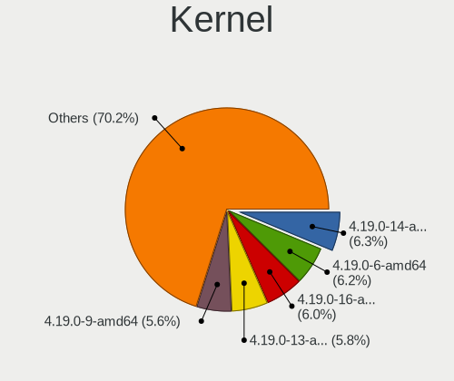

| Version                  | Desktops | Percent |
|--------------------------|----------|---------|
| 4.19.0-6-amd64           | 52       | 6.84%   |
| 4.19.0-16-amd64          | 52       | 6.84%   |
| 4.19.0-14-amd64          | 52       | 6.84%   |
| 4.19.0-9-amd64           | 49       | 6.45%   |
| 4.19.0-13-amd64          | 48       | 6.32%   |
| 4.19.0-8-amd64           | 46       | 6.05%   |
| 4.19.0-17-amd64          | 46       | 6.05%   |
| 4.19.0-12-amd64          | 38       | 5%      |
| 4.19.0-10-amd64          | 29       | 3.82%   |
| 5.6.0-2-amd64            | 16       | 2.11%   |
| 4.19.0-11-amd64          | 16       | 2.11%   |
| 4.19.0-5-amd64           | 15       | 1.97%   |
| 5.10.0-0.bpo.3-amd64     | 14       | 1.84%   |
| 5.8.0-0.bpo.2-amd64      | 11       | 1.45%   |
| 5.8.0-3-amd64            | 10       | 1.32%   |
| 5.10.0-0.bpo.5-amd64     | 10       | 1.32%   |
| 5.9.0-0.bpo.2-amd64      | 9        | 1.18%   |
| 5.4.106-1-pve            | 9        | 1.18%   |
| 5.7.0-0.bpo.2-amd64      | 8        | 1.05%   |
| 5.10.0-0.bpo.7-amd64     | 8        | 1.05%   |
| 5.4.44-2-pve             | 7        | 0.92%   |
| 5.4.65-1-pve             | 6        | 0.79%   |
| 5.4.0-0.bpo.4-amd64      | 6        | 0.79%   |
| 5.9.0-1-amd64            | 5        | 0.66%   |
| 5.8.0-2-amd64            | 5        | 0.66%   |
| 5.6.0-0.bpo.2-amd64      | 5        | 0.66%   |
| 5.4.0-0.bpo.2-amd64      | 5        | 0.66%   |
| 5.10.0-5mx-amd64         | 5        | 0.66%   |
| 5.9.0-0.bpo.5-amd64      | 4        | 0.53%   |
| 5.6.0-1-amd64            | 4        | 0.53%   |
| 5.5.0-0.bpo.2-amd64      | 4        | 0.53%   |
| 5.4.41-1-pve             | 4        | 0.53%   |
| 5.4.119-1-pve            | 4        | 0.53%   |
| 4.19.0-2-amd64           | 4        | 0.53%   |
| 4.19.0-18-amd64          | 4        | 0.53%   |
| 5.9.0-3-amd64            | 3        | 0.39%   |
| 5.7.0-1-amd64            | 3        | 0.39%   |
| 5.4.78-2-pve             | 3        | 0.39%   |
| 5.4.114-1-pve            | 3        | 0.39%   |
| 5.4.103-1-pve            | 3        | 0.39%   |
| 5.4.0-4-amd64            | 3        | 0.39%   |
| 5.3.6-050306-generic     | 3        | 0.39%   |
| 5.3.13-1-pve             | 3        | 0.39%   |
| 5.3.0-1-amd64            | 3        | 0.39%   |
| 5.10.0-0.bpo.8-amd64     | 3        | 0.39%   |
| 4.19.0-6-686-pae         | 3        | 0.39%   |
| 4.19.0-13-686-pae        | 3        | 0.39%   |
| 5.9.0-4-amd64            | 2        | 0.26%   |
| 5.8.16-antix.1-amd64-smp | 2        | 0.26%   |
| 5.8.0-1-amd64            | 2        | 0.26%   |
| 5.6.10-antix.1-amd64-smp | 2        | 0.26%   |
| 5.5.0-2-amd64            | 2        | 0.26%   |
| 5.4.78-1-pve             | 2        | 0.26%   |
| 5.4.73-1-pve             | 2        | 0.26%   |
| 5.4.60-1-pve             | 2        | 0.26%   |
| 5.4.28avl2-lowlatency    | 2        | 0.26%   |
| 5.4.0-3-amd64            | 2        | 0.26%   |
| 5.4.0-0.bpo.3-amd64      | 2        | 0.26%   |
| 5.3.10-1-pve             | 2        | 0.26%   |
| 5.3.0-3-amd64            | 2        | 0.26%   |

Kernel Family
-------------

Linux kernel without a distro release

| Version | Desktops | Percent |
|---------|----------|---------|
| 4.19.0  | 436      | 61.41%  |
| 5.10.0  | 38       | 5.35%   |
| 5.8.0   | 29       | 4.08%   |
| 5.6.0   | 28       | 3.94%   |
| 5.9.0   | 23       | 3.24%   |
| 5.4.0   | 22       | 3.1%    |
| 5.7.0   | 16       | 2.25%   |
| 5.3.0   | 10       | 1.41%   |
| 5.4.106 | 9        | 1.27%   |
| 5.5.0   | 7        | 0.99%   |
| 5.4.44  | 7        | 0.99%   |
| 5.4.65  | 6        | 0.85%   |
| 5.4.78  | 5        | 0.7%    |
| 5.4.41  | 4        | 0.56%   |
| 5.4.119 | 4        | 0.56%   |
| 5.2.0   | 4        | 0.56%   |
| 5.0.21  | 4        | 0.56%   |
| 5.4.28  | 3        | 0.42%   |
| 5.4.114 | 3        | 0.42%   |
| 5.4.103 | 3        | 0.42%   |
| 5.3.6   | 3        | 0.42%   |
| 5.3.13  | 3        | 0.42%   |
| 4.9.0   | 3        | 0.42%   |
| 5.8.16  | 2        | 0.28%   |
| 5.6.10  | 2        | 0.28%   |
| 5.4.73  | 2        | 0.28%   |
| 5.4.60  | 2        | 0.28%   |
| 5.3.18  | 2        | 0.28%   |
| 5.3.10  | 2        | 0.28%   |
| 5.11.17 | 2        | 0.28%   |
| 5.9.8   | 1        | 0.14%   |
| 5.8.10  | 1        | 0.14%   |
| 5.7.10  | 1        | 0.14%   |
| 5.6.14  | 1        | 0.14%   |
| 5.5.10  | 1        | 0.14%   |
| 5.4.70  | 1        | 0.14%   |
| 5.4.55  | 1        | 0.14%   |
| 5.4.38  | 1        | 0.14%   |
| 5.4.34  | 1        | 0.14%   |
| 5.4.31  | 1        | 0.14%   |
| 5.4.140 | 1        | 0.14%   |
| 5.3.9   | 1        | 0.14%   |
| 5.14.0  | 1        | 0.14%   |
| 5.12.5  | 1        | 0.14%   |
| 5.11.8  | 1        | 0.14%   |
| 5.11.21 | 1        | 0.14%   |
| 5.11.2  | 1        | 0.14%   |
| 5.10.70 | 1        | 0.14%   |
| 5.10.47 | 1        | 0.14%   |
| 5.10.13 | 1        | 0.14%   |
| 5.1.2   | 1        | 0.14%   |
| 5.0.18  | 1        | 0.14%   |
| 5.0.15  | 1        | 0.14%   |
| 4.9.235 | 1        | 0.14%   |
| 4.20.14 | 1        | 0.14%   |
| 4.19.67 | 1        | 0.14%   |

Kernel Major Ver.
-----------------

Linux kernel major version

| Version | Desktops | Percent |
|---------|----------|---------|
| 4.19    | 437      | 62.16%  |
| 5.4     | 69       | 9.82%   |
| 5.10    | 41       | 5.83%   |
| 5.8     | 32       | 4.55%   |
| 5.6     | 31       | 4.41%   |
| 5.9     | 24       | 3.41%   |
| 5.3     | 21       | 2.99%   |
| 5.7     | 17       | 2.42%   |
| 5.5     | 8        | 1.14%   |
| 5.0     | 6        | 0.85%   |
| 5.11    | 5        | 0.71%   |
| 5.2     | 4        | 0.57%   |
| 4.9     | 4        | 0.57%   |
| 5.14    | 1        | 0.14%   |
| 5.12    | 1        | 0.14%   |
| 5.1     | 1        | 0.14%   |
| 4.20    | 1        | 0.14%   |

Arch
----

OS architecture (x86_64, i586, etc.)

| Name    | Desktops | Percent |
|---------|----------|---------|
| x86_64  | 643      | 96.11%  |
| i686    | 21       | 3.14%   |
| armv7l  | 3        | 0.45%   |
| mips64  | 1        | 0.15%   |
| aarch64 | 1        | 0.15%   |

DE
--

Desktop Environment

| Name             | Desktops | Percent |
|------------------|----------|---------|
| Unknown          | 199      | 28.97%  |
| GNOME            | 131      | 19.07%  |
| XFCE             | 104      | 15.14%  |
| KDE              | 65       | 9.46%   |
| KDE5             | 53       | 7.71%   |
| MATE             | 37       | 5.39%   |
| X-Cinnamon       | 25       | 3.64%   |
| Cinnamon         | 21       | 3.06%   |
| LXDE             | 14       | 2.04%   |
| LXQt             | 9        | 1.31%   |
| openbox          | 7        | 1.02%   |
| GNOME Flashback  | 5        | 0.73%   |
| GNOME Classic    | 5        | 0.73%   |
| fluxbox          | 4        | 0.58%   |
| i3               | 3        | 0.44%   |
| lightdm-xsession | 2        | 0.29%   |
| trinity          | 1        | 0.15%   |
| i3-with-shmlog   | 1        | 0.15%   |
| Budgie           | 1        | 0.15%   |

Display Server
--------------

X11 or Wayland

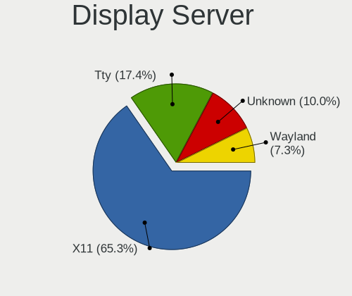

| Name    | Desktops | Percent |
|---------|----------|---------|
| X11     | 458      | 67.25%  |
| Tty     | 116      | 17.03%  |
| Unknown | 56       | 8.22%   |
| Wayland | 51       | 7.49%   |

Display Manager
---------------

SDDM, LightDM, etc.

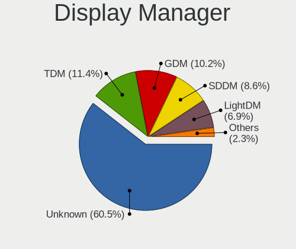

| Name    | Desktops | Percent |
|---------|----------|---------|
| Unknown | 415      | 61.12%  |
| TDM     | 83       | 12.22%  |
| GDM     | 72       | 10.6%   |
| SDDM    | 63       | 9.28%   |
| LightDM | 37       | 5.45%   |
| XDM     | 3        | 0.44%   |
| GDM3    | 3        | 0.44%   |
| SLiM    | 1        | 0.15%   |
| Ly      | 1        | 0.15%   |
| KDM     | 1        | 0.15%   |

OS Lang
-------

Language

| Lang    | Desktops | Percent |
|---------|----------|---------|
| en_US   | 253      | 37.21%  |
| Unknown | 86       | 12.65%  |
| de_DE   | 44       | 6.47%   |
| fr_FR   | 42       | 6.18%   |
| ru_RU   | 40       | 5.88%   |
| pt_BR   | 38       | 5.59%   |
| en_GB   | 33       | 4.85%   |
| es_ES   | 20       | 2.94%   |
| it_IT   | 17       | 2.5%    |
| en_CA   | 12       | 1.76%   |
| en_IN   | 9        | 1.32%   |
| en_AU   | 8        | 1.18%   |
| pl_PL   | 7        | 1.03%   |
| en_IE   | 6        | 0.88%   |
| C       | 6        | 0.88%   |
| pt_PT   | 4        | 0.59%   |
| hu_HU   | 4        | 0.59%   |
| sv_SE   | 3        | 0.44%   |
| ru_UA   | 3        | 0.44%   |
| nl_NL   | 3        | 0.44%   |
| de_AT   | 3        | 0.44%   |
| tt_RU   | 2        | 0.29%   |
| nl_BE   | 2        | 0.29%   |
| ja_JP   | 2        | 0.29%   |
| eu_ES   | 2        | 0.29%   |
| es_AR   | 2        | 0.29%   |
| en_DK   | 2        | 0.29%   |
| de_CH   | 2        | 0.29%   |
| cs_CZ   | 2        | 0.29%   |
| zh_CN   | 1        | 0.15%   |
| uk_UA   | 1        | 0.15%   |
| sr_RS   | 1        | 0.15%   |
| sk_SK   | 1        | 0.15%   |
| ro_RO   | 1        | 0.15%   |
| lt_LT   | 1        | 0.15%   |
| ko_KR   | 1        | 0.15%   |
| hr_HR   | 1        | 0.15%   |
| he_IL   | 1        | 0.15%   |
| fr_CH   | 1        | 0.15%   |
| fr_CA   | 1        | 0.15%   |
| fr_BE   | 1        | 0.15%   |
| fi_FI   | 1        | 0.15%   |
| es_VE   | 1        | 0.15%   |
| es_PA   | 1        | 0.15%   |
| es_NI   | 1        | 0.15%   |
| es_MX   | 1        | 0.15%   |
| es_CO   | 1        | 0.15%   |
| en_ZA   | 1        | 0.15%   |
| en_PH   | 1        | 0.15%   |
| en_NZ   | 1        | 0.15%   |
| en_DE   | 1        | 0.15%   |
| el_GR   | 1        | 0.15%   |

Boot Mode
---------

EFI or BIOS

| Mode | Desktops | Percent |
|------|----------|---------|
| BIOS | 486      | 71.79%  |
| EFI  | 191      | 28.21%  |

Filesystem
----------

Type of filesystem

| Type    | Desktops | Percent |
|---------|----------|---------|
| Ext4    | 561      | 83.11%  |
| Btrfs   | 32       | 4.74%   |
| Zfs     | 26       | 3.85%   |
| Unknown | 21       | 3.11%   |
| Xfs     | 15       | 2.22%   |
| Overlay | 6        | 0.89%   |
| Ext2    | 5        | 0.74%   |
| Tmpfs   | 4        | 0.59%   |
| Ext3    | 3        | 0.44%   |
| F2fs    | 1        | 0.15%   |
| Aufs    | 1        | 0.15%   |

Part. scheme
------------

Scheme of partitioning

| Type    | Desktops | Percent |
|---------|----------|---------|
| Unknown | 297      | 43.42%  |
| GPT     | 251      | 36.7%   |
| MBR     | 136      | 19.88%  |

Dual Boot with Linux/BSD
------------------------

Hosting more than one Linux/BSD

| Dual boot | Desktops | Percent |
|-----------|----------|---------|
| No        | 549      | 81.33%  |
| Yes       | 126      | 18.67%  |

Dual Boot (Win)
---------------

Hosting Linux and Windows

| Dual boot | Desktops | Percent |
|-----------|----------|---------|
| No        | 511      | 75.48%  |
| Yes       | 166      | 24.52%  |

Board
-----

Vendor
------

Motherboard manufacturer

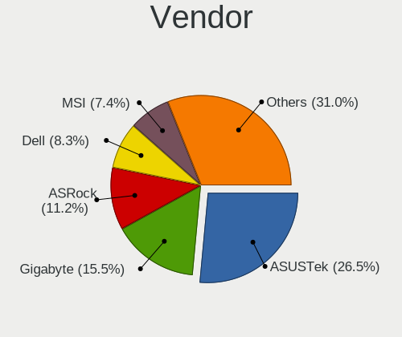

| Name                | Desktops | Percent |
|---------------------|----------|---------|
| ASUSTek Computer    | 184      | 27.5%   |
| Gigabyte Technology | 107      | 15.99%  |
| ASRock              | 76       | 11.36%  |
| Dell                | 54       | 8.07%   |
| MSI                 | 46       | 6.88%   |
| Hewlett-Packard     | 41       | 6.13%   |
| Lenovo              | 27       | 4.04%   |
| Intel               | 26       | 3.89%   |
| Unknown             | 12       | 1.79%   |
| Acer                | 10       | 1.49%   |
| Supermicro          | 9        | 1.35%   |
| AZW                 | 7        | 1.05%   |
| ASRockRack          | 6        | 0.9%    |
| Foxconn             | 5        | 0.75%   |
| Positivo            | 4        | 0.6%    |
| Fujitsu Siemens     | 4        | 0.6%    |
| Fujitsu             | 4        | 0.6%    |
| Shuttle             | 3        | 0.45%   |
| Pegatron            | 3        | 0.45%   |
| ECS                 | 3        | 0.45%   |
| Biostar             | 3        | 0.45%   |
| Apple               | 3        | 0.45%   |
| YANYU               | 2        | 0.3%    |
| Wistron             | 2        | 0.3%    |
| PCWare              | 2        | 0.3%    |
| Medion              | 2        | 0.3%    |
| Intel X79           | 2        | 0.3%    |
| Huanan              | 2        | 0.3%    |
| HARDKERNEL          | 2        | 0.3%    |
| Google              | 2        | 0.3%    |
| Alienware           | 2        | 0.3%    |
| SolidRun            | 1        | 0.15%   |
| SixForOne           | 1        | 0.15%   |
| Quanta              | 1        | 0.15%   |
| Qbex                | 1        | 0.15%   |
| ONDA                | 1        | 0.15%   |
| NEXCOM              | 1        | 0.15%   |
| Megaware            | 1        | 0.15%   |
| Inventec            | 1        | 0.15%   |
| IBM                 | 1        | 0.15%   |
| Gateway             | 1        | 0.15%   |
| faytech             | 1        | 0.15%   |
| eMachines           | 1        | 0.15%   |
| Centrium            | 1        | 0.15%   |
| CCE                 | 1        | 0.15%   |

Model
-----

Motherboard model

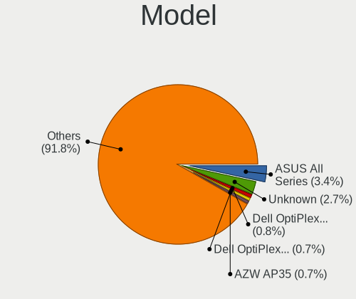

| Name                             | Desktops | Percent |
|----------------------------------|----------|---------|
| ASUS All Series                  | 23       | 3.44%   |
| Unknown                          | 14       | 2.09%   |
| AZW AP35                         | 5        | 0.75%   |
| ASUS PRIME X370-PRO              | 5        | 0.75%   |
| ASRock B450M Pro4                | 5        | 0.75%   |
| Gigabyte X470 AORUS ULTRA GAMING | 4        | 0.6%    |
| Dell OptiPlex 7010               | 4        | 0.6%    |
| Dell OptiPlex 3010               | 4        | 0.6%    |
| ASUS TUF GAMING X570-PLUS        | 4        | 0.6%    |
| ASUS M5A97 R2.0                  | 4        | 0.6%    |
| ASUS M5A78L-M/USB3               | 4        | 0.6%    |
| Gigabyte B450M DS3H              | 3        | 0.45%   |
| Dell OptiPlex 760                | 3        | 0.45%   |
| Dell OptiPlex 3020               | 3        | 0.45%   |
| Dell Inspiron 5675               | 3        | 0.45%   |
| ASUS PRIME B450-PLUS             | 3        | 0.45%   |
| ASUS PRIME A320M-K               | 3        | 0.45%   |
| ASUS M5A78L-M LX/BR              | 3        | 0.45%   |
| ASRock J4105-ITX                 | 3        | 0.45%   |
| ASRock FM2A88M Extreme4+         | 3        | 0.45%   |
| ASRock A300M-STX                 | 3        | 0.45%   |
| Wistron ProLiant ML110 G6        | 2        | 0.3%    |
| Supermicro X8STi                 | 2        | 0.3%    |
| Shuttle XH61V                    | 2        | 0.3%    |
| MSI MS-7C75                      | 2        | 0.3%    |
| MSI MS-7C37                      | 2        | 0.3%    |
| MSI MS-7B85                      | 2        | 0.3%    |
| MSI MS-7B79                      | 2        | 0.3%    |
| MSI MS-7A34                      | 2        | 0.3%    |
| MSI MS-7926                      | 2        | 0.3%    |
| MSI MS-7850                      | 2        | 0.3%    |
| HP t620 Dual Core TC             | 2        | 0.3%    |
| HP ProLiant MicroServer Gen8     | 2        | 0.3%    |
| HP Compaq Elite 8300 SFF         | 2        | 0.3%    |
| HP Compaq Elite 8300 CMT         | 2        | 0.3%    |
| HP Compaq 6000 Pro SFF PC        | 2        | 0.3%    |
| HP 23-q018a                      | 2        | 0.3%    |
| HARDKERNEL ODROID-H2             | 2        | 0.3%    |
| Gigabyte X570 I AORUS PRO WIFI   | 2        | 0.3%    |
| Gigabyte H61M-S2PV               | 2        | 0.3%    |
| Gigabyte GA-990FXA-D3            | 2        | 0.3%    |
| Gigabyte GA-870A-UD3             | 2        | 0.3%    |
| Gigabyte F2A88XM-D3H             | 2        | 0.3%    |
| Gigabyte F2A78M-HD2              | 2        | 0.3%    |
| Gigabyte C1037UN-EU              | 2        | 0.3%    |
| Gigabyte B450M S2H               | 2        | 0.3%    |
| Gigabyte B450 I AORUS PRO WIFI   | 2        | 0.3%    |
| Gigabyte B250M-D3H               | 2        | 0.3%    |
| Gigabyte 970A-DS3P               | 2        | 0.3%    |
| Gigabyte 945GCM-S2L              | 2        | 0.3%    |
| Fujitsu Siemens ESPRIMO P        | 2        | 0.3%    |
| Dell Precision WorkStation T7500 | 2        | 0.3%    |
| Dell OptiPlex GX280              | 2        | 0.3%    |
| Dell OptiPlex 3050               | 2        | 0.3%    |
| ASUS TUF Z270 MARK 1             | 2        | 0.3%    |
| ASUS Rampage IV EXTREME          | 2        | 0.3%    |
| ASUS Pro WS X570-ACE             | 2        | 0.3%    |
| ASUS PRIME Z370-A                | 2        | 0.3%    |
| ASUS PRIME X570-P                | 2        | 0.3%    |
| ASUS PRIME B460M-A               | 2        | 0.3%    |

Model Family
------------

Motherboard model prefix

| Name                    | Desktops | Percent |
|-------------------------|----------|---------|
| ASUS PRIME              | 34       | 5.08%   |
| Dell OptiPlex           | 33       | 4.93%   |
| ASUS All                | 23       | 3.44%   |
| ASUS ROG                | 14       | 2.09%   |
| Unknown                 | 14       | 2.09%   |
| Lenovo ThinkCentre      | 12       | 1.79%   |
| HP Compaq               | 12       | 1.79%   |
| ASUS TUF                | 12       | 1.79%   |
| ASUS M5A78L-M           | 9        | 1.35%   |
| ASRock B450M            | 8        | 1.2%    |
| Lenovo IdeaCentre       | 7        | 1.05%   |
| Acer Aspire             | 7        | 1.05%   |
| HP EliteDesk            | 6        | 0.9%    |
| Dell Precision          | 6        | 0.9%    |
| Dell Inspiron           | 6        | 0.9%    |
| Lenovo ThinkStation     | 5        | 0.75%   |
| Gigabyte X470           | 5        | 0.75%   |
| Gigabyte B450M          | 5        | 0.75%   |
| AZW AP35                | 5        | 0.75%   |
| HP ProLiant             | 4        | 0.6%    |
| HP ProDesk              | 4        | 0.6%    |
| Gigabyte B450           | 4        | 0.6%    |
| Fujitsu Siemens ESPRIMO | 4        | 0.6%    |
| ASUS M5A97              | 4        | 0.6%    |
| ASRock X570             | 4        | 0.6%    |
| ASRock X370             | 4        | 0.6%    |
| ASRock B450             | 4        | 0.6%    |
| HP t620                 | 3        | 0.45%   |
| Gigabyte Z390           | 3        | 0.45%   |
| Gigabyte X570           | 3        | 0.45%   |
| Dell Vostro             | 3        | 0.45%   |
| ASUS Rampage            | 3        | 0.45%   |
| ASUS P9X79              | 3        | 0.45%   |
| ASUS P8Z68-V            | 3        | 0.45%   |
| ASRock J4105-ITX        | 3        | 0.45%   |
| ASRock FM2A88M-HD+      | 3        | 0.45%   |
| ASRock FM2A88M          | 3        | 0.45%   |
| ASRock A300M-STX        | 3        | 0.45%   |
| Wistron ProLiant        | 2        | 0.3%    |
| Supermicro X8STi        | 2        | 0.3%    |
| Shuttle XH61V           | 2        | 0.3%    |
| MSI MS-7C75             | 2        | 0.3%    |
| MSI MS-7C37             | 2        | 0.3%    |
| MSI MS-7B85             | 2        | 0.3%    |
| MSI MS-7B79             | 2        | 0.3%    |
| MSI MS-7A34             | 2        | 0.3%    |
| MSI MS-7926             | 2        | 0.3%    |
| MSI MS-7850             | 2        | 0.3%    |
| Intel DN2800MT          | 2        | 0.3%    |
| Intel DH87RL            | 2        | 0.3%    |
| Intel DH61CR            | 2        | 0.3%    |
| HP 23-q018a             | 2        | 0.3%    |
| HARDKERNEL ODROID-H2    | 2        | 0.3%    |
| Gigabyte H61M-S2PV      | 2        | 0.3%    |
| Gigabyte GA-990FXA-D3   | 2        | 0.3%    |
| Gigabyte GA-870A-UD3    | 2        | 0.3%    |
| Gigabyte GA-78LMT-USB3  | 2        | 0.3%    |
| Gigabyte F2A88XM-D3H    | 2        | 0.3%    |
| Gigabyte F2A78M-HD2     | 2        | 0.3%    |
| Gigabyte C1037UN-EU     | 2        | 0.3%    |

MFG Year
--------

Motherboard manufacture year

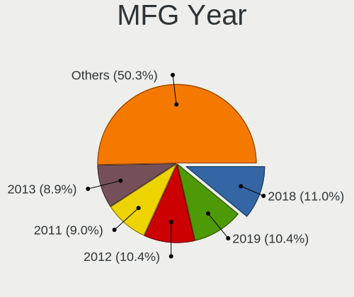

| Year    | Desktops | Percent |
|---------|----------|---------|
| 2019    | 114      | 17.04%  |
| 2018    | 71       | 10.61%  |
| 2020    | 68       | 10.16%  |
| 2014    | 51       | 7.62%   |
| 2012    | 46       | 6.88%   |
| 2011    | 46       | 6.88%   |
| 2015    | 45       | 6.73%   |
| 2013    | 41       | 6.13%   |
| 2010    | 36       | 5.38%   |
| 2016    | 31       | 4.63%   |
| 2009    | 28       | 4.19%   |
| 2017    | 27       | 4.04%   |
| 2008    | 21       | 3.14%   |
| 2007    | 16       | 2.39%   |
| 2021    | 12       | 1.79%   |
| 2006    | 6        | 0.9%    |
| 2005    | 4        | 0.6%    |
| Unknown | 4        | 0.6%    |
| 2004    | 2        | 0.3%    |

Form Factor
-----------

Physical design of the computer

| Name    | Desktops | Percent |
|---------|----------|---------|
| Desktop | 669      | 100%    |

Secure Boot
-----------

Enabled or disabled

| State    | Desktops | Percent |
|----------|----------|---------|
| Disabled | 663      | 98.81%  |
| Enabled  | 8        | 1.19%   |

Coreboot
--------

Have coreboot on board

| Used | Desktops | Percent |
|------|----------|---------|
| No   | 666      | 99.55%  |
| Yes  | 3        | 0.45%   |

RAM Size
--------

Total RAM memory

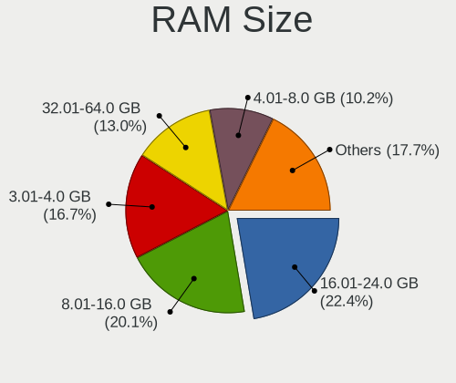

| Size in GB      | Desktops | Percent |
|-----------------|----------|---------|
| 16.01-24.0      | 158      | 23.34%  |
| 8.01-16.0       | 135      | 19.94%  |
| 3.01-4.0        | 112      | 16.54%  |
| 32.01-64.0      | 85       | 12.56%  |
| 4.01-8.0        | 67       | 9.9%    |
| 64.01-256.0     | 53       | 7.83%   |
| 24.01-32.0      | 22       | 3.25%   |
| 1.01-2.0        | 20       | 2.95%   |
| 2.01-3.0        | 12       | 1.77%   |
| 0.51-1.0        | 6        | 0.89%   |
| More than 256.0 | 3        | 0.44%   |
| 0.01-0.5        | 2        | 0.3%    |
| Unknown         | 2        | 0.3%    |

RAM Used
--------

Used RAM memory

| Used GB     | Desktops | Percent |
|-------------|----------|---------|
| 1.01-2.0    | 183      | 24.56%  |
| 2.01-3.0    | 155      | 20.81%  |
| 4.01-8.0    | 125      | 16.78%  |
| 3.01-4.0    | 89       | 11.95%  |
| 8.01-16.0   | 65       | 8.72%   |
| 0.51-1.0    | 58       | 7.79%   |
| 0.01-0.5    | 28       | 3.76%   |
| 16.01-24.0  | 20       | 2.68%   |
| 32.01-64.0  | 12       | 1.61%   |
| 24.01-32.0  | 7        | 0.94%   |
| Unknown     | 2        | 0.27%   |
| 64.01-256.0 | 1        | 0.13%   |

Total Drives
------------

Number of drives on board

| Drives  | Desktops | Percent |
|---------|----------|---------|
| 1       | 220      | 32.12%  |
| 2       | 198      | 28.91%  |
| 3       | 103      | 15.04%  |
| 4       | 77       | 11.24%  |
| 5       | 35       | 5.11%   |
| 6       | 22       | 3.21%   |
| 7       | 12       | 1.75%   |
| 9       | 4        | 0.58%   |
| 8       | 4        | 0.58%   |
| 0       | 2        | 0.29%   |
| 17      | 1        | 0.15%   |
| 16      | 1        | 0.15%   |
| 14      | 1        | 0.15%   |
| 13      | 1        | 0.15%   |
| 12      | 1        | 0.15%   |
| 11      | 1        | 0.15%   |
| 10      | 1        | 0.15%   |
| Unknown | 1        | 0.15%   |

Has CD-ROM
----------

Has CD-ROM on board

| Presented | Desktops | Percent |
|-----------|----------|---------|
| No        | 396      | 58.67%  |
| Yes       | 279      | 41.33%  |

Has Ethernet
------------

Has Ethernet on board

| Presented | Desktops | Percent |
|-----------|----------|---------|
| Yes       | 663      | 99.1%   |
| No        | 6        | 0.9%    |

Has WiFi
--------

Has WiFi module

| Presented | Desktops | Percent |
|-----------|----------|---------|
| No        | 442      | 65.48%  |
| Yes       | 233      | 34.52%  |

Has Bluetooth
-------------

Has Bluetooth module

| Presented | Desktops | Percent |
|-----------|----------|---------|
| No        | 501      | 73.89%  |
| Yes       | 177      | 26.11%  |

Location
--------

Country
-------

Geographic location (country)

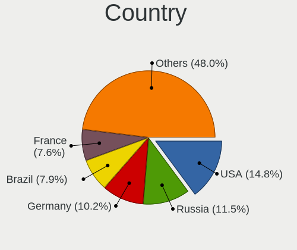

| Country                | Desktops | Percent |
|------------------------|----------|---------|
| USA                    | 103      | 15.37%  |
| Russia                 | 80       | 11.94%  |
| Germany                | 66       | 9.85%   |
| Brazil                 | 59       | 8.81%   |
| France                 | 53       | 7.91%   |
| Spain                  | 35       | 5.22%   |
| Italy                  | 24       | 3.58%   |
| UK                     | 22       | 3.28%   |
| Netherlands            | 17       | 2.54%   |
| Canada                 | 16       | 2.39%   |
| Hungary                | 12       | 1.79%   |
| Ukraine                | 11       | 1.64%   |
| Switzerland            | 11       | 1.64%   |
| Poland                 | 11       | 1.64%   |
| Australia              | 11       | 1.64%   |
| India                  | 10       | 1.49%   |
| Sweden                 | 7        | 1.04%   |
| Austria                | 7        | 1.04%   |
| Pakistan               | 6        | 0.9%    |
| Finland                | 6        | 0.9%    |
| Belgium                | 6        | 0.9%    |
| Turkey                 | 5        | 0.75%   |
| Czechia                | 5        | 0.75%   |
| Saudi Arabia           | 4        | 0.6%    |
| Romania                | 4        | 0.6%    |
| Portugal               | 4        | 0.6%    |
| Norway                 | 4        | 0.6%    |
| New Zealand            | 4        | 0.6%    |
| Croatia                | 4        | 0.6%    |
| Venezuela              | 3        | 0.45%   |
| Slovakia               | 3        | 0.45%   |
| Serbia                 | 3        | 0.45%   |
| Mexico                 | 3        | 0.45%   |
| Denmark                | 3        | 0.45%   |
| Belarus                | 3        | 0.45%   |
| Vietnam                | 2        | 0.3%    |
| UAE                    | 2        | 0.3%    |
| Taiwan                 | 2        | 0.3%    |
| South Africa           | 2        | 0.3%    |
| Philippines            | 2        | 0.3%    |
| Lithuania              | 2        | 0.3%    |
| Kyrgyzstan             | 2        | 0.3%    |
| Japan                  | 2        | 0.3%    |
| Ireland                | 2        | 0.3%    |
| Indonesia              | 2        | 0.3%    |
| Colombia               | 2        | 0.3%    |
| Bosnia and Herzegovina | 2        | 0.3%    |
| Argentina              | 2        | 0.3%    |
| South Korea            | 1        | 0.15%   |
| Peru                   | 1        | 0.15%   |
| Paraguay               | 1        | 0.15%   |
| Panama                 | 1        | 0.15%   |
| Nicaragua              | 1        | 0.15%   |
| New Caledonia          | 1        | 0.15%   |
| Myanmar                | 1        | 0.15%   |
| Morocco                | 1        | 0.15%   |
| Mongolia               | 1        | 0.15%   |
| Luxembourg             | 1        | 0.15%   |
| Israel                 | 1        | 0.15%   |
| Iran                   | 1        | 0.15%   |

City
----

Geographic location (city)

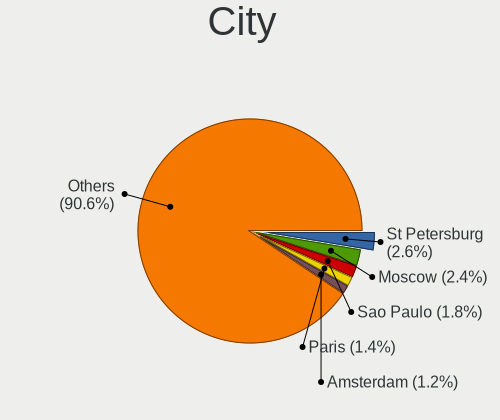

| City                | Desktops | Percent |
|---------------------|----------|---------|
| St Petersburg       | 22       | 3.15%   |
| Moscow              | 15       | 2.15%   |
| Paris               | 13       | 1.86%   |
| So Paulo          | 9        | 1.29%   |
| Yekaterinburg       | 6        | 0.86%   |
| Vienna              | 6        | 0.86%   |
| Springfield         | 6        | 0.86%   |
| Lahore              | 6        | 0.86%   |
| Budapest            | 6        | 0.86%   |
| Berlin              | 6        | 0.86%   |
| Amsterdam           | 6        | 0.86%   |
| S??o Paulo          | 5        | 0.72%   |
| Hamburg             | 5        | 0.72%   |
| Zurich              | 4        | 0.57%   |
| Voronezh            | 4        | 0.57%   |
| Porto Alegre        | 4        | 0.57%   |
| New York            | 4        | 0.57%   |
| Madrid              | 4        | 0.57%   |
| Kyiv                | 4        | 0.57%   |
| Braslia           | 4        | 0.57%   |
| Barcelona           | 4        | 0.57%   |
| Auckland            | 4        | 0.57%   |
| Velika Gorica       | 3        | 0.43%   |
| Szeged              | 3        | 0.43%   |
| Riyadh              | 3        | 0.43%   |
| Rio de Janeiro      | 3        | 0.43%   |
| Perm                | 3        | 0.43%   |
| Munich              | 3        | 0.43%   |
| Minsk               | 3        | 0.43%   |
| Milan               | 3        | 0.43%   |
| Helsinki            | 3        | 0.43%   |
| Hanau               | 3        | 0.43%   |
| Gatchina            | 3        | 0.43%   |
| Falkenstein         | 3        | 0.43%   |
| Belo Horizonte      | 3        | 0.43%   |
| Westborough         | 2        | 0.29%   |
| Warsaw              | 2        | 0.29%   |
| Vologda             | 2        | 0.29%   |
| Valencia            | 2        | 0.29%   |
| Ufa                 | 2        | 0.29%   |
| Toronto             | 2        | 0.29%   |
| Sydney              | 2        | 0.29%   |
| Swansea             | 2        | 0.29%   |
| Sunnyvale           | 2        | 0.29%   |
| Stuttgart           | 2        | 0.29%   |
| Sarajevo            | 2        | 0.29%   |
| Roubaix             | 2        | 0.29%   |
| Rome                | 2        | 0.29%   |
| Rancho Palos Verdes | 2        | 0.29%   |
| Queens              | 2        | 0.29%   |
| Pontevedra          | 2        | 0.29%   |
| Osnabr??ck          | 2        | 0.29%   |
| Olomouc             | 2        | 0.29%   |
| Novosibirsk         | 2        | 0.29%   |
| Novi Sad            | 2        | 0.29%   |
| Nizhniy Novgorod    | 2        | 0.29%   |
| New Taipei          | 2        | 0.29%   |
| Naples              | 2        | 0.29%   |
| Mesa                | 2        | 0.29%   |
| Medelln           | 2        | 0.29%   |

Drives
------

Drive Vendor
------------

Hard drive vendors

| Vendor                    | Desktops | Drives | Percent |
|---------------------------|----------|--------|---------|
| WDC                       | 264      | 504    | 20.34%  |
| Seagate                   | 242      | 423    | 18.64%  |
| Samsung Electronics       | 177      | 296    | 13.64%  |
| Toshiba                   | 83       | 153    | 6.39%   |
| Kingston                  | 76       | 102    | 5.86%   |
| Crucial                   | 67       | 93     | 5.16%   |
| Hitachi                   | 50       | 88     | 3.85%   |
| SanDisk                   | 37       | 50     | 2.85%   |
| Unknown                   | 28       | 38     | 2.16%   |
| A-DATA Technology         | 25       | 37     | 1.93%   |
| HGST                      | 22       | 41     | 1.69%   |
| Intel                     | 21       | 29     | 1.62%   |
| OCZ                       | 15       | 18     | 1.16%   |
| MAXTOR                    | 15       | 18     | 1.16%   |
| Phison                    | 13       | 21     | 1%      |
| Corsair                   | 12       | 16     | 0.92%   |
| China                     | 12       | 12     | 0.92%   |
| Hewlett-Packard           | 10       | 17     | 0.77%   |
| Transcend                 | 9        | 11     | 0.69%   |
| Patriot                   | 7        | 9      | 0.54%   |
| SPCC                      | 6        | 6      | 0.46%   |
| KingDian                  | 6        | 8      | 0.46%   |
| Intenso                   | 6        | 8      | 0.46%   |
| ASMT                      | 5        | 8      | 0.39%   |
| SK Hynix                  | 4        | 4      | 0.31%   |
| Silicon Motion            | 4        | 5      | 0.31%   |
| LITEON                    | 4        | 5      | 0.31%   |
| GOODRAM                   | 4        | 4      | 0.31%   |
| PNY                       | 3        | 5      | 0.23%   |
| PLEXTOR                   | 3        | 5      | 0.23%   |
| LITEONIT                  | 3        | 3      | 0.23%   |
| Lite-On                   | 3        | 3      | 0.23%   |
| Lexar                     | 3        | 3      | 0.23%   |
| LaCie                     | 3        | 3      | 0.23%   |
| Hajaan                    | 3        | 3      | 0.23%   |
| Gigabyte Technology       | 3        | 6      | 0.23%   |
| Zheino                    | 2        | 4      | 0.15%   |
| TO Exter                  | 2        | 2      | 0.15%   |
| SABRENT                   | 2        | 3      | 0.15%   |
| Micron/Crucial Technology | 2        | 2      | 0.15%   |
| Micron Technology         | 2        | 3      | 0.15%   |
| LDLC                      | 2        | 4      | 0.15%   |
| Fujitsu                   | 2        | 2      | 0.15%   |
| ASMedia                   | 2        | 2      | 0.15%   |
| Apple                     | 2        | 4      | 0.15%   |
| XPG                       | 1        | 1      | 0.08%   |
| Vaseky                    | 1        | 1      | 0.08%   |
| VALK                      | 1        | 1      | 0.08%   |
| USB 3.0                   | 1        | 2      | 0.08%   |
| ULTIMATE                  | 1        | 2      | 0.08%   |
| THU                       | 1        | 2      | 0.08%   |
| Team                      | 1        | 1      | 0.08%   |
| TCSUNBOW                  | 1        | 1      | 0.08%   |
| QUANTUM                   | 1        | 1      | 0.08%   |
| Phison Electronics        | 1        | 1      | 0.08%   |
| OCZ-VERTEX                | 1        | 1      | 0.08%   |
| NVMe                      | 1        | 1      | 0.08%   |
| NETAPP                    | 1        | 1      | 0.08%   |
| LIO-ORG                   | 1        | 8      | 0.08%   |
| Kston                     | 1        | 1      | 0.08%   |

Drive Model
-----------

Hard drive models

| Model                            | Desktops | Percent |
|----------------------------------|----------|---------|
| Seagate ST1000DM010-2EP102 1TB   | 19       | 1.22%   |
| Seagate ST500DM002-1BD142 500GB  | 18       | 1.16%   |
| Kingston SA400S37240G 240GB SSD  | 15       | 0.97%   |
| Samsung SSD 850 EVO 250GB        | 13       | 0.84%   |
| Seagate ST2000DM001-1ER164 2TB   | 12       | 0.77%   |
| Samsung SSD 860 EVO 500GB        | 11       | 0.71%   |
| WDC WDS240G2G0A-00JH30 240GB SSD | 10       | 0.64%   |
| Toshiba DT01ACA100 1TB           | 10       | 0.64%   |
| Toshiba DT01ACA050 500GB         | 10       | 0.64%   |
| Kingston SV300S37A120G 120GB SSD | 10       | 0.64%   |
| WDC WD10EZEX-08WN4A0 1TB         | 9        | 0.58%   |
| Toshiba HDWD120 2TB              | 9        | 0.58%   |
| Seagate ST1000DM003-1CH162 1TB   | 9        | 0.58%   |
| Samsung SSD 860 EVO 1TB          | 9        | 0.58%   |
| Samsung SSD 850 EVO 500GB        | 9        | 0.58%   |
| Kingston SA400S37480G 480GB SSD  | 9        | 0.58%   |
| Kingston SA400S37120G 120GB SSD  | 9        | 0.58%   |
| Crucial CT250MX500SSD1 250GB     | 9        | 0.58%   |
| Toshiba HDWD110 1TB              | 8        | 0.52%   |
| Seagate ST4000DM004-2CV104 4TB   | 8        | 0.52%   |
| Seagate ST2000DM008-2FR102 2TB   | 8        | 0.52%   |
| Seagate ST2000DM006-2DM164 2TB   | 8        | 0.52%   |
| Crucial CT500MX500SSD1 500GB     | 8        | 0.52%   |
| WDC WD1002FAEX-00Z3A0 1TB        | 7        | 0.45%   |
| Seagate ST4000DM000-1F2168 4TB   | 7        | 0.45%   |
| Seagate ST3500418AS 500GB        | 7        | 0.45%   |
| Seagate Expansion Desk 8TB       | 7        | 0.45%   |
| Samsung SSD 970 EVO Plus 500GB   | 7        | 0.45%   |
| Kingston SUV400S37240G 240GB SSD | 7        | 0.45%   |
| WDC WD40EFRX-68N32N0 4TB         | 6        | 0.39%   |
| WDC WD20EZRZ-00Z5HB0 2TB         | 6        | 0.39%   |
| WDC WD20EFRX-68EUZN0 2TB         | 6        | 0.39%   |
| WDC WD10EZEX-00BN5A0 1TB         | 6        | 0.39%   |
| Seagate ST4000VN008-2DR166 4TB   | 6        | 0.39%   |
| Seagate ST31000528AS 1TB         | 6        | 0.39%   |
| Samsung SSD 970 EVO Plus 1TB     | 6        | 0.39%   |
| Samsung SSD 850 PRO 256GB        | 6        | 0.39%   |
| Samsung SSD 840 EVO 120GB        | 6        | 0.39%   |
| Crucial CT240BX500SSD1 240GB     | 6        | 0.39%   |
| Crucial CT1000MX500SSD1 1TB      | 6        | 0.39%   |
| WDC WD20EARX-00PASB0 2TB         | 5        | 0.32%   |
| Unknown SD/MMC 16GB              | 5        | 0.32%   |
| Unknown MMC Card  64GB           | 5        | 0.32%   |
| Unknown M.S./M.S.Pro/HG 16GB     | 5        | 0.32%   |
| Toshiba TL100 240GB SSD          | 5        | 0.32%   |
| Toshiba HDWL120 2TB              | 5        | 0.32%   |
| Toshiba DT01ACA300 3TB           | 5        | 0.32%   |
| Toshiba DT01ACA200 2TB           | 5        | 0.32%   |
| Seagate ST3160815AS 160GB        | 5        | 0.32%   |
| Samsung SSD 840 PRO Series 256GB | 5        | 0.32%   |
| Samsung SSD 840 EVO 250GB        | 5        | 0.32%   |
| Samsung NVMe SSD Drive 512GB     | 5        | 0.32%   |
| MAXTOR STM3160215AS 160GB        | 5        | 0.32%   |
| Crucial CT120BX500SSD1 120GB     | 5        | 0.32%   |
| Crucial CT1000P1SSD8 1TB         | 5        | 0.32%   |
| WDC WD5000AAKX-00ERMA0 500GB     | 4        | 0.26%   |
| WDC WD5000AADS-00S9B0 500GB      | 4        | 0.26%   |
| WDC WD40EZRZ-00GXCB0 4TB         | 4        | 0.26%   |
| WDC WD40EZRX-00SPEB0 4TB         | 4        | 0.26%   |
| WDC WD30EZRX-00DC0B0 3TB         | 4        | 0.26%   |

HDD Vendor
----------

Hard disk drive vendors

| Vendor              | Desktops | Drives | Percent |
|---------------------|----------|--------|---------|
| WDC                 | 238      | 460    | 34%     |
| Seagate             | 236      | 414    | 33.71%  |
| Toshiba             | 71       | 131    | 10.14%  |
| Hitachi             | 50       | 88     | 7.14%   |
| Samsung Electronics | 41       | 67     | 5.86%   |
| HGST                | 22       | 41     | 3.14%   |
| MAXTOR              | 15       | 18     | 2.14%   |
| ASMT                | 5        | 8      | 0.71%   |
| Unknown             | 4        | 5      | 0.57%   |
| Hewlett-Packard     | 4        | 8      | 0.57%   |
| TO Exter            | 2        | 2      | 0.29%   |
| Fujitsu             | 2        | 2      | 0.29%   |
| USB 3.0             | 1        | 2      | 0.14%   |
| Sabrent             | 1        | 2      | 0.14%   |
| QUANTUM             | 1        | 1      | 0.14%   |
| LIO-ORG             | 1        | 8      | 0.14%   |
| LaCie               | 1        | 1      | 0.14%   |
| Intenso             | 1        | 1      | 0.14%   |
| InnoDisk            | 1        | 1      | 0.14%   |
| HPE                 | 1        | 1      | 0.14%   |
| ExcelStor           | 1        | 1      | 0.14%   |
| Apple               | 1        | 2      | 0.14%   |

SSD Vendor
----------

Solid state drive vendors

| Vendor              | Desktops | Drives | Percent |
|---------------------|----------|--------|---------|
| Samsung Electronics | 98       | 141    | 21.73%  |
| Kingston            | 71       | 92     | 15.74%  |
| Crucial             | 62       | 86     | 13.75%  |
| WDC                 | 31       | 36     | 6.87%   |
| SanDisk             | 29       | 40     | 6.43%   |
| A-DATA Technology   | 20       | 32     | 4.43%   |
| OCZ                 | 15       | 18     | 3.33%   |
| Intel               | 14       | 18     | 3.1%    |
| China               | 12       | 12     | 2.66%   |
| Toshiba             | 10       | 14     | 2.22%   |
| Transcend           | 9        | 11     | 2%      |
| Patriot             | 6        | 8      | 1.33%   |
| Corsair             | 6        | 6      | 1.33%   |
| KingDian            | 5        | 7      | 1.11%   |
| Intenso             | 5        | 7      | 1.11%   |
| SPCC                | 4        | 4      | 0.89%   |
| SK Hynix            | 3        | 3      | 0.67%   |
| Seagate             | 3        | 3      | 0.67%   |
| PNY                 | 3        | 5      | 0.67%   |
| PLEXTOR             | 3        | 5      | 0.67%   |
| LITEONIT            | 3        | 3      | 0.67%   |
| Hajaan              | 3        | 3      | 0.67%   |
| GOODRAM             | 3        | 3      | 0.67%   |
| Zheino              | 2        | 4      | 0.44%   |
| LITEON              | 2        | 3      | 0.44%   |
| Lexar               | 2        | 2      | 0.44%   |
| Hewlett-Packard     | 2        | 2      | 0.44%   |
| Gigabyte Technology | 2        | 4      | 0.44%   |
| ASMedia             | 2        | 2      | 0.44%   |
| Vaseky              | 1        | 1      | 0.22%   |
| VALK                | 1        | 1      | 0.22%   |
| ULTIMATE            | 1        | 2      | 0.22%   |
| THU                 | 1        | 2      | 0.22%   |
| TCSUNBOW            | 1        | 1      | 0.22%   |
| OCZ-VERTEX          | 1        | 1      | 0.22%   |
| NVMe                | 1        | 1      | 0.22%   |
| Micron Technology   | 1        | 2      | 0.22%   |
| LDLC                | 1        | 1      | 0.22%   |
| Kston               | 1        | 1      | 0.22%   |
| KingFast            | 1        | 1      | 0.22%   |
| JMicron             | 1        | 1      | 0.22%   |
| Hypertec            | 1        | 1      | 0.22%   |
| GLOWAY              | 1        | 1      | 0.22%   |
| FreeNAS             | 1        | 2      | 0.22%   |
| DREVO               | 1        | 1      | 0.22%   |
| BAITITON            | 1        | 1      | 0.22%   |
| Apple               | 1        | 2      | 0.22%   |
| Apacer              | 1        | 1      | 0.22%   |
| AMD                 | 1        | 1      | 0.22%   |
| 2-Power             | 1        | 1      | 0.22%   |

Drive Kind
----------

HDD or SSD

| Kind    | Desktops | Drives | Percent |
|---------|----------|--------|---------|
| HDD     | 514      | 1264   | 48.95%  |
| SSD     | 366      | 600    | 34.86%  |
| NVMe    | 138      | 215    | 13.14%  |
| Unknown | 20       | 32     | 1.9%    |
| MMC     | 12       | 16     | 1.14%   |

Drive Connector
---------------

SATA, SAS, NVMe, etc.

| Type | Desktops | Drives | Percent |
|------|----------|--------|---------|
| SATA | 631      | 1800   | 75.66%  |
| NVMe | 137      | 214    | 16.43%  |
| SAS  | 54       | 97     | 6.47%   |
| MMC  | 12       | 16     | 1.44%   |

Drive Size
----------

Size of hard drive

| Size in TB | Desktops | Drives | Percent |
|------------|----------|--------|---------|
| 0.01-0.5   | 477      | 893    | 48.38%  |
| 0.51-1.0   | 258      | 431    | 26.17%  |
| 1.01-2.0   | 110      | 201    | 11.16%  |
| 3.01-4.0   | 57       | 144    | 5.78%   |
| 4.01-10.0  | 42       | 106    | 4.26%   |
| 2.01-3.0   | 38       | 80     | 3.85%   |
| 10.01-20.0 | 4        | 9      | 0.41%   |

Space Total
-----------

Amount of disk space available on the file system

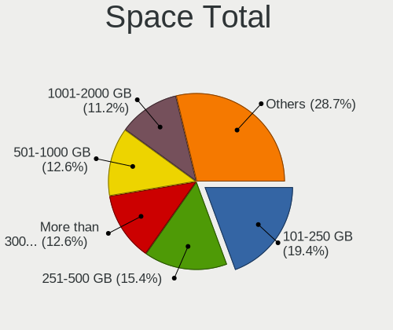

| Size in GB     | Desktops | Percent |
|----------------|----------|---------|
| 101-250        | 130      | 18.62%  |
| 251-500        | 113      | 16.19%  |
| 501-1000       | 92       | 13.18%  |
| More than 3000 | 91       | 13.04%  |
| 1001-2000      | 82       | 11.75%  |
| Unknown        | 59       | 8.45%   |
| 51-100         | 52       | 7.45%   |
| 2001-3000      | 39       | 5.59%   |
| 21-50          | 23       | 3.3%    |
| 1-20           | 17       | 2.44%   |

Space Used
----------

Amount of used disk space

| Used GB        | Desktops | Percent |
|----------------|----------|---------|
| 1-20           | 175      | 24.27%  |
| 101-250        | 94       | 13.04%  |
| 21-50          | 80       | 11.1%   |
| 251-500        | 68       | 9.43%   |
| 501-1000       | 65       | 9.02%   |
| 51-100         | 65       | 9.02%   |
| Unknown        | 59       | 8.18%   |
| 1001-2000      | 57       | 7.91%   |
| More than 3000 | 40       | 5.55%   |
| 2001-3000      | 18       | 2.5%    |

Malfunc. Drives
---------------

Drive models with a malfunction

| Model                             | Desktops | Drives | Percent |
|-----------------------------------|----------|--------|---------|
| WDC WD10EADS-00M2B0 1TB           | 4        | 4      | 2.82%   |
| A-DATA Technology SU800 256GB SSD | 3        | 4      | 2.11%   |
| WDC WDS240G2G0A-00JH30 240GB SSD  | 2        | 2      | 1.41%   |
| WDC WD5000AAKX-003CA0 500GB       | 2        | 2      | 1.41%   |
| WDC WD20EFRX-68EUZN0 2TB          | 2        | 8      | 1.41%   |
| Seagate ST500DM002-1BD142 500GB   | 2        | 2      | 1.41%   |
| Seagate ST3500418AS 500GB         | 2        | 7      | 1.41%   |
| Seagate ST3250410AS 250GB         | 2        | 2      | 1.41%   |
| Seagate ST2000DM008-2FR1          | 2        | 2      | 1.41%   |
| Seagate ST1000DM010-2EP102 1TB    | 2        | 3      | 1.41%   |
| Samsung Electronics HD753LJ 752GB | 2        | 3      | 1.41%   |
| Samsung Electronics HD154UI 1TB   | 2        | 3      | 1.41%   |
| Samsung Electronics HD103UJ 1TB   | 2        | 2      | 1.41%   |
| MAXTOR STM3250310AS 250GB         | 2        | 2      | 1.41%   |
| Hitachi HDS721050CLA660 500GB     | 2        | 2      | 1.41%   |
| WDC WD7500AACS-65D6B0 752GB       | 1        | 1      | 0.7%    |
| WDC WD7500AACS-00ZJB0 752GB       | 1        | 1      | 0.7%    |
| WDC WD5002ABYS-02B1B0 500GB       | 1        | 1      | 0.7%    |
| WDC WD5001FZWX-00ZHUA0 5TB        | 1        | 4      | 0.7%    |
| WDC WD5000HHTZ-04N21V0 500GB      | 1        | 1      | 0.7%    |
| WDC WD5000AAKX-00U6AA0 500GB      | 1        | 1      | 0.7%    |
| WDC WD5000AAKX-00ERMA0 500GB      | 1        | 1      | 0.7%    |
| WDC WD5000AAKS-08V0A0 500GB       | 1        | 1      | 0.7%    |
| WDC WD5000AAJS-22A8B0 500GB       | 1        | 1      | 0.7%    |
| WDC WD40EZRX-00SPEB0 4TB          | 1        | 1      | 0.7%    |
| WDC WD3200BEKT-75PVMT1 320GB      | 1        | 5      | 0.7%    |
| WDC WD3200AVJS-63B6A0 320GB       | 1        | 1      | 0.7%    |
| WDC WD30EFRX-68AX9N0 3TB          | 1        | 1      | 0.7%    |
| WDC WD2500AAKX-60U6AA0 250GB      | 1        | 1      | 0.7%    |
| WDC WD2500AAKX-001CA0 250GB       | 1        | 1      | 0.7%    |
| WDC WD2500AAJS-00V4A0 250GB       | 1        | 1      | 0.7%    |
| WDC WD2500AAJS-00L7A0 250GB       | 1        | 1      | 0.7%    |
| WDC WD2002FAEX-007BA0 2TB         | 1        | 2      | 0.7%    |
| WDC WD1600BEVT-22ZCT0 160GB       | 1        | 1      | 0.7%    |
| WDC WD10EZEX-60ZF5A0 1TB          | 1        | 1      | 0.7%    |
| WDC WD10EZEX-00BN5A0 1TB          | 1        | 1      | 0.7%    |
| WDC WD10EALX-009BA0 1TB           | 1        | 2      | 0.7%    |
| WDC WD10EACS-22D6B0 1TB           | 1        | 1      | 0.7%    |
| WDC WD1003FBYX-01Y7B1 1TB         | 1        | 1      | 0.7%    |
| WDC WD1002FAEX-00Z3A0 1TB         | 1        | 1      | 0.7%    |
| Toshiba MQ01ABD100 1TB            | 1        | 1      | 0.7%    |
| Toshiba MK1059GSM 1TB             | 1        | 1      | 0.7%    |
| Toshiba HDWL120 2TB               | 1        | 2      | 0.7%    |
| Toshiba HDWD110 1TB               | 1        | 2      | 0.7%    |
| Toshiba DT01ACA100 1TB            | 1        | 1      | 0.7%    |
| Toshiba DT01ACA050 500GB          | 1        | 1      | 0.7%    |
| Seagate ST9500420AS 500GB         | 1        | 1      | 0.7%    |
| Seagate ST9500325AS 500GB         | 1        | 1      | 0.7%    |
| Seagate ST9160314AS 160GB         | 1        | 1      | 0.7%    |
| Seagate ST500LM021-1KJ152 500GB   | 1        | 1      | 0.7%    |
| Seagate ST4000NM0033-9ZM170 4TB   | 1        | 1      | 0.7%    |
| Seagate ST4000DM000-1F2168 4TB    | 1        | 1      | 0.7%    |
| Seagate ST3750528AS 752GB         | 1        | 1      | 0.7%    |
| Seagate ST3750330AS 752GB         | 1        | 1      | 0.7%    |
| Seagate ST3500320AS 500GB         | 1        | 1      | 0.7%    |
| Seagate ST3320613AS 320GB         | 1        | 1      | 0.7%    |
| Seagate ST3250318AS 250GB         | 1        | 2      | 0.7%    |
| Seagate ST320DM000-1BD14C 320GB   | 1        | 2      | 0.7%    |
| Seagate ST3200822AS 192GB         | 1        | 1      | 0.7%    |
| Seagate ST3160815AS 160GB         | 1        | 2      | 0.7%    |

Malfunc. Drive Vendor
---------------------

Vendors of faulty drives

| Vendor              | Desktops | Drives | Percent |
|---------------------|----------|--------|---------|
| Seagate             | 36       | 47     | 26.47%  |
| WDC                 | 33       | 50     | 24.26%  |
| Samsung Electronics | 16       | 20     | 11.76%  |
| Hitachi             | 10       | 11     | 7.35%   |
| Crucial             | 7        | 7      | 5.15%   |
| Toshiba             | 6        | 8      | 4.41%   |
| MAXTOR              | 5        | 5      | 3.68%   |
| OCZ                 | 3        | 4      | 2.21%   |
| Kingston            | 3        | 3      | 2.21%   |
| Intel               | 3        | 3      | 2.21%   |
| A-DATA Technology   | 3        | 4      | 2.21%   |
| SanDisk             | 2        | 2      | 1.47%   |
| KingDian            | 2        | 3      | 1.47%   |
| PLEXTOR             | 1        | 2      | 0.74%   |
| LITEONIT            | 1        | 1      | 0.74%   |
| LITEON              | 1        | 1      | 0.74%   |
| Hypertec            | 1        | 1      | 0.74%   |
| HGST                | 1        | 1      | 0.74%   |
| Corsair             | 1        | 1      | 0.74%   |
| ASMT                | 1        | 2      | 0.74%   |

Malfunc. HDD Vendor
-------------------

Vendors of faulty HDD drives

| Vendor              | Desktops | Drives | Percent |
|---------------------|----------|--------|---------|
| Seagate             | 36       | 47     | 34.62%  |
| WDC                 | 31       | 48     | 29.81%  |
| Samsung Electronics | 14       | 18     | 13.46%  |
| Hitachi             | 10       | 11     | 9.62%   |
| Toshiba             | 6        | 8      | 5.77%   |
| MAXTOR              | 5        | 5      | 4.81%   |
| HGST                | 1        | 1      | 0.96%   |
| ASMT                | 1        | 2      | 0.96%   |

Malfunc. Drive Kind
-------------------

Kinds of faulty drives

| Kind | Desktops | Drives | Percent |
|------|----------|--------|---------|
| HDD  | 95       | 140    | 74.8%   |
| SSD  | 30       | 34     | 23.62%  |
| NVMe | 2        | 2      | 1.57%   |

Failed Drives
-------------

Failed drive models

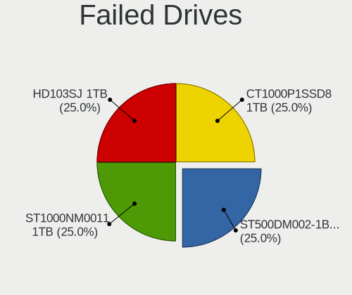

| Model                           | Desktops | Drives | Percent |
|---------------------------------|----------|--------|---------|
| Seagate ST500DM002-1BD142 500GB | 1        | 1      | 50%     |
| Crucial CT1000P1SSD8 1TB        | 1        | 1      | 50%     |

Failed Drive Vendor
-------------------

Failed drive vendors

| Vendor  | Desktops | Drives | Percent |
|---------|----------|--------|---------|
| Seagate | 1        | 1      | 50%     |
| Crucial | 1        | 1      | 50%     |

Drive Status
------------

Number of failed and malfunc. drives

| Status   | Desktops | Drives | Percent |
|----------|----------|--------|---------|
| Works    | 350      | 981    | 43.1%   |
| Detected | 340      | 968    | 41.87%  |
| Malfunc  | 120      | 176    | 14.78%  |
| Failed   | 2        | 2      | 0.25%   |

Storage controller
------------------

Storage Vendor
--------------

Storage controller vendors

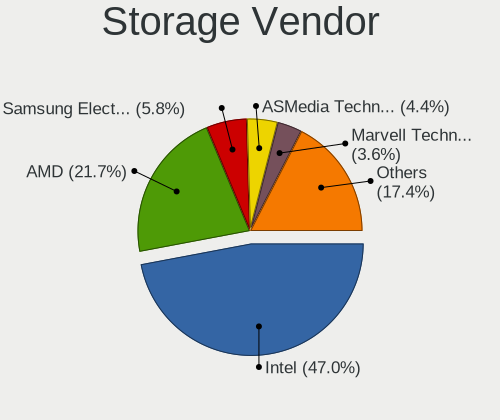

| Vendor                        | Desktops | Percent |
|-------------------------------|----------|---------|
| Intel                         | 429      | 46.33%  |
| AMD                           | 209      | 22.57%  |
| Samsung Electronics           | 52       | 5.62%   |
| ASMedia Technology            | 41       | 4.43%   |
| Marvell Technology Group      | 34       | 3.67%   |
| Phison Electronics            | 23       | 2.48%   |
| JMicron Technology            | 21       | 2.27%   |
| Nvidia                        | 19       | 2.05%   |
| Sandisk                       | 13       | 1.4%    |
| LSI Logic / Symbios Logic     | 12       | 1.3%    |
| Silicon Motion                | 11       | 1.19%   |
| Micron/Crucial Technology     | 8        | 0.86%   |
| Kingston Technology Company   | 8        | 0.86%   |
| ADATA Technology              | 8        | 0.86%   |
| Broadcom / LSI                | 7        | 0.76%   |
| VIA Technologies              | 5        | 0.54%   |
| Toshiba America Info Systems  | 4        | 0.43%   |
| Silicon Image                 | 4        | 0.43%   |
| Lite-On Technology            | 4        | 0.43%   |
| Adaptec                       | 4        | 0.43%   |
| Seagate Technology            | 3        | 0.32%   |
| Realtek Semiconductor         | 2        | 0.22%   |
| SK Hynix                      | 1        | 0.11%   |
| Micron Technology             | 1        | 0.11%   |
| Loongson Technology           | 1        | 0.11%   |
| KIOXIA                        | 1        | 0.11%   |
| Integrated Technology Express | 1        | 0.11%   |

Storage Model
-------------

Storage controller models

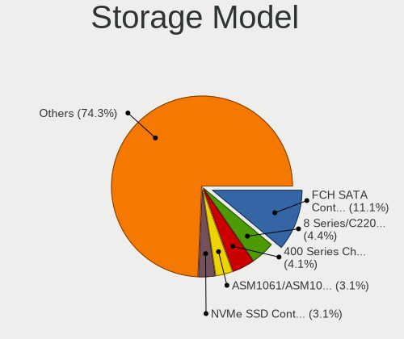

| Model                                                                                   | Desktops | Percent |
|-----------------------------------------------------------------------------------------|----------|---------|
| AMD FCH SATA Controller [AHCI mode]                                                     | 139      | 11.53%  |
| Intel 8 Series/C220 Series Chipset Family 6-port SATA Controller 1 [AHCI mode]          | 57       | 4.73%   |
| AMD 400 Series Chipset SATA Controller                                                  | 51       | 4.23%   |
| ASMedia ASM1062 Serial ATA Controller                                                   | 38       | 3.15%   |
| Samsung NVMe SSD Controller SM981/PM981/PM983                                           | 37       | 3.07%   |
| Intel 6 Series/C200 Series Chipset Family 6 port Desktop SATA AHCI Controller           | 35       | 2.9%    |
| AMD SB7x0/SB8x0/SB9x0 IDE Controller                                                    | 35       | 2.9%    |
| AMD SB7x0/SB8x0/SB9x0 SATA Controller [AHCI mode]                                       | 32       | 2.65%   |
| Intel NM10/ICH7 Family SATA Controller [IDE mode]                                       | 31       | 2.57%   |
| Intel Q170/Q150/B150/H170/H110/Z170/CM236 Chipset SATA Controller [AHCI Mode]           | 29       | 2.4%    |
| Intel 200 Series PCH SATA controller [AHCI mode]                                        | 26       | 2.16%   |
| Intel 82801G (ICH7 Family) IDE Controller                                               | 25       | 2.07%   |
| Intel 7 Series/C210 Series Chipset Family 6-port SATA Controller [AHCI mode]            | 25       | 2.07%   |
| Intel SATA Controller [RAID mode]                                                       | 23       | 1.91%   |
| AMD SB7x0/SB8x0/SB9x0 SATA Controller [IDE mode]                                        | 20       | 1.66%   |
| Intel Cannon Lake PCH SATA AHCI Controller                                              | 18       | 1.49%   |
| Intel C600/X79 series chipset 6-Port SATA AHCI Controller                               | 16       | 1.33%   |
| AMD X370 Series Chipset SATA Controller                                                 | 16       | 1.33%   |
| Intel 6 Series/C200 Series Chipset Family Desktop SATA Controller (IDE mode, ports 4-5) | 14       | 1.16%   |
| Phison E12 NVMe Controller                                                              | 13       | 1.08%   |
| Intel 9 Series Chipset Family SATA Controller [AHCI Mode]                               | 13       | 1.08%   |
| Intel 6 Series/C200 Series Chipset Family Desktop SATA Controller (IDE mode, ports 0-3) | 13       | 1.08%   |
| AMD 300 Series Chipset SATA Controller                                                  | 13       | 1.08%   |
| AMD FCH IDE Controller                                                                  | 12       | 1%      |
| JMicron JMB363 SATA/IDE Controller                                                      | 11       | 0.91%   |
| Nvidia MCP61 SATA Controller                                                            | 10       | 0.83%   |
| Nvidia MCP61 IDE                                                                        | 10       | 0.83%   |
| Intel C610/X99 series chipset 6-Port SATA Controller [AHCI mode]                        | 10       | 0.83%   |
| Intel 82801JI (ICH10 Family) SATA AHCI Controller                                       | 10       | 0.83%   |
| Intel 4 Series Chipset PT IDER Controller                                               | 10       | 0.83%   |
| Samsung NVMe SSD Controller SM961/PM961/SM963                                           | 9        | 0.75%   |
| Marvell Group 88SE9215 PCIe 2.0 x1 4-port SATA 6 Gb/s Controller                        | 8        | 0.66%   |
| Marvell Group 88SE9172 SATA 6Gb/s Controller                                            | 8        | 0.66%   |
| Intel Celeron/Pentium Silver Processor SATA Controller                                  | 8        | 0.66%   |
| Intel C610/X99 series chipset sSATA Controller [AHCI mode]                              | 8        | 0.66%   |
| Intel 82801JD/DO (ICH10 Family) SATA AHCI Controller                                    | 8        | 0.66%   |
| ADATA XPG SX8200 Pro PCIe Gen3x4 M.2 2280 Solid State Drive                             | 8        | 0.66%   |
| Silicon Motion SM2263EN/SM2263XT SSD Controller                                         | 7        | 0.58%   |
| LSI Logic / Symbios Logic SAS2008 PCI-Express Fusion-MPT SAS-2 [Falcon]                 | 7        | 0.58%   |
| Intel Atom Processor E3800 Series SATA AHCI Controller                                  | 7        | 0.58%   |
| Intel 82801JI (ICH10 Family) 4 port SATA IDE Controller #1                              | 7        | 0.58%   |
| Intel 82801JI (ICH10 Family) 2 port SATA IDE Controller #2                              | 7        | 0.58%   |
| Intel 5 Series/3400 Series Chipset 6 port SATA AHCI Controller                          | 7        | 0.58%   |
| Intel 5 Series/3400 Series Chipset 4 port SATA IDE Controller                           | 7        | 0.58%   |
| Intel 5 Series/3400 Series Chipset 2 port SATA IDE Controller                           | 7        | 0.58%   |
| AMD FCH SATA Controller D                                                               | 7        | 0.58%   |
| Phison E16 PCIe4 NVMe Controller                                                        | 6        | 0.5%    |
| Micron/Crucial P1 NVMe PCIe SSD                                                         | 6        | 0.5%    |
| JMicron JMB368 IDE controller                                                           | 6        | 0.5%    |
| Intel Comet Lake SATA AHCI Controller                                                   | 6        | 0.5%    |
| Intel Celeron N3350/Pentium N4200/Atom E3900 Series SATA AHCI Controller                | 6        | 0.5%    |
| Intel 82801I (ICH9 Family) 2 port SATA Controller [IDE mode]                            | 6        | 0.5%    |
| Intel 82801H (ICH8 Family) 4 port SATA Controller [IDE mode]                            | 6        | 0.5%    |
| Sandisk WD Black 2018/SN750 / PC SN720 NVMe SSD                                         | 5        | 0.41%   |
| Kingston Company A2000 NVMe SSD                                                         | 5        | 0.41%   |
| Intel Atom/Celeron/Pentium Processor x5-E8000/J3xxx/N3xxx Series SATA Controller        | 5        | 0.41%   |
| Intel 82801HR/HO/HH (ICH8R/DO/DH) 2 port SATA Controller [IDE mode]                     | 5        | 0.41%   |
| Intel 400 Series Chipset Family SATA AHCI Controller                                    | 5        | 0.41%   |
| AMD Starship/Matisse Chipset SATA Controller [AHCI mode]                                | 5        | 0.41%   |
| AMD SB600 IDE                                                                           | 5        | 0.41%   |

Storage Kind
------------

Kind of storage controller (IDE, SATA, NVMe, SAS, ...)

| Kind | Desktops | Percent |
|------|----------|---------|
| SATA | 530      | 57.8%   |
| IDE  | 189      | 20.61%  |
| NVMe | 136      | 14.83%  |
| RAID | 40       | 4.36%   |
| SAS  | 16       | 1.74%   |
| SCSI | 6        | 0.65%   |

Processor
---------

CPU Vendor
----------

Processor vendors

| Vendor       | Desktops | Percent |
|--------------|----------|---------|
| Intel        | 434      | 64.87%  |
| AMD          | 229      | 34.23%  |
| ARM          | 4        | 0.6%    |
| CentaurHauls | 1        | 0.15%   |
| Unknown      | 1        | 0.15%   |

CPU Model
---------

Processor models

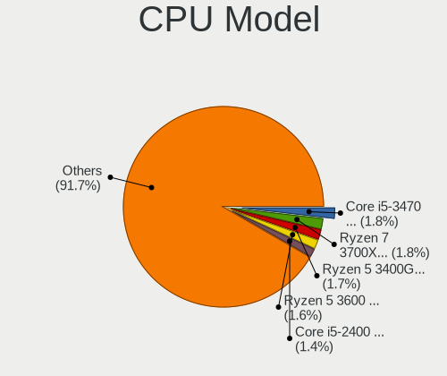

| Model                                         | Desktops | Percent |
|-----------------------------------------------|----------|---------|
| AMD Ryzen 7 3700X 8-Core Processor            | 14       | 2.09%   |
| AMD Ryzen 5 3400G with Radeon Vega Graphics   | 13       | 1.94%   |
| Intel Core i5-2400 CPU @ 3.10GHz              | 11       | 1.64%   |
| AMD Ryzen 7 2700X Eight-Core Processor        | 11       | 1.64%   |
| AMD Ryzen 5 3600 6-Core Processor             | 11       | 1.64%   |
| Intel Core i5-3470 CPU @ 3.20GHz              | 9        | 1.34%   |
| Intel Core i7-4790 CPU @ 3.60GHz              | 8        | 1.19%   |
| Intel Core i3-2100 CPU @ 3.10GHz              | 8        | 1.19%   |
| AMD Ryzen 7 1700 Eight-Core Processor         | 8        | 1.19%   |
| Intel Core i7-6700K CPU @ 4.00GHz             | 7        | 1.04%   |
| Intel Core 2 Duo CPU E8400 @ 3.00GHz          | 7        | 1.04%   |
| Intel Core 2 Duo CPU E7500 @ 2.93GHz          | 7        | 1.04%   |
| AMD Ryzen 9 3900X 12-Core Processor           | 7        | 1.04%   |
| AMD FX-8350 Eight-Core Processor              | 7        | 1.04%   |
| Intel Core i7-6700 CPU @ 3.40GHz              | 6        | 0.9%    |
| Intel Core i7-4770K CPU @ 3.50GHz             | 6        | 0.9%    |
| Intel Core i7-3930K CPU @ 3.20GHz             | 6        | 0.9%    |
| AMD Ryzen 7 2700 Eight-Core Processor         | 6        | 0.9%    |
| AMD Ryzen 5 2600 Six-Core Processor           | 6        | 0.9%    |
| Intel Pentium Gold G5400 CPU @ 3.70GHz        | 5        | 0.75%   |
| Intel Core i7-4790K CPU @ 4.00GHz             | 5        | 0.75%   |
| Intel Core i7-3770 CPU @ 3.40GHz              | 5        | 0.75%   |
| Intel Core i5-3570 CPU @ 3.40GHz              | 5        | 0.75%   |
| Intel Celeron CPU J3355 @ 2.00GHz             | 5        | 0.75%   |
| AMD Ryzen 7 1700X Eight-Core Processor        | 5        | 0.75%   |
| AMD FX-8320 Eight-Core Processor              | 5        | 0.75%   |
| AMD A8-7600 Radeon R7, 10 Compute Cores 4C+6G | 5        | 0.75%   |
| Intel Core i7-9700K CPU @ 3.60GHz             | 4        | 0.6%    |
| Intel Core i7-7700K CPU @ 4.20GHz             | 4        | 0.6%    |
| Intel Core i7-5820K CPU @ 3.30GHz             | 4        | 0.6%    |
| Intel Core i5-9600K CPU @ 3.70GHz             | 4        | 0.6%    |
| Intel Core i5-8400 CPU @ 2.80GHz              | 4        | 0.6%    |
| Intel Core i5-4590 CPU @ 3.30GHz              | 4        | 0.6%    |
| Intel Core i5-4460 CPU @ 3.20GHz              | 4        | 0.6%    |
| Intel Core i5-3570K CPU @ 3.40GHz             | 4        | 0.6%    |
| Intel Core i3-7100 CPU @ 3.90GHz              | 4        | 0.6%    |
| Intel Core 2 Quad CPU Q6600 @ 2.40GHz         | 4        | 0.6%    |
| Intel Celeron J4105 CPU @ 1.50GHz             | 4        | 0.6%    |
| Intel Celeron CPU J1900 @ 1.99GHz             | 4        | 0.6%    |
| AMD Ryzen 5 1600 Six-Core Processor           | 4        | 0.6%    |
| AMD FX-6300 Six-Core Processor                | 4        | 0.6%    |
| Intel Xeon CPU E5-2650 v2 @ 2.60GHz           | 3        | 0.45%   |
| Intel Pentium CPU G4400 @ 3.30GHz             | 3        | 0.45%   |
| Intel Pentium 4 CPU 3.00GHz                   | 3        | 0.45%   |
| Intel Core i7-8700 CPU @ 3.20GHz              | 3        | 0.45%   |
| Intel Core i7-7700 CPU @ 3.60GHz              | 3        | 0.45%   |
| Intel Core i7-2600 CPU @ 3.40GHz              | 3        | 0.45%   |
| Intel Core i7 CPU 920 @ 2.67GHz               | 3        | 0.45%   |
| Intel Core i7 CPU 870 @ 2.93GHz               | 3        | 0.45%   |
| Intel Core i5-7500 CPU @ 3.40GHz              | 3        | 0.45%   |
| Intel Core i5-4570 CPU @ 3.20GHz              | 3        | 0.45%   |
| Intel Core i5-10400F CPU @ 2.90GHz            | 3        | 0.45%   |
| Intel Core i3-4170 CPU @ 3.70GHz              | 3        | 0.45%   |
| Intel Core i3-4150 CPU @ 3.50GHz              | 3        | 0.45%   |
| Intel Core i3-4130 CPU @ 3.40GHz              | 3        | 0.45%   |
| Intel Core i3-3220 CPU @ 3.30GHz              | 3        | 0.45%   |
| Intel Core i3-2120 CPU @ 3.30GHz              | 3        | 0.45%   |
| Intel Core 2 Duo CPU E7400 @ 2.80GHz          | 3        | 0.45%   |
| Intel Core 2 Duo CPU E6550 @ 2.33GHz          | 3        | 0.45%   |
| Intel Core 2 CPU 6300 @ 1.86GHz               | 3        | 0.45%   |

CPU Model Family
----------------

Processor model prefix

| Model                   | Desktops | Percent |
|-------------------------|----------|---------|
| Intel Core i5           | 97       | 14.5%   |
| Intel Core i7           | 94       | 14.05%  |
| Intel Core i3           | 51       | 7.62%   |
| AMD Ryzen 5             | 48       | 7.17%   |
| Intel Xeon              | 47       | 7.03%   |
| AMD Ryzen 7             | 47       | 7.03%   |
| Intel Celeron           | 42       | 6.28%   |
| Intel Core 2 Duo        | 30       | 4.48%   |
| AMD FX                  | 25       | 3.74%   |
| Intel Pentium           | 16       | 2.39%   |
| Intel Core 2 Quad       | 15       | 2.24%   |
| AMD Athlon II X2        | 10       | 1.49%   |
| Other                   | 9        | 1.35%   |
| AMD Ryzen 3             | 9        | 1.35%   |
| AMD Phenom II X4        | 9        | 1.35%   |
| AMD A8                  | 9        | 1.35%   |
| AMD A10                 | 9        | 1.35%   |
| Intel Core 2            | 8        | 1.2%    |
| Intel Atom              | 7        | 1.05%   |
| AMD Ryzen 9             | 7        | 1.05%   |
| AMD Athlon 64 X2        | 7        | 1.05%   |
| Intel Pentium Gold      | 5        | 0.75%   |
| Intel Pentium 4         | 5        | 0.75%   |
| Intel Core i9           | 5        | 0.75%   |
| AMD Ryzen Threadripper  | 5        | 0.75%   |
| AMD Athlon 64           | 5        | 0.75%   |
| Intel Pentium Dual      | 4        | 0.6%    |
| AMD Sempron             | 4        | 0.6%    |
| AMD Phenom II X6        | 4        | 0.6%    |
| AMD Athlon II X4        | 4        | 0.6%    |
| AMD Athlon              | 4        | 0.6%    |
| Intel Pentium Dual-Core | 3        | 0.45%   |
| AMD GX                  | 3        | 0.45%   |
| AMD E1                  | 3        | 0.45%   |
| Intel Pentium D         | 2        | 0.3%    |
| AMD Ryzen 5 PRO         | 2        | 0.3%    |
| AMD Phenom              | 2        | 0.3%    |
| AMD E                   | 2        | 0.3%    |
| AMD Athlon X4           | 2        | 0.3%    |
| AMD A6                  | 2        | 0.3%    |
| Intel Pentium Silver    | 1        | 0.15%   |
| Intel Genuine           | 1        | 0.15%   |
| CentaurHauls VIA C7     | 1        | 0.15%   |
| AMD Ryzen 3 PRO         | 1        | 0.15%   |
| AMD EPYC                | 1        | 0.15%   |
| AMD Athlon Dual Core    | 1        | 0.15%   |
| AMD A4                  | 1        | 0.15%   |

CPU Cores
---------

Number of processor cores

| Number | Desktops | Percent |
|--------|----------|---------|
| 4      | 261      | 38.96%  |
| 2      | 200      | 29.85%  |
| 6      | 78       | 11.64%  |
| 8      | 67       | 10%     |
| 1      | 28       | 4.18%   |
| 12     | 12       | 1.79%   |
| 16     | 8        | 1.19%   |
| 3      | 8        | 1.19%   |
| 10     | 3        | 0.45%   |
| 24     | 2        | 0.3%    |
| 32     | 1        | 0.15%   |
| 22     | 1        | 0.15%   |
| 18     | 1        | 0.15%   |

CPU Sockets
-----------

Number of sockets

| Number | Desktops | Percent |
|--------|----------|---------|
| 1      | 656      | 98.06%  |
| 2      | 13       | 1.94%   |

CPU Threads
-----------

Threads per core (Hyper-Threading)

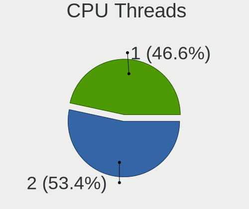

| Number | Desktops | Percent |
|--------|----------|---------|
| 2      | 362      | 54.11%  |
| 1      | 307      | 45.89%  |

CPU Op-Modes
------------

CPU Operation Modes (32-bit, 64-bit)

| Op mode        | Desktops | Percent |
|----------------|----------|---------|
| 32-bit, 64-bit | 640      | 95.38%  |
| Unknown        | 25       | 3.73%   |
| 32-bit         | 6        | 0.89%   |

CPU Microcode
-------------

Microcode number

| Number     | Desktops | Percent |
|------------|----------|---------|
| Unknown    | 267      | 38.58%  |
| 0x306c3    | 46       | 6.65%   |
| 0x206a7    | 33       | 4.77%   |
| 0x306a9    | 23       | 3.32%   |
| 0x1067a    | 22       | 3.18%   |
| 0x08701021 | 17       | 2.46%   |
| 0x0800820d | 15       | 2.17%   |
| 0x906e9    | 13       | 1.88%   |
| 0x08701013 | 13       | 1.88%   |
| 0x506e3    | 12       | 1.73%   |
| 0x010000c8 | 10       | 1.45%   |
| 0x906ea    | 9        | 1.3%    |
| 0x08108109 | 9        | 1.3%    |
| 0x906ed    | 8        | 1.16%   |
| 0x206d7    | 8        | 1.16%   |
| 0x306e4    | 7        | 1.01%   |
| 0x106e5    | 7        | 1.01%   |
| 0x08001137 | 7        | 1.01%   |
| 0x06001119 | 7        | 1.01%   |
| 0xa0655    | 6        | 0.87%   |
| 0x706a1    | 6        | 0.87%   |
| 0x06003106 | 6        | 0.87%   |
| 0xa0653    | 5        | 0.72%   |
| 0x406c3    | 5        | 0.72%   |
| 0x306f2    | 5        | 0.72%   |
| 0x106a5    | 5        | 0.72%   |
| 0x906eb    | 4        | 0.58%   |
| 0x6fd      | 4        | 0.58%   |
| 0x10676    | 4        | 0.58%   |
| 0x08101016 | 4        | 0.58%   |
| 0x0800820b | 4        | 0.58%   |
| 0x06000852 | 4        | 0.58%   |
| 0x6fb      | 3        | 0.43%   |
| 0x6f6      | 3        | 0.43%   |
| 0x6f2      | 3        | 0.43%   |
| 0x50654    | 3        | 0.43%   |
| 0x30678    | 3        | 0.43%   |
| 0x206c2    | 3        | 0.43%   |
| 0x20652    | 3        | 0.43%   |
| 0x106c2    | 3        | 0.43%   |
| 0x0810100b | 3        | 0.43%   |
| 0x08001138 | 3        | 0.43%   |
| 0x0600081c | 3        | 0.43%   |
| 0xf43      | 2        | 0.29%   |
| 0xf41      | 2        | 0.29%   |
| 0x506c9    | 2        | 0.29%   |
| 0x406e3    | 2        | 0.29%   |
| 0x40651    | 2        | 0.29%   |
| 0x10661    | 2        | 0.29%   |
| 0x0a201009 | 2        | 0.29%   |
| 0x08301025 | 2        | 0.29%   |
| 0x08108102 | 2        | 0.29%   |
| 0x0600611a | 2        | 0.29%   |
| 0x03000027 | 2        | 0.29%   |
| 0x010000c7 | 2        | 0.29%   |
| 0xf65      | 1        | 0.14%   |
| 0xf4a      | 1        | 0.14%   |
| 0xa0671    | 1        | 0.14%   |
| 0xa0660    | 1        | 0.14%   |
| 0x806e9    | 1        | 0.14%   |

CPU Microarch
-------------

Microarchitecture

| Name          | Desktops | Percent |
|---------------|----------|---------|
| Haswell       | 87       | 12.99%  |
| SandyBridge   | 59       | 8.81%   |
| KabyLake      | 54       | 8.06%   |
| Zen+          | 46       | 6.87%   |
| Zen 2         | 43       | 6.42%   |
| Penryn        | 43       | 6.42%   |
| IvyBridge     | 43       | 6.42%   |
| Zen           | 33       | 4.93%   |
| Skylake       | 32       | 4.78%   |
| K10           | 31       | 4.63%   |
| Piledriver    | 29       | 4.33%   |
| Core          | 27       | 4.03%   |
| K8 Hammer     | 17       | 2.54%   |
| Nehalem       | 16       | 2.39%   |
| Silvermont    | 15       | 2.24%   |
| CometLake     | 13       | 1.94%   |
| Westmere      | 11       | 1.64%   |
| Steamroller   | 9        | 1.34%   |
| NetBurst      | 9        | 1.34%   |
| Goldmont plus | 8        | 1.19%   |
| Unknown       | 7        | 1.04%   |
| Goldmont      | 6        | 0.9%    |
| Bonnell       | 6        | 0.9%    |
| Bulldozer     | 5        | 0.75%   |
| Jaguar        | 4        | 0.6%    |
| Excavator     | 4        | 0.6%    |
| Broadwell     | 4        | 0.6%    |
| Bobcat        | 4        | 0.6%    |
| Zen 3         | 2        | 0.3%    |
| K10 Llano     | 2        | 0.3%    |
| K6            | 1        | 0.15%   |

Graphics
--------

GPU Vendor
----------

Vendors of graphics cards

| Vendor                     | Desktops | Percent |
|----------------------------|----------|---------|
| Nvidia                     | 256      | 37.05%  |
| Intel                      | 231      | 33.43%  |
| AMD                        | 180      | 26.05%  |
| Matrox Electronics Systems | 13       | 1.88%   |
| ASPEED Technology          | 7        | 1.01%   |
| VIA Technologies           | 3        | 0.43%   |
| Loongson Technology        | 1        | 0.14%   |

GPU Model
---------

Graphics card models

| Model                                                                                    | Desktops | Percent |
|------------------------------------------------------------------------------------------|----------|---------|
| Intel Xeon E3-1200 v3/4th Gen Core Processor Integrated Graphics Controller              | 35       | 4.92%   |
| AMD Ellesmere [Radeon RX 470/480/570/570X/580/580X/590]                                  | 29       | 4.07%   |
| Nvidia GK208B [GeForce GT 710]                                                           | 20       | 2.81%   |
| Intel 2nd Generation Core Processor Family Integrated Graphics Controller                | 19       | 2.67%   |
| Intel CoffeeLake-S GT2 [UHD Graphics 630]                                                | 18       | 2.53%   |
| AMD Picasso/Raven 2 [Radeon Vega Series / Radeon Vega Mobile Series]                     | 16       | 2.25%   |
| Intel 4 Series Chipset Integrated Graphics Controller                                    | 15       | 2.11%   |
| Nvidia GT218 [GeForce 210]                                                               | 14       | 1.97%   |
| Intel HD Graphics 530                                                                    | 14       | 1.97%   |
| Nvidia GP107 [GeForce GTX 1050 Ti]                                                       | 13       | 1.83%   |
| Nvidia GP106 [GeForce GTX 1060 6GB]                                                      | 13       | 1.83%   |
| Intel Xeon E3-1200 v2/3rd Gen Core processor Graphics Controller                         | 12       | 1.69%   |
| AMD Caicos [Radeon HD 6450/7450/8450 / R5 230 OEM]                                       | 11       | 1.54%   |
| Intel 4th Generation Core Processor Family Integrated Graphics Controller                | 10       | 1.4%    |
| AMD Raven Ridge [Radeon Vega Series / Radeon Vega Mobile Series]                         | 9        | 1.26%   |
| Nvidia GM107 [GeForce GTX 750 Ti]                                                        | 8        | 1.12%   |
| Intel IvyBridge GT2 [HD Graphics 4000]                                                   | 8        | 1.12%   |
| Intel HD Graphics 630                                                                    | 8        | 1.12%   |
| Intel Atom Processor Z36xxx/Z37xxx Series Graphics & Display                             | 8        | 1.12%   |
| AMD Kaveri [Radeon R7 Graphics]                                                          | 8        | 1.12%   |
| Nvidia GP108 [GeForce GT 1030]                                                           | 7        | 0.98%   |
| Nvidia GM204 [GeForce GTX 970]                                                           | 7        | 0.98%   |
| Matrox Electronics Systems MGA G200eW WPCM450                                            | 7        | 0.98%   |
| Intel GeminiLake [UHD Graphics 600]                                                      | 7        | 0.98%   |
| Intel CometLake-S GT2 [UHD Graphics 630]                                                 | 7        | 0.98%   |
| Intel Atom/Celeron/Pentium Processor x5-E8000/J3xxx/N3xxx Integrated Graphics Controller | 7        | 0.98%   |
| ASPEED Technology ASPEED Graphics Family                                                 | 7        | 0.98%   |
| Nvidia TU106 [GeForce RTX 2060 SUPER]                                                    | 6        | 0.84%   |
| Nvidia GP106 [GeForce GTX 1060 3GB]                                                      | 6        | 0.84%   |
| Nvidia GP104 [GeForce GTX 1080]                                                          | 6        | 0.84%   |
| Intel HD Graphics 500                                                                    | 6        | 0.84%   |
| Intel 82G33/G31 Express Integrated Graphics Controller                                   | 6        | 0.84%   |
| AMD Cedar [Radeon HD 5000/6000/7350/8350 Series]                                         | 6        | 0.84%   |
| Nvidia TU116 [GeForce GTX 1650 SUPER]                                                    | 5        | 0.7%    |
| Nvidia GM206 [GeForce GTX 960]                                                           | 5        | 0.7%    |
| Nvidia GK208B [GeForce GT 730]                                                           | 5        | 0.7%    |
| Intel 82945G/GZ Integrated Graphics Controller                                           | 5        | 0.7%    |
| AMD Lexa PRO [Radeon 540/540X/550/550X / RX 540X/550/550X]                               | 5        | 0.7%    |
| AMD Baffin [Radeon RX 550 640SP / RX 560/560X]                                           | 5        | 0.7%    |
| AMD Baffin [Radeon RX 460/560D / Pro 450/455/460/555/555X/560/560X]                      | 5        | 0.7%    |
| Nvidia GF119 [GeForce GT 610]                                                            | 4        | 0.56%   |
| Nvidia G94 [GeForce 9600 GT]                                                             | 4        | 0.56%   |
| Intel Mobile 4 Series Chipset Integrated Graphics Controller                             | 4        | 0.56%   |
| Intel HD Graphics 510                                                                    | 4        | 0.56%   |
| Intel Core Processor Integrated Graphics Controller                                      | 4        | 0.56%   |
| Intel CoffeeLake-S GT1 [UHD Graphics 610]                                                | 4        | 0.56%   |
| AMD Tahiti XT [Radeon HD 7970/8970 OEM / R9 280X]                                        | 4        | 0.56%   |
| VIA Technologies CN896/VN896/P4M900 [Chrome 9 HC]                                        | 3        | 0.42%   |
| Nvidia TU116 [GeForce GTX 1660 SUPER]                                                    | 3        | 0.42%   |
| Nvidia TU104 [GeForce RTX 2070 SUPER]                                                    | 3        | 0.42%   |
| Nvidia GP107 [GeForce GTX 1050]                                                          | 3        | 0.42%   |
| Nvidia GM204 [GeForce GTX 980]                                                           | 3        | 0.42%   |
| Nvidia GK110 [GeForce GTX 780]                                                           | 3        | 0.42%   |
| Nvidia GK107 [GeForce GT 640]                                                            | 3        | 0.42%   |
| Nvidia GK106 [GeForce GTX 660]                                                           | 3        | 0.42%   |
| Nvidia GK106 [GeForce GTX 650 Ti]                                                        | 3        | 0.42%   |
| Nvidia GK104 [GeForce GTX 760]                                                           | 3        | 0.42%   |
| Nvidia GF119 [GeForce GT 520]                                                            | 3        | 0.42%   |
| Nvidia GF116 [GeForce GTX 550 Ti]                                                        | 3        | 0.42%   |
| Nvidia GF108 [GeForce GT 630]                                                            | 3        | 0.42%   |

GPU Combo
---------

Combinations of graphics cards

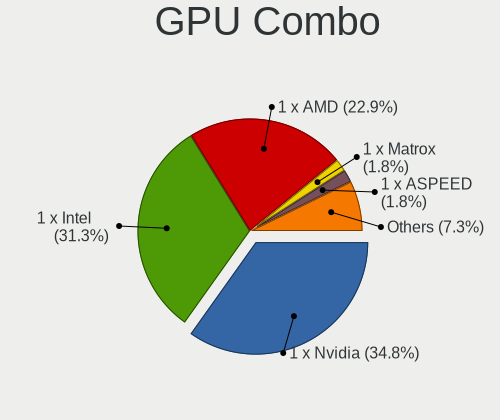

| Name                    | Desktops | Percent |
|-------------------------|----------|---------|
| 1 x Nvidia              | 239      | 35.57%  |
| 1 x Intel               | 207      | 30.8%   |
| 1 x AMD                 | 160      | 23.81%  |
| 1 x Matrox              | 13       | 1.93%   |
| 2 x AMD                 | 12       | 1.79%   |
| Intel + Nvidia          | 11       | 1.64%   |
| Other                   | 9        | 1.34%   |
| 1 x ASPEED              | 6        | 0.89%   |
| Intel + AMD             | 5        | 0.74%   |
| 2 x Nvidia              | 3        | 0.45%   |
| 1 x VIA                 | 3        | 0.45%   |
| AMD + Nvidia            | 2        | 0.3%    |
| 2 x Loongson Technology | 1        | 0.15%   |
| Nvidia + ASPEED         | 1        | 0.15%   |

GPU Driver
----------

Free vs proprietary

| Driver      | Desktops | Percent |
|-------------|----------|---------|
| Free        | 463      | 68.29%  |
| Proprietary | 157      | 23.16%  |
| Unknown     | 58       | 8.55%   |

GPU Memory
----------

Total video memory

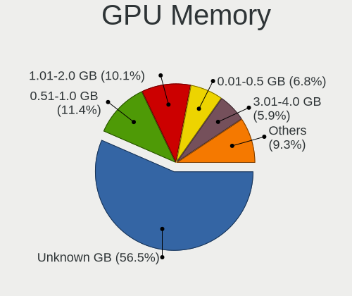

| Size in GB | Desktops | Percent |
|------------|----------|---------|
| Unknown    | 379      | 55.57%  |
| 0.51-1.0   | 79       | 11.58%  |
| 1.01-2.0   | 74       | 10.85%  |
| 0.01-0.5   | 43       | 6.3%    |
| 3.01-4.0   | 40       | 5.87%   |
| 7.01-8.0   | 32       | 4.69%   |
| 5.01-6.0   | 17       | 2.49%   |
| 2.01-3.0   | 13       | 1.91%   |
| 8.01-16.0  | 5        | 0.73%   |

Monitor
-------

Monitor Vendor
--------------

Monitor vendors

| Vendor               | Desktops | Percent |
|----------------------|----------|---------|
| Samsung Electronics  | 113      | 17.36%  |
| Dell                 | 75       | 11.52%  |
| Goldstar             | 60       | 9.22%   |
| BenQ                 | 45       | 6.91%   |
| Hewlett-Packard      | 38       | 5.84%   |
| Acer                 | 38       | 5.84%   |
| AOC                  | 35       | 5.38%   |
| Philips              | 33       | 5.07%   |
| Ancor Communications | 27       | 4.15%   |
| ViewSonic            | 19       | 2.92%   |
| Unknown              | 17       | 2.61%   |
| Iiyama               | 16       | 2.46%   |
| LG Electronics       | 15       | 2.3%    |
| Fujitsu Siemens      | 7        | 1.08%   |
| Lenovo               | 6        | 0.92%   |
| HannStar             | 6        | 0.92%   |
| Sony                 | 5        | 0.77%   |
| NEC Computers        | 5        | 0.77%   |
| Apple                | 5        | 0.77%   |
| Eizo                 | 4        | 0.61%   |
| Belinea              | 4        | 0.61%   |
| Vizio                | 3        | 0.46%   |
| Targa Visionary      | 3        | 0.46%   |
| Medion               | 3        | 0.46%   |
| HPN                  | 3        | 0.46%   |
| ASUSTek Computer     | 3        | 0.46%   |
| Sun                  | 2        | 0.31%   |
| SHARP                | 2        | 0.31%   |
| Panasonic            | 2        | 0.31%   |
| Orion                | 2        | 0.31%   |
| MStar                | 2        | 0.31%   |
| Idek Iiyama          | 2        | 0.31%   |
| Hannspree            | 2        | 0.31%   |
| Gateway              | 2        | 0.31%   |
| CHR                  | 2        | 0.31%   |
| BOE                  | 2        | 0.31%   |
| AUS                  | 2        | 0.31%   |
| AGO                  | 2        | 0.31%   |
| ___                  | 1        | 0.15%   |
| WCS                  | 1        | 0.15%   |
| Vestel Elektronik    | 1        | 0.15%   |
| UTV                  | 1        | 0.15%   |
| Unknown (AAA)        | 1        | 0.15%   |
| STD                  | 1        | 0.15%   |
| SNC                  | 1        | 0.15%   |
| SLT                  | 1        | 0.15%   |
| SGT                  | 1        | 0.15%   |
| Sceptre Tech         | 1        | 0.15%   |
| Proview              | 1        | 0.15%   |
| Packard Bell         | 1        | 0.15%   |
| ONN                  | 1        | 0.15%   |
| OLI                  | 1        | 0.15%   |
| OEM                  | 1        | 0.15%   |
| MiTAC                | 1        | 0.15%   |
| LTM                  | 1        | 0.15%   |
| Lenovo Group Limited | 1        | 0.15%   |
| KON                  | 1        | 0.15%   |
| ITE                  | 1        | 0.15%   |
| Insignia             | 1        | 0.15%   |
| IBM                  | 1        | 0.15%   |

Monitor Model
-------------

Monitor models

| Model                                                                | Desktops | Percent |
|----------------------------------------------------------------------|----------|---------|
| Goldstar LG ULTRAWIDE GSM59F1 1920x1080 580x240mm 24.7-inch          | 6        | 0.86%   |
| Samsung Electronics LCD Monitor SyncMaster                           | 5        | 0.72%   |
| Fujitsu Siemens LL 3190TS FUS07A3 1366x768 430x255mm 19.7-inch       | 5        | 0.72%   |
| AOC 2350 AOC2350 1920x1080 509x286mm 23.0-inch                       | 5        | 0.72%   |
| Dell P2719H DEL4184 1920x1080 598x336mm 27.0-inch                    | 4        | 0.57%   |
| Targa Visionary Monitor TAR0C35 1280x1024                            | 3        | 0.43%   |
| Samsung Electronics SyncMaster SAM01B7 1280x1024 338x270mm 17.0-inch | 3        | 0.43%   |
| Samsung Electronics S22D300 SAM0B3F 1920x1080 477x268mm 21.5-inch    | 3        | 0.43%   |
| HannStar Hanns.G HX191 HSD0013 1280x1024 376x301mm 19.0-inch         | 3        | 0.43%   |
| Goldstar IPS FULLHD GSM5AB8 1920x1080 480x270mm 21.7-inch            | 3        | 0.43%   |
| Goldstar IPS FULLHD GSM5AB7 1920x1080 480x270mm 21.7-inch            | 3        | 0.43%   |
| Ancor Communications VG248 ACI24E1 1680x1050 530x300mm 24.0-inch     | 3        | 0.43%   |
| Vizio D32h-D1 VIZ1002 1360x768 697x392mm 31.5-inch                   | 2        | 0.29%   |
| ViewSonic VX2457 VSCB931 1920x1080 520x290mm 23.4-inch               | 2        | 0.29%   |
| ViewSonic VA2216w SERIE VSC2920 1680x1050 465x291mm 21.6-inch        | 2        | 0.29%   |
| Unknown LCD Monitor SAMSUNG 3840x2160                                | 2        | 0.29%   |
| Samsung Electronics T24D391 SAM0DAF 1920x1080 520x290mm 23.4-inch    | 2        | 0.29%   |
| Samsung Electronics SyncMaster SAM0587 1920x1200 518x324mm 24.1-inch | 2        | 0.29%   |
| Samsung Electronics SyncMaster SAM01E1 1280x1024 376x301mm 19.0-inch | 2        | 0.29%   |
| Samsung Electronics SyncMaster SAM0091 1600x1200 432x324mm 21.3-inch | 2        | 0.29%   |
| Samsung Electronics SMB2430H SAM064D 1920x1080 531x299mm 24.0-inch   | 2        | 0.29%   |
| Samsung Electronics S27D390 SAM0B67 1920x1080 600x340mm 27.2-inch    | 2        | 0.29%   |
| Samsung Electronics LCD Monitor SyncMaster 1680x1050                 | 2        | 0.29%   |
| Samsung Electronics LCD Monitor SyncMaster 1440x900                  | 2        | 0.29%   |
| Samsung Electronics LCD Monitor SyncMaster 1280x1024                 | 2        | 0.29%   |
| Samsung Electronics C27F390 SAM0D32 1920x1080 600x340mm 27.2-inch    | 2        | 0.29%   |
| Philips PHL 247E6 PHLC0E7 1920x1080 521x293mm 23.5-inch              | 2        | 0.29%   |
| Philips PH107C/F/H/T6 PHLE01C 1280x960 306x230mm 15.1-inch           | 2        | 0.29%   |
| Philips 170S PHL082B 1280x1024 338x270mm 17.0-inch                   | 2        | 0.29%   |
| Panasonic TV MEIA296 1920x1080 1280x720mm 57.8-inch                  | 2        | 0.29%   |
| Orion LCD Monitor ORN1209 1920x540                                   | 2        | 0.29%   |
| LG Electronics LCD Monitor LG FULL HD 1920x1080                      | 2        | 0.29%   |
| Iiyama PLB2403WS IVM5601 1920x1200 519x324mm 24.1-inch               | 2        | 0.29%   |
| Iiyama PL2481H IVM610E 1920x1080 520x290mm 23.4-inch                 | 2        | 0.29%   |
| Hewlett-Packard ZR24w HWP286A 1920x1200 546x352mm 25.6-inch          | 2        | 0.29%   |
| Hewlett-Packard All-in-One HWP4224 1920x1080 533x312mm 24.3-inch     | 2        | 0.29%   |
| Hewlett-Packard 24o HPN337C 1920x1080 531x299mm 24.0-inch            | 2        | 0.29%   |
| Hannspree HF237 HSG1AC3 1920x1080 509x286mm 23.0-inch                | 2        | 0.29%   |
| Goldstar L226W GSM566B 1680x1050 474x296mm 22.0-inch                 | 2        | 0.29%   |
| Goldstar HDR WFHD GSM7714 2560x1080 798x334mm 34.1-inch              | 2        | 0.29%   |
| Goldstar FULL HD GSM5B55 1920x1080 480x270mm 21.7-inch               | 2        | 0.29%   |
| Goldstar 32 FHD GSM7701 1920x1080 600x340mm 27.2-inch                | 2        | 0.29%   |
| Goldstar 2D HD TV GSM59C8 1366x768 509x286mm 23.0-inch               | 2        | 0.29%   |
| Goldstar 23MP55 GSM5A23 1920x1080 510x290mm 23.1-inch                | 2        | 0.29%   |
| Goldstar 23MB35 GSM5A96 1920x1080 510x290mm 23.1-inch                | 2        | 0.29%   |
| Dell U2715H DELD066 1920x1080 600x340mm 27.2-inch                    | 2        | 0.29%   |
| Dell U2415 DELA0B8 1920x1080 520x320mm 24.0-inch                     | 2        | 0.29%   |
| Dell P2414H DELA09A 1920x1080 527x297mm 23.8-inch                    | 2        | 0.29%   |
| Dell P2314H DEL4098 1920x1080 509x286mm 23.0-inch                    | 2        | 0.29%   |
| Dell P2217H DELA0D8 1920x1080 476x267mm 21.5-inch                    | 2        | 0.29%   |
| Dell LCD Monitor S2721QS                                             | 2        | 0.29%   |
| Dell E1916HV DELF06C 1366x768 409x230mm 18.5-inch                    | 2        | 0.29%   |
| Dell E178FP DELA027 1280x1024 338x270mm 17.0-inch                    | 2        | 0.29%   |
| Dell DEL 1708FPBLK DEL4045 1280x1024 338x270mm 17.0-inch             | 2        | 0.29%   |
| CHR AIO-21.5"-10 CHR7511 1920x1080 476x268mm 21.5-inch               | 2        | 0.29%   |
| BenQ PD2700U BNQ802E 3840x2160 600x340mm 27.2-inch                   | 2        | 0.29%   |
| BenQ LCD Monitor GW2470 5760x2160                                    | 2        | 0.29%   |
| BenQ LCD BNQ801E 1920x1080 600x340mm 27.2-inch                       | 2        | 0.29%   |
| BenQ GW2283 BNQ78E9 1920x1080 480x270mm 21.7-inch                    | 2        | 0.29%   |
| BenQ GW2270 BNQ78DB 1920x1080 476x268mm 21.5-inch                    | 2        | 0.29%   |

Monitor Resolution
------------------

Monitor screen resolution

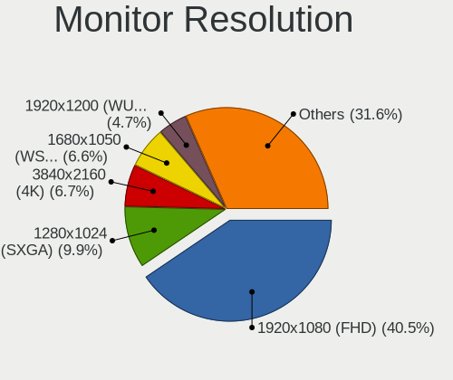

| Resolution         | Desktops | Percent |
|--------------------|----------|---------|
| 1920x1080 (FHD)    | 261      | 39.91%  |
| 1280x1024 (SXGA)   | 67       | 10.24%  |
| 3840x2160 (4K)     | 44       | 6.73%   |
| 1680x1050 (WSXGA+) | 44       | 6.73%   |
| 1366x768 (WXGA)    | 32       | 4.89%   |
| 1920x1200 (WUXGA)  | 31       | 4.74%   |
| Unknown            | 29       | 4.43%   |
| 2560x1440 (QHD)    | 27       | 4.13%   |
| 1600x900 (HD+)     | 20       | 3.06%   |
| 1440x900 (WXGA+)   | 18       | 2.75%   |
| 2560x1080          | 11       | 1.68%   |
| 3440x1440          | 10       | 1.53%   |
| 1360x768           | 9        | 1.38%   |
| 1024x768 (XGA)     | 9        | 1.38%   |
| 3840x1080          | 7        | 1.07%   |
| 3200x1080          | 4        | 0.61%   |
| 1280x720 (HD)      | 4        | 0.61%   |
| 5760x2160          | 3        | 0.46%   |
| 2560x1600          | 3        | 0.46%   |
| 1920x540           | 3        | 0.46%   |
| 1600x1200          | 3        | 0.46%   |
| 4480x1440          | 2        | 0.31%   |
| 7680x2160          | 1        | 0.15%   |
| 7680x1440          | 1        | 0.15%   |
| 5760x1200          | 1        | 0.15%   |
| 5120x1200          | 1        | 0.15%   |
| 4880x1080          | 1        | 0.15%   |
| 4160x1440          | 1        | 0.15%   |
| 3640x1920          | 1        | 0.15%   |
| 3600x1080          | 1        | 0.15%   |
| 3200x900           | 1        | 0.15%   |
| 2880x1200          | 1        | 0.15%   |
| 2560x1024          | 1        | 0.15%   |
| 2048x1536          | 1        | 0.15%   |
| 2048x1152          | 1        | 0.15%   |

Monitor Diagonal
----------------

Diagonal size in inches

| Inches  | Desktops | Percent |
|---------|----------|---------|
| Unknown | 111      | 17.26%  |
| 24      | 80       | 12.44%  |
| 23      | 70       | 10.89%  |
| 21      | 67       | 10.42%  |
| 27      | 64       | 9.95%   |
| 19      | 47       | 7.31%   |
| 17      | 28       | 4.35%   |
| 22      | 27       | 4.2%    |
| 18      | 22       | 3.42%   |
| 20      | 21       | 3.27%   |
| 15      | 19       | 2.95%   |
| 34      | 15       | 2.33%   |
| 84      | 10       | 1.56%   |
| 31      | 10       | 1.56%   |
| 72      | 6        | 0.93%   |
| 29      | 6        | 0.93%   |
| 26      | 6        | 0.93%   |
| 25      | 6        | 0.93%   |
| 40      | 4        | 0.62%   |
| 16      | 4        | 0.62%   |
| 32      | 3        | 0.47%   |
| 65      | 2        | 0.31%   |
| 52      | 2        | 0.31%   |
| 38      | 2        | 0.31%   |
| 12      | 2        | 0.31%   |
| 54      | 1        | 0.16%   |
| 49      | 1        | 0.16%   |
| 48      | 1        | 0.16%   |
| 43      | 1        | 0.16%   |
| 42      | 1        | 0.16%   |
| 39      | 1        | 0.16%   |
| 35      | 1        | 0.16%   |
| 14      | 1        | 0.16%   |
| 13      | 1        | 0.16%   |

Monitor Width
-------------

Physical width

| Width in mm | Desktops | Percent |
|-------------|----------|---------|
| 501-600     | 204      | 32.69%  |
| 401-500     | 149      | 23.88%  |
| Unknown     | 111      | 17.79%  |
| 301-350     | 46       | 7.37%   |
| 351-400     | 36       | 5.77%   |
| 601-700     | 23       | 3.69%   |
| 701-800     | 18       | 2.88%   |
| 1501-2000   | 16       | 2.56%   |
| 801-900     | 8        | 1.28%   |
| 1001-1500   | 7        | 1.12%   |
| 201-300     | 4        | 0.64%   |
| 901-1000    | 2        | 0.32%   |

Aspect Ratio
------------

Proportional relationship between the width and the height

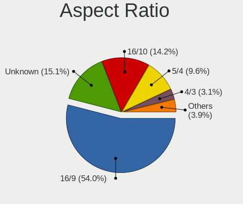

| Ratio   | Desktops | Percent |
|---------|----------|---------|
| 16/9    | 323      | 53.21%  |
| Unknown | 95       | 15.65%  |
| 16/10   | 86       | 14.17%  |
| 5/4     | 59       | 9.72%   |
| 4/3     | 19       | 3.13%   |
| 21/9    | 17       | 2.8%    |
| 3/2     | 4        | 0.66%   |
| 6/5     | 3        | 0.49%   |
| 1.96    | 1        | 0.16%   |

Monitor Area
------------

Area in inch

| Area in inch | Desktops | Percent |
|----------------|----------|---------|
| 201-250        | 192      | 30.28%  |
| Unknown        | 111      | 17.51%  |
| 151-200        | 88       | 13.88%  |
| 301-350        | 67       | 10.57%  |
| 141-150        | 43       | 6.78%   |
| 251-300        | 39       | 6.15%   |
| 351-500        | 33       | 5.21%   |
| More than 1000 | 23       | 3.63%   |
| 101-110        | 17       | 2.68%   |
| 501-1000       | 9        | 1.42%   |
| 131-140        | 3        | 0.47%   |
| 121-130        | 3        | 0.47%   |
| 111-120        | 3        | 0.47%   |
| 71-80          | 2        | 0.32%   |
| 81-90          | 1        | 0.16%   |

Pixel Density
-------------

Pixels per inch

| Density       | Desktops | Percent |
|---------------|----------|---------|
| 51-100        | 349      | 57.97%  |
| Unknown       | 111      | 18.44%  |
| 101-120       | 93       | 15.45%  |
| 121-160       | 19       | 3.16%   |
| 1-50          | 17       | 2.82%   |
| 161-240       | 12       | 1.99%   |
| More than 240 | 1        | 0.17%   |

Multiple Monitors
-----------------

Total monitors connected

| Total | Desktops | Percent |
|-------|----------|---------|
| 1     | 452      | 66.96%  |
| 2     | 108      | 16%     |
| 0     | 104      | 15.41%  |
| 3     | 11       | 1.63%   |

Network
-------

Net Controller Vendor
---------------------

Controller vendors

| Vendor                                 | Desktops | Percent |
|----------------------------------------|----------|---------|
| Realtek Semiconductor                  | 391      | 42.13%  |
| Intel                                  | 281      | 30.28%  |
| Qualcomm Atheros                       | 70       | 7.54%   |
| Broadcom                               | 29       | 3.13%   |
| Ralink Technology                      | 19       | 2.05%   |
| Nvidia                                 | 16       | 1.72%   |
| Ralink                                 | 10       | 1.08%   |
| Marvell Technology Group               | 10       | 1.08%   |
| TP-Link                                | 9        | 0.97%   |
| Broadcom Limited                       | 5        | 0.54%   |
| ASUSTek Computer                       | 5        | 0.54%   |
| ASIX Electronics                       | 5        | 0.54%   |
| Aquantia                               | 5        | 0.54%   |
| Sundance Technology Inc / IC Plus      | 4        | 0.43%   |
| Huawei Technologies                    | 4        | 0.43%   |
| D-Link System                          | 4        | 0.43%   |
| VIA Technologies                       | 3        | 0.32%   |
| Samsung Electronics                    | 3        | 0.32%   |
| Microsoft                              | 3        | 0.32%   |
| Edimax Technology                      | 3        | 0.32%   |
| D-Link                                 | 3        | 0.32%   |
| Sony Ericsson Mobile Communications AB | 2        | 0.22%   |
| Mellanox Technologies                  | 2        | 0.22%   |
| Linksys                                | 2        | 0.22%   |
| American Megatrends                    | 2        | 0.22%   |
| ZEPHYR                                 | 1        | 0.11%   |
| YiHiEcigar                             | 1        | 0.11%   |
| Xiaomi                                 | 1        | 0.11%   |
| Wilocity                               | 1        | 0.11%   |
| TRENDnet                               | 1        | 0.11%   |
| Texas Instruments                      | 1        | 0.11%   |
| SysKonnect                             | 1        | 0.11%   |
| Spreadtrum Communications              | 1        | 0.11%   |
| Solarflare Communications              | 1        | 0.11%   |
| Sigma Designs                          | 1        | 0.11%   |
| SEGGER                                 | 1        | 0.11%   |
| Sega                                   | 1        | 0.11%   |
| Qualcomm Atheros Communications        | 1        | 0.11%   |
| Qualcomm                               | 1        | 0.11%   |
| QLogic                                 | 1        | 0.11%   |
| QinHeng Electronics                    | 1        | 0.11%   |
| Pulse-Eight                            | 1        | 0.11%   |
| OpenMoko                               | 1        | 0.11%   |
| OnePlus Technology (Shenzhen)          | 1        | 0.11%   |
| NetGear                                | 1        | 0.11%   |
| Motorola PCS                           | 1        | 0.11%   |
| Motorola                               | 1        | 0.11%   |
| Microchip Technology                   | 1        | 0.11%   |
| MediaTek                               | 1        | 0.11%   |
| Linux 3.4.39 with sunxi_usb_udc        | 1        | 0.11%   |
| JMicron Technology                     | 1        | 0.11%   |
| IMC Networks                           | 1        | 0.11%   |
| HTC (High Tech Computer)               | 1        | 0.11%   |
| GreenWave Reality                      | 1        | 0.11%   |
| Gemtek                                 | 1        | 0.11%   |
| GCT Semiconductor                      | 1        | 0.11%   |
| Garmin International                   | 1        | 0.11%   |
| Fitbit                                 | 1        | 0.11%   |
| Emulex                                 | 1        | 0.11%   |
| Arduino SA                             | 1        | 0.11%   |

Net Controller Model
--------------------

Controller models

| Model                                                                         | Desktops | Percent |
|-------------------------------------------------------------------------------|----------|---------|
| Realtek RTL8111/8168/8411 PCI Express Gigabit Ethernet Controller             | 336      | 32.28%  |
| Intel I211 Gigabit Network Connection                                         | 52       | 5%      |
| Intel 82579LM Gigabit Network Connection (Lewisville)                         | 26       | 2.5%    |
| Intel Ethernet Connection (2) I219-V                                          | 25       | 2.4%    |
| Intel 82574L Gigabit Network Connection                                       | 20       | 1.92%   |
| Intel 82579V Gigabit Network Connection                                       | 18       | 1.73%   |
| Intel Wi-Fi 6 AX200                                                           | 15       | 1.44%   |
| Realtek RTL8125 2.5GbE Controller                                             | 13       | 1.25%   |
| Intel Ethernet Connection I217-V                                              | 13       | 1.25%   |
| Intel Wireless-AC 9260                                                        | 12       | 1.15%   |
| Intel Ethernet Connection (7) I219-V                                          | 12       | 1.15%   |
| Realtek RTL8169 PCI Gigabit Ethernet Controller                               | 11       | 1.06%   |
| Realtek RTL810xE PCI Express Fast Ethernet controller                         | 11       | 1.06%   |
| Intel Ethernet Connection I217-LM                                             | 11       | 1.06%   |
| Intel Ethernet Connection (2) I218-V                                          | 11       | 1.06%   |
| Intel Dual Band Wireless-AC 3168NGW [Stone Peak]                              | 10       | 0.96%   |
| Intel 82567LM-3 Gigabit Network Connection                                    | 10       | 0.96%   |
| Ralink MT7601U Wireless Adapter                                               | 9        | 0.86%   |
| Nvidia MCP61 Ethernet                                                         | 9        | 0.86%   |
| Realtek RTL8188EUS 802.11n Wireless Network Adapter                           | 8        | 0.77%   |
| Qualcomm Atheros QCA6174 802.11ac Wireless Network Adapter                    | 8        | 0.77%   |
| Intel Wireless 3165                                                           | 8        | 0.77%   |
| Intel I210 Gigabit Network Connection                                         | 8        | 0.77%   |
| Intel Ethernet Connection (2) I219-LM                                         | 8        | 0.77%   |
| Qualcomm Atheros AR9485 Wireless Network Adapter                              | 7        | 0.67%   |
| Intel 82599ES 10-Gigabit SFI/SFP+ Network Connection                          | 7        | 0.67%   |
| Realtek RTL88x2bu [AC1200 Techkey]                                            | 6        | 0.58%   |
| Realtek RTL-8100/8101L/8139 PCI Fast Ethernet Adapter                         | 6        | 0.58%   |
| Qualcomm Atheros AR93xx Wireless Network Adapter                              | 6        | 0.58%   |
| Realtek RTL8188FTV 802.11b/g/n 1T1R 2.4G WLAN Adapter                         | 5        | 0.48%   |
| Ralink RT2870/RT3070 Wireless Adapter                                         | 5        | 0.48%   |
| Qualcomm Atheros AR9227 Wireless Network Adapter                              | 5        | 0.48%   |
| Marvell Group 88E8056 PCI-E Gigabit Ethernet Controller                       | 5        | 0.48%   |
| Intel Wireless 7260                                                           | 5        | 0.48%   |
| Intel I350 Gigabit Network Connection                                         | 5        | 0.48%   |
| Intel Cannon Lake PCH CNVi WiFi                                               | 5        | 0.48%   |
| Qualcomm Atheros Killer E220x Gigabit Ethernet Controller                     | 4        | 0.38%   |
| Qualcomm Atheros AR8151 v2.0 Gigabit Ethernet                                 | 4        | 0.38%   |
| Aquantia AQC107 NBase-T/IEEE 802.3bz Ethernet Controller [AQtion]             | 4        | 0.38%   |
| Realtek RTL8821CE 802.11ac PCIe Wireless Network Adapter                      | 3        | 0.29%   |
| Realtek RTL8192EE PCIe Wireless Network Adapter                               | 3        | 0.29%   |
| Realtek RTL8188CUS 802.11n WLAN Adapter                                       | 3        | 0.29%   |
| Realtek RTL-8185 IEEE 802.11a/b/g Wireless LAN Controller                     | 3        | 0.29%   |
| Realtek 802.11ac NIC                                                          | 3        | 0.29%   |
| Qualcomm Atheros QCA9377 802.11ac Wireless Network Adapter                    | 3        | 0.29%   |
| Qualcomm Atheros QCA8171 Gigabit Ethernet                                     | 3        | 0.29%   |
| Qualcomm Atheros Attansic L2 Fast Ethernet                                    | 3        | 0.29%   |
| Qualcomm Atheros AR9462 Wireless Network Adapter                              | 3        | 0.29%   |
| Qualcomm Atheros AR9287 Wireless Network Adapter (PCI-Express)                | 3        | 0.29%   |
| Qualcomm Atheros AR8131 Gigabit Ethernet                                      | 3        | 0.29%   |
| Qualcomm Atheros AR8121/AR8113/AR8114 Gigabit or Fast Ethernet                | 3        | 0.29%   |
| Qualcomm Atheros AR2417 Wireless Network Adapter [AR5007G 802.11bg]           | 3        | 0.29%   |
| Nvidia MCP77 Ethernet                                                         | 3        | 0.29%   |
| Intel Ethernet Connection (7) I219-LM                                         | 3        | 0.29%   |
| Intel 82571EB/82571GB Gigabit Ethernet Controller D0/D1 (copper applications) | 3        | 0.29%   |
| Intel 82571EB/82571GB Gigabit Ethernet Controller (Copper)                    | 3        | 0.29%   |
| Intel 82566DM Gigabit Network Connection                                      | 3        | 0.29%   |
| Broadcom NetXtreme BCM5720 Gigabit Ethernet PCIe                              | 3        | 0.29%   |
| Broadcom Limited NetXtreme BCM5751 Gigabit Ethernet PCI Express               | 3        | 0.29%   |
| Broadcom BCM4352 802.11ac Wireless Network Adapter                            | 3        | 0.29%   |

Wireless Vendor
---------------

Wireless vendors

| Vendor                                | Desktops | Percent |
|---------------------------------------|----------|---------|
| Intel                                 | 69       | 28.75%  |
| Realtek Semiconductor                 | 54       | 22.5%   |
| Qualcomm Atheros                      | 44       | 18.33%  |
| Ralink Technology                     | 19       | 7.92%   |
| Broadcom                              | 12       | 5%      |
| Ralink                                | 10       | 4.17%   |
| TP-Link                               | 7        | 2.92%   |
| ASUSTek Computer                      | 5        | 2.08%   |
| Edimax Technology                     | 3        | 1.25%   |
| D-Link                                | 3        | 1.25%   |
| Microsoft                             | 2        | 0.83%   |
| Linksys                               | 2        | 0.83%   |
| D-Link System                         | 2        | 0.83%   |
| Wilocity                              | 1        | 0.42%   |
| TRENDnet                              | 1        | 0.42%   |
| Qualcomm Atheros Communications       | 1        | 0.42%   |
| NetGear                               | 1        | 0.42%   |
| Marvell Technology Group              | 1        | 0.42%   |
| IMC Networks                          | 1        | 0.42%   |
| Gemtek                                | 1        | 0.42%   |
| 802.11g Adapter [Linksys WUSB54GC v3] | 1        | 0.42%   |

Wireless Model
--------------

Wireless models

| Model                                                                | Desktops | Percent |
|----------------------------------------------------------------------|----------|---------|
| Intel Wi-Fi 6 AX200                                                  | 15       | 6.15%   |
| Intel Wireless-AC 9260                                               | 12       | 4.92%   |
| Intel Dual Band Wireless-AC 3168NGW [Stone Peak]                     | 10       | 4.1%    |
| Ralink MT7601U Wireless Adapter                                      | 9        | 3.69%   |
| Realtek RTL8188EUS 802.11n Wireless Network Adapter                  | 8        | 3.28%   |
| Qualcomm Atheros QCA6174 802.11ac Wireless Network Adapter           | 8        | 3.28%   |
| Intel Wireless 3165                                                  | 8        | 3.28%   |
| Qualcomm Atheros AR9485 Wireless Network Adapter                     | 7        | 2.87%   |
| Realtek RTL88x2bu [AC1200 Techkey]                                   | 6        | 2.46%   |
| Qualcomm Atheros AR93xx Wireless Network Adapter                     | 6        | 2.46%   |
| Realtek RTL8188FTV 802.11b/g/n 1T1R 2.4G WLAN Adapter                | 5        | 2.05%   |
| Ralink RT2870/RT3070 Wireless Adapter                                | 5        | 2.05%   |
| Qualcomm Atheros AR9227 Wireless Network Adapter                     | 5        | 2.05%   |
| Intel Wireless 7260                                                  | 5        | 2.05%   |
| Intel Cannon Lake PCH CNVi WiFi                                      | 5        | 2.05%   |
| Realtek RTL8821CE 802.11ac PCIe Wireless Network Adapter             | 3        | 1.23%   |
| Realtek RTL8192EE PCIe Wireless Network Adapter                      | 3        | 1.23%   |
| Realtek RTL8188CUS 802.11n WLAN Adapter                              | 3        | 1.23%   |
| Realtek RTL-8185 IEEE 802.11a/b/g Wireless LAN Controller            | 3        | 1.23%   |
| Realtek 802.11ac NIC                                                 | 3        | 1.23%   |
| Qualcomm Atheros QCA9377 802.11ac Wireless Network Adapter           | 3        | 1.23%   |
| Qualcomm Atheros AR9462 Wireless Network Adapter                     | 3        | 1.23%   |
| Qualcomm Atheros AR9287 Wireless Network Adapter (PCI-Express)       | 3        | 1.23%   |
| Qualcomm Atheros AR2417 Wireless Network Adapter [AR5007G 802.11bg]  | 3        | 1.23%   |
| Broadcom BCM4352 802.11ac Wireless Network Adapter                   | 3        | 1.23%   |
| Broadcom BCM43142 802.11b/g/n                                        | 3        | 1.23%   |
| TP-Link TL-WN821N v5/v6 [RTL8192EU]                                  | 2        | 0.82%   |
| Realtek RTL8822BE 802.11a/b/g/n/ac WiFi adapter                      | 2        | 0.82%   |
| Realtek RTL8814AU 802.11a/b/g/n/ac Wireless Adapter                  | 2        | 0.82%   |
| Realtek RTL8812AE 802.11ac PCIe Wireless Network Adapter             | 2        | 0.82%   |
| Realtek RTL8192EU 802.11b/g/n WLAN Adapter                           | 2        | 0.82%   |
| Realtek RTL8192CE PCIe Wireless Network Adapter                      | 2        | 0.82%   |
| Realtek RTL8188EE Wireless Network Adapter                           | 2        | 0.82%   |
| Realtek RTL8187 Wireless Adapter                                     | 2        | 0.82%   |
| Ralink RT5370 Wireless Adapter                                       | 2        | 0.82%   |
| Ralink RT2501/RT2573 Wireless Adapter                                | 2        | 0.82%   |
| Ralink RT3090 Wireless 802.11n 1T/1R PCIe                            | 2        | 0.82%   |
| Ralink RT2561/RT61 rev B 802.11g                                     | 2        | 0.82%   |
| Qualcomm Atheros QCA9565 / AR9565 Wireless Network Adapter           | 2        | 0.82%   |
| Qualcomm Atheros AR9285 Wireless Network Adapter (PCI-Express)       | 2        | 0.82%   |
| Linksys AE1200 802.11bgn Wireless Adapter [Broadcom BCM43235]        | 2        | 0.82%   |
| Intel Wireless 8265 / 8275                                           | 2        | 0.82%   |
| Intel Comet Lake PCH CNVi WiFi                                       | 2        | 0.82%   |
| Intel Centrino Advanced-N 6205 [Taylor Peak]                         | 2        | 0.82%   |
| Edimax EW-7811Un 802.11n Wireless Adapter [Realtek RTL8188CUS]       | 2        | 0.82%   |
| D-Link System DWA-140 RangeBooster N Adapter(rev.B2) [Ralink RT3072] | 2        | 0.82%   |
| Broadcom BCM4360 802.11ac Wireless Network Adapter                   | 2        | 0.82%   |
| Broadcom BCM43228 802.11a/b/g/n                                      | 2        | 0.82%   |
| ASUS WL-167G v3 802.11n Adapter [Realtek RTL8188SU]                  | 2        | 0.82%   |
| Wilocity Wil6200 802.11ad Wireless Network Adapter                   | 1        | 0.41%   |
| TRENDnet 802.11n WLAN Adapter                                        | 1        | 0.41%   |
| TP-Link TL WN823N RTL8192EU                                          | 1        | 0.41%   |
| TP-Link Archer T3U [Realtek RTL8812BU]                               | 1        | 0.41%   |
| TP-Link Archer T2U PLUS [RTL8821AU]                                  | 1        | 0.41%   |
| TP-Link 802.11n NIC                                                  | 1        | 0.41%   |
| TP-Link 802.11ac WLAN Adapter                                        | 1        | 0.41%   |
| Realtek RTL8821AE 802.11ac PCIe Wireless Network Adapter             | 1        | 0.41%   |
| Realtek RTL8812AU 802.11a/b/g/n/ac 2T2R DB WLAN Adapter              | 1        | 0.41%   |
| Realtek RTL8723BU 802.11b/g/n WLAN Adapter                           | 1        | 0.41%   |
| Realtek RTL8723BE PCIe Wireless Network Adapter                      | 1        | 0.41%   |

Ethernet Vendor
---------------

Ethernet vendors

| Vendor                                 | Desktops | Percent |
|----------------------------------------|----------|---------|
| Realtek Semiconductor                  | 369      | 49.6%   |
| Intel                                  | 249      | 33.47%  |
| Qualcomm Atheros                       | 28       | 3.76%   |
| Broadcom                               | 17       | 2.28%   |
| Nvidia                                 | 16       | 2.15%   |
| Marvell Technology Group               | 9        | 1.21%   |
| Broadcom Limited                       | 5        | 0.67%   |
| ASIX Electronics                       | 5        | 0.67%   |
| Aquantia                               | 5        | 0.67%   |
| Sundance Technology Inc / IC Plus      | 4        | 0.54%   |
| Huawei Technologies                    | 4        | 0.54%   |
| VIA Technologies                       | 3        | 0.4%    |
| Samsung Electronics                    | 3        | 0.4%    |
| TP-Link                                | 2        | 0.27%   |
| Sony Ericsson Mobile Communications AB | 2        | 0.27%   |
| Mellanox Technologies                  | 2        | 0.27%   |
| D-Link System                          | 2        | 0.27%   |
| American Megatrends                    | 2        | 0.27%   |
| Xiaomi                                 | 1        | 0.13%   |
| SysKonnect                             | 1        | 0.13%   |
| Spreadtrum Communications              | 1        | 0.13%   |
| Solarflare Communications              | 1        | 0.13%   |
| Qualcomm                               | 1        | 0.13%   |
| QLogic                                 | 1        | 0.13%   |
| OnePlus Technology (Shenzhen)          | 1        | 0.13%   |
| Motorola PCS                           | 1        | 0.13%   |
| Microsoft                              | 1        | 0.13%   |
| MediaTek                               | 1        | 0.13%   |
| Linux 3.4.39 with sunxi_usb_udc        | 1        | 0.13%   |
| JMicron Technology                     | 1        | 0.13%   |
| HTC (High Tech Computer)               | 1        | 0.13%   |
| GCT Semiconductor                      | 1        | 0.13%   |
| Emulex                                 | 1        | 0.13%   |
| Apple                                  | 1        | 0.13%   |
| 3Com                                   | 1        | 0.13%   |

Ethernet Model
--------------

Ethernet models

| Model                                                                         | Desktops | Percent |
|-------------------------------------------------------------------------------|----------|---------|
| Realtek RTL8111/8168/8411 PCI Express Gigabit Ethernet Controller             | 336      | 42.97%  |
| Intel I211 Gigabit Network Connection                                         | 52       | 6.65%   |
| Intel 82579LM Gigabit Network Connection (Lewisville)                         | 26       | 3.32%   |
| Intel Ethernet Connection (2) I219-V                                          | 25       | 3.2%    |
| Intel 82574L Gigabit Network Connection                                       | 20       | 2.56%   |
| Intel 82579V Gigabit Network Connection                                       | 18       | 2.3%    |
| Realtek RTL8125 2.5GbE Controller                                             | 13       | 1.66%   |
| Intel Ethernet Connection I217-V                                              | 13       | 1.66%   |
| Intel Ethernet Connection (7) I219-V                                          | 12       | 1.53%   |
| Realtek RTL8169 PCI Gigabit Ethernet Controller                               | 11       | 1.41%   |
| Realtek RTL810xE PCI Express Fast Ethernet controller                         | 11       | 1.41%   |
| Intel Ethernet Connection I217-LM                                             | 11       | 1.41%   |
| Intel Ethernet Connection (2) I218-V                                          | 11       | 1.41%   |
| Intel 82567LM-3 Gigabit Network Connection                                    | 10       | 1.28%   |
| Nvidia MCP61 Ethernet                                                         | 9        | 1.15%   |
| Intel I210 Gigabit Network Connection                                         | 8        | 1.02%   |
| Intel Ethernet Connection (2) I219-LM                                         | 8        | 1.02%   |
| Intel 82599ES 10-Gigabit SFI/SFP+ Network Connection                          | 7        | 0.9%    |
| Realtek RTL-8100/8101L/8139 PCI Fast Ethernet Adapter                         | 6        | 0.77%   |
| Marvell Group 88E8056 PCI-E Gigabit Ethernet Controller                       | 5        | 0.64%   |
| Intel I350 Gigabit Network Connection                                         | 5        | 0.64%   |
| Qualcomm Atheros Killer E220x Gigabit Ethernet Controller                     | 4        | 0.51%   |
| Qualcomm Atheros AR8151 v2.0 Gigabit Ethernet                                 | 4        | 0.51%   |
| Aquantia AQC107 NBase-T/IEEE 802.3bz Ethernet Controller [AQtion]             | 4        | 0.51%   |
| Qualcomm Atheros QCA8171 Gigabit Ethernet                                     | 3        | 0.38%   |
| Qualcomm Atheros Attansic L2 Fast Ethernet                                    | 3        | 0.38%   |
| Qualcomm Atheros AR8131 Gigabit Ethernet                                      | 3        | 0.38%   |
| Qualcomm Atheros AR8121/AR8113/AR8114 Gigabit or Fast Ethernet                | 3        | 0.38%   |
| Nvidia MCP77 Ethernet                                                         | 3        | 0.38%   |
| Intel Ethernet Connection (7) I219-LM                                         | 3        | 0.38%   |
| Intel 82571EB/82571GB Gigabit Ethernet Controller D0/D1 (copper applications) | 3        | 0.38%   |
| Intel 82571EB/82571GB Gigabit Ethernet Controller (Copper)                    | 3        | 0.38%   |
| Intel 82566DM Gigabit Network Connection                                      | 3        | 0.38%   |
| Broadcom NetXtreme BCM5720 Gigabit Ethernet PCIe                              | 3        | 0.38%   |
| Broadcom Limited NetXtreme BCM5751 Gigabit Ethernet PCI Express               | 3        | 0.38%   |
| VIA VT6102/VT6103 [Rhine-II]                                                  | 2        | 0.26%   |
| TP-Link UE300 10/100/1000 LAN (ethernet mode) [Realtek RTL8153]               | 2        | 0.26%   |
| Sundance Inc / IC Plus IP1000 Family Gigabit Ethernet                         | 2        | 0.26%   |
| Sundance Inc / IC Plus IC Plus IP100A Integrated 10/100 Ethernet MAC + PHY    | 2        | 0.26%   |
| Sony Ericsson Mobile AB D2005                                                 | 2        | 0.26%   |
| Samsung Galaxy series, misc. (tethering mode)                                 | 2        | 0.26%   |
| Qualcomm Atheros Killer E2500 Gigabit Ethernet Controller                     | 2        | 0.26%   |
| Qualcomm Atheros Attansic L1 Gigabit Ethernet                                 | 2        | 0.26%   |
| Qualcomm Atheros AR8161 Gigabit Ethernet                                      | 2        | 0.26%   |
| Intel Ethernet Controller 10G X550T                                           | 2        | 0.26%   |
| Intel Ethernet Connection (5) I219-LM                                         | 2        | 0.26%   |
| Intel Ethernet Connection (12) I219-V                                         | 2        | 0.26%   |
| Intel 82578DM Gigabit Network Connection                                      | 2        | 0.26%   |
| Intel 82566DM-2 Gigabit Network Connection                                    | 2        | 0.26%   |
| Intel 82566DC Gigabit Network Connection                                      | 2        | 0.26%   |
| Intel 82541PI Gigabit Ethernet Controller                                     | 2        | 0.26%   |
| Intel 80003ES2LAN Gigabit Ethernet Controller (Copper)                        | 2        | 0.26%   |
| Huawei E353/E3131                                                             | 2        | 0.26%   |
| Huawei DRA-L01                                                                | 2        | 0.26%   |
| D-Link System DGE-528T Gigabit Ethernet Adapter                               | 2        | 0.26%   |
| Broadcom NetXtreme BCM5761 Gigabit Ethernet PCIe                              | 2        | 0.26%   |
| Broadcom NetXtreme BCM5723 Gigabit Ethernet PCIe                              | 2        | 0.26%   |
| Broadcom NetLink BCM5787 Gigabit Ethernet PCI Express                         | 2        | 0.26%   |
| Broadcom NetLink BCM57780 Gigabit Ethernet PCIe                               | 2        | 0.26%   |
| ASIX AX88772B                                                                 | 2        | 0.26%   |

Net Controller Kind
-------------------

Ethernet, WiFi or modem

| Kind     | Desktops | Percent |
|----------|----------|---------|
| Ethernet | 663      | 73.1%   |
| WiFi     | 231      | 25.47%  |
| Modem    | 11       | 1.21%   |
| Unknown  | 2        | 0.22%   |

Used Controller
---------------

Currently used network controller

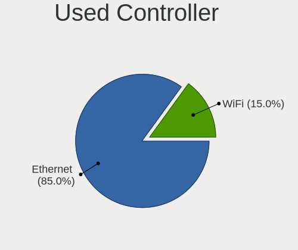

| Kind     | Desktops | Percent |
|----------|----------|---------|
| Ethernet | 618      | 79.23%  |
| WiFi     | 161      | 20.64%  |
| Unknown  | 1        | 0.13%   |

NICs
----

Total network controllers on board

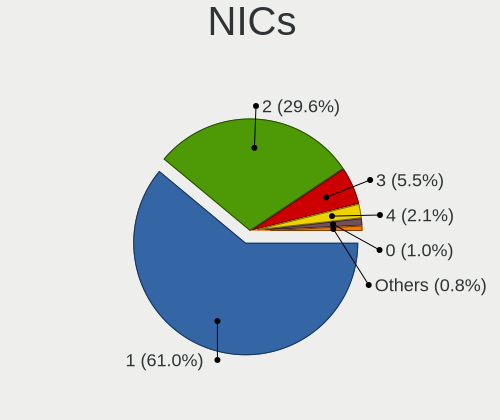

| Total | Desktops | Percent |
|-------|----------|---------|
| 1     | 406      | 60.42%  |
| 2     | 208      | 30.95%  |
| 3     | 37       | 5.51%   |
| 4     | 9        | 1.34%   |
| 0     | 7        | 1.04%   |
| 6     | 2        | 0.3%    |
| 5     | 2        | 0.3%    |
| 21    | 1        | 0.15%   |

IPv6
----

IPv6 vs IPv4

| Used | Desktops | Percent |
|------|----------|---------|
| No   | 626      | 92.06%  |
| Yes  | 54       | 7.94%   |

Bluetooth
---------

Bluetooth Vendor
----------------

Controller vendors

| Vendor                          | Desktops | Percent |
|---------------------------------|----------|---------|
| Intel                           | 62       | 34.07%  |
| Cambridge Silicon Radio         | 43       | 23.63%  |
| ASUSTek Computer                | 25       | 13.74%  |
| Broadcom                        | 15       | 8.24%   |
| Realtek Semiconductor           | 14       | 7.69%   |
| Qualcomm Atheros Communications | 13       | 7.14%   |
| IMC Networks                    | 2        | 1.1%    |
| Belkin Components               | 2        | 1.1%    |
| Apple                           | 2        | 1.1%    |
| Kensington                      | 1        | 0.55%   |
| Integrated System Solution      | 1        | 0.55%   |
| Foxconn / Hon Hai               | 1        | 0.55%   |
| Com One                         | 1        | 0.55%   |

Bluetooth Model
---------------

Controller models

| Model                                                 | Desktops | Percent |
|-------------------------------------------------------|----------|---------|
| Cambridge Silicon Radio Bluetooth Dongle (HCI mode)   | 43       | 23.63%  |
| Intel Bluetooth wireless interface                    | 17       | 9.34%   |
| Intel AX200 Bluetooth                                 | 15       | 8.24%   |
| Intel Wireless-AC 9260 Bluetooth Adapter              | 13       | 7.14%   |
| Realtek Bluetooth Radio                               | 11       | 6.04%   |
| Intel Wireless-AC 3168 Bluetooth                      | 9        | 4.95%   |
| Broadcom BCM20702A0 Bluetooth 4.0                     | 7        | 3.85%   |
| ASUS Bluetooth Adapter                                | 7        | 3.85%   |
| Qualcomm Atheros  Bluetooth Device                    | 6        | 3.3%    |
| Intel Bluetooth 9460/9560 Jefferson Peak (JfP)        | 5        | 2.75%   |
| ASUS Broadcom BCM20702A0 Bluetooth                    | 5        | 2.75%   |
| ASUS BCM20702A0                                       | 4        | 2.2%    |
| Intel Bluetooth Device                                | 3        | 1.65%   |
| Broadcom BCM43142A0 Bluetooth 4.0                     | 3        | 1.65%   |
| Realtek RTL8821A Bluetooth                            | 2        | 1.1%    |
| Qualcomm Atheros AR3012 Bluetooth 4.0                 | 2        | 1.1%    |
| IMC Networks Bluetooth Device                         | 2        | 1.1%    |
| Broadcom Bluetooth 2.0+eDR dongle                     | 2        | 1.1%    |
| ASUS Qualcomm Bluetooth 4.1                           | 2        | 1.1%    |
| ASUS Broadcom BCM20702 Single-Chip Bluetooth 4.0 + LE | 2        | 1.1%    |
| ASUS Bluetooth Radio                                  | 2        | 1.1%    |
| ASUS Bluetooth Device                                 | 2        | 1.1%    |
| Apple Bluetooth HCI                                   | 2        | 1.1%    |
| Realtek  Bluetooth 4.2 Adapter                        | 1        | 0.55%   |
| Qualcomm Atheros QCA61x4 Bluetooth 4.0                | 1        | 0.55%   |
| Qualcomm Atheros Bluetooth USB Host Controller        | 1        | 0.55%   |
| Qualcomm Atheros AR9462 Bluetooth                     | 1        | 0.55%   |
| Qualcomm Atheros AR3011 Bluetooth (no firmware)       | 1        | 0.55%   |
| Qualcomm Atheros AR3011 Bluetooth                     | 1        | 0.55%   |
| Kensington Bluetooth EDR Dongle                       | 1        | 0.55%   |
| Integrated System Solution Bluetooth Device           | 1        | 0.55%   |
| Foxconn / Hon Hai Acer Bluetooth module               | 1        | 0.55%   |
| Com One Bluetooth Device                              | 1        | 0.55%   |
| Broadcom HP Portable Bumble Bee                       | 1        | 0.55%   |
| Broadcom Bluetooth 3.0 Dongle                         | 1        | 0.55%   |
| Broadcom BCM92046DG-CL1ROM Bluetooth 2.1 Adapter      | 1        | 0.55%   |
| Belkin Components F8T012 Bluetooth Adapter            | 1        | 0.55%   |
| Belkin Components Bluetooth Mini Dongle               | 1        | 0.55%   |
| ASUS ASUS USB-BT500                                   | 1        | 0.55%   |

Sound
-----

Sound Vendor
------------

Sound card vendors

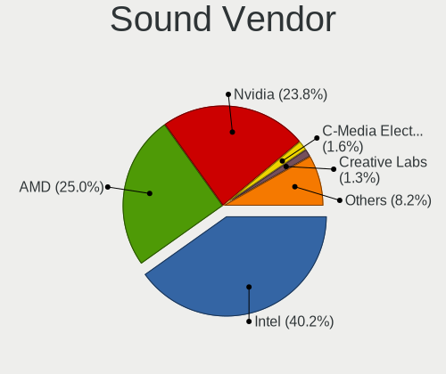

| Vendor                                          | Desktops | Percent |
|-------------------------------------------------|----------|---------|
| Intel                                           | 391      | 38.98%  |
| AMD                                             | 258      | 25.72%  |
| Nvidia                                          | 238      | 23.73%  |
| C-Media Electronics                             | 16       | 1.6%    |
| Creative Labs                                   | 11       | 1.1%    |
| Logitech                                        | 10       | 1%      |
| Kingston Technology                             | 6        | 0.6%    |
| GN Netcom                                       | 5        | 0.5%    |
| Dell                                            | 5        | 0.5%    |
| Creative Technology                             | 5        | 0.5%    |
| Plantronics                                     | 4        | 0.4%    |
| JMTek                                           | 4        | 0.4%    |
| VIA Technologies                                | 3        | 0.3%    |
| Samsung Electronics                             | 3        | 0.3%    |
| Generalplus Technology                          | 3        | 0.3%    |
| Corsair                                         | 3        | 0.3%    |
| Sennheiser Communications                       | 2        | 0.2%    |
| Musical Fidelity                                | 2        | 0.2%    |
| Microsoft                                       | 2        | 0.2%    |
| Micro Star International                        | 2        | 0.2%    |
| Astro Gaming                                    | 2        | 0.2%    |
| Yamaha                                          | 1        | 0.1%    |
| XMOS                                            | 1        | 0.1%    |
| USB MICROPHONE                                  | 1        | 0.1%    |
| Texas Instruments                               | 1        | 0.1%    |
| Tenx Technology                                 | 1        | 0.1%    |
| SteelSeries ApS                                 | 1        | 0.1%    |
| Shure                                           | 1        | 0.1%    |
| Shenzhen Riitek Technology                      | 1        | 0.1%    |
| Samson Technologies                             | 1        | 0.1%    |
| RODE Microphones                                | 1        | 0.1%    |
| Quanta                                          | 1        | 0.1%    |
| Numark                                          | 1        | 0.1%    |
| Native Instruments                              | 1        | 0.1%    |
| Loongson Technology                             | 1        | 0.1%    |
| Licensed by Sony Computer Entertainment America | 1        | 0.1%    |
| Lenovo                                          | 1        | 0.1%    |
| Giga-Byte Technology                            | 1        | 0.1%    |
| Focusrite-Novation                              | 1        | 0.1%    |
| EGO SYStems                                     | 1        | 0.1%    |
| Chicony Electronics                             | 1        | 0.1%    |
| Cambridge Silicon Radio                         | 1        | 0.1%    |
| Blue Microphones                                | 1        | 0.1%    |
| BEHRINGER International                         | 1        | 0.1%    |
| B & W Group                                     | 1        | 0.1%    |
| ASUSTek Computer                                | 1        | 0.1%    |
| Andrea Electronics                              | 1        | 0.1%    |
| AKAI Professional M.I.                          | 1        | 0.1%    |
| Afatech                                         | 1        | 0.1%    |

Sound Model
-----------

Sound card models

| Model                                                                                             | Desktops | Percent |
|---------------------------------------------------------------------------------------------------|----------|---------|
| Intel 8 Series/C220 Series Chipset High Definition Audio Controller                               | 54       | 4.63%   |
| AMD SBx00 Azalia (Intel HDA)                                                                      | 52       | 4.46%   |
| AMD Family 17h (Models 00h-0fh) HD Audio Controller                                               | 49       | 4.2%    |
| Intel Xeon E3-1200 v3/4th Gen Core Processor HD Audio Controller                                  | 45       | 3.86%   |
| Intel 6 Series/C200 Series Chipset Family High Definition Audio Controller                        | 45       | 3.86%   |
| AMD Starship/Matisse HD Audio Controller                                                          | 44       | 3.77%   |
| Intel 7 Series/C216 Chipset Family High Definition Audio Controller                               | 32       | 2.74%   |
| AMD Ellesmere HDMI Audio [Radeon RX 470/480 / 570/580/590]                                        | 32       | 2.74%   |
| Intel NM10/ICH7 Family High Definition Audio Controller                                           | 31       | 2.66%   |
| Nvidia GK208 HDMI/DP Audio Controller                                                             | 28       | 2.4%    |
| Intel 200 Series PCH HD Audio                                                                     | 28       | 2.4%    |
| Intel 100 Series/C230 Series Chipset Family HD Audio Controller                                   | 26       | 2.23%   |
| AMD Raven/Raven2/Fenghuang HDMI/DP Audio Controller                                               | 25       | 2.14%   |
| AMD FCH Azalia Controller                                                                         | 25       | 2.14%   |
| AMD Family 17h (Models 10h-1fh) HD Audio Controller                                               | 24       | 2.06%   |
| Nvidia High Definition Audio Controller                                                           | 22       | 1.89%   |
| Nvidia GP106 High Definition Audio Controller                                                     | 19       | 1.63%   |
| Intel Cannon Lake PCH cAVS                                                                        | 19       | 1.63%   |
| Nvidia GP107GL High Definition Audio Controller                                                   | 18       | 1.54%   |
| Intel 82801I (ICH9 Family) HD Audio Controller                                                    | 16       | 1.37%   |
| AMD Caicos HDMI Audio [Radeon HD 6450 / 7450/8450/8490 OEM / R5 230/235/235X OEM]                 | 16       | 1.37%   |
| Intel C600/X79 series chipset High Definition Audio Controller                                    | 15       | 1.29%   |
| AMD Baffin HDMI/DP Audio [Radeon RX 550 640SP / RX 560/560X]                                      | 15       | 1.29%   |
| Intel 9 Series Chipset Family HD Audio Controller                                                 | 14       | 1.2%    |
| AMD Oland/Hainan/Cape Verde/Pitcairn HDMI Audio [Radeon HD 7000 Series]                           | 14       | 1.2%    |
| Nvidia GF119 HDMI Audio Controller                                                                | 12       | 1.03%   |
| Intel 82801JI (ICH10 Family) HD Audio Controller                                                  | 12       | 1.03%   |
| Intel 5 Series/3400 Series Chipset High Definition Audio                                          | 12       | 1.03%   |
| Nvidia TU116 High Definition Audio Controller                                                     | 11       | 0.94%   |
| Nvidia TU106 High Definition Audio Controller                                                     | 11       | 0.94%   |
| Nvidia GM107 High Definition Audio Controller [GeForce 940MX]                                     | 11       | 0.94%   |
| Nvidia GF108 High Definition Audio Controller                                                     | 11       | 0.94%   |
| Nvidia MCP61 High Definition Audio                                                                | 10       | 0.86%   |
| Nvidia GM204 High Definition Audio Controller                                                     | 10       | 0.86%   |
| Nvidia GP104 High Definition Audio Controller                                                     | 9        | 0.77%   |
| Intel C610/X99 series chipset HD Audio Controller                                                 | 9        | 0.77%   |
| Intel 82801JD/DO (ICH10 Family) HD Audio Controller                                               | 9        | 0.77%   |
| Intel 82801H (ICH8 Family) HD Audio Controller                                                    | 9        | 0.77%   |
| Nvidia GK107 HDMI Audio Controller                                                                | 8        | 0.69%   |
| AMD Kaveri HDMI/DP Audio Controller                                                               | 8        | 0.69%   |
| AMD Cedar HDMI Audio [Radeon HD 5400/6300/7300 Series]                                            | 8        | 0.69%   |
| Nvidia GP108 High Definition Audio Controller                                                     | 7        | 0.6%    |
| Nvidia GM206 High Definition Audio Controller                                                     | 7        | 0.6%    |
| Nvidia GK106 HDMI Audio Controller                                                                | 7        | 0.6%    |
| Nvidia GK104 HDMI Audio Controller                                                                | 7        | 0.6%    |
| Intel Comet Lake PCH cAVS                                                                         | 7        | 0.6%    |
| Intel Celeron/Pentium Silver Processor High Definition Audio                                      | 7        | 0.6%    |
| Intel Atom/Celeron/Pentium Processor x5-E8000/J3xxx/N3xxx Series High Definition Audio Controller | 7        | 0.6%    |
| Intel Atom Processor Z36xxx/Z37xxx Series High Definition Audio Controller                        | 7        | 0.6%    |
| AMD Turks HDMI Audio [Radeon HD 6500/6600 / 6700M Series]                                         | 7        | 0.6%    |
| Nvidia TU104 HD Audio Controller                                                                  | 6        | 0.51%   |
| Intel Celeron N3350/Pentium N4200/Atom E3900 Series Audio Cluster                                 | 6        | 0.51%   |
| Nvidia GF116 High Definition Audio Controller                                                     | 5        | 0.43%   |
| Kingston Technology HyperX 7.1 Audio                                                              | 5        | 0.43%   |
| Intel Comet Lake PCH-V cAVS                                                                       | 5        | 0.43%   |
| Dell AC511 Sound Bar                                                                              | 5        | 0.43%   |
| C-Media Electronics CMI8788 [Oxygen HD Audio]                                                     | 5        | 0.43%   |
| AMD Trinity HDMI Audio Controller                                                                 | 5        | 0.43%   |
| AMD Tahiti HDMI Audio [Radeon HD 7870 XT / 7950/7970]                                             | 5        | 0.43%   |
| AMD Kabini HDMI/DP Audio                                                                          | 5        | 0.43%   |

Memory
------

Memory Vendor
-------------

Memory module vendors

| Vendor              | Desktops | Percent |
|---------------------|----------|---------|
| Kingston            | 112      | 23.28%  |
| Unknown             | 98       | 20.37%  |
| Samsung Electronics | 50       | 10.4%   |
| Corsair             | 44       | 9.15%   |
| Crucial             | 40       | 8.32%   |
| G.Skill             | 35       | 7.28%   |
| SK Hynix            | 33       | 6.86%   |
| Micron Technology   | 16       | 3.33%   |
| Transcend           | 7        | 1.46%   |
| Unknown (ABCD)      | 5        | 1.04%   |
| Patriot             | 4        | 0.83%   |
| Elpida              | 4        | 0.83%   |
| A-DATA Technology   | 4        | 0.83%   |
| Nanya Technology    | 3        | 0.62%   |
| AMD                 | 3        | 0.62%   |
| Ramaxel Technology  | 2        | 0.42%   |
| Qimonda             | 2        | 0.42%   |
| Hewlett-Packard     | 2        | 0.42%   |
| GeIL                | 2        | 0.42%   |
| Unknown (AB)        | 1        | 0.21%   |
| Toshiba-0098        | 1        | 0.21%   |
| Teikon              | 1        | 0.21%   |
| Team                | 1        | 0.21%   |
| Swissbit            | 1        | 0.21%   |
| Smart               | 1        | 0.21%   |
| SHARETRONIC         | 1        | 0.21%   |
| Qumo                | 1        | 0.21%   |
| Positivo            | 1        | 0.21%   |
| GOODRAM             | 1        | 0.21%   |
| EVGA                | 1        | 0.21%   |
| CSX                 | 1        | 0.21%   |
| AVEXIR              | 1        | 0.21%   |
| atermiter           | 1        | 0.21%   |
| Apacer              | 1        | 0.21%   |

Memory Model
------------

Memory module models

| Model                                                             | Desktops | Percent |
|-------------------------------------------------------------------|----------|---------|
| Unknown RAM Module 4096MB DIMM 1333MT/s                           | 6        | 1.12%   |
| Unknown RAM Module 2048MB DIMM DDR2 800MT/s                       | 6        | 1.12%   |
| Kingston RAM KHX3200C16D4/8GX 8GB DIMM DDR4 3533MT/s              | 6        | 1.12%   |
| Unknown (ABCD) RAM 123456789012345678 2048MB DIMM LPDDR3 2400MT/s | 5        | 0.94%   |
| Kingston RAM KHX2133C14D4/8G 8192MB DIMM DDR4 2667MT/s            | 5        | 0.94%   |
| Kingston RAM 99U5471-054.A00LF 8GB DIMM DDR3 1600MT/s             | 5        | 0.94%   |
| Unknown RAM Module 8192MB DIMM DDR3 1600MT/s                      | 4        | 0.75%   |
| Unknown RAM Module 4096MB DIMM DDR3 1333MT/s                      | 4        | 0.75%   |
| Unknown RAM Module 2048MB DIMM 800MT/s                            | 4        | 0.75%   |
| Unknown RAM Module 2048MB DIMM 667MT/s                            | 4        | 0.75%   |
| Kingston RAM KHX2666C16/8G 8192MB DIMM DDR4 3200MT/s              | 4        | 0.75%   |
| Kingston RAM 9965745-002.A00G 16384MB DIMM DDR4 3600MT/s          | 4        | 0.75%   |
| Kingston RAM 9905471-011.A00LF 4096MB DIMM DDR3 1600MT/s          | 4        | 0.75%   |
| Unknown RAM Module 8192MB DIMM 1600MT/s                           | 3        | 0.56%   |
| Unknown RAM Module 2048MB DIMM 1333MT/s                           | 3        | 0.56%   |
| Samsung RAM M471B5173QH0-YK0 4096MB SODIMM DDR3 1600MT/s          | 3        | 0.56%   |
| Samsung RAM M471B5173EB0-YK0 4096MB SODIMM DDR3 1600MT/s          | 3        | 0.56%   |
| Samsung RAM M378B5173QH0-CK0 4GB DIMM DDR3 1866MT/s               | 3        | 0.56%   |
| Kingston RAM KHX2400C15D4/4G 4GB DIMM DDR4 3151MT/s               | 3        | 0.56%   |
| Kingston RAM KHX1866C10D3/8G 8GB DIMM DDR3 1867MT/s               | 3        | 0.56%   |
| Kingston RAM KHX1600C9D3/4GX 4096MB DIMM DDR3 2400MT/s            | 3        | 0.56%   |
| Kingston RAM KHX1600C10D3/8GX 8GB DIMM DDR3 1600MT/s              | 3        | 0.56%   |
| Kingston RAM KHX1600C10D3/ 4GB DIMM DDR3 1600MT/s                 | 3        | 0.56%   |
| Kingston RAM 99U5584-005.A00LF 4096MB DIMM DDR3 1600MT/s          | 3        | 0.56%   |
| Kingston RAM 9905584-032.A01LF 4096MB DIMM DDR3 1600MT/s          | 3        | 0.56%   |
| Crucial RAM CT102464BA160B.C16 8GB DIMM DDR3 1600MT/s             | 3        | 0.56%   |
| Corsair RAM CMZ8GX3M2A1600C9 4GB DIMM DDR3 1600MT/s               | 3        | 0.56%   |
| Corsair RAM CMK32GX4M2B3200C16 16GB DIMM DDR4 3400MT/s            | 3        | 0.56%   |
| Unknown RAM Module 8192MB DIMM 1333MT/s                           | 2        | 0.37%   |
| Unknown RAM Module 4096MB DIMM SDRAM                              | 2        | 0.37%   |
| Unknown RAM Module 4096MB DIMM DDR3 1600MT/s                      | 2        | 0.37%   |
| Unknown RAM Module 4096MB DIMM DDR 1333MT/s                       | 2        | 0.37%   |
| Unknown RAM Module 2GB DIMM DDR2 800MT/s                          | 2        | 0.37%   |
| Unknown RAM Module 2048MB DIMM SDRAM                              | 2        | 0.37%   |
| Unknown RAM Module 2048MB DIMM DDR3 1066MT/s                      | 2        | 0.37%   |
| Unknown RAM Module 2048MB DIMM DDR2 667MT/s                       | 2        | 0.37%   |
| Unknown RAM Module 2048MB DIMM DDR2 400MT/s                       | 2        | 0.37%   |
| Unknown RAM Module 2048MB DIMM DDR2 333MT/s                       | 2        | 0.37%   |
| Unknown RAM Module 2048MB DIMM DDR 1333MT/s                       | 2        | 0.37%   |
| Unknown RAM Module 2048MB DIMM 1066MT/s                           | 2        | 0.37%   |
| Unknown RAM Module 1GB DIMM DDR2 667MT/s                          | 2        | 0.37%   |
| Unknown RAM Module 1024MB DIMM DDR2 667MT/s                       | 2        | 0.37%   |
| Unknown RAM Module 1024MB DIMM DDR2 533MT/s                       | 2        | 0.37%   |
| Unknown RAM Module 1024MB DIMM DDR2 400MT/s                       | 2        | 0.37%   |
| Unknown RAM Module 1024MB DIMM DDR2                               | 2        | 0.37%   |
| Unknown RAM Module 1024MB DIMM 800MT/s                            | 2        | 0.37%   |
| Unknown RAM Module 1024MB DIMM 667MT/s                            | 2        | 0.37%   |
| Transcend RAM TS1GLK64W6H 8192MB DIMM DDR3 1600MT/s               | 2        | 0.37%   |
| SK Hynix RAM HMT451S6BFR8A-PB 4GB SODIMM DDR3 1600MT/s            | 2        | 0.37%   |
| SK Hynix RAM HMT42GR7AFR4A-PB 16GB DIMM DDR3 1600MT/s             | 2        | 0.37%   |
| SK Hynix RAM HMT325U6CFR8C-PB 2048MB DIMM DDR3 1600MT/s           | 2        | 0.37%   |
| Samsung RAM M391A2K43BB1-CTD 16GB DIMM DDR4 2667MT/s              | 2        | 0.37%   |
| Samsung RAM M391A2K43BB1-CPB 16384MB DIMM DDR4 2133MT/s           | 2        | 0.37%   |
| Samsung RAM M378B5773DH0-CH9 2048MB DIMM DDR3 1333MT/s            | 2        | 0.37%   |
| Samsung RAM M378B5273DH0-CH9 4GB DIMM DDR3 2133MT/s               | 2        | 0.37%   |
| Samsung RAM M378A5244CB0-CTD 4GB DIMM DDR4 3334MT/s               | 2        | 0.37%   |
| Samsung RAM M378A2K43BB1-CPB 16384MB DIMM DDR4 2400MT/s           | 2        | 0.37%   |
| Patriot RAM PSD34G1600L2S 4096MB SODIMM DDR3 1600MT/s             | 2        | 0.37%   |
| Micron RAM 8KTF51264HZ-1G6E1 4GB SODIMM DDR3 1600MT/s             | 2        | 0.37%   |
| Micron RAM 8JTF51264AZ-1G6E1 4096MB DIMM DDR3 1600MT/s            | 2        | 0.37%   |

Memory Kind
-----------

Memory module kinds

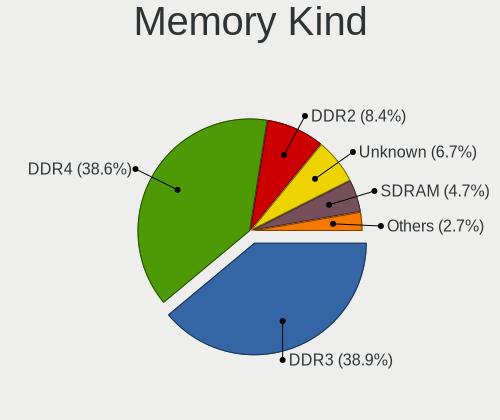

| Kind    | Desktops | Percent |
|---------|----------|---------|
| DDR3    | 171      | 39.77%  |
| DDR4    | 167      | 38.84%  |
| DDR2    | 36       | 8.37%   |
| Unknown | 30       | 6.98%   |
| SDRAM   | 15       | 3.49%   |
| DDR     | 6        | 1.4%    |
| LPDDR4  | 5        | 1.16%   |

Memory Form Factor
------------------

Physical design of the memory module

| Name    | Desktops | Percent |
|---------|----------|---------|
| DIMM    | 389      | 91.31%  |
| SODIMM  | 35       | 8.22%   |
| FB-DIMM | 1        | 0.23%   |
| Unknown | 1        | 0.23%   |

Memory Size
-----------

Memory module size

| Size  | Desktops | Percent |
|-------|----------|---------|
| 8192  | 153      | 32.28%  |
| 4096  | 125      | 26.37%  |
| 16384 | 84       | 17.72%  |
| 2048  | 76       | 16.03%  |
| 1024  | 23       | 4.85%   |
| 32768 | 10       | 2.11%   |
| 512   | 3        | 0.63%   |

Memory Speed
------------

Memory module speed

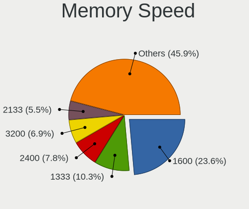

| Speed   | Desktops | Percent |
|---------|----------|---------|
| 1600    | 118      | 25.27%  |
| 1333    | 47       | 10.06%  |
| 2400    | 37       | 7.92%   |
| 2667    | 34       | 7.28%   |
| 2133    | 31       | 6.64%   |
| 3200    | 30       | 6.42%   |
| 800     | 23       | 4.93%   |
| 667     | 20       | 4.28%   |
| 3600    | 12       | 2.57%   |
| Unknown | 11       | 2.36%   |
| 3000    | 8        | 1.71%   |
| 2666    | 8        | 1.71%   |
| 1866    | 8        | 1.71%   |
| 2933    | 7        | 1.5%    |
| 1066    | 7        | 1.5%    |
| 3533    | 6        | 1.28%   |
| 1867    | 6        | 1.28%   |
| 3400    | 5        | 1.07%   |
| 533     | 5        | 1.07%   |
| 400     | 5        | 1.07%   |
| 3334    | 4        | 0.86%   |
| 3151    | 3        | 0.64%   |
| 1067    | 3        | 0.64%   |
| 3466    | 2        | 0.43%   |
| 3100    | 2        | 0.43%   |
| 2800    | 2        | 0.43%   |
| 2200    | 2        | 0.43%   |
| 1332    | 2        | 0.43%   |
| 333     | 2        | 0.43%   |
| 49926   | 1        | 0.21%   |
| 3866    | 1        | 0.21%   |
| 3800    | 1        | 0.21%   |
| 3733    | 1        | 0.21%   |
| 3666    | 1        | 0.21%   |
| 3500    | 1        | 0.21%   |
| 3333    | 1        | 0.21%   |
| 3066    | 1        | 0.21%   |
| 2747    | 1        | 0.21%   |
| 2473    | 1        | 0.21%   |
| 2187    | 1        | 0.21%   |
| 2176    | 1        | 0.21%   |
| 2134    | 1        | 0.21%   |
| 2048    | 1        | 0.21%   |
| 1800    | 1        | 0.21%   |
| 1639    | 1        | 0.21%   |
| 1400    | 1        | 0.21%   |

Printers & scanners
-------------------

Printer Vendor
--------------

Printer device vendors

| Vendor              | Desktops | Percent |
|---------------------|----------|---------|
| Hewlett-Packard     | 10       | 33.33%  |
| Brother Industries  | 5        | 16.67%  |
| Canon               | 4        | 13.33%  |
| Samsung Electronics | 3        | 10%     |
| Seiko Epson         | 2        | 6.67%   |
| Zebra               | 1        | 3.33%   |
| Prolific Technology | 1        | 3.33%   |
| Oki Data            | 1        | 3.33%   |
| Kyocera             | 1        | 3.33%   |
| Dell                | 1        | 3.33%   |
| Datamax-O'Neil      | 1        | 3.33%   |

Printer Model
-------------

Printer device models

| Model                                | Desktops | Percent |
|--------------------------------------|----------|---------|
| Brother HL-52x0 series               | 3        | 10%     |
| HP LaserJet 1020                     | 2        | 6.67%   |
| Zebra ZTC S4M-200dpi ZPL             | 1        | 3.33%   |
| Seiko Epson XP-15000 Series          | 1        | 3.33%   |
| Seiko Epson Printer                  | 1        | 3.33%   |
| Samsung SCX-4600 Series              | 1        | 3.33%   |
| Samsung SCX-3400 Series              | 1        | 3.33%   |
| Samsung ML-216x Series Laser Printer | 1        | 3.33%   |
| Prolific PL2305 Parallel Port        | 1        | 3.33%   |
| Oki Data USB Device                  | 1        | 3.33%   |
| Kyocera FS-1120D                     | 1        | 3.33%   |
| HP PhotoSmart P1000                  | 1        | 3.33%   |
| HP LaserJet Pro M404-M405            | 1        | 3.33%   |
| HP LaserJet M14-M17                  | 1        | 3.33%   |
| HP ENVY Photo 6200 series            | 1        | 3.33%   |
| HP DeskJet Plus 4100 series          | 1        | 3.33%   |
| HP DeskJet 5850c                     | 1        | 3.33%   |
| HP DeskJet 2700 series               | 1        | 3.33%   |
| HP Deskjet 1050 J410                 | 1        | 3.33%   |
| Dell B1160w Mono Laser Printer       | 1        | 3.33%   |
| Datamax-O'Neil Datamax E-4304        | 1        | 3.33%   |
| Canon TS6400 series                  | 1        | 3.33%   |
| Canon PIXMA MG3600 Series            | 1        | 3.33%   |
| Canon PIXMA MG2500 Series            | 1        | 3.33%   |
| Canon MB5300 series                  | 1        | 3.33%   |
| Brother Printer                      | 1        | 3.33%   |
| Brother HL-2220 series               | 1        | 3.33%   |

Scanner Vendor
--------------

Scanner device vendors

| Vendor             | Desktops | Percent |
|--------------------|----------|---------|
| Canon              | 4        | 44.44%  |
| Seiko Epson        | 3        | 33.33%  |
| Ultima Electronics | 1        | 11.11%  |
| Mustek Systems     | 1        | 11.11%  |

Scanner Model
-------------

Scanner device models

| Model                                                                                 | Desktops | Percent |
|---------------------------------------------------------------------------------------|----------|---------|
| Canon CanoScan LiDE 110                                                               | 2        | 22.22%  |
| Ultima Artec Ultima 2000 (GT6801 based)/Lifetec LT9385/ScanMagic 1200 UB Plus Scanner | 1        | 11.11%  |
| Seiko Epson GT-9700F [Perfection 2450 PHOTO]                                          | 1        | 11.11%  |
| Seiko Epson GT-8200U/GT-8200UF [Perfection 1650/1650 PHOTO]                           | 1        | 11.11%  |
| Seiko Epson GT-7300U [Perfection 1260/1260 PHOTO]                                     | 1        | 11.11%  |
| Mustek Systems BearPaw 2448 TA Pro                                                    | 1        | 11.11%  |
| Canon CanoScan N670U/N676U/LiDE 20                                                    | 1        | 11.11%  |
| Canon CanoScan 9000F Mark II                                                          | 1        | 11.11%  |

Camera
------

Camera Vendor
-------------

Camera device vendors

| Vendor                                 | Desktops | Percent |
|----------------------------------------|----------|---------|
| Logitech                               | 58       | 50.43%  |
| Microdia                               | 11       | 9.57%   |
| Microsoft                              | 6        | 5.22%   |
| Z-Star Microelectronics                | 4        | 3.48%   |
| Sunplus Innovation Technology          | 4        | 3.48%   |
| Samsung Electronics                    | 4        | 3.48%   |
| Jieli Technology                       | 4        | 3.48%   |
| Generalplus Technology                 | 4        | 3.48%   |
| Huawei Technologies                    | 2        | 1.74%   |
| Hewlett-Packard                        | 2        | 1.74%   |
| GEMBIRD                                | 2        | 1.74%   |
| Cheng Uei Precision Industry (Foxlink) | 2        | 1.74%   |
| Trust                                  | 1        | 0.87%   |
| Syntek                                 | 1        | 0.87%   |
| Quanta                                 | 1        | 0.87%   |
| Pixart Imaging                         | 1        | 0.87%   |
| OmniVision Technologies                | 1        | 0.87%   |
| MACROSILICON                           | 1        | 0.87%   |
| Genesys Logic                          | 1        | 0.87%   |
| Cubeternet                             | 1        | 0.87%   |
| Creative Technology                    | 1        | 0.87%   |
| Chicony Electronics                    | 1        | 0.87%   |
| Aveo Technology                        | 1        | 0.87%   |
| Apple                                  | 1        | 0.87%   |

Camera Model
------------

Camera device models

| Model                                                                | Desktops | Percent |
|----------------------------------------------------------------------|----------|---------|
| Logitech Webcam C270                                                 | 13       | 11.3%   |
| Logitech HD Pro Webcam C920                                          | 12       | 10.43%  |
| Logitech HD Webcam C525                                              | 5        | 4.35%   |
| Logitech C922 Pro Stream Webcam                                      | 5        | 4.35%   |
| Samsung Galaxy A5 (MTP)                                              | 4        | 3.48%   |
| Microsoft LifeCam HD-3000                                            | 4        | 3.48%   |
| Logitech Webcam C170                                                 | 4        | 3.48%   |
| Jieli USB PHY 2.0                                                    | 4        | 3.48%   |
| Microdia USB 2.0 Camera                                              | 3        | 2.61%   |
| Logitech HD Webcam C910                                              | 3        | 2.61%   |
| Logitech HD Webcam C615                                              | 3        | 2.61%   |
| Generalplus GENERAL WEBCAM                                           | 3        | 2.61%   |
| Z-Star Venus USB2.0 Camera                                           | 2        | 1.74%   |
| Microdia USB Live camera                                             | 2        | 1.74%   |
| Microdia MSI Starcam Racer                                           | 2        | 1.74%   |
| Microdia Integrated Camera                                           | 2        | 1.74%   |
| Microdia Camera                                                      | 2        | 1.74%   |
| Logitech Webcam C310                                                 | 2        | 1.74%   |
| Logitech Webcam C200                                                 | 2        | 1.74%   |
| Logitech BRIO Ultra HD Webcam                                        | 2        | 1.74%   |
| Huawei HiCamera                                                      | 2        | 1.74%   |
| HP Webcam 3110                                                       | 2        | 1.74%   |
| Cheng Uei Precision Industry (Foxlink) HP High Definition 1MP Webcam | 2        | 1.74%   |
| Z-Star A4 TECH USB2.0 PC Camera J                                    | 1        | 0.87%   |
| Z-Star A4 TECH USB2.0 PC Camera E                                    | 1        | 0.87%   |
| Trust WB-6250X Webcam                                                | 1        | 0.87%   |
| Syntek Integrated RGB Camera                                         | 1        | 0.87%   |
| Sunplus Webcam                                                       | 1        | 0.87%   |
| Sunplus PAPALOOK_229AF                                               | 1        | 0.87%   |
| Sunplus Laptop_Integrated_Webcam_FHD                                 | 1        | 0.87%   |
| Sunplus FULL HD webcam                                               | 1        | 0.87%   |
| Quanta FV TouchCam N1 (Video)                                        | 1        | 0.87%   |
| Pixart Imaging Multimedia audio controller                           | 1        | 0.87%   |
| OmniVision USB Camera-OV580                                          | 1        | 0.87%   |
| Microsoft LifeCam HD-5000                                            | 1        | 0.87%   |
| Microsoft LifeCam Cinema                                             | 1        | 0.87%   |
| MACROSILICON USB Video                                               | 1        | 0.87%   |
| Logitech Webcam C930e                                                | 1        | 0.87%   |
| Logitech Webcam C925e                                                | 1        | 0.87%   |
| Logitech Webcam C600                                                 | 1        | 0.87%   |
| Logitech Webcam C210                                                 | 1        | 0.87%   |
| Logitech QuickCam Home                                               | 1        | 0.87%   |
| Logitech QuickCam Express                                            | 1        | 0.87%   |
| Logitech QuickCam E 3500                                             | 1        | 0.87%   |
| Genesys Logic USB2.0 UVC PC Camera                                   | 1        | 0.87%   |
| Generalplus 808 Camera                                               | 1        | 0.87%   |
| GEMBIRD USB2.0 PC CAMERA                                             | 1        | 0.87%   |
| GEMBIRD Generic UVC 1.00 camera [AppoTech AX2311]                    | 1        | 0.87%   |
| Cubeternet GL-UPC822 UVC WebCam                                      | 1        | 0.87%   |
| Creative Live! Cam Chat HD [VF0700]                                  | 1        | 0.87%   |
| Chicony HP High Definition 1MP Webcam                                | 1        | 0.87%   |
| Aveo USB2.0 Camera                                                   | 1        | 0.87%   |
| Apple iPhone 5/5C/5S/6/SE                                            | 1        | 0.87%   |

Security
--------

Fingerprint Vendor
------------------

Fingerprint sensor vendors

| Vendor                | Desktops | Percent |
|-----------------------|----------|---------|
| Elan Microelectronics | 1        | 100%    |

Fingerprint Model
-----------------

Fingerprint sensor models

| Model                                       | Desktops | Percent |
|---------------------------------------------|----------|---------|
| Elan fingerprint sensor [FeinTech FPS00200] | 1        | 100%    |

Chipcard Vendor
---------------

Chipcard module vendors

| Vendor                    | Desktops | Percent |
|---------------------------|----------|---------|
| Alcor Micro               | 3        | 27.27%  |
| Clay Logic                | 2        | 18.18%  |
| Yubico.com                | 1        | 9.09%   |
| SCM Microsystems          | 1        | 9.09%   |
| Reiner SCT Kartensysteme  | 1        | 9.09%   |
| Realtek Semiconductor     | 1        | 9.09%   |
| Chicony Electronics       | 1        | 9.09%   |
| Aladdin Knowledge Systems | 1        | 9.09%   |

Chipcard Model
--------------

Chipcard module models

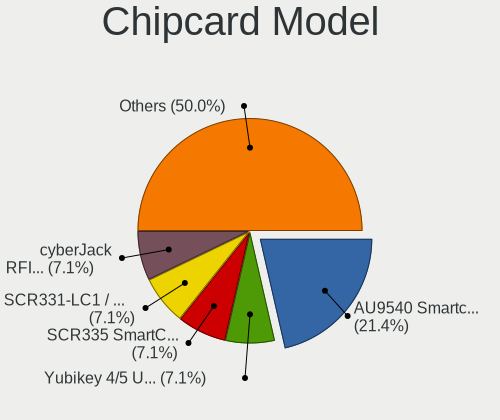

| Model                                                                      | Desktops | Percent |
|----------------------------------------------------------------------------|----------|---------|
| Alcor Micro AU9540 Smartcard Reader                                        | 3        | 27.27%  |
| Yubico.com Yubikey 4 U2F+CCID                                              | 1        | 9.09%   |
| SCM Microsystems SCR335 SmartCard Reader                                   | 1        | 9.09%   |
| Reiner SCT Kartensysteme cyberJack RFID basis contactless smartcard reader | 1        | 9.09%   |
| Realtek Semiconductor Smart Card Reader Interface                          | 1        | 9.09%   |
| Clay Logic Nitrokey Start                                                  | 1        | 9.09%   |
| Clay Logic Nitrokey Pro                                                    | 1        | 9.09%   |
| Chicony Electronics HP Skylab USB Smartcard Keyboard                       | 1        | 9.09%   |
| Aladdin Knowledge Systems Token JC                                         | 1        | 9.09%   |

Unsupported
-----------

Unsupported Devices
-------------------

Total unsupported devices on board

| Total | Desktops | Percent |
|-------|----------|---------|
| 0     | 541      | 79.68%  |
| 1     | 113      | 16.64%  |
| 2     | 22       | 3.24%   |
| 3     | 2        | 0.29%   |
| 6     | 1        | 0.15%   |

Unsupported Device Types
------------------------

Types of unsupported devices

| Type                     | Desktops | Percent |
|--------------------------|----------|---------|
| Graphics card            | 61       | 38.85%  |
| Net/wireless             | 24       | 15.29%  |
| Unassigned class         | 15       | 9.55%   |
| Communication controller | 13       | 8.28%   |
| Multimedia controller    | 11       | 7.01%   |
| Chipcard                 | 6        | 3.82%   |
| Sound                    | 5        | 3.18%   |
| Card reader              | 5        | 3.18%   |
| Net/ethernet             | 4        | 2.55%   |
| Storage/ide              | 3        | 1.91%   |
| Network                  | 2        | 1.27%   |
| Camera                   | 2        | 1.27%   |
| Bluetooth                | 2        | 1.27%   |
| Storage/raid             | 1        | 0.64%   |
| Storage/ata              | 1        | 0.64%   |
| Modem                    | 1        | 0.64%   |
| Fingerprint reader       | 1        | 0.64%   |

