Debian 10 - Tested Hardware & Statistics (Notebooks)
----------------------------------------------------

A project to collect tested hardware configurations for Debian 10.

Anyone can contribute to this report by the [hw-probe](https://github.com/linuxhw/hw-probe) tool:

    sudo -E hw-probe -all -upload

Please contribute! Especially if your hardware is rare.

Contents
--------

* [ Test Cases ](#test-cases)

* [ System ](#system)
  - [ Kernel                   ](#kernel)
  - [ Kernel Family            ](#kernel-family)
  - [ Kernel Major Ver.        ](#kernel-major-ver)
  - [ Arch                     ](#arch)
  - [ DE                       ](#de)
  - [ Display Server           ](#display-server)
  - [ Display Manager          ](#display-manager)
  - [ OS Lang                  ](#os-lang)
  - [ Boot Mode                ](#boot-mode)
  - [ Filesystem               ](#filesystem)
  - [ Part. scheme             ](#part-scheme)
  - [ Dual Boot with Linux/BSD ](#dual-boot-with-linuxbsd)
  - [ Dual Boot (Win)          ](#dual-boot-win)

* [ Board ](#board)
  - [ Vendor                   ](#vendor)
  - [ Model                    ](#model)
  - [ Model Family             ](#model-family)
  - [ MFG Year                 ](#mfg-year)
  - [ Form Factor              ](#form-factor)
  - [ Secure Boot              ](#secure-boot)
  - [ Coreboot                 ](#coreboot)
  - [ RAM Size                 ](#ram-size)
  - [ RAM Used                 ](#ram-used)
  - [ Total Drives             ](#total-drives)
  - [ Has CD-ROM               ](#has-cd-rom)
  - [ Has Ethernet             ](#has-ethernet)
  - [ Has WiFi                 ](#has-wifi)
  - [ Has Bluetooth            ](#has-bluetooth)

* [ Location ](#location)
  - [ Country                  ](#country)
  - [ City                     ](#city)

* [ Drives ](#drives)
  - [ Drive Vendor             ](#drive-vendor)
  - [ Drive Model              ](#drive-model)
  - [ HDD Vendor               ](#hdd-vendor)
  - [ SSD Vendor               ](#ssd-vendor)
  - [ Drive Kind               ](#drive-kind)
  - [ Drive Connector          ](#drive-connector)
  - [ Drive Size               ](#drive-size)
  - [ Space Total              ](#space-total)
  - [ Space Used               ](#space-used)
  - [ Malfunc. Drives          ](#malfunc-drives)
  - [ Malfunc. Drive Vendor    ](#malfunc-drive-vendor)
  - [ Malfunc. HDD Vendor      ](#malfunc-hdd-vendor)
  - [ Malfunc. Drive Kind      ](#malfunc-drive-kind)
  - [ Failed Drives            ](#failed-drives)
  - [ Failed Drive Vendor      ](#failed-drive-vendor)
  - [ Drive Status             ](#drive-status)

* [ Storage controller ](#storage-controller)
  - [ Storage Vendor           ](#storage-vendor)
  - [ Storage Model            ](#storage-model)
  - [ Storage Kind             ](#storage-kind)

* [ Processor ](#processor)
  - [ CPU Vendor               ](#cpu-vendor)
  - [ CPU Model                ](#cpu-model)
  - [ CPU Model Family         ](#cpu-model-family)
  - [ CPU Cores                ](#cpu-cores)
  - [ CPU Sockets              ](#cpu-sockets)
  - [ CPU Threads              ](#cpu-threads)
  - [ CPU Op-Modes             ](#cpu-op-modes)
  - [ CPU Microcode            ](#cpu-microcode)
  - [ CPU Microarch            ](#cpu-microarch)

* [ Graphics ](#graphics)
  - [ GPU Vendor               ](#gpu-vendor)
  - [ GPU Model                ](#gpu-model)
  - [ GPU Combo                ](#gpu-combo)
  - [ GPU Driver               ](#gpu-driver)
  - [ GPU Memory               ](#gpu-memory)

* [ Monitor ](#monitor)
  - [ Monitor Vendor           ](#monitor-vendor)
  - [ Monitor Model            ](#monitor-model)
  - [ Monitor Resolution       ](#monitor-resolution)
  - [ Monitor Diagonal         ](#monitor-diagonal)
  - [ Monitor Width            ](#monitor-width)
  - [ Aspect Ratio             ](#aspect-ratio)
  - [ Monitor Area             ](#monitor-area)
  - [ Pixel Density            ](#pixel-density)
  - [ Multiple Monitors        ](#multiple-monitors)

* [ Network ](#network)
  - [ Net Controller Vendor    ](#net-controller-vendor)
  - [ Net Controller Model     ](#net-controller-model)
  - [ Wireless Vendor          ](#wireless-vendor)
  - [ Wireless Model           ](#wireless-model)
  - [ Ethernet Vendor          ](#ethernet-vendor)
  - [ Ethernet Model           ](#ethernet-model)
  - [ Net Controller Kind      ](#net-controller-kind)
  - [ Used Controller          ](#used-controller)
  - [ NICs                     ](#nics)
  - [ IPv6                     ](#ipv6)

* [ Bluetooth ](#bluetooth)
  - [ Bluetooth Vendor         ](#bluetooth-vendor)
  - [ Bluetooth Model          ](#bluetooth-model)

* [ Sound ](#sound)
  - [ Sound Vendor             ](#sound-vendor)
  - [ Sound Model              ](#sound-model)

* [ Memory ](#memory)
  - [ Memory Vendor            ](#memory-vendor)
  - [ Memory Model             ](#memory-model)
  - [ Memory Kind              ](#memory-kind)
  - [ Memory Form Factor       ](#memory-form-factor)
  - [ Memory Size              ](#memory-size)
  - [ Memory Speed             ](#memory-speed)

* [ Printers & scanners ](#printers--scanners)
  - [ Printer Vendor           ](#printer-vendor)
  - [ Printer Model            ](#printer-model)
  - [ Scanner Vendor           ](#scanner-vendor)
  - [ Scanner Model            ](#scanner-model)

* [ Camera ](#camera)
  - [ Camera Vendor            ](#camera-vendor)
  - [ Camera Model             ](#camera-model)

* [ Security ](#security)
  - [ Fingerprint Vendor       ](#fingerprint-vendor)
  - [ Fingerprint Model        ](#fingerprint-model)
  - [ Chipcard Vendor          ](#chipcard-vendor)
  - [ Chipcard Model           ](#chipcard-model)

* [ Unsupported ](#unsupported)
  - [ Unsupported Devices      ](#unsupported-devices)
  - [ Unsupported Device Types ](#unsupported-device-types)

Test Cases
----------

Total: 1245

| Vendor        | Model                       | Probe                                                      | Date         |
|---------------|-----------------------------|------------------------------------------------------------|--------------|
| Lenovo        | V330-15IKB 81AX             | [becc2328fd](https://linux-hardware.org/?probe=becc2328fd) | Dec 01, 2022 |
| Notebook      | RIM2520                     | [5f66abbb8b](https://linux-hardware.org/?probe=5f66abbb8b) | Nov 30, 2022 |
| HP            | 255 G6 Notebook PC          | [149cee1720](https://linux-hardware.org/?probe=149cee1720) | Nov 22, 2022 |
| Lenovo        | IdeaPad Y510P 20217         | [c38c6ddff6](https://linux-hardware.org/?probe=c38c6ddff6) | Nov 16, 2022 |
| Lenovo        | IdeaPad 330S-15ARR 81FB     | [c6e254c4ed](https://linux-hardware.org/?probe=c6e254c4ed) | Nov 14, 2022 |
| HP            | Pavilion g7                 | [47c2e96181](https://linux-hardware.org/?probe=47c2e96181) | Nov 08, 2022 |
| Juana Mans... | SF20GM7                     | [8e8c4f52f4](https://linux-hardware.org/?probe=8e8c4f52f4) | Nov 04, 2022 |
| HP            | Pavilion g6                 | [353259fad4](https://linux-hardware.org/?probe=353259fad4) | Oct 26, 2022 |
| Lenovo        | IdeaPad 120S-14IAP 81A5     | [45d7e6a1aa](https://linux-hardware.org/?probe=45d7e6a1aa) | Oct 21, 2022 |
| Lenovo        | ThinkPad X220 4291G26       | [33654dfbfa](https://linux-hardware.org/?probe=33654dfbfa) | Sep 22, 2022 |
| Acer          | Aspire 5742                 | [9c37d390a7](https://linux-hardware.org/?probe=9c37d390a7) | Sep 13, 2022 |
| Lenovo        | ThinkPad X260 20F5A050IG    | [33b5154a7a](https://linux-hardware.org/?probe=33b5154a7a) | Aug 27, 2022 |
| Lenovo        | ThinkPad Edge E431 62774... | [b7d37d0c4c](https://linux-hardware.org/?probe=b7d37d0c4c) | Aug 18, 2022 |
| Lenovo        | ThinkPad T490 20N2000FIX    | [a68ebe9c0c](https://linux-hardware.org/?probe=a68ebe9c0c) | Jul 21, 2022 |
| Fujitsu       | FMVNP7HER                   | [e87161bce7](https://linux-hardware.org/?probe=e87161bce7) | Jul 10, 2022 |
| Lenovo        | ThinkPad T14s Gen 1 20UH... | [0fab4a4228](https://linux-hardware.org/?probe=0fab4a4228) | Jun 21, 2022 |
| Notebook      | NL40_50CU                   | [b0b1068b47](https://linux-hardware.org/?probe=b0b1068b47) | Jun 20, 2022 |
| TUXEDO        | Aura 15 Gen1                | [cc3a77a798](https://linux-hardware.org/?probe=cc3a77a798) | Jun 16, 2022 |
| Dell          | Latitude E5470              | [a4533cfbc7](https://linux-hardware.org/?probe=a4533cfbc7) | Jun 14, 2022 |
| Toshiba       | Satellite A300              | [3bfbcd1181](https://linux-hardware.org/?probe=3bfbcd1181) | Jun 12, 2022 |
| HP            | 250 G7 Notebook PC          | [e6fc1445a0](https://linux-hardware.org/?probe=e6fc1445a0) | Jun 03, 2022 |
| Dell          | Inspiron 5749               | [408e42beb8](https://linux-hardware.org/?probe=408e42beb8) | Jun 01, 2022 |
| ASUSTek       | K52F                        | [601b1c4857](https://linux-hardware.org/?probe=601b1c4857) | May 25, 2022 |
| Dell          | XPS 13 9360                 | [41f966f459](https://linux-hardware.org/?probe=41f966f459) | May 24, 2022 |
| Dell          | Latitude E5570              | [310aadd79a](https://linux-hardware.org/?probe=310aadd79a) | May 24, 2022 |
| ASUSTek       | F50SL                       | [7d588b102d](https://linux-hardware.org/?probe=7d588b102d) | May 23, 2022 |
| Dell          | Precision M4400             | [d0d09df553](https://linux-hardware.org/?probe=d0d09df553) | May 15, 2022 |
| Dell          | Precision M4400             | [96af5a9104](https://linux-hardware.org/?probe=96af5a9104) | May 15, 2022 |
| Dell          | MXG061                      | [36b09ae01e](https://linux-hardware.org/?probe=36b09ae01e) | May 14, 2022 |
| Lenovo        | ThinkPad L470 20J4003WGE    | [79bb6b88d3](https://linux-hardware.org/?probe=79bb6b88d3) | May 06, 2022 |
| Panasonic     | CF-31-5                     | [d17d17b778](https://linux-hardware.org/?probe=d17d17b778) | May 02, 2022 |
| Dell          | Vostro 5470                 | [8fbdd05b2a](https://linux-hardware.org/?probe=8fbdd05b2a) | May 02, 2022 |
| Lenovo        | IdeaPad S145-15API 81V7     | [9e7c77d251](https://linux-hardware.org/?probe=9e7c77d251) | Apr 27, 2022 |
| Timi          | TM1612                      | [9e6b6f4737](https://linux-hardware.org/?probe=9e6b6f4737) | Apr 24, 2022 |
| Lenovo        | ThinkPad P53 20QN000ESP     | [16b3189bd8](https://linux-hardware.org/?probe=16b3189bd8) | Apr 22, 2022 |
| Dell          | Inspiron 5577               | [d82fa1bfc9](https://linux-hardware.org/?probe=d82fa1bfc9) | Apr 13, 2022 |
| Lenovo        | ThinkPad X1 Carbon 4th 2... | [4ca643452e](https://linux-hardware.org/?probe=4ca643452e) | Apr 10, 2022 |
| Lenovo        | ThinkPad X260 20F5S6QV00    | [315f7326a1](https://linux-hardware.org/?probe=315f7326a1) | Apr 10, 2022 |
| Samsung       | 270E5J/2570EJ               | [0887c85f98](https://linux-hardware.org/?probe=0887c85f98) | Apr 06, 2022 |
| Intel         | powered classmate PC        | [8ce4fa1757](https://linux-hardware.org/?probe=8ce4fa1757) | Apr 01, 2022 |
| Lenovo        | ThinkPad X230 23259S9       | [a461555ba9](https://linux-hardware.org/?probe=a461555ba9) | Mar 30, 2022 |
| HP            | Compaq 615                  | [906354c0ce](https://linux-hardware.org/?probe=906354c0ce) | Mar 27, 2022 |
| HP            | Compaq 615                  | [28368f4366](https://linux-hardware.org/?probe=28368f4366) | Mar 25, 2022 |
| Dell          | XPS 15 9570                 | [d4b19324b2](https://linux-hardware.org/?probe=d4b19324b2) | Mar 22, 2022 |
| Lenovo        | ThinkPad L470 20J4003WGE    | [62b1219002](https://linux-hardware.org/?probe=62b1219002) | Mar 21, 2022 |
| Lenovo        | ThinkPad X220 4291G26       | [c2f45496d1](https://linux-hardware.org/?probe=c2f45496d1) | Mar 21, 2022 |
| Dell          | MXG071                      | [62a45db2eb](https://linux-hardware.org/?probe=62a45db2eb) | Mar 06, 2022 |
| ASUSTek       | 1015BX                      | [9b3fb4a52b](https://linux-hardware.org/?probe=9b3fb4a52b) | Feb 20, 2022 |
| ASUSTek       | X55C                        | [ae05784a4a](https://linux-hardware.org/?probe=ae05784a4a) | Feb 19, 2022 |
| Samsung       | N230                        | [f16e2ce417](https://linux-hardware.org/?probe=f16e2ce417) | Feb 16, 2022 |
| Samsung       | N230                        | [10be19ecbf](https://linux-hardware.org/?probe=10be19ecbf) | Feb 16, 2022 |
| Lenovo        | IdeaPad 720S-14IKB 81BD     | [9e3040619f](https://linux-hardware.org/?probe=9e3040619f) | Jan 30, 2022 |
| ASUSTek       | X555BA                      | [526e03cf05](https://linux-hardware.org/?probe=526e03cf05) | Jan 28, 2022 |
| Dell          | Vostro 5470                 | [1e97f26a27](https://linux-hardware.org/?probe=1e97f26a27) | Jan 15, 2022 |
| HP            | EliteBook 8440p             | [c15f816857](https://linux-hardware.org/?probe=c15f816857) | Jan 11, 2022 |
| Lenovo        | IdeaPad 120S-11IAP 81A4     | [c7f2471bdf](https://linux-hardware.org/?probe=c7f2471bdf) | Jan 04, 2022 |
| HP            | Unknown                     | [e1eb3d8838](https://linux-hardware.org/?probe=e1eb3d8838) | Dec 30, 2021 |
| HP            | Pavilion dv3                | [3f3defcf69](https://linux-hardware.org/?probe=3f3defcf69) | Dec 28, 2021 |
| HP            | Pavilion dv3                | [750225c8c8](https://linux-hardware.org/?probe=750225c8c8) | Dec 28, 2021 |
| HP            | Compaq 6710b (RM405UT#AB... | [e4789d000a](https://linux-hardware.org/?probe=e4789d000a) | Dec 28, 2021 |
| Lenovo        | IdeaPad S145-15API 81V7     | [9a6b436bcb](https://linux-hardware.org/?probe=9a6b436bcb) | Dec 26, 2021 |
| HP            | EliteBook 8470w             | [87c1cb1da7](https://linux-hardware.org/?probe=87c1cb1da7) | Dec 23, 2021 |
| Acer          | Aspire 5250                 | [856d94d47a](https://linux-hardware.org/?probe=856d94d47a) | Dec 21, 2021 |
| Dell          | Latitude E7440              | [bb71f679cf](https://linux-hardware.org/?probe=bb71f679cf) | Dec 06, 2021 |
| Philco        | OEM                         | [3d13f6a539](https://linux-hardware.org/?probe=3d13f6a539) | Nov 28, 2021 |
| HP            | Pavilion Notebook           | [78bddf398e](https://linux-hardware.org/?probe=78bddf398e) | Nov 25, 2021 |
| Lenovo        | B40-70 20392                | [4f4458d61a](https://linux-hardware.org/?probe=4f4458d61a) | Nov 23, 2021 |
| ASUSTek       | K53U                        | [8b542e61d9](https://linux-hardware.org/?probe=8b542e61d9) | Nov 18, 2021 |
| Dell          | 0NY667                      | [d0c838dff6](https://linux-hardware.org/?probe=d0c838dff6) | Nov 17, 2021 |
| Acer          | Aspire V3-772G              | [1e66881588](https://linux-hardware.org/?probe=1e66881588) | Nov 16, 2021 |
| AXDIA Inte... | Wintab 10                   | [0cf33496ad](https://linux-hardware.org/?probe=0cf33496ad) | Nov 14, 2021 |
| Dell          | Precision 7520              | [55077aa291](https://linux-hardware.org/?probe=55077aa291) | Nov 13, 2021 |
| Dell          | Inspiron 7447               | [4ca16063da](https://linux-hardware.org/?probe=4ca16063da) | Nov 12, 2021 |
| HP            | Stream Laptop 11-y0XX       | [1bd1ac9ae2](https://linux-hardware.org/?probe=1bd1ac9ae2) | Nov 08, 2021 |
| Dell          | Latitude E6420              | [66cfc6d85b](https://linux-hardware.org/?probe=66cfc6d85b) | Nov 07, 2021 |
| ASUSTek       | K52F                        | [f90cbb4d26](https://linux-hardware.org/?probe=f90cbb4d26) | Nov 04, 2021 |
| ASUSTek       | X555BA                      | [99ef7179aa](https://linux-hardware.org/?probe=99ef7179aa) | Nov 04, 2021 |
| Dell          | Latitude D600               | [024dd9fbc7](https://linux-hardware.org/?probe=024dd9fbc7) | Nov 02, 2021 |
| ASUSTek       | N10Jh                       | [9d10643a15](https://linux-hardware.org/?probe=9d10643a15) | Oct 30, 2021 |
| Lenovo        | G570 4334                   | [d1d57448c4](https://linux-hardware.org/?probe=d1d57448c4) | Oct 29, 2021 |
| Lenovo        | G570 4334                   | [f5112dbf47](https://linux-hardware.org/?probe=f5112dbf47) | Oct 29, 2021 |
| HP            | Compaq Presario CQ60        | [b9b0c35db8](https://linux-hardware.org/?probe=b9b0c35db8) | Oct 28, 2021 |
| Lenovo        | ThinkPad T480s 20L7002AU... | [dda6d4cdcb](https://linux-hardware.org/?probe=dda6d4cdcb) | Oct 26, 2021 |
| Lenovo        | ThinkPad X1 Carbon Gen 9... | [67ab68b5f3](https://linux-hardware.org/?probe=67ab68b5f3) | Oct 26, 2021 |
| Dell          | Inspiron 5570               | [c01fa4b013](https://linux-hardware.org/?probe=c01fa4b013) | Oct 26, 2021 |
| ASUSTek       | TUF Gaming FX506LU_FX506... | [8f6efb8dbe](https://linux-hardware.org/?probe=8f6efb8dbe) | Oct 24, 2021 |
| Acer          | Nitro AN515-42              | [2ff605bdb0](https://linux-hardware.org/?probe=2ff605bdb0) | Oct 20, 2021 |
| ASUSTek       | N551JW                      | [a6c41c9d3e](https://linux-hardware.org/?probe=a6c41c9d3e) | Oct 19, 2021 |
| Dell          | Inspiron 1545               | [4852d91477](https://linux-hardware.org/?probe=4852d91477) | Oct 17, 2021 |
| Dell          | Inspiron 1545               | [249e85b27d](https://linux-hardware.org/?probe=249e85b27d) | Oct 17, 2021 |
| Dell          | Inspiron 1440               | [9e9967a3fa](https://linux-hardware.org/?probe=9e9967a3fa) | Oct 17, 2021 |
| Dell          | Latitude D600               | [c4a1e26625](https://linux-hardware.org/?probe=c4a1e26625) | Oct 15, 2021 |
| Dell          | Latitude D600               | [994b244534](https://linux-hardware.org/?probe=994b244534) | Oct 15, 2021 |
| HP            | EliteBook 745 G6            | [295112838e](https://linux-hardware.org/?probe=295112838e) | Oct 14, 2021 |
| Dell          | MXG071                      | [5006aa0f75](https://linux-hardware.org/?probe=5006aa0f75) | Oct 12, 2021 |
| Unknown       | Pyra-Handheld-V5.3          | [3e61c199d6](https://linux-hardware.org/?probe=3e61c199d6) | Oct 12, 2021 |
| Toshiba       | Satellite A215              | [06c3b56836](https://linux-hardware.org/?probe=06c3b56836) | Oct 11, 2021 |
| Dell          | System Inspiron 7720        | [6728cba5a1](https://linux-hardware.org/?probe=6728cba5a1) | Oct 09, 2021 |
| Lenovo        | ThinkPad X1 Carbon Gen 9... | [04d8d207df](https://linux-hardware.org/?probe=04d8d207df) | Oct 08, 2021 |
| Lenovo        | ThinkPad X1 Carbon Gen 9... | [d0d578ae42](https://linux-hardware.org/?probe=d0d578ae42) | Oct 08, 2021 |
| Lenovo        | ThinkPad T440 20B7S1X108    | [0ad6768049](https://linux-hardware.org/?probe=0ad6768049) | Oct 02, 2021 |
| Toshiba       | Satellite L500              | [07116867d0](https://linux-hardware.org/?probe=07116867d0) | Sep 30, 2021 |
| Dell          | Latitude 5411               | [b1b898bf2b](https://linux-hardware.org/?probe=b1b898bf2b) | Sep 30, 2021 |
| Acer          | Aspire A515-43              | [5edddc1e2c](https://linux-hardware.org/?probe=5edddc1e2c) | Sep 29, 2021 |
| Lenovo        | ThinkPad T15 Gen 1 20S60... | [3095cda8c3](https://linux-hardware.org/?probe=3095cda8c3) | Sep 27, 2021 |
| Lenovo        | ThinkPad T15 Gen 1 20S60... | [299d4edf8d](https://linux-hardware.org/?probe=299d4edf8d) | Sep 27, 2021 |
| ASUSTek       | X540YA                      | [c0b5da7979](https://linux-hardware.org/?probe=c0b5da7979) | Sep 19, 2021 |
| Acer          | Aspire 5542                 | [dfa471a829](https://linux-hardware.org/?probe=dfa471a829) | Sep 17, 2021 |
| Acer          | Aspire 5542                 | [d862c4ce39](https://linux-hardware.org/?probe=d862c4ce39) | Sep 17, 2021 |
| Lenovo        | ThinkPad X1 Carbon 4th 2... | [232a307a5b](https://linux-hardware.org/?probe=232a307a5b) | Sep 14, 2021 |
| Lenovo        | ThinkPad T590 20N4000BFR    | [834ddc5e6a](https://linux-hardware.org/?probe=834ddc5e6a) | Sep 13, 2021 |
| Intel         | powered classmate PC        | [15cb9c7764](https://linux-hardware.org/?probe=15cb9c7764) | Sep 12, 2021 |
| Dell          | Inspiron 5420               | [bc80b42442](https://linux-hardware.org/?probe=bc80b42442) | Sep 12, 2021 |
| Lenovo        | QIWY3                       | [9da123bf89](https://linux-hardware.org/?probe=9da123bf89) | Sep 09, 2021 |
| Lenovo        | QIWY3                       | [552b695b27](https://linux-hardware.org/?probe=552b695b27) | Sep 09, 2021 |
| GTZS          | Unknown                     | [e5d931aaf8](https://linux-hardware.org/?probe=e5d931aaf8) | Sep 06, 2021 |
| HP            | ProBook 6460b               | [7d379f011c](https://linux-hardware.org/?probe=7d379f011c) | Sep 04, 2021 |
| Lenovo        | ThinkPad R60 9462A45        | [5850a811e3](https://linux-hardware.org/?probe=5850a811e3) | Sep 01, 2021 |
| HP            | 250 G4 Notebook PC          | [2cf6464047](https://linux-hardware.org/?probe=2cf6464047) | Aug 31, 2021 |
| HP            | EliteBook 850 G5            | [68149f9864](https://linux-hardware.org/?probe=68149f9864) | Aug 30, 2021 |
| Dell          | Studio XPS 1640             | [f0765cb8c8](https://linux-hardware.org/?probe=f0765cb8c8) | Aug 28, 2021 |
| Dell          | Studio XPS 1640             | [1e772e0237](https://linux-hardware.org/?probe=1e772e0237) | Aug 28, 2021 |
| Lenovo        | ThinkPad X220 429044C       | [20057996af](https://linux-hardware.org/?probe=20057996af) | Aug 27, 2021 |
| Acer          | TravelMate 7750G            | [8d3d35021f](https://linux-hardware.org/?probe=8d3d35021f) | Aug 27, 2021 |
| Itautec       | Infoway w7535               | [f7d8a66820](https://linux-hardware.org/?probe=f7d8a66820) | Aug 27, 2021 |
| Lenovo        | ThinkPad X260 20F5S3J00D    | [eeb6586c28](https://linux-hardware.org/?probe=eeb6586c28) | Aug 26, 2021 |
| ASUSTek       | P751JA                      | [0ba110ae45](https://linux-hardware.org/?probe=0ba110ae45) | Aug 25, 2021 |
| TQ-Group      | TQMxE39S                    | [69363368e2](https://linux-hardware.org/?probe=69363368e2) | Aug 23, 2021 |
| ASUSTek       | M51Sn                       | [4a85a76b94](https://linux-hardware.org/?probe=4a85a76b94) | Aug 21, 2021 |
| Toshiba       | Satellite C55D-B            | [3aa4e38d51](https://linux-hardware.org/?probe=3aa4e38d51) | Aug 21, 2021 |
| Itautec       | Infoway w7535               | [ea3f721976](https://linux-hardware.org/?probe=ea3f721976) | Aug 21, 2021 |
| Acer          | Aspire S5-371               | [5e3fcc0daa](https://linux-hardware.org/?probe=5e3fcc0daa) | Aug 21, 2021 |
| Lenovo        | IdeaPad 100S-14IBR 80R9     | [e4ab15ad86](https://linux-hardware.org/?probe=e4ab15ad86) | Aug 16, 2021 |
| ASUSTek       | N550JV                      | [631e697061](https://linux-hardware.org/?probe=631e697061) | Aug 13, 2021 |
| ASUSTek       | N550JV                      | [191ce05579](https://linux-hardware.org/?probe=191ce05579) | Aug 13, 2021 |
| Apple         | MacBookPro9,2               | [10a9ce514b](https://linux-hardware.org/?probe=10a9ce514b) | Aug 11, 2021 |
| Apple         | MacBookPro9,2               | [4a08b4bc9c](https://linux-hardware.org/?probe=4a08b4bc9c) | Aug 11, 2021 |
| Google        | Careena                     | [a715f6f37f](https://linux-hardware.org/?probe=a715f6f37f) | Aug 10, 2021 |
| HP            | Pavilion Notebook           | [f8742367c3](https://linux-hardware.org/?probe=f8742367c3) | Aug 10, 2021 |
| HP            | Pavilion Notebook           | [7401df03e4](https://linux-hardware.org/?probe=7401df03e4) | Aug 09, 2021 |
| Gateway       | MD7811U                     | [fdd99ed1fe](https://linux-hardware.org/?probe=fdd99ed1fe) | Aug 09, 2021 |
| Gateway       | MD7811U                     | [07d8dcb0ff](https://linux-hardware.org/?probe=07d8dcb0ff) | Aug 08, 2021 |
| DNS           | 101                         | [83fc7e7928](https://linux-hardware.org/?probe=83fc7e7928) | Aug 08, 2021 |
| Lenovo        | ThinkPad T480s 20L7002AU... | [d19a600e79](https://linux-hardware.org/?probe=d19a600e79) | Aug 07, 2021 |
| ASUSTek       | N56VZ                       | [4080b39f00](https://linux-hardware.org/?probe=4080b39f00) | Aug 07, 2021 |
| Sony          | VPCS110FL                   | [2227fd7ae7](https://linux-hardware.org/?probe=2227fd7ae7) | Aug 07, 2021 |
| Sony          | VPCS110FL                   | [1741c7d3db](https://linux-hardware.org/?probe=1741c7d3db) | Aug 07, 2021 |
| Apple         | MacBookPro9,2               | [f4e31f03fb](https://linux-hardware.org/?probe=f4e31f03fb) | Aug 07, 2021 |
| Dell          | G3 3590                     | [16bdb588e1](https://linux-hardware.org/?probe=16bdb588e1) | Aug 05, 2021 |
| Dell          | G3 3590                     | [01a9560f9c](https://linux-hardware.org/?probe=01a9560f9c) | Aug 05, 2021 |
| Dell          | Precision 3530              | [f2fb6b98ea](https://linux-hardware.org/?probe=f2fb6b98ea) | Aug 03, 2021 |
| Lenovo        | ThinkPad T490 20N2002AUS    | [557f9a87fa](https://linux-hardware.org/?probe=557f9a87fa) | Jul 30, 2021 |
| MSI           | U210/U210 Light             | [98d5949e01](https://linux-hardware.org/?probe=98d5949e01) | Jul 29, 2021 |
| ASUSTek       | X205TA                      | [37efd6fc5e](https://linux-hardware.org/?probe=37efd6fc5e) | Jul 26, 2021 |
| Lenovo        | B51-35 80LH                 | [662fffc9d2](https://linux-hardware.org/?probe=662fffc9d2) | Jul 25, 2021 |
| Lenovo        | B51-35 80LH                 | [bdaceebba4](https://linux-hardware.org/?probe=bdaceebba4) | Jul 25, 2021 |
| Lenovo        | ThinkPad X250 20CLS1G70A    | [7330b29e94](https://linux-hardware.org/?probe=7330b29e94) | Jul 25, 2021 |
| Lenovo        | ThinkPad X250 20CLS1G70A    | [1a104c4440](https://linux-hardware.org/?probe=1a104c4440) | Jul 25, 2021 |
| Acer          | AO725                       | [4e27f519f7](https://linux-hardware.org/?probe=4e27f519f7) | Jul 25, 2021 |
| Dell          | Vostro 1500                 | [f78b977663](https://linux-hardware.org/?probe=f78b977663) | Jul 25, 2021 |
| Lenovo        | ThinkPad L390 20NRCTO1WW    | [0d77ee3e3d](https://linux-hardware.org/?probe=0d77ee3e3d) | Jul 22, 2021 |
| Acer          | Aspire A715-72G             | [d977beba9e](https://linux-hardware.org/?probe=d977beba9e) | Jul 22, 2021 |
| Toshiba       | Satellite M70               | [ffe4b92da3](https://linux-hardware.org/?probe=ffe4b92da3) | Jul 21, 2021 |
| ASUSTek       | TUF Gaming FX506LU_FX506... | [a347415235](https://linux-hardware.org/?probe=a347415235) | Jul 19, 2021 |
| Dell          | XPS M1330                   | [69cc932202](https://linux-hardware.org/?probe=69cc932202) | Jul 17, 2021 |
| MSI           | GF65 Thin 10UE              | [0a875bd8bb](https://linux-hardware.org/?probe=0a875bd8bb) | Jul 15, 2021 |
| Dell          | Latitude E6420              | [e2e96ce9d8](https://linux-hardware.org/?probe=e2e96ce9d8) | Jul 14, 2021 |
| Dell          | Latitude E6420              | [eb1224a5ff](https://linux-hardware.org/?probe=eb1224a5ff) | Jul 14, 2021 |
| Acer          | Swift SF114-33              | [7aa338a8dc](https://linux-hardware.org/?probe=7aa338a8dc) | Jul 12, 2021 |
| One Educat... | Infinity:One                | [2f6016cb80](https://linux-hardware.org/?probe=2f6016cb80) | Jul 12, 2021 |
| HP            | ProBook 6460b               | [094d8f1435](https://linux-hardware.org/?probe=094d8f1435) | Jul 10, 2021 |
| ASUSTek       | K56CB                       | [112f34cf11](https://linux-hardware.org/?probe=112f34cf11) | Jul 09, 2021 |
| HP            | Spectre Laptop 13-af0xx     | [bfef4cded0](https://linux-hardware.org/?probe=bfef4cded0) | Jul 09, 2021 |
| Acer          | E1-510                      | [b1b6133207](https://linux-hardware.org/?probe=b1b6133207) | Jul 08, 2021 |
| Lenovo        | ThinkPad R60 9462A45        | [541bb57585](https://linux-hardware.org/?probe=541bb57585) | Jul 07, 2021 |
| ASUSTek       | VivoBook S14 X411UF         | [f5a3e8f307](https://linux-hardware.org/?probe=f5a3e8f307) | Jul 06, 2021 |
| Lenovo        | ThinkPad L590 20Q7CTO1WW    | [ec305ddc45](https://linux-hardware.org/?probe=ec305ddc45) | Jul 05, 2021 |
| Lenovo        | B50-10 80QR                 | [56044931dc](https://linux-hardware.org/?probe=56044931dc) | Jul 04, 2021 |
| Dell          | Latitude E6430              | [0c6585a784](https://linux-hardware.org/?probe=0c6585a784) | Jun 30, 2021 |
| Dell          | Inspiron 3421               | [1900fb77ec](https://linux-hardware.org/?probe=1900fb77ec) | Jun 29, 2021 |
| Lenovo        | ThinkPad E15 20RD0011GE     | [d4a28fa40a](https://linux-hardware.org/?probe=d4a28fa40a) | Jun 27, 2021 |
| Samsung       | 355V4C/356V4C/3445VC/354... | [fc58981ecd](https://linux-hardware.org/?probe=fc58981ecd) | Jun 27, 2021 |
| Samsung       | 355V4C/356V4C/3445VC/354... | [bce9c74edb](https://linux-hardware.org/?probe=bce9c74edb) | Jun 27, 2021 |
| SAELITE       | ES1AU11                     | [25dc027ef1](https://linux-hardware.org/?probe=25dc027ef1) | Jun 26, 2021 |
| Lenovo        | ThinkPad X230 23252EG       | [77c68fb077](https://linux-hardware.org/?probe=77c68fb077) | Jun 23, 2021 |
| HP            | EliteBook 830 G7 Noteboo... | [0240acc863](https://linux-hardware.org/?probe=0240acc863) | Jun 22, 2021 |
| HP            | EliteBook 830 G7 Noteboo... | [f64428c049](https://linux-hardware.org/?probe=f64428c049) | Jun 22, 2021 |
| Dell          | Latitude 7480               | [28d1d17f13](https://linux-hardware.org/?probe=28d1d17f13) | Jun 22, 2021 |
| Dell          | Latitude E6430              | [f0afba2500](https://linux-hardware.org/?probe=f0afba2500) | Jun 21, 2021 |
| Timi          | TM1612                      | [c4fb55cbfd](https://linux-hardware.org/?probe=c4fb55cbfd) | Jun 21, 2021 |
| Lenovo        | B50-10 80QR                 | [847e763107](https://linux-hardware.org/?probe=847e763107) | Jun 20, 2021 |
| Timi          | TM1612                      | [dcb999a722](https://linux-hardware.org/?probe=dcb999a722) | Jun 20, 2021 |
| ASUSTek       | ROG Strix G513IH_G513IH     | [3518f65e84](https://linux-hardware.org/?probe=3518f65e84) | Jun 18, 2021 |
| Dell          | Latitude 5420               | [1356be4391](https://linux-hardware.org/?probe=1356be4391) | Jun 18, 2021 |
| VIT           | P2400                       | [295d4d5a47](https://linux-hardware.org/?probe=295d4d5a47) | Jun 17, 2021 |
| Fujitsu       | LIFEBOOK BH531              | [688d9f583e](https://linux-hardware.org/?probe=688d9f583e) | Jun 16, 2021 |
| Sony          | VGN-FW21L                   | [fe6647a4b1](https://linux-hardware.org/?probe=fe6647a4b1) | Jun 15, 2021 |
| Sony          | VGN-FW21E                   | [f46b41cd2f](https://linux-hardware.org/?probe=f46b41cd2f) | Jun 15, 2021 |
| Dell          | XPS 13 9310                 | [278fd058ed](https://linux-hardware.org/?probe=278fd058ed) | Jun 14, 2021 |
| HP            | Laptop 15s-fq2xxx           | [b592b452fe](https://linux-hardware.org/?probe=b592b452fe) | Jun 12, 2021 |
| IBM           | ThinkPad T42 23736YG        | [fbf7c66f92](https://linux-hardware.org/?probe=fbf7c66f92) | Jun 12, 2021 |
| HP            | Compaq Presario CQ71        | [37a87224fb](https://linux-hardware.org/?probe=37a87224fb) | Jun 12, 2021 |
| Dell          | Latitude E7440              | [3f4df169bd](https://linux-hardware.org/?probe=3f4df169bd) | Jun 11, 2021 |
| Dell          | Inspiron 1525               | [511a525213](https://linux-hardware.org/?probe=511a525213) | Jun 11, 2021 |
| HP            | ProBook 450 G6              | [e081b13666](https://linux-hardware.org/?probe=e081b13666) | Jun 09, 2021 |
| HP            | ProBook 450 G6              | [e3efe71b23](https://linux-hardware.org/?probe=e3efe71b23) | Jun 09, 2021 |
| HP            | Laptop 15-dw0xxx            | [95fdac8e1c](https://linux-hardware.org/?probe=95fdac8e1c) | Jun 08, 2021 |
| Lenovo        | ThinkPad E590 20NB001AGE    | [21cab94898](https://linux-hardware.org/?probe=21cab94898) | Jun 08, 2021 |
| HP            | EliteBook 820 G1            | [6fbdebda43](https://linux-hardware.org/?probe=6fbdebda43) | Jun 06, 2021 |
| Acer          | Aspire 5750G                | [45b5e8d8ae](https://linux-hardware.org/?probe=45b5e8d8ae) | Jun 06, 2021 |
| Dell          | Inspiron 5577               | [188fcc64df](https://linux-hardware.org/?probe=188fcc64df) | Jun 06, 2021 |
| Dell          | Latitude C810               | [f379321c88](https://linux-hardware.org/?probe=f379321c88) | Jun 05, 2021 |
| Dell          | Latitude E5470              | [5b65572d25](https://linux-hardware.org/?probe=5b65572d25) | Jun 05, 2021 |
| Timi          | TM1612                      | [40318f2d95](https://linux-hardware.org/?probe=40318f2d95) | Jun 05, 2021 |
| Dell          | Latitude C810               | [23e6f5572a](https://linux-hardware.org/?probe=23e6f5572a) | Jun 04, 2021 |
| Toshiba       | TECRA M4                    | [3ac511cc5f](https://linux-hardware.org/?probe=3ac511cc5f) | Jun 03, 2021 |
| Dell          | Inspiron 3501               | [3e23b17d66](https://linux-hardware.org/?probe=3e23b17d66) | Jun 01, 2021 |
| Lenovo        | ThinkPad T15 Gen 1 20S60... | [1505924642](https://linux-hardware.org/?probe=1505924642) | Jun 01, 2021 |
| Lenovo        | ThinkPad T430s 2356GBG      | [e67f4b0fd4](https://linux-hardware.org/?probe=e67f4b0fd4) | May 31, 2021 |
| HP            | EliteBook 830 G7 Noteboo... | [b7ec4606a3](https://linux-hardware.org/?probe=b7ec4606a3) | May 31, 2021 |
| HP            | 250 G7 Notebook PC          | [035b3cdc60](https://linux-hardware.org/?probe=035b3cdc60) | May 31, 2021 |
| HP            | 250 G7 Notebook PC          | [e9148788a7](https://linux-hardware.org/?probe=e9148788a7) | May 30, 2021 |
| HP            | 250 G7 Notebook PC          | [0dbfbd4c06](https://linux-hardware.org/?probe=0dbfbd4c06) | May 27, 2021 |
| ASUSTek       | X450LN                      | [9157df68c1](https://linux-hardware.org/?probe=9157df68c1) | May 27, 2021 |
| HP            | Laptop 15s-fq2xxx           | [72287f1bb4](https://linux-hardware.org/?probe=72287f1bb4) | May 25, 2021 |
| HP            | Laptop 15s-fq2xxx           | [f4713dbdb0](https://linux-hardware.org/?probe=f4713dbdb0) | May 25, 2021 |
| ASUSTek       | X450LN                      | [aa8e32e484](https://linux-hardware.org/?probe=aa8e32e484) | May 25, 2021 |
| ASUSTek       | K52F                        | [92db46133f](https://linux-hardware.org/?probe=92db46133f) | May 24, 2021 |
| ASUSTek       | X553SA                      | [c470382d2a](https://linux-hardware.org/?probe=c470382d2a) | May 24, 2021 |
| ASUSTek       | X553SA                      | [31d6a914fd](https://linux-hardware.org/?probe=31d6a914fd) | May 24, 2021 |
| Acer          | Aspire 5750G                | [b420f25ed4](https://linux-hardware.org/?probe=b420f25ed4) | May 23, 2021 |
| Apple         | MacBook5,2                  | [cc0fa80e46](https://linux-hardware.org/?probe=cc0fa80e46) | May 21, 2021 |
| Dell          | Inspiron 7460               | [b766b75906](https://linux-hardware.org/?probe=b766b75906) | May 21, 2021 |
| Toshiba       | Satellite C660              | [60eb674c8f](https://linux-hardware.org/?probe=60eb674c8f) | May 19, 2021 |
| HP            | ProBook 6460b               | [06bc21db81](https://linux-hardware.org/?probe=06bc21db81) | May 18, 2021 |
| LG Electro... | A410-K.BE43P1               | [48978860b6](https://linux-hardware.org/?probe=48978860b6) | May 15, 2021 |
| Acer          | Swift SF114-33              | [e2d8f58e1e](https://linux-hardware.org/?probe=e2d8f58e1e) | May 11, 2021 |
| Lenovo        | ThinkPad P14s Gen 1 20S4... | [2196430972](https://linux-hardware.org/?probe=2196430972) | May 09, 2021 |
| HP            | OMEN by Laptop 15-dc1xxx    | [5a99a3a590](https://linux-hardware.org/?probe=5a99a3a590) | May 08, 2021 |
| Acer          | Swift SF114-33              | [a6ed80ed47](https://linux-hardware.org/?probe=a6ed80ed47) | May 08, 2021 |
| Lenovo        | G50-80 80E5                 | [d4b9ffef0a](https://linux-hardware.org/?probe=d4b9ffef0a) | May 06, 2021 |
| Lenovo        | G570 4334                   | [f16304ca03](https://linux-hardware.org/?probe=f16304ca03) | May 04, 2021 |
| Lenovo        | G570 4334                   | [8eca6b6f79](https://linux-hardware.org/?probe=8eca6b6f79) | May 04, 2021 |
| ASUSTek       | N56VM                       | [b08edb12bf](https://linux-hardware.org/?probe=b08edb12bf) | May 04, 2021 |
| ASUSTek       | N56VM                       | [c387fd3d02](https://linux-hardware.org/?probe=c387fd3d02) | May 04, 2021 |
| HP            | Laptop 15-bs0xx             | [57540cdfa4](https://linux-hardware.org/?probe=57540cdfa4) | May 03, 2021 |
| HP            | 2133                        | [e81cac058d](https://linux-hardware.org/?probe=e81cac058d) | May 03, 2021 |
| Lenovo        | G570 4334                   | [bef0f33897](https://linux-hardware.org/?probe=bef0f33897) | May 02, 2021 |
| LG Electro... | 15ND530-GX30K               | [9d700ce0b6](https://linux-hardware.org/?probe=9d700ce0b6) | Apr 30, 2021 |
| HP            | EliteBook Folio 1040 G1     | [81557b6c6c](https://linux-hardware.org/?probe=81557b6c6c) | Apr 29, 2021 |
| Dell          | Latitude E5270              | [7344ffb994](https://linux-hardware.org/?probe=7344ffb994) | Apr 29, 2021 |
| HP            | 2133                        | [fd8d7a6a94](https://linux-hardware.org/?probe=fd8d7a6a94) | Apr 29, 2021 |
| Toshiba       | Satellite C50-A-K9K         | [f31812125b](https://linux-hardware.org/?probe=f31812125b) | Apr 28, 2021 |
| Dell          | Precision M4400             | [f7616a8e34](https://linux-hardware.org/?probe=f7616a8e34) | Apr 28, 2021 |
| Dell          | Latitude 2120               | [5bfebbf71d](https://linux-hardware.org/?probe=5bfebbf71d) | Apr 28, 2021 |
| Dell          | Latitude D830               | [ddc172ef71](https://linux-hardware.org/?probe=ddc172ef71) | Apr 28, 2021 |
| Toshiba       | Satellite L505D             | [db2deee6fc](https://linux-hardware.org/?probe=db2deee6fc) | Apr 28, 2021 |
| Dell          | Precision M4600             | [f11bc44848](https://linux-hardware.org/?probe=f11bc44848) | Apr 28, 2021 |
| Toshiba       | Satellite Click W35Dt-A     | [7f18f2f6e4](https://linux-hardware.org/?probe=7f18f2f6e4) | Apr 28, 2021 |
| Lenovo        | IdeaPad 310-15ISK 80UH      | [004380d8f4](https://linux-hardware.org/?probe=004380d8f4) | Apr 27, 2021 |
| Acer          | Aspire A515-51G             | [bbd69fd1b9](https://linux-hardware.org/?probe=bbd69fd1b9) | Apr 27, 2021 |
| Dell          | Latitude E6420              | [7dbd1d34b7](https://linux-hardware.org/?probe=7dbd1d34b7) | Apr 27, 2021 |
| HP            | ProBook 6460b               | [ee71283e78](https://linux-hardware.org/?probe=ee71283e78) | Apr 27, 2021 |
| TQ-Group      | TQMxE39S                    | [f70e13fdba](https://linux-hardware.org/?probe=f70e13fdba) | Apr 26, 2021 |
| ASUSTek       | ROG Strix G531GV_G531GV     | [4dfa28cef5](https://linux-hardware.org/?probe=4dfa28cef5) | Apr 25, 2021 |
| HP            | ENVY TS 15                  | [7ee12f0f12](https://linux-hardware.org/?probe=7ee12f0f12) | Apr 24, 2021 |
| HP            | ENVY TS 15                  | [1e93ee4ada](https://linux-hardware.org/?probe=1e93ee4ada) | Apr 23, 2021 |
| Lenovo        | IdeaPad 320-15IKB 81BG      | [eb3e5cf436](https://linux-hardware.org/?probe=eb3e5cf436) | Apr 22, 2021 |
| TQ-Group      | TQMxE39S                    | [0d550b5fcf](https://linux-hardware.org/?probe=0d550b5fcf) | Apr 21, 2021 |
| HP            | Compaq CQ58                 | [cf2de362ba](https://linux-hardware.org/?probe=cf2de362ba) | Apr 20, 2021 |
| ASUSTek       | N501VW                      | [3a70b17a13](https://linux-hardware.org/?probe=3a70b17a13) | Apr 19, 2021 |
| ASUSTek       | N501VW                      | [58b2490001](https://linux-hardware.org/?probe=58b2490001) | Apr 19, 2021 |
| Lenovo        | ThinkPad T530 2394BK7       | [f8a3bc6b1d](https://linux-hardware.org/?probe=f8a3bc6b1d) | Apr 19, 2021 |
| Fujitsu       | LIFEBOOK BH531              | [2fa4c2d1ef](https://linux-hardware.org/?probe=2fa4c2d1ef) | Apr 18, 2021 |
| Apple         | MacBook4,1                  | [c81b5705ce](https://linux-hardware.org/?probe=c81b5705ce) | Apr 17, 2021 |
| Sony          | VPCM120AL                   | [e15b3dcfa3](https://linux-hardware.org/?probe=e15b3dcfa3) | Apr 16, 2021 |
| Fujitsu       | LIFEBOOK S761               | [0115b1d779](https://linux-hardware.org/?probe=0115b1d779) | Apr 16, 2021 |
| Lenovo        | IdeaPad Gaming 3 15IMH05... | [66de8410b3](https://linux-hardware.org/?probe=66de8410b3) | Apr 16, 2021 |
| Acer          | Aspire F5-573               | [82de91c65b](https://linux-hardware.org/?probe=82de91c65b) | Apr 15, 2021 |
| HP            | Stream Notebook PC 13       | [0bf3f6f761](https://linux-hardware.org/?probe=0bf3f6f761) | Apr 15, 2021 |
| Google        | Chell                       | [a570a864bb](https://linux-hardware.org/?probe=a570a864bb) | Apr 14, 2021 |
| Google        | Chell                       | [ef62c9f5d3](https://linux-hardware.org/?probe=ef62c9f5d3) | Apr 14, 2021 |
| Lenovo        | ThinkPad T450s 20BWS2KM0... | [127928c404](https://linux-hardware.org/?probe=127928c404) | Apr 13, 2021 |
| Dell          | Inspiron 5566               | [3f063b636f](https://linux-hardware.org/?probe=3f063b636f) | Apr 13, 2021 |
| Lenovo        | ThinkPad T470 W10DG 20JN... | [80eb7bbfd6](https://linux-hardware.org/?probe=80eb7bbfd6) | Apr 12, 2021 |
| Lenovo        | ThinkPad T14 Gen 1 20S1S... | [a6f88dd316](https://linux-hardware.org/?probe=a6f88dd316) | Apr 11, 2021 |
| Acer          | Aspire V3-771               | [e6c39f5551](https://linux-hardware.org/?probe=e6c39f5551) | Apr 11, 2021 |
| HP            | Pavilion Laptop 15-cc1xx    | [c9da6a52cb](https://linux-hardware.org/?probe=c9da6a52cb) | Apr 11, 2021 |
| Dell          | Latitude E7440              | [f5329e62a2](https://linux-hardware.org/?probe=f5329e62a2) | Apr 10, 2021 |
| Sony          | VGN-FW31ZJ                  | [b1bc398f58](https://linux-hardware.org/?probe=b1bc398f58) | Apr 10, 2021 |
| Acer          | Nitro AN515-42              | [4c7acbbbc1](https://linux-hardware.org/?probe=4c7acbbbc1) | Apr 10, 2021 |
| Acer          | Aspire V5-571G              | [bc54b9763a](https://linux-hardware.org/?probe=bc54b9763a) | Apr 08, 2021 |
| Samsung       | 300E4A/300E5A/300E7A/343... | [adb7fbfc0d](https://linux-hardware.org/?probe=adb7fbfc0d) | Apr 08, 2021 |
| Toshiba       | Satellite M505D             | [2711ae5eca](https://linux-hardware.org/?probe=2711ae5eca) | Apr 07, 2021 |
| HP            | ENVY Notebook               | [83a0078309](https://linux-hardware.org/?probe=83a0078309) | Apr 06, 2021 |
| Lenovo        | ThinkPad T460 20FMS0X022    | [02ce254082](https://linux-hardware.org/?probe=02ce254082) | Apr 06, 2021 |
| Sony          | VGN-FW31ZJ                  | [9de66e685f](https://linux-hardware.org/?probe=9de66e685f) | Apr 05, 2021 |
| HP            | EliteBook 2170p             | [c45b758d6c](https://linux-hardware.org/?probe=c45b758d6c) | Apr 04, 2021 |
| Pine Micro... | Pine64 Pinebook Pro         | [8e270876a9](https://linux-hardware.org/?probe=8e270876a9) | Apr 03, 2021 |
| ASUSTek       | VivoBook_ASUSLaptop X530... | [11a0cd56e5](https://linux-hardware.org/?probe=11a0cd56e5) | Apr 02, 2021 |
| ASUSTek       | U32U                        | [2842f61fc9](https://linux-hardware.org/?probe=2842f61fc9) | Apr 02, 2021 |
| Lenovo        | ThinkPad L390 20NRCTO1WW    | [09ae9c9787](https://linux-hardware.org/?probe=09ae9c9787) | Mar 31, 2021 |
| Apple         | MacBook4,1                  | [74bbc27867](https://linux-hardware.org/?probe=74bbc27867) | Mar 31, 2021 |
| Acer          | Aspire A315-53              | [4e040e7a0e](https://linux-hardware.org/?probe=4e040e7a0e) | Mar 30, 2021 |
| Medion        | Akoya P7818                 | [137cba154e](https://linux-hardware.org/?probe=137cba154e) | Mar 29, 2021 |
| Lenovo        | ThinkPad X1 Carbon 7th 2... | [3c1d98dce9](https://linux-hardware.org/?probe=3c1d98dce9) | Mar 29, 2021 |
| Dell          | Latitude 3400               | [e1cab5dc75](https://linux-hardware.org/?probe=e1cab5dc75) | Mar 29, 2021 |
| ASUSTek       | X550VX                      | [8ca6d8ba59](https://linux-hardware.org/?probe=8ca6d8ba59) | Mar 28, 2021 |
| Lenovo        | IdeaPad 5 15IAL7 82SF       | [4d0b64cd52](https://linux-hardware.org/?probe=4d0b64cd52) | Mar 27, 2021 |
| Acer          | AOD255                      | [8b63787da8](https://linux-hardware.org/?probe=8b63787da8) | Mar 27, 2021 |
| Acer          | AOD255                      | [0bf011c9bf](https://linux-hardware.org/?probe=0bf011c9bf) | Mar 27, 2021 |
| ASUSTek       | ASUS TUF Gaming F15 FX50... | [6dccadd611](https://linux-hardware.org/?probe=6dccadd611) | Mar 26, 2021 |
| Positivo      | Sinatra                     | [6bc774a94f](https://linux-hardware.org/?probe=6bc774a94f) | Mar 25, 2021 |
| Positivo      | Sinatra                     | [a9045ef086](https://linux-hardware.org/?probe=a9045ef086) | Mar 25, 2021 |
| HP            | ProBook 4520s               | [d94784890e](https://linux-hardware.org/?probe=d94784890e) | Mar 22, 2021 |
| HP            | EliteBook 8460p             | [991778f7f8](https://linux-hardware.org/?probe=991778f7f8) | Mar 22, 2021 |
| Unknown       | MS-N034                     | [cdae6abd0c](https://linux-hardware.org/?probe=cdae6abd0c) | Mar 21, 2021 |
| Sony          | VPCEH2F1E                   | [bebb08c44b](https://linux-hardware.org/?probe=bebb08c44b) | Mar 21, 2021 |
| Acer          | Aspire 5750G                | [82fb28dfec](https://linux-hardware.org/?probe=82fb28dfec) | Mar 19, 2021 |
| HP            | Pavilion g6                 | [997f939dc8](https://linux-hardware.org/?probe=997f939dc8) | Mar 18, 2021 |
| Lenovo        | IdeaPad Z510 20287          | [b379414d3c](https://linux-hardware.org/?probe=b379414d3c) | Mar 18, 2021 |
| Dell          | Inspiron 5770               | [5ff61b6654](https://linux-hardware.org/?probe=5ff61b6654) | Mar 18, 2021 |
| DNS           | DNSNB                       | [52e82c78c3](https://linux-hardware.org/?probe=52e82c78c3) | Mar 18, 2021 |
| Lenovo        | G580 20150                  | [5732d94a88](https://linux-hardware.org/?probe=5732d94a88) | Mar 17, 2021 |
| Lenovo        | IdeaPad 330S-15IKB 81F5     | [1f6ee03f00](https://linux-hardware.org/?probe=1f6ee03f00) | Mar 17, 2021 |
| Lenovo        | IdeaPad 330S-15IKB 81F5     | [abfe8f3adb](https://linux-hardware.org/?probe=abfe8f3adb) | Mar 17, 2021 |
| Toshiba       | PORTEGE Z930                | [c0444e41ce](https://linux-hardware.org/?probe=c0444e41ce) | Mar 17, 2021 |
| Dell          | Inspiron 5558               | [437ce713e9](https://linux-hardware.org/?probe=437ce713e9) | Mar 16, 2021 |
| Dell          | Inspiron 5558               | [5af2be25f4](https://linux-hardware.org/?probe=5af2be25f4) | Mar 16, 2021 |
| Acer          | Extensa 5635                | [5bf0144cd3](https://linux-hardware.org/?probe=5bf0144cd3) | Mar 15, 2021 |
| Lenovo        | ThinkPad 11e 20DAS0PS00     | [85555153ea](https://linux-hardware.org/?probe=85555153ea) | Mar 15, 2021 |
| Fujitsu       | FMVA05007                   | [707f6a3ea5](https://linux-hardware.org/?probe=707f6a3ea5) | Mar 14, 2021 |
| Lenovo        | ThinkPad X201 3249CTO       | [5461951b34](https://linux-hardware.org/?probe=5461951b34) | Mar 14, 2021 |
| HP            | EliteBook 820 G1            | [0cfc5a07d2](https://linux-hardware.org/?probe=0cfc5a07d2) | Mar 09, 2021 |
| Lenovo        | ThinkPad T400 2768BM2       | [b9aea0e95e](https://linux-hardware.org/?probe=b9aea0e95e) | Mar 08, 2021 |
| Lenovo        | ThinkPad T400 2768BM2       | [906ea1b277](https://linux-hardware.org/?probe=906ea1b277) | Mar 08, 2021 |
| Lenovo        | ThinkPad T530 24296HG       | [09ff2814ff](https://linux-hardware.org/?probe=09ff2814ff) | Mar 08, 2021 |
| Medion        | P861X                       | [f163e14733](https://linux-hardware.org/?probe=f163e14733) | Mar 07, 2021 |
| Dell          | Vostro 5481                 | [f914e0d1b3](https://linux-hardware.org/?probe=f914e0d1b3) | Mar 07, 2021 |
| HP            | Notebook                    | [a12fa51807](https://linux-hardware.org/?probe=a12fa51807) | Mar 05, 2021 |
| HP            | ProBook 430 G6              | [5ed6cc994b](https://linux-hardware.org/?probe=5ed6cc994b) | Mar 05, 2021 |
| Dell          | Inspiron 1525               | [92c198acb8](https://linux-hardware.org/?probe=92c198acb8) | Mar 05, 2021 |
| Sony          | VPCEG15FB                   | [c23aee4449](https://linux-hardware.org/?probe=c23aee4449) | Mar 05, 2021 |
| Packard Be... | EasyNote TE11HC             | [53a440907b](https://linux-hardware.org/?probe=53a440907b) | Mar 04, 2021 |
| Medion        | P861X                       | [6b6562c621](https://linux-hardware.org/?probe=6b6562c621) | Mar 04, 2021 |
| HP            | ProBook 450 G5              | [ea8530ffe4](https://linux-hardware.org/?probe=ea8530ffe4) | Mar 03, 2021 |
| MSI           | P65 Creator 9SD             | [8cabd1eaa2](https://linux-hardware.org/?probe=8cabd1eaa2) | Mar 03, 2021 |
| MSI           | P65 Creator 9SD             | [217f63acba](https://linux-hardware.org/?probe=217f63acba) | Mar 03, 2021 |
| Sony          | VPCEG15FB                   | [6d895891b9](https://linux-hardware.org/?probe=6d895891b9) | Mar 01, 2021 |
| Sony          | VPCEG15FB                   | [45318e0495](https://linux-hardware.org/?probe=45318e0495) | Feb 28, 2021 |
| HP            | EliteBook 850 G7 Noteboo... | [d589c2b2c9](https://linux-hardware.org/?probe=d589c2b2c9) | Feb 27, 2021 |
| Dell          | Latitude E7250              | [3900450df8](https://linux-hardware.org/?probe=3900450df8) | Feb 27, 2021 |
| Medion        | P861X                       | [b2b7b32fe1](https://linux-hardware.org/?probe=b2b7b32fe1) | Feb 26, 2021 |
| Medion        | P861X                       | [ef45a1774d](https://linux-hardware.org/?probe=ef45a1774d) | Feb 26, 2021 |
| HP            | ProBook 4540s               | [9ab78f21ad](https://linux-hardware.org/?probe=9ab78f21ad) | Feb 26, 2021 |
| HP            | ProBook 4540s               | [dd4d88de48](https://linux-hardware.org/?probe=dd4d88de48) | Feb 26, 2021 |
| HP            | ProBook 450 G5              | [cf1f5f9e74](https://linux-hardware.org/?probe=cf1f5f9e74) | Feb 25, 2021 |
| Samsung       | 450R4E/450R5E/450R4V/450... | [15dbf9fad6](https://linux-hardware.org/?probe=15dbf9fad6) | Feb 23, 2021 |
| Lenovo        | IdeaPad 100S-11IBY 80R2     | [9924631e4c](https://linux-hardware.org/?probe=9924631e4c) | Feb 23, 2021 |
| Lenovo        | IdeaPad 100S-11IBY 80R2     | [fb1f894d4f](https://linux-hardware.org/?probe=fb1f894d4f) | Feb 22, 2021 |
| ASUSTek       | X502CA                      | [6d275cd9c1](https://linux-hardware.org/?probe=6d275cd9c1) | Feb 22, 2021 |
| Toshiba       | PORTEGE Z30-A               | [a882768f72](https://linux-hardware.org/?probe=a882768f72) | Feb 21, 2021 |
| Sony          | VGN-NW270F                  | [87b755412e](https://linux-hardware.org/?probe=87b755412e) | Feb 19, 2021 |
| Sony          | VGN-NW270F                  | [8d0bcb0740](https://linux-hardware.org/?probe=8d0bcb0740) | Feb 19, 2021 |
| ASUSTek       | X550CA                      | [6989572274](https://linux-hardware.org/?probe=6989572274) | Feb 18, 2021 |
| Dell          | Precision 7530              | [0abb5fcc9e](https://linux-hardware.org/?probe=0abb5fcc9e) | Feb 18, 2021 |
| AWOW          | AK41                        | [4b7c8d520f](https://linux-hardware.org/?probe=4b7c8d520f) | Feb 18, 2021 |
| ASUSTek       | M3N                         | [473966e549](https://linux-hardware.org/?probe=473966e549) | Feb 17, 2021 |
| Dell          | Latitude 3400               | [38dbd98cd4](https://linux-hardware.org/?probe=38dbd98cd4) | Feb 15, 2021 |
| Dell          | Inspiron 1545               | [d753427b09](https://linux-hardware.org/?probe=d753427b09) | Feb 15, 2021 |
| Dell          | Latitude 7410               | [ff54e08073](https://linux-hardware.org/?probe=ff54e08073) | Feb 15, 2021 |
| Lenovo        | ThinkPad T440p 20AWS3UX0... | [f21b611e4c](https://linux-hardware.org/?probe=f21b611e4c) | Feb 14, 2021 |
| Samsung       | R540/R580/R780/SA41/E452    | [2fbfd3fb39](https://linux-hardware.org/?probe=2fbfd3fb39) | Feb 13, 2021 |
| ASUSTek       | X540LJ                      | [a175c9e1fa](https://linux-hardware.org/?probe=a175c9e1fa) | Feb 12, 2021 |
| Compaq        | Presario CQ-31              | [1f32780fe6](https://linux-hardware.org/?probe=1f32780fe6) | Feb 10, 2021 |
| ASUSTek       | X502CA                      | [d180e4c8a5](https://linux-hardware.org/?probe=d180e4c8a5) | Feb 10, 2021 |
| Notebook      | WID2010                     | [ab37cb3ea9](https://linux-hardware.org/?probe=ab37cb3ea9) | Feb 10, 2021 |
| Apple         | MacBookAir4,2               | [1f79c0af85](https://linux-hardware.org/?probe=1f79c0af85) | Feb 09, 2021 |
| NEC Comput... | PC-VY12FBHEW                | [e507fdbcf5](https://linux-hardware.org/?probe=e507fdbcf5) | Feb 08, 2021 |
| Lenovo        | IdeaPad 320-15ISK 80XH      | [f58cfe253f](https://linux-hardware.org/?probe=f58cfe253f) | Feb 07, 2021 |
| HP            | ProBook 6460b               | [1591c890ac](https://linux-hardware.org/?probe=1591c890ac) | Feb 07, 2021 |
| Lenovo        | ThinkPad W510 4389W1B       | [ec27151293](https://linux-hardware.org/?probe=ec27151293) | Feb 06, 2021 |
| Lenovo        | ThinkPad W540 20BG0011US    | [8c37963ac0](https://linux-hardware.org/?probe=8c37963ac0) | Feb 06, 2021 |
| Acer          | AO722                       | [24cb20b715](https://linux-hardware.org/?probe=24cb20b715) | Feb 04, 2021 |
| Lenovo        | ThinkPad L470 20J4003WGE    | [6738439de9](https://linux-hardware.org/?probe=6738439de9) | Feb 04, 2021 |
| Acer          | Swift SF313-52G             | [2967386924](https://linux-hardware.org/?probe=2967386924) | Feb 03, 2021 |
| HP            | EliteBook 8560p             | [758cca4c76](https://linux-hardware.org/?probe=758cca4c76) | Feb 03, 2021 |
| TQ-Group      | TQMxE39S                    | [29e62e5a47](https://linux-hardware.org/?probe=29e62e5a47) | Feb 02, 2021 |
| Lenovo        | ThinkPad P72 20MBCTO1WW     | [b877012ac5](https://linux-hardware.org/?probe=b877012ac5) | Feb 02, 2021 |
| Lenovo        | ThinkPad P72 20MBCTO1WW     | [a147d69ec6](https://linux-hardware.org/?probe=a147d69ec6) | Feb 02, 2021 |
| Toshiba       | Satellite L745              | [01a4eafbb6](https://linux-hardware.org/?probe=01a4eafbb6) | Feb 02, 2021 |
| Toshiba       | Satellite L745              | [9cc5c245d0](https://linux-hardware.org/?probe=9cc5c245d0) | Feb 02, 2021 |
| TQ-Group      | TQMxE39S                    | [3ba32b937a](https://linux-hardware.org/?probe=3ba32b937a) | Feb 01, 2021 |
| Dell          | Inspiron 3476               | [29d2ce51a0](https://linux-hardware.org/?probe=29d2ce51a0) | Feb 01, 2021 |
| Dell          | Inspiron 3476               | [6571492610](https://linux-hardware.org/?probe=6571492610) | Jan 31, 2021 |
| HP            | ZBook 15 G2                 | [cebba8a2a8](https://linux-hardware.org/?probe=cebba8a2a8) | Jan 30, 2021 |
| Toshiba       | PORTEGE Z30-E               | [34fed11e38](https://linux-hardware.org/?probe=34fed11e38) | Jan 29, 2021 |
| Lenovo        | ThinkPad T430 2349W2P       | [58c2f66dd6](https://linux-hardware.org/?probe=58c2f66dd6) | Jan 26, 2021 |
| Samsung       | 530XBB                      | [d26d07411e](https://linux-hardware.org/?probe=d26d07411e) | Jan 26, 2021 |
| Samsung       | 530XBB                      | [cfe518bb71](https://linux-hardware.org/?probe=cfe518bb71) | Jan 26, 2021 |
| Dell          | Inspiron 5759               | [9e0d8f1e09](https://linux-hardware.org/?probe=9e0d8f1e09) | Jan 25, 2021 |
| HP            | Pavilion Sleekbook 15 PC    | [ea06fcd265](https://linux-hardware.org/?probe=ea06fcd265) | Jan 23, 2021 |
| HP            | Pavilion Sleekbook 15 PC    | [8730d258c7](https://linux-hardware.org/?probe=8730d258c7) | Jan 23, 2021 |
| Dell          | Latitude 5590               | [14a9a52de5](https://linux-hardware.org/?probe=14a9a52de5) | Jan 23, 2021 |
| Dell          | System XPS L321X            | [3473b7b95b](https://linux-hardware.org/?probe=3473b7b95b) | Jan 23, 2021 |
| Dell          | Latitude 5500               | [4334424504](https://linux-hardware.org/?probe=4334424504) | Jan 22, 2021 |
| HP            | 14                          | [7c1ff6f4a8](https://linux-hardware.org/?probe=7c1ff6f4a8) | Jan 22, 2021 |
| Dell          | Inspiron 5759               | [6e8ab4a0a6](https://linux-hardware.org/?probe=6e8ab4a0a6) | Jan 22, 2021 |
| ASUSTek       | ROG Strix G731GT_G731GT     | [fa99318483](https://linux-hardware.org/?probe=fa99318483) | Jan 21, 2021 |
| Fujitsu       | LIFEBOOK T936               | [50c2127f6c](https://linux-hardware.org/?probe=50c2127f6c) | Jan 20, 2021 |
| Dell          | Latitude E7250              | [d42f7cb3fa](https://linux-hardware.org/?probe=d42f7cb3fa) | Jan 20, 2021 |
| Lenovo        | ThinkPad E590 20NB0012RT    | [784b99a6ce](https://linux-hardware.org/?probe=784b99a6ce) | Jan 20, 2021 |
| HP            | ProBook 4430s               | [3257de56a2](https://linux-hardware.org/?probe=3257de56a2) | Jan 19, 2021 |
| HP            | 2000                        | [2519b222b7](https://linux-hardware.org/?probe=2519b222b7) | Jan 19, 2021 |
| Acer          | Nitro AN515-42              | [2e43134d4d](https://linux-hardware.org/?probe=2e43134d4d) | Jan 18, 2021 |
| HP            | ProBook 4430s               | [7d8c32fade](https://linux-hardware.org/?probe=7d8c32fade) | Jan 18, 2021 |
| HP            | ProBook 4430s               | [d04aa71783](https://linux-hardware.org/?probe=d04aa71783) | Jan 18, 2021 |
| Dell          | Inspiron 5758               | [4f86ee832f](https://linux-hardware.org/?probe=4f86ee832f) | Jan 17, 2021 |
| Lenovo        | IdeaPad 700-15ISK 80RU      | [c5676ad337](https://linux-hardware.org/?probe=c5676ad337) | Jan 17, 2021 |
| HP            | Pavilion g4                 | [daf6ec798d](https://linux-hardware.org/?probe=daf6ec798d) | Jan 16, 2021 |
| Acer          | Aspire E1-571G              | [051b3d5b1b](https://linux-hardware.org/?probe=051b3d5b1b) | Jan 16, 2021 |
| Dell          | Vostro 5581                 | [b706435c71](https://linux-hardware.org/?probe=b706435c71) | Jan 15, 2021 |
| HP            | Pavilion g4                 | [e25bba2671](https://linux-hardware.org/?probe=e25bba2671) | Jan 15, 2021 |
| Dell          | XPS 13 9370                 | [c473e50c22](https://linux-hardware.org/?probe=c473e50c22) | Jan 15, 2021 |
| HP            | Pavilion g4                 | [8a3ec7530f](https://linux-hardware.org/?probe=8a3ec7530f) | Jan 15, 2021 |
| Acer          | AOD260                      | [2e870327a5](https://linux-hardware.org/?probe=2e870327a5) | Jan 14, 2021 |
| OEM           | I42IL1                      | [5bcf596d04](https://linux-hardware.org/?probe=5bcf596d04) | Jan 13, 2021 |
| OEM           | I42IL1                      | [eec557e8a3](https://linux-hardware.org/?probe=eec557e8a3) | Jan 13, 2021 |
| Acer          | Aspire 5733                 | [f8a533c52e](https://linux-hardware.org/?probe=f8a533c52e) | Jan 13, 2021 |
| Acer          | Aspire 5500                 | [0c32c44824](https://linux-hardware.org/?probe=0c32c44824) | Jan 13, 2021 |
| Lenovo        | Y50-70 20378                | [bd8a498830](https://linux-hardware.org/?probe=bd8a498830) | Jan 13, 2021 |
| HP            | Pavilion g4                 | [ca2648fcd9](https://linux-hardware.org/?probe=ca2648fcd9) | Jan 13, 2021 |
| HP            | EliteBook 840 G4            | [2e35accad4](https://linux-hardware.org/?probe=2e35accad4) | Jan 12, 2021 |
| Hampoo        | C3W6_AP108_4GB Reserved     | [d033697e79](https://linux-hardware.org/?probe=d033697e79) | Jan 12, 2021 |
| Hampoo        | C3W6_AP108_4GB Reserved     | [6173e9c6e9](https://linux-hardware.org/?probe=6173e9c6e9) | Jan 12, 2021 |
| HP            | Compaq Presario CQ40        | [e2f6812ec3](https://linux-hardware.org/?probe=e2f6812ec3) | Jan 12, 2021 |
| ASUSTek       | 1005HA                      | [fad7f0bc8b](https://linux-hardware.org/?probe=fad7f0bc8b) | Jan 11, 2021 |
| Lenovo        | IdeaPad 5-14ARE05 81YH      | [49eb50f6ed](https://linux-hardware.org/?probe=49eb50f6ed) | Jan 10, 2021 |
| Dell          | Inspiron MM061              | [3e50fa5e32](https://linux-hardware.org/?probe=3e50fa5e32) | Jan 09, 2021 |
| HP            | ProBook 450 G5              | [64d6bacec9](https://linux-hardware.org/?probe=64d6bacec9) | Jan 08, 2021 |
| Dell          | Inspiron 5759               | [0aa13edd6e](https://linux-hardware.org/?probe=0aa13edd6e) | Jan 08, 2021 |
| Lenovo        | ThinkPad T430 2349V4B       | [ffeb181a7f](https://linux-hardware.org/?probe=ffeb181a7f) | Jan 08, 2021 |
| Lenovo        | ThinkPad T430 2349V4B       | [5b2eb10b23](https://linux-hardware.org/?probe=5b2eb10b23) | Jan 08, 2021 |
| Dell          | Inspiron 15-3567            | [b04793329d](https://linux-hardware.org/?probe=b04793329d) | Jan 08, 2021 |
| Acer          | AOD270                      | [87022fc325](https://linux-hardware.org/?probe=87022fc325) | Jan 08, 2021 |
| HP            | ProBook 450 G5              | [1d06bfe495](https://linux-hardware.org/?probe=1d06bfe495) | Jan 07, 2021 |
| Dell          | Inspiron 15-3567            | [c7858d53bd](https://linux-hardware.org/?probe=c7858d53bd) | Jan 07, 2021 |
| Dell          | XPS 13 9310                 | [30421146e3](https://linux-hardware.org/?probe=30421146e3) | Jan 06, 2021 |
| ASUSTek       | K72Dr                       | [a19348d5c3](https://linux-hardware.org/?probe=a19348d5c3) | Jan 06, 2021 |
| Dell          | Vostro 5568                 | [0aafa8d5ad](https://linux-hardware.org/?probe=0aafa8d5ad) | Jan 04, 2021 |
| Dell          | Latitude E7250              | [dd8a0c1b99](https://linux-hardware.org/?probe=dd8a0c1b99) | Jan 04, 2021 |
| Dell          | Vostro 5568                 | [24a223a939](https://linux-hardware.org/?probe=24a223a939) | Jan 04, 2021 |
| Lenovo        | G470 4328                   | [1e6d2c2fa7](https://linux-hardware.org/?probe=1e6d2c2fa7) | Jan 03, 2021 |
| Lenovo        | ThinkPad X220 4291G26       | [d4a21bf0b4](https://linux-hardware.org/?probe=d4a21bf0b4) | Jan 03, 2021 |
| HP            | Laptop 15-bs0xx             | [96280026fb](https://linux-hardware.org/?probe=96280026fb) | Jan 03, 2021 |
| MSI           | GE60 2PL                    | [b8ce59aa6d](https://linux-hardware.org/?probe=b8ce59aa6d) | Jan 02, 2021 |
| Lenovo        | ThinkPad T400 6475WJE       | [3a031a442a](https://linux-hardware.org/?probe=3a031a442a) | Dec 30, 2020 |
| Lenovo        | ThinkPad S1 Yoga 20CD003... | [70d4988c38](https://linux-hardware.org/?probe=70d4988c38) | Dec 30, 2020 |
| HP            | 15 Notebook PC              | [1516d5001c](https://linux-hardware.org/?probe=1516d5001c) | Dec 30, 2020 |
| Lenovo        | ThinkBook 13s-IWL 20R9      | [84d1c38593](https://linux-hardware.org/?probe=84d1c38593) | Dec 29, 2020 |
| Lenovo        | ThinkPad T510 4384GEG       | [c474fe92ae](https://linux-hardware.org/?probe=c474fe92ae) | Dec 28, 2020 |
| Lenovo        | ThinkPad T450s 20BWS0130... | [0d147e3e19](https://linux-hardware.org/?probe=0d147e3e19) | Dec 28, 2020 |
| Acer          | Aspire E5-575G              | [0ecf1d8c7a](https://linux-hardware.org/?probe=0ecf1d8c7a) | Dec 27, 2020 |
| Lenovo        | ThinkPad T510 4384GEG       | [8131aa0117](https://linux-hardware.org/?probe=8131aa0117) | Dec 27, 2020 |
| Lenovo        | G470 4328                   | [e146dc2fa6](https://linux-hardware.org/?probe=e146dc2fa6) | Dec 27, 2020 |
| Lenovo        | G470 4328                   | [a590a273ae](https://linux-hardware.org/?probe=a590a273ae) | Dec 27, 2020 |
| HP            | EliteBook 2530p             | [a86252d9a4](https://linux-hardware.org/?probe=a86252d9a4) | Dec 26, 2020 |
| Toshiba       | QOSMIO X500                 | [721a4df615](https://linux-hardware.org/?probe=721a4df615) | Dec 25, 2020 |
| Lenovo        | IdeaPad 320-15IKB 81BT      | [1d66647923](https://linux-hardware.org/?probe=1d66647923) | Dec 25, 2020 |
| Toshiba       | QOSMIO X500                 | [97da5221b4](https://linux-hardware.org/?probe=97da5221b4) | Dec 25, 2020 |
| Lenovo        | ThinkPad T460 20FMS08Q1B    | [97f9380c82](https://linux-hardware.org/?probe=97f9380c82) | Dec 24, 2020 |
| Samsung       | 700T1C                      | [0f8a8671f2](https://linux-hardware.org/?probe=0f8a8671f2) | Dec 24, 2020 |
| Acer          | Aspire E1-522               | [f6e709b997](https://linux-hardware.org/?probe=f6e709b997) | Dec 24, 2020 |
| HP            | Laptop 15-bs0xx             | [ec5fac5f1d](https://linux-hardware.org/?probe=ec5fac5f1d) | Dec 24, 2020 |
| Razer         | Blade Stealth               | [95a291be2f](https://linux-hardware.org/?probe=95a291be2f) | Dec 24, 2020 |
| Lenovo        | IdeaPad 110-15IBR 80T7      | [41f994ec7a](https://linux-hardware.org/?probe=41f994ec7a) | Dec 23, 2020 |
| Lenovo        | ThinkPad T495 20NJCTO1WW    | [f6164f5e30](https://linux-hardware.org/?probe=f6164f5e30) | Dec 23, 2020 |
| HP            | 15                          | [fb0dc2a746](https://linux-hardware.org/?probe=fb0dc2a746) | Dec 22, 2020 |
| Unknown       | Unknown                     | [fede086cb3](https://linux-hardware.org/?probe=fede086cb3) | Dec 21, 2020 |
| HP            | EliteBook 2530p             | [1b75d84b36](https://linux-hardware.org/?probe=1b75d84b36) | Dec 21, 2020 |
| Unknown       | Unknown                     | [c595a3f1df](https://linux-hardware.org/?probe=c595a3f1df) | Dec 20, 2020 |
| Lenovo        | ThinkPad T490s 20NX001PM... | [af7d2d4eb5](https://linux-hardware.org/?probe=af7d2d4eb5) | Dec 20, 2020 |
| Dell          | Vostro 3500                 | [087f314510](https://linux-hardware.org/?probe=087f314510) | Dec 20, 2020 |
| ASUSTek       | VivoBook_ASUSLaptop X512... | [7877a13441](https://linux-hardware.org/?probe=7877a13441) | Dec 20, 2020 |
| LG Electro... | 17Z990-R.AAS8U1             | [2041c116d0](https://linux-hardware.org/?probe=2041c116d0) | Dec 19, 2020 |
| ASUSTek       | U47A                        | [aedbc963d2](https://linux-hardware.org/?probe=aedbc963d2) | Dec 19, 2020 |
| Lenovo        | IdeaPad Y560                | [c5c8b0a320](https://linux-hardware.org/?probe=c5c8b0a320) | Dec 19, 2020 |
| Lenovo        | G50-80 80E5                 | [8cbf5e0e76](https://linux-hardware.org/?probe=8cbf5e0e76) | Dec 19, 2020 |
| Lenovo        | IdeaPad Y560                | [1a68fc4e19](https://linux-hardware.org/?probe=1a68fc4e19) | Dec 19, 2020 |
| Dell          | Latitude 5410               | [b53a7b8fb2](https://linux-hardware.org/?probe=b53a7b8fb2) | Dec 18, 2020 |
| ASUSTek       | ZenBook Pro Duo UX581LV_... | [d33dee579a](https://linux-hardware.org/?probe=d33dee579a) | Dec 18, 2020 |
| Dell          | Latitude 5410               | [916db21f7f](https://linux-hardware.org/?probe=916db21f7f) | Dec 18, 2020 |
| Lenovo        | Y50-70 20378                | [5774f5c238](https://linux-hardware.org/?probe=5774f5c238) | Dec 16, 2020 |
| Toshiba       | TECRA R840                  | [731c5ca5c0](https://linux-hardware.org/?probe=731c5ca5c0) | Dec 16, 2020 |
| HKC           | N14DC                       | [9d7b0e9f25](https://linux-hardware.org/?probe=9d7b0e9f25) | Dec 16, 2020 |
| HKC           | N14DC                       | [13773e90fb](https://linux-hardware.org/?probe=13773e90fb) | Dec 16, 2020 |
| HASEE Comp... | PF4WN2F                     | [9855617493](https://linux-hardware.org/?probe=9855617493) | Dec 15, 2020 |
| Lenovo        | ThinkPad T460s 20FAS3KA0... | [df948532a2](https://linux-hardware.org/?probe=df948532a2) | Dec 14, 2020 |
| Lenovo        | G50-80 80E5                 | [6c2a460153](https://linux-hardware.org/?probe=6c2a460153) | Dec 13, 2020 |
| Lenovo        | ThinkPad T500 20828YG       | [d89c8f909d](https://linux-hardware.org/?probe=d89c8f909d) | Dec 12, 2020 |
| Lenovo        | ThinkPad E590 20NB0012RT    | [372fdf9c03](https://linux-hardware.org/?probe=372fdf9c03) | Dec 12, 2020 |
| HP            | Laptop 17-by0xxx            | [0d9769c8f9](https://linux-hardware.org/?probe=0d9769c8f9) | Dec 11, 2020 |
| HP            | Laptop 17-by0xxx            | [7ebb00e08b](https://linux-hardware.org/?probe=7ebb00e08b) | Dec 10, 2020 |
| Acer          | Aspire SW5-011              | [612ef7c91d](https://linux-hardware.org/?probe=612ef7c91d) | Dec 09, 2020 |
| Acer          | Aspire E5-575G              | [7c88c8eb8e](https://linux-hardware.org/?probe=7c88c8eb8e) | Dec 09, 2020 |
| Dell          | Inspiron 5468               | [abc26c7422](https://linux-hardware.org/?probe=abc26c7422) | Dec 09, 2020 |
| Acer          | Aspire E1-571G              | [561c205338](https://linux-hardware.org/?probe=561c205338) | Dec 08, 2020 |
| ASUSTek       | U36SD                       | [6c4da274f4](https://linux-hardware.org/?probe=6c4da274f4) | Dec 08, 2020 |
| ASUSTek       | U36SD                       | [8044a5aefc](https://linux-hardware.org/?probe=8044a5aefc) | Dec 08, 2020 |
| TUXEDO        | BC1510 1710                 | [62db77e43b](https://linux-hardware.org/?probe=62db77e43b) | Dec 08, 2020 |
| Lenovo        | ThinkPad T490 20N2000FIX    | [ddb7050747](https://linux-hardware.org/?probe=ddb7050747) | Dec 08, 2020 |
| Dell          | Latitude 3450               | [a3b5d0a699](https://linux-hardware.org/?probe=a3b5d0a699) | Dec 07, 2020 |
| ASUSTek       | X550CA                      | [b9335cdc7d](https://linux-hardware.org/?probe=b9335cdc7d) | Dec 06, 2020 |
| HP            | ProBook 4330s               | [22a64b85be](https://linux-hardware.org/?probe=22a64b85be) | Dec 06, 2020 |
| ASUSTek       | X555UJ                      | [188414bc01](https://linux-hardware.org/?probe=188414bc01) | Dec 05, 2020 |
| Acer          | Nitro AN515-51              | [018f6ee8e7](https://linux-hardware.org/?probe=018f6ee8e7) | Dec 04, 2020 |
| Dell          | Latitude E7470              | [a508e0ea38](https://linux-hardware.org/?probe=a508e0ea38) | Dec 04, 2020 |
| Dell          | Latitude E7470              | [22f9cd851d](https://linux-hardware.org/?probe=22f9cd851d) | Dec 04, 2020 |
| Lenovo        | IdeaPad Z400 20201          | [9f4318e1fa](https://linux-hardware.org/?probe=9f4318e1fa) | Dec 03, 2020 |
| Lenovo        | K2450 20243                 | [33409ba105](https://linux-hardware.org/?probe=33409ba105) | Dec 03, 2020 |
| HP            | ProBook 4330s               | [d7d25ffae4](https://linux-hardware.org/?probe=d7d25ffae4) | Dec 03, 2020 |
| ASUSTek       | X540LJ                      | [b3a5455685](https://linux-hardware.org/?probe=b3a5455685) | Dec 02, 2020 |
| Lenovo        | ThinkPad T14 Gen 1 20UDC... | [483fc6afa3](https://linux-hardware.org/?probe=483fc6afa3) | Dec 02, 2020 |
| HP            | 2000                        | [27fed77b24](https://linux-hardware.org/?probe=27fed77b24) | Dec 02, 2020 |
| HP            | Laptop 15-ra0xx             | [b4b9f9d397](https://linux-hardware.org/?probe=b4b9f9d397) | Dec 02, 2020 |
| HP            | Laptop 15-ra0xx             | [4a0f3ebf74](https://linux-hardware.org/?probe=4a0f3ebf74) | Dec 02, 2020 |
| Acer          | Aspire SW5-014              | [c5a45fdd73](https://linux-hardware.org/?probe=c5a45fdd73) | Dec 01, 2020 |
| HP            | Compaq nc4400 (EY605EA)     | [24cb6d0d7d](https://linux-hardware.org/?probe=24cb6d0d7d) | Nov 30, 2020 |
| Acer          | Predator G5-793             | [ae170a3127](https://linux-hardware.org/?probe=ae170a3127) | Nov 30, 2020 |
| Lenovo        | ThinkPad T420 4236S3C       | [7a61b58c47](https://linux-hardware.org/?probe=7a61b58c47) | Nov 29, 2020 |
| HP            | Pavilion Notebook           | [4b3484d5dc](https://linux-hardware.org/?probe=4b3484d5dc) | Nov 29, 2020 |
| Dell          | Vostro 5490                 | [24dae188aa](https://linux-hardware.org/?probe=24dae188aa) | Nov 29, 2020 |
| ASUSTek       | S551LN                      | [0ecda2cfde](https://linux-hardware.org/?probe=0ecda2cfde) | Nov 28, 2020 |
| Dell          | Precision M6800             | [44d8478dde](https://linux-hardware.org/?probe=44d8478dde) | Nov 28, 2020 |
| Dell          | Inspiron 5575               | [269f2e1ac1](https://linux-hardware.org/?probe=269f2e1ac1) | Nov 27, 2020 |
| Lenovo        | ThinkPad T470 20HE0055IT    | [8b24f7ba55](https://linux-hardware.org/?probe=8b24f7ba55) | Nov 27, 2020 |
| ASUSTek       | P751JA                      | [0ed58c84dc](https://linux-hardware.org/?probe=0ed58c84dc) | Nov 27, 2020 |
| Dell          | XPS 13 9360                 | [3f73c1ef56](https://linux-hardware.org/?probe=3f73c1ef56) | Nov 27, 2020 |
| Lenovo        | ThinkPad T420 4180AG3       | [9755a34429](https://linux-hardware.org/?probe=9755a34429) | Nov 27, 2020 |
| Acer          | AO722                       | [c94a10cc9f](https://linux-hardware.org/?probe=c94a10cc9f) | Nov 26, 2020 |
| Acer          | AO722                       | [2cd94435a2](https://linux-hardware.org/?probe=2cd94435a2) | Nov 26, 2020 |
| Lenovo        | ThinkPad T420 4180AG3       | [8661dfb757](https://linux-hardware.org/?probe=8661dfb757) | Nov 26, 2020 |
| HP            | ENVY 14 SPECTRE             | [d2fdd9e4a1](https://linux-hardware.org/?probe=d2fdd9e4a1) | Nov 25, 2020 |
| Acer          | Aspire SW5-011              | [1a272e1a91](https://linux-hardware.org/?probe=1a272e1a91) | Nov 24, 2020 |
| Lenovo        | ThinkPad T500 20828YG       | [814797bb7b](https://linux-hardware.org/?probe=814797bb7b) | Nov 24, 2020 |
| Lenovo        | ThinkPad T500 20828YG       | [a45fc859a5](https://linux-hardware.org/?probe=a45fc859a5) | Nov 24, 2020 |
| Dell          | Studio 1737                 | [d2d9b5de2c](https://linux-hardware.org/?probe=d2d9b5de2c) | Nov 24, 2020 |
| Dell          | Studio 1737                 | [c5e6461593](https://linux-hardware.org/?probe=c5e6461593) | Nov 23, 2020 |
| Lenovo        | IdeaPad Y470 0855           | [76c42f7133](https://linux-hardware.org/?probe=76c42f7133) | Nov 22, 2020 |
| Lenovo        | ThinkPad X240 20AM0012UK    | [36ef2f5173](https://linux-hardware.org/?probe=36ef2f5173) | Nov 22, 2020 |
| Dell          | Inspiron 1750               | [612608a41f](https://linux-hardware.org/?probe=612608a41f) | Nov 21, 2020 |
| Dell          | Latitude E7450              | [d1a21c867e](https://linux-hardware.org/?probe=d1a21c867e) | Nov 20, 2020 |
| HP            | ProBook 440 G6              | [3bf08d722f](https://linux-hardware.org/?probe=3bf08d722f) | Nov 20, 2020 |
| HP            | ProBook 440 G6              | [ce48688759](https://linux-hardware.org/?probe=ce48688759) | Nov 20, 2020 |
| Acer          | TMP453-MG                   | [78f12b69b1](https://linux-hardware.org/?probe=78f12b69b1) | Nov 20, 2020 |
| Lenovo        | ThinkPad T430 2349V4B       | [989a5dd973](https://linux-hardware.org/?probe=989a5dd973) | Nov 20, 2020 |
| Lenovo        | ThinkPad E590 20NB0012RT    | [3f0b7e56fd](https://linux-hardware.org/?probe=3f0b7e56fd) | Nov 19, 2020 |
| Acer          | Aspire E5-573G              | [4349229de0](https://linux-hardware.org/?probe=4349229de0) | Nov 19, 2020 |
| MSI           | GS43VR 7RE                  | [8747674074](https://linux-hardware.org/?probe=8747674074) | Nov 19, 2020 |
| Lenovo        | ThinkPad X240 20AM0012UK    | [cdde05e888](https://linux-hardware.org/?probe=cdde05e888) | Nov 19, 2020 |
| AMI           | Intel                       | [9c441fe3fe](https://linux-hardware.org/?probe=9c441fe3fe) | Nov 19, 2020 |
| ASUSTek       | X405UA                      | [e27b62e8d8](https://linux-hardware.org/?probe=e27b62e8d8) | Nov 19, 2020 |
| HP            | Laptop 15-bs0xx             | [1119089279](https://linux-hardware.org/?probe=1119089279) | Nov 19, 2020 |
| Lenovo        | K2450 20243                 | [4d44042257](https://linux-hardware.org/?probe=4d44042257) | Nov 19, 2020 |
| HP            | ENVY 17                     | [bf909911a4](https://linux-hardware.org/?probe=bf909911a4) | Nov 18, 2020 |
| HP            | Spectre 13 Ultrabook        | [a86f00c084](https://linux-hardware.org/?probe=a86f00c084) | Nov 18, 2020 |
| Dell          | Inspiron 5458               | [b3dfa8268c](https://linux-hardware.org/?probe=b3dfa8268c) | Nov 17, 2020 |
| Lenovo        | ThinkPad E14 20RAS0D800     | [917538201a](https://linux-hardware.org/?probe=917538201a) | Nov 16, 2020 |
| Lenovo        | ThinkPad T420 4236S3C       | [19f2fc978a](https://linux-hardware.org/?probe=19f2fc978a) | Nov 15, 2020 |
| HP            | Pavilion dv5                | [5f998846eb](https://linux-hardware.org/?probe=5f998846eb) | Nov 15, 2020 |
| Acer          | Aspire V5-132               | [166921ade6](https://linux-hardware.org/?probe=166921ade6) | Nov 13, 2020 |
| HP            | EliteBook 820 G1            | [6f2db7955a](https://linux-hardware.org/?probe=6f2db7955a) | Nov 12, 2020 |
| Lenovo        | IdeaPad 330-15IKB 81DE      | [b2a9b6016f](https://linux-hardware.org/?probe=b2a9b6016f) | Nov 12, 2020 |
| Lenovo        | IdeaPad 330-15IKB 81DE      | [bff1d5b08f](https://linux-hardware.org/?probe=bff1d5b08f) | Nov 12, 2020 |
| HP            | Laptop 15s-fq0xxx           | [7c89e8677b](https://linux-hardware.org/?probe=7c89e8677b) | Nov 12, 2020 |
| HP            | Laptop 15s-fq0xxx           | [e996126e7f](https://linux-hardware.org/?probe=e996126e7f) | Nov 12, 2020 |
| Alienware     | M14xR1                      | [b09cb4d7f0](https://linux-hardware.org/?probe=b09cb4d7f0) | Nov 12, 2020 |
| ASUSTek       | X555YI                      | [2092b326b1](https://linux-hardware.org/?probe=2092b326b1) | Nov 11, 2020 |
| Lenovo        | IdeaPad L340-17API 81LY     | [2e00b39df5](https://linux-hardware.org/?probe=2e00b39df5) | Nov 11, 2020 |
| Dell          | Inspiron 5593               | [56bad4dbd3](https://linux-hardware.org/?probe=56bad4dbd3) | Nov 10, 2020 |
| Unknown       | Unknown                     | [f69e448774](https://linux-hardware.org/?probe=f69e448774) | Nov 10, 2020 |
| Toshiba       | Satellite C55-C             | [7e51e0b053](https://linux-hardware.org/?probe=7e51e0b053) | Nov 09, 2020 |
| HP            | EliteBook Folio 1040 G1     | [fbe8776f75](https://linux-hardware.org/?probe=fbe8776f75) | Nov 08, 2020 |
| HP            | EliteBook Folio 1040 G1     | [d8a6f3824f](https://linux-hardware.org/?probe=d8a6f3824f) | Nov 08, 2020 |
| Apple         | MacBookPro10,1              | [de48058cc4](https://linux-hardware.org/?probe=de48058cc4) | Nov 07, 2020 |
| Dell          | Inspiron 5370               | [a7ffc4fdf0](https://linux-hardware.org/?probe=a7ffc4fdf0) | Nov 07, 2020 |
| Acer          | TMP453-MG                   | [1d55620e4d](https://linux-hardware.org/?probe=1d55620e4d) | Nov 05, 2020 |
| Dell          | Latitude E6530              | [46ebf29e8a](https://linux-hardware.org/?probe=46ebf29e8a) | Nov 03, 2020 |
| Lenovo        | ThinkPad E14 20RA001LMC     | [4b34114e72](https://linux-hardware.org/?probe=4b34114e72) | Nov 03, 2020 |
| DataLogic     | U50SI                       | [d49f5970f4](https://linux-hardware.org/?probe=d49f5970f4) | Nov 02, 2020 |
| Lenovo        | ThinkPad E14 20RA001LMC     | [54079a5e32](https://linux-hardware.org/?probe=54079a5e32) | Nov 02, 2020 |
| Samsung       | 940Z5L                      | [82a5d79b0f](https://linux-hardware.org/?probe=82a5d79b0f) | Nov 01, 2020 |
| Unknown       | Unknown                     | [a98cf1ca14](https://linux-hardware.org/?probe=a98cf1ca14) | Oct 31, 2020 |
| Dell          | Latitude E6530              | [620044198e](https://linux-hardware.org/?probe=620044198e) | Oct 31, 2020 |
| Packard Be... | EasyNote TE11HC             | [ed0818d3b2](https://linux-hardware.org/?probe=ed0818d3b2) | Oct 30, 2020 |
| Dell          | Inspiron 7520               | [a91074b57a](https://linux-hardware.org/?probe=a91074b57a) | Oct 29, 2020 |
| Lenovo        | E31-80 80MX                 | [d56dacea36](https://linux-hardware.org/?probe=d56dacea36) | Oct 29, 2020 |
| Chuwi         | LapBook Pro                 | [1c33f10570](https://linux-hardware.org/?probe=1c33f10570) | Oct 28, 2020 |
| Positivo B... | VJFE42F11X-XXXXXX           | [6febf84141](https://linux-hardware.org/?probe=6febf84141) | Oct 28, 2020 |
| Dell          | Inspiron N5110              | [a74340225d](https://linux-hardware.org/?probe=a74340225d) | Oct 27, 2020 |
| HP            | ProBook 450 G7              | [d0857726ae](https://linux-hardware.org/?probe=d0857726ae) | Oct 27, 2020 |
| Sony          | SVE14122CXW                 | [c399c9b6e1](https://linux-hardware.org/?probe=c399c9b6e1) | Oct 27, 2020 |
| Acer          | Aspire 5250                 | [6cf22de87a](https://linux-hardware.org/?probe=6cf22de87a) | Oct 26, 2020 |
| Samsung       | 300V3Z/300V4Z/300V5Z/200... | [e9ff5b55dc](https://linux-hardware.org/?probe=e9ff5b55dc) | Oct 25, 2020 |
| Lenovo        | IdeaPad S340-14API 81NB     | [ac21cb55bf](https://linux-hardware.org/?probe=ac21cb55bf) | Oct 23, 2020 |
| Lenovo        | B50-50 80S2                 | [098d0c417d](https://linux-hardware.org/?probe=098d0c417d) | Oct 23, 2020 |
| Apple         | MacBookAir7,2               | [5b033684f7](https://linux-hardware.org/?probe=5b033684f7) | Oct 22, 2020 |
| Dell          | Latitude E5520              | [2a250b5803](https://linux-hardware.org/?probe=2a250b5803) | Oct 22, 2020 |
| ASUSTek       | X45C                        | [20cb6e4a37](https://linux-hardware.org/?probe=20cb6e4a37) | Oct 22, 2020 |
| Dell          | Latitude 7400               | [fbe3992713](https://linux-hardware.org/?probe=fbe3992713) | Oct 22, 2020 |
| Lenovo        | IdeaPad L340-17API 81LY     | [982e283d23](https://linux-hardware.org/?probe=982e283d23) | Oct 22, 2020 |
| Apple         | MacBookAir7,2               | [9569430cd1](https://linux-hardware.org/?probe=9569430cd1) | Oct 22, 2020 |
| Lenovo        | ThinkPad X13 Gen 1 20T20... | [a45cbea600](https://linux-hardware.org/?probe=a45cbea600) | Oct 21, 2020 |
| HP            | OMEN by Laptop              | [6bba0d34d9](https://linux-hardware.org/?probe=6bba0d34d9) | Oct 21, 2020 |
| Lenovo        | Legion Y530-15ICH 81FV      | [8b528f1d9d](https://linux-hardware.org/?probe=8b528f1d9d) | Oct 21, 2020 |
| Dell          | XPS 13 9360                 | [f5425945c2](https://linux-hardware.org/?probe=f5425945c2) | Oct 21, 2020 |
| Lenovo        | IdeaPad 110-15IBR 80T7      | [71e64e6440](https://linux-hardware.org/?probe=71e64e6440) | Oct 20, 2020 |
| Lenovo        | IdeaPad 110-15IBR 80T7      | [1ebdcf1f2f](https://linux-hardware.org/?probe=1ebdcf1f2f) | Oct 20, 2020 |
| Apple         | MacBookAir7,2               | [4fcbaab79c](https://linux-hardware.org/?probe=4fcbaab79c) | Oct 20, 2020 |
| HP            | EliteBook 6930p             | [b5fbfcf0a5](https://linux-hardware.org/?probe=b5fbfcf0a5) | Oct 19, 2020 |
| HP            | EliteBook 6930p             | [fe166def1e](https://linux-hardware.org/?probe=fe166def1e) | Oct 19, 2020 |
| Dell          | Inspiron 5570               | [225dbd1e07](https://linux-hardware.org/?probe=225dbd1e07) | Oct 19, 2020 |
| HP            | Mini 210-2000               | [0a83b3e845](https://linux-hardware.org/?probe=0a83b3e845) | Oct 18, 2020 |
| Lenovo        | Legion Y530-15ICH 81FV      | [341bd94c9a](https://linux-hardware.org/?probe=341bd94c9a) | Oct 17, 2020 |
| Lenovo        | IdeaPad 330-15IKB 81FE      | [816b92a100](https://linux-hardware.org/?probe=816b92a100) | Oct 16, 2020 |
| Lenovo        | IdeaPad 330-15IKB 81FE      | [06fba260a1](https://linux-hardware.org/?probe=06fba260a1) | Oct 16, 2020 |
| Dell          | Inspiron 5505               | [5dac15d30a](https://linux-hardware.org/?probe=5dac15d30a) | Oct 16, 2020 |
| Lenovo        | Legion Y530-15ICH 81FV      | [83acd207c5](https://linux-hardware.org/?probe=83acd207c5) | Oct 16, 2020 |
| Samsung       | RV409/RV509/RV709           | [81c0bf9823](https://linux-hardware.org/?probe=81c0bf9823) | Oct 15, 2020 |
| Alienware     | 17 R4                       | [2fe13da62c](https://linux-hardware.org/?probe=2fe13da62c) | Oct 15, 2020 |
| Lenovo        | IdeaPad 510-15ISK 80SR      | [a0292a1315](https://linux-hardware.org/?probe=a0292a1315) | Oct 15, 2020 |
| HP            | EliteBook 2540p             | [7768f6fe36](https://linux-hardware.org/?probe=7768f6fe36) | Oct 14, 2020 |
| Dell          | Inspiron N5110              | [d95238f805](https://linux-hardware.org/?probe=d95238f805) | Oct 14, 2020 |
| Alienware     | 17 R4                       | [9b2f19cc3c](https://linux-hardware.org/?probe=9b2f19cc3c) | Oct 14, 2020 |
| Samsung       | N248P                       | [74486c5431](https://linux-hardware.org/?probe=74486c5431) | Oct 14, 2020 |
| Lenovo        | ThinkPad T520 4243GE9       | [d4a560f987](https://linux-hardware.org/?probe=d4a560f987) | Oct 14, 2020 |
| HP            | ProBook 640 G1              | [e9b2b31708](https://linux-hardware.org/?probe=e9b2b31708) | Oct 13, 2020 |
| Lenovo        | ThinkPad X220 4291B66       | [0428020229](https://linux-hardware.org/?probe=0428020229) | Oct 11, 2020 |
| HP            | Pavilion Notebook           | [6cfa593625](https://linux-hardware.org/?probe=6cfa593625) | Oct 11, 2020 |
| Lenovo        | IdeaPad 130-15IKB 81H7      | [9bf6f0ba43](https://linux-hardware.org/?probe=9bf6f0ba43) | Oct 09, 2020 |
| Lenovo        | IdeaPad 110-15IBR 80T7      | [65ead373b6](https://linux-hardware.org/?probe=65ead373b6) | Oct 07, 2020 |
| Samsung       | RV411/RV511/E3511/S3511/... | [318f21861c](https://linux-hardware.org/?probe=318f21861c) | Oct 06, 2020 |
| Dell          | XPS 13 9350                 | [706d160916](https://linux-hardware.org/?probe=706d160916) | Oct 06, 2020 |
| Dell          | Latitude 7490               | [f4d8a0e5e9](https://linux-hardware.org/?probe=f4d8a0e5e9) | Oct 06, 2020 |
| Dell          | Latitude E5530 non-vPro     | [86aa78e5af](https://linux-hardware.org/?probe=86aa78e5af) | Oct 05, 2020 |
| Dell          | Latitude E5530 non-vPro     | [c535d537e1](https://linux-hardware.org/?probe=c535d537e1) | Oct 05, 2020 |
| Dell          | Inspiron 5547               | [14ee547f91](https://linux-hardware.org/?probe=14ee547f91) | Oct 04, 2020 |
| Sony          | VPCYB3V1E                   | [f116097e48](https://linux-hardware.org/?probe=f116097e48) | Oct 02, 2020 |
| Lenovo        | ThinkPad T495 20NKS0PG00    | [ceb25a15f1](https://linux-hardware.org/?probe=ceb25a15f1) | Oct 02, 2020 |
| Lenovo        | IdeaPad 3 17ARE05 81W5      | [e5c4b71e07](https://linux-hardware.org/?probe=e5c4b71e07) | Oct 01, 2020 |
| PC Special... | N150CU                      | [d6855993c3](https://linux-hardware.org/?probe=d6855993c3) | Oct 01, 2020 |
| Dell          | XPS 13 9350                 | [fbaa514a8e](https://linux-hardware.org/?probe=fbaa514a8e) | Sep 29, 2020 |
| Lenovo        | IdeaPad S145-14IIL 81W6     | [d5cec6d5ee](https://linux-hardware.org/?probe=d5cec6d5ee) | Sep 29, 2020 |
| Lenovo        | ThinkPad X60s 1703Y1F       | [556ce7876f](https://linux-hardware.org/?probe=556ce7876f) | Sep 28, 2020 |
| ASUSTek       | VivoBook_ASUS Laptop X50... | [c4d11b04b5](https://linux-hardware.org/?probe=c4d11b04b5) | Sep 28, 2020 |
| ASUSTek       | N551JW                      | [bbe5800595](https://linux-hardware.org/?probe=bbe5800595) | Sep 27, 2020 |
| ASUSTek       | VivoBook 15_ASUS Laptop ... | [eb4f96855e](https://linux-hardware.org/?probe=eb4f96855e) | Sep 27, 2020 |
| HP            | Stream Notebook PC 13       | [de7c2cac49](https://linux-hardware.org/?probe=de7c2cac49) | Sep 26, 2020 |
| RM            | NOTEBOOK 310                | [eaeb27c7f2](https://linux-hardware.org/?probe=eaeb27c7f2) | Sep 26, 2020 |
| Lenovo        | ThinkPad X250 20CLS3KU00    | [249a4394d3](https://linux-hardware.org/?probe=249a4394d3) | Sep 25, 2020 |
| Lenovo        | ThinkPad T495 20NJCTO1WW    | [e0efe47cb6](https://linux-hardware.org/?probe=e0efe47cb6) | Sep 25, 2020 |
| HP            | EliteBook 850 G5            | [86422636a2](https://linux-hardware.org/?probe=86422636a2) | Sep 25, 2020 |
| Lenovo        | ThinkPad T440p 20AWS17N0... | [ce767919ed](https://linux-hardware.org/?probe=ce767919ed) | Sep 24, 2020 |
| ASUSTek       | S551LN                      | [422ea2594e](https://linux-hardware.org/?probe=422ea2594e) | Sep 23, 2020 |
| HP            | Compaq 6730b (KE717AV)      | [ed83dc94c7](https://linux-hardware.org/?probe=ed83dc94c7) | Sep 22, 2020 |
| Lenovo        | G570 20079                  | [66c60e019d](https://linux-hardware.org/?probe=66c60e019d) | Sep 20, 2020 |
| Lenovo        | ThinkPad T420 4236PRG       | [642718e912](https://linux-hardware.org/?probe=642718e912) | Sep 20, 2020 |
| HP            | Laptop 15-bs1xx             | [711a85f008](https://linux-hardware.org/?probe=711a85f008) | Sep 19, 2020 |
| Lenovo        | IdeaPad S340-15API 81NC     | [e1ee591923](https://linux-hardware.org/?probe=e1ee591923) | Sep 18, 2020 |
| Lenovo        | IdeaPad S340-15API 81NC     | [e416b806d6](https://linux-hardware.org/?probe=e416b806d6) | Sep 18, 2020 |
| Dell          | Inspiron 5520               | [bfcd20dbac](https://linux-hardware.org/?probe=bfcd20dbac) | Sep 18, 2020 |
| Dell          | Inspiron 5520               | [422e9fa4b7](https://linux-hardware.org/?probe=422e9fa4b7) | Sep 18, 2020 |
| Dell          | Vostro 5490                 | [7eb157ff10](https://linux-hardware.org/?probe=7eb157ff10) | Sep 16, 2020 |
| Lenovo        | ThinkPad T495 20NJCTO1WW    | [1fa7cd3dc7](https://linux-hardware.org/?probe=1fa7cd3dc7) | Sep 16, 2020 |
| Dell          | Latitude 5400               | [623e6b93ad](https://linux-hardware.org/?probe=623e6b93ad) | Sep 15, 2020 |
| Acer          | Swift SF514-53T             | [faed7578a5](https://linux-hardware.org/?probe=faed7578a5) | Sep 13, 2020 |
| Dell          | Inspiron 15-3552            | [9bdc5d239e](https://linux-hardware.org/?probe=9bdc5d239e) | Sep 13, 2020 |
| HP            | G70                         | [198fd94bda](https://linux-hardware.org/?probe=198fd94bda) | Sep 13, 2020 |
| Dell          | Vostro 3560                 | [f94ad2f27d](https://linux-hardware.org/?probe=f94ad2f27d) | Sep 12, 2020 |
| Dell          | Latitude E5410              | [49fba5e9d5](https://linux-hardware.org/?probe=49fba5e9d5) | Sep 11, 2020 |
| HP            | ProBook 4540s               | [c11c25601e](https://linux-hardware.org/?probe=c11c25601e) | Sep 09, 2020 |
| Acer          | AOA110                      | [25dbe990da](https://linux-hardware.org/?probe=25dbe990da) | Sep 09, 2020 |
| Dell          | Inspiron 7559               | [b7918f8374](https://linux-hardware.org/?probe=b7918f8374) | Sep 09, 2020 |
| Acer          | Aspire E5-575               | [31e588485d](https://linux-hardware.org/?probe=31e588485d) | Sep 09, 2020 |
| Dell          | Inspiron 15 7000 Gaming     | [cab06cdbd7](https://linux-hardware.org/?probe=cab06cdbd7) | Sep 07, 2020 |
| Toshiba       | Satellite Pro C650          | [61966b1615](https://linux-hardware.org/?probe=61966b1615) | Sep 07, 2020 |
| Dell          | Latitude E6430              | [ce95e87e90](https://linux-hardware.org/?probe=ce95e87e90) | Sep 06, 2020 |
| HP            | ProBook 455 G2              | [cf202aa137](https://linux-hardware.org/?probe=cf202aa137) | Sep 06, 2020 |
| Apple         | MacBookPro11,3              | [db5ed9c7cc](https://linux-hardware.org/?probe=db5ed9c7cc) | Sep 06, 2020 |
| Apple         | MacBookPro11,3              | [2301ba312c](https://linux-hardware.org/?probe=2301ba312c) | Sep 06, 2020 |
| Acer          | Aspire E5-575G              | [71698fa8ea](https://linux-hardware.org/?probe=71698fa8ea) | Sep 05, 2020 |
| Lenovo        | G50-45 80E3                 | [7ab663d793](https://linux-hardware.org/?probe=7ab663d793) | Sep 05, 2020 |
| Dell          | Latitude E7440              | [0db3907088](https://linux-hardware.org/?probe=0db3907088) | Sep 05, 2020 |
| Dell          | Latitude 3400               | [e1a6c8dd9b](https://linux-hardware.org/?probe=e1a6c8dd9b) | Sep 04, 2020 |
| LG Electro... | 15ND530-GX30K               | [8f8a5ce10c](https://linux-hardware.org/?probe=8f8a5ce10c) | Sep 04, 2020 |
| Acer          | Aspire ES1-523              | [e335200dd8](https://linux-hardware.org/?probe=e335200dd8) | Sep 04, 2020 |
| Lenovo        | ThinkPad X1 Carbon 7th 2... | [a06e93e3e9](https://linux-hardware.org/?probe=a06e93e3e9) | Sep 04, 2020 |
| ASUSTek       | K46CB                       | [480238b24f](https://linux-hardware.org/?probe=480238b24f) | Sep 04, 2020 |
| ASUSTek       | TUF Gaming FX705DY_FX705... | [4ba6b10a45](https://linux-hardware.org/?probe=4ba6b10a45) | Sep 03, 2020 |
| Dell          | Latitude E5410              | [1b695e8489](https://linux-hardware.org/?probe=1b695e8489) | Sep 03, 2020 |
| Dell          | XPS 13 9360                 | [9c3c496bce](https://linux-hardware.org/?probe=9c3c496bce) | Sep 03, 2020 |
| Dell          | XPS 13 9360                 | [db1c5c4a5a](https://linux-hardware.org/?probe=db1c5c4a5a) | Sep 03, 2020 |
| Acer          | Aspire V5-123               | [1f3a3c5de7](https://linux-hardware.org/?probe=1f3a3c5de7) | Sep 03, 2020 |
| Lenovo        | ThinkPad 13 20GJCTO1WW      | [141b121f2b](https://linux-hardware.org/?probe=141b121f2b) | Sep 02, 2020 |
| Dell          | Latitude E6220              | [4dbb344e4e](https://linux-hardware.org/?probe=4dbb344e4e) | Sep 02, 2020 |
| Dell          | Latitude E6220              | [4a7fb29d5b](https://linux-hardware.org/?probe=4a7fb29d5b) | Sep 02, 2020 |
| Notebook      | NJ50_70CU                   | [a724f1dd51](https://linux-hardware.org/?probe=a724f1dd51) | Sep 01, 2020 |
| HP            | Pavilion g4                 | [cf281b97df](https://linux-hardware.org/?probe=cf281b97df) | Aug 31, 2020 |
| HP            | Laptop 15s-fq1xxx           | [5e853f5521](https://linux-hardware.org/?probe=5e853f5521) | Aug 31, 2020 |
| Toshiba       | Satellite L50-C             | [fe2976451d](https://linux-hardware.org/?probe=fe2976451d) | Aug 31, 2020 |
| HP            | Pavilion g4                 | [4ae31fc59f](https://linux-hardware.org/?probe=4ae31fc59f) | Aug 30, 2020 |
| HP            | EliteBook 6930p             | [65a2b8d0f8](https://linux-hardware.org/?probe=65a2b8d0f8) | Aug 28, 2020 |
| Purism        | Librem 13 v2                | [23cd34d2f6](https://linux-hardware.org/?probe=23cd34d2f6) | Aug 27, 2020 |
| Acer          | Aspire E5-576G              | [ed12456986](https://linux-hardware.org/?probe=ed12456986) | Aug 27, 2020 |
| Dell          | Inspiron 1501               | [05a7b7bd45](https://linux-hardware.org/?probe=05a7b7bd45) | Aug 26, 2020 |
| Positivo      | Mobile                      | [e663178667](https://linux-hardware.org/?probe=e663178667) | Aug 26, 2020 |
| HP            | Laptop 15s-fq1xxx           | [f58e055469](https://linux-hardware.org/?probe=f58e055469) | Aug 25, 2020 |
| HP            | Laptop 15s-fq1xxx           | [d19c11c74a](https://linux-hardware.org/?probe=d19c11c74a) | Aug 25, 2020 |
| Acer          | Aspire M5-481T              | [90f4c78581](https://linux-hardware.org/?probe=90f4c78581) | Aug 24, 2020 |
| HP            | 255 G5 Notebook PC          | [ed158ae1be](https://linux-hardware.org/?probe=ed158ae1be) | Aug 24, 2020 |
| Lenovo        | ThinkPad P72 20MBCTO1WW     | [09fa3f2ed9](https://linux-hardware.org/?probe=09fa3f2ed9) | Aug 23, 2020 |
| Lenovo        | IdeaPad 530S-14IKB 81EU     | [2febbb27a0](https://linux-hardware.org/?probe=2febbb27a0) | Aug 23, 2020 |
| Lenovo        | ThinkPad X230 23252S4       | [5fe0becd60](https://linux-hardware.org/?probe=5fe0becd60) | Aug 22, 2020 |
| Dell          | Inspiron 5468               | [34784a5c7f](https://linux-hardware.org/?probe=34784a5c7f) | Aug 22, 2020 |
| HP            | Pavilion Laptop 14-bf0xx    | [7ac7953d76](https://linux-hardware.org/?probe=7ac7953d76) | Aug 22, 2020 |
| Positivo      | WCBT1013                    | [444b588762](https://linux-hardware.org/?probe=444b588762) | Aug 21, 2020 |
| ASUSTek       | VivoBook_ASUSLaptop X509... | [7b4fcb3693](https://linux-hardware.org/?probe=7b4fcb3693) | Aug 21, 2020 |
| Acer          | Aspire 2920                 | [a6e4cf0707](https://linux-hardware.org/?probe=a6e4cf0707) | Aug 20, 2020 |
| HP            | ENVY 17                     | [e7362b7565](https://linux-hardware.org/?probe=e7362b7565) | Aug 19, 2020 |
| HP            | ENVY 17                     | [73738aea3d](https://linux-hardware.org/?probe=73738aea3d) | Aug 19, 2020 |
| Samsung       | RV411/RV511/E3511/S3511/... | [f08d3d413f](https://linux-hardware.org/?probe=f08d3d413f) | Aug 18, 2020 |
| HP            | Laptop 15s-fq1xxx           | [3f770a739d](https://linux-hardware.org/?probe=3f770a739d) | Aug 18, 2020 |
| HP            | Laptop 15s-fq1xxx           | [19d3840414](https://linux-hardware.org/?probe=19d3840414) | Aug 17, 2020 |
| ASUSTek       | ZenBook UX431DA_UM431DA     | [a0a3771b15](https://linux-hardware.org/?probe=a0a3771b15) | Aug 17, 2020 |
| HP            | EliteBook 2570p             | [68b54a8e19](https://linux-hardware.org/?probe=68b54a8e19) | Aug 16, 2020 |
| Alienware     | 17 R4                       | [c1a871b29b](https://linux-hardware.org/?probe=c1a871b29b) | Aug 14, 2020 |
| Acer          | Nitro AN515-54              | [a16386e839](https://linux-hardware.org/?probe=a16386e839) | Aug 14, 2020 |
| Acer          | Aspire A315-21              | [7f105e6362](https://linux-hardware.org/?probe=7f105e6362) | Aug 13, 2020 |
| HP            | Pavilion dm1                | [60fa55c570](https://linux-hardware.org/?probe=60fa55c570) | Aug 12, 2020 |
| Dell          | Vostro 3460                 | [0aae36acb0](https://linux-hardware.org/?probe=0aae36acb0) | Aug 12, 2020 |
| Acer          | Aspire A315-21              | [783c39539a](https://linux-hardware.org/?probe=783c39539a) | Aug 12, 2020 |
| Lenovo        | ThinkPad X280 20KES30A00    | [c471cf1073](https://linux-hardware.org/?probe=c471cf1073) | Aug 12, 2020 |
| ASUSTek       | X102BA                      | [e0a50dc1dc](https://linux-hardware.org/?probe=e0a50dc1dc) | Aug 11, 2020 |
| ASUSTek       | X102BA                      | [54626aa013](https://linux-hardware.org/?probe=54626aa013) | Aug 11, 2020 |
| Dell          | Inspiron 5468               | [2132db1417](https://linux-hardware.org/?probe=2132db1417) | Aug 10, 2020 |
| Samsung       | 305E4A/305E5A/305E7A        | [d4e7055335](https://linux-hardware.org/?probe=d4e7055335) | Aug 09, 2020 |
| Dell          | Vostro 5490                 | [7a1a00cd34](https://linux-hardware.org/?probe=7a1a00cd34) | Aug 09, 2020 |
| Dell          | Vostro 5490                 | [f06297f752](https://linux-hardware.org/?probe=f06297f752) | Aug 09, 2020 |
| Dell          | Latitude 3500               | [09838e5e6d](https://linux-hardware.org/?probe=09838e5e6d) | Aug 08, 2020 |
| Dell          | Latitude 5400               | [a38ed67ed8](https://linux-hardware.org/?probe=a38ed67ed8) | Aug 06, 2020 |
| HP            | Presario CQ57               | [0e5ac44846](https://linux-hardware.org/?probe=0e5ac44846) | Aug 05, 2020 |
| HP            | Notebook                    | [daf982706c](https://linux-hardware.org/?probe=daf982706c) | Aug 02, 2020 |
| HP            | Notebook                    | [1b3e005f48](https://linux-hardware.org/?probe=1b3e005f48) | Aug 02, 2020 |
| Acer          | Swift SF314-51              | [ff4068d40b](https://linux-hardware.org/?probe=ff4068d40b) | Jul 31, 2020 |
| Dell          | Inspiron 1545               | [0bf0dfa454](https://linux-hardware.org/?probe=0bf0dfa454) | Jul 30, 2020 |
| ASUSTek       | G60JX                       | [a79df141d9](https://linux-hardware.org/?probe=a79df141d9) | Jul 30, 2020 |
| ASUSTek       | N46VM                       | [d5866f9f0f](https://linux-hardware.org/?probe=d5866f9f0f) | Jul 30, 2020 |
| Sony          | VPCEH40EB                   | [34776d5a70](https://linux-hardware.org/?probe=34776d5a70) | Jul 28, 2020 |
| Dell          | System XPS L502X            | [2d4d18566a](https://linux-hardware.org/?probe=2d4d18566a) | Jul 28, 2020 |
| Dell          | System XPS L502X            | [8bb4b95768](https://linux-hardware.org/?probe=8bb4b95768) | Jul 28, 2020 |
| Notebook      | P95_96_97Ex,Rx              | [4a873d937e](https://linux-hardware.org/?probe=4a873d937e) | Jul 28, 2020 |
| Notebook      | P95_96_97Ex,Rx              | [856a372491](https://linux-hardware.org/?probe=856a372491) | Jul 28, 2020 |
| ASUSTek       | N46VM                       | [b9abcbb0ca](https://linux-hardware.org/?probe=b9abcbb0ca) | Jul 27, 2020 |
| ASUSTek       | N46VM                       | [864b3c0808](https://linux-hardware.org/?probe=864b3c0808) | Jul 27, 2020 |
| Samsung       | RV411/RV511/E3511/S3511/... | [3c7f1069f2](https://linux-hardware.org/?probe=3c7f1069f2) | Jul 27, 2020 |
| Positivo      | Mobile                      | [c1befdddd7](https://linux-hardware.org/?probe=c1befdddd7) | Jul 27, 2020 |
| Positivo      | Mobile                      | [005647bf65](https://linux-hardware.org/?probe=005647bf65) | Jul 27, 2020 |
| HP            | Pavilion dm1                | [db3461a440](https://linux-hardware.org/?probe=db3461a440) | Jul 25, 2020 |
| Dell          | Inspiron 5448               | [2fe1b79c13](https://linux-hardware.org/?probe=2fe1b79c13) | Jul 25, 2020 |
| Dell          | Inspiron 5448               | [288a68e67a](https://linux-hardware.org/?probe=288a68e67a) | Jul 25, 2020 |
| Acer          | Aspire A515-51G             | [9742c8d37b](https://linux-hardware.org/?probe=9742c8d37b) | Jul 25, 2020 |
| ASUSTek       | X550LB                      | [21f4f262c0](https://linux-hardware.org/?probe=21f4f262c0) | Jul 25, 2020 |
| Dell          | Inspiron 5468               | [5c465b448e](https://linux-hardware.org/?probe=5c465b448e) | Jul 24, 2020 |
| Lenovo        | ThinkPad T480 20L5CTO1WW    | [d123128722](https://linux-hardware.org/?probe=d123128722) | Jul 24, 2020 |
| Acer          | Aspire A515-51              | [11869b0f59](https://linux-hardware.org/?probe=11869b0f59) | Jul 24, 2020 |
| ASUSTek       | X45C                        | [4f6a928ff4](https://linux-hardware.org/?probe=4f6a928ff4) | Jul 24, 2020 |
| Lenovo        | ThinkPad X230 23252EG       | [2617c14fa9](https://linux-hardware.org/?probe=2617c14fa9) | Jul 24, 2020 |
| Dell          | Inspiron 3576               | [1ba8aea989](https://linux-hardware.org/?probe=1ba8aea989) | Jul 24, 2020 |
| Acer          | Aspire E5-571               | [725d9e6ae5](https://linux-hardware.org/?probe=725d9e6ae5) | Jul 24, 2020 |
| Lenovo        | G50-80 80R0                 | [6982206a08](https://linux-hardware.org/?probe=6982206a08) | Jul 24, 2020 |
| Positivo      | Master N130i                | [7eba72f41a](https://linux-hardware.org/?probe=7eba72f41a) | Jul 24, 2020 |
| Lenovo        | ThinkPad X230 23252EG       | [16ae7ff56d](https://linux-hardware.org/?probe=16ae7ff56d) | Jul 23, 2020 |
| Toshiba       | Satellite L300              | [c298ec6fd5](https://linux-hardware.org/?probe=c298ec6fd5) | Jul 23, 2020 |
| Toshiba       | PORTEGE Z30-E               | [a388a3c3af](https://linux-hardware.org/?probe=a388a3c3af) | Jul 23, 2020 |
| HP            | EliteBook 840 G3            | [8b28c1e0d0](https://linux-hardware.org/?probe=8b28c1e0d0) | Jul 23, 2020 |
| Dell          | Vostro 3350                 | [9e18467afc](https://linux-hardware.org/?probe=9e18467afc) | Jul 23, 2020 |
| Lenovo        | IdeaPad 3 17ARE05 81W5      | [30350cb1a7](https://linux-hardware.org/?probe=30350cb1a7) | Jul 21, 2020 |
| Toshiba       | Satellite L300              | [1aae41a0a1](https://linux-hardware.org/?probe=1aae41a0a1) | Jul 21, 2020 |
| Dell          | Vostro 5490                 | [6c43634839](https://linux-hardware.org/?probe=6c43634839) | Jul 20, 2020 |
| Dell          | Vostro 5490                 | [c52426ce99](https://linux-hardware.org/?probe=c52426ce99) | Jul 19, 2020 |
| HP            | Pavilion dm1                | [84fc871f29](https://linux-hardware.org/?probe=84fc871f29) | Jul 18, 2020 |
| HP            | Pavilion dm1                | [ccc4a944e8](https://linux-hardware.org/?probe=ccc4a944e8) | Jul 18, 2020 |
| Dell          | Latitude 5501               | [c53b828170](https://linux-hardware.org/?probe=c53b828170) | Jul 17, 2020 |
| Dell          | Latitude 5501               | [4b7b954a2a](https://linux-hardware.org/?probe=4b7b954a2a) | Jul 16, 2020 |
| Dell          | Latitude 5501               | [8ed8b8225c](https://linux-hardware.org/?probe=8ed8b8225c) | Jul 16, 2020 |
| ASUSTek       | N56JN                       | [43c91be0b3](https://linux-hardware.org/?probe=43c91be0b3) | Jul 16, 2020 |
| Dell          | Inspiron 7570               | [c9ee97997e](https://linux-hardware.org/?probe=c9ee97997e) | Jul 15, 2020 |
| Lenovo        | ThinkPad T15 Gen 1 20S7S... | [498a1fee5c](https://linux-hardware.org/?probe=498a1fee5c) | Jul 14, 2020 |
| Lenovo        | IdeaPad 330-15ARR 81D2      | [f545576ae9](https://linux-hardware.org/?probe=f545576ae9) | Jul 14, 2020 |
| Lenovo        | V340-17IWL 81RG             | [49816db41b](https://linux-hardware.org/?probe=49816db41b) | Jul 13, 2020 |
| HP            | 255 G5 Notebook PC          | [61f3040321](https://linux-hardware.org/?probe=61f3040321) | Jul 13, 2020 |
| Intel         | powered classmate PC        | [1ffa275c8b](https://linux-hardware.org/?probe=1ffa275c8b) | Jul 12, 2020 |
| Intel         | Skylake Platform            | [e9db11a33a](https://linux-hardware.org/?probe=e9db11a33a) | Jul 11, 2020 |
| HP            | Mini 110-3100               | [2bb9ccfa16](https://linux-hardware.org/?probe=2bb9ccfa16) | Jul 11, 2020 |
| Intel         | powered classmate PC        | [49442bdbca](https://linux-hardware.org/?probe=49442bdbca) | Jul 11, 2020 |
| Dell          | Latitude 3500               | [6f040bffc3](https://linux-hardware.org/?probe=6f040bffc3) | Jul 11, 2020 |
| MSI           | GE62 7RE                    | [40d868800a](https://linux-hardware.org/?probe=40d868800a) | Jul 09, 2020 |
| Dell          | Inspiron 1545               | [9642ef551e](https://linux-hardware.org/?probe=9642ef551e) | Jul 08, 2020 |
| Panasonic     | CF-52PGNBX2M                | [b9dadcb0e0](https://linux-hardware.org/?probe=b9dadcb0e0) | Jul 08, 2020 |
| Panasonic     | CF-52PGNBX2M                | [3b388e6d69](https://linux-hardware.org/?probe=3b388e6d69) | Jul 08, 2020 |
| Dell          | Latitude E5520              | [ab997ac1d8](https://linux-hardware.org/?probe=ab997ac1d8) | Jul 06, 2020 |
| Apple         | MacBookPro11,3              | [c4b1d78638](https://linux-hardware.org/?probe=c4b1d78638) | Jul 06, 2020 |
| Lenovo        | ThinkPad X395 20NL000YCD    | [8ce881d65e](https://linux-hardware.org/?probe=8ce881d65e) | Jul 06, 2020 |
| Acer          | Aspire 7520                 | [d2d6a3d4e6](https://linux-hardware.org/?probe=d2d6a3d4e6) | Jul 06, 2020 |
| PC Special... | N150CU                      | [940e89b2ae](https://linux-hardware.org/?probe=940e89b2ae) | Jul 05, 2020 |
| HP            | 250 G6 Notebook PC          | [4e7c532c73](https://linux-hardware.org/?probe=4e7c532c73) | Jul 04, 2020 |
| HP            | 250 G6 Notebook PC          | [b7b5367edf](https://linux-hardware.org/?probe=b7b5367edf) | Jul 04, 2020 |
| PC Special... | N150CU                      | [6f7e0f4a22](https://linux-hardware.org/?probe=6f7e0f4a22) | Jul 04, 2020 |
| Dell          | Latitude 5490               | [43f9885380](https://linux-hardware.org/?probe=43f9885380) | Jul 04, 2020 |
| Dell          | Latitude 5490               | [71db2718e5](https://linux-hardware.org/?probe=71db2718e5) | Jul 04, 2020 |
| Lenovo        | ThinkPad T400 6474D88       | [8af87c450e](https://linux-hardware.org/?probe=8af87c450e) | Jul 03, 2020 |
| Fujitsu       | LIFEBOOK BH531              | [2484e68205](https://linux-hardware.org/?probe=2484e68205) | Jul 03, 2020 |
| Lenovo        | ThinkPad T450 20BUS3V100    | [b7c6aa8db3](https://linux-hardware.org/?probe=b7c6aa8db3) | Jul 01, 2020 |
| Lenovo        | ThinkPad T450 20BUS3V100    | [f77bec6055](https://linux-hardware.org/?probe=f77bec6055) | Jul 01, 2020 |
| ASUSTek       | G752VS                      | [c65813bd9f](https://linux-hardware.org/?probe=c65813bd9f) | Jul 01, 2020 |
| HP            | Pavilion Laptop 14-bf0xx    | [b303c4d3e2](https://linux-hardware.org/?probe=b303c4d3e2) | Jun 30, 2020 |
| HP            | EliteBook 840 G1            | [75a2e58b47](https://linux-hardware.org/?probe=75a2e58b47) | Jun 30, 2020 |
| Lenovo        | G40-30 80FY                 | [2e7c3657fb](https://linux-hardware.org/?probe=2e7c3657fb) | Jun 30, 2020 |
| Dell          | Inspiron N5050              | [d2e2ff8989](https://linux-hardware.org/?probe=d2e2ff8989) | Jun 29, 2020 |
| Compal        | PBL20                       | [7fe621b0fd](https://linux-hardware.org/?probe=7fe621b0fd) | Jun 29, 2020 |
| Lenovo        | ThinkPad L390 20NR001FRT    | [b9cca93b51](https://linux-hardware.org/?probe=b9cca93b51) | Jun 29, 2020 |
| Acer          | TravelMate P2410-G2-M       | [00677918db](https://linux-hardware.org/?probe=00677918db) | Jun 29, 2020 |
| ASUSTek       | G752VS                      | [9e1c907a01](https://linux-hardware.org/?probe=9e1c907a01) | Jun 28, 2020 |
| Lenovo        | G40-30 80FY                 | [5cfcbbb4a4](https://linux-hardware.org/?probe=5cfcbbb4a4) | Jun 28, 2020 |
| ASUSTek       | X540LA                      | [df995fd6b3](https://linux-hardware.org/?probe=df995fd6b3) | Jun 27, 2020 |
| Corporativ... | LX4SI                       | [3a15f8865d](https://linux-hardware.org/?probe=3a15f8865d) | Jun 26, 2020 |
| Lenovo        | Y50-70 20378                | [f01e0dbd89](https://linux-hardware.org/?probe=f01e0dbd89) | Jun 26, 2020 |
| MSI           | MS-7A37                     | [a2ad72232d](https://linux-hardware.org/?probe=a2ad72232d) | Jun 25, 2020 |
| HP            | ZBook 15                    | [ac608e1d37](https://linux-hardware.org/?probe=ac608e1d37) | Jun 25, 2020 |
| Lenovo        | IdeaPad Z500 20202          | [dc66cb5caf](https://linux-hardware.org/?probe=dc66cb5caf) | Jun 25, 2020 |
| Corporativ... | LX4SI                       | [f9e67e8a5f](https://linux-hardware.org/?probe=f9e67e8a5f) | Jun 25, 2020 |
| ASUSTek       | VivoBook_ASUS Laptop X51... | [97f55dc573](https://linux-hardware.org/?probe=97f55dc573) | Jun 24, 2020 |
| Dell          | Inspiron 5481               | [1075dca72a](https://linux-hardware.org/?probe=1075dca72a) | Jun 24, 2020 |
| Lenovo        | ThinkPad T410 2522K4U       | [b9a9a86df6](https://linux-hardware.org/?probe=b9a9a86df6) | Jun 23, 2020 |
| Lenovo        | IdeaPad 3 17ARE05 81W5      | [f48bfbd65a](https://linux-hardware.org/?probe=f48bfbd65a) | Jun 22, 2020 |
| Dell          | Latitude 3500               | [85c2c3879c](https://linux-hardware.org/?probe=85c2c3879c) | Jun 22, 2020 |
| Acer          | AOD255E                     | [1ff694ea71](https://linux-hardware.org/?probe=1ff694ea71) | Jun 20, 2020 |
| Lenovo        | B320-14IKB 81CC             | [1d4b7aa7e6](https://linux-hardware.org/?probe=1d4b7aa7e6) | Jun 19, 2020 |
| Dell          | Vostro 3550                 | [1eff0f87ed](https://linux-hardware.org/?probe=1eff0f87ed) | Jun 19, 2020 |
| Samsung       | 305E4A/305E5A/305E7A        | [9a6aa97f03](https://linux-hardware.org/?probe=9a6aa97f03) | Jun 17, 2020 |
| Dell          | Vostro 3550                 | [093e631bfb](https://linux-hardware.org/?probe=093e631bfb) | Jun 17, 2020 |
| Dell          | Vostro 3550                 | [2e79d90fcf](https://linux-hardware.org/?probe=2e79d90fcf) | Jun 17, 2020 |
| Lenovo        | B320-14IKB 81CC             | [52bf2d5f61](https://linux-hardware.org/?probe=52bf2d5f61) | Jun 16, 2020 |
| HP            | G62                         | [ee5b5b6cd3](https://linux-hardware.org/?probe=ee5b5b6cd3) | Jun 15, 2020 |
| Sony          | PCG-GRZ10(I)                | [185fd8341c](https://linux-hardware.org/?probe=185fd8341c) | Jun 14, 2020 |
| Dell          | Latitude E6430              | [97304444b6](https://linux-hardware.org/?probe=97304444b6) | Jun 14, 2020 |
| ASUSTek       | N56JN                       | [3f30010f53](https://linux-hardware.org/?probe=3f30010f53) | Jun 14, 2020 |
| eMachines     | E725                        | [e619c97412](https://linux-hardware.org/?probe=e619c97412) | Jun 13, 2020 |
| HP            | Stream Notebook PC 13       | [9dce53774f](https://linux-hardware.org/?probe=9dce53774f) | Jun 13, 2020 |
| Acer          | Aspire E5-575G              | [80eaa52f0f](https://linux-hardware.org/?probe=80eaa52f0f) | Jun 10, 2020 |
| Dell          | Inspiron 7559               | [1e7f6e42a3](https://linux-hardware.org/?probe=1e7f6e42a3) | Jun 10, 2020 |
| Lenovo        | ThinkPad T410 2537G98       | [50bf756f5e](https://linux-hardware.org/?probe=50bf756f5e) | Jun 10, 2020 |
| Dell          | Latitude 7490               | [6bf81ba8f3](https://linux-hardware.org/?probe=6bf81ba8f3) | Jun 10, 2020 |
| HP            | EliteBook 8470p             | [df84bbbc37](https://linux-hardware.org/?probe=df84bbbc37) | Jun 09, 2020 |
| HP            | Pavilion Laptop 15-ck0xx    | [b9e284df2c](https://linux-hardware.org/?probe=b9e284df2c) | Jun 09, 2020 |
| HP            | Pavilion Laptop 15-ck0xx    | [2b1b019bdd](https://linux-hardware.org/?probe=2b1b019bdd) | Jun 09, 2020 |
| Acer          | Aspire E5-573G              | [c2f8aca460](https://linux-hardware.org/?probe=c2f8aca460) | Jun 06, 2020 |
| HP            | ProBook 4540s               | [b28f2f3b8a](https://linux-hardware.org/?probe=b28f2f3b8a) | Jun 05, 2020 |
| HP            | Presario CQ56               | [4eed3fc6f6](https://linux-hardware.org/?probe=4eed3fc6f6) | Jun 05, 2020 |
| Dell          | Precision M6700             | [0934059263](https://linux-hardware.org/?probe=0934059263) | Jun 04, 2020 |
| Dell          | Latitude E6400              | [5e1e738d70](https://linux-hardware.org/?probe=5e1e738d70) | Jun 04, 2020 |
| Lenovo        | IdeaPad 330-15IKB 81FE      | [e276372880](https://linux-hardware.org/?probe=e276372880) | Jun 03, 2020 |
| HP            | Presario CQ43               | [30478f743c](https://linux-hardware.org/?probe=30478f743c) | Jun 03, 2020 |
| Lenovo        | IdeaPad U430p 20269         | [1431224dcf](https://linux-hardware.org/?probe=1431224dcf) | Jun 03, 2020 |
| ASUSTek       | K55VD                       | [6976a25d72](https://linux-hardware.org/?probe=6976a25d72) | Jun 01, 2020 |
| Lenovo        | ThinkPad X240 20AMS70D00    | [02e0881f6f](https://linux-hardware.org/?probe=02e0881f6f) | Jun 01, 2020 |
| Lenovo        | Z50-70 20354                | [474b3dc645](https://linux-hardware.org/?probe=474b3dc645) | Jun 01, 2020 |
| HDC High D... | CB14T332                    | [1d7a164cca](https://linux-hardware.org/?probe=1d7a164cca) | May 30, 2020 |
| HP            | EliteBook 1050 G1           | [0c3a677cbd](https://linux-hardware.org/?probe=0c3a677cbd) | May 29, 2020 |
| HP            | EliteBook 1050 G1           | [c0f352e66c](https://linux-hardware.org/?probe=c0f352e66c) | May 29, 2020 |
| Dell          | Inspiron N5050              | [50d2e1431b](https://linux-hardware.org/?probe=50d2e1431b) | May 29, 2020 |
| Dell          | Inspiron N5050              | [a0ad1f624b](https://linux-hardware.org/?probe=a0ad1f624b) | May 29, 2020 |
| Dell          | Latitude E7240              | [6289a0fd13](https://linux-hardware.org/?probe=6289a0fd13) | May 28, 2020 |
| ASUSTek       | VivoBook_ASUSLaptop X420... | [9a867c7a5b](https://linux-hardware.org/?probe=9a867c7a5b) | May 28, 2020 |
| Dell          | Latitude E7450              | [c3eab25bca](https://linux-hardware.org/?probe=c3eab25bca) | May 28, 2020 |
| Lenovo        | ThinkPad X200 74598Y7       | [4552172a72](https://linux-hardware.org/?probe=4552172a72) | May 28, 2020 |
| Acer          | Swift SF315-52              | [e86fd64c2e](https://linux-hardware.org/?probe=e86fd64c2e) | May 28, 2020 |
| Samsung       | N150P/N210P/N220P           | [2a2f1b6680](https://linux-hardware.org/?probe=2a2f1b6680) | May 27, 2020 |
| HP            | Laptop 17-ca0xxx            | [beffbd7414](https://linux-hardware.org/?probe=beffbd7414) | May 27, 2020 |
| Lenovo        | ThinkPad T400 6475VYS       | [9cb845c34a](https://linux-hardware.org/?probe=9cb845c34a) | May 26, 2020 |
| Samsung       | RF510/RF410/RF710           | [1dbe669cde](https://linux-hardware.org/?probe=1dbe669cde) | May 26, 2020 |
| HP            | Laptop 17-ca0xxx            | [5260e229e1](https://linux-hardware.org/?probe=5260e229e1) | May 26, 2020 |
| HP            | Pavilion g6                 | [7b98176319](https://linux-hardware.org/?probe=7b98176319) | May 25, 2020 |
| Lenovo        | ThinkPad X240 20AMS3AE04    | [9db223bd10](https://linux-hardware.org/?probe=9db223bd10) | May 25, 2020 |
| Lenovo        | ThinkPad X220 4290LE6       | [1cf252b77b](https://linux-hardware.org/?probe=1cf252b77b) | May 25, 2020 |
| Dell          | Precision 3540              | [ea309d9030](https://linux-hardware.org/?probe=ea309d9030) | May 25, 2020 |
| Lenovo        | ThinkPad X230 2306CTO       | [e63080ca59](https://linux-hardware.org/?probe=e63080ca59) | May 25, 2020 |
| ASUSTek       | U47A                        | [37e6fd89f0](https://linux-hardware.org/?probe=37e6fd89f0) | May 25, 2020 |
| Toshiba       | Satellite S55-B             | [35990b670d](https://linux-hardware.org/?probe=35990b670d) | May 25, 2020 |
| Dell          | Inspiron 7559               | [f3bc867078](https://linux-hardware.org/?probe=f3bc867078) | May 24, 2020 |
| Dell          | Latitude E4310              | [584a3a44b6](https://linux-hardware.org/?probe=584a3a44b6) | May 23, 2020 |
| ASUSTek       | UX550VE                     | [f872407ca5](https://linux-hardware.org/?probe=f872407ca5) | May 23, 2020 |
| Apple         | MacBookPro11,3              | [73c797ec11](https://linux-hardware.org/?probe=73c797ec11) | May 22, 2020 |
| Dell          | Inspiron 3458               | [47147cf457](https://linux-hardware.org/?probe=47147cf457) | May 22, 2020 |
| Lenovo        | ThinkPad E470 20H1A029SG    | [6afaed7f7f](https://linux-hardware.org/?probe=6afaed7f7f) | May 21, 2020 |
| Acer          | Aspire one                  | [7b19bc975f](https://linux-hardware.org/?probe=7b19bc975f) | May 20, 2020 |
| Dell          | Latitude E6410              | [4e98eb67c5](https://linux-hardware.org/?probe=4e98eb67c5) | May 19, 2020 |
| HP            | Stream Notebook PC 13       | [9179ef8e4a](https://linux-hardware.org/?probe=9179ef8e4a) | May 16, 2020 |
| Lenovo        | IdeaPad 330S-15IKB 81F5     | [bccec7c3d1](https://linux-hardware.org/?probe=bccec7c3d1) | May 16, 2020 |
| HP            | EliteBook 830 G5            | [5570800f48](https://linux-hardware.org/?probe=5570800f48) | May 16, 2020 |
| Lenovo        | ThinkPad T520 424329U       | [bf1c52908b](https://linux-hardware.org/?probe=bf1c52908b) | May 16, 2020 |
| Lenovo        | V340-17IWL 81RG             | [44587fea11](https://linux-hardware.org/?probe=44587fea11) | May 15, 2020 |
| HP            | Stream Notebook PC 13       | [24159d4d0e](https://linux-hardware.org/?probe=24159d4d0e) | May 12, 2020 |
| HP            | Stream Notebook PC 13       | [de358d97e6](https://linux-hardware.org/?probe=de358d97e6) | May 12, 2020 |
| Dell          | Latitude E5500              | [dab666e1a8](https://linux-hardware.org/?probe=dab666e1a8) | May 12, 2020 |
| Lenovo        | ThinkPad E480 20KN003WUS    | [eed9f07004](https://linux-hardware.org/?probe=eed9f07004) | May 09, 2020 |
| Dell          | Inspiron 7559               | [14935c4a3b](https://linux-hardware.org/?probe=14935c4a3b) | May 08, 2020 |
| Dell          | Precision M4600             | [7060267281](https://linux-hardware.org/?probe=7060267281) | May 08, 2020 |
| Dell          | XPS 13 9360                 | [a82e794c17](https://linux-hardware.org/?probe=a82e794c17) | May 08, 2020 |
| Lenovo        | ThinkPad X1 Carbon 7th 2... | [25d620d966](https://linux-hardware.org/?probe=25d620d966) | May 07, 2020 |
| Medion        | Unknown                     | [5bf3f2a081](https://linux-hardware.org/?probe=5bf3f2a081) | May 07, 2020 |
| Medion        | Unknown                     | [052c842aeb](https://linux-hardware.org/?probe=052c842aeb) | May 07, 2020 |
| Lenovo        | ThinkPad X1 Carbon 7th 2... | [6f82171699](https://linux-hardware.org/?probe=6f82171699) | May 06, 2020 |
| Notebook      | N130BU                      | [a82966c663](https://linux-hardware.org/?probe=a82966c663) | May 05, 2020 |
| Dell          | XPS 13 9360                 | [e7abeaa740](https://linux-hardware.org/?probe=e7abeaa740) | May 05, 2020 |
| Dell          | Precision M6700             | [83ca19b998](https://linux-hardware.org/?probe=83ca19b998) | May 02, 2020 |
| Lenovo        | ThinkPad T420 4180M8P       | [572c07437c](https://linux-hardware.org/?probe=572c07437c) | May 02, 2020 |
| Lenovo        | ThinkPad T420 4180M8P       | [c0c3c80557](https://linux-hardware.org/?probe=c0c3c80557) | May 01, 2020 |
| HP            | EliteBook 830 G5            | [60aac7debe](https://linux-hardware.org/?probe=60aac7debe) | May 01, 2020 |
| Lenovo        | ThinkPad T495s 20QKS01E0... | [00c41547c3](https://linux-hardware.org/?probe=00c41547c3) | May 01, 2020 |
| Lenovo        | ThinkPad T420 4180M8P       | [4c718b0f7f](https://linux-hardware.org/?probe=4c718b0f7f) | May 01, 2020 |
| Lenovo        | ThinkPad T420 4180M8P       | [15b0f60139](https://linux-hardware.org/?probe=15b0f60139) | May 01, 2020 |
| Acer          | Aspire A717-72G             | [c1d0901a2d](https://linux-hardware.org/?probe=c1d0901a2d) | May 01, 2020 |
| Acer          | Aspire A717-72G             | [d99f776939](https://linux-hardware.org/?probe=d99f776939) | May 01, 2020 |
| Dell          | Inspiron 3542               | [341f819d57](https://linux-hardware.org/?probe=341f819d57) | Apr 30, 2020 |
| Dell          | Inspiron 3542               | [f7fbef2f76](https://linux-hardware.org/?probe=f7fbef2f76) | Apr 30, 2020 |
| Dell          | Precision 5520              | [af304cccc5](https://linux-hardware.org/?probe=af304cccc5) | Apr 30, 2020 |
| Dell          | Precision 5520              | [38b67c7277](https://linux-hardware.org/?probe=38b67c7277) | Apr 30, 2020 |
| Lenovo        | IdeaPad U430p 20269         | [689865b9bf](https://linux-hardware.org/?probe=689865b9bf) | Apr 30, 2020 |
| ASUSTek       | ZenBook UX431DA_UM431DA     | [a6ae1c89e0](https://linux-hardware.org/?probe=a6ae1c89e0) | Apr 29, 2020 |
| Dell          | XPS 13 9360                 | [3a9685af82](https://linux-hardware.org/?probe=3a9685af82) | Apr 28, 2020 |
| Toshiba       | Satellite L515              | [c411228b1a](https://linux-hardware.org/?probe=c411228b1a) | Apr 28, 2020 |
| Samsung       | RF510/RF410/RF710           | [6cb8f7029e](https://linux-hardware.org/?probe=6cb8f7029e) | Apr 28, 2020 |
| Samsung       | RF510/RF410/RF710           | [a59c2a0386](https://linux-hardware.org/?probe=a59c2a0386) | Apr 28, 2020 |
| HP            | EliteBook 840 G1            | [b77a2c1bdc](https://linux-hardware.org/?probe=b77a2c1bdc) | Apr 27, 2020 |
| Dell          | Vostro 3360                 | [aea41bbbc1](https://linux-hardware.org/?probe=aea41bbbc1) | Apr 27, 2020 |
| Dell          | Vostro 3360                 | [204c6dc56b](https://linux-hardware.org/?probe=204c6dc56b) | Apr 27, 2020 |
| ASUSTek       | M3N                         | [59b41381ed](https://linux-hardware.org/?probe=59b41381ed) | Apr 27, 2020 |
| Dell          | Precision M6600             | [832a43b8f0](https://linux-hardware.org/?probe=832a43b8f0) | Apr 27, 2020 |
| Dell          | Latitude E6410              | [125cc5d7fd](https://linux-hardware.org/?probe=125cc5d7fd) | Apr 26, 2020 |
| Fujitsu Si... | AMILO Pa 2510               | [2babee9700](https://linux-hardware.org/?probe=2babee9700) | Apr 25, 2020 |
| HP            | 2000                        | [fc08298c38](https://linux-hardware.org/?probe=fc08298c38) | Apr 25, 2020 |
| Lenovo        | ThinkPad W700 2752RZ2       | [4e720bb073](https://linux-hardware.org/?probe=4e720bb073) | Apr 25, 2020 |
| Lenovo        | ThinkPad W700 2752RZ2       | [b146fe7bdc](https://linux-hardware.org/?probe=b146fe7bdc) | Apr 25, 2020 |
| HP            | 2000                        | [1a2556870f](https://linux-hardware.org/?probe=1a2556870f) | Apr 25, 2020 |
| Lenovo        | Z50-75 80EC                 | [b11f0bc564](https://linux-hardware.org/?probe=b11f0bc564) | Apr 24, 2020 |
| Lenovo        | Z50-75 80EC                 | [51cb74b6fe](https://linux-hardware.org/?probe=51cb74b6fe) | Apr 24, 2020 |
| ASUSTek       | M3N                         | [884b817668](https://linux-hardware.org/?probe=884b817668) | Apr 24, 2020 |
| Dell          | Inspiron 7559               | [1ddf2238b0](https://linux-hardware.org/?probe=1ddf2238b0) | Apr 24, 2020 |
| HP            | ProBook 645 G1              | [72e7302ac3](https://linux-hardware.org/?probe=72e7302ac3) | Apr 24, 2020 |
| Dell          | Precision M6600             | [e06525cd0b](https://linux-hardware.org/?probe=e06525cd0b) | Apr 23, 2020 |
| Dell          | Vostro 3478                 | [65a16b0f00](https://linux-hardware.org/?probe=65a16b0f00) | Apr 22, 2020 |
| Lenovo        | ThinkPad L390 20NRCTO1WW    | [1bdf8cd0d9](https://linux-hardware.org/?probe=1bdf8cd0d9) | Apr 21, 2020 |
| Sony          | VGN-NR220E                  | [2bfcf51ff2](https://linux-hardware.org/?probe=2bfcf51ff2) | Apr 21, 2020 |
| Samsung       | RF510/RF410/RF710           | [bbeb62f526](https://linux-hardware.org/?probe=bbeb62f526) | Apr 20, 2020 |
| Dell          | Precision M6600             | [7036f11334](https://linux-hardware.org/?probe=7036f11334) | Apr 20, 2020 |
| Lenovo        | Legion Y530-15ICH-1060 8... | [6bce8819c3](https://linux-hardware.org/?probe=6bce8819c3) | Apr 18, 2020 |
| ASUSTek       | X453SA                      | [ce1bd3affc](https://linux-hardware.org/?probe=ce1bd3affc) | Apr 18, 2020 |
| MSI           | GF62 7RE                    | [e6a9c83150](https://linux-hardware.org/?probe=e6a9c83150) | Apr 17, 2020 |
| Dell          | Inspiron 15-3552            | [2c8c6a6c8f](https://linux-hardware.org/?probe=2c8c6a6c8f) | Apr 17, 2020 |
| Dell          | Inspiron 1545               | [7ffb660f6c](https://linux-hardware.org/?probe=7ffb660f6c) | Apr 16, 2020 |
| Dell          | Inspiron 3481               | [3dd685ea1d](https://linux-hardware.org/?probe=3dd685ea1d) | Apr 16, 2020 |
| SLIMBOOK      | PROX14                      | [2f82f89270](https://linux-hardware.org/?probe=2f82f89270) | Apr 15, 2020 |
| HP            | Compaq Presario CQ40        | [da5860d1f0](https://linux-hardware.org/?probe=da5860d1f0) | Apr 14, 2020 |
| HP            | Compaq Presario CQ40        | [1294897678](https://linux-hardware.org/?probe=1294897678) | Apr 14, 2020 |
| Fujitsu Si... | ESPRIMO Mobile V5535        | [a94d05fa09](https://linux-hardware.org/?probe=a94d05fa09) | Apr 14, 2020 |
| HP            | EliteBook 8470p             | [e560953c4f](https://linux-hardware.org/?probe=e560953c4f) | Apr 14, 2020 |
| Lenovo        | ThinkPad X1 Carbon 3rd 2... | [02d576419f](https://linux-hardware.org/?probe=02d576419f) | Apr 14, 2020 |
| Lenovo        | Legion Y530-15ICH-1060 8... | [749907f50c](https://linux-hardware.org/?probe=749907f50c) | Apr 14, 2020 |
| Lenovo        | ThinkPad X230 23259H1       | [df25e927f2](https://linux-hardware.org/?probe=df25e927f2) | Apr 13, 2020 |
| Acer          | Aspire 5735                 | [a3cd93e55c](https://linux-hardware.org/?probe=a3cd93e55c) | Apr 13, 2020 |
| Acer          | Aspire 5735                 | [ba27bfef0e](https://linux-hardware.org/?probe=ba27bfef0e) | Apr 13, 2020 |
| Acer          | Aspire 5735                 | [61ea559994](https://linux-hardware.org/?probe=61ea559994) | Apr 13, 2020 |
| Lenovo        | ThinkBook 14-IML 20RV       | [e454a0b006](https://linux-hardware.org/?probe=e454a0b006) | Apr 13, 2020 |
| Dell          | Latitude E7240              | [b8c364e7d9](https://linux-hardware.org/?probe=b8c364e7d9) | Apr 12, 2020 |
| Lenovo        | Legion Y530-15ICH-1060 8... | [cc276e39dd](https://linux-hardware.org/?probe=cc276e39dd) | Apr 12, 2020 |
| IBM           | ThinkPad T42 2373FWG        | [2bd3af38ce](https://linux-hardware.org/?probe=2bd3af38ce) | Apr 12, 2020 |
| Dell          | Latitude E5520              | [94f3454e55](https://linux-hardware.org/?probe=94f3454e55) | Apr 11, 2020 |
| Intel         | HURONRIVER                  | [f4f3b1e202](https://linux-hardware.org/?probe=f4f3b1e202) | Apr 11, 2020 |
| Acer          | Aspire E5-575               | [c51238bbe1](https://linux-hardware.org/?probe=c51238bbe1) | Apr 11, 2020 |
| Intel         | HURONRIVER                  | [575055af48](https://linux-hardware.org/?probe=575055af48) | Apr 10, 2020 |
| Unknown       | Unknown                     | [347c0aa3a3](https://linux-hardware.org/?probe=347c0aa3a3) | Apr 10, 2020 |
| Acer          | Aspire E5-575               | [e421f3a586](https://linux-hardware.org/?probe=e421f3a586) | Apr 10, 2020 |
| Lenovo        | Legion Y530-15ICH 81FV      | [f8798c2513](https://linux-hardware.org/?probe=f8798c2513) | Apr 09, 2020 |
| HP            | Presario CQ57               | [cee44eff4d](https://linux-hardware.org/?probe=cee44eff4d) | Apr 09, 2020 |
| HP            | Presario CQ57               | [e8dcf9600a](https://linux-hardware.org/?probe=e8dcf9600a) | Apr 08, 2020 |
| Lenovo        | ThinkPad T495s 20QKS01E0... | [c59d43a13b](https://linux-hardware.org/?probe=c59d43a13b) | Apr 08, 2020 |
| HP            | ProBook 470 G1              | [f440b0000d](https://linux-hardware.org/?probe=f440b0000d) | Apr 07, 2020 |
| HP            | ProBook 4710s               | [56f533f0f5](https://linux-hardware.org/?probe=56f533f0f5) | Apr 07, 2020 |
| ASUSTek       | 901                         | [4d95b9352d](https://linux-hardware.org/?probe=4d95b9352d) | Apr 07, 2020 |
| Lenovo        | ThinkPad X230 2324EW3       | [894c13d376](https://linux-hardware.org/?probe=894c13d376) | Apr 06, 2020 |

...

See full list of test cases in the file [Test_Cases.md](</Dist/Debian_10/Notebook/Test_Cases.md>).

System
------

Kernel
------

Version of the Linux kernel

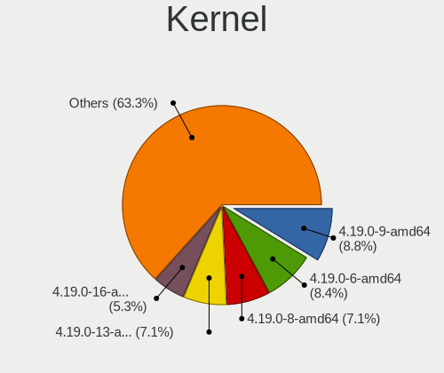

| Version              | Notebooks | Percent |
|----------------------|-----------|---------|
| 4.19.0-9-amd64       | 84        | 9%      |
| 4.19.0-6-amd64       | 80        | 8.57%   |
| 4.19.0-8-amd64       | 68        | 7.29%   |
| 4.19.0-13-amd64      | 67        | 7.18%   |
| 4.19.0-10-amd64      | 51        | 5.47%   |
| 4.19.0-16-amd64      | 50        | 5.36%   |
| 4.19.0-12-amd64      | 47        | 5.04%   |
| 4.19.0-17-amd64      | 40        | 4.29%   |
| 4.19.0-14-amd64      | 40        | 4.29%   |
| 4.19.0-11-amd64      | 22        | 2.36%   |
| 4.19.0-18-amd64      | 19        | 2.04%   |
| 4.19.0-5-amd64       | 17        | 1.82%   |
| 5.8.0-0.bpo.2-amd64  | 13        | 1.39%   |
| 5.10.0-0.bpo.3-amd64 | 11        | 1.18%   |
| 5.7.0-0.bpo.2-amd64  | 9         | 0.96%   |
| 5.4.0-4-amd64        | 9         | 0.96%   |
| 5.8.0-3-amd64        | 8         | 0.86%   |
| 5.6.0-0.bpo.2-amd64  | 8         | 0.86%   |
| 4.19.0-20-amd64      | 8         | 0.86%   |
| 5.6.0-2-amd64        | 7         | 0.75%   |
| 5.10.0-5mx-amd64     | 7         | 0.75%   |
| 5.10.0-0.bpo.7-amd64 | 7         | 0.75%   |
| 5.10.0-0.bpo.5-amd64 | 7         | 0.75%   |
| 5.9.0-0.bpo.5-amd64  | 6         | 0.64%   |
| 5.7.0-1-amd64        | 6         | 0.64%   |
| 5.4.0-0.bpo.2-amd64  | 6         | 0.64%   |
| 4.19.0-6-686-pae     | 6         | 0.64%   |
| 4.19.0-16-686-pae    | 6         | 0.64%   |
| 5.9.0-4-amd64        | 5         | 0.54%   |
| 5.9.0-0.bpo.2-amd64  | 5         | 0.54%   |
| 5.8.0-2-amd64        | 5         | 0.54%   |
| 5.5.0-0.bpo.2-amd64  | 5         | 0.54%   |
| 5.4.0-3-amd64        | 5         | 0.54%   |
| 5.10.0-0.bpo.8-amd64 | 5         | 0.54%   |
| 4.19.0-8-686         | 5         | 0.54%   |
| 4.19.0-4-amd64       | 5         | 0.54%   |
| 4.19.0-19-amd64      | 5         | 0.54%   |
| 4.19.0-13-686-pae    | 5         | 0.54%   |
| 5.9.0-1-amd64        | 4         | 0.43%   |
| 5.4.0-0.bpo.4-amd64  | 4         | 0.43%   |

Kernel Family
-------------

Linux kernel without a distro release

| Version   | Notebooks | Percent |
|-----------|-----------|---------|
| 4.19.0    | 622       | 71.09%  |
| 5.10.0    | 49        | 5.6%    |
| 5.4.0     | 33        | 3.77%   |
| 5.8.0     | 31        | 3.54%   |
| 5.9.0     | 25        | 2.86%   |
| 5.7.0     | 20        | 2.29%   |
| 5.6.0     | 17        | 1.94%   |
| 5.5.0     | 10        | 1.14%   |
| 5.2.0     | 9         | 1.03%   |
| 5.3.0     | 8         | 0.91%   |
| 4.9.0     | 3         | 0.34%   |
| 5.3.5     | 2         | 0.23%   |
| 5.0.0     | 2         | 0.23%   |
| 5.9.14    | 1         | 0.11%   |
| 5.9.11    | 1         | 0.11%   |
| 5.8.2     | 1         | 0.11%   |
| 5.8.16    | 1         | 0.11%   |
| 5.7.13    | 1         | 0.11%   |
| 5.6.8     | 1         | 0.11%   |
| 5.6.2     | 1         | 0.11%   |
| 5.6.19    | 1         | 0.11%   |
| 5.6.17    | 1         | 0.11%   |
| 5.6.10    | 1         | 0.11%   |
| 5.5.19    | 1         | 0.11%   |
| 5.5.13    | 1         | 0.11%   |
| 5.4.75    | 1         | 0.11%   |
| 5.4.65    | 1         | 0.11%   |
| 5.4.35    | 1         | 0.11%   |
| 5.4.28    | 1         | 0.11%   |
| 5.4.21    | 1         | 0.11%   |
| 5.4.2     | 1         | 0.11%   |
| 5.4.17    | 1         | 0.11%   |
| 5.4.16    | 1         | 0.11%   |
| 5.4.143   | 1         | 0.11%   |
| 5.4.13    | 1         | 0.11%   |
| 5.4.119   | 1         | 0.11%   |
| 5.4.104.1 | 1         | 0.11%   |
| 5.3.18    | 1         | 0.11%   |
| 5.2.8     | 1         | 0.11%   |
| 5.2.5     | 1         | 0.11%   |

Kernel Major Ver.
-----------------

Linux kernel major version

| Version | Notebooks | Percent |
|---------|-----------|---------|
| 4.19    | 624       | 71.64%  |
| 5.10    | 49        | 5.63%   |
| 5.4     | 42        | 4.82%   |
| 5.8     | 33        | 3.79%   |
| 5.9     | 27        | 3.1%    |
| 5.7     | 21        | 2.41%   |
| 5.6     | 21        | 2.41%   |
| 5.2     | 14        | 1.61%   |
| 5.5     | 12        | 1.38%   |
| 5.3     | 11        | 1.26%   |
| 4.9     | 5         | 0.57%   |
| 5.0     | 2         | 0.23%   |
| 3.10    | 2         | 0.23%   |
| 5.4.104 | 1         | 0.11%   |
| 5.18    | 1         | 0.11%   |
| 5.17    | 1         | 0.11%   |
| 5.16    | 1         | 0.11%   |
| 5.13    | 1         | 0.11%   |
| 5.12    | 1         | 0.11%   |
| 5.1     | 1         | 0.11%   |
| 4.20    | 1         | 0.11%   |

Arch
----

OS architecture (x86_64, i586, etc.)

| Name    | Notebooks | Percent |
|---------|-----------|---------|
| x86_64  | 791       | 93.72%  |
| i686    | 49        | 5.81%   |
| armv7l  | 3         | 0.36%   |
| aarch64 | 1         | 0.12%   |

DE
--

Desktop Environment

| Name             | Notebooks | Percent |
|------------------|-----------|---------|
| GNOME            | 238       | 27.48%  |
| XFCE             | 167       | 19.28%  |
| Unknown          | 109       | 12.59%  |
| KDE              | 77        | 8.89%   |
| KDE5             | 76        | 8.78%   |
| MATE             | 55        | 6.35%   |
| LXDE             | 34        | 3.93%   |
| X-Cinnamon       | 30        | 3.46%   |
| Cinnamon         | 30        | 3.46%   |
| i3               | 15        | 1.73%   |
| LXQt             | 9         | 1.04%   |
| Budgie           | 6         | 0.69%   |
| trinity          | 4         | 0.46%   |
| lightdm-xsession | 4         | 0.46%   |
| GNOME Classic    | 2         | 0.23%   |
| Unity            | 1         | 0.12%   |
| openbox          | 1         | 0.12%   |
| ICEWM            | 1         | 0.12%   |
| i3-gaps          | 1         | 0.12%   |
| GNOME Flashback  | 1         | 0.12%   |
| fluxbox          | 1         | 0.12%   |
| Enlightenment    | 1         | 0.12%   |
| DWM              | 1         | 0.12%   |
| default          | 1         | 0.12%   |
| awesome          | 1         | 0.12%   |

Display Server
--------------

X11 or Wayland

| Name    | Notebooks | Percent |
|---------|-----------|---------|
| X11     | 662       | 76.89%  |
| Wayland | 132       | 15.33%  |
| Tty     | 41        | 4.76%   |
| Unknown | 26        | 3.02%   |

Display Manager
---------------

SDDM, LightDM, etc.

| Name    | Notebooks | Percent |
|---------|-----------|---------|
| Unknown | 405       | 46.98%  |
| GDM     | 146       | 16.94%  |
| TDM     | 137       | 15.89%  |
| SDDM    | 89        | 10.32%  |
| LightDM | 61        | 7.08%   |
| GDM3    | 11        | 1.28%   |
| XDM     | 5         | 0.58%   |
| SLiM    | 3         | 0.35%   |
| NODM    | 3         | 0.35%   |
| WDM     | 1         | 0.12%   |
| KDM     | 1         | 0.12%   |

OS Lang
-------

Language

| Lang    | Notebooks | Percent |
|---------|-----------|---------|
| en_US   | 261       | 30.46%  |
| Unknown | 114       | 13.3%   |
| pt_BR   | 62        | 7.23%   |
| de_DE   | 57        | 6.65%   |
| fr_FR   | 50        | 5.83%   |
| ru_RU   | 38        | 4.43%   |
| it_IT   | 28        | 3.27%   |
| en_GB   | 27        | 3.15%   |
| es_ES   | 23        | 2.68%   |
| pl_PL   | 14        | 1.63%   |
| es_MX   | 13        | 1.52%   |
| es_CL   | 12        | 1.4%    |
| en_CA   | 12        | 1.4%    |
| C       | 11        | 1.28%   |
| pt_PT   | 10        | 1.17%   |
| es_AR   | 9         | 1.05%   |
| en_IN   | 9         | 1.05%   |
| de_CH   | 7         | 0.82%   |
| zh_CN   | 6         | 0.7%    |
| ru_UA   | 6         | 0.7%    |
| en_IE   | 6         | 0.7%    |
| cs_CZ   | 6         | 0.7%    |
| es_VE   | 5         | 0.58%   |
| da_DK   | 5         | 0.58%   |
| fi_FI   | 4         | 0.47%   |
| es_CO   | 4         | 0.47%   |
| en_ZA   | 4         | 0.47%   |
| en_NZ   | 4         | 0.47%   |
| en_AU   | 4         | 0.47%   |
| sk_SK   | 3         | 0.35%   |
| ko_KR   | 3         | 0.35%   |
| hu_HU   | 3         | 0.35%   |
| fr_CH   | 3         | 0.35%   |
| es_CR   | 3         | 0.35%   |
| sv_SE   | 2         | 0.23%   |
| nl_NL   | 2         | 0.23%   |
| nl_BE   | 2         | 0.23%   |
| ja_JP   | 2         | 0.23%   |
| el_GR   | 2         | 0.23%   |
| de_AT   | 2         | 0.23%   |

Boot Mode
---------

EFI or BIOS

| Mode | Notebooks | Percent |
|------|-----------|---------|
| BIOS | 559       | 65.61%  |
| EFI  | 293       | 34.39%  |

Filesystem
----------

Type of filesystem

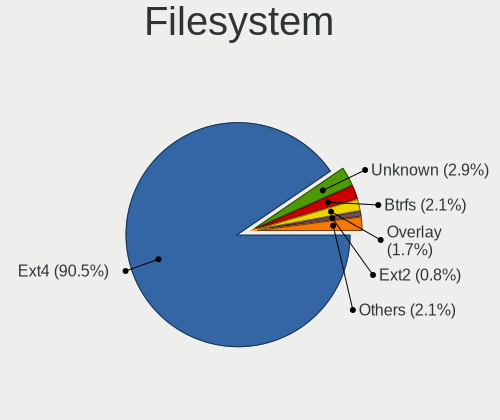

| Type    | Notebooks | Percent |
|---------|-----------|---------|
| Ext4    | 774       | 91.38%  |
| Unknown | 25        | 2.95%   |
| Btrfs   | 18        | 2.13%   |
| Overlay | 10        | 1.18%   |
| Ext2    | 7         | 0.83%   |
| Xfs     | 4         | 0.47%   |
| Rootfs  | 3         | 0.35%   |
| Ext3    | 3         | 0.35%   |
| Zfs     | 1         | 0.12%   |
| Tmpfs   | 1         | 0.12%   |
| F2fs    | 1         | 0.12%   |

Part. scheme
------------

Scheme of partitioning

| Type    | Notebooks | Percent |
|---------|-----------|---------|
| Unknown | 402       | 47.02%  |
| GPT     | 277       | 32.4%   |
| MBR     | 176       | 20.58%  |

Dual Boot with Linux/BSD
------------------------

Hosting more than one Linux/BSD

| Dual boot | Notebooks | Percent |
|-----------|-----------|---------|
| No        | 749       | 87.91%  |
| Yes       | 103       | 12.09%  |

Dual Boot (Win)
---------------

Hosting Linux and Windows

| Dual boot | Notebooks | Percent |
|-----------|-----------|---------|
| No        | 648       | 76.42%  |
| Yes       | 200       | 23.58%  |

Board
-----

Vendor
------

Motherboard manufacturer

| Name                  | Notebooks | Percent |
|-----------------------|-----------|---------|
| Lenovo                | 197       | 23.34%  |
| Dell                  | 167       | 19.79%  |
| Hewlett-Packard       | 141       | 16.71%  |
| ASUSTek Computer      | 82        | 9.72%   |
| Acer                  | 82        | 9.72%   |
| Toshiba               | 26        | 3.08%   |
| Samsung Electronics   | 20        | 2.37%   |
| Sony                  | 16        | 1.9%    |
| Apple                 | 12        | 1.42%   |
| MSI                   | 10        | 1.18%   |
| Notebook              | 8         | 0.95%   |
| Unknown               | 8         | 0.95%   |
| Positivo              | 5         | 0.59%   |
| Intel                 | 5         | 0.59%   |
| Fujitsu               | 5         | 0.59%   |
| Medion                | 4         | 0.47%   |
| Alienware             | 4         | 0.47%   |
| Timi                  | 3         | 0.36%   |
| Panasonic             | 3         | 0.36%   |
| LG Electronics        | 3         | 0.36%   |
| TUXEDO                | 2         | 0.24%   |
| TQ-Group              | 2         | 0.24%   |
| Purism                | 2         | 0.24%   |
| IBM                   | 2         | 0.24%   |
| Google                | 2         | 0.24%   |
| Fujitsu Siemens       | 2         | 0.24%   |
| DNS                   | 2         | 0.24%   |
| VIT                   | 1         | 0.12%   |
| ViewSonic             | 1         | 0.12%   |
| SLIMBOOK              | 1         | 0.12%   |
| RM                    | 1         | 0.12%   |
| Razer                 | 1         | 0.12%   |
| Positivo Bahia - VAIO | 1         | 0.12%   |
| Pine Microsystems     | 1         | 0.12%   |
| Philco                | 1         | 0.12%   |
| PC Specialist         | 1         | 0.12%   |
| Packard Bell          | 1         | 0.12%   |
| One Education         | 1         | 0.12%   |
| OEM                   | 1         | 0.12%   |
| NEC Computers         | 1         | 0.12%   |

Model
-----

Motherboard model

| Name                                     | Notebooks | Percent |
|------------------------------------------|-----------|---------|
| Unknown                                  | 12        | 1.42%   |
| Dell XPS 13 9360                         | 5         | 0.59%   |
| HP Pavilion Notebook                     | 4         | 0.47%   |
| Dell Inspiron 1545                       | 4         | 0.47%   |
| Lenovo ThinkPad E480 20KN003WUS          | 3         | 0.36%   |
| Lenovo IdeaPad 330-15IKB 81FE            | 3         | 0.36%   |
| Lenovo IdeaPad 110-15IBR 80T7            | 3         | 0.36%   |
| Intel powered classmate PC               | 3         | 0.36%   |
| HP Stream Notebook PC 13                 | 3         | 0.36%   |
| HP ProBook 4540s                         | 3         | 0.36%   |
| HP Pavilion g6                           | 3         | 0.36%   |
| HP Pavilion g4                           | 3         | 0.36%   |
| HP Notebook                              | 3         | 0.36%   |
| HP EliteBook 850 G5                      | 3         | 0.36%   |
| HP 2000                                  | 3         | 0.36%   |
| Dell Precision 5530                      | 3         | 0.36%   |
| Dell Latitude E7450                      | 3         | 0.36%   |
| Dell Latitude E6430                      | 3         | 0.36%   |
| Dell Latitude E6420                      | 3         | 0.36%   |
| Dell Latitude E5520                      | 3         | 0.36%   |
| Dell Latitude 5500                       | 3         | 0.36%   |
| Dell Inspiron 5570                       | 3         | 0.36%   |
| ASUS K52F                                | 3         | 0.36%   |
| Apple MacBookPro11,3                     | 3         | 0.36%   |
| Acer Aspire E5-575G                      | 3         | 0.36%   |
| TQ-Group TQMxE39S                        | 2         | 0.24%   |
| Timi TM1701                              | 2         | 0.24%   |
| Samsung 305E4A/305E5A/305E7A             | 2         | 0.24%   |
| Positivo Mobile                          | 2         | 0.24%   |
| Lenovo Y50-70 20378                      | 2         | 0.24%   |
| Lenovo V340-17IWL 81RG                   | 2         | 0.24%   |
| Lenovo V330-15IKB 81AX                   | 2         | 0.24%   |
| Lenovo ThinkPad X230 23252EG             | 2         | 0.24%   |
| Lenovo ThinkPad X1 Carbon 7th 20QDCTO1WW | 2         | 0.24%   |
| Lenovo Legion Y530-15ICH-1060 81LB       | 2         | 0.24%   |
| Lenovo Legion Y530-15ICH 81FV            | 2         | 0.24%   |
| Lenovo IdeaPad 330S-15IKB 81F5           | 2         | 0.24%   |
| Lenovo IdeaPad 120S-14IAP 81A5           | 2         | 0.24%   |
| HP ProBook 6460b                         | 2         | 0.24%   |
| HP ProBook 450 G6                        | 2         | 0.24%   |

Model Family
------------

Motherboard model prefix

| Name               | Notebooks | Percent |
|--------------------|-----------|---------|
| Lenovo ThinkPad    | 120       | 14.22%  |
| Dell Latitude      | 60        | 7.11%   |
| Dell Inspiron      | 60        | 7.11%   |
| Acer Aspire        | 55        | 6.52%   |
| Lenovo IdeaPad     | 42        | 4.98%   |
| HP EliteBook       | 29        | 3.44%   |
| HP ProBook         | 24        | 2.84%   |
| HP Pavilion        | 22        | 2.61%   |
| Toshiba Satellite  | 20        | 2.37%   |
| Dell Precision     | 15        | 1.78%   |
| Dell Vostro        | 14        | 1.66%   |
| HP Laptop          | 12        | 1.42%   |
| Unknown            | 12        | 1.42%   |
| Dell XPS           | 10        | 1.18%   |
| HP Compaq          | 9         | 1.07%   |
| ASUS VivoBook      | 9         | 1.07%   |
| Acer Swift         | 6         | 0.71%   |
| Lenovo Legion      | 5         | 0.59%   |
| HP ZBook           | 4         | 0.47%   |
| HP Stream          | 4         | 0.47%   |
| HP Presario        | 4         | 0.47%   |
| HP ENVY            | 4         | 0.47%   |
| HP 250             | 4         | 0.47%   |
| Acer Nitro         | 4         | 0.47%   |
| Acer Extensa       | 4         | 0.47%   |
| Toshiba PORTEGE    | 3         | 0.36%   |
| Intel powered      | 3         | 0.36%   |
| HP Notebook        | 3         | 0.36%   |
| HP 2000            | 3         | 0.36%   |
| HP 15              | 3         | 0.36%   |
| Fujitsu LIFEBOOK   | 3         | 0.36%   |
| Dell System        | 3         | 0.36%   |
| ASUS K52F          | 3         | 0.36%   |
| Apple MacBookPro11 | 3         | 0.36%   |
| Alienware 17       | 3         | 0.36%   |
| TQ-Group TQMxE39S  | 2         | 0.24%   |
| Toshiba TECRA      | 2         | 0.24%   |
| Timi TM1701        | 2         | 0.24%   |
| Samsung 305E4A     | 2         | 0.24%   |
| Purism Librem      | 2         | 0.24%   |

MFG Year
--------

Motherboard manufacture year

| Year    | Notebooks | Percent |
|---------|-----------|---------|
| 2019    | 93        | 11.02%  |
| 2011    | 89        | 10.55%  |
| 2018    | 79        | 9.36%   |
| 2012    | 73        | 8.65%   |
| 2017    | 72        | 8.53%   |
| 2016    | 61        | 7.23%   |
| 2014    | 60        | 7.11%   |
| 2015    | 57        | 6.75%   |
| 2013    | 52        | 6.16%   |
| 2010    | 51        | 6.04%   |
| 2009    | 44        | 5.21%   |
| 2008    | 41        | 4.86%   |
| 2020    | 34        | 4.03%   |
| 2007    | 13        | 1.54%   |
| 2006    | 6         | 0.71%   |
| Unknown | 6         | 0.71%   |
| 2021    | 4         | 0.47%   |
| 2004    | 4         | 0.47%   |
| 2005    | 3         | 0.36%   |
| 2003    | 1         | 0.12%   |
| 2002    | 1         | 0.12%   |

Form Factor
-----------

Physical design of the computer

| Name     | Notebooks | Percent |
|----------|-----------|---------|
| Notebook | 844       | 100%    |

Secure Boot
-----------

Enabled or disabled

| State    | Notebooks | Percent |
|----------|-----------|---------|
| Disabled | 808       | 95.62%  |
| Enabled  | 37        | 4.38%   |

Coreboot
--------

Have coreboot on board

| Used | Notebooks | Percent |
|------|-----------|---------|
| No   | 838       | 99.29%  |
| Yes  | 6         | 0.71%   |

RAM Size
--------

Total RAM memory

| Size in GB  | Notebooks | Percent |
|-------------|-----------|---------|
| 4.01-8.0    | 205       | 24.12%  |
| 3.01-4.0    | 188       | 22.12%  |
| 8.01-16.0   | 169       | 19.88%  |
| 16.01-24.0  | 144       | 16.94%  |
| 1.01-2.0    | 58        | 6.82%   |
| 32.01-64.0  | 39        | 4.59%   |
| 2.01-3.0    | 20        | 2.35%   |
| 0.51-1.0    | 14        | 1.65%   |
| 24.01-32.0  | 6         | 0.71%   |
| 0.01-0.5    | 5         | 0.59%   |
| 64.01-256.0 | 1         | 0.12%   |
| Unknown     | 1         | 0.12%   |

RAM Used
--------

Used RAM memory

| Used GB    | Notebooks | Percent |
|------------|-----------|---------|
| 1.01-2.0   | 306       | 33.7%   |
| 2.01-3.0   | 214       | 23.57%  |
| 4.01-8.0   | 129       | 14.21%  |
| 3.01-4.0   | 110       | 12.11%  |
| 0.51-1.0   | 87        | 9.58%   |
| 8.01-16.0  | 33        | 3.63%   |
| 0.01-0.5   | 22        | 2.42%   |
| 16.01-24.0 | 4         | 0.44%   |
| Unknown    | 3         | 0.33%   |

Total Drives
------------

Number of drives on board

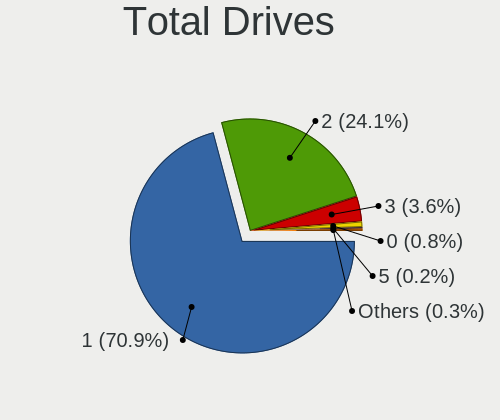

| Drives | Notebooks | Percent |
|--------|-----------|---------|
| 1      | 609       | 70.9%   |
| 2      | 207       | 24.1%   |
| 3      | 32        | 3.73%   |
| 0      | 6         | 0.7%    |
| 5      | 2         | 0.23%   |
| 4      | 2         | 0.23%   |
| 7      | 1         | 0.12%   |

Has CD-ROM
----------

Has CD-ROM on board

| Presented | Notebooks | Percent |
|-----------|-----------|---------|
| No        | 519       | 61.28%  |
| Yes       | 328       | 38.72%  |

Has Ethernet
------------

Has Ethernet on board

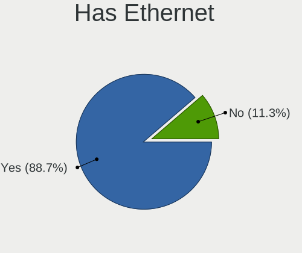

| Presented | Notebooks | Percent |
|-----------|-----------|---------|
| Yes       | 749       | 88.74%  |
| No        | 95        | 11.26%  |

Has WiFi
--------

Has WiFi module

| Presented | Notebooks | Percent |
|-----------|-----------|---------|
| Yes       | 824       | 97.51%  |
| No        | 21        | 2.49%   |

Has Bluetooth
-------------

Has Bluetooth module

| Presented | Notebooks | Percent |
|-----------|-----------|---------|
| Yes       | 613       | 72.12%  |
| No        | 237       | 27.88%  |

Location
--------

Country
-------

Geographic location (country)

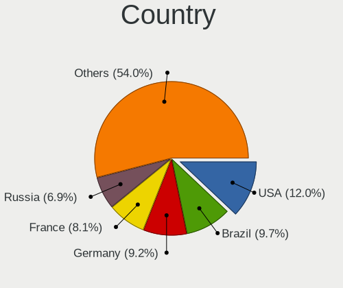

| Country      | Notebooks | Percent |
|--------------|-----------|---------|
| USA          | 103       | 12.13%  |
| Brazil       | 83        | 9.78%   |
| Germany      | 78        | 9.19%   |
| France       | 69        | 8.13%   |
| Russia       | 60        | 7.07%   |
| Italy        | 45        | 5.3%    |
| Spain        | 36        | 4.24%   |
| Switzerland  | 24        | 2.83%   |
| Poland       | 21        | 2.47%   |
| Ukraine      | 19        | 2.24%   |
| Portugal     | 17        | 2%      |
| UK           | 16        | 1.88%   |
| Mexico       | 16        | 1.88%   |
| Chile        | 15        | 1.77%   |
| India        | 14        | 1.65%   |
| Canada       | 14        | 1.65%   |
| Argentina    | 12        | 1.41%   |
| China        | 11        | 1.3%    |
| Netherlands  | 10        | 1.18%   |
| Greece       | 10        | 1.18%   |
| Hungary      | 9         | 1.06%   |
| Czechia      | 9         | 1.06%   |
| Romania      | 7         | 0.82%   |
| Ireland      | 7         | 0.82%   |
| Denmark      | 7         | 0.82%   |
| Venezuela    | 6         | 0.71%   |
| Turkey       | 6         | 0.71%   |
| New Zealand  | 6         | 0.71%   |
| Indonesia    | 6         | 0.71%   |
| Finland      | 6         | 0.71%   |
| Belgium      | 6         | 0.71%   |
| Vietnam      | 5         | 0.59%   |
| Thailand     | 5         | 0.59%   |
| Sweden       | 5         | 0.59%   |
| Norway       | 5         | 0.59%   |
| Colombia     | 5         | 0.59%   |
| Australia    | 5         | 0.59%   |
| South Africa | 4         | 0.47%   |
| Slovakia     | 4         | 0.47%   |
| Bulgaria     | 4         | 0.47%   |

City
----

Geographic location (city)

| City              | Notebooks | Percent |
|-------------------|-----------|---------|
| Moscow            | 18        | 2.02%   |
| Sao Paulo         | 17        | 1.91%   |
| St Petersburg     | 16        | 1.8%    |
| Zurich            | 12        | 1.35%   |
| Paris             | 8         | 0.9%    |
| Madrid            | 8         | 0.9%    |
| Berlin            | 8         | 0.9%    |
| Hamburg           | 7         | 0.79%   |
| Wooster           | 6         | 0.67%   |
| Warsaw            | 6         | 0.67%   |
| New York          | 6         | 0.67%   |
| Mexico City       | 6         | 0.67%   |
| Prague            | 5         | 0.56%   |
| Milan             | 5         | 0.56%   |
| Lisbon            | 5         | 0.56%   |
| Helsinki          | 5         | 0.56%   |
| Budapest          | 5         | 0.56%   |
| Belo Horizonte    | 5         | 0.56%   |
| Athens            | 5         | 0.56%   |
| Thessaloniki      | 4         | 0.45%   |
| Sofia             | 4         | 0.45%   |
| Rio de Janeiro    | 4         | 0.45%   |
| Florence          | 4         | 0.45%   |
| Cologne           | 4         | 0.45%   |
| Braslia         | 4         | 0.45%   |
| Violes            | 3         | 0.34%   |
| Vienna            | 3         | 0.34%   |
| Valencia          | 3         | 0.34%   |
| Santiago          | 3         | 0.34%   |
| Salvador          | 3         | 0.34%   |
| Rome              | 3         | 0.34%   |
| Porto Alegre      | 3         | 0.34%   |
| Porto             | 3         | 0.34%   |
| Phoenix           | 3         | 0.34%   |
| Perm              | 3         | 0.34%   |
| Naas              | 3         | 0.34%   |
| Munich            | 3         | 0.34%   |
| Kyiv              | 3         | 0.34%   |
| Hanoi             | 3         | 0.34%   |
| Frankfurt am Main | 3         | 0.34%   |

Drives
------

Drive Vendor
------------

Hard drive vendors

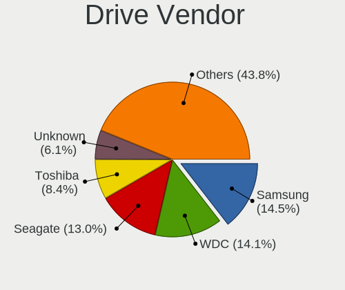

| Vendor                    | Notebooks | Drives | Percent |
|---------------------------|-----------|--------|---------|
| Samsung Electronics       | 159       | 189    | 14.87%  |
| WDC                       | 150       | 169    | 14.03%  |
| Seagate                   | 139       | 172    | 13%     |
| Toshiba                   | 91        | 108    | 8.51%   |
| Unknown                   | 64        | 85     | 5.99%   |
| SanDisk                   | 60        | 69     | 5.61%   |
| Kingston                  | 57        | 67     | 5.33%   |
| Crucial                   | 47        | 56     | 4.4%    |
| Hitachi                   | 41        | 45     | 3.84%   |
| HGST                      | 30        | 34     | 2.81%   |
| SK hynix                  | 29        | 38     | 2.71%   |
| A-DATA Technology         | 19        | 22     | 1.78%   |
| Intel                     | 18        | 21     | 1.68%   |
| Micron Technology         | 14        | 15     | 1.31%   |
| Fujitsu                   | 10        | 11     | 0.94%   |
| Transcend                 | 6         | 6      | 0.56%   |
| Patriot                   | 6         | 8      | 0.56%   |
| OCZ                       | 6         | 7      | 0.56%   |
| Micron/Crucial Technology | 6         | 6      | 0.56%   |
| LITEON                    | 6         | 7      | 0.56%   |
| LDLC                      | 6         | 6      | 0.56%   |
| Intenso                   | 6         | 9      | 0.56%   |
| Team                      | 5         | 7      | 0.47%   |
| Silicon Motion            | 5         | 5      | 0.47%   |
| PNY                       | 5         | 7      | 0.47%   |
| China                     | 5         | 5      | 0.47%   |
| Apple                     | 5         | 5      | 0.47%   |
| Phison                    | 4         | 6      | 0.37%   |
| KingSpec                  | 3         | 3      | 0.28%   |
| KingDian                  | 3         | 3      | 0.28%   |
| Hewlett-Packard           | 3         | 3      | 0.28%   |
| GOODRAM                   | 3         | 3      | 0.28%   |
| Gigabyte Technology       | 3         | 3      | 0.28%   |
| Unknown                   | 3         | 4      | 0.28%   |
| Super Talent              | 2         | 3      | 0.19%   |
| SPCC                      | 2         | 3      | 0.19%   |
| ORICO                     | 2         | 2      | 0.19%   |
| LITEONIT                  | 2         | 2      | 0.19%   |
| KIOXIA                    | 2         | 2      | 0.19%   |
| KingFast                  | 2         | 2      | 0.19%   |

Drive Model
-----------

Hard drive models

| Model                                  | Notebooks | Percent |
|----------------------------------------|-----------|---------|
| Seagate ST1000LM024 HN-M101MBB 1TB     | 18        | 1.65%   |
| Seagate ST1000LM035-1RK172 1TB         | 17        | 1.56%   |
| Kingston SA400S37240G 240GB SSD        | 17        | 1.56%   |
| Toshiba MQ01ABD100 1TB                 | 16        | 1.47%   |
| HGST HTS721010A9E630 1TB               | 15        | 1.37%   |
| Unknown MMC Card  32GB                 | 13        | 1.19%   |
| Samsung SSD 850 EVO 250GB              | 11        | 1.01%   |
| Crucial CT500MX500SSD1 500GB           | 11        | 1.01%   |
| Seagate ST500LM012 HN-M500MBB 500GB    | 10        | 0.92%   |
| Unknown MMC Card  64GB                 | 9         | 0.82%   |
| Seagate ST500LT012-1DG142 500GB        | 9         | 0.82%   |
| Kingston SA400S37120G 120GB SSD        | 9         | 0.82%   |
| WDC WD10SPZX-21Z10T0 1TB               | 8         | 0.73%   |
| Toshiba MQ01ABF050 500GB               | 7         | 0.64%   |
| Seagate ST9500325AS 500GB              | 7         | 0.64%   |
| WDC WD10SPZX-24Z10 1TB                 | 6         | 0.55%   |
| Toshiba NVMe SSD Drive 256GB           | 6         | 0.55%   |
| Toshiba MQ04ABF100 1TB                 | 6         | 0.55%   |
| SanDisk SSD PLUS 240GB                 | 6         | 0.55%   |
| Samsung SSD 860 EVO 500GB              | 6         | 0.55%   |
| Samsung SSD 860 EVO 250GB              | 6         | 0.55%   |
| Crucial CT240BX500SSD1 240GB           | 6         | 0.55%   |
| WDC WDS240G2G0A-00JH30 240GB SSD       | 5         | 0.46%   |
| WDC PC SN730 SDBQNTY-512G-1001 512GB   | 5         | 0.46%   |
| Seagate ST2000LM015-2E8174 2TB         | 5         | 0.46%   |
| Seagate ST1000LM049-2GH172 1TB         | 5         | 0.46%   |
| Seagate ST1000LM048-2E7172 1TB         | 5         | 0.46%   |
| Samsung SM963 2.5" NVMe PCIe SSD 256GB | 5         | 0.46%   |
| Samsung NVMe SSD Drive 512GB           | 5         | 0.46%   |
| Samsung MZVLB512HBJQ-000L7 512GB       | 5         | 0.46%   |
| Patriot Burst 240GB SSD                | 5         | 0.46%   |
| Micron/Crucial NVMe SSD Drive 500GB    | 5         | 0.46%   |
| Kingston SA400S37480G 480GB SSD        | 5         | 0.46%   |
| Hitachi HTS547550A9E384 500GB          | 5         | 0.46%   |
| WDC WD5000LPVX-22V0TT0 500GB           | 4         | 0.37%   |
| WDC WD5000LPCX-21VHAT0 500GB           | 4         | 0.37%   |
| WDC WD10JPVX-22JC3T0 1TB               | 4         | 0.37%   |
| WDC WD10JPCX-24UE4T0 1TB               | 4         | 0.37%   |
| Toshiba MQ01ABD050 500GB               | 4         | 0.37%   |
| SK hynix HFS256G39TND-N210A 256GB SSD  | 4         | 0.37%   |

HDD Vendor
----------

Hard disk drive vendors

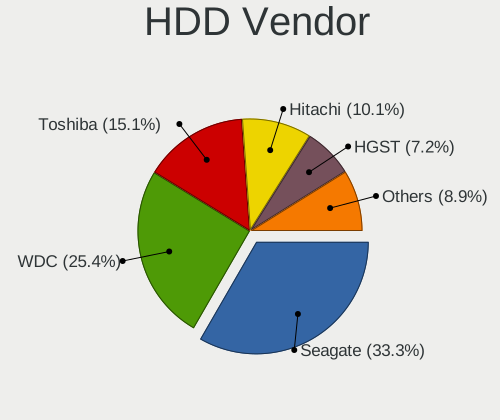

| Vendor              | Notebooks | Drives | Percent |
|---------------------|-----------|--------|---------|
| Seagate             | 135       | 167    | 33.25%  |
| WDC                 | 104       | 115    | 25.62%  |
| Toshiba             | 62        | 70     | 15.27%  |
| Hitachi             | 41        | 45     | 10.1%   |
| HGST                | 30        | 34     | 7.39%   |
| Samsung Electronics | 13        | 13     | 3.2%    |
| Fujitsu             | 10        | 11     | 2.46%   |
| Unknown             | 2         | 2      | 0.49%   |
| Intenso             | 2         | 3      | 0.49%   |
| SILICONMOTION       | 1         | 1      | 0.25%   |
| QNAP                | 1         | 2      | 0.25%   |
| PHD 3.0             | 1         | 1      | 0.25%   |
| IBM/Hitachi         | 1         | 2      | 0.25%   |
| Hewlett-Packard     | 1         | 1      | 0.25%   |
| ASMT                | 1         | 5      | 0.25%   |
| Apple               | 1         | 1      | 0.25%   |

SSD Vendor
----------

Solid state drive vendors

| Vendor              | Notebooks | Drives | Percent |
|---------------------|-----------|--------|---------|
| Samsung Electronics | 97        | 112    | 23.66%  |
| Kingston            | 50        | 59     | 12.2%   |
| SanDisk             | 46        | 53     | 11.22%  |
| Crucial             | 46        | 55     | 11.22%  |
| WDC                 | 23        | 26     | 5.61%   |
| A-DATA Technology   | 16        | 19     | 3.9%    |
| Micron Technology   | 11        | 12     | 2.68%   |
| SK hynix            | 10        | 12     | 2.44%   |
| Intel               | 9         | 10     | 2.2%    |
| Toshiba             | 6         | 7      | 1.46%   |
| Patriot             | 6         | 8      | 1.46%   |
| OCZ                 | 6         | 7      | 1.46%   |
| LITEON              | 6         | 7      | 1.46%   |
| Transcend           | 5         | 5      | 1.22%   |
| Team                | 5         | 7      | 1.22%   |
| LDLC                | 5         | 5      | 1.22%   |
| China               | 5         | 5      | 1.22%   |
| PNY                 | 4         | 6      | 0.98%   |
| Apple               | 4         | 4      | 0.98%   |
| KingSpec            | 3         | 3      | 0.73%   |
| KingDian            | 3         | 3      | 0.73%   |
| Intenso             | 3         | 4      | 0.73%   |
| GOODRAM             | 3         | 3      | 0.73%   |
| Gigabyte Technology | 3         | 3      | 0.73%   |
| Super Talent        | 2         | 3      | 0.49%   |
| SPCC                | 2         | 3      | 0.49%   |
| Seagate             | 2         | 2      | 0.49%   |
| LITEONIT            | 2         | 2      | 0.49%   |
| Hewlett-Packard     | 2         | 2      | 0.49%   |
| BIWIN               | 2         | 2      | 0.49%   |
| AMD                 | 2         | 2      | 0.49%   |
| TurXun              | 1         | 1      | 0.24%   |
| TOPMORE             | 1         | 1      | 0.24%   |
| TO Exter            | 1         | 1      | 0.24%   |
| TAMMUZ              | 1         | 2      | 0.24%   |
| SNR-ML              | 1         | 1      | 0.24%   |
| Smartbuy            | 1         | 1      | 0.24%   |
| Plextor             | 1         | 1      | 0.24%   |
| Palit               | 1         | 1      | 0.24%   |
| ORICO               | 1         | 1      | 0.24%   |

Drive Kind
----------

HDD or SSD

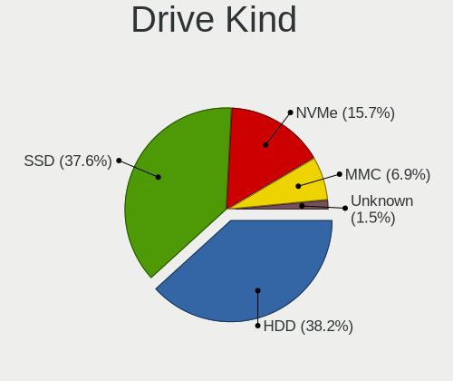

| Kind    | Notebooks | Drives | Percent |
|---------|-----------|--------|---------|
| HDD     | 392       | 473    | 38.36%  |
| SSD     | 383       | 474    | 37.48%  |
| NVMe    | 162       | 210    | 15.85%  |
| MMC     | 70        | 93     | 6.85%   |
| Unknown | 15        | 18     | 1.47%   |

Drive Connector
---------------

SATA, SAS, NVMe, etc.

| Type | Notebooks | Drives | Percent |
|------|-----------|--------|---------|
| SATA | 690       | 919    | 72.25%  |
| NVMe | 162       | 208    | 16.96%  |
| MMC  | 70        | 93     | 7.33%   |
| SAS  | 33        | 48     | 3.46%   |

Drive Size
----------

Size of hard drive

| Size in TB | Notebooks | Drives | Percent |
|------------|-----------|--------|---------|
| 0.01-0.5   | 521       | 650    | 68.37%  |
| 0.51-1.0   | 213       | 257    | 27.95%  |
| 1.01-2.0   | 17        | 22     | 2.23%   |
| 3.01-4.0   | 7         | 12     | 0.92%   |
| 4.01-10.0  | 3         | 4      | 0.39%   |
| 20.01-50.0 | 1         | 2      | 0.13%   |

Space Total
-----------

Amount of disk space available on the file system

| Size in GB     | Notebooks | Percent |
|----------------|-----------|---------|
| 101-250        | 292       | 33.68%  |
| 251-500        | 204       | 23.53%  |
| 501-1000       | 128       | 14.76%  |
| 51-100         | 78        | 9%      |
| 1001-2000      | 48        | 5.54%   |
| 21-50          | 38        | 4.38%   |
| Unknown        | 35        | 4.04%   |
| 1-20           | 19        | 2.19%   |
| 2001-3000      | 14        | 1.61%   |
| More than 3000 | 11        | 1.27%   |

Space Used
----------

Amount of used disk space

| Used GB        | Notebooks | Percent |
|----------------|-----------|---------|
| 1-20           | 281       | 30.95%  |
| 21-50          | 170       | 18.72%  |
| 101-250        | 161       | 17.73%  |
| 51-100         | 117       | 12.89%  |
| 251-500        | 76        | 8.37%   |
| 501-1000       | 43        | 4.74%   |
| Unknown        | 35        | 3.85%   |
| 1001-2000      | 16        | 1.76%   |
| 2001-3000      | 5         | 0.55%   |
| More than 3000 | 3         | 0.33%   |
| 0              | 1         | 0.11%   |

Malfunc. Drives
---------------

Drive models with a malfunction

| Model                                        | Notebooks | Drives | Percent |
|----------------------------------------------|-----------|--------|---------|
| Toshiba MQ01ABD100 1TB                       | 3         | 3      | 3.45%   |
| Seagate ST1000LM035-1RK172 1TB               | 3         | 3      | 3.45%   |
| Seagate ST1000LM024 HN-M101MBB 1TB           | 3         | 4      | 3.45%   |
| Toshiba MQ01ACF050 500GB                     | 2         | 2      | 2.3%    |
| Seagate ST9250315AS 250GB                    | 2         | 2      | 2.3%    |
| Seagate ST500LT012-9WS142 500GB              | 2         | 2      | 2.3%    |
| Hitachi HTS547550A9E384 500GB                | 2         | 2      | 2.3%    |
| A-DATA Technology SX900 256GB SSD            | 2         | 2      | 2.3%    |
| WDC WDS120G2G0A-00JH30 120GB SSD             | 1         | 1      | 1.15%   |
| WDC WD7500BPVX-22JC3T0 752GB                 | 1         | 1      | 1.15%   |
| WDC WD7500BPKT-75PK4T0 752GB                 | 1         | 1      | 1.15%   |
| WDC WD3200BPVT-00JJ5T0 320GB                 | 1         | 1      | 1.15%   |
| WDC WD3200BEVT-22A23T0 320GB                 | 1         | 1      | 1.15%   |
| WDC WD10JUCT-63CYNY0 1TB                     | 1         | 1      | 1.15%   |
| Toshiba MQ04ABF100 1TB                       | 1         | 1      | 1.15%   |
| Toshiba MQ01ABF050H 500GB                    | 1         | 1      | 1.15%   |
| Toshiba MQ01ABF050 500GB                     | 1         | 1      | 1.15%   |
| Toshiba MQ01ABD050 500GB                     | 1         | 1      | 1.15%   |
| Toshiba MK2546GSX 250GB                      | 1         | 1      | 1.15%   |
| Toshiba MK1637GSX 160GB                      | 1         | 1      | 1.15%   |
| Team L5 LITE SSD 60GB                        | 1         | 1      | 1.15%   |
| SK hynix SC311 SATA 256GB SSD                | 1         | 1      | 1.15%   |
| SK hynix HFS256G39MND-2300A 256GB SSD        | 1         | 1      | 1.15%   |
| Seagate ST9808210A 80GB                      | 1         | 1      | 1.15%   |
| Seagate ST9500420AS 500GB                    | 1         | 1      | 1.15%   |
| Seagate ST9500325AS 500GB                    | 1         | 1      | 1.15%   |
| Seagate ST9320325AS 320GB                    | 1         | 1      | 1.15%   |
| Seagate ST9160412AS 160GB                    | 1         | 1      | 1.15%   |
| Seagate ST9120822AS 120GB                    | 1         | 1      | 1.15%   |
| Seagate ST750LM028-1KK162 752GB              | 1         | 1      | 1.15%   |
| Seagate ST500LM021-1KJ152 500GB              | 1         | 1      | 1.15%   |
| Seagate ST500LM000-SSHD-8GB                  | 1         | 1      | 1.15%   |
| Seagate ST320LT020-9YG142 320GB              | 1         | 1      | 1.15%   |
| Seagate ST320LT007-9ZV142 320GB              | 1         | 3      | 1.15%   |
| SanDisk SSD PLUS 240GB                       | 1         | 1      | 1.15%   |
| SanDisk SDSSDX240GG25 240GB                  | 1         | 1      | 1.15%   |
| SanDisk SD8SN8U-256G-1006 256GB SSD          | 1         | 1      | 1.15%   |
| SanDisk SD8SN8U-128G-1006 128GB SSD          | 1         | 1      | 1.15%   |
| Samsung Electronics SSD 860 EVO 500GB        | 1         | 1      | 1.15%   |
| Samsung Electronics SSD 840 PRO Series 256GB | 1         | 1      | 1.15%   |

Malfunc. Drive Vendor
---------------------

Vendors of faulty drives

| Vendor              | Notebooks | Drives | Percent |
|---------------------|-----------|--------|---------|
| Seagate             | 21        | 24     | 24.14%  |
| Hitachi             | 16        | 16     | 18.39%  |
| Toshiba             | 11        | 11     | 12.64%  |
| Samsung Electronics | 7         | 7      | 8.05%   |
| WDC                 | 6         | 6      | 6.9%    |
| SanDisk             | 4         | 4      | 4.6%    |
| Fujitsu             | 4         | 4      | 4.6%    |
| A-DATA Technology   | 4         | 4      | 4.6%    |
| SK hynix            | 2         | 2      | 2.3%    |
| Kingston            | 2         | 3      | 2.3%    |
| Intel               | 2         | 2      | 2.3%    |
| HGST                | 2         | 2      | 2.3%    |
| Team                | 1         | 1      | 1.15%   |
| Micron Technology   | 1         | 1      | 1.15%   |
| KingSpec            | 1         | 1      | 1.15%   |
| KingDian            | 1         | 1      | 1.15%   |
| Crucial             | 1         | 1      | 1.15%   |
| Apple               | 1         | 1      | 1.15%   |

Malfunc. HDD Vendor
-------------------

Vendors of faulty HDD drives

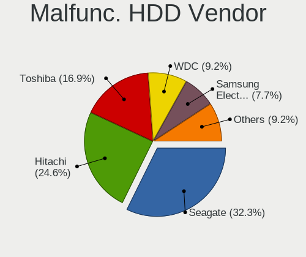

| Vendor              | Notebooks | Drives | Percent |
|---------------------|-----------|--------|---------|
| Seagate             | 21        | 24     | 32.81%  |
| Hitachi             | 16        | 16     | 25%     |
| Toshiba             | 11        | 11     | 17.19%  |
| WDC                 | 5         | 5      | 7.81%   |
| Samsung Electronics | 5         | 5      | 7.81%   |
| Fujitsu             | 4         | 4      | 6.25%   |
| HGST                | 2         | 2      | 3.13%   |

Malfunc. Drive Kind
-------------------

Kinds of faulty drives

| Kind | Notebooks | Drives | Percent |
|------|-----------|--------|---------|
| HDD  | 62        | 67     | 72.94%  |
| SSD  | 23        | 24     | 27.06%  |

Failed Drives
-------------

Failed drive models

Zero info for selected period =(

Failed Drive Vendor
-------------------

Failed drive vendors

Zero info for selected period =(

Drive Status
------------

Number of failed and malfunc. drives

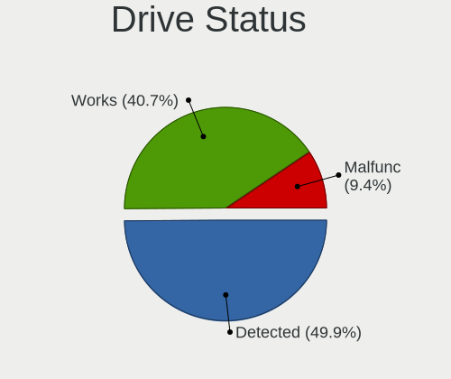

| Status   | Notebooks | Drives | Percent |
|----------|-----------|--------|---------|
| Detected | 463       | 712    | 50.33%  |
| Works    | 372       | 465    | 40.43%  |
| Malfunc  | 85        | 91     | 9.24%   |

Storage controller
------------------

Storage Vendor
--------------

Storage controller vendors

| Vendor                           | Notebooks | Percent |
|----------------------------------|-----------|---------|
| Intel                            | 663       | 72.62%  |
| AMD                              | 73        | 8%      |
| Samsung Electronics              | 57        | 6.24%   |
| SanDisk                          | 31        | 3.4%    |
| Toshiba America Info Systems     | 24        | 2.63%   |
| SK hynix                         | 13        | 1.42%   |
| Micron/Crucial Technology        | 7         | 0.77%   |
| Kingston Technology Company      | 7         | 0.77%   |
| Silicon Motion                   | 6         | 0.66%   |
| Phison Electronics               | 6         | 0.66%   |
| Nvidia                           | 6         | 0.66%   |
| ADATA Technology                 | 5         | 0.55%   |
| Silicon Integrated Systems [SiS] | 4         | 0.44%   |
| Micron Technology                | 3         | 0.33%   |
| KIOXIA                           | 3         | 0.33%   |
| VIA Technologies                 | 1         | 0.11%   |
| Union Memory (Shenzhen)          | 1         | 0.11%   |
| Silicon Image                    | 1         | 0.11%   |
| Shenzhen Longsys Electronics     | 1         | 0.11%   |
| Adaptec                          | 1         | 0.11%   |

Storage Model
-------------

Storage controller models

| Model                                                                            | Notebooks | Percent |
|----------------------------------------------------------------------------------|-----------|---------|
| Intel Sunrise Point-LP SATA Controller [AHCI mode]                               | 107       | 11.04%  |
| Intel 7 Series Chipset Family 6-port SATA Controller [AHCI mode]                 | 79        | 8.15%   |
| Intel 6 Series/C200 Series Chipset Family 6 port Mobile SATA AHCI Controller     | 61        | 6.3%    |
| AMD FCH SATA Controller [AHCI mode]                                              | 54        | 5.57%   |
| Intel 82801 Mobile SATA Controller [RAID mode]                                   | 48        | 4.95%   |
| Intel 82801IBM/IEM (ICH9M/ICH9M-E) 4 port SATA Controller [AHCI mode]            | 45        | 4.64%   |
| Intel 8 Series SATA Controller 1 [AHCI mode]                                     | 37        | 3.82%   |
| Samsung NVMe SSD Controller SM981/PM981/PM983                                    | 35        | 3.61%   |
| Intel Wildcat Point-LP SATA Controller [AHCI Mode]                               | 31        | 3.2%    |
| Intel 5 Series/3400 Series Chipset 4 port SATA AHCI Controller                   | 25        | 2.58%   |
| Intel 8 Series/C220 Series Chipset Family 6-port SATA Controller 1 [AHCI mode]   | 24        | 2.48%   |
| Intel Cannon Lake Mobile PCH SATA AHCI Controller                                | 21        | 2.17%   |
| Intel Cannon Point-LP SATA Controller [AHCI Mode]                                | 17        | 1.75%   |
| Intel HM170/QM170 Chipset SATA Controller [AHCI Mode]                            | 16        | 1.65%   |
| Intel Atom/Celeron/Pentium Processor x5-E8000/J3xxx/N3xxx Series SATA Controller | 16        | 1.65%   |
| Intel NM10/ICH7 Family SATA Controller [AHCI mode]                               | 14        | 1.44%   |
| Intel 82801HM/HEM (ICH8M/ICH8M-E) IDE Controller                                 | 14        | 1.44%   |
| Intel 82801HM/HEM (ICH8M/ICH8M-E) SATA Controller [AHCI mode]                    | 13        | 1.34%   |
| Intel 5 Series/3400 Series Chipset 6 port SATA AHCI Controller                   | 13        | 1.34%   |
| AMD SB7x0/SB8x0/SB9x0 SATA Controller [AHCI mode]                                | 13        | 1.34%   |
| Toshiba America Info Systems XG5 NVMe SSD Controller                             | 11        | 1.14%   |
| Intel Comet Lake SATA AHCI Controller                                            | 11        | 1.14%   |
| Intel Celeron/Pentium Silver Processor SATA Controller                           | 10        | 1.03%   |
| Samsung NVMe SSD Controller 980                                                  | 8         | 0.83%   |
| Intel Celeron N3350/Pentium N4200/Atom E3900 Series SATA AHCI Controller         | 8         | 0.83%   |
| Toshiba America Info Systems XG6 NVMe SSD Controller                             | 7         | 0.72%   |
| SanDisk WD Black SN750 / PC SN730 NVMe SSD                                       | 7         | 0.72%   |
| SanDisk WD Black 2018/SN750 / PC SN720 NVMe SSD                                  | 7         | 0.72%   |
| Intel Atom Processor E3800 Series SATA AHCI Controller                           | 7         | 0.72%   |
| Intel 82801GBM/GHM (ICH7-M Family) SATA Controller [AHCI mode]                   | 7         | 0.72%   |
| SanDisk WD Blue SN500 / PC SN520 NVMe SSD                                        | 6         | 0.62%   |
| SanDisk PC SN520 NVMe SSD                                                        | 6         | 0.62%   |
| Samsung NVMe SSD Controller SM961/PM961/SM963                                    | 6         | 0.62%   |
| Intel Q170/Q150/B150/H170/H110/Z170/CM236 Chipset SATA Controller [AHCI Mode]    | 6         | 0.62%   |
| Intel 82801GBM/GHM (ICH7-M Family) SATA Controller [IDE mode]                    | 6         | 0.62%   |
| SK hynix Non-Volatile memory controller                                          | 5         | 0.52%   |
| SK hynix BC501 NVMe Solid State Drive                                            | 5         | 0.52%   |
| Phison E12 NVMe Controller                                                       | 5         | 0.52%   |
| Micron/Crucial P1 NVMe PCIe SSD                                                  | 5         | 0.52%   |
| Intel 82801G (ICH7 Family) IDE Controller                                        | 5         | 0.52%   |

Storage Kind
------------

Kind of storage controller (IDE, SATA, NVMe, SAS, ...)

| Kind | Notebooks | Percent |
|------|-----------|---------|
| SATA | 655       | 69.31%  |
| NVMe | 165       | 17.46%  |
| IDE  | 74        | 7.83%   |
| RAID | 50        | 5.29%   |
| SCSI | 1         | 0.11%   |

Processor
---------

CPU Vendor
----------

Processor vendors

| Vendor       | Notebooks | Percent |
|--------------|-----------|---------|
| Intel        | 753       | 89.22%  |
| AMD          | 85        | 10.07%  |
| ARM          | 4         | 0.47%   |
| CentaurHauls | 1         | 0.12%   |
| Unknown      | 1         | 0.12%   |

CPU Model
---------

Processor models

| Model                                       | Notebooks | Percent |
|---------------------------------------------|-----------|---------|
| Intel Core i5-8250U CPU @ 1.60GHz           | 29        | 3.44%   |
| Intel Core i7-8550U CPU @ 1.80GHz           | 27        | 3.2%    |
| Intel Core i7-8565U CPU @ 1.80GHz           | 22        | 2.61%   |
| Intel Core i5-7200U CPU @ 2.50GHz           | 20        | 2.37%   |
| Intel Core i5-3320M CPU @ 2.60GHz           | 15        | 1.78%   |
| Intel Core i7-7500U CPU @ 2.70GHz           | 14        | 1.66%   |
| Intel Core i5-2520M CPU @ 2.50GHz           | 14        | 1.66%   |
| Intel Core i5-8265U CPU @ 1.60GHz           | 13        | 1.54%   |
| Intel Core i5-6200U CPU @ 2.30GHz           | 13        | 1.54%   |
| Intel Core i5-2410M CPU @ 2.30GHz           | 11        | 1.3%    |
| Intel Core i5-6300U CPU @ 2.40GHz           | 10        | 1.18%   |
| Intel Core i7-7700HQ CPU @ 2.80GHz          | 9         | 1.07%   |
| Intel Core i7-9750H CPU @ 2.60GHz           | 8         | 0.95%   |
| Intel Core i7-8750H CPU @ 2.20GHz           | 8         | 0.95%   |
| Intel Core i7-10510U CPU @ 1.80GHz          | 8         | 0.95%   |
| Intel Core i5-5300U CPU @ 2.30GHz           | 8         | 0.95%   |
| Intel Core i5-5200U CPU @ 2.20GHz           | 8         | 0.95%   |
| Intel Core i3-3110M CPU @ 2.40GHz           | 8         | 0.95%   |
| Intel Celeron CPU N3060 @ 1.60GHz           | 8         | 0.95%   |
| Intel Core i7-8665U CPU @ 1.90GHz           | 7         | 0.83%   |
| Intel Core i7-6500U CPU @ 2.50GHz           | 7         | 0.83%   |
| Intel Core i5-3230M CPU @ 2.60GHz           | 7         | 0.83%   |
| Intel Core i5-3210M CPU @ 2.50GHz           | 7         | 0.83%   |
| Intel Atom CPU N455 @ 1.66GHz               | 7         | 0.83%   |
| Intel Core i7-5600U CPU @ 2.60GHz           | 6         | 0.71%   |
| Intel Core i7-3630QM CPU @ 2.40GHz          | 6         | 0.71%   |
| Intel Core i7-2640M CPU @ 2.80GHz           | 6         | 0.71%   |
| Intel Core i5-4300U CPU @ 1.90GHz           | 6         | 0.71%   |
| Intel Core i5-4210U CPU @ 1.70GHz           | 6         | 0.71%   |
| Intel Celeron CPU N3050 @ 1.60GHz           | 6         | 0.71%   |
| Intel Core i7-6700HQ CPU @ 2.60GHz          | 5         | 0.59%   |
| Intel Core i7-4700MQ CPU @ 2.40GHz          | 5         | 0.59%   |
| Intel Core i7-4510U CPU @ 2.00GHz           | 5         | 0.59%   |
| Intel Core i7-1065G7 CPU @ 1.30GHz          | 5         | 0.59%   |
| Intel Core i5-10210U CPU @ 1.60GHz          | 5         | 0.59%   |
| Intel Core i3-6006U CPU @ 2.00GHz           | 5         | 0.59%   |
| Intel Core i3-5005U CPU @ 2.00GHz           | 5         | 0.59%   |
| Intel Core i3-4005U CPU @ 1.70GHz           | 5         | 0.59%   |
| Intel Core i3-10110U CPU @ 2.10GHz          | 5         | 0.59%   |
| Intel Pentium Dual-Core CPU T4300 @ 2.10GHz | 4         | 0.47%   |

CPU Model Family
----------------

Processor model prefix

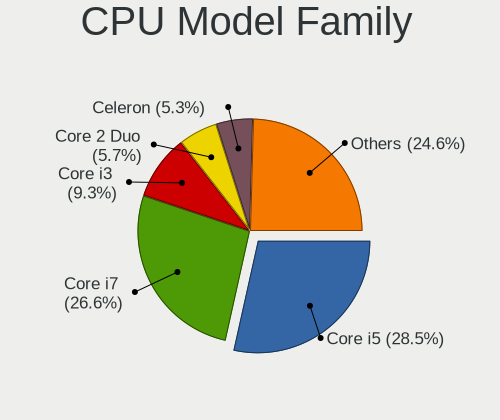

| Model                          | Notebooks | Percent |
|--------------------------------|-----------|---------|
| Intel Core i5                  | 242       | 28.67%  |
| Intel Core i7                  | 229       | 27.13%  |
| Intel Core i3                  | 80        | 9.48%   |
| Intel Core 2 Duo               | 45        | 5.33%   |
| Intel Celeron                  | 45        | 5.33%   |
| Intel Atom                     | 34        | 4.03%   |
| Intel Pentium                  | 19        | 2.25%   |
| Other                          | 12        | 1.42%   |
| Intel Pentium Dual-Core        | 11        | 1.3%    |
| Intel Pentium Dual             | 10        | 1.18%   |
| Intel Pentium M                | 9         | 1.07%   |
| AMD Ryzen 5                    | 9         | 1.07%   |
| AMD A8                         | 8         | 0.95%   |
| AMD A4                         | 8         | 0.95%   |
| AMD Ryzen 7 PRO                | 7         | 0.83%   |
| AMD E                          | 7         | 0.83%   |
| Intel Core 2                   | 6         | 0.71%   |
| AMD Ryzen 3                    | 6         | 0.71%   |
| AMD A6                         | 6         | 0.71%   |
| Intel Celeron Dual-Core        | 4         | 0.47%   |
| AMD Turion 64 X2 Mobile        | 4         | 0.47%   |
| AMD Ryzen 7                    | 4         | 0.47%   |
| AMD E1                         | 4         | 0.47%   |
| AMD E2                         | 3         | 0.36%   |
| Intel Pentium Silver           | 2         | 0.24%   |
| Intel Genuine                  | 2         | 0.24%   |
| Intel Core i9                  | 2         | 0.24%   |
| Intel Celeron M                | 2         | 0.24%   |
| ARM ARMv7                      | 2         | 0.24%   |
| AMD Ryzen 5 PRO                | 2         | 0.24%   |
| AMD C-60                       | 2         | 0.24%   |
| Intel Pentium III              | 1         | 0.12%   |
| Intel Pentium 4                | 1         | 0.12%   |
| Intel Core m7                  | 1         | 0.12%   |
| Intel Core m3                  | 1         | 0.12%   |
| Intel Core Duo                 | 1         | 0.12%   |
| CentaurHauls VIA C7            | 1         | 0.12%   |
| AMD Turion X2 Dual-Core Mobile | 1         | 0.12%   |
| AMD Turion II Dual-Core        | 1         | 0.12%   |
| AMD Phenom II                  | 1         | 0.12%   |

CPU Cores
---------

Number of processor cores

| Number | Notebooks | Percent |
|--------|-----------|---------|
| 2      | 499       | 59.12%  |
| 4      | 275       | 32.58%  |
| 1      | 37        | 4.38%   |
| 6      | 25        | 2.96%   |
| 8      | 7         | 0.83%   |
| 3      | 1         | 0.12%   |

CPU Sockets
-----------

Number of sockets

| Number | Notebooks | Percent |
|--------|-----------|---------|
| 1      | 843       | 99.88%  |
| 2      | 1         | 0.12%   |

CPU Threads
-----------

Threads per core (Hyper-Threading)

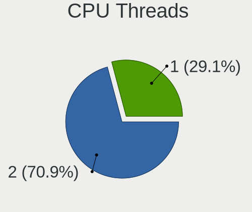

| Number | Notebooks | Percent |
|--------|-----------|---------|
| 2      | 604       | 71.48%  |
| 1      | 241       | 28.52%  |

CPU Op-Modes
------------

CPU Operation Modes (32-bit, 64-bit)

| Op mode        | Notebooks | Percent |
|----------------|-----------|---------|
| 32-bit, 64-bit | 799       | 94.56%  |
| 32-bit         | 23        | 2.72%   |
| Unknown        | 22        | 2.6%    |
| 64-bit         | 1         | 0.12%   |

CPU Microcode
-------------

Microcode number

| Number     | Notebooks | Percent |
|------------|-----------|---------|
| Unknown    | 334       | 38.48%  |
| 0x206a7    | 51        | 5.88%   |
| 0x306a9    | 41        | 4.72%   |
| 0x806ec    | 39        | 4.49%   |
| 0x1067a    | 34        | 3.92%   |
| 0x806ea    | 31        | 3.57%   |
| 0x40651    | 24        | 2.76%   |
| 0x306d4    | 24        | 2.76%   |
| 0x306c3    | 19        | 2.19%   |
| 0x806e9    | 18        | 2.07%   |
| 0x406e3    | 18        | 2.07%   |
| 0x20655    | 16        | 1.84%   |
| 0x906ea    | 15        | 1.73%   |
| 0x6fd      | 12        | 1.38%   |
| 0x30678    | 11        | 1.27%   |
| 0x106ca    | 11        | 1.27%   |
| 0x20652    | 10        | 1.15%   |
| 0x806eb    | 9         | 1.04%   |
| 0x406c3    | 9         | 1.04%   |
| 0x08108102 | 9         | 1.04%   |
| 0x906e9    | 8         | 0.92%   |
| 0x406c4    | 8         | 0.92%   |
| 0x05000119 | 8         | 0.92%   |
| 0x706e5    | 7         | 0.81%   |
| 0x506e3    | 6         | 0.69%   |
| 0x10676    | 6         | 0.69%   |
| 0x706a1    | 5         | 0.58%   |
| 0x6d8      | 5         | 0.58%   |
| 0x07030105 | 5         | 0.58%   |
| 0x906ed    | 4         | 0.46%   |
| 0x6f6      | 4         | 0.46%   |
| 0x106c2    | 4         | 0.46%   |
| 0x03000027 | 4         | 0.46%   |
| 0x806c1    | 3         | 0.35%   |
| 0x6d6      | 3         | 0.35%   |
| 0x506ca    | 3         | 0.35%   |
| 0x506c9    | 3         | 0.35%   |
| 0x106e5    | 3         | 0.35%   |
| 0x08600106 | 3         | 0.35%   |
| 0x0810100b | 3         | 0.35%   |

CPU Microarch
-------------

Microarchitecture

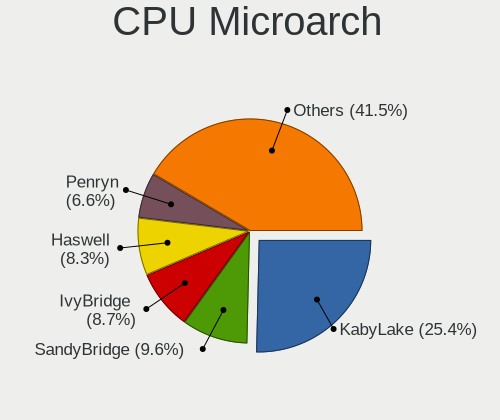

| Name            | Notebooks | Percent |
|-----------------|-----------|---------|
| KabyLake        | 217       | 25.71%  |
| SandyBridge     | 81        | 9.6%    |
| IvyBridge       | 74        | 8.77%   |
| Haswell         | 69        | 8.18%   |
| Penryn          | 54        | 6.4%    |
| Skylake         | 49        | 5.81%   |
| Silvermont      | 37        | 4.38%   |
| Westmere        | 35        | 4.15%   |
| Broadwell       | 34        | 4.03%   |
| Core            | 23        | 2.73%   |
| Bonnell         | 23        | 2.73%   |
| P6              | 15        | 1.78%   |
| Zen+            | 14        | 1.66%   |
| Bobcat          | 14        | 1.66%   |
| Puma            | 10        | 1.18%   |
| Goldmont plus   | 10        | 1.18%   |
| Zen             | 9         | 1.07%   |
| IceLake         | 8         | 0.95%   |
| Goldmont        | 8         | 0.95%   |
| K8 Hammer       | 6         | 0.71%   |
| Excavator       | 6         | 0.71%   |
| CometLake       | 6         | 0.71%   |
| Zen 2           | 5         | 0.59%   |
| TigerLake       | 5         | 0.59%   |
| Nehalem         | 5         | 0.59%   |
| K10 Llano       | 5         | 0.59%   |
| Jaguar          | 5         | 0.59%   |
| Unknown         | 5         | 0.59%   |
| Steamroller     | 3         | 0.36%   |
| K8 & K10 hybrid | 3         | 0.36%   |
| K10             | 3         | 0.36%   |
| Piledriver      | 2         | 0.24%   |
| NetBurst        | 1         | 0.12%   |

Graphics
--------

GPU Vendor
----------

Vendors of graphics cards

| Vendor                           | Notebooks | Percent |
|----------------------------------|-----------|---------|
| Intel                            | 682       | 64.52%  |
| Nvidia                           | 210       | 19.87%  |
| AMD                              | 161       | 15.23%  |
| Silicon Integrated Systems [SiS] | 3         | 0.28%   |
| VIA Technologies                 | 1         | 0.09%   |

GPU Model
---------

Graphics card models

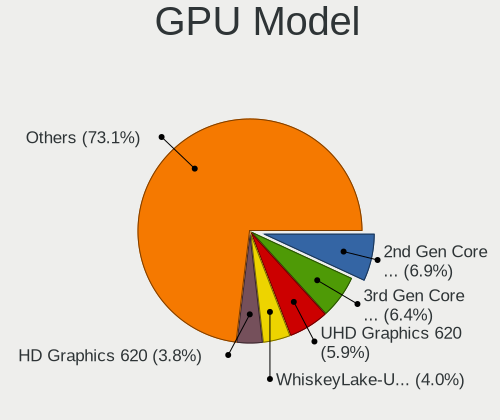

| Model                                                                                    | Notebooks | Percent |
|------------------------------------------------------------------------------------------|-----------|---------|
| Intel 2nd Generation Core Processor Family Integrated Graphics Controller                | 75        | 6.89%   |
| Intel 3rd Gen Core processor Graphics Controller                                         | 70        | 6.43%   |
| Intel UHD Graphics 620                                                                   | 65        | 5.97%   |
| Intel WhiskeyLake-U GT2 [UHD Graphics 620]                                               | 45        | 4.14%   |
| Intel HD Graphics 620                                                                    | 40        | 3.68%   |
| Intel Haswell-ULT Integrated Graphics Controller                                         | 40        | 3.68%   |
| Intel Mobile 4 Series Chipset Integrated Graphics Controller                             | 38        | 3.49%   |
| Intel Skylake GT2 [HD Graphics 520]                                                      | 37        | 3.4%    |
| Intel HD Graphics 5500                                                                   | 31        | 2.85%   |
| Intel Core Processor Integrated Graphics Controller                                      | 24        | 2.21%   |
| Intel CoffeeLake-H GT2 [UHD Graphics 630]                                                | 24        | 2.21%   |
| Intel 4th Gen Core Processor Integrated Graphics Controller                              | 23        | 2.11%   |
| Intel Atom/Celeron/Pentium Processor x5-E8000/J3xxx/N3xxx Integrated Graphics Controller | 22        | 2.02%   |
| Intel CometLake-U GT2 [UHD Graphics]                                                     | 20        | 1.84%   |
| Intel Atom Processor D4xx/D5xx/N4xx/N5xx Integrated Graphics Controller                  | 16        | 1.47%   |
| Intel HD Graphics 630                                                                    | 15        | 1.38%   |
| Intel Atom Processor Z36xxx/Z37xxx Series Graphics & Display                             | 15        | 1.38%   |
| AMD Picasso/Raven 2 [Radeon Vega Series / Radeon Vega Mobile Series]                     | 14        | 1.29%   |
| AMD Topaz XT [Radeon R7 M260/M265 / M340/M360 / M440/M445 / 530/535 / 620/625 Mobile]    | 13        | 1.19%   |
| Intel Mobile GM965/GL960 Integrated Graphics Controller (secondary)                      | 12        | 1.1%    |
| Intel Mobile GM965/GL960 Integrated Graphics Controller (primary)                        | 12        | 1.1%    |
| Nvidia GP108M [GeForce MX150]                                                            | 10        | 0.92%   |
| Nvidia GM108M [GeForce 940MX]                                                            | 9         | 0.83%   |
| Intel Mobile 945GM/GMS/GME, 943/940GML Express Integrated Graphics Controller            | 9         | 0.83%   |
| Nvidia GM108M [GeForce 840M]                                                             | 8         | 0.74%   |
| Nvidia GF117M [GeForce 610M/710M/810M/820M / GT 620M/625M/630M/720M]                     | 8         | 0.74%   |
| Intel HD Graphics 530                                                                    | 8         | 0.74%   |
| Intel GeminiLake [UHD Graphics 600]                                                      | 8         | 0.74%   |
| AMD Raven Ridge [Radeon Vega Series / Radeon Vega Mobile Series]                         | 8         | 0.74%   |
| AMD Mullins [Radeon R4/R5 Graphics]                                                      | 8         | 0.74%   |
| Nvidia GP107M [GeForce GTX 1050 Ti Mobile]                                               | 7         | 0.64%   |
| Nvidia GP107M [GeForce GTX 1050 Mobile]                                                  | 7         | 0.64%   |
| Nvidia GM107M [GeForce GTX 960M]                                                         | 7         | 0.64%   |
| Nvidia GK208BM [GeForce 920M]                                                            | 7         | 0.64%   |
| Nvidia GF108M [GeForce GT 620M/630M/635M/640M LE]                                        | 7         | 0.64%   |
| Intel HD Graphics 500                                                                    | 7         | 0.64%   |
| AMD Seymour [Radeon HD 6400M/7400M Series]                                               | 7         | 0.64%   |
| AMD Lexa PRO [Radeon 540/540X/550/550X / RX 540X/550/550X]                               | 7         | 0.64%   |
| Nvidia GK208M [GeForce GT 740M]                                                          | 6         | 0.55%   |
| AMD Stoney [Radeon R2/R3/R4/R5 Graphics]                                                 | 6         | 0.55%   |

GPU Combo
---------

Combinations of graphics cards

| Name               | Notebooks | Percent |
|--------------------|-----------|---------|
| 1 x Intel          | 466       | 54.95%  |
| Intel + Nvidia     | 160       | 18.87%  |
| 1 x AMD            | 102       | 12.03%  |
| Intel + AMD        | 52        | 6.13%   |
| 1 x Nvidia         | 48        | 5.66%   |
| 2 x AMD            | 7         | 0.83%   |
| Other              | 6         | 0.71%   |
| 1 x SiS            | 3         | 0.35%   |
| Intel + 2 x Nvidia | 2         | 0.24%   |
| 2 x Nvidia         | 1         | 0.12%   |
| 1 x VIA            | 1         | 0.12%   |

GPU Driver
----------

Free vs proprietary

| Driver      | Notebooks | Percent |
|-------------|-----------|---------|
| Free        | 756       | 88.63%  |
| Proprietary | 73        | 8.56%   |
| Unknown     | 24        | 2.81%   |

GPU Memory
----------

Total video memory

| Size in GB | Notebooks | Percent |
|------------|-----------|---------|
| Unknown    | 697       | 81.62%  |
| 0.01-0.5   | 58        | 6.79%   |
| 1.01-2.0   | 48        | 5.62%   |
| 0.51-1.0   | 26        | 3.04%   |
| 3.01-4.0   | 16        | 1.87%   |
| 7.01-8.0   | 4         | 0.47%   |
| 5.01-6.0   | 4         | 0.47%   |
| 2.01-3.0   | 1         | 0.12%   |

Monitor
-------

Monitor Vendor
--------------

Monitor vendors

| Vendor                  | Notebooks | Percent |
|-------------------------|-----------|---------|
| AU Optronics            | 201       | 20.72%  |
| LG Display              | 154       | 15.88%  |
| BOE                     | 115       | 11.86%  |
| Samsung Electronics     | 111       | 11.44%  |
| Chimei Innolux          | 102       | 10.52%  |
| Dell                    | 37        | 3.81%   |
| Lenovo                  | 26        | 2.68%   |
| Goldstar                | 23        | 2.37%   |
| Chi Mei Optoelectronics | 23        | 2.37%   |
| Sharp                   | 16        | 1.65%   |
| Hewlett-Packard         | 14        | 1.44%   |
| InfoVision              | 13        | 1.34%   |
| Iiyama                  | 12        | 1.24%   |
| Apple                   | 12        | 1.24%   |
| Philips                 | 10        | 1.03%   |
| PANDA                   | 8         | 0.82%   |
| AOC                     | 8         | 0.82%   |
| LG Philips              | 7         | 0.72%   |
| Ancor Communications    | 7         | 0.72%   |
| Sony                    | 6         | 0.62%   |
| HannStar                | 6         | 0.62%   |
| CPT                     | 6         | 0.62%   |
| Acer                    | 6         | 0.62%   |
| BenQ                    | 5         | 0.52%   |
| LGD                     | 3         | 0.31%   |
| Quanta Display          | 2         | 0.21%   |
| Panasonic               | 2         | 0.21%   |
| InnoLux Display         | 2         | 0.21%   |
| Eizo                    | 2         | 0.21%   |
| CSO                     | 2         | 0.21%   |
| ASUSTek Computer        | 2         | 0.21%   |
| Xiaomi                  | 1         | 0.1%    |
| Wacom                   | 1         | 0.1%    |
| Vizio                   | 1         | 0.1%    |
| ViewSonic               | 1         | 0.1%    |
| Unknown (XXX)           | 1         | 0.1%    |
| Unknown                 | 1         | 0.1%    |
| SKY                     | 1         | 0.1%    |
| Seiko/Epson             | 1         | 0.1%    |
| RTK                     | 1         | 0.1%    |

Monitor Model
-------------

Monitor models

| Model                                                                 | Notebooks | Percent |
|-----------------------------------------------------------------------|-----------|---------|
| AU Optronics LCD Monitor AUO38ED 1920x1080 344x193mm 15.5-inch        | 11        | 1.12%   |
| AU Optronics LCD Monitor AUO22EC 1366x768 344x193mm 15.5-inch         | 9         | 0.91%   |
| AU Optronics LCD Monitor AUO21ED 1920x1080 344x193mm 15.5-inch        | 8         | 0.81%   |
| LG Display LCD Monitor LGD02DC 1366x768 344x194mm 15.5-inch           | 7         | 0.71%   |
| Samsung Electronics LCD Monitor SEC5441 1366x768 344x194mm 15.5-inch  | 6         | 0.61%   |
| LG Display LCD Monitor LGD02E9 1366x768 310x170mm 13.9-inch           | 6         | 0.61%   |
| LG Display LCD Monitor LGD02D8 1366x768 277x156mm 12.5-inch           | 6         | 0.61%   |
| Goldstar ULTRAWIDE GSM59F1 2560x1080 798x334mm 34.1-inch              | 6         | 0.61%   |
| Chimei Innolux LCD Monitor CMN15E8 1920x1080 344x193mm 15.5-inch      | 6         | 0.61%   |
| Chimei Innolux LCD Monitor CMN15DB 1366x768 344x193mm 15.5-inch       | 6         | 0.61%   |
| BOE LCD Monitor BOE0672 1366x768 344x194mm 15.5-inch                  | 6         | 0.61%   |
| AU Optronics LCD Monitor AUO106C 1366x768 276x155mm 12.5-inch         | 6         | 0.61%   |
| Chimei Innolux LCD Monitor CMN14D4 1920x1080 309x173mm 13.9-inch      | 5         | 0.51%   |
| AU Optronics LCD Monitor AUO133D 1920x1080 309x173mm 13.9-inch        | 5         | 0.51%   |
| Sharp LCD Monitor SHP149A 1920x1080 344x194mm 15.5-inch               | 4         | 0.41%   |
| Samsung Electronics LCD Monitor SEC544B 1600x900 382x214mm 17.2-inch  | 4         | 0.41%   |
| LG Display LCD Monitor LGD05E5 1920x1080 340x190mm 15.3-inch          | 4         | 0.41%   |
| LG Display LCD Monitor LGD033A 1366x768 344x194mm 15.5-inch           | 4         | 0.41%   |
| Lenovo LCD Monitor LEN40B2 1920x1080 344x193mm 15.5-inch              | 4         | 0.41%   |
| Lenovo LCD Monitor LEN4036 1440x900 303x189mm 14.1-inch               | 4         | 0.41%   |
| InfoVision LCD Monitor IVO03F4 1024x600 223x125mm 10.1-inch           | 4         | 0.41%   |
| HannStar HSD101PFW2 HSD03E9 1024x600 222x125mm 10.0-inch              | 4         | 0.41%   |
| Chimei Innolux LCD Monitor CMN1490 1366x768 309x173mm 13.9-inch       | 4         | 0.41%   |
| BOE LCD Monitor BOE0687 1920x1080 344x193mm 15.5-inch                 | 4         | 0.41%   |
| AU Optronics LCD Monitor AUO71EC 1366x768 344x193mm 15.5-inch         | 4         | 0.41%   |
| AU Optronics LCD Monitor AUO47EC 1366x768 344x193mm 15.5-inch         | 4         | 0.41%   |
| AU Optronics LCD Monitor AUO423D 1920x1080 309x173mm 13.9-inch        | 4         | 0.41%   |
| AU Optronics LCD Monitor AUO2E3C 1366x768 309x173mm 13.9-inch         | 4         | 0.41%   |
| AU Optronics LCD Monitor AUO23ED 1920x1080 344x194mm 15.5-inch        | 4         | 0.41%   |
| AU Optronics LCD Monitor AUO213E 1600x900 309x174mm 14.0-inch         | 4         | 0.41%   |
| Sharp LCD Monitor SHP1449 1920x1080 294x165mm 13.3-inch               | 3         | 0.3%    |
| Samsung Electronics LCD Monitor SEC5442 1440x900 331x207mm 15.4-inch  | 3         | 0.3%    |
| Samsung Electronics LCD Monitor SEC3047 1366x768 277x156mm 12.5-inch  | 3         | 0.3%    |
| Samsung Electronics LCD Monitor SEC3030 1024x600 223x125mm 10.1-inch  | 3         | 0.3%    |
| Samsung Electronics LCD Monitor SDC324C 1920x1080 344x194mm 15.5-inch | 3         | 0.3%    |
| Samsung Electronics C27F390 SAM0D32 1920x1080 598x336mm 27.0-inch     | 3         | 0.3%    |
| LG Display LCD Monitor LGD02D9 1920x1080 344x194mm 15.5-inch          | 3         | 0.3%    |
| Lenovo LCD Monitor LEN40BA 1920x1080 344x194mm 15.5-inch              | 3         | 0.3%    |
| Lenovo LCD Monitor LEN4011 1280x800 261x163mm 12.1-inch               | 3         | 0.3%    |
| InfoVision LCD Monitor IVO04E3 1366x768 277x156mm 12.5-inch           | 3         | 0.3%    |

Monitor Resolution
------------------

Monitor screen resolution

| Resolution         | Notebooks | Percent |
|--------------------|-----------|---------|
| 1920x1080 (FHD)    | 338       | 37.14%  |
| 1366x768 (WXGA)    | 332       | 36.48%  |
| 1600x900 (HD+)     | 46        | 5.05%   |
| 1280x800 (WXGA)    | 35        | 3.85%   |
| 3840x2160 (4K)     | 21        | 2.31%   |
| 1920x1200 (WUXGA)  | 21        | 2.31%   |
| 2560x1440 (QHD)    | 18        | 1.98%   |
| 1024x600           | 16        | 1.76%   |
| 1440x900 (WXGA+)   | 15        | 1.65%   |
| 1280x1024 (SXGA)   | 11        | 1.21%   |
| 2560x1080          | 9         | 0.99%   |
| 1680x1050 (WSXGA+) | 9         | 0.99%   |
| 1360x768           | 9         | 0.99%   |
| 3200x1800 (QHD+)   | 5         | 0.55%   |
| 2880x1800          | 4         | 0.44%   |
| 3440x1440          | 3         | 0.33%   |
| 3840x2400          | 2         | 0.22%   |
| 1600x1200          | 2         | 0.22%   |
| 1024x768 (XGA)     | 2         | 0.22%   |
| Unknown            | 2         | 0.22%   |
| 7680x2160          | 1         | 0.11%   |
| 640x480            | 1         | 0.11%   |
| 3840x1100          | 1         | 0.11%   |
| 2880x1920          | 1         | 0.11%   |
| 2560x1600          | 1         | 0.11%   |
| 2256x1504          | 1         | 0.11%   |
| 1800x1440          | 1         | 0.11%   |
| 1680x945           | 1         | 0.11%   |
| 1280x768           | 1         | 0.11%   |
| 1280x720 (HD)      | 1         | 0.11%   |

Monitor Diagonal
----------------

Diagonal size in inches

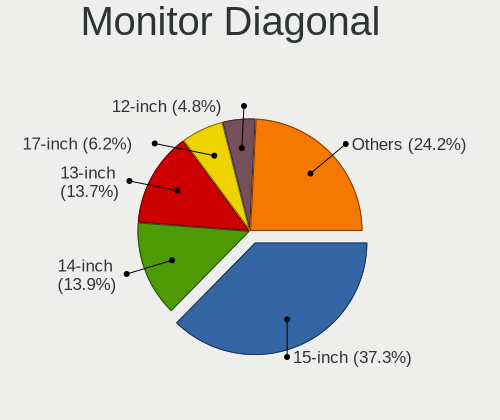

| Inches  | Notebooks | Percent |
|---------|-----------|---------|
| 15      | 364       | 37.56%  |
| 14      | 134       | 13.83%  |
| 13      | 132       | 13.62%  |
| 17      | 61        | 6.3%    |
| 12      | 47        | 4.85%   |
| 24      | 38        | 3.92%   |
| 27      | 29        | 2.99%   |
| 23      | 27        | 2.79%   |
| 21      | 20        | 2.06%   |
| 11      | 18        | 1.86%   |
| Unknown | 17        | 1.75%   |
| 10      | 15        | 1.55%   |
| 34      | 12        | 1.24%   |
| 18      | 11        | 1.14%   |
| 19      | 7         | 0.72%   |
| 22      | 5         | 0.52%   |
| 31      | 4         | 0.41%   |
| 25      | 4         | 0.41%   |
| 72      | 3         | 0.31%   |
| 20      | 3         | 0.31%   |
| 16      | 3         | 0.31%   |
| 54      | 2         | 0.21%   |
| 40      | 2         | 0.21%   |
| 32      | 2         | 0.21%   |
| 8       | 2         | 0.21%   |
| 49      | 1         | 0.1%    |
| 43      | 1         | 0.1%    |
| 39      | 1         | 0.1%    |
| 29      | 1         | 0.1%    |
| 28      | 1         | 0.1%    |
| 26      | 1         | 0.1%    |
| 9       | 1         | 0.1%    |

Monitor Width
-------------

Physical width

| Width in mm | Notebooks | Percent |
|-------------|-----------|---------|
| 301-350     | 562       | 58.73%  |
| 201-300     | 138       | 14.42%  |
| 501-600     | 91        | 9.51%   |
| 351-400     | 72        | 7.52%   |
| 401-500     | 41        | 4.28%   |
| Unknown     | 17        | 1.78%   |
| 701-800     | 14        | 1.46%   |
| 601-700     | 9         | 0.94%   |
| 801-900     | 3         | 0.31%   |
| 1501-2000   | 3         | 0.31%   |
| 101-200     | 3         | 0.31%   |
| 1001-1500   | 3         | 0.31%   |
| 901-1000    | 1         | 0.1%    |

Aspect Ratio
------------

Proportional relationship between the width and the height

| Ratio   | Notebooks | Percent |
|---------|-----------|---------|
| 16/9    | 727       | 85.23%  |
| 16/10   | 76        | 8.91%   |
| 21/9    | 12        | 1.41%   |
| Unknown | 12        | 1.41%   |
| 5/4     | 11        | 1.29%   |
| 4/3     | 7         | 0.82%   |
| 3/2     | 7         | 0.82%   |
| 3.40    | 1         | 0.12%   |

Monitor Area
------------

Area in inch

| Area in inch | Notebooks | Percent |
|----------------|-----------|---------|
| 101-110        | 361       | 37.33%  |
| 81-90          | 213       | 22.03%  |
| 201-250        | 69        | 7.14%   |
| 71-80          | 54        | 5.58%   |
| 61-70          | 46        | 4.76%   |
| 121-130        | 46        | 4.76%   |
| 301-350        | 30        | 3.1%    |
| 351-500        | 20        | 2.07%   |
| 51-60          | 19        | 1.96%   |
| 151-200        | 18        | 1.86%   |
| Unknown        | 17        | 1.76%   |
| 141-150        | 16        | 1.65%   |
| 41-50          | 15        | 1.55%   |
| 251-300        | 15        | 1.55%   |
| 131-140        | 9         | 0.93%   |
| More than 1000 | 6         | 0.62%   |
| 91-100         | 5         | 0.52%   |
| 501-1000       | 4         | 0.41%   |
| 1-40           | 3         | 0.31%   |
| 111-120        | 1         | 0.1%    |

Pixel Density
-------------

Pixels per inch

| Density       | Notebooks | Percent |
|---------------|-----------|---------|
| 101-120       | 344       | 36.4%   |
| 121-160       | 337       | 35.66%  |
| 51-100        | 170       | 17.99%  |
| 161-240       | 50        | 5.29%   |
| More than 240 | 17        | 1.8%    |
| Unknown       | 17        | 1.8%    |
| 1-50          | 10        | 1.06%   |

Multiple Monitors
-----------------

Total monitors connected

| Total | Notebooks | Percent |
|-------|-----------|---------|
| 1     | 684       | 79.26%  |
| 2     | 146       | 16.92%  |
| 3     | 20        | 2.32%   |
| 0     | 13        | 1.51%   |

Network
-------

Net Controller Vendor
---------------------

Controller vendors

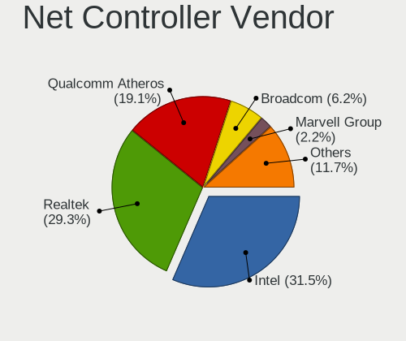

| Vendor                            | Notebooks | Percent |
|-----------------------------------|-----------|---------|
| Intel                             | 437       | 31.78%  |
| Realtek Semiconductor             | 408       | 29.67%  |
| Qualcomm Atheros                  | 263       | 19.13%  |
| Broadcom                          | 84        | 6.11%   |
| Marvell Technology Group          | 30        | 2.18%   |
| Broadcom Limited                  | 22        | 1.6%    |
| Ralink                            | 17        | 1.24%   |
| JMicron Technology                | 13        | 0.95%   |
| TP-Link                           | 8         | 0.58%   |
| Lenovo                            | 7         | 0.51%   |
| Huawei Technologies               | 7         | 0.51%   |
| Dell                              | 7         | 0.51%   |
| Sierra Wireless                   | 6         | 0.44%   |
| Ericsson Business Mobile Networks | 6         | 0.44%   |
| ASIX Electronics                  | 6         | 0.44%   |
| Ralink Technology                 | 5         | 0.36%   |
| Qualcomm Atheros Communications   | 5         | 0.36%   |
| Nvidia                            | 5         | 0.36%   |
| Silicon Integrated Systems [SiS]  | 4         | 0.29%   |
| Fibocom                           | 4         | 0.29%   |
| Samsung Electronics               | 3         | 0.22%   |
| Hewlett-Packard                   | 3         | 0.22%   |
| Xiaomi                            | 2         | 0.15%   |
| Toshiba                           | 2         | 0.15%   |
| Qualcomm                          | 2         | 0.15%   |
| DisplayLink                       | 2         | 0.15%   |
| Cypress Semiconductor             | 2         | 0.15%   |
| ZyXEL Communications              | 1         | 0.07%   |
| Spreadtrum Communications         | 1         | 0.07%   |
| NetGear                           | 1         | 0.07%   |
| Motorola PCS                      | 1         | 0.07%   |
| Microsoft                         | 1         | 0.07%   |
| MediaTek                          | 1         | 0.07%   |
| LSI                               | 1         | 0.07%   |
| LG Electronics                    | 1         | 0.07%   |
| HTC (High Tech Computer)          | 1         | 0.07%   |
| Foxconn / Hon Hai                 | 1         | 0.07%   |
| Edimax Technology                 | 1         | 0.07%   |
| D-Link System                     | 1         | 0.07%   |
| Cinterion                         | 1         | 0.07%   |

Net Controller Model
--------------------

Controller models

| Model                                                                   | Notebooks | Percent |
|-------------------------------------------------------------------------|-----------|---------|
| Realtek RTL8111/8168/8411 PCI Express Gigabit Ethernet Controller       | 244       | 14.4%   |
| Realtek RTL810xE PCI Express Fast Ethernet controller                   | 105       | 6.2%    |
| Qualcomm Atheros AR9285 Wireless Network Adapter (PCI-Express)          | 47        | 2.77%   |
| Intel 82579LM Gigabit Network Connection (Lewisville)                   | 46        | 2.72%   |
| Qualcomm Atheros QCA9565 / AR9565 Wireless Network Adapter              | 44        | 2.6%    |
| Qualcomm Atheros QCA9377 802.11ac Wireless Network Adapter              | 44        | 2.6%    |
| Qualcomm Atheros AR9485 Wireless Network Adapter                        | 38        | 2.24%   |
| Realtek RTL8153 Gigabit Ethernet Adapter                                | 37        | 2.18%   |
| Intel Cannon Point-LP CNVi [Wireless-AC]                                | 36        | 2.13%   |
| Intel Wireless 8265 / 8275                                              | 34        | 2.01%   |
| Intel Wireless 7260                                                     | 32        | 1.89%   |
| Intel Centrino Advanced-N 6205 [Taylor Peak]                            | 32        | 1.89%   |
| Intel Wireless 7265                                                     | 30        | 1.77%   |
| Intel Wi-Fi 6 AX200                                                     | 24        | 1.42%   |
| Realtek RTL8723BE PCIe Wireless Network Adapter                         | 20        | 1.18%   |
| Qualcomm Atheros QCA6174 802.11ac Wireless Network Adapter              | 19        | 1.12%   |
| Intel Wireless-AC 9260                                                  | 19        | 1.12%   |
| Intel Wireless 8260                                                     | 19        | 1.12%   |
| Broadcom BCM4313 802.11bgn Wireless Network Adapter                     | 19        | 1.12%   |
| Intel Comet Lake PCH-LP CNVi WiFi                                       | 17        | 1%      |
| Intel Wireless 3165                                                     | 16        | 0.94%   |
| Intel Ethernet Connection (3) I218-LM                                   | 15        | 0.89%   |
| Intel Wireless 3160                                                     | 13        | 0.77%   |
| Intel WiFi Link 5100                                                    | 13        | 0.77%   |
| Intel Ethernet Connection I219-LM                                       | 13        | 0.77%   |
| Intel Ethernet Connection I218-LM                                       | 13        | 0.77%   |
| Intel Dual Band Wireless-AC 3165 Plus Bluetooth                         | 13        | 0.77%   |
| Intel 82577LM Gigabit Network Connection                                | 13        | 0.77%   |
| Intel 82567LM Gigabit Network Connection                                | 13        | 0.77%   |
| Realtek RTL8822BE 802.11a/b/g/n/ac WiFi adapter                         | 12        | 0.71%   |
| Qualcomm Atheros AR9462 Wireless Network Adapter                        | 12        | 0.71%   |
| Qualcomm Atheros AR242x / AR542x Wireless Network Adapter (PCI-Express) | 12        | 0.71%   |
| Intel Ethernet Connection (6) I219-V                                    | 12        | 0.71%   |
| Intel Ethernet Connection (4) I219-LM                                   | 12        | 0.71%   |
| Realtek RTL8821CE 802.11ac PCIe Wireless Network Adapter                | 11        | 0.65%   |
| Marvell Group 88E8040 PCI-E Fast Ethernet Controller                    | 11        | 0.65%   |
| Qualcomm Atheros AR8151 v2.0 Gigabit Ethernet                           | 10        | 0.59%   |
| Intel PRO/Wireless 3945ABG [Golan] Network Connection                   | 10        | 0.59%   |
| Intel Centrino Ultimate-N 6300                                          | 10        | 0.59%   |
| Intel Dual Band Wireless-AC 3168NGW [Stone Peak]                        | 9         | 0.53%   |

Wireless Vendor
---------------

Wireless vendors

| Vendor                          | Notebooks | Percent |
|---------------------------------|-----------|---------|
| Intel                           | 411       | 47.46%  |
| Qualcomm Atheros                | 234       | 27.02%  |
| Realtek Semiconductor           | 94        | 10.85%  |
| Broadcom                        | 61        | 7.04%   |
| Ralink                          | 17        | 1.96%   |
| Broadcom Limited                | 11        | 1.27%   |
| TP-Link                         | 6         | 0.69%   |
| Sierra Wireless                 | 6         | 0.69%   |
| Ralink Technology               | 5         | 0.58%   |
| Qualcomm Atheros Communications | 5         | 0.58%   |
| Dell                            | 4         | 0.46%   |
| Fibocom                         | 3         | 0.35%   |
| ZyXEL Communications            | 1         | 0.12%   |
| Qualcomm                        | 1         | 0.12%   |
| NetGear                         | 1         | 0.12%   |
| Microsoft                       | 1         | 0.12%   |
| MediaTek                        | 1         | 0.12%   |
| Hewlett-Packard                 | 1         | 0.12%   |
| Edimax Technology               | 1         | 0.12%   |
| D-Link System                   | 1         | 0.12%   |
| Cinterion                       | 1         | 0.12%   |

Wireless Model
--------------

Wireless models

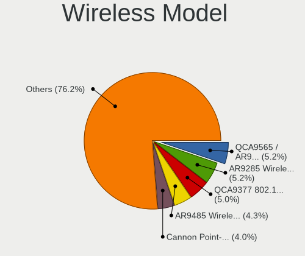

| Model                                                                   | Notebooks | Percent |
|-------------------------------------------------------------------------|-----------|---------|
| Qualcomm Atheros AR9285 Wireless Network Adapter (PCI-Express)          | 47        | 5.4%    |
| Qualcomm Atheros QCA9565 / AR9565 Wireless Network Adapter              | 44        | 5.05%   |
| Qualcomm Atheros QCA9377 802.11ac Wireless Network Adapter              | 44        | 5.05%   |
| Qualcomm Atheros AR9485 Wireless Network Adapter                        | 38        | 4.36%   |
| Intel Cannon Point-LP CNVi [Wireless-AC]                                | 36        | 4.13%   |
| Intel Wireless 8265 / 8275                                              | 34        | 3.9%    |
| Intel Wireless 7260                                                     | 32        | 3.67%   |
| Intel Centrino Advanced-N 6205 [Taylor Peak]                            | 32        | 3.67%   |
| Intel Wireless 7265                                                     | 30        | 3.44%   |
| Intel Wi-Fi 6 AX200                                                     | 24        | 2.76%   |
| Realtek RTL8723BE PCIe Wireless Network Adapter                         | 20        | 2.3%    |
| Qualcomm Atheros QCA6174 802.11ac Wireless Network Adapter              | 19        | 2.18%   |
| Intel Wireless-AC 9260                                                  | 19        | 2.18%   |
| Intel Wireless 8260                                                     | 19        | 2.18%   |
| Broadcom BCM4313 802.11bgn Wireless Network Adapter                     | 19        | 2.18%   |
| Intel Comet Lake PCH-LP CNVi WiFi                                       | 17        | 1.95%   |
| Intel Wireless 3165                                                     | 16        | 1.84%   |
| Intel Wireless 3160                                                     | 13        | 1.49%   |
| Intel WiFi Link 5100                                                    | 13        | 1.49%   |
| Intel Dual Band Wireless-AC 3165 Plus Bluetooth                         | 13        | 1.49%   |
| Realtek RTL8822BE 802.11a/b/g/n/ac WiFi adapter                         | 12        | 1.38%   |
| Qualcomm Atheros AR9462 Wireless Network Adapter                        | 12        | 1.38%   |
| Qualcomm Atheros AR242x / AR542x Wireless Network Adapter (PCI-Express) | 12        | 1.38%   |
| Realtek RTL8821CE 802.11ac PCIe Wireless Network Adapter                | 11        | 1.26%   |
| Intel PRO/Wireless 3945ABG [Golan] Network Connection                   | 10        | 1.15%   |
| Intel Centrino Ultimate-N 6300                                          | 10        | 1.15%   |
| Intel Dual Band Wireless-AC 3168NGW [Stone Peak]                        | 9         | 1.03%   |
| Intel Centrino Advanced-N 6200                                          | 9         | 1.03%   |
| Intel Cannon Lake PCH CNVi WiFi                                         | 9         | 1.03%   |
| Broadcom BCM4312 802.11b/g LP-PHY                                       | 9         | 1.03%   |
| Broadcom Limited BCM4312 802.11b/g LP-PHY                               | 8         | 0.92%   |
| Broadcom BCM43142 802.11b/g/n                                           | 8         | 0.92%   |
| Realtek RTL8188CE 802.11b/g/n WiFi Adapter                              | 7         | 0.8%    |
| Ralink RT5390 Wireless 802.11n 1T/1R PCIe                               | 7         | 0.8%    |
| Qualcomm Atheros AR928X Wireless Network Adapter (PCI-Express)          | 7         | 0.8%    |
| Intel Centrino Wireless-N 2230                                          | 7         | 0.8%    |
| Intel Centrino Wireless-N 1000 [Condor Peak]                            | 7         | 0.8%    |
| Intel Centrino Advanced-N 6235                                          | 7         | 0.8%    |
| Realtek RTL8822CE 802.11ac PCIe Wireless Network Adapter                | 6         | 0.69%   |
| Realtek RTL8821AE 802.11ac PCIe Wireless Network Adapter                | 6         | 0.69%   |

Ethernet Vendor
---------------

Ethernet vendors

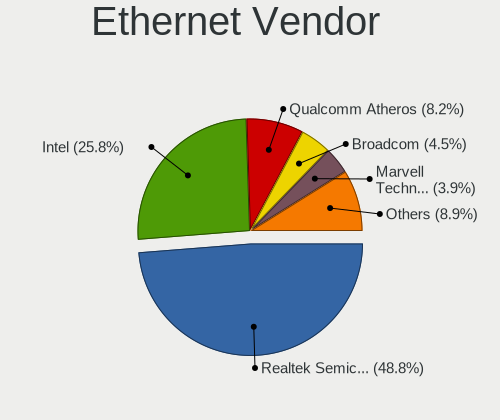

| Vendor                           | Notebooks | Percent |
|----------------------------------|-----------|---------|
| Realtek Semiconductor            | 382       | 49.04%  |
| Intel                            | 202       | 25.93%  |
| Qualcomm Atheros                 | 63        | 8.09%   |
| Broadcom                         | 34        | 4.36%   |
| Marvell Technology Group         | 30        | 3.85%   |
| JMicron Technology               | 13        | 1.67%   |
| Broadcom Limited                 | 11        | 1.41%   |
| Lenovo                           | 7         | 0.9%    |
| ASIX Electronics                 | 6         | 0.77%   |
| Nvidia                           | 5         | 0.64%   |
| Silicon Integrated Systems [SiS] | 4         | 0.51%   |
| Huawei Technologies              | 4         | 0.51%   |
| Samsung Electronics              | 3         | 0.39%   |
| Xiaomi                           | 2         | 0.26%   |
| TP-Link                          | 2         | 0.26%   |
| DisplayLink                      | 2         | 0.26%   |
| Cypress Semiconductor            | 2         | 0.26%   |
| Spreadtrum Communications        | 1         | 0.13%   |
| LG Electronics                   | 1         | 0.13%   |
| HTC (High Tech Computer)         | 1         | 0.13%   |
| Hewlett-Packard                  | 1         | 0.13%   |
| Foxconn / Hon Hai                | 1         | 0.13%   |
| Attansic Technology              | 1         | 0.13%   |
| 3Com                             | 1         | 0.13%   |

Ethernet Model
--------------

Ethernet models

| Model                                                                          | Notebooks | Percent |
|--------------------------------------------------------------------------------|-----------|---------|
| Realtek RTL8111/8168/8411 PCI Express Gigabit Ethernet Controller              | 244       | 30.77%  |
| Realtek RTL810xE PCI Express Fast Ethernet controller                          | 105       | 13.24%  |
| Intel 82579LM Gigabit Network Connection (Lewisville)                          | 46        | 5.8%    |
| Realtek RTL8153 Gigabit Ethernet Adapter                                       | 37        | 4.67%   |
| Intel Ethernet Connection (3) I218-LM                                          | 15        | 1.89%   |
| Intel Ethernet Connection I219-LM                                              | 13        | 1.64%   |
| Intel Ethernet Connection I218-LM                                              | 13        | 1.64%   |
| Intel 82577LM Gigabit Network Connection                                       | 13        | 1.64%   |
| Intel 82567LM Gigabit Network Connection                                       | 13        | 1.64%   |
| Intel Ethernet Connection (6) I219-V                                           | 12        | 1.51%   |
| Intel Ethernet Connection (4) I219-LM                                          | 12        | 1.51%   |
| Marvell Group 88E8040 PCI-E Fast Ethernet Controller                           | 11        | 1.39%   |
| Qualcomm Atheros AR8151 v2.0 Gigabit Ethernet                                  | 10        | 1.26%   |
| Qualcomm Atheros AR8152 v2.0 Fast Ethernet                                     | 8         | 1.01%   |
| JMicron JMC250 PCI Express Gigabit Ethernet Controller                         | 8         | 1.01%   |
| Intel Ethernet Connection (6) I219-LM                                          | 8         | 1.01%   |
| Intel Ethernet Connection (4) I219-V                                           | 8         | 1.01%   |
| Qualcomm Atheros QCA8171 Gigabit Ethernet                                      | 7         | 0.88%   |
| Qualcomm Atheros Killer E2500 Gigabit Ethernet Controller                      | 7         | 0.88%   |
| Qualcomm Atheros AR8161 Gigabit Ethernet                                       | 7         | 0.88%   |
| Intel Ethernet Connection I217-LM                                              | 7         | 0.88%   |
| Broadcom NetLink BCM57785 Gigabit Ethernet PCIe                                | 7         | 0.88%   |
| Qualcomm Atheros AR8131 Gigabit Ethernet                                       | 6         | 0.76%   |
| Intel 82579V Gigabit Network Connection                                        | 6         | 0.76%   |
| Realtek RTL8152 Fast Ethernet Adapter                                          | 5         | 0.63%   |
| JMicron JMC260 PCI Express Fast Ethernet Controller                            | 5         | 0.63%   |
| ASIX AX88179 Gigabit Ethernet                                                  | 5         | 0.63%   |
| Silicon Integrated Systems [SiS] 191 Gigabit Ethernet Adapter                  | 4         | 0.5%    |
| Qualcomm Atheros AR8132 Fast Ethernet                                          | 4         | 0.5%    |
| Marvell Group Yukon Optima 88E8059 [PCIe Gigabit Ethernet Controller with AVB] | 4         | 0.5%    |
| Marvell Group 88E8055 PCI-E Gigabit Ethernet Controller                        | 4         | 0.5%    |
| Intel Ethernet Connection I219-V                                               | 4         | 0.5%    |
| Intel Ethernet Connection (7) I219-LM                                          | 4         | 0.5%    |
| Intel Ethernet Connection (10) I219-V                                          | 4         | 0.5%    |
| Broadcom NetLink BCM5787M Gigabit Ethernet PCI Express                         | 4         | 0.5%    |
| Broadcom NetLink BCM57780 Gigabit Ethernet PCIe                                | 4         | 0.5%    |
| Samsung GT-I9070 (network tethering, USB debugging enabled)                    | 3         | 0.38%   |
| Qualcomm Atheros AR8152 v1.1 Fast Ethernet                                     | 3         | 0.38%   |
| Intel Ethernet Connection I218-V                                               | 3         | 0.38%   |
| Broadcom NetXtreme BCM5761 Gigabit Ethernet PCIe                               | 3         | 0.38%   |

Net Controller Kind
-------------------

Ethernet, WiFi or modem

| Kind     | Notebooks | Percent |
|----------|-----------|---------|
| WiFi     | 825       | 51.43%  |
| Ethernet | 749       | 46.7%   |
| Modem    | 27        | 1.68%   |
| Unknown  | 3         | 0.19%   |

Used Controller
---------------

Currently used network controller

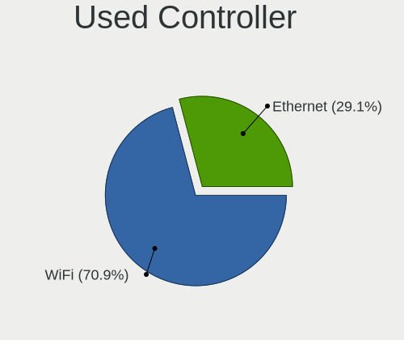

| Kind     | Notebooks | Percent |
|----------|-----------|---------|
| WiFi     | 630       | 70.79%  |
| Ethernet | 260       | 29.21%  |

NICs
----

Total network controllers on board

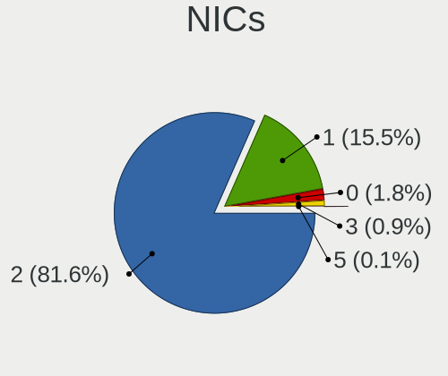

| Total | Notebooks | Percent |
|-------|-----------|---------|
| 2     | 690       | 81.56%  |
| 1     | 132       | 15.6%   |
| 0     | 15        | 1.77%   |
| 3     | 8         | 0.95%   |
| 5     | 1         | 0.12%   |

IPv6
----

IPv6 vs IPv4

| Used | Notebooks | Percent |
|------|-----------|---------|
| No   | 791       | 92.95%  |
| Yes  | 60        | 7.05%   |

Bluetooth
---------

Bluetooth Vendor
----------------

Controller vendors

| Vendor                          | Notebooks | Percent |
|---------------------------------|-----------|---------|
| Intel                           | 275       | 44.57%  |
| Qualcomm Atheros Communications | 91        | 14.75%  |
| Realtek Semiconductor           | 48        | 7.78%   |
| Broadcom                        | 45        | 7.29%   |
| Lite-On Technology              | 32        | 5.19%   |
| IMC Networks                    | 22        | 3.57%   |
| Dell                            | 20        | 3.24%   |
| Foxconn / Hon Hai               | 19        | 3.08%   |
| Hewlett-Packard                 | 15        | 2.43%   |
| Apple                           | 12        | 1.94%   |
| Toshiba                         | 10        | 1.62%   |
| Cambridge Silicon Radio         | 6         | 0.97%   |
| ASUSTek Computer                | 5         | 0.81%   |
| Ralink                          | 4         | 0.65%   |
| Foxconn International           | 3         | 0.49%   |
| Alps Electric                   | 3         | 0.49%   |
| Unknown                         | 2         | 0.32%   |
| Realtek                         | 1         | 0.16%   |
| Ralink Technology               | 1         | 0.16%   |
| Fujitsu                         | 1         | 0.16%   |
| Chicony Electronics             | 1         | 0.16%   |
| Askey Computer                  | 1         | 0.16%   |

Bluetooth Model
---------------

Controller models

| Model                                                                               | Notebooks | Percent |
|-------------------------------------------------------------------------------------|-----------|---------|
| Intel Bluetooth wireless interface                                                  | 135       | 21.81%  |
| Qualcomm Atheros  Bluetooth Device                                                  | 48        | 7.75%   |
| Intel Bluetooth 9460/9560 Jefferson Peak (JfP)                                      | 47        | 7.59%   |
| Realtek Bluetooth Radio                                                             | 28        | 4.52%   |
| Intel AX201 Bluetooth                                                               | 27        | 4.36%   |
| Intel AX200 Bluetooth                                                               | 20        | 3.23%   |
| Intel Wireless-AC 9260 Bluetooth Adapter                                            | 17        | 2.75%   |
| Realtek  Bluetooth 4.2 Adapter                                                      | 14        | 2.26%   |
| Intel Centrino Bluetooth Wireless Transceiver                                       | 14        | 2.26%   |
| Lite-On Qualcomm Atheros QCA9377 Bluetooth                                          | 13        | 2.1%    |
| Broadcom BCM2045B (BDC-2.1)                                                         | 12        | 1.94%   |
| Qualcomm Atheros AR3011 Bluetooth                                                   | 11        | 1.78%   |
| IMC Networks Bluetooth Device                                                       | 11        | 1.78%   |
| Qualcomm Atheros AR3012 Bluetooth 4.0                                               | 10        | 1.62%   |
| Lite-On Atheros AR3012 Bluetooth                                                    | 9         | 1.45%   |
| Intel Wireless-AC 3168 Bluetooth                                                    | 9         | 1.45%   |
| Foxconn / Hon Hai Bluetooth Device                                                  | 9         | 1.45%   |
| Intel Centrino Advanced-N 6230 Bluetooth adapter                                    | 8         | 1.29%   |
| HP Bluetooth 2.0 Interface [Broadcom BCM2045]                                       | 8         | 1.29%   |
| Dell DW375 Bluetooth Module                                                         | 8         | 1.29%   |
| Broadcom BCM20702 Bluetooth 4.0 [ThinkPad]                                          | 8         | 1.29%   |
| Qualcomm Atheros QCA61x4 Bluetooth 4.0                                              | 7         | 1.13%   |
| Qualcomm Atheros Bluetooth USB Host Controller                                      | 7         | 1.13%   |
| IMC Networks Bluetooth Radio                                                        | 6         | 0.97%   |
| Cambridge Silicon Radio Bluetooth Dongle (HCI mode)                                 | 6         | 0.97%   |
| Apple Bluetooth Host Controller                                                     | 6         | 0.97%   |
| Qualcomm Atheros Bluetooth                                                          | 5         | 0.81%   |
| HP Broadcom 2070 Bluetooth Combo                                                    | 5         | 0.81%   |
| Broadcom BCM2045B (BDC-2.1) [Bluetooth Controller]                                  | 5         | 0.81%   |
| Toshiba Bluetooth Device                                                            | 4         | 0.65%   |
| Realtek RTL8821A Bluetooth                                                          | 4         | 0.65%   |
| Ralink RT3290 Bluetooth                                                             | 4         | 0.65%   |
| Lite-On Bluetooth Device                                                            | 4         | 0.65%   |
| Dell Wireless 365 Bluetooth                                                         | 4         | 0.65%   |
| Dell Wireless 355 Bluetooth                                                         | 4         | 0.65%   |
| Broadcom BCM2070 Bluetooth Device                                                   | 4         | 0.65%   |
| Qualcomm Atheros AR9462 Bluetooth                                                   | 3         | 0.48%   |
| Foxconn International BCM43142A0 Bluetooth module                                   | 3         | 0.48%   |
| Foxconn / Hon Hai Foxconn T77H114 BCM2070 [Single-Chip Bluetooth 2.1 + EDR Adapter] | 3         | 0.48%   |
| Foxconn / Hon Hai Broadcom Bluetooth 2.1 Device                                     | 3         | 0.48%   |

Sound
-----

Sound Vendor
------------

Sound card vendors

| Vendor                           | Notebooks | Percent |
|----------------------------------|-----------|---------|
| Intel                            | 735       | 73.28%  |
| AMD                              | 108       | 10.77%  |
| Nvidia                           | 86        | 8.57%   |
| C-Media Electronics              | 12        | 1.2%    |
| Realtek Semiconductor            | 7         | 0.7%    |
| Logitech                         | 7         | 0.7%    |
| Lenovo                           | 7         | 0.7%    |
| Texas Instruments                | 5         | 0.5%    |
| Silicon Integrated Systems [SiS] | 4         | 0.4%    |
| GN Netcom                        | 3         | 0.3%    |
| Razer USA                        | 2         | 0.2%    |
| JMTek                            | 2         | 0.2%    |
| Hewlett-Packard                  | 2         | 0.2%    |
| Focusrite-Novation               | 2         | 0.2%    |
| XMOS                             | 1         | 0.1%    |
| VIA Technologies                 | 1         | 0.1%    |
| Veho                             | 1         | 0.1%    |
| SmartlinkTechnology              | 1         | 0.1%    |
| QinHeng Electronics              | 1         | 0.1%    |
| Native Instruments               | 1         | 0.1%    |
| Microsoft                        | 1         | 0.1%    |
| M-Audio                          | 1         | 0.1%    |
| Ketron                           | 1         | 0.1%    |
| Huawei Technologies              | 1         | 0.1%    |
| Guillemot                        | 1         | 0.1%    |
| ESS Technology                   | 1         | 0.1%    |
| Earth Computer Technologies      | 1         | 0.1%    |
| Dell                             | 1         | 0.1%    |
| Creative Technology              | 1         | 0.1%    |
| Conrad Electronic SE             | 1         | 0.1%    |
| Blue Microphones                 | 1         | 0.1%    |
| BEHRINGER International          | 1         | 0.1%    |
| ASUSTek Computer                 | 1         | 0.1%    |
| Arturia                          | 1         | 0.1%    |
| AKAI Professional M.I.           | 1         | 0.1%    |

Sound Model
-----------

Sound card models

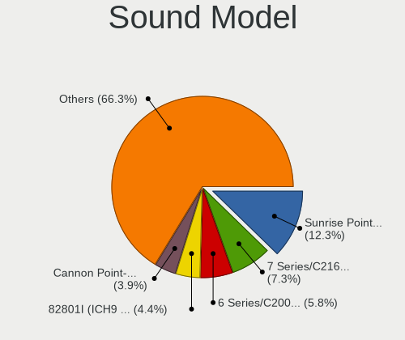

| Model                                                                                             | Notebooks | Percent |
|---------------------------------------------------------------------------------------------------|-----------|---------|
| Intel Sunrise Point-LP HD Audio                                                                   | 145       | 12.34%  |
| Intel 7 Series/C216 Chipset Family High Definition Audio Controller                               | 86        | 7.32%   |
| Intel 6 Series/C200 Series Chipset Family High Definition Audio Controller                        | 69        | 5.87%   |
| Intel 82801I (ICH9 Family) HD Audio Controller                                                    | 51        | 4.34%   |
| Intel Cannon Point-LP High Definition Audio Controller                                            | 47        | 4%      |
| Intel Haswell-ULT HD Audio Controller                                                             | 41        | 3.49%   |
| Intel 8 Series HD Audio Controller                                                                | 41        | 3.49%   |
| Intel 5 Series/3400 Series Chipset High Definition Audio                                          | 40        | 3.4%    |
| Intel Wildcat Point-LP High Definition Audio Controller                                           | 34        | 2.89%   |
| Intel Broadwell-U Audio Controller                                                                | 34        | 2.89%   |
| Intel NM10/ICH7 Family High Definition Audio Controller                                           | 30        | 2.55%   |
| AMD FCH Azalia Controller                                                                         | 30        | 2.55%   |
| Intel Cannon Lake PCH cAVS                                                                        | 28        | 2.38%   |
| Intel 8 Series/C220 Series Chipset High Definition Audio Controller                               | 28        | 2.38%   |
| AMD Family 17h/19h HD Audio Controller                                                            | 27        | 2.3%    |
| Intel Xeon E3-1200 v3/4th Gen Core Processor HD Audio Controller                                  | 22        | 1.87%   |
| AMD Raven/Raven2/Fenghuang HDMI/DP Audio Controller                                               | 22        | 1.87%   |
| Intel Comet Lake PCH-LP cAVS                                                                      | 21        | 1.79%   |
| AMD SBx00 Azalia (Intel HDA)                                                                      | 19        | 1.62%   |
| Intel Atom/Celeron/Pentium Processor x5-E8000/J3xxx/N3xxx Series High Definition Audio Controller | 18        | 1.53%   |
| Intel CM238 HD Audio Controller                                                                   | 16        | 1.36%   |
| Nvidia GF108 High Definition Audio Controller                                                     | 15        | 1.28%   |
| AMD Kabini HDMI/DP Audio                                                                          | 15        | 1.28%   |
| Intel 82801H (ICH8 Family) HD Audio Controller                                                    | 14        | 1.19%   |
| AMD Wrestler HDMI Audio                                                                           | 11        | 0.94%   |
| Nvidia GK107 HDMI Audio Controller                                                                | 10        | 0.85%   |
| Intel Celeron/Pentium Silver Processor High Definition Audio                                      | 10        | 0.85%   |
| Intel Atom Processor Z36xxx/Z37xxx Series High Definition Audio Controller                        | 9         | 0.77%   |
| Intel 100 Series/C230 Series Chipset Family HD Audio Controller                                   | 9         | 0.77%   |
| Nvidia High Definition Audio Controller                                                           | 8         | 0.68%   |
| Intel Ice Lake-LP Smart Sound Technology Audio Controller                                         | 8         | 0.68%   |
| Intel Celeron N3350/Pentium N4200/Atom E3900 Series Audio Cluster                                 | 8         | 0.68%   |
| Realtek Semiconductor USB Audio                                                                   | 7         | 0.6%    |
| Nvidia GP107GL High Definition Audio Controller                                                   | 7         | 0.6%    |
| Nvidia GK208 HDMI/DP Audio Controller                                                             | 6         | 0.51%   |
| AMD RV710/730 HDMI Audio [Radeon HD 4000 series]                                                  | 6         | 0.51%   |
| AMD High Definition Audio Controller                                                              | 6         | 0.51%   |
| Nvidia TU107 GeForce GTX 1650 High Definition Audio Controller                                    | 5         | 0.43%   |
| Nvidia TU106 High Definition Audio Controller                                                     | 5         | 0.43%   |
| Intel Tiger Lake-LP Smart Sound Technology Audio Controller                                       | 5         | 0.43%   |

Memory
------

Memory Vendor
-------------

Memory module vendors

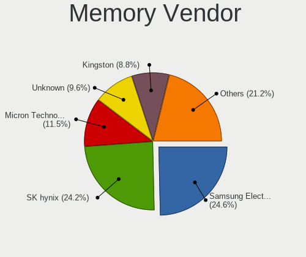

| Vendor              | Notebooks | Percent |
|---------------------|-----------|---------|
| SK hynix            | 150       | 24.55%  |
| Samsung Electronics | 149       | 24.39%  |
| Micron Technology   | 71        | 11.62%  |
| Unknown             | 56        | 9.17%   |
| Kingston            | 54        | 8.84%   |
| Ramaxel Technology  | 19        | 3.11%   |
| Crucial             | 19        | 3.11%   |
| Elpida              | 18        | 2.95%   |
| A-DATA Technology   | 13        | 2.13%   |
| Smart               | 12        | 1.96%   |
| Nanya Technology    | 10        | 1.64%   |
| Teikon              | 6         | 0.98%   |
| Corsair             | 6         | 0.98%   |
| Unknown (ABCD)      | 4         | 0.65%   |
| Transcend           | 3         | 0.49%   |
| G.Skill             | 3         | 0.49%   |
| Apacer              | 3         | 0.49%   |
| 48spaces            | 3         | 0.49%   |
| Silicon Power       | 2         | 0.33%   |
| TEXTORM             | 1         | 0.16%   |
| Smart Brazil        | 1         | 0.16%   |
| Qimonda             | 1         | 0.16%   |
| PNY                 | 1         | 0.16%   |
| HT Micron           | 1         | 0.16%   |
| GOODRAM             | 1         | 0.16%   |
| Avant               | 1         | 0.16%   |
| Atermiter           | 1         | 0.16%   |
| ASint Technology    | 1         | 0.16%   |
| AMD                 | 1         | 0.16%   |

Memory Model
------------

Memory module models

| Model                                                            | Notebooks | Percent |
|------------------------------------------------------------------|-----------|---------|
| SK hynix RAM HMA81GS6AFR8N-UH 8GB SODIMM DDR4 2667MT/s           | 11        | 1.67%   |
| SK hynix RAM HMT451S6BFR8A-PB 4GB SODIMM DDR3 1600MT/s           | 10        | 1.52%   |
| Samsung RAM M471B5273DH0-CH9 4096MB SODIMM DDR3 1334MT/s         | 10        | 1.52%   |
| Samsung RAM M471A5244CB0-CRC 4GB SODIMM DDR4 2667MT/s            | 10        | 1.52%   |
| Samsung RAM M471B5273CH0-CH9 4GB SODIMM DDR3 1334MT/s            | 8         | 1.22%   |
| Samsung RAM M471B5173DB0-YK0 4GB SODIMM DDR3 1600MT/s            | 8         | 1.22%   |
| SK hynix RAM HMT41GS6BFR8A-PB 8GB SODIMM DDR3 1600MT/s           | 7         | 1.06%   |
| SK hynix RAM HMT41GS6AFR8A-PB 8GB SODIMM DDR3 1600MT/s           | 7         | 1.06%   |
| SK hynix RAM HYMP125S64CP8-S6 2GB SODIMM DDR2 800MT/s            | 6         | 0.91%   |
| SK hynix RAM HMT351S6CFR8C-PB 4GB SODIMM DDR3 1600MT/s           | 6         | 0.91%   |
| SK hynix RAM HMA81GS6CJR8N-VK 8GB SODIMM DDR4 2667MT/s           | 6         | 0.91%   |
| Samsung RAM M471B1G73EB0-YK0 8GB SODIMM DDR3 1600MT/s            | 6         | 0.91%   |
| Micron RAM 8KTF51264HZ-1G6E1 4GB SODIMM DDR3 1600MT/s            | 6         | 0.91%   |
| SK hynix RAM HMA851S6AFR6N-UH 2GB SODIMM LPDDR4 2667MT/s         | 5         | 0.76%   |
| Samsung RAM M471B5273DH0-CK0 4GB SODIMM DDR3 1600MT/s            | 5         | 0.76%   |
| Samsung RAM M471B1G73QH0-YK0 8192MB SODIMM DDR3 1600MT/s         | 5         | 0.76%   |
| Samsung RAM M471B1G73DB0-YK0 8GB SODIMM DDR3 1600MT/s            | 5         | 0.76%   |
| Samsung RAM M471A1K43CB1-CRC 8GB SODIMM DDR4 2667MT/s            | 5         | 0.76%   |
| Micron RAM 16KTF51264HZ-1G6M1 4GB SODIMM DDR3 1600MT/s           | 5         | 0.76%   |
| Unknown RAM Module 1024MB SODIMM DDR2                            | 4         | 0.61%   |
| Unknown (ABCD) RAM 123456789012345678 2GB SODIMM LPDDR4 2400MT/s | 4         | 0.61%   |
| SK hynix RAM HMA82GS6JJR8N-VK 16GB SODIMM DDR4 2667MT/s          | 4         | 0.61%   |
| SK hynix RAM HMA81GS6JJR8N-VK 8GB SODIMM DDR4 2667MT/s           | 4         | 0.61%   |
| Samsung RAM Module 16384MB SODIMM DDR4 2667MT/s                  | 4         | 0.61%   |
| Samsung RAM M471B5173EB0-YK0 4GB SODIMM DDR3 1600MT/s            | 4         | 0.61%   |
| Samsung RAM M471A5244CB0-CTD 4GB SODIMM DDR4 3266MT/s            | 4         | 0.61%   |
| Samsung RAM M471A1K43CB1-CTD 8GB SODIMM DDR4 2667MT/s            | 4         | 0.61%   |
| Samsung RAM M471A1K43BB1-CTD 8GB SODIMM DDR4 2667MT/s            | 4         | 0.61%   |
| Unknown RAM Module 2048MB SODIMM DDR2 667MT/s                    | 3         | 0.46%   |
| Unknown RAM Module 2048MB SODIMM DDR2                            | 3         | 0.46%   |
| Unknown RAM Module 1024MB SODIMM SDRAM                           | 3         | 0.46%   |
| SK hynix RAM Module 8192MB Row Of Chips LPDDR3 2133MT/s          | 3         | 0.46%   |
| SK hynix RAM HMT451S6AFR8A-PB 4GB SODIMM DDR3 1600MT/s           | 3         | 0.46%   |
| SK hynix RAM HMA82GS6CJR8N-VK 16GB SODIMM DDR4 2667MT/s          | 3         | 0.46%   |
| SK hynix RAM HMA41GS6AFR8N-TF 8GB SODIMM DDR4 2667MT/s           | 3         | 0.46%   |
| Samsung RAM M471B5773CHS-CH9 2GB SODIMM DDR3 4199MT/s            | 3         | 0.46%   |
| Samsung RAM M471B5674QH0-YK0 2GB SODIMM DDR3 1600MT/s            | 3         | 0.46%   |
| Samsung RAM M471B5173QH0-YK0 4GB SODIMM DDR3 1600MT/s            | 3         | 0.46%   |
| Samsung RAM M471A1K43DB1-CTD 8GB SODIMM DDR4 2667MT/s            | 3         | 0.46%   |
| Samsung RAM M471A1K43BB1-CRC 8192MB SODIMM DDR4 2667MT/s         | 3         | 0.46%   |

Memory Kind
-----------

Memory module kinds

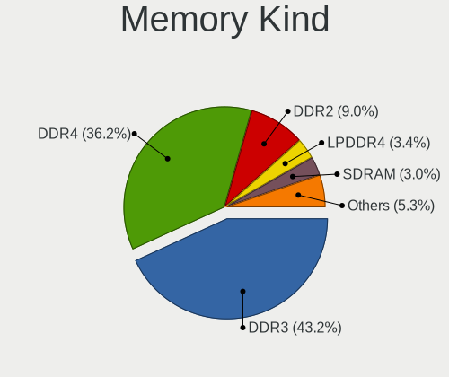

| Kind    | Notebooks | Percent |
|---------|-----------|---------|
| DDR3    | 223       | 43.55%  |
| DDR4    | 183       | 35.74%  |
| DDR2    | 46        | 8.98%   |
| LPDDR4  | 18        | 3.52%   |
| SDRAM   | 16        | 3.13%   |
| LPDDR3  | 13        | 2.54%   |
| DRAM    | 4         | 0.78%   |
| DDR     | 4         | 0.78%   |
| Unknown | 4         | 0.78%   |
| RAM     | 1         | 0.2%    |

Memory Form Factor
------------------

Physical design of the memory module

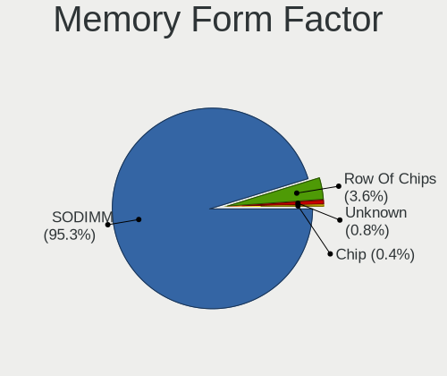

| Name         | Notebooks | Percent |
|--------------|-----------|---------|
| SODIMM       | 485       | 95.28%  |
| Row Of Chips | 18        | 3.54%   |
| Unknown      | 4         | 0.79%   |
| Chip         | 2         | 0.39%   |

Memory Size
-----------

Memory module size

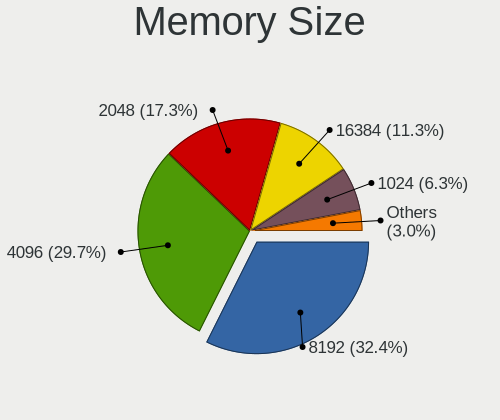

| Size  | Notebooks | Percent |
|-------|-----------|---------|
| 4096  | 183       | 31.83%  |
| 8192  | 181       | 31.48%  |
| 2048  | 101       | 17.57%  |
| 16384 | 57        | 9.91%   |
| 1024  | 38        | 6.61%   |
| 512   | 9         | 1.57%   |
| 256   | 3         | 0.52%   |
| 32768 | 2         | 0.35%   |
| 128   | 1         | 0.17%   |

Memory Speed
------------

Memory module speed

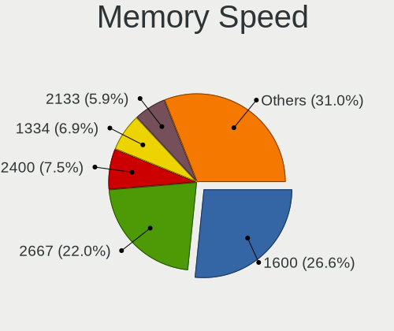

| Speed   | Notebooks | Percent |
|---------|-----------|---------|
| 1600    | 158       | 27.96%  |
| 2667    | 121       | 21.42%  |
| 2400    | 43        | 7.61%   |
| 1334    | 39        | 6.9%    |
| 2133    | 37        | 6.55%   |
| 3200    | 24        | 4.25%   |
| Unknown | 24        | 4.25%   |
| 1333    | 22        | 3.89%   |
| 667     | 21        | 3.72%   |
| 800     | 13        | 2.3%    |
| 1067    | 11        | 1.95%   |
| 975     | 9         | 1.59%   |
| 2048    | 6         | 1.06%   |
| 533     | 6         | 1.06%   |
| 4199    | 5         | 0.88%   |
| 1867    | 5         | 0.88%   |
| 3266    | 4         | 0.71%   |
| 1066    | 4         | 0.71%   |
| 400     | 4         | 0.71%   |
| 8400    | 2         | 0.35%   |
| 4267    | 2         | 0.35%   |
| 1776    | 2         | 0.35%   |
| 933     | 1         | 0.18%   |
| 333     | 1         | 0.18%   |
| 266     | 1         | 0.18%   |

Printers & scanners
-------------------

Printer Vendor
--------------

Printer device vendors

| Vendor              | Notebooks | Percent |
|---------------------|-----------|---------|
| Hewlett-Packard     | 4         | 50%     |
| STMicroelectronics  | 1         | 12.5%   |
| Samsung Electronics | 1         | 12.5%   |
| Pantum              | 1         | 12.5%   |
| Kyocera             | 1         | 12.5%   |

Printer Model
-------------

Printer device models

| Model                                                     | Notebooks | Percent |
|-----------------------------------------------------------|-----------|---------|
| STMicroelectronics LED badge -- mini LED display -- 11x44 | 1         | 11.11%  |
| Samsung CLX-3300 Series                                   | 1         | 11.11%  |
| Pantum P2500W series                                      | 1         | 11.11%  |
| Kyocera ECOSYS P2335d                                     | 1         | 11.11%  |
| HP OfficeJet 3830 series                                  | 1         | 11.11%  |
| HP LaserJet P1102                                         | 1         | 11.11%  |
| HP LaserJet 1020                                          | 1         | 11.11%  |
| HP EWS UPD                                                | 1         | 11.11%  |
| HP Deskjet 2540 series                                    | 1         | 11.11%  |

Scanner Vendor
--------------

Scanner device vendors

| Vendor         | Notebooks | Percent |
|----------------|-----------|---------|
| Mustek Systems | 1         | 50%     |
| Canon          | 1         | 50%     |

Scanner Model
-------------

Scanner device models

| Model                       | Notebooks | Percent |
|-----------------------------|-----------|---------|
| Mustek Systems SNAPSCAN e22 | 1         | 50%     |
| Canon CanoScan LiDE 110     | 1         | 50%     |

Camera
------

Camera Vendor
-------------

Camera device vendors

| Vendor                                 | Notebooks | Percent |
|----------------------------------------|-----------|---------|
| Chicony Electronics                    | 185       | 25.17%  |
| Realtek Semiconductor                  | 78        | 10.61%  |
| Sunplus Innovation Technology          | 68        | 9.25%   |
| Microdia                               | 68        | 9.25%   |
| Acer                                   | 68        | 9.25%   |
| IMC Networks                           | 57        | 7.76%   |
| Suyin                                  | 31        | 4.22%   |
| Quanta                                 | 19        | 2.59%   |
| Lite-On Technology                     | 19        | 2.59%   |
| Silicon Motion                         | 18        | 2.45%   |
| Cheng Uei Precision Industry (Foxlink) | 18        | 2.45%   |
| Syntek                                 | 13        | 1.77%   |
| Ricoh                                  | 11        | 1.5%    |
| Lenovo                                 | 10        | 1.36%   |
| Apple                                  | 10        | 1.36%   |
| Alcor Micro                            | 10        | 1.36%   |
| Logitech                               | 9         | 1.22%   |
| Primax Electronics                     | 6         | 0.82%   |
| Samsung Electronics                    | 5         | 0.68%   |
| ALi                                    | 5         | 0.68%   |
| Z-Star Microelectronics                | 3         | 0.41%   |
| Tobii Technology AB                    | 2         | 0.27%   |
| OmniVision Technologies                | 2         | 0.27%   |
| Luxvisions Innotech Limited            | 2         | 0.27%   |
| Importek                               | 2         | 0.27%   |
| Genesys Logic                          | 2         | 0.27%   |
| GEMBIRD                                | 2         | 0.27%   |
| Xiongmai                               | 1         | 0.14%   |
| USB Camera                             | 1         | 0.14%   |
| SunplusIT                              | 1         | 0.14%   |
| Sunplus Technology                     | 1         | 0.14%   |
| Spreadtrum Communications              | 1         | 0.14%   |
| Microsoft                              | 1         | 0.14%   |
| GenesysLogic Technology                | 1         | 0.14%   |
| Generalplus Technology                 | 1         | 0.14%   |
| Fitipower Integrated Technology        | 1         | 0.14%   |
| eMPIA Technology                       | 1         | 0.14%   |
| DigiTech                               | 1         | 0.14%   |
| Aveo Technology                        | 1         | 0.14%   |

Camera Model
------------

Camera device models

| Model                                   | Notebooks | Percent |
|-----------------------------------------|-----------|---------|
| Realtek Integrated_Webcam_HD            | 34        | 4.59%   |
| Chicony Integrated Camera               | 26        | 3.51%   |
| Sunplus Integrated_Webcam_HD            | 22        | 2.97%   |
| IMC Networks Integrated Camera          | 21        | 2.84%   |
| Chicony HD WebCam                       | 21        | 2.84%   |
| Microdia Integrated_Webcam_HD           | 18        | 2.43%   |
| Acer Integrated Camera                  | 17        | 2.3%    |
| Acer Lenovo EasyCamera                  | 14        | 1.89%   |
| Sunplus HD WebCam                       | 11        | 1.49%   |
| Lite-On Integrated Camera               | 11        | 1.49%   |
| IMC Networks USB2.0 HD UVC WebCam       | 11        | 1.49%   |
| Acer SunplusIT Integrated Camera        | 11        | 1.49%   |
| Microdia Integrated Webcam              | 9         | 1.22%   |
| Chicony HP HD Camera                    | 9         | 1.22%   |
| Chicony EasyCamera                      | 8         | 1.08%   |
| Microdia Laptop_Integrated_Webcam_HD    | 7         | 0.95%   |
| IMC Networks USB2.0 VGA UVC WebCam      | 7         | 0.95%   |
| Chicony Integrated Camera (1280x720@30) | 7         | 0.95%   |
| Sunplus Asus Webcam                     | 6         | 0.81%   |
| Realtek USB2.0 HD UVC WebCam            | 6         | 0.81%   |
| Realtek Integrated Webcam               | 6         | 0.81%   |
| Lenovo Integrated Webcam [R5U877]       | 6         | 0.81%   |
| Sunplus Laptop_Integrated_Webcam_FHD    | 5         | 0.68%   |
| Sunplus Laptop Integrated Webcam HD     | 5         | 0.68%   |
| Samsung Galaxy A5 (MTP)                 | 5         | 0.68%   |
| Realtek USB2.0 VGA UVC WebCam           | 5         | 0.68%   |
| Realtek HD WebCam                       | 5         | 0.68%   |
| Quanta HP HD Camera                     | 5         | 0.68%   |
| Lite-On HP HD Camera                    | 5         | 0.68%   |
| Chicony USB2.0 HD UVC WebCam            | 5         | 0.68%   |
| Chicony USB2.0 Camera                   | 5         | 0.68%   |
| Chicony USB 2.0 Camera                  | 5         | 0.68%   |
| Chicony HP TrueVision HD Camera         | 5         | 0.68%   |
| Chicony HP HD Webcam                    | 5         | 0.68%   |
| Chicony 2.0M UVC Webcam / CNF7129       | 5         | 0.68%   |
| Acer SunplusIT INC. Integrated Camera   | 5         | 0.68%   |
| Acer EasyCamera                         | 5         | 0.68%   |
| Syntek Lenovo EasyCamera                | 4         | 0.54%   |
| Syntek Integrated Camera                | 4         | 0.54%   |
| Suyin Integrated_Webcam_HD              | 4         | 0.54%   |

Security
--------

Fingerprint Vendor
------------------

Fingerprint sensor vendors

| Vendor                     | Notebooks | Percent |
|----------------------------|-----------|---------|
| Validity Sensors           | 59        | 36.65%  |
| Synaptics                  | 47        | 29.19%  |
| AuthenTec                  | 17        | 10.56%  |
| Upek                       | 11        | 6.83%   |
| Shenzhen Goodix Technology | 10        | 6.21%   |
| Elan Microelectronics      | 10        | 6.21%   |
| LighTuning Technology      | 4         | 2.48%   |
| STMicroelectronics         | 1         | 0.62%   |
| Samsung Electronics        | 1         | 0.62%   |
| Microsoft                  | 1         | 0.62%   |

Fingerprint Model
-----------------

Fingerprint sensor models

| Model                                                                      | Notebooks | Percent |
|----------------------------------------------------------------------------|-----------|---------|
| Synaptics Prometheus MIS Touch Fingerprint Reader                          | 21        | 13.04%  |
| Validity Sensors VFS 5011 fingerprint sensor                               | 13        | 8.07%   |
| Validity Sensors VFS5011 Fingerprint Reader                                | 12        | 7.45%   |
| Validity Sensors VFS495 Fingerprint Reader                                 | 11        | 6.83%   |
| Upek Biometric Touchchip/Touchstrip Fingerprint Sensor                     | 10        | 6.21%   |
| AuthenTec AES2810                                                          | 10        | 6.21%   |
| Synaptics Metallica MOH Touch Fingerprint Reader                           | 9         | 5.59%   |
| Elan ELAN:Fingerprint                                                      | 7         | 4.35%   |
| Validity Sensors Synaptics VFS7552 Touch Fingerprint Sensor with PurePrint | 6         | 3.73%   |
| Synaptics  WBDI                                                            | 5         | 3.11%   |
| Shenzhen Goodix  FingerPrint Device                                        | 5         | 3.11%   |
| Validity Sensors Swipe Fingerprint Sensor                                  | 4         | 2.48%   |
| Synaptics  VFS7552 Touch Fingerprint Sensor with PurePrint                 | 4         | 2.48%   |
| LighTuning EgisTec Touch Fingerprint Sensor                                | 4         | 2.48%   |
| Validity Sensors VFS491                                                    | 3         | 1.86%   |
| Validity Sensors VFS471 Fingerprint Reader                                 | 3         | 1.86%   |
| Shenzhen Goodix Fingerprint Reader                                         | 3         | 1.86%   |
| Elan ELAN:ARM-M4                                                           | 3         | 1.86%   |
| AuthenTec AES2501 Fingerprint Sensor                                       | 3         | 1.86%   |
| Unknown                                                                    | 3         | 1.86%   |
| Validity Sensors VFS Fingerprint sensor                                    | 2         | 1.24%   |
| Validity Sensors Fingerprint scanner                                       | 2         | 1.24%   |
| Synaptics  FS7604 Touch Fingerprint Sensor with PurePrint                  | 2         | 1.24%   |
| Synaptics Metallica MIS Touch Fingerprint Reader                           | 2         | 1.24%   |
| Shenzhen Goodix FingerPrint                                                | 2         | 1.24%   |
| AuthenTec Fingerprint Sensor                                               | 2         | 1.24%   |
| Validity Sensors VFS7500 Touch Fingerprint Sensor                          | 1         | 0.62%   |
| Validity Sensors VFS451 Fingerprint Reader                                 | 1         | 0.62%   |
| Validity Sensors Synaptics VFS7552 Touch Fingerprint Sensor                | 1         | 0.62%   |
| Upek TCS5B Fingerprint sensor                                              | 1         | 0.62%   |
| Synaptics WBDI Device                                                      | 1         | 0.62%   |
| STMicroelectronics Fingerprint Reader                                      | 1         | 0.62%   |
| Samsung Fingerprint Device                                                 | 1         | 0.62%   |
| Microsoft Fingerprint Reader                                               | 1         | 0.62%   |
| AuthenTec AES2550 Fingerprint Sensor                                       | 1         | 0.62%   |
| AuthenTec AES1660 Fingerprint Sensor                                       | 1         | 0.62%   |

Chipcard Vendor
---------------

Chipcard module vendors

| Vendor                | Notebooks | Percent |
|-----------------------|-----------|---------|
| Broadcom              | 41        | 50%     |
| Alcor Micro           | 23        | 28.05%  |
| Lenovo                | 6         | 7.32%   |
| Upek                  | 5         | 6.1%    |
| O2 Micro              | 5         | 6.1%    |
| Gemalto (was Gemplus) | 1         | 1.22%   |
| Clay Logic            | 1         | 1.22%   |

Chipcard Model
--------------

Chipcard module models

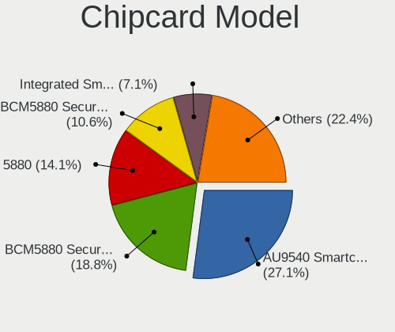

| Model                                                                        | Notebooks | Percent |
|------------------------------------------------------------------------------|-----------|---------|
| Alcor Micro AU9540 Smartcard Reader                                          | 23        | 28.05%  |
| Broadcom BCM5880 Secure Applications Processor                               | 16        | 19.51%  |
| Broadcom 5880                                                                | 12        | 14.63%  |
| Broadcom BCM5880 Secure Applications Processor with fingerprint swipe sensor | 7         | 8.54%   |
| Lenovo Integrated Smart Card Reader                                          | 6         | 7.32%   |
| Broadcom 58200                                                               | 6         | 7.32%   |
| Upek TouchChip Fingerprint Coprocessor (WBF advanced mode)                   | 5         | 6.1%    |
| O2 Micro OZ776 CCID Smartcard Reader                                         | 4         | 4.88%   |
| O2 Micro Oz776 SmartCard Reader                                              | 1         | 1.22%   |
| Gemalto (was Gemplus) Compact Smart Card Reader Writer                       | 1         | 1.22%   |
| Clay Logic Nitrokey Start                                                    | 1         | 1.22%   |

Unsupported
-----------

Unsupported Devices
-------------------

Total unsupported devices on board

| Total | Notebooks | Percent |
|-------|-----------|---------|
| 0     | 495       | 57.36%  |
| 1     | 273       | 31.63%  |
| 2     | 79        | 9.15%   |
| 3     | 12        | 1.39%   |
| 4     | 4         | 0.46%   |

Unsupported Device Types
------------------------

Types of unsupported devices

| Type                     | Notebooks | Percent |
|--------------------------|-----------|---------|
| Fingerprint reader       | 160       | 34.19%  |
| Graphics card            | 95        | 20.3%   |
| Chipcard                 | 76        | 16.24%  |
| Net/wireless             | 46        | 9.83%   |
| Multimedia controller    | 19        | 4.06%   |
| Bluetooth                | 19        | 4.06%   |
| Storage                  | 14        | 2.99%   |
| Camera                   | 12        | 2.56%   |
| Card reader              | 9         | 1.92%   |
| Sound                    | 5         | 1.07%   |
| Net/ethernet             | 4         | 0.85%   |
| Communication controller | 4         | 0.85%   |
| Modem                    | 2         | 0.43%   |
| Network                  | 1         | 0.21%   |
| Flash memory             | 1         | 0.21%   |
| Firewire controller      | 1         | 0.21%   |

