Debian 10 - Tested Hardware & Statistics
----------------------------------------

A project to collect tested hardware configurations for Debian 10.

Anyone can contribute to this report by the [hw-probe](https://github.com/linuxhw/hw-probe) tool:

    sudo -E hw-probe -all -upload

Please contribute! Especially if your hardware is rare.

This is a report for all computer types. See also reports for [desktops](/Dist/Debian_10/Desktop/README.md) and [notebooks](/Dist/Debian_10/Notebook/README.md).

Contents
--------

* [ Test Cases ](#test-cases)

* [ System ](#system)
  - [ Kernel                   ](#kernel)
  - [ Kernel Family            ](#kernel-family)
  - [ Kernel Major Ver.        ](#kernel-major-ver)
  - [ Arch                     ](#arch)
  - [ DE                       ](#de)
  - [ Display Server           ](#display-server)
  - [ Display Manager          ](#display-manager)
  - [ OS Lang                  ](#os-lang)
  - [ Boot Mode                ](#boot-mode)
  - [ Filesystem               ](#filesystem)
  - [ Part. scheme             ](#part-scheme)
  - [ Dual Boot with Linux/BSD ](#dual-boot-with-linuxbsd)
  - [ Dual Boot (Win)          ](#dual-boot-win)

* [ Board ](#board)
  - [ Vendor                   ](#vendor)
  - [ Model                    ](#model)
  - [ Model Family             ](#model-family)
  - [ MFG Year                 ](#mfg-year)
  - [ Form Factor              ](#form-factor)
  - [ Secure Boot              ](#secure-boot)
  - [ Coreboot                 ](#coreboot)
  - [ RAM Size                 ](#ram-size)
  - [ RAM Used                 ](#ram-used)
  - [ Total Drives             ](#total-drives)
  - [ Has CD-ROM               ](#has-cd-rom)
  - [ Has Ethernet             ](#has-ethernet)
  - [ Has WiFi                 ](#has-wifi)
  - [ Has Bluetooth            ](#has-bluetooth)

* [ Location ](#location)
  - [ Country                  ](#country)
  - [ City                     ](#city)

* [ Drives ](#drives)
  - [ Drive Vendor             ](#drive-vendor)
  - [ Drive Model              ](#drive-model)
  - [ HDD Vendor               ](#hdd-vendor)
  - [ SSD Vendor               ](#ssd-vendor)
  - [ Drive Kind               ](#drive-kind)
  - [ Drive Connector          ](#drive-connector)
  - [ Drive Size               ](#drive-size)
  - [ Space Total              ](#space-total)
  - [ Space Used               ](#space-used)
  - [ Malfunc. Drives          ](#malfunc-drives)
  - [ Malfunc. Drive Vendor    ](#malfunc-drive-vendor)
  - [ Malfunc. HDD Vendor      ](#malfunc-hdd-vendor)
  - [ Malfunc. Drive Kind      ](#malfunc-drive-kind)
  - [ Failed Drives            ](#failed-drives)
  - [ Failed Drive Vendor      ](#failed-drive-vendor)
  - [ Drive Status             ](#drive-status)

* [ Storage controller ](#storage-controller)
  - [ Storage Vendor           ](#storage-vendor)
  - [ Storage Model            ](#storage-model)
  - [ Storage Kind             ](#storage-kind)

* [ Processor ](#processor)
  - [ CPU Vendor               ](#cpu-vendor)
  - [ CPU Model                ](#cpu-model)
  - [ CPU Model Family         ](#cpu-model-family)
  - [ CPU Cores                ](#cpu-cores)
  - [ CPU Sockets              ](#cpu-sockets)
  - [ CPU Threads              ](#cpu-threads)
  - [ CPU Op-Modes             ](#cpu-op-modes)
  - [ CPU Microcode            ](#cpu-microcode)
  - [ CPU Microarch            ](#cpu-microarch)

* [ Graphics ](#graphics)
  - [ GPU Vendor               ](#gpu-vendor)
  - [ GPU Model                ](#gpu-model)
  - [ GPU Combo                ](#gpu-combo)
  - [ GPU Driver               ](#gpu-driver)
  - [ GPU Memory               ](#gpu-memory)

* [ Monitor ](#monitor)
  - [ Monitor Vendor           ](#monitor-vendor)
  - [ Monitor Model            ](#monitor-model)
  - [ Monitor Resolution       ](#monitor-resolution)
  - [ Monitor Diagonal         ](#monitor-diagonal)
  - [ Monitor Width            ](#monitor-width)
  - [ Aspect Ratio             ](#aspect-ratio)
  - [ Monitor Area             ](#monitor-area)
  - [ Pixel Density            ](#pixel-density)
  - [ Multiple Monitors        ](#multiple-monitors)

* [ Network ](#network)
  - [ Net Controller Vendor    ](#net-controller-vendor)
  - [ Net Controller Model     ](#net-controller-model)
  - [ Wireless Vendor          ](#wireless-vendor)
  - [ Wireless Model           ](#wireless-model)
  - [ Ethernet Vendor          ](#ethernet-vendor)
  - [ Ethernet Model           ](#ethernet-model)
  - [ Net Controller Kind      ](#net-controller-kind)
  - [ Used Controller          ](#used-controller)
  - [ NICs                     ](#nics)
  - [ IPv6                     ](#ipv6)

* [ Bluetooth ](#bluetooth)
  - [ Bluetooth Vendor         ](#bluetooth-vendor)
  - [ Bluetooth Model          ](#bluetooth-model)

* [ Sound ](#sound)
  - [ Sound Vendor             ](#sound-vendor)
  - [ Sound Model              ](#sound-model)

* [ Memory ](#memory)
  - [ Memory Vendor            ](#memory-vendor)
  - [ Memory Model             ](#memory-model)
  - [ Memory Kind              ](#memory-kind)
  - [ Memory Form Factor       ](#memory-form-factor)
  - [ Memory Size              ](#memory-size)
  - [ Memory Speed             ](#memory-speed)

* [ Printers & scanners ](#printers--scanners)
  - [ Printer Vendor           ](#printer-vendor)
  - [ Printer Model            ](#printer-model)
  - [ Scanner Vendor           ](#scanner-vendor)
  - [ Scanner Model            ](#scanner-model)

* [ Camera ](#camera)
  - [ Camera Vendor            ](#camera-vendor)
  - [ Camera Model             ](#camera-model)

* [ Security ](#security)
  - [ Fingerprint Vendor       ](#fingerprint-vendor)
  - [ Fingerprint Model        ](#fingerprint-model)
  - [ Chipcard Vendor          ](#chipcard-vendor)
  - [ Chipcard Model           ](#chipcard-model)

* [ Unsupported ](#unsupported)
  - [ Unsupported Devices      ](#unsupported-devices)
  - [ Unsupported Device Types ](#unsupported-device-types)

Test Cases
----------

Total: 2680

| Vendor        | Model                       | Form-Factor | Probe                                                      | Date         |
|---------------|-----------------------------|-------------|------------------------------------------------------------|--------------|
| IBM           | 94Y7718 SIT                 | Server      | [074e80349e](https://linux-hardware.org/?probe=074e80349e) | Apr 27, 2022 |
| Lenovo        | IdeaPad S145-15API 81V7     | Notebook    | [9e7c77d251](https://linux-hardware.org/?probe=9e7c77d251) | Apr 27, 2022 |
| Timi          | TM1612                      | Notebook    | [9e6b6f4737](https://linux-hardware.org/?probe=9e6b6f4737) | Apr 24, 2022 |
| MSI           | E350IA-E45                  | Desktop     | [8271a7f1d5](https://linux-hardware.org/?probe=8271a7f1d5) | Apr 23, 2022 |
| MSI           | E350IA-E45                  | Desktop     | [da7d376e11](https://linux-hardware.org/?probe=da7d376e11) | Apr 23, 2022 |
| Lenovo        | ThinkPad P53 20QN000ESP     | Notebook    | [16b3189bd8](https://linux-hardware.org/?probe=16b3189bd8) | Apr 22, 2022 |
| MSI           | 970A-G45                    | Desktop     | [35f8f0652d](https://linux-hardware.org/?probe=35f8f0652d) | Apr 21, 2022 |
| ASUSTek       | PRIME H510M-A               | Desktop     | [59fb2af2c2](https://linux-hardware.org/?probe=59fb2af2c2) | Apr 18, 2022 |
| MSI           | B450I GAMING PLUS MAX WI... | Desktop     | [f0d5c82d74](https://linux-hardware.org/?probe=f0d5c82d74) | Apr 17, 2022 |
| HP            | 2129                        | Desktop     | [be64efcffd](https://linux-hardware.org/?probe=be64efcffd) | Apr 15, 2022 |
| Dell          | Inspiron 5577               | Notebook    | [d82fa1bfc9](https://linux-hardware.org/?probe=d82fa1bfc9) | Apr 13, 2022 |
| Gigabyte      | H61M-D2P-B3                 | Desktop     | [a8e2ef2c76](https://linux-hardware.org/?probe=a8e2ef2c76) | Apr 12, 2022 |
| MSI           | N3150I ECO                  | Desktop     | [afe5c622e2](https://linux-hardware.org/?probe=afe5c622e2) | Apr 11, 2022 |
| Lenovo        | ThinkPad X1 Carbon 4th 2... | Notebook    | [4ca643452e](https://linux-hardware.org/?probe=4ca643452e) | Apr 10, 2022 |
| Lenovo        | ThinkPad X260 20F5S6QV00    | Notebook    | [315f7326a1](https://linux-hardware.org/?probe=315f7326a1) | Apr 10, 2022 |
| Gigabyte      | H61M-D2P-B3                 | Desktop     | [686ef53bc5](https://linux-hardware.org/?probe=686ef53bc5) | Apr 07, 2022 |
| Gigabyte      | H61M-D2P-B3                 | Desktop     | [aad4b24a04](https://linux-hardware.org/?probe=aad4b24a04) | Apr 06, 2022 |
| Samsung       | 270E5J/2570EJ               | Notebook    | [0887c85f98](https://linux-hardware.org/?probe=0887c85f98) | Apr 06, 2022 |
| ASRock        | Z97 Pro3                    | Desktop     | [68397184cf](https://linux-hardware.org/?probe=68397184cf) | Apr 06, 2022 |
| Packard Be... | Cuba MS-7301                | Desktop     | [1a89e021cd](https://linux-hardware.org/?probe=1a89e021cd) | Apr 03, 2022 |
| Lenovo        | QiTianM7150                 | Desktop     | [a6a37565b7](https://linux-hardware.org/?probe=a6a37565b7) | Apr 02, 2022 |
| Intel         | powered classmate PC        | Notebook    | [8ce4fa1757](https://linux-hardware.org/?probe=8ce4fa1757) | Apr 01, 2022 |
| Lenovo        | ThinkPad X230 23259S9       | Notebook    | [a461555ba9](https://linux-hardware.org/?probe=a461555ba9) | Mar 30, 2022 |
| Gigabyte      | H97M-HD3                    | Desktop     | [9027088a52](https://linux-hardware.org/?probe=9027088a52) | Mar 28, 2022 |
| Gigabyte      | H97M-HD3                    | Desktop     | [fce2591fbd](https://linux-hardware.org/?probe=fce2591fbd) | Mar 28, 2022 |
| Lenovo        | 361A SDK0K17763 WIN         | Desktop     | [334c4c0ff2](https://linux-hardware.org/?probe=334c4c0ff2) | Mar 27, 2022 |
| HP            | Compaq 615                  | Notebook    | [906354c0ce](https://linux-hardware.org/?probe=906354c0ce) | Mar 27, 2022 |
| HP            | Compaq 615                  | Notebook    | [0d993a8d57](https://linux-hardware.org/?probe=0d993a8d57) | Mar 27, 2022 |
| Gigabyte      | H61M-USB3H                  | Desktop     | [f852a0cb0d](https://linux-hardware.org/?probe=f852a0cb0d) | Mar 26, 2022 |
| HP            | Compaq 615                  | Notebook    | [28368f4366](https://linux-hardware.org/?probe=28368f4366) | Mar 25, 2022 |
| Dell          | 0D61XP A02                  | Server      | [87f57e757f](https://linux-hardware.org/?probe=87f57e757f) | Mar 23, 2022 |
| Gigabyte      | MU71-SU0-00 01000100        | Server      | [10e5711367](https://linux-hardware.org/?probe=10e5711367) | Mar 22, 2022 |
| Dell          | XPS 15 9570                 | Notebook    | [d4b19324b2](https://linux-hardware.org/?probe=d4b19324b2) | Mar 22, 2022 |
| MSI           | E350IA-E45                  | Desktop     | [84a19b6203](https://linux-hardware.org/?probe=84a19b6203) | Mar 21, 2022 |
| Lenovo        | ThinkPad L470 20J4003WGE    | Notebook    | [62b1219002](https://linux-hardware.org/?probe=62b1219002) | Mar 21, 2022 |
| IBM           | 94Y7718 SIT                 | Server      | [422f42233c](https://linux-hardware.org/?probe=422f42233c) | Mar 21, 2022 |
| IBM           | 94Y7718 SIT                 | Server      | [9c5faf3552](https://linux-hardware.org/?probe=9c5faf3552) | Mar 21, 2022 |
| Lenovo        | ThinkPad X220 4291G26       | Notebook    | [c2f45496d1](https://linux-hardware.org/?probe=c2f45496d1) | Mar 21, 2022 |
| Raspberry ... | Raspberry Pi                | Soc         | [f51c0bb134](https://linux-hardware.org/?probe=f51c0bb134) | Mar 21, 2022 |
| Dell          | 0P611C A00                  | Desktop     | [0c433bca90](https://linux-hardware.org/?probe=0c433bca90) | Mar 18, 2022 |
| Raspberry ... | Raspberry Pi                | Soc         | [3467378e7f](https://linux-hardware.org/?probe=3467378e7f) | Mar 18, 2022 |
| Dell          | 0P611C A00                  | Desktop     | [72593cf88a](https://linux-hardware.org/?probe=72593cf88a) | Mar 16, 2022 |
| Raspberry ... | Raspberry Pi                | Soc         | [b8354230c7](https://linux-hardware.org/?probe=b8354230c7) | Mar 13, 2022 |
| Lenovo        | IdeaPad C340-14IWL 81RL     | Convertible | [17f7f8858f](https://linux-hardware.org/?probe=17f7f8858f) | Mar 09, 2022 |
| Dell          | 0P611C A00                  | Desktop     | [8acced42b7](https://linux-hardware.org/?probe=8acced42b7) | Mar 06, 2022 |
| Dell          | MXG071                      | Notebook    | [62a45db2eb](https://linux-hardware.org/?probe=62a45db2eb) | Mar 06, 2022 |
| ASUSTek       | PRIME H510M-A               | Desktop     | [6381e8c673](https://linux-hardware.org/?probe=6381e8c673) | Mar 06, 2022 |
| MSI           | B450I GAMING PLUS MAX WI... | Desktop     | [be30358301](https://linux-hardware.org/?probe=be30358301) | Mar 06, 2022 |
| Dell          | 0YXT71 A03                  | Desktop     | [efb5f5ca61](https://linux-hardware.org/?probe=efb5f5ca61) | Mar 05, 2022 |
| Dell          | 0YXT71 A03                  | Desktop     | [4ac263a1a4](https://linux-hardware.org/?probe=4ac263a1a4) | Mar 04, 2022 |
| VIT           | NP3020M3                    | Server      | [9fbb87a829](https://linux-hardware.org/?probe=9fbb87a829) | Mar 03, 2022 |
| Dell          | 0YXT71 A03                  | Desktop     | [73b9b32509](https://linux-hardware.org/?probe=73b9b32509) | Mar 03, 2022 |
| Lenovo        | MAHOBAY                     | Desktop     | [cd7e96054b](https://linux-hardware.org/?probe=cd7e96054b) | Mar 01, 2022 |
| MSI           | B450I GAMING PLUS MAX WI... | Desktop     | [6c23424026](https://linux-hardware.org/?probe=6c23424026) | Feb 28, 2022 |
| MSI           | A68HM-E33 V2                | Desktop     | [cc8c1aecf0](https://linux-hardware.org/?probe=cc8c1aecf0) | Feb 27, 2022 |
| ASUSTek       | 1015BX                      | Notebook    | [9b3fb4a52b](https://linux-hardware.org/?probe=9b3fb4a52b) | Feb 20, 2022 |
| ASUSTek       | X55C                        | Notebook    | [ae05784a4a](https://linux-hardware.org/?probe=ae05784a4a) | Feb 19, 2022 |
| Samsung       | N230                        | Notebook    | [f16e2ce417](https://linux-hardware.org/?probe=f16e2ce417) | Feb 16, 2022 |
| Samsung       | N230                        | Notebook    | [10be19ecbf](https://linux-hardware.org/?probe=10be19ecbf) | Feb 16, 2022 |
| Dell          | 0P611C A00                  | Desktop     | [a1247ab856](https://linux-hardware.org/?probe=a1247ab856) | Feb 16, 2022 |
| ASUSTek       | P8Z68 DELUXE                | Desktop     | [8b588bf90b](https://linux-hardware.org/?probe=8b588bf90b) | Feb 15, 2022 |
| Gigabyte      | H97M-HD3                    | Desktop     | [46b9019417](https://linux-hardware.org/?probe=46b9019417) | Feb 12, 2022 |
| ASRock        | Z68 Pro3 Gen3               | Desktop     | [01677c38f7](https://linux-hardware.org/?probe=01677c38f7) | Feb 11, 2022 |
| Dell          | 0KCKR5 A02                  | Server      | [3a287683dc](https://linux-hardware.org/?probe=3a287683dc) | Feb 04, 2022 |
| ASRock        | A320M-DGS                   | Desktop     | [c8857db260](https://linux-hardware.org/?probe=c8857db260) | Feb 03, 2022 |
| ASRock        | A320M-DGS                   | Desktop     | [be8b394e63](https://linux-hardware.org/?probe=be8b394e63) | Feb 03, 2022 |
| Lenovo        | IdeaPad 720S-14IKB 81BD     | Notebook    | [9e3040619f](https://linux-hardware.org/?probe=9e3040619f) | Jan 30, 2022 |
| Gigabyte      | H110M-S2H-CF                | Desktop     | [fe5bd0b5ed](https://linux-hardware.org/?probe=fe5bd0b5ed) | Jan 29, 2022 |
| MSI           | A68HM-E33 V2                | Desktop     | [42abbebf28](https://linux-hardware.org/?probe=42abbebf28) | Jan 29, 2022 |
| ASUSTek       | X555BA                      | Notebook    | [526e03cf05](https://linux-hardware.org/?probe=526e03cf05) | Jan 28, 2022 |
| ASRock        | ION3D-HT                    | Desktop     | [dc36b83c20](https://linux-hardware.org/?probe=dc36b83c20) | Jan 26, 2022 |
| ASRock        | B560M-ITX/ac                | Desktop     | [a09767a55e](https://linux-hardware.org/?probe=a09767a55e) | Jan 20, 2022 |
| Dell          | Vostro 5470                 | Notebook    | [1e97f26a27](https://linux-hardware.org/?probe=1e97f26a27) | Jan 15, 2022 |
| HP            | EliteBook 8440p             | Notebook    | [c15f816857](https://linux-hardware.org/?probe=c15f816857) | Jan 11, 2022 |
| Supermicro    | C7SIM-Q                     | Desktop     | [e4919133a9](https://linux-hardware.org/?probe=e4919133a9) | Jan 05, 2022 |
| Lenovo        | IdeaPad 120S-11IAP 81A4     | Notebook    | [c7f2471bdf](https://linux-hardware.org/?probe=c7f2471bdf) | Jan 04, 2022 |
| Gigabyte      | GA-970A-D3                  | Desktop     | [98280b3f37](https://linux-hardware.org/?probe=98280b3f37) | Jan 04, 2022 |
| MSI           | MAG Z490 TOMAHAWK           | Desktop     | [8de00c21aa](https://linux-hardware.org/?probe=8de00c21aa) | Jan 01, 2022 |
| HP            | Unknown                     | Notebook    | [e1eb3d8838](https://linux-hardware.org/?probe=e1eb3d8838) | Dec 30, 2021 |
| HP            | Pavilion dv3                | Notebook    | [3f3defcf69](https://linux-hardware.org/?probe=3f3defcf69) | Dec 28, 2021 |
| HP            | Pavilion dv3                | Notebook    | [750225c8c8](https://linux-hardware.org/?probe=750225c8c8) | Dec 28, 2021 |
| HP            | Compaq 6710b (RM405UT#AB... | Notebook    | [e4789d000a](https://linux-hardware.org/?probe=e4789d000a) | Dec 28, 2021 |
| Lenovo        | IdeaPad S145-15API 81V7     | Notebook    | [9a6b436bcb](https://linux-hardware.org/?probe=9a6b436bcb) | Dec 26, 2021 |
| ASUSTek       | PRIME B350M-A               | Desktop     | [7843ddc3fb](https://linux-hardware.org/?probe=7843ddc3fb) | Dec 24, 2021 |
| HP            | EliteBook 8470w             | Notebook    | [87c1cb1da7](https://linux-hardware.org/?probe=87c1cb1da7) | Dec 23, 2021 |
| Acer          | Aspire 5250                 | Notebook    | [856d94d47a](https://linux-hardware.org/?probe=856d94d47a) | Dec 21, 2021 |
| Dell          | 042P49 A01                  | Desktop     | [631c0da1c5](https://linux-hardware.org/?probe=631c0da1c5) | Dec 15, 2021 |
| Apple         | Mac-F4208EAA PVT            | Mini pc     | [2a96949fd0](https://linux-hardware.org/?probe=2a96949fd0) | Dec 14, 2021 |
| Lenovo        | [9532AC1] STC               | Server      | [78113d1370](https://linux-hardware.org/?probe=78113d1370) | Dec 13, 2021 |
| Supermicro    | X9SCL/X9SCM                 | Desktop     | [9c415e153b](https://linux-hardware.org/?probe=9c415e153b) | Dec 10, 2021 |
| Unknown       | MT6771V/CT (DT)             | Soc         | [8fc4d20686](https://linux-hardware.org/?probe=8fc4d20686) | Dec 09, 2021 |
| Dell          | Latitude E7440              | Notebook    | [bb71f679cf](https://linux-hardware.org/?probe=bb71f679cf) | Dec 06, 2021 |
| Huawei        | BC11SPCC V100R001C10        | Server      | [eb5771b190](https://linux-hardware.org/?probe=eb5771b190) | Nov 29, 2021 |
| ASUSTek       | P5G41T-M LX2/GB/LPT         | Desktop     | [402d467e5c](https://linux-hardware.org/?probe=402d467e5c) | Nov 28, 2021 |
| Philco        | OEM                         | Notebook    | [3d13f6a539](https://linux-hardware.org/?probe=3d13f6a539) | Nov 28, 2021 |
| Intel         | NUC6CAYB J26842-405         | Mini pc     | [f9a19f16ad](https://linux-hardware.org/?probe=f9a19f16ad) | Nov 26, 2021 |
| HP            | Pavilion Notebook           | Notebook    | [78bddf398e](https://linux-hardware.org/?probe=78bddf398e) | Nov 25, 2021 |
| SixForOne     | 64Megaspeed                 | Desktop     | [f85bf8ab77](https://linux-hardware.org/?probe=f85bf8ab77) | Nov 24, 2021 |
| SixForOne     | 64Megaspeed                 | Desktop     | [1cba9688c0](https://linux-hardware.org/?probe=1cba9688c0) | Nov 24, 2021 |
| Raspberry ... | Raspberry Pi                | Soc         | [11863c05ee](https://linux-hardware.org/?probe=11863c05ee) | Nov 24, 2021 |
| Lenovo        | B40-70 20392                | Notebook    | [4f4458d61a](https://linux-hardware.org/?probe=4f4458d61a) | Nov 23, 2021 |
| ASUSTek       | K53U                        | Notebook    | [8b542e61d9](https://linux-hardware.org/?probe=8b542e61d9) | Nov 18, 2021 |
| ASUSTek       | P7P55D PRO                  | Desktop     | [1103284e51](https://linux-hardware.org/?probe=1103284e51) | Nov 17, 2021 |
| Dell          | 0NY667                      | Notebook    | [d0c838dff6](https://linux-hardware.org/?probe=d0c838dff6) | Nov 17, 2021 |
| Acer          | Aspire V3-772G              | Notebook    | [1e66881588](https://linux-hardware.org/?probe=1e66881588) | Nov 16, 2021 |
| Gigabyte      | GA-880GM-UD2H               | Desktop     | [3c083fe97c](https://linux-hardware.org/?probe=3c083fe97c) | Nov 15, 2021 |
| Gateway       | SX2185                      | Desktop     | [0e422edb56](https://linux-hardware.org/?probe=0e422edb56) | Nov 15, 2021 |
| AXDIA Inte... | Wintab 10                   | Notebook    | [0cf33496ad](https://linux-hardware.org/?probe=0cf33496ad) | Nov 14, 2021 |
| Dell          | Precision 7520              | Notebook    | [55077aa291](https://linux-hardware.org/?probe=55077aa291) | Nov 13, 2021 |
| Dell          | Inspiron 7447               | Notebook    | [4ca16063da](https://linux-hardware.org/?probe=4ca16063da) | Nov 12, 2021 |
| Quanta        | 2AC5 101                    | All in one  | [df20701c5e](https://linux-hardware.org/?probe=df20701c5e) | Nov 10, 2021 |
| Quanta        | 2AC5 101                    | All in one  | [692c643a24](https://linux-hardware.org/?probe=692c643a24) | Nov 10, 2021 |
| HP            | Stream Laptop 11-y0XX       | Notebook    | [1bd1ac9ae2](https://linux-hardware.org/?probe=1bd1ac9ae2) | Nov 08, 2021 |
| Dell          | Latitude E6420              | Notebook    | [66cfc6d85b](https://linux-hardware.org/?probe=66cfc6d85b) | Nov 07, 2021 |
| ASUSTek       | K52F                        | Notebook    | [f90cbb4d26](https://linux-hardware.org/?probe=f90cbb4d26) | Nov 04, 2021 |
| ASUSTek       | X555BA                      | Notebook    | [99ef7179aa](https://linux-hardware.org/?probe=99ef7179aa) | Nov 04, 2021 |
| Dell          | Latitude D600               | Notebook    | [024dd9fbc7](https://linux-hardware.org/?probe=024dd9fbc7) | Nov 02, 2021 |
| Raspberry ... | Raspberry Pi                | Soc         | [41ea7af858](https://linux-hardware.org/?probe=41ea7af858) | Nov 02, 2021 |
| Acer          | Batman A01                  | Desktop     | [707f27e3e8](https://linux-hardware.org/?probe=707f27e3e8) | Oct 31, 2021 |
| Dell          | 08CYF7 A02                  | Server      | [e757687f86](https://linux-hardware.org/?probe=e757687f86) | Oct 30, 2021 |
| ASUSTek       | N10Jh                       | Notebook    | [9d10643a15](https://linux-hardware.org/?probe=9d10643a15) | Oct 30, 2021 |
| Gigabyte      | H110M-S2H-CF                | Desktop     | [fbaa649304](https://linux-hardware.org/?probe=fbaa649304) | Oct 30, 2021 |
| Lenovo        | G570 4334                   | Notebook    | [d1d57448c4](https://linux-hardware.org/?probe=d1d57448c4) | Oct 29, 2021 |
| Lenovo        | G570 4334                   | Notebook    | [f5112dbf47](https://linux-hardware.org/?probe=f5112dbf47) | Oct 29, 2021 |
| HP            | Compaq Presario CQ60        | Notebook    | [b9b0c35db8](https://linux-hardware.org/?probe=b9b0c35db8) | Oct 28, 2021 |
| Unknown       | Phitronics H55-M            | Desktop     | [df6d3817cb](https://linux-hardware.org/?probe=df6d3817cb) | Oct 28, 2021 |
| MSI           | GF615M-P33                  | Desktop     | [79851e843c](https://linux-hardware.org/?probe=79851e843c) | Oct 27, 2021 |
| ASRock        | X570 PG Velocita            | Desktop     | [f0411fba64](https://linux-hardware.org/?probe=f0411fba64) | Oct 27, 2021 |
| Lenovo        | ThinkPad T480s 20L7002AU... | Notebook    | [dda6d4cdcb](https://linux-hardware.org/?probe=dda6d4cdcb) | Oct 26, 2021 |
| Lenovo        | ThinkPad X1 Carbon Gen 9... | Notebook    | [67ab68b5f3](https://linux-hardware.org/?probe=67ab68b5f3) | Oct 26, 2021 |
| Dell          | Inspiron 5570               | Notebook    | [c01fa4b013](https://linux-hardware.org/?probe=c01fa4b013) | Oct 26, 2021 |
| ASUSTek       | TUF Gaming FX506LU_FX506... | Notebook    | [8f6efb8dbe](https://linux-hardware.org/?probe=8f6efb8dbe) | Oct 24, 2021 |
| ASUSTek       | P7P55D PRO                  | Desktop     | [8a6b85a2d2](https://linux-hardware.org/?probe=8a6b85a2d2) | Oct 24, 2021 |
| Acer          | Nitro AN515-42              | Notebook    | [2ff605bdb0](https://linux-hardware.org/?probe=2ff605bdb0) | Oct 20, 2021 |
| Dell          | 0H21J3 A07                  | Server      | [c7b39e92ca](https://linux-hardware.org/?probe=c7b39e92ca) | Oct 19, 2021 |
| Dell          | 0H21J3 A07                  | Server      | [9b3a90c143](https://linux-hardware.org/?probe=9b3a90c143) | Oct 19, 2021 |
| ASUSTek       | N551JW                      | Notebook    | [a6c41c9d3e](https://linux-hardware.org/?probe=a6c41c9d3e) | Oct 19, 2021 |
| Dell          | Inspiron 1545               | Notebook    | [4852d91477](https://linux-hardware.org/?probe=4852d91477) | Oct 17, 2021 |
| Dell          | Inspiron 1545               | Notebook    | [249e85b27d](https://linux-hardware.org/?probe=249e85b27d) | Oct 17, 2021 |
| Dell          | Inspiron 1440               | Notebook    | [9e9967a3fa](https://linux-hardware.org/?probe=9e9967a3fa) | Oct 17, 2021 |
| Dell          | Latitude D600               | Notebook    | [c4a1e26625](https://linux-hardware.org/?probe=c4a1e26625) | Oct 15, 2021 |
| Dell          | Latitude D600               | Notebook    | [994b244534](https://linux-hardware.org/?probe=994b244534) | Oct 15, 2021 |
| HP            | EliteBook 745 G6            | Notebook    | [295112838e](https://linux-hardware.org/?probe=295112838e) | Oct 14, 2021 |
| Dell          | MXG071                      | Notebook    | [5006aa0f75](https://linux-hardware.org/?probe=5006aa0f75) | Oct 12, 2021 |
| Unknown       | Pyra-Handheld-V5.3          | Notebook    | [3e61c199d6](https://linux-hardware.org/?probe=3e61c199d6) | Oct 12, 2021 |
| Dell          | 0P611C A00                  | Desktop     | [0693495a61](https://linux-hardware.org/?probe=0693495a61) | Oct 11, 2021 |
| Toshiba       | Satellite A215              | Notebook    | [06c3b56836](https://linux-hardware.org/?probe=06c3b56836) | Oct 11, 2021 |
| Dell          | Inspiron 7720               | Notebook    | [6728cba5a1](https://linux-hardware.org/?probe=6728cba5a1) | Oct 09, 2021 |
| ASUSTek       | P8P67 PRO                   | Desktop     | [13fbf3ab3d](https://linux-hardware.org/?probe=13fbf3ab3d) | Oct 09, 2021 |
| Lenovo        | ThinkPad X1 Carbon Gen 9... | Notebook    | [04d8d207df](https://linux-hardware.org/?probe=04d8d207df) | Oct 08, 2021 |
| Lenovo        | ThinkPad X1 Carbon Gen 9... | Notebook    | [d0d578ae42](https://linux-hardware.org/?probe=d0d578ae42) | Oct 08, 2021 |
| Gigabyte      | H61M-S2PV                   | Desktop     | [727cc6a560](https://linux-hardware.org/?probe=727cc6a560) | Oct 07, 2021 |
| Lenovo        | ThinkPad T440 20B7S1X108    | Notebook    | [0ad6768049](https://linux-hardware.org/?probe=0ad6768049) | Oct 02, 2021 |
| Toshiba       | Satellite L500              | Notebook    | [07116867d0](https://linux-hardware.org/?probe=07116867d0) | Sep 30, 2021 |
| Dell          | Latitude 5411               | Notebook    | [b1b898bf2b](https://linux-hardware.org/?probe=b1b898bf2b) | Sep 30, 2021 |
| Acer          | Aspire A515-43              | Notebook    | [5edddc1e2c](https://linux-hardware.org/?probe=5edddc1e2c) | Sep 29, 2021 |
| ASUSTek       | PRIME X570-PRO              | Desktop     | [299d4c5a32](https://linux-hardware.org/?probe=299d4c5a32) | Sep 28, 2021 |
| ASUSTek       | PRIME X570-PRO              | Desktop     | [150644b98c](https://linux-hardware.org/?probe=150644b98c) | Sep 28, 2021 |
| Lenovo        | ThinkPad T15 Gen 1 20S60... | Notebook    | [3095cda8c3](https://linux-hardware.org/?probe=3095cda8c3) | Sep 27, 2021 |
| Lenovo        | ThinkPad T15 Gen 1 20S60... | Notebook    | [299d4edf8d](https://linux-hardware.org/?probe=299d4edf8d) | Sep 27, 2021 |
| Dell          | 0M017G A00                  | Desktop     | [e21c86fd3e](https://linux-hardware.org/?probe=e21c86fd3e) | Sep 24, 2021 |
| Supermicro    | X9SCL/X9SCM                 | Desktop     | [eb152f6d8d](https://linux-hardware.org/?probe=eb152f6d8d) | Sep 23, 2021 |
| Raspberry ... | Raspberry Pi                | Soc         | [0d2d69118f](https://linux-hardware.org/?probe=0d2d69118f) | Sep 22, 2021 |
| ASUSTek       | TUF GAMING X570-PLUS        | Desktop     | [23d68ab2ea](https://linux-hardware.org/?probe=23d68ab2ea) | Sep 20, 2021 |
| Dell          | 0M017G A00                  | Desktop     | [7ccc604345](https://linux-hardware.org/?probe=7ccc604345) | Sep 20, 2021 |
| ASUSTek       | X540YA                      | Notebook    | [c0b5da7979](https://linux-hardware.org/?probe=c0b5da7979) | Sep 19, 2021 |
| Bananapi      | BPI-M5                      | Soc         | [77bb019fe0](https://linux-hardware.org/?probe=77bb019fe0) | Sep 19, 2021 |
| Dell          | 0M017G A00                  | Desktop     | [b4ecd86a69](https://linux-hardware.org/?probe=b4ecd86a69) | Sep 18, 2021 |
| Acer          | Aspire 5542                 | Notebook    | [dfa471a829](https://linux-hardware.org/?probe=dfa471a829) | Sep 17, 2021 |
| Acer          | Aspire 5542                 | Notebook    | [d862c4ce39](https://linux-hardware.org/?probe=d862c4ce39) | Sep 17, 2021 |
| Gigabyte      | GA-990FXA-UD3               | Desktop     | [8750af4b33](https://linux-hardware.org/?probe=8750af4b33) | Sep 16, 2021 |
| Wistron       | ProLiant ML110 G6           | Desktop     | [7deb832fbd](https://linux-hardware.org/?probe=7deb832fbd) | Sep 14, 2021 |
| Lenovo        | ThinkPad X1 Carbon 4th 2... | Notebook    | [232a307a5b](https://linux-hardware.org/?probe=232a307a5b) | Sep 14, 2021 |
| Lenovo        | ThinkPad T590 20N4000BFR    | Notebook    | [834ddc5e6a](https://linux-hardware.org/?probe=834ddc5e6a) | Sep 13, 2021 |
| Intel         | Intel powered classmate ... | Notebook    | [15cb9c7764](https://linux-hardware.org/?probe=15cb9c7764) | Sep 12, 2021 |
| HP            | 8704                        | Desktop     | [b26e444f12](https://linux-hardware.org/?probe=b26e444f12) | Sep 12, 2021 |
| Dell          | Inspiron 5420               | Notebook    | [bc80b42442](https://linux-hardware.org/?probe=bc80b42442) | Sep 12, 2021 |
| MSI           | MEG X299 CREATION           | Desktop     | [f6eed137f3](https://linux-hardware.org/?probe=f6eed137f3) | Sep 12, 2021 |
| ASUSTek       | P8H67-M PRO                 | Desktop     | [5027b9aa4d](https://linux-hardware.org/?probe=5027b9aa4d) | Sep 09, 2021 |
| Lenovo        | QIWY3                       | Notebook    | [9da123bf89](https://linux-hardware.org/?probe=9da123bf89) | Sep 09, 2021 |
| Lenovo        | QIWY3                       | Notebook    | [552b695b27](https://linux-hardware.org/?probe=552b695b27) | Sep 09, 2021 |
| Biostar       | A780L3C                     | Desktop     | [65fe5eaa0f](https://linux-hardware.org/?probe=65fe5eaa0f) | Sep 08, 2021 |
| MSI           | MEG X299 CREATION           | Desktop     | [856c31d8d4](https://linux-hardware.org/?probe=856c31d8d4) | Sep 08, 2021 |
| ASUSTek       | PRIME A320M-K               | Desktop     | [ee46f7aa7d](https://linux-hardware.org/?probe=ee46f7aa7d) | Sep 07, 2021 |
| Apple         | Mac-F227BEC8 PVT            | All in one  | [eac6bb47c1](https://linux-hardware.org/?probe=eac6bb47c1) | Sep 07, 2021 |
| GTZS          | Unknown                     | Notebook    | [e5d931aaf8](https://linux-hardware.org/?probe=e5d931aaf8) | Sep 06, 2021 |
| HP            | ProBook 6460b               | Notebook    | [7d379f011c](https://linux-hardware.org/?probe=7d379f011c) | Sep 04, 2021 |
| ASUSTek       | P8H67-M PRO                 | Desktop     | [33d31c555e](https://linux-hardware.org/?probe=33d31c555e) | Sep 02, 2021 |
| Lenovo        | ThinkPad R60 9462A45        | Notebook    | [5850a811e3](https://linux-hardware.org/?probe=5850a811e3) | Sep 01, 2021 |
| MSI           | A88XM-E35                   | Desktop     | [66070c788f](https://linux-hardware.org/?probe=66070c788f) | Sep 01, 2021 |
| Intel         | CM11EBC4W M15494-302        | Mini pc     | [bd9cfc6a29](https://linux-hardware.org/?probe=bd9cfc6a29) | Sep 01, 2021 |
| Dell          | 0N047H A03                  | Server      | [fef0199664](https://linux-hardware.org/?probe=fef0199664) | Sep 01, 2021 |
| Gigabyte      | MCMLUAB-00                  | Desktop     | [ba6aa808a1](https://linux-hardware.org/?probe=ba6aa808a1) | Aug 31, 2021 |
| HP            | 250 G4 Notebook PC          | Notebook    | [2cf6464047](https://linux-hardware.org/?probe=2cf6464047) | Aug 31, 2021 |
| HP            | EliteBook 850 G5            | Notebook    | [68149f9864](https://linux-hardware.org/?probe=68149f9864) | Aug 30, 2021 |
| YANYU         | M9F baytrail                | Desktop     | [0e5100e716](https://linux-hardware.org/?probe=0e5100e716) | Aug 29, 2021 |
| YANYU         | M9F baytrail                | Desktop     | [0bf997753c](https://linux-hardware.org/?probe=0bf997753c) | Aug 29, 2021 |
| Dell          | Studio XPS 1640             | Notebook    | [f0765cb8c8](https://linux-hardware.org/?probe=f0765cb8c8) | Aug 28, 2021 |
| Dell          | Studio XPS 1640             | Notebook    | [1e772e0237](https://linux-hardware.org/?probe=1e772e0237) | Aug 28, 2021 |
| Supermicro    | X8DT3                       | Server      | [afa93003e2](https://linux-hardware.org/?probe=afa93003e2) | Aug 28, 2021 |
| Lenovo        | ThinkPad X220 429044C       | Notebook    | [20057996af](https://linux-hardware.org/?probe=20057996af) | Aug 27, 2021 |
| Acer          | TravelMate 7750G            | Notebook    | [8d3d35021f](https://linux-hardware.org/?probe=8d3d35021f) | Aug 27, 2021 |
| Itautec       | Infoway w7535               | Notebook    | [f7d8a66820](https://linux-hardware.org/?probe=f7d8a66820) | Aug 27, 2021 |
| Lenovo        | ThinkPad X260 20F5S3J00D    | Notebook    | [eeb6586c28](https://linux-hardware.org/?probe=eeb6586c28) | Aug 26, 2021 |
| Dell          | 0N047H A03                  | Server      | [246d827bf8](https://linux-hardware.org/?probe=246d827bf8) | Aug 25, 2021 |
| Dell          | 042P49 A02                  | Desktop     | [b3c942c238](https://linux-hardware.org/?probe=b3c942c238) | Aug 25, 2021 |
| ASUSTek       | P751JA                      | Notebook    | [0ba110ae45](https://linux-hardware.org/?probe=0ba110ae45) | Aug 25, 2021 |
| HP            | ProBook 6460b               | Notebook    | [c8226af22c](https://linux-hardware.org/?probe=c8226af22c) | Aug 25, 2021 |
| TQ-Group      | TQMxE39S                    | Notebook    | [69363368e2](https://linux-hardware.org/?probe=69363368e2) | Aug 23, 2021 |
| ASUSTek       | P5KPL-CM                    | Desktop     | [a88269301b](https://linux-hardware.org/?probe=a88269301b) | Aug 23, 2021 |
| ASUSTek       | P5KPL-CM                    | Desktop     | [25b17f5647](https://linux-hardware.org/?probe=25b17f5647) | Aug 23, 2021 |
| Dell          | Latitude 5175               | Tablet      | [d47ac58e2b](https://linux-hardware.org/?probe=d47ac58e2b) | Aug 22, 2021 |
| ASUSTek       | M51Sn                       | Notebook    | [4a85a76b94](https://linux-hardware.org/?probe=4a85a76b94) | Aug 21, 2021 |
| Toshiba       | Satellite C55D-B            | Notebook    | [3aa4e38d51](https://linux-hardware.org/?probe=3aa4e38d51) | Aug 21, 2021 |
| Itautec       | Infoway w7535               | Notebook    | [ea3f721976](https://linux-hardware.org/?probe=ea3f721976) | Aug 21, 2021 |
| Acer          | Aspire S5-371               | Notebook    | [5e3fcc0daa](https://linux-hardware.org/?probe=5e3fcc0daa) | Aug 21, 2021 |
| HP            | 0A58h                       | Desktop     | [e1d8370cba](https://linux-hardware.org/?probe=e1d8370cba) | Aug 20, 2021 |
| Dell          | 0HY9JP A02                  | Desktop     | [8da5fad507](https://linux-hardware.org/?probe=8da5fad507) | Aug 20, 2021 |
| Supermicro    | X10SRW-FB                   | Desktop     | [115f0bc999](https://linux-hardware.org/?probe=115f0bc999) | Aug 20, 2021 |
| ASUSTek       | M5A97 R2.0                  | Desktop     | [1c59d4f975](https://linux-hardware.org/?probe=1c59d4f975) | Aug 19, 2021 |
| Supermicro    | X10SRW-FB                   | Desktop     | [7921589d07](https://linux-hardware.org/?probe=7921589d07) | Aug 19, 2021 |
| Supermicro    | X10SRW-FB                   | Desktop     | [7005c64171](https://linux-hardware.org/?probe=7005c64171) | Aug 19, 2021 |
| Gigabyte      | B560M DS3H                  | Desktop     | [6972f0e79d](https://linux-hardware.org/?probe=6972f0e79d) | Aug 18, 2021 |
| ASRock        | B450 Steel Legend           | Desktop     | [c76e5dd087](https://linux-hardware.org/?probe=c76e5dd087) | Aug 18, 2021 |
| Microsoft     | Surface Pro 3               | Tablet      | [f31f072f5e](https://linux-hardware.org/?probe=f31f072f5e) | Aug 18, 2021 |
| ASUSTek       | M4N68T V2                   | Desktop     | [6441a522b9](https://linux-hardware.org/?probe=6441a522b9) | Aug 18, 2021 |
| Gigabyte      | H97M-HD3                    | Desktop     | [ab21753ce9](https://linux-hardware.org/?probe=ab21753ce9) | Aug 18, 2021 |
| ASUSTek       | E45M1-I DELUXE              | Desktop     | [d8aaf5c676](https://linux-hardware.org/?probe=d8aaf5c676) | Aug 17, 2021 |
| Lenovo        | SHARKBAY NOK                | Desktop     | [b32d294f8b](https://linux-hardware.org/?probe=b32d294f8b) | Aug 17, 2021 |
| ASRock        | P67 Pro3                    | Desktop     | [fd006189bc](https://linux-hardware.org/?probe=fd006189bc) | Aug 16, 2021 |
| Lenovo        | IdeaPad 100S-14IBR 80R9     | Notebook    | [e4ab15ad86](https://linux-hardware.org/?probe=e4ab15ad86) | Aug 16, 2021 |
| ASUSTek       | PRIME B365M-A               | Desktop     | [3c340a79fc](https://linux-hardware.org/?probe=3c340a79fc) | Aug 15, 2021 |
| ASUSTek       | M5A97 R2.0                  | Desktop     | [69064747f1](https://linux-hardware.org/?probe=69064747f1) | Aug 13, 2021 |
| Gigabyte      | Z390 AORUS PRO WIFI-CF      | Desktop     | [ccc387436e](https://linux-hardware.org/?probe=ccc387436e) | Aug 13, 2021 |
| Gigabyte      | Z390 AORUS PRO WIFI-CF      | Desktop     | [fc9d4eb6f9](https://linux-hardware.org/?probe=fc9d4eb6f9) | Aug 13, 2021 |
| HP            | 8446                        | All in one  | [430c02980a](https://linux-hardware.org/?probe=430c02980a) | Aug 13, 2021 |
| Apple         | Mac-F4208EAA PVT            | Mini pc     | [e1490a23c1](https://linux-hardware.org/?probe=e1490a23c1) | Aug 13, 2021 |
| ASUSTek       | N550JV                      | Notebook    | [631e697061](https://linux-hardware.org/?probe=631e697061) | Aug 13, 2021 |
| ASUSTek       | N550JV                      | Notebook    | [191ce05579](https://linux-hardware.org/?probe=191ce05579) | Aug 13, 2021 |
| HP            | 8446                        | All in one  | [2d1f0d3db0](https://linux-hardware.org/?probe=2d1f0d3db0) | Aug 13, 2021 |
| Gigabyte      | H61M-S2PV                   | Desktop     | [3985c521c2](https://linux-hardware.org/?probe=3985c521c2) | Aug 12, 2021 |
| ASUSTek       | ROG Maximus XI HERO         | Desktop     | [345c99ec14](https://linux-hardware.org/?probe=345c99ec14) | Aug 12, 2021 |
| ASRock        | P67 Pro3                    | Desktop     | [e03db50d11](https://linux-hardware.org/?probe=e03db50d11) | Aug 12, 2021 |
| Unknown       | Ionics Carrier Board Adv... | Desktop     | [62a47a18c2](https://linux-hardware.org/?probe=62a47a18c2) | Aug 12, 2021 |
| ASRock        | P67 Pro3                    | Desktop     | [a9d6d51216](https://linux-hardware.org/?probe=a9d6d51216) | Aug 12, 2021 |
| Apple         | MacBookPro9,2               | Notebook    | [10a9ce514b](https://linux-hardware.org/?probe=10a9ce514b) | Aug 11, 2021 |
| Apple         | MacBookPro9,2               | Notebook    | [4a08b4bc9c](https://linux-hardware.org/?probe=4a08b4bc9c) | Aug 11, 2021 |
| Dell          | 0XJ8C4 A00                  | Desktop     | [e92b9a1203](https://linux-hardware.org/?probe=e92b9a1203) | Aug 11, 2021 |
| ASRockRack    | X470D4U2/1N1                | Desktop     | [b037023625](https://linux-hardware.org/?probe=b037023625) | Aug 11, 2021 |
| Gigabyte      | GA-990FXA-D3                | Desktop     | [c59dc746e2](https://linux-hardware.org/?probe=c59dc746e2) | Aug 11, 2021 |
| Gigabyte      | B450 AORUS M                | Desktop     | [2de3749bcf](https://linux-hardware.org/?probe=2de3749bcf) | Aug 11, 2021 |
| Google        | Careena                     | Notebook    | [a715f6f37f](https://linux-hardware.org/?probe=a715f6f37f) | Aug 10, 2021 |
| HP            | Pavilion Notebook           | Notebook    | [f8742367c3](https://linux-hardware.org/?probe=f8742367c3) | Aug 10, 2021 |
| Dell          | 0GXM1W A02                  | Desktop     | [519bd92b01](https://linux-hardware.org/?probe=519bd92b01) | Aug 09, 2021 |
| Dell          | 0GXM1W A02                  | Desktop     | [181a5b6f63](https://linux-hardware.org/?probe=181a5b6f63) | Aug 09, 2021 |
| HP            | Pavilion Notebook           | Notebook    | [7401df03e4](https://linux-hardware.org/?probe=7401df03e4) | Aug 09, 2021 |
| ASUSTek       | P5KC                        | Desktop     | [4fce5e2d88](https://linux-hardware.org/?probe=4fce5e2d88) | Aug 09, 2021 |
| Gateway       | MD7811U                     | Notebook    | [fdd99ed1fe](https://linux-hardware.org/?probe=fdd99ed1fe) | Aug 09, 2021 |
| Gateway       | MD7811U                     | Notebook    | [07d8dcb0ff](https://linux-hardware.org/?probe=07d8dcb0ff) | Aug 08, 2021 |
| DNS           | 101                         | Notebook    | [83fc7e7928](https://linux-hardware.org/?probe=83fc7e7928) | Aug 08, 2021 |
| Gigabyte      | H170-HD3-CF                 | Desktop     | [71aeb24115](https://linux-hardware.org/?probe=71aeb24115) | Aug 08, 2021 |
| ECS           | H81H3-M4                    | Desktop     | [a595ba80d3](https://linux-hardware.org/?probe=a595ba80d3) | Aug 08, 2021 |
| Lenovo        | ThinkPad T480s 20L7002AU... | Notebook    | [d19a600e79](https://linux-hardware.org/?probe=d19a600e79) | Aug 07, 2021 |
| ASUSTek       | N56VZ                       | Notebook    | [4080b39f00](https://linux-hardware.org/?probe=4080b39f00) | Aug 07, 2021 |
| Sony          | VPCS110FL                   | Notebook    | [2227fd7ae7](https://linux-hardware.org/?probe=2227fd7ae7) | Aug 07, 2021 |
| Sony          | VPCS110FL                   | Notebook    | [1741c7d3db](https://linux-hardware.org/?probe=1741c7d3db) | Aug 07, 2021 |
| Apple         | MacBookPro9,2               | Notebook    | [f4e31f03fb](https://linux-hardware.org/?probe=f4e31f03fb) | Aug 07, 2021 |
| HP            | 1791                        | Desktop     | [9de8ddbd32](https://linux-hardware.org/?probe=9de8ddbd32) | Aug 07, 2021 |
| Dell          | G3 3590                     | Notebook    | [16bdb588e1](https://linux-hardware.org/?probe=16bdb588e1) | Aug 05, 2021 |
| Dell          | G3 3590                     | Notebook    | [01a9560f9c](https://linux-hardware.org/?probe=01a9560f9c) | Aug 05, 2021 |
| Apple         | Mac-35C5E08120C7EEAF Mac... | Mini pc     | [b42339d870](https://linux-hardware.org/?probe=b42339d870) | Aug 03, 2021 |
| Apple         | Mac-35C5E08120C7EEAF Mac... | Mini pc     | [510f9e1272](https://linux-hardware.org/?probe=510f9e1272) | Aug 03, 2021 |
| Google        | Zako                        | Desktop     | [f439c69ee5](https://linux-hardware.org/?probe=f439c69ee5) | Aug 03, 2021 |
| Dell          | Precision 3530              | Notebook    | [f2fb6b98ea](https://linux-hardware.org/?probe=f2fb6b98ea) | Aug 03, 2021 |
| Intel         | DH87RL AAG74240-403         | Desktop     | [ec1970f896](https://linux-hardware.org/?probe=ec1970f896) | Aug 02, 2021 |
| ASUSTek       | PRIME B350M-K               | Desktop     | [b195a48138](https://linux-hardware.org/?probe=b195a48138) | Aug 02, 2021 |
| ASUSTek       | P5GC-MX/1333                | Desktop     | [f4572f52ba](https://linux-hardware.org/?probe=f4572f52ba) | Aug 01, 2021 |
| ASUSTek       | P5GC-MX/1333                | Desktop     | [4f034fa5e5](https://linux-hardware.org/?probe=4f034fa5e5) | Aug 01, 2021 |
| Apple         | Mac-35C5E08120C7EEAF Mac... | Mini pc     | [c03a893d2c](https://linux-hardware.org/?probe=c03a893d2c) | Aug 01, 2021 |
| Gigabyte      | GA-78LMT-USB3               | Desktop     | [710ec38bd4](https://linux-hardware.org/?probe=710ec38bd4) | Aug 01, 2021 |
| Dell          | 0N047H A03                  | Server      | [bced18ad98](https://linux-hardware.org/?probe=bced18ad98) | Aug 01, 2021 |
| Lenovo        | ThinkPad R60 9462A45        | Notebook    | [95aacb86f6](https://linux-hardware.org/?probe=95aacb86f6) | Jul 31, 2021 |
| Supermicro    | X10SRW-FB                   | Desktop     | [be3e1efd8c](https://linux-hardware.org/?probe=be3e1efd8c) | Jul 30, 2021 |
| Gigabyte      | H61M-S2PV                   | Desktop     | [766df6d543](https://linux-hardware.org/?probe=766df6d543) | Jul 30, 2021 |
| Lenovo        | ThinkPad T490 20N2002AUS    | Notebook    | [557f9a87fa](https://linux-hardware.org/?probe=557f9a87fa) | Jul 30, 2021 |
| Fujitsu       | D3003-B1 S26361-D3003-B1    | Desktop     | [2a54dde7de](https://linux-hardware.org/?probe=2a54dde7de) | Jul 29, 2021 |
| MSI           | U210/U210 Light             | Notebook    | [98d5949e01](https://linux-hardware.org/?probe=98d5949e01) | Jul 29, 2021 |
| Intel         | DH55HC AAE70933-504         | Desktop     | [f3a838da1b](https://linux-hardware.org/?probe=f3a838da1b) | Jul 28, 2021 |
| ASUSTek       | PRIME A320M-K               | Desktop     | [64b86da0e0](https://linux-hardware.org/?probe=64b86da0e0) | Jul 28, 2021 |
| OrangePi      | 4                           | Soc         | [b638d18837](https://linux-hardware.org/?probe=b638d18837) | Jul 27, 2021 |
| ASRock        | J4105-ITX                   | Desktop     | [ba7a9ed588](https://linux-hardware.org/?probe=ba7a9ed588) | Jul 27, 2021 |
| ASUSTek       | PRIME B350-PLUS             | Desktop     | [7770cf36c7](https://linux-hardware.org/?probe=7770cf36c7) | Jul 27, 2021 |
| ASUSTek       | X205TA                      | Notebook    | [37efd6fc5e](https://linux-hardware.org/?probe=37efd6fc5e) | Jul 26, 2021 |
| ASUSTek       | PRIME X570-P                | Desktop     | [076f12ebe9](https://linux-hardware.org/?probe=076f12ebe9) | Jul 26, 2021 |
| Supermicro    | X8STi                       | Desktop     | [ace2d84680](https://linux-hardware.org/?probe=ace2d84680) | Jul 26, 2021 |
| MSI           | X570-A PRO                  | Desktop     | [db168e8daa](https://linux-hardware.org/?probe=db168e8daa) | Jul 26, 2021 |
| Lenovo        | B51-35 80LH                 | Notebook    | [662fffc9d2](https://linux-hardware.org/?probe=662fffc9d2) | Jul 25, 2021 |
| Lenovo        | B51-35 80LH                 | Notebook    | [bdaceebba4](https://linux-hardware.org/?probe=bdaceebba4) | Jul 25, 2021 |
| Lenovo        | ThinkPad X250 20CLS1G70A    | Notebook    | [7330b29e94](https://linux-hardware.org/?probe=7330b29e94) | Jul 25, 2021 |
| Lenovo        | ThinkPad X250 20CLS1G70A    | Notebook    | [1a104c4440](https://linux-hardware.org/?probe=1a104c4440) | Jul 25, 2021 |
| Acer          | AO725                       | Notebook    | [4e27f519f7](https://linux-hardware.org/?probe=4e27f519f7) | Jul 25, 2021 |
| Dell          | Vostro 1500                 | Notebook    | [f78b977663](https://linux-hardware.org/?probe=f78b977663) | Jul 25, 2021 |
| Intel         | DN2800MT AAG23738-600       | Desktop     | [37b38d65e6](https://linux-hardware.org/?probe=37b38d65e6) | Jul 25, 2021 |
| ASUSTek       | PRIME Z370-A                | Desktop     | [a54c9831cf](https://linux-hardware.org/?probe=a54c9831cf) | Jul 25, 2021 |
| ASUSTek       | M5A78L-M LX/BR              | Desktop     | [7a88cb266b](https://linux-hardware.org/?probe=7a88cb266b) | Jul 25, 2021 |
| Gigabyte      | Z390 AORUS ELITE-CF         | Desktop     | [f16cf342a6](https://linux-hardware.org/?probe=f16cf342a6) | Jul 24, 2021 |
| Gigabyte      | Z170X-GamingG1              | Desktop     | [b0ce1bc8f5](https://linux-hardware.org/?probe=b0ce1bc8f5) | Jul 24, 2021 |
| Raspberry ... | Raspberry Pi                | Soc         | [fef12ee80a](https://linux-hardware.org/?probe=fef12ee80a) | Jul 24, 2021 |
| ASUSTek       | P8B WS                      | Desktop     | [328f1648f0](https://linux-hardware.org/?probe=328f1648f0) | Jul 23, 2021 |
| Supermicro    | X10SLL-F                    | Server      | [ea6fc4377f](https://linux-hardware.org/?probe=ea6fc4377f) | Jul 23, 2021 |
| Dell          | 0N047H A03                  | Server      | [185a22c496](https://linux-hardware.org/?probe=185a22c496) | Jul 23, 2021 |
| Lenovo        | ThinkPad L390 20NRCTO1WW    | Notebook    | [0d77ee3e3d](https://linux-hardware.org/?probe=0d77ee3e3d) | Jul 22, 2021 |
| Acer          | Aspire A715-72G             | Notebook    | [d977beba9e](https://linux-hardware.org/?probe=d977beba9e) | Jul 22, 2021 |
| ASUSTek       | H170 PRO GAMING             | Desktop     | [8e9fa75ba6](https://linux-hardware.org/?probe=8e9fa75ba6) | Jul 21, 2021 |
| Toshiba       | Satellite M70               | Notebook    | [ffe4b92da3](https://linux-hardware.org/?probe=ffe4b92da3) | Jul 21, 2021 |
| YANYU         | ITX-M51_D2L baytrail        | Desktop     | [92dcf334a1](https://linux-hardware.org/?probe=92dcf334a1) | Jul 21, 2021 |
| Lenovo        | 1036 SDK0Q40104 WIN 3305... | Desktop     | [48145bef99](https://linux-hardware.org/?probe=48145bef99) | Jul 20, 2021 |
| ASRock        | A320M Pro4-F                | Desktop     | [c98085d169](https://linux-hardware.org/?probe=c98085d169) | Jul 20, 2021 |
| Dell          | 0W13NR A05                  | Server      | [ad7d2477f8](https://linux-hardware.org/?probe=ad7d2477f8) | Jul 19, 2021 |
| Lenovo        | 36C5 SDK0Q55724 WIN 3273... | Desktop     | [ccff510db8](https://linux-hardware.org/?probe=ccff510db8) | Jul 19, 2021 |
| ASUSTek       | TUF Gaming FX506LU_FX506... | Notebook    | [a347415235](https://linux-hardware.org/?probe=a347415235) | Jul 19, 2021 |
| MSI           | H97M-G43                    | Desktop     | [ba574c6794](https://linux-hardware.org/?probe=ba574c6794) | Jul 18, 2021 |
| Dell          | XPS M1330                   | Notebook    | [69cc932202](https://linux-hardware.org/?probe=69cc932202) | Jul 17, 2021 |
| Dell          | 0N047H A03                  | Server      | [76b3c178af](https://linux-hardware.org/?probe=76b3c178af) | Jul 17, 2021 |
| ASUSTek       | TUF GAMING B460M-PLUS       | Desktop     | [da4454b08b](https://linux-hardware.org/?probe=da4454b08b) | Jul 16, 2021 |
| Dell          | 0N047H A03                  | Server      | [dade6d61a5](https://linux-hardware.org/?probe=dade6d61a5) | Jul 16, 2021 |
| MSI           | GF65 Thin 10UE              | Notebook    | [0a875bd8bb](https://linux-hardware.org/?probe=0a875bd8bb) | Jul 15, 2021 |
| Dell          | 0N047H A03                  | Server      | [3a22edd15d](https://linux-hardware.org/?probe=3a22edd15d) | Jul 15, 2021 |
| HP            | 0A58h                       | Desktop     | [91869f8bdf](https://linux-hardware.org/?probe=91869f8bdf) | Jul 15, 2021 |
| Dell          | Latitude E6420              | Notebook    | [e2e96ce9d8](https://linux-hardware.org/?probe=e2e96ce9d8) | Jul 14, 2021 |
| ASRock        | A75M-HVS                    | Desktop     | [95cf5b47dc](https://linux-hardware.org/?probe=95cf5b47dc) | Jul 14, 2021 |
| Dell          | Latitude E6420              | Notebook    | [eb1224a5ff](https://linux-hardware.org/?probe=eb1224a5ff) | Jul 14, 2021 |
| MSI           | MS-A912 200                 | All in one  | [b8b4472592](https://linux-hardware.org/?probe=b8b4472592) | Jul 14, 2021 |
| Dell          | 0F6X5P A00                  | Desktop     | [ef2cac7e8c](https://linux-hardware.org/?probe=ef2cac7e8c) | Jul 14, 2021 |
| ASUSTek       | TUF GAMING B460M-PLUS       | Desktop     | [6d381a9a63](https://linux-hardware.org/?probe=6d381a9a63) | Jul 13, 2021 |
| Intel         | NUC5i3RYB K23918-501        | Mini pc     | [5131c2b9c6](https://linux-hardware.org/?probe=5131c2b9c6) | Jul 13, 2021 |
| Acer          | Swift SF114-33              | Notebook    | [7aa338a8dc](https://linux-hardware.org/?probe=7aa338a8dc) | Jul 12, 2021 |
| One Educat... | Infinity:One                | Notebook    | [2f6016cb80](https://linux-hardware.org/?probe=2f6016cb80) | Jul 12, 2021 |
| Dell          | 0N047H A03                  | Server      | [e797b2faa9](https://linux-hardware.org/?probe=e797b2faa9) | Jul 12, 2021 |
| Gigabyte      | AB350M-DS3H V2-CF           | Desktop     | [6c2c692062](https://linux-hardware.org/?probe=6c2c692062) | Jul 11, 2021 |
| HP            | ProBook 6460b               | Notebook    | [094d8f1435](https://linux-hardware.org/?probe=094d8f1435) | Jul 10, 2021 |
| Intel         | DH77EB AAG39073-304         | Desktop     | [e1aabfff9e](https://linux-hardware.org/?probe=e1aabfff9e) | Jul 10, 2021 |
| ASUSTek       | K56CB                       | Notebook    | [112f34cf11](https://linux-hardware.org/?probe=112f34cf11) | Jul 09, 2021 |
| HP            | 2B43                        | Desktop     | [990d8bae5e](https://linux-hardware.org/?probe=990d8bae5e) | Jul 09, 2021 |
| Dell          | 0N047H A03                  | Server      | [324a030823](https://linux-hardware.org/?probe=324a030823) | Jul 09, 2021 |
| HP            | Spectre Laptop 13-af0xx     | Notebook    | [bfef4cded0](https://linux-hardware.org/?probe=bfef4cded0) | Jul 09, 2021 |
| ASUSTek       | PRIME A320M-K               | Desktop     | [195dc4b2d6](https://linux-hardware.org/?probe=195dc4b2d6) | Jul 08, 2021 |
| Apple         | Mac-35C5E08120C7EEAF Mac... | Mini pc     | [d3709d3b4f](https://linux-hardware.org/?probe=d3709d3b4f) | Jul 08, 2021 |
| Gigabyte      | H97M-HD3                    | Desktop     | [1519fb9582](https://linux-hardware.org/?probe=1519fb9582) | Jul 08, 2021 |
| ASRock        | N68-VS3 FX                  | Desktop     | [3bde956fe7](https://linux-hardware.org/?probe=3bde956fe7) | Jul 08, 2021 |
| Acer          | E1-510                      | Notebook    | [b1b6133207](https://linux-hardware.org/?probe=b1b6133207) | Jul 08, 2021 |
| ASRock        | A300M-STX                   | Desktop     | [315b07d723](https://linux-hardware.org/?probe=315b07d723) | Jul 08, 2021 |
| ASRock        | A300M-STX                   | Desktop     | [88c4424345](https://linux-hardware.org/?probe=88c4424345) | Jul 08, 2021 |
| Dell          | Latitude E6420              | Notebook    | [4facd06f69](https://linux-hardware.org/?probe=4facd06f69) | Jul 08, 2021 |
| Lenovo        | ThinkPad R60 9462A45        | Notebook    | [541bb57585](https://linux-hardware.org/?probe=541bb57585) | Jul 07, 2021 |
| Apple         | Mac-35C5E08120C7EEAF Mac... | Mini pc     | [aa50175464](https://linux-hardware.org/?probe=aa50175464) | Jul 07, 2021 |
| ASRock        | G31M-S                      | Desktop     | [dea58c596a](https://linux-hardware.org/?probe=dea58c596a) | Jul 07, 2021 |
| Supermicro    | X11SAE                      | Server      | [be8471a6f1](https://linux-hardware.org/?probe=be8471a6f1) | Jul 06, 2021 |
| Lenovo        | 1036 SDK0Q40104 WIN 3305... | Desktop     | [37feca7fac](https://linux-hardware.org/?probe=37feca7fac) | Jul 06, 2021 |
| ASUSTek       | VivoBook S14 X411UF         | Notebook    | [f5a3e8f307](https://linux-hardware.org/?probe=f5a3e8f307) | Jul 06, 2021 |
| MSI           | MAG Z490 TOMAHAWK           | Desktop     | [55996ad01c](https://linux-hardware.org/?probe=55996ad01c) | Jul 05, 2021 |
| Dell          | Board                       | Desktop     | [a593dfa486](https://linux-hardware.org/?probe=a593dfa486) | Jul 05, 2021 |
| HP            | 3396                        | Desktop     | [28e2f6399c](https://linux-hardware.org/?probe=28e2f6399c) | Jul 05, 2021 |
| Lenovo        | ThinkPad L590 20Q7CTO1WW    | Notebook    | [ec305ddc45](https://linux-hardware.org/?probe=ec305ddc45) | Jul 05, 2021 |
| Lenovo        | B50-10 80QR                 | Notebook    | [56044931dc](https://linux-hardware.org/?probe=56044931dc) | Jul 04, 2021 |
| ASUSTek       | PRIME B460M-A               | Desktop     | [2e105c41dc](https://linux-hardware.org/?probe=2e105c41dc) | Jul 04, 2021 |
| Dell          | 0N047H A03                  | Server      | [1e2e984e67](https://linux-hardware.org/?probe=1e2e984e67) | Jul 04, 2021 |
| HP            | 8433 11                     | Desktop     | [a1d7ee077e](https://linux-hardware.org/?probe=a1d7ee077e) | Jul 03, 2021 |
| ASUSTek       | PRIME A320M-K               | Desktop     | [205efc4b09](https://linux-hardware.org/?probe=205efc4b09) | Jul 02, 2021 |
| ASRock        | J4005M                      | Desktop     | [2a5b9e78a8](https://linux-hardware.org/?probe=2a5b9e78a8) | Jul 02, 2021 |
| Acer          | Aspire TC-780               | Desktop     | [db439f45a3](https://linux-hardware.org/?probe=db439f45a3) | Jul 02, 2021 |
| ASRock        | X570M Pro4                  | Desktop     | [aa62962d75](https://linux-hardware.org/?probe=aa62962d75) | Jul 01, 2021 |
| Dell          | 0N047H A03                  | Server      | [252ee933de](https://linux-hardware.org/?probe=252ee933de) | Jul 01, 2021 |
| Dell          | 0R230R A00                  | Desktop     | [101517b2a0](https://linux-hardware.org/?probe=101517b2a0) | Jun 30, 2021 |
| Dell          | Latitude E6430              | Notebook    | [0c6585a784](https://linux-hardware.org/?probe=0c6585a784) | Jun 30, 2021 |
| ASUSTek       | M5A97 R2.0                  | Desktop     | [04c4ddf9b0](https://linux-hardware.org/?probe=04c4ddf9b0) | Jun 29, 2021 |
| Dell          | 0773VG A02                  | Desktop     | [5b6b35aeed](https://linux-hardware.org/?probe=5b6b35aeed) | Jun 29, 2021 |
| Dell          | Inspiron 3421               | Notebook    | [1900fb77ec](https://linux-hardware.org/?probe=1900fb77ec) | Jun 29, 2021 |
| Biostar       | P4M900-M7 FE Ver:1.0        | Desktop     | [a82bafec08](https://linux-hardware.org/?probe=a82bafec08) | Jun 29, 2021 |
| Intel         | DG33FB AAD81072-306         | Desktop     | [55c7b15db3](https://linux-hardware.org/?probe=55c7b15db3) | Jun 28, 2021 |
| Intel         | DG33FB AAD81072-306         | Desktop     | [5259f5e799](https://linux-hardware.org/?probe=5259f5e799) | Jun 28, 2021 |
| HP            | Spectre x2 Detachable 12... | Tablet      | [771f0fed2a](https://linux-hardware.org/?probe=771f0fed2a) | Jun 27, 2021 |
| Lenovo        | ThinkPad E15 20RD0011GE     | Notebook    | [d4a28fa40a](https://linux-hardware.org/?probe=d4a28fa40a) | Jun 27, 2021 |
| Samsung       | 355V4C/356V4C/3445VC/354... | Notebook    | [fc58981ecd](https://linux-hardware.org/?probe=fc58981ecd) | Jun 27, 2021 |
| Samsung       | 355V4C/356V4C/3445VC/354... | Notebook    | [bce9c74edb](https://linux-hardware.org/?probe=bce9c74edb) | Jun 27, 2021 |
| SAELITE       | ES1AU11                     | Notebook    | [25dc027ef1](https://linux-hardware.org/?probe=25dc027ef1) | Jun 26, 2021 |
| ASRock        | A300M-STX                   | Desktop     | [709a8c3662](https://linux-hardware.org/?probe=709a8c3662) | Jun 25, 2021 |
| IBM           | Board                       | Desktop     | [5d966df1d5](https://linux-hardware.org/?probe=5d966df1d5) | Jun 24, 2021 |
| ASUSTek       | Maximus VIII GENE           | Desktop     | [dc85bb471a](https://linux-hardware.org/?probe=dc85bb471a) | Jun 24, 2021 |
| ASUSTek       | P8B75-M LX                  | Desktop     | [454e6a3f6d](https://linux-hardware.org/?probe=454e6a3f6d) | Jun 24, 2021 |
| Lenovo        | ThinkPad X230 23252EG       | Notebook    | [77c68fb077](https://linux-hardware.org/?probe=77c68fb077) | Jun 23, 2021 |
| Dell          | 0N047H A03                  | Server      | [2bf23617d3](https://linux-hardware.org/?probe=2bf23617d3) | Jun 23, 2021 |
| Gigabyte      | GA-970A-D3                  | Desktop     | [61460e5cfc](https://linux-hardware.org/?probe=61460e5cfc) | Jun 23, 2021 |
| Gigabyte      | GA-970A-D3                  | Desktop     | [c916e64b0d](https://linux-hardware.org/?probe=c916e64b0d) | Jun 23, 2021 |
| HP            | EliteBook 830 G7 Noteboo... | Notebook    | [0240acc863](https://linux-hardware.org/?probe=0240acc863) | Jun 22, 2021 |
| HP            | EliteBook 830 G7 Noteboo... | Notebook    | [f64428c049](https://linux-hardware.org/?probe=f64428c049) | Jun 22, 2021 |
| Dell          | Latitude 7480               | Notebook    | [28d1d17f13](https://linux-hardware.org/?probe=28d1d17f13) | Jun 22, 2021 |
| Lenovo        | 0x36BF SDK0J40688 WIN 34... | All in one  | [5ee73859b3](https://linux-hardware.org/?probe=5ee73859b3) | Jun 21, 2021 |
| Lenovo        | 0x36BF SDK0J40688 WIN 34... | All in one  | [001cc3458f](https://linux-hardware.org/?probe=001cc3458f) | Jun 21, 2021 |
| ASUSTek       | H81M-A/BR                   | Desktop     | [7f66c1890d](https://linux-hardware.org/?probe=7f66c1890d) | Jun 21, 2021 |
| Dell          | Latitude E6430              | Notebook    | [f0afba2500](https://linux-hardware.org/?probe=f0afba2500) | Jun 21, 2021 |
| Timi          | TM1612                      | Notebook    | [c4fb55cbfd](https://linux-hardware.org/?probe=c4fb55cbfd) | Jun 21, 2021 |
| Lenovo        | B50-10 80QR                 | Notebook    | [3da8d18204](https://linux-hardware.org/?probe=3da8d18204) | Jun 20, 2021 |
| Lenovo        | B50-10 80QR                 | Notebook    | [847e763107](https://linux-hardware.org/?probe=847e763107) | Jun 20, 2021 |
| HP            | 8184 X4                     | Desktop     | [429b73d4c9](https://linux-hardware.org/?probe=429b73d4c9) | Jun 20, 2021 |
| HP            | 8184 X4                     | Desktop     | [a7280fe917](https://linux-hardware.org/?probe=a7280fe917) | Jun 20, 2021 |
| HP            | 8184 X4                     | Desktop     | [dd1fa9b71e](https://linux-hardware.org/?probe=dd1fa9b71e) | Jun 20, 2021 |
| Timi          | TM1612                      | Notebook    | [dcb999a722](https://linux-hardware.org/?probe=dcb999a722) | Jun 20, 2021 |
| HP            | ProBook 6460b               | Notebook    | [dacf1e8349](https://linux-hardware.org/?probe=dacf1e8349) | Jun 20, 2021 |
| ASRock        | B450M/ac                    | Desktop     | [d37b2a101a](https://linux-hardware.org/?probe=d37b2a101a) | Jun 19, 2021 |
| Dell          | 0Y5DDC A00                  | Desktop     | [78557b4cba](https://linux-hardware.org/?probe=78557b4cba) | Jun 19, 2021 |
| ASUSTek       | ROG Strix G513IH_G513IH     | Notebook    | [3518f65e84](https://linux-hardware.org/?probe=3518f65e84) | Jun 18, 2021 |
| Dell          | Latitude 5420               | Notebook    | [1356be4391](https://linux-hardware.org/?probe=1356be4391) | Jun 18, 2021 |
| VIT           | P2400                       | Notebook    | [295d4d5a47](https://linux-hardware.org/?probe=295d4d5a47) | Jun 17, 2021 |
| Gigabyte      | AB350N-Gaming WIFI-CF       | Desktop     | [5aba9bb92a](https://linux-hardware.org/?probe=5aba9bb92a) | Jun 17, 2021 |
| Dell          | 0N047H A03                  | Server      | [d1f126d690](https://linux-hardware.org/?probe=d1f126d690) | Jun 17, 2021 |
| Fujitsu       | LIFEBOOK BH531              | Notebook    | [688d9f583e](https://linux-hardware.org/?probe=688d9f583e) | Jun 16, 2021 |
| Sony          | VGN-FW21L                   | Notebook    | [fe6647a4b1](https://linux-hardware.org/?probe=fe6647a4b1) | Jun 15, 2021 |
| Sony          | VGN-FW21E                   | Notebook    | [f46b41cd2f](https://linux-hardware.org/?probe=f46b41cd2f) | Jun 15, 2021 |
| ASRock        | B450M Steel Legend          | Desktop     | [f2d49f0b64](https://linux-hardware.org/?probe=f2d49f0b64) | Jun 14, 2021 |
| Acer          | One S1003                   | Tablet      | [3ec2a7c672](https://linux-hardware.org/?probe=3ec2a7c672) | Jun 14, 2021 |
| Dell          | 0R230R A00                  | Desktop     | [11c08ffcb7](https://linux-hardware.org/?probe=11c08ffcb7) | Jun 14, 2021 |
| Dell          | XPS 13 9310                 | Notebook    | [278fd058ed](https://linux-hardware.org/?probe=278fd058ed) | Jun 14, 2021 |
| Dell          | 0R230R A00                  | Desktop     | [d21d1799e3](https://linux-hardware.org/?probe=d21d1799e3) | Jun 14, 2021 |
| ASUSTek       | F2A55-M LK                  | Desktop     | [40ba16d0f3](https://linux-hardware.org/?probe=40ba16d0f3) | Jun 13, 2021 |
| ASUSTek       | P8Z68-V                     | Desktop     | [9f21765a53](https://linux-hardware.org/?probe=9f21765a53) | Jun 13, 2021 |
| ASUSTek       | P8Z68-V                     | Desktop     | [130e8ce51b](https://linux-hardware.org/?probe=130e8ce51b) | Jun 13, 2021 |
| Supermicro    | X9SRE/X9SRE-3F/X9SRi/X9S... | Server      | [fd24b5d375](https://linux-hardware.org/?probe=fd24b5d375) | Jun 12, 2021 |
| HP            | Laptop 15s-fq2xxx           | Notebook    | [b592b452fe](https://linux-hardware.org/?probe=b592b452fe) | Jun 12, 2021 |
| IBM           | ThinkPad T42 23736YG        | Notebook    | [fbf7c66f92](https://linux-hardware.org/?probe=fbf7c66f92) | Jun 12, 2021 |
| HP            | Compaq Presario CQ71        | Notebook    | [37a87224fb](https://linux-hardware.org/?probe=37a87224fb) | Jun 12, 2021 |
| Dell          | 0WG864                      | Desktop     | [f87d1e613e](https://linux-hardware.org/?probe=f87d1e613e) | Jun 12, 2021 |
| ASUSTek       | P5E                         | Desktop     | [975bd773a1](https://linux-hardware.org/?probe=975bd773a1) | Jun 11, 2021 |
| Dell          | Latitude E7440              | Notebook    | [3f4df169bd](https://linux-hardware.org/?probe=3f4df169bd) | Jun 11, 2021 |
| Dell          | Latitude E7440              | Notebook    | [961681623f](https://linux-hardware.org/?probe=961681623f) | Jun 11, 2021 |
| ASUSTek       | E35M1-M PRO                 | Desktop     | [ce432dc65a](https://linux-hardware.org/?probe=ce432dc65a) | Jun 11, 2021 |
| Dell          | Inspiron 1525               | Notebook    | [511a525213](https://linux-hardware.org/?probe=511a525213) | Jun 11, 2021 |
| Raspberry ... | Raspberry Pi                | Soc         | [7e69191372](https://linux-hardware.org/?probe=7e69191372) | Jun 11, 2021 |
| Gigabyte      | B150M-D3H-CF                | Desktop     | [93f4681a87](https://linux-hardware.org/?probe=93f4681a87) | Jun 10, 2021 |
| Acer          | Aspire X3400                | Desktop     | [8fcc9b6607](https://linux-hardware.org/?probe=8fcc9b6607) | Jun 10, 2021 |
| ASRock        | B450M Steel Legend          | Desktop     | [cca24bd3cc](https://linux-hardware.org/?probe=cca24bd3cc) | Jun 10, 2021 |
| ASUSTek       | TUF B450-PLUS GAMING        | Desktop     | [cded9fb832](https://linux-hardware.org/?probe=cded9fb832) | Jun 09, 2021 |
| HP            | ProBook 450 G6              | Notebook    | [e081b13666](https://linux-hardware.org/?probe=e081b13666) | Jun 09, 2021 |
| HP            | ProBook 450 G6              | Notebook    | [e3efe71b23](https://linux-hardware.org/?probe=e3efe71b23) | Jun 09, 2021 |
| HP            | Laptop 15-dw0xxx            | Notebook    | [95fdac8e1c](https://linux-hardware.org/?probe=95fdac8e1c) | Jun 08, 2021 |
| Lenovo        | ThinkPad E590 20NB001AGE    | Notebook    | [21cab94898](https://linux-hardware.org/?probe=21cab94898) | Jun 08, 2021 |
| HP            | EliteBook 820 G1            | Notebook    | [6fbdebda43](https://linux-hardware.org/?probe=6fbdebda43) | Jun 06, 2021 |
| sunxi         | Unknown                     | Soc         | [f2c4a2f8e9](https://linux-hardware.org/?probe=f2c4a2f8e9) | Jun 06, 2021 |
| Acer          | Aspire 5750G                | Notebook    | [45b5e8d8ae](https://linux-hardware.org/?probe=45b5e8d8ae) | Jun 06, 2021 |
| Acer          | Aspire 5750G                | Notebook    | [f0574d82e1](https://linux-hardware.org/?probe=f0574d82e1) | Jun 06, 2021 |
| Dell          | Inspiron 5577               | Notebook    | [188fcc64df](https://linux-hardware.org/?probe=188fcc64df) | Jun 06, 2021 |
| Timi          | TM1612                      | Notebook    | [902746e81d](https://linux-hardware.org/?probe=902746e81d) | Jun 06, 2021 |
| Gigabyte      | X470 AORUS ULTRA GAMING-... | Desktop     | [204b2a5d7c](https://linux-hardware.org/?probe=204b2a5d7c) | Jun 05, 2021 |
| Dell          | 0WG864                      | Desktop     | [d72c25e601](https://linux-hardware.org/?probe=d72c25e601) | Jun 05, 2021 |
| Dell          | Latitude C810               | Notebook    | [f379321c88](https://linux-hardware.org/?probe=f379321c88) | Jun 05, 2021 |
| Dell          | Latitude E5470              | Notebook    | [5b65572d25](https://linux-hardware.org/?probe=5b65572d25) | Jun 05, 2021 |
| Timi          | TM1612                      | Notebook    | [14f8479e7c](https://linux-hardware.org/?probe=14f8479e7c) | Jun 05, 2021 |
| Timi          | TM1612                      | Notebook    | [40318f2d95](https://linux-hardware.org/?probe=40318f2d95) | Jun 05, 2021 |
| ASRock        | B450 Gaming K4              | Desktop     | [514ff6f90a](https://linux-hardware.org/?probe=514ff6f90a) | Jun 05, 2021 |
| Supermicro    | X11SSE-F                    | Mini pc     | [2a05e48525](https://linux-hardware.org/?probe=2a05e48525) | Jun 05, 2021 |
| Supermicro    | X11SCE-F                    | Server      | [f1bf9d35ef](https://linux-hardware.org/?probe=f1bf9d35ef) | Jun 05, 2021 |
| ASRock        | B450M Pro4                  | Desktop     | [74d4cdffc4](https://linux-hardware.org/?probe=74d4cdffc4) | Jun 05, 2021 |
| ASRockRack    | B450D4U-V1L                 | Desktop     | [49a0eec9f5](https://linux-hardware.org/?probe=49a0eec9f5) | Jun 05, 2021 |
| ASRock        | B450M Pro4                  | Desktop     | [d4b005244b](https://linux-hardware.org/?probe=d4b005244b) | Jun 05, 2021 |
| ASRock        | B450 Pro4                   | Desktop     | [eac7f9afec](https://linux-hardware.org/?probe=eac7f9afec) | Jun 05, 2021 |
| ASRock        | X570 Pro4                   | Desktop     | [bb16149062](https://linux-hardware.org/?probe=bb16149062) | Jun 05, 2021 |
| ASRock        | B450M Pro4                  | Desktop     | [c933ca0d6f](https://linux-hardware.org/?probe=c933ca0d6f) | Jun 05, 2021 |
| ASUSTek       | PRIME B365M-A               | Desktop     | [5f426dad05](https://linux-hardware.org/?probe=5f426dad05) | Jun 05, 2021 |
| ASRock        | B450 Pro4                   | Desktop     | [78b9b4f958](https://linux-hardware.org/?probe=78b9b4f958) | Jun 05, 2021 |
| ASUSTek       | PRIME B365M-A               | Desktop     | [4afb5b5059](https://linux-hardware.org/?probe=4afb5b5059) | Jun 05, 2021 |
| Supermicro    | X10SLL-F                    | Server      | [666371d8a8](https://linux-hardware.org/?probe=666371d8a8) | Jun 05, 2021 |
| Supermicro    | X8DTU                       | Server      | [aca2a2ffdf](https://linux-hardware.org/?probe=aca2a2ffdf) | Jun 05, 2021 |
| ASRock        | B450M Pro4                  | Desktop     | [d3569d37e9](https://linux-hardware.org/?probe=d3569d37e9) | Jun 05, 2021 |
| Supermicro    | X10SLL-F                    | Server      | [74de7e2acf](https://linux-hardware.org/?probe=74de7e2acf) | Jun 05, 2021 |
| Supermicro    | X11SCL-F                    | Server      | [cac1b04e1e](https://linux-hardware.org/?probe=cac1b04e1e) | Jun 04, 2021 |
| ASUSTek       | H170M-PLUS                  | Desktop     | [0b5c7b1cb9](https://linux-hardware.org/?probe=0b5c7b1cb9) | Jun 04, 2021 |
| Dell          | Latitude C810               | Notebook    | [23e6f5572a](https://linux-hardware.org/?probe=23e6f5572a) | Jun 04, 2021 |
| Unknown       | Unknown                     | Soc         | [ead2c4250e](https://linux-hardware.org/?probe=ead2c4250e) | Jun 04, 2021 |
| Toshiba       | TECRA M4                    | Notebook    | [3ac511cc5f](https://linux-hardware.org/?probe=3ac511cc5f) | Jun 03, 2021 |
| HP            | 0A04h                       | Desktop     | [8368917bd7](https://linux-hardware.org/?probe=8368917bd7) | Jun 03, 2021 |
| ASRock        | B450 Steel Legend           | Desktop     | [f1ddb51b58](https://linux-hardware.org/?probe=f1ddb51b58) | Jun 02, 2021 |
| MSI           | H81M-P33                    | Desktop     | [a67e6bcfce](https://linux-hardware.org/?probe=a67e6bcfce) | Jun 02, 2021 |
| ASUSTek       | PRIME B360-PLUS             | Desktop     | [ca61b140f1](https://linux-hardware.org/?probe=ca61b140f1) | Jun 01, 2021 |
| Dell          | Inspiron 3501               | Notebook    | [3e23b17d66](https://linux-hardware.org/?probe=3e23b17d66) | Jun 01, 2021 |
| Lenovo        | ThinkPad T15 Gen 1 20S60... | Notebook    | [1505924642](https://linux-hardware.org/?probe=1505924642) | Jun 01, 2021 |
| Dell          | 0N047H A03                  | Server      | [4debada4bf](https://linux-hardware.org/?probe=4debada4bf) | Jun 01, 2021 |
| Lenovo        | ThinkPad T430s 2356GBG      | Notebook    | [e67f4b0fd4](https://linux-hardware.org/?probe=e67f4b0fd4) | May 31, 2021 |
| HP            | EliteBook 830 G7 Noteboo... | Notebook    | [b7ec4606a3](https://linux-hardware.org/?probe=b7ec4606a3) | May 31, 2021 |
| HP            | 8595                        | Desktop     | [36248f1bf0](https://linux-hardware.org/?probe=36248f1bf0) | May 31, 2021 |
| Apple         | Mac-F42C88C8 Proto1         | Desktop     | [a0d316eb3e](https://linux-hardware.org/?probe=a0d316eb3e) | May 31, 2021 |
| HP            | 250 G7 Notebook PC          | Notebook    | [035b3cdc60](https://linux-hardware.org/?probe=035b3cdc60) | May 31, 2021 |
| Dell          | 0WG864                      | Desktop     | [3e22711262](https://linux-hardware.org/?probe=3e22711262) | May 31, 2021 |
| HP            | 250 G7 Notebook PC          | Notebook    | [e9148788a7](https://linux-hardware.org/?probe=e9148788a7) | May 30, 2021 |
| HP            | 3048h                       | Desktop     | [39204d22ae](https://linux-hardware.org/?probe=39204d22ae) | May 29, 2021 |
| ASUSTek       | H110M-PLUS                  | Desktop     | [3310677e00](https://linux-hardware.org/?probe=3310677e00) | May 29, 2021 |
| Fujitsu       | LIFEBOOK BH531              | Notebook    | [93d4456b05](https://linux-hardware.org/?probe=93d4456b05) | May 29, 2021 |
| Gigabyte      | B450 I AORUS PRO WIFI-CF    | Desktop     | [f04a4bb553](https://linux-hardware.org/?probe=f04a4bb553) | May 28, 2021 |
| Raspberry ... | Raspberry Pi                | Soc         | [6a8b41811a](https://linux-hardware.org/?probe=6a8b41811a) | May 28, 2021 |
| ASUSTek       | M5A97 R2.0                  | Desktop     | [f0145b568f](https://linux-hardware.org/?probe=f0145b568f) | May 27, 2021 |
| HP            | 250 G7 Notebook PC          | Notebook    | [0dbfbd4c06](https://linux-hardware.org/?probe=0dbfbd4c06) | May 27, 2021 |
| ASUSTek       | X450LN                      | Notebook    | [9157df68c1](https://linux-hardware.org/?probe=9157df68c1) | May 27, 2021 |
| Dell          | OptiPlex 980                | Desktop     | [1fe360b027](https://linux-hardware.org/?probe=1fe360b027) | May 26, 2021 |
| HP            | Laptop 15s-fq2xxx           | Notebook    | [72287f1bb4](https://linux-hardware.org/?probe=72287f1bb4) | May 25, 2021 |
| HP            | Laptop 15s-fq2xxx           | Notebook    | [f4713dbdb0](https://linux-hardware.org/?probe=f4713dbdb0) | May 25, 2021 |
| ASUSTek       | X450LN                      | Notebook    | [aa8e32e484](https://linux-hardware.org/?probe=aa8e32e484) | May 25, 2021 |
| Dell          | 0N047H A03                  | Server      | [619c02cbd2](https://linux-hardware.org/?probe=619c02cbd2) | May 25, 2021 |
| Dell          | 0N047H A03                  | Server      | [bc635eb240](https://linux-hardware.org/?probe=bc635eb240) | May 25, 2021 |
| ASUSTek       | K52F                        | Notebook    | [92db46133f](https://linux-hardware.org/?probe=92db46133f) | May 24, 2021 |
| ASUSTek       | X553SA                      | Notebook    | [c470382d2a](https://linux-hardware.org/?probe=c470382d2a) | May 24, 2021 |
| ASUSTek       | X553SA                      | Notebook    | [31d6a914fd](https://linux-hardware.org/?probe=31d6a914fd) | May 24, 2021 |
| Acer          | Aspire 5750G                | Notebook    | [b420f25ed4](https://linux-hardware.org/?probe=b420f25ed4) | May 23, 2021 |
| ASRock        | H77M                        | Desktop     | [3a362598fb](https://linux-hardware.org/?probe=3a362598fb) | May 23, 2021 |
| AZW           | AP35                        | Desktop     | [7c30c0c3ca](https://linux-hardware.org/?probe=7c30c0c3ca) | May 22, 2021 |
| MSI           | B450 TOMAHAWK MAX           | Desktop     | [ec7ceee60c](https://linux-hardware.org/?probe=ec7ceee60c) | May 22, 2021 |
| MSI           | B450 TOMAHAWK MAX           | Desktop     | [8861e8ae8e](https://linux-hardware.org/?probe=8861e8ae8e) | May 22, 2021 |
| Apple         | MacBook5,2                  | Notebook    | [cc0fa80e46](https://linux-hardware.org/?probe=cc0fa80e46) | May 21, 2021 |
| ASUSTek       | J1900I-C                    | Desktop     | [560fd63326](https://linux-hardware.org/?probe=560fd63326) | May 21, 2021 |
| ASRock        | B365M Pro4-F                | Desktop     | [9b31a1e94f](https://linux-hardware.org/?probe=9b31a1e94f) | May 21, 2021 |
| ASUSTek       | ROG CROSSHAIR VII HERO      | Desktop     | [609c071902](https://linux-hardware.org/?probe=609c071902) | May 21, 2021 |
| Dell          | Inspiron 7460               | Notebook    | [b766b75906](https://linux-hardware.org/?probe=b766b75906) | May 21, 2021 |
| MSI           | Z77A-G43                    | Desktop     | [ea32add5cd](https://linux-hardware.org/?probe=ea32add5cd) | May 20, 2021 |
| ASRock        | B450 Steel Legend           | Desktop     | [7ca61ab765](https://linux-hardware.org/?probe=7ca61ab765) | May 20, 2021 |
| ASUSTek       | Z87-C                       | Desktop     | [90f950c23b](https://linux-hardware.org/?probe=90f950c23b) | May 19, 2021 |
| Toshiba       | Satellite C660              | Notebook    | [60eb674c8f](https://linux-hardware.org/?probe=60eb674c8f) | May 19, 2021 |
| HP            | ProBook 6460b               | Notebook    | [06bc21db81](https://linux-hardware.org/?probe=06bc21db81) | May 18, 2021 |
| Centrium      | C2018-H310CH5-M2            | Desktop     | [835165a55f](https://linux-hardware.org/?probe=835165a55f) | May 18, 2021 |
| Google        | Guado                       | Desktop     | [d60df18545](https://linux-hardware.org/?probe=d60df18545) | May 17, 2021 |
| ASUSTek       | P5B                         | Desktop     | [ff621cb51a](https://linux-hardware.org/?probe=ff621cb51a) | May 17, 2021 |
| Supermicro    | X11SCL-F                    | Server      | [a74597710b](https://linux-hardware.org/?probe=a74597710b) | May 17, 2021 |
| Supermicro    | X10SLL-F                    | Server      | [7f5062ca8f](https://linux-hardware.org/?probe=7f5062ca8f) | May 17, 2021 |
| Apple         | Mac-F42C88C8 Proto1         | Desktop     | [9eb78f0eaa](https://linux-hardware.org/?probe=9eb78f0eaa) | May 17, 2021 |
| ASUSTek       | TUF B450-PLUS GAMING        | Desktop     | [e67fd76442](https://linux-hardware.org/?probe=e67fd76442) | May 16, 2021 |
| Intel         | DH87RL AAG74240-402         | Desktop     | [cdb24d5d69](https://linux-hardware.org/?probe=cdb24d5d69) | May 16, 2021 |
| ASUSTek       | PRIME X370-PRO              | Desktop     | [d180569750](https://linux-hardware.org/?probe=d180569750) | May 15, 2021 |
| LG Electro... | A410-K.BE43P1               | Notebook    | [48978860b6](https://linux-hardware.org/?probe=48978860b6) | May 15, 2021 |
| Raspberry ... | Raspberry Pi                | Soc         | [83167b5550](https://linux-hardware.org/?probe=83167b5550) | May 15, 2021 |
| ASUSTek       | M5A78L-M LX/BR              | Desktop     | [e2b7358aa7](https://linux-hardware.org/?probe=e2b7358aa7) | May 14, 2021 |
| Dell          | 0T10XW A00                  | Desktop     | [10eeac5c65](https://linux-hardware.org/?probe=10eeac5c65) | May 14, 2021 |
| ASUSTek       | M5A97 R2.0                  | Desktop     | [b1ab9f6fb3](https://linux-hardware.org/?probe=b1ab9f6fb3) | May 13, 2021 |
| ASUSTek       | M5A78L-M LX/BR              | Desktop     | [3bc05945d2](https://linux-hardware.org/?probe=3bc05945d2) | May 13, 2021 |
| ASUSTek       | ROG STRIX B450-E GAMING     | Desktop     | [e311ba55e3](https://linux-hardware.org/?probe=e311ba55e3) | May 13, 2021 |
| IBM           | 94Y7718 SIT                 | Server      | [882ea8e25e](https://linux-hardware.org/?probe=882ea8e25e) | May 12, 2021 |
| Lenovo        | ThinkPad X1 Tablet 20GGS... | Tablet      | [ec046b0e9c](https://linux-hardware.org/?probe=ec046b0e9c) | May 12, 2021 |
| Huanan        | X99-F8 V2.0                 | Desktop     | [c2569c6c71](https://linux-hardware.org/?probe=c2569c6c71) | May 11, 2021 |
| Acer          | Swift SF114-33              | Notebook    | [e2d8f58e1e](https://linux-hardware.org/?probe=e2d8f58e1e) | May 11, 2021 |
| HP            | ProBook 6460b               | Notebook    | [f91f877043](https://linux-hardware.org/?probe=f91f877043) | May 11, 2021 |
| HP            | 2B43                        | Desktop     | [354c1b840d](https://linux-hardware.org/?probe=354c1b840d) | May 10, 2021 |
| Lenovo        | ThinkPad P14s Gen 1 20S4... | Notebook    | [2196430972](https://linux-hardware.org/?probe=2196430972) | May 09, 2021 |
| HP            | ProBook 6460b               | Notebook    | [0322df5146](https://linux-hardware.org/?probe=0322df5146) | May 09, 2021 |
| faytech       | FTJ1900-192                 | Desktop     | [4e210308e7](https://linux-hardware.org/?probe=4e210308e7) | May 09, 2021 |
| Intel         | S3210SH FRU Ver             | Server      | [f0473d3564](https://linux-hardware.org/?probe=f0473d3564) | May 09, 2021 |
| Intel         | S3210SH FRU Ver             | Server      | [578ef7debc](https://linux-hardware.org/?probe=578ef7debc) | May 09, 2021 |
| HP            | OMEN by HP Laptop 15-dc1... | Notebook    | [5a99a3a590](https://linux-hardware.org/?probe=5a99a3a590) | May 08, 2021 |
| Gigabyte      | Z390 AORUS PRO WIFI-CF      | Desktop     | [b2a98215c7](https://linux-hardware.org/?probe=b2a98215c7) | May 08, 2021 |
| Acer          | Swift SF114-33              | Notebook    | [a6ed80ed47](https://linux-hardware.org/?probe=a6ed80ed47) | May 08, 2021 |
| ASUSTek       | ROG STRIX B365-G GAMING     | Desktop     | [0e50c08ab6](https://linux-hardware.org/?probe=0e50c08ab6) | May 08, 2021 |
| Gigabyte      | MZAPLBP-00                  | Desktop     | [7741641346](https://linux-hardware.org/?probe=7741641346) | May 07, 2021 |
| Lenovo        | G50-80 80E5                 | Notebook    | [d4b9ffef0a](https://linux-hardware.org/?probe=d4b9ffef0a) | May 06, 2021 |
| ASUSTek       | ROG STRIX B365-G GAMING     | Desktop     | [25108d77d7](https://linux-hardware.org/?probe=25108d77d7) | May 06, 2021 |
| IBM           | 69Y1006 SIT                 | Server      | [0bcd06daac](https://linux-hardware.org/?probe=0bcd06daac) | May 06, 2021 |
| Supermicro    | X11SCE-F                    | Server      | [16d1b33f25](https://linux-hardware.org/?probe=16d1b33f25) | May 06, 2021 |
| IBM           | 69Y1006 SIT                 | Server      | [a0448ce39a](https://linux-hardware.org/?probe=a0448ce39a) | May 06, 2021 |
| Supermicro    | X8DT3                       | Server      | [6ba00f03de](https://linux-hardware.org/?probe=6ba00f03de) | May 05, 2021 |
| Lenovo        | G570 4334                   | Notebook    | [f16304ca03](https://linux-hardware.org/?probe=f16304ca03) | May 04, 2021 |
| Lenovo        | G570 4334                   | Notebook    | [8eca6b6f79](https://linux-hardware.org/?probe=8eca6b6f79) | May 04, 2021 |
| ASUSTek       | N56VM                       | Notebook    | [b08edb12bf](https://linux-hardware.org/?probe=b08edb12bf) | May 04, 2021 |
| ASUSTek       | N56VM                       | Notebook    | [c387fd3d02](https://linux-hardware.org/?probe=c387fd3d02) | May 04, 2021 |
| Intel         | DG965SS AAD41678-308        | Desktop     | [d76e4b9ec3](https://linux-hardware.org/?probe=d76e4b9ec3) | May 04, 2021 |
| HP            | Laptop 15-bs0xx             | Notebook    | [57540cdfa4](https://linux-hardware.org/?probe=57540cdfa4) | May 03, 2021 |
| Gigabyte      | X99-UD5 WIFI-CF             | Desktop     | [22d4b9fb7b](https://linux-hardware.org/?probe=22d4b9fb7b) | May 03, 2021 |
| HP            | 2133                        | Notebook    | [e81cac058d](https://linux-hardware.org/?probe=e81cac058d) | May 03, 2021 |
| Dell          | 0T10XW A00                  | Desktop     | [1f44313223](https://linux-hardware.org/?probe=1f44313223) | May 03, 2021 |
| ASUSTek       | M3A79-T DELUXE              | Desktop     | [3a7bb902f4](https://linux-hardware.org/?probe=3a7bb902f4) | May 02, 2021 |
| HP            | ProBook 6460b               | Notebook    | [5b705fff57](https://linux-hardware.org/?probe=5b705fff57) | May 02, 2021 |
| Lenovo        | G570 4334                   | Notebook    | [cf33577cbd](https://linux-hardware.org/?probe=cf33577cbd) | May 02, 2021 |
| Lenovo        | G570 4334                   | Notebook    | [bef0f33897](https://linux-hardware.org/?probe=bef0f33897) | May 02, 2021 |
| Raspberry ... | Raspberry Pi                | Soc         | [077445f205](https://linux-hardware.org/?probe=077445f205) | May 01, 2021 |
| Intel         | DH67BL AAG10189-209         | Desktop     | [61ae6af54a](https://linux-hardware.org/?probe=61ae6af54a) | May 01, 2021 |
| LG Electro... | 15ND530-GX30K               | Notebook    | [9d700ce0b6](https://linux-hardware.org/?probe=9d700ce0b6) | Apr 30, 2021 |
| HP            | EliteBook Folio 1040 G1     | Notebook    | [81557b6c6c](https://linux-hardware.org/?probe=81557b6c6c) | Apr 29, 2021 |
| Dell          | Latitude E5270              | Notebook    | [7344ffb994](https://linux-hardware.org/?probe=7344ffb994) | Apr 29, 2021 |
| Intel         | S5000VSA                    | Server      | [0a3f6d305b](https://linux-hardware.org/?probe=0a3f6d305b) | Apr 29, 2021 |
| HP            | 2133                        | Notebook    | [fd8d7a6a94](https://linux-hardware.org/?probe=fd8d7a6a94) | Apr 29, 2021 |
| Toshiba       | Satellite C50-A-K9K         | Notebook    | [f31812125b](https://linux-hardware.org/?probe=f31812125b) | Apr 28, 2021 |
| Dell          | Precision M4400             | Notebook    | [f7616a8e34](https://linux-hardware.org/?probe=f7616a8e34) | Apr 28, 2021 |
| Dell          | Latitude 2120               | Notebook    | [5bfebbf71d](https://linux-hardware.org/?probe=5bfebbf71d) | Apr 28, 2021 |
| Dell          | 0GXM1W A02                  | Desktop     | [0a78d6a11b](https://linux-hardware.org/?probe=0a78d6a11b) | Apr 28, 2021 |
| Dell          | Latitude D830               | Notebook    | [ddc172ef71](https://linux-hardware.org/?probe=ddc172ef71) | Apr 28, 2021 |
| Toshiba       | Satellite L505D             | Notebook    | [db2deee6fc](https://linux-hardware.org/?probe=db2deee6fc) | Apr 28, 2021 |
| Dell          | Precision M4600             | Notebook    | [f11bc44848](https://linux-hardware.org/?probe=f11bc44848) | Apr 28, 2021 |
| Toshiba       | Satellite Click W35Dt-A     | Notebook    | [7f18f2f6e4](https://linux-hardware.org/?probe=7f18f2f6e4) | Apr 28, 2021 |
| Dell          | 042P49 A02                  | Desktop     | [1b4c5aa3eb](https://linux-hardware.org/?probe=1b4c5aa3eb) | Apr 28, 2021 |
| Lenovo        | IdeaPad 310-15ISK 80UH      | Notebook    | [004380d8f4](https://linux-hardware.org/?probe=004380d8f4) | Apr 27, 2021 |
| ASUSTek       | Z170M-PLUS                  | Desktop     | [70cd900750](https://linux-hardware.org/?probe=70cd900750) | Apr 27, 2021 |
| Acer          | Aspire A515-51G             | Notebook    | [bbd69fd1b9](https://linux-hardware.org/?probe=bbd69fd1b9) | Apr 27, 2021 |
| Dell          | Latitude E6420              | Notebook    | [7dbd1d34b7](https://linux-hardware.org/?probe=7dbd1d34b7) | Apr 27, 2021 |
| HP            | ProBook 6460b               | Notebook    | [ee71283e78](https://linux-hardware.org/?probe=ee71283e78) | Apr 27, 2021 |
| Lenovo        | 36EE SDK0J40700 WIN 3258... | Desktop     | [16aa72ef55](https://linux-hardware.org/?probe=16aa72ef55) | Apr 26, 2021 |
| Gigabyte      | H97M-HD3                    | Desktop     | [8015be7c06](https://linux-hardware.org/?probe=8015be7c06) | Apr 26, 2021 |
| TQ-Group      | TQMxE39S                    | Notebook    | [f70e13fdba](https://linux-hardware.org/?probe=f70e13fdba) | Apr 26, 2021 |
| ASUSTek       | Maximus VI FORMULA          | Desktop     | [353b136c95](https://linux-hardware.org/?probe=353b136c95) | Apr 26, 2021 |
| ASUSTek       | ROG Strix G531GV_G531GV     | Notebook    | [4dfa28cef5](https://linux-hardware.org/?probe=4dfa28cef5) | Apr 25, 2021 |
| Dell          | 06FW8P A01                  | Desktop     | [08f4c825cc](https://linux-hardware.org/?probe=08f4c825cc) | Apr 25, 2021 |
| ASUSTek       | Rampage Formula             | Desktop     | [59d0d32d9c](https://linux-hardware.org/?probe=59d0d32d9c) | Apr 24, 2021 |
| ASUSTek       | Rampage Formula             | Desktop     | [3d78d59693](https://linux-hardware.org/?probe=3d78d59693) | Apr 24, 2021 |
| HP            | ENVY TS 15                  | Notebook    | [7ee12f0f12](https://linux-hardware.org/?probe=7ee12f0f12) | Apr 24, 2021 |
| HP            | ENVY TS 15                  | Notebook    | [1e93ee4ada](https://linux-hardware.org/?probe=1e93ee4ada) | Apr 23, 2021 |
| Dell          | 0VHRW1 A03                  | Desktop     | [bc7c3f8c4d](https://linux-hardware.org/?probe=bc7c3f8c4d) | Apr 23, 2021 |
| Lenovo        | IdeaPad 320-15IKB 81BG      | Notebook    | [eb3e5cf436](https://linux-hardware.org/?probe=eb3e5cf436) | Apr 22, 2021 |
| TQ-Group      | TQMxE39S                    | Notebook    | [0d550b5fcf](https://linux-hardware.org/?probe=0d550b5fcf) | Apr 21, 2021 |
| Intel         | NUC10i3FNB K61362-305       | Mini pc     | [291119278b](https://linux-hardware.org/?probe=291119278b) | Apr 21, 2021 |
| HP            | Compaq CQ58                 | Notebook    | [cf2de362ba](https://linux-hardware.org/?probe=cf2de362ba) | Apr 20, 2021 |
| Lenovo        | ThinkStation D30 4223CC9    | Desktop     | [8d7a62ce1a](https://linux-hardware.org/?probe=8d7a62ce1a) | Apr 20, 2021 |
| Dell          | 06FW8P A02                  | Desktop     | [583acd1f2e](https://linux-hardware.org/?probe=583acd1f2e) | Apr 20, 2021 |
| Dell          | 06FW8P A01                  | Desktop     | [a0b4b692ff](https://linux-hardware.org/?probe=a0b4b692ff) | Apr 20, 2021 |
| Shuttle       | FS81                        | Desktop     | [14e78cfe43](https://linux-hardware.org/?probe=14e78cfe43) | Apr 20, 2021 |
| Gigabyte      | Z390 AORUS PRO WIFI-CF      | Desktop     | [ec7db56ae6](https://linux-hardware.org/?probe=ec7db56ae6) | Apr 20, 2021 |
| Supermicro    | X11SCE-F                    | Server      | [470fcb304d](https://linux-hardware.org/?probe=470fcb304d) | Apr 20, 2021 |
| Supermicro    | X11SCE-F                    | Server      | [a2696ab7a2](https://linux-hardware.org/?probe=a2696ab7a2) | Apr 20, 2021 |
| Acer          | Aspire TC-895 V:1.0         | Desktop     | [77f6423cc2](https://linux-hardware.org/?probe=77f6423cc2) | Apr 20, 2021 |
| Acer          | Aspire M5910                | Desktop     | [6db90c645b](https://linux-hardware.org/?probe=6db90c645b) | Apr 19, 2021 |
| ASUSTek       | N501VW                      | Notebook    | [3a70b17a13](https://linux-hardware.org/?probe=3a70b17a13) | Apr 19, 2021 |
| Apple         | Mac-AA95B1DDAB278B95 iMa... | All in one  | [2140d3df59](https://linux-hardware.org/?probe=2140d3df59) | Apr 19, 2021 |
| ASUSTek       | N501VW                      | Notebook    | [58b2490001](https://linux-hardware.org/?probe=58b2490001) | Apr 19, 2021 |
| Supermicro    | X11SCE-F                    | Server      | [8f97fce045](https://linux-hardware.org/?probe=8f97fce045) | Apr 19, 2021 |
| Lenovo        | ThinkPad T530 2394BK7       | Notebook    | [f8a3bc6b1d](https://linux-hardware.org/?probe=f8a3bc6b1d) | Apr 19, 2021 |
| Microsoft     | Surface Pro                 | Tablet      | [642a8e122e](https://linux-hardware.org/?probe=642a8e122e) | Apr 18, 2021 |
| Inventec      | R CLASS A02                 | Desktop     | [d678a44af1](https://linux-hardware.org/?probe=d678a44af1) | Apr 18, 2021 |
| Fujitsu       | LIFEBOOK BH531              | Notebook    | [2fa4c2d1ef](https://linux-hardware.org/?probe=2fa4c2d1ef) | Apr 18, 2021 |
| HP            | 8446                        | All in one  | [651c327218](https://linux-hardware.org/?probe=651c327218) | Apr 17, 2021 |
| ASUSTek       | J1900I-C                    | Desktop     | [e980e0a528](https://linux-hardware.org/?probe=e980e0a528) | Apr 17, 2021 |
| ASUSTek       | M2N68-VM                    | Desktop     | [611ca83c61](https://linux-hardware.org/?probe=611ca83c61) | Apr 17, 2021 |
| ASUSTek       | M2N68-VM                    | Desktop     | [cc3fcf1a7e](https://linux-hardware.org/?probe=cc3fcf1a7e) | Apr 17, 2021 |
| Apple         | MacBook4,1                  | Notebook    | [c81b5705ce](https://linux-hardware.org/?probe=c81b5705ce) | Apr 17, 2021 |
| ASUSTek       | PRIME B450M-GAMING/BR       | Desktop     | [66cce64a3e](https://linux-hardware.org/?probe=66cce64a3e) | Apr 17, 2021 |
| ASUSTek       | PRIME B450M-GAMING/BR       | Desktop     | [f8e204686b](https://linux-hardware.org/?probe=f8e204686b) | Apr 17, 2021 |
| Sony          | VPCM120AL                   | Notebook    | [e15b3dcfa3](https://linux-hardware.org/?probe=e15b3dcfa3) | Apr 16, 2021 |
| ASUSTek       | P9X79 PRO                   | Desktop     | [28a07ac7f9](https://linux-hardware.org/?probe=28a07ac7f9) | Apr 16, 2021 |
| Fujitsu       | LIFEBOOK S761               | Notebook    | [0115b1d779](https://linux-hardware.org/?probe=0115b1d779) | Apr 16, 2021 |
| Lenovo        | IdeaPad Gaming 3 15IMH05... | Notebook    | [66de8410b3](https://linux-hardware.org/?probe=66de8410b3) | Apr 16, 2021 |
| Dell          | 02N3WF A02                  | Desktop     | [f7e56af20d](https://linux-hardware.org/?probe=f7e56af20d) | Apr 16, 2021 |
| ASUSTek       | TUF GAMING X570-PLUS        | Desktop     | [06ee276b08](https://linux-hardware.org/?probe=06ee276b08) | Apr 15, 2021 |
| Acer          | Aspire F5-573               | Notebook    | [82de91c65b](https://linux-hardware.org/?probe=82de91c65b) | Apr 15, 2021 |
| HP            | 3048h                       | Desktop     | [65c7aa979f](https://linux-hardware.org/?probe=65c7aa979f) | Apr 15, 2021 |
| HP            | Stream Notebook PC 13       | Notebook    | [0bf3f6f761](https://linux-hardware.org/?probe=0bf3f6f761) | Apr 15, 2021 |
| Google        | Chell                       | Notebook    | [a570a864bb](https://linux-hardware.org/?probe=a570a864bb) | Apr 14, 2021 |
| Google        | Chell                       | Notebook    | [ef62c9f5d3](https://linux-hardware.org/?probe=ef62c9f5d3) | Apr 14, 2021 |
| ASRock        | FM2A88M-HD+ R2.0            | Desktop     | [fdac2fa1fd](https://linux-hardware.org/?probe=fdac2fa1fd) | Apr 14, 2021 |
| Lenovo        | ThinkPad T450s 20BWS2KM0... | Notebook    | [127928c404](https://linux-hardware.org/?probe=127928c404) | Apr 13, 2021 |
| Dell          | Inspiron 5566               | Notebook    | [3f063b636f](https://linux-hardware.org/?probe=3f063b636f) | Apr 13, 2021 |
| Lenovo        | ThinkPad T470 W10DG 20JN... | Notebook    | [80eb7bbfd6](https://linux-hardware.org/?probe=80eb7bbfd6) | Apr 12, 2021 |
| Gigabyte      | Z390 AORUS PRO WIFI-CF      | Desktop     | [e3a7d59495](https://linux-hardware.org/?probe=e3a7d59495) | Apr 12, 2021 |
| ASUSTek       | E45M1-I DELUXE              | Desktop     | [bb6849297b](https://linux-hardware.org/?probe=bb6849297b) | Apr 11, 2021 |
| Lenovo        | ThinkPad T14 Gen 1 20S1S... | Notebook    | [a6f88dd316](https://linux-hardware.org/?probe=a6f88dd316) | Apr 11, 2021 |
| ASRock        | X470 Taichi Ultimate        | Desktop     | [7ab07ae1e9](https://linux-hardware.org/?probe=7ab07ae1e9) | Apr 11, 2021 |
| ASRock        | X470 Taichi Ultimate        | Desktop     | [174dc97643](https://linux-hardware.org/?probe=174dc97643) | Apr 11, 2021 |
| Acer          | Aspire V3-771               | Notebook    | [e6c39f5551](https://linux-hardware.org/?probe=e6c39f5551) | Apr 11, 2021 |
| HP            | Pavilion Laptop 15-cc1xx    | Notebook    | [c9da6a52cb](https://linux-hardware.org/?probe=c9da6a52cb) | Apr 11, 2021 |
| ASUSTek       | E45M1-I DELUXE              | Desktop     | [7352afc8e6](https://linux-hardware.org/?probe=7352afc8e6) | Apr 10, 2021 |
| Dell          | Latitude E7440              | Notebook    | [f5329e62a2](https://linux-hardware.org/?probe=f5329e62a2) | Apr 10, 2021 |
| ECS           | X79R-AX                     | Desktop     | [53874d702a](https://linux-hardware.org/?probe=53874d702a) | Apr 10, 2021 |
| Sony          | VGN-FW31ZJ                  | Notebook    | [b1bc398f58](https://linux-hardware.org/?probe=b1bc398f58) | Apr 10, 2021 |
| Sony          | VGN-FW31ZJ                  | Notebook    | [67c8da18d0](https://linux-hardware.org/?probe=67c8da18d0) | Apr 10, 2021 |
| HP            | ProLiant DL360 G7           | Server      | [f99032a72f](https://linux-hardware.org/?probe=f99032a72f) | Apr 10, 2021 |
| Acer          | Nitro AN515-42              | Notebook    | [4c7acbbbc1](https://linux-hardware.org/?probe=4c7acbbbc1) | Apr 10, 2021 |
| Lenovo        | Yoga 7 14ITL5 82BH          | Convertible | [0c34290b82](https://linux-hardware.org/?probe=0c34290b82) | Apr 09, 2021 |
| Acer          | Aspire V5-571G              | Notebook    | [bc54b9763a](https://linux-hardware.org/?probe=bc54b9763a) | Apr 08, 2021 |
| Samsung       | 300E4A/300E5A/300E7A/343... | Notebook    | [adb7fbfc0d](https://linux-hardware.org/?probe=adb7fbfc0d) | Apr 08, 2021 |
| Dell          | 0M858N A00                  | Desktop     | [10d5dd9621](https://linux-hardware.org/?probe=10d5dd9621) | Apr 08, 2021 |
| MSI           | AMETHYST-M                  | Desktop     | [e47db7138d](https://linux-hardware.org/?probe=e47db7138d) | Apr 07, 2021 |
| MSI           | AMETHYST-M                  | Desktop     | [d54c5d4ba2](https://linux-hardware.org/?probe=d54c5d4ba2) | Apr 07, 2021 |
| Toshiba       | Satellite M505D             | Notebook    | [2711ae5eca](https://linux-hardware.org/?probe=2711ae5eca) | Apr 07, 2021 |
| HP            | 2187 A01                    | Desktop     | [d20795e620](https://linux-hardware.org/?probe=d20795e620) | Apr 07, 2021 |
| ASUSTek       | ROG CROSSHAIR VI HERO       | Desktop     | [649a2a1da2](https://linux-hardware.org/?probe=649a2a1da2) | Apr 06, 2021 |
| HP            | ENVY Notebook               | Notebook    | [83a0078309](https://linux-hardware.org/?probe=83a0078309) | Apr 06, 2021 |
| Lenovo        | ThinkPad T460 20FMS0X022    | Notebook    | [02ce254082](https://linux-hardware.org/?probe=02ce254082) | Apr 06, 2021 |
| Lenovo        | ThinkCentre M58 7359A59     | Desktop     | [0784afdde4](https://linux-hardware.org/?probe=0784afdde4) | Apr 05, 2021 |
| Lenovo        | ThinkCentre M58 7359A59     | Desktop     | [3c49f2205f](https://linux-hardware.org/?probe=3c49f2205f) | Apr 05, 2021 |
| Sony          | VGN-FW31ZJ                  | Notebook    | [fdf9b819fb](https://linux-hardware.org/?probe=fdf9b819fb) | Apr 05, 2021 |
| Sony          | VGN-FW31ZJ                  | Notebook    | [9de66e685f](https://linux-hardware.org/?probe=9de66e685f) | Apr 05, 2021 |
| MSI           | B350 PC MATE                | Desktop     | [ca96bbf9e2](https://linux-hardware.org/?probe=ca96bbf9e2) | Apr 05, 2021 |
| Apple         | MacBook4,1                  | Notebook    | [298dadfff9](https://linux-hardware.org/?probe=298dadfff9) | Apr 05, 2021 |
| HP            | EliteBook 2170p             | Notebook    | [c45b758d6c](https://linux-hardware.org/?probe=c45b758d6c) | Apr 04, 2021 |
| Gigabyte      | MZBAYAP-00                  | Desktop     | [cdfb323202](https://linux-hardware.org/?probe=cdfb323202) | Apr 04, 2021 |
| Pine Micro... | Pine64 Pinebook Pro         | Notebook    | [8e270876a9](https://linux-hardware.org/?probe=8e270876a9) | Apr 03, 2021 |
| ASUSTek       | ROG STRIX B460-F GAMING     | Desktop     | [9b055bd98d](https://linux-hardware.org/?probe=9b055bd98d) | Apr 03, 2021 |
| Apple         | MacBook4,1                  | Notebook    | [6edccc53b3](https://linux-hardware.org/?probe=6edccc53b3) | Apr 03, 2021 |
| Positivo      | M14                         | Desktop     | [a18117be54](https://linux-hardware.org/?probe=a18117be54) | Apr 02, 2021 |
| ASUSTek       | VivoBook_ASUSLaptop X530... | Notebook    | [11a0cd56e5](https://linux-hardware.org/?probe=11a0cd56e5) | Apr 02, 2021 |
| ASUSTek       | U32U                        | Notebook    | [2842f61fc9](https://linux-hardware.org/?probe=2842f61fc9) | Apr 02, 2021 |
| Dell          | 0WMJ54 A01                  | Desktop     | [92093b07f4](https://linux-hardware.org/?probe=92093b07f4) | Apr 02, 2021 |
| Dell          | 0WMJ54 A01                  | Desktop     | [b5d0cd8ccf](https://linux-hardware.org/?probe=b5d0cd8ccf) | Apr 02, 2021 |
| MSI           | MEG X299 CREATION           | Desktop     | [55cdaf18a6](https://linux-hardware.org/?probe=55cdaf18a6) | Apr 02, 2021 |
| Acer          | One S1003                   | Tablet      | [264a8fea1c](https://linux-hardware.org/?probe=264a8fea1c) | Apr 01, 2021 |
| ASRock        | A300M-STX                   | Desktop     | [87655d962f](https://linux-hardware.org/?probe=87655d962f) | Apr 01, 2021 |
| Supermicro    | X10SLL-F                    | Server      | [6b15ae62ec](https://linux-hardware.org/?probe=6b15ae62ec) | Mar 31, 2021 |
| ASUSTek       | TUF B450-PLUS GAMING        | Desktop     | [b918348580](https://linux-hardware.org/?probe=b918348580) | Mar 31, 2021 |
| Lenovo        | ThinkPad L390 20NRCTO1WW    | Notebook    | [09ae9c9787](https://linux-hardware.org/?probe=09ae9c9787) | Mar 31, 2021 |
| Lenovo        | 3140 SDK0J40700 WIN 3258... | Desktop     | [394a2510d4](https://linux-hardware.org/?probe=394a2510d4) | Mar 31, 2021 |
| Gigabyte      | F2A88XM-D3H                 | Desktop     | [0115e62e06](https://linux-hardware.org/?probe=0115e62e06) | Mar 31, 2021 |
| Apple         | MacBook4,1                  | Notebook    | [f430c60495](https://linux-hardware.org/?probe=f430c60495) | Mar 31, 2021 |
| Raspberry ... | Raspberry Pi                | Soc         | [fd8d00a7fa](https://linux-hardware.org/?probe=fd8d00a7fa) | Mar 31, 2021 |
| Apple         | MacBook4,1                  | Notebook    | [74bbc27867](https://linux-hardware.org/?probe=74bbc27867) | Mar 31, 2021 |
| Gigabyte      | Z390 AORUS PRO WIFI-CF      | Desktop     | [3515fc5b18](https://linux-hardware.org/?probe=3515fc5b18) | Mar 30, 2021 |
| Acer          | Aspire A315-53              | Notebook    | [4e040e7a0e](https://linux-hardware.org/?probe=4e040e7a0e) | Mar 30, 2021 |
| Medion        | Akoya P7818                 | Notebook    | [137cba154e](https://linux-hardware.org/?probe=137cba154e) | Mar 29, 2021 |
| Lenovo        | ThinkPad X1 Carbon 7th 2... | Notebook    | [3c1d98dce9](https://linux-hardware.org/?probe=3c1d98dce9) | Mar 29, 2021 |
| Dell          | Latitude 3400               | Notebook    | [e1cab5dc75](https://linux-hardware.org/?probe=e1cab5dc75) | Mar 29, 2021 |
| ASUSTek       | Z170-K                      | Desktop     | [48b797e6b3](https://linux-hardware.org/?probe=48b797e6b3) | Mar 29, 2021 |
| ASUSTek       | PRIME Z390M-PLUS            | Desktop     | [56de90095b](https://linux-hardware.org/?probe=56de90095b) | Mar 29, 2021 |
| Gigabyte      | M61PME-S2                   | Desktop     | [cd5fb42957](https://linux-hardware.org/?probe=cd5fb42957) | Mar 29, 2021 |
| Dell          | Latitude 5175               | Tablet      | [33fe389598](https://linux-hardware.org/?probe=33fe389598) | Mar 29, 2021 |
| ASUSTek       | ROG STRIX X570-E GAMING     | Desktop     | [03d1a82735](https://linux-hardware.org/?probe=03d1a82735) | Mar 29, 2021 |
| HP            | 18E5                        | Desktop     | [15dc965007](https://linux-hardware.org/?probe=15dc965007) | Mar 28, 2021 |
| Intel         | X99                         | Desktop     | [0d7ee3a993](https://linux-hardware.org/?probe=0d7ee3a993) | Mar 28, 2021 |
| ASUSTek       | X550VX                      | Notebook    | [8ca6d8ba59](https://linux-hardware.org/?probe=8ca6d8ba59) | Mar 28, 2021 |
| Notebook      | NJ5x_NJ7xLU                 | Notebook    | [4d0b64cd52](https://linux-hardware.org/?probe=4d0b64cd52) | Mar 27, 2021 |
| Acer          | AOD255                      | Notebook    | [8b63787da8](https://linux-hardware.org/?probe=8b63787da8) | Mar 27, 2021 |
| Acer          | AOD255                      | Notebook    | [0bf011c9bf](https://linux-hardware.org/?probe=0bf011c9bf) | Mar 27, 2021 |
| Lenovo        | SHARKBAY 0B98401 WIN        | Desktop     | [743336069f](https://linux-hardware.org/?probe=743336069f) | Mar 27, 2021 |
| HP            | 8433 11                     | Desktop     | [3a2d54f9ca](https://linux-hardware.org/?probe=3a2d54f9ca) | Mar 26, 2021 |
| ASUSTek       | ASUS TUF Gaming F15 FX50... | Notebook    | [6dccadd611](https://linux-hardware.org/?probe=6dccadd611) | Mar 26, 2021 |
| Dell          | Latitude 5175               | Tablet      | [3cc2a691b6](https://linux-hardware.org/?probe=3cc2a691b6) | Mar 26, 2021 |
| ASRock        | A320M-HDV R3.0              | Desktop     | [a2ad3de5d8](https://linux-hardware.org/?probe=a2ad3de5d8) | Mar 25, 2021 |
| ASRock        | B450M Pro4-F                | Desktop     | [c7223020fe](https://linux-hardware.org/?probe=c7223020fe) | Mar 25, 2021 |
| Positivo      | Sinatra                     | Notebook    | [6bc774a94f](https://linux-hardware.org/?probe=6bc774a94f) | Mar 25, 2021 |
| Positivo      | Sinatra                     | Notebook    | [a9045ef086](https://linux-hardware.org/?probe=a9045ef086) | Mar 25, 2021 |
| Gigabyte      | M61PME-S2P                  | Desktop     | [246f71ebbb](https://linux-hardware.org/?probe=246f71ebbb) | Mar 25, 2021 |
| Gigabyte      | M61PME-S2P                  | Desktop     | [e03dc458e6](https://linux-hardware.org/?probe=e03dc458e6) | Mar 25, 2021 |
| HP            | ProLiant DL360 G5           | Server      | [fa5961b4c8](https://linux-hardware.org/?probe=fa5961b4c8) | Mar 25, 2021 |
| Intel         | DH87RL AAG74240-403         | Desktop     | [24a18712e2](https://linux-hardware.org/?probe=24a18712e2) | Mar 25, 2021 |
| Lenovo        | 36EE SDK0J40700 WIN 3258... | Desktop     | [cc06351c8c](https://linux-hardware.org/?probe=cc06351c8c) | Mar 24, 2021 |
| Dell          | 0T1D10 A01                  | Desktop     | [75042368b6](https://linux-hardware.org/?probe=75042368b6) | Mar 24, 2021 |
| ASUSTek       | PRIME H310M-K               | Desktop     | [1faa19e424](https://linux-hardware.org/?probe=1faa19e424) | Mar 24, 2021 |
| ASRock        | H61M-GE                     | Desktop     | [acf1f07ce8](https://linux-hardware.org/?probe=acf1f07ce8) | Mar 24, 2021 |
| Gigabyte      | B550M AORUS PRO-P           | Desktop     | [e19e7b3214](https://linux-hardware.org/?probe=e19e7b3214) | Mar 24, 2021 |
| Intel         | NUC8BEB J72693-307          | Mini pc     | [ac3d6fec6a](https://linux-hardware.org/?probe=ac3d6fec6a) | Mar 23, 2021 |
| Apple         | Mac-F227BEC8 PVT            | All in one  | [29fdfc8c36](https://linux-hardware.org/?probe=29fdfc8c36) | Mar 23, 2021 |
| Intel         | DQ45CB AAE30148-205         | Desktop     | [6edbd252d4](https://linux-hardware.org/?probe=6edbd252d4) | Mar 22, 2021 |
| HP            | ProBook 4520s               | Notebook    | [d94784890e](https://linux-hardware.org/?probe=d94784890e) | Mar 22, 2021 |
| ASUSTek       | Z8NA-D6                     | Desktop     | [7167d3456a](https://linux-hardware.org/?probe=7167d3456a) | Mar 22, 2021 |
| HP            | EliteBook 8460p             | Notebook    | [991778f7f8](https://linux-hardware.org/?probe=991778f7f8) | Mar 22, 2021 |
| ASUSTek       | TUF GAMING Z490-PLUS        | Desktop     | [5849ed10b6](https://linux-hardware.org/?probe=5849ed10b6) | Mar 21, 2021 |
| Unknown       | MS-N034                     | Notebook    | [cdae6abd0c](https://linux-hardware.org/?probe=cdae6abd0c) | Mar 21, 2021 |
| Sony          | VPCEH2F1E                   | Notebook    | [bebb08c44b](https://linux-hardware.org/?probe=bebb08c44b) | Mar 21, 2021 |
| Supermicro    | X10DRI-TB                   | Server      | [937de612e9](https://linux-hardware.org/?probe=937de612e9) | Mar 21, 2021 |
| Positivo      | C464C                       | Convertible | [58a89edc96](https://linux-hardware.org/?probe=58a89edc96) | Mar 20, 2021 |
| MSI           | 9871                        | Desktop     | [bc22572b66](https://linux-hardware.org/?probe=bc22572b66) | Mar 20, 2021 |
| Positivo      | C464C                       | Convertible | [759a515b0d](https://linux-hardware.org/?probe=759a515b0d) | Mar 20, 2021 |
| ASUSTek       | P8H61-M LX2                 | Desktop     | [1fbb1ece7a](https://linux-hardware.org/?probe=1fbb1ece7a) | Mar 20, 2021 |
| HP            | 3048h                       | Desktop     | [d0ea460b03](https://linux-hardware.org/?probe=d0ea460b03) | Mar 19, 2021 |
| Acer          | Aspire 5750G                | Notebook    | [82fb28dfec](https://linux-hardware.org/?probe=82fb28dfec) | Mar 19, 2021 |
| HP            | 17E2                        | Mini pc     | [bf35f8c621](https://linux-hardware.org/?probe=bf35f8c621) | Mar 19, 2021 |
| HP            | 17E2                        | Mini pc     | [67884140af](https://linux-hardware.org/?probe=67884140af) | Mar 19, 2021 |
| Gigabyte      | H81-D3                      | Desktop     | [a06cd7a709](https://linux-hardware.org/?probe=a06cd7a709) | Mar 19, 2021 |
| HP            | Pavilion g6                 | Notebook    | [997f939dc8](https://linux-hardware.org/?probe=997f939dc8) | Mar 18, 2021 |
| Lenovo        | IdeaPad Z510 20287          | Notebook    | [b379414d3c](https://linux-hardware.org/?probe=b379414d3c) | Mar 18, 2021 |
| Dell          | Inspiron 5770               | Notebook    | [5ff61b6654](https://linux-hardware.org/?probe=5ff61b6654) | Mar 18, 2021 |
| DNS           | DNSNB                       | Notebook    | [52e82c78c3](https://linux-hardware.org/?probe=52e82c78c3) | Mar 18, 2021 |
| Lenovo        | G580 20150                  | Notebook    | [5732d94a88](https://linux-hardware.org/?probe=5732d94a88) | Mar 17, 2021 |
| Raspberry ... | Raspberry Pi                | Soc         | [b0882ca10f](https://linux-hardware.org/?probe=b0882ca10f) | Mar 17, 2021 |
| MSI           | B450 GAMING PRO CARBON A... | Desktop     | [4a8122af58](https://linux-hardware.org/?probe=4a8122af58) | Mar 17, 2021 |
| ASUSTek       | PRIME A320M-K               | Desktop     | [8ce684e857](https://linux-hardware.org/?probe=8ce684e857) | Mar 17, 2021 |
| Lenovo        | IdeaPad 330S-15IKB 81F5     | Notebook    | [1f6ee03f00](https://linux-hardware.org/?probe=1f6ee03f00) | Mar 17, 2021 |
| Lenovo        | IdeaPad 330S-15IKB 81F5     | Notebook    | [abfe8f3adb](https://linux-hardware.org/?probe=abfe8f3adb) | Mar 17, 2021 |
| Gigabyte      | Z270-Gaming K3              | Desktop     | [1b6cfd046e](https://linux-hardware.org/?probe=1b6cfd046e) | Mar 17, 2021 |
| HP            | 21B4 A01                    | Desktop     | [bab965c49d](https://linux-hardware.org/?probe=bab965c49d) | Mar 17, 2021 |
| ASUSTek       | PRIME B365M-A               | Desktop     | [ce2583be9e](https://linux-hardware.org/?probe=ce2583be9e) | Mar 17, 2021 |
| Toshiba       | PORTEGE Z930                | Notebook    | [c0444e41ce](https://linux-hardware.org/?probe=c0444e41ce) | Mar 17, 2021 |
| ASUSTek       | TUF GAMING B550-PLUS        | Desktop     | [7d73263e02](https://linux-hardware.org/?probe=7d73263e02) | Mar 16, 2021 |
| Dell          | Inspiron 5558               | Notebook    | [437ce713e9](https://linux-hardware.org/?probe=437ce713e9) | Mar 16, 2021 |
| Dell          | Inspiron 5558               | Notebook    | [5af2be25f4](https://linux-hardware.org/?probe=5af2be25f4) | Mar 16, 2021 |
| ASRock        | B365M Pro4-F                | Desktop     | [334bf85f9c](https://linux-hardware.org/?probe=334bf85f9c) | Mar 16, 2021 |
| ASRock        | H77M                        | Desktop     | [13d87f3380](https://linux-hardware.org/?probe=13d87f3380) | Mar 16, 2021 |
| Acer          | Extensa 5635                | Notebook    | [5bf0144cd3](https://linux-hardware.org/?probe=5bf0144cd3) | Mar 15, 2021 |
| Lenovo        | ThinkPad 11e 20DAS0PS00     | Notebook    | [85555153ea](https://linux-hardware.org/?probe=85555153ea) | Mar 15, 2021 |
| Unknown       | Intel X79                   | Desktop     | [a340f9988c](https://linux-hardware.org/?probe=a340f9988c) | Mar 15, 2021 |
| Fujitsu       | FMVA05007                   | Notebook    | [707f6a3ea5](https://linux-hardware.org/?probe=707f6a3ea5) | Mar 14, 2021 |
| ASRock        | H77M                        | Desktop     | [f7f669b943](https://linux-hardware.org/?probe=f7f669b943) | Mar 14, 2021 |
| ASRock        | B365M Pro4-F                | Desktop     | [0c6489fca5](https://linux-hardware.org/?probe=0c6489fca5) | Mar 14, 2021 |
| Raspberry ... | Raspberry Pi 4 Model B R... | Soc         | [737c5fc112](https://linux-hardware.org/?probe=737c5fc112) | Mar 14, 2021 |
| Lenovo        | ThinkPad X201 3249CTO       | Notebook    | [5461951b34](https://linux-hardware.org/?probe=5461951b34) | Mar 14, 2021 |
| HP            | 304Bh                       | Desktop     | [8ffb1720d8](https://linux-hardware.org/?probe=8ffb1720d8) | Mar 13, 2021 |
| Gigabyte      | Z87X-UD5H-CF                | Desktop     | [548afbb702](https://linux-hardware.org/?probe=548afbb702) | Mar 13, 2021 |
| Intel         | DH61CR AAG14064-209         | Desktop     | [549b5dc946](https://linux-hardware.org/?probe=549b5dc946) | Mar 11, 2021 |
| Acer          | RS740DVF                    | Desktop     | [f02d784520](https://linux-hardware.org/?probe=f02d784520) | Mar 11, 2021 |
| Acer          | RS740DVF                    | Desktop     | [9acc5ca1d0](https://linux-hardware.org/?probe=9acc5ca1d0) | Mar 11, 2021 |
| ASRock        | X299M Extreme4              | Desktop     | [6565147b81](https://linux-hardware.org/?probe=6565147b81) | Mar 11, 2021 |
| HP            | 8446                        | All in one  | [a52aa6f1bd](https://linux-hardware.org/?probe=a52aa6f1bd) | Mar 10, 2021 |
| Gigabyte      | Z390 GAMING X-CF            | Desktop     | [f0d57310c5](https://linux-hardware.org/?probe=f0d57310c5) | Mar 10, 2021 |
| Gigabyte      | Z390 GAMING X-CF            | Desktop     | [c1a950bc71](https://linux-hardware.org/?probe=c1a950bc71) | Mar 10, 2021 |
| Gigabyte      | Z390 GAMING X-CF            | Desktop     | [33471c1927](https://linux-hardware.org/?probe=33471c1927) | Mar 10, 2021 |
| Intel         | DE3815TYKH H26998-403       | Desktop     | [d4408f7b0e](https://linux-hardware.org/?probe=d4408f7b0e) | Mar 10, 2021 |
| HP            | EliteBook 820 G1            | Notebook    | [0cfc5a07d2](https://linux-hardware.org/?probe=0cfc5a07d2) | Mar 09, 2021 |
| ASRock        | AB350 Gaming-ITX/ac         | Desktop     | [26b1d3237f](https://linux-hardware.org/?probe=26b1d3237f) | Mar 09, 2021 |
| Gigabyte      | X570 I AORUS PRO WIFI       | Desktop     | [ae4c33fe91](https://linux-hardware.org/?probe=ae4c33fe91) | Mar 09, 2021 |
| MSI           | MEG X299 CREATION           | Desktop     | [167dcf290d](https://linux-hardware.org/?probe=167dcf290d) | Mar 09, 2021 |
| MSI           | MEG X299 CREATION           | Desktop     | [974f3ebb6c](https://linux-hardware.org/?probe=974f3ebb6c) | Mar 09, 2021 |
| HP            | 8446                        | All in one  | [afa0b9e41b](https://linux-hardware.org/?probe=afa0b9e41b) | Mar 09, 2021 |
| HP            | 8446                        | All in one  | [2cdf1fd3be](https://linux-hardware.org/?probe=2cdf1fd3be) | Mar 08, 2021 |
| Lenovo        | ThinkPad T400 2768BM2       | Notebook    | [b9aea0e95e](https://linux-hardware.org/?probe=b9aea0e95e) | Mar 08, 2021 |
| Lenovo        | ThinkPad T400 2768BM2       | Notebook    | [906ea1b277](https://linux-hardware.org/?probe=906ea1b277) | Mar 08, 2021 |
| Lenovo        | ThinkPad T530 24296HG       | Notebook    | [09ff2814ff](https://linux-hardware.org/?probe=09ff2814ff) | Mar 08, 2021 |
| Medion        | P861X                       | Notebook    | [f163e14733](https://linux-hardware.org/?probe=f163e14733) | Mar 07, 2021 |
| Dell          | Vostro 5481                 | Notebook    | [f914e0d1b3](https://linux-hardware.org/?probe=f914e0d1b3) | Mar 07, 2021 |
| Supermicro    | X11SCE-F                    | Server      | [b4815515ec](https://linux-hardware.org/?probe=b4815515ec) | Mar 07, 2021 |
| ASUSTek       | P7F-M                       | Desktop     | [0f02f5a57c](https://linux-hardware.org/?probe=0f02f5a57c) | Mar 06, 2021 |
| Gigabyte      | GA-990XA-UD3                | Desktop     | [47d45dfe93](https://linux-hardware.org/?probe=47d45dfe93) | Mar 06, 2021 |
| Gigabyte      | GA-990XA-UD3                | Desktop     | [e0814ef8ec](https://linux-hardware.org/?probe=e0814ef8ec) | Mar 06, 2021 |
| Gigabyte      | H61M-S1                     | Desktop     | [98d2580d9e](https://linux-hardware.org/?probe=98d2580d9e) | Mar 06, 2021 |
| Unknown       | Unknown                     | Desktop     | [7e8aa7dc5a](https://linux-hardware.org/?probe=7e8aa7dc5a) | Mar 06, 2021 |
| HP            | 8433 11                     | Desktop     | [d4c2e201e1](https://linux-hardware.org/?probe=d4c2e201e1) | Mar 05, 2021 |
| HP            | Notebook                    | Notebook    | [a12fa51807](https://linux-hardware.org/?probe=a12fa51807) | Mar 05, 2021 |
| HARDKERNEL    | ODROID-H2                   | Desktop     | [4047711d09](https://linux-hardware.org/?probe=4047711d09) | Mar 05, 2021 |
| HP            | ProBook 430 G6              | Notebook    | [5ed6cc994b](https://linux-hardware.org/?probe=5ed6cc994b) | Mar 05, 2021 |
| Gigabyte      | H61M-S1                     | Desktop     | [91cd908a95](https://linux-hardware.org/?probe=91cd908a95) | Mar 05, 2021 |
| Dell          | Inspiron 1525               | Notebook    | [92c198acb8](https://linux-hardware.org/?probe=92c198acb8) | Mar 05, 2021 |
| Sony          | VPCEG15FB                   | Notebook    | [c23aee4449](https://linux-hardware.org/?probe=c23aee4449) | Mar 05, 2021 |
| Packard Be... | EasyNote TE11HC             | Notebook    | [53a440907b](https://linux-hardware.org/?probe=53a440907b) | Mar 04, 2021 |
| SolidRun      | SolidRun CEX7 Platform      | Desktop     | [66e1d65053](https://linux-hardware.org/?probe=66e1d65053) | Mar 04, 2021 |
| Supermicro    | X10DRI-TB                   | Server      | [33d9654ae5](https://linux-hardware.org/?probe=33d9654ae5) | Mar 04, 2021 |
| Medion        | P861X                       | Notebook    | [6b6562c621](https://linux-hardware.org/?probe=6b6562c621) | Mar 04, 2021 |
| Medion        | P861X                       | Notebook    | [4aa0d8855b](https://linux-hardware.org/?probe=4aa0d8855b) | Mar 04, 2021 |
| ASUSTek       | M5A97 R2.0                  | Desktop     | [7ab4c4e090](https://linux-hardware.org/?probe=7ab4c4e090) | Mar 03, 2021 |
| HP            | ProBook 450 G5              | Notebook    | [ea8530ffe4](https://linux-hardware.org/?probe=ea8530ffe4) | Mar 03, 2021 |
| MSI           | P65 Creator 9SD             | Notebook    | [8cabd1eaa2](https://linux-hardware.org/?probe=8cabd1eaa2) | Mar 03, 2021 |
| MSI           | P65 Creator 9SD             | Notebook    | [217f63acba](https://linux-hardware.org/?probe=217f63acba) | Mar 03, 2021 |
| Dell          | 0Y2K8N A00                  | Desktop     | [eca9b9b213](https://linux-hardware.org/?probe=eca9b9b213) | Mar 02, 2021 |
| ASRock        | G41M-VS3                    | Desktop     | [587becd063](https://linux-hardware.org/?probe=587becd063) | Mar 02, 2021 |
| ASUSTek       | PRIME B450M-A II            | Desktop     | [71c4ab6da6](https://linux-hardware.org/?probe=71c4ab6da6) | Mar 01, 2021 |
| ASUSTek       | X99-A                       | Desktop     | [d8025d1213](https://linux-hardware.org/?probe=d8025d1213) | Mar 01, 2021 |
| Sony          | VPCEG15FB                   | Notebook    | [6d895891b9](https://linux-hardware.org/?probe=6d895891b9) | Mar 01, 2021 |
| Intel         | DH61CR AAG14064-207         | Desktop     | [307eff40e3](https://linux-hardware.org/?probe=307eff40e3) | Mar 01, 2021 |
| Intel         | DH61CR AAG14064-207         | Desktop     | [c669652423](https://linux-hardware.org/?probe=c669652423) | Feb 28, 2021 |
| Positivo      | C464C                       | Convertible | [7b5d755f07](https://linux-hardware.org/?probe=7b5d755f07) | Feb 28, 2021 |
| MSI           | Z97 GAMING 9 ACK            | Desktop     | [11e9217472](https://linux-hardware.org/?probe=11e9217472) | Feb 28, 2021 |
| Sony          | VPCEG15FB                   | Notebook    | [45318e0495](https://linux-hardware.org/?probe=45318e0495) | Feb 28, 2021 |
| HP            | EliteBook 850 G7 Noteboo... | Notebook    | [d589c2b2c9](https://linux-hardware.org/?probe=d589c2b2c9) | Feb 27, 2021 |
| MSI           | MPG Z490 GAMING PLUS        | Desktop     | [36543664dc](https://linux-hardware.org/?probe=36543664dc) | Feb 27, 2021 |
| Dell          | Latitude E7250              | Notebook    | [3900450df8](https://linux-hardware.org/?probe=3900450df8) | Feb 27, 2021 |
| Medion        | P861X                       | Notebook    | [b2b7b32fe1](https://linux-hardware.org/?probe=b2b7b32fe1) | Feb 26, 2021 |
| MSI           | MPG Z490 GAMING PLUS        | Desktop     | [6becd1cb83](https://linux-hardware.org/?probe=6becd1cb83) | Feb 26, 2021 |
| Medion        | P861X                       | Notebook    | [ef45a1774d](https://linux-hardware.org/?probe=ef45a1774d) | Feb 26, 2021 |
| HP            | ProBook 4540s               | Notebook    | [9ab78f21ad](https://linux-hardware.org/?probe=9ab78f21ad) | Feb 26, 2021 |
| HP            | ProBook 4540s               | Notebook    | [dd4d88de48](https://linux-hardware.org/?probe=dd4d88de48) | Feb 26, 2021 |
| Positivo      | C464C                       | Convertible | [ebdf06f616](https://linux-hardware.org/?probe=ebdf06f616) | Feb 25, 2021 |
| ASUSTek       | PRIME X370-PRO              | Desktop     | [50350be1af](https://linux-hardware.org/?probe=50350be1af) | Feb 25, 2021 |
| HP            | ProBook 450 G5              | Notebook    | [cf1f5f9e74](https://linux-hardware.org/?probe=cf1f5f9e74) | Feb 25, 2021 |
| Intel         | DN2800MT AAG23738-801       | Desktop     | [ed8bf69f6b](https://linux-hardware.org/?probe=ed8bf69f6b) | Feb 25, 2021 |
| Dell          | 0F8096                      | Desktop     | [307334b9d5](https://linux-hardware.org/?probe=307334b9d5) | Feb 24, 2021 |
| Intel         | DH87RL AAG74240-402         | Desktop     | [8c982ba0c4](https://linux-hardware.org/?probe=8c982ba0c4) | Feb 23, 2021 |
| Samsung       | 450R4E/450R5E/450R4V/450... | Notebook    | [15dbf9fad6](https://linux-hardware.org/?probe=15dbf9fad6) | Feb 23, 2021 |
| ASRock        | X300M-STX                   | Desktop     | [89f61ec69c](https://linux-hardware.org/?probe=89f61ec69c) | Feb 23, 2021 |
| HP            | ProLiant BL460c Gen8        | Server      | [c2075dc2ce](https://linux-hardware.org/?probe=c2075dc2ce) | Feb 23, 2021 |
| HP            | ProLiant BL460c Gen8        | Server      | [4d2526e9f4](https://linux-hardware.org/?probe=4d2526e9f4) | Feb 23, 2021 |
| Lenovo        | IdeaPad 100S-11IBY 80R2     | Notebook    | [9924631e4c](https://linux-hardware.org/?probe=9924631e4c) | Feb 23, 2021 |
| Lenovo        | IdeaPad 100S-11IBY 80R2     | Notebook    | [fb1f894d4f](https://linux-hardware.org/?probe=fb1f894d4f) | Feb 22, 2021 |
| ASUSTek       | X502CA                      | Notebook    | [6d275cd9c1](https://linux-hardware.org/?probe=6d275cd9c1) | Feb 22, 2021 |
| Supermicro    | X11SCL-F                    | Server      | [4dcc1d5735](https://linux-hardware.org/?probe=4dcc1d5735) | Feb 21, 2021 |
| Supermicro    | X11SCL-F                    | Server      | [bccc5130c5](https://linux-hardware.org/?probe=bccc5130c5) | Feb 21, 2021 |
| Toshiba       | PORTEGE Z30-A               | Notebook    | [a882768f72](https://linux-hardware.org/?probe=a882768f72) | Feb 21, 2021 |
| ASUSTek       | ROG CROSSHAIR VI HERO       | Desktop     | [3047e086a8](https://linux-hardware.org/?probe=3047e086a8) | Feb 21, 2021 |
| Raspberry ... | Raspberry Pi 3 Model B R... | Soc         | [dd8f825a76](https://linux-hardware.org/?probe=dd8f825a76) | Feb 20, 2021 |
| Raspberry ... | Raspberry Pi 3 Model B R... | Soc         | [ff48f1fbfb](https://linux-hardware.org/?probe=ff48f1fbfb) | Feb 20, 2021 |
| ASRock        | N68-S3 FX                   | Desktop     | [ef6f9922c0](https://linux-hardware.org/?probe=ef6f9922c0) | Feb 20, 2021 |
| Sony          | VGN-NW270F                  | Notebook    | [87b755412e](https://linux-hardware.org/?probe=87b755412e) | Feb 19, 2021 |
| Sony          | VGN-NW270F                  | Notebook    | [8d0bcb0740](https://linux-hardware.org/?probe=8d0bcb0740) | Feb 19, 2021 |
| ASUSTek       | X550CA                      | Notebook    | [6989572274](https://linux-hardware.org/?probe=6989572274) | Feb 18, 2021 |
| Dell          | Precision 7530              | Notebook    | [0abb5fcc9e](https://linux-hardware.org/?probe=0abb5fcc9e) | Feb 18, 2021 |
| Intel X79     | Unknown                     | Desktop     | [4fe62c374e](https://linux-hardware.org/?probe=4fe62c374e) | Feb 18, 2021 |
| AWOW          | AK41                        | Notebook    | [4b7c8d520f](https://linux-hardware.org/?probe=4b7c8d520f) | Feb 18, 2021 |
| ASUSTek       | M3N                         | Notebook    | [473966e549](https://linux-hardware.org/?probe=473966e549) | Feb 17, 2021 |
| ASUSTek       | M3N                         | Notebook    | [aa9d5e9820](https://linux-hardware.org/?probe=aa9d5e9820) | Feb 17, 2021 |
| ASUSTek       | ZenBook Q326FA_Q326FA       | Convertible | [79d9e16164](https://linux-hardware.org/?probe=79d9e16164) | Feb 17, 2021 |
| HP            | 21B4 A01                    | Desktop     | [0dab6984ed](https://linux-hardware.org/?probe=0dab6984ed) | Feb 16, 2021 |
| ASRock        | AB350M Pro4                 | Desktop     | [427b038f6c](https://linux-hardware.org/?probe=427b038f6c) | Feb 16, 2021 |
| HP            | 21D0                        | Desktop     | [2505114bad](https://linux-hardware.org/?probe=2505114bad) | Feb 15, 2021 |
| Dell          | Latitude 3400               | Notebook    | [38dbd98cd4](https://linux-hardware.org/?probe=38dbd98cd4) | Feb 15, 2021 |
| Dell          | Inspiron 1545               | Notebook    | [d753427b09](https://linux-hardware.org/?probe=d753427b09) | Feb 15, 2021 |
| Dell          | Latitude 7410               | Notebook    | [ff54e08073](https://linux-hardware.org/?probe=ff54e08073) | Feb 15, 2021 |
| Raspberry ... | Raspberry Pi                | Soc         | [eef48958af](https://linux-hardware.org/?probe=eef48958af) | Feb 15, 2021 |
| Apple         | Mac-942B5BF58194151B        | All in one  | [db6693d76c](https://linux-hardware.org/?probe=db6693d76c) | Feb 14, 2021 |
| Apple         | Mac-942B5BF58194151B        | All in one  | [53a8711611](https://linux-hardware.org/?probe=53a8711611) | Feb 14, 2021 |
| Intel X79     | Unknown                     | Desktop     | [b74cbda521](https://linux-hardware.org/?probe=b74cbda521) | Feb 14, 2021 |
| Lenovo        | ThinkPad T440p 20AWS3UX0... | Notebook    | [f21b611e4c](https://linux-hardware.org/?probe=f21b611e4c) | Feb 14, 2021 |
| Samsung       | R540/R580/R780/SA41/E452    | Notebook    | [2fbfd3fb39](https://linux-hardware.org/?probe=2fbfd3fb39) | Feb 13, 2021 |
| Lenovo        | MAHOBAY                     | Desktop     | [a40dfa6272](https://linux-hardware.org/?probe=a40dfa6272) | Feb 13, 2021 |
| ASRock        | Z87 Extreme4                | Desktop     | [081e14044d](https://linux-hardware.org/?probe=081e14044d) | Feb 13, 2021 |
| ASUSTek       | X540LJ                      | Notebook    | [a175c9e1fa](https://linux-hardware.org/?probe=a175c9e1fa) | Feb 12, 2021 |
| ASUSTek       | PRIME B450-PLUS             | Desktop     | [183a4413fa](https://linux-hardware.org/?probe=183a4413fa) | Feb 12, 2021 |
| HP            | 2B47                        | Desktop     | [fed2a32cca](https://linux-hardware.org/?probe=fed2a32cca) | Feb 12, 2021 |
| ASUSTek       | SABERTOOTH X79              | Desktop     | [fc969f36d0](https://linux-hardware.org/?probe=fc969f36d0) | Feb 11, 2021 |
| Intel X79     | Unknown                     | Desktop     | [e0a4e5c1c4](https://linux-hardware.org/?probe=e0a4e5c1c4) | Feb 11, 2021 |
| Olimex        | A20-OLinuXino-LIME2         | Soc         | [891a90dbca](https://linux-hardware.org/?probe=891a90dbca) | Feb 11, 2021 |
| Compaq        | Presario CQ-31              | Notebook    | [1f32780fe6](https://linux-hardware.org/?probe=1f32780fe6) | Feb 10, 2021 |
| Gigabyte      | GA-78LMT-S2P                | Desktop     | [a2bd5bab18](https://linux-hardware.org/?probe=a2bd5bab18) | Feb 10, 2021 |
| ASUSTek       | X502CA                      | Notebook    | [d180e4c8a5](https://linux-hardware.org/?probe=d180e4c8a5) | Feb 10, 2021 |
| Unknown       | Unknown                     | Notebook    | [ab37cb3ea9](https://linux-hardware.org/?probe=ab37cb3ea9) | Feb 10, 2021 |
| Apple         | MacBookAir4,2               | Notebook    | [1f79c0af85](https://linux-hardware.org/?probe=1f79c0af85) | Feb 09, 2021 |
| Raspberry ... | Raspberry Pi 4 Model B R... | Soc         | [890647ae8a](https://linux-hardware.org/?probe=890647ae8a) | Feb 09, 2021 |
| Raspberry ... | Raspberry Pi 4 Model B R... | Soc         | [1daec7e4c8](https://linux-hardware.org/?probe=1daec7e4c8) | Feb 09, 2021 |
| Gigabyte      | B75M-D3H                    | Desktop     | [8ff77d6638](https://linux-hardware.org/?probe=8ff77d6638) | Feb 08, 2021 |
| Dell          | 0NNGP2 A00                  | Desktop     | [9be58392b6](https://linux-hardware.org/?probe=9be58392b6) | Feb 08, 2021 |
| NEC Comput... | PC-VY12FBHEW                | Notebook    | [e507fdbcf5](https://linux-hardware.org/?probe=e507fdbcf5) | Feb 08, 2021 |
| Lenovo        | IdeaPad 320-15ISK 80XH      | Notebook    | [f58cfe253f](https://linux-hardware.org/?probe=f58cfe253f) | Feb 07, 2021 |
| HP            | ProBook 6460b               | Notebook    | [1591c890ac](https://linux-hardware.org/?probe=1591c890ac) | Feb 07, 2021 |
| Dell          | 0J37VM A01                  | Desktop     | [3062914f46](https://linux-hardware.org/?probe=3062914f46) | Feb 07, 2021 |
| Dell          | 0J37VM A01                  | Desktop     | [34e1267a80](https://linux-hardware.org/?probe=34e1267a80) | Feb 07, 2021 |
| Lenovo        | ThinkPad W510 4389W1B       | Notebook    | [ec27151293](https://linux-hardware.org/?probe=ec27151293) | Feb 06, 2021 |
| Alienware     | 0FPV4P A00                  | Desktop     | [bc3b5377f0](https://linux-hardware.org/?probe=bc3b5377f0) | Feb 06, 2021 |
| Lenovo        | ThinkPad W540 20BG0011US    | Notebook    | [8c37963ac0](https://linux-hardware.org/?probe=8c37963ac0) | Feb 06, 2021 |
| HP            | 18E5                        | Desktop     | [f78d266260](https://linux-hardware.org/?probe=f78d266260) | Feb 06, 2021 |
| HP            | 18E5                        | Desktop     | [1e1e2ef32b](https://linux-hardware.org/?probe=1e1e2ef32b) | Feb 05, 2021 |
| Acer          | AO722                       | Notebook    | [24cb20b715](https://linux-hardware.org/?probe=24cb20b715) | Feb 04, 2021 |
| ASUSTek       | Z97-A                       | Desktop     | [fc8c462cc7](https://linux-hardware.org/?probe=fc8c462cc7) | Feb 04, 2021 |
| ASUSTek       | TUF Z270 MARK 1             | Desktop     | [ebdf056184](https://linux-hardware.org/?probe=ebdf056184) | Feb 04, 2021 |
| Lenovo        | ThinkPad L470 20J4003WGE    | Notebook    | [6738439de9](https://linux-hardware.org/?probe=6738439de9) | Feb 04, 2021 |
| Gigabyte      | H97M-HD3                    | Desktop     | [d7587e51af](https://linux-hardware.org/?probe=d7587e51af) | Feb 03, 2021 |
| Unknown       | Unknown                     | Soc         | [308808fb7a](https://linux-hardware.org/?probe=308808fb7a) | Feb 03, 2021 |
| Gigabyte      | Z97X-SLI-CF                 | Desktop     | [38ac60e3d1](https://linux-hardware.org/?probe=38ac60e3d1) | Feb 03, 2021 |
| Acer          | Swift SF313-52G             | Notebook    | [2967386924](https://linux-hardware.org/?probe=2967386924) | Feb 03, 2021 |
| HP            | EliteBook 8560p             | Notebook    | [758cca4c76](https://linux-hardware.org/?probe=758cca4c76) | Feb 03, 2021 |
| TQ-Group      | TQMxE39S                    | Notebook    | [29e62e5a47](https://linux-hardware.org/?probe=29e62e5a47) | Feb 02, 2021 |
| ASUSTek       | TUF GAMING Z490-PLUS        | Desktop     | [793bc77e48](https://linux-hardware.org/?probe=793bc77e48) | Feb 02, 2021 |
| Lenovo        | ThinkPad P72 20MBCTO1WW     | Notebook    | [b877012ac5](https://linux-hardware.org/?probe=b877012ac5) | Feb 02, 2021 |
| Lenovo        | ThinkPad P72 20MBCTO1WW     | Notebook    | [a147d69ec6](https://linux-hardware.org/?probe=a147d69ec6) | Feb 02, 2021 |
| Unknown       | Unknown                     | Notebook    | [01a4eafbb6](https://linux-hardware.org/?probe=01a4eafbb6) | Feb 02, 2021 |
| Unknown       | Unknown                     | Notebook    | [9cc5c245d0](https://linux-hardware.org/?probe=9cc5c245d0) | Feb 02, 2021 |
| ASUSTek       | P5KPL-AM SE                 | Desktop     | [9b37eaa9f8](https://linux-hardware.org/?probe=9b37eaa9f8) | Feb 02, 2021 |
| TQ-Group      | TQMxE39S                    | Notebook    | [3ba32b937a](https://linux-hardware.org/?probe=3ba32b937a) | Feb 01, 2021 |
| ASRock        | AB350M Pro4                 | Desktop     | [f82376b2fc](https://linux-hardware.org/?probe=f82376b2fc) | Feb 01, 2021 |
| Dell          | Inspiron 3476               | Notebook    | [29d2ce51a0](https://linux-hardware.org/?probe=29d2ce51a0) | Feb 01, 2021 |
| ASUSTek       | Z87I-DELUXE                 | Desktop     | [24515ee809](https://linux-hardware.org/?probe=24515ee809) | Jan 31, 2021 |
| Dell          | Inspiron 3476               | Notebook    | [6571492610](https://linux-hardware.org/?probe=6571492610) | Jan 31, 2021 |
| Lenovo        | ThinkPad P72 20MBCTO1WW     | Notebook    | [acb14f3921](https://linux-hardware.org/?probe=acb14f3921) | Jan 31, 2021 |
| Dell          | 0GXM1W A02                  | Desktop     | [fdca13ca28](https://linux-hardware.org/?probe=fdca13ca28) | Jan 30, 2021 |
| ASRock        | B85M Pro4                   | Desktop     | [d7b5c7e13c](https://linux-hardware.org/?probe=d7b5c7e13c) | Jan 30, 2021 |
| HP            | ZBook 15 G2                 | Notebook    | [cebba8a2a8](https://linux-hardware.org/?probe=cebba8a2a8) | Jan 30, 2021 |
| ASUSTek       | P5KPL-SE                    | Desktop     | [58ac4fe903](https://linux-hardware.org/?probe=58ac4fe903) | Jan 30, 2021 |
| ASUSTek       | P5KPL-SE                    | Desktop     | [cecce826bf](https://linux-hardware.org/?probe=cecce826bf) | Jan 29, 2021 |
| Toshiba       | PORTEGE Z30-E               | Notebook    | [34fed11e38](https://linux-hardware.org/?probe=34fed11e38) | Jan 29, 2021 |
| Lenovo        | 30D2 SDK0J40697 WIN 3305... | Desktop     | [dcf453c2da](https://linux-hardware.org/?probe=dcf453c2da) | Jan 29, 2021 |
| Lenovo        | 30D2 SDK0J40697 WIN 3305... | Desktop     | [ecdd27b523](https://linux-hardware.org/?probe=ecdd27b523) | Jan 29, 2021 |
| Medion        | H81M-E34                    | Desktop     | [fd62670499](https://linux-hardware.org/?probe=fd62670499) | Jan 28, 2021 |
| Medion        | H81M-E34                    | Desktop     | [8dd34b06cd](https://linux-hardware.org/?probe=8dd34b06cd) | Jan 28, 2021 |
| ASRock        | B85M DASH/OL R2.0           | Desktop     | [c1c5847225](https://linux-hardware.org/?probe=c1c5847225) | Jan 28, 2021 |
| Intel         | NUC7i5BNB J31144-310        | Mini pc     | [0ed76c2512](https://linux-hardware.org/?probe=0ed76c2512) | Jan 28, 2021 |
| ASRock        | B85M Pro4                   | Desktop     | [049bd1a01d](https://linux-hardware.org/?probe=049bd1a01d) | Jan 27, 2021 |
| Lenovo        | ThinkPad T430 2349W2P       | Notebook    | [58c2f66dd6](https://linux-hardware.org/?probe=58c2f66dd6) | Jan 26, 2021 |
| ASUSTek       | P5KPL-AM SE                 | Desktop     | [7d18048067](https://linux-hardware.org/?probe=7d18048067) | Jan 26, 2021 |
| Samsung       | 530XBB                      | Notebook    | [d26d07411e](https://linux-hardware.org/?probe=d26d07411e) | Jan 26, 2021 |
| Samsung       | 530XBB                      | Notebook    | [cfe518bb71](https://linux-hardware.org/?probe=cfe518bb71) | Jan 26, 2021 |
| Dell          | 0YH299                      | Desktop     | [6f463264fc](https://linux-hardware.org/?probe=6f463264fc) | Jan 25, 2021 |
| ASUSTek       | B85M-G                      | Desktop     | [e89c5a178e](https://linux-hardware.org/?probe=e89c5a178e) | Jan 25, 2021 |
| MSI           | MS-91E7-001 S21             | Server      | [460a274240](https://linux-hardware.org/?probe=460a274240) | Jan 25, 2021 |
| MSI           | MS-91E7-001 S21             | Server      | [0758c3da1a](https://linux-hardware.org/?probe=0758c3da1a) | Jan 25, 2021 |
| ASUSTek       | P7H55D-M EVO                | Desktop     | [cfc6294323](https://linux-hardware.org/?probe=cfc6294323) | Jan 25, 2021 |
| Dell          | Inspiron 5759               | Notebook    | [9e0d8f1e09](https://linux-hardware.org/?probe=9e0d8f1e09) | Jan 25, 2021 |
| IBM           | 69Y1006 SIT                 | Server      | [ce69fa1401](https://linux-hardware.org/?probe=ce69fa1401) | Jan 24, 2021 |
| HP            | Pavilion Sleekbook 15 PC    | Notebook    | [ea06fcd265](https://linux-hardware.org/?probe=ea06fcd265) | Jan 23, 2021 |
| HP            | Pavilion Sleekbook 15 PC    | Notebook    | [8730d258c7](https://linux-hardware.org/?probe=8730d258c7) | Jan 23, 2021 |
| Dell          | Latitude 5590               | Notebook    | [14a9a52de5](https://linux-hardware.org/?probe=14a9a52de5) | Jan 23, 2021 |
| Dell          | System XPS L321X            | Notebook    | [3473b7b95b](https://linux-hardware.org/?probe=3473b7b95b) | Jan 23, 2021 |
| Dell          | 0YH299                      | Desktop     | [2894a5398e](https://linux-hardware.org/?probe=2894a5398e) | Jan 23, 2021 |
| Dell          | Latitude 5500               | Notebook    | [4334424504](https://linux-hardware.org/?probe=4334424504) | Jan 22, 2021 |
| HP            | 14                          | Notebook    | [7c1ff6f4a8](https://linux-hardware.org/?probe=7c1ff6f4a8) | Jan 22, 2021 |
| Apple         | Mac-F221BEC8                | Desktop     | [63f1b08bde](https://linux-hardware.org/?probe=63f1b08bde) | Jan 22, 2021 |
| Dell          | Inspiron 5759               | Notebook    | [6e8ab4a0a6](https://linux-hardware.org/?probe=6e8ab4a0a6) | Jan 22, 2021 |
| Dell          | Inspiron 5759               | Notebook    | [2e5d1a8ae1](https://linux-hardware.org/?probe=2e5d1a8ae1) | Jan 22, 2021 |
| ASUSTek       | ROG Strix G731GT_G731GT     | Notebook    | [fa99318483](https://linux-hardware.org/?probe=fa99318483) | Jan 21, 2021 |
| Raspberry ... | Raspberry Pi                | Soc         | [bde5ed1ad6](https://linux-hardware.org/?probe=bde5ed1ad6) | Jan 21, 2021 |
| Fujitsu       | LIFEBOOK T936               | Notebook    | [50c2127f6c](https://linux-hardware.org/?probe=50c2127f6c) | Jan 20, 2021 |
| Dell          | Latitude E7250              | Notebook    | [d42f7cb3fa](https://linux-hardware.org/?probe=d42f7cb3fa) | Jan 20, 2021 |
| Lenovo        | ThinkPad E590 20NB0012RT    | Notebook    | [784b99a6ce](https://linux-hardware.org/?probe=784b99a6ce) | Jan 20, 2021 |
| HP            | ProBook 4430s               | Notebook    | [3257de56a2](https://linux-hardware.org/?probe=3257de56a2) | Jan 19, 2021 |
| ASUSTek       | Z87-C                       | Desktop     | [2320c57e92](https://linux-hardware.org/?probe=2320c57e92) | Jan 19, 2021 |
| Supermicro    | X9DRD-iF                    | Server      | [afe42b7e58](https://linux-hardware.org/?probe=afe42b7e58) | Jan 19, 2021 |
| HP            | 2000                        | Notebook    | [2519b222b7](https://linux-hardware.org/?probe=2519b222b7) | Jan 19, 2021 |
| Dell          | 05KX61 A01                  | Server      | [f21a3db016](https://linux-hardware.org/?probe=f21a3db016) | Jan 19, 2021 |
| Acer          | Nitro AN515-42              | Notebook    | [2e43134d4d](https://linux-hardware.org/?probe=2e43134d4d) | Jan 18, 2021 |
| Dell          | 0F8096                      | Desktop     | [27186bb8eb](https://linux-hardware.org/?probe=27186bb8eb) | Jan 18, 2021 |
| ASUSTek       | TUF GAMING B550-PLUS        | Desktop     | [ecb504df58](https://linux-hardware.org/?probe=ecb504df58) | Jan 18, 2021 |
| ASUSTek       | H61M-K                      | Desktop     | [c31f39f48f](https://linux-hardware.org/?probe=c31f39f48f) | Jan 18, 2021 |
| HP            | ProBook 4430s               | Notebook    | [7d8c32fade](https://linux-hardware.org/?probe=7d8c32fade) | Jan 18, 2021 |
| HP            | ProBook 4430s               | Notebook    | [42a80e4278](https://linux-hardware.org/?probe=42a80e4278) | Jan 18, 2021 |
| HP            | ProBook 4430s               | Notebook    | [d04aa71783](https://linux-hardware.org/?probe=d04aa71783) | Jan 18, 2021 |
| Dell          | Inspiron 5758               | Notebook    | [4f86ee832f](https://linux-hardware.org/?probe=4f86ee832f) | Jan 17, 2021 |
| Lenovo        | IdeaPad 700-15ISK 80RU      | Notebook    | [c5676ad337](https://linux-hardware.org/?probe=c5676ad337) | Jan 17, 2021 |
| ASRock        | A320M-HDV R3.0              | Desktop     | [ff70c56774](https://linux-hardware.org/?probe=ff70c56774) | Jan 16, 2021 |
| HP            | Pavilion g4                 | Notebook    | [daf6ec798d](https://linux-hardware.org/?probe=daf6ec798d) | Jan 16, 2021 |
| HARDKERNEL    | ODROID-H2                   | Desktop     | [612d77c58d](https://linux-hardware.org/?probe=612d77c58d) | Jan 16, 2021 |
| Intel         | DH87RL AAG74240-402         | Desktop     | [926473c2ac](https://linux-hardware.org/?probe=926473c2ac) | Jan 16, 2021 |
| ASUSTek       | M5A99FX PRO R2.0            | Desktop     | [51b1b87213](https://linux-hardware.org/?probe=51b1b87213) | Jan 16, 2021 |
| Acer          | Aspire E1-571G              | Notebook    | [051b3d5b1b](https://linux-hardware.org/?probe=051b3d5b1b) | Jan 16, 2021 |
| Dell          | Vostro 5581                 | Notebook    | [b706435c71](https://linux-hardware.org/?probe=b706435c71) | Jan 15, 2021 |
| HP            | Pavilion g4                 | Notebook    | [e25bba2671](https://linux-hardware.org/?probe=e25bba2671) | Jan 15, 2021 |
| Supermicro    | X9DRi-LN4+/X9DR3-LN4+       | Desktop     | [2b8813f5c4](https://linux-hardware.org/?probe=2b8813f5c4) | Jan 15, 2021 |
| Lenovo        | SHARKBAY SDK0E50515 STD     | Desktop     | [e9acf54209](https://linux-hardware.org/?probe=e9acf54209) | Jan 15, 2021 |
| Dell          | XPS 13 9370                 | Notebook    | [c473e50c22](https://linux-hardware.org/?probe=c473e50c22) | Jan 15, 2021 |
| ASUSTek       | ROG STRIX B550-F GAMING     | Desktop     | [9bd74368f0](https://linux-hardware.org/?probe=9bd74368f0) | Jan 15, 2021 |
| HP            | Pavilion g4                 | Notebook    | [8a3ec7530f](https://linux-hardware.org/?probe=8a3ec7530f) | Jan 15, 2021 |
| Intel         | DH87RL AAG74240-402         | Desktop     | [dcbc8e3b20](https://linux-hardware.org/?probe=dcbc8e3b20) | Jan 14, 2021 |
| Intel         | DH87RL AAG74240-402         | Desktop     | [4877506709](https://linux-hardware.org/?probe=4877506709) | Jan 14, 2021 |
| Acer          | AOD260                      | Notebook    | [2e870327a5](https://linux-hardware.org/?probe=2e870327a5) | Jan 14, 2021 |
| HP            | Pavilion x360 Convertibl... | Convertible | [0c2d648815](https://linux-hardware.org/?probe=0c2d648815) | Jan 14, 2021 |
| PCWare        | IPMH61R2                    | Desktop     | [7a316c9f35](https://linux-hardware.org/?probe=7a316c9f35) | Jan 13, 2021 |
| OEM           | I42IL1                      | Notebook    | [5bcf596d04](https://linux-hardware.org/?probe=5bcf596d04) | Jan 13, 2021 |
| OEM           | I42IL1                      | Notebook    | [eec557e8a3](https://linux-hardware.org/?probe=eec557e8a3) | Jan 13, 2021 |
| Acer          | Aspire 5733                 | Notebook    | [f8a533c52e](https://linux-hardware.org/?probe=f8a533c52e) | Jan 13, 2021 |
| Acer          | Aspire 5500                 | Notebook    | [0c32c44824](https://linux-hardware.org/?probe=0c32c44824) | Jan 13, 2021 |
| ASUSTek       | M2A-VM                      | Desktop     | [054b5e3fd6](https://linux-hardware.org/?probe=054b5e3fd6) | Jan 13, 2021 |
| Lenovo        | Y50-70 20378                | Notebook    | [bd8a498830](https://linux-hardware.org/?probe=bd8a498830) | Jan 13, 2021 |
| HP            | Pavilion g4                 | Notebook    | [ca2648fcd9](https://linux-hardware.org/?probe=ca2648fcd9) | Jan 13, 2021 |
| HP            | EliteBook 840 G4            | Notebook    | [2e35accad4](https://linux-hardware.org/?probe=2e35accad4) | Jan 12, 2021 |
| ASRock        | A320M-HDV R3.0              | Desktop     | [e420985501](https://linux-hardware.org/?probe=e420985501) | Jan 12, 2021 |
| ASUSTek       | ROG CROSSHAIR VI HERO       | Desktop     | [08a002baf3](https://linux-hardware.org/?probe=08a002baf3) | Jan 12, 2021 |
| ASUSTek       | ROG CROSSHAIR VI HERO       | Desktop     | [5ba2ff2f45](https://linux-hardware.org/?probe=5ba2ff2f45) | Jan 12, 2021 |
| MSI           | MAG X570 TOMAHAWK WIFI      | Desktop     | [6d0b6eb155](https://linux-hardware.org/?probe=6d0b6eb155) | Jan 12, 2021 |
| Lenovo        | SHARKBAY SDK0E50515 STD     | Desktop     | [d462b4ca25](https://linux-hardware.org/?probe=d462b4ca25) | Jan 12, 2021 |
| Hampoo        | C3W6_AP108_4GB Reserved     | Notebook    | [d033697e79](https://linux-hardware.org/?probe=d033697e79) | Jan 12, 2021 |
| Hampoo        | C3W6_AP108_4GB Reserved     | Notebook    | [6173e9c6e9](https://linux-hardware.org/?probe=6173e9c6e9) | Jan 12, 2021 |
| HP            | Compaq Presario CQ40        | Notebook    | [e2f6812ec3](https://linux-hardware.org/?probe=e2f6812ec3) | Jan 12, 2021 |
| Intel         | DH87RL AAG74240-402         | Desktop     | [5e67f36f68](https://linux-hardware.org/?probe=5e67f36f68) | Jan 12, 2021 |
| ASUSTek       | 1005HA                      | Notebook    | [fad7f0bc8b](https://linux-hardware.org/?probe=fad7f0bc8b) | Jan 11, 2021 |
| Positivo      | POS-VVCN896BD               | Desktop     | [4c32986e5f](https://linux-hardware.org/?probe=4c32986e5f) | Jan 11, 2021 |
| Lenovo        | IdeaPad 5-14ARE05 81YH      | Notebook    | [49eb50f6ed](https://linux-hardware.org/?probe=49eb50f6ed) | Jan 10, 2021 |
| Dell          | Latitude E7250              | Notebook    | [be98a2e801](https://linux-hardware.org/?probe=be98a2e801) | Jan 10, 2021 |
| Dell          | Inspiron 5759               | Notebook    | [e3f73f49d7](https://linux-hardware.org/?probe=e3f73f49d7) | Jan 09, 2021 |
| Dell          | Inspiron MM061              | Notebook    | [3e50fa5e32](https://linux-hardware.org/?probe=3e50fa5e32) | Jan 09, 2021 |
| HP            | ProBook 450 G5              | Notebook    | [64d6bacec9](https://linux-hardware.org/?probe=64d6bacec9) | Jan 08, 2021 |
| Dell          | Inspiron 5759               | Notebook    | [0aa13edd6e](https://linux-hardware.org/?probe=0aa13edd6e) | Jan 08, 2021 |
| Lenovo        | ThinkPad T430 2349V4B       | Notebook    | [ffeb181a7f](https://linux-hardware.org/?probe=ffeb181a7f) | Jan 08, 2021 |
| Lenovo        | ThinkPad T430 2349V4B       | Notebook    | [5b2eb10b23](https://linux-hardware.org/?probe=5b2eb10b23) | Jan 08, 2021 |
| Dell          | Inspiron 15-3567            | Notebook    | [b04793329d](https://linux-hardware.org/?probe=b04793329d) | Jan 08, 2021 |
| Unknown       | Unknown                     | Notebook    | [87022fc325](https://linux-hardware.org/?probe=87022fc325) | Jan 08, 2021 |
| HP            | ProBook 450 G5              | Notebook    | [71ed7c7a79](https://linux-hardware.org/?probe=71ed7c7a79) | Jan 07, 2021 |
| HP            | ProBook 450 G5              | Notebook    | [1d06bfe495](https://linux-hardware.org/?probe=1d06bfe495) | Jan 07, 2021 |
| Dell          | Inspiron 15-3567            | Notebook    | [c7858d53bd](https://linux-hardware.org/?probe=c7858d53bd) | Jan 07, 2021 |
| Qbex          | H61H2-M2                    | Desktop     | [682a1da8fb](https://linux-hardware.org/?probe=682a1da8fb) | Jan 07, 2021 |
| ASUSTek       | VivoBook_ASUSLaptop TP41... | Convertible | [1b1677f7ab](https://linux-hardware.org/?probe=1b1677f7ab) | Jan 06, 2021 |
| BESSTAR Te... | M6JR120                     | Mini pc     | [3ab4853fdd](https://linux-hardware.org/?probe=3ab4853fdd) | Jan 06, 2021 |
| NEXCOM        | NDIS B322                   | Desktop     | [c2789ca746](https://linux-hardware.org/?probe=c2789ca746) | Jan 06, 2021 |
| ASUSTek       | TUF B450-PLUS GAMING        | Desktop     | [1285858a22](https://linux-hardware.org/?probe=1285858a22) | Jan 06, 2021 |
| Dell          | XPS 13 9310                 | Notebook    | [30421146e3](https://linux-hardware.org/?probe=30421146e3) | Jan 06, 2021 |
| Dell          | 0MD99X A07                  | Server      | [336c4b5ce6](https://linux-hardware.org/?probe=336c4b5ce6) | Jan 06, 2021 |
| ASUSTek       | K72Dr                       | Notebook    | [a19348d5c3](https://linux-hardware.org/?probe=a19348d5c3) | Jan 06, 2021 |
| Dell          | Vostro 5568                 | Notebook    | [0aafa8d5ad](https://linux-hardware.org/?probe=0aafa8d5ad) | Jan 04, 2021 |
| ASRock        | H110M-HDV R3.0              | Desktop     | [2d4610a61e](https://linux-hardware.org/?probe=2d4610a61e) | Jan 04, 2021 |
| Dell          | Latitude E7250              | Notebook    | [dd8a0c1b99](https://linux-hardware.org/?probe=dd8a0c1b99) | Jan 04, 2021 |
| Dell          | Vostro 5568                 | Notebook    | [24a223a939](https://linux-hardware.org/?probe=24a223a939) | Jan 04, 2021 |
| HP            | 3048h                       | Desktop     | [4476c19b01](https://linux-hardware.org/?probe=4476c19b01) | Jan 03, 2021 |
| Lenovo        | G470 4328                   | Notebook    | [1e6d2c2fa7](https://linux-hardware.org/?probe=1e6d2c2fa7) | Jan 03, 2021 |
| Lenovo        | 30D2 SDK0J40697 WIN 3305... | Desktop     | [5a214e240a](https://linux-hardware.org/?probe=5a214e240a) | Jan 03, 2021 |
| Lenovo        | ThinkPad X220 4291G26       | Notebook    | [dd6162be7e](https://linux-hardware.org/?probe=dd6162be7e) | Jan 03, 2021 |
| Lenovo        | ThinkPad X220 4291G26       | Notebook    | [d4a21bf0b4](https://linux-hardware.org/?probe=d4a21bf0b4) | Jan 03, 2021 |
| Lenovo        | SDK0E50510 WIN 262508091... | Desktop     | [29bb6e8f2d](https://linux-hardware.org/?probe=29bb6e8f2d) | Jan 03, 2021 |
| ASRock        | A320M-HDV R3.0              | Desktop     | [763a825c92](https://linux-hardware.org/?probe=763a825c92) | Jan 03, 2021 |
| IBM           | 94Y7718 SIT                 | Server      | [ee06305e30](https://linux-hardware.org/?probe=ee06305e30) | Jan 03, 2021 |
| Intel         | S5000VSA                    | Server      | [005d0349d8](https://linux-hardware.org/?probe=005d0349d8) | Jan 03, 2021 |
| IBM           | 94Y7718 SIT                 | Server      | [da8ae72f82](https://linux-hardware.org/?probe=da8ae72f82) | Jan 03, 2021 |
| Intel         | S5000VSA                    | Server      | [07e6020360](https://linux-hardware.org/?probe=07e6020360) | Jan 03, 2021 |
| IBM           | 94Y7718 SIT                 | Server      | [e46fd128ba](https://linux-hardware.org/?probe=e46fd128ba) | Jan 03, 2021 |
| IBM           | 94Y7718 SIT                 | Server      | [9d61ecadb0](https://linux-hardware.org/?probe=9d61ecadb0) | Jan 03, 2021 |
| ASUSTek       | TUF GAMING B550-PLUS        | Desktop     | [a3f1faa5db](https://linux-hardware.org/?probe=a3f1faa5db) | Jan 03, 2021 |
| HP            | Laptop 15-bs0xx             | Notebook    | [96280026fb](https://linux-hardware.org/?probe=96280026fb) | Jan 03, 2021 |
| Raspberry ... | Raspberry Pi                | Soc         | [041bd34ee4](https://linux-hardware.org/?probe=041bd34ee4) | Jan 03, 2021 |
| MSI           | GE60 2PL                    | Notebook    | [b8ce59aa6d](https://linux-hardware.org/?probe=b8ce59aa6d) | Jan 02, 2021 |
| HP            | ProLiant MicroServer Gen... | Desktop     | [a480941f8c](https://linux-hardware.org/?probe=a480941f8c) | Jan 02, 2021 |
| Intel         | NUC7i3BNB J22859-311        | Mini pc     | [77b139696d](https://linux-hardware.org/?probe=77b139696d) | Jan 02, 2021 |
| Gigabyte      | F2A78M-HD2                  | Desktop     | [d0530d0741](https://linux-hardware.org/?probe=d0530d0741) | Jan 02, 2021 |
| ASUSTek       | Z87I-DELUXE                 | Desktop     | [d043663b06](https://linux-hardware.org/?probe=d043663b06) | Jan 02, 2021 |
| HP            | Spectre x2 Detachable 12... | Tablet      | [997d30ab91](https://linux-hardware.org/?probe=997d30ab91) | Jan 01, 2021 |
| ASUSTek       | ROG STRIX B360-I GAMING     | Desktop     | [32aae7f223](https://linux-hardware.org/?probe=32aae7f223) | Dec 31, 2020 |
| ASUSTek       | ROG STRIX B360-I GAMING     | Desktop     | [2331e1bc7b](https://linux-hardware.org/?probe=2331e1bc7b) | Dec 31, 2020 |
| ASUSTek       | PRIME B450-PLUS             | Desktop     | [837dc50ac4](https://linux-hardware.org/?probe=837dc50ac4) | Dec 31, 2020 |
| Dell          | 0K83V0 A00                  | Desktop     | [c4a35bef61](https://linux-hardware.org/?probe=c4a35bef61) | Dec 30, 2020 |
| Lenovo        | ThinkPad T400 6475WJE       | Notebook    | [3a031a442a](https://linux-hardware.org/?probe=3a031a442a) | Dec 30, 2020 |
| MSI           | MS-B0961                    | All in one  | [d6e4184135](https://linux-hardware.org/?probe=d6e4184135) | Dec 30, 2020 |
| HP            | 3641h                       | Desktop     | [f53841ba18](https://linux-hardware.org/?probe=f53841ba18) | Dec 30, 2020 |
| Lenovo        | ThinkPad S1 Yoga 20CD003... | Notebook    | [70d4988c38](https://linux-hardware.org/?probe=70d4988c38) | Dec 30, 2020 |
| HP            | 15 Notebook PC              | Notebook    | [1516d5001c](https://linux-hardware.org/?probe=1516d5001c) | Dec 30, 2020 |
| Lenovo        | ThinkBook 13s-IWL 20R9      | Notebook    | [84d1c38593](https://linux-hardware.org/?probe=84d1c38593) | Dec 29, 2020 |
| Dell          | 0CT017                      | Desktop     | [6affc8f13f](https://linux-hardware.org/?probe=6affc8f13f) | Dec 29, 2020 |
| ASUSTek       | P8Z77-I DELUXE              | Desktop     | [188b144bf8](https://linux-hardware.org/?probe=188b144bf8) | Dec 29, 2020 |
| Dell          | 042P49 A00                  | Desktop     | [5ae2867813](https://linux-hardware.org/?probe=5ae2867813) | Dec 28, 2020 |
| ASUSTek       | PRIME Z370-A                | Desktop     | [c0fe678cd0](https://linux-hardware.org/?probe=c0fe678cd0) | Dec 28, 2020 |
| Gigabyte      | X79-UP4                     | Desktop     | [f591c67467](https://linux-hardware.org/?probe=f591c67467) | Dec 28, 2020 |
| ASRock        | ConRoe945G-DVI              | Desktop     | [c80d106ccc](https://linux-hardware.org/?probe=c80d106ccc) | Dec 28, 2020 |
| Dell          | 042P49 A00                  | Desktop     | [2ce56a62c7](https://linux-hardware.org/?probe=2ce56a62c7) | Dec 28, 2020 |
| Lenovo        | ThinkPad T510 4384GEG       | Notebook    | [c474fe92ae](https://linux-hardware.org/?probe=c474fe92ae) | Dec 28, 2020 |
| ASRock        | A780GMH/128M                | Desktop     | [bf97146186](https://linux-hardware.org/?probe=bf97146186) | Dec 28, 2020 |
| Lenovo        | ThinkPad T450s 20BWS0130... | Notebook    | [0d147e3e19](https://linux-hardware.org/?probe=0d147e3e19) | Dec 28, 2020 |
| Dell          | 0JYH5J A00                  | All in one  | [c71449bed1](https://linux-hardware.org/?probe=c71449bed1) | Dec 28, 2020 |
| Fujitsu       | D2709 S26361-D2709-A13 W... | Server      | [97b2cd2b45](https://linux-hardware.org/?probe=97b2cd2b45) | Dec 28, 2020 |
| Acer          | Aspire E5-575G              | Notebook    | [0ecf1d8c7a](https://linux-hardware.org/?probe=0ecf1d8c7a) | Dec 27, 2020 |
| Lenovo        | ThinkPad T510 4384GEG       | Notebook    | [8131aa0117](https://linux-hardware.org/?probe=8131aa0117) | Dec 27, 2020 |
| Lenovo        | G470 4328                   | Notebook    | [e146dc2fa6](https://linux-hardware.org/?probe=e146dc2fa6) | Dec 27, 2020 |
| Lenovo        | G470 4328                   | Notebook    | [a590a273ae](https://linux-hardware.org/?probe=a590a273ae) | Dec 27, 2020 |
| HP            | EliteBook 2530p             | Notebook    | [a86252d9a4](https://linux-hardware.org/?probe=a86252d9a4) | Dec 26, 2020 |
| Unknown       | G41 Series                  | Desktop     | [5269381983](https://linux-hardware.org/?probe=5269381983) | Dec 25, 2020 |
| Unknown       | G41 Series                  | Desktop     | [b0a897d878](https://linux-hardware.org/?probe=b0a897d878) | Dec 25, 2020 |
| Toshiba       | QOSMIO X500                 | Notebook    | [721a4df615](https://linux-hardware.org/?probe=721a4df615) | Dec 25, 2020 |
| HP            | 2187 A01                    | Desktop     | [0e816c8ee5](https://linux-hardware.org/?probe=0e816c8ee5) | Dec 25, 2020 |
| Lenovo        | IdeaPad 320-15IKB 81BT      | Notebook    | [1d66647923](https://linux-hardware.org/?probe=1d66647923) | Dec 25, 2020 |
| Toshiba       | QOSMIO X500                 | Notebook    | [97da5221b4](https://linux-hardware.org/?probe=97da5221b4) | Dec 25, 2020 |
| Lenovo        | ThinkPad T460 20FMS08Q1B    | Notebook    | [97f9380c82](https://linux-hardware.org/?probe=97f9380c82) | Dec 24, 2020 |
| MSI           | 970 GAMING                  | Desktop     | [c1da0ab577](https://linux-hardware.org/?probe=c1da0ab577) | Dec 24, 2020 |
| Samsung       | 700T1C                      | Notebook    | [0f8a8671f2](https://linux-hardware.org/?probe=0f8a8671f2) | Dec 24, 2020 |
| Acer          | Aspire E1-522               | Notebook    | [f6e709b997](https://linux-hardware.org/?probe=f6e709b997) | Dec 24, 2020 |
| ASUSTek       | X99-DELUXE                  | Desktop     | [4c3b88972f](https://linux-hardware.org/?probe=4c3b88972f) | Dec 24, 2020 |
| HP            | Laptop 15-bs0xx             | Notebook    | [ec5fac5f1d](https://linux-hardware.org/?probe=ec5fac5f1d) | Dec 24, 2020 |
| Razer         | Blade Stealth               | Notebook    | [95a291be2f](https://linux-hardware.org/?probe=95a291be2f) | Dec 24, 2020 |
| Lenovo        | IdeaPad 110-15IBR 80T7      | Notebook    | [41f994ec7a](https://linux-hardware.org/?probe=41f994ec7a) | Dec 23, 2020 |
| Lenovo        | ThinkPad T495 20NJCTO1WW    | Notebook    | [f6164f5e30](https://linux-hardware.org/?probe=f6164f5e30) | Dec 23, 2020 |
| ASUSTek       | ROG STRIX B450-E GAMING     | Desktop     | [e9db8f5ca6](https://linux-hardware.org/?probe=e9db8f5ca6) | Dec 23, 2020 |
| HP            | 15                          | Notebook    | [fb0dc2a746](https://linux-hardware.org/?probe=fb0dc2a746) | Dec 22, 2020 |
| ASUSTek       | Rampage IV EXTREME          | Desktop     | [b7660e1e29](https://linux-hardware.org/?probe=b7660e1e29) | Dec 22, 2020 |
| ASUSTek       | P8Z68-V PRO                 | Desktop     | [3e6e5c0ff2](https://linux-hardware.org/?probe=3e6e5c0ff2) | Dec 21, 2020 |
| Lenovo        | CRESCENTBAY SDK0J40700 W... | Desktop     | [a4d7b52436](https://linux-hardware.org/?probe=a4d7b52436) | Dec 21, 2020 |
| Unknown       | Unknown                     | Notebook    | [fede086cb3](https://linux-hardware.org/?probe=fede086cb3) | Dec 21, 2020 |
| HP            | Pavilion x360 Convertibl... | Convertible | [d9a8054522](https://linux-hardware.org/?probe=d9a8054522) | Dec 21, 2020 |
| HP            | EliteBook 2530p             | Notebook    | [1b75d84b36](https://linux-hardware.org/?probe=1b75d84b36) | Dec 21, 2020 |
| ASUSTek       | P8Z68-V LE                  | Desktop     | [5a221d9743](https://linux-hardware.org/?probe=5a221d9743) | Dec 20, 2020 |
| Unknown       | Unknown                     | Notebook    | [c595a3f1df](https://linux-hardware.org/?probe=c595a3f1df) | Dec 20, 2020 |
| Lenovo        | ThinkPad T490s 20NX001PM... | Notebook    | [af7d2d4eb5](https://linux-hardware.org/?probe=af7d2d4eb5) | Dec 20, 2020 |
| Dell          | Vostro 3500                 | Notebook    | [087f314510](https://linux-hardware.org/?probe=087f314510) | Dec 20, 2020 |
| ASUSTek       | VivoBook_ASUSLaptop X512... | Notebook    | [7877a13441](https://linux-hardware.org/?probe=7877a13441) | Dec 20, 2020 |
| Compulab      | fitlet2                     | Mini pc     | [407f49a57d](https://linux-hardware.org/?probe=407f49a57d) | Dec 20, 2020 |
| Gigabyte      | G41MT-S2PT                  | Desktop     | [6c4fcafbcc](https://linux-hardware.org/?probe=6c4fcafbcc) | Dec 20, 2020 |
| HP            | 18E7                        | Desktop     | [a84ff44872](https://linux-hardware.org/?probe=a84ff44872) | Dec 20, 2020 |
| LG Electro... | 17Z990-R.AAS8U1             | Notebook    | [2041c116d0](https://linux-hardware.org/?probe=2041c116d0) | Dec 19, 2020 |
| ASUSTek       | U47A                        | Notebook    | [aedbc963d2](https://linux-hardware.org/?probe=aedbc963d2) | Dec 19, 2020 |
| Fujitsu Si... | D2151-A1 S26361-D2151-A1    | Desktop     | [25895fd0a9](https://linux-hardware.org/?probe=25895fd0a9) | Dec 19, 2020 |
| Lenovo        | IdeaPad Y560                | Notebook    | [c5c8b0a320](https://linux-hardware.org/?probe=c5c8b0a320) | Dec 19, 2020 |
| Lenovo        | G50-80 80E5                 | Notebook    | [8cbf5e0e76](https://linux-hardware.org/?probe=8cbf5e0e76) | Dec 19, 2020 |
| ASUSTek       | H81M-PLUS                   | Desktop     | [ccb3c7aa09](https://linux-hardware.org/?probe=ccb3c7aa09) | Dec 19, 2020 |
| ASRock        | A320M-HDV R3.0              | Desktop     | [38f82ecb34](https://linux-hardware.org/?probe=38f82ecb34) | Dec 19, 2020 |
| Lenovo        | IdeaPad Y560                | Notebook    | [1a68fc4e19](https://linux-hardware.org/?probe=1a68fc4e19) | Dec 19, 2020 |
| ASUSTek       | P5LD2EB-DHS                 | Desktop     | [d8cb323624](https://linux-hardware.org/?probe=d8cb323624) | Dec 19, 2020 |
| ASRock        | A320M-HDV R3.0              | Desktop     | [a09c3ee698](https://linux-hardware.org/?probe=a09c3ee698) | Dec 18, 2020 |
| Lenovo        | 3140 SDK0J40700 WIN 3258... | Desktop     | [6cff41d0d5](https://linux-hardware.org/?probe=6cff41d0d5) | Dec 18, 2020 |
| Dell          | Latitude 5410               | Notebook    | [b53a7b8fb2](https://linux-hardware.org/?probe=b53a7b8fb2) | Dec 18, 2020 |
| Gigabyte      | H55-USB3                    | Desktop     | [1a4be8e99e](https://linux-hardware.org/?probe=1a4be8e99e) | Dec 18, 2020 |
| ASUSTek       | ZenBook Pro Duo UX581LV_... | Notebook    | [d33dee579a](https://linux-hardware.org/?probe=d33dee579a) | Dec 18, 2020 |
| Dell          | Latitude 5410               | Notebook    | [916db21f7f](https://linux-hardware.org/?probe=916db21f7f) | Dec 18, 2020 |
| Pegatron      | 2AC2A                       | Desktop     | [ff38d73778](https://linux-hardware.org/?probe=ff38d73778) | Dec 17, 2020 |
| Intel         | DH61WW AAG23116-204         | Desktop     | [6c869ccb2b](https://linux-hardware.org/?probe=6c869ccb2b) | Dec 17, 2020 |
| ASUSTek       | M2N32-SLI DELUXE            | Desktop     | [b1c0b6230d](https://linux-hardware.org/?probe=b1c0b6230d) | Dec 17, 2020 |
| Dell          | 0JYH5J A00                  | All in one  | [a93043f900](https://linux-hardware.org/?probe=a93043f900) | Dec 17, 2020 |
| ASUSTek       | Rampage IV EXTREME          | Desktop     | [75f375567c](https://linux-hardware.org/?probe=75f375567c) | Dec 16, 2020 |
| ASUSTek       | Rampage IV EXTREME          | Desktop     | [2d6a917448](https://linux-hardware.org/?probe=2d6a917448) | Dec 16, 2020 |
| ASUSTek       | Rampage IV EXTREME          | Desktop     | [b77c353ce5](https://linux-hardware.org/?probe=b77c353ce5) | Dec 16, 2020 |
| Lenovo        | Y50-70 20378                | Notebook    | [5774f5c238](https://linux-hardware.org/?probe=5774f5c238) | Dec 16, 2020 |
| Toshiba       | TECRA R840                  | Notebook    | [731c5ca5c0](https://linux-hardware.org/?probe=731c5ca5c0) | Dec 16, 2020 |
| HKC           | N14DC                       | Notebook    | [9d7b0e9f25](https://linux-hardware.org/?probe=9d7b0e9f25) | Dec 16, 2020 |
| Unknown       | MYIR YA157C v2 www.myir-... | Desktop     | [ff25232143](https://linux-hardware.org/?probe=ff25232143) | Dec 16, 2020 |
| Unknown       | MYIR YA157C v2 www.myir-... | Desktop     | [05c9576d64](https://linux-hardware.org/?probe=05c9576d64) | Dec 16, 2020 |
| Fujitsu Si... | D2348-A3 S26361-D2348-A3    | Desktop     | [d66bc8959a](https://linux-hardware.org/?probe=d66bc8959a) | Dec 16, 2020 |
| HKC           | N14DC                       | Notebook    | [13773e90fb](https://linux-hardware.org/?probe=13773e90fb) | Dec 16, 2020 |
| HASEE Comp... | PF4WN2F                     | Notebook    | [9855617493](https://linux-hardware.org/?probe=9855617493) | Dec 15, 2020 |
| ASRock        | H110M-HDV R3.0              | Desktop     | [828060a4b7](https://linux-hardware.org/?probe=828060a4b7) | Dec 15, 2020 |
| Dell          | 0WMJ54 A01                  | Desktop     | [67ee19cbe2](https://linux-hardware.org/?probe=67ee19cbe2) | Dec 14, 2020 |
| Lenovo        | ThinkPad T460s 20FAS3KA0... | Notebook    | [df948532a2](https://linux-hardware.org/?probe=df948532a2) | Dec 14, 2020 |
| ASUSTek       | Z170I PRO GAMING            | Desktop     | [5e1b23e45c](https://linux-hardware.org/?probe=5e1b23e45c) | Dec 14, 2020 |
| Lenovo        | G50-80 80E5                 | Notebook    | [6c2a460153](https://linux-hardware.org/?probe=6c2a460153) | Dec 13, 2020 |
| Raspberry ... | Raspberry Pi                | Soc         | [b1e8bbf10d](https://linux-hardware.org/?probe=b1e8bbf10d) | Dec 12, 2020 |
| Lenovo        | ThinkPad T500 20828YG       | Notebook    | [d89c8f909d](https://linux-hardware.org/?probe=d89c8f909d) | Dec 12, 2020 |
| Lenovo        | ThinkPad E590 20NB0012RT    | Notebook    | [372fdf9c03](https://linux-hardware.org/?probe=372fdf9c03) | Dec 12, 2020 |
| Gigabyte      | B450 AORUS PRO WIFI-CF      | Desktop     | [fed59b1011](https://linux-hardware.org/?probe=fed59b1011) | Dec 11, 2020 |
| HP            | Laptop 17-by0xxx            | Notebook    | [0d9769c8f9](https://linux-hardware.org/?probe=0d9769c8f9) | Dec 11, 2020 |
| MSI           | H81M-P33                    | Desktop     | [cca3c6312c](https://linux-hardware.org/?probe=cca3c6312c) | Dec 11, 2020 |
| HP            | Laptop 17-by0xxx            | Notebook    | [7ebb00e08b](https://linux-hardware.org/?probe=7ebb00e08b) | Dec 10, 2020 |
| ASUSTek       | P5G41T-M LX2/BR             | Desktop     | [f41192428f](https://linux-hardware.org/?probe=f41192428f) | Dec 10, 2020 |
| Acer          | Aspire SW5-011              | Notebook    | [612ef7c91d](https://linux-hardware.org/?probe=612ef7c91d) | Dec 09, 2020 |
| ASUSTek       | ROG ZENITH EXTREME          | Desktop     | [2012529d7d](https://linux-hardware.org/?probe=2012529d7d) | Dec 09, 2020 |
| Intel         | DH61WW AAG23116-204         | Desktop     | [73d09a904c](https://linux-hardware.org/?probe=73d09a904c) | Dec 09, 2020 |
| Acer          | Aspire E5-575G              | Notebook    | [7c88c8eb8e](https://linux-hardware.org/?probe=7c88c8eb8e) | Dec 09, 2020 |
| Dell          | Inspiron 5468               | Notebook    | [abc26c7422](https://linux-hardware.org/?probe=abc26c7422) | Dec 09, 2020 |
| Acer          | Aspire E1-571G              | Notebook    | [561c205338](https://linux-hardware.org/?probe=561c205338) | Dec 08, 2020 |
| ASUSTek       | U36SD                       | Notebook    | [6c4da274f4](https://linux-hardware.org/?probe=6c4da274f4) | Dec 08, 2020 |
| ASUSTek       | U36SD                       | Notebook    | [8044a5aefc](https://linux-hardware.org/?probe=8044a5aefc) | Dec 08, 2020 |
| TUXEDO        | BC1510 1710                 | Notebook    | [62db77e43b](https://linux-hardware.org/?probe=62db77e43b) | Dec 08, 2020 |
| Lenovo        | MAHOBAY                     | Desktop     | [1713ff9b55](https://linux-hardware.org/?probe=1713ff9b55) | Dec 08, 2020 |
| HP            | 198E                        | Desktop     | [d6e4336d03](https://linux-hardware.org/?probe=d6e4336d03) | Dec 08, 2020 |
| Lenovo        | ThinkPad T490 20N2000FIX    | Notebook    | [ddb7050747](https://linux-hardware.org/?probe=ddb7050747) | Dec 08, 2020 |
| ASRock        | J4105-ITX                   | Desktop     | [0fe9076bf2](https://linux-hardware.org/?probe=0fe9076bf2) | Dec 08, 2020 |
| Dell          | Latitude 3450               | Notebook    | [a3b5d0a699](https://linux-hardware.org/?probe=a3b5d0a699) | Dec 07, 2020 |
| Dell          | 045M96 A02                  | Server      | [03cc317284](https://linux-hardware.org/?probe=03cc317284) | Dec 07, 2020 |
| Unknown       | Unknown                     | Soc         | [b417afa8d1](https://linux-hardware.org/?probe=b417afa8d1) | Dec 07, 2020 |
| ASUSTek       | Pro WS X570-ACE             | Desktop     | [8f0e11c580](https://linux-hardware.org/?probe=8f0e11c580) | Dec 07, 2020 |
| ASUSTek       | X550CA                      | Notebook    | [b9335cdc7d](https://linux-hardware.org/?probe=b9335cdc7d) | Dec 06, 2020 |
| Lenovo        | 30C1                        | Desktop     | [fb66b925df](https://linux-hardware.org/?probe=fb66b925df) | Dec 06, 2020 |
| HP            | ProBook 4330s               | Notebook    | [22a64b85be](https://linux-hardware.org/?probe=22a64b85be) | Dec 06, 2020 |
| ASUSTek       | X555UJ                      | Notebook    | [188414bc01](https://linux-hardware.org/?probe=188414bc01) | Dec 05, 2020 |
| AZW           | GK55                        | Desktop     | [7c119fa50a](https://linux-hardware.org/?probe=7c119fa50a) | Dec 05, 2020 |
| Acer          | Nitro AN515-51              | Notebook    | [018f6ee8e7](https://linux-hardware.org/?probe=018f6ee8e7) | Dec 04, 2020 |
| Dell          | Latitude E7470              | Notebook    | [a508e0ea38](https://linux-hardware.org/?probe=a508e0ea38) | Dec 04, 2020 |
| Dell          | Latitude E7470              | Notebook    | [22f9cd851d](https://linux-hardware.org/?probe=22f9cd851d) | Dec 04, 2020 |
| Lenovo        | 0B98401 PRO                 | Desktop     | [ab06e56856](https://linux-hardware.org/?probe=ab06e56856) | Dec 04, 2020 |
| Fujitsu Si... | D2724-A1 S26361-D2724-A1    | Desktop     | [70ab40ca28](https://linux-hardware.org/?probe=70ab40ca28) | Dec 04, 2020 |
| MSI           | Z77A-GD65                   | Desktop     | [da3b838497](https://linux-hardware.org/?probe=da3b838497) | Dec 04, 2020 |
| Lenovo        | IdeaPad Z400 20201          | Notebook    | [9f4318e1fa](https://linux-hardware.org/?probe=9f4318e1fa) | Dec 03, 2020 |
| Lenovo        | K2450 20243                 | Notebook    | [33409ba105](https://linux-hardware.org/?probe=33409ba105) | Dec 03, 2020 |
| Apple         | Mac-8ED6AF5B48C039E1 Mac... | Mini pc     | [cd691b5963](https://linux-hardware.org/?probe=cd691b5963) | Dec 03, 2020 |
| HP            | ProBook 4330s               | Notebook    | [d7d25ffae4](https://linux-hardware.org/?probe=d7d25ffae4) | Dec 03, 2020 |
| ASUSTek       | X540LJ                      | Notebook    | [b3a5455685](https://linux-hardware.org/?probe=b3a5455685) | Dec 02, 2020 |
| Lenovo        | K2450 20243                 | Notebook    | [5c14a1c448](https://linux-hardware.org/?probe=5c14a1c448) | Dec 02, 2020 |
| ZOTAC         | ZBOX-MI551/BOX-MI571 Rev... | Mini pc     | [d8b8ca1e48](https://linux-hardware.org/?probe=d8b8ca1e48) | Dec 02, 2020 |
| ZOTAC         | ZBOX-MI551/BOX-MI571 Rev... | Mini pc     | [d0b60e413e](https://linux-hardware.org/?probe=d0b60e413e) | Dec 02, 2020 |
| Lenovo        | ThinkPad T14 Gen 1 20UDC... | Notebook    | [483fc6afa3](https://linux-hardware.org/?probe=483fc6afa3) | Dec 02, 2020 |
| Gigabyte      | X99-Gaming 7 WIFI           | Desktop     | [02f825c83c](https://linux-hardware.org/?probe=02f825c83c) | Dec 02, 2020 |
| HP            | 2000                        | Notebook    | [27fed77b24](https://linux-hardware.org/?probe=27fed77b24) | Dec 02, 2020 |
| HP            | Laptop 15-ra0xx             | Notebook    | [b4b9f9d397](https://linux-hardware.org/?probe=b4b9f9d397) | Dec 02, 2020 |
| HP            | Laptop 15-ra0xx             | Notebook    | [4a0f3ebf74](https://linux-hardware.org/?probe=4a0f3ebf74) | Dec 02, 2020 |
| MSI           | X470 GAMING PRO             | Desktop     | [b910c55313](https://linux-hardware.org/?probe=b910c55313) | Dec 01, 2020 |
| Acer          | Aspire SW5-014              | Notebook    | [c5a45fdd73](https://linux-hardware.org/?probe=c5a45fdd73) | Dec 01, 2020 |
| HP            | Compaq nc4400 (EY605EA)     | Notebook    | [24cb6d0d7d](https://linux-hardware.org/?probe=24cb6d0d7d) | Nov 30, 2020 |
| Acer          | Predator G5-793             | Notebook    | [ae170a3127](https://linux-hardware.org/?probe=ae170a3127) | Nov 30, 2020 |
| Dell          | 0CT017                      | Desktop     | [738fa375a9](https://linux-hardware.org/?probe=738fa375a9) | Nov 30, 2020 |
| HP            | Pavilion Notebook           | Notebook    | [52711fb75c](https://linux-hardware.org/?probe=52711fb75c) | Nov 29, 2020 |
| Lenovo        | ThinkPad T420 4236S3C       | Notebook    | [7a61b58c47](https://linux-hardware.org/?probe=7a61b58c47) | Nov 29, 2020 |
| ASUSTek       | P8H77-V LE                  | Desktop     | [a0a0a8b958](https://linux-hardware.org/?probe=a0a0a8b958) | Nov 29, 2020 |
| ASUSTek       | P8H77-V LE                  | Desktop     | [49e0e5afc0](https://linux-hardware.org/?probe=49e0e5afc0) | Nov 29, 2020 |
| ASRock        | X370 Gaming K4              | Desktop     | [7b8b964ce4](https://linux-hardware.org/?probe=7b8b964ce4) | Nov 29, 2020 |
| HP            | Pavilion Notebook           | Notebook    | [4b3484d5dc](https://linux-hardware.org/?probe=4b3484d5dc) | Nov 29, 2020 |
| Dell          | Vostro 5490                 | Notebook    | [24dae188aa](https://linux-hardware.org/?probe=24dae188aa) | Nov 29, 2020 |
| Gigabyte      | B450M DS3H-CF               | Desktop     | [341ccb93dd](https://linux-hardware.org/?probe=341ccb93dd) | Nov 28, 2020 |
| ASUSTek       | S551LN                      | Notebook    | [0ecda2cfde](https://linux-hardware.org/?probe=0ecda2cfde) | Nov 28, 2020 |
| Dell          | Precision M6800             | Notebook    | [44d8478dde](https://linux-hardware.org/?probe=44d8478dde) | Nov 28, 2020 |
| Dell          | Inspiron 5575               | Notebook    | [269f2e1ac1](https://linux-hardware.org/?probe=269f2e1ac1) | Nov 27, 2020 |
| ASUSTek       | STRIX Z270F GAMING          | Desktop     | [888e9357fa](https://linux-hardware.org/?probe=888e9357fa) | Nov 27, 2020 |
| ASUSTek       | A7N8X-X                     | Desktop     | [e3c769130d](https://linux-hardware.org/?probe=e3c769130d) | Nov 27, 2020 |
| Lenovo        | ThinkPad T470 20HE0055IT    | Notebook    | [8b24f7ba55](https://linux-hardware.org/?probe=8b24f7ba55) | Nov 27, 2020 |
| ASUSTek       | P751JA                      | Notebook    | [4ab430fbe8](https://linux-hardware.org/?probe=4ab430fbe8) | Nov 27, 2020 |
| ASUSTek       | P751JA                      | Notebook    | [0ed58c84dc](https://linux-hardware.org/?probe=0ed58c84dc) | Nov 27, 2020 |
| Dell          | XPS 13 9360                 | Notebook    | [3f73c1ef56](https://linux-hardware.org/?probe=3f73c1ef56) | Nov 27, 2020 |
| MSI           | A320M-A PRO                 | Desktop     | [ce774acedc](https://linux-hardware.org/?probe=ce774acedc) | Nov 27, 2020 |
| Lenovo        | ThinkPad T420 4180AG3       | Notebook    | [9755a34429](https://linux-hardware.org/?probe=9755a34429) | Nov 27, 2020 |
| Acer          | AO722                       | Notebook    | [c94a10cc9f](https://linux-hardware.org/?probe=c94a10cc9f) | Nov 26, 2020 |
| Acer          | AO722                       | Notebook    | [2cd94435a2](https://linux-hardware.org/?probe=2cd94435a2) | Nov 26, 2020 |
| ASRock        | X370 Gaming X               | Desktop     | [97d8b548f4](https://linux-hardware.org/?probe=97d8b548f4) | Nov 26, 2020 |
| ASUSTek       | PRIME X370-PRO              | Desktop     | [45e6832bd6](https://linux-hardware.org/?probe=45e6832bd6) | Nov 26, 2020 |
| Dell          | Board                       | Desktop     | [203f23f8d5](https://linux-hardware.org/?probe=203f23f8d5) | Nov 26, 2020 |
| Gigabyte      | Z87X-UD5H-CF                | Desktop     | [62f7833596](https://linux-hardware.org/?probe=62f7833596) | Nov 26, 2020 |
| MSI           | B85M-G43                    | Desktop     | [ac6b5ed34e](https://linux-hardware.org/?probe=ac6b5ed34e) | Nov 26, 2020 |
| Lenovo        | ThinkPad T420 4180AG3       | Notebook    | [8661dfb757](https://linux-hardware.org/?probe=8661dfb757) | Nov 26, 2020 |
| Raspberry ... | Raspberry Pi                | Soc         | [10a28d9ab1](https://linux-hardware.org/?probe=10a28d9ab1) | Nov 26, 2020 |
| Gigabyte      | GA-990FXA-D3                | Desktop     | [ef2284e597](https://linux-hardware.org/?probe=ef2284e597) | Nov 25, 2020 |
| Dell          | Board                       | Desktop     | [9c01eac2db](https://linux-hardware.org/?probe=9c01eac2db) | Nov 25, 2020 |
| HP            | 8618                        | Desktop     | [91f724f25b](https://linux-hardware.org/?probe=91f724f25b) | Nov 25, 2020 |
| Foxconn       | 2AB1                        | Desktop     | [e9ab0b7c7c](https://linux-hardware.org/?probe=e9ab0b7c7c) | Nov 25, 2020 |
| HP            | ENVY 14 SPECTRE             | Notebook    | [d2fdd9e4a1](https://linux-hardware.org/?probe=d2fdd9e4a1) | Nov 25, 2020 |
| Lenovo        | MAHOBAY                     | Desktop     | [a27083d7d3](https://linux-hardware.org/?probe=a27083d7d3) | Nov 25, 2020 |
| Acer          | Aspire SW5-011              | Notebook    | [1a272e1a91](https://linux-hardware.org/?probe=1a272e1a91) | Nov 24, 2020 |
| Lenovo        | ThinkPad T500 20828YG       | Notebook    | [814797bb7b](https://linux-hardware.org/?probe=814797bb7b) | Nov 24, 2020 |
| Lenovo        | MAHOBAY                     | Desktop     | [2cb396f734](https://linux-hardware.org/?probe=2cb396f734) | Nov 24, 2020 |
| Lenovo        | ThinkPad T500 20828YG       | Notebook    | [a45fc859a5](https://linux-hardware.org/?probe=a45fc859a5) | Nov 24, 2020 |
| Dell          | Studio 1737                 | Notebook    | [d2d9b5de2c](https://linux-hardware.org/?probe=d2d9b5de2c) | Nov 24, 2020 |
| ASUSTek       | S551LN                      | Notebook    | [c059520c33](https://linux-hardware.org/?probe=c059520c33) | Nov 23, 2020 |
| ASRock        | AM2NF6G-VSTA                | Desktop     | [5751926628](https://linux-hardware.org/?probe=5751926628) | Nov 23, 2020 |
| Dell          | Studio 1737                 | Notebook    | [047b815e96](https://linux-hardware.org/?probe=047b815e96) | Nov 23, 2020 |
| ASRock        | AM2NF6G-VSTA                | Desktop     | [812b2188d4](https://linux-hardware.org/?probe=812b2188d4) | Nov 23, 2020 |
| Dell          | Studio 1737                 | Notebook    | [c5e6461593](https://linux-hardware.org/?probe=c5e6461593) | Nov 23, 2020 |
| Raspberry ... | Raspberry Pi                | Soc         | [0dc794b46a](https://linux-hardware.org/?probe=0dc794b46a) | Nov 23, 2020 |
| Lenovo        | IdeaPad Y470 0855           | Notebook    | [76c42f7133](https://linux-hardware.org/?probe=76c42f7133) | Nov 22, 2020 |
| Gigabyte      | MZBSWAP-K4                  | Desktop     | [88fb429442](https://linux-hardware.org/?probe=88fb429442) | Nov 22, 2020 |
| Lenovo        | ThinkPad X240 20AM0012UK    | Notebook    | [36ef2f5173](https://linux-hardware.org/?probe=36ef2f5173) | Nov 22, 2020 |
| MSI           | MS-7368                     | Desktop     | [03a49d47f8](https://linux-hardware.org/?probe=03a49d47f8) | Nov 22, 2020 |
| Pegatron      | Benicia                     | Desktop     | [5022820b4c](https://linux-hardware.org/?probe=5022820b4c) | Nov 22, 2020 |
| Apple         | Mac-F221BEC8                | Desktop     | [99895c527f](https://linux-hardware.org/?probe=99895c527f) | Nov 22, 2020 |
| Dell          | Inspiron 1750               | Notebook    | [612608a41f](https://linux-hardware.org/?probe=612608a41f) | Nov 21, 2020 |
| MSI           | B350 PC MATE                | Desktop     | [9935ba7ce5](https://linux-hardware.org/?probe=9935ba7ce5) | Nov 21, 2020 |
| Dell          | Latitude E7450              | Notebook    | [d1a21c867e](https://linux-hardware.org/?probe=d1a21c867e) | Nov 20, 2020 |
| MSI           | MPG Z490 GAMING EDGE WIF... | Desktop     | [d47b6c6cdb](https://linux-hardware.org/?probe=d47b6c6cdb) | Nov 20, 2020 |
| Unknown       | Unknown                     | Desktop     | [9fc31cde8f](https://linux-hardware.org/?probe=9fc31cde8f) | Nov 20, 2020 |
| Unknown       | Unknown                     | Desktop     | [0c209e45b2](https://linux-hardware.org/?probe=0c209e45b2) | Nov 20, 2020 |
| HP            | 8298                        | Desktop     | [4f8241fbe7](https://linux-hardware.org/?probe=4f8241fbe7) | Nov 20, 2020 |
| HP            | ProBook 440 G6              | Notebook    | [3bf08d722f](https://linux-hardware.org/?probe=3bf08d722f) | Nov 20, 2020 |
| HP            | ProBook 440 G6              | Notebook    | [ce48688759](https://linux-hardware.org/?probe=ce48688759) | Nov 20, 2020 |
| Lenovo        | ThinkPad E590 20NB0012RT    | Notebook    | [2589050e7f](https://linux-hardware.org/?probe=2589050e7f) | Nov 20, 2020 |
| Acer          | TMP453-MG                   | Notebook    | [78f12b69b1](https://linux-hardware.org/?probe=78f12b69b1) | Nov 20, 2020 |
| Lenovo        | ThinkPad T430 2349V4B       | Notebook    | [989a5dd973](https://linux-hardware.org/?probe=989a5dd973) | Nov 20, 2020 |
| Lenovo        | ThinkPad E590 20NB0012RT    | Notebook    | [3f0b7e56fd](https://linux-hardware.org/?probe=3f0b7e56fd) | Nov 19, 2020 |
| Acer          | Aspire E5-573G              | Notebook    | [4349229de0](https://linux-hardware.org/?probe=4349229de0) | Nov 19, 2020 |
| MSI           | GS43VR 7RE                  | Notebook    | [8747674074](https://linux-hardware.org/?probe=8747674074) | Nov 19, 2020 |
| Gigabyte      | AB350-Gaming 3-CF           | Desktop     | [701229ee2c](https://linux-hardware.org/?probe=701229ee2c) | Nov 19, 2020 |
| Lenovo        | ThinkPad X240 20AM0012UK    | Notebook    | [cdde05e888](https://linux-hardware.org/?probe=cdde05e888) | Nov 19, 2020 |
| AMI           | Intel                       | Notebook    | [9c441fe3fe](https://linux-hardware.org/?probe=9c441fe3fe) | Nov 19, 2020 |
| ASUSTek       | X405UA                      | Notebook    | [e27b62e8d8](https://linux-hardware.org/?probe=e27b62e8d8) | Nov 19, 2020 |
| HP            | Laptop 15-bs0xx             | Notebook    | [1119089279](https://linux-hardware.org/?probe=1119089279) | Nov 19, 2020 |
| Lenovo        | K2450 20243                 | Notebook    | [4d44042257](https://linux-hardware.org/?probe=4d44042257) | Nov 19, 2020 |
| ASUSTek       | M5A97 R2.0                  | Desktop     | [ad85bef2e7](https://linux-hardware.org/?probe=ad85bef2e7) | Nov 19, 2020 |
| HP            | ENVY 17                     | Notebook    | [bf909911a4](https://linux-hardware.org/?probe=bf909911a4) | Nov 18, 2020 |
| MSI           | Z270-A PRO                  | Desktop     | [caf24dedc0](https://linux-hardware.org/?probe=caf24dedc0) | Nov 18, 2020 |
| MSI           | Z270-A PRO                  | Desktop     | [f5551f2781](https://linux-hardware.org/?probe=f5551f2781) | Nov 18, 2020 |
| HP            | Spectre 13 Ultrabook        | Notebook    | [a86f00c084](https://linux-hardware.org/?probe=a86f00c084) | Nov 18, 2020 |
| Lenovo        | Remore CRB Win8 STD MM D... | Desktop     | [3fdbcc01bc](https://linux-hardware.org/?probe=3fdbcc01bc) | Nov 17, 2020 |
| Dell          | Inspiron 5458               | Notebook    | [b3dfa8268c](https://linux-hardware.org/?probe=b3dfa8268c) | Nov 17, 2020 |
| Lenovo        | ThinkPad E14 20RAS0D800     | Notebook    | [917538201a](https://linux-hardware.org/?probe=917538201a) | Nov 16, 2020 |
| Acer          | TMP453-MG                   | Notebook    | [2199a23729](https://linux-hardware.org/?probe=2199a23729) | Nov 16, 2020 |
| Gigabyte      | Z97N-WIFI                   | Desktop     | [fe8412c266](https://linux-hardware.org/?probe=fe8412c266) | Nov 16, 2020 |
| ASRock        | H97M Pro4                   | Desktop     | [11527337b8](https://linux-hardware.org/?probe=11527337b8) | Nov 16, 2020 |
| ASUSTek       | M5A78L-M/USB3               | Desktop     | [2bf4bd6c9a](https://linux-hardware.org/?probe=2bf4bd6c9a) | Nov 15, 2020 |
| Lenovo        | ThinkPad T420 4236S3C       | Notebook    | [19f2fc978a](https://linux-hardware.org/?probe=19f2fc978a) | Nov 15, 2020 |
| ASRock        | 870 Extreme3 R2.0           | Desktop     | [1c146f1cd6](https://linux-hardware.org/?probe=1c146f1cd6) | Nov 15, 2020 |
| ASUSTek       | TUF GAMING X570-PLUS        | Desktop     | [cfe6d18879](https://linux-hardware.org/?probe=cfe6d18879) | Nov 15, 2020 |
| Dell          | 042P49 A00                  | Desktop     | [e88a5663df](https://linux-hardware.org/?probe=e88a5663df) | Nov 15, 2020 |
| HP            | Pavilion dv5                | Notebook    | [5f998846eb](https://linux-hardware.org/?probe=5f998846eb) | Nov 15, 2020 |
| Dell          | Latitude 5175               | Tablet      | [691f8a47f0](https://linux-hardware.org/?probe=691f8a47f0) | Nov 14, 2020 |
| ASRock        | X570M Pro4                  | Desktop     | [a898d5f094](https://linux-hardware.org/?probe=a898d5f094) | Nov 13, 2020 |
| ASUSTek       | P5B-V                       | Desktop     | [304644e229](https://linux-hardware.org/?probe=304644e229) | Nov 13, 2020 |
| Acer          | Aspire V5-132               | Notebook    | [166921ade6](https://linux-hardware.org/?probe=166921ade6) | Nov 13, 2020 |
| ASUSTek       | B150M-C                     | Desktop     | [db1931d498](https://linux-hardware.org/?probe=db1931d498) | Nov 13, 2020 |
| Gigabyte      | Z97N-WIFI                   | Desktop     | [7b36788150](https://linux-hardware.org/?probe=7b36788150) | Nov 13, 2020 |
| HP            | EliteBook 820 G1            | Notebook    | [6f2db7955a](https://linux-hardware.org/?probe=6f2db7955a) | Nov 12, 2020 |
| MSI           | Z77A-GD65                   | Desktop     | [ec5dc55eee](https://linux-hardware.org/?probe=ec5dc55eee) | Nov 12, 2020 |
| Lenovo        | IdeaPad 330-15IKB 81DE      | Notebook    | [b2a9b6016f](https://linux-hardware.org/?probe=b2a9b6016f) | Nov 12, 2020 |
| Lenovo        | IdeaPad 330-15IKB 81DE      | Notebook    | [bff1d5b08f](https://linux-hardware.org/?probe=bff1d5b08f) | Nov 12, 2020 |
| ASUSTek       | TUF GAMING X570-PLUS        | Desktop     | [6d86d3d7fd](https://linux-hardware.org/?probe=6d86d3d7fd) | Nov 12, 2020 |
| HP            | Laptop 15s-fq0xxx           | Notebook    | [7c89e8677b](https://linux-hardware.org/?probe=7c89e8677b) | Nov 12, 2020 |
| HP            | Laptop 15s-fq0xxx           | Notebook    | [e996126e7f](https://linux-hardware.org/?probe=e996126e7f) | Nov 12, 2020 |
| Alienware     | M14xR1                      | Notebook    | [b09cb4d7f0](https://linux-hardware.org/?probe=b09cb4d7f0) | Nov 12, 2020 |
| ASUSTek       | X555YI                      | Notebook    | [2092b326b1](https://linux-hardware.org/?probe=2092b326b1) | Nov 11, 2020 |
| Lenovo        | IdeaPad L340-17API 81LY     | Notebook    | [2e00b39df5](https://linux-hardware.org/?probe=2e00b39df5) | Nov 11, 2020 |
| ASRock        | A55M-HVS                    | Desktop     | [5ad44f96db](https://linux-hardware.org/?probe=5ad44f96db) | Nov 10, 2020 |
| Dell          | Inspiron 5593               | Notebook    | [56bad4dbd3](https://linux-hardware.org/?probe=56bad4dbd3) | Nov 10, 2020 |
| ASUSTek       | F2A85-M                     | Desktop     | [ab0866908c](https://linux-hardware.org/?probe=ab0866908c) | Nov 10, 2020 |
| Wistron       | ProLiant ML110 G6           | Desktop     | [a396b6d4f5](https://linux-hardware.org/?probe=a396b6d4f5) | Nov 10, 2020 |
| Unknown       | Unknown                     | Notebook    | [f69e448774](https://linux-hardware.org/?probe=f69e448774) | Nov 10, 2020 |
| Toshiba       | Satellite C55-C             | Notebook    | [7e51e0b053](https://linux-hardware.org/?probe=7e51e0b053) | Nov 09, 2020 |
| Megaware      | MW-H61H2-M2                 | Desktop     | [5fcb4ebbca](https://linux-hardware.org/?probe=5fcb4ebbca) | Nov 09, 2020 |
| Dell          | 0HN7XN A01                  | Desktop     | [fcb80e4af9](https://linux-hardware.org/?probe=fcb80e4af9) | Nov 09, 2020 |
| Acer          | TMP453-MG                   | Notebook    | [7d50c687e4](https://linux-hardware.org/?probe=7d50c687e4) | Nov 08, 2020 |
| Gigabyte      | B250M-D3H-CF                | Desktop     | [7266773030](https://linux-hardware.org/?probe=7266773030) | Nov 08, 2020 |
| ASUSTek       | ROG ZENITH EXTREME          | Desktop     | [f33a623bd5](https://linux-hardware.org/?probe=f33a623bd5) | Nov 08, 2020 |
| HP            | EliteBook Folio 1040 G1     | Notebook    | [fbe8776f75](https://linux-hardware.org/?probe=fbe8776f75) | Nov 08, 2020 |
| HP            | EliteBook Folio 1040 G1     | Notebook    | [d8a6f3824f](https://linux-hardware.org/?probe=d8a6f3824f) | Nov 08, 2020 |
| Apple         | MacBookPro10,1              | Notebook    | [de48058cc4](https://linux-hardware.org/?probe=de48058cc4) | Nov 07, 2020 |
| Dell          | Inspiron 5370               | Notebook    | [a7ffc4fdf0](https://linux-hardware.org/?probe=a7ffc4fdf0) | Nov 07, 2020 |
| ASUSTek       | PRIME B450-PLUS             | Desktop     | [78feb68c0c](https://linux-hardware.org/?probe=78feb68c0c) | Nov 06, 2020 |
| Dell          | 0HN7XN A01                  | Desktop     | [cd12fff60a](https://linux-hardware.org/?probe=cd12fff60a) | Nov 06, 2020 |
| Acer          | TMP453-MG                   | Notebook    | [1d55620e4d](https://linux-hardware.org/?probe=1d55620e4d) | Nov 05, 2020 |
| ASUSTek       | M4N98TD EVO                 | Desktop     | [6c7624949a](https://linux-hardware.org/?probe=6c7624949a) | Nov 05, 2020 |
| ASRock        | 980DE3/U3S3                 | Desktop     | [be31445735](https://linux-hardware.org/?probe=be31445735) | Nov 05, 2020 |
| ASRock        | 980DE3/U3S3                 | Desktop     | [8083dfc89f](https://linux-hardware.org/?probe=8083dfc89f) | Nov 05, 2020 |
| Gigabyte      | B250M-D3H-CF                | Desktop     | [0a7ea62580](https://linux-hardware.org/?probe=0a7ea62580) | Nov 05, 2020 |
| Dell          | Latitude E6530              | Notebook    | [46ebf29e8a](https://linux-hardware.org/?probe=46ebf29e8a) | Nov 03, 2020 |
| Lenovo        | ThinkPad E14 20RA001LMC     | Notebook    | [4b34114e72](https://linux-hardware.org/?probe=4b34114e72) | Nov 03, 2020 |
| DataLogic     | U50SI                       | Notebook    | [d49f5970f4](https://linux-hardware.org/?probe=d49f5970f4) | Nov 02, 2020 |
| Lenovo        | ThinkPad E14 20RA001LMC     | Notebook    | [54079a5e32](https://linux-hardware.org/?probe=54079a5e32) | Nov 02, 2020 |
| Hardkernel    | Odroid XU4                  | Soc         | [4bac63946a](https://linux-hardware.org/?probe=4bac63946a) | Nov 01, 2020 |
| Samsung       | 940Z5L                      | Notebook    | [82a5d79b0f](https://linux-hardware.org/?probe=82a5d79b0f) | Nov 01, 2020 |
| Pegatron      | Benicia                     | Desktop     | [b424851832](https://linux-hardware.org/?probe=b424851832) | Nov 01, 2020 |
| Raspberry ... | Raspberry Pi                | Soc         | [f1f671ec54](https://linux-hardware.org/?probe=f1f671ec54) | Nov 01, 2020 |
| Gigabyte      | 945GCM-S2L                  | Desktop     | [aad577e0e5](https://linux-hardware.org/?probe=aad577e0e5) | Oct 31, 2020 |
| Pine Micro... | Pine64 PinePhone Bravehe... | Phone       | [ad144da892](https://linux-hardware.org/?probe=ad144da892) | Oct 31, 2020 |
| Unknown       | Unknown                     | Notebook    | [a98cf1ca14](https://linux-hardware.org/?probe=a98cf1ca14) | Oct 31, 2020 |
| Dell          | Latitude E6530              | Notebook    | [620044198e](https://linux-hardware.org/?probe=620044198e) | Oct 31, 2020 |
| Packard Be... | EasyNote TE11HC             | Notebook    | [ed0818d3b2](https://linux-hardware.org/?probe=ed0818d3b2) | Oct 30, 2020 |
| ASRock        | 939A785GMH/128M             | Desktop     | [e5b7c1b0d3](https://linux-hardware.org/?probe=e5b7c1b0d3) | Oct 30, 2020 |
| Dell          | Inspiron 7520               | Notebook    | [a91074b57a](https://linux-hardware.org/?probe=a91074b57a) | Oct 29, 2020 |
| Lenovo        | E31-80 80MX                 | Notebook    | [d56dacea36](https://linux-hardware.org/?probe=d56dacea36) | Oct 29, 2020 |
| Dell          | 0WX729                      | Desktop     | [e44b28e9c9](https://linux-hardware.org/?probe=e44b28e9c9) | Oct 29, 2020 |
| MSI           | Z87 MPOWER MAX              | Desktop     | [beeb97510d](https://linux-hardware.org/?probe=beeb97510d) | Oct 29, 2020 |
| ASRockRack    | X399D8A-2T                  | Desktop     | [069e75c80b](https://linux-hardware.org/?probe=069e75c80b) | Oct 28, 2020 |
| ASRockRack    | X399D8A-2T                  | Desktop     | [b8a8dbd1aa](https://linux-hardware.org/?probe=b8a8dbd1aa) | Oct 28, 2020 |
| Unknown       | LapBook Pro                 | Notebook    | [1c33f10570](https://linux-hardware.org/?probe=1c33f10570) | Oct 28, 2020 |
| Positivo B... | VJFE42F11X-XXXXXX           | Notebook    | [6febf84141](https://linux-hardware.org/?probe=6febf84141) | Oct 28, 2020 |
| ASUSTek       | P6T DELUXE V2               | Desktop     | [0283516646](https://linux-hardware.org/?probe=0283516646) | Oct 27, 2020 |
| Dell          | Inspiron N5110              | Notebook    | [a74340225d](https://linux-hardware.org/?probe=a74340225d) | Oct 27, 2020 |
| HP            | ProBook 450 G7              | Notebook    | [d0857726ae](https://linux-hardware.org/?probe=d0857726ae) | Oct 27, 2020 |
| Sony          | SVE14122CXW                 | Notebook    | [c399c9b6e1](https://linux-hardware.org/?probe=c399c9b6e1) | Oct 27, 2020 |
| ASUSTek       | H170M-PLUS                  | Desktop     | [d7ad752c1b](https://linux-hardware.org/?probe=d7ad752c1b) | Oct 27, 2020 |
| Gigabyte      | B550 AORUS ELITE            | Desktop     | [c2f5389d87](https://linux-hardware.org/?probe=c2f5389d87) | Oct 27, 2020 |
| Gigabyte      | B250M-D3H-CF                | Desktop     | [fb20b8ea23](https://linux-hardware.org/?probe=fb20b8ea23) | Oct 26, 2020 |
| Acer          | Aspire 5250                 | Notebook    | [6cf22de87a](https://linux-hardware.org/?probe=6cf22de87a) | Oct 26, 2020 |
| Samsung       | 300V3Z/300V4Z/300V5Z/200... | Notebook    | [e9ff5b55dc](https://linux-hardware.org/?probe=e9ff5b55dc) | Oct 25, 2020 |
| Acer          | JM11-MS                     | Desktop     | [069625e15a](https://linux-hardware.org/?probe=069625e15a) | Oct 25, 2020 |
| Lenovo        | IdeaPad S340-14API 81NB     | Notebook    | [ac21cb55bf](https://linux-hardware.org/?probe=ac21cb55bf) | Oct 23, 2020 |
| Lenovo        | B50-50 80S2                 | Notebook    | [098d0c417d](https://linux-hardware.org/?probe=098d0c417d) | Oct 23, 2020 |
| ASUSTek       | Z170 PRO GAMING/AURA        | Desktop     | [51a8e7def6](https://linux-hardware.org/?probe=51a8e7def6) | Oct 23, 2020 |
| Hardkernel    | Odroid XU4                  | Soc         | [572deddbed](https://linux-hardware.org/?probe=572deddbed) | Oct 23, 2020 |
| Apple         | MacBookAir7,2               | Notebook    | [5b033684f7](https://linux-hardware.org/?probe=5b033684f7) | Oct 22, 2020 |
| Dell          | Latitude E5520              | Notebook    | [2a250b5803](https://linux-hardware.org/?probe=2a250b5803) | Oct 22, 2020 |
| ASUSTek       | X45C                        | Notebook    | [20cb6e4a37](https://linux-hardware.org/?probe=20cb6e4a37) | Oct 22, 2020 |
| Gigabyte      | GA-MA74GM-S2                | Desktop     | [0db1128411](https://linux-hardware.org/?probe=0db1128411) | Oct 22, 2020 |
| Dell          | Latitude 7400               | Notebook    | [fbe3992713](https://linux-hardware.org/?probe=fbe3992713) | Oct 22, 2020 |
| Lenovo        | IdeaPad L340-17API 81LY     | Notebook    | [982e283d23](https://linux-hardware.org/?probe=982e283d23) | Oct 22, 2020 |
| Apple         | MacBookAir7,2               | Notebook    | [9569430cd1](https://linux-hardware.org/?probe=9569430cd1) | Oct 22, 2020 |
| Intel         | DG31PR AAE58249-302         | Desktop     | [ba629e15c8](https://linux-hardware.org/?probe=ba629e15c8) | Oct 22, 2020 |
| Unknown       | Unknown                     | Desktop     | [4d9dc543e1](https://linux-hardware.org/?probe=4d9dc543e1) | Oct 21, 2020 |
| Lenovo        | ThinkPad X13 Gen 1 20T20... | Notebook    | [a45cbea600](https://linux-hardware.org/?probe=a45cbea600) | Oct 21, 2020 |
| HP            | OMEN by Laptop              | Notebook    | [6bba0d34d9](https://linux-hardware.org/?probe=6bba0d34d9) | Oct 21, 2020 |
| Lenovo        | Legion Y530-15ICH 81FV      | Notebook    | [8b528f1d9d](https://linux-hardware.org/?probe=8b528f1d9d) | Oct 21, 2020 |
| Dell          | XPS 13 9360                 | Notebook    | [f5425945c2](https://linux-hardware.org/?probe=f5425945c2) | Oct 21, 2020 |
| ASUSTek       | PRIME B460M-A               | Desktop     | [54531ec292](https://linux-hardware.org/?probe=54531ec292) | Oct 21, 2020 |
| Lenovo        | IdeaPad 110-15IBR 80T7      | Notebook    | [71e64e6440](https://linux-hardware.org/?probe=71e64e6440) | Oct 20, 2020 |
| Lenovo        | IdeaPad 110-15IBR 80T7      | Notebook    | [1ebdcf1f2f](https://linux-hardware.org/?probe=1ebdcf1f2f) | Oct 20, 2020 |
| Apple         | MacBookAir7,2               | Notebook    | [4fcbaab79c](https://linux-hardware.org/?probe=4fcbaab79c) | Oct 20, 2020 |
| Intel         | DG31PR AAE58249-302         | Desktop     | [88150bc6cd](https://linux-hardware.org/?probe=88150bc6cd) | Oct 20, 2020 |
| HP            | EliteBook 6930p             | Notebook    | [b5fbfcf0a5](https://linux-hardware.org/?probe=b5fbfcf0a5) | Oct 19, 2020 |
| HP            | EliteBook 6930p             | Notebook    | [fe166def1e](https://linux-hardware.org/?probe=fe166def1e) | Oct 19, 2020 |
| ASUSTek       | PRIME X470-PRO              | Desktop     | [2872b539f1](https://linux-hardware.org/?probe=2872b539f1) | Oct 19, 2020 |
| Dell          | Inspiron 5570               | Notebook    | [225dbd1e07](https://linux-hardware.org/?probe=225dbd1e07) | Oct 19, 2020 |
| ASRock        | B450M Pro4                  | Desktop     | [09c5a76d3d](https://linux-hardware.org/?probe=09c5a76d3d) | Oct 18, 2020 |
| ASUSTek       | ROG STRIX H370-I GAMING     | Desktop     | [531f62fbbc](https://linux-hardware.org/?probe=531f62fbbc) | Oct 18, 2020 |
| HP            | Mini 210-2000               | Notebook    | [0a83b3e845](https://linux-hardware.org/?probe=0a83b3e845) | Oct 18, 2020 |
| Compulab      | fitlet2                     | Mini pc     | [f65d438254](https://linux-hardware.org/?probe=f65d438254) | Oct 18, 2020 |
| Positivo      | POS-RIB360EC 11136256       | Desktop     | [267fefb15d](https://linux-hardware.org/?probe=267fefb15d) | Oct 18, 2020 |
| Positivo      | POS-RIB360EC 11136256       | Desktop     | [a45a40ef0b](https://linux-hardware.org/?probe=a45a40ef0b) | Oct 18, 2020 |
| Intel         | DG31PR AAE58249-302         | Desktop     | [a322976071](https://linux-hardware.org/?probe=a322976071) | Oct 17, 2020 |
| Intel         | DG31PR AAE58249-302         | Desktop     | [02b501a665](https://linux-hardware.org/?probe=02b501a665) | Oct 17, 2020 |
| Unknown       | Wandboard i.MX6 Quad Boa... | Desktop     | [be678ef068](https://linux-hardware.org/?probe=be678ef068) | Oct 17, 2020 |
| Lenovo        | Legion Y530-15ICH 81FV      | Notebook    | [341bd94c9a](https://linux-hardware.org/?probe=341bd94c9a) | Oct 17, 2020 |
| HP            | 2820h                       | Desktop     | [8694668041](https://linux-hardware.org/?probe=8694668041) | Oct 17, 2020 |
| Lenovo        | IdeaPad 330-15IKB 81FE      | Notebook    | [816b92a100](https://linux-hardware.org/?probe=816b92a100) | Oct 16, 2020 |
| Lenovo        | IdeaPad 330-15IKB 81FE      | Notebook    | [06fba260a1](https://linux-hardware.org/?probe=06fba260a1) | Oct 16, 2020 |
| Dell          | Inspiron 5505               | Notebook    | [5dac15d30a](https://linux-hardware.org/?probe=5dac15d30a) | Oct 16, 2020 |
| MSI           | Z97A GAMING 9 ACK           | Desktop     | [b5e973e4f0](https://linux-hardware.org/?probe=b5e973e4f0) | Oct 16, 2020 |
| Lenovo        | Legion Y530-15ICH 81FV      | Notebook    | [83acd207c5](https://linux-hardware.org/?probe=83acd207c5) | Oct 16, 2020 |
| Intel         | DH67CL AAG10212-207         | Desktop     | [12e9069f62](https://linux-hardware.org/?probe=12e9069f62) | Oct 16, 2020 |
| Supermicro    | X10SLL-F                    | Server      | [681f87a250](https://linux-hardware.org/?probe=681f87a250) | Oct 16, 2020 |
| ASUSTek       | M2A-VM                      | Desktop     | [1c0ef6e25d](https://linux-hardware.org/?probe=1c0ef6e25d) | Oct 16, 2020 |
| ASUSTek       | M2A-VM                      | Desktop     | [b8a0c6dc95](https://linux-hardware.org/?probe=b8a0c6dc95) | Oct 16, 2020 |
| HP            | ProLiant DL380p Gen8        | Server      | [fdc516788a](https://linux-hardware.org/?probe=fdc516788a) | Oct 16, 2020 |
| HP            | ProLiant DL380p Gen8        | Server      | [74c085215a](https://linux-hardware.org/?probe=74c085215a) | Oct 16, 2020 |
| Samsung       | RV409/RV509/RV709           | Notebook    | [81c0bf9823](https://linux-hardware.org/?probe=81c0bf9823) | Oct 15, 2020 |
| Foxconn       | 2ABF                        | Desktop     | [bd7a8f0f96](https://linux-hardware.org/?probe=bd7a8f0f96) | Oct 15, 2020 |
| MSI           | 760GM-P23                   | Desktop     | [677c251a9b](https://linux-hardware.org/?probe=677c251a9b) | Oct 15, 2020 |
| ASUSTek       | Z170 PRO GAMING             | Desktop     | [a22472ccb2](https://linux-hardware.org/?probe=a22472ccb2) | Oct 15, 2020 |
| ASUSTek       | Z170 PRO GAMING             | Desktop     | [15a5096b73](https://linux-hardware.org/?probe=15a5096b73) | Oct 15, 2020 |
| Alienware     | 17 R4                       | Notebook    | [2fe13da62c](https://linux-hardware.org/?probe=2fe13da62c) | Oct 15, 2020 |
| Lenovo        | IdeaPad 510-15ISK 80SR      | Notebook    | [a0292a1315](https://linux-hardware.org/?probe=a0292a1315) | Oct 15, 2020 |
| Gigabyte      | H87M-HD3                    | Desktop     | [877cf6e54f](https://linux-hardware.org/?probe=877cf6e54f) | Oct 14, 2020 |
| HP            | EliteBook 2540p             | Notebook    | [7768f6fe36](https://linux-hardware.org/?probe=7768f6fe36) | Oct 14, 2020 |
| Dell          | Inspiron N5110              | Notebook    | [d95238f805](https://linux-hardware.org/?probe=d95238f805) | Oct 14, 2020 |
| Alienware     | 17 R4                       | Notebook    | [9b2f19cc3c](https://linux-hardware.org/?probe=9b2f19cc3c) | Oct 14, 2020 |
| Samsung       | N248P                       | Notebook    | [74486c5431](https://linux-hardware.org/?probe=74486c5431) | Oct 14, 2020 |
| Lenovo        | ThinkPad T520 4243GE9       | Notebook    | [d4a560f987](https://linux-hardware.org/?probe=d4a560f987) | Oct 14, 2020 |
| Acer          | Aspire X3400                | Desktop     | [4f32e6a1ff](https://linux-hardware.org/?probe=4f32e6a1ff) | Oct 13, 2020 |
| ASUSTek       | PRIME B450-PLUS             | Desktop     | [afa3aae782](https://linux-hardware.org/?probe=afa3aae782) | Oct 13, 2020 |
| Dell          | 08NPPY A00                  | Desktop     | [77ee3ecf22](https://linux-hardware.org/?probe=77ee3ecf22) | Oct 13, 2020 |
| HP            | ProBook 640 G1              | Notebook    | [e9b2b31708](https://linux-hardware.org/?probe=e9b2b31708) | Oct 13, 2020 |
| Dell          | 08NPPY A00                  | Desktop     | [fa2e953405](https://linux-hardware.org/?probe=fa2e953405) | Oct 13, 2020 |
| ASUSTek       | P5Q-EM                      | Desktop     | [858523dac6](https://linux-hardware.org/?probe=858523dac6) | Oct 13, 2020 |
| Fujitsu       | D3417-B1 S26361-D3417-B1    | Desktop     | [c8b5ea0da0](https://linux-hardware.org/?probe=c8b5ea0da0) | Oct 13, 2020 |
| Unknown       | SKYBAY                      | Desktop     | [fe4f23059b](https://linux-hardware.org/?probe=fe4f23059b) | Oct 13, 2020 |
| Medion        | MS-7848                     | Desktop     | [7fac92ad6e](https://linux-hardware.org/?probe=7fac92ad6e) | Oct 13, 2020 |
| HP            | 3397                        | Desktop     | [ad8f96cd61](https://linux-hardware.org/?probe=ad8f96cd61) | Oct 12, 2020 |
| Gigabyte      | MZBSWAP-00                  | Desktop     | [5b56790b14](https://linux-hardware.org/?probe=5b56790b14) | Oct 12, 2020 |
| ASUSTek       | P8H61-M LE                  | Desktop     | [cadcc85a1e](https://linux-hardware.org/?probe=cadcc85a1e) | Oct 12, 2020 |
| ASUSTek       | P8H61-M LE                  | Desktop     | [18b0973b17](https://linux-hardware.org/?probe=18b0973b17) | Oct 12, 2020 |
| Lenovo        | ThinkPad X220 4291B66       | Notebook    | [0428020229](https://linux-hardware.org/?probe=0428020229) | Oct 11, 2020 |
| ASUSTek       | S551LN                      | Notebook    | [e5096beea3](https://linux-hardware.org/?probe=e5096beea3) | Oct 11, 2020 |
| HP            | Pavilion Notebook           | Notebook    | [6cfa593625](https://linux-hardware.org/?probe=6cfa593625) | Oct 11, 2020 |
| Dell          | Latitude 7410               | Convertible | [4ba445ed48](https://linux-hardware.org/?probe=4ba445ed48) | Oct 11, 2020 |
| MSI           | MEG Z490 UNIFY              | Desktop     | [a4189eceb8](https://linux-hardware.org/?probe=a4189eceb8) | Oct 09, 2020 |
| Acer          | Aspire X3400                | Desktop     | [d3e4761754](https://linux-hardware.org/?probe=d3e4761754) | Oct 09, 2020 |
| Foxconn       | 2ABF                        | Desktop     | [2c77c76b2b](https://linux-hardware.org/?probe=2c77c76b2b) | Oct 09, 2020 |
| Gigabyte      | 970A-DS3P                   | Desktop     | [943240cc2a](https://linux-hardware.org/?probe=943240cc2a) | Oct 09, 2020 |
| ASRock        | FM2A88M-HD+                 | Desktop     | [a77811a56d](https://linux-hardware.org/?probe=a77811a56d) | Oct 09, 2020 |
| ASUSTek       | M2N                         | Desktop     | [0356749684](https://linux-hardware.org/?probe=0356749684) | Oct 09, 2020 |
| Lenovo        | IdeaPad 130-15IKB 81H7      | Notebook    | [9bf6f0ba43](https://linux-hardware.org/?probe=9bf6f0ba43) | Oct 09, 2020 |
| ASUSTek       | ROG STRIX H370-I GAMING     | Desktop     | [750e0f3f0d](https://linux-hardware.org/?probe=750e0f3f0d) | Oct 07, 2020 |
| Intel         | DQ67EP AAG12529-309         | Desktop     | [5ccd8517ea](https://linux-hardware.org/?probe=5ccd8517ea) | Oct 07, 2020 |
| Intel         | DQ67EP AAG12529-309         | Desktop     | [9dda3c79bf](https://linux-hardware.org/?probe=9dda3c79bf) | Oct 07, 2020 |
| AMI           | Aptio CRB                   | Mini pc     | [ad5481a5bc](https://linux-hardware.org/?probe=ad5481a5bc) | Oct 07, 2020 |
| Lenovo        | IdeaPad 110-15IBR 80T7      | Notebook    | [65ead373b6](https://linux-hardware.org/?probe=65ead373b6) | Oct 07, 2020 |
| Samsung       | RV411/RV511/E3511/S3511/... | Notebook    | [318f21861c](https://linux-hardware.org/?probe=318f21861c) | Oct 06, 2020 |
| Dell          | XPS 13 9350                 | Notebook    | [706d160916](https://linux-hardware.org/?probe=706d160916) | Oct 06, 2020 |
| Dell          | Latitude 7490               | Notebook    | [f4d8a0e5e9](https://linux-hardware.org/?probe=f4d8a0e5e9) | Oct 06, 2020 |
| ASUSTek       | ROG STRIX H370-I GAMING     | Desktop     | [2f9245f3ab](https://linux-hardware.org/?probe=2f9245f3ab) | Oct 05, 2020 |
| Dell          | Latitude E5530 non-vPro     | Notebook    | [86aa78e5af](https://linux-hardware.org/?probe=86aa78e5af) | Oct 05, 2020 |
| Dell          | Latitude E5530 non-vPro     | Notebook    | [c535d537e1](https://linux-hardware.org/?probe=c535d537e1) | Oct 05, 2020 |
| ASRock        | A320M-HDV R3.0              | Desktop     | [c4ccc34194](https://linux-hardware.org/?probe=c4ccc34194) | Oct 05, 2020 |
| Foxconn       | M61PMV FAB A1               | Desktop     | [cb7568786f](https://linux-hardware.org/?probe=cb7568786f) | Oct 05, 2020 |
| Dell          | Inspiron 5547               | Notebook    | [14ee547f91](https://linux-hardware.org/?probe=14ee547f91) | Oct 04, 2020 |
| HP            | 339A                        | Desktop     | [92af508797](https://linux-hardware.org/?probe=92af508797) | Oct 04, 2020 |
| Intel         | D945GCNL AAD97184-102       | Desktop     | [4a43e3fa8c](https://linux-hardware.org/?probe=4a43e3fa8c) | Oct 03, 2020 |
| Intel         | D945GCNL AAD97184-102       | Desktop     | [db86d15d03](https://linux-hardware.org/?probe=db86d15d03) | Oct 03, 2020 |
| ASUSTek       | M5A78L-M/USB3               | Desktop     | [605fe21a48](https://linux-hardware.org/?probe=605fe21a48) | Oct 03, 2020 |
| Dell          | Latitude 5175               | Tablet      | [a1d7cdc623](https://linux-hardware.org/?probe=a1d7cdc623) | Oct 03, 2020 |
| Sony          | VPCYB3V1E                   | Notebook    | [f116097e48](https://linux-hardware.org/?probe=f116097e48) | Oct 02, 2020 |
| ASRockRack    | ROMED8-2T                   | Desktop     | [3c11a0856c](https://linux-hardware.org/?probe=3c11a0856c) | Oct 02, 2020 |
| ASUSTek       | P8P67 LE                    | Desktop     | [ead5ba8555](https://linux-hardware.org/?probe=ead5ba8555) | Oct 02, 2020 |
| Lenovo        | ThinkPad T495 20NKS0PG00    | Notebook    | [ceb25a15f1](https://linux-hardware.org/?probe=ceb25a15f1) | Oct 02, 2020 |
| Lenovo        | IdeaPad 3 17ARE05 81W5      | Notebook    | [e5c4b71e07](https://linux-hardware.org/?probe=e5c4b71e07) | Oct 01, 2020 |
| Dell          | 06D7TR A00                  | Desktop     | [b03897d3e4](https://linux-hardware.org/?probe=b03897d3e4) | Oct 01, 2020 |
| ASRock        | FM2A88M-HD+                 | Desktop     | [94f8834aad](https://linux-hardware.org/?probe=94f8834aad) | Oct 01, 2020 |
| PC Special... | N150CU                      | Notebook    | [d6855993c3](https://linux-hardware.org/?probe=d6855993c3) | Oct 01, 2020 |
| PC Special... | N150CU                      | Notebook    | [226b0d2359](https://linux-hardware.org/?probe=226b0d2359) | Oct 01, 2020 |
| ASRockRack    | ROMED8-2T                   | Desktop     | [4249e3c303](https://linux-hardware.org/?probe=4249e3c303) | Oct 01, 2020 |
| ASUSTek       | Crosshair IV Formula        | Desktop     | [148be00ebb](https://linux-hardware.org/?probe=148be00ebb) | Sep 29, 2020 |
| Dell          | XPS 13 9350                 | Notebook    | [fbaa514a8e](https://linux-hardware.org/?probe=fbaa514a8e) | Sep 29, 2020 |
| MSI           | X399 GAMING PRO CARBON A... | Desktop     | [3b92d6cc85](https://linux-hardware.org/?probe=3b92d6cc85) | Sep 29, 2020 |
| ASRockRack    | ROMED8-2T                   | Desktop     | [e8b3d69fd9](https://linux-hardware.org/?probe=e8b3d69fd9) | Sep 29, 2020 |
| Intel         | NUC10i7FNB K61360-302       | Mini pc     | [322965c25a](https://linux-hardware.org/?probe=322965c25a) | Sep 29, 2020 |
| Pine Micro... | Pine64 PinePhone (1.2)      | Phone       | [57baeb3526](https://linux-hardware.org/?probe=57baeb3526) | Sep 29, 2020 |
| ASRockRack    | ROMED8-2T                   | Desktop     | [4347e57fb8](https://linux-hardware.org/?probe=4347e57fb8) | Sep 29, 2020 |
| ASRockRack    | ROMED8-2T                   | Desktop     | [9376f42cb2](https://linux-hardware.org/?probe=9376f42cb2) | Sep 29, 2020 |
| Lenovo        | IdeaPad S145-14IIL 81W6     | Notebook    | [d5cec6d5ee](https://linux-hardware.org/?probe=d5cec6d5ee) | Sep 29, 2020 |
| Unknown       | Unknown                     | Soc         | [4fd2b71cb5](https://linux-hardware.org/?probe=4fd2b71cb5) | Sep 28, 2020 |
| Dell          | 096JG8 A01                  | Desktop     | [a7a177814c](https://linux-hardware.org/?probe=a7a177814c) | Sep 28, 2020 |
| Lenovo        | ThinkPad X60s 1703Y1F       | Notebook    | [556ce7876f](https://linux-hardware.org/?probe=556ce7876f) | Sep 28, 2020 |
| Pine Micro... | Pine64 PinePhone (1.2)      | Phone       | [fa994c16ef](https://linux-hardware.org/?probe=fa994c16ef) | Sep 28, 2020 |
| ASUSTek       | VivoBook_ASUS Laptop X50... | Notebook    | [c4d11b04b5](https://linux-hardware.org/?probe=c4d11b04b5) | Sep 28, 2020 |
| MSI           | B450 GAMING PRO CARBON A... | Desktop     | [77c33537e5](https://linux-hardware.org/?probe=77c33537e5) | Sep 28, 2020 |
| Gigabyte      | EP41-UD3L                   | Desktop     | [ac9a3861d4](https://linux-hardware.org/?probe=ac9a3861d4) | Sep 28, 2020 |
| MSI           | B75MA-S01                   | Desktop     | [ebdad249a2](https://linux-hardware.org/?probe=ebdad249a2) | Sep 27, 2020 |
| ASUSTek       | N551JW                      | Notebook    | [bbe5800595](https://linux-hardware.org/?probe=bbe5800595) | Sep 27, 2020 |
| ASUSTek       | VivoBook 15_ASUS Laptop ... | Notebook    | [eb4f96855e](https://linux-hardware.org/?probe=eb4f96855e) | Sep 27, 2020 |
| HP            | Stream Notebook PC 13       | Notebook    | [de7c2cac49](https://linux-hardware.org/?probe=de7c2cac49) | Sep 26, 2020 |
| HP            | Stream Notebook PC 13       | Notebook    | [780ac6fb5f](https://linux-hardware.org/?probe=780ac6fb5f) | Sep 26, 2020 |
| RM            | RM NOTEBOOK 310             | Notebook    | [eaeb27c7f2](https://linux-hardware.org/?probe=eaeb27c7f2) | Sep 26, 2020 |
| Lenovo        | ThinkPad X250 20CLS3KU00    | Notebook    | [249a4394d3](https://linux-hardware.org/?probe=249a4394d3) | Sep 25, 2020 |
| Lenovo        | ThinkPad T495 20NJCTO1WW    | Notebook    | [e0efe47cb6](https://linux-hardware.org/?probe=e0efe47cb6) | Sep 25, 2020 |
| HP            | EliteBook 850 G5            | Notebook    | [86422636a2](https://linux-hardware.org/?probe=86422636a2) | Sep 25, 2020 |
| ASUSTek       | M5A97 R2.0                  | Desktop     | [29f824955d](https://linux-hardware.org/?probe=29f824955d) | Sep 24, 2020 |
| Lenovo        | ThinkPad T440p 20AWS17N0... | Notebook    | [ce767919ed](https://linux-hardware.org/?probe=ce767919ed) | Sep 24, 2020 |
| ASUSTek       | S551LN                      | Notebook    | [422ea2594e](https://linux-hardware.org/?probe=422ea2594e) | Sep 23, 2020 |
| HP            | 3396                        | Desktop     | [621f4fa508](https://linux-hardware.org/?probe=621f4fa508) | Sep 23, 2020 |
| Lenovo        | 364F SDK0J40700 WIN 3258... | Desktop     | [ff4751f413](https://linux-hardware.org/?probe=ff4751f413) | Sep 22, 2020 |
| HP            | Compaq 6730b (KE717AV)      | Notebook    | [ed83dc94c7](https://linux-hardware.org/?probe=ed83dc94c7) | Sep 22, 2020 |
| Lenovo        | 364F SDK0J40700 WIN 3258... | Desktop     | [1d3784b506](https://linux-hardware.org/?probe=1d3784b506) | Sep 22, 2020 |
| Lenovo        | G570 20079                  | Notebook    | [66c60e019d](https://linux-hardware.org/?probe=66c60e019d) | Sep 20, 2020 |
| Lenovo        | ThinkPad T420 4236PRG       | Notebook    | [642718e912](https://linux-hardware.org/?probe=642718e912) | Sep 20, 2020 |
| IBM           | 49Y6512                     | Server      | [5c4a86988b](https://linux-hardware.org/?probe=5c4a86988b) | Sep 19, 2020 |
| HP            | Laptop 15-bs1xx             | Notebook    | [711a85f008](https://linux-hardware.org/?probe=711a85f008) | Sep 19, 2020 |
| sunxi         | Orange Pi                   | Soc         | [0333751471](https://linux-hardware.org/?probe=0333751471) | Sep 19, 2020 |
| Lenovo        | IdeaPad S340-15API 81NC     | Notebook    | [e1ee591923](https://linux-hardware.org/?probe=e1ee591923) | Sep 18, 2020 |
| Lenovo        | IdeaPad S340-15API 81NC     | Notebook    | [e416b806d6](https://linux-hardware.org/?probe=e416b806d6) | Sep 18, 2020 |
| ASRock        | A320M-HDV R3.0              | Desktop     | [70911dd742](https://linux-hardware.org/?probe=70911dd742) | Sep 18, 2020 |
| Dell          | Inspiron 5520               | Notebook    | [bfcd20dbac](https://linux-hardware.org/?probe=bfcd20dbac) | Sep 18, 2020 |
| Dell          | Inspiron 5520               | Notebook    | [422e9fa4b7](https://linux-hardware.org/?probe=422e9fa4b7) | Sep 18, 2020 |
| Lenovo        | 314C SDK0J40697 WIN 3305... | Mini pc     | [255a9676c7](https://linux-hardware.org/?probe=255a9676c7) | Sep 16, 2020 |
| Dell          | Vostro 5490                 | Notebook    | [7eb157ff10](https://linux-hardware.org/?probe=7eb157ff10) | Sep 16, 2020 |
| Lenovo        | ThinkPad T495 20NJCTO1WW    | Notebook    | [1fa7cd3dc7](https://linux-hardware.org/?probe=1fa7cd3dc7) | Sep 16, 2020 |
| HP            | 0A64h                       | Desktop     | [f329c9fbec](https://linux-hardware.org/?probe=f329c9fbec) | Sep 16, 2020 |
| Intel         | DH87RL AAG74240-403         | Desktop     | [afa08a0ab9](https://linux-hardware.org/?probe=afa08a0ab9) | Sep 16, 2020 |
| Lenovo        | 314C SDK0J40697 WIN 3305... | Mini pc     | [d8e27f0312](https://linux-hardware.org/?probe=d8e27f0312) | Sep 16, 2020 |
| Lenovo        | IdeaPad FLEX-14IWL 81SQ     | Convertible | [815e592beb](https://linux-hardware.org/?probe=815e592beb) | Sep 16, 2020 |
| Intel         | DH87RL AAG74240-403         | Desktop     | [1f8ed93153](https://linux-hardware.org/?probe=1f8ed93153) | Sep 16, 2020 |
| Dell          | Latitude 5400               | Notebook    | [623e6b93ad](https://linux-hardware.org/?probe=623e6b93ad) | Sep 15, 2020 |
| HP            | 1497                        | Desktop     | [02645aa87a](https://linux-hardware.org/?probe=02645aa87a) | Sep 15, 2020 |
| Raspberry ... | Raspberry Pi 4 Model B R... | Soc         | [622f75a317](https://linux-hardware.org/?probe=622f75a317) | Sep 14, 2020 |
| Intel         | DQ35JO AAD82085-807         | Desktop     | [18f66cd9d7](https://linux-hardware.org/?probe=18f66cd9d7) | Sep 14, 2020 |
| Acer          | Swift SF514-53T             | Notebook    | [faed7578a5](https://linux-hardware.org/?probe=faed7578a5) | Sep 13, 2020 |
| Dell          | Inspiron 15-3552            | Notebook    | [9bdc5d239e](https://linux-hardware.org/?probe=9bdc5d239e) | Sep 13, 2020 |
| ASUSTek       | TUF B450-PLUS GAMING        | Desktop     | [40ea341aaf](https://linux-hardware.org/?probe=40ea341aaf) | Sep 13, 2020 |
| HP            | G70                         | Notebook    | [198fd94bda](https://linux-hardware.org/?probe=198fd94bda) | Sep 13, 2020 |
| ASRock        | A300M-STX                   | Desktop     | [7365686a0b](https://linux-hardware.org/?probe=7365686a0b) | Sep 13, 2020 |
| ASRock        | A320M-HDV R3.0              | Desktop     | [c9cdefc34c](https://linux-hardware.org/?probe=c9cdefc34c) | Sep 13, 2020 |
| ASUSTek       | TUF GAMING X570-PLUS        | Desktop     | [09611dd419](https://linux-hardware.org/?probe=09611dd419) | Sep 13, 2020 |
| ASRock        | A320M-HDV R3.0              | Desktop     | [d33962bb92](https://linux-hardware.org/?probe=d33962bb92) | Sep 13, 2020 |
| Dell          | Vostro 3560                 | Notebook    | [f94ad2f27d](https://linux-hardware.org/?probe=f94ad2f27d) | Sep 12, 2020 |
| ASUSTek       | TUF B450-PLUS GAMING        | Desktop     | [e26825872a](https://linux-hardware.org/?probe=e26825872a) | Sep 12, 2020 |
| MSI           | Z68A-G43                    | Desktop     | [55f0c0df73](https://linux-hardware.org/?probe=55f0c0df73) | Sep 11, 2020 |
| IBM           | 49Y6512                     | Server      | [7bb9b3d0f9](https://linux-hardware.org/?probe=7bb9b3d0f9) | Sep 11, 2020 |
| Gigabyte      | P67A-UD5-B3                 | Desktop     | [b822c2d996](https://linux-hardware.org/?probe=b822c2d996) | Sep 11, 2020 |
| Dell          | Latitude E5410              | Notebook    | [49fba5e9d5](https://linux-hardware.org/?probe=49fba5e9d5) | Sep 11, 2020 |
| Biostar       | T41 HD                      | Desktop     | [39b5b4656c](https://linux-hardware.org/?probe=39b5b4656c) | Sep 11, 2020 |
| AZW           | Gemini X55                  | Desktop     | [b109444fe7](https://linux-hardware.org/?probe=b109444fe7) | Sep 10, 2020 |
| AZW           | Gemini X55                  | Desktop     | [2ba4c8e41a](https://linux-hardware.org/?probe=2ba4c8e41a) | Sep 09, 2020 |
| ASRock        | 960GM/U3S3 FX               | Desktop     | [68d855db3a](https://linux-hardware.org/?probe=68d855db3a) | Sep 09, 2020 |
| ASUSTek       | X99-PRO/USB                 | Desktop     | [231f0afb76](https://linux-hardware.org/?probe=231f0afb76) | Sep 09, 2020 |
| HP            | ProBook 4540s               | Notebook    | [c11c25601e](https://linux-hardware.org/?probe=c11c25601e) | Sep 09, 2020 |
| Acer          | AOA110                      | Notebook    | [25dbe990da](https://linux-hardware.org/?probe=25dbe990da) | Sep 09, 2020 |
| Dell          | Inspiron 7559               | Notebook    | [b7918f8374](https://linux-hardware.org/?probe=b7918f8374) | Sep 09, 2020 |
| Acer          | Aspire E5-575               | Notebook    | [31e588485d](https://linux-hardware.org/?probe=31e588485d) | Sep 09, 2020 |
| Lenovo        | 3098 0B98401 PRO            | Desktop     | [ea6ae6b2f9](https://linux-hardware.org/?probe=ea6ae6b2f9) | Sep 08, 2020 |
| ASUSTek       | M4A77                       | Desktop     | [d076f8fe03](https://linux-hardware.org/?probe=d076f8fe03) | Sep 08, 2020 |
| Dell          | Inspiron 15 7000 Gaming     | Notebook    | [cab06cdbd7](https://linux-hardware.org/?probe=cab06cdbd7) | Sep 07, 2020 |
| NextThing     | C.H.I.P.                    | Soc         | [754b6a11b5](https://linux-hardware.org/?probe=754b6a11b5) | Sep 07, 2020 |
| Toshiba       | Satellite Pro C650          | Notebook    | [61966b1615](https://linux-hardware.org/?probe=61966b1615) | Sep 07, 2020 |
| Dell          | Latitude E6430              | Notebook    | [ce95e87e90](https://linux-hardware.org/?probe=ce95e87e90) | Sep 06, 2020 |
| HP            | ProBook 455 G2              | Notebook    | [cf202aa137](https://linux-hardware.org/?probe=cf202aa137) | Sep 06, 2020 |
| Lenovo        | Board                       | Desktop     | [43451ccbfa](https://linux-hardware.org/?probe=43451ccbfa) | Sep 06, 2020 |
| Apple         | MacBookPro11,3              | Notebook    | [db5ed9c7cc](https://linux-hardware.org/?probe=db5ed9c7cc) | Sep 06, 2020 |
| Apple         | MacBookPro11,3              | Notebook    | [2301ba312c](https://linux-hardware.org/?probe=2301ba312c) | Sep 06, 2020 |
| Gigabyte      | B550 AORUS PRO AC           | Desktop     | [40c30fec1b](https://linux-hardware.org/?probe=40c30fec1b) | Sep 06, 2020 |
| Gigabyte      | B550 AORUS PRO AC           | Desktop     | [1a1ea49dab](https://linux-hardware.org/?probe=1a1ea49dab) | Sep 06, 2020 |
| AZW           | AP35                        | Desktop     | [57c2508765](https://linux-hardware.org/?probe=57c2508765) | Sep 06, 2020 |
| Gigabyte      | Z97N-WIFI                   | Desktop     | [ff047bd5a1](https://linux-hardware.org/?probe=ff047bd5a1) | Sep 06, 2020 |
| Apple         | Mac-00BE6ED71E35EB86 iMa... | All in one  | [5c0a369ed2](https://linux-hardware.org/?probe=5c0a369ed2) | Sep 06, 2020 |
| Gigabyte      | F2A78M-HD2                  | Desktop     | [07113893e5](https://linux-hardware.org/?probe=07113893e5) | Sep 05, 2020 |
| Acer          | Aspire E5-575G              | Notebook    | [71698fa8ea](https://linux-hardware.org/?probe=71698fa8ea) | Sep 05, 2020 |
| Lenovo        | G50-45 80E3                 | Notebook    | [7ab663d793](https://linux-hardware.org/?probe=7ab663d793) | Sep 05, 2020 |
| Lenovo        | 3130 SDK0J40697 WIN 3305... | Mini pc     | [028e4412a7](https://linux-hardware.org/?probe=028e4412a7) | Sep 05, 2020 |
| Dell          | Latitude E7440              | Notebook    | [0db3907088](https://linux-hardware.org/?probe=0db3907088) | Sep 05, 2020 |
| Gigabyte      | AB350-Gaming 3-CF           | Desktop     | [1333ab42d5](https://linux-hardware.org/?probe=1333ab42d5) | Sep 04, 2020 |
| Dell          | Latitude 3400               | Notebook    | [e1a6c8dd9b](https://linux-hardware.org/?probe=e1a6c8dd9b) | Sep 04, 2020 |
| LG Electro... | 15ND530-GX30K               | Notebook    | [8f8a5ce10c](https://linux-hardware.org/?probe=8f8a5ce10c) | Sep 04, 2020 |
| Acer          | Aspire ES1-523              | Notebook    | [e335200dd8](https://linux-hardware.org/?probe=e335200dd8) | Sep 04, 2020 |
| Lenovo        | ThinkPad X1 Carbon 7th 2... | Notebook    | [a06e93e3e9](https://linux-hardware.org/?probe=a06e93e3e9) | Sep 04, 2020 |
| ASUSTek       | NODUSM3                     | Desktop     | [f8d3ca460a](https://linux-hardware.org/?probe=f8d3ca460a) | Sep 04, 2020 |
| Gigabyte      | GA-G41M-ES2L                | Desktop     | [5398d4f86b](https://linux-hardware.org/?probe=5398d4f86b) | Sep 04, 2020 |
| ASUSTek       | K46CB                       | Notebook    | [480238b24f](https://linux-hardware.org/?probe=480238b24f) | Sep 04, 2020 |
| ASRock        | H61M-VG4                    | Desktop     | [f6179be2ef](https://linux-hardware.org/?probe=f6179be2ef) | Sep 04, 2020 |
| ASUSTek       | TUF Gaming FX705DY_FX705... | Notebook    | [4ba6b10a45](https://linux-hardware.org/?probe=4ba6b10a45) | Sep 03, 2020 |
| MSI           | B350M MORTAR                | Desktop     | [ebcd809d62](https://linux-hardware.org/?probe=ebcd809d62) | Sep 03, 2020 |
| NextThing     | C.H.I.P.                    | Soc         | [95f611260a](https://linux-hardware.org/?probe=95f611260a) | Sep 03, 2020 |
| Gigabyte      | Z97N-WIFI                   | Desktop     | [71bba21fc9](https://linux-hardware.org/?probe=71bba21fc9) | Sep 03, 2020 |
| Supermicro    | X9DRFR                      | Desktop     | [1f3561aa7d](https://linux-hardware.org/?probe=1f3561aa7d) | Sep 03, 2020 |
| Gigabyte      | Z77X-UD3H                   | Desktop     | [000a7af3ea](https://linux-hardware.org/?probe=000a7af3ea) | Sep 03, 2020 |
| Dell          | Latitude E5410              | Notebook    | [1b695e8489](https://linux-hardware.org/?probe=1b695e8489) | Sep 03, 2020 |
| Gigabyte      | Z77X-UD3H                   | Desktop     | [d3c695771b](https://linux-hardware.org/?probe=d3c695771b) | Sep 03, 2020 |
| Dell          | XPS 13 9360                 | Notebook    | [9c3c496bce](https://linux-hardware.org/?probe=9c3c496bce) | Sep 03, 2020 |
| Dell          | XPS 13 9360                 | Notebook    | [db1c5c4a5a](https://linux-hardware.org/?probe=db1c5c4a5a) | Sep 03, 2020 |
| Acer          | Aspire V5-123               | Notebook    | [1f3a3c5de7](https://linux-hardware.org/?probe=1f3a3c5de7) | Sep 03, 2020 |
| Lenovo        | ThinkPad 13 20GJCTO1WW      | Notebook    | [141b121f2b](https://linux-hardware.org/?probe=141b121f2b) | Sep 02, 2020 |
| Dell          | Latitude E6220              | Notebook    | [4dbb344e4e](https://linux-hardware.org/?probe=4dbb344e4e) | Sep 02, 2020 |
| Dell          | Latitude E6220              | Notebook    | [4a7fb29d5b](https://linux-hardware.org/?probe=4a7fb29d5b) | Sep 02, 2020 |
| ASUSTek       | TUF X470-PLUS GAMING        | Desktop     | [a153048697](https://linux-hardware.org/?probe=a153048697) | Sep 01, 2020 |
| Notebook      | NJ50_70CU                   | Notebook    | [a724f1dd51](https://linux-hardware.org/?probe=a724f1dd51) | Sep 01, 2020 |
| ASRock        | X570 Pro4                   | Desktop     | [665b7470ff](https://linux-hardware.org/?probe=665b7470ff) | Sep 01, 2020 |
| ASRock        | X570 Pro4                   | Desktop     | [36e059697b](https://linux-hardware.org/?probe=36e059697b) | Aug 31, 2020 |
| ASRock        | X570 Pro4                   | Desktop     | [9afa25f7bb](https://linux-hardware.org/?probe=9afa25f7bb) | Aug 31, 2020 |
| HP            | Pavilion g4                 | Notebook    | [cf281b97df](https://linux-hardware.org/?probe=cf281b97df) | Aug 31, 2020 |
| HP            | Laptop 15s-fq1xxx           | Notebook    | [5e853f5521](https://linux-hardware.org/?probe=5e853f5521) | Aug 31, 2020 |
| Toshiba       | Satellite L50-C             | Notebook    | [fe2976451d](https://linux-hardware.org/?probe=fe2976451d) | Aug 31, 2020 |
| Fujitsu Si... | D2348-A3 S26361-D2348-A3    | Desktop     | [843ea33bcc](https://linux-hardware.org/?probe=843ea33bcc) | Aug 30, 2020 |
| HP            | Pavilion g4                 | Notebook    | [4ae31fc59f](https://linux-hardware.org/?probe=4ae31fc59f) | Aug 30, 2020 |
| Lenovo        | ThinkPad X1 Yoga 3rd 20L... | Convertible | [028177bab3](https://linux-hardware.org/?probe=028177bab3) | Aug 30, 2020 |
| Dell          | 042P49 A00                  | Desktop     | [3ec693eea3](https://linux-hardware.org/?probe=3ec693eea3) | Aug 29, 2020 |
| Dell          | 042P49 A00                  | Desktop     | [acac2f44bc](https://linux-hardware.org/?probe=acac2f44bc) | Aug 29, 2020 |
| Foxconn       | 2AB1                        | Desktop     | [0a34087eaa](https://linux-hardware.org/?probe=0a34087eaa) | Aug 29, 2020 |
| Supermicro    | C9Z390-PGWA                 | Server      | [f34eb9d9c6](https://linux-hardware.org/?probe=f34eb9d9c6) | Aug 29, 2020 |
| Foxconn       | 2AB1                        | Desktop     | [ecb7d026d5](https://linux-hardware.org/?probe=ecb7d026d5) | Aug 29, 2020 |
| HP            | Laptop 15s-fq1xxx           | Notebook    | [57bdfdb823](https://linux-hardware.org/?probe=57bdfdb823) | Aug 28, 2020 |
| Biostar       | T41 HD                      | Desktop     | [83871efe98](https://linux-hardware.org/?probe=83871efe98) | Aug 28, 2020 |
| Lenovo        | Board                       | Desktop     | [c072a212c4](https://linux-hardware.org/?probe=c072a212c4) | Aug 28, 2020 |
| Lenovo        | Board                       | Desktop     | [4eae3acb5f](https://linux-hardware.org/?probe=4eae3acb5f) | Aug 28, 2020 |
| Lenovo        | Board                       | Desktop     | [fea8f87952](https://linux-hardware.org/?probe=fea8f87952) | Aug 28, 2020 |
| HP            | EliteBook 6930p             | Notebook    | [65a2b8d0f8](https://linux-hardware.org/?probe=65a2b8d0f8) | Aug 28, 2020 |
| Purism        | Librem 13 v2                | Notebook    | [23cd34d2f6](https://linux-hardware.org/?probe=23cd34d2f6) | Aug 27, 2020 |
| Acer          | Aspire E5-576G              | Notebook    | [ed12456986](https://linux-hardware.org/?probe=ed12456986) | Aug 27, 2020 |
| Dell          | Inspiron 1501               | Notebook    | [05a7b7bd45](https://linux-hardware.org/?probe=05a7b7bd45) | Aug 26, 2020 |
| Positivo      | MOBILE                      | Notebook    | [e663178667](https://linux-hardware.org/?probe=e663178667) | Aug 26, 2020 |
| HP            | Laptop 15s-fq1xxx           | Notebook    | [f58e055469](https://linux-hardware.org/?probe=f58e055469) | Aug 25, 2020 |
| HP            | Laptop 15s-fq1xxx           | Notebook    | [d19c11c74a](https://linux-hardware.org/?probe=d19c11c74a) | Aug 25, 2020 |
| Acer          | Aspire M5-481T              | Notebook    | [90f4c78581](https://linux-hardware.org/?probe=90f4c78581) | Aug 24, 2020 |
| HP            | 255 G5 Notebook PC          | Notebook    | [ed158ae1be](https://linux-hardware.org/?probe=ed158ae1be) | Aug 24, 2020 |
| HP            | 255 G5 Notebook PC          | Notebook    | [0f68fffc51](https://linux-hardware.org/?probe=0f68fffc51) | Aug 24, 2020 |
| ASUSTek       | M5A78L-M/USB3               | Desktop     | [5ef7a4cb4f](https://linux-hardware.org/?probe=5ef7a4cb4f) | Aug 24, 2020 |
| Apple         | Mac-00BE6ED71E35EB86 iMa... | All in one  | [753f02f5b5](https://linux-hardware.org/?probe=753f02f5b5) | Aug 24, 2020 |
| Lenovo        | ThinkPad P72 20MBCTO1WW     | Notebook    | [09fa3f2ed9](https://linux-hardware.org/?probe=09fa3f2ed9) | Aug 23, 2020 |
| Lenovo        | IdeaPad 530S-14IKB 81EU     | Notebook    | [2febbb27a0](https://linux-hardware.org/?probe=2febbb27a0) | Aug 23, 2020 |
| Lenovo        | ThinkPad X230 23252S4       | Notebook    | [5fe0becd60](https://linux-hardware.org/?probe=5fe0becd60) | Aug 22, 2020 |
| Shuttle       | FH61V                       | Desktop     | [e6c5ae10a4](https://linux-hardware.org/?probe=e6c5ae10a4) | Aug 22, 2020 |
| Dell          | Inspiron 5468               | Notebook    | [34784a5c7f](https://linux-hardware.org/?probe=34784a5c7f) | Aug 22, 2020 |
| HP            | Pavilion Laptop 14-bf0xx    | Notebook    | [7ac7953d76](https://linux-hardware.org/?probe=7ac7953d76) | Aug 22, 2020 |
| Positivo      | WCBT1013                    | Notebook    | [444b588762](https://linux-hardware.org/?probe=444b588762) | Aug 21, 2020 |
| ASUSTek       | VivoBook_ASUSLaptop X509... | Notebook    | [7b4fcb3693](https://linux-hardware.org/?probe=7b4fcb3693) | Aug 21, 2020 |
| ASUSTek       | Pro WS X570-ACE             | Desktop     | [6134825d43](https://linux-hardware.org/?probe=6134825d43) | Aug 21, 2020 |
| Unknown       | Unknown                     | Desktop     | [3afed2a8bc](https://linux-hardware.org/?probe=3afed2a8bc) | Aug 20, 2020 |
| Acer          | Aspire 2920                 | Notebook    | [a6e4cf0707](https://linux-hardware.org/?probe=a6e4cf0707) | Aug 20, 2020 |
| Intel         | NUC10i7FNB K61360-302       | Mini pc     | [39d0874423](https://linux-hardware.org/?probe=39d0874423) | Aug 19, 2020 |
| Dell          | 09M8Y8 A01                  | Desktop     | [0da4fd7184](https://linux-hardware.org/?probe=0da4fd7184) | Aug 19, 2020 |
| HP            | ProLiant DL360 G6           | Server      | [82464d3d9c](https://linux-hardware.org/?probe=82464d3d9c) | Aug 19, 2020 |
| ASRock        | J4105-ITX                   | Desktop     | [48444a47de](https://linux-hardware.org/?probe=48444a47de) | Aug 19, 2020 |
| ASUSTek       | PRIME H310M-K R2.0          | Desktop     | [6fa3c39e79](https://linux-hardware.org/?probe=6fa3c39e79) | Aug 19, 2020 |
| HP            | ENVY 17                     | Notebook    | [e7362b7565](https://linux-hardware.org/?probe=e7362b7565) | Aug 19, 2020 |
| HP            | ENVY 17                     | Notebook    | [73738aea3d](https://linux-hardware.org/?probe=73738aea3d) | Aug 19, 2020 |
| Samsung       | RV411/RV511/E3511/S3511/... | Notebook    | [f08d3d413f](https://linux-hardware.org/?probe=f08d3d413f) | Aug 18, 2020 |
| HP            | 8430 1000                   | All in one  | [c36afe6bf7](https://linux-hardware.org/?probe=c36afe6bf7) | Aug 18, 2020 |
| HP            | Laptop 15s-fq1xxx           | Notebook    | [3f770a739d](https://linux-hardware.org/?probe=3f770a739d) | Aug 18, 2020 |
| HP            | Laptop 15s-fq1xxx           | Notebook    | [19d3840414](https://linux-hardware.org/?probe=19d3840414) | Aug 17, 2020 |
| ASUSTek       | ZenBook UX431DA_UM431DA     | Notebook    | [a0a3771b15](https://linux-hardware.org/?probe=a0a3771b15) | Aug 17, 2020 |
| HP            | EliteBook 2570p             | Notebook    | [68b54a8e19](https://linux-hardware.org/?probe=68b54a8e19) | Aug 16, 2020 |
| Alienware     | 17 R4                       | Notebook    | [c1a871b29b](https://linux-hardware.org/?probe=c1a871b29b) | Aug 14, 2020 |
| Acer          | Nitro AN515-54              | Notebook    | [a16386e839](https://linux-hardware.org/?probe=a16386e839) | Aug 14, 2020 |
| Supermicro    | X11SSE-F                    | Mini pc     | [8658ca67d7](https://linux-hardware.org/?probe=8658ca67d7) | Aug 13, 2020 |
| Acer          | Aspire A315-21              | Notebook    | [7f105e6362](https://linux-hardware.org/?probe=7f105e6362) | Aug 13, 2020 |
| HP            | Pavilion dm1                | Notebook    | [60fa55c570](https://linux-hardware.org/?probe=60fa55c570) | Aug 12, 2020 |
| HP            | Pavilion dm1                | Notebook    | [dc90ba192e](https://linux-hardware.org/?probe=dc90ba192e) | Aug 12, 2020 |
| Dell          | Vostro 3460                 | Notebook    | [0aae36acb0](https://linux-hardware.org/?probe=0aae36acb0) | Aug 12, 2020 |
| MSI           | X470 GAMING PLUS MAX        | Desktop     | [ff30cd0d5c](https://linux-hardware.org/?probe=ff30cd0d5c) | Aug 12, 2020 |
| Apple         | Mac-77F17D7DA9285301 iMa... | All in one  | [6e765f2af3](https://linux-hardware.org/?probe=6e765f2af3) | Aug 12, 2020 |
| Acer          | Aspire A315-21              | Notebook    | [783c39539a](https://linux-hardware.org/?probe=783c39539a) | Aug 12, 2020 |
| MSI           | X470 GAMING PLUS MAX        | Desktop     | [4219c82d3b](https://linux-hardware.org/?probe=4219c82d3b) | Aug 12, 2020 |
| Lenovo        | ThinkPad X280 20KES30A00    | Notebook    | [c471cf1073](https://linux-hardware.org/?probe=c471cf1073) | Aug 12, 2020 |
| Supermicro    | X11SSE-F                    | Mini pc     | [58c2ed608c](https://linux-hardware.org/?probe=58c2ed608c) | Aug 12, 2020 |
| Positivo      | DC8BT11                     | All in one  | [d417d24cbe](https://linux-hardware.org/?probe=d417d24cbe) | Aug 12, 2020 |
| Fujitsu       | D3401-H1 S26361-D3401-H1    | Desktop     | [6423f78c3c](https://linux-hardware.org/?probe=6423f78c3c) | Aug 11, 2020 |
| ASUSTek       | X102BA                      | Notebook    | [e0a50dc1dc](https://linux-hardware.org/?probe=e0a50dc1dc) | Aug 11, 2020 |
| ASUSTek       | X102BA                      | Notebook    | [54626aa013](https://linux-hardware.org/?probe=54626aa013) | Aug 11, 2020 |
| Dell          | Inspiron 5468               | Notebook    | [2132db1417](https://linux-hardware.org/?probe=2132db1417) | Aug 10, 2020 |
| Xunlong       | Orange Pi PC                | Soc         | [72e6b10464](https://linux-hardware.org/?probe=72e6b10464) | Aug 10, 2020 |
| Samsung       | 305E4A/305E5A/305E7A        | Notebook    | [d4e7055335](https://linux-hardware.org/?probe=d4e7055335) | Aug 09, 2020 |
| Dell          | Vostro 5490                 | Notebook    | [7a1a00cd34](https://linux-hardware.org/?probe=7a1a00cd34) | Aug 09, 2020 |
| Dell          | Vostro 5490                 | Notebook    | [f06297f752](https://linux-hardware.org/?probe=f06297f752) | Aug 09, 2020 |
| Dell          | Latitude 3500               | Notebook    | [09838e5e6d](https://linux-hardware.org/?probe=09838e5e6d) | Aug 08, 2020 |
| ASUSTek       | A88XM-A                     | Desktop     | [936b2a7000](https://linux-hardware.org/?probe=936b2a7000) | Aug 08, 2020 |
| MSI           | MAG B365M MORTAR            | Desktop     | [556e62e1a3](https://linux-hardware.org/?probe=556e62e1a3) | Aug 07, 2020 |
| Dell          | Latitude 5400               | Notebook    | [a38ed67ed8](https://linux-hardware.org/?probe=a38ed67ed8) | Aug 06, 2020 |
| ASUSTek       | P9X79                       | Desktop     | [16796af2c3](https://linux-hardware.org/?probe=16796af2c3) | Aug 06, 2020 |
| ASRock        | FM2A88M Extreme4+           | Desktop     | [5e02d66bbf](https://linux-hardware.org/?probe=5e02d66bbf) | Aug 05, 2020 |
| HP            | Presario CQ57               | Notebook    | [0e5ac44846](https://linux-hardware.org/?probe=0e5ac44846) | Aug 05, 2020 |
| ASUSTek       | P6X58D-E                    | Desktop     | [5c731d7021](https://linux-hardware.org/?probe=5c731d7021) | Aug 04, 2020 |
| ASUSTek       | H81M-C/BR                   | Desktop     | [8308308816](https://linux-hardware.org/?probe=8308308816) | Aug 04, 2020 |
| ASRock        | Wolfdale1333-D667           | Desktop     | [28f833cf16](https://linux-hardware.org/?probe=28f833cf16) | Aug 03, 2020 |
| ASRock        | Wolfdale1333-D667           | Desktop     | [c8ecc77711](https://linux-hardware.org/?probe=c8ecc77711) | Aug 03, 2020 |
| HP            | Notebook                    | Notebook    | [daf982706c](https://linux-hardware.org/?probe=daf982706c) | Aug 02, 2020 |
| HP            | Notebook                    | Notebook    | [1b3e005f48](https://linux-hardware.org/?probe=1b3e005f48) | Aug 02, 2020 |
| Intel         | D54250WYK H13922-303        | Desktop     | [887f56c31c](https://linux-hardware.org/?probe=887f56c31c) | Aug 01, 2020 |
| Acer          | Swift SF314-51              | Notebook    | [ff4068d40b](https://linux-hardware.org/?probe=ff4068d40b) | Jul 31, 2020 |
| Dell          | Inspiron 5468               | Notebook    | [6921a88aa4](https://linux-hardware.org/?probe=6921a88aa4) | Jul 31, 2020 |
| ASUSTek       | M5A78L-M PLUS/USB3          | Desktop     | [e5610b0d56](https://linux-hardware.org/?probe=e5610b0d56) | Jul 31, 2020 |
| Dell          | Inspiron 1545               | Notebook    | [0bf0dfa454](https://linux-hardware.org/?probe=0bf0dfa454) | Jul 30, 2020 |
| ASUSTek       | G60JX                       | Notebook    | [a79df141d9](https://linux-hardware.org/?probe=a79df141d9) | Jul 30, 2020 |
| ASUSTek       | N46VM                       | Notebook    | [d5866f9f0f](https://linux-hardware.org/?probe=d5866f9f0f) | Jul 30, 2020 |
| ASRock        | H97 Anniversary             | Desktop     | [ce5e83f744](https://linux-hardware.org/?probe=ce5e83f744) | Jul 28, 2020 |
| Sony          | VPCEH40EB                   | Notebook    | [34776d5a70](https://linux-hardware.org/?probe=34776d5a70) | Jul 28, 2020 |
| Dell          | XPS L502X                   | Notebook    | [2d4d18566a](https://linux-hardware.org/?probe=2d4d18566a) | Jul 28, 2020 |
| Dell          | XPS L502X                   | Notebook    | [8bb4b95768](https://linux-hardware.org/?probe=8bb4b95768) | Jul 28, 2020 |
| Notebook      | P95_96_97Ex,Rx              | Notebook    | [4a873d937e](https://linux-hardware.org/?probe=4a873d937e) | Jul 28, 2020 |
| Notebook      | P95_96_97Ex,Rx              | Notebook    | [856a372491](https://linux-hardware.org/?probe=856a372491) | Jul 28, 2020 |
| ASUSTek       | N46VM                       | Notebook    | [b9abcbb0ca](https://linux-hardware.org/?probe=b9abcbb0ca) | Jul 27, 2020 |
| ASUSTek       | N46VM                       | Notebook    | [864b3c0808](https://linux-hardware.org/?probe=864b3c0808) | Jul 27, 2020 |
| Samsung       | RV411/RV511/E3511/S3511/... | Notebook    | [3c7f1069f2](https://linux-hardware.org/?probe=3c7f1069f2) | Jul 27, 2020 |
| Positivo      | MOBILE                      | Notebook    | [c1befdddd7](https://linux-hardware.org/?probe=c1befdddd7) | Jul 27, 2020 |
| Positivo      | MOBILE                      | Notebook    | [005647bf65](https://linux-hardware.org/?probe=005647bf65) | Jul 27, 2020 |
| Dell          | Inspiron 1545               | Notebook    | [b3d4ad3d50](https://linux-hardware.org/?probe=b3d4ad3d50) | Jul 26, 2020 |
| PCWare        | IPMH81G1                    | Desktop     | [fec3e4c639](https://linux-hardware.org/?probe=fec3e4c639) | Jul 26, 2020 |
| PCWare        | IPMH81G1                    | Desktop     | [5b8888c7c7](https://linux-hardware.org/?probe=5b8888c7c7) | Jul 26, 2020 |
| Gigabyte      | G31M-S2C                    | Desktop     | [ac6ef957ff](https://linux-hardware.org/?probe=ac6ef957ff) | Jul 26, 2020 |
| ASUSTek       | P9X79                       | Desktop     | [b5e0ef963b](https://linux-hardware.org/?probe=b5e0ef963b) | Jul 26, 2020 |
| Gigabyte      | X99-Gaming 7 WIFI           | Desktop     | [e340cdaf55](https://linux-hardware.org/?probe=e340cdaf55) | Jul 26, 2020 |
| Lenovo        | ThinkCentre M58p 6137BG5    | Desktop     | [f34a4c062d](https://linux-hardware.org/?probe=f34a4c062d) | Jul 26, 2020 |
| ASUSTek       | P9X79                       | Desktop     | [def2e542ec](https://linux-hardware.org/?probe=def2e542ec) | Jul 25, 2020 |
| HP            | Pavilion dm1                | Notebook    | [db3461a440](https://linux-hardware.org/?probe=db3461a440) | Jul 25, 2020 |
| Lenovo        | ThinkCentre M58p 6137BG5    | Desktop     | [1d18d6d402](https://linux-hardware.org/?probe=1d18d6d402) | Jul 25, 2020 |
| Positivo      | POS-EINM10CB NEOPC          | Desktop     | [f5365923ba](https://linux-hardware.org/?probe=f5365923ba) | Jul 25, 2020 |
| Dell          | Inspiron 5448               | Notebook    | [2fe1b79c13](https://linux-hardware.org/?probe=2fe1b79c13) | Jul 25, 2020 |
| Positivo      | POS-EINM10CB NEOPC          | Desktop     | [ff4d854b6d](https://linux-hardware.org/?probe=ff4d854b6d) | Jul 25, 2020 |
| Dell          | Inspiron 5448               | Notebook    | [288a68e67a](https://linux-hardware.org/?probe=288a68e67a) | Jul 25, 2020 |
| Acer          | Aspire A515-51G             | Notebook    | [9742c8d37b](https://linux-hardware.org/?probe=9742c8d37b) | Jul 25, 2020 |
| ASUSTek       | X550LB                      | Notebook    | [21f4f262c0](https://linux-hardware.org/?probe=21f4f262c0) | Jul 25, 2020 |
| MSI           | MPG X570 GAMING PLUS        | Desktop     | [8b1a09da3b](https://linux-hardware.org/?probe=8b1a09da3b) | Jul 24, 2020 |
| Dell          | Inspiron 5468               | Notebook    | [5c465b448e](https://linux-hardware.org/?probe=5c465b448e) | Jul 24, 2020 |
| Lenovo        | ThinkPad T480 20L5CTO1WW    | Notebook    | [d123128722](https://linux-hardware.org/?probe=d123128722) | Jul 24, 2020 |
| Acer          | Aspire A515-51              | Notebook    | [11869b0f59](https://linux-hardware.org/?probe=11869b0f59) | Jul 24, 2020 |
| ASUSTek       | Rampage V EXTREME           | Desktop     | [1e863840a3](https://linux-hardware.org/?probe=1e863840a3) | Jul 24, 2020 |
| ASUSTek       | X45C                        | Notebook    | [4f6a928ff4](https://linux-hardware.org/?probe=4f6a928ff4) | Jul 24, 2020 |
| Lenovo        | ThinkPad X230 23252EG       | Notebook    | [2617c14fa9](https://linux-hardware.org/?probe=2617c14fa9) | Jul 24, 2020 |
| Dell          | Inspiron 3576               | Notebook    | [1ba8aea989](https://linux-hardware.org/?probe=1ba8aea989) | Jul 24, 2020 |
| Acer          | Aspire E5-571               | Notebook    | [725d9e6ae5](https://linux-hardware.org/?probe=725d9e6ae5) | Jul 24, 2020 |
| ASUSTek       | M2N-SLI DELUXE              | Desktop     | [1cbb1e8894](https://linux-hardware.org/?probe=1cbb1e8894) | Jul 24, 2020 |
| Lenovo        | G50-80 80R0                 | Notebook    | [6982206a08](https://linux-hardware.org/?probe=6982206a08) | Jul 24, 2020 |
| Positivo      | DC8BT11                     | All in one  | [2a00e87054](https://linux-hardware.org/?probe=2a00e87054) | Jul 24, 2020 |
| Positivo      | MASTER N130i                | Notebook    | [7eba72f41a](https://linux-hardware.org/?probe=7eba72f41a) | Jul 24, 2020 |
| Lenovo        | ThinkPad X230 23252EG       | Notebook    | [16ae7ff56d](https://linux-hardware.org/?probe=16ae7ff56d) | Jul 23, 2020 |
| Lenovo        | ThinkPad X390 Yoga 20NQS... | Convertible | [38035357a1](https://linux-hardware.org/?probe=38035357a1) | Jul 23, 2020 |
| Toshiba       | Satellite L300              | Notebook    | [c298ec6fd5](https://linux-hardware.org/?probe=c298ec6fd5) | Jul 23, 2020 |
| ASUSTek       | ET2221I-B85                 | Desktop     | [d2acbc27c0](https://linux-hardware.org/?probe=d2acbc27c0) | Jul 23, 2020 |
| ASUSTek       | ET2221I-B85                 | Desktop     | [351c9c2459](https://linux-hardware.org/?probe=351c9c2459) | Jul 23, 2020 |
| Toshiba       | PORTEGE Z30-E               | Notebook    | [a388a3c3af](https://linux-hardware.org/?probe=a388a3c3af) | Jul 23, 2020 |
| ASUSTek       | SABERTOOTH X79              | Desktop     | [beef04bbd6](https://linux-hardware.org/?probe=beef04bbd6) | Jul 23, 2020 |
| ASUSTek       | SABERTOOTH X79              | Desktop     | [708465059d](https://linux-hardware.org/?probe=708465059d) | Jul 23, 2020 |
| HP            | EliteBook 840 G3            | Notebook    | [8b28c1e0d0](https://linux-hardware.org/?probe=8b28c1e0d0) | Jul 23, 2020 |
| Dell          | Vostro 3350                 | Notebook    | [9e18467afc](https://linux-hardware.org/?probe=9e18467afc) | Jul 23, 2020 |
| Gigabyte      | H67M-D2-B3                  | Desktop     | [4fb81f4249](https://linux-hardware.org/?probe=4fb81f4249) | Jul 22, 2020 |
| ASUSTek       | M5A97 R2.0                  | Desktop     | [6c7b48baff](https://linux-hardware.org/?probe=6c7b48baff) | Jul 22, 2020 |
| Dell          | 06D7TR A00                  | Desktop     | [84faf62b94](https://linux-hardware.org/?probe=84faf62b94) | Jul 21, 2020 |
| Lenovo        | IdeaPad 3 17ARE05 81W5      | Notebook    | [30350cb1a7](https://linux-hardware.org/?probe=30350cb1a7) | Jul 21, 2020 |
| Toshiba       | Satellite L300              | Notebook    | [1aae41a0a1](https://linux-hardware.org/?probe=1aae41a0a1) | Jul 21, 2020 |
| Dell          | Vostro 5490                 | Notebook    | [6c43634839](https://linux-hardware.org/?probe=6c43634839) | Jul 20, 2020 |
| Dell          | Vostro 5490                 | Notebook    | [c52426ce99](https://linux-hardware.org/?probe=c52426ce99) | Jul 19, 2020 |
| Lenovo        | MAHOBAY Win8 STD MM DPK ... | Desktop     | [3434e8ac4d](https://linux-hardware.org/?probe=3434e8ac4d) | Jul 19, 2020 |
| BESSTAR Te... | AB1A                        | Mini pc     | [dd6e3772c9](https://linux-hardware.org/?probe=dd6e3772c9) | Jul 18, 2020 |
| Dell          | 0R230R A00                  | Desktop     | [fcfb060cfe](https://linux-hardware.org/?probe=fcfb060cfe) | Jul 18, 2020 |
| HP            | Pavilion dm1                | Notebook    | [84fc871f29](https://linux-hardware.org/?probe=84fc871f29) | Jul 18, 2020 |
| HP            | Pavilion dm1                | Notebook    | [ccc4a944e8](https://linux-hardware.org/?probe=ccc4a944e8) | Jul 18, 2020 |
| ASUSTek       | P7H55D-M EVO                | Desktop     | [298e558310](https://linux-hardware.org/?probe=298e558310) | Jul 18, 2020 |
| Dell          | Latitude 5501               | Notebook    | [c53b828170](https://linux-hardware.org/?probe=c53b828170) | Jul 17, 2020 |
| ASUSTek       | ZenBook UX431DA_UM431DA     | Notebook    | [ad524a6470](https://linux-hardware.org/?probe=ad524a6470) | Jul 17, 2020 |
| AMI           | Intel                       | Convertible | [de38a1f0a8](https://linux-hardware.org/?probe=de38a1f0a8) | Jul 17, 2020 |
| Dell          | Latitude 5501               | Notebook    | [4b7b954a2a](https://linux-hardware.org/?probe=4b7b954a2a) | Jul 16, 2020 |
| Dell          | Latitude 5501               | Notebook    | [8ed8b8225c](https://linux-hardware.org/?probe=8ed8b8225c) | Jul 16, 2020 |
| ASUSTek       | N56JN                       | Notebook    | [43c91be0b3](https://linux-hardware.org/?probe=43c91be0b3) | Jul 16, 2020 |
| Dell          | Inspiron 7570               | Notebook    | [c9ee97997e](https://linux-hardware.org/?probe=c9ee97997e) | Jul 15, 2020 |
| AZW           | AP35                        | Desktop     | [129c6a151a](https://linux-hardware.org/?probe=129c6a151a) | Jul 15, 2020 |
| Lenovo        | ThinkPad T15 Gen 1 20S7S... | Notebook    | [498a1fee5c](https://linux-hardware.org/?probe=498a1fee5c) | Jul 14, 2020 |
| Lenovo        | IdeaPad 330-15ARR 81D2      | Notebook    | [f545576ae9](https://linux-hardware.org/?probe=f545576ae9) | Jul 14, 2020 |
| Gigabyte      | 970A-DS3P                   | Desktop     | [ee918422af](https://linux-hardware.org/?probe=ee918422af) | Jul 14, 2020 |
| Lenovo        | V340-17IWL 81RG             | Notebook    | [49816db41b](https://linux-hardware.org/?probe=49816db41b) | Jul 13, 2020 |
| HP            | 255 G5 Notebook PC          | Notebook    | [cac2fc0f88](https://linux-hardware.org/?probe=cac2fc0f88) | Jul 13, 2020 |
| HP            | 255 G5 Notebook PC          | Notebook    | [61f3040321](https://linux-hardware.org/?probe=61f3040321) | Jul 13, 2020 |
| Gigabyte      | B250M-D3H-CF                | Desktop     | [c0ff1007eb](https://linux-hardware.org/?probe=c0ff1007eb) | Jul 13, 2020 |
| Intel         | Intel powered classmate ... | Notebook    | [1ffa275c8b](https://linux-hardware.org/?probe=1ffa275c8b) | Jul 12, 2020 |
| Intel         | Skylake Platform            | Notebook    | [e9db11a33a](https://linux-hardware.org/?probe=e9db11a33a) | Jul 11, 2020 |
| HP            | Mini 110-3100               | Notebook    | [2bb9ccfa16](https://linux-hardware.org/?probe=2bb9ccfa16) | Jul 11, 2020 |
| Intel         | Intel powered classmate ... | Notebook    | [49442bdbca](https://linux-hardware.org/?probe=49442bdbca) | Jul 11, 2020 |
| Dell          | Latitude 3500               | Notebook    | [6f040bffc3](https://linux-hardware.org/?probe=6f040bffc3) | Jul 11, 2020 |
| ASUSTek       | SABERTOOTH X79              | Desktop     | [915bc88656](https://linux-hardware.org/?probe=915bc88656) | Jul 09, 2020 |
| Lenovo        | Board                       | Desktop     | [73e0df5013](https://linux-hardware.org/?probe=73e0df5013) | Jul 09, 2020 |
| MSI           | GE62 7RE                    | Notebook    | [40d868800a](https://linux-hardware.org/?probe=40d868800a) | Jul 09, 2020 |
| Gigabyte      | 990FXA-UD3                  | Desktop     | [0200066f05](https://linux-hardware.org/?probe=0200066f05) | Jul 09, 2020 |
| Dell          | Inspiron 1545               | Notebook    | [9642ef551e](https://linux-hardware.org/?probe=9642ef551e) | Jul 08, 2020 |
| Panasonic     | CF-52PGNBX2M                | Notebook    | [b9dadcb0e0](https://linux-hardware.org/?probe=b9dadcb0e0) | Jul 08, 2020 |
| Panasonic     | CF-52PGNBX2M                | Notebook    | [3b388e6d69](https://linux-hardware.org/?probe=3b388e6d69) | Jul 08, 2020 |
| ASUSTek       | H110M-E                     | Desktop     | [9597e47aa0](https://linux-hardware.org/?probe=9597e47aa0) | Jul 08, 2020 |
| HP            | ProLiant ML10 v2            | Desktop     | [b0cc993430](https://linux-hardware.org/?probe=b0cc993430) | Jul 07, 2020 |
| Dell          | Latitude E5520              | Notebook    | [ab997ac1d8](https://linux-hardware.org/?probe=ab997ac1d8) | Jul 06, 2020 |
| Gigabyte      | B450M DS3H-CF               | Desktop     | [f680a985bf](https://linux-hardware.org/?probe=f680a985bf) | Jul 06, 2020 |
| Apple         | MacBookPro11,3              | Notebook    | [c4b1d78638](https://linux-hardware.org/?probe=c4b1d78638) | Jul 06, 2020 |
| Lenovo        | ThinkPad X395 20NL000YCD    | Notebook    | [8ce881d65e](https://linux-hardware.org/?probe=8ce881d65e) | Jul 06, 2020 |
| Acer          | Aspire 7520                 | Notebook    | [d2d6a3d4e6](https://linux-hardware.org/?probe=d2d6a3d4e6) | Jul 06, 2020 |
| PC Special... | N150CU                      | Notebook    | [940e89b2ae](https://linux-hardware.org/?probe=940e89b2ae) | Jul 05, 2020 |
| HP            | 250 G6 Notebook PC          | Notebook    | [4e7c532c73](https://linux-hardware.org/?probe=4e7c532c73) | Jul 04, 2020 |
| HP            | 250 G6 Notebook PC          | Notebook    | [b7b5367edf](https://linux-hardware.org/?probe=b7b5367edf) | Jul 04, 2020 |
| ASUSTek       | PRIME X370-PRO              | Desktop     | [333fcb65b5](https://linux-hardware.org/?probe=333fcb65b5) | Jul 04, 2020 |
| PC Special... | N150CU                      | Notebook    | [6f7e0f4a22](https://linux-hardware.org/?probe=6f7e0f4a22) | Jul 04, 2020 |
| Gigabyte      | EP45-UD3P                   | Desktop     | [f5fe7c30a0](https://linux-hardware.org/?probe=f5fe7c30a0) | Jul 04, 2020 |
| ASUSTek       | TUF Z270 MARK 1             | Desktop     | [bd34c715b3](https://linux-hardware.org/?probe=bd34c715b3) | Jul 04, 2020 |
| Dell          | Latitude 5490               | Notebook    | [43f9885380](https://linux-hardware.org/?probe=43f9885380) | Jul 04, 2020 |
| Dell          | Latitude 5490               | Notebook    | [71db2718e5](https://linux-hardware.org/?probe=71db2718e5) | Jul 04, 2020 |
| HPE           | ProLiant DL360 Gen10        | Server      | [352fee0e7f](https://linux-hardware.org/?probe=352fee0e7f) | Jul 03, 2020 |
| Lenovo        | ThinkPad T400 6474D88       | Notebook    | [8af87c450e](https://linux-hardware.org/?probe=8af87c450e) | Jul 03, 2020 |
| Fujitsu       | LIFEBOOK BH531              | Notebook    | [2484e68205](https://linux-hardware.org/?probe=2484e68205) | Jul 03, 2020 |
| HP            | ProLiant ML10 v2            | Desktop     | [c95159e99f](https://linux-hardware.org/?probe=c95159e99f) | Jul 02, 2020 |
| Lenovo        | ThinkPad T450 20BUS3V100    | Notebook    | [b7c6aa8db3](https://linux-hardware.org/?probe=b7c6aa8db3) | Jul 01, 2020 |
| Lenovo        | ThinkPad T450 20BUS3V100    | Notebook    | [f77bec6055](https://linux-hardware.org/?probe=f77bec6055) | Jul 01, 2020 |
| ASUSTek       | G752VS                      | Notebook    | [c65813bd9f](https://linux-hardware.org/?probe=c65813bd9f) | Jul 01, 2020 |
| Sony UK       | Raspberry Pi 4 Model B      | Soc         | [6b848e2458](https://linux-hardware.org/?probe=6b848e2458) | Jul 01, 2020 |
| Sony UK       | Raspberry Pi 4 Model B      | Soc         | [9ab094b62a](https://linux-hardware.org/?probe=9ab094b62a) | Jun 30, 2020 |
| HP            | Pavilion Laptop 14-bf0xx    | Notebook    | [b303c4d3e2](https://linux-hardware.org/?probe=b303c4d3e2) | Jun 30, 2020 |
| Dell          | 0KWVT8 A00                  | Desktop     | [96c2bd275e](https://linux-hardware.org/?probe=96c2bd275e) | Jun 30, 2020 |
| HP            | EliteBook 840 G1            | Notebook    | [75a2e58b47](https://linux-hardware.org/?probe=75a2e58b47) | Jun 30, 2020 |
| Sony UK       | Raspberry Pi 4 Model B      | Soc         | [d34ed792ee](https://linux-hardware.org/?probe=d34ed792ee) | Jun 30, 2020 |
| Lenovo        | G40-30 80FY                 | Notebook    | [2e7c3657fb](https://linux-hardware.org/?probe=2e7c3657fb) | Jun 30, 2020 |
| Dell          | Inspiron N5050              | Notebook    | [d2e2ff8989](https://linux-hardware.org/?probe=d2e2ff8989) | Jun 29, 2020 |
| Compal        | PBL20                       | Notebook    | [7fe621b0fd](https://linux-hardware.org/?probe=7fe621b0fd) | Jun 29, 2020 |
| Lenovo        | ThinkPad L390 20NR001FRT    | Notebook    | [b9cca93b51](https://linux-hardware.org/?probe=b9cca93b51) | Jun 29, 2020 |
| Acer          | TravelMate P2410-G2-M       | Notebook    | [00677918db](https://linux-hardware.org/?probe=00677918db) | Jun 29, 2020 |
| ASUSTek       | G752VS                      | Notebook    | [9e1c907a01](https://linux-hardware.org/?probe=9e1c907a01) | Jun 28, 2020 |
| AMI           | Intel                       | Convertible | [82429acd8a](https://linux-hardware.org/?probe=82429acd8a) | Jun 28, 2020 |
| Lenovo        | G40-30 80FY                 | Notebook    | [157e79f788](https://linux-hardware.org/?probe=157e79f788) | Jun 28, 2020 |
| Lenovo        | G40-30 80FY                 | Notebook    | [5cfcbbb4a4](https://linux-hardware.org/?probe=5cfcbbb4a4) | Jun 28, 2020 |
| ASUSTek       | X540LA                      | Notebook    | [df995fd6b3](https://linux-hardware.org/?probe=df995fd6b3) | Jun 27, 2020 |
| Lenovo        | ThinkPad L390 20NT001KGE    | Convertible | [e2ad4e208b](https://linux-hardware.org/?probe=e2ad4e208b) | Jun 26, 2020 |
| Lenovo        | ThinkPad L390 20NT001KGE    | Convertible | [f3aa74af75](https://linux-hardware.org/?probe=f3aa74af75) | Jun 26, 2020 |
| Corporativ... | LX4SI                       | Notebook    | [3a15f8865d](https://linux-hardware.org/?probe=3a15f8865d) | Jun 26, 2020 |
| Supermicro    | X8SIE 0001                  | Desktop     | [318b1cbacd](https://linux-hardware.org/?probe=318b1cbacd) | Jun 26, 2020 |
| Lenovo        | Y50-70 20378                | Notebook    | [f01e0dbd89](https://linux-hardware.org/?probe=f01e0dbd89) | Jun 26, 2020 |
| MSI           | MS-7A37                     | Notebook    | [a2ad72232d](https://linux-hardware.org/?probe=a2ad72232d) | Jun 25, 2020 |
| HP            | ZBook 15                    | Notebook    | [ac608e1d37](https://linux-hardware.org/?probe=ac608e1d37) | Jun 25, 2020 |
| AZW           | AP35                        | Desktop     | [6166c5d0ee](https://linux-hardware.org/?probe=6166c5d0ee) | Jun 25, 2020 |
| Lenovo        | IdeaPad Z500 20202          | Notebook    | [dc66cb5caf](https://linux-hardware.org/?probe=dc66cb5caf) | Jun 25, 2020 |
| Corporativ... | LX4SI                       | Notebook    | [f9e67e8a5f](https://linux-hardware.org/?probe=f9e67e8a5f) | Jun 25, 2020 |
| ASRock        | AB350M Pro4                 | Desktop     | [14e2fc82a2](https://linux-hardware.org/?probe=14e2fc82a2) | Jun 25, 2020 |
| ASUSTek       | M5A97 R2.0                  | Desktop     | [76531b0e62](https://linux-hardware.org/?probe=76531b0e62) | Jun 24, 2020 |
| ASUSTek       | VivoBook_ASUS Laptop X51... | Notebook    | [97f55dc573](https://linux-hardware.org/?probe=97f55dc573) | Jun 24, 2020 |
| Dell          | Inspiron 5481               | Notebook    | [1075dca72a](https://linux-hardware.org/?probe=1075dca72a) | Jun 24, 2020 |
| Lenovo        | ThinkPad T410 2522K4U       | Notebook    | [b9a9a86df6](https://linux-hardware.org/?probe=b9a9a86df6) | Jun 23, 2020 |
| Lenovo        | IdeaPad 3 17ARE05 81W5      | Notebook    | [f48bfbd65a](https://linux-hardware.org/?probe=f48bfbd65a) | Jun 22, 2020 |
| Dell          | Latitude 3500               | Notebook    | [85c2c3879c](https://linux-hardware.org/?probe=85c2c3879c) | Jun 22, 2020 |
| Unknown       | Unknown                     | Desktop     | [cc020f58cc](https://linux-hardware.org/?probe=cc020f58cc) | Jun 22, 2020 |
| Xunlong       | Orange Pi PC                | Soc         | [88d9bb9f66](https://linux-hardware.org/?probe=88d9bb9f66) | Jun 20, 2020 |
| Acer          | AOD255E                     | Notebook    | [1ff694ea71](https://linux-hardware.org/?probe=1ff694ea71) | Jun 20, 2020 |
| Intel         | NUC7i7BNB J31145-313        | Mini pc     | [9b5ec6aeae](https://linux-hardware.org/?probe=9b5ec6aeae) | Jun 19, 2020 |
| IBM           | 00J6273                     | Server      | [b6548538d4](https://linux-hardware.org/?probe=b6548538d4) | Jun 19, 2020 |
| Lenovo        | B320-14IKB 81CC             | Notebook    | [1d4b7aa7e6](https://linux-hardware.org/?probe=1d4b7aa7e6) | Jun 19, 2020 |
| Gigabyte      | TRX40 AORUS MASTER          | Desktop     | [445689e793](https://linux-hardware.org/?probe=445689e793) | Jun 19, 2020 |
| Gigabyte      | X570 AORUS ELITE            | Desktop     | [eea45be825](https://linux-hardware.org/?probe=eea45be825) | Jun 19, 2020 |
| Dell          | Vostro 3550                 | Notebook    | [1eff0f87ed](https://linux-hardware.org/?probe=1eff0f87ed) | Jun 19, 2020 |
| Gigabyte      | Z87X-UD5H-CF                | Desktop     | [b6322296ad](https://linux-hardware.org/?probe=b6322296ad) | Jun 18, 2020 |
| IBM           | 00J6273                     | Server      | [ad4692fc27](https://linux-hardware.org/?probe=ad4692fc27) | Jun 18, 2020 |
| ASUSTek       | Z87-C                       | Desktop     | [21183e7df5](https://linux-hardware.org/?probe=21183e7df5) | Jun 17, 2020 |
| Samsung       | 305E4A/305E5A/305E7A        | Notebook    | [9aaf7632b6](https://linux-hardware.org/?probe=9aaf7632b6) | Jun 17, 2020 |
| Samsung       | 305E4A/305E5A/305E7A        | Notebook    | [9a6aa97f03](https://linux-hardware.org/?probe=9a6aa97f03) | Jun 17, 2020 |
| Dell          | Vostro 3550                 | Notebook    | [093e631bfb](https://linux-hardware.org/?probe=093e631bfb) | Jun 17, 2020 |
| Dell          | Vostro 3550                 | Notebook    | [2e79d90fcf](https://linux-hardware.org/?probe=2e79d90fcf) | Jun 17, 2020 |
| Dell          | 0GN6JF A01                  | Desktop     | [452e0f2712](https://linux-hardware.org/?probe=452e0f2712) | Jun 16, 2020 |
| Alienware     | 07JNH0 A00                  | Desktop     | [2951b9c787](https://linux-hardware.org/?probe=2951b9c787) | Jun 16, 2020 |
| Lenovo        | B320-14IKB 81CC             | Notebook    | [52bf2d5f61](https://linux-hardware.org/?probe=52bf2d5f61) | Jun 16, 2020 |
| Gigabyte      | B450 I AORUS PRO WIFI-CF    | Desktop     | [34b79180ca](https://linux-hardware.org/?probe=34b79180ca) | Jun 16, 2020 |
| Gigabyte      | B450 I AORUS PRO WIFI-CF    | Desktop     | [ab1920d3ae](https://linux-hardware.org/?probe=ab1920d3ae) | Jun 16, 2020 |
| Gigabyte      | X570 I AORUS PRO WIFI       | Desktop     | [a01cc45fc9](https://linux-hardware.org/?probe=a01cc45fc9) | Jun 15, 2020 |
| HP            | G62                         | Notebook    | [ee5b5b6cd3](https://linux-hardware.org/?probe=ee5b5b6cd3) | Jun 15, 2020 |
| Sony          | PCG-GRZ10(I)                | Notebook    | [185fd8341c](https://linux-hardware.org/?probe=185fd8341c) | Jun 14, 2020 |
| Dell          | Latitude E6430              | Notebook    | [97304444b6](https://linux-hardware.org/?probe=97304444b6) | Jun 14, 2020 |
| ASUSTek       | N56JN                       | Notebook    | [3f30010f53](https://linux-hardware.org/?probe=3f30010f53) | Jun 14, 2020 |
| ASUSTek       | P5B                         | Desktop     | [810897c666](https://linux-hardware.org/?probe=810897c666) | Jun 13, 2020 |
| eMachines     | E725                        | Notebook    | [e619c97412](https://linux-hardware.org/?probe=e619c97412) | Jun 13, 2020 |
| HP            | Stream Notebook PC 13       | Notebook    | [9dce53774f](https://linux-hardware.org/?probe=9dce53774f) | Jun 13, 2020 |
| MSI           | B350M GAMING PRO            | Desktop     | [e4e55c9086](https://linux-hardware.org/?probe=e4e55c9086) | Jun 13, 2020 |
| ASRock        | D1800B-ITX                  | Desktop     | [2dd5ff6c79](https://linux-hardware.org/?probe=2dd5ff6c79) | Jun 13, 2020 |
| Gigabyte      | B450M S2H                   | Desktop     | [4e6a9e5117](https://linux-hardware.org/?probe=4e6a9e5117) | Jun 12, 2020 |
| ASRock        | N3160-NUC IPC               | Desktop     | [a0ad92a904](https://linux-hardware.org/?probe=a0ad92a904) | Jun 12, 2020 |
| ASUSTek       | M5A97 R2.0                  | Desktop     | [3f4a6b60a2](https://linux-hardware.org/?probe=3f4a6b60a2) | Jun 11, 2020 |
| Lenovo        | Yoga 530-14ARR 81H9         | Convertible | [034f959191](https://linux-hardware.org/?probe=034f959191) | Jun 10, 2020 |
| Acer          | Aspire E5-575G              | Notebook    | [80eaa52f0f](https://linux-hardware.org/?probe=80eaa52f0f) | Jun 10, 2020 |
| Dell          | Inspiron 7559               | Notebook    | [1e7f6e42a3](https://linux-hardware.org/?probe=1e7f6e42a3) | Jun 10, 2020 |
| Lenovo        | ThinkPad T410 2537G98       | Notebook    | [50bf756f5e](https://linux-hardware.org/?probe=50bf756f5e) | Jun 10, 2020 |
| Dell          | Latitude 7490               | Notebook    | [6bf81ba8f3](https://linux-hardware.org/?probe=6bf81ba8f3) | Jun 10, 2020 |
| ASRock        | H370M-ITX/ac                | Desktop     | [1013a7bdeb](https://linux-hardware.org/?probe=1013a7bdeb) | Jun 10, 2020 |
| HP            | EliteBook 8470p             | Notebook    | [df84bbbc37](https://linux-hardware.org/?probe=df84bbbc37) | Jun 09, 2020 |
| HP            | Pavilion Laptop 15-ck0xx    | Notebook    | [b9e284df2c](https://linux-hardware.org/?probe=b9e284df2c) | Jun 09, 2020 |
| HP            | Pavilion Laptop 15-ck0xx    | Notebook    | [2b1b019bdd](https://linux-hardware.org/?probe=2b1b019bdd) | Jun 09, 2020 |
| Supermicro    | X11DPU                      | Server      | [748fb8054b](https://linux-hardware.org/?probe=748fb8054b) | Jun 08, 2020 |
| Dell          | 0CT017                      | Desktop     | [cc9a2bc165](https://linux-hardware.org/?probe=cc9a2bc165) | Jun 08, 2020 |
| ASUSTek       | Z97-PRO GAMER               | Desktop     | [2251f26205](https://linux-hardware.org/?probe=2251f26205) | Jun 08, 2020 |
| ASUSTek       | Z97-PRO                     | Desktop     | [f59d1dadad](https://linux-hardware.org/?probe=f59d1dadad) | Jun 07, 2020 |
| Gigabyte      | H170-D3H-CF                 | Desktop     | [103c052e67](https://linux-hardware.org/?probe=103c052e67) | Jun 06, 2020 |
| Acer          | Aspire E5-573G              | Notebook    | [c2f8aca460](https://linux-hardware.org/?probe=c2f8aca460) | Jun 06, 2020 |
| ASUSTek       | GRYPHON Z97 ARMOR EDITIO... | Desktop     | [4e7221a789](https://linux-hardware.org/?probe=4e7221a789) | Jun 06, 2020 |
| HP            | ProBook 4540s               | Notebook    | [b28f2f3b8a](https://linux-hardware.org/?probe=b28f2f3b8a) | Jun 05, 2020 |
| HP            | Presario CQ56               | Notebook    | [4eed3fc6f6](https://linux-hardware.org/?probe=4eed3fc6f6) | Jun 05, 2020 |
| Dell          | Precision M6700             | Notebook    | [0934059263](https://linux-hardware.org/?probe=0934059263) | Jun 04, 2020 |
| Dell          | Latitude E6400              | Notebook    | [5e1e738d70](https://linux-hardware.org/?probe=5e1e738d70) | Jun 04, 2020 |
| ASUSTek       | M5A97 R2.0                  | Desktop     | [feebe9e438](https://linux-hardware.org/?probe=feebe9e438) | Jun 03, 2020 |
| Lenovo        | IdeaPad 330-15IKB 81FE      | Notebook    | [e276372880](https://linux-hardware.org/?probe=e276372880) | Jun 03, 2020 |
| HP            | Presario CQ43               | Notebook    | [30478f743c](https://linux-hardware.org/?probe=30478f743c) | Jun 03, 2020 |
| Lenovo        | IdeaPad U430p 20269         | Notebook    | [1431224dcf](https://linux-hardware.org/?probe=1431224dcf) | Jun 03, 2020 |
| CCE           | G31T-M7                     | Desktop     | [761d76fe04](https://linux-hardware.org/?probe=761d76fe04) | Jun 02, 2020 |
| ASUSTek       | K55VD                       | Notebook    | [6976a25d72](https://linux-hardware.org/?probe=6976a25d72) | Jun 01, 2020 |
| Lenovo        | ThinkPad X240 20AMS70D00    | Notebook    | [02e0881f6f](https://linux-hardware.org/?probe=02e0881f6f) | Jun 01, 2020 |
| Lenovo        | ThinkPad X1 Yoga 3rd 20L... | Convertible | [4308cf798c](https://linux-hardware.org/?probe=4308cf798c) | Jun 01, 2020 |
| Lenovo        | IdeaPad U430p 20269         | Notebook    | [bf8b7ed090](https://linux-hardware.org/?probe=bf8b7ed090) | Jun 01, 2020 |
| Lenovo        | Z50-70 20354                | Notebook    | [474b3dc645](https://linux-hardware.org/?probe=474b3dc645) | Jun 01, 2020 |
| HDC High D... | CB14T332                    | Notebook    | [1d7a164cca](https://linux-hardware.org/?probe=1d7a164cca) | May 30, 2020 |
| Gigabyte      | 945GCM-S2L                  | Desktop     | [8250560eee](https://linux-hardware.org/?probe=8250560eee) | May 30, 2020 |
| HP            | EliteBook 1050 G1           | Notebook    | [0c3a677cbd](https://linux-hardware.org/?probe=0c3a677cbd) | May 29, 2020 |
| HP            | EliteBook 1050 G1           | Notebook    | [c0f352e66c](https://linux-hardware.org/?probe=c0f352e66c) | May 29, 2020 |
| Dell          | Inspiron N5050              | Notebook    | [50d2e1431b](https://linux-hardware.org/?probe=50d2e1431b) | May 29, 2020 |
| Dell          | Inspiron N5050              | Notebook    | [a0ad1f624b](https://linux-hardware.org/?probe=a0ad1f624b) | May 29, 2020 |
| HP            | EliteBook 8470p             | Notebook    | [33a171506d](https://linux-hardware.org/?probe=33a171506d) | May 29, 2020 |
| ASUSTek       | M5A97 R2.0                  | Desktop     | [d6fdecb2a8](https://linux-hardware.org/?probe=d6fdecb2a8) | May 29, 2020 |
| ASUSTek       | M5A97 R2.0                  | Desktop     | [fccd6d2acb](https://linux-hardware.org/?probe=fccd6d2acb) | May 29, 2020 |
| ECS           | G41T-M7                     | Desktop     | [60100d83b7](https://linux-hardware.org/?probe=60100d83b7) | May 29, 2020 |
| ASUSTek       | Pro WS X570-ACE             | Desktop     | [652cd0cd19](https://linux-hardware.org/?probe=652cd0cd19) | May 29, 2020 |
| Dell          | Latitude E7240              | Notebook    | [6289a0fd13](https://linux-hardware.org/?probe=6289a0fd13) | May 28, 2020 |
| ASUSTek       | VivoBook_ASUSLaptop X420... | Notebook    | [9a867c7a5b](https://linux-hardware.org/?probe=9a867c7a5b) | May 28, 2020 |
| Dell          | Latitude E7450              | Notebook    | [c3eab25bca](https://linux-hardware.org/?probe=c3eab25bca) | May 28, 2020 |
| Lenovo        | ThinkPad X200 74598Y7       | Notebook    | [4552172a72](https://linux-hardware.org/?probe=4552172a72) | May 28, 2020 |
| ASUSTek       | P8H61-M LE                  | Desktop     | [d225118544](https://linux-hardware.org/?probe=d225118544) | May 28, 2020 |
| ASUSTek       | P8H61-M LE                  | Desktop     | [cc579e4b79](https://linux-hardware.org/?probe=cc579e4b79) | May 28, 2020 |
| Acer          | Swift SF315-52              | Notebook    | [e86fd64c2e](https://linux-hardware.org/?probe=e86fd64c2e) | May 28, 2020 |
| Supermicro    | X11DPU                      | Server      | [d77385e48c](https://linux-hardware.org/?probe=d77385e48c) | May 28, 2020 |
| ASUSTek       | SABERTOOTH X79              | Desktop     | [6972e59328](https://linux-hardware.org/?probe=6972e59328) | May 27, 2020 |
| ASUSTek       | SABERTOOTH X79              | Desktop     | [c097d171bd](https://linux-hardware.org/?probe=c097d171bd) | May 27, 2020 |
| ASUSTek       | SABERTOOTH X79              | Desktop     | [da31ab4e5e](https://linux-hardware.org/?probe=da31ab4e5e) | May 27, 2020 |
| Gigabyte      | 945GCM-S2L                  | Desktop     | [a5a38c9887](https://linux-hardware.org/?probe=a5a38c9887) | May 27, 2020 |
| Samsung       | N150P/N210P/N220P           | Notebook    | [2a2f1b6680](https://linux-hardware.org/?probe=2a2f1b6680) | May 27, 2020 |
| HP            | Laptop 17-ca0xxx            | Notebook    | [beffbd7414](https://linux-hardware.org/?probe=beffbd7414) | May 27, 2020 |
| HP            | Laptop 17-ca0xxx            | Notebook    | [529c6d5874](https://linux-hardware.org/?probe=529c6d5874) | May 27, 2020 |
| Lenovo        | SDK0J40705 WIN 342504154... | Desktop     | [1538853c0c](https://linux-hardware.org/?probe=1538853c0c) | May 26, 2020 |
| Gigabyte      | F2A78M-HD2                  | Desktop     | [621ff023c5](https://linux-hardware.org/?probe=621ff023c5) | May 26, 2020 |
| Gigabyte      | GA-78LMT-USB3               | Desktop     | [06a5779a21](https://linux-hardware.org/?probe=06a5779a21) | May 26, 2020 |
| Lenovo        | ThinkPad T400 6475VYS       | Notebook    | [9cb845c34a](https://linux-hardware.org/?probe=9cb845c34a) | May 26, 2020 |
| Samsung       | RF510/RF410/RF710           | Notebook    | [1dbe669cde](https://linux-hardware.org/?probe=1dbe669cde) | May 26, 2020 |
| HP            | Laptop 17-ca0xxx            | Notebook    | [5260e229e1](https://linux-hardware.org/?probe=5260e229e1) | May 26, 2020 |
| HP            | Pavilion g6                 | Notebook    | [7b98176319](https://linux-hardware.org/?probe=7b98176319) | May 25, 2020 |
| ASUSTek       | P9X79 PRO                   | Desktop     | [8d60a2ddb8](https://linux-hardware.org/?probe=8d60a2ddb8) | May 25, 2020 |
| Lenovo        | ThinkPad X240 20AMS3AE04    | Notebook    | [9db223bd10](https://linux-hardware.org/?probe=9db223bd10) | May 25, 2020 |
| Lenovo        | ThinkPad X220 4290LE6       | Notebook    | [1cf252b77b](https://linux-hardware.org/?probe=1cf252b77b) | May 25, 2020 |
| Dell          | Precision 3540              | Notebook    | [ea309d9030](https://linux-hardware.org/?probe=ea309d9030) | May 25, 2020 |
| Lenovo        | ThinkPad X230 2306CTO       | Notebook    | [e63080ca59](https://linux-hardware.org/?probe=e63080ca59) | May 25, 2020 |
| ASUSTek       | U47A                        | Notebook    | [37e6fd89f0](https://linux-hardware.org/?probe=37e6fd89f0) | May 25, 2020 |
| Toshiba       | Satellite S55-B             | Notebook    | [35990b670d](https://linux-hardware.org/?probe=35990b670d) | May 25, 2020 |
| Lenovo        | 3706 SDK0J40700 WIN 3258... | Desktop     | [e525642f48](https://linux-hardware.org/?probe=e525642f48) | May 24, 2020 |
| Dell          | Inspiron 7559               | Notebook    | [f3bc867078](https://linux-hardware.org/?probe=f3bc867078) | May 24, 2020 |
| Gigabyte      | EX58-UD4P                   | Desktop     | [e837590e78](https://linux-hardware.org/?probe=e837590e78) | May 23, 2020 |
| Unknown       | Unknown                     | Desktop     | [dd319b8387](https://linux-hardware.org/?probe=dd319b8387) | May 23, 2020 |
| Dell          | Latitude E4310              | Notebook    | [584a3a44b6](https://linux-hardware.org/?probe=584a3a44b6) | May 23, 2020 |
| Lenovo        | ThinkPad X1 Yoga 3rd 20L... | Convertible | [828597b34d](https://linux-hardware.org/?probe=828597b34d) | May 23, 2020 |
| ASUSTek       | UX550VE                     | Notebook    | [f872407ca5](https://linux-hardware.org/?probe=f872407ca5) | May 23, 2020 |
| Lenovo        | SDK0J40705 WIN 342504154... | Desktop     | [cdcb59b3fb](https://linux-hardware.org/?probe=cdcb59b3fb) | May 22, 2020 |
| Apple         | MacBookPro11,3              | Notebook    | [73c797ec11](https://linux-hardware.org/?probe=73c797ec11) | May 22, 2020 |
| ASUSTek       | K31CD-K                     | Desktop     | [099aab330b](https://linux-hardware.org/?probe=099aab330b) | May 22, 2020 |
| Dell          | Inspiron 3458               | Notebook    | [47147cf457](https://linux-hardware.org/?probe=47147cf457) | May 22, 2020 |
| Lenovo        | ThinkPad E470 20H1A029SG    | Notebook    | [6afaed7f7f](https://linux-hardware.org/?probe=6afaed7f7f) | May 21, 2020 |
| ASUSTek       | ROG STRIX B450-I GAMING     | Desktop     | [365dfa9b0d](https://linux-hardware.org/?probe=365dfa9b0d) | May 21, 2020 |
| Dell          | Precision M6700             | Notebook    | [ee975c603d](https://linux-hardware.org/?probe=ee975c603d) | May 21, 2020 |
| Gigabyte      | C1037UN-EU                  | Desktop     | [afe6e909ce](https://linux-hardware.org/?probe=afe6e909ce) | May 20, 2020 |
| Gigabyte      | C1037UN-EU                  | Desktop     | [bfef5156aa](https://linux-hardware.org/?probe=bfef5156aa) | May 20, 2020 |
| Acer          | Aspire one                  | Notebook    | [7b19bc975f](https://linux-hardware.org/?probe=7b19bc975f) | May 20, 2020 |
| Gigabyte      | F2A88XM-D3H                 | Desktop     | [2b1062016d](https://linux-hardware.org/?probe=2b1062016d) | May 20, 2020 |
| Samsung       | RF510/RF410/RF710           | Notebook    | [71168a0c26](https://linux-hardware.org/?probe=71168a0c26) | May 20, 2020 |
| Dell          | Latitude E6410              | Notebook    | [4e98eb67c5](https://linux-hardware.org/?probe=4e98eb67c5) | May 19, 2020 |
| Gigabyte      | F2A88XM-D3H                 | Desktop     | [70944d71b9](https://linux-hardware.org/?probe=70944d71b9) | May 18, 2020 |
| ASUSTek       | V-P8H67E                    | Desktop     | [4edb22da2d](https://linux-hardware.org/?probe=4edb22da2d) | May 18, 2020 |
| Dell          | 088DT1 A01                  | Desktop     | [56e4f7c82b](https://linux-hardware.org/?probe=56e4f7c82b) | May 18, 2020 |
| ASRock        | EP2C602-4L/D16              | Desktop     | [00900576c2](https://linux-hardware.org/?probe=00900576c2) | May 17, 2020 |
| ASUSTek       | Pro WS X570-ACE             | Desktop     | [92b2805d92](https://linux-hardware.org/?probe=92b2805d92) | May 16, 2020 |
| HP            | Stream Notebook PC 13       | Notebook    | [9179ef8e4a](https://linux-hardware.org/?probe=9179ef8e4a) | May 16, 2020 |
| Lenovo        | IdeaPad 330S-15IKB 81F5     | Notebook    | [bccec7c3d1](https://linux-hardware.org/?probe=bccec7c3d1) | May 16, 2020 |
| HP            | EliteBook 830 G5            | Notebook    | [5570800f48](https://linux-hardware.org/?probe=5570800f48) | May 16, 2020 |
| Apple         | Mac-F221BEC8                | Desktop     | [54afc0d91b](https://linux-hardware.org/?probe=54afc0d91b) | May 16, 2020 |
| Lenovo        | ThinkPad T520 424329U       | Notebook    | [bf1c52908b](https://linux-hardware.org/?probe=bf1c52908b) | May 16, 2020 |
| ASRock        | X570 Extreme4               | Desktop     | [f27120c647](https://linux-hardware.org/?probe=f27120c647) | May 15, 2020 |
| Gigabyte      | GA-MA78GM-S2H               | Desktop     | [8558e7f816](https://linux-hardware.org/?probe=8558e7f816) | May 15, 2020 |
| Lenovo        | V340-17IWL 81RG             | Notebook    | [44587fea11](https://linux-hardware.org/?probe=44587fea11) | May 15, 2020 |
| AZW           | AP35                        | Desktop     | [6ff418c22d](https://linux-hardware.org/?probe=6ff418c22d) | May 13, 2020 |
| Lenovo        | IdeaPad U430p 20269         | Notebook    | [813b1e9a84](https://linux-hardware.org/?probe=813b1e9a84) | May 13, 2020 |
| ASUSTek       | ROG STRIX Z390-E GAMING     | Desktop     | [4316a8db1f](https://linux-hardware.org/?probe=4316a8db1f) | May 13, 2020 |
| HP            | Stream Notebook PC 13       | Notebook    | [24159d4d0e](https://linux-hardware.org/?probe=24159d4d0e) | May 12, 2020 |
| HP            | Stream Notebook PC 13       | Notebook    | [de358d97e6](https://linux-hardware.org/?probe=de358d97e6) | May 12, 2020 |
| Lenovo        | IdeaPad U430p 20269         | Notebook    | [96f4f783ca](https://linux-hardware.org/?probe=96f4f783ca) | May 12, 2020 |
| Dell          | Latitude E4310              | Notebook    | [b6426acbc9](https://linux-hardware.org/?probe=b6426acbc9) | May 12, 2020 |
| Dell          | Latitude E5500              | Notebook    | [dab666e1a8](https://linux-hardware.org/?probe=dab666e1a8) | May 12, 2020 |
| AZW           | AP35                        | Desktop     | [5b4d6e509e](https://linux-hardware.org/?probe=5b4d6e509e) | May 10, 2020 |
| AZW           | AP35                        | Desktop     | [6ecbc4dec2](https://linux-hardware.org/?probe=6ecbc4dec2) | May 10, 2020 |
| ASRock        | D1800B-ITX                  | Desktop     | [6fea6011bd](https://linux-hardware.org/?probe=6fea6011bd) | May 10, 2020 |
| Lenovo        | ThinkPad E480 20KN003WUS    | Notebook    | [eed9f07004](https://linux-hardware.org/?probe=eed9f07004) | May 09, 2020 |
| Dell          | Inspiron 7559               | Notebook    | [14935c4a3b](https://linux-hardware.org/?probe=14935c4a3b) | May 08, 2020 |
| ONDA          | A68V+                       | Desktop     | [2e1e0d1c4f](https://linux-hardware.org/?probe=2e1e0d1c4f) | May 08, 2020 |
| Dell          | Precision M4600             | Notebook    | [7060267281](https://linux-hardware.org/?probe=7060267281) | May 08, 2020 |
| Dell          | XPS 13 9360                 | Notebook    | [a82e794c17](https://linux-hardware.org/?probe=a82e794c17) | May 08, 2020 |
| Lenovo        | ThinkPad X1 Carbon 7th 2... | Notebook    | [25d620d966](https://linux-hardware.org/?probe=25d620d966) | May 07, 2020 |
| Dell          | XPS 13 9360                 | Notebook    | [e1e8c2ec1d](https://linux-hardware.org/?probe=e1e8c2ec1d) | May 07, 2020 |
| Unknown       | MEDION                      | Notebook    | [5bf3f2a081](https://linux-hardware.org/?probe=5bf3f2a081) | May 07, 2020 |
| Unknown       | MEDION                      | Notebook    | [052c842aeb](https://linux-hardware.org/?probe=052c842aeb) | May 07, 2020 |
| Unknown       | MEDION                      | Notebook    | [b3586664a1](https://linux-hardware.org/?probe=b3586664a1) | May 07, 2020 |
| Dell          | XPS 13 9360                 | Notebook    | [0e83966a88](https://linux-hardware.org/?probe=0e83966a88) | May 07, 2020 |
| Lenovo        | ThinkPad X1 Carbon 7th 2... | Notebook    | [6f82171699](https://linux-hardware.org/?probe=6f82171699) | May 06, 2020 |
| Gigabyte      | M61SME-S2                   | Desktop     | [e29bc9ac9d](https://linux-hardware.org/?probe=e29bc9ac9d) | May 06, 2020 |
| Gigabyte      | M61SME-S2                   | Desktop     | [d9c2d3f9a9](https://linux-hardware.org/?probe=d9c2d3f9a9) | May 06, 2020 |
| Sony UK       | Raspberry Pi 3 Model B      | Soc         | [52f0b7d3fa](https://linux-hardware.org/?probe=52f0b7d3fa) | May 06, 2020 |
| Notebook      | N130BU                      | Notebook    | [a82966c663](https://linux-hardware.org/?probe=a82966c663) | May 05, 2020 |
| Intel         | DG31PR AAE58249-302         | Desktop     | [5127f7350b](https://linux-hardware.org/?probe=5127f7350b) | May 05, 2020 |
| Intel         | DG31PR AAE58249-302         | Desktop     | [8c708b1e89](https://linux-hardware.org/?probe=8c708b1e89) | May 05, 2020 |
| Intel         | DG31PR AAE58249-302         | Desktop     | [8836afb83c](https://linux-hardware.org/?probe=8836afb83c) | May 05, 2020 |
| ASUSTek       | P5QL                        | Desktop     | [ee2cb4e2d9](https://linux-hardware.org/?probe=ee2cb4e2d9) | May 05, 2020 |
| Dell          | XPS 13 9360                 | Notebook    | [e7abeaa740](https://linux-hardware.org/?probe=e7abeaa740) | May 05, 2020 |
| Gigabyte      | MZBSWBP-00                  | Desktop     | [186b619a5e](https://linux-hardware.org/?probe=186b619a5e) | May 04, 2020 |
| Lenovo        | ThinkPad X1 Yoga 3rd 20L... | Convertible | [17c489d6cd](https://linux-hardware.org/?probe=17c489d6cd) | May 04, 2020 |
| Lenovo        | ThinkPad X1 Yoga 3rd 20L... | Convertible | [a4490ce97c](https://linux-hardware.org/?probe=a4490ce97c) | May 04, 2020 |
| HP            | ProLiant MicroServer Gen... | Desktop     | [d61527d0ac](https://linux-hardware.org/?probe=d61527d0ac) | May 03, 2020 |
| Dell          | Precision M6700             | Notebook    | [83ca19b998](https://linux-hardware.org/?probe=83ca19b998) | May 02, 2020 |
| Lenovo        | ThinkPad T420 4180M8P       | Notebook    | [572c07437c](https://linux-hardware.org/?probe=572c07437c) | May 02, 2020 |
| HP            | ENVY x360 Convertible 15... | Convertible | [6ccb883203](https://linux-hardware.org/?probe=6ccb883203) | May 02, 2020 |
| Lenovo        | ThinkPad T420 4180M8P       | Notebook    | [c0c3c80557](https://linux-hardware.org/?probe=c0c3c80557) | May 01, 2020 |
| Lenovo        | ThinkPad T420 4180M8P       | Notebook    | [0a6d1bef79](https://linux-hardware.org/?probe=0a6d1bef79) | May 01, 2020 |
| HP            | EliteBook 830 G5            | Notebook    | [60aac7debe](https://linux-hardware.org/?probe=60aac7debe) | May 01, 2020 |
| Lenovo        | ThinkPad T495s 20QKS01E0... | Notebook    | [00c41547c3](https://linux-hardware.org/?probe=00c41547c3) | May 01, 2020 |
| Lenovo        | ThinkPad T420 4180M8P       | Notebook    | [4c718b0f7f](https://linux-hardware.org/?probe=4c718b0f7f) | May 01, 2020 |
| Lenovo        | ThinkPad T420 4180M8P       | Notebook    | [ec4e03bc46](https://linux-hardware.org/?probe=ec4e03bc46) | May 01, 2020 |
| Lenovo        | ThinkPad T420 4180M8P       | Notebook    | [15b0f60139](https://linux-hardware.org/?probe=15b0f60139) | May 01, 2020 |
| ASRock        | D1800B-ITX                  | Desktop     | [962daea530](https://linux-hardware.org/?probe=962daea530) | May 01, 2020 |
| ASRock        | D1800B-ITX                  | Desktop     | [c370b45af1](https://linux-hardware.org/?probe=c370b45af1) | May 01, 2020 |
| ASRock        | D1800B-ITX                  | Desktop     | [30daee76ce](https://linux-hardware.org/?probe=30daee76ce) | May 01, 2020 |
| Gigabyte      | X470 AORUS ULTRA GAMING-... | Desktop     | [30806c27ea](https://linux-hardware.org/?probe=30806c27ea) | May 01, 2020 |
| Acer          | Aspire A717-72G             | Notebook    | [c1d0901a2d](https://linux-hardware.org/?probe=c1d0901a2d) | May 01, 2020 |
| Acer          | Aspire A717-72G             | Notebook    | [d99f776939](https://linux-hardware.org/?probe=d99f776939) | May 01, 2020 |
| ASRock        | D1800B-ITX                  | Desktop     | [34050cd220](https://linux-hardware.org/?probe=34050cd220) | May 01, 2020 |
| Dell          | Board                       | Desktop     | [a0bfceb399](https://linux-hardware.org/?probe=a0bfceb399) | May 01, 2020 |
| ASRock        | D1800B-ITX                  | Desktop     | [c6e7ca8fe8](https://linux-hardware.org/?probe=c6e7ca8fe8) | May 01, 2020 |
| Gigabyte      | M61SME-S2                   | Desktop     | [5339f6ea55](https://linux-hardware.org/?probe=5339f6ea55) | Apr 30, 2020 |
| Gigabyte      | M61SME-S2                   | Desktop     | [dd84ddfb9e](https://linux-hardware.org/?probe=dd84ddfb9e) | Apr 30, 2020 |
| Dell          | Inspiron 3542               | Notebook    | [341f819d57](https://linux-hardware.org/?probe=341f819d57) | Apr 30, 2020 |
| Dell          | Inspiron 3542               | Notebook    | [f7fbef2f76](https://linux-hardware.org/?probe=f7fbef2f76) | Apr 30, 2020 |
| Dell          | Precision 5520              | Notebook    | [af304cccc5](https://linux-hardware.org/?probe=af304cccc5) | Apr 30, 2020 |
| Dell          | Precision 5520              | Notebook    | [38b67c7277](https://linux-hardware.org/?probe=38b67c7277) | Apr 30, 2020 |
| Lenovo        | IdeaPad U430p 20269         | Notebook    | [00fe28a0d0](https://linux-hardware.org/?probe=00fe28a0d0) | Apr 30, 2020 |
| Lenovo        | IdeaPad U430p 20269         | Notebook    | [57a0592afd](https://linux-hardware.org/?probe=57a0592afd) | Apr 30, 2020 |
| Lenovo        | IdeaPad U430p 20269         | Notebook    | [689865b9bf](https://linux-hardware.org/?probe=689865b9bf) | Apr 30, 2020 |
| Gigabyte      | X470 AORUS ULTRA GAMING-... | Desktop     | [1d554422a9](https://linux-hardware.org/?probe=1d554422a9) | Apr 29, 2020 |
| Gigabyte      | N3050ND3H                   | Desktop     | [3f7cfb988e](https://linux-hardware.org/?probe=3f7cfb988e) | Apr 29, 2020 |
| MSI           | Creator TRX40               | Desktop     | [7539da519d](https://linux-hardware.org/?probe=7539da519d) | Apr 29, 2020 |
| MSI           | Creator TRX40               | Desktop     | [65d990846d](https://linux-hardware.org/?probe=65d990846d) | Apr 29, 2020 |
| MSI           | Creator TRX40               | Desktop     | [e7dffc44c5](https://linux-hardware.org/?probe=e7dffc44c5) | Apr 29, 2020 |
| MSI           | Creator TRX40               | Desktop     | [a363b3b103](https://linux-hardware.org/?probe=a363b3b103) | Apr 29, 2020 |
| Gigabyte      | B450M S2H                   | Desktop     | [d575d16183](https://linux-hardware.org/?probe=d575d16183) | Apr 29, 2020 |
| Gigabyte      | B450M S2H                   | Desktop     | [b5e521462a](https://linux-hardware.org/?probe=b5e521462a) | Apr 29, 2020 |
| Gigabyte      | B450M S2H                   | Desktop     | [8397339175](https://linux-hardware.org/?probe=8397339175) | Apr 29, 2020 |
| Gigabyte      | B450M S2H                   | Desktop     | [8140f69046](https://linux-hardware.org/?probe=8140f69046) | Apr 29, 2020 |
| Gigabyte      | B450M S2H                   | Desktop     | [24b18bdc0f](https://linux-hardware.org/?probe=24b18bdc0f) | Apr 29, 2020 |
| ASUSTek       | ZenBook UX431DA_UM431DA     | Notebook    | [a6ae1c89e0](https://linux-hardware.org/?probe=a6ae1c89e0) | Apr 29, 2020 |
| Gigabyte      | B450M S2H                   | Desktop     | [0ce02733c1](https://linux-hardware.org/?probe=0ce02733c1) | Apr 29, 2020 |
| Gigabyte      | B450M S2H                   | Desktop     | [fcf5dd997f](https://linux-hardware.org/?probe=fcf5dd997f) | Apr 28, 2020 |
| Dell          | Inspiron 5485 2n1           | Convertible | [7fd39aaf40](https://linux-hardware.org/?probe=7fd39aaf40) | Apr 28, 2020 |
| Gigabyte      | GA-880GMA-UD2H              | Desktop     | [bddaf3c123](https://linux-hardware.org/?probe=bddaf3c123) | Apr 28, 2020 |
| Dell          | XPS 13 9360                 | Notebook    | [3a9685af82](https://linux-hardware.org/?probe=3a9685af82) | Apr 28, 2020 |
| Toshiba       | Satellite L515              | Notebook    | [c411228b1a](https://linux-hardware.org/?probe=c411228b1a) | Apr 28, 2020 |
| Samsung       | RF510/RF410/RF710           | Notebook    | [6cb8f7029e](https://linux-hardware.org/?probe=6cb8f7029e) | Apr 28, 2020 |
| Samsung       | RF510/RF410/RF710           | Notebook    | [a59c2a0386](https://linux-hardware.org/?probe=a59c2a0386) | Apr 28, 2020 |
| HP            | EliteBook 840 G1            | Notebook    | [b77a2c1bdc](https://linux-hardware.org/?probe=b77a2c1bdc) | Apr 27, 2020 |
| MSI           | KA790GX MS-7551             | Desktop     | [0b976bce4c](https://linux-hardware.org/?probe=0b976bce4c) | Apr 27, 2020 |
| Unknown       | Unknown                     | Notebook    | [aea41bbbc1](https://linux-hardware.org/?probe=aea41bbbc1) | Apr 27, 2020 |
| Unknown       | Unknown                     | Notebook    | [5b415ad69a](https://linux-hardware.org/?probe=5b415ad69a) | Apr 27, 2020 |
| Unknown       | Unknown                     | Notebook    | [204c6dc56b](https://linux-hardware.org/?probe=204c6dc56b) | Apr 27, 2020 |
| ASUSTek       | M3N                         | Notebook    | [59b41381ed](https://linux-hardware.org/?probe=59b41381ed) | Apr 27, 2020 |
| Samsung       | RF510/RF410/RF710           | Notebook    | [a35a432774](https://linux-hardware.org/?probe=a35a432774) | Apr 27, 2020 |
| Dell          | Precision M6600             | Notebook    | [832a43b8f0](https://linux-hardware.org/?probe=832a43b8f0) | Apr 27, 2020 |
| Dell          | Latitude E6410              | Notebook    | [125cc5d7fd](https://linux-hardware.org/?probe=125cc5d7fd) | Apr 26, 2020 |
| Dell          | Inspiron 7559               | Notebook    | [b2252b3ed9](https://linux-hardware.org/?probe=b2252b3ed9) | Apr 26, 2020 |
| Fujitsu Si... | AMILO Pa 2510               | Notebook    | [2babee9700](https://linux-hardware.org/?probe=2babee9700) | Apr 25, 2020 |
| ASUSTek       | P6T SE                      | Desktop     | [cb688ef5cb](https://linux-hardware.org/?probe=cb688ef5cb) | Apr 25, 2020 |
| MSI           | Z97 GAMING 9 ACK            | Desktop     | [7b9e17c081](https://linux-hardware.org/?probe=7b9e17c081) | Apr 25, 2020 |
| HP            | 2000                        | Notebook    | [fc08298c38](https://linux-hardware.org/?probe=fc08298c38) | Apr 25, 2020 |
| Lenovo        | ThinkPad W700 2752RZ2       | Notebook    | [4e720bb073](https://linux-hardware.org/?probe=4e720bb073) | Apr 25, 2020 |
| Lenovo        | ThinkPad W700 2752RZ2       | Notebook    | [b146fe7bdc](https://linux-hardware.org/?probe=b146fe7bdc) | Apr 25, 2020 |
| HP            | 2000                        | Notebook    | [2a044beeef](https://linux-hardware.org/?probe=2a044beeef) | Apr 25, 2020 |
| HP            | 2000                        | Notebook    | [1a2556870f](https://linux-hardware.org/?probe=1a2556870f) | Apr 25, 2020 |
| Lenovo        | Z50-75 80EC                 | Notebook    | [b11f0bc564](https://linux-hardware.org/?probe=b11f0bc564) | Apr 24, 2020 |
| Lenovo        | Z50-75 80EC                 | Notebook    | [d0c2315fe8](https://linux-hardware.org/?probe=d0c2315fe8) | Apr 24, 2020 |
| Lenovo        | Z50-75 80EC                 | Notebook    | [51cb74b6fe](https://linux-hardware.org/?probe=51cb74b6fe) | Apr 24, 2020 |
| ASUSTek       | M3N                         | Notebook    | [884b817668](https://linux-hardware.org/?probe=884b817668) | Apr 24, 2020 |
| HP            | 8381 1000                   | All in one  | [70dc7d988f](https://linux-hardware.org/?probe=70dc7d988f) | Apr 24, 2020 |
| Dell          | Inspiron 7559               | Notebook    | [1ddf2238b0](https://linux-hardware.org/?probe=1ddf2238b0) | Apr 24, 2020 |
| HP            | ProBook 645 G1              | Notebook    | [72e7302ac3](https://linux-hardware.org/?probe=72e7302ac3) | Apr 24, 2020 |
| Gigabyte      | GA-78LMT-USB3 R2 sex        | Desktop     | [1a9077ab60](https://linux-hardware.org/?probe=1a9077ab60) | Apr 24, 2020 |
| HP            | 18E7                        | Desktop     | [12eba05e5a](https://linux-hardware.org/?probe=12eba05e5a) | Apr 23, 2020 |
| Fujitsu Si... | D2314-A3 S26361-D2314-A3    | Desktop     | [f626d15b06](https://linux-hardware.org/?probe=f626d15b06) | Apr 23, 2020 |
| Dell          | Precision M6600             | Notebook    | [e06525cd0b](https://linux-hardware.org/?probe=e06525cd0b) | Apr 23, 2020 |
| ASRock        | X570 Phantom Gaming-ITX/... | Desktop     | [48acf05b1b](https://linux-hardware.org/?probe=48acf05b1b) | Apr 23, 2020 |
| ASUSTek       | ROG STRIX X470-I GAMING     | Desktop     | [a9c93eb1de](https://linux-hardware.org/?probe=a9c93eb1de) | Apr 22, 2020 |
| Dell          | Vostro 3478                 | Notebook    | [65a16b0f00](https://linux-hardware.org/?probe=65a16b0f00) | Apr 22, 2020 |
| Samsung       | RF510/RF410/RF710           | Notebook    | [8f349ab3e2](https://linux-hardware.org/?probe=8f349ab3e2) | Apr 22, 2020 |
| HP            | 18E7                        | Desktop     | [94a4d96ad2](https://linux-hardware.org/?probe=94a4d96ad2) | Apr 21, 2020 |
| HP            | 18E7                        | Desktop     | [746f956b7b](https://linux-hardware.org/?probe=746f956b7b) | Apr 21, 2020 |
| Lenovo        | ThinkPad L390 20NRCTO1WW    | Notebook    | [1bdf8cd0d9](https://linux-hardware.org/?probe=1bdf8cd0d9) | Apr 21, 2020 |
| ASUSTek       | Z87-DELUXE/DUAL             | Desktop     | [07707e74b7](https://linux-hardware.org/?probe=07707e74b7) | Apr 21, 2020 |
| Sony          | VGN-NR220E                  | Notebook    | [2bfcf51ff2](https://linux-hardware.org/?probe=2bfcf51ff2) | Apr 21, 2020 |
| ASRock        | X570M Pro4                  | Desktop     | [84162d8ef3](https://linux-hardware.org/?probe=84162d8ef3) | Apr 21, 2020 |
| Samsung       | RF510/RF410/RF710           | Notebook    | [bbeb62f526](https://linux-hardware.org/?probe=bbeb62f526) | Apr 20, 2020 |
| ASRock        | FM2A88M-HD+ R3.0            | Desktop     | [17a06687d4](https://linux-hardware.org/?probe=17a06687d4) | Apr 20, 2020 |
| Dell          | Precision M6600             | Notebook    | [7036f11334](https://linux-hardware.org/?probe=7036f11334) | Apr 20, 2020 |
| ASUSTek       | Z87-DELUXE/DUAL             | Desktop     | [6f8aef578d](https://linux-hardware.org/?probe=6f8aef578d) | Apr 20, 2020 |
| MSI           | B450M MORTAR TITANIUM       | Desktop     | [a90f89123d](https://linux-hardware.org/?probe=a90f89123d) | Apr 20, 2020 |
| ASUSTek       | P5B                         | Desktop     | [436080c949](https://linux-hardware.org/?probe=436080c949) | Apr 20, 2020 |
| Pegatron      | Benicia                     | Desktop     | [8ac933db04](https://linux-hardware.org/?probe=8ac933db04) | Apr 20, 2020 |
| Dell          | 0X7967                      | Desktop     | [265584a6eb](https://linux-hardware.org/?probe=265584a6eb) | Apr 19, 2020 |
| ASUSTek       | CROSSHAIR VI HERO           | Desktop     | [a516406a6a](https://linux-hardware.org/?probe=a516406a6a) | Apr 19, 2020 |
| ASUSTek       | ROG STRIX B450-E GAMING     | Desktop     | [ebd71cc64d](https://linux-hardware.org/?probe=ebd71cc64d) | Apr 18, 2020 |
| ASUSTek       | ROG STRIX B450-E GAMING     | Desktop     | [bbd20923db](https://linux-hardware.org/?probe=bbd20923db) | Apr 18, 2020 |
| Lenovo        | Legion Y530-15ICH-1060 8... | Notebook    | [6bce8819c3](https://linux-hardware.org/?probe=6bce8819c3) | Apr 18, 2020 |
| ASUSTek       | X453SA                      | Notebook    | [ce1bd3affc](https://linux-hardware.org/?probe=ce1bd3affc) | Apr 18, 2020 |
| MSI           | GF62 7RE                    | Notebook    | [e6a9c83150](https://linux-hardware.org/?probe=e6a9c83150) | Apr 17, 2020 |
| Dell          | Inspiron 15-3552            | Notebook    | [2c8c6a6c8f](https://linux-hardware.org/?probe=2c8c6a6c8f) | Apr 17, 2020 |
| Dell          | Inspiron 1545               | Notebook    | [7ffb660f6c](https://linux-hardware.org/?probe=7ffb660f6c) | Apr 16, 2020 |
| Gigabyte      | 945GCM-S2L                  | Desktop     | [73d24cd7c3](https://linux-hardware.org/?probe=73d24cd7c3) | Apr 16, 2020 |
| Dell          | Inspiron 3481               | Notebook    | [3dd685ea1d](https://linux-hardware.org/?probe=3dd685ea1d) | Apr 16, 2020 |
| SLIMBOOK      | PROX14                      | Notebook    | [2f82f89270](https://linux-hardware.org/?probe=2f82f89270) | Apr 15, 2020 |
| Unknown       | Unknown                     | Notebook    | [da5860d1f0](https://linux-hardware.org/?probe=da5860d1f0) | Apr 14, 2020 |
| Unknown       | Unknown                     | Notebook    | [73343e4dc7](https://linux-hardware.org/?probe=73343e4dc7) | Apr 14, 2020 |
| Unknown       | Unknown                     | Notebook    | [1294897678](https://linux-hardware.org/?probe=1294897678) | Apr 14, 2020 |
| Unknown       | Unknown                     | Notebook    | [a94d05fa09](https://linux-hardware.org/?probe=a94d05fa09) | Apr 14, 2020 |
| Unknown       | Unknown                     | Desktop     | [4f9ab2d6f2](https://linux-hardware.org/?probe=4f9ab2d6f2) | Apr 14, 2020 |
| Unknown       | Unknown                     | Desktop     | [017b9137d9](https://linux-hardware.org/?probe=017b9137d9) | Apr 14, 2020 |
| HP            | EliteBook 8470p             | Notebook    | [e560953c4f](https://linux-hardware.org/?probe=e560953c4f) | Apr 14, 2020 |
| Lenovo        | ThinkPad X1 Carbon 3rd 2... | Notebook    | [02d576419f](https://linux-hardware.org/?probe=02d576419f) | Apr 14, 2020 |
| Lenovo        | Legion Y530-15ICH-1060 8... | Notebook    | [749907f50c](https://linux-hardware.org/?probe=749907f50c) | Apr 14, 2020 |
| Lenovo        | ThinkPad X230 23259H1       | Notebook    | [df25e927f2](https://linux-hardware.org/?probe=df25e927f2) | Apr 13, 2020 |
| Acer          | Aspire 5735                 | Notebook    | [a3cd93e55c](https://linux-hardware.org/?probe=a3cd93e55c) | Apr 13, 2020 |
| Acer          | Aspire 5735                 | Notebook    | [ba27bfef0e](https://linux-hardware.org/?probe=ba27bfef0e) | Apr 13, 2020 |
| Acer          | Aspire 5735                 | Notebook    | [630e9989f0](https://linux-hardware.org/?probe=630e9989f0) | Apr 13, 2020 |
| Acer          | Aspire 5735                 | Notebook    | [61ea559994](https://linux-hardware.org/?probe=61ea559994) | Apr 13, 2020 |
| Lenovo        | ThinkBook 14-IML 20RV       | Notebook    | [e454a0b006](https://linux-hardware.org/?probe=e454a0b006) | Apr 13, 2020 |
| Dell          | Latitude E7240              | Notebook    | [b8c364e7d9](https://linux-hardware.org/?probe=b8c364e7d9) | Apr 12, 2020 |
| Lenovo        | Legion Y530-15ICH-1060 8... | Notebook    | [4c9b9feddb](https://linux-hardware.org/?probe=4c9b9feddb) | Apr 12, 2020 |
| Lenovo        | Legion Y530-15ICH-1060 8... | Notebook    | [cc276e39dd](https://linux-hardware.org/?probe=cc276e39dd) | Apr 12, 2020 |
| IBM           | ThinkPad T42 2373FWG        | Notebook    | [2bd3af38ce](https://linux-hardware.org/?probe=2bd3af38ce) | Apr 12, 2020 |
| Dell          | Latitude E5520              | Notebook    | [94f3454e55](https://linux-hardware.org/?probe=94f3454e55) | Apr 11, 2020 |
| Intel         | HURONRIVER                  | Notebook    | [f4f3b1e202](https://linux-hardware.org/?probe=f4f3b1e202) | Apr 11, 2020 |
| Acer          | Aspire E5-575               | Notebook    | [c51238bbe1](https://linux-hardware.org/?probe=c51238bbe1) | Apr 11, 2020 |
| ASUSTek       | SABERTOOTH X79              | Desktop     | [2a9bc14a46](https://linux-hardware.org/?probe=2a9bc14a46) | Apr 11, 2020 |
| Intel         | HURONRIVER                  | Notebook    | [575055af48](https://linux-hardware.org/?probe=575055af48) | Apr 10, 2020 |
| Unknown       | Unknown                     | Notebook    | [347c0aa3a3](https://linux-hardware.org/?probe=347c0aa3a3) | Apr 10, 2020 |
| Supermicro    | X10SDE-DF                   | Desktop     | [ae18373146](https://linux-hardware.org/?probe=ae18373146) | Apr 10, 2020 |
| Acer          | Aspire E5-575               | Notebook    | [e421f3a586](https://linux-hardware.org/?probe=e421f3a586) | Apr 10, 2020 |
| Dell          | 0W23H8 A02                  | Server      | [6cd5e5c480](https://linux-hardware.org/?probe=6cd5e5c480) | Apr 10, 2020 |
| Dell          | 0W23H8 A02                  | Server      | [ce487b3cc0](https://linux-hardware.org/?probe=ce487b3cc0) | Apr 10, 2020 |
| Lenovo        | Legion Y530-15ICH 81FV      | Notebook    | [f8798c2513](https://linux-hardware.org/?probe=f8798c2513) | Apr 09, 2020 |
| HP            | Presario CQ57               | Notebook    | [cee44eff4d](https://linux-hardware.org/?probe=cee44eff4d) | Apr 09, 2020 |
| HP            | Presario CQ57               | Notebook    | [e8dcf9600a](https://linux-hardware.org/?probe=e8dcf9600a) | Apr 08, 2020 |
| Intel         | DG31PR AAE58249-302         | Desktop     | [16ba90975a](https://linux-hardware.org/?probe=16ba90975a) | Apr 08, 2020 |
| Lenovo        | ThinkPad T495s 20QKS01E0... | Notebook    | [c59d43a13b](https://linux-hardware.org/?probe=c59d43a13b) | Apr 08, 2020 |
| HP            | ProBook 470 G1              | Notebook    | [f440b0000d](https://linux-hardware.org/?probe=f440b0000d) | Apr 07, 2020 |
| HP            | ProBook 4710s               | Notebook    | [56f533f0f5](https://linux-hardware.org/?probe=56f533f0f5) | Apr 07, 2020 |
| MSI           | Z77A-GD65                   | Desktop     | [216bf075a1](https://linux-hardware.org/?probe=216bf075a1) | Apr 07, 2020 |
| ASUSTek       | 901                         | Notebook    | [4d95b9352d](https://linux-hardware.org/?probe=4d95b9352d) | Apr 07, 2020 |
| ASUSTek       | B85M-G                      | Desktop     | [c506d10d4d](https://linux-hardware.org/?probe=c506d10d4d) | Apr 07, 2020 |
| Dell          | 0WMJ54 A01                  | Desktop     | [915652c132](https://linux-hardware.org/?probe=915652c132) | Apr 07, 2020 |
| Gigabyte      | B450M S2H                   | Desktop     | [1d19709a92](https://linux-hardware.org/?probe=1d19709a92) | Apr 07, 2020 |
| Lenovo        | ThinkPad X230 2324EW3       | Notebook    | [894c13d376](https://linux-hardware.org/?probe=894c13d376) | Apr 06, 2020 |
| HP            | Pavilion dv6                | Notebook    | [be26df391a](https://linux-hardware.org/?probe=be26df391a) | Apr 06, 2020 |
| Lenovo        | Yoga 2 11 20332             | Notebook    | [bbd3b573e1](https://linux-hardware.org/?probe=bbd3b573e1) | Apr 05, 2020 |
| Lenovo        | Yoga 2 11 20332             | Notebook    | [51c0fd8c5c](https://linux-hardware.org/?probe=51c0fd8c5c) | Apr 05, 2020 |
| Intel         | NUC6CAYB J23203-405         | Mini pc     | [31e4fb69f4](https://linux-hardware.org/?probe=31e4fb69f4) | Apr 05, 2020 |
| HP            | Pavilion dv6                | Notebook    | [d0c6c442ea](https://linux-hardware.org/?probe=d0c6c442ea) | Apr 05, 2020 |
| HP            | 3048h                       | Desktop     | [e136ae12ae](https://linux-hardware.org/?probe=e136ae12ae) | Apr 04, 2020 |
| Dell          | Latitude 3390 2-in-1        | Convertible | [3abba96aed](https://linux-hardware.org/?probe=3abba96aed) | Apr 04, 2020 |
| ASUSTek       | M4A78LT-M-LE                | Desktop     | [8620bfc9e4](https://linux-hardware.org/?probe=8620bfc9e4) | Apr 04, 2020 |
| Acer          | Nitro AN515-54              | Notebook    | [828d77e100](https://linux-hardware.org/?probe=828d77e100) | Apr 03, 2020 |
| ASUSTek       | B85M-G                      | Desktop     | [e397d91aee](https://linux-hardware.org/?probe=e397d91aee) | Apr 03, 2020 |
| Dell          | Precision 5530              | Notebook    | [02f6d9c432](https://linux-hardware.org/?probe=02f6d9c432) | Apr 02, 2020 |
| Dell          | Precision 5530              | Notebook    | [06208a4919](https://linux-hardware.org/?probe=06208a4919) | Apr 02, 2020 |
| Lenovo        | G550 2958                   | Notebook    | [aaaecc38c5](https://linux-hardware.org/?probe=aaaecc38c5) | Apr 02, 2020 |
| HP            | Laptop 15-da0xxx            | Notebook    | [1c548a6689](https://linux-hardware.org/?probe=1c548a6689) | Apr 01, 2020 |
| ASUSTek       | P6X58D-E                    | Desktop     | [3defa9e6eb](https://linux-hardware.org/?probe=3defa9e6eb) | Mar 31, 2020 |
| Dell          | Latitude E6230              | Notebook    | [b764b681bf](https://linux-hardware.org/?probe=b764b681bf) | Mar 31, 2020 |
| MSI           | GE70 2PC                    | Notebook    | [fd8b99e529](https://linux-hardware.org/?probe=fd8b99e529) | Mar 31, 2020 |
| Lenovo        | ThinkPad T410 2518F5U       | Notebook    | [00c57c11f2](https://linux-hardware.org/?probe=00c57c11f2) | Mar 30, 2020 |
| Xunlong       | Orange Pi PC                | Soc         | [9b10fbc64b](https://linux-hardware.org/?probe=9b10fbc64b) | Mar 30, 2020 |
| Lenovo        | IdeaPad 330-15IKB 81FE      | Notebook    | [6fa4e7d2e1](https://linux-hardware.org/?probe=6fa4e7d2e1) | Mar 30, 2020 |
| Lenovo        | IdeaPad 330-15IKB 81FE      | Notebook    | [69123c2512](https://linux-hardware.org/?probe=69123c2512) | Mar 30, 2020 |
| Dell          | XPS 13 9360                 | Notebook    | [925d4ca955](https://linux-hardware.org/?probe=925d4ca955) | Mar 29, 2020 |
| HP            | Pavilion dv1000 (PW923EA... | Notebook    | [fb937794c7](https://linux-hardware.org/?probe=fb937794c7) | Mar 28, 2020 |
| ASUSTek       | BU201LA                     | Notebook    | [e7400380e1](https://linux-hardware.org/?probe=e7400380e1) | Mar 28, 2020 |
| ASUSTek       | UX305FA                     | Notebook    | [59595a94c5](https://linux-hardware.org/?probe=59595a94c5) | Mar 26, 2020 |
| Gigabyte      | AX370-Gaming 5              | Desktop     | [c854817725](https://linux-hardware.org/?probe=c854817725) | Mar 26, 2020 |
| ASUSTek       | N55SF                       | Notebook    | [1787c065c7](https://linux-hardware.org/?probe=1787c065c7) | Mar 25, 2020 |
| ASUSTek       | X540SC                      | Notebook    | [dba0303a15](https://linux-hardware.org/?probe=dba0303a15) | Mar 23, 2020 |
| ASUSTek       | X540SC                      | Notebook    | [eefee76844](https://linux-hardware.org/?probe=eefee76844) | Mar 23, 2020 |
| HP            | Pavilion 15                 | Notebook    | [df1d0ba2d5](https://linux-hardware.org/?probe=df1d0ba2d5) | Mar 21, 2020 |
| HP            | Pavilion 15                 | Notebook    | [7b13854145](https://linux-hardware.org/?probe=7b13854145) | Mar 21, 2020 |
| Lenovo        | ThinkPad E480 20KN003WUS    | Notebook    | [94291f4b03](https://linux-hardware.org/?probe=94291f4b03) | Mar 21, 2020 |
| HP            | EliteBook 820 G1            | Notebook    | [94df64418a](https://linux-hardware.org/?probe=94df64418a) | Mar 21, 2020 |
| ASUSTek       | P5KPL-C                     | Desktop     | [5baf2a0615](https://linux-hardware.org/?probe=5baf2a0615) | Mar 20, 2020 |
| ASRock        | FM2A88M Extreme4+           | Desktop     | [97c83d338f](https://linux-hardware.org/?probe=97c83d338f) | Mar 20, 2020 |
| Huanan        | X99-TF                      | Desktop     | [1238d1e4bd](https://linux-hardware.org/?probe=1238d1e4bd) | Mar 20, 2020 |
| Intel         | DH87RL AAG74240-402         | Desktop     | [fce111bb71](https://linux-hardware.org/?probe=fce111bb71) | Mar 19, 2020 |
| ASUSTek       | P5KPL-C                     | Desktop     | [d08bc065dd](https://linux-hardware.org/?probe=d08bc065dd) | Mar 19, 2020 |
| Unknown       | MEDION                      | Notebook    | [2f45c85c86](https://linux-hardware.org/?probe=2f45c85c86) | Mar 19, 2020 |
| Lenovo        | ThinkPad T510 4384G47       | Notebook    | [490e474ee7](https://linux-hardware.org/?probe=490e474ee7) | Mar 18, 2020 |
| Acer          | Aspire E5-521               | Notebook    | [3090aa7bb7](https://linux-hardware.org/?probe=3090aa7bb7) | Mar 18, 2020 |
| Intel         | NUC5i5RYB H40999-506        | Mini pc     | [4b8850eb6b](https://linux-hardware.org/?probe=4b8850eb6b) | Mar 17, 2020 |
| ASUSTek       | BU201LA                     | Notebook    | [ca91d7623b](https://linux-hardware.org/?probe=ca91d7623b) | Mar 16, 2020 |
| HP            | EliteBook 840 G6            | Notebook    | [f7db97fb08](https://linux-hardware.org/?probe=f7db97fb08) | Mar 15, 2020 |
| HP            | EliteBook 8560w             | Notebook    | [829a283daf](https://linux-hardware.org/?probe=829a283daf) | Mar 14, 2020 |
| Dell          | Inspiron 5570               | Notebook    | [e1dbe6bcbc](https://linux-hardware.org/?probe=e1dbe6bcbc) | Mar 14, 2020 |
| Lenovo        | IdeaPad 120S-14IAP 81A5     | Notebook    | [fc2e5d7e80](https://linux-hardware.org/?probe=fc2e5d7e80) | Mar 14, 2020 |
| Lenovo        | ThinkPad E480 20KN004TBM    | Notebook    | [13768f8615](https://linux-hardware.org/?probe=13768f8615) | Mar 14, 2020 |
| Gigabyte      | 945GCM-S2L                  | Desktop     | [8ffecb57de](https://linux-hardware.org/?probe=8ffecb57de) | Mar 13, 2020 |
| Gigabyte      | 945GCM-S2L                  | Desktop     | [a61170d9b6](https://linux-hardware.org/?probe=a61170d9b6) | Mar 13, 2020 |
| Gigabyte      | 945GCM-S2L                  | Desktop     | [83f0e4eb31](https://linux-hardware.org/?probe=83f0e4eb31) | Mar 13, 2020 |
| Acer          | Aspire ES1-572              | Notebook    | [6ce6365443](https://linux-hardware.org/?probe=6ce6365443) | Mar 12, 2020 |
| HP            | ProLiant DL380 G7           | Server      | [4ea1c0f842](https://linux-hardware.org/?probe=4ea1c0f842) | Mar 11, 2020 |
| HP            | ProLiant DL380 G7           | Server      | [a190c7fae4](https://linux-hardware.org/?probe=a190c7fae4) | Mar 11, 2020 |
| HP            | ProLiant DL380 G7           | Server      | [702a039450](https://linux-hardware.org/?probe=702a039450) | Mar 11, 2020 |
| HP            | ProBook 4510s               | Notebook    | [764886854e](https://linux-hardware.org/?probe=764886854e) | Mar 11, 2020 |
| HP            | ProBook 4510s               | Notebook    | [2645f47439](https://linux-hardware.org/?probe=2645f47439) | Mar 11, 2020 |
| Lenovo        | ThinkPad E480 20KN003WUS    | Notebook    | [b4ff3aebd5](https://linux-hardware.org/?probe=b4ff3aebd5) | Mar 11, 2020 |
| ASUSTek       | PRIME B350-PLUS             | Desktop     | [d084073730](https://linux-hardware.org/?probe=d084073730) | Mar 10, 2020 |
| ASUSTek       | PRIME B350-PLUS             | Desktop     | [cae9974b1f](https://linux-hardware.org/?probe=cae9974b1f) | Mar 10, 2020 |
| Gigabyte      | C1037UN-EU                  | Desktop     | [96c7fa2c31](https://linux-hardware.org/?probe=96c7fa2c31) | Mar 10, 2020 |
| Positivo      | WCBT1013                    | Notebook    | [43da2eb4fa](https://linux-hardware.org/?probe=43da2eb4fa) | Mar 10, 2020 |
| ASUSTek       | M4A78 PRO                   | Desktop     | [6c44f6ec75](https://linux-hardware.org/?probe=6c44f6ec75) | Mar 09, 2020 |
| Acer          | Aspire A315-51              | Notebook    | [edffa0baae](https://linux-hardware.org/?probe=edffa0baae) | Mar 09, 2020 |
| Acer          | Aspire A315-51              | Notebook    | [c846f4d57c](https://linux-hardware.org/?probe=c846f4d57c) | Mar 09, 2020 |
| Intel         | S1200RP G62251-406          | Server      | [bacfc6e800](https://linux-hardware.org/?probe=bacfc6e800) | Mar 09, 2020 |
| ASRock        | H61M-DGS                    | Desktop     | [007b26edd9](https://linux-hardware.org/?probe=007b26edd9) | Mar 09, 2020 |
| ASRock        | H61M-DGS                    | Desktop     | [96ac9746cc](https://linux-hardware.org/?probe=96ac9746cc) | Mar 09, 2020 |
| ICP / iEi     | AFLMB4-945GSE V1.0          | All in one  | [b4cb6d23b4](https://linux-hardware.org/?probe=b4cb6d23b4) | Mar 08, 2020 |
| Lenovo        | ThinkPad E480 20KN003WUS    | Notebook    | [def51cd96d](https://linux-hardware.org/?probe=def51cd96d) | Mar 08, 2020 |
| ASRock        | FM2A88M Extreme4+           | Desktop     | [5f21af5240](https://linux-hardware.org/?probe=5f21af5240) | Mar 08, 2020 |
| Acer          | Aspire 5742G                | Notebook    | [58a2dc5f80](https://linux-hardware.org/?probe=58a2dc5f80) | Mar 07, 2020 |
| Acer          | Aspire 5742G                | Notebook    | [acc24a33d8](https://linux-hardware.org/?probe=acc24a33d8) | Mar 07, 2020 |
| Acer          | Aspire 5742G                | Notebook    | [bb76bb0340](https://linux-hardware.org/?probe=bb76bb0340) | Mar 07, 2020 |
| Acer          | Aspire 5742G                | Notebook    | [d10edc7ae1](https://linux-hardware.org/?probe=d10edc7ae1) | Mar 07, 2020 |
| ASRock        | B450M Pro4                  | Desktop     | [a195b04c6f](https://linux-hardware.org/?probe=a195b04c6f) | Mar 06, 2020 |
| ASUSTek       | A55BM-A/USB3                | Desktop     | [b2b7d123b3](https://linux-hardware.org/?probe=b2b7d123b3) | Mar 06, 2020 |
| HP            | Laptop 15-da0xxx            | Notebook    | [4e3b47129c](https://linux-hardware.org/?probe=4e3b47129c) | Mar 05, 2020 |
| HP            | Laptop 15-da0xxx            | Notebook    | [b9eba4c95f](https://linux-hardware.org/?probe=b9eba4c95f) | Mar 05, 2020 |
| Lenovo        | ThinkPad X250 20CM001XGE    | Notebook    | [5b0eae5adc](https://linux-hardware.org/?probe=5b0eae5adc) | Mar 04, 2020 |
| HP            | Laptop 15-da0xxx            | Notebook    | [6cca7bf62c](https://linux-hardware.org/?probe=6cca7bf62c) | Mar 04, 2020 |
| Gigabyte      | B360HD3PLM-CF               | Desktop     | [34c631206e](https://linux-hardware.org/?probe=34c631206e) | Mar 04, 2020 |
| ONDA          | A68V+                       | Desktop     | [9461b7acb7](https://linux-hardware.org/?probe=9461b7acb7) | Mar 04, 2020 |
| HP            | ProBook 450 G6              | Notebook    | [fa42605126](https://linux-hardware.org/?probe=fa42605126) | Mar 03, 2020 |
| Lenovo        | Yoga C740-14IML 81TC        | Convertible | [e2b0a50d4c](https://linux-hardware.org/?probe=e2b0a50d4c) | Mar 02, 2020 |
| Lenovo        | Yoga C740-14IML 81TC        | Convertible | [21b4cf3bf6](https://linux-hardware.org/?probe=21b4cf3bf6) | Mar 02, 2020 |
| Quanta        | 2AF5 011                    | Desktop     | [7d17193eb2](https://linux-hardware.org/?probe=7d17193eb2) | Mar 02, 2020 |
| Quanta        | 2AF5 011                    | Desktop     | [c627d32a50](https://linux-hardware.org/?probe=c627d32a50) | Mar 02, 2020 |
| ASUSTek       | SABERTOOTH X79              | Desktop     | [10186b6eaf](https://linux-hardware.org/?probe=10186b6eaf) | Mar 02, 2020 |
| ASUSTek       | SABERTOOTH X79              | Desktop     | [b3b2e57a0c](https://linux-hardware.org/?probe=b3b2e57a0c) | Mar 02, 2020 |
| Lenovo        | V330-15IKB 81AX             | Notebook    | [ff630b19d5](https://linux-hardware.org/?probe=ff630b19d5) | Mar 01, 2020 |
| Thomson       | NEO14A-4BK64                | Notebook    | [b6f52f6b44](https://linux-hardware.org/?probe=b6f52f6b44) | Mar 01, 2020 |
| HP            | 350 G2                      | Notebook    | [bcc1a033a3](https://linux-hardware.org/?probe=bcc1a033a3) | Mar 01, 2020 |
| Thomson       | NEO14A-4BK64                | Notebook    | [3b5fa0f5bf](https://linux-hardware.org/?probe=3b5fa0f5bf) | Mar 01, 2020 |
| Thomson       | NEO14A-4BK64                | Notebook    | [96c2e03fae](https://linux-hardware.org/?probe=96c2e03fae) | Mar 01, 2020 |
| ASRock        | H81M-HDS                    | Desktop     | [1a513b0c25](https://linux-hardware.org/?probe=1a513b0c25) | Mar 01, 2020 |
| Lenovo        | IdeaPad FLEX 4-1480 80VD    | Convertible | [9398ebaa03](https://linux-hardware.org/?probe=9398ebaa03) | Feb 29, 2020 |
| Lenovo        | IdeaPad FLEX 4-1480 80VD    | Convertible | [9f6b1621ac](https://linux-hardware.org/?probe=9f6b1621ac) | Feb 29, 2020 |
| Dell          | 07PR60 A02                  | Desktop     | [15fdd27177](https://linux-hardware.org/?probe=15fdd27177) | Feb 29, 2020 |
| Lenovo        | IdeaPad FLEX 4-1480 80VD    | Convertible | [1419b6c5e7](https://linux-hardware.org/?probe=1419b6c5e7) | Feb 29, 2020 |
| Lenovo        | V330-15IKB 81AX             | Notebook    | [d00c8f85c9](https://linux-hardware.org/?probe=d00c8f85c9) | Feb 29, 2020 |
| Lenovo        | V330-15IKB 81AX             | Notebook    | [0a2c0af439](https://linux-hardware.org/?probe=0a2c0af439) | Feb 28, 2020 |
| eMachines     | EL1852G                     | Desktop     | [6dc390f029](https://linux-hardware.org/?probe=6dc390f029) | Feb 28, 2020 |
| Intel         | DQ67OW AAG28716-306         | Desktop     | [07dc216d1d](https://linux-hardware.org/?probe=07dc216d1d) | Feb 28, 2020 |
| Lenovo        | V330-15IKB 81AX             | Notebook    | [d248f568d2](https://linux-hardware.org/?probe=d248f568d2) | Feb 28, 2020 |
| ASUSTek       | F2A85-M                     | Desktop     | [9f9146180c](https://linux-hardware.org/?probe=9f9146180c) | Feb 28, 2020 |
| ONDA          | A68V+                       | Desktop     | [d80945fea6](https://linux-hardware.org/?probe=d80945fea6) | Feb 27, 2020 |
| ONDA          | A68V+                       | Desktop     | [7ffc9ef626](https://linux-hardware.org/?probe=7ffc9ef626) | Feb 27, 2020 |
| ONDA          | A68V+                       | Desktop     | [302d697cc7](https://linux-hardware.org/?probe=302d697cc7) | Feb 27, 2020 |
| Lenovo        | ThinkPad W520 42844YS       | Notebook    | [9e345a31d7](https://linux-hardware.org/?probe=9e345a31d7) | Feb 27, 2020 |
| ASUSTek       | M5A78L-M/USB3               | Desktop     | [54e8f78903](https://linux-hardware.org/?probe=54e8f78903) | Feb 27, 2020 |
| MSI           | Z97 PC Mate                 | Desktop     | [fdbae3b74b](https://linux-hardware.org/?probe=fdbae3b74b) | Feb 26, 2020 |
| ASUSTek       | P5P43TD                     | Desktop     | [6e8447b532](https://linux-hardware.org/?probe=6e8447b532) | Feb 26, 2020 |
| ASUSTek       | H81M-K                      | Desktop     | [6adb3339f8](https://linux-hardware.org/?probe=6adb3339f8) | Feb 26, 2020 |
| ASUSTek       | H81M-K                      | Desktop     | [fd72ac39b0](https://linux-hardware.org/?probe=fd72ac39b0) | Feb 26, 2020 |
| Lenovo        | ThinkPad X270 20K5S0R100    | Notebook    | [50bddb4fd0](https://linux-hardware.org/?probe=50bddb4fd0) | Feb 26, 2020 |
| Gigabyte      | H310M S2H x.x               | Desktop     | [0d5a6662a3](https://linux-hardware.org/?probe=0d5a6662a3) | Feb 26, 2020 |
| ASRock        | B450M Pro4                  | Desktop     | [3bb0f856d1](https://linux-hardware.org/?probe=3bb0f856d1) | Feb 25, 2020 |
| Unknown       | Unknown                     | Notebook    | [108b23846e](https://linux-hardware.org/?probe=108b23846e) | Feb 24, 2020 |
| ASUSTek       | P7H55D-M EVO                | Desktop     | [a98e2fc045](https://linux-hardware.org/?probe=a98e2fc045) | Feb 24, 2020 |
| Dell          | Latitude E7450              | Notebook    | [76fdce1617](https://linux-hardware.org/?probe=76fdce1617) | Feb 22, 2020 |
| Toshiba       | Satellite A500              | Notebook    | [f9f3ea50f1](https://linux-hardware.org/?probe=f9f3ea50f1) | Feb 21, 2020 |
| Lenovo        | ThinkPad T440p 20AWS0VK0... | Notebook    | [2ae929e678](https://linux-hardware.org/?probe=2ae929e678) | Feb 21, 2020 |
| Packard Be... | DOT S                       | Notebook    | [ef2c3a6924](https://linux-hardware.org/?probe=ef2c3a6924) | Feb 19, 2020 |
| ASUSTek       | TUF H310M-PLUS GAMING/BR    | Desktop     | [0bb9d36743](https://linux-hardware.org/?probe=0bb9d36743) | Feb 19, 2020 |
| ASUSTek       | UX303LA                     | Notebook    | [9881c222f2](https://linux-hardware.org/?probe=9881c222f2) | Feb 18, 2020 |
| ASUSTek       | UX303LA                     | Notebook    | [0d5af7f1a4](https://linux-hardware.org/?probe=0d5af7f1a4) | Feb 18, 2020 |
| Dell          | Latitude 5500               | Notebook    | [3a7f8e19f1](https://linux-hardware.org/?probe=3a7f8e19f1) | Feb 17, 2020 |
| ASUSTek       | P5K                         | Desktop     | [b611ac37b9](https://linux-hardware.org/?probe=b611ac37b9) | Feb 16, 2020 |
| HP            | Pavilion Gaming Laptop 1... | Notebook    | [d3980912e7](https://linux-hardware.org/?probe=d3980912e7) | Feb 16, 2020 |
| HP            | 350 G2                      | Notebook    | [55e9f4b13f](https://linux-hardware.org/?probe=55e9f4b13f) | Feb 16, 2020 |
| HP            | 350 G2                      | Notebook    | [4ac3841f56](https://linux-hardware.org/?probe=4ac3841f56) | Feb 16, 2020 |
| Dell          | Latitude E7470              | Notebook    | [a66d13e7f0](https://linux-hardware.org/?probe=a66d13e7f0) | Feb 15, 2020 |
| Intel         | NUC5CPYB H61145-412         | Mini pc     | [09ed704822](https://linux-hardware.org/?probe=09ed704822) | Feb 13, 2020 |
| Dell          | 091WRN A00                  | Desktop     | [604d4514c7](https://linux-hardware.org/?probe=604d4514c7) | Feb 13, 2020 |
| Dell          | Latitude 7400               | Notebook    | [fd71dd29c7](https://linux-hardware.org/?probe=fd71dd29c7) | Feb 13, 2020 |
| ASUSTek       | K52F                        | Notebook    | [9dde03d12c](https://linux-hardware.org/?probe=9dde03d12c) | Feb 13, 2020 |
| Intel         | NUC5CPYB H61145-412         | Mini pc     | [5f02d0828b](https://linux-hardware.org/?probe=5f02d0828b) | Feb 13, 2020 |
| Acer          | Aspire E1-531               | Notebook    | [702e69a7a6](https://linux-hardware.org/?probe=702e69a7a6) | Feb 12, 2020 |
| Lenovo        | ThinkPad X1 Carbon 7th 2... | Notebook    | [7b2e159804](https://linux-hardware.org/?probe=7b2e159804) | Feb 12, 2020 |
| Gigabyte      | H110M-DS2 DDR3-CF           | Desktop     | [e2a558c35b](https://linux-hardware.org/?probe=e2a558c35b) | Feb 11, 2020 |
| Lenovo        | ThinkPad T490s 20NX000EM... | Notebook    | [7773f702ab](https://linux-hardware.org/?probe=7773f702ab) | Feb 10, 2020 |
| ASUSTek       | K42Jr                       | Notebook    | [220523e2dd](https://linux-hardware.org/?probe=220523e2dd) | Feb 09, 2020 |
| HP            | ProBook 650 G1              | Notebook    | [0d25cd8e11](https://linux-hardware.org/?probe=0d25cd8e11) | Feb 08, 2020 |
| ASUSTek       | T100TAR                     | Notebook    | [b2ad180602](https://linux-hardware.org/?probe=b2ad180602) | Feb 08, 2020 |
| ASUSTek       | X301A1                      | Notebook    | [cc909dfcee](https://linux-hardware.org/?probe=cc909dfcee) | Feb 08, 2020 |
| HP            | EliteBook 820 G1            | Notebook    | [d913e4b376](https://linux-hardware.org/?probe=d913e4b376) | Feb 08, 2020 |
| HP            | ProBook 6570b               | Notebook    | [a15139afdb](https://linux-hardware.org/?probe=a15139afdb) | Feb 07, 2020 |
| Dell          | Latitude 7490               | Notebook    | [84de010704](https://linux-hardware.org/?probe=84de010704) | Feb 07, 2020 |
| Sony          | VPCEB11FM                   | Notebook    | [9094b452b0](https://linux-hardware.org/?probe=9094b452b0) | Feb 07, 2020 |
| Lenovo        | Yoga 2 Pro 20266            | Notebook    | [3036f629b3](https://linux-hardware.org/?probe=3036f629b3) | Feb 06, 2020 |
| Acer          | Aspire E5-571               | Notebook    | [35c5646f7a](https://linux-hardware.org/?probe=35c5646f7a) | Feb 06, 2020 |
| Lenovo        | YB1-X91F                    | Convertible | [ae6db30fcb](https://linux-hardware.org/?probe=ae6db30fcb) | Feb 06, 2020 |
| Acer          | Aspire E5-571               | Notebook    | [00b272b639](https://linux-hardware.org/?probe=00b272b639) | Feb 06, 2020 |
| Acer          | Aspire E5-571               | Notebook    | [26283f93ce](https://linux-hardware.org/?probe=26283f93ce) | Feb 06, 2020 |
| Acer          | Aspire E5-571               | Notebook    | [afc0a67e40](https://linux-hardware.org/?probe=afc0a67e40) | Feb 06, 2020 |
| Sony          | VPCEB11FM                   | Notebook    | [41291d091b](https://linux-hardware.org/?probe=41291d091b) | Feb 06, 2020 |
| Acer          | Aspire E5-571               | Notebook    | [ca579e3df3](https://linux-hardware.org/?probe=ca579e3df3) | Feb 06, 2020 |
| Lenovo        | ThinkPad T495s 20QKS01E0... | Notebook    | [4e0546e702](https://linux-hardware.org/?probe=4e0546e702) | Feb 06, 2020 |
| Acer          | Aspire E5-571               | Notebook    | [bea5172578](https://linux-hardware.org/?probe=bea5172578) | Feb 06, 2020 |
| Acer          | Aspire E5-571               | Notebook    | [56b40d8872](https://linux-hardware.org/?probe=56b40d8872) | Feb 06, 2020 |
| Acer          | Aspire E5-571               | Notebook    | [e4e6b2ff99](https://linux-hardware.org/?probe=e4e6b2ff99) | Feb 06, 2020 |
| Sony          | VPCEB11FM                   | Notebook    | [beb33b8e5f](https://linux-hardware.org/?probe=beb33b8e5f) | Feb 06, 2020 |
| Gigabyte      | B450M DS3H-CF               | Desktop     | [e027a09767](https://linux-hardware.org/?probe=e027a09767) | Feb 06, 2020 |
| Dell          | Latitude E4310              | Notebook    | [116a5459eb](https://linux-hardware.org/?probe=116a5459eb) | Feb 04, 2020 |
| HP            | ZBook 14u G5                | Notebook    | [b4e79c454b](https://linux-hardware.org/?probe=b4e79c454b) | Feb 04, 2020 |
| HP            | EliteBook 840 G6            | Notebook    | [cca65a037e](https://linux-hardware.org/?probe=cca65a037e) | Feb 04, 2020 |
| Microsoft     | Surface Book                | Tablet      | [0aefa894ce](https://linux-hardware.org/?probe=0aefa894ce) | Feb 04, 2020 |
| Acer          | H81H3-AD V:1.0              | Desktop     | [1e00926631](https://linux-hardware.org/?probe=1e00926631) | Feb 04, 2020 |
| Lenovo        | Unknown                     | Convertible | [6171964f22](https://linux-hardware.org/?probe=6171964f22) | Feb 04, 2020 |
| Lenovo        | IdeaPad 700-15ISK 80RU      | Notebook    | [97b5418b6d](https://linux-hardware.org/?probe=97b5418b6d) | Feb 03, 2020 |
| Gigabyte      | X470 AORUS ULTRA GAMING-... | Desktop     | [05caf5a068](https://linux-hardware.org/?probe=05caf5a068) | Feb 02, 2020 |
| ASUSTek       | X301A1                      | Notebook    | [3b495f3518](https://linux-hardware.org/?probe=3b495f3518) | Feb 02, 2020 |
| AZW           | AP35                        | Desktop     | [59c1ca6f4a](https://linux-hardware.org/?probe=59c1ca6f4a) | Feb 02, 2020 |
| Acer          | Aspire A517-51G             | Notebook    | [f307bd3350](https://linux-hardware.org/?probe=f307bd3350) | Feb 02, 2020 |
| Gigabyte      | Z97P-D3                     | Desktop     | [f151961dd1](https://linux-hardware.org/?probe=f151961dd1) | Feb 01, 2020 |
| Gigabyte      | MSH87TN-00                  | Desktop     | [2cbd2a678b](https://linux-hardware.org/?probe=2cbd2a678b) | Jan 31, 2020 |
| Timi          | TM1701                      | Notebook    | [921a36a46c](https://linux-hardware.org/?probe=921a36a46c) | Jan 31, 2020 |
| ASUSTek       | F2A85-M                     | Desktop     | [09f5a1a44a](https://linux-hardware.org/?probe=09f5a1a44a) | Jan 30, 2020 |
| HARDKERNEL    | ODROID-H2                   | Desktop     | [1f57f70942](https://linux-hardware.org/?probe=1f57f70942) | Jan 29, 2020 |
| Fujitsu       | D3517-A1 S26361-D3517-A1    | Desktop     | [77fb75b9cd](https://linux-hardware.org/?probe=77fb75b9cd) | Jan 29, 2020 |
| Acer          | Aspire V3-331               | Notebook    | [6f85285677](https://linux-hardware.org/?probe=6f85285677) | Jan 28, 2020 |
| HP            | Laptop 15-db0xxx            | Notebook    | [03731a6e89](https://linux-hardware.org/?probe=03731a6e89) | Jan 28, 2020 |
| Acer          | Aspire V3-331               | Notebook    | [ceea29c7dc](https://linux-hardware.org/?probe=ceea29c7dc) | Jan 27, 2020 |
| Lenovo        | ThinkPad T440s 20AQ005NU... | Notebook    | [55d9286a1b](https://linux-hardware.org/?probe=55d9286a1b) | Jan 27, 2020 |
| ASUSTek       | 1000HE                      | Notebook    | [cb377c5739](https://linux-hardware.org/?probe=cb377c5739) | Jan 26, 2020 |
| Acer          | Aspire V3-331               | Notebook    | [ab37d08927](https://linux-hardware.org/?probe=ab37d08927) | Jan 26, 2020 |
| Sony          | VPCEB1S1E                   | Notebook    | [eee6e3b375](https://linux-hardware.org/?probe=eee6e3b375) | Jan 26, 2020 |
| Dell          | Latitude E7450              | Notebook    | [97d838db7d](https://linux-hardware.org/?probe=97d838db7d) | Jan 26, 2020 |
| Dell          | Latitude E7450              | Notebook    | [62308c2ebc](https://linux-hardware.org/?probe=62308c2ebc) | Jan 26, 2020 |
| Dell          | Latitude 5580               | Notebook    | [a8d3170890](https://linux-hardware.org/?probe=a8d3170890) | Jan 25, 2020 |
| Gigabyte      | B450M S2H                   | Desktop     | [f97a14ee17](https://linux-hardware.org/?probe=f97a14ee17) | Jan 25, 2020 |
| Acer          | ES1-512                     | Notebook    | [30e9eaaee7](https://linux-hardware.org/?probe=30e9eaaee7) | Jan 25, 2020 |
| Dell          | Inspiron 5567               | Notebook    | [c2537a9af8](https://linux-hardware.org/?probe=c2537a9af8) | Jan 24, 2020 |
| HP            | Pavilion Notebook           | Notebook    | [b58bacd094](https://linux-hardware.org/?probe=b58bacd094) | Jan 24, 2020 |
| Acer          | Aspire 4738Z                | Notebook    | [f6d23a2b44](https://linux-hardware.org/?probe=f6d23a2b44) | Jan 24, 2020 |
| Gigabyte      | Z87X-UD5H-CF                | Desktop     | [99f06fbf12](https://linux-hardware.org/?probe=99f06fbf12) | Jan 24, 2020 |
| HP            | ZBook 14u G5                | Notebook    | [4820759d86](https://linux-hardware.org/?probe=4820759d86) | Jan 21, 2020 |
| Lenovo        | ThinkPad P53 20QN0006GE     | Notebook    | [9d430acc9e](https://linux-hardware.org/?probe=9d430acc9e) | Jan 20, 2020 |
| Lenovo        | ThinkPad P53 20QN0006GE     | Notebook    | [93aeb8379a](https://linux-hardware.org/?probe=93aeb8379a) | Jan 20, 2020 |
| Lenovo        | ThinkPad P53 20QN0006GE     | Notebook    | [ad77143a11](https://linux-hardware.org/?probe=ad77143a11) | Jan 20, 2020 |
| Dell          | Inspiron 5567               | Notebook    | [fa4385b265](https://linux-hardware.org/?probe=fa4385b265) | Jan 20, 2020 |
| Gigabyte      | B75M-D3V                    | Desktop     | [c900d7a6e2](https://linux-hardware.org/?probe=c900d7a6e2) | Jan 20, 2020 |
| Alienware     | 17 R5                       | Notebook    | [6276dbc8cf](https://linux-hardware.org/?probe=6276dbc8cf) | Jan 18, 2020 |
| Alienware     | 17 R5                       | Notebook    | [9c7bf6009b](https://linux-hardware.org/?probe=9c7bf6009b) | Jan 18, 2020 |
| Sony          | VGN-NS190J                  | Notebook    | [4ed6ccc4e4](https://linux-hardware.org/?probe=4ed6ccc4e4) | Jan 18, 2020 |
| ASUSTek       | M5A78L-M/USB3               | Desktop     | [2b226e5881](https://linux-hardware.org/?probe=2b226e5881) | Jan 17, 2020 |
| Dell          | 0XHGV1 A01                  | Desktop     | [99d194f8e9](https://linux-hardware.org/?probe=99d194f8e9) | Jan 14, 2020 |
| Lenovo        | ThinkPad L412 0585W28       | Notebook    | [8ba74bb2b0](https://linux-hardware.org/?probe=8ba74bb2b0) | Jan 13, 2020 |
| Lenovo        | ThinkPad X230 23259H1       | Notebook    | [338bcd8cd1](https://linux-hardware.org/?probe=338bcd8cd1) | Jan 13, 2020 |
| ASUSTek       | K54C                        | Notebook    | [f67601f0fa](https://linux-hardware.org/?probe=f67601f0fa) | Jan 12, 2020 |
| ASUSTek       | K54C                        | Notebook    | [fd26fcc58a](https://linux-hardware.org/?probe=fd26fcc58a) | Jan 11, 2020 |
| ASUSTek       | VivoBook_ASUSLaptop X509... | Notebook    | [94b406a65f](https://linux-hardware.org/?probe=94b406a65f) | Jan 09, 2020 |
| ASUSTek       | VivoBook_ASUSLaptop X512... | Notebook    | [cf5b83db0d](https://linux-hardware.org/?probe=cf5b83db0d) | Jan 08, 2020 |
| ASRockRack    | X470D4U                     | Desktop     | [272786a2d8](https://linux-hardware.org/?probe=272786a2d8) | Jan 07, 2020 |
| Radxa         | ROCK Pi 4                   | Soc         | [76c8a8e452](https://linux-hardware.org/?probe=76c8a8e452) | Jan 07, 2020 |
| Dell          | 0J4NFV A00                  | Desktop     | [a7880b33ce](https://linux-hardware.org/?probe=a7880b33ce) | Jan 07, 2020 |
| Acer          | Aspire M1930                | Desktop     | [763654d829](https://linux-hardware.org/?probe=763654d829) | Jan 06, 2020 |
| ASRock        | Z77 Pro4-M                  | Desktop     | [dc46658d92](https://linux-hardware.org/?probe=dc46658d92) | Jan 06, 2020 |
| Lenovo        | ThinkPad X230 2325WNX       | Notebook    | [7f0b053417](https://linux-hardware.org/?probe=7f0b053417) | Jan 05, 2020 |
| ASUSTek       | PRIME X570-P                | Desktop     | [0d52370067](https://linux-hardware.org/?probe=0d52370067) | Jan 04, 2020 |
| ASUSTek       | PRIME X570-P                | Desktop     | [c87e909a2b](https://linux-hardware.org/?probe=c87e909a2b) | Jan 04, 2020 |
| ASUSTek       | K46CB                       | Notebook    | [45b756e92d](https://linux-hardware.org/?probe=45b756e92d) | Jan 04, 2020 |
| ASUSTek       | K46CB                       | Notebook    | [1a25890709](https://linux-hardware.org/?probe=1a25890709) | Jan 04, 2020 |
| Dell          | Latitude 5500               | Notebook    | [84e2b9bc59](https://linux-hardware.org/?probe=84e2b9bc59) | Jan 03, 2020 |
| Dell          | Latitude 5500               | Notebook    | [0d946e75f9](https://linux-hardware.org/?probe=0d946e75f9) | Jan 03, 2020 |
| Dell          | Latitude 5500               | Notebook    | [e4d87650c6](https://linux-hardware.org/?probe=e4d87650c6) | Jan 03, 2020 |
| Dell          | Latitude 5500               | Notebook    | [32ba40cd41](https://linux-hardware.org/?probe=32ba40cd41) | Jan 03, 2020 |
| Dell          | Latitude 5500               | Notebook    | [28f28acfa7](https://linux-hardware.org/?probe=28f28acfa7) | Jan 03, 2020 |
| Dell          | Latitude 5500               | Notebook    | [be70af9da7](https://linux-hardware.org/?probe=be70af9da7) | Jan 03, 2020 |
| HP            | 1589                        | Desktop     | [432a651cbe](https://linux-hardware.org/?probe=432a651cbe) | Jan 03, 2020 |
| Notebook      | N150ZU                      | Notebook    | [3e3a208ead](https://linux-hardware.org/?probe=3e3a208ead) | Jan 03, 2020 |
| Acer          | Aspire 5250                 | Notebook    | [5a211b776b](https://linux-hardware.org/?probe=5a211b776b) | Jan 03, 2020 |
| Acer          | Aspire 5250                 | Notebook    | [67d73a0b2e](https://linux-hardware.org/?probe=67d73a0b2e) | Jan 03, 2020 |
| Medion        | E2294 MD62700               | Convertible | [54975a899e](https://linux-hardware.org/?probe=54975a899e) | Jan 02, 2020 |
| Dell          | Vostro 3560                 | Notebook    | [704c22f5ee](https://linux-hardware.org/?probe=704c22f5ee) | Jan 02, 2020 |
| ASUSTek       | M5A78L-M/USB3               | Desktop     | [3c14e324e0](https://linux-hardware.org/?probe=3c14e324e0) | Jan 02, 2020 |
| ASUSTek       | B75M-A                      | Desktop     | [b360161ff1](https://linux-hardware.org/?probe=b360161ff1) | Jan 02, 2020 |
| ASUSTek       | B75M-A                      | Desktop     | [8b18bc263d](https://linux-hardware.org/?probe=8b18bc263d) | Jan 02, 2020 |
| Supermicro    | X8STi                       | Desktop     | [7869a42105](https://linux-hardware.org/?probe=7869a42105) | Jan 01, 2020 |
| Supermicro    | X8SIL                       | Desktop     | [882a0f7a9e](https://linux-hardware.org/?probe=882a0f7a9e) | Jan 01, 2020 |
| ASRock        | B450M-HDV                   | Desktop     | [fb4890a4dd](https://linux-hardware.org/?probe=fb4890a4dd) | Jan 01, 2020 |
| ASUSTek       | M5A78L-M PLUS/USB3          | Desktop     | [b0c00423bd](https://linux-hardware.org/?probe=b0c00423bd) | Dec 31, 2019 |
| Radxa         | ROCK Pi 4                   | Soc         | [4bbcc30ae4](https://linux-hardware.org/?probe=4bbcc30ae4) | Dec 31, 2019 |
| Samsung       | 305E4A/305E5A/305E7A        | Notebook    | [eea7a5432d](https://linux-hardware.org/?probe=eea7a5432d) | Dec 31, 2019 |
| Dell          | Latitude E4310              | Notebook    | [e487d4f0a0](https://linux-hardware.org/?probe=e487d4f0a0) | Dec 31, 2019 |
| ASUSTek       | Z97-K                       | Desktop     | [77f8792bb7](https://linux-hardware.org/?probe=77f8792bb7) | Dec 30, 2019 |
| Intel         | D915GRO AAC89748-202        | Desktop     | [9f1662ceae](https://linux-hardware.org/?probe=9f1662ceae) | Dec 29, 2019 |
| Apple         | MacBook2,1                  | Notebook    | [af0dd12a8b](https://linux-hardware.org/?probe=af0dd12a8b) | Dec 29, 2019 |
| ASUSTek       | P6X58D-E                    | Desktop     | [310a574e75](https://linux-hardware.org/?probe=310a574e75) | Dec 29, 2019 |
| ASUSTek       | M5A78L-M/USB3               | Desktop     | [b409dc7b35](https://linux-hardware.org/?probe=b409dc7b35) | Dec 29, 2019 |
| Acer          | Aspire V3-331               | Notebook    | [182049fe77](https://linux-hardware.org/?probe=182049fe77) | Dec 28, 2019 |
| ASRock        | FM2A88M Extreme4+           | Desktop     | [72c6ae6378](https://linux-hardware.org/?probe=72c6ae6378) | Dec 28, 2019 |
| ASRock        | FM2A88M Extreme4+           | Desktop     | [1f48413e22](https://linux-hardware.org/?probe=1f48413e22) | Dec 28, 2019 |
| ASRock        | FM2A88M Extreme4+           | Desktop     | [336a3fd46b](https://linux-hardware.org/?probe=336a3fd46b) | Dec 28, 2019 |
| Intel         | D915GRO AAC89748-202        | Desktop     | [13898c8c68](https://linux-hardware.org/?probe=13898c8c68) | Dec 28, 2019 |
| Intel         | D915GRO AAC89748-202        | Desktop     | [70b8dfbd75](https://linux-hardware.org/?probe=70b8dfbd75) | Dec 28, 2019 |
| Shuttle       | FH61V                       | Desktop     | [db21b09521](https://linux-hardware.org/?probe=db21b09521) | Dec 26, 2019 |
| Lenovo        | E41-25 81FS                 | Notebook    | [e0f719aeb9](https://linux-hardware.org/?probe=e0f719aeb9) | Dec 25, 2019 |
| Lenovo        | ThinkPad E480 20KN005CRT    | Notebook    | [f4826c3a2a](https://linux-hardware.org/?probe=f4826c3a2a) | Dec 25, 2019 |
| sunxi         | Unknown                     | Soc         | [7bf31c69be](https://linux-hardware.org/?probe=7bf31c69be) | Dec 24, 2019 |
| Acer          | Aspire 5738                 | Notebook    | [c2904e1345](https://linux-hardware.org/?probe=c2904e1345) | Dec 23, 2019 |
| Acer          | ES1-512                     | Notebook    | [74719c2872](https://linux-hardware.org/?probe=74719c2872) | Dec 23, 2019 |
| ASUSTek       | M5A78L-M/USB3               | Desktop     | [2902dce4ba](https://linux-hardware.org/?probe=2902dce4ba) | Dec 22, 2019 |
| ASUSTek       | M5A78L-M/USB3               | Desktop     | [76f9dd868c](https://linux-hardware.org/?probe=76f9dd868c) | Dec 22, 2019 |
| ASUSTek       | M5A78L-M/USB3               | Desktop     | [b307a63033](https://linux-hardware.org/?probe=b307a63033) | Dec 22, 2019 |
| Lenovo        | V340-17IWL 81RG             | Notebook    | [3df2fcfb89](https://linux-hardware.org/?probe=3df2fcfb89) | Dec 20, 2019 |
| ASUSTek       | PRIME X370-PRO              | Desktop     | [238ad0f889](https://linux-hardware.org/?probe=238ad0f889) | Dec 20, 2019 |
| Toshiba       | Satellite S55-B             | Notebook    | [a2d5f0ed15](https://linux-hardware.org/?probe=a2d5f0ed15) | Dec 19, 2019 |
| Toshiba       | Satellite S55-B             | Notebook    | [6affc21696](https://linux-hardware.org/?probe=6affc21696) | Dec 19, 2019 |
| ASRockRack    | X470D4U                     | Desktop     | [a14b2c7156](https://linux-hardware.org/?probe=a14b2c7156) | Dec 19, 2019 |
| Dell          | Inspiron 5593               | Notebook    | [5d6ddb0705](https://linux-hardware.org/?probe=5d6ddb0705) | Dec 17, 2019 |
| Gigabyte      | P43-ES3G                    | Desktop     | [6785c105cc](https://linux-hardware.org/?probe=6785c105cc) | Dec 16, 2019 |
| Lenovo        | Legion Y9000X 2020 81TH     | Notebook    | [dbca41493b](https://linux-hardware.org/?probe=dbca41493b) | Dec 16, 2019 |
| ASUSTek       | 900                         | Notebook    | [df4fa2d486](https://linux-hardware.org/?probe=df4fa2d486) | Dec 16, 2019 |
| ASUSTek       | 701                         | Notebook    | [6eedb1a52a](https://linux-hardware.org/?probe=6eedb1a52a) | Dec 16, 2019 |
| ASRock        | H55M-LE                     | Desktop     | [f0971cd52c](https://linux-hardware.org/?probe=f0971cd52c) | Dec 15, 2019 |
| MSI           | MS-7364                     | Desktop     | [40408157f6](https://linux-hardware.org/?probe=40408157f6) | Dec 15, 2019 |
| Toshiba       | Satellite Pro C50-A-154     | Notebook    | [ad34d3f9ad](https://linux-hardware.org/?probe=ad34d3f9ad) | Dec 15, 2019 |
| Toshiba       | Satellite Pro C50-A-154     | Notebook    | [3cf30b9dac](https://linux-hardware.org/?probe=3cf30b9dac) | Dec 15, 2019 |
| Toshiba       | Satellite Pro C50-A-154     | Notebook    | [8ee0ae1ac9](https://linux-hardware.org/?probe=8ee0ae1ac9) | Dec 15, 2019 |
| HP            | ProBook 650 G5              | Notebook    | [e3e622278c](https://linux-hardware.org/?probe=e3e622278c) | Dec 14, 2019 |
| HP            | 3397                        | Desktop     | [ff9a2f987d](https://linux-hardware.org/?probe=ff9a2f987d) | Dec 14, 2019 |
| HP            | ZBook 15u G5                | Notebook    | [8c143ca02e](https://linux-hardware.org/?probe=8c143ca02e) | Dec 13, 2019 |
| HP            | ZBook 15u G5                | Notebook    | [dbba10b168](https://linux-hardware.org/?probe=dbba10b168) | Dec 13, 2019 |
| HP            | ZBook 15u G5                | Notebook    | [0d1d3b9979](https://linux-hardware.org/?probe=0d1d3b9979) | Dec 13, 2019 |
| HP            | ZBook 15u G5                | Notebook    | [b270d1815f](https://linux-hardware.org/?probe=b270d1815f) | Dec 13, 2019 |
| ASUSTek       | X540LJ                      | Notebook    | [81f8804034](https://linux-hardware.org/?probe=81f8804034) | Dec 13, 2019 |
| Acer          | Extensa 5620                | Notebook    | [3d881d6e68](https://linux-hardware.org/?probe=3d881d6e68) | Dec 13, 2019 |
| Dell          | Inspiron 5593               | Notebook    | [200ceab170](https://linux-hardware.org/?probe=200ceab170) | Dec 12, 2019 |
| Dell          | Inspiron 5593               | Notebook    | [90b19af55f](https://linux-hardware.org/?probe=90b19af55f) | Dec 12, 2019 |
| Dell          | Inspiron 5593               | Notebook    | [c852f3c822](https://linux-hardware.org/?probe=c852f3c822) | Dec 12, 2019 |
| MSI           | Z97 PC Mate                 | Desktop     | [248e4678d9](https://linux-hardware.org/?probe=248e4678d9) | Dec 11, 2019 |
| ASUSTek       | H81M-C                      | Desktop     | [9079631227](https://linux-hardware.org/?probe=9079631227) | Dec 10, 2019 |
| MSI           | Z370 PC PRO                 | Desktop     | [0aedf779f6](https://linux-hardware.org/?probe=0aedf779f6) | Dec 10, 2019 |
| Medion        | E4251 MD61554               | Notebook    | [7e86f1b5e7](https://linux-hardware.org/?probe=7e86f1b5e7) | Dec 10, 2019 |
| Gigabyte      | B450M S2H                   | Desktop     | [65309beec0](https://linux-hardware.org/?probe=65309beec0) | Dec 09, 2019 |
| Lenovo        | Legion Y9000X 2020 81TH     | Notebook    | [626a3add4b](https://linux-hardware.org/?probe=626a3add4b) | Dec 09, 2019 |
| ASRock        | X370 Taichi                 | Desktop     | [a645a0da1d](https://linux-hardware.org/?probe=a645a0da1d) | Dec 08, 2019 |
| MSI           | 760GA-P43                   | Desktop     | [7d28c6551b](https://linux-hardware.org/?probe=7d28c6551b) | Dec 08, 2019 |
| Lenovo        | SHARKBAY 0B98401 PRO        | Desktop     | [7cc0e44901](https://linux-hardware.org/?probe=7cc0e44901) | Dec 08, 2019 |
| Notebook      | W9x0LU                      | Notebook    | [0d8faf0ad0](https://linux-hardware.org/?probe=0d8faf0ad0) | Dec 08, 2019 |
| Lenovo        | SHARKBAY 0B98401 PRO        | Desktop     | [6c2647ab1f](https://linux-hardware.org/?probe=6c2647ab1f) | Dec 07, 2019 |
| Gigabyte      | B450M S2H                   | Desktop     | [69cdd45ef3](https://linux-hardware.org/?probe=69cdd45ef3) | Dec 07, 2019 |
| Gigabyte      | B450M S2H                   | Desktop     | [985f0a93d2](https://linux-hardware.org/?probe=985f0a93d2) | Dec 07, 2019 |
| ASUSTek       | P8B75-V                     | Desktop     | [2b573d439e](https://linux-hardware.org/?probe=2b573d439e) | Dec 06, 2019 |
| MSI           | Z97 PC Mate                 | Desktop     | [72bbff1151](https://linux-hardware.org/?probe=72bbff1151) | Dec 06, 2019 |
| MSI           | B350 PC MATE                | Desktop     | [a8017f0e83](https://linux-hardware.org/?probe=a8017f0e83) | Dec 04, 2019 |
| HP            | 3397                        | Desktop     | [ccad1682a7](https://linux-hardware.org/?probe=ccad1682a7) | Dec 04, 2019 |
| ASUSTek       | P8B75-V                     | Desktop     | [0eb25514ee](https://linux-hardware.org/?probe=0eb25514ee) | Dec 04, 2019 |
| ASUSTek       | N3150I-C                    | Desktop     | [693a84c170](https://linux-hardware.org/?probe=693a84c170) | Dec 03, 2019 |
| ASUSTek       | PRIME H310M-R R2.0          | Desktop     | [5ba4edf60f](https://linux-hardware.org/?probe=5ba4edf60f) | Dec 03, 2019 |
| Lenovo        | ThinkPad T430 23492A2       | Notebook    | [b826ddd907](https://linux-hardware.org/?probe=b826ddd907) | Dec 03, 2019 |
| ASRock        | X370 Gaming X               | Desktop     | [e09c342659](https://linux-hardware.org/?probe=e09c342659) | Dec 03, 2019 |
| Intel         | NUC7JYB J67969-401          | Mini pc     | [a06c7f57fe](https://linux-hardware.org/?probe=a06c7f57fe) | Dec 03, 2019 |
| ASUSTek       | K52Je                       | Notebook    | [4750f467b4](https://linux-hardware.org/?probe=4750f467b4) | Dec 03, 2019 |
| Gigabyte      | X470 AORUS GAMING 7 WIFI... | Desktop     | [77e21a24b5](https://linux-hardware.org/?probe=77e21a24b5) | Dec 02, 2019 |
| Acer          | Aspire ES1-524              | Notebook    | [af870ddf65](https://linux-hardware.org/?probe=af870ddf65) | Dec 02, 2019 |
| ASUSTek       | P7H55                       | Desktop     | [1b2c09c7d1](https://linux-hardware.org/?probe=1b2c09c7d1) | Dec 02, 2019 |
| ASUSTek       | F2A85-M                     | Desktop     | [958f78d7d3](https://linux-hardware.org/?probe=958f78d7d3) | Dec 02, 2019 |
| ASUSTek       | F2A85-M                     | Desktop     | [19e4815c6d](https://linux-hardware.org/?probe=19e4815c6d) | Dec 02, 2019 |
| ASUSTek       | F2A85-M                     | Desktop     | [c0ac74075c](https://linux-hardware.org/?probe=c0ac74075c) | Dec 02, 2019 |
| HP            | EliteBook 850 G5            | Notebook    | [ff5c12bc07](https://linux-hardware.org/?probe=ff5c12bc07) | Dec 02, 2019 |
| Dell          | Latitude E5450              | Notebook    | [9d71909e26](https://linux-hardware.org/?probe=9d71909e26) | Dec 02, 2019 |
| Acer          | Extensa 5620                | Notebook    | [81d06997d4](https://linux-hardware.org/?probe=81d06997d4) | Nov 30, 2019 |
| Toshiba       | Satellite S855              | Notebook    | [08e66c8158](https://linux-hardware.org/?probe=08e66c8158) | Nov 28, 2019 |
| sunxi         | Unknown                     | Soc         | [d60186b2b3](https://linux-hardware.org/?probe=d60186b2b3) | Nov 27, 2019 |
| Toshiba       | Satellite S855              | Notebook    | [ec1db39849](https://linux-hardware.org/?probe=ec1db39849) | Nov 27, 2019 |
| HP            | ProLiant ML330 G6           | Desktop     | [df7a5ac424](https://linux-hardware.org/?probe=df7a5ac424) | Nov 26, 2019 |
| sunxi         | Unknown                     | Soc         | [7f157170ea](https://linux-hardware.org/?probe=7f157170ea) | Nov 26, 2019 |
| sunxi         | Unknown                     | Soc         | [17d039e379](https://linux-hardware.org/?probe=17d039e379) | Nov 25, 2019 |
| ASUSTek       | X406UAR                     | Notebook    | [a1d52e4665](https://linux-hardware.org/?probe=a1d52e4665) | Nov 25, 2019 |
| sunxi         | Unknown                     | Soc         | [5f6b828fdc](https://linux-hardware.org/?probe=5f6b828fdc) | Nov 25, 2019 |
| sunxi         | Unknown                     | Soc         | [648038e8f9](https://linux-hardware.org/?probe=648038e8f9) | Nov 25, 2019 |
| sunxi         | Unknown                     | Soc         | [d0dddbe357](https://linux-hardware.org/?probe=d0dddbe357) | Nov 25, 2019 |
| ASUSTek       | ROG STRIX B450-I GAMING     | Desktop     | [98f26bbc86](https://linux-hardware.org/?probe=98f26bbc86) | Nov 24, 2019 |
| Acer          | Aspire A515-52G             | Notebook    | [0804d7107b](https://linux-hardware.org/?probe=0804d7107b) | Nov 24, 2019 |
| Notebook      | W9x0LU                      | Notebook    | [1ba7ad09aa](https://linux-hardware.org/?probe=1ba7ad09aa) | Nov 24, 2019 |
| HP            | Split 13 x2 Detachable P... | Notebook    | [080aeedb47](https://linux-hardware.org/?probe=080aeedb47) | Nov 22, 2019 |
| Intel         | W7645                       | Notebook    | [6a6005d7d3](https://linux-hardware.org/?probe=6a6005d7d3) | Nov 20, 2019 |
| Lenovo        | ThinkPad E570 20H6S05D00    | Notebook    | [6f165c6a0e](https://linux-hardware.org/?probe=6f165c6a0e) | Nov 20, 2019 |
| Intel         | SE7320EP2 D11950-401        | Desktop     | [97cc3c4274](https://linux-hardware.org/?probe=97cc3c4274) | Nov 18, 2019 |
| Dell          | Latitude E5520              | Notebook    | [6e6b64d799](https://linux-hardware.org/?probe=6e6b64d799) | Nov 18, 2019 |
| ASRock        | A300M-STX                   | Desktop     | [a0c2d1a593](https://linux-hardware.org/?probe=a0c2d1a593) | Nov 18, 2019 |
| MSI           | Z370 PC PRO                 | Desktop     | [ace8087779](https://linux-hardware.org/?probe=ace8087779) | Nov 17, 2019 |
| MSI           | Z370 PC PRO                 | Desktop     | [dea8c5693f](https://linux-hardware.org/?probe=dea8c5693f) | Nov 17, 2019 |
| Intel         | NUC8BEB J72692-306          | Mini pc     | [6614475f9a](https://linux-hardware.org/?probe=6614475f9a) | Nov 16, 2019 |
| Lenovo        | ThinkPad Edge E320 12983... | Notebook    | [a8d9e5ef41](https://linux-hardware.org/?probe=a8d9e5ef41) | Nov 16, 2019 |
| ASUSTek       | M80TA                       | Notebook    | [0ca0fc90d3](https://linux-hardware.org/?probe=0ca0fc90d3) | Nov 13, 2019 |
| ASUSTek       | M80TA                       | Notebook    | [0d85c8e42d](https://linux-hardware.org/?probe=0d85c8e42d) | Nov 13, 2019 |
| Foxconn       | A76ML-K 30                  | Desktop     | [cd69cd71e1](https://linux-hardware.org/?probe=cd69cd71e1) | Nov 12, 2019 |
| ASUSTek       | X406UAR                     | Notebook    | [9174d1eba4](https://linux-hardware.org/?probe=9174d1eba4) | Nov 11, 2019 |
| MSI           | Z170A PC MATE               | Desktop     | [88221efde1](https://linux-hardware.org/?probe=88221efde1) | Nov 11, 2019 |
| Purism        | Librem 15 v3                | Notebook    | [8200c0dcd0](https://linux-hardware.org/?probe=8200c0dcd0) | Nov 11, 2019 |
| Lenovo        | ThinkPad X1 Carbon 3rd 2... | Notebook    | [f56a385db9](https://linux-hardware.org/?probe=f56a385db9) | Nov 10, 2019 |
| Fujitsu       | D3162-A1 S26361-D3162-A1    | Desktop     | [071e4e8502](https://linux-hardware.org/?probe=071e4e8502) | Nov 10, 2019 |
| Lenovo        | ThinkPad X201 3680F7G       | Notebook    | [32ded3ae85](https://linux-hardware.org/?probe=32ded3ae85) | Nov 08, 2019 |
| HP            | 2B38                        | Desktop     | [c84840828c](https://linux-hardware.org/?probe=c84840828c) | Nov 04, 2019 |
| Acer          | Aspire 5738                 | Notebook    | [96bf39717a](https://linux-hardware.org/?probe=96bf39717a) | Nov 03, 2019 |
| Lenovo        | ThinkPad X390 20Q1S27L01    | Notebook    | [0441eab782](https://linux-hardware.org/?probe=0441eab782) | Nov 03, 2019 |
| Notebook      | W9x0LU                      | Notebook    | [3994d698da](https://linux-hardware.org/?probe=3994d698da) | Nov 02, 2019 |
| Lenovo        | IdeaPad 520-15IKB 80YL      | Notebook    | [0806e2a6d8](https://linux-hardware.org/?probe=0806e2a6d8) | Nov 01, 2019 |
| Gigabyte      | J1800M-D2P-IN               | Desktop     | [1556f5b36d](https://linux-hardware.org/?probe=1556f5b36d) | Oct 30, 2019 |
| Acer          | H81H3-AD V:1.0              | Desktop     | [82baea0360](https://linux-hardware.org/?probe=82baea0360) | Oct 29, 2019 |
| ASUSTek       | PRIME X570-P                | Desktop     | [cdfeec3a5f](https://linux-hardware.org/?probe=cdfeec3a5f) | Oct 28, 2019 |
| ASUSTek       | PRIME X570-P                | Desktop     | [22eab19a71](https://linux-hardware.org/?probe=22eab19a71) | Oct 28, 2019 |
| Panasonic     | CF-31SBM61DM                | Notebook    | [55e0cbbc35](https://linux-hardware.org/?probe=55e0cbbc35) | Oct 26, 2019 |
| HP            | 630                         | Notebook    | [99ab4364d4](https://linux-hardware.org/?probe=99ab4364d4) | Oct 26, 2019 |
| HP            | 1998                        | Desktop     | [faee0b4ae8](https://linux-hardware.org/?probe=faee0b4ae8) | Oct 23, 2019 |
| Dell          | Inspiron 3576               | Notebook    | [ca85cb68a2](https://linux-hardware.org/?probe=ca85cb68a2) | Oct 22, 2019 |
| sunxi         | Unknown                     | Soc         | [52e668cc59](https://linux-hardware.org/?probe=52e668cc59) | Oct 21, 2019 |
| Dell          | Inspiron 3576               | Notebook    | [627372b8b8](https://linux-hardware.org/?probe=627372b8b8) | Oct 21, 2019 |
| Dell          | Latitude 3500               | Notebook    | [3b2d9cd728](https://linux-hardware.org/?probe=3b2d9cd728) | Oct 20, 2019 |
| Samsung       | R780/R778                   | Notebook    | [6fa6b07e97](https://linux-hardware.org/?probe=6fa6b07e97) | Oct 19, 2019 |
| HP            | Notebook                    | Notebook    | [cec70bf357](https://linux-hardware.org/?probe=cec70bf357) | Oct 18, 2019 |
| ASUSTek       | M5A97 R2.0                  | Desktop     | [2d4d2ff483](https://linux-hardware.org/?probe=2d4d2ff483) | Oct 17, 2019 |
| Acer          | Aspire 5738                 | Notebook    | [8bc986a445](https://linux-hardware.org/?probe=8bc986a445) | Oct 15, 2019 |
| Acer          | Aspire 5738                 | Notebook    | [4d8f062003](https://linux-hardware.org/?probe=4d8f062003) | Oct 15, 2019 |
| Acer          | Aspire 5738                 | Notebook    | [9f09cae0a1](https://linux-hardware.org/?probe=9f09cae0a1) | Oct 15, 2019 |
| HP            | Spectre x360 Convertible... | Convertible | [1db4a76555](https://linux-hardware.org/?probe=1db4a76555) | Oct 13, 2019 |
| Acer          | Aspire 5738                 | Notebook    | [acfe84eebd](https://linux-hardware.org/?probe=acfe84eebd) | Oct 12, 2019 |
| ASUSTek       | PRIME H310M-E/BR            | Desktop     | [a88567685c](https://linux-hardware.org/?probe=a88567685c) | Oct 09, 2019 |
| WEIBU         | Aptio CRB                   | Mini pc     | [749d18335f](https://linux-hardware.org/?probe=749d18335f) | Oct 08, 2019 |
| HP            | Pavilion Laptop 15-cs2xx... | Notebook    | [fd3e0640b7](https://linux-hardware.org/?probe=fd3e0640b7) | Oct 05, 2019 |
| HP            | Pavilion Laptop 15-cs2xx... | Notebook    | [918bb5aabb](https://linux-hardware.org/?probe=918bb5aabb) | Oct 05, 2019 |
| Dell          | 0G8603                      | Desktop     | [1f0152806b](https://linux-hardware.org/?probe=1f0152806b) | Oct 05, 2019 |
| Acer          | Aspire V3-772G              | Notebook    | [9cbde1e6e7](https://linux-hardware.org/?probe=9cbde1e6e7) | Oct 04, 2019 |
| Dell          | 0G8603                      | Desktop     | [c2dc7b5280](https://linux-hardware.org/?probe=c2dc7b5280) | Oct 03, 2019 |
| Samsung       | 740U3L                      | Convertible | [5b28f6fc87](https://linux-hardware.org/?probe=5b28f6fc87) | Oct 02, 2019 |
| ASUSTek       | UX550VE                     | Notebook    | [8bd52cd8f7](https://linux-hardware.org/?probe=8bd52cd8f7) | Oct 01, 2019 |
| Gigabyte      | G1.Assassin2                | Desktop     | [73857fa33c](https://linux-hardware.org/?probe=73857fa33c) | Oct 01, 2019 |
| ASUSTek       | X540LA                      | Notebook    | [297d35f1b7](https://linux-hardware.org/?probe=297d35f1b7) | Sep 29, 2019 |
| ASUSTek       | P6X58D-E                    | Desktop     | [70e2df036e](https://linux-hardware.org/?probe=70e2df036e) | Sep 29, 2019 |
| ASUSTek       | PRIME Z270-AR               | Desktop     | [11473758bd](https://linux-hardware.org/?probe=11473758bd) | Sep 29, 2019 |
| ASRock        | C226 WS+                    | Desktop     | [039afb9c35](https://linux-hardware.org/?probe=039afb9c35) | Sep 24, 2019 |
| WEIBU         | Aptio CRB                   | Mini pc     | [b85b3092f2](https://linux-hardware.org/?probe=b85b3092f2) | Sep 22, 2019 |
| WEIBU         | Aptio CRB                   | Mini pc     | [cdc06bef39](https://linux-hardware.org/?probe=cdc06bef39) | Sep 22, 2019 |
| Irbis         | NB131                       | Convertible | [a8d4e2775f](https://linux-hardware.org/?probe=a8d4e2775f) | Sep 20, 2019 |
| WEIBU         | Aptio CRB                   | Mini pc     | [dab2e4c5a5](https://linux-hardware.org/?probe=dab2e4c5a5) | Sep 20, 2019 |
| WEIBU         | Aptio CRB                   | Mini pc     | [426fefe0e9](https://linux-hardware.org/?probe=426fefe0e9) | Sep 20, 2019 |
| WEIBU         | Aptio CRB                   | Mini pc     | [566b6c5255](https://linux-hardware.org/?probe=566b6c5255) | Sep 20, 2019 |
| WEIBU         | Aptio CRB                   | Mini pc     | [aa69fc4832](https://linux-hardware.org/?probe=aa69fc4832) | Sep 20, 2019 |
| Apple         | Mac-F4208EAA PVT            | Mini pc     | [e3e276a6c9](https://linux-hardware.org/?probe=e3e276a6c9) | Sep 20, 2019 |
| Dell          | Precision 5530              | Notebook    | [d4186f5067](https://linux-hardware.org/?probe=d4186f5067) | Sep 20, 2019 |
| Apple         | MacBook7,1                  | Notebook    | [ccc4e248db](https://linux-hardware.org/?probe=ccc4e248db) | Sep 20, 2019 |
| Dell          | Precision 5530              | Notebook    | [3ac79e9d3c](https://linux-hardware.org/?probe=3ac79e9d3c) | Sep 20, 2019 |
| Dell          | Precision 5530              | Notebook    | [e23f4aa994](https://linux-hardware.org/?probe=e23f4aa994) | Sep 20, 2019 |
| Acer          | Extensa 4620                | Notebook    | [ad2d03638a](https://linux-hardware.org/?probe=ad2d03638a) | Sep 19, 2019 |
| Acer          | Extensa 4620                | Notebook    | [53b18ab3fc](https://linux-hardware.org/?probe=53b18ab3fc) | Sep 19, 2019 |
| Acer          | Extensa 4620                | Notebook    | [8af03e5647](https://linux-hardware.org/?probe=8af03e5647) | Sep 19, 2019 |
| ASUSTek       | TP410UA                     | Convertible | [b2d75821a4](https://linux-hardware.org/?probe=b2d75821a4) | Sep 19, 2019 |
| Samsung       | NC208/NC108                 | Notebook    | [a99fe6de20](https://linux-hardware.org/?probe=a99fe6de20) | Sep 16, 2019 |
| HP            | Unknown                     | Notebook    | [0fdd28110e](https://linux-hardware.org/?probe=0fdd28110e) | Sep 16, 2019 |
| HP            | Unknown                     | Notebook    | [2dc0a92626](https://linux-hardware.org/?probe=2dc0a92626) | Sep 16, 2019 |
| Acer          | Aspire V3-331               | Notebook    | [62c417b8a4](https://linux-hardware.org/?probe=62c417b8a4) | Sep 14, 2019 |
| Acer          | Aspire V3-331               | Notebook    | [eb31e485a1](https://linux-hardware.org/?probe=eb31e485a1) | Sep 14, 2019 |
| Acer          | Aspire V3-331               | Notebook    | [cdf5e8ce04](https://linux-hardware.org/?probe=cdf5e8ce04) | Sep 14, 2019 |
| Acer          | Aspire V3-331               | Notebook    | [c83b4321c8](https://linux-hardware.org/?probe=c83b4321c8) | Sep 13, 2019 |
| Acer          | Extensa 5620                | Notebook    | [2ee51e8201](https://linux-hardware.org/?probe=2ee51e8201) | Sep 13, 2019 |
| MSI           | GE72 7RD                    | Notebook    | [4eff8cfbba](https://linux-hardware.org/?probe=4eff8cfbba) | Sep 13, 2019 |
| Dell          | 0VV3F2 A01                  | Server      | [fc4b28c875](https://linux-hardware.org/?probe=fc4b28c875) | Sep 12, 2019 |
| ASRock        | H370M Pro4                  | Desktop     | [8c28eddfd1](https://linux-hardware.org/?probe=8c28eddfd1) | Sep 10, 2019 |
| Acer          | Aspire 5738                 | Notebook    | [25229e75ae](https://linux-hardware.org/?probe=25229e75ae) | Sep 10, 2019 |
| Gigabyte      | Z87X-UD4H-CF                | Desktop     | [53968b7687](https://linux-hardware.org/?probe=53968b7687) | Sep 08, 2019 |
| Intel         | SHARKBAY                    | Desktop     | [ed9052fbfe](https://linux-hardware.org/?probe=ed9052fbfe) | Sep 05, 2019 |
| ASUSTek       | PRIME B250-PRO              | Desktop     | [390181d411](https://linux-hardware.org/?probe=390181d411) | Sep 04, 2019 |
| Lenovo        | ThinkPad A485 20MVS06F00    | Notebook    | [b9165d8ee1](https://linux-hardware.org/?probe=b9165d8ee1) | Sep 01, 2019 |
| Dell          | 0HD5W2 A01                  | Desktop     | [ff3fdca5bf](https://linux-hardware.org/?probe=ff3fdca5bf) | Aug 30, 2019 |
| Gigabyte      | GA-870A-UD3                 | Desktop     | [ebbd83b0ca](https://linux-hardware.org/?probe=ebbd83b0ca) | Aug 29, 2019 |
| Gigabyte      | G1.Assassin2                | Desktop     | [c4d0d1a2d6](https://linux-hardware.org/?probe=c4d0d1a2d6) | Aug 28, 2019 |
| Lenovo        | ThinkPad A485 20MVS06F00    | Notebook    | [65e6d04980](https://linux-hardware.org/?probe=65e6d04980) | Aug 27, 2019 |
| ASUSTek       | Z97-A                       | Desktop     | [96cd1b84ee](https://linux-hardware.org/?probe=96cd1b84ee) | Aug 25, 2019 |
| Apple         | MacBookPro7,1               | Notebook    | [0933543fa4](https://linux-hardware.org/?probe=0933543fa4) | Aug 21, 2019 |
| Acer          | Aspire V3-331               | Notebook    | [3c3cbd8f36](https://linux-hardware.org/?probe=3c3cbd8f36) | Aug 18, 2019 |
| Acer          | Aspire V3-331               | Notebook    | [7e4c5a5433](https://linux-hardware.org/?probe=7e4c5a5433) | Aug 18, 2019 |
| Apple         | MacBookPro7,1               | Notebook    | [4ee78b3e9b](https://linux-hardware.org/?probe=4ee78b3e9b) | Aug 17, 2019 |
| Apple         | MacBookPro7,1               | Notebook    | [561df892c7](https://linux-hardware.org/?probe=561df892c7) | Aug 17, 2019 |
| Acer          | Aspire V3-331               | Notebook    | [b9b8afcb55](https://linux-hardware.org/?probe=b9b8afcb55) | Aug 16, 2019 |
| Acer          | Aspire V3-331               | Notebook    | [8a92a65c2e](https://linux-hardware.org/?probe=8a92a65c2e) | Aug 16, 2019 |
| Acer          | Aspire V3-331               | Notebook    | [d7fd0f3a13](https://linux-hardware.org/?probe=d7fd0f3a13) | Aug 14, 2019 |
| Acer          | Aspire V3-331               | Notebook    | [d30a2ad389](https://linux-hardware.org/?probe=d30a2ad389) | Aug 14, 2019 |
| Acer          | Aspire V3-331               | Notebook    | [e83cfe55e3](https://linux-hardware.org/?probe=e83cfe55e3) | Aug 14, 2019 |
| ASUSTek       | P5GC-MX/CKD/POST/SI         | Desktop     | [b9e5656104](https://linux-hardware.org/?probe=b9e5656104) | Aug 13, 2019 |
| Acer          | Aspire V3-331               | Notebook    | [3d1b234e42](https://linux-hardware.org/?probe=3d1b234e42) | Aug 13, 2019 |
| Acer          | Aspire V3-331               | Notebook    | [39d74113ef](https://linux-hardware.org/?probe=39d74113ef) | Aug 13, 2019 |
| Acer          | Aspire V3-331               | Notebook    | [1f593f0982](https://linux-hardware.org/?probe=1f593f0982) | Aug 13, 2019 |
| Gigabyte      | GA-870A-UD3                 | Desktop     | [80307319c3](https://linux-hardware.org/?probe=80307319c3) | Aug 13, 2019 |
| GPD           | MicroPC                     | Notebook    | [19516bca1b](https://linux-hardware.org/?probe=19516bca1b) | Aug 07, 2019 |
| Dell          | 06X1TJ A01                  | Desktop     | [faf781dda9](https://linux-hardware.org/?probe=faf781dda9) | Aug 05, 2019 |
| ASUSTek       | TP410UA                     | Convertible | [93463a47d5](https://linux-hardware.org/?probe=93463a47d5) | Jul 31, 2019 |
| Dell          | Inspiron 11 - 3147          | Notebook    | [d73954cb96](https://linux-hardware.org/?probe=d73954cb96) | Jul 30, 2019 |
| Dell          | Latitude 3379               | Notebook    | [112eb80a9e](https://linux-hardware.org/?probe=112eb80a9e) | Jul 26, 2019 |
| Lenovo        | ThinkPad A485 20MVS06F00    | Notebook    | [7ccac31d71](https://linux-hardware.org/?probe=7ccac31d71) | Jul 23, 2019 |
| Dell          | 07PR60 A00                  | Desktop     | [db32491dfe](https://linux-hardware.org/?probe=db32491dfe) | Jul 23, 2019 |
| Dell          | Latitude 5289               | Convertible | [bc69afd822](https://linux-hardware.org/?probe=bc69afd822) | Jul 23, 2019 |
| Dell          | Latitude 5289               | Convertible | [08ee9f4224](https://linux-hardware.org/?probe=08ee9f4224) | Jul 23, 2019 |
| Acer          | Aspire E1-531               | Notebook    | [f28d18f3e9](https://linux-hardware.org/?probe=f28d18f3e9) | Jul 18, 2019 |
| HP            | ProBook 455R G6             | Notebook    | [0d375562bd](https://linux-hardware.org/?probe=0d375562bd) | Jul 17, 2019 |
| HP            | ProBook 455R G6             | Notebook    | [12d1faa353](https://linux-hardware.org/?probe=12d1faa353) | Jul 17, 2019 |
| ASRock        | FM2A88M Extreme4+           | Desktop     | [33cfe3d019](https://linux-hardware.org/?probe=33cfe3d019) | Jul 13, 2019 |
| HP            | 1825                        | Desktop     | [44a8f8de17](https://linux-hardware.org/?probe=44a8f8de17) | Jul 12, 2019 |
| Dell          | Inspiron 15-3567            | Notebook    | [75fa8fbc3f](https://linux-hardware.org/?probe=75fa8fbc3f) | Jul 11, 2019 |
| Microsoft     | Surface Book                | Tablet      | [2fb15d0705](https://linux-hardware.org/?probe=2fb15d0705) | Jul 10, 2019 |
| TrekStor      | SurfTab wintron 7.0         | Tablet      | [ff3cfe3b17](https://linux-hardware.org/?probe=ff3cfe3b17) | Jul 08, 2019 |
| Lenovo        | Yoga 910-13IKB 80VF         | Convertible | [941df897aa](https://linux-hardware.org/?probe=941df897aa) | Jul 04, 2019 |
| Lenovo        | ThinkPad X201 Tablet 309... | Notebook    | [23e3956f4a](https://linux-hardware.org/?probe=23e3956f4a) | Jun 13, 2019 |
| Notebook      | P7xxTM1                     | Notebook    | [3cfc602d81](https://linux-hardware.org/?probe=3cfc602d81) | Jun 13, 2019 |
| Notebook      | P7xxTM1                     | Notebook    | [1dd51f23ea](https://linux-hardware.org/?probe=1dd51f23ea) | Jun 13, 2019 |
| Dell          | Inspiron 5421               | Notebook    | [d8db450d73](https://linux-hardware.org/?probe=d8db450d73) | Jun 07, 2019 |
| ASUSTek       | S551LN                      | Notebook    | [f59445db15](https://linux-hardware.org/?probe=f59445db15) | Jun 01, 2019 |
| HP            | ProBook 645 G4              | Notebook    | [f2f88aaa9d](https://linux-hardware.org/?probe=f2f88aaa9d) | May 24, 2019 |
| HP            | ProBook 645 G4              | Notebook    | [049bd45822](https://linux-hardware.org/?probe=049bd45822) | May 24, 2019 |
| Lenovo        | Board                       | All in one  | [55c2f8e26b](https://linux-hardware.org/?probe=55c2f8e26b) | May 15, 2019 |
| Lenovo        | IdeaPad Z580                | Notebook    | [2723c698f1](https://linux-hardware.org/?probe=2723c698f1) | May 12, 2019 |
| ViewSonic     | ViewBook                    | Notebook    | [65ce936a8c](https://linux-hardware.org/?probe=65ce936a8c) | May 11, 2019 |
| ViewSonic     | ViewBook                    | Notebook    | [8a9bbac187](https://linux-hardware.org/?probe=8a9bbac187) | May 05, 2019 |
| Samsung       | RF511/RF411/RF711           | Notebook    | [32cbae5d42](https://linux-hardware.org/?probe=32cbae5d42) | May 02, 2019 |
| Samsung       | RF511/RF411/RF711           | Notebook    | [bf222ad6cf](https://linux-hardware.org/?probe=bf222ad6cf) | May 02, 2019 |
| Lenovo        | IdeaPad Z580                | Notebook    | [4d85db18f1](https://linux-hardware.org/?probe=4d85db18f1) | May 01, 2019 |
| HP            | Pavilion dv7                | Notebook    | [d6fa98bc42](https://linux-hardware.org/?probe=d6fa98bc42) | Apr 25, 2019 |
| HP            | Pavilion dv7                | Notebook    | [a386980478](https://linux-hardware.org/?probe=a386980478) | Apr 07, 2019 |
| MSI           | H110M PRO-VH PLUS           | Desktop     | [b554436d5b](https://linux-hardware.org/?probe=b554436d5b) | Mar 30, 2019 |
| Intel         | DH67GD AAG10206-208         | Desktop     | [34dbd882be](https://linux-hardware.org/?probe=34dbd882be) | Mar 29, 2019 |
| Intel         | DH67GD AAG10206-208         | Desktop     | [bb97bc83f8](https://linux-hardware.org/?probe=bb97bc83f8) | Mar 27, 2019 |
| Intel         | DH67GD AAG10206-208         | Desktop     | [f01c080c39](https://linux-hardware.org/?probe=f01c080c39) | Mar 27, 2019 |
| Timi          | TM1701                      | Notebook    | [324d19c465](https://linux-hardware.org/?probe=324d19c465) | Mar 27, 2019 |
| Dell          | 07PR60 A01                  | Desktop     | [2e6f4efff9](https://linux-hardware.org/?probe=2e6f4efff9) | Mar 26, 2019 |
| Dell          | Inspiron 5558               | Notebook    | [9a6142ccdd](https://linux-hardware.org/?probe=9a6142ccdd) | Mar 26, 2019 |
| Dell          | Inspiron 7520               | Notebook    | [3be6bab654](https://linux-hardware.org/?probe=3be6bab654) | Mar 25, 2019 |
| Dell          | Inspiron 7520               | Notebook    | [fe09d19c40](https://linux-hardware.org/?probe=fe09d19c40) | Mar 25, 2019 |
| Lenovo        | ThinkPad T430 2349U2B       | Notebook    | [ab4d794a5e](https://linux-hardware.org/?probe=ab4d794a5e) | Mar 23, 2019 |
| Gigabyte      | P85-D3                      | Desktop     | [dc0931ecd2](https://linux-hardware.org/?probe=dc0931ecd2) | Mar 22, 2019 |
| Gigabyte      | P85-D3                      | Desktop     | [8519f221a7](https://linux-hardware.org/?probe=8519f221a7) | Mar 22, 2019 |
| MSI           | Z77A-GD65                   | Desktop     | [8f56cb529c](https://linux-hardware.org/?probe=8f56cb529c) | Mar 15, 2019 |
| MSI           | Z77A-GD65                   | Desktop     | [0f390a3f41](https://linux-hardware.org/?probe=0f390a3f41) | Mar 12, 2019 |
| MSI           | Z77A-GD65                   | Desktop     | [b74ba96fbe](https://linux-hardware.org/?probe=b74ba96fbe) | Mar 12, 2019 |
| MSI           | Z77A-GD65                   | Desktop     | [f6b40310e1](https://linux-hardware.org/?probe=f6b40310e1) | Mar 12, 2019 |
| Lenovo        | ThinkPad X230 2325AEG       | Notebook    | [2b8bcfe576](https://linux-hardware.org/?probe=2b8bcfe576) | Feb 19, 2019 |
| HP            | 15                          | Notebook    | [30a42ae5dc](https://linux-hardware.org/?probe=30a42ae5dc) | Feb 13, 2019 |
| Dell          | 0W0CHX A00                  | Desktop     | [84777ce1be](https://linux-hardware.org/?probe=84777ce1be) | Feb 05, 2019 |
| Gigabyte      | G31M-ES2L                   | Desktop     | [600b99f86f](https://linux-hardware.org/?probe=600b99f86f) | Jan 16, 2019 |
| Gigabyte      | G31M-ES2L                   | Desktop     | [16799e6741](https://linux-hardware.org/?probe=16799e6741) | Jan 13, 2019 |

...

See full list of test cases in the file [Test_Cases.md](</Dist/Debian_10/All/Test_Cases.md>).

System
------

Kernel
------

Version of the Linux kernel

| Version              | Computers | Percent |
|----------------------|-----------|---------|
| 4.19.0-9-amd64       | 143       | 7.58%   |
| 4.19.0-6-amd64       | 137       | 7.26%   |
| 4.19.0-13-amd64      | 122       | 6.47%   |
| 4.19.0-8-amd64       | 119       | 6.31%   |
| 4.19.0-16-amd64      | 106       | 5.62%   |
| 4.19.0-14-amd64      | 102       | 5.41%   |
| 4.19.0-17-amd64      | 92        | 4.88%   |
| 4.19.0-12-amd64      | 88        | 4.67%   |
| 4.19.0-10-amd64      | 87        | 4.61%   |
| 4.19.0-11-amd64      | 40        | 2.12%   |
| 4.19.0-5-amd64       | 39        | 2.07%   |
| 4.19.0-18-amd64      | 32        | 1.7%    |
| 5.8.0-0.bpo.2-amd64  | 26        | 1.38%   |
| 5.6.0-2-amd64        | 26        | 1.38%   |
| 5.10.0-0.bpo.3-amd64 | 26        | 1.38%   |
| 5.8.0-3-amd64        | 20        | 1.06%   |
| 5.7.0-0.bpo.2-amd64  | 18        | 0.95%   |
| 5.10.0-0.bpo.5-amd64 | 18        | 0.95%   |
| 5.9.0-0.bpo.2-amd64  | 16        | 0.85%   |
| 5.4.106-1-pve        | 16        | 0.85%   |
| 5.10.0-0.bpo.7-amd64 | 15        | 0.8%    |
| 5.6.0-0.bpo.2-amd64  | 14        | 0.74%   |
| 5.4.0-4-amd64        | 13        | 0.69%   |
| 5.10.0-5mx-amd64     | 13        | 0.69%   |
| 5.4.0-0.bpo.2-amd64  | 12        | 0.64%   |
| 5.8.0-2-amd64        | 11        | 0.58%   |
| 5.4.0-0.bpo.4-amd64  | 11        | 0.58%   |
| 5.9.0-0.bpo.5-amd64  | 10        | 0.53%   |
| 5.7.0-1-amd64        | 10        | 0.53%   |
| 5.5.0-0.bpo.2-amd64  | 10        | 0.53%   |
| 5.4.78-2-pve         | 10        | 0.53%   |
| 5.9.0-4-amd64        | 9         | 0.48%   |
| 5.9.0-1-amd64        | 9         | 0.48%   |
| 4.19.0-6-686-pae     | 9         | 0.48%   |
| 5.4.65-1-pve         | 8         | 0.42%   |
| 5.10.0-0.bpo.8-amd64 | 8         | 0.42%   |
| 4.19.0-13-686-pae    | 8         | 0.42%   |
| 5.4.44-2-pve         | 7         | 0.37%   |
| 5.4.0-3-amd64        | 7         | 0.37%   |
| 4.19.0-4-amd64       | 7         | 0.37%   |
| 4.19.0-2-amd64       | 7         | 0.37%   |
| 4.19.0-16-686-pae    | 7         | 0.37%   |
| 5.4.119-1-pve        | 6         | 0.32%   |
| 5.9.0-3-amd64        | 5         | 0.27%   |
| 5.8.0-1-amd64        | 5         | 0.27%   |
| 5.7.0-3-amd64        | 5         | 0.27%   |
| 5.6.0-1-amd64        | 5         | 0.27%   |
| 5.5.0-2-amd64        | 5         | 0.27%   |
| 5.4.73-1-pve         | 5         | 0.27%   |
| 5.4.114-1-pve        | 5         | 0.27%   |
| 5.3.18-2-pve         | 5         | 0.27%   |
| 5.3.0-2-amd64        | 5         | 0.27%   |
| 5.3.0-0.bpo.2-amd64  | 5         | 0.27%   |
| 5.10.17-v8+          | 5         | 0.27%   |
| 5.10.0-0.bpo.9-amd64 | 5         | 0.27%   |
| 4.19.0-8-686-pae     | 5         | 0.27%   |
| 4.19.0-8-686         | 5         | 0.27%   |
| 4.19.0-20-amd64      | 5         | 0.27%   |
| 4.19.0-19-amd64      | 5         | 0.27%   |
| 4.19.0-17-686-pae    | 5         | 0.27%   |

Kernel Family
-------------

Linux kernel without a distro release

| Version | Computers | Percent |
|---------|-----------|---------|
| 4.19.0  | 1131      | 63.83%  |
| 5.10.0  | 90        | 5.08%   |
| 5.8.0   | 64        | 3.61%   |
| 5.4.0   | 58        | 3.27%   |
| 5.9.0   | 52        | 2.93%   |
| 5.6.0   | 49        | 2.77%   |
| 5.7.0   | 40        | 2.26%   |
| 5.5.0   | 19        | 1.07%   |
| 5.3.0   | 18        | 1.02%   |
| 5.4.106 | 16        | 0.9%    |
| 5.2.0   | 14        | 0.79%   |
| 5.4.78  | 12        | 0.68%   |
| 5.4.65  | 9         | 0.51%   |
| 5.4.44  | 7         | 0.4%    |
| 4.9.0   | 7         | 0.4%    |
| 5.4.119 | 6         | 0.34%   |
| 5.3.18  | 6         | 0.34%   |
| 5.4.73  | 5         | 0.28%   |
| 5.4.28  | 5         | 0.28%   |
| 5.4.114 | 5         | 0.28%   |
| 5.10.17 | 5         | 0.28%   |
| 5.0.21  | 5         | 0.28%   |
| 5.4.60  | 4         | 0.23%   |
| 5.4.41  | 4         | 0.23%   |
| 5.4.103 | 4         | 0.23%   |
| 5.8.16  | 3         | 0.17%   |
| 5.6.10  | 3         | 0.17%   |
| 5.3.6   | 3         | 0.17%   |
| 5.3.13  | 3         | 0.17%   |
| 5.3.1   | 3         | 0.17%   |
| 5.12.0  | 3         | 0.17%   |
| 5.0.0   | 3         | 0.17%   |
| 5.8     | 2         | 0.11%   |
| 5.6.19  | 2         | 0.11%   |
| 5.4.79  | 2         | 0.11%   |
| 5.4.72  | 2         | 0.11%   |
| 5.4.55  | 2         | 0.11%   |
| 5.4.34  | 2         | 0.11%   |
| 5.4.143 | 2         | 0.11%   |
| 5.4.140 | 2         | 0.11%   |
| 5.4.128 | 2         | 0.11%   |
| 5.4.124 | 2         | 0.11%   |
| 5.3.9   | 2         | 0.11%   |
| 5.3.5   | 2         | 0.11%   |
| 5.3.11  | 2         | 0.11%   |
| 5.3.10  | 2         | 0.11%   |
| 5.13.0  | 2         | 0.11%   |
| 5.11.17 | 2         | 0.11%   |
| 5.10.78 | 2         | 0.11%   |
| 5.10.63 | 2         | 0.11%   |
| 5.10.11 | 2         | 0.11%   |
| 4.4.13  | 2         | 0.11%   |
| 4.19.67 | 2         | 0.11%   |
| 4.19.63 | 2         | 0.11%   |
| 5.9.8   | 1         | 0.06%   |
| 5.9.14  | 1         | 0.06%   |
| 5.9.11  | 1         | 0.06%   |
| 5.8.6   | 1         | 0.06%   |
| 5.8.2   | 1         | 0.06%   |
| 5.8.10  | 1         | 0.06%   |

Kernel Major Ver.
-----------------

Linux kernel major version

| Version | Computers | Percent |
|---------|-----------|---------|
| 4.19    | 1138      | 65.18%  |
| 5.4     | 144       | 8.25%   |
| 5.10    | 106       | 6.07%   |
| 5.8     | 70        | 4.01%   |
| 5.6     | 57        | 3.26%   |
| 5.9     | 55        | 3.15%   |
| 5.7     | 43        | 2.46%   |
| 5.3     | 41        | 2.35%   |
| 5.5     | 22        | 1.26%   |
| 5.2     | 19        | 1.09%   |
| 4.9     | 11        | 0.63%   |
| 5.0     | 10        | 0.57%   |
| 5.11    | 6         | 0.34%   |
| 5.12    | 4         | 0.23%   |
| 4.4     | 3         | 0.17%   |
| 5.13    | 2         | 0.11%   |
| 5.1     | 2         | 0.11%   |
| 5       | 2         | 0.11%   |
| 4.20    | 2         | 0.11%   |
| 3.10    | 2         | 0.11%   |
| 5.4.104 | 1         | 0.06%   |
| 5.17    | 1         | 0.06%   |
| 5.16    | 1         | 0.06%   |
| 5.15    | 1         | 0.06%   |
| 5.14    | 1         | 0.06%   |
| 4.8     | 1         | 0.06%   |
| 4.1     | 1         | 0.06%   |

Arch
----

OS architecture (x86_64, i586, etc.)

| Name    | Computers | Percent |
|---------|-----------|---------|
| x86_64  | 1562      | 93.09%  |
| i686    | 73        | 4.35%   |
| aarch64 | 27        | 1.61%   |
| armv7l  | 15        | 0.89%   |
| mips64  | 1         | 0.06%   |

DE
--

Desktop Environment

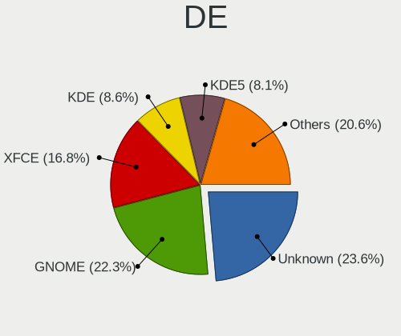

| Name             | Computers | Percent |
|------------------|-----------|---------|
| GNOME            | 396       | 23.02%  |
| Unknown          | 385       | 22.38%  |
| XFCE             | 287       | 16.69%  |
| KDE              | 158       | 9.19%   |
| KDE5             | 138       | 8.02%   |
| MATE             | 99        | 5.76%   |
| X-Cinnamon       | 59        | 3.43%   |
| LXDE             | 53        | 3.08%   |
| Cinnamon         | 53        | 3.08%   |
| LXQt             | 20        | 1.16%   |
| i3               | 19        | 1.1%    |
| Openbox          | 9         | 0.52%   |
| GNOME Flashback  | 8         | 0.47%   |
| GNOME Classic    | 7         | 0.41%   |
| Budgie           | 7         | 0.41%   |
| lightdm-xsession | 6         | 0.35%   |
| trinity          | 5         | 0.29%   |
| fluxbox          | 4         | 0.23%   |
| ICEWM            | 1         | 0.06%   |
| i3-with-shmlog   | 1         | 0.06%   |
| i3-gaps          | 1         | 0.06%   |
| Enlightenment    | 1         | 0.06%   |
| DWM              | 1         | 0.06%   |
| default          | 1         | 0.06%   |
| awesome          | 1         | 0.06%   |

Display Server
--------------

X11 or Wayland

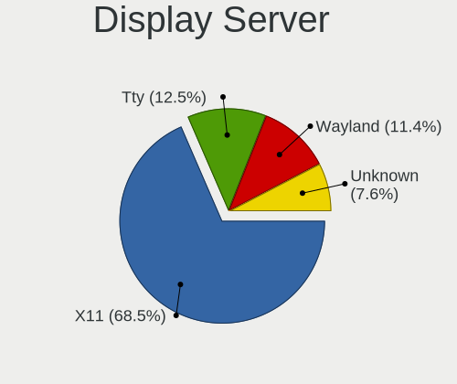

| Name    | Computers | Percent |
|---------|-----------|---------|
| X11     | 1187      | 69.46%  |
| Tty     | 203       | 11.88%  |
| Wayland | 202       | 11.82%  |
| Unknown | 117       | 6.85%   |

Display Manager
---------------

SDDM, LightDM, etc.

| Name    | Computers | Percent |
|---------|-----------|---------|
| Unknown | 939       | 55.01%  |
| GDM     | 229       | 13.42%  |
| TDM     | 224       | 13.12%  |
| SDDM    | 163       | 9.55%   |
| LightDM | 115       | 6.74%   |
| GDM3    | 15        | 0.88%   |
| XDM     | 9         | 0.53%   |
| SLiM    | 4         | 0.23%   |
| NODM    | 4         | 0.23%   |
| KDM     | 2         | 0.12%   |
| WDM     | 1         | 0.06%   |
| Ly      | 1         | 0.06%   |
| LXDM    | 1         | 0.06%   |

OS Lang
-------

Language

| Lang    | Computers | Percent |
|---------|-----------|---------|
| en_US   | 586       | 34.41%  |
| Unknown | 231       | 13.56%  |
| de_DE   | 112       | 6.58%   |
| pt_BR   | 105       | 6.17%   |
| fr_FR   | 91        | 5.34%   |
| ru_RU   | 86        | 5.05%   |
| en_GB   | 70        | 4.11%   |
| it_IT   | 47        | 2.76%   |
| es_ES   | 45        | 2.64%   |
| en_CA   | 26        | 1.53%   |
| C       | 25        | 1.47%   |
| pl_PL   | 22        | 1.29%   |
| en_IN   | 17        | 1%      |
| en_AU   | 16        | 0.94%   |
| es_MX   | 15        | 0.88%   |
| pt_PT   | 14        | 0.82%   |
| en_IE   | 14        | 0.82%   |
| es_CL   | 13        | 0.76%   |
| de_CH   | 11        | 0.65%   |
| zh_CN   | 10        | 0.59%   |
| ru_UA   | 9         | 0.53%   |
| es_VE   | 8         | 0.47%   |
| es_AR   | 8         | 0.47%   |
| hu_HU   | 7         | 0.41%   |
| cs_CZ   | 7         | 0.41%   |
| en_ZA   | 6         | 0.35%   |
| sv_SE   | 5         | 0.29%   |
| nl_NL   | 5         | 0.29%   |
| fr_CH   | 5         | 0.29%   |
| fi_FI   | 5         | 0.29%   |
| es_CO   | 5         | 0.29%   |
| en_NZ   | 5         | 0.29%   |
| de_AT   | 5         | 0.29%   |
| da_DK   | 5         | 0.29%   |
| sk_SK   | 4         | 0.23%   |
| nl_BE   | 4         | 0.23%   |
| ko_KR   | 4         | 0.23%   |
| ja_JP   | 4         | 0.23%   |
| es_CR   | 3         | 0.18%   |
| en_DK   | 3         | 0.18%   |
| el_GR   | 3         | 0.18%   |
| uk_UA   | 2         | 0.12%   |
| tt_RU   | 2         | 0.12%   |
| ro_RO   | 2         | 0.12%   |
| lt_LT   | 2         | 0.12%   |
| hr_HR   | 2         | 0.12%   |
| fr_CA   | 2         | 0.12%   |
| fr_BE   | 2         | 0.12%   |
| eu_ES   | 2         | 0.12%   |
| es_NI   | 2         | 0.12%   |
| en_PH   | 2         | 0.12%   |
| tr_TR   | 1         | 0.06%   |
| sr_RS   | 1         | 0.06%   |
| it_CH   | 1         | 0.06%   |
| he_IL   | 1         | 0.06%   |
| es_UY   | 1         | 0.06%   |
| es_SV   | 1         | 0.06%   |
| es_PY   | 1         | 0.06%   |
| es_PE   | 1         | 0.06%   |
| es_PA   | 1         | 0.06%   |

Boot Mode
---------

EFI or BIOS

| Mode | Computers | Percent |
|------|-----------|---------|
| BIOS | 1136      | 66.94%  |
| EFI  | 561       | 33.06%  |

Filesystem
----------

Type of filesystem

| Type    | Computers | Percent |
|---------|-----------|---------|
| Ext4    | 1481      | 87.79%  |
| Btrfs   | 54        | 3.2%    |
| Unknown | 45        | 2.67%   |
| Zfs     | 36        | 2.13%   |
| Xfs     | 24        | 1.42%   |
| Overlay | 16        | 0.95%   |
| Ext2    | 10        | 0.59%   |
| Ext3    | 7         | 0.41%   |
| Tmpfs   | 5         | 0.3%    |
| Rootfs  | 3         | 0.18%   |
| F2fs    | 3         | 0.18%   |
| Ubifs   | 2         | 0.12%   |
| Aufs    | 1         | 0.06%   |

Part. scheme
------------

Scheme of partitioning

| Type    | Computers | Percent |
|---------|-----------|---------|
| Unknown | 760       | 44.6%   |
| GPT     | 607       | 35.62%  |
| MBR     | 337       | 19.78%  |

Dual Boot with Linux/BSD
------------------------

Hosting more than one Linux/BSD

| Dual boot | Computers | Percent |
|-----------|-----------|---------|
| No        | 1444      | 85.34%  |
| Yes       | 248       | 14.66%  |

Dual Boot (Win)
---------------

Hosting Linux and Windows

| Dual boot | Computers | Percent |
|-----------|-----------|---------|
| No        | 1314      | 77.61%  |
| Yes       | 379       | 22.39%  |

Board
-----

Vendor
------

Motherboard manufacturer

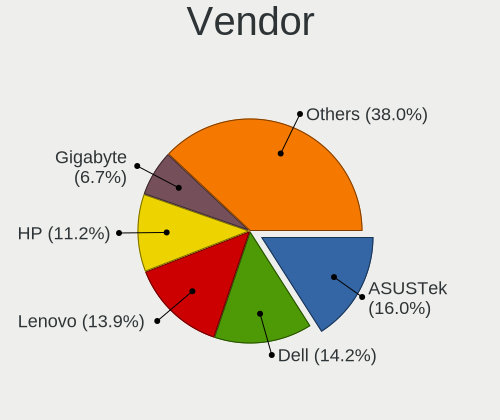

| Name                    | Computers | Percent |
|-------------------------|-----------|---------|
| ASUSTek Computer        | 270       | 16.09%  |
| Lenovo                  | 237       | 14.12%  |
| Dell                    | 235       | 14%     |
| Hewlett-Packard         | 195       | 11.62%  |
| Gigabyte Technology     | 111       | 6.62%   |
| Acer                    | 93        | 5.54%   |
| ASRock                  | 81        | 4.83%   |
| MSI                     | 65        | 3.87%   |
| Intel                   | 47        | 2.8%    |
| Unknown                 | 29        | 1.73%   |
| Supermicro              | 26        | 1.55%   |
| Apple                   | 25        | 1.49%   |
| Toshiba                 | 24        | 1.43%   |
| Samsung Electronics     | 21        | 1.25%   |
| Sony                    | 16        | 0.95%   |
| Positivo                | 13        | 0.77%   |
| Raspberry Pi Foundation | 11        | 0.66%   |
| Fujitsu                 | 9         | 0.54%   |
| IBM                     | 8         | 0.48%   |
| Notebook                | 7         | 0.42%   |
| AZW                     | 7         | 0.42%   |
| Medion                  | 6         | 0.36%   |
| ASRockRack              | 6         | 0.36%   |
| Alienware               | 6         | 0.36%   |
| sunxi                   | 5         | 0.3%    |
| Fujitsu Siemens         | 5         | 0.3%    |
| Foxconn                 | 5         | 0.3%    |
| Google                  | 4         | 0.24%   |
| WEIBU                   | 3         | 0.18%   |
| Timi                    | 3         | 0.18%   |
| Shuttle                 | 3         | 0.18%   |
| Pine Microsystems       | 3         | 0.18%   |
| Pegatron                | 3         | 0.18%   |
| Packard Bell            | 3         | 0.18%   |
| Hardkernel              | 3         | 0.18%   |
| ECS                     | 3         | 0.18%   |
| Biostar                 | 3         | 0.18%   |
| AMI                     | 3         | 0.18%   |
| YANYU                   | 2         | 0.12%   |
| Xunlong                 | 2         | 0.12%   |
| Wistron                 | 2         | 0.12%   |
| VIT                     | 2         | 0.12%   |
| TQ-Group                | 2         | 0.12%   |
| Sony UK                 | 2         | 0.12%   |
| Radxa                   | 2         | 0.12%   |
| Quanta                  | 2         | 0.12%   |
| Purism                  | 2         | 0.12%   |
| PCWare                  | 2         | 0.12%   |
| Panasonic               | 2         | 0.12%   |
| NextThing               | 2         | 0.12%   |
| Microsoft               | 2         | 0.12%   |
| LG Electronics          | 2         | 0.12%   |
| Intel X79               | 2         | 0.12%   |
| Huanan                  | 2         | 0.12%   |
| Gateway                 | 2         | 0.12%   |
| eMachines               | 2         | 0.12%   |
| DNS                     | 2         | 0.12%   |
| BESSTAR Tech            | 2         | 0.12%   |
| ZOTAC                   | 1         | 0.06%   |
| ViewSonic               | 1         | 0.06%   |

Model
-----

Motherboard model

| Name                               | Computers | Percent |
|------------------------------------|-----------|---------|
| Unknown                            | 39        | 2.32%   |
| ASUS All Series                    | 23        | 1.37%   |
| RPi Raspberry Pi                   | 8         | 0.48%   |
| Dell OptiPlex 7010                 | 5         | 0.3%    |
| Dell OptiPlex 3010                 | 5         | 0.3%    |
| AZW AP35                           | 5         | 0.3%    |
| ASUS PRIME X370-PRO                | 5         | 0.3%    |
| ASRock B450M Pro4                  | 5         | 0.3%    |
| HP Pavilion Notebook               | 4         | 0.24%   |
| Gigabyte X470 AORUS ULTRA GAMING   | 4         | 0.24%   |
| Dell XPS 13 9360                   | 4         | 0.24%   |
| Dell Inspiron 1545                 | 4         | 0.24%   |
| ASUS TUF GAMING X570-PLUS          | 4         | 0.24%   |
| ASUS M5A97 R2.0                    | 4         | 0.24%   |
| ASUS M5A78L-M/USB3                 | 4         | 0.24%   |
| WEIBU PSB133S01ZFP                 | 3         | 0.18%   |
| Supermicro Super Server            | 3         | 0.18%   |
| Positivo MOBILE                    | 3         | 0.18%   |
| Positivo C464C                     | 3         | 0.18%   |
| Lenovo ThinkPad E480 20KN003WUS    | 3         | 0.18%   |
| Lenovo IdeaPad 330-15IKB 81FE      | 3         | 0.18%   |
| Lenovo IdeaPad 110-15IBR 80T7      | 3         | 0.18%   |
| HP Stream Notebook PC 13           | 3         | 0.18%   |
| HP ProBook 4540s                   | 3         | 0.18%   |
| HP Pavilion g4                     | 3         | 0.18%   |
| HP Notebook                        | 3         | 0.18%   |
| HP EliteBook 850 G5                | 3         | 0.18%   |
| HP 2000                            | 3         | 0.18%   |
| Gigabyte B450M DS3H                | 3         | 0.18%   |
| Dell Precision 5530                | 3         | 0.18%   |
| Dell OptiPlex 760                  | 3         | 0.18%   |
| Dell OptiPlex 3020                 | 3         | 0.18%   |
| Dell Latitude E7450                | 3         | 0.18%   |
| Dell Latitude E6430                | 3         | 0.18%   |
| Dell Latitude E6420                | 3         | 0.18%   |
| Dell Latitude E5520                | 3         | 0.18%   |
| Dell Latitude 5500                 | 3         | 0.18%   |
| Dell Inspiron 5675                 | 3         | 0.18%   |
| Dell Inspiron 5570                 | 3         | 0.18%   |
| ASUS PRIME B450-PLUS               | 3         | 0.18%   |
| ASUS PRIME A320M-K                 | 3         | 0.18%   |
| ASUS M5A78L-M LX/BR                | 3         | 0.18%   |
| ASRock J4105-ITX                   | 3         | 0.18%   |
| ASRock FM2A88M Extreme4+           | 3         | 0.18%   |
| ASRock A300M-STX                   | 3         | 0.18%   |
| Apple MacBookPro11,3               | 3         | 0.18%   |
| Acer Aspire E5-575G                | 3         | 0.18%   |
| Xunlong Orange Pi PC               | 2         | 0.12%   |
| Wistron ProLiant ML110 G6          | 2         | 0.12%   |
| TQ-Group TQMxE39S                  | 2         | 0.12%   |
| Timi TM1701                        | 2         | 0.12%   |
| Supermicro X8STi                   | 2         | 0.12%   |
| Supermicro X8DT3                   | 2         | 0.12%   |
| Supermicro X10SLL-F                | 2         | 0.12%   |
| Shuttle XH61V                      | 2         | 0.12%   |
| Samsung 305E4A/305E5A/305E7A       | 2         | 0.12%   |
| RPi Raspberry Pi 4 Model B Rev 1.4 | 2         | 0.12%   |
| Radxa ROCK Pi 4                    | 2         | 0.12%   |
| NextThing C.H.I.P.                 | 2         | 0.12%   |
| MSI MS-7C75                        | 2         | 0.12%   |

Model Family
------------

Motherboard model prefix

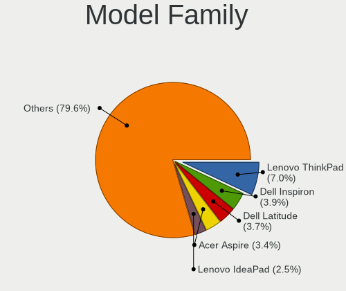

| Name                     | Computers | Percent |
|--------------------------|-----------|---------|
| Lenovo ThinkPad          | 121       | 7.21%   |
| Dell Inspiron            | 68        | 4.05%   |
| Dell Latitude            | 62        | 3.69%   |
| Acer Aspire              | 61        | 3.64%   |
| Lenovo IdeaPad           | 41        | 2.44%   |
| Unknown                  | 39        | 2.32%   |
| ASUS PRIME               | 36        | 2.15%   |
| Dell OptiPlex            | 35        | 2.09%   |
| HP EliteBook             | 29        | 1.73%   |
| HP ProBook               | 24        | 1.43%   |
| HP Pavilion              | 24        | 1.43%   |
| ASUS All                 | 23        | 1.37%   |
| HP Compaq                | 20        | 1.19%   |
| Dell Precision           | 20        | 1.19%   |
| Toshiba Satellite        | 18        | 1.07%   |
| Dell Vostro              | 16        | 0.95%   |
| ASUS ROG                 | 16        | 0.95%   |
| Lenovo ThinkCentre       | 15        | 0.89%   |
| ASUS TUF                 | 14        | 0.83%   |
| Dell PowerEdge           | 13        | 0.77%   |
| HP Laptop                | 12        | 0.72%   |
| Dell XPS                 | 12        | 0.72%   |
| RPi Raspberry            | 11        | 0.66%   |
| HP ProLiant              | 10        | 0.6%    |
| ASUS VivoBook            | 10        | 0.6%    |
| Lenovo IdeaCentre        | 9         | 0.54%   |
| ASUS M5A78L-M            | 9         | 0.54%   |
| ASRock B450M             | 8         | 0.48%   |
| Lenovo Yoga              | 6         | 0.36%   |
| HP EliteDesk             | 6         | 0.36%   |
| Acer Swift               | 6         | 0.36%   |
| Lenovo ThinkStation      | 5         | 0.3%    |
| Lenovo Legion            | 5         | 0.3%    |
| IBM System               | 5         | 0.3%    |
| HP ENVY                  | 5         | 0.3%    |
| Gigabyte X470            | 5         | 0.3%    |
| Gigabyte B450M           | 5         | 0.3%    |
| AZW AP35                 | 5         | 0.3%    |
| HP ZBook                 | 4         | 0.24%   |
| HP Stream                | 4         | 0.24%   |
| HP ProDesk               | 4         | 0.24%   |
| HP Presario              | 4         | 0.24%   |
| HP 250                   | 4         | 0.24%   |
| Gigabyte B450            | 4         | 0.24%   |
| Fujitsu Siemens ESPRIMO  | 4         | 0.24%   |
| ASUS M5A97               | 4         | 0.24%   |
| ASRock X570              | 4         | 0.24%   |
| ASRock X370              | 4         | 0.24%   |
| ASRock B450              | 4         | 0.24%   |
| Acer Nitro               | 4         | 0.24%   |
| Acer Extensa             | 4         | 0.24%   |
| WEIBU PSB133S01ZFP       | 3         | 0.18%   |
| Toshiba PORTEGE          | 3         | 0.18%   |
| Supermicro Super         | 3         | 0.18%   |
| Positivo MOBILE          | 3         | 0.18%   |
| Positivo C464C           | 3         | 0.18%   |
| Pine Microsystems Pine64 | 3         | 0.18%   |
| HP t620                  | 3         | 0.18%   |
| HP Spectre               | 3         | 0.18%   |
| HP OMEN                  | 3         | 0.18%   |

MFG Year
--------

Motherboard manufacture year

| Year    | Computers | Percent |
|---------|-----------|---------|
| 2019    | 192       | 11.44%  |
| 2018    | 192       | 11.44%  |
| 2011    | 157       | 9.36%   |
| 2012    | 148       | 8.82%   |
| 2017    | 132       | 7.87%   |
| 2013    | 112       | 6.67%   |
| 2014    | 107       | 6.38%   |
| 2015    | 102       | 6.08%   |
| 2010    | 89        | 5.3%    |
| 2020    | 87        | 5.18%   |
| 2016    | 87        | 5.18%   |
| 2009    | 81        | 4.83%   |
| 2008    | 73        | 4.35%   |
| Unknown | 38        | 2.26%   |
| 2007    | 37        | 2.21%   |
| 2006    | 17        | 1.01%   |
| 2021    | 11        | 0.66%   |
| 2005    | 8         | 0.48%   |
| 2004    | 6         | 0.36%   |
| 2003    | 1         | 0.06%   |
| 2002    | 1         | 0.06%   |

Form Factor
-----------

Physical design of the computer

| Name           | Computers | Percent |
|----------------|-----------|---------|
| Notebook       | 819       | 48.81%  |
| Desktop        | 694       | 41.36%  |
| Server         | 48        | 2.86%   |
| System on chip | 31        | 1.85%   |
| Convertible    | 30        | 1.79%   |
| Mini pc        | 30        | 1.79%   |
| All in one     | 17        | 1.01%   |
| Tablet         | 7         | 0.42%   |
| Phone          | 2         | 0.12%   |

Secure Boot
-----------

Enabled or disabled

| State    | Computers | Percent |
|----------|-----------|---------|
| Disabled | 1636      | 97.32%  |
| Enabled  | 45        | 2.68%   |

Coreboot
--------

Have coreboot on board

| Used | Computers | Percent |
|------|-----------|---------|
| No   | 1669      | 99.46%  |
| Yes  | 9         | 0.54%   |

RAM Size
--------

Total RAM memory

| Size in GB      | Computers | Percent |
|-----------------|-----------|---------|
| 16.01-24.0      | 331       | 19.53%  |
| 3.01-4.0        | 323       | 19.06%  |
| 8.01-16.0       | 321       | 18.94%  |
| 4.01-8.0        | 290       | 17.11%  |
| 32.01-64.0      | 142       | 8.38%   |
| 1.01-2.0        | 93        | 5.49%   |
| 64.01-256.0     | 70        | 4.13%   |
| 2.01-3.0        | 39        | 2.3%    |
| 24.01-32.0      | 35        | 2.06%   |
| 0.51-1.0        | 31        | 1.83%   |
| 0.01-0.5        | 9         | 0.53%   |
| More than 256.0 | 7         | 0.41%   |
| Unknown         | 4         | 0.24%   |

RAM Used
--------

Used RAM memory

| Used GB         | Computers | Percent |
|-----------------|-----------|---------|
| 1.01-2.0        | 531       | 28.89%  |
| 2.01-3.0        | 401       | 21.82%  |
| 4.01-8.0        | 267       | 14.53%  |
| 3.01-4.0        | 215       | 11.7%   |
| 0.51-1.0        | 172       | 9.36%   |
| 8.01-16.0       | 114       | 6.2%    |
| 0.01-0.5        | 73        | 3.97%   |
| 16.01-24.0      | 26        | 1.41%   |
| 32.01-64.0      | 18        | 0.98%   |
| 24.01-32.0      | 9         | 0.49%   |
| Unknown         | 6         | 0.33%   |
| 64.01-256.0     | 5         | 0.27%   |
| More than 256.0 | 1         | 0.05%   |

Total Drives
------------

Number of drives on board

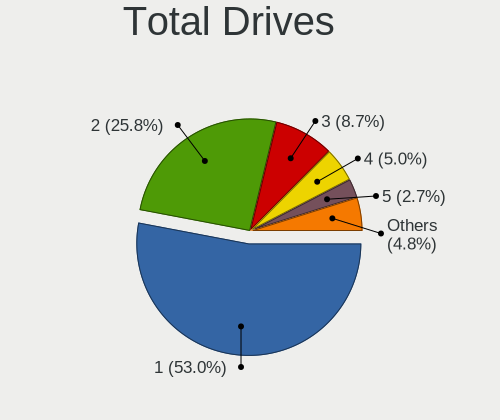

| Drives  | Computers | Percent |
|---------|-----------|---------|
| 1       | 910       | 53.06%  |
| 2       | 441       | 25.71%  |
| 3       | 154       | 8.98%   |
| 4       | 87        | 5.07%   |
| 5       | 46        | 2.68%   |
| 6       | 24        | 1.4%    |
| 7       | 19        | 1.11%   |
| 0       | 11        | 0.64%   |
| 9       | 10        | 0.58%   |
| 8       | 5         | 0.29%   |
| 17      | 1         | 0.06%   |
| 16      | 1         | 0.06%   |
| 14      | 1         | 0.06%   |
| 13      | 1         | 0.06%   |
| 12      | 1         | 0.06%   |
| 11      | 1         | 0.06%   |
| 10      | 1         | 0.06%   |
| Unknown | 1         | 0.06%   |

Has CD-ROM
----------

Has CD-ROM on board

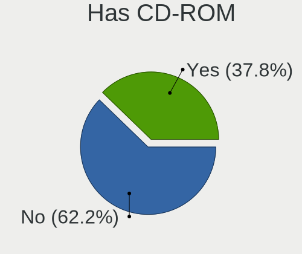

| Presented | Computers | Percent |
|-----------|-----------|---------|
| No        | 1047      | 62.14%  |
| Yes       | 638       | 37.86%  |

Has Ethernet
------------

Has Ethernet on board

| Presented | Computers | Percent |
|-----------|-----------|---------|
| Yes       | 1523      | 90.71%  |
| No        | 156       | 9.29%   |

Has WiFi
--------

Has WiFi module

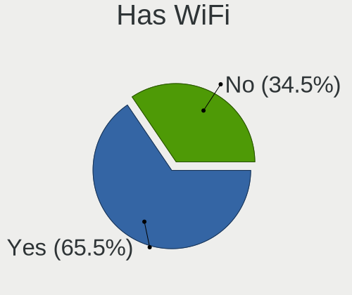

| Presented | Computers | Percent |
|-----------|-----------|---------|
| Yes       | 1126      | 66.79%  |
| No        | 560       | 33.21%  |

Has Bluetooth
-------------

Has Bluetooth module

| Presented | Computers | Percent |
|-----------|-----------|---------|
| No        | 854       | 50.44%  |
| Yes       | 839       | 49.56%  |

Location
--------

Country
-------

Geographic location (country)

| Country                | Computers | Percent |
|------------------------|-----------|---------|
| USA                    | 246       | 14.6%   |
| Russia                 | 167       | 9.91%   |
| Germany                | 160       | 9.5%    |
| Brazil                 | 153       | 9.08%   |
| France                 | 127       | 7.54%   |
| Spain                  | 75        | 4.45%   |
| Italy                  | 73        | 4.33%   |
| UK                     | 47        | 2.79%   |
| Switzerland            | 41        | 2.43%   |
| Poland                 | 33        | 1.96%   |
| Canada                 | 33        | 1.96%   |
| Ukraine                | 31        | 1.84%   |
| Netherlands            | 30        | 1.78%   |
| India                  | 26        | 1.54%   |
| Portugal               | 21        | 1.25%   |
| Mexico                 | 21        | 1.25%   |
| Hungary                | 21        | 1.25%   |
| Australia              | 20        | 1.19%   |
| China                  | 17        | 1.01%   |
| Chile                  | 17        | 1.01%   |
| Finland                | 15        | 0.89%   |
| Sweden                 | 14        | 0.83%   |
| Belgium                | 14        | 0.83%   |
| Czechia                | 13        | 0.77%   |
| Turkey                 | 12        | 0.71%   |
| Romania                | 11        | 0.65%   |
| Greece                 | 11        | 0.65%   |
| Austria                | 11        | 0.65%   |
| Argentina              | 11        | 0.65%   |
| New Zealand            | 10        | 0.59%   |
| Ireland                | 10        | 0.59%   |
| Denmark                | 10        | 0.59%   |
| Venezuela              | 9         | 0.53%   |
| Norway                 | 9         | 0.53%   |
| Indonesia              | 9         | 0.53%   |
| Colombia               | 9         | 0.53%   |
| Vietnam                | 7         | 0.42%   |
| South Africa           | 7         | 0.42%   |
| Slovakia               | 7         | 0.42%   |
| Pakistan               | 6         | 0.36%   |
| Croatia                | 6         | 0.36%   |
| Belarus                | 6         | 0.36%   |
| Thailand               | 5         | 0.3%    |
| South Korea            | 5         | 0.3%    |
| Peru                   | 5         | 0.3%    |
| Bulgaria               | 5         | 0.3%    |
| Saudi Arabia           | 4         | 0.24%   |
| Lithuania              | 4         | 0.24%   |
| Japan                  | 4         | 0.24%   |
| Tunisia                | 3         | 0.18%   |
| Taiwan                 | 3         | 0.18%   |
| Serbia                 | 3         | 0.18%   |
| Philippines            | 3         | 0.18%   |
| Kazakhstan             | 3         | 0.18%   |
| Iran                   | 3         | 0.18%   |
| El Salvador            | 3         | 0.18%   |
| Cyprus                 | 3         | 0.18%   |
| Costa Rica             | 3         | 0.18%   |
| Bosnia and Herzegovina | 3         | 0.18%   |
| UAE                    | 2         | 0.12%   |

City
----

Geographic location (city)

| City              | Computers | Percent |
|-------------------|-----------|---------|
| St Petersburg     | 49        | 2.77%   |
| Moscow            | 34        | 1.92%   |
| Sao Paulo         | 27        | 1.52%   |
| Paris             | 24        | 1.35%   |
| Madrid            | 14        | 0.79%   |
| Berlin            | 14        | 0.79%   |
| Zurich            | 13        | 0.73%   |
| Helsinki          | 11        | 0.62%   |
| Hamburg           | 11        | 0.62%   |
| Budapest          | 11        | 0.62%   |
| Vienna            | 10        | 0.56%   |
| New York          | 10        | 0.56%   |
| Mesa              | 10        | 0.56%   |
| Belo Horizonte    | 10        | 0.56%   |
| Amsterdam         | 10        | 0.56%   |
| Rome              | 9         | 0.51%   |
| Milan             | 9         | 0.51%   |
| Kyiv              | 9         | 0.51%   |
| Yekaterinburg     | 8         | 0.45%   |
| Warsaw            | 8         | 0.45%   |
| Rio de Janeiro    | 8         | 0.45%   |
| Porto Alegre      | 8         | 0.45%   |
| Perm              | 8         | 0.45%   |
| Braslia       | 8         | 0.45%   |
| Wooster           | 7         | 0.4%    |
| Springfield       | 7         | 0.4%    |
| Santiago          | 7         | 0.4%    |
| Lisbon            | 7         | 0.4%    |
| Auckland          | 7         | 0.4%    |
| Athens            | 7         | 0.4%    |
| Voronezh          | 6         | 0.34%   |
| Prague            | 6         | 0.34%   |
| Lahore            | 6         | 0.34%   |
| Frankfurt am Main | 6         | 0.34%   |
| Dublin            | 6         | 0.34%   |
| Valencia          | 5         | 0.28%   |
| Sofia             | 5         | 0.28%   |
| Nuremberg         | 5         | 0.28%   |
| Nizhniy Novgorod  | 5         | 0.28%   |
| Munich            | 5         | 0.28%   |
| Mumbai            | 5         | 0.28%   |
| Minsk             | 5         | 0.28%   |
| London            | 5         | 0.28%   |
| Lima              | 5         | 0.28%   |
| Gatchina          | 5         | 0.28%   |
| Curitiba          | 5         | 0.28%   |
| Cologne           | 5         | 0.28%   |
| Chicago           | 5         | 0.28%   |
| Bucharest         | 5         | 0.28%   |
| Brisbane          | 5         | 0.28%   |
| Bengaluru         | 5         | 0.28%   |
| Barcelona         | 5         | 0.28%   |
| Vogue             | 4         | 0.23%   |
| Turin             | 4         | 0.23%   |
| Thessaloniki      | 4         | 0.23%   |
| Szeged            | 4         | 0.23%   |
| Sydney            | 4         | 0.23%   |
| Stuttgart         | 4         | 0.23%   |
| Salvador          | 4         | 0.23%   |
| Rostov-on-Don     | 4         | 0.23%   |

Drives
------

Drive Vendor
------------

Hard drive vendors

| Vendor                    | Computers | Drives | Percent |
|---------------------------|-----------|--------|---------|
| WDC                       | 438       | 733    | 16.73%  |
| Seagate                   | 415       | 681    | 15.85%  |
| Samsung Electronics       | 371       | 543    | 14.17%  |
| Toshiba                   | 190       | 293    | 7.26%   |
| Kingston                  | 146       | 193    | 5.58%   |
| Unknown                   | 135       | 188    | 5.16%   |
| Crucial                   | 116       | 153    | 4.43%   |
| SanDisk                   | 111       | 140    | 4.24%   |
| Hitachi                   | 97        | 147    | 3.71%   |
| HGST                      | 59        | 88     | 2.25%   |
| Intel                     | 49        | 78     | 1.87%   |
| A-DATA Technology         | 46        | 62     | 1.76%   |
| SK Hynix                  | 37        | 47     | 1.41%   |
| Phison                    | 24        | 36     | 0.92%   |
| OCZ                       | 22        | 26     | 0.84%   |
| China                     | 18        | 19     | 0.69%   |
| Transcend                 | 17        | 19     | 0.65%   |
| Micron Technology         | 16        | 18     | 0.61%   |
| MAXTOR                    | 15        | 18     | 0.57%   |
| Hewlett-Packard           | 15        | 22     | 0.57%   |
| Corsair                   | 14        | 18     | 0.53%   |
| Patriot                   | 13        | 17     | 0.5%    |
| Intenso                   | 12        | 17     | 0.46%   |
| Apple                     | 12        | 15     | 0.46%   |
| LITEON                    | 11        | 13     | 0.42%   |
| Fujitsu                   | 11        | 12     | 0.42%   |
| Silicon Motion            | 9         | 10     | 0.34%   |
| PNY                       | 9         | 16     | 0.34%   |
| KingDian                  | 9         | 11     | 0.34%   |
| SPCC                      | 8         | 9      | 0.31%   |
| Micron/Crucial Technology | 8         | 8      | 0.31%   |
| LDLC                      | 8         | 10     | 0.31%   |
| GOODRAM                   | 8         | 9      | 0.31%   |
| Team                      | 7         | 10     | 0.27%   |
| JMicron                   | 7         | 7      | 0.27%   |
| ASMT                      | 7         | 16     | 0.27%   |
| Gigabyte Technology       | 6         | 9      | 0.23%   |
| LITEONIT                  | 5         | 5      | 0.19%   |
| PLEXTOR                   | 4         | 6      | 0.15%   |
| Zheino                    | 3         | 6      | 0.11%   |
| TO Exter                  | 3         | 3      | 0.11%   |
| Sabrent                   | 3         | 4      | 0.11%   |
| NETAPP                    | 3         | 7      | 0.11%   |
| Lite-On                   | 3         | 3      | 0.11%   |
| Lexar                     | 3         | 3      | 0.11%   |
| LaCie                     | 3         | 3      | 0.11%   |
| KingSpec                  | 3         | 3      | 0.11%   |
| KingFast                  | 3         | 3      | 0.11%   |
| Hajaan                    | 3         | 3      | 0.11%   |
| AMD                       | 3         | 3      | 0.11%   |
| Unknown                   | 3         | 3      | 0.11%   |
| XPG                       | 2         | 5      | 0.08%   |
| Super Talent              | 2         | 3      | 0.08%   |
| Phison Electronics        | 2         | 2      | 0.08%   |
| ORICO                     | 2         | 2      | 0.08%   |
| KIOXIA                    | 2         | 2      | 0.08%   |
| IBM-ESXS                  | 2         | 1      | 0.08%   |
| FORESEE                   | 2         | 3      | 0.08%   |
| DOGFISH                   | 2         | 5      | 0.08%   |
| BIWIN                     | 2         | 2      | 0.08%   |

Drive Model
-----------

Hard drive models

| Model                               | Computers | Percent |
|-------------------------------------|-----------|---------|
| Kingston SA400S37240G 240GB SSD     | 32        | 1.09%   |
| Samsung SSD 850 EVO 250GB           | 26        | 0.89%   |
| Unknown MMC Card  32GB              | 24        | 0.82%   |
| Toshiba MQ01ABD100 1TB              | 20        | 0.68%   |
| Seagate ST500DM002-1BD142 500GB     | 20        | 0.68%   |
| Samsung SSD 860 EVO 500GB           | 20        | 0.68%   |
| Kingston SA400S37120G 120GB SSD     | 20        | 0.68%   |
| Crucial CT500MX500SSD1 500GB        | 20        | 0.68%   |
| Seagate ST1000LM024 HN-M101MBB 1TB  | 19        | 0.65%   |
| Seagate ST1000DM010-2EP102 1TB      | 19        | 0.65%   |
| Unknown MMC Card  64GB              | 18        | 0.62%   |
| Seagate ST1000LM035-1RK172 1TB      | 18        | 0.62%   |
| HGST HTS721010A9E630 1TB            | 17        | 0.58%   |
| WDC WDS240G2G0A-00JH30 240GB SSD    | 16        | 0.55%   |
| Kingston SV300S37A120G 120GB SSD    | 16        | 0.55%   |
| Kingston SA400S37480G 480GB SSD     | 15        | 0.51%   |
| Samsung SSD 860 EVO 1TB             | 14        | 0.48%   |
| Samsung NVMe SSD Drive 512GB        | 13        | 0.44%   |
| Seagate ST2000DM001-1ER164 2TB      | 12        | 0.41%   |
| Samsung SSD 850 EVO 500GB           | 12        | 0.41%   |
| Kingston SUV400S37240G 240GB SSD    | 12        | 0.41%   |
| Crucial CT240BX500SSD1 240GB        | 12        | 0.41%   |
| Toshiba DT01ACA100 1TB              | 11        | 0.38%   |
| Seagate ST500LM012 HN-M500MBB 500GB | 11        | 0.38%   |
| Samsung SSD 860 EVO 250GB           | 11        | 0.38%   |
| Crucial CT250MX500SSD1 250GB        | 11        | 0.38%   |
| Toshiba DT01ACA050 500GB            | 10        | 0.34%   |
| Seagate ST9500325AS 500GB           | 10        | 0.34%   |
| Seagate ST2000DM006-2DM164 2TB      | 10        | 0.34%   |
| Seagate ST1000DM003-1CH162 1TB      | 10        | 0.34%   |
| Samsung NVMe SSD Drive 256GB        | 10        | 0.34%   |
| WDC WD10EZEX-08WN4A0 1TB            | 9         | 0.31%   |
| Toshiba HDWD120 2TB                 | 9         | 0.31%   |
| Seagate ST500LT012-1DG142 500GB     | 9         | 0.31%   |
| Seagate ST2000DM008-2FR102 2TB      | 9         | 0.31%   |
| Seagate ST1000LM048-2E7172 1TB      | 9         | 0.31%   |
| Samsung SSD 840 EVO 120GB           | 9         | 0.31%   |
| WDC WD10SPZX-21Z10T0 1TB            | 8         | 0.27%   |
| Toshiba MQ01ABF050 500GB            | 8         | 0.27%   |
| Toshiba KBG30ZMS128G 128GB NVMe SSD | 8         | 0.27%   |
| Toshiba HDWD110 1TB                 | 8         | 0.27%   |
| Seagate ST4000DM004-2CV104 4TB      | 8         | 0.27%   |
| Seagate ST4000DM000-1F2168 4TB      | 8         | 0.27%   |
| Seagate ST3500418AS 500GB           | 8         | 0.27%   |
| SanDisk SSD PLUS 240GB              | 8         | 0.27%   |
| SanDisk DF4032  32GB                | 8         | 0.27%   |
| Samsung SSD 970 EVO Plus 500GB      | 8         | 0.27%   |
| Samsung SSD 970 EVO Plus 1TB        | 8         | 0.27%   |
| Samsung SSD 860 QVO 1TB             | 8         | 0.27%   |
| WDC WD20EZRZ-00Z5HB0 2TB            | 7         | 0.24%   |
| WDC WD20EFRX-68EUZN0 2TB            | 7         | 0.24%   |
| WDC WD1002FAEX-00Z3A0 1TB           | 7         | 0.24%   |
| Unknown MMC Card  128GB             | 7         | 0.24%   |
| Seagate ST31000528AS 1TB            | 7         | 0.24%   |
| Seagate ST1000LM049-2GH172 1TB      | 7         | 0.24%   |
| Seagate Expansion+ 2TB              | 7         | 0.24%   |
| Seagate Expansion Desk 4TB          | 7         | 0.24%   |
| Samsung NVMe SSD Drive 500GB        | 7         | 0.24%   |
| Patriot Burst 240GB SSD             | 7         | 0.24%   |
| HGST HTS725050A7E630 500GB          | 7         | 0.24%   |

HDD Vendor
----------

Hard disk drive vendors

| Vendor              | Computers | Drives | Percent |
|---------------------|-----------|--------|---------|
| Seagate             | 402       | 662    | 33.72%  |
| WDC                 | 363       | 632    | 30.45%  |
| Toshiba             | 142       | 225    | 11.91%  |
| Hitachi             | 96        | 145    | 8.05%   |
| HGST                | 59        | 88     | 4.95%   |
| Samsung Electronics | 56        | 84     | 4.7%    |
| MAXTOR              | 15        | 18     | 1.26%   |
| Fujitsu             | 11        | 12     | 0.92%   |
| Unknown             | 8         | 11     | 0.67%   |
| Apple               | 7         | 9      | 0.59%   |
| ASMT                | 6         | 15     | 0.5%    |
| Hewlett-Packard     | 5         | 9      | 0.42%   |
| Sabrent             | 3         | 4      | 0.25%   |
| Intenso             | 3         | 4      | 0.25%   |
| NETAPP              | 2         | 6      | 0.17%   |
| USB 3.0             | 1         | 2      | 0.08%   |
| SILICONMOTION       | 1         | 1      | 0.08%   |
| QUANTUM             | 1         | 1      | 0.08%   |
| QNAP                | 1         | 2      | 0.08%   |
| PHD 3.0             | 1         | 1      | 0.08%   |
| Pear 2TB            | 1         | 1      | 0.08%   |
| LIO-ORG             | 1         | 8      | 0.08%   |
| LaCie               | 1         | 1      | 0.08%   |
| InnoDisk            | 1         | 1      | 0.08%   |
| Inateck             | 1         | 1      | 0.08%   |
| IBM/Hitachi         | 1         | 2      | 0.08%   |
| HPE                 | 1         | 1      | 0.08%   |
| ExcelStor           | 1         | 1      | 0.08%   |
| DAS                 | 1         | 1      | 0.08%   |

SSD Vendor
----------

Solid state drive vendors

| Vendor              | Computers | Drives | Percent |
|---------------------|-----------|--------|---------|
| Samsung Electronics | 214       | 289    | 22.79%  |
| Kingston            | 133       | 173    | 14.16%  |
| Crucial             | 111       | 146    | 11.82%  |
| SanDisk             | 83        | 104    | 8.84%   |
| WDC                 | 57        | 66     | 6.07%   |
| A-DATA Technology   | 38        | 54     | 4.05%   |
| Intel               | 28        | 46     | 2.98%   |
| OCZ                 | 22        | 26     | 2.34%   |
| China               | 18        | 19     | 1.92%   |
| Toshiba             | 17        | 22     | 1.81%   |
| Transcend           | 16        | 18     | 1.7%    |
| SK Hynix            | 13        | 15     | 1.38%   |
| Patriot             | 12        | 16     | 1.28%   |
| Micron Technology   | 12        | 14     | 1.28%   |
| LITEON              | 9         | 11     | 0.96%   |
| KingDian            | 8         | 10     | 0.85%   |
| Intenso             | 8         | 11     | 0.85%   |
| PNY                 | 7         | 11     | 0.75%   |
| GOODRAM             | 7         | 8      | 0.75%   |
| Team                | 6         | 9      | 0.64%   |
| SPCC                | 6         | 7      | 0.64%   |
| Seagate             | 6         | 7      | 0.64%   |
| LDLC                | 6         | 6      | 0.64%   |
| Hewlett-Packard     | 6         | 6      | 0.64%   |
| Corsair             | 6         | 6      | 0.64%   |
| LITEONIT            | 5         | 5      | 0.53%   |
| Gigabyte Technology | 5         | 7      | 0.53%   |
| Apple               | 5         | 6      | 0.53%   |
| PLEXTOR             | 4         | 6      | 0.43%   |
| JMicron             | 4         | 4      | 0.43%   |
| Zheino              | 3         | 6      | 0.32%   |
| TO Exter            | 3         | 3      | 0.32%   |
| KingSpec            | 3         | 3      | 0.32%   |
| Hajaan              | 3         | 3      | 0.32%   |
| AMD                 | 3         | 3      | 0.32%   |
| Unknown             | 2         | 2      | 0.21%   |
| Super Talent        | 2         | 3      | 0.21%   |
| Lexar               | 2         | 2      | 0.21%   |
| DOGFISH             | 2         | 5      | 0.21%   |
| BIWIN               | 2         | 2      | 0.21%   |
| ASMedia             | 2         | 2      | 0.21%   |
| Verbatim            | 1         | 2      | 0.11%   |
| Vaseky              | 1         | 1      | 0.11%   |
| VALK                | 1         | 1      | 0.11%   |
| ULTIMATE            | 1         | 2      | 0.11%   |
| TurXun              | 1         | 1      | 0.11%   |
| THU                 | 1         | 2      | 0.11%   |
| TCSUNBOW            | 1         | 1      | 0.11%   |
| TAMMUZ              | 1         | 2      | 0.11%   |
| SNR-ML              | 1         | 1      | 0.11%   |
| Smartbuy            | 1         | 1      | 0.11%   |
| PALIT               | 1         | 1      | 0.11%   |
| OWC                 | 1         | 1      | 0.11%   |
| ORICO               | 1         | 1      | 0.11%   |
| OCZ-VERTEX3         | 1         | 1      | 0.11%   |
| OCZ-VERTEX          | 1         | 1      | 0.11%   |
| NVMe                | 1         | 1      | 0.11%   |
| Mushkin             | 1         | 1      | 0.11%   |
| Leven               | 1         | 1      | 0.11%   |
| Lenovo              | 1         | 1      | 0.11%   |

Drive Kind
----------

HDD or SSD

| Kind    | Computers | Drives | Percent |
|---------|-----------|--------|---------|
| HDD     | 969       | 1948   | 42.46%  |
| SSD     | 814       | 1209   | 35.67%  |
| NVMe    | 336       | 486    | 14.72%  |
| MMC     | 125       | 173    | 5.48%   |
| Unknown | 38        | 53     | 1.67%   |

Drive Connector
---------------

SATA, SAS, NVMe, etc.

| Type | Computers | Drives | Percent |
|------|-----------|--------|---------|
| SATA | 1413      | 3039   | 71.47%  |
| NVMe | 336       | 484    | 17%     |
| MMC  | 125       | 173    | 6.32%   |
| SAS  | 103       | 173    | 5.21%   |

Drive Size
----------

Size of hard drive

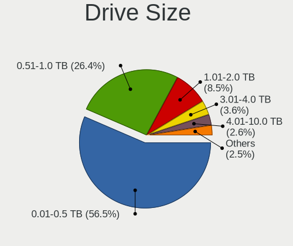

| Size in TB | Computers | Drives | Percent |
|------------|-----------|--------|---------|
| 0.01-0.5   | 1065      | 1676   | 56.35%  |
| 0.51-1.0   | 504       | 800    | 26.67%  |
| 1.01-2.0   | 154       | 290    | 8.15%   |
| 3.01-4.0   | 71        | 174    | 3.76%   |
| 4.01-10.0  | 48        | 119    | 2.54%   |
| 2.01-3.0   | 43        | 88     | 2.28%   |
| 10.01-20.0 | 5         | 10     | 0.26%   |

Space Total
-----------

Amount of disk space available on the file system

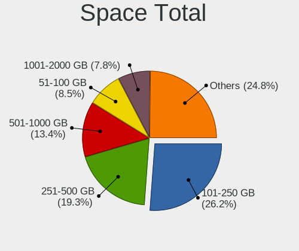

| Size in GB     | Computers | Percent |
|----------------|-----------|---------|
| 101-250        | 448       | 25.78%  |
| 251-500        | 346       | 19.91%  |
| 501-1000       | 238       | 13.69%  |
| 51-100         | 150       | 8.63%   |
| 1001-2000      | 143       | 8.23%   |
| Unknown        | 119       | 6.85%   |
| More than 3000 | 114       | 6.56%   |
| 21-50          | 80        | 4.6%    |
| 2001-3000      | 56        | 3.22%   |
| 1-20           | 44        | 2.53%   |

Space Used
----------

Amount of used disk space

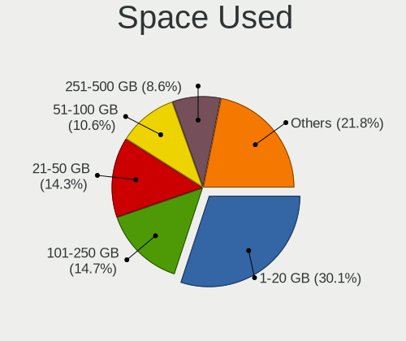

| Used GB        | Computers | Percent |
|----------------|-----------|---------|
| 1-20           | 532       | 29.41%  |
| 101-250        | 272       | 15.04%  |
| 21-50          | 268       | 14.81%  |
| 51-100         | 194       | 10.72%  |
| 251-500        | 159       | 8.79%   |
| Unknown        | 119       | 6.58%   |
| 501-1000       | 110       | 6.08%   |
| 1001-2000      | 81        | 4.48%   |
| More than 3000 | 50        | 2.76%   |
| 2001-3000      | 23        | 1.27%   |
| 0              | 1         | 0.06%   |

Malfunc. Drives
---------------

Drive models with a malfunction

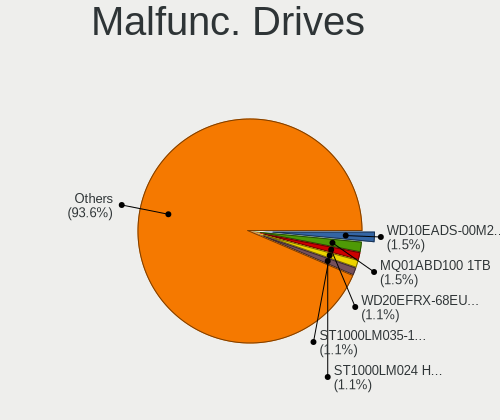

| Model                              | Computers | Drives | Percent |
|------------------------------------|-----------|--------|---------|
| WDC WD10EADS-00M2B0 1TB            | 4         | 4      | 1.65%   |
| Toshiba MQ01ABD100 1TB             | 4         | 4      | 1.65%   |
| Seagate ST1000LM035-1RK172 1TB     | 3         | 3      | 1.23%   |
| Seagate ST1000LM024 HN-M101MBB 1TB | 3         | 4      | 1.23%   |
| Samsung Electronics HD103UJ 1TB    | 3         | 4      | 1.23%   |
| A-DATA Technology SU800 256GB SSD  | 3         | 4      | 1.23%   |
| WDC WDS240G2G0A-00JH30 240GB SSD   | 2         | 2      | 0.82%   |
| WDC WD5000AAKX-003CA0 500GB        | 2         | 2      | 0.82%   |
| WDC WD20EFRX-68EUZN0 2TB           | 2         | 8      | 0.82%   |
| Toshiba MQ01ACF050 500GB           | 2         | 2      | 0.82%   |
| Seagate ST9500420AS 500GB          | 2         | 2      | 0.82%   |
| Seagate ST9500325AS 500GB          | 2         | 2      | 0.82%   |
| Seagate ST9250315AS 250GB          | 2         | 2      | 0.82%   |
| Seagate ST500LT012-9WS142 500GB    | 2         | 2      | 0.82%   |
| Seagate ST500LM021-1KJ152 500GB    | 2         | 2      | 0.82%   |
| Seagate ST500DM002-1BD142 500GB    | 2         | 2      | 0.82%   |
| Seagate ST4000DM000-1F2168 4TB     | 2         | 2      | 0.82%   |
| Seagate ST3500418AS 500GB          | 2         | 7      | 0.82%   |
| Seagate ST3250410AS 250GB          | 2         | 2      | 0.82%   |
| Seagate ST32000644NS 2TB           | 2         | 4      | 0.82%   |
| Seagate ST2000DM008-2FR1           | 2         | 2      | 0.82%   |
| Seagate ST1000DM010-2EP102 1TB     | 2         | 3      | 0.82%   |
| Samsung Electronics HD753LJ 752GB  | 2         | 3      | 0.82%   |
| Samsung Electronics HD154UI 1TB    | 2         | 3      | 0.82%   |
| MAXTOR STM3250310AS 250GB          | 2         | 2      | 0.82%   |
| Kingston SUV400S37240G 240GB SSD   | 2         | 2      | 0.82%   |
| Kingston SH103S3120G 120GB SSD     | 2         | 2      | 0.82%   |
| KingDian S200 60GB SSD             | 2         | 2      | 0.82%   |
| Hitachi HTS547550A9E384 500GB      | 2         | 2      | 0.82%   |
| Hitachi HTS545016B9A300 160GB      | 2         | 2      | 0.82%   |
| Hitachi HDS721050CLA660 500GB      | 2         | 2      | 0.82%   |
| A-DATA Technology SX900 256GB SSD  | 2         | 2      | 0.82%   |
| Zheino CHN 25SATAA3 360 360GB SSD  | 1         | 1      | 0.41%   |
| WDC WDS120G2G0A-00JH30 120GB SSD   | 1         | 1      | 0.41%   |
| WDC WD7500BPVX-22JC3T0 752GB       | 1         | 1      | 0.41%   |
| WDC WD7500BPKT-75PK4T0 752GB       | 1         | 1      | 0.41%   |
| WDC WD7500AACS-65D6B0 752GB        | 1         | 1      | 0.41%   |
| WDC WD7500AACS-00ZJB0 752GB        | 1         | 1      | 0.41%   |
| WDC WD5002ABYS-02B1B0 500GB        | 1         | 1      | 0.41%   |
| WDC WD5001FZWX-00ZHUA0 5TB         | 1         | 4      | 0.41%   |
| WDC WD5000HHTZ-04N21V0 500GB       | 1         | 1      | 0.41%   |
| WDC WD5000BPVT-22HXZT1 500GB       | 1         | 1      | 0.41%   |
| WDC WD5000AAKX-00U6AA0 500GB       | 1         | 1      | 0.41%   |
| WDC WD5000AAKX-00ERMA0 500GB       | 1         | 1      | 0.41%   |
| WDC WD5000AAKS-08V0A0 500GB        | 1         | 1      | 0.41%   |
| WDC WD5000AAJS-22A8B0 500GB        | 1         | 1      | 0.41%   |
| WDC WD50 00BPVT-24HXZT1 500GB      | 1         | 1      | 0.41%   |
| WDC WD40EZRX-00SPEB0 4TB           | 1         | 1      | 0.41%   |
| WDC WD3200BPVT-00JJ5T0 320GB       | 1         | 1      | 0.41%   |
| WDC WD3200BEVT-22A23T0 320GB       | 1         | 1      | 0.41%   |
| WDC WD3200BEKT-75PVMT1 320GB       | 1         | 5      | 0.41%   |
| WDC WD3200AVJS-63B6A0 320GB        | 1         | 1      | 0.41%   |
| WDC WD30EFRX-68AX9N0 3TB           | 1         | 1      | 0.41%   |
| WDC WD2500JD-00HBC0 250GB          | 1         | 1      | 0.41%   |
| WDC WD2500AAKX-60U6AA0 250GB       | 1         | 1      | 0.41%   |
| WDC WD2500AAKX-001CA0 250GB        | 1         | 1      | 0.41%   |
| WDC WD2500AAJS-00V4A0 250GB        | 1         | 1      | 0.41%   |
| WDC WD2500AAJS-00L7A0 250GB        | 1         | 1      | 0.41%   |
| WDC WD2002FAEX-007BA0 2TB          | 1         | 2      | 0.41%   |
| WDC WD1600BEVT-22ZCT0 160GB        | 1         | 1      | 0.41%   |

Malfunc. Drive Vendor
---------------------

Vendors of faulty drives

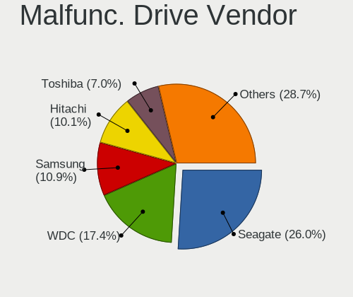

| Vendor              | Computers | Drives | Percent |
|---------------------|-----------|--------|---------|
| Seagate             | 62        | 78     | 26.16%  |
| WDC                 | 42        | 59     | 17.72%  |
| Hitachi             | 26        | 27     | 10.97%  |
| Samsung Electronics | 24        | 29     | 10.13%  |
| Toshiba             | 18        | 20     | 7.59%   |
| Crucial             | 8         | 8      | 3.38%   |
| Kingston            | 7         | 8      | 2.95%   |
| SanDisk             | 6         | 6      | 2.53%   |
| Intel               | 6         | 10     | 2.53%   |
| A-DATA Technology   | 6         | 7      | 2.53%   |
| MAXTOR              | 5         | 5      | 2.11%   |
| Fujitsu             | 4         | 4      | 1.69%   |
| OCZ                 | 3         | 4      | 1.27%   |
| KingDian            | 3         | 4      | 1.27%   |
| HGST                | 3         | 3      | 1.27%   |
| SK Hynix            | 2         | 2      | 0.84%   |
| Zheino              | 1         | 1      | 0.42%   |
| Unknown             | 1         | 1      | 0.42%   |
| Team                | 1         | 1      | 0.42%   |
| PLEXTOR             | 1         | 2      | 0.42%   |
| Micron Technology   | 1         | 1      | 0.42%   |
| LITEONIT            | 1         | 1      | 0.42%   |
| LITEON              | 1         | 1      | 0.42%   |
| KingSpec            | 1         | 1      | 0.42%   |
| Hypertec            | 1         | 1      | 0.42%   |
| Corsair             | 1         | 1      | 0.42%   |
| ASMT                | 1         | 2      | 0.42%   |
| Apple               | 1         | 1      | 0.42%   |

Malfunc. HDD Vendor
-------------------

Vendors of faulty HDD drives

| Vendor              | Computers | Drives | Percent |
|---------------------|-----------|--------|---------|
| Seagate             | 62        | 78     | 34.83%  |
| WDC                 | 39        | 56     | 21.91%  |
| Hitachi             | 26        | 27     | 14.61%  |
| Samsung Electronics | 20        | 25     | 11.24%  |
| Toshiba             | 18        | 20     | 10.11%  |
| MAXTOR              | 5         | 5      | 2.81%   |
| Fujitsu             | 4         | 4      | 2.25%   |
| HGST                | 3         | 3      | 1.69%   |
| ASMT                | 1         | 2      | 0.56%   |

Malfunc. Drive Kind
-------------------

Kinds of faulty drives

| Kind | Computers | Drives | Percent |
|------|-----------|--------|---------|
| HDD  | 166       | 220    | 73.78%  |
| SSD  | 57        | 66     | 25.33%  |
| NVMe | 2         | 2      | 0.89%   |

Failed Drives
-------------

Failed drive models

| Model                                            | Computers | Drives | Percent |
|--------------------------------------------------|-----------|--------|---------|
| Seagate ST500DM002-1BD142 500GB                  | 1         | 1      | 25%     |
| Samsung Electronics MZ7LN512HAJQ-00000 512GB SSD | 1         | 3      | 25%     |
| Samsung Electronics HE103SJ 1TB                  | 1         | 2      | 25%     |
| Crucial CT1000P1SSD8 1TB                         | 1         | 1      | 25%     |

Failed Drive Vendor
-------------------

Failed drive vendors

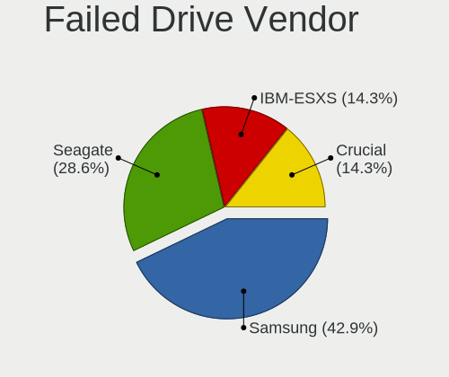

| Vendor              | Computers | Drives | Percent |
|---------------------|-----------|--------|---------|
| Samsung Electronics | 2         | 5      | 50%     |
| Seagate             | 1         | 1      | 25%     |
| Crucial             | 1         | 1      | 25%     |

Drive Status
------------

Number of failed and malfunc. drives

| Status   | Computers | Drives | Percent |
|----------|-----------|--------|---------|
| Detected | 895       | 1868   | 46.93%  |
| Works    | 790       | 1706   | 41.43%  |
| Malfunc  | 218       | 288    | 11.43%  |
| Failed   | 4         | 7      | 0.21%   |

Storage controller
------------------

Storage Vendor
--------------

Storage controller vendors

| Vendor                           | Computers | Percent |
|----------------------------------|-----------|---------|
| Intel                            | 1190      | 59.06%  |
| AMD                              | 290       | 14.39%  |
| Samsung Electronics              | 125       | 6.2%    |
| Sandisk                          | 45        | 2.23%   |
| ASMedia Technology               | 42        | 2.08%   |
| Marvell Technology Group         | 37        | 1.84%   |
| Phison Electronics               | 36        | 1.79%   |
| Toshiba America Info Systems     | 32        | 1.59%   |
| LSI Logic / Symbios Logic        | 29        | 1.44%   |
| Nvidia                           | 26        | 1.29%   |
| JMicron Technology               | 22        | 1.09%   |
| SK Hynix                         | 18        | 0.89%   |
| Silicon Motion                   | 17        | 0.84%   |
| Kingston Technology Company      | 16        | 0.79%   |
| Micron/Crucial Technology        | 14        | 0.69%   |
| ADATA Technology                 | 12        | 0.6%    |
| Broadcom / LSI                   | 11        | 0.55%   |
| VIA Technologies                 | 7         | 0.35%   |
| Adaptec                          | 7         | 0.35%   |
| Silicon Image                    | 6         | 0.3%    |
| Hewlett-Packard                  | 6         | 0.3%    |
| Seagate Technology               | 4         | 0.2%    |
| Micron Technology                | 4         | 0.2%    |
| Lite-On Technology               | 4         | 0.2%    |
| KIOXIA                           | 4         | 0.2%    |
| Silicon Integrated Systems [SiS] | 3         | 0.15%   |
| Realtek Semiconductor            | 3         | 0.15%   |
| Union Memory (Shenzhen)          | 1         | 0.05%   |
| Shenzhen Longsys Electronics     | 1         | 0.05%   |
| Loongson Technology              | 1         | 0.05%   |
| Integrated Technology Express    | 1         | 0.05%   |
| 3ware                            | 1         | 0.05%   |

Storage Model
-------------

Storage controller models

| Model                                                                                   | Computers | Percent |
|-----------------------------------------------------------------------------------------|-----------|---------|
| AMD FCH SATA Controller [AHCI mode]                                                     | 196       | 8.24%   |
| Intel Sunrise Point-LP SATA Controller [AHCI mode]                                      | 117       | 4.92%   |
| Intel 8 Series/C220 Series Chipset Family 6-port SATA Controller 1 [AHCI mode]          | 84        | 3.53%   |
| Samsung NVMe SSD Controller SM981/PM981/PM983                                           | 80        | 3.36%   |
| Intel 7 Series Chipset Family 6-port SATA Controller [AHCI mode]                        | 80        | 3.36%   |
| Intel 6 Series/C200 Series Chipset Family 6 port Mobile SATA AHCI Controller            | 62        | 2.61%   |
| AMD 400 Series Chipset SATA Controller                                                  | 52        | 2.18%   |
| Intel 82801 Mobile SATA Controller [RAID mode]                                          | 48        | 2.02%   |
| AMD SB7x0/SB8x0/SB9x0 SATA Controller [AHCI mode]                                       | 47        | 1.97%   |
| Intel 82801IBM/IEM (ICH9M/ICH9M-E) 4 port SATA Controller [AHCI mode]                   | 46        | 1.93%   |
| Intel 8 Series SATA Controller 1 [AHCI mode]                                            | 41        | 1.72%   |
| Intel 6 Series/C200 Series Chipset Family 6 port Desktop SATA AHCI Controller           | 41        | 1.72%   |
| Intel Q170/Q150/B150/H170/H110/Z170/CM236 Chipset SATA Controller [AHCI Mode]           | 40        | 1.68%   |
| AMD SB7x0/SB8x0/SB9x0 IDE Controller                                                    | 40        | 1.68%   |
| ASMedia ASM1062 Serial ATA Controller                                                   | 38        | 1.6%    |
| Intel NM10/ICH7 Family SATA Controller [IDE mode]                                       | 37        | 1.55%   |
| Intel Wildcat Point-LP SATA Controller [AHCI Mode]                                      | 34        | 1.43%   |
| Intel 82801G (ICH7 Family) IDE Controller                                               | 32        | 1.34%   |
| Intel 7 Series/C210 Series Chipset Family 6-port SATA Controller [AHCI mode]            | 29        | 1.22%   |
| Intel 200 Series PCH SATA controller [AHCI mode]                                        | 28        | 1.18%   |
| Intel Atom/Celeron/Pentium Processor x5-E8000/J3xxx/N3xxx Series SATA Controller        | 25        | 1.05%   |
| Phison E12 NVMe Controller                                                              | 24        | 1.01%   |
| Intel SATA Controller [RAID mode]                                                       | 24        | 1.01%   |
| Intel Celeron N3350/Pentium N4200/Atom E3900 Series SATA AHCI Controller                | 24        | 1.01%   |
| Intel Cannon Lake PCH SATA AHCI Controller                                              | 24        | 1.01%   |
| Intel 5 Series/3400 Series Chipset 6 port SATA AHCI Controller                          | 24        | 1.01%   |
| Intel 5 Series/3400 Series Chipset 4 port SATA AHCI Controller                          | 24        | 1.01%   |
| AMD SB7x0/SB8x0/SB9x0 SATA Controller [IDE mode]                                        | 24        | 1.01%   |
| Intel Cannon Point-LP SATA Controller [AHCI Mode]                                       | 23        | 0.97%   |
| Intel Cannon Lake Mobile PCH SATA AHCI Controller                                       | 21        | 0.88%   |
| Intel Celeron/Pentium Silver Processor SATA Controller                                  | 20        | 0.84%   |
| Intel C600/X79 series chipset 6-Port SATA AHCI Controller                               | 20        | 0.84%   |
| Intel NM10/ICH7 Family SATA Controller [AHCI mode]                                      | 18        | 0.76%   |
| Intel Comet Lake SATA AHCI Controller                                                   | 18        | 0.76%   |
| Samsung NVMe SSD Controller SM961/PM961/SM963                                           | 17        | 0.71%   |
| Intel HM170/QM170 Chipset SATA Controller [AHCI Mode]                                   | 16        | 0.67%   |
| AMD X370 Series Chipset SATA Controller                                                 | 16        | 0.67%   |
| Intel Atom Processor E3800 Series SATA AHCI Controller                                  | 15        | 0.63%   |
| Intel 82801HM/HEM (ICH8M/ICH8M-E) IDE Controller                                        | 15        | 0.63%   |
| AMD 300 Series Chipset SATA Controller                                                  | 15        | 0.63%   |
| Intel 9 Series Chipset Family SATA Controller [AHCI Mode]                               | 14        | 0.59%   |
| Intel 82801JI (ICH10 Family) SATA AHCI Controller                                       | 14        | 0.59%   |
| Intel 6 Series/C200 Series Chipset Family Desktop SATA Controller (IDE mode, ports 4-5) | 14        | 0.59%   |
| Toshiba America Info Systems Toshiba America Info Non-Volatile memory controller        | 13        | 0.55%   |
| Intel 82801HM/HEM (ICH8M/ICH8M-E) SATA Controller [AHCI mode]                           | 13        | 0.55%   |
| Intel 6 Series/C200 Series Chipset Family Desktop SATA Controller (IDE mode, ports 0-3) | 13        | 0.55%   |
| AMD FCH IDE Controller                                                                  | 13        | 0.55%   |
| Sandisk WD Black 2018/SN750 / PC SN720 NVMe SSD                                         | 12        | 0.5%    |
| Intel C610/X99 series chipset 6-Port SATA Controller [AHCI mode]                        | 12        | 0.5%    |
| Intel 82801JI (ICH10 Family) 4 port SATA IDE Controller #1                              | 12        | 0.5%    |
| Silicon Motion SM2263EN/SM2263XT SSD Controller                                         | 11        | 0.46%   |
| Samsung NVMe SSD Controller 980                                                         | 11        | 0.46%   |
| Micron/Crucial P1 NVMe PCIe SSD                                                         | 11        | 0.46%   |
| JMicron JMB363 SATA/IDE Controller                                                      | 11        | 0.46%   |
| Intel 82801JI (ICH10 Family) 2 port SATA IDE Controller #2                              | 11        | 0.46%   |
| Sandisk WD Black SN750 / PC SN730 NVMe SSD                                              | 10        | 0.42%   |
| Nvidia MCP61 SATA Controller                                                            | 10        | 0.42%   |
| Nvidia MCP61 IDE                                                                        | 10        | 0.42%   |
| LSI Logic / Symbios Logic SAS2008 PCI-Express Fusion-MPT SAS-2 [Falcon]                 | 10        | 0.42%   |
| Intel 5 Series/3400 Series Chipset 4 port SATA IDE Controller                           | 10        | 0.42%   |

Storage Kind
------------

Kind of storage controller (IDE, SATA, NVMe, SAS, ...)

| Kind | Computers | Percent |
|------|-----------|---------|
| SATA | 1274      | 62.36%  |
| NVMe | 337       | 16.5%   |
| IDE  | 282       | 13.8%   |
| RAID | 115       | 5.63%   |
| SAS  | 23        | 1.13%   |
| SCSI | 12        | 0.59%   |

Processor
---------

CPU Vendor
----------

Processor vendors

| Vendor       | Computers | Percent |
|--------------|-----------|---------|
| Intel        | 1309      | 78.01%  |
| AMD          | 323       | 19.25%  |
| ARM          | 42        | 2.5%    |
| CentaurHauls | 2         | 0.12%   |
| Unknown      | 2         | 0.12%   |

CPU Model
---------

Processor models

| Model                                       | Computers | Percent |
|---------------------------------------------|-----------|---------|
| Intel Core i7-8550U CPU @ 1.80GHz           | 32        | 1.91%   |
| Intel Core i5-8250U CPU @ 1.60GHz           | 28        | 1.67%   |
| Intel Core i7-8565U CPU @ 1.80GHz           | 26        | 1.55%   |
| Intel Core i5-7200U CPU @ 2.50GHz           | 21        | 1.25%   |
| ARM Processor                               | 21        | 1.25%   |
| Intel Core i7-7500U CPU @ 2.70GHz           | 16        | 0.95%   |
| Intel Core i5-8265U CPU @ 1.60GHz           | 14        | 0.83%   |
| Intel Core i5-3320M CPU @ 2.60GHz           | 14        | 0.83%   |
| Intel Core i5-2520M CPU @ 2.50GHz           | 14        | 0.83%   |
| AMD Ryzen 7 3700X 8-Core Processor          | 14        | 0.83%   |
| Intel Core i5-6200U CPU @ 2.30GHz           | 13        | 0.77%   |
| AMD Ryzen 5 3400G with Radeon Vega Graphics | 13        | 0.77%   |
| Intel Core i5-6300U CPU @ 2.40GHz           | 11        | 0.66%   |
| Intel Core i5-3470 CPU @ 3.20GHz            | 11        | 0.66%   |
| Intel Core i5-2410M CPU @ 2.30GHz           | 11        | 0.66%   |
| Intel Core i5-2400 CPU @ 3.10GHz            | 11        | 0.66%   |
| Intel Celeron CPU N3350 @ 1.10GHz           | 11        | 0.66%   |
| AMD Ryzen 7 2700X Eight-Core Processor      | 11        | 0.66%   |
| AMD Ryzen 5 3600 6-Core Processor           | 11        | 0.66%   |
| Intel Core i7-7700HQ CPU @ 2.80GHz          | 9         | 0.54%   |
| Intel Core i7-10510U CPU @ 1.80GHz          | 9         | 0.54%   |
| Intel Core i7-9750H CPU @ 2.60GHz           | 8         | 0.48%   |
| Intel Core i7-8750H CPU @ 2.20GHz           | 8         | 0.48%   |
| Intel Core i7-8665U CPU @ 1.90GHz           | 8         | 0.48%   |
| Intel Core i7-4790 CPU @ 3.60GHz            | 8         | 0.48%   |
| Intel Core i3-3110M CPU @ 2.40GHz           | 8         | 0.48%   |
| Intel Core i3-2100 CPU @ 3.10GHz            | 8         | 0.48%   |
| Intel Celeron CPU N3060 @ 1.60GHz           | 8         | 0.48%   |
| AMD Ryzen 7 1700 Eight-Core Processor       | 8         | 0.48%   |
| Intel Core i7-6700K CPU @ 4.00GHz           | 7         | 0.42%   |
| Intel Core i5-5300U CPU @ 2.30GHz           | 7         | 0.42%   |
| Intel Core i5-5200U CPU @ 2.20GHz           | 7         | 0.42%   |
| Intel Core i5-3230M CPU @ 2.60GHz           | 7         | 0.42%   |
| Intel Core i5-3210M CPU @ 2.50GHz           | 7         | 0.42%   |
| Intel Core i3-5005U CPU @ 2.00GHz           | 7         | 0.42%   |
| Intel Core 2 Duo CPU E8400 @ 3.00GHz        | 7         | 0.42%   |
| Intel Core 2 Duo CPU E7500 @ 2.93GHz        | 7         | 0.42%   |
| Intel Celeron CPU N3050 @ 1.60GHz           | 7         | 0.42%   |
| Intel Atom CPU N455 @ 1.66GHz               | 7         | 0.42%   |
| AMD Ryzen 9 3900X 12-Core Processor         | 7         | 0.42%   |
| AMD FX-8350 Eight-Core Processor            | 7         | 0.42%   |
| Intel Core i7-6700 CPU @ 3.40GHz            | 6         | 0.36%   |
| Intel Core i7-6500U CPU @ 2.50GHz           | 6         | 0.36%   |
| Intel Core i7-5600U CPU @ 2.60GHz           | 6         | 0.36%   |
| Intel Core i7-4770K CPU @ 3.50GHz           | 6         | 0.36%   |
| Intel Core i7-3930K CPU @ 3.20GHz           | 6         | 0.36%   |
| Intel Core i7-3630QM CPU @ 2.40GHz          | 6         | 0.36%   |
| Intel Core i7-2640M CPU @ 2.80GHz           | 6         | 0.36%   |
| Intel Core i5-4300U CPU @ 1.90GHz           | 6         | 0.36%   |
| Intel Core i5-4210U CPU @ 1.70GHz           | 6         | 0.36%   |
| Intel Atom CPU N270 @ 1.60GHz               | 6         | 0.36%   |
| AMD Ryzen 7 2700 Eight-Core Processor       | 6         | 0.36%   |
| AMD Ryzen 5 2600 Six-Core Processor         | 6         | 0.36%   |
| AMD Ryzen 5 1600 Six-Core Processor         | 6         | 0.36%   |
| Intel Xeon CPU X5650 @ 2.67GHz              | 5         | 0.3%    |
| Intel Pentium Gold G5400 CPU @ 3.70GHz      | 5         | 0.3%    |
| Intel Pentium CPU N3700 @ 1.60GHz           | 5         | 0.3%    |
| Intel Core i7-9700K CPU @ 3.60GHz           | 5         | 0.3%    |
| Intel Core i7-6700HQ CPU @ 2.60GHz          | 5         | 0.3%    |
| Intel Core i7-5500U CPU @ 2.40GHz           | 5         | 0.3%    |

CPU Model Family
----------------

Processor model prefix

| Model                   | Computers | Percent |
|-------------------------|-----------|---------|
| Intel Core i5           | 355       | 21.16%  |
| Intel Core i7           | 341       | 20.32%  |
| Intel Core i3           | 137       | 8.16%   |
| Intel Celeron           | 104       | 6.2%    |
| Intel Xeon              | 87        | 5.18%   |
| Intel Core 2 Duo        | 74        | 4.41%   |
| AMD Ryzen 5             | 61        | 3.64%   |
| AMD Ryzen 7             | 51        | 3.04%   |
| Intel Atom              | 49        | 2.92%   |
| Other                   | 44        | 2.62%   |
| Intel Pentium           | 36        | 2.15%   |
| AMD FX                  | 27        | 1.61%   |
| AMD A8                  | 17        | 1.01%   |
| Intel Core 2 Quad       | 16        | 0.95%   |
| Intel Core 2            | 16        | 0.95%   |
| Intel Pentium Dual-Core | 15        | 0.89%   |
| AMD Ryzen 3             | 15        | 0.89%   |
| Intel Pentium Dual      | 14        | 0.83%   |
| AMD E                   | 10        | 0.6%    |
| AMD Athlon II X2        | 10        | 0.6%    |
| AMD A10                 | 10        | 0.6%    |
| Intel Pentium M         | 9         | 0.54%   |
| AMD Phenom II X4        | 9         | 0.54%   |
| AMD A4                  | 9         | 0.54%   |
| AMD Athlon 64 X2        | 8         | 0.48%   |
| AMD A6                  | 8         | 0.48%   |
| Intel Core i9           | 7         | 0.42%   |
| AMD Ryzen 9             | 7         | 0.42%   |
| AMD E1                  | 7         | 0.42%   |
| Intel Xeon Silver       | 6         | 0.36%   |
| Intel Pentium 4         | 6         | 0.36%   |
| ARM Allwinner           | 6         | 0.36%   |
| AMD Ryzen 7 PRO         | 6         | 0.36%   |
| Intel Pentium Silver    | 5         | 0.3%    |
| Intel Pentium Gold      | 5         | 0.3%    |
| ARM AArch64             | 5         | 0.3%    |
| AMD Ryzen Threadripper  | 5         | 0.3%    |
| AMD Phenom II X6        | 5         | 0.3%    |
| AMD Athlon 64           | 5         | 0.3%    |
| AMD Athlon              | 5         | 0.3%    |
| Intel Celeron Dual-Core | 4         | 0.24%   |
| AMD Turion 64 X2 Mobile | 4         | 0.24%   |
| AMD Sempron             | 4         | 0.24%   |
| AMD Ryzen 5 PRO         | 4         | 0.24%   |
| AMD Athlon II X4        | 4         | 0.24%   |
| Intel Genuine           | 3         | 0.18%   |
| ARM BCM                 | 3         | 0.18%   |
| AMD GX                  | 3         | 0.18%   |
| AMD E2                  | 3         | 0.18%   |
| Intel Pentium D         | 2         | 0.12%   |
| Intel Core m5           | 2         | 0.12%   |
| Intel Celeron M         | 2         | 0.12%   |
| CentaurHauls VIA C7     | 2         | 0.12%   |
| ARM ARMv7               | 2         | 0.12%   |
| AMD Phenom              | 2         | 0.12%   |
| AMD C-60                | 2         | 0.12%   |
| AMD Athlon X4           | 2         | 0.12%   |
| Intel Pentium III       | 1         | 0.06%   |
| Intel Core m7           | 1         | 0.06%   |
| Intel Core m3           | 1         | 0.06%   |

CPU Cores
---------

Number of processor cores

| Number | Computers | Percent |
|--------|-----------|---------|
| 2      | 736       | 43.81%  |
| 4      | 617       | 36.73%  |
| 6      | 116       | 6.9%    |
| 8      | 85        | 5.06%   |
| 1      | 68        | 4.05%   |
| 12     | 22        | 1.31%   |
| 16     | 12        | 0.71%   |
| 3      | 9         | 0.54%   |
| 20     | 4         | 0.24%   |
| 32     | 3         | 0.18%   |
| 10     | 3         | 0.18%   |
| 24     | 2         | 0.12%   |
| 44     | 1         | 0.06%   |
| 22     | 1         | 0.06%   |
| 18     | 1         | 0.06%   |

CPU Sockets
-----------

Number of sockets

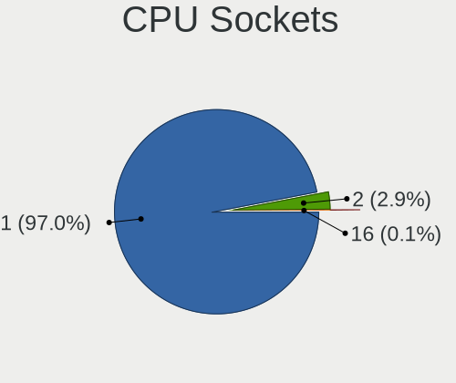

| Number | Computers | Percent |
|--------|-----------|---------|
| 1      | 1632      | 97.2%   |
| 2      | 46        | 2.74%   |
| 4      | 1         | 0.06%   |

CPU Threads
-----------

Threads per core (Hyper-Threading)

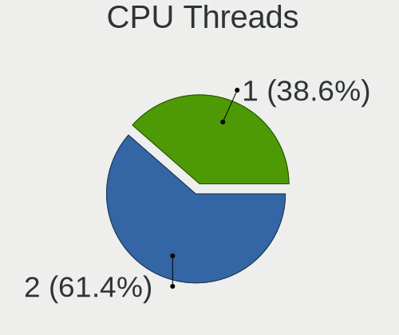

| Number | Computers | Percent |
|--------|-----------|---------|
| 2      | 1046      | 62.3%   |
| 1      | 633       | 37.7%   |

CPU Op-Modes
------------

CPU Operation Modes (32-bit, 64-bit)

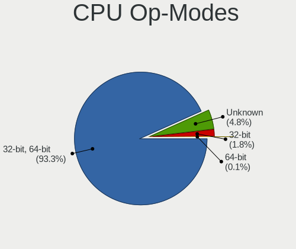

| Op mode        | Computers | Percent |
|----------------|-----------|---------|
| 32-bit, 64-bit | 1568      | 93.28%  |
| Unknown        | 82        | 4.88%   |
| 32-bit         | 29        | 1.73%   |
| 64-bit         | 2         | 0.12%   |

CPU Microcode
-------------

Microcode number

| Number     | Computers | Percent |
|------------|-----------|---------|
| Unknown    | 681       | 39.36%  |
| 0x206a7    | 87        | 5.03%   |
| 0x306c3    | 69        | 3.99%   |
| 0x306a9    | 64        | 3.7%    |
| 0x1067a    | 58        | 3.35%   |
| 0x806ec    | 42        | 2.43%   |
| 0x806ea    | 34        | 1.97%   |
| 0x306d4    | 27        | 1.56%   |
| 0x906ea    | 26        | 1.5%    |
| 0x40651    | 26        | 1.5%    |
| 0x906e9    | 23        | 1.33%   |
| 0x806e9    | 23        | 1.33%   |
| 0x406e3    | 22        | 1.27%   |
| 0x506e3    | 21        | 1.21%   |
| 0x406c3    | 17        | 0.98%   |
| 0x08701021 | 17        | 0.98%   |
| 0x30678    | 16        | 0.92%   |
| 0x20655    | 16        | 0.92%   |
| 0x0800820d | 16        | 0.92%   |
| 0x6fd      | 15        | 0.87%   |
| 0x106ca    | 14        | 0.81%   |
| 0x906ed    | 13        | 0.75%   |
| 0x206c2    | 13        | 0.75%   |
| 0x20652    | 13        | 0.75%   |
| 0x106e5    | 13        | 0.75%   |
| 0x08701013 | 13        | 0.75%   |
| 0x706a1    | 12        | 0.69%   |
| 0x406c4    | 11        | 0.64%   |
| 0x206d7    | 11        | 0.64%   |
| 0x08108102 | 11        | 0.64%   |
| 0x010000c8 | 11        | 0.64%   |
| 0x806eb    | 10        | 0.58%   |
| 0x506c9    | 10        | 0.58%   |
| 0x10676    | 10        | 0.58%   |
| 0x08108109 | 10        | 0.58%   |
| 0x05000119 | 10        | 0.58%   |
| 0x306e4    | 9         | 0.52%   |
| 0x50654    | 8         | 0.46%   |
| 0x106c2    | 8         | 0.46%   |
| 0x0810100b | 8         | 0.46%   |
| 0x06003106 | 8         | 0.46%   |
| 0x706e5    | 7         | 0.4%    |
| 0x6f6      | 7         | 0.4%    |
| 0x08001137 | 7         | 0.4%    |
| 0x06001119 | 7         | 0.4%    |
| 0xa0655    | 6         | 0.35%   |
| 0xa0653    | 6         | 0.35%   |
| 0x6fb      | 6         | 0.35%   |
| 0x306f2    | 6         | 0.35%   |
| 0x106a5    | 6         | 0.35%   |
| 0x906eb    | 5         | 0.29%   |
| 0x806c1    | 5         | 0.29%   |
| 0x6d8      | 5         | 0.29%   |
| 0x07030105 | 5         | 0.29%   |
| 0x06000852 | 5         | 0.29%   |
| 0x03000027 | 5         | 0.29%   |
| 0x706a8    | 4         | 0.23%   |
| 0x6f2      | 4         | 0.23%   |
| 0x08101016 | 4         | 0.23%   |
| 0x0800820b | 4         | 0.23%   |

CPU Microarch
-------------

Microarchitecture

| Name            | Computers | Percent |
|-----------------|-----------|---------|
| KabyLake        | 304       | 18.11%  |
| Haswell         | 163       | 9.71%   |
| SandyBridge     | 149       | 8.87%   |
| IvyBridge       | 124       | 7.39%   |
| Penryn          | 99        | 5.9%    |
| Skylake         | 94        | 5.6%    |
| Zen+            | 62        | 3.69%   |
| Silvermont      | 61        | 3.63%   |
| Westmere        | 56        | 3.34%   |
| Core            | 54        | 3.22%   |
| Zen 2           | 46        | 2.74%   |
| Unknown         | 46        | 2.74%   |
| Zen             | 45        | 2.68%   |
| Broadwell       | 41        | 2.44%   |
| K10             | 35        | 2.08%   |
| Piledriver      | 33        | 1.97%   |
| Bonnell         | 33        | 1.97%   |
| Nehalem         | 26        | 1.55%   |
| Goldmont        | 24        | 1.43%   |
| K8 Hammer       | 23        | 1.37%   |
| CometLake       | 21        | 1.25%   |
| Goldmont plus   | 20        | 1.19%   |
| Bobcat          | 20        | 1.19%   |
| P6              | 14        | 0.83%   |
| Steamroller     | 12        | 0.71%   |
| Excavator       | 11        | 0.66%   |
| Puma            | 10        | 0.6%    |
| NetBurst        | 10        | 0.6%    |
| Jaguar          | 9         | 0.54%   |
| IceLake         | 9         | 0.54%   |
| TigerLake       | 7         | 0.42%   |
| K10 Llano       | 6         | 0.36%   |
| Bulldozer       | 6         | 0.36%   |
| K8 & K10 hybrid | 3         | 0.18%   |
| Zen 3           | 2         | 0.12%   |
| K6              | 1         | 0.06%   |

Graphics
--------

GPU Vendor
----------

Vendors of graphics cards

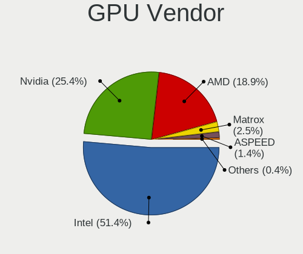

| Vendor                           | Computers | Percent |
|----------------------------------|-----------|---------|
| Intel                            | 982       | 51.96%  |
| Nvidia                           | 481       | 25.45%  |
| AMD                              | 357       | 18.89%  |
| Matrox Electronics Systems       | 42        | 2.22%   |
| ASPEED Technology                | 19        | 1.01%   |
| VIA Technologies                 | 4         | 0.21%   |
| Silicon Integrated Systems [SiS] | 3         | 0.16%   |
| Loongson Technology              | 1         | 0.05%   |
| Huawei Technologies              | 1         | 0.05%   |

GPU Model
---------

Graphics card models

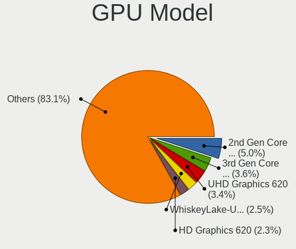

| Model                                                                                    | Computers | Percent |
|------------------------------------------------------------------------------------------|-----------|---------|
| Intel 2nd Generation Core Processor Family Integrated Graphics Controller                | 99        | 5.09%   |
| Intel 3rd Gen Core processor Graphics Controller                                         | 70        | 3.6%    |
| Intel UHD Graphics 620                                                                   | 69        | 3.55%   |
| Intel WhiskeyLake-U GT2 [UHD Graphics 620]                                               | 53        | 2.73%   |
| Intel HD Graphics 620                                                                    | 44        | 2.26%   |
| Intel Haswell-ULT Integrated Graphics Controller                                         | 44        | 2.26%   |
| Intel Mobile 4 Series Chipset Integrated Graphics Controller                             | 42        | 2.16%   |
| Intel Skylake GT2 [HD Graphics 520]                                                      | 38        | 1.95%   |
| Intel Atom/Celeron/Pentium Processor x5-E8000/J3xxx/N3xxx Integrated Graphics Controller | 36        | 1.85%   |
| Intel Xeon E3-1200 v3/4th Gen Core Processor Integrated Graphics Controller              | 35        | 1.8%    |
| Intel HD Graphics 5500                                                                   | 32        | 1.65%   |
| AMD Picasso/Raven 2 [Radeon Vega Series / Radeon Vega Mobile Series]                     | 31        | 1.59%   |
| AMD Ellesmere [Radeon RX 470/480/570/570X/580/580X/590]                                  | 31        | 1.59%   |
| Intel Core Processor Integrated Graphics Controller                                      | 27        | 1.39%   |
| Intel Atom Processor Z36xxx/Z37xxx Series Graphics & Display                             | 25        | 1.29%   |
| Intel HD Graphics 630                                                                    | 24        | 1.23%   |
| Intel CoffeeLake-H GT2 [UHD Graphics 630]                                                | 24        | 1.23%   |
| Intel HD Graphics 530                                                                    | 23        | 1.18%   |
| Intel HD Graphics 500                                                                    | 23        | 1.18%   |
| Intel 4th Gen Core Processor Integrated Graphics Controller                              | 22        | 1.13%   |
| Nvidia GK208B [GeForce GT 710]                                                           | 21        | 1.08%   |
| Intel CometLake-U GT2 [UHD Graphics]                                                     | 21        | 1.08%   |
| Intel CoffeeLake-S GT2 [UHD Graphics 630]                                                | 19        | 0.98%   |
| ASPEED Technology ASPEED Graphics Family                                                 | 19        | 0.98%   |
| Intel Atom Processor D4xx/D5xx/N4xx/N5xx Integrated Graphics Controller                  | 18        | 0.93%   |
| AMD Raven Ridge [Radeon Vega Series / Radeon Vega Mobile Series]                         | 18        | 0.93%   |
| Intel 4 Series Chipset Integrated Graphics Controller                                    | 17        | 0.87%   |
| Matrox Electronics Systems MGA G200eW WPCM450                                            | 16        | 0.82%   |
| Intel GeminiLake [UHD Graphics 600]                                                      | 15        | 0.77%   |
| AMD Topaz XT [Radeon R7 M260/M265 / M340/M360 / M440/M445 / 530/535 / 620/625 Mobile]    | 15        | 0.77%   |
| Nvidia GT218 [GeForce 210]                                                               | 14        | 0.72%   |
| Nvidia GP107 [GeForce GTX 1050 Ti]                                                       | 14        | 0.72%   |
| Nvidia GP106 [GeForce GTX 1060 6GB]                                                      | 14        | 0.72%   |
| Intel Xeon E3-1200 v2/3rd Gen Core processor Graphics Controller                         | 13        | 0.67%   |
| Intel Mobile 945GM/GMS/GME, 943/940GML Express Integrated Graphics Controller            | 13        | 0.67%   |
| Nvidia GP108M [GeForce MX150]                                                            | 12        | 0.62%   |
| AMD Lexa PRO [Radeon 540/540X/550/550X / RX 540X/550/550X]                               | 12        | 0.62%   |
| Intel Mobile GM965/GL960 Integrated Graphics Controller (secondary)                      | 11        | 0.57%   |
| Intel Mobile GM965/GL960 Integrated Graphics Controller (primary)                        | 11        | 0.57%   |
| AMD Caicos [Radeon HD 6450/7450/8450 / R5 230 OEM]                                       | 11        | 0.57%   |
| Intel 4th Generation Core Processor Family Integrated Graphics Controller                | 10        | 0.51%   |
| Nvidia GM108M [GeForce 940MX]                                                            | 9         | 0.46%   |
| Nvidia GM107 [GeForce GTX 750 Ti]                                                        | 9         | 0.46%   |
| Nvidia GF117M [GeForce 610M/710M/810M/820M / GT 620M/625M/630M/720M]                     | 9         | 0.46%   |
| Intel IvyBridge GT2 [HD Graphics 4000]                                                   | 9         | 0.46%   |
| AMD Baffin [Radeon RX 460/560D / Pro 450/455/460/555/555X/560/560X]                      | 9         | 0.46%   |
| Nvidia GP108 [GeForce GT 1030]                                                           | 8         | 0.41%   |
| Nvidia GM107M [GeForce GTX 960M]                                                         | 8         | 0.41%   |
| Intel Mobile 945GSE Express Integrated Graphics Controller                               | 8         | 0.41%   |
| Intel CometLake-S GT2 [UHD Graphics 630]                                                 | 8         | 0.41%   |
| AMD Stoney [Radeon R2/R3/R4/R5 Graphics]                                                 | 8         | 0.41%   |
| AMD Mullins [Radeon R4/R5 Graphics]                                                      | 8         | 0.41%   |
| AMD Kaveri [Radeon R7 Graphics]                                                          | 8         | 0.41%   |
| AMD Cedar [Radeon HD 5000/6000/7350/8350 Series]                                         | 8         | 0.41%   |
| Nvidia TU116 [GeForce GTX 1650 SUPER]                                                    | 7         | 0.36%   |
| Nvidia GP107M [GeForce GTX 1050 Ti Mobile]                                               | 7         | 0.36%   |
| Nvidia GP107M [GeForce GTX 1050 Mobile]                                                  | 7         | 0.36%   |
| Nvidia GP106 [GeForce GTX 1060 3GB]                                                      | 7         | 0.36%   |
| Nvidia GM204 [GeForce GTX 970]                                                           | 7         | 0.36%   |
| Nvidia GM108M [GeForce 840M]                                                             | 7         | 0.36%   |

GPU Combo
---------

Combinations of graphics cards

| Name                         | Computers | Percent |
|------------------------------|-----------|---------|
| 1 x Intel                    | 736       | 43.65%  |
| 1 x Nvidia                   | 295       | 17.5%   |
| 1 x AMD                      | 278       | 16.49%  |
| Intel + Nvidia               | 173       | 10.26%  |
| Intel + AMD                  | 57        | 3.38%   |
| Other                        | 49        | 2.91%   |
| 1 x Matrox                   | 40        | 2.37%   |
| 2 x AMD                      | 19        | 1.13%   |
| 1 x ASPEED                   | 17        | 1.01%   |
| 2 x Nvidia                   | 5         | 0.3%    |
| 1 x VIA                      | 4         | 0.24%   |
| 1 x SiS                      | 3         | 0.18%   |
| Nvidia + Matrox              | 2         | 0.12%   |
| Nvidia + ASPEED              | 2         | 0.12%   |
| Intel + 2 x Nvidia           | 2         | 0.12%   |
| AMD + Nvidia                 | 2         | 0.12%   |
| 2 x Loongson Technology      | 1         | 0.06%   |
| Nvidia + Huawei Technologies | 1         | 0.06%   |

GPU Driver
----------

Free vs proprietary

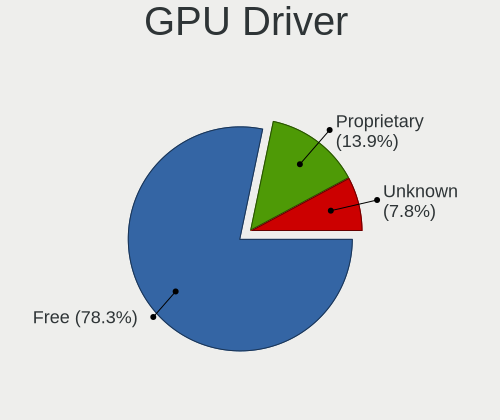

| Driver      | Computers | Percent |
|-------------|-----------|---------|
| Free        | 1335      | 78.67%  |
| Proprietary | 238       | 14.02%  |
| Unknown     | 124       | 7.31%   |

GPU Memory
----------

Total video memory

| Size in GB | Computers | Percent |
|------------|-----------|---------|
| Unknown    | 1228      | 72.11%  |
| 1.01-2.0   | 122       | 7.16%   |
| 0.51-1.0   | 111       | 6.52%   |
| 0.01-0.5   | 105       | 6.17%   |
| 3.01-4.0   | 58        | 3.41%   |
| 7.01-8.0   | 36        | 2.11%   |
| 5.01-6.0   | 22        | 1.29%   |
| 2.01-3.0   | 16        | 0.94%   |
| 8.01-16.0  | 5         | 0.29%   |

Monitor
-------

Monitor Vendor
--------------

Monitor vendors

| Vendor                  | Computers | Percent |
|-------------------------|-----------|---------|
| Samsung Electronics     | 231       | 13.45%  |
| AU Optronics            | 205       | 11.93%  |
| LG Display              | 153       | 8.91%   |
| BOE                     | 124       | 7.22%   |
| Dell                    | 121       | 7.04%   |
| Chimei Innolux          | 103       | 6%      |
| Goldstar                | 87        | 5.06%   |
| Hewlett-Packard         | 59        | 3.43%   |
| BenQ                    | 52        | 3.03%   |
| Acer                    | 51        | 2.97%   |
| AOC                     | 49        | 2.85%   |
| Philips                 | 44        | 2.56%   |
| Lenovo                  | 35        | 2.04%   |
| Ancor Communications    | 35        | 2.04%   |
| Iiyama                  | 28        | 1.63%   |
| ViewSonic               | 24        | 1.4%    |
| Chi Mei Optoelectronics | 23        | 1.34%   |
| Apple                   | 22        | 1.28%   |
| Unknown                 | 18        | 1.05%   |
| Sharp                   | 18        | 1.05%   |
| LG Electronics          | 15        | 0.87%   |
| InfoVision              | 15        | 0.87%   |
| Sony                    | 12        | 0.7%    |
| PANDA                   | 12        | 0.7%    |
| HannStar                | 12        | 0.7%    |
| Fujitsu Siemens         | 10        | 0.58%   |
| Eizo                    | 7         | 0.41%   |
| Vizio                   | 6         | 0.35%   |
| NEC Computers           | 6         | 0.35%   |
| LG Philips              | 6         | 0.35%   |
| ASUSTek Computer        | 6         | 0.35%   |
| Panasonic               | 5         | 0.29%   |
| Medion                  | 5         | 0.29%   |
| CPT                     | 5         | 0.29%   |
| Belinea                 | 4         | 0.23%   |
| Targa Visionary         | 3         | 0.17%   |
| MStar                   | 3         | 0.17%   |
| LGD                     | 3         | 0.17%   |
| ITE                     | 3         | 0.17%   |
| HPN                     | 3         | 0.17%   |
| Hitachi                 | 3         | 0.17%   |
| WCS                     | 2         | 0.12%   |
| Sun                     | 2         | 0.12%   |
| RTK                     | 2         | 0.12%   |
| Quanta Display          | 2         | 0.12%   |
| Packard Bell            | 2         | 0.12%   |
| Orion                   | 2         | 0.12%   |
| MSI                     | 2         | 0.12%   |
| Lenovo Group Limited    | 2         | 0.12%   |
| Insignia                | 2         | 0.12%   |
| InnoLux Display         | 2         | 0.12%   |
| Idek Iiyama             | 2         | 0.12%   |
| Hannspree               | 2         | 0.12%   |
| Gateway                 | 2         | 0.12%   |
| FOX                     | 2         | 0.12%   |
| CSO                     | 2         | 0.12%   |
| CHR                     | 2         | 0.12%   |
| AUS                     | 2         | 0.12%   |
| AGO                     | 2         | 0.12%   |
| ___                     | 1         | 0.06%   |

Monitor Model
-------------

Monitor models

| Model                                                                 | Computers | Percent |
|-----------------------------------------------------------------------|-----------|---------|
| Goldstar ULTRAWIDE GSM59F1 2560x1080 677x290mm 29.0-inch              | 12        | 0.67%   |
| AU Optronics LCD Monitor AUO38ED 1920x1080 344x193mm 15.5-inch        | 11        | 0.62%   |
| Chimei Innolux LCD Monitor CMN14D4 1920x1080 309x173mm 13.9-inch      | 9         | 0.51%   |
| AU Optronics LCD Monitor AUO22EC 1366x768 344x193mm 15.5-inch         | 8         | 0.45%   |
| AU Optronics LCD Monitor AUO21ED 1920x1080 344x194mm 15.5-inch        | 8         | 0.45%   |
| LG Display LCD Monitor LGD02DC 1366x768 344x194mm 15.5-inch           | 7         | 0.39%   |
| Samsung Electronics LCD Monitor SEC5441 1366x768 309x174mm 14.0-inch  | 6         | 0.34%   |
| LG Display LCD Monitor LGD02D8 1366x768 277x156mm 12.5-inch           | 6         | 0.34%   |
| Chimei Innolux LCD Monitor CMN15E8 1920x1080 344x193mm 15.5-inch      | 6         | 0.34%   |
| BOE LCD Monitor BOE0672 1366x768 344x194mm 15.5-inch                  | 6         | 0.34%   |
| AU Optronics LCD Monitor AUO106C 1366x768 277x156mm 12.5-inch         | 6         | 0.34%   |
| Samsung Electronics LCD Monitor SyncMaster                            | 5         | 0.28%   |
| Samsung Electronics C27F390 SAM0D32 1920x1080 598x336mm 27.0-inch     | 5         | 0.28%   |
| LG Display LCD Monitor LGD02E9 1366x768 309x174mm 14.0-inch           | 5         | 0.28%   |
| Fujitsu Siemens LL 3190TS FUS07A3 1366x768 430x255mm 19.7-inch        | 5         | 0.28%   |
| Dell P2317H DEL40F4 1920x1080 509x286mm 23.0-inch                     | 5         | 0.28%   |
| Chimei Innolux LCD Monitor CMN15DB 1366x768 344x193mm 15.5-inch       | 5         | 0.28%   |
| AU Optronics LCD Monitor AUO133D 1920x1080 309x173mm 13.9-inch        | 5         | 0.28%   |
| AOC 2350 AOC2350 1920x1080 509x286mm 23.0-inch                        | 5         | 0.28%   |
| Sharp LCD Monitor SHP149A 1920x1080 344x194mm 15.5-inch               | 4         | 0.22%   |
| Samsung Electronics S22D300 SAM0B3F 1920x1080 477x268mm 21.5-inch     | 4         | 0.22%   |
| Samsung Electronics LCD Monitor SEC544B 1600x900 382x214mm 17.2-inch  | 4         | 0.22%   |
| LG Display LCD Monitor LGD033A 1366x768 344x194mm 15.5-inch           | 4         | 0.22%   |
| Lenovo LCD Monitor LEN40B2 1920x1080 344x193mm 15.5-inch              | 4         | 0.22%   |
| Lenovo LCD Monitor LEN4036 1440x900 303x190mm 14.1-inch               | 4         | 0.22%   |
| InfoVision LCD Monitor IVO03F4 1024x600 223x125mm 10.1-inch           | 4         | 0.22%   |
| HannStar HSD101PFW2 HSD03E9 1024x600 222x125mm 10.0-inch              | 4         | 0.22%   |
| Goldstar HDR WFHD GSM7714 2560x1080 798x334mm 34.1-inch               | 4         | 0.22%   |
| Dell P2719H DEL4184 1920x1080 598x336mm 27.0-inch                     | 4         | 0.22%   |
| Chimei Innolux LCD Monitor CMN1490 1366x768 309x173mm 13.9-inch       | 4         | 0.22%   |
| BOE LCD Monitor BOE0687 1920x1080 344x193mm 15.5-inch                 | 4         | 0.22%   |
| AU Optronics LCD Monitor AUO71EC 1366x768 344x193mm 15.5-inch         | 4         | 0.22%   |
| AU Optronics LCD Monitor AUO61D2 1024x600 222x125mm 10.0-inch         | 4         | 0.22%   |
| AU Optronics LCD Monitor AUO47EC 1366x768 344x193mm 15.5-inch         | 4         | 0.22%   |
| AU Optronics LCD Monitor AUO423D 1920x1080 309x173mm 13.9-inch        | 4         | 0.22%   |
| AU Optronics LCD Monitor AUO23ED 1920x1080 344x194mm 15.5-inch        | 4         | 0.22%   |
| AU Optronics LCD Monitor AUO183C 1366x768 309x173mm 13.9-inch         | 4         | 0.22%   |
| Vizio D39h-D0 VIZ1002 1366x768 853x479mm 38.5-inch                    | 3         | 0.17%   |
| Targa Visionary Monitor TAR0C35 1280x1024                             | 3         | 0.17%   |
| Sharp LCD Monitor SHP1449 1920x1080 294x165mm 13.3-inch               | 3         | 0.17%   |
| Samsung Electronics SyncMaster SAM01B7 1280x1024 338x270mm 17.0-inch  | 3         | 0.17%   |
| Samsung Electronics LCD Monitor SEC3047 1366x768 277x156mm 12.5-inch  | 3         | 0.17%   |
| Samsung Electronics LCD Monitor SEC3030 1024x600 223x125mm 10.1-inch  | 3         | 0.17%   |
| Samsung Electronics LCD Monitor SDC324C 1920x1080 344x194mm 15.5-inch | 3         | 0.17%   |
| Philips PHL 243V7 PHLC155 1920x1080 527x296mm 23.8-inch               | 3         | 0.17%   |
| Philips 170S PHL082B 1280x1024 338x270mm 17.0-inch                    | 3         | 0.17%   |
| PANDA LM133LF1L01 NCP13FB 1920x1080 290x170mm 13.2-inch               | 3         | 0.17%   |
| LG Display LCD Monitor LGD05E5 1920x1080 344x194mm 15.5-inch          | 3         | 0.17%   |
| LG Display LCD Monitor LGD02D9 1920x1080 344x194mm 15.5-inch          | 3         | 0.17%   |
| Lenovo LCD Monitor LEN40BA 1920x1080 344x194mm 15.5-inch              | 3         | 0.17%   |
| Lenovo LCD Monitor LEN4011 1280x800 261x163mm 12.1-inch               | 3         | 0.17%   |
| InfoVision LCD Monitor IVO04E3 1366x768 277x156mm 12.5-inch           | 3         | 0.17%   |
| Iiyama PLE2483H-DP IVM611E 1920x1080 531x299mm 24.0-inch              | 3         | 0.17%   |
| HannStar Hanns.G HX191 HSD0013 1280x1024 376x301mm 19.0-inch          | 3         | 0.17%   |
| Goldstar LCD Monitor GSM5AB8 1920x1080 480x270mm 21.7-inch            | 3         | 0.17%   |
| Goldstar IPS FULLHD GSM5AB7 1920x1080 480x270mm 21.7-inch             | 3         | 0.17%   |
| Goldstar FULL HD GSM5B55 1920x1080 480x270mm 21.7-inch                | 3         | 0.17%   |
| Dell U2414H DELA0A4 1920x1080 527x296mm 23.8-inch                     | 3         | 0.17%   |
| Dell P2419H DELD0D9 1920x1080 527x296mm 23.8-inch                     | 3         | 0.17%   |
| Chimei Innolux LCD Monitor CMN15D3 1920x1080 344x193mm 15.5-inch      | 3         | 0.17%   |

Monitor Resolution
------------------

Monitor screen resolution

| Resolution         | Computers | Percent |
|--------------------|-----------|---------|
| 1920x1080 (FHD)    | 657       | 39.55%  |
| 1366x768 (WXGA)    | 359       | 21.61%  |
| 1280x1024 (SXGA)   | 85        | 5.12%   |
| 3840x2160 (4K)     | 79        | 4.76%   |
| 1600x900 (HD+)     | 71        | 4.27%   |
| 1680x1050 (WSXGA+) | 60        | 3.61%   |
| 1920x1200 (WUXGA)  | 53        | 3.19%   |
| 2560x1440 (QHD)    | 52        | 3.13%   |
| 1280x800 (WXGA)    | 34        | 2.05%   |
| 1440x900 (WXGA+)   | 32        | 1.93%   |
| Unknown            | 31        | 1.87%   |
| 2560x1080          | 19        | 1.14%   |
| 1360x768           | 19        | 1.14%   |
| 1024x600           | 17        | 1.02%   |
| 3440x1440          | 13        | 0.78%   |
| 1024x768 (XGA)     | 12        | 0.72%   |
| 3840x1080          | 7         | 0.42%   |
| 1600x1200          | 6         | 0.36%   |
| 3200x1800 (QHD+)   | 5         | 0.3%    |
| 1280x720 (HD)      | 5         | 0.3%    |
| 3200x1080          | 4         | 0.24%   |
| 2880x1800          | 4         | 0.24%   |
| 2560x1600          | 4         | 0.24%   |
| 5760x2160          | 3         | 0.18%   |
| 1920x540           | 3         | 0.18%   |
| 7680x2160          | 2         | 0.12%   |
| 4480x1440          | 2         | 0.12%   |
| 2048x1152          | 2         | 0.12%   |
| 7680x1440          | 1         | 0.06%   |
| 640x480            | 1         | 0.06%   |
| 5760x1200          | 1         | 0.06%   |
| 5120x1200          | 1         | 0.06%   |
| 4880x1080          | 1         | 0.06%   |
| 4160x1440          | 1         | 0.06%   |
| 3840x2400          | 1         | 0.06%   |
| 3840x1100          | 1         | 0.06%   |
| 3640x1920          | 1         | 0.06%   |
| 3600x1080          | 1         | 0.06%   |
| 3200x900           | 1         | 0.06%   |
| 3000x2000          | 1         | 0.06%   |
| 2880x1920          | 1         | 0.06%   |
| 2880x1200          | 1         | 0.06%   |
| 2736x1824          | 1         | 0.06%   |
| 2560x1024          | 1         | 0.06%   |
| 2256x1504          | 1         | 0.06%   |
| 2048x1536          | 1         | 0.06%   |
| 1800x1440          | 1         | 0.06%   |
| 1680x945           | 1         | 0.06%   |
| 1280x768           | 1         | 0.06%   |

Monitor Diagonal
----------------

Diagonal size in inches

| Inches  | Computers | Percent |
|---------|-----------|---------|
| 15      | 377       | 22.05%  |
| 13      | 149       | 8.71%   |
| 14      | 138       | 8.07%   |
| Unknown | 129       | 7.54%   |
| 24      | 122       | 7.13%   |
| 23      | 109       | 6.37%   |
| 21      | 105       | 6.14%   |
| 27      | 98        | 5.73%   |
| 17      | 90        | 5.26%   |
| 19      | 63        | 3.68%   |
| 12      | 51        | 2.98%   |
| 22      | 38        | 2.22%   |
| 18      | 34        | 1.99%   |
| 20      | 31        | 1.81%   |
| 34      | 26        | 1.52%   |
| 11      | 18        | 1.05%   |
| 31      | 17        | 0.99%   |
| 10      | 17        | 0.99%   |
| 84      | 13        | 0.76%   |
| 25      | 11        | 0.64%   |
| 72      | 10        | 0.58%   |
| 40      | 7         | 0.41%   |
| 29      | 7         | 0.41%   |
| 26      | 7         | 0.41%   |
| 16      | 7         | 0.41%   |
| 54      | 6         | 0.35%   |
| 32      | 5         | 0.29%   |
| 52      | 4         | 0.23%   |
| 38      | 3         | 0.18%   |
| 65      | 2         | 0.12%   |
| 49      | 2         | 0.12%   |
| 48      | 2         | 0.12%   |
| 43      | 2         | 0.12%   |
| 39      | 2         | 0.12%   |
| 28      | 2         | 0.12%   |
| 8       | 2         | 0.12%   |
| 46      | 1         | 0.06%   |
| 42      | 1         | 0.06%   |
| 35      | 1         | 0.06%   |
| 9       | 1         | 0.06%   |

Monitor Width
-------------

Physical width

| Width in mm | Computers | Percent |
|-------------|-----------|---------|
| 301-350     | 615       | 36.69%  |
| 501-600     | 317       | 18.91%  |
| 401-500     | 224       | 13.37%  |
| 201-300     | 156       | 9.31%   |
| Unknown     | 129       | 7.7%    |
| 351-400     | 109       | 6.5%    |
| 601-700     | 36        | 2.15%   |
| 701-800     | 31        | 1.85%   |
| 1501-2000   | 23        | 1.37%   |
| 1001-1500   | 17        | 1.01%   |
| 801-900     | 13        | 0.78%   |
| 101-200     | 3         | 0.18%   |
| 901-1000    | 3         | 0.18%   |

Aspect Ratio
------------

Proportional relationship between the width and the height

| Ratio   | Computers | Percent |
|---------|-----------|---------|
| 16/9    | 1130      | 72.62%  |
| 16/10   | 167       | 10.73%  |
| Unknown | 108       | 6.94%   |
| 5/4     | 77        | 4.95%   |
| 4/3     | 28        | 1.8%    |
| 21/9    | 28        | 1.8%    |
| 3/2     | 13        | 0.84%   |
| 6/5     | 3         | 0.19%   |
| 3.40    | 1         | 0.06%   |
| 1.96    | 1         | 0.06%   |

Monitor Area
------------

Area in inch

| Area in inch | Computers | Percent |
|----------------|-----------|---------|
| 101-110        | 372       | 21.93%  |
| 201-250        | 290       | 17.1%   |
| 81-90          | 223       | 13.15%  |
| Unknown        | 129       | 7.61%   |
| 151-200        | 128       | 7.55%   |
| 301-350        | 102       | 6.01%   |
| 71-80          | 68        | 4.01%   |
| 141-150        | 63        | 3.71%   |
| 251-300        | 57        | 3.36%   |
| 351-500        | 56        | 3.3%    |
| 121-130        | 49        | 2.89%   |
| 61-70          | 46        | 2.71%   |
| More than 1000 | 39        | 2.3%    |
| 51-60          | 19        | 1.12%   |
| 41-50          | 17        | 1%      |
| 501-1000       | 16        | 0.94%   |
| 131-140        | 10        | 0.59%   |
| 91-100         | 5         | 0.29%   |
| 111-120        | 4         | 0.24%   |
| 1-40           | 3         | 0.18%   |

Pixel Density
-------------

Pixels per inch

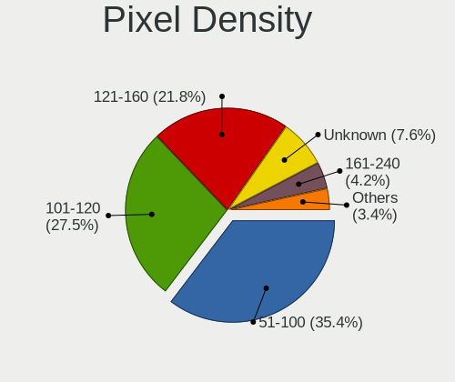

| Density       | Computers | Percent |
|---------------|-----------|---------|
| 51-100        | 560       | 34.13%  |
| 101-120       | 453       | 27.61%  |
| 121-160       | 365       | 22.24%  |
| Unknown       | 129       | 7.86%   |
| 161-240       | 78        | 4.75%   |
| 1-50          | 34        | 2.07%   |
| More than 240 | 22        | 1.34%   |

Multiple Monitors
-----------------

Total monitors connected

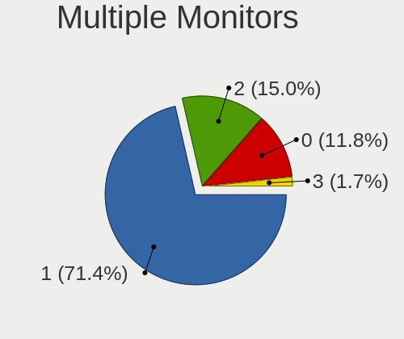

| Total | Computers | Percent |
|-------|-----------|---------|
| 1     | 1234      | 72.38%  |
| 2     | 257       | 15.07%  |
| 0     | 183       | 10.73%  |
| 3     | 31        | 1.82%   |

Network
-------

Net Controller Vendor
---------------------

Controller vendors

| Vendor                                 | Computers | Percent |
|----------------------------------------|-----------|---------|
| Realtek Semiconductor                  | 840       | 33.82%  |
| Intel                                  | 787       | 31.68%  |
| Qualcomm Atheros                       | 333       | 13.41%  |
| Broadcom                               | 132       | 5.31%   |
| Marvell Technology Group               | 45        | 1.81%   |
| Broadcom Limited                       | 36        | 1.45%   |
| Ralink Technology                      | 32        | 1.29%   |
| Ralink                                 | 26        | 1.05%   |
| Nvidia                                 | 21        | 0.85%   |
| TP-Link                                | 17        | 0.68%   |
| JMicron Technology                     | 13        | 0.52%   |
| ASIX Electronics                       | 13        | 0.52%   |
| Huawei Technologies                    | 12        | 0.48%   |
| Samsung Electronics                    | 10        | 0.4%    |
| Lenovo                                 | 9         | 0.36%   |
| Dell                                   | 8         | 0.32%   |
| D-Link System                          | 8         | 0.32%   |
| Qualcomm Atheros Communications        | 6         | 0.24%   |
| IBM                                    | 6         | 0.24%   |
| Ericsson Business Mobile Networks      | 6         | 0.24%   |
| ASUSTek Computer                       | 6         | 0.24%   |
| Aquantia                               | 6         | 0.24%   |
| Sierra Wireless                        | 5         | 0.2%    |
| Microchip Technology                   | 5         | 0.2%    |
| Xiaomi                                 | 4         | 0.16%   |
| Sundance Technology Inc / IC Plus      | 4         | 0.16%   |
| Microsoft                              | 4         | 0.16%   |
| Mellanox Technologies                  | 4         | 0.16%   |
| FIBOCOM                                | 4         | 0.16%   |
| Edimax Technology                      | 4         | 0.16%   |
| VIA Technologies                       | 3         | 0.12%   |
| Silicon Integrated Systems [SiS]       | 3         | 0.12%   |
| MediaTek                               | 3         | 0.12%   |
| Hewlett-Packard                        | 3         | 0.12%   |
| D-Link                                 | 3         | 0.12%   |
| Toshiba                                | 2         | 0.08%   |
| Spreadtrum Communications              | 2         | 0.08%   |
| Sony Ericsson Mobile Communications AB | 2         | 0.08%   |
| Qualcomm                               | 2         | 0.08%   |
| NetGear                                | 2         | 0.08%   |
| Motorola PCS                           | 2         | 0.08%   |
| Linksys                                | 2         | 0.08%   |
| HTC (High Tech Computer)               | 2         | 0.08%   |
| Emulex                                 | 2         | 0.08%   |
| DisplayLink                            | 2         | 0.08%   |
| Cypress Semiconductor                  | 2         | 0.08%   |
| American Megatrends                    | 2         | 0.08%   |
| 3Com                                   | 2         | 0.08%   |
| ZyXEL Communications                   | 1         | 0.04%   |
| ZEPHYR                                 | 1         | 0.04%   |
| YiHiEcigar                             | 1         | 0.04%   |
| Wilocity                               | 1         | 0.04%   |
| TRENDnet                               | 1         | 0.04%   |
| Texas Instruments                      | 1         | 0.04%   |
| SysKonnect                             | 1         | 0.04%   |
| STMicroelectronics                     | 1         | 0.04%   |
| Solarflare Communications              | 1         | 0.04%   |
| Sigma Designs                          | 1         | 0.04%   |
| SEGGER                                 | 1         | 0.04%   |
| Sega                                   | 1         | 0.04%   |

Net Controller Model
--------------------

Controller models

| Model                                                                   | Computers | Percent |
|-------------------------------------------------------------------------|-----------|---------|
| Realtek RTL8111/8168/8411 PCI Express Gigabit Ethernet Controller       | 606       | 20.54%  |
| Realtek RTL810xE PCI Express Fast Ethernet controller                   | 117       | 3.97%   |
| Intel 82579LM Gigabit Network Connection (Lewisville)                   | 74        | 2.51%   |
| Intel I211 Gigabit Network Connection                                   | 53        | 1.8%    |
| Qualcomm Atheros AR9285 Wireless Network Adapter (PCI-Express)          | 50        | 1.69%   |
| Qualcomm Atheros QCA9377 802.11ac Wireless Network Adapter              | 46        | 1.56%   |
| Qualcomm Atheros QCA9565 / AR9565 Wireless Network Adapter              | 45        | 1.53%   |
| Qualcomm Atheros AR9485 Wireless Network Adapter                        | 45        | 1.53%   |
| Intel Wireless 8265 / 8275                                              | 45        | 1.53%   |
| Intel Cannon Point-LP CNVi [Wireless-AC]                                | 44        | 1.49%   |
| Realtek RTL8153 Gigabit Ethernet Adapter                                | 38        | 1.29%   |
| Intel Wireless 7260                                                     | 37        | 1.25%   |
| Intel Wi-Fi 6 AX200                                                     | 36        | 1.22%   |
| Intel Centrino Advanced-N 6205 [Taylor Peak]                            | 34        | 1.15%   |
| Intel Wireless 7265                                                     | 33        | 1.12%   |
| Intel Wireless-AC 9260                                                  | 32        | 1.08%   |
| Qualcomm Atheros QCA6174 802.11ac Wireless Network Adapter              | 28        | 0.95%   |
| Intel Wireless 3165                                                     | 28        | 0.95%   |
| Intel Ethernet Connection (2) I219-V                                    | 25        | 0.85%   |
| Intel 82574L Gigabit Network Connection                                 | 25        | 0.85%   |
| Intel 82579V Gigabit Network Connection                                 | 24        | 0.81%   |
| Intel Dual Band Wireless-AC 3168NGW [Stone Peak]                        | 22        | 0.75%   |
| Realtek RTL8723BE PCIe Wireless Network Adapter                         | 21        | 0.71%   |
| Intel Wireless 8260                                                     | 21        | 0.71%   |
| Intel Ethernet Connection I217-LM                                       | 20        | 0.68%   |
| Intel Comet Lake PCH-LP CNVi WiFi                                       | 20        | 0.68%   |
| Realtek RTL8821CE 802.11ac PCIe Wireless Network Adapter                | 19        | 0.64%   |
| Broadcom BCM4313 802.11bgn Wireless Network Adapter                     | 19        | 0.64%   |
| Intel I210 Gigabit Network Connection                                   | 18        | 0.61%   |
| Realtek RTL8822BE 802.11a/b/g/n/ac WiFi adapter                         | 16        | 0.54%   |
| Intel Wireless 3160                                                     | 16        | 0.54%   |
| Intel Ethernet Connection (6) I219-V                                    | 16        | 0.54%   |
| Ralink MT7601U Wireless Adapter                                         | 15        | 0.51%   |
| Qualcomm Atheros AR9462 Wireless Network Adapter                        | 15        | 0.51%   |
| Intel Ethernet Connection I217-V                                        | 15        | 0.51%   |
| Intel Ethernet Connection (7) I219-V                                    | 15        | 0.51%   |
| Intel Cannon Lake PCH CNVi WiFi                                         | 15        | 0.51%   |
| Qualcomm Atheros AR8151 v2.0 Gigabit Ethernet                           | 14        | 0.47%   |
| Intel I350 Gigabit Network Connection                                   | 14        | 0.47%   |
| Intel Ethernet Connection (3) I218-LM                                   | 14        | 0.47%   |
| Intel Dual Band Wireless-AC 3165 Plus Bluetooth                         | 14        | 0.47%   |
| Realtek RTL8125 2.5GbE Controller                                       | 13        | 0.44%   |
| Qualcomm Atheros AR242x / AR542x Wireless Network Adapter (PCI-Express) | 13        | 0.44%   |
| Intel Ethernet Connection I218-LM                                       | 13        | 0.44%   |
| Intel 82577LM Gigabit Network Connection                                | 13        | 0.44%   |
| Intel WiFi Link 5100                                                    | 12        | 0.41%   |
| Intel Ethernet Connection I219-LM                                       | 12        | 0.41%   |
| Intel Ethernet Connection (4) I219-V                                    | 12        | 0.41%   |
| Intel Ethernet Connection (4) I219-LM                                   | 12        | 0.41%   |
| Intel Ethernet Connection (2) I218-V                                    | 12        | 0.41%   |
| Intel 82567LM Gigabit Network Connection                                | 12        | 0.41%   |
| Realtek RTL8188EUS 802.11n Wireless Network Adapter                     | 11        | 0.37%   |
| Realtek RTL8169 PCI Gigabit Ethernet Controller                         | 11        | 0.37%   |
| Marvell Group 88E8040 PCI-E Fast Ethernet Controller                    | 11        | 0.37%   |
| Intel Centrino Ultimate-N 6300                                          | 11        | 0.37%   |
| Realtek RTL8723BU 802.11b/g/n WLAN Adapter                              | 10        | 0.34%   |
| Intel Ethernet Connection (6) I219-LM                                   | 10        | 0.34%   |
| Intel 82567LM-3 Gigabit Network Connection                              | 10        | 0.34%   |
| Realtek RTL88x2bu [AC1200 Techkey]                                      | 9         | 0.31%   |
| Qualcomm Atheros QCA8171 Gigabit Ethernet                               | 9         | 0.31%   |

Wireless Vendor
---------------

Wireless vendors

| Vendor                                | Computers | Percent |
|---------------------------------------|-----------|---------|
| Intel                                 | 510       | 43.48%  |
| Qualcomm Atheros                      | 279       | 23.79%  |
| Realtek Semiconductor                 | 169       | 14.41%  |
| Broadcom                              | 74        | 6.31%   |
| Ralink Technology                     | 32        | 2.73%   |
| Ralink                                | 26        | 2.22%   |
| Broadcom Limited                      | 15        | 1.28%   |
| TP-Link                               | 13        | 1.11%   |
| Qualcomm Atheros Communications       | 6         | 0.51%   |
| ASUSTek Computer                      | 6         | 0.51%   |
| Sierra Wireless                       | 5         | 0.43%   |
| D-Link System                         | 5         | 0.43%   |
| Edimax Technology                     | 4         | 0.34%   |
| Microsoft                             | 3         | 0.26%   |
| Marvell Technology Group              | 3         | 0.26%   |
| Dell                                  | 3         | 0.26%   |
| D-Link                                | 3         | 0.26%   |
| NetGear                               | 2         | 0.17%   |
| Linksys                               | 2         | 0.17%   |
| Fibocom                               | 2         | 0.17%   |
| ZyXEL Communications                  | 1         | 0.09%   |
| Wilocity                              | 1         | 0.09%   |
| TRENDnet                              | 1         | 0.09%   |
| Qualcomm                              | 1         | 0.09%   |
| Micro Star International              | 1         | 0.09%   |
| MEDIATEK                              | 1         | 0.09%   |
| IMC Networks                          | 1         | 0.09%   |
| Hewlett-Packard                       | 1         | 0.09%   |
| Gemtek                                | 1         | 0.09%   |
| Cinterion                             | 1         | 0.09%   |
| 802.11g Adapter [Linksys WUSB54GC v3] | 1         | 0.09%   |

Wireless Model
--------------

Wireless models

| Model                                                                   | Computers | Percent |
|-------------------------------------------------------------------------|-----------|---------|
| Qualcomm Atheros AR9285 Wireless Network Adapter (PCI-Express)          | 50        | 4.23%   |
| Qualcomm Atheros QCA9377 802.11ac Wireless Network Adapter              | 46        | 3.89%   |
| Qualcomm Atheros QCA9565 / AR9565 Wireless Network Adapter              | 45        | 3.81%   |
| Qualcomm Atheros AR9485 Wireless Network Adapter                        | 45        | 3.81%   |
| Intel Wireless 8265 / 8275                                              | 45        | 3.81%   |
| Intel Cannon Point-LP CNVi [Wireless-AC]                                | 44        | 3.72%   |
| Intel Wireless 7260                                                     | 37        | 3.13%   |
| Intel Wi-Fi 6 AX200                                                     | 36        | 3.05%   |
| Intel Centrino Advanced-N 6205 [Taylor Peak]                            | 34        | 2.88%   |
| Intel Wireless 7265                                                     | 33        | 2.79%   |
| Intel Wireless-AC 9260                                                  | 32        | 2.71%   |
| Qualcomm Atheros QCA6174 802.11ac Wireless Network Adapter              | 28        | 2.37%   |
| Intel Wireless 3165                                                     | 28        | 2.37%   |
| Intel Dual Band Wireless-AC 3168NGW [Stone Peak]                        | 22        | 1.86%   |
| Realtek RTL8723BE PCIe Wireless Network Adapter                         | 21        | 1.78%   |
| Intel Wireless 8260                                                     | 21        | 1.78%   |
| Intel Comet Lake PCH-LP CNVi WiFi                                       | 20        | 1.69%   |
| Realtek RTL8821CE 802.11ac PCIe Wireless Network Adapter                | 19        | 1.61%   |
| Broadcom BCM4313 802.11bgn Wireless Network Adapter                     | 19        | 1.61%   |
| Realtek RTL8822BE 802.11a/b/g/n/ac WiFi adapter                         | 16        | 1.35%   |
| Intel Wireless 3160                                                     | 16        | 1.35%   |
| Ralink MT7601U Wireless Adapter                                         | 15        | 1.27%   |
| Qualcomm Atheros AR9462 Wireless Network Adapter                        | 15        | 1.27%   |
| Intel Cannon Lake PCH CNVi WiFi                                         | 15        | 1.27%   |
| Intel Dual Band Wireless-AC 3165 Plus Bluetooth                         | 14        | 1.18%   |
| Qualcomm Atheros AR242x / AR542x Wireless Network Adapter (PCI-Express) | 13        | 1.1%    |
| Intel WiFi Link 5100                                                    | 12        | 1.02%   |
| Realtek RTL8188EUS 802.11n Wireless Network Adapter                     | 11        | 0.93%   |
| Intel Centrino Ultimate-N 6300                                          | 11        | 0.93%   |
| Realtek RTL8723BU 802.11b/g/n WLAN Adapter                              | 10        | 0.85%   |
| Realtek RTL88x2bu [AC1200 Techkey]                                      | 9         | 0.76%   |
| Qualcomm Atheros AR93xx Wireless Network Adapter                        | 9         | 0.76%   |
| Intel Centrino Advanced-N 6200                                          | 9         | 0.76%   |
| Broadcom BCM43142 802.11b/g/n                                           | 9         | 0.76%   |
| Broadcom BCM4312 802.11b/g LP-PHY                                       | 9         | 0.76%   |
| Realtek RTL8821AE 802.11ac PCIe Wireless Network Adapter                | 8         | 0.68%   |
| Realtek RTL8188CE 802.11b/g/n WiFi Adapter                              | 8         | 0.68%   |
| Ralink RT5390 Wireless 802.11n 1T/1R PCIe                               | 8         | 0.68%   |
| Qualcomm Atheros AR928X Wireless Network Adapter (PCI-Express)          | 8         | 0.68%   |
| Intel PRO/Wireless 3945ABG [Golan] Network Connection                   | 8         | 0.68%   |
| Intel Centrino Wireless-N 1000 [Condor Peak]                            | 8         | 0.68%   |
| Intel Centrino Advanced-N 6235                                          | 8         | 0.68%   |
| Broadcom Limited BCM4312 802.11b/g LP-PHY                               | 8         | 0.68%   |
| Realtek RTL8191SEvB Wireless LAN Controller                             | 7         | 0.59%   |
| Qualcomm Atheros AR9287 Wireless Network Adapter (PCI-Express)          | 7         | 0.59%   |
| Intel Comet Lake PCH CNVi WiFi                                          | 7         | 0.59%   |
| Intel Centrino Wireless-N 2230                                          | 7         | 0.59%   |
| Realtek RTL8822CE 802.11ac PCIe Wireless Network Adapter                | 6         | 0.51%   |
| Ralink RT2870/RT3070 Wireless Adapter                                   | 6         | 0.51%   |
| Qualcomm Atheros AR9271 802.11n                                         | 6         | 0.51%   |
| Intel Wi-Fi 6 AX201                                                     | 6         | 0.51%   |
| Intel Ultimate N WiFi Link 5300                                         | 6         | 0.51%   |
| Intel Gemini Lake PCH CNVi WiFi                                         | 6         | 0.51%   |
| Broadcom BCM43228 802.11a/b/g/n                                         | 6         | 0.51%   |
| Realtek RTL8188FTV 802.11b/g/n 1T1R 2.4G WLAN Adapter                   | 5         | 0.42%   |
| Realtek RTL8188EE Wireless Network Adapter                              | 5         | 0.42%   |
| Ralink RT5370 Wireless Adapter                                          | 5         | 0.42%   |
| Qualcomm Atheros AR9227 Wireless Network Adapter                        | 5         | 0.42%   |
| Intel PRO/Wireless 5100 AGN [Shiloh] Network Connection                 | 5         | 0.42%   |
| Broadcom BCM4360 802.11ac Wireless Network Adapter                      | 5         | 0.42%   |

Ethernet Vendor
---------------

Ethernet vendors

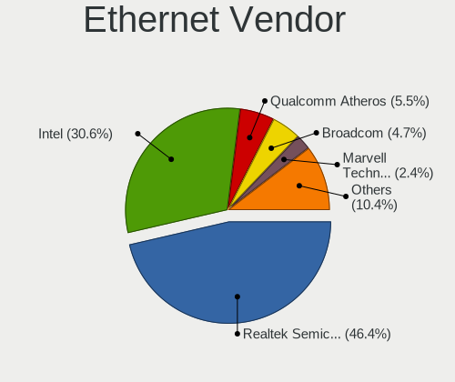

| Vendor                                 | Computers | Percent |
|----------------------------------------|-----------|---------|
| Realtek Semiconductor                  | 779       | 47.15%  |
| Intel                                  | 499       | 30.21%  |
| Qualcomm Atheros                       | 90        | 5.45%   |
| Broadcom                               | 71        | 4.3%    |
| Marvell Technology Group               | 42        | 2.54%   |
| Nvidia                                 | 21        | 1.27%   |
| Broadcom Limited                       | 21        | 1.27%   |
| JMicron Technology                     | 13        | 0.79%   |
| ASIX Electronics                       | 13        | 0.79%   |
| Samsung Electronics                    | 10        | 0.61%   |
| Lenovo                                 | 9         | 0.54%   |
| Huawei Technologies                    | 9         | 0.54%   |
| IBM                                    | 6         | 0.36%   |
| Aquantia                               | 6         | 0.36%   |
| Xiaomi                                 | 4         | 0.24%   |
| TP-Link                                | 4         | 0.24%   |
| Sundance Technology Inc / IC Plus      | 4         | 0.24%   |
| Microchip Technology                   | 4         | 0.24%   |
| Mellanox Technologies                  | 4         | 0.24%   |
| VIA Technologies                       | 3         | 0.18%   |
| Silicon Integrated Systems [SiS]       | 3         | 0.18%   |
| D-Link System                          | 3         | 0.18%   |
| Spreadtrum Communications              | 2         | 0.12%   |
| Sony Ericsson Mobile Communications AB | 2         | 0.12%   |
| MediaTek                               | 2         | 0.12%   |
| HTC (High Tech Computer)               | 2         | 0.12%   |
| Emulex                                 | 2         | 0.12%   |
| DisplayLink                            | 2         | 0.12%   |
| Cypress Semiconductor                  | 2         | 0.12%   |
| American Megatrends                    | 2         | 0.12%   |
| 3Com                                   | 2         | 0.12%   |
| SysKonnect                             | 1         | 0.06%   |
| Solarflare Communications              | 1         | 0.06%   |
| Qualcomm                               | 1         | 0.06%   |
| QLogic                                 | 1         | 0.06%   |
| OnePlus Technology (Shenzhen)          | 1         | 0.06%   |
| NetXen Incorporated                    | 1         | 0.06%   |
| Motorola PCS                           | 1         | 0.06%   |
| Microsoft                              | 1         | 0.06%   |
| Linux 3.4.39 with sunxi_usb_udc        | 1         | 0.06%   |
| LG Electronics                         | 1         | 0.06%   |
| Hewlett-Packard                        | 1         | 0.06%   |
| GCT Semiconductor                      | 1         | 0.06%   |
| Foxconn / Hon Hai                      | 1         | 0.06%   |
| FIBOCOM                                | 1         | 0.06%   |
| Attansic Technology                    | 1         | 0.06%   |
| Apple                                  | 1         | 0.06%   |

Ethernet Model
--------------

Ethernet models

| Model                                                                          | Computers | Percent |
|--------------------------------------------------------------------------------|-----------|---------|
| Realtek RTL8111/8168/8411 PCI Express Gigabit Ethernet Controller              | 606       | 35.25%  |
| Realtek RTL810xE PCI Express Fast Ethernet controller                          | 117       | 6.81%   |
| Intel 82579LM Gigabit Network Connection (Lewisville)                          | 74        | 4.3%    |
| Intel I211 Gigabit Network Connection                                          | 53        | 3.08%   |
| Realtek RTL8153 Gigabit Ethernet Adapter                                       | 38        | 2.21%   |
| Intel Ethernet Connection (2) I219-V                                           | 25        | 1.45%   |
| Intel 82574L Gigabit Network Connection                                        | 25        | 1.45%   |
| Intel 82579V Gigabit Network Connection                                        | 24        | 1.4%    |
| Intel Ethernet Connection I217-LM                                              | 20        | 1.16%   |
| Intel I210 Gigabit Network Connection                                          | 18        | 1.05%   |
| Intel Ethernet Connection (6) I219-V                                           | 16        | 0.93%   |
| Intel Ethernet Connection I217-V                                               | 15        | 0.87%   |
| Intel Ethernet Connection (7) I219-V                                           | 15        | 0.87%   |
| Qualcomm Atheros AR8151 v2.0 Gigabit Ethernet                                  | 14        | 0.81%   |
| Intel I350 Gigabit Network Connection                                          | 14        | 0.81%   |
| Intel Ethernet Connection (3) I218-LM                                          | 14        | 0.81%   |
| Realtek RTL8125 2.5GbE Controller                                              | 13        | 0.76%   |
| Intel Ethernet Connection I218-LM                                              | 13        | 0.76%   |
| Intel 82577LM Gigabit Network Connection                                       | 13        | 0.76%   |
| Intel Ethernet Connection I219-LM                                              | 12        | 0.7%    |
| Intel Ethernet Connection (4) I219-V                                           | 12        | 0.7%    |
| Intel Ethernet Connection (4) I219-LM                                          | 12        | 0.7%    |
| Intel Ethernet Connection (2) I218-V                                           | 12        | 0.7%    |
| Intel 82567LM Gigabit Network Connection                                       | 12        | 0.7%    |
| Realtek RTL8169 PCI Gigabit Ethernet Controller                                | 11        | 0.64%   |
| Marvell Group 88E8040 PCI-E Fast Ethernet Controller                           | 11        | 0.64%   |
| Intel Ethernet Connection (6) I219-LM                                          | 10        | 0.58%   |
| Intel 82567LM-3 Gigabit Network Connection                                     | 10        | 0.58%   |
| Qualcomm Atheros QCA8171 Gigabit Ethernet                                      | 9         | 0.52%   |
| Qualcomm Atheros Killer E2500 Gigabit Ethernet Controller                      | 9         | 0.52%   |
| Qualcomm Atheros AR8161 Gigabit Ethernet                                       | 9         | 0.52%   |
| Qualcomm Atheros AR8152 v2.0 Fast Ethernet                                     | 9         | 0.52%   |
| Qualcomm Atheros AR8131 Gigabit Ethernet                                       | 9         | 0.52%   |
| Nvidia MCP61 Ethernet                                                          | 9         | 0.52%   |
| Intel Ethernet Connection (2) I219-LM                                          | 9         | 0.52%   |
| Intel 82599ES 10-Gigabit SFI/SFP+ Network Connection                           | 9         | 0.52%   |
| Realtek RTL-8100/8101L/8139 PCI Fast Ethernet Adapter                          | 8         | 0.47%   |
| JMicron JMC250 PCI Express Gigabit Ethernet Controller                         | 7         | 0.41%   |
| Intel Ethernet Connection (7) I219-LM                                          | 7         | 0.41%   |
| Broadcom NetXtreme II BCM5709 Gigabit Ethernet                                 | 7         | 0.41%   |
| Broadcom NetLink BCM57785 Gigabit Ethernet PCIe                                | 7         | 0.41%   |
| Samsung Galaxy series, misc. (tethering mode)                                  | 6         | 0.35%   |
| Qualcomm Atheros Killer E220x Gigabit Ethernet Controller                      | 6         | 0.35%   |
| JMicron JMC260 PCI Express Fast Ethernet Controller                            | 6         | 0.35%   |
| Intel 82576 Gigabit Network Connection                                         | 6         | 0.35%   |
| IBM RNDIS/CDC ETHER                                                            | 6         | 0.35%   |
| Broadcom NetXtreme BCM5720 Gigabit Ethernet PCIe                               | 6         | 0.35%   |
| ASIX AX88179 Gigabit Ethernet                                                  | 6         | 0.35%   |
| Realtek RTL8152 Fast Ethernet Adapter                                          | 5         | 0.29%   |
| Qualcomm Atheros Attansic L2 Fast Ethernet                                     | 5         | 0.29%   |
| Qualcomm Atheros AR8121/AR8113/AR8114 Gigabit or Fast Ethernet                 | 5         | 0.29%   |
| Marvell Group Yukon Optima 88E8059 [PCIe Gigabit Ethernet Controller with AVB] | 5         | 0.29%   |
| Marvell Group 88E8056 PCI-E Gigabit Ethernet Controller                        | 5         | 0.29%   |
| Intel Ethernet Connection (10) I219-V                                          | 5         | 0.29%   |
| Intel 82571EB/82571GB Gigabit Ethernet Controller D0/D1 (copper applications)  | 5         | 0.29%   |
| Huawei JNY-LX1                                                                 | 5         | 0.29%   |
| Broadcom NetXtreme BCM57766 Gigabit Ethernet PCIe                              | 5         | 0.29%   |
| Broadcom NetXtreme BCM5761 Gigabit Ethernet PCIe                               | 5         | 0.29%   |
| Broadcom NetLink BCM57780 Gigabit Ethernet PCIe                                | 5         | 0.29%   |
| Aquantia AQC107 NBase-T/IEEE 802.3bz Ethernet Controller [AQtion]              | 5         | 0.29%   |

Net Controller Kind
-------------------

Ethernet, WiFi or modem

| Kind     | Computers | Percent |
|----------|-----------|---------|
| Ethernet | 1521      | 56.52%  |
| WiFi     | 1123      | 41.73%  |
| Modem    | 41        | 1.52%   |
| Unknown  | 6         | 0.22%   |

Used Controller
---------------

Currently used network controller

| Kind     | Computers | Percent |
|----------|-----------|---------|
| Ethernet | 1269      | 57.95%  |
| WiFi     | 915       | 41.78%  |
| Modem    | 3         | 0.14%   |
| Unknown  | 3         | 0.14%   |

NICs
----

Total network controllers on board

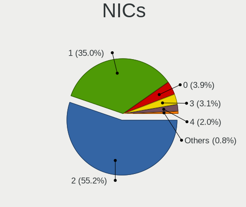

| Total | Computers | Percent |
|-------|-----------|---------|
| 2     | 947       | 56.27%  |
| 1     | 584       | 34.7%   |
| 0     | 66        | 3.92%   |
| 3     | 49        | 2.91%   |
| 4     | 26        | 1.54%   |
| 6     | 4         | 0.24%   |
| 5     | 3         | 0.18%   |
| 10    | 2         | 0.12%   |
| 21    | 1         | 0.06%   |
| 8     | 1         | 0.06%   |

IPv6
----

IPv6 vs IPv4

| Used | Computers | Percent |
|------|-----------|---------|
| No   | 1575      | 92.48%  |
| Yes  | 128       | 7.52%   |

Bluetooth
---------

Bluetooth Vendor
----------------

Controller vendors

| Vendor                          | Computers | Percent |
|---------------------------------|-----------|---------|
| Intel                           | 370       | 43.63%  |
| Qualcomm Atheros Communications | 104       | 12.26%  |
| Realtek Semiconductor           | 70        | 8.25%   |
| Broadcom                        | 60        | 7.08%   |
| Cambridge Silicon Radio         | 51        | 6.01%   |
| Lite-On Technology              | 31        | 3.66%   |
| ASUSTek Computer                | 31        | 3.66%   |
| IMC Networks                    | 23        | 2.71%   |
| Apple                           | 23        | 2.71%   |
| Foxconn / Hon Hai               | 20        | 2.36%   |
| Dell                            | 18        | 2.12%   |
| Hewlett-Packard                 | 15        | 1.77%   |
| Toshiba                         | 9         | 1.06%   |
| Ralink                          | 4         | 0.47%   |
| Alps Electric                   | 3         | 0.35%   |
| Unknown                         | 2         | 0.24%   |
| Foxconn International           | 2         | 0.24%   |
| Belkin Components               | 2         | 0.24%   |
| Realtek                         | 1         | 0.12%   |
| Ralink Technology               | 1         | 0.12%   |
| Marvell Semiconductor           | 1         | 0.12%   |
| Kensington                      | 1         | 0.12%   |
| Integrated System Solution      | 1         | 0.12%   |
| Fujitsu                         | 1         | 0.12%   |
| Edimax Technology               | 1         | 0.12%   |
| Com One                         | 1         | 0.12%   |
| Chicony Electronics             | 1         | 0.12%   |
| Askey Computer                  | 1         | 0.12%   |

Bluetooth Model
---------------

Controller models

| Model                                                                               | Computers | Percent |
|-------------------------------------------------------------------------------------|-----------|---------|
| Intel Bluetooth wireless interface                                                  | 171       | 20.12%  |
| Intel Bluetooth 9460/9560 Jefferson Peak (JfP)                                      | 62        | 7.29%   |
| Qualcomm Atheros  Bluetooth Device                                                  | 53        | 6.24%   |
| Cambridge Silicon Radio Bluetooth Dongle (HCI mode)                                 | 51        | 6%      |
| Realtek Bluetooth Radio                                                             | 37        | 4.35%   |
| Intel Bluetooth Device                                                              | 33        | 3.88%   |
| Intel AX200 Bluetooth                                                               | 32        | 3.76%   |
| Intel Wireless-AC 9260 Bluetooth Adapter                                            | 30        | 3.53%   |
| Intel Wireless-AC 3168 Bluetooth                                                    | 21        | 2.47%   |
| Realtek  Bluetooth 4.2 Adapter                                                      | 20        | 2.35%   |
| Lite-On Bluetooth Device                                                            | 17        | 2%      |
| Intel Centrino Bluetooth Wireless Transceiver                                       | 15        | 1.76%   |
| Qualcomm Atheros Bluetooth USB Host Controller                                      | 13        | 1.53%   |
| Qualcomm Atheros AR3012 Bluetooth 4.0                                               | 12        | 1.41%   |
| Qualcomm Atheros AR3011 Bluetooth                                                   | 12        | 1.41%   |
| IMC Networks Bluetooth Device                                                       | 12        | 1.41%   |
| Broadcom BCM2045B (BDC-2.1)                                                         | 12        | 1.41%   |
| Qualcomm Atheros QCA61x4 Bluetooth 4.0                                              | 9         | 1.06%   |
| Lite-On Atheros AR3012 Bluetooth                                                    | 9         | 1.06%   |
| Foxconn / Hon Hai Bluetooth Device                                                  | 9         | 1.06%   |
| Apple Bluetooth USB Host Controller                                                 | 9         | 1.06%   |
| Intel Centrino Advanced-N 6230 Bluetooth adapter                                    | 8         | 0.94%   |
| HP Bluetooth 2.0 Interface [Broadcom BCM2045]                                       | 8         | 0.94%   |
| Dell DW375 Bluetooth Module                                                         | 8         | 0.94%   |
| Broadcom BCM20702A0 Bluetooth 4.0                                                   | 8         | 0.94%   |
| Broadcom BCM20702 Bluetooth 4.0 [ThinkPad]                                          | 8         | 0.94%   |
| Realtek RTL8821A Bluetooth                                                          | 7         | 0.82%   |
| ASUS Bluetooth Adapter                                                              | 7         | 0.82%   |
| IMC Networks Bluetooth Radio                                                        | 6         | 0.71%   |
| ASUS Broadcom BCM20702A0 Bluetooth                                                  | 6         | 0.71%   |
| HP Broadcom 2070 Bluetooth Combo                                                    | 5         | 0.59%   |
| Broadcom BCM2045B (BDC-2.1) [Bluetooth Controller]                                  | 5         | 0.59%   |
| Apple Bluetooth HCI                                                                 | 5         | 0.59%   |
| Toshiba Bluetooth Device                                                            | 4         | 0.47%   |
| Realtek RTL8822BE Bluetooth 4.2 Adapter                                             | 4         | 0.47%   |
| Ralink RT3290 Bluetooth                                                             | 4         | 0.47%   |
| Dell Wireless 365 Bluetooth                                                         | 4         | 0.47%   |
| Broadcom BCM43142A0 Bluetooth 4.0                                                   | 4         | 0.47%   |
| Broadcom BCM2070 Bluetooth Device                                                   | 4         | 0.47%   |
| ASUS BCM20702A0                                                                     | 4         | 0.47%   |
| Apple Bluetooth Host Controller                                                     | 4         | 0.47%   |
| Qualcomm Atheros AR9462 Bluetooth                                                   | 3         | 0.35%   |
| Foxconn / Hon Hai Foxconn T77H114 BCM2070 [Single-Chip Bluetooth 2.1 + EDR Adapter] | 3         | 0.35%   |
| Foxconn / Hon Hai Broadcom Bluetooth 2.1 Device                                     | 3         | 0.35%   |
| Dell Wireless 355 Bluetooth                                                         | 3         | 0.35%   |
| Broadcom HP Portable Bumble Bee                                                     | 3         | 0.35%   |
| Apple Built-in Bluetooth 2.0+EDR HCI                                                | 3         | 0.35%   |
| Alps Electric BCM2046 Bluetooth Device                                              | 3         | 0.35%   |
| Unknown Bluetooth Device                                                            | 2         | 0.24%   |
| Toshiba Askey for                                                                   | 2         | 0.24%   |
| Realtek RTL8723B Bluetooth                                                          | 2         | 0.24%   |
| Qualcomm Atheros AR3011 Bluetooth (no firmware)                                     | 2         | 0.24%   |
| Lite-On Qualcomm Atheros Bluetooth                                                  | 2         | 0.24%   |
| Lite-On Atheros Bluetooth                                                           | 2         | 0.24%   |
| IMC Networks Atheros AR3012 Bluetooth 4.0 Adapter                                   | 2         | 0.24%   |
| IMC Networks Asus Integrated Bluetooth module [AR3011]                              | 2         | 0.24%   |
| Foxconn International BCM43142A0 Bluetooth module                                   | 2         | 0.24%   |
| Foxconn / Hon Hai Acer Module                                                       | 2         | 0.24%   |
| Dell BCM20702A0 Bluetooth Module                                                    | 2         | 0.24%   |
| Broadcom Bluetooth 2.0+eDR dongle                                                   | 2         | 0.24%   |

Sound
-----

Sound Vendor
------------

Sound card vendors

| Vendor                                          | Computers | Percent |
|-------------------------------------------------|-----------|---------|
| Intel                                           | 1195      | 56.69%  |
| AMD                                             | 377       | 17.88%  |
| Nvidia                                          | 339       | 16.08%  |
| C-Media Electronics                             | 31        | 1.47%   |
| Logitech                                        | 17        | 0.81%   |
| Creative Labs                                   | 12        | 0.57%   |
| Lenovo                                          | 9         | 0.43%   |
| GN Netcom                                       | 8         | 0.38%   |
| Texas Instruments                               | 7         | 0.33%   |
| Realtek Semiconductor                           | 7         | 0.33%   |
| Kingston Technology                             | 6         | 0.28%   |
| JMTek                                           | 6         | 0.28%   |
| Dell                                            | 6         | 0.28%   |
| Creative Technology                             | 6         | 0.28%   |
| VIA Technologies                                | 5         | 0.24%   |
| Plantronics                                     | 4         | 0.19%   |
| Silicon Integrated Systems [SiS]                | 3         | 0.14%   |
| Samsung Electronics                             | 3         | 0.14%   |
| Razer USA                                       | 3         | 0.14%   |
| Microsoft                                       | 3         | 0.14%   |
| Generalplus Technology                          | 3         | 0.14%   |
| Focusrite-Novation                              | 3         | 0.14%   |
| Corsair                                         | 3         | 0.14%   |
| XMOS                                            | 2         | 0.09%   |
| Sennheiser Communications                       | 2         | 0.09%   |
| Native Instruments                              | 2         | 0.09%   |
| Musical Fidelity                                | 2         | 0.09%   |
| Micro Star International                        | 2         | 0.09%   |
| Hewlett-Packard                                 | 2         | 0.09%   |
| Blue Microphones                                | 2         | 0.09%   |
| BEHRINGER International                         | 2         | 0.09%   |
| ASUSTek Computer                                | 2         | 0.09%   |
| Astro Gaming                                    | 2         | 0.09%   |
| AKAI Professional M.I.                          | 2         | 0.09%   |
| Yamaha                                          | 1         | 0.05%   |
| Veho                                            | 1         | 0.05%   |
| USB MICROPHONE                                  | 1         | 0.05%   |
| Tenx Technology                                 | 1         | 0.05%   |
| SteelSeries ApS                                 | 1         | 0.05%   |
| SmartlinkTechnology                             | 1         | 0.05%   |
| Shure                                           | 1         | 0.05%   |
| Shenzhen Riitek Technology                      | 1         | 0.05%   |
| Samson Technologies                             | 1         | 0.05%   |
| RODE Microphones                                | 1         | 0.05%   |
| Quanta                                          | 1         | 0.05%   |
| QinHeng Electronics                             | 1         | 0.05%   |
| Numark                                          | 1         | 0.05%   |
| M-Audio                                         | 1         | 0.05%   |
| Loongson Technology                             | 1         | 0.05%   |
| Licensed by Sony Computer Entertainment America | 1         | 0.05%   |
| Ketron                                          | 1         | 0.05%   |
| Huawei Technologies                             | 1         | 0.05%   |
| Guillemot                                       | 1         | 0.05%   |
| Giga-Byte Technology                            | 1         | 0.05%   |
| ESS Technology                                  | 1         | 0.05%   |
| EGO SYStems                                     | 1         | 0.05%   |
| Earth Computer Technologies                     | 1         | 0.05%   |
| Conrad Electronic SE                            | 1         | 0.05%   |
| Chicony Electronics                             | 1         | 0.05%   |
| Cambridge Silicon Radio                         | 1         | 0.05%   |

Sound Model
-----------

Sound card models

| Model                                                                                             | Computers | Percent |
|---------------------------------------------------------------------------------------------------|-----------|---------|
| Intel Sunrise Point-LP HD Audio                                                                   | 163       | 6.65%   |
| Intel 6 Series/C200 Series Chipset Family High Definition Audio Controller                        | 121       | 4.94%   |
| Intel 7 Series/C216 Chipset Family High Definition Audio Controller                               | 120       | 4.9%    |
| Intel 8 Series/C220 Series Chipset High Definition Audio Controller                               | 81        | 3.3%    |
| AMD SBx00 Azalia (Intel HDA)                                                                      | 74        | 3.02%   |
| Intel Xeon E3-1200 v3/4th Gen Core Processor HD Audio Controller                                  | 66        | 2.69%   |
| Intel NM10/ICH7 Family High Definition Audio Controller                                           | 66        | 2.69%   |
| Intel 82801I (ICH9 Family) HD Audio Controller                                                    | 66        | 2.69%   |
| Intel Cannon Point-LP High Definition Audio Controller                                            | 58        | 2.37%   |
| AMD FCH Azalia Controller                                                                         | 55        | 2.24%   |
| AMD Family 17h (Models 00h-0fh) HD Audio Controller                                               | 52        | 2.12%   |
| AMD Family 17h/19h HD Audio Controller                                                            | 51        | 2.08%   |
| Intel Cannon Lake PCH cAVS                                                                        | 50        | 2.04%   |
| Intel 5 Series/3400 Series Chipset High Definition Audio                                          | 50        | 2.04%   |
| AMD Raven/Raven2/Fenghuang HDMI/DP Audio Controller                                               | 49        | 2%      |
| Intel Haswell-ULT HD Audio Controller                                                             | 45        | 1.84%   |
| Intel 8 Series HD Audio Controller                                                                | 45        | 1.84%   |
| AMD Starship/Matisse HD Audio Controller                                                          | 44        | 1.8%    |
| Intel Wildcat Point-LP High Definition Audio Controller                                           | 37        | 1.51%   |
| Intel Broadwell-U Audio Controller                                                                | 37        | 1.51%   |
| Intel 100 Series/C230 Series Chipset Family HD Audio Controller                                   | 37        | 1.51%   |
| Nvidia GK208 HDMI/DP Audio Controller                                                             | 36        | 1.47%   |
| AMD Ellesmere HDMI Audio [Radeon RX 470/480 / 570/580/590]                                        | 34        | 1.39%   |
| Nvidia High Definition Audio Controller                                                           | 30        | 1.22%   |
| Intel 200 Series PCH HD Audio                                                                     | 30        | 1.22%   |
| Intel Atom/Celeron/Pentium Processor x5-E8000/J3xxx/N3xxx Series High Definition Audio Controller | 28        | 1.14%   |
| Nvidia GF108 High Definition Audio Controller                                                     | 26        | 1.06%   |
| Nvidia GP107GL High Definition Audio Controller                                                   | 25        | 1.02%   |
| Nvidia GP106 High Definition Audio Controller                                                     | 24        | 0.98%   |
| Intel 82801H (ICH8 Family) HD Audio Controller                                                    | 24        | 0.98%   |
| Intel Comet Lake PCH-LP cAVS                                                                      | 23        | 0.94%   |
| Intel Celeron N3350/Pentium N4200/Atom E3900 Series Audio Cluster                                 | 23        | 0.94%   |
| Nvidia GK107 HDMI Audio Controller                                                                | 21        | 0.86%   |
| AMD Kabini HDMI/DP Audio                                                                          | 20        | 0.82%   |
| Nvidia GM107 High Definition Audio Controller [GeForce 940MX]                                     | 19        | 0.78%   |
| Intel Celeron/Pentium Silver Processor High Definition Audio                                      | 19        | 0.78%   |
| AMD Caicos HDMI Audio [Radeon HD 6450 / 7450/8450/8490 OEM / R5 230/235/235X OEM]                 | 19        | 0.78%   |
| AMD Oland/Hainan/Cape Verde/Pitcairn HDMI Audio [Radeon HD 7000 Series]                           | 18        | 0.73%   |
| Intel Atom Processor Z36xxx/Z37xxx Series High Definition Audio Controller                        | 17        | 0.69%   |
| AMD Baffin HDMI/DP Audio [Radeon RX 550 640SP / RX 560/560X]                                      | 17        | 0.69%   |
| Nvidia TU106 High Definition Audio Controller                                                     | 16        | 0.65%   |
| Nvidia GF119 HDMI Audio Controller                                                                | 16        | 0.65%   |
| Intel CM238 HD Audio Controller                                                                   | 16        | 0.65%   |
| AMD Wrestler HDMI Audio                                                                           | 16        | 0.65%   |
| Nvidia TU116 High Definition Audio Controller                                                     | 15        | 0.61%   |
| Intel C600/X79 series chipset High Definition Audio Controller                                    | 15        | 0.61%   |
| Intel 9 Series Chipset Family HD Audio Controller                                                 | 15        | 0.61%   |
| AMD Cedar HDMI Audio [Radeon HD 5400/6300/7300 Series]                                            | 15        | 0.61%   |
| Intel Comet Lake PCH cAVS                                                                         | 12        | 0.49%   |
| Intel 82801JI (ICH10 Family) HD Audio Controller                                                  | 12        | 0.49%   |
| Nvidia GP104 High Definition Audio Controller                                                     | 11        | 0.45%   |
| AMD Kaveri HDMI/DP Audio Controller                                                               | 11        | 0.45%   |
| Nvidia MCP61 High Definition Audio                                                                | 10        | 0.41%   |
| Nvidia GM204 High Definition Audio Controller                                                     | 10        | 0.41%   |
| Intel C610/X99 series chipset HD Audio Controller                                                 | 10        | 0.41%   |
| AMD Turks HDMI Audio [Radeon HD 6500/6600 / 6700M Series]                                         | 10        | 0.41%   |
| AMD Family 15h (Models 60h-6fh) Audio Controller                                                  | 10        | 0.41%   |
| Intel 82801JD/DO (ICH10 Family) HD Audio Controller                                               | 9         | 0.37%   |
| Nvidia GP108 High Definition Audio Controller                                                     | 8         | 0.33%   |
| Nvidia GK104 HDMI Audio Controller                                                                | 8         | 0.33%   |

Memory
------

Memory Vendor
-------------

Memory module vendors

| Vendor              | Computers | Percent |
|---------------------|-----------|---------|
| Samsung Electronics | 220       | 18.41%  |
| SK Hynix            | 196       | 16.4%   |
| Kingston            | 181       | 15.15%  |
| Unknown             | 174       | 14.56%  |
| Micron Technology   | 94        | 7.87%   |
| Crucial             | 65        | 5.44%   |
| Corsair             | 53        | 4.44%   |
| G.Skill             | 38        | 3.18%   |
| Elpida              | 25        | 2.09%   |
| Ramaxel Technology  | 24        | 2.01%   |
| A-DATA Technology   | 17        | 1.42%   |
| Smart               | 13        | 1.09%   |
| Nanya Technology    | 13        | 1.09%   |
| Unknown (ABCD)      | 12        | 1%      |
| Transcend           | 10        | 0.84%   |
| Teikon              | 8         | 0.67%   |
| Patriot             | 4         | 0.33%   |
| Apacer              | 4         | 0.33%   |
| AMD                 | 4         | 0.33%   |
| Qimonda             | 3         | 0.25%   |
| Hewlett-Packard     | 3         | 0.25%   |
| 48spaces            | 3         | 0.25%   |
| Team                | 2         | 0.17%   |
| Silicon Power       | 2         | 0.17%   |
| PNY                 | 2         | 0.17%   |
| OSV                 | 2         | 0.17%   |
| GOODRAM             | 2         | 0.17%   |
| GeIL                | 2         | 0.17%   |
| Atermiter           | 2         | 0.17%   |
| Unknown (AB)        | 1         | 0.08%   |
| Unigen              | 1         | 0.08%   |
| Toshiba-0098        | 1         | 0.08%   |
| Textorm             | 1         | 0.08%   |
| Swissbit            | 1         | 0.08%   |
| SMART Brazil        | 1         | 0.08%   |
| SHARETRONIC         | 1         | 0.08%   |
| Qumo                | 1         | 0.08%   |
| PRINCETON           | 1         | 0.08%   |
| Positivo            | 1         | 0.08%   |
| HT Micron           | 1         | 0.08%   |
| HPE                 | 1         | 0.08%   |
| EVGA                | 1         | 0.08%   |
| CSX                 | 1         | 0.08%   |
| AVEXIR              | 1         | 0.08%   |
| Avant               | 1         | 0.08%   |
| A-DA                | 1         | 0.08%   |

Memory Model
------------

Memory module models

| Model                                                            | Computers | Percent |
|------------------------------------------------------------------|-----------|---------|
| SK Hynix RAM HMA81GS6AFR8N-UH 8GB SODIMM DDR4 2667MT/s           | 10        | 0.77%   |
| Samsung RAM M471B5273DH0-CH9 4096MB SODIMM DDR3 1334MT/s         | 10        | 0.77%   |
| Samsung RAM M471A5244CB0-CRC 4GB SODIMM DDR4 2667MT/s            | 10        | 0.77%   |
| SK Hynix RAM HMT451S6BFR8A-PB 4096MB SODIMM DDR3 1600MT/s        | 9         | 0.69%   |
| Unknown RAM Module 4096MB DIMM 1333MT/s                          | 8         | 0.61%   |
| Samsung RAM M471B5273CH0-CH9 4GB SODIMM DDR3 1334MT/s            | 8         | 0.61%   |
| Samsung RAM M471B5173DB0-YK0 4096MB SODIMM DDR3 1600MT/s         | 8         | 0.61%   |
| Micron RAM 8KTF51264HZ-1G6E1 4GB SODIMM DDR3 1600MT/s            | 8         | 0.61%   |
| Unknown RAM Module 2048MB DIMM DDR2 800MT/s                      | 7         | 0.54%   |
| SK Hynix RAM HMT351S6CFR8C-PB 4GB SODIMM DDR3 1600MT/s           | 7         | 0.54%   |
| Samsung RAM M471B5173EB0-YK0 4GB SODIMM DDR3 1600MT/s            | 7         | 0.54%   |
| Unknown RAM Module 2048MB SODIMM DDR3 1600MT/s                   | 6         | 0.46%   |
| Unknown (ABCD) RAM 123456789012345678 3GB SODIMM LPDDR4 2400MT/s | 6         | 0.46%   |
| Unknown (ABCD) RAM 123456789012345678 2GB DIMM LPDDR3 2400MT/s   | 6         | 0.46%   |
| SK Hynix RAM HYMP125S64CP8-S6 2GB SODIMM DDR 975MT/s             | 6         | 0.46%   |
| SK Hynix RAM HMA81GS6CJR8N-VK 8192MB SODIMM DDR4 2667MT/s        | 6         | 0.46%   |
| Samsung RAM M471B1G73EB0-YK0 8192MB SODIMM DDR3 1600MT/s         | 6         | 0.46%   |
| Samsung RAM M471A5244CB0-CTD 4096MB SODIMM DDR4 3266MT/s         | 6         | 0.46%   |
| Samsung RAM M471A1K43CB1-CRC 8GB SODIMM DDR4 2667MT/s            | 6         | 0.46%   |
| Micron RAM 16KTF51264HZ-1G6M1 4096MB SODIMM DDR3 1600MT/s        | 6         | 0.46%   |
| Kingston RAM KHX3200C16D4/8GX 8GB DIMM DDR4 3533MT/s             | 6         | 0.46%   |
| Unknown RAM Module 8192MB DIMM DDR3 1600MT/s                     | 5         | 0.38%   |
| SK Hynix RAM HMT41GS6BFR8A-PB 8192MB SODIMM DDR3 1600MT/s        | 5         | 0.38%   |
| SK Hynix RAM HMT41GS6AFR8A-PB 8GB SODIMM DDR3 1600MT/s           | 5         | 0.38%   |
| SK Hynix RAM HMA851S6AFR6N-UH 4096MB SODIMM DDR4 2667MT/s        | 5         | 0.38%   |
| Samsung RAM Module 16384MB SODIMM DDR4 2667MT/s                  | 5         | 0.38%   |
| Samsung RAM M471B5273DH0-CK0 4GB SODIMM DDR3 1600MT/s            | 5         | 0.38%   |
| Samsung RAM M471B5173QH0-YK0 4GB SODIMM DDR3 1600MT/s            | 5         | 0.38%   |
| Samsung RAM M471B1G73QH0-YK0 8GB SODIMM DDR3 1600MT/s            | 5         | 0.38%   |
| Samsung RAM M471B1G73DB0-YK0 8GB SODIMM DDR3 1600MT/s            | 5         | 0.38%   |
| Samsung RAM M471A1K43CB1-CTD 8192MB SODIMM DDR4 2667MT/s         | 5         | 0.38%   |
| Kingston RAM KHX2133C14D4/8G 8GB DIMM DDR4 2667MT/s              | 5         | 0.38%   |
| Kingston RAM 99U5471-054.A00LF 8GB DIMM DDR3 1600MT/s            | 5         | 0.38%   |
| Unknown RAM Module 4096MB DIMM DDR3 1333MT/s                     | 4         | 0.31%   |
| Unknown RAM Module 2048MB DIMM 800MT/s                           | 4         | 0.31%   |
| Unknown RAM Module 2048MB DIMM 667MT/s                           | 4         | 0.31%   |
| Unknown RAM Module 1024MB SODIMM DDR2                            | 4         | 0.31%   |
| SK Hynix RAM HMT451S6AFR8A-PB 4GB SODIMM DDR3 1600MT/s           | 4         | 0.31%   |
| SK Hynix RAM HMA82GS6JJR8N-VK 16GB SODIMM DDR4 2667MT/s          | 4         | 0.31%   |
| SK Hynix RAM HMA81GS6JJR8N-VK 8GB SODIMM DDR4 2667MT/s           | 4         | 0.31%   |
| Samsung RAM M471A1K43BB1-CTD 8192MB SODIMM DDR4 2667MT/s         | 4         | 0.31%   |
| Micron RAM 4ATS1G64HZ-2G6E1 8GB SODIMM DDR4 2667MT/s             | 4         | 0.31%   |
| Kingston RAM KHX2666C16/8G 8GB DIMM DDR4 3466MT/s                | 4         | 0.31%   |
| Kingston RAM 9965745-002.A00G 16384MB DIMM DDR4 3600MT/s         | 4         | 0.31%   |
| Kingston RAM 9905471-011.A00LF 4096MB DIMM DDR3 1600MT/s         | 4         | 0.31%   |
| Unknown RAM Module 8192MB DIMM 1600MT/s                          | 3         | 0.23%   |
| Unknown RAM Module 2048MB SODIMM DDR2 667MT/s                    | 3         | 0.23%   |
| Unknown RAM Module 2048MB SODIMM DDR2                            | 3         | 0.23%   |
| Unknown RAM Module 2048MB DIMM 1333MT/s                          | 3         | 0.23%   |
| Unknown RAM Module 1536MB SODIMM DDR3 1600MT/s                   | 3         | 0.23%   |
| Unknown RAM Module 1024MB SODIMM SDRAM                           | 3         | 0.23%   |
| Unknown RAM Module 1024MB DIMM DDR2                              | 3         | 0.23%   |
| SK Hynix RAM Module 8192MB Row Of Chips LPDDR3 2133MT/s          | 3         | 0.23%   |
| SK Hynix RAM HMT41GS6BFR8A-PB 8GB SODIMM DDR3 1600MT/s           | 3         | 0.23%   |
| SK Hynix RAM HMA82GS6CJR8N-VK 16GB SODIMM DDR4 2667MT/s          | 3         | 0.23%   |
| SK Hynix RAM HMA82GR7AFR8N-VK 16384MB DIMM DDR4 2667MT/s         | 3         | 0.23%   |
| Samsung RAM M471B5674QH0-YK0 2GB SODIMM DDR3 1600MT/s            | 3         | 0.23%   |
| Samsung RAM M471A2K43CB1-CTD 16GB SODIMM DDR4 2667MT/s           | 3         | 0.23%   |
| Samsung RAM M471A1K43DB1-CTD 8GB SODIMM DDR4 2667MT/s            | 3         | 0.23%   |
| Samsung RAM M471A1K43BB1-CRC 8192MB SODIMM DDR4 2667MT/s         | 3         | 0.23%   |

Memory Kind
-----------

Memory module kinds

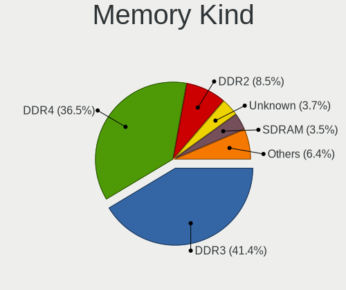

| Kind    | Computers | Percent |
|---------|-----------|---------|
| DDR3    | 440       | 42.11%  |
| DDR4    | 380       | 36.36%  |
| DDR2    | 90        | 8.61%   |
| Unknown | 42        | 4.02%   |
| SDRAM   | 34        | 3.25%   |
| LPDDR4  | 26        | 2.49%   |
| LPDDR3  | 17        | 1.63%   |
| DDR     | 9         | 0.86%   |
| DRAM    | 6         | 0.57%   |
| RAM     | 1         | 0.1%    |

Memory Form Factor
------------------

Physical design of the memory module

| Name         | Computers | Percent |
|--------------|-----------|---------|
| SODIMM       | 536       | 51.89%  |
| DIMM         | 462       | 44.72%  |
| Row Of Chips | 22        | 2.13%   |
| Unknown      | 7         | 0.68%   |
| FB-DIMM      | 3         | 0.29%   |
| Chip         | 3         | 0.29%   |

Memory Size
-----------

Memory module size

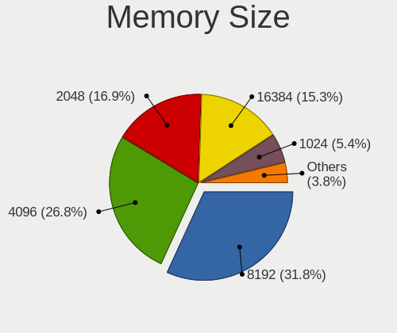

| Size  | Computers | Percent |
|-------|-----------|---------|
| 8192  | 357       | 31.1%   |
| 4096  | 333       | 29.01%  |
| 2048  | 196       | 17.07%  |
| 16384 | 162       | 14.11%  |
| 1024  | 65        | 5.66%   |
| 32768 | 17        | 1.48%   |
| 512   | 11        | 0.96%   |
| 1536  | 3         | 0.26%   |
| 256   | 3         | 0.26%   |
| 128   | 1         | 0.09%   |

Memory Speed
------------

Memory module speed

| Speed   | Computers | Percent |
|---------|-----------|---------|
| 1600    | 298       | 26.19%  |
| 2667    | 164       | 14.41%  |
| 2400    | 95        | 8.35%   |
| 1333    | 88        | 7.73%   |
| 2133    | 71        | 6.24%   |
| 800     | 46        | 4.04%   |
| 3200    | 45        | 3.95%   |
| 667     | 43        | 3.78%   |
| 1334    | 40        | 3.51%   |
| Unknown | 37        | 3.25%   |
| 1067    | 17        | 1.49%   |
| 1867    | 16        | 1.41%   |
| 1066    | 15        | 1.32%   |
| 3600    | 14        | 1.23%   |
| 2666    | 13        | 1.14%   |
| 533     | 11        | 0.97%   |
| 1866    | 10        | 0.88%   |
| 2933    | 9         | 0.79%   |
| 975     | 9         | 0.79%   |
| 400     | 9         | 0.79%   |
| 3000    | 8         | 0.7%    |
| 3466    | 7         | 0.62%   |
| 2048    | 7         | 0.62%   |
| 3533    | 6         | 0.53%   |
| 3266    | 6         | 0.53%   |
| 4199    | 5         | 0.44%   |
| 3400    | 5         | 0.44%   |
| 3334    | 4         | 0.35%   |
| 4267    | 3         | 0.26%   |
| 3333    | 3         | 0.26%   |
| 3151    | 3         | 0.26%   |
| 333     | 3         | 0.26%   |
| 3100    | 2         | 0.18%   |
| 2800    | 2         | 0.18%   |
| 2200    | 2         | 0.18%   |
| 1776    | 2         | 0.18%   |
| 1639    | 2         | 0.18%   |
| 1332    | 2         | 0.18%   |
| 49926   | 1         | 0.09%   |
| 3866    | 1         | 0.09%   |
| 3800    | 1         | 0.09%   |
| 3733    | 1         | 0.09%   |
| 3666    | 1         | 0.09%   |
| 3500    | 1         | 0.09%   |
| 3066    | 1         | 0.09%   |
| 2747    | 1         | 0.09%   |
| 2473    | 1         | 0.09%   |
| 2187    | 1         | 0.09%   |
| 2176    | 1         | 0.09%   |
| 2134    | 1         | 0.09%   |
| 1800    | 1         | 0.09%   |
| 1400    | 1         | 0.09%   |
| 933     | 1         | 0.09%   |
| 266     | 1         | 0.09%   |

Printers & scanners
-------------------

Printer Vendor
--------------

Printer device vendors

| Vendor              | Computers | Percent |
|---------------------|-----------|---------|
| Hewlett-Packard     | 16        | 39.02%  |
| Brother Industries  | 5         | 12.2%   |
| Samsung Electronics | 4         | 9.76%   |
| Canon               | 4         | 9.76%   |
| Seiko Epson         | 3         | 7.32%   |
| Kyocera             | 2         | 4.88%   |
| Datamax-O'Neil      | 2         | 4.88%   |
| Zebra               | 1         | 2.44%   |
| STMicroelectronics  | 1         | 2.44%   |
| Prolific Technology | 1         | 2.44%   |
| Oki Data            | 1         | 2.44%   |
| Dell                | 1         | 2.44%   |

Printer Model
-------------

Printer device models

| Model                                                     | Computers | Percent |
|-----------------------------------------------------------|-----------|---------|
| HP LaserJet 1020                                          | 3         | 7.14%   |
| Brother HL-52x0 series                                    | 3         | 7.14%   |
| Datamax-O'Neil Datamax E-4304                             | 2         | 4.76%   |
| Zebra ZTC S4M-200dpi ZPL                                  | 1         | 2.38%   |
| STMicroelectronics LED badge -- mini LED display -- 11x44 | 1         | 2.38%   |
| Seiko Epson XP-15000 Series                               | 1         | 2.38%   |
| Seiko Epson Printer                                       | 1         | 2.38%   |
| Seiko Epson AL-M310DN                                     | 1         | 2.38%   |
| Samsung SCX-4600 Series                                   | 1         | 2.38%   |
| Samsung SCX-3400 Series                                   | 1         | 2.38%   |
| Samsung ML-216x Series Laser Printer                      | 1         | 2.38%   |
| Samsung CLX-3300 Series                                   | 1         | 2.38%   |
| Prolific PL2305 Parallel Port                             | 1         | 2.38%   |
| Oki Data USB Device                                       | 1         | 2.38%   |
| Kyocera FS-1120D                                          | 1         | 2.38%   |
| Kyocera ECOSYS P2335d                                     | 1         | 2.38%   |
| HP PhotoSmart P1000                                       | 1         | 2.38%   |
| HP OfficeJet 3830 series                                  | 1         | 2.38%   |
| HP LaserJet Pro M404-M405                                 | 1         | 2.38%   |
| HP LaserJet P1102                                         | 1         | 2.38%   |
| HP LaserJet M14-M17                                       | 1         | 2.38%   |
| HP EWS UPD                                                | 1         | 2.38%   |
| HP ENVY Photo 6200 series                                 | 1         | 2.38%   |
| HP DeskJet Plus 4100 series                               | 1         | 2.38%   |
| HP DeskJet 6122                                           | 1         | 2.38%   |
| HP DeskJet 5850c                                          | 1         | 2.38%   |
| HP DeskJet 2700 series                                    | 1         | 2.38%   |
| HP Deskjet 2540 series                                    | 1         | 2.38%   |
| HP DeskJet 2130 series                                    | 1         | 2.38%   |
| HP Deskjet 1050 J410                                      | 1         | 2.38%   |
| Dell B1160w Mono Laser Printer                            | 1         | 2.38%   |
| Canon TS6400 series                                       | 1         | 2.38%   |
| Canon PIXMA MG3600 Series                                 | 1         | 2.38%   |
| Canon PIXMA MG2500 Series                                 | 1         | 2.38%   |
| Canon MB5300 series                                       | 1         | 2.38%   |
| Brother Printer                                           | 1         | 2.38%   |
| Brother HL-2220 series                                    | 1         | 2.38%   |

Scanner Vendor
--------------

Scanner device vendors

| Vendor             | Computers | Percent |
|--------------------|-----------|---------|
| Canon              | 6         | 46.15%  |
| Seiko Epson        | 3         | 23.08%  |
| Mustek Systems     | 2         | 15.38%  |
| Ultima Electronics | 1         | 7.69%   |
| Hewlett-Packard    | 1         | 7.69%   |

Scanner Model
-------------

Scanner device models

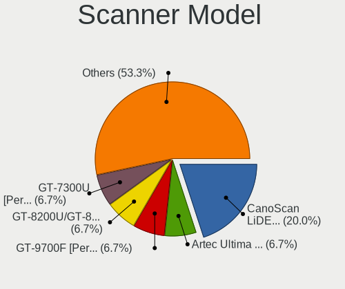

| Model                                                                                 | Computers | Percent |
|---------------------------------------------------------------------------------------|-----------|---------|
| Canon CanoScan LiDE 110                                                               | 3         | 23.08%  |
| Ultima Artec Ultima 2000 (GT6801 based)/Lifetec LT9385/ScanMagic 1200 UB Plus Scanner | 1         | 7.69%   |
| Seiko Epson GT-9700F [Perfection 2450 PHOTO]                                          | 1         | 7.69%   |
| Seiko Epson GT-8200U/GT-8200UF [Perfection 1650/1650 PHOTO]                           | 1         | 7.69%   |
| Seiko Epson GT-7300U [Perfection 1260/1260 PHOTO]                                     | 1         | 7.69%   |
| Mustek Systems SNAPSCAN e22                                                           | 1         | 7.69%   |
| Mustek Systems BearPaw 2448 TA Pro                                                    | 1         | 7.69%   |
| HP ScanJet 7650                                                                       | 1         | 7.69%   |
| Canon CanoScan N670U/N676U/LiDE 20                                                    | 1         | 7.69%   |
| Canon CanoScan LiDE 210                                                               | 1         | 7.69%   |
| Canon CanoScan 9000F Mark II                                                          | 1         | 7.69%   |

Camera
------

Camera Vendor
-------------

Camera device vendors

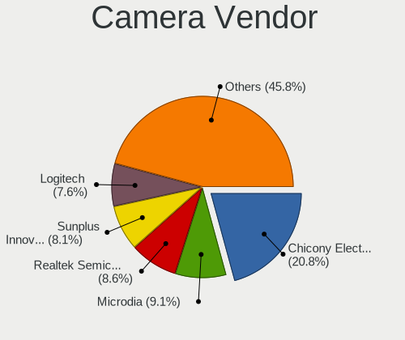

| Vendor                                 | Computers | Percent |
|----------------------------------------|-----------|---------|
| Chicony Electronics                    | 186       | 21.06%  |
| Microdia                               | 78        | 8.83%   |
| Realtek Semiconductor                  | 77        | 8.72%   |
| Sunplus Innovation Technology          | 74        | 8.38%   |
| Acer                                   | 71        | 8.04%   |
| Logitech                               | 67        | 7.59%   |
| IMC Networks                           | 58        | 6.57%   |
| Suyin                                  | 32        | 3.62%   |
| Cheng Uei Precision Industry (Foxlink) | 22        | 2.49%   |
| Quanta                                 | 21        | 2.38%   |
| Lite-On Technology                     | 21        | 2.38%   |
| Apple                                  | 20        | 2.27%   |
| Silicon Motion                         | 18        | 2.04%   |
| Syntek                                 | 17        | 1.93%   |
| Alcor Micro                            | 17        | 1.93%   |
| Ricoh                                  | 11        | 1.25%   |
| Lenovo                                 | 10        | 1.13%   |
| Samsung Electronics                    | 9         | 1.02%   |
| Z-Star Microelectronics                | 8         | 0.91%   |
| Microsoft                              | 8         | 0.91%   |
| Primax Electronics                     | 5         | 0.57%   |
| Generalplus Technology                 | 5         | 0.57%   |
| Jieli Technology                       | 4         | 0.45%   |
| GEMBIRD                                | 4         | 0.45%   |
| ALi                                    | 4         | 0.45%   |
| OmniVision Technologies                | 3         | 0.34%   |
| Genesys Logic                          | 3         | 0.34%   |
| Tobii Technology AB                    | 2         | 0.23%   |
| Luxvisions Innotech Limited            | 2         | 0.23%   |
| Importek                               | 2         | 0.23%   |
| Huawei Technologies                    | 2         | 0.23%   |
| Hewlett-Packard                        | 2         | 0.23%   |
| Cubeternet                             | 2         | 0.23%   |
| Aveo Technology                        | 2         | 0.23%   |
| Xiongmai                               | 1         | 0.11%   |
| USB Camera                             | 1         | 0.11%   |
| Unknown                                | 1         | 0.11%   |
| Trust                                  | 1         | 0.11%   |
| Sunplus Technology                     | 1         | 0.11%   |
| Spreadtrum Communications              | 1         | 0.11%   |
| Pixart Imaging                         | 1         | 0.11%   |
| Philips (or NXP)                       | 1         | 0.11%   |
| MacroSilicon                           | 1         | 0.11%   |
| GenesysLogic Technology                | 1         | 0.11%   |
| Fitipower Integrated Technology        | 1         | 0.11%   |
| eMPIA Technology                       | 1         | 0.11%   |
| DigiTech                               | 1         | 0.11%   |
| Denron                                 | 1         | 0.11%   |
| Creative Technology                    | 1         | 0.11%   |
| ARC International                      | 1         | 0.11%   |

Camera Model
------------

Camera device models

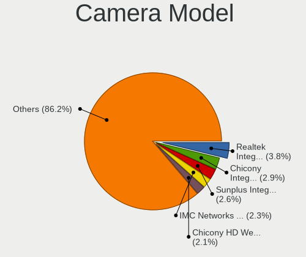

| Model                                    | Computers | Percent |
|------------------------------------------|-----------|---------|
| Realtek Integrated_Webcam_HD             | 34        | 3.83%   |
| Chicony Integrated Camera                | 25        | 2.82%   |
| Sunplus Integrated_Webcam_HD             | 23        | 2.59%   |
| Chicony HD WebCam                        | 22        | 2.48%   |
| IMC Networks Integrated Camera           | 21        | 2.36%   |
| Acer Integrated Camera                   | 17        | 1.91%   |
| Microdia Integrated_Webcam_HD            | 15        | 1.69%   |
| Logitech Webcam C270                     | 14        | 1.58%   |
| Logitech HD Pro Webcam C920              | 13        | 1.46%   |
| Acer Lenovo EasyCamera                   | 13        | 1.46%   |
| Sunplus HD WebCam                        | 11        | 1.24%   |
| Lite-On Integrated Camera                | 11        | 1.24%   |
| IMC Networks USB2.0 HD UVC WebCam        | 11        | 1.24%   |
| Acer SunplusIT Integrated Camera         | 11        | 1.24%   |
| Samsung Galaxy A5 (MTP)                  | 9         | 1.01%   |
| Microdia Integrated Webcam               | 9         | 1.01%   |
| Chicony HP HD Camera                     | 9         | 1.01%   |
| Microdia Laptop_Integrated_Webcam_HD     | 8         | 0.9%    |
| IMC Networks USB2.0 VGA UVC WebCam       | 8         | 0.9%    |
| Chicony EasyCamera                       | 8         | 0.9%    |
| Syntek Integrated Camera                 | 7         | 0.79%   |
| Chicony Integrated Camera (1280x720@30)  | 7         | 0.79%   |
| Apple iPhone 5/5C/5S/6/SE                | 7         | 0.79%   |
| Sunplus Laptop_Integrated_Webcam_FHD     | 6         | 0.68%   |
| Sunplus Asus Webcam                      | 6         | 0.68%   |
| Realtek Integrated Webcam                | 6         | 0.68%   |
| Logitech HD Webcam C525                  | 6         | 0.68%   |
| Logitech C922 Pro Stream Webcam          | 6         | 0.68%   |
| Lenovo Integrated Webcam [R5U877]        | 6         | 0.68%   |
| Apple FaceTime HD Camera (Built-in)      | 6         | 0.68%   |
| Alcor Micro USB 2.0 Web Camera           | 6         | 0.68%   |
| Acer EasyCamera                          | 6         | 0.68%   |
| Sunplus Laptop Integrated Webcam HD      | 5         | 0.56%   |
| Realtek USB2.0 VGA UVC WebCam            | 5         | 0.56%   |
| Realtek USB2.0 HD UVC WebCam             | 5         | 0.56%   |
| Realtek HD WebCam                        | 5         | 0.56%   |
| Quanta HP HD Camera                      | 5         | 0.56%   |
| Microsoft LifeCam HD-3000                | 5         | 0.56%   |
| Microdia USB 2.0 Camera                  | 5         | 0.56%   |
| Lite-On HP HD Camera                     | 5         | 0.56%   |
| Chicony USB2.0 VGA UVC WebCam            | 5         | 0.56%   |
| Chicony USB2.0 HD UVC WebCam             | 5         | 0.56%   |
| Chicony USB2.0 Camera                    | 5         | 0.56%   |
| Chicony HP TrueVision HD Camera          | 5         | 0.56%   |
| Chicony HP HD Webcam                     | 5         | 0.56%   |
| Acer ThinkPad Integrated Camera          | 5         | 0.56%   |
| Acer SunplusIT INC. Integrated Camera    | 5         | 0.56%   |
| Suyin Integrated_Webcam_HD               | 4         | 0.45%   |
| Suyin HP TrueVision HD Integrated Webcam | 4         | 0.45%   |
| Suyin HP Truevision HD                   | 4         | 0.45%   |
| Sunplus HP HD Webcam [Fixed]             | 4         | 0.45%   |
| Ricoh Sony Vaio Integrated Webcam        | 4         | 0.45%   |
| Realtek EasyCamera                       | 4         | 0.45%   |
| Quanta HP TrueVision HD Camera           | 4         | 0.45%   |
| Primax HP HD Webcam [Fixed]              | 4         | 0.45%   |
| Microdia Integrated_Webcam_FHD           | 4         | 0.45%   |
| Microdia HP Webcam                       | 4         | 0.45%   |
| Logitech Webcam C170                     | 4         | 0.45%   |
| Logitech HD Webcam C910                  | 4         | 0.45%   |
| Jieli USB PHY 2.0                        | 4         | 0.45%   |

Security
--------

Fingerprint Vendor
------------------

Fingerprint sensor vendors

| Vendor                     | Computers | Percent |
|----------------------------|-----------|---------|
| Validity Sensors           | 59        | 34.71%  |
| Synaptics                  | 52        | 30.59%  |
| AuthenTec                  | 17        | 10%     |
| Shenzhen Goodix Technology | 13        | 7.65%   |
| Upek                       | 11        | 6.47%   |
| Elan Microelectronics      | 11        | 6.47%   |
| LighTuning Technology      | 4         | 2.35%   |
| STMicroelectronics         | 1         | 0.59%   |
| Samsung Electronics        | 1         | 0.59%   |
| Microsoft                  | 1         | 0.59%   |

Fingerprint Model
-----------------

Fingerprint sensor models

| Model                                                                      | Computers | Percent |
|----------------------------------------------------------------------------|-----------|---------|
| Synaptics Prometheus MIS Touch Fingerprint Reader                          | 21        | 12.35%  |
| Validity Sensors VFS 5011 fingerprint sensor                               | 12        | 7.06%   |
| Validity Sensors VFS5011 Fingerprint Reader                                | 11        | 6.47%   |
| Validity Sensors VFS495 Fingerprint Reader                                 | 11        | 6.47%   |
| Upek Biometric Touchchip/Touchstrip Fingerprint Sensor                     | 10        | 5.88%   |
| Synaptics Metallica MOH Touch Fingerprint Reader                           | 10        | 5.88%   |
| AuthenTec AES2810                                                          | 10        | 5.88%   |
| Elan ELAN:Fingerprint                                                      | 8         | 4.71%   |
| Validity Sensors Synaptics VFS7552 Touch Fingerprint Sensor with PurePrint | 6         | 3.53%   |
| Synaptics  WBDI                                                            | 6         | 3.53%   |
| Shenzhen Goodix Fingerprint Reader                                         | 6         | 3.53%   |
| Shenzhen Goodix  FingerPrint Device                                        | 5         | 2.94%   |
| Unknown                                                                    | 5         | 2.94%   |
| Validity Sensors Swipe Fingerprint Sensor                                  | 4         | 2.35%   |
| Synaptics  VFS7552 Touch Fingerprint Sensor with PurePrint                 | 4         | 2.35%   |
| LighTuning EgisTec Touch Fingerprint Sensor                                | 4         | 2.35%   |
| Validity Sensors VFS491                                                    | 3         | 1.76%   |
| Validity Sensors VFS471 Fingerprint Reader                                 | 3         | 1.76%   |
| Synaptics Metallica MIS Touch Fingerprint Reader                           | 3         | 1.76%   |
| Elan ELAN:ARM-M4                                                           | 3         | 1.76%   |
| AuthenTec AES2501 Fingerprint Sensor                                       | 3         | 1.76%   |
| Validity Sensors VFS Fingerprint sensor                                    | 2         | 1.18%   |
| Validity Sensors Synaptics WBDI                                            | 2         | 1.18%   |
| Validity Sensors Fingerprint scanner                                       | 2         | 1.18%   |
| Synaptics  FS7604 Touch Fingerprint Sensor with PurePrint                  | 2         | 1.18%   |
| Shenzhen Goodix FingerPrint                                                | 2         | 1.18%   |
| AuthenTec Fingerprint Sensor                                               | 2         | 1.18%   |
| Validity Sensors VFS7500 Touch Fingerprint Sensor                          | 1         | 0.59%   |
| Validity Sensors VFS451 Fingerprint Reader                                 | 1         | 0.59%   |
| Validity Sensors Synaptics VFS7552 Touch Fingerprint Sensor                | 1         | 0.59%   |
| Upek TCS5B Fingerprint sensor                                              | 1         | 0.59%   |
| Synaptics WBDI Device                                                      | 1         | 0.59%   |
| STMicroelectronics Fingerprint Reader                                      | 1         | 0.59%   |
| Samsung Fingerprint Device                                                 | 1         | 0.59%   |
| Microsoft Fingerprint Reader                                               | 1         | 0.59%   |
| AuthenTec AES2550 Fingerprint Sensor                                       | 1         | 0.59%   |
| AuthenTec AES1660 Fingerprint Sensor                                       | 1         | 0.59%   |

Chipcard Vendor
---------------

Chipcard module vendors

| Vendor                    | Computers | Percent |
|---------------------------|-----------|---------|
| Broadcom                  | 39        | 42.86%  |
| Alcor Micro               | 26        | 28.57%  |
| Lenovo                    | 6         | 6.59%   |
| Upek                      | 5         | 5.49%   |
| O2 Micro                  | 4         | 4.4%    |
| Clay Logic                | 3         | 3.3%    |
| Yubico.com                | 1         | 1.1%    |
| SCM Microsystems          | 1         | 1.1%    |
| Reiner SCT Kartensysteme  | 1         | 1.1%    |
| Realtek Semiconductor     | 1         | 1.1%    |
| Gemalto (was Gemplus)     | 1         | 1.1%    |
| Chicony Electronics       | 1         | 1.1%    |
| Aladdin Knowledge Systems | 1         | 1.1%    |
| Advanced Card Systems     | 1         | 1.1%    |

Chipcard Model
--------------

Chipcard module models

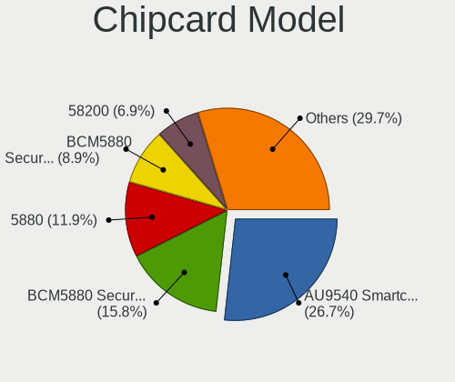

| Model                                                                        | Computers | Percent |
|------------------------------------------------------------------------------|-----------|---------|
| Alcor Micro AU9540 Smartcard Reader                                          | 26        | 28.57%  |
| Broadcom BCM5880 Secure Applications Processor                               | 14        | 15.38%  |
| Broadcom 5880                                                                | 11        | 12.09%  |
| Broadcom BCM5880 Secure Applications Processor with fingerprint swipe sensor | 7         | 7.69%   |
| Broadcom 58200                                                               | 7         | 7.69%   |
| Lenovo Integrated Smart Card Reader                                          | 6         | 6.59%   |
| Upek TouchChip Fingerprint Coprocessor (WBF advanced mode)                   | 5         | 5.49%   |
| O2 Micro OZ776 CCID Smartcard Reader                                         | 4         | 4.4%    |
| Clay Logic Nitrokey Start                                                    | 2         | 2.2%    |
| Yubico.com Yubikey 4/5 U2F+CCID                                              | 1         | 1.1%    |
| SCM Microsystems SCR335 SmartCard Reader                                     | 1         | 1.1%    |
| Reiner SCT Kartensysteme cyberJack RFID basis contactless smartcard reader   | 1         | 1.1%    |
| Realtek Semiconductor Smart Card Reader Interface                            | 1         | 1.1%    |
| Gemalto (was Gemplus) Compact Smart Card Reader Writer                       | 1         | 1.1%    |
| Clay Logic Nitrokey Pro                                                      | 1         | 1.1%    |
| Chicony Electronics HP Skylab USB Smartcard Keyboard                         | 1         | 1.1%    |
| Aladdin Knowledge Systems Token JC                                           | 1         | 1.1%    |
| Advanced Card Systems ACR38 SmartCard Reader                                 | 1         | 1.1%    |

Unsupported
-----------

Unsupported Devices
-------------------

Total unsupported devices on board

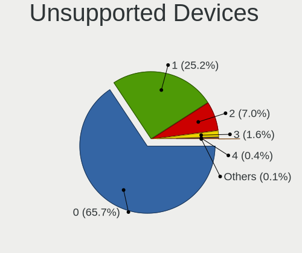

| Total | Computers | Percent |
|-------|-----------|---------|
| 0     | 1164      | 68.11%  |
| 1     | 406       | 23.76%  |
| 2     | 109       | 6.38%   |
| 3     | 22        | 1.29%   |
| 4     | 6         | 0.35%   |
| 6     | 2         | 0.12%   |

Unsupported Device Types
------------------------

Types of unsupported devices

| Type                     | Computers | Percent |
|--------------------------|-----------|---------|
| Fingerprint reader       | 169       | 24.78%  |
| Graphics card            | 162       | 23.75%  |
| Chipcard                 | 80        | 11.73%  |
| Net/wireless             | 79        | 11.58%  |
| Multimedia controller    | 34        | 4.99%   |
| Communication controller | 34        | 4.99%   |
| Unassigned class         | 26        | 3.81%   |
| Bluetooth                | 22        | 3.23%   |
| Card reader              | 14        | 2.05%   |
| Camera                   | 14        | 2.05%   |
| Storage                  | 13        | 1.91%   |
| Sound                    | 12        | 1.76%   |
| Net/ethernet             | 10        | 1.47%   |
| Storage/ide              | 3         | 0.44%   |
| Network                  | 3         | 0.44%   |
| Modem                    | 3         | 0.44%   |
| Storage/raid             | 1         | 0.15%   |
| Storage/ata              | 1         | 0.15%   |
| Flash memory             | 1         | 0.15%   |
| Firewire controller      | 1         | 0.15%   |

