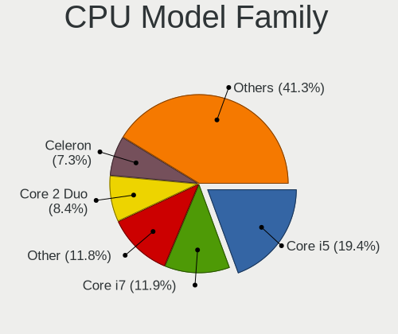
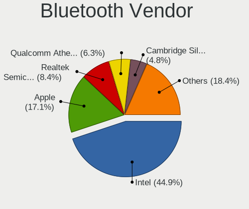
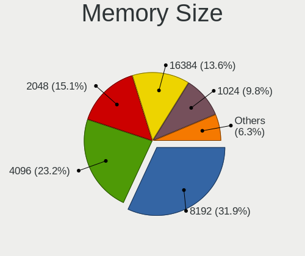

Debian 11 - Tested Hardware & Statistics
----------------------------------------

A project to collect tested hardware configurations for Debian 11.

Anyone can contribute to this report by the [hw-probe](https://github.com/linuxhw/hw-probe) tool:

    sudo -E hw-probe -all -upload

Please contribute! Especially if your hardware is rare.

This is a report for all computer types. See also reports for [desktops](/Dist/Debian_11/Desktop/README.md) and [notebooks](/Dist/Debian_11/Notebook/README.md).

Contents
--------

* [ Test Cases ](#test-cases)

* [ System ](#system)
  - [ Kernel                   ](#kernel)
  - [ Kernel Family            ](#kernel-family)
  - [ Kernel Major Ver.        ](#kernel-major-ver)
  - [ Arch                     ](#arch)
  - [ DE                       ](#de)
  - [ Display Server           ](#display-server)
  - [ Display Manager          ](#display-manager)
  - [ OS Lang                  ](#os-lang)
  - [ Boot Mode                ](#boot-mode)
  - [ Filesystem               ](#filesystem)
  - [ Part. scheme             ](#part-scheme)
  - [ Dual Boot with Linux/BSD ](#dual-boot-with-linuxbsd)
  - [ Dual Boot (Win)          ](#dual-boot-win)

* [ Board ](#board)
  - [ Vendor                   ](#vendor)
  - [ Model                    ](#model)
  - [ Model Family             ](#model-family)
  - [ MFG Year                 ](#mfg-year)
  - [ Form Factor              ](#form-factor)
  - [ Secure Boot              ](#secure-boot)
  - [ Coreboot                 ](#coreboot)
  - [ RAM Size                 ](#ram-size)
  - [ RAM Used                 ](#ram-used)
  - [ Total Drives             ](#total-drives)
  - [ Has CD-ROM               ](#has-cd-rom)
  - [ Has Ethernet             ](#has-ethernet)
  - [ Has WiFi                 ](#has-wifi)
  - [ Has Bluetooth            ](#has-bluetooth)

* [ Location ](#location)
  - [ Country                  ](#country)
  - [ City                     ](#city)

* [ Drives ](#drives)
  - [ Drive Vendor             ](#drive-vendor)
  - [ Drive Model              ](#drive-model)
  - [ HDD Vendor               ](#hdd-vendor)
  - [ SSD Vendor               ](#ssd-vendor)
  - [ Drive Kind               ](#drive-kind)
  - [ Drive Connector          ](#drive-connector)
  - [ Drive Size               ](#drive-size)
  - [ Space Total              ](#space-total)
  - [ Space Used               ](#space-used)
  - [ Malfunc. Drives          ](#malfunc-drives)
  - [ Malfunc. Drive Vendor    ](#malfunc-drive-vendor)
  - [ Malfunc. HDD Vendor      ](#malfunc-hdd-vendor)
  - [ Malfunc. Drive Kind      ](#malfunc-drive-kind)
  - [ Failed Drives            ](#failed-drives)
  - [ Failed Drive Vendor      ](#failed-drive-vendor)
  - [ Drive Status             ](#drive-status)

* [ Storage controller ](#storage-controller)
  - [ Storage Vendor           ](#storage-vendor)
  - [ Storage Model            ](#storage-model)
  - [ Storage Kind             ](#storage-kind)

* [ Processor ](#processor)
  - [ CPU Vendor               ](#cpu-vendor)
  - [ CPU Model                ](#cpu-model)
  - [ CPU Model Family         ](#cpu-model-family)
  - [ CPU Cores                ](#cpu-cores)
  - [ CPU Sockets              ](#cpu-sockets)
  - [ CPU Threads              ](#cpu-threads)
  - [ CPU Op-Modes             ](#cpu-op-modes)
  - [ CPU Microcode            ](#cpu-microcode)
  - [ CPU Microarch            ](#cpu-microarch)

* [ Graphics ](#graphics)
  - [ GPU Vendor               ](#gpu-vendor)
  - [ GPU Model                ](#gpu-model)
  - [ GPU Combo                ](#gpu-combo)
  - [ GPU Driver               ](#gpu-driver)
  - [ GPU Memory               ](#gpu-memory)

* [ Monitor ](#monitor)
  - [ Monitor Vendor           ](#monitor-vendor)
  - [ Monitor Model            ](#monitor-model)
  - [ Monitor Resolution       ](#monitor-resolution)
  - [ Monitor Diagonal         ](#monitor-diagonal)
  - [ Monitor Width            ](#monitor-width)
  - [ Aspect Ratio             ](#aspect-ratio)
  - [ Monitor Area             ](#monitor-area)
  - [ Pixel Density            ](#pixel-density)
  - [ Multiple Monitors        ](#multiple-monitors)

* [ Network ](#network)
  - [ Net Controller Vendor    ](#net-controller-vendor)
  - [ Net Controller Model     ](#net-controller-model)
  - [ Wireless Vendor          ](#wireless-vendor)
  - [ Wireless Model           ](#wireless-model)
  - [ Ethernet Vendor          ](#ethernet-vendor)
  - [ Ethernet Model           ](#ethernet-model)
  - [ Net Controller Kind      ](#net-controller-kind)
  - [ Used Controller          ](#used-controller)
  - [ NICs                     ](#nics)
  - [ IPv6                     ](#ipv6)

* [ Bluetooth ](#bluetooth)
  - [ Bluetooth Vendor         ](#bluetooth-vendor)
  - [ Bluetooth Model          ](#bluetooth-model)

* [ Sound ](#sound)
  - [ Sound Vendor             ](#sound-vendor)
  - [ Sound Model              ](#sound-model)

* [ Memory ](#memory)
  - [ Memory Vendor            ](#memory-vendor)
  - [ Memory Model             ](#memory-model)
  - [ Memory Kind              ](#memory-kind)
  - [ Memory Form Factor       ](#memory-form-factor)
  - [ Memory Size              ](#memory-size)
  - [ Memory Speed             ](#memory-speed)

* [ Printers & scanners ](#printers--scanners)
  - [ Printer Vendor           ](#printer-vendor)
  - [ Printer Model            ](#printer-model)
  - [ Scanner Vendor           ](#scanner-vendor)
  - [ Scanner Model            ](#scanner-model)

* [ Camera ](#camera)
  - [ Camera Vendor            ](#camera-vendor)
  - [ Camera Model             ](#camera-model)

* [ Security ](#security)
  - [ Fingerprint Vendor       ](#fingerprint-vendor)
  - [ Fingerprint Model        ](#fingerprint-model)
  - [ Chipcard Vendor          ](#chipcard-vendor)
  - [ Chipcard Model           ](#chipcard-model)

* [ Unsupported ](#unsupported)
  - [ Unsupported Devices      ](#unsupported-devices)
  - [ Unsupported Device Types ](#unsupported-device-types)

Test Cases
----------

Total: 9715

| Vendor        | Model                       | Form-Factor | Probe                                                      | Date         |
|---------------|-----------------------------|-------------|------------------------------------------------------------|--------------|
| Raspberry ... | Raspberry Pi 3 Model B R... | Soc         | [2f74327d87](https://linux-hardware.org/?probe=2f74327d87) | Jan 01, 2024 |
| HP            | 1495                        | Desktop     | [48d0ae2bf5](https://linux-hardware.org/?probe=48d0ae2bf5) | Dec 30, 2023 |
| Lenovo        | V15-ADA 82C7                | Notebook    | [80604ec459](https://linux-hardware.org/?probe=80604ec459) | Dec 30, 2023 |
| ASUSTek       | CM6870                      | Desktop     | [529b92f758](https://linux-hardware.org/?probe=529b92f758) | Dec 28, 2023 |
| HP            | Laptop 17-cp0xxx            | Notebook    | [4118aee355](https://linux-hardware.org/?probe=4118aee355) | Dec 28, 2023 |
| Raspberry ... | Raspberry Pi 3 Model B R... | Soc         | [f1144c99b2](https://linux-hardware.org/?probe=f1144c99b2) | Dec 27, 2023 |
| HP            | Laptop 17-cp0xxx            | Notebook    | [7b5e390f00](https://linux-hardware.org/?probe=7b5e390f00) | Dec 27, 2023 |
| Gigabyte      | P55-UD4P                    | Desktop     | [62b547894e](https://linux-hardware.org/?probe=62b547894e) | Dec 25, 2023 |
| eMachines     | EMCP61M                     | Desktop     | [d464b480dd](https://linux-hardware.org/?probe=d464b480dd) | Dec 23, 2023 |
| Raspberry ... | Raspberry Pi 4 Model B R... | Soc         | [dfc1d4289e](https://linux-hardware.org/?probe=dfc1d4289e) | Dec 22, 2023 |
| Gigabyte      | MZ72-HB0-00 01020102        | Server      | [771f7edd98](https://linux-hardware.org/?probe=771f7edd98) | Dec 22, 2023 |
| Lenovo        | Yoga 9 14ITL5 82BG          | Convertible | [22b9c27eb8](https://linux-hardware.org/?probe=22b9c27eb8) | Dec 21, 2023 |
| HP            | 3396                        | Desktop     | [d0d084ecc8](https://linux-hardware.org/?probe=d0d084ecc8) | Dec 20, 2023 |
| Gigabyte      | Z77X-UD3H                   | Desktop     | [25a077d35e](https://linux-hardware.org/?probe=25a077d35e) | Dec 20, 2023 |
| ASUSTek       | V6-P5G31E                   | Desktop     | [83a8408a7e](https://linux-hardware.org/?probe=83a8408a7e) | Dec 20, 2023 |
| Gigabyte      | H370M DS3H-CF               | Desktop     | [4b6f645ef6](https://linux-hardware.org/?probe=4b6f645ef6) | Dec 20, 2023 |
| Clevo         | W240BU                      | Notebook    | [a0d883bb3d](https://linux-hardware.org/?probe=a0d883bb3d) | Dec 20, 2023 |
| ASRock        | 970M Pro3                   | Desktop     | [85233c464d](https://linux-hardware.org/?probe=85233c464d) | Dec 19, 2023 |
| ASRock        | 970M Pro3                   | Desktop     | [acebee7435](https://linux-hardware.org/?probe=acebee7435) | Dec 19, 2023 |
| Raspberry ... | Raspberry Pi                | Soc         | [9133031c56](https://linux-hardware.org/?probe=9133031c56) | Dec 18, 2023 |
| Gigabyte      | X570S UD                    | Desktop     | [058c14cd39](https://linux-hardware.org/?probe=058c14cd39) | Dec 17, 2023 |
| FriendlyEl... | NanoPC-T6                   | Soc         | [e4c855bedc](https://linux-hardware.org/?probe=e4c855bedc) | Dec 16, 2023 |
| Dell          | 0M5WNK A02                  | Desktop     | [f47a8fcf1f](https://linux-hardware.org/?probe=f47a8fcf1f) | Dec 15, 2023 |
| ASUSTek       | K52Jc                       | Notebook    | [dfa5dc9cd9](https://linux-hardware.org/?probe=dfa5dc9cd9) | Dec 14, 2023 |
| Sony          | VPCEG18FG                   | Notebook    | [3cf20aa9ea](https://linux-hardware.org/?probe=3cf20aa9ea) | Dec 14, 2023 |
| HP            | ProBook 4540s               | Notebook    | [24875256cd](https://linux-hardware.org/?probe=24875256cd) | Dec 14, 2023 |
| Acer          | Aspire 1510 Rev.A           | Desktop     | [452be93d1b](https://linux-hardware.org/?probe=452be93d1b) | Dec 13, 2023 |
| HP            | Pavilion g6                 | Notebook    | [920939b6c0](https://linux-hardware.org/?probe=920939b6c0) | Dec 13, 2023 |
| Unknown       | AMedia X96 Max+             | Soc         | [4df1c17523](https://linux-hardware.org/?probe=4df1c17523) | Dec 12, 2023 |
| Intel         | NUC7i7DNB J83500-205        | Mini pc     | [1ef755944c](https://linux-hardware.org/?probe=1ef755944c) | Dec 12, 2023 |
| Intel         | NUC7i7DNB J83500-205        | Mini pc     | [e4fcf233c5](https://linux-hardware.org/?probe=e4fcf233c5) | Dec 12, 2023 |
| Raspberry ... | Raspberry Pi                | Soc         | [ae61f1039f](https://linux-hardware.org/?probe=ae61f1039f) | Dec 09, 2023 |
| AZW           | MINI S                      | Desktop     | [2512b54e60](https://linux-hardware.org/?probe=2512b54e60) | Dec 09, 2023 |
| Hardkernel    | ODROID-M1                   | Soc         | [39d65538cb](https://linux-hardware.org/?probe=39d65538cb) | Dec 08, 2023 |
| Dell          | 0KP561                      | Desktop     | [bd0971e9cc](https://linux-hardware.org/?probe=bd0971e9cc) | Dec 08, 2023 |
| HP            | Pavilion Laptop 15-eg0xx... | Notebook    | [21b8166e02](https://linux-hardware.org/?probe=21b8166e02) | Dec 06, 2023 |
| Intel         | H61                         | Desktop     | [fbc4dc7436](https://linux-hardware.org/?probe=fbc4dc7436) | Dec 06, 2023 |
| Supermicro    | X11DDW-NT                   | Server      | [523404e018](https://linux-hardware.org/?probe=523404e018) | Dec 06, 2023 |
| Raspberry ... | Raspberry Pi 4 Model B R... | Soc         | [6d4537080b](https://linux-hardware.org/?probe=6d4537080b) | Dec 05, 2023 |
| Apple         | MacBookPro5,5               | Notebook    | [82dedf4be4](https://linux-hardware.org/?probe=82dedf4be4) | Dec 04, 2023 |
| Lenovo        | ThinkPad T480s 20L8S1WH0... | Notebook    | [01485bc011](https://linux-hardware.org/?probe=01485bc011) | Dec 04, 2023 |
| HP            | 255 G8 Notebook PC          | Notebook    | [2afc97f78a](https://linux-hardware.org/?probe=2afc97f78a) | Dec 03, 2023 |
| IceWhale T... | ZimaBoard 832 ZMB           | Desktop     | [a24f117537](https://linux-hardware.org/?probe=a24f117537) | Dec 02, 2023 |
| HP            | Laptop 15s-eq2xxx           | Notebook    | [0869816e7a](https://linux-hardware.org/?probe=0869816e7a) | Dec 02, 2023 |
| Sony          | VPCEB46FX                   | Notebook    | [b331dc017f](https://linux-hardware.org/?probe=b331dc017f) | Dec 02, 2023 |
| Dell          | 02YRK5 A02                  | Desktop     | [73c15b7e61](https://linux-hardware.org/?probe=73c15b7e61) | Dec 02, 2023 |
| HP            | ProLiant DL360 Gen9         | Server      | [c4f3b7fec9](https://linux-hardware.org/?probe=c4f3b7fec9) | Dec 01, 2023 |
| Intel         | NUC5i3RYB H41000-507        | Mini pc     | [b0c7a29604](https://linux-hardware.org/?probe=b0c7a29604) | Dec 01, 2023 |
| MSI           | A78M-E45                    | Desktop     | [fd9a5e65e4](https://linux-hardware.org/?probe=fd9a5e65e4) | Nov 30, 2023 |
| ASUSTek       | P5N-MX                      | Desktop     | [c586157333](https://linux-hardware.org/?probe=c586157333) | Nov 30, 2023 |
| Raspberry ... | Raspberry Pi 400 Rev 1.0    | Soc         | [2b0642c446](https://linux-hardware.org/?probe=2b0642c446) | Nov 30, 2023 |
| HP            | Pavilion dv6                | Notebook    | [ddce26dd72](https://linux-hardware.org/?probe=ddce26dd72) | Nov 29, 2023 |
| Lenovo        | IdeaPad 3 17ALC6 82KV       | Notebook    | [1b7f8a15dd](https://linux-hardware.org/?probe=1b7f8a15dd) | Nov 29, 2023 |
| Lenovo        | 1048 SDK0J40697 WIN 3305... | Desktop     | [af727ea890](https://linux-hardware.org/?probe=af727ea890) | Nov 29, 2023 |
| HC Technol... | HCAR5000-MI                 | Desktop     | [7ff2232073](https://linux-hardware.org/?probe=7ff2232073) | Nov 29, 2023 |
| MSI           | X299 GAMING PRO CARBON      | Desktop     | [07d105a830](https://linux-hardware.org/?probe=07d105a830) | Nov 28, 2023 |
| Inventec      | DQ Class A02                | Desktop     | [760cc39516](https://linux-hardware.org/?probe=760cc39516) | Nov 27, 2023 |
| Daten Tecn... | DCM3A-4                     | Notebook    | [66b8d06d48](https://linux-hardware.org/?probe=66b8d06d48) | Nov 27, 2023 |
| AZW           | MINI S                      | Desktop     | [ea6ad73049](https://linux-hardware.org/?probe=ea6ad73049) | Nov 27, 2023 |
| AZW           | MINI S                      | Desktop     | [54b3a350cc](https://linux-hardware.org/?probe=54b3a350cc) | Nov 27, 2023 |
| Supermicro    | X11DDW-NT                   | Server      | [a7890b3e79](https://linux-hardware.org/?probe=a7890b3e79) | Nov 27, 2023 |
| IBM           | 94Y7718 SIT                 | Server      | [b784691187](https://linux-hardware.org/?probe=b784691187) | Nov 27, 2023 |
| IBM           | 69Y1006 SIT                 | Server      | [1e36c88b83](https://linux-hardware.org/?probe=1e36c88b83) | Nov 27, 2023 |
| HP            | Laptop 15s-fq2xxx           | Notebook    | [f0b4d1d85c](https://linux-hardware.org/?probe=f0b4d1d85c) | Nov 26, 2023 |
| MSI           | B85M-G43                    | Desktop     | [c8c114c2df](https://linux-hardware.org/?probe=c8c114c2df) | Nov 26, 2023 |
| HP            | EliteBook x360 1040 G6      | Convertible | [5bf94efca1](https://linux-hardware.org/?probe=5bf94efca1) | Nov 26, 2023 |
| AZW           | U59                         | Desktop     | [b03056a1ad](https://linux-hardware.org/?probe=b03056a1ad) | Nov 24, 2023 |
| Raspberry ... | Raspberry Pi 4 Model B R... | Soc         | [6706fb6f0f](https://linux-hardware.org/?probe=6706fb6f0f) | Nov 23, 2023 |
| ASRock        | AB350 Pro4                  | Desktop     | [eff446af17](https://linux-hardware.org/?probe=eff446af17) | Nov 22, 2023 |
| ASUSTek       | PRIME X370-PRO              | Desktop     | [26da233e2b](https://linux-hardware.org/?probe=26da233e2b) | Nov 21, 2023 |
| IBM           | 69Y1006 SIT                 | Server      | [729045e89d](https://linux-hardware.org/?probe=729045e89d) | Nov 21, 2023 |
| IBM           | 94Y7718 SIT                 | Server      | [80a223d120](https://linux-hardware.org/?probe=80a223d120) | Nov 21, 2023 |
| Rockchip      | Orange Pi 5                 | Soc         | [09b6107952](https://linux-hardware.org/?probe=09b6107952) | Nov 20, 2023 |
| Dell          | 0D6H9T A02                  | Desktop     | [034fe5ff39](https://linux-hardware.org/?probe=034fe5ff39) | Nov 20, 2023 |
| HP            | ProLiant MicroServer Gen... | Desktop     | [885444b8af](https://linux-hardware.org/?probe=885444b8af) | Nov 20, 2023 |
| HP            | 1905                        | Desktop     | [7718b065fd](https://linux-hardware.org/?probe=7718b065fd) | Nov 20, 2023 |
| Intel         | NUC5i3RYB H41000-507        | Mini pc     | [67cba6139f](https://linux-hardware.org/?probe=67cba6139f) | Nov 20, 2023 |
| Lenovo        | G580 2189                   | Notebook    | [3ec9fbcdea](https://linux-hardware.org/?probe=3ec9fbcdea) | Nov 20, 2023 |
| Raspberry ... | Raspberry Pi 3 Model B R... | Soc         | [9d71a8e453](https://linux-hardware.org/?probe=9d71a8e453) | Nov 20, 2023 |
| ASUSTek       | PRIME Z370-P                | Desktop     | [2ffe9e80d4](https://linux-hardware.org/?probe=2ffe9e80d4) | Nov 19, 2023 |
| HP            | Laptop 15-da0xxx            | Notebook    | [fa116d20dc](https://linux-hardware.org/?probe=fa116d20dc) | Nov 19, 2023 |
| Lenovo        | ThinkPad T14 Gen 2i 20W0... | Notebook    | [a566513a93](https://linux-hardware.org/?probe=a566513a93) | Nov 19, 2023 |
| Lenovo        | G580 2189                   | Notebook    | [9a96aff4c7](https://linux-hardware.org/?probe=9a96aff4c7) | Nov 18, 2023 |
| ASUSTek       | M5A97                       | Desktop     | [e5673cd079](https://linux-hardware.org/?probe=e5673cd079) | Nov 18, 2023 |
| Lenovo        | 1036 SDK0Q40104 WIN 3305... | Desktop     | [1b1258a703](https://linux-hardware.org/?probe=1b1258a703) | Nov 17, 2023 |
| SIEMENS       | A5E49569366 RS-AF           | Desktop     | [07d3a028ec](https://linux-hardware.org/?probe=07d3a028ec) | Nov 17, 2023 |
| Lenovo        | ThinkBook 16p Gen 2 20YM    | Notebook    | [204303d116](https://linux-hardware.org/?probe=204303d116) | Nov 17, 2023 |
| Lenovo        | IdeaPad 3 17ALC6 82KV       | Notebook    | [026b13382d](https://linux-hardware.org/?probe=026b13382d) | Nov 17, 2023 |
| Lenovo        | IdeaPad 3 17ALC6 82KV       | Notebook    | [893762777e](https://linux-hardware.org/?probe=893762777e) | Nov 17, 2023 |
| HP            | ZBook Fury 17.3 inch G8 ... | Notebook    | [e7e00bb090](https://linux-hardware.org/?probe=e7e00bb090) | Nov 16, 2023 |
| Acer          | Extensa 215-32              | Notebook    | [477b965e66](https://linux-hardware.org/?probe=477b965e66) | Nov 15, 2023 |
| ASRock        | B550 Pro4                   | Desktop     | [1063cc1572](https://linux-hardware.org/?probe=1063cc1572) | Nov 15, 2023 |
| ASRock        | B550 Pro4                   | Desktop     | [8ee2dc1361](https://linux-hardware.org/?probe=8ee2dc1361) | Nov 15, 2023 |
| ASUSTek       | ROG STRIX X670E-E GAMING... | Desktop     | [6ff4b2ddd5](https://linux-hardware.org/?probe=6ff4b2ddd5) | Nov 15, 2023 |
| Gigabyte      | B550 AORUS PRO V2           | Desktop     | [e8e0ef7485](https://linux-hardware.org/?probe=e8e0ef7485) | Nov 15, 2023 |
| Phoenix/Si... | M730SR                      | Notebook    | [59e9d07293](https://linux-hardware.org/?probe=59e9d07293) | Nov 14, 2023 |
| TUXEDO        | Unknown                     | Notebook    | [e90f4e1799](https://linux-hardware.org/?probe=e90f4e1799) | Nov 14, 2023 |
| BESSTAR Te... | GB7                         | Mini pc     | [01ce54e1ed](https://linux-hardware.org/?probe=01ce54e1ed) | Nov 14, 2023 |
| Packard Be... | EasyNote TK81               | Notebook    | [a44fd2dc7a](https://linux-hardware.org/?probe=a44fd2dc7a) | Nov 14, 2023 |
| Dell          | 02YRK5 A02                  | Desktop     | [c419dad9b3](https://linux-hardware.org/?probe=c419dad9b3) | Nov 14, 2023 |
| Dell          | 02YRK5 A02                  | Desktop     | [9e2ced6a3b](https://linux-hardware.org/?probe=9e2ced6a3b) | Nov 14, 2023 |
| Dell          | 02YRK5 A02                  | Desktop     | [a6e2f5e7f9](https://linux-hardware.org/?probe=a6e2f5e7f9) | Nov 14, 2023 |
| HP            | 871A                        | Mini pc     | [f9bfe70cef](https://linux-hardware.org/?probe=f9bfe70cef) | Nov 14, 2023 |
| HP            | 871A                        | Mini pc     | [af04867373](https://linux-hardware.org/?probe=af04867373) | Nov 14, 2023 |
| Apple         | MacBookPro5,5               | Notebook    | [57e4a13fab](https://linux-hardware.org/?probe=57e4a13fab) | Nov 13, 2023 |
| Lenovo        | ThinkPad X230 23257AG       | Notebook    | [2bc7d7c816](https://linux-hardware.org/?probe=2bc7d7c816) | Nov 13, 2023 |
| WanYou        | WanYouChunXiao              | Desktop     | [82c62804fc](https://linux-hardware.org/?probe=82c62804fc) | Nov 13, 2023 |
| Raspberry ... | Raspberry Pi 3 Model B R... | Soc         | [8b8d073259](https://linux-hardware.org/?probe=8b8d073259) | Nov 13, 2023 |
| Intel         | NUC5i5RYB H40999-505        | Mini pc     | [26e08a35c7](https://linux-hardware.org/?probe=26e08a35c7) | Nov 12, 2023 |
| HP            | EliteBook 2530p             | Notebook    | [4a9666ef8a](https://linux-hardware.org/?probe=4a9666ef8a) | Nov 12, 2023 |
| ASRock        | J3455-ITX                   | Desktop     | [29b6fb8a4f](https://linux-hardware.org/?probe=29b6fb8a4f) | Nov 11, 2023 |
| Acer          | Aspire A315-54              | Notebook    | [a83ac39876](https://linux-hardware.org/?probe=a83ac39876) | Nov 10, 2023 |
| Acer          | EG43M                       | Desktop     | [53270970b2](https://linux-hardware.org/?probe=53270970b2) | Nov 09, 2023 |
| Acer          | Aspire F5-573G              | Notebook    | [afeda2ac5e](https://linux-hardware.org/?probe=afeda2ac5e) | Nov 08, 2023 |
| HP            | Stream Notebook PC 13       | Notebook    | [25387a2c6f](https://linux-hardware.org/?probe=25387a2c6f) | Nov 08, 2023 |
| Lenovo        | ThinkPad X121e 30515YG      | Notebook    | [4008ec0eb0](https://linux-hardware.org/?probe=4008ec0eb0) | Nov 08, 2023 |
| HPE           | ProLiant MicroServer Gen... | Desktop     | [7461a3b207](https://linux-hardware.org/?probe=7461a3b207) | Nov 08, 2023 |
| Lenovo        | ThinkPad T470 20HES3JR02    | Notebook    | [4cdded6623](https://linux-hardware.org/?probe=4cdded6623) | Nov 07, 2023 |
| Unknown       | Unknown                     | Desktop     | [5c2d84d61d](https://linux-hardware.org/?probe=5c2d84d61d) | Nov 06, 2023 |
| Unknown       | Unknown                     | Desktop     | [e84ce1e0d3](https://linux-hardware.org/?probe=e84ce1e0d3) | Nov 06, 2023 |
| Raspberry ... | Raspberry Pi 3 Model B R... | Soc         | [5b992d974a](https://linux-hardware.org/?probe=5b992d974a) | Nov 06, 2023 |
| Dell          | 01XK1W A00                  | Desktop     | [d6cd277a79](https://linux-hardware.org/?probe=d6cd277a79) | Nov 05, 2023 |
| Acer          | AO532h                      | Notebook    | [0b3d66b04a](https://linux-hardware.org/?probe=0b3d66b04a) | Nov 04, 2023 |
| Packard Be... | EasyNote TK87               | Notebook    | [3ff2e66179](https://linux-hardware.org/?probe=3ff2e66179) | Nov 03, 2023 |
| ASRock        | H170M Pro4                  | Desktop     | [b87ccd7768](https://linux-hardware.org/?probe=b87ccd7768) | Nov 03, 2023 |
| Lenovo        | ThinkPad P15s Gen 2i 20W... | Notebook    | [212105774f](https://linux-hardware.org/?probe=212105774f) | Nov 02, 2023 |
| ASRock        | Z77 WS                      | Desktop     | [73b9354a1a](https://linux-hardware.org/?probe=73b9354a1a) | Nov 02, 2023 |
| HP            | Pavilion g6                 | Notebook    | [8c9de8be4f](https://linux-hardware.org/?probe=8c9de8be4f) | Nov 02, 2023 |
| HP            | Pavilion g6                 | Notebook    | [c35f9a55aa](https://linux-hardware.org/?probe=c35f9a55aa) | Nov 02, 2023 |
| Lenovo        | ThinkCentre M58p 6234A1U    | Desktop     | [b684f82e3c](https://linux-hardware.org/?probe=b684f82e3c) | Nov 01, 2023 |
| Acer          | TravelMate P215-52          | Notebook    | [b9c3643e62](https://linux-hardware.org/?probe=b9c3643e62) | Nov 01, 2023 |
| HP            | 255 G8 Notebook PC          | Notebook    | [b9d1b13098](https://linux-hardware.org/?probe=b9d1b13098) | Oct 31, 2023 |
| Fujitsu       | D3313-B1 S26361-D3313-B1    | Desktop     | [2d90a96dfb](https://linux-hardware.org/?probe=2d90a96dfb) | Oct 31, 2023 |
| Unknown       | Unknown                     | Soc         | [c1888a18d4](https://linux-hardware.org/?probe=c1888a18d4) | Oct 31, 2023 |
| Lenovo        | ThinkPad P14s Gen 3 21J5... | Notebook    | [8b1fe7cf44](https://linux-hardware.org/?probe=8b1fe7cf44) | Oct 30, 2023 |
| Gigabyte      | H170N-WIFI-CF               | Desktop     | [af90b19d11](https://linux-hardware.org/?probe=af90b19d11) | Oct 30, 2023 |
| Supermicro    | X8DTH                       | Server      | [25d685c01e](https://linux-hardware.org/?probe=25d685c01e) | Oct 30, 2023 |
| HP            | ProLiant DL360 Gen9         | Server      | [081a87b55c](https://linux-hardware.org/?probe=081a87b55c) | Oct 30, 2023 |
| HP            | Pavilion g6                 | Notebook    | [57441db309](https://linux-hardware.org/?probe=57441db309) | Oct 29, 2023 |
| Shenzhen M... | TH80                        | Desktop     | [22dea9593a](https://linux-hardware.org/?probe=22dea9593a) | Oct 28, 2023 |
| Toshiba       | TECRA R950                  | Notebook    | [afa984b0d3](https://linux-hardware.org/?probe=afa984b0d3) | Oct 28, 2023 |
| Acer          | Aspire A115-31              | Notebook    | [137821ca25](https://linux-hardware.org/?probe=137821ca25) | Oct 28, 2023 |
| Lenovo        | ThinkPad T540p 20BE00B4I... | Notebook    | [afce107e0d](https://linux-hardware.org/?probe=afce107e0d) | Oct 26, 2023 |
| Supermicro    | X11DDW-NT                   | Server      | [fa28d68e1b](https://linux-hardware.org/?probe=fa28d68e1b) | Oct 26, 2023 |
| Matsushita... | CF-30CTWAZBM                | Notebook    | [4211783dac](https://linux-hardware.org/?probe=4211783dac) | Oct 25, 2023 |
| ASUSTek       | H81M-PLUS                   | Desktop     | [f1ee66826b](https://linux-hardware.org/?probe=f1ee66826b) | Oct 24, 2023 |
| ASUSTek       | H81M-PLUS                   | Desktop     | [0f58ce148b](https://linux-hardware.org/?probe=0f58ce148b) | Oct 24, 2023 |
| ASUSTek       | PRIME A320M-K               | Desktop     | [36f77e9a81](https://linux-hardware.org/?probe=36f77e9a81) | Oct 24, 2023 |
| MSI           | GT62VR 6RD                  | Notebook    | [0d10c5251c](https://linux-hardware.org/?probe=0d10c5251c) | Oct 23, 2023 |
| Raspberry ... | Raspberry Pi 3 Model B R... | Soc         | [047f359430](https://linux-hardware.org/?probe=047f359430) | Oct 23, 2023 |
| Dell          | 0PV3YR A05                  | Server      | [2de56b09e8](https://linux-hardware.org/?probe=2de56b09e8) | Oct 22, 2023 |
| Gigabyte      | 990FXA-UD5                  | Desktop     | [c81764ba28](https://linux-hardware.org/?probe=c81764ba28) | Oct 22, 2023 |
| Unknown       | Unknown                     | Soc         | [0a48bce51e](https://linux-hardware.org/?probe=0a48bce51e) | Oct 21, 2023 |
| Packard Be... | EasyNote TE11HC             | Notebook    | [dc33bae348](https://linux-hardware.org/?probe=dc33bae348) | Oct 21, 2023 |
| Dell          | 0PV3YR A05                  | Server      | [deaf93db4b](https://linux-hardware.org/?probe=deaf93db4b) | Oct 21, 2023 |
| OrangePi      | 4 LTS                       | Soc         | [46dd11286b](https://linux-hardware.org/?probe=46dd11286b) | Oct 21, 2023 |
| ASRock        | B550 Pro4                   | Desktop     | [0d55c2a6af](https://linux-hardware.org/?probe=0d55c2a6af) | Oct 20, 2023 |
| Acer          | Aspire A315-34              | Notebook    | [1ec00092e6](https://linux-hardware.org/?probe=1ec00092e6) | Oct 19, 2023 |
| ASUSTek       | PRIME H310M-A R2.0          | Desktop     | [745f21d8bc](https://linux-hardware.org/?probe=745f21d8bc) | Oct 19, 2023 |
| Supermicro    | X9DRi-LN4+/X9DR3-LN4+       | Server      | [c1f0e34df5](https://linux-hardware.org/?probe=c1f0e34df5) | Oct 19, 2023 |
| Gigabyte      | X670 AORUS ELITE AX         | Desktop     | [67365133d9](https://linux-hardware.org/?probe=67365133d9) | Oct 17, 2023 |
| Juana Mans... | SF20GM7                     | Notebook    | [ea7e37eb5d](https://linux-hardware.org/?probe=ea7e37eb5d) | Oct 17, 2023 |
| Lenovo        | SHARKBAY 31900058 STD       | Desktop     | [d48d54a951](https://linux-hardware.org/?probe=d48d54a951) | Oct 16, 2023 |
| Unknown       | Unknown                     | Soc         | [b51d195a9b](https://linux-hardware.org/?probe=b51d195a9b) | Oct 16, 2023 |
| Raspberry ... | Raspberry Pi 3 Model B R... | Soc         | [e8dd286f6d](https://linux-hardware.org/?probe=e8dd286f6d) | Oct 16, 2023 |
| libre-comp... | aml-s905x-cc                | Soc         | [6a64c8bbf2](https://linux-hardware.org/?probe=6a64c8bbf2) | Oct 16, 2023 |
| Raspberry ... | Raspberry Pi 4 Model B R... | Soc         | [34f4a7b2a5](https://linux-hardware.org/?probe=34f4a7b2a5) | Oct 15, 2023 |
| Raspberry ... | Raspberry Pi 3 Model B R... | Soc         | [7d2501217c](https://linux-hardware.org/?probe=7d2501217c) | Oct 15, 2023 |
| ASUSTek       | B85M-E                      | Desktop     | [38155dfb23](https://linux-hardware.org/?probe=38155dfb23) | Oct 15, 2023 |
| ASUSTek       | PRIME B550M-A               | Desktop     | [2686ddd07b](https://linux-hardware.org/?probe=2686ddd07b) | Oct 15, 2023 |
| Quantum en... | HackBoard 2                 | Desktop     | [27781c0b8a](https://linux-hardware.org/?probe=27781c0b8a) | Oct 14, 2023 |
| HUAWEI        | KLVD-WXX9                   | Notebook    | [9d77b16e0b](https://linux-hardware.org/?probe=9d77b16e0b) | Oct 14, 2023 |
| ASRockRack    | X470D4U2-2T                 | Desktop     | [5f59c8dd03](https://linux-hardware.org/?probe=5f59c8dd03) | Oct 14, 2023 |
| Lenovo        | ThinkPad E550 20DF00F0GE    | Notebook    | [61c5a7e37a](https://linux-hardware.org/?probe=61c5a7e37a) | Oct 13, 2023 |
| ASRockRack    | B650D4U-2L2T/BCM            | Server      | [37a3b14ed3](https://linux-hardware.org/?probe=37a3b14ed3) | Oct 13, 2023 |
| Gigabyte      | X570S AORUS ELITE AX        | Desktop     | [71e899c44a](https://linux-hardware.org/?probe=71e899c44a) | Oct 13, 2023 |
| Dell          | Latitude E6520              | Notebook    | [30a511af92](https://linux-hardware.org/?probe=30a511af92) | Oct 13, 2023 |
| Gigabyte      | X570S AORUS ELITE AX        | Desktop     | [89197d184c](https://linux-hardware.org/?probe=89197d184c) | Oct 12, 2023 |
| Toshiba       | Satellite L755              | Notebook    | [679e27a869](https://linux-hardware.org/?probe=679e27a869) | Oct 12, 2023 |
| Dell          | 0T10XW A00                  | Desktop     | [1489eccd85](https://linux-hardware.org/?probe=1489eccd85) | Oct 12, 2023 |
| ASUSTek       | PRIME H670-PLUS D4          | Desktop     | [925371c475](https://linux-hardware.org/?probe=925371c475) | Oct 11, 2023 |
| ASRock        | H61M-DGS                    | Desktop     | [b16ee3559a](https://linux-hardware.org/?probe=b16ee3559a) | Oct 11, 2023 |
| ASUSTek       | TUF Gaming X570-PLUS        | Desktop     | [0cbd266486](https://linux-hardware.org/?probe=0cbd266486) | Oct 11, 2023 |
| Raspberry ... | Raspberry Pi 4 Model B R... | Soc         | [941644a3ed](https://linux-hardware.org/?probe=941644a3ed) | Oct 11, 2023 |
| Raspberry ... | Raspberry Pi 4 Model B R... | Soc         | [427ca84f59](https://linux-hardware.org/?probe=427ca84f59) | Oct 11, 2023 |
| Apple         | MacBookPro9,2               | Notebook    | [f53b6f5e53](https://linux-hardware.org/?probe=f53b6f5e53) | Oct 11, 2023 |
| Fujitsu       | D3222-A1 S26361-D3222-A1    | Desktop     | [8606120535](https://linux-hardware.org/?probe=8606120535) | Oct 10, 2023 |
| Fujitsu       | D3041-A1 S26361-D3041-A1    | Desktop     | [0198bbbc8c](https://linux-hardware.org/?probe=0198bbbc8c) | Oct 10, 2023 |
| IBM           | 94Y7614                     | Server      | [e9f6bf0852](https://linux-hardware.org/?probe=e9f6bf0852) | Oct 10, 2023 |
| Supermicro    | X10SLM-F                    | Server      | [a47217adb4](https://linux-hardware.org/?probe=a47217adb4) | Oct 10, 2023 |
| Raspberry ... | Raspberry Pi 4 Model B R... | Soc         | [601fd070ec](https://linux-hardware.org/?probe=601fd070ec) | Oct 10, 2023 |
| ASUSTek       | N751JK                      | Notebook    | [855d2e95a7](https://linux-hardware.org/?probe=855d2e95a7) | Oct 09, 2023 |
| Toshiba       | Satellite L755              | Notebook    | [74a043fcf5](https://linux-hardware.org/?probe=74a043fcf5) | Oct 09, 2023 |
| Raspberry ... | Raspberry Pi Compute Mod... | Soc         | [e763607fe3](https://linux-hardware.org/?probe=e763607fe3) | Oct 09, 2023 |
| Gigabyte      | G31M-ES2L                   | Desktop     | [7912f11c78](https://linux-hardware.org/?probe=7912f11c78) | Oct 08, 2023 |
| Lenovo        | Legion Y920-17IKB Laptop... | Notebook    | [881454bd02](https://linux-hardware.org/?probe=881454bd02) | Oct 07, 2023 |
| Lenovo        | ThinkPad T480 20L6S2LK0J    | Notebook    | [cae6954f11](https://linux-hardware.org/?probe=cae6954f11) | Oct 07, 2023 |
| Lenovo        | ThinkPad T480 20L6S2LK0J    | Notebook    | [ca68af85fb](https://linux-hardware.org/?probe=ca68af85fb) | Oct 07, 2023 |
| ASRock        | X570 Phantom Gaming 4       | Desktop     | [b54dca932a](https://linux-hardware.org/?probe=b54dca932a) | Oct 07, 2023 |
| Lenovo        | ThinkPad X220 4286CTO       | Notebook    | [71bc4e1d3f](https://linux-hardware.org/?probe=71bc4e1d3f) | Oct 07, 2023 |
| Dell          | Latitude E6520              | Notebook    | [fea9ed801a](https://linux-hardware.org/?probe=fea9ed801a) | Oct 07, 2023 |
| Toshiba       | Satellite L755              | Notebook    | [63ad812f2f](https://linux-hardware.org/?probe=63ad812f2f) | Oct 06, 2023 |
| Exo           | Smart Serie L               | Notebook    | [812041d985](https://linux-hardware.org/?probe=812041d985) | Oct 05, 2023 |
| Raspberry ... | Raspberry Pi 4 Model B R... | Soc         | [bf88efbfff](https://linux-hardware.org/?probe=bf88efbfff) | Oct 05, 2023 |
| Philco Inf... | EC10IS2                     | Notebook    | [f85315b46a](https://linux-hardware.org/?probe=f85315b46a) | Oct 04, 2023 |
| Unknown       | Unknown                     | Notebook    | [a6849f7516](https://linux-hardware.org/?probe=a6849f7516) | Oct 03, 2023 |
| Dell          | 0PV3YR A05                  | Server      | [7ff4fd8349](https://linux-hardware.org/?probe=7ff4fd8349) | Oct 02, 2023 |
| Teclast       | F15Plus 2                   | Notebook    | [3779ac7003](https://linux-hardware.org/?probe=3779ac7003) | Oct 01, 2023 |
| HP            | Laptop 15-dw3xxx            | Notebook    | [6443df8957](https://linux-hardware.org/?probe=6443df8957) | Oct 01, 2023 |
| Packard Be... | EasyNote LM98               | Notebook    | [8fdf8eee6c](https://linux-hardware.org/?probe=8fdf8eee6c) | Oct 01, 2023 |
| HP            | Laptop 14s-fq1xxx           | Notebook    | [3709e611a3](https://linux-hardware.org/?probe=3709e611a3) | Oct 01, 2023 |
| ASUSTek       | PRIME B365M-A               | Desktop     | [279922964e](https://linux-hardware.org/?probe=279922964e) | Oct 01, 2023 |
| Dell          | 0PV3YR A05                  | Server      | [aae60ff071](https://linux-hardware.org/?probe=aae60ff071) | Oct 01, 2023 |
| Juana Mans... | SF20GM7                     | Notebook    | [b2b359c659](https://linux-hardware.org/?probe=b2b359c659) | Sep 30, 2023 |
| Juana Mans... | SF20GM7                     | Notebook    | [ccb9b4e795](https://linux-hardware.org/?probe=ccb9b4e795) | Sep 30, 2023 |
| Dell          | Latitude 5410               | Notebook    | [8234abf02b](https://linux-hardware.org/?probe=8234abf02b) | Sep 30, 2023 |
| Dell          | 0PV3YR A05                  | Server      | [ba4aa68077](https://linux-hardware.org/?probe=ba4aa68077) | Sep 30, 2023 |
| ASRock        | H81M-HG4                    | Desktop     | [7f2a420ea3](https://linux-hardware.org/?probe=7f2a420ea3) | Sep 29, 2023 |
| Supermicro    | X11DDW-NT                   | Server      | [c7b049f922](https://linux-hardware.org/?probe=c7b049f922) | Sep 29, 2023 |
| Dell          | Latitude 5410               | Notebook    | [61ddf0adf6](https://linux-hardware.org/?probe=61ddf0adf6) | Sep 29, 2023 |
| ASRock        | 970M Pro3                   | Desktop     | [f004fa8e32](https://linux-hardware.org/?probe=f004fa8e32) | Sep 27, 2023 |
| ASRock        | 970M Pro3                   | Desktop     | [3646127006](https://linux-hardware.org/?probe=3646127006) | Sep 27, 2023 |
| Intel         | DP35DP AAD81073-206         | Desktop     | [426e9aff0f](https://linux-hardware.org/?probe=426e9aff0f) | Sep 26, 2023 |
| Dell          | 0PV3YR A05                  | Server      | [acde6e2ba0](https://linux-hardware.org/?probe=acde6e2ba0) | Sep 26, 2023 |
| Gigabyte      | B550 AORUS PRO V2           | Desktop     | [273b056209](https://linux-hardware.org/?probe=273b056209) | Sep 25, 2023 |
| Dell          | 0PV3YR A05                  | Server      | [8a7db88ae5](https://linux-hardware.org/?probe=8a7db88ae5) | Sep 25, 2023 |
| MSI           | MS-7318                     | Desktop     | [0e03a1818a](https://linux-hardware.org/?probe=0e03a1818a) | Sep 24, 2023 |
| Acer          | H11H4-AI V:1.0              | Desktop     | [971f03180e](https://linux-hardware.org/?probe=971f03180e) | Sep 24, 2023 |
| HP            | 250 G4                      | Notebook    | [c9dac1b4d5](https://linux-hardware.org/?probe=c9dac1b4d5) | Sep 23, 2023 |
| HP            | 1905                        | Desktop     | [786257c0e1](https://linux-hardware.org/?probe=786257c0e1) | Sep 23, 2023 |
| HP            | Compaq Presario CQ60        | Notebook    | [ae8071638f](https://linux-hardware.org/?probe=ae8071638f) | Sep 23, 2023 |
| HP            | EliteBook 845 G8 Noteboo... | Notebook    | [1e9774c53c](https://linux-hardware.org/?probe=1e9774c53c) | Sep 22, 2023 |
| ASUSTek       | X555LJ                      | Notebook    | [2edb781d68](https://linux-hardware.org/?probe=2edb781d68) | Sep 22, 2023 |
| ASUSTek       | PRIME B660M-K D4            | Desktop     | [85c3791741](https://linux-hardware.org/?probe=85c3791741) | Sep 21, 2023 |
| MSI           | MS-7318                     | Desktop     | [38f011e50d](https://linux-hardware.org/?probe=38f011e50d) | Sep 21, 2023 |
| NetGear       | ReadyDATA 5200              | Desktop     | [c96e63c738](https://linux-hardware.org/?probe=c96e63c738) | Sep 20, 2023 |
| Intel         | NUC6i7KYB H90766-403        | Mini pc     | [6f6fbfc86f](https://linux-hardware.org/?probe=6f6fbfc86f) | Sep 20, 2023 |
| Dell          | Precision 5560              | Notebook    | [456e9e2c78](https://linux-hardware.org/?probe=456e9e2c78) | Sep 20, 2023 |
| Lenovo        | ThinkPad L420 78564ES       | Notebook    | [a6f3af802d](https://linux-hardware.org/?probe=a6f3af802d) | Sep 20, 2023 |
| Dell          | Precision 7550              | Notebook    | [75394df91f](https://linux-hardware.org/?probe=75394df91f) | Sep 19, 2023 |
| ASRock        | B550 Pro4                   | Desktop     | [af2217289d](https://linux-hardware.org/?probe=af2217289d) | Sep 19, 2023 |
| Lenovo        | Z50-75 80EC                 | Notebook    | [410df263b8](https://linux-hardware.org/?probe=410df263b8) | Sep 18, 2023 |
| Acer          | Extensa 215-32              | Notebook    | [6879449933](https://linux-hardware.org/?probe=6879449933) | Sep 18, 2023 |
| Lenovo        | Z50-75 80EC                 | Notebook    | [e14140ad96](https://linux-hardware.org/?probe=e14140ad96) | Sep 18, 2023 |
| Gigabyte      | H55N-USB3                   | Desktop     | [afefe4b055](https://linux-hardware.org/?probe=afefe4b055) | Sep 18, 2023 |
| HP            | 8158 A01                    | Mini pc     | [bd8aa3d09c](https://linux-hardware.org/?probe=bd8aa3d09c) | Sep 18, 2023 |
| Acer          | TravelMate P446-MG          | Notebook    | [08d9d6868b](https://linux-hardware.org/?probe=08d9d6868b) | Sep 17, 2023 |
| Supermicro    | X9DR3-F                     | Desktop     | [c2f0532df1](https://linux-hardware.org/?probe=c2f0532df1) | Sep 17, 2023 |
| Google        | Droid                       | Notebook    | [e0a0628d0a](https://linux-hardware.org/?probe=e0a0628d0a) | Sep 17, 2023 |
| Dell          | XPS 13 9370                 | Notebook    | [7715522f7f](https://linux-hardware.org/?probe=7715522f7f) | Sep 17, 2023 |
| ASUSTek       | P5G41T-M LX                 | Desktop     | [020deea6d9](https://linux-hardware.org/?probe=020deea6d9) | Sep 15, 2023 |
| Supermicro    | M11SDV-8C-LN4F              | Server      | [f8e68bfc81](https://linux-hardware.org/?probe=f8e68bfc81) | Sep 15, 2023 |
| Supermicro    | M11SDV-8C-LN4F              | Server      | [f89ec253d3](https://linux-hardware.org/?probe=f89ec253d3) | Sep 15, 2023 |
| Lenovo        | ThinkPad P15 Gen 1 20STC... | Notebook    | [3eb787f2ec](https://linux-hardware.org/?probe=3eb787f2ec) | Sep 15, 2023 |
| Dell          | 01XK1W A00                  | Desktop     | [07e5f3eb14](https://linux-hardware.org/?probe=07e5f3eb14) | Sep 13, 2023 |
| Raspberry ... | Raspberry Pi 4 Model B R... | Soc         | [ae1f2b94e5](https://linux-hardware.org/?probe=ae1f2b94e5) | Sep 12, 2023 |
| SLIMBOOK      | Essential15L                | Notebook    | [92dbc92137](https://linux-hardware.org/?probe=92dbc92137) | Sep 12, 2023 |
| Gigabyte      | P85-D3                      | Desktop     | [f090137faf](https://linux-hardware.org/?probe=f090137faf) | Sep 11, 2023 |
| MSI           | 970A-G46                    | Desktop     | [722b900724](https://linux-hardware.org/?probe=722b900724) | Sep 11, 2023 |
| Panasonic     | CF-19RHR3DPM                | Notebook    | [11484f2d00](https://linux-hardware.org/?probe=11484f2d00) | Sep 10, 2023 |
| Dell          | Precision 5530              | Notebook    | [7e0e7dca27](https://linux-hardware.org/?probe=7e0e7dca27) | Sep 10, 2023 |
| ASRock        | H81M-HG4                    | Desktop     | [7398d477e4](https://linux-hardware.org/?probe=7398d477e4) | Sep 10, 2023 |
| HP            | 876C SMVB                   | Desktop     | [f122d202cc](https://linux-hardware.org/?probe=f122d202cc) | Sep 10, 2023 |
| Acer          | Extensa 5220                | Notebook    | [c4ea757260](https://linux-hardware.org/?probe=c4ea757260) | Sep 10, 2023 |
| Acer          | Aspire E1-531               | Notebook    | [91decda3c9](https://linux-hardware.org/?probe=91decda3c9) | Sep 09, 2023 |
| ASRock        | J3455-ITX                   | Desktop     | [724826d84b](https://linux-hardware.org/?probe=724826d84b) | Sep 09, 2023 |
| ASUSTek       | PRIME Z370-P                | Desktop     | [9ce78af6e9](https://linux-hardware.org/?probe=9ce78af6e9) | Sep 08, 2023 |
| HP            | Compaq Presario CQ40        | Notebook    | [4695b758c9](https://linux-hardware.org/?probe=4695b758c9) | Sep 08, 2023 |
| HP            | Compaq Presario CQ40        | Notebook    | [e8a4fb3aea](https://linux-hardware.org/?probe=e8a4fb3aea) | Sep 08, 2023 |
| Dell          | Latitude E5550              | Notebook    | [90fc999e4a](https://linux-hardware.org/?probe=90fc999e4a) | Sep 08, 2023 |
| Dell          | 0PV3YR A05                  | Server      | [e8fe3531c7](https://linux-hardware.org/?probe=e8fe3531c7) | Sep 08, 2023 |
| Raspberry ... | Raspberry Pi 400 Rev 1.0    | Soc         | [6bea6e300b](https://linux-hardware.org/?probe=6bea6e300b) | Sep 07, 2023 |
| Dell          | 0PV3YR A05                  | Server      | [da21e863a4](https://linux-hardware.org/?probe=da21e863a4) | Sep 07, 2023 |
| ASUSTek       | N751JX                      | Notebook    | [8ece217753](https://linux-hardware.org/?probe=8ece217753) | Sep 06, 2023 |
| JGINYUE       | X79M-PLUS V2.2              | Desktop     | [1535be8e5f](https://linux-hardware.org/?probe=1535be8e5f) | Sep 06, 2023 |
| Intel         | DN2800MT AAG23738-803       | Desktop     | [8bdf13908a](https://linux-hardware.org/?probe=8bdf13908a) | Sep 06, 2023 |
| ASRockRack    | B565D4-V1L                  | Desktop     | [ff236ef40e](https://linux-hardware.org/?probe=ff236ef40e) | Sep 06, 2023 |
| Intel         | D33217GKE G76540-205        | Desktop     | [98630bd8bd](https://linux-hardware.org/?probe=98630bd8bd) | Sep 05, 2023 |
| Dell          | 0PV3YR A05                  | Server      | [0841c5e196](https://linux-hardware.org/?probe=0841c5e196) | Sep 05, 2023 |
| Dell          | 0Y2MRG A00                  | Desktop     | [893bd8a261](https://linux-hardware.org/?probe=893bd8a261) | Sep 04, 2023 |
| Fujitsu       | D3400-A1 S26361-D3400-A1    | Desktop     | [49e3c842c1](https://linux-hardware.org/?probe=49e3c842c1) | Sep 04, 2023 |
| Unknown       | Unknown                     | Desktop     | [0c53c2df55](https://linux-hardware.org/?probe=0c53c2df55) | Sep 04, 2023 |
| ASRockRack    | X470D4U                     | Desktop     | [d38e269d11](https://linux-hardware.org/?probe=d38e269d11) | Sep 04, 2023 |
| Dell          | 0PV3YR A05                  | Server      | [8d52d37e1e](https://linux-hardware.org/?probe=8d52d37e1e) | Sep 04, 2023 |
| Acer          | Aspire ES1-533              | Notebook    | [9c788645a1](https://linux-hardware.org/?probe=9c788645a1) | Sep 03, 2023 |
| HP            | EliteBook 2740p             | Notebook    | [c6d9dc5a3b](https://linux-hardware.org/?probe=c6d9dc5a3b) | Sep 03, 2023 |
| MEGA          | G41T-M7 LGT                 | Desktop     | [8d645686ff](https://linux-hardware.org/?probe=8d645686ff) | Sep 02, 2023 |
| Raspberry ... | Raspberry Pi 4 Model B R... | Soc         | [c3fe8cb8e9](https://linux-hardware.org/?probe=c3fe8cb8e9) | Sep 02, 2023 |
| Raspberry ... | Raspberry Pi 3 Model B R... | Soc         | [e0133bb14e](https://linux-hardware.org/?probe=e0133bb14e) | Sep 02, 2023 |
| Dell          | Latitude E6520              | Notebook    | [b53cd78958](https://linux-hardware.org/?probe=b53cd78958) | Sep 02, 2023 |
| Raspberry ... | Raspberry Pi 4 Model B R... | Soc         | [a200aa5407](https://linux-hardware.org/?probe=a200aa5407) | Sep 02, 2023 |
| ASUSTek       | TUF Gaming B550M-PLUS       | Desktop     | [7e93b2a981](https://linux-hardware.org/?probe=7e93b2a981) | Sep 02, 2023 |
| Lenovo        | IdeaPad 1 15IGL7 82V7       | Notebook    | [5db10955f8](https://linux-hardware.org/?probe=5db10955f8) | Sep 01, 2023 |
| HP            | 1495                        | Desktop     | [09b1cf815c](https://linux-hardware.org/?probe=09b1cf815c) | Aug 31, 2023 |
| HP            | ProBook 6460b               | Notebook    | [18deeb6be6](https://linux-hardware.org/?probe=18deeb6be6) | Aug 30, 2023 |
| Raspberry ... | Raspberry Pi 3 Model B P... | Soc         | [52306fce15](https://linux-hardware.org/?probe=52306fce15) | Aug 29, 2023 |
| Dell          | 0T10XW A00                  | Desktop     | [cc093c964f](https://linux-hardware.org/?probe=cc093c964f) | Aug 29, 2023 |
| HP            | 1495                        | Desktop     | [86b148e011](https://linux-hardware.org/?probe=86b148e011) | Aug 26, 2023 |
| HP            | Pavilion dv5                | Notebook    | [8e621682ec](https://linux-hardware.org/?probe=8e621682ec) | Aug 25, 2023 |
| Acer          | Aspire VN7-793G             | Notebook    | [5d748b1e22](https://linux-hardware.org/?probe=5d748b1e22) | Aug 25, 2023 |
| Acer          | TravelMate P215-53          | Notebook    | [113a5418ca](https://linux-hardware.org/?probe=113a5418ca) | Aug 25, 2023 |
| Acer          | TravelMate P215-53          | Notebook    | [b2579f594d](https://linux-hardware.org/?probe=b2579f594d) | Aug 25, 2023 |
| HP            | 158A                        | Desktop     | [e154a48901](https://linux-hardware.org/?probe=e154a48901) | Aug 25, 2023 |
| Dell          | 03NVJ6 A01                  | Desktop     | [71102ac92b](https://linux-hardware.org/?probe=71102ac92b) | Aug 24, 2023 |
| Acer          | Aspire XC-780               | Desktop     | [e154995d9e](https://linux-hardware.org/?probe=e154995d9e) | Aug 24, 2023 |
| Rockchip      | RK3568 EVB1 DDR4 V10        | Soc         | [846c733ed7](https://linux-hardware.org/?probe=846c733ed7) | Aug 24, 2023 |
| Apple         | Mac-F2238BAE iMac11,3       | All in one  | [a1bdeba9c8](https://linux-hardware.org/?probe=a1bdeba9c8) | Aug 23, 2023 |
| Lenovo        | IdeaPad Z485 20151          | Notebook    | [599346f806](https://linux-hardware.org/?probe=599346f806) | Aug 23, 2023 |
| Acer          | TravelMate P214-52          | Notebook    | [0a000435ae](https://linux-hardware.org/?probe=0a000435ae) | Aug 23, 2023 |
| ASUSTek       | PRIME X299-DELUXE           | Desktop     | [266edae3d0](https://linux-hardware.org/?probe=266edae3d0) | Aug 23, 2023 |
| Lenovo        | IdeaPad 1 15IGL7 82V7       | Notebook    | [3e831762f2](https://linux-hardware.org/?probe=3e831762f2) | Aug 22, 2023 |
| ASRock        | J4125B-ITX                  | Desktop     | [93853db701](https://linux-hardware.org/?probe=93853db701) | Aug 21, 2023 |
| ASRock        | J4125B-ITX                  | Desktop     | [f9058bcea1](https://linux-hardware.org/?probe=f9058bcea1) | Aug 21, 2023 |
| Dell          | 0V52N7 A02                  | Server      | [5f5f76ff98](https://linux-hardware.org/?probe=5f5f76ff98) | Aug 21, 2023 |
| HP            | 250 G7 Notebook PC          | Notebook    | [cb4da51551](https://linux-hardware.org/?probe=cb4da51551) | Aug 21, 2023 |
| Raspberry ... | Raspberry Pi 3 Model B R... | Soc         | [fd5614f8d1](https://linux-hardware.org/?probe=fd5614f8d1) | Aug 21, 2023 |
| Bananapi      | BPI-M5                      | Soc         | [0bd2202791](https://linux-hardware.org/?probe=0bd2202791) | Aug 19, 2023 |
| Apple         | MacBookAir7,2               | Notebook    | [fb3c8c793c](https://linux-hardware.org/?probe=fb3c8c793c) | Aug 19, 2023 |
| Medion        | MS-7728                     | Desktop     | [f548540f0c](https://linux-hardware.org/?probe=f548540f0c) | Aug 19, 2023 |
| Intel         | NUC7i5BNB J31144-305        | Mini pc     | [8b347c4d9d](https://linux-hardware.org/?probe=8b347c4d9d) | Aug 19, 2023 |
| Acer          | Aspire VN7-793G             | Notebook    | [b88e1a5605](https://linux-hardware.org/?probe=b88e1a5605) | Aug 18, 2023 |
| Acer          | Aspire one                  | Notebook    | [47131c09b2](https://linux-hardware.org/?probe=47131c09b2) | Aug 16, 2023 |
| Raspberry ... | Raspberry Pi 3 Model B R... | Soc         | [4906f87d9e](https://linux-hardware.org/?probe=4906f87d9e) | Aug 16, 2023 |
| Lenovo        | ThinkPad T480 20L5S2J200    | Notebook    | [66c997fdec](https://linux-hardware.org/?probe=66c997fdec) | Aug 16, 2023 |
| Lenovo        | ThinkPad T480 20L5S2J200    | Notebook    | [e57e76260c](https://linux-hardware.org/?probe=e57e76260c) | Aug 16, 2023 |
| HP            | Spectre x360 Convertible... | Convertible | [defef9b917](https://linux-hardware.org/?probe=defef9b917) | Aug 16, 2023 |
| Apple         | Mac-63001698E7A34814 iMa... | All in one  | [12e5d1c399](https://linux-hardware.org/?probe=12e5d1c399) | Aug 15, 2023 |
| Unknown       | Variscite DART-MX8M-MINI... | Soc         | [a185c83285](https://linux-hardware.org/?probe=a185c83285) | Aug 15, 2023 |
| Lenovo        | ThinkPad L14 Gen 1 20U50... | Notebook    | [4c24f10db4](https://linux-hardware.org/?probe=4c24f10db4) | Aug 15, 2023 |
| Dell          | 0CT017                      | Desktop     | [0800c86065](https://linux-hardware.org/?probe=0800c86065) | Aug 14, 2023 |
| Unknown       | CN700-8237                  | Desktop     | [5890f075f7](https://linux-hardware.org/?probe=5890f075f7) | Aug 13, 2023 |
| ECS           | H61H2-CM                    | Desktop     | [7e33e0f06c](https://linux-hardware.org/?probe=7e33e0f06c) | Aug 13, 2023 |
| ECS           | H61H2-CM                    | Desktop     | [2656581f21](https://linux-hardware.org/?probe=2656581f21) | Aug 13, 2023 |
| Gigabyte      | B360HD3PLM-CF               | Desktop     | [650f840aa5](https://linux-hardware.org/?probe=650f840aa5) | Aug 13, 2023 |
| Lenovo        | ThinkPad W530 24477V0       | Notebook    | [2e09955f2f](https://linux-hardware.org/?probe=2e09955f2f) | Aug 13, 2023 |
| Apple         | MacBookPro8,1               | Notebook    | [c7bc7c3f16](https://linux-hardware.org/?probe=c7bc7c3f16) | Aug 13, 2023 |
| Dell          | 0PV3YR A05                  | Server      | [3508d6c711](https://linux-hardware.org/?probe=3508d6c711) | Aug 13, 2023 |
| Unknown       | Unknown                     | Notebook    | [2e76349d2c](https://linux-hardware.org/?probe=2e76349d2c) | Aug 12, 2023 |
| Unknown       | Unknown                     | Desktop     | [a28cd220cd](https://linux-hardware.org/?probe=a28cd220cd) | Aug 12, 2023 |
| Unknown       | Unknown                     | Desktop     | [f62d9a8a9a](https://linux-hardware.org/?probe=f62d9a8a9a) | Aug 12, 2023 |
| Dell          | 0PV3YR A05                  | Server      | [ed029dd5e3](https://linux-hardware.org/?probe=ed029dd5e3) | Aug 12, 2023 |
| ASRock        | J4125B-ITX                  | Desktop     | [fa9ebd523f](https://linux-hardware.org/?probe=fa9ebd523f) | Aug 11, 2023 |
| Dell          | 0PV3YR A05                  | Server      | [053608e18a](https://linux-hardware.org/?probe=053608e18a) | Aug 11, 2023 |
| Lenovo        | 3740 NOK                    | Desktop     | [9964e9a820](https://linux-hardware.org/?probe=9964e9a820) | Aug 11, 2023 |
| ASUSTek       | 1005PE                      | Notebook    | [088a155ec9](https://linux-hardware.org/?probe=088a155ec9) | Aug 10, 2023 |
| AZW           | GTR V01                     | Mini pc     | [8b0b0e8cc4](https://linux-hardware.org/?probe=8b0b0e8cc4) | Aug 10, 2023 |
| ASUSTek       | ROG STRIX B450-F GAMING     | Desktop     | [2be2a9d5f4](https://linux-hardware.org/?probe=2be2a9d5f4) | Aug 09, 2023 |
| HP            | 8433 11                     | Desktop     | [93432b3df2](https://linux-hardware.org/?probe=93432b3df2) | Aug 09, 2023 |
| Unknown       | MT6737 (DT)                 | Soc         | [42d4093f63](https://linux-hardware.org/?probe=42d4093f63) | Aug 08, 2023 |
| ASUSTek       | P5LD2-SE                    | Desktop     | [04d19635d5](https://linux-hardware.org/?probe=04d19635d5) | Aug 08, 2023 |
| ASUSTek       | P5LD2-SE                    | Desktop     | [671a686166](https://linux-hardware.org/?probe=671a686166) | Aug 08, 2023 |
| Biostar       | B365MHC                     | Desktop     | [1a7d051f1e](https://linux-hardware.org/?probe=1a7d051f1e) | Aug 06, 2023 |
| Gigabyte      | 990FXA-UD3                  | Desktop     | [4b57f7d6ea](https://linux-hardware.org/?probe=4b57f7d6ea) | Aug 06, 2023 |
| Dell          | Inspiron 15 3511            | Notebook    | [217bd70a25](https://linux-hardware.org/?probe=217bd70a25) | Aug 06, 2023 |
| Lenovo        | ThinkBook 16p Gen 2 20YM    | Notebook    | [2f529a830c](https://linux-hardware.org/?probe=2f529a830c) | Aug 05, 2023 |
| Lenovo        | ThinkBook 16p Gen 2 20YM    | Notebook    | [9d00f10bab](https://linux-hardware.org/?probe=9d00f10bab) | Aug 05, 2023 |
| ASUSTek       | PN41                        | Mini pc     | [079428c572](https://linux-hardware.org/?probe=079428c572) | Aug 05, 2023 |
| ASUSTek       | PN41                        | Mini pc     | [663f989185](https://linux-hardware.org/?probe=663f989185) | Aug 05, 2023 |
| MSI           | B350 TOMAHAWK               | Desktop     | [3aa0e077c0](https://linux-hardware.org/?probe=3aa0e077c0) | Aug 05, 2023 |
| Intel         | NUC6CAYB J23203-403         | Mini pc     | [c157382bd3](https://linux-hardware.org/?probe=c157382bd3) | Aug 05, 2023 |
| Dell          | 0PV3YR A05                  | Server      | [da2ada0c83](https://linux-hardware.org/?probe=da2ada0c83) | Aug 05, 2023 |
| ASRock        | FM2A68M-DG3+                | Desktop     | [d930261042](https://linux-hardware.org/?probe=d930261042) | Aug 04, 2023 |
| Lenovo        | 314D SDK0J40697 WIN 3305... | Mini pc     | [1b1f671f30](https://linux-hardware.org/?probe=1b1f671f30) | Aug 04, 2023 |
| Dell          | 0K095G A01                  | Desktop     | [ee2fb87d2f](https://linux-hardware.org/?probe=ee2fb87d2f) | Aug 04, 2023 |
| ASUSTek       | TUF Gaming B450M-PLUS II    | Desktop     | [18f95b58ac](https://linux-hardware.org/?probe=18f95b58ac) | Aug 04, 2023 |
| Dell          | 0PV3YR A05                  | Server      | [df3495c01c](https://linux-hardware.org/?probe=df3495c01c) | Aug 04, 2023 |
| HP            | Lantis                      | Notebook    | [2c917365b3](https://linux-hardware.org/?probe=2c917365b3) | Aug 04, 2023 |
| ASUSTek       | TUF Gaming B450M-PLUS II    | Desktop     | [349de8928b](https://linux-hardware.org/?probe=349de8928b) | Aug 04, 2023 |
| Gigabyte      | H510M H                     | Desktop     | [d74aab937a](https://linux-hardware.org/?probe=d74aab937a) | Aug 02, 2023 |
| HP            | ProLiant DL360 G7           | Server      | [127555ff0c](https://linux-hardware.org/?probe=127555ff0c) | Aug 02, 2023 |
| HP            | Laptop 15s-eq2xxx           | Notebook    | [4a4ac95dcc](https://linux-hardware.org/?probe=4a4ac95dcc) | Aug 01, 2023 |
| ASRock        | X300-ITX                    | Desktop     | [70a181c62b](https://linux-hardware.org/?probe=70a181c62b) | Jul 31, 2023 |
| Intel         | DH55HC AAE70933-502         | Desktop     | [e849da706a](https://linux-hardware.org/?probe=e849da706a) | Jul 31, 2023 |
| Packard Be... | H17HV                       | Notebook    | [de2003d390](https://linux-hardware.org/?probe=de2003d390) | Jul 31, 2023 |
| Unknown       | Unknown                     | Desktop     | [11d7923fa3](https://linux-hardware.org/?probe=11d7923fa3) | Jul 31, 2023 |
| ASUSTek       | M4N78-AM                    | Desktop     | [a4740d2b14](https://linux-hardware.org/?probe=a4740d2b14) | Jul 31, 2023 |
| Gigabyte      | B550M K                     | Desktop     | [139e314619](https://linux-hardware.org/?probe=139e314619) | Jul 31, 2023 |
| Raspberry ... | Raspberry Pi 3 Model B R... | Soc         | [cd8671be26](https://linux-hardware.org/?probe=cd8671be26) | Jul 31, 2023 |
| NEC Comput... | PC-VY22GXZCA                | Notebook    | [180d6cf97d](https://linux-hardware.org/?probe=180d6cf97d) | Jul 31, 2023 |
| Intel         | NUC7i7DNB J83500-207        | Mini pc     | [e18855dc59](https://linux-hardware.org/?probe=e18855dc59) | Jul 30, 2023 |
| Dell          | 0K240Y A01                  | Desktop     | [80b81f5eff](https://linux-hardware.org/?probe=80b81f5eff) | Jul 30, 2023 |
| Apple         | MacBookPro5,5               | Notebook    | [f201460a34](https://linux-hardware.org/?probe=f201460a34) | Jul 30, 2023 |
| Apple         | MacBookPro8,2               | Notebook    | [ffda715e5e](https://linux-hardware.org/?probe=ffda715e5e) | Jul 30, 2023 |
| Lenovo        | ThinkPad X220 42914XG       | Notebook    | [053a30cc87](https://linux-hardware.org/?probe=053a30cc87) | Jul 30, 2023 |
| Sony          | SVS13A1Z9RN                 | Notebook    | [533b3018ea](https://linux-hardware.org/?probe=533b3018ea) | Jul 29, 2023 |
| Dell          | Latitude 5520               | Notebook    | [5151c4275a](https://linux-hardware.org/?probe=5151c4275a) | Jul 29, 2023 |
| ASRockRack    | X470D4U                     | Desktop     | [532a72a722](https://linux-hardware.org/?probe=532a72a722) | Jul 29, 2023 |
| Dell          | 0HD5W2 A01                  | Desktop     | [76394a9fc7](https://linux-hardware.org/?probe=76394a9fc7) | Jul 29, 2023 |
| IceWhale T... | ZimaBoard 832 ZMB           | Desktop     | [4cbba6622f](https://linux-hardware.org/?probe=4cbba6622f) | Jul 28, 2023 |
| IceWhale T... | ZimaBoard 832 ZMB           | Desktop     | [8cf3decf30](https://linux-hardware.org/?probe=8cf3decf30) | Jul 28, 2023 |
| Acer          | Extensa 215-32              | Notebook    | [18d32a6c36](https://linux-hardware.org/?probe=18d32a6c36) | Jul 27, 2023 |
| Dell          | 06X1TJ A00                  | Desktop     | [e873051e73](https://linux-hardware.org/?probe=e873051e73) | Jul 27, 2023 |
| Compaq        | PRESARIOCQ18                | Notebook    | [c528c90b50](https://linux-hardware.org/?probe=c528c90b50) | Jul 27, 2023 |
| ABIT          | NF7-S/NF7,NF7-V,1.0         | Desktop     | [f5184af4e0](https://linux-hardware.org/?probe=f5184af4e0) | Jul 27, 2023 |
| Lenovo        | IdeaPad 120S-14IAP 81A5     | Notebook    | [b2dd23136f](https://linux-hardware.org/?probe=b2dd23136f) | Jul 26, 2023 |
| Raspberry ... | Raspberry Pi Zero 2 W Re... | Soc         | [c7373023dd](https://linux-hardware.org/?probe=c7373023dd) | Jul 26, 2023 |
| Dell          | 01XK1W A00                  | Desktop     | [9793da4c20](https://linux-hardware.org/?probe=9793da4c20) | Jul 26, 2023 |
| Dell          | 0PV3YR A05                  | Server      | [2fa28e6952](https://linux-hardware.org/?probe=2fa28e6952) | Jul 26, 2023 |
| ASRock        | X570 PG Velocita            | Desktop     | [64d86600a4](https://linux-hardware.org/?probe=64d86600a4) | Jul 26, 2023 |
| Dell          | 09CGW2 A04                  | Server      | [159d6b1be1](https://linux-hardware.org/?probe=159d6b1be1) | Jul 26, 2023 |
| Apple         | MacBookPro5,5               | Notebook    | [9cf2abf318](https://linux-hardware.org/?probe=9cf2abf318) | Jul 25, 2023 |
| Phoenix Co... | PSB514 A11                  | Desktop     | [9791c84b0d](https://linux-hardware.org/?probe=9791c84b0d) | Jul 25, 2023 |
| Dell          | 0PV3YR A05                  | Server      | [787c6a9252](https://linux-hardware.org/?probe=787c6a9252) | Jul 25, 2023 |
| Phoenix Co... | PSB514 A11                  | Desktop     | [8e271c334d](https://linux-hardware.org/?probe=8e271c334d) | Jul 24, 2023 |
| HP            | ProLiant DL580 G7           | Server      | [5a9a1e320d](https://linux-hardware.org/?probe=5a9a1e320d) | Jul 24, 2023 |
| Raspberry ... | Raspberry Pi 3 Model B R... | Soc         | [9243bb6a08](https://linux-hardware.org/?probe=9243bb6a08) | Jul 24, 2023 |
| Dell          | Inspiron 15 3511            | Notebook    | [980ed56abe](https://linux-hardware.org/?probe=980ed56abe) | Jul 24, 2023 |
| Hardkernel    | ODROID-N2Plus               | Soc         | [73f0811a7b](https://linux-hardware.org/?probe=73f0811a7b) | Jul 23, 2023 |
| Dell          | Latitude E7250              | Notebook    | [4b91b375d4](https://linux-hardware.org/?probe=4b91b375d4) | Jul 23, 2023 |
| Dell          | Latitude 7480               | Notebook    | [acad753aa8](https://linux-hardware.org/?probe=acad753aa8) | Jul 23, 2023 |
| Dell          | 0K7CVF A03                  | Server      | [228949ef5a](https://linux-hardware.org/?probe=228949ef5a) | Jul 23, 2023 |
| Lenovo        | ThinkCentre M58 7360W1J     | Desktop     | [1e1e565ac4](https://linux-hardware.org/?probe=1e1e565ac4) | Jul 23, 2023 |
| Dell          | OptiPlex 755                | Desktop     | [9297c88bef](https://linux-hardware.org/?probe=9297c88bef) | Jul 23, 2023 |
| Dell          | OptiPlex 755                | Desktop     | [15827e6939](https://linux-hardware.org/?probe=15827e6939) | Jul 23, 2023 |
| Lenovo        | IdeaPadFlex 5 16ABR8 82X... | Convertible | [b2938336ce](https://linux-hardware.org/?probe=b2938336ce) | Jul 22, 2023 |
| ASUSTek       | K72Jr                       | Notebook    | [cdb9b29f94](https://linux-hardware.org/?probe=cdb9b29f94) | Jul 21, 2023 |
| Fujitsu       | D3313-A1 S26361-D3313-A1    | Desktop     | [97edd15b78](https://linux-hardware.org/?probe=97edd15b78) | Jul 21, 2023 |
| Lenovo        | ThinkPad T450s 20BWS05G0... | Notebook    | [fc45e9b064](https://linux-hardware.org/?probe=fc45e9b064) | Jul 21, 2023 |
| HP            | ProLiant MicroServer Gen... | Desktop     | [a9214c4672](https://linux-hardware.org/?probe=a9214c4672) | Jul 21, 2023 |
| Lenovo        | ThinkPad T520 42435UG       | Notebook    | [820630ba9e](https://linux-hardware.org/?probe=820630ba9e) | Jul 20, 2023 |
| Raspberry ... | Raspberry Pi 4 Model B R... | Soc         | [8f26110e1a](https://linux-hardware.org/?probe=8f26110e1a) | Jul 20, 2023 |
| AAEON         | GENE-CML5 V1.0              | Desktop     | [4120e07431](https://linux-hardware.org/?probe=4120e07431) | Jul 19, 2023 |
| Gigabyte      | X570 AORUS MASTER           | Desktop     | [98cddbfe0e](https://linux-hardware.org/?probe=98cddbfe0e) | Jul 18, 2023 |
| HP            | EliteBook 8570p             | Notebook    | [8e456f1108](https://linux-hardware.org/?probe=8e456f1108) | Jul 18, 2023 |
| Lenovo        | ThinkPad T520 42435UG       | Notebook    | [f789cd31fa](https://linux-hardware.org/?probe=f789cd31fa) | Jul 18, 2023 |
| ASUSTek       | Z87-C                       | Desktop     | [5324c1542f](https://linux-hardware.org/?probe=5324c1542f) | Jul 18, 2023 |
| Toshiba       | Satellite L755              | Notebook    | [da4d6e8a5c](https://linux-hardware.org/?probe=da4d6e8a5c) | Jul 18, 2023 |
| Dell          | 0WKGTH A02                  | Server      | [00c711574a](https://linux-hardware.org/?probe=00c711574a) | Jul 17, 2023 |
| HP            | 805A                        | Desktop     | [d4e6fca09f](https://linux-hardware.org/?probe=d4e6fca09f) | Jul 17, 2023 |
| ASUSTek       | X505BA                      | Notebook    | [fcd96492f0](https://linux-hardware.org/?probe=fcd96492f0) | Jul 17, 2023 |
| ASUSTek       | M5A78L/USB3                 | Desktop     | [a8b082a8be](https://linux-hardware.org/?probe=a8b082a8be) | Jul 17, 2023 |
| Dell          | Inspiron 16 7610            | Notebook    | [6d77ef17a0](https://linux-hardware.org/?probe=6d77ef17a0) | Jul 17, 2023 |
| MSI           | H81M-P33                    | Desktop     | [0d3af45e51](https://linux-hardware.org/?probe=0d3af45e51) | Jul 16, 2023 |
| ASUSTek       | ROG STRIX Z790-E GAMING ... | Desktop     | [0c592730d7](https://linux-hardware.org/?probe=0c592730d7) | Jul 16, 2023 |
| Dell          | Latitude E6440              | Notebook    | [c1de0cf4d1](https://linux-hardware.org/?probe=c1de0cf4d1) | Jul 16, 2023 |
| Dell          | Latitude E6320              | Notebook    | [0087a8e5cf](https://linux-hardware.org/?probe=0087a8e5cf) | Jul 16, 2023 |
| ASUSTek       | TUF Gaming FX505GT_FX505... | Notebook    | [65e4fb1356](https://linux-hardware.org/?probe=65e4fb1356) | Jul 16, 2023 |
| Unknown       | Unknown                     | Desktop     | [1073620f0c](https://linux-hardware.org/?probe=1073620f0c) | Jul 16, 2023 |
| Supermicro    | X9SRA/X9SRA-3               | Server      | [15d31e889c](https://linux-hardware.org/?probe=15d31e889c) | Jul 16, 2023 |
| Unknown       | Unknown                     | Soc         | [99bfa94ff7](https://linux-hardware.org/?probe=99bfa94ff7) | Jul 16, 2023 |
| GEEKOM        | Mini IT 8                   | Desktop     | [4754a5fc1b](https://linux-hardware.org/?probe=4754a5fc1b) | Jul 16, 2023 |
| Lenovo        | IdeaPadFlex 5 16ABR8 82X... | Convertible | [d2620e5fee](https://linux-hardware.org/?probe=d2620e5fee) | Jul 16, 2023 |
| Lenovo        | 30BE SDK0J40697 WIN 3305... | Desktop     | [9161db3013](https://linux-hardware.org/?probe=9161db3013) | Jul 15, 2023 |
| ASUSTek       | Z87-C                       | Desktop     | [33e96d6f34](https://linux-hardware.org/?probe=33e96d6f34) | Jul 15, 2023 |
| Gigabyte      | H81M-HD3                    | Desktop     | [4a6f56c54a](https://linux-hardware.org/?probe=4a6f56c54a) | Jul 15, 2023 |
| Lenovo        | ThinkPad X260 20F5S04B00    | Notebook    | [8d3168b6c4](https://linux-hardware.org/?probe=8d3168b6c4) | Jul 15, 2023 |
| Acer          | Aspire R7-371T              | Notebook    | [c4f6270bdb](https://linux-hardware.org/?probe=c4f6270bdb) | Jul 15, 2023 |
| Dell          | 06X1TJ A00                  | Desktop     | [8ca31a1cfb](https://linux-hardware.org/?probe=8ca31a1cfb) | Jul 15, 2023 |
| Intel         | M70KLP2SB M22209-100        | Server      | [afa5fbc4a3](https://linux-hardware.org/?probe=afa5fbc4a3) | Jul 14, 2023 |
| ASRock        | FM2A68M-DG3+                | Desktop     | [19fdd69149](https://linux-hardware.org/?probe=19fdd69149) | Jul 14, 2023 |
| Dell          | Inspiron 15 3511            | Notebook    | [e6d47a005f](https://linux-hardware.org/?probe=e6d47a005f) | Jul 14, 2023 |
| Lenovo        | ThinkPad X260 20F5S04B00    | Notebook    | [ae8ecf10e7](https://linux-hardware.org/?probe=ae8ecf10e7) | Jul 13, 2023 |
| Lenovo        | V14-IIL 82C4                | Notebook    | [42aba63af0](https://linux-hardware.org/?probe=42aba63af0) | Jul 13, 2023 |
| Raspberry ... | Raspberry Pi 4 Model B R... | Soc         | [c4af2e9b6c](https://linux-hardware.org/?probe=c4af2e9b6c) | Jul 13, 2023 |
| Lenovo        | ThinkPad L13 Yoga Gen 2 ... | Convertible | [70b2ff6533](https://linux-hardware.org/?probe=70b2ff6533) | Jul 13, 2023 |
| Dell          | 0WKGTH A02                  | Server      | [13f3a107dc](https://linux-hardware.org/?probe=13f3a107dc) | Jul 13, 2023 |
| MSI           | H170M PRO-VDH               | Desktop     | [ce0a8a33fb](https://linux-hardware.org/?probe=ce0a8a33fb) | Jul 13, 2023 |
| Dell          | Latitude E6330              | Notebook    | [58ec0684cd](https://linux-hardware.org/?probe=58ec0684cd) | Jul 13, 2023 |
| ASRockRack    | ROMED8QM-2T                 | Desktop     | [a4fe5ea9c9](https://linux-hardware.org/?probe=a4fe5ea9c9) | Jul 13, 2023 |
| Dell          | 0D28YY A00                  | Desktop     | [1976f92f56](https://linux-hardware.org/?probe=1976f92f56) | Jul 12, 2023 |
| Positivo      | Mobile                      | Notebook    | [463636c0a2](https://linux-hardware.org/?probe=463636c0a2) | Jul 12, 2023 |
| Lenovo        | G570 4334                   | Notebook    | [27a207ead6](https://linux-hardware.org/?probe=27a207ead6) | Jul 12, 2023 |
| ASUSTek       | PRIME B360M-K               | Desktop     | [3a06b254a5](https://linux-hardware.org/?probe=3a06b254a5) | Jul 12, 2023 |
| Unknown       | i855-W83627HF               | Desktop     | [b330e5c4fb](https://linux-hardware.org/?probe=b330e5c4fb) | Jul 12, 2023 |
| Unknown       | i855-W83627HF               | Desktop     | [c0fb949fdc](https://linux-hardware.org/?probe=c0fb949fdc) | Jul 12, 2023 |
| Dell          | 0Y2MRG A00                  | Desktop     | [3866c4a7ff](https://linux-hardware.org/?probe=3866c4a7ff) | Jul 12, 2023 |
| Fujitsu       | LIFEBOOK E780               | Notebook    | [ab432dcb0e](https://linux-hardware.org/?probe=ab432dcb0e) | Jul 11, 2023 |
| Dell          | 0T10XW A01                  | Desktop     | [58fb207824](https://linux-hardware.org/?probe=58fb207824) | Jul 11, 2023 |
| HP            | EliteBook 1040 G4           | Notebook    | [d7209e7141](https://linux-hardware.org/?probe=d7209e7141) | Jul 11, 2023 |
| Inventec      | 0W63N3 A01                  | Mini pc     | [02a820f6b2](https://linux-hardware.org/?probe=02a820f6b2) | Jul 11, 2023 |
| ASUSTek       | A88XM-A                     | Desktop     | [544563aaae](https://linux-hardware.org/?probe=544563aaae) | Jul 11, 2023 |
| ASUSTek       | PRIME Z590-P                | Desktop     | [8d33346009](https://linux-hardware.org/?probe=8d33346009) | Jul 10, 2023 |
| HP            | EliteBook 1040 G4           | Notebook    | [33aa3fcdbc](https://linux-hardware.org/?probe=33aa3fcdbc) | Jul 10, 2023 |
| Raspberry ... | Raspberry Pi 3 Model B R... | Soc         | [1e6fc6f253](https://linux-hardware.org/?probe=1e6fc6f253) | Jul 10, 2023 |
| Dell          | 01XK1W A00                  | Desktop     | [16aac702d5](https://linux-hardware.org/?probe=16aac702d5) | Jul 10, 2023 |
| Dell          | 0M5DCD A00                  | Desktop     | [ae3e8910bf](https://linux-hardware.org/?probe=ae3e8910bf) | Jul 10, 2023 |
| Gigabyte      | B560 HD3                    | Desktop     | [437e2c44d9](https://linux-hardware.org/?probe=437e2c44d9) | Jul 09, 2023 |
| Gigabyte      | X570S AORUS ELITE           | Desktop     | [6381f6da84](https://linux-hardware.org/?probe=6381f6da84) | Jul 09, 2023 |
| Toshiba       | PORTEGE Z30-C               | Notebook    | [f9d1d19d05](https://linux-hardware.org/?probe=f9d1d19d05) | Jul 09, 2023 |
| Raspberry ... | Raspberry Pi 3 Model B R... | Soc         | [ba7cde1766](https://linux-hardware.org/?probe=ba7cde1766) | Jul 09, 2023 |
| Dell          | 0PV3YR A05                  | Server      | [798f921e70](https://linux-hardware.org/?probe=798f921e70) | Jul 09, 2023 |
| Unknown       | Unknown                     | Desktop     | [89a5a4461f](https://linux-hardware.org/?probe=89a5a4461f) | Jul 09, 2023 |
| ASUSTek       | M4A88TD-V EVO/USB3          | Desktop     | [003c30f690](https://linux-hardware.org/?probe=003c30f690) | Jul 09, 2023 |
| AZW           | U59                         | Desktop     | [5cf3ddbe4b](https://linux-hardware.org/?probe=5cf3ddbe4b) | Jul 08, 2023 |
| AZW           | U59                         | Desktop     | [ea367423d1](https://linux-hardware.org/?probe=ea367423d1) | Jul 08, 2023 |
| AZW           | MINI S                      | Desktop     | [b13eb96728](https://linux-hardware.org/?probe=b13eb96728) | Jul 08, 2023 |
| Dell          | 0PV3YR A05                  | Server      | [0a2ad7c1a6](https://linux-hardware.org/?probe=0a2ad7c1a6) | Jul 08, 2023 |
| HP            | EliteBook 1040 G4           | Notebook    | [cbc100e6b1](https://linux-hardware.org/?probe=cbc100e6b1) | Jul 07, 2023 |
| HP            | EliteBook 1040 G4           | Notebook    | [3177785c7f](https://linux-hardware.org/?probe=3177785c7f) | Jul 07, 2023 |
| Lenovo        | ThinkPad T450s 20BWS0PJ0... | Notebook    | [2345d00757](https://linux-hardware.org/?probe=2345d00757) | Jul 07, 2023 |
| Gigabyte      | Z170-HD3P-CF                | Desktop     | [6afd29fd20](https://linux-hardware.org/?probe=6afd29fd20) | Jul 06, 2023 |
| Lenovo        | ThinkPad L13 Yoga Gen 2 ... | Convertible | [f4b26c97fe](https://linux-hardware.org/?probe=f4b26c97fe) | Jul 06, 2023 |
| Lenovo        | ThinkPad L13 Yoga Gen 2 ... | Convertible | [8daacdd31c](https://linux-hardware.org/?probe=8daacdd31c) | Jul 06, 2023 |
| Dell          | 0WKGTH A02                  | Server      | [4bbbfd7eb9](https://linux-hardware.org/?probe=4bbbfd7eb9) | Jul 05, 2023 |
| HP            | 895C                        | Desktop     | [8a7f102530](https://linux-hardware.org/?probe=8a7f102530) | Jul 05, 2023 |
| Dell          | Inspiron 15-3565            | Notebook    | [69d01e9a98](https://linux-hardware.org/?probe=69d01e9a98) | Jul 05, 2023 |
| Raspberry ... | Raspberry Pi 4 Model B R... | Soc         | [1e57d7c40d](https://linux-hardware.org/?probe=1e57d7c40d) | Jul 05, 2023 |
| NEC Comput... | PC-VK27MBZCG                | Notebook    | [5db0d02025](https://linux-hardware.org/?probe=5db0d02025) | Jul 04, 2023 |
| Dell          | 0KYWH7 A00                  | Desktop     | [0c16b66976](https://linux-hardware.org/?probe=0c16b66976) | Jul 04, 2023 |
| HP            | EliteBook 6930p             | Notebook    | [b7328dc212](https://linux-hardware.org/?probe=b7328dc212) | Jul 04, 2023 |
| Dell          | 0KWVT8 A02                  | Desktop     | [234e7f985d](https://linux-hardware.org/?probe=234e7f985d) | Jul 04, 2023 |
| Dell          | 0X904N A05                  | Server      | [b7335a46c8](https://linux-hardware.org/?probe=b7335a46c8) | Jul 03, 2023 |
| ASUSTek       | Z87-A                       | Desktop     | [e000de29fe](https://linux-hardware.org/?probe=e000de29fe) | Jul 03, 2023 |
| EPoX Compu... | Intel I945 DDR2 : 5P945-... | Desktop     | [5aa77af58f](https://linux-hardware.org/?probe=5aa77af58f) | Jul 03, 2023 |
| Raspberry ... | Raspberry Pi 3 Model B R... | Soc         | [8bb4af1cb5](https://linux-hardware.org/?probe=8bb4af1cb5) | Jul 03, 2023 |
| Dell          | 0PV3YR A05                  | Server      | [7cd68e8f8b](https://linux-hardware.org/?probe=7cd68e8f8b) | Jul 03, 2023 |
| Gigabyte      | B550 UD AC                  | Desktop     | [8e758ec922](https://linux-hardware.org/?probe=8e758ec922) | Jul 03, 2023 |
| HP            | EliteBook 840 G3            | Notebook    | [ed37dd6278](https://linux-hardware.org/?probe=ed37dd6278) | Jul 03, 2023 |
| IceWhale T... | ZimaBoard 432 ZMB           | Desktop     | [f17cce1847](https://linux-hardware.org/?probe=f17cce1847) | Jul 02, 2023 |
| Fujitsu       | LIFEBOOK E780               | Notebook    | [2eb6c4356c](https://linux-hardware.org/?probe=2eb6c4356c) | Jul 02, 2023 |
| Unknown       | Unknown                     | Soc         | [bc8f4620bd](https://linux-hardware.org/?probe=bc8f4620bd) | Jul 02, 2023 |
| Dell          | 0PV3YR A05                  | Server      | [a66c76ab6c](https://linux-hardware.org/?probe=a66c76ab6c) | Jul 02, 2023 |
| Supermicro    | X8ST3                       | Desktop     | [bac142132d](https://linux-hardware.org/?probe=bac142132d) | Jul 01, 2023 |
| ASUSTek       | Z170-A                      | Desktop     | [24adbf0475](https://linux-hardware.org/?probe=24adbf0475) | Jul 01, 2023 |
| Dell          | 0PV3YR A05                  | Server      | [bd84f79486](https://linux-hardware.org/?probe=bd84f79486) | Jul 01, 2023 |
| NetGear       | ReadyDATA 5200              | Desktop     | [b89ca471ef](https://linux-hardware.org/?probe=b89ca471ef) | Jul 01, 2023 |
| HUAWEI        | BOM-WXX9                    | Notebook    | [4d4d992cb0](https://linux-hardware.org/?probe=4d4d992cb0) | Jul 01, 2023 |
| HP            | ProLiant DL360 G7           | Server      | [7e37520061](https://linux-hardware.org/?probe=7e37520061) | Jun 30, 2023 |
| Apple         | MacBookAir7,2               | Notebook    | [cb1bcce659](https://linux-hardware.org/?probe=cb1bcce659) | Jun 30, 2023 |
| Dell          | 0PV3YR A05                  | Server      | [7cb124d729](https://linux-hardware.org/?probe=7cb124d729) | Jun 30, 2023 |
| Acer          | Aspire V3-772               | Notebook    | [0fae87e118](https://linux-hardware.org/?probe=0fae87e118) | Jun 29, 2023 |
| Acer          | TravelMate P449-G2-M        | Notebook    | [b9291d6951](https://linux-hardware.org/?probe=b9291d6951) | Jun 29, 2023 |
| Lenovo        | ThinkPad E15 Gen 2 20TDC... | Notebook    | [62ff10cadc](https://linux-hardware.org/?probe=62ff10cadc) | Jun 29, 2023 |
| HP            | Pavilion dv6                | Notebook    | [b6c2bcb025](https://linux-hardware.org/?probe=b6c2bcb025) | Jun 29, 2023 |
| Gigabyte      | B365M D3H-CF                | Desktop     | [f40af0020a](https://linux-hardware.org/?probe=f40af0020a) | Jun 29, 2023 |
| Supermicro    | X8ST3                       | Desktop     | [305a3e3c1a](https://linux-hardware.org/?probe=305a3e3c1a) | Jun 29, 2023 |
| Dell          | Latitude 7370               | Notebook    | [cb11921012](https://linux-hardware.org/?probe=cb11921012) | Jun 28, 2023 |
| Shuttle       | FS61                        | Desktop     | [a67d2edea8](https://linux-hardware.org/?probe=a67d2edea8) | Jun 28, 2023 |
| Lenovo        | ThinkPad Yoga 370 20JJS0... | Convertible | [f60ead06fd](https://linux-hardware.org/?probe=f60ead06fd) | Jun 28, 2023 |
| Lenovo        | ThinkPad X280 20KF001RUK    | Notebook    | [a1da72b9a5](https://linux-hardware.org/?probe=a1da72b9a5) | Jun 27, 2023 |
| AMI           | Cherry Trail CR             | Desktop     | [65fb07ed8d](https://linux-hardware.org/?probe=65fb07ed8d) | Jun 27, 2023 |
| Gigabyte      | B550 AORUS PRO V2           | Desktop     | [1143a7eebc](https://linux-hardware.org/?probe=1143a7eebc) | Jun 27, 2023 |
| Gigabyte      | GA-78LMT-USB3 x.x           | Desktop     | [baf77629c1](https://linux-hardware.org/?probe=baf77629c1) | Jun 26, 2023 |
| ASUSTek       | K53SJ                       | Notebook    | [fe211e4239](https://linux-hardware.org/?probe=fe211e4239) | Jun 26, 2023 |
| Raspberry ... | Raspberry Pi 3 Model B R... | Soc         | [b4fcf1904c](https://linux-hardware.org/?probe=b4fcf1904c) | Jun 26, 2023 |
| Dell          | 0PV3YR A05                  | Server      | [29cc577c0c](https://linux-hardware.org/?probe=29cc577c0c) | Jun 26, 2023 |
| HP            | Laptop 14-dq0xxx            | Notebook    | [695dd94347](https://linux-hardware.org/?probe=695dd94347) | Jun 25, 2023 |
| ASRock        | H61M-HVS                    | Desktop     | [a65485d236](https://linux-hardware.org/?probe=a65485d236) | Jun 25, 2023 |
| Dell          | 0PV3YR A05                  | Server      | [9dce40179d](https://linux-hardware.org/?probe=9dce40179d) | Jun 25, 2023 |
| Acer          | Aspire VN7-591G             | Notebook    | [356b066ca9](https://linux-hardware.org/?probe=356b066ca9) | Jun 24, 2023 |
| Google        | Kip                         | Notebook    | [4e1bfd359e](https://linux-hardware.org/?probe=4e1bfd359e) | Jun 24, 2023 |
| HP            | EliteBook 830 G5            | Notebook    | [2b61a56610](https://linux-hardware.org/?probe=2b61a56610) | Jun 24, 2023 |
| Dell          | 01XK1W A00                  | Desktop     | [53dbc2e799](https://linux-hardware.org/?probe=53dbc2e799) | Jun 24, 2023 |
| ASRockRack    | X470D4U                     | Desktop     | [2d49269787](https://linux-hardware.org/?probe=2d49269787) | Jun 23, 2023 |
| ASRockRack    | X470D4U2-2T                 | Desktop     | [4a11a4190a](https://linux-hardware.org/?probe=4a11a4190a) | Jun 23, 2023 |
| Lenovo        | ThinkPad L13 Yoga Gen 2 ... | Convertible | [71f114122e](https://linux-hardware.org/?probe=71f114122e) | Jun 23, 2023 |
| Lenovo        | Edge 15 80H1                | Notebook    | [aff25effc2](https://linux-hardware.org/?probe=aff25effc2) | Jun 23, 2023 |
| HP            | EliteBook 8540w             | Notebook    | [6d8c00ff02](https://linux-hardware.org/?probe=6d8c00ff02) | Jun 23, 2023 |
| HP            | EliteBook 8540w             | Notebook    | [1c1a2724f4](https://linux-hardware.org/?probe=1c1a2724f4) | Jun 23, 2023 |
| Gigabyte      | B250M-DS3H-CF               | Desktop     | [1ca06fb3a9](https://linux-hardware.org/?probe=1ca06fb3a9) | Jun 23, 2023 |
| HP            | 3397                        | Desktop     | [8c9be2f4c0](https://linux-hardware.org/?probe=8c9be2f4c0) | Jun 23, 2023 |
| VIT           | P2423                       | Notebook    | [19242b2ddb](https://linux-hardware.org/?probe=19242b2ddb) | Jun 23, 2023 |
| ASRockRack    | X470D4U                     | Desktop     | [d419086209](https://linux-hardware.org/?probe=d419086209) | Jun 22, 2023 |
| Supermicro    | X8DTU                       | Server      | [d8d978bd73](https://linux-hardware.org/?probe=d8d978bd73) | Jun 22, 2023 |
| HP            | 3397                        | Desktop     | [a47ce0d4dc](https://linux-hardware.org/?probe=a47ce0d4dc) | Jun 22, 2023 |
| Dell          | Inspiron 1525               | Notebook    | [1cdf3502e8](https://linux-hardware.org/?probe=1cdf3502e8) | Jun 21, 2023 |
| Dell          | Inspiron 1525               | Notebook    | [7bbc89ec0f](https://linux-hardware.org/?probe=7bbc89ec0f) | Jun 21, 2023 |
| HP            | EliteBook x360 1030 G2      | Convertible | [a7b7b2c413](https://linux-hardware.org/?probe=a7b7b2c413) | Jun 21, 2023 |
| Dell          | Latitude E5550              | Notebook    | [72f4d53246](https://linux-hardware.org/?probe=72f4d53246) | Jun 21, 2023 |
| HP            | EliteBook x360 1030 G2      | Convertible | [d4bd011ff9](https://linux-hardware.org/?probe=d4bd011ff9) | Jun 21, 2023 |
| Lenovo        | IdeaPadFlex 15 20309        | Notebook    | [76fbd356a0](https://linux-hardware.org/?probe=76fbd356a0) | Jun 21, 2023 |
| Dell          | Latitude E5550              | Notebook    | [e1fdcf84b3](https://linux-hardware.org/?probe=e1fdcf84b3) | Jun 21, 2023 |
| libre-comp... | roc-rk3328-cc               | Soc         | [f18c138ec9](https://linux-hardware.org/?probe=f18c138ec9) | Jun 21, 2023 |
| Lenovo        | 01GR176                     | Server      | [6d28cbec97](https://linux-hardware.org/?probe=6d28cbec97) | Jun 21, 2023 |
| ASRockRack    | X470D4U                     | Desktop     | [9e0ba5032b](https://linux-hardware.org/?probe=9e0ba5032b) | Jun 21, 2023 |
| Lenovo        | IdeaPad Gaming 3 15ACH6 ... | Notebook    | [291796e3e4](https://linux-hardware.org/?probe=291796e3e4) | Jun 21, 2023 |
| Packard Be... | EasyNote TE11HC             | Notebook    | [6bbc56b36c](https://linux-hardware.org/?probe=6bbc56b36c) | Jun 20, 2023 |
| Apple         | MacBookPro5,5               | Notebook    | [16c4045c3b](https://linux-hardware.org/?probe=16c4045c3b) | Jun 20, 2023 |
| MSI           | H81M-P33                    | Desktop     | [62fb9cda50](https://linux-hardware.org/?probe=62fb9cda50) | Jun 20, 2023 |
| Dell          | 06FW8P A02                  | Desktop     | [f65ec61ffc](https://linux-hardware.org/?probe=f65ec61ffc) | Jun 20, 2023 |
| Acer          | TravelMate P449-G2-M        | Notebook    | [98626bde6c](https://linux-hardware.org/?probe=98626bde6c) | Jun 20, 2023 |
| Dell          | Latitude 3410               | Notebook    | [1e0348842a](https://linux-hardware.org/?probe=1e0348842a) | Jun 19, 2023 |
| Amlogic       | Meson GXL (S905X) P212 D... | Soc         | [7c79fa6641](https://linux-hardware.org/?probe=7c79fa6641) | Jun 19, 2023 |
| Dell          | 0PU052                      | Desktop     | [2eb6dceca9](https://linux-hardware.org/?probe=2eb6dceca9) | Jun 19, 2023 |
| ASUSTek       | PRIME A320M-K               | Desktop     | [3eab70981f](https://linux-hardware.org/?probe=3eab70981f) | Jun 19, 2023 |
| Raspberry ... | Raspberry Pi                | Soc         | [1559b0a68d](https://linux-hardware.org/?probe=1559b0a68d) | Jun 19, 2023 |
| Apple         | Mac-F226BEC8 PVT            | All in one  | [640ff2ce2e](https://linux-hardware.org/?probe=640ff2ce2e) | Jun 19, 2023 |
| Lenovo        | IdeaPad 700-15ISK 80RU      | Notebook    | [d8d9101ef6](https://linux-hardware.org/?probe=d8d9101ef6) | Jun 19, 2023 |
| Packard Be... | EasyNote TE11HC             | Notebook    | [33785e2493](https://linux-hardware.org/?probe=33785e2493) | Jun 18, 2023 |
| AZW           | U59                         | Desktop     | [6f1191e5e2](https://linux-hardware.org/?probe=6f1191e5e2) | Jun 18, 2023 |
| Dell          | 01XK1W A00                  | Desktop     | [f431c0b66f](https://linux-hardware.org/?probe=f431c0b66f) | Jun 18, 2023 |
| HP            | EliteBook 2530p             | Notebook    | [7d246caf6f](https://linux-hardware.org/?probe=7d246caf6f) | Jun 18, 2023 |
| Lenovo        | 3111 SDK0J40697 WIN 3305... | Mini pc     | [ec95321dfb](https://linux-hardware.org/?probe=ec95321dfb) | Jun 17, 2023 |
| Dell          | Precision M2800             | Notebook    | [e9f259595a](https://linux-hardware.org/?probe=e9f259595a) | Jun 17, 2023 |
| Acer          | Aspire E1-571               | Notebook    | [19e270cab0](https://linux-hardware.org/?probe=19e270cab0) | Jun 16, 2023 |
| Acer          | Aspire E1-571               | Notebook    | [e4b27c6a92](https://linux-hardware.org/?probe=e4b27c6a92) | Jun 16, 2023 |
| Dell          | Latitude D620               | Notebook    | [8dc25931d7](https://linux-hardware.org/?probe=8dc25931d7) | Jun 16, 2023 |
| Dell          | Latitude D620               | Notebook    | [819f346812](https://linux-hardware.org/?probe=819f346812) | Jun 16, 2023 |
| Dell          | Latitude E6400              | Notebook    | [7c59595887](https://linux-hardware.org/?probe=7c59595887) | Jun 16, 2023 |
| MSI           | MAG B550M MORTAR MAX WIF... | Desktop     | [9994571651](https://linux-hardware.org/?probe=9994571651) | Jun 15, 2023 |
| Lenovo        | ThinkPad L13 Yoga Gen 2 ... | Convertible | [1cabb1c87f](https://linux-hardware.org/?probe=1cabb1c87f) | Jun 15, 2023 |
| HP            | Laptop 14-cm0xxx            | Notebook    | [67ed3346c2](https://linux-hardware.org/?probe=67ed3346c2) | Jun 15, 2023 |
| HP            | Laptop 14-cm0xxx            | Notebook    | [07f1089ee7](https://linux-hardware.org/?probe=07f1089ee7) | Jun 15, 2023 |
| HUAWEI        | NBD-WXX9                    | Notebook    | [b55662cc58](https://linux-hardware.org/?probe=b55662cc58) | Jun 15, 2023 |
| HP            | 1589                        | Desktop     | [6bfe1d5b63](https://linux-hardware.org/?probe=6bfe1d5b63) | Jun 15, 2023 |
| Medion        | E6214                       | Notebook    | [71b2e69534](https://linux-hardware.org/?probe=71b2e69534) | Jun 15, 2023 |
| AZW           | SER V2.0                    | Mini pc     | [c1375ab639](https://linux-hardware.org/?probe=c1375ab639) | Jun 15, 2023 |
| Raspberry ... | Raspberry Pi 4 Model B R... | Soc         | [2754ddde7f](https://linux-hardware.org/?probe=2754ddde7f) | Jun 15, 2023 |
| Toshiba       | Satellite L45-B             | Notebook    | [4cc6199522](https://linux-hardware.org/?probe=4cc6199522) | Jun 15, 2023 |
| Dell          | Latitude 5480               | Notebook    | [677cb87f98](https://linux-hardware.org/?probe=677cb87f98) | Jun 14, 2023 |
| MSI           | MAG B550 TOMAHAWK MAX WI... | Desktop     | [6e241e56cf](https://linux-hardware.org/?probe=6e241e56cf) | Jun 14, 2023 |
| ASUSTek       | PRIME B350-PLUS             | Desktop     | [f9ebdca1bd](https://linux-hardware.org/?probe=f9ebdca1bd) | Jun 14, 2023 |
| Apple         | MacBookPro5,5               | Notebook    | [b639a64b45](https://linux-hardware.org/?probe=b639a64b45) | Jun 14, 2023 |
| Supermicro    | X11DPU                      | Server      | [f7937cfbf6](https://linux-hardware.org/?probe=f7937cfbf6) | Jun 14, 2023 |
| Supermicro    | X11DPH-T                    | Server      | [ed5dc59bc2](https://linux-hardware.org/?probe=ed5dc59bc2) | Jun 14, 2023 |
| Apple         | Mac-8ED6AF5B48C039E1 Mac... | Mini pc     | [3b954125c5](https://linux-hardware.org/?probe=3b954125c5) | Jun 13, 2023 |
| HP            | ProLiant DL360 G7           | Server      | [84cd8a6537](https://linux-hardware.org/?probe=84cd8a6537) | Jun 13, 2023 |
| HP            | 2AED                        | Desktop     | [2550c16272](https://linux-hardware.org/?probe=2550c16272) | Jun 13, 2023 |
| Fujitsu       | LIFEBOOK E780               | Notebook    | [b8631b65c4](https://linux-hardware.org/?probe=b8631b65c4) | Jun 13, 2023 |
| HP            | Pavilion dv7                | Notebook    | [3c113d457b](https://linux-hardware.org/?probe=3c113d457b) | Jun 13, 2023 |
| Acer          | TravelMate P449-G2-M        | Notebook    | [97b6ba8bd6](https://linux-hardware.org/?probe=97b6ba8bd6) | Jun 13, 2023 |
| Intel         | JSL MRD                     | Desktop     | [764e533752](https://linux-hardware.org/?probe=764e533752) | Jun 13, 2023 |
| Apple         | MacBookAir7,2               | Notebook    | [b4a1eae7be](https://linux-hardware.org/?probe=b4a1eae7be) | Jun 12, 2023 |
| Lenovo        | ThinkPad P15v Gen 1 20TQ... | Notebook    | [675f082570](https://linux-hardware.org/?probe=675f082570) | Jun 12, 2023 |
| Hampoo        | Cherry Trail CR V200        | Notebook    | [d2ee0bc234](https://linux-hardware.org/?probe=d2ee0bc234) | Jun 12, 2023 |
| Fujitsu       | LIFEBOOK A514               | Notebook    | [45b16c1cdf](https://linux-hardware.org/?probe=45b16c1cdf) | Jun 12, 2023 |
| Fujitsu       | LIFEBOOK A514               | Notebook    | [1da963b3f4](https://linux-hardware.org/?probe=1da963b3f4) | Jun 12, 2023 |
| MSI           | GE62 6QC                    | Notebook    | [5581a5c589](https://linux-hardware.org/?probe=5581a5c589) | Jun 12, 2023 |
| Raspberry ... | Raspberry Pi                | Soc         | [2ea9fd5a4a](https://linux-hardware.org/?probe=2ea9fd5a4a) | Jun 12, 2023 |
| Lenovo        | IdeaPad 1 14IGL7 82V6       | Notebook    | [9ed0a99c90](https://linux-hardware.org/?probe=9ed0a99c90) | Jun 12, 2023 |
| Lenovo        | IdeaPad 1 14IGL7 82V6       | Notebook    | [5bc42066ca](https://linux-hardware.org/?probe=5bc42066ca) | Jun 12, 2023 |
| Raspberry ... | Raspberry Pi 400 Rev 1.0    | Soc         | [f7397ff305](https://linux-hardware.org/?probe=f7397ff305) | Jun 11, 2023 |
| Lenovo        | ThinkPad T420s 4175A16      | Notebook    | [3d23465019](https://linux-hardware.org/?probe=3d23465019) | Jun 11, 2023 |
| Gigabyte      | B450 AORUS ELITE            | Desktop     | [59a9e7e2e8](https://linux-hardware.org/?probe=59a9e7e2e8) | Jun 11, 2023 |
| Dell          | 0PV3YR A05                  | Server      | [5e3b6bfb4c](https://linux-hardware.org/?probe=5e3b6bfb4c) | Jun 11, 2023 |
| Intel         | SHARKBAY                    | Desktop     | [8772d55075](https://linux-hardware.org/?probe=8772d55075) | Jun 10, 2023 |
| Dell          | Latitude 7440               | Notebook    | [f63ada6c61](https://linux-hardware.org/?probe=f63ada6c61) | Jun 10, 2023 |
| Lenovo        | ThinkPad T470 20HDS14L00    | Notebook    | [a62438daef](https://linux-hardware.org/?probe=a62438daef) | Jun 10, 2023 |
| Lenovo        | ThinkPad T470 20HDS14L00    | Notebook    | [fab548c31e](https://linux-hardware.org/?probe=fab548c31e) | Jun 10, 2023 |
| MSI           | B450M PRO-VDH MAX           | Desktop     | [4dcc51e897](https://linux-hardware.org/?probe=4dcc51e897) | Jun 10, 2023 |
| ASRock        | B365M Pro4-F                | Desktop     | [e54f1a9447](https://linux-hardware.org/?probe=e54f1a9447) | Jun 10, 2023 |
| ASUSTek       | K30BF_M32BF                 | Desktop     | [65b3c16165](https://linux-hardware.org/?probe=65b3c16165) | Jun 10, 2023 |
| Dell          | 0PV3YR A05                  | Server      | [ba4527394e](https://linux-hardware.org/?probe=ba4527394e) | Jun 10, 2023 |
| IT Channel... | N8xEJEK                     | Notebook    | [51a7e3f5b4](https://linux-hardware.org/?probe=51a7e3f5b4) | Jun 10, 2023 |
| Acidanther... | MacBookPro15,2              | Notebook    | [fb30b2eb35](https://linux-hardware.org/?probe=fb30b2eb35) | Jun 10, 2023 |
| IBM           | FAB2 Controller Producti... | Server      | [af396cb333](https://linux-hardware.org/?probe=af396cb333) | Jun 10, 2023 |
| Lenovo        | Yoga 6 13ALC7 82UD          | Convertible | [012e8255f3](https://linux-hardware.org/?probe=012e8255f3) | Jun 09, 2023 |
| ASUSTek       | P5GC-MX/1333                | Desktop     | [b47fab6285](https://linux-hardware.org/?probe=b47fab6285) | Jun 09, 2023 |
| Intel         | powered classmate PC        | Notebook    | [e530f037c6](https://linux-hardware.org/?probe=e530f037c6) | Jun 09, 2023 |
| Gigabyte      | B550M DS3H                  | Desktop     | [ea724e204b](https://linux-hardware.org/?probe=ea724e204b) | Jun 09, 2023 |
| Dell          | 0XCR8D A03                  | Desktop     | [e37bceb6fb](https://linux-hardware.org/?probe=e37bceb6fb) | Jun 09, 2023 |
| Digibras      | NH4CU03                     | Notebook    | [c66d30943e](https://linux-hardware.org/?probe=c66d30943e) | Jun 09, 2023 |
| Acer          | TravelMate P215-53          | Notebook    | [9536bf547a](https://linux-hardware.org/?probe=9536bf547a) | Jun 09, 2023 |
| Fujitsu       | LIFEBOOK U7411              | Notebook    | [ab35c95b72](https://linux-hardware.org/?probe=ab35c95b72) | Jun 09, 2023 |
| Gigabyte      | GA-78LMT-USB3 R2 sex        | Desktop     | [bcad738da6](https://linux-hardware.org/?probe=bcad738da6) | Jun 09, 2023 |
| Acer          | TravelMate P449-G2-M        | Notebook    | [6b42200bee](https://linux-hardware.org/?probe=6b42200bee) | Jun 09, 2023 |
| Raspberry ... | Raspberry Pi 4 Model B R... | Soc         | [50844825e2](https://linux-hardware.org/?probe=50844825e2) | Jun 08, 2023 |
| HP            | G42                         | Notebook    | [fe8d2be276](https://linux-hardware.org/?probe=fe8d2be276) | Jun 08, 2023 |
| HP            | G42                         | Notebook    | [4f33462d46](https://linux-hardware.org/?probe=4f33462d46) | Jun 08, 2023 |
| Acer          | TravelMate P449-G2-M        | Notebook    | [0fa009ad04](https://linux-hardware.org/?probe=0fa009ad04) | Jun 08, 2023 |
| Inventec      | VXC Class A02               | Desktop     | [c2bc26120f](https://linux-hardware.org/?probe=c2bc26120f) | Jun 08, 2023 |
| MSI           | B450M-A PRO MAX             | Desktop     | [230465c003](https://linux-hardware.org/?probe=230465c003) | Jun 08, 2023 |
| MSI           | GE60 2PL                    | Notebook    | [e1d118e2d2](https://linux-hardware.org/?probe=e1d118e2d2) | Jun 08, 2023 |
| Acer          | Aspire 7741                 | Notebook    | [09b2301e59](https://linux-hardware.org/?probe=09b2301e59) | Jun 08, 2023 |
| Lenovo        | ThinkPad X131e 3374A17      | Notebook    | [d992393271](https://linux-hardware.org/?probe=d992393271) | Jun 08, 2023 |
| Lenovo        | ThinkPad X131e 3374A17      | Notebook    | [dd385507aa](https://linux-hardware.org/?probe=dd385507aa) | Jun 08, 2023 |
| HP            | Pavilion 17                 | Notebook    | [da809f90cc](https://linux-hardware.org/?probe=da809f90cc) | Jun 07, 2023 |
| Dell          | Latitude 5530               | Notebook    | [1e3452635f](https://linux-hardware.org/?probe=1e3452635f) | Jun 07, 2023 |
| ASRock        | B365M Pro4-F                | Desktop     | [7ed0f0346c](https://linux-hardware.org/?probe=7ed0f0346c) | Jun 07, 2023 |
| ASUSTek       | H97M-E                      | Desktop     | [97140e9688](https://linux-hardware.org/?probe=97140e9688) | Jun 07, 2023 |
| HP            | ProBook 4530s               | Notebook    | [bdb6739deb](https://linux-hardware.org/?probe=bdb6739deb) | Jun 07, 2023 |
| Intel         | HURONRIVER                  | Notebook    | [57035a777c](https://linux-hardware.org/?probe=57035a777c) | Jun 07, 2023 |
| Lenovo        | ThinkCentre A58e 0841B4Y    | Desktop     | [fe410cd5db](https://linux-hardware.org/?probe=fe410cd5db) | Jun 07, 2023 |
| Packard Be... | EasyNote ENTF71BM           | Notebook    | [490ae0bc1c](https://linux-hardware.org/?probe=490ae0bc1c) | Jun 07, 2023 |
| MSI           | Pulse GL66 12UDK            | Notebook    | [8c9a9eb310](https://linux-hardware.org/?probe=8c9a9eb310) | Jun 06, 2023 |
| Dell          | 007MXD A00                  | Mini pc     | [2532dfadd0](https://linux-hardware.org/?probe=2532dfadd0) | Jun 06, 2023 |
| Dell          | 007MXD A00                  | Mini pc     | [5cc10b1e1e](https://linux-hardware.org/?probe=5cc10b1e1e) | Jun 06, 2023 |
| ASUSTek       | TUF Gaming B650-PLUS WIF... | Desktop     | [db42ab94ee](https://linux-hardware.org/?probe=db42ab94ee) | Jun 06, 2023 |
| HP            | Pavilion g7                 | Notebook    | [f8cccf0fec](https://linux-hardware.org/?probe=f8cccf0fec) | Jun 06, 2023 |
| HP            | 250 15.6 inch G9 Noteboo... | Notebook    | [be9987ca28](https://linux-hardware.org/?probe=be9987ca28) | Jun 06, 2023 |
| Dell          | 0PV3YR A05                  | Server      | [c685007aa8](https://linux-hardware.org/?probe=c685007aa8) | Jun 06, 2023 |
| ASUSTek       | ROG STRIX X570-E GAMING     | Desktop     | [d288737b23](https://linux-hardware.org/?probe=d288737b23) | Jun 05, 2023 |
| HP            | ENVY Laptop 13-ba0xxx       | Notebook    | [22143d333a](https://linux-hardware.org/?probe=22143d333a) | Jun 05, 2023 |
| ASUSTek       | TUF Gaming X670E-PLUS WI... | Desktop     | [3a1c1daa3d](https://linux-hardware.org/?probe=3a1c1daa3d) | Jun 05, 2023 |
| Raspberry ... | Raspberry Pi                | Soc         | [72eb9f0d86](https://linux-hardware.org/?probe=72eb9f0d86) | Jun 05, 2023 |
| Dell          | 0PV3YR A05                  | Server      | [da03bf4e08](https://linux-hardware.org/?probe=da03bf4e08) | Jun 05, 2023 |
| Gigabyte      | H470M DS3H                  | Desktop     | [e7bbac1b14](https://linux-hardware.org/?probe=e7bbac1b14) | Jun 04, 2023 |
| Dell          | Latitude 3410               | Notebook    | [820e62c9d3](https://linux-hardware.org/?probe=820e62c9d3) | Jun 04, 2023 |
| Gigabyte      | B360M HD3                   | Desktop     | [fcb1b60578](https://linux-hardware.org/?probe=fcb1b60578) | Jun 04, 2023 |
| MSI           | GL75 Leopard 10SER          | Notebook    | [24111ade43](https://linux-hardware.org/?probe=24111ade43) | Jun 04, 2023 |
| MSI           | H81M-E34                    | Desktop     | [4c5f5c7903](https://linux-hardware.org/?probe=4c5f5c7903) | Jun 04, 2023 |
| Dell          | Latitude 3410               | Notebook    | [12515d41c8](https://linux-hardware.org/?probe=12515d41c8) | Jun 04, 2023 |
| HUAWEI        | BOHK-WAX9X                  | Notebook    | [1352a1d7c7](https://linux-hardware.org/?probe=1352a1d7c7) | Jun 04, 2023 |
| Gigabyte      | B660M GAMING X DDR4         | Desktop     | [0bd883cae2](https://linux-hardware.org/?probe=0bd883cae2) | Jun 04, 2023 |
| ASUSTek       | Q502LA                      | Notebook    | [679a477085](https://linux-hardware.org/?probe=679a477085) | Jun 04, 2023 |
| Clevo         | M670SRU                     | Notebook    | [0935f74d34](https://linux-hardware.org/?probe=0935f74d34) | Jun 04, 2023 |
| Clevo         | M670SRU                     | Notebook    | [e163d57d56](https://linux-hardware.org/?probe=e163d57d56) | Jun 04, 2023 |
| AVITA         | NS14A8                      | Notebook    | [a576b4d5cc](https://linux-hardware.org/?probe=a576b4d5cc) | Jun 04, 2023 |
| Toshiba       | WT8-A                       | Notebook    | [01e8918ef6](https://linux-hardware.org/?probe=01e8918ef6) | Jun 04, 2023 |
| Dell          | 01XK1W A00                  | Desktop     | [8690705151](https://linux-hardware.org/?probe=8690705151) | Jun 04, 2023 |
| Acer          | Aspire 5738                 | Notebook    | [138d22e03e](https://linux-hardware.org/?probe=138d22e03e) | Jun 04, 2023 |
| HP            | 843C                        | Desktop     | [e69fbf77e4](https://linux-hardware.org/?probe=e69fbf77e4) | Jun 04, 2023 |
| HP            | 843C                        | Desktop     | [21751c1221](https://linux-hardware.org/?probe=21751c1221) | Jun 04, 2023 |
| Pegatron      | Spring Peak                 | Notebook    | [a10a42a44d](https://linux-hardware.org/?probe=a10a42a44d) | Jun 04, 2023 |
| Pegatron      | Spring Peak                 | Notebook    | [e58b2a1237](https://linux-hardware.org/?probe=e58b2a1237) | Jun 04, 2023 |
| Pegatron      | Spring Peak                 | Notebook    | [ce54d0192d](https://linux-hardware.org/?probe=ce54d0192d) | Jun 04, 2023 |
| Lenovo        | ThinkStation D30 42234T7    | Desktop     | [18cb6a946b](https://linux-hardware.org/?probe=18cb6a946b) | Jun 03, 2023 |
| Lenovo        | ThinkPad E420 1141R79       | Notebook    | [7f66bf0045](https://linux-hardware.org/?probe=7f66bf0045) | Jun 03, 2023 |
| Acer          | Aspire V3-372               | Notebook    | [1200863830](https://linux-hardware.org/?probe=1200863830) | Jun 03, 2023 |
| ASUSTek       | SABERTOOTH 990FX R2.0       | Desktop     | [8d4d1f7313](https://linux-hardware.org/?probe=8d4d1f7313) | Jun 03, 2023 |
| Apple         | MacBookPro7,1               | Notebook    | [b1513dc005](https://linux-hardware.org/?probe=b1513dc005) | Jun 03, 2023 |
| Acer          | Aspire E5-772G              | Notebook    | [5bd684bed6](https://linux-hardware.org/?probe=5bd684bed6) | Jun 02, 2023 |
| Acer          | Aspire E5-772G              | Notebook    | [f454cdf394](https://linux-hardware.org/?probe=f454cdf394) | Jun 02, 2023 |
| Lenovo        | ThinkPad E15 Gen 3 20YHS... | Notebook    | [b546b2e7f1](https://linux-hardware.org/?probe=b546b2e7f1) | Jun 02, 2023 |
| Gigabyte      | P75-D3                      | Desktop     | [a56c3ceb55](https://linux-hardware.org/?probe=a56c3ceb55) | Jun 02, 2023 |
| Apple         | MacBookPro5,5               | Notebook    | [9bf36ef4a5](https://linux-hardware.org/?probe=9bf36ef4a5) | Jun 02, 2023 |
| ASUSTek       | TUF Gaming X570-PLUS        | Desktop     | [d6561ecd7b](https://linux-hardware.org/?probe=d6561ecd7b) | Jun 02, 2023 |
| Lenovo        | ThinkPad T470 20HES0FW00    | Notebook    | [174ffa62e4](https://linux-hardware.org/?probe=174ffa62e4) | Jun 02, 2023 |
| ASRockRack    | X470D4U2-2T                 | Desktop     | [43901d3db7](https://linux-hardware.org/?probe=43901d3db7) | Jun 02, 2023 |
| ASUSTek       | Z87-C                       | Desktop     | [20242d8299](https://linux-hardware.org/?probe=20242d8299) | Jun 02, 2023 |
| ASUSTek       | P8H61                       | Desktop     | [7e9f999121](https://linux-hardware.org/?probe=7e9f999121) | Jun 02, 2023 |
| Dell          | Latitude E6430              | Notebook    | [b129765265](https://linux-hardware.org/?probe=b129765265) | Jun 02, 2023 |
| Dell          | 0D456H A00                  | Server      | [4e0d53d64d](https://linux-hardware.org/?probe=4e0d53d64d) | Jun 02, 2023 |
| Dell          | 01XK1W A00                  | Desktop     | [5846820609](https://linux-hardware.org/?probe=5846820609) | Jun 02, 2023 |
| Intel         | DH61WW AAG23116-204         | Desktop     | [2bfe32ef05](https://linux-hardware.org/?probe=2bfe32ef05) | Jun 02, 2023 |
| HP            | EliteBook 840 G6            | Notebook    | [81ec1cc134](https://linux-hardware.org/?probe=81ec1cc134) | Jun 01, 2023 |
| Intel         | NUC11ATBPE M49844-202       | Mini pc     | [2a1e548be7](https://linux-hardware.org/?probe=2a1e548be7) | Jun 01, 2023 |
| ChangWang     | CW56-58                     | Desktop     | [e00e626ea6](https://linux-hardware.org/?probe=e00e626ea6) | Jun 01, 2023 |
| MSI           | H510M-A PRO                 | Desktop     | [8557cd4efa](https://linux-hardware.org/?probe=8557cd4efa) | Jun 01, 2023 |
| Dell          | Latitude E5510              | Notebook    | [4a0bc9e53f](https://linux-hardware.org/?probe=4a0bc9e53f) | Jun 01, 2023 |
| Dell          | System Inspiron N4110       | Notebook    | [ea09e45a4f](https://linux-hardware.org/?probe=ea09e45a4f) | Jun 01, 2023 |
| Gigabyte      | H410M S2H V3                | Desktop     | [78e4d7a22b](https://linux-hardware.org/?probe=78e4d7a22b) | Jun 01, 2023 |
| ASUSTek       | H81M-C                      | Desktop     | [5fc6ec135b](https://linux-hardware.org/?probe=5fc6ec135b) | Jun 01, 2023 |
| ASRock        | J4125-ITX                   | Desktop     | [31e0f624be](https://linux-hardware.org/?probe=31e0f624be) | Jun 01, 2023 |
| Dell          | Latitude E5510              | Notebook    | [9457826049](https://linux-hardware.org/?probe=9457826049) | Jun 01, 2023 |
| Dell          | 0PV3YR A05                  | Server      | [a4363d8242](https://linux-hardware.org/?probe=a4363d8242) | Jun 01, 2023 |
| Raspberry ... | Raspberry Pi Compute Mod... | Soc         | [19043cab25](https://linux-hardware.org/?probe=19043cab25) | Jun 01, 2023 |
| Positivo      | C500                        | Notebook    | [8dba4589fe](https://linux-hardware.org/?probe=8dba4589fe) | Jun 01, 2023 |
| Gigabyte      | Z790 AORUS ELITE AX DDR4    | Desktop     | [5f1045564e](https://linux-hardware.org/?probe=5f1045564e) | Jun 01, 2023 |
| Inventec      | D CLASS A02                 | Desktop     | [433df815db](https://linux-hardware.org/?probe=433df815db) | Jun 01, 2023 |
| ASUSTek       | X200LA                      | Notebook    | [ae3925153d](https://linux-hardware.org/?probe=ae3925153d) | May 31, 2023 |
| ASUSTek       | 1225B                       | Notebook    | [769a6736f1](https://linux-hardware.org/?probe=769a6736f1) | May 31, 2023 |
| Intel         | DB75EN AAG39650-302         | Desktop     | [9872e0cb5c](https://linux-hardware.org/?probe=9872e0cb5c) | May 31, 2023 |
| ASUSTek       | ROG STRIX Z690-G GAMING ... | Desktop     | [32a85827df](https://linux-hardware.org/?probe=32a85827df) | May 31, 2023 |
| Fujitsu       | LIFEBOOK E780               | Notebook    | [8459f7cfee](https://linux-hardware.org/?probe=8459f7cfee) | May 31, 2023 |
| HP            | EliteBook 840 G4            | Notebook    | [46ccbd2d62](https://linux-hardware.org/?probe=46ccbd2d62) | May 31, 2023 |
| HP            | EliteBook 840 G4            | Notebook    | [b90cb27f97](https://linux-hardware.org/?probe=b90cb27f97) | May 31, 2023 |
| Lenovo        | IdeaPad 330S-15IKB 81F5     | Notebook    | [5f8bd19e3d](https://linux-hardware.org/?probe=5f8bd19e3d) | May 31, 2023 |
| ASUSTek       | PN53-G                      | Mini pc     | [1e5f49bbf4](https://linux-hardware.org/?probe=1e5f49bbf4) | May 31, 2023 |
| ASUSTek       | Maximus VIII RANGER         | Desktop     | [354e883340](https://linux-hardware.org/?probe=354e883340) | May 31, 2023 |
| Dell          | 0PV3YR A05                  | Server      | [aad1baf686](https://linux-hardware.org/?probe=aad1baf686) | May 31, 2023 |
| Acer          | TravelMate P449-G2-M        | Notebook    | [41177ef027](https://linux-hardware.org/?probe=41177ef027) | May 31, 2023 |
| ASRock        | G41M-VS3                    | Desktop     | [166031ba4d](https://linux-hardware.org/?probe=166031ba4d) | May 31, 2023 |
| ASRock        | G41M-VS3                    | Desktop     | [8f55c9aa98](https://linux-hardware.org/?probe=8f55c9aa98) | May 31, 2023 |
| Dell          | Latitude 5411               | Notebook    | [8583aa2091](https://linux-hardware.org/?probe=8583aa2091) | May 31, 2023 |
| ASUSTek       | K52Jc                       | Notebook    | [ad0b57d7c6](https://linux-hardware.org/?probe=ad0b57d7c6) | May 31, 2023 |
| Lenovo        | ThinkPad W500 4058CTO       | Notebook    | [e065b72b88](https://linux-hardware.org/?probe=e065b72b88) | May 31, 2023 |
| ASUSTek       | K52Jc                       | Notebook    | [7709d9fd16](https://linux-hardware.org/?probe=7709d9fd16) | May 31, 2023 |
| Dell          | Latitude E5510              | Notebook    | [52e1023195](https://linux-hardware.org/?probe=52e1023195) | May 31, 2023 |
| Lenovo        | ThinkPad W500 4058CTO       | Notebook    | [52047d2230](https://linux-hardware.org/?probe=52047d2230) | May 31, 2023 |
| Dell          | 01XK1W A00                  | Desktop     | [8a18b7bada](https://linux-hardware.org/?probe=8a18b7bada) | May 31, 2023 |
| Dell          | 01XK1W A00                  | Desktop     | [611cf59f44](https://linux-hardware.org/?probe=611cf59f44) | May 31, 2023 |
| Intel         | X99                         | Desktop     | [cef654d9c5](https://linux-hardware.org/?probe=cef654d9c5) | May 30, 2023 |
| Dell          | Latitude E5510              | Notebook    | [aa0f6a81b6](https://linux-hardware.org/?probe=aa0f6a81b6) | May 30, 2023 |
| ASUSTek       | P4S8L                       | Desktop     | [c26269028e](https://linux-hardware.org/?probe=c26269028e) | May 30, 2023 |
| HP            | Laptop 17-ca0xxx            | Notebook    | [3222c41173](https://linux-hardware.org/?probe=3222c41173) | May 30, 2023 |
| ASUSTek       | PRIME B550-PLUS             | Desktop     | [698e3b5e35](https://linux-hardware.org/?probe=698e3b5e35) | May 30, 2023 |
| Lenovo        | ThinkPad T460 20FMS4LL00    | Notebook    | [7519448ca8](https://linux-hardware.org/?probe=7519448ca8) | May 30, 2023 |
| Lenovo        | IdeaPad S340-15API 81NC     | Notebook    | [ad3464fd76](https://linux-hardware.org/?probe=ad3464fd76) | May 30, 2023 |
| Lenovo        | ThinkPad X1 Yoga 1st 20F... | Convertible | [e4fde15d9f](https://linux-hardware.org/?probe=e4fde15d9f) | May 30, 2023 |
| Supermicro    | X9DR3-F                     | Desktop     | [afcfc0fdf3](https://linux-hardware.org/?probe=afcfc0fdf3) | May 30, 2023 |
| MSI           | H55M-ED55                   | Desktop     | [a89bdc8ec0](https://linux-hardware.org/?probe=a89bdc8ec0) | May 30, 2023 |
| Dell          | 0PV3YR A05                  | Server      | [dd6ecadb7e](https://linux-hardware.org/?probe=dd6ecadb7e) | May 30, 2023 |
| Raspberry ... | Raspberry Pi 4 Model B R... | Soc         | [6e68e63f53](https://linux-hardware.org/?probe=6e68e63f53) | May 29, 2023 |
| ASRock        | H310CM-HDV                  | Desktop     | [e6e310a9b4](https://linux-hardware.org/?probe=e6e310a9b4) | May 29, 2023 |
| ASRock        | H310CM-HDV                  | Desktop     | [84e791ec5e](https://linux-hardware.org/?probe=84e791ec5e) | May 29, 2023 |
| Inventec      | VXC Class A02               | Desktop     | [0befe25313](https://linux-hardware.org/?probe=0befe25313) | May 29, 2023 |
| Inventec      | VXC Class A02               | Desktop     | [363827ad8c](https://linux-hardware.org/?probe=363827ad8c) | May 29, 2023 |
| Fujitsu       | LIFEBOOK E780               | Notebook    | [aac95cf765](https://linux-hardware.org/?probe=aac95cf765) | May 29, 2023 |
| Dell          | Latitude E5470              | Notebook    | [77d85b619e](https://linux-hardware.org/?probe=77d85b619e) | May 29, 2023 |
| MSI           | Z390-A PRO                  | Desktop     | [c797a10bff](https://linux-hardware.org/?probe=c797a10bff) | May 29, 2023 |
| Lenovo        | IdeaPad 100-15IBD 80QQ      | Notebook    | [deaa4b357c](https://linux-hardware.org/?probe=deaa4b357c) | May 29, 2023 |
| Lenovo        | IdeaPad 100-15IBD 80QQ      | Notebook    | [af312b5e91](https://linux-hardware.org/?probe=af312b5e91) | May 29, 2023 |
| ASUSTek       | Z10PA-D8 Series             | Desktop     | [02821a3220](https://linux-hardware.org/?probe=02821a3220) | May 29, 2023 |
| Dell          | 040DDP A01                  | Desktop     | [bce6b61241](https://linux-hardware.org/?probe=bce6b61241) | May 29, 2023 |
| Dell          | Latitude E6530              | Notebook    | [26f783c383](https://linux-hardware.org/?probe=26f783c383) | May 29, 2023 |
| Raspberry ... | Raspberry Pi                | Soc         | [ca1cea162c](https://linux-hardware.org/?probe=ca1cea162c) | May 29, 2023 |
| Dell          | 0D456H A00                  | Server      | [3151099615](https://linux-hardware.org/?probe=3151099615) | May 29, 2023 |
| Lenovo        | ThinkPad W530 2447GH2       | Notebook    | [f902d43115](https://linux-hardware.org/?probe=f902d43115) | May 29, 2023 |
| Dell          | 0PV3YR A05                  | Server      | [54afc82ebc](https://linux-hardware.org/?probe=54afc82ebc) | May 29, 2023 |
| Dell          | Latitude E6530              | Notebook    | [a47a934500](https://linux-hardware.org/?probe=a47a934500) | May 29, 2023 |
| HP            | Laptop 17-ca0xxx            | Notebook    | [4b53ed4ede](https://linux-hardware.org/?probe=4b53ed4ede) | May 29, 2023 |
| Unknown       | Unknown                     | Desktop     | [81e905b8bf](https://linux-hardware.org/?probe=81e905b8bf) | May 29, 2023 |
| MSI           | PRO Z690-A DDR4             | Desktop     | [b0be576b32](https://linux-hardware.org/?probe=b0be576b32) | May 28, 2023 |
| Lenovo        | Edge 15 80H1                | Notebook    | [75fdd71ca1](https://linux-hardware.org/?probe=75fdd71ca1) | May 28, 2023 |
| Raspberry ... | Raspberry Pi 3 Model B P... | Soc         | [7ac306d4fa](https://linux-hardware.org/?probe=7ac306d4fa) | May 28, 2023 |
| Lenovo        | IdeaPad 5 Pro 16ACH6 82L... | Notebook    | [d5a3141562](https://linux-hardware.org/?probe=d5a3141562) | May 28, 2023 |
| HP            | EliteBook 840 G1            | Notebook    | [c256cd6942](https://linux-hardware.org/?probe=c256cd6942) | May 28, 2023 |
| Intel         | X99                         | Desktop     | [70895d913f](https://linux-hardware.org/?probe=70895d913f) | May 28, 2023 |
| HP            | Mini 110-3700               | Notebook    | [0f9528a8d2](https://linux-hardware.org/?probe=0f9528a8d2) | May 28, 2023 |
| Dell          | 01XK1W A00                  | Desktop     | [a81daffe89](https://linux-hardware.org/?probe=a81daffe89) | May 28, 2023 |
| Dell          | 01XK1W A00                  | Desktop     | [ef918dfbfa](https://linux-hardware.org/?probe=ef918dfbfa) | May 28, 2023 |
| Raspberry ... | Raspberry Pi 4 Model B R... | Soc         | [671d716ee3](https://linux-hardware.org/?probe=671d716ee3) | May 27, 2023 |
| HP            | ENVY x360 Convertible 13... | Convertible | [69adae13fe](https://linux-hardware.org/?probe=69adae13fe) | May 27, 2023 |
| HP            | G42                         | Notebook    | [7b9612a51a](https://linux-hardware.org/?probe=7b9612a51a) | May 27, 2023 |
| AZW           | MINI S                      | Desktop     | [55c17a6700](https://linux-hardware.org/?probe=55c17a6700) | May 27, 2023 |
| ASUSTek       | X550CA                      | Notebook    | [3ad8935a92](https://linux-hardware.org/?probe=3ad8935a92) | May 27, 2023 |
| Dell          | Inspiron 7391 2n1           | Convertible | [b99041460e](https://linux-hardware.org/?probe=b99041460e) | May 27, 2023 |
| MSI           | H55M-ED55                   | Desktop     | [61e1fc3841](https://linux-hardware.org/?probe=61e1fc3841) | May 27, 2023 |
| Dell          | 0WCJNT A06                  | Server      | [b3215bf901](https://linux-hardware.org/?probe=b3215bf901) | May 27, 2023 |
| ASUSTek       | K30BF_M32BF                 | Desktop     | [a262345925](https://linux-hardware.org/?probe=a262345925) | May 27, 2023 |
| HP            | 2B38                        | Desktop     | [528dfa2310](https://linux-hardware.org/?probe=528dfa2310) | May 27, 2023 |
| MSI           | MAG B460M MORTAR            | Desktop     | [ac03083cbd](https://linux-hardware.org/?probe=ac03083cbd) | May 27, 2023 |
| HP            | 895C                        | Desktop     | [f0986c3613](https://linux-hardware.org/?probe=f0986c3613) | May 26, 2023 |
| Lenovo        | ThinkPad L470 W10DG 20JU... | Notebook    | [0696598319](https://linux-hardware.org/?probe=0696598319) | May 26, 2023 |
| ASUSTek       | K53SV                       | Notebook    | [357c1fd091](https://linux-hardware.org/?probe=357c1fd091) | May 26, 2023 |
| ASUSTek       | ASUS EXPERTBOOK B1400CEA... | Notebook    | [4c3aa6334b](https://linux-hardware.org/?probe=4c3aa6334b) | May 26, 2023 |
| Acer          | Aspire A315-42              | Notebook    | [d229a8eb01](https://linux-hardware.org/?probe=d229a8eb01) | May 26, 2023 |
| ASUSTek       | P4S8L                       | Desktop     | [75096a0d55](https://linux-hardware.org/?probe=75096a0d55) | May 25, 2023 |
| ASRock        | H61M-VG4                    | Desktop     | [4a6c3586fa](https://linux-hardware.org/?probe=4a6c3586fa) | May 25, 2023 |
| Acer          | Aspire V3-551               | Notebook    | [316db578fe](https://linux-hardware.org/?probe=316db578fe) | May 25, 2023 |
| ASUSTek       | PRIME H270-PRO              | Desktop     | [2a14c05edc](https://linux-hardware.org/?probe=2a14c05edc) | May 25, 2023 |
| Acer          | EG31M R01-A4                | Desktop     | [447645dad3](https://linux-hardware.org/?probe=447645dad3) | May 25, 2023 |
| Rockchip      | Orange Pi 5                 | Soc         | [3a85770148](https://linux-hardware.org/?probe=3a85770148) | May 25, 2023 |
| ASUSTek       | PRIME B450M-GAMING/BR       | Desktop     | [2a3382aa0c](https://linux-hardware.org/?probe=2a3382aa0c) | May 25, 2023 |
| Unknown       | SKYBAY                      | Desktop     | [7884ad9bf4](https://linux-hardware.org/?probe=7884ad9bf4) | May 25, 2023 |
| ASUSTek       | PRIME B760M-A D4            | Desktop     | [95321eedeb](https://linux-hardware.org/?probe=95321eedeb) | May 25, 2023 |
| Lenovo        | SHARKBAY SDK0E50510 PRO ... | Desktop     | [24d62f2da3](https://linux-hardware.org/?probe=24d62f2da3) | May 25, 2023 |
| ASUSTek       | Berkeley                    | Desktop     | [c3e5448952](https://linux-hardware.org/?probe=c3e5448952) | May 24, 2023 |
| Fujitsu       | D3233-A1 S26361-D3233-A1    | Desktop     | [4f91b6897e](https://linux-hardware.org/?probe=4f91b6897e) | May 24, 2023 |
| HP            | 1496                        | Desktop     | [2edc574902](https://linux-hardware.org/?probe=2edc574902) | May 24, 2023 |
| ASUSTek       | PRIME Z370-A II             | Desktop     | [e1681daf09](https://linux-hardware.org/?probe=e1681daf09) | May 24, 2023 |
| Dell          | Latitude 7220 Rugged Ext... | Notebook    | [442b7239c8](https://linux-hardware.org/?probe=442b7239c8) | May 24, 2023 |
| Dell          | Latitude E5430 non-vPro     | Notebook    | [278fefa10a](https://linux-hardware.org/?probe=278fefa10a) | May 24, 2023 |
| ASRock        | B760M Pro RS/D4 WiFi        | Desktop     | [05a334c56f](https://linux-hardware.org/?probe=05a334c56f) | May 24, 2023 |
| ASUSTek       | Z87M-PLUS                   | Desktop     | [f20bf1430d](https://linux-hardware.org/?probe=f20bf1430d) | May 24, 2023 |
| ASUSTek       | ASUS BR1100FKA BR1100FKA... | Convertible | [84b7538837](https://linux-hardware.org/?probe=84b7538837) | May 23, 2023 |
| Boot Hardw... | MBD-B650-10G                | Server      | [00e04948fa](https://linux-hardware.org/?probe=00e04948fa) | May 23, 2023 |
| Microsoft     | Surface Pro                 | Tablet      | [7b6c90320b](https://linux-hardware.org/?probe=7b6c90320b) | May 23, 2023 |
| Notebook      | W54_55SU1,SUW               | Notebook    | [25b79c51e2](https://linux-hardware.org/?probe=25b79c51e2) | May 23, 2023 |
| HP            | EliteBook x360 830 G8 No... | Convertible | [b3062be7f2](https://linux-hardware.org/?probe=b3062be7f2) | May 23, 2023 |
| HP            | 530                         | Notebook    | [70600de142](https://linux-hardware.org/?probe=70600de142) | May 23, 2023 |
| Intel         | S2600STB J17012-601         | Server      | [2fa80c021a](https://linux-hardware.org/?probe=2fa80c021a) | May 23, 2023 |
| Lenovo        | 3132 SDK0J40697 WIN 3305... | Desktop     | [8ae80f0665](https://linux-hardware.org/?probe=8ae80f0665) | May 23, 2023 |
| Dell          | 0PV3YR A05                  | Server      | [db6ba1c42e](https://linux-hardware.org/?probe=db6ba1c42e) | May 23, 2023 |
| ASUSTek       | PRIME H410M-D               | Desktop     | [584c6658c6](https://linux-hardware.org/?probe=584c6658c6) | May 23, 2023 |
| Dell          | Latitude E5430 non-vPro     | Notebook    | [6ab7e9c82d](https://linux-hardware.org/?probe=6ab7e9c82d) | May 23, 2023 |
| ASUSTek       | PRIME H410M-D               | Desktop     | [e7d7c8f7d8](https://linux-hardware.org/?probe=e7d7c8f7d8) | May 23, 2023 |
| ASRock        | B760M Pro RS/D4 WiFi        | Desktop     | [c5d225afe1](https://linux-hardware.org/?probe=c5d225afe1) | May 23, 2023 |
| ASUSTek       | F2A85-M                     | Desktop     | [9532d524c9](https://linux-hardware.org/?probe=9532d524c9) | May 22, 2023 |
| Unknown       | Unknown                     | Desktop     | [aec9e5a959](https://linux-hardware.org/?probe=aec9e5a959) | May 22, 2023 |
| Lenovo        | IdeaPad 100-15IBD 80QQ      | Notebook    | [44b6477648](https://linux-hardware.org/?probe=44b6477648) | May 22, 2023 |
| ASUSTek       | N56VB                       | Notebook    | [0e982abd6b](https://linux-hardware.org/?probe=0e982abd6b) | May 22, 2023 |
| Unknown       | Unknown                     | Notebook    | [2b3ef0afc4](https://linux-hardware.org/?probe=2b3ef0afc4) | May 22, 2023 |
| HP            | Laptop 15-da0xxx            | Notebook    | [82f235bfbb](https://linux-hardware.org/?probe=82f235bfbb) | May 22, 2023 |
| AZW           | U59                         | Desktop     | [59edf1c8a6](https://linux-hardware.org/?probe=59edf1c8a6) | May 22, 2023 |
| AZW           | U59                         | Desktop     | [b365dbf63a](https://linux-hardware.org/?probe=b365dbf63a) | May 22, 2023 |
| Gigabyte      | B450M DS3H-CF               | Desktop     | [2b2367f9b1](https://linux-hardware.org/?probe=2b2367f9b1) | May 22, 2023 |
| HP            | Laptop 14-dq0xxx            | Notebook    | [4438fdd9b2](https://linux-hardware.org/?probe=4438fdd9b2) | May 22, 2023 |
| Raspberry ... | Raspberry Pi                | Soc         | [46de86898c](https://linux-hardware.org/?probe=46de86898c) | May 22, 2023 |
| Dell          | 0PV3YR A05                  | Server      | [17d027794e](https://linux-hardware.org/?probe=17d027794e) | May 22, 2023 |
| ASUSTek       | K30BF_M32BF                 | Desktop     | [243f08edd7](https://linux-hardware.org/?probe=243f08edd7) | May 22, 2023 |
| Dell          | 0J1C3P A00                  | Desktop     | [5f3d8a94e6](https://linux-hardware.org/?probe=5f3d8a94e6) | May 22, 2023 |
| Lenovo        | IdeaPad 100-15IBD 80QQ      | Notebook    | [0ab3a9817b](https://linux-hardware.org/?probe=0ab3a9817b) | May 21, 2023 |
| HP            | 2B38                        | Desktop     | [b45d316c65](https://linux-hardware.org/?probe=b45d316c65) | May 21, 2023 |
| HP            | 2B38                        | Desktop     | [c2ab5ab32a](https://linux-hardware.org/?probe=c2ab5ab32a) | May 21, 2023 |
| Gigabyte      | B550I AORUS PRO AX          | Desktop     | [e2d9f2e00f](https://linux-hardware.org/?probe=e2d9f2e00f) | May 21, 2023 |
| MSI           | A320M PRO-VD/S V2           | Desktop     | [f573a9cfae](https://linux-hardware.org/?probe=f573a9cfae) | May 21, 2023 |
| Dell          | Inspiron 5570               | Notebook    | [ca85d5aafa](https://linux-hardware.org/?probe=ca85d5aafa) | May 21, 2023 |
| Dell          | Inspiron 3451               | Notebook    | [e69cefc8da](https://linux-hardware.org/?probe=e69cefc8da) | May 21, 2023 |
| ASUSTek       | TP410UA                     | Convertible | [b7463aea3a](https://linux-hardware.org/?probe=b7463aea3a) | May 21, 2023 |
| MSI           | Z170A SLI PLUS              | Desktop     | [a28c25cf6a](https://linux-hardware.org/?probe=a28c25cf6a) | May 21, 2023 |
| BESSTAR Te... | HM90                        | Desktop     | [874345ef99](https://linux-hardware.org/?probe=874345ef99) | May 21, 2023 |
| Dell          | 09KPNV A00                  | Desktop     | [118adf4d65](https://linux-hardware.org/?probe=118adf4d65) | May 20, 2023 |
| Lenovo        | ThinkPad W510 4391DK3       | Notebook    | [ac8db768ce](https://linux-hardware.org/?probe=ac8db768ce) | May 20, 2023 |
| Lenovo        | ThinkPad 11e 5th Gen 20L... | Notebook    | [e6e79ac2ca](https://linux-hardware.org/?probe=e6e79ac2ca) | May 20, 2023 |
| MSI           | X99S SLI PLUS               | Desktop     | [35b5231ed2](https://linux-hardware.org/?probe=35b5231ed2) | May 20, 2023 |
| ASRock        | Z390 Phantom Gaming SLI     | Desktop     | [d17f4a61d7](https://linux-hardware.org/?probe=d17f4a61d7) | May 20, 2023 |
| ASRock        | Z390 Phantom Gaming SLI     | Desktop     | [0362a8829c](https://linux-hardware.org/?probe=0362a8829c) | May 20, 2023 |
| MSI           | 2AE0                        | Desktop     | [5f47fbb9cb](https://linux-hardware.org/?probe=5f47fbb9cb) | May 19, 2023 |
| MSI           | 2AE0                        | Desktop     | [c14f84a498](https://linux-hardware.org/?probe=c14f84a498) | May 19, 2023 |
| Dell          | Latitude 5411               | Notebook    | [8929285bca](https://linux-hardware.org/?probe=8929285bca) | May 19, 2023 |
| Gigabyte      | GA-6LASL 01234567           | Server      | [13eb4e7266](https://linux-hardware.org/?probe=13eb4e7266) | May 19, 2023 |
| Dell          | Vostro 15 3515              | Notebook    | [6b5bc55aeb](https://linux-hardware.org/?probe=6b5bc55aeb) | May 18, 2023 |
| Dell          | Vostro 15 3515              | Notebook    | [e26f4ecf2f](https://linux-hardware.org/?probe=e26f4ecf2f) | May 18, 2023 |
| Lenovo        | ThinkPad X200s 7470WUB      | Notebook    | [e5ad235f60](https://linux-hardware.org/?probe=e5ad235f60) | May 18, 2023 |
| ASUSTek       | P8Z68-V PRO                 | Desktop     | [875d854ec4](https://linux-hardware.org/?probe=875d854ec4) | May 18, 2023 |
| Apple         | Mac-F65AE981FFA204ED Mac... | Mini pc     | [c9d1849e5e](https://linux-hardware.org/?probe=c9d1849e5e) | May 18, 2023 |
| Lenovo        | ThinkPad 13 2nd Gen 20J1... | Notebook    | [5d69cc1112](https://linux-hardware.org/?probe=5d69cc1112) | May 18, 2023 |
| HP            | Laptop 15-db0xxx            | Notebook    | [0c6bb22a24](https://linux-hardware.org/?probe=0c6bb22a24) | May 18, 2023 |
| HP            | Laptop 15-db0xxx            | Notebook    | [e042bb19ba](https://linux-hardware.org/?probe=e042bb19ba) | May 18, 2023 |
| Acer          | Aspire A514-54              | Notebook    | [26dc842484](https://linux-hardware.org/?probe=26dc842484) | May 18, 2023 |
| HP            | 8076                        | Desktop     | [fe142eecf2](https://linux-hardware.org/?probe=fe142eecf2) | May 18, 2023 |
| Dell          | Latitude E7450              | Notebook    | [3000905b05](https://linux-hardware.org/?probe=3000905b05) | May 18, 2023 |
| Dell          | Latitude E7450              | Notebook    | [10f138711f](https://linux-hardware.org/?probe=10f138711f) | May 18, 2023 |
| Apple         | MacBookPro12,1              | Notebook    | [4aadc89f41](https://linux-hardware.org/?probe=4aadc89f41) | May 17, 2023 |
| Intel         | DB75EN AAG39650-302         | Desktop     | [2f6a330442](https://linux-hardware.org/?probe=2f6a330442) | May 17, 2023 |
| Gigabyte      | B560 HD3                    | Desktop     | [2a6dcbf826](https://linux-hardware.org/?probe=2a6dcbf826) | May 17, 2023 |
| ASUSTek       | PRIME B365-PLUS             | Desktop     | [d43fc4e5b9](https://linux-hardware.org/?probe=d43fc4e5b9) | May 17, 2023 |
| ASUSTek       | PRIME B350-PLUS             | Desktop     | [863f20642f](https://linux-hardware.org/?probe=863f20642f) | May 17, 2023 |
| ASUSTek       | B150-PLUS                   | Desktop     | [41b19667a8](https://linux-hardware.org/?probe=41b19667a8) | May 17, 2023 |
| MSI           | H510M-A PRO                 | Desktop     | [94ee6e64c4](https://linux-hardware.org/?probe=94ee6e64c4) | May 17, 2023 |
| Dell          | Latitude E5430 non-vPro     | Notebook    | [a1fb71ff2f](https://linux-hardware.org/?probe=a1fb71ff2f) | May 17, 2023 |
| AMI           | Cherry Trail CR             | Desktop     | [60abe2cf78](https://linux-hardware.org/?probe=60abe2cf78) | May 17, 2023 |
| ASUSTek       | P8Z68-V PRO                 | Desktop     | [84ee42ec2e](https://linux-hardware.org/?probe=84ee42ec2e) | May 17, 2023 |
| Dell          | 0D883F A04                  | Desktop     | [62cee990ff](https://linux-hardware.org/?probe=62cee990ff) | May 17, 2023 |
| Apple         | MacBookPro12,1              | Notebook    | [8aef05613d](https://linux-hardware.org/?probe=8aef05613d) | May 17, 2023 |
| Pegatron      | Yangtze                     | Desktop     | [4e3ce38e7b](https://linux-hardware.org/?probe=4e3ce38e7b) | May 17, 2023 |
| ASUSTek       | K30BF_M32BF                 | Desktop     | [6ce8f784b0](https://linux-hardware.org/?probe=6ce8f784b0) | May 17, 2023 |
| Dell          | 07KY25 A00                  | Desktop     | [16e4096f62](https://linux-hardware.org/?probe=16e4096f62) | May 16, 2023 |
| Raspberry ... | Raspberry Pi 3 Model B P... | Soc         | [46b31c9243](https://linux-hardware.org/?probe=46b31c9243) | May 16, 2023 |
| Dell          | 0782GW A00                  | Desktop     | [3699048599](https://linux-hardware.org/?probe=3699048599) | May 16, 2023 |
| Lenovo        | ThinkPad L13 Yoga Gen 2 ... | Convertible | [af42d74d41](https://linux-hardware.org/?probe=af42d74d41) | May 16, 2023 |
| Dell          | 0D24M8 A01                  | Desktop     | [4dcf0cf794](https://linux-hardware.org/?probe=4dcf0cf794) | May 16, 2023 |
| Lenovo        | ThinkPad X230 23257AG       | Notebook    | [0f9a26db5f](https://linux-hardware.org/?probe=0f9a26db5f) | May 16, 2023 |
| Lenovo        | ThinkPad T490 20N2004JAD    | Notebook    | [c765eed46d](https://linux-hardware.org/?probe=c765eed46d) | May 16, 2023 |
| Dell          | Latitude 5521               | Notebook    | [9f671f21c1](https://linux-hardware.org/?probe=9f671f21c1) | May 16, 2023 |
| Lenovo        | ThinkPad X230 23257AG       | Notebook    | [56056f7c9a](https://linux-hardware.org/?probe=56056f7c9a) | May 15, 2023 |
| Acer          | AO532h                      | Notebook    | [6cfe2a58cc](https://linux-hardware.org/?probe=6cfe2a58cc) | May 15, 2023 |
| Intel         | DB75EN AAG39650-302         | Desktop     | [db27da6896](https://linux-hardware.org/?probe=db27da6896) | May 15, 2023 |
| ASUSTek       | PRIME B550M-K               | Desktop     | [61e6c3f5f1](https://linux-hardware.org/?probe=61e6c3f5f1) | May 15, 2023 |
| ASUSTek       | PRIME H310-PLUS R2.0        | Desktop     | [4ef8752290](https://linux-hardware.org/?probe=4ef8752290) | May 15, 2023 |
| ASUSTek       | PRIME H310-PLUS R2.0        | Desktop     | [b5c9664f50](https://linux-hardware.org/?probe=b5c9664f50) | May 15, 2023 |
| Raspberry ... | Raspberry Pi                | Soc         | [d4ad39c5d7](https://linux-hardware.org/?probe=d4ad39c5d7) | May 15, 2023 |
| Dell          | 0PV3YR A05                  | Server      | [3e839501e9](https://linux-hardware.org/?probe=3e839501e9) | May 15, 2023 |
| Acer          | Aspire 7745G                | Notebook    | [c1bcc07617](https://linux-hardware.org/?probe=c1bcc07617) | May 15, 2023 |
| Acer          | Aspire 7745G                | Notebook    | [7b0f6f3dc2](https://linux-hardware.org/?probe=7b0f6f3dc2) | May 15, 2023 |
| Dell          | G15 5510                    | Notebook    | [5624d414be](https://linux-hardware.org/?probe=5624d414be) | May 15, 2023 |
| Lenovo        | Yoga 7 16IRL8 82YN          | Notebook    | [c82f72f0e2](https://linux-hardware.org/?probe=c82f72f0e2) | May 15, 2023 |
| Lenovo        | ThinkPad Edge E530 3259C... | Notebook    | [cd0a78ce39](https://linux-hardware.org/?probe=cd0a78ce39) | May 14, 2023 |
| HP            | Pavilion Gaming Laptop 1... | Notebook    | [7978974828](https://linux-hardware.org/?probe=7978974828) | May 14, 2023 |
| HP            | 339A                        | Desktop     | [4c56331906](https://linux-hardware.org/?probe=4c56331906) | May 14, 2023 |
| Intel         | D510MO AAE76523-404         | Desktop     | [03221e90c1](https://linux-hardware.org/?probe=03221e90c1) | May 14, 2023 |
| ASUSTek       | N56VB                       | Notebook    | [87d2f8b907](https://linux-hardware.org/?probe=87d2f8b907) | May 14, 2023 |
| ASUSTek       | N56VB                       | Notebook    | [7e2caae7ea](https://linux-hardware.org/?probe=7e2caae7ea) | May 14, 2023 |
| Lenovo        | B50-70 20384                | Notebook    | [1d3db7b456](https://linux-hardware.org/?probe=1d3db7b456) | May 14, 2023 |
| Lenovo        | B50-70 20384                | Notebook    | [9459f4eae8](https://linux-hardware.org/?probe=9459f4eae8) | May 14, 2023 |
| Dell          | 0PV3YR A05                  | Server      | [e887133fce](https://linux-hardware.org/?probe=e887133fce) | May 14, 2023 |
| HP            | OMEN by Laptop 15-dc1xxx    | Notebook    | [2be4ad0e3d](https://linux-hardware.org/?probe=2be4ad0e3d) | May 14, 2023 |
| Dell          | Latitude 7410               | Notebook    | [542e1d7f7b](https://linux-hardware.org/?probe=542e1d7f7b) | May 14, 2023 |
| AMI           | Intel                       | Notebook    | [958f5ffc92](https://linux-hardware.org/?probe=958f5ffc92) | May 14, 2023 |
| AMI           | Intel                       | Notebook    | [0c9a68a20c](https://linux-hardware.org/?probe=0c9a68a20c) | May 13, 2023 |
| Apple         | Mac-35C5E08120C7EEAF Mac... | Mini pc     | [72ba449391](https://linux-hardware.org/?probe=72ba449391) | May 13, 2023 |
| Apple         | Mac-35C5E08120C7EEAF Mac... | Mini pc     | [a712c6b44a](https://linux-hardware.org/?probe=a712c6b44a) | May 13, 2023 |
| Fujitsu       | LIFEBOOK E5410              | Notebook    | [c62a002948](https://linux-hardware.org/?probe=c62a002948) | May 13, 2023 |
| Dell          | 0PV3YR A05                  | Server      | [036fd352bf](https://linux-hardware.org/?probe=036fd352bf) | May 13, 2023 |
| Dell          | 01XK1W A00                  | Desktop     | [b15a6ee63f](https://linux-hardware.org/?probe=b15a6ee63f) | May 13, 2023 |
| ASRock        | B450 Gaming-ITX/ac          | Desktop     | [921f919bb6](https://linux-hardware.org/?probe=921f919bb6) | May 12, 2023 |
| ASUSTek       | ROG Zephyrus G14 GA401QM... | Notebook    | [bf54c69e0c](https://linux-hardware.org/?probe=bf54c69e0c) | May 12, 2023 |
| ASUSTek       | SABERTOOTH 990FX            | Desktop     | [b56358c287](https://linux-hardware.org/?probe=b56358c287) | May 12, 2023 |
| Lenovo        | ThinkPad L13 Gen 2 20VJS... | Notebook    | [b9b6adb18a](https://linux-hardware.org/?probe=b9b6adb18a) | May 12, 2023 |
| Lenovo        | ThinkPad L13 Gen 2 20VJS... | Notebook    | [80dc4be517](https://linux-hardware.org/?probe=80dc4be517) | May 12, 2023 |
| HP            | 1632                        | Desktop     | [d3a5a15faa](https://linux-hardware.org/?probe=d3a5a15faa) | May 12, 2023 |
| Dell          | 0K240Y A01                  | Desktop     | [cbc84d049a](https://linux-hardware.org/?probe=cbc84d049a) | May 12, 2023 |
| Dell          | 0HHV7N A00                  | Desktop     | [c458dad4b3](https://linux-hardware.org/?probe=c458dad4b3) | May 12, 2023 |
| Dell          | 0K240Y A02                  | Desktop     | [c51d42778d](https://linux-hardware.org/?probe=c51d42778d) | May 12, 2023 |
| Dell          | 0K240Y A02                  | Desktop     | [e65b0be462](https://linux-hardware.org/?probe=e65b0be462) | May 12, 2023 |
| ASUSTek       | ASUS TUF Gaming F17 FX70... | Notebook    | [9201edcfb8](https://linux-hardware.org/?probe=9201edcfb8) | May 12, 2023 |
| Toshiba       | Satellite Pro C660          | Notebook    | [848eedb681](https://linux-hardware.org/?probe=848eedb681) | May 12, 2023 |
| ASUSTek       | PN53                        | Mini pc     | [3a92115c6c](https://linux-hardware.org/?probe=3a92115c6c) | May 12, 2023 |
| ASUSTek       | ROG CROSSHAIR VIII DARK ... | Desktop     | [6c61b581ba](https://linux-hardware.org/?probe=6c61b581ba) | May 12, 2023 |
| Gigabyte      | GA-970A-D3                  | Desktop     | [2302fc6860](https://linux-hardware.org/?probe=2302fc6860) | May 12, 2023 |
| Lenovo        | ThinkPad T470 20HD0001MX    | Notebook    | [65b165e2f1](https://linux-hardware.org/?probe=65b165e2f1) | May 12, 2023 |
| Apple         | MacBook10,1                 | Notebook    | [d26983a399](https://linux-hardware.org/?probe=d26983a399) | May 12, 2023 |
| Dell          | 0PV3YR A05                  | Server      | [c686c521dd](https://linux-hardware.org/?probe=c686c521dd) | May 12, 2023 |
| HP            | ProBook 450 G7              | Notebook    | [ba542c09f2](https://linux-hardware.org/?probe=ba542c09f2) | May 12, 2023 |
| AZW           | Green G3                    | Desktop     | [e11013e93f](https://linux-hardware.org/?probe=e11013e93f) | May 11, 2023 |
| Intel         | DB75EN AAG39650-302         | Desktop     | [e0ebf9fa8a](https://linux-hardware.org/?probe=e0ebf9fa8a) | May 11, 2023 |
| Medion        | E2292                       | Convertible | [116727a473](https://linux-hardware.org/?probe=116727a473) | May 11, 2023 |
| Lenovo        | ThinkPad E15 Gen 3 20YHS... | Notebook    | [f02c2abaab](https://linux-hardware.org/?probe=f02c2abaab) | May 11, 2023 |
| Fujitsu       | D3224-A1 S26361-D3224-A1    | Desktop     | [4b5279de3c](https://linux-hardware.org/?probe=4b5279de3c) | May 11, 2023 |
| Unknown       | Unknown                     | Desktop     | [661a7cf306](https://linux-hardware.org/?probe=661a7cf306) | May 11, 2023 |
| ASUSTek       | VivoBook_ASUSLaptop X512... | Notebook    | [7d19994aa2](https://linux-hardware.org/?probe=7d19994aa2) | May 11, 2023 |
| Raspberry ... | Raspberry Pi 3 Model B P... | Soc         | [e07b012f6b](https://linux-hardware.org/?probe=e07b012f6b) | May 10, 2023 |
| ASRockRack    | X470D4U2-2T                 | Desktop     | [25b993b097](https://linux-hardware.org/?probe=25b993b097) | May 10, 2023 |
| Lenovo        | ThinkPad E14 Gen 3 20Y70... | Notebook    | [eb6941b1b8](https://linux-hardware.org/?probe=eb6941b1b8) | May 10, 2023 |
| Supermicro    | X10DRi                      | Server      | [5fc37f06cb](https://linux-hardware.org/?probe=5fc37f06cb) | May 10, 2023 |
| HP            | 250 G6 Notebook PC          | Notebook    | [f612c54f9c](https://linux-hardware.org/?probe=f612c54f9c) | May 09, 2023 |
| HP            | 250 G6 Notebook PC          | Notebook    | [9c14434a99](https://linux-hardware.org/?probe=9c14434a99) | May 09, 2023 |
| Unknown       | Unknown                     | Notebook    | [4a0ccb88d2](https://linux-hardware.org/?probe=4a0ccb88d2) | May 09, 2023 |
| Dell          | 0C1R19 A01                  | Desktop     | [8a436329aa](https://linux-hardware.org/?probe=8a436329aa) | May 09, 2023 |
| ASUSTek       | PRIME H310-PLUS R2.0        | Desktop     | [bcb5863b0a](https://linux-hardware.org/?probe=bcb5863b0a) | May 09, 2023 |
| Lenovo        | ThinkPad T530 2394CE2       | Notebook    | [d232fefed2](https://linux-hardware.org/?probe=d232fefed2) | May 09, 2023 |
| MSI           | MAG B550 TOMAHAWK           | Desktop     | [99dfb3e933](https://linux-hardware.org/?probe=99dfb3e933) | May 09, 2023 |
| Dell          | 0PV3YR A05                  | Server      | [d9681f2d77](https://linux-hardware.org/?probe=d9681f2d77) | May 09, 2023 |
| Intel         | NUC8BEB J72688-303          | Mini pc     | [0971c53d86](https://linux-hardware.org/?probe=0971c53d86) | May 09, 2023 |
| ASUSTek       | SABERTOOTH 990FX            | Desktop     | [e98eff32d6](https://linux-hardware.org/?probe=e98eff32d6) | May 08, 2023 |
| ASRock        | N68-VS3 FX                  | Desktop     | [26e8efdd69](https://linux-hardware.org/?probe=26e8efdd69) | May 08, 2023 |
| HP            | 0AA8h                       | Desktop     | [05689fe634](https://linux-hardware.org/?probe=05689fe634) | May 08, 2023 |
| Lenovo        | 3111 SDK0J40697 WIN 3305... | Mini pc     | [c95999b5ad](https://linux-hardware.org/?probe=c95999b5ad) | May 08, 2023 |
| Lenovo        | 3111 SDK0J40697 WIN 3305... | Mini pc     | [670e910889](https://linux-hardware.org/?probe=670e910889) | May 08, 2023 |
| Lenovo        | ThinkPad L13 Yoga Gen 2 ... | Convertible | [c5687c048f](https://linux-hardware.org/?probe=c5687c048f) | May 08, 2023 |
| Dell          | 0WKGTH A02                  | Server      | [d0cef22171](https://linux-hardware.org/?probe=d0cef22171) | May 08, 2023 |
| ASUSTek       | PRIME X570-PRO              | Desktop     | [4a8c2101e8](https://linux-hardware.org/?probe=4a8c2101e8) | May 08, 2023 |
| HP            | 3031h                       | Desktop     | [dc7b257f83](https://linux-hardware.org/?probe=dc7b257f83) | May 08, 2023 |
| Dell          | 0PV3YR A05                  | Server      | [83c0f8e7e5](https://linux-hardware.org/?probe=83c0f8e7e5) | May 08, 2023 |
| Lenovo        | Legion 5 15ACH6 82JW        | Notebook    | [967e39a2d3](https://linux-hardware.org/?probe=967e39a2d3) | May 08, 2023 |
| MSI           | H61M-E23                    | Desktop     | [22cdfbec52](https://linux-hardware.org/?probe=22cdfbec52) | May 08, 2023 |
| Lenovo        | ThinkPad T440 20B7A0CYFR    | Notebook    | [f945ec106e](https://linux-hardware.org/?probe=f945ec106e) | May 07, 2023 |
| HP            | 255 G3                      | Notebook    | [d95f6211dc](https://linux-hardware.org/?probe=d95f6211dc) | May 07, 2023 |
| Lenovo        | 0x36C017AA SDK0J40700 WI... | Desktop     | [2a26d32cc3](https://linux-hardware.org/?probe=2a26d32cc3) | May 07, 2023 |
| ASUSTek       | K73SJ                       | Notebook    | [13b8c8be10](https://linux-hardware.org/?probe=13b8c8be10) | May 07, 2023 |
| Lenovo        | MAHOBAY NO DPK              | Desktop     | [0fa7cb39ce](https://linux-hardware.org/?probe=0fa7cb39ce) | May 07, 2023 |
| Dell          | Vostro 15-3568              | Notebook    | [08b1152328](https://linux-hardware.org/?probe=08b1152328) | May 07, 2023 |
| Unknown       | Unknown                     | Desktop     | [18dcba612c](https://linux-hardware.org/?probe=18dcba612c) | May 07, 2023 |
| Unknown       | Unknown                     | Soc         | [55f6caec2d](https://linux-hardware.org/?probe=55f6caec2d) | May 07, 2023 |
| Gigabyte      | Z590 AORUS ULTRA            | Desktop     | [6ec1762e12](https://linux-hardware.org/?probe=6ec1762e12) | May 07, 2023 |
| Gigabyte      | Z590 AORUS ULTRA            | Desktop     | [6816b3dddd](https://linux-hardware.org/?probe=6816b3dddd) | May 07, 2023 |
| Gigabyte      | Z370 HD3P-CF                | Desktop     | [e40d8038da](https://linux-hardware.org/?probe=e40d8038da) | May 07, 2023 |
| ASUSTek       | E3 PRO GAMING V5            | Desktop     | [507036954e](https://linux-hardware.org/?probe=507036954e) | May 07, 2023 |
| Dell          | 0N4YC8 A00                  | Desktop     | [e3dc4ed549](https://linux-hardware.org/?probe=e3dc4ed549) | May 06, 2023 |

...

See full list of test cases in the file [Test_Cases.md](</Dist/Debian_11/All/Test_Cases.md>).

System
------

Kernel
------

Version of the Linux kernel

| Version                | Computers | Percent |
|------------------------|-----------|---------|
| 5.10.0-8-amd64         | 966       | 12.72%  |
| 5.10.0-7-amd64         | 691       | 9.1%    |
| 5.10.0-10-amd64        | 575       | 7.57%   |
| 5.10.0-21-amd64        | 474       | 6.24%   |
| 5.10.0-20-amd64        | 373       | 4.91%   |
| 5.10.0-16-amd64        | 372       | 4.9%    |
| 5.10.0-9-amd64         | 327       | 4.31%   |
| 5.10.0-19-amd64        | 293       | 3.86%   |
| 5.10.0-18-amd64        | 293       | 3.86%   |
| 5.10.0-13-amd64        | 265       | 3.49%   |
| 5.10.0-23-amd64        | 213       | 2.81%   |
| 5.10.0-11-amd64        | 194       | 2.55%   |
| 5.10.0-2-amd64         | 158       | 2.08%   |
| 5.10.0-14-amd64        | 141       | 1.86%   |
| 5.10.0-17-amd64        | 127       | 1.67%   |
| 5.10.0-15-amd64        | 108       | 1.42%   |
| 5.10.0-22-amd64        | 107       | 1.41%   |
| 5.10.0-12-amd64        | 74        | 0.97%   |
| 5.10.0-26-amd64        | 64        | 0.84%   |
| 5.10.0-6-amd64         | 46        | 0.61%   |
| 6.0.0-0.deb11.6-amd64  | 45        | 0.59%   |
| 5.18.0-0.deb11.4-amd64 | 42        | 0.55%   |
| 5.10.0-25-amd64        | 41        | 0.54%   |
| 5.16.0-0.bpo.4-amd64   | 38        | 0.5%    |
| 5.15.0-2-amd64         | 38        | 0.5%    |
| 5.10.0-13-686-pae      | 30        | 0.4%    |
| 6.1.21-v8+             | 29        | 0.38%   |
| 6.0.0-0.deb11.2-amd64  | 29        | 0.38%   |
| 5.19.0-0.deb11.2-amd64 | 27        | 0.36%   |
| 5.15.74-1-pve          | 27        | 0.36%   |
| 5.18.0-0.bpo.1-amd64   | 25        | 0.33%   |
| 5.14.0-0.bpo.2-amd64   | 25        | 0.33%   |
| 6.1.0-0.deb11.7-amd64  | 24        | 0.32%   |
| 5.13.19-6-pve          | 24        | 0.32%   |
| 5.15.85-1-pve          | 21        | 0.28%   |
| 5.15.107-2-pve         | 20        | 0.26%   |
| 5.15.102-1-pve         | 20        | 0.26%   |
| 5.15.84-v8+            | 19        | 0.25%   |
| 6.1.0-0.deb11.5-amd64  | 18        | 0.24%   |
| 5.15.83-1-pve          | 18        | 0.24%   |

Kernel Family
-------------

Linux kernel without a distro release

| Version  | Computers | Percent |
|----------|-----------|---------|
| 5.10.0   | 5626      | 80.36%  |
| 6.0.0    | 101       | 1.44%   |
| 5.18.0   | 96        | 1.37%   |
| 6.1.0    | 86        | 1.23%   |
| 5.15.0   | 81        | 1.16%   |
| 5.16.0   | 69        | 0.99%   |
| 5.19.0   | 62        | 0.89%   |
| 5.13.19  | 60        | 0.86%   |
| 5.14.0   | 43        | 0.61%   |
| 5.15.107 | 35        | 0.5%    |
| 5.15.74  | 31        | 0.44%   |
| 6.1.21   | 29        | 0.41%   |
| 5.11.22  | 26        | 0.37%   |
| 5.17.0   | 24        | 0.34%   |
| 5.15.85  | 21        | 0.3%    |
| 5.15.84  | 20        | 0.29%   |
| 5.15.102 | 20        | 0.29%   |
| 5.15.83  | 19        | 0.27%   |
| 5.15.39  | 18        | 0.26%   |
| 5.15.32  | 18        | 0.26%   |
| 5.15.30  | 18        | 0.26%   |
| 5.15.35  | 17        | 0.24%   |
| 5.15.76  | 15        | 0.21%   |
| 5.15.53  | 15        | 0.21%   |
| 5.10.92  | 15        | 0.21%   |
| 5.15.61  | 13        | 0.19%   |
| 5.15.108 | 12        | 0.17%   |
| 4.19.0   | 11        | 0.16%   |
| 5.15.104 | 10        | 0.14%   |
| 6.1.15   | 9         | 0.13%   |
| 5.15.60  | 8         | 0.11%   |
| 5.10.110 | 8         | 0.11%   |
| 6.2.6    | 7         | 0.1%    |
| 5.15.126 | 7         | 0.1%    |
| 5.13.0   | 7         | 0.1%    |
| 5.10.63  | 7         | 0.1%    |
| 6.2.9    | 6         | 0.09%   |
| 6.2.16   | 6         | 0.09%   |
| 6.1.19   | 6         | 0.09%   |
| 5.19.17  | 6         | 0.09%   |

Kernel Major Ver.
-----------------

Linux kernel major version

| Version  | Computers | Percent |
|----------|-----------|---------|
| 5.10     | 5710      | 82.03%  |
| 5.15     | 411       | 5.9%    |
| 6.1      | 152       | 2.18%   |
| 6.0      | 116       | 1.67%   |
| 5.18     | 105       | 1.51%   |
| 5.19     | 82        | 1.18%   |
| 5.16     | 79        | 1.13%   |
| 5.13     | 79        | 1.13%   |
| 5.14     | 50        | 0.72%   |
| 5.11     | 35        | 0.5%    |
| 5.17     | 34        | 0.49%   |
| 6.2      | 32        | 0.46%   |
| 4.19     | 13        | 0.19%   |
| 5.4      | 11        | 0.16%   |
| 5.12     | 9         | 0.13%   |
| 6.3      | 7         | 0.1%    |
| 5        | 5         | 0.07%   |
| 6.4      | 4         | 0.06%   |
| 4.9      | 4         | 0.06%   |
| 4.4      | 4         | 0.06%   |
| 5.9      | 3         | 0.04%   |
| 5.1      | 3         | 0.04%   |
| 6.6      | 2         | 0.03%   |
| 6.5      | 2         | 0.03%   |
| 3.18     | 2         | 0.03%   |
| 5.8      | 1         | 0.01%   |
| 5.5      | 1         | 0.01%   |
| 5.15.6   | 1         | 0.01%   |
| 5.10.164 | 1         | 0.01%   |
| 4.14     | 1         | 0.01%   |
| 3.8      | 1         | 0.01%   |
| 3.10     | 1         | 0.01%   |

Arch
----

OS architecture (x86_64, i586, etc.)

| Name    | Computers | Percent |
|---------|-----------|---------|
| x86_64  | 6351      | 93.29%  |
| aarch64 | 217       | 3.19%   |
| i686    | 200       | 2.94%   |
| armv7l  | 33        | 0.48%   |
| riscv64 | 6         | 0.09%   |
| i586    | 1         | 0.01%   |

DE
--

Desktop Environment

| Name              | Computers | Percent |
|-------------------|-----------|---------|
| Unknown           | 2546      | 36.82%  |
| GNOME             | 1527      | 22.09%  |
| XFCE              | 788       | 11.4%   |
| KDE5              | 767       | 11.09%  |
| MATE              | 261       | 3.77%   |
| LXDE              | 223       | 3.23%   |
| X-Cinnamon        | 210       | 3.04%   |
| Cinnamon          | 167       | 2.42%   |
| LXQt              | 93        | 1.35%   |
| i3                | 72        | 1.04%   |
| KDE               | 53        | 0.77%   |
| Openbox           | 42        | 0.61%   |
| GNOME Flashback   | 40        | 0.58%   |
| lightdm-xsession  | 28        | 0.4%    |
| trinity           | 22        | 0.32%   |
| Budgie            | 15        | 0.22%   |
| GNOME Classic     | 14        | 0.2%    |
| sway              | 5         | 0.07%   |
| awesome           | 5         | 0.07%   |
| DWM               | 4         | 0.06%   |
| x-session-manager | 3         | 0.04%   |
| Enlightenment     | 3         | 0.04%   |
| Cutefish          | 3         | 0.04%   |
| BunsenLabs        | 3         | 0.04%   |
| ICEWM             | 2         | 0.03%   |
| GNUstep           | 2         | 0.03%   |
| xmonad            | 1         | 0.01%   |
| wmaker-common     | 1         | 0.01%   |
| Unity             | 1         | 0.01%   |
| UKUI              | 1         | 0.01%   |
| TOS:GNOME         | 1         | 0.01%   |
| Phosh:GNOME       | 1         | 0.01%   |
| mwm               | 1         | 0.01%   |
| matchbox          | 1         | 0.01%   |
| jwm               | 1         | 0.01%   |
| gnome-xorg        | 1         | 0.01%   |
| fvwm              | 1         | 0.01%   |
| fluxbox           | 1         | 0.01%   |
| e16-session       | 1         | 0.01%   |
| default           | 1         | 0.01%   |

Display Server
--------------

X11 or Wayland

| Name        | Computers | Percent |
|-------------|-----------|---------|
| X11         | 3179      | 46.07%  |
| Unknown     | 1857      | 26.91%  |
| Wayland     | 989       | 14.33%  |
| Tty         | 866       | 12.55%  |
| Unspecified | 6         | 0.09%   |
| Web         | 4         | 0.06%   |

Display Manager
---------------

SDDM, LightDM, etc.

| Name    | Computers | Percent |
|---------|-----------|---------|
| Unknown | 3274      | 47.55%  |
| LightDM | 1381      | 20.06%  |
| GDM     | 1218      | 17.69%  |
| SDDM    | 673       | 9.77%   |
| TDM     | 156       | 2.27%   |
| GDM3    | 127       | 1.84%   |
| XDM     | 18        | 0.26%   |
| SLiM    | 14        | 0.2%    |
| LXDM    | 11        | 0.16%   |
| NODM    | 7         | 0.1%    |
| SU      | 2         | 0.03%   |
| Ly      | 2         | 0.03%   |
| WDM     | 1         | 0.01%   |
| KDM     | 1         | 0.01%   |

OS Lang
-------

Language

| Lang    | Computers | Percent |
|---------|-----------|---------|
| en_US   | 2308      | 33.55%  |
| ru_RU   | 951       | 13.82%  |
| Unknown | 941       | 13.68%  |
| de_DE   | 412       | 5.99%   |
| en_GB   | 343       | 4.99%   |
| fr_FR   | 341       | 4.96%   |
| es_ES   | 198       | 2.88%   |
| it_IT   | 159       | 2.31%   |
| pt_BR   | 149       | 2.17%   |
| pl_PL   | 106       | 1.54%   |
| C       | 87        | 1.26%   |
| en_CA   | 80        | 1.16%   |
| en_AU   | 80        | 1.16%   |
| es_MX   | 51        | 0.74%   |
| es_AR   | 46        | 0.67%   |
| zh_CN   | 45        | 0.65%   |
| es_VE   | 32        | 0.47%   |
| hu_HU   | 31        | 0.45%   |
| en_IN   | 31        | 0.45%   |
| en_IE   | 30        | 0.44%   |
| ja_JP   | 24        | 0.35%   |
| de_CH   | 24        | 0.35%   |
| de_AT   | 23        | 0.33%   |
| nl_NL   | 19        | 0.28%   |
| fi_FI   | 17        | 0.25%   |
| en_NZ   | 17        | 0.25%   |
| sv_SE   | 16        | 0.23%   |
| pt_PT   | 16        | 0.23%   |
| es_CL   | 14        | 0.2%    |
| es_CO   | 13        | 0.19%   |
| cs_CZ   | 13        | 0.19%   |
| nl_BE   | 12        | 0.17%   |
| fr_BE   | 12        | 0.17%   |
| en_ZA   | 12        | 0.17%   |
| tr_TR   | 11        | 0.16%   |
| fr_CH   | 10        | 0.15%   |
| zh_TW   | 9         | 0.13%   |
| nb_NO   | 9         | 0.13%   |
| en_SG   | 9         | 0.13%   |
| en_HK   | 9         | 0.13%   |

Boot Mode
---------

EFI or BIOS

| Mode | Computers | Percent |
|------|-----------|---------|
| EFI  | 3962      | 57.59%  |
| BIOS | 2918      | 42.41%  |

Filesystem
----------

Type of filesystem

| Type    | Computers | Percent |
|---------|-----------|---------|
| Ext4    | 4505      | 65.85%  |
| Overlay | 1888      | 27.6%   |
| Btrfs   | 204       | 2.98%   |
| Zfs     | 112       | 1.64%   |
| Xfs     | 70        | 1.02%   |
| Tmpfs   | 23        | 0.34%   |
| Ext3    | 16        | 0.23%   |
| Ext2    | 10        | 0.15%   |
| Unknown | 9         | 0.13%   |
| Rootfs  | 2         | 0.03%   |
| Aufs    | 2         | 0.03%   |

Part. scheme
------------

Scheme of partitioning

| Type    | Computers | Percent |
|---------|-----------|---------|
| GPT     | 4126      | 59.95%  |
| MBR     | 1855      | 26.95%  |
| Unknown | 901       | 13.09%  |

Dual Boot with Linux/BSD
------------------------

Hosting more than one Linux/BSD

| Dual boot | Computers | Percent |
|-----------|-----------|---------|
| No        | 5571      | 81.07%  |
| Yes       | 1301      | 18.93%  |

Dual Boot (Win)
---------------

Hosting Linux and Windows

| Dual boot | Computers | Percent |
|-----------|-----------|---------|
| No        | 4816      | 70.14%  |
| Yes       | 2050      | 29.86%  |

Board
-----

Vendor
------

Motherboard manufacturer

| Name                    | Computers | Percent |
|-------------------------|-----------|---------|
| ASUSTek Computer        | 970       | 14.25%  |
| Lenovo                  | 941       | 13.83%  |
| Hewlett-Packard         | 738       | 10.84%  |
| Apple                   | 689       | 10.12%  |
| Dell                    | 670       | 9.84%   |
| Gigabyte Technology     | 429       | 6.3%    |
| MSI                     | 312       | 4.58%   |
| Acer                    | 246       | 3.61%   |
| ASRock                  | 236       | 3.47%   |
| Intel                   | 163       | 2.39%   |
| Raspberry Pi Foundation | 156       | 2.29%   |
| Google                  | 141       | 2.07%   |
| Unknown                 | 110       | 1.62%   |
| Supermicro              | 68        | 1%      |
| Fujitsu                 | 54        | 0.79%   |
| Toshiba                 | 53        | 0.78%   |
| ECS                     | 49        | 0.72%   |
| Aquarius                | 47        | 0.69%   |
| Samsung Electronics     | 44        | 0.65%   |
| AZW                     | 36        | 0.53%   |
| ASRockRack              | 34        | 0.5%    |
| HUAWEI                  | 28        | 0.41%   |
| Foxconn                 | 28        | 0.41%   |
| Sony                    | 20        | 0.29%   |
| Packard Bell            | 19        | 0.28%   |
| Notebook                | 19        | 0.28%   |
| Pegatron                | 17        | 0.25%   |
| Medion                  | 16        | 0.24%   |
| AMI                     | 14        | 0.21%   |
| Inventec                | 13        | 0.19%   |
| Hardkernel              | 13        | 0.19%   |
| Biostar                 | 13        | 0.19%   |
| BESSTAR Tech            | 13        | 0.19%   |
| IBM                     | 12        | 0.18%   |
| sunxi                   | 11        | 0.16%   |
| Positivo                | 11        | 0.16%   |
| Microsoft               | 11        | 0.16%   |
| Panasonic               | 10        | 0.15%   |
| Clevo                   | 10        | 0.15%   |
| Xunlong                 | 8         | 0.12%   |

Model
-----

Motherboard model

| Name                                      | Computers | Percent |
|-------------------------------------------|-----------|---------|
| Apple MacBook5,2                          | 353       | 5.19%   |
| Unknown                                   | 122       | 1.79%   |
| Lenovo ThinkPad L13 Yoga Gen 2 20VK0019US | 114       | 1.67%   |
| ASUS All Series                           | 81        | 1.19%   |
| Apple MacBookAir7,2                       | 77        | 1.13%   |
| Apple MacBookAir7,1                       | 77        | 1.13%   |
| Google Enguarde                           | 74        | 1.09%   |
| ASUS S20 K29                              | 55        | 0.81%   |
| Apple MacBook2,1                          | 55        | 0.81%   |
| Aquarius NS585                            | 44        | 0.65%   |
| MSI MS-7996                               | 38        | 0.56%   |
| RPi Raspberry Pi 4 Model B Rev 1.4        | 31        | 0.46%   |
| Lenovo ThinkPad E475 20H40006US           | 24        | 0.35%   |
| Google Terra                              | 23        | 0.34%   |
| RPi Raspberry Pi 3 Model B Rev 1.2        | 22        | 0.32%   |
| MSI MS-7817                               | 22        | 0.32%   |
| ECS G31T-M9                               | 22        | 0.32%   |
| Apple MacBook4,1                          | 21        | 0.31%   |
| RPi Raspberry Pi 4 Model B Rev 1.2        | 20        | 0.29%   |
| ASRock H470M-HVS                          | 20        | 0.29%   |
| RPi Raspberry Pi 4 Model B Rev 1.1        | 19        | 0.28%   |
| Supermicro Super Server                   | 18        | 0.26%   |
| HP Notebook                               | 18        | 0.26%   |
| Gigabyte H81M-S2V                         | 18        | 0.26%   |
| RPi Raspberry Pi 4 Model B Rev 1.5        | 17        | 0.25%   |
| ASUS PRIME H510M-A                        | 17        | 0.25%   |
| Lenovo ThinkPad 13 2nd Gen 20J10046US     | 16        | 0.24%   |
| Gigabyte H410M S2H                        | 16        | 0.24%   |
| ECS H61H2-M13                             | 16        | 0.24%   |
| ASUS P8H61-M LX3 R2.0                     | 15        | 0.22%   |
| Acer Aspire A315-23                       | 15        | 0.22%   |
| ASUS 1005HA                               | 14        | 0.21%   |
| HP Pavilion g6                            | 13        | 0.19%   |
| Google Reks                               | 13        | 0.19%   |
| Dell OptiPlex 7010                        | 13        | 0.19%   |
| AZW U59                                   | 12        | 0.18%   |
| AZW MINI S                                | 12        | 0.18%   |
| RPi Raspberry Pi 400 Rev 1.0              | 11        | 0.16%   |
| RPi Raspberry Pi                          | 11        | 0.16%   |
| Gigabyte B450M DS3H                       | 11        | 0.16%   |

Model Family
------------

Motherboard model prefix

| Name               | Computers | Percent |
|--------------------|-----------|---------|
| Lenovo ThinkPad    | 592       | 8.7%    |
| Apple MacBook5     | 353       | 5.19%   |
| Dell Latitude      | 188       | 2.76%   |
| Acer Aspire        | 158       | 2.32%   |
| RPi Raspberry      | 156       | 2.29%   |
| Apple MacBookAir7  | 154       | 2.26%   |
| Dell Inspiron      | 143       | 2.1%    |
| ASUS PRIME         | 143       | 2.1%    |
| Unknown            | 122       | 1.79%   |
| Lenovo IdeaPad     | 111       | 1.63%   |
| HP EliteBook       | 108       | 1.59%   |
| Dell OptiPlex      | 99        | 1.45%   |
| HP Pavilion        | 92        | 1.35%   |
| ASUS All           | 81        | 1.19%   |
| HP Compaq          | 77        | 1.13%   |
| Dell Precision     | 76        | 1.12%   |
| HP Laptop          | 75        | 1.1%    |
| Google Enguarde    | 74        | 1.09%   |
| Lenovo ThinkCentre | 61        | 0.9%    |
| ASUS ROG           | 61        | 0.9%    |
| HP ProBook         | 59        | 0.87%   |
| ASUS S20           | 55        | 0.81%   |
| Apple MacBook2     | 55        | 0.81%   |
| Dell XPS           | 53        | 0.78%   |
| ASUS TUF           | 51        | 0.75%   |
| Aquarius NS585     | 44        | 0.65%   |
| ASUS VivoBook      | 43        | 0.63%   |
| Toshiba Satellite  | 42        | 0.62%   |
| Dell PowerEdge     | 42        | 0.62%   |
| Dell Vostro        | 40        | 0.59%   |
| MSI MS-7996        | 38        | 0.56%   |
| HP ProLiant        | 38        | 0.56%   |
| ASUS P8H61-M       | 31        | 0.46%   |
| HP ENVY            | 25        | 0.37%   |
| HP EliteDesk       | 25        | 0.37%   |
| Gigabyte B450M     | 25        | 0.37%   |
| ASUS ASUS          | 25        | 0.37%   |
| HP ZBook           | 24        | 0.35%   |
| Google Terra       | 23        | 0.34%   |
| ASUS Zenbook       | 23        | 0.34%   |

MFG Year
--------

Motherboard manufacture year

| Year    | Computers | Percent |
|---------|-----------|---------|
| 2020    | 769       | 11.3%   |
| 2021    | 629       | 9.24%   |
| 2009    | 568       | 8.35%   |
| 2019    | 508       | 7.46%   |
| 2012    | 482       | 7.08%   |
| 2018    | 466       | 6.85%   |
| 2013    | 387       | 5.69%   |
| 2011    | 356       | 5.23%   |
| 2017    | 348       | 5.11%   |
| 2016    | 342       | 5.02%   |
| 2022    | 310       | 4.55%   |
| 2014    | 310       | 4.55%   |
| 2015    | 280       | 4.11%   |
| 2007    | 246       | 3.61%   |
| 2010    | 238       | 3.5%    |
| Unknown | 225       | 3.31%   |
| 2008    | 191       | 2.81%   |
| 2006    | 52        | 0.76%   |
| 2005    | 36        | 0.53%   |
| 2023    | 30        | 0.44%   |
| 2003    | 15        | 0.22%   |
| 2004    | 11        | 0.16%   |
| 2001    | 3         | 0.04%   |
| 2024    | 2         | 0.03%   |
| 2002    | 1         | 0.01%   |
| 2000    | 1         | 0.01%   |

Form Factor
-----------

Physical design of the computer

| Name           | Computers | Percent |
|----------------|-----------|---------|
| Notebook       | 3418      | 50.22%  |
| Desktop        | 2542      | 37.35%  |
| System on chip | 238       | 3.5%    |
| Convertible    | 202       | 2.97%   |
| Mini pc        | 168       | 2.47%   |
| Server         | 146       | 2.15%   |
| All in one     | 55        | 0.81%   |
| Tablet         | 32        | 0.47%   |
| Phone          | 4         | 0.06%   |
| Stick pc       | 1         | 0.01%   |

Secure Boot
-----------

Enabled or disabled

| State    | Computers | Percent |
|----------|-----------|---------|
| Disabled | 6459      | 94.5%   |
| Enabled  | 376       | 5.5%    |

Coreboot
--------

Have coreboot on board

| Used | Computers | Percent |
|------|-----------|---------|
| No   | 6653      | 97.74%  |
| Yes  | 154       | 2.26%   |

RAM Size
--------

Total RAM memory

| Size in GB      | Computers | Percent |
|-----------------|-----------|---------|
| 4.01-8.0        | 1559      | 22.7%   |
| 16.01-24.0      | 1235      | 17.98%  |
| 3.01-4.0        | 1221      | 17.78%  |
| 8.01-16.0       | 864       | 12.58%  |
| 1.01-2.0        | 667       | 9.71%   |
| 32.01-64.0      | 573       | 8.34%   |
| 64.01-256.0     | 332       | 4.83%   |
| 2.01-3.0        | 129       | 1.88%   |
| 0.51-1.0        | 129       | 1.88%   |
| 24.01-32.0      | 100       | 1.46%   |
| 0.01-0.5        | 31        | 0.45%   |
| More than 256.0 | 27        | 0.39%   |
| Unknown         | 1         | 0.01%   |

RAM Used
--------

Used RAM memory

| Used GB         | Computers | Percent |
|-----------------|-----------|---------|
| 1.01-2.0        | 2412      | 33.53%  |
| 0.51-1.0        | 1261      | 17.53%  |
| 2.01-3.0        | 1202      | 16.71%  |
| 4.01-8.0        | 810       | 11.26%  |
| 3.01-4.0        | 644       | 8.95%   |
| 0.01-0.5        | 364       | 5.06%   |
| 8.01-16.0       | 286       | 3.98%   |
| 16.01-24.0      | 84        | 1.17%   |
| 32.01-64.0      | 60        | 0.83%   |
| 24.01-32.0      | 39        | 0.54%   |
| 64.01-256.0     | 27        | 0.38%   |
| More than 256.0 | 2         | 0.03%   |
| Unknown         | 2         | 0.03%   |

Total Drives
------------

Number of drives on board

| Drives | Computers | Percent |
|--------|-----------|---------|
| 1      | 4619      | 66.65%  |
| 2      | 1271      | 18.34%  |
| 3      | 411       | 5.93%   |
| 4      | 243       | 3.51%   |
| 5      | 115       | 1.66%   |
| 6      | 68        | 0.98%   |
| 0      | 56        | 0.81%   |
| 7      | 44        | 0.63%   |
| 8      | 35        | 0.51%   |
| 9      | 16        | 0.23%   |
| 10     | 12        | 0.17%   |
| 13     | 10        | 0.14%   |
| 12     | 7         | 0.1%    |
| 11     | 5         | 0.07%   |
| 14     | 4         | 0.06%   |
| 28     | 2         | 0.03%   |
| 19     | 2         | 0.03%   |
| 16     | 2         | 0.03%   |
| 79     | 1         | 0.01%   |
| 47     | 1         | 0.01%   |
| 29     | 1         | 0.01%   |
| 27     | 1         | 0.01%   |
| 26     | 1         | 0.01%   |
| 22     | 1         | 0.01%   |
| 21     | 1         | 0.01%   |
| 18     | 1         | 0.01%   |

Has CD-ROM
----------

Has CD-ROM on board

| Presented | Computers | Percent |
|-----------|-----------|---------|
| No        | 4663      | 68.29%  |
| Yes       | 2165      | 31.71%  |

Has Ethernet
------------

Has Ethernet on board

| Presented | Computers | Percent |
|-----------|-----------|---------|
| Yes       | 5876      | 86.21%  |
| No        | 940       | 13.79%  |

Has WiFi
--------

Has WiFi module

| Presented | Computers | Percent |
|-----------|-----------|---------|
| Yes       | 4571      | 67%     |
| No        | 2251      | 33%     |

Has Bluetooth
-------------

Has Bluetooth module

| Presented | Computers | Percent |
|-----------|-----------|---------|
| Yes       | 3788      | 55.41%  |
| No        | 3048      | 44.59%  |

Location
--------

Country
-------

Geographic location (country)

| Country      | Computers | Percent |
|--------------|-----------|---------|
| USA          | 1755      | 25.73%  |
| Russia       | 1028      | 15.07%  |
| Germany      | 647       | 9.48%   |
| France       | 438       | 6.42%   |
| Spain        | 257       | 3.77%   |
| Italy        | 218       | 3.2%    |
| Brazil       | 206       | 3.02%   |
| UK           | 176       | 2.58%   |
| Poland       | 163       | 2.39%   |
| Canada       | 141       | 2.07%   |
| Australia    | 112       | 1.64%   |
| Netherlands  | 111       | 1.63%   |
| Switzerland  | 95        | 1.39%   |
| Mexico       | 82        | 1.2%    |
| China        | 80        | 1.17%   |
| Argentina    | 75        | 1.1%    |
| Sweden       | 56        | 0.82%   |
| Belgium      | 53        | 0.78%   |
| Austria      | 53        | 0.78%   |
| Hungary      | 51        | 0.75%   |
| Ukraine      | 50        | 0.73%   |
| India        | 46        | 0.67%   |
| Finland      | 44        | 0.64%   |
| Czechia      | 43        | 0.63%   |
| Norway       | 41        | 0.6%    |
| Portugal     | 40        | 0.59%   |
| Turkey       | 38        | 0.56%   |
| Venezuela    | 37        | 0.54%   |
| Bulgaria     | 35        | 0.51%   |
| Japan        | 34        | 0.5%    |
| Romania      | 30        | 0.44%   |
| Ireland      | 27        | 0.4%    |
| Greece       | 25        | 0.37%   |
| Taiwan       | 24        | 0.35%   |
| Denmark      | 24        | 0.35%   |
| New Zealand  | 23        | 0.34%   |
| Colombia     | 22        | 0.32%   |
| Croatia      | 21        | 0.31%   |
| Malaysia     | 20        | 0.29%   |
| South Africa | 19        | 0.28%   |

City
----

Geographic location (city)

| City              | Computers | Percent |
|-------------------|-----------|---------|
| Bangor            | 758       | 10.65%  |
| Voronezh          | 715       | 10.04%  |
| Dover-Foxcroft    | 304       | 4.27%   |
| Moscow            | 73        | 1.03%   |
| Paris             | 69        | 0.97%   |
| St Petersburg     | 59        | 0.83%   |
| Seville           | 53        | 0.74%   |
| Berlin            | 46        | 0.65%   |
| Warsaw            | 38        | 0.53%   |
| Vienna            | 38        | 0.53%   |
| Madrid            | 38        | 0.53%   |
| Munich            | 33        | 0.46%   |
| Milan             | 32        | 0.45%   |
| Barcelona         | 32        | 0.45%   |
| Zurich            | 30        | 0.42%   |
| Amsterdam         | 29        | 0.41%   |
| Sao Paulo         | 28        | 0.39%   |
| Falkenstein       | 25        | 0.35%   |
| Toronto           | 24        | 0.34%   |
| Sydney            | 24        | 0.34%   |
| Hamburg           | 23        | 0.32%   |
| Frankfurt am Main | 23        | 0.32%   |
| Brisbane          | 23        | 0.32%   |
| Perm              | 21        | 0.3%    |
| Melbourne         | 21        | 0.3%    |
| London            | 20        | 0.28%   |
| Helsinki          | 19        | 0.27%   |
| Buenos Aires      | 19        | 0.27%   |
| Stuttgart         | 18        | 0.25%   |
| Dublin            | 18        | 0.25%   |
| Prague            | 17        | 0.24%   |
| Istanbul          | 17        | 0.24%   |
| Cologne           | 17        | 0.24%   |
| San Jose          | 16        | 0.22%   |
| Leipzig           | 16        | 0.22%   |
| Chicago           | 16        | 0.22%   |
| Lyon              | 15        | 0.21%   |
| Caracas           | 15        | 0.21%   |
| Budapest          | 15        | 0.21%   |
| Braslia         | 15        | 0.21%   |

Drives
------

Drive Vendor
------------

Hard drive vendors

| Vendor              | Computers | Drives | Percent |
|---------------------|-----------|--------|---------|
| Samsung Electronics | 1396      | 2061   | 14.81%  |
| WDC                 | 1246      | 2035   | 13.22%  |
| Seagate             | 1174      | 2179   | 12.45%  |
| Toshiba             | 652       | 947    | 6.92%   |
| Kingston            | 563       | 719    | 5.97%   |
| Unknown             | 544       | 697    | 5.77%   |
| Crucial             | 431       | 529    | 4.57%   |
| SanDisk             | 369       | 461    | 3.91%   |
| Fujitsu             | 284       | 295    | 3.01%   |
| Hitachi             | 272       | 364    | 2.89%   |
| Intel               | 216       | 302    | 2.29%   |
| Apple               | 198       | 237    | 2.1%    |
| SK hynix            | 186       | 232    | 1.97%   |
| A-DATA Technology   | 168       | 281    | 1.78%   |
| HGST                | 154       | 280    | 1.63%   |
| Micron Technology   | 127       | 154    | 1.35%   |
| China               | 111       | 126    | 1.18%   |
| Unknown             | 79        | 86     | 0.84%   |
| KIOXIA              | 67        | 73     | 0.71%   |
| SPCC                | 61        | 72     | 0.65%   |
| PNY                 | 59        | 108    | 0.63%   |
| Transcend           | 50        | 57     | 0.53%   |
| Phison              | 45        | 56     | 0.48%   |
| Intenso             | 41        | 52     | 0.43%   |
| JMicron Technology  | 37        | 41     | 0.39%   |
| Netac               | 36        | 96     | 0.38%   |
| Patriot             | 35        | 42     | 0.37%   |
| LITEON              | 35        | 42     | 0.37%   |
| Corsair             | 35        | 56     | 0.37%   |
| SABRENT             | 30        | 31     | 0.32%   |
| Hewlett-Packard     | 27        | 47     | 0.29%   |
| GOODRAM             | 26        | 43     | 0.28%   |
| Silicon Motion      | 25        | 31     | 0.27%   |
| OCZ                 | 25        | 29     | 0.27%   |
| Maxtor              | 24        | 29     | 0.25%   |
| Team                | 22        | 46     | 0.23%   |
| Gigabyte Technology | 22        | 24     | 0.23%   |
| Apacer              | 21        | 21     | 0.22%   |
| LITEONIT            | 20        | 27     | 0.21%   |
| ASMT                | 19        | 27     | 0.2%    |

Drive Model
-----------

Hard drive models

| Model                              | Computers | Percent |
|------------------------------------|-----------|---------|
| Fujitsu MHZ2160BH FFS G1 160GB     | 237       | 2.28%   |
| Kingston SA400S37240G 240GB SSD    | 132       | 1.27%   |
| Samsung MZVLB512HBJQ-000L7 512GB   | 122       | 1.17%   |
| Seagate ST500DM002-1BD142 500GB    | 83        | 0.8%    |
| Unknown                            | 79        | 0.76%   |
| Crucial CT480BX500SSD1 480GB       | 78        | 0.75%   |
| Apple SSD AP0128H 121GB            | 77        | 0.74%   |
| Apple SSD SM0128G 121GB            | 72        | 0.69%   |
| Kingston SA400S37120G 120GB SSD    | 65        | 0.63%   |
| Kingston SV300S37A120G 120GB SSD   | 64        | 0.62%   |
| Toshiba DT01ACA050 500GB           | 63        | 0.61%   |
| Samsung SSD 860 EVO 500GB          | 63        | 0.61%   |
| Kingston SA400S37480G 480GB SSD    | 61        | 0.59%   |
| Samsung SSD 860 EVO 250GB          | 60        | 0.58%   |
| Samsung SSD 970 EVO Plus 1TB       | 58        | 0.56%   |
| Seagate ST1000DM010-2EP102 1TB     | 56        | 0.54%   |
| Crucial CT500MX500SSD1 500GB       | 56        | 0.54%   |
| Toshiba MK1655GSXF 160GB           | 53        | 0.51%   |
| Crucial CT1000MX500SSD1 1TB        | 53        | 0.51%   |
| Seagate ST1000LM035-1RK172 1TB     | 50        | 0.48%   |
| Unknown MMC Card  32GB             | 48        | 0.46%   |
| A-DATA SU800 512GB SSD             | 48        | 0.46%   |
| Samsung SSD 850 EVO 250GB          | 45        | 0.43%   |
| Samsung SSD 860 EVO 1TB            | 44        | 0.42%   |
| Toshiba MK1653GSX 160GB            | 43        | 0.41%   |
| Samsung SSD 850 EVO 500GB          | 42        | 0.4%    |
| Samsung SSD 970 EVO Plus 500GB     | 40        | 0.39%   |
| Crucial CT240BX500SSD1 240GB       | 40        | 0.39%   |
| Unknown AGND3R  16GB               | 39        | 0.38%   |
| Toshiba DT01ACA100 1TB             | 39        | 0.38%   |
| Samsung SSD 870 EVO 500GB          | 38        | 0.37%   |
| WDC WD5000AAKX-60U6AA0 500GB       | 37        | 0.36%   |
| Seagate ST1000LM024 HN-M101MBB 1TB | 36        | 0.35%   |
| Seagate ST1000DM003-1ER162 1TB     | 36        | 0.35%   |
| Seagate ST2000DM008-2FR102 2TB     | 35        | 0.34%   |
| WDC WD10EZEX-08WN4A0 1TB           | 33        | 0.32%   |
| Samsung SSD 980 1TB                | 32        | 0.31%   |
| Hitachi HDS721050CLA362 500GB      | 32        | 0.31%   |
| Toshiba HDWD110 1TB                | 31        | 0.3%    |
| Unknown HAG2e  16GB                | 30        | 0.29%   |

HDD Vendor
----------

Hard disk drive vendors

| Vendor              | Computers | Drives | Percent |
|---------------------|-----------|--------|---------|
| Seagate             | 1141      | 2108   | 31.77%  |
| WDC                 | 930       | 1581   | 25.89%  |
| Toshiba             | 547       | 815    | 15.23%  |
| Fujitsu             | 284       | 295    | 7.91%   |
| Hitachi             | 272       | 364    | 7.57%   |
| HGST                | 153       | 279    | 4.26%   |
| Samsung Electronics | 92        | 112    | 2.56%   |
| SABRENT             | 30        | 31     | 0.84%   |
| Unknown             | 29        | 38     | 0.81%   |
| Maxtor              | 22        | 24     | 0.61%   |
| Apple               | 14        | 17     | 0.39%   |
| Hewlett-Packard     | 7         | 17     | 0.19%   |
| External            | 6         | 7      | 0.17%   |
| Intenso             | 5         | 5      | 0.14%   |
| USB3.0              | 4         | 4      | 0.11%   |
| TO Exter            | 4         | 4      | 0.11%   |
| JMicron Technology  | 4         | 7      | 0.11%   |
| ASMT                | 4         | 8      | 0.11%   |
| ASMedia             | 4         | 4      | 0.11%   |
| QNAP                | 3         | 4      | 0.08%   |
| IBM-ESXS            | 3         | 5      | 0.08%   |
| HPE                 | 3         | 10     | 0.08%   |
| LaCie               | 2         | 2      | 0.06%   |
| IBM/Hitachi         | 2         | 2      | 0.06%   |
| WD MediaMax         | 1         | 6      | 0.03%   |
| USB                 | 1         | 1      | 0.03%   |
| Unknown (CF)        | 1         | 1      | 0.03%   |
| Synology            | 1         | 1      | 0.03%   |
| StoreJet            | 1         | 1      | 0.03%   |
| SSK                 | 1         | 1      | 0.03%   |
| Space ke            | 1         | 1      | 0.03%   |
| SILICONMOTION       | 1         | 1      | 0.03%   |
| SD                  | 1         | 1      | 0.03%   |
| RSH-319             | 1         | 1      | 0.03%   |
| pqi                 | 1         | 1      | 0.03%   |
| Pear 2TB            | 1         | 1      | 0.03%   |
| NAS                 | 1         | 5      | 0.03%   |
| Maxone              | 1         | 1      | 0.03%   |
| MaxDigital          | 1         | 4      | 0.03%   |
| MARSHAL             | 1         | 1      | 0.03%   |

SSD Vendor
----------

Solid state drive vendors

| Vendor              | Computers | Drives | Percent |
|---------------------|-----------|--------|---------|
| Samsung Electronics | 654       | 893    | 20.61%  |
| Kingston            | 479       | 614    | 15.1%   |
| Crucial             | 374       | 453    | 11.79%  |
| SanDisk             | 244       | 307    | 7.69%   |
| WDC                 | 142       | 169    | 4.48%   |
| A-DATA Technology   | 122       | 205    | 3.84%   |
| China               | 109       | 124    | 3.44%   |
| Apple               | 98        | 108    | 3.09%   |
| Intel               | 93        | 136    | 2.93%   |
| Micron Technology   | 56        | 77     | 1.76%   |
| SPCC                | 50        | 58     | 1.58%   |
| Transcend           | 45        | 52     | 1.42%   |
| PNY                 | 45        | 91     | 1.42%   |
| Toshiba             | 41        | 50     | 1.29%   |
| SK hynix            | 38        | 48     | 1.2%    |
| Netac               | 35        | 95     | 1.1%    |
| Intenso             | 33        | 42     | 1.04%   |
| Patriot             | 29        | 32     | 0.91%   |
| LITEON              | 29        | 34     | 0.91%   |
| OCZ                 | 25        | 29     | 0.79%   |
| GOODRAM             | 21        | 29     | 0.66%   |
| Team                | 20        | 41     | 0.63%   |
| LITEONIT            | 20        | 27     | 0.63%   |
| JMicron Technology  | 19        | 20     | 0.6%    |
| Apacer              | 19        | 19     | 0.6%    |
| Unknown             | 16        | 18     | 0.5%    |
| ASMT                | 14        | 18     | 0.44%   |
| Corsair             | 13        | 17     | 0.41%   |
| Seagate             | 12        | 15     | 0.38%   |
| Hewlett-Packard     | 12        | 18     | 0.38%   |
| Gigabyte Technology | 12        | 12     | 0.38%   |
| KingDian            | 9         | 9      | 0.28%   |
| Plextor             | 8         | 11     | 0.25%   |
| Lexar               | 8         | 10     | 0.25%   |
| Unknown             | 7         | 10     | 0.22%   |
| Mushkin             | 7         | 8      | 0.22%   |
| Hajaan              | 7         | 8      | 0.22%   |
| NGFF                | 6         | 6      | 0.19%   |
| LDLC                | 6         | 6      | 0.19%   |
| KIOXIA-EXCERIA      | 6         | 9      | 0.19%   |

Drive Kind
----------

HDD or SSD

| Kind    | Computers | Drives | Percent |
|---------|-----------|--------|---------|
| HDD     | 3072      | 5787   | 35.93%  |
| SSD     | 2792      | 4148   | 32.65%  |
| NVMe    | 2008      | 2838   | 23.49%  |
| MMC     | 571       | 706    | 6.68%   |
| Unknown | 107       | 164    | 1.25%   |

Drive Connector
---------------

SATA, SAS, NVMe, etc.

| Type | Computers | Drives | Percent |
|------|-----------|--------|---------|
| SATA | 4838      | 9357   | 62.1%   |
| NVMe | 2001      | 2825   | 25.68%  |
| MMC  | 571       | 706    | 7.33%   |
| SAS  | 381       | 755    | 4.89%   |

Drive Size
----------

Size of hard drive

| Size in TB  | Computers | Drives | Percent |
|-------------|-----------|--------|---------|
| 0.01-0.5    | 3777      | 5301   | 60.48%  |
| 0.51-1.0    | 1424      | 2255   | 22.8%   |
| 1.01-2.0    | 495       | 865    | 7.93%   |
| 3.01-4.0    | 212       | 566    | 3.39%   |
| 4.01-10.0   | 183       | 502    | 2.93%   |
| 2.01-3.0    | 99        | 210    | 1.59%   |
| 10.01-20.0  | 53        | 231    | 0.85%   |
| 20.01-50.0  | 1         | 1      | 0.02%   |
| 50.01-100.0 | 1         | 4      | 0.02%   |

Space Total
-----------

Amount of disk space available on the file system

| Size in GB     | Computers | Percent |
|----------------|-----------|---------|
| 101-250        | 1516      | 21.7%   |
| Unknown        | 1505      | 21.54%  |
| 251-500        | 1166      | 16.69%  |
| 501-1000       | 773       | 11.06%  |
| 51-100         | 436       | 6.24%   |
| 1-20           | 390       | 5.58%   |
| 1001-2000      | 384       | 5.5%    |
| More than 3000 | 360       | 5.15%   |
| 21-50          | 300       | 4.29%   |
| 2001-3000      | 156       | 2.23%   |

Space Used
----------

Amount of used disk space

| Used GB        | Computers | Percent |
|----------------|-----------|---------|
| 1-20           | 2597      | 36.39%  |
| Unknown        | 1505      | 21.09%  |
| 21-50          | 670       | 9.39%   |
| 101-250        | 651       | 9.12%   |
| 51-100         | 559       | 7.83%   |
| 251-500        | 412       | 5.77%   |
| 501-1000       | 313       | 4.39%   |
| 1001-2000      | 177       | 2.48%   |
| More than 3000 | 150       | 2.1%    |
| 2001-3000      | 80        | 1.12%   |
| 0              | 22        | 0.31%   |

Malfunc. Drives
---------------

Drive models with a malfunction

| Model                                | Computers | Drives | Percent |
|--------------------------------------|-----------|--------|---------|
| Fujitsu MHZ2160BH FFS G1 160GB       | 25        | 25     | 2.46%   |
| WDC WD5000AAKX-60U6AA0 500GB         | 21        | 25     | 2.06%   |
| Seagate ST500DM002-1BD142 500GB      | 21        | 36     | 2.06%   |
| Kingston SV300S37A120G 120GB SSD     | 21        | 21     | 2.06%   |
| Hitachi HTS543216L9SA02 160GB        | 11        | 11     | 1.08%   |
| Seagate ST9500325AS 500GB            | 10        | 12     | 0.98%   |
| Toshiba MK1655GSXF 160GB             | 9         | 9      | 0.88%   |
| Toshiba MK1653GSX 160GB              | 9         | 9      | 0.88%   |
| Seagate ST1000LM024 HN-M101MBB 1TB   | 9         | 10     | 0.88%   |
| WDC WD5000AAKX-08U6AA0 500GB         | 8         | 8      | 0.79%   |
| Hitachi HDS721050CLA362 500GB        | 8         | 8      | 0.79%   |
| Toshiba DT01ACA050 500GB             | 7         | 8      | 0.69%   |
| Seagate ST9500420AS 500GB            | 7         | 7      | 0.69%   |
| Seagate ST3500418AS 500GB            | 7         | 9      | 0.69%   |
| Seagate ST3250318AS 250GB            | 7         | 7      | 0.69%   |
| Seagate ST250DM000-1BD141 250GB      | 7         | 7      | 0.69%   |
| SK hynix PC711 HFS512GDE9X073N 512GB | 6         | 7      | 0.59%   |
| Seagate ST31000528AS 1TB             | 6         | 7      | 0.59%   |
| Seagate ST1000DM003-9YN162 1TB       | 6         | 7      | 0.59%   |
| Hitachi HDS721050DLE630 500GB        | 6         | 11     | 0.59%   |
| HGST HTS541010A9E680 1TB             | 6         | 6      | 0.59%   |
| WDC WD20EARX-00PASB0 2TB             | 5         | 5      | 0.49%   |
| WDC WD20EARS-00MVWB0 2TB             | 5         | 5      | 0.49%   |
| WDC WD10EZEX-08WN4A0 1TB             | 5         | 5      | 0.49%   |
| Seagate ST500LM021-1KJ152 500GB      | 5         | 5      | 0.49%   |
| Seagate ST3320613AS 320GB            | 5         | 5      | 0.49%   |
| Seagate ST31500341AS 1TB             | 5         | 7      | 0.49%   |
| Seagate ST1000LM035-1RK172 1TB       | 5         | 7      | 0.49%   |
| Hitachi HTS542512K9SA00 120GB        | 5         | 6      | 0.49%   |
| HGST HTS725050A7E630 500GB           | 5         | 6      | 0.49%   |
| WDC WDS120G2G0A-00JH30 120GB SSD     | 4         | 4      | 0.39%   |
| WDC WD5000AAKX-00ERMA0 500GB         | 4         | 5      | 0.39%   |
| WDC WD1600BUDT-63DPZY0 160GB         | 4         | 4      | 0.39%   |
| Toshiba MQ01ABF050 500GB             | 4         | 4      | 0.39%   |
| Toshiba MQ01ABD100 1TB               | 4         | 5      | 0.39%   |
| Seagate ST9320325AS 320GB            | 4         | 4      | 0.39%   |
| Seagate ST500LT012-9WS142 500GB      | 4         | 4      | 0.39%   |
| Seagate ST500LT012-1DG142 500GB      | 4         | 4      | 0.39%   |
| Seagate ST3500413AS 500GB            | 4         | 5      | 0.39%   |
| Seagate ST2000DL003-9VT166 2TB       | 4         | 4      | 0.39%   |

Malfunc. Drive Vendor
---------------------

Vendors of faulty drives

| Vendor              | Computers | Drives | Percent |
|---------------------|-----------|--------|---------|
| Seagate             | 260       | 351    | 26.37%  |
| WDC                 | 208       | 262    | 21.1%   |
| Hitachi             | 99        | 120    | 10.04%  |
| Toshiba             | 78        | 86     | 7.91%   |
| Samsung Electronics | 56        | 61     | 5.68%   |
| Kingston            | 47        | 52     | 4.77%   |
| Intel               | 36        | 43     | 3.65%   |
| Fujitsu             | 35        | 37     | 3.55%   |
| HGST                | 25        | 27     | 2.54%   |
| SK hynix            | 21        | 25     | 2.13%   |
| SanDisk             | 16        | 17     | 1.62%   |
| Crucial             | 16        | 21     | 1.62%   |
| A-DATA Technology   | 15        | 18     | 1.52%   |
| Micron Technology   | 14        | 20     | 1.42%   |
| Maxtor              | 10        | 10     | 1.01%   |
| LITEONIT            | 4         | 5      | 0.41%   |
| LITEON              | 3         | 3      | 0.3%    |
| Hewlett-Packard     | 3         | 5      | 0.3%    |
| China               | 3         | 3      | 0.3%    |
| Apple               | 3         | 4      | 0.3%    |
| Transcend           | 2         | 2      | 0.2%    |
| SPCC                | 2         | 2      | 0.2%    |
| ShiJi               | 2         | 2      | 0.2%    |
| PNY                 | 2         | 7      | 0.2%    |
| OCZ                 | 2         | 2      | 0.2%    |
| JMicron Technology  | 2         | 3      | 0.2%    |
| Corsair             | 2         | 2      | 0.2%    |
| Apacer              | 2         | 2      | 0.2%    |
| Unknown             | 2         | 2      | 0.2%    |
| Western Digital     | 1         | 2      | 0.1%    |
| USB3.0              | 1         | 1      | 0.1%    |
| Plextor             | 1         | 1      | 0.1%    |
| Patriot             | 1         | 1      | 0.1%    |
| Netac               | 1         | 1      | 0.1%    |
| Lenovo              | 1         | 1      | 0.1%    |
| KingSpec            | 1         | 1      | 0.1%    |
| KingDian            | 1         | 1      | 0.1%    |
| Intenso             | 1         | 1      | 0.1%    |
| IBM/Hitachi         | 1         | 1      | 0.1%    |
| IBM                 | 1         | 1      | 0.1%    |

Malfunc. HDD Vendor
-------------------

Vendors of faulty HDD drives

| Vendor              | Computers | Drives | Percent |
|---------------------|-----------|--------|---------|
| Seagate             | 260       | 351    | 34.99%  |
| WDC                 | 200       | 253    | 26.92%  |
| Hitachi             | 99        | 120    | 13.32%  |
| Toshiba             | 75        | 83     | 10.09%  |
| Fujitsu             | 35        | 37     | 4.71%   |
| Samsung Electronics | 27        | 27     | 3.63%   |
| HGST                | 25        | 27     | 3.36%   |
| Maxtor              | 10        | 10     | 1.35%   |
| Hewlett-Packard     | 3         | 5      | 0.4%    |
| Apple               | 3         | 4      | 0.4%    |
| JMicron Technology  | 2         | 3      | 0.27%   |
| USB3.0              | 1         | 1      | 0.13%   |
| IBM/Hitachi         | 1         | 1      | 0.13%   |
| IBM                 | 1         | 1      | 0.13%   |
| ASMedia             | 1         | 1      | 0.13%   |

Malfunc. Drive Kind
-------------------

Kinds of faulty drives

| Kind | Computers | Drives | Percent |
|------|-----------|--------|---------|
| HDD  | 708       | 924    | 74.68%  |
| SSD  | 200       | 236    | 21.1%   |
| NVMe | 40        | 51     | 4.22%   |

Failed Drives
-------------

Failed drive models

| Model                                           | Computers | Drives | Percent |
|-------------------------------------------------|-----------|--------|---------|
| WDC WD5000BEVT-35A0RT0 500GB                    | 1         | 1      | 3.7%    |
| WDC WD4001FFSX-68JNUN0 4TB                      | 1         | 1      | 3.7%    |
| Toshiba MQ04ABF100 1TB                          | 1         | 1      | 3.7%    |
| Seagate ST500LT012-1DG142 500GB                 | 1         | 1      | 3.7%    |
| Seagate ST500LM000-1EJ162 500GB                 | 1         | 1      | 3.7%    |
| Seagate ST500DM005 HD502HJ 500GB                | 1         | 1      | 3.7%    |
| Seagate ST500DM002-1BD142 500GB                 | 1         | 2      | 3.7%    |
| Seagate ST3500830AS 500GB                       | 1         | 1      | 3.7%    |
| Seagate ST3500630A 500GB                        | 1         | 1      | 3.7%    |
| Seagate ST2000NM0011 2TB                        | 1         | 1      | 3.7%    |
| Samsung Electronics SSD PM871 2.5 7mm 128GB     | 1         | 1      | 3.7%    |
| Samsung Electronics SSD 980 250GB               | 1         | 1      | 3.7%    |
| Samsung Electronics SSD 980 1TB                 | 1         | 1      | 3.7%    |
| Samsung Electronics SP0802N 80GB                | 1         | 1      | 3.7%    |
| Samsung Electronics MZVLB512HAJQ-000H1 512GB    | 1         | 1      | 3.7%    |
| Samsung Electronics MZMPC032HBCD-000H1 32GB SSD | 1         | 1      | 3.7%    |
| Samsung Electronics HD253GJ 250GB               | 1         | 1      | 3.7%    |
| Samsung Electronics HD103SJ 1TB                 | 1         | 1      | 3.7%    |
| KingDian S400 120GB                             | 1         | 1      | 3.7%    |
| Intel SSDSC2KW256G8 256GB                       | 1         | 1      | 3.7%    |
| Inland SATA SSD 128GB                           | 1         | 1      | 3.7%    |
| Hitachi HTS545050A7E380 500GB                   | 1         | 2      | 3.7%    |
| HGST HUH728080ALN600 8TB                        | 1         | 1      | 3.7%    |
| HGST HTS725050A7E630 500GB                      | 1         | 2      | 3.7%    |
| HGST HDN724040ALE640 4TB                        | 1         | 1      | 3.7%    |
| Hewlett-Packard SSD S700 500GB                  | 1         | 2      | 3.7%    |
| Crucial CT500P2SSD8 500GB                       | 1         | 1      | 3.7%    |

Failed Drive Vendor
-------------------

Failed drive vendors

| Vendor              | Computers | Drives | Percent |
|---------------------|-----------|--------|---------|
| Samsung Electronics | 8         | 8      | 29.63%  |
| Seagate             | 7         | 8      | 25.93%  |
| HGST                | 3         | 4      | 11.11%  |
| WDC                 | 2         | 2      | 7.41%   |
| Toshiba             | 1         | 1      | 3.7%    |
| KingDian            | 1         | 1      | 3.7%    |
| Intel               | 1         | 1      | 3.7%    |
| Inland              | 1         | 1      | 3.7%    |
| Hitachi             | 1         | 2      | 3.7%    |
| Hewlett-Packard     | 1         | 2      | 3.7%    |
| Crucial             | 1         | 1      | 3.7%    |

Drive Status
------------

Number of failed and malfunc. drives

| Status   | Computers | Drives | Percent |
|----------|-----------|--------|---------|
| Works    | 4892      | 9123   | 65.02%  |
| Detected | 1680      | 3276   | 22.33%  |
| Malfunc  | 923       | 1211   | 12.27%  |
| Failed   | 27        | 31     | 0.36%   |
| Limited  | 2         | 2      | 0.03%   |

Storage controller
------------------

Storage Vendor
--------------

Storage controller vendors

| Vendor                           | Computers | Percent |
|----------------------------------|-----------|---------|
| Intel                            | 4059      | 49.86%  |
| AMD                              | 1044      | 12.83%  |
| Samsung Electronics              | 817       | 10.04%  |
| Nvidia                           | 433       | 5.32%   |
| SanDisk                          | 327       | 4.02%   |
| SK hynix                         | 142       | 1.74%   |
| ASMedia Technology               | 135       | 1.66%   |
| Phison Electronics               | 117       | 1.44%   |
| Kingston Technology Company      | 100       | 1.23%   |
| Apple                            | 86        | 1.06%   |
| Marvell Technology Group         | 83        | 1.02%   |
| Toshiba America Info Systems     | 77        | 0.95%   |
| Micron/Crucial Technology        | 75        | 0.92%   |
| JMicron Technology               | 74        | 0.91%   |
| Micron Technology                | 72        | 0.88%   |
| LSI Logic / Symbios Logic        | 69        | 0.85%   |
| KIOXIA                           | 66        | 0.81%   |
| Broadcom / LSI                   | 57        | 0.7%    |
| ADATA Technology                 | 57        | 0.7%    |
| Silicon Motion                   | 51        | 0.63%   |
| VIA Technologies                 | 33        | 0.41%   |
| Hewlett-Packard                  | 17        | 0.21%   |
| Adaptec                          | 17        | 0.21%   |
| MAXIO Technology (Hangzhou)      | 16        | 0.2%    |
| Solid State Storage Technology   | 15        | 0.18%   |
| Realtek Semiconductor            | 14        | 0.17%   |
| Union Memory (Shenzhen)          | 10        | 0.12%   |
| Silicon Integrated Systems [SiS] | 9         | 0.11%   |
| Silicon Image                    | 9         | 0.11%   |
| Lite-On Technology               | 8         | 0.1%    |
| Seagate Technology               | 7         | 0.09%   |
| Shenzhen Longsys Electronics     | 6         | 0.07%   |
| Lenovo                           | 4         | 0.05%   |
| INNOGRIT                         | 4         | 0.05%   |
| Yangtze Memory Technologies      | 3         | 0.04%   |
| ULi Electronics                  | 3         | 0.04%   |
| Jiangsu Huacun Elec.             | 3         | 0.04%   |
| Biwin Storage Technology         | 3         | 0.04%   |
| 3ware                            | 3         | 0.04%   |
| Integrated Technology Express    | 2         | 0.02%   |

Storage Model
-------------

Storage controller models

| Model                                                                                   | Computers | Percent |
|-----------------------------------------------------------------------------------------|-----------|---------|
| AMD FCH SATA Controller [AHCI mode]                                                     | 710       | 7.6%    |
| Samsung NVMe SSD Controller SM981/PM981/PM983                                           | 426       | 4.56%   |
| Nvidia MCP79 AHCI Controller                                                            | 367       | 3.93%   |
| Intel 8 Series/C220 Series Chipset Family 6-port SATA Controller 1 [AHCI mode]          | 302       | 3.23%   |
| Intel Sunrise Point-LP SATA Controller [AHCI mode]                                      | 268       | 2.87%   |
| Intel 7 Series Chipset Family 6-port SATA Controller [AHCI mode]                        | 226       | 2.42%   |
| Intel 82801G (ICH7 Family) IDE Controller                                               | 181       | 1.94%   |
| Intel 200 Series PCH SATA controller [AHCI mode]                                        | 161       | 1.72%   |
| Intel Q170/Q150/B150/H170/H110/Z170/CM236 Chipset SATA Controller [AHCI Mode]           | 160       | 1.71%   |
| Intel Volume Management Device NVMe RAID Controller                                     | 157       | 1.68%   |
| Intel 6 Series/C200 Series Chipset Family 6 port Desktop SATA AHCI Controller           | 155       | 1.66%   |
| Intel 82801 Mobile SATA Controller [RAID mode]                                          | 148       | 1.58%   |
| AMD 400 Series Chipset SATA Controller                                                  | 148       | 1.58%   |
| Intel NM10/ICH7 Family SATA Controller [IDE mode]                                       | 139       | 1.49%   |
| Samsung NVMe SSD Controller 980 (DRAM-less)                                             | 138       | 1.48%   |
| Intel 6 Series/C200 Series Chipset Family 6 port Mobile SATA AHCI Controller            | 126       | 1.35%   |
| Intel Cannon Lake PCH SATA AHCI Controller                                              | 119       | 1.27%   |
| AMD SB7x0/SB8x0/SB9x0 SATA Controller [AHCI mode]                                       | 119       | 1.27%   |
| Intel Comet Lake SATA AHCI Controller                                                   | 118       | 1.26%   |
| ASMedia ASM1062 Serial ATA Controller                                                   | 107       | 1.15%   |
| Samsung NVMe SSD Controller PM9A1/PM9A3/980PRO                                          | 102       | 1.09%   |
| Intel 8 Series SATA Controller 1 [AHCI mode]                                            | 100       | 1.07%   |
| AMD 500 Series Chipset SATA Controller                                                  | 100       | 1.07%   |
| Intel 82801GBM/GHM (ICH7-M Family) SATA Controller [AHCI mode]                          | 94        | 1.01%   |
| AMD SB7x0/SB8x0/SB9x0 IDE Controller                                                    | 87        | 0.93%   |
| Intel Celeron/Pentium Silver Processor SATA Controller                                  | 86        | 0.92%   |
| SanDisk Extreme Pro / WD Black SN750 / PC SN730 / Red SN700 NVMe SSD                    | 84        | 0.9%    |
| Samsung S4LN058A01[SSUBX] AHCI SSD Controller (Apple slot)                              | 84        | 0.9%    |
| Intel 7 Series/C210 Series Chipset Family 6-port SATA Controller [AHCI mode]            | 84        | 0.9%    |
| SanDisk Ultra 3D / WD Blue SN550 NVMe SSD                                               | 82        | 0.88%   |
| Intel Wildcat Point-LP SATA Controller [AHCI Mode]                                      | 82        | 0.88%   |
| Apple S1X NVMe Controller                                                               | 79        | 0.85%   |
| Intel 500 Series Chipset Family SATA AHCI Controller                                    | 74        | 0.79%   |
| SK hynix Gold P31/BC711/PC711 NVMe Solid State Drive                                    | 70        | 0.75%   |
| Intel 82801HM/HEM (ICH8M/ICH8M-E) IDE Controller                                        | 70        | 0.75%   |
| Intel Tiger Lake-LP SATA Controller                                                     | 68        | 0.73%   |
| Intel Jasper Lake SATA AHCI Controller                                                  | 66        | 0.71%   |
| Intel 82801HM/HEM (ICH8M/ICH8M-E) SATA Controller [AHCI mode]                           | 64        | 0.69%   |
| Intel SATA Controller [RAID mode]                                                       | 63        | 0.67%   |
| Intel 6 Series/C200 Series Chipset Family Desktop SATA Controller (IDE mode, ports 4-5) | 63        | 0.67%   |

Storage Kind
------------

Kind of storage controller (IDE, SATA, NVMe, SAS, ...)

| Kind | Computers | Percent |
|------|-----------|---------|
| SATA | 4747      | 57.28%  |
| NVMe | 2001      | 24.15%  |
| IDE  | 919       | 11.09%  |
| RAID | 502       | 6.06%   |
| SAS  | 95        | 1.15%   |
| SCSI | 23        | 0.28%   |

Processor
---------

CPU Vendor
----------

Processor vendors

| Vendor                | Computers | Percent |
|-----------------------|-----------|---------|
| Intel                 | 5280      | 77.57%  |
| AMD                   | 1263      | 18.55%  |
| ARM                   | 243       | 3.57%   |
| CentaurHauls          | 8         | 0.12%   |
| sifive,u74-mc         | 4         | 0.06%   |
| Phytium               | 4         | 0.06%   |
| Unknown               | 2         | 0.03%   |
| Qualcomm              | 1         | 0.01%   |
| Marvell Semiconductor | 1         | 0.01%   |
| HISILICON             | 1         | 0.01%   |

CPU Model
---------

Processor models

| Model                                         | Computers | Percent |
|-----------------------------------------------|-----------|---------|
| Intel Core 2 Duo CPU P7450 @ 2.13GHz          | 355       | 5.21%   |
| ARM Processor                                 | 207       | 3.04%   |
| Intel 11th Gen Core i7-1165G7 @ 2.80GHz       | 182       | 2.67%   |
| Intel Core i5-5250U CPU @ 1.60GHz             | 149       | 2.19%   |
| Intel Celeron CPU N2840 @ 2.16GHz             | 92        | 1.35%   |
| Intel 11th Gen Core i5-1135G7 @ 2.40GHz       | 80        | 1.17%   |
| Intel Core i5-9400 CPU @ 2.90GHz              | 63        | 0.92%   |
| Intel Core 2 CPU T7200 @ 2.00GHz              | 60        | 0.88%   |
| AMD Ryzen 5 3500U with Radeon Vega Mobile Gfx | 60        | 0.88%   |
| Intel Core i5-8250U CPU @ 1.60GHz             | 51        | 0.75%   |
| Intel Core i5-10210U CPU @ 1.60GHz            | 51        | 0.75%   |
| Intel Celeron CPU N3060 @ 1.60GHz             | 47        | 0.69%   |
| Intel Core i3-9100 CPU @ 3.60GHz              | 45        | 0.66%   |
| Intel Core i7-8550U CPU @ 1.80GHz             | 43        | 0.63%   |
| Intel Core i5-7200U CPU @ 2.50GHz             | 41        | 0.6%    |
| Intel Core i5-8265U CPU @ 1.60GHz             | 39        | 0.57%   |
| AMD Ryzen 5 3600 6-Core Processor             | 38        | 0.56%   |
| Intel Core i5-3320M CPU @ 2.60GHz             | 36        | 0.53%   |
| Intel Celeron N5105 @ 2.00GHz                 | 36        | 0.53%   |
| Intel Pentium CPU G3420 @ 3.20GHz             | 35        | 0.51%   |
| AMD Ryzen 9 5950X 16-Core Processor           | 33        | 0.48%   |
| AMD Ryzen 5 5500U with Radeon Graphics        | 33        | 0.48%   |
| Intel Core i7-8565U CPU @ 1.80GHz             | 32        | 0.47%   |
| Intel Core i5-3210M CPU @ 2.50GHz             | 31        | 0.45%   |
| Intel Pentium CPU G4400 @ 3.30GHz             | 30        | 0.44%   |
| Intel Core i7-10510U CPU @ 1.80GHz            | 30        | 0.44%   |
| Intel Atom x5-Z8350 CPU @ 1.44GHz             | 29        | 0.43%   |
| Intel Pentium Dual-Core CPU E6500 @ 2.93GHz   | 28        | 0.41%   |
| Intel Core i5-6300U CPU @ 2.40GHz             | 28        | 0.41%   |
| Intel Core i5-2520M CPU @ 2.50GHz             | 28        | 0.41%   |
| Intel Core i5-10400 CPU @ 2.90GHz             | 28        | 0.41%   |
| Intel Core i7-10700 CPU @ 2.90GHz             | 27        | 0.4%    |
| Intel Core i5-6200U CPU @ 2.30GHz             | 27        | 0.4%    |
| Intel Core i3-10100 CPU @ 3.60GHz             | 27        | 0.4%    |
| Intel Celeron N4020 CPU @ 1.10GHz             | 27        | 0.4%    |
| Intel Core i7-7500U CPU @ 2.70GHz             | 26        | 0.38%   |
| Intel Core i7-10750H CPU @ 2.60GHz            | 26        | 0.38%   |
| Intel Core i3-4130 CPU @ 3.40GHz              | 26        | 0.38%   |
| Intel Core i3-2120 CPU @ 3.30GHz              | 25        | 0.37%   |
| Intel Celeron J4125 CPU @ 2.00GHz             | 25        | 0.37%   |

CPU Model Family
----------------

Processor model prefix

| Model                   | Computers | Percent |
|-------------------------|-----------|---------|
| Intel Core i5           | 1335      | 19.6%   |
| Intel Core i7           | 807       | 11.85%  |
| Other                   | 772       | 11.34%  |
| Intel Core 2 Duo        | 594       | 8.72%   |
| Intel Celeron           | 503       | 7.39%   |
| Intel Core i3           | 493       | 7.24%   |
| AMD Ryzen 5             | 316       | 4.64%   |
| Intel Xeon              | 262       | 3.85%   |
| Intel Pentium           | 234       | 3.44%   |
| AMD Ryzen 7             | 213       | 3.13%   |
| Intel Atom              | 136       | 2%      |
| AMD Ryzen 9             | 104       | 1.53%   |
| Intel Core 2            | 78        | 1.15%   |
| Intel Pentium Dual-Core | 76        | 1.12%   |
| AMD FX                  | 72        | 1.06%   |
| AMD Ryzen 3             | 53        | 0.78%   |
| Intel Core 2 Quad       | 40        | 0.59%   |
| AMD A6                  | 39        | 0.57%   |
| AMD Ryzen 7 PRO         | 33        | 0.48%   |
| Intel Core i9           | 32        | 0.47%   |
| AMD A10                 | 32        | 0.47%   |
| AMD Ryzen Threadripper  | 25        | 0.37%   |
| AMD Ryzen 5 PRO         | 25        | 0.37%   |
| AMD Athlon              | 25        | 0.37%   |
| AMD A4                  | 25        | 0.37%   |
| Intel Genuine           | 24        | 0.35%   |
| Intel Pentium Silver    | 22        | 0.32%   |
| Intel Pentium M         | 22        | 0.32%   |
| Intel Pentium Gold      | 22        | 0.32%   |
| Intel Pentium 4         | 22        | 0.32%   |
| Intel Pentium Dual      | 20        | 0.29%   |
| AMD A8                  | 20        | 0.29%   |
| AMD Athlon II X2        | 18        | 0.26%   |
| ARM Allwinner           | 17        | 0.25%   |
| AMD Phenom II X4        | 17        | 0.25%   |
| AMD Athlon 64 X2        | 17        | 0.25%   |
| AMD GX                  | 16        | 0.23%   |
| AMD E                   | 13        | 0.19%   |
| AMD G                   | 12        | 0.18%   |
| AMD Phenom II X6        | 11        | 0.16%   |

CPU Cores
---------

Number of processor cores

| Number  | Computers | Percent |
|---------|-----------|---------|
| 2       | 2888      | 42.37%  |
| 4       | 2300      | 33.74%  |
| 6       | 594       | 8.71%   |
| 8       | 449       | 6.59%   |
| 1       | 222       | 3.26%   |
| 12      | 99        | 1.45%   |
| 16      | 90        | 1.32%   |
| 10      | 44        | 0.65%   |
| 3       | 28        | 0.41%   |
| Unknown | 21        | 0.31%   |
| 24      | 19        | 0.28%   |
| 14      | 17        | 0.25%   |
| 32      | 16        | 0.23%   |
| 20      | 6         | 0.09%   |
| 28      | 5         | 0.07%   |
| 18      | 4         | 0.06%   |
| 48      | 3         | 0.04%   |
| 44      | 2         | 0.03%   |
| 36      | 2         | 0.03%   |
| 192     | 1         | 0.01%   |
| 128     | 1         | 0.01%   |
| 96      | 1         | 0.01%   |
| 80      | 1         | 0.01%   |
| 64      | 1         | 0.01%   |
| 56      | 1         | 0.01%   |
| 40      | 1         | 0.01%   |

CPU Sockets
-----------

Number of sockets

| Number  | Computers | Percent |
|---------|-----------|---------|
| 1       | 6644      | 97.56%  |
| 2       | 134       | 1.97%   |
| Unknown | 21        | 0.31%   |
| 3       | 6         | 0.09%   |
| 4       | 3         | 0.04%   |
| 8       | 1         | 0.01%   |
| 0       | 1         | 0.01%   |

CPU Threads
-----------

Threads per core (Hyper-Threading)

| Number  | Computers | Percent |
|---------|-----------|---------|
| 2       | 3883      | 56.98%  |
| 1       | 2910      | 42.7%   |
| Unknown | 21        | 0.31%   |
| 4       | 1         | 0.01%   |

CPU Op-Modes
------------

CPU Operation Modes (32-bit, 64-bit)

| Op mode        | Computers | Percent |
|----------------|-----------|---------|
| 32-bit, 64-bit | 6616      | 97.17%  |
| 32-bit         | 119       | 1.75%   |
| Unknown        | 51        | 0.75%   |
| 64-bit         | 23        | 0.34%   |

CPU Microcode
-------------

Microcode number

| Number     | Computers | Percent |
|------------|-----------|---------|
| Unknown    | 1343      | 19.38%  |
| 0x1067a    | 558       | 8.05%   |
| 0x306a9    | 307       | 4.43%   |
| 0x306c3    | 298       | 4.3%    |
| 0x206a7    | 290       | 4.19%   |
| 0x806c1    | 279       | 4.03%   |
| 0x306d4    | 229       | 3.3%    |
| 0x906ea    | 161       | 2.32%   |
| 0x506e3    | 144       | 2.08%   |
| 0x806ec    | 134       | 1.93%   |
| 0x806e9    | 125       | 1.8%    |
| 0x30678    | 120       | 1.73%   |
| 0x806ea    | 105       | 1.52%   |
| 0x406e3    | 93        | 1.34%   |
| 0x40651    | 88        | 1.27%   |
| 0x08108109 | 86        | 1.24%   |
| 0x406c4    | 84        | 1.21%   |
| 0x906e9    | 83        | 1.2%    |
| 0xa0653    | 79        | 1.14%   |
| 0x906c0    | 73        | 1.05%   |
| 0x6f6      | 72        | 1.04%   |
| 0x08701021 | 70        | 1.01%   |
| 0x0a50000c | 65        | 0.94%   |
| 0x906eb    | 64        | 0.92%   |
| 0x20655    | 64        | 0.92%   |
| 0x08600106 | 60        | 0.87%   |
| 0x706a8    | 59        | 0.85%   |
| 0xa0652    | 58        | 0.84%   |
| 0x10676    | 55        | 0.79%   |
| 0x506c9    | 51        | 0.74%   |
| 0x6fd      | 49        | 0.71%   |
| 0x08608103 | 45        | 0.65%   |
| 0x0a201016 | 42        | 0.61%   |
| 0xa0655    | 41        | 0.59%   |
| 0x0600611a | 41        | 0.59%   |
| 0x706e5    | 40        | 0.58%   |
| 0xa0671    | 38        | 0.55%   |
| 0x106c2    | 36        | 0.52%   |
| 0x0800820d | 35        | 0.51%   |
| 0x306f2    | 33        | 0.48%   |

CPU Microarch
-------------

Microarchitecture

| Name             | Computers | Percent |
|------------------|-----------|---------|
| KabyLake         | 891       | 13.06%  |
| Penryn           | 653       | 9.57%   |
| Haswell          | 522       | 7.65%   |
| Unknown          | 457       | 6.7%    |
| IvyBridge        | 404       | 5.92%   |
| SandyBridge      | 396       | 5.81%   |
| TigerLake        | 324       | 4.75%   |
| Skylake          | 319       | 4.68%   |
| Broadwell        | 271       | 3.97%   |
| Silvermont       | 261       | 3.83%   |
| Zen 2            | 228       | 3.34%   |
| Zen 3            | 216       | 3.17%   |
| CometLake        | 214       | 3.14%   |
| Core             | 196       | 2.87%   |
| Zen+             | 195       | 2.86%   |
| Westmere         | 144       | 2.11%   |
| Goldmont plus    | 97        | 1.42%   |
| Excavator        | 94        | 1.38%   |
| Zen              | 90        | 1.32%   |
| K10              | 82        | 1.2%    |
| Tremont          | 81        | 1.19%   |
| IceLake          | 81        | 1.19%   |
| Piledriver       | 80        | 1.17%   |
| Bonnell          | 78        | 1.14%   |
| Goldmont         | 62        | 0.91%   |
| P6               | 56        | 0.82%   |
| Nehalem          | 47        | 0.69%   |
| Alderlake Hybrid | 43        | 0.63%   |
| NetBurst         | 40        | 0.59%   |
| Bobcat           | 40        | 0.59%   |
| K8 Hammer        | 37        | 0.54%   |
| Puma             | 30        | 0.44%   |
| Steamroller      | 24        | 0.35%   |
| Jaguar           | 24        | 0.35%   |
| Bulldozer        | 19        | 0.28%   |
| K10 Llano        | 12        | 0.18%   |
| K8 & K10 hybrid  | 6         | 0.09%   |
| K6               | 4         | 0.06%   |
| Gracemont        | 2         | 0.03%   |
| Geode            | 1         | 0.01%   |

Graphics
--------

GPU Vendor
----------

Vendors of graphics cards

| Vendor                                       | Computers | Percent |
|----------------------------------------------|-----------|---------|
| Intel                                        | 3957      | 53.7%   |
| Nvidia                                       | 1866      | 25.32%  |
| AMD                                          | 1323      | 17.95%  |
| ASPEED Technology                            | 102       | 1.38%   |
| Matrox Electronics Systems                   | 100       | 1.36%   |
| VIA Technologies                             | 8         | 0.11%   |
| Silicon Integrated Systems [SiS]             | 7         | 0.09%   |
| Zhaoxin                                      | 3         | 0.04%   |
| XGI Technology (eXtreme Graphics Innovation) | 1         | 0.01%   |
| S3 Graphics                                  | 1         | 0.01%   |
| ATI Technologies                             | 1         | 0.01%   |

GPU Model
---------

Graphics card models

| Model                                                                                    | Computers | Percent |
|------------------------------------------------------------------------------------------|-----------|---------|
| Nvidia C79 [GeForce 9400M G]                                                             | 353       | 4.63%   |
| Intel TigerLake-LP GT2 [Iris Xe Graphics]                                                | 299       | 3.92%   |
| Intel 2nd Generation Core Processor Family Integrated Graphics Controller                | 270       | 3.54%   |
| Intel 3rd Gen Core processor Graphics Controller                                         | 202       | 2.65%   |
| Intel CoffeeLake-S GT2 [UHD Graphics 630]                                                | 168       | 2.2%    |
| Intel Xeon E3-1200 v3/4th Gen Core Processor Integrated Graphics Controller              | 164       | 2.15%   |
| Intel HD Graphics 6000                                                                   | 156       | 2.05%   |
| Intel Atom Processor Z36xxx/Z37xxx Series Graphics & Display                             | 146       | 1.91%   |
| AMD Picasso/Raven 2 [Radeon Vega Series / Radeon Vega Mobile Series]                     | 137       | 1.8%    |
| Intel HD Graphics 620                                                                    | 124       | 1.63%   |
| Intel UHD Graphics 620                                                                   | 122       | 1.6%    |
| Intel Haswell-ULT Integrated Graphics Controller                                         | 112       | 1.47%   |
| Intel Atom/Celeron/Pentium Processor x5-E8000/J3xxx/N3xxx Integrated Graphics Controller | 110       | 1.44%   |
| Intel Skylake GT2 [HD Graphics 520]                                                      | 106       | 1.39%   |
| Intel Mobile 945GM/GMS/GME, 943/940GML Express Integrated Graphics Controller            | 106       | 1.39%   |
| AMD Renoir [Radeon RX Vega 6 (Ryzen 4000/5000 Mobile Series)]                            | 105       | 1.38%   |
| ASPEED Technology ASPEED Graphics Family                                                 | 102       | 1.34%   |
| Intel CometLake-U GT2 [UHD Graphics]                                                     | 100       | 1.31%   |
| AMD Cezanne [Radeon Vega Series / Radeon Vega Mobile Series]                             | 100       | 1.31%   |
| Intel WhiskeyLake-U GT2 [UHD Graphics 620]                                               | 91        | 1.19%   |
| Intel GeminiLake [UHD Graphics 600]                                                      | 88        | 1.15%   |
| Intel HD Graphics 5500                                                                   | 85        | 1.11%   |
| Intel HD Graphics 530                                                                    | 85        | 1.11%   |
| Intel CometLake-S GT2 [UHD Graphics 630]                                                 | 85        | 1.11%   |
| Intel Xeon E3-1200 v2/3rd Gen Core processor Graphics Controller                         | 78        | 1.02%   |
| Intel Mobile 945GM/GMS, 943/940GML Express Integrated Graphics Controller                | 76        | 1%      |
| Intel JasperLake [UHD Graphics]                                                          | 76        | 1%      |
| Intel Core Processor Integrated Graphics Controller                                      | 76        | 1%      |
| AMD Ellesmere [Radeon RX 470/480/570/570X/580/580X/590]                                  | 71        | 0.93%   |
| Intel HD Graphics 630                                                                    | 69        | 0.9%    |
| Intel 4th Gen Core Processor Integrated Graphics Controller                              | 68        | 0.89%   |
| Intel 82G33/G31 Express Integrated Graphics Controller                                   | 62        | 0.81%   |
| Intel 4 Series Chipset Integrated Graphics Controller                                    | 62        | 0.81%   |
| Intel CometLake-H GT2 [UHD Graphics]                                                     | 59        | 0.77%   |
| Intel CoffeeLake-H GT2 [UHD Graphics 630]                                                | 58        | 0.76%   |
| Intel Mobile GM965/GL960 Integrated Graphics Controller (secondary)                      | 57        | 0.75%   |
| Intel Mobile GM965/GL960 Integrated Graphics Controller (primary)                        | 57        | 0.75%   |
| AMD Wani [Radeon R5/R6/R7 Graphics]                                                      | 56        | 0.73%   |
| AMD Lucienne                                                                             | 56        | 0.73%   |
| Nvidia GK208B [GeForce GT 710]                                                           | 53        | 0.69%   |

GPU Combo
---------

Combinations of graphics cards

| Name                              | Computers | Percent |
|-----------------------------------|-----------|---------|
| 1 x Intel                         | 3251      | 47.6%   |
| 1 x Nvidia                        | 1215      | 17.79%  |
| 1 x AMD                           | 1074      | 15.72%  |
| Intel + Nvidia                    | 537       | 7.86%   |
| Other                             | 278       | 4.07%   |
| 1 x Matrox                        | 96        | 1.41%   |
| Intel + AMD                       | 95        | 1.39%   |
| AMD + Nvidia                      | 84        | 1.23%   |
| 1 x ASPEED                        | 78        | 1.14%   |
| 2 x AMD                           | 59        | 0.86%   |
| Nvidia + ASPEED                   | 12        | 0.18%   |
| AMD + ASPEED                      | 9         | 0.13%   |
| 2 x Nvidia                        | 8         | 0.12%   |
| 1 x VIA                           | 8         | 0.12%   |
| 1 x SiS                           | 7         | 0.1%    |
| 2 x Intel                         | 3         | 0.04%   |
| 1 x Zhaoxin                       | 3         | 0.04%   |
| Nvidia + Matrox                   | 3         | 0.04%   |
| Intel + 2 x Nvidia                | 3         | 0.04%   |
| 2 x Nvidia + 1 x ASPEED           | 2         | 0.03%   |
| 3 x AMD                           | 1         | 0.01%   |
| 2 x AMD + 1 x Nvidia + 1 x ASPEED | 1         | 0.01%   |
| 1 x S3 Graphics                   | 1         | 0.01%   |
| Nvidia + XGI                      | 1         | 0.01%   |
| AMD + Matrox                      | 1         | 0.01%   |

GPU Driver
----------

Free vs proprietary

| Driver      | Computers | Percent |
|-------------|-----------|---------|
| Free        | 4852      | 70.8%   |
| Unknown     | 1450      | 21.16%  |
| Proprietary | 551       | 8.04%   |

GPU Memory
----------

Total video memory

| Size in GB     | Computers | Percent |
|----------------|-----------|---------|
| Unknown        | 4941      | 71.85%  |
| 0.01-0.5       | 809       | 11.76%  |
| 1.01-2.0       | 370       | 5.38%   |
| 3.01-4.0       | 236       | 3.43%   |
| 0.51-1.0       | 233       | 3.39%   |
| 7.01-8.0       | 129       | 1.88%   |
| 5.01-6.0       | 81        | 1.18%   |
| 8.01-16.0      | 37        | 0.54%   |
| 2.01-3.0       | 26        | 0.38%   |
| 16.01-24.0     | 7         | 0.1%    |
| 4.01-5.0       | 5         | 0.07%   |
| More than 64.0 | 1         | 0.01%   |
| 32.01-64.0     | 1         | 0.01%   |
| 24.01-32.0     | 1         | 0.01%   |

Monitor
-------

Monitor Vendor
--------------

Monitor vendors

| Vendor                  | Computers | Percent |
|-------------------------|-----------|---------|
| AU Optronics            | 708       | 11.96%  |
| Apple                   | 661       | 11.16%  |
| Samsung Electronics     | 567       | 9.57%   |
| BOE                     | 488       | 8.24%   |
| LG Display              | 424       | 7.16%   |
| Chimei Innolux          | 416       | 7.02%   |
| Dell                    | 318       | 5.37%   |
| Goldstar                | 255       | 4.31%   |
| Hewlett-Packard         | 169       | 2.85%   |
| Acer                    | 154       | 2.6%    |
| BenQ                    | 141       | 2.38%   |
| AOC                     | 128       | 2.16%   |
| Lenovo                  | 124       | 2.09%   |
| Philips                 | 118       | 1.99%   |
| Ancor Communications    | 111       | 1.87%   |
| Sharp                   | 77        | 1.3%    |
| Unknown                 | 71        | 1.2%    |
| ViewSonic               | 69        | 1.17%   |
| Iiyama                  | 66        | 1.11%   |
| Chi Mei Optoelectronics | 65        | 1.1%    |
| InfoVision              | 60        | 1.01%   |
| Eizo                    | 41        | 0.69%   |
| PANDA                   | 39        | 0.66%   |
| ASUSTek Computer        | 38        | 0.64%   |
| NEC Computers           | 33        | 0.56%   |
| HannStar                | 33        | 0.56%   |
| Sony                    | 32        | 0.54%   |
| LG Philips              | 23        | 0.39%   |
| LG Electronics          | 23        | 0.39%   |
| Unknown                 | 18        | 0.3%    |
| MSI                     | 17        | 0.29%   |
| CSO                     | 17        | 0.29%   |
| Panasonic               | 15        | 0.25%   |
| Vestel Elektronik       | 14        | 0.24%   |
| Toshiba                 | 12        | 0.2%    |
| Vizio                   | 11        | 0.19%   |
| Medion                  | 10        | 0.17%   |
| Fujitsu Siemens         | 9         | 0.15%   |
| AGO                     | 9         | 0.15%   |
| CPT                     | 8         | 0.14%   |

Monitor Model
-------------

Monitor models

| Model                                                                  | Computers | Percent |
|------------------------------------------------------------------------|-----------|---------|
| Apple Color LCD APP9C5B 1280x800 286x179mm 13.3-inch                   | 209       | 3.45%   |
| Apple LCD Monitor APP9C5F 1280x800 286x179mm 13.3-inch                 | 187       | 3.09%   |
| AU Optronics LCD Monitor AUO592D 1920x1080 293x165mm 13.2-inch         | 112       | 1.85%   |
| Unknown LCD Monitor FFFF 2288x1287 2550x2550mm 142.0-inch              | 55        | 0.91%   |
| BOE LCD Monitor BOE0609 1366x768 256x144mm 11.6-inch                   | 54        | 0.89%   |
| Apple Color LCD APP9CDF 1440x900 286x179mm 13.3-inch                   | 42        | 0.69%   |
| AU Optronics LCD Monitor AUO235C 1366x768 256x144mm 11.6-inch          | 41        | 0.68%   |
| Apple Color LCD APP9CF3 1366x768 260x140mm 11.6-inch                   | 41        | 0.68%   |
| Apple Color LCD APP9CF2 1366x768 256x144mm 11.6-inch                   | 38        | 0.63%   |
| Apple Color LCD APP9CF0 1440x900 290x180mm 13.4-inch                   | 28        | 0.46%   |
| Chimei Innolux LCD Monitor CMN14D4 1920x1080 309x173mm 13.9-inch       | 26        | 0.43%   |
| BOE LCD Monitor BOE06B3 1366x768 309x173mm 13.9-inch                   | 25        | 0.41%   |
| AU Optronics LCD Monitor AUO38ED 1920x1080 344x193mm 15.5-inch         | 25        | 0.41%   |
| Chimei Innolux LCD Monitor CMN1132 1366x768 256x144mm 11.6-inch        | 22        | 0.36%   |
| Apple Color LCD APP9C5C 1280x800 286x179mm 13.3-inch                   | 22        | 0.36%   |
| HannStar LCD Monitor HSD03E9 1024x600 220x129mm 10.0-inch              | 21        | 0.35%   |
| Chimei Innolux LCD Monitor CMN15DB 1366x768 344x193mm 15.5-inch        | 21        | 0.35%   |
| Chimei Innolux LCD Monitor CMN14C9 1920x1080 309x173mm 13.9-inch       | 20        | 0.33%   |
| ViewSonic VG730m VSC951E 1280x1024 338x270mm 17.0-inch                 | 18        | 0.3%    |
| AU Optronics LCD Monitor AUO21ED 1920x1080 344x193mm 15.5-inch         | 18        | 0.3%    |
| Unknown                                                                | 18        | 0.3%    |
| Chimei Innolux LCD Monitor CMN15F5 1920x1080 344x193mm 15.5-inch       | 17        | 0.28%   |
| AU Optronics LCD Monitor AUO106C 1366x768 277x156mm 12.5-inch          | 17        | 0.28%   |
| Goldstar FULL HD GSM5B55 1920x1080 480x270mm 21.7-inch                 | 16        | 0.26%   |
| Goldstar ULTRAWIDE GSM59F1 2560x1080 673x284mm 28.8-inch               | 15        | 0.25%   |
| AU Optronics LCD Monitor AUO403D 1920x1080 309x173mm 13.9-inch         | 14        | 0.23%   |
| Vestel Elektronik 55UHD_LCD_TV VES3700 3840x2160 1872x1053mm 84.6-inch | 13        | 0.21%   |
| BenQ GW2470 BNQ78E4 1920x1080 527x296mm 23.8-inch                      | 13        | 0.21%   |
| Apple Color LCD APP9C5E 1280x800 286x178mm 13.3-inch                   | 13        | 0.21%   |
| Samsung Electronics LCD Monitor SEC5441 1366x768 344x194mm 15.5-inch   | 12        | 0.2%    |
| Samsung Electronics C24F390 SAM0D2C 1920x1080 521x293mm 23.5-inch      | 11        | 0.18%   |
| LG Display LCD Monitor LGD0521 1920x1080 309x174mm 14.0-inch           | 11        | 0.18%   |
| Chimei Innolux LCD Monitor CMN14D5 1920x1080 309x173mm 13.9-inch       | 11        | 0.18%   |
| BOE LCD Monitor BOE06CF 1366x768 277x156mm 12.5-inch                   | 11        | 0.18%   |
| AU Optronics LCD Monitor AUO22EC 1366x768 344x193mm 15.5-inch          | 11        | 0.18%   |
| Samsung Electronics S24F350 SAM0D20 1920x1080 521x293mm 23.5-inch      | 10        | 0.16%   |
| Philips PHL 243V7 PHLC155 1920x1080 527x296mm 23.8-inch                | 10        | 0.16%   |
| InfoVision LCD Monitor IVO057D 1920x1080 309x174mm 14.0-inch           | 10        | 0.16%   |
| Dell U2412M DELA07A 1920x1200 520x320mm 24.0-inch                      | 10        | 0.16%   |
| Chimei Innolux LCD Monitor CMN1521 1920x1080 344x193mm 15.5-inch       | 10        | 0.16%   |

Monitor Resolution
------------------

Monitor screen resolution

| Resolution         | Computers | Percent |
|--------------------|-----------|---------|
| 1920x1080 (FHD)    | 2281      | 40.11%  |
| 1366x768 (WXGA)    | 1000      | 17.58%  |
| 1280x800 (WXGA)    | 533       | 9.37%   |
| 3840x2160 (4K)     | 306       | 5.38%   |
| 1280x1024 (SXGA)   | 218       | 3.83%   |
| 2560x1440 (QHD)    | 213       | 3.75%   |
| 1600x900 (HD+)     | 178       | 3.13%   |
| 1440x900 (WXGA+)   | 167       | 2.94%   |
| 1920x1200 (WUXGA)  | 122       | 2.15%   |
| 1680x1050 (WSXGA+) | 112       | 1.97%   |
| Unknown            | 66        | 1.16%   |
| 2288x1287          | 57        | 1%      |
| 1024x600           | 51        | 0.9%    |
| 1024x768 (XGA)     | 46        | 0.81%   |
| 3440x1440          | 39        | 0.69%   |
| 2560x1080          | 38        | 0.67%   |
| 1360x768           | 36        | 0.63%   |
| 2560x1600          | 27        | 0.47%   |
| 3840x1080          | 23        | 0.4%    |
| 1600x1200          | 23        | 0.4%    |
| 1920x540           | 14        | 0.25%   |
| 3840x2400          | 13        | 0.23%   |
| 2880x1800          | 10        | 0.18%   |
| 2160x1440          | 9         | 0.16%   |
| 1400x1050          | 8         | 0.14%   |
| 2736x1824          | 6         | 0.11%   |
| 1920x1280          | 6         | 0.11%   |
| 4480x1440          | 5         | 0.09%   |
| 2048x1152          | 5         | 0.09%   |
| 5760x1080          | 4         | 0.07%   |
| 3840x1200          | 4         | 0.07%   |
| 3200x1080          | 4         | 0.07%   |
| 1280x720 (HD)      | 4         | 0.07%   |
| 5760x2160          | 3         | 0.05%   |
| 3840x1600          | 3         | 0.05%   |
| 3200x1800 (QHD+)   | 3         | 0.05%   |
| 1800x1200          | 3         | 0.05%   |
| 1024x576           | 3         | 0.05%   |
| 5360x1440          | 2         | 0.04%   |
| 5120x1440          | 2         | 0.04%   |

Monitor Diagonal
----------------

Diagonal size in inches

| Inches  | Computers | Percent |
|---------|-----------|---------|
| 13      | 1106      | 18.84%  |
| 15      | 1100      | 18.74%  |
| 14      | 436       | 7.43%   |
| 24      | 417       | 7.11%   |
| 27      | 352       | 6%      |
| 23      | 327       | 5.57%   |
| 17      | 283       | 4.82%   |
| 21      | 272       | 4.63%   |
| 11      | 263       | 4.48%   |
| Unknown | 196       | 3.34%   |
| 19      | 151       | 2.57%   |
| 12      | 132       | 2.25%   |
| 18      | 113       | 1.93%   |
| 31      | 101       | 1.72%   |
| 22      | 74        | 1.26%   |
| 20      | 73        | 1.24%   |
| 10      | 58        | 0.99%   |
| 34      | 56        | 0.95%   |
| 142     | 55        | 0.94%   |
| 84      | 34        | 0.58%   |
| 32      | 29        | 0.49%   |
| 16      | 28        | 0.48%   |
| 72      | 25        | 0.43%   |
| 54      | 22        | 0.37%   |
| 25      | 22        | 0.37%   |
| 40      | 17        | 0.29%   |
| 28      | 16        | 0.27%   |
| 29      | 13        | 0.22%   |
| 26      | 11        | 0.19%   |
| 65      | 9         | 0.15%   |
| 52      | 8         | 0.14%   |
| 33      | 7         | 0.12%   |
| 48      | 6         | 0.1%    |
| 49      | 5         | 0.09%   |
| 46      | 5         | 0.09%   |
| 43      | 5         | 0.09%   |
| 42      | 5         | 0.09%   |
| 8       | 5         | 0.09%   |
| 39      | 4         | 0.07%   |
| 35      | 4         | 0.07%   |

Monitor Width
-------------

Physical width

| Width in mm    | Computers | Percent |
|----------------|-----------|---------|
| 301-350        | 1901      | 32.91%  |
| 201-300        | 1290      | 22.33%  |
| 501-600        | 1009      | 17.47%  |
| 401-500        | 576       | 9.97%   |
| 351-400        | 309       | 5.35%   |
| Unknown        | 196       | 3.39%   |
| 601-700        | 175       | 3.03%   |
| 701-800        | 93        | 1.61%   |
| 1001-1500      | 66        | 1.14%   |
| 1501-2000      | 63        | 1.09%   |
| More than 2000 | 56        | 0.97%   |
| 801-900        | 29        | 0.5%    |
| 901-1000       | 8         | 0.14%   |
| 101-200        | 6         | 0.1%    |

Aspect Ratio
------------

Proportional relationship between the width and the height

| Ratio   | Computers | Percent |
|---------|-----------|---------|
| 16/9    | 3720      | 69.02%  |
| 16/10   | 1003      | 18.61%  |
| 5/4     | 202       | 3.75%   |
| Unknown | 161       | 2.99%   |
| 4/3     | 93        | 1.73%   |
| 21/9    | 70        | 1.3%    |
| 1.00    | 57        | 1.06%   |
| 3/2     | 48        | 0.89%   |
| 6/5     | 13        | 0.24%   |
| 32/9    | 6         | 0.11%   |
| 2.65    | 5         | 0.09%   |
| 3.40    | 2         | 0.04%   |
| 3.20    | 2         | 0.04%   |
| 1.96    | 2         | 0.04%   |
| 0.56    | 2         | 0.04%   |
| 3.73    | 1         | 0.02%   |
| 2.00    | 1         | 0.02%   |
| 11/10   | 1         | 0.02%   |
| 0.45    | 1         | 0.02%   |

Monitor Area
------------

Area in inch

| Area in inch | Computers | Percent |
|----------------|-----------|---------|
| 81-90          | 1186      | 20.37%  |
| 101-110        | 1092      | 18.76%  |
| 201-250        | 863       | 14.82%  |
| 301-350        | 361       | 6.2%    |
| 71-80          | 357       | 6.13%   |
| 151-200        | 310       | 5.32%   |
| 51-60          | 266       | 4.57%   |
| 351-500        | 215       | 3.69%   |
| 141-150        | 197       | 3.38%   |
| Unknown        | 196       | 3.37%   |
| More than 1000 | 172       | 2.95%   |
| 251-300        | 156       | 2.68%   |
| 121-130        | 153       | 2.63%   |
| 61-70          | 120       | 2.06%   |
| 41-50          | 57        | 0.98%   |
| 501-1000       | 47        | 0.81%   |
| 131-140        | 31        | 0.53%   |
| 111-120        | 24        | 0.41%   |
| 91-100         | 13        | 0.22%   |
| 1-40           | 6         | 0.1%    |

Pixel Density
-------------

Pixels per inch

| Density       | Computers | Percent |
|---------------|-----------|---------|
| 51-100        | 1663      | 29.27%  |
| 121-160       | 1621      | 28.53%  |
| 101-120       | 1591      | 28%     |
| 161-240       | 386       | 6.79%   |
| Unknown       | 196       | 3.45%   |
| 1-50          | 151       | 2.66%   |
| More than 240 | 74        | 1.3%    |

Multiple Monitors
-----------------

Total monitors connected

| Total | Computers | Percent |
|-------|-----------|---------|
| 1     | 4500      | 65.05%  |
| 0     | 1550      | 22.41%  |
| 2     | 780       | 11.27%  |
| 3     | 85        | 1.23%   |
| 4     | 2         | 0.03%   |
| 5     | 1         | 0.01%   |

Network
-------

Net Controller Vendor
---------------------

Controller vendors

| Vendor                            | Computers | Percent |
|-----------------------------------|-----------|---------|
| Realtek Semiconductor             | 3190      | 32.36%  |
| Intel                             | 3052      | 30.96%  |
| Qualcomm Atheros                  | 861       | 8.73%   |
| Broadcom                          | 830       | 8.42%   |
| Nvidia                            | 420       | 4.26%   |
| Broadcom Limited                  | 272       | 2.76%   |
| Marvell Technology Group          | 143       | 1.45%   |
| MediaTek                          | 104       | 1.06%   |
| Ralink Technology                 | 82        | 0.83%   |
| TP-Link                           | 78        | 0.79%   |
| ASIX Electronics                  | 61        | 0.62%   |
| Ralink                            | 60        | 0.61%   |
| Samsung Electronics               | 46        | 0.47%   |
| Xiaomi                            | 32        | 0.32%   |
| Sierra Wireless                   | 30        | 0.3%    |
| Microchip Technology              | 30        | 0.3%    |
| Dell                              | 30        | 0.3%    |
| Mellanox Technologies             | 26        | 0.26%   |
| Qualcomm Atheros Communications   | 23        | 0.23%   |
| Qualcomm                          | 23        | 0.23%   |
| Huawei Technologies               | 22        | 0.22%   |
| DisplayLink                       | 20        | 0.2%    |
| Aquantia                          | 19        | 0.19%   |
| American Megatrends               | 18        | 0.18%   |
| NetGear                           | 17        | 0.17%   |
| Lenovo                            | 17        | 0.17%   |
| D-Link System                     | 16        | 0.16%   |
| JMicron Technology                | 15        | 0.15%   |
| D-Link                            | 15        | 0.15%   |
| Ericsson Business Mobile Networks | 14        | 0.14%   |
| Edimax Technology                 | 14        | 0.14%   |
| Dresden Elektronik                | 13        | 0.13%   |
| ASUSTek Computer                  | 13        | 0.13%   |
| Microsoft                         | 12        | 0.12%   |
| Hewlett-Packard                   | 12        | 0.12%   |
| VIA Technologies                  | 11        | 0.11%   |
| Sigma Designs                     | 10        | 0.1%    |
| OPPO Electronics                  | 10        | 0.1%    |
| ICS Advent                        | 10        | 0.1%    |
| Standard Microsystems             | 8         | 0.08%   |

Net Controller Model
--------------------

Controller models

| Model                                                                                 | Computers | Percent |
|---------------------------------------------------------------------------------------|-----------|---------|
| Realtek RTL8111/8168/8411 PCI Express Gigabit Ethernet Controller                     | 2235      | 19.38%  |
| Nvidia MCP79 Ethernet                                                                 | 368       | 3.19%   |
| Broadcom BCM4322 802.11a/b/g/n Wireless LAN Controller                                | 364       | 3.16%   |
| Realtek RTL810xE PCI Express Fast Ethernet controller                                 | 313       | 2.71%   |
| Intel Wi-Fi 6 AX201                                                                   | 263       | 2.28%   |
| Intel 82579LM Gigabit Network Connection (Lewisville)                                 | 218       | 1.89%   |
| Intel Wi-Fi 6 AX200                                                                   | 201       | 1.74%   |
| Realtek RTL8153 Gigabit Ethernet Adapter                                              | 181       | 1.57%   |
| Intel Wireless 7260                                                                   | 171       | 1.48%   |
| Intel Wireless 8265 / 8275                                                            | 168       | 1.46%   |
| Broadcom Limited BCM4360 802.11ac Dual Band Wireless Network Adapter                  | 165       | 1.43%   |
| Qualcomm Atheros QCA9377 802.11ac Wireless Network Adapter                            | 164       | 1.42%   |
| Intel Wireless 7265                                                                   | 156       | 1.35%   |
| Realtek RTL8125 2.5GbE Controller                                                     | 147       | 1.27%   |
| Intel Ethernet Connection (13) I219-V                                                 | 137       | 1.19%   |
| Realtek RTL8821CE 802.11ac PCIe Wireless Network Adapter                              | 113       | 0.98%   |
| Intel I211 Gigabit Network Connection                                                 | 98        | 0.85%   |
| Intel Comet Lake PCH-LP CNVi WiFi                                                     | 94        | 0.82%   |
| Qualcomm Atheros AR9285 Wireless Network Adapter (PCI-Express)                        | 91        | 0.79%   |
| Intel Wireless 8260                                                                   | 91        | 0.79%   |
| Intel Cannon Lake PCH CNVi WiFi                                                       | 91        | 0.79%   |
| Intel Wireless 3165                                                                   | 90        | 0.78%   |
| Realtek RTL8822CE 802.11ac PCIe Wireless Network Adapter                              | 87        | 0.75%   |
| Qualcomm Atheros QCA9565 / AR9565 Wireless Network Adapter                            | 87        | 0.75%   |
| Qualcomm Atheros AR9485 Wireless Network Adapter                                      | 87        | 0.75%   |
| Intel Ethernet Controller I225-V                                                      | 87        | 0.75%   |
| Intel I210 Gigabit Network Connection                                                 | 85        | 0.74%   |
| Intel Centrino Advanced-N 6205 [Taylor Peak]                                          | 81        | 0.7%    |
| Intel Ethernet Connection I217-LM                                                     | 80        | 0.69%   |
| Intel Comet Lake PCH CNVi WiFi                                                        | 72        | 0.62%   |
| Intel Ethernet Connection (2) I219-V                                                  | 65        | 0.56%   |
| Qualcomm Atheros QCA6174 802.11ac Wireless Network Adapter                            | 61        | 0.53%   |
| Intel Cannon Point-LP CNVi [Wireless-AC]                                              | 61        | 0.53%   |
| Marvell Group 88E8053 PCI-E Gigabit Ethernet Controller                               | 59        | 0.51%   |
| Intel Wi-Fi 6 AX210/AX211/AX411 160MHz                                                | 58        | 0.5%    |
| Qualcomm Atheros AR5418 Wireless Network Adapter [AR5008E 802.11(a)bgn] (PCI-Express) | 57        | 0.49%   |
| Intel Ethernet Connection (4) I219-V                                                  | 57        | 0.49%   |
| Intel Dual Band Wireless-AC 3168NGW [Stone Peak]                                      | 55        | 0.48%   |
| Realtek RTL8723BE PCIe Wireless Network Adapter                                       | 52        | 0.45%   |
| MediaTek MT7921 802.11ax PCI Express Wireless Network Adapter                         | 52        | 0.45%   |

Wireless Vendor
---------------

Wireless vendors

| Vendor                                | Computers | Percent |
|---------------------------------------|-----------|---------|
| Intel                                 | 2139      | 44.69%  |
| Qualcomm Atheros                      | 700       | 14.63%  |
| Realtek Semiconductor                 | 639       | 13.35%  |
| Broadcom                              | 592       | 12.37%  |
| Broadcom Limited                      | 214       | 4.47%   |
| MediaTek                              | 96        | 2.01%   |
| Ralink Technology                     | 82        | 1.71%   |
| Ralink                                | 60        | 1.25%   |
| TP-Link                               | 58        | 1.21%   |
| Sierra Wireless                       | 30        | 0.63%   |
| Qualcomm Atheros Communications       | 23        | 0.48%   |
| Dell                                  | 21        | 0.44%   |
| NetGear                               | 17        | 0.36%   |
| Edimax Technology                     | 13        | 0.27%   |
| ASUSTek Computer                      | 13        | 0.27%   |
| D-Link                                | 12        | 0.25%   |
| Qualcomm                              | 9         | 0.19%   |
| Microsoft                             | 8         | 0.17%   |
| Fibocom                               | 8         | 0.17%   |
| D-Link System                         | 8         | 0.17%   |
| Marvell Technology Group              | 7         | 0.15%   |
| Belkin Components                     | 7         | 0.15%   |
| Gemtek                                | 4         | 0.08%   |
| Wilocity                              | 3         | 0.06%   |
| IMC Networks                          | 3         | 0.06%   |
| Ericsson Business Mobile Networks     | 3         | 0.06%   |
| AVM                                   | 3         | 0.06%   |
| Linksys                               | 2         | 0.04%   |
| Z-Com                                 | 1         | 0.02%   |
| Xiaomi                                | 1         | 0.02%   |
| Winbond Electronics                   | 1         | 0.02%   |
| Tenda                                 | 1         | 0.02%   |
| Sitecom Europe                        | 1         | 0.02%   |
| Micro Star International              | 1         | 0.02%   |
| Hewlett-Packard                       | 1         | 0.02%   |
| Encore Electronics                    | 1         | 0.02%   |
| CyberTAN Technology                   | 1         | 0.02%   |
| BUFFALO                               | 1         | 0.02%   |
| 802.11g Adapter [Linksys WUSB54GC v3] | 1         | 0.02%   |
| 3Com                                  | 1         | 0.02%   |

Wireless Model
--------------

Wireless models

| Model                                                                                 | Computers | Percent |
|---------------------------------------------------------------------------------------|-----------|---------|
| Broadcom BCM4322 802.11a/b/g/n Wireless LAN Controller                                | 364       | 7.58%   |
| Intel Wi-Fi 6 AX201                                                                   | 263       | 5.47%   |
| Intel Wi-Fi 6 AX200                                                                   | 201       | 4.18%   |
| Intel Wireless 7260                                                                   | 171       | 3.56%   |
| Intel Wireless 8265 / 8275                                                            | 168       | 3.5%    |
| Broadcom Limited BCM4360 802.11ac Dual Band Wireless Network Adapter                  | 165       | 3.43%   |
| Qualcomm Atheros QCA9377 802.11ac Wireless Network Adapter                            | 164       | 3.41%   |
| Intel Wireless 7265                                                                   | 156       | 3.25%   |
| Realtek RTL8821CE 802.11ac PCIe Wireless Network Adapter                              | 113       | 2.35%   |
| Intel Comet Lake PCH-LP CNVi WiFi                                                     | 94        | 1.96%   |
| Qualcomm Atheros AR9285 Wireless Network Adapter (PCI-Express)                        | 91        | 1.89%   |
| Intel Wireless 8260                                                                   | 91        | 1.89%   |
| Intel Cannon Lake PCH CNVi WiFi                                                       | 91        | 1.89%   |
| Intel Wireless 3165                                                                   | 90        | 1.87%   |
| Realtek RTL8822CE 802.11ac PCIe Wireless Network Adapter                              | 87        | 1.81%   |
| Qualcomm Atheros QCA9565 / AR9565 Wireless Network Adapter                            | 87        | 1.81%   |
| Qualcomm Atheros AR9485 Wireless Network Adapter                                      | 87        | 1.81%   |
| Intel Centrino Advanced-N 6205 [Taylor Peak]                                          | 81        | 1.69%   |
| Intel Comet Lake PCH CNVi WiFi                                                        | 72        | 1.5%    |
| Qualcomm Atheros QCA6174 802.11ac Wireless Network Adapter                            | 61        | 1.27%   |
| Intel Cannon Point-LP CNVi [Wireless-AC]                                              | 61        | 1.27%   |
| Intel Wi-Fi 6 AX210/AX211/AX411 160MHz                                                | 58        | 1.21%   |
| Qualcomm Atheros AR5418 Wireless Network Adapter [AR5008E 802.11(a)bgn] (PCI-Express) | 57        | 1.19%   |
| Intel Dual Band Wireless-AC 3168NGW [Stone Peak]                                      | 55        | 1.14%   |
| Realtek RTL8723BE PCIe Wireless Network Adapter                                       | 52        | 1.08%   |
| MediaTek MT7921 802.11ax PCI Express Wireless Network Adapter                         | 52        | 1.08%   |
| Qualcomm Atheros AR9462 Wireless Network Adapter                                      | 46        | 0.96%   |
| Intel Wireless-AC 9260                                                                | 43        | 0.89%   |
| Broadcom BCM4313 802.11bgn Wireless Network Adapter                                   | 42        | 0.87%   |
| Intel PRO/Wireless 3945ABG [Golan] Network Connection                                 | 40        | 0.83%   |
| Intel Alder Lake-P PCH CNVi WiFi                                                      | 40        | 0.83%   |
| Realtek RTL88x2bu [AC1200 Techkey]                                                    | 38        | 0.79%   |
| Realtek RTL8188CE 802.11b/g/n WiFi Adapter                                            | 38        | 0.79%   |
| Realtek RTL8852AE 802.11ax PCIe Wireless Network Adapter                              | 36        | 0.75%   |
| Realtek 802.11ac NIC                                                                  | 31        | 0.65%   |
| Broadcom BCM43142 802.11b/g/n                                                         | 31        | 0.65%   |
| Intel Wireless 3160                                                                   | 29        | 0.6%    |
| Broadcom BCM4321 802.11a/b/g/n                                                        | 29        | 0.6%    |
| Intel Centrino Ultimate-N 6300                                                        | 28        | 0.58%   |
| Ralink MT7601U Wireless Adapter                                                       | 27        | 0.56%   |

Ethernet Vendor
---------------

Ethernet vendors

| Vendor                           | Computers | Percent |
|----------------------------------|-----------|---------|
| Realtek Semiconductor            | 2928      | 46.18%  |
| Intel                            | 1804      | 28.45%  |
| Nvidia                           | 419       | 6.61%   |
| Broadcom                         | 288       | 4.54%   |
| Qualcomm Atheros                 | 241       | 3.8%    |
| Marvell Technology Group         | 137       | 2.16%   |
| Broadcom Limited                 | 61        | 0.96%   |
| ASIX Electronics                 | 61        | 0.96%   |
| Xiaomi                           | 31        | 0.49%   |
| Samsung Electronics              | 31        | 0.49%   |
| Microchip Technology             | 30        | 0.47%   |
| Mellanox Technologies            | 23        | 0.36%   |
| TP-Link                          | 20        | 0.32%   |
| DisplayLink                      | 20        | 0.32%   |
| Aquantia                         | 19        | 0.3%    |
| American Megatrends              | 18        | 0.28%   |
| Lenovo                           | 17        | 0.27%   |
| JMicron Technology               | 15        | 0.24%   |
| Huawei Technologies              | 14        | 0.22%   |
| Qualcomm                         | 13        | 0.21%   |
| VIA Technologies                 | 11        | 0.17%   |
| OPPO Electronics                 | 10        | 0.16%   |
| ICS Advent                       | 10        | 0.16%   |
| Standard Microsystems            | 8         | 0.13%   |
| Silicon Integrated Systems [SiS] | 8         | 0.13%   |
| IBM                              | 8         | 0.13%   |
| D-Link System                    | 8         | 0.13%   |
| MediaTek                         | 7         | 0.11%   |
| Cypress Semiconductor            | 6         | 0.09%   |
| Motorola PCS                     | 5         | 0.08%   |
| 3Com                             | 5         | 0.08%   |
| ZTE WCDMA Technologies MSM       | 4         | 0.06%   |
| NetXen Incorporated              | 4         | 0.06%   |
| Hewlett-Packard                  | 4         | 0.06%   |
| Emulex                           | 4         | 0.06%   |
| Attansic Technology              | 4         | 0.06%   |
| QLogic                           | 3         | 0.05%   |
| Microsoft                        | 3         | 0.05%   |
| Dell                             | 3         | 0.05%   |
| D-Link                           | 3         | 0.05%   |

Ethernet Model
--------------

Ethernet models

| Model                                                             | Computers | Percent |
|-------------------------------------------------------------------|-----------|---------|
| Realtek RTL8111/8168/8411 PCI Express Gigabit Ethernet Controller | 2235      | 34.08%  |
| Nvidia MCP79 Ethernet                                             | 368       | 5.61%   |
| Realtek RTL810xE PCI Express Fast Ethernet controller             | 313       | 4.77%   |
| Intel 82579LM Gigabit Network Connection (Lewisville)             | 218       | 3.32%   |
| Realtek RTL8153 Gigabit Ethernet Adapter                          | 181       | 2.76%   |
| Realtek RTL8125 2.5GbE Controller                                 | 147       | 2.24%   |
| Intel Ethernet Connection (13) I219-V                             | 137       | 2.09%   |
| Intel I211 Gigabit Network Connection                             | 98        | 1.49%   |
| Intel Ethernet Controller I225-V                                  | 87        | 1.33%   |
| Intel I210 Gigabit Network Connection                             | 85        | 1.3%    |
| Intel Ethernet Connection I217-LM                                 | 80        | 1.22%   |
| Intel Ethernet Connection (2) I219-V                              | 65        | 0.99%   |
| Marvell Group 88E8053 PCI-E Gigabit Ethernet Controller           | 59        | 0.9%    |
| Intel Ethernet Connection (4) I219-V                              | 57        | 0.87%   |
| Intel Ethernet Connection (4) I219-LM                             | 51        | 0.78%   |
| Intel 82579V Gigabit Network Connection                           | 50        | 0.76%   |
| Intel 82574L Gigabit Network Connection                           | 50        | 0.76%   |
| ASIX AX88179 Gigabit Ethernet                                     | 49        | 0.75%   |
| Intel I350 Gigabit Network Connection                             | 46        | 0.7%    |
| Intel Ethernet Connection (2) I219-LM                             | 46        | 0.7%    |
| Intel Ethernet Connection I219-LM                                 | 45        | 0.69%   |
| Qualcomm Atheros AR8151 v2.0 Gigabit Ethernet                     | 43        | 0.66%   |
| Intel Ethernet Connection (14) I219-V                             | 41        | 0.63%   |
| Intel Ethernet Connection (6) I219-V                              | 40        | 0.61%   |
| Intel Ethernet Connection (3) I218-LM                             | 38        | 0.58%   |
| Intel Ethernet Connection I218-LM                                 | 37        | 0.56%   |
| Intel Ethernet Connection (7) I219-V                              | 37        | 0.56%   |
| Realtek RTL-8100/8101L/8139 PCI Fast Ethernet Adapter             | 32        | 0.49%   |
| Intel Ethernet Connection (10) I219-V                             | 31        | 0.47%   |
| Broadcom NetXtreme BCM5720 Gigabit Ethernet PCIe                  | 31        | 0.47%   |
| Realtek RTL8152 Fast Ethernet Adapter                             | 30        | 0.46%   |
| Qualcomm Atheros AR8132 Fast Ethernet                             | 30        | 0.46%   |
| Intel Ethernet Connection I217-V                                  | 30        | 0.46%   |
| Nvidia MCP61 Ethernet                                             | 29        | 0.44%   |
| Samsung Galaxy series, misc. (tethering mode)                     | 28        | 0.43%   |
| Marvell Group 88E8058 PCI-E Gigabit Ethernet Controller           | 28        | 0.43%   |
| Intel 82577LM Gigabit Network Connection                          | 28        | 0.43%   |
| Qualcomm Atheros Killer E220x Gigabit Ethernet Controller         | 26        | 0.4%    |
| Microchip SMSC9512/9514 Fast Ethernet Adapter                     | 26        | 0.4%    |
| Intel Ethernet Connection (7) I219-LM                             | 26        | 0.4%    |

Net Controller Kind
-------------------

Ethernet, WiFi or modem

| Kind     | Computers | Percent |
|----------|-----------|---------|
| Ethernet | 5873      | 55.38%  |
| WiFi     | 4568      | 43.07%  |
| Modem    | 149       | 1.4%    |
| Unknown  | 15        | 0.14%   |

Used Controller
---------------

Currently used network controller

| Kind     | Computers | Percent |
|----------|-----------|---------|
| Ethernet | 3594      | 53.55%  |
| WiFi     | 3116      | 46.42%  |
| Modem    | 2         | 0.03%   |

NICs
----

Total network controllers on board

| Total | Computers | Percent |
|-------|-----------|---------|
| 2     | 3488      | 51.1%   |
| 1     | 2660      | 38.97%  |
| 0     | 304       | 4.45%   |
| 3     | 204       | 2.99%   |
| 4     | 87        | 1.27%   |
| 6     | 27        | 0.4%    |
| 5     | 23        | 0.34%   |
| 8     | 13        | 0.19%   |
| 7     | 8         | 0.12%   |
| 9     | 3         | 0.04%   |
| 20    | 2         | 0.03%   |
| 12    | 2         | 0.03%   |
| 17    | 1         | 0.01%   |
| 16    | 1         | 0.01%   |
| 14    | 1         | 0.01%   |
| 13    | 1         | 0.01%   |
| 11    | 1         | 0.01%   |

IPv6
----

IPv6 vs IPv4

| Used | Computers | Percent |
|------|-----------|---------|
| No   | 5556      | 80.96%  |
| Yes  | 1307      | 19.04%  |

Bluetooth
---------

Bluetooth Vendor
----------------

Controller vendors

| Vendor                          | Computers | Percent |
|---------------------------------|-----------|---------|
| Intel                           | 1730      | 45.13%  |
| Apple                           | 671       | 17.51%  |
| Realtek Semiconductor           | 315       | 8.22%   |
| Qualcomm Atheros Communications | 242       | 6.31%   |
| Cambridge Silicon Radio         | 182       | 4.75%   |
| Broadcom                        | 146       | 3.81%   |
| IMC Networks                    | 127       | 3.31%   |
| Lite-On Technology              | 111       | 2.9%    |
| Foxconn / Hon Hai               | 73        | 1.9%    |
| ASUSTek Computer                | 46        | 1.2%    |
| Dell                            | 40        | 1.04%   |
| Hewlett-Packard                 | 29        | 0.76%   |
| MediaTek                        | 28        | 0.73%   |
| Toshiba                         | 18        | 0.47%   |
| Realtek                         | 16        | 0.42%   |
| Ralink                          | 12        | 0.31%   |
| Ralink Technology               | 6         | 0.16%   |
| TP-Link                         | 5         | 0.13%   |
| Taiyo Yuden                     | 4         | 0.1%    |
| Foxconn International           | 4         | 0.1%    |
| Alps Electric                   | 4         | 0.1%    |
| Fujitsu                         | 3         | 0.08%   |
| Belkin Components               | 3         | 0.08%   |
| USI                             | 2         | 0.05%   |
| Marvell Semiconductor           | 2         | 0.05%   |
| Edimax Technology               | 2         | 0.05%   |
| Unknown                         | 2         | 0.05%   |
| Sitecom Europe                  | 1         | 0.03%   |
| SINO WEALTH                     | 1         | 0.03%   |
| Qcom                            | 1         | 0.03%   |
| Microsoft                       | 1         | 0.03%   |
| Micro Star International        | 1         | 0.03%   |
| Integrated System Solution      | 1         | 0.03%   |
| Dynex                           | 1         | 0.03%   |
| Corsair                         | 1         | 0.03%   |
| Chicony Electronics             | 1         | 0.03%   |
| Askey Computer                  | 1         | 0.03%   |

Bluetooth Model
---------------

Controller models

| Model                                               | Computers | Percent |
|-----------------------------------------------------|-----------|---------|
| Intel Bluetooth wireless interface                  | 664       | 17.31%  |
| Intel Bluetooth Device                              | 465       | 12.13%  |
| Apple Built-in Bluetooth 2.0+EDR HCI                | 365       | 9.52%   |
| Intel Bluetooth 9460/9560 Jefferson Peak (JfP)      | 225       | 5.87%   |
| Realtek Bluetooth Radio                             | 210       | 5.48%   |
| Intel AX200 Bluetooth                               | 193       | 5.03%   |
| Cambridge Silicon Radio Bluetooth Dongle (HCI mode) | 182       | 4.75%   |
| Apple Bluetooth USB Host Controller                 | 181       | 4.72%   |
| Qualcomm Atheros  Bluetooth Device                  | 145       | 3.78%   |
| Apple Bluetooth HCI MacBookPro (HID mode)           | 76        | 1.98%   |
| Realtek  Bluetooth 4.2 Adapter                      | 68        | 1.77%   |
| Intel Wireless-AC 3168 Bluetooth                    | 53        | 1.38%   |
| Intel AX210 Bluetooth                               | 45        | 1.17%   |
| Lite-On Qualcomm Atheros QCA9377 Bluetooth          | 43        | 1.12%   |
| Apple Bluetooth Host Controller                     | 39        | 1.02%   |
| Intel Wireless-AC 9260 Bluetooth Adapter            | 37        | 0.96%   |
| IMC Networks Bluetooth Radio                        | 37        | 0.96%   |
| IMC Networks Bluetooth Device                       | 34        | 0.89%   |
| Qualcomm Atheros AR3012 Bluetooth 4.0               | 30        | 0.78%   |
| Intel Centrino Bluetooth Wireless Transceiver       | 30        | 0.78%   |
| Lite-On Bluetooth Device                            | 28        | 0.73%   |
| MediaTek Wireless_Device                            | 27        | 0.7%    |
| Broadcom BCM20702 Bluetooth 4.0 [ThinkPad]          | 25        | 0.65%   |
| IMC Networks Wireless_Device                        | 24        | 0.63%   |
| Qualcomm Atheros QCA61x4 Bluetooth 4.0              | 23        | 0.6%    |
| Foxconn / Hon Hai Bluetooth Device                  | 23        | 0.6%    |
| Realtek RTL8723B Bluetooth                          | 20        | 0.52%   |
| Broadcom BCM2045B (BDC-2.1)                         | 20        | 0.52%   |
| Qualcomm Atheros AR3011 Bluetooth                   | 19        | 0.5%    |
| Intel Centrino Advanced-N 6230 Bluetooth adapter    | 19        | 0.5%    |
| Foxconn / Hon Hai MediaTek Bluetooth Adapter        | 18        | 0.47%   |
| Broadcom BCM20702A0 Bluetooth 4.0                   | 18        | 0.47%   |
| Realtek Bluetooth Radio                             | 16        | 0.42%   |
| Dell BCM20702A0 Bluetooth Module                    | 16        | 0.42%   |
| Lite-On Atheros AR3012 Bluetooth                    | 15        | 0.39%   |
| HP Broadcom 2070 Bluetooth Combo                    | 13        | 0.34%   |
| ASUS Broadcom BCM20702A0 Bluetooth                  | 13        | 0.34%   |
| Ralink RT3290 Bluetooth                             | 12        | 0.31%   |
| Lite-On Wireless_Device                             | 12        | 0.31%   |
| ASUS Bluetooth Device                               | 12        | 0.31%   |

Sound
-----

Sound Vendor
------------

Sound card vendors

| Vendor                                       | Computers | Percent |
|----------------------------------------------|-----------|---------|
| Intel                                        | 4579      | 55.9%   |
| Nvidia                                       | 1492      | 18.22%  |
| AMD                                          | 1404      | 17.14%  |
| C-Media Electronics                          | 111       | 1.36%   |
| Logitech                                     | 57        | 0.7%    |
| Creative Labs                                | 37        | 0.45%   |
| ASUSTek Computer                             | 29        | 0.35%   |
| Texas Instruments                            | 26        | 0.32%   |
| Generalplus Technology                       | 26        | 0.32%   |
| Realtek Semiconductor                        | 25        | 0.31%   |
| KTMicro                                      | 24        | 0.29%   |
| Lenovo                                       | 23        | 0.28%   |
| Plantronics                                  | 21        | 0.26%   |
| Creative Technology                          | 18        | 0.22%   |
| GN Netcom                                    | 17        | 0.21%   |
| VIA Technologies                             | 16        | 0.2%    |
| JMTek                                        | 16        | 0.2%    |
| Focusrite-Novation                           | 15        | 0.18%   |
| Zoran Co. Personal Media Division (Nogatech) | 13        | 0.16%   |
| Kingston Technology                          | 12        | 0.15%   |
| Micro Star International                     | 11        | 0.13%   |
| SteelSeries ApS                              | 9         | 0.11%   |
| Silicon Integrated Systems [SiS]             | 9         | 0.11%   |
| Hewlett-Packard                              | 9         | 0.11%   |
| RODE Microphones                             | 8         | 0.1%    |
| Razer USA                                    | 8         | 0.1%    |
| GYROCOM C&C                                  | 7         | 0.09%   |
| Dell                                         | 7         | 0.09%   |
| BEHRINGER International                      | 7         | 0.09%   |
| Yamaha                                       | 5         | 0.06%   |
| Tenx Technology                              | 5         | 0.06%   |
| Sennheiser Communications                    | 5         | 0.06%   |
| Microsoft                                    | 5         | 0.06%   |
| Giga-Byte Technology                         | 5         | 0.06%   |
| DSEA A/S                                     | 5         | 0.06%   |
| Cambridge Silicon Radio                      | 5         | 0.06%   |
| Ensoniq                                      | 4         | 0.05%   |
| Corsair                                      | 4         | 0.05%   |
| Apple                                        | 4         | 0.05%   |
| Zhaoxin                                      | 3         | 0.04%   |

Sound Model
-----------

Sound card models

| Model                                                                                             | Computers | Percent |
|---------------------------------------------------------------------------------------------------|-----------|---------|
| AMD Family 17h/19h HD Audio Controller                                                            | 477       | 4.92%   |
| Intel Sunrise Point-LP HD Audio                                                                   | 401       | 4.13%   |
| Nvidia MCP79 High Definition Audio                                                                | 371       | 3.83%   |
| Intel 7 Series/C216 Chipset Family High Definition Audio Controller                               | 358       | 3.69%   |
| Intel 6 Series/C200 Series Chipset Family High Definition Audio Controller                        | 347       | 3.58%   |
| Intel Tiger Lake-LP Smart Sound Technology Audio Controller                                       | 323       | 3.33%   |
| Intel 8 Series/C220 Series Chipset High Definition Audio Controller                               | 320       | 3.3%    |
| Intel NM10/ICH7 Family High Definition Audio Controller                                           | 284       | 2.93%   |
| Intel Xeon E3-1200 v3/4th Gen Core Processor HD Audio Controller                                  | 252       | 2.6%    |
| Intel Broadwell-U Audio Controller                                                                | 251       | 2.59%   |
| Intel Wildcat Point-LP High Definition Audio Controller                                           | 246       | 2.54%   |
| AMD Renoir Radeon High Definition Audio Controller                                                | 238       | 2.45%   |
| AMD Starship/Matisse HD Audio Controller                                                          | 203       | 2.09%   |
| AMD Raven/Raven2/Fenghuang HDMI/DP Audio Controller                                               | 183       | 1.89%   |
| Intel Cannon Lake PCH cAVS                                                                        | 180       | 1.86%   |
| Intel 100 Series/C230 Series Chipset Family HD Audio Controller                                   | 176       | 1.81%   |
| AMD SBx00 Azalia (Intel HDA)                                                                      | 163       | 1.68%   |
| Intel 200 Series PCH HD Audio                                                                     | 160       | 1.65%   |
| Intel Atom Processor Z36xxx/Z37xxx Series High Definition Audio Controller                        | 131       | 1.35%   |
| Intel 5 Series/3400 Series Chipset High Definition Audio                                          | 128       | 1.32%   |
| Intel Comet Lake PCH cAVS                                                                         | 125       | 1.29%   |
| AMD FCH Azalia Controller                                                                         | 125       | 1.29%   |
| Nvidia GF108 High Definition Audio Controller                                                     | 118       | 1.22%   |
| Intel Haswell-ULT HD Audio Controller                                                             | 116       | 1.2%    |
| Intel 8 Series HD Audio Controller                                                                | 116       | 1.2%    |
| Intel Comet Lake PCH-LP cAVS                                                                      | 113       | 1.17%   |
| Intel Cannon Point-LP High Definition Audio Controller                                            | 105       | 1.08%   |
| AMD Kabini HDMI/DP Audio                                                                          | 103       | 1.06%   |
| Nvidia GP107GL High Definition Audio Controller                                                   | 100       | 1.03%   |
| Intel 82801I (ICH9 Family) HD Audio Controller                                                    | 99        | 1.02%   |
| Nvidia GK208 HDMI/DP Audio Controller                                                             | 98        | 1.01%   |
| Intel Celeron/Pentium Silver Processor High Definition Audio                                      | 95        | 0.98%   |
| Intel 82801H (ICH8 Family) HD Audio Controller                                                    | 93        | 0.96%   |
| AMD Family 17h (Models 00h-0fh) HD Audio Controller                                               | 84        | 0.87%   |
| AMD Family 15h (Models 60h-6fh) Audio Controller                                                  | 84        | 0.87%   |
| Intel Atom/Celeron/Pentium Processor x5-E8000/J3xxx/N3xxx Series High Definition Audio Controller | 75        | 0.77%   |
| Intel Jasper Lake HD Audio                                                                        | 74        | 0.76%   |
| AMD Ellesmere HDMI Audio [Radeon RX 470/480 / 570/580/590]                                        | 73        | 0.75%   |
| Nvidia TU107 GeForce GTX 1650 High Definition Audio Controller                                    | 71        | 0.73%   |
| Intel Tiger Lake-H HD Audio Controller                                                            | 65        | 0.67%   |

Memory
------

Memory Vendor
-------------

Memory module vendors

| Vendor              | Computers | Percent |
|---------------------|-----------|---------|
| Samsung Electronics | 1400      | 21.4%   |
| SK hynix            | 1336      | 20.42%  |
| Kingston            | 705       | 10.78%  |
| Unknown             | 625       | 9.55%   |
| Micron Technology   | 544       | 8.32%   |
| Crucial             | 528       | 8.07%   |
| Corsair             | 249       | 3.81%   |
| G.Skill             | 160       | 2.45%   |
| Elpida              | 120       | 1.83%   |
| A-DATA Technology   | 110       | 1.68%   |
| Ramaxel Technology  | 88        | 1.35%   |
| Patriot             | 76        | 1.16%   |
| Unknown (ABCD)      | 64        | 0.98%   |
| Unknown             | 59        | 0.9%    |
| Nanya Technology    | 57        | 0.87%   |
| Team                | 38        | 0.58%   |
| Goodram             | 35        | 0.54%   |
| Smart               | 31        | 0.47%   |
| Transcend           | 25        | 0.38%   |
| AMD                 | 22        | 0.34%   |
| Hikvision           | 21        | 0.32%   |
| Hewlett-Packard     | 14        | 0.21%   |
| Apacer              | 14        | 0.21%   |
| Timetec             | 12        | 0.18%   |
| Qimonda             | 9         | 0.14%   |
| Silicon Power       | 8         | 0.12%   |
| Avant               | 8         | 0.12%   |
| Unknown (0x5846)    | 7         | 0.11%   |
| PNY                 | 7         | 0.11%   |
| ASint Technology    | 7         | 0.11%   |
| GeIL                | 6         | 0.09%   |
| Wilk                | 5         | 0.08%   |
| Unifosa             | 5         | 0.08%   |
| Infineon            | 5         | 0.08%   |
| Goldkey             | 5         | 0.08%   |
| 48spaces            | 5         | 0.08%   |
| Unknown (0x0DD5)    | 4         | 0.06%   |
| Toshiba             | 4         | 0.06%   |
| Kllisre             | 4         | 0.06%   |
| Kingmax             | 4         | 0.06%   |

Memory Model
------------

Memory module models

| Model                                                            | Computers | Percent |
|------------------------------------------------------------------|-----------|---------|
| SK hynix RAM Module 1GB SODIMM DDR2 800MT/s                      | 264       | 3.78%   |
| Samsung RAM M471A1G44AB0-CWE 8GB SODIMM DDR4 3200MT/s            | 144       | 2.06%   |
| SK hynix RAM Module 1GB SODIMM DDR2 667MT/s                      | 69        | 0.99%   |
| Samsung RAM Module 2GB SODIMM DDR3 1600MT/s                      | 63        | 0.9%    |
| Samsung RAM M471B5674QH0-YK0 2GB SODIMM DDR3 3200MT/s            | 61        | 0.87%   |
| Unknown                                                          | 59        | 0.84%   |
| Unknown RAM Module 2GB DIMM SDRAM                                | 45        | 0.64%   |
| Crucial RAM CT8G4SFRA266.C8FD1 8GB SODIMM DDR4 2667MT/s          | 44        | 0.63%   |
| Elpida RAM Module 4GB SODIMM DDR3 1600MT/s                       | 41        | 0.59%   |
| SK hynix RAM Module 4GB SODIMM DDR3 1600MT/s                     | 40        | 0.57%   |
| SK hynix RAM HMT351S6CFR8C-PB 4GB SODIMM DDR3 1600MT/s           | 36        | 0.52%   |
| Kingston RAM 99U5584-010.A00LF 4096MB DIMM DDR3 1866MT/s         | 36        | 0.52%   |
| Samsung RAM M471A5244CB0-CTD 4GB SODIMM DDR4 3266MT/s            | 35        | 0.5%    |
| Samsung RAM M471B5173QH0-YK0 4GB SODIMM DDR3 1600MT/s            | 33        | 0.47%   |
| Micron RAM 4ATF51264HZ-3G2J1 4GB SODIMM DDR4 3200MT/s            | 33        | 0.47%   |
| Unknown (ABCD) RAM 123456789012345678 2GB SODIMM LPDDR4 2400MT/s | 32        | 0.46%   |
| Unknown (ABCD) RAM 123456789012345678 2GB DIMM LPDDR4 2400MT/s   | 32        | 0.46%   |
| SK hynix RAM HMAA1GS6CJR6N-XN 8GB SODIMM DDR4 3200MT/s           | 32        | 0.46%   |
| SK hynix RAM HMA81GS6AFR8N-UH 8GB SODIMM DDR4 2667MT/s           | 32        | 0.46%   |
| Crucial RAM CT8G4DFRA266.M16FG 8GB DIMM DDR4 2666MT/s            | 31        | 0.44%   |
| Samsung RAM M471B5173DB0-YK0 4GB SODIMM DDR3 1600MT/s            | 30        | 0.43%   |
| SK hynix RAM HMT41GS6BFR8A-PB 8GB SODIMM DDR3 1600MT/s           | 29        | 0.42%   |
| Samsung RAM Module 1GB SODIMM DDR2 800MT/s                       | 29        | 0.42%   |
| Crucial RAM CT4G4DFS8213.C8FAR2 4096MB DIMM DDR4 2133MT/s        | 29        | 0.42%   |
| SK hynix RAM HMT451S6BFR8A-PB 4GB SODIMM DDR3 1600MT/s           | 28        | 0.4%    |
| SK hynix RAM HMA81GS6DJR8N-XN 8GB SODIMM DDR4 3200MT/s           | 28        | 0.4%    |
| Samsung RAM M471B5273DH0-CH9 4096MB SODIMM DDR3 1334MT/s         | 28        | 0.4%    |
| Unknown RAM Module 2GB SODIMM DDR2 800MT/s                       | 26        | 0.37%   |
| Unknown RAM Module 1GB DIMM SDRAM                                | 26        | 0.37%   |
| Samsung RAM Module 4GB SODIMM DDR3 1600MT/s                      | 26        | 0.37%   |
| SK hynix RAM Module 2GB SODIMM DDR2 800MT/s                      | 25        | 0.36%   |
| Samsung RAM M471B5273CH0-CH9 4096MB SODIMM DDR3 1334MT/s         | 25        | 0.36%   |
| Crucial RAM CT8G4SFS824A.M8FE 8GB SODIMM DDR4 2667MT/s           | 25        | 0.36%   |
| Samsung RAM M471A1K43EB1-CWE 8GB SODIMM DDR4 3200MT/s            | 24        | 0.34%   |
| Crucial RAM CT8G4DFRA266.C8FN 8GB DIMM DDR4 2866MT/s             | 24        | 0.34%   |
| SK hynix RAM HMA81GS6CJR8N-VK 8GB SODIMM DDR4 2667MT/s           | 23        | 0.33%   |
| Samsung RAM M471B5173EB0-YK0 4GB SODIMM DDR3 1600MT/s            | 23        | 0.33%   |
| Corsair RAM CMK16GX4M2B3200C16 8GB DIMM DDR4 3600MT/s            | 23        | 0.33%   |
| Samsung RAM M471A5244CB0-CWE 4GB SODIMM DDR4 3200MT/s            | 21        | 0.3%    |
| Micron RAM EDF8132A3MA-GD-F 2GB LPDDR3 1600MT/s                  | 21        | 0.3%    |

Memory Kind
-----------

Memory module kinds

| Kind         | Computers | Percent |
|--------------|-----------|---------|
| DDR4         | 2467      | 42.59%  |
| DDR3         | 1899      | 32.79%  |
| DDR2         | 661       | 11.41%  |
| SDRAM        | 190       | 3.28%   |
| Unknown      | 179       | 3.09%   |
| LPDDR4       | 162       | 2.8%    |
| LPDDR3       | 120       | 2.07%   |
| DDR          | 58        | 1%      |
| DDR5         | 33        | 0.57%   |
| DRAM         | 16        | 0.28%   |
| LPDDR5       | 6         | 0.1%    |
| DDR2 FB-DIMM | 1         | 0.02%   |

Memory Form Factor
------------------

Physical design of the memory module

| Name         | Computers | Percent |
|--------------|-----------|---------|
| SODIMM       | 3310      | 57.35%  |
| DIMM         | 2150      | 37.25%  |
| Row Of Chips | 214       | 3.71%   |
| Unknown      | 54        | 0.94%   |
| Chip         | 28        | 0.49%   |
| RIMM         | 8         | 0.14%   |
| FB-DIMM      | 8         | 0.14%   |

Memory Size
-----------

Memory module size

| Size    | Computers | Percent |
|---------|-----------|---------|
| 8192    | 2019      | 32.31%  |
| 4096    | 1452      | 23.24%  |
| 2048    | 966       | 15.46%  |
| 16384   | 802       | 12.83%  |
| 1024    | 631       | 10.1%   |
| 32768   | 280       | 4.48%   |
| 512     | 64        | 1.02%   |
| 256     | 18        | 0.29%   |
| 65536   | 11        | 0.18%   |
| 8072    | 1         | 0.02%   |
| 3072    | 1         | 0.02%   |
| 1536    | 1         | 0.02%   |
| 384     | 1         | 0.02%   |
| 128     | 1         | 0.02%   |
| Unknown | 1         | 0.02%   |

Memory Speed
------------

Memory module speed

| Speed   | Computers | Percent |
|---------|-----------|---------|
| 1600    | 1215      | 19.58%  |
| 3200    | 971       | 15.65%  |
| 2667    | 757       | 12.2%   |
| 800     | 494       | 7.96%   |
| 1333    | 421       | 6.78%   |
| 2400    | 386       | 6.22%   |
| 2133    | 268       | 4.32%   |
| 667     | 206       | 3.32%   |
| Unknown | 170       | 2.74%   |
| 1334    | 133       | 2.14%   |
| 3600    | 113       | 1.82%   |
| 1867    | 93        | 1.5%    |
| 1866    | 82        | 1.32%   |
| 2666    | 81        | 1.31%   |
| 1067    | 76        | 1.22%   |
| 1066    | 58        | 0.93%   |
| 4267    | 48        | 0.77%   |
| 3266    | 43        | 0.69%   |
| 2933    | 42        | 0.68%   |
| 3733    | 37        | 0.6%    |
| 4800    | 36        | 0.58%   |
| 3400    | 33        | 0.53%   |
| 3000    | 30        | 0.48%   |
| 1800    | 29        | 0.47%   |
| 533     | 28        | 0.45%   |
| 2866    | 26        | 0.42%   |
| 4199    | 23        | 0.37%   |
| 2048    | 23        | 0.37%   |
| 3800    | 19        | 0.31%   |
| 3466    | 18        | 0.29%   |
| 400     | 18        | 0.29%   |
| 333     | 13        | 0.21%   |
| 8400    | 11        | 0.18%   |
| 3933    | 11        | 0.18%   |
| 3533    | 11        | 0.18%   |
| 266     | 11        | 0.18%   |
| 6400    | 10        | 0.16%   |
| 3866    | 10        | 0.16%   |
| 3534    | 10        | 0.16%   |
| 975     | 10        | 0.16%   |

Printers & scanners
-------------------

Printer Vendor
--------------

Printer device vendors

| Vendor                 | Computers | Percent |
|------------------------|-----------|---------|
| Hewlett-Packard        | 46        | 33.09%  |
| Brother Industries     | 25        | 17.99%  |
| Canon                  | 19        | 13.67%  |
| Samsung Electronics    | 10        | 7.19%   |
| Xerox                  | 8         | 5.76%   |
| Seiko Epson            | 8         | 5.76%   |
| Dymo-CoStar            | 4         | 2.88%   |
| Prolific Technology    | 3         | 2.16%   |
| Lexmark International  | 3         | 2.16%   |
| Zebra                  | 2         | 1.44%   |
| Pantum                 | 2         | 1.44%   |
| STMicroelectronics     | 1         | 0.72%   |
| QinHeng Electronics    | 1         | 0.72%   |
| Printer                | 1         | 0.72%   |
| Panasonic (Matsushita) | 1         | 0.72%   |
| Oki Data               | 1         | 0.72%   |
| Kyocera                | 1         | 0.72%   |
| Konica Minolta         | 1         | 0.72%   |
| GODEX INTERNATIONAL    | 1         | 0.72%   |
| Apple                  | 1         | 0.72%   |

Printer Model
-------------

Printer device models

| Model                                                                 | Computers | Percent |
|-----------------------------------------------------------------------|-----------|---------|
| Xerox B205                                                            | 7         | 5.04%   |
| HP LaserJet 1200                                                      | 5         | 3.6%    |
| Samsung ML-1660 Series                                                | 3         | 2.16%   |
| Prolific PL2305 Parallel Port                                         | 3         | 2.16%   |
| HP LaserJet P1005                                                     | 3         | 2.16%   |
| HP LaserJet M101-M106                                                 | 3         | 2.16%   |
| HP LaserJet 1020                                                      | 3         | 2.16%   |
| Canon PIXMA MG3600 Series                                             | 3         | 2.16%   |
| HP LaserJet 1150                                                      | 2         | 1.44%   |
| HP ENVY 4520 series                                                   | 2         | 1.44%   |
| HP DeskJet 2600 series                                                | 2         | 1.44%   |
| HP DeskJet 2130 series                                                | 2         | 1.44%   |
| Dymo-CoStar DYMO LabelWriter 450 Turbo                                | 2         | 1.44%   |
| Canon PIXMA MX920 Series                                              | 2         | 1.44%   |
| Canon MF4410                                                          | 2         | 1.44%   |
| Canon LiDE 400                                                        | 2         | 1.44%   |
| Canon G3010 series                                                    | 2         | 1.44%   |
| Canon CanoScan LiDE 300                                               | 2         | 1.44%   |
| Brother PT-9500PC                                                     | 2         | 1.44%   |
| Brother MFC-7460DN                                                    | 2         | 1.44%   |
| Brother HL-L2395DW series                                             | 2         | 1.44%   |
| Zebra ZTC ZP 500 (ZPL)                                                | 1         | 0.72%   |
| Zebra ZTC ZD420-203dpi ZPL                                            | 1         | 0.72%   |
| Xerox Phaser 3250                                                     | 1         | 0.72%   |
| STMicroelectronics LED badge -- mini LED display -- 11x44             | 1         | 0.72%   |
| Seiko Epson XP-200 Series                                             | 1         | 0.72%   |
| Seiko Epson Printer                                                   | 1         | 0.72%   |
| Seiko Epson ME OFFICE 620F Series/Stylus Office BX305F/BX305FW/TX320F | 1         | 0.72%   |
| Seiko Epson M105 Series                                               | 1         | 0.72%   |
| Seiko Epson L3150 Series                                              | 1         | 0.72%   |
| Seiko Epson L120 Series                                               | 1         | 0.72%   |
| Seiko Epson ET-2850 Series                                            | 1         | 0.72%   |
| Seiko Epson ET-2700 Series                                            | 1         | 0.72%   |
| Samsung SCX-4x26 Series                                               | 1         | 0.72%   |
| Samsung SCX-472x Series                                               | 1         | 0.72%   |
| Samsung SCX-4650 4x21S Series                                         | 1         | 0.72%   |
| Samsung SCX-3200 Series                                               | 1         | 0.72%   |
| Samsung ML-216x Series Laser Printer                                  | 1         | 0.72%   |
| Samsung ML-2010P Mono Laser Printer                                   | 1         | 0.72%   |
| Samsung ML-1520 Laser Printer                                         | 1         | 0.72%   |

Scanner Vendor
--------------

Scanner device vendors

| Vendor          | Computers | Percent |
|-----------------|-----------|---------|
| Canon           | 21        | 61.76%  |
| Seiko Epson     | 7         | 20.59%  |
| Hewlett-Packard | 3         | 8.82%   |
| AGFA-Gevaert NV | 2         | 5.88%   |
| Mustek Systems  | 1         | 2.94%   |

Scanner Model
-------------

Scanner device models

| Model                                                         | Computers | Percent |
|---------------------------------------------------------------|-----------|---------|
| Canon CanoScan LiDE 220                                       | 5         | 14.71%  |
| Canon CanoScan N670U/N676U/LiDE 20                            | 4         | 11.76%  |
| Canon CanoScan LiDE 210                                       | 3         | 8.82%   |
| Canon CanoScan LiDE 120                                       | 2         | 5.88%   |
| Canon CanoScan LiDE 110                                       | 2         | 5.88%   |
| AGFA-Gevaert NV SnapScan 1212U (?)                            | 2         | 5.88%   |
| Seiko Epson GT-X770 [Perfection V500]                         | 1         | 2.94%   |
| Seiko Epson GT-F650 [GT-S600/Perfection V10/V100]             | 1         | 2.94%   |
| Seiko Epson GT-F500/GT-F550 [Perfection 2480/2580 PHOTO]      | 1         | 2.94%   |
| Seiko Epson GT-9300UF [Perfection 2400 PHOTO]                 | 1         | 2.94%   |
| Seiko Epson GT-8700/GT-8700F [Perfection 1640SU/1640SU PHOTO] | 1         | 2.94%   |
| Seiko Epson GT-8300UF [Perfection 1660 PHOTO]                 | 1         | 2.94%   |
| Seiko Epson GT-7700U [Perfection 1240U]                       | 1         | 2.94%   |
| Mustek Systems BearPaw 2400 CU Plus                           | 1         | 2.94%   |
| HP ScanJet Pro 2500 f1                                        | 1         | 2.94%   |
| HP ScanJet 3970c                                              | 1         | 2.94%   |
| HP Scanjet 300                                                | 1         | 2.94%   |
| Canon CanoScan LiDE 60                                        | 1         | 2.94%   |
| Canon CanoScan LIDE 25                                        | 1         | 2.94%   |
| Canon CanoScan 8800F                                          | 1         | 2.94%   |
| Canon CanoScan 5600F                                          | 1         | 2.94%   |
| Canon CanoScan 4400F                                          | 1         | 2.94%   |

Camera
------

Camera Vendor
-------------

Camera device vendors

| Vendor                                 | Computers | Percent |
|----------------------------------------|-----------|---------|
| Chicony Electronics                    | 729       | 22.36%  |
| Bison Electronics                      | 288       | 8.83%   |
| IMC Networks                           | 285       | 8.74%   |
| Quanta                                 | 243       | 7.45%   |
| Microdia                               | 224       | 6.87%   |
| Realtek Semiconductor                  | 196       | 6.01%   |
| Logitech                               | 189       | 5.8%    |
| Sunplus Innovation Technology          | 140       | 4.29%   |
| Acer                                   | 134       | 4.11%   |
| Cheng Uei Precision Industry (Foxlink) | 95        | 2.91%   |
| Apple                                  | 93        | 2.85%   |
| Suyin                                  | 78        | 2.39%   |
| Lite-On Technology                     | 69        | 2.12%   |
| Syntek                                 | 60        | 1.84%   |
| Luxvisions Innotech Limited            | 55        | 1.69%   |
| Silicon Motion                         | 30        | 0.92%   |
| Alcor Micro                            | 26        | 0.8%    |
| Lenovo                                 | 23        | 0.71%   |
| Generalplus Technology                 | 19        | 0.58%   |
| Z-Star Microelectronics                | 17        | 0.52%   |
| Microsoft                              | 17        | 0.52%   |
| Samsung Electronics                    | 16        | 0.49%   |
| Sonix Technology                       | 14        | 0.43%   |
| Ricoh                                  | 13        | 0.4%    |
| Jieli Technology                       | 12        | 0.37%   |
| Creative Technology                    | 12        | 0.37%   |
| Primax Electronics                     | 11        | 0.34%   |
| ARC International                      | 10        | 0.31%   |
| Genesys Logic                          | 9         | 0.28%   |
| GEMBIRD                                | 9         | 0.28%   |
| SunplusIT                              | 8         | 0.25%   |
| KYE Systems (Mouse Systems)            | 8         | 0.25%   |
| Importek                               | 8         | 0.25%   |
| icSpring                               | 6         | 0.18%   |
| ALi                                    | 6         | 0.18%   |
| MacroSilicon                           | 5         | 0.15%   |
| Intel                                  | 5         | 0.15%   |
| Y Media                                | 4         | 0.12%   |
| OmniVision Technologies                | 4         | 0.12%   |
| Google                                 | 4         | 0.12%   |

Camera Model
------------

Camera device models

| Model                                               | Computers | Percent |
|-----------------------------------------------------|-----------|---------|
| Chicony Integrated Camera                           | 219       | 6.67%   |
| Bison Integrated Camera                             | 133       | 4.05%   |
| Microdia Integrated_Webcam_HD                       | 104       | 3.17%   |
| IMC Networks Integrated Camera                      | 92        | 2.8%    |
| Acer Integrated 5M Camera                           | 73        | 2.22%   |
| Realtek Integrated_Webcam_HD                        | 71        | 2.16%   |
| Quanta Chromebook HD Camera                         | 69        | 2.1%    |
| IMC Networks USB2.0 HD UVC WebCam                   | 66        | 2.01%   |
| Logitech Webcam C270                                | 56        | 1.71%   |
| Chicony HD Webcam                                   | 56        | 1.71%   |
| Sunplus Integrated_Webcam_HD                        | 51        | 1.55%   |
| Bison BisonCam, NB Pro                              | 48        | 1.46%   |
| Chicony Integrated 5M Camera                        | 43        | 1.31%   |
| Chicony USB2.0 HD UVC WebCam                        | 36        | 1.1%    |
| Chicony HP HD Camera                                | 35        | 1.07%   |
| Apple Built-in iSight                               | 33        | 1%      |
| Quanta HP TrueVision HD Camera                      | 32        | 0.97%   |
| Quanta HD User Facing                               | 31        | 0.94%   |
| Syntek Integrated Camera                            | 30        | 0.91%   |
| IMC Networks USB2.0 VGA UVC WebCam                  | 30        | 0.91%   |
| Quanta VGA WebCam                                   | 26        | 0.79%   |
| Lite-On Integrated Camera                           | 24        | 0.73%   |
| Apple iPhone 5/5C/5S/6/SE                           | 24        | 0.73%   |
| Logitech HD Pro Webcam C920                         | 23        | 0.7%    |
| Quanta HP HD Camera                                 | 22        | 0.67%   |
| Microdia Integrated Webcam                          | 22        | 0.67%   |
| Luxvisions Innotech Limited HP TrueVision HD Camera | 22        | 0.67%   |
| Lite-On HP HD Camera                                | 22        | 0.67%   |
| Bison SunplusIT Integrated Camera                   | 22        | 0.67%   |
| Realtek USB camera                                  | 21        | 0.64%   |
| Chicony Integrated Camera (1280x720@30)             | 20        | 0.61%   |
| Apple FaceTime HD Camera (Built-in)                 | 20        | 0.61%   |
| Chicony HP TrueVision HD Camera                     | 19        | 0.58%   |
| Acer Integrated Camera                              | 19        | 0.58%   |
| Sunplus HD WebCam                                   | 17        | 0.52%   |
| Chicony HD User Facing                              | 17        | 0.52%   |
| Samsung Galaxy series, misc. (MTP mode)             | 16        | 0.49%   |
| Luxvisions Innotech Limited HP HD Camera            | 16        | 0.49%   |
| Logitech C922 Pro Stream Webcam                     | 16        | 0.49%   |
| Chicony HP Webcam                                   | 16        | 0.49%   |

Security
--------

Fingerprint Vendor
------------------

Fingerprint sensor vendors

| Vendor                             | Computers | Percent |
|------------------------------------|-----------|---------|
| Synaptics                          | 289       | 43.13%  |
| Validity Sensors                   | 190       | 28.36%  |
| Shenzhen Goodix Technology         | 73        | 10.9%   |
| Upek                               | 30        | 4.48%   |
| AuthenTec                          | 29        | 4.33%   |
| Elan Microelectronics              | 28        | 4.18%   |
| LighTuning Technology              | 19        | 2.84%   |
| STMicroelectronics                 | 9         | 1.34%   |
| Samsung Electronics                | 1         | 0.15%   |
| Realtek USB2.0 Finger Print Bridge | 1         | 0.15%   |
| Focal-systems.Corp                 | 1         | 0.15%   |

Fingerprint Model
-----------------

Fingerprint sensor models

| Model                                                                      | Computers | Percent |
|----------------------------------------------------------------------------|-----------|---------|
| Synaptics Prometheus MIS Touch Fingerprint Reader                          | 180       | 26.87%  |
| Validity Sensors VFS5011 Fingerprint Reader                                | 42        | 6.27%   |
| Shenzhen Goodix  Fingerprint Device                                        | 41        | 6.12%   |
| Validity Sensors VFS 5011 fingerprint sensor                               | 34        | 5.07%   |
| Validity Sensors VFS495 Fingerprint Reader                                 | 32        | 4.78%   |
| Upek Biometric Touchchip/Touchstrip Fingerprint Sensor                     | 27        | 4.03%   |
| Synaptics Metallica MIS Touch Fingerprint Reader                           | 27        | 4.03%   |
| Validity Sensors Synaptics WBDI                                            | 22        | 3.28%   |
| Synaptics FS7604 Touch Fingerprint Sensor with PurePrint                   | 18        | 2.69%   |
| Shenzhen Goodix Fingerprint Reader                                         | 17        | 2.54%   |
| Shenzhen Goodix FingerPrint                                                | 15        | 2.24%   |
| Elan ELAN:Fingerprint                                                      | 15        | 2.24%   |
| Synaptics  FS7604 Touch Fingerprint Sensor with PurePrint                  | 13        | 1.94%   |
| Elan ELAN:ARM-M4                                                           | 13        | 1.94%   |
| AuthenTec AES2501 Fingerprint Sensor                                       | 11        | 1.64%   |
| Validity Sensors VFS491                                                    | 10        | 1.49%   |
| Synaptics Fingerprint reader [HP G6]                                       | 10        | 1.49%   |
| LighTuning EgisTec Touch Fingerprint Sensor                                | 10        | 1.49%   |
| Synaptics Metallica MOH Touch Fingerprint Reader                           | 9         | 1.34%   |
| Validity Sensors VFS7500 Touch Fingerprint Sensor                          | 8         | 1.19%   |
| Validity Sensors Synaptics VFS7552 Touch Fingerprint Sensor with PurePrint | 8         | 1.19%   |
| Synaptics  WBDI                                                            | 8         | 1.19%   |
| AuthenTec AES2810                                                          | 8         | 1.19%   |
| Synaptics WBDI                                                             | 7         | 1.04%   |
| STMicroelectronics Fingerprint Reader                                      | 7         | 1.04%   |
| LighTuning ES603 Swipe Fingerprint Sensor                                  | 7         | 1.04%   |
| Validity Sensors VFS471 Fingerprint Reader                                 | 6         | 0.9%    |
| Validity Sensors Swipe Fingerprint Sensor                                  | 6         | 0.9%    |
| Validity Sensors Fingerprint scanner                                       | 6         | 0.9%    |
| Synaptics UWP WBDI                                                         | 6         | 0.9%    |
| Validity Sensors VFS451 Fingerprint Reader                                 | 4         | 0.6%    |
| Validity Sensors VFS Fingerprint sensor                                    | 4         | 0.6%    |
| Synaptics UWP WBDI Device                                                  | 4         | 0.6%    |
| Validity Sensors Synaptics VFS7552 Touch Fingerprint Sensor                | 3         | 0.45%   |
| Upek TCS5B Fingerprint sensor                                              | 3         | 0.45%   |
| AuthenTec AES2550 Fingerprint Sensor                                       | 3         | 0.45%   |
| AuthenTec AES1660 Fingerprint Sensor                                       | 3         | 0.45%   |
| Validity Sensors VFS7552 Touch Fingerprint Sensor                          | 2         | 0.3%    |
| Validity Sensors VFS301 Fingerprint Reader                                 | 2         | 0.3%    |
| Synaptics WBDI Fingerprint Reader USB 086                                  | 2         | 0.3%    |

Chipcard Vendor
---------------

Chipcard module vendors

| Vendor                    | Computers | Percent |
|---------------------------|-----------|---------|
| Broadcom                  | 112       | 36.72%  |
| Alcor Micro               | 100       | 32.79%  |
| Upek                      | 24        | 7.87%   |
| O2 Micro                  | 22        | 7.21%   |
| Lenovo                    | 17        | 5.57%   |
| Gemalto (was Gemplus)     | 6         | 1.97%   |
| SCM Microsystems          | 5         | 1.64%   |
| Yubico.com                | 3         | 0.98%   |
| Advanced Card Systems     | 3         | 0.98%   |
| Reiner SCT Kartensysteme  | 2         | 0.66%   |
| Clay Logic                | 2         | 0.66%   |
| Cherry                    | 2         | 0.66%   |
| Aladdin Knowledge Systems | 2         | 0.66%   |
| Realtek Semiconductor     | 1         | 0.33%   |
| OmniKey                   | 1         | 0.33%   |
| Feitian Technologies      | 1         | 0.33%   |
| Chicony Electronics       | 1         | 0.33%   |
| C3PO                      | 1         | 0.33%   |

Chipcard Model
--------------

Chipcard module models

| Model                                                                        | Computers | Percent |
|------------------------------------------------------------------------------|-----------|---------|
| Alcor Micro AU9540 Smartcard Reader                                          | 98        | 32.13%  |
| Broadcom 58200                                                               | 37        | 12.13%  |
| Broadcom BCM5880 Secure Applications Processor                               | 30        | 9.84%   |
| Upek TouchChip Fingerprint Coprocessor (WBF advanced mode)                   | 24        | 7.87%   |
| Broadcom 5880                                                                | 23        | 7.54%   |
| Broadcom BCM5880 Secure Applications Processor with fingerprint swipe sensor | 20        | 6.56%   |
| O2 Micro OZ776 CCID Smartcard Reader                                         | 18        | 5.9%    |
| Lenovo Integrated Smart Card Reader                                          | 16        | 5.25%   |
| O2 Micro Oz776 SmartCard Reader                                              | 4         | 1.31%   |
| Gemalto (was Gemplus) GemPC Twin SmartCard Reader                            | 3         | 0.98%   |
| Yubico.com Yubikey 4/5 U2F+CCID                                              | 2         | 0.66%   |
| SCM Microsystems SCR331-LC1 / SCR3310 SmartCard Reader                       | 2         | 0.66%   |
| Reiner SCT Kartensysteme cyberJack RFID basis contactless smartcard reader   | 2         | 0.66%   |
| Gemalto (was Gemplus) Compact Smart Card Reader Writer                       | 2         | 0.66%   |
| Clay Logic Nitrokey Pro                                                      | 2         | 0.66%   |
| Broadcom BCM5880 Secure Applications Processor with fingerprint touch sensor | 2         | 0.66%   |
| Alcor Micro Watchdata W 1981                                                 | 2         | 0.66%   |
| Aladdin Knowledge Systems Token JC                                           | 2         | 0.66%   |
| Advanced Card Systems ACR39U                                                 | 2         | 0.66%   |
| Yubico.com Yubikey 4/5 CCID                                                  | 1         | 0.33%   |
| SCM Microsystems uTrust FIDO2 Security Key                                   | 1         | 0.33%   |
| SCM Microsystems uTrust 3512 SAM slot Token                                  | 1         | 0.33%   |
| SCM Microsystems SCR3340 - ExpressCard54 Smart Card Reader                   | 1         | 0.33%   |
| Realtek Semiconductor Smart Card Reader Interface                            | 1         | 0.33%   |
| OmniKey CardMan 4321                                                         | 1         | 0.33%   |
| Lenovo Smartcard Keyboard                                                    | 1         | 0.33%   |
| Gemalto (was Gemplus) GemPC Key SmartCard Reader                             | 1         | 0.33%   |
| Feitian Technologies SCR301                                                  | 1         | 0.33%   |
| Chicony Electronics HP Skylab USB Smartcard Keyboard                         | 1         | 0.33%   |
| Cherry SmartTerminal XX1X                                                    | 1         | 0.33%   |
| Cherry SmartCard Reader Keyboard KC 1000 SC                                  | 1         | 0.33%   |
| C3PO LTC31v2                                                                 | 1         | 0.33%   |
| Advanced Card Systems ACR1281 1S Dual Reader                                 | 1         | 0.33%   |

Unsupported
-----------

Unsupported Devices
-------------------

Total unsupported devices on board

| Total | Computers | Percent |
|-------|-----------|---------|
| 0     | 3920      | 56.94%  |
| 1     | 2389      | 34.7%   |
| 2     | 457       | 6.64%   |
| 3     | 94        | 1.37%   |
| 4     | 17        | 0.25%   |
| 5     | 5         | 0.07%   |
| 7     | 1         | 0.01%   |
| 6     | 1         | 0.01%   |

Unsupported Device Types
------------------------

Types of unsupported devices

| Type                     | Computers | Percent |
|--------------------------|-----------|---------|
| Graphics card            | 1564      | 44.67%  |
| Fingerprint reader       | 667       | 19.05%  |
| Net/wireless             | 305       | 8.71%   |
| Chipcard                 | 278       | 7.94%   |
| Multimedia controller    | 237       | 6.77%   |
| Communication controller | 130       | 3.71%   |
| Unassigned class         | 85        | 2.43%   |
| Bluetooth                | 51        | 1.46%   |
| Sound                    | 33        | 0.94%   |
| Camera                   | 33        | 0.94%   |
| Card reader              | 30        | 0.86%   |
| Storage                  | 26        | 0.74%   |
| Net/ethernet             | 19        | 0.54%   |
| Network                  | 10        | 0.29%   |
| Modem                    | 8         | 0.23%   |
| Storage/raid             | 7         | 0.2%    |
| Tv card                  | 5         | 0.14%   |
| Flash memory             | 5         | 0.14%   |
| Dvb card                 | 4         | 0.11%   |
| Firewire controller      | 2         | 0.06%   |
| Storage/nvme             | 1         | 0.03%   |
| Storage/ide              | 1         | 0.03%   |

