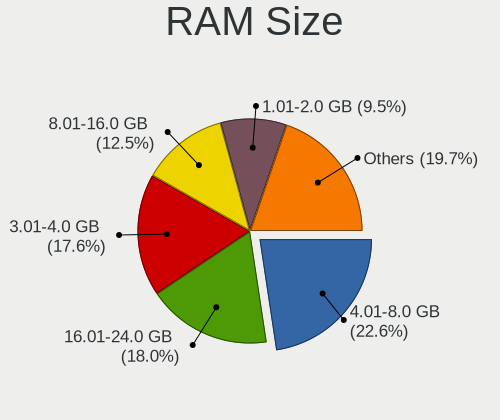
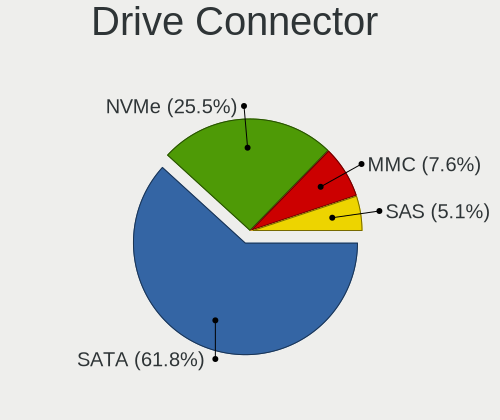
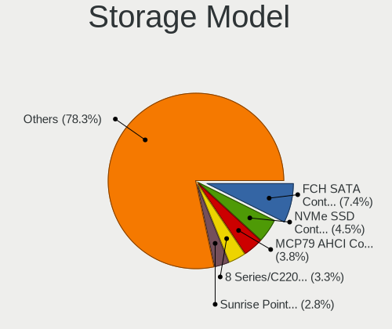
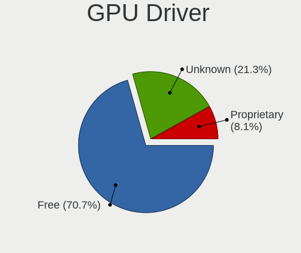
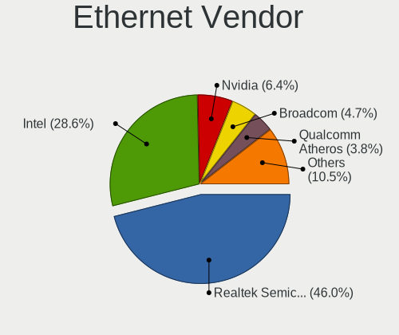

Debian 11 - Tested Hardware & Statistics
----------------------------------------

A project to collect tested hardware configurations for Debian 11.

Anyone can contribute to this report by the [hw-probe](https://github.com/linuxhw/hw-probe) tool:

    sudo -E hw-probe -all -upload

Please contribute! Especially if your hardware is rare.

This is a report for all computer types. See also reports for [desktops](/Dist/Debian_11/Desktop/README.md) and [notebooks](/Dist/Debian_11/Notebook/README.md).

Contents
--------

* [ Test Cases ](#test-cases)

* [ System ](#system)
  - [ Kernel                   ](#kernel)
  - [ Kernel Family            ](#kernel-family)
  - [ Kernel Major Ver.        ](#kernel-major-ver)
  - [ Arch                     ](#arch)
  - [ DE                       ](#de)
  - [ Display Server           ](#display-server)
  - [ Display Manager          ](#display-manager)
  - [ OS Lang                  ](#os-lang)
  - [ Boot Mode                ](#boot-mode)
  - [ Filesystem               ](#filesystem)
  - [ Part. scheme             ](#part-scheme)
  - [ Dual Boot with Linux/BSD ](#dual-boot-with-linuxbsd)
  - [ Dual Boot (Win)          ](#dual-boot-win)

* [ Board ](#board)
  - [ Vendor                   ](#vendor)
  - [ Model                    ](#model)
  - [ Model Family             ](#model-family)
  - [ MFG Year                 ](#mfg-year)
  - [ Form Factor              ](#form-factor)
  - [ Secure Boot              ](#secure-boot)
  - [ Coreboot                 ](#coreboot)
  - [ RAM Size                 ](#ram-size)
  - [ RAM Used                 ](#ram-used)
  - [ Total Drives             ](#total-drives)
  - [ Has CD-ROM               ](#has-cd-rom)
  - [ Has Ethernet             ](#has-ethernet)
  - [ Has WiFi                 ](#has-wifi)
  - [ Has Bluetooth            ](#has-bluetooth)

* [ Location ](#location)
  - [ Country                  ](#country)
  - [ City                     ](#city)

* [ Drives ](#drives)
  - [ Drive Vendor             ](#drive-vendor)
  - [ Drive Model              ](#drive-model)
  - [ HDD Vendor               ](#hdd-vendor)
  - [ SSD Vendor               ](#ssd-vendor)
  - [ Drive Kind               ](#drive-kind)
  - [ Drive Connector          ](#drive-connector)
  - [ Drive Size               ](#drive-size)
  - [ Space Total              ](#space-total)
  - [ Space Used               ](#space-used)
  - [ Malfunc. Drives          ](#malfunc-drives)
  - [ Malfunc. Drive Vendor    ](#malfunc-drive-vendor)
  - [ Malfunc. HDD Vendor      ](#malfunc-hdd-vendor)
  - [ Malfunc. Drive Kind      ](#malfunc-drive-kind)
  - [ Failed Drives            ](#failed-drives)
  - [ Failed Drive Vendor      ](#failed-drive-vendor)
  - [ Drive Status             ](#drive-status)

* [ Storage controller ](#storage-controller)
  - [ Storage Vendor           ](#storage-vendor)
  - [ Storage Model            ](#storage-model)
  - [ Storage Kind             ](#storage-kind)

* [ Processor ](#processor)
  - [ CPU Vendor               ](#cpu-vendor)
  - [ CPU Model                ](#cpu-model)
  - [ CPU Model Family         ](#cpu-model-family)
  - [ CPU Cores                ](#cpu-cores)
  - [ CPU Sockets              ](#cpu-sockets)
  - [ CPU Threads              ](#cpu-threads)
  - [ CPU Op-Modes             ](#cpu-op-modes)
  - [ CPU Microcode            ](#cpu-microcode)
  - [ CPU Microarch            ](#cpu-microarch)

* [ Graphics ](#graphics)
  - [ GPU Vendor               ](#gpu-vendor)
  - [ GPU Model                ](#gpu-model)
  - [ GPU Combo                ](#gpu-combo)
  - [ GPU Driver               ](#gpu-driver)
  - [ GPU Memory               ](#gpu-memory)

* [ Monitor ](#monitor)
  - [ Monitor Vendor           ](#monitor-vendor)
  - [ Monitor Model            ](#monitor-model)
  - [ Monitor Resolution       ](#monitor-resolution)
  - [ Monitor Diagonal         ](#monitor-diagonal)
  - [ Monitor Width            ](#monitor-width)
  - [ Aspect Ratio             ](#aspect-ratio)
  - [ Monitor Area             ](#monitor-area)
  - [ Pixel Density            ](#pixel-density)
  - [ Multiple Monitors        ](#multiple-monitors)

* [ Network ](#network)
  - [ Net Controller Vendor    ](#net-controller-vendor)
  - [ Net Controller Model     ](#net-controller-model)
  - [ Wireless Vendor          ](#wireless-vendor)
  - [ Wireless Model           ](#wireless-model)
  - [ Ethernet Vendor          ](#ethernet-vendor)
  - [ Ethernet Model           ](#ethernet-model)
  - [ Net Controller Kind      ](#net-controller-kind)
  - [ Used Controller          ](#used-controller)
  - [ NICs                     ](#nics)
  - [ IPv6                     ](#ipv6)

* [ Bluetooth ](#bluetooth)
  - [ Bluetooth Vendor         ](#bluetooth-vendor)
  - [ Bluetooth Model          ](#bluetooth-model)

* [ Sound ](#sound)
  - [ Sound Vendor             ](#sound-vendor)
  - [ Sound Model              ](#sound-model)

* [ Memory ](#memory)
  - [ Memory Vendor            ](#memory-vendor)
  - [ Memory Model             ](#memory-model)
  - [ Memory Kind              ](#memory-kind)
  - [ Memory Form Factor       ](#memory-form-factor)
  - [ Memory Size              ](#memory-size)
  - [ Memory Speed             ](#memory-speed)

* [ Printers & scanners ](#printers--scanners)
  - [ Printer Vendor           ](#printer-vendor)
  - [ Printer Model            ](#printer-model)
  - [ Scanner Vendor           ](#scanner-vendor)
  - [ Scanner Model            ](#scanner-model)

* [ Camera ](#camera)
  - [ Camera Vendor            ](#camera-vendor)
  - [ Camera Model             ](#camera-model)

* [ Security ](#security)
  - [ Fingerprint Vendor       ](#fingerprint-vendor)
  - [ Fingerprint Model        ](#fingerprint-model)
  - [ Chipcard Vendor          ](#chipcard-vendor)
  - [ Chipcard Model           ](#chipcard-model)

* [ Unsupported ](#unsupported)
  - [ Unsupported Devices      ](#unsupported-devices)
  - [ Unsupported Device Types ](#unsupported-device-types)

Test Cases
----------

Total: 8663

| Vendor        | Model                       | Form-Factor | Probe                                                      | Date         |
|---------------|-----------------------------|-------------|------------------------------------------------------------|--------------|
| Dell          | 0PV3YR A05                  | Server      | [f5f4abd1f3](https://linux-hardware.org/?probe=f5f4abd1f3) | May 01, 2023 |
| HP            | 2B38                        | Desktop     | [bf99202e8b](https://linux-hardware.org/?probe=bf99202e8b) | May 01, 2023 |
| Dell          | 0NC2VH A01                  | Desktop     | [7fb1708706](https://linux-hardware.org/?probe=7fb1708706) | May 01, 2023 |
| HP            | 2B38                        | Desktop     | [6942eb2544](https://linux-hardware.org/?probe=6942eb2544) | May 01, 2023 |
| Acer          | Aspire E1-571               | Notebook    | [e03d5ff056](https://linux-hardware.org/?probe=e03d5ff056) | Apr 30, 2023 |
| HP            | ProBook 655 G3              | Notebook    | [07e2cc77f8](https://linux-hardware.org/?probe=07e2cc77f8) | Apr 30, 2023 |
| HP            | ProBook 655 G3              | Notebook    | [638e747fb1](https://linux-hardware.org/?probe=638e747fb1) | Apr 30, 2023 |
| HP            | Compaq Mini CQ10-500        | Notebook    | [9a1134210f](https://linux-hardware.org/?probe=9a1134210f) | Apr 30, 2023 |
| Apple         | Mac-00BE6ED71E35EB86 iMa... | All in one  | [c8c9c1e591](https://linux-hardware.org/?probe=c8c9c1e591) | Apr 30, 2023 |
| Positivo      | Q464C                       | Notebook    | [8e41593bd3](https://linux-hardware.org/?probe=8e41593bd3) | Apr 30, 2023 |
| Gigabyte      | GA-78LMT-USB3 SEx           | Desktop     | [ccb46c2a2b](https://linux-hardware.org/?probe=ccb46c2a2b) | Apr 30, 2023 |
| Dell          | Inspiron MXC061             | Notebook    | [2d1ab773dd](https://linux-hardware.org/?probe=2d1ab773dd) | Apr 30, 2023 |
| Dell          | 0PV3YR A05                  | Server      | [7804689b38](https://linux-hardware.org/?probe=7804689b38) | Apr 30, 2023 |
| COPELION I... | QX-250 Series               | Notebook    | [409821566f](https://linux-hardware.org/?probe=409821566f) | Apr 29, 2023 |
| Hardkernel    | ODROID-H3                   | Desktop     | [139d61e128](https://linux-hardware.org/?probe=139d61e128) | Apr 29, 2023 |
| HP            | 3397                        | Desktop     | [8b84766d3d](https://linux-hardware.org/?probe=8b84766d3d) | Apr 29, 2023 |
| Microsoft     | Surface Laptop Go           | Tablet      | [4cc7c839fb](https://linux-hardware.org/?probe=4cc7c839fb) | Apr 29, 2023 |
| Lenovo        | ThinkPad X280 20KESBC402    | Notebook    | [0d5b86146e](https://linux-hardware.org/?probe=0d5b86146e) | Apr 29, 2023 |
| Medion        | MS-7708                     | Desktop     | [af2020cd9c](https://linux-hardware.org/?probe=af2020cd9c) | Apr 28, 2023 |
| Rockchip      | Unknown                     | Soc         | [5236b9452c](https://linux-hardware.org/?probe=5236b9452c) | Apr 28, 2023 |
| Medion        | MS-7708                     | Desktop     | [424c4ca2db](https://linux-hardware.org/?probe=424c4ca2db) | Apr 28, 2023 |
| Intel         | H61 V124                    | Desktop     | [1fa0b34b3c](https://linux-hardware.org/?probe=1fa0b34b3c) | Apr 28, 2023 |
| Supermicro    | X12SPL-F                    | Server      | [8382988ca9](https://linux-hardware.org/?probe=8382988ca9) | Apr 28, 2023 |
| Unknown       | iKoolCore R1 iKoolCore R... | Desktop     | [429d6f994a](https://linux-hardware.org/?probe=429d6f994a) | Apr 28, 2023 |
| ASUSTek       | B150-PRO D3                 | Desktop     | [35fa6f9a33](https://linux-hardware.org/?probe=35fa6f9a33) | Apr 28, 2023 |
| ASRock        | X470 Master SLI             | Desktop     | [cded55a936](https://linux-hardware.org/?probe=cded55a936) | Apr 28, 2023 |
| Dell          | Latitude E7450              | Notebook    | [6afa2ff009](https://linux-hardware.org/?probe=6afa2ff009) | Apr 28, 2023 |
| Unknown       | Unknown                     | Soc         | [e5ff381254](https://linux-hardware.org/?probe=e5ff381254) | Apr 28, 2023 |
| BESSTAR Te... | HM80                        | Desktop     | [476c573547](https://linux-hardware.org/?probe=476c573547) | Apr 28, 2023 |
| Lenovo        | ThinkPad L13 Yoga Gen 2 ... | Convertible | [bab222234a](https://linux-hardware.org/?probe=bab222234a) | Apr 27, 2023 |
| Shenzhen M... | F6BFC                       | Desktop     | [e2f7b853b1](https://linux-hardware.org/?probe=e2f7b853b1) | Apr 27, 2023 |
| Unknown       | Unknown                     | Desktop     | [e9f8ff6596](https://linux-hardware.org/?probe=e9f8ff6596) | Apr 27, 2023 |
| HP            | 17E2                        | Mini pc     | [02ee837763](https://linux-hardware.org/?probe=02ee837763) | Apr 27, 2023 |
| Lenovo        | ThinkPad E14 Gen 2 20TA0... | Notebook    | [69d1f17b35](https://linux-hardware.org/?probe=69d1f17b35) | Apr 27, 2023 |
| ARDOR GAMI... | PD5x_7xPNP_PNR_PNN_PNT      | Notebook    | [e61f528ba5](https://linux-hardware.org/?probe=e61f528ba5) | Apr 27, 2023 |
| AMD           | Volcano                     | Server      | [b7e67f8130](https://linux-hardware.org/?probe=b7e67f8130) | Apr 27, 2023 |
| Dell          | 0PV3YR A05                  | Server      | [475e46f565](https://linux-hardware.org/?probe=475e46f565) | Apr 27, 2023 |
| Lenovo        | IdeaPad 110S-11IBR 80WG     | Notebook    | [73141c5006](https://linux-hardware.org/?probe=73141c5006) | Apr 27, 2023 |
| Lenovo        | IdeaPad 110S-11IBR 80WG     | Notebook    | [0cb164ac2f](https://linux-hardware.org/?probe=0cb164ac2f) | Apr 27, 2023 |
| HP            | Laptop 15s-eq2xxx           | Notebook    | [198fa6162e](https://linux-hardware.org/?probe=198fa6162e) | Apr 27, 2023 |
| IGEL Techn... | M340C                       | Notebook    | [40970f0528](https://linux-hardware.org/?probe=40970f0528) | Apr 26, 2023 |
| MSI           | MS-B0A21                    | Desktop     | [646d14f7b0](https://linux-hardware.org/?probe=646d14f7b0) | Apr 26, 2023 |
| ARDOR GAMI... | PD5x_7xPNP_PNR_PNN_PNT      | Notebook    | [cec3a72c8a](https://linux-hardware.org/?probe=cec3a72c8a) | Apr 26, 2023 |
| Google        | Terra                       | Notebook    | [b22deb9f09](https://linux-hardware.org/?probe=b22deb9f09) | Apr 26, 2023 |
| Dell          | Latitude E6440              | Notebook    | [f5cdf825fa](https://linux-hardware.org/?probe=f5cdf825fa) | Apr 26, 2023 |
| HP            | ENVY 15                     | Notebook    | [1f50420c44](https://linux-hardware.org/?probe=1f50420c44) | Apr 26, 2023 |
| HP            | 250 G6 Notebook PC          | Notebook    | [90e4883dca](https://linux-hardware.org/?probe=90e4883dca) | Apr 26, 2023 |
| IGEL Techn... | M340C                       | Notebook    | [c3c972facf](https://linux-hardware.org/?probe=c3c972facf) | Apr 26, 2023 |
| IGEL Techn... | M340C                       | Notebook    | [f993513cd3](https://linux-hardware.org/?probe=f993513cd3) | Apr 26, 2023 |
| HP            | Pavilion Gaming Laptop 1... | Notebook    | [d8088982c3](https://linux-hardware.org/?probe=d8088982c3) | Apr 26, 2023 |
| HP            | Pavilion Gaming Laptop 1... | Notebook    | [4cffa55fb1](https://linux-hardware.org/?probe=4cffa55fb1) | Apr 26, 2023 |
| HP            | Laptop 15-db1xxx            | Notebook    | [e6380a2186](https://linux-hardware.org/?probe=e6380a2186) | Apr 26, 2023 |
| HP            | Laptop 15                   | Notebook    | [34a2ebf6a1](https://linux-hardware.org/?probe=34a2ebf6a1) | Apr 26, 2023 |
| HP            | Laptop 15-db1xxx            | Notebook    | [872138980a](https://linux-hardware.org/?probe=872138980a) | Apr 26, 2023 |
| HP            | Pavilion Gaming Laptop 1... | Notebook    | [2122bd37a5](https://linux-hardware.org/?probe=2122bd37a5) | Apr 26, 2023 |
| HP            | Pavilion Gaming Laptop 1... | Notebook    | [af7b14d259](https://linux-hardware.org/?probe=af7b14d259) | Apr 26, 2023 |
| HP            | Pavilion Gaming Laptop 1... | Notebook    | [7fbd802154](https://linux-hardware.org/?probe=7fbd802154) | Apr 26, 2023 |
| HP            | Pavilion Gaming Laptop 1... | Notebook    | [ffe6065419](https://linux-hardware.org/?probe=ffe6065419) | Apr 26, 2023 |
| HP            | Pavilion Gaming Laptop 1... | Notebook    | [94ddc76aae](https://linux-hardware.org/?probe=94ddc76aae) | Apr 26, 2023 |
| Dell          | 0PV3YR A05                  | Server      | [23571a99b1](https://linux-hardware.org/?probe=23571a99b1) | Apr 26, 2023 |
| HP            | 1632                        | Desktop     | [ace6df6aee](https://linux-hardware.org/?probe=ace6df6aee) | Apr 25, 2023 |
| Dell          | Cherry Trail CR A00         | Mini pc     | [f1fb89d0f7](https://linux-hardware.org/?probe=f1fb89d0f7) | Apr 25, 2023 |
| Lenovo        | ThinkPad T530 23594ZC       | Notebook    | [7aec73dfa1](https://linux-hardware.org/?probe=7aec73dfa1) | Apr 25, 2023 |
| Lenovo        | ThinkPad X200 7459KM3       | Notebook    | [cbea785e27](https://linux-hardware.org/?probe=cbea785e27) | Apr 25, 2023 |
| Dell          | 0KYJ8C A00                  | Desktop     | [1e8226d149](https://linux-hardware.org/?probe=1e8226d149) | Apr 25, 2023 |
| Acer          | Aspire E5-576G              | Notebook    | [9ca5902786](https://linux-hardware.org/?probe=9ca5902786) | Apr 25, 2023 |
| ASUSTek       | PRIME Z590-P                | Desktop     | [5d03070db6](https://linux-hardware.org/?probe=5d03070db6) | Apr 24, 2023 |
| Lenovo        | ThinkPad P15s Gen 2i 20W... | Notebook    | [aa1b58a2a2](https://linux-hardware.org/?probe=aa1b58a2a2) | Apr 24, 2023 |
| HP            | 8056                        | Desktop     | [a7686ee1af](https://linux-hardware.org/?probe=a7686ee1af) | Apr 24, 2023 |
| AZW           | MINI S                      | Desktop     | [d71153ae6e](https://linux-hardware.org/?probe=d71153ae6e) | Apr 24, 2023 |
| Apple         | MacBookPro5,5               | Notebook    | [de825a326c](https://linux-hardware.org/?probe=de825a326c) | Apr 24, 2023 |
| Intel         | SE7320EP2 D11950-402        | Desktop     | [ad1a126878](https://linux-hardware.org/?probe=ad1a126878) | Apr 24, 2023 |
| MSI           | Z87-G43                     | Desktop     | [4d908cb615](https://linux-hardware.org/?probe=4d908cb615) | Apr 24, 2023 |
| Dell          | 0N0992 A01                  | Desktop     | [a8e8000610](https://linux-hardware.org/?probe=a8e8000610) | Apr 24, 2023 |
| Dell          | Inspiron 5537               | Notebook    | [971055139b](https://linux-hardware.org/?probe=971055139b) | Apr 24, 2023 |
| Dell          | 03FV9K A00                  | Server      | [4d9f06ca7b](https://linux-hardware.org/?probe=4d9f06ca7b) | Apr 24, 2023 |
| Lenovo        | ThinkBook 14-IML 20RV       | Notebook    | [32546113c8](https://linux-hardware.org/?probe=32546113c8) | Apr 24, 2023 |
| Raspberry ... | Raspberry Pi                | Soc         | [5f760ed90e](https://linux-hardware.org/?probe=5f760ed90e) | Apr 23, 2023 |
| Biostar       | B350ET2                     | Desktop     | [47289e48eb](https://linux-hardware.org/?probe=47289e48eb) | Apr 23, 2023 |
| ASRock        | B560 Pro4                   | Desktop     | [3a9f7b19fa](https://linux-hardware.org/?probe=3a9f7b19fa) | Apr 23, 2023 |
| MSI           | Z390-A PRO                  | Desktop     | [74cf7ef6e5](https://linux-hardware.org/?probe=74cf7ef6e5) | Apr 23, 2023 |
| HP            | 15                          | Notebook    | [fd68fb06af](https://linux-hardware.org/?probe=fd68fb06af) | Apr 23, 2023 |
| Fujitsu       | D3313-G1 S26361-D3313-G1    | Desktop     | [78c1951456](https://linux-hardware.org/?probe=78c1951456) | Apr 23, 2023 |
| ASRock        | B560 Pro4                   | Desktop     | [965aa93228](https://linux-hardware.org/?probe=965aa93228) | Apr 23, 2023 |
| Unknown       | Unknown                     | Desktop     | [0605faa66d](https://linux-hardware.org/?probe=0605faa66d) | Apr 23, 2023 |
| AZW           | U59                         | Desktop     | [8921a6910d](https://linux-hardware.org/?probe=8921a6910d) | Apr 23, 2023 |
| ASRockRack    | ROMED8-2T                   | Server      | [c88cba109a](https://linux-hardware.org/?probe=c88cba109a) | Apr 23, 2023 |
| Toshiba       | PORTEGE Z20t-C              | Notebook    | [45d7bd0907](https://linux-hardware.org/?probe=45d7bd0907) | Apr 23, 2023 |
| Shuttle       | DS20U                       | Desktop     | [2e8e79b5ff](https://linux-hardware.org/?probe=2e8e79b5ff) | Apr 23, 2023 |
| Toshiba       | PORTEGE Z20t-C              | Notebook    | [c7367bfdff](https://linux-hardware.org/?probe=c7367bfdff) | Apr 23, 2023 |
| HP            | 845A                        | Desktop     | [41a0cad635](https://linux-hardware.org/?probe=41a0cad635) | Apr 23, 2023 |
| Gigabyte      | B550 VISION D-P             | Desktop     | [ccb49b32a0](https://linux-hardware.org/?probe=ccb49b32a0) | Apr 23, 2023 |
| Gigabyte      | B550 VISION D-P             | Desktop     | [2651f47f8c](https://linux-hardware.org/?probe=2651f47f8c) | Apr 23, 2023 |
| Toshiba       | Satellite C70D-A            | Notebook    | [adee59c351](https://linux-hardware.org/?probe=adee59c351) | Apr 23, 2023 |
| Toshiba       | Satellite C70D-A            | Notebook    | [c5c43186bc](https://linux-hardware.org/?probe=c5c43186bc) | Apr 23, 2023 |
| Dell          | G15 5520                    | Notebook    | [07751c950a](https://linux-hardware.org/?probe=07751c950a) | Apr 22, 2023 |
| ASUSTek       | ROG STRIX B660-I GAMING ... | Desktop     | [03a331aa44](https://linux-hardware.org/?probe=03a331aa44) | Apr 22, 2023 |
| ASUSTek       | PRIME B650M-A AX            | Desktop     | [0a90dc180c](https://linux-hardware.org/?probe=0a90dc180c) | Apr 22, 2023 |
| MW            | GMLK-2_5G4L                 | Desktop     | [b5ffb4ee22](https://linux-hardware.org/?probe=b5ffb4ee22) | Apr 22, 2023 |
| HP            | Laptop 15s-du3xxx           | Notebook    | [45af810de1](https://linux-hardware.org/?probe=45af810de1) | Apr 21, 2023 |
| Intel         | NUC11TNBi3 M11908-403       | Mini pc     | [868456ca5d](https://linux-hardware.org/?probe=868456ca5d) | Apr 21, 2023 |
| ASUSTek       | VivoBook_ASUSLaptop X509... | Notebook    | [5f61e3a174](https://linux-hardware.org/?probe=5f61e3a174) | Apr 21, 2023 |
| Gigabyte      | B550M DS3H                  | Desktop     | [e98b4fdd23](https://linux-hardware.org/?probe=e98b4fdd23) | Apr 21, 2023 |
| Intel         | NUC8BEB J72692-306          | Mini pc     | [a92b4a305f](https://linux-hardware.org/?probe=a92b4a305f) | Apr 21, 2023 |
| HP            | OMEN Laptop 15-en1xxx       | Notebook    | [3caa3d5076](https://linux-hardware.org/?probe=3caa3d5076) | Apr 21, 2023 |
| HP            | ZBook Power 15.6 inch G9... | Notebook    | [8c8d2eb3b5](https://linux-hardware.org/?probe=8c8d2eb3b5) | Apr 21, 2023 |
| Dell          | Precision 3550              | Notebook    | [7434822402](https://linux-hardware.org/?probe=7434822402) | Apr 21, 2023 |
| ASUSTek       | B85M-G                      | Desktop     | [4392c46287](https://linux-hardware.org/?probe=4392c46287) | Apr 20, 2023 |
| Gigabyte      | Z77-DS3H                    | Desktop     | [cde1ecf1c6](https://linux-hardware.org/?probe=cde1ecf1c6) | Apr 20, 2023 |
| Toshiba       | Satellite Pro NB10-A-125    | Notebook    | [3a77f344af](https://linux-hardware.org/?probe=3a77f344af) | Apr 20, 2023 |
| Shuttle       | FS81                        | Desktop     | [051b7f4753](https://linux-hardware.org/?probe=051b7f4753) | Apr 20, 2023 |
| ASUSTek       | X550CA                      | Notebook    | [cb5f73ff63](https://linux-hardware.org/?probe=cb5f73ff63) | Apr 20, 2023 |
| Acer          | Aspire E3-111               | Notebook    | [9af253f4e0](https://linux-hardware.org/?probe=9af253f4e0) | Apr 20, 2023 |
| ASRock        | B550 Pro4                   | Desktop     | [2d4578e52a](https://linux-hardware.org/?probe=2d4578e52a) | Apr 20, 2023 |
| HP            | Laptop 15-db0xxx            | Notebook    | [9ab965fcb8](https://linux-hardware.org/?probe=9ab965fcb8) | Apr 19, 2023 |
| ASUSTek       | SABERTOOTH 990FX R2.0       | Desktop     | [4abfcb4ab3](https://linux-hardware.org/?probe=4abfcb4ab3) | Apr 19, 2023 |
| ASUSTek       | SABERTOOTH 990FX R2.0       | Desktop     | [e93357961f](https://linux-hardware.org/?probe=e93357961f) | Apr 19, 2023 |
| Lenovo        | ThinkPad T500 2055WAB       | Notebook    | [4e293261bb](https://linux-hardware.org/?probe=4e293261bb) | Apr 19, 2023 |
| HP            | ProBook 450 G2              | Notebook    | [3b8c115c1a](https://linux-hardware.org/?probe=3b8c115c1a) | Apr 19, 2023 |
| MSI           | MPG Z590 GAMING EDGE WIF... | Desktop     | [97860c01ca](https://linux-hardware.org/?probe=97860c01ca) | Apr 19, 2023 |
| Toshiba       | Satellite Pro A100          | Notebook    | [4240870be8](https://linux-hardware.org/?probe=4240870be8) | Apr 19, 2023 |
| Lenovo        | Yoga 300-11IBR 80M1         | Notebook    | [f691871296](https://linux-hardware.org/?probe=f691871296) | Apr 19, 2023 |
| Acer          | Swift SF314-57              | Notebook    | [5fc25cc033](https://linux-hardware.org/?probe=5fc25cc033) | Apr 19, 2023 |
| ASRock        | J3455-ITX                   | Desktop     | [895abaa15e](https://linux-hardware.org/?probe=895abaa15e) | Apr 19, 2023 |
| ASRock        | J3455-ITX                   | Desktop     | [f70d811bbd](https://linux-hardware.org/?probe=f70d811bbd) | Apr 19, 2023 |
| sunxi         | Unknown                     | Soc         | [bb26b3803b](https://linux-hardware.org/?probe=bb26b3803b) | Apr 19, 2023 |
| HP            | 255 G8 Notebook PC          | Notebook    | [699e2a2a80](https://linux-hardware.org/?probe=699e2a2a80) | Apr 18, 2023 |
| Intel         | NUC8BEB J72692-309          | Mini pc     | [213cd129cd](https://linux-hardware.org/?probe=213cd129cd) | Apr 18, 2023 |
| sunxi         | Unknown                     | Soc         | [586cbefdb3](https://linux-hardware.org/?probe=586cbefdb3) | Apr 18, 2023 |
| Lenovo        | 374B No DPK                 | All in one  | [c87417466c](https://linux-hardware.org/?probe=c87417466c) | Apr 18, 2023 |
| Lenovo        | 374B No DPK                 | All in one  | [4a7133799c](https://linux-hardware.org/?probe=4a7133799c) | Apr 18, 2023 |
| Toshiba       | Satellite Pro C850-1J2      | Notebook    | [e5c63957a2](https://linux-hardware.org/?probe=e5c63957a2) | Apr 18, 2023 |
| ASUSTek       | PRIME A320M-K               | Desktop     | [fd82dc08dc](https://linux-hardware.org/?probe=fd82dc08dc) | Apr 18, 2023 |
| Apple         | Mac-35C5E08120C7EEAF Mac... | Mini pc     | [35c6970ec2](https://linux-hardware.org/?probe=35c6970ec2) | Apr 18, 2023 |
| Supermicro    | X9DRW                       | Server      | [6994c89077](https://linux-hardware.org/?probe=6994c89077) | Apr 17, 2023 |
| MSI           | MAG Z390M MORTAR            | Desktop     | [121237b9c1](https://linux-hardware.org/?probe=121237b9c1) | Apr 17, 2023 |
| MSI           | MPG B650I EDGE WIFI         | Desktop     | [11f85df48e](https://linux-hardware.org/?probe=11f85df48e) | Apr 17, 2023 |
| Lenovo        | ThinkPad E15 Gen 3 20YHS... | Notebook    | [94f62c41e5](https://linux-hardware.org/?probe=94f62c41e5) | Apr 17, 2023 |
| ASRock        | H310M-STX                   | Desktop     | [438e774de5](https://linux-hardware.org/?probe=438e774de5) | Apr 17, 2023 |
| HP            | 0AECh D                     | Desktop     | [f6c67d337e](https://linux-hardware.org/?probe=f6c67d337e) | Apr 17, 2023 |
| LG Electro... | P530-KE6BK                  | Notebook    | [b1f0863c79](https://linux-hardware.org/?probe=b1f0863c79) | Apr 17, 2023 |
| ASUSTek       | K30BF_M32BF                 | Desktop     | [6ea01fad49](https://linux-hardware.org/?probe=6ea01fad49) | Apr 17, 2023 |
| Gigabyte      | GA-78LMT-USB3 SEx           | Desktop     | [7f5feb82ab](https://linux-hardware.org/?probe=7f5feb82ab) | Apr 17, 2023 |
| Gigabyte      | Z690 AORUS ULTRA            | Desktop     | [a4bb147f89](https://linux-hardware.org/?probe=a4bb147f89) | Apr 17, 2023 |
| Lenovo        | Legion Y540-15IRH 81SX      | Notebook    | [d5db24c28d](https://linux-hardware.org/?probe=d5db24c28d) | Apr 17, 2023 |
| Lenovo        | Legion Y540-15IRH 81SX      | Notebook    | [89eb2b2c32](https://linux-hardware.org/?probe=89eb2b2c32) | Apr 17, 2023 |
| ASUSTek       | P8H77-M                     | Desktop     | [6364dbb93a](https://linux-hardware.org/?probe=6364dbb93a) | Apr 16, 2023 |
| Dell          | Latitude 5420               | Notebook    | [4f3345aced](https://linux-hardware.org/?probe=4f3345aced) | Apr 16, 2023 |
| Dell          | 0HHV7N A00                  | Desktop     | [4443ff9154](https://linux-hardware.org/?probe=4443ff9154) | Apr 16, 2023 |
| Apple         | Mac-F4238CC8 PVT            | All in one  | [9c885fa5cf](https://linux-hardware.org/?probe=9c885fa5cf) | Apr 16, 2023 |
| HP            | 18E7                        | Desktop     | [6c2c248eec](https://linux-hardware.org/?probe=6c2c248eec) | Apr 16, 2023 |
| Apple         | Mac-F4238CC8 PVT            | All in one  | [8fb4ed64eb](https://linux-hardware.org/?probe=8fb4ed64eb) | Apr 16, 2023 |
| Apple         | Mac-F4238CC8 PVT            | All in one  | [5943787304](https://linux-hardware.org/?probe=5943787304) | Apr 16, 2023 |
| ASUSTek       | PRIME X570-P                | Desktop     | [1f02ee3393](https://linux-hardware.org/?probe=1f02ee3393) | Apr 16, 2023 |
| Lenovo        | ThinkBook 14-IML 20RV       | Notebook    | [d532f6fdbd](https://linux-hardware.org/?probe=d532f6fdbd) | Apr 16, 2023 |
| Lenovo        | ThinkPad T470s W10DG 20J... | Notebook    | [c622c73721](https://linux-hardware.org/?probe=c622c73721) | Apr 16, 2023 |
| HP            | Notebook                    | Notebook    | [7614984f1d](https://linux-hardware.org/?probe=7614984f1d) | Apr 15, 2023 |
| Lenovo        | XiaoXinPro 16ACH 2021 82... | Notebook    | [8ca60a45fe](https://linux-hardware.org/?probe=8ca60a45fe) | Apr 15, 2023 |
| Gigabyte      | GA-78LMT-USB3 SEx           | Desktop     | [7d9278e08a](https://linux-hardware.org/?probe=7d9278e08a) | Apr 15, 2023 |
| ASRock        | H61M-DGS                    | Desktop     | [e0b2a066ee](https://linux-hardware.org/?probe=e0b2a066ee) | Apr 15, 2023 |
| Raspberry ... | Raspberry Pi 4 Model B R... | Soc         | [be369fe18a](https://linux-hardware.org/?probe=be369fe18a) | Apr 15, 2023 |
| HP            | EliteBook 850 G4            | Notebook    | [984cf8fd47](https://linux-hardware.org/?probe=984cf8fd47) | Apr 14, 2023 |
| Raspberry ... | Raspberry Pi Zero 2 W Re... | Soc         | [cb1763401c](https://linux-hardware.org/?probe=cb1763401c) | Apr 14, 2023 |
| Medion        | TJ4125                      | Desktop     | [887d24e023](https://linux-hardware.org/?probe=887d24e023) | Apr 14, 2023 |
| Lenovo        | 7Z73CTO1WW 05               | Server      | [29f89998ee](https://linux-hardware.org/?probe=29f89998ee) | Apr 14, 2023 |
| Acer          | Aspire E5-575G              | Notebook    | [39afaea9e3](https://linux-hardware.org/?probe=39afaea9e3) | Apr 14, 2023 |
| HP            | Laptop 17-cp0xxx            | Notebook    | [6fdb6931f0](https://linux-hardware.org/?probe=6fdb6931f0) | Apr 14, 2023 |
| ASUSTek       | ROG STRIX B550-F GAMING     | Desktop     | [d7768947bc](https://linux-hardware.org/?probe=d7768947bc) | Apr 14, 2023 |
| Acer          | Extensa 5635Z               | Notebook    | [b3c99bf352](https://linux-hardware.org/?probe=b3c99bf352) | Apr 14, 2023 |
| Notebook      | N7x0WU                      | Notebook    | [5d37070bf0](https://linux-hardware.org/?probe=5d37070bf0) | Apr 14, 2023 |
| ASUSTek       | VivoBook_ASUSLaptop M160... | Notebook    | [6af1f492c4](https://linux-hardware.org/?probe=6af1f492c4) | Apr 14, 2023 |
| Gigabyte      | B550 AORUS PRO V2           | Desktop     | [f4cbe67033](https://linux-hardware.org/?probe=f4cbe67033) | Apr 14, 2023 |
| ASRock        | H81M-VG4 R2.0               | Desktop     | [cc951809ed](https://linux-hardware.org/?probe=cc951809ed) | Apr 14, 2023 |
| Lenovo        | Flex 2-14 20404             | Notebook    | [c76a516113](https://linux-hardware.org/?probe=c76a516113) | Apr 14, 2023 |
| Dell          | Inspiron 1525               | Notebook    | [9ab8e04a20](https://linux-hardware.org/?probe=9ab8e04a20) | Apr 14, 2023 |
| Acer          | AO756                       | Notebook    | [58efd2f87f](https://linux-hardware.org/?probe=58efd2f87f) | Apr 14, 2023 |
| Lenovo        | ThinkStation D30 42234T7    | Desktop     | [7730eb04fa](https://linux-hardware.org/?probe=7730eb04fa) | Apr 14, 2023 |
| Gigabyte      | B75M-D3H                    | Desktop     | [6106a2c31f](https://linux-hardware.org/?probe=6106a2c31f) | Apr 13, 2023 |
| sunxi         | LeMaker Banana Pi           | Soc         | [7a60bb63b4](https://linux-hardware.org/?probe=7a60bb63b4) | Apr 13, 2023 |
| ASUSTek       | M5A97 EVO R2.0              | Desktop     | [70e0ac9475](https://linux-hardware.org/?probe=70e0ac9475) | Apr 13, 2023 |
| Fujitsu       | D3403-A1 S26361-D3403-A1    | Desktop     | [5be961705c](https://linux-hardware.org/?probe=5be961705c) | Apr 13, 2023 |
| Dell          | Inspiron 1525               | Notebook    | [1a327ce647](https://linux-hardware.org/?probe=1a327ce647) | Apr 13, 2023 |
| IceWhale T... | ZimaBoard 216 ZMB           | Desktop     | [33a7fad816](https://linux-hardware.org/?probe=33a7fad816) | Apr 13, 2023 |
| ASUSTek       | TUF B450-PLUS GAMING        | Desktop     | [721a60ff30](https://linux-hardware.org/?probe=721a60ff30) | Apr 13, 2023 |
| Dell          | Inspiron 1525               | Notebook    | [bc3ccff50c](https://linux-hardware.org/?probe=bc3ccff50c) | Apr 13, 2023 |
| ASRock        | H410M-HVS R2.0              | Desktop     | [7f388965d7](https://linux-hardware.org/?probe=7f388965d7) | Apr 13, 2023 |
| HP            | 21EF                        | Desktop     | [d2b3751fd1](https://linux-hardware.org/?probe=d2b3751fd1) | Apr 13, 2023 |
| Acer          | Aspire A315-51              | Notebook    | [c3962286cb](https://linux-hardware.org/?probe=c3962286cb) | Apr 13, 2023 |
| Dell          | 0XD433 A00                  | Desktop     | [e0a30bf441](https://linux-hardware.org/?probe=e0a30bf441) | Apr 12, 2023 |
| Raspberry ... | Raspberry Pi 3 Model B R... | Soc         | [533131a67a](https://linux-hardware.org/?probe=533131a67a) | Apr 12, 2023 |
| Apple         | MacBookPro5,5               | Notebook    | [401c4d8143](https://linux-hardware.org/?probe=401c4d8143) | Apr 12, 2023 |
| HP            | Laptop 15s-eq2xxx           | Notebook    | [abedf2741f](https://linux-hardware.org/?probe=abedf2741f) | Apr 12, 2023 |
| HP            | ZBook 15 G3                 | Notebook    | [5411d789c3](https://linux-hardware.org/?probe=5411d789c3) | Apr 12, 2023 |
| HP            | Pavilion dv6                | Notebook    | [09b80dd551](https://linux-hardware.org/?probe=09b80dd551) | Apr 12, 2023 |
| HP            | Pavilion dv7                | Notebook    | [4363479bf0](https://linux-hardware.org/?probe=4363479bf0) | Apr 12, 2023 |
| AMI           | Aptio CRB                   | Mini pc     | [9408f6348b](https://linux-hardware.org/?probe=9408f6348b) | Apr 12, 2023 |
| ASUSTek       | PRIME B450-PLUS             | Desktop     | [108725a205](https://linux-hardware.org/?probe=108725a205) | Apr 12, 2023 |
| MSI           | Z370 PC PRO                 | Desktop     | [fb3078d5c3](https://linux-hardware.org/?probe=fb3078d5c3) | Apr 12, 2023 |
| Intel         | H61 V124                    | Desktop     | [28b73b97b3](https://linux-hardware.org/?probe=28b73b97b3) | Apr 12, 2023 |
| Dell          | 01XK1W A00                  | Desktop     | [4eb8c9f372](https://linux-hardware.org/?probe=4eb8c9f372) | Apr 12, 2023 |
| MSI           | MS-7060                     | Desktop     | [d78aaad9ec](https://linux-hardware.org/?probe=d78aaad9ec) | Apr 12, 2023 |
| Lenovo        | ThinkPad E470 20H2S00700    | Notebook    | [ea2aa5245d](https://linux-hardware.org/?probe=ea2aa5245d) | Apr 11, 2023 |
| Samsung       | 550XCJ/550XCR               | Notebook    | [c074d665d9](https://linux-hardware.org/?probe=c074d665d9) | Apr 11, 2023 |
| Samsung       | 550XCJ/550XCR               | Notebook    | [845a04c326](https://linux-hardware.org/?probe=845a04c326) | Apr 11, 2023 |
| HP            | 8158 A01                    | Mini pc     | [a7d7e5c675](https://linux-hardware.org/?probe=a7d7e5c675) | Apr 11, 2023 |
| Packard Be... | EasyNote_MX45               | Notebook    | [95935443c0](https://linux-hardware.org/?probe=95935443c0) | Apr 11, 2023 |
| HP            | 1589                        | Desktop     | [c04488f359](https://linux-hardware.org/?probe=c04488f359) | Apr 11, 2023 |
| ASUSTek       | PRIME Z590-P                | Desktop     | [e4299a2ce6](https://linux-hardware.org/?probe=e4299a2ce6) | Apr 11, 2023 |
| ASUSTek       | X550JF                      | Notebook    | [dff4654bd2](https://linux-hardware.org/?probe=dff4654bd2) | Apr 11, 2023 |
| Intel         | NUC11PABi5 K90634-305       | Mini pc     | [7232d92c69](https://linux-hardware.org/?probe=7232d92c69) | Apr 11, 2023 |
| Acer          | Aspire 5738                 | Notebook    | [c039220e20](https://linux-hardware.org/?probe=c039220e20) | Apr 11, 2023 |
| AMI           | Aptio CRB                   | Mini pc     | [1f19b2c0dc](https://linux-hardware.org/?probe=1f19b2c0dc) | Apr 11, 2023 |
| HP            | 1589                        | Desktop     | [e52c705c13](https://linux-hardware.org/?probe=e52c705c13) | Apr 11, 2023 |
| ASUSTek       | PRIME Z370-A                | Desktop     | [64759fca72](https://linux-hardware.org/?probe=64759fca72) | Apr 10, 2023 |
| Dell          | Inspiron 15 5510            | Notebook    | [5d84a5a711](https://linux-hardware.org/?probe=5d84a5a711) | Apr 10, 2023 |
| Apple         | MacBookAir7,2               | Notebook    | [94efe20a0f](https://linux-hardware.org/?probe=94efe20a0f) | Apr 10, 2023 |
| Dell          | 0PV3YR A05                  | Server      | [a3062022a3](https://linux-hardware.org/?probe=a3062022a3) | Apr 10, 2023 |
| Lenovo        | ThinkPad T480 20L6S0CE1M    | Notebook    | [eb794b0dc7](https://linux-hardware.org/?probe=eb794b0dc7) | Apr 10, 2023 |
| Lenovo        | ThinkPad L470 20J4000LGE    | Notebook    | [fec574fe0d](https://linux-hardware.org/?probe=fec574fe0d) | Apr 10, 2023 |
| Lenovo        | ThinkPad L470 20J4000LGE    | Notebook    | [f97c4e6d47](https://linux-hardware.org/?probe=f97c4e6d47) | Apr 10, 2023 |
| Samsung       | RF511/RF411/RF711           | Notebook    | [ea4fdd80e6](https://linux-hardware.org/?probe=ea4fdd80e6) | Apr 09, 2023 |
| ASUSTek       | ROG STRIX Z390-F GAMING     | Desktop     | [5b0601fc42](https://linux-hardware.org/?probe=5b0601fc42) | Apr 09, 2023 |
| Medion        | TJ4125                      | Desktop     | [5c5f39a8fd](https://linux-hardware.org/?probe=5c5f39a8fd) | Apr 09, 2023 |
| Supermicro    | X9DRW                       | Server      | [dae7b6b11e](https://linux-hardware.org/?probe=dae7b6b11e) | Apr 09, 2023 |
| Dell          | 0PV3YR A05                  | Server      | [085d715399](https://linux-hardware.org/?probe=085d715399) | Apr 09, 2023 |
| HP            | 2B29                        | Desktop     | [b909d3c46d](https://linux-hardware.org/?probe=b909d3c46d) | Apr 09, 2023 |
| HP            | 2B29                        | Desktop     | [1fd9cd3d7c](https://linux-hardware.org/?probe=1fd9cd3d7c) | Apr 09, 2023 |
| ASUSTek       | PRIME B450-PLUS             | Desktop     | [3b665833d1](https://linux-hardware.org/?probe=3b665833d1) | Apr 09, 2023 |
| ASUSTek       | X756UQ                      | Notebook    | [bff5545041](https://linux-hardware.org/?probe=bff5545041) | Apr 08, 2023 |
| HP            | 83E9                        | Desktop     | [4e62f72ee2](https://linux-hardware.org/?probe=4e62f72ee2) | Apr 08, 2023 |
| HP            | 83E9                        | Desktop     | [36fdd064cc](https://linux-hardware.org/?probe=36fdd064cc) | Apr 08, 2023 |
| libre-comp... | aml-s905x-cc                | Soc         | [2c41d3c020](https://linux-hardware.org/?probe=2c41d3c020) | Apr 08, 2023 |
| Apple         | Mac-77EB7D7DAF985301 iMa... | All in one  | [d5fb19d97c](https://linux-hardware.org/?probe=d5fb19d97c) | Apr 08, 2023 |
| Lenovo        | ThinkPad E15 Gen 2 20TD0... | Notebook    | [fc28f6d3f0](https://linux-hardware.org/?probe=fc28f6d3f0) | Apr 08, 2023 |
| HP            | ENVY dv6                    | Notebook    | [0d89a1797e](https://linux-hardware.org/?probe=0d89a1797e) | Apr 08, 2023 |
| MSI           | GL65 Leopard 10SCSR         | Notebook    | [3063414a8c](https://linux-hardware.org/?probe=3063414a8c) | Apr 08, 2023 |
| AMI           | Intel                       | Desktop     | [48c620d141](https://linux-hardware.org/?probe=48c620d141) | Apr 08, 2023 |
| Raspberry ... | Raspberry Pi 4 Model B R... | Soc         | [48ab84d4f4](https://linux-hardware.org/?probe=48ab84d4f4) | Apr 08, 2023 |
| ASUSTek       | PN41                        | Mini pc     | [8f34b2347f](https://linux-hardware.org/?probe=8f34b2347f) | Apr 07, 2023 |
| ASRock        | B450 Gaming-ITX/ac          | Desktop     | [36c87da9d9](https://linux-hardware.org/?probe=36c87da9d9) | Apr 07, 2023 |
| Lenovo        | ThinkPad T450 20BUA05900    | Notebook    | [e771177cca](https://linux-hardware.org/?probe=e771177cca) | Apr 07, 2023 |
| Acer          | TravelMate 5735Z            | Notebook    | [6d50e55675](https://linux-hardware.org/?probe=6d50e55675) | Apr 07, 2023 |
| HP            | Pavilion dv7                | Notebook    | [3ec1e98abd](https://linux-hardware.org/?probe=3ec1e98abd) | Apr 07, 2023 |
| Google        | Reks                        | Notebook    | [25341f2040](https://linux-hardware.org/?probe=25341f2040) | Apr 07, 2023 |
| Google        | Reks                        | Notebook    | [21c7e0c282](https://linux-hardware.org/?probe=21c7e0c282) | Apr 07, 2023 |
| Google        | Terra                       | Notebook    | [09a6a1ca8f](https://linux-hardware.org/?probe=09a6a1ca8f) | Apr 07, 2023 |
| Inventec      | D CLASS A02                 | Desktop     | [3d53baddbf](https://linux-hardware.org/?probe=3d53baddbf) | Apr 07, 2023 |
| Inventec      | VXC Class A02               | Desktop     | [3ff1b18b81](https://linux-hardware.org/?probe=3ff1b18b81) | Apr 07, 2023 |
| Acer          | TravelMate 5735Z            | Notebook    | [a74c66fc15](https://linux-hardware.org/?probe=a74c66fc15) | Apr 07, 2023 |
| Dell          | 01XK1W A00                  | Desktop     | [023a578b76](https://linux-hardware.org/?probe=023a578b76) | Apr 07, 2023 |
| Acer          | TravelMate 5735Z            | Notebook    | [46990342e8](https://linux-hardware.org/?probe=46990342e8) | Apr 06, 2023 |
| Acer          | TravelMate 5735Z            | Notebook    | [6d0065dea2](https://linux-hardware.org/?probe=6d0065dea2) | Apr 06, 2023 |
| ASUSTek       | ASUS EXPERTBOOK B1400CEA... | Notebook    | [d5c75a0967](https://linux-hardware.org/?probe=d5c75a0967) | Apr 06, 2023 |
| MSI           | MS-7253                     | Desktop     | [1b9074e1ac](https://linux-hardware.org/?probe=1b9074e1ac) | Apr 06, 2023 |
| Dell          | Latitude E7250              | Notebook    | [e5fe0c7962](https://linux-hardware.org/?probe=e5fe0c7962) | Apr 06, 2023 |
| Foxconn       | 2A8C                        | Desktop     | [f202bac0de](https://linux-hardware.org/?probe=f202bac0de) | Apr 06, 2023 |
| Huanan        | X99-F8D PLUS V1.1           | Desktop     | [6d7db3d917](https://linux-hardware.org/?probe=6d7db3d917) | Apr 06, 2023 |
| Gigabyte      | B550 AORUS ELITE            | Desktop     | [ca1cdc7f46](https://linux-hardware.org/?probe=ca1cdc7f46) | Apr 06, 2023 |
| MSI           | MS-B1831                    | Desktop     | [9ea2ec4f47](https://linux-hardware.org/?probe=9ea2ec4f47) | Apr 06, 2023 |
| Apple         | Mac-FC02E91DDD3FA6A4 iMa... | All in one  | [6a8c52faa7](https://linux-hardware.org/?probe=6a8c52faa7) | Apr 06, 2023 |
| Gigabyte      | F2A88XN-WIFI                | Desktop     | [ea7a921618](https://linux-hardware.org/?probe=ea7a921618) | Apr 06, 2023 |
| Gigabyte      | F2A88XN-WIFI                | Desktop     | [125f93468e](https://linux-hardware.org/?probe=125f93468e) | Apr 06, 2023 |
| HP            | 895C                        | Desktop     | [27de3e2244](https://linux-hardware.org/?probe=27de3e2244) | Apr 06, 2023 |
| Lenovo        | ThinkPad X1 Yoga 2nd 20J... | Convertible | [a1d46a2184](https://linux-hardware.org/?probe=a1d46a2184) | Apr 06, 2023 |
| Huanan        | X99-F8D PLUS V1.1           | Desktop     | [9c6a3de994](https://linux-hardware.org/?probe=9c6a3de994) | Apr 05, 2023 |
| HP            | 895C                        | Desktop     | [3c87e6de19](https://linux-hardware.org/?probe=3c87e6de19) | Apr 05, 2023 |
| ASUSTek       | PRIME A320M-K               | Desktop     | [6dbb59e2fc](https://linux-hardware.org/?probe=6dbb59e2fc) | Apr 05, 2023 |
| Dell          | 0V0D45 A01                  | All in one  | [1940c6417c](https://linux-hardware.org/?probe=1940c6417c) | Apr 05, 2023 |
| Toshiba       | Satellite C855D-12J         | Notebook    | [cb3dedf5e8](https://linux-hardware.org/?probe=cb3dedf5e8) | Apr 05, 2023 |
| ASUSTek       | Z170-K                      | Desktop     | [d9ab0a1946](https://linux-hardware.org/?probe=d9ab0a1946) | Apr 05, 2023 |
| Gigabyte      | Z97X-UD3H-BK-CF             | Desktop     | [2783ec6da9](https://linux-hardware.org/?probe=2783ec6da9) | Apr 05, 2023 |
| Acer          | Aspire E1-532               | Notebook    | [ba90a2c123](https://linux-hardware.org/?probe=ba90a2c123) | Apr 05, 2023 |
| Shenzhen M... | F7BFD                       | Desktop     | [7f6103b394](https://linux-hardware.org/?probe=7f6103b394) | Apr 05, 2023 |
| Shenzhen M... | F7BFD                       | Desktop     | [ac039ed7e6](https://linux-hardware.org/?probe=ac039ed7e6) | Apr 05, 2023 |
| Dell          | Precision M4700             | Notebook    | [1e2be52d80](https://linux-hardware.org/?probe=1e2be52d80) | Apr 05, 2023 |
| HP            | 1790                        | Desktop     | [55e3d423e0](https://linux-hardware.org/?probe=55e3d423e0) | Apr 05, 2023 |
| Inventec      | D CLASS A02                 | Desktop     | [58cf8c28ff](https://linux-hardware.org/?probe=58cf8c28ff) | Apr 05, 2023 |
| Inventec      | D CLASS A02                 | Desktop     | [7f904181ea](https://linux-hardware.org/?probe=7f904181ea) | Apr 04, 2023 |
| Acer          | TravelMate P215-53          | Notebook    | [0808bd0d17](https://linux-hardware.org/?probe=0808bd0d17) | Apr 04, 2023 |
| Gigabyte      | B450 AORUS PRO-CF           | Desktop     | [b5106f816a](https://linux-hardware.org/?probe=b5106f816a) | Apr 04, 2023 |
| Acer          | WG43M                       | Desktop     | [10bf0c0d1a](https://linux-hardware.org/?probe=10bf0c0d1a) | Apr 04, 2023 |
| ASRockRack    | W680D4U-1L                  | Server      | [82dd0c6aa9](https://linux-hardware.org/?probe=82dd0c6aa9) | Apr 04, 2023 |
| ASRockRack    | W680D4U-1L                  | Server      | [f2b531c785](https://linux-hardware.org/?probe=f2b531c785) | Apr 04, 2023 |
| Raspberry ... | Raspberry Pi 400 Rev 1.0    | Soc         | [094563419e](https://linux-hardware.org/?probe=094563419e) | Apr 04, 2023 |
| Apple         | Mac-8ED6AF5B48C039E1 Mac... | Mini pc     | [f2da8ef06f](https://linux-hardware.org/?probe=f2da8ef06f) | Apr 04, 2023 |
| MSI           | MAG B460 TORPEDO            | Desktop     | [62a628da55](https://linux-hardware.org/?probe=62a628da55) | Apr 04, 2023 |
| Unknown       | Q-790                       | Desktop     | [5f41d7d182](https://linux-hardware.org/?probe=5f41d7d182) | Apr 04, 2023 |
| Apple         | MacBookPro10,2              | Notebook    | [ad5d8f611a](https://linux-hardware.org/?probe=ad5d8f611a) | Apr 04, 2023 |
| ASUSTek       | P8Z77-M                     | Desktop     | [ec9901fcd5](https://linux-hardware.org/?probe=ec9901fcd5) | Apr 04, 2023 |
| Raspberry ... | Raspberry Pi 4 Model B R... | Soc         | [ba7a43587c](https://linux-hardware.org/?probe=ba7a43587c) | Apr 04, 2023 |
| Dell          | Latitude 5430               | Notebook    | [6494113c9b](https://linux-hardware.org/?probe=6494113c9b) | Apr 04, 2023 |
| HP            | EliteBook 840 G3            | Notebook    | [36f4574fd4](https://linux-hardware.org/?probe=36f4574fd4) | Apr 03, 2023 |
| Lenovo        | ThinkPad T530 242962G       | Notebook    | [58d0ea734d](https://linux-hardware.org/?probe=58d0ea734d) | Apr 03, 2023 |
| ASUSTek       | TUF Gaming X570-PRO         | Desktop     | [849adee9bf](https://linux-hardware.org/?probe=849adee9bf) | Apr 03, 2023 |
| Apple         | Mac-8ED6AF5B48C039E1 Mac... | Mini pc     | [01569f8bef](https://linux-hardware.org/?probe=01569f8bef) | Apr 03, 2023 |
| Toshiba       | Satellite Pro C850-1K0      | Notebook    | [893534249a](https://linux-hardware.org/?probe=893534249a) | Apr 03, 2023 |
| Dell          | OptiPlex 9020 AIO           | All in one  | [757ae6aa73](https://linux-hardware.org/?probe=757ae6aa73) | Apr 03, 2023 |
| Fujitsu       | D3220-A1 S26361-D3220-A1    | Desktop     | [6b554016fe](https://linux-hardware.org/?probe=6b554016fe) | Apr 03, 2023 |
| Fujitsu       | D3403-A1 S26361-D3403-A1    | Desktop     | [aaa2e273c1](https://linux-hardware.org/?probe=aaa2e273c1) | Apr 03, 2023 |
| Dell          | 07N90W A02                  | Desktop     | [fd992821e0](https://linux-hardware.org/?probe=fd992821e0) | Apr 03, 2023 |
| ASUSTek       | ROG Zephyrus G14 GA401QM... | Notebook    | [0f4881cccf](https://linux-hardware.org/?probe=0f4881cccf) | Apr 03, 2023 |
| Unknown       | Unknown                     | Desktop     | [cbcfbb8783](https://linux-hardware.org/?probe=cbcfbb8783) | Apr 03, 2023 |
| BESSTAR Te... | HM90                        | Desktop     | [722013016f](https://linux-hardware.org/?probe=722013016f) | Apr 03, 2023 |
| HP            | EliteBook 850 G6            | Notebook    | [1af731cc92](https://linux-hardware.org/?probe=1af731cc92) | Apr 03, 2023 |
| Shuttle       | FH370                       | Desktop     | [29b2ad6149](https://linux-hardware.org/?probe=29b2ad6149) | Apr 03, 2023 |
| Clevo         | P170HMx                     | Notebook    | [c963b350fc](https://linux-hardware.org/?probe=c963b350fc) | Apr 03, 2023 |
| Apple         | MacBookAir6,1               | Notebook    | [423c5d2481](https://linux-hardware.org/?probe=423c5d2481) | Apr 03, 2023 |
| HP            | Laptop 15s-eq2xxx           | Notebook    | [3034a3d11a](https://linux-hardware.org/?probe=3034a3d11a) | Apr 03, 2023 |
| ASUSTek       | ASUS TUF Gaming A15 FA50... | Notebook    | [89d4ef9333](https://linux-hardware.org/?probe=89d4ef9333) | Apr 02, 2023 |
| Acer          | Aspire A515-45              | Notebook    | [8fa60907d5](https://linux-hardware.org/?probe=8fa60907d5) | Apr 02, 2023 |
| Dell          | Precision M4700             | Notebook    | [aea1cc51a5](https://linux-hardware.org/?probe=aea1cc51a5) | Apr 02, 2023 |
| HP            | EliteBook Folio 1040 G3     | Notebook    | [9e25dfd6bb](https://linux-hardware.org/?probe=9e25dfd6bb) | Apr 02, 2023 |
| Raspberry ... | Raspberry Pi 400 Rev 1.0    | Soc         | [a7283d568f](https://linux-hardware.org/?probe=a7283d568f) | Apr 02, 2023 |
| Dell          | Venue 11 Pro 7130 vPro      | Notebook    | [e42bc1dd05](https://linux-hardware.org/?probe=e42bc1dd05) | Apr 02, 2023 |
| ASUSTek       | ROG Rampage VI EXTREME      | Desktop     | [03fe72ba57](https://linux-hardware.org/?probe=03fe72ba57) | Apr 02, 2023 |
| Gigabyte      | B550 AORUS ELITE            | Desktop     | [6844d471e4](https://linux-hardware.org/?probe=6844d471e4) | Apr 02, 2023 |
| Acer          | TravelMate P215-53          | Notebook    | [bd1d2b4102](https://linux-hardware.org/?probe=bd1d2b4102) | Apr 02, 2023 |
| Google        | Snappy                      | Notebook    | [16dda325bf](https://linux-hardware.org/?probe=16dda325bf) | Apr 02, 2023 |
| Dell          | Precision 5540              | Notebook    | [f25b25b590](https://linux-hardware.org/?probe=f25b25b590) | Apr 02, 2023 |
| HP            | Laptop 15s-eq2xxx           | Notebook    | [2f2326e574](https://linux-hardware.org/?probe=2f2326e574) | Apr 02, 2023 |
| Dell          | 0PV3YR A05                  | Server      | [15e027637f](https://linux-hardware.org/?probe=15e027637f) | Apr 02, 2023 |
| Unknown       | Unknown                     | Desktop     | [077bed9951](https://linux-hardware.org/?probe=077bed9951) | Apr 02, 2023 |
| Supermicro    | M11SDV-8C-LN4F              | Server      | [89e91928bb](https://linux-hardware.org/?probe=89e91928bb) | Apr 02, 2023 |
| Google        | Panther                     | Desktop     | [73f3ed3c65](https://linux-hardware.org/?probe=73f3ed3c65) | Apr 02, 2023 |
| Supermicro    | M11SDV-8C-LN4F              | Server      | [c953f8caed](https://linux-hardware.org/?probe=c953f8caed) | Apr 02, 2023 |
| MSI           | MS-7318                     | Desktop     | [3d02816b24](https://linux-hardware.org/?probe=3d02816b24) | Apr 01, 2023 |
| ASUSTek       | PRIME X670-P WIFI           | Desktop     | [2a597d7a33](https://linux-hardware.org/?probe=2a597d7a33) | Apr 01, 2023 |
| Dell          | 040DDP A00                  | Desktop     | [0771f1547e](https://linux-hardware.org/?probe=0771f1547e) | Apr 01, 2023 |
| Gigabyte      | B550 AORUS ELITE AX V2      | Desktop     | [32c0716bfa](https://linux-hardware.org/?probe=32c0716bfa) | Apr 01, 2023 |
| Medion        | TJ4125                      | Desktop     | [2627cc2d42](https://linux-hardware.org/?probe=2627cc2d42) | Apr 01, 2023 |
| HP            | Notebook                    | Notebook    | [348d80772f](https://linux-hardware.org/?probe=348d80772f) | Apr 01, 2023 |
| MSI           | Vector GP66 12UGS           | Notebook    | [4787e68a9c](https://linux-hardware.org/?probe=4787e68a9c) | Apr 01, 2023 |
| MSI           | Vector GP66 12UGS           | Notebook    | [12e105f6da](https://linux-hardware.org/?probe=12e105f6da) | Apr 01, 2023 |
| Unknown       | Unknown                     | Soc         | [15a1a38207](https://linux-hardware.org/?probe=15a1a38207) | Apr 01, 2023 |
| Lenovo        | G50-45 80E3                 | Notebook    | [f75af97954](https://linux-hardware.org/?probe=f75af97954) | Apr 01, 2023 |
| Dell          | 0PV3YR A05                  | Server      | [2175527bda](https://linux-hardware.org/?probe=2175527bda) | Apr 01, 2023 |
| Gigabyte      | A320M-H-CF                  | Desktop     | [a5c21e7892](https://linux-hardware.org/?probe=a5c21e7892) | Apr 01, 2023 |
| Gigabyte      | A320M-H-CF                  | Desktop     | [4b873550ab](https://linux-hardware.org/?probe=4b873550ab) | Apr 01, 2023 |
| HP            | Pavilion dv7                | Notebook    | [00bbec023a](https://linux-hardware.org/?probe=00bbec023a) | Apr 01, 2023 |
| HP            | ENVY x360 Convertible       | Convertible | [3c163a3b34](https://linux-hardware.org/?probe=3c163a3b34) | Mar 31, 2023 |
| HP            | ENVY x360 Convertible       | Convertible | [8d2858a444](https://linux-hardware.org/?probe=8d2858a444) | Mar 31, 2023 |
| ASUSTek       | X202E                       | Notebook    | [cdcccb09e7](https://linux-hardware.org/?probe=cdcccb09e7) | Mar 31, 2023 |
| ASUSTek       | X202E                       | Notebook    | [ac12ec53a3](https://linux-hardware.org/?probe=ac12ec53a3) | Mar 31, 2023 |
| ASUSTek       | TS10                        | Desktop     | [054de4f36a](https://linux-hardware.org/?probe=054de4f36a) | Mar 31, 2023 |
| Lenovo        | ThinkStation D30 42234T7    | Desktop     | [47f6f4653b](https://linux-hardware.org/?probe=47f6f4653b) | Mar 31, 2023 |
| Lenovo        | Yoga 3 11 80J8              | Notebook    | [fce7483fa0](https://linux-hardware.org/?probe=fce7483fa0) | Mar 31, 2023 |
| Intel         | S1200BTL E98681-352         | Server      | [6d9ff27de2](https://linux-hardware.org/?probe=6d9ff27de2) | Mar 31, 2023 |
| Intel         | S1200BTL E98681-352         | Server      | [50c3fba233](https://linux-hardware.org/?probe=50c3fba233) | Mar 31, 2023 |
| ASUSTek       | M4A88TD-V EVO/USB3          | Desktop     | [624d23335b](https://linux-hardware.org/?probe=624d23335b) | Mar 31, 2023 |
| Dell          | Latitude E6330              | Notebook    | [ae7a7254b8](https://linux-hardware.org/?probe=ae7a7254b8) | Mar 31, 2023 |
| Dell          | Latitude E6330              | Notebook    | [2239e12384](https://linux-hardware.org/?probe=2239e12384) | Mar 31, 2023 |
| Lenovo        | IdeaPad 100-15IBY 80MJ      | Notebook    | [3399c2f210](https://linux-hardware.org/?probe=3399c2f210) | Mar 31, 2023 |
| Dell          | Precision M4700             | Notebook    | [7c93bc178e](https://linux-hardware.org/?probe=7c93bc178e) | Mar 31, 2023 |
| MSI           | X470 GAMING PLUS MAX        | Desktop     | [d6b6c88578](https://linux-hardware.org/?probe=d6b6c88578) | Mar 31, 2023 |
| MSI           | X470 GAMING PLUS MAX        | Desktop     | [704145641e](https://linux-hardware.org/?probe=704145641e) | Mar 31, 2023 |
| Fujitsu       | D3417-B2 S26361-D3417-B2    | Desktop     | [56c886069b](https://linux-hardware.org/?probe=56c886069b) | Mar 31, 2023 |
| Unknown       | iKoolCore R1 iKoolCore R... | Desktop     | [050875ba5f](https://linux-hardware.org/?probe=050875ba5f) | Mar 30, 2023 |
| AZW           | U59                         | Desktop     | [c87edfe3b6](https://linux-hardware.org/?probe=c87edfe3b6) | Mar 30, 2023 |
| Lenovo        | ThinkPad T460 20FMA0APAR    | Notebook    | [2ca1607b80](https://linux-hardware.org/?probe=2ca1607b80) | Mar 30, 2023 |
| Raspberry ... | Raspberry Pi Compute Mod... | Soc         | [3494b0fdd9](https://linux-hardware.org/?probe=3494b0fdd9) | Mar 30, 2023 |
| ASUSTek       | ROG STRIX TRX40-E GAMING    | Desktop     | [fbcdd4ed13](https://linux-hardware.org/?probe=fbcdd4ed13) | Mar 30, 2023 |
| ASRock        | X670E PG Lightning          | Desktop     | [6078dd3087](https://linux-hardware.org/?probe=6078dd3087) | Mar 30, 2023 |
| Dell          | XPS 13 7390                 | Notebook    | [990f324256](https://linux-hardware.org/?probe=990f324256) | Mar 30, 2023 |
| Gigabyte      | H61M-S1                     | Desktop     | [76e79f5f19](https://linux-hardware.org/?probe=76e79f5f19) | Mar 30, 2023 |
| Gigabyte      | H61M-S1                     | Desktop     | [78d1316a55](https://linux-hardware.org/?probe=78d1316a55) | Mar 30, 2023 |
| Dell          | XPS 13 7390                 | Notebook    | [b6226ae481](https://linux-hardware.org/?probe=b6226ae481) | Mar 30, 2023 |
| Fujitsu       | LIFEBOOK S752               | Notebook    | [bf3d484605](https://linux-hardware.org/?probe=bf3d484605) | Mar 30, 2023 |
| Fujitsu       | LIFEBOOK S752               | Notebook    | [3e4d9fac89](https://linux-hardware.org/?probe=3e4d9fac89) | Mar 30, 2023 |
| ASUSTek       | F2A85-M                     | Desktop     | [4d6ae3ef0f](https://linux-hardware.org/?probe=4d6ae3ef0f) | Mar 30, 2023 |
| HP            | 213D A01                    | Desktop     | [d5fb38a71b](https://linux-hardware.org/?probe=d5fb38a71b) | Mar 30, 2023 |
| HP            | 213D A01                    | Desktop     | [79d8e1b64f](https://linux-hardware.org/?probe=79d8e1b64f) | Mar 30, 2023 |
| Apple         | Mac-35C5E08120C7EEAF Mac... | Mini pc     | [18f4d18529](https://linux-hardware.org/?probe=18f4d18529) | Mar 30, 2023 |
| HP            | 3048h                       | Desktop     | [1a4d86fca8](https://linux-hardware.org/?probe=1a4d86fca8) | Mar 30, 2023 |
| ASUSTek       | VivoBook_ASUSLaptop X515... | Notebook    | [e85544a3d7](https://linux-hardware.org/?probe=e85544a3d7) | Mar 30, 2023 |
| ASUSTek       | TUF Z270 MARK 2             | Desktop     | [4976f6b6b2](https://linux-hardware.org/?probe=4976f6b6b2) | Mar 30, 2023 |
| Dell          | Precision M4800             | Notebook    | [ebd0442adc](https://linux-hardware.org/?probe=ebd0442adc) | Mar 30, 2023 |
| Lenovo        | ThinkPad T60 195143U        | Notebook    | [4de196550b](https://linux-hardware.org/?probe=4de196550b) | Mar 30, 2023 |
| MSI           | B450 TOMAHAWK               | Desktop     | [9251f2d561](https://linux-hardware.org/?probe=9251f2d561) | Mar 30, 2023 |
| MSI           | B450 TOMAHAWK               | Desktop     | [2d28ba397e](https://linux-hardware.org/?probe=2d28ba397e) | Mar 29, 2023 |
| OEGStone      | W54_55SU1,SUW               | Notebook    | [a771622660](https://linux-hardware.org/?probe=a771622660) | Mar 29, 2023 |
| OEGStone      | W54_55SU1,SUW               | Notebook    | [1e0c5a90c9](https://linux-hardware.org/?probe=1e0c5a90c9) | Mar 29, 2023 |
| Fujitsu       | D3401-A1 S26361-D3401-A1    | Desktop     | [e772d0e916](https://linux-hardware.org/?probe=e772d0e916) | Mar 29, 2023 |
| AZW           | U59                         | Desktop     | [3776cd7fb3](https://linux-hardware.org/?probe=3776cd7fb3) | Mar 29, 2023 |
| AZW           | U59                         | Desktop     | [f7958b8f39](https://linux-hardware.org/?probe=f7958b8f39) | Mar 29, 2023 |
| Medion        | TJ4125                      | Desktop     | [e03693b0f0](https://linux-hardware.org/?probe=e03693b0f0) | Mar 29, 2023 |
| ASRockRack    | X470D4U2-2T                 | Desktop     | [38e3ecfb84](https://linux-hardware.org/?probe=38e3ecfb84) | Mar 29, 2023 |
| Unknown       | Unknown                     | Notebook    | [7d3374d52b](https://linux-hardware.org/?probe=7d3374d52b) | Mar 29, 2023 |
| Intel         | 945GCT-M                    | Desktop     | [d7e65e945e](https://linux-hardware.org/?probe=d7e65e945e) | Mar 29, 2023 |
| Lenovo        | IdeaPad 100-15IBY 80MJ      | Notebook    | [77e01c9b12](https://linux-hardware.org/?probe=77e01c9b12) | Mar 29, 2023 |
| Lenovo        | G50-45 80E3                 | Notebook    | [7bfed0aedd](https://linux-hardware.org/?probe=7bfed0aedd) | Mar 29, 2023 |
| ECS           | G31T-M                      | Desktop     | [d6149cbd0d](https://linux-hardware.org/?probe=d6149cbd0d) | Mar 29, 2023 |
| Acer          | Aspire A315-23G             | Notebook    | [5c6734f5e6](https://linux-hardware.org/?probe=5c6734f5e6) | Mar 29, 2023 |
| Dell          | 01XK1W A00                  | Desktop     | [bf9252a1ac](https://linux-hardware.org/?probe=bf9252a1ac) | Mar 29, 2023 |
| Medion        | P7641 MD99856               | Notebook    | [7347a28d53](https://linux-hardware.org/?probe=7347a28d53) | Mar 28, 2023 |
| HP            | 89B4 A                      | Desktop     | [cb8136a176](https://linux-hardware.org/?probe=cb8136a176) | Mar 28, 2023 |
| HP            | Pavilion dv5000 (EW771EA... | Notebook    | [db28f35ce0](https://linux-hardware.org/?probe=db28f35ce0) | Mar 28, 2023 |
| Pegatron      | Maureen                     | Desktop     | [0fdcf4a5bc](https://linux-hardware.org/?probe=0fdcf4a5bc) | Mar 28, 2023 |
| Pine Micro... | Pine64 PinePhone (1.2)      | Phone       | [caf2461355](https://linux-hardware.org/?probe=caf2461355) | Mar 28, 2023 |
| Intel         | NUC8BEB J72693-307          | Mini pc     | [21cf1ad0bb](https://linux-hardware.org/?probe=21cf1ad0bb) | Mar 28, 2023 |
| Unknown       | Unknown                     | Desktop     | [8f1561c37b](https://linux-hardware.org/?probe=8f1561c37b) | Mar 28, 2023 |
| ASUSTek       | X541SA                      | Notebook    | [f281edd494](https://linux-hardware.org/?probe=f281edd494) | Mar 28, 2023 |
| MSI           | MAG B660M MORTAR WIFI DD... | Desktop     | [11cb22743c](https://linux-hardware.org/?probe=11cb22743c) | Mar 27, 2023 |
| ASRock        | 770 Extreme3                | Desktop     | [9cd5d1485c](https://linux-hardware.org/?probe=9cd5d1485c) | Mar 27, 2023 |
| HP            | EliteBook 840 G3            | Notebook    | [58d5e99cd1](https://linux-hardware.org/?probe=58d5e99cd1) | Mar 27, 2023 |
| HP            | 18E6                        | Desktop     | [a406dc2463](https://linux-hardware.org/?probe=a406dc2463) | Mar 27, 2023 |
| Medion        | TJ4125                      | Desktop     | [571b476915](https://linux-hardware.org/?probe=571b476915) | Mar 27, 2023 |
| ASRock        | FM2A88X+ Killer             | Desktop     | [6180e562dd](https://linux-hardware.org/?probe=6180e562dd) | Mar 27, 2023 |
| ASUSTek       | VivoBook_ASUSLaptop X403... | Notebook    | [9fd0ee0183](https://linux-hardware.org/?probe=9fd0ee0183) | Mar 27, 2023 |
| ASUSTek       | VivoBook_ASUSLaptop X403... | Notebook    | [d0f84e1bd4](https://linux-hardware.org/?probe=d0f84e1bd4) | Mar 27, 2023 |
| Gigabyte      | B550 AORUS ELITE V2         | Desktop     | [33608bbcda](https://linux-hardware.org/?probe=33608bbcda) | Mar 27, 2023 |
| HP            | ZBook Fury 16 G9 Mobile ... | Notebook    | [dd84425bc7](https://linux-hardware.org/?probe=dd84425bc7) | Mar 27, 2023 |
| Dell          | 0PV3YR A05                  | Server      | [46fbf61289](https://linux-hardware.org/?probe=46fbf61289) | Mar 27, 2023 |
| Raspberry ... | Raspberry Pi                | Soc         | [645c8515a1](https://linux-hardware.org/?probe=645c8515a1) | Mar 27, 2023 |
| Lenovo        | ThinkStation D30 42234T7    | Desktop     | [cfb8c9d396](https://linux-hardware.org/?probe=cfb8c9d396) | Mar 27, 2023 |
| Raspberry ... | Raspberry Pi                | Soc         | [5dcd20300a](https://linux-hardware.org/?probe=5dcd20300a) | Mar 27, 2023 |
| ASRockRack    | D1541D4U-2T8R               | Desktop     | [012c10ae8c](https://linux-hardware.org/?probe=012c10ae8c) | Mar 27, 2023 |
| Lenovo        | G50-45 80E3                 | Notebook    | [279d3659a9](https://linux-hardware.org/?probe=279d3659a9) | Mar 26, 2023 |
| Dell          | Venue 11 Pro 7130 vPro      | Notebook    | [d1f406ffe7](https://linux-hardware.org/?probe=d1f406ffe7) | Mar 26, 2023 |
| ASUSTek       | P8Z77-V LE                  | Desktop     | [b6a0d45508](https://linux-hardware.org/?probe=b6a0d45508) | Mar 26, 2023 |
| Gigabyte      | B550 AORUS MASTER           | Desktop     | [a4f4013e4e](https://linux-hardware.org/?probe=a4f4013e4e) | Mar 26, 2023 |
| Gigabyte      | B550 AORUS MASTER           | Desktop     | [af88fa64c6](https://linux-hardware.org/?probe=af88fa64c6) | Mar 26, 2023 |
| Apple         | Mac-27ADBB7B4CEE8E61 iMa... | All in one  | [e67759f49b](https://linux-hardware.org/?probe=e67759f49b) | Mar 26, 2023 |
| Acer          | Nitro AN515-52              | Notebook    | [d2f95decbe](https://linux-hardware.org/?probe=d2f95decbe) | Mar 26, 2023 |
| Dell          | 0HY9JP A00                  | Desktop     | [d1c982b241](https://linux-hardware.org/?probe=d1c982b241) | Mar 26, 2023 |
| Dell          | 0PV3YR A05                  | Server      | [f0d9554e41](https://linux-hardware.org/?probe=f0d9554e41) | Mar 26, 2023 |
| HP            | 83E2                        | Desktop     | [00f64e69cd](https://linux-hardware.org/?probe=00f64e69cd) | Mar 26, 2023 |
| Acer          | Nitro AN515-52              | Notebook    | [1377a2ea15](https://linux-hardware.org/?probe=1377a2ea15) | Mar 26, 2023 |
| Medion        | TJ4125                      | Desktop     | [74b96baec4](https://linux-hardware.org/?probe=74b96baec4) | Mar 25, 2023 |
| HP            | 1497                        | Desktop     | [fb8706575a](https://linux-hardware.org/?probe=fb8706575a) | Mar 25, 2023 |
| MSI           | B450M PRO-VDH MAX           | Desktop     | [76338f95ea](https://linux-hardware.org/?probe=76338f95ea) | Mar 25, 2023 |
| Gigabyte      | B450 AORUS ELITE            | Desktop     | [6e459078e7](https://linux-hardware.org/?probe=6e459078e7) | Mar 25, 2023 |
| HP            | 83E2                        | Desktop     | [cd40c6aa18](https://linux-hardware.org/?probe=cd40c6aa18) | Mar 25, 2023 |
| ASRockRack    | ROMED8-2T                   | Server      | [eb1d734a53](https://linux-hardware.org/?probe=eb1d734a53) | Mar 25, 2023 |
| ASUSTek       | Pro WS WRX80E-SAGE SE WI... | Desktop     | [b9d321c70e](https://linux-hardware.org/?probe=b9d321c70e) | Mar 25, 2023 |
| Raspberry ... | Raspberry Pi 4 Model B R... | Soc         | [de369a751a](https://linux-hardware.org/?probe=de369a751a) | Mar 25, 2023 |
| Lenovo        | ThinkPad T480s 20L8S0C40... | Notebook    | [39b2a59543](https://linux-hardware.org/?probe=39b2a59543) | Mar 25, 2023 |
| HUAWEI        | NBD-WXX9                    | Notebook    | [7eb3d40bd8](https://linux-hardware.org/?probe=7eb3d40bd8) | Mar 25, 2023 |
| Dell          | 0PU052                      | Desktop     | [ccea2ad8e8](https://linux-hardware.org/?probe=ccea2ad8e8) | Mar 25, 2023 |
| Gigabyte      | Z690 AORUS PRO              | Desktop     | [9b8ddda3c3](https://linux-hardware.org/?probe=9b8ddda3c3) | Mar 24, 2023 |
| ALLDOCUBE     | i1025P                      | Tablet      | [d4acdf3439](https://linux-hardware.org/?probe=d4acdf3439) | Mar 24, 2023 |
| Packard Be... | H17HV                       | Notebook    | [c4bddccbd8](https://linux-hardware.org/?probe=c4bddccbd8) | Mar 24, 2023 |
| Lenovo        | Z50-75 80EC                 | Notebook    | [d6783c57a6](https://linux-hardware.org/?probe=d6783c57a6) | Mar 24, 2023 |
| Lenovo        | Z50-75 80EC                 | Notebook    | [353666c217](https://linux-hardware.org/?probe=353666c217) | Mar 24, 2023 |
| Dell          | Inspiron 7348               | Notebook    | [4011322039](https://linux-hardware.org/?probe=4011322039) | Mar 24, 2023 |
| HP            | EliteBook 850 G5            | Notebook    | [cde421908c](https://linux-hardware.org/?probe=cde421908c) | Mar 24, 2023 |
| Gigabyte      | B550 AORUS MASTER           | Desktop     | [1f7c1bfa41](https://linux-hardware.org/?probe=1f7c1bfa41) | Mar 24, 2023 |
| AZW           | U59                         | Desktop     | [b4058b773d](https://linux-hardware.org/?probe=b4058b773d) | Mar 24, 2023 |
| ASUSTek       | N56VJ                       | Notebook    | [da2c5d6ff1](https://linux-hardware.org/?probe=da2c5d6ff1) | Mar 24, 2023 |
| ALLDOCUBE     | i1025P                      | Tablet      | [080e9de73f](https://linux-hardware.org/?probe=080e9de73f) | Mar 23, 2023 |
| Raspberry ... | Raspberry Pi Compute Mod... | Soc         | [6be57a7e6f](https://linux-hardware.org/?probe=6be57a7e6f) | Mar 23, 2023 |
| Raspberry ... | Raspberry Pi 4 Model B R... | Soc         | [c65fd15277](https://linux-hardware.org/?probe=c65fd15277) | Mar 23, 2023 |
| Lenovo        | ThinkPad L13 Yoga Gen 2 ... | Convertible | [c9a721f7d1](https://linux-hardware.org/?probe=c9a721f7d1) | Mar 23, 2023 |
| HP            | 8715                        | Mini pc     | [9ce704a4b9](https://linux-hardware.org/?probe=9ce704a4b9) | Mar 23, 2023 |
| ASRockRack    | E3C242D4U2-2T               | Desktop     | [05eb6d08bd](https://linux-hardware.org/?probe=05eb6d08bd) | Mar 23, 2023 |
| Dell          | Inspiron 15 3511            | Notebook    | [7aa41dd248](https://linux-hardware.org/?probe=7aa41dd248) | Mar 23, 2023 |
| HP            | Pavilion Laptop 15-eh1xx... | Notebook    | [32a4fc1880](https://linux-hardware.org/?probe=32a4fc1880) | Mar 23, 2023 |
| Dell          | 0J3C2F A02                  | Desktop     | [cb6e3973c8](https://linux-hardware.org/?probe=cb6e3973c8) | Mar 23, 2023 |
| HP            | 0A68h                       | Desktop     | [527cad6ad0](https://linux-hardware.org/?probe=527cad6ad0) | Mar 23, 2023 |
| HP            | ProLiant DL380p Gen8        | Server      | [517da38f28](https://linux-hardware.org/?probe=517da38f28) | Mar 23, 2023 |
| Unknown       | BQ-H616                     | Soc         | [ba0b4036b6](https://linux-hardware.org/?probe=ba0b4036b6) | Mar 22, 2023 |
| Lenovo        | ThinkPad X270 20HMS10600    | Notebook    | [5e97d4fdf3](https://linux-hardware.org/?probe=5e97d4fdf3) | Mar 22, 2023 |
| Apple         | MacBookPro11,2              | Notebook    | [92208949d5](https://linux-hardware.org/?probe=92208949d5) | Mar 22, 2023 |
| Apple         | MacBookPro11,2              | Notebook    | [aa71c25dba](https://linux-hardware.org/?probe=aa71c25dba) | Mar 22, 2023 |
| Unknown       | Unknown                     | Notebook    | [ef5bf53c45](https://linux-hardware.org/?probe=ef5bf53c45) | Mar 22, 2023 |
| Dell          | G3 3579                     | Notebook    | [b6f8dd5ffe](https://linux-hardware.org/?probe=b6f8dd5ffe) | Mar 22, 2023 |
| Gigabyte      | B450 AORUS ELITE            | Desktop     | [e2fe65e540](https://linux-hardware.org/?probe=e2fe65e540) | Mar 22, 2023 |
| Dell          | 0HHV7N A00                  | Desktop     | [7b10e71784](https://linux-hardware.org/?probe=7b10e71784) | Mar 22, 2023 |
| Unknown       | Unknown                     | Notebook    | [b96104604a](https://linux-hardware.org/?probe=b96104604a) | Mar 22, 2023 |
| HP            | 3048h                       | Desktop     | [5163f9de22](https://linux-hardware.org/?probe=5163f9de22) | Mar 22, 2023 |
| Apple         | MacBookPro5,5               | Notebook    | [849f9d23c7](https://linux-hardware.org/?probe=849f9d23c7) | Mar 21, 2023 |
| Lenovo        | SHARKBAY SDK0E50510 WIN     | Desktop     | [57a69bcf57](https://linux-hardware.org/?probe=57a69bcf57) | Mar 21, 2023 |
| Lenovo        | ThinkPad X230s 20AHS0070... | Notebook    | [9d86eaf558](https://linux-hardware.org/?probe=9d86eaf558) | Mar 21, 2023 |
| Acer          | Spin SP314-54N              | Convertible | [4f2e83ab00](https://linux-hardware.org/?probe=4f2e83ab00) | Mar 21, 2023 |
| Lenovo        | ThinkPad T14 Gen 2a 20XL... | Notebook    | [4c7add7cd1](https://linux-hardware.org/?probe=4c7add7cd1) | Mar 21, 2023 |
| Gigabyte      | EX38-DS4                    | Desktop     | [6dd3e18637](https://linux-hardware.org/?probe=6dd3e18637) | Mar 21, 2023 |
| Dell          | Inspiron 5570               | Notebook    | [e311e9a53a](https://linux-hardware.org/?probe=e311e9a53a) | Mar 21, 2023 |
| HP            | EliteBook 850 G5            | Notebook    | [5ca3a1b044](https://linux-hardware.org/?probe=5ca3a1b044) | Mar 21, 2023 |
| Lenovo        | G570 20079                  | Notebook    | [8657b8d645](https://linux-hardware.org/?probe=8657b8d645) | Mar 21, 2023 |
| Gigabyte      | Z77X-UD3H                   | Desktop     | [3b06195ff0](https://linux-hardware.org/?probe=3b06195ff0) | Mar 21, 2023 |
| Google        | Teemo                       | Desktop     | [3e60b11752](https://linux-hardware.org/?probe=3e60b11752) | Mar 21, 2023 |
| ASUSTek       | ASUS BR1100FKA BR1100FKA... | Convertible | [0acde77545](https://linux-hardware.org/?probe=0acde77545) | Mar 21, 2023 |
| ASUSTek       | S551LB                      | Notebook    | [da9a9373a6](https://linux-hardware.org/?probe=da9a9373a6) | Mar 20, 2023 |
| Dell          | Latitude E6420              | Notebook    | [e564f25125](https://linux-hardware.org/?probe=e564f25125) | Mar 20, 2023 |
| HP            | ProLiant DL380p Gen8        | Server      | [1d9fe6158b](https://linux-hardware.org/?probe=1d9fe6158b) | Mar 20, 2023 |
| Supermicro    | X10DRi-T4+                  | Desktop     | [3aa5aebaee](https://linux-hardware.org/?probe=3aa5aebaee) | Mar 20, 2023 |
| Lenovo        | ThinkPad E15 Gen 4 21E60... | Notebook    | [7bc035af43](https://linux-hardware.org/?probe=7bc035af43) | Mar 20, 2023 |
| HP            | 1825                        | Desktop     | [73a2e18f3a](https://linux-hardware.org/?probe=73a2e18f3a) | Mar 20, 2023 |
| Fujitsu       | LIFEBOOK E734               | Notebook    | [0c4119f8b3](https://linux-hardware.org/?probe=0c4119f8b3) | Mar 20, 2023 |
| Samsung       | RF511/RF411/RF711           | Notebook    | [bff0b1d8a4](https://linux-hardware.org/?probe=bff0b1d8a4) | Mar 20, 2023 |
| Techvision    | TVI7309X B0                 | Desktop     | [67b681a703](https://linux-hardware.org/?probe=67b681a703) | Mar 20, 2023 |
| Dell          | Latitude 7480               | Notebook    | [00d8228ec6](https://linux-hardware.org/?probe=00d8228ec6) | Mar 20, 2023 |
| Acer          | Spin SP314-54N              | Convertible | [40d6f69489](https://linux-hardware.org/?probe=40d6f69489) | Mar 20, 2023 |
| MSI           | MAG B550 TOMAHAWK MAX WI... | Desktop     | [1a21f25ce5](https://linux-hardware.org/?probe=1a21f25ce5) | Mar 20, 2023 |
| ASUSTek       | A88X-PRO                    | Desktop     | [ea415770cb](https://linux-hardware.org/?probe=ea415770cb) | Mar 20, 2023 |
| TUXEDO        | N13xWU                      | Notebook    | [e9614af654](https://linux-hardware.org/?probe=e9614af654) | Mar 19, 2023 |
| Dell          | Latitude 7480               | Notebook    | [bbdb75bdce](https://linux-hardware.org/?probe=bbdb75bdce) | Mar 19, 2023 |
| ASUSTek       | ROG STRIX B660-F GAMING ... | Desktop     | [b5d9053f1c](https://linux-hardware.org/?probe=b5d9053f1c) | Mar 19, 2023 |
| ASUSTek       | ROG STRIX B660-F GAMING ... | Desktop     | [660ae0f7ed](https://linux-hardware.org/?probe=660ae0f7ed) | Mar 19, 2023 |
| HP            | Pavilion g7                 | Notebook    | [e591ea2173](https://linux-hardware.org/?probe=e591ea2173) | Mar 19, 2023 |
| Lenovo        | ThinkPad T540p 20BE00B8M... | Notebook    | [4cb81db618](https://linux-hardware.org/?probe=4cb81db618) | Mar 19, 2023 |
| Gigabyte      | B550 AORUS ELITE            | Desktop     | [d7b27c1822](https://linux-hardware.org/?probe=d7b27c1822) | Mar 19, 2023 |
| Acer          | Aspire V5-552PG             | Notebook    | [d895f0f391](https://linux-hardware.org/?probe=d895f0f391) | Mar 19, 2023 |
| Dell          | 0PV3YR A05                  | Server      | [22bd6400f6](https://linux-hardware.org/?probe=22bd6400f6) | Mar 19, 2023 |
| Toshiba       | Satellite C655              | Notebook    | [229dcc2cb0](https://linux-hardware.org/?probe=229dcc2cb0) | Mar 19, 2023 |
| Toshiba       | Satellite C655              | Notebook    | [5037090da8](https://linux-hardware.org/?probe=5037090da8) | Mar 19, 2023 |
| ASUSTek       | PRIME Z690-P D4             | Desktop     | [5308592de8](https://linux-hardware.org/?probe=5308592de8) | Mar 19, 2023 |
| Intel         | 945GCT-M                    | Desktop     | [ac83eeefb9](https://linux-hardware.org/?probe=ac83eeefb9) | Mar 19, 2023 |
| ASRock        | Z590M-ITX/ax                | Desktop     | [715b1e5c6b](https://linux-hardware.org/?probe=715b1e5c6b) | Mar 18, 2023 |
| Lenovo        | V15 G2 ITL 82KB             | Notebook    | [eea214ee38](https://linux-hardware.org/?probe=eea214ee38) | Mar 18, 2023 |
| HP            | Laptop 14-cm0xxx            | Notebook    | [b939c61b5a](https://linux-hardware.org/?probe=b939c61b5a) | Mar 18, 2023 |
| Medion        | TJ4125                      | Desktop     | [6895b929a4](https://linux-hardware.org/?probe=6895b929a4) | Mar 18, 2023 |
| Lenovo        | SHARKBAY SDK0E50510 WIN     | Desktop     | [1e96b578fa](https://linux-hardware.org/?probe=1e96b578fa) | Mar 18, 2023 |
| Gigabyte      | Q270M-D3H                   | Desktop     | [b244f2a8fd](https://linux-hardware.org/?probe=b244f2a8fd) | Mar 18, 2023 |
| ASRock        | X570 PG Velocita            | Desktop     | [bc3f2240b9](https://linux-hardware.org/?probe=bc3f2240b9) | Mar 18, 2023 |
| Fujitsu       | D3601-A1 S26361-D3601-A1    | Desktop     | [ec47c2dcb7](https://linux-hardware.org/?probe=ec47c2dcb7) | Mar 18, 2023 |
| Lenovo        | ThinkServer TS440           | Desktop     | [f34d8572e9](https://linux-hardware.org/?probe=f34d8572e9) | Mar 18, 2023 |
| Samsung       | RF511/RF411/RF711           | Notebook    | [f3a832587b](https://linux-hardware.org/?probe=f3a832587b) | Mar 18, 2023 |
| Dell          | 0PV3YR A05                  | Server      | [252cd1ff88](https://linux-hardware.org/?probe=252cd1ff88) | Mar 18, 2023 |
| HP            | ProBook 470 G3              | Notebook    | [3cdb0bbdf6](https://linux-hardware.org/?probe=3cdb0bbdf6) | Mar 17, 2023 |
| HP            | 198E                        | Desktop     | [23e214216d](https://linux-hardware.org/?probe=23e214216d) | Mar 17, 2023 |
| HP            | 198E                        | Desktop     | [d5d5af66a8](https://linux-hardware.org/?probe=d5d5af66a8) | Mar 17, 2023 |
| Dell          | PowerEdge M620              | Desktop     | [c628cb7f90](https://linux-hardware.org/?probe=c628cb7f90) | Mar 17, 2023 |
| Apple         | MacBook5,2                  | Notebook    | [2020cf3584](https://linux-hardware.org/?probe=2020cf3584) | Mar 17, 2023 |
| Apple         | MacBook5,2                  | Notebook    | [e7ebc0ec0e](https://linux-hardware.org/?probe=e7ebc0ec0e) | Mar 17, 2023 |
| Apple         | MacBook5,2                  | Notebook    | [c343e79a84](https://linux-hardware.org/?probe=c343e79a84) | Mar 17, 2023 |
| Apple         | MacBook5,2                  | Notebook    | [5391c84cf4](https://linux-hardware.org/?probe=5391c84cf4) | Mar 17, 2023 |
| Apple         | MacBook5,2                  | Notebook    | [8fcb466fab](https://linux-hardware.org/?probe=8fcb466fab) | Mar 17, 2023 |
| Apple         | MacBook5,2                  | Notebook    | [7aa3efb2fd](https://linux-hardware.org/?probe=7aa3efb2fd) | Mar 17, 2023 |
| Apple         | MacBook5,2                  | Notebook    | [8319fcb9da](https://linux-hardware.org/?probe=8319fcb9da) | Mar 17, 2023 |
| Apple         | MacBook5,2                  | Notebook    | [6bf9694348](https://linux-hardware.org/?probe=6bf9694348) | Mar 17, 2023 |
| Apple         | MacBook5,2                  | Notebook    | [c3c0ef4a31](https://linux-hardware.org/?probe=c3c0ef4a31) | Mar 17, 2023 |
| Lenovo        | ThinkPad L13 Yoga Gen 2 ... | Convertible | [551bb0a214](https://linux-hardware.org/?probe=551bb0a214) | Mar 17, 2023 |
| HP            | 871A                        | Mini pc     | [b4b1c552ad](https://linux-hardware.org/?probe=b4b1c552ad) | Mar 17, 2023 |
| Lenovo        | ThinkPad L13 Yoga Gen 2 ... | Convertible | [7a45a46793](https://linux-hardware.org/?probe=7a45a46793) | Mar 17, 2023 |
| HP            | 255 G3                      | Notebook    | [3e5f860704](https://linux-hardware.org/?probe=3e5f860704) | Mar 17, 2023 |
| Intel         | NUC12SNKi72 M45201-500      | Mini pc     | [67985889b2](https://linux-hardware.org/?probe=67985889b2) | Mar 17, 2023 |
| Samsung       | RF511/RF411/RF711           | Notebook    | [ecb08b3c5e](https://linux-hardware.org/?probe=ecb08b3c5e) | Mar 17, 2023 |
| Dell          | Latitude 7480               | Notebook    | [ee6015f962](https://linux-hardware.org/?probe=ee6015f962) | Mar 17, 2023 |
| MSI           | GF72 8RE                    | Notebook    | [4610dffdcc](https://linux-hardware.org/?probe=4610dffdcc) | Mar 17, 2023 |
| MSI           | MPG Z690 EDGE TI WIFI DD... | Desktop     | [b42850eb13](https://linux-hardware.org/?probe=b42850eb13) | Mar 17, 2023 |
| HP            | Notebook                    | Notebook    | [e901631805](https://linux-hardware.org/?probe=e901631805) | Mar 17, 2023 |
| Gigabyte      | AX370-Gaming 5              | Desktop     | [97d434b3b5](https://linux-hardware.org/?probe=97d434b3b5) | Mar 16, 2023 |
| Gigabyte      | AX370-Gaming 5              | Desktop     | [dd101b4b05](https://linux-hardware.org/?probe=dd101b4b05) | Mar 16, 2023 |
| Dell          | Precision M6800             | Notebook    | [db62a370ed](https://linux-hardware.org/?probe=db62a370ed) | Mar 16, 2023 |
| HP            | EliteBook 8460p             | Notebook    | [e8d00684ac](https://linux-hardware.org/?probe=e8d00684ac) | Mar 16, 2023 |
| PC Special... | P65_67RSRP                  | Notebook    | [71a45943c1](https://linux-hardware.org/?probe=71a45943c1) | Mar 16, 2023 |
| MicroByte     | ezpad                       | Tablet      | [745babb415](https://linux-hardware.org/?probe=745babb415) | Mar 16, 2023 |
| HP            | EliteBook 840 G6            | Notebook    | [57f2de5da4](https://linux-hardware.org/?probe=57f2de5da4) | Mar 16, 2023 |
| HP            | EliteBook 840 G6            | Notebook    | [2a316e6d03](https://linux-hardware.org/?probe=2a316e6d03) | Mar 16, 2023 |
| Dell          | Latitude 7480               | Notebook    | [72069037ca](https://linux-hardware.org/?probe=72069037ca) | Mar 16, 2023 |
| ASUSTek       | PRIME X670-P WIFI           | Desktop     | [0b9755873a](https://linux-hardware.org/?probe=0b9755873a) | Mar 16, 2023 |
| MSI           | B450 TOMAHAWK MAX II        | Desktop     | [4e61f760cb](https://linux-hardware.org/?probe=4e61f760cb) | Mar 16, 2023 |
| MSI           | B450 TOMAHAWK MAX II        | Desktop     | [b7671cbae5](https://linux-hardware.org/?probe=b7671cbae5) | Mar 16, 2023 |
| Gigabyte      | Q270M-D3H                   | Desktop     | [8841b23ef7](https://linux-hardware.org/?probe=8841b23ef7) | Mar 16, 2023 |
| ASRock        | X570 PG Velocita            | Desktop     | [bd8bc5740e](https://linux-hardware.org/?probe=bd8bc5740e) | Mar 16, 2023 |
| Samsung       | 550XBE/350XBE               | Notebook    | [3f7d27d637](https://linux-hardware.org/?probe=3f7d27d637) | Mar 16, 2023 |
| HP            | Laptop 14-cf3xxx            | Notebook    | [bdb510861b](https://linux-hardware.org/?probe=bdb510861b) | Mar 16, 2023 |
| HP            | Laptop 14-cf3xxx            | Notebook    | [75a93c0ac6](https://linux-hardware.org/?probe=75a93c0ac6) | Mar 16, 2023 |
| Samsung       | 550XBE/350XBE               | Notebook    | [e670ea3583](https://linux-hardware.org/?probe=e670ea3583) | Mar 16, 2023 |
| ASRock        | B450M Pro4                  | Desktop     | [108d237ebe](https://linux-hardware.org/?probe=108d237ebe) | Mar 16, 2023 |
| Acer          | Aspire ES1-521              | Notebook    | [b78130eae1](https://linux-hardware.org/?probe=b78130eae1) | Mar 16, 2023 |
| Acer          | Aspire ES1-521              | Notebook    | [8ea6223dc5](https://linux-hardware.org/?probe=8ea6223dc5) | Mar 16, 2023 |
| Raspberry ... | Raspberry Pi 3 Model B R... | Soc         | [ee177d0e61](https://linux-hardware.org/?probe=ee177d0e61) | Mar 15, 2023 |
| Gigabyte      | Z77X-UD3H                   | Desktop     | [a22bba0e53](https://linux-hardware.org/?probe=a22bba0e53) | Mar 15, 2023 |
| Acer          | AO756                       | Notebook    | [21ba8b2996](https://linux-hardware.org/?probe=21ba8b2996) | Mar 15, 2023 |
| Cincoze       | P1101.01.001                | Desktop     | [9443379d5e](https://linux-hardware.org/?probe=9443379d5e) | Mar 15, 2023 |
| iEi           | SAT3 V1.03                  | Desktop     | [2d3c739ac5](https://linux-hardware.org/?probe=2d3c739ac5) | Mar 15, 2023 |
| Apple         | MacBook5,2                  | Notebook    | [c8c6ab5fce](https://linux-hardware.org/?probe=c8c6ab5fce) | Mar 15, 2023 |
| iEi           | SAT3 V1.03                  | Desktop     | [f6f29a0f8a](https://linux-hardware.org/?probe=f6f29a0f8a) | Mar 15, 2023 |
| ASUSTek       | B85M-G                      | Desktop     | [ea280402ca](https://linux-hardware.org/?probe=ea280402ca) | Mar 15, 2023 |
| ASUSTek       | B85M-G                      | Desktop     | [513385d981](https://linux-hardware.org/?probe=513385d981) | Mar 15, 2023 |
| Acer          | Aspire 7720                 | Notebook    | [0f040d8292](https://linux-hardware.org/?probe=0f040d8292) | Mar 15, 2023 |
| Gigabyte      | B450M DS3H V2               | Desktop     | [b952483e9a](https://linux-hardware.org/?probe=b952483e9a) | Mar 15, 2023 |
| Microsoft     | Surface Laptop Go           | Tablet      | [f4926b859a](https://linux-hardware.org/?probe=f4926b859a) | Mar 15, 2023 |
| HP            | Mini 210-1000               | Notebook    | [cccfcdba22](https://linux-hardware.org/?probe=cccfcdba22) | Mar 15, 2023 |
| Unknown       | Unknown                     | Soc         | [946622b351](https://linux-hardware.org/?probe=946622b351) | Mar 15, 2023 |
| HP            | 1495                        | Desktop     | [72769abb34](https://linux-hardware.org/?probe=72769abb34) | Mar 15, 2023 |
| Gigabyte      | H97M-HD3                    | Desktop     | [6831505433](https://linux-hardware.org/?probe=6831505433) | Mar 14, 2023 |
| Raspberry ... | Raspberry Pi 4 Model B R... | Soc         | [37a6b115cb](https://linux-hardware.org/?probe=37a6b115cb) | Mar 14, 2023 |
| Apple         | MacBook5,2                  | Notebook    | [634ae1ae2b](https://linux-hardware.org/?probe=634ae1ae2b) | Mar 14, 2023 |
| ASUSTek       | ZenBook UX534FAC_UX533FA... | Notebook    | [83351958e6](https://linux-hardware.org/?probe=83351958e6) | Mar 14, 2023 |
| Apple         | MacBook5,2                  | Notebook    | [a897cf713a](https://linux-hardware.org/?probe=a897cf713a) | Mar 14, 2023 |
| Apple         | MacBook5,2                  | Notebook    | [63cbbd1f57](https://linux-hardware.org/?probe=63cbbd1f57) | Mar 14, 2023 |
| TUXEDO        | InfinityBook Pro 14 v4      | Notebook    | [f5cbc232d7](https://linux-hardware.org/?probe=f5cbc232d7) | Mar 14, 2023 |
| Dell          | 064N3D A00                  | All in one  | [4721bf0213](https://linux-hardware.org/?probe=4721bf0213) | Mar 14, 2023 |
| Apple         | MacBook5,2                  | Notebook    | [aeb56fbebc](https://linux-hardware.org/?probe=aeb56fbebc) | Mar 14, 2023 |
| Apple         | MacBook5,2                  | Notebook    | [ee034131c0](https://linux-hardware.org/?probe=ee034131c0) | Mar 14, 2023 |
| Apple         | MacBook5,2                  | Notebook    | [438caf3588](https://linux-hardware.org/?probe=438caf3588) | Mar 14, 2023 |
| Apple         | MacBook5,2                  | Notebook    | [57d173995a](https://linux-hardware.org/?probe=57d173995a) | Mar 14, 2023 |
| Acer          | Aspire 7739G                | Notebook    | [aeff2df11c](https://linux-hardware.org/?probe=aeff2df11c) | Mar 14, 2023 |
| Lenovo        | Flex 2-14 20404             | Notebook    | [812104dae3](https://linux-hardware.org/?probe=812104dae3) | Mar 14, 2023 |
| Apple         | MacBook5,2                  | Notebook    | [27c3c24dfc](https://linux-hardware.org/?probe=27c3c24dfc) | Mar 14, 2023 |
| Apple         | MacBook5,2                  | Notebook    | [714f8e1321](https://linux-hardware.org/?probe=714f8e1321) | Mar 14, 2023 |
| Acer          | Aspire 7720                 | Notebook    | [b80fa5f7ff](https://linux-hardware.org/?probe=b80fa5f7ff) | Mar 14, 2023 |
| Apple         | MacBook5,2                  | Notebook    | [500bee4bb7](https://linux-hardware.org/?probe=500bee4bb7) | Mar 14, 2023 |
| Apple         | MacBook5,2                  | Notebook    | [189b1a8ec7](https://linux-hardware.org/?probe=189b1a8ec7) | Mar 14, 2023 |
| Apple         | MacBook5,2                  | Notebook    | [9be2c9ee2b](https://linux-hardware.org/?probe=9be2c9ee2b) | Mar 14, 2023 |
| Lenovo        | ThinkPad T14 Gen 2a 20XL... | Notebook    | [054bb62a67](https://linux-hardware.org/?probe=054bb62a67) | Mar 14, 2023 |
| HP            | ProLiant SL4540 Gen8        | Desktop     | [fb493ce600](https://linux-hardware.org/?probe=fb493ce600) | Mar 14, 2023 |
| Lenovo        | Z710 20250                  | Notebook    | [3a99fb6400](https://linux-hardware.org/?probe=3a99fb6400) | Mar 14, 2023 |
| sunxi         | LeMaker Banana Pi           | Soc         | [d27d307085](https://linux-hardware.org/?probe=d27d307085) | Mar 14, 2023 |
| Hardkernel    | ODROID-N2Plus               | Soc         | [36bcd11bd3](https://linux-hardware.org/?probe=36bcd11bd3) | Mar 14, 2023 |
| Intel         | D945GCPE AAD97209-201       | Desktop     | [7733f89d7d](https://linux-hardware.org/?probe=7733f89d7d) | Mar 14, 2023 |
| Unknown       | Unknown                     | Desktop     | [3c314ab1c2](https://linux-hardware.org/?probe=3c314ab1c2) | Mar 14, 2023 |
| Unknown       | Unknown                     | Desktop     | [eff328db22](https://linux-hardware.org/?probe=eff328db22) | Mar 14, 2023 |
| Hardkernel    | ODROID-N2Plus               | Soc         | [aca12aa4c5](https://linux-hardware.org/?probe=aca12aa4c5) | Mar 13, 2023 |
| Apple         | MacBook5,2                  | Notebook    | [5c4b7a9754](https://linux-hardware.org/?probe=5c4b7a9754) | Mar 13, 2023 |
| Samsung       | 300E4A/300E5A/300E7A        | Notebook    | [6c76af84cb](https://linux-hardware.org/?probe=6c76af84cb) | Mar 13, 2023 |
| Apple         | MacBook5,2                  | Notebook    | [481073d13f](https://linux-hardware.org/?probe=481073d13f) | Mar 13, 2023 |
| Apple         | MacBook5,2                  | Notebook    | [497a7bdef5](https://linux-hardware.org/?probe=497a7bdef5) | Mar 13, 2023 |
| Apple         | MacBook5,2                  | Notebook    | [07ceb1e102](https://linux-hardware.org/?probe=07ceb1e102) | Mar 13, 2023 |
| ASUSTek       | GL753VE                     | Notebook    | [8100c63113](https://linux-hardware.org/?probe=8100c63113) | Mar 13, 2023 |
| Apple         | MacBook5,2                  | Notebook    | [79fdcb1951](https://linux-hardware.org/?probe=79fdcb1951) | Mar 13, 2023 |
| Apple         | MacBook5,2                  | Notebook    | [73e4261a63](https://linux-hardware.org/?probe=73e4261a63) | Mar 13, 2023 |
| Apple         | MacBook5,2                  | Notebook    | [44784531d4](https://linux-hardware.org/?probe=44784531d4) | Mar 13, 2023 |
| Acer          | Aspire E5-511               | Notebook    | [5343f73c67](https://linux-hardware.org/?probe=5343f73c67) | Mar 13, 2023 |
| Apple         | MacBook5,2                  | Notebook    | [e58e88f5fd](https://linux-hardware.org/?probe=e58e88f5fd) | Mar 13, 2023 |
| Apple         | MacBook5,2                  | Notebook    | [267c6693a0](https://linux-hardware.org/?probe=267c6693a0) | Mar 13, 2023 |
| Apple         | MacBook5,2                  | Notebook    | [bdb4c28449](https://linux-hardware.org/?probe=bdb4c28449) | Mar 13, 2023 |
| Apple         | MacBook5,2                  | Notebook    | [d9226f0ad6](https://linux-hardware.org/?probe=d9226f0ad6) | Mar 13, 2023 |
| Apple         | MacBook5,2                  | Notebook    | [906f70a5e9](https://linux-hardware.org/?probe=906f70a5e9) | Mar 13, 2023 |
| Fujitsu       | D3221-A1 S26361-D3221-A1    | Desktop     | [9793c62af0](https://linux-hardware.org/?probe=9793c62af0) | Mar 13, 2023 |
| ASUSTek       | Pro WS WRX80E-SAGE SE WI... | Desktop     | [5545b43cf0](https://linux-hardware.org/?probe=5545b43cf0) | Mar 13, 2023 |
| ASUSTek       | Pro WS WRX80E-SAGE SE WI... | Desktop     | [0211c6712f](https://linux-hardware.org/?probe=0211c6712f) | Mar 13, 2023 |
| Gigabyte      | H61M-DS2                    | Desktop     | [0cee087c15](https://linux-hardware.org/?probe=0cee087c15) | Mar 13, 2023 |
| Gigabyte      | X570 UD                     | Desktop     | [839a069bc4](https://linux-hardware.org/?probe=839a069bc4) | Mar 13, 2023 |
| HP            | Pavilion x360 Convertibl... | Convertible | [4d7dad3628](https://linux-hardware.org/?probe=4d7dad3628) | Mar 13, 2023 |
| ASRock        | 970M Pro3                   | Desktop     | [a35e76c9bf](https://linux-hardware.org/?probe=a35e76c9bf) | Mar 13, 2023 |
| Dell          | 09N44V A05                  | Server      | [d1a141052c](https://linux-hardware.org/?probe=d1a141052c) | Mar 13, 2023 |
| ASUSTek       | PRIME B450M-A               | Desktop     | [881e48f258](https://linux-hardware.org/?probe=881e48f258) | Mar 13, 2023 |
| Acer          | Aspire 5738                 | Notebook    | [bd231fbff6](https://linux-hardware.org/?probe=bd231fbff6) | Mar 12, 2023 |
| ASUSTek       | PRIME B450M-A               | Desktop     | [6ddc564b5d](https://linux-hardware.org/?probe=6ddc564b5d) | Mar 12, 2023 |
| HP            | 1825                        | Desktop     | [85011ed37d](https://linux-hardware.org/?probe=85011ed37d) | Mar 12, 2023 |
| ASUSTek       | ZenBook UX431FLC_UX431FL    | Notebook    | [fc75288cce](https://linux-hardware.org/?probe=fc75288cce) | Mar 12, 2023 |
| HP            | ZBook 17 G3                 | Notebook    | [f69ef4ff89](https://linux-hardware.org/?probe=f69ef4ff89) | Mar 12, 2023 |
| Medion        | TJ4125                      | Desktop     | [5b8893bf40](https://linux-hardware.org/?probe=5b8893bf40) | Mar 12, 2023 |
| Lenovo        | ThinkPad X131e 3367AG9      | Notebook    | [0ff86711d1](https://linux-hardware.org/?probe=0ff86711d1) | Mar 12, 2023 |
| Dell          | Latitude 3510               | Notebook    | [13ed29770d](https://linux-hardware.org/?probe=13ed29770d) | Mar 12, 2023 |
| ASRock        | B450 Pro4                   | Desktop     | [4dd7be5be9](https://linux-hardware.org/?probe=4dd7be5be9) | Mar 12, 2023 |
| Dell          | 0PV3YR A05                  | Server      | [2e839dd9f0](https://linux-hardware.org/?probe=2e839dd9f0) | Mar 12, 2023 |
| Dell          | Inspiron 5593               | Notebook    | [631b554e46](https://linux-hardware.org/?probe=631b554e46) | Mar 12, 2023 |
| HP            | ProBook 4415s               | Notebook    | [8b974a2717](https://linux-hardware.org/?probe=8b974a2717) | Mar 12, 2023 |
| Medion        | TJ4125                      | Desktop     | [a93f645a7b](https://linux-hardware.org/?probe=a93f645a7b) | Mar 11, 2023 |
| Lenovo        | SKYBAY SDK0J40705 WIN 34... | Desktop     | [c91efb0de0](https://linux-hardware.org/?probe=c91efb0de0) | Mar 11, 2023 |
| MSI           | MS-B1831                    | Desktop     | [a9bfb4f294](https://linux-hardware.org/?probe=a9bfb4f294) | Mar 11, 2023 |
| ASRock        | 970M Pro3                   | Desktop     | [988d270005](https://linux-hardware.org/?probe=988d270005) | Mar 11, 2023 |
| ASRock        | B660M-STX                   | Desktop     | [2d0fdf6553](https://linux-hardware.org/?probe=2d0fdf6553) | Mar 11, 2023 |
| ASRock        | B660M-STX                   | Desktop     | [34a92205b4](https://linux-hardware.org/?probe=34a92205b4) | Mar 11, 2023 |
| MSI           | B560M PRO-VDH WIFI [CEC]    | Desktop     | [eff63861e7](https://linux-hardware.org/?probe=eff63861e7) | Mar 11, 2023 |
| ASRock        | Z790 Taichi Carrara         | Desktop     | [629adaf380](https://linux-hardware.org/?probe=629adaf380) | Mar 11, 2023 |
| HP            | Compaq nx9420 (ES444ET#A... | Notebook    | [f066472937](https://linux-hardware.org/?probe=f066472937) | Mar 11, 2023 |
| HP            | Pavilion x360 Convertibl... | Convertible | [5d7fdfa3ab](https://linux-hardware.org/?probe=5d7fdfa3ab) | Mar 11, 2023 |
| Dell          | 0PV3YR A05                  | Server      | [92e7dacbc6](https://linux-hardware.org/?probe=92e7dacbc6) | Mar 11, 2023 |
| Dell          | Latitude E6430              | Notebook    | [080ad6aa2a](https://linux-hardware.org/?probe=080ad6aa2a) | Mar 11, 2023 |
| Dell          | 01XK1W A00                  | Desktop     | [f8e050789f](https://linux-hardware.org/?probe=f8e050789f) | Mar 11, 2023 |
| AZW           | SER                         | Mini pc     | [86a3944105](https://linux-hardware.org/?probe=86a3944105) | Mar 11, 2023 |
| AZW           | SER                         | Mini pc     | [96c3aadd1e](https://linux-hardware.org/?probe=96c3aadd1e) | Mar 11, 2023 |
| Acer          | Swift SF314-43              | Notebook    | [dc1a94966b](https://linux-hardware.org/?probe=dc1a94966b) | Mar 11, 2023 |
| ASUSTek       | AT3N7A-I                    | Desktop     | [59de62aac5](https://linux-hardware.org/?probe=59de62aac5) | Mar 11, 2023 |
| Gigabyte      | Z77X-UD3H                   | Desktop     | [823c3530a1](https://linux-hardware.org/?probe=823c3530a1) | Mar 10, 2023 |
| Apple         | MacBook5,2                  | Notebook    | [ffb66872c2](https://linux-hardware.org/?probe=ffb66872c2) | Mar 10, 2023 |
| Apple         | MacBook5,2                  | Notebook    | [9736a383d7](https://linux-hardware.org/?probe=9736a383d7) | Mar 10, 2023 |
| Apple         | MacBook5,2                  | Notebook    | [f9bd57cf06](https://linux-hardware.org/?probe=f9bd57cf06) | Mar 10, 2023 |
| Apple         | MacBook5,2                  | Notebook    | [a71d5d0d96](https://linux-hardware.org/?probe=a71d5d0d96) | Mar 10, 2023 |
| Gigabyte      | X570 AORUS ULTRA            | Desktop     | [35ab0f32c5](https://linux-hardware.org/?probe=35ab0f32c5) | Mar 10, 2023 |
| HP            | ProLiant DL380 Gen9         | Server      | [5f85fdadf1](https://linux-hardware.org/?probe=5f85fdadf1) | Mar 10, 2023 |
| Dell          | 072XWF A03                  | Server      | [87ee1b58e4](https://linux-hardware.org/?probe=87ee1b58e4) | Mar 10, 2023 |
| ASUSTek       | Zenbook UX535QE_UM535QE     | Notebook    | [87aa621d6a](https://linux-hardware.org/?probe=87aa621d6a) | Mar 10, 2023 |
| Dell          | Latitude 7285               | Notebook    | [dfc4961010](https://linux-hardware.org/?probe=dfc4961010) | Mar 09, 2023 |
| Apple         | MacBook5,2                  | Notebook    | [91985ffa00](https://linux-hardware.org/?probe=91985ffa00) | Mar 09, 2023 |
| Apple         | MacBook5,2                  | Notebook    | [40499e56d1](https://linux-hardware.org/?probe=40499e56d1) | Mar 09, 2023 |
| Apple         | MacBook5,2                  | Notebook    | [3abbf961d5](https://linux-hardware.org/?probe=3abbf961d5) | Mar 09, 2023 |
| Apple         | MacBook5,2                  | Notebook    | [734afe2673](https://linux-hardware.org/?probe=734afe2673) | Mar 09, 2023 |
| Apple         | MacBook5,2                  | Notebook    | [364b9159c4](https://linux-hardware.org/?probe=364b9159c4) | Mar 09, 2023 |
| Lenovo        | ThinkPad X1 Carbon Gen 1... | Notebook    | [3daf833362](https://linux-hardware.org/?probe=3daf833362) | Mar 09, 2023 |
| HP            | Compaq nx9420 (ES446EA#A... | Notebook    | [b876c92a6e](https://linux-hardware.org/?probe=b876c92a6e) | Mar 09, 2023 |
| GoWin Solu... | R86S                        | Desktop     | [495614211e](https://linux-hardware.org/?probe=495614211e) | Mar 09, 2023 |
| FriendlyEl... | NanoPC-T4                   | Soc         | [901194d1e1](https://linux-hardware.org/?probe=901194d1e1) | Mar 09, 2023 |
| Raspberry ... | Raspberry Pi 4 Model B R... | Soc         | [9946c1c6dc](https://linux-hardware.org/?probe=9946c1c6dc) | Mar 09, 2023 |
| ASRock        | G31M-VS2                    | Desktop     | [c098fa3ee0](https://linux-hardware.org/?probe=c098fa3ee0) | Mar 09, 2023 |
| AZW           | MINI S                      | Desktop     | [e304668a70](https://linux-hardware.org/?probe=e304668a70) | Mar 09, 2023 |
| Fujitsu       | LIFEBOOK U7312              | Notebook    | [74bbf2c865](https://linux-hardware.org/?probe=74bbf2c865) | Mar 09, 2023 |
| ASRock        | 990FX Killer                | Desktop     | [326cdc81b2](https://linux-hardware.org/?probe=326cdc81b2) | Mar 09, 2023 |
| libre-comp... | aml-s905x-cc                | Soc         | [fba90acf4d](https://linux-hardware.org/?probe=fba90acf4d) | Mar 09, 2023 |
| Lenovo        | ThinkPad X1 Carbon Gen 1... | Notebook    | [7f3075e65e](https://linux-hardware.org/?probe=7f3075e65e) | Mar 08, 2023 |
| Medion        | E122X                       | Notebook    | [dad02f1ac7](https://linux-hardware.org/?probe=dad02f1ac7) | Mar 08, 2023 |
| Lenovo        | ThinkPad 13 2nd Gen 20J1... | Notebook    | [07f425d57f](https://linux-hardware.org/?probe=07f425d57f) | Mar 08, 2023 |
| Lenovo        | ThinkPad 13 2nd Gen 20J1... | Notebook    | [f62ef69dcc](https://linux-hardware.org/?probe=f62ef69dcc) | Mar 08, 2023 |
| HP            | ENVY x360 Convertible 15... | Convertible | [0a5c3f157b](https://linux-hardware.org/?probe=0a5c3f157b) | Mar 08, 2023 |
| ASUSTek       | P5G41T-M LX                 | Desktop     | [4f55573ba6](https://linux-hardware.org/?probe=4f55573ba6) | Mar 08, 2023 |
| HP            | ZBook Studio G3             | Notebook    | [d059dad473](https://linux-hardware.org/?probe=d059dad473) | Mar 08, 2023 |
| Intel         | JSL MRD                     | Desktop     | [ac75dbf1f6](https://linux-hardware.org/?probe=ac75dbf1f6) | Mar 08, 2023 |
| HP            | 0AACh                       | Desktop     | [2f4ba72670](https://linux-hardware.org/?probe=2f4ba72670) | Mar 08, 2023 |
| ASUSTek       | ROG STRIX B550-E GAMING     | Desktop     | [69dd85d8cf](https://linux-hardware.org/?probe=69dd85d8cf) | Mar 07, 2023 |
| Intel         | NUC6i3SYB H81132-505        | Mini pc     | [cfb630c626](https://linux-hardware.org/?probe=cfb630c626) | Mar 07, 2023 |
| MSI           | MPG B550 GAMING EDGE WIF... | Desktop     | [ced1079ce2](https://linux-hardware.org/?probe=ced1079ce2) | Mar 07, 2023 |
| Apple         | MacBook5,2                  | Notebook    | [e6cbad4861](https://linux-hardware.org/?probe=e6cbad4861) | Mar 07, 2023 |
| ASRock        | B450M-HDV                   | Desktop     | [cca3440ed3](https://linux-hardware.org/?probe=cca3440ed3) | Mar 07, 2023 |
| Apple         | MacBook5,2                  | Notebook    | [6fa1bc8547](https://linux-hardware.org/?probe=6fa1bc8547) | Mar 07, 2023 |
| Apple         | MacBook5,2                  | Notebook    | [ce9ba5580b](https://linux-hardware.org/?probe=ce9ba5580b) | Mar 07, 2023 |
| Apple         | MacBook5,2                  | Notebook    | [9a8f396913](https://linux-hardware.org/?probe=9a8f396913) | Mar 07, 2023 |
| Apple         | MacBook5,2                  | Notebook    | [07709f5f79](https://linux-hardware.org/?probe=07709f5f79) | Mar 07, 2023 |
| Apple         | MacBook5,2                  | Notebook    | [8bbc04cb55](https://linux-hardware.org/?probe=8bbc04cb55) | Mar 07, 2023 |
| Lenovo        | IdeaPad S340-15API 81NC     | Notebook    | [a3682a5cb6](https://linux-hardware.org/?probe=a3682a5cb6) | Mar 07, 2023 |
| Apple         | MacBook5,2                  | Notebook    | [7b1918ab47](https://linux-hardware.org/?probe=7b1918ab47) | Mar 07, 2023 |
| Apple         | MacBook5,2                  | Notebook    | [0d996d4041](https://linux-hardware.org/?probe=0d996d4041) | Mar 07, 2023 |
| Apple         | MacBook5,2                  | Notebook    | [eb4c28b498](https://linux-hardware.org/?probe=eb4c28b498) | Mar 07, 2023 |
| MSI           | 880GM-E43                   | Desktop     | [f4027fb865](https://linux-hardware.org/?probe=f4027fb865) | Mar 07, 2023 |
| Lenovo        | ThinkBook 14 G4 IAP 21DH    | Notebook    | [124045e654](https://linux-hardware.org/?probe=124045e654) | Mar 07, 2023 |
| Raspberry ... | Raspberry Pi Compute Mod... | Soc         | [8659fe0f82](https://linux-hardware.org/?probe=8659fe0f82) | Mar 07, 2023 |
| Dell          | 0PV3YR A05                  | Server      | [242bd44f0c](https://linux-hardware.org/?probe=242bd44f0c) | Mar 07, 2023 |
| Gigabyte      | B360M DS3H                  | Desktop     | [5a1521197e](https://linux-hardware.org/?probe=5a1521197e) | Mar 07, 2023 |
| HP            | ZBook 15 G3                 | Notebook    | [b00f87c99b](https://linux-hardware.org/?probe=b00f87c99b) | Mar 06, 2023 |
| Lenovo        | IdeaPad 520-15IKB 81BF      | Notebook    | [119a07048d](https://linux-hardware.org/?probe=119a07048d) | Mar 06, 2023 |
| Samsung       | 300V3A/300V4A/300V5A/200... | Notebook    | [91db409270](https://linux-hardware.org/?probe=91db409270) | Mar 06, 2023 |
| Dell          | 0F5C5X A00                  | Desktop     | [5f0ab2a253](https://linux-hardware.org/?probe=5f0ab2a253) | Mar 06, 2023 |
| ASUSTek       | M4N68T-M-LE-V2              | Desktop     | [a0bccf2d2b](https://linux-hardware.org/?probe=a0bccf2d2b) | Mar 06, 2023 |
| Intel         | NUC7JYB J67967-404          | Mini pc     | [e93c6204c1](https://linux-hardware.org/?probe=e93c6204c1) | Mar 06, 2023 |
| HP            | ProLiant MicroServer Gen... | Desktop     | [ae0bbd2f73](https://linux-hardware.org/?probe=ae0bbd2f73) | Mar 06, 2023 |
| Lenovo        | 310B SDK0J40697 WIN 3305... | Mini pc     | [3f57fb1495](https://linux-hardware.org/?probe=3f57fb1495) | Mar 06, 2023 |
| HP            | ENVY x360 2-in-1 Laptop ... | Convertible | [423b13a62d](https://linux-hardware.org/?probe=423b13a62d) | Mar 06, 2023 |
| ASRock        | B450M Pro4 R2.0             | Desktop     | [31376d711e](https://linux-hardware.org/?probe=31376d711e) | Mar 06, 2023 |
| ASUSTek       | M4N68T-M-LE-V2              | Desktop     | [2f63b318f6](https://linux-hardware.org/?probe=2f63b318f6) | Mar 06, 2023 |
| Gigabyte      | Z68X-UD3-B3                 | Desktop     | [f2be73745e](https://linux-hardware.org/?probe=f2be73745e) | Mar 06, 2023 |
| Dell          | 0PV3YR A05                  | Server      | [4a0130d910](https://linux-hardware.org/?probe=4a0130d910) | Mar 06, 2023 |
| Acer          | Aspire E1-571               | Notebook    | [2194ce4568](https://linux-hardware.org/?probe=2194ce4568) | Mar 06, 2023 |
| MSI           | PS42 8RB                    | Notebook    | [57231416e1](https://linux-hardware.org/?probe=57231416e1) | Mar 06, 2023 |
| Lenovo        | 312D SDK0J40697 WIN 3305... | Mini pc     | [31a734c56b](https://linux-hardware.org/?probe=31a734c56b) | Mar 06, 2023 |
| AZW           | MINI S                      | Desktop     | [cb0b08973d](https://linux-hardware.org/?probe=cb0b08973d) | Mar 06, 2023 |
| Lenovo        | Yoga 300-11IBR 80M1         | Notebook    | [fc381c78e7](https://linux-hardware.org/?probe=fc381c78e7) | Mar 05, 2023 |
| Apple         | MacBookPro6,2               | Notebook    | [308b516329](https://linux-hardware.org/?probe=308b516329) | Mar 05, 2023 |
| ASRock        | 990FX Extreme4              | Desktop     | [641d1c6a8f](https://linux-hardware.org/?probe=641d1c6a8f) | Mar 05, 2023 |
| Toshiba       | Satellite A200              | Notebook    | [b9677c823b](https://linux-hardware.org/?probe=b9677c823b) | Mar 05, 2023 |
| ASUSTek       | ASUS EXPERTBOOK B9450FA_... | Notebook    | [ca566e314e](https://linux-hardware.org/?probe=ca566e314e) | Mar 05, 2023 |
| Acer          | Aspire A315-54              | Notebook    | [cadbbe841e](https://linux-hardware.org/?probe=cadbbe841e) | Mar 05, 2023 |
| Dell          | G5 5500                     | Notebook    | [7da5494dea](https://linux-hardware.org/?probe=7da5494dea) | Mar 05, 2023 |
| HP            | G42                         | Notebook    | [7dee433139](https://linux-hardware.org/?probe=7dee433139) | Mar 05, 2023 |
| Toshiba       | Satellite A200              | Notebook    | [47f08e4094](https://linux-hardware.org/?probe=47f08e4094) | Mar 04, 2023 |
| HP            | EliteBook 840 G3            | Notebook    | [14211fd55f](https://linux-hardware.org/?probe=14211fd55f) | Mar 04, 2023 |
| Dell          | Latitude E5450              | Notebook    | [2f16482775](https://linux-hardware.org/?probe=2f16482775) | Mar 04, 2023 |
| Intel         | powered classmate PC        | Notebook    | [bfd724fd2f](https://linux-hardware.org/?probe=bfd724fd2f) | Mar 04, 2023 |
| SANTECH       | NHx0DB,DE                   | Notebook    | [9ebc94ec48](https://linux-hardware.org/?probe=9ebc94ec48) | Mar 04, 2023 |
| HP            | EliteBook 830 G5            | Notebook    | [82acbe37f7](https://linux-hardware.org/?probe=82acbe37f7) | Mar 04, 2023 |
| Dell          | Inspiron 3593               | Notebook    | [4e2f59d17e](https://linux-hardware.org/?probe=4e2f59d17e) | Mar 04, 2023 |
| Dell          | Vostro 3350                 | Notebook    | [1bfad93a1e](https://linux-hardware.org/?probe=1bfad93a1e) | Mar 04, 2023 |
| Dell          | Vostro 3350                 | Notebook    | [f782f8e288](https://linux-hardware.org/?probe=f782f8e288) | Mar 04, 2023 |
| Dell          | 0PV3YR A05                  | Server      | [10c4eda3a2](https://linux-hardware.org/?probe=10c4eda3a2) | Mar 04, 2023 |
| HP            | Laptop 14s-dq1xxx           | Notebook    | [29fa7c0b23](https://linux-hardware.org/?probe=29fa7c0b23) | Mar 04, 2023 |
| Unknown       | i855-W83627HF               | Desktop     | [e60d4877f4](https://linux-hardware.org/?probe=e60d4877f4) | Mar 04, 2023 |
| Lenovo        | 310B SDK0J40697 WIN 3305... | Desktop     | [a9c39c2b82](https://linux-hardware.org/?probe=a9c39c2b82) | Mar 04, 2023 |
| HP            | 255 G8 Notebook PC          | Notebook    | [7dc484b236](https://linux-hardware.org/?probe=7dc484b236) | Mar 03, 2023 |
| HP            | 255 G8 Notebook PC          | Notebook    | [b7e4822b00](https://linux-hardware.org/?probe=b7e4822b00) | Mar 03, 2023 |
| MSI           | B250M MORTAR                | Desktop     | [a4e8543fe2](https://linux-hardware.org/?probe=a4e8543fe2) | Mar 03, 2023 |
| HUAWEI        | BOHB-WAX9                   | Notebook    | [cdaf43afa8](https://linux-hardware.org/?probe=cdaf43afa8) | Mar 03, 2023 |
| Raspberry ... | Raspberry Pi 4 Model B R... | Soc         | [02df2ea534](https://linux-hardware.org/?probe=02df2ea534) | Mar 03, 2023 |
| ASUSTek       | P5KPL-AM                    | Desktop     | [7471275fc7](https://linux-hardware.org/?probe=7471275fc7) | Mar 03, 2023 |
| ASUSTek       | M4N68T-M-LE-V2              | Desktop     | [31fc7e49b2](https://linux-hardware.org/?probe=31fc7e49b2) | Mar 03, 2023 |
| Acer          | Aspire E1-522               | Notebook    | [f102669f1f](https://linux-hardware.org/?probe=f102669f1f) | Mar 03, 2023 |
| Fujitsu       | D3221-A1 S26361-D3221-A1    | Desktop     | [7adf1c211e](https://linux-hardware.org/?probe=7adf1c211e) | Mar 03, 2023 |
| Unknown       | Unknown                     | Notebook    | [7afe06d070](https://linux-hardware.org/?probe=7afe06d070) | Mar 03, 2023 |
| HP            | EliteBook 855 G7 Noteboo... | Notebook    | [54a92cd736](https://linux-hardware.org/?probe=54a92cd736) | Mar 03, 2023 |
| HP            | EliteBook 855 G7 Noteboo... | Notebook    | [916405bd1c](https://linux-hardware.org/?probe=916405bd1c) | Mar 03, 2023 |
| HP            | 635                         | Notebook    | [108b9443ea](https://linux-hardware.org/?probe=108b9443ea) | Mar 03, 2023 |
| Dell          | Latitude E7440              | Notebook    | [36439d1a64](https://linux-hardware.org/?probe=36439d1a64) | Mar 03, 2023 |
| Win elemen... | M600                        | Desktop     | [36ce350e0c](https://linux-hardware.org/?probe=36ce350e0c) | Mar 03, 2023 |
| Dell          | 0PV3YR A05                  | Server      | [845ed95f72](https://linux-hardware.org/?probe=845ed95f72) | Mar 03, 2023 |
| Lenovo        | Legion 5 15ACH6 82JW        | Notebook    | [180f5c9379](https://linux-hardware.org/?probe=180f5c9379) | Mar 03, 2023 |
| Dell          | Vostro1710                  | Notebook    | [c24eab7e3d](https://linux-hardware.org/?probe=c24eab7e3d) | Mar 02, 2023 |
| Unknown       | Unknown                     | Soc         | [59b899bee2](https://linux-hardware.org/?probe=59b899bee2) | Mar 02, 2023 |
| Unknown       | Unknown                     | Soc         | [71faa2a8b1](https://linux-hardware.org/?probe=71faa2a8b1) | Mar 02, 2023 |
| Dell          | 0D6H9T A02                  | Desktop     | [0027e59622](https://linux-hardware.org/?probe=0027e59622) | Mar 02, 2023 |
| Acer          | Aspire 1640Z                | Notebook    | [915a8900d0](https://linux-hardware.org/?probe=915a8900d0) | Mar 02, 2023 |
| Dell          | Latitude E7440              | Notebook    | [b84f760e8e](https://linux-hardware.org/?probe=b84f760e8e) | Mar 02, 2023 |
| ASUSTek       | M5A78L-M PLUS/USB3          | Desktop     | [8f61a5507b](https://linux-hardware.org/?probe=8f61a5507b) | Mar 02, 2023 |
| AMI           | Intel                       | Desktop     | [b6d932a0ed](https://linux-hardware.org/?probe=b6d932a0ed) | Mar 02, 2023 |
| ASUSTek       | M5A97 R2.0                  | Desktop     | [0e66878368](https://linux-hardware.org/?probe=0e66878368) | Mar 02, 2023 |
| ASRockRack    | B450D4U-V1L                 | Desktop     | [93e91a76bf](https://linux-hardware.org/?probe=93e91a76bf) | Mar 02, 2023 |
| ASRockRack    | B450D4U-V1L                 | Desktop     | [1774000cc4](https://linux-hardware.org/?probe=1774000cc4) | Mar 02, 2023 |
| ASUSTek       | X556UR                      | Notebook    | [70c4807d21](https://linux-hardware.org/?probe=70c4807d21) | Mar 02, 2023 |
| HPE           | ProLiant MicroServer Gen... | Desktop     | [11c1bf8316](https://linux-hardware.org/?probe=11c1bf8316) | Mar 02, 2023 |
| ECS           | G31T-M9                     | Desktop     | [88447490cb](https://linux-hardware.org/?probe=88447490cb) | Mar 02, 2023 |
| Intel         | NUC7JYB J67967-404          | Mini pc     | [21d1213402](https://linux-hardware.org/?probe=21d1213402) | Mar 02, 2023 |
| MSI           | Creator 15M A9SD            | Notebook    | [b19d8d936c](https://linux-hardware.org/?probe=b19d8d936c) | Mar 02, 2023 |
| Dell          | 0HFG24 A01                  | Server      | [b53826c91c](https://linux-hardware.org/?probe=b53826c91c) | Mar 02, 2023 |
| Supermicro    | X11SPM-TF                   | Server      | [6d1f207293](https://linux-hardware.org/?probe=6d1f207293) | Mar 02, 2023 |
| Supermicro    | X11SPM-TF                   | Server      | [c4eb62ca69](https://linux-hardware.org/?probe=c4eb62ca69) | Mar 02, 2023 |
| Supermicro    | X9DR3-F                     | Desktop     | [977be97551](https://linux-hardware.org/?probe=977be97551) | Mar 02, 2023 |
| Supermicro    | X9DR3-F                     | Desktop     | [2191c9e96a](https://linux-hardware.org/?probe=2191c9e96a) | Mar 02, 2023 |
| Supermicro    | X8DT6                       | Server      | [6e08baab68](https://linux-hardware.org/?probe=6e08baab68) | Mar 02, 2023 |
| Supermicro    | X10DRC-LN4+                 | Server      | [6b0669d84c](https://linux-hardware.org/?probe=6b0669d84c) | Mar 02, 2023 |
| Dell          | Latitude 3510               | Notebook    | [0bad8d504d](https://linux-hardware.org/?probe=0bad8d504d) | Mar 02, 2023 |
| PC Special... | 14 Fusion IV                | Notebook    | [e465178d82](https://linux-hardware.org/?probe=e465178d82) | Mar 02, 2023 |
| Supermicro    | X11DPi-NT                   | Server      | [be6bb6833c](https://linux-hardware.org/?probe=be6bb6833c) | Mar 02, 2023 |
| Supermicro    | X11DPi-NT                   | Server      | [5a9cc71286](https://linux-hardware.org/?probe=5a9cc71286) | Mar 02, 2023 |
| Supermicro    | X11DPi-NT                   | Server      | [0dbca183b8](https://linux-hardware.org/?probe=0dbca183b8) | Mar 02, 2023 |
| Supermicro    | X9DR3-F                     | Desktop     | [5b8c79ac33](https://linux-hardware.org/?probe=5b8c79ac33) | Mar 02, 2023 |
| Supermicro    | X9DR3-F                     | Desktop     | [80644bb1ec](https://linux-hardware.org/?probe=80644bb1ec) | Mar 02, 2023 |
| Supermicro    | X10DRC-LN4+                 | Server      | [7faa52f1c0](https://linux-hardware.org/?probe=7faa52f1c0) | Mar 02, 2023 |
| Supermicro    | X8DT6                       | Server      | [3bf2cd3526](https://linux-hardware.org/?probe=3bf2cd3526) | Mar 02, 2023 |
| Dell          | XPS 15 9520                 | Notebook    | [2894a5929b](https://linux-hardware.org/?probe=2894a5929b) | Mar 02, 2023 |
| HUAWEI        | NBD-WXX9                    | Notebook    | [9036fa2ef1](https://linux-hardware.org/?probe=9036fa2ef1) | Mar 02, 2023 |
| GMKtec        | NucBox5                     | Notebook    | [fc11280fe6](https://linux-hardware.org/?probe=fc11280fe6) | Mar 02, 2023 |
| ZOTAC         | ZBOX-CI331NANO              | Mini pc     | [6d26f07cd1](https://linux-hardware.org/?probe=6d26f07cd1) | Mar 01, 2023 |
| Acer          | TravelMate 5720             | Notebook    | [2e0c5ff8f1](https://linux-hardware.org/?probe=2e0c5ff8f1) | Mar 01, 2023 |
| Gigabyte      | H310M H x.x                 | Desktop     | [f6b780ae7e](https://linux-hardware.org/?probe=f6b780ae7e) | Mar 01, 2023 |
| CWWK          | CW-J6-6L                    | Desktop     | [aea23f5903](https://linux-hardware.org/?probe=aea23f5903) | Mar 01, 2023 |
| Gigabyte      | H310M H x.x                 | Desktop     | [25112e4f96](https://linux-hardware.org/?probe=25112e4f96) | Mar 01, 2023 |
| Unknown       | J3160-4L                    | Desktop     | [8089ba23b4](https://linux-hardware.org/?probe=8089ba23b4) | Mar 01, 2023 |
| Lenovo        | ThinkPad X270 20HMS10600    | Notebook    | [da2fc6826a](https://linux-hardware.org/?probe=da2fc6826a) | Mar 01, 2023 |
| Gigabyte      | B650M DS3H                  | Desktop     | [6e5e4d848d](https://linux-hardware.org/?probe=6e5e4d848d) | Mar 01, 2023 |
| Lenovo        | IdeaPad 5 15ARE05 81YQ      | Notebook    | [52ecc1a9fb](https://linux-hardware.org/?probe=52ecc1a9fb) | Mar 01, 2023 |
| AZW           | MINI S                      | Desktop     | [2206d30a53](https://linux-hardware.org/?probe=2206d30a53) | Mar 01, 2023 |
| Dell          | 0PV3YR A05                  | Server      | [a91c417b74](https://linux-hardware.org/?probe=a91c417b74) | Mar 01, 2023 |
| HP            | 8433 11                     | Desktop     | [15dccf1191](https://linux-hardware.org/?probe=15dccf1191) | Mar 01, 2023 |
| HP            | ProBook 4415s               | Notebook    | [4e909ec0ad](https://linux-hardware.org/?probe=4e909ec0ad) | Mar 01, 2023 |
| Umbrel        | Home                        | Mini pc     | [f4afc80a6c](https://linux-hardware.org/?probe=f4afc80a6c) | Feb 28, 2023 |
| Medion        | TJ4125                      | Desktop     | [2024916642](https://linux-hardware.org/?probe=2024916642) | Feb 28, 2023 |
| CWWK          | CW-J6-6L                    | Desktop     | [46c17d2c14](https://linux-hardware.org/?probe=46c17d2c14) | Feb 28, 2023 |
| Lenovo        | IdeaPad 5 15ARE05 81YQ      | Notebook    | [1165717061](https://linux-hardware.org/?probe=1165717061) | Feb 28, 2023 |
| ASUSTek       | AT4NM10T-I                  | Desktop     | [921aebe62a](https://linux-hardware.org/?probe=921aebe62a) | Feb 28, 2023 |
| HP            | 83E2                        | Desktop     | [fdbe4ec1cb](https://linux-hardware.org/?probe=fdbe4ec1cb) | Feb 28, 2023 |
| Gigabyte      | A320M-S2H-CF                | Desktop     | [19fd766ea6](https://linux-hardware.org/?probe=19fd766ea6) | Feb 28, 2023 |
| ASUSTek       | P8B75-V                     | Desktop     | [17fcfc2758](https://linux-hardware.org/?probe=17fcfc2758) | Feb 28, 2023 |
| TUXEDO        | Aura 15 Gen2                | Notebook    | [26a7db2ed8](https://linux-hardware.org/?probe=26a7db2ed8) | Feb 28, 2023 |
| AZW           | MINI S                      | Desktop     | [e65b0d1ef6](https://linux-hardware.org/?probe=e65b0d1ef6) | Feb 28, 2023 |
| Gigabyte      | H61M-DS2                    | Desktop     | [49205269e7](https://linux-hardware.org/?probe=49205269e7) | Feb 28, 2023 |
| Lenovo        | ThinkPad X270 20HMS10600    | Notebook    | [3fa4d926e0](https://linux-hardware.org/?probe=3fa4d926e0) | Feb 28, 2023 |
| ASUSTek       | AT4NM10T-I                  | Desktop     | [fa2df8125a](https://linux-hardware.org/?probe=fa2df8125a) | Feb 28, 2023 |
| ASUSTek       | M5A78L-M PLUS/USB3          | Desktop     | [8cadddf432](https://linux-hardware.org/?probe=8cadddf432) | Feb 28, 2023 |
| ASRock        | N68C-S UCC                  | Desktop     | [a5469adf59](https://linux-hardware.org/?probe=a5469adf59) | Feb 28, 2023 |
| HUAWEI        | BOHB-WAX9                   | Notebook    | [b4bfab8974](https://linux-hardware.org/?probe=b4bfab8974) | Feb 28, 2023 |
| HP            | ProBook 6570b               | Notebook    | [3692011e3f](https://linux-hardware.org/?probe=3692011e3f) | Feb 28, 2023 |
| ASRockRack    | X470D4U2-2T                 | Desktop     | [4d3d5e02a1](https://linux-hardware.org/?probe=4d3d5e02a1) | Feb 28, 2023 |
| Dell          | 0PV3YR A05                  | Server      | [3948048a11](https://linux-hardware.org/?probe=3948048a11) | Feb 28, 2023 |
| ASUSTek       | ASUS TUF Gaming F15 FX50... | Notebook    | [83a611b1ab](https://linux-hardware.org/?probe=83a611b1ab) | Feb 27, 2023 |
| HP            | 3397                        | Desktop     | [8081d24eb1](https://linux-hardware.org/?probe=8081d24eb1) | Feb 27, 2023 |
| Dell          | 0MH651                      | Desktop     | [7921e9f8bc](https://linux-hardware.org/?probe=7921e9f8bc) | Feb 27, 2023 |
| SmbiosType... | SmbiosType1_SystemProduc... | Notebook    | [ccac327e17](https://linux-hardware.org/?probe=ccac327e17) | Feb 27, 2023 |
| Aquarius      | AQH310CM                    | Desktop     | [a2f4d0f77e](https://linux-hardware.org/?probe=a2f4d0f77e) | Feb 27, 2023 |
| Dell          | Latitude 5400               | Notebook    | [b788c61c95](https://linux-hardware.org/?probe=b788c61c95) | Feb 27, 2023 |
| Dell          | Latitude 3510               | Notebook    | [de938c4962](https://linux-hardware.org/?probe=de938c4962) | Feb 27, 2023 |
| ASUSTek       | P8B75-V                     | Desktop     | [7a8e478900](https://linux-hardware.org/?probe=7a8e478900) | Feb 27, 2023 |
| Raspberry ... | Raspberry Pi 4 Model B R... | Soc         | [29f6c3c897](https://linux-hardware.org/?probe=29f6c3c897) | Feb 27, 2023 |
| ASUSTek       | K52F                        | Notebook    | [fa30ea101a](https://linux-hardware.org/?probe=fa30ea101a) | Feb 27, 2023 |
| ASUSTek       | H61M-E                      | Desktop     | [ee5b36d127](https://linux-hardware.org/?probe=ee5b36d127) | Feb 27, 2023 |
| Intel         | NUC11PABi5 K90634-302       | Mini pc     | [dd2f99b3ca](https://linux-hardware.org/?probe=dd2f99b3ca) | Feb 27, 2023 |
| Dell          | 0NW6H5 A00                  | Desktop     | [b4485b65b3](https://linux-hardware.org/?probe=b4485b65b3) | Feb 27, 2023 |
| Dell          | 0NW6H5 A00                  | Desktop     | [a52e16df32](https://linux-hardware.org/?probe=a52e16df32) | Feb 27, 2023 |
| HP            | Pavilion g6                 | Notebook    | [41e4ef16e4](https://linux-hardware.org/?probe=41e4ef16e4) | Feb 26, 2023 |
| Olimex        | A20-OLinuXino-LIME          | Soc         | [bcb9e7b9e7](https://linux-hardware.org/?probe=bcb9e7b9e7) | Feb 26, 2023 |
| ASRock        | 970M Pro3                   | Desktop     | [787ddfd44c](https://linux-hardware.org/?probe=787ddfd44c) | Feb 26, 2023 |
| Intel         | NUC11PABi5 K90634-302       | Mini pc     | [3c4718f66e](https://linux-hardware.org/?probe=3c4718f66e) | Feb 26, 2023 |
| Panasonic     | CF-31WEUEEBE                | Notebook    | [40782ba0a7](https://linux-hardware.org/?probe=40782ba0a7) | Feb 26, 2023 |
| Supermicro    | X11SDV-8C-TP8F              | Server      | [ffa58f1702](https://linux-hardware.org/?probe=ffa58f1702) | Feb 26, 2023 |
| Lenovo        | ThinkPad T430 2349GUU       | Notebook    | [95cc420bd5](https://linux-hardware.org/?probe=95cc420bd5) | Feb 26, 2023 |
| Medion        | BEAST X25                   | Notebook    | [3263e2862a](https://linux-hardware.org/?probe=3263e2862a) | Feb 26, 2023 |
| HP            | 250 G7 Notebook PC          | Notebook    | [9e587033a4](https://linux-hardware.org/?probe=9e587033a4) | Feb 26, 2023 |
| HP            | Compaq 6730b (FU594ES#AB... | Notebook    | [810cdb1ad1](https://linux-hardware.org/?probe=810cdb1ad1) | Feb 26, 2023 |
| HP            | EliteBook 2530p             | Notebook    | [28bb1541b4](https://linux-hardware.org/?probe=28bb1541b4) | Feb 26, 2023 |
| HP            | EliteBook 2530p             | Notebook    | [8906540d72](https://linux-hardware.org/?probe=8906540d72) | Feb 26, 2023 |
| Gigabyte      | B550 GAMING X V2            | Desktop     | [9c64d6366e](https://linux-hardware.org/?probe=9c64d6366e) | Feb 26, 2023 |
| Lenovo        | ThinkPad X13s Gen 1 21BX... | Notebook    | [633fb08804](https://linux-hardware.org/?probe=633fb08804) | Feb 26, 2023 |
| ASUSTek       | PRIME X370-PRO              | Desktop     | [aaa112feae](https://linux-hardware.org/?probe=aaa112feae) | Feb 26, 2023 |
| Raspberry ... | Raspberry Pi 4 Model B R... | Soc         | [b05fb1c01b](https://linux-hardware.org/?probe=b05fb1c01b) | Feb 26, 2023 |
| Lenovo        | IdeaPad 5 15IAL7 82SF       | Notebook    | [3b2a19c835](https://linux-hardware.org/?probe=3b2a19c835) | Feb 26, 2023 |
| HP            | ProBook 445 G7              | Notebook    | [f2671a0f62](https://linux-hardware.org/?probe=f2671a0f62) | Feb 25, 2023 |
| ASUSTek       | X551CA                      | Notebook    | [c8ead0e580](https://linux-hardware.org/?probe=c8ead0e580) | Feb 25, 2023 |
| Unknown       | T3 MRD                      | Notebook    | [ae88920ea5](https://linux-hardware.org/?probe=ae88920ea5) | Feb 25, 2023 |
| Acer          | Nitro AN517-55              | Notebook    | [76e7c1c236](https://linux-hardware.org/?probe=76e7c1c236) | Feb 25, 2023 |
| MSI           | B85M-E45                    | Desktop     | [a7748c0e8b](https://linux-hardware.org/?probe=a7748c0e8b) | Feb 25, 2023 |
| HUAWEI        | WRT-WX9                     | Notebook    | [d49316c5e8](https://linux-hardware.org/?probe=d49316c5e8) | Feb 25, 2023 |
| Dell          | Latitude E5430 non-vPro     | Notebook    | [67e31f8e42](https://linux-hardware.org/?probe=67e31f8e42) | Feb 25, 2023 |
| Dell          | Latitude E5430 non-vPro     | Notebook    | [2bb4e30118](https://linux-hardware.org/?probe=2bb4e30118) | Feb 25, 2023 |
| Medion        | TJ4125                      | Desktop     | [bde9228741](https://linux-hardware.org/?probe=bde9228741) | Feb 25, 2023 |
| HP            | ProBook 450 15.6 inch G9... | Notebook    | [f1db9ad466](https://linux-hardware.org/?probe=f1db9ad466) | Feb 25, 2023 |
| Acer          | Aspire A315-54              | Notebook    | [ff08a846b0](https://linux-hardware.org/?probe=ff08a846b0) | Feb 25, 2023 |
| Unknown       | Unknown                     | Notebook    | [2c5d6ab621](https://linux-hardware.org/?probe=2c5d6ab621) | Feb 25, 2023 |
| Dell          | 0PV3YR A05                  | Server      | [15b5511875](https://linux-hardware.org/?probe=15b5511875) | Feb 25, 2023 |
| Intel         | NUC7i5DNB J57626-509        | Mini pc     | [b3b189e875](https://linux-hardware.org/?probe=b3b189e875) | Feb 25, 2023 |
| Intel         | NUC7i5DNB J57626-509        | Mini pc     | [d615820c71](https://linux-hardware.org/?probe=d615820c71) | Feb 25, 2023 |
| Intel         | JSL MRD                     | Desktop     | [84a33f3c84](https://linux-hardware.org/?probe=84a33f3c84) | Feb 24, 2023 |
| HP            | Pavilion g6                 | Notebook    | [5cde621e0a](https://linux-hardware.org/?probe=5cde621e0a) | Feb 24, 2023 |
| Acer          | AO756                       | Notebook    | [ca83ee78ec](https://linux-hardware.org/?probe=ca83ee78ec) | Feb 24, 2023 |
| Lenovo        | KaiTian N70z G1d            | Notebook    | [cbc8e4e008](https://linux-hardware.org/?probe=cbc8e4e008) | Feb 24, 2023 |
| ASUSTek       | X551CA                      | Notebook    | [62b46afbb8](https://linux-hardware.org/?probe=62b46afbb8) | Feb 24, 2023 |
| Toshiba       | IS 1412                     | Notebook    | [c2ca1fb2f3](https://linux-hardware.org/?probe=c2ca1fb2f3) | Feb 24, 2023 |
| ASUSTek       | TUF Gaming X570-PLUS        | Desktop     | [7fe6e0dcde](https://linux-hardware.org/?probe=7fe6e0dcde) | Feb 24, 2023 |
| Fujitsu Si... | D2824-A1 S26361-D2824-A1    | Desktop     | [f5b4a5da72](https://linux-hardware.org/?probe=f5b4a5da72) | Feb 24, 2023 |
| HP            | Presario CQ57               | Notebook    | [b41de6d094](https://linux-hardware.org/?probe=b41de6d094) | Feb 24, 2023 |
| HP            | 82F2 A01                    | Desktop     | [efc9b2fdbf](https://linux-hardware.org/?probe=efc9b2fdbf) | Feb 24, 2023 |
| HP            | 82F2 A01                    | Desktop     | [24dc4341d3](https://linux-hardware.org/?probe=24dc4341d3) | Feb 24, 2023 |
| Lenovo        | G50-80 80E5                 | Notebook    | [3f28f459bf](https://linux-hardware.org/?probe=3f28f459bf) | Feb 24, 2023 |
| Lenovo        | G50-80 80E5                 | Notebook    | [8ed4158090](https://linux-hardware.org/?probe=8ed4158090) | Feb 24, 2023 |
| Seeed Stud... | ODYSSEY-X86J4105 SD-BS-C... | Desktop     | [1989031eb6](https://linux-hardware.org/?probe=1989031eb6) | Feb 24, 2023 |
| Dell          | Latitude D620               | Notebook    | [fba80b099d](https://linux-hardware.org/?probe=fba80b099d) | Feb 24, 2023 |
| HP            | Pavilion g6                 | Notebook    | [5da2f709bb](https://linux-hardware.org/?probe=5da2f709bb) | Feb 24, 2023 |
| HP            | Pavilion g6                 | Notebook    | [bf32299a30](https://linux-hardware.org/?probe=bf32299a30) | Feb 24, 2023 |
| HP            | Pavilion g6                 | Notebook    | [54279e4e30](https://linux-hardware.org/?probe=54279e4e30) | Feb 24, 2023 |
| HP            | EliteBook Folio 9480m       | Notebook    | [788e0929de](https://linux-hardware.org/?probe=788e0929de) | Feb 24, 2023 |
| MSI           | MPG Z690 CARBON WIFI        | Desktop     | [52b14c9235](https://linux-hardware.org/?probe=52b14c9235) | Feb 24, 2023 |
| MSI           | MPG Z690 CARBON WIFI        | Desktop     | [a09d17dd16](https://linux-hardware.org/?probe=a09d17dd16) | Feb 24, 2023 |
| Samsung       | N150P                       | Notebook    | [662488621d](https://linux-hardware.org/?probe=662488621d) | Feb 24, 2023 |
| Dell          | 0PV3YR A05                  | Server      | [e3f8cf325d](https://linux-hardware.org/?probe=e3f8cf325d) | Feb 24, 2023 |
| Unknown       | Unknown                     | Soc         | [23a808c1e1](https://linux-hardware.org/?probe=23a808c1e1) | Feb 24, 2023 |
| Unknown       | Unknown                     | Soc         | [44fdfeedf2](https://linux-hardware.org/?probe=44fdfeedf2) | Feb 24, 2023 |
| Dell          | 0GY6Y8 A01                  | Desktop     | [0806dcb9ca](https://linux-hardware.org/?probe=0806dcb9ca) | Feb 24, 2023 |
| Dell          | 0GY6Y8 A01                  | Desktop     | [e3cdd0b411](https://linux-hardware.org/?probe=e3cdd0b411) | Feb 24, 2023 |
| Gigabyte      | H610M S2H DDR4              | Desktop     | [e44618f1c3](https://linux-hardware.org/?probe=e44618f1c3) | Feb 23, 2023 |
| ASUSTek       | KRPA-U16 Series             | Desktop     | [e417ffd8e7](https://linux-hardware.org/?probe=e417ffd8e7) | Feb 23, 2023 |
| HP            | ZBook Firefly 16 inch G9... | Notebook    | [885478dd47](https://linux-hardware.org/?probe=885478dd47) | Feb 23, 2023 |
| HP            | ZBook Firefly 16 inch G9... | Notebook    | [53eb80a44b](https://linux-hardware.org/?probe=53eb80a44b) | Feb 23, 2023 |
| Lenovo        | ThinkPad T410 2537CS0       | Notebook    | [8d4b399341](https://linux-hardware.org/?probe=8d4b399341) | Feb 23, 2023 |
| ASUSTek       | ZenBook UX431FLC_UX431FL    | Notebook    | [53d46c67f9](https://linux-hardware.org/?probe=53d46c67f9) | Feb 23, 2023 |
| ASUSTek       | PRIME B560-PLUS             | Desktop     | [4f19f71811](https://linux-hardware.org/?probe=4f19f71811) | Feb 23, 2023 |
| Dell          | 01V648 A03                  | Server      | [c0b7421a8b](https://linux-hardware.org/?probe=c0b7421a8b) | Feb 23, 2023 |
| LincPlus      | P2                          | Notebook    | [5d4e528621](https://linux-hardware.org/?probe=5d4e528621) | Feb 23, 2023 |
| ASUSTek       | P8H67-M                     | Desktop     | [a3ea522d78](https://linux-hardware.org/?probe=a3ea522d78) | Feb 23, 2023 |
| Intel         | H61                         | Desktop     | [de757dd659](https://linux-hardware.org/?probe=de757dd659) | Feb 23, 2023 |
| Lenovo        | ThinkPad E14 20RA0036HV     | Notebook    | [eef601ff61](https://linux-hardware.org/?probe=eef601ff61) | Feb 23, 2023 |
| HP            | ZBook Fury 15 G7 Mobile ... | Notebook    | [09070f52bb](https://linux-hardware.org/?probe=09070f52bb) | Feb 23, 2023 |
| Dell          | Inspiron 5566               | Notebook    | [0233d7525d](https://linux-hardware.org/?probe=0233d7525d) | Feb 22, 2023 |
| AZW           | U59                         | Desktop     | [9289537f45](https://linux-hardware.org/?probe=9289537f45) | Feb 22, 2023 |
| Fujitsu       | LIFEBOOK E753               | Notebook    | [8fa3315cca](https://linux-hardware.org/?probe=8fa3315cca) | Feb 22, 2023 |
| ASRockRack    | X470D4U2-2T                 | Desktop     | [9d233c96b5](https://linux-hardware.org/?probe=9d233c96b5) | Feb 22, 2023 |
| Lenovo        | ThinkPad L14 Gen 1 20U50... | Notebook    | [8227fec538](https://linux-hardware.org/?probe=8227fec538) | Feb 22, 2023 |
| ASUSTek       | P8B75-V                     | Desktop     | [fb050eaf3c](https://linux-hardware.org/?probe=fb050eaf3c) | Feb 22, 2023 |
| Acer          | Aspire A315-54              | Notebook    | [7cf8754a48](https://linux-hardware.org/?probe=7cf8754a48) | Feb 22, 2023 |
| Acer          | AO756                       | Notebook    | [58f52941c7](https://linux-hardware.org/?probe=58f52941c7) | Feb 22, 2023 |
| Gigabyte      | B360 AORUS GAMING 3 WIFI... | Desktop     | [1d2132b142](https://linux-hardware.org/?probe=1d2132b142) | Feb 22, 2023 |
| AZW           | U59                         | Desktop     | [368562790b](https://linux-hardware.org/?probe=368562790b) | Feb 22, 2023 |
| Unknown       | Unknown                     | Desktop     | [5cf4127d47](https://linux-hardware.org/?probe=5cf4127d47) | Feb 21, 2023 |
| MSI           | MAG Z590 TORPEDO            | Desktop     | [30f09c71a1](https://linux-hardware.org/?probe=30f09c71a1) | Feb 21, 2023 |
| ASUSTek       | X556UQ                      | Notebook    | [8f645fa6fc](https://linux-hardware.org/?probe=8f645fa6fc) | Feb 21, 2023 |
| ASUSTek       | P8B75-V                     | Desktop     | [de56e36164](https://linux-hardware.org/?probe=de56e36164) | Feb 21, 2023 |
| Lenovo        | ThinkPad T470 20HDS1DL03    | Notebook    | [25e1a3f801](https://linux-hardware.org/?probe=25e1a3f801) | Feb 21, 2023 |
| Dell          | Latitude E6430              | Notebook    | [80c9785ef0](https://linux-hardware.org/?probe=80c9785ef0) | Feb 21, 2023 |
| Dell          | 0TT740 A00                  | Server      | [2e77448a7d](https://linux-hardware.org/?probe=2e77448a7d) | Feb 21, 2023 |
| Dell          | 0TT740 A00                  | Server      | [ec75c9762a](https://linux-hardware.org/?probe=ec75c9762a) | Feb 21, 2023 |
| HP            | ProLiant ML110 G7           | Desktop     | [56cbaf4274](https://linux-hardware.org/?probe=56cbaf4274) | Feb 21, 2023 |
| HP            | EliteBook 640 14 inch G9... | Notebook    | [1c0772ccd7](https://linux-hardware.org/?probe=1c0772ccd7) | Feb 21, 2023 |
| Lenovo        | ThinkPad P1 Gen 4i 20Y4S... | Notebook    | [6ab7953740](https://linux-hardware.org/?probe=6ab7953740) | Feb 20, 2023 |
| Notebook      | PB50_70RF,RD,RC             | Notebook    | [b24f005b1d](https://linux-hardware.org/?probe=b24f005b1d) | Feb 20, 2023 |
| HP            | Stream 8 Tablet             | Tablet      | [211438a893](https://linux-hardware.org/?probe=211438a893) | Feb 20, 2023 |
| HP            | EliteBook 735 G5            | Notebook    | [19d29283ed](https://linux-hardware.org/?probe=19d29283ed) | Feb 20, 2023 |
| HP            | EliteBook 735 G5            | Notebook    | [8d1bb46519](https://linux-hardware.org/?probe=8d1bb46519) | Feb 20, 2023 |
| ASUSTek       | PRIME H310M-K R2.0          | Desktop     | [211cd972f0](https://linux-hardware.org/?probe=211cd972f0) | Feb 20, 2023 |
| Acer          | Extensa 2520G               | Notebook    | [823c5829a9](https://linux-hardware.org/?probe=823c5829a9) | Feb 20, 2023 |
| Lenovo        | ThinkPad T430 2349PZG       | Notebook    | [7bd3c5a555](https://linux-hardware.org/?probe=7bd3c5a555) | Feb 20, 2023 |
| Acer          | Aspire V5-573G              | Notebook    | [376b35f5b6](https://linux-hardware.org/?probe=376b35f5b6) | Feb 20, 2023 |
| Lenovo        | ThinkCentre M58e 7269E3S    | Desktop     | [6b30da3a31](https://linux-hardware.org/?probe=6b30da3a31) | Feb 20, 2023 |
| Dell          | Latitude E7270              | Notebook    | [4eb17c846c](https://linux-hardware.org/?probe=4eb17c846c) | Feb 20, 2023 |
| Acer          | Aspire E1-572               | Notebook    | [234358d23e](https://linux-hardware.org/?probe=234358d23e) | Feb 20, 2023 |
| Intel         | NUC12WSBi5 M46425-303       | Mini pc     | [53ba72d592](https://linux-hardware.org/?probe=53ba72d592) | Feb 20, 2023 |
| Acer          | Aspire E1-572               | Notebook    | [1b75d34b95](https://linux-hardware.org/?probe=1b75d34b95) | Feb 20, 2023 |
| Apple         | Mac-7BA5B2DFE22DDD8C Mac... | Mini pc     | [b778aa73ca](https://linux-hardware.org/?probe=b778aa73ca) | Feb 19, 2023 |
| Apple         | Mac-7BA5B2DFE22DDD8C Mac... | Mini pc     | [a2250b4489](https://linux-hardware.org/?probe=a2250b4489) | Feb 19, 2023 |
| Notebook      | W54_55SU1,SUW               | Notebook    | [5a296bed7f](https://linux-hardware.org/?probe=5a296bed7f) | Feb 19, 2023 |
| Apple         | Mac-F65AE981FFA204ED Mac... | Mini pc     | [e259c81376](https://linux-hardware.org/?probe=e259c81376) | Feb 19, 2023 |
| ASUSTek       | PN41                        | Mini pc     | [2e3da97146](https://linux-hardware.org/?probe=2e3da97146) | Feb 19, 2023 |
| Dell          | 0NHNHP A01                  | Server      | [da74244bff](https://linux-hardware.org/?probe=da74244bff) | Feb 19, 2023 |
| Dell          | 073MMW A02                  | Desktop     | [aa198228bc](https://linux-hardware.org/?probe=aa198228bc) | Feb 19, 2023 |
| Dell          | 0T065F A01                  | Desktop     | [c8b1f8651a](https://linux-hardware.org/?probe=c8b1f8651a) | Feb 19, 2023 |
| Lenovo        | 3178 SDK0J40697 WIN 3305... | Desktop     | [34681494ec](https://linux-hardware.org/?probe=34681494ec) | Feb 18, 2023 |
| Pegatron      | 2AB6                        | Desktop     | [537c2d1b64](https://linux-hardware.org/?probe=537c2d1b64) | Feb 18, 2023 |
| Acer          | Nitro AN515-55              | Notebook    | [3158f1e0d5](https://linux-hardware.org/?probe=3158f1e0d5) | Feb 18, 2023 |
| Supermicro    | X11SCA-WA                   | Server      | [065427c37f](https://linux-hardware.org/?probe=065427c37f) | Feb 18, 2023 |
| Intel         | JSL MRD                     | Desktop     | [5e021f6a92](https://linux-hardware.org/?probe=5e021f6a92) | Feb 18, 2023 |
| SmbiosType... | SmbiosType1_SystemProduc... | Notebook    | [8907f179e9](https://linux-hardware.org/?probe=8907f179e9) | Feb 18, 2023 |
| Lenovo        | ThinkPad E480 20KN001QGE    | Notebook    | [008f40a707](https://linux-hardware.org/?probe=008f40a707) | Feb 18, 2023 |
| Dell          | 0PV3YR A05                  | Server      | [a782ccbba9](https://linux-hardware.org/?probe=a782ccbba9) | Feb 18, 2023 |
| Lenovo        | 3178 SDK0J40697 WIN 3305... | Desktop     | [a2cdf7d471](https://linux-hardware.org/?probe=a2cdf7d471) | Feb 18, 2023 |
| Dell          | Latitude E5450              | Notebook    | [56827b29dc](https://linux-hardware.org/?probe=56827b29dc) | Feb 18, 2023 |
| Gigabyte      | GA-A55M-DS2                 | Desktop     | [3159aede6c](https://linux-hardware.org/?probe=3159aede6c) | Feb 17, 2023 |
| Lenovo        | ThinkPad X1 Yoga 3rd 20L... | Notebook    | [32f5d5e200](https://linux-hardware.org/?probe=32f5d5e200) | Feb 17, 2023 |
| ASUSTek       | H110M-R                     | Desktop     | [bd6636c99d](https://linux-hardware.org/?probe=bd6636c99d) | Feb 17, 2023 |
| Intel         | H61                         | Desktop     | [90e4a9358f](https://linux-hardware.org/?probe=90e4a9358f) | Feb 17, 2023 |
| MSI           | X399 SLI PLUS               | Desktop     | [8741094cd9](https://linux-hardware.org/?probe=8741094cd9) | Feb 17, 2023 |
| Dell          | 0PV3YR A05                  | Server      | [423c7bb57a](https://linux-hardware.org/?probe=423c7bb57a) | Feb 17, 2023 |
| Lenovo        | ThinkPad T61p 6457UN2       | Notebook    | [4bf1ccfe74](https://linux-hardware.org/?probe=4bf1ccfe74) | Feb 17, 2023 |
| Apple         | MacBookPro9,1               | Notebook    | [4ab4c99cab](https://linux-hardware.org/?probe=4ab4c99cab) | Feb 17, 2023 |
| Dell          | System XPS L702X            | Notebook    | [81f9738975](https://linux-hardware.org/?probe=81f9738975) | Feb 16, 2023 |
| MSI           | Z270 TOMAHAWK ARCTIC        | Desktop     | [cfdcc68921](https://linux-hardware.org/?probe=cfdcc68921) | Feb 16, 2023 |
| MSI           | Z270 TOMAHAWK ARCTIC        | Desktop     | [7bb3c6268f](https://linux-hardware.org/?probe=7bb3c6268f) | Feb 16, 2023 |
| Gigabyte      | B550 AORUS PRO V2           | Desktop     | [8f202b88fa](https://linux-hardware.org/?probe=8f202b88fa) | Feb 16, 2023 |
| ASRockRack    | ROMED8-2T                   | Server      | [c812182e32](https://linux-hardware.org/?probe=c812182e32) | Feb 16, 2023 |
| ASRock        | B550 Pro4                   | Desktop     | [9ad890517a](https://linux-hardware.org/?probe=9ad890517a) | Feb 16, 2023 |
| Microsoft     | Surface Pro 3               | Tablet      | [63747d1456](https://linux-hardware.org/?probe=63747d1456) | Feb 16, 2023 |
| ASRock        | X370 Gaming X               | Desktop     | [cda38b5b9b](https://linux-hardware.org/?probe=cda38b5b9b) | Feb 16, 2023 |
| ASUSTek       | P7H55-M SI                  | Desktop     | [387881f288](https://linux-hardware.org/?probe=387881f288) | Feb 16, 2023 |
| Apple         | MacBookAir6,2               | Notebook    | [46aafc59c4](https://linux-hardware.org/?probe=46aafc59c4) | Feb 16, 2023 |
| ASUSTek       | TUF Gaming B550-PLUS        | Desktop     | [bbce6ba3b1](https://linux-hardware.org/?probe=bbce6ba3b1) | Feb 16, 2023 |
| Lenovo        | 1030 SDK0J40705 WIN 3425... | Desktop     | [daed0124f0](https://linux-hardware.org/?probe=daed0124f0) | Feb 16, 2023 |
| Lenovo        | ThinkPad T480 20L5000UUS    | Notebook    | [a4fd7cdaa8](https://linux-hardware.org/?probe=a4fd7cdaa8) | Feb 16, 2023 |
| HP            | EliteBook 2530p             | Notebook    | [5398361b68](https://linux-hardware.org/?probe=5398361b68) | Feb 16, 2023 |
| ASUSTek       | ZenBook UX425EA_UX425EA     | Notebook    | [73787e9141](https://linux-hardware.org/?probe=73787e9141) | Feb 16, 2023 |
| Gigabyte      | H270M-D3H-CF                | Desktop     | [7a58ceb644](https://linux-hardware.org/?probe=7a58ceb644) | Feb 15, 2023 |
| ASRock        | X300M-STX                   | Desktop     | [2b25f214e9](https://linux-hardware.org/?probe=2b25f214e9) | Feb 15, 2023 |
| ASRock        | X300M-STX                   | Desktop     | [5bf8aa635c](https://linux-hardware.org/?probe=5bf8aa635c) | Feb 15, 2023 |
| Google        | Grunt                       | Notebook    | [89c633c2c1](https://linux-hardware.org/?probe=89c633c2c1) | Feb 15, 2023 |
| Gigabyte      | EP43-S3L                    | Desktop     | [82730ed699](https://linux-hardware.org/?probe=82730ed699) | Feb 15, 2023 |
| Itautec       | ST 4265                     | Desktop     | [84023fa8ac](https://linux-hardware.org/?probe=84023fa8ac) | Feb 15, 2023 |

...

See full list of test cases in the file [Test_Cases.md](</Dist/Debian_11/All/Test_Cases.md>).

System
------

Kernel
------

Version of the Linux kernel

| Version                | Computers | Percent |
|------------------------|-----------|---------|
| 5.10.0-8-amd64         | 963       | 14.15%  |
| 5.10.0-7-amd64         | 691       | 10.16%  |
| 5.10.0-10-amd64        | 574       | 8.44%   |
| 5.10.0-21-amd64        | 446       | 6.55%   |
| 5.10.0-16-amd64        | 370       | 5.44%   |
| 5.10.0-20-amd64        | 348       | 5.11%   |
| 5.10.0-9-amd64         | 327       | 4.81%   |
| 5.10.0-19-amd64        | 288       | 4.23%   |
| 5.10.0-18-amd64        | 287       | 4.22%   |
| 5.10.0-13-amd64        | 263       | 3.87%   |
| 5.10.0-11-amd64        | 193       | 2.84%   |
| 5.10.0-2-amd64         | 158       | 2.32%   |
| 5.10.0-14-amd64        | 140       | 2.06%   |
| 5.10.0-17-amd64        | 126       | 1.85%   |
| 5.10.0-15-amd64        | 99        | 1.46%   |
| 5.10.0-12-amd64        | 73        | 1.07%   |
| 5.10.0-6-amd64         | 46        | 0.68%   |
| 6.0.0-0.deb11.6-amd64  | 43        | 0.63%   |
| 5.18.0-0.deb11.4-amd64 | 38        | 0.56%   |
| 5.15.0-2-amd64         | 38        | 0.56%   |
| 5.16.0-0.bpo.4-amd64   | 35        | 0.51%   |
| 5.10.0-13-686-pae      | 30        | 0.44%   |
| 6.0.0-0.deb11.2-amd64  | 28        | 0.41%   |
| 5.19.0-0.deb11.2-amd64 | 25        | 0.37%   |
| 5.18.0-0.bpo.1-amd64   | 25        | 0.37%   |
| 5.15.74-1-pve          | 25        | 0.37%   |
| 5.14.0-0.bpo.2-amd64   | 25        | 0.37%   |
| 5.13.19-6-pve          | 24        | 0.35%   |
| 5.15.85-1-pve          | 20        | 0.29%   |
| 5.15.83-1-pve          | 18        | 0.26%   |
| 5.10.0-8-arm64         | 18        | 0.26%   |
| 6.1.0-0.deb11.5-amd64  | 17        | 0.25%   |
| 5.15.84-v8+            | 17        | 0.25%   |
| 5.15.32-v8+            | 17        | 0.25%   |
| 5.15.30-2-pve          | 17        | 0.25%   |
| 5.19.0-2-amd64         | 16        | 0.24%   |
| 5.13.19-2-pve          | 16        | 0.24%   |
| 5.15.76-v8+            | 15        | 0.22%   |
| 5.10.0-3-amd64         | 15        | 0.22%   |
| 5.15.53-1-pve          | 14        | 0.21%   |

Kernel Family
-------------

Linux kernel without a distro release

| Version  | Computers | Percent |
|----------|-----------|---------|
| 5.10.0   | 5148      | 82.04%  |
| 5.18.0   | 92        | 1.47%   |
| 6.0.0    | 88        | 1.4%    |
| 5.15.0   | 79        | 1.26%   |
| 5.16.0   | 65        | 1.04%   |
| 5.19.0   | 59        | 0.94%   |
| 5.13.19  | 59        | 0.94%   |
| 5.14.0   | 43        | 0.69%   |
| 6.1.0    | 36        | 0.57%   |
| 5.15.74  | 29        | 0.46%   |
| 5.11.22  | 26        | 0.41%   |
| 5.17.0   | 24        | 0.38%   |
| 5.15.85  | 20        | 0.32%   |
| 5.15.84  | 18        | 0.29%   |
| 5.15.83  | 18        | 0.29%   |
| 5.15.39  | 18        | 0.29%   |
| 5.15.32  | 18        | 0.29%   |
| 5.15.30  | 18        | 0.29%   |
| 5.15.35  | 17        | 0.27%   |
| 5.15.76  | 15        | 0.24%   |
| 5.10.92  | 15        | 0.24%   |
| 5.15.53  | 14        | 0.22%   |
| 5.15.61  | 13        | 0.21%   |
| 4.19.0   | 11        | 0.18%   |
| 5.15.102 | 10        | 0.16%   |
| 5.15.104 | 9         | 0.14%   |
| 5.15.60  | 7         | 0.11%   |
| 5.13.0   | 7         | 0.11%   |
| 5.10.63  | 7         | 0.11%   |
| 6.2.9    | 6         | 0.1%    |
| 6.1.19   | 6         | 0.1%    |
| 6.1.15   | 6         | 0.1%    |
| 5.19.17  | 6         | 0.1%    |
| 5.10.60  | 6         | 0.1%    |
| 6.2.6    | 5         | 0.08%   |
| 5.15.79  | 5         | 0.08%   |
| 5.10.109 | 5         | 0.08%   |
| 6.1.12   | 4         | 0.06%   |
| 6.0.8    | 4         | 0.06%   |
| 5.19.11  | 4         | 0.06%   |

Kernel Major Ver.
-----------------

Linux kernel major version

| Version | Computers | Percent |
|---------|-----------|---------|
| 5.10    | 5222      | 83.61%  |
| 5.15    | 339       | 5.43%   |
| 5.18    | 101       | 1.62%   |
| 6.0     | 100       | 1.6%    |
| 5.19    | 79        | 1.26%   |
| 5.13    | 78        | 1.25%   |
| 5.16    | 74        | 1.18%   |
| 6.1     | 60        | 0.96%   |
| 5.14    | 50        | 0.8%    |
| 5.11    | 35        | 0.56%   |
| 5.17    | 34        | 0.54%   |
| 6.2     | 17        | 0.27%   |
| 4.19    | 13        | 0.21%   |
| 5.4     | 9         | 0.14%   |
| 5.12    | 9         | 0.14%   |
| 5       | 5         | 0.08%   |
| 4.4     | 4         | 0.06%   |
| 5.9     | 3         | 0.05%   |
| 5.1     | 3         | 0.05%   |
| 4.9     | 2         | 0.03%   |
| 3.18    | 2         | 0.03%   |
| 6.3     | 1         | 0.02%   |
| 5.8     | 1         | 0.02%   |
| 5.5     | 1         | 0.02%   |
| 5.15.6  | 1         | 0.02%   |
| 4.14    | 1         | 0.02%   |
| 3.8     | 1         | 0.02%   |
| 3.10    | 1         | 0.02%   |

Arch
----

OS architecture (x86_64, i586, etc.)

| Name    | Computers | Percent |
|---------|-----------|---------|
| x86_64  | 5734      | 93.71%  |
| i686    | 183       | 2.99%   |
| aarch64 | 166       | 2.71%   |
| armv7l  | 30        | 0.49%   |
| riscv64 | 5         | 0.08%   |
| i586    | 1         | 0.02%   |

DE
--

Desktop Environment

| Name              | Computers | Percent |
|-------------------|-----------|---------|
| Unknown           | 2372      | 38.17%  |
| GNOME             | 1359      | 21.87%  |
| KDE5              | 687       | 11.06%  |
| XFCE              | 672       | 10.81%  |
| MATE              | 221       | 3.56%   |
| LXDE              | 190       | 3.06%   |
| X-Cinnamon        | 186       | 2.99%   |
| Cinnamon          | 148       | 2.38%   |
| LXQt              | 78        | 1.26%   |
| i3                | 68        | 1.09%   |
| KDE               | 49        | 0.79%   |
| Openbox           | 39        | 0.63%   |
| GNOME Flashback   | 37        | 0.6%    |
| lightdm-xsession  | 26        | 0.42%   |
| trinity           | 20        | 0.32%   |
| GNOME Classic     | 10        | 0.16%   |
| Budgie            | 10        | 0.16%   |
| sway              | 5         | 0.08%   |
| awesome           | 5         | 0.08%   |
| x-session-manager | 3         | 0.05%   |
| Enlightenment     | 3         | 0.05%   |
| DWM               | 3         | 0.05%   |
| Cutefish          | 3         | 0.05%   |
| BunsenLabs        | 3         | 0.05%   |
| icewm             | 2         | 0.03%   |
| xmonad            | 1         | 0.02%   |
| wmaker-common     | 1         | 0.02%   |
| UKUI              | 1         | 0.02%   |
| Phosh:GNOME       | 1         | 0.02%   |
| mwm               | 1         | 0.02%   |
| matchbox          | 1         | 0.02%   |
| jwm               | 1         | 0.02%   |
| GNUstep           | 1         | 0.02%   |
| gnome-xorg        | 1         | 0.02%   |
| fvwm              | 1         | 0.02%   |
| fluxbox           | 1         | 0.02%   |
| e16-session       | 1         | 0.02%   |
| default           | 1         | 0.02%   |
| Deepin            | 1         | 0.02%   |
| /etc/X11/Xsession | 1         | 0.02%   |

Display Server
--------------

X11 or Wayland

| Name        | Computers | Percent |
|-------------|-----------|---------|
| X11         | 2772      | 44.73%  |
| Unknown     | 1800      | 29.05%  |
| Wayland     | 900       | 14.52%  |
| Tty         | 717       | 11.57%  |
| Unspecified | 5         | 0.08%   |
| Web         | 3         | 0.05%   |

Display Manager
---------------

SDDM, LightDM, etc.

| Name    | Computers | Percent |
|---------|-----------|---------|
| Unknown | 3007      | 48.6%   |
| LightDM | 1157      | 18.7%   |
| GDM     | 1096      | 17.71%  |
| SDDM    | 613       | 9.91%   |
| TDM     | 155       | 2.51%   |
| GDM3    | 112       | 1.81%   |
| XDM     | 15        | 0.24%   |
| SLiM    | 12        | 0.19%   |
| LXDM    | 9         | 0.15%   |
| NODM    | 6         | 0.1%    |
| SU      | 2         | 0.03%   |
| Ly      | 2         | 0.03%   |
| KDM     | 1         | 0.02%   |

OS Lang
-------

Language

| Lang    | Computers | Percent |
|---------|-----------|---------|
| en_US   | 1996      | 32.31%  |
| ru_RU   | 930       | 15.06%  |
| Unknown | 929       | 15.04%  |
| de_DE   | 353       | 5.71%   |
| en_GB   | 296       | 4.79%   |
| fr_FR   | 291       | 4.71%   |
| es_ES   | 179       | 2.9%    |
| it_IT   | 140       | 2.27%   |
| pt_BR   | 125       | 2.02%   |
| pl_PL   | 97        | 1.57%   |
| C       | 74        | 1.2%    |
| en_AU   | 69        | 1.12%   |
| en_CA   | 68        | 1.1%    |
| es_MX   | 45        | 0.73%   |
| zh_CN   | 35        | 0.57%   |
| es_AR   | 34        | 0.55%   |
| hu_HU   | 30        | 0.49%   |
| es_VE   | 27        | 0.44%   |
| en_IN   | 27        | 0.44%   |
| ja_JP   | 23        | 0.37%   |
| en_IE   | 23        | 0.37%   |
| de_CH   | 23        | 0.37%   |
| de_AT   | 20        | 0.32%   |
| nl_NL   | 19        | 0.31%   |
| pt_PT   | 16        | 0.26%   |
| en_NZ   | 15        | 0.24%   |
| fi_FI   | 14        | 0.23%   |
| sv_SE   | 13        | 0.21%   |
| es_CL   | 13        | 0.21%   |
| fr_BE   | 12        | 0.19%   |
| tr_TR   | 11        | 0.18%   |
| es_CO   | 11        | 0.18%   |
| cs_CZ   | 11        | 0.18%   |
| nl_BE   | 10        | 0.16%   |
| en_ZA   | 10        | 0.16%   |
| uk_UA   | 9         | 0.15%   |
| en_SG   | 9         | 0.15%   |
| nb_NO   | 8         | 0.13%   |
| es_PE   | 8         | 0.13%   |
| zh_TW   | 7         | 0.11%   |

Boot Mode
---------

EFI or BIOS

| Mode | Computers | Percent |
|------|-----------|---------|
| EFI  | 3577      | 57.87%  |
| BIOS | 2604      | 42.13%  |

Filesystem
----------

Type of filesystem

| Type    | Computers | Percent |
|---------|-----------|---------|
| Ext4    | 3905      | 63.59%  |
| Overlay | 1853      | 30.17%  |
| Btrfs   | 179       | 2.91%   |
| Zfs     | 96        | 1.56%   |
| Xfs     | 65        | 1.06%   |
| Ext3    | 14        | 0.23%   |
| Tmpfs   | 12        | 0.2%    |
| Unknown | 7         | 0.11%   |
| Ext2    | 6         | 0.1%    |
| Rootfs  | 2         | 0.03%   |
| Aufs    | 2         | 0.03%   |

Part. scheme
------------

Scheme of partitioning

| Type    | Computers | Percent |
|---------|-----------|---------|
| GPT     | 3708      | 59.93%  |
| MBR     | 1687      | 27.27%  |
| Unknown | 792       | 12.8%   |

Dual Boot with Linux/BSD
------------------------

Hosting more than one Linux/BSD

| Dual boot | Computers | Percent |
|-----------|-----------|---------|
| No        | 5004      | 81.13%  |
| Yes       | 1164      | 18.87%  |

Dual Boot (Win)
---------------

Hosting Linux and Windows

| Dual boot | Computers | Percent |
|-----------|-----------|---------|
| No        | 4284      | 69.39%  |
| Yes       | 1890      | 30.61%  |

Board
-----

Vendor
------

Motherboard manufacturer

| Name                    | Computers | Percent |
|-------------------------|-----------|---------|
| ASUSTek Computer        | 884       | 14.45%  |
| Lenovo                  | 857       | 14.01%  |
| Apple                   | 674       | 11.02%  |
| Hewlett-Packard         | 657       | 10.74%  |
| Dell                    | 587       | 9.6%    |
| Gigabyte Technology     | 388       | 6.34%   |
| MSI                     | 283       | 4.63%   |
| ASRock                  | 215       | 3.51%   |
| Acer                    | 212       | 3.47%   |
| Google                  | 140       | 2.29%   |
| Intel                   | 138       | 2.26%   |
| Raspberry Pi Foundation | 122       | 1.99%   |
| Unknown                 | 87        | 1.42%   |
| Supermicro              | 58        | 0.95%   |
| Toshiba                 | 48        | 0.78%   |
| ECS                     | 48        | 0.78%   |
| Aquarius                | 47        | 0.77%   |
| Samsung Electronics     | 44        | 0.72%   |
| Fujitsu                 | 43        | 0.7%    |
| Foxconn                 | 28        | 0.46%   |
| HUAWEI                  | 27        | 0.44%   |
| ASRockRack              | 26        | 0.43%   |
| AZW                     | 25        | 0.41%   |
| Sony                    | 18        | 0.29%   |
| Notebook                | 18        | 0.29%   |
| Pegatron                | 14        | 0.23%   |
| Packard Bell            | 14        | 0.23%   |
| Medion                  | 13        | 0.21%   |
| Biostar                 | 12        | 0.2%    |
| AMI                     | 12        | 0.2%    |
| Hardkernel              | 11        | 0.18%   |
| sunxi                   | 10        | 0.16%   |
| Microsoft               | 10        | 0.16%   |
| Inventec                | 10        | 0.16%   |
| BESSTAR Tech            | 10        | 0.16%   |
| Positivo                | 9         | 0.15%   |
| Panasonic               | 9         | 0.15%   |
| IBM                     | 9         | 0.15%   |
| Xunlong                 | 8         | 0.13%   |
| Fujitsu Siemens         | 8         | 0.13%   |

Model
-----

Motherboard model

| Name                                      | Computers | Percent |
|-------------------------------------------|-----------|---------|
| Apple MacBook5,2                          | 353       | 5.77%   |
| Lenovo ThinkPad L13 Yoga Gen 2 20VK0019US | 114       | 1.86%   |
| Unknown                                   | 98        | 1.6%    |
| Apple MacBookAir7,1                       | 77        | 1.26%   |
| Apple MacBookAir7,2                       | 76        | 1.24%   |
| Google Enguarde                           | 74        | 1.21%   |
| ASUS All Series                           | 74        | 1.21%   |
| ASUS S20 K29                              | 55        | 0.9%    |
| Apple MacBook2,1                          | 55        | 0.9%    |
| Aquarius NS585                            | 44        | 0.72%   |
| MSI MS-7996                               | 38        | 0.62%   |
| RPi Raspberry Pi 4 Model B Rev 1.4        | 25        | 0.41%   |
| Lenovo ThinkPad E475 20H40006US           | 24        | 0.39%   |
| Google Terra                              | 23        | 0.38%   |
| ECS G31T-M9                               | 22        | 0.36%   |
| Apple MacBook4,1                          | 21        | 0.34%   |
| MSI MS-7817                               | 20        | 0.33%   |
| ASRock H470M-HVS                          | 20        | 0.33%   |
| RPi Raspberry Pi 4 Model B Rev 1.2        | 19        | 0.31%   |
| RPi Raspberry Pi 3 Model B Rev 1.2        | 19        | 0.31%   |
| Gigabyte H81M-S2V                         | 18        | 0.29%   |
| Supermicro Super Server                   | 17        | 0.28%   |
| RPi Raspberry Pi 4 Model B Rev 1.1        | 17        | 0.28%   |
| HP Notebook                               | 17        | 0.28%   |
| ASUS PRIME H510M-A                        | 17        | 0.28%   |
| Lenovo ThinkPad 13 2nd Gen 20J10046US     | 16        | 0.26%   |
| Gigabyte H410M S2H                        | 16        | 0.26%   |
| ECS H61H2-M13                             | 16        | 0.26%   |
| ASUS P8H61-M LX3 R2.0                     | 15        | 0.25%   |
| Acer Aspire A315-23                       | 15        | 0.25%   |
| ASUS 1005HA                               | 14        | 0.23%   |
| Google Reks                               | 13        | 0.21%   |
| Dell OptiPlex 7010                        | 13        | 0.21%   |
| HP Pavilion g6                            | 12        | 0.2%    |
| Gigabyte B450M DS3H                       | 10        | 0.16%   |
| ASUS PRIME B450M-A                        | 10        | 0.16%   |
| ASUS H110M-R                              | 10        | 0.16%   |
| HP Laptop 15-db0xxx                       | 9         | 0.15%   |
| HP EliteBook 8460p                        | 9         | 0.15%   |
| Dell Latitude E7440                       | 9         | 0.15%   |

Model Family
------------

Motherboard model prefix

| Name               | Computers | Percent |
|--------------------|-----------|---------|
| Lenovo ThinkPad    | 548       | 8.96%   |
| Apple MacBook5     | 353       | 5.77%   |
| Dell Latitude      | 157       | 2.57%   |
| Apple MacBookAir7  | 153       | 2.5%    |
| Acer Aspire        | 135       | 2.21%   |
| Dell Inspiron      | 133       | 2.17%   |
| RPi Raspberry      | 122       | 1.99%   |
| ASUS PRIME         | 120       | 1.96%   |
| Lenovo IdeaPad     | 99        | 1.62%   |
| Unknown            | 98        | 1.6%    |
| HP EliteBook       | 91        | 1.49%   |
| Dell OptiPlex      | 84        | 1.37%   |
| HP Pavilion        | 81        | 1.32%   |
| Google Enguarde    | 74        | 1.21%   |
| ASUS All           | 74        | 1.21%   |
| HP Compaq          | 67        | 1.1%    |
| HP Laptop          | 66        | 1.08%   |
| Dell Precision     | 64        | 1.05%   |
| HP ProBook         | 55        | 0.9%    |
| ASUS S20           | 55        | 0.9%    |
| Apple MacBook2     | 55        | 0.9%    |
| ASUS ROG           | 54        | 0.88%   |
| Lenovo ThinkCentre | 51        | 0.83%   |
| Dell XPS           | 50        | 0.82%   |
| ASUS TUF           | 44        | 0.72%   |
| Aquarius NS585     | 44        | 0.72%   |
| ASUS VivoBook      | 42        | 0.69%   |
| Toshiba Satellite  | 40        | 0.65%   |
| MSI MS-7996        | 38        | 0.62%   |
| Dell Vostro        | 38        | 0.62%   |
| Dell PowerEdge     | 36        | 0.59%   |
| HP ProLiant        | 34        | 0.56%   |
| ASUS P8H61-M       | 31        | 0.51%   |
| Gigabyte B450M     | 24        | 0.39%   |
| HP ZBook           | 23        | 0.38%   |
| HP ENVY            | 23        | 0.38%   |
| HP EliteDesk       | 23        | 0.38%   |
| Google Terra       | 23        | 0.38%   |
| ASUS Zenbook       | 23        | 0.38%   |
| ASUS ASUS          | 23        | 0.38%   |

MFG Year
--------

Motherboard manufacture year

| Year    | Computers | Percent |
|---------|-----------|---------|
| 2020    | 727       | 11.88%  |
| 2021    | 563       | 9.2%    |
| 2009    | 547       | 8.94%   |
| 2019    | 472       | 7.72%   |
| 2012    | 423       | 6.92%   |
| 2018    | 421       | 6.88%   |
| 2013    | 345       | 5.64%   |
| 2015    | 341       | 5.57%   |
| 2016    | 316       | 5.17%   |
| 2017    | 306       | 5%      |
| 2011    | 305       | 4.99%   |
| 2022    | 261       | 4.27%   |
| 2014    | 258       | 4.22%   |
| 2010    | 204       | 3.33%   |
| Unknown | 176       | 2.88%   |
| 2008    | 171       | 2.8%    |
| 2007    | 156       | 2.55%   |
| 2006    | 49        | 0.8%    |
| 2005    | 36        | 0.59%   |
| 2003    | 14        | 0.23%   |
| 2023    | 13        | 0.21%   |
| 2004    | 8         | 0.13%   |
| 2001    | 3         | 0.05%   |
| 2002    | 1         | 0.02%   |
| 2000    | 1         | 0.02%   |

Form Factor
-----------

Physical design of the computer

| Name           | Computers | Percent |
|----------------|-----------|---------|
| Notebook       | 3144      | 51.4%   |
| Desktop        | 2251      | 36.8%   |
| Convertible    | 188       | 3.07%   |
| System on chip | 185       | 3.02%   |
| Mini pc        | 142       | 2.32%   |
| Server         | 119       | 1.95%   |
| All in one     | 52        | 0.85%   |
| Tablet         | 31        | 0.51%   |
| Phone          | 4         | 0.07%   |
| Stick pc       | 1         | 0.02%   |

Secure Boot
-----------

Enabled or disabled

| State    | Computers | Percent |
|----------|-----------|---------|
| Disabled | 5798      | 94.4%   |
| Enabled  | 344       | 5.6%    |

Coreboot
--------

Have coreboot on board

| Used | Computers | Percent |
|------|-----------|---------|
| No   | 5966      | 97.52%  |
| Yes  | 152       | 2.48%   |

RAM Size
--------

Total RAM memory

| Size in GB      | Computers | Percent |
|-----------------|-----------|---------|
| 4.01-8.0        | 1396      | 22.64%  |
| 3.01-4.0        | 1116      | 18.1%   |
| 16.01-24.0      | 1112      | 18.04%  |
| 8.01-16.0       | 765       | 12.41%  |
| 1.01-2.0        | 639       | 10.36%  |
| 32.01-64.0      | 488       | 7.92%   |
| 64.01-256.0     | 284       | 4.61%   |
| 2.01-3.0        | 116       | 1.88%   |
| 0.51-1.0        | 112       | 1.82%   |
| 24.01-32.0      | 87        | 1.41%   |
| 0.01-0.5        | 29        | 0.47%   |
| More than 256.0 | 20        | 0.32%   |
| Unknown         | 1         | 0.02%   |

RAM Used
--------

Used RAM memory

| Used GB         | Computers | Percent |
|-----------------|-----------|---------|
| 1.01-2.0        | 2215      | 34.39%  |
| 0.51-1.0        | 1172      | 18.2%   |
| 2.01-3.0        | 1064      | 16.52%  |
| 4.01-8.0        | 716       | 11.12%  |
| 3.01-4.0        | 561       | 8.71%   |
| 0.01-0.5        | 309       | 4.8%    |
| 8.01-16.0       | 237       | 3.68%   |
| 16.01-24.0      | 68        | 1.06%   |
| 32.01-64.0      | 46        | 0.71%   |
| 24.01-32.0      | 32        | 0.5%    |
| 64.01-256.0     | 18        | 0.28%   |
| Unknown         | 2         | 0.03%   |
| More than 256.0 | 1         | 0.02%   |

Total Drives
------------

Number of drives on board

| Drives | Computers | Percent |
|--------|-----------|---------|
| 1      | 4232      | 68.14%  |
| 2      | 1116      | 17.97%  |
| 3      | 343       | 5.52%   |
| 4      | 208       | 3.35%   |
| 5      | 96        | 1.55%   |
| 6      | 50        | 0.81%   |
| 0      | 49        | 0.79%   |
| 7      | 35        | 0.56%   |
| 8      | 31        | 0.5%    |
| 9      | 11        | 0.18%   |
| 13     | 10        | 0.16%   |
| 10     | 9         | 0.14%   |
| 12     | 5         | 0.08%   |
| 14     | 4         | 0.06%   |
| 11     | 3         | 0.05%   |
| 28     | 2         | 0.03%   |
| 29     | 1         | 0.02%   |
| 27     | 1         | 0.02%   |
| 26     | 1         | 0.02%   |
| 22     | 1         | 0.02%   |
| 21     | 1         | 0.02%   |
| 18     | 1         | 0.02%   |
| 16     | 1         | 0.02%   |

Has CD-ROM
----------

Has CD-ROM on board

| Presented | Computers | Percent |
|-----------|-----------|---------|
| No        | 4173      | 68.01%  |
| Yes       | 1963      | 31.99%  |

Has Ethernet
------------

Has Ethernet on board

| Presented | Computers | Percent |
|-----------|-----------|---------|
| Yes       | 5273      | 86.06%  |
| No        | 854       | 13.94%  |

Has WiFi
--------

Has WiFi module

| Presented | Computers | Percent |
|-----------|-----------|---------|
| Yes       | 4143      | 67.54%  |
| No        | 1991      | 32.46%  |

Has Bluetooth
-------------

Has Bluetooth module

| Presented | Computers | Percent |
|-----------|-----------|---------|
| Yes       | 3476      | 56.57%  |
| No        | 2669      | 43.43%  |

Location
--------

Country
-------

Geographic location (country)

| Country      | Computers | Percent |
|--------------|-----------|---------|
| USA          | 1654      | 26.97%  |
| Russia       | 986       | 16.08%  |
| Germany      | 552       | 9%      |
| France       | 372       | 6.07%   |
| Spain        | 231       | 3.77%   |
| Italy        | 188       | 3.07%   |
| Brazil       | 172       | 2.8%    |
| UK           | 159       | 2.59%   |
| Poland       | 147       | 2.4%    |
| Canada       | 120       | 1.96%   |
| Netherlands  | 97        | 1.58%   |
| Australia    | 95        | 1.55%   |
| Switzerland  | 87        | 1.42%   |
| Mexico       | 72        | 1.17%   |
| China        | 64        | 1.04%   |
| Argentina    | 55        | 0.9%    |
| Sweden       | 49        | 0.8%    |
| Hungary      | 48        | 0.78%   |
| Belgium      | 48        | 0.78%   |
| Ukraine      | 47        | 0.77%   |
| Austria      | 47        | 0.77%   |
| Finland      | 40        | 0.65%   |
| Portugal     | 38        | 0.62%   |
| India        | 38        | 0.62%   |
| Turkey       | 36        | 0.59%   |
| Norway       | 36        | 0.59%   |
| Czechia      | 33        | 0.54%   |
| Venezuela    | 31        | 0.51%   |
| Japan        | 31        | 0.51%   |
| Bulgaria     | 30        | 0.49%   |
| Romania      | 29        | 0.47%   |
| New Zealand  | 20        | 0.33%   |
| Ireland      | 20        | 0.33%   |
| Greece       | 20        | 0.33%   |
| Colombia     | 20        | 0.33%   |
| Croatia      | 19        | 0.31%   |
| Taiwan       | 18        | 0.29%   |
| Chile        | 18        | 0.29%   |
| Denmark      | 17        | 0.28%   |
| South Africa | 16        | 0.26%   |

City
----

Geographic location (city)

| City              | Computers | Percent |
|-------------------|-----------|---------|
| Bangor            | 752       | 11.75%  |
| Voronezh          | 715       | 11.18%  |
| Dover-Foxcroft    | 305       | 4.77%   |
| Paris             | 62        | 0.97%   |
| Moscow            | 61        | 0.95%   |
| Seville           | 52        | 0.81%   |
| St Petersburg     | 49        | 0.77%   |
| Berlin            | 41        | 0.64%   |
| Vienna            | 36        | 0.56%   |
| Madrid            | 36        | 0.56%   |
| Warsaw            | 32        | 0.5%    |
| Barcelona         | 31        | 0.48%   |
| Zurich            | 29        | 0.45%   |
| Munich            | 29        | 0.45%   |
| Milan             | 28        | 0.44%   |
| Amsterdam         | 27        | 0.42%   |
| Sao Paulo         | 24        | 0.38%   |
| Toronto           | 22        | 0.34%   |
| Sydney            | 22        | 0.34%   |
| London            | 22        | 0.34%   |
| Falkenstein       | 22        | 0.34%   |
| Hamburg           | 21        | 0.33%   |
| Perm              | 19        | 0.3%    |
| Helsinki          | 19        | 0.3%    |
| Frankfurt am Main | 19        | 0.3%    |
| Brisbane          | 19        | 0.3%    |
| Melbourne         | 18        | 0.28%   |
| Istanbul          | 16        | 0.25%   |
| San Jos         | 15        | 0.23%   |
| Cologne           | 15        | 0.23%   |
| Stuttgart         | 14        | 0.22%   |
| Prague            | 14        | 0.22%   |
| Leipzig           | 14        | 0.22%   |
| Buenos Aires      | 14        | 0.22%   |
| Budapest          | 14        | 0.22%   |
| Zagreb            | 13        | 0.2%    |
| Winterport        | 13        | 0.2%    |
| Mexico City       | 13        | 0.2%    |
| Manchester        | 13        | 0.2%    |
| Lyon              | 13        | 0.2%    |

Drives
------

Drive Vendor
------------

Hard drive vendors

| Vendor              | Computers | Drives | Percent |
|---------------------|-----------|--------|---------|
| Samsung Electronics | 1249      | 1822   | 14.93%  |
| WDC                 | 1092      | 1742   | 13.06%  |
| Seagate             | 1047      | 1790   | 12.52%  |
| Toshiba             | 583       | 845    | 6.97%   |
| Kingston            | 516       | 646    | 6.17%   |
| Unknown             | 471       | 600    | 5.63%   |
| Crucial             | 391       | 470    | 4.67%   |
| SanDisk             | 327       | 409    | 3.91%   |
| Fujitsu             | 282       | 290    | 3.37%   |
| Hitachi             | 248       | 327    | 2.97%   |
| Intel               | 192       | 260    | 2.3%    |
| Apple               | 192       | 228    | 2.3%    |
| SK hynix            | 171       | 209    | 2.04%   |
| A-DATA Technology   | 153       | 260    | 1.83%   |
| HGST                | 125       | 189    | 1.49%   |
| Micron Technology   | 116       | 139    | 1.39%   |
| China               | 91        | 106    | 1.09%   |
| Unknown             | 63        | 66     | 0.75%   |
| KIOXIA              | 55        | 61     | 0.66%   |
| SPCC                | 53        | 60     | 0.63%   |
| PNY                 | 49        | 84     | 0.59%   |
| Transcend           | 42        | 49     | 0.5%    |
| Phison              | 41        | 52     | 0.49%   |
| Intenso             | 35        | 44     | 0.42%   |
| Netac               | 33        | 93     | 0.39%   |
| LITEON              | 33        | 39     | 0.39%   |
| JMicron Technology  | 33        | 36     | 0.39%   |
| Corsair             | 30        | 51     | 0.36%   |
| SABRENT             | 27        | 28     | 0.32%   |
| Patriot             | 26        | 29     | 0.31%   |
| GOODRAM             | 25        | 41     | 0.3%    |
| Silicon Motion      | 22        | 28     | 0.26%   |
| Hewlett-Packard     | 22        | 40     | 0.26%   |
| OCZ                 | 21        | 25     | 0.25%   |
| Maxtor              | 21        | 26     | 0.25%   |
| Gigabyte Technology | 19        | 21     | 0.23%   |
| Team                | 18        | 34     | 0.22%   |
| LITEONIT            | 18        | 24     | 0.22%   |
| Apacer              | 18        | 18     | 0.22%   |
| ASMT                | 14        | 16     | 0.17%   |

Drive Model
-----------

Hard drive models

| Model                              | Computers | Percent |
|------------------------------------|-----------|---------|
| Fujitsu MHZ2160BH FFS G1 160GB     | 237       | 2.59%   |
| Samsung MZVLB512HBJQ-000L7 512GB   | 122       | 1.33%   |
| Kingston SA400S37240G 240GB SSD    | 120       | 1.31%   |
| Seagate ST500DM002-1BD142 500GB    | 81        | 0.88%   |
| Apple SSD AP0128H 121GB            | 77        | 0.84%   |
| Crucial CT480BX500SSD1 480GB       | 75        | 0.82%   |
| Apple SSD SM0128G 121GB            | 71        | 0.77%   |
| Unknown                            | 63        | 0.69%   |
| Kingston SA400S37120G 120GB SSD    | 62        | 0.68%   |
| Kingston SV300S37A120G 120GB SSD   | 61        | 0.67%   |
| Toshiba DT01ACA050 500GB           | 59        | 0.64%   |
| Kingston SA400S37480G 480GB SSD    | 57        | 0.62%   |
| Samsung SSD 860 EVO 500GB          | 56        | 0.61%   |
| Samsung SSD 860 EVO 250GB          | 56        | 0.61%   |
| Toshiba MK1655GSXF 160GB           | 53        | 0.58%   |
| Seagate ST1000LM035-1RK172 970GB   | 49        | 0.53%   |
| Crucial CT500MX500SSD1 500GB       | 49        | 0.53%   |
| Seagate ST1000DM010-2EP102 1TB     | 48        | 0.52%   |
| A-DATA SU800 512GB SSD             | 48        | 0.52%   |
| Samsung SSD 970 EVO Plus 1TB       | 47        | 0.51%   |
| Crucial CT1000MX500SSD1 1TB        | 45        | 0.49%   |
| Toshiba MK1653GSX 160GB            | 43        | 0.47%   |
| Samsung SSD 860 EVO 1TB            | 42        | 0.46%   |
| Unknown AGND3R  16GB               | 39        | 0.43%   |
| Samsung SSD 850 EVO 250GB          | 39        | 0.43%   |
| Unknown MMC Card  32GB             | 38        | 0.41%   |
| Crucial CT240BX500SSD1 240GB       | 37        | 0.4%    |
| WDC WD5000AAKX-60U6AA0 500GB       | 36        | 0.39%   |
| Toshiba DT01ACA100 1TB             | 36        | 0.39%   |
| Samsung SSD 970 EVO Plus 500GB     | 36        | 0.39%   |
| Seagate ST1000LM024 HN-M101MBB 1TB | 35        | 0.38%   |
| Samsung SSD 850 EVO 500GB          | 32        | 0.35%   |
| WDC WD10EZEX-08WN4A0 1TB           | 31        | 0.34%   |
| Seagate ST1000DM003-1ER162 1TB     | 31        | 0.34%   |
| Hitachi HDS721050CLA362 500GB      | 31        | 0.34%   |
| Unknown HAG2e  16GB                | 30        | 0.33%   |
| Toshiba HDWD110 1TB                | 30        | 0.33%   |
| Samsung SSD 870 EVO 500GB          | 30        | 0.33%   |
| Seagate ST2000DM008-2FR102 2TB     | 28        | 0.31%   |
| SABRENT Disk 1TB                   | 27        | 0.29%   |

HDD Vendor
----------

Hard disk drive vendors

| Vendor              | Computers | Drives | Percent |
|---------------------|-----------|--------|---------|
| Seagate             | 1017      | 1733   | 32.02%  |
| WDC                 | 810       | 1347   | 25.5%   |
| Toshiba             | 488       | 724    | 15.37%  |
| Fujitsu             | 282       | 290    | 8.88%   |
| Hitachi             | 248       | 327    | 7.81%   |
| HGST                | 125       | 189    | 3.94%   |
| Samsung Electronics | 79        | 98     | 2.49%   |
| Unknown             | 25        | 34     | 0.79%   |
| JMicron Technology  | 20        | 23     | 0.63%   |
| Maxtor              | 19        | 21     | 0.6%    |
| Apple               | 12        | 14     | 0.38%   |
| Intenso             | 5         | 5      | 0.16%   |
| Hewlett-Packard     | 5         | 14     | 0.16%   |
| ASMedia             | 5         | 5      | 0.16%   |
| USB3.0              | 4         | 4      | 0.13%   |
| ASMT                | 3         | 4      | 0.09%   |
| QNAP                | 2         | 3      | 0.06%   |
| IBM/Hitachi         | 2         | 2      | 0.06%   |
| IBM-ESXS            | 2         | 4      | 0.06%   |
| HPE                 | 2         | 6      | 0.06%   |
| Unknown (CF)        | 1         | 1      | 0.03%   |
| TrueNAS             | 1         | 1      | 0.03%   |
| Synology            | 1         | 1      | 0.03%   |
| StoreJet            | 1         | 1      | 0.03%   |
| SILICONMOTION       | 1         | 1      | 0.03%   |
| SD                  | 1         | 1      | 0.03%   |
| RSH-319             | 1         | 1      | 0.03%   |
| pqi                 | 1         | 1      | 0.03%   |
| Pear 2TB            | 1         | 1      | 0.03%   |
| NAS                 | 1         | 5      | 0.03%   |
| Maxone              | 1         | 1      | 0.03%   |
| MaxDigital          | 1         | 4      | 0.03%   |
| MARSHAL             | 1         | 1      | 0.03%   |
| Hajaan              | 1         | 1      | 0.03%   |
| H/W                 | 1         | 3      | 0.03%   |
| China               | 1         | 1      | 0.03%   |
| ASMT109x            | 1         | 1      | 0.03%   |
| AMP                 | 1         | 1      | 0.03%   |
| Advantech           | 1         | 1      | 0.03%   |
| 3ware               | 1         | 4      | 0.03%   |

SSD Vendor
----------

Solid state drive vendors

| Vendor              | Computers | Drives | Percent |
|---------------------|-----------|--------|---------|
| Samsung Electronics | 576       | 777    | 20.58%  |
| Kingston            | 437       | 554    | 15.61%  |
| Crucial             | 342       | 407    | 12.22%  |
| SanDisk             | 222       | 279    | 7.93%   |
| WDC                 | 118       | 140    | 4.22%   |
| A-DATA Technology   | 116       | 196    | 4.14%   |
| Apple               | 95        | 104    | 3.39%   |
| China               | 89        | 104    | 3.18%   |
| Intel               | 80        | 111    | 2.86%   |
| Micron Technology   | 52        | 71     | 1.86%   |
| SPCC                | 43        | 47     | 1.54%   |
| Transcend           | 38        | 45     | 1.36%   |
| Toshiba             | 38        | 47     | 1.36%   |
| PNY                 | 37        | 69     | 1.32%   |
| SK hynix            | 35        | 44     | 1.25%   |
| Netac               | 33        | 93     | 1.18%   |
| LITEON              | 28        | 32     | 1%      |
| Intenso             | 27        | 34     | 0.96%   |
| Patriot             | 23        | 24     | 0.82%   |
| OCZ                 | 21        | 25     | 0.75%   |
| GOODRAM             | 20        | 27     | 0.71%   |
| LITEONIT            | 18        | 24     | 0.64%   |
| Team                | 16        | 31     | 0.57%   |
| Apacer              | 16        | 16     | 0.57%   |
| Unknown             | 13        | 14     | 0.46%   |
| Corsair             | 11        | 15     | 0.39%   |
| ASMT                | 11        | 12     | 0.39%   |
| Seagate             | 10        | 12     | 0.36%   |
| Hewlett-Packard     | 10        | 15     | 0.36%   |
| Gigabyte Technology | 10        | 10     | 0.36%   |
| Plextor             | 8         | 11     | 0.29%   |
| KingDian            | 8         | 8      | 0.29%   |
| Unknown             | 7         | 10     | 0.25%   |
| Hajaan              | 7         | 8      | 0.25%   |
| Mushkin             | 6         | 7      | 0.21%   |
| Lexar               | 6         | 8      | 0.21%   |
| Xinhaike            | 5         | 8      | 0.18%   |
| NGFF                | 5         | 5      | 0.18%   |
| LDLC                | 5         | 5      | 0.18%   |
| KIOXIA-EXCERIA      | 5         | 8      | 0.18%   |

Drive Kind
----------

HDD or SSD

| Kind    | Computers | Drives | Percent |
|---------|-----------|--------|---------|
| HDD     | 2750      | 4880   | 36.03%  |
| SSD     | 2480      | 3633   | 32.49%  |
| NVMe    | 1814      | 2524   | 23.77%  |
| MMC     | 497       | 612    | 6.51%   |
| Unknown | 92        | 132    | 1.21%   |

Drive Connector
---------------

SATA, SAS, NVMe, etc.

| Type | Computers | Drives | Percent |
|------|-----------|--------|---------|
| SATA | 4353      | 8090   | 62.52%  |
| NVMe | 1788      | 2488   | 25.68%  |
| MMC  | 497       | 612    | 7.14%   |
| SAS  | 325       | 591    | 4.67%   |

Drive Size
----------

Size of hard drive

| Size in TB  | Computers | Drives | Percent |
|-------------|-----------|--------|---------|
| 0.01-0.5    | 3450      | 4819   | 62.45%  |
| 0.51-1.0    | 1245      | 1916   | 22.54%  |
| 1.01-2.0    | 368       | 651    | 6.66%   |
| 3.01-4.0    | 180       | 413    | 3.26%   |
| 4.01-10.0   | 147       | 363    | 2.66%   |
| 2.01-3.0    | 80        | 148    | 1.45%   |
| 10.01-20.0  | 52        | 198    | 0.94%   |
| 20.01-50.0  | 1         | 1      | 0.02%   |
| 50.01-100.0 | 1         | 4      | 0.02%   |

Space Total
-----------

Amount of disk space available on the file system

| Size in GB     | Computers | Percent |
|----------------|-----------|---------|
| Unknown        | 1461      | 23.29%  |
| 101-250        | 1352      | 21.55%  |
| 251-500        | 1032      | 16.45%  |
| 501-1000       | 666       | 10.62%  |
| 51-100         | 373       | 5.95%   |
| 1-20           | 357       | 5.69%   |
| 1001-2000      | 341       | 5.44%   |
| More than 3000 | 297       | 4.73%   |
| 21-50          | 266       | 4.24%   |
| 2001-3000      | 129       | 2.06%   |

Space Used
----------

Amount of used disk space

| Used GB        | Computers | Percent |
|----------------|-----------|---------|
| 1-20           | 2324      | 36.35%  |
| Unknown        | 1461      | 22.85%  |
| 21-50          | 575       | 8.99%   |
| 101-250        | 574       | 8.98%   |
| 51-100         | 487       | 7.62%   |
| 251-500        | 351       | 5.49%   |
| 501-1000       | 266       | 4.16%   |
| 1001-2000      | 147       | 2.3%    |
| More than 3000 | 122       | 1.91%   |
| 2001-3000      | 65        | 1.02%   |
| 0              | 22        | 0.34%   |

Malfunc. Drives
---------------

Drive models with a malfunction

| Model                                | Computers | Drives | Percent |
|--------------------------------------|-----------|--------|---------|
| Fujitsu MHZ2160BH FFS G1 160GB       | 25        | 25     | 2.82%   |
| WDC WD5000AAKX-60U6AA0 500GB         | 21        | 25     | 2.37%   |
| Seagate ST500DM002-1BD142 500GB      | 20        | 31     | 2.25%   |
| Kingston SV300S37A120G 120GB SSD     | 20        | 20     | 2.25%   |
| Hitachi HTS543216L9SA02 160GB        | 11        | 11     | 1.24%   |
| Toshiba MK1655GSXF 160GB             | 9         | 9      | 1.01%   |
| Toshiba MK1653GSX 160GB              | 9         | 9      | 1.01%   |
| Seagate ST9500325AS 500GB            | 9         | 11     | 1.01%   |
| Seagate ST1000LM024 HN-M101MBB 1TB   | 9         | 10     | 1.01%   |
| WDC WD5000AAKX-08U6AA0 500GB         | 8         | 8      | 0.9%    |
| Hitachi HDS721050CLA362 500GB        | 8         | 8      | 0.9%    |
| Toshiba DT01ACA050 500GB             | 7         | 8      | 0.79%   |
| Seagate ST250DM000-1BD141 250GB      | 7         | 7      | 0.79%   |
| SK hynix PC711 HFS512GDE9X073N 512GB | 6         | 7      | 0.68%   |
| Seagate ST9500420AS 500GB            | 6         | 6      | 0.68%   |
| Seagate ST3250318AS 250GB            | 6         | 6      | 0.68%   |
| Seagate ST1000DM003-9YN162 1TB       | 6         | 7      | 0.68%   |
| Hitachi HDS721050DLE630 500GB        | 6         | 11     | 0.68%   |
| HGST HTS541010A9E680 1TB             | 6         | 6      | 0.68%   |
| WDC WD10EZEX-08WN4A0 1TB             | 5         | 5      | 0.56%   |
| Seagate ST500LM021-1KJ152 500GB      | 5         | 5      | 0.56%   |
| Seagate ST3500418AS 500GB            | 5         | 7      | 0.56%   |
| Seagate ST31500341AS 1TB             | 5         | 7      | 0.56%   |
| Seagate ST31000528AS 1TB             | 5         | 5      | 0.56%   |
| Seagate ST1000LM035-1RK172 970GB     | 5         | 5      | 0.56%   |
| Hitachi HTS542512K9SA00 120GB        | 5         | 6      | 0.56%   |
| WDC WDS120G2G0A-00JH30 120GB SSD     | 4         | 4      | 0.45%   |
| WDC WD5000AAKX-00ERMA0 500GB         | 4         | 5      | 0.45%   |
| WDC WD20EARX-00PASB0 2TB             | 4         | 4      | 0.45%   |
| WDC WD20EARS-00MVWB0 2TB             | 4         | 4      | 0.45%   |
| WDC WD1600BUDT-63DPZY0 160GB         | 4         | 4      | 0.45%   |
| Toshiba MQ01ABD100 1TB               | 4         | 4      | 0.45%   |
| Seagate ST500LT012-9WS142 500GB      | 4         | 4      | 0.45%   |
| Seagate ST500LT012-1DG142 500GB      | 4         | 4      | 0.45%   |
| Seagate ST3500413AS 500GB            | 4         | 5      | 0.45%   |
| Seagate ST3320613AS 320GB            | 4         | 4      | 0.45%   |
| Seagate ST2000DL003-9VT166 2TB       | 4         | 4      | 0.45%   |
| Seagate ST1000DM003-1CH162 1TB       | 4         | 4      | 0.45%   |
| Hitachi HTS547575A9E384 752GB        | 4         | 4      | 0.45%   |
| Hitachi HTS545050B9A300 500GB        | 4         | 4      | 0.45%   |

Malfunc. Drive Vendor
---------------------

Vendors of faulty drives

| Vendor              | Computers | Drives | Percent |
|---------------------|-----------|--------|---------|
| Seagate             | 228       | 297    | 26.45%  |
| WDC                 | 187       | 234    | 21.69%  |
| Hitachi             | 91        | 110    | 10.56%  |
| Toshiba             | 62        | 65     | 7.19%   |
| Samsung Electronics | 49        | 53     | 5.68%   |
| Kingston            | 40        | 45     | 4.64%   |
| Fujitsu             | 34        | 35     | 3.94%   |
| Intel               | 31        | 37     | 3.6%    |
| HGST                | 22        | 24     | 2.55%   |
| SK hynix            | 20        | 24     | 2.32%   |
| Micron Technology   | 14        | 19     | 1.62%   |
| Crucial             | 14        | 19     | 1.62%   |
| SanDisk             | 13        | 14     | 1.51%   |
| A-DATA Technology   | 13        | 16     | 1.51%   |
| Maxtor              | 7         | 7      | 0.81%   |
| LITEONIT            | 4         | 5      | 0.46%   |
| LITEON              | 3         | 3      | 0.35%   |
| China               | 3         | 3      | 0.35%   |
| ShiJi               | 2         | 2      | 0.23%   |
| PNY                 | 2         | 7      | 0.23%   |
| OCZ                 | 2         | 2      | 0.23%   |
| JMicron Technology  | 2         | 3      | 0.23%   |
| Hewlett-Packard     | 2         | 3      | 0.23%   |
| Apacer              | 2         | 2      | 0.23%   |
| Unknown             | 2         | 2      | 0.23%   |
| USB3.0              | 1         | 1      | 0.12%   |
| Transcend           | 1         | 1      | 0.12%   |
| SPCC                | 1         | 1      | 0.12%   |
| Plextor             | 1         | 1      | 0.12%   |
| Netac               | 1         | 1      | 0.12%   |
| Lenovo              | 1         | 1      | 0.12%   |
| KingSpec            | 1         | 1      | 0.12%   |
| KingDian            | 1         | 1      | 0.12%   |
| IBM/Hitachi         | 1         | 1      | 0.12%   |
| GOODRAM             | 1         | 1      | 0.12%   |
| DGM                 | 1         | 1      | 0.12%   |
| ASMedia             | 1         | 1      | 0.12%   |
| Apple               | 1         | 1      | 0.12%   |

Malfunc. HDD Vendor
-------------------

Vendors of faulty HDD drives

| Vendor              | Computers | Drives | Percent |
|---------------------|-----------|--------|---------|
| Seagate             | 228       | 297    | 34.86%  |
| WDC                 | 181       | 227    | 27.68%  |
| Hitachi             | 91        | 110    | 13.91%  |
| Toshiba             | 60        | 63     | 9.17%   |
| Fujitsu             | 34        | 35     | 5.2%    |
| Samsung Electronics | 23        | 23     | 3.52%   |
| HGST                | 22        | 24     | 3.36%   |
| Maxtor              | 7         | 7      | 1.07%   |
| JMicron Technology  | 2         | 3      | 0.31%   |
| Hewlett-Packard     | 2         | 3      | 0.31%   |
| USB3.0              | 1         | 1      | 0.15%   |
| IBM/Hitachi         | 1         | 1      | 0.15%   |
| ASMedia             | 1         | 1      | 0.15%   |
| Apple               | 1         | 1      | 0.15%   |

Malfunc. Drive Kind
-------------------

Kinds of faulty drives

| Kind | Computers | Drives | Percent |
|------|-----------|--------|---------|
| HDD  | 626       | 796    | 75.24%  |
| SSD  | 172       | 206    | 20.67%  |
| NVMe | 34        | 42     | 4.09%   |

Failed Drives
-------------

Failed drive models

| Model                                           | Computers | Drives | Percent |
|-------------------------------------------------|-----------|--------|---------|
| WDC WD5000BEVT-35A0RT0 500GB                    | 1         | 1      | 4.55%   |
| WDC WD4001FFSX-68JNUN0 4TB                      | 1         | 1      | 4.55%   |
| Seagate ST500LT012-1DG142 500GB                 | 1         | 1      | 4.55%   |
| Seagate ST500LM000-1EJ162 500GB                 | 1         | 1      | 4.55%   |
| Seagate ST500DM005 HD502HJ 500GB                | 1         | 1      | 4.55%   |
| Seagate ST500DM002-1BD142 500GB                 | 1         | 2      | 4.55%   |
| Seagate ST3500830AS 500GB                       | 1         | 1      | 4.55%   |
| Seagate ST3500630A 500GB                        | 1         | 1      | 4.55%   |
| Samsung Electronics SSD 980 250GB               | 1         | 1      | 4.55%   |
| Samsung Electronics SSD 980 1TB                 | 1         | 1      | 4.55%   |
| Samsung Electronics SP0802N 80GB                | 1         | 1      | 4.55%   |
| Samsung Electronics MZVLB512HAJQ-000H1 512GB    | 1         | 1      | 4.55%   |
| Samsung Electronics MZMPC032HBCD-000H1 32GB SSD | 1         | 1      | 4.55%   |
| Samsung Electronics HD253GJ 250GB               | 1         | 1      | 4.55%   |
| KingDian S400 120GB SSD                         | 1         | 1      | 4.55%   |
| Inland SATA SSD 128GB                           | 1         | 1      | 4.55%   |
| Hitachi HTS545050A7E380 500GB                   | 1         | 2      | 4.55%   |
| HGST HUH728080ALN600 8TB                        | 1         | 1      | 4.55%   |
| HGST HTS725050A7E630 500GB                      | 1         | 2      | 4.55%   |
| HGST HDN724040ALE640 4TB                        | 1         | 1      | 4.55%   |
| Hewlett-Packard SSD S700 500GB                  | 1         | 2      | 4.55%   |
| Crucial CT500P2SSD8 500GB                       | 1         | 1      | 4.55%   |

Failed Drive Vendor
-------------------

Failed drive vendors

| Vendor              | Computers | Drives | Percent |
|---------------------|-----------|--------|---------|
| Seagate             | 6         | 7      | 27.27%  |
| Samsung Electronics | 6         | 6      | 27.27%  |
| HGST                | 3         | 4      | 13.64%  |
| WDC                 | 2         | 2      | 9.09%   |
| KingDian            | 1         | 1      | 4.55%   |
| Inland              | 1         | 1      | 4.55%   |
| Hitachi             | 1         | 2      | 4.55%   |
| Hewlett-Packard     | 1         | 2      | 4.55%   |
| Crucial             | 1         | 1      | 4.55%   |

Drive Status
------------

Number of failed and malfunc. drives

| Status   | Computers | Drives | Percent |
|----------|-----------|--------|---------|
| Works    | 4432      | 7915   | 65.93%  |
| Detected | 1454      | 2794   | 21.63%  |
| Malfunc  | 812       | 1044   | 12.08%  |
| Failed   | 22        | 26     | 0.33%   |
| Limited  | 2         | 2      | 0.03%   |

Storage controller
------------------

Storage Vendor
--------------

Storage controller vendors

| Vendor                           | Computers | Percent |
|----------------------------------|-----------|---------|
| Intel                            | 3613      | 49.72%  |
| AMD                              | 935       | 12.87%  |
| Samsung Electronics              | 748       | 10.29%  |
| Nvidia                           | 423       | 5.82%   |
| SanDisk                          | 288       | 3.96%   |
| SK hynix                         | 130       | 1.79%   |
| ASMedia Technology               | 112       | 1.54%   |
| Phison Electronics               | 103       | 1.42%   |
| Kingston Technology Company      | 87        | 1.2%    |
| Apple                            | 85        | 1.17%   |
| Marvell Technology Group         | 73        | 1%      |
| JMicron Technology               | 67        | 0.92%   |
| Toshiba America Info Systems     | 66        | 0.91%   |
| Micron Technology                | 65        | 0.89%   |
| Micron/Crucial Technology        | 61        | 0.84%   |
| LSI Logic / Symbios Logic        | 58        | 0.8%    |
| KIOXIA                           | 58        | 0.8%    |
| Silicon Motion                   | 45        | 0.62%   |
| ADATA Technology                 | 45        | 0.62%   |
| Broadcom / LSI                   | 44        | 0.61%   |
| VIA Technologies                 | 29        | 0.4%    |
| Hewlett-Packard                  | 15        | 0.21%   |
| Solid State Storage Technology   | 14        | 0.19%   |
| MAXIO Technology (Hangzhou)      | 12        | 0.17%   |
| Adaptec                          | 12        | 0.17%   |
| Realtek Semiconductor            | 10        | 0.14%   |
| Union Memory (Shenzhen)          | 8         | 0.11%   |
| Silicon Image                    | 8         | 0.11%   |
| Silicon Integrated Systems [SiS] | 6         | 0.08%   |
| Seagate Technology               | 6         | 0.08%   |
| Lite-On Technology               | 6         | 0.08%   |
| Shenzhen Longsys Electronics     | 4         | 0.06%   |
| Lenovo                           | 4         | 0.06%   |
| INNOGRIT                         | 4         | 0.06%   |
| Yangtze Memory Technologies      | 3         | 0.04%   |
| ULi Electronics                  | 3         | 0.04%   |
| Jiangsu Huacun Elec.             | 3         | 0.04%   |
| 3ware                            | 3         | 0.04%   |
| Integrated Technology Express    | 2         | 0.03%   |
| Biwin Storage Technology         | 2         | 0.03%   |

Storage Model
-------------

Storage controller models

| Model                                                                                   | Computers | Percent |
|-----------------------------------------------------------------------------------------|-----------|---------|
| AMD FCH SATA Controller [AHCI mode]                                                     | 644       | 7.71%   |
| Samsung NVMe SSD Controller SM981/PM981/PM983                                           | 399       | 4.78%   |
| Nvidia MCP79 AHCI Controller                                                            | 365       | 4.37%   |
| Intel 8 Series/C220 Series Chipset Family 6-port SATA Controller 1 [AHCI mode]          | 268       | 3.21%   |
| Intel Sunrise Point-LP SATA Controller [AHCI mode]                                      | 242       | 2.9%    |
| Intel 7 Series Chipset Family 6-port SATA Controller [AHCI mode]                        | 204       | 2.44%   |
| Intel 82801G (ICH7 Family) IDE Controller                                               | 170       | 2.04%   |
| Intel 200 Series PCH SATA controller [AHCI mode]                                        | 145       | 1.74%   |
| Intel Q170/Q150/B150/H170/H110/Z170/CM236 Chipset SATA Controller [AHCI Mode]           | 142       | 1.7%    |
| Intel Volume Management Device NVMe RAID Controller                                     | 141       | 1.69%   |
| AMD 400 Series Chipset SATA Controller                                                  | 138       | 1.65%   |
| Intel 6 Series/C200 Series Chipset Family 6 port Desktop SATA AHCI Controller           | 133       | 1.59%   |
| Intel 82801 Mobile SATA Controller [RAID mode]                                          | 131       | 1.57%   |
| Intel NM10/ICH7 Family SATA Controller [IDE mode]                                       | 128       | 1.53%   |
| Samsung NVMe SSD Controller 980                                                         | 122       | 1.46%   |
| Intel Comet Lake SATA AHCI Controller                                                   | 109       | 1.3%    |
| Intel 6 Series/C200 Series Chipset Family 6 port Mobile SATA AHCI Controller            | 109       | 1.3%    |
| Intel Cannon Lake PCH SATA AHCI Controller                                              | 108       | 1.29%   |
| AMD SB7x0/SB8x0/SB9x0 SATA Controller [AHCI mode]                                       | 104       | 1.25%   |
| Intel 82801GBM/GHM (ICH7-M Family) SATA Controller [AHCI mode]                          | 91        | 1.09%   |
| ASMedia ASM1062 Serial ATA Controller                                                   | 91        | 1.09%   |
| Samsung NVMe SSD Controller PM9A1/PM9A3/980PRO                                          | 90        | 1.08%   |
| Intel 8 Series SATA Controller 1 [AHCI mode]                                            | 89        | 1.07%   |
| AMD 500 Series Chipset SATA Controller                                                  | 85        | 1.02%   |
| Samsung Electronics SATA controller                                                     | 83        | 0.99%   |
| AMD SB7x0/SB8x0/SB9x0 IDE Controller                                                    | 82        | 0.98%   |
| Apple S1X NVMe Controller                                                               | 79        | 0.95%   |
| Intel 7 Series/C210 Series Chipset Family 6-port SATA Controller [AHCI mode]            | 77        | 0.92%   |
| SanDisk WD Blue SN550 NVMe SSD                                                          | 76        | 0.91%   |
| Intel 500 Series Chipset Family SATA AHCI Controller                                    | 73        | 0.87%   |
| Intel Wildcat Point-LP SATA Controller [AHCI Mode]                                      | 72        | 0.86%   |
| SanDisk WD Black SN750 / PC SN730 NVMe SSD                                              | 71        | 0.85%   |
| Intel Celeron/Pentium Silver Processor SATA Controller                                  | 70        | 0.84%   |
| Intel 82801HM/HEM (ICH8M/ICH8M-E) IDE Controller                                        | 67        | 0.8%    |
| SK hynix Gold P31/PC711 NVMe Solid State Drive                                          | 64        | 0.77%   |
| Intel 82801HM/HEM (ICH8M/ICH8M-E) SATA Controller [AHCI mode]                           | 63        | 0.75%   |
| Micron NVMe Storage Controller                                                          | 62        | 0.74%   |
| Intel 6 Series/C200 Series Chipset Family Desktop SATA Controller (IDE mode, ports 4-5) | 61        | 0.73%   |
| Intel 6 Series/C200 Series Chipset Family Desktop SATA Controller (IDE mode, ports 0-3) | 61        | 0.73%   |
| Intel Tiger Lake-LP SATA Controller                                                     | 60        | 0.72%   |

Storage Kind
------------

Kind of storage controller (IDE, SATA, NVMe, SAS, ...)

| Kind | Computers | Percent |
|------|-----------|---------|
| SATA | 4268      | 57.41%  |
| NVMe | 1787      | 24.04%  |
| IDE  | 848       | 11.41%  |
| RAID | 436       | 5.86%   |
| SAS  | 77        | 1.04%   |
| SCSI | 18        | 0.24%   |

Processor
---------

CPU Vendor
----------

Processor vendors

| Vendor                | Computers | Percent |
|-----------------------|-----------|---------|
| Intel                 | 4778      | 78.1%   |
| AMD                   | 1132      | 18.5%   |
| ARM                   | 190       | 3.11%   |
| CentaurHauls          | 7         | 0.11%   |
| sifive,u74-mc         | 3         | 0.05%   |
| Phytium               | 3         | 0.05%   |
| Unknown               | 2         | 0.03%   |
| Qualcomm              | 1         | 0.02%   |
| Marvell Semiconductor | 1         | 0.02%   |
| HISILICON             | 1         | 0.02%   |

CPU Model
---------

Processor models

| Model                                         | Computers | Percent |
|-----------------------------------------------|-----------|---------|
| Intel Core 2 Duo CPU P7450 @ 2.13GHz          | 355       | 5.8%    |
| Intel 11th Gen Core i7-1165G7 @ 2.80GHz       | 180       | 2.94%   |
| ARM Processor                                 | 157       | 2.56%   |
| Intel Core i5-5250U CPU @ 1.60GHz             | 147       | 2.4%    |
| Intel Celeron CPU N2840 @ 2.16GHz             | 90        | 1.47%   |
| Intel 11th Gen Core i5-1135G7 @ 2.40GHz       | 72        | 1.18%   |
| Intel Core i5-9400 CPU @ 2.90GHz              | 61        | 1%      |
| Intel Core 2 CPU T7200 @ 2.00GHz              | 60        | 0.98%   |
| AMD Ryzen 5 3500U with Radeon Vega Mobile Gfx | 56        | 0.91%   |
| Intel Core i5-10210U CPU @ 1.60GHz            | 47        | 0.77%   |
| Intel Celeron CPU N3060 @ 1.60GHz             | 47        | 0.77%   |
| Intel Core i5-8250U CPU @ 1.60GHz             | 45        | 0.73%   |
| Intel Core i3-9100 CPU @ 3.60GHz              | 45        | 0.73%   |
| Intel Core i7-8550U CPU @ 1.80GHz             | 41        | 0.67%   |
| Intel Core i5-8265U CPU @ 1.60GHz             | 37        | 0.6%    |
| Intel Core i5-7200U CPU @ 2.50GHz             | 36        | 0.59%   |
| Intel Pentium CPU G3420 @ 3.20GHz             | 35        | 0.57%   |
| Intel Core i5-3320M CPU @ 2.60GHz             | 34        | 0.56%   |
| Intel Celeron N5105 @ 2.00GHz                 | 32        | 0.52%   |
| AMD Ryzen 5 3600 6-Core Processor             | 31        | 0.51%   |
| Intel Pentium CPU G4400 @ 3.30GHz             | 30        | 0.49%   |
| Intel Core i7-8565U CPU @ 1.80GHz             | 30        | 0.49%   |
| AMD Ryzen 9 5950X 16-Core Processor           | 30        | 0.49%   |
| Intel Pentium Dual-Core CPU E6500 @ 2.93GHz   | 28        | 0.46%   |
| AMD Ryzen 5 5500U with Radeon Graphics        | 28        | 0.46%   |
| Intel Core i7-10700 CPU @ 2.90GHz             | 27        | 0.44%   |
| Intel Core i3-10100 CPU @ 3.60GHz             | 27        | 0.44%   |
| Intel Core i7-10510U CPU @ 1.80GHz            | 26        | 0.42%   |
| Intel Core i5-6200U CPU @ 2.30GHz             | 26        | 0.42%   |
| Intel Core i5-3210M CPU @ 2.50GHz             | 26        | 0.42%   |
| Intel Atom x5-Z8350 CPU @ 1.44GHz             | 26        | 0.42%   |
| Intel Core i5-2520M CPU @ 2.50GHz             | 25        | 0.41%   |
| Intel Core i5-10400 CPU @ 2.90GHz             | 25        | 0.41%   |
| Intel Core i3-4130 CPU @ 3.40GHz              | 25        | 0.41%   |
| Intel Atom CPU N270 @ 1.60GHz                 | 25        | 0.41%   |
| Intel Core i7-7500U CPU @ 2.70GHz             | 24        | 0.39%   |
| Intel Core i7-10750H CPU @ 2.60GHz            | 24        | 0.39%   |
| Intel Core 2 Duo CPU T8100 @ 2.10GHz          | 24        | 0.39%   |
| AMD PRO A6-9500B R5, 6 COMPUTE CORES 2C+4G    | 24        | 0.39%   |
| Intel Core i7-9750H CPU @ 2.60GHz             | 23        | 0.38%   |

CPU Model Family
----------------

Processor model prefix

| Model                   | Computers | Percent |
|-------------------------|-----------|---------|
| Intel Core i5           | 1192      | 19.48%  |
| Intel Core i7           | 717       | 11.72%  |
| Other                   | 673       | 11%     |
| Intel Core 2 Duo        | 571       | 9.33%   |
| Intel Celeron           | 449       | 7.34%   |
| Intel Core i3           | 443       | 7.24%   |
| AMD Ryzen 5             | 287       | 4.69%   |
| Intel Xeon              | 227       | 3.71%   |
| Intel Pentium           | 225       | 3.68%   |
| AMD Ryzen 7             | 188       | 3.07%   |
| Intel Atom              | 119       | 1.94%   |
| AMD Ryzen 9             | 86        | 1.41%   |
| Intel Core 2            | 77        | 1.26%   |
| Intel Pentium Dual-Core | 70        | 1.14%   |
| AMD FX                  | 62        | 1.01%   |
| AMD Ryzen 3             | 49        | 0.8%    |
| Intel Core 2 Quad       | 36        | 0.59%   |
| AMD Ryzen 7 PRO         | 32        | 0.52%   |
| AMD A6                  | 32        | 0.52%   |
| Intel Core i9           | 29        | 0.47%   |
| AMD A10                 | 29        | 0.47%   |
| AMD Ryzen Threadripper  | 25        | 0.41%   |
| AMD Ryzen 5 PRO         | 24        | 0.39%   |
| Intel Pentium M         | 22        | 0.36%   |
| Intel Pentium Gold      | 22        | 0.36%   |
| Intel Pentium 4         | 22        | 0.36%   |
| Intel Genuine           | 22        | 0.36%   |
| AMD Athlon              | 22        | 0.36%   |
| AMD A4                  | 22        | 0.36%   |
| Intel Pentium Silver    | 18        | 0.29%   |
| Intel Pentium Dual      | 18        | 0.29%   |
| AMD Athlon II X2        | 18        | 0.29%   |
| AMD A8                  | 18        | 0.29%   |
| ARM Allwinner           | 16        | 0.26%   |
| AMD Phenom II X4        | 16        | 0.26%   |
| AMD Athlon 64 X2        | 16        | 0.26%   |
| AMD GX                  | 13        | 0.21%   |
| AMD Phenom II X6        | 11        | 0.18%   |
| AMD E                   | 11        | 0.18%   |
| Intel Celeron M         | 10        | 0.16%   |

CPU Cores
---------

Number of processor cores

| Number  | Computers | Percent |
|---------|-----------|---------|
| 2       | 2657      | 43.39%  |
| 4       | 2038      | 33.28%  |
| 6       | 523       | 8.54%   |
| 8       | 402       | 6.56%   |
| 1       | 202       | 3.3%    |
| 12      | 83        | 1.36%   |
| 16      | 81        | 1.32%   |
| 10      | 36        | 0.59%   |
| 3       | 24        | 0.39%   |
| Unknown | 16        | 0.26%   |
| 32      | 14        | 0.23%   |
| 14      | 14        | 0.23%   |
| 24      | 12        | 0.2%    |
| 20      | 6         | 0.1%    |
| 28      | 3         | 0.05%   |
| 18      | 3         | 0.05%   |
| 48      | 2         | 0.03%   |
| 44      | 2         | 0.03%   |
| 36      | 2         | 0.03%   |
| 192     | 1         | 0.02%   |
| 80      | 1         | 0.02%   |
| 64      | 1         | 0.02%   |
| 56      | 1         | 0.02%   |

CPU Sockets
-----------

Number of sockets

| Number  | Computers | Percent |
|---------|-----------|---------|
| 1       | 5991      | 97.88%  |
| 2       | 110       | 1.8%    |
| Unknown | 16        | 0.26%   |
| 3       | 2         | 0.03%   |
| 8       | 1         | 0.02%   |
| 4       | 1         | 0.02%   |

CPU Threads
-----------

Threads per core (Hyper-Threading)

| Number  | Computers | Percent |
|---------|-----------|---------|
| 2       | 3471      | 56.68%  |
| 1       | 2636      | 43.04%  |
| Unknown | 16        | 0.26%   |
| 4       | 1         | 0.02%   |

CPU Op-Modes
------------

CPU Operation Modes (32-bit, 64-bit)

| Op mode        | Computers | Percent |
|----------------|-----------|---------|
| 32-bit, 64-bit | 5944      | 97.12%  |
| 32-bit         | 111       | 1.81%   |
| Unknown        | 47        | 0.77%   |
| 64-bit         | 18        | 0.29%   |

CPU Microcode
-------------

Microcode number

| Number     | Computers | Percent |
|------------|-----------|---------|
| Unknown    | 1128      | 18.16%  |
| 0x1067a    | 544       | 8.76%   |
| 0x306a9    | 281       | 4.52%   |
| 0x806c1    | 266       | 4.28%   |
| 0x306c3    | 265       | 4.27%   |
| 0x206a7    | 256       | 4.12%   |
| 0x306d4    | 216       | 3.48%   |
| 0x906ea    | 150       | 2.41%   |
| 0x506e3    | 130       | 2.09%   |
| 0x806ec    | 121       | 1.95%   |
| 0x30678    | 118       | 1.9%    |
| 0x806e9    | 109       | 1.75%   |
| 0x806ea    | 93        | 1.5%    |
| 0x40651    | 84        | 1.35%   |
| 0x406e3    | 82        | 1.32%   |
| 0x406c4    | 81        | 1.3%    |
| 0x08108109 | 81        | 1.3%    |
| 0x906e9    | 75        | 1.21%   |
| 0xa0653    | 73        | 1.18%   |
| 0x6f6      | 72        | 1.16%   |
| 0x08701021 | 63        | 1.01%   |
| 0x906eb    | 60        | 0.97%   |
| 0x0a50000c | 58        | 0.93%   |
| 0x906c0    | 57        | 0.92%   |
| 0x08600106 | 57        | 0.92%   |
| 0x20655    | 53        | 0.85%   |
| 0xa0652    | 52        | 0.84%   |
| 0x10676    | 50        | 0.8%    |
| 0x706a8    | 48        | 0.77%   |
| 0x6fd      | 46        | 0.74%   |
| 0x506c9    | 44        | 0.71%   |
| 0xa0655    | 40        | 0.64%   |
| 0x0a201016 | 40        | 0.64%   |
| 0x706e5    | 39        | 0.63%   |
| 0x0600611a | 39        | 0.63%   |
| 0x08608103 | 38        | 0.61%   |
| 0xa0671    | 35        | 0.56%   |
| 0x106c2    | 35        | 0.56%   |
| 0x0800820d | 35        | 0.56%   |
| 0x206d7    | 30        | 0.48%   |

CPU Microarch
-------------

Microarchitecture

| Name             | Computers | Percent |
|------------------|-----------|---------|
| KabyLake         | 803       | 13.11%  |
| Penryn           | 626       | 10.22%  |
| Haswell          | 462       | 7.54%   |
| Unknown          | 368       | 6.01%   |
| IvyBridge        | 366       | 5.98%   |
| SandyBridge      | 348       | 5.68%   |
| TigerLake        | 308       | 5.03%   |
| Skylake          | 279       | 4.56%   |
| Broadwell        | 253       | 4.13%   |
| Silvermont       | 250       | 4.08%   |
| Zen 2            | 208       | 3.4%    |
| CometLake        | 196       | 3.2%    |
| Zen+             | 186       | 3.04%   |
| Zen 3            | 185       | 3.02%   |
| Core             | 184       | 3%      |
| Westmere         | 117       | 1.91%   |
| Excavator        | 88        | 1.44%   |
| Zen              | 82        | 1.34%   |
| K10              | 78        | 1.27%   |
| Goldmont plus    | 78        | 1.27%   |
| Icelake          | 73        | 1.19%   |
| Bonnell          | 69        | 1.13%   |
| Piledriver       | 65        | 1.06%   |
| Tremont          | 62        | 1.01%   |
| Goldmont         | 53        | 0.87%   |
| P6               | 52        | 0.85%   |
| Nehalem          | 39        | 0.64%   |
| NetBurst         | 38        | 0.62%   |
| Alderlake Hybrid | 36        | 0.59%   |
| Bobcat           | 34        | 0.56%   |
| K8 Hammer        | 33        | 0.54%   |
| Puma             | 28        | 0.46%   |
| Steamroller      | 22        | 0.36%   |
| Jaguar           | 20        | 0.33%   |
| Bulldozer        | 17        | 0.28%   |
| K10 Llano        | 11        | 0.18%   |
| K8 & K10 hybrid  | 4         | 0.07%   |
| K6               | 3         | 0.05%   |
| Geode            | 1         | 0.02%   |

Graphics
--------

GPU Vendor
----------

Vendors of graphics cards

| Vendor                                       | Computers | Percent |
|----------------------------------------------|-----------|---------|
| Intel                                        | 3574      | 53.62%  |
| Nvidia                                       | 1716      | 25.75%  |
| AMD                                          | 1193      | 17.9%   |
| ASPEED Technology                            | 84        | 1.26%   |
| Matrox Electronics Systems                   | 81        | 1.22%   |
| VIA Technologies                             | 7         | 0.11%   |
| Silicon Integrated Systems [SiS]             | 4         | 0.06%   |
| Zhaoxin                                      | 3         | 0.05%   |
| XGI Technology (eXtreme Graphics Innovation) | 1         | 0.02%   |
| S3 Graphics                                  | 1         | 0.02%   |
| ATI Technologies                             | 1         | 0.02%   |

GPU Model
---------

Graphics card models

| Model                                                                                    | Computers | Percent |
|------------------------------------------------------------------------------------------|-----------|---------|
| Nvidia C79 [GeForce 9400M G]                                                             | 353       | 5.11%   |
| Intel TigerLake-LP GT2 [Iris Xe Graphics]                                                | 287       | 4.15%   |
| Intel 2nd Generation Core Processor Family Integrated Graphics Controller                | 235       | 3.4%    |
| Intel 3rd Gen Core processor Graphics Controller                                         | 181       | 2.62%   |
| Intel CoffeeLake-S GT2 [UHD Graphics 630]                                                | 155       | 2.24%   |
| Intel HD Graphics 6000                                                                   | 154       | 2.23%   |
| Intel Xeon E3-1200 v3/4th Gen Core Processor Integrated Graphics Controller              | 148       | 2.14%   |
| Intel Atom Processor Z36xxx/Z37xxx Series Graphics & Display                             | 140       | 2.03%   |
| AMD Picasso/Raven 2 [Radeon Vega Series / Radeon Vega Mobile Series]                     | 129       | 1.87%   |
| Intel UHD Graphics 620                                                                   | 111       | 1.61%   |
| Intel HD Graphics 620                                                                    | 105       | 1.52%   |
| Intel Atom/Celeron/Pentium Processor x5-E8000/J3xxx/N3xxx Integrated Graphics Controller | 105       | 1.52%   |
| Intel Mobile 945GM/GMS/GME, 943/940GML Express Integrated Graphics Controller            | 102       | 1.48%   |
| Intel Haswell-ULT Integrated Graphics Controller                                         | 101       | 1.46%   |
| AMD Renoir                                                                               | 101       | 1.46%   |
| Intel Skylake GT2 [HD Graphics 520]                                                      | 95        | 1.38%   |
| Intel CometLake-U GT2 [UHD Graphics]                                                     | 90        | 1.3%    |
| ASPEED Technology ASPEED Graphics Family                                                 | 84        | 1.22%   |
| AMD Cezanne [Radeon Vega Series / Radeon Vega Mobile Series]                             | 84        | 1.22%   |
| Intel WhiskeyLake-U GT2 [UHD Graphics 620]                                               | 82        | 1.19%   |
| Intel CometLake-S GT2 [UHD Graphics 630]                                                 | 79        | 1.14%   |
| Intel HD Graphics 530                                                                    | 75        | 1.09%   |
| Intel Mobile 945GM/GMS, 943/940GML Express Integrated Graphics Controller                | 74        | 1.07%   |
| Intel HD Graphics 5500                                                                   | 72        | 1.04%   |
| Intel Xeon E3-1200 v2/3rd Gen Core processor Graphics Controller                         | 71        | 1.03%   |
| Intel GeminiLake [UHD Graphics 600]                                                      | 70        | 1.01%   |
| AMD Ellesmere [Radeon RX 470/480/570/570X/580/580X/590]                                  | 68        | 0.98%   |
| Intel HD Graphics 630                                                                    | 61        | 0.88%   |
| Intel 4th Gen Core Processor Integrated Graphics Controller                              | 61        | 0.88%   |
| Intel JasperLake [UHD Graphics]                                                          | 60        | 0.87%   |
| Intel Core Processor Integrated Graphics Controller                                      | 60        | 0.87%   |
| Intel 82G33/G31 Express Integrated Graphics Controller                                   | 57        | 0.83%   |
| Intel Mobile GM965/GL960 Integrated Graphics Controller (secondary)                      | 55        | 0.8%    |
| Intel Mobile GM965/GL960 Integrated Graphics Controller (primary)                        | 55        | 0.8%    |
| Intel CoffeeLake-H GT2 [UHD Graphics 630]                                                | 55        | 0.8%    |
| Intel 4 Series Chipset Integrated Graphics Controller                                    | 55        | 0.8%    |
| AMD Wani [Radeon R5/R6/R7 Graphics]                                                      | 53        | 0.77%   |
| Intel CometLake-H GT2 [UHD Graphics]                                                     | 52        | 0.75%   |
| AMD Lucienne                                                                             | 49        | 0.71%   |
| Intel Mobile 4 Series Chipset Integrated Graphics Controller                             | 47        | 0.68%   |

GPU Combo
---------

Combinations of graphics cards

| Name                              | Computers | Percent |
|-----------------------------------|-----------|---------|
| 1 x Intel                         | 2926      | 47.65%  |
| 1 x Nvidia                        | 1127      | 18.35%  |
| 1 x AMD                           | 963       | 15.68%  |
| Intel + Nvidia                    | 489       | 7.96%   |
| Other                             | 220       | 3.58%   |
| Intel + AMD                       | 89        | 1.45%   |
| 1 x Matrox                        | 77        | 1.25%   |
| AMD + Nvidia                      | 76        | 1.24%   |
| 1 x ASPEED                        | 66        | 1.07%   |
| 2 x AMD                           | 56        | 0.91%   |
| Nvidia + ASPEED                   | 9         | 0.15%   |
| 2 x Nvidia                        | 7         | 0.11%   |
| 1 x VIA                           | 7         | 0.11%   |
| AMD + ASPEED                      | 7         | 0.11%   |
| 1 x SiS                           | 4         | 0.07%   |
| 2 x Intel                         | 3         | 0.05%   |
| 1 x Zhaoxin                       | 3         | 0.05%   |
| Nvidia + Matrox                   | 3         | 0.05%   |
| Intel + 2 x Nvidia                | 3         | 0.05%   |
| 3 x AMD                           | 1         | 0.02%   |
| 2 x Nvidia + 1 x ASPEED           | 1         | 0.02%   |
| 2 x AMD + 1 x Nvidia + 1 x ASPEED | 1         | 0.02%   |
| 1 x S3 Graphics                   | 1         | 0.02%   |
| Nvidia + XGI                      | 1         | 0.02%   |
| AMD + Matrox                      | 1         | 0.02%   |

GPU Driver
----------

Free vs proprietary

| Driver      | Computers | Percent |
|-------------|-----------|---------|
| Free        | 4353      | 70.69%  |
| Unknown     | 1311      | 21.29%  |
| Proprietary | 494       | 8.02%   |

GPU Memory
----------

Total video memory

| Size in GB     | Computers | Percent |
|----------------|-----------|---------|
| Unknown        | 4414      | 71.4%   |
| 0.01-0.5       | 764       | 12.36%  |
| 1.01-2.0       | 323       | 5.22%   |
| 3.01-4.0       | 211       | 3.41%   |
| 0.51-1.0       | 211       | 3.41%   |
| 7.01-8.0       | 120       | 1.94%   |
| 5.01-6.0       | 72        | 1.16%   |
| 8.01-16.0      | 30        | 0.49%   |
| 2.01-3.0       | 24        | 0.39%   |
| 16.01-24.0     | 7         | 0.11%   |
| 4.01-5.0       | 4         | 0.06%   |
| More than 64.0 | 1         | 0.02%   |
| 24.01-32.0     | 1         | 0.02%   |

Monitor
-------

Monitor Vendor
--------------

Monitor vendors

| Vendor                  | Computers | Percent |
|-------------------------|-----------|---------|
| Apple                   | 651       | 12.21%  |
| AU Optronics            | 641       | 12.02%  |
| Samsung Electronics     | 501       | 9.4%    |
| BOE                     | 443       | 8.31%   |
| LG Display              | 384       | 7.2%    |
| Chimei Innolux          | 377       | 7.07%   |
| Dell                    | 279       | 5.23%   |
| Goldstar                | 226       | 4.24%   |
| Hewlett-Packard         | 147       | 2.76%   |
| Acer                    | 132       | 2.48%   |
| BenQ                    | 129       | 2.42%   |
| AOC                     | 108       | 2.03%   |
| Lenovo                  | 106       | 1.99%   |
| Philips                 | 101       | 1.89%   |
| Ancor Communications    | 97        | 1.82%   |
| Sharp                   | 68        | 1.28%   |
| Unknown                 | 62        | 1.16%   |
| Chi Mei Optoelectronics | 62        | 1.16%   |
| Iiyama                  | 60        | 1.13%   |
| ViewSonic               | 58        | 1.09%   |
| InfoVision              | 53        | 0.99%   |
| Eizo                    | 38        | 0.71%   |
| ASUSTek Computer        | 35        | 0.66%   |
| PANDA                   | 34        | 0.64%   |
| Sony                    | 28        | 0.53%   |
| NEC Computers           | 28        | 0.53%   |
| HannStar                | 28        | 0.53%   |
| LG Philips              | 22        | 0.41%   |
| LG Electronics          | 21        | 0.39%   |
| CSO                     | 16        | 0.3%    |
| Panasonic               | 15        | 0.28%   |
| MSI                     | 15        | 0.28%   |
| Unknown                 | 15        | 0.28%   |
| Vestel Elektronik       | 13        | 0.24%   |
| Toshiba                 | 11        | 0.21%   |
| Vizio                   | 10        | 0.19%   |
| Medion                  | 9         | 0.17%   |
| Fujitsu Siemens         | 8         | 0.15%   |
| Hitachi                 | 7         | 0.13%   |
| CPT                     | 7         | 0.13%   |

Monitor Model
-------------

Monitor models

| Model                                                                  | Computers | Percent |
|------------------------------------------------------------------------|-----------|---------|
| Apple Color LCD APP9C5B 1280x800 286x179mm 13.3-inch                   | 209       | 3.83%   |
| Apple LCD Monitor APP9C5F 1280x800 286x179mm 13.3-inch                 | 187       | 3.43%   |
| AU Optronics LCD Monitor AUO592D 1920x1080 293x165mm 13.2-inch         | 112       | 2.05%   |
| BOE LCD Monitor BOE0609 1366x768 256x144mm 11.6-inch                   | 54        | 0.99%   |
| Unknown LCD Monitor FFFF 2288x1287 2550x2550mm 142.0-inch              | 49        | 0.9%    |
| Apple Color LCD APP9CDF 1440x900 286x179mm 13.3-inch                   | 42        | 0.77%   |
| Apple Color LCD APP9CF3 1366x768 260x140mm 11.6-inch                   | 41        | 0.75%   |
| AU Optronics LCD Monitor AUO235C 1366x768 256x144mm 11.6-inch          | 40        | 0.73%   |
| Apple Color LCD APP9CF2 1366x768 256x144mm 11.6-inch                   | 38        | 0.7%    |
| Apple Color LCD APP9CF0 1440x900 290x180mm 13.4-inch                   | 27        | 0.49%   |
| BOE LCD Monitor BOE06B3 1366x768 309x173mm 13.9-inch                   | 25        | 0.46%   |
| AU Optronics LCD Monitor AUO38ED 1920x1080 344x193mm 15.5-inch         | 25        | 0.46%   |
| Chimei Innolux LCD Monitor CMN14D4 1920x1080 309x173mm 13.9-inch       | 24        | 0.44%   |
| Chimei Innolux LCD Monitor CMN1132 1366x768 256x144mm 11.6-inch        | 22        | 0.4%    |
| Apple Color LCD APP9C5C 1280x800 286x179mm 13.3-inch                   | 22        | 0.4%    |
| Chimei Innolux LCD Monitor CMN15DB 1366x768 344x193mm 15.5-inch        | 20        | 0.37%   |
| HannStar LCD Monitor HSD03E9 1024x600 220x129mm 10.0-inch              | 19        | 0.35%   |
| ViewSonic VG730m VSC951E 1280x1024 338x270mm 17.0-inch                 | 17        | 0.31%   |
| AU Optronics LCD Monitor AUO21ED 1920x1080 344x193mm 15.5-inch         | 17        | 0.31%   |
| Chimei Innolux LCD Monitor CMN14C9 1920x1080 309x173mm 13.9-inch       | 16        | 0.29%   |
| Goldstar FULL HD GSM5B55 1920x1080 480x270mm 21.7-inch                 | 15        | 0.27%   |
| Chimei Innolux LCD Monitor CMN15F5 1920x1080 344x193mm 15.5-inch       | 15        | 0.27%   |
| AU Optronics LCD Monitor AUO106C 1366x768 277x156mm 12.5-inch          | 15        | 0.27%   |
| Unknown                                                                | 15        | 0.27%   |
| AU Optronics LCD Monitor AUO403D 1920x1080 309x174mm 14.0-inch         | 14        | 0.26%   |
| BenQ GW2470 BNQ78E4 1920x1080 527x296mm 23.8-inch                      | 13        | 0.24%   |
| Apple Color LCD APP9C5E 1280x800 286x178mm 13.3-inch                   | 13        | 0.24%   |
| Vestel Elektronik 55UHD_LCD_TV VES3700 3840x2160 1872x1053mm 84.6-inch | 12        | 0.22%   |
| Goldstar ULTRAWIDE GSM59F1 2560x1080 673x284mm 28.8-inch               | 12        | 0.22%   |
| Samsung Electronics LCD Monitor SEC5441 1366x768 344x194mm 15.5-inch   | 11        | 0.2%    |
| Chimei Innolux LCD Monitor CMN14D5 1920x1080 309x173mm 13.9-inch       | 11        | 0.2%    |
| BOE LCD Monitor BOE06CF 1366x768 277x156mm 12.5-inch                   | 11        | 0.2%    |
| Samsung Electronics S24F350 SAM0D20 1920x1080 521x293mm 23.5-inch      | 10        | 0.18%   |
| Philips PHL 243V7 PHLC155 1920x1080 527x296mm 23.8-inch                | 10        | 0.18%   |
| InfoVision LCD Monitor IVO057D 1920x1080 309x174mm 14.0-inch           | 10        | 0.18%   |
| Dell U2412M DELA07A 1920x1200 518x324mm 24.1-inch                      | 10        | 0.18%   |
| Chimei Innolux LCD Monitor CMN1521 1920x1080 344x193mm 15.5-inch       | 10        | 0.18%   |
| BOE LCD Monitor BOE0687 1920x1080 344x193mm 15.5-inch                  | 10        | 0.18%   |
| AU Optronics LCD Monitor AUO71EC 1366x768 344x193mm 15.5-inch          | 10        | 0.18%   |
| Samsung Electronics LCD Monitor SDC4C48 1920x1080 344x194mm 15.5-inch  | 9         | 0.16%   |

Monitor Resolution
------------------

Monitor screen resolution

| Resolution         | Computers | Percent |
|--------------------|-----------|---------|
| 1920x1080 (FHD)    | 2044      | 39.88%  |
| 1366x768 (WXGA)    | 897       | 17.5%   |
| 1280x800 (WXGA)    | 519       | 10.13%  |
| 3840x2160 (4K)     | 262       | 5.11%   |
| 2560x1440 (QHD)    | 197       | 3.84%   |
| 1280x1024 (SXGA)   | 187       | 3.65%   |
| 1600x900 (HD+)     | 155       | 3.02%   |
| 1440x900 (WXGA+)   | 155       | 3.02%   |
| 1920x1200 (WUXGA)  | 108       | 2.11%   |
| 1680x1050 (WSXGA+) | 100       | 1.95%   |
| Unknown            | 60        | 1.17%   |
| 2288x1287          | 51        | 1%      |
| 1024x600           | 46        | 0.9%    |
| 1024x768 (XGA)     | 37        | 0.72%   |
| 3440x1440          | 34        | 0.66%   |
| 2560x1080          | 34        | 0.66%   |
| 1360x768           | 33        | 0.64%   |
| 2560x1600          | 24        | 0.47%   |
| 3840x1080          | 21        | 0.41%   |
| 1600x1200          | 21        | 0.41%   |
| 1920x540           | 14        | 0.27%   |
| 3840x2400          | 13        | 0.25%   |
| 2880x1800          | 10        | 0.2%    |
| 2160x1440          | 9         | 0.18%   |
| 1400x1050          | 7         | 0.14%   |
| 4480x1440          | 6         | 0.12%   |
| 1920x1280          | 6         | 0.12%   |
| 2736x1824          | 5         | 0.1%    |
| 5760x1080          | 4         | 0.08%   |
| 3840x1200          | 4         | 0.08%   |
| 3200x1080          | 4         | 0.08%   |
| 2048x1152          | 4         | 0.08%   |
| 1280x720 (HD)      | 4         | 0.08%   |
| 3840x1600          | 3         | 0.06%   |
| 3200x1800 (QHD+)   | 3         | 0.06%   |
| 1800x1200          | 3         | 0.06%   |
| 1024x576           | 3         | 0.06%   |
| 5760x2160          | 2         | 0.04%   |
| 5360x1440          | 2         | 0.04%   |
| 3840x1100          | 2         | 0.04%   |

Monitor Diagonal
----------------

Diagonal size in inches

| Inches  | Computers | Percent |
|---------|-----------|---------|
| 13      | 1051      | 19.9%   |
| 15      | 985       | 18.65%  |
| 14      | 389       | 7.36%   |
| 24      | 362       | 6.85%   |
| 23      | 299       | 5.66%   |
| 27      | 298       | 5.64%   |
| 11      | 255       | 4.83%   |
| 17      | 252       | 4.77%   |
| 21      | 239       | 4.52%   |
| Unknown | 178       | 3.37%   |
| 19      | 130       | 2.46%   |
| 12      | 118       | 2.23%   |
| 18      | 99        | 1.87%   |
| 31      | 89        | 1.68%   |
| 22      | 64        | 1.21%   |
| 20      | 61        | 1.15%   |
| 10      | 53        | 1%      |
| 142     | 49        | 0.93%   |
| 34      | 49        | 0.93%   |
| 84      | 31        | 0.59%   |
| 16      | 24        | 0.45%   |
| 32      | 23        | 0.44%   |
| 72      | 22        | 0.42%   |
| 25      | 21        | 0.4%    |
| 54      | 16        | 0.3%    |
| 40      | 15        | 0.28%   |
| 26      | 12        | 0.23%   |
| 29      | 11        | 0.21%   |
| 28      | 11        | 0.21%   |
| 52      | 7         | 0.13%   |
| 48      | 6         | 0.11%   |
| 43      | 6         | 0.11%   |
| 33      | 6         | 0.11%   |
| 65      | 5         | 0.09%   |
| 49      | 4         | 0.08%   |
| 47      | 4         | 0.08%   |
| 46      | 4         | 0.08%   |
| 42      | 4         | 0.08%   |
| 8       | 4         | 0.08%   |
| 75      | 3         | 0.06%   |

Monitor Width
-------------

Physical width

| Width in mm    | Computers | Percent |
|----------------|-----------|---------|
| 301-350        | 1701      | 32.7%   |
| 201-300        | 1234      | 23.72%  |
| 501-600        | 886       | 17.03%  |
| 401-500        | 503       | 9.67%   |
| 351-400        | 272       | 5.23%   |
| Unknown        | 178       | 3.42%   |
| 601-700        | 151       | 2.9%    |
| 701-800        | 78        | 1.5%    |
| 1501-2000      | 57        | 1.1%    |
| 1001-1500      | 54        | 1.04%   |
| More than 2000 | 50        | 0.96%   |
| 801-900        | 25        | 0.48%   |
| 901-1000       | 8         | 0.15%   |
| 101-200        | 5         | 0.1%    |

Aspect Ratio
------------

Proportional relationship between the width and the height

| Ratio   | Computers | Percent |
|---------|-----------|---------|
| 16/9    | 3321      | 68.4%   |
| 16/10   | 946       | 19.49%  |
| 5/4     | 173       | 3.56%   |
| Unknown | 146       | 3.01%   |
| 4/3     | 78        | 1.61%   |
| 21/9    | 62        | 1.28%   |
| 1.00    | 51        | 1.05%   |
| 3/2     | 45        | 0.93%   |
| 6/5     | 12        | 0.25%   |
| 32/9    | 5         | 0.1%    |
| 2.65    | 5         | 0.1%    |
| 3.40    | 2         | 0.04%   |
| 3.20    | 2         | 0.04%   |
| 1.96    | 2         | 0.04%   |
| 0.56    | 2         | 0.04%   |
| 3.73    | 1         | 0.02%   |
| 2.00    | 1         | 0.02%   |
| 11/10   | 1         | 0.02%   |

Monitor Area
------------

Area in inch

| Area in inch | Computers | Percent |
|----------------|-----------|---------|
| 81-90          | 1105      | 21.11%  |
| 101-110        | 979       | 18.7%   |
| 201-250        | 761       | 14.54%  |
| 71-80          | 334       | 6.38%   |
| 301-350        | 307       | 5.86%   |
| 151-200        | 264       | 5.04%   |
| 51-60          | 258       | 4.93%   |
| 351-500        | 182       | 3.48%   |
| Unknown        | 178       | 3.4%    |
| 141-150        | 171       | 3.27%   |
| More than 1000 | 146       | 2.79%   |
| 251-300        | 142       | 2.71%   |
| 121-130        | 136       | 2.6%    |
| 61-70          | 110       | 2.1%    |
| 41-50          | 52        | 0.99%   |
| 501-1000       | 45        | 0.86%   |
| 131-140        | 28        | 0.53%   |
| 111-120        | 19        | 0.36%   |
| 91-100         | 13        | 0.25%   |
| 1-40           | 5         | 0.1%    |

Pixel Density
-------------

Pixels per inch

| Density       | Computers | Percent |
|---------------|-----------|---------|
| 121-160       | 1493      | 29.15%  |
| 101-120       | 1453      | 28.37%  |
| 51-100        | 1448      | 28.28%  |
| 161-240       | 355       | 6.93%   |
| Unknown       | 178       | 3.48%   |
| 1-50          | 126       | 2.46%   |
| More than 240 | 68        | 1.33%   |

Multiple Monitors
-----------------

Total monitors connected

| Total | Computers | Percent |
|-------|-----------|---------|
| 1     | 4052      | 65.19%  |
| 0     | 1399      | 22.51%  |
| 2     | 688       | 11.07%  |
| 3     | 74        | 1.19%   |
| 4     | 2         | 0.03%   |
| 5     | 1         | 0.02%   |

Network
-------

Net Controller Vendor
---------------------

Controller vendors

| Vendor                            | Computers | Percent |
|-----------------------------------|-----------|---------|
| Realtek Semiconductor             | 2845      | 32.19%  |
| Intel                             | 2729      | 30.88%  |
| Qualcomm Atheros                  | 776       | 8.78%   |
| Broadcom                          | 763       | 8.63%   |
| Nvidia                            | 413       | 4.67%   |
| Broadcom Limited                  | 259       | 2.93%   |
| Marvell Technology Group          | 137       | 1.55%   |
| MediaTek                          | 82        | 0.93%   |
| Ralink Technology                 | 76        | 0.86%   |
| TP-Link                           | 66        | 0.75%   |
| ASIX Electronics                  | 55        | 0.62%   |
| Ralink                            | 51        | 0.58%   |
| Samsung Electronics               | 40        | 0.45%   |
| Dell                              | 27        | 0.31%   |
| Sierra Wireless                   | 26        | 0.29%   |
| Microchip Technology              | 26        | 0.29%   |
| Xiaomi                            | 22        | 0.25%   |
| Mellanox Technologies             | 22        | 0.25%   |
| Qualcomm Atheros Communications   | 21        | 0.24%   |
| Qualcomm                          | 20        | 0.23%   |
| Huawei Technologies               | 19        | 0.21%   |
| DisplayLink                       | 18        | 0.2%    |
| Aquantia                          | 17        | 0.19%   |
| NetGear                           | 16        | 0.18%   |
| Lenovo                            | 15        | 0.17%   |
| D-Link System                     | 15        | 0.17%   |
| D-Link                            | 13        | 0.15%   |
| Ericsson Business Mobile Networks | 12        | 0.14%   |
| Dresden Elektronik                | 12        | 0.14%   |
| ASUSTek Computer                  | 12        | 0.14%   |
| American Megatrends               | 11        | 0.12%   |
| Microsoft                         | 10        | 0.11%   |
| JMicron Technology                | 10        | 0.11%   |
| Hewlett-Packard                   | 10        | 0.11%   |
| VIA Technologies                  | 9         | 0.1%    |
| ICS Advent                        | 9         | 0.1%    |
| Edimax Technology                 | 9         | 0.1%    |
| Sigma Designs                     | 7         | 0.08%   |
| OPPO Electronics                  | 7         | 0.08%   |
| Fibocom                           | 7         | 0.08%   |

Net Controller Model
--------------------

Controller models

| Model                                                                                 | Computers | Percent |
|---------------------------------------------------------------------------------------|-----------|---------|
| Realtek RTL8111/8168/8411 PCI Express Gigabit Ethernet Controller                     | 2016      | 19.54%  |
| Nvidia MCP79 Ethernet                                                                 | 366       | 3.55%   |
| Broadcom BCM4322 802.11a/b/g/n Wireless LAN Controller                                | 360       | 3.49%   |
| Realtek RTL810xE PCI Express Fast Ethernet controller                                 | 294       | 2.85%   |
| Intel Wi-Fi 6 AX201                                                                   | 253       | 2.45%   |
| Intel 82579LM Gigabit Network Connection (Lewisville)                                 | 195       | 1.89%   |
| Intel Wi-Fi 6 AX200                                                                   | 189       | 1.83%   |
| Broadcom Limited BCM4360 802.11ac Wireless Network Adapter                            | 162       | 1.57%   |
| Intel Wireless 7260                                                                   | 159       | 1.54%   |
| Realtek RTL8153 Gigabit Ethernet Adapter                                              | 152       | 1.47%   |
| Qualcomm Atheros QCA9377 802.11ac Wireless Network Adapter                            | 150       | 1.45%   |
| Intel Wireless 8265 / 8275                                                            | 148       | 1.43%   |
| Intel Wireless 7265                                                                   | 143       | 1.39%   |
| Intel Ethernet Connection (13) I219-V                                                 | 134       | 1.3%    |
| Realtek RTL8125 2.5GbE Controller                                                     | 114       | 1.11%   |
| Realtek RTL8821CE 802.11ac PCIe Wireless Network Adapter                              | 100       | 0.97%   |
| Intel Cannon Lake PCH CNVi WiFi                                                       | 89        | 0.86%   |
| Intel I211 Gigabit Network Connection                                                 | 87        | 0.84%   |
| Intel Comet Lake PCH-LP CNVi WiFi                                                     | 86        | 0.83%   |
| Qualcomm Atheros AR9285 Wireless Network Adapter (PCI-Express)                        | 83        | 0.8%    |
| Qualcomm Atheros AR9485 Wireless Network Adapter                                      | 82        | 0.79%   |
| Intel Wireless 8260                                                                   | 80        | 0.78%   |
| Intel Ethernet Controller I225-V                                                      | 80        | 0.78%   |
| Qualcomm Atheros QCA9565 / AR9565 Wireless Network Adapter                            | 78        | 0.76%   |
| Intel Wireless 3165                                                                   | 78        | 0.76%   |
| Intel I210 Gigabit Network Connection                                                 | 77        | 0.75%   |
| Realtek RTL8822CE 802.11ac PCIe Wireless Network Adapter                              | 76        | 0.74%   |
| Intel Centrino Advanced-N 6205 [Taylor Peak]                                          | 70        | 0.68%   |
| Intel Comet Lake PCH CNVi WiFi                                                        | 64        | 0.62%   |
| Intel Ethernet Connection I217-LM                                                     | 62        | 0.6%    |
| Marvell Group 88E8053 PCI-E Gigabit Ethernet Controller                               | 59        | 0.57%   |
| Qualcomm Atheros AR5418 Wireless Network Adapter [AR5008E 802.11(a)bgn] (PCI-Express) | 57        | 0.55%   |
| Intel Cannon Point-LP CNVi [Wireless-AC]                                              | 57        | 0.55%   |
| Intel Ethernet Connection (2) I219-V                                                  | 55        | 0.53%   |
| Qualcomm Atheros QCA6174 802.11ac Wireless Network Adapter                            | 54        | 0.52%   |
| Intel Ethernet Connection (4) I219-V                                                  | 52        | 0.5%    |
| Intel Wi-Fi 6 AX210/AX211/AX411 160MHz                                                | 49        | 0.47%   |
| Realtek RTL8723BE PCIe Wireless Network Adapter                                       | 48        | 0.47%   |
| MediaTek MT7921 802.11ax PCI Express Wireless Network Adapter                         | 47        | 0.46%   |
| Intel Dual Band Wireless-AC 3168NGW [Stone Peak]                                      | 47        | 0.46%   |

Wireless Vendor
---------------

Wireless vendors

| Vendor                                | Computers | Percent |
|---------------------------------------|-----------|---------|
| Intel                                 | 1942      | 45.07%  |
| Qualcomm Atheros                      | 636       | 14.76%  |
| Broadcom                              | 561       | 13.02%  |
| Realtek Semiconductor                 | 548       | 12.72%  |
| Broadcom Limited                      | 209       | 4.85%   |
| Ralink Technology                     | 76        | 1.76%   |
| MediaTek                              | 76        | 1.76%   |
| Ralink                                | 51        | 1.18%   |
| TP-Link                               | 48        | 1.11%   |
| Qualcomm Atheros Communications       | 21        | 0.49%   |
| NetGear                               | 16        | 0.37%   |
| Dell                                  | 16        | 0.37%   |
| Sierra Wireless                       | 15        | 0.35%   |
| ASUSTek Computer                      | 12        | 0.28%   |
| D-Link                                | 11        | 0.26%   |
| Edimax Technology                     | 9         | 0.21%   |
| D-Link System                         | 8         | 0.19%   |
| Qualcomm                              | 7         | 0.16%   |
| Microsoft                             | 7         | 0.16%   |
| FIBOCOM                               | 7         | 0.16%   |
| Marvell Technology Group              | 6         | 0.14%   |
| Belkin Components                     | 6         | 0.14%   |
| IMC Networks                          | 3         | 0.07%   |
| Gemtek                                | 3         | 0.07%   |
| Wilocity                              | 2         | 0.05%   |
| Linksys                               | 2         | 0.05%   |
| AVM                                   | 2         | 0.05%   |
| Z-Com                                 | 1         | 0.02%   |
| Winbond Electronics                   | 1         | 0.02%   |
| Tenda                                 | 1         | 0.02%   |
| Sitecom Europe                        | 1         | 0.02%   |
| Micro Star International              | 1         | 0.02%   |
| CyberTAN Technology                   | 1         | 0.02%   |
| BUFFALO                               | 1         | 0.02%   |
| 802.11g Adapter [Linksys WUSB54GC v3] | 1         | 0.02%   |
| 3Com                                  | 1         | 0.02%   |

Wireless Model
--------------

Wireless models

| Model                                                                                 | Computers | Percent |
|---------------------------------------------------------------------------------------|-----------|---------|
| Broadcom BCM4322 802.11a/b/g/n Wireless LAN Controller                                | 360       | 8.32%   |
| Intel Wi-Fi 6 AX201                                                                   | 253       | 5.85%   |
| Intel Wi-Fi 6 AX200                                                                   | 189       | 4.37%   |
| Broadcom Limited BCM4360 802.11ac Wireless Network Adapter                            | 162       | 3.75%   |
| Intel Wireless 7260                                                                   | 159       | 3.68%   |
| Qualcomm Atheros QCA9377 802.11ac Wireless Network Adapter                            | 150       | 3.47%   |
| Intel Wireless 8265 / 8275                                                            | 148       | 3.42%   |
| Intel Wireless 7265                                                                   | 143       | 3.31%   |
| Realtek RTL8821CE 802.11ac PCIe Wireless Network Adapter                              | 100       | 2.31%   |
| Intel Cannon Lake PCH CNVi WiFi                                                       | 89        | 2.06%   |
| Intel Comet Lake PCH-LP CNVi WiFi                                                     | 86        | 1.99%   |
| Qualcomm Atheros AR9285 Wireless Network Adapter (PCI-Express)                        | 83        | 1.92%   |
| Qualcomm Atheros AR9485 Wireless Network Adapter                                      | 82        | 1.9%    |
| Intel Wireless 8260                                                                   | 80        | 1.85%   |
| Qualcomm Atheros QCA9565 / AR9565 Wireless Network Adapter                            | 78        | 1.8%    |
| Intel Wireless 3165                                                                   | 78        | 1.8%    |
| Realtek RTL8822CE 802.11ac PCIe Wireless Network Adapter                              | 76        | 1.76%   |
| Intel Centrino Advanced-N 6205 [Taylor Peak]                                          | 70        | 1.62%   |
| Intel Comet Lake PCH CNVi WiFi                                                        | 64        | 1.48%   |
| Qualcomm Atheros AR5418 Wireless Network Adapter [AR5008E 802.11(a)bgn] (PCI-Express) | 57        | 1.32%   |
| Intel Cannon Point-LP CNVi [Wireless-AC]                                              | 57        | 1.32%   |
| Qualcomm Atheros QCA6174 802.11ac Wireless Network Adapter                            | 54        | 1.25%   |
| Intel Wi-Fi 6 AX210/AX211/AX411 160MHz                                                | 49        | 1.13%   |
| Realtek RTL8723BE PCIe Wireless Network Adapter                                       | 48        | 1.11%   |
| MediaTek MT7921 802.11ax PCI Express Wireless Network Adapter                         | 47        | 1.09%   |
| Intel Dual Band Wireless-AC 3168NGW [Stone Peak]                                      | 47        | 1.09%   |
| Qualcomm Atheros AR9462 Wireless Network Adapter                                      | 40        | 0.92%   |
| Intel Wireless-AC 9260                                                                | 39        | 0.9%    |
| Intel PRO/Wireless 3945ABG [Golan] Network Connection                                 | 38        | 0.88%   |
| Intel Alder Lake-P PCH CNVi WiFi                                                      | 36        | 0.83%   |
| Realtek RTL88x2bu [AC1200 Techkey]                                                    | 34        | 0.79%   |
| Realtek RTL8852AE 802.11ax PCIe Wireless Network Adapter                              | 33        | 0.76%   |
| Broadcom BCM4313 802.11bgn Wireless Network Adapter                                   | 32        | 0.74%   |
| Broadcom BCM43142 802.11b/g/n                                                         | 30        | 0.69%   |
| Realtek RTL8188CE 802.11b/g/n WiFi Adapter                                            | 28        | 0.65%   |
| Broadcom BCM4321 802.11a/b/g/n                                                        | 28        | 0.65%   |
| Intel Wireless 3160                                                                   | 27        | 0.62%   |
| Realtek 802.11ac NIC                                                                  | 26        | 0.6%    |
| Ralink MT7601U Wireless Adapter                                                       | 24        | 0.55%   |
| Qualcomm Atheros AR928X Wireless Network Adapter (PCI-Express)                        | 24        | 0.55%   |

Ethernet Vendor
---------------

Ethernet vendors

| Vendor                           | Computers | Percent |
|----------------------------------|-----------|---------|
| Realtek Semiconductor            | 2626      | 46.37%  |
| Intel                            | 1585      | 27.99%  |
| Nvidia                           | 413       | 7.29%   |
| Broadcom                         | 244       | 4.31%   |
| Qualcomm Atheros                 | 213       | 3.76%   |
| Marvell Technology Group         | 132       | 2.33%   |
| ASIX Electronics                 | 55        | 0.97%   |
| Broadcom Limited                 | 53        | 0.94%   |
| Samsung Electronics              | 28        | 0.49%   |
| Microchip Technology             | 26        | 0.46%   |
| Xiaomi                           | 22        | 0.39%   |
| Mellanox Technologies            | 19        | 0.34%   |
| TP-Link                          | 18        | 0.32%   |
| DisplayLink                      | 18        | 0.32%   |
| Aquantia                         | 17        | 0.3%    |
| Lenovo                           | 15        | 0.26%   |
| Qualcomm                         | 12        | 0.21%   |
| Huawei Technologies              | 12        | 0.21%   |
| Sierra Wireless                  | 11        | 0.19%   |
| American Megatrends              | 11        | 0.19%   |
| JMicron Technology               | 10        | 0.18%   |
| VIA Technologies                 | 9         | 0.16%   |
| ICS Advent                       | 9         | 0.16%   |
| OPPO Electronics                 | 7         | 0.12%   |
| D-Link System                    | 7         | 0.12%   |
| Silicon Integrated Systems [SiS] | 6         | 0.11%   |
| Cypress Semiconductor            | 6         | 0.11%   |
| Standard Microsystems            | 5         | 0.09%   |
| MediaTek                         | 5         | 0.09%   |
| 3Com                             | 5         | 0.09%   |
| ZTE WCDMA Technologies MSM       | 4         | 0.07%   |
| Motorola PCS                     | 4         | 0.07%   |
| IBM                              | 4         | 0.07%   |
| Attansic Technology              | 4         | 0.07%   |
| QLogic                           | 3         | 0.05%   |
| NetXen Incorporated              | 3         | 0.05%   |
| Microsoft                        | 3         | 0.05%   |
| Hewlett-Packard                  | 3         | 0.05%   |
| Apple                            | 3         | 0.05%   |
| Spreadtrum Communications        | 2         | 0.04%   |

Ethernet Model
--------------

Ethernet models

| Model                                                             | Computers | Percent |
|-------------------------------------------------------------------|-----------|---------|
| Realtek RTL8111/8168/8411 PCI Express Gigabit Ethernet Controller | 2016      | 34.49%  |
| Nvidia MCP79 Ethernet                                             | 366       | 6.26%   |
| Realtek RTL810xE PCI Express Fast Ethernet controller             | 294       | 5.03%   |
| Intel 82579LM Gigabit Network Connection (Lewisville)             | 195       | 3.34%   |
| Realtek RTL8153 Gigabit Ethernet Adapter                          | 152       | 2.6%    |
| Intel Ethernet Connection (13) I219-V                             | 134       | 2.29%   |
| Realtek RTL8125 2.5GbE Controller                                 | 114       | 1.95%   |
| Intel I211 Gigabit Network Connection                             | 87        | 1.49%   |
| Intel Ethernet Controller I225-V                                  | 80        | 1.37%   |
| Intel I210 Gigabit Network Connection                             | 77        | 1.32%   |
| Intel Ethernet Connection I217-LM                                 | 62        | 1.06%   |
| Marvell Group 88E8053 PCI-E Gigabit Ethernet Controller           | 59        | 1.01%   |
| Intel Ethernet Connection (2) I219-V                              | 55        | 0.94%   |
| Intel Ethernet Connection (4) I219-V                              | 52        | 0.89%   |
| Intel 82574L Gigabit Network Connection                           | 45        | 0.77%   |
| Intel 82579V Gigabit Network Connection                           | 44        | 0.75%   |
| ASIX AX88179 Gigabit Ethernet                                     | 44        | 0.75%   |
| Intel Ethernet Connection (4) I219-LM                             | 42        | 0.72%   |
| Intel Ethernet Connection (2) I219-LM                             | 41        | 0.7%    |
| Qualcomm Atheros AR8151 v2.0 Gigabit Ethernet                     | 39        | 0.67%   |
| Intel Ethernet Connection (14) I219-V                             | 39        | 0.67%   |
| Intel I350 Gigabit Network Connection                             | 38        | 0.65%   |
| Intel Ethernet Connection I219-LM                                 | 36        | 0.62%   |
| Intel Ethernet Connection I218-LM                                 | 35        | 0.6%    |
| Intel Ethernet Connection (7) I219-V                              | 35        | 0.6%    |
| Intel Ethernet Connection (6) I219-V                              | 35        | 0.6%    |
| Intel Ethernet Connection (3) I218-LM                             | 32        | 0.55%   |
| Realtek RTL-8100/8101L/8139 PCI Fast Ethernet Adapter             | 31        | 0.53%   |
| Intel Ethernet Connection I217-V                                  | 29        | 0.5%    |
| Nvidia MCP61 Ethernet                                             | 28        | 0.48%   |
| Intel Ethernet Connection (10) I219-V                             | 28        | 0.48%   |
| Marvell Group 88E8058 PCI-E Gigabit Ethernet Controller           | 27        | 0.46%   |
| Realtek RTL8152 Fast Ethernet Adapter                             | 26        | 0.44%   |
| Samsung Galaxy series, misc. (tethering mode)                     | 25        | 0.43%   |
| Qualcomm Atheros Killer E220x Gigabit Ethernet Controller         | 25        | 0.43%   |
| Qualcomm Atheros AR8132 Fast Ethernet                             | 25        | 0.43%   |
| Broadcom NetXtreme BCM5720 Gigabit Ethernet PCIe                  | 25        | 0.43%   |
| Intel 82577LM Gigabit Network Connection                          | 23        | 0.39%   |
| Qualcomm Atheros AR8131 Gigabit Ethernet                          | 22        | 0.38%   |
| Microchip SMSC9512/9514 Fast Ethernet Adapter                     | 22        | 0.38%   |

Net Controller Kind
-------------------

Ethernet, WiFi or modem

| Kind     | Computers | Percent |
|----------|-----------|---------|
| Ethernet | 5270      | 55.17%  |
| WiFi     | 4140      | 43.34%  |
| Modem    | 131       | 1.37%   |
| Unknown  | 11        | 0.12%   |

Used Controller
---------------

Currently used network controller

| Kind     | Computers | Percent |
|----------|-----------|---------|
| Ethernet | 3204      | 52.69%  |
| WiFi     | 2876      | 47.29%  |
| Modem    | 1         | 0.02%   |

NICs
----

Total network controllers on board

| Total | Computers | Percent |
|-------|-----------|---------|
| 2     | 3148      | 51.32%  |
| 1     | 2421      | 39.47%  |
| 0     | 252       | 4.11%   |
| 3     | 181       | 2.95%   |
| 4     | 71        | 1.16%   |
| 5     | 21        | 0.34%   |
| 6     | 19        | 0.31%   |
| 8     | 9         | 0.15%   |
| 7     | 3         | 0.05%   |
| 20    | 2         | 0.03%   |
| 17    | 1         | 0.02%   |
| 16    | 1         | 0.02%   |
| 14    | 1         | 0.02%   |
| 13    | 1         | 0.02%   |
| 12    | 1         | 0.02%   |
| 11    | 1         | 0.02%   |
| 9     | 1         | 0.02%   |

IPv6
----

IPv6 vs IPv4

| Used | Computers | Percent |
|------|-----------|---------|
| No   | 5034      | 81.67%  |
| Yes  | 1130      | 18.33%  |

Bluetooth
---------

Bluetooth Vendor
----------------

Controller vendors

| Vendor                          | Computers | Percent |
|---------------------------------|-----------|---------|
| Intel                           | 1589      | 45.23%  |
| Apple                           | 660       | 18.79%  |
| Realtek Semiconductor           | 267       | 7.6%    |
| Qualcomm Atheros Communications | 220       | 6.26%   |
| Cambridge Silicon Radio         | 161       | 4.58%   |
| Broadcom                        | 136       | 3.87%   |
| IMC Networks                    | 117       | 3.33%   |
| Lite-On Technology              | 101       | 2.88%   |
| Foxconn / Hon Hai               | 62        | 1.76%   |
| ASUSTek Computer                | 39        | 1.11%   |
| Dell                            | 37        | 1.05%   |
| Hewlett-Packard                 | 26        | 0.74%   |
| MediaTek                        | 19        | 0.54%   |
| Toshiba                         | 15        | 0.43%   |
| Realtek                         | 15        | 0.43%   |
| Ralink                          | 11        | 0.31%   |
| Ralink Technology               | 5         | 0.14%   |
| TP-Link                         | 4         | 0.11%   |
| Foxconn International           | 4         | 0.11%   |
| Taiyo Yuden                     | 3         | 0.09%   |
| Belkin Components               | 3         | 0.09%   |
| Alps Electric                   | 3         | 0.09%   |
| Fujitsu                         | 2         | 0.06%   |
| Edimax Technology               | 2         | 0.06%   |
| Unknown                         | 2         | 0.06%   |
| USI                             | 1         | 0.03%   |
| Sitecom Europe                  | 1         | 0.03%   |
| SINO WEALTH                     | 1         | 0.03%   |
| Qcom                            | 1         | 0.03%   |
| Microsoft                       | 1         | 0.03%   |
| Micro Star International        | 1         | 0.03%   |
| Marvell Semiconductor           | 1         | 0.03%   |
| Integrated System Solution      | 1         | 0.03%   |
| Dynex                           | 1         | 0.03%   |
| Chicony Electronics             | 1         | 0.03%   |

Bluetooth Model
---------------

Controller models

| Model                                               | Computers | Percent |
|-----------------------------------------------------|-----------|---------|
| Intel Bluetooth wireless interface                  | 602       | 17.13%  |
| Intel AX201 Bluetooth                               | 398       | 11.32%  |
| Apple Built-in Bluetooth 2.0+EDR HCI                | 364       | 10.36%  |
| Intel Bluetooth 9460/9560 Jefferson Peak (JfP)      | 211       | 6%      |
| Intel AX200 Bluetooth                               | 182       | 5.18%   |
| Realtek Bluetooth Radio                             | 173       | 4.92%   |
| Apple Bluetooth USB Host Controller                 | 171       | 4.86%   |
| Cambridge Silicon Radio Bluetooth Dongle (HCI mode) | 161       | 4.58%   |
| Qualcomm Atheros  Bluetooth Device                  | 155       | 4.41%   |
| Apple Bluetooth HCI MacBookPro (HID mode)           | 76        | 2.16%   |
| Realtek  Bluetooth 4.2 Adapter                      | 61        | 1.74%   |
| Intel Wireless-AC 3168 Bluetooth                    | 46        | 1.31%   |
| Apple Bluetooth Host Controller                     | 40        | 1.14%   |
| Intel AX210 Bluetooth                               | 39        | 1.11%   |
| Lite-On Qualcomm Atheros QCA9377 Bluetooth          | 37        | 1.05%   |
| IMC Networks Bluetooth Radio                        | 36        | 1.02%   |
| Intel Wireless-AC 9260 Bluetooth Adapter            | 33        | 0.94%   |
| Intel Bluetooth Device                              | 32        | 0.91%   |
| Qualcomm Atheros AR3012 Bluetooth 4.0               | 29        | 0.83%   |
| Intel Centrino Bluetooth Wireless Transceiver       | 29        | 0.83%   |
| IMC Networks Bluetooth Device                       | 29        | 0.83%   |
| Lite-On Bluetooth Device                            | 27        | 0.77%   |
| IMC Networks Wireless_Device                        | 23        | 0.65%   |
| Broadcom BCM20702 Bluetooth 4.0 [ThinkPad]          | 23        | 0.65%   |
| Foxconn / Hon Hai Bluetooth Device                  | 20        | 0.57%   |
| Foxconn / Hon Hai Wireless_Device                   | 19        | 0.54%   |
| Broadcom BCM20702A0 Bluetooth 4.0                   | 19        | 0.54%   |
| Broadcom BCM2045B (BDC-2.1)                         | 19        | 0.54%   |
| MediaTek Wireless_Device                            | 18        | 0.51%   |
| Intel Centrino Advanced-N 6230 Bluetooth adapter    | 18        | 0.51%   |
| Realtek RTL8723B Bluetooth                          | 17        | 0.48%   |
| Qualcomm Atheros AR3011 Bluetooth                   | 15        | 0.43%   |
| Dell BCM20702A0 Bluetooth Module                    | 14        | 0.4%    |
| Lite-On Atheros AR3012 Bluetooth                    | 13        | 0.37%   |
| Realtek 802.11ac WLAN Adapter                       | 12        | 0.34%   |
| HP Broadcom 2070 Bluetooth Combo                    | 12        | 0.34%   |
| Ralink RT3290 Bluetooth                             | 11        | 0.31%   |
| Lite-On Wireless_Device                             | 11        | 0.31%   |
| ASUS Broadcom BCM20702A0 Bluetooth                  | 11        | 0.31%   |
| IMC Networks Atheros AR3012 Bluetooth 4.0 Adapter   | 10        | 0.28%   |

Sound
-----

Sound Vendor
------------

Sound card vendors

| Vendor                                       | Computers | Percent |
|----------------------------------------------|-----------|---------|
| Intel                                        | 4125      | 55.91%  |
| Nvidia                                       | 1374      | 18.62%  |
| AMD                                          | 1255      | 17.01%  |
| C-Media Electronics                          | 96        | 1.3%    |
| Logitech                                     | 47        | 0.64%   |
| Creative Labs                                | 30        | 0.41%   |
| ASUSTek Computer                             | 26        | 0.35%   |
| Texas Instruments                            | 24        | 0.33%   |
| Generalplus Technology                       | 24        | 0.33%   |
| Realtek Semiconductor                        | 19        | 0.26%   |
| Lenovo                                       | 19        | 0.26%   |
| Plantronics                                  | 17        | 0.23%   |
| Creative Technology                          | 17        | 0.23%   |
| GN Netcom                                    | 16        | 0.22%   |
| KTMicro                                      | 15        | 0.2%    |
| VIA Technologies                             | 14        | 0.19%   |
| JMTek                                        | 14        | 0.19%   |
| Focusrite-Novation                           | 14        | 0.19%   |
| Zoran Co. Personal Media Division (Nogatech) | 11        | 0.15%   |
| Micro Star International                     | 11        | 0.15%   |
| Kingston Technology                          | 11        | 0.15%   |
| RODE Microphones                             | 8         | 0.11%   |
| Razer USA                                    | 8         | 0.11%   |
| Hewlett-Packard                              | 8         | 0.11%   |
| SteelSeries ApS                              | 7         | 0.09%   |
| GYROCOM C&C                                  | 7         | 0.09%   |
| Dell                                         | 7         | 0.09%   |
| Silicon Integrated Systems [SiS]             | 6         | 0.08%   |
| Sennheiser Communications                    | 6         | 0.08%   |
| BEHRINGER International                      | 6         | 0.08%   |
| Yamaha                                       | 5         | 0.07%   |
| Microsoft                                    | 5         | 0.07%   |
| Cambridge Silicon Radio                      | 5         | 0.07%   |
| Tenx Technology                              | 4         | 0.05%   |
| Giga-Byte Technology                         | 4         | 0.05%   |
| Corsair                                      | 4         | 0.05%   |
| Blue Microphones                             | 4         | 0.05%   |
| Apple                                        | 4         | 0.05%   |
| Zhaoxin                                      | 3         | 0.04%   |
| XMOS                                         | 3         | 0.04%   |

Sound Model
-----------

Sound card models

| Model                                                                                             | Computers | Percent |
|---------------------------------------------------------------------------------------------------|-----------|---------|
| AMD Family 17h/19h HD Audio Controller                                                            | 430       | 4.92%   |
| Nvidia MCP79 High Definition Audio                                                                | 369       | 4.22%   |
| Intel Sunrise Point-LP HD Audio                                                                   | 355       | 4.06%   |
| Intel 7 Series/C216 Chipset Family High Definition Audio Controller                               | 324       | 3.71%   |
| Intel Tiger Lake-LP Smart Sound Technology Audio Controller                                       | 307       | 3.51%   |
| Intel 6 Series/C200 Series Chipset Family High Definition Audio Controller                        | 303       | 3.47%   |
| Intel 8 Series/C220 Series Chipset High Definition Audio Controller                               | 284       | 3.25%   |
| Intel NM10/ICH7 Family High Definition Audio Controller                                           | 262       | 3%      |
| Intel Broadwell-U Audio Controller                                                                | 235       | 2.69%   |
| Intel Wildcat Point-LP High Definition Audio Controller                                           | 230       | 2.63%   |
| Intel Xeon E3-1200 v3/4th Gen Core Processor HD Audio Controller                                  | 229       | 2.62%   |
| AMD Renoir Radeon High Definition Audio Controller                                                | 209       | 2.39%   |
| AMD Starship/Matisse HD Audio Controller                                                          | 177       | 2.03%   |
| AMD Raven/Raven2/Fenghuang HDMI/DP Audio Controller                                               | 172       | 1.97%   |
| Intel Cannon Lake PCH cAVS                                                                        | 167       | 1.91%   |
| Intel 100 Series/C230 Series Chipset Family HD Audio Controller                                   | 156       | 1.78%   |
| AMD SBx00 Azalia (Intel HDA)                                                                      | 145       | 1.66%   |
| Intel 200 Series PCH HD Audio                                                                     | 144       | 1.65%   |
| Intel Atom Processor Z36xxx/Z37xxx Series High Definition Audio Controller                        | 126       | 1.44%   |
| Nvidia GF108 High Definition Audio Controller                                                     | 114       | 1.3%    |
| Intel Comet Lake PCH cAVS                                                                         | 114       | 1.3%    |
| AMD FCH Azalia Controller                                                                         | 108       | 1.24%   |
| Intel 5 Series/3400 Series Chipset High Definition Audio                                          | 106       | 1.21%   |
| Intel Haswell-ULT HD Audio Controller                                                             | 105       | 1.2%    |
| Intel 8 Series HD Audio Controller                                                                | 105       | 1.2%    |
| Intel Comet Lake PCH-LP cAVS                                                                      | 103       | 1.18%   |
| AMD Kabini HDMI/DP Audio                                                                          | 95        | 1.09%   |
| Intel Cannon Point-LP High Definition Audio Controller                                            | 93        | 1.06%   |
| Nvidia GP107GL High Definition Audio Controller                                                   | 92        | 1.05%   |
| Intel 82801H (ICH8 Family) HD Audio Controller                                                    | 89        | 1.02%   |
| Intel 82801I (ICH9 Family) HD Audio Controller                                                    | 88        | 1.01%   |
| Nvidia GK208 HDMI/DP Audio Controller                                                             | 79        | 0.9%    |
| AMD Family 17h (Models 00h-0fh) HD Audio Controller                                               | 79        | 0.9%    |
| AMD Family 15h (Models 60h-6fh) Audio Controller                                                  | 79        | 0.9%    |
| Intel Celeron/Pentium Silver Processor High Definition Audio                                      | 78        | 0.89%   |
| Intel Atom/Celeron/Pentium Processor x5-E8000/J3xxx/N3xxx Series High Definition Audio Controller | 74        | 0.85%   |
| AMD Ellesmere HDMI Audio [Radeon RX 470/480 / 570/580/590]                                        | 70        | 0.8%    |
| Nvidia TU107 GeForce GTX 1650 High Definition Audio Controller                                    | 65        | 0.74%   |
| Nvidia TU106 High Definition Audio Controller                                                     | 61        | 0.7%    |
| Intel Jasper Lake HD Audio                                                                        | 58        | 0.66%   |

Memory
------

Memory Vendor
-------------

Memory module vendors

| Vendor              | Computers | Percent |
|---------------------|-----------|---------|
| Samsung Electronics | 1265      | 21.35%  |
| SK hynix            | 1247      | 21.05%  |
| Kingston            | 618       | 10.43%  |
| Unknown             | 565       | 9.54%   |
| Micron Technology   | 497       | 8.39%   |
| Crucial             | 486       | 8.2%    |
| Corsair             | 215       | 3.63%   |
| G.Skill             | 140       | 2.36%   |
| Elpida              | 115       | 1.94%   |
| A-DATA Technology   | 97        | 1.64%   |
| Ramaxel Technology  | 78        | 1.32%   |
| Patriot             | 70        | 1.18%   |
| Unknown (ABCD)      | 55        | 0.93%   |
| Nanya Technology    | 54        | 0.91%   |
| Unknown             | 51        | 0.86%   |
| Team                | 35        | 0.59%   |
| GOODRAM             | 32        | 0.54%   |
| Smart               | 27        | 0.46%   |
| Transcend           | 23        | 0.39%   |
| Hikvision           | 21        | 0.35%   |
| AMD                 | 21        | 0.35%   |
| Hewlett-Packard     | 14        | 0.24%   |
| Apacer              | 12        | 0.2%    |
| Qimonda             | 9         | 0.15%   |
| Timetec             | 8         | 0.14%   |
| Silicon Power       | 6         | 0.1%    |
| PNY                 | 6         | 0.1%    |
| GeIL                | 6         | 0.1%    |
| ASint Technology    | 6         | 0.1%    |
| Wilk                | 5         | 0.08%   |
| Unifosa             | 5         | 0.08%   |
| Infineon            | 5         | 0.08%   |
| Goldkey             | 5         | 0.08%   |
| 48spaces            | 5         | 0.08%   |
| Toshiba             | 4         | 0.07%   |
| Kllisre             | 4         | 0.07%   |
| Avant               | 4         | 0.07%   |
| Unknown (0x5846)    | 3         | 0.05%   |
| Teikon              | 3         | 0.05%   |
| Smart Brazil        | 3         | 0.05%   |

Memory Model
------------

Memory module models

| Model                                                            | Computers | Percent |
|------------------------------------------------------------------|-----------|---------|
| SK hynix RAM Module 1GB SODIMM DDR2 800MT/s                      | 264       | 4.18%   |
| Samsung RAM M471A1G44AB0-CWE 8GB SODIMM DDR4 3200MT/s            | 142       | 2.25%   |
| SK hynix RAM Module 1GB SODIMM DDR2 667MT/s                      | 69        | 1.09%   |
| Samsung RAM Module 2GB SODIMM DDR3 1600MT/s                      | 63        | 1%      |
| Samsung RAM M471B5674QH0-YK0 2GB SODIMM DDR3 1600MT/s            | 61        | 0.97%   |
| Unknown                                                          | 51        | 0.81%   |
| Unknown RAM Module 2GB DIMM SDRAM                                | 44        | 0.7%    |
| Crucial RAM CT8G4SFRA266.C8FD1 8GB SODIMM DDR4 2667MT/s          | 44        | 0.7%    |
| Elpida RAM Module 4GB SODIMM DDR3 1600MT/s                       | 40        | 0.63%   |
| SK hynix RAM Module 4GB SODIMM DDR3 1600MT/s                     | 38        | 0.6%    |
| Kingston RAM 99U5584-010.A00LF 4GB DIMM DDR3 1866MT/s            | 35        | 0.55%   |
| SK hynix RAM HMT351S6CFR8C-PB 4GB SODIMM DDR3 1600MT/s           | 34        | 0.54%   |
| Crucial RAM CT8G4DFRA266.M16FG 8GB DIMM DDR4 2666MT/s            | 31        | 0.49%   |
| Samsung RAM M471A5244CB0-CTD 4GB SODIMM DDR4 3266MT/s            | 30        | 0.48%   |
| Micron RAM 4ATF51264HZ-3G2J1 4GB SODIMM DDR4 3200MT/s            | 30        | 0.48%   |
| SK hynix RAM HMAA1GS6CJR6N-XN 8GB SODIMM DDR4 3200MT/s           | 29        | 0.46%   |
| SK hynix RAM HMA81GS6AFR8N-UH 8GB SODIMM DDR4 2667MT/s           | 29        | 0.46%   |
| Samsung RAM Module 1GB SODIMM DDR2 800MT/s                       | 29        | 0.46%   |
| Crucial RAM CT4G4DFS8213.C8FAR2 4GB DIMM DDR4 2133MT/s           | 29        | 0.46%   |
| Unknown (ABCD) RAM 123456789012345678 3GB SODIMM LPDDR4 2400MT/s | 28        | 0.44%   |
| Samsung RAM M471B5173QH0-YK0 4GB SODIMM DDR3 1600MT/s            | 28        | 0.44%   |
| Unknown (ABCD) RAM 123456789012345678 2GB DIMM LPDDR4 2400MT/s   | 27        | 0.43%   |
| SK hynix RAM HMT41GS6BFR8A-PB 8GB SODIMM DDR3 1600MT/s           | 27        | 0.43%   |
| SK hynix RAM HMA81GS6DJR8N-XN 8GB SODIMM DDR4 3200MT/s           | 27        | 0.43%   |
| Samsung RAM M471B5173DB0-YK0 4GB SODIMM DDR3 1600MT/s            | 27        | 0.43%   |
| Unknown RAM Module 2GB SODIMM DDR2 800MT/s                       | 26        | 0.41%   |
| Unknown RAM Module 1GB DIMM SDRAM                                | 26        | 0.41%   |
| SK hynix RAM Module 2GB SODIMM DDR2 800MT/s                      | 25        | 0.4%    |
| Crucial RAM CT8G4SFS824A.M8FE 8GB SODIMM DDR4 2667MT/s           | 25        | 0.4%    |
| Samsung RAM Module 4GB SODIMM DDR3 1600MT/s                      | 24        | 0.38%   |
| Crucial RAM CT8G4DFRA266.C8FN 8GB DIMM DDR4 2866MT/s             | 24        | 0.38%   |
| SK hynix RAM HMT451S6BFR8A-PB 4GB SODIMM DDR3 1600MT/s           | 23        | 0.36%   |
| Samsung RAM M471B5273DH0-CH9 4GB SODIMM DDR3 1334MT/s            | 23        | 0.36%   |
| Samsung RAM M471B5273CH0-CH9 4GB SODIMM DDR3 1334MT/s            | 23        | 0.36%   |
| Samsung RAM M471B5173EB0-YK0 4GB SODIMM DDR3 1600MT/s            | 23        | 0.36%   |
| SK hynix RAM HMA81GS6CJR8N-VK 8GB SODIMM DDR4 2667MT/s           | 22        | 0.35%   |
| Micron RAM EDF8132A3MA-GD-F 2GB LPDDR3 1600MT/s                  | 21        | 0.33%   |
| Corsair RAM CMK16GX4M2B3200C16 8GB DIMM DDR4 3600MT/s            | 21        | 0.33%   |
| Hikvision RAM HKED4161DAA1D0MA1 16GB DIMM DDR4 2667MT/s          | 20        | 0.32%   |
| Unknown RAM Module 2GB DIMM 800MT/s                              | 19        | 0.3%    |

Memory Kind
-----------

Memory module kinds

| Kind         | Computers | Percent |
|--------------|-----------|---------|
| DDR4         | 2213      | 42.1%   |
| DDR3         | 1714      | 32.6%   |
| DDR2         | 634       | 12.06%  |
| SDRAM        | 181       | 3.44%   |
| Unknown      | 163       | 3.1%    |
| LPDDR4       | 148       | 2.82%   |
| LPDDR3       | 110       | 2.09%   |
| DDR          | 57        | 1.08%   |
| DDR5         | 23        | 0.44%   |
| DRAM         | 8         | 0.15%   |
| LPDDR5       | 5         | 0.1%    |
| DDR2 FB-DIMM | 1         | 0.02%   |

Memory Form Factor
------------------

Physical design of the memory module

| Name         | Computers | Percent |
|--------------|-----------|---------|
| SODIMM       | 3027      | 57.79%  |
| DIMM         | 1924      | 36.73%  |
| Row Of Chips | 197       | 3.76%   |
| Unknown      | 52        | 0.99%   |
| Chip         | 27        | 0.52%   |
| FB-DIMM      | 7         | 0.13%   |
| RIMM         | 4         | 0.08%   |

Memory Size
-----------

Memory module size

| Size    | Computers | Percent |
|---------|-----------|---------|
| 8192    | 1767      | 31.32%  |
| 4096    | 1354      | 24%     |
| 2048    | 900       | 15.95%  |
| 16384   | 683       | 12.11%  |
| 1024    | 617       | 10.94%  |
| 32768   | 233       | 4.13%   |
| 512     | 60        | 1.06%   |
| 256     | 17        | 0.3%    |
| 65536   | 7         | 0.12%   |
| 1536    | 1         | 0.02%   |
| 384     | 1         | 0.02%   |
| 128     | 1         | 0.02%   |
| Unknown | 1         | 0.02%   |

Memory Speed
------------

Memory module speed

| Speed   | Computers | Percent |
|---------|-----------|---------|
| 1600    | 1175      | 20.96%  |
| 3200    | 802       | 14.3%   |
| 2667    | 692       | 12.34%  |
| 800     | 479       | 8.54%   |
| 1333    | 378       | 6.74%   |
| 2400    | 354       | 6.31%   |
| 2133    | 235       | 4.19%   |
| 667     | 199       | 3.55%   |
| Unknown | 154       | 2.75%   |
| 1334    | 115       | 2.05%   |
| 3600    | 99        | 1.77%   |
| 1867    | 78        | 1.39%   |
| 2666    | 71        | 1.27%   |
| 1866    | 70        | 1.25%   |
| 1067    | 64        | 1.14%   |
| 1066    | 53        | 0.95%   |
| 4267    | 45        | 0.8%    |
| 3266    | 40        | 0.71%   |
| 2933    | 36        | 0.64%   |
| 4800    | 31        | 0.55%   |
| 3733    | 31        | 0.55%   |
| 3400    | 29        | 0.52%   |
| 3000    | 28        | 0.5%    |
| 2866    | 26        | 0.46%   |
| 533     | 26        | 0.46%   |
| 3466    | 25        | 0.45%   |
| 4199    | 23        | 0.41%   |
| 2048    | 19        | 0.34%   |
| 1800    | 18        | 0.32%   |
| 400     | 17        | 0.3%    |
| 3800    | 13        | 0.23%   |
| 333     | 12        | 0.21%   |
| 266     | 11        | 0.2%    |
| 3866    | 10        | 0.18%   |
| 8400    | 9         | 0.16%   |
| 4266    | 9         | 0.16%   |
| 3534    | 9         | 0.16%   |
| 975     | 9         | 0.16%   |
| 1648    | 8         | 0.14%   |
| 6400    | 7         | 0.12%   |

Printers & scanners
-------------------

Printer Vendor
--------------

Printer device vendors

| Vendor                 | Computers | Percent |
|------------------------|-----------|---------|
| Hewlett-Packard        | 39        | 31.97%  |
| Brother Industries     | 22        | 18.03%  |
| Canon                  | 17        | 13.93%  |
| Samsung Electronics    | 9         | 7.38%   |
| Xerox                  | 8         | 6.56%   |
| Seiko Epson            | 6         | 4.92%   |
| Dymo-CoStar            | 4         | 3.28%   |
| Prolific Technology    | 3         | 2.46%   |
| Zebra                  | 2         | 1.64%   |
| Pantum                 | 2         | 1.64%   |
| STMicroelectronics     | 1         | 0.82%   |
| QinHeng Electronics    | 1         | 0.82%   |
| Printer                | 1         | 0.82%   |
| Panasonic (Matsushita) | 1         | 0.82%   |
| Oki Data               | 1         | 0.82%   |
| Lexmark International  | 1         | 0.82%   |
| Kyocera                | 1         | 0.82%   |
| Konica Minolta         | 1         | 0.82%   |
| GODEX INTERNATIONAL    | 1         | 0.82%   |
| Apple                  | 1         | 0.82%   |

Printer Model
-------------

Printer device models

| Model                                                                 | Computers | Percent |
|-----------------------------------------------------------------------|-----------|---------|
| Xerox B205                                                            | 7         | 5.74%   |
| Samsung ML-1660 Series                                                | 3         | 2.46%   |
| Prolific PL2305 Parallel Port                                         | 3         | 2.46%   |
| HP LaserJet M101-M106                                                 | 3         | 2.46%   |
| HP LaserJet 1200                                                      | 3         | 2.46%   |
| HP LaserJet 1020                                                      | 3         | 2.46%   |
| Canon PIXMA MG3600 Series                                             | 3         | 2.46%   |
| HP LaserJet P1005                                                     | 2         | 1.64%   |
| HP LaserJet 1150                                                      | 2         | 1.64%   |
| HP ENVY 4520 series                                                   | 2         | 1.64%   |
| HP DeskJet 2620 All-in-One Printer                                    | 2         | 1.64%   |
| HP DeskJet 2130 series                                                | 2         | 1.64%   |
| Dymo-CoStar DYMO LabelWriter 450 Turbo                                | 2         | 1.64%   |
| Canon PIXMA MX920 Series                                              | 2         | 1.64%   |
| Canon MF4410                                                          | 2         | 1.64%   |
| Canon LiDE 400                                                        | 2         | 1.64%   |
| Canon G3010 series                                                    | 2         | 1.64%   |
| Brother PT-9500PC                                                     | 2         | 1.64%   |
| Brother HL-L2395DW series                                             | 2         | 1.64%   |
| Zebra ZTC ZP 500 (ZPL)                                                | 1         | 0.82%   |
| Zebra ZTC ZD420-203dpi ZPL                                            | 1         | 0.82%   |
| Xerox Phaser 3250                                                     | 1         | 0.82%   |
| STMicroelectronics LED badge -- mini LED display -- 11x44             | 1         | 0.82%   |
| Seiko Epson XP-200 Series                                             | 1         | 0.82%   |
| Seiko Epson ME OFFICE 620F Series/Stylus Office BX305F/BX305FW/TX320F | 1         | 0.82%   |
| Seiko Epson L4260 Series                                              | 1         | 0.82%   |
| Seiko Epson L3150 Series                                              | 1         | 0.82%   |
| Seiko Epson L120 Series                                               | 1         | 0.82%   |
| Seiko Epson ET-2700 Series                                            | 1         | 0.82%   |
| Samsung SCX-4x26 Series                                               | 1         | 0.82%   |
| Samsung SCX-4650 4x21S Series                                         | 1         | 0.82%   |
| Samsung SCX-3200 Series                                               | 1         | 0.82%   |
| Samsung ML-216x Series Laser Printer                                  | 1         | 0.82%   |
| Samsung ML-2010P Mono Laser Printer                                   | 1         | 0.82%   |
| Samsung ML-1520 Laser Printer                                         | 1         | 0.82%   |
| QinHeng CH340S                                                        | 1         | 0.82%   |
| Printer Printer                                                       | 1         | 0.82%   |
| Pantum P2500W series                                                  | 1         | 0.82%   |
| Pantum M6500-series                                                   | 1         | 0.82%   |
| Panasonic (Matsushita) KX-MB1500RU                                    | 1         | 0.82%   |

Scanner Vendor
--------------

Scanner device vendors

| Vendor          | Computers | Percent |
|-----------------|-----------|---------|
| Canon           | 17        | 58.62%  |
| Seiko Epson     | 7         | 24.14%  |
| Hewlett-Packard | 3         | 10.34%  |
| AGFA-Gevaert NV | 2         | 6.9%    |

Scanner Model
-------------

Scanner device models

| Model                                                         | Computers | Percent |
|---------------------------------------------------------------|-----------|---------|
| Canon CanoScan N670U/N676U/LiDE 20                            | 4         | 13.79%  |
| Canon CanoScan LiDE 220                                       | 4         | 13.79%  |
| Canon CanoScan LiDE 210                                       | 2         | 6.9%    |
| Canon CanoScan LiDE 120                                       | 2         | 6.9%    |
| Canon CanoScan LiDE 110                                       | 2         | 6.9%    |
| AGFA-Gevaert NV SnapScan 1212U (?)                            | 2         | 6.9%    |
| Seiko Epson GT-X770 [Perfection V500]                         | 1         | 3.45%   |
| Seiko Epson GT-F650 [GT-S600/Perfection V10/V100]             | 1         | 3.45%   |
| Seiko Epson GT-F500/GT-F550 [Perfection 2480/2580 PHOTO]      | 1         | 3.45%   |
| Seiko Epson GT-9300UF [Perfection 2400 PHOTO]                 | 1         | 3.45%   |
| Seiko Epson GT-8700/GT-8700F [Perfection 1640SU/1640SU PHOTO] | 1         | 3.45%   |
| Seiko Epson GT-8300UF [Perfection 1660 PHOTO]                 | 1         | 3.45%   |
| Seiko Epson GT-7700U [Perfection 1240U]                       | 1         | 3.45%   |
| HP ScanJet Pro 2500 f1                                        | 1         | 3.45%   |
| HP ScanJet 3970c                                              | 1         | 3.45%   |
| HP Scanjet 300                                                | 1         | 3.45%   |
| Canon CanoScan LIDE 25                                        | 1         | 3.45%   |
| Canon CanoScan 8800F                                          | 1         | 3.45%   |
| Canon CanoScan 5600F                                          | 1         | 3.45%   |

Camera
------

Camera Vendor
-------------

Camera device vendors

| Vendor                                 | Computers | Percent |
|----------------------------------------|-----------|---------|
| Chicony Electronics                    | 655       | 22.4%   |
| IMC Networks                           | 265       | 9.06%   |
| Acer                                   | 265       | 9.06%   |
| Quanta                                 | 228       | 7.8%    |
| Microdia                               | 204       | 6.98%   |
| Realtek Semiconductor                  | 181       | 6.19%   |
| Logitech                               | 168       | 5.75%   |
| Sunplus Innovation Technology          | 118       | 4.04%   |
| Bison Electronics                      | 100       | 3.42%   |
| Cheng Uei Precision Industry (Foxlink) | 84        | 2.87%   |
| Apple                                  | 83        | 2.84%   |
| Suyin                                  | 69        | 2.36%   |
| Lite-On Technology                     | 63        | 2.15%   |
| Syntek                                 | 53        | 1.81%   |
| Luxvisions Innotech Limited            | 52        | 1.78%   |
| Silicon Motion                         | 28        | 0.96%   |
| Alcor Micro                            | 25        | 0.85%   |
| Lenovo                                 | 21        | 0.72%   |
| Z-Star Microelectronics                | 15        | 0.51%   |
| Microsoft                              | 15        | 0.51%   |
| Generalplus Technology                 | 15        | 0.51%   |
| Sonix Technology                       | 14        | 0.48%   |
| Samsung Electronics                    | 13        | 0.44%   |
| Ricoh                                  | 12        | 0.41%   |
| Primax Electronics                     | 10        | 0.34%   |
| Creative Technology                    | 10        | 0.34%   |
| Genesys Logic                          | 9         | 0.31%   |
| Jieli Technology                       | 8         | 0.27%   |
| Importek                               | 8         | 0.27%   |
| ARC International                      | 8         | 0.27%   |
| KYE Systems (Mouse Systems)            | 7         | 0.24%   |
| SunplusIT                              | 6         | 0.21%   |
| ALi                                    | 6         | 0.21%   |
| MacroSilicon                           | 5         | 0.17%   |
| Intel                                  | 5         | 0.17%   |
| GEMBIRD                                | 5         | 0.17%   |
| Y Media                                | 4         | 0.14%   |
| icSpring                               | 4         | 0.14%   |
| Google                                 | 4         | 0.14%   |
| Shenzhen Kingcome Optoelectronic       | 3         | 0.1%    |

Camera Model
------------

Camera device models

| Model                                               | Computers | Percent |
|-----------------------------------------------------|-----------|---------|
| Chicony Integrated Camera                           | 204       | 6.86%   |
| Acer Integrated Camera                              | 108       | 3.63%   |
| Microdia Integrated_Webcam_HD                       | 93        | 3.13%   |
| IMC Networks Integrated Camera                      | 83        | 2.79%   |
| Acer Integrated 5M Camera                           | 73        | 2.46%   |
| Quanta Chromebook HD Camera                         | 69        | 2.32%   |
| IMC Networks USB2.0 HD UVC WebCam                   | 62        | 2.09%   |
| Realtek Integrated_Webcam_HD                        | 61        | 2.05%   |
| Acer BisonCam, NB Pro                               | 54        | 1.82%   |
| Logitech Webcam C270                                | 53        | 1.78%   |
| Chicony HD WebCam                                   | 53        | 1.78%   |
| Chicony Integrated 5M Camera                        | 43        | 1.45%   |
| Sunplus Integrated_Webcam_HD                        | 39        | 1.31%   |
| Chicony USB2.0 HD UVC WebCam                        | 35        | 1.18%   |
| Bison Integrated Camera                             | 34        | 1.14%   |
| Chicony HP HD Camera                                | 31        | 1.04%   |
| Quanta HP TrueVision HD Camera                      | 30        | 1.01%   |
| IMC Networks USB2.0 VGA UVC WebCam                  | 29        | 0.98%   |
| Apple Built-in iSight                               | 28        | 0.94%   |
| Syntek Integrated Camera                            | 27        | 0.91%   |
| Quanta HD User Facing                               | 26        | 0.87%   |
| Quanta VGA WebCam                                   | 22        | 0.74%   |
| Lite-On Integrated Camera                           | 22        | 0.74%   |
| Bison SunplusIT Integrated Camera                   | 21        | 0.71%   |
| Apple iPhone 5/5C/5S/6/SE/7/8/X                     | 21        | 0.71%   |
| Quanta HP HD Camera                                 | 20        | 0.67%   |
| Microdia Integrated Webcam                          | 20        | 0.67%   |
| Luxvisions Innotech Limited HP TrueVision HD Camera | 20        | 0.67%   |
| Apple FaceTime HD Camera (Built-in)                 | 19        | 0.64%   |
| Logitech HD Pro Webcam C920                         | 18        | 0.61%   |
| Lite-On HP HD Camera                                | 18        | 0.61%   |
| Realtek USB Camera                                  | 17        | 0.57%   |
| Chicony Integrated Camera (1280x720@30)             | 17        | 0.57%   |
| Chicony HP Truevision HD camera                     | 17        | 0.57%   |
| Chicony HD User Facing                              | 16        | 0.54%   |
| Luxvisions Innotech Limited HP HD Camera            | 15        | 0.5%    |
| Chicony HP Truevision HD                            | 15        | 0.5%    |
| Chicony Chromebook HD Camera                        | 15        | 0.5%    |
| Microdia USB 2.0 Camera                             | 14        | 0.47%   |
| Logitech C922 Pro Stream Webcam                     | 14        | 0.47%   |

Security
--------

Fingerprint Vendor
------------------

Fingerprint sensor vendors

| Vendor                             | Computers | Percent |
|------------------------------------|-----------|---------|
| Synaptics                          | 276       | 44.73%  |
| Validity Sensors                   | 174       | 28.2%   |
| Shenzhen Goodix Technology         | 70        | 11.35%  |
| Upek                               | 25        | 4.05%   |
| Elan Microelectronics              | 24        | 3.89%   |
| AuthenTec                          | 22        | 3.57%   |
| LighTuning Technology              | 15        | 2.43%   |
| STMicroelectronics                 | 9         | 1.46%   |
| Samsung Electronics                | 1         | 0.16%   |
| Realtek USB2.0 Finger Print Bridge | 1         | 0.16%   |

Fingerprint Model
-----------------

Fingerprint sensor models

| Model                                                                      | Computers | Percent |
|----------------------------------------------------------------------------|-----------|---------|
| Synaptics Prometheus MIS Touch Fingerprint Reader                          | 176       | 28.53%  |
| Validity Sensors VFS5011 Fingerprint Reader                                | 40        | 6.48%   |
| Shenzhen Goodix  FingerPrint Device                                        | 39        | 6.32%   |
| Validity Sensors VFS 5011 fingerprint sensor                               | 32        | 5.19%   |
| Validity Sensors VFS495 Fingerprint Reader                                 | 31        | 5.02%   |
| Synaptics Metallica MIS Touch Fingerprint Reader                           | 23        | 3.73%   |
| Upek Biometric Touchchip/Touchstrip Fingerprint Sensor                     | 22        | 3.57%   |
| Validity Sensors Synaptics WBDI                                            | 19        | 3.08%   |
| Synaptics FS7604 Touch Fingerprint Sensor with PurePrint                   | 17        | 2.76%   |
| Shenzhen Goodix Fingerprint Reader                                         | 16        | 2.59%   |
| Shenzhen Goodix FingerPrint                                                | 15        | 2.43%   |
| Elan ELAN:Fingerprint                                                      | 14        | 2.27%   |
| Synaptics  FS7604 Touch Fingerprint Sensor with PurePrint                  | 13        | 2.11%   |
| AuthenTec AES2501 Fingerprint Sensor                                       | 11        | 1.78%   |
| Elan ELAN:ARM-M4                                                           | 10        | 1.62%   |
| Synaptics Metallica MOH Touch Fingerprint Reader                           | 9         | 1.46%   |
| LighTuning EgisTec Touch Fingerprint Sensor                                | 9         | 1.46%   |
| Validity Sensors VFS491                                                    | 8         | 1.3%    |
| Synaptics  WBDI                                                            | 8         | 1.3%    |
| Synaptics  VFS7552 Touch Fingerprint Sensor with PurePrint                 | 8         | 1.3%    |
| Validity Sensors VFS7500 Touch Fingerprint Sensor                          | 7         | 1.13%   |
| Validity Sensors Synaptics VFS7552 Touch Fingerprint Sensor with PurePrint | 7         | 1.13%   |
| Synaptics WBDI                                                             | 7         | 1.13%   |
| Synaptics UWP WBDI                                                         | 7         | 1.13%   |
| STMicroelectronics Fingerprint Reader                                      | 7         | 1.13%   |
| Validity Sensors VFS471 Fingerprint Reader                                 | 6         | 0.97%   |
| Validity Sensors Swipe Fingerprint Sensor                                  | 6         | 0.97%   |
| Validity Sensors Fingerprint scanner                                       | 6         | 0.97%   |
| LighTuning ES603 Swipe Fingerprint Sensor                                  | 5         | 0.81%   |
| AuthenTec AES2810                                                          | 5         | 0.81%   |
| Synaptics UWP WBDI Device                                                  | 4         | 0.65%   |
| Validity Sensors VFS451 Fingerprint Reader                                 | 3         | 0.49%   |
| Validity Sensors VFS Fingerprint sensor                                    | 3         | 0.49%   |
| Upek TCS5B Fingerprint sensor                                              | 3         | 0.49%   |
| Validity Sensors VFS7552 Touch Fingerprint Sensor                          | 2         | 0.32%   |
| Validity Sensors VFS301 Fingerprint Reader                                 | 2         | 0.32%   |
| Synaptics WBDI Fingerprint Reader USB 086                                  | 2         | 0.32%   |
| STMicroelectronics TouchChip Fingerprint Reader                          | 2         | 0.32%   |
| AuthenTec AES2550 Fingerprint Sensor                                       | 2         | 0.32%   |
| AuthenTec AES1660 Fingerprint Sensor                                       | 2         | 0.32%   |

Chipcard Vendor
---------------

Chipcard module vendors

| Vendor                    | Computers | Percent |
|---------------------------|-----------|---------|
| Broadcom                  | 92        | 34.85%  |
| Alcor Micro               | 89        | 33.71%  |
| Upek                      | 21        | 7.95%   |
| O2 Micro                  | 20        | 7.58%   |
| Lenovo                    | 15        | 5.68%   |
| SCM Microsystems          | 5         | 1.89%   |
| Gemalto (was Gemplus)     | 5         | 1.89%   |
| Yubico.com                | 3         | 1.14%   |
| Advanced Card Systems     | 3         | 1.14%   |
| Clay Logic                | 2         | 0.76%   |
| Cherry                    | 2         | 0.76%   |
| Aladdin Knowledge Systems | 2         | 0.76%   |
| Reiner SCT Kartensysteme  | 1         | 0.38%   |
| OmniKey                   | 1         | 0.38%   |
| Feitian Technologies      | 1         | 0.38%   |
| Chicony Electronics       | 1         | 0.38%   |
| C3PO                      | 1         | 0.38%   |

Chipcard Model
--------------

Chipcard module models

| Model                                                                        | Computers | Percent |
|------------------------------------------------------------------------------|-----------|---------|
| Alcor Micro AU9540 Smartcard Reader                                          | 87        | 32.95%  |
| Broadcom 58200                                                               | 30        | 11.36%  |
| Broadcom BCM5880 Secure Applications Processor                               | 27        | 10.23%  |
| Upek TouchChip Fingerprint Coprocessor (WBF advanced mode)                   | 21        | 7.95%   |
| Broadcom 5880                                                                | 19        | 7.2%    |
| O2 Micro OZ776 CCID Smartcard Reader                                         | 17        | 6.44%   |
| Lenovo Integrated Smart Card Reader                                          | 14        | 5.3%    |
| Broadcom BCM5880 Secure Applications Processor with fingerprint swipe sensor | 14        | 5.3%    |
| O2 Micro Oz776 SmartCard Reader                                              | 3         | 1.14%   |
| Gemalto (was Gemplus) GemPC Twin SmartCard Reader                            | 3         | 1.14%   |
| Yubico.com Yubikey 4 U2F+CCID                                                | 2         | 0.76%   |
| SCM Microsystems SCR331-LC1 / SCR3310 SmartCard Reader                       | 2         | 0.76%   |
| Clay Logic Nitrokey Pro                                                      | 2         | 0.76%   |
| Broadcom BCM5880 Secure Applications Processor with fingerprint touch sensor | 2         | 0.76%   |
| Alcor Micro Watchdata W 1981                                                 | 2         | 0.76%   |
| Aladdin Knowledge Systems Token JC                                           | 2         | 0.76%   |
| Advanced Card Systems ACR39U                                                 | 2         | 0.76%   |
| Yubico.com Yubikey 4/5 CCID                                                  | 1         | 0.38%   |
| SCM Microsystems uTrust FIDO2 Security Key                                   | 1         | 0.38%   |
| SCM Microsystems uTrust 3512 SAM slot Token                                  | 1         | 0.38%   |
| SCM Microsystems SCR3340 - ExpressCard54 Smart Card Reader                   | 1         | 0.38%   |
| Reiner SCT Kartensysteme cyberJack RFID basis contactless smartcard reader   | 1         | 0.38%   |
| OmniKey CardMan 4321                                                         | 1         | 0.38%   |
| Lenovo Smartcard Keyboard                                                    | 1         | 0.38%   |
| Gemalto (was Gemplus) GemPC Key SmartCard Reader                             | 1         | 0.38%   |
| Gemalto (was Gemplus) Compact Smart Card Reader Writer                       | 1         | 0.38%   |
| Feitian Technologies SCR301                                                  | 1         | 0.38%   |
| Chicony Electronics HP Skylab USB Smartcard Keyboard                         | 1         | 0.38%   |
| Cherry SmartTerminal XX1X                                                    | 1         | 0.38%   |
| Cherry SmartCard Reader Keyboard KC 1000 SC                                  | 1         | 0.38%   |
| C3PO LTC31v2                                                                 | 1         | 0.38%   |
| Advanced Card Systems ACR1281 1S Dual Reader                                 | 1         | 0.38%   |

Unsupported
-----------

Unsupported Devices
-------------------

Total unsupported devices on board

| Total | Computers | Percent |
|-------|-----------|---------|
| 0     | 3617      | 58.49%  |
| 1     | 2069      | 33.46%  |
| 2     | 400       | 6.47%   |
| 3     | 78        | 1.26%   |
| 4     | 13        | 0.21%   |
| 5     | 5         | 0.08%   |
| 7     | 1         | 0.02%   |
| 6     | 1         | 0.02%   |

Unsupported Device Types
------------------------

Types of unsupported devices

| Type                     | Computers | Percent |
|--------------------------|-----------|---------|
| Graphics card            | 1310      | 43.58%  |
| Fingerprint reader       | 615       | 20.46%  |
| Net/wireless             | 247       | 8.22%   |
| Chipcard                 | 238       | 7.92%   |
| Multimedia controller    | 227       | 7.55%   |
| Communication controller | 109       | 3.63%   |
| Unassigned class         | 66        | 2.2%    |
| Bluetooth                | 43        | 1.43%   |
| Sound                    | 27        | 0.9%    |
| Camera                   | 27        | 0.9%    |
| Card reader              | 25        | 0.83%   |
| Storage                  | 23        | 0.77%   |
| Net/ethernet             | 15        | 0.5%    |
| Network                  | 8         | 0.27%   |
| Modem                    | 8         | 0.27%   |
| Storage/raid             | 6         | 0.2%    |
| Tv card                  | 4         | 0.13%   |
| Flash memory             | 3         | 0.1%    |
| Firewire controller      | 2         | 0.07%   |
| Dvb card                 | 2         | 0.07%   |
| Storage/ide              | 1         | 0.03%   |

