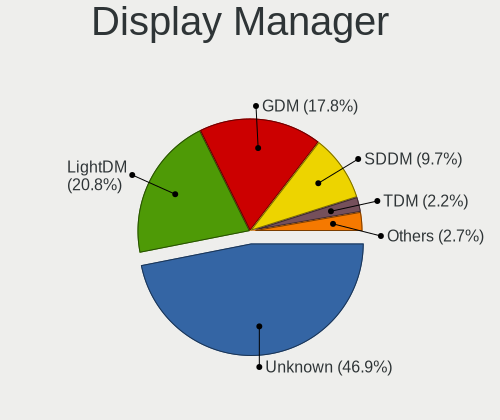
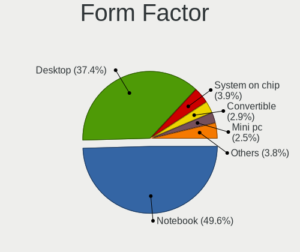
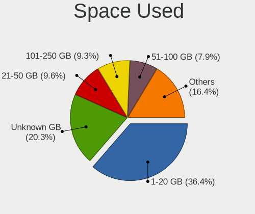
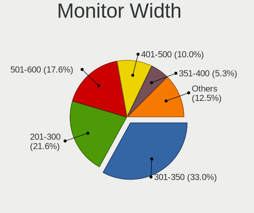
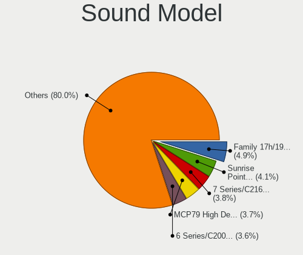
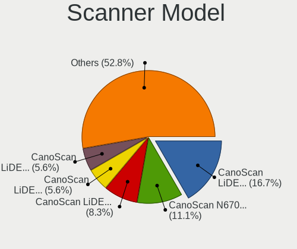
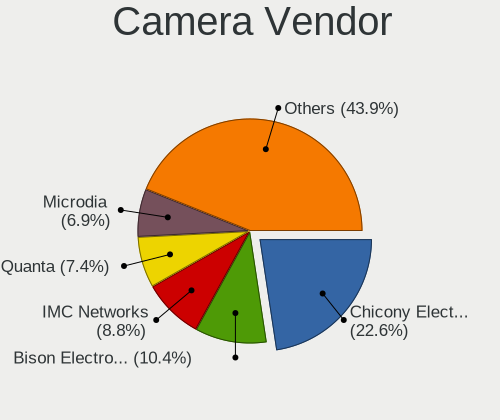

Debian 11 - Tested Hardware & Statistics
----------------------------------------

A project to collect tested hardware configurations for Debian 11.

Anyone can contribute to this report by the [hw-probe](https://github.com/linuxhw/hw-probe) tool:

    sudo -E hw-probe -all -upload

Please contribute! Especially if your hardware is rare.

This is a report for all computer types. See also reports for [desktops](/Dist/Debian_11/Desktop/README.md) and [notebooks](/Dist/Debian_11/Notebook/README.md).

Contents
--------

* [ Test Cases ](#test-cases)

* [ System ](#system)
  - [ Kernel                   ](#kernel)
  - [ Kernel Family            ](#kernel-family)
  - [ Kernel Major Ver.        ](#kernel-major-ver)
  - [ Arch                     ](#arch)
  - [ DE                       ](#de)
  - [ Display Server           ](#display-server)
  - [ Display Manager          ](#display-manager)
  - [ OS Lang                  ](#os-lang)
  - [ Boot Mode                ](#boot-mode)
  - [ Filesystem               ](#filesystem)
  - [ Part. scheme             ](#part-scheme)
  - [ Dual Boot with Linux/BSD ](#dual-boot-with-linuxbsd)
  - [ Dual Boot (Win)          ](#dual-boot-win)

* [ Board ](#board)
  - [ Vendor                   ](#vendor)
  - [ Model                    ](#model)
  - [ Model Family             ](#model-family)
  - [ MFG Year                 ](#mfg-year)
  - [ Form Factor              ](#form-factor)
  - [ Secure Boot              ](#secure-boot)
  - [ Coreboot                 ](#coreboot)
  - [ RAM Size                 ](#ram-size)
  - [ RAM Used                 ](#ram-used)
  - [ Total Drives             ](#total-drives)
  - [ Has CD-ROM               ](#has-cd-rom)
  - [ Has Ethernet             ](#has-ethernet)
  - [ Has WiFi                 ](#has-wifi)
  - [ Has Bluetooth            ](#has-bluetooth)

* [ Location ](#location)
  - [ Country                  ](#country)
  - [ City                     ](#city)

* [ Drives ](#drives)
  - [ Drive Vendor             ](#drive-vendor)
  - [ Drive Model              ](#drive-model)
  - [ HDD Vendor               ](#hdd-vendor)
  - [ SSD Vendor               ](#ssd-vendor)
  - [ Drive Kind               ](#drive-kind)
  - [ Drive Connector          ](#drive-connector)
  - [ Drive Size               ](#drive-size)
  - [ Space Total              ](#space-total)
  - [ Space Used               ](#space-used)
  - [ Malfunc. Drives          ](#malfunc-drives)
  - [ Malfunc. Drive Vendor    ](#malfunc-drive-vendor)
  - [ Malfunc. HDD Vendor      ](#malfunc-hdd-vendor)
  - [ Malfunc. Drive Kind      ](#malfunc-drive-kind)
  - [ Failed Drives            ](#failed-drives)
  - [ Failed Drive Vendor      ](#failed-drive-vendor)
  - [ Drive Status             ](#drive-status)

* [ Storage controller ](#storage-controller)
  - [ Storage Vendor           ](#storage-vendor)
  - [ Storage Model            ](#storage-model)
  - [ Storage Kind             ](#storage-kind)

* [ Processor ](#processor)
  - [ CPU Vendor               ](#cpu-vendor)
  - [ CPU Model                ](#cpu-model)
  - [ CPU Model Family         ](#cpu-model-family)
  - [ CPU Cores                ](#cpu-cores)
  - [ CPU Sockets              ](#cpu-sockets)
  - [ CPU Threads              ](#cpu-threads)
  - [ CPU Op-Modes             ](#cpu-op-modes)
  - [ CPU Microcode            ](#cpu-microcode)
  - [ CPU Microarch            ](#cpu-microarch)

* [ Graphics ](#graphics)
  - [ GPU Vendor               ](#gpu-vendor)
  - [ GPU Model                ](#gpu-model)
  - [ GPU Combo                ](#gpu-combo)
  - [ GPU Driver               ](#gpu-driver)
  - [ GPU Memory               ](#gpu-memory)

* [ Monitor ](#monitor)
  - [ Monitor Vendor           ](#monitor-vendor)
  - [ Monitor Model            ](#monitor-model)
  - [ Monitor Resolution       ](#monitor-resolution)
  - [ Monitor Diagonal         ](#monitor-diagonal)
  - [ Monitor Width            ](#monitor-width)
  - [ Aspect Ratio             ](#aspect-ratio)
  - [ Monitor Area             ](#monitor-area)
  - [ Pixel Density            ](#pixel-density)
  - [ Multiple Monitors        ](#multiple-monitors)

* [ Network ](#network)
  - [ Net Controller Vendor    ](#net-controller-vendor)
  - [ Net Controller Model     ](#net-controller-model)
  - [ Wireless Vendor          ](#wireless-vendor)
  - [ Wireless Model           ](#wireless-model)
  - [ Ethernet Vendor          ](#ethernet-vendor)
  - [ Ethernet Model           ](#ethernet-model)
  - [ Net Controller Kind      ](#net-controller-kind)
  - [ Used Controller          ](#used-controller)
  - [ NICs                     ](#nics)
  - [ IPv6                     ](#ipv6)

* [ Bluetooth ](#bluetooth)
  - [ Bluetooth Vendor         ](#bluetooth-vendor)
  - [ Bluetooth Model          ](#bluetooth-model)

* [ Sound ](#sound)
  - [ Sound Vendor             ](#sound-vendor)
  - [ Sound Model              ](#sound-model)

* [ Memory ](#memory)
  - [ Memory Vendor            ](#memory-vendor)
  - [ Memory Model             ](#memory-model)
  - [ Memory Kind              ](#memory-kind)
  - [ Memory Form Factor       ](#memory-form-factor)
  - [ Memory Size              ](#memory-size)
  - [ Memory Speed             ](#memory-speed)

* [ Printers & scanners ](#printers--scanners)
  - [ Printer Vendor           ](#printer-vendor)
  - [ Printer Model            ](#printer-model)
  - [ Scanner Vendor           ](#scanner-vendor)
  - [ Scanner Model            ](#scanner-model)

* [ Camera ](#camera)
  - [ Camera Vendor            ](#camera-vendor)
  - [ Camera Model             ](#camera-model)

* [ Security ](#security)
  - [ Fingerprint Vendor       ](#fingerprint-vendor)
  - [ Fingerprint Model        ](#fingerprint-model)
  - [ Chipcard Vendor          ](#chipcard-vendor)
  - [ Chipcard Model           ](#chipcard-model)

* [ Unsupported ](#unsupported)
  - [ Unsupported Devices      ](#unsupported-devices)
  - [ Unsupported Device Types ](#unsupported-device-types)

Test Cases
----------

Total: 9199

| Vendor        | Model                       | Form-Factor | Probe                                                      | Date         |
|---------------|-----------------------------|-------------|------------------------------------------------------------|--------------|
| HUAWEI        | BOM-WXX9                    | Notebook    | [4d4d992cb0](https://linux-hardware.org/?probe=4d4d992cb0) | Jul 01, 2023 |
| HP            | ProLiant DL360 G7           | Server      | [7e37520061](https://linux-hardware.org/?probe=7e37520061) | Jun 30, 2023 |
| Apple         | MacBookAir7,2               | Notebook    | [cb1bcce659](https://linux-hardware.org/?probe=cb1bcce659) | Jun 30, 2023 |
| Dell          | 0PV3YR A05                  | Server      | [7cb124d729](https://linux-hardware.org/?probe=7cb124d729) | Jun 30, 2023 |
| Acer          | Aspire V3-772               | Notebook    | [0fae87e118](https://linux-hardware.org/?probe=0fae87e118) | Jun 29, 2023 |
| Acer          | TravelMate P449-G2-M        | Notebook    | [b9291d6951](https://linux-hardware.org/?probe=b9291d6951) | Jun 29, 2023 |
| Lenovo        | ThinkPad E15 Gen 2 20TDC... | Notebook    | [62ff10cadc](https://linux-hardware.org/?probe=62ff10cadc) | Jun 29, 2023 |
| HP            | Pavilion dv6                | Notebook    | [b6c2bcb025](https://linux-hardware.org/?probe=b6c2bcb025) | Jun 29, 2023 |
| Gigabyte      | B365M D3H-CF                | Desktop     | [f40af0020a](https://linux-hardware.org/?probe=f40af0020a) | Jun 29, 2023 |
| Supermicro    | X8ST3                       | Desktop     | [305a3e3c1a](https://linux-hardware.org/?probe=305a3e3c1a) | Jun 29, 2023 |
| Dell          | Latitude 7370               | Notebook    | [cb11921012](https://linux-hardware.org/?probe=cb11921012) | Jun 28, 2023 |
| Shuttle       | FS61                        | Desktop     | [a67d2edea8](https://linux-hardware.org/?probe=a67d2edea8) | Jun 28, 2023 |
| Lenovo        | ThinkPad Yoga 370 20JJS0... | Convertible | [f60ead06fd](https://linux-hardware.org/?probe=f60ead06fd) | Jun 28, 2023 |
| Lenovo        | ThinkPad X280 20KF001RUK    | Notebook    | [a1da72b9a5](https://linux-hardware.org/?probe=a1da72b9a5) | Jun 27, 2023 |
| AMI           | Cherry Trail CR             | Desktop     | [65fb07ed8d](https://linux-hardware.org/?probe=65fb07ed8d) | Jun 27, 2023 |
| Gigabyte      | B550 AORUS PRO V2           | Desktop     | [1143a7eebc](https://linux-hardware.org/?probe=1143a7eebc) | Jun 27, 2023 |
| Gigabyte      | GA-78LMT-USB3 x.x           | Desktop     | [baf77629c1](https://linux-hardware.org/?probe=baf77629c1) | Jun 26, 2023 |
| ASUSTek       | K53SJ                       | Notebook    | [fe211e4239](https://linux-hardware.org/?probe=fe211e4239) | Jun 26, 2023 |
| Raspberry ... | Raspberry Pi 3 Model B R... | Soc         | [b4fcf1904c](https://linux-hardware.org/?probe=b4fcf1904c) | Jun 26, 2023 |
| Dell          | 0PV3YR A05                  | Server      | [29cc577c0c](https://linux-hardware.org/?probe=29cc577c0c) | Jun 26, 2023 |
| HP            | Laptop 14-dq0xxx            | Notebook    | [695dd94347](https://linux-hardware.org/?probe=695dd94347) | Jun 25, 2023 |
| ASRock        | H61M-HVS                    | Desktop     | [a65485d236](https://linux-hardware.org/?probe=a65485d236) | Jun 25, 2023 |
| Dell          | 0PV3YR A05                  | Server      | [9dce40179d](https://linux-hardware.org/?probe=9dce40179d) | Jun 25, 2023 |
| Acer          | Aspire VN7-591G             | Notebook    | [356b066ca9](https://linux-hardware.org/?probe=356b066ca9) | Jun 24, 2023 |
| Google        | Kip                         | Notebook    | [4e1bfd359e](https://linux-hardware.org/?probe=4e1bfd359e) | Jun 24, 2023 |
| HP            | EliteBook 830 G5            | Notebook    | [2b61a56610](https://linux-hardware.org/?probe=2b61a56610) | Jun 24, 2023 |
| Dell          | 01XK1W A00                  | Desktop     | [53dbc2e799](https://linux-hardware.org/?probe=53dbc2e799) | Jun 24, 2023 |
| ASRockRack    | X470D4U                     | Desktop     | [2d49269787](https://linux-hardware.org/?probe=2d49269787) | Jun 23, 2023 |
| ASRockRack    | X470D4U2-2T                 | Desktop     | [4a11a4190a](https://linux-hardware.org/?probe=4a11a4190a) | Jun 23, 2023 |
| Lenovo        | ThinkPad L13 Yoga Gen 2 ... | Convertible | [71f114122e](https://linux-hardware.org/?probe=71f114122e) | Jun 23, 2023 |
| Lenovo        | Edge 15 80H1                | Notebook    | [aff25effc2](https://linux-hardware.org/?probe=aff25effc2) | Jun 23, 2023 |
| HP            | EliteBook 8540w             | Notebook    | [6d8c00ff02](https://linux-hardware.org/?probe=6d8c00ff02) | Jun 23, 2023 |
| HP            | EliteBook 8540w             | Notebook    | [1c1a2724f4](https://linux-hardware.org/?probe=1c1a2724f4) | Jun 23, 2023 |
| Gigabyte      | B250M-DS3H-CF               | Desktop     | [1ca06fb3a9](https://linux-hardware.org/?probe=1ca06fb3a9) | Jun 23, 2023 |
| HP            | 3397                        | Desktop     | [8c9be2f4c0](https://linux-hardware.org/?probe=8c9be2f4c0) | Jun 23, 2023 |
| VIT           | P2423                       | Notebook    | [19242b2ddb](https://linux-hardware.org/?probe=19242b2ddb) | Jun 23, 2023 |
| ASRockRack    | X470D4U                     | Desktop     | [d419086209](https://linux-hardware.org/?probe=d419086209) | Jun 22, 2023 |
| Supermicro    | X8DTU                       | Server      | [d8d978bd73](https://linux-hardware.org/?probe=d8d978bd73) | Jun 22, 2023 |
| HP            | 3397                        | Desktop     | [a47ce0d4dc](https://linux-hardware.org/?probe=a47ce0d4dc) | Jun 22, 2023 |
| Dell          | Inspiron 1525               | Notebook    | [1cdf3502e8](https://linux-hardware.org/?probe=1cdf3502e8) | Jun 21, 2023 |
| Dell          | Inspiron 1525               | Notebook    | [7bbc89ec0f](https://linux-hardware.org/?probe=7bbc89ec0f) | Jun 21, 2023 |
| HP            | EliteBook x360 1030 G2      | Convertible | [a7b7b2c413](https://linux-hardware.org/?probe=a7b7b2c413) | Jun 21, 2023 |
| Dell          | Latitude E5550              | Notebook    | [72f4d53246](https://linux-hardware.org/?probe=72f4d53246) | Jun 21, 2023 |
| HP            | EliteBook x360 1030 G2      | Convertible | [d4bd011ff9](https://linux-hardware.org/?probe=d4bd011ff9) | Jun 21, 2023 |
| Lenovo        | IdeaPadFlex 15 20309        | Notebook    | [76fbd356a0](https://linux-hardware.org/?probe=76fbd356a0) | Jun 21, 2023 |
| Dell          | Latitude E5550              | Notebook    | [e1fdcf84b3](https://linux-hardware.org/?probe=e1fdcf84b3) | Jun 21, 2023 |
| libre-comp... | roc-rk3328-cc               | Soc         | [f18c138ec9](https://linux-hardware.org/?probe=f18c138ec9) | Jun 21, 2023 |
| Lenovo        | 01GR176                     | Server      | [6d28cbec97](https://linux-hardware.org/?probe=6d28cbec97) | Jun 21, 2023 |
| ASRockRack    | X470D4U                     | Desktop     | [9e0ba5032b](https://linux-hardware.org/?probe=9e0ba5032b) | Jun 21, 2023 |
| Lenovo        | IdeaPad Gaming 3 15ACH6 ... | Notebook    | [291796e3e4](https://linux-hardware.org/?probe=291796e3e4) | Jun 21, 2023 |
| Packard Be... | EasyNote TE11HC             | Notebook    | [6bbc56b36c](https://linux-hardware.org/?probe=6bbc56b36c) | Jun 20, 2023 |
| Apple         | MacBookPro5,5               | Notebook    | [16c4045c3b](https://linux-hardware.org/?probe=16c4045c3b) | Jun 20, 2023 |
| MSI           | H81M-P33                    | Desktop     | [62fb9cda50](https://linux-hardware.org/?probe=62fb9cda50) | Jun 20, 2023 |
| Dell          | 06FW8P A02                  | Desktop     | [f65ec61ffc](https://linux-hardware.org/?probe=f65ec61ffc) | Jun 20, 2023 |
| Acer          | TravelMate P449-G2-M        | Notebook    | [98626bde6c](https://linux-hardware.org/?probe=98626bde6c) | Jun 20, 2023 |
| Dell          | Latitude 3410               | Notebook    | [1e0348842a](https://linux-hardware.org/?probe=1e0348842a) | Jun 19, 2023 |
| Amlogic       | Meson GXL (S905X) P212 D... | Soc         | [7c79fa6641](https://linux-hardware.org/?probe=7c79fa6641) | Jun 19, 2023 |
| Dell          | 0PU052                      | Desktop     | [2eb6dceca9](https://linux-hardware.org/?probe=2eb6dceca9) | Jun 19, 2023 |
| ASUSTek       | PRIME A320M-K               | Desktop     | [3eab70981f](https://linux-hardware.org/?probe=3eab70981f) | Jun 19, 2023 |
| Raspberry ... | Raspberry Pi                | Soc         | [1559b0a68d](https://linux-hardware.org/?probe=1559b0a68d) | Jun 19, 2023 |
| Apple         | Mac-F226BEC8 PVT            | All in one  | [640ff2ce2e](https://linux-hardware.org/?probe=640ff2ce2e) | Jun 19, 2023 |
| Lenovo        | IdeaPad 700-15ISK 80RU      | Notebook    | [d8d9101ef6](https://linux-hardware.org/?probe=d8d9101ef6) | Jun 19, 2023 |
| Packard Be... | EasyNote TE11HC             | Notebook    | [33785e2493](https://linux-hardware.org/?probe=33785e2493) | Jun 18, 2023 |
| AZW           | U59                         | Desktop     | [6f1191e5e2](https://linux-hardware.org/?probe=6f1191e5e2) | Jun 18, 2023 |
| Dell          | 01XK1W A00                  | Desktop     | [f431c0b66f](https://linux-hardware.org/?probe=f431c0b66f) | Jun 18, 2023 |
| HP            | EliteBook 2530p             | Notebook    | [7d246caf6f](https://linux-hardware.org/?probe=7d246caf6f) | Jun 18, 2023 |
| Lenovo        | 3111 SDK0J40697 WIN 3305... | Mini pc     | [ec95321dfb](https://linux-hardware.org/?probe=ec95321dfb) | Jun 17, 2023 |
| Dell          | Precision M2800             | Notebook    | [e9f259595a](https://linux-hardware.org/?probe=e9f259595a) | Jun 17, 2023 |
| Acer          | Aspire E1-571               | Notebook    | [19e270cab0](https://linux-hardware.org/?probe=19e270cab0) | Jun 16, 2023 |
| Acer          | Aspire E1-571               | Notebook    | [e4b27c6a92](https://linux-hardware.org/?probe=e4b27c6a92) | Jun 16, 2023 |
| Dell          | Latitude D620               | Notebook    | [8dc25931d7](https://linux-hardware.org/?probe=8dc25931d7) | Jun 16, 2023 |
| Dell          | Latitude D620               | Notebook    | [819f346812](https://linux-hardware.org/?probe=819f346812) | Jun 16, 2023 |
| Dell          | Latitude E6400              | Notebook    | [7c59595887](https://linux-hardware.org/?probe=7c59595887) | Jun 16, 2023 |
| MSI           | MAG B550M MORTAR MAX WIF... | Desktop     | [9994571651](https://linux-hardware.org/?probe=9994571651) | Jun 15, 2023 |
| Lenovo        | ThinkPad L13 Yoga Gen 2 ... | Convertible | [1cabb1c87f](https://linux-hardware.org/?probe=1cabb1c87f) | Jun 15, 2023 |
| HP            | Laptop 14-cm0xxx            | Notebook    | [67ed3346c2](https://linux-hardware.org/?probe=67ed3346c2) | Jun 15, 2023 |
| HP            | Laptop 14-cm0xxx            | Notebook    | [07f1089ee7](https://linux-hardware.org/?probe=07f1089ee7) | Jun 15, 2023 |
| HUAWEI        | NBD-WXX9                    | Notebook    | [b55662cc58](https://linux-hardware.org/?probe=b55662cc58) | Jun 15, 2023 |
| HP            | 1589                        | Desktop     | [6bfe1d5b63](https://linux-hardware.org/?probe=6bfe1d5b63) | Jun 15, 2023 |
| Medion        | E6214                       | Notebook    | [71b2e69534](https://linux-hardware.org/?probe=71b2e69534) | Jun 15, 2023 |
| AZW           | SER V2.0                    | Mini pc     | [c1375ab639](https://linux-hardware.org/?probe=c1375ab639) | Jun 15, 2023 |
| Raspberry ... | Raspberry Pi 4 Model B R... | Soc         | [2754ddde7f](https://linux-hardware.org/?probe=2754ddde7f) | Jun 15, 2023 |
| Toshiba       | Satellite L45-B             | Notebook    | [4cc6199522](https://linux-hardware.org/?probe=4cc6199522) | Jun 15, 2023 |
| Dell          | Latitude 5480               | Notebook    | [677cb87f98](https://linux-hardware.org/?probe=677cb87f98) | Jun 14, 2023 |
| MSI           | MAG B550 TOMAHAWK MAX WI... | Desktop     | [6e241e56cf](https://linux-hardware.org/?probe=6e241e56cf) | Jun 14, 2023 |
| ASUSTek       | PRIME B350-PLUS             | Desktop     | [f9ebdca1bd](https://linux-hardware.org/?probe=f9ebdca1bd) | Jun 14, 2023 |
| Apple         | MacBookPro5,5               | Notebook    | [b639a64b45](https://linux-hardware.org/?probe=b639a64b45) | Jun 14, 2023 |
| Supermicro    | X11DPU                      | Server      | [f7937cfbf6](https://linux-hardware.org/?probe=f7937cfbf6) | Jun 14, 2023 |
| Supermicro    | X11DPH-T                    | Server      | [ed5dc59bc2](https://linux-hardware.org/?probe=ed5dc59bc2) | Jun 14, 2023 |
| Apple         | Mac-8ED6AF5B48C039E1 Mac... | Mini pc     | [3b954125c5](https://linux-hardware.org/?probe=3b954125c5) | Jun 13, 2023 |
| HP            | ProLiant DL360 G7           | Server      | [84cd8a6537](https://linux-hardware.org/?probe=84cd8a6537) | Jun 13, 2023 |
| HP            | 2AED                        | Desktop     | [2550c16272](https://linux-hardware.org/?probe=2550c16272) | Jun 13, 2023 |
| Fujitsu       | LIFEBOOK E780               | Notebook    | [b8631b65c4](https://linux-hardware.org/?probe=b8631b65c4) | Jun 13, 2023 |
| HP            | Pavilion dv7                | Notebook    | [3c113d457b](https://linux-hardware.org/?probe=3c113d457b) | Jun 13, 2023 |
| Acer          | TravelMate P449-G2-M        | Notebook    | [97b6ba8bd6](https://linux-hardware.org/?probe=97b6ba8bd6) | Jun 13, 2023 |
| Intel         | JSL MRD                     | Desktop     | [764e533752](https://linux-hardware.org/?probe=764e533752) | Jun 13, 2023 |
| Dell          | Inspiron 1521               | Notebook    | [b4a1eae7be](https://linux-hardware.org/?probe=b4a1eae7be) | Jun 12, 2023 |
| Lenovo        | ThinkPad P15v Gen 1 20TQ... | Notebook    | [675f082570](https://linux-hardware.org/?probe=675f082570) | Jun 12, 2023 |
| Hampoo        | Cherry Trail CR V200        | Notebook    | [d2ee0bc234](https://linux-hardware.org/?probe=d2ee0bc234) | Jun 12, 2023 |
| Fujitsu       | LIFEBOOK A514               | Notebook    | [45b16c1cdf](https://linux-hardware.org/?probe=45b16c1cdf) | Jun 12, 2023 |
| Fujitsu       | LIFEBOOK A514               | Notebook    | [1da963b3f4](https://linux-hardware.org/?probe=1da963b3f4) | Jun 12, 2023 |
| MSI           | GE62 6QC                    | Notebook    | [5581a5c589](https://linux-hardware.org/?probe=5581a5c589) | Jun 12, 2023 |
| Raspberry ... | Raspberry Pi                | Soc         | [2ea9fd5a4a](https://linux-hardware.org/?probe=2ea9fd5a4a) | Jun 12, 2023 |
| Lenovo        | IdeaPad 1 14IGL7 82V6       | Notebook    | [9ed0a99c90](https://linux-hardware.org/?probe=9ed0a99c90) | Jun 12, 2023 |
| Lenovo        | IdeaPad 1 14IGL7 82V6       | Notebook    | [5bc42066ca](https://linux-hardware.org/?probe=5bc42066ca) | Jun 12, 2023 |
| Raspberry ... | Raspberry Pi 400 Rev 1.0    | Soc         | [f7397ff305](https://linux-hardware.org/?probe=f7397ff305) | Jun 11, 2023 |
| Lenovo        | ThinkPad T420s 4175A16      | Notebook    | [3d23465019](https://linux-hardware.org/?probe=3d23465019) | Jun 11, 2023 |
| Gigabyte      | B450 AORUS ELITE            | Desktop     | [59a9e7e2e8](https://linux-hardware.org/?probe=59a9e7e2e8) | Jun 11, 2023 |
| Dell          | 0PV3YR A05                  | Server      | [5e3b6bfb4c](https://linux-hardware.org/?probe=5e3b6bfb4c) | Jun 11, 2023 |
| Intel         | SHARKBAY                    | Desktop     | [8772d55075](https://linux-hardware.org/?probe=8772d55075) | Jun 10, 2023 |
| Dell          | Latitude 7440               | Notebook    | [f63ada6c61](https://linux-hardware.org/?probe=f63ada6c61) | Jun 10, 2023 |
| Lenovo        | ThinkPad T470 20HDS14L00    | Notebook    | [a62438daef](https://linux-hardware.org/?probe=a62438daef) | Jun 10, 2023 |
| Lenovo        | ThinkPad T470 20HDS14L00    | Notebook    | [fab548c31e](https://linux-hardware.org/?probe=fab548c31e) | Jun 10, 2023 |
| MSI           | B450M PRO-VDH MAX           | Desktop     | [4dcc51e897](https://linux-hardware.org/?probe=4dcc51e897) | Jun 10, 2023 |
| ASRock        | B365M Pro4-F                | Desktop     | [e54f1a9447](https://linux-hardware.org/?probe=e54f1a9447) | Jun 10, 2023 |
| ASUSTek       | K30BF_M32BF                 | Desktop     | [65b3c16165](https://linux-hardware.org/?probe=65b3c16165) | Jun 10, 2023 |
| Dell          | 0PV3YR A05                  | Server      | [ba4527394e](https://linux-hardware.org/?probe=ba4527394e) | Jun 10, 2023 |
| IT Channel... | N8xEJEK                     | Notebook    | [51a7e3f5b4](https://linux-hardware.org/?probe=51a7e3f5b4) | Jun 10, 2023 |
| Acidanther... | MacBookPro15,2              | Notebook    | [fb30b2eb35](https://linux-hardware.org/?probe=fb30b2eb35) | Jun 10, 2023 |
| IBM           | FAB2 Controller Producti... | Server      | [af396cb333](https://linux-hardware.org/?probe=af396cb333) | Jun 10, 2023 |
| Lenovo        | Yoga 6 13ALC7 82UD          | Convertible | [012e8255f3](https://linux-hardware.org/?probe=012e8255f3) | Jun 09, 2023 |
| ASUSTek       | P5GC-MX/1333                | Desktop     | [b47fab6285](https://linux-hardware.org/?probe=b47fab6285) | Jun 09, 2023 |
| Intel         | powered classmate PC        | Notebook    | [e530f037c6](https://linux-hardware.org/?probe=e530f037c6) | Jun 09, 2023 |
| Gigabyte      | B550M DS3H                  | Desktop     | [ea724e204b](https://linux-hardware.org/?probe=ea724e204b) | Jun 09, 2023 |
| Dell          | 0XCR8D A03                  | Desktop     | [e37bceb6fb](https://linux-hardware.org/?probe=e37bceb6fb) | Jun 09, 2023 |
| Digibras      | NH4CU03                     | Notebook    | [c66d30943e](https://linux-hardware.org/?probe=c66d30943e) | Jun 09, 2023 |
| Acer          | TravelMate P215-53          | Notebook    | [9536bf547a](https://linux-hardware.org/?probe=9536bf547a) | Jun 09, 2023 |
| Fujitsu       | LIFEBOOK U7411              | Notebook    | [ab35c95b72](https://linux-hardware.org/?probe=ab35c95b72) | Jun 09, 2023 |
| Gigabyte      | GA-78LMT-USB3 R2 sex        | Desktop     | [bcad738da6](https://linux-hardware.org/?probe=bcad738da6) | Jun 09, 2023 |
| Acer          | TravelMate P449-G2-M        | Notebook    | [6b42200bee](https://linux-hardware.org/?probe=6b42200bee) | Jun 09, 2023 |
| Raspberry ... | Raspberry Pi 4 Model B R... | Soc         | [50844825e2](https://linux-hardware.org/?probe=50844825e2) | Jun 08, 2023 |
| HP            | G42                         | Notebook    | [fe8d2be276](https://linux-hardware.org/?probe=fe8d2be276) | Jun 08, 2023 |
| HP            | G42                         | Notebook    | [4f33462d46](https://linux-hardware.org/?probe=4f33462d46) | Jun 08, 2023 |
| Acer          | TravelMate P449-G2-M        | Notebook    | [0fa009ad04](https://linux-hardware.org/?probe=0fa009ad04) | Jun 08, 2023 |
| Inventec      | VXC Class A02               | Desktop     | [c2bc26120f](https://linux-hardware.org/?probe=c2bc26120f) | Jun 08, 2023 |
| MSI           | B450M-A PRO MAX             | Desktop     | [230465c003](https://linux-hardware.org/?probe=230465c003) | Jun 08, 2023 |
| MSI           | GE60 2PL                    | Notebook    | [e1d118e2d2](https://linux-hardware.org/?probe=e1d118e2d2) | Jun 08, 2023 |
| Acer          | Aspire 7741                 | Notebook    | [09b2301e59](https://linux-hardware.org/?probe=09b2301e59) | Jun 08, 2023 |
| Lenovo        | ThinkPad X131e 3374A17      | Notebook    | [d992393271](https://linux-hardware.org/?probe=d992393271) | Jun 08, 2023 |
| Lenovo        | ThinkPad X131e 3374A17      | Notebook    | [dd385507aa](https://linux-hardware.org/?probe=dd385507aa) | Jun 08, 2023 |
| HP            | Pavilion 17                 | Notebook    | [da809f90cc](https://linux-hardware.org/?probe=da809f90cc) | Jun 07, 2023 |
| Dell          | Latitude 5530               | Notebook    | [1e3452635f](https://linux-hardware.org/?probe=1e3452635f) | Jun 07, 2023 |
| ASRock        | B365M Pro4-F                | Desktop     | [7ed0f0346c](https://linux-hardware.org/?probe=7ed0f0346c) | Jun 07, 2023 |
| ASUSTek       | H97M-E                      | Desktop     | [97140e9688](https://linux-hardware.org/?probe=97140e9688) | Jun 07, 2023 |
| HP            | ProBook 4530s               | Notebook    | [bdb6739deb](https://linux-hardware.org/?probe=bdb6739deb) | Jun 07, 2023 |
| Intel         | HURONRIVER                  | Notebook    | [57035a777c](https://linux-hardware.org/?probe=57035a777c) | Jun 07, 2023 |
| Lenovo        | ThinkCentre A58e 0841B4Y    | Desktop     | [fe410cd5db](https://linux-hardware.org/?probe=fe410cd5db) | Jun 07, 2023 |
| Packard Be... | EasyNote ENTF71BM           | Notebook    | [490ae0bc1c](https://linux-hardware.org/?probe=490ae0bc1c) | Jun 07, 2023 |
| MSI           | Pulse GL66 12UDK            | Notebook    | [8c9a9eb310](https://linux-hardware.org/?probe=8c9a9eb310) | Jun 06, 2023 |
| Dell          | 007MXD A00                  | Mini pc     | [2532dfadd0](https://linux-hardware.org/?probe=2532dfadd0) | Jun 06, 2023 |
| Dell          | 007MXD A00                  | Mini pc     | [5cc10b1e1e](https://linux-hardware.org/?probe=5cc10b1e1e) | Jun 06, 2023 |
| ASUSTek       | TUF Gaming B650-PLUS WIF... | Desktop     | [db42ab94ee](https://linux-hardware.org/?probe=db42ab94ee) | Jun 06, 2023 |
| HP            | Pavilion g7                 | Notebook    | [f8cccf0fec](https://linux-hardware.org/?probe=f8cccf0fec) | Jun 06, 2023 |
| HP            | 250 15.6 inch G9 Noteboo... | Notebook    | [be9987ca28](https://linux-hardware.org/?probe=be9987ca28) | Jun 06, 2023 |
| Dell          | 0PV3YR A05                  | Server      | [c685007aa8](https://linux-hardware.org/?probe=c685007aa8) | Jun 06, 2023 |
| ASUSTek       | ROG STRIX X570-E GAMING     | Desktop     | [d288737b23](https://linux-hardware.org/?probe=d288737b23) | Jun 05, 2023 |
| HP            | ENVY Laptop 13-ba0xxx       | Notebook    | [22143d333a](https://linux-hardware.org/?probe=22143d333a) | Jun 05, 2023 |
| ASUSTek       | TUF Gaming X670E-PLUS WI... | Desktop     | [3a1c1daa3d](https://linux-hardware.org/?probe=3a1c1daa3d) | Jun 05, 2023 |
| Raspberry ... | Raspberry Pi                | Soc         | [72eb9f0d86](https://linux-hardware.org/?probe=72eb9f0d86) | Jun 05, 2023 |
| Dell          | 0PV3YR A05                  | Server      | [da03bf4e08](https://linux-hardware.org/?probe=da03bf4e08) | Jun 05, 2023 |
| Gigabyte      | H470M DS3H                  | Desktop     | [e7bbac1b14](https://linux-hardware.org/?probe=e7bbac1b14) | Jun 04, 2023 |
| Dell          | Latitude 3410               | Notebook    | [820e62c9d3](https://linux-hardware.org/?probe=820e62c9d3) | Jun 04, 2023 |
| Gigabyte      | B360M HD3                   | Desktop     | [fcb1b60578](https://linux-hardware.org/?probe=fcb1b60578) | Jun 04, 2023 |
| MSI           | GL75 Leopard 10SER          | Notebook    | [24111ade43](https://linux-hardware.org/?probe=24111ade43) | Jun 04, 2023 |
| MSI           | H81M-E34                    | Desktop     | [4c5f5c7903](https://linux-hardware.org/?probe=4c5f5c7903) | Jun 04, 2023 |
| Dell          | Latitude 3410               | Notebook    | [12515d41c8](https://linux-hardware.org/?probe=12515d41c8) | Jun 04, 2023 |
| HUAWEI        | BOHK-WAX9X                  | Notebook    | [1352a1d7c7](https://linux-hardware.org/?probe=1352a1d7c7) | Jun 04, 2023 |
| Gigabyte      | B660M GAMING X DDR4         | Desktop     | [0bd883cae2](https://linux-hardware.org/?probe=0bd883cae2) | Jun 04, 2023 |
| ASUSTek       | Q502LA                      | Notebook    | [679a477085](https://linux-hardware.org/?probe=679a477085) | Jun 04, 2023 |
| Clevo         | M670SRU                     | Notebook    | [0935f74d34](https://linux-hardware.org/?probe=0935f74d34) | Jun 04, 2023 |
| Clevo         | M670SRU                     | Notebook    | [e163d57d56](https://linux-hardware.org/?probe=e163d57d56) | Jun 04, 2023 |
| AVITA         | NS14A8                      | Notebook    | [a576b4d5cc](https://linux-hardware.org/?probe=a576b4d5cc) | Jun 04, 2023 |
| Toshiba       | WT8-A                       | Notebook    | [01e8918ef6](https://linux-hardware.org/?probe=01e8918ef6) | Jun 04, 2023 |
| Dell          | 01XK1W A00                  | Desktop     | [8690705151](https://linux-hardware.org/?probe=8690705151) | Jun 04, 2023 |
| Acer          | Aspire 5738                 | Notebook    | [138d22e03e](https://linux-hardware.org/?probe=138d22e03e) | Jun 04, 2023 |
| HP            | 843C                        | Desktop     | [e69fbf77e4](https://linux-hardware.org/?probe=e69fbf77e4) | Jun 04, 2023 |
| HP            | 843C                        | Desktop     | [21751c1221](https://linux-hardware.org/?probe=21751c1221) | Jun 04, 2023 |
| Pegatron      | Spring Peak                 | Notebook    | [a10a42a44d](https://linux-hardware.org/?probe=a10a42a44d) | Jun 04, 2023 |
| Pegatron      | Spring Peak                 | Notebook    | [e58b2a1237](https://linux-hardware.org/?probe=e58b2a1237) | Jun 04, 2023 |
| Pegatron      | Spring Peak                 | Notebook    | [ce54d0192d](https://linux-hardware.org/?probe=ce54d0192d) | Jun 04, 2023 |
| Lenovo        | ThinkStation D30 42234T7    | Desktop     | [18cb6a946b](https://linux-hardware.org/?probe=18cb6a946b) | Jun 03, 2023 |
| Lenovo        | ThinkPad E420 1141R79       | Notebook    | [7f66bf0045](https://linux-hardware.org/?probe=7f66bf0045) | Jun 03, 2023 |
| Acer          | Aspire V3-372               | Notebook    | [1200863830](https://linux-hardware.org/?probe=1200863830) | Jun 03, 2023 |
| ASUSTek       | SABERTOOTH 990FX R2.0       | Desktop     | [8d4d1f7313](https://linux-hardware.org/?probe=8d4d1f7313) | Jun 03, 2023 |
| Apple         | MacBookPro7,1               | Notebook    | [b1513dc005](https://linux-hardware.org/?probe=b1513dc005) | Jun 03, 2023 |
| Acer          | Aspire E5-772G              | Notebook    | [5bd684bed6](https://linux-hardware.org/?probe=5bd684bed6) | Jun 02, 2023 |
| Acer          | Aspire E5-772G              | Notebook    | [f454cdf394](https://linux-hardware.org/?probe=f454cdf394) | Jun 02, 2023 |
| Lenovo        | ThinkPad E15 Gen 3 20YHS... | Notebook    | [b546b2e7f1](https://linux-hardware.org/?probe=b546b2e7f1) | Jun 02, 2023 |
| Gigabyte      | P75-D3                      | Desktop     | [a56c3ceb55](https://linux-hardware.org/?probe=a56c3ceb55) | Jun 02, 2023 |
| Apple         | MacBookPro5,5               | Notebook    | [9bf36ef4a5](https://linux-hardware.org/?probe=9bf36ef4a5) | Jun 02, 2023 |
| ASUSTek       | TUF Gaming X570-PLUS        | Desktop     | [d6561ecd7b](https://linux-hardware.org/?probe=d6561ecd7b) | Jun 02, 2023 |
| Lenovo        | ThinkPad T470 20HES0FW00    | Notebook    | [174ffa62e4](https://linux-hardware.org/?probe=174ffa62e4) | Jun 02, 2023 |
| ASRockRack    | X470D4U2-2T                 | Desktop     | [43901d3db7](https://linux-hardware.org/?probe=43901d3db7) | Jun 02, 2023 |
| ASUSTek       | Z87-C                       | Desktop     | [20242d8299](https://linux-hardware.org/?probe=20242d8299) | Jun 02, 2023 |
| ASUSTek       | P8H61                       | Desktop     | [7e9f999121](https://linux-hardware.org/?probe=7e9f999121) | Jun 02, 2023 |
| Dell          | Latitude E6430              | Notebook    | [b129765265](https://linux-hardware.org/?probe=b129765265) | Jun 02, 2023 |
| Dell          | 0D456H A00                  | Server      | [4e0d53d64d](https://linux-hardware.org/?probe=4e0d53d64d) | Jun 02, 2023 |
| Dell          | 01XK1W A00                  | Desktop     | [5846820609](https://linux-hardware.org/?probe=5846820609) | Jun 02, 2023 |
| Intel         | DH61WW AAG23116-204         | Desktop     | [2bfe32ef05](https://linux-hardware.org/?probe=2bfe32ef05) | Jun 02, 2023 |
| HP            | EliteBook 840 G6            | Notebook    | [81ec1cc134](https://linux-hardware.org/?probe=81ec1cc134) | Jun 01, 2023 |
| Intel         | NUC11ATBPE M49844-202       | Mini pc     | [2a1e548be7](https://linux-hardware.org/?probe=2a1e548be7) | Jun 01, 2023 |
| ChangWang     | CW56-58                     | Desktop     | [e00e626ea6](https://linux-hardware.org/?probe=e00e626ea6) | Jun 01, 2023 |
| MSI           | H510M-A PRO                 | Desktop     | [8557cd4efa](https://linux-hardware.org/?probe=8557cd4efa) | Jun 01, 2023 |
| Dell          | Latitude E5510              | Notebook    | [4a0bc9e53f](https://linux-hardware.org/?probe=4a0bc9e53f) | Jun 01, 2023 |
| Dell          | System Inspiron N4110       | Notebook    | [ea09e45a4f](https://linux-hardware.org/?probe=ea09e45a4f) | Jun 01, 2023 |
| Gigabyte      | H410M S2H V3                | Desktop     | [78e4d7a22b](https://linux-hardware.org/?probe=78e4d7a22b) | Jun 01, 2023 |
| ASUSTek       | H81M-C                      | Desktop     | [5fc6ec135b](https://linux-hardware.org/?probe=5fc6ec135b) | Jun 01, 2023 |
| ASRock        | J4125-ITX                   | Desktop     | [31e0f624be](https://linux-hardware.org/?probe=31e0f624be) | Jun 01, 2023 |
| Dell          | Latitude E5510              | Notebook    | [9457826049](https://linux-hardware.org/?probe=9457826049) | Jun 01, 2023 |
| Dell          | 0PV3YR A05                  | Server      | [a4363d8242](https://linux-hardware.org/?probe=a4363d8242) | Jun 01, 2023 |
| Raspberry ... | Raspberry Pi Compute Mod... | Soc         | [19043cab25](https://linux-hardware.org/?probe=19043cab25) | Jun 01, 2023 |
| Positivo      | C500                        | Notebook    | [8dba4589fe](https://linux-hardware.org/?probe=8dba4589fe) | Jun 01, 2023 |
| Gigabyte      | Z790 AORUS ELITE AX DDR4    | Desktop     | [5f1045564e](https://linux-hardware.org/?probe=5f1045564e) | Jun 01, 2023 |
| Inventec      | D CLASS A02                 | Desktop     | [433df815db](https://linux-hardware.org/?probe=433df815db) | Jun 01, 2023 |
| ASUSTek       | X200LA                      | Notebook    | [ae3925153d](https://linux-hardware.org/?probe=ae3925153d) | May 31, 2023 |
| ASUSTek       | 1225B                       | Notebook    | [769a6736f1](https://linux-hardware.org/?probe=769a6736f1) | May 31, 2023 |
| Intel         | DB75EN AAG39650-302         | Desktop     | [9872e0cb5c](https://linux-hardware.org/?probe=9872e0cb5c) | May 31, 2023 |
| ASUSTek       | ROG STRIX Z690-G GAMING ... | Desktop     | [32a85827df](https://linux-hardware.org/?probe=32a85827df) | May 31, 2023 |
| Fujitsu       | LIFEBOOK E780               | Notebook    | [8459f7cfee](https://linux-hardware.org/?probe=8459f7cfee) | May 31, 2023 |
| HP            | EliteBook 840 G4            | Notebook    | [46ccbd2d62](https://linux-hardware.org/?probe=46ccbd2d62) | May 31, 2023 |
| HP            | EliteBook 840 G4            | Notebook    | [b90cb27f97](https://linux-hardware.org/?probe=b90cb27f97) | May 31, 2023 |
| Lenovo        | IdeaPad 330S-15IKB 81F5     | Notebook    | [5f8bd19e3d](https://linux-hardware.org/?probe=5f8bd19e3d) | May 31, 2023 |
| ASUSTek       | PN53-G                      | Mini pc     | [1e5f49bbf4](https://linux-hardware.org/?probe=1e5f49bbf4) | May 31, 2023 |
| ASUSTek       | Maximus VIII RANGER         | Desktop     | [354e883340](https://linux-hardware.org/?probe=354e883340) | May 31, 2023 |
| Dell          | 0PV3YR A05                  | Server      | [aad1baf686](https://linux-hardware.org/?probe=aad1baf686) | May 31, 2023 |
| Acer          | TravelMate P449-G2-M        | Notebook    | [41177ef027](https://linux-hardware.org/?probe=41177ef027) | May 31, 2023 |
| ASRock        | G41M-VS3                    | Desktop     | [166031ba4d](https://linux-hardware.org/?probe=166031ba4d) | May 31, 2023 |
| ASRock        | G41M-VS3                    | Desktop     | [8f55c9aa98](https://linux-hardware.org/?probe=8f55c9aa98) | May 31, 2023 |
| Dell          | Latitude 5411               | Notebook    | [8583aa2091](https://linux-hardware.org/?probe=8583aa2091) | May 31, 2023 |
| ASUSTek       | K52Jc                       | Notebook    | [ad0b57d7c6](https://linux-hardware.org/?probe=ad0b57d7c6) | May 31, 2023 |
| Lenovo        | ThinkPad W500 4058CTO       | Notebook    | [e065b72b88](https://linux-hardware.org/?probe=e065b72b88) | May 31, 2023 |
| ASUSTek       | K52Jc                       | Notebook    | [7709d9fd16](https://linux-hardware.org/?probe=7709d9fd16) | May 31, 2023 |
| Dell          | Latitude E5510              | Notebook    | [52e1023195](https://linux-hardware.org/?probe=52e1023195) | May 31, 2023 |
| Lenovo        | ThinkPad W500 4058CTO       | Notebook    | [52047d2230](https://linux-hardware.org/?probe=52047d2230) | May 31, 2023 |
| Dell          | 01XK1W A00                  | Desktop     | [8a18b7bada](https://linux-hardware.org/?probe=8a18b7bada) | May 31, 2023 |
| Dell          | 01XK1W A00                  | Desktop     | [611cf59f44](https://linux-hardware.org/?probe=611cf59f44) | May 31, 2023 |
| Intel         | X99                         | Desktop     | [cef654d9c5](https://linux-hardware.org/?probe=cef654d9c5) | May 30, 2023 |
| Dell          | Latitude E5510              | Notebook    | [aa0f6a81b6](https://linux-hardware.org/?probe=aa0f6a81b6) | May 30, 2023 |
| ASUSTek       | P4S8L                       | Desktop     | [c26269028e](https://linux-hardware.org/?probe=c26269028e) | May 30, 2023 |
| HP            | Laptop 17-ca0xxx            | Notebook    | [3222c41173](https://linux-hardware.org/?probe=3222c41173) | May 30, 2023 |
| ASUSTek       | PRIME B550-PLUS             | Desktop     | [698e3b5e35](https://linux-hardware.org/?probe=698e3b5e35) | May 30, 2023 |
| Lenovo        | ThinkPad T460 20FMS4LL00    | Notebook    | [7519448ca8](https://linux-hardware.org/?probe=7519448ca8) | May 30, 2023 |
| Lenovo        | IdeaPad S340-15API 81NC     | Notebook    | [ad3464fd76](https://linux-hardware.org/?probe=ad3464fd76) | May 30, 2023 |
| Lenovo        | ThinkPad X1 Yoga 1st 20F... | Convertible | [e4fde15d9f](https://linux-hardware.org/?probe=e4fde15d9f) | May 30, 2023 |
| Supermicro    | X9DR3-F                     | Server      | [afcfc0fdf3](https://linux-hardware.org/?probe=afcfc0fdf3) | May 30, 2023 |
| MSI           | H55M-ED55                   | Desktop     | [a89bdc8ec0](https://linux-hardware.org/?probe=a89bdc8ec0) | May 30, 2023 |
| Dell          | 0PV3YR A05                  | Server      | [dd6ecadb7e](https://linux-hardware.org/?probe=dd6ecadb7e) | May 30, 2023 |
| Raspberry ... | Raspberry Pi 4 Model B R... | Soc         | [6e68e63f53](https://linux-hardware.org/?probe=6e68e63f53) | May 29, 2023 |
| ASRock        | H310CM-HDV                  | Desktop     | [e6e310a9b4](https://linux-hardware.org/?probe=e6e310a9b4) | May 29, 2023 |
| ASRock        | H310CM-HDV                  | Desktop     | [84e791ec5e](https://linux-hardware.org/?probe=84e791ec5e) | May 29, 2023 |
| Inventec      | VXC Class A02               | Desktop     | [0befe25313](https://linux-hardware.org/?probe=0befe25313) | May 29, 2023 |
| Inventec      | VXC Class A02               | Desktop     | [363827ad8c](https://linux-hardware.org/?probe=363827ad8c) | May 29, 2023 |
| Fujitsu       | LIFEBOOK E780               | Notebook    | [aac95cf765](https://linux-hardware.org/?probe=aac95cf765) | May 29, 2023 |
| Dell          | Latitude E5470              | Notebook    | [77d85b619e](https://linux-hardware.org/?probe=77d85b619e) | May 29, 2023 |
| MSI           | Z390-A PRO                  | Desktop     | [c797a10bff](https://linux-hardware.org/?probe=c797a10bff) | May 29, 2023 |
| Lenovo        | IdeaPad 100-15IBD 80QQ      | Notebook    | [deaa4b357c](https://linux-hardware.org/?probe=deaa4b357c) | May 29, 2023 |
| Lenovo        | IdeaPad 100-15IBD 80QQ      | Notebook    | [af312b5e91](https://linux-hardware.org/?probe=af312b5e91) | May 29, 2023 |
| ASUSTek       | Z10PA-D8 Series             | Desktop     | [02821a3220](https://linux-hardware.org/?probe=02821a3220) | May 29, 2023 |
| Dell          | 040DDP A01                  | Desktop     | [bce6b61241](https://linux-hardware.org/?probe=bce6b61241) | May 29, 2023 |
| Dell          | Latitude E6530              | Notebook    | [26f783c383](https://linux-hardware.org/?probe=26f783c383) | May 29, 2023 |
| Raspberry ... | Raspberry Pi                | Soc         | [ca1cea162c](https://linux-hardware.org/?probe=ca1cea162c) | May 29, 2023 |
| Dell          | 0D456H A00                  | Server      | [3151099615](https://linux-hardware.org/?probe=3151099615) | May 29, 2023 |
| Lenovo        | ThinkPad W530 2447GH2       | Notebook    | [f902d43115](https://linux-hardware.org/?probe=f902d43115) | May 29, 2023 |
| Dell          | 0PV3YR A05                  | Server      | [54afc82ebc](https://linux-hardware.org/?probe=54afc82ebc) | May 29, 2023 |
| Dell          | Latitude E6530              | Notebook    | [a47a934500](https://linux-hardware.org/?probe=a47a934500) | May 29, 2023 |
| HP            | Laptop 17-ca0xxx            | Notebook    | [4b53ed4ede](https://linux-hardware.org/?probe=4b53ed4ede) | May 29, 2023 |
| Unknown       | Unknown                     | Desktop     | [81e905b8bf](https://linux-hardware.org/?probe=81e905b8bf) | May 29, 2023 |
| MSI           | PRO Z690-A DDR4             | Desktop     | [b0be576b32](https://linux-hardware.org/?probe=b0be576b32) | May 28, 2023 |
| Lenovo        | Edge 15 80H1                | Notebook    | [75fdd71ca1](https://linux-hardware.org/?probe=75fdd71ca1) | May 28, 2023 |
| Raspberry ... | Raspberry Pi 3 Model B P... | Soc         | [7ac306d4fa](https://linux-hardware.org/?probe=7ac306d4fa) | May 28, 2023 |
| Lenovo        | IdeaPad 5 Pro 16ACH6 82L... | Notebook    | [d5a3141562](https://linux-hardware.org/?probe=d5a3141562) | May 28, 2023 |
| HP            | EliteBook 840 G1            | Notebook    | [c256cd6942](https://linux-hardware.org/?probe=c256cd6942) | May 28, 2023 |
| Intel         | X99                         | Desktop     | [70895d913f](https://linux-hardware.org/?probe=70895d913f) | May 28, 2023 |
| HP            | Mini 110-3700               | Notebook    | [0f9528a8d2](https://linux-hardware.org/?probe=0f9528a8d2) | May 28, 2023 |
| Dell          | 01XK1W A00                  | Desktop     | [a81daffe89](https://linux-hardware.org/?probe=a81daffe89) | May 28, 2023 |
| Dell          | 01XK1W A00                  | Desktop     | [ef918dfbfa](https://linux-hardware.org/?probe=ef918dfbfa) | May 28, 2023 |
| Raspberry ... | Raspberry Pi 4 Model B R... | Soc         | [671d716ee3](https://linux-hardware.org/?probe=671d716ee3) | May 27, 2023 |
| HP            | ENVY x360 Convertible 13... | Convertible | [69adae13fe](https://linux-hardware.org/?probe=69adae13fe) | May 27, 2023 |
| HP            | G42                         | Notebook    | [7b9612a51a](https://linux-hardware.org/?probe=7b9612a51a) | May 27, 2023 |
| AZW           | MINI S                      | Desktop     | [55c17a6700](https://linux-hardware.org/?probe=55c17a6700) | May 27, 2023 |
| ASUSTek       | X550CA                      | Notebook    | [3ad8935a92](https://linux-hardware.org/?probe=3ad8935a92) | May 27, 2023 |
| Dell          | Inspiron 7391 2n1           | Convertible | [b99041460e](https://linux-hardware.org/?probe=b99041460e) | May 27, 2023 |
| MSI           | H55M-ED55                   | Desktop     | [61e1fc3841](https://linux-hardware.org/?probe=61e1fc3841) | May 27, 2023 |
| Dell          | 0WCJNT A06                  | Server      | [b3215bf901](https://linux-hardware.org/?probe=b3215bf901) | May 27, 2023 |
| ASUSTek       | K30BF_M32BF                 | Desktop     | [a262345925](https://linux-hardware.org/?probe=a262345925) | May 27, 2023 |
| HP            | 2B38                        | Desktop     | [528dfa2310](https://linux-hardware.org/?probe=528dfa2310) | May 27, 2023 |
| MSI           | MAG B460M MORTAR            | Desktop     | [ac03083cbd](https://linux-hardware.org/?probe=ac03083cbd) | May 27, 2023 |
| HP            | 895C                        | Desktop     | [f0986c3613](https://linux-hardware.org/?probe=f0986c3613) | May 26, 2023 |
| Lenovo        | ThinkPad L470 W10DG 20JU... | Notebook    | [0696598319](https://linux-hardware.org/?probe=0696598319) | May 26, 2023 |
| ASUSTek       | K53SV                       | Notebook    | [357c1fd091](https://linux-hardware.org/?probe=357c1fd091) | May 26, 2023 |
| ASUSTek       | ASUS EXPERTBOOK B1400CEA... | Notebook    | [4c3aa6334b](https://linux-hardware.org/?probe=4c3aa6334b) | May 26, 2023 |
| Acer          | Aspire A315-42              | Notebook    | [d229a8eb01](https://linux-hardware.org/?probe=d229a8eb01) | May 26, 2023 |
| ASUSTek       | P4S8L                       | Desktop     | [75096a0d55](https://linux-hardware.org/?probe=75096a0d55) | May 25, 2023 |
| ASRock        | H61M-VG4                    | Desktop     | [4a6c3586fa](https://linux-hardware.org/?probe=4a6c3586fa) | May 25, 2023 |
| Acer          | Aspire V3-551               | Notebook    | [316db578fe](https://linux-hardware.org/?probe=316db578fe) | May 25, 2023 |
| ASUSTek       | PRIME H270-PRO              | Desktop     | [2a14c05edc](https://linux-hardware.org/?probe=2a14c05edc) | May 25, 2023 |
| Acer          | EG31M R01-A4                | Desktop     | [447645dad3](https://linux-hardware.org/?probe=447645dad3) | May 25, 2023 |
| Rockchip      | Orange Pi 5                 | Soc         | [3a85770148](https://linux-hardware.org/?probe=3a85770148) | May 25, 2023 |
| ASUSTek       | PRIME B450M-GAMING/BR       | Desktop     | [2a3382aa0c](https://linux-hardware.org/?probe=2a3382aa0c) | May 25, 2023 |
| Unknown       | SKYBAY                      | Desktop     | [7884ad9bf4](https://linux-hardware.org/?probe=7884ad9bf4) | May 25, 2023 |
| ASUSTek       | PRIME B760M-A D4            | Desktop     | [95321eedeb](https://linux-hardware.org/?probe=95321eedeb) | May 25, 2023 |
| Lenovo        | SHARKBAY SDK0E50510 PRO ... | Desktop     | [24d62f2da3](https://linux-hardware.org/?probe=24d62f2da3) | May 25, 2023 |
| ASUSTek       | Berkeley                    | Desktop     | [c3e5448952](https://linux-hardware.org/?probe=c3e5448952) | May 24, 2023 |
| Fujitsu       | D3233-A1 S26361-D3233-A1    | Desktop     | [4f91b6897e](https://linux-hardware.org/?probe=4f91b6897e) | May 24, 2023 |
| HP            | 1496                        | Desktop     | [2edc574902](https://linux-hardware.org/?probe=2edc574902) | May 24, 2023 |
| ASUSTek       | PRIME Z370-A II             | Desktop     | [e1681daf09](https://linux-hardware.org/?probe=e1681daf09) | May 24, 2023 |
| Dell          | Latitude 7220 Rugged Ext... | Notebook    | [442b7239c8](https://linux-hardware.org/?probe=442b7239c8) | May 24, 2023 |
| Dell          | Latitude E5430 non-vPro     | Notebook    | [278fefa10a](https://linux-hardware.org/?probe=278fefa10a) | May 24, 2023 |
| ASRock        | B760M Pro RS/D4 WiFi        | Desktop     | [05a334c56f](https://linux-hardware.org/?probe=05a334c56f) | May 24, 2023 |
| ASUSTek       | Z87M-PLUS                   | Desktop     | [f20bf1430d](https://linux-hardware.org/?probe=f20bf1430d) | May 24, 2023 |
| ASUSTek       | ASUS BR1100FKA BR1100FKA... | Convertible | [84b7538837](https://linux-hardware.org/?probe=84b7538837) | May 23, 2023 |
| Boot Hardw... | MBD-B650-10G                | Server      | [00e04948fa](https://linux-hardware.org/?probe=00e04948fa) | May 23, 2023 |
| Microsoft     | Surface Pro                 | Tablet      | [7b6c90320b](https://linux-hardware.org/?probe=7b6c90320b) | May 23, 2023 |
| Notebook      | W54_55SU1,SUW               | Notebook    | [25b79c51e2](https://linux-hardware.org/?probe=25b79c51e2) | May 23, 2023 |
| HP            | EliteBook x360 830 G8 No... | Convertible | [b3062be7f2](https://linux-hardware.org/?probe=b3062be7f2) | May 23, 2023 |
| HP            | 530                         | Notebook    | [70600de142](https://linux-hardware.org/?probe=70600de142) | May 23, 2023 |
| Intel         | S2600STB J17012-601         | Server      | [2fa80c021a](https://linux-hardware.org/?probe=2fa80c021a) | May 23, 2023 |
| Lenovo        | 3132 SDK0J40697 WIN 3305... | Desktop     | [8ae80f0665](https://linux-hardware.org/?probe=8ae80f0665) | May 23, 2023 |
| Dell          | 0PV3YR A05                  | Server      | [db6ba1c42e](https://linux-hardware.org/?probe=db6ba1c42e) | May 23, 2023 |
| ASUSTek       | PRIME H410M-D               | Desktop     | [584c6658c6](https://linux-hardware.org/?probe=584c6658c6) | May 23, 2023 |
| Dell          | Latitude E5430 non-vPro     | Notebook    | [6ab7e9c82d](https://linux-hardware.org/?probe=6ab7e9c82d) | May 23, 2023 |
| ASUSTek       | PRIME H410M-D               | Desktop     | [e7d7c8f7d8](https://linux-hardware.org/?probe=e7d7c8f7d8) | May 23, 2023 |
| ASRock        | B760M Pro RS/D4 WiFi        | Desktop     | [c5d225afe1](https://linux-hardware.org/?probe=c5d225afe1) | May 23, 2023 |
| ASUSTek       | F2A85-M                     | Desktop     | [9532d524c9](https://linux-hardware.org/?probe=9532d524c9) | May 22, 2023 |
| Unknown       | Unknown                     | Desktop     | [aec9e5a959](https://linux-hardware.org/?probe=aec9e5a959) | May 22, 2023 |
| Lenovo        | IdeaPad 100-15IBD 80QQ      | Notebook    | [44b6477648](https://linux-hardware.org/?probe=44b6477648) | May 22, 2023 |
| ASUSTek       | N56VB                       | Notebook    | [0e982abd6b](https://linux-hardware.org/?probe=0e982abd6b) | May 22, 2023 |
| Unknown       | Unknown                     | Notebook    | [2b3ef0afc4](https://linux-hardware.org/?probe=2b3ef0afc4) | May 22, 2023 |
| HP            | Laptop 15-da0xxx            | Notebook    | [82f235bfbb](https://linux-hardware.org/?probe=82f235bfbb) | May 22, 2023 |
| AZW           | U59                         | Desktop     | [59edf1c8a6](https://linux-hardware.org/?probe=59edf1c8a6) | May 22, 2023 |
| AZW           | U59                         | Desktop     | [b365dbf63a](https://linux-hardware.org/?probe=b365dbf63a) | May 22, 2023 |
| Gigabyte      | B450M DS3H-CF               | Desktop     | [2b2367f9b1](https://linux-hardware.org/?probe=2b2367f9b1) | May 22, 2023 |
| HP            | Laptop 14-dq0xxx            | Notebook    | [4438fdd9b2](https://linux-hardware.org/?probe=4438fdd9b2) | May 22, 2023 |
| Raspberry ... | Raspberry Pi                | Soc         | [46de86898c](https://linux-hardware.org/?probe=46de86898c) | May 22, 2023 |
| Dell          | 0PV3YR A05                  | Server      | [17d027794e](https://linux-hardware.org/?probe=17d027794e) | May 22, 2023 |
| ASUSTek       | K30BF_M32BF                 | Desktop     | [243f08edd7](https://linux-hardware.org/?probe=243f08edd7) | May 22, 2023 |
| Dell          | 0J1C3P A00                  | Desktop     | [5f3d8a94e6](https://linux-hardware.org/?probe=5f3d8a94e6) | May 22, 2023 |
| Lenovo        | IdeaPad 100-15IBD 80QQ      | Notebook    | [0ab3a9817b](https://linux-hardware.org/?probe=0ab3a9817b) | May 21, 2023 |
| HP            | 2B38                        | Desktop     | [b45d316c65](https://linux-hardware.org/?probe=b45d316c65) | May 21, 2023 |
| HP            | 2B38                        | Desktop     | [c2ab5ab32a](https://linux-hardware.org/?probe=c2ab5ab32a) | May 21, 2023 |
| Gigabyte      | B550I AORUS PRO AX          | Desktop     | [e2d9f2e00f](https://linux-hardware.org/?probe=e2d9f2e00f) | May 21, 2023 |
| MSI           | A320M PRO-VD/S V2           | Desktop     | [f573a9cfae](https://linux-hardware.org/?probe=f573a9cfae) | May 21, 2023 |
| Dell          | Inspiron 5570               | Notebook    | [ca85d5aafa](https://linux-hardware.org/?probe=ca85d5aafa) | May 21, 2023 |
| Dell          | Inspiron 3451               | Notebook    | [e69cefc8da](https://linux-hardware.org/?probe=e69cefc8da) | May 21, 2023 |
| ASUSTek       | TP410UA                     | Convertible | [b7463aea3a](https://linux-hardware.org/?probe=b7463aea3a) | May 21, 2023 |
| MSI           | Z170A SLI PLUS              | Desktop     | [a28c25cf6a](https://linux-hardware.org/?probe=a28c25cf6a) | May 21, 2023 |
| BESSTAR Te... | HM90                        | Desktop     | [874345ef99](https://linux-hardware.org/?probe=874345ef99) | May 21, 2023 |
| Dell          | 09KPNV A00                  | Desktop     | [118adf4d65](https://linux-hardware.org/?probe=118adf4d65) | May 20, 2023 |
| Lenovo        | ThinkPad W510 4391DK3       | Notebook    | [ac8db768ce](https://linux-hardware.org/?probe=ac8db768ce) | May 20, 2023 |
| Lenovo        | ThinkPad 11e 5th Gen 20L... | Notebook    | [e6e79ac2ca](https://linux-hardware.org/?probe=e6e79ac2ca) | May 20, 2023 |
| MSI           | X99S SLI PLUS               | Desktop     | [35b5231ed2](https://linux-hardware.org/?probe=35b5231ed2) | May 20, 2023 |
| ASRock        | Z390 Phantom Gaming SLI     | Desktop     | [d17f4a61d7](https://linux-hardware.org/?probe=d17f4a61d7) | May 20, 2023 |
| ASRock        | Z390 Phantom Gaming SLI     | Desktop     | [0362a8829c](https://linux-hardware.org/?probe=0362a8829c) | May 20, 2023 |
| MSI           | 2AE0                        | Desktop     | [5f47fbb9cb](https://linux-hardware.org/?probe=5f47fbb9cb) | May 19, 2023 |
| MSI           | 2AE0                        | Desktop     | [c14f84a498](https://linux-hardware.org/?probe=c14f84a498) | May 19, 2023 |
| Dell          | Latitude 5411               | Notebook    | [8929285bca](https://linux-hardware.org/?probe=8929285bca) | May 19, 2023 |
| Gigabyte      | GA-6LASL 01234567           | Server      | [13eb4e7266](https://linux-hardware.org/?probe=13eb4e7266) | May 19, 2023 |
| Dell          | Vostro 15 3515              | Notebook    | [6b5bc55aeb](https://linux-hardware.org/?probe=6b5bc55aeb) | May 18, 2023 |
| Dell          | Vostro 15 3515              | Notebook    | [e26f4ecf2f](https://linux-hardware.org/?probe=e26f4ecf2f) | May 18, 2023 |
| Lenovo        | ThinkPad X200s 7470WUB      | Notebook    | [e5ad235f60](https://linux-hardware.org/?probe=e5ad235f60) | May 18, 2023 |
| ASUSTek       | P8Z68-V PRO                 | Desktop     | [875d854ec4](https://linux-hardware.org/?probe=875d854ec4) | May 18, 2023 |
| Apple         | Mac-F65AE981FFA204ED Mac... | Mini pc     | [c9d1849e5e](https://linux-hardware.org/?probe=c9d1849e5e) | May 18, 2023 |
| Lenovo        | ThinkPad 13 2nd Gen 20J1... | Notebook    | [5d69cc1112](https://linux-hardware.org/?probe=5d69cc1112) | May 18, 2023 |
| HP            | Laptop 15-db0xxx            | Notebook    | [0c6bb22a24](https://linux-hardware.org/?probe=0c6bb22a24) | May 18, 2023 |
| HP            | Laptop 15-db0xxx            | Notebook    | [e042bb19ba](https://linux-hardware.org/?probe=e042bb19ba) | May 18, 2023 |
| Acer          | Aspire A514-54              | Notebook    | [26dc842484](https://linux-hardware.org/?probe=26dc842484) | May 18, 2023 |
| HP            | 8076                        | Desktop     | [fe142eecf2](https://linux-hardware.org/?probe=fe142eecf2) | May 18, 2023 |
| Dell          | Latitude E7450              | Notebook    | [3000905b05](https://linux-hardware.org/?probe=3000905b05) | May 18, 2023 |
| Dell          | Latitude E7450              | Notebook    | [10f138711f](https://linux-hardware.org/?probe=10f138711f) | May 18, 2023 |
| Apple         | MacBookPro12,1              | Notebook    | [4aadc89f41](https://linux-hardware.org/?probe=4aadc89f41) | May 17, 2023 |
| Intel         | DB75EN AAG39650-302         | Desktop     | [2f6a330442](https://linux-hardware.org/?probe=2f6a330442) | May 17, 2023 |
| Gigabyte      | B560 HD3                    | Desktop     | [2a6dcbf826](https://linux-hardware.org/?probe=2a6dcbf826) | May 17, 2023 |
| ASUSTek       | PRIME B365-PLUS             | Desktop     | [d43fc4e5b9](https://linux-hardware.org/?probe=d43fc4e5b9) | May 17, 2023 |
| ASUSTek       | PRIME B350-PLUS             | Desktop     | [863f20642f](https://linux-hardware.org/?probe=863f20642f) | May 17, 2023 |
| ASUSTek       | B150-PLUS                   | Desktop     | [41b19667a8](https://linux-hardware.org/?probe=41b19667a8) | May 17, 2023 |
| MSI           | H510M-A PRO                 | Desktop     | [94ee6e64c4](https://linux-hardware.org/?probe=94ee6e64c4) | May 17, 2023 |
| Dell          | Latitude E5430 non-vPro     | Notebook    | [a1fb71ff2f](https://linux-hardware.org/?probe=a1fb71ff2f) | May 17, 2023 |
| AMI           | Cherry Trail CR             | Desktop     | [60abe2cf78](https://linux-hardware.org/?probe=60abe2cf78) | May 17, 2023 |
| ASUSTek       | P8Z68-V PRO                 | Desktop     | [84ee42ec2e](https://linux-hardware.org/?probe=84ee42ec2e) | May 17, 2023 |
| Dell          | 0D883F A04                  | Desktop     | [62cee990ff](https://linux-hardware.org/?probe=62cee990ff) | May 17, 2023 |
| Apple         | MacBookPro12,1              | Notebook    | [8aef05613d](https://linux-hardware.org/?probe=8aef05613d) | May 17, 2023 |
| Pegatron      | Yangtze                     | Desktop     | [4e3ce38e7b](https://linux-hardware.org/?probe=4e3ce38e7b) | May 17, 2023 |
| ASUSTek       | K30BF_M32BF                 | Desktop     | [6ce8f784b0](https://linux-hardware.org/?probe=6ce8f784b0) | May 17, 2023 |
| Dell          | 07KY25 A00                  | Desktop     | [16e4096f62](https://linux-hardware.org/?probe=16e4096f62) | May 16, 2023 |
| Raspberry ... | Raspberry Pi 3 Model B P... | Soc         | [46b31c9243](https://linux-hardware.org/?probe=46b31c9243) | May 16, 2023 |
| Dell          | 0782GW A00                  | Desktop     | [3699048599](https://linux-hardware.org/?probe=3699048599) | May 16, 2023 |
| Lenovo        | ThinkPad L13 Yoga Gen 2 ... | Convertible | [af42d74d41](https://linux-hardware.org/?probe=af42d74d41) | May 16, 2023 |
| Dell          | 0D24M8 A01                  | Desktop     | [4dcf0cf794](https://linux-hardware.org/?probe=4dcf0cf794) | May 16, 2023 |
| Lenovo        | ThinkPad X230 23257AG       | Notebook    | [0f9a26db5f](https://linux-hardware.org/?probe=0f9a26db5f) | May 16, 2023 |
| Lenovo        | ThinkPad T490 20N2004JAD    | Notebook    | [c765eed46d](https://linux-hardware.org/?probe=c765eed46d) | May 16, 2023 |
| Dell          | Latitude 5521               | Notebook    | [9f671f21c1](https://linux-hardware.org/?probe=9f671f21c1) | May 16, 2023 |
| Lenovo        | ThinkPad X230 23257AG       | Notebook    | [56056f7c9a](https://linux-hardware.org/?probe=56056f7c9a) | May 15, 2023 |
| Acer          | AO532h                      | Notebook    | [6cfe2a58cc](https://linux-hardware.org/?probe=6cfe2a58cc) | May 15, 2023 |
| Intel         | DB75EN AAG39650-302         | Desktop     | [db27da6896](https://linux-hardware.org/?probe=db27da6896) | May 15, 2023 |
| ASUSTek       | PRIME B550M-K               | Desktop     | [61e6c3f5f1](https://linux-hardware.org/?probe=61e6c3f5f1) | May 15, 2023 |
| ASUSTek       | PRIME H310-PLUS R2.0        | Desktop     | [4ef8752290](https://linux-hardware.org/?probe=4ef8752290) | May 15, 2023 |
| ASUSTek       | PRIME H310-PLUS R2.0        | Desktop     | [b5c9664f50](https://linux-hardware.org/?probe=b5c9664f50) | May 15, 2023 |
| Raspberry ... | Raspberry Pi                | Soc         | [d4ad39c5d7](https://linux-hardware.org/?probe=d4ad39c5d7) | May 15, 2023 |
| Dell          | 0PV3YR A05                  | Server      | [3e839501e9](https://linux-hardware.org/?probe=3e839501e9) | May 15, 2023 |
| Acer          | Aspire 7745G                | Notebook    | [c1bcc07617](https://linux-hardware.org/?probe=c1bcc07617) | May 15, 2023 |
| Acer          | Aspire 7745G                | Notebook    | [7b0f6f3dc2](https://linux-hardware.org/?probe=7b0f6f3dc2) | May 15, 2023 |
| Dell          | G15 5510                    | Notebook    | [5624d414be](https://linux-hardware.org/?probe=5624d414be) | May 15, 2023 |
| Lenovo        | Yoga 7 16IRL8 82YN          | Notebook    | [c82f72f0e2](https://linux-hardware.org/?probe=c82f72f0e2) | May 15, 2023 |
| Lenovo        | ThinkPad Edge E530 3259C... | Notebook    | [cd0a78ce39](https://linux-hardware.org/?probe=cd0a78ce39) | May 14, 2023 |
| HP            | Pavilion Gaming Laptop 1... | Notebook    | [7978974828](https://linux-hardware.org/?probe=7978974828) | May 14, 2023 |
| HP            | 339A                        | Desktop     | [4c56331906](https://linux-hardware.org/?probe=4c56331906) | May 14, 2023 |
| Intel         | D510MO AAE76523-404         | Desktop     | [03221e90c1](https://linux-hardware.org/?probe=03221e90c1) | May 14, 2023 |
| ASUSTek       | N56VB                       | Notebook    | [87d2f8b907](https://linux-hardware.org/?probe=87d2f8b907) | May 14, 2023 |
| ASUSTek       | N56VB                       | Notebook    | [7e2caae7ea](https://linux-hardware.org/?probe=7e2caae7ea) | May 14, 2023 |
| Lenovo        | B50-70 20384                | Notebook    | [1d3db7b456](https://linux-hardware.org/?probe=1d3db7b456) | May 14, 2023 |
| Lenovo        | B50-70 20384                | Notebook    | [9459f4eae8](https://linux-hardware.org/?probe=9459f4eae8) | May 14, 2023 |
| Dell          | 0PV3YR A05                  | Server      | [e887133fce](https://linux-hardware.org/?probe=e887133fce) | May 14, 2023 |
| HP            | OMEN by Laptop 15-dc1xxx    | Notebook    | [2be4ad0e3d](https://linux-hardware.org/?probe=2be4ad0e3d) | May 14, 2023 |
| Dell          | Latitude 7410               | Notebook    | [542e1d7f7b](https://linux-hardware.org/?probe=542e1d7f7b) | May 14, 2023 |
| AMI           | Intel                       | Notebook    | [958f5ffc92](https://linux-hardware.org/?probe=958f5ffc92) | May 14, 2023 |
| AMI           | Intel                       | Notebook    | [0c9a68a20c](https://linux-hardware.org/?probe=0c9a68a20c) | May 13, 2023 |
| Apple         | Mac-35C5E08120C7EEAF Mac... | Mini pc     | [72ba449391](https://linux-hardware.org/?probe=72ba449391) | May 13, 2023 |
| Apple         | Mac-35C5E08120C7EEAF Mac... | Mini pc     | [a712c6b44a](https://linux-hardware.org/?probe=a712c6b44a) | May 13, 2023 |
| Fujitsu       | LIFEBOOK E5410              | Notebook    | [c62a002948](https://linux-hardware.org/?probe=c62a002948) | May 13, 2023 |
| Dell          | 0PV3YR A05                  | Server      | [036fd352bf](https://linux-hardware.org/?probe=036fd352bf) | May 13, 2023 |
| Dell          | 01XK1W A00                  | Desktop     | [b15a6ee63f](https://linux-hardware.org/?probe=b15a6ee63f) | May 13, 2023 |
| ASRock        | B450 Gaming-ITX/ac          | Desktop     | [921f919bb6](https://linux-hardware.org/?probe=921f919bb6) | May 12, 2023 |
| ASUSTek       | ROG Zephyrus G14 GA401QM... | Notebook    | [bf54c69e0c](https://linux-hardware.org/?probe=bf54c69e0c) | May 12, 2023 |
| ASUSTek       | SABERTOOTH 990FX            | Desktop     | [b56358c287](https://linux-hardware.org/?probe=b56358c287) | May 12, 2023 |
| Lenovo        | ThinkPad L13 Gen 2 20VJS... | Notebook    | [b9b6adb18a](https://linux-hardware.org/?probe=b9b6adb18a) | May 12, 2023 |
| Lenovo        | ThinkPad L13 Gen 2 20VJS... | Notebook    | [80dc4be517](https://linux-hardware.org/?probe=80dc4be517) | May 12, 2023 |
| HP            | 1632                        | Desktop     | [d3a5a15faa](https://linux-hardware.org/?probe=d3a5a15faa) | May 12, 2023 |
| Dell          | 0K240Y A01                  | Desktop     | [cbc84d049a](https://linux-hardware.org/?probe=cbc84d049a) | May 12, 2023 |
| Dell          | 0HHV7N A00                  | Desktop     | [c458dad4b3](https://linux-hardware.org/?probe=c458dad4b3) | May 12, 2023 |
| Dell          | 0K240Y A02                  | Desktop     | [c51d42778d](https://linux-hardware.org/?probe=c51d42778d) | May 12, 2023 |
| Dell          | 0K240Y A02                  | Desktop     | [e65b0be462](https://linux-hardware.org/?probe=e65b0be462) | May 12, 2023 |
| ASUSTek       | ASUS TUF Gaming F17 FX70... | Notebook    | [9201edcfb8](https://linux-hardware.org/?probe=9201edcfb8) | May 12, 2023 |
| Toshiba       | Satellite Pro C660          | Notebook    | [848eedb681](https://linux-hardware.org/?probe=848eedb681) | May 12, 2023 |
| ASUSTek       | PN53                        | Mini pc     | [3a92115c6c](https://linux-hardware.org/?probe=3a92115c6c) | May 12, 2023 |
| ASUSTek       | ROG CROSSHAIR VIII DARK ... | Desktop     | [6c61b581ba](https://linux-hardware.org/?probe=6c61b581ba) | May 12, 2023 |
| Gigabyte      | GA-970A-D3                  | Desktop     | [2302fc6860](https://linux-hardware.org/?probe=2302fc6860) | May 12, 2023 |
| Lenovo        | ThinkPad T470 20HD0001MX    | Notebook    | [65b165e2f1](https://linux-hardware.org/?probe=65b165e2f1) | May 12, 2023 |
| Apple         | MacBook10,1                 | Notebook    | [d26983a399](https://linux-hardware.org/?probe=d26983a399) | May 12, 2023 |
| Dell          | 0PV3YR A05                  | Server      | [c686c521dd](https://linux-hardware.org/?probe=c686c521dd) | May 12, 2023 |
| HP            | ProBook 450 G7              | Notebook    | [ba542c09f2](https://linux-hardware.org/?probe=ba542c09f2) | May 12, 2023 |
| AZW           | Green G3                    | Desktop     | [e11013e93f](https://linux-hardware.org/?probe=e11013e93f) | May 11, 2023 |
| Intel         | DB75EN AAG39650-302         | Desktop     | [e0ebf9fa8a](https://linux-hardware.org/?probe=e0ebf9fa8a) | May 11, 2023 |
| Medion        | E2292                       | Convertible | [116727a473](https://linux-hardware.org/?probe=116727a473) | May 11, 2023 |
| Lenovo        | ThinkPad E15 Gen 3 20YHS... | Notebook    | [f02c2abaab](https://linux-hardware.org/?probe=f02c2abaab) | May 11, 2023 |
| Fujitsu       | D3224-A1 S26361-D3224-A1    | Desktop     | [4b5279de3c](https://linux-hardware.org/?probe=4b5279de3c) | May 11, 2023 |
| Unknown       | Unknown                     | Desktop     | [661a7cf306](https://linux-hardware.org/?probe=661a7cf306) | May 11, 2023 |
| ASUSTek       | VivoBook_ASUSLaptop X512... | Notebook    | [7d19994aa2](https://linux-hardware.org/?probe=7d19994aa2) | May 11, 2023 |
| Raspberry ... | Raspberry Pi 3 Model B P... | Soc         | [e07b012f6b](https://linux-hardware.org/?probe=e07b012f6b) | May 10, 2023 |
| ASRockRack    | X470D4U2-2T                 | Desktop     | [25b993b097](https://linux-hardware.org/?probe=25b993b097) | May 10, 2023 |
| Lenovo        | ThinkPad E14 Gen 3 20Y70... | Notebook    | [eb6941b1b8](https://linux-hardware.org/?probe=eb6941b1b8) | May 10, 2023 |
| Supermicro    | X10DRi                      | Server      | [5fc37f06cb](https://linux-hardware.org/?probe=5fc37f06cb) | May 10, 2023 |
| HP            | 250 G6 Notebook PC          | Notebook    | [f612c54f9c](https://linux-hardware.org/?probe=f612c54f9c) | May 09, 2023 |
| HP            | 250 G6 Notebook PC          | Notebook    | [9c14434a99](https://linux-hardware.org/?probe=9c14434a99) | May 09, 2023 |
| Unknown       | Unknown                     | Notebook    | [4a0ccb88d2](https://linux-hardware.org/?probe=4a0ccb88d2) | May 09, 2023 |
| Dell          | 0C1R19 A01                  | Desktop     | [8a436329aa](https://linux-hardware.org/?probe=8a436329aa) | May 09, 2023 |
| ASUSTek       | PRIME H310-PLUS R2.0        | Desktop     | [bcb5863b0a](https://linux-hardware.org/?probe=bcb5863b0a) | May 09, 2023 |
| Lenovo        | ThinkPad T530 2394CE2       | Notebook    | [d232fefed2](https://linux-hardware.org/?probe=d232fefed2) | May 09, 2023 |
| MSI           | MAG B550 TOMAHAWK           | Desktop     | [99dfb3e933](https://linux-hardware.org/?probe=99dfb3e933) | May 09, 2023 |
| Dell          | 0PV3YR A05                  | Server      | [d9681f2d77](https://linux-hardware.org/?probe=d9681f2d77) | May 09, 2023 |
| Intel         | NUC8BEB J72688-303          | Mini pc     | [0971c53d86](https://linux-hardware.org/?probe=0971c53d86) | May 09, 2023 |
| ASUSTek       | SABERTOOTH 990FX            | Desktop     | [e98eff32d6](https://linux-hardware.org/?probe=e98eff32d6) | May 08, 2023 |
| ASRock        | N68-VS3 FX                  | Desktop     | [26e8efdd69](https://linux-hardware.org/?probe=26e8efdd69) | May 08, 2023 |
| HP            | 0AA8h                       | Desktop     | [05689fe634](https://linux-hardware.org/?probe=05689fe634) | May 08, 2023 |
| Lenovo        | 3111 SDK0J40697 WIN 3305... | Mini pc     | [c95999b5ad](https://linux-hardware.org/?probe=c95999b5ad) | May 08, 2023 |
| Lenovo        | 3111 SDK0J40697 WIN 3305... | Mini pc     | [670e910889](https://linux-hardware.org/?probe=670e910889) | May 08, 2023 |
| Lenovo        | ThinkPad L13 Yoga Gen 2 ... | Convertible | [c5687c048f](https://linux-hardware.org/?probe=c5687c048f) | May 08, 2023 |
| Dell          | 0WKGTH A02                  | Server      | [d0cef22171](https://linux-hardware.org/?probe=d0cef22171) | May 08, 2023 |
| ASUSTek       | PRIME X570-PRO              | Desktop     | [4a8c2101e8](https://linux-hardware.org/?probe=4a8c2101e8) | May 08, 2023 |
| HP            | 3031h                       | Desktop     | [dc7b257f83](https://linux-hardware.org/?probe=dc7b257f83) | May 08, 2023 |
| Dell          | 0PV3YR A05                  | Server      | [83c0f8e7e5](https://linux-hardware.org/?probe=83c0f8e7e5) | May 08, 2023 |
| Lenovo        | Legion 5 15ACH6 82JW        | Notebook    | [967e39a2d3](https://linux-hardware.org/?probe=967e39a2d3) | May 08, 2023 |
| MSI           | H61M-E23                    | Desktop     | [22cdfbec52](https://linux-hardware.org/?probe=22cdfbec52) | May 08, 2023 |
| Lenovo        | ThinkPad T440 20B7A0CYFR    | Notebook    | [f945ec106e](https://linux-hardware.org/?probe=f945ec106e) | May 07, 2023 |
| HP            | 255 G3                      | Notebook    | [d95f6211dc](https://linux-hardware.org/?probe=d95f6211dc) | May 07, 2023 |
| Lenovo        | 0x36C017AA SDK0J40700 WI... | Desktop     | [2a26d32cc3](https://linux-hardware.org/?probe=2a26d32cc3) | May 07, 2023 |
| ASUSTek       | K73SJ                       | Notebook    | [13b8c8be10](https://linux-hardware.org/?probe=13b8c8be10) | May 07, 2023 |
| Lenovo        | MAHOBAY NO DPK              | Desktop     | [0fa7cb39ce](https://linux-hardware.org/?probe=0fa7cb39ce) | May 07, 2023 |
| Dell          | Vostro 15-3568              | Notebook    | [08b1152328](https://linux-hardware.org/?probe=08b1152328) | May 07, 2023 |
| Unknown       | Unknown                     | Desktop     | [18dcba612c](https://linux-hardware.org/?probe=18dcba612c) | May 07, 2023 |
| Unknown       | Unknown                     | Soc         | [55f6caec2d](https://linux-hardware.org/?probe=55f6caec2d) | May 07, 2023 |
| Gigabyte      | Z590 AORUS ULTRA            | Desktop     | [6ec1762e12](https://linux-hardware.org/?probe=6ec1762e12) | May 07, 2023 |
| Gigabyte      | Z590 AORUS ULTRA            | Desktop     | [6816b3dddd](https://linux-hardware.org/?probe=6816b3dddd) | May 07, 2023 |
| Gigabyte      | Z370 HD3P-CF                | Desktop     | [e40d8038da](https://linux-hardware.org/?probe=e40d8038da) | May 07, 2023 |
| ASUSTek       | E3 PRO GAMING V5            | Desktop     | [507036954e](https://linux-hardware.org/?probe=507036954e) | May 07, 2023 |
| Dell          | 0N4YC8 A00                  | Desktop     | [e3dc4ed549](https://linux-hardware.org/?probe=e3dc4ed549) | May 06, 2023 |
| Acer          | Aspire AV15-51              | Notebook    | [9d7736a816](https://linux-hardware.org/?probe=9d7736a816) | May 06, 2023 |
| Lenovo        | IdeaPad Y480 20131          | Notebook    | [d625664bee](https://linux-hardware.org/?probe=d625664bee) | May 06, 2023 |
| Unknown       | Unknown                     | Notebook    | [dd406112de](https://linux-hardware.org/?probe=dd406112de) | May 06, 2023 |
| Supermicro    | X9DRi-LN4+/X9DR3-LN4+       | Desktop     | [701907636a](https://linux-hardware.org/?probe=701907636a) | May 06, 2023 |
| HP            | Laptop 15s-fq5xxx           | Notebook    | [8ce0b92713](https://linux-hardware.org/?probe=8ce0b92713) | May 06, 2023 |
| Lenovo        | Mixx-700-12ISK 80QL         | Notebook    | [14bc666ec3](https://linux-hardware.org/?probe=14bc666ec3) | May 06, 2023 |
| Acer          | Aspire 7741                 | Notebook    | [25f9d02593](https://linux-hardware.org/?probe=25f9d02593) | May 06, 2023 |
| Lenovo        | ThinkPad T410 2537CC5       | Notebook    | [10de9f17e1](https://linux-hardware.org/?probe=10de9f17e1) | May 06, 2023 |
| Rockchip      | Orange Pi 5                 | Soc         | [2d767e0513](https://linux-hardware.org/?probe=2d767e0513) | May 06, 2023 |
| HP            | 1998                        | Desktop     | [59c2c05cdb](https://linux-hardware.org/?probe=59c2c05cdb) | May 05, 2023 |
| Acer          | TravelMate P215-53          | Notebook    | [f7c7c572e4](https://linux-hardware.org/?probe=f7c7c572e4) | May 05, 2023 |
| Gigabyte      | B550I AORUS PRO AX          | Desktop     | [808f3370fc](https://linux-hardware.org/?probe=808f3370fc) | May 05, 2023 |
| Dell          | Inspiron 5770               | Notebook    | [c545869ec5](https://linux-hardware.org/?probe=c545869ec5) | May 05, 2023 |
| Lenovo        | ThinkPad T15p Gen 2i 21A... | Notebook    | [064df1260c](https://linux-hardware.org/?probe=064df1260c) | May 05, 2023 |
| Dell          | 0RN474                      | Desktop     | [b638694274](https://linux-hardware.org/?probe=b638694274) | May 05, 2023 |
| Dell          | Latitude D630               | Notebook    | [0bef13413f](https://linux-hardware.org/?probe=0bef13413f) | May 05, 2023 |
| Unknown       | Unknown                     | Desktop     | [e7f4d1fdda](https://linux-hardware.org/?probe=e7f4d1fdda) | May 05, 2023 |
| ASRock        | N68-VS3 FX                  | Desktop     | [417be33443](https://linux-hardware.org/?probe=417be33443) | May 05, 2023 |
| sunxi         | Banana Pi BPI-M2-Ultra      | Soc         | [7b25457d55](https://linux-hardware.org/?probe=7b25457d55) | May 04, 2023 |
| Acer          | Aspire A515-52G             | Notebook    | [4f2fbcc26f](https://linux-hardware.org/?probe=4f2fbcc26f) | May 04, 2023 |
| ASUSTek       | ASUS TUF Gaming F15 FX50... | Notebook    | [2660b0df6d](https://linux-hardware.org/?probe=2660b0df6d) | May 04, 2023 |
| Lenovo        | 314F SDK0T08861 WIN 3305... | Desktop     | [4e80f798e2](https://linux-hardware.org/?probe=4e80f798e2) | May 04, 2023 |
| HP            | EliteBook 855 G7 Noteboo... | Notebook    | [b68f20e323](https://linux-hardware.org/?probe=b68f20e323) | May 04, 2023 |
| Raspberry ... | Raspberry Pi 4 Model B R... | Soc         | [8a4aacb421](https://linux-hardware.org/?probe=8a4aacb421) | May 04, 2023 |
| ASRock        | B760 Pro RS/D4              | Desktop     | [78dbd4cfb6](https://linux-hardware.org/?probe=78dbd4cfb6) | May 04, 2023 |
| sunxi         | Unknown                     | Soc         | [952b46c211](https://linux-hardware.org/?probe=952b46c211) | May 03, 2023 |
| Notebook      | W54_55SU1,SUW               | Notebook    | [fbcadee14f](https://linux-hardware.org/?probe=fbcadee14f) | May 03, 2023 |
| Notebook      | W54_55SU1,SUW               | Notebook    | [f9071ed10e](https://linux-hardware.org/?probe=f9071ed10e) | May 03, 2023 |
| Lenovo        | ThinkPad 13 2nd Gen 20J1... | Notebook    | [f636b7c230](https://linux-hardware.org/?probe=f636b7c230) | May 03, 2023 |
| HPE           | ProLiant DL360 Gen10 Plu... | Server      | [74466ad718](https://linux-hardware.org/?probe=74466ad718) | May 03, 2023 |
| HP            | EliteBook 640 14 inch G9... | Notebook    | [fc1bd7fffc](https://linux-hardware.org/?probe=fc1bd7fffc) | May 03, 2023 |
| HP            | EliteBook 640 14 inch G9... | Notebook    | [c8373114ef](https://linux-hardware.org/?probe=c8373114ef) | May 03, 2023 |
| Lenovo        | 314F SDK0T08861 WIN 3305... | Desktop     | [0b303a3773](https://linux-hardware.org/?probe=0b303a3773) | May 03, 2023 |
| Lenovo        | ThinkPad T470 20HES63400    | Notebook    | [6628ac6681](https://linux-hardware.org/?probe=6628ac6681) | May 03, 2023 |
| HP            | Notebook                    | Notebook    | [c6316b5a64](https://linux-hardware.org/?probe=c6316b5a64) | May 03, 2023 |
| Dell          | Precision 7510              | Notebook    | [1e73564cf9](https://linux-hardware.org/?probe=1e73564cf9) | May 03, 2023 |
| Dell          | Latitude 5414               | Notebook    | [6922f7db46](https://linux-hardware.org/?probe=6922f7db46) | May 03, 2023 |
| Unknown       | Unknown                     | Desktop     | [93a11302fb](https://linux-hardware.org/?probe=93a11302fb) | May 03, 2023 |
| Raspberry ... | Raspberry Pi 3 Model A P... | Soc         | [d0c2c987fc](https://linux-hardware.org/?probe=d0c2c987fc) | May 03, 2023 |
| HP            | 83C3 A01                    | Mini pc     | [bb29a94285](https://linux-hardware.org/?probe=bb29a94285) | May 03, 2023 |
| GreatWall     | DF                          | Soc         | [5a3cb266db](https://linux-hardware.org/?probe=5a3cb266db) | May 03, 2023 |
| Pegatron      | TRUCKEE                     | Desktop     | [7beeddc27c](https://linux-hardware.org/?probe=7beeddc27c) | May 03, 2023 |
| Dell          | Latitude D630               | Notebook    | [d8ee0e7ca8](https://linux-hardware.org/?probe=d8ee0e7ca8) | May 02, 2023 |
| BESSTAR Te... | DMAF5                       | Desktop     | [b9f947fec3](https://linux-hardware.org/?probe=b9f947fec3) | May 02, 2023 |
| HP            | Pavilion x360 Convertibl... | Convertible | [2fabcbe5dc](https://linux-hardware.org/?probe=2fabcbe5dc) | May 02, 2023 |
| HP            | Pavilion x360 Convertibl... | Convertible | [fa453d9183](https://linux-hardware.org/?probe=fa453d9183) | May 02, 2023 |
| Dell          | Latitude 7370               | Notebook    | [c984360af7](https://linux-hardware.org/?probe=c984360af7) | May 02, 2023 |
| Dell          | Latitude 7370               | Notebook    | [295b50d5b2](https://linux-hardware.org/?probe=295b50d5b2) | May 02, 2023 |
| ASUSTek       | PRIME X670-P WIFI           | Desktop     | [86b607e7d4](https://linux-hardware.org/?probe=86b607e7d4) | May 02, 2023 |
| MSI           | Z87-G43                     | Desktop     | [8ba78b7b0b](https://linux-hardware.org/?probe=8ba78b7b0b) | May 02, 2023 |
| Dell          | 0PV3YR A05                  | Server      | [7ae18f770d](https://linux-hardware.org/?probe=7ae18f770d) | May 02, 2023 |
| ASUSTek       | PRIME A520M-E               | Desktop     | [f149f8c9fb](https://linux-hardware.org/?probe=f149f8c9fb) | May 02, 2023 |
| ASUSTek       | PN50                        | Mini pc     | [c1bf3a9c44](https://linux-hardware.org/?probe=c1bf3a9c44) | May 02, 2023 |
| MSI           | Katana GF76 12UEK           | Notebook    | [5af5d6aec3](https://linux-hardware.org/?probe=5af5d6aec3) | May 01, 2023 |
| AXDIA Inte... | MYBOOK 14 PRO               | Notebook    | [3174c98e9c](https://linux-hardware.org/?probe=3174c98e9c) | May 01, 2023 |
| Gigabyte      | H61M-D2H-USB3               | Desktop     | [9098e5d498](https://linux-hardware.org/?probe=9098e5d498) | May 01, 2023 |
| MSI           | MAG B660 TOMAHAWK WIFI D... | Desktop     | [ec30321519](https://linux-hardware.org/?probe=ec30321519) | May 01, 2023 |
| Intel         | DN2820FYK H24582-201        | Desktop     | [cfe5e305c8](https://linux-hardware.org/?probe=cfe5e305c8) | May 01, 2023 |
| MSI           | B85-G43 GAMING              | Desktop     | [0d041ed447](https://linux-hardware.org/?probe=0d041ed447) | May 01, 2023 |
| MSI           | MAG B660 TOMAHAWK WIFI D... | Desktop     | [a237c703d9](https://linux-hardware.org/?probe=a237c703d9) | May 01, 2023 |
| Dell          | 0PV3YR A05                  | Server      | [f5f4abd1f3](https://linux-hardware.org/?probe=f5f4abd1f3) | May 01, 2023 |
| HP            | 2B38                        | Desktop     | [bf99202e8b](https://linux-hardware.org/?probe=bf99202e8b) | May 01, 2023 |
| Dell          | 0NC2VH A01                  | Desktop     | [7fb1708706](https://linux-hardware.org/?probe=7fb1708706) | May 01, 2023 |
| HP            | 2B38                        | Desktop     | [6942eb2544](https://linux-hardware.org/?probe=6942eb2544) | May 01, 2023 |
| Acer          | Aspire E1-571               | Notebook    | [e03d5ff056](https://linux-hardware.org/?probe=e03d5ff056) | Apr 30, 2023 |
| HP            | ProBook 655 G3              | Notebook    | [07e2cc77f8](https://linux-hardware.org/?probe=07e2cc77f8) | Apr 30, 2023 |
| HP            | ProBook 655 G3              | Notebook    | [638e747fb1](https://linux-hardware.org/?probe=638e747fb1) | Apr 30, 2023 |
| HP            | Compaq Mini CQ10-500        | Notebook    | [9a1134210f](https://linux-hardware.org/?probe=9a1134210f) | Apr 30, 2023 |
| Apple         | Mac-00BE6ED71E35EB86 iMa... | All in one  | [c8c9c1e591](https://linux-hardware.org/?probe=c8c9c1e591) | Apr 30, 2023 |
| Positivo      | Q464C                       | Notebook    | [8e41593bd3](https://linux-hardware.org/?probe=8e41593bd3) | Apr 30, 2023 |
| Gigabyte      | GA-78LMT-USB3 SEx           | Desktop     | [ccb46c2a2b](https://linux-hardware.org/?probe=ccb46c2a2b) | Apr 30, 2023 |
| Dell          | Inspiron MXC061             | Notebook    | [2d1ab773dd](https://linux-hardware.org/?probe=2d1ab773dd) | Apr 30, 2023 |
| Dell          | 0PV3YR A05                  | Server      | [7804689b38](https://linux-hardware.org/?probe=7804689b38) | Apr 30, 2023 |
| COPELION I... | QX-250 Series               | Notebook    | [409821566f](https://linux-hardware.org/?probe=409821566f) | Apr 29, 2023 |
| Hardkernel    | ODROID-H3                   | Desktop     | [139d61e128](https://linux-hardware.org/?probe=139d61e128) | Apr 29, 2023 |
| HP            | 3397                        | Desktop     | [8b84766d3d](https://linux-hardware.org/?probe=8b84766d3d) | Apr 29, 2023 |
| Microsoft     | Surface Laptop Go           | Tablet      | [4cc7c839fb](https://linux-hardware.org/?probe=4cc7c839fb) | Apr 29, 2023 |
| Lenovo        | ThinkPad X280 20KESBC402    | Notebook    | [0d5b86146e](https://linux-hardware.org/?probe=0d5b86146e) | Apr 29, 2023 |
| Medion        | MS-7708                     | Desktop     | [af2020cd9c](https://linux-hardware.org/?probe=af2020cd9c) | Apr 28, 2023 |
| Rockchip      | Unknown                     | Soc         | [5236b9452c](https://linux-hardware.org/?probe=5236b9452c) | Apr 28, 2023 |
| Medion        | MS-7708                     | Desktop     | [424c4ca2db](https://linux-hardware.org/?probe=424c4ca2db) | Apr 28, 2023 |
| Intel         | H61 V124                    | Desktop     | [1fa0b34b3c](https://linux-hardware.org/?probe=1fa0b34b3c) | Apr 28, 2023 |
| Supermicro    | X12SPL-F                    | Server      | [8382988ca9](https://linux-hardware.org/?probe=8382988ca9) | Apr 28, 2023 |
| Unknown       | iKoolCore R1 iKoolCore R... | Desktop     | [429d6f994a](https://linux-hardware.org/?probe=429d6f994a) | Apr 28, 2023 |
| ASUSTek       | B150-PRO D3                 | Desktop     | [35fa6f9a33](https://linux-hardware.org/?probe=35fa6f9a33) | Apr 28, 2023 |
| ASRock        | X470 Master SLI             | Desktop     | [cded55a936](https://linux-hardware.org/?probe=cded55a936) | Apr 28, 2023 |
| Dell          | Latitude E7450              | Notebook    | [6afa2ff009](https://linux-hardware.org/?probe=6afa2ff009) | Apr 28, 2023 |
| Unknown       | Unknown                     | Soc         | [e5ff381254](https://linux-hardware.org/?probe=e5ff381254) | Apr 28, 2023 |
| BESSTAR Te... | HM80                        | Desktop     | [476c573547](https://linux-hardware.org/?probe=476c573547) | Apr 28, 2023 |
| Lenovo        | ThinkPad L13 Yoga Gen 2 ... | Convertible | [bab222234a](https://linux-hardware.org/?probe=bab222234a) | Apr 27, 2023 |
| Shenzhen M... | F6BFC                       | Desktop     | [e2f7b853b1](https://linux-hardware.org/?probe=e2f7b853b1) | Apr 27, 2023 |
| Unknown       | Unknown                     | Desktop     | [e9f8ff6596](https://linux-hardware.org/?probe=e9f8ff6596) | Apr 27, 2023 |
| HP            | 17E2                        | Mini pc     | [02ee837763](https://linux-hardware.org/?probe=02ee837763) | Apr 27, 2023 |
| Lenovo        | ThinkPad E14 Gen 2 20TA0... | Notebook    | [69d1f17b35](https://linux-hardware.org/?probe=69d1f17b35) | Apr 27, 2023 |
| ARDOR GAMI... | PD5x_7xPNP_PNR_PNN_PNT      | Notebook    | [e61f528ba5](https://linux-hardware.org/?probe=e61f528ba5) | Apr 27, 2023 |
| AMD           | Volcano                     | Server      | [b7e67f8130](https://linux-hardware.org/?probe=b7e67f8130) | Apr 27, 2023 |
| Dell          | 0PV3YR A05                  | Server      | [475e46f565](https://linux-hardware.org/?probe=475e46f565) | Apr 27, 2023 |
| Lenovo        | IdeaPad 110S-11IBR 80WG     | Notebook    | [73141c5006](https://linux-hardware.org/?probe=73141c5006) | Apr 27, 2023 |
| Lenovo        | IdeaPad 110S-11IBR 80WG     | Notebook    | [0cb164ac2f](https://linux-hardware.org/?probe=0cb164ac2f) | Apr 27, 2023 |
| HP            | Laptop 15s-eq2xxx           | Notebook    | [198fa6162e](https://linux-hardware.org/?probe=198fa6162e) | Apr 27, 2023 |
| IGEL Techn... | M340C                       | Notebook    | [40970f0528](https://linux-hardware.org/?probe=40970f0528) | Apr 26, 2023 |
| MSI           | MS-B0A21                    | Desktop     | [646d14f7b0](https://linux-hardware.org/?probe=646d14f7b0) | Apr 26, 2023 |
| ARDOR GAMI... | PD5x_7xPNP_PNR_PNN_PNT      | Notebook    | [cec3a72c8a](https://linux-hardware.org/?probe=cec3a72c8a) | Apr 26, 2023 |
| Google        | Terra                       | Notebook    | [b22deb9f09](https://linux-hardware.org/?probe=b22deb9f09) | Apr 26, 2023 |
| Dell          | Latitude E6440              | Notebook    | [f5cdf825fa](https://linux-hardware.org/?probe=f5cdf825fa) | Apr 26, 2023 |
| HP            | ENVY 15                     | Notebook    | [1f50420c44](https://linux-hardware.org/?probe=1f50420c44) | Apr 26, 2023 |
| HP            | 250 G6 Notebook PC          | Notebook    | [90e4883dca](https://linux-hardware.org/?probe=90e4883dca) | Apr 26, 2023 |
| IGEL Techn... | M340C                       | Notebook    | [c3c972facf](https://linux-hardware.org/?probe=c3c972facf) | Apr 26, 2023 |
| IGEL Techn... | M340C                       | Notebook    | [f993513cd3](https://linux-hardware.org/?probe=f993513cd3) | Apr 26, 2023 |
| HP            | Pavilion Gaming Laptop 1... | Notebook    | [d8088982c3](https://linux-hardware.org/?probe=d8088982c3) | Apr 26, 2023 |
| HP            | Pavilion Gaming Laptop 1... | Notebook    | [4cffa55fb1](https://linux-hardware.org/?probe=4cffa55fb1) | Apr 26, 2023 |
| HP            | Laptop 15-db1xxx            | Notebook    | [e6380a2186](https://linux-hardware.org/?probe=e6380a2186) | Apr 26, 2023 |
| HP            | Laptop 15                   | Notebook    | [34a2ebf6a1](https://linux-hardware.org/?probe=34a2ebf6a1) | Apr 26, 2023 |
| HP            | Laptop 15-db1xxx            | Notebook    | [872138980a](https://linux-hardware.org/?probe=872138980a) | Apr 26, 2023 |
| HP            | Pavilion Gaming Laptop 1... | Notebook    | [2122bd37a5](https://linux-hardware.org/?probe=2122bd37a5) | Apr 26, 2023 |
| HP            | Pavilion Gaming Laptop 1... | Notebook    | [af7b14d259](https://linux-hardware.org/?probe=af7b14d259) | Apr 26, 2023 |
| HP            | Pavilion Gaming Laptop 1... | Notebook    | [7fbd802154](https://linux-hardware.org/?probe=7fbd802154) | Apr 26, 2023 |
| HP            | Pavilion Gaming Laptop 1... | Notebook    | [ffe6065419](https://linux-hardware.org/?probe=ffe6065419) | Apr 26, 2023 |
| HP            | Pavilion Gaming Laptop 1... | Notebook    | [94ddc76aae](https://linux-hardware.org/?probe=94ddc76aae) | Apr 26, 2023 |
| Dell          | 0PV3YR A05                  | Server      | [23571a99b1](https://linux-hardware.org/?probe=23571a99b1) | Apr 26, 2023 |
| HP            | 1632                        | Desktop     | [ace6df6aee](https://linux-hardware.org/?probe=ace6df6aee) | Apr 25, 2023 |
| Dell          | Cherry Trail CR A00         | Mini pc     | [f1fb89d0f7](https://linux-hardware.org/?probe=f1fb89d0f7) | Apr 25, 2023 |
| Lenovo        | ThinkPad T530 23594ZC       | Notebook    | [7aec73dfa1](https://linux-hardware.org/?probe=7aec73dfa1) | Apr 25, 2023 |
| Lenovo        | ThinkPad X200 7459KM3       | Notebook    | [cbea785e27](https://linux-hardware.org/?probe=cbea785e27) | Apr 25, 2023 |
| Dell          | 0KYJ8C A00                  | Desktop     | [1e8226d149](https://linux-hardware.org/?probe=1e8226d149) | Apr 25, 2023 |
| Acer          | Aspire E5-576G              | Notebook    | [9ca5902786](https://linux-hardware.org/?probe=9ca5902786) | Apr 25, 2023 |
| ASUSTek       | PRIME Z590-P                | Desktop     | [5d03070db6](https://linux-hardware.org/?probe=5d03070db6) | Apr 24, 2023 |
| Lenovo        | ThinkPad P15s Gen 2i 20W... | Notebook    | [aa1b58a2a2](https://linux-hardware.org/?probe=aa1b58a2a2) | Apr 24, 2023 |
| HP            | 8056                        | Desktop     | [a7686ee1af](https://linux-hardware.org/?probe=a7686ee1af) | Apr 24, 2023 |
| AZW           | MINI S                      | Desktop     | [d71153ae6e](https://linux-hardware.org/?probe=d71153ae6e) | Apr 24, 2023 |
| Apple         | MacBookPro5,5               | Notebook    | [de825a326c](https://linux-hardware.org/?probe=de825a326c) | Apr 24, 2023 |
| Intel         | SE7320EP2 D11950-402        | Desktop     | [ad1a126878](https://linux-hardware.org/?probe=ad1a126878) | Apr 24, 2023 |
| MSI           | Z87-G43                     | Desktop     | [4d908cb615](https://linux-hardware.org/?probe=4d908cb615) | Apr 24, 2023 |
| Dell          | 0N0992 A01                  | Desktop     | [a8e8000610](https://linux-hardware.org/?probe=a8e8000610) | Apr 24, 2023 |
| Dell          | Inspiron 5537               | Notebook    | [971055139b](https://linux-hardware.org/?probe=971055139b) | Apr 24, 2023 |
| Dell          | 03FV9K A00                  | Server      | [4d9f06ca7b](https://linux-hardware.org/?probe=4d9f06ca7b) | Apr 24, 2023 |
| Lenovo        | ThinkBook 14-IML 20RV       | Notebook    | [32546113c8](https://linux-hardware.org/?probe=32546113c8) | Apr 24, 2023 |
| Raspberry ... | Raspberry Pi                | Soc         | [5f760ed90e](https://linux-hardware.org/?probe=5f760ed90e) | Apr 23, 2023 |
| Biostar       | B350ET2                     | Desktop     | [47289e48eb](https://linux-hardware.org/?probe=47289e48eb) | Apr 23, 2023 |
| ASRock        | B560 Pro4                   | Desktop     | [3a9f7b19fa](https://linux-hardware.org/?probe=3a9f7b19fa) | Apr 23, 2023 |
| MSI           | Z390-A PRO                  | Desktop     | [74cf7ef6e5](https://linux-hardware.org/?probe=74cf7ef6e5) | Apr 23, 2023 |
| HP            | 15                          | Notebook    | [fd68fb06af](https://linux-hardware.org/?probe=fd68fb06af) | Apr 23, 2023 |
| Fujitsu       | D3313-G1 S26361-D3313-G1    | Desktop     | [78c1951456](https://linux-hardware.org/?probe=78c1951456) | Apr 23, 2023 |
| ASRock        | B560 Pro4                   | Desktop     | [965aa93228](https://linux-hardware.org/?probe=965aa93228) | Apr 23, 2023 |
| Unknown       | Unknown                     | Desktop     | [0605faa66d](https://linux-hardware.org/?probe=0605faa66d) | Apr 23, 2023 |
| AZW           | U59                         | Desktop     | [8921a6910d](https://linux-hardware.org/?probe=8921a6910d) | Apr 23, 2023 |
| ASRockRack    | ROMED8-2T                   | Server      | [c88cba109a](https://linux-hardware.org/?probe=c88cba109a) | Apr 23, 2023 |
| Toshiba       | PORTEGE Z20t-C              | Notebook    | [45d7bd0907](https://linux-hardware.org/?probe=45d7bd0907) | Apr 23, 2023 |
| Shuttle       | DS20U                       | Desktop     | [2e8e79b5ff](https://linux-hardware.org/?probe=2e8e79b5ff) | Apr 23, 2023 |
| Toshiba       | PORTEGE Z20t-C              | Notebook    | [c7367bfdff](https://linux-hardware.org/?probe=c7367bfdff) | Apr 23, 2023 |
| HP            | 845A                        | Desktop     | [41a0cad635](https://linux-hardware.org/?probe=41a0cad635) | Apr 23, 2023 |
| Gigabyte      | B550 VISION D-P             | Desktop     | [ccb49b32a0](https://linux-hardware.org/?probe=ccb49b32a0) | Apr 23, 2023 |
| Gigabyte      | B550 VISION D-P             | Desktop     | [2651f47f8c](https://linux-hardware.org/?probe=2651f47f8c) | Apr 23, 2023 |
| Toshiba       | Satellite C70D-A            | Notebook    | [adee59c351](https://linux-hardware.org/?probe=adee59c351) | Apr 23, 2023 |
| Toshiba       | Satellite C70D-A            | Notebook    | [c5c43186bc](https://linux-hardware.org/?probe=c5c43186bc) | Apr 23, 2023 |
| Dell          | G15 5520                    | Notebook    | [07751c950a](https://linux-hardware.org/?probe=07751c950a) | Apr 22, 2023 |
| ASUSTek       | ROG STRIX B660-I GAMING ... | Desktop     | [03a331aa44](https://linux-hardware.org/?probe=03a331aa44) | Apr 22, 2023 |
| ASUSTek       | PRIME B650M-A AX            | Desktop     | [0a90dc180c](https://linux-hardware.org/?probe=0a90dc180c) | Apr 22, 2023 |
| MW            | GMLK-2_5G4L                 | Desktop     | [b5ffb4ee22](https://linux-hardware.org/?probe=b5ffb4ee22) | Apr 22, 2023 |
| HP            | Laptop 15s-du3xxx           | Notebook    | [45af810de1](https://linux-hardware.org/?probe=45af810de1) | Apr 21, 2023 |
| Intel         | NUC11TNBi3 M11908-403       | Mini pc     | [868456ca5d](https://linux-hardware.org/?probe=868456ca5d) | Apr 21, 2023 |
| ASUSTek       | VivoBook_ASUSLaptop X509... | Notebook    | [5f61e3a174](https://linux-hardware.org/?probe=5f61e3a174) | Apr 21, 2023 |
| Gigabyte      | B550M DS3H                  | Desktop     | [e98b4fdd23](https://linux-hardware.org/?probe=e98b4fdd23) | Apr 21, 2023 |
| Intel         | NUC8BEB J72692-306          | Mini pc     | [a92b4a305f](https://linux-hardware.org/?probe=a92b4a305f) | Apr 21, 2023 |
| HP            | OMEN Laptop 15-en1xxx       | Notebook    | [3caa3d5076](https://linux-hardware.org/?probe=3caa3d5076) | Apr 21, 2023 |
| HP            | ZBook Power 15.6 inch G9... | Notebook    | [8c8d2eb3b5](https://linux-hardware.org/?probe=8c8d2eb3b5) | Apr 21, 2023 |
| Dell          | Precision 3550              | Notebook    | [7434822402](https://linux-hardware.org/?probe=7434822402) | Apr 21, 2023 |
| ASUSTek       | B85M-G                      | Desktop     | [4392c46287](https://linux-hardware.org/?probe=4392c46287) | Apr 20, 2023 |
| Gigabyte      | Z77-DS3H                    | Desktop     | [cde1ecf1c6](https://linux-hardware.org/?probe=cde1ecf1c6) | Apr 20, 2023 |
| Toshiba       | Satellite Pro NB10-A-125    | Notebook    | [3a77f344af](https://linux-hardware.org/?probe=3a77f344af) | Apr 20, 2023 |
| Shuttle       | FS81                        | Desktop     | [051b7f4753](https://linux-hardware.org/?probe=051b7f4753) | Apr 20, 2023 |
| ASUSTek       | X550CA                      | Notebook    | [cb5f73ff63](https://linux-hardware.org/?probe=cb5f73ff63) | Apr 20, 2023 |
| Acer          | Aspire E3-111               | Notebook    | [9af253f4e0](https://linux-hardware.org/?probe=9af253f4e0) | Apr 20, 2023 |
| ASRock        | B550 Pro4                   | Desktop     | [2d4578e52a](https://linux-hardware.org/?probe=2d4578e52a) | Apr 20, 2023 |
| HP            | Laptop 15-db0xxx            | Notebook    | [9ab965fcb8](https://linux-hardware.org/?probe=9ab965fcb8) | Apr 19, 2023 |
| ASUSTek       | SABERTOOTH 990FX R2.0       | Desktop     | [4abfcb4ab3](https://linux-hardware.org/?probe=4abfcb4ab3) | Apr 19, 2023 |
| ASUSTek       | SABERTOOTH 990FX R2.0       | Desktop     | [e93357961f](https://linux-hardware.org/?probe=e93357961f) | Apr 19, 2023 |
| Lenovo        | ThinkPad T500 2055WAB       | Notebook    | [4e293261bb](https://linux-hardware.org/?probe=4e293261bb) | Apr 19, 2023 |
| HP            | ProBook 450 G2              | Notebook    | [3b8c115c1a](https://linux-hardware.org/?probe=3b8c115c1a) | Apr 19, 2023 |
| MSI           | MPG Z590 GAMING EDGE WIF... | Desktop     | [97860c01ca](https://linux-hardware.org/?probe=97860c01ca) | Apr 19, 2023 |
| Toshiba       | Satellite Pro A100          | Notebook    | [4240870be8](https://linux-hardware.org/?probe=4240870be8) | Apr 19, 2023 |
| Lenovo        | Yoga 300-11IBR 80M1         | Notebook    | [f691871296](https://linux-hardware.org/?probe=f691871296) | Apr 19, 2023 |
| Acer          | Swift SF314-57              | Notebook    | [5fc25cc033](https://linux-hardware.org/?probe=5fc25cc033) | Apr 19, 2023 |
| ASRock        | J3455-ITX                   | Desktop     | [895abaa15e](https://linux-hardware.org/?probe=895abaa15e) | Apr 19, 2023 |
| ASRock        | J3455-ITX                   | Desktop     | [f70d811bbd](https://linux-hardware.org/?probe=f70d811bbd) | Apr 19, 2023 |
| sunxi         | Unknown                     | Soc         | [bb26b3803b](https://linux-hardware.org/?probe=bb26b3803b) | Apr 19, 2023 |
| HP            | 255 G8 Notebook PC          | Notebook    | [699e2a2a80](https://linux-hardware.org/?probe=699e2a2a80) | Apr 18, 2023 |
| Intel         | NUC8BEB J72692-309          | Mini pc     | [213cd129cd](https://linux-hardware.org/?probe=213cd129cd) | Apr 18, 2023 |
| sunxi         | Unknown                     | Soc         | [586cbefdb3](https://linux-hardware.org/?probe=586cbefdb3) | Apr 18, 2023 |
| Lenovo        | 374B No DPK                 | All in one  | [c87417466c](https://linux-hardware.org/?probe=c87417466c) | Apr 18, 2023 |
| Lenovo        | 374B No DPK                 | All in one  | [4a7133799c](https://linux-hardware.org/?probe=4a7133799c) | Apr 18, 2023 |
| Toshiba       | Satellite Pro C850-1J2      | Notebook    | [e5c63957a2](https://linux-hardware.org/?probe=e5c63957a2) | Apr 18, 2023 |
| ASUSTek       | PRIME A320M-K               | Desktop     | [fd82dc08dc](https://linux-hardware.org/?probe=fd82dc08dc) | Apr 18, 2023 |
| Apple         | Mac-35C5E08120C7EEAF Mac... | Mini pc     | [35c6970ec2](https://linux-hardware.org/?probe=35c6970ec2) | Apr 18, 2023 |
| Supermicro    | X9DRW                       | Server      | [6994c89077](https://linux-hardware.org/?probe=6994c89077) | Apr 17, 2023 |
| MSI           | MAG Z390M MORTAR            | Desktop     | [121237b9c1](https://linux-hardware.org/?probe=121237b9c1) | Apr 17, 2023 |
| MSI           | MPG B650I EDGE WIFI         | Desktop     | [11f85df48e](https://linux-hardware.org/?probe=11f85df48e) | Apr 17, 2023 |
| Lenovo        | ThinkPad E15 Gen 3 20YHS... | Notebook    | [94f62c41e5](https://linux-hardware.org/?probe=94f62c41e5) | Apr 17, 2023 |
| ASRock        | H310M-STX                   | Desktop     | [438e774de5](https://linux-hardware.org/?probe=438e774de5) | Apr 17, 2023 |
| HP            | 0AECh D                     | Desktop     | [f6c67d337e](https://linux-hardware.org/?probe=f6c67d337e) | Apr 17, 2023 |
| LG Electro... | P530-KE6BK                  | Notebook    | [b1f0863c79](https://linux-hardware.org/?probe=b1f0863c79) | Apr 17, 2023 |
| ASUSTek       | K30BF_M32BF                 | Desktop     | [6ea01fad49](https://linux-hardware.org/?probe=6ea01fad49) | Apr 17, 2023 |
| Gigabyte      | GA-78LMT-USB3 SEx           | Desktop     | [7f5feb82ab](https://linux-hardware.org/?probe=7f5feb82ab) | Apr 17, 2023 |
| Gigabyte      | Z690 AORUS ULTRA            | Desktop     | [a4bb147f89](https://linux-hardware.org/?probe=a4bb147f89) | Apr 17, 2023 |
| Lenovo        | Legion Y540-15IRH 81SX      | Notebook    | [d5db24c28d](https://linux-hardware.org/?probe=d5db24c28d) | Apr 17, 2023 |
| Lenovo        | Legion Y540-15IRH 81SX      | Notebook    | [89eb2b2c32](https://linux-hardware.org/?probe=89eb2b2c32) | Apr 17, 2023 |
| ASUSTek       | P8H77-M                     | Desktop     | [6364dbb93a](https://linux-hardware.org/?probe=6364dbb93a) | Apr 16, 2023 |
| Dell          | Latitude 5420               | Notebook    | [4f3345aced](https://linux-hardware.org/?probe=4f3345aced) | Apr 16, 2023 |
| Dell          | 0HHV7N A00                  | Desktop     | [4443ff9154](https://linux-hardware.org/?probe=4443ff9154) | Apr 16, 2023 |
| Apple         | Mac-F4238CC8 PVT            | All in one  | [9c885fa5cf](https://linux-hardware.org/?probe=9c885fa5cf) | Apr 16, 2023 |
| HP            | 18E7                        | Desktop     | [6c2c248eec](https://linux-hardware.org/?probe=6c2c248eec) | Apr 16, 2023 |
| Apple         | Mac-F4238CC8 PVT            | All in one  | [8fb4ed64eb](https://linux-hardware.org/?probe=8fb4ed64eb) | Apr 16, 2023 |
| Apple         | Mac-F4238CC8 PVT            | All in one  | [5943787304](https://linux-hardware.org/?probe=5943787304) | Apr 16, 2023 |
| ASUSTek       | PRIME X570-P                | Desktop     | [1f02ee3393](https://linux-hardware.org/?probe=1f02ee3393) | Apr 16, 2023 |
| Lenovo        | ThinkBook 14-IML 20RV       | Notebook    | [d532f6fdbd](https://linux-hardware.org/?probe=d532f6fdbd) | Apr 16, 2023 |
| Lenovo        | ThinkPad T470s W10DG 20J... | Notebook    | [c622c73721](https://linux-hardware.org/?probe=c622c73721) | Apr 16, 2023 |
| HP            | Notebook                    | Notebook    | [7614984f1d](https://linux-hardware.org/?probe=7614984f1d) | Apr 15, 2023 |
| Lenovo        | XiaoXinPro 16ACH 2021 82... | Notebook    | [8ca60a45fe](https://linux-hardware.org/?probe=8ca60a45fe) | Apr 15, 2023 |
| Gigabyte      | GA-78LMT-USB3 SEx           | Desktop     | [7d9278e08a](https://linux-hardware.org/?probe=7d9278e08a) | Apr 15, 2023 |
| ASRock        | H61M-DGS                    | Desktop     | [e0b2a066ee](https://linux-hardware.org/?probe=e0b2a066ee) | Apr 15, 2023 |
| Raspberry ... | Raspberry Pi 4 Model B R... | Soc         | [be369fe18a](https://linux-hardware.org/?probe=be369fe18a) | Apr 15, 2023 |
| HP            | EliteBook 850 G4            | Notebook    | [984cf8fd47](https://linux-hardware.org/?probe=984cf8fd47) | Apr 14, 2023 |
| Raspberry ... | Raspberry Pi Zero 2 W Re... | Soc         | [cb1763401c](https://linux-hardware.org/?probe=cb1763401c) | Apr 14, 2023 |
| Medion        | TJ4125                      | Desktop     | [887d24e023](https://linux-hardware.org/?probe=887d24e023) | Apr 14, 2023 |
| Lenovo        | 7Z73CTO1WW 05               | Server      | [29f89998ee](https://linux-hardware.org/?probe=29f89998ee) | Apr 14, 2023 |
| Acer          | Aspire E5-575G              | Notebook    | [39afaea9e3](https://linux-hardware.org/?probe=39afaea9e3) | Apr 14, 2023 |
| HP            | Laptop 17-cp0xxx            | Notebook    | [6fdb6931f0](https://linux-hardware.org/?probe=6fdb6931f0) | Apr 14, 2023 |
| ASUSTek       | ROG STRIX B550-F GAMING     | Desktop     | [d7768947bc](https://linux-hardware.org/?probe=d7768947bc) | Apr 14, 2023 |
| Acer          | Extensa 5635Z               | Notebook    | [b3c99bf352](https://linux-hardware.org/?probe=b3c99bf352) | Apr 14, 2023 |
| Notebook      | N7x0WU                      | Notebook    | [5d37070bf0](https://linux-hardware.org/?probe=5d37070bf0) | Apr 14, 2023 |
| ASUSTek       | VivoBook_ASUSLaptop M160... | Notebook    | [6af1f492c4](https://linux-hardware.org/?probe=6af1f492c4) | Apr 14, 2023 |
| Gigabyte      | B550 AORUS PRO V2           | Desktop     | [f4cbe67033](https://linux-hardware.org/?probe=f4cbe67033) | Apr 14, 2023 |
| ASRock        | H81M-VG4 R2.0               | Desktop     | [cc951809ed](https://linux-hardware.org/?probe=cc951809ed) | Apr 14, 2023 |
| Lenovo        | Flex 2-14 20404             | Notebook    | [c76a516113](https://linux-hardware.org/?probe=c76a516113) | Apr 14, 2023 |
| Dell          | Inspiron 1525               | Notebook    | [9ab8e04a20](https://linux-hardware.org/?probe=9ab8e04a20) | Apr 14, 2023 |
| Acer          | AO756                       | Notebook    | [58efd2f87f](https://linux-hardware.org/?probe=58efd2f87f) | Apr 14, 2023 |
| Lenovo        | ThinkStation D30 42234T7    | Desktop     | [7730eb04fa](https://linux-hardware.org/?probe=7730eb04fa) | Apr 14, 2023 |
| Gigabyte      | B75M-D3H                    | Desktop     | [6106a2c31f](https://linux-hardware.org/?probe=6106a2c31f) | Apr 13, 2023 |
| sunxi         | LeMaker Banana Pi           | Soc         | [7a60bb63b4](https://linux-hardware.org/?probe=7a60bb63b4) | Apr 13, 2023 |
| ASUSTek       | M5A97 EVO R2.0              | Desktop     | [70e0ac9475](https://linux-hardware.org/?probe=70e0ac9475) | Apr 13, 2023 |
| Fujitsu       | D3403-A1 S26361-D3403-A1    | Desktop     | [5be961705c](https://linux-hardware.org/?probe=5be961705c) | Apr 13, 2023 |
| Dell          | Inspiron 1525               | Notebook    | [1a327ce647](https://linux-hardware.org/?probe=1a327ce647) | Apr 13, 2023 |
| IceWhale T... | ZimaBoard 216 ZMB           | Desktop     | [33a7fad816](https://linux-hardware.org/?probe=33a7fad816) | Apr 13, 2023 |
| ASUSTek       | TUF B450-PLUS GAMING        | Desktop     | [721a60ff30](https://linux-hardware.org/?probe=721a60ff30) | Apr 13, 2023 |
| Dell          | Inspiron 1525               | Notebook    | [bc3ccff50c](https://linux-hardware.org/?probe=bc3ccff50c) | Apr 13, 2023 |
| ASRock        | H410M-HVS R2.0              | Desktop     | [7f388965d7](https://linux-hardware.org/?probe=7f388965d7) | Apr 13, 2023 |
| HP            | 21EF                        | Desktop     | [d2b3751fd1](https://linux-hardware.org/?probe=d2b3751fd1) | Apr 13, 2023 |
| Acer          | Aspire A315-51              | Notebook    | [c3962286cb](https://linux-hardware.org/?probe=c3962286cb) | Apr 13, 2023 |
| Dell          | 0XD433 A00                  | Desktop     | [e0a30bf441](https://linux-hardware.org/?probe=e0a30bf441) | Apr 12, 2023 |
| Raspberry ... | Raspberry Pi 3 Model B R... | Soc         | [533131a67a](https://linux-hardware.org/?probe=533131a67a) | Apr 12, 2023 |
| Apple         | MacBookPro5,5               | Notebook    | [401c4d8143](https://linux-hardware.org/?probe=401c4d8143) | Apr 12, 2023 |
| HP            | Laptop 15s-eq2xxx           | Notebook    | [abedf2741f](https://linux-hardware.org/?probe=abedf2741f) | Apr 12, 2023 |
| HP            | ZBook 15 G3                 | Notebook    | [5411d789c3](https://linux-hardware.org/?probe=5411d789c3) | Apr 12, 2023 |
| HP            | Pavilion dv6                | Notebook    | [09b80dd551](https://linux-hardware.org/?probe=09b80dd551) | Apr 12, 2023 |
| HP            | Pavilion dv7                | Notebook    | [4363479bf0](https://linux-hardware.org/?probe=4363479bf0) | Apr 12, 2023 |
| AMI           | Aptio CRB                   | Mini pc     | [9408f6348b](https://linux-hardware.org/?probe=9408f6348b) | Apr 12, 2023 |
| ASUSTek       | PRIME B450-PLUS             | Desktop     | [108725a205](https://linux-hardware.org/?probe=108725a205) | Apr 12, 2023 |
| MSI           | Z370 PC PRO                 | Desktop     | [fb3078d5c3](https://linux-hardware.org/?probe=fb3078d5c3) | Apr 12, 2023 |
| Intel         | H61 V124                    | Desktop     | [28b73b97b3](https://linux-hardware.org/?probe=28b73b97b3) | Apr 12, 2023 |
| Dell          | 01XK1W A00                  | Desktop     | [4eb8c9f372](https://linux-hardware.org/?probe=4eb8c9f372) | Apr 12, 2023 |
| MSI           | MS-7060                     | Desktop     | [d78aaad9ec](https://linux-hardware.org/?probe=d78aaad9ec) | Apr 12, 2023 |
| Lenovo        | ThinkPad E470 20H2S00700    | Notebook    | [ea2aa5245d](https://linux-hardware.org/?probe=ea2aa5245d) | Apr 11, 2023 |
| Samsung       | 550XCJ/550XCR               | Notebook    | [c074d665d9](https://linux-hardware.org/?probe=c074d665d9) | Apr 11, 2023 |
| Samsung       | 550XCJ/550XCR               | Notebook    | [845a04c326](https://linux-hardware.org/?probe=845a04c326) | Apr 11, 2023 |
| HP            | 8158 A01                    | Mini pc     | [a7d7e5c675](https://linux-hardware.org/?probe=a7d7e5c675) | Apr 11, 2023 |
| Packard Be... | EasyNote_MX45               | Notebook    | [95935443c0](https://linux-hardware.org/?probe=95935443c0) | Apr 11, 2023 |
| HP            | 1589                        | Desktop     | [c04488f359](https://linux-hardware.org/?probe=c04488f359) | Apr 11, 2023 |
| ASUSTek       | PRIME Z590-P                | Desktop     | [e4299a2ce6](https://linux-hardware.org/?probe=e4299a2ce6) | Apr 11, 2023 |
| ASUSTek       | X550JF                      | Notebook    | [dff4654bd2](https://linux-hardware.org/?probe=dff4654bd2) | Apr 11, 2023 |
| Intel         | NUC11PABi5 K90634-305       | Mini pc     | [7232d92c69](https://linux-hardware.org/?probe=7232d92c69) | Apr 11, 2023 |
| Acer          | Aspire 5738                 | Notebook    | [c039220e20](https://linux-hardware.org/?probe=c039220e20) | Apr 11, 2023 |
| AMI           | Aptio CRB                   | Mini pc     | [1f19b2c0dc](https://linux-hardware.org/?probe=1f19b2c0dc) | Apr 11, 2023 |
| HP            | 1589                        | Desktop     | [e52c705c13](https://linux-hardware.org/?probe=e52c705c13) | Apr 11, 2023 |
| ASUSTek       | PRIME Z370-A                | Desktop     | [64759fca72](https://linux-hardware.org/?probe=64759fca72) | Apr 10, 2023 |
| Dell          | Inspiron 15 5510            | Notebook    | [5d84a5a711](https://linux-hardware.org/?probe=5d84a5a711) | Apr 10, 2023 |
| Apple         | MacBookAir7,2               | Notebook    | [94efe20a0f](https://linux-hardware.org/?probe=94efe20a0f) | Apr 10, 2023 |
| Dell          | 0PV3YR A05                  | Server      | [a3062022a3](https://linux-hardware.org/?probe=a3062022a3) | Apr 10, 2023 |
| Lenovo        | ThinkPad T480 20L6S0CE1M    | Notebook    | [eb794b0dc7](https://linux-hardware.org/?probe=eb794b0dc7) | Apr 10, 2023 |
| Lenovo        | ThinkPad L470 20J4000LGE    | Notebook    | [fec574fe0d](https://linux-hardware.org/?probe=fec574fe0d) | Apr 10, 2023 |
| Lenovo        | ThinkPad L470 20J4000LGE    | Notebook    | [f97c4e6d47](https://linux-hardware.org/?probe=f97c4e6d47) | Apr 10, 2023 |
| Samsung       | RF511/RF411/RF711           | Notebook    | [ea4fdd80e6](https://linux-hardware.org/?probe=ea4fdd80e6) | Apr 09, 2023 |
| ASUSTek       | ROG STRIX Z390-F GAMING     | Desktop     | [5b0601fc42](https://linux-hardware.org/?probe=5b0601fc42) | Apr 09, 2023 |
| Medion        | TJ4125                      | Desktop     | [5c5f39a8fd](https://linux-hardware.org/?probe=5c5f39a8fd) | Apr 09, 2023 |
| Supermicro    | X9DRW                       | Server      | [dae7b6b11e](https://linux-hardware.org/?probe=dae7b6b11e) | Apr 09, 2023 |
| Dell          | 0PV3YR A05                  | Server      | [085d715399](https://linux-hardware.org/?probe=085d715399) | Apr 09, 2023 |
| HP            | 2B29                        | Desktop     | [b909d3c46d](https://linux-hardware.org/?probe=b909d3c46d) | Apr 09, 2023 |
| HP            | 2B29                        | Desktop     | [1fd9cd3d7c](https://linux-hardware.org/?probe=1fd9cd3d7c) | Apr 09, 2023 |
| ASUSTek       | PRIME B450-PLUS             | Desktop     | [3b665833d1](https://linux-hardware.org/?probe=3b665833d1) | Apr 09, 2023 |
| ASUSTek       | X756UQ                      | Notebook    | [bff5545041](https://linux-hardware.org/?probe=bff5545041) | Apr 08, 2023 |
| HP            | 83E9                        | Desktop     | [4e62f72ee2](https://linux-hardware.org/?probe=4e62f72ee2) | Apr 08, 2023 |
| HP            | 83E9                        | Desktop     | [36fdd064cc](https://linux-hardware.org/?probe=36fdd064cc) | Apr 08, 2023 |
| libre-comp... | aml-s905x-cc                | Soc         | [2c41d3c020](https://linux-hardware.org/?probe=2c41d3c020) | Apr 08, 2023 |
| Apple         | Mac-77EB7D7DAF985301 iMa... | All in one  | [d5fb19d97c](https://linux-hardware.org/?probe=d5fb19d97c) | Apr 08, 2023 |
| Lenovo        | ThinkPad E15 Gen 2 20TD0... | Notebook    | [fc28f6d3f0](https://linux-hardware.org/?probe=fc28f6d3f0) | Apr 08, 2023 |
| HP            | ENVY dv6                    | Notebook    | [0d89a1797e](https://linux-hardware.org/?probe=0d89a1797e) | Apr 08, 2023 |
| MSI           | GL65 Leopard 10SCSR         | Notebook    | [3063414a8c](https://linux-hardware.org/?probe=3063414a8c) | Apr 08, 2023 |
| AMI           | Intel                       | Desktop     | [48c620d141](https://linux-hardware.org/?probe=48c620d141) | Apr 08, 2023 |
| Raspberry ... | Raspberry Pi 4 Model B R... | Soc         | [48ab84d4f4](https://linux-hardware.org/?probe=48ab84d4f4) | Apr 08, 2023 |
| ASUSTek       | PN41                        | Mini pc     | [8f34b2347f](https://linux-hardware.org/?probe=8f34b2347f) | Apr 07, 2023 |
| ASRock        | B450 Gaming-ITX/ac          | Desktop     | [36c87da9d9](https://linux-hardware.org/?probe=36c87da9d9) | Apr 07, 2023 |
| Lenovo        | ThinkPad T450 20BUA05900    | Notebook    | [e771177cca](https://linux-hardware.org/?probe=e771177cca) | Apr 07, 2023 |
| Acer          | TravelMate 5735Z            | Notebook    | [6d50e55675](https://linux-hardware.org/?probe=6d50e55675) | Apr 07, 2023 |
| HP            | Pavilion dv7                | Notebook    | [3ec1e98abd](https://linux-hardware.org/?probe=3ec1e98abd) | Apr 07, 2023 |
| Google        | Reks                        | Notebook    | [25341f2040](https://linux-hardware.org/?probe=25341f2040) | Apr 07, 2023 |
| Google        | Reks                        | Notebook    | [21c7e0c282](https://linux-hardware.org/?probe=21c7e0c282) | Apr 07, 2023 |
| Google        | Terra                       | Notebook    | [09a6a1ca8f](https://linux-hardware.org/?probe=09a6a1ca8f) | Apr 07, 2023 |
| Inventec      | D CLASS A02                 | Desktop     | [3d53baddbf](https://linux-hardware.org/?probe=3d53baddbf) | Apr 07, 2023 |
| Inventec      | VXC Class A02               | Desktop     | [3ff1b18b81](https://linux-hardware.org/?probe=3ff1b18b81) | Apr 07, 2023 |
| Acer          | TravelMate 5735Z            | Notebook    | [a74c66fc15](https://linux-hardware.org/?probe=a74c66fc15) | Apr 07, 2023 |
| Dell          | 01XK1W A00                  | Desktop     | [023a578b76](https://linux-hardware.org/?probe=023a578b76) | Apr 07, 2023 |
| Acer          | TravelMate 5735Z            | Notebook    | [46990342e8](https://linux-hardware.org/?probe=46990342e8) | Apr 06, 2023 |
| Acer          | TravelMate 5735Z            | Notebook    | [6d0065dea2](https://linux-hardware.org/?probe=6d0065dea2) | Apr 06, 2023 |
| ASUSTek       | ASUS EXPERTBOOK B1400CEA... | Notebook    | [d5c75a0967](https://linux-hardware.org/?probe=d5c75a0967) | Apr 06, 2023 |
| MSI           | MS-7253                     | Desktop     | [1b9074e1ac](https://linux-hardware.org/?probe=1b9074e1ac) | Apr 06, 2023 |
| Dell          | Latitude E7250              | Notebook    | [e5fe0c7962](https://linux-hardware.org/?probe=e5fe0c7962) | Apr 06, 2023 |
| Foxconn       | 2A8C                        | Desktop     | [f202bac0de](https://linux-hardware.org/?probe=f202bac0de) | Apr 06, 2023 |
| Huanan        | X99-F8D PLUS V1.1           | Desktop     | [6d7db3d917](https://linux-hardware.org/?probe=6d7db3d917) | Apr 06, 2023 |
| Gigabyte      | B550 AORUS ELITE            | Desktop     | [ca1cdc7f46](https://linux-hardware.org/?probe=ca1cdc7f46) | Apr 06, 2023 |
| MSI           | MS-B1831                    | Desktop     | [9ea2ec4f47](https://linux-hardware.org/?probe=9ea2ec4f47) | Apr 06, 2023 |
| Apple         | Mac-FC02E91DDD3FA6A4 iMa... | All in one  | [6a8c52faa7](https://linux-hardware.org/?probe=6a8c52faa7) | Apr 06, 2023 |
| Gigabyte      | F2A88XN-WIFI                | Desktop     | [ea7a921618](https://linux-hardware.org/?probe=ea7a921618) | Apr 06, 2023 |
| Gigabyte      | F2A88XN-WIFI                | Desktop     | [125f93468e](https://linux-hardware.org/?probe=125f93468e) | Apr 06, 2023 |
| HP            | 895C                        | Desktop     | [27de3e2244](https://linux-hardware.org/?probe=27de3e2244) | Apr 06, 2023 |
| Lenovo        | ThinkPad X1 Yoga 2nd 20J... | Convertible | [a1d46a2184](https://linux-hardware.org/?probe=a1d46a2184) | Apr 06, 2023 |
| Huanan        | X99-F8D PLUS V1.1           | Desktop     | [9c6a3de994](https://linux-hardware.org/?probe=9c6a3de994) | Apr 05, 2023 |
| HP            | 895C                        | Desktop     | [3c87e6de19](https://linux-hardware.org/?probe=3c87e6de19) | Apr 05, 2023 |
| ASUSTek       | PRIME A320M-K               | Desktop     | [6dbb59e2fc](https://linux-hardware.org/?probe=6dbb59e2fc) | Apr 05, 2023 |
| Dell          | 0V0D45 A01                  | All in one  | [1940c6417c](https://linux-hardware.org/?probe=1940c6417c) | Apr 05, 2023 |
| Toshiba       | Satellite C855D-12J         | Notebook    | [cb3dedf5e8](https://linux-hardware.org/?probe=cb3dedf5e8) | Apr 05, 2023 |
| ASUSTek       | Z170-K                      | Desktop     | [d9ab0a1946](https://linux-hardware.org/?probe=d9ab0a1946) | Apr 05, 2023 |
| Gigabyte      | Z97X-UD3H-BK-CF             | Desktop     | [2783ec6da9](https://linux-hardware.org/?probe=2783ec6da9) | Apr 05, 2023 |
| Acer          | Aspire E1-532               | Notebook    | [ba90a2c123](https://linux-hardware.org/?probe=ba90a2c123) | Apr 05, 2023 |
| Shenzhen M... | F7BFD                       | Desktop     | [7f6103b394](https://linux-hardware.org/?probe=7f6103b394) | Apr 05, 2023 |
| Shenzhen M... | F7BFD                       | Desktop     | [ac039ed7e6](https://linux-hardware.org/?probe=ac039ed7e6) | Apr 05, 2023 |
| Dell          | Precision M4700             | Notebook    | [1e2be52d80](https://linux-hardware.org/?probe=1e2be52d80) | Apr 05, 2023 |
| HP            | 1790                        | Desktop     | [55e3d423e0](https://linux-hardware.org/?probe=55e3d423e0) | Apr 05, 2023 |
| Inventec      | D CLASS A02                 | Desktop     | [58cf8c28ff](https://linux-hardware.org/?probe=58cf8c28ff) | Apr 05, 2023 |
| Inventec      | D CLASS A02                 | Desktop     | [7f904181ea](https://linux-hardware.org/?probe=7f904181ea) | Apr 04, 2023 |
| Acer          | TravelMate P215-53          | Notebook    | [0808bd0d17](https://linux-hardware.org/?probe=0808bd0d17) | Apr 04, 2023 |
| Gigabyte      | B450 AORUS PRO-CF           | Desktop     | [b5106f816a](https://linux-hardware.org/?probe=b5106f816a) | Apr 04, 2023 |
| Acer          | WG43M                       | Desktop     | [10bf0c0d1a](https://linux-hardware.org/?probe=10bf0c0d1a) | Apr 04, 2023 |
| ASRockRack    | W680D4U-1L                  | Server      | [82dd0c6aa9](https://linux-hardware.org/?probe=82dd0c6aa9) | Apr 04, 2023 |
| ASRockRack    | W680D4U-1L                  | Server      | [f2b531c785](https://linux-hardware.org/?probe=f2b531c785) | Apr 04, 2023 |
| Raspberry ... | Raspberry Pi 400 Rev 1.0    | Soc         | [094563419e](https://linux-hardware.org/?probe=094563419e) | Apr 04, 2023 |
| Apple         | Mac-8ED6AF5B48C039E1 Mac... | Mini pc     | [f2da8ef06f](https://linux-hardware.org/?probe=f2da8ef06f) | Apr 04, 2023 |
| MSI           | MAG B460 TORPEDO            | Desktop     | [62a628da55](https://linux-hardware.org/?probe=62a628da55) | Apr 04, 2023 |
| Unknown       | Q-790                       | Desktop     | [5f41d7d182](https://linux-hardware.org/?probe=5f41d7d182) | Apr 04, 2023 |
| Apple         | MacBookPro10,2              | Notebook    | [ad5d8f611a](https://linux-hardware.org/?probe=ad5d8f611a) | Apr 04, 2023 |
| ASUSTek       | P8Z77-M                     | Desktop     | [ec9901fcd5](https://linux-hardware.org/?probe=ec9901fcd5) | Apr 04, 2023 |
| Raspberry ... | Raspberry Pi 4 Model B R... | Soc         | [ba7a43587c](https://linux-hardware.org/?probe=ba7a43587c) | Apr 04, 2023 |
| Dell          | Latitude 5430               | Notebook    | [6494113c9b](https://linux-hardware.org/?probe=6494113c9b) | Apr 04, 2023 |
| HP            | EliteBook 840 G3            | Notebook    | [36f4574fd4](https://linux-hardware.org/?probe=36f4574fd4) | Apr 03, 2023 |
| Lenovo        | ThinkPad T530 242962G       | Notebook    | [58d0ea734d](https://linux-hardware.org/?probe=58d0ea734d) | Apr 03, 2023 |
| ASUSTek       | TUF Gaming X570-PRO         | Desktop     | [849adee9bf](https://linux-hardware.org/?probe=849adee9bf) | Apr 03, 2023 |
| Apple         | Mac-8ED6AF5B48C039E1 Mac... | Mini pc     | [01569f8bef](https://linux-hardware.org/?probe=01569f8bef) | Apr 03, 2023 |
| Toshiba       | Satellite Pro C850-1K0      | Notebook    | [893534249a](https://linux-hardware.org/?probe=893534249a) | Apr 03, 2023 |
| Dell          | OptiPlex 9020 AIO           | All in one  | [757ae6aa73](https://linux-hardware.org/?probe=757ae6aa73) | Apr 03, 2023 |
| Fujitsu       | D3220-A1 S26361-D3220-A1    | Desktop     | [6b554016fe](https://linux-hardware.org/?probe=6b554016fe) | Apr 03, 2023 |
| Fujitsu       | D3403-A1 S26361-D3403-A1    | Desktop     | [aaa2e273c1](https://linux-hardware.org/?probe=aaa2e273c1) | Apr 03, 2023 |
| Dell          | 07N90W A02                  | Desktop     | [fd992821e0](https://linux-hardware.org/?probe=fd992821e0) | Apr 03, 2023 |
| ASUSTek       | ROG Zephyrus G14 GA401QM... | Notebook    | [0f4881cccf](https://linux-hardware.org/?probe=0f4881cccf) | Apr 03, 2023 |
| Unknown       | Unknown                     | Desktop     | [cbcfbb8783](https://linux-hardware.org/?probe=cbcfbb8783) | Apr 03, 2023 |
| BESSTAR Te... | HM90                        | Desktop     | [722013016f](https://linux-hardware.org/?probe=722013016f) | Apr 03, 2023 |
| HP            | EliteBook 850 G6            | Notebook    | [1af731cc92](https://linux-hardware.org/?probe=1af731cc92) | Apr 03, 2023 |
| Shuttle       | FH370                       | Desktop     | [29b2ad6149](https://linux-hardware.org/?probe=29b2ad6149) | Apr 03, 2023 |
| Clevo         | P170HMx                     | Notebook    | [c963b350fc](https://linux-hardware.org/?probe=c963b350fc) | Apr 03, 2023 |
| Apple         | MacBookAir6,1               | Notebook    | [423c5d2481](https://linux-hardware.org/?probe=423c5d2481) | Apr 03, 2023 |
| HP            | Laptop 15s-eq2xxx           | Notebook    | [3034a3d11a](https://linux-hardware.org/?probe=3034a3d11a) | Apr 03, 2023 |
| ASUSTek       | ASUS TUF Gaming A15 FA50... | Notebook    | [89d4ef9333](https://linux-hardware.org/?probe=89d4ef9333) | Apr 02, 2023 |
| Acer          | Aspire A515-45              | Notebook    | [8fa60907d5](https://linux-hardware.org/?probe=8fa60907d5) | Apr 02, 2023 |
| Dell          | Precision M4700             | Notebook    | [aea1cc51a5](https://linux-hardware.org/?probe=aea1cc51a5) | Apr 02, 2023 |
| HP            | EliteBook Folio 1040 G3     | Notebook    | [9e25dfd6bb](https://linux-hardware.org/?probe=9e25dfd6bb) | Apr 02, 2023 |
| Raspberry ... | Raspberry Pi 400 Rev 1.0    | Soc         | [a7283d568f](https://linux-hardware.org/?probe=a7283d568f) | Apr 02, 2023 |
| Dell          | Venue 11 Pro 7130 vPro      | Notebook    | [e42bc1dd05](https://linux-hardware.org/?probe=e42bc1dd05) | Apr 02, 2023 |
| ASUSTek       | ROG Rampage VI EXTREME      | Desktop     | [03fe72ba57](https://linux-hardware.org/?probe=03fe72ba57) | Apr 02, 2023 |
| Gigabyte      | B550 AORUS ELITE            | Desktop     | [6844d471e4](https://linux-hardware.org/?probe=6844d471e4) | Apr 02, 2023 |
| Acer          | TravelMate P215-53          | Notebook    | [bd1d2b4102](https://linux-hardware.org/?probe=bd1d2b4102) | Apr 02, 2023 |
| Google        | Snappy                      | Notebook    | [16dda325bf](https://linux-hardware.org/?probe=16dda325bf) | Apr 02, 2023 |
| Dell          | Precision 5540              | Notebook    | [f25b25b590](https://linux-hardware.org/?probe=f25b25b590) | Apr 02, 2023 |
| HP            | Laptop 15s-eq2xxx           | Notebook    | [2f2326e574](https://linux-hardware.org/?probe=2f2326e574) | Apr 02, 2023 |
| Dell          | 0PV3YR A05                  | Server      | [15e027637f](https://linux-hardware.org/?probe=15e027637f) | Apr 02, 2023 |
| Unknown       | Unknown                     | Desktop     | [077bed9951](https://linux-hardware.org/?probe=077bed9951) | Apr 02, 2023 |
| Supermicro    | M11SDV-8C-LN4F              | Server      | [89e91928bb](https://linux-hardware.org/?probe=89e91928bb) | Apr 02, 2023 |
| Google        | Panther                     | Desktop     | [73f3ed3c65](https://linux-hardware.org/?probe=73f3ed3c65) | Apr 02, 2023 |
| Supermicro    | M11SDV-8C-LN4F              | Server      | [c953f8caed](https://linux-hardware.org/?probe=c953f8caed) | Apr 02, 2023 |
| MSI           | MS-7318                     | Desktop     | [3d02816b24](https://linux-hardware.org/?probe=3d02816b24) | Apr 01, 2023 |
| ASUSTek       | PRIME X670-P WIFI           | Desktop     | [2a597d7a33](https://linux-hardware.org/?probe=2a597d7a33) | Apr 01, 2023 |
| Dell          | 040DDP A00                  | Desktop     | [0771f1547e](https://linux-hardware.org/?probe=0771f1547e) | Apr 01, 2023 |
| Gigabyte      | B550 AORUS ELITE AX V2      | Desktop     | [32c0716bfa](https://linux-hardware.org/?probe=32c0716bfa) | Apr 01, 2023 |
| Medion        | TJ4125                      | Desktop     | [2627cc2d42](https://linux-hardware.org/?probe=2627cc2d42) | Apr 01, 2023 |
| HP            | Notebook                    | Notebook    | [348d80772f](https://linux-hardware.org/?probe=348d80772f) | Apr 01, 2023 |
| MSI           | Vector GP66 12UGS           | Notebook    | [4787e68a9c](https://linux-hardware.org/?probe=4787e68a9c) | Apr 01, 2023 |
| MSI           | Vector GP66 12UGS           | Notebook    | [12e105f6da](https://linux-hardware.org/?probe=12e105f6da) | Apr 01, 2023 |
| Unknown       | Unknown                     | Soc         | [15a1a38207](https://linux-hardware.org/?probe=15a1a38207) | Apr 01, 2023 |
| Lenovo        | G50-45 80E3                 | Notebook    | [f75af97954](https://linux-hardware.org/?probe=f75af97954) | Apr 01, 2023 |
| Dell          | 0PV3YR A05                  | Server      | [2175527bda](https://linux-hardware.org/?probe=2175527bda) | Apr 01, 2023 |
| Gigabyte      | A320M-H-CF                  | Desktop     | [a5c21e7892](https://linux-hardware.org/?probe=a5c21e7892) | Apr 01, 2023 |
| Gigabyte      | A320M-H-CF                  | Desktop     | [4b873550ab](https://linux-hardware.org/?probe=4b873550ab) | Apr 01, 2023 |
| HP            | Pavilion dv7                | Notebook    | [00bbec023a](https://linux-hardware.org/?probe=00bbec023a) | Apr 01, 2023 |
| HP            | ENVY x360 Convertible       | Convertible | [3c163a3b34](https://linux-hardware.org/?probe=3c163a3b34) | Mar 31, 2023 |
| HP            | ENVY x360 Convertible       | Convertible | [8d2858a444](https://linux-hardware.org/?probe=8d2858a444) | Mar 31, 2023 |
| ASUSTek       | X202E                       | Notebook    | [cdcccb09e7](https://linux-hardware.org/?probe=cdcccb09e7) | Mar 31, 2023 |
| ASUSTek       | X202E                       | Notebook    | [ac12ec53a3](https://linux-hardware.org/?probe=ac12ec53a3) | Mar 31, 2023 |
| ASUSTek       | TS10                        | Desktop     | [054de4f36a](https://linux-hardware.org/?probe=054de4f36a) | Mar 31, 2023 |
| Lenovo        | ThinkStation D30 42234T7    | Desktop     | [47f6f4653b](https://linux-hardware.org/?probe=47f6f4653b) | Mar 31, 2023 |
| Lenovo        | Yoga 3 11 80J8              | Notebook    | [fce7483fa0](https://linux-hardware.org/?probe=fce7483fa0) | Mar 31, 2023 |
| Intel         | S1200BTL E98681-352         | Server      | [6d9ff27de2](https://linux-hardware.org/?probe=6d9ff27de2) | Mar 31, 2023 |
| Intel         | S1200BTL E98681-352         | Server      | [50c3fba233](https://linux-hardware.org/?probe=50c3fba233) | Mar 31, 2023 |
| ASUSTek       | M4A88TD-V EVO/USB3          | Desktop     | [624d23335b](https://linux-hardware.org/?probe=624d23335b) | Mar 31, 2023 |
| Dell          | Latitude E6330              | Notebook    | [ae7a7254b8](https://linux-hardware.org/?probe=ae7a7254b8) | Mar 31, 2023 |
| Dell          | Latitude E6330              | Notebook    | [2239e12384](https://linux-hardware.org/?probe=2239e12384) | Mar 31, 2023 |
| Lenovo        | IdeaPad 100-15IBY 80MJ      | Notebook    | [3399c2f210](https://linux-hardware.org/?probe=3399c2f210) | Mar 31, 2023 |
| Dell          | Precision M4700             | Notebook    | [7c93bc178e](https://linux-hardware.org/?probe=7c93bc178e) | Mar 31, 2023 |
| MSI           | X470 GAMING PLUS MAX        | Desktop     | [d6b6c88578](https://linux-hardware.org/?probe=d6b6c88578) | Mar 31, 2023 |
| MSI           | X470 GAMING PLUS MAX        | Desktop     | [704145641e](https://linux-hardware.org/?probe=704145641e) | Mar 31, 2023 |
| Fujitsu       | D3417-B2 S26361-D3417-B2    | Desktop     | [56c886069b](https://linux-hardware.org/?probe=56c886069b) | Mar 31, 2023 |
| Unknown       | iKoolCore R1 iKoolCore R... | Desktop     | [050875ba5f](https://linux-hardware.org/?probe=050875ba5f) | Mar 30, 2023 |
| AZW           | U59                         | Desktop     | [c87edfe3b6](https://linux-hardware.org/?probe=c87edfe3b6) | Mar 30, 2023 |
| Lenovo        | ThinkPad T460 20FMA0APAR    | Notebook    | [2ca1607b80](https://linux-hardware.org/?probe=2ca1607b80) | Mar 30, 2023 |
| Raspberry ... | Raspberry Pi Compute Mod... | Soc         | [3494b0fdd9](https://linux-hardware.org/?probe=3494b0fdd9) | Mar 30, 2023 |
| ASUSTek       | ROG STRIX TRX40-E GAMING    | Desktop     | [fbcdd4ed13](https://linux-hardware.org/?probe=fbcdd4ed13) | Mar 30, 2023 |
| ASRock        | X670E PG Lightning          | Desktop     | [6078dd3087](https://linux-hardware.org/?probe=6078dd3087) | Mar 30, 2023 |
| Dell          | XPS 13 7390                 | Notebook    | [990f324256](https://linux-hardware.org/?probe=990f324256) | Mar 30, 2023 |
| Gigabyte      | H61M-S1                     | Desktop     | [76e79f5f19](https://linux-hardware.org/?probe=76e79f5f19) | Mar 30, 2023 |
| Gigabyte      | H61M-S1                     | Desktop     | [78d1316a55](https://linux-hardware.org/?probe=78d1316a55) | Mar 30, 2023 |
| Dell          | XPS 13 7390                 | Notebook    | [b6226ae481](https://linux-hardware.org/?probe=b6226ae481) | Mar 30, 2023 |
| Fujitsu       | LIFEBOOK S752               | Notebook    | [bf3d484605](https://linux-hardware.org/?probe=bf3d484605) | Mar 30, 2023 |
| Fujitsu       | LIFEBOOK S752               | Notebook    | [3e4d9fac89](https://linux-hardware.org/?probe=3e4d9fac89) | Mar 30, 2023 |
| ASUSTek       | F2A85-M                     | Desktop     | [4d6ae3ef0f](https://linux-hardware.org/?probe=4d6ae3ef0f) | Mar 30, 2023 |
| HP            | 213D A01                    | Desktop     | [d5fb38a71b](https://linux-hardware.org/?probe=d5fb38a71b) | Mar 30, 2023 |
| HP            | 213D A01                    | Desktop     | [79d8e1b64f](https://linux-hardware.org/?probe=79d8e1b64f) | Mar 30, 2023 |
| Apple         | Mac-35C5E08120C7EEAF Mac... | Mini pc     | [18f4d18529](https://linux-hardware.org/?probe=18f4d18529) | Mar 30, 2023 |
| HP            | 3048h                       | Desktop     | [1a4d86fca8](https://linux-hardware.org/?probe=1a4d86fca8) | Mar 30, 2023 |
| ASUSTek       | VivoBook_ASUSLaptop X515... | Notebook    | [e85544a3d7](https://linux-hardware.org/?probe=e85544a3d7) | Mar 30, 2023 |
| ASUSTek       | TUF Z270 MARK 2             | Desktop     | [4976f6b6b2](https://linux-hardware.org/?probe=4976f6b6b2) | Mar 30, 2023 |
| Dell          | Precision M4800             | Notebook    | [ebd0442adc](https://linux-hardware.org/?probe=ebd0442adc) | Mar 30, 2023 |
| Lenovo        | ThinkPad T60 195143U        | Notebook    | [4de196550b](https://linux-hardware.org/?probe=4de196550b) | Mar 30, 2023 |
| MSI           | B450 TOMAHAWK               | Desktop     | [9251f2d561](https://linux-hardware.org/?probe=9251f2d561) | Mar 30, 2023 |
| MSI           | B450 TOMAHAWK               | Desktop     | [2d28ba397e](https://linux-hardware.org/?probe=2d28ba397e) | Mar 29, 2023 |
| OEGStone      | W54_55SU1,SUW               | Notebook    | [a771622660](https://linux-hardware.org/?probe=a771622660) | Mar 29, 2023 |
| OEGStone      | W54_55SU1,SUW               | Notebook    | [1e0c5a90c9](https://linux-hardware.org/?probe=1e0c5a90c9) | Mar 29, 2023 |
| Fujitsu       | D3401-A1 S26361-D3401-A1    | Desktop     | [e772d0e916](https://linux-hardware.org/?probe=e772d0e916) | Mar 29, 2023 |
| AZW           | U59                         | Desktop     | [3776cd7fb3](https://linux-hardware.org/?probe=3776cd7fb3) | Mar 29, 2023 |
| AZW           | U59                         | Desktop     | [f7958b8f39](https://linux-hardware.org/?probe=f7958b8f39) | Mar 29, 2023 |
| Medion        | TJ4125                      | Desktop     | [e03693b0f0](https://linux-hardware.org/?probe=e03693b0f0) | Mar 29, 2023 |
| ASRockRack    | X470D4U2-2T                 | Desktop     | [38e3ecfb84](https://linux-hardware.org/?probe=38e3ecfb84) | Mar 29, 2023 |
| Unknown       | Unknown                     | Notebook    | [7d3374d52b](https://linux-hardware.org/?probe=7d3374d52b) | Mar 29, 2023 |
| Intel         | 945GCT-M                    | Desktop     | [d7e65e945e](https://linux-hardware.org/?probe=d7e65e945e) | Mar 29, 2023 |
| Lenovo        | IdeaPad 100-15IBY 80MJ      | Notebook    | [77e01c9b12](https://linux-hardware.org/?probe=77e01c9b12) | Mar 29, 2023 |
| Lenovo        | G50-45 80E3                 | Notebook    | [7bfed0aedd](https://linux-hardware.org/?probe=7bfed0aedd) | Mar 29, 2023 |
| ECS           | G31T-M                      | Desktop     | [d6149cbd0d](https://linux-hardware.org/?probe=d6149cbd0d) | Mar 29, 2023 |
| Acer          | Aspire A315-23G             | Notebook    | [5c6734f5e6](https://linux-hardware.org/?probe=5c6734f5e6) | Mar 29, 2023 |
| Dell          | 01XK1W A00                  | Desktop     | [bf9252a1ac](https://linux-hardware.org/?probe=bf9252a1ac) | Mar 29, 2023 |
| Medion        | P7641 MD99856               | Notebook    | [7347a28d53](https://linux-hardware.org/?probe=7347a28d53) | Mar 28, 2023 |
| HP            | 89B4 A                      | Desktop     | [cb8136a176](https://linux-hardware.org/?probe=cb8136a176) | Mar 28, 2023 |
| HP            | Pavilion dv5000 (EW771EA... | Notebook    | [db28f35ce0](https://linux-hardware.org/?probe=db28f35ce0) | Mar 28, 2023 |
| Pegatron      | Maureen                     | Desktop     | [0fdcf4a5bc](https://linux-hardware.org/?probe=0fdcf4a5bc) | Mar 28, 2023 |
| Pine Micro... | Pine64 PinePhone (1.2)      | Phone       | [caf2461355](https://linux-hardware.org/?probe=caf2461355) | Mar 28, 2023 |
| Intel         | NUC8BEB J72693-307          | Mini pc     | [21cf1ad0bb](https://linux-hardware.org/?probe=21cf1ad0bb) | Mar 28, 2023 |
| Unknown       | Unknown                     | Desktop     | [8f1561c37b](https://linux-hardware.org/?probe=8f1561c37b) | Mar 28, 2023 |
| ASUSTek       | X541SA                      | Notebook    | [f281edd494](https://linux-hardware.org/?probe=f281edd494) | Mar 28, 2023 |
| MSI           | MAG B660M MORTAR WIFI DD... | Desktop     | [11cb22743c](https://linux-hardware.org/?probe=11cb22743c) | Mar 27, 2023 |
| ASRock        | 770 Extreme3                | Desktop     | [9cd5d1485c](https://linux-hardware.org/?probe=9cd5d1485c) | Mar 27, 2023 |
| HP            | EliteBook 840 G3            | Notebook    | [58d5e99cd1](https://linux-hardware.org/?probe=58d5e99cd1) | Mar 27, 2023 |
| HP            | 18E6                        | Desktop     | [a406dc2463](https://linux-hardware.org/?probe=a406dc2463) | Mar 27, 2023 |
| Medion        | TJ4125                      | Desktop     | [571b476915](https://linux-hardware.org/?probe=571b476915) | Mar 27, 2023 |
| ASRock        | FM2A88X+ Killer             | Desktop     | [6180e562dd](https://linux-hardware.org/?probe=6180e562dd) | Mar 27, 2023 |
| ASUSTek       | VivoBook_ASUSLaptop X403... | Notebook    | [9fd0ee0183](https://linux-hardware.org/?probe=9fd0ee0183) | Mar 27, 2023 |
| ASUSTek       | VivoBook_ASUSLaptop X403... | Notebook    | [d0f84e1bd4](https://linux-hardware.org/?probe=d0f84e1bd4) | Mar 27, 2023 |
| Gigabyte      | B550 AORUS ELITE V2         | Desktop     | [33608bbcda](https://linux-hardware.org/?probe=33608bbcda) | Mar 27, 2023 |
| HP            | ZBook Fury 16 G9 Mobile ... | Notebook    | [dd84425bc7](https://linux-hardware.org/?probe=dd84425bc7) | Mar 27, 2023 |
| Dell          | 0PV3YR A05                  | Server      | [46fbf61289](https://linux-hardware.org/?probe=46fbf61289) | Mar 27, 2023 |
| Raspberry ... | Raspberry Pi                | Soc         | [645c8515a1](https://linux-hardware.org/?probe=645c8515a1) | Mar 27, 2023 |
| Lenovo        | ThinkStation D30 42234T7    | Desktop     | [cfb8c9d396](https://linux-hardware.org/?probe=cfb8c9d396) | Mar 27, 2023 |
| Raspberry ... | Raspberry Pi                | Soc         | [5dcd20300a](https://linux-hardware.org/?probe=5dcd20300a) | Mar 27, 2023 |
| ASRockRack    | D1541D4U-2T8R               | Desktop     | [012c10ae8c](https://linux-hardware.org/?probe=012c10ae8c) | Mar 27, 2023 |
| Lenovo        | G50-45 80E3                 | Notebook    | [279d3659a9](https://linux-hardware.org/?probe=279d3659a9) | Mar 26, 2023 |
| Dell          | Venue 11 Pro 7130 vPro      | Notebook    | [d1f406ffe7](https://linux-hardware.org/?probe=d1f406ffe7) | Mar 26, 2023 |
| ASUSTek       | P8Z77-V LE                  | Desktop     | [b6a0d45508](https://linux-hardware.org/?probe=b6a0d45508) | Mar 26, 2023 |
| Gigabyte      | B550 AORUS MASTER           | Desktop     | [a4f4013e4e](https://linux-hardware.org/?probe=a4f4013e4e) | Mar 26, 2023 |
| Gigabyte      | B550 AORUS MASTER           | Desktop     | [af88fa64c6](https://linux-hardware.org/?probe=af88fa64c6) | Mar 26, 2023 |
| Apple         | Mac-27ADBB7B4CEE8E61 iMa... | All in one  | [e67759f49b](https://linux-hardware.org/?probe=e67759f49b) | Mar 26, 2023 |
| Acer          | Nitro AN515-52              | Notebook    | [d2f95decbe](https://linux-hardware.org/?probe=d2f95decbe) | Mar 26, 2023 |
| Dell          | 0HY9JP A00                  | Desktop     | [d1c982b241](https://linux-hardware.org/?probe=d1c982b241) | Mar 26, 2023 |
| Dell          | 0PV3YR A05                  | Server      | [f0d9554e41](https://linux-hardware.org/?probe=f0d9554e41) | Mar 26, 2023 |
| HP            | 83E2                        | Desktop     | [00f64e69cd](https://linux-hardware.org/?probe=00f64e69cd) | Mar 26, 2023 |
| Acer          | Nitro AN515-52              | Notebook    | [1377a2ea15](https://linux-hardware.org/?probe=1377a2ea15) | Mar 26, 2023 |
| Medion        | TJ4125                      | Desktop     | [74b96baec4](https://linux-hardware.org/?probe=74b96baec4) | Mar 25, 2023 |
| HP            | 1497                        | Desktop     | [fb8706575a](https://linux-hardware.org/?probe=fb8706575a) | Mar 25, 2023 |
| MSI           | B450M PRO-VDH MAX           | Desktop     | [76338f95ea](https://linux-hardware.org/?probe=76338f95ea) | Mar 25, 2023 |
| Gigabyte      | B450 AORUS ELITE            | Desktop     | [6e459078e7](https://linux-hardware.org/?probe=6e459078e7) | Mar 25, 2023 |
| HP            | 83E2                        | Desktop     | [cd40c6aa18](https://linux-hardware.org/?probe=cd40c6aa18) | Mar 25, 2023 |
| ASRockRack    | ROMED8-2T                   | Server      | [eb1d734a53](https://linux-hardware.org/?probe=eb1d734a53) | Mar 25, 2023 |
| ASUSTek       | Pro WS WRX80E-SAGE SE WI... | Desktop     | [b9d321c70e](https://linux-hardware.org/?probe=b9d321c70e) | Mar 25, 2023 |
| Raspberry ... | Raspberry Pi 4 Model B R... | Soc         | [de369a751a](https://linux-hardware.org/?probe=de369a751a) | Mar 25, 2023 |
| Lenovo        | ThinkPad T480s 20L8S0C40... | Notebook    | [39b2a59543](https://linux-hardware.org/?probe=39b2a59543) | Mar 25, 2023 |
| HUAWEI        | NBD-WXX9                    | Notebook    | [7eb3d40bd8](https://linux-hardware.org/?probe=7eb3d40bd8) | Mar 25, 2023 |
| Dell          | 0PU052                      | Desktop     | [ccea2ad8e8](https://linux-hardware.org/?probe=ccea2ad8e8) | Mar 25, 2023 |
| Gigabyte      | Z690 AORUS PRO              | Desktop     | [9b8ddda3c3](https://linux-hardware.org/?probe=9b8ddda3c3) | Mar 24, 2023 |
| ALLDOCUBE     | i1025P                      | Tablet      | [d4acdf3439](https://linux-hardware.org/?probe=d4acdf3439) | Mar 24, 2023 |
| Packard Be... | H17HV                       | Notebook    | [c4bddccbd8](https://linux-hardware.org/?probe=c4bddccbd8) | Mar 24, 2023 |
| Lenovo        | Z50-75 80EC                 | Notebook    | [d6783c57a6](https://linux-hardware.org/?probe=d6783c57a6) | Mar 24, 2023 |
| Lenovo        | Z50-75 80EC                 | Notebook    | [353666c217](https://linux-hardware.org/?probe=353666c217) | Mar 24, 2023 |
| Dell          | Inspiron 7348               | Notebook    | [4011322039](https://linux-hardware.org/?probe=4011322039) | Mar 24, 2023 |
| HP            | EliteBook 850 G5            | Notebook    | [cde421908c](https://linux-hardware.org/?probe=cde421908c) | Mar 24, 2023 |
| Gigabyte      | B550 AORUS MASTER           | Desktop     | [1f7c1bfa41](https://linux-hardware.org/?probe=1f7c1bfa41) | Mar 24, 2023 |
| AZW           | U59                         | Desktop     | [b4058b773d](https://linux-hardware.org/?probe=b4058b773d) | Mar 24, 2023 |
| ASUSTek       | N56VJ                       | Notebook    | [da2c5d6ff1](https://linux-hardware.org/?probe=da2c5d6ff1) | Mar 24, 2023 |
| ALLDOCUBE     | i1025P                      | Tablet      | [080e9de73f](https://linux-hardware.org/?probe=080e9de73f) | Mar 23, 2023 |
| Raspberry ... | Raspberry Pi Compute Mod... | Soc         | [6be57a7e6f](https://linux-hardware.org/?probe=6be57a7e6f) | Mar 23, 2023 |
| Raspberry ... | Raspberry Pi 4 Model B R... | Soc         | [c65fd15277](https://linux-hardware.org/?probe=c65fd15277) | Mar 23, 2023 |
| Lenovo        | ThinkPad L13 Yoga Gen 2 ... | Convertible | [c9a721f7d1](https://linux-hardware.org/?probe=c9a721f7d1) | Mar 23, 2023 |
| HP            | 8715                        | Mini pc     | [9ce704a4b9](https://linux-hardware.org/?probe=9ce704a4b9) | Mar 23, 2023 |
| ASRockRack    | E3C242D4U2-2T               | Desktop     | [05eb6d08bd](https://linux-hardware.org/?probe=05eb6d08bd) | Mar 23, 2023 |
| Dell          | Inspiron 15 3511            | Notebook    | [7aa41dd248](https://linux-hardware.org/?probe=7aa41dd248) | Mar 23, 2023 |
| HP            | Pavilion Laptop 15-eh1xx... | Notebook    | [32a4fc1880](https://linux-hardware.org/?probe=32a4fc1880) | Mar 23, 2023 |

...

See full list of test cases in the file [Test_Cases.md](</Dist/Debian_11/All/Test_Cases.md>).

System
------

Kernel
------

Version of the Linux kernel

| Version                | Computers | Percent |
|------------------------|-----------|---------|
| 5.10.0-8-amd64         | 964       | 13.39%  |
| 5.10.0-7-amd64         | 691       | 9.6%    |
| 5.10.0-10-amd64        | 574       | 7.97%   |
| 5.10.0-21-amd64        | 465       | 6.46%   |
| 5.10.0-16-amd64        | 370       | 5.14%   |
| 5.10.0-20-amd64        | 364       | 5.06%   |
| 5.10.0-9-amd64         | 327       | 4.54%   |
| 5.10.0-18-amd64        | 290       | 4.03%   |
| 5.10.0-19-amd64        | 289       | 4.01%   |
| 5.10.0-13-amd64        | 263       | 3.65%   |
| 5.10.0-11-amd64        | 194       | 2.69%   |
| 5.10.0-2-amd64         | 158       | 2.19%   |
| 5.10.0-23-amd64        | 145       | 2.01%   |
| 5.10.0-14-amd64        | 140       | 1.94%   |
| 5.10.0-17-amd64        | 126       | 1.75%   |
| 5.10.0-15-amd64        | 103       | 1.43%   |
| 5.10.0-22-amd64        | 89        | 1.24%   |
| 5.10.0-12-amd64        | 74        | 1.03%   |
| 5.10.0-6-amd64         | 46        | 0.64%   |
| 6.0.0-0.deb11.6-amd64  | 44        | 0.61%   |
| 5.18.0-0.deb11.4-amd64 | 39        | 0.54%   |
| 5.15.0-2-amd64         | 38        | 0.53%   |
| 5.16.0-0.bpo.4-amd64   | 35        | 0.49%   |
| 5.10.0-13-686-pae      | 30        | 0.42%   |
| 6.0.0-0.deb11.2-amd64  | 29        | 0.4%    |
| 5.15.74-1-pve          | 26        | 0.36%   |
| 5.19.0-0.deb11.2-amd64 | 25        | 0.35%   |
| 5.18.0-0.bpo.1-amd64   | 25        | 0.35%   |
| 5.14.0-0.bpo.2-amd64   | 25        | 0.35%   |
| 5.13.19-6-pve          | 24        | 0.33%   |
| 5.15.85-1-pve          | 21        | 0.29%   |
| 6.1.0-0.deb11.5-amd64  | 18        | 0.25%   |
| 5.15.84-v8+            | 18        | 0.25%   |
| 5.15.83-1-pve          | 18        | 0.25%   |
| 5.10.0-8-arm64         | 18        | 0.25%   |
| 5.15.32-v8+            | 17        | 0.24%   |
| 5.15.30-2-pve          | 17        | 0.24%   |
| 5.15.102-1-pve         | 17        | 0.24%   |
| 5.19.0-2-amd64         | 16        | 0.22%   |
| 5.15.107-2-pve         | 16        | 0.22%   |

Kernel Family
-------------

Linux kernel without a distro release

| Version  | Computers | Percent |
|----------|-----------|---------|
| 5.10.0   | 5411      | 81.47%  |
| 6.0.0    | 94        | 1.42%   |
| 5.18.0   | 93        | 1.4%    |
| 5.15.0   | 78        | 1.17%   |
| 5.16.0   | 66        | 0.99%   |
| 5.19.0   | 59        | 0.89%   |
| 5.13.19  | 59        | 0.89%   |
| 6.1.0    | 57        | 0.86%   |
| 5.14.0   | 43        | 0.65%   |
| 5.15.74  | 30        | 0.45%   |
| 5.15.107 | 29        | 0.44%   |
| 5.11.22  | 26        | 0.39%   |
| 5.17.0   | 24        | 0.36%   |
| 5.15.85  | 21        | 0.32%   |
| 5.15.84  | 19        | 0.29%   |
| 5.15.83  | 19        | 0.29%   |
| 5.15.39  | 18        | 0.27%   |
| 5.15.32  | 18        | 0.27%   |
| 5.15.30  | 18        | 0.27%   |
| 5.15.35  | 17        | 0.26%   |
| 5.15.102 | 17        | 0.26%   |
| 5.15.76  | 15        | 0.23%   |
| 5.10.92  | 15        | 0.23%   |
| 5.15.53  | 14        | 0.21%   |
| 5.15.61  | 13        | 0.2%    |
| 6.1.21   | 12        | 0.18%   |
| 4.19.0   | 11        | 0.17%   |
| 5.15.104 | 10        | 0.15%   |
| 5.15.60  | 8         | 0.12%   |
| 6.1.15   | 7         | 0.11%   |
| 5.13.0   | 7         | 0.11%   |
| 5.10.63  | 7         | 0.11%   |
| 6.2.9    | 6         | 0.09%   |
| 6.1.19   | 6         | 0.09%   |
| 5.19.17  | 6         | 0.09%   |
| 5.10.60  | 6         | 0.09%   |
| 6.2.6    | 5         | 0.08%   |
| 6.2.11   | 5         | 0.08%   |
| 5.15.79  | 5         | 0.08%   |
| 5.10.110 | 5         | 0.08%   |

Kernel Major Ver.
-----------------

Linux kernel major version

| Version  | Computers | Percent |
|----------|-----------|---------|
| 5.10     | 5489      | 83.04%  |
| 5.15     | 376       | 5.69%   |
| 6.0      | 107       | 1.62%   |
| 5.18     | 102       | 1.54%   |
| 6.1      | 96        | 1.45%   |
| 5.19     | 79        | 1.2%    |
| 5.13     | 78        | 1.18%   |
| 5.16     | 75        | 1.13%   |
| 5.14     | 50        | 0.76%   |
| 5.11     | 35        | 0.53%   |
| 5.17     | 34        | 0.51%   |
| 6.2      | 25        | 0.38%   |
| 4.19     | 13        | 0.2%    |
| 5.4      | 9         | 0.14%   |
| 5.12     | 9         | 0.14%   |
| 6.3      | 6         | 0.09%   |
| 5        | 5         | 0.08%   |
| 4.4      | 4         | 0.06%   |
| 5.9      | 3         | 0.05%   |
| 5.1      | 3         | 0.05%   |
| 4.9      | 3         | 0.05%   |
| 3.18     | 2         | 0.03%   |
| 5.8      | 1         | 0.02%   |
| 5.5      | 1         | 0.02%   |
| 5.15.6   | 1         | 0.02%   |
| 5.10.164 | 1         | 0.02%   |
| 4.14     | 1         | 0.02%   |
| 3.8      | 1         | 0.02%   |
| 3.10     | 1         | 0.02%   |

Arch
----

OS architecture (x86_64, i586, etc.)

| Name    | Computers | Percent |
|---------|-----------|---------|
| x86_64  | 6062      | 93.67%  |
| i686    | 191       | 2.95%   |
| aarch64 | 182       | 2.81%   |
| armv7l  | 33        | 0.51%   |
| riscv64 | 3         | 0.05%   |
| i586    | 1         | 0.02%   |

DE
--

Desktop Environment

| Name              | Computers | Percent |
|-------------------|-----------|---------|
| Unknown           | 2457      | 37.38%  |
| GNOME             | 1466      | 22.3%   |
| XFCE              | 732       | 11.14%  |
| KDE5              | 727       | 11.06%  |
| MATE              | 241       | 3.67%   |
| X-Cinnamon        | 198       | 3.01%   |
| LXDE              | 198       | 3.01%   |
| Cinnamon          | 152       | 2.31%   |
| LXQt              | 83        | 1.26%   |
| i3                | 68        | 1.03%   |
| KDE               | 51        | 0.78%   |
| openbox           | 41        | 0.62%   |
| GNOME Flashback   | 38        | 0.58%   |
| lightdm-xsession  | 27        | 0.41%   |
| Trinity           | 22        | 0.33%   |
| GNOME Classic     | 14        | 0.21%   |
| Budgie            | 14        | 0.21%   |
| sway              | 5         | 0.08%   |
| awesome           | 5         | 0.08%   |
| DWM               | 4         | 0.06%   |
| x-session-manager | 3         | 0.05%   |
| Enlightenment     | 3         | 0.05%   |
| Cutefish          | 3         | 0.05%   |
| BunsenLabs        | 3         | 0.05%   |
| ICEWM             | 2         | 0.03%   |
| GNUstep           | 2         | 0.03%   |
| xmonad            | 1         | 0.02%   |
| wmaker-common     | 1         | 0.02%   |
| UKUI              | 1         | 0.02%   |
| Phosh:GNOME       | 1         | 0.02%   |
| mwm               | 1         | 0.02%   |
| matchbox          | 1         | 0.02%   |
| jwm               | 1         | 0.02%   |
| gnome-xorg        | 1         | 0.02%   |
| fvwm              | 1         | 0.02%   |
| fluxbox           | 1         | 0.02%   |
| e16-session       | 1         | 0.02%   |
| default           | 1         | 0.02%   |
| Deepin            | 1         | 0.02%   |
| /etc/X11/Xsession | 1         | 0.02%   |

Display Server
--------------

X11 or Wayland

| Name        | Computers | Percent |
|-------------|-----------|---------|
| X11         | 2976      | 45.39%  |
| Unknown     | 1836      | 28%     |
| Wayland     | 956       | 14.58%  |
| Tty         | 781       | 11.91%  |
| Unspecified | 5         | 0.08%   |
| Web         | 3         | 0.05%   |

Display Manager
---------------

SDDM, LightDM, etc.

| Name    | Computers | Percent |
|---------|-----------|---------|
| Unknown | 3146      | 48.08%  |
| LightDM | 1260      | 19.26%  |
| GDM     | 1169      | 17.87%  |
| SDDM    | 641       | 9.8%    |
| TDM     | 156       | 2.38%   |
| GDM3    | 122       | 1.86%   |
| XDM     | 15        | 0.23%   |
| SLiM    | 13        | 0.2%    |
| LXDM    | 10        | 0.15%   |
| NODM    | 6         | 0.09%   |
| SU      | 2         | 0.03%   |
| Ly      | 2         | 0.03%   |
| KDM     | 1         | 0.02%   |

OS Lang
-------

Language

| Lang    | Computers | Percent |
|---------|-----------|---------|
| en_US   | 2144      | 32.81%  |
| ru_RU   | 940       | 14.38%  |
| Unknown | 937       | 14.34%  |
| de_DE   | 387       | 5.92%   |
| fr_FR   | 321       | 4.91%   |
| en_GB   | 318       | 4.87%   |
| es_ES   | 189       | 2.89%   |
| it_IT   | 148       | 2.26%   |
| pt_BR   | 136       | 2.08%   |
| pl_PL   | 104       | 1.59%   |
| C       | 80        | 1.22%   |
| en_CA   | 74        | 1.13%   |
| en_AU   | 74        | 1.13%   |
| es_MX   | 47        | 0.72%   |
| zh_CN   | 40        | 0.61%   |
| es_AR   | 40        | 0.61%   |
| hu_HU   | 30        | 0.46%   |
| es_VE   | 30        | 0.46%   |
| en_IN   | 29        | 0.44%   |
| en_IE   | 27        | 0.41%   |
| de_CH   | 24        | 0.37%   |
| ja_JP   | 23        | 0.35%   |
| de_AT   | 22        | 0.34%   |
| nl_NL   | 19        | 0.29%   |
| fi_FI   | 17        | 0.26%   |
| en_NZ   | 17        | 0.26%   |
| sv_SE   | 16        | 0.24%   |
| pt_PT   | 16        | 0.24%   |
| es_CL   | 13        | 0.2%    |
| cs_CZ   | 13        | 0.2%    |
| nl_BE   | 12        | 0.18%   |
| fr_BE   | 12        | 0.18%   |
| es_CO   | 12        | 0.18%   |
| tr_TR   | 11        | 0.17%   |
| en_ZA   | 10        | 0.15%   |
| fr_CH   | 9         | 0.14%   |
| en_SG   | 9         | 0.14%   |
| zh_TW   | 8         | 0.12%   |
| uk_UA   | 8         | 0.12%   |
| sk_SK   | 8         | 0.12%   |

Boot Mode
---------

EFI or BIOS

| Mode | Computers | Percent |
|------|-----------|---------|
| EFI  | 3777      | 57.76%  |
| BIOS | 2762      | 42.24%  |

Filesystem
----------

Type of filesystem

| Type    | Computers | Percent |
|---------|-----------|---------|
| Ext4    | 4208      | 64.74%  |
| Overlay | 1877      | 28.88%  |
| Btrfs   | 193       | 2.97%   |
| Zfs     | 106       | 1.63%   |
| Xfs     | 66        | 1.02%   |
| Tmpfs   | 17        | 0.26%   |
| Ext3    | 13        | 0.2%    |
| Ext2    | 9         | 0.14%   |
| Unknown | 7         | 0.11%   |
| Rootfs  | 2         | 0.03%   |
| Aufs    | 2         | 0.03%   |

Part. scheme
------------

Scheme of partitioning

| Type    | Computers | Percent |
|---------|-----------|---------|
| GPT     | 3923      | 59.98%  |
| MBR     | 1762      | 26.94%  |
| Unknown | 856       | 13.09%  |

Dual Boot with Linux/BSD
------------------------

Hosting more than one Linux/BSD

| Dual boot | Computers | Percent |
|-----------|-----------|---------|
| No        | 5307      | 81.3%   |
| Yes       | 1221      | 18.7%   |

Dual Boot (Win)
---------------

Hosting Linux and Windows

| Dual boot | Computers | Percent |
|-----------|-----------|---------|
| No        | 4548      | 69.67%  |
| Yes       | 1980      | 30.33%  |

Board
-----

Vendor
------

Motherboard manufacturer

| Name                    | Computers | Percent |
|-------------------------|-----------|---------|
| ASUSTek Computer        | 933       | 14.42%  |
| Lenovo                  | 907       | 14.02%  |
| Hewlett-Packard         | 699       | 10.8%   |
| Apple                   | 683       | 10.56%  |
| Dell                    | 636       | 9.83%   |
| Gigabyte Technology     | 407       | 6.29%   |
| MSI                     | 305       | 4.71%   |
| Acer                    | 227       | 3.51%   |
| ASRock                  | 223       | 3.45%   |
| Intel                   | 149       | 2.3%    |
| Google                  | 141       | 2.18%   |
| Raspberry Pi Foundation | 134       | 2.07%   |
| Unknown                 | 95        | 1.47%   |
| Supermicro              | 65        | 1%      |
| Toshiba                 | 50        | 0.77%   |
| Fujitsu                 | 49        | 0.76%   |
| ECS                     | 48        | 0.74%   |
| Aquarius                | 47        | 0.73%   |
| Samsung Electronics     | 44        | 0.68%   |
| AZW                     | 30        | 0.46%   |
| HUAWEI                  | 29        | 0.45%   |
| ASRockRack              | 29        | 0.45%   |
| Foxconn                 | 28        | 0.43%   |
| Notebook                | 19        | 0.29%   |
| Sony                    | 18        | 0.28%   |
| Pegatron                | 17        | 0.26%   |
| Packard Bell            | 16        | 0.25%   |
| Medion                  | 15        | 0.23%   |
| AMI                     | 14        | 0.22%   |
| Inventec                | 12        | 0.19%   |
| Biostar                 | 12        | 0.19%   |
| BESSTAR Tech            | 12        | 0.19%   |
| sunxi                   | 11        | 0.17%   |
| Microsoft               | 11        | 0.17%   |
| Hardkernel              | 11        | 0.17%   |
| Positivo                | 10        | 0.15%   |
| Panasonic               | 9         | 0.14%   |
| IBM                     | 9         | 0.14%   |
| Clevo                   | 9         | 0.14%   |
| Xunlong                 | 8         | 0.12%   |

Model
-----

Motherboard model

| Name                                      | Computers | Percent |
|-------------------------------------------|-----------|---------|
| Apple MacBook5,2                          | 353       | 5.46%   |
| Lenovo ThinkPad L13 Yoga Gen 2 20VK0019US | 114       | 1.76%   |
| Unknown                                   | 106       | 1.64%   |
| ASUS All Series                           | 78        | 1.21%   |
| Apple MacBookAir7,2                       | 77        | 1.19%   |
| Apple MacBookAir7,1                       | 77        | 1.19%   |
| Google Enguarde                           | 74        | 1.14%   |
| ASUS S20 K29                              | 55        | 0.85%   |
| Apple MacBook2,1                          | 55        | 0.85%   |
| Aquarius NS585                            | 44        | 0.68%   |
| MSI MS-7996                               | 38        | 0.59%   |
| RPi Raspberry Pi 4 Model B Rev 1.4        | 27        | 0.42%   |
| Lenovo ThinkPad E475 20H40006US           | 24        | 0.37%   |
| Google Terra                              | 23        | 0.36%   |
| MSI MS-7817                               | 22        | 0.34%   |
| ECS G31T-M9                               | 22        | 0.34%   |
| Apple MacBook4,1                          | 21        | 0.32%   |
| RPi Raspberry Pi 4 Model B Rev 1.2        | 20        | 0.31%   |
| RPi Raspberry Pi 3 Model B Rev 1.2        | 20        | 0.31%   |
| ASRock H470M-HVS                          | 20        | 0.31%   |
| RPi Raspberry Pi 4 Model B Rev 1.1        | 19        | 0.29%   |
| HP Notebook                               | 18        | 0.28%   |
| Gigabyte H81M-S2V                         | 18        | 0.28%   |
| Supermicro Super Server                   | 17        | 0.26%   |
| ASUS PRIME H510M-A                        | 17        | 0.26%   |
| Lenovo ThinkPad 13 2nd Gen 20J10046US     | 16        | 0.25%   |
| Gigabyte H410M S2H                        | 16        | 0.25%   |
| ECS H61H2-M13                             | 16        | 0.25%   |
| ASUS P8H61-M LX3 R2.0                     | 15        | 0.23%   |
| Acer Aspire A315-23                       | 15        | 0.23%   |
| ASUS 1005HA                               | 14        | 0.22%   |
| Google Reks                               | 13        | 0.2%    |
| Dell OptiPlex 7010                        | 13        | 0.2%    |
| HP Pavilion g6                            | 12        | 0.19%   |
| Gigabyte B450M DS3H                       | 11        | 0.17%   |
| HP Laptop 15-db0xxx                       | 10        | 0.15%   |
| AZW U59                                   | 10        | 0.15%   |
| ASUS PRIME B450M-A                        | 10        | 0.15%   |
| ASUS PRIME A320M-K                        | 10        | 0.15%   |
| ASUS H110M-R                              | 10        | 0.15%   |

Model Family
------------

Motherboard model prefix

| Name               | Computers | Percent |
|--------------------|-----------|---------|
| Lenovo ThinkPad    | 576       | 8.9%    |
| Apple MacBook5     | 353       | 5.46%   |
| Dell Latitude      | 179       | 2.77%   |
| Apple MacBookAir7  | 154       | 2.38%   |
| Acer Aspire        | 146       | 2.26%   |
| Dell Inspiron      | 140       | 2.16%   |
| RPi Raspberry      | 134       | 2.07%   |
| ASUS PRIME         | 133       | 2.06%   |
| Lenovo IdeaPad     | 107       | 1.65%   |
| Unknown            | 106       | 1.64%   |
| HP EliteBook       | 101       | 1.56%   |
| Dell OptiPlex      | 89        | 1.38%   |
| HP Pavilion        | 87        | 1.34%   |
| ASUS All           | 78        | 1.21%   |
| Google Enguarde    | 74        | 1.14%   |
| Dell Precision     | 72        | 1.11%   |
| HP Laptop          | 71        | 1.1%    |
| HP Compaq          | 71        | 1.1%    |
| ASUS ROG           | 58        | 0.9%    |
| Lenovo ThinkCentre | 57        | 0.88%   |
| HP ProBook         | 57        | 0.88%   |
| ASUS S20           | 55        | 0.85%   |
| Apple MacBook2     | 55        | 0.85%   |
| Dell XPS           | 50        | 0.77%   |
| ASUS TUF           | 47        | 0.73%   |
| Aquarius NS585     | 44        | 0.68%   |
| ASUS VivoBook      | 43        | 0.66%   |
| Toshiba Satellite  | 41        | 0.63%   |
| Dell Vostro        | 40        | 0.62%   |
| MSI MS-7996        | 38        | 0.59%   |
| Dell PowerEdge     | 38        | 0.59%   |
| HP ProLiant        | 34        | 0.53%   |
| ASUS P8H61-M       | 31        | 0.48%   |
| HP ENVY            | 25        | 0.39%   |
| Gigabyte B450M     | 25        | 0.39%   |
| ASUS ASUS          | 25        | 0.39%   |
| HP EliteDesk       | 24        | 0.37%   |
| HP ZBook           | 23        | 0.36%   |
| Google Terra       | 23        | 0.36%   |
| ASUS ZenBook       | 23        | 0.36%   |

MFG Year
--------

Motherboard manufacture year

| Year    | Computers | Percent |
|---------|-----------|---------|
| 2020    | 756       | 11.68%  |
| 2021    | 599       | 9.26%   |
| 2009    | 555       | 8.58%   |
| 2019    | 493       | 7.62%   |
| 2018    | 447       | 6.91%   |
| 2012    | 444       | 6.86%   |
| 2013    | 367       | 5.67%   |
| 2015    | 352       | 5.44%   |
| 2017    | 330       | 5.1%    |
| 2016    | 328       | 5.07%   |
| 2011    | 328       | 5.07%   |
| 2022    | 290       | 4.48%   |
| 2014    | 290       | 4.48%   |
| 2010    | 223       | 3.45%   |
| Unknown | 190       | 2.94%   |
| 2008    | 179       | 2.77%   |
| 2007    | 162       | 2.5%    |
| 2006    | 50        | 0.77%   |
| 2005    | 36        | 0.56%   |
| 2023    | 23        | 0.36%   |
| 2003    | 15        | 0.23%   |
| 2004    | 8         | 0.12%   |
| 2001    | 3         | 0.05%   |
| 2002    | 1         | 0.02%   |
| 2000    | 1         | 0.02%   |

Form Factor
-----------

Physical design of the computer

| Name           | Computers | Percent |
|----------------|-----------|---------|
| Notebook       | 3303      | 51.05%  |
| Desktop        | 2390      | 36.94%  |
| System on chip | 202       | 3.12%   |
| Convertible    | 199       | 3.08%   |
| Mini pc        | 154       | 2.38%   |
| Server         | 132       | 2.04%   |
| All in one     | 53        | 0.82%   |
| Tablet         | 32        | 0.49%   |
| Phone          | 4         | 0.06%   |
| Stick pc       | 1         | 0.02%   |

Secure Boot
-----------

Enabled or disabled

| State    | Computers | Percent |
|----------|-----------|---------|
| Disabled | 6131      | 94.37%  |
| Enabled  | 366       | 5.63%   |

Coreboot
--------

Have coreboot on board

| Used | Computers | Percent |
|------|-----------|---------|
| No   | 6318      | 97.64%  |
| Yes  | 153       | 2.36%   |

RAM Size
--------

Total RAM memory

| Size in GB      | Computers | Percent |
|-----------------|-----------|---------|
| 4.01-8.0        | 1480      | 22.69%  |
| 16.01-24.0      | 1172      | 17.97%  |
| 3.01-4.0        | 1169      | 17.92%  |
| 8.01-16.0       | 813       | 12.46%  |
| 1.01-2.0        | 652       | 10%     |
| 32.01-64.0      | 537       | 8.23%   |
| 64.01-256.0     | 308       | 4.72%   |
| 2.01-3.0        | 122       | 1.87%   |
| 0.51-1.0        | 120       | 1.84%   |
| 24.01-32.0      | 96        | 1.47%   |
| 0.01-0.5        | 30        | 0.46%   |
| More than 256.0 | 23        | 0.35%   |
| Unknown         | 1         | 0.02%   |

RAM Used
--------

Used RAM memory

| Used GB         | Computers | Percent |
|-----------------|-----------|---------|
| 1.01-2.0        | 2326      | 34.12%  |
| 0.51-1.0        | 1210      | 17.75%  |
| 2.01-3.0        | 1148      | 16.84%  |
| 4.01-8.0        | 763       | 11.19%  |
| 3.01-4.0        | 607       | 8.9%    |
| 0.01-0.5        | 328       | 4.81%   |
| 8.01-16.0       | 252       | 3.7%    |
| 16.01-24.0      | 75        | 1.1%    |
| 32.01-64.0      | 51        | 0.75%   |
| 24.01-32.0      | 34        | 0.5%    |
| 64.01-256.0     | 21        | 0.31%   |
| Unknown         | 2         | 0.03%   |
| More than 256.0 | 1         | 0.01%   |

Total Drives
------------

Number of drives on board

| Drives | Computers | Percent |
|--------|-----------|---------|
| 1      | 4438      | 67.49%  |
| 2      | 1194      | 18.16%  |
| 3      | 377       | 5.73%   |
| 4      | 222       | 3.38%   |
| 5      | 102       | 1.55%   |
| 6      | 59        | 0.9%    |
| 0      | 54        | 0.82%   |
| 7      | 38        | 0.58%   |
| 8      | 33        | 0.5%    |
| 9      | 14        | 0.21%   |
| 10     | 11        | 0.17%   |
| 13     | 10        | 0.15%   |
| 12     | 6         | 0.09%   |
| 14     | 4         | 0.06%   |
| 11     | 3         | 0.05%   |
| 28     | 2         | 0.03%   |
| 79     | 1         | 0.02%   |
| 47     | 1         | 0.02%   |
| 29     | 1         | 0.02%   |
| 27     | 1         | 0.02%   |
| 26     | 1         | 0.02%   |
| 22     | 1         | 0.02%   |
| 21     | 1         | 0.02%   |
| 18     | 1         | 0.02%   |
| 16     | 1         | 0.02%   |

Has CD-ROM
----------

Has CD-ROM on board

| Presented | Computers | Percent |
|-----------|-----------|---------|
| No        | 4418      | 68.06%  |
| Yes       | 2073      | 31.94%  |

Has Ethernet
------------

Has Ethernet on board

| Presented | Computers | Percent |
|-----------|-----------|---------|
| Yes       | 5588      | 86.23%  |
| No        | 892       | 13.77%  |

Has WiFi
--------

Has WiFi module

| Presented | Computers | Percent |
|-----------|-----------|---------|
| Yes       | 4376      | 67.47%  |
| No        | 2110      | 32.53%  |

Has Bluetooth
-------------

Has Bluetooth module

| Presented | Computers | Percent |
|-----------|-----------|---------|
| Yes       | 3653      | 56.21%  |
| No        | 2846      | 43.79%  |

Location
--------

Country
-------

Geographic location (country)

| Country     | Computers | Percent |
|-------------|-----------|---------|
| USA         | 1704      | 26.28%  |
| Russia      | 1002      | 15.45%  |
| Germany     | 600       | 9.25%   |
| France      | 408       | 6.29%   |
| Spain       | 245       | 3.78%   |
| Italy       | 200       | 3.08%   |
| Brazil      | 190       | 2.93%   |
| UK          | 169       | 2.61%   |
| Poland      | 158       | 2.44%   |
| Canada      | 131       | 2.02%   |
| Netherlands | 102       | 1.57%   |
| Australia   | 101       | 1.56%   |
| Switzerland | 93        | 1.43%   |
| Mexico      | 74        | 1.14%   |
| China       | 73        | 1.13%   |
| Argentina   | 66        | 1.02%   |
| Sweden      | 55        | 0.85%   |
| Austria     | 51        | 0.79%   |
| Hungary     | 50        | 0.77%   |
| Belgium     | 50        | 0.77%   |
| Ukraine     | 49        | 0.76%   |
| Finland     | 43        | 0.66%   |
| India       | 42        | 0.65%   |
| Czechia     | 40        | 0.62%   |
| Portugal    | 39        | 0.6%    |
| Norway      | 39        | 0.6%    |
| Turkey      | 36        | 0.56%   |
| Venezuela   | 34        | 0.52%   |
| Bulgaria    | 33        | 0.51%   |
| Japan       | 32        | 0.49%   |
| Romania     | 30        | 0.46%   |
| Ireland     | 24        | 0.37%   |
| New Zealand | 22        | 0.34%   |
| Greece      | 22        | 0.34%   |
| Denmark     | 21        | 0.32%   |
| Colombia    | 21        | 0.32%   |
| Taiwan      | 20        | 0.31%   |
| Croatia     | 20        | 0.31%   |
| Slovakia    | 18        | 0.28%   |
| Chile       | 18        | 0.28%   |

City
----

Geographic location (city)

| City              | Computers | Percent |
|-------------------|-----------|---------|
| Bangor            | 757       | 11.2%   |
| Voronezh          | 715       | 10.58%  |
| Dover-Foxcroft    | 304       | 4.5%    |
| Moscow            | 64        | 0.95%   |
| Paris             | 63        | 0.93%   |
| Seville           | 53        | 0.78%   |
| St Petersburg     | 52        | 0.77%   |
| Berlin            | 42        | 0.62%   |
| Warsaw            | 37        | 0.55%   |
| Vienna            | 37        | 0.55%   |
| Madrid            | 36        | 0.53%   |
| Barcelona         | 32        | 0.47%   |
| Munich            | 31        | 0.46%   |
| Milan             | 30        | 0.44%   |
| Zurich            | 29        | 0.43%   |
| Amsterdam         | 29        | 0.43%   |
| Sao Paulo         | 26        | 0.38%   |
| Toronto           | 24        | 0.36%   |
| Falkenstein       | 24        | 0.36%   |
| Sydney            | 22        | 0.33%   |
| Melbourne         | 21        | 0.31%   |
| Hamburg           | 21        | 0.31%   |
| Frankfurt am Main | 21        | 0.31%   |
| Perm              | 20        | 0.3%    |
| London            | 20        | 0.3%    |
| Brisbane          | 19        | 0.28%   |
| Stuttgart         | 18        | 0.27%   |
| Helsinki          | 18        | 0.27%   |
| Buenos Aires      | 18        | 0.27%   |
| Prague            | 17        | 0.25%   |
| Cologne           | 17        | 0.25%   |
| Istanbul          | 16        | 0.24%   |
| Dublin            | 16        | 0.24%   |
| San Jose          | 15        | 0.22%   |
| Leipzig           | 15        | 0.22%   |
| Chicago           | 15        | 0.22%   |
| Budapest          | 15        | 0.22%   |
| Valencia          | 14        | 0.21%   |
| Sofia             | 14        | 0.21%   |
| Nuremberg         | 14        | 0.21%   |

Drives
------

Drive Vendor
------------

Hard drive vendors

| Vendor              | Computers | Drives | Percent |
|---------------------|-----------|--------|---------|
| Samsung Electronics | 1329      | 1942   | 14.92%  |
| WDC                 | 1176      | 1871   | 13.2%   |
| Seagate             | 1108      | 2003   | 12.44%  |
| Toshiba             | 618       | 891    | 6.94%   |
| Kingston            | 543       | 680    | 6.1%    |
| Unknown             | 501       | 638    | 5.62%   |
| Crucial             | 416       | 503    | 4.67%   |
| Sandisk             | 349       | 436    | 3.92%   |
| Fujitsu             | 284       | 293    | 3.19%   |
| Hitachi             | 257       | 336    | 2.89%   |
| Intel               | 202       | 274    | 2.27%   |
| Apple               | 196       | 233    | 2.2%    |
| SK hynix            | 179       | 219    | 2.01%   |
| A-DATA Technology   | 157       | 265    | 1.76%   |
| HGST                | 139       | 221    | 1.56%   |
| Micron Technology   | 122       | 147    | 1.37%   |
| China               | 99        | 114    | 1.11%   |
| Unknown             | 70        | 75     | 0.79%   |
| KIOXIA              | 62        | 68     | 0.7%    |
| SPCC                | 57        | 67     | 0.64%   |
| PNY                 | 53        | 89     | 0.6%    |
| Transcend           | 47        | 54     | 0.53%   |
| Phison              | 42        | 53     | 0.47%   |
| Intenso             | 41        | 52     | 0.46%   |
| Netac               | 35        | 95     | 0.39%   |
| LITEON              | 35        | 42     | 0.39%   |
| JMicron Technology  | 35        | 38     | 0.39%   |
| Patriot             | 31        | 37     | 0.35%   |
| Corsair             | 31        | 52     | 0.35%   |
| SABRENT             | 29        | 30     | 0.33%   |
| GOODRAM             | 26        | 43     | 0.29%   |
| Hewlett-Packard     | 25        | 44     | 0.28%   |
| Silicon Motion      | 24        | 30     | 0.27%   |
| OCZ                 | 23        | 27     | 0.26%   |
| Team                | 22        | 41     | 0.25%   |
| Maxtor              | 22        | 27     | 0.25%   |
| Gigabyte Technology | 22        | 24     | 0.25%   |
| LITEONIT            | 20        | 27     | 0.22%   |
| Apacer              | 19        | 19     | 0.21%   |
| ASMT                | 16        | 19     | 0.18%   |

Drive Model
-----------

Hard drive models

| Model                              | Computers | Percent |
|------------------------------------|-----------|---------|
| Fujitsu MHZ2160BH FFS G1 160GB     | 237       | 2.42%   |
| Kingston SA400S37240G 240GB SSD    | 127       | 1.3%    |
| Samsung MZVLB512HBJQ-000L7 512GB   | 122       | 1.25%   |
| Seagate ST500DM002-1BD142 500GB    | 81        | 0.83%   |
| Crucial CT480BX500SSD1 480GB       | 77        | 0.79%   |
| Apple SSD AP0128H 121GB            | 77        | 0.79%   |
| Apple SSD SM0128G 121GB            | 72        | 0.74%   |
| Unknown                            | 70        | 0.71%   |
| Kingston SA400S37120G 120GB SSD    | 65        | 0.66%   |
| Kingston SV300S37A120G 120GB SSD   | 63        | 0.64%   |
| Toshiba DT01ACA050 500GB           | 60        | 0.61%   |
| Samsung SSD 860 EVO 500GB          | 60        | 0.61%   |
| Kingston SA400S37480G 480GB SSD    | 58        | 0.59%   |
| Samsung SSD 860 EVO 250GB          | 57        | 0.58%   |
| Samsung SSD 970 EVO Plus 1TB       | 54        | 0.55%   |
| Toshiba MK1655GSXF 160GB           | 53        | 0.54%   |
| Crucial CT500MX500SSD1 500GB       | 53        | 0.54%   |
| Seagate ST1000DM010-2EP102 1TB     | 52        | 0.53%   |
| Crucial CT1000MX500SSD1 1TB        | 51        | 0.52%   |
| Seagate ST1000LM035-1RK172 1TB     | 49        | 0.5%    |
| A-DATA SU800 512GB SSD             | 48        | 0.49%   |
| Unknown MMC Card  32GB             | 43        | 0.44%   |
| Toshiba MK1653GSX 160GB            | 43        | 0.44%   |
| Samsung SSD 860 EVO 1TB            | 43        | 0.44%   |
| Samsung SSD 850 EVO 250GB          | 42        | 0.43%   |
| Unknown AGND3R  16GB               | 39        | 0.4%    |
| Samsung SSD 970 EVO Plus 500GB     | 39        | 0.4%    |
| Crucial CT240BX500SSD1 240GB       | 39        | 0.4%    |
| Samsung SSD 850 EVO 500GB          | 38        | 0.39%   |
| WDC WD5000AAKX-60U6AA0 500GB       | 37        | 0.38%   |
| Toshiba DT01ACA100 1TB             | 37        | 0.38%   |
| Seagate ST1000LM024 HN-M101MBB 1TB | 35        | 0.36%   |
| Seagate ST1000DM003-1ER162 1TB     | 35        | 0.36%   |
| Samsung SSD 870 EVO 500GB          | 34        | 0.35%   |
| WDC WD10EZEX-08WN4A0 1TB           | 33        | 0.34%   |
| Seagate ST2000DM008-2FR102 2TB     | 32        | 0.33%   |
| Hitachi HDS721050CLA362 500GB      | 32        | 0.33%   |
| Unknown HAG2e  16GB                | 30        | 0.31%   |
| Toshiba HDWD110 1TB                | 30        | 0.31%   |
| Samsung SSD 980 1TB                | 29        | 0.3%    |

HDD Vendor
----------

Hard disk drive vendors

| Vendor              | Computers | Drives | Percent |
|---------------------|-----------|--------|---------|
| Seagate             | 1077      | 1944   | 32.16%  |
| WDC                 | 874       | 1440   | 26.1%   |
| Toshiba             | 517       | 763    | 15.44%  |
| Fujitsu             | 284       | 293    | 8.48%   |
| Hitachi             | 257       | 336    | 7.67%   |
| HGST                | 139       | 221    | 4.15%   |
| Samsung Electronics | 84        | 103    | 2.51%   |
| Unknown             | 27        | 36     | 0.81%   |
| Maxtor              | 20        | 22     | 0.6%    |
| Apple               | 12        | 14     | 0.36%   |
| Intenso             | 5         | 5      | 0.15%   |
| Hewlett-Packard     | 5         | 14     | 0.15%   |
| ASMedia             | 5         | 5      | 0.15%   |
| USB3.0              | 4         | 4      | 0.12%   |
| JMicron Technology  | 4         | 7      | 0.12%   |
| HPE                 | 3         | 10     | 0.09%   |
| ASMT                | 3         | 4      | 0.09%   |
| QNAP                | 2         | 3      | 0.06%   |
| IBM/Hitachi         | 2         | 2      | 0.06%   |
| IBM-ESXS            | 2         | 4      | 0.06%   |
| WD MediaMax         | 1         | 6      | 0.03%   |
| Unknown (CF)        | 1         | 1      | 0.03%   |
| Synology            | 1         | 1      | 0.03%   |
| StoreJet            | 1         | 1      | 0.03%   |
| SILICONMOTION       | 1         | 1      | 0.03%   |
| SD                  | 1         | 1      | 0.03%   |
| RSH-319             | 1         | 1      | 0.03%   |
| pqi                 | 1         | 1      | 0.03%   |
| Pear 2TB            | 1         | 1      | 0.03%   |
| NAS                 | 1         | 5      | 0.03%   |
| Maxone              | 1         | 1      | 0.03%   |
| MaxDigital          | 1         | 4      | 0.03%   |
| MARSHAL             | 1         | 1      | 0.03%   |
| LaCie               | 1         | 1      | 0.03%   |
| Hajaan              | 1         | 1      | 0.03%   |
| H/W                 | 1         | 3      | 0.03%   |
| External            | 1         | 1      | 0.03%   |
| DELLBOSS            | 1         | 1      | 0.03%   |
| China               | 1         | 1      | 0.03%   |
| AMP                 | 1         | 1      | 0.03%   |

SSD Vendor
----------

Solid state drive vendors

| Vendor              | Computers | Drives | Percent |
|---------------------|-----------|--------|---------|
| Samsung Electronics | 614       | 830    | 20.5%   |
| Kingston            | 459       | 582    | 15.33%  |
| Crucial             | 362       | 434    | 12.09%  |
| SanDisk             | 236       | 296    | 7.88%   |
| WDC                 | 133       | 159    | 4.44%   |
| A-DATA Technology   | 119       | 199    | 3.97%   |
| Apple               | 98        | 107    | 3.27%   |
| China               | 97        | 112    | 3.24%   |
| Intel               | 86        | 120    | 2.87%   |
| Micron Technology   | 53        | 73     | 1.77%   |
| SPCC                | 47        | 54     | 1.57%   |
| Transcend           | 42        | 49     | 1.4%    |
| PNY                 | 40        | 73     | 1.34%   |
| Toshiba             | 39        | 48     | 1.3%    |
| SK hynix            | 38        | 47     | 1.27%   |
| Netac               | 34        | 94     | 1.14%   |
| Intenso             | 33        | 42     | 1.1%    |
| LITEON              | 29        | 34     | 0.97%   |
| Patriot             | 26        | 28     | 0.87%   |
| OCZ                 | 23        | 27     | 0.77%   |
| GOODRAM             | 21        | 29     | 0.7%    |
| Team                | 20        | 36     | 0.67%   |
| LITEONIT            | 20        | 27     | 0.67%   |
| Apacer              | 17        | 17     | 0.57%   |
| Unknown             | 16        | 18     | 0.53%   |
| ASMT                | 13        | 15     | 0.43%   |
| Seagate             | 12        | 15     | 0.4%    |
| Hewlett-Packard     | 12        | 18     | 0.4%    |
| Gigabyte Technology | 12        | 12     | 0.4%    |
| Corsair             | 11        | 15     | 0.37%   |
| Plextor             | 8         | 11     | 0.27%   |
| KingDian            | 8         | 8      | 0.27%   |
| Unknown             | 7         | 10     | 0.23%   |
| Mushkin             | 7         | 8      | 0.23%   |
| Lexar               | 7         | 9      | 0.23%   |
| Hajaan              | 7         | 8      | 0.23%   |
| LDLC                | 6         | 6      | 0.2%    |
| Xinhaike            | 5         | 8      | 0.17%   |
| NGFF                | 5         | 5      | 0.17%   |
| KIOXIA-EXCERIA      | 5         | 8      | 0.17%   |

Drive Kind
----------

HDD or SSD

| Kind    | Computers | Drives | Percent |
|---------|-----------|--------|---------|
| HDD     | 2895      | 5270   | 35.67%  |
| SSD     | 2644      | 3886   | 32.58%  |
| NVMe    | 1952      | 2722   | 24.05%  |
| MMC     | 526       | 647    | 6.48%   |
| Unknown | 98        | 141    | 1.21%   |

Drive Connector
---------------

SATA, SAS, NVMe, etc.

| Type | Computers | Drives | Percent |
|------|-----------|--------|---------|
| SATA | 4599      | 8699   | 62.28%  |
| NVMe | 1908      | 2663   | 25.84%  |
| MMC  | 526       | 647    | 7.12%   |
| SAS  | 351       | 657    | 4.75%   |

Drive Size
----------

Size of hard drive

| Size in TB  | Computers | Drives | Percent |
|-------------|-----------|--------|---------|
| 0.01-0.5    | 3628      | 5078   | 61.91%  |
| 0.51-1.0    | 1330      | 2046   | 22.7%   |
| 1.01-2.0    | 411       | 720    | 7.01%   |
| 3.01-4.0    | 187       | 494    | 3.19%   |
| 4.01-10.0   | 165       | 446    | 2.82%   |
| 2.01-3.0    | 92        | 169    | 1.57%   |
| 10.01-20.0  | 45        | 198    | 0.77%   |
| 20.01-50.0  | 1         | 1      | 0.02%   |
| 50.01-100.0 | 1         | 4      | 0.02%   |

Space Total
-----------

Amount of disk space available on the file system

| Size in GB     | Computers | Percent |
|----------------|-----------|---------|
| Unknown        | 1491      | 22.45%  |
| 101-250        | 1446      | 21.78%  |
| 251-500        | 1105      | 16.64%  |
| 501-1000       | 718       | 10.81%  |
| 51-100         | 398       | 5.99%   |
| 1-20           | 374       | 5.63%   |
| 1001-2000      | 363       | 5.47%   |
| More than 3000 | 323       | 4.86%   |
| 21-50          | 279       | 4.2%    |
| 2001-3000      | 143       | 2.15%   |

Space Used
----------

Amount of used disk space

| Used GB        | Computers | Percent |
|----------------|-----------|---------|
| 1-20           | 2468      | 36.47%  |
| Unknown        | 1491      | 22.03%  |
| 21-50          | 628       | 9.28%   |
| 101-250        | 600       | 8.87%   |
| 51-100         | 524       | 7.74%   |
| 251-500        | 380       | 5.62%   |
| 501-1000       | 287       | 4.24%   |
| 1001-2000      | 164       | 2.42%   |
| More than 3000 | 131       | 1.94%   |
| 2001-3000      | 72        | 1.06%   |
| 0              | 22        | 0.33%   |

Malfunc. Drives
---------------

Drive models with a malfunction

| Model                                | Computers | Drives | Percent |
|--------------------------------------|-----------|--------|---------|
| Fujitsu MHZ2160BH FFS G1 160GB       | 25        | 25     | 2.62%   |
| WDC WD5000AAKX-60U6AA0 500GB         | 21        | 25     | 2.2%    |
| Kingston SV300S37A120G 120GB SSD     | 21        | 21     | 2.2%    |
| Seagate ST500DM002-1BD142 500GB      | 20        | 34     | 2.1%    |
| Hitachi HTS543216L9SA02 160GB        | 11        | 11     | 1.15%   |
| Seagate ST9500325AS 500GB            | 10        | 12     | 1.05%   |
| Toshiba MK1655GSXF 160GB             | 9         | 9      | 0.94%   |
| Toshiba MK1653GSX 160GB              | 9         | 9      | 0.94%   |
| Seagate ST1000LM024 HN-M101MBB 1TB   | 9         | 10     | 0.94%   |
| WDC WD5000AAKX-08U6AA0 500GB         | 8         | 8      | 0.84%   |
| Hitachi HDS721050CLA362 500GB        | 8         | 8      | 0.84%   |
| Toshiba DT01ACA050 500GB             | 7         | 8      | 0.73%   |
| Seagate ST9500420AS 500GB            | 7         | 7      | 0.73%   |
| Seagate ST250DM000-1BD141 250GB      | 7         | 7      | 0.73%   |
| SK hynix PC711 HFS512GDE9X073N 512GB | 6         | 7      | 0.63%   |
| Seagate ST3250318AS 250GB            | 6         | 6      | 0.63%   |
| Seagate ST1000DM003-9YN162 1TB       | 6         | 7      | 0.63%   |
| Hitachi HDS721050DLE630 500GB        | 6         | 11     | 0.63%   |
| HGST HTS541010A9E680 1TB             | 6         | 6      | 0.63%   |
| WDC WD20EARX-00PASB0 2TB             | 5         | 5      | 0.52%   |
| WDC WD20EARS-00MVWB0 2TB             | 5         | 5      | 0.52%   |
| WDC WD10EZEX-08WN4A0 1TB             | 5         | 5      | 0.52%   |
| Seagate ST3500418AS 500GB            | 5         | 7      | 0.52%   |
| Seagate ST31500341AS 1TB             | 5         | 7      | 0.52%   |
| Seagate ST31000528AS 1TB             | 5         | 6      | 0.52%   |
| Seagate ST1000LM035-1RK172 1TB       | 5         | 5      | 0.52%   |
| Hitachi HTS542512K9SA00 120GB        | 5         | 6      | 0.52%   |
| WDC WDS120G2G0A-00JH30 128GB SSD     | 4         | 4      | 0.42%   |
| WDC WD5000AAKX-00ERMA0 500GB         | 4         | 5      | 0.42%   |
| WDC WD1600BUDT-63DPZY0 160GB         | 4         | 4      | 0.42%   |
| Toshiba MQ01ABD100 1TB               | 4         | 4      | 0.42%   |
| Seagate ST500LT012-9WS142 500GB      | 4         | 4      | 0.42%   |
| Seagate ST500LT012-1DG142 500GB      | 4         | 4      | 0.42%   |
| Seagate ST500LM021-1KJ152 500GB      | 4         | 4      | 0.42%   |
| Seagate ST3500413AS 500GB            | 4         | 5      | 0.42%   |
| Seagate ST3320613AS 320GB            | 4         | 4      | 0.42%   |
| Seagate ST2000DL003-9VT166 2TB       | 4         | 4      | 0.42%   |
| Seagate ST1000DM003-1CH162 1TB       | 4         | 4      | 0.42%   |
| Samsung Electronics SSD 970 EVO 1TB  | 4         | 5      | 0.42%   |
| Kingston SA400S37240G 240GB SSD      | 4         | 4      | 0.42%   |

Malfunc. Drive Vendor
---------------------

Vendors of faulty drives

| Vendor              | Computers | Drives | Percent |
|---------------------|-----------|--------|---------|
| Seagate             | 244       | 329    | 26.41%  |
| WDC                 | 200       | 250    | 21.65%  |
| Hitachi             | 95        | 114    | 10.28%  |
| Toshiba             | 71        | 75     | 7.68%   |
| Samsung Electronics | 53        | 58     | 5.74%   |
| Kingston            | 45        | 50     | 4.87%   |
| Fujitsu             | 35        | 36     | 3.79%   |
| Intel               | 32        | 38     | 3.46%   |
| HGST                | 22        | 24     | 2.38%   |
| SK hynix            | 20        | 24     | 2.16%   |
| Crucial             | 16        | 21     | 1.73%   |
| SanDisk             | 14        | 15     | 1.52%   |
| Micron Technology   | 14        | 20     | 1.52%   |
| A-DATA Technology   | 14        | 17     | 1.52%   |
| Maxtor              | 8         | 8      | 0.87%   |
| LITEONIT            | 4         | 5      | 0.43%   |
| LITEON              | 3         | 3      | 0.32%   |
| China               | 3         | 3      | 0.32%   |
| Transcend           | 2         | 2      | 0.22%   |
| ShiJi               | 2         | 2      | 0.22%   |
| PNY                 | 2         | 7      | 0.22%   |
| OCZ                 | 2         | 2      | 0.22%   |
| JMicron Technology  | 2         | 3      | 0.22%   |
| Hewlett-Packard     | 2         | 3      | 0.22%   |
| Apacer              | 2         | 2      | 0.22%   |
| Unknown             | 2         | 2      | 0.22%   |
| Western Digital     | 1         | 2      | 0.11%   |
| USB3.0              | 1         | 1      | 0.11%   |
| SPCC                | 1         | 1      | 0.11%   |
| Plextor             | 1         | 1      | 0.11%   |
| Patriot             | 1         | 1      | 0.11%   |
| Netac               | 1         | 1      | 0.11%   |
| Lenovo              | 1         | 1      | 0.11%   |
| KingSpec            | 1         | 1      | 0.11%   |
| KingDian            | 1         | 1      | 0.11%   |
| Intenso             | 1         | 1      | 0.11%   |
| IBM/Hitachi         | 1         | 1      | 0.11%   |
| GOODRAM             | 1         | 1      | 0.11%   |
| DGM                 | 1         | 1      | 0.11%   |
| ASMedia             | 1         | 1      | 0.11%   |

Malfunc. HDD Vendor
-------------------

Vendors of faulty HDD drives

| Vendor              | Computers | Drives | Percent |
|---------------------|-----------|--------|---------|
| Seagate             | 244       | 329    | 35.06%  |
| WDC                 | 192       | 241    | 27.59%  |
| Hitachi             | 95        | 114    | 13.65%  |
| Toshiba             | 68        | 72     | 9.77%   |
| Fujitsu             | 35        | 36     | 5.03%   |
| Samsung Electronics | 24        | 24     | 3.45%   |
| HGST                | 22        | 24     | 3.16%   |
| Maxtor              | 8         | 8      | 1.15%   |
| JMicron Technology  | 2         | 3      | 0.29%   |
| Hewlett-Packard     | 2         | 3      | 0.29%   |
| USB3.0              | 1         | 1      | 0.14%   |
| IBM/Hitachi         | 1         | 1      | 0.14%   |
| ASMedia             | 1         | 1      | 0.14%   |
| Apple               | 1         | 1      | 0.14%   |

Malfunc. Drive Kind
-------------------

Kinds of faulty drives

| Kind | Computers | Drives | Percent |
|------|-----------|--------|---------|
| HDD  | 667       | 858    | 74.78%  |
| SSD  | 187       | 223    | 20.96%  |
| NVMe | 38        | 48     | 4.26%   |

Failed Drives
-------------

Failed drive models

| Model                                           | Computers | Drives | Percent |
|-------------------------------------------------|-----------|--------|---------|
| WDC WD5000BEVT-35A0RT0 500GB                    | 1         | 1      | 3.85%   |
| WDC WD4001FFSX-68JNUN0 4TB                      | 1         | 1      | 3.85%   |
| Toshiba MQ04ABF100 1TB                          | 1         | 1      | 3.85%   |
| Seagate ST500LT012-1DG142 500GB                 | 1         | 1      | 3.85%   |
| Seagate ST500LM000-1EJ162 500GB                 | 1         | 1      | 3.85%   |
| Seagate ST500DM005 HD502HJ 500GB                | 1         | 1      | 3.85%   |
| Seagate ST500DM002-1BD142 500GB                 | 1         | 2      | 3.85%   |
| Seagate ST3500830AS 500GB                       | 1         | 1      | 3.85%   |
| Seagate ST3500630A 500GB                        | 1         | 1      | 3.85%   |
| Samsung Electronics SSD PM871 2.5 7mm 128GB     | 1         | 1      | 3.85%   |
| Samsung Electronics SSD 980 250GB               | 1         | 1      | 3.85%   |
| Samsung Electronics SSD 980 1TB                 | 1         | 1      | 3.85%   |
| Samsung Electronics SP0802N 80GB                | 1         | 1      | 3.85%   |
| Samsung Electronics MZVLB512HAJQ-000H1 512GB    | 1         | 1      | 3.85%   |
| Samsung Electronics MZMPC032HBCD-000H1 32GB SSD | 1         | 1      | 3.85%   |
| Samsung Electronics HD253GJ 250GB               | 1         | 1      | 3.85%   |
| Samsung Electronics HD103SJ 1TB                 | 1         | 1      | 3.85%   |
| KingDian S400 120GB                             | 1         | 1      | 3.85%   |
| Intel SSDSC2KW256G8 256GB                       | 1         | 1      | 3.85%   |
| Inland SATA SSD 128GB                           | 1         | 1      | 3.85%   |
| Hitachi HTS545050A7E380 500GB                   | 1         | 2      | 3.85%   |
| HGST HUH728080ALN600 8TB                        | 1         | 1      | 3.85%   |
| HGST HTS725050A7E630 500GB                      | 1         | 2      | 3.85%   |
| HGST HDN724040ALE640 4TB                        | 1         | 1      | 3.85%   |
| Hewlett-Packard SSD S700 500GB                  | 1         | 2      | 3.85%   |
| Crucial CT500P2SSD8 500GB                       | 1         | 1      | 3.85%   |

Failed Drive Vendor
-------------------

Failed drive vendors

| Vendor              | Computers | Drives | Percent |
|---------------------|-----------|--------|---------|
| Samsung Electronics | 8         | 8      | 30.77%  |
| Seagate             | 6         | 7      | 23.08%  |
| HGST                | 3         | 4      | 11.54%  |
| WDC                 | 2         | 2      | 7.69%   |
| Toshiba             | 1         | 1      | 3.85%   |
| KingDian            | 1         | 1      | 3.85%   |
| Intel               | 1         | 1      | 3.85%   |
| Inland              | 1         | 1      | 3.85%   |
| Hitachi             | 1         | 2      | 3.85%   |
| Hewlett-Packard     | 1         | 2      | 3.85%   |
| Crucial             | 1         | 1      | 3.85%   |

Drive Status
------------

Number of failed and malfunc. drives

| Status   | Computers | Drives | Percent |
|----------|-----------|--------|---------|
| Works    | 4666      | 8485   | 65.45%  |
| Detected | 1567      | 3020   | 21.98%  |
| Malfunc  | 868       | 1129   | 12.18%  |
| Failed   | 26        | 30     | 0.36%   |
| Limited  | 2         | 2      | 0.03%   |

Storage controller
------------------

Storage Vendor
--------------

Storage controller vendors

| Vendor                           | Computers | Percent |
|----------------------------------|-----------|---------|
| Intel                            | 3844      | 49.77%  |
| AMD                              | 988       | 12.79%  |
| Samsung Electronics              | 791       | 10.24%  |
| Nvidia                           | 426       | 5.52%   |
| SanDisk                          | 311       | 4.03%   |
| SK hynix                         | 135       | 1.75%   |
| ASMedia Technology               | 124       | 1.61%   |
| Phison Electronics               | 110       | 1.42%   |
| Kingston Technology Company      | 96        | 1.24%   |
| Apple                            | 86        | 1.11%   |
| Marvell Technology Group         | 79        | 1.02%   |
| Toshiba America Info Systems     | 72        | 0.93%   |
| JMicron Technology               | 72        | 0.93%   |
| Micron Technology                | 70        | 0.91%   |
| Micron/Crucial Technology        | 67        | 0.87%   |
| KIOXIA                           | 63        | 0.82%   |
| LSI Logic / Symbios Logic        | 61        | 0.79%   |
| Broadcom / LSI                   | 51        | 0.66%   |
| Silicon Motion                   | 49        | 0.63%   |
| ADATA Technology                 | 49        | 0.63%   |
| VIA Technologies                 | 30        | 0.39%   |
| Solid State Storage Technology   | 15        | 0.19%   |
| Hewlett-Packard                  | 15        | 0.19%   |
| Adaptec                          | 15        | 0.19%   |
| MAXIO Technology (Hangzhou)      | 14        | 0.18%   |
| Realtek Semiconductor            | 13        | 0.17%   |
| Union Memory (Shenzhen)          | 9         | 0.12%   |
| Silicon Image                    | 8         | 0.1%    |
| Silicon Integrated Systems [SiS] | 7         | 0.09%   |
| Lite-On Technology               | 7         | 0.09%   |
| Seagate Technology               | 6         | 0.08%   |
| Shenzhen Longsys Electronics     | 4         | 0.05%   |
| Lenovo                           | 4         | 0.05%   |
| INNOGRIT                         | 4         | 0.05%   |
| Yangtze Memory Technologies      | 3         | 0.04%   |
| ULi Electronics                  | 3         | 0.04%   |
| Jiangsu Huacun Elec.             | 3         | 0.04%   |
| Biwin Storage Technology         | 3         | 0.04%   |
| 3ware                            | 3         | 0.04%   |
| Integrated Technology Express    | 2         | 0.03%   |

Storage Model
-------------

Storage controller models

| Model                                                                                   | Computers | Percent |
|-----------------------------------------------------------------------------------------|-----------|---------|
| AMD FCH SATA Controller [AHCI mode]                                                     | 676       | 7.62%   |
| Samsung NVMe SSD Controller SM981/PM981/PM983                                           | 416       | 4.69%   |
| Nvidia MCP79 AHCI Controller                                                            | 366       | 4.13%   |
| Intel 8 Series/C220 Series Chipset Family 6-port SATA Controller 1 [AHCI mode]          | 287       | 3.24%   |
| Intel Sunrise Point-LP SATA Controller [AHCI mode]                                      | 259       | 2.92%   |
| Intel 7 Series Chipset Family 6-port SATA Controller [AHCI mode]                        | 215       | 2.42%   |
| Intel 82801G (ICH7 Family) IDE Controller                                               | 175       | 1.97%   |
| Intel 200 Series PCH SATA controller [AHCI mode]                                        | 154       | 1.74%   |
| Intel Q170/Q150/B150/H170/H110/Z170/CM236 Chipset SATA Controller [AHCI Mode]           | 150       | 1.69%   |
| Intel Volume Management Device NVMe RAID Controller                                     | 148       | 1.67%   |
| Intel 6 Series/C200 Series Chipset Family 6 port Desktop SATA AHCI Controller           | 144       | 1.62%   |
| AMD 400 Series Chipset SATA Controller                                                  | 144       | 1.62%   |
| Intel 82801 Mobile SATA Controller [RAID mode]                                          | 141       | 1.59%   |
| Intel NM10/ICH7 Family SATA Controller [IDE mode]                                       | 133       | 1.5%    |
| Samsung NVMe SSD Controller 980                                                         | 132       | 1.49%   |
| Intel 6 Series/C200 Series Chipset Family 6 port Mobile SATA AHCI Controller            | 117       | 1.32%   |
| Intel Cannon Lake PCH SATA AHCI Controller                                              | 115       | 1.3%    |
| Intel Comet Lake SATA AHCI Controller                                                   | 114       | 1.29%   |
| AMD SB7x0/SB8x0/SB9x0 SATA Controller [AHCI mode]                                       | 111       | 1.25%   |
| ASMedia ASM1062 Serial ATA Controller                                                   | 101       | 1.14%   |
| Intel 8 Series SATA Controller 1 [AHCI mode]                                            | 99        | 1.12%   |
| Samsung NVMe SSD Controller PM9A1/PM9A3/980PRO                                          | 96        | 1.08%   |
| AMD 500 Series Chipset SATA Controller                                                  | 93        | 1.05%   |
| Intel 82801GBM/GHM (ICH7-M Family) SATA Controller [AHCI mode]                          | 92        | 1.04%   |
| Samsung Electronics SATA controller                                                     | 84        | 0.95%   |
| AMD SB7x0/SB8x0/SB9x0 IDE Controller                                                    | 84        | 0.95%   |
| SanDisk WD Black SN750 / PC SN730 NVMe SSD                                              | 82        | 0.92%   |
| SanDisk WD Blue SN550 NVMe SSD                                                          | 80        | 0.9%    |
| Intel 7 Series/C210 Series Chipset Family 6-port SATA Controller [AHCI mode]            | 80        | 0.9%    |
| Apple S1X NVMe Controller                                                               | 79        | 0.89%   |
| Intel Wildcat Point-LP SATA Controller [AHCI Mode]                                      | 74        | 0.83%   |
| Intel Celeron/Pentium Silver Processor SATA Controller                                  | 74        | 0.83%   |
| Intel 500 Series Chipset Family SATA AHCI Controller                                    | 72        | 0.81%   |
| Intel 82801HM/HEM (ICH8M/ICH8M-E) IDE Controller                                        | 69        | 0.78%   |
| SK hynix Gold P31/BC711/PC711 NVMe Solid State Drive                                    | 67        | 0.76%   |
| Intel Tiger Lake-LP SATA Controller                                                     | 63        | 0.71%   |
| Intel 82801HM/HEM (ICH8M/ICH8M-E) SATA Controller [AHCI mode]                           | 63        | 0.71%   |
| Intel 6 Series/C200 Series Chipset Family Desktop SATA Controller (IDE mode, ports 4-5) | 62        | 0.7%    |
| Intel 6 Series/C200 Series Chipset Family Desktop SATA Controller (IDE mode, ports 0-3) | 62        | 0.7%    |
| Intel 400 Series Chipset Family SATA AHCI Controller                                    | 62        | 0.7%    |

Storage Kind
------------

Kind of storage controller (IDE, SATA, NVMe, SAS, ...)

| Kind | Computers | Percent |
|------|-----------|---------|
| SATA | 4518      | 57.37%  |
| NVMe | 1908      | 24.23%  |
| IDE  | 877       | 11.14%  |
| RAID | 464       | 5.89%   |
| SAS  | 88        | 1.12%   |
| SCSI | 20        | 0.25%   |

Processor
---------

CPU Vendor
----------

Processor vendors

| Vendor                | Computers | Percent |
|-----------------------|-----------|---------|
| Intel                 | 5051      | 78.06%  |
| AMD                   | 1195      | 18.47%  |
| ARM                   | 208       | 3.21%   |
| CentaurHauls          | 7         | 0.11%   |
| Phytium               | 4         | 0.06%   |
| Unknown               | 2         | 0.03%   |
| sifive,u74-mc         | 1         | 0.02%   |
| Qualcomm              | 1         | 0.02%   |
| Marvell Semiconductor | 1         | 0.02%   |
| HISILICON             | 1         | 0.02%   |

CPU Model
---------

Processor models

| Model                                         | Computers | Percent |
|-----------------------------------------------|-----------|---------|
| Intel Core 2 Duo CPU P7450 @ 2.13GHz          | 355       | 5.48%   |
| Intel 11th Gen Core i7-1165G7 @ 2.80GHz       | 181       | 2.79%   |
| ARM Processor                                 | 172       | 2.65%   |
| Intel Core i5-5250U CPU @ 1.60GHz             | 148       | 2.28%   |
| Intel Celeron CPU N2840 @ 2.16GHz             | 92        | 1.42%   |
| Intel 11th Gen Core i5-1135G7 @ 2.40GHz       | 75        | 1.16%   |
| Intel Core i5-9400 CPU @ 2.90GHz              | 63        | 0.97%   |
| Intel Core 2 CPU T7200 @ 2.00GHz              | 60        | 0.93%   |
| AMD Ryzen 5 3500U with Radeon Vega Mobile Gfx | 59        | 0.91%   |
| Intel Core i5-8250U CPU @ 1.60GHz             | 49        | 0.76%   |
| Intel Core i5-10210U CPU @ 1.60GHz            | 49        | 0.76%   |
| Intel Celeron CPU N3060 @ 1.60GHz             | 47        | 0.73%   |
| Intel Core i3-9100 CPU @ 3.60GHz              | 45        | 0.69%   |
| Intel Core i7-8550U CPU @ 1.80GHz             | 41        | 0.63%   |
| Intel Core i5-7200U CPU @ 2.50GHz             | 39        | 0.6%    |
| Intel Core i5-8265U CPU @ 1.60GHz             | 38        | 0.59%   |
| Intel Core i5-3320M CPU @ 2.60GHz             | 36        | 0.56%   |
| Intel Pentium CPU G3420 @ 3.20GHz             | 35        | 0.54%   |
| Intel Celeron N5105 @ 2.00GHz                 | 34        | 0.52%   |
| AMD Ryzen 5 3600 6-Core Processor             | 32        | 0.49%   |
| Intel Core i7-8565U CPU @ 1.80GHz             | 31        | 0.48%   |
| AMD Ryzen 9 5950X 16-Core Processor           | 31        | 0.48%   |
| Intel Pentium CPU G4400 @ 3.30GHz             | 30        | 0.46%   |
| Intel Core i5-3210M CPU @ 2.50GHz             | 30        | 0.46%   |
| Intel Core i7-10510U CPU @ 1.80GHz            | 29        | 0.45%   |
| AMD Ryzen 5 5500U with Radeon Graphics        | 29        | 0.45%   |
| Intel Pentium Dual-Core CPU E6500 @ 2.93GHz   | 28        | 0.43%   |
| Intel Atom x5-Z8350 CPU @ 1.44GHz             | 28        | 0.43%   |
| Intel Core i7-10700 CPU @ 2.90GHz             | 27        | 0.42%   |
| Intel Core i5-6200U CPU @ 2.30GHz             | 27        | 0.42%   |
| Intel Core i5-10400 CPU @ 2.90GHz             | 27        | 0.42%   |
| Intel Core i3-10100 CPU @ 3.60GHz             | 27        | 0.42%   |
| Intel Core i7-7500U CPU @ 2.70GHz             | 26        | 0.4%    |
| Intel Core i7-10750H CPU @ 2.60GHz            | 26        | 0.4%    |
| Intel Core i5-6300U CPU @ 2.40GHz             | 26        | 0.4%    |
| Intel Core i5-2520M CPU @ 2.50GHz             | 26        | 0.4%    |
| Intel Core i3-4130 CPU @ 3.40GHz              | 25        | 0.39%   |
| Intel Atom CPU N270 @ 1.60GHz                 | 25        | 0.39%   |
| Intel Core i3-2120 CPU @ 3.30GHz              | 24        | 0.37%   |
| Intel Core 2 Duo CPU T8100 @ 2.10GHz          | 24        | 0.37%   |

CPU Model Family
----------------

Processor model prefix

| Model                   | Computers | Percent |
|-------------------------|-----------|---------|
| Intel Core i5           | 1274      | 19.68%  |
| Intel Core i7           | 764       | 11.8%   |
| Other                   | 715       | 11.05%  |
| Intel Core 2 Duo        | 583       | 9.01%   |
| Intel Celeron           | 474       | 7.32%   |
| Intel Core i3           | 472       | 7.29%   |
| AMD Ryzen 5             | 300       | 4.63%   |
| Intel Xeon              | 244       | 3.77%   |
| Intel Pentium           | 230       | 3.55%   |
| AMD Ryzen 7             | 207       | 3.2%    |
| Intel Atom              | 128       | 1.98%   |
| AMD Ryzen 9             | 95        | 1.47%   |
| Intel Core 2            | 77        | 1.19%   |
| Intel Pentium Dual-Core | 74        | 1.14%   |
| AMD FX                  | 68        | 1.05%   |
| AMD Ryzen 3             | 50        | 0.77%   |
| Intel Core 2 Quad       | 37        | 0.57%   |
| AMD A6                  | 35        | 0.54%   |
| AMD Ryzen 7 PRO         | 32        | 0.49%   |
| Intel Core i9           | 30        | 0.46%   |
| AMD A10                 | 30        | 0.46%   |
| AMD Ryzen Threadripper  | 25        | 0.39%   |
| Intel Genuine           | 24        | 0.37%   |
| AMD Ryzen 5 PRO         | 24        | 0.37%   |
| AMD A4                  | 23        | 0.36%   |
| Intel Pentium M         | 22        | 0.34%   |
| Intel Pentium Gold      | 22        | 0.34%   |
| Intel Pentium 4         | 22        | 0.34%   |
| AMD Athlon              | 22        | 0.34%   |
| AMD A8                  | 20        | 0.31%   |
| Intel Pentium Silver    | 19        | 0.29%   |
| Intel Pentium Dual      | 19        | 0.29%   |
| AMD Athlon II X2        | 18        | 0.28%   |
| ARM Allwinner           | 17        | 0.26%   |
| AMD Phenom II X4        | 16        | 0.25%   |
| AMD Athlon 64 X2        | 16        | 0.25%   |
| AMD GX                  | 13        | 0.2%    |
| AMD G                   | 12        | 0.19%   |
| AMD E                   | 12        | 0.19%   |
| AMD Phenom II X6        | 11        | 0.17%   |

CPU Cores
---------

Number of processor cores

| Number  | Computers | Percent |
|---------|-----------|---------|
| 2       | 2786      | 43.01%  |
| 4       | 2156      | 33.29%  |
| 6       | 561       | 8.66%   |
| 8       | 431       | 6.65%   |
| 1       | 208       | 3.21%   |
| 12      | 93        | 1.44%   |
| 16      | 84        | 1.3%    |
| 10      | 43        | 0.66%   |
| 3       | 26        | 0.4%    |
| 24      | 17        | 0.26%   |
| 14      | 17        | 0.26%   |
| 32      | 15        | 0.23%   |
| Unknown | 15        | 0.23%   |
| 20      | 6         | 0.09%   |
| 28      | 5         | 0.08%   |
| 48      | 3         | 0.05%   |
| 18      | 3         | 0.05%   |
| 44      | 2         | 0.03%   |
| 36      | 2         | 0.03%   |
| 192     | 1         | 0.02%   |
| 80      | 1         | 0.02%   |
| 64      | 1         | 0.02%   |
| 56      | 1         | 0.02%   |

CPU Sockets
-----------

Number of sockets

| Number  | Computers | Percent |
|---------|-----------|---------|
| 1       | 6327      | 97.73%  |
| 2       | 125       | 1.93%   |
| Unknown | 15        | 0.23%   |
| 3       | 4         | 0.06%   |
| 8       | 1         | 0.02%   |
| 4       | 1         | 0.02%   |
| 0       | 1         | 0.02%   |

CPU Threads
-----------

Threads per core (Hyper-Threading)

| Number  | Computers | Percent |
|---------|-----------|---------|
| 2       | 3696      | 57.06%  |
| 1       | 2765      | 42.69%  |
| Unknown | 15        | 0.23%   |
| 4       | 1         | 0.02%   |

CPU Op-Modes
------------

CPU Operation Modes (32-bit, 64-bit)

| Op mode        | Computers | Percent |
|----------------|-----------|---------|
| 32-bit, 64-bit | 6292      | 97.2%   |
| 32-bit         | 114       | 1.76%   |
| Unknown        | 48        | 0.74%   |
| 64-bit         | 19        | 0.29%   |

CPU Microcode
-------------

Microcode number

| Number     | Computers | Percent |
|------------|-----------|---------|
| Unknown    | 1219      | 18.54%  |
| 0x1067a    | 551       | 8.38%   |
| 0x306a9    | 292       | 4.44%   |
| 0x306c3    | 284       | 4.32%   |
| 0x206a7    | 275       | 4.18%   |
| 0x806c1    | 273       | 4.15%   |
| 0x306d4    | 220       | 3.35%   |
| 0x906ea    | 156       | 2.37%   |
| 0x506e3    | 138       | 2.1%    |
| 0x806ec    | 131       | 1.99%   |
| 0x806e9    | 123       | 1.87%   |
| 0x30678    | 120       | 1.82%   |
| 0x806ea    | 97        | 1.48%   |
| 0x406e3    | 91        | 1.38%   |
| 0x40651    | 87        | 1.32%   |
| 0x406c4    | 83        | 1.26%   |
| 0x08108109 | 83        | 1.26%   |
| 0xa0653    | 79        | 1.2%    |
| 0x906e9    | 79        | 1.2%    |
| 0x6f6      | 72        | 1.09%   |
| 0x08701021 | 66        | 1%      |
| 0x906c0    | 65        | 0.99%   |
| 0x906eb    | 61        | 0.93%   |
| 0x0a50000c | 60        | 0.91%   |
| 0x20655    | 59        | 0.9%    |
| 0x08600106 | 59        | 0.9%    |
| 0xa0652    | 57        | 0.87%   |
| 0x10676    | 53        | 0.81%   |
| 0x706a8    | 52        | 0.79%   |
| 0x6fd      | 48        | 0.73%   |
| 0x506c9    | 45        | 0.68%   |
| 0x0a201016 | 42        | 0.64%   |
| 0x08608103 | 41        | 0.62%   |
| 0xa0655    | 40        | 0.61%   |
| 0x706e5    | 39        | 0.59%   |
| 0x0600611a | 39        | 0.59%   |
| 0xa0671    | 37        | 0.56%   |
| 0x106c2    | 35        | 0.53%   |
| 0x0800820d | 35        | 0.53%   |
| 0x306f2    | 31        | 0.47%   |

CPU Microarch
-------------

Microarchitecture

| Name             | Computers | Percent |
|------------------|-----------|---------|
| KabyLake         | 855       | 13.19%  |
| Penryn           | 638       | 9.85%   |
| Haswell          | 500       | 7.72%   |
| Unknown          | 406       | 6.27%   |
| IvyBridge        | 384       | 5.93%   |
| SandyBridge      | 373       | 5.76%   |
| TigerLake        | 316       | 4.88%   |
| Skylake          | 303       | 4.68%   |
| Broadwell        | 261       | 4.03%   |
| Silvermont       | 259       | 4%      |
| Zen 2            | 217       | 3.35%   |
| CometLake        | 209       | 3.23%   |
| Zen 3            | 202       | 3.12%   |
| Zen+             | 192       | 2.96%   |
| Core             | 189       | 2.92%   |
| Westmere         | 132       | 2.04%   |
| Excavator        | 90        | 1.39%   |
| Zen              | 87        | 1.34%   |
| Goldmont plus    | 85        | 1.31%   |
| K10              | 79        | 1.22%   |
| Icelake          | 76        | 1.17%   |
| Piledriver       | 73        | 1.13%   |
| Bonnell          | 73        | 1.13%   |
| Tremont          | 71        | 1.1%    |
| P6               | 54        | 0.83%   |
| Goldmont         | 54        | 0.83%   |
| Alderlake Hybrid | 41        | 0.63%   |
| Nehalem          | 40        | 0.62%   |
| NetBurst         | 39        | 0.6%    |
| Bobcat           | 38        | 0.59%   |
| K8 Hammer        | 34        | 0.52%   |
| Puma             | 29        | 0.45%   |
| Steamroller      | 22        | 0.34%   |
| Jaguar           | 22        | 0.34%   |
| Bulldozer        | 18        | 0.28%   |
| K10 Llano        | 11        | 0.17%   |
| K8 & K10 hybrid  | 4         | 0.06%   |
| K6               | 3         | 0.05%   |
| Geode            | 1         | 0.02%   |

Graphics
--------

GPU Vendor
----------

Vendors of graphics cards

| Vendor                                       | Computers | Percent |
|----------------------------------------------|-----------|---------|
| Intel                                        | 3783      | 53.71%  |
| Nvidia                                       | 1796      | 25.5%   |
| AMD                                          | 1263      | 17.93%  |
| ASPEED Technology                            | 94        | 1.33%   |
| Matrox Electronics Systems                   | 89        | 1.26%   |
| VIA Technologies                             | 7         | 0.1%    |
| Silicon Integrated Systems [SiS]             | 5         | 0.07%   |
| Zhaoxin                                      | 3         | 0.04%   |
| XGI Technology (eXtreme Graphics Innovation) | 1         | 0.01%   |
| S3 Graphics                                  | 1         | 0.01%   |
| ATI Technologies                             | 1         | 0.01%   |

GPU Model
---------

Graphics card models

| Model                                                                                    | Computers | Percent |
|------------------------------------------------------------------------------------------|-----------|---------|
| Nvidia C79 [GeForce 9400M G]                                                             | 353       | 4.84%   |
| Intel TigerLake-LP GT2 [Iris Xe Graphics]                                                | 292       | 4%      |
| Intel 2nd Generation Core Processor Family Integrated Graphics Controller                | 253       | 3.47%   |
| Intel 3rd Gen Core processor Graphics Controller                                         | 193       | 2.65%   |
| Intel CoffeeLake-S GT2 [UHD Graphics 630]                                                | 164       | 2.25%   |
| Intel Xeon E3-1200 v3/4th Gen Core Processor Integrated Graphics Controller              | 156       | 2.14%   |
| Intel HD Graphics 6000                                                                   | 155       | 2.13%   |
| Intel Atom Processor Z36xxx/Z37xxx Series Graphics & Display                             | 146       | 2%      |
| AMD Picasso/Raven 2 [Radeon Vega Series / Radeon Vega Mobile Series]                     | 134       | 1.84%   |
| Intel HD Graphics 620                                                                    | 119       | 1.63%   |
| Intel UHD Graphics 620                                                                   | 115       | 1.58%   |
| Intel Haswell-ULT Integrated Graphics Controller                                         | 111       | 1.52%   |
| Intel Atom/Celeron/Pentium Processor x5-E8000/J3xxx/N3xxx Integrated Graphics Controller | 108       | 1.48%   |
| Intel Mobile 945GM/GMS/GME, 943/940GML Express Integrated Graphics Controller            | 104       | 1.43%   |
| AMD Renoir                                                                               | 104       | 1.43%   |
| Intel Skylake GT2 [HD Graphics 520]                                                      | 103       | 1.41%   |
| Intel CometLake-U GT2 [UHD Graphics]                                                     | 97        | 1.33%   |
| ASPEED Technology ASPEED Graphics Family                                                 | 94        | 1.29%   |
| AMD Cezanne [Radeon Vega Series / Radeon Vega Mobile Series]                             | 92        | 1.26%   |
| Intel WhiskeyLake-U GT2 [UHD Graphics 620]                                               | 87        | 1.19%   |
| Intel CometLake-S GT2 [UHD Graphics 630]                                                 | 82        | 1.12%   |
| Intel HD Graphics 530                                                                    | 81        | 1.11%   |
| Intel GeminiLake [UHD Graphics 600]                                                      | 77        | 1.06%   |
| Intel HD Graphics 5500                                                                   | 76        | 1.04%   |
| Intel Mobile 945GM/GMS, 943/940GML Express Integrated Graphics Controller                | 75        | 1.03%   |
| Intel Xeon E3-1200 v2/3rd Gen Core processor Graphics Controller                         | 74        | 1.01%   |
| AMD Ellesmere [Radeon RX 470/480/570/570X/580/580X/590]                                  | 71        | 0.97%   |
| Intel JasperLake [UHD Graphics]                                                          | 68        | 0.93%   |
| Intel Core Processor Integrated Graphics Controller                                      | 68        | 0.93%   |
| Intel HD Graphics 630                                                                    | 66        | 0.9%    |
| Intel 4th Gen Core Processor Integrated Graphics Controller                              | 65        | 0.89%   |
| Intel CometLake-H GT2 [UHD Graphics]                                                     | 59        | 0.81%   |
| Intel 82G33/G31 Express Integrated Graphics Controller                                   | 59        | 0.81%   |
| Intel Mobile GM965/GL960 Integrated Graphics Controller (secondary)                      | 56        | 0.77%   |
| Intel Mobile GM965/GL960 Integrated Graphics Controller (primary)                        | 56        | 0.77%   |
| Intel CoffeeLake-H GT2 [UHD Graphics 630]                                                | 56        | 0.77%   |
| Intel 4 Series Chipset Integrated Graphics Controller                                    | 56        | 0.77%   |
| AMD Wani [Radeon R5/R6/R7 Graphics]                                                      | 53        | 0.73%   |
| AMD Lucienne                                                                             | 52        | 0.71%   |
| Intel Mobile 4 Series Chipset Integrated Graphics Controller                             | 51        | 0.7%    |

GPU Combo
---------

Combinations of graphics cards

| Name                              | Computers | Percent |
|-----------------------------------|-----------|---------|
| 1 x Intel                         | 3101      | 47.75%  |
| 1 x Nvidia                        | 1172      | 18.05%  |
| 1 x AMD                           | 1022      | 15.74%  |
| Intel + Nvidia                    | 516       | 7.95%   |
| Other                             | 238       | 3.66%   |
| Intel + AMD                       | 94        | 1.45%   |
| 1 x Matrox                        | 85        | 1.31%   |
| AMD + Nvidia                      | 80        | 1.23%   |
| 1 x ASPEED                        | 72        | 1.11%   |
| 2 x AMD                           | 57        | 0.88%   |
| Nvidia + ASPEED                   | 11        | 0.17%   |
| AMD + ASPEED                      | 8         | 0.12%   |
| 2 x Nvidia                        | 7         | 0.11%   |
| 1 x VIA                           | 7         | 0.11%   |
| 1 x SiS                           | 5         | 0.08%   |
| 2 x Intel                         | 3         | 0.05%   |
| 1 x Zhaoxin                       | 3         | 0.05%   |
| Nvidia + Matrox                   | 3         | 0.05%   |
| Intel + 2 x Nvidia                | 3         | 0.05%   |
| 2 x Nvidia + 1 x ASPEED           | 2         | 0.03%   |
| 3 x AMD                           | 1         | 0.02%   |
| 2 x AMD + 1 x Nvidia + 1 x ASPEED | 1         | 0.02%   |
| 1 x S3 Graphics                   | 1         | 0.02%   |
| Nvidia + XGI                      | 1         | 0.02%   |
| AMD + Matrox                      | 1         | 0.02%   |

GPU Driver
----------

Free vs proprietary

| Driver      | Computers | Percent |
|-------------|-----------|---------|
| Free        | 4616      | 70.88%  |
| Unknown     | 1374      | 21.1%   |
| Proprietary | 522       | 8.02%   |

GPU Memory
----------

Total video memory

| Size in GB     | Computers | Percent |
|----------------|-----------|---------|
| Unknown        | 4683      | 71.64%  |
| 0.01-0.5       | 785       | 12.01%  |
| 1.01-2.0       | 346       | 5.29%   |
| 3.01-4.0       | 226       | 3.46%   |
| 0.51-1.0       | 223       | 3.41%   |
| 7.01-8.0       | 125       | 1.91%   |
| 5.01-6.0       | 77        | 1.18%   |
| 8.01-16.0      | 33        | 0.5%    |
| 2.01-3.0       | 26        | 0.4%    |
| 16.01-24.0     | 7         | 0.11%   |
| 4.01-5.0       | 4         | 0.06%   |
| More than 64.0 | 1         | 0.02%   |
| 24.01-32.0     | 1         | 0.02%   |

Monitor
-------

Monitor Vendor
--------------

Monitor vendors

| Vendor                  | Computers | Percent |
|-------------------------|-----------|---------|
| AU Optronics            | 679       | 12.05%  |
| Apple                   | 657       | 11.66%  |
| Samsung Electronics     | 537       | 9.53%   |
| BOE                     | 473       | 8.39%   |
| LG Display              | 412       | 7.31%   |
| Chimei Innolux          | 400       | 7.1%    |
| Dell                    | 293       | 5.2%    |
| Goldstar                | 243       | 4.31%   |
| Hewlett-Packard         | 159       | 2.82%   |
| Acer                    | 139       | 2.47%   |
| BenQ                    | 132       | 2.34%   |
| AOC                     | 117       | 2.08%   |
| Lenovo                  | 115       | 2.04%   |
| Philips                 | 108       | 1.92%   |
| Ancor Communications    | 101       | 1.79%   |
| Sharp                   | 75        | 1.33%   |
| ViewSonic               | 64        | 1.14%   |
| Unknown                 | 64        | 1.14%   |
| Iiyama                  | 64        | 1.14%   |
| Chi Mei Optoelectronics | 64        | 1.14%   |
| InfoVision              | 56        | 0.99%   |
| Eizo                    | 39        | 0.69%   |
| PANDA                   | 37        | 0.66%   |
| ASUSTek Computer        | 36        | 0.64%   |
| NEC Computers           | 32        | 0.57%   |
| HannStar                | 31        | 0.55%   |
| Sony                    | 29        | 0.51%   |
| LG Philips              | 22        | 0.39%   |
| LG Electronics          | 22        | 0.39%   |
| CSO                     | 17        | 0.3%    |
| MSI                     | 16        | 0.28%   |
| Unknown                 | 16        | 0.28%   |
| Panasonic               | 15        | 0.27%   |
| Vestel Elektronik       | 14        | 0.25%   |
| Vizio                   | 11        | 0.2%    |
| Toshiba                 | 11        | 0.2%    |
| Medion                  | 10        | 0.18%   |
| Fujitsu Siemens         | 9         | 0.16%   |
| CPT                     | 8         | 0.14%   |
| Hitachi                 | 7         | 0.12%   |

Monitor Model
-------------

Monitor models

| Model                                                                | Computers | Percent |
|----------------------------------------------------------------------|-----------|---------|
| Apple Color LCD APP9C5B 1280x800 286x179mm 13.3-inch                 | 209       | 3.62%   |
| Apple LCD Monitor APP9C5F 1280x800 286x179mm 13.3-inch               | 187       | 3.24%   |
| AU Optronics LCD Monitor AUO592D 1920x1080 293x165mm 13.2-inch       | 112       | 1.94%   |
| BOE LCD Monitor BOE0609 1366x768 256x144mm 11.6-inch                 | 54        | 0.94%   |
| Unknown LCD Monitor FFFF 2288x1287 2550x2550mm 142.0-inch            | 51        | 0.88%   |
| Apple Color LCD APP9CDF 1440x900 286x179mm 13.3-inch                 | 42        | 0.73%   |
| AU Optronics LCD Monitor AUO235C 1366x768 256x144mm 11.6-inch        | 41        | 0.71%   |
| Apple Color LCD APP9CF3 1366x768 260x140mm 11.6-inch                 | 41        | 0.71%   |
| Apple Color LCD APP9CF2 1366x768 256x144mm 11.6-inch                 | 38        | 0.66%   |
| Apple Color LCD APP9CF0 1440x900 290x180mm 13.4-inch                 | 28        | 0.49%   |
| Chimei Innolux LCD Monitor CMN14D4 1920x1080 309x173mm 13.9-inch     | 26        | 0.45%   |
| BOE LCD Monitor BOE06B3 1920x1080                                    | 25        | 0.43%   |
| AU Optronics LCD Monitor AUO38ED 1920x1080 344x193mm 15.5-inch       | 25        | 0.43%   |
| Chimei Innolux LCD Monitor CMN1132 1366x768 256x144mm 11.6-inch      | 22        | 0.38%   |
| Apple Color LCD APP9C5C 1280x800 286x179mm 13.3-inch                 | 22        | 0.38%   |
| HannStar HSD101PFW2 HSD03E9 1024x600 222x125mm 10.0-inch             | 20        | 0.35%   |
| Chimei Innolux LCD Monitor CMN15DB 1366x768 344x193mm 15.5-inch      | 20        | 0.35%   |
| ViewSonic VG730m VSC951E 1280x1024 338x270mm 17.0-inch               | 18        | 0.31%   |
| Chimei Innolux LCD Monitor CMN14C9 1920x1080 309x173mm 13.9-inch     | 18        | 0.31%   |
| AU Optronics LCD Monitor AUO21ED 1920x1080 344x194mm 15.5-inch       | 18        | 0.31%   |
| Goldstar FULL HD GSM5B55 1920x1080 480x270mm 21.7-inch               | 16        | 0.28%   |
| Unknown                                                              | 16        | 0.28%   |
| Chimei Innolux LCD Monitor CMN15F5 1920x1080 344x193mm 15.5-inch     | 15        | 0.26%   |
| AU Optronics LCD Monitor AUO106C 1366x768 277x156mm 12.5-inch        | 15        | 0.26%   |
| Goldstar ULTRAWIDE GSM59F1 2560x1080 673x284mm 28.8-inch             | 14        | 0.24%   |
| AU Optronics LCD Monitor AUO403D 1920x1080 309x174mm 14.0-inch       | 14        | 0.24%   |
| Vestel Elektronik 32FHD_LCD_TV VES3700 1920x1080 700x400mm 31.7-inch | 13        | 0.23%   |
| BenQ GW2470 BNQ78E4 1920x1080 527x296mm 23.8-inch                    | 13        | 0.23%   |
| Apple Color LCD APP9C5E 1280x800 286x178mm 13.3-inch                 | 13        | 0.23%   |
| Samsung Electronics LCD Monitor SEC5441 1366x768 293x165mm 13.2-inch | 12        | 0.21%   |
| Chimei Innolux LCD Monitor CMN14D5 1920x1080 309x173mm 13.9-inch     | 11        | 0.19%   |
| BOE LCD Monitor BOE06CF 1366x768 277x156mm 12.5-inch                 | 11        | 0.19%   |
| Samsung Electronics S24F350 SAM0D20 1920x1080 521x293mm 23.5-inch    | 10        | 0.17%   |
| Samsung Electronics C24F390 SAM0D2C 1920x1080 521x293mm 23.5-inch    | 10        | 0.17%   |
| Philips PHL 243V7 PHLC155 1920x1080 527x296mm 23.8-inch              | 10        | 0.17%   |
| InfoVision LCD Monitor IVO057D 1920x1080 309x174mm 14.0-inch         | 10        | 0.17%   |
| Dell U2412M DELA07A 1920x1200 518x324mm 24.1-inch                    | 10        | 0.17%   |
| Chimei Innolux LCD Monitor CMN1521 1920x1080 344x193mm 15.5-inch     | 10        | 0.17%   |
| BOE LCD Monitor BOE0718 1920x1080 309x173mm 13.9-inch                | 10        | 0.17%   |
| BOE LCD Monitor BOE0687 1920x1080 344x193mm 15.5-inch                | 10        | 0.17%   |

Monitor Resolution
------------------

Monitor screen resolution

| Resolution         | Computers | Percent |
|--------------------|-----------|---------|
| 1920x1080 (FHD)    | 2177      | 40.18%  |
| 1366x768 (WXGA)    | 956       | 17.64%  |
| 1280x800 (WXGA)    | 527       | 9.73%   |
| 3840x2160 (4K)     | 281       | 5.19%   |
| 2560x1440 (QHD)    | 204       | 3.77%   |
| 1280x1024 (SXGA)   | 202       | 3.73%   |
| 1600x900 (HD+)     | 168       | 3.1%    |
| 1440x900 (WXGA+)   | 159       | 2.93%   |
| 1920x1200 (WUXGA)  | 116       | 2.14%   |
| 1680x1050 (WSXGA+) | 107       | 1.97%   |
| Unknown            | 61        | 1.13%   |
| 2288x1287          | 53        | 0.98%   |
| 1024x600           | 48        | 0.89%   |
| 1024x768 (XGA)     | 41        | 0.76%   |
| 2560x1080          | 37        | 0.68%   |
| 3440x1440          | 35        | 0.65%   |
| 1360x768           | 34        | 0.63%   |
| 2560x1600          | 26        | 0.48%   |
| 3840x1080          | 22        | 0.41%   |
| 1600x1200          | 22        | 0.41%   |
| 1920x540           | 14        | 0.26%   |
| 3840x2400          | 13        | 0.24%   |
| 2880x1800          | 10        | 0.18%   |
| 2160x1440          | 9         | 0.17%   |
| 1400x1050          | 7         | 0.13%   |
| 2736x1824          | 6         | 0.11%   |
| 1920x1280          | 6         | 0.11%   |
| 4480x1440          | 5         | 0.09%   |
| 5760x1080          | 4         | 0.07%   |
| 3840x1200          | 4         | 0.07%   |
| 3200x1080          | 4         | 0.07%   |
| 2048x1152          | 4         | 0.07%   |
| 1280x720 (HD)      | 4         | 0.07%   |
| 3840x1600          | 3         | 0.06%   |
| 3200x1800 (QHD+)   | 3         | 0.06%   |
| 1800x1200          | 3         | 0.06%   |
| 1024x576           | 3         | 0.06%   |
| 5760x2160          | 2         | 0.04%   |
| 5360x1440          | 2         | 0.04%   |
| 3840x1100          | 2         | 0.04%   |

Monitor Diagonal
----------------

Diagonal size in inches

| Inches  | Computers | Percent |
|---------|-----------|---------|
| 13      | 1085      | 19.42%  |
| 15      | 1055      | 18.88%  |
| 14      | 420       | 7.52%   |
| 24      | 386       | 6.91%   |
| 27      | 321       | 5.74%   |
| 23      | 314       | 5.62%   |
| 17      | 272       | 4.87%   |
| 11      | 261       | 4.67%   |
| 21      | 256       | 4.58%   |
| Unknown | 185       | 3.31%   |
| 19      | 137       | 2.45%   |
| 12      | 126       | 2.25%   |
| 18      | 106       | 1.9%    |
| 31      | 96        | 1.72%   |
| 22      | 69        | 1.23%   |
| 20      | 65        | 1.16%   |
| 10      | 55        | 0.98%   |
| 34      | 52        | 0.93%   |
| 142     | 51        | 0.91%   |
| 84      | 34        | 0.61%   |
| 32      | 26        | 0.47%   |
| 16      | 24        | 0.43%   |
| 72      | 22        | 0.39%   |
| 25      | 21        | 0.38%   |
| 54      | 17        | 0.3%    |
| 40      | 15        | 0.27%   |
| 28      | 14        | 0.25%   |
| 29      | 12        | 0.21%   |
| 26      | 10        | 0.18%   |
| 65      | 7         | 0.13%   |
| 52      | 7         | 0.13%   |
| 48      | 6         | 0.11%   |
| 43      | 6         | 0.11%   |
| 33      | 6         | 0.11%   |
| 46      | 5         | 0.09%   |
| 42      | 5         | 0.09%   |
| 49      | 4         | 0.07%   |
| 47      | 4         | 0.07%   |
| 8       | 4         | 0.07%   |
| 75      | 3         | 0.05%   |

Monitor Width
-------------

Physical width

| Width in mm    | Computers | Percent |
|----------------|-----------|---------|
| 301-350        | 1822      | 33.11%  |
| 201-300        | 1269      | 23.06%  |
| 501-600        | 941       | 17.1%   |
| 401-500        | 538       | 9.78%   |
| 351-400        | 289       | 5.25%   |
| Unknown        | 185       | 3.36%   |
| 601-700        | 165       | 3%      |
| 701-800        | 84        | 1.53%   |
| 1501-2000      | 60        | 1.09%   |
| 1001-1500      | 59        | 1.07%   |
| More than 2000 | 52        | 0.94%   |
| 801-900        | 25        | 0.45%   |
| 901-1000       | 9         | 0.16%   |
| 101-200        | 5         | 0.09%   |

Aspect Ratio
------------

Proportional relationship between the width and the height

| Ratio   | Computers | Percent |
|---------|-----------|---------|
| 16/9    | 3542      | 68.95%  |
| 16/10   | 974       | 18.96%  |
| 5/4     | 187       | 3.64%   |
| Unknown | 151       | 2.94%   |
| 4/3     | 83        | 1.62%   |
| 21/9    | 65        | 1.27%   |
| 1.00    | 53        | 1.03%   |
| 3/2     | 48        | 0.93%   |
| 6/5     | 13        | 0.25%   |
| 32/9    | 5         | 0.1%    |
| 2.65    | 5         | 0.1%    |
| 3.40    | 2         | 0.04%   |
| 3.20    | 2         | 0.04%   |
| 1.96    | 2         | 0.04%   |
| 0.56    | 2         | 0.04%   |
| 3.73    | 1         | 0.02%   |
| 2.00    | 1         | 0.02%   |
| 11/10   | 1         | 0.02%   |

Monitor Area
------------

Area in inch

| Area in inch | Computers | Percent |
|----------------|-----------|---------|
| 81-90          | 1156      | 20.88%  |
| 101-110        | 1046      | 18.89%  |
| 201-250        | 809       | 14.61%  |
| 71-80          | 350       | 6.32%   |
| 301-350        | 328       | 5.92%   |
| 151-200        | 281       | 5.07%   |
| 51-60          | 264       | 4.77%   |
| 351-500        | 199       | 3.59%   |
| 141-150        | 188       | 3.4%    |
| Unknown        | 185       | 3.34%   |
| More than 1000 | 155       | 2.8%    |
| 251-300        | 146       | 2.64%   |
| 121-130        | 143       | 2.58%   |
| 61-70          | 115       | 2.08%   |
| 41-50          | 54        | 0.98%   |
| 501-1000       | 47        | 0.85%   |
| 131-140        | 31        | 0.56%   |
| 111-120        | 22        | 0.4%    |
| 91-100         | 13        | 0.23%   |
| 1-40           | 5         | 0.09%   |

Pixel Density
-------------

Pixels per inch

| Density       | Computers | Percent |
|---------------|-----------|---------|
| 121-160       | 1568      | 28.95%  |
| 51-100        | 1548      | 28.58%  |
| 101-120       | 1532      | 28.28%  |
| 161-240       | 377       | 6.96%   |
| Unknown       | 185       | 3.42%   |
| 1-50          | 137       | 2.53%   |
| More than 240 | 70        | 1.29%   |

Multiple Monitors
-----------------

Total monitors connected

| Total | Computers | Percent |
|-------|-----------|---------|
| 1     | 4293      | 65.31%  |
| 0     | 1463      | 22.26%  |
| 2     | 732       | 11.14%  |
| 3     | 82        | 1.25%   |
| 4     | 2         | 0.03%   |
| 5     | 1         | 0.02%   |

Network
-------

Net Controller Vendor
---------------------

Controller vendors

| Vendor                            | Computers | Percent |
|-----------------------------------|-----------|---------|
| Realtek Semiconductor             | 3021      | 32.21%  |
| Intel                             | 2909      | 31.02%  |
| Qualcomm Atheros                  | 824       | 8.79%   |
| Broadcom                          | 797       | 8.5%    |
| Nvidia                            | 415       | 4.43%   |
| Broadcom Limited                  | 268       | 2.86%   |
| Marvell Technology Group          | 141       | 1.5%    |
| MediaTek                          | 97        | 1.03%   |
| Ralink Technology                 | 78        | 0.83%   |
| TP-Link                           | 72        | 0.77%   |
| ASIX Electronics                  | 59        | 0.63%   |
| Ralink                            | 56        | 0.6%    |
| Samsung Electronics               | 45        | 0.48%   |
| Dell                              | 30        | 0.32%   |
| Sierra Wireless                   | 28        | 0.3%    |
| Microchip Technology              | 28        | 0.3%    |
| Xiaomi                            | 26        | 0.28%   |
| Mellanox Technologies             | 24        | 0.26%   |
| Qualcomm Atheros Communications   | 21        | 0.22%   |
| Qualcomm                          | 20        | 0.21%   |
| Huawei Technologies               | 20        | 0.21%   |
| DisplayLink                       | 18        | 0.19%   |
| Aquantia                          | 18        | 0.19%   |
| NetGear                           | 16        | 0.17%   |
| Lenovo                            | 16        | 0.17%   |
| D-Link System                     | 15        | 0.16%   |
| D-Link                            | 14        | 0.15%   |
| American Megatrends               | 14        | 0.15%   |
| JMicron Technology                | 13        | 0.14%   |
| Ericsson Business Mobile Networks | 13        | 0.14%   |
| ASUSTek Computer                  | 13        | 0.14%   |
| Microsoft                         | 12        | 0.13%   |
| Edimax Technology                 | 12        | 0.13%   |
| Dresden Elektronik                | 12        | 0.13%   |
| Hewlett-Packard                   | 11        | 0.12%   |
| VIA Technologies                  | 10        | 0.11%   |
| OPPO Electronics                  | 10        | 0.11%   |
| ICS Advent                        | 9         | 0.1%    |
| Sigma Designs                     | 8         | 0.09%   |
| Standard Microsystems             | 7         | 0.07%   |

Net Controller Model
--------------------

Controller models

| Model                                                                                 | Computers | Percent |
|---------------------------------------------------------------------------------------|-----------|---------|
| Realtek RTL8111/8168/8411 PCI Express Gigabit Ethernet Controller                     | 2128      | 19.42%  |
| Nvidia MCP79 Ethernet                                                                 | 367       | 3.35%   |
| Broadcom BCM4322 802.11a/b/g/n Wireless LAN Controller                                | 362       | 3.3%    |
| Realtek RTL810xE PCI Express Fast Ethernet controller                                 | 308       | 2.81%   |
| Intel Wi-Fi 6 AX201                                                                   | 260       | 2.37%   |
| Intel 82579LM Gigabit Network Connection (Lewisville)                                 | 205       | 1.87%   |
| Intel Wi-Fi 6 AX200                                                                   | 197       | 1.8%    |
| Intel Wireless 7260                                                                   | 168       | 1.53%   |
| Realtek RTL8153 Gigabit Ethernet Adapter                                              | 165       | 1.51%   |
| Broadcom Limited BCM4360 802.11ac Wireless Network Adapter                            | 165       | 1.51%   |
| Qualcomm Atheros QCA9377 802.11ac Wireless Network Adapter                            | 159       | 1.45%   |
| Intel Wireless 8265 / 8275                                                            | 158       | 1.44%   |
| Intel Wireless 7265                                                                   | 146       | 1.33%   |
| Intel Ethernet Connection (13) I219-V                                                 | 136       | 1.24%   |
| Realtek RTL8125 2.5GbE Controller                                                     | 132       | 1.2%    |
| Realtek RTL8821CE 802.11ac PCIe Wireless Network Adapter                              | 106       | 0.97%   |
| Intel I211 Gigabit Network Connection                                                 | 92        | 0.84%   |
| Intel Comet Lake PCH-LP CNVi WiFi                                                     | 92        | 0.84%   |
| Intel Cannon Lake PCH CNVi WiFi                                                       | 90        | 0.82%   |
| Qualcomm Atheros AR9285 Wireless Network Adapter (PCI-Express)                        | 89        | 0.81%   |
| Intel Wireless 8260                                                                   | 88        | 0.8%    |
| Qualcomm Atheros AR9485 Wireless Network Adapter                                      | 85        | 0.78%   |
| Intel Wireless 3165                                                                   | 85        | 0.78%   |
| Intel Ethernet Controller I225-V                                                      | 84        | 0.77%   |
| Qualcomm Atheros QCA9565 / AR9565 Wireless Network Adapter                            | 83        | 0.76%   |
| Realtek RTL8822CE 802.11ac PCIe Wireless Network Adapter                              | 81        | 0.74%   |
| Intel I210 Gigabit Network Connection                                                 | 81        | 0.74%   |
| Intel Ethernet Connection I217-LM                                                     | 73        | 0.67%   |
| Intel Centrino Advanced-N 6205 [Taylor Peak]                                          | 73        | 0.67%   |
| Intel Comet Lake PCH CNVi WiFi                                                        | 70        | 0.64%   |
| Intel Ethernet Connection (2) I219-V                                                  | 61        | 0.56%   |
| Marvell Group 88E8053 PCI-E Gigabit Ethernet Controller                               | 59        | 0.54%   |
| Intel Cannon Point-LP CNVi [Wireless-AC]                                              | 59        | 0.54%   |
| Qualcomm Atheros QCA6174 802.11ac Wireless Network Adapter                            | 57        | 0.52%   |
| Qualcomm Atheros AR5418 Wireless Network Adapter [AR5008E 802.11(a)bgn] (PCI-Express) | 57        | 0.52%   |
| Intel Ethernet Connection (4) I219-V                                                  | 55        | 0.5%    |
| MediaTek MT7921 802.11ax PCI Express Wireless Network Adapter                         | 51        | 0.47%   |
| Realtek RTL8723BE PCIe Wireless Network Adapter                                       | 50        | 0.46%   |
| Intel Wi-Fi 6 AX210/AX211/AX411 160MHz                                                | 50        | 0.46%   |
| Intel Dual Band Wireless-AC 3168NGW [Stone Peak]                                      | 50        | 0.46%   |

Wireless Vendor
---------------

Wireless vendors

| Vendor                                | Computers | Percent |
|---------------------------------------|-----------|---------|
| Intel                                 | 2052      | 44.85%  |
| Qualcomm Atheros                      | 671       | 14.67%  |
| Realtek Semiconductor                 | 597       | 13.05%  |
| Broadcom                              | 578       | 12.63%  |
| Broadcom Limited                      | 213       | 4.66%   |
| MediaTek                              | 90        | 1.97%   |
| Ralink Technology                     | 78        | 1.7%    |
| Ralink                                | 56        | 1.22%   |
| TP-Link                               | 53        | 1.16%   |
| Sierra Wireless                       | 28        | 0.61%   |
| Qualcomm Atheros Communications       | 21        | 0.46%   |
| Dell                                  | 18        | 0.39%   |
| NetGear                               | 16        | 0.35%   |
| ASUSTek Computer                      | 13        | 0.28%   |
| Edimax Technology                     | 12        | 0.26%   |
| D-Link                                | 11        | 0.24%   |
| Microsoft                             | 8         | 0.17%   |
| D-Link System                         | 8         | 0.17%   |
| Qualcomm                              | 7         | 0.15%   |
| Marvell Technology Group              | 7         | 0.15%   |
| Fibocom                               | 7         | 0.15%   |
| Belkin Components                     | 7         | 0.15%   |
| Gemtek                                | 4         | 0.09%   |
| IMC Networks                          | 3         | 0.07%   |
| Wilocity                              | 2         | 0.04%   |
| Linksys                               | 2         | 0.04%   |
| AVM                                   | 2         | 0.04%   |
| Z-Com                                 | 1         | 0.02%   |
| Winbond Electronics                   | 1         | 0.02%   |
| Sitecom Europe                        | 1         | 0.02%   |
| Realtek                               | 1         | 0.02%   |
| Micro Star International              | 1         | 0.02%   |
| Hewlett-Packard                       | 1         | 0.02%   |
| Encore Electronics                    | 1         | 0.02%   |
| CyberTAN Technology                   | 1         | 0.02%   |
| BUFFALO                               | 1         | 0.02%   |
| 802.11g Adapter [Linksys WUSB54GC v3] | 1         | 0.02%   |
| 3Com                                  | 1         | 0.02%   |

Wireless Model
--------------

Wireless models

| Model                                                                                 | Computers | Percent |
|---------------------------------------------------------------------------------------|-----------|---------|
| Broadcom BCM4322 802.11a/b/g/n Wireless LAN Controller                                | 362       | 7.88%   |
| Intel Wi-Fi 6 AX201                                                                   | 260       | 5.66%   |
| Intel Wi-Fi 6 AX200                                                                   | 197       | 4.29%   |
| Intel Wireless 7260                                                                   | 168       | 3.66%   |
| Broadcom Limited BCM4360 802.11ac Wireless Network Adapter                            | 165       | 3.59%   |
| Qualcomm Atheros QCA9377 802.11ac Wireless Network Adapter                            | 159       | 3.46%   |
| Intel Wireless 8265 / 8275                                                            | 158       | 3.44%   |
| Intel Wireless 7265                                                                   | 146       | 3.18%   |
| Realtek RTL8821CE 802.11ac PCIe Wireless Network Adapter                              | 106       | 2.31%   |
| Intel Comet Lake PCH-LP CNVi WiFi                                                     | 92        | 2%      |
| Intel Cannon Lake PCH CNVi WiFi                                                       | 90        | 1.96%   |
| Qualcomm Atheros AR9285 Wireless Network Adapter (PCI-Express)                        | 89        | 1.94%   |
| Intel Wireless 8260                                                                   | 88        | 1.92%   |
| Qualcomm Atheros AR9485 Wireless Network Adapter                                      | 85        | 1.85%   |
| Intel Wireless 3165                                                                   | 85        | 1.85%   |
| Qualcomm Atheros QCA9565 / AR9565 Wireless Network Adapter                            | 83        | 1.81%   |
| Realtek RTL8822CE 802.11ac PCIe Wireless Network Adapter                              | 81        | 1.76%   |
| Intel Centrino Advanced-N 6205 [Taylor Peak]                                          | 73        | 1.59%   |
| Intel Comet Lake PCH CNVi WiFi                                                        | 70        | 1.52%   |
| Intel Cannon Point-LP CNVi [Wireless-AC]                                              | 59        | 1.28%   |
| Qualcomm Atheros QCA6174 802.11ac Wireless Network Adapter                            | 57        | 1.24%   |
| Qualcomm Atheros AR5418 Wireless Network Adapter [AR5008E 802.11(a)bgn] (PCI-Express) | 57        | 1.24%   |
| MediaTek MT7921 802.11ax PCI Express Wireless Network Adapter                         | 51        | 1.11%   |
| Realtek RTL8723BE PCIe Wireless Network Adapter                                       | 50        | 1.09%   |
| Intel Wi-Fi 6 AX210/AX211/AX411 160MHz                                                | 50        | 1.09%   |
| Intel Dual Band Wireless-AC 3168NGW [Stone Peak]                                      | 50        | 1.09%   |
| Qualcomm Atheros AR9462 Wireless Network Adapter                                      | 46        | 1%      |
| Intel Wireless-AC 9260                                                                | 42        | 0.91%   |
| Intel Alder Lake-P PCH CNVi WiFi                                                      | 40        | 0.87%   |
| Intel PRO/Wireless 3945ABG [Golan] Network Connection                                 | 39        | 0.85%   |
| Broadcom BCM4313 802.11bgn Wireless Network Adapter                                   | 39        | 0.85%   |
| Realtek RTL88x2bu [AC1200 Techkey]                                                    | 35        | 0.76%   |
| Realtek RTL8852AE 802.11ax PCIe Wireless Network Adapter                              | 34        | 0.74%   |
| Realtek RTL8188CE 802.11b/g/n WiFi Adapter                                            | 33        | 0.72%   |
| Broadcom BCM43142 802.11b/g/n                                                         | 30        | 0.65%   |
| Realtek 802.11ac NIC                                                                  | 29        | 0.63%   |
| Broadcom BCM4321 802.11a/b/g/n                                                        | 29        | 0.63%   |
| Intel Wireless 3160                                                                   | 28        | 0.61%   |
| Intel Centrino Ultimate-N 6300                                                        | 27        | 0.59%   |
| Intel Dual Band Wireless-AC 3165 Plus Bluetooth                                       | 25        | 0.54%   |

Ethernet Vendor
---------------

Ethernet vendors

| Vendor                           | Computers | Percent |
|----------------------------------|-----------|---------|
| Realtek Semiconductor            | 2782      | 46.34%  |
| Intel                            | 1703      | 28.36%  |
| Nvidia                           | 415       | 6.91%   |
| Broadcom                         | 264       | 4.4%    |
| Qualcomm Atheros                 | 229       | 3.81%   |
| Marvell Technology Group         | 135       | 2.25%   |
| ASIX Electronics                 | 59        | 0.98%   |
| Broadcom Limited                 | 58        | 0.97%   |
| Samsung Electronics              | 30        | 0.5%    |
| Microchip Technology             | 28        | 0.47%   |
| Xiaomi                           | 26        | 0.43%   |
| Mellanox Technologies            | 21        | 0.35%   |
| TP-Link                          | 19        | 0.32%   |
| DisplayLink                      | 18        | 0.3%    |
| Aquantia                         | 18        | 0.3%    |
| Lenovo                           | 16        | 0.27%   |
| American Megatrends              | 14        | 0.23%   |
| JMicron Technology               | 13        | 0.22%   |
| Qualcomm                         | 12        | 0.2%    |
| Huawei Technologies              | 12        | 0.2%    |
| VIA Technologies                 | 10        | 0.17%   |
| OPPO Electronics                 | 10        | 0.17%   |
| ICS Advent                       | 9         | 0.15%   |
| Standard Microsystems            | 7         | 0.12%   |
| D-Link System                    | 7         | 0.12%   |
| Silicon Integrated Systems [SiS] | 6         | 0.1%    |
| MediaTek                         | 6         | 0.1%    |
| Cypress Semiconductor            | 6         | 0.1%    |
| IBM                              | 5         | 0.08%   |
| 3Com                             | 5         | 0.08%   |
| Motorola PCS                     | 4         | 0.07%   |
| Attansic Technology              | 4         | 0.07%   |
| QLogic                           | 3         | 0.05%   |
| NetXen Incorporated              | 3         | 0.05%   |
| Microsoft                        | 3         | 0.05%   |
| Hewlett-Packard                  | 3         | 0.05%   |
| Emulex                           | 3         | 0.05%   |
| Dell                             | 3         | 0.05%   |
| D-Link                           | 3         | 0.05%   |
| Apple                            | 3         | 0.05%   |

Ethernet Model
--------------

Ethernet models

| Model                                                             | Computers | Percent |
|-------------------------------------------------------------------|-----------|---------|
| Realtek RTL8111/8168/8411 PCI Express Gigabit Ethernet Controller | 2128      | 34.31%  |
| Nvidia MCP79 Ethernet                                             | 367       | 5.92%   |
| Realtek RTL810xE PCI Express Fast Ethernet controller             | 308       | 4.97%   |
| Intel 82579LM Gigabit Network Connection (Lewisville)             | 205       | 3.31%   |
| Realtek RTL8153 Gigabit Ethernet Adapter                          | 165       | 2.66%   |
| Intel Ethernet Connection (13) I219-V                             | 136       | 2.19%   |
| Realtek RTL8125 2.5GbE Controller                                 | 132       | 2.13%   |
| Intel I211 Gigabit Network Connection                             | 92        | 1.48%   |
| Intel Ethernet Controller I225-V                                  | 84        | 1.35%   |
| Intel I210 Gigabit Network Connection                             | 81        | 1.31%   |
| Intel Ethernet Connection I217-LM                                 | 73        | 1.18%   |
| Intel Ethernet Connection (2) I219-V                              | 61        | 0.98%   |
| Marvell Group 88E8053 PCI-E Gigabit Ethernet Controller           | 59        | 0.95%   |
| Intel Ethernet Connection (4) I219-V                              | 55        | 0.89%   |
| ASIX AX88179 Gigabit Ethernet                                     | 48        | 0.77%   |
| Intel Ethernet Connection (4) I219-LM                             | 47        | 0.76%   |
| Intel 82579V Gigabit Network Connection                           | 47        | 0.76%   |
| Intel 82574L Gigabit Network Connection                           | 47        | 0.76%   |
| Intel I350 Gigabit Network Connection                             | 44        | 0.71%   |
| Intel Ethernet Connection (2) I219-LM                             | 43        | 0.69%   |
| Qualcomm Atheros AR8151 v2.0 Gigabit Ethernet                     | 42        | 0.68%   |
| Intel Ethernet Connection I219-LM                                 | 41        | 0.66%   |
| Intel Ethernet Connection (14) I219-V                             | 40        | 0.64%   |
| Intel Ethernet Connection I218-LM                                 | 37        | 0.6%    |
| Intel Ethernet Connection (6) I219-V                              | 37        | 0.6%    |
| Intel Ethernet Connection (7) I219-V                              | 36        | 0.58%   |
| Intel Ethernet Connection (3) I218-LM                             | 34        | 0.55%   |
| Realtek RTL-8100/8101L/8139 PCI Fast Ethernet Adapter             | 31        | 0.5%    |
| Intel Ethernet Connection I217-V                                  | 30        | 0.48%   |
| Intel Ethernet Connection (10) I219-V                             | 30        | 0.48%   |
| Nvidia MCP61 Ethernet                                             | 29        | 0.47%   |
| Marvell Group 88E8058 PCI-E Gigabit Ethernet Controller           | 28        | 0.45%   |
| Samsung Galaxy series, misc. (tethering mode)                     | 27        | 0.44%   |
| Realtek RTL8152 Fast Ethernet Adapter                             | 27        | 0.44%   |
| Qualcomm Atheros AR8132 Fast Ethernet                             | 27        | 0.44%   |
| Broadcom NetXtreme BCM5720 Gigabit Ethernet PCIe                  | 27        | 0.44%   |
| Qualcomm Atheros Killer E220x Gigabit Ethernet Controller         | 26        | 0.42%   |
| Intel 82577LM Gigabit Network Connection                          | 26        | 0.42%   |
| Intel Ethernet Connection (7) I219-LM                             | 25        | 0.4%    |
| Broadcom NetXtreme BCM57766 Gigabit Ethernet PCIe                 | 25        | 0.4%    |

Net Controller Kind
-------------------

Ethernet, WiFi or modem

| Kind     | Computers | Percent |
|----------|-----------|---------|
| Ethernet | 5585      | 55.21%  |
| WiFi     | 4373      | 43.23%  |
| Modem    | 145       | 1.43%   |
| Unknown  | 13        | 0.13%   |

Used Controller
---------------

Currently used network controller

| Kind     | Computers | Percent |
|----------|-----------|---------|
| Ethernet | 3401      | 53.06%  |
| WiFi     | 3007      | 46.91%  |
| Modem    | 2         | 0.03%   |

NICs
----

Total network controllers on board

| Total | Computers | Percent |
|-------|-----------|---------|
| 2     | 3333      | 51.38%  |
| 1     | 2543      | 39.2%   |
| 0     | 269       | 4.15%   |
| 3     | 190       | 2.93%   |
| 4     | 78        | 1.2%    |
| 6     | 23        | 0.35%   |
| 5     | 21        | 0.32%   |
| 8     | 12        | 0.18%   |
| 7     | 8         | 0.12%   |
| 20    | 2         | 0.03%   |
| 9     | 2         | 0.03%   |
| 17    | 1         | 0.02%   |
| 16    | 1         | 0.02%   |
| 14    | 1         | 0.02%   |
| 13    | 1         | 0.02%   |
| 12    | 1         | 0.02%   |
| 11    | 1         | 0.02%   |

IPv6
----

IPv6 vs IPv4

| Used | Computers | Percent |
|------|-----------|---------|
| No   | 5302      | 81.31%  |
| Yes  | 1219      | 18.69%  |

Bluetooth
---------

Bluetooth Vendor
----------------

Controller vendors

| Vendor                          | Computers | Percent |
|---------------------------------|-----------|---------|
| Intel                           | 1668      | 45.14%  |
| Apple                           | 668       | 18.08%  |
| Realtek Semiconductor           | 290       | 7.85%   |
| Qualcomm Atheros Communications | 235       | 6.36%   |
| Cambridge Silicon Radio         | 173       | 4.68%   |
| Broadcom                        | 140       | 3.79%   |
| IMC Networks                    | 123       | 3.33%   |
| Lite-On Technology              | 107       | 2.9%    |
| Foxconn / Hon Hai               | 69        | 1.87%   |
| ASUSTek Computer                | 43        | 1.16%   |
| Dell                            | 39        | 1.06%   |
| Hewlett-Packard                 | 27        | 0.73%   |
| MediaTek                        | 25        | 0.68%   |
| Toshiba                         | 17        | 0.46%   |
| Realtek                         | 17        | 0.46%   |
| Ralink                          | 11        | 0.3%    |
| Ralink Technology               | 6         | 0.16%   |
| TP-Link                         | 4         | 0.11%   |
| Foxconn International           | 4         | 0.11%   |
| Taiyo Yuden                     | 3         | 0.08%   |
| Fujitsu                         | 3         | 0.08%   |
| Belkin Components               | 3         | 0.08%   |
| Alps Electric                   | 3         | 0.08%   |
| Marvell Semiconductor           | 2         | 0.05%   |
| Edimax Technology               | 2         | 0.05%   |
| Unknown                         | 2         | 0.05%   |
| USI                             | 1         | 0.03%   |
| Sitecom Europe                  | 1         | 0.03%   |
| SINO WEALTH                     | 1         | 0.03%   |
| Qcom                            | 1         | 0.03%   |
| Microsoft                       | 1         | 0.03%   |
| Micro Star International        | 1         | 0.03%   |
| Integrated System Solution      | 1         | 0.03%   |
| Dynex                           | 1         | 0.03%   |
| Corsair                         | 1         | 0.03%   |
| Chicony Electronics             | 1         | 0.03%   |
| Askey Computer                  | 1         | 0.03%   |

Bluetooth Model
---------------

Controller models

| Model                                               | Computers | Percent |
|-----------------------------------------------------|-----------|---------|
| Intel Bluetooth wireless interface                  | 634       | 17.15%  |
| Intel AX201 Bluetooth                               | 417       | 11.28%  |
| Apple Built-in Bluetooth 2.0+EDR HCI                | 364       | 9.85%   |
| Intel Bluetooth 9460/9560 Jefferson Peak (JfP)      | 218       | 5.9%    |
| Realtek Bluetooth Radio                             | 191       | 5.17%   |
| Intel AX200 Bluetooth                               | 189       | 5.11%   |
| Apple Bluetooth USB Host Controller                 | 181       | 4.9%    |
| Cambridge Silicon Radio Bluetooth Dongle (HCI mode) | 173       | 4.68%   |
| Qualcomm Atheros  Bluetooth Device                  | 144       | 3.9%    |
| Apple Bluetooth HCI MacBookPro (HID mode)           | 76        | 2.06%   |
| Realtek  Bluetooth 4.2 Adapter                      | 65        | 1.76%   |
| Intel Wireless-AC 3168 Bluetooth                    | 48        | 1.3%    |
| Lite-On Qualcomm Atheros QCA9377 Bluetooth          | 39        | 1.05%   |
| Intel Bluetooth Device                              | 39        | 1.05%   |
| Intel AX210 Bluetooth                               | 39        | 1.05%   |
| IMC Networks Bluetooth Radio                        | 37        | 1%      |
| Apple Bluetooth Host Controller                     | 37        | 1%      |
| Intel Wireless-AC 9260 Bluetooth Adapter            | 36        | 0.97%   |
| IMC Networks Bluetooth Device                       | 31        | 0.84%   |
| Qualcomm Atheros AR3012 Bluetooth 4.0               | 30        | 0.81%   |
| Intel Centrino Bluetooth Wireless Transceiver       | 30        | 0.81%   |
| Lite-On Bluetooth Device                            | 28        | 0.76%   |
| MediaTek Wireless_Device                            | 24        | 0.65%   |
| IMC Networks Wireless_Device                        | 24        | 0.65%   |
| Broadcom BCM20702 Bluetooth 4.0 [ThinkPad]          | 24        | 0.65%   |
| Foxconn / Hon Hai Bluetooth Device                  | 22        | 0.6%    |
| Qualcomm Atheros QCA61x4 Bluetooth 4.0              | 21        | 0.57%   |
| Realtek RTL8723B Bluetooth                          | 19        | 0.51%   |
| Intel Centrino Advanced-N 6230 Bluetooth adapter    | 19        | 0.51%   |
| Broadcom BCM2045B (BDC-2.1)                         | 19        | 0.51%   |
| Qualcomm Atheros AR3011 Bluetooth                   | 18        | 0.49%   |
| Broadcom BCM20702A0 Bluetooth 4.0                   | 18        | 0.49%   |
| Realtek Bluetooth Radio                             | 17        | 0.46%   |
| Foxconn / Hon Hai MediaTek Bluetooth Adapter        | 17        | 0.46%   |
| Dell BCM20702A0 Bluetooth Module                    | 16        | 0.43%   |
| Lite-On Atheros AR3012 Bluetooth                    | 15        | 0.41%   |
| Lite-On Wireless_Device                             | 12        | 0.32%   |
| HP Broadcom 2070 Bluetooth Combo                    | 12        | 0.32%   |
| ASUS Broadcom BCM20702A0 Bluetooth                  | 12        | 0.32%   |
| Ralink RT3290 Bluetooth                             | 11        | 0.3%    |

Sound
-----

Sound Vendor
------------

Sound card vendors

| Vendor                                       | Computers | Percent |
|----------------------------------------------|-----------|---------|
| Intel                                        | 4372      | 56.04%  |
| Nvidia                                       | 1434      | 18.38%  |
| AMD                                          | 1333      | 17.09%  |
| C-Media Electronics                          | 101       | 1.29%   |
| Logitech                                     | 51        | 0.65%   |
| Creative Labs                                | 33        | 0.42%   |
| ASUSTek Computer                             | 27        | 0.35%   |
| Texas Instruments                            | 25        | 0.32%   |
| Generalplus Technology                       | 24        | 0.31%   |
| Realtek Semiconductor                        | 22        | 0.28%   |
| Lenovo                                       | 20        | 0.26%   |
| Plantronics                                  | 19        | 0.24%   |
| KTMicro                                      | 19        | 0.24%   |
| Creative Technology                          | 18        | 0.23%   |
| GN Netcom                                    | 16        | 0.21%   |
| VIA Technologies                             | 15        | 0.19%   |
| JMTek                                        | 15        | 0.19%   |
| Zoran Co. Personal Media Division (Nogatech) | 12        | 0.15%   |
| Focusrite-Novation                           | 12        | 0.15%   |
| Micro Star International                     | 11        | 0.14%   |
| Kingston Technology                          | 11        | 0.14%   |
| Hewlett-Packard                              | 9         | 0.12%   |
| RODE Microphones                             | 8         | 0.1%    |
| Razer USA                                    | 8         | 0.1%    |
| SteelSeries ApS                              | 7         | 0.09%   |
| Silicon Integrated Systems [SiS]             | 7         | 0.09%   |
| GYROCOM C&C                                  | 7         | 0.09%   |
| Dell                                         | 7         | 0.09%   |
| BEHRINGER International                      | 7         | 0.09%   |
| Sennheiser Communications                    | 6         | 0.08%   |
| Yamaha                                       | 5         | 0.06%   |
| Tenx Technology                              | 5         | 0.06%   |
| Microsoft                                    | 5         | 0.06%   |
| Giga-Byte Technology                         | 5         | 0.06%   |
| Cambridge Silicon Radio                      | 5         | 0.06%   |
| Corsair                                      | 4         | 0.05%   |
| Apple                                        | 4         | 0.05%   |
| Zhaoxin                                      | 3         | 0.04%   |
| XMOS                                         | 3         | 0.04%   |
| ULi Electronics                              | 3         | 0.04%   |

Sound Model
-----------

Sound card models

| Model                                                                                             | Computers | Percent |
|---------------------------------------------------------------------------------------------------|-----------|---------|
| AMD Family 17h/19h HD Audio Controller                                                            | 456       | 4.94%   |
| Intel Sunrise Point-LP HD Audio                                                                   | 385       | 4.17%   |
| Nvidia MCP79 High Definition Audio                                                                | 370       | 4.01%   |
| Intel 7 Series/C216 Chipset Family High Definition Audio Controller                               | 342       | 3.7%    |
| Intel 6 Series/C200 Series Chipset Family High Definition Audio Controller                        | 324       | 3.51%   |
| Intel Tiger Lake-LP Smart Sound Technology Audio Controller                                       | 315       | 3.41%   |
| Intel 8 Series/C220 Series Chipset High Definition Audio Controller                               | 302       | 3.27%   |
| Intel NM10/ICH7 Family High Definition Audio Controller                                           | 272       | 2.94%   |
| Intel Broadwell-U Audio Controller                                                                | 241       | 2.61%   |
| Intel Xeon E3-1200 v3/4th Gen Core Processor HD Audio Controller                                  | 240       | 2.6%    |
| Intel Wildcat Point-LP High Definition Audio Controller                                           | 236       | 2.55%   |
| AMD Renoir Radeon High Definition Audio Controller                                                | 225       | 2.44%   |
| AMD Starship/Matisse HD Audio Controller                                                          | 190       | 2.06%   |
| AMD Raven/Raven2/Fenghuang HDMI/DP Audio Controller                                               | 180       | 1.95%   |
| Intel Cannon Lake PCH cAVS                                                                        | 175       | 1.89%   |
| Intel 100 Series/C230 Series Chipset Family HD Audio Controller                                   | 166       | 1.8%    |
| Intel 200 Series PCH HD Audio                                                                     | 153       | 1.66%   |
| AMD SBx00 Azalia (Intel HDA)                                                                      | 153       | 1.66%   |
| Intel Atom Processor Z36xxx/Z37xxx Series High Definition Audio Controller                        | 131       | 1.42%   |
| Intel Comet Lake PCH cAVS                                                                         | 122       | 1.32%   |
| Intel 5 Series/3400 Series Chipset High Definition Audio                                          | 117       | 1.27%   |
| Nvidia GF108 High Definition Audio Controller                                                     | 115       | 1.24%   |
| Intel Haswell-ULT HD Audio Controller                                                             | 115       | 1.24%   |
| Intel 8 Series HD Audio Controller                                                                | 115       | 1.24%   |
| AMD FCH Azalia Controller                                                                         | 115       | 1.24%   |
| Intel Comet Lake PCH-LP cAVS                                                                      | 110       | 1.19%   |
| Intel Cannon Point-LP High Definition Audio Controller                                            | 99        | 1.07%   |
| AMD Kabini HDMI/DP Audio                                                                          | 98        | 1.06%   |
| Nvidia GP107GL High Definition Audio Controller                                                   | 96        | 1.04%   |
| Intel 82801I (ICH9 Family) HD Audio Controller                                                    | 95        | 1.03%   |
| Intel 82801H (ICH8 Family) HD Audio Controller                                                    | 91        | 0.99%   |
| Nvidia GK208 HDMI/DP Audio Controller                                                             | 89        | 0.96%   |
| Intel Celeron/Pentium Silver Processor High Definition Audio                                      | 85        | 0.92%   |
| AMD Family 17h (Models 00h-0fh) HD Audio Controller                                               | 82        | 0.89%   |
| AMD Family 15h (Models 60h-6fh) Audio Controller                                                  | 81        | 0.88%   |
| Intel Atom/Celeron/Pentium Processor x5-E8000/J3xxx/N3xxx Series High Definition Audio Controller | 74        | 0.8%    |
| AMD Ellesmere HDMI Audio [Radeon RX 470/480 / 570/580/590]                                        | 73        | 0.79%   |
| Nvidia TU107 GeForce GTX 1650 High Definition Audio Controller                                    | 70        | 0.76%   |
| Intel Jasper Lake HD Audio                                                                        | 66        | 0.71%   |
| Nvidia TU106 High Definition Audio Controller                                                     | 64        | 0.69%   |

Memory
------

Memory Vendor
-------------

Memory module vendors

| Vendor              | Computers | Percent |
|---------------------|-----------|---------|
| Samsung Electronics | 1336      | 21.44%  |
| SK hynix            | 1291      | 20.72%  |
| Kingston            | 665       | 10.67%  |
| Unknown             | 586       | 9.41%   |
| Micron Technology   | 520       | 8.35%   |
| Crucial             | 511       | 8.2%    |
| Corsair             | 232       | 3.72%   |
| G.Skill             | 151       | 2.42%   |
| Elpida              | 118       | 1.89%   |
| A-DATA Technology   | 104       | 1.67%   |
| Ramaxel Technology  | 84        | 1.35%   |
| Patriot             | 73        | 1.17%   |
| Unknown (ABCD)      | 57        | 0.91%   |
| Nanya Technology    | 55        | 0.88%   |
| Unknown             | 54        | 0.87%   |
| Team                | 37        | 0.59%   |
| GOODRAM             | 33        | 0.53%   |
| Smart               | 30        | 0.48%   |
| Transcend           | 23        | 0.37%   |
| Hikvision           | 21        | 0.34%   |
| AMD                 | 21        | 0.34%   |
| Hewlett-Packard     | 14        | 0.22%   |
| Apacer              | 13        | 0.21%   |
| Timetec             | 10        | 0.16%   |
| Qimonda             | 9         | 0.14%   |
| Silicon Power       | 8         | 0.13%   |
| PNY                 | 7         | 0.11%   |
| GeIL                | 6         | 0.1%    |
| ASint Technology    | 6         | 0.1%    |
| Wilk                | 5         | 0.08%   |
| Unknown (0x5846)    | 5         | 0.08%   |
| Unifosa             | 5         | 0.08%   |
| Infineon            | 5         | 0.08%   |
| Goldkey             | 5         | 0.08%   |
| Avant               | 5         | 0.08%   |
| 48spaces            | 5         | 0.08%   |
| Toshiba             | 4         | 0.06%   |
| Kllisre             | 4         | 0.06%   |
| Kingmax             | 4         | 0.06%   |
| Unknown (0x0B45)    | 3         | 0.05%   |

Memory Model
------------

Memory module models

| Model                                                            | Computers | Percent |
|------------------------------------------------------------------|-----------|---------|
| SK hynix RAM Module 1GB SODIMM DDR2 800MT/s                      | 264       | 3.98%   |
| Samsung RAM M471A1G44AB0-CWE 8GB SODIMM DDR4 3200MT/s            | 143       | 2.15%   |
| SK hynix RAM Module 1GB SODIMM DDR2 667MT/s                      | 69        | 1.04%   |
| Samsung RAM Module 2GB SODIMM DDR3 1600MT/s                      | 63        | 0.95%   |
| Samsung RAM M471B5674QH0-YK0 2GB SODIMM DDR3 1600MT/s            | 61        | 0.92%   |
| Unknown                                                          | 54        | 0.81%   |
| Unknown RAM Module 2GB DIMM SDRAM                                | 45        | 0.68%   |
| Crucial RAM CT8G4SFRA266.C8FD1 8GB SODIMM DDR4 2667MT/s          | 44        | 0.66%   |
| Elpida RAM Module 4GB SODIMM DDR3 1600MT/s                       | 41        | 0.62%   |
| SK hynix RAM Module 4GB SODIMM DDR3 1600MT/s                     | 38        | 0.57%   |
| Kingston RAM 99U5584-010.A00LF 4GB DIMM DDR3 1866MT/s            | 36        | 0.54%   |
| SK hynix RAM HMT351S6CFR8C-PB 4GB SODIMM DDR3 1600MT/s           | 34        | 0.51%   |
| Samsung RAM M471A5244CB0-CTD 4GB SODIMM DDR4 3266MT/s            | 32        | 0.48%   |
| Micron RAM 4ATF51264HZ-3G2J1 4GB SODIMM DDR4 3200MT/s            | 32        | 0.48%   |
| SK hynix RAM HMA81GS6AFR8N-UH 8GB SODIMM DDR4 2667MT/s           | 31        | 0.47%   |
| Samsung RAM M471B5173QH0-YK0 4GB SODIMM DDR3 1600MT/s            | 31        | 0.47%   |
| Crucial RAM CT8G4DFRA266.M16FG 8GB DIMM DDR4 2666MT/s            | 31        | 0.47%   |
| Unknown (ABCD) RAM 123456789012345678 3GB SODIMM LPDDR4 2400MT/s | 30        | 0.45%   |
| SK hynix RAM HMAA1GS6CJR6N-XN 8GB SODIMM DDR4 3200MT/s           | 30        | 0.45%   |
| Samsung RAM Module 1GB SODIMM DDR2 800MT/s                       | 29        | 0.44%   |
| Crucial RAM CT4G4DFS8213.C8FAR2 4GB DIMM DDR4 2133MT/s           | 29        | 0.44%   |
| SK hynix RAM HMT41GS6BFR8A-PB 8GB SODIMM DDR3 1600MT/s           | 28        | 0.42%   |
| SK hynix RAM HMA81GS6DJR8N-XN 8GB SODIMM DDR4 3200MT/s           | 28        | 0.42%   |
| Samsung RAM M471B5173DB0-YK0 4GB SODIMM DDR3 1600MT/s            | 28        | 0.42%   |
| Unknown (ABCD) RAM 123456789012345678 2GB DIMM LPDDR4 2400MT/s   | 27        | 0.41%   |
| Samsung RAM M471B5273DH0-CH9 4GB SODIMM DDR3 1334MT/s            | 27        | 0.41%   |
| Unknown RAM Module 2GB SODIMM DDR2 800MT/s                       | 26        | 0.39%   |
| Unknown RAM Module 1GB DIMM SDRAM                                | 26        | 0.39%   |
| Samsung RAM Module 4GB SODIMM DDR3 1600MT/s                      | 26        | 0.39%   |
| SK hynix RAM Module 2GB SODIMM DDR2 800MT/s                      | 25        | 0.38%   |
| Crucial RAM CT8G4SFS824A.M8FE 8GB SODIMM DDR4 2667MT/s           | 25        | 0.38%   |
| SK hynix RAM HMT451S6BFR8A-PB 4GB SODIMM DDR3 1600MT/s           | 24        | 0.36%   |
| Samsung RAM M471B5273CH0-CH9 4GB SODIMM DDR3 1334MT/s            | 24        | 0.36%   |
| Crucial RAM CT8G4DFRA266.C8FN 8GB DIMM DDR4 2866MT/s             | 24        | 0.36%   |
| Samsung RAM M471B5173EB0-YK0 4096MB SODIMM DDR3 1600MT/s         | 23        | 0.35%   |
| Corsair RAM CMK16GX4M2B3200C16 8192MB DIMM DDR4 3600MT/s         | 23        | 0.35%   |
| Samsung RAM M471A1K43EB1-CWE 8GB SODIMM DDR4 3200MT/s            | 22        | 0.33%   |
| Micron RAM EDF8132A3MA-GD-F 2GB LPDDR3 1600MT/s                  | 21        | 0.32%   |
| SK hynix RAM HMA81GS6CJR8N-VK 8192MB SODIMM DDR4 2667MT/s        | 20        | 0.3%    |
| Hikvision RAM HKED4161DAA1D0MA1 16GB DIMM DDR4 2667MT/s          | 20        | 0.3%    |

Memory Kind
-----------

Memory module kinds

| Kind         | Computers | Percent |
|--------------|-----------|---------|
| DDR4         | 2355      | 42.59%  |
| DDR3         | 1802      | 32.59%  |
| DDR2         | 645       | 11.67%  |
| SDRAM        | 186       | 3.36%   |
| Unknown      | 171       | 3.09%   |
| LPDDR4       | 152       | 2.75%   |
| LPDDR3       | 117       | 2.12%   |
| DDR          | 57        | 1.03%   |
| DDR5         | 27        | 0.49%   |
| DRAM         | 11        | 0.2%    |
| LPDDR5       | 5         | 0.09%   |
| DDR2 FB-DIMM | 1         | 0.02%   |

Memory Form Factor
------------------

Physical design of the memory module

| Name         | Computers | Percent |
|--------------|-----------|---------|
| SODIMM       | 3179      | 57.72%  |
| DIMM         | 2028      | 36.82%  |
| Row Of Chips | 206       | 3.74%   |
| Unknown      | 53        | 0.96%   |
| Chip         | 28        | 0.51%   |
| RIMM         | 7         | 0.13%   |
| FB-DIMM      | 7         | 0.13%   |

Memory Size
-----------

Memory module size

| Size    | Computers | Percent |
|---------|-----------|---------|
| 8192    | 1877      | 31.63%  |
| 4096    | 1406      | 23.69%  |
| 2048    | 928       | 15.64%  |
| 16384   | 758       | 12.77%  |
| 1024    | 623       | 10.5%   |
| 32768   | 250       | 4.21%   |
| 512     | 62        | 1.04%   |
| 256     | 17        | 0.29%   |
| 65536   | 9         | 0.15%   |
| 8072    | 1         | 0.02%   |
| 1536    | 1         | 0.02%   |
| 384     | 1         | 0.02%   |
| 128     | 1         | 0.02%   |
| Unknown | 1         | 0.02%   |

Memory Speed
------------

Memory module speed

| Speed   | Computers | Percent |
|---------|-----------|---------|
| 1600    | 1219      | 20.64%  |
| 3200    | 854       | 14.46%  |
| 2667    | 727       | 12.31%  |
| 800     | 486       | 8.23%   |
| 1333    | 398       | 6.74%   |
| 2400    | 368       | 6.23%   |
| 2133    | 257       | 4.35%   |
| 667     | 203       | 3.44%   |
| Unknown | 158       | 2.68%   |
| 1334    | 124       | 2.1%    |
| 3600    | 109       | 1.85%   |
| 1867    | 88        | 1.49%   |
| 2666    | 78        | 1.32%   |
| 1866    | 75        | 1.27%   |
| 1067    | 70        | 1.19%   |
| 1066    | 59        | 1%      |
| 4267    | 46        | 0.78%   |
| 3266    | 44        | 0.75%   |
| 2933    | 37        | 0.63%   |
| 4800    | 35        | 0.59%   |
| 3000    | 33        | 0.56%   |
| 3733    | 31        | 0.52%   |
| 3400    | 30        | 0.51%   |
| 2866    | 26        | 0.44%   |
| 1800    | 26        | 0.44%   |
| 533     | 26        | 0.44%   |
| 4199    | 23        | 0.39%   |
| 2048    | 20        | 0.34%   |
| 400     | 17        | 0.29%   |
| 3466    | 16        | 0.27%   |
| 3800    | 15        | 0.25%   |
| 333     | 13        | 0.22%   |
| 8400    | 11        | 0.19%   |
| 3533    | 11        | 0.19%   |
| 266     | 11        | 0.19%   |
| 3933    | 10        | 0.17%   |
| 3866    | 10        | 0.17%   |
| 3534    | 10        | 0.17%   |
| 975     | 10        | 0.17%   |
| 4266    | 9         | 0.15%   |

Printers & scanners
-------------------

Printer Vendor
--------------

Printer device vendors

| Vendor                 | Computers | Percent |
|------------------------|-----------|---------|
| Hewlett-Packard        | 44        | 33.59%  |
| Brother Industries     | 24        | 18.32%  |
| Canon                  | 18        | 13.74%  |
| Samsung Electronics    | 9         | 6.87%   |
| Xerox                  | 8         | 6.11%   |
| Seiko Epson            | 6         | 4.58%   |
| Dymo-CoStar            | 4         | 3.05%   |
| Prolific Technology    | 3         | 2.29%   |
| Zebra                  | 2         | 1.53%   |
| Pantum                 | 2         | 1.53%   |
| Lexmark International  | 2         | 1.53%   |
| STMicroelectronics     | 1         | 0.76%   |
| QinHeng Electronics    | 1         | 0.76%   |
| Printer                | 1         | 0.76%   |
| Panasonic (Matsushita) | 1         | 0.76%   |
| Oki Data               | 1         | 0.76%   |
| Kyocera                | 1         | 0.76%   |
| Konica Minolta         | 1         | 0.76%   |
| GODEX INTERNATIONAL    | 1         | 0.76%   |
| Apple                  | 1         | 0.76%   |

Printer Model
-------------

Printer device models

| Model                                                                 | Computers | Percent |
|-----------------------------------------------------------------------|-----------|---------|
| Xerox B205                                                            | 7         | 5.34%   |
| HP LaserJet 1200                                                      | 5         | 3.82%   |
| Samsung ML-1660 Series                                                | 3         | 2.29%   |
| Prolific PL2305 Parallel Port                                         | 3         | 2.29%   |
| HP LaserJet P1005                                                     | 3         | 2.29%   |
| HP LaserJet M101-M106                                                 | 3         | 2.29%   |
| HP LaserJet 1020                                                      | 3         | 2.29%   |
| Canon PIXMA MG3600 Series                                             | 3         | 2.29%   |
| HP LaserJet 1150                                                      | 2         | 1.53%   |
| HP ENVY 4520 series                                                   | 2         | 1.53%   |
| HP DeskJet 2620 All-in-One Printer                                    | 2         | 1.53%   |
| HP DeskJet 2130 series                                                | 2         | 1.53%   |
| Dymo-CoStar DYMO LabelWriter 450 Turbo                                | 2         | 1.53%   |
| Canon PIXMA MX920 Series                                              | 2         | 1.53%   |
| Canon MF4410                                                          | 2         | 1.53%   |
| Canon LiDE 400                                                        | 2         | 1.53%   |
| Canon G3010 series                                                    | 2         | 1.53%   |
| Brother PT-9500PC                                                     | 2         | 1.53%   |
| Brother HL-L2395DW series                                             | 2         | 1.53%   |
| Zebra ZTC ZP 500 (ZPL)                                                | 1         | 0.76%   |
| Zebra ZTC ZD420-203dpi ZPL                                            | 1         | 0.76%   |
| Xerox Phaser 3250                                                     | 1         | 0.76%   |
| STMicroelectronics LED badge -- mini LED display -- 11x44             | 1         | 0.76%   |
| Seiko Epson XP-200 Series                                             | 1         | 0.76%   |
| Seiko Epson ME OFFICE 620F Series/Stylus Office BX305F/BX305FW/TX320F | 1         | 0.76%   |
| Seiko Epson L4260 Series                                              | 1         | 0.76%   |
| Seiko Epson L120 Series                                               | 1         | 0.76%   |
| Seiko Epson ET-2710 Series                                            | 1         | 0.76%   |
| Seiko Epson ET-2700 Series                                            | 1         | 0.76%   |
| Samsung SCX-4x26 Series                                               | 1         | 0.76%   |
| Samsung SCX-4650 4x21S Series                                         | 1         | 0.76%   |
| Samsung SCX-3200 Series                                               | 1         | 0.76%   |
| Samsung ML-216x Series Laser Printer                                  | 1         | 0.76%   |
| Samsung ML-2010P Mono Laser Printer                                   | 1         | 0.76%   |
| Samsung ML-1520 Laser Printer                                         | 1         | 0.76%   |
| QinHeng CH340S                                                        | 1         | 0.76%   |
| Printer Printer                                                       | 1         | 0.76%   |
| Pantum P2500W series                                                  | 1         | 0.76%   |
| Pantum M6500-series                                                   | 1         | 0.76%   |
| Panasonic (Matsushita) KX-MB1500RU                                    | 1         | 0.76%   |

Scanner Vendor
--------------

Scanner device vendors

| Vendor          | Computers | Percent |
|-----------------|-----------|---------|
| Canon           | 19        | 59.38%  |
| Seiko Epson     | 7         | 21.88%  |
| Hewlett-Packard | 3         | 9.38%   |
| AGFA-Gevaert NV | 2         | 6.25%   |
| Mustek Systems  | 1         | 3.13%   |

Scanner Model
-------------

Scanner device models

| Model                                                         | Computers | Percent |
|---------------------------------------------------------------|-----------|---------|
| Canon CanoScan N670U/N676U/LiDE 20                            | 4         | 12.5%   |
| Canon CanoScan LiDE 220                                       | 4         | 12.5%   |
| Canon CanoScan LiDE 210                                       | 2         | 6.25%   |
| Canon CanoScan LiDE 120                                       | 2         | 6.25%   |
| Canon CanoScan LiDE 110                                       | 2         | 6.25%   |
| AGFA-Gevaert NV SnapScan 1212U (?)                            | 2         | 6.25%   |
| Seiko Epson GT-X770 [Perfection V500]                         | 1         | 3.13%   |
| Seiko Epson GT-F650 [GT-S600/Perfection V10/V100]             | 1         | 3.13%   |
| Seiko Epson GT-F500/GT-F550 [Perfection 2480/2580 PHOTO]      | 1         | 3.13%   |
| Seiko Epson GT-9300UF [Perfection 2400 PHOTO]                 | 1         | 3.13%   |
| Seiko Epson GT-8700/GT-8700F [Perfection 1640SU/1640SU PHOTO] | 1         | 3.13%   |
| Seiko Epson GT-8300UF [Perfection 1660 PHOTO]                 | 1         | 3.13%   |
| Seiko Epson GT-7700U [Perfection 1240U]                       | 1         | 3.13%   |
| Mustek Systems BearPaw 2400 CU Plus                           | 1         | 3.13%   |
| HP ScanJet Pro 2500 f1                                        | 1         | 3.13%   |
| HP ScanJet 3970c                                              | 1         | 3.13%   |
| HP Scanjet 300                                                | 1         | 3.13%   |
| Canon CanoScan LiDE 60                                        | 1         | 3.13%   |
| Canon CanoScan LIDE 25                                        | 1         | 3.13%   |
| Canon CanoScan 8800F                                          | 1         | 3.13%   |
| Canon CanoScan 5600F                                          | 1         | 3.13%   |
| Canon CanoScan 4400F                                          | 1         | 3.13%   |

Camera
------

Camera Vendor
-------------

Camera device vendors

| Vendor                                 | Computers | Percent |
|----------------------------------------|-----------|---------|
| Chicony Electronics                    | 698       | 22.58%  |
| IMC Networks                           | 279       | 9.03%   |
| Acer                                   | 255       | 8.25%   |
| Quanta                                 | 236       | 7.64%   |
| Microdia                               | 214       | 6.92%   |
| Realtek Semiconductor                  | 191       | 6.18%   |
| Logitech                               | 174       | 5.63%   |
| Sunplus Innovation Technology          | 131       | 4.24%   |
| Bison Electronics                      | 126       | 4.08%   |
| Cheng Uei Precision Industry (Foxlink) | 92        | 2.98%   |
| Apple                                  | 87        | 2.81%   |
| Suyin                                  | 75        | 2.43%   |
| Lite-On Technology                     | 68        | 2.2%    |
| Syntek                                 | 57        | 1.84%   |
| Luxvisions Innotech Limited            | 53        | 1.71%   |
| Silicon Motion                         | 29        | 0.94%   |
| Alcor Micro                            | 26        | 0.84%   |
| Lenovo                                 | 23        | 0.74%   |
| Generalplus Technology                 | 18        | 0.58%   |
| Z-Star Microelectronics                | 15        | 0.49%   |
| Microsoft                              | 15        | 0.49%   |
| Sonix Technology                       | 14        | 0.45%   |
| Samsung Electronics                    | 14        | 0.45%   |
| Ricoh                                  | 12        | 0.39%   |
| Creative Technology                    | 11        | 0.36%   |
| Primax Electronics                     | 10        | 0.32%   |
| ARC International                      | 10        | 0.32%   |
| Jieli Technology                       | 9         | 0.29%   |
| Genesys Logic                          | 9         | 0.29%   |
| KYE Systems (Mouse Systems)            | 8         | 0.26%   |
| Importek                               | 8         | 0.26%   |
| SunplusIT                              | 6         | 0.19%   |
| GEMBIRD                                | 6         | 0.19%   |
| ALi                                    | 6         | 0.19%   |
| USB Camera                             | 5         | 0.16%   |
| MacroSilicon                           | 5         | 0.16%   |
| Intel                                  | 5         | 0.16%   |
| Y Media                                | 4         | 0.13%   |
| OmniVision Technologies                | 4         | 0.13%   |
| Google                                 | 4         | 0.13%   |

Camera Model
------------

Camera device models

| Model                                               | Computers | Percent |
|-----------------------------------------------------|-----------|---------|
| Chicony Integrated Camera                           | 215       | 6.84%   |
| Acer Integrated Camera                              | 109       | 3.47%   |
| Microdia Integrated_Webcam_HD                       | 99        | 3.15%   |
| IMC Networks Integrated Camera                      | 86        | 2.74%   |
| Acer Integrated 5M Camera                           | 73        | 2.32%   |
| Quanta Chromebook HD Camera                         | 69        | 2.2%    |
| Realtek Integrated_Webcam_HD                        | 68        | 2.16%   |
| IMC Networks USB2.0 HD UVC WebCam                   | 65        | 2.07%   |
| Logitech Webcam C270                                | 53        | 1.69%   |
| Chicony HD WebCam                                   | 53        | 1.69%   |
| Acer BisonCam, NB Pro                               | 52        | 1.66%   |
| Chicony Integrated 5M Camera                        | 43        | 1.37%   |
| Sunplus Integrated_Webcam_HD                        | 40        | 1.27%   |
| Bison Integrated Camera                             | 38        | 1.21%   |
| Chicony USB2.0 HD UVC WebCam                        | 36        | 1.15%   |
| Chicony HP HD Camera                                | 34        | 1.08%   |
| Apple Built-in iSight                               | 31        | 0.99%   |
| Quanta HP TrueVision HD Camera                      | 30        | 0.96%   |
| IMC Networks USB2.0 VGA UVC WebCam                  | 30        | 0.96%   |
| Syntek Integrated Camera                            | 29        | 0.92%   |
| Quanta HD User Facing                               | 29        | 0.92%   |
| Quanta VGA WebCam                                   | 27        | 0.86%   |
| Lite-On Integrated Camera                           | 24        | 0.76%   |
| Apple iPhone 5/5C/5S/6/SE/7/8/X                     | 22        | 0.7%    |
| Quanta HP HD Camera                                 | 21        | 0.67%   |
| Microdia Integrated Webcam                          | 21        | 0.67%   |
| Luxvisions Innotech Limited HP TrueVision HD Camera | 21        | 0.67%   |
| Bison SunplusIT Integrated Camera                   | 21        | 0.67%   |
| Logitech HD Pro Webcam C920                         | 20        | 0.64%   |
| Lite-On HP HD Camera                                | 20        | 0.64%   |
| Apple FaceTime HD Camera (Built-in)                 | 19        | 0.6%    |
| Chicony Integrated Camera (1280x720@30)             | 18        | 0.57%   |
| Realtek USB Camera                                  | 17        | 0.54%   |
| Chicony HP Truevision HD camera                     | 17        | 0.54%   |
| Chicony HD User Facing                              | 17        | 0.54%   |
| Sunplus HD WebCam                                   | 16        | 0.51%   |
| Acer HD Webcam                                      | 16        | 0.51%   |
| Luxvisions Innotech Limited HP HD Camera            | 15        | 0.48%   |
| Chicony HP Truevision HD                            | 15        | 0.48%   |
| Chicony Chromebook HD Camera                        | 15        | 0.48%   |

Security
--------

Fingerprint Vendor
------------------

Fingerprint sensor vendors

| Vendor                             | Computers | Percent |
|------------------------------------|-----------|---------|
| Synaptics                          | 283       | 43.47%  |
| Validity Sensors                   | 185       | 28.42%  |
| Shenzhen Goodix Technology         | 74        | 11.37%  |
| Upek                               | 28        | 4.3%    |
| Elan Microelectronics              | 26        | 3.99%   |
| AuthenTec                          | 26        | 3.99%   |
| LighTuning Technology              | 17        | 2.61%   |
| STMicroelectronics                 | 9         | 1.38%   |
| Samsung Electronics                | 1         | 0.15%   |
| Realtek USB2.0 Finger Print Bridge | 1         | 0.15%   |
| Focal-systems.Corp                 | 1         | 0.15%   |

Fingerprint Model
-----------------

Fingerprint sensor models

| Model                                                                      | Computers | Percent |
|----------------------------------------------------------------------------|-----------|---------|
| Synaptics Prometheus MIS Touch Fingerprint Reader                          | 179       | 27.5%   |
| Validity Sensors VFS5011 Fingerprint Reader                                | 42        | 6.45%   |
| Shenzhen Goodix  Fingerprint Device                                        | 42        | 6.45%   |
| Validity Sensors VFS 5011 fingerprint sensor                               | 33        | 5.07%   |
| Validity Sensors VFS495 Fingerprint Reader                                 | 32        | 4.92%   |
| Upek Biometric Touchchip/Touchstrip Fingerprint Sensor                     | 25        | 3.84%   |
| Synaptics Metallica MIS Touch Fingerprint Reader                           | 24        | 3.69%   |
| Validity Sensors Synaptics WBDI                                            | 22        | 3.38%   |
| Synaptics FS7604 Touch Fingerprint Sensor with PurePrint                   | 17        | 2.61%   |
| Shenzhen Goodix Fingerprint Reader                                         | 17        | 2.61%   |
| Shenzhen Goodix FingerPrint                                                | 15        | 2.3%    |
| Elan ELAN:Fingerprint                                                      | 14        | 2.15%   |
| Synaptics  FS7604 Touch Fingerprint Sensor with PurePrint                  | 13        | 2%      |
| Elan ELAN:ARM-M4                                                           | 12        | 1.84%   |
| AuthenTec AES2501 Fingerprint Sensor                                       | 11        | 1.69%   |
| LighTuning EgisTec Touch Fingerprint Sensor                                | 10        | 1.54%   |
| Synaptics  VFS7552 Touch Fingerprint Sensor with PurePrint                 | 9         | 1.38%   |
| Synaptics Metallica MOH Touch Fingerprint Reader                           | 9         | 1.38%   |
| Validity Sensors VFS7500 Touch Fingerprint Sensor                          | 8         | 1.23%   |
| Validity Sensors VFS491                                                    | 8         | 1.23%   |
| Validity Sensors Synaptics VFS7552 Touch Fingerprint Sensor with PurePrint | 8         | 1.23%   |
| Synaptics UWP WBDI                                                         | 8         | 1.23%   |
| Synaptics  WBDI                                                            | 8         | 1.23%   |
| Synaptics WBDI                                                             | 7         | 1.08%   |
| STMicroelectronics Fingerprint Reader                                      | 7         | 1.08%   |
| AuthenTec AES2810                                                          | 7         | 1.08%   |
| Validity Sensors VFS471 Fingerprint Reader                                 | 6         | 0.92%   |
| Validity Sensors Swipe Fingerprint Sensor                                  | 6         | 0.92%   |
| Validity Sensors Fingerprint scanner                                       | 6         | 0.92%   |
| LighTuning ES603 Swipe Fingerprint Sensor                                  | 6         | 0.92%   |
| Validity Sensors VFS451 Fingerprint Reader                                 | 4         | 0.61%   |
| Synaptics UWP WBDI Device                                                  | 4         | 0.61%   |
| Validity Sensors VFS Fingerprint sensor                                    | 3         | 0.46%   |
| Upek TCS5B Fingerprint sensor                                              | 3         | 0.46%   |
| AuthenTec AES2550 Fingerprint Sensor                                       | 3         | 0.46%   |
| Validity Sensors VFS7552 Touch Fingerprint Sensor                          | 2         | 0.31%   |
| Validity Sensors VFS301 Fingerprint Reader                                 | 2         | 0.31%   |
| Validity Sensors Synaptics VFS7552 Touch Fingerprint Sensor                | 2         | 0.31%   |
| Synaptics WBDI Fingerprint Reader USB 086                                  | 2         | 0.31%   |
| Synaptics  WBDI Fingerprint Reader - USB 052                               | 2         | 0.31%   |

Chipcard Vendor
---------------

Chipcard module vendors

| Vendor                    | Computers | Percent |
|---------------------------|-----------|---------|
| Broadcom                  | 106       | 35.93%  |
| Alcor Micro               | 97        | 32.88%  |
| Upek                      | 24        | 8.14%   |
| O2 Micro                  | 22        | 7.46%   |
| Lenovo                    | 17        | 5.76%   |
| SCM Microsystems          | 5         | 1.69%   |
| Gemalto (was Gemplus)     | 5         | 1.69%   |
| Yubico.com                | 3         | 1.02%   |
| Advanced Card Systems     | 3         | 1.02%   |
| Reiner SCT Kartensysteme  | 2         | 0.68%   |
| Clay Logic                | 2         | 0.68%   |
| Cherry                    | 2         | 0.68%   |
| Aladdin Knowledge Systems | 2         | 0.68%   |
| Realtek Semiconductor     | 1         | 0.34%   |
| OmniKey                   | 1         | 0.34%   |
| Feitian Technologies      | 1         | 0.34%   |
| Chicony Electronics       | 1         | 0.34%   |
| C3PO                      | 1         | 0.34%   |

Chipcard Model
--------------

Chipcard module models

| Model                                                                        | Computers | Percent |
|------------------------------------------------------------------------------|-----------|---------|
| Alcor Micro AU9540 Smartcard Reader                                          | 95        | 32.2%   |
| Broadcom 58200                                                               | 36        | 12.2%   |
| Broadcom BCM5880 Secure Applications Processor                               | 28        | 9.49%   |
| Upek TouchChip Fingerprint Coprocessor (WBF advanced mode)                   | 24        | 8.14%   |
| Broadcom 5880                                                                | 23        | 7.8%    |
| O2 Micro OZ776 CCID Smartcard Reader                                         | 18        | 6.1%    |
| Broadcom BCM5880 Secure Applications Processor with fingerprint swipe sensor | 17        | 5.76%   |
| Lenovo Integrated Smart Card Reader                                          | 16        | 5.42%   |
| O2 Micro Oz776 SmartCard Reader                                              | 4         | 1.36%   |
| Gemalto (was Gemplus) GemPC Twin SmartCard Reader                            | 3         | 1.02%   |
| Yubico.com Yubikey 4/5 U2F+CCID                                              | 2         | 0.68%   |
| SCM Microsystems SCR331-LC1 / SCR3310 SmartCard Reader                       | 2         | 0.68%   |
| Reiner SCT Kartensysteme cyberJack RFID basis contactless smartcard reader   | 2         | 0.68%   |
| Clay Logic Nitrokey Pro                                                      | 2         | 0.68%   |
| Broadcom BCM5880 Secure Applications Processor with fingerprint touch sensor | 2         | 0.68%   |
| Alcor Micro Watchdata W 1981                                                 | 2         | 0.68%   |
| Aladdin Knowledge Systems Token JC                                           | 2         | 0.68%   |
| Advanced Card Systems ACR39U                                                 | 2         | 0.68%   |
| Yubico.com Yubikey 4/5 CCID                                                  | 1         | 0.34%   |
| SCM Microsystems uTrust FIDO2 Security Key                                   | 1         | 0.34%   |
| SCM Microsystems uTrust 3512 SAM slot Token                                  | 1         | 0.34%   |
| SCM Microsystems SCR3340 - ExpressCard54 Smart Card Reader                   | 1         | 0.34%   |
| Realtek Semiconductor Smart Card Reader Interface                            | 1         | 0.34%   |
| OmniKey CardMan 4321                                                         | 1         | 0.34%   |
| Lenovo Smartcard Keyboard                                                    | 1         | 0.34%   |
| Gemalto (was Gemplus) GemPC Key SmartCard Reader                             | 1         | 0.34%   |
| Gemalto (was Gemplus) Compact Smart Card Reader Writer                       | 1         | 0.34%   |
| Feitian Technologies SCR301                                                  | 1         | 0.34%   |
| Chicony Electronics HP Skylab USB Smartcard Keyboard                         | 1         | 0.34%   |
| Cherry SmartTerminal XX1X                                                    | 1         | 0.34%   |
| Cherry SmartCard Reader Keyboard KC 1000 SC                                  | 1         | 0.34%   |
| C3PO LTC31v2                                                                 | 1         | 0.34%   |
| Advanced Card Systems ACR1281 1S Dual Reader                                 | 1         | 0.34%   |

Unsupported
-----------

Unsupported Devices
-------------------

Total unsupported devices on board

| Total | Computers | Percent |
|-------|-----------|---------|
| 0     | 3747      | 57.28%  |
| 1     | 2253      | 34.44%  |
| 2     | 426       | 6.51%   |
| 3     | 92        | 1.41%   |
| 4     | 16        | 0.24%   |
| 5     | 5         | 0.08%   |
| 7     | 1         | 0.02%   |
| 6     | 1         | 0.02%   |

Unsupported Device Types
------------------------

Types of unsupported devices

| Type                     | Computers | Percent |
|--------------------------|-----------|---------|
| Graphics card            | 1431      | 43.47%  |
| Fingerprint reader       | 648       | 19.68%  |
| Net/wireless             | 291       | 8.84%   |
| Chipcard                 | 268       | 8.14%   |
| Multimedia controller    | 235       | 7.14%   |
| Communication controller | 123       | 3.74%   |
| Unassigned class         | 81        | 2.46%   |
| Bluetooth                | 47        | 1.43%   |
| Sound                    | 30        | 0.91%   |
| Camera                   | 30        | 0.91%   |
| Card reader              | 28        | 0.85%   |
| Storage                  | 24        | 0.73%   |
| Net/ethernet             | 16        | 0.49%   |
| Network                  | 9         | 0.27%   |
| Modem                    | 8         | 0.24%   |
| Storage/raid             | 7         | 0.21%   |
| Tv card                  | 4         | 0.12%   |
| Flash memory             | 4         | 0.12%   |
| Dvb card                 | 4         | 0.12%   |
| Firewire controller      | 2         | 0.06%   |
| Storage/nvme             | 1         | 0.03%   |
| Storage/ide              | 1         | 0.03%   |

