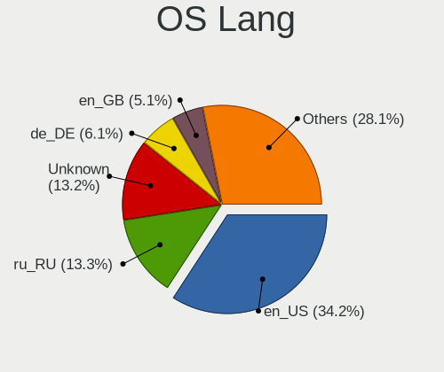
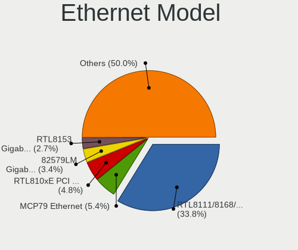

Debian 11 - Tested Hardware & Statistics
----------------------------------------

A project to collect tested hardware configurations for Debian 11.

Anyone can contribute to this report by the [hw-probe](https://github.com/linuxhw/hw-probe) tool:

    sudo -E hw-probe -all -upload

Please contribute! Especially if your hardware is rare.

This is a report for all computer types. See also reports for [desktops](/Dist/Debian_11/Desktop/README.md) and [notebooks](/Dist/Debian_11/Notebook/README.md).

Contents
--------

* [ Test Cases ](#test-cases)

* [ System ](#system)
  - [ Kernel                   ](#kernel)
  - [ Kernel Family            ](#kernel-family)
  - [ Kernel Major Ver.        ](#kernel-major-ver)
  - [ Arch                     ](#arch)
  - [ DE                       ](#de)
  - [ Display Server           ](#display-server)
  - [ Display Manager          ](#display-manager)
  - [ OS Lang                  ](#os-lang)
  - [ Boot Mode                ](#boot-mode)
  - [ Filesystem               ](#filesystem)
  - [ Part. scheme             ](#part-scheme)
  - [ Dual Boot with Linux/BSD ](#dual-boot-with-linuxbsd)
  - [ Dual Boot (Win)          ](#dual-boot-win)

* [ Board ](#board)
  - [ Vendor                   ](#vendor)
  - [ Model                    ](#model)
  - [ Model Family             ](#model-family)
  - [ MFG Year                 ](#mfg-year)
  - [ Form Factor              ](#form-factor)
  - [ Secure Boot              ](#secure-boot)
  - [ Coreboot                 ](#coreboot)
  - [ RAM Size                 ](#ram-size)
  - [ RAM Used                 ](#ram-used)
  - [ Total Drives             ](#total-drives)
  - [ Has CD-ROM               ](#has-cd-rom)
  - [ Has Ethernet             ](#has-ethernet)
  - [ Has WiFi                 ](#has-wifi)
  - [ Has Bluetooth            ](#has-bluetooth)

* [ Location ](#location)
  - [ Country                  ](#country)
  - [ City                     ](#city)

* [ Drives ](#drives)
  - [ Drive Vendor             ](#drive-vendor)
  - [ Drive Model              ](#drive-model)
  - [ HDD Vendor               ](#hdd-vendor)
  - [ SSD Vendor               ](#ssd-vendor)
  - [ Drive Kind               ](#drive-kind)
  - [ Drive Connector          ](#drive-connector)
  - [ Drive Size               ](#drive-size)
  - [ Space Total              ](#space-total)
  - [ Space Used               ](#space-used)
  - [ Malfunc. Drives          ](#malfunc-drives)
  - [ Malfunc. Drive Vendor    ](#malfunc-drive-vendor)
  - [ Malfunc. HDD Vendor      ](#malfunc-hdd-vendor)
  - [ Malfunc. Drive Kind      ](#malfunc-drive-kind)
  - [ Failed Drives            ](#failed-drives)
  - [ Failed Drive Vendor      ](#failed-drive-vendor)
  - [ Drive Status             ](#drive-status)

* [ Storage controller ](#storage-controller)
  - [ Storage Vendor           ](#storage-vendor)
  - [ Storage Model            ](#storage-model)
  - [ Storage Kind             ](#storage-kind)

* [ Processor ](#processor)
  - [ CPU Vendor               ](#cpu-vendor)
  - [ CPU Model                ](#cpu-model)
  - [ CPU Model Family         ](#cpu-model-family)
  - [ CPU Cores                ](#cpu-cores)
  - [ CPU Sockets              ](#cpu-sockets)
  - [ CPU Threads              ](#cpu-threads)
  - [ CPU Op-Modes             ](#cpu-op-modes)
  - [ CPU Microcode            ](#cpu-microcode)
  - [ CPU Microarch            ](#cpu-microarch)

* [ Graphics ](#graphics)
  - [ GPU Vendor               ](#gpu-vendor)
  - [ GPU Model                ](#gpu-model)
  - [ GPU Combo                ](#gpu-combo)
  - [ GPU Driver               ](#gpu-driver)
  - [ GPU Memory               ](#gpu-memory)

* [ Monitor ](#monitor)
  - [ Monitor Vendor           ](#monitor-vendor)
  - [ Monitor Model            ](#monitor-model)
  - [ Monitor Resolution       ](#monitor-resolution)
  - [ Monitor Diagonal         ](#monitor-diagonal)
  - [ Monitor Width            ](#monitor-width)
  - [ Aspect Ratio             ](#aspect-ratio)
  - [ Monitor Area             ](#monitor-area)
  - [ Pixel Density            ](#pixel-density)
  - [ Multiple Monitors        ](#multiple-monitors)

* [ Network ](#network)
  - [ Net Controller Vendor    ](#net-controller-vendor)
  - [ Net Controller Model     ](#net-controller-model)
  - [ Wireless Vendor          ](#wireless-vendor)
  - [ Wireless Model           ](#wireless-model)
  - [ Ethernet Vendor          ](#ethernet-vendor)
  - [ Ethernet Model           ](#ethernet-model)
  - [ Net Controller Kind      ](#net-controller-kind)
  - [ Used Controller          ](#used-controller)
  - [ NICs                     ](#nics)
  - [ IPv6                     ](#ipv6)

* [ Bluetooth ](#bluetooth)
  - [ Bluetooth Vendor         ](#bluetooth-vendor)
  - [ Bluetooth Model          ](#bluetooth-model)

* [ Sound ](#sound)
  - [ Sound Vendor             ](#sound-vendor)
  - [ Sound Model              ](#sound-model)

* [ Memory ](#memory)
  - [ Memory Vendor            ](#memory-vendor)
  - [ Memory Model             ](#memory-model)
  - [ Memory Kind              ](#memory-kind)
  - [ Memory Form Factor       ](#memory-form-factor)
  - [ Memory Size              ](#memory-size)
  - [ Memory Speed             ](#memory-speed)

* [ Printers & scanners ](#printers--scanners)
  - [ Printer Vendor           ](#printer-vendor)
  - [ Printer Model            ](#printer-model)
  - [ Scanner Vendor           ](#scanner-vendor)
  - [ Scanner Model            ](#scanner-model)

* [ Camera ](#camera)
  - [ Camera Vendor            ](#camera-vendor)
  - [ Camera Model             ](#camera-model)

* [ Security ](#security)
  - [ Fingerprint Vendor       ](#fingerprint-vendor)
  - [ Fingerprint Model        ](#fingerprint-model)
  - [ Chipcard Vendor          ](#chipcard-vendor)
  - [ Chipcard Model           ](#chipcard-model)

* [ Unsupported ](#unsupported)
  - [ Unsupported Devices      ](#unsupported-devices)
  - [ Unsupported Device Types ](#unsupported-device-types)

Test Cases
----------

Total: 10213

| Vendor        | Model                       | Form-Factor | Probe                                                      | Date         |
|---------------|-----------------------------|-------------|------------------------------------------------------------|--------------|
| MSI           | GE60 0NC\0ND                | Notebook    | [423eca6c8c](https://linux-hardware.org/?probe=423eca6c8c) | Jan 05, 2025 |
| Dell          | 09KPNV A00                  | Desktop     | [d2a1de9dc7](https://linux-hardware.org/?probe=d2a1de9dc7) | Jan 04, 2025 |
| ASRock        | J5040-ITX                   | Desktop     | [cfe9a3c37e](https://linux-hardware.org/?probe=cfe9a3c37e) | Dec 28, 2024 |
| Intel         | S5000VSA                    | Server      | [ec199dc348](https://linux-hardware.org/?probe=ec199dc348) | Dec 27, 2024 |
| Insyde        | Purley                      | Server      | [943c34d6fe](https://linux-hardware.org/?probe=943c34d6fe) | Dec 27, 2024 |
| Intel         | S5520UR E22554-751          | Server      | [e32d8048dd](https://linux-hardware.org/?probe=e32d8048dd) | Dec 27, 2024 |
| Insyde        | Purley                      | Server      | [0a1ed074fe](https://linux-hardware.org/?probe=0a1ed074fe) | Dec 27, 2024 |
| IBM           | 94Y7718 SIT                 | Server      | [133f7bc9a5](https://linux-hardware.org/?probe=133f7bc9a5) | Dec 27, 2024 |
| IBM           | 69Y1006 SIT                 | Server      | [31413f8015](https://linux-hardware.org/?probe=31413f8015) | Dec 27, 2024 |
| Intel         | NUC8BEB J72692-309          | Mini pc     | [31f432f98b](https://linux-hardware.org/?probe=31f432f98b) | Dec 26, 2024 |
| Gigabyte      | H370M D3H-CF                | Desktop     | [293052fc3b](https://linux-hardware.org/?probe=293052fc3b) | Dec 24, 2024 |
| Dell          | Latitude E6410              | Notebook    | [b51666dd6f](https://linux-hardware.org/?probe=b51666dd6f) | Dec 19, 2024 |
| ASRock        | J5040-ITX                   | Desktop     | [30c96f3002](https://linux-hardware.org/?probe=30c96f3002) | Dec 19, 2024 |
| ASUSTek       | PRIME B760-PLUS D4          | Desktop     | [379d336bc2](https://linux-hardware.org/?probe=379d336bc2) | Dec 16, 2024 |
| Acer          | Aspire 5733                 | Notebook    | [edc4741bd8](https://linux-hardware.org/?probe=edc4741bd8) | Dec 15, 2024 |
| Acer          | Aspire 5733                 | Notebook    | [b7af1c256d](https://linux-hardware.org/?probe=b7af1c256d) | Dec 15, 2024 |
| OEM           | B75 Ver:1.41                | Desktop     | [26fc19a77d](https://linux-hardware.org/?probe=26fc19a77d) | Dec 15, 2024 |
| Raspberry ... | Raspberry Pi Compute Mod... | Soc         | [5312d0eb27](https://linux-hardware.org/?probe=5312d0eb27) | Dec 04, 2024 |
| Raspberry ... | Raspberry Pi 3 Model B R... | Soc         | [81eb56f0f7](https://linux-hardware.org/?probe=81eb56f0f7) | Dec 03, 2024 |
| TI            | AM335x BeagleBone Black ... | Soc         | [75a37fdb48](https://linux-hardware.org/?probe=75a37fdb48) | Dec 02, 2024 |
| ASUSTek       | PRIME Z590-P                | Desktop     | [2e9144632c](https://linux-hardware.org/?probe=2e9144632c) | Dec 02, 2024 |
| HP            | 339A                        | Desktop     | [c64449a47e](https://linux-hardware.org/?probe=c64449a47e) | Dec 02, 2024 |
| Clevo         | W35_37ET                    | Notebook    | [8c4d3d1caa](https://linux-hardware.org/?probe=8c4d3d1caa) | Nov 30, 2024 |
| Clevo         | W35_37ET                    | Notebook    | [4b7ce97c36](https://linux-hardware.org/?probe=4b7ce97c36) | Nov 30, 2024 |
| ASRock        | B450M Pro4                  | Desktop     | [c865d51386](https://linux-hardware.org/?probe=c865d51386) | Nov 30, 2024 |
| Supermicro    | X9SRA/X9SRA-3               | Server      | [3b5585bec8](https://linux-hardware.org/?probe=3b5585bec8) | Nov 27, 2024 |
| Lenovo        | ThinkPad E14 Gen 4 21EBC... | Notebook    | [45fd5080cc](https://linux-hardware.org/?probe=45fd5080cc) | Nov 26, 2024 |
| MSI           | 880GM-E41                   | Desktop     | [d2d4d7473b](https://linux-hardware.org/?probe=d2d4d7473b) | Nov 26, 2024 |
| Supermicro    | X10DRH-iT                   | Server      | [f59d7a8db6](https://linux-hardware.org/?probe=f59d7a8db6) | Nov 25, 2024 |
| Raspberry ... | Raspberry Pi 4 Model B R... | Soc         | [7b394d91fc](https://linux-hardware.org/?probe=7b394d91fc) | Nov 24, 2024 |
| ASUSTek       | Rampage III GENE            | Desktop     | [89662fc2f1](https://linux-hardware.org/?probe=89662fc2f1) | Nov 23, 2024 |
| ASUSTek       | PRIME Z590-P                | Desktop     | [5b66a14834](https://linux-hardware.org/?probe=5b66a14834) | Nov 20, 2024 |
| Lenovo        | IdeaPad 320-15IAP 80XR      | Notebook    | [a13d39cf07](https://linux-hardware.org/?probe=a13d39cf07) | Nov 20, 2024 |
| Unknown       | Unknown                     | Desktop     | [69c39a72ba](https://linux-hardware.org/?probe=69c39a72ba) | Nov 18, 2024 |
| HP            | Notebook                    | Notebook    | [9ec4cde8a4](https://linux-hardware.org/?probe=9ec4cde8a4) | Nov 18, 2024 |
| Apple         | Mac-F4228EC8 DVT            | All in one  | [de3a243820](https://linux-hardware.org/?probe=de3a243820) | Nov 17, 2024 |
| Apple         | Mac-F4228EC8 DVT            | All in one  | [64e57644f0](https://linux-hardware.org/?probe=64e57644f0) | Nov 17, 2024 |
| Acer          | FI946GZG                    | Desktop     | [a7f49035aa](https://linux-hardware.org/?probe=a7f49035aa) | Nov 16, 2024 |
| Acer          | FI946GZG                    | Desktop     | [9d9080e57a](https://linux-hardware.org/?probe=9d9080e57a) | Nov 16, 2024 |
| Dell          | 0KWVT8 A00                  | Desktop     | [cbf908cc03](https://linux-hardware.org/?probe=cbf908cc03) | Nov 13, 2024 |
| Gigabyte      | GA-MA78GM-DS2H              | Desktop     | [5b63d6de06](https://linux-hardware.org/?probe=5b63d6de06) | Nov 12, 2024 |
| Dell          | Inspiron 5720               | Notebook    | [5c8bf7fb22](https://linux-hardware.org/?probe=5c8bf7fb22) | Nov 09, 2024 |
| HP            | 1495                        | Desktop     | [5778238fb5](https://linux-hardware.org/?probe=5778238fb5) | Nov 09, 2024 |
| ASUSTek       | Z8PE-D12-EMBEDDED           | Desktop     | [a71b3adfe4](https://linux-hardware.org/?probe=a71b3adfe4) | Nov 09, 2024 |
| ASUSTek       | Z8PE-D12-EMBEDDED           | Desktop     | [03ca590abe](https://linux-hardware.org/?probe=03ca590abe) | Nov 09, 2024 |
| Dell          | 01XK1W A00                  | Desktop     | [a66d7f6087](https://linux-hardware.org/?probe=a66d7f6087) | Nov 09, 2024 |
| Intel         | DH77KC AAG39641-400         | Desktop     | [7e99679aa4](https://linux-hardware.org/?probe=7e99679aa4) | Nov 07, 2024 |
| MSI           | Thin GF63 12UCX             | Notebook    | [20bee02e0a](https://linux-hardware.org/?probe=20bee02e0a) | Nov 07, 2024 |
| Dell          | 0V8WGR A00                  | Desktop     | [8b995d3611](https://linux-hardware.org/?probe=8b995d3611) | Nov 05, 2024 |
| PC Special... | 14 Fusion IV                | Notebook    | [1ef6e14285](https://linux-hardware.org/?probe=1ef6e14285) | Nov 04, 2024 |
| Intel         | NUC8BEB J72692-309          | Mini pc     | [11a8379f5e](https://linux-hardware.org/?probe=11a8379f5e) | Nov 03, 2024 |
| Insyde        | GeminiLake                  | Notebook    | [df7e9af6a4](https://linux-hardware.org/?probe=df7e9af6a4) | Nov 02, 2024 |
| Unknown       | Unknown                     | Soc         | [9fba92e2b4](https://linux-hardware.org/?probe=9fba92e2b4) | Nov 02, 2024 |
| HP            | 1495                        | Desktop     | [00133664ce](https://linux-hardware.org/?probe=00133664ce) | Nov 02, 2024 |
| ASRock        | B450 Pro4 R2.0              | Desktop     | [9db603450a](https://linux-hardware.org/?probe=9db603450a) | Nov 01, 2024 |
| Dell          | XPS 15 7590                 | Notebook    | [597318b1e3](https://linux-hardware.org/?probe=597318b1e3) | Nov 01, 2024 |
| Acer          | Nitro AN515-52              | Notebook    | [009c07413d](https://linux-hardware.org/?probe=009c07413d) | Oct 29, 2024 |
| Gigabyte      | H81M-S2H                    | Desktop     | [b93eb7acfd](https://linux-hardware.org/?probe=b93eb7acfd) | Oct 28, 2024 |
| IBASE Tech... | MB980VF B1                  | Desktop     | [0950d198d6](https://linux-hardware.org/?probe=0950d198d6) | Oct 27, 2024 |
| IBASE Tech... | MB980VF B1                  | Desktop     | [b7bff2d716](https://linux-hardware.org/?probe=b7bff2d716) | Oct 27, 2024 |
| Dell          | 01XK1W A00                  | Desktop     | [5226011358](https://linux-hardware.org/?probe=5226011358) | Oct 27, 2024 |
| Lenovo        | ThinkPad T480 20L6SA5Q1E    | Notebook    | [b36104396e](https://linux-hardware.org/?probe=b36104396e) | Oct 26, 2024 |
| Acer          | FI946GZG                    | Desktop     | [5938a70edc](https://linux-hardware.org/?probe=5938a70edc) | Oct 26, 2024 |
| Acer          | FI946GZG                    | Desktop     | [57835df373](https://linux-hardware.org/?probe=57835df373) | Oct 26, 2024 |
| Sony          | VGN-NW26M                   | Notebook    | [b7d8f997e5](https://linux-hardware.org/?probe=b7d8f997e5) | Oct 25, 2024 |
| HP            | 250 G8 Notebook PC          | Notebook    | [338df85e2c](https://linux-hardware.org/?probe=338df85e2c) | Oct 23, 2024 |
| ASUSTek       | TUF Gaming Z790-PLUS WIF... | Desktop     | [0642feaea1](https://linux-hardware.org/?probe=0642feaea1) | Oct 22, 2024 |
| ASUSTek       | TUF Gaming Z790-PLUS WIF... | Desktop     | [b13668c203](https://linux-hardware.org/?probe=b13668c203) | Oct 22, 2024 |
| Intel         | NUC8BEB J72692-309          | Mini pc     | [4f556994ff](https://linux-hardware.org/?probe=4f556994ff) | Oct 20, 2024 |
| Intel         | NUC10i5FNB K61361-305       | Mini pc     | [904c305f40](https://linux-hardware.org/?probe=904c305f40) | Oct 20, 2024 |
| Intel         | NUC8BEB J72692-309          | Mini pc     | [8a3b4ef522](https://linux-hardware.org/?probe=8a3b4ef522) | Oct 20, 2024 |
| HP            | ProBook 440 14 inch G9 N... | Notebook    | [8f4ed9b69e](https://linux-hardware.org/?probe=8f4ed9b69e) | Oct 20, 2024 |
| Fujitsu       | D3041-A1 S26361-D3041-A1    | Desktop     | [daf26b85a4](https://linux-hardware.org/?probe=daf26b85a4) | Oct 19, 2024 |
| ASUSTek       | VivoBook_ASUSLaptop M650... | Notebook    | [d01b3d0dd1](https://linux-hardware.org/?probe=d01b3d0dd1) | Oct 18, 2024 |
| Dell          | Latitude E6520              | Notebook    | [aff7fc0640](https://linux-hardware.org/?probe=aff7fc0640) | Oct 16, 2024 |
| MSI           | MS-7071                     | Desktop     | [6cf8497c89](https://linux-hardware.org/?probe=6cf8497c89) | Oct 16, 2024 |
| Dell          | 0GXM1W A02                  | Desktop     | [e8c22589e3](https://linux-hardware.org/?probe=e8c22589e3) | Oct 16, 2024 |
| Dell          | 0GXM1W A02                  | Desktop     | [e2cdb3ceef](https://linux-hardware.org/?probe=e2cdb3ceef) | Oct 16, 2024 |
| AMI           | Aptio CRB                   | Mini pc     | [292dcee628](https://linux-hardware.org/?probe=292dcee628) | Oct 15, 2024 |
| Unknown       | Unknown                     | Soc         | [848397f66d](https://linux-hardware.org/?probe=848397f66d) | Oct 14, 2024 |
| SLIMBOOK      | Unknown                     | Notebook    | [a45b75d9ec](https://linux-hardware.org/?probe=a45b75d9ec) | Oct 14, 2024 |
| FriendlyEl... | NanoPi NEO3                 | Soc         | [434208e85f](https://linux-hardware.org/?probe=434208e85f) | Oct 12, 2024 |
| Acer          | Aspire A515-56              | Notebook    | [a61df1d187](https://linux-hardware.org/?probe=a61df1d187) | Oct 11, 2024 |
| ASRock        | H610M-HVS                   | Desktop     | [91361cad1e](https://linux-hardware.org/?probe=91361cad1e) | Oct 10, 2024 |
| HP            | ProLiant MicroServer Gen... | Desktop     | [2927ff6f0d](https://linux-hardware.org/?probe=2927ff6f0d) | Oct 09, 2024 |
| Acer          | FI946GZG                    | Desktop     | [92bd6f1fc1](https://linux-hardware.org/?probe=92bd6f1fc1) | Oct 09, 2024 |
| Acer          | FI946GZG                    | Desktop     | [535a355530](https://linux-hardware.org/?probe=535a355530) | Oct 09, 2024 |
| Sapphire      | PI-AM3RS760G2               | Desktop     | [d0eaae2f60](https://linux-hardware.org/?probe=d0eaae2f60) | Oct 09, 2024 |
| ForeScout ... | 0VRCY5 A14                  | Server      | [4e8721ab88](https://linux-hardware.org/?probe=4e8721ab88) | Oct 04, 2024 |
| ASRock        | B450M Steel Legend          | Desktop     | [1abb05bf25](https://linux-hardware.org/?probe=1abb05bf25) | Oct 03, 2024 |
| ASUSTek       | M5A99FX PRO R2.0            | Desktop     | [eca6363c57](https://linux-hardware.org/?probe=eca6363c57) | Oct 02, 2024 |
| ASUSTek       | M5A99FX PRO R2.0            | Desktop     | [3b48795f8e](https://linux-hardware.org/?probe=3b48795f8e) | Sep 30, 2024 |
| HP            | G60                         | Notebook    | [c4e7fe598d](https://linux-hardware.org/?probe=c4e7fe598d) | Sep 30, 2024 |
| HP            | 3397                        | Desktop     | [63009f600f](https://linux-hardware.org/?probe=63009f600f) | Sep 30, 2024 |
| Lenovo        | ThinkPad X1 Yoga 2nd 20J... | Convertible | [dbe298738b](https://linux-hardware.org/?probe=dbe298738b) | Sep 26, 2024 |
| Rockchip      | RK3399 EVB IND LPDDR4 Bo... | Soc         | [2609d42a42](https://linux-hardware.org/?probe=2609d42a42) | Sep 25, 2024 |
| Lenovo        | ThinkPad P15v Gen 2i 21A... | Notebook    | [91c64d17ea](https://linux-hardware.org/?probe=91c64d17ea) | Sep 22, 2024 |
| Dell          | 0T065F A01                  | Desktop     | [bcbba2bc39](https://linux-hardware.org/?probe=bcbba2bc39) | Sep 21, 2024 |
| Acer          | FI946GZG                    | Desktop     | [38457fe3eb](https://linux-hardware.org/?probe=38457fe3eb) | Sep 20, 2024 |
| Acer          | FI946GZG                    | Desktop     | [7f888553ed](https://linux-hardware.org/?probe=7f888553ed) | Sep 20, 2024 |
| Gigabyte      | B75M-D3V                    | Desktop     | [b96fef78f4](https://linux-hardware.org/?probe=b96fef78f4) | Sep 20, 2024 |
| Acer          | Aspire ES1-533              | Notebook    | [238267b887](https://linux-hardware.org/?probe=238267b887) | Sep 20, 2024 |
| ASUSTek       | 1000                        | Notebook    | [4ba77b632f](https://linux-hardware.org/?probe=4ba77b632f) | Sep 20, 2024 |
| HP            | G60                         | Notebook    | [918e4c12c2](https://linux-hardware.org/?probe=918e4c12c2) | Sep 20, 2024 |
| ASRock        | X570 Phantom Gaming X       | Desktop     | [075f6eaa32](https://linux-hardware.org/?probe=075f6eaa32) | Sep 19, 2024 |
| Lenovo        | SHARKBAY SDK0J40697 WIN     | Desktop     | [6d2a1ac8e1](https://linux-hardware.org/?probe=6d2a1ac8e1) | Sep 18, 2024 |
| Microsoft     | Surface 3                   | Tablet      | [d3f7875b8b](https://linux-hardware.org/?probe=d3f7875b8b) | Sep 16, 2024 |
| Fujitsu       | D2619 S26361-D2619-A14 W... | Server      | [df81b53b94](https://linux-hardware.org/?probe=df81b53b94) | Sep 16, 2024 |
| Dell          | 01XK1W A00                  | Desktop     | [b1768b27cf](https://linux-hardware.org/?probe=b1768b27cf) | Sep 14, 2024 |
| Dell          | 0NNNCT A01                  | Desktop     | [c3aeffdb84](https://linux-hardware.org/?probe=c3aeffdb84) | Sep 13, 2024 |
| Lenovo        | ThinkPad T430 2347FF9       | Notebook    | [0e9f60231f](https://linux-hardware.org/?probe=0e9f60231f) | Sep 11, 2024 |
| Unknown       | Wiren Board rev. 6.9.0 (... | Other       | [ae1973cba8](https://linux-hardware.org/?probe=ae1973cba8) | Sep 11, 2024 |
| Intel         | CRESCENTBAY                 | Desktop     | [14865f8a73](https://linux-hardware.org/?probe=14865f8a73) | Sep 10, 2024 |
| ASUSTek       | H110M-K                     | Desktop     | [ff593c19ff](https://linux-hardware.org/?probe=ff593c19ff) | Sep 10, 2024 |
| iEi           | SAX9 V1.00                  | Desktop     | [d25454a2fb](https://linux-hardware.org/?probe=d25454a2fb) | Sep 10, 2024 |
| Dell          | 0NNNCT A01                  | Desktop     | [c5d73da3a3](https://linux-hardware.org/?probe=c5d73da3a3) | Sep 09, 2024 |
| HP            | Laptop 15s-eq2xxx           | Notebook    | [dc90d7b0f6](https://linux-hardware.org/?probe=dc90d7b0f6) | Sep 09, 2024 |
| ASUSTek       | PRIME H310M-K               | Desktop     | [4a801900e1](https://linux-hardware.org/?probe=4a801900e1) | Sep 09, 2024 |
| ASUSTek       | PRIME H310M-K               | Desktop     | [1c6ee65d7a](https://linux-hardware.org/?probe=1c6ee65d7a) | Sep 09, 2024 |
| Radxa         | ZERO 3                      | Soc         | [2a505955f1](https://linux-hardware.org/?probe=2a505955f1) | Sep 09, 2024 |
| HP            | EliteBook 8760w             | Notebook    | [78169bfe9b](https://linux-hardware.org/?probe=78169bfe9b) | Sep 08, 2024 |
| ASUSTek       | P8Z68-V LX                  | Desktop     | [9d86f13601](https://linux-hardware.org/?probe=9d86f13601) | Sep 05, 2024 |
| HP            | 18E7                        | Desktop     | [dbea31ed81](https://linux-hardware.org/?probe=dbea31ed81) | Sep 02, 2024 |
| Positivo      | C8240AI-15                  | Notebook    | [cf5df4af8e](https://linux-hardware.org/?probe=cf5df4af8e) | Sep 02, 2024 |
| ASRock        | 970M Pro3                   | Desktop     | [5310dbbf32](https://linux-hardware.org/?probe=5310dbbf32) | Sep 01, 2024 |
| MSI           | B85M-G43                    | Desktop     | [374b7d32b3](https://linux-hardware.org/?probe=374b7d32b3) | Sep 01, 2024 |
| Dell          | 01XK1W A00                  | Desktop     | [6e978f31cf](https://linux-hardware.org/?probe=6e978f31cf) | Sep 01, 2024 |
| MSI           | X79A-GD45                   | Desktop     | [2f16c5924f](https://linux-hardware.org/?probe=2f16c5924f) | Aug 29, 2024 |
| ASUSTek       | P5B SE                      | Desktop     | [d545ce5d36](https://linux-hardware.org/?probe=d545ce5d36) | Aug 28, 2024 |
| Phoenix Co... | PSB514 A12                  | Desktop     | [b6636750fd](https://linux-hardware.org/?probe=b6636750fd) | Aug 25, 2024 |
| ASUSTek       | TUF Gaming B550M-PLUS       | Desktop     | [b4dc6d4025](https://linux-hardware.org/?probe=b4dc6d4025) | Aug 24, 2024 |
| ASRockRack    | E3C246D4U2-2T               | Desktop     | [c0a760b1bf](https://linux-hardware.org/?probe=c0a760b1bf) | Aug 23, 2024 |
| TYAN Compu... | S5553GM2NR-2T-HE-B          | Desktop     | [81952b8f97](https://linux-hardware.org/?probe=81952b8f97) | Aug 23, 2024 |
| ASUSTek       | M4N78-AM                    | Desktop     | [b8ac55c9e9](https://linux-hardware.org/?probe=b8ac55c9e9) | Aug 22, 2024 |
| TI            | AM335x BeagleBone Black     | Soc         | [28a2645f4c](https://linux-hardware.org/?probe=28a2645f4c) | Aug 22, 2024 |
| ASUSTek       | TUF Gaming B550M-PLUS       | Desktop     | [921ec4cff0](https://linux-hardware.org/?probe=921ec4cff0) | Aug 21, 2024 |
| ASRock        | X570 PG Velocita            | Desktop     | [a7fa96eb22](https://linux-hardware.org/?probe=a7fa96eb22) | Aug 21, 2024 |
| HP            | G60                         | Notebook    | [b27d94e4b9](https://linux-hardware.org/?probe=b27d94e4b9) | Aug 21, 2024 |
| HP            | G60                         | Notebook    | [98fc212513](https://linux-hardware.org/?probe=98fc212513) | Aug 21, 2024 |
| ASUSTek       | M4N78-AM                    | Desktop     | [c0fb89099b](https://linux-hardware.org/?probe=c0fb89099b) | Aug 20, 2024 |
| Lenovo        | 3000 G530 4151/200          | Notebook    | [1d9b0a4f71](https://linux-hardware.org/?probe=1d9b0a4f71) | Aug 19, 2024 |
| Lenovo        | 3000 G530 4151/200          | Notebook    | [c12d510377](https://linux-hardware.org/?probe=c12d510377) | Aug 19, 2024 |
| Lenovo        | 30D9 SDK0J40697 WIN 3305... | Desktop     | [48f20ce29b](https://linux-hardware.org/?probe=48f20ce29b) | Aug 19, 2024 |
| HP            | ProLiant DL60 Gen9          | Server      | [ac48708bdd](https://linux-hardware.org/?probe=ac48708bdd) | Aug 18, 2024 |
| Dell          | 01XK1W A00                  | Desktop     | [3d467b94d9](https://linux-hardware.org/?probe=3d467b94d9) | Aug 14, 2024 |
| Acer          | Aspire AG14-31P             | Notebook    | [0e32b18772](https://linux-hardware.org/?probe=0e32b18772) | Aug 12, 2024 |
| Acer          | Aspire AG14-31P             | Notebook    | [12d18c1ee6](https://linux-hardware.org/?probe=12d18c1ee6) | Aug 12, 2024 |
| Lenovo        | ThinkPad E490 20N8S0WH00    | Notebook    | [4df92c7741](https://linux-hardware.org/?probe=4df92c7741) | Aug 12, 2024 |
| ASRock        | 970 Extreme3 R2.0           | Desktop     | [5aba1832f5](https://linux-hardware.org/?probe=5aba1832f5) | Aug 11, 2024 |
| Lenovo        | ThinkPad E595 20NF001HRT    | Notebook    | [ed43fa321d](https://linux-hardware.org/?probe=ed43fa321d) | Aug 11, 2024 |
| Lenovo        | IdeaPad Gaming 3 15IAH7 ... | Notebook    | [32a29957a4](https://linux-hardware.org/?probe=32a29957a4) | Aug 10, 2024 |
| HP            | Mini China Mobile Editio... | Notebook    | [573e118166](https://linux-hardware.org/?probe=573e118166) | Aug 09, 2024 |
| HP            | Mini China Mobile Editio... | Notebook    | [f1700dec96](https://linux-hardware.org/?probe=f1700dec96) | Aug 09, 2024 |
| Lenovo        | Legion Y530-15ICH-1060 8... | Notebook    | [7f7717743d](https://linux-hardware.org/?probe=7f7717743d) | Aug 08, 2024 |
| AZW           | MINI S 10                   | Desktop     | [62de36544b](https://linux-hardware.org/?probe=62de36544b) | Aug 08, 2024 |
| Radxa         | ROCK 4C+ (DT)               | Soc         | [bce627af57](https://linux-hardware.org/?probe=bce627af57) | Aug 06, 2024 |
| Dell          | 0GXM1W A00                  | Desktop     | [e80fba5694](https://linux-hardware.org/?probe=e80fba5694) | Aug 05, 2024 |
| Raspberry ... | Raspberry Pi Zero 2 W Re... | Soc         | [e7d1a5439b](https://linux-hardware.org/?probe=e7d1a5439b) | Aug 04, 2024 |
| ASUSTek       | PRIME Z590-P                | Desktop     | [caf4309fbe](https://linux-hardware.org/?probe=caf4309fbe) | Aug 02, 2024 |
| HP            | 1998                        | Desktop     | [718d1847d7](https://linux-hardware.org/?probe=718d1847d7) | Aug 01, 2024 |
| Acer          | Aspire E5-523G              | Notebook    | [dcae9fea91](https://linux-hardware.org/?probe=dcae9fea91) | Aug 01, 2024 |
| Unknown       | Unknown                     | Soc         | [59672d4fe2](https://linux-hardware.org/?probe=59672d4fe2) | Aug 01, 2024 |
| Gigabyte      | GA-78LMT-USB3               | Desktop     | [f9b69bff33](https://linux-hardware.org/?probe=f9b69bff33) | Jul 31, 2024 |
| Acer          | AOD270                      | Notebook    | [086d69b5dc](https://linux-hardware.org/?probe=086d69b5dc) | Jul 31, 2024 |
| Raspberry ... | Raspberry Pi 4 Model B R... | Soc         | [7a6c894fc9](https://linux-hardware.org/?probe=7a6c894fc9) | Jul 31, 2024 |
| Acer          | AOD270                      | Notebook    | [5a2f98fbf0](https://linux-hardware.org/?probe=5a2f98fbf0) | Jul 31, 2024 |
| Seco          | D62 B.1                     | Desktop     | [fa8221ca8a](https://linux-hardware.org/?probe=fa8221ca8a) | Jul 30, 2024 |
| Dell          | 0XFWHV A00                  | Desktop     | [9845091f7e](https://linux-hardware.org/?probe=9845091f7e) | Jul 28, 2024 |
| ASUSTek       | VivoBook_ASUSLaptop X150... | Notebook    | [b83c73ebb9](https://linux-hardware.org/?probe=b83c73ebb9) | Jul 27, 2024 |
| Dell          | Latitude E6420              | Notebook    | [062d91bd4e](https://linux-hardware.org/?probe=062d91bd4e) | Jul 26, 2024 |
| NOBLEX        | NT1010E                     | Notebook    | [c27368454d](https://linux-hardware.org/?probe=c27368454d) | Jul 25, 2024 |
| Gigabyte      | B85M-DS3H-A                 | Desktop     | [345e2f9291](https://linux-hardware.org/?probe=345e2f9291) | Jul 24, 2024 |
| Lenovo        | 3000 N100 0768FPG           | Notebook    | [1f529ec188](https://linux-hardware.org/?probe=1f529ec188) | Jul 24, 2024 |
| OrangePi      | Zero2 W                     | Soc         | [ffac8056dc](https://linux-hardware.org/?probe=ffac8056dc) | Jul 24, 2024 |
| Gigabyte      | B75M-D3H                    | Desktop     | [6bfee437e7](https://linux-hardware.org/?probe=6bfee437e7) | Jul 23, 2024 |
| ASUSTek       | ASUS TUF Gaming F15 FX50... | Notebook    | [af38eddfb9](https://linux-hardware.org/?probe=af38eddfb9) | Jul 23, 2024 |
| Gigabyte      | B550M DS3H                  | Desktop     | [03179392b1](https://linux-hardware.org/?probe=03179392b1) | Jul 22, 2024 |
| Gigabyte      | B365M H                     | Desktop     | [b2bc363dc6](https://linux-hardware.org/?probe=b2bc363dc6) | Jul 22, 2024 |
| Raspberry ... | Raspberry Pi 3 Model B R... | Soc         | [d3a54a2ba6](https://linux-hardware.org/?probe=d3a54a2ba6) | Jul 22, 2024 |
| AMI           | Cherry Trail CR             | Notebook    | [bef52595c6](https://linux-hardware.org/?probe=bef52595c6) | Jul 21, 2024 |
| Dell          | 051FJ8 A02                  | Desktop     | [757139a0c9](https://linux-hardware.org/?probe=757139a0c9) | Jul 21, 2024 |
| ASUSTek       | VANGUARD B85                | Desktop     | [7453f3f267](https://linux-hardware.org/?probe=7453f3f267) | Jul 19, 2024 |
| IceWhale T... | ZBB001-BK10032 ZMB          | Desktop     | [334a362aba](https://linux-hardware.org/?probe=334a362aba) | Jul 19, 2024 |
| Unknown       | biqu RK3566-ROC-PC HDMI(... | Soc         | [3c3653ce84](https://linux-hardware.org/?probe=3c3653ce84) | Jul 13, 2024 |
| ASUSTek       | K53SJ                       | Notebook    | [ac4dbbb061](https://linux-hardware.org/?probe=ac4dbbb061) | Jul 12, 2024 |
| Dell          | 01XK1W A00                  | Desktop     | [52d8794632](https://linux-hardware.org/?probe=52d8794632) | Jul 11, 2024 |
| Raspberry ... | Raspberry Pi 3 Model B R... | Soc         | [19d6067144](https://linux-hardware.org/?probe=19d6067144) | Jul 08, 2024 |
| Dell          | 01XK1W A00                  | Desktop     | [cc46df44b5](https://linux-hardware.org/?probe=cc46df44b5) | Jul 07, 2024 |
| Unknown       | Unknown                     | Desktop     | [e298a5c2b9](https://linux-hardware.org/?probe=e298a5c2b9) | Jul 06, 2024 |
| Lenovo        | SHARKBAY 0B98401 PRO        | Desktop     | [6cadfd61f0](https://linux-hardware.org/?probe=6cadfd61f0) | Jul 05, 2024 |
| HP            | 250 G7 Notebook PC          | Notebook    | [4625edbfa8](https://linux-hardware.org/?probe=4625edbfa8) | Jul 05, 2024 |
| Dell          | 06MC09 A00                  | Mini pc     | [12ba7ec8cc](https://linux-hardware.org/?probe=12ba7ec8cc) | Jul 03, 2024 |
| Dell          | 06MC09 A00                  | Mini pc     | [d6fc5e561e](https://linux-hardware.org/?probe=d6fc5e561e) | Jul 03, 2024 |
| HP            | 213D A01                    | Desktop     | [84f1dcac4f](https://linux-hardware.org/?probe=84f1dcac4f) | Jul 02, 2024 |
| Raspberry ... | Raspberry Pi 3 Model B R... | Soc         | [c7aa930920](https://linux-hardware.org/?probe=c7aa930920) | Jul 01, 2024 |
| Raspberry ... | Raspberry Pi 4 Model B R... | Soc         | [80bbfc4e43](https://linux-hardware.org/?probe=80bbfc4e43) | Jun 30, 2024 |
| Inventec      | D CLASS A02                 | Desktop     | [b12e2708ad](https://linux-hardware.org/?probe=b12e2708ad) | Jun 30, 2024 |
| Unknown       | CN700-8237                  | Desktop     | [696664c26e](https://linux-hardware.org/?probe=696664c26e) | Jun 30, 2024 |
| ASUSTek       | M4N78-AM                    | Desktop     | [dcacfa2dba](https://linux-hardware.org/?probe=dcacfa2dba) | Jun 30, 2024 |
| HP            | ZBook 15u G5                | Notebook    | [026a2f799a](https://linux-hardware.org/?probe=026a2f799a) | Jun 30, 2024 |
| libre-comp... | roc-rk3328-cc               | Soc         | [2f3fe5fade](https://linux-hardware.org/?probe=2f3fe5fade) | Jun 30, 2024 |
| Tablet        | 8                           | Notebook    | [05e319ff90](https://linux-hardware.org/?probe=05e319ff90) | Jun 28, 2024 |
| MiTAC         | PH10CI AAG92370-407         | All in one  | [75f967b327](https://linux-hardware.org/?probe=75f967b327) | Jun 28, 2024 |
| MiTAC         | PH10CI AAG92370-407         | All in one  | [3b287b8f18](https://linux-hardware.org/?probe=3b287b8f18) | Jun 28, 2024 |
| Positivo B... | VJFE59F11X-B1011H           | Notebook    | [b3a0915574](https://linux-hardware.org/?probe=b3a0915574) | Jun 24, 2024 |
| MSI           | PE70 7RD                    | Notebook    | [26556b06ad](https://linux-hardware.org/?probe=26556b06ad) | Jun 24, 2024 |
| Acer          | TravelMate P449-G2-M        | Notebook    | [715fa28bb7](https://linux-hardware.org/?probe=715fa28bb7) | Jun 23, 2024 |
| Acer          | TravelMate P449-G2-M        | Notebook    | [7abc3101ea](https://linux-hardware.org/?probe=7abc3101ea) | Jun 22, 2024 |
| Toshiba       | Satellite L650D             | Notebook    | [09f8b8509c](https://linux-hardware.org/?probe=09f8b8509c) | Jun 22, 2024 |
| Daten Tecn... | DA5UP DC                    | Mini pc     | [512405af17](https://linux-hardware.org/?probe=512405af17) | Jun 21, 2024 |
| HP            | ProLiant MicroServer        | Desktop     | [9c05a4ef2d](https://linux-hardware.org/?probe=9c05a4ef2d) | Jun 20, 2024 |
| Dell          | 0F56WK A03                  | Desktop     | [98a85a6db0](https://linux-hardware.org/?probe=98a85a6db0) | Jun 19, 2024 |
| Dell          | Latitude E6420              | Notebook    | [07364acb42](https://linux-hardware.org/?probe=07364acb42) | Jun 19, 2024 |
| Gigabyte      | B760M H DDR4                | Desktop     | [8d6956f9a6](https://linux-hardware.org/?probe=8d6956f9a6) | Jun 17, 2024 |
| Gigabyte      | B760M H DDR4                | Desktop     | [3e87b834d6](https://linux-hardware.org/?probe=3e87b834d6) | Jun 17, 2024 |
| Lenovo        | ThinkPad P14s Gen 3 21J5... | Notebook    | [abf647d335](https://linux-hardware.org/?probe=abf647d335) | Jun 10, 2024 |
| Lenovo        | ThinkPad P14s Gen 3 21J5... | Notebook    | [4fc663cdab](https://linux-hardware.org/?probe=4fc663cdab) | Jun 10, 2024 |
| Lenovo        | 3111 SDK0J40697 WIN 3305... | Mini pc     | [09b3b01ee7](https://linux-hardware.org/?probe=09b3b01ee7) | Jun 07, 2024 |
| Lenovo        | B490 37722QP                | Notebook    | [d8afa9ab6e](https://linux-hardware.org/?probe=d8afa9ab6e) | Jun 07, 2024 |
| Lenovo        | B490 37722QP                | Notebook    | [981e272711](https://linux-hardware.org/?probe=981e272711) | Jun 06, 2024 |
| ASRock        | 970M Pro3                   | Desktop     | [8fbbbe6686](https://linux-hardware.org/?probe=8fbbbe6686) | Jun 05, 2024 |
| ASRock        | 970M Pro3                   | Desktop     | [eeb2f4e975](https://linux-hardware.org/?probe=eeb2f4e975) | Jun 05, 2024 |
| HP            | EliteBook 725 G4            | Notebook    | [5a8af90597](https://linux-hardware.org/?probe=5a8af90597) | Jun 04, 2024 |
| HP            | EliteBook 725 G4            | Notebook    | [ddcee8dc11](https://linux-hardware.org/?probe=ddcee8dc11) | Jun 04, 2024 |
| Raspberry ... | Raspberry Pi Zero 2 W Re... | Soc         | [aac83e9625](https://linux-hardware.org/?probe=aac83e9625) | Jun 03, 2024 |
| ASRock        | B450 Pro4 R2.0              | Desktop     | [f8ad181953](https://linux-hardware.org/?probe=f8ad181953) | Jun 02, 2024 |
| Acer          | FI946GZG                    | Desktop     | [76cc9c0af8](https://linux-hardware.org/?probe=76cc9c0af8) | Jun 01, 2024 |
| MSI           | CR70 2M/CX70 2OC/CX70 2O... | Notebook    | [4ac8e343f3](https://linux-hardware.org/?probe=4ac8e343f3) | May 30, 2024 |
| Dell          | Inspiron N4050              | Notebook    | [c4f21338da](https://linux-hardware.org/?probe=c4f21338da) | May 27, 2024 |
| sunxi         | Unknown                     | Soc         | [b687301078](https://linux-hardware.org/?probe=b687301078) | May 24, 2024 |
| sunxi         | Unknown                     | Soc         | [f1ca318cb1](https://linux-hardware.org/?probe=f1ca318cb1) | May 22, 2024 |
| HP            | EliteBook 840 G8 Noteboo... | Notebook    | [548c48e57a](https://linux-hardware.org/?probe=548c48e57a) | May 21, 2024 |
| Acer          | FI946GZG                    | Desktop     | [0cfa96d8b2](https://linux-hardware.org/?probe=0cfa96d8b2) | May 19, 2024 |
| Acer          | FI946GZG                    | Desktop     | [6abf4b2ff8](https://linux-hardware.org/?probe=6abf4b2ff8) | May 18, 2024 |
| Acer          | FI946GZG                    | Desktop     | [a4b0b80358](https://linux-hardware.org/?probe=a4b0b80358) | May 18, 2024 |
| Acer          | FI946GZG                    | Desktop     | [988cb72164](https://linux-hardware.org/?probe=988cb72164) | May 18, 2024 |
| Unknown       | CN700-8237                  | Desktop     | [45ae7f3f3d](https://linux-hardware.org/?probe=45ae7f3f3d) | May 17, 2024 |
| ASUSTek       | M4N78-AM                    | Desktop     | [b4082fa5bc](https://linux-hardware.org/?probe=b4082fa5bc) | May 17, 2024 |
| Dell          | 01XK1W A00                  | Desktop     | [29e720dc59](https://linux-hardware.org/?probe=29e720dc59) | May 15, 2024 |
| Fujitsu       | D3161-A1 S26361-D3161-A1    | Desktop     | [a3d788cabf](https://linux-hardware.org/?probe=a3d788cabf) | May 15, 2024 |
| Raspberry ... | Raspberry Pi                | Soc         | [8d96e5f65b](https://linux-hardware.org/?probe=8d96e5f65b) | May 15, 2024 |
| ASUSTek       | P5PL2                       | Desktop     | [fba00cbc3b](https://linux-hardware.org/?probe=fba00cbc3b) | May 14, 2024 |
| ASUSTek       | P5PL2                       | Desktop     | [299b8ee2c4](https://linux-hardware.org/?probe=299b8ee2c4) | May 14, 2024 |
| Raspberry ... | Raspberry Pi 4 Model B R... | Soc         | [356bb616db](https://linux-hardware.org/?probe=356bb616db) | May 13, 2024 |
| Dell          | Precision M4700             | Notebook    | [3025a7f21e](https://linux-hardware.org/?probe=3025a7f21e) | May 13, 2024 |
| Raspberry ... | Raspberry Pi Compute Mod... | Soc         | [a883753e51](https://linux-hardware.org/?probe=a883753e51) | May 13, 2024 |
| Lenovo        | ThinkPad T430 2349BG6       | Notebook    | [590a71a235](https://linux-hardware.org/?probe=590a71a235) | May 13, 2024 |
| Raspberry ... | Raspberry Pi 3 Model B R... | Soc         | [94e1335220](https://linux-hardware.org/?probe=94e1335220) | May 13, 2024 |
| Dell          | Precision 5510              | Notebook    | [dfe5317b14](https://linux-hardware.org/?probe=dfe5317b14) | May 12, 2024 |
| Unknown       | 775V88+                     | Desktop     | [73f73bf5c8](https://linux-hardware.org/?probe=73f73bf5c8) | May 11, 2024 |
| Dell          | Precision 5510              | Notebook    | [f16ec110d5](https://linux-hardware.org/?probe=f16ec110d5) | May 11, 2024 |
| HP            | Pavilion dv6700             | Notebook    | [f160688603](https://linux-hardware.org/?probe=f160688603) | May 10, 2024 |
| MSI           | Z490-A PRO                  | Desktop     | [79ec6e2044](https://linux-hardware.org/?probe=79ec6e2044) | May 09, 2024 |
| Lenovo        | G50-45 80E3                 | Notebook    | [801eeb31ef](https://linux-hardware.org/?probe=801eeb31ef) | May 08, 2024 |
| ASUSTek       | ASUS TUF Gaming F15 FX50... | Notebook    | [7c01de63e1](https://linux-hardware.org/?probe=7c01de63e1) | May 08, 2024 |
| ASUSTek       | P8Z77-V LX                  | Desktop     | [b245c99221](https://linux-hardware.org/?probe=b245c99221) | May 07, 2024 |
| Raspberry ... | Raspberry Pi 3 Model B R... | Soc         | [ab33f7c9fc](https://linux-hardware.org/?probe=ab33f7c9fc) | May 06, 2024 |
| ASRock        | B450M Pro4                  | Desktop     | [b1caabc9b5](https://linux-hardware.org/?probe=b1caabc9b5) | May 05, 2024 |
| Raspberry ... | Raspberry Pi 4 Model B R... | Soc         | [264e965e8b](https://linux-hardware.org/?probe=264e965e8b) | May 04, 2024 |
| Raspberry ... | Raspberry Pi 4 Model B R... | Soc         | [8f6497f948](https://linux-hardware.org/?probe=8f6497f948) | May 04, 2024 |
| Acer          | Aspire E1-531               | Notebook    | [27d57e495a](https://linux-hardware.org/?probe=27d57e495a) | May 04, 2024 |
| ASUSTek       | H81M-K                      | Desktop     | [f4dbf33638](https://linux-hardware.org/?probe=f4dbf33638) | May 02, 2024 |
| Dell          | Precision 5510              | Notebook    | [a010faffda](https://linux-hardware.org/?probe=a010faffda) | May 01, 2024 |
| Acer          | Aspire M5910                | Desktop     | [61b5809dc9](https://linux-hardware.org/?probe=61b5809dc9) | May 01, 2024 |
| HP            | Laptop 15s-eq2xxx           | Notebook    | [90d5348bf5](https://linux-hardware.org/?probe=90d5348bf5) | Apr 28, 2024 |
| Acer          | Aspire E1-532               | Notebook    | [b50154d060](https://linux-hardware.org/?probe=b50154d060) | Apr 28, 2024 |
| MSI           | MAG B550M MORTAR MAX WIF... | Desktop     | [d486386bde](https://linux-hardware.org/?probe=d486386bde) | Apr 26, 2024 |
| Dell          | 01XK1W A00                  | Desktop     | [a5fcd90239](https://linux-hardware.org/?probe=a5fcd90239) | Apr 26, 2024 |
| Dell          | Precision M6800             | Notebook    | [1d41e8bb92](https://linux-hardware.org/?probe=1d41e8bb92) | Apr 25, 2024 |
| Lenovo        | 312D SDK0J40697 WIN 3305... | Mini pc     | [a61a96f7dd](https://linux-hardware.org/?probe=a61a96f7dd) | Apr 24, 2024 |
| Lenovo        | IdeaPad L340-15API 81LW     | Notebook    | [e61e4963d5](https://linux-hardware.org/?probe=e61e4963d5) | Apr 23, 2024 |
| Raspberry ... | Raspberry Pi                | Soc         | [50751e1c9e](https://linux-hardware.org/?probe=50751e1c9e) | Apr 22, 2024 |
| Acer          | Aspire S3                   | Notebook    | [e43ba2d3ae](https://linux-hardware.org/?probe=e43ba2d3ae) | Apr 21, 2024 |
| Colorful T... | C.A68M-E V15                | Desktop     | [b0b7690daa](https://linux-hardware.org/?probe=b0b7690daa) | Apr 20, 2024 |
| Dell          | Precision M6800             | Notebook    | [c44a2aee51](https://linux-hardware.org/?probe=c44a2aee51) | Apr 20, 2024 |
| Unknown       | i855-W83627HF               | Desktop     | [e1c3562c4a](https://linux-hardware.org/?probe=e1c3562c4a) | Apr 18, 2024 |
| HP            | EliteBook 840 G8 Noteboo... | Notebook    | [01121cc898](https://linux-hardware.org/?probe=01121cc898) | Apr 18, 2024 |
| Gigabyte      | X570 UD                     | Desktop     | [5240449916](https://linux-hardware.org/?probe=5240449916) | Apr 18, 2024 |
| ASRock        | B550 Pro4                   | Desktop     | [f906fa4f7c](https://linux-hardware.org/?probe=f906fa4f7c) | Apr 18, 2024 |
| HP            | 805B                        | Desktop     | [d5bf7c2652](https://linux-hardware.org/?probe=d5bf7c2652) | Apr 18, 2024 |
| HP            | 245 G6                      | Notebook    | [17b7e55361](https://linux-hardware.org/?probe=17b7e55361) | Apr 17, 2024 |
| HP            | 245 G6                      | Notebook    | [7c3534813c](https://linux-hardware.org/?probe=7c3534813c) | Apr 17, 2024 |
| Supermicro    | X11DPi-NT                   | Server      | [5a3102ebe7](https://linux-hardware.org/?probe=5a3102ebe7) | Apr 17, 2024 |
| ASUSTek       | P8H61-M LX R2.0             | Desktop     | [0d46687bb7](https://linux-hardware.org/?probe=0d46687bb7) | Apr 17, 2024 |
| ASUSTek       | ROG STRIX Z690-E GAMING ... | Desktop     | [ba12ac8498](https://linux-hardware.org/?probe=ba12ac8498) | Apr 17, 2024 |
| AMI           | Cherry Trail CR             | Desktop     | [e60bc95699](https://linux-hardware.org/?probe=e60bc95699) | Apr 16, 2024 |
| Lenovo        | IdeaPadFlex 14 20308        | Notebook    | [7ccf67d720](https://linux-hardware.org/?probe=7ccf67d720) | Apr 16, 2024 |
| ASUSTek       | P8H61-M LX R2.0             | Desktop     | [7cad8d2493](https://linux-hardware.org/?probe=7cad8d2493) | Apr 16, 2024 |
| Intel         | NUC8BEB J72693-308          | Mini pc     | [1ede6792e9](https://linux-hardware.org/?probe=1ede6792e9) | Apr 16, 2024 |
| HP            | Laptop 14s-dq2xxx           | Notebook    | [d6865e9438](https://linux-hardware.org/?probe=d6865e9438) | Apr 14, 2024 |
| Dell          | 0FRVY0 A00                  | Server      | [097c771b65](https://linux-hardware.org/?probe=097c771b65) | Apr 13, 2024 |
| Lenovo        | 31A7 SDK0J40697 WIN 3305... | Mini pc     | [84f25faab3](https://linux-hardware.org/?probe=84f25faab3) | Apr 12, 2024 |
| ASRock        | Z690 PG Riptide             | Desktop     | [b5891958b5](https://linux-hardware.org/?probe=b5891958b5) | Apr 12, 2024 |
| Gigabyte      | Z77X-UD3H                   | Desktop     | [716fbdb5b2](https://linux-hardware.org/?probe=716fbdb5b2) | Apr 12, 2024 |
| Fujitsu       | LIFEBOOK E752               | Notebook    | [57b8f56426](https://linux-hardware.org/?probe=57b8f56426) | Apr 12, 2024 |
| Olimex        | A20-OLinuXino-LIME2-eMMC    | Soc         | [37be09f11b](https://linux-hardware.org/?probe=37be09f11b) | Apr 11, 2024 |
| HP            | 1998                        | Desktop     | [c0b0ec87ec](https://linux-hardware.org/?probe=c0b0ec87ec) | Apr 10, 2024 |
| HP            | Presario V6000 (GH918EA#... | Notebook    | [19c9124453](https://linux-hardware.org/?probe=19c9124453) | Apr 10, 2024 |
| HP            | ProLiant DL360 Gen9         | Server      | [c3ee8b2d3d](https://linux-hardware.org/?probe=c3ee8b2d3d) | Apr 09, 2024 |
| Lenovo        | 32E6 NOK                    | Desktop     | [b560c0d5fe](https://linux-hardware.org/?probe=b560c0d5fe) | Apr 09, 2024 |
| Lenovo        | 3740 NOK                    | Desktop     | [355c32d663](https://linux-hardware.org/?probe=355c32d663) | Apr 09, 2024 |
| Raspberry ... | Raspberry Pi 4 Model B R... | Soc         | [a50be3e60f](https://linux-hardware.org/?probe=a50be3e60f) | Apr 09, 2024 |
| HP            | ProLiant DL360 Gen9         | Server      | [fb71c7fef7](https://linux-hardware.org/?probe=fb71c7fef7) | Apr 08, 2024 |
| Apple         | MacBookPro5,3               | Notebook    | [4661f5b412](https://linux-hardware.org/?probe=4661f5b412) | Apr 08, 2024 |
| Raspberry ... | Raspberry Pi 3 Model B R... | Soc         | [a0b38f568d](https://linux-hardware.org/?probe=a0b38f568d) | Apr 08, 2024 |
| Dell          | 01XK1W A00                  | Desktop     | [708da72614](https://linux-hardware.org/?probe=708da72614) | Apr 07, 2024 |
| HP            | ProLiant DL360 Gen9         | Server      | [e927b8e190](https://linux-hardware.org/?probe=e927b8e190) | Apr 06, 2024 |
| Dell          | Inspiron 5537               | Notebook    | [304df5369f](https://linux-hardware.org/?probe=304df5369f) | Apr 06, 2024 |
| Acer          | Aspire 3690                 | Notebook    | [a3091a1ceb](https://linux-hardware.org/?probe=a3091a1ceb) | Apr 06, 2024 |
| MSI           | MS-B0A21                    | Desktop     | [e74fc30957](https://linux-hardware.org/?probe=e74fc30957) | Apr 05, 2024 |
| Lenovo        | ThinkBook 15 G2 ARE 20VG    | Notebook    | [e759ee33bf](https://linux-hardware.org/?probe=e759ee33bf) | Apr 04, 2024 |
| Fujitsu       | LIFEBOOK A557               | Notebook    | [0c26980268](https://linux-hardware.org/?probe=0c26980268) | Apr 03, 2024 |
| Juana Mans... | SF20GM7                     | Notebook    | [8571d52a38](https://linux-hardware.org/?probe=8571d52a38) | Apr 02, 2024 |
| ASUSTek       | M5A97 PLUS                  | Desktop     | [b45101bd55](https://linux-hardware.org/?probe=b45101bd55) | Apr 02, 2024 |
| Rockchip      | Orange Pi 5                 | Soc         | [0bc6342638](https://linux-hardware.org/?probe=0bc6342638) | Apr 02, 2024 |
| ASUSTek       | N55SF                       | Notebook    | [69918bf880](https://linux-hardware.org/?probe=69918bf880) | Apr 01, 2024 |
| Raspberry ... | Raspberry Pi 3 Model B R... | Soc         | [8875ed3afe](https://linux-hardware.org/?probe=8875ed3afe) | Apr 01, 2024 |
| HP            | ENVY Laptop 13-ah0xxx       | Notebook    | [38d1d0b6b6](https://linux-hardware.org/?probe=38d1d0b6b6) | Mar 31, 2024 |
| ASUSTek       | H110M-K                     | Desktop     | [8b3c41683d](https://linux-hardware.org/?probe=8b3c41683d) | Mar 30, 2024 |
| Gigabyte      | X570 UD                     | Desktop     | [539238d399](https://linux-hardware.org/?probe=539238d399) | Mar 29, 2024 |
| ASRock        | B550 Pro4                   | Desktop     | [9144eb7fe4](https://linux-hardware.org/?probe=9144eb7fe4) | Mar 29, 2024 |
| Gigabyte      | B550 AORUS PRO V2           | Desktop     | [d84d712a77](https://linux-hardware.org/?probe=d84d712a77) | Mar 29, 2024 |
| ASUSTek       | K53SJ                       | Notebook    | [7542f194a2](https://linux-hardware.org/?probe=7542f194a2) | Mar 28, 2024 |
| Raspberry ... | Raspberry Pi                | Soc         | [91c6a3e118](https://linux-hardware.org/?probe=91c6a3e118) | Mar 28, 2024 |
| ASUSTek       | K53SJ                       | Notebook    | [34d7c41e80](https://linux-hardware.org/?probe=34d7c41e80) | Mar 28, 2024 |
| ASUSTek       | F52Q                        | Notebook    | [edb335c489](https://linux-hardware.org/?probe=edb335c489) | Mar 27, 2024 |
| Digma         | EVE 15 C419 ES5065EW        | Notebook    | [83810dcd33](https://linux-hardware.org/?probe=83810dcd33) | Mar 26, 2024 |
| HP            | Presario V2000 (EH459UA#... | Notebook    | [af3a09ea38](https://linux-hardware.org/?probe=af3a09ea38) | Mar 26, 2024 |
| Dell          | 01XK1W A00                  | Desktop     | [6940ab6143](https://linux-hardware.org/?probe=6940ab6143) | Mar 24, 2024 |
| Dell          | 048DY8 A01                  | Desktop     | [05267117e8](https://linux-hardware.org/?probe=05267117e8) | Mar 23, 2024 |
| Primux Tec... | Primux ioxbook 1402FX       | Notebook    | [53e6d67001](https://linux-hardware.org/?probe=53e6d67001) | Mar 23, 2024 |
| Fujitsu       | LIFEBOOK E754               | Notebook    | [4558c9a4f4](https://linux-hardware.org/?probe=4558c9a4f4) | Mar 22, 2024 |
| ASUSTek       | PRIME B760M-A D4            | Desktop     | [870960dbb0](https://linux-hardware.org/?probe=870960dbb0) | Mar 21, 2024 |
| Intel         | DB85FL AAG89861-201         | Desktop     | [15f1dac527](https://linux-hardware.org/?probe=15f1dac527) | Mar 21, 2024 |
| MSI           | Z97 GAMING 3                | Desktop     | [ed6f176128](https://linux-hardware.org/?probe=ed6f176128) | Mar 20, 2024 |
| ASUSTek       | PRIME Z590-P                | Desktop     | [73f72d473b](https://linux-hardware.org/?probe=73f72d473b) | Mar 19, 2024 |
| ASUSTek       | PRIME Z590-P                | Desktop     | [b526dd935f](https://linux-hardware.org/?probe=b526dd935f) | Mar 19, 2024 |
| JGINYUE       | X99-D8 Server V1.0          | Desktop     | [aad6effeb0](https://linux-hardware.org/?probe=aad6effeb0) | Mar 18, 2024 |
| ASUSTek       | TUF Gaming B650M-PLUS       | Desktop     | [fecb6cf968](https://linux-hardware.org/?probe=fecb6cf968) | Mar 18, 2024 |
| Fujitsu       | D3513-A1 S26361-D3513-A1    | Desktop     | [e467a62b44](https://linux-hardware.org/?probe=e467a62b44) | Mar 18, 2024 |
| Lenovo        | V310-14IKB 80T2             | Notebook    | [0018e3e74d](https://linux-hardware.org/?probe=0018e3e74d) | Mar 16, 2024 |
| Lenovo        | IdeaPad C340-14API 81N6     | Notebook    | [08ca6f8423](https://linux-hardware.org/?probe=08ca6f8423) | Mar 14, 2024 |
| Dell          | Latitude 5401               | Notebook    | [651b3a2f09](https://linux-hardware.org/?probe=651b3a2f09) | Mar 14, 2024 |
| Toshiba       | All In One PC MP            | All in one  | [540c821d0f](https://linux-hardware.org/?probe=540c821d0f) | Mar 14, 2024 |
| ASUSTek       | AT4NM10T-I                  | Desktop     | [6d006ade6c](https://linux-hardware.org/?probe=6d006ade6c) | Mar 13, 2024 |
| ASUSTek       | AT4NM10T-I                  | Desktop     | [f7ddcc5c64](https://linux-hardware.org/?probe=f7ddcc5c64) | Mar 13, 2024 |
| Intel         | X58 V1608                   | Desktop     | [48e5f0f5a6](https://linux-hardware.org/?probe=48e5f0f5a6) | Mar 13, 2024 |
| Intel         | X58 V1608                   | Desktop     | [84ccc96b6b](https://linux-hardware.org/?probe=84ccc96b6b) | Mar 13, 2024 |
| ASRock        | X570 Phantom Gaming X       | Desktop     | [2a14a96457](https://linux-hardware.org/?probe=2a14a96457) | Mar 12, 2024 |
| Dell          | System XPS L702X            | Notebook    | [09313dcc56](https://linux-hardware.org/?probe=09313dcc56) | Mar 11, 2024 |
| Lenovo        | ThinkPad X230 2325AEG       | Notebook    | [8e4dbd3b9a](https://linux-hardware.org/?probe=8e4dbd3b9a) | Mar 10, 2024 |
| Supermicro    | X9DR3-F                     | Desktop     | [f4f1646c44](https://linux-hardware.org/?probe=f4f1646c44) | Mar 10, 2024 |
| HPE           | ProLiant DL20 Gen10 Plus    | Server      | [afb2f8105a](https://linux-hardware.org/?probe=afb2f8105a) | Mar 09, 2024 |
| HP            | Compaq Presario CQ50        | Notebook    | [a690fc2f4c](https://linux-hardware.org/?probe=a690fc2f4c) | Mar 06, 2024 |
| Rockchip      | RK3566 OPi 3B               | Soc         | [cad73d3451](https://linux-hardware.org/?probe=cad73d3451) | Mar 06, 2024 |
| HP            | ENVY x360 Convertible       | Convertible | [d6aa64ff6c](https://linux-hardware.org/?probe=d6aa64ff6c) | Mar 06, 2024 |
| Rockchip      | RK3566 OPi 3B               | Soc         | [585ba3971c](https://linux-hardware.org/?probe=585ba3971c) | Mar 05, 2024 |
| Rockchip      | RK3566 OPi 3B               | Soc         | [3fecbdffcd](https://linux-hardware.org/?probe=3fecbdffcd) | Mar 05, 2024 |
| ASUSTek       | PRIME H510M-E               | Desktop     | [35d70301d6](https://linux-hardware.org/?probe=35d70301d6) | Mar 04, 2024 |
| Lenovo        | ThinkPad T15 Gen 1 20S7S... | Notebook    | [dede36b712](https://linux-hardware.org/?probe=dede36b712) | Mar 04, 2024 |
| Lenovo        | ThinkPad A275 20KDS01S00    | Notebook    | [21f2a28872](https://linux-hardware.org/?probe=21f2a28872) | Mar 04, 2024 |
| MSI           | A320M-A PRO                 | Desktop     | [e69e7cf8f3](https://linux-hardware.org/?probe=e69e7cf8f3) | Mar 02, 2024 |
| MSI           | H310M PRO-M2 PLUS           | Desktop     | [f526190f31](https://linux-hardware.org/?probe=f526190f31) | Mar 01, 2024 |
| Pegatron      | IPM41-D3                    | Desktop     | [5249318369](https://linux-hardware.org/?probe=5249318369) | Feb 29, 2024 |
| MSI           | Modern 14 B11MOU            | Notebook    | [66a88413c4](https://linux-hardware.org/?probe=66a88413c4) | Feb 28, 2024 |
| Raspberry ... | Raspberry Pi Compute Mod... | Soc         | [57284c6e0e](https://linux-hardware.org/?probe=57284c6e0e) | Feb 28, 2024 |
| VANT          | MOOVE2-14                   | Notebook    | [9d5df13f40](https://linux-hardware.org/?probe=9d5df13f40) | Feb 27, 2024 |
| HP            | ProLiant DL165 G7           | Server      | [8850a77792](https://linux-hardware.org/?probe=8850a77792) | Feb 27, 2024 |
| Packard Be... | H17HV                       | Notebook    | [aa7bdcf198](https://linux-hardware.org/?probe=aa7bdcf198) | Feb 27, 2024 |
| ASUSTek       | M2N-E                       | Desktop     | [b3041e34a7](https://linux-hardware.org/?probe=b3041e34a7) | Feb 27, 2024 |
| HP            | ProBook 4540s               | Notebook    | [da8c81f864](https://linux-hardware.org/?probe=da8c81f864) | Feb 27, 2024 |
| Lenovo        | IdeaPad 3 15ALC6 82MF       | Notebook    | [ad9632b089](https://linux-hardware.org/?probe=ad9632b089) | Feb 27, 2024 |
| Lenovo        | IdeaPad 3 14ITL6 82H7       | Notebook    | [d44ed1a56f](https://linux-hardware.org/?probe=d44ed1a56f) | Feb 26, 2024 |
| Lenovo        | 1036 SDK0Q40104 WIN 3305... | Desktop     | [16759c3ced](https://linux-hardware.org/?probe=16759c3ced) | Feb 26, 2024 |
| HP            | Pavilion dv7                | Notebook    | [4712b3d187](https://linux-hardware.org/?probe=4712b3d187) | Feb 25, 2024 |
| ASUSTek       | M5A97 R2.0                  | Desktop     | [702dee066a](https://linux-hardware.org/?probe=702dee066a) | Feb 25, 2024 |
| Dell          | Inspiron 15 3511            | Notebook    | [cf8780be93](https://linux-hardware.org/?probe=cf8780be93) | Feb 24, 2024 |
| HP            | Compaq Presario CQ50        | Notebook    | [dc0f4d581f](https://linux-hardware.org/?probe=dc0f4d581f) | Feb 23, 2024 |
| congatec      | conga-MA7 B.4               | Mini pc     | [3ebbc89b09](https://linux-hardware.org/?probe=3ebbc89b09) | Feb 23, 2024 |
| Acer          | Nitro AN515-43              | Notebook    | [033fe9a8a6](https://linux-hardware.org/?probe=033fe9a8a6) | Feb 22, 2024 |
| ASRock        | B450 Steel Legend           | Desktop     | [ed5e87fbaf](https://linux-hardware.org/?probe=ed5e87fbaf) | Feb 21, 2024 |
| Dell          | 088DT1 A01                  | Desktop     | [2d163839aa](https://linux-hardware.org/?probe=2d163839aa) | Feb 21, 2024 |
| BESSTAR Te... | HM80                        | Desktop     | [ec826c4feb](https://linux-hardware.org/?probe=ec826c4feb) | Feb 20, 2024 |
| HP            | ENVY x360 Convertible 15... | Convertible | [847d92dde1](https://linux-hardware.org/?probe=847d92dde1) | Feb 20, 2024 |
| Raspberry ... | Raspberry Pi 3 Model B R... | Soc         | [ed69d93c9c](https://linux-hardware.org/?probe=ed69d93c9c) | Feb 19, 2024 |
| ASUSTek       | TUF Gaming FX705DT_FX705... | Notebook    | [b6fb308e13](https://linux-hardware.org/?probe=b6fb308e13) | Feb 19, 2024 |
| Rockchip      | RK3566 OPi 3B               | Soc         | [d166d054d9](https://linux-hardware.org/?probe=d166d054d9) | Feb 18, 2024 |
| HP            | ProLiant DL380p Gen8        | Server      | [9e2f7a350a](https://linux-hardware.org/?probe=9e2f7a350a) | Feb 17, 2024 |
| Toshiba       | Satellite C670D-121         | Notebook    | [e72d5daf72](https://linux-hardware.org/?probe=e72d5daf72) | Feb 17, 2024 |
| Raspberry ... | Raspberry Pi 4 Model B R... | Soc         | [0fe8b08e8c](https://linux-hardware.org/?probe=0fe8b08e8c) | Feb 16, 2024 |
| ASUSTek       | P12R-M Series 60SB0AU0-S... | Server      | [f61de673d0](https://linux-hardware.org/?probe=f61de673d0) | Feb 16, 2024 |
| Raspberry ... | Raspberry Pi 3 Model B R... | Soc         | [c795e9fcb9](https://linux-hardware.org/?probe=c795e9fcb9) | Feb 16, 2024 |
| Toshiba       | Satellite C670D-121         | Notebook    | [31876b1946](https://linux-hardware.org/?probe=31876b1946) | Feb 15, 2024 |
| Dell          | 05842Y A00                  | Desktop     | [50fc41ef5c](https://linux-hardware.org/?probe=50fc41ef5c) | Feb 15, 2024 |
| ASUSTek       | M5A97 R2.0                  | Desktop     | [64bdaa6db8](https://linux-hardware.org/?probe=64bdaa6db8) | Feb 15, 2024 |
| Lenovo        | ThinkCentre M91p 4518A4M    | Desktop     | [56739f7004](https://linux-hardware.org/?probe=56739f7004) | Feb 15, 2024 |
| HP            | ProLiant DL380p Gen8        | Server      | [b1d8a070e5](https://linux-hardware.org/?probe=b1d8a070e5) | Feb 15, 2024 |
| HP            | EliteBook 840 G6            | Notebook    | [b3ffbe3673](https://linux-hardware.org/?probe=b3ffbe3673) | Feb 14, 2024 |
| Rockchip      | RK3318 BOX                  | Soc         | [9b806c989c](https://linux-hardware.org/?probe=9b806c989c) | Feb 13, 2024 |
| Dell          | Latitude 3190 2-in-1        | Convertible | [b734675c3c](https://linux-hardware.org/?probe=b734675c3c) | Feb 13, 2024 |
| ASUSTek       | X751LB                      | Notebook    | [e2b955fef7](https://linux-hardware.org/?probe=e2b955fef7) | Feb 12, 2024 |
| Raspberry ... | Raspberry Pi 3 Model B R... | Soc         | [0c27b7881f](https://linux-hardware.org/?probe=0c27b7881f) | Feb 12, 2024 |
| YANYU         | EPIC-C19                    | Desktop     | [9a93a8fd98](https://linux-hardware.org/?probe=9a93a8fd98) | Feb 12, 2024 |
| ASUSTek       | M5A97 R2.0                  | Desktop     | [2ef5e51010](https://linux-hardware.org/?probe=2ef5e51010) | Feb 12, 2024 |
| Dell          | Latitude E6440              | Notebook    | [af1136c398](https://linux-hardware.org/?probe=af1136c398) | Feb 11, 2024 |
| Dell          | Latitude E6440              | Notebook    | [3d82406435](https://linux-hardware.org/?probe=3d82406435) | Feb 11, 2024 |
| Positivo B... | VJFE59F11X-B0821H           | Notebook    | [749f5aacff](https://linux-hardware.org/?probe=749f5aacff) | Feb 10, 2024 |
| Toshiba       | Satellite L755              | Notebook    | [51db691206](https://linux-hardware.org/?probe=51db691206) | Feb 09, 2024 |
| Intel         | X99 V1.0                    | Desktop     | [225644e904](https://linux-hardware.org/?probe=225644e904) | Feb 09, 2024 |
| MSI           | H110M PRO-VD                | Desktop     | [ba8e24ef8f](https://linux-hardware.org/?probe=ba8e24ef8f) | Feb 08, 2024 |
| Raspberry ... | Raspberry Pi                | Soc         | [1c2ec48565](https://linux-hardware.org/?probe=1c2ec48565) | Feb 08, 2024 |
| Intel         | NUC7JYB J67969-401          | Mini pc     | [54c69c7b5e](https://linux-hardware.org/?probe=54c69c7b5e) | Feb 08, 2024 |
| Raspberry ... | Raspberry Pi                | Soc         | [9ce8b249bf](https://linux-hardware.org/?probe=9ce8b249bf) | Feb 07, 2024 |
| Lenovo        | IdeaPad 1 11IGL05 81VT      | Notebook    | [10a9284561](https://linux-hardware.org/?probe=10a9284561) | Feb 07, 2024 |
| HP            | ENVY x360 Convertible 15... | Convertible | [08432d000e](https://linux-hardware.org/?probe=08432d000e) | Feb 07, 2024 |
| ASRock        | G31M-GS                     | Desktop     | [50925f48af](https://linux-hardware.org/?probe=50925f48af) | Feb 06, 2024 |
| HP            | Compaq 15                   | Notebook    | [beb2ca6a98](https://linux-hardware.org/?probe=beb2ca6a98) | Feb 06, 2024 |
| ASUSTek       | ProArt X670E-CREATOR WIF... | Desktop     | [d8d66e42bc](https://linux-hardware.org/?probe=d8d66e42bc) | Feb 05, 2024 |
| HP            | ProLiant DL360 Gen9         | Server      | [8c4de7da42](https://linux-hardware.org/?probe=8c4de7da42) | Feb 05, 2024 |
| Raspberry ... | Raspberry Pi 3 Model B R... | Soc         | [db79d01310](https://linux-hardware.org/?probe=db79d01310) | Feb 05, 2024 |
| Acer          | Aspire 7741                 | Notebook    | [65e4664bc8](https://linux-hardware.org/?probe=65e4664bc8) | Feb 03, 2024 |
| HP            | Pavilion g4                 | Notebook    | [c918dcf201](https://linux-hardware.org/?probe=c918dcf201) | Feb 03, 2024 |
| MSI           | Modern 14 B11MOU            | Notebook    | [f7d0fcd205](https://linux-hardware.org/?probe=f7d0fcd205) | Feb 02, 2024 |
| Lenovo        | ThinkPad T410 2537AF8       | Notebook    | [88794835fb](https://linux-hardware.org/?probe=88794835fb) | Feb 02, 2024 |
| Lenovo        | IdeaPad 320-15ISK 80XH      | Notebook    | [a3932a77fb](https://linux-hardware.org/?probe=a3932a77fb) | Feb 01, 2024 |
| HP            | 15                          | Notebook    | [5abc868cce](https://linux-hardware.org/?probe=5abc868cce) | Jan 31, 2024 |
| Intel         | NUC8BEB J72692-309          | Mini pc     | [a2536bd0a5](https://linux-hardware.org/?probe=a2536bd0a5) | Jan 31, 2024 |
| Raspberry ... | Raspberry Pi 4 Model B R... | Soc         | [1127b13645](https://linux-hardware.org/?probe=1127b13645) | Jan 30, 2024 |
| AZW           | SER V1.0                    | Mini pc     | [385d8d4782](https://linux-hardware.org/?probe=385d8d4782) | Jan 29, 2024 |
| Raspberry ... | Raspberry Pi 3 Model B R... | Soc         | [66d4abe24d](https://linux-hardware.org/?probe=66d4abe24d) | Jan 29, 2024 |
| HP            | 3397                        | Desktop     | [fcbc5b3ac6](https://linux-hardware.org/?probe=fcbc5b3ac6) | Jan 29, 2024 |
| ASUSTek       | N550JK                      | Notebook    | [097f96652f](https://linux-hardware.org/?probe=097f96652f) | Jan 29, 2024 |
| Apple         | Mac-F42386C8 PVT            | All in one  | [dbbc24a0ed](https://linux-hardware.org/?probe=dbbc24a0ed) | Jan 28, 2024 |
| ASUSTek       | PRIME B250M-C               | Desktop     | [5c34879ea0](https://linux-hardware.org/?probe=5c34879ea0) | Jan 28, 2024 |
| Apple         | Mac-F42386C8 PVT            | All in one  | [4a48eb8f58](https://linux-hardware.org/?probe=4a48eb8f58) | Jan 28, 2024 |
| HP            | Compaq nc6320 (EN371UA#A... | Notebook    | [24bcfc0005](https://linux-hardware.org/?probe=24bcfc0005) | Jan 28, 2024 |
| Supermicro    | X13DEI                      | Server      | [044e82e684](https://linux-hardware.org/?probe=044e82e684) | Jan 27, 2024 |
| Dell          | 01W23F A05                  | Server      | [93f017d8b0](https://linux-hardware.org/?probe=93f017d8b0) | Jan 27, 2024 |
| Intel         | NUC8BEB J72692-309          | Mini pc     | [380fafe6a3](https://linux-hardware.org/?probe=380fafe6a3) | Jan 27, 2024 |
| Lenovo        | 1052 SDK0J40697 WIN 3305... | Desktop     | [b0019abd70](https://linux-hardware.org/?probe=b0019abd70) | Jan 26, 2024 |
| Microsoft     | Surface Pro 3               | Tablet      | [aa46ef22c8](https://linux-hardware.org/?probe=aa46ef22c8) | Jan 24, 2024 |
| MSI           | GL62M 7RDX                  | Notebook    | [bd42ee7dc8](https://linux-hardware.org/?probe=bd42ee7dc8) | Jan 24, 2024 |
| ASRock        | 970M Pro3                   | Desktop     | [f5a09bd7f0](https://linux-hardware.org/?probe=f5a09bd7f0) | Jan 23, 2024 |
| Intel         | S1200SP H57532-250          | Server      | [94a4904dc7](https://linux-hardware.org/?probe=94a4904dc7) | Jan 22, 2024 |
| Inventec      | D CLASS A02                 | Desktop     | [25d4886028](https://linux-hardware.org/?probe=25d4886028) | Jan 22, 2024 |
| Rockchip      | RK3288 Asus Tinker          | Soc         | [b21fbd5b1c](https://linux-hardware.org/?probe=b21fbd5b1c) | Jan 22, 2024 |
| ASRock        | H61M-HVS                    | Desktop     | [3cfc574d2d](https://linux-hardware.org/?probe=3cfc574d2d) | Jan 22, 2024 |
| HP            | Pavilion Gaming Laptop 1... | Notebook    | [58f6bacae6](https://linux-hardware.org/?probe=58f6bacae6) | Jan 21, 2024 |
| MACHINIST     | X99 PR9                     | Desktop     | [2cac18e4ae](https://linux-hardware.org/?probe=2cac18e4ae) | Jan 21, 2024 |
| Dell          | Latitude D630               | Notebook    | [bf9ce8c208](https://linux-hardware.org/?probe=bf9ce8c208) | Jan 21, 2024 |
| Dell          | Latitude D630               | Notebook    | [b2a68014db](https://linux-hardware.org/?probe=b2a68014db) | Jan 21, 2024 |
| Lenovo        | ThinkPad T490 20N2000RRT    | Notebook    | [b48f14a503](https://linux-hardware.org/?probe=b48f14a503) | Jan 20, 2024 |
| ASRock        | 970M Pro3                   | Desktop     | [37613f1ec6](https://linux-hardware.org/?probe=37613f1ec6) | Jan 20, 2024 |
| IBM           | 94Y7718 SIT                 | Server      | [4c4fece75e](https://linux-hardware.org/?probe=4c4fece75e) | Jan 19, 2024 |
| IBM           | 69Y1006 SIT                 | Server      | [b9e00770bb](https://linux-hardware.org/?probe=b9e00770bb) | Jan 19, 2024 |
| HP            | ProBook 640 G2              | Notebook    | [b09c608815](https://linux-hardware.org/?probe=b09c608815) | Jan 19, 2024 |
| IceWhale T... | ZimaBoard 832 ZMB           | Desktop     | [5b5d90211c](https://linux-hardware.org/?probe=5b5d90211c) | Jan 18, 2024 |
| Apple         | Mac-BE088AF8C5EB4FA2 iMa... | All in one  | [930cd5c4f3](https://linux-hardware.org/?probe=930cd5c4f3) | Jan 17, 2024 |
| Raspberry ... | Raspberry Pi 4 Model B R... | Soc         | [3bb258a169](https://linux-hardware.org/?probe=3bb258a169) | Jan 15, 2024 |
| Multilaser    | MLGW08                      | Notebook    | [abfe537d6f](https://linux-hardware.org/?probe=abfe537d6f) | Jan 15, 2024 |
| ASRock        | J5040-ITX                   | Desktop     | [1d65e65b24](https://linux-hardware.org/?probe=1d65e65b24) | Jan 14, 2024 |
| Unknown       | Unknown                     | Soc         | [8eb428515e](https://linux-hardware.org/?probe=8eb428515e) | Jan 14, 2024 |
| ASRock        | C2750D4I                    | Desktop     | [c1426b3157](https://linux-hardware.org/?probe=c1426b3157) | Jan 14, 2024 |
| HP            | Compaq 6720s                | Notebook    | [4b6c283ab3](https://linux-hardware.org/?probe=4b6c283ab3) | Jan 13, 2024 |
| Apple         | Mac-F2268DC8                | All in one  | [02122a5ac3](https://linux-hardware.org/?probe=02122a5ac3) | Jan 13, 2024 |
| ASUSTek       | Z87-C                       | Desktop     | [acc914cabd](https://linux-hardware.org/?probe=acc914cabd) | Jan 12, 2024 |
| Lenovo        | ThinkPad T14 Gen 1 20S00... | Notebook    | [a485e19625](https://linux-hardware.org/?probe=a485e19625) | Jan 12, 2024 |
| Apple         | Mac-F4228EC8 DVT            | All in one  | [854720405d](https://linux-hardware.org/?probe=854720405d) | Jan 12, 2024 |
| ASUSTek       | PRIME B350M-A               | Desktop     | [7eabdfe5d0](https://linux-hardware.org/?probe=7eabdfe5d0) | Jan 12, 2024 |
| HP            | 0B4Ch D                     | Desktop     | [d04339c0dc](https://linux-hardware.org/?probe=d04339c0dc) | Jan 12, 2024 |
| HP            | 348 G5                      | Notebook    | [a7c6a60aaf](https://linux-hardware.org/?probe=a7c6a60aaf) | Jan 12, 2024 |
| HP            | 530 Notebook PC(GH634AA#... | Notebook    | [a17c4145f4](https://linux-hardware.org/?probe=a17c4145f4) | Jan 11, 2024 |
| Lenovo        | IdeaPad 330-15AST 81D6      | Notebook    | [5479dc0213](https://linux-hardware.org/?probe=5479dc0213) | Jan 11, 2024 |
| Lenovo        | IdeaPad 330-15AST 81D6      | Notebook    | [48bddf33da](https://linux-hardware.org/?probe=48bddf33da) | Jan 11, 2024 |
| Unknown       | Unknown                     | Notebook    | [0f2d55f419](https://linux-hardware.org/?probe=0f2d55f419) | Jan 11, 2024 |
| Unknown       | Unknown                     | Notebook    | [f5d4b22b3c](https://linux-hardware.org/?probe=f5d4b22b3c) | Jan 11, 2024 |
| Apple         | Mac-F4228EC8 DVT            | All in one  | [e4bcfdfed2](https://linux-hardware.org/?probe=e4bcfdfed2) | Jan 10, 2024 |
| Microsoft     | Surface Pro 4               | Tablet      | [8f4190a60f](https://linux-hardware.org/?probe=8f4190a60f) | Jan 10, 2024 |
| HP            | ENVY x360 Convertible       | Convertible | [5223d11808](https://linux-hardware.org/?probe=5223d11808) | Jan 10, 2024 |
| HP            | ProBook 650 G1              | Notebook    | [90b63b0d8a](https://linux-hardware.org/?probe=90b63b0d8a) | Jan 10, 2024 |
| HP            | EliteBook 2530p             | Notebook    | [0de99e6532](https://linux-hardware.org/?probe=0de99e6532) | Jan 09, 2024 |
| HP            | ProBook 6545b               | Notebook    | [278d4aea3c](https://linux-hardware.org/?probe=278d4aea3c) | Jan 09, 2024 |
| TI            | AM335x PocketBeagle         | Soc         | [dc70357482](https://linux-hardware.org/?probe=dc70357482) | Jan 09, 2024 |
| Acer          | TMP455-M                    | Notebook    | [559512a222](https://linux-hardware.org/?probe=559512a222) | Jan 09, 2024 |
| Dell          | 00V62H A01                  | Desktop     | [6f8302ddde](https://linux-hardware.org/?probe=6f8302ddde) | Jan 08, 2024 |
| Raspberry ... | Raspberry Pi 3 Model B R... | Soc         | [ded26713a9](https://linux-hardware.org/?probe=ded26713a9) | Jan 08, 2024 |
| Dell          | Precision 5570              | Notebook    | [acc6213478](https://linux-hardware.org/?probe=acc6213478) | Jan 08, 2024 |
| HP            | 350 G2                      | Notebook    | [75e4063ce8](https://linux-hardware.org/?probe=75e4063ce8) | Jan 07, 2024 |
| Toshiba       | PORTEGE R500                | Notebook    | [315837012b](https://linux-hardware.org/?probe=315837012b) | Jan 07, 2024 |
| MSI           | X79A-GD65                   | Desktop     | [55c0071638](https://linux-hardware.org/?probe=55c0071638) | Jan 06, 2024 |
| Dell          | 00V62H A01                  | Desktop     | [a44b8f65f6](https://linux-hardware.org/?probe=a44b8f65f6) | Jan 06, 2024 |
| Sapphire      | PI-AM3RS760G2               | Desktop     | [78696f8410](https://linux-hardware.org/?probe=78696f8410) | Jan 05, 2024 |
| IceWhale T... | ZimaBoard 832 ZMB           | Desktop     | [408830a147](https://linux-hardware.org/?probe=408830a147) | Jan 05, 2024 |
| Dell          | 01XK1W A00                  | Desktop     | [90e3c8644a](https://linux-hardware.org/?probe=90e3c8644a) | Jan 05, 2024 |
| Phoenix Co... | PSB514 A12                  | Desktop     | [424bbc0491](https://linux-hardware.org/?probe=424bbc0491) | Jan 03, 2024 |
| Raspberry ... | Raspberry Pi 400 Rev 1.1    | Soc         | [63582c85bf](https://linux-hardware.org/?probe=63582c85bf) | Jan 03, 2024 |
| Unknown       | Unknown                     | Other       | [ceb8edb5ac](https://linux-hardware.org/?probe=ceb8edb5ac) | Jan 03, 2024 |
| Fujitsu       | D3313-A1 S26361-D3313-A1    | Desktop     | [ee8caab1b7](https://linux-hardware.org/?probe=ee8caab1b7) | Jan 03, 2024 |
| Raspberry ... | Raspberry Pi 3 Model B R... | Soc         | [2f74327d87](https://linux-hardware.org/?probe=2f74327d87) | Jan 01, 2024 |
| HP            | 1495                        | Desktop     | [48d0ae2bf5](https://linux-hardware.org/?probe=48d0ae2bf5) | Dec 30, 2023 |
| Lenovo        | V15-ADA 82C7                | Notebook    | [80604ec459](https://linux-hardware.org/?probe=80604ec459) | Dec 30, 2023 |
| ASUSTek       | CM6870                      | Desktop     | [529b92f758](https://linux-hardware.org/?probe=529b92f758) | Dec 28, 2023 |
| HP            | Laptop 17-cp0xxx            | Notebook    | [4118aee355](https://linux-hardware.org/?probe=4118aee355) | Dec 28, 2023 |
| Raspberry ... | Raspberry Pi 3 Model B R... | Soc         | [f1144c99b2](https://linux-hardware.org/?probe=f1144c99b2) | Dec 27, 2023 |
| HP            | Laptop 17-cp0xxx            | Notebook    | [7b5e390f00](https://linux-hardware.org/?probe=7b5e390f00) | Dec 27, 2023 |
| Gigabyte      | P55-UD4P                    | Desktop     | [62b547894e](https://linux-hardware.org/?probe=62b547894e) | Dec 25, 2023 |
| eMachines     | EMCP61M                     | Desktop     | [d464b480dd](https://linux-hardware.org/?probe=d464b480dd) | Dec 23, 2023 |
| Raspberry ... | Raspberry Pi 4 Model B R... | Soc         | [dfc1d4289e](https://linux-hardware.org/?probe=dfc1d4289e) | Dec 22, 2023 |
| Gigabyte      | MZ72-HB0-00 01020102        | Server      | [771f7edd98](https://linux-hardware.org/?probe=771f7edd98) | Dec 22, 2023 |
| Lenovo        | Yoga 9 14ITL5 82BG          | Convertible | [22b9c27eb8](https://linux-hardware.org/?probe=22b9c27eb8) | Dec 21, 2023 |
| HP            | 3396                        | Desktop     | [d0d084ecc8](https://linux-hardware.org/?probe=d0d084ecc8) | Dec 20, 2023 |
| Gigabyte      | Z77X-UD3H                   | Desktop     | [25a077d35e](https://linux-hardware.org/?probe=25a077d35e) | Dec 20, 2023 |
| ASUSTek       | V6-P5G31E                   | Desktop     | [83a8408a7e](https://linux-hardware.org/?probe=83a8408a7e) | Dec 20, 2023 |
| Gigabyte      | H370M DS3H-CF               | Desktop     | [4b6f645ef6](https://linux-hardware.org/?probe=4b6f645ef6) | Dec 20, 2023 |
| Clevo         | W240BU                      | Notebook    | [a0d883bb3d](https://linux-hardware.org/?probe=a0d883bb3d) | Dec 20, 2023 |
| ASRock        | 970M Pro3                   | Desktop     | [85233c464d](https://linux-hardware.org/?probe=85233c464d) | Dec 19, 2023 |
| ASRock        | 970M Pro3                   | Desktop     | [acebee7435](https://linux-hardware.org/?probe=acebee7435) | Dec 19, 2023 |
| Raspberry ... | Raspberry Pi                | Soc         | [9133031c56](https://linux-hardware.org/?probe=9133031c56) | Dec 18, 2023 |
| Gigabyte      | X570S UD                    | Desktop     | [058c14cd39](https://linux-hardware.org/?probe=058c14cd39) | Dec 17, 2023 |
| FriendlyEl... | NanoPC-T6                   | Soc         | [e4c855bedc](https://linux-hardware.org/?probe=e4c855bedc) | Dec 16, 2023 |
| Dell          | 0M5WNK A02                  | Desktop     | [f47a8fcf1f](https://linux-hardware.org/?probe=f47a8fcf1f) | Dec 15, 2023 |
| ASUSTek       | K52Jc                       | Notebook    | [dfa5dc9cd9](https://linux-hardware.org/?probe=dfa5dc9cd9) | Dec 14, 2023 |
| Sony          | VPCEG18FG                   | Notebook    | [3cf20aa9ea](https://linux-hardware.org/?probe=3cf20aa9ea) | Dec 14, 2023 |
| HP            | ProBook 4540s               | Notebook    | [24875256cd](https://linux-hardware.org/?probe=24875256cd) | Dec 14, 2023 |
| Acer          | Aspire 1510 Rev.A           | Desktop     | [452be93d1b](https://linux-hardware.org/?probe=452be93d1b) | Dec 13, 2023 |
| HP            | Pavilion g6                 | Notebook    | [920939b6c0](https://linux-hardware.org/?probe=920939b6c0) | Dec 13, 2023 |
| Unknown       | AMedia X96 Max+             | Soc         | [4df1c17523](https://linux-hardware.org/?probe=4df1c17523) | Dec 12, 2023 |
| Intel         | NUC7i7DNB J83500-205        | Mini pc     | [1ef755944c](https://linux-hardware.org/?probe=1ef755944c) | Dec 12, 2023 |
| Intel         | NUC7i7DNB J83500-205        | Mini pc     | [e4fcf233c5](https://linux-hardware.org/?probe=e4fcf233c5) | Dec 12, 2023 |
| Raspberry ... | Raspberry Pi                | Soc         | [ae61f1039f](https://linux-hardware.org/?probe=ae61f1039f) | Dec 09, 2023 |
| AZW           | MINI S                      | Desktop     | [2512b54e60](https://linux-hardware.org/?probe=2512b54e60) | Dec 09, 2023 |
| Hardkernel    | ODROID-M1                   | Soc         | [39d65538cb](https://linux-hardware.org/?probe=39d65538cb) | Dec 08, 2023 |
| Dell          | 0KP561                      | Desktop     | [bd0971e9cc](https://linux-hardware.org/?probe=bd0971e9cc) | Dec 08, 2023 |
| HP            | Pavilion Laptop 15-eg0xx... | Notebook    | [21b8166e02](https://linux-hardware.org/?probe=21b8166e02) | Dec 06, 2023 |
| Intel         | H61                         | Desktop     | [fbc4dc7436](https://linux-hardware.org/?probe=fbc4dc7436) | Dec 06, 2023 |
| Supermicro    | X11DDW-NT                   | Server      | [523404e018](https://linux-hardware.org/?probe=523404e018) | Dec 06, 2023 |
| Raspberry ... | Raspberry Pi 4 Model B R... | Soc         | [6d4537080b](https://linux-hardware.org/?probe=6d4537080b) | Dec 05, 2023 |
| Apple         | MacBookPro5,5               | Notebook    | [82dedf4be4](https://linux-hardware.org/?probe=82dedf4be4) | Dec 04, 2023 |
| Lenovo        | ThinkPad T480s 20L8S1WH0... | Notebook    | [01485bc011](https://linux-hardware.org/?probe=01485bc011) | Dec 04, 2023 |
| HP            | 255 G8 Notebook PC          | Notebook    | [2afc97f78a](https://linux-hardware.org/?probe=2afc97f78a) | Dec 03, 2023 |
| IceWhale T... | ZimaBoard 832 ZMB           | Desktop     | [a24f117537](https://linux-hardware.org/?probe=a24f117537) | Dec 02, 2023 |
| HP            | Laptop 15s-eq2xxx           | Notebook    | [0869816e7a](https://linux-hardware.org/?probe=0869816e7a) | Dec 02, 2023 |
| Sony          | VPCEB46FX                   | Notebook    | [b331dc017f](https://linux-hardware.org/?probe=b331dc017f) | Dec 02, 2023 |
| Dell          | 02YRK5 A02                  | Desktop     | [73c15b7e61](https://linux-hardware.org/?probe=73c15b7e61) | Dec 02, 2023 |
| HP            | ProLiant DL360 Gen9         | Server      | [c4f3b7fec9](https://linux-hardware.org/?probe=c4f3b7fec9) | Dec 01, 2023 |
| Intel         | NUC5i3RYB H41000-507        | Mini pc     | [b0c7a29604](https://linux-hardware.org/?probe=b0c7a29604) | Dec 01, 2023 |
| MSI           | A78M-E45                    | Desktop     | [fd9a5e65e4](https://linux-hardware.org/?probe=fd9a5e65e4) | Nov 30, 2023 |
| ASUSTek       | P5N-MX                      | Desktop     | [c586157333](https://linux-hardware.org/?probe=c586157333) | Nov 30, 2023 |
| Raspberry ... | Raspberry Pi 400 Rev 1.0    | Soc         | [2b0642c446](https://linux-hardware.org/?probe=2b0642c446) | Nov 30, 2023 |
| HP            | Pavilion dv6                | Notebook    | [ddce26dd72](https://linux-hardware.org/?probe=ddce26dd72) | Nov 29, 2023 |
| Lenovo        | IdeaPad 3 17ALC6 82KV       | Notebook    | [1b7f8a15dd](https://linux-hardware.org/?probe=1b7f8a15dd) | Nov 29, 2023 |
| Lenovo        | 1048 SDK0J40697 WIN 3305... | Desktop     | [af727ea890](https://linux-hardware.org/?probe=af727ea890) | Nov 29, 2023 |
| HC Technol... | HCAR5000-MI                 | Desktop     | [7ff2232073](https://linux-hardware.org/?probe=7ff2232073) | Nov 29, 2023 |
| MSI           | X299 GAMING PRO CARBON      | Desktop     | [07d105a830](https://linux-hardware.org/?probe=07d105a830) | Nov 28, 2023 |
| Inventec      | DQ Class A02                | Desktop     | [760cc39516](https://linux-hardware.org/?probe=760cc39516) | Nov 27, 2023 |
| Daten Tecn... | DCM3A-4                     | Notebook    | [66b8d06d48](https://linux-hardware.org/?probe=66b8d06d48) | Nov 27, 2023 |
| AZW           | MINI S                      | Desktop     | [ea6ad73049](https://linux-hardware.org/?probe=ea6ad73049) | Nov 27, 2023 |
| AZW           | MINI S                      | Desktop     | [54b3a350cc](https://linux-hardware.org/?probe=54b3a350cc) | Nov 27, 2023 |
| Supermicro    | X11DDW-NT                   | Server      | [a7890b3e79](https://linux-hardware.org/?probe=a7890b3e79) | Nov 27, 2023 |
| IBM           | 94Y7718 SIT                 | Server      | [b784691187](https://linux-hardware.org/?probe=b784691187) | Nov 27, 2023 |
| IBM           | 69Y1006 SIT                 | Server      | [1e36c88b83](https://linux-hardware.org/?probe=1e36c88b83) | Nov 27, 2023 |
| HP            | Laptop 15s-fq2xxx           | Notebook    | [f0b4d1d85c](https://linux-hardware.org/?probe=f0b4d1d85c) | Nov 26, 2023 |
| MSI           | B85M-G43                    | Desktop     | [c8c114c2df](https://linux-hardware.org/?probe=c8c114c2df) | Nov 26, 2023 |
| HP            | EliteBook x360 1040 G6      | Convertible | [5bf94efca1](https://linux-hardware.org/?probe=5bf94efca1) | Nov 26, 2023 |
| AZW           | U59                         | Desktop     | [b03056a1ad](https://linux-hardware.org/?probe=b03056a1ad) | Nov 24, 2023 |
| Raspberry ... | Raspberry Pi 4 Model B R... | Soc         | [6706fb6f0f](https://linux-hardware.org/?probe=6706fb6f0f) | Nov 23, 2023 |
| ASRock        | AB350 Pro4                  | Desktop     | [eff446af17](https://linux-hardware.org/?probe=eff446af17) | Nov 22, 2023 |
| ASUSTek       | PRIME X370-PRO              | Desktop     | [26da233e2b](https://linux-hardware.org/?probe=26da233e2b) | Nov 21, 2023 |
| IBM           | 69Y1006 SIT                 | Server      | [729045e89d](https://linux-hardware.org/?probe=729045e89d) | Nov 21, 2023 |
| IBM           | 94Y7718 SIT                 | Server      | [80a223d120](https://linux-hardware.org/?probe=80a223d120) | Nov 21, 2023 |
| Rockchip      | Orange Pi 5                 | Soc         | [09b6107952](https://linux-hardware.org/?probe=09b6107952) | Nov 20, 2023 |
| Dell          | 0D6H9T A02                  | Desktop     | [034fe5ff39](https://linux-hardware.org/?probe=034fe5ff39) | Nov 20, 2023 |
| HP            | ProLiant MicroServer Gen... | Desktop     | [885444b8af](https://linux-hardware.org/?probe=885444b8af) | Nov 20, 2023 |
| HP            | 1905                        | Desktop     | [7718b065fd](https://linux-hardware.org/?probe=7718b065fd) | Nov 20, 2023 |
| Intel         | NUC5i3RYB H41000-507        | Mini pc     | [67cba6139f](https://linux-hardware.org/?probe=67cba6139f) | Nov 20, 2023 |
| Lenovo        | G580 2189                   | Notebook    | [3ec9fbcdea](https://linux-hardware.org/?probe=3ec9fbcdea) | Nov 20, 2023 |
| Raspberry ... | Raspberry Pi 3 Model B R... | Soc         | [9d71a8e453](https://linux-hardware.org/?probe=9d71a8e453) | Nov 20, 2023 |
| ASUSTek       | PRIME Z370-P                | Desktop     | [2ffe9e80d4](https://linux-hardware.org/?probe=2ffe9e80d4) | Nov 19, 2023 |
| HP            | Laptop 15-da0xxx            | Notebook    | [fa116d20dc](https://linux-hardware.org/?probe=fa116d20dc) | Nov 19, 2023 |
| Lenovo        | ThinkPad T14 Gen 2i 20W0... | Notebook    | [a566513a93](https://linux-hardware.org/?probe=a566513a93) | Nov 19, 2023 |
| Lenovo        | G580 2189                   | Notebook    | [9a96aff4c7](https://linux-hardware.org/?probe=9a96aff4c7) | Nov 18, 2023 |
| ASUSTek       | M5A97                       | Desktop     | [e5673cd079](https://linux-hardware.org/?probe=e5673cd079) | Nov 18, 2023 |
| Lenovo        | 1036 SDK0Q40104 WIN 3305... | Desktop     | [1b1258a703](https://linux-hardware.org/?probe=1b1258a703) | Nov 17, 2023 |
| SIEMENS       | A5E49569366 RS-AF           | Desktop     | [07d3a028ec](https://linux-hardware.org/?probe=07d3a028ec) | Nov 17, 2023 |
| Lenovo        | ThinkBook 16p Gen 2 20YM    | Notebook    | [204303d116](https://linux-hardware.org/?probe=204303d116) | Nov 17, 2023 |
| Lenovo        | IdeaPad 3 17ALC6 82KV       | Notebook    | [026b13382d](https://linux-hardware.org/?probe=026b13382d) | Nov 17, 2023 |
| Lenovo        | IdeaPad 3 17ALC6 82KV       | Notebook    | [893762777e](https://linux-hardware.org/?probe=893762777e) | Nov 17, 2023 |
| HP            | ZBook Fury 17.3 inch G8 ... | Notebook    | [e7e00bb090](https://linux-hardware.org/?probe=e7e00bb090) | Nov 16, 2023 |
| Acer          | Extensa 215-32              | Notebook    | [477b965e66](https://linux-hardware.org/?probe=477b965e66) | Nov 15, 2023 |
| ASRock        | B550 Pro4                   | Desktop     | [1063cc1572](https://linux-hardware.org/?probe=1063cc1572) | Nov 15, 2023 |
| ASRock        | B550 Pro4                   | Desktop     | [8ee2dc1361](https://linux-hardware.org/?probe=8ee2dc1361) | Nov 15, 2023 |
| ASUSTek       | ROG STRIX X670E-E GAMING... | Desktop     | [6ff4b2ddd5](https://linux-hardware.org/?probe=6ff4b2ddd5) | Nov 15, 2023 |
| Gigabyte      | B550 AORUS PRO V2           | Desktop     | [e8e0ef7485](https://linux-hardware.org/?probe=e8e0ef7485) | Nov 15, 2023 |
| Phoenix/Si... | M730SR                      | Notebook    | [59e9d07293](https://linux-hardware.org/?probe=59e9d07293) | Nov 14, 2023 |
| TUXEDO        | Unknown                     | Notebook    | [e90f4e1799](https://linux-hardware.org/?probe=e90f4e1799) | Nov 14, 2023 |
| BESSTAR Te... | GB7                         | Mini pc     | [01ce54e1ed](https://linux-hardware.org/?probe=01ce54e1ed) | Nov 14, 2023 |
| Packard Be... | EasyNote TK81               | Notebook    | [a44fd2dc7a](https://linux-hardware.org/?probe=a44fd2dc7a) | Nov 14, 2023 |
| Dell          | 02YRK5 A02                  | Desktop     | [c419dad9b3](https://linux-hardware.org/?probe=c419dad9b3) | Nov 14, 2023 |
| Dell          | 02YRK5 A02                  | Desktop     | [9e2ced6a3b](https://linux-hardware.org/?probe=9e2ced6a3b) | Nov 14, 2023 |
| Dell          | 02YRK5 A02                  | Desktop     | [a6e2f5e7f9](https://linux-hardware.org/?probe=a6e2f5e7f9) | Nov 14, 2023 |
| HP            | 871A                        | Mini pc     | [f9bfe70cef](https://linux-hardware.org/?probe=f9bfe70cef) | Nov 14, 2023 |
| HP            | 871A                        | Mini pc     | [af04867373](https://linux-hardware.org/?probe=af04867373) | Nov 14, 2023 |
| Apple         | MacBookPro5,5               | Notebook    | [57e4a13fab](https://linux-hardware.org/?probe=57e4a13fab) | Nov 13, 2023 |
| Lenovo        | ThinkPad X230 23257AG       | Notebook    | [2bc7d7c816](https://linux-hardware.org/?probe=2bc7d7c816) | Nov 13, 2023 |
| WanYou        | WanYouChunXiao              | Desktop     | [82c62804fc](https://linux-hardware.org/?probe=82c62804fc) | Nov 13, 2023 |
| Raspberry ... | Raspberry Pi 3 Model B R... | Soc         | [8b8d073259](https://linux-hardware.org/?probe=8b8d073259) | Nov 13, 2023 |
| Intel         | NUC5i5RYB H40999-505        | Mini pc     | [26e08a35c7](https://linux-hardware.org/?probe=26e08a35c7) | Nov 12, 2023 |
| HP            | EliteBook 2530p             | Notebook    | [4a9666ef8a](https://linux-hardware.org/?probe=4a9666ef8a) | Nov 12, 2023 |
| ASRock        | J3455-ITX                   | Desktop     | [29b6fb8a4f](https://linux-hardware.org/?probe=29b6fb8a4f) | Nov 11, 2023 |
| Acer          | Aspire A315-54              | Notebook    | [a83ac39876](https://linux-hardware.org/?probe=a83ac39876) | Nov 10, 2023 |
| Acer          | EG43M                       | Desktop     | [53270970b2](https://linux-hardware.org/?probe=53270970b2) | Nov 09, 2023 |
| Acer          | Aspire F5-573G              | Notebook    | [afeda2ac5e](https://linux-hardware.org/?probe=afeda2ac5e) | Nov 08, 2023 |
| HP            | Stream Notebook PC 13       | Notebook    | [25387a2c6f](https://linux-hardware.org/?probe=25387a2c6f) | Nov 08, 2023 |
| Lenovo        | ThinkPad X121e 30515YG      | Notebook    | [4008ec0eb0](https://linux-hardware.org/?probe=4008ec0eb0) | Nov 08, 2023 |
| HPE           | ProLiant MicroServer Gen... | Desktop     | [7461a3b207](https://linux-hardware.org/?probe=7461a3b207) | Nov 08, 2023 |
| Lenovo        | ThinkPad T470 20HES3JR02    | Notebook    | [4cdded6623](https://linux-hardware.org/?probe=4cdded6623) | Nov 07, 2023 |
| Unknown       | Unknown                     | Desktop     | [5c2d84d61d](https://linux-hardware.org/?probe=5c2d84d61d) | Nov 06, 2023 |
| Unknown       | Unknown                     | Desktop     | [e84ce1e0d3](https://linux-hardware.org/?probe=e84ce1e0d3) | Nov 06, 2023 |
| Raspberry ... | Raspberry Pi 3 Model B R... | Soc         | [5b992d974a](https://linux-hardware.org/?probe=5b992d974a) | Nov 06, 2023 |
| Dell          | 01XK1W A00                  | Desktop     | [d6cd277a79](https://linux-hardware.org/?probe=d6cd277a79) | Nov 05, 2023 |
| Acer          | AO532h                      | Notebook    | [0b3d66b04a](https://linux-hardware.org/?probe=0b3d66b04a) | Nov 04, 2023 |
| Packard Be... | EasyNote TK87               | Notebook    | [3ff2e66179](https://linux-hardware.org/?probe=3ff2e66179) | Nov 03, 2023 |
| ASRock        | H170M Pro4                  | Desktop     | [b87ccd7768](https://linux-hardware.org/?probe=b87ccd7768) | Nov 03, 2023 |
| Lenovo        | ThinkPad P15s Gen 2i 20W... | Notebook    | [212105774f](https://linux-hardware.org/?probe=212105774f) | Nov 02, 2023 |
| ASRock        | Z77 WS                      | Desktop     | [73b9354a1a](https://linux-hardware.org/?probe=73b9354a1a) | Nov 02, 2023 |
| HP            | Pavilion g6                 | Notebook    | [8c9de8be4f](https://linux-hardware.org/?probe=8c9de8be4f) | Nov 02, 2023 |
| HP            | Pavilion g6                 | Notebook    | [c35f9a55aa](https://linux-hardware.org/?probe=c35f9a55aa) | Nov 02, 2023 |
| Lenovo        | ThinkCentre M58p 6234A1U    | Desktop     | [b684f82e3c](https://linux-hardware.org/?probe=b684f82e3c) | Nov 01, 2023 |
| Acer          | TravelMate P215-52          | Notebook    | [b9c3643e62](https://linux-hardware.org/?probe=b9c3643e62) | Nov 01, 2023 |
| HP            | 255 G8 Notebook PC          | Notebook    | [b9d1b13098](https://linux-hardware.org/?probe=b9d1b13098) | Oct 31, 2023 |
| Fujitsu       | D3313-B1 S26361-D3313-B1    | Desktop     | [2d90a96dfb](https://linux-hardware.org/?probe=2d90a96dfb) | Oct 31, 2023 |
| Unknown       | Unknown                     | Soc         | [c1888a18d4](https://linux-hardware.org/?probe=c1888a18d4) | Oct 31, 2023 |
| Lenovo        | ThinkPad P14s Gen 3 21J5... | Notebook    | [8b1fe7cf44](https://linux-hardware.org/?probe=8b1fe7cf44) | Oct 30, 2023 |
| Gigabyte      | H170N-WIFI-CF               | Desktop     | [af90b19d11](https://linux-hardware.org/?probe=af90b19d11) | Oct 30, 2023 |
| Supermicro    | X8DTH                       | Server      | [25d685c01e](https://linux-hardware.org/?probe=25d685c01e) | Oct 30, 2023 |
| HP            | ProLiant DL360 Gen9         | Server      | [081a87b55c](https://linux-hardware.org/?probe=081a87b55c) | Oct 30, 2023 |
| HP            | Pavilion g6                 | Notebook    | [57441db309](https://linux-hardware.org/?probe=57441db309) | Oct 29, 2023 |
| Shenzhen M... | TH80                        | Desktop     | [22dea9593a](https://linux-hardware.org/?probe=22dea9593a) | Oct 28, 2023 |
| Toshiba       | TECRA R950                  | Notebook    | [afa984b0d3](https://linux-hardware.org/?probe=afa984b0d3) | Oct 28, 2023 |
| Acer          | Aspire A115-31              | Notebook    | [137821ca25](https://linux-hardware.org/?probe=137821ca25) | Oct 28, 2023 |
| Lenovo        | ThinkPad T540p 20BE00B4I... | Notebook    | [afce107e0d](https://linux-hardware.org/?probe=afce107e0d) | Oct 26, 2023 |
| Supermicro    | X11DDW-NT                   | Server      | [fa28d68e1b](https://linux-hardware.org/?probe=fa28d68e1b) | Oct 26, 2023 |
| Matsushita... | CF-30CTWAZBM                | Notebook    | [4211783dac](https://linux-hardware.org/?probe=4211783dac) | Oct 25, 2023 |
| ASUSTek       | H81M-PLUS                   | Desktop     | [f1ee66826b](https://linux-hardware.org/?probe=f1ee66826b) | Oct 24, 2023 |
| ASUSTek       | H81M-PLUS                   | Desktop     | [0f58ce148b](https://linux-hardware.org/?probe=0f58ce148b) | Oct 24, 2023 |
| ASUSTek       | PRIME A320M-K               | Desktop     | [36f77e9a81](https://linux-hardware.org/?probe=36f77e9a81) | Oct 24, 2023 |
| MSI           | GT62VR 6RD                  | Notebook    | [0d10c5251c](https://linux-hardware.org/?probe=0d10c5251c) | Oct 23, 2023 |
| Raspberry ... | Raspberry Pi 3 Model B R... | Soc         | [047f359430](https://linux-hardware.org/?probe=047f359430) | Oct 23, 2023 |
| Dell          | 0PV3YR A05                  | Server      | [2de56b09e8](https://linux-hardware.org/?probe=2de56b09e8) | Oct 22, 2023 |
| Gigabyte      | 990FXA-UD5                  | Desktop     | [c81764ba28](https://linux-hardware.org/?probe=c81764ba28) | Oct 22, 2023 |
| Unknown       | Unknown                     | Soc         | [0a48bce51e](https://linux-hardware.org/?probe=0a48bce51e) | Oct 21, 2023 |
| Packard Be... | EasyNote TE11HC             | Notebook    | [dc33bae348](https://linux-hardware.org/?probe=dc33bae348) | Oct 21, 2023 |
| Dell          | 0PV3YR A05                  | Server      | [deaf93db4b](https://linux-hardware.org/?probe=deaf93db4b) | Oct 21, 2023 |
| OrangePi      | 4 LTS                       | Soc         | [46dd11286b](https://linux-hardware.org/?probe=46dd11286b) | Oct 21, 2023 |
| ASRock        | B550 Pro4                   | Desktop     | [0d55c2a6af](https://linux-hardware.org/?probe=0d55c2a6af) | Oct 20, 2023 |
| Acer          | Aspire A315-34              | Notebook    | [1ec00092e6](https://linux-hardware.org/?probe=1ec00092e6) | Oct 19, 2023 |
| ASUSTek       | PRIME H310M-A R2.0          | Desktop     | [745f21d8bc](https://linux-hardware.org/?probe=745f21d8bc) | Oct 19, 2023 |
| Supermicro    | X9DRi-LN4+/X9DR3-LN4+       | Server      | [c1f0e34df5](https://linux-hardware.org/?probe=c1f0e34df5) | Oct 19, 2023 |
| Gigabyte      | X670 AORUS ELITE AX         | Desktop     | [67365133d9](https://linux-hardware.org/?probe=67365133d9) | Oct 17, 2023 |
| Juana Mans... | SF20GM7                     | Notebook    | [ea7e37eb5d](https://linux-hardware.org/?probe=ea7e37eb5d) | Oct 17, 2023 |
| Lenovo        | SHARKBAY 31900058 STD       | Desktop     | [d48d54a951](https://linux-hardware.org/?probe=d48d54a951) | Oct 16, 2023 |
| Rockchip      | RK3288 Asus Tinker Board... | Soc         | [b51d195a9b](https://linux-hardware.org/?probe=b51d195a9b) | Oct 16, 2023 |
| Raspberry ... | Raspberry Pi 3 Model B R... | Soc         | [e8dd286f6d](https://linux-hardware.org/?probe=e8dd286f6d) | Oct 16, 2023 |
| libre-comp... | aml-s905x-cc                | Soc         | [6a64c8bbf2](https://linux-hardware.org/?probe=6a64c8bbf2) | Oct 16, 2023 |
| Raspberry ... | Raspberry Pi 4 Model B R... | Soc         | [34f4a7b2a5](https://linux-hardware.org/?probe=34f4a7b2a5) | Oct 15, 2023 |
| Raspberry ... | Raspberry Pi 3 Model B R... | Soc         | [7d2501217c](https://linux-hardware.org/?probe=7d2501217c) | Oct 15, 2023 |
| ASUSTek       | B85M-E                      | Desktop     | [38155dfb23](https://linux-hardware.org/?probe=38155dfb23) | Oct 15, 2023 |
| ASUSTek       | PRIME B550M-A               | Desktop     | [2686ddd07b](https://linux-hardware.org/?probe=2686ddd07b) | Oct 15, 2023 |
| Quantum en... | HackBoard 2                 | Desktop     | [27781c0b8a](https://linux-hardware.org/?probe=27781c0b8a) | Oct 14, 2023 |
| HUAWEI        | KLVD-WXX9                   | Notebook    | [9d77b16e0b](https://linux-hardware.org/?probe=9d77b16e0b) | Oct 14, 2023 |
| ASRockRack    | X470D4U2-2T                 | Desktop     | [5f59c8dd03](https://linux-hardware.org/?probe=5f59c8dd03) | Oct 14, 2023 |
| Lenovo        | ThinkPad E550 20DF00F0GE    | Notebook    | [61c5a7e37a](https://linux-hardware.org/?probe=61c5a7e37a) | Oct 13, 2023 |
| ASRockRack    | B650D4U-2L2T/BCM            | Server      | [37a3b14ed3](https://linux-hardware.org/?probe=37a3b14ed3) | Oct 13, 2023 |
| Gigabyte      | X570S AORUS ELITE AX        | Desktop     | [71e899c44a](https://linux-hardware.org/?probe=71e899c44a) | Oct 13, 2023 |
| Dell          | Latitude E6520              | Notebook    | [30a511af92](https://linux-hardware.org/?probe=30a511af92) | Oct 13, 2023 |
| Gigabyte      | X570S AORUS ELITE AX        | Desktop     | [89197d184c](https://linux-hardware.org/?probe=89197d184c) | Oct 12, 2023 |
| Toshiba       | Satellite L755              | Notebook    | [679e27a869](https://linux-hardware.org/?probe=679e27a869) | Oct 12, 2023 |
| Dell          | 0T10XW A00                  | Desktop     | [1489eccd85](https://linux-hardware.org/?probe=1489eccd85) | Oct 12, 2023 |
| ASUSTek       | PRIME H670-PLUS D4          | Desktop     | [925371c475](https://linux-hardware.org/?probe=925371c475) | Oct 11, 2023 |
| ASRock        | H61M-DGS                    | Desktop     | [b16ee3559a](https://linux-hardware.org/?probe=b16ee3559a) | Oct 11, 2023 |
| ASUSTek       | TUF Gaming X570-PLUS        | Desktop     | [0cbd266486](https://linux-hardware.org/?probe=0cbd266486) | Oct 11, 2023 |
| Raspberry ... | Raspberry Pi 4 Model B R... | Soc         | [941644a3ed](https://linux-hardware.org/?probe=941644a3ed) | Oct 11, 2023 |
| Raspberry ... | Raspberry Pi 4 Model B R... | Soc         | [427ca84f59](https://linux-hardware.org/?probe=427ca84f59) | Oct 11, 2023 |
| Apple         | MacBookPro9,2               | Notebook    | [f53b6f5e53](https://linux-hardware.org/?probe=f53b6f5e53) | Oct 11, 2023 |
| Fujitsu       | D3222-A1 S26361-D3222-A1    | Desktop     | [8606120535](https://linux-hardware.org/?probe=8606120535) | Oct 10, 2023 |
| Fujitsu       | D3041-A1 S26361-D3041-A1    | Desktop     | [0198bbbc8c](https://linux-hardware.org/?probe=0198bbbc8c) | Oct 10, 2023 |
| IBM           | 94Y7614                     | Server      | [e9f6bf0852](https://linux-hardware.org/?probe=e9f6bf0852) | Oct 10, 2023 |
| Supermicro    | X10SLM-F                    | Server      | [a47217adb4](https://linux-hardware.org/?probe=a47217adb4) | Oct 10, 2023 |
| Raspberry ... | Raspberry Pi 4 Model B R... | Soc         | [601fd070ec](https://linux-hardware.org/?probe=601fd070ec) | Oct 10, 2023 |
| ASUSTek       | N751JK                      | Notebook    | [855d2e95a7](https://linux-hardware.org/?probe=855d2e95a7) | Oct 09, 2023 |
| Toshiba       | Satellite L755              | Notebook    | [74a043fcf5](https://linux-hardware.org/?probe=74a043fcf5) | Oct 09, 2023 |
| Raspberry ... | Raspberry Pi Compute Mod... | Soc         | [e763607fe3](https://linux-hardware.org/?probe=e763607fe3) | Oct 09, 2023 |
| Gigabyte      | G31M-ES2L                   | Desktop     | [7912f11c78](https://linux-hardware.org/?probe=7912f11c78) | Oct 08, 2023 |
| Lenovo        | Legion Y920-17IKB Laptop... | Notebook    | [881454bd02](https://linux-hardware.org/?probe=881454bd02) | Oct 07, 2023 |
| Lenovo        | ThinkPad T480 20L6S2LK0J    | Notebook    | [cae6954f11](https://linux-hardware.org/?probe=cae6954f11) | Oct 07, 2023 |
| Lenovo        | ThinkPad T480 20L6S2LK0J    | Notebook    | [ca68af85fb](https://linux-hardware.org/?probe=ca68af85fb) | Oct 07, 2023 |
| ASRock        | X570 Phantom Gaming 4       | Desktop     | [b54dca932a](https://linux-hardware.org/?probe=b54dca932a) | Oct 07, 2023 |
| Lenovo        | ThinkPad X220 4286CTO       | Notebook    | [71bc4e1d3f](https://linux-hardware.org/?probe=71bc4e1d3f) | Oct 07, 2023 |
| Dell          | Latitude E6520              | Notebook    | [fea9ed801a](https://linux-hardware.org/?probe=fea9ed801a) | Oct 07, 2023 |
| Toshiba       | Satellite L755              | Notebook    | [63ad812f2f](https://linux-hardware.org/?probe=63ad812f2f) | Oct 06, 2023 |
| Exo           | Smart Serie L               | Notebook    | [812041d985](https://linux-hardware.org/?probe=812041d985) | Oct 05, 2023 |
| Raspberry ... | Raspberry Pi 4 Model B R... | Soc         | [bf88efbfff](https://linux-hardware.org/?probe=bf88efbfff) | Oct 05, 2023 |
| Philco Inf... | EC10IS2                     | Notebook    | [f85315b46a](https://linux-hardware.org/?probe=f85315b46a) | Oct 04, 2023 |
| Unknown       | Unknown                     | Notebook    | [a6849f7516](https://linux-hardware.org/?probe=a6849f7516) | Oct 03, 2023 |
| Dell          | 0PV3YR A05                  | Server      | [7ff4fd8349](https://linux-hardware.org/?probe=7ff4fd8349) | Oct 02, 2023 |
| Teclast       | F15Plus 2                   | Notebook    | [3779ac7003](https://linux-hardware.org/?probe=3779ac7003) | Oct 01, 2023 |
| HP            | Laptop 15-dw3xxx            | Notebook    | [6443df8957](https://linux-hardware.org/?probe=6443df8957) | Oct 01, 2023 |
| Packard Be... | EasyNote LM98               | Notebook    | [8fdf8eee6c](https://linux-hardware.org/?probe=8fdf8eee6c) | Oct 01, 2023 |
| HP            | Laptop 14s-fq1xxx           | Notebook    | [3709e611a3](https://linux-hardware.org/?probe=3709e611a3) | Oct 01, 2023 |
| ASUSTek       | PRIME B365M-A               | Desktop     | [279922964e](https://linux-hardware.org/?probe=279922964e) | Oct 01, 2023 |
| Dell          | 0PV3YR A05                  | Server      | [aae60ff071](https://linux-hardware.org/?probe=aae60ff071) | Oct 01, 2023 |
| Juana Mans... | SF20GM7                     | Notebook    | [b2b359c659](https://linux-hardware.org/?probe=b2b359c659) | Sep 30, 2023 |
| Juana Mans... | SF20GM7                     | Notebook    | [ccb9b4e795](https://linux-hardware.org/?probe=ccb9b4e795) | Sep 30, 2023 |
| Dell          | Latitude 5410               | Notebook    | [8234abf02b](https://linux-hardware.org/?probe=8234abf02b) | Sep 30, 2023 |
| Dell          | 0PV3YR A05                  | Server      | [ba4aa68077](https://linux-hardware.org/?probe=ba4aa68077) | Sep 30, 2023 |
| ASRock        | H81M-HG4                    | Desktop     | [7f2a420ea3](https://linux-hardware.org/?probe=7f2a420ea3) | Sep 29, 2023 |
| Supermicro    | X11DDW-NT                   | Server      | [c7b049f922](https://linux-hardware.org/?probe=c7b049f922) | Sep 29, 2023 |
| Dell          | Latitude 5410               | Notebook    | [61ddf0adf6](https://linux-hardware.org/?probe=61ddf0adf6) | Sep 29, 2023 |
| ASRock        | 970M Pro3                   | Desktop     | [f004fa8e32](https://linux-hardware.org/?probe=f004fa8e32) | Sep 27, 2023 |
| ASRock        | 970M Pro3                   | Desktop     | [3646127006](https://linux-hardware.org/?probe=3646127006) | Sep 27, 2023 |
| Intel         | DP35DP AAD81073-206         | Desktop     | [426e9aff0f](https://linux-hardware.org/?probe=426e9aff0f) | Sep 26, 2023 |
| Dell          | 0PV3YR A05                  | Server      | [acde6e2ba0](https://linux-hardware.org/?probe=acde6e2ba0) | Sep 26, 2023 |
| Gigabyte      | B550 AORUS PRO V2           | Desktop     | [273b056209](https://linux-hardware.org/?probe=273b056209) | Sep 25, 2023 |
| Dell          | 0PV3YR A05                  | Server      | [8a7db88ae5](https://linux-hardware.org/?probe=8a7db88ae5) | Sep 25, 2023 |
| MSI           | MS-7318                     | Desktop     | [0e03a1818a](https://linux-hardware.org/?probe=0e03a1818a) | Sep 24, 2023 |
| Acer          | H11H4-AI V:1.0              | Desktop     | [971f03180e](https://linux-hardware.org/?probe=971f03180e) | Sep 24, 2023 |
| HP            | 250 G4                      | Notebook    | [c9dac1b4d5](https://linux-hardware.org/?probe=c9dac1b4d5) | Sep 23, 2023 |
| HP            | 1905                        | Desktop     | [786257c0e1](https://linux-hardware.org/?probe=786257c0e1) | Sep 23, 2023 |
| HP            | Compaq Presario CQ60        | Notebook    | [ae8071638f](https://linux-hardware.org/?probe=ae8071638f) | Sep 23, 2023 |
| HP            | EliteBook 845 G8 Noteboo... | Notebook    | [1e9774c53c](https://linux-hardware.org/?probe=1e9774c53c) | Sep 22, 2023 |
| ASUSTek       | X555LJ                      | Notebook    | [2edb781d68](https://linux-hardware.org/?probe=2edb781d68) | Sep 22, 2023 |
| ASUSTek       | PRIME B660M-K D4            | Desktop     | [85c3791741](https://linux-hardware.org/?probe=85c3791741) | Sep 21, 2023 |
| MSI           | MS-7318                     | Desktop     | [38f011e50d](https://linux-hardware.org/?probe=38f011e50d) | Sep 21, 2023 |
| NetGear       | ReadyDATA 5200              | Desktop     | [c96e63c738](https://linux-hardware.org/?probe=c96e63c738) | Sep 20, 2023 |
| Intel         | NUC6i7KYB H90766-403        | Mini pc     | [6f6fbfc86f](https://linux-hardware.org/?probe=6f6fbfc86f) | Sep 20, 2023 |
| Dell          | Precision 5560              | Notebook    | [456e9e2c78](https://linux-hardware.org/?probe=456e9e2c78) | Sep 20, 2023 |
| Lenovo        | ThinkPad L420 78564ES       | Notebook    | [a6f3af802d](https://linux-hardware.org/?probe=a6f3af802d) | Sep 20, 2023 |
| Dell          | Precision 7550              | Notebook    | [75394df91f](https://linux-hardware.org/?probe=75394df91f) | Sep 19, 2023 |
| ASRock        | B550 Pro4                   | Desktop     | [af2217289d](https://linux-hardware.org/?probe=af2217289d) | Sep 19, 2023 |
| Lenovo        | Z50-75 80EC                 | Notebook    | [410df263b8](https://linux-hardware.org/?probe=410df263b8) | Sep 18, 2023 |
| Acer          | Extensa 215-32              | Notebook    | [6879449933](https://linux-hardware.org/?probe=6879449933) | Sep 18, 2023 |
| Lenovo        | Z50-75 80EC                 | Notebook    | [e14140ad96](https://linux-hardware.org/?probe=e14140ad96) | Sep 18, 2023 |
| Gigabyte      | H55N-USB3                   | Desktop     | [afefe4b055](https://linux-hardware.org/?probe=afefe4b055) | Sep 18, 2023 |
| HP            | 8158 A01                    | Mini pc     | [bd8aa3d09c](https://linux-hardware.org/?probe=bd8aa3d09c) | Sep 18, 2023 |
| Acer          | TravelMate P446-MG          | Notebook    | [08d9d6868b](https://linux-hardware.org/?probe=08d9d6868b) | Sep 17, 2023 |
| Supermicro    | X9DR3-F                     | Desktop     | [c2f0532df1](https://linux-hardware.org/?probe=c2f0532df1) | Sep 17, 2023 |
| Google        | Droid                       | Notebook    | [e0a0628d0a](https://linux-hardware.org/?probe=e0a0628d0a) | Sep 17, 2023 |
| Dell          | XPS 13 9370                 | Notebook    | [7715522f7f](https://linux-hardware.org/?probe=7715522f7f) | Sep 17, 2023 |
| ASUSTek       | P5G41T-M LX                 | Desktop     | [020deea6d9](https://linux-hardware.org/?probe=020deea6d9) | Sep 15, 2023 |
| Supermicro    | M11SDV-8C-LN4F              | Server      | [f8e68bfc81](https://linux-hardware.org/?probe=f8e68bfc81) | Sep 15, 2023 |
| Supermicro    | M11SDV-8C-LN4F              | Server      | [f89ec253d3](https://linux-hardware.org/?probe=f89ec253d3) | Sep 15, 2023 |
| Lenovo        | ThinkPad P15 Gen 1 20STC... | Notebook    | [3eb787f2ec](https://linux-hardware.org/?probe=3eb787f2ec) | Sep 15, 2023 |
| Dell          | 01XK1W A00                  | Desktop     | [07e5f3eb14](https://linux-hardware.org/?probe=07e5f3eb14) | Sep 13, 2023 |
| Raspberry ... | Raspberry Pi 4 Model B R... | Soc         | [ae1f2b94e5](https://linux-hardware.org/?probe=ae1f2b94e5) | Sep 12, 2023 |
| SLIMBOOK      | Essential15L                | Notebook    | [92dbc92137](https://linux-hardware.org/?probe=92dbc92137) | Sep 12, 2023 |
| Gigabyte      | P85-D3                      | Desktop     | [f090137faf](https://linux-hardware.org/?probe=f090137faf) | Sep 11, 2023 |
| MSI           | 970A-G46                    | Desktop     | [722b900724](https://linux-hardware.org/?probe=722b900724) | Sep 11, 2023 |
| Panasonic     | CF-19RHR3DPM                | Notebook    | [11484f2d00](https://linux-hardware.org/?probe=11484f2d00) | Sep 10, 2023 |
| Dell          | Precision 5530              | Notebook    | [7e0e7dca27](https://linux-hardware.org/?probe=7e0e7dca27) | Sep 10, 2023 |
| ASRock        | H81M-HG4                    | Desktop     | [7398d477e4](https://linux-hardware.org/?probe=7398d477e4) | Sep 10, 2023 |
| HP            | 876C SMVB                   | Desktop     | [f122d202cc](https://linux-hardware.org/?probe=f122d202cc) | Sep 10, 2023 |
| Acer          | Extensa 5220                | Notebook    | [c4ea757260](https://linux-hardware.org/?probe=c4ea757260) | Sep 10, 2023 |
| Acer          | Aspire E1-531               | Notebook    | [91decda3c9](https://linux-hardware.org/?probe=91decda3c9) | Sep 09, 2023 |
| ASRock        | J3455-ITX                   | Desktop     | [724826d84b](https://linux-hardware.org/?probe=724826d84b) | Sep 09, 2023 |
| ASUSTek       | PRIME Z370-P                | Desktop     | [9ce78af6e9](https://linux-hardware.org/?probe=9ce78af6e9) | Sep 08, 2023 |
| HP            | Compaq Presario CQ40        | Notebook    | [4695b758c9](https://linux-hardware.org/?probe=4695b758c9) | Sep 08, 2023 |
| HP            | Compaq Presario CQ40        | Notebook    | [e8a4fb3aea](https://linux-hardware.org/?probe=e8a4fb3aea) | Sep 08, 2023 |
| Dell          | Latitude E5550              | Notebook    | [90fc999e4a](https://linux-hardware.org/?probe=90fc999e4a) | Sep 08, 2023 |
| Dell          | 0PV3YR A05                  | Server      | [e8fe3531c7](https://linux-hardware.org/?probe=e8fe3531c7) | Sep 08, 2023 |
| Raspberry ... | Raspberry Pi 400 Rev 1.0    | Soc         | [6bea6e300b](https://linux-hardware.org/?probe=6bea6e300b) | Sep 07, 2023 |
| Dell          | 0PV3YR A05                  | Server      | [da21e863a4](https://linux-hardware.org/?probe=da21e863a4) | Sep 07, 2023 |
| ASUSTek       | N751JX                      | Notebook    | [8ece217753](https://linux-hardware.org/?probe=8ece217753) | Sep 06, 2023 |
| JGINYUE       | X79M-PLUS V2.2              | Desktop     | [1535be8e5f](https://linux-hardware.org/?probe=1535be8e5f) | Sep 06, 2023 |
| Intel         | DN2800MT AAG23738-803       | Desktop     | [8bdf13908a](https://linux-hardware.org/?probe=8bdf13908a) | Sep 06, 2023 |
| ASRockRack    | B565D4-V1L                  | Desktop     | [ff236ef40e](https://linux-hardware.org/?probe=ff236ef40e) | Sep 06, 2023 |
| Intel         | D33217GKE G76540-205        | Desktop     | [98630bd8bd](https://linux-hardware.org/?probe=98630bd8bd) | Sep 05, 2023 |
| Dell          | 0PV3YR A05                  | Server      | [0841c5e196](https://linux-hardware.org/?probe=0841c5e196) | Sep 05, 2023 |
| Dell          | 0Y2MRG A00                  | Desktop     | [893bd8a261](https://linux-hardware.org/?probe=893bd8a261) | Sep 04, 2023 |
| Fujitsu       | D3400-A1 S26361-D3400-A1    | Desktop     | [49e3c842c1](https://linux-hardware.org/?probe=49e3c842c1) | Sep 04, 2023 |
| Unknown       | Unknown                     | Desktop     | [0c53c2df55](https://linux-hardware.org/?probe=0c53c2df55) | Sep 04, 2023 |
| ASRockRack    | X470D4U                     | Desktop     | [d38e269d11](https://linux-hardware.org/?probe=d38e269d11) | Sep 04, 2023 |
| Dell          | 0PV3YR A05                  | Server      | [8d52d37e1e](https://linux-hardware.org/?probe=8d52d37e1e) | Sep 04, 2023 |
| Acer          | Aspire ES1-533              | Notebook    | [9c788645a1](https://linux-hardware.org/?probe=9c788645a1) | Sep 03, 2023 |
| HP            | EliteBook 2740p             | Notebook    | [c6d9dc5a3b](https://linux-hardware.org/?probe=c6d9dc5a3b) | Sep 03, 2023 |
| MEGA          | G41T-M7 LGT                 | Desktop     | [8d645686ff](https://linux-hardware.org/?probe=8d645686ff) | Sep 02, 2023 |
| Raspberry ... | Raspberry Pi 4 Model B R... | Soc         | [c3fe8cb8e9](https://linux-hardware.org/?probe=c3fe8cb8e9) | Sep 02, 2023 |
| Raspberry ... | Raspberry Pi 3 Model B R... | Soc         | [e0133bb14e](https://linux-hardware.org/?probe=e0133bb14e) | Sep 02, 2023 |
| Dell          | Latitude E6520              | Notebook    | [b53cd78958](https://linux-hardware.org/?probe=b53cd78958) | Sep 02, 2023 |
| Raspberry ... | Raspberry Pi 4 Model B R... | Soc         | [a200aa5407](https://linux-hardware.org/?probe=a200aa5407) | Sep 02, 2023 |
| ASUSTek       | TUF Gaming B550M-PLUS       | Desktop     | [7e93b2a981](https://linux-hardware.org/?probe=7e93b2a981) | Sep 02, 2023 |
| Lenovo        | IdeaPad 1 15IGL7 82V7       | Notebook    | [5db10955f8](https://linux-hardware.org/?probe=5db10955f8) | Sep 01, 2023 |
| HP            | 1495                        | Desktop     | [09b1cf815c](https://linux-hardware.org/?probe=09b1cf815c) | Aug 31, 2023 |
| HP            | ProBook 6460b               | Notebook    | [18deeb6be6](https://linux-hardware.org/?probe=18deeb6be6) | Aug 30, 2023 |
| Raspberry ... | Raspberry Pi 3 Model B P... | Soc         | [52306fce15](https://linux-hardware.org/?probe=52306fce15) | Aug 29, 2023 |
| Dell          | 0T10XW A00                  | Desktop     | [cc093c964f](https://linux-hardware.org/?probe=cc093c964f) | Aug 29, 2023 |
| HP            | 1495                        | Desktop     | [86b148e011](https://linux-hardware.org/?probe=86b148e011) | Aug 26, 2023 |
| HP            | Pavilion dv5                | Notebook    | [8e621682ec](https://linux-hardware.org/?probe=8e621682ec) | Aug 25, 2023 |
| Acer          | Aspire VN7-793G             | Notebook    | [5d748b1e22](https://linux-hardware.org/?probe=5d748b1e22) | Aug 25, 2023 |
| Acer          | TravelMate P215-53          | Notebook    | [113a5418ca](https://linux-hardware.org/?probe=113a5418ca) | Aug 25, 2023 |
| Acer          | TravelMate P215-53          | Notebook    | [b2579f594d](https://linux-hardware.org/?probe=b2579f594d) | Aug 25, 2023 |
| HP            | 158A                        | Desktop     | [e154a48901](https://linux-hardware.org/?probe=e154a48901) | Aug 25, 2023 |
| Dell          | 03NVJ6 A01                  | Desktop     | [71102ac92b](https://linux-hardware.org/?probe=71102ac92b) | Aug 24, 2023 |
| Acer          | Aspire XC-780               | Desktop     | [e154995d9e](https://linux-hardware.org/?probe=e154995d9e) | Aug 24, 2023 |
| Rockchip      | RK3568 EVB1 DDR4 V10        | Soc         | [846c733ed7](https://linux-hardware.org/?probe=846c733ed7) | Aug 24, 2023 |
| Apple         | Mac-F2238BAE iMac11,3       | All in one  | [a1bdeba9c8](https://linux-hardware.org/?probe=a1bdeba9c8) | Aug 23, 2023 |
| Lenovo        | IdeaPad Z485 20151          | Notebook    | [599346f806](https://linux-hardware.org/?probe=599346f806) | Aug 23, 2023 |
| Acer          | TravelMate P214-52          | Notebook    | [0a000435ae](https://linux-hardware.org/?probe=0a000435ae) | Aug 23, 2023 |
| ASUSTek       | PRIME X299-DELUXE           | Desktop     | [266edae3d0](https://linux-hardware.org/?probe=266edae3d0) | Aug 23, 2023 |
| Lenovo        | IdeaPad 1 15IGL7 82V7       | Notebook    | [3e831762f2](https://linux-hardware.org/?probe=3e831762f2) | Aug 22, 2023 |
| ASRock        | J4125B-ITX                  | Desktop     | [93853db701](https://linux-hardware.org/?probe=93853db701) | Aug 21, 2023 |
| ASRock        | J4125B-ITX                  | Desktop     | [f9058bcea1](https://linux-hardware.org/?probe=f9058bcea1) | Aug 21, 2023 |
| Dell          | 0V52N7 A02                  | Server      | [5f5f76ff98](https://linux-hardware.org/?probe=5f5f76ff98) | Aug 21, 2023 |
| HP            | 250 G7 Notebook PC          | Notebook    | [cb4da51551](https://linux-hardware.org/?probe=cb4da51551) | Aug 21, 2023 |
| Raspberry ... | Raspberry Pi 3 Model B R... | Soc         | [fd5614f8d1](https://linux-hardware.org/?probe=fd5614f8d1) | Aug 21, 2023 |
| Bananapi      | BPI-M5                      | Soc         | [0bd2202791](https://linux-hardware.org/?probe=0bd2202791) | Aug 19, 2023 |
| Apple         | MacBookAir7,2               | Notebook    | [fb3c8c793c](https://linux-hardware.org/?probe=fb3c8c793c) | Aug 19, 2023 |
| Medion        | MS-7728                     | Desktop     | [f548540f0c](https://linux-hardware.org/?probe=f548540f0c) | Aug 19, 2023 |
| Intel         | NUC7i5BNB J31144-305        | Mini pc     | [8b347c4d9d](https://linux-hardware.org/?probe=8b347c4d9d) | Aug 19, 2023 |
| Acer          | Aspire VN7-793G             | Notebook    | [b88e1a5605](https://linux-hardware.org/?probe=b88e1a5605) | Aug 18, 2023 |
| Acer          | Aspire one                  | Notebook    | [47131c09b2](https://linux-hardware.org/?probe=47131c09b2) | Aug 16, 2023 |
| Raspberry ... | Raspberry Pi 3 Model B R... | Soc         | [4906f87d9e](https://linux-hardware.org/?probe=4906f87d9e) | Aug 16, 2023 |
| Lenovo        | ThinkPad T480 20L5S2J200    | Notebook    | [66c997fdec](https://linux-hardware.org/?probe=66c997fdec) | Aug 16, 2023 |
| Lenovo        | ThinkPad T480 20L5S2J200    | Notebook    | [e57e76260c](https://linux-hardware.org/?probe=e57e76260c) | Aug 16, 2023 |
| HP            | Spectre x360 Convertible... | Convertible | [defef9b917](https://linux-hardware.org/?probe=defef9b917) | Aug 16, 2023 |
| Apple         | Mac-63001698E7A34814 iMa... | All in one  | [12e5d1c399](https://linux-hardware.org/?probe=12e5d1c399) | Aug 15, 2023 |
| Unknown       | Variscite DART-MX8M-MINI... | Soc         | [a185c83285](https://linux-hardware.org/?probe=a185c83285) | Aug 15, 2023 |
| Lenovo        | ThinkPad L14 Gen 1 20U50... | Notebook    | [4c24f10db4](https://linux-hardware.org/?probe=4c24f10db4) | Aug 15, 2023 |
| Dell          | 0CT017                      | Desktop     | [0800c86065](https://linux-hardware.org/?probe=0800c86065) | Aug 14, 2023 |
| Unknown       | CN700-8237                  | Desktop     | [5890f075f7](https://linux-hardware.org/?probe=5890f075f7) | Aug 13, 2023 |
| ECS           | H61H2-CM                    | Desktop     | [7e33e0f06c](https://linux-hardware.org/?probe=7e33e0f06c) | Aug 13, 2023 |
| ECS           | H61H2-CM                    | Desktop     | [2656581f21](https://linux-hardware.org/?probe=2656581f21) | Aug 13, 2023 |
| Gigabyte      | B360HD3PLM-CF               | Desktop     | [650f840aa5](https://linux-hardware.org/?probe=650f840aa5) | Aug 13, 2023 |
| Lenovo        | ThinkPad W530 24477V0       | Notebook    | [2e09955f2f](https://linux-hardware.org/?probe=2e09955f2f) | Aug 13, 2023 |
| Apple         | MacBookPro8,1               | Notebook    | [c7bc7c3f16](https://linux-hardware.org/?probe=c7bc7c3f16) | Aug 13, 2023 |
| Dell          | 0PV3YR A05                  | Server      | [3508d6c711](https://linux-hardware.org/?probe=3508d6c711) | Aug 13, 2023 |
| Unknown       | Unknown                     | Notebook    | [2e76349d2c](https://linux-hardware.org/?probe=2e76349d2c) | Aug 12, 2023 |
| Unknown       | Unknown                     | Desktop     | [a28cd220cd](https://linux-hardware.org/?probe=a28cd220cd) | Aug 12, 2023 |
| Unknown       | Unknown                     | Desktop     | [f62d9a8a9a](https://linux-hardware.org/?probe=f62d9a8a9a) | Aug 12, 2023 |
| Dell          | 0PV3YR A05                  | Server      | [ed029dd5e3](https://linux-hardware.org/?probe=ed029dd5e3) | Aug 12, 2023 |
| ASRock        | J4125B-ITX                  | Desktop     | [fa9ebd523f](https://linux-hardware.org/?probe=fa9ebd523f) | Aug 11, 2023 |
| Dell          | 0PV3YR A05                  | Server      | [053608e18a](https://linux-hardware.org/?probe=053608e18a) | Aug 11, 2023 |
| Lenovo        | 3740 NOK                    | Desktop     | [9964e9a820](https://linux-hardware.org/?probe=9964e9a820) | Aug 11, 2023 |
| ASUSTek       | 1005PE                      | Notebook    | [088a155ec9](https://linux-hardware.org/?probe=088a155ec9) | Aug 10, 2023 |
| AZW           | GTR V01                     | Mini pc     | [8b0b0e8cc4](https://linux-hardware.org/?probe=8b0b0e8cc4) | Aug 10, 2023 |
| ASUSTek       | ROG STRIX B450-F GAMING     | Desktop     | [2be2a9d5f4](https://linux-hardware.org/?probe=2be2a9d5f4) | Aug 09, 2023 |
| HP            | 8433 11                     | Desktop     | [93432b3df2](https://linux-hardware.org/?probe=93432b3df2) | Aug 09, 2023 |
| Unknown       | MT6737 (DT)                 | Soc         | [42d4093f63](https://linux-hardware.org/?probe=42d4093f63) | Aug 08, 2023 |
| ASUSTek       | P5LD2-SE                    | Desktop     | [04d19635d5](https://linux-hardware.org/?probe=04d19635d5) | Aug 08, 2023 |
| ASUSTek       | P5LD2-SE                    | Desktop     | [671a686166](https://linux-hardware.org/?probe=671a686166) | Aug 08, 2023 |
| Biostar       | B365MHC                     | Desktop     | [1a7d051f1e](https://linux-hardware.org/?probe=1a7d051f1e) | Aug 06, 2023 |
| Gigabyte      | 990FXA-UD3                  | Desktop     | [4b57f7d6ea](https://linux-hardware.org/?probe=4b57f7d6ea) | Aug 06, 2023 |
| Dell          | Inspiron 15 3511            | Notebook    | [217bd70a25](https://linux-hardware.org/?probe=217bd70a25) | Aug 06, 2023 |
| Lenovo        | ThinkBook 16p Gen 2 20YM    | Notebook    | [2f529a830c](https://linux-hardware.org/?probe=2f529a830c) | Aug 05, 2023 |
| Lenovo        | ThinkBook 16p Gen 2 20YM    | Notebook    | [9d00f10bab](https://linux-hardware.org/?probe=9d00f10bab) | Aug 05, 2023 |
| ASUSTek       | PN41                        | Mini pc     | [079428c572](https://linux-hardware.org/?probe=079428c572) | Aug 05, 2023 |
| ASUSTek       | PN41                        | Mini pc     | [663f989185](https://linux-hardware.org/?probe=663f989185) | Aug 05, 2023 |
| MSI           | B350 TOMAHAWK               | Desktop     | [3aa0e077c0](https://linux-hardware.org/?probe=3aa0e077c0) | Aug 05, 2023 |
| Intel         | NUC6CAYB J23203-403         | Mini pc     | [c157382bd3](https://linux-hardware.org/?probe=c157382bd3) | Aug 05, 2023 |
| Dell          | 0PV3YR A05                  | Server      | [da2ada0c83](https://linux-hardware.org/?probe=da2ada0c83) | Aug 05, 2023 |
| ASRock        | FM2A68M-DG3+                | Desktop     | [d930261042](https://linux-hardware.org/?probe=d930261042) | Aug 04, 2023 |
| Lenovo        | 314D SDK0J40697 WIN 3305... | Mini pc     | [1b1f671f30](https://linux-hardware.org/?probe=1b1f671f30) | Aug 04, 2023 |
| Dell          | 0K095G A01                  | Desktop     | [ee2fb87d2f](https://linux-hardware.org/?probe=ee2fb87d2f) | Aug 04, 2023 |
| ASUSTek       | TUF Gaming B450M-PLUS II    | Desktop     | [18f95b58ac](https://linux-hardware.org/?probe=18f95b58ac) | Aug 04, 2023 |
| Dell          | 0PV3YR A05                  | Server      | [df3495c01c](https://linux-hardware.org/?probe=df3495c01c) | Aug 04, 2023 |
| HP            | Lantis                      | Notebook    | [2c917365b3](https://linux-hardware.org/?probe=2c917365b3) | Aug 04, 2023 |
| ASUSTek       | TUF Gaming B450M-PLUS II    | Desktop     | [349de8928b](https://linux-hardware.org/?probe=349de8928b) | Aug 04, 2023 |
| Gigabyte      | H510M H                     | Desktop     | [d74aab937a](https://linux-hardware.org/?probe=d74aab937a) | Aug 02, 2023 |
| HP            | ProLiant DL360 G7           | Server      | [127555ff0c](https://linux-hardware.org/?probe=127555ff0c) | Aug 02, 2023 |
| HP            | Laptop 15s-eq2xxx           | Notebook    | [4a4ac95dcc](https://linux-hardware.org/?probe=4a4ac95dcc) | Aug 01, 2023 |
| ASRock        | X300-ITX                    | Desktop     | [70a181c62b](https://linux-hardware.org/?probe=70a181c62b) | Jul 31, 2023 |
| Intel         | DH55HC AAE70933-502         | Desktop     | [e849da706a](https://linux-hardware.org/?probe=e849da706a) | Jul 31, 2023 |
| Packard Be... | H17HV                       | Notebook    | [de2003d390](https://linux-hardware.org/?probe=de2003d390) | Jul 31, 2023 |
| Unknown       | Unknown                     | Desktop     | [11d7923fa3](https://linux-hardware.org/?probe=11d7923fa3) | Jul 31, 2023 |
| ASUSTek       | M4N78-AM                    | Desktop     | [a4740d2b14](https://linux-hardware.org/?probe=a4740d2b14) | Jul 31, 2023 |
| Gigabyte      | B550M K                     | Desktop     | [139e314619](https://linux-hardware.org/?probe=139e314619) | Jul 31, 2023 |
| Raspberry ... | Raspberry Pi 3 Model B R... | Soc         | [cd8671be26](https://linux-hardware.org/?probe=cd8671be26) | Jul 31, 2023 |
| NEC Comput... | PC-VY22GXZCA                | Notebook    | [180d6cf97d](https://linux-hardware.org/?probe=180d6cf97d) | Jul 31, 2023 |
| Intel         | NUC7i7DNB J83500-207        | Mini pc     | [e18855dc59](https://linux-hardware.org/?probe=e18855dc59) | Jul 30, 2023 |
| Dell          | 0K240Y A01                  | Desktop     | [80b81f5eff](https://linux-hardware.org/?probe=80b81f5eff) | Jul 30, 2023 |
| Apple         | MacBookPro5,5               | Notebook    | [f201460a34](https://linux-hardware.org/?probe=f201460a34) | Jul 30, 2023 |
| Apple         | MacBookPro8,2               | Notebook    | [ffda715e5e](https://linux-hardware.org/?probe=ffda715e5e) | Jul 30, 2023 |
| Lenovo        | ThinkPad X220 42914XG       | Notebook    | [053a30cc87](https://linux-hardware.org/?probe=053a30cc87) | Jul 30, 2023 |
| Sony          | SVS13A1Z9RN                 | Notebook    | [533b3018ea](https://linux-hardware.org/?probe=533b3018ea) | Jul 29, 2023 |
| Dell          | Latitude 5520               | Notebook    | [5151c4275a](https://linux-hardware.org/?probe=5151c4275a) | Jul 29, 2023 |
| ASRockRack    | X470D4U                     | Desktop     | [532a72a722](https://linux-hardware.org/?probe=532a72a722) | Jul 29, 2023 |
| Dell          | 0HD5W2 A01                  | Desktop     | [76394a9fc7](https://linux-hardware.org/?probe=76394a9fc7) | Jul 29, 2023 |
| IceWhale T... | ZimaBoard 832 ZMB           | Desktop     | [4cbba6622f](https://linux-hardware.org/?probe=4cbba6622f) | Jul 28, 2023 |
| IceWhale T... | ZimaBoard 832 ZMB           | Desktop     | [8cf3decf30](https://linux-hardware.org/?probe=8cf3decf30) | Jul 28, 2023 |
| Acer          | Extensa 215-32              | Notebook    | [18d32a6c36](https://linux-hardware.org/?probe=18d32a6c36) | Jul 27, 2023 |
| Dell          | 06X1TJ A00                  | Desktop     | [e873051e73](https://linux-hardware.org/?probe=e873051e73) | Jul 27, 2023 |
| Compaq        | PRESARIOCQ18                | Notebook    | [c528c90b50](https://linux-hardware.org/?probe=c528c90b50) | Jul 27, 2023 |
| ABIT          | NF7-S/NF7,NF7-V,1.0         | Desktop     | [f5184af4e0](https://linux-hardware.org/?probe=f5184af4e0) | Jul 27, 2023 |
| Lenovo        | IdeaPad 120S-14IAP 81A5     | Notebook    | [b2dd23136f](https://linux-hardware.org/?probe=b2dd23136f) | Jul 26, 2023 |
| Raspberry ... | Raspberry Pi Zero 2 W Re... | Soc         | [c7373023dd](https://linux-hardware.org/?probe=c7373023dd) | Jul 26, 2023 |
| Dell          | 01XK1W A00                  | Desktop     | [9793da4c20](https://linux-hardware.org/?probe=9793da4c20) | Jul 26, 2023 |
| Dell          | 0PV3YR A05                  | Server      | [2fa28e6952](https://linux-hardware.org/?probe=2fa28e6952) | Jul 26, 2023 |
| ASRock        | X570 PG Velocita            | Desktop     | [64d86600a4](https://linux-hardware.org/?probe=64d86600a4) | Jul 26, 2023 |
| Dell          | 09CGW2 A04                  | Server      | [159d6b1be1](https://linux-hardware.org/?probe=159d6b1be1) | Jul 26, 2023 |
| Apple         | MacBookPro5,5               | Notebook    | [9cf2abf318](https://linux-hardware.org/?probe=9cf2abf318) | Jul 25, 2023 |
| Phoenix Co... | PSB514 A11                  | Desktop     | [9791c84b0d](https://linux-hardware.org/?probe=9791c84b0d) | Jul 25, 2023 |
| Dell          | 0PV3YR A05                  | Server      | [787c6a9252](https://linux-hardware.org/?probe=787c6a9252) | Jul 25, 2023 |
| Phoenix Co... | PSB514 A11                  | Desktop     | [8e271c334d](https://linux-hardware.org/?probe=8e271c334d) | Jul 24, 2023 |
| HP            | ProLiant DL580 G7           | Server      | [5a9a1e320d](https://linux-hardware.org/?probe=5a9a1e320d) | Jul 24, 2023 |
| Raspberry ... | Raspberry Pi 3 Model B R... | Soc         | [9243bb6a08](https://linux-hardware.org/?probe=9243bb6a08) | Jul 24, 2023 |
| Dell          | Inspiron 15 3511            | Notebook    | [980ed56abe](https://linux-hardware.org/?probe=980ed56abe) | Jul 24, 2023 |
| Hardkernel    | ODROID-N2Plus               | Soc         | [73f0811a7b](https://linux-hardware.org/?probe=73f0811a7b) | Jul 23, 2023 |
| Dell          | Latitude E7250              | Notebook    | [4b91b375d4](https://linux-hardware.org/?probe=4b91b375d4) | Jul 23, 2023 |
| Dell          | Latitude 7480               | Notebook    | [acad753aa8](https://linux-hardware.org/?probe=acad753aa8) | Jul 23, 2023 |
| Dell          | 0K7CVF A03                  | Server      | [228949ef5a](https://linux-hardware.org/?probe=228949ef5a) | Jul 23, 2023 |
| Lenovo        | ThinkCentre M58 7360W1J     | Desktop     | [1e1e565ac4](https://linux-hardware.org/?probe=1e1e565ac4) | Jul 23, 2023 |
| Dell          | OptiPlex 755                | Desktop     | [9297c88bef](https://linux-hardware.org/?probe=9297c88bef) | Jul 23, 2023 |
| Dell          | OptiPlex 755                | Desktop     | [15827e6939](https://linux-hardware.org/?probe=15827e6939) | Jul 23, 2023 |
| Lenovo        | IdeaPadFlex 5 16ABR8 82X... | Convertible | [b2938336ce](https://linux-hardware.org/?probe=b2938336ce) | Jul 22, 2023 |
| ASUSTek       | K72Jr                       | Notebook    | [cdb9b29f94](https://linux-hardware.org/?probe=cdb9b29f94) | Jul 21, 2023 |
| Fujitsu       | D3313-A1 S26361-D3313-A1    | Desktop     | [97edd15b78](https://linux-hardware.org/?probe=97edd15b78) | Jul 21, 2023 |
| Lenovo        | ThinkPad T450s 20BWS05G0... | Notebook    | [fc45e9b064](https://linux-hardware.org/?probe=fc45e9b064) | Jul 21, 2023 |
| HP            | ProLiant MicroServer Gen... | Desktop     | [a9214c4672](https://linux-hardware.org/?probe=a9214c4672) | Jul 21, 2023 |
| Lenovo        | ThinkPad T520 42435UG       | Notebook    | [820630ba9e](https://linux-hardware.org/?probe=820630ba9e) | Jul 20, 2023 |
| Raspberry ... | Raspberry Pi 4 Model B R... | Soc         | [8f26110e1a](https://linux-hardware.org/?probe=8f26110e1a) | Jul 20, 2023 |
| AAEON         | GENE-CML5 V1.0              | Desktop     | [4120e07431](https://linux-hardware.org/?probe=4120e07431) | Jul 19, 2023 |
| Gigabyte      | X570 AORUS MASTER           | Desktop     | [98cddbfe0e](https://linux-hardware.org/?probe=98cddbfe0e) | Jul 18, 2023 |
| HP            | EliteBook 8570p             | Notebook    | [8e456f1108](https://linux-hardware.org/?probe=8e456f1108) | Jul 18, 2023 |
| Lenovo        | ThinkPad T520 42435UG       | Notebook    | [f789cd31fa](https://linux-hardware.org/?probe=f789cd31fa) | Jul 18, 2023 |
| ASUSTek       | Z87-C                       | Desktop     | [5324c1542f](https://linux-hardware.org/?probe=5324c1542f) | Jul 18, 2023 |
| Toshiba       | Satellite L755              | Notebook    | [da4d6e8a5c](https://linux-hardware.org/?probe=da4d6e8a5c) | Jul 18, 2023 |
| Dell          | 0WKGTH A02                  | Server      | [00c711574a](https://linux-hardware.org/?probe=00c711574a) | Jul 17, 2023 |
| HP            | 805A                        | Desktop     | [d4e6fca09f](https://linux-hardware.org/?probe=d4e6fca09f) | Jul 17, 2023 |
| ASUSTek       | X505BA                      | Notebook    | [fcd96492f0](https://linux-hardware.org/?probe=fcd96492f0) | Jul 17, 2023 |
| ASUSTek       | M5A78L/USB3                 | Desktop     | [a8b082a8be](https://linux-hardware.org/?probe=a8b082a8be) | Jul 17, 2023 |
| Dell          | Inspiron 16 7610            | Notebook    | [6d77ef17a0](https://linux-hardware.org/?probe=6d77ef17a0) | Jul 17, 2023 |
| MSI           | H81M-P33                    | Desktop     | [0d3af45e51](https://linux-hardware.org/?probe=0d3af45e51) | Jul 16, 2023 |
| ASUSTek       | ROG STRIX Z790-E GAMING ... | Desktop     | [0c592730d7](https://linux-hardware.org/?probe=0c592730d7) | Jul 16, 2023 |
| Dell          | Latitude E6440              | Notebook    | [c1de0cf4d1](https://linux-hardware.org/?probe=c1de0cf4d1) | Jul 16, 2023 |
| Dell          | Latitude E6320              | Notebook    | [0087a8e5cf](https://linux-hardware.org/?probe=0087a8e5cf) | Jul 16, 2023 |
| ASUSTek       | TUF Gaming FX505GT_FX505... | Notebook    | [65e4fb1356](https://linux-hardware.org/?probe=65e4fb1356) | Jul 16, 2023 |
| Unknown       | Unknown                     | Desktop     | [1073620f0c](https://linux-hardware.org/?probe=1073620f0c) | Jul 16, 2023 |
| Supermicro    | X9SRA/X9SRA-3               | Server      | [15d31e889c](https://linux-hardware.org/?probe=15d31e889c) | Jul 16, 2023 |
| Unknown       | Unknown                     | Soc         | [99bfa94ff7](https://linux-hardware.org/?probe=99bfa94ff7) | Jul 16, 2023 |
| GEEKOM        | Mini IT 8                   | Desktop     | [4754a5fc1b](https://linux-hardware.org/?probe=4754a5fc1b) | Jul 16, 2023 |
| Lenovo        | IdeaPadFlex 5 16ABR8 82X... | Convertible | [d2620e5fee](https://linux-hardware.org/?probe=d2620e5fee) | Jul 16, 2023 |
| Lenovo        | 30BE SDK0J40697 WIN 3305... | Desktop     | [9161db3013](https://linux-hardware.org/?probe=9161db3013) | Jul 15, 2023 |
| ASUSTek       | Z87-C                       | Desktop     | [33e96d6f34](https://linux-hardware.org/?probe=33e96d6f34) | Jul 15, 2023 |
| Gigabyte      | H81M-HD3                    | Desktop     | [4a6f56c54a](https://linux-hardware.org/?probe=4a6f56c54a) | Jul 15, 2023 |
| Lenovo        | ThinkPad X260 20F5S04B00    | Notebook    | [8d3168b6c4](https://linux-hardware.org/?probe=8d3168b6c4) | Jul 15, 2023 |
| Acer          | Aspire R7-371T              | Notebook    | [c4f6270bdb](https://linux-hardware.org/?probe=c4f6270bdb) | Jul 15, 2023 |
| Dell          | 06X1TJ A00                  | Desktop     | [8ca31a1cfb](https://linux-hardware.org/?probe=8ca31a1cfb) | Jul 15, 2023 |
| Intel         | M70KLP2SB M22209-100        | Server      | [afa5fbc4a3](https://linux-hardware.org/?probe=afa5fbc4a3) | Jul 14, 2023 |
| ASRock        | FM2A68M-DG3+                | Desktop     | [19fdd69149](https://linux-hardware.org/?probe=19fdd69149) | Jul 14, 2023 |
| Dell          | Inspiron 15 3511            | Notebook    | [e6d47a005f](https://linux-hardware.org/?probe=e6d47a005f) | Jul 14, 2023 |
| Lenovo        | ThinkPad X260 20F5S04B00    | Notebook    | [ae8ecf10e7](https://linux-hardware.org/?probe=ae8ecf10e7) | Jul 13, 2023 |
| Lenovo        | V14-IIL 82C4                | Notebook    | [42aba63af0](https://linux-hardware.org/?probe=42aba63af0) | Jul 13, 2023 |
| Raspberry ... | Raspberry Pi 4 Model B R... | Soc         | [c4af2e9b6c](https://linux-hardware.org/?probe=c4af2e9b6c) | Jul 13, 2023 |
| Lenovo        | ThinkPad L13 Yoga Gen 2 ... | Convertible | [70b2ff6533](https://linux-hardware.org/?probe=70b2ff6533) | Jul 13, 2023 |
| Dell          | 0WKGTH A02                  | Server      | [13f3a107dc](https://linux-hardware.org/?probe=13f3a107dc) | Jul 13, 2023 |
| MSI           | H170M PRO-VDH               | Desktop     | [ce0a8a33fb](https://linux-hardware.org/?probe=ce0a8a33fb) | Jul 13, 2023 |
| Dell          | Latitude E6330              | Notebook    | [58ec0684cd](https://linux-hardware.org/?probe=58ec0684cd) | Jul 13, 2023 |
| ASRockRack    | ROMED8QM-2T                 | Desktop     | [a4fe5ea9c9](https://linux-hardware.org/?probe=a4fe5ea9c9) | Jul 13, 2023 |
| Dell          | 0D28YY A00                  | Desktop     | [1976f92f56](https://linux-hardware.org/?probe=1976f92f56) | Jul 12, 2023 |
| Positivo      | Mobile                      | Notebook    | [463636c0a2](https://linux-hardware.org/?probe=463636c0a2) | Jul 12, 2023 |
| Lenovo        | G570 4334                   | Notebook    | [27a207ead6](https://linux-hardware.org/?probe=27a207ead6) | Jul 12, 2023 |
| ASUSTek       | PRIME B360M-K               | Desktop     | [3a06b254a5](https://linux-hardware.org/?probe=3a06b254a5) | Jul 12, 2023 |
| Unknown       | i855-W83627HF               | Desktop     | [b330e5c4fb](https://linux-hardware.org/?probe=b330e5c4fb) | Jul 12, 2023 |
| Unknown       | i855-W83627HF               | Desktop     | [c0fb949fdc](https://linux-hardware.org/?probe=c0fb949fdc) | Jul 12, 2023 |
| Dell          | 0Y2MRG A00                  | Desktop     | [3866c4a7ff](https://linux-hardware.org/?probe=3866c4a7ff) | Jul 12, 2023 |
| Fujitsu       | LIFEBOOK E780               | Notebook    | [ab432dcb0e](https://linux-hardware.org/?probe=ab432dcb0e) | Jul 11, 2023 |
| Dell          | 0T10XW A01                  | Desktop     | [58fb207824](https://linux-hardware.org/?probe=58fb207824) | Jul 11, 2023 |
| HP            | EliteBook 1040 G4           | Notebook    | [d7209e7141](https://linux-hardware.org/?probe=d7209e7141) | Jul 11, 2023 |
| Inventec      | 0W63N3 A01                  | Mini pc     | [02a820f6b2](https://linux-hardware.org/?probe=02a820f6b2) | Jul 11, 2023 |
| ASUSTek       | A88XM-A                     | Desktop     | [544563aaae](https://linux-hardware.org/?probe=544563aaae) | Jul 11, 2023 |
| ASUSTek       | PRIME Z590-P                | Desktop     | [8d33346009](https://linux-hardware.org/?probe=8d33346009) | Jul 10, 2023 |
| HP            | EliteBook 1040 G4           | Notebook    | [33aa3fcdbc](https://linux-hardware.org/?probe=33aa3fcdbc) | Jul 10, 2023 |
| Raspberry ... | Raspberry Pi 3 Model B R... | Soc         | [1e6fc6f253](https://linux-hardware.org/?probe=1e6fc6f253) | Jul 10, 2023 |
| Dell          | 01XK1W A00                  | Desktop     | [16aac702d5](https://linux-hardware.org/?probe=16aac702d5) | Jul 10, 2023 |
| Dell          | 0M5DCD A00                  | Desktop     | [ae3e8910bf](https://linux-hardware.org/?probe=ae3e8910bf) | Jul 10, 2023 |
| Gigabyte      | B560 HD3                    | Desktop     | [437e2c44d9](https://linux-hardware.org/?probe=437e2c44d9) | Jul 09, 2023 |
| Gigabyte      | X570S AORUS ELITE           | Desktop     | [6381f6da84](https://linux-hardware.org/?probe=6381f6da84) | Jul 09, 2023 |
| Toshiba       | PORTEGE Z30-C               | Notebook    | [f9d1d19d05](https://linux-hardware.org/?probe=f9d1d19d05) | Jul 09, 2023 |
| Raspberry ... | Raspberry Pi 3 Model B R... | Soc         | [ba7cde1766](https://linux-hardware.org/?probe=ba7cde1766) | Jul 09, 2023 |
| Dell          | 0PV3YR A05                  | Server      | [798f921e70](https://linux-hardware.org/?probe=798f921e70) | Jul 09, 2023 |
| Unknown       | Unknown                     | Desktop     | [89a5a4461f](https://linux-hardware.org/?probe=89a5a4461f) | Jul 09, 2023 |
| ASUSTek       | M4A88TD-V EVO/USB3          | Desktop     | [003c30f690](https://linux-hardware.org/?probe=003c30f690) | Jul 09, 2023 |
| AZW           | U59                         | Desktop     | [5cf3ddbe4b](https://linux-hardware.org/?probe=5cf3ddbe4b) | Jul 08, 2023 |
| AZW           | U59                         | Desktop     | [ea367423d1](https://linux-hardware.org/?probe=ea367423d1) | Jul 08, 2023 |
| AZW           | MINI S                      | Desktop     | [b13eb96728](https://linux-hardware.org/?probe=b13eb96728) | Jul 08, 2023 |
| Dell          | 0PV3YR A05                  | Server      | [0a2ad7c1a6](https://linux-hardware.org/?probe=0a2ad7c1a6) | Jul 08, 2023 |
| HP            | EliteBook 1040 G4           | Notebook    | [cbc100e6b1](https://linux-hardware.org/?probe=cbc100e6b1) | Jul 07, 2023 |
| HP            | EliteBook 1040 G4           | Notebook    | [3177785c7f](https://linux-hardware.org/?probe=3177785c7f) | Jul 07, 2023 |
| Lenovo        | ThinkPad T450s 20BWS0PJ0... | Notebook    | [2345d00757](https://linux-hardware.org/?probe=2345d00757) | Jul 07, 2023 |
| Gigabyte      | Z170-HD3P-CF                | Desktop     | [6afd29fd20](https://linux-hardware.org/?probe=6afd29fd20) | Jul 06, 2023 |
| Lenovo        | ThinkPad L13 Yoga Gen 2 ... | Convertible | [f4b26c97fe](https://linux-hardware.org/?probe=f4b26c97fe) | Jul 06, 2023 |
| Lenovo        | ThinkPad L13 Yoga Gen 2 ... | Convertible | [8daacdd31c](https://linux-hardware.org/?probe=8daacdd31c) | Jul 06, 2023 |
| Dell          | 0WKGTH A02                  | Server      | [4bbbfd7eb9](https://linux-hardware.org/?probe=4bbbfd7eb9) | Jul 05, 2023 |
| HP            | 895C                        | Desktop     | [8a7f102530](https://linux-hardware.org/?probe=8a7f102530) | Jul 05, 2023 |
| Dell          | Inspiron 15-3565            | Notebook    | [69d01e9a98](https://linux-hardware.org/?probe=69d01e9a98) | Jul 05, 2023 |
| Raspberry ... | Raspberry Pi 4 Model B R... | Soc         | [1e57d7c40d](https://linux-hardware.org/?probe=1e57d7c40d) | Jul 05, 2023 |
| NEC Comput... | PC-VK27MBZCG                | Notebook    | [5db0d02025](https://linux-hardware.org/?probe=5db0d02025) | Jul 04, 2023 |
| Dell          | 0KYWH7 A00                  | Desktop     | [0c16b66976](https://linux-hardware.org/?probe=0c16b66976) | Jul 04, 2023 |
| HP            | EliteBook 6930p             | Notebook    | [b7328dc212](https://linux-hardware.org/?probe=b7328dc212) | Jul 04, 2023 |
| Dell          | 0KWVT8 A02                  | Desktop     | [234e7f985d](https://linux-hardware.org/?probe=234e7f985d) | Jul 04, 2023 |
| Dell          | 0X904N A05                  | Server      | [b7335a46c8](https://linux-hardware.org/?probe=b7335a46c8) | Jul 03, 2023 |
| ASUSTek       | Z87-A                       | Desktop     | [e000de29fe](https://linux-hardware.org/?probe=e000de29fe) | Jul 03, 2023 |

...

See full list of test cases in the file [Test_Cases.md](</Dist/Debian_11/All/Test_Cases.md>).

System
------

Kernel
------

Version of the Linux kernel

| Version                | Computers | Percent |
|------------------------|-----------|---------|
| 5.10.0-8-amd64         | 966       | 12.11%  |
| 5.10.0-7-amd64         | 693       | 8.69%   |
| 5.10.0-10-amd64        | 577       | 7.23%   |
| 5.10.0-21-amd64        | 471       | 5.91%   |
| 5.10.0-20-amd64        | 379       | 4.75%   |
| 5.10.0-16-amd64        | 373       | 4.68%   |
| 5.10.0-9-amd64         | 329       | 4.12%   |
| 5.10.0-18-amd64        | 296       | 3.71%   |
| 5.10.0-19-amd64        | 294       | 3.69%   |
| 5.10.0-13-amd64        | 266       | 3.34%   |
| 5.10.0-23-amd64        | 223       | 2.8%    |
| 5.10.0-11-amd64        | 193       | 2.42%   |
| 5.10.0-2-amd64         | 158       | 1.98%   |
| 5.10.0-14-amd64        | 141       | 1.77%   |
| 5.10.0-17-amd64        | 126       | 1.58%   |
| 5.10.0-15-amd64        | 115       | 1.44%   |
| 5.10.0-22-amd64        | 107       | 1.34%   |
| 5.10.0-26-amd64        | 77        | 0.97%   |
| 5.10.0-12-amd64        | 73        | 0.92%   |
| 5.10.0-28-amd64        | 54        | 0.68%   |
| 6.0.0-0.deb11.6-amd64  | 46        | 0.58%   |
| 5.10.0-6-amd64         | 46        | 0.58%   |
| 5.10.0-25-amd64        | 46        | 0.58%   |
| 5.18.0-0.deb11.4-amd64 | 45        | 0.56%   |
| 6.1.21-v8+             | 43        | 0.54%   |
| 5.16.0-0.bpo.4-amd64   | 38        | 0.48%   |
| 5.15.0-2-amd64         | 36        | 0.45%   |
| 5.10.0-27-amd64        | 36        | 0.45%   |
| 5.10.0-13-686-pae      | 30        | 0.38%   |
| 6.0.0-0.deb11.2-amd64  | 29        | 0.36%   |
| 5.19.0-0.deb11.2-amd64 | 27        | 0.34%   |
| 5.18.0-0.bpo.1-amd64   | 26        | 0.33%   |
| 5.14.0-0.bpo.2-amd64   | 26        | 0.33%   |
| 5.15.74-1-pve          | 25        | 0.31%   |
| 6.1.0-0.deb11.7-amd64  | 24        | 0.3%    |
| 5.13.19-6-pve          | 24        | 0.3%    |
| 5.10.0-33-amd64        | 24        | 0.3%    |
| 5.10.0-32-amd64        | 24        | 0.3%    |
| 5.15.85-1-pve          | 22        | 0.28%   |
| 5.15.107-2-pve         | 21        | 0.26%   |

Kernel Family
-------------

Linux kernel without a distro release

| Version  | Computers | Percent |
|----------|-----------|---------|
| 5.10.0   | 5837      | 79.44%  |
| 6.1.0    | 107       | 1.46%   |
| 6.0.0    | 106       | 1.44%   |
| 5.18.0   | 99        | 1.35%   |
| 5.15.0   | 79        | 1.08%   |
| 5.16.0   | 72        | 0.98%   |
| 5.19.0   | 62        | 0.84%   |
| 5.13.19  | 60        | 0.82%   |
| 5.14.0   | 44        | 0.6%    |
| 6.1.21   | 43        | 0.59%   |
| 5.15.107 | 37        | 0.5%    |
| 5.15.74  | 29        | 0.39%   |
| 5.17.0   | 26        | 0.35%   |
| 5.11.22  | 26        | 0.35%   |
| 5.15.85  | 22        | 0.3%    |
| 5.15.102 | 21        | 0.29%   |
| 5.15.84  | 20        | 0.27%   |
| 5.15.30  | 20        | 0.27%   |
| 5.15.83  | 19        | 0.26%   |
| 5.15.39  | 19        | 0.26%   |
| 5.15.32  | 18        | 0.24%   |
| 5.15.35  | 17        | 0.23%   |
| 5.15.76  | 16        | 0.22%   |
| 5.15.53  | 15        | 0.2%    |
| 5.10.92  | 15        | 0.2%    |
| 5.15.61  | 13        | 0.18%   |
| 5.15.108 | 13        | 0.18%   |
| 5.15.126 | 11        | 0.15%   |
| 5.15.104 | 11        | 0.15%   |
| 6.2.16   | 10        | 0.14%   |
| 4.19.0   | 10        | 0.14%   |
| 6.1.15   | 8         | 0.11%   |
| 5.19.17  | 8         | 0.11%   |
| 5.15.60  | 8         | 0.11%   |
| 5.15.158 | 8         | 0.11%   |
| 5.10.110 | 8         | 0.11%   |
| 6.2.6    | 7         | 0.1%    |
| 5.13.0   | 7         | 0.1%    |
| 5.10.63  | 7         | 0.1%    |
| 5.10.60  | 7         | 0.1%    |

Kernel Major Ver.
-----------------

Linux kernel major version

| Version  | Computers | Percent |
|----------|-----------|---------|
| 5.10     | 5938      | 81.32%  |
| 5.15     | 443       | 6.07%   |
| 6.1      | 191       | 2.62%   |
| 6.0      | 122       | 1.67%   |
| 5.18     | 108       | 1.48%   |
| 5.16     | 85        | 1.16%   |
| 5.19     | 83        | 1.14%   |
| 5.13     | 80        | 1.1%    |
| 5.14     | 51        | 0.7%    |
| 6.2      | 38        | 0.52%   |
| 5.17     | 36        | 0.49%   |
| 5.11     | 35        | 0.48%   |
| 4.19     | 13        | 0.18%   |
| 5.4      | 12        | 0.16%   |
| 5.12     | 9         | 0.12%   |
| 6.3      | 7         | 0.1%    |
| 6.6      | 5         | 0.07%   |
| 6.5      | 5         | 0.07%   |
| 6.4      | 5         | 0.07%   |
| 5        | 5         | 0.07%   |
| 4.9      | 5         | 0.07%   |
| 4.4      | 5         | 0.07%   |
| 6.7      | 3         | 0.04%   |
| 5.9      | 3         | 0.04%   |
| 5.1      | 3         | 0.04%   |
| 3.18     | 2         | 0.03%   |
| 6.9      | 1         | 0.01%   |
| 6.10     | 1         | 0.01%   |
| 6        | 1         | 0.01%   |
| 5.8      | 1         | 0.01%   |
| 5.5      | 1         | 0.01%   |
| 5.15.6   | 1         | 0.01%   |
| 5.10.164 | 1         | 0.01%   |
| 4.14     | 1         | 0.01%   |
| 3.8      | 1         | 0.01%   |
| 3.10     | 1         | 0.01%   |

Arch
----

OS architecture (x86_64, i586, etc.)

| Name    | Computers | Percent |
|---------|-----------|---------|
| x86_64  | 6624      | 92.75%  |
| aarch64 | 251       | 3.51%   |
| i686    | 220       | 3.08%   |
| armv7l  | 39        | 0.55%   |
| riscv64 | 7         | 0.1%    |
| i586    | 1         | 0.01%   |

DE
--

Desktop Environment

| Name              | Computers | Percent |
|-------------------|-----------|---------|
| Unknown           | 2638      | 36.37%  |
| GNOME             | 1608      | 22.17%  |
| XFCE              | 847       | 11.68%  |
| KDE5              | 792       | 10.92%  |
| MATE              | 286       | 3.94%   |
| LXDE              | 241       | 3.32%   |
| X-Cinnamon        | 218       | 3.01%   |
| Cinnamon          | 178       | 2.45%   |
| LXQt              | 98        | 1.35%   |
| i3                | 75        | 1.03%   |
| KDE               | 56        | 0.77%   |
| openbox           | 47        | 0.65%   |
| GNOME Flashback   | 41        | 0.57%   |
| lightdm-xsession  | 28        | 0.39%   |
| Trinity           | 22        | 0.3%    |
| GNOME Classic     | 16        | 0.22%   |
| Budgie            | 15        | 0.21%   |
| sway              | 5         | 0.07%   |
| awesome           | 5         | 0.07%   |
| DWM               | 4         | 0.06%   |
| x-session-manager | 3         | 0.04%   |
| icewm             | 3         | 0.04%   |
| Enlightenment     | 3         | 0.04%   |
| Cutefish          | 3         | 0.04%   |
| BunsenLabs        | 3         | 0.04%   |
| GNUstep           | 2         | 0.03%   |
| xmonad            | 1         | 0.01%   |
| wmaker-common     | 1         | 0.01%   |
| Unity             | 1         | 0.01%   |
| UKUI              | 1         | 0.01%   |
| TOS:GNOME         | 1         | 0.01%   |
| Phosh:GNOME       | 1         | 0.01%   |
| mwm               | 1         | 0.01%   |
| matchbox          | 1         | 0.01%   |
| jwm               | 1         | 0.01%   |
| gnome-xorg        | 1         | 0.01%   |
| fvwm              | 1         | 0.01%   |
| fluxbox           | 1         | 0.01%   |
| e16-session       | 1         | 0.01%   |
| default           | 1         | 0.01%   |

Display Server
--------------

X11 or Wayland

| Name        | Computers | Percent |
|-------------|-----------|---------|
| X11         | 3388      | 46.76%  |
| Unknown     | 1889      | 26.07%  |
| Wayland     | 1022      | 14.11%  |
| Tty         | 936       | 12.92%  |
| Unspecified | 6         | 0.08%   |
| Web         | 4         | 0.06%   |

Display Manager
---------------

SDDM, LightDM, etc.

| Name    | Computers | Percent |
|---------|-----------|---------|
| Unknown | 3387      | 46.9%   |
| LightDM | 1499      | 20.76%  |
| GDM     | 1286      | 17.81%  |
| SDDM    | 697       | 9.65%   |
| TDM     | 156       | 2.16%   |
| GDM3    | 137       | 1.9%    |
| XDM     | 19        | 0.26%   |
| SLiM    | 15        | 0.21%   |
| LXDM    | 12        | 0.17%   |
| NODM    | 8         | 0.11%   |
| SU      | 2         | 0.03%   |
| Ly      | 2         | 0.03%   |
| WDM     | 1         | 0.01%   |
| KDM     | 1         | 0.01%   |

OS Lang
-------

Language

| Lang    | Computers | Percent |
|---------|-----------|---------|
| en_US   | 2466      | 34.18%  |
| ru_RU   | 962       | 13.33%  |
| Unknown | 953       | 13.21%  |
| de_DE   | 437       | 6.06%   |
| en_GB   | 367       | 5.09%   |
| fr_FR   | 364       | 5.05%   |
| es_ES   | 205       | 2.84%   |
| it_IT   | 165       | 2.29%   |
| pt_BR   | 163       | 2.26%   |
| pl_PL   | 114       | 1.58%   |
| C       | 95        | 1.32%   |
| en_CA   | 84        | 1.16%   |
| en_AU   | 83        | 1.15%   |
| es_MX   | 53        | 0.73%   |
| es_AR   | 50        | 0.69%   |
| zh_CN   | 47        | 0.65%   |
| es_VE   | 33        | 0.46%   |
| en_IN   | 33        | 0.46%   |
| hu_HU   | 32        | 0.44%   |
| en_IE   | 30        | 0.42%   |
| ja_JP   | 25        | 0.35%   |
| de_CH   | 24        | 0.33%   |
| de_AT   | 24        | 0.33%   |
| nl_NL   | 20        | 0.28%   |
| en_NZ   | 18        | 0.25%   |
| fi_FI   | 17        | 0.24%   |
| sv_SE   | 16        | 0.22%   |
| pt_PT   | 16        | 0.22%   |
| es_CO   | 14        | 0.19%   |
| es_CL   | 14        | 0.19%   |
| cs_CZ   | 13        | 0.18%   |
| tr_TR   | 12        | 0.17%   |
| nl_BE   | 12        | 0.17%   |
| fr_CH   | 12        | 0.17%   |
| fr_BE   | 12        | 0.17%   |
| en_ZA   | 12        | 0.17%   |
| ca_ES   | 12        | 0.17%   |
| zh_TW   | 9         | 0.12%   |
| ru_UA   | 9         | 0.12%   |
| nb_NO   | 9         | 0.12%   |

Boot Mode
---------

EFI or BIOS

| Mode | Computers | Percent |
|------|-----------|---------|
| EFI  | 4141      | 57.39%  |
| BIOS | 3074      | 42.61%  |

Filesystem
----------

Type of filesystem

| Type    | Computers | Percent |
|---------|-----------|---------|
| Ext4    | 4786      | 66.68%  |
| Overlay | 1904      | 26.53%  |
| Btrfs   | 214       | 2.98%   |
| Zfs     | 122       | 1.7%    |
| Xfs     | 72        | 1%      |
| Tmpfs   | 36        | 0.5%    |
| Ext3    | 18        | 0.25%   |
| Ext2    | 11        | 0.15%   |
| Unknown | 9         | 0.13%   |
| Rootfs  | 3         | 0.04%   |
| Aufs    | 2         | 0.03%   |
| F2fs    | 1         | 0.01%   |

Part. scheme
------------

Scheme of partitioning

| Type    | Computers | Percent |
|---------|-----------|---------|
| GPT     | 4324      | 59.91%  |
| MBR     | 1959      | 27.14%  |
| Unknown | 934       | 12.94%  |

Dual Boot with Linux/BSD
------------------------

Hosting more than one Linux/BSD

| Dual boot | Computers | Percent |
|-----------|-----------|---------|
| No        | 5848      | 81.12%  |
| Yes       | 1361      | 18.88%  |

Dual Boot (Win)
---------------

Hosting Linux and Windows

| Dual boot | Computers | Percent |
|-----------|-----------|---------|
| No        | 5061      | 70.27%  |
| Yes       | 2141      | 29.73%  |

Board
-----

Vendor
------

Motherboard manufacturer

| Name                    | Computers | Percent |
|-------------------------|-----------|---------|
| ASUSTek Computer        | 1006      | 14.09%  |
| Lenovo                  | 980       | 13.73%  |
| Hewlett-Packard         | 787       | 11.02%  |
| Dell                    | 701       | 9.82%   |
| Apple                   | 696       | 9.75%   |
| Gigabyte Technology     | 441       | 6.18%   |
| MSI                     | 327       | 4.58%   |
| Acer                    | 259       | 3.63%   |
| ASRock                  | 251       | 3.52%   |
| Intel                   | 175       | 2.45%   |
| Raspberry Pi Foundation | 174       | 2.44%   |
| Google                  | 141       | 1.97%   |
| Unknown                 | 121       | 1.69%   |
| Supermicro              | 71        | 0.99%   |
| Fujitsu                 | 62        | 0.87%   |
| Toshiba                 | 58        | 0.81%   |
| ECS                     | 49        | 0.69%   |
| Aquarius                | 47        | 0.66%   |
| Samsung Electronics     | 44        | 0.62%   |
| AZW                     | 38        | 0.53%   |
| ASRockRack              | 35        | 0.49%   |
| HUAWEI                  | 28        | 0.39%   |
| Foxconn                 | 28        | 0.39%   |
| Sony                    | 21        | 0.29%   |
| Packard Bell            | 19        | 0.27%   |
| Notebook                | 19        | 0.27%   |
| Pegatron                | 18        | 0.25%   |
| AMI                     | 17        | 0.24%   |
| Medion                  | 16        | 0.22%   |
| Microsoft               | 14        | 0.2%    |
| Inventec                | 14        | 0.2%    |
| BESSTAR Tech            | 14        | 0.2%    |
| Rockchip                | 13        | 0.18%   |
| Hardkernel              | 13        | 0.18%   |
| Biostar                 | 13        | 0.18%   |
| sunxi                   | 12        | 0.17%   |
| Positivo                | 12        | 0.17%   |
| IBM                     | 12        | 0.17%   |
| Clevo                   | 11        | 0.15%   |
| Panasonic               | 10        | 0.14%   |

Model
-----

Motherboard model

| Name                                      | Computers | Percent |
|-------------------------------------------|-----------|---------|
| Apple MacBook5,2                          | 353       | 4.94%   |
| Unknown                                   | 135       | 1.89%   |
| Lenovo ThinkPad L13 Yoga Gen 2 20VK0019US | 114       | 1.6%    |
| ASUS All Series                           | 84        | 1.18%   |
| Apple MacBookAir7,2                       | 77        | 1.08%   |
| Apple MacBookAir7,1                       | 77        | 1.08%   |
| Google Enguarde                           | 74        | 1.04%   |
| ASUS S20 K29                              | 55        | 0.77%   |
| Apple MacBook2,1                          | 55        | 0.77%   |
| Aquarius NS585                            | 44        | 0.62%   |
| MSI MS-7996                               | 39        | 0.55%   |
| RPi Raspberry Pi 4 Model B Rev 1.4        | 35        | 0.49%   |
| Lenovo ThinkPad E475 20H40006US           | 24        | 0.34%   |
| RPi Raspberry Pi 3 Model B Rev 1.2        | 23        | 0.32%   |
| Google Terra                              | 23        | 0.32%   |
| MSI MS-7817                               | 22        | 0.31%   |
| ECS G31T-M9                               | 22        | 0.31%   |
| RPi Raspberry Pi 4 Model B Rev 1.5        | 21        | 0.29%   |
| RPi Raspberry Pi 4 Model B Rev 1.2        | 21        | 0.29%   |
| Apple MacBook4,1                          | 21        | 0.29%   |
| ASRock H470M-HVS                          | 20        | 0.28%   |
| RPi Raspberry Pi 4 Model B Rev 1.1        | 19        | 0.27%   |
| HP Notebook                               | 19        | 0.27%   |
| Supermicro Super Server                   | 18        | 0.25%   |
| Gigabyte H81M-S2V                         | 18        | 0.25%   |
| ASUS PRIME H510M-A                        | 17        | 0.24%   |
| Lenovo ThinkPad 13 2nd Gen 20J10046US     | 16        | 0.22%   |
| Gigabyte H410M S2H                        | 16        | 0.22%   |
| ECS H61H2-M13                             | 16        | 0.22%   |
| Dell OptiPlex 7010                        | 16        | 0.22%   |
| ASUS P8H61-M LX3 R2.0                     | 15        | 0.21%   |
| Acer Aspire A315-23                       | 15        | 0.21%   |
| RPi Raspberry Pi                          | 14        | 0.2%    |
| ASUS 1005HA                               | 14        | 0.2%    |
| HP Pavilion g6                            | 13        | 0.18%   |
| Google Reks                               | 13        | 0.18%   |
| AZW MINI S                                | 13        | 0.18%   |
| AZW U59                                   | 12        | 0.17%   |
| RPi Raspberry Pi 400 Rev 1.0              | 11        | 0.15%   |
| Gigabyte B450M DS3H                       | 11        | 0.15%   |

Model Family
------------

Motherboard model prefix

| Name               | Computers | Percent |
|--------------------|-----------|---------|
| Lenovo ThinkPad    | 605       | 8.47%   |
| Apple MacBook5     | 353       | 4.94%   |
| Dell Latitude      | 192       | 2.69%   |
| RPi Raspberry      | 174       | 2.44%   |
| Acer Aspire        | 167       | 2.34%   |
| Apple MacBookAir7  | 154       | 2.16%   |
| Dell Inspiron      | 149       | 2.09%   |
| ASUS PRIME         | 149       | 2.09%   |
| Unknown            | 135       | 1.89%   |
| Lenovo IdeaPad     | 120       | 1.68%   |
| HP EliteBook       | 113       | 1.58%   |
| Dell OptiPlex      | 106       | 1.48%   |
| HP Pavilion        | 95        | 1.33%   |
| HP Compaq          | 85        | 1.19%   |
| ASUS All           | 84        | 1.18%   |
| Dell Precision     | 83        | 1.16%   |
| HP Laptop          | 76        | 1.06%   |
| Google Enguarde    | 74        | 1.04%   |
| Lenovo ThinkCentre | 70        | 0.98%   |
| HP ProBook         | 63        | 0.88%   |
| ASUS ROG           | 62        | 0.87%   |
| Dell XPS           | 55        | 0.77%   |
| ASUS S20           | 55        | 0.77%   |
| Apple MacBook2     | 55        | 0.77%   |
| ASUS TUF           | 53        | 0.74%   |
| HP ProLiant        | 46        | 0.64%   |
| Toshiba Satellite  | 45        | 0.63%   |
| Dell PowerEdge     | 45        | 0.63%   |
| ASUS VivoBook      | 44        | 0.62%   |
| Aquarius NS585     | 44        | 0.62%   |
| Dell Vostro        | 40        | 0.56%   |
| MSI MS-7996        | 39        | 0.55%   |
| ASUS P8H61-M       | 32        | 0.45%   |
| HP EliteDesk       | 28        | 0.39%   |
| HP ENVY            | 27        | 0.38%   |
| ASUS ASUS          | 27        | 0.38%   |
| HP ZBook           | 25        | 0.35%   |
| Gigabyte B450M     | 25        | 0.35%   |
| HP 250             | 24        | 0.34%   |
| Fujitsu ESPRIMO    | 24        | 0.34%   |

MFG Year
--------

Motherboard manufacture year

| Year    | Computers | Percent |
|---------|-----------|---------|
| 2020    | 817       | 11.44%  |
| 2021    | 651       | 9.12%   |
| 2009    | 577       | 8.08%   |
| 2019    | 526       | 7.37%   |
| 2012    | 511       | 7.16%   |
| 2018    | 471       | 6.6%    |
| 2013    | 414       | 5.8%    |
| 2015    | 373       | 5.22%   |
| 2011    | 373       | 5.22%   |
| 2017    | 361       | 5.06%   |
| 2022    | 328       | 4.59%   |
| 2014    | 328       | 4.59%   |
| 2016    | 271       | 3.8%    |
| 2007    | 257       | 3.6%    |
| 2010    | 253       | 3.54%   |
| Unknown | 231       | 3.24%   |
| 2008    | 218       | 3.05%   |
| 2006    | 57        | 0.8%    |
| 2023    | 49        | 0.69%   |
| 2005    | 38        | 0.53%   |
| 2003    | 15        | 0.21%   |
| 2004    | 12        | 0.17%   |
| 2024    | 4         | 0.06%   |
| 2001    | 3         | 0.04%   |
| 2002    | 1         | 0.01%   |
| 2000    | 1         | 0.01%   |

Form Factor
-----------

Physical design of the computer

| Name           | Computers | Percent |
|----------------|-----------|---------|
| Notebook       | 3539      | 49.57%  |
| Desktop        | 2668      | 37.37%  |
| System on chip | 277       | 3.88%   |
| Convertible    | 204       | 2.86%   |
| Mini pc        | 182       | 2.55%   |
| Server         | 166       | 2.32%   |
| All in one     | 62        | 0.87%   |
| Tablet         | 35        | 0.49%   |
| Phone          | 4         | 0.06%   |
| Other          | 2         | 0.03%   |
| Stick pc       | 1         | 0.01%   |

Secure Boot
-----------

Enabled or disabled

| State    | Computers | Percent |
|----------|-----------|---------|
| Disabled | 6779      | 94.52%  |
| Enabled  | 393       | 5.48%   |

Coreboot
--------

Have coreboot on board

| Used | Computers | Percent |
|------|-----------|---------|
| No   | 6986      | 97.83%  |
| Yes  | 155       | 2.17%   |

RAM Size
--------

Total RAM memory

| Size in GB      | Computers | Percent |
|-----------------|-----------|---------|
| 4.01-8.0        | 1631      | 22.62%  |
| 16.01-24.0      | 1296      | 17.98%  |
| 3.01-4.0        | 1272      | 17.64%  |
| 8.01-16.0       | 903       | 12.52%  |
| 1.01-2.0        | 686       | 9.51%   |
| 32.01-64.0      | 609       | 8.45%   |
| 64.01-256.0     | 357       | 4.95%   |
| 2.01-3.0        | 141       | 1.96%   |
| 0.51-1.0        | 141       | 1.96%   |
| 24.01-32.0      | 108       | 1.5%    |
| 0.01-0.5        | 35        | 0.49%   |
| More than 256.0 | 30        | 0.42%   |
| Unknown         | 1         | 0.01%   |

RAM Used
--------

Used RAM memory

| Used GB         | Computers | Percent |
|-----------------|-----------|---------|
| 1.01-2.0        | 2515      | 33.29%  |
| 0.51-1.0        | 1309      | 17.33%  |
| 2.01-3.0        | 1257      | 16.64%  |
| 4.01-8.0        | 846       | 11.2%   |
| 3.01-4.0        | 679       | 8.99%   |
| 0.01-0.5        | 399       | 5.28%   |
| 8.01-16.0       | 311       | 4.12%   |
| 16.01-24.0      | 92        | 1.22%   |
| 32.01-64.0      | 70        | 0.93%   |
| 24.01-32.0      | 41        | 0.54%   |
| 64.01-256.0     | 32        | 0.42%   |
| More than 256.0 | 2         | 0.03%   |
| Unknown         | 2         | 0.03%   |

Total Drives
------------

Number of drives on board

| Drives | Computers | Percent |
|--------|-----------|---------|
| 1      | 4809      | 66.08%  |
| 2      | 1349      | 18.54%  |
| 3      | 436       | 5.99%   |
| 4      | 261       | 3.59%   |
| 5      | 122       | 1.68%   |
| 6      | 75        | 1.03%   |
| 0      | 61        | 0.84%   |
| 7      | 45        | 0.62%   |
| 8      | 43        | 0.59%   |
| 9      | 17        | 0.23%   |
| 10     | 13        | 0.18%   |
| 13     | 10        | 0.14%   |
| 12     | 8         | 0.11%   |
| 11     | 6         | 0.08%   |
| 14     | 5         | 0.07%   |
| 16     | 3         | 0.04%   |
| 28     | 2         | 0.03%   |
| 19     | 2         | 0.03%   |
| 18     | 2         | 0.03%   |
| 79     | 1         | 0.01%   |
| 47     | 1         | 0.01%   |
| 29     | 1         | 0.01%   |
| 27     | 1         | 0.01%   |
| 26     | 1         | 0.01%   |
| 22     | 1         | 0.01%   |
| 21     | 1         | 0.01%   |
| 15     | 1         | 0.01%   |

Has CD-ROM
----------

Has CD-ROM on board

| Presented | Computers | Percent |
|-----------|-----------|---------|
| No        | 4890      | 68.26%  |
| Yes       | 2274      | 31.74%  |

Has Ethernet
------------

Has Ethernet on board

| Presented | Computers | Percent |
|-----------|-----------|---------|
| Yes       | 6160      | 86.15%  |
| No        | 990       | 13.85%  |

Has WiFi
--------

Has WiFi module

| Presented | Computers | Percent |
|-----------|-----------|---------|
| Yes       | 4750      | 66.38%  |
| No        | 2406      | 33.62%  |

Has Bluetooth
-------------

Has Bluetooth module

| Presented | Computers | Percent |
|-----------|-----------|---------|
| Yes       | 3916      | 54.6%   |
| No        | 3256      | 45.4%   |

Location
--------

Country
-------

Geographic location (country)

| Country      | Computers | Percent |
|--------------|-----------|---------|
| USA          | 1808      | 25.27%  |
| Russia       | 1064      | 14.87%  |
| Germany      | 681       | 9.52%   |
| France       | 470       | 6.57%   |
| Spain        | 274       | 3.83%   |
| Italy        | 232       | 3.24%   |
| Brazil       | 223       | 3.12%   |
| UK           | 187       | 2.61%   |
| Poland       | 176       | 2.46%   |
| Canada       | 151       | 2.11%   |
| Australia    | 117       | 1.63%   |
| Netherlands  | 114       | 1.59%   |
| Switzerland  | 103       | 1.44%   |
| Mexico       | 85        | 1.19%   |
| China        | 83        | 1.16%   |
| Argentina    | 79        | 1.1%    |
| Sweden       | 58        | 0.81%   |
| Belgium      | 55        | 0.77%   |
| Austria      | 54        | 0.75%   |
| India        | 53        | 0.74%   |
| Hungary      | 53        | 0.74%   |
| Ukraine      | 51        | 0.71%   |
| Finland      | 46        | 0.64%   |
| Czechia      | 45        | 0.63%   |
| Portugal     | 42        | 0.59%   |
| Turkey       | 41        | 0.57%   |
| Norway       | 41        | 0.57%   |
| Venezuela    | 38        | 0.53%   |
| Japan        | 36        | 0.5%    |
| Bulgaria     | 36        | 0.5%    |
| Romania      | 32        | 0.45%   |
| Ireland      | 28        | 0.39%   |
| Greece       | 27        | 0.38%   |
| New Zealand  | 25        | 0.35%   |
| Taiwan       | 24        | 0.34%   |
| Denmark      | 24        | 0.34%   |
| Malaysia     | 23        | 0.32%   |
| Colombia     | 23        | 0.32%   |
| Croatia      | 22        | 0.31%   |
| South Africa | 20        | 0.28%   |

City
----

Geographic location (city)

| City              | Computers | Percent |
|-------------------|-----------|---------|
| Bangor            | 758       | 10.14%  |
| Voronezh          | 715       | 9.57%   |
| Dover-Foxcroft    | 304       | 4.07%   |
| Moscow            | 87        | 1.16%   |
| Paris             | 72        | 0.96%   |
| St Petersburg     | 70        | 0.94%   |
| Seville           | 53        | 0.71%   |
| Berlin            | 49        | 0.66%   |
| Warsaw            | 41        | 0.55%   |
| Madrid            | 40        | 0.54%   |
| Vienna            | 38        | 0.51%   |
| Barcelona         | 36        | 0.48%   |
| Munich            | 35        | 0.47%   |
| Milan             | 33        | 0.44%   |
| Amsterdam         | 31        | 0.41%   |
| Zurich            | 30        | 0.4%    |
| Sao Paulo         | 30        | 0.4%    |
| Toronto           | 26        | 0.35%   |
| Sydney            | 26        | 0.35%   |
| Falkenstein       | 25        | 0.33%   |
| Frankfurt am Main | 24        | 0.32%   |
| Hamburg           | 23        | 0.31%   |
| Brisbane          | 23        | 0.31%   |
| Perm              | 22        | 0.29%   |
| Melbourne         | 22        | 0.29%   |
| London            | 20        | 0.27%   |
| Istanbul          | 20        | 0.27%   |
| Helsinki          | 20        | 0.27%   |
| Prague            | 19        | 0.25%   |
| Buenos Aires      | 19        | 0.25%   |
| Stuttgart         | 18        | 0.24%   |
| Dublin            | 18        | 0.24%   |
| Cologne           | 18        | 0.24%   |
| San Jose          | 17        | 0.23%   |
| Leipzig           | 17        | 0.23%   |
| Kuala Lumpur      | 17        | 0.23%   |
| Chicago           | 17        | 0.23%   |
| Budapest          | 17        | 0.23%   |
| Braslia         | 17        | 0.23%   |
| Lyon              | 16        | 0.21%   |

Drives
------

Drive Vendor
------------

Hard drive vendors

| Vendor              | Computers | Drives | Percent |
|---------------------|-----------|--------|---------|
| Samsung Electronics | 1457      | 2164   | 14.66%  |
| WDC                 | 1294      | 2163   | 13.02%  |
| Seagate             | 1242      | 2307   | 12.5%   |
| Toshiba             | 688       | 1002   | 6.92%   |
| Kingston            | 595       | 775    | 5.99%   |
| Unknown             | 594       | 773    | 5.98%   |
| Crucial             | 445       | 548    | 4.48%   |
| Sandisk             | 387       | 484    | 3.89%   |
| Hitachi             | 290       | 393    | 2.92%   |
| Fujitsu             | 286       | 300    | 2.88%   |
| Intel               | 229       | 327    | 2.3%    |
| Apple               | 199       | 239    | 2%      |
| SK hynix            | 196       | 251    | 1.97%   |
| A-DATA Technology   | 174       | 288    | 1.75%   |
| HGST                | 168       | 305    | 1.69%   |
| Micron Technology   | 134       | 161    | 1.35%   |
| China               | 121       | 138    | 1.22%   |
| Unknown             | 89        | 97     | 0.9%    |
| KIOXIA              | 70        | 77     | 0.7%    |
| PNY                 | 64        | 121    | 0.64%   |
| SPCC                | 63        | 74     | 0.63%   |
| Transcend           | 51        | 58     | 0.51%   |
| Phison              | 45        | 56     | 0.45%   |
| Intenso             | 43        | 55     | 0.43%   |
| Hewlett-Packard     | 42        | 95     | 0.42%   |
| Corsair             | 38        | 59     | 0.38%   |
| Patriot             | 37        | 44     | 0.37%   |
| JMicron Technology  | 37        | 41     | 0.37%   |
| Netac               | 36        | 96     | 0.36%   |
| LITEON              | 36        | 44     | 0.36%   |
| SABRENT             | 30        | 31     | 0.3%    |
| GOODRAM             | 29        | 46     | 0.29%   |
| OCZ                 | 27        | 32     | 0.27%   |
| Silicon Motion      | 26        | 32     | 0.26%   |
| Team                | 24        | 49     | 0.24%   |
| Maxtor              | 24        | 32     | 0.24%   |
| Gigabyte Technology | 22        | 24     | 0.22%   |
| Apacer              | 22        | 22     | 0.22%   |
| ASMT                | 21        | 30     | 0.21%   |
| LITEONIT            | 20        | 27     | 0.2%    |

Drive Model
-----------

Hard drive models

| Model                              | Computers | Percent |
|------------------------------------|-----------|---------|
| Fujitsu MHZ2160BH FFS G1 160GB     | 237       | 2.16%   |
| Kingston SA400S37240G 240GB SSD    | 137       | 1.25%   |
| Samsung MZVLB512HBJQ-000L7 512GB   | 122       | 1.11%   |
| Unknown                            | 89        | 0.81%   |
| Seagate ST500DM002-1BD142 500GB    | 87        | 0.79%   |
| Crucial CT480BX500SSD1 480GB       | 79        | 0.72%   |
| Apple SSD AP0128H 121GB            | 77        | 0.7%    |
| Apple SSD SM0128G 121GB            | 72        | 0.66%   |
| Kingston SV300S37A120G 120GB SSD   | 67        | 0.61%   |
| Kingston SA400S37120G 120GB SSD    | 66        | 0.6%    |
| Samsung SSD 860 EVO 500GB          | 65        | 0.59%   |
| Toshiba DT01ACA050 500GB           | 64        | 0.58%   |
| Kingston SA400S37480G 480GB SSD    | 64        | 0.58%   |
| Samsung SSD 860 EVO 250GB          | 60        | 0.55%   |
| Seagate ST1000DM010-2EP102 1TB     | 59        | 0.54%   |
| Samsung SSD 970 EVO Plus 1TB       | 59        | 0.54%   |
| Crucial CT500MX500SSD1 500GB       | 58        | 0.53%   |
| Crucial CT1000MX500SSD1 1TB        | 54        | 0.49%   |
| Unknown MMC Card  32GB             | 53        | 0.48%   |
| Toshiba MK1655GSXF 160GB           | 53        | 0.48%   |
| Seagate ST1000LM035-1RK172 1TB     | 51        | 0.46%   |
| A-DATA SU800 512GB SSD             | 48        | 0.44%   |
| Samsung SSD 850 EVO 250GB          | 47        | 0.43%   |
| Samsung SSD 860 EVO 1TB            | 44        | 0.4%    |
| Samsung SSD 850 EVO 500GB          | 44        | 0.4%    |
| Toshiba MK1653GSX 160GB            | 43        | 0.39%   |
| Samsung SSD 870 EVO 500GB          | 42        | 0.38%   |
| Crucial CT240BX500SSD1 240GB       | 42        | 0.38%   |
| Toshiba DT01ACA100 1TB             | 41        | 0.37%   |
| Unknown AGND3R  16GB               | 40        | 0.36%   |
| Samsung SSD 970 EVO Plus 500GB     | 40        | 0.36%   |
| Seagate ST1000LM024 HN-M101MBB 1TB | 38        | 0.35%   |
| Seagate ST1000DM003-1ER162 1TB     | 38        | 0.35%   |
| WDC WD5000AAKX-60U6AA0 500GB       | 37        | 0.34%   |
| Seagate ST2000DM008-2FR102 2TB     | 36        | 0.33%   |
| Samsung SSD 980 1TB                | 34        | 0.31%   |
| WDC WD10EZEX-08WN4A0 1TB           | 33        | 0.3%    |
| Toshiba MQ04ABF100 1TB             | 33        | 0.3%    |
| Hitachi HDS721050CLA362 500GB      | 32        | 0.29%   |
| Toshiba MQ01ABF050 500GB           | 31        | 0.28%   |

HDD Vendor
----------

Hard disk drive vendors

| Vendor              | Computers | Drives | Percent |
|---------------------|-----------|--------|---------|
| Seagate             | 1207      | 2233   | 31.58%  |
| WDC                 | 972       | 1703   | 25.43%  |
| Toshiba             | 580       | 866    | 15.18%  |
| Hitachi             | 290       | 393    | 7.59%   |
| Fujitsu             | 286       | 300    | 7.48%   |
| HGST                | 166       | 302    | 4.34%   |
| Samsung Electronics | 99        | 125    | 2.59%   |
| SABRENT             | 30        | 31     | 0.78%   |
| Unknown             | 29        | 38     | 0.76%   |
| JMicron Technology  | 23        | 27     | 0.6%    |
| Maxtor              | 22        | 27     | 0.58%   |
| Hewlett-Packard     | 21        | 64     | 0.55%   |
| ASMT                | 17        | 26     | 0.44%   |
| Apple               | 15        | 18     | 0.39%   |
| External            | 7         | 8      | 0.18%   |
| Intenso             | 5         | 5      | 0.13%   |
| ASMedia             | 5         | 5      | 0.13%   |
| TO Exter            | 4         | 4      | 0.1%    |
| QNAP                | 3         | 4      | 0.08%   |
| IBM/Hitachi         | 3         | 3      | 0.08%   |
| IBM-ESXS            | 3         | 5      | 0.08%   |
| HPE                 | 3         | 10     | 0.08%   |
| USB3.0              | 2         | 2      | 0.05%   |
| Unknown (CF)        | 2         | 2      | 0.05%   |
| LaCie               | 2         | 2      | 0.05%   |
| Unknown             | 2         | 2      | 0.05%   |
| WD MediaMax         | 1         | 6      | 0.03%   |
| USB                 | 1         | 1      | 0.03%   |
| Synology            | 1         | 1      | 0.03%   |
| StoreJet            | 1         | 1      | 0.03%   |
| Space ke            | 1         | 1      | 0.03%   |
| SILICONMOTION       | 1         | 1      | 0.03%   |
| SD                  | 1         | 1      | 0.03%   |
| RSH-319             | 1         | 1      | 0.03%   |
| pqi                 | 1         | 1      | 0.03%   |
| Pear 2TB            | 1         | 1      | 0.03%   |
| NAS                 | 1         | 5      | 0.03%   |
| Maxone              | 1         | 1      | 0.03%   |
| MaxDigital          | 1         | 4      | 0.03%   |
| MARSHAL             | 1         | 1      | 0.03%   |

SSD Vendor
----------

Solid state drive vendors

| Vendor              | Computers | Drives | Percent |
|---------------------|-----------|--------|---------|
| Samsung Electronics | 682       | 935    | 20.7%   |
| Kingston            | 505       | 653    | 15.33%  |
| Crucial             | 386       | 470    | 11.71%  |
| SanDisk             | 256       | 323    | 7.77%   |
| WDC                 | 145       | 172    | 4.4%    |
| A-DATA Technology   | 126       | 209    | 3.82%   |
| China               | 119       | 136    | 3.61%   |
| Intel               | 102       | 154    | 3.1%    |
| Apple               | 98        | 108    | 2.97%   |
| Micron Technology   | 57        | 78     | 1.73%   |
| SPCC                | 51        | 59     | 1.55%   |
| PNY                 | 50        | 104    | 1.52%   |
| Transcend           | 46        | 53     | 1.4%    |
| Toshiba             | 43        | 52     | 1.31%   |
| SK hynix            | 39        | 49     | 1.18%   |
| Netac               | 35        | 95     | 1.06%   |
| Intenso             | 35        | 45     | 1.06%   |
| Patriot             | 30        | 33     | 0.91%   |
| LITEON              | 29        | 35     | 0.88%   |
| OCZ                 | 27        | 32     | 0.82%   |
| GOODRAM             | 23        | 31     | 0.7%    |
| Team                | 21        | 43     | 0.64%   |
| LITEONIT            | 20        | 27     | 0.61%   |
| Apacer              | 20        | 20     | 0.61%   |
| Unknown             | 17        | 19     | 0.52%   |
| Corsair             | 14        | 18     | 0.42%   |
| Seagate             | 13        | 16     | 0.39%   |
| Hewlett-Packard     | 13        | 19     | 0.39%   |
| Gigabyte Technology | 12        | 12     | 0.36%   |
| KingDian            | 10        | 10     | 0.3%    |
| Plextor             | 9         | 12     | 0.27%   |
| Lexar               | 8         | 10     | 0.24%   |
| Unknown             | 7         | 10     | 0.21%   |
| Mushkin             | 7         | 8      | 0.21%   |
| KIOXIA-EXCERIA      | 7         | 10     | 0.21%   |
| Hajaan              | 7         | 8      | 0.21%   |
| NGFF                | 6         | 6      | 0.18%   |
| LDLC                | 6         | 6      | 0.18%   |
| Innodisk            | 6         | 6      | 0.18%   |
| Dogfish             | 6         | 8      | 0.18%   |

Drive Kind
----------

HDD or SSD

| Kind    | Computers | Drives | Percent |
|---------|-----------|--------|---------|
| HDD     | 3254      | 6249   | 36.12%  |
| SSD     | 2915      | 4333   | 32.36%  |
| NVMe    | 2103      | 2994   | 23.35%  |
| MMC     | 623       | 772    | 6.92%   |
| Unknown | 113       | 187    | 1.25%   |

Drive Connector
---------------

SATA, SAS, NVMe, etc.

| Type | Computers | Drives | Percent |
|------|-----------|--------|---------|
| SATA | 5065      | 9942   | 61.78%  |
| NVMe | 2093      | 2972   | 25.53%  |
| MMC  | 623       | 772    | 7.6%    |
| SAS  | 418       | 849    | 5.1%    |

Drive Size
----------

Size of hard drive

| Size in TB  | Computers | Drives | Percent |
|-------------|-----------|--------|---------|
| 0.01-0.5    | 3977      | 5657   | 60.57%  |
| 0.51-1.0    | 1469      | 2336   | 22.37%  |
| 1.01-2.0    | 514       | 931    | 7.83%   |
| 3.01-4.0    | 242       | 638    | 3.69%   |
| 4.01-10.0   | 195       | 511    | 2.97%   |
| 2.01-3.0    | 106       | 234    | 1.61%   |
| 10.01-20.0  | 61        | 270    | 0.93%   |
| 50.01-100.0 | 1         | 4      | 0.02%   |
| 0           | 1         | 1      | 0.02%   |

Space Total
-----------

Amount of disk space available on the file system

| Size in GB     | Computers | Percent |
|----------------|-----------|---------|
| 101-250        | 1589      | 21.68%  |
| Unknown        | 1522      | 20.76%  |
| 251-500        | 1231      | 16.79%  |
| 501-1000       | 819       | 11.17%  |
| 51-100         | 466       | 6.36%   |
| 1-20           | 418       | 5.7%    |
| 1001-2000      | 409       | 5.58%   |
| More than 3000 | 379       | 5.17%   |
| 21-50          | 334       | 4.56%   |
| 2001-3000      | 163       | 2.22%   |

Space Used
----------

Amount of used disk space

| Used GB        | Computers | Percent |
|----------------|-----------|---------|
| 1-20           | 2722      | 36.36%  |
| Unknown        | 1522      | 20.33%  |
| 21-50          | 722       | 9.64%   |
| 101-250        | 699       | 9.34%   |
| 51-100         | 594       | 7.93%   |
| 251-500        | 438       | 5.85%   |
| 501-1000       | 331       | 4.42%   |
| 1001-2000      | 194       | 2.59%   |
| More than 3000 | 158       | 2.11%   |
| 2001-3000      | 84        | 1.12%   |
| 0              | 22        | 0.29%   |

Malfunc. Drives
---------------

Drive models with a malfunction

| Model                                | Computers | Drives | Percent |
|--------------------------------------|-----------|--------|---------|
| Fujitsu MHZ2160BH FFS G1 160GB       | 25        | 25     | 2.31%   |
| Seagate ST500DM002-1BD142 500GB      | 22        | 37     | 2.03%   |
| WDC WD5000AAKX-60U6AA0 500GB         | 21        | 25     | 1.94%   |
| Kingston SV300S37A120G 120GB SSD     | 21        | 21     | 1.94%   |
| Seagate ST9500325AS 500GB            | 11        | 13     | 1.01%   |
| Hitachi HTS543216L9SA02 160GB        | 11        | 11     | 1.01%   |
| Toshiba MK1655GSXF 160GB             | 9         | 9      | 0.83%   |
| Toshiba MK1653GSX 160GB              | 9         | 9      | 0.83%   |
| Seagate ST1000LM024 HN-M101MBB 1TB   | 9         | 10     | 0.83%   |
| WDC WD5000AAKX-08U6AA0 500GB         | 8         | 8      | 0.74%   |
| Seagate ST3500418AS 500GB            | 8         | 10     | 0.74%   |
| Hitachi HDS721050CLA362 500GB        | 8         | 8      | 0.74%   |
| Toshiba DT01ACA050 500GB             | 7         | 8      | 0.65%   |
| Seagate ST9500420AS 500GB            | 7         | 8      | 0.65%   |
| Seagate ST3250318AS 250GB            | 7         | 8      | 0.65%   |
| Seagate ST250DM000-1BD141 250GB      | 7         | 7      | 0.65%   |
| Seagate ST1000DM003-9YN162 1TB       | 7         | 8      | 0.65%   |
| HGST HTS541010A9E680 1TB             | 7         | 7      | 0.65%   |
| SK hynix PC711 HFS512GDE9X073N 512GB | 6         | 7      | 0.55%   |
| Seagate ST31000528AS 1TB             | 6         | 7      | 0.55%   |
| Hitachi HDS721050DLE630 500GB        | 6         | 11     | 0.55%   |
| WDC WD20EARX-00PASB0 2TB             | 5         | 5      | 0.46%   |
| WDC WD20EARS-00MVWB0 2TB             | 5         | 5      | 0.46%   |
| WDC WD10EZEX-08WN4A0 1TB             | 5         | 5      | 0.46%   |
| Toshiba MQ01ABF050 500GB             | 5         | 5      | 0.46%   |
| Seagate ST500LT012-1DG142 500GB      | 5         | 5      | 0.46%   |
| Seagate ST500LM021-1KJ152 500GB      | 5         | 5      | 0.46%   |
| Seagate ST3320613AS 320GB            | 5         | 5      | 0.46%   |
| Seagate ST31500341AS 1TB             | 5         | 7      | 0.46%   |
| Seagate ST1000LM035-1RK172 1TB       | 5         | 7      | 0.46%   |
| Hitachi HTS542512K9SA00 120GB        | 5         | 6      | 0.46%   |
| HGST HTS725050A7E630 500GB           | 5         | 6      | 0.46%   |
| WDC WDS120G2G0A-00JH30 120GB SSD     | 4         | 4      | 0.37%   |
| WDC WD5000AAKX-00ERMA0 500GB         | 4         | 5      | 0.37%   |
| WDC WD40EFRX-68N32N0 4TB             | 4         | 7      | 0.37%   |
| WDC WD1600BUDT-63DPZY0 160GB         | 4         | 4      | 0.37%   |
| Toshiba MQ01ABD100 1TB               | 4         | 5      | 0.37%   |
| Seagate ST9320325AS 320GB            | 4         | 4      | 0.37%   |
| Seagate ST500LT012-9WS142 500GB      | 4         | 4      | 0.37%   |
| Seagate ST3500413AS 500GB            | 4         | 5      | 0.37%   |

Malfunc. Drive Vendor
---------------------

Vendors of faulty drives

| Vendor              | Computers | Drives | Percent |
|---------------------|-----------|--------|---------|
| Seagate             | 275       | 370    | 26.24%  |
| WDC                 | 217       | 285    | 20.71%  |
| Hitachi             | 109       | 131    | 10.4%   |
| Toshiba             | 85        | 95     | 8.11%   |
| Samsung Electronics | 62        | 70     | 5.92%   |
| Kingston            | 49        | 55     | 4.68%   |
| Intel               | 38        | 46     | 3.63%   |
| Fujitsu             | 35        | 38     | 3.34%   |
| HGST                | 27        | 31     | 2.58%   |
| SK hynix            | 21        | 25     | 2%      |
| SanDisk             | 18        | 19     | 1.72%   |
| Crucial             | 16        | 21     | 1.53%   |
| A-DATA Technology   | 15        | 18     | 1.43%   |
| Micron Technology   | 14        | 20     | 1.34%   |
| Maxtor              | 10        | 13     | 0.95%   |
| LITEONIT            | 4         | 5      | 0.38%   |
| LITEON              | 4         | 4      | 0.38%   |
| China               | 4         | 4      | 0.38%   |
| Transcend           | 3         | 3      | 0.29%   |
| Hewlett-Packard     | 3         | 5      | 0.29%   |
| Apple               | 3         | 4      | 0.29%   |
| Apacer              | 3         | 3      | 0.29%   |
| SPCC                | 2         | 2      | 0.19%   |
| ShiJi               | 2         | 2      | 0.19%   |
| PNY                 | 2         | 7      | 0.19%   |
| OCZ                 | 2         | 2      | 0.19%   |
| JMicron Technology  | 2         | 3      | 0.19%   |
| Corsair             | 2         | 2      | 0.19%   |
| Unknown             | 2         | 2      | 0.19%   |
| Western Digital     | 1         | 2      | 0.1%    |
| USB3.0              | 1         | 1      | 0.1%    |
| SSSTC               | 1         | 1      | 0.1%    |
| Plextor             | 1         | 1      | 0.1%    |
| Patriot             | 1         | 1      | 0.1%    |
| Netac               | 1         | 1      | 0.1%    |
| Lenovo              | 1         | 1      | 0.1%    |
| KingSpec            | 1         | 1      | 0.1%    |
| KingDian            | 1         | 1      | 0.1%    |
| Intenso             | 1         | 1      | 0.1%    |
| IBM/Hitachi         | 1         | 1      | 0.1%    |

Malfunc. HDD Vendor
-------------------

Vendors of faulty HDD drives

| Vendor              | Computers | Drives | Percent |
|---------------------|-----------|--------|---------|
| Seagate             | 275       | 370    | 34.81%  |
| WDC                 | 209       | 276    | 26.46%  |
| Hitachi             | 109       | 131    | 13.8%   |
| Toshiba             | 82        | 92     | 10.38%  |
| Fujitsu             | 35        | 38     | 4.43%   |
| Samsung Electronics | 31        | 34     | 3.92%   |
| HGST                | 27        | 31     | 3.42%   |
| Maxtor              | 10        | 13     | 1.27%   |
| Hewlett-Packard     | 3         | 5      | 0.38%   |
| Apple               | 3         | 4      | 0.38%   |
| JMicron Technology  | 2         | 3      | 0.25%   |
| USB3.0              | 1         | 1      | 0.13%   |
| IBM/Hitachi         | 1         | 1      | 0.13%   |
| IBM                 | 1         | 4      | 0.13%   |
| ASMedia             | 1         | 1      | 0.13%   |

Malfunc. Drive Kind
-------------------

Kinds of faulty drives

| Kind | Computers | Drives | Percent |
|------|-----------|--------|---------|
| HDD  | 751       | 1004   | 74.73%  |
| SSD  | 212       | 251    | 21.09%  |
| NVMe | 42        | 53     | 4.18%   |

Failed Drives
-------------

Failed drive models

| Model                                           | Computers | Drives | Percent |
|-------------------------------------------------|-----------|--------|---------|
| WDC WD5000BEVT-35A0RT0 500GB                    | 1         | 1      | 3.57%   |
| WDC WD4001FFSX-68JNUN0 4TB                      | 1         | 1      | 3.57%   |
| Toshiba MQ04ABF100 1TB                          | 1         | 1      | 3.57%   |
| Toshiba MK3276GSXN 320GB                        | 1         | 1      | 3.57%   |
| Seagate ST500LT012-1DG142 500GB                 | 1         | 1      | 3.57%   |
| Seagate ST500LM000-1EJ162 500GB                 | 1         | 1      | 3.57%   |
| Seagate ST500DM005 HD502HJ 500GB                | 1         | 1      | 3.57%   |
| Seagate ST500DM002-1BD142 500GB                 | 1         | 2      | 3.57%   |
| Seagate ST3500830AS 500GB                       | 1         | 1      | 3.57%   |
| Seagate ST3500630A 500GB                        | 1         | 1      | 3.57%   |
| Seagate ST2000NM0011 2TB                        | 1         | 1      | 3.57%   |
| Samsung Electronics SSD PM871 2.5 7mm 128GB     | 1         | 1      | 3.57%   |
| Samsung Electronics SSD 980 250GB               | 1         | 1      | 3.57%   |
| Samsung Electronics SSD 980 1TB                 | 1         | 1      | 3.57%   |
| Samsung Electronics SP0802N 80GB                | 1         | 1      | 3.57%   |
| Samsung Electronics MZVLB512HAJQ-000H1 512GB    | 1         | 1      | 3.57%   |
| Samsung Electronics MZMPC032HBCD-000H1 32GB SSD | 1         | 1      | 3.57%   |
| Samsung Electronics HD253GJ 250GB               | 1         | 1      | 3.57%   |
| Samsung Electronics HD103SJ 1TB                 | 1         | 1      | 3.57%   |
| KingDian S400 120GB                             | 1         | 1      | 3.57%   |
| Intel SSDSC2KW256G8 256GB                       | 1         | 1      | 3.57%   |
| Inland SATA SSD 128GB                           | 1         | 1      | 3.57%   |
| Hitachi HTS545050A7E380 500GB                   | 1         | 2      | 3.57%   |
| HGST HUH728080ALN600 8TB                        | 1         | 1      | 3.57%   |
| HGST HTS725050A7E630 500GB                      | 1         | 2      | 3.57%   |
| HGST HDN724040ALE640 4TB                        | 1         | 1      | 3.57%   |
| Hewlett-Packard SSD S700 500GB                  | 1         | 2      | 3.57%   |
| Crucial CT500P2SSD8 500GB                       | 1         | 1      | 3.57%   |

Failed Drive Vendor
-------------------

Failed drive vendors

| Vendor              | Computers | Drives | Percent |
|---------------------|-----------|--------|---------|
| Samsung Electronics | 8         | 8      | 28.57%  |
| Seagate             | 7         | 8      | 25%     |
| HGST                | 3         | 4      | 10.71%  |
| WDC                 | 2         | 2      | 7.14%   |
| Toshiba             | 2         | 2      | 7.14%   |
| KingDian            | 1         | 1      | 3.57%   |
| Intel               | 1         | 1      | 3.57%   |
| Inland              | 1         | 1      | 3.57%   |
| Hitachi             | 1         | 2      | 3.57%   |
| Hewlett-Packard     | 1         | 2      | 3.57%   |
| Crucial             | 1         | 1      | 3.57%   |

Drive Status
------------

Number of failed and malfunc. drives

| Status   | Computers | Drives | Percent |
|----------|-----------|--------|---------|
| Works    | 5116      | 9666   | 64.57%  |
| Detected | 1797      | 3527   | 22.68%  |
| Malfunc  | 980       | 1308   | 12.37%  |
| Failed   | 28        | 32     | 0.35%   |
| Limited  | 2         | 2      | 0.03%   |

Storage controller
------------------

Storage Vendor
--------------

Storage controller vendors

| Vendor                           | Computers | Percent |
|----------------------------------|-----------|---------|
| Intel                            | 4270      | 50%     |
| AMD                              | 1093      | 12.8%   |
| Samsung Electronics              | 845       | 9.89%   |
| Nvidia                           | 438       | 5.13%   |
| SanDisk                          | 334       | 3.91%   |
| SK hynix                         | 151       | 1.77%   |
| ASMedia Technology               | 144       | 1.69%   |
| Phison Electronics               | 119       | 1.39%   |
| Kingston Technology Company      | 111       | 1.3%    |
| Marvell Technology Group         | 86        | 1.01%   |
| Apple                            | 86        | 1.01%   |
| Toshiba America Info Systems     | 81        | 0.95%   |
| Micron/Crucial Technology        | 78        | 0.91%   |
| Micron Technology                | 78        | 0.91%   |
| JMicron Technology               | 77        | 0.9%    |
| LSI Logic / Symbios Logic        | 75        | 0.88%   |
| KIOXIA                           | 67        | 0.78%   |
| Broadcom / LSI                   | 63        | 0.74%   |
| ADATA Technology                 | 59        | 0.69%   |
| Silicon Motion                   | 55        | 0.64%   |
| VIA Technologies                 | 35        | 0.41%   |
| Hewlett-Packard                  | 22        | 0.26%   |
| Solid State Storage Technology   | 20        | 0.23%   |
| Adaptec                          | 20        | 0.23%   |
| MAXIO Technology (Hangzhou)      | 18        | 0.21%   |
| Realtek Semiconductor            | 16        | 0.19%   |
| Union Memory (Shenzhen)          | 10        | 0.12%   |
| Silicon Image                    | 10        | 0.12%   |
| Silicon Integrated Systems [SiS] | 9         | 0.11%   |
| Shenzhen Longsys Electronics     | 9         | 0.11%   |
| Lite-On Technology               | 9         | 0.11%   |
| Seagate Technology               | 8         | 0.09%   |
| Lenovo                           | 5         | 0.06%   |
| INNOGRIT                         | 5         | 0.06%   |
| Biwin Storage Technology         | 4         | 0.05%   |
| Yangtze Memory Technologies      | 3         | 0.04%   |
| ULi Electronics                  | 3         | 0.04%   |
| Jiangsu Huacun Elec.             | 3         | 0.04%   |
| Integrated Technology Express    | 3         | 0.04%   |
| 3ware                            | 3         | 0.04%   |

Storage Model
-------------

Storage controller models

| Model                                                                                   | Computers | Percent |
|-----------------------------------------------------------------------------------------|-----------|---------|
| AMD FCH SATA Controller [AHCI mode]                                                     | 721       | 7.36%   |
| Samsung NVMe SSD Controller SM981/PM981/PM983                                           | 436       | 4.45%   |
| Nvidia MCP79 AHCI Controller                                                            | 369       | 3.77%   |
| Intel 8 Series/C220 Series Chipset Family 6-port SATA Controller 1 [AHCI mode]          | 322       | 3.29%   |
| Intel Sunrise Point-LP SATA Controller [AHCI mode]                                      | 272       | 2.78%   |
| Intel 7 Series Chipset Family 6-port SATA Controller [AHCI mode]                        | 234       | 2.39%   |
| Intel 82801G (ICH7 Family) IDE Controller                                               | 188       | 1.92%   |
| Intel Q170/Q150/B150/H170/H110/Z170/CM236 Chipset SATA Controller [AHCI Mode]           | 168       | 1.72%   |
| Intel Volume Management Device NVMe RAID Controller                                     | 165       | 1.69%   |
| Intel 200 Series PCH SATA controller [AHCI mode]                                        | 165       | 1.69%   |
| Intel 6 Series/C200 Series Chipset Family 6 port Desktop SATA AHCI Controller           | 160       | 1.63%   |
| Intel 82801 Mobile SATA Controller [RAID mode]                                          | 156       | 1.59%   |
| AMD 400 Series Chipset SATA Controller                                                  | 153       | 1.56%   |
| Samsung NVMe SSD Controller 980 (DRAM-less)                                             | 143       | 1.46%   |
| Intel NM10/ICH7 Family SATA Controller [IDE mode]                                       | 143       | 1.46%   |
| Intel 6 Series/C200 Series Chipset Family 6 port Mobile SATA AHCI Controller            | 134       | 1.37%   |
| AMD SB7x0/SB8x0/SB9x0 SATA Controller [AHCI mode]                                       | 133       | 1.36%   |
| Intel Cannon Lake PCH SATA AHCI Controller                                              | 125       | 1.28%   |
| Intel Comet Lake SATA AHCI Controller                                                   | 121       | 1.24%   |
| ASMedia ASM1061/ASM1062 Serial ATA Controller                                           | 115       | 1.17%   |
| Samsung NVMe SSD Controller PM9A1/PM9A3/980PRO                                          | 110       | 1.12%   |
| Intel 8 Series SATA Controller 1 [AHCI mode]                                            | 106       | 1.08%   |
| AMD 500 Series Chipset SATA Controller                                                  | 103       | 1.05%   |
| Intel 82801GBM/GHM (ICH7-M Family) SATA Controller [AHCI mode]                          | 99        | 1.01%   |
| Intel Celeron/Pentium Silver Processor SATA Controller                                  | 96        | 0.98%   |
| Intel 7 Series/C210 Series Chipset Family 6-port SATA Controller [AHCI mode]            | 95        | 0.97%   |
| AMD SB7x0/SB8x0/SB9x0 IDE Controller                                                    | 95        | 0.97%   |
| Intel SATA Controller [RAID mode]                                                       | 87        | 0.89%   |
| SanDisk Extreme Pro / WD Black SN750 / PC SN730 / Red SN700 NVMe SSD                    | 85        | 0.87%   |
| Intel Wildcat Point-LP SATA Controller [AHCI Mode]                                      | 85        | 0.87%   |
| Samsung S4LN058A01[SSUBX] AHCI SSD Controller (Apple slot)                              | 84        | 0.86%   |
| SanDisk Ultra 3D / WD PC SN530, IX SN530, Blue SN550 NVMe SSD (DRAM-less)               | 83        | 0.85%   |
| Apple S1X NVMe Controller                                                               | 79        | 0.81%   |
| Intel 500 Series Chipset Family SATA AHCI Controller                                    | 78        | 0.8%    |
| SK hynix Gold P31/BC711/PC711 NVMe Solid State Drive                                    | 72        | 0.74%   |
| Intel Tiger Lake-LP SATA Controller                                                     | 72        | 0.74%   |
| Intel 82801HM/HEM (ICH8M/ICH8M-E) IDE Controller                                        | 72        | 0.74%   |
| Intel 82801HM/HEM (ICH8M/ICH8M-E) SATA Controller [AHCI mode]                           | 67        | 0.68%   |
| Intel Jasper Lake SATA AHCI Controller                                                  | 66        | 0.67%   |
| Intel 6 Series/C200 Series Chipset Family Desktop SATA Controller (IDE mode, ports 4-5) | 64        | 0.65%   |

Storage Kind
------------

Kind of storage controller (IDE, SATA, NVMe, SAS, ...)

| Kind | Computers | Percent |
|------|-----------|---------|
| SATA | 4969      | 57.19%  |
| NVMe | 2092      | 24.08%  |
| IDE  | 959       | 11.04%  |
| RAID | 546       | 6.28%   |
| SAS  | 98        | 1.13%   |
| SCSI | 25        | 0.29%   |

Processor
---------

CPU Vendor
----------

Processor vendors

| Vendor                | Computers | Percent |
|-----------------------|-----------|---------|
| Intel                 | 5514      | 77.22%  |
| AMD                   | 1322      | 18.51%  |
| ARM                   | 282       | 3.95%   |
| CentaurHauls          | 8         | 0.11%   |
| sifive,u74-mc         | 4         | 0.06%   |
| Phytium               | 4         | 0.06%   |
| Unknown               | 4         | 0.06%   |
| Qualcomm              | 1         | 0.01%   |
| Marvell Semiconductor | 1         | 0.01%   |
| HISILICON             | 1         | 0.01%   |

CPU Model
---------

Processor models

| Model                                         | Computers | Percent |
|-----------------------------------------------|-----------|---------|
| Intel Core 2 Duo CPU P7450 @ 2.13GHz          | 355       | 4.96%   |
| ARM Processor                                 | 240       | 3.36%   |
| Intel 11th Gen Core i7-1165G7 @ 2.80GHz       | 183       | 2.56%   |
| Intel Core i5-5250U CPU @ 1.60GHz             | 149       | 2.08%   |
| Intel Celeron CPU N2840 @ 2.16GHz             | 92        | 1.29%   |
| Intel 11th Gen Core i5-1135G7 @ 2.40GHz       | 85        | 1.19%   |
| Intel Core i5-9400 CPU @ 2.90GHz              | 63        | 0.88%   |
| AMD Ryzen 5 3500U with Radeon Vega Mobile Gfx | 62        | 0.87%   |
| Intel Core 2 CPU T7200 @ 2.00GHz              | 60        | 0.84%   |
| Intel Core i5-10210U CPU @ 1.60GHz            | 53        | 0.74%   |
| Intel Core i5-8250U CPU @ 1.60GHz             | 51        | 0.71%   |
| Intel Celeron CPU N3060 @ 1.60GHz             | 47        | 0.66%   |
| Intel Core i7-8550U CPU @ 1.80GHz             | 46        | 0.64%   |
| Intel Core i3-9100 CPU @ 3.60GHz              | 45        | 0.63%   |
| Intel Core i5-7200U CPU @ 2.50GHz             | 42        | 0.59%   |
| Intel Core i5-8265U CPU @ 1.60GHz             | 40        | 0.56%   |
| AMD Ryzen 5 3600 6-Core Processor             | 38        | 0.53%   |
| Intel Core i5-3320M CPU @ 2.60GHz             | 36        | 0.5%    |
| Intel Celeron N5105 @ 2.00GHz                 | 36        | 0.5%    |
| AMD Ryzen 9 5950X 16-Core Processor           | 36        | 0.5%    |
| Intel Pentium CPU G3420 @ 3.20GHz             | 35        | 0.49%   |
| Intel Core i7-8565U CPU @ 1.80GHz             | 34        | 0.48%   |
| AMD Ryzen 5 5500U with Radeon Graphics        | 33        | 0.46%   |
| Intel Core i7-10510U CPU @ 1.80GHz            | 32        | 0.45%   |
| Intel Pentium CPU G4400 @ 3.30GHz             | 31        | 0.43%   |
| Intel Core i5-3210M CPU @ 2.50GHz             | 31        | 0.43%   |
| Intel Atom x5-Z8350 CPU @ 1.44GHz             | 31        | 0.43%   |
| Intel Core i5-6300U CPU @ 2.40GHz             | 30        | 0.42%   |
| Intel Celeron N4020 CPU @ 1.10GHz             | 30        | 0.42%   |
| Intel Pentium Dual-Core CPU E6500 @ 2.93GHz   | 28        | 0.39%   |
| Intel Core i5-2520M CPU @ 2.50GHz             | 28        | 0.39%   |
| Intel Core i5-10400 CPU @ 2.90GHz             | 28        | 0.39%   |
| Intel Core i7-10700 CPU @ 2.90GHz             | 27        | 0.38%   |
| Intel Core i5-6200U CPU @ 2.30GHz             | 27        | 0.38%   |
| Intel Core i3-2120 CPU @ 3.30GHz              | 27        | 0.38%   |
| Intel Core i3-10100 CPU @ 3.60GHz             | 27        | 0.38%   |
| Intel Atom CPU N270 @ 1.60GHz                 | 27        | 0.38%   |
| Intel Core i7-7500U CPU @ 2.70GHz             | 26        | 0.36%   |
| Intel Core i7-10750H CPU @ 2.60GHz            | 26        | 0.36%   |
| Intel Core i3-4130 CPU @ 3.40GHz              | 26        | 0.36%   |

CPU Model Family
----------------

Processor model prefix

| Model                   | Computers | Percent |
|-------------------------|-----------|---------|
| Intel Core i5           | 1386      | 19.4%   |
| Intel Core i7           | 849       | 11.88%  |
| Other                   | 841       | 11.77%  |
| Intel Core 2 Duo        | 600       | 8.4%    |
| Intel Celeron           | 519       | 7.26%   |
| Intel Core i3           | 510       | 7.14%   |
| AMD Ryzen 5             | 322       | 4.51%   |
| Intel Xeon              | 290       | 4.06%   |
| Intel Pentium           | 242       | 3.39%   |
| AMD Ryzen 7             | 224       | 3.14%   |
| Intel Atom              | 148       | 2.07%   |
| AMD Ryzen 9             | 111       | 1.55%   |
| Intel Core 2            | 84        | 1.18%   |
| Intel Pentium Dual-Core | 78        | 1.09%   |
| AMD FX                  | 78        | 1.09%   |
| AMD Ryzen 3             | 54        | 0.76%   |
| AMD A6                  | 41        | 0.57%   |
| Intel Core 2 Quad       | 40        | 0.56%   |
| AMD Ryzen 7 PRO         | 34        | 0.48%   |
| Intel Core i9           | 32        | 0.45%   |
| AMD A10                 | 32        | 0.45%   |
| AMD Ryzen 5 PRO         | 27        | 0.38%   |
| Intel Pentium Silver    | 26        | 0.36%   |
| Intel Pentium Gold      | 26        | 0.36%   |
| Intel Pentium 4         | 25        | 0.35%   |
| Intel Genuine           | 25        | 0.35%   |
| AMD Ryzen Threadripper  | 25        | 0.35%   |
| AMD Athlon              | 25        | 0.35%   |
| AMD A4                  | 25        | 0.35%   |
| Intel Pentium M         | 22        | 0.31%   |
| AMD A8                  | 22        | 0.31%   |
| Intel Pentium Dual      | 20        | 0.28%   |
| AMD Athlon II X2        | 19        | 0.27%   |
| AMD Athlon 64 X2        | 19        | 0.27%   |
| ARM Allwinner           | 18        | 0.25%   |
| AMD Phenom II X4        | 18        | 0.25%   |
| AMD GX                  | 17        | 0.24%   |
| AMD E                   | 15        | 0.21%   |
| Intel Xeon Gold         | 13        | 0.18%   |
| Intel Celeron M         | 13        | 0.18%   |

CPU Cores
---------

Number of processor cores

| Number  | Computers | Percent |
|---------|-----------|---------|
| 2       | 2984      | 41.73%  |
| 4       | 2436      | 34.07%  |
| 6       | 617       | 8.63%   |
| 8       | 475       | 6.64%   |
| 1       | 237       | 3.31%   |
| 12      | 113       | 1.58%   |
| 16      | 99        | 1.38%   |
| 10      | 47        | 0.66%   |
| 3       | 31        | 0.43%   |
| Unknown | 24        | 0.34%   |
| 14      | 21        | 0.29%   |
| 24      | 19        | 0.27%   |
| 32      | 17        | 0.24%   |
| 20      | 7         | 0.1%    |
| 28      | 5         | 0.07%   |
| 48      | 4         | 0.06%   |
| 18      | 4         | 0.06%   |
| 44      | 2         | 0.03%   |
| 36      | 2         | 0.03%   |
| 192     | 1         | 0.01%   |
| 128     | 1         | 0.01%   |
| 96      | 1         | 0.01%   |
| 80      | 1         | 0.01%   |
| 64      | 1         | 0.01%   |
| 56      | 1         | 0.01%   |
| 40      | 1         | 0.01%   |

CPU Sockets
-----------

Number of sockets

| Number  | Computers | Percent |
|---------|-----------|---------|
| 1       | 6959      | 97.41%  |
| 2       | 150       | 2.1%    |
| Unknown | 24        | 0.34%   |
| 3       | 6         | 0.08%   |
| 4       | 3         | 0.04%   |
| 8       | 1         | 0.01%   |
| 0       | 1         | 0.01%   |

CPU Threads
-----------

Threads per core (Hyper-Threading)

| Number  | Computers | Percent |
|---------|-----------|---------|
| 2       | 4049      | 56.63%  |
| 1       | 3076      | 43.02%  |
| Unknown | 24        | 0.34%   |
| 4       | 1         | 0.01%   |

CPU Op-Modes
------------

CPU Operation Modes (32-bit, 64-bit)

| Op mode        | Computers | Percent |
|----------------|-----------|---------|
| 32-bit, 64-bit | 6934      | 97.07%  |
| 32-bit         | 125       | 1.75%   |
| Unknown        | 59        | 0.83%   |
| 64-bit         | 25        | 0.35%   |

CPU Microcode
-------------

Microcode number

| Number     | Computers | Percent |
|------------|-----------|---------|
| Unknown    | 1459      | 20.06%  |
| 0x1067a    | 566       | 7.78%   |
| 0x306a9    | 320       | 4.4%    |
| 0x306c3    | 318       | 4.37%   |
| 0x206a7    | 301       | 4.14%   |
| 0x806c1    | 284       | 3.91%   |
| 0x306d4    | 232       | 3.19%   |
| 0x906ea    | 168       | 2.31%   |
| 0x506e3    | 151       | 2.08%   |
| 0x806ec    | 138       | 1.9%    |
| 0x806e9    | 126       | 1.73%   |
| 0x30678    | 121       | 1.66%   |
| 0x806ea    | 110       | 1.51%   |
| 0x406e3    | 96        | 1.32%   |
| 0x40651    | 93        | 1.28%   |
| 0x08108109 | 89        | 1.22%   |
| 0x906e9    | 87        | 1.2%    |
| 0x406c4    | 86        | 1.18%   |
| 0xa0653    | 80        | 1.1%    |
| 0x6f6      | 74        | 1.02%   |
| 0x906c0    | 73        | 1%      |
| 0x08701021 | 71        | 0.98%   |
| 0x906eb    | 66        | 0.91%   |
| 0x20655    | 66        | 0.91%   |
| 0x0a50000c | 66        | 0.91%   |
| 0x706a8    | 65        | 0.89%   |
| 0x08600106 | 62        | 0.85%   |
| 0xa0652    | 58        | 0.8%    |
| 0x10676    | 55        | 0.76%   |
| 0x506c9    | 53        | 0.73%   |
| 0x6fd      | 51        | 0.7%    |
| 0x08608103 | 46        | 0.63%   |
| 0x0600611a | 44        | 0.61%   |
| 0xa0671    | 42        | 0.58%   |
| 0x0a201016 | 42        | 0.58%   |
| 0xa0655    | 41        | 0.56%   |
| 0x706e5    | 41        | 0.56%   |
| 0x106c2    | 38        | 0.52%   |
| 0x306f2    | 37        | 0.51%   |
| 0x0800820d | 36        | 0.5%    |

CPU Microarch
-------------

Microarchitecture

| Name             | Computers | Percent |
|------------------|-----------|---------|
| KabyLake         | 925       | 12.93%  |
| Penryn           | 663       | 9.27%   |
| Haswell          | 558       | 7.8%    |
| Unknown          | 519       | 7.25%   |
| IvyBridge        | 426       | 5.95%   |
| SandyBridge      | 416       | 5.81%   |
| Skylake          | 333       | 4.65%   |
| TigerLake        | 331       | 4.63%   |
| Broadwell        | 276       | 3.86%   |
| Silvermont       | 269       | 3.76%   |
| Zen 2            | 235       | 3.28%   |
| Zen 3            | 224       | 3.13%   |
| CometLake        | 215       | 3.01%   |
| Core             | 205       | 2.87%   |
| Zen+             | 202       | 2.82%   |
| Westmere         | 152       | 2.12%   |
| Goldmont plus    | 108       | 1.51%   |
| Excavator        | 101       | 1.41%   |
| Zen              | 91        | 1.27%   |
| K10              | 87        | 1.22%   |
| Piledriver       | 85        | 1.19%   |
| Icelake          | 84        | 1.17%   |
| Tremont          | 83        | 1.16%   |
| Bonnell          | 82        | 1.15%   |
| Goldmont         | 64        | 0.89%   |
| P6               | 60        | 0.84%   |
| Alderlake Hybrid | 52        | 0.73%   |
| Nehalem          | 51        | 0.71%   |
| NetBurst         | 43        | 0.6%    |
| Bobcat           | 43        | 0.6%    |
| K8 Hammer        | 41        | 0.57%   |
| Puma             | 32        | 0.45%   |
| Jaguar           | 26        | 0.36%   |
| Steamroller      | 24        | 0.34%   |
| Bulldozer        | 21        | 0.29%   |
| K10 Llano        | 12        | 0.17%   |
| K8 & K10 hybrid  | 7         | 0.1%    |
| K6               | 4         | 0.06%   |
| Gracemont        | 2         | 0.03%   |
| Sapphire Rapids  | 1         | 0.01%   |

Graphics
--------

GPU Vendor
----------

Vendors of graphics cards

| Vendor                                       | Computers | Percent |
|----------------------------------------------|-----------|---------|
| Intel                                        | 4127      | 53.63%  |
| Nvidia                                       | 1932      | 25.1%   |
| AMD                                          | 1390      | 18.06%  |
| Matrox Electronics Systems                   | 114       | 1.48%   |
| ASPEED Technology                            | 111       | 1.44%   |
| VIA Technologies                             | 9         | 0.12%   |
| Silicon Integrated Systems [SiS]             | 7         | 0.09%   |
| Zhaoxin                                      | 3         | 0.04%   |
| XGI Technology (eXtreme Graphics Innovation) | 1         | 0.01%   |
| S3 Graphics                                  | 1         | 0.01%   |
| ATI Technologies                             | 1         | 0.01%   |

GPU Model
---------

Graphics card models

| Model                                                                                    | Computers | Percent |
|------------------------------------------------------------------------------------------|-----------|---------|
| Nvidia C79 [GeForce 9400M G]                                                             | 353       | 4.43%   |
| Intel TigerLake-LP GT2 [Iris Xe Graphics]                                                | 305       | 3.83%   |
| Intel 2nd Generation Core Processor Family Integrated Graphics Controller                | 282       | 3.54%   |
| Intel 3rd Gen Core processor Graphics Controller                                         | 211       | 2.65%   |
| Intel Xeon E3-1200 v3/4th Gen Core Processor Integrated Graphics Controller              | 177       | 2.22%   |
| Intel CoffeeLake-S GT2 [UHD Graphics 630]                                                | 171       | 2.15%   |
| Intel HD Graphics 6000                                                                   | 156       | 1.96%   |
| Intel Atom Processor Z36xxx/Z37xxx Series Graphics & Display                             | 149       | 1.87%   |
| AMD Picasso/Raven 2 [Radeon Vega Series / Radeon Vega Mobile Series]                     | 142       | 1.78%   |
| Intel UHD Graphics 620                                                                   | 126       | 1.58%   |
| Intel HD Graphics 620                                                                    | 126       | 1.58%   |
| Intel Haswell-ULT Integrated Graphics Controller                                         | 118       | 1.48%   |
| Intel Mobile 945GM/GMS/GME, 943/940GML Express Integrated Graphics Controller            | 114       | 1.43%   |
| Intel Atom/Celeron/Pentium Processor x5-E8000/J3xxx/N3xxx Integrated Graphics Controller | 114       | 1.43%   |
| ASPEED Technology ASPEED Graphics Family                                                 | 111       | 1.39%   |
| Intel Skylake GT2 [HD Graphics 520]                                                      | 108       | 1.36%   |
| AMD Renoir [Radeon Vega Series / Radeon Vega Mobile Series]                              | 107       | 1.34%   |
| Intel CometLake-U GT2 [UHD Graphics]                                                     | 104       | 1.31%   |
| AMD Cezanne [Radeon Vega Series / Radeon Vega Mobile Series]                             | 104       | 1.31%   |
| Intel GeminiLake [UHD Graphics 600]                                                      | 95        | 1.19%   |
| Intel WhiskeyLake-U GT2 [UHD Graphics 620]                                               | 94        | 1.18%   |
| Intel HD Graphics 530                                                                    | 89        | 1.12%   |
| Intel HD Graphics 5500                                                                   | 87        | 1.09%   |
| Intel CometLake-S GT2 [UHD Graphics 630]                                                 | 86        | 1.08%   |
| Intel Xeon E3-1200 v2/3rd Gen Core processor Graphics Controller                         | 84        | 1.05%   |
| Intel Mobile 945GM/GMS, 943/940GML Express Integrated Graphics Controller                | 82        | 1.03%   |
| Intel Core Processor Integrated Graphics Controller                                      | 79        | 0.99%   |
| Intel JasperLake [UHD Graphics]                                                          | 76        | 0.95%   |
| Intel 4th Gen Core Processor Integrated Graphics Controller                              | 74        | 0.93%   |
| AMD Ellesmere [Radeon RX 470/480/570/570X/580/580X/590]                                  | 72        | 0.9%    |
| Intel HD Graphics 630                                                                    | 71        | 0.89%   |
| Intel 82G33/G31 Express Integrated Graphics Controller                                   | 63        | 0.79%   |
| Intel 4 Series Chipset Integrated Graphics Controller                                    | 63        | 0.79%   |
| Intel CoffeeLake-H GT2 [UHD Graphics 630]                                                | 62        | 0.78%   |
| Nvidia GK208B [GeForce GT 710]                                                           | 60        | 0.75%   |
| AMD Wani [Radeon R5/R6/R7 Graphics]                                                      | 60        | 0.75%   |
| Intel CometLake-H GT2 [UHD Graphics]                                                     | 59        | 0.74%   |
| AMD Lucienne                                                                             | 59        | 0.74%   |
| Intel Mobile GM965/GL960 Integrated Graphics Controller (secondary)                      | 58        | 0.73%   |
| Intel Mobile GM965/GL960 Integrated Graphics Controller (primary)                        | 58        | 0.73%   |

GPU Combo
---------

Combinations of graphics cards

| Name                              | Computers | Percent |
|-----------------------------------|-----------|---------|
| 1 x Intel                         | 3390      | 47.29%  |
| 1 x Nvidia                        | 1258      | 17.55%  |
| 1 x AMD                           | 1129      | 15.75%  |
| Intel + Nvidia                    | 558       | 7.78%   |
| Other                             | 322       | 4.49%   |
| 1 x Matrox                        | 110       | 1.53%   |
| Intel + AMD                       | 100       | 1.4%    |
| 1 x ASPEED                        | 87        | 1.21%   |
| AMD + Nvidia                      | 87        | 1.21%   |
| 2 x AMD                           | 61        | 0.85%   |
| Nvidia + ASPEED                   | 12        | 0.17%   |
| 2 x Nvidia                        | 9         | 0.13%   |
| 1 x VIA                           | 9         | 0.13%   |
| AMD + ASPEED                      | 9         | 0.13%   |
| 1 x SiS                           | 7         | 0.1%    |
| 2 x Intel                         | 3         | 0.04%   |
| 1 x Zhaoxin                       | 3         | 0.04%   |
| Nvidia + Matrox                   | 3         | 0.04%   |
| Intel + 2 x Nvidia                | 3         | 0.04%   |
| 3 x AMD                           | 2         | 0.03%   |
| 2 x Nvidia + 1 x ASPEED           | 2         | 0.03%   |
| 2 x AMD + 1 x Nvidia + 1 x ASPEED | 1         | 0.01%   |
| 1 x S3 Graphics                   | 1         | 0.01%   |
| Nvidia + XGI                      | 1         | 0.01%   |
| AMD + Matrox                      | 1         | 0.01%   |

GPU Driver
----------

Free vs proprietary

| Driver      | Computers | Percent |
|-------------|-----------|---------|
| Free        | 5082      | 70.67%  |
| Unknown     | 1530      | 21.28%  |
| Proprietary | 579       | 8.05%   |

GPU Memory
----------

Total video memory

| Size in GB     | Computers | Percent |
|----------------|-----------|---------|
| Unknown        | 5197      | 71.99%  |
| 0.01-0.5       | 833       | 11.54%  |
| 1.01-2.0       | 394       | 5.46%   |
| 0.51-1.0       | 251       | 3.48%   |
| 3.01-4.0       | 246       | 3.41%   |
| 7.01-8.0       | 134       | 1.86%   |
| 5.01-6.0       | 83        | 1.15%   |
| 8.01-16.0      | 39        | 0.54%   |
| 2.01-3.0       | 26        | 0.36%   |
| 16.01-24.0     | 8         | 0.11%   |
| 4.01-5.0       | 5         | 0.07%   |
| More than 64.0 | 1         | 0.01%   |
| 32.01-64.0     | 1         | 0.01%   |
| 24.01-32.0     | 1         | 0.01%   |

Monitor
-------

Monitor Vendor
--------------

Monitor vendors

| Vendor                  | Computers | Percent |
|-------------------------|-----------|---------|
| AU Optronics            | 733       | 11.84%  |
| Apple                   | 664       | 10.73%  |
| Samsung Electronics     | 605       | 9.77%   |
| BOE                     | 506       | 8.17%   |
| LG Display              | 443       | 7.16%   |
| Chimei Innolux          | 433       | 7%      |
| Dell                    | 333       | 5.38%   |
| Goldstar                | 263       | 4.25%   |
| Hewlett-Packard         | 175       | 2.83%   |
| Acer                    | 161       | 2.6%    |
| BenQ                    | 151       | 2.44%   |
| AOC                     | 135       | 2.18%   |
| Lenovo                  | 129       | 2.08%   |
| Philips                 | 128       | 2.07%   |
| Ancor Communications    | 114       | 1.84%   |
| Sharp                   | 79        | 1.28%   |
| Unknown                 | 74        | 1.2%    |
| ViewSonic               | 73        | 1.18%   |
| Iiyama                  | 71        | 1.15%   |
| Chi Mei Optoelectronics | 68        | 1.1%    |
| InfoVision              | 65        | 1.05%   |
| Eizo                    | 42        | 0.68%   |
| ASUSTek Computer        | 40        | 0.65%   |
| PANDA                   | 39        | 0.63%   |
| HannStar                | 36        | 0.58%   |
| Sony                    | 35        | 0.57%   |
| NEC Computers           | 35        | 0.57%   |
| LG Philips              | 26        | 0.42%   |
| LG Electronics          | 23        | 0.37%   |
| CSO                     | 18        | 0.29%   |
| Unknown                 | 18        | 0.29%   |
| MSI                     | 17        | 0.27%   |
| Panasonic               | 15        | 0.24%   |
| Vestel Elektronik       | 14        | 0.23%   |
| Toshiba                 | 13        | 0.21%   |
| Vizio                   | 11        | 0.18%   |
| Medion                  | 11        | 0.18%   |
| Fujitsu Siemens         | 10        | 0.16%   |
| AGO                     | 9         | 0.15%   |
| Sceptre Tech            | 8         | 0.13%   |

Monitor Model
-------------

Monitor models

| Model                                                                 | Computers | Percent |
|-----------------------------------------------------------------------|-----------|---------|
| Apple Color LCD APP9C5B 1280x800 286x179mm 13.3-inch                  | 209       | 3.3%    |
| Apple LCD Monitor APP9C5F 1280x800 286x179mm 13.3-inch                | 187       | 2.95%   |
| AU Optronics LCD Monitor AUO592D 1920x1080 293x165mm 13.2-inch        | 112       | 1.77%   |
| Unknown LCD Monitor FFFF 2288x1287 2550x2550mm 142.0-inch             | 57        | 0.9%    |
| BOE LCD Monitor BOE0609 1366x768 256x144mm 11.6-inch                  | 54        | 0.85%   |
| Apple Color LCD APP9CDF 1440x900 286x179mm 13.3-inch                  | 42        | 0.66%   |
| AU Optronics LCD Monitor AUO235C 1366x768 256x144mm 11.6-inch         | 41        | 0.65%   |
| Apple Color LCD APP9CF3 1366x768 260x140mm 11.6-inch                  | 41        | 0.65%   |
| Apple Color LCD APP9CF2 1366x768 256x144mm 11.6-inch                  | 38        | 0.6%    |
| Chimei Innolux LCD Monitor CMN14D4 1920x1080 309x173mm 13.9-inch      | 28        | 0.44%   |
| Apple Color LCD APP9CF0 1440x900 290x180mm 13.4-inch                  | 28        | 0.44%   |
| AU Optronics LCD Monitor AUO38ED 1920x1080 344x193mm 15.5-inch        | 26        | 0.41%   |
| BOE LCD Monitor BOE06B3 1366x768 309x173mm 13.9-inch                  | 25        | 0.39%   |
| Chimei Innolux LCD Monitor CMN15DB 1366x768 344x193mm 15.5-inch       | 23        | 0.36%   |
| HannStar LCD Monitor HSD03E9 1024x600 220x129mm 10.0-inch             | 22        | 0.35%   |
| Chimei Innolux LCD Monitor CMN1132 1366x768 256x144mm 11.6-inch       | 22        | 0.35%   |
| Apple Color LCD APP9C5C 1280x800 286x179mm 13.3-inch                  | 22        | 0.35%   |
| Chimei Innolux LCD Monitor CMN14C9 1920x1080 309x173mm 13.9-inch      | 20        | 0.32%   |
| ViewSonic VG730m VSC951E 1280x1024 338x270mm 17.0-inch                | 18        | 0.28%   |
| AU Optronics LCD Monitor AUO21ED 1920x1080 344x193mm 15.5-inch        | 18        | 0.28%   |
| AU Optronics LCD Monitor AUO106C 1366x768 277x156mm 12.5-inch         | 18        | 0.28%   |
| Unknown                                                               | 18        | 0.28%   |
| Goldstar FULL HD GSM5B55 1920x1080 480x270mm 21.7-inch                | 17        | 0.27%   |
| Chimei Innolux LCD Monitor CMN15F5 1920x1080 344x193mm 15.5-inch      | 17        | 0.27%   |
| AU Optronics LCD Monitor AUO403D 1920x1080 309x174mm 14.0-inch        | 16        | 0.25%   |
| Goldstar ULTRAWIDE GSM59F1 2560x1080 677x290mm 29.0-inch              | 15        | 0.24%   |
| Vestel Elektronik 49FHD_LCD_TV VES3700 1920x1080 1280x720mm 57.8-inch | 13        | 0.21%   |
| BenQ GW2470 BNQ78E4 1920x1080 527x296mm 23.8-inch                     | 13        | 0.21%   |
| Apple Color LCD APP9C5E 1280x800 286x178mm 13.3-inch                  | 13        | 0.21%   |
| Samsung Electronics LCD Monitor SEC5441 1280x800 286x179mm 13.3-inch  | 12        | 0.19%   |
| Chimei Innolux LCD Monitor CMN1521 1920x1080 344x193mm 15.5-inch      | 12        | 0.19%   |
| BenQ GW2480 BNQ78E7 1920x1080 527x296mm 23.8-inch                     | 12        | 0.19%   |
| Samsung Electronics C24F390 SAM0D2C 1920x1080 521x293mm 23.5-inch     | 11        | 0.17%   |
| Philips PHL 223V5 PHLC0CF 1920x1080 480x270mm 21.7-inch               | 11        | 0.17%   |
| LG Display LCD Monitor LGD0521 1920x1080 309x174mm 14.0-inch          | 11        | 0.17%   |
| InfoVision LCD Monitor IVO057D 1920x1080 309x174mm 14.0-inch          | 11        | 0.17%   |
| Chimei Innolux LCD Monitor CMN14D5 1920x1080 309x173mm 13.9-inch      | 11        | 0.17%   |
| BOE LCD Monitor BOE06CF 1366x768 277x156mm 12.5-inch                  | 11        | 0.17%   |
| AU Optronics LCD Monitor AUO22EC 1366x768 344x193mm 15.5-inch         | 11        | 0.17%   |
| Samsung Electronics S24F350 SAM0D20 1920x1080 521x293mm 23.5-inch     | 10        | 0.16%   |

Monitor Resolution
------------------

Monitor screen resolution

| Resolution         | Computers | Percent |
|--------------------|-----------|---------|
| 1920x1080 (FHD)    | 2400      | 40.4%   |
| 1366x768 (WXGA)    | 1034      | 17.41%  |
| 1280x800 (WXGA)    | 542       | 9.12%   |
| 3840x2160 (4K)     | 320       | 5.39%   |
| 1280x1024 (SXGA)   | 229       | 3.86%   |
| 2560x1440 (QHD)    | 223       | 3.75%   |
| 1600x900 (HD+)     | 189       | 3.18%   |
| 1440x900 (WXGA+)   | 176       | 2.96%   |
| 1920x1200 (WUXGA)  | 133       | 2.24%   |
| 1680x1050 (WSXGA+) | 120       | 2.02%   |
| Unknown            | 67        | 1.13%   |
| 2288x1287          | 59        | 0.99%   |
| 1024x600           | 53        | 0.89%   |
| 1024x768 (XGA)     | 47        | 0.79%   |
| 1360x768           | 39        | 0.66%   |
| 3440x1440          | 38        | 0.64%   |
| 2560x1080          | 38        | 0.64%   |
| 2560x1600          | 27        | 0.45%   |
| 3840x1080          | 23        | 0.39%   |
| 1600x1200          | 23        | 0.39%   |
| 1920x540           | 14        | 0.24%   |
| 3840x2400          | 13        | 0.22%   |
| 2880x1800          | 10        | 0.17%   |
| 2160x1440          | 10        | 0.17%   |
| 1400x1050          | 9         | 0.15%   |
| 2880x1920          | 6         | 0.1%    |
| 1920x1280          | 6         | 0.1%    |
| 4480x1440          | 5         | 0.08%   |
| 2048x1152          | 5         | 0.08%   |
| 5760x1080          | 4         | 0.07%   |
| 3840x1200          | 4         | 0.07%   |
| 3200x1080          | 4         | 0.07%   |
| 1280x720 (HD)      | 4         | 0.07%   |
| 5760x2160          | 3         | 0.05%   |
| 5120x1440          | 3         | 0.05%   |
| 3840x1600          | 3         | 0.05%   |
| 3200x1800 (QHD+)   | 3         | 0.05%   |
| 2736x1824          | 3         | 0.05%   |
| 2256x1504          | 3         | 0.05%   |
| 1800x1200          | 3         | 0.05%   |

Monitor Diagonal
----------------

Diagonal size in inches

| Inches  | Computers | Percent |
|---------|-----------|---------|
| 15      | 1163      | 18.96%  |
| 13      | 1122      | 18.29%  |
| 14      | 454       | 7.4%    |
| 24      | 451       | 7.35%   |
| 27      | 366       | 5.97%   |
| 23      | 335       | 5.46%   |
| 17      | 291       | 4.74%   |
| 21      | 276       | 4.5%    |
| 11      | 265       | 4.32%   |
| Unknown | 200       | 3.26%   |
| 19      | 161       | 2.62%   |
| 12      | 134       | 2.18%   |
| 31      | 131       | 2.14%   |
| 18      | 120       | 1.96%   |
| 22      | 80        | 1.3%    |
| 20      | 79        | 1.29%   |
| 10      | 61        | 0.99%   |
| 34      | 58        | 0.95%   |
| 142     | 57        | 0.93%   |
| 84      | 36        | 0.59%   |
| 32      | 35        | 0.57%   |
| 72      | 30        | 0.49%   |
| 16      | 29        | 0.47%   |
| 54      | 24        | 0.39%   |
| 25      | 22        | 0.36%   |
| 40      | 17        | 0.28%   |
| 28      | 16        | 0.26%   |
| 29      | 13        | 0.21%   |
| 26      | 11        | 0.18%   |
| 65      | 10        | 0.16%   |
| 52      | 10        | 0.16%   |
| 33      | 7         | 0.11%   |
| 49      | 6         | 0.1%    |
| 48      | 6         | 0.1%    |
| 42      | 6         | 0.1%    |
| 46      | 5         | 0.08%   |
| 43      | 5         | 0.08%   |
| 8       | 5         | 0.08%   |
| 39      | 4         | 0.07%   |
| 37      | 4         | 0.07%   |

Monitor Width
-------------

Physical width

| Width in mm    | Computers | Percent |
|----------------|-----------|---------|
| 301-350        | 1994      | 33%     |
| 201-300        | 1303      | 21.57%  |
| 501-600        | 1064      | 17.61%  |
| 401-500        | 603       | 9.98%   |
| 351-400        | 322       | 5.33%   |
| 601-700        | 204       | 3.38%   |
| Unknown        | 200       | 3.31%   |
| 701-800        | 103       | 1.7%    |
| 1001-1500      | 75        | 1.24%   |
| 1501-2000      | 71        | 1.18%   |
| More than 2000 | 58        | 0.96%   |
| 801-900        | 30        | 0.5%    |
| 901-1000       | 9         | 0.15%   |
| 101-200        | 6         | 0.1%    |

Aspect Ratio
------------

Proportional relationship between the width and the height

| Ratio   | Computers | Percent |
|---------|-----------|---------|
| 16/9    | 3900      | 69.28%  |
| 16/10   | 1041      | 18.49%  |
| 5/4     | 210       | 3.73%   |
| Unknown | 162       | 2.88%   |
| 4/3     | 97        | 1.72%   |
| 21/9    | 72        | 1.28%   |
| 1.00    | 59        | 1.05%   |
| 3/2     | 49        | 0.87%   |
| 6/5     | 14        | 0.25%   |
| 32/9    | 7         | 0.12%   |
| 2.65    | 5         | 0.09%   |
| 3.40    | 2         | 0.04%   |
| 3.20    | 2         | 0.04%   |
| 1.96    | 2         | 0.04%   |
| 0.56    | 2         | 0.04%   |
| 0.45    | 2         | 0.04%   |
| 3.73    | 1         | 0.02%   |
| 2.00    | 1         | 0.02%   |
| 11/10   | 1         | 0.02%   |

Monitor Area
------------

Area in inch

| Area in inch | Computers | Percent |
|----------------|-----------|---------|
| 81-90          | 1216      | 19.97%  |
| 101-110        | 1153      | 18.93%  |
| 201-250        | 898       | 14.75%  |
| 301-350        | 375       | 6.16%   |
| 71-80          | 359       | 5.89%   |
| 151-200        | 332       | 5.45%   |
| 51-60          | 268       | 4.4%    |
| 351-500        | 254       | 4.17%   |
| 141-150        | 203       | 3.33%   |
| Unknown        | 200       | 3.28%   |
| More than 1000 | 191       | 3.14%   |
| 251-300        | 172       | 2.82%   |
| 121-130        | 158       | 2.59%   |
| 61-70          | 124       | 2.04%   |
| 41-50          | 60        | 0.99%   |
| 501-1000       | 50        | 0.82%   |
| 131-140        | 32        | 0.53%   |
| 111-120        | 25        | 0.41%   |
| 91-100         | 14        | 0.23%   |
| 1-40           | 6         | 0.1%    |

Pixel Density
-------------

Pixels per inch

| Density       | Computers | Percent |
|---------------|-----------|---------|
| 51-100        | 1786      | 30.07%  |
| 121-160       | 1676      | 28.22%  |
| 101-120       | 1646      | 27.71%  |
| 161-240       | 389       | 6.55%   |
| Unknown       | 200       | 3.37%   |
| 1-50          | 170       | 2.86%   |
| More than 240 | 73        | 1.23%   |

Multiple Monitors
-----------------

Total monitors connected

| Total | Computers | Percent |
|-------|-----------|---------|
| 1     | 4718      | 64.98%  |
| 0     | 1640      | 22.59%  |
| 2     | 811       | 11.17%  |
| 3     | 89        | 1.23%   |
| 4     | 2         | 0.03%   |
| 5     | 1         | 0.01%   |

Network
-------

Net Controller Vendor
---------------------

Controller vendors

| Vendor                            | Computers | Percent |
|-----------------------------------|-----------|---------|
| Realtek Semiconductor             | 3347      | 32.42%  |
| Intel                             | 3190      | 30.9%   |
| Qualcomm Atheros                  | 901       | 8.73%   |
| Broadcom                          | 865       | 8.38%   |
| Nvidia                            | 425       | 4.12%   |
| Broadcom Limited                  | 278       | 2.69%   |
| Marvell Technology Group          | 152       | 1.47%   |
| MediaTek                          | 109       | 1.06%   |
| Ralink Technology                 | 87        | 0.84%   |
| TP-Link                           | 81        | 0.78%   |
| ASIX Electronics                  | 67        | 0.65%   |
| Ralink                            | 65        | 0.63%   |
| Samsung Electronics               | 47        | 0.46%   |
| Microchip Technology              | 44        | 0.43%   |
| Xiaomi                            | 33        | 0.32%   |
| Sierra Wireless                   | 31        | 0.3%    |
| Dell                              | 31        | 0.3%    |
| Mellanox Technologies             | 28        | 0.27%   |
| Qualcomm Atheros Communications   | 25        | 0.24%   |
| Qualcomm                          | 25        | 0.24%   |
| Huawei Technologies               | 22        | 0.21%   |
| DisplayLink                       | 21        | 0.2%    |
| Aquantia                          | 20        | 0.19%   |
| NetGear                           | 19        | 0.18%   |
| American Megatrends               | 19        | 0.18%   |
| D-Link System                     | 18        | 0.17%   |
| Lenovo                            | 17        | 0.16%   |
| JMicron Technology                | 15        | 0.15%   |
| Ericsson Business Mobile Networks | 15        | 0.15%   |
| D-Link                            | 15        | 0.15%   |
| Hewlett-Packard                   | 14        | 0.14%   |
| Edimax Technology                 | 14        | 0.14%   |
| Dresden Elektronik                | 14        | 0.14%   |
| ASUSTek Computer                  | 14        | 0.14%   |
| VIA Technologies                  | 13        | 0.13%   |
| Sigma Designs                     | 12        | 0.12%   |
| Microsoft                         | 12        | 0.12%   |
| OPPO Electronics                  | 10        | 0.1%    |
| ICS Advent                        | 10        | 0.1%    |
| QinHeng Electronics               | 9         | 0.09%   |

Net Controller Model
--------------------

Controller models

| Model                                                                                 | Computers | Percent |
|---------------------------------------------------------------------------------------|-----------|---------|
| Realtek RTL8111/8168/8211/8411 PCI Express Gigabit Ethernet Controller                | 2332      | 19.3%   |
| Nvidia MCP79 Ethernet                                                                 | 370       | 3.06%   |
| Broadcom BCM4322 802.11a/b/g/n Wireless LAN Controller                                | 365       | 3.02%   |
| Realtek RTL810xE PCI Express Fast Ethernet controller                                 | 328       | 2.72%   |
| Intel Wi-Fi 6 AX201                                                                   | 266       | 2.2%    |
| Intel 82579LM Gigabit Network Connection (Lewisville)                                 | 232       | 1.92%   |
| Intel Wi-Fi 6 AX200                                                                   | 208       | 1.72%   |
| Realtek RTL8153 Gigabit Ethernet Adapter                                              | 186       | 1.54%   |
| Intel Wireless 7260                                                                   | 174       | 1.44%   |
| Intel Wireless 8265 / 8275                                                            | 172       | 1.42%   |
| Qualcomm Atheros QCA9377 802.11ac Wireless Network Adapter                            | 168       | 1.39%   |
| Broadcom Limited BCM4360 802.11ac Dual Band Wireless Network Adapter                  | 165       | 1.37%   |
| Intel Wireless 7265                                                                   | 161       | 1.33%   |
| Realtek RTL8125 2.5GbE Controller                                                     | 157       | 1.3%    |
| Intel Ethernet Connection (13) I219-V                                                 | 137       | 1.13%   |
| Realtek RTL8821CE 802.11ac PCIe Wireless Network Adapter                              | 120       | 0.99%   |
| Intel I211 Gigabit Network Connection                                                 | 104       | 0.86%   |
| Qualcomm Atheros AR9285 Wireless Network Adapter (PCI-Express)                        | 98        | 0.81%   |
| Intel Comet Lake PCH-LP CNVi WiFi                                                     | 98        | 0.81%   |
| Qualcomm Atheros AR9485 Wireless Network Adapter                                      | 94        | 0.78%   |
| Intel Wireless 8260                                                                   | 93        | 0.77%   |
| Intel Cannon Lake PCH CNVi WiFi                                                       | 93        | 0.77%   |
| Realtek RTL8822CE 802.11ac PCIe Wireless Network Adapter                              | 91        | 0.75%   |
| Intel Wireless 3165                                                                   | 91        | 0.75%   |
| Intel Ethernet Controller I225-V                                                      | 91        | 0.75%   |
| Qualcomm Atheros QCA9565 / AR9565 Wireless Network Adapter                            | 90        | 0.75%   |
| Intel Ethernet Connection I217-LM                                                     | 90        | 0.75%   |
| Intel I210 Gigabit Network Connection                                                 | 89        | 0.74%   |
| Intel Centrino Advanced-N 6205 [Taylor Peak]                                          | 84        | 0.7%    |
| Intel Comet Lake PCH CNVi WiFi                                                        | 73        | 0.6%    |
| Intel Ethernet Connection (2) I219-V                                                  | 68        | 0.56%   |
| Intel Cannon Point-LP CNVi [Wireless-AC]                                              | 65        | 0.54%   |
| Qualcomm Atheros QCA6174 802.11ac Wireless Network Adapter                            | 62        | 0.51%   |
| Marvell Group 88E8053 PCI-E Gigabit Ethernet Controller                               | 61        | 0.5%    |
| Intel Wi-Fi 6E(802.11ax) AX210/AX1675* 2x2 [Typhoon Peak]                             | 58        | 0.48%   |
| Intel Ethernet Connection (4) I219-V                                                  | 58        | 0.48%   |
| Qualcomm Atheros AR5418 Wireless Network Adapter [AR5008E 802.11(a)bgn] (PCI-Express) | 57        | 0.47%   |
| Intel Dual Band Wireless-AC 3168NGW [Stone Peak]                                      | 57        | 0.47%   |
| Realtek RTL8723BE PCIe Wireless Network Adapter                                       | 55        | 0.46%   |
| ASIX AX88179 Gigabit Ethernet                                                         | 55        | 0.46%   |

Wireless Vendor
---------------

Wireless vendors

| Vendor                                | Computers | Percent |
|---------------------------------------|-----------|---------|
| Intel                                 | 2208      | 44.45%  |
| Qualcomm Atheros                      | 731       | 14.72%  |
| Realtek Semiconductor                 | 679       | 13.67%  |
| Broadcom                              | 607       | 12.22%  |
| Broadcom Limited                      | 219       | 4.41%   |
| MediaTek                              | 95        | 1.91%   |
| Ralink Technology                     | 87        | 1.75%   |
| Ralink                                | 65        | 1.31%   |
| TP-Link                               | 62        | 1.25%   |
| Sierra Wireless                       | 31        | 0.62%   |
| Qualcomm Atheros Communications       | 25        | 0.5%    |
| NetGear                               | 18        | 0.36%   |
| Dell                                  | 18        | 0.36%   |
| Edimax Technology                     | 14        | 0.28%   |
| ASUSTek Computer                      | 14        | 0.28%   |
| D-Link                                | 12        | 0.24%   |
| Qualcomm                              | 11        | 0.22%   |
| Marvell Technology Group              | 10        | 0.2%    |
| Microsoft                             | 8         | 0.16%   |
| Fibocom                               | 8         | 0.16%   |
| D-Link System                         | 8         | 0.16%   |
| Belkin Components                     | 7         | 0.14%   |
| Gemtek                                | 4         | 0.08%   |
| Wilocity                              | 3         | 0.06%   |
| IMC Networks                          | 3         | 0.06%   |
| AVM                                   | 3         | 0.06%   |
| Linksys                               | 2         | 0.04%   |
| Hewlett-Packard                       | 2         | 0.04%   |
| 802.11g Adapter [Linksys WUSB54GC v3] | 2         | 0.04%   |
| Z-Com                                 | 1         | 0.02%   |
| Xiaomi                                | 1         | 0.02%   |
| Winbond Electronics                   | 1         | 0.02%   |
| Tenda                                 | 1         | 0.02%   |
| Sitecom Europe                        | 1         | 0.02%   |
| Ovislink                              | 1         | 0.02%   |
| Micro Star International              | 1         | 0.02%   |
| Encore Electronics                    | 1         | 0.02%   |
| CyberTAN Technology                   | 1         | 0.02%   |
| BUFFALO                               | 1         | 0.02%   |
| 3Com                                  | 1         | 0.02%   |

Wireless Model
--------------

Wireless models

| Model                                                                                 | Computers | Percent |
|---------------------------------------------------------------------------------------|-----------|---------|
| Broadcom BCM4322 802.11a/b/g/n Wireless LAN Controller                                | 365       | 7.32%   |
| Intel Wi-Fi 6 AX201                                                                   | 266       | 5.33%   |
| Intel Wi-Fi 6 AX200                                                                   | 208       | 4.17%   |
| Intel Wireless 7260                                                                   | 174       | 3.49%   |
| Intel Wireless 8265 / 8275                                                            | 172       | 3.45%   |
| Qualcomm Atheros QCA9377 802.11ac Wireless Network Adapter                            | 168       | 3.37%   |
| Broadcom Limited BCM4360 802.11ac Dual Band Wireless Network Adapter                  | 165       | 3.31%   |
| Intel Wireless 7265                                                                   | 161       | 3.23%   |
| Realtek RTL8821CE 802.11ac PCIe Wireless Network Adapter                              | 120       | 2.41%   |
| Qualcomm Atheros AR9285 Wireless Network Adapter (PCI-Express)                        | 98        | 1.96%   |
| Intel Comet Lake PCH-LP CNVi WiFi                                                     | 98        | 1.96%   |
| Qualcomm Atheros AR9485 Wireless Network Adapter                                      | 94        | 1.88%   |
| Intel Wireless 8260                                                                   | 93        | 1.86%   |
| Intel Cannon Lake PCH CNVi WiFi                                                       | 93        | 1.86%   |
| Realtek RTL8822CE 802.11ac PCIe Wireless Network Adapter                              | 91        | 1.82%   |
| Intel Wireless 3165                                                                   | 91        | 1.82%   |
| Qualcomm Atheros QCA9565 / AR9565 Wireless Network Adapter                            | 90        | 1.8%    |
| Intel Centrino Advanced-N 6205 [Taylor Peak]                                          | 84        | 1.68%   |
| Intel Comet Lake PCH CNVi WiFi                                                        | 73        | 1.46%   |
| Intel Cannon Point-LP CNVi [Wireless-AC]                                              | 65        | 1.3%    |
| Qualcomm Atheros QCA6174 802.11ac Wireless Network Adapter                            | 62        | 1.24%   |
| Intel Wi-Fi 6E(802.11ax) AX210/AX1675* 2x2 [Typhoon Peak]                             | 58        | 1.16%   |
| Qualcomm Atheros AR5418 Wireless Network Adapter [AR5008E 802.11(a)bgn] (PCI-Express) | 57        | 1.14%   |
| Intel Dual Band Wireless-AC 3168NGW [Stone Peak]                                      | 57        | 1.14%   |
| Realtek RTL8723BE PCIe Wireless Network Adapter                                       | 55        | 1.1%    |
| MediaTek MT7921 802.11ax PCI Express Wireless Network Adapter                         | 53        | 1.06%   |
| Qualcomm Atheros AR9462 Wireless Network Adapter                                      | 48        | 0.96%   |
| Broadcom BCM4313 802.11bgn Wireless Network Adapter                                   | 45        | 0.9%    |
| Intel Wi-Fi 5(802.11ac) Wireless-AC 9x6x [Thunder Peak]                               | 44        | 0.88%   |
| Intel Alder Lake-P PCH CNVi WiFi                                                      | 44        | 0.88%   |
| Intel PRO/Wireless 3945ABG [Golan] Network Connection                                 | 42        | 0.84%   |
| Realtek RTL88x2bu [AC1200 Techkey]                                                    | 40        | 0.8%    |
| Realtek RTL8188CE 802.11b/g/n WiFi Adapter                                            | 40        | 0.8%    |
| Realtek RTL8852AE 802.11ax PCIe Wireless Network Adapter                              | 36        | 0.72%   |
| Realtek 802.11ac NIC                                                                  | 34        | 0.68%   |
| Broadcom BCM43142 802.11b/g/n                                                         | 32        | 0.64%   |
| Ralink MT7601U Wireless Adapter                                                       | 31        | 0.62%   |
| Realtek RTL8188EUS 802.11n Wireless Network Adapter                                   | 30        | 0.6%    |
| Intel Centrino Ultimate-N 6300                                                        | 30        | 0.6%    |
| Broadcom BCM4321 802.11a/b/g/n                                                        | 30        | 0.6%    |

Ethernet Vendor
---------------

Ethernet vendors

| Vendor                           | Computers | Percent |
|----------------------------------|-----------|---------|
| Realtek Semiconductor            | 3065      | 46.05%  |
| Intel                            | 1904      | 28.61%  |
| Nvidia                           | 424       | 6.37%   |
| Broadcom                         | 312       | 4.69%   |
| Qualcomm Atheros                 | 251       | 3.77%   |
| Marvell Technology Group         | 143       | 2.15%   |
| ASIX Electronics                 | 67        | 1.01%   |
| Broadcom Limited                 | 62        | 0.93%   |
| Microchip Technology             | 44        | 0.66%   |
| Xiaomi                           | 32        | 0.48%   |
| Samsung Electronics              | 31        | 0.47%   |
| Mellanox Technologies            | 26        | 0.39%   |
| DisplayLink                      | 21        | 0.32%   |
| Aquantia                         | 20        | 0.3%    |
| TP-Link                          | 19        | 0.29%   |
| American Megatrends              | 19        | 0.29%   |
| Lenovo                           | 17        | 0.26%   |
| JMicron Technology               | 15        | 0.23%   |
| Huawei Technologies              | 14        | 0.21%   |
| VIA Technologies                 | 13        | 0.2%    |
| Qualcomm                         | 13        | 0.2%    |
| MediaTek                         | 13        | 0.2%    |
| OPPO Electronics                 | 10        | 0.15%   |
| ICS Advent                       | 10        | 0.15%   |
| D-Link System                    | 10        | 0.15%   |
| Silicon Integrated Systems [SiS] | 8         | 0.12%   |
| IBM                              | 8         | 0.12%   |
| 3Com                             | 7         | 0.11%   |
| Cypress Semiconductor            | 6         | 0.09%   |
| Motorola PCS                     | 5         | 0.08%   |
| NetXen Incorporated              | 4         | 0.06%   |
| Hewlett-Packard                  | 4         | 0.06%   |
| Emulex                           | 4         | 0.06%   |
| Attansic Technology              | 4         | 0.06%   |
| QLogic                           | 3         | 0.05%   |
| Microsoft                        | 3         | 0.05%   |
| Insyde Software                  | 3         | 0.05%   |
| Dell                             | 3         | 0.05%   |
| D-Link                           | 3         | 0.05%   |
| Apple                            | 3         | 0.05%   |

Ethernet Model
--------------

Ethernet models

| Model                                                                  | Computers | Percent |
|------------------------------------------------------------------------|-----------|---------|
| Realtek RTL8111/8168/8211/8411 PCI Express Gigabit Ethernet Controller | 2332      | 33.79%  |
| Nvidia MCP79 Ethernet                                                  | 370       | 5.36%   |
| Realtek RTL810xE PCI Express Fast Ethernet controller                  | 328       | 4.75%   |
| Intel 82579LM Gigabit Network Connection (Lewisville)                  | 232       | 3.36%   |
| Realtek RTL8153 Gigabit Ethernet Adapter                               | 186       | 2.7%    |
| Realtek RTL8125 2.5GbE Controller                                      | 157       | 2.28%   |
| Intel Ethernet Connection (13) I219-V                                  | 137       | 1.99%   |
| Intel I211 Gigabit Network Connection                                  | 104       | 1.51%   |
| Intel Ethernet Controller I225-V                                       | 91        | 1.32%   |
| Intel Ethernet Connection I217-LM                                      | 90        | 1.3%    |
| Intel I210 Gigabit Network Connection                                  | 89        | 1.29%   |
| Intel Ethernet Connection (2) I219-V                                   | 68        | 0.99%   |
| Marvell Group 88E8053 PCI-E Gigabit Ethernet Controller                | 61        | 0.88%   |
| Intel Ethernet Connection (4) I219-V                                   | 58        | 0.84%   |
| ASIX AX88179 Gigabit Ethernet                                          | 55        | 0.8%    |
| Intel 82579V Gigabit Network Connection                                | 53        | 0.77%   |
| Intel 82574L Gigabit Network Connection                                | 53        | 0.77%   |
| Intel Ethernet Connection (4) I219-LM                                  | 52        | 0.75%   |
| Intel I350 Gigabit Network Connection                                  | 48        | 0.7%    |
| Intel Ethernet Connection (2) I219-LM                                  | 47        | 0.68%   |
| Intel Ethernet Connection I219-LM                                      | 46        | 0.67%   |
| Intel Ethernet Connection (6) I219-V                                   | 45        | 0.65%   |
| Qualcomm Atheros AR8151 v2.0 Gigabit Ethernet                          | 44        | 0.64%   |
| Intel Ethernet Connection (14) I219-V                                  | 43        | 0.62%   |
| Intel Ethernet Connection (7) I219-V                                   | 39        | 0.57%   |
| Intel Ethernet Connection (3) I218-LM                                  | 38        | 0.55%   |
| Intel Ethernet Connection I218-LM                                      | 37        | 0.54%   |
| Broadcom NetXtreme BCM5720 Gigabit Ethernet PCIe                       | 36        | 0.52%   |
| Realtek RTL-8100/8101L/8139 PCI Fast Ethernet Adapter                  | 35        | 0.51%   |
| Intel Ethernet Connection I217-V                                       | 34        | 0.49%   |
| Intel Ethernet Connection (10) I219-V                                  | 34        | 0.49%   |
| Realtek RTL8152 Fast Ethernet Adapter                                  | 30        | 0.43%   |
| Qualcomm Atheros AR8132 Fast Ethernet                                  | 30        | 0.43%   |
| Microchip SMSC9512/9514 Fast Ethernet Adapter                          | 30        | 0.43%   |
| Intel 82577LM Gigabit Network Connection                               | 30        | 0.43%   |
| Samsung Galaxy series, misc. (tethering mode)                          | 29        | 0.42%   |
| Nvidia MCP61 Ethernet                                                  | 29        | 0.42%   |
| Marvell Group 88E8058 PCI-E Gigabit Ethernet Controller                | 29        | 0.42%   |
| Intel Ethernet Connection (7) I219-LM                                  | 29        | 0.42%   |
| Qualcomm Atheros Killer E220x Gigabit Ethernet Controller              | 28        | 0.41%   |

Net Controller Kind
-------------------

Ethernet, WiFi or modem

| Kind     | Computers | Percent |
|----------|-----------|---------|
| Ethernet | 6156      | 55.51%  |
| WiFi     | 4747      | 42.81%  |
| Modem    | 173       | 1.56%   |
| Unknown  | 13        | 0.12%   |

Used Controller
---------------

Currently used network controller

| Kind     | Computers | Percent |
|----------|-----------|---------|
| Ethernet | 3784      | 53.99%  |
| WiFi     | 3221      | 45.96%  |
| Modem    | 4         | 0.06%   |

NICs
----

Total network controllers on board

| Total | Computers | Percent |
|-------|-----------|---------|
| 2     | 3643      | 50.87%  |
| 1     | 2770      | 38.68%  |
| 0     | 346       | 4.83%   |
| 3     | 216       | 3.02%   |
| 4     | 97        | 1.35%   |
| 6     | 31        | 0.43%   |
| 5     | 24        | 0.34%   |
| 8     | 15        | 0.21%   |
| 7     | 8         | 0.11%   |
| 9     | 3         | 0.04%   |
| 20    | 2         | 0.03%   |
| 12    | 2         | 0.03%   |
| 17    | 1         | 0.01%   |
| 16    | 1         | 0.01%   |
| 13    | 1         | 0.01%   |
| 11    | 1         | 0.01%   |

IPv6
----

IPv6 vs IPv4

| Used | Computers | Percent |
|------|-----------|---------|
| No   | 5799      | 80.53%  |
| Yes  | 1402      | 19.47%  |

Bluetooth
---------

Bluetooth Vendor
----------------

Controller vendors

| Vendor                          | Computers | Percent |
|---------------------------------|-----------|---------|
| Intel                           | 1780      | 44.89%  |
| Apple                           | 677       | 17.07%  |
| Realtek Semiconductor           | 335       | 8.45%   |
| Qualcomm Atheros Communications | 251       | 6.33%   |
| Cambridge Silicon Radio         | 191       | 4.82%   |
| Broadcom                        | 155       | 3.91%   |
| IMC Networks                    | 130       | 3.28%   |
| Lite-On Technology              | 116       | 2.93%   |
| Foxconn / Hon Hai               | 76        | 1.92%   |
| ASUSTek Computer                | 48        | 1.21%   |
| Dell                            | 43        | 1.08%   |
| Hewlett-Packard                 | 33        | 0.83%   |
| MediaTek                        | 29        | 0.73%   |
| Toshiba                         | 20        | 0.5%    |
| Realtek                         | 17        | 0.43%   |
| Ralink                          | 12        | 0.3%    |
| Ralink Technology               | 6         | 0.15%   |
| TP-Link                         | 5         | 0.13%   |
| Alps Electric                   | 5         | 0.13%   |
| Taiyo Yuden                     | 4         | 0.1%    |
| Marvell Semiconductor           | 4         | 0.1%    |
| Foxconn International           | 4         | 0.1%    |
| USI                             | 3         | 0.08%   |
| Fujitsu                         | 3         | 0.08%   |
| Belkin Components               | 3         | 0.08%   |
| Edimax Technology               | 2         | 0.05%   |
| Unknown                         | 2         | 0.05%   |
| Sitecom Europe                  | 1         | 0.03%   |
| SINO WEALTH                     | 1         | 0.03%   |
| Qcom                            | 1         | 0.03%   |
| Microsoft                       | 1         | 0.03%   |
| Micro Star International        | 1         | 0.03%   |
| Integrated System Solution      | 1         | 0.03%   |
| Dynex                           | 1         | 0.03%   |
| Corsair                         | 1         | 0.03%   |
| Chicony Electronics             | 1         | 0.03%   |
| Askey Computer                  | 1         | 0.03%   |
| Actions                         | 1         | 0.03%   |

Bluetooth Model
---------------

Controller models

| Model                                               | Computers | Percent |
|-----------------------------------------------------|-----------|---------|
| Intel Bluetooth wireless interface                  | 679       | 17.12%  |
| Intel AX201 Bluetooth                               | 435       | 10.97%  |
| Apple Built-in Bluetooth 2.0+EDR HCI                | 366       | 9.23%   |
| Intel Bluetooth 9460/9560 Jefferson Peak (JfP)      | 232       | 5.85%   |
| Realtek Bluetooth Radio                             | 201       | 5.07%   |
| Intel AX200 Bluetooth                               | 198       | 4.99%   |
| Cambridge Silicon Radio Bluetooth Dongle (HCI mode) | 191       | 4.81%   |
| Apple Bluetooth USB Host Controller                 | 174       | 4.39%   |
| Qualcomm Atheros  Bluetooth Device                  | 148       | 3.73%   |
| Apple Bluetooth HCI MacBookPro (HID mode)           | 76        | 1.92%   |
| Realtek  Bluetooth 4.2 Adapter                      | 70        | 1.76%   |
| Intel Wireless-AC 3168 Bluetooth                    | 55        | 1.39%   |
| Apple Bluetooth Host Controller                     | 48        | 1.21%   |
| Intel AX210 Bluetooth                               | 45        | 1.13%   |
| Lite-On Qualcomm Atheros QCA9377 Bluetooth          | 44        | 1.11%   |
| Intel AX211 Bluetooth                               | 44        | 1.11%   |
| IMC Networks Bluetooth Radio                        | 40        | 1.01%   |
| Intel Wireless-AC 9260 Bluetooth Adapter            | 38        | 0.96%   |
| Intel Centrino Bluetooth Wireless Transceiver       | 34        | 0.86%   |
| IMC Networks Bluetooth Device                       | 34        | 0.86%   |
| Qualcomm Atheros AR3012 Bluetooth 4.0               | 31        | 0.78%   |
| Lite-On Bluetooth Device                            | 29        | 0.73%   |
| MediaTek Wireless_Device                            | 28        | 0.71%   |
| Broadcom BCM20702 Bluetooth 4.0 [ThinkPad]          | 28        | 0.71%   |
| Realtek 802.11ac WLAN Adapter                       | 24        | 0.6%    |
| IMC Networks Wireless_Device                        | 24        | 0.6%    |
| Foxconn / Hon Hai Bluetooth Device                  | 24        | 0.6%    |
| Qualcomm Atheros QCA61x4 Bluetooth 4.0              | 23        | 0.58%   |
| Realtek RTL8723B Bluetooth                          | 21        | 0.53%   |
| Qualcomm Atheros AR3011 Bluetooth                   | 21        | 0.53%   |
| Intel Centrino Advanced-N 6230 Bluetooth adapter    | 21        | 0.53%   |
| Broadcom BCM2045B (BDC-2.1)                         | 20        | 0.5%    |
| Foxconn / Hon Hai MediaTek Bluetooth Adapter        | 19        | 0.48%   |
| Broadcom BCM20702A0 Bluetooth 4.0                   | 19        | 0.48%   |
| Realtek Bluetooth Radio                             | 17        | 0.43%   |
| Lite-On Atheros AR3012 Bluetooth                    | 16        | 0.4%    |
| Dell BCM20702A0 Bluetooth Module                    | 16        | 0.4%    |
| HP Broadcom 2070 Bluetooth Combo                    | 15        | 0.38%   |
| ASUS Broadcom BCM20702A0 Bluetooth                  | 14        | 0.35%   |
| Apple Bluetooth HCI                                 | 13        | 0.33%   |

Sound
-----

Sound Vendor
------------

Sound card vendors

| Vendor                                       | Computers | Percent |
|----------------------------------------------|-----------|---------|
| Intel                                        | 4776      | 55.95%  |
| Nvidia                                       | 1545      | 18.1%   |
| AMD                                          | 1472      | 17.24%  |
| C-Media Electronics                          | 117       | 1.37%   |
| Logitech                                     | 57        | 0.67%   |
| Creative Labs                                | 37        | 0.43%   |
| ASUSTek Computer                             | 30        | 0.35%   |
| Texas Instruments                            | 27        | 0.32%   |
| Realtek Semiconductor                        | 27        | 0.32%   |
| Generalplus Technology                       | 27        | 0.32%   |
| KTMicro                                      | 25        | 0.29%   |
| Lenovo                                       | 23        | 0.27%   |
| Plantronics                                  | 22        | 0.26%   |
| Creative Technology                          | 20        | 0.23%   |
| GN Netcom                                    | 19        | 0.22%   |
| VIA Technologies                             | 18        | 0.21%   |
| JMTek                                        | 17        | 0.2%    |
| Focusrite-Novation                           | 15        | 0.18%   |
| Zoran Co. Personal Media Division (Nogatech) | 14        | 0.16%   |
| Kingston Technology                          | 12        | 0.14%   |
| Micro Star International                     | 11        | 0.13%   |
| SteelSeries ApS                              | 9         | 0.11%   |
| Silicon Integrated Systems [SiS]             | 9         | 0.11%   |
| Hewlett-Packard                              | 9         | 0.11%   |
| RODE Microphones                             | 8         | 0.09%   |
| Razer USA                                    | 8         | 0.09%   |
| Dell                                         | 8         | 0.09%   |
| GYROCOM C&C                                  | 7         | 0.08%   |
| DSEA A/S                                     | 7         | 0.08%   |
| BEHRINGER International                      | 7         | 0.08%   |
| Yamaha                                       | 5         | 0.06%   |
| Tenx Technology                              | 5         | 0.06%   |
| Samson Technologies                          | 5         | 0.06%   |
| Microsoft                                    | 5         | 0.06%   |
| Giga-Byte Technology                         | 5         | 0.06%   |
| Cambridge Silicon Radio                      | 5         | 0.06%   |
| Apple                                        | 5         | 0.06%   |
| M-Audio                                      | 4         | 0.05%   |
| Ensoniq                                      | 4         | 0.05%   |
| Corsair                                      | 4         | 0.05%   |

Sound Model
-----------

Sound card models

| Model                                                                                             | Computers | Percent |
|---------------------------------------------------------------------------------------------------|-----------|---------|
| AMD Family 17h/19h/1ah HD Audio Controller                                                        | 495       | 4.9%    |
| Intel Sunrise Point-LP HD Audio                                                                   | 410       | 4.05%   |
| Intel 7 Series/C216 Chipset Family High Definition Audio Controller                               | 381       | 3.77%   |
| Nvidia MCP79 High Definition Audio                                                                | 373       | 3.69%   |
| Intel 6 Series/C200 Series Chipset Family High Definition Audio Controller                        | 359       | 3.55%   |
| Intel 8 Series/C220 Series Chipset High Definition Audio Controller                               | 343       | 3.39%   |
| Intel Tiger Lake-LP Smart Sound Technology Audio Controller                                       | 330       | 3.26%   |
| Intel NM10/ICH7 Family High Definition Audio Controller                                           | 300       | 2.97%   |
| Intel Xeon E3-1200 v3/4th Gen Core Processor HD Audio Controller                                  | 269       | 2.66%   |
| Intel Broadwell-U Audio Controller                                                                | 254       | 2.51%   |
| Intel Wildcat Point-LP High Definition Audio Controller                                           | 249       | 2.46%   |
| AMD Renoir Radeon High Definition Audio Controller                                                | 247       | 2.44%   |
| AMD Starship/Matisse HD Audio Controller                                                          | 211       | 2.09%   |
| Intel Cannon Lake PCH cAVS                                                                        | 189       | 1.87%   |
| AMD Raven/Raven2/Fenghuang HDMI/DP Audio Controller                                               | 188       | 1.86%   |
| Intel 100 Series/C230 Series Chipset Family HD Audio Controller                                   | 182       | 1.8%    |
| AMD SBx00 Azalia (Intel HDA)                                                                      | 176       | 1.74%   |
| Intel 200 Series PCH HD Audio                                                                     | 164       | 1.62%   |
| Intel Atom Processor Z36xxx/Z37xxx Series High Definition Audio Controller                        | 134       | 1.33%   |
| Intel 5 Series/3400 Series Chipset High Definition Audio                                          | 133       | 1.32%   |
| AMD FCH Azalia Controller                                                                         | 130       | 1.29%   |
| Intel Comet Lake PCH cAVS                                                                         | 126       | 1.25%   |
| Intel Haswell-ULT HD Audio Controller                                                             | 122       | 1.21%   |
| Intel 8 Series HD Audio Controller                                                                | 122       | 1.21%   |
| Nvidia GF108 High Definition Audio Controller                                                     | 121       | 1.2%    |
| Intel Comet Lake PCH-LP cAVS                                                                      | 117       | 1.16%   |
| Intel Cannon Point-LP High Definition Audio Controller                                            | 111       | 1.1%    |
| AMD Kabini HDMI/DP Audio                                                                          | 111       | 1.1%    |
| Nvidia GK208 HDMI/DP Audio Controller                                                             | 106       | 1.05%   |
| Intel Celeron/Pentium Silver Processor High Definition Audio                                      | 106       | 1.05%   |
| Nvidia GP107GL High Definition Audio Controller                                                   | 104       | 1.03%   |
| Intel 82801I (ICH9 Family) HD Audio Controller                                                    | 103       | 1.02%   |
| Intel 82801H (ICH8 Family) HD Audio Controller                                                    | 96        | 0.95%   |
| AMD Family 15h (Models 60h-6fh) Audio Controller                                                  | 90        | 0.89%   |
| AMD Family 17h (Models 00h-0fh) HD Audio Controller                                               | 87        | 0.86%   |
| Intel Atom/Celeron/Pentium Processor x5-E8000/J3xxx/N3xxx Series High Definition Audio Controller | 75        | 0.74%   |
| Intel Jasper Lake HD Audio                                                                        | 74        | 0.73%   |
| AMD Ellesmere HDMI Audio [Radeon RX 470/480 / 570/580/590]                                        | 74        | 0.73%   |
| Nvidia TU107 GeForce GTX 1650 High Definition Audio Controller                                    | 72        | 0.71%   |
| Intel Tiger Lake-H HD Audio Controller                                                            | 68        | 0.67%   |

Memory
------

Memory Vendor
-------------

Memory module vendors

| Vendor              | Computers | Percent |
|---------------------|-----------|---------|
| Samsung Electronics | 1457      | 21.28%  |
| SK hynix            | 1382      | 20.19%  |
| Kingston            | 753       | 11%     |
| Unknown             | 656       | 9.58%   |
| Micron Technology   | 573       | 8.37%   |
| Crucial             | 543       | 7.93%   |
| Corsair             | 262       | 3.83%   |
| G.Skill             | 164       | 2.4%    |
| Elpida              | 122       | 1.78%   |
| A-DATA Technology   | 113       | 1.65%   |
| Ramaxel Technology  | 94        | 1.37%   |
| Patriot             | 77        | 1.12%   |
| Unknown             | 67        | 0.98%   |
| Unknown (ABCD)      | 66        | 0.96%   |
| Nanya Technology    | 62        | 0.91%   |
| Team                | 41        | 0.6%    |
| GOODRAM             | 37        | 0.54%   |
| Smart               | 35        | 0.51%   |
| Transcend           | 25        | 0.37%   |
| AMD                 | 22        | 0.32%   |
| Hikvision           | 21        | 0.31%   |
| Hewlett-Packard     | 16        | 0.23%   |
| Timetec             | 15        | 0.22%   |
| Apacer              | 14        | 0.2%    |
| Silicon Power       | 9         | 0.13%   |
| Qimonda             | 9         | 0.13%   |
| Avant               | 8         | 0.12%   |
| ASint Technology    | 8         | 0.12%   |
| Unknown (0x5846)    | 7         | 0.1%    |
| PNY                 | 7         | 0.1%    |
| GeIL                | 7         | 0.1%    |
| Wilk                | 5         | 0.07%   |
| Unifosa             | 5         | 0.07%   |
| Infineon            | 5         | 0.07%   |
| Goldkey             | 5         | 0.07%   |
| 48spaces            | 5         | 0.07%   |
| Unknown (AB)        | 4         | 0.06%   |
| Unknown (0x0DD5)    | 4         | 0.06%   |
| Toshiba             | 4         | 0.06%   |
| Teikon              | 4         | 0.06%   |

Memory Model
------------

Memory module models

| Model                                                            | Computers | Percent |
|------------------------------------------------------------------|-----------|---------|
| SK hynix RAM Module 1GB SODIMM DDR2 800MT/s                      | 264       | 3.61%   |
| Samsung RAM M471A1G44AB0-CWE 8GB SODIMM DDR4 3200MT/s            | 144       | 1.97%   |
| SK hynix RAM Module 1GB SODIMM DDR2 667MT/s                      | 69        | 0.94%   |
| Unknown                                                          | 67        | 0.92%   |
| Samsung RAM Module 2GB SODIMM DDR3 1600MT/s                      | 63        | 0.86%   |
| Samsung RAM M471B5674QH0-YK0 2GB SODIMM DDR3 3200MT/s            | 61        | 0.83%   |
| Unknown RAM Module 2GB DIMM SDRAM                                | 46        | 0.63%   |
| Crucial RAM CT8G4SFRA266.C8FD1 8GB SODIMM DDR4 2667MT/s          | 44        | 0.6%    |
| Elpida RAM Module 4GB SODIMM DDR3 1600MT/s                       | 41        | 0.56%   |
| SK hynix RAM Module 4GB SODIMM DDR3 1600MT/s                     | 40        | 0.55%   |
| SK hynix RAM HMT351S6CFR8C-PB 4GB SODIMM DDR3 1600MT/s           | 36        | 0.49%   |
| Samsung RAM M471A5244CB0-CTD 4GB SODIMM DDR4 3266MT/s            | 36        | 0.49%   |
| Kingston RAM 99U5584-010.A00LF 4GB DIMM DDR3 1866MT/s            | 36        | 0.49%   |
| Unknown (ABCD) RAM 123456789012345678 2GB SODIMM LPDDR3 2400MT/s | 34        | 0.46%   |
| Samsung RAM M471B5173QH0-YK0 4GB SODIMM DDR3 1600MT/s            | 34        | 0.46%   |
| SK hynix RAM HMA81GS6AFR8N-UH 8GB SODIMM DDR4 2667MT/s           | 33        | 0.45%   |
| Micron RAM 4ATF51264HZ-3G2J1 4GB SODIMM DDR4 3200MT/s            | 33        | 0.45%   |
| Unknown (ABCD) RAM 123456789012345678 2GB DIMM DDR3 2400MT/s     | 32        | 0.44%   |
| SK hynix RAM HMAA1GS6CJR6N-XN 8GB SODIMM DDR4 3200MT/s           | 32        | 0.44%   |
| SK hynix RAM HMT41GS6BFR8A-PB 8GB SODIMM DDR3 1600MT/s           | 31        | 0.42%   |
| Samsung RAM M471B5173DB0-YK0 4GB SODIMM DDR3 1600MT/s            | 31        | 0.42%   |
| Crucial RAM CT8G4DFRA266.M16FG 8GB DIMM DDR4 2667MT/s            | 31        | 0.42%   |
| SK hynix RAM HMA81GS6DJR8N-XN 8GB SODIMM DDR4 3200MT/s           | 30        | 0.41%   |
| Samsung RAM M471B5273DH0-CH9 4GB SODIMM DDR3 1334MT/s            | 30        | 0.41%   |
| Samsung RAM Module 1GB SODIMM DDR2 800MT/s                       | 29        | 0.4%    |
| Crucial RAM CT4G4DFS8213.C8FAR2 4GB DIMM DDR4 2133MT/s           | 29        | 0.4%    |
| Unknown RAM Module 2GB SODIMM DDR2 800MT/s                       | 27        | 0.37%   |
| Unknown RAM Module 1GB DIMM SDRAM                                | 27        | 0.37%   |
| Samsung RAM Module 4GB SODIMM DDR3 1600MT/s                      | 27        | 0.37%   |
| Samsung RAM M471B5273CH0-CH9 4GB SODIMM DDR3 1334MT/s            | 26        | 0.36%   |
| Crucial RAM CT8G4SFS824A.M8FE 8GB SODIMM DDR4 2667MT/s           | 26        | 0.36%   |
| SK hynix RAM Module 2GB SODIMM DDR2 800MT/s                      | 25        | 0.34%   |
| SK hynix RAM HMT451S6BFR8A-PB 4096MB SODIMM DDR3 1600MT/s        | 24        | 0.33%   |
| Samsung RAM M471B5173EB0-YK0 4GB SODIMM DDR3 1600MT/s            | 24        | 0.33%   |
| Samsung RAM M471A1K43EB1-CWE 8GB SODIMM DDR4 3200MT/s            | 24        | 0.33%   |
| Crucial RAM CT8G4DFRA266.C8FN 8GB DIMM DDR4 2866MT/s             | 24        | 0.33%   |
| Unknown RAM Module 4GB DIMM 1333MT/s                             | 23        | 0.31%   |
| SK hynix RAM HMA81GS6CJR8N-VK 8GB SODIMM DDR4 2667MT/s           | 23        | 0.31%   |
| Samsung RAM M471A5244CB0-CWE 4096MB SODIMM DDR4 3200MT/s         | 23        | 0.31%   |
| Corsair RAM CMK16GX4M2B3200C16 8GB DIMM DDR4 3600MT/s            | 23        | 0.31%   |

Memory Kind
-----------

Memory module kinds

| Kind         | Computers | Percent |
|--------------|-----------|---------|
| DDR4         | 2592      | 42.76%  |
| DDR3         | 1986      | 32.76%  |
| DDR2         | 679       | 11.2%   |
| SDRAM        | 197       | 3.25%   |
| Unknown      | 184       | 3.04%   |
| LPDDR4       | 169       | 2.79%   |
| LPDDR3       | 122       | 2.01%   |
| DDR          | 59        | 0.97%   |
| DDR5         | 43        | 0.71%   |
| DRAM         | 22        | 0.36%   |
| LPDDR5       | 8         | 0.13%   |
| DDR2 FB-DIMM | 1         | 0.02%   |

Memory Form Factor
------------------

Physical design of the memory module

| Name         | Computers | Percent |
|--------------|-----------|---------|
| SODIMM       | 3438      | 57.01%  |
| DIMM         | 2269      | 37.62%  |
| Row Of Chips | 224       | 3.71%   |
| Unknown      | 55        | 0.91%   |
| Chip         | 28        | 0.46%   |
| FB-DIMM      | 9         | 0.15%   |
| RIMM         | 8         | 0.13%   |

Memory Size
-----------

Memory module size

| Size    | Computers | Percent |
|---------|-----------|---------|
| 8192    | 2088      | 31.93%  |
| 4096    | 1515      | 23.17%  |
| 2048    | 988       | 15.11%  |
| 16384   | 892       | 13.64%  |
| 1024    | 643       | 9.83%   |
| 32768   | 305       | 4.66%   |
| 512     | 69        | 1.06%   |
| 256     | 18        | 0.28%   |
| 65536   | 11        | 0.17%   |
| 12288   | 2         | 0.03%   |
| 131072  | 1         | 0.02%   |
| 8072    | 1         | 0.02%   |
| 3072    | 1         | 0.02%   |
| 1536    | 1         | 0.02%   |
| 384     | 1         | 0.02%   |
| 128     | 1         | 0.02%   |
| 16      | 1         | 0.02%   |
| Unknown | 1         | 0.02%   |

Memory Speed
------------

Memory module speed

| Speed   | Computers | Percent |
|---------|-----------|---------|
| 1600    | 1264      | 19.46%  |
| 3200    | 1001      | 15.41%  |
| 2667    | 816       | 12.56%  |
| 800     | 491       | 7.56%   |
| 1333    | 436       | 6.71%   |
| 2400    | 435       | 6.7%    |
| 2133    | 272       | 4.19%   |
| 667     | 218       | 3.36%   |
| Unknown | 181       | 2.79%   |
| 1334    | 142       | 2.19%   |
| 3600    | 133       | 2.05%   |
| 1867    | 100       | 1.54%   |
| 1866    | 83        | 1.28%   |
| 1067    | 80        | 1.23%   |
| 1066    | 64        | 0.99%   |
| 2666    | 53        | 0.82%   |
| 4267    | 50        | 0.77%   |
| 3266    | 44        | 0.68%   |
| 2933    | 40        | 0.62%   |
| 3733    | 39        | 0.6%    |
| 3000    | 39        | 0.6%    |
| 4800    | 38        | 0.58%   |
| 1800    | 32        | 0.49%   |
| 3400    | 30        | 0.46%   |
| 533     | 29        | 0.45%   |
| 2866    | 27        | 0.42%   |
| 3800    | 25        | 0.38%   |
| 4199    | 23        | 0.35%   |
| 3466    | 23        | 0.35%   |
| 2048    | 23        | 0.35%   |
| 400     | 18        | 0.28%   |
| 4000    | 14        | 0.22%   |
| 8400    | 13        | 0.2%    |
| 333     | 13        | 0.2%    |
| 6400    | 12        | 0.18%   |
| 3933    | 12        | 0.18%   |
| 266     | 11        | 0.17%   |
| 3534    | 10        | 0.15%   |
| 1639    | 10        | 0.15%   |
| 975     | 10        | 0.15%   |

Printers & scanners
-------------------

Printer Vendor
--------------

Printer device vendors

| Vendor                 | Computers | Percent |
|------------------------|-----------|---------|
| Hewlett-Packard        | 48        | 33.1%   |
| Brother Industries     | 26        | 17.93%  |
| Canon                  | 19        | 13.1%   |
| Samsung Electronics    | 11        | 7.59%   |
| Xerox                  | 8         | 5.52%   |
| Seiko Epson            | 8         | 5.52%   |
| Dymo-CoStar            | 4         | 2.76%   |
| Prolific Technology    | 3         | 2.07%   |
| Lexmark International  | 3         | 2.07%   |
| Zebra                  | 2         | 1.38%   |
| Pantum                 | 2         | 1.38%   |
| STMicroelectronics     | 1         | 0.69%   |
| Ricoh                  | 1         | 0.69%   |
| QinHeng Electronics    | 1         | 0.69%   |
| Printer                | 1         | 0.69%   |
| Panasonic (Matsushita) | 1         | 0.69%   |
| Oki Data               | 1         | 0.69%   |
| Kyocera                | 1         | 0.69%   |
| Konica Minolta         | 1         | 0.69%   |
| GODEX INTERNATIONAL    | 1         | 0.69%   |
| Custom Engineering SPA | 1         | 0.69%   |
| Apple                  | 1         | 0.69%   |

Printer Model
-------------

Printer device models

| Model                                                                 | Computers | Percent |
|-----------------------------------------------------------------------|-----------|---------|
| Xerox B205                                                            | 7         | 4.83%   |
| HP LaserJet 1200                                                      | 5         | 3.45%   |
| Samsung ML-1660 Series                                                | 3         | 2.07%   |
| Prolific PL2305 Parallel Port                                         | 3         | 2.07%   |
| HP LaserJet P1005                                                     | 3         | 2.07%   |
| HP LaserJet M101-M106                                                 | 3         | 2.07%   |
| HP LaserJet 1020                                                      | 3         | 2.07%   |
| Canon PIXMA MG3600 Series                                             | 3         | 2.07%   |
| HP LaserJet 1150                                                      | 2         | 1.38%   |
| HP ENVY 4520 series                                                   | 2         | 1.38%   |
| HP DeskJet 2700 series                                                | 2         | 1.38%   |
| HP DeskJet 2620 All-in-One Printer                                    | 2         | 1.38%   |
| HP DeskJet 2130 series                                                | 2         | 1.38%   |
| Dymo-CoStar DYMO LabelWriter 450 Turbo                                | 2         | 1.38%   |
| Canon PIXMA MX920 Series                                              | 2         | 1.38%   |
| Canon MF4410                                                          | 2         | 1.38%   |
| Canon LiDE 400                                                        | 2         | 1.38%   |
| Canon G3010 series                                                    | 2         | 1.38%   |
| Canon CanoScan LiDE 300                                               | 2         | 1.38%   |
| Brother PT-9500PC                                                     | 2         | 1.38%   |
| Brother MFC-7460DN                                                    | 2         | 1.38%   |
| Brother HL-L2395DW series                                             | 2         | 1.38%   |
| Zebra ZTC ZP 500 (ZPL)                                                | 1         | 0.69%   |
| Zebra ZTC ZD420-203dpi ZPL                                            | 1         | 0.69%   |
| Xerox Phaser 3250                                                     | 1         | 0.69%   |
| STMicroelectronics LED badge -- mini LED display -- 11x44             | 1         | 0.69%   |
| Seiko Epson XP-205 207 Series                                         | 1         | 0.69%   |
| Seiko Epson Printer                                                   | 1         | 0.69%   |
| Seiko Epson ME OFFICE 620F Series/Stylus Office BX305F/BX305FW/TX320F | 1         | 0.69%   |
| Seiko Epson M105 Series                                               | 1         | 0.69%   |
| Seiko Epson L3150 Series                                              | 1         | 0.69%   |
| Seiko Epson L120 Series                                               | 1         | 0.69%   |
| Seiko Epson ET-2850 Series                                            | 1         | 0.69%   |
| Seiko Epson ET-2700 Series                                            | 1         | 0.69%   |
| Samsung SCX-4x26 Series                                               | 1         | 0.69%   |
| Samsung SCX-472x Series                                               | 1         | 0.69%   |
| Samsung SCX-4650 4x21S Series                                         | 1         | 0.69%   |
| Samsung SCX-3200 Series                                               | 1         | 0.69%   |
| Samsung ML-216x Series Laser Printer                                  | 1         | 0.69%   |
| Samsung ML-2010P Mono Laser Printer                                   | 1         | 0.69%   |

Scanner Vendor
--------------

Scanner device vendors

| Vendor          | Computers | Percent |
|-----------------|-----------|---------|
| Canon           | 22        | 61.11%  |
| Seiko Epson     | 7         | 19.44%  |
| Hewlett-Packard | 3         | 8.33%   |
| Mustek Systems  | 2         | 5.56%   |
| AGFA-Gevaert NV | 2         | 5.56%   |

Scanner Model
-------------

Scanner device models

| Model                                                         | Computers | Percent |
|---------------------------------------------------------------|-----------|---------|
| Canon CanoScan LiDE 220                                       | 6         | 16.67%  |
| Canon CanoScan N670U/N676U/LiDE 20                            | 4         | 11.11%  |
| Canon CanoScan LiDE 210                                       | 3         | 8.33%   |
| Canon CanoScan LiDE 120                                       | 2         | 5.56%   |
| Canon CanoScan LiDE 110                                       | 2         | 5.56%   |
| AGFA-Gevaert NV SnapScan 1212U (?)                            | 2         | 5.56%   |
| Seiko Epson GT-X770 [Perfection V500]                         | 1         | 2.78%   |
| Seiko Epson GT-F650 [GT-S600/Perfection V10/V100]             | 1         | 2.78%   |
| Seiko Epson GT-F500/GT-F550 [Perfection 2480/2580 PHOTO]      | 1         | 2.78%   |
| Seiko Epson GT-9300UF [Perfection 2400 PHOTO]                 | 1         | 2.78%   |
| Seiko Epson GT-8700/GT-8700F [Perfection 1640SU/1640SU PHOTO] | 1         | 2.78%   |
| Seiko Epson GT-8300UF [Perfection 1660 PHOTO]                 | 1         | 2.78%   |
| Seiko Epson GT-7700U [Perfection 1240U]                       | 1         | 2.78%   |
| Mustek Systems SNAPSCAN e22                                   | 1         | 2.78%   |
| Mustek Systems BearPaw 2400 CU Plus                           | 1         | 2.78%   |
| HP ScanJet Pro 2500 f1                                        | 1         | 2.78%   |
| HP ScanJet 3970c                                              | 1         | 2.78%   |
| HP Scanjet 300                                                | 1         | 2.78%   |
| Canon CanoScan LiDE 60                                        | 1         | 2.78%   |
| Canon CanoScan LIDE 25                                        | 1         | 2.78%   |
| Canon CanoScan 8800F                                          | 1         | 2.78%   |
| Canon CanoScan 5600F                                          | 1         | 2.78%   |
| Canon CanoScan 4400F                                          | 1         | 2.78%   |

Camera
------

Camera Vendor
-------------

Camera device vendors

| Vendor                                 | Computers | Percent |
|----------------------------------------|-----------|---------|
| Chicony Electronics                    | 759       | 22.62%  |
| Bison Electronics                      | 348       | 10.37%  |
| IMC Networks                           | 295       | 8.79%   |
| Quanta                                 | 248       | 7.39%   |
| Microdia                               | 232       | 6.91%   |
| Realtek Semiconductor                  | 202       | 6.02%   |
| Logitech                               | 197       | 5.87%   |
| Sunplus Innovation Technology          | 145       | 4.32%   |
| Cheng Uei Precision Industry (Foxlink) | 100       | 2.98%   |
| Apple                                  | 97        | 2.89%   |
| Suyin                                  | 81        | 2.41%   |
| Lite-On Technology                     | 72        | 2.15%   |
| Syntek                                 | 61        | 1.82%   |
| Luxvisions Innotech Limited            | 60        | 1.79%   |
| Acer                                   | 55        | 1.64%   |
| Silicon Motion                         | 30        | 0.89%   |
| Alcor Micro                            | 27        | 0.8%    |
| Lenovo                                 | 23        | 0.69%   |
| Generalplus Technology                 | 22        | 0.66%   |
| Microsoft                              | 21        | 0.63%   |
| Z-Star Microelectronics                | 17        | 0.51%   |
| Samsung Electronics                    | 16        | 0.48%   |
| Sonix Technology                       | 15        | 0.45%   |
| Ricoh                                  | 14        | 0.42%   |
| Creative Technology                    | 13        | 0.39%   |
| Jieli Technology                       | 12        | 0.36%   |
| Primax Electronics                     | 11        | 0.33%   |
| ARC International                      | 11        | 0.33%   |
| SunplusIT                              | 10        | 0.3%    |
| Importek                               | 10        | 0.3%    |
| Genesys Logic                          | 9         | 0.27%   |
| GEMBIRD                                | 9         | 0.27%   |
| KYE Systems (Mouse Systems)            | 8         | 0.24%   |
| icSpring                               | 6         | 0.18%   |
| ALi                                    | 6         | 0.18%   |
| Y Media                                | 5         | 0.15%   |
| MacroSilicon                           | 5         | 0.15%   |
| Intel                                  | 5         | 0.15%   |
| OmniVision Technologies                | 4         | 0.12%   |
| Google                                 | 4         | 0.12%   |

Camera Model
------------

Camera device models

| Model                                               | Computers | Percent |
|-----------------------------------------------------|-----------|---------|
| Chicony Integrated Camera                           | 223       | 6.54%   |
| Bison Integrated Camera                             | 142       | 4.16%   |
| Microdia Integrated_Webcam_HD                       | 107       | 3.14%   |
| IMC Networks Integrated Camera                      | 94        | 2.76%   |
| Bison Integrated 5M Camera                          | 73        | 2.14%   |
| Realtek Integrated_Webcam_HD                        | 72        | 2.11%   |
| Quanta Chromebook HD Camera                         | 69        | 2.02%   |
| IMC Networks USB2.0 HD UVC WebCam                   | 66        | 1.93%   |
| Logitech Webcam C270                                | 58        | 1.7%    |
| Chicony HD Webcam                                   | 54        | 1.58%   |
| Bison BisonCam, NB Pro                              | 50        | 1.47%   |
| Chicony Integrated 5M Camera                        | 43        | 1.26%   |
| Sunplus Integrated_Webcam_HD                        | 40        | 1.17%   |
| Chicony HP HD Camera                                | 38        | 1.11%   |
| Chicony USB2.0 HD UVC WebCam                        | 36        | 1.06%   |
| Apple Built-in iSight                               | 36        | 1.06%   |
| Quanta HD User Facing                               | 34        | 1%      |
| Quanta HP TrueVision HD Camera                      | 32        | 0.94%   |
| Syntek Integrated Camera                            | 31        | 0.91%   |
| Logitech HD Pro Webcam C920                         | 31        | 0.91%   |
| IMC Networks USB2.0 VGA UVC WebCam                  | 30        | 0.88%   |
| Quanta VGA WebCam                                   | 26        | 0.76%   |
| Lite-On Integrated Camera                           | 24        | 0.7%    |
| Apple iPhone 5/5C/5S/6/SE/7/8/X/XR                  | 24        | 0.7%    |
| Microdia Integrated Webcam                          | 23        | 0.67%   |
| Luxvisions Innotech Limited HP TrueVision HD Camera | 23        | 0.67%   |
| Bison SunplusIT Integrated Camera                   | 23        | 0.67%   |
| Quanta HP HD Camera                                 | 22        | 0.64%   |
| Lite-On HP HD Camera                                | 22        | 0.64%   |
| Chicony Integrated Camera (1280x720@30)             | 21        | 0.62%   |
| Chicony HP TrueVision HD Camera                     | 21        | 0.62%   |
| Apple FaceTime HD Camera (Built-in)                 | 21        | 0.62%   |
| Sunplus HD WebCam                                   | 19        | 0.56%   |
| Realtek USB Camera                                  | 18        | 0.53%   |
| Generalplus GENERAL WEBCAM                          | 18        | 0.53%   |
| Bison Lenovo Integrated Webcam                      | 18        | 0.53%   |
| Logitech C922 Pro Stream Webcam                     | 17        | 0.5%    |
| Chicony HD User Facing                              | 17        | 0.5%    |
| Samsung Galaxy series, misc. (MTP mode)             | 16        | 0.47%   |
| Microdia Webcam Vitade AF                           | 16        | 0.47%   |

Security
--------

Fingerprint Vendor
------------------

Fingerprint sensor vendors

| Vendor                             | Computers | Percent |
|------------------------------------|-----------|---------|
| Synaptics                          | 302       | 43.58%  |
| Validity Sensors                   | 195       | 28.14%  |
| Shenzhen Goodix Technology         | 73        | 10.53%  |
| AuthenTec                          | 32        | 4.62%   |
| Upek                               | 31        | 4.47%   |
| Elan Microelectronics              | 28        | 4.04%   |
| LighTuning Technology              | 20        | 2.89%   |
| STMicroelectronics                 | 9         | 1.3%    |
| Samsung Electronics                | 1         | 0.14%   |
| Realtek USB2.0 Finger Print Bridge | 1         | 0.14%   |
| Focal-systems.Corp                 | 1         | 0.14%   |

Fingerprint Model
-----------------

Fingerprint sensor models

| Model                                                                      | Computers | Percent |
|----------------------------------------------------------------------------|-----------|---------|
| Synaptics Prometheus MIS Touch Fingerprint Reader                          | 183       | 26.41%  |
| Validity Sensors VFS5011 Fingerprint Reader                                | 42        | 6.06%   |
| Shenzhen Goodix  Fingerprint Device                                        | 41        | 5.92%   |
| Validity Sensors VFS 5011 fingerprint sensor                               | 34        | 4.91%   |
| Validity Sensors VFS495 Fingerprint Reader                                 | 33        | 4.76%   |
| Upek Biometric Touchchip/Touchstrip Fingerprint Sensor                     | 28        | 4.04%   |
| Synaptics Metallica MIS Touch Fingerprint Reader                           | 28        | 4.04%   |
| Validity Sensors Synaptics WBDI                                            | 22        | 3.17%   |
| Synaptics FS7604 Touch Fingerprint Sensor with PurePrint                   | 18        | 2.6%    |
| Shenzhen Goodix Fingerprint Reader                                         | 17        | 2.45%   |
| Shenzhen Goodix FingerPrint                                                | 15        | 2.16%   |
| Synaptics  FS7604 Touch Fingerprint Sensor with PurePrint                  | 13        | 1.88%   |
| Elan ELAN:ARM-M4                                                           | 13        | 1.88%   |
| AuthenTec AES2501 Fingerprint Sensor                                       | 13        | 1.88%   |
| Synaptics Fingerprint reader [HP G6]                                       | 11        | 1.59%   |
| Validity Sensors VFS491                                                    | 10        | 1.44%   |
| LighTuning EgisTec Touch Fingerprint Sensor                                | 10        | 1.44%   |
| Elan ELAN:Fingerprint                                                      | 10        | 1.44%   |
| Synaptics Metallica MOH Touch Fingerprint Reader                           | 9         | 1.3%    |
| Validity Sensors VFS7500 Touch Fingerprint Sensor                          | 8         | 1.15%   |
| Validity Sensors Synaptics VFS7552 Touch Fingerprint Sensor with PurePrint | 8         | 1.15%   |
| Synaptics  WBDI                                                            | 8         | 1.15%   |
| Synaptics Prometheus Fingerprint Reader                                    | 8         | 1.15%   |
| LighTuning ES603 Swipe Fingerprint Sensor                                  | 8         | 1.15%   |
| AuthenTec AES2810                                                          | 8         | 1.15%   |
| Validity Sensors VFS471 Fingerprint Reader                                 | 7         | 1.01%   |
| Validity Sensors Swipe Fingerprint Sensor                                  | 7         | 1.01%   |
| Validity Sensors Fingerprint scanner                                       | 7         | 1.01%   |
| Synaptics WBDI                                                             | 7         | 1.01%   |
| STMicroelectronics Fingerprint Reader                                      | 7         | 1.01%   |
| Synaptics UWP WBDI                                                         | 6         | 0.87%   |
| Validity Sensors VFS451 Fingerprint Reader                                 | 5         | 0.72%   |
| Elan WBF Fingerprint Sensor                                                | 5         | 0.72%   |
| Validity Sensors VFS Fingerprint sensor                                    | 4         | 0.58%   |
| Synaptics UWP WBDI Device                                                  | 4         | 0.58%   |
| Validity Sensors Synaptics VFS7552 Touch Fingerprint Sensor                | 3         | 0.43%   |
| Upek TCS5B Fingerprint sensor                                              | 3         | 0.43%   |
| AuthenTec AES2550 Fingerprint Sensor                                       | 3         | 0.43%   |
| AuthenTec AES1660 Fingerprint Sensor                                       | 3         | 0.43%   |
| AuthenTec AES1600                                                          | 3         | 0.43%   |

Chipcard Vendor
---------------

Chipcard module vendors

| Vendor                    | Computers | Percent |
|---------------------------|-----------|---------|
| Broadcom                  | 115       | 36.05%  |
| Alcor Micro               | 104       | 32.6%   |
| Upek                      | 26        | 8.15%   |
| O2 Micro                  | 25        | 7.84%   |
| Lenovo                    | 18        | 5.64%   |
| Gemalto (was Gemplus)     | 6         | 1.88%   |
| SCM Microsystems          | 5         | 1.57%   |
| Yubico.com                | 3         | 0.94%   |
| Advanced Card Systems     | 3         | 0.94%   |
| Reiner SCT Kartensysteme  | 2         | 0.63%   |
| Clay Logic                | 2         | 0.63%   |
| Cherry                    | 2         | 0.63%   |
| C3PO                      | 2         | 0.63%   |
| Aladdin Knowledge Systems | 2         | 0.63%   |
| Realtek Semiconductor     | 1         | 0.31%   |
| OmniKey                   | 1         | 0.31%   |
| Feitian Technologies      | 1         | 0.31%   |
| Chicony Electronics       | 1         | 0.31%   |

Chipcard Model
--------------

Chipcard module models

| Model                                                                        | Computers | Percent |
|------------------------------------------------------------------------------|-----------|---------|
| Alcor Micro AU9540 Smartcard Reader                                          | 102       | 31.97%  |
| Broadcom 58200                                                               | 37        | 11.6%   |
| Broadcom BCM5880 Secure Applications Processor                               | 32        | 10.03%  |
| Upek TouchChip Fingerprint Coprocessor (WBF advanced mode)                   | 26        | 8.15%   |
| Broadcom 5880                                                                | 23        | 7.21%   |
| O2 Micro OZ776 CCID Smartcard Reader                                         | 21        | 6.58%   |
| Broadcom BCM5880 Secure Applications Processor with fingerprint swipe sensor | 21        | 6.58%   |
| Lenovo Integrated Smart Card Reader                                          | 17        | 5.33%   |
| O2 Micro Oz776 SmartCard Reader                                              | 4         | 1.25%   |
| Gemalto (was Gemplus) GemPC Twin SmartCard Reader                            | 3         | 0.94%   |
| Yubico.com Yubikey 4/5 U2F+CCID                                              | 2         | 0.63%   |
| SCM Microsystems SCR331-LC1 / SCR3310 SmartCard Reader                       | 2         | 0.63%   |
| Reiner SCT Kartensysteme cyberJack RFID basis contactless smartcard reader   | 2         | 0.63%   |
| Gemalto (was Gemplus) Compact Smart Card Reader Writer                       | 2         | 0.63%   |
| Clay Logic Nitrokey Pro                                                      | 2         | 0.63%   |
| Broadcom BCM5880 Secure Applications Processor with fingerprint touch sensor | 2         | 0.63%   |
| Alcor Micro Watchdata W 1981                                                 | 2         | 0.63%   |
| Aladdin Knowledge Systems Token JC                                           | 2         | 0.63%   |
| Advanced Card Systems ACR39U                                                 | 2         | 0.63%   |
| Yubico.com Yubikey 4/5 CCID                                                  | 1         | 0.31%   |
| SCM Microsystems uTrust FIDO2 Security Key                                   | 1         | 0.31%   |
| SCM Microsystems uTrust 3512 SAM slot Token                                  | 1         | 0.31%   |
| SCM Microsystems SCR3340 - ExpressCard54 Smart Card Reader                   | 1         | 0.31%   |
| Realtek Semiconductor Smart Card Reader Interface                            | 1         | 0.31%   |
| OmniKey CardMan 4321                                                         | 1         | 0.31%   |
| Lenovo Smartcard Keyboard                                                    | 1         | 0.31%   |
| Gemalto (was Gemplus) GemPC Key SmartCard Reader                             | 1         | 0.31%   |
| Feitian Technologies SCR301                                                  | 1         | 0.31%   |
| Chicony Electronics HP Skylab USB Smartcard Keyboard                         | 1         | 0.31%   |
| Cherry SmartTerminal XX1X                                                    | 1         | 0.31%   |
| CHERRY SmartCard Reader Keyboard KC 1000 SC                                  | 1         | 0.31%   |
| C3PO LTC31v2                                                                 | 1         | 0.31%   |
| C3PO KBR36                                                                   | 1         | 0.31%   |
| Advanced Card Systems ACR1281 1S Dual Reader                                 | 1         | 0.31%   |

Unsupported
-----------

Unsupported Devices
-------------------

Total unsupported devices on board

| Total | Computers | Percent |
|-------|-----------|---------|
| 0     | 4126      | 57.13%  |
| 1     | 2472      | 34.23%  |
| 2     | 492       | 6.81%   |
| 3     | 108       | 1.5%    |
| 4     | 17        | 0.24%   |
| 5     | 5         | 0.07%   |
| 7     | 1         | 0.01%   |
| 6     | 1         | 0.01%   |

Unsupported Device Types
------------------------

Types of unsupported devices

| Type                     | Computers | Percent |
|--------------------------|-----------|---------|
| Graphics card            | 1655      | 44.95%  |
| Fingerprint reader       | 690       | 18.74%  |
| Net/wireless             | 324       | 8.8%    |
| Chipcard                 | 289       | 7.85%   |
| Multimedia controller    | 240       | 6.52%   |
| Communication controller | 148       | 4.02%   |
| Unassigned class         | 94        | 2.55%   |
| Bluetooth                | 52        | 1.41%   |
| Sound                    | 36        | 0.98%   |
| Camera                   | 33        | 0.9%    |
| Card reader              | 31        | 0.84%   |
| Storage                  | 26        | 0.71%   |
| Net/ethernet             | 20        | 0.54%   |
| Network                  | 10        | 0.27%   |
| Modem                    | 8         | 0.22%   |
| Storage/raid             | 7         | 0.19%   |
| Flash memory             | 6         | 0.16%   |
| Tv card                  | 5         | 0.14%   |
| Dvb card                 | 4         | 0.11%   |
| Firewire controller      | 2         | 0.05%   |
| Storage/nvme             | 1         | 0.03%   |
| Storage/ide              | 1         | 0.03%   |

