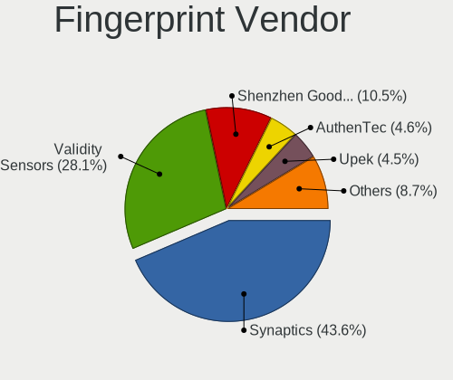
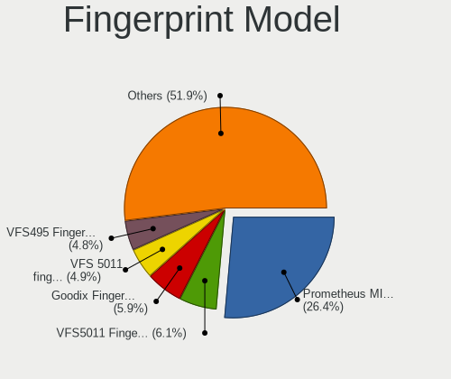

Debian 11 - Tested Hardware & Statistics
----------------------------------------

A project to collect tested hardware configurations for Debian 11.

Anyone can contribute to this report by the [hw-probe](https://github.com/linuxhw/hw-probe) tool:

    sudo -E hw-probe -all -upload

Please contribute! Especially if your hardware is rare.

This is a report for all computer types. See also reports for [desktops](/Dist/Debian_11/Desktop/README.md) and [notebooks](/Dist/Debian_11/Notebook/README.md).

Contents
--------

* [ Test Cases ](#test-cases)

* [ System ](#system)
  - [ Kernel                   ](#kernel)
  - [ Kernel Family            ](#kernel-family)
  - [ Kernel Major Ver.        ](#kernel-major-ver)
  - [ Arch                     ](#arch)
  - [ DE                       ](#de)
  - [ Display Server           ](#display-server)
  - [ Display Manager          ](#display-manager)
  - [ OS Lang                  ](#os-lang)
  - [ Boot Mode                ](#boot-mode)
  - [ Filesystem               ](#filesystem)
  - [ Part. scheme             ](#part-scheme)
  - [ Dual Boot with Linux/BSD ](#dual-boot-with-linuxbsd)
  - [ Dual Boot (Win)          ](#dual-boot-win)

* [ Board ](#board)
  - [ Vendor                   ](#vendor)
  - [ Model                    ](#model)
  - [ Model Family             ](#model-family)
  - [ MFG Year                 ](#mfg-year)
  - [ Form Factor              ](#form-factor)
  - [ Secure Boot              ](#secure-boot)
  - [ Coreboot                 ](#coreboot)
  - [ RAM Size                 ](#ram-size)
  - [ RAM Used                 ](#ram-used)
  - [ Total Drives             ](#total-drives)
  - [ Has CD-ROM               ](#has-cd-rom)
  - [ Has Ethernet             ](#has-ethernet)
  - [ Has WiFi                 ](#has-wifi)
  - [ Has Bluetooth            ](#has-bluetooth)

* [ Location ](#location)
  - [ Country                  ](#country)
  - [ City                     ](#city)

* [ Drives ](#drives)
  - [ Drive Vendor             ](#drive-vendor)
  - [ Drive Model              ](#drive-model)
  - [ HDD Vendor               ](#hdd-vendor)
  - [ SSD Vendor               ](#ssd-vendor)
  - [ Drive Kind               ](#drive-kind)
  - [ Drive Connector          ](#drive-connector)
  - [ Drive Size               ](#drive-size)
  - [ Space Total              ](#space-total)
  - [ Space Used               ](#space-used)
  - [ Malfunc. Drives          ](#malfunc-drives)
  - [ Malfunc. Drive Vendor    ](#malfunc-drive-vendor)
  - [ Malfunc. HDD Vendor      ](#malfunc-hdd-vendor)
  - [ Malfunc. Drive Kind      ](#malfunc-drive-kind)
  - [ Failed Drives            ](#failed-drives)
  - [ Failed Drive Vendor      ](#failed-drive-vendor)
  - [ Drive Status             ](#drive-status)

* [ Storage controller ](#storage-controller)
  - [ Storage Vendor           ](#storage-vendor)
  - [ Storage Model            ](#storage-model)
  - [ Storage Kind             ](#storage-kind)

* [ Processor ](#processor)
  - [ CPU Vendor               ](#cpu-vendor)
  - [ CPU Model                ](#cpu-model)
  - [ CPU Model Family         ](#cpu-model-family)
  - [ CPU Cores                ](#cpu-cores)
  - [ CPU Sockets              ](#cpu-sockets)
  - [ CPU Threads              ](#cpu-threads)
  - [ CPU Op-Modes             ](#cpu-op-modes)
  - [ CPU Microcode            ](#cpu-microcode)
  - [ CPU Microarch            ](#cpu-microarch)

* [ Graphics ](#graphics)
  - [ GPU Vendor               ](#gpu-vendor)
  - [ GPU Model                ](#gpu-model)
  - [ GPU Combo                ](#gpu-combo)
  - [ GPU Driver               ](#gpu-driver)
  - [ GPU Memory               ](#gpu-memory)

* [ Monitor ](#monitor)
  - [ Monitor Vendor           ](#monitor-vendor)
  - [ Monitor Model            ](#monitor-model)
  - [ Monitor Resolution       ](#monitor-resolution)
  - [ Monitor Diagonal         ](#monitor-diagonal)
  - [ Monitor Width            ](#monitor-width)
  - [ Aspect Ratio             ](#aspect-ratio)
  - [ Monitor Area             ](#monitor-area)
  - [ Pixel Density            ](#pixel-density)
  - [ Multiple Monitors        ](#multiple-monitors)

* [ Network ](#network)
  - [ Net Controller Vendor    ](#net-controller-vendor)
  - [ Net Controller Model     ](#net-controller-model)
  - [ Wireless Vendor          ](#wireless-vendor)
  - [ Wireless Model           ](#wireless-model)
  - [ Ethernet Vendor          ](#ethernet-vendor)
  - [ Ethernet Model           ](#ethernet-model)
  - [ Net Controller Kind      ](#net-controller-kind)
  - [ Used Controller          ](#used-controller)
  - [ NICs                     ](#nics)
  - [ IPv6                     ](#ipv6)

* [ Bluetooth ](#bluetooth)
  - [ Bluetooth Vendor         ](#bluetooth-vendor)
  - [ Bluetooth Model          ](#bluetooth-model)

* [ Sound ](#sound)
  - [ Sound Vendor             ](#sound-vendor)
  - [ Sound Model              ](#sound-model)

* [ Memory ](#memory)
  - [ Memory Vendor            ](#memory-vendor)
  - [ Memory Model             ](#memory-model)
  - [ Memory Kind              ](#memory-kind)
  - [ Memory Form Factor       ](#memory-form-factor)
  - [ Memory Size              ](#memory-size)
  - [ Memory Speed             ](#memory-speed)

* [ Printers & scanners ](#printers--scanners)
  - [ Printer Vendor           ](#printer-vendor)
  - [ Printer Model            ](#printer-model)
  - [ Scanner Vendor           ](#scanner-vendor)
  - [ Scanner Model            ](#scanner-model)

* [ Camera ](#camera)
  - [ Camera Vendor            ](#camera-vendor)
  - [ Camera Model             ](#camera-model)

* [ Security ](#security)
  - [ Fingerprint Vendor       ](#fingerprint-vendor)
  - [ Fingerprint Model        ](#fingerprint-model)
  - [ Chipcard Vendor          ](#chipcard-vendor)
  - [ Chipcard Model           ](#chipcard-model)

* [ Unsupported ](#unsupported)
  - [ Unsupported Devices      ](#unsupported-devices)
  - [ Unsupported Device Types ](#unsupported-device-types)

Test Cases
----------

Total: 6378

| Vendor        | Model                       | Form-Factor | Probe                                                      | Date         |
|---------------|-----------------------------|-------------|------------------------------------------------------------|--------------|
| Shenzhen a... | AC1-DP                      | Desktop     | [754335ffe9](https://linux-hardware.org/?probe=754335ffe9) | Nov 02, 2022 |
| Lenovo        | ThinkPad E475 20H40006US    | Notebook    | [d59bd1e8f1](https://linux-hardware.org/?probe=d59bd1e8f1) | Nov 02, 2022 |
| Lenovo        | ThinkPad E475 20H40006US    | Notebook    | [4342ecb0f9](https://linux-hardware.org/?probe=4342ecb0f9) | Nov 02, 2022 |
| Google        | Terra                       | Notebook    | [46299bf228](https://linux-hardware.org/?probe=46299bf228) | Nov 02, 2022 |
| Lenovo        | ThinkPad E475 20H40006US    | Notebook    | [fd32769391](https://linux-hardware.org/?probe=fd32769391) | Nov 02, 2022 |
| Lenovo        | ThinkPad E475 20H40006US    | Notebook    | [d3c1c92563](https://linux-hardware.org/?probe=d3c1c92563) | Nov 02, 2022 |
| Lenovo        | ThinkPad E475 20H40006US    | Notebook    | [0ffaee423b](https://linux-hardware.org/?probe=0ffaee423b) | Nov 02, 2022 |
| ASUSTek       | 1005HA                      | Notebook    | [1d386943d6](https://linux-hardware.org/?probe=1d386943d6) | Nov 02, 2022 |
| Dell          | 0JGM7F A00                  | Desktop     | [28f4800b2b](https://linux-hardware.org/?probe=28f4800b2b) | Nov 02, 2022 |
| MSI           | H110M PRO-VD                | Desktop     | [1fb0a79791](https://linux-hardware.org/?probe=1fb0a79791) | Nov 02, 2022 |
| HP            | G42                         | Notebook    | [18c487d99d](https://linux-hardware.org/?probe=18c487d99d) | Nov 02, 2022 |
| Digma         | EVE 11 C422 ES1068EW        | Notebook    | [f5177de131](https://linux-hardware.org/?probe=f5177de131) | Nov 02, 2022 |
| Dell          | 0PV3YR A05                  | Server      | [47c34f9269](https://linux-hardware.org/?probe=47c34f9269) | Nov 02, 2022 |
| Foxconn       | 2A92                        | Desktop     | [0898482b18](https://linux-hardware.org/?probe=0898482b18) | Nov 02, 2022 |
| ASUSTek       | PRO B460M-C                 | Desktop     | [dcf7112b3d](https://linux-hardware.org/?probe=dcf7112b3d) | Nov 01, 2022 |
| ASUSTek       | PRO B460M-C                 | Desktop     | [a333f47ffa](https://linux-hardware.org/?probe=a333f47ffa) | Nov 01, 2022 |
| Microsoft     | Surface Book 2              | Tablet      | [0092b0ddaf](https://linux-hardware.org/?probe=0092b0ddaf) | Nov 01, 2022 |
| Phoenix       | POULSBO                     | Desktop     | [177f05205b](https://linux-hardware.org/?probe=177f05205b) | Nov 01, 2022 |
| Gigabyte      | H610M H DDR4                | Desktop     | [b726668f90](https://linux-hardware.org/?probe=b726668f90) | Nov 01, 2022 |
| Toshiba       | Satellite L755              | Notebook    | [dc3d60731e](https://linux-hardware.org/?probe=dc3d60731e) | Nov 01, 2022 |
| Lenovo        | 3130 SDK0J40697 WIN 3305... | Mini pc     | [08649bd1e9](https://linux-hardware.org/?probe=08649bd1e9) | Nov 01, 2022 |
| Gigabyte      | X570S AERO G                | Desktop     | [92fccb6716](https://linux-hardware.org/?probe=92fccb6716) | Nov 01, 2022 |
| MSI           | Z390-A PRO                  | Desktop     | [3eea020596](https://linux-hardware.org/?probe=3eea020596) | Nov 01, 2022 |
| Dell          | 0PV3YR A05                  | Server      | [dab530a737](https://linux-hardware.org/?probe=dab530a737) | Nov 01, 2022 |
| Acer          | Aspire one                  | Notebook    | [bfb9f97d74](https://linux-hardware.org/?probe=bfb9f97d74) | Oct 31, 2022 |
| Lenovo        | ThinkPad L14 Gen 1 20U50... | Notebook    | [c9e0b81f80](https://linux-hardware.org/?probe=c9e0b81f80) | Oct 31, 2022 |
| MSI           | MEG Z590 ACE                | Desktop     | [1082f00d60](https://linux-hardware.org/?probe=1082f00d60) | Oct 31, 2022 |
| ASRock        | 960GM-VGS3 FX               | Desktop     | [f31f613901](https://linux-hardware.org/?probe=f31f613901) | Oct 31, 2022 |
| HP            | Compaq nc6320 (EV073AV)     | Notebook    | [b73f359ded](https://linux-hardware.org/?probe=b73f359ded) | Oct 31, 2022 |
| ASUSTek       | G75VW                       | Notebook    | [6f1d41a85c](https://linux-hardware.org/?probe=6f1d41a85c) | Oct 31, 2022 |
| Acer          | Aspire one                  | Notebook    | [82b34552f6](https://linux-hardware.org/?probe=82b34552f6) | Oct 31, 2022 |
| HP            | Spectre x360 Convertible... | Convertible | [fb96cd8e21](https://linux-hardware.org/?probe=fb96cd8e21) | Oct 31, 2022 |
| Chuwi         | LarkBox X                   | Mini pc     | [ed3f906a17](https://linux-hardware.org/?probe=ed3f906a17) | Oct 31, 2022 |
| Intel         | DG41AN AAE92991-401         | Desktop     | [cd670cef3d](https://linux-hardware.org/?probe=cd670cef3d) | Oct 31, 2022 |
| Aquarius      | NS585                       | Notebook    | [e4b4e0456d](https://linux-hardware.org/?probe=e4b4e0456d) | Oct 31, 2022 |
| Dell          | 0PV3YR A05                  | Server      | [0c1875c94f](https://linux-hardware.org/?probe=0c1875c94f) | Oct 31, 2022 |
| ASUSTek       | M5A99FX PRO R2.0            | Desktop     | [4179fe16d6](https://linux-hardware.org/?probe=4179fe16d6) | Oct 31, 2022 |
| Apple         | MacBookPro5,5               | Notebook    | [00e1f1f754](https://linux-hardware.org/?probe=00e1f1f754) | Oct 31, 2022 |
| HUAWEI        | NBLB-WAX9N                  | Notebook    | [a872c9888a](https://linux-hardware.org/?probe=a872c9888a) | Oct 30, 2022 |
| ASUSTek       | PRIME X570-PRO              | Desktop     | [3fbcca75d5](https://linux-hardware.org/?probe=3fbcca75d5) | Oct 30, 2022 |
| HUAWEI        | NBLB-WAX9N                  | Notebook    | [45f670d99f](https://linux-hardware.org/?probe=45f670d99f) | Oct 30, 2022 |
| Acer          | Aspire A515-51G             | Notebook    | [12380f78de](https://linux-hardware.org/?probe=12380f78de) | Oct 30, 2022 |
| HP            | 158B                        | Desktop     | [9c02b7fe58](https://linux-hardware.org/?probe=9c02b7fe58) | Oct 30, 2022 |
| Chuwi         | LarkBox X                   | Mini pc     | [5cd057be2a](https://linux-hardware.org/?probe=5cd057be2a) | Oct 30, 2022 |
| ASUSTek       | N751JK                      | Notebook    | [eea92055f3](https://linux-hardware.org/?probe=eea92055f3) | Oct 30, 2022 |
| Dell          | 0PV3YR A05                  | Server      | [9991d15803](https://linux-hardware.org/?probe=9991d15803) | Oct 30, 2022 |
| ASUSTek       | TP401CA                     | Convertible | [8d97908e58](https://linux-hardware.org/?probe=8d97908e58) | Oct 30, 2022 |
| Dell          | Latitude 5501               | Notebook    | [67f979a26d](https://linux-hardware.org/?probe=67f979a26d) | Oct 29, 2022 |
| Notebook      | W230SD                      | Notebook    | [76ae019222](https://linux-hardware.org/?probe=76ae019222) | Oct 29, 2022 |
| Raspberry ... | Raspberry Pi 4 Model B R... | Soc         | [d99707ef15](https://linux-hardware.org/?probe=d99707ef15) | Oct 29, 2022 |
| Foxconn       | 2ADA                        | Desktop     | [16815dacc1](https://linux-hardware.org/?probe=16815dacc1) | Oct 29, 2022 |
| Dell          | Latitude 5590               | Notebook    | [c7fa986fbd](https://linux-hardware.org/?probe=c7fa986fbd) | Oct 29, 2022 |
| ASUSTek       | X75VC                       | Notebook    | [9c1ab509ec](https://linux-hardware.org/?probe=9c1ab509ec) | Oct 29, 2022 |
| HP            | Pavilion Laptop 15-eg0xx... | Notebook    | [8cc0e0d828](https://linux-hardware.org/?probe=8cc0e0d828) | Oct 29, 2022 |
| Insyde        | Braswell                    | Notebook    | [d98b2d9661](https://linux-hardware.org/?probe=d98b2d9661) | Oct 29, 2022 |
| Samsung       | 300V3A/300V4A/300V5A        | Notebook    | [4acb2d0863](https://linux-hardware.org/?probe=4acb2d0863) | Oct 29, 2022 |
| Dell          | 0PV3YR A05                  | Server      | [182d67f23e](https://linux-hardware.org/?probe=182d67f23e) | Oct 29, 2022 |
| Dell          | XPS 17 9720                 | Notebook    | [270b988521](https://linux-hardware.org/?probe=270b988521) | Oct 29, 2022 |
| Dell          | Precision 7520              | Notebook    | [30f6ad7a26](https://linux-hardware.org/?probe=30f6ad7a26) | Oct 29, 2022 |
| Dell          | Precision 7520              | Notebook    | [b81923dbd2](https://linux-hardware.org/?probe=b81923dbd2) | Oct 29, 2022 |
| libre-comp... | aml-s905x-cc                | Soc         | [0258982a5a](https://linux-hardware.org/?probe=0258982a5a) | Oct 29, 2022 |
| MSI           | Modern 15 A10RBS            | Notebook    | [ddc3eded89](https://linux-hardware.org/?probe=ddc3eded89) | Oct 28, 2022 |
| Lenovo        | ThinkPad E475 20H40006US    | Notebook    | [60d1db050b](https://linux-hardware.org/?probe=60d1db050b) | Oct 28, 2022 |
| Lenovo        | ThinkPad E475 20H40006US    | Notebook    | [2a9f06c2b4](https://linux-hardware.org/?probe=2a9f06c2b4) | Oct 28, 2022 |
| Lenovo        | ThinkPad E475 20H40006US    | Notebook    | [787904d265](https://linux-hardware.org/?probe=787904d265) | Oct 28, 2022 |
| Lenovo        | IdeaPad 3 15ADA05 81W1      | Notebook    | [0971db18ed](https://linux-hardware.org/?probe=0971db18ed) | Oct 28, 2022 |
| Supermicro    | X12DPU-6A                   | Server      | [28c143d1f2](https://linux-hardware.org/?probe=28c143d1f2) | Oct 28, 2022 |
| Toshiba       | Satellite L755              | Notebook    | [0fa70f29d4](https://linux-hardware.org/?probe=0fa70f29d4) | Oct 28, 2022 |
| Lenovo        | ThinkPad T530 239242U       | Notebook    | [dbf70338e9](https://linux-hardware.org/?probe=dbf70338e9) | Oct 28, 2022 |
| Unknown       | 775V88+                     | Desktop     | [f1a685b497](https://linux-hardware.org/?probe=f1a685b497) | Oct 28, 2022 |
| ASUSTek       | ZenBook UX431FLC_UX431FL    | Notebook    | [e34c4fde2c](https://linux-hardware.org/?probe=e34c4fde2c) | Oct 28, 2022 |
| Dell          | Latitude 5280               | Notebook    | [368f237efe](https://linux-hardware.org/?probe=368f237efe) | Oct 28, 2022 |
| Dell          | XPS 17 9700                 | Notebook    | [81121b7762](https://linux-hardware.org/?probe=81121b7762) | Oct 28, 2022 |
| Toshiba       | Satellite C650D             | Notebook    | [0696abd43c](https://linux-hardware.org/?probe=0696abd43c) | Oct 28, 2022 |
| Toshiba       | Satellite C650D             | Notebook    | [d42867d201](https://linux-hardware.org/?probe=d42867d201) | Oct 28, 2022 |
| Unknown       | Unknown                     | Soc         | [44fc490d82](https://linux-hardware.org/?probe=44fc490d82) | Oct 28, 2022 |
| ASUSTek       | X555QG                      | Notebook    | [bace747804](https://linux-hardware.org/?probe=bace747804) | Oct 28, 2022 |
| HP            | 3396                        | Desktop     | [d42479acb8](https://linux-hardware.org/?probe=d42479acb8) | Oct 28, 2022 |
| Acer          | Aspire A715-75G             | Notebook    | [78b0c55e62](https://linux-hardware.org/?probe=78b0c55e62) | Oct 28, 2022 |
| Unknown       | Unknown                     | Server      | [cdca95f7e5](https://linux-hardware.org/?probe=cdca95f7e5) | Oct 28, 2022 |
| ASUSTek       | PRIME X370-PRO              | Desktop     | [d3cf194e94](https://linux-hardware.org/?probe=d3cf194e94) | Oct 28, 2022 |
| HP            | EliteBook 840 G8 Noteboo... | Notebook    | [02c6d1fe1a](https://linux-hardware.org/?probe=02c6d1fe1a) | Oct 28, 2022 |
| Lenovo        | ThinkPad E470 20H2S00700    | Notebook    | [768c6c8357](https://linux-hardware.org/?probe=768c6c8357) | Oct 28, 2022 |
| SANTECH       | NHx0DB,DE                   | Notebook    | [db8c0489f4](https://linux-hardware.org/?probe=db8c0489f4) | Oct 28, 2022 |
| Lenovo        | ThinkPad E475 20H40006US    | Notebook    | [63565608d1](https://linux-hardware.org/?probe=63565608d1) | Oct 28, 2022 |
| Google        | Boten                       | Notebook    | [2ed6baabf0](https://linux-hardware.org/?probe=2ed6baabf0) | Oct 27, 2022 |
| HP            | ZBook 15 G3                 | Notebook    | [2b886c255e](https://linux-hardware.org/?probe=2b886c255e) | Oct 27, 2022 |
| Lenovo        | ThinkPad X1 Carbon Gen 9... | Notebook    | [24da197a3a](https://linux-hardware.org/?probe=24da197a3a) | Oct 27, 2022 |
| Apple         | Mac-F221BEC8                | Desktop     | [0bf03c49f7](https://linux-hardware.org/?probe=0bf03c49f7) | Oct 27, 2022 |
| Lenovo        | ThinkPad E475 20H40006US    | Notebook    | [3ab1fbc8e8](https://linux-hardware.org/?probe=3ab1fbc8e8) | Oct 27, 2022 |
| Lenovo        | ThinkPad E475 20H40006US    | Notebook    | [faafe16cfb](https://linux-hardware.org/?probe=faafe16cfb) | Oct 27, 2022 |
| MSI           | B450 TOMAHAWK MAX           | Desktop     | [b682a38061](https://linux-hardware.org/?probe=b682a38061) | Oct 27, 2022 |
| MSI           | H110M PRO-VD                | Desktop     | [175f39979c](https://linux-hardware.org/?probe=175f39979c) | Oct 27, 2022 |
| Dell          | 0PV3YR A05                  | Server      | [98cd87adf9](https://linux-hardware.org/?probe=98cd87adf9) | Oct 27, 2022 |
| THTF          | CR F860-T1                  | Notebook    | [0e20f4f61a](https://linux-hardware.org/?probe=0e20f4f61a) | Oct 27, 2022 |
| Gigabyte      | 970A-DS3P                   | Desktop     | [1bc5db124b](https://linux-hardware.org/?probe=1bc5db124b) | Oct 27, 2022 |
| ASUSTek       | X541UAK                     | Notebook    | [87ee863ba2](https://linux-hardware.org/?probe=87ee863ba2) | Oct 26, 2022 |
| Lenovo        | ThinkPad E475 20H40006US    | Notebook    | [bfd570bbef](https://linux-hardware.org/?probe=bfd570bbef) | Oct 26, 2022 |
| Lenovo        | ThinkPad E475 20H40006US    | Notebook    | [58820ca517](https://linux-hardware.org/?probe=58820ca517) | Oct 26, 2022 |
| Lenovo        | ThinkServer TS440           | Desktop     | [acdfb9b02e](https://linux-hardware.org/?probe=acdfb9b02e) | Oct 26, 2022 |
| Lenovo        | ThinkPad E475 20H40006US    | Notebook    | [6b9a3ab27e](https://linux-hardware.org/?probe=6b9a3ab27e) | Oct 26, 2022 |
| Lenovo        | ThinkPad E475 20H40006US    | Notebook    | [a5bd8bebc7](https://linux-hardware.org/?probe=a5bd8bebc7) | Oct 26, 2022 |
| Lenovo        | ThinkPad E475 20H40006US    | Notebook    | [bce3a8b1b3](https://linux-hardware.org/?probe=bce3a8b1b3) | Oct 26, 2022 |
| Lenovo        | ThinkPad E475 20H40006US    | Notebook    | [65a1d5242f](https://linux-hardware.org/?probe=65a1d5242f) | Oct 26, 2022 |
| ASUSTek       | B85M-G                      | Desktop     | [0d3545c6aa](https://linux-hardware.org/?probe=0d3545c6aa) | Oct 26, 2022 |
| Lenovo        | ThinkBook 15 G2 ITL 20VE    | Notebook    | [a09e3f3669](https://linux-hardware.org/?probe=a09e3f3669) | Oct 26, 2022 |
| ASUSTek       | 1005HA                      | Notebook    | [118fed891f](https://linux-hardware.org/?probe=118fed891f) | Oct 26, 2022 |
| Lenovo        | ThinkPad L380 Yoga 20M7C... | Convertible | [1d55c9b411](https://linux-hardware.org/?probe=1d55c9b411) | Oct 26, 2022 |
| ASUSTek       | B85M-G                      | Desktop     | [0b8dc998a9](https://linux-hardware.org/?probe=0b8dc998a9) | Oct 26, 2022 |
| ASUSTek       | PRIME H310M-R R2.0          | Desktop     | [c1067e423b](https://linux-hardware.org/?probe=c1067e423b) | Oct 26, 2022 |
| Dell          | 0PV3YR A05                  | Server      | [ff62c670fd](https://linux-hardware.org/?probe=ff62c670fd) | Oct 26, 2022 |
| Lenovo        | ThinkPad E475 20H40006US    | Notebook    | [93b8dd8c3e](https://linux-hardware.org/?probe=93b8dd8c3e) | Oct 25, 2022 |
| Lenovo        | ThinkPad E475 20H40006US    | Notebook    | [5e08852d18](https://linux-hardware.org/?probe=5e08852d18) | Oct 25, 2022 |
| MSI           | Z170A GAMING M5             | Desktop     | [b5dcdb6844](https://linux-hardware.org/?probe=b5dcdb6844) | Oct 25, 2022 |
| IBM           | 81Y7045                     | Server      | [27bd1ebecd](https://linux-hardware.org/?probe=27bd1ebecd) | Oct 25, 2022 |
| Lenovo        | Z50-70 20354                | Notebook    | [08b673e57b](https://linux-hardware.org/?probe=08b673e57b) | Oct 25, 2022 |
| MSI           | H81M-P33                    | Desktop     | [b0f36ae0c5](https://linux-hardware.org/?probe=b0f36ae0c5) | Oct 25, 2022 |
| Lenovo        | ThinkPad E475 20H40006US    | Notebook    | [438afb4185](https://linux-hardware.org/?probe=438afb4185) | Oct 25, 2022 |
| Intel         | NUC7JYB J67967-404          | Mini pc     | [739b6fc4a9](https://linux-hardware.org/?probe=739b6fc4a9) | Oct 25, 2022 |
| MSI           | H110M PRO-VD                | Desktop     | [f8466185a4](https://linux-hardware.org/?probe=f8466185a4) | Oct 25, 2022 |
| Toshiba       | dynabook MX/33KBL           | Notebook    | [7ee9057da2](https://linux-hardware.org/?probe=7ee9057da2) | Oct 25, 2022 |
| Dell          | 0YJPT1 A00                  | Desktop     | [bb1a7da646](https://linux-hardware.org/?probe=bb1a7da646) | Oct 25, 2022 |
| Dell          | 01XK1W A00                  | Desktop     | [c0fb49f07a](https://linux-hardware.org/?probe=c0fb49f07a) | Oct 25, 2022 |
| Dell          | Vostro 5490                 | Notebook    | [6b4c7d3c8b](https://linux-hardware.org/?probe=6b4c7d3c8b) | Oct 24, 2022 |
| Lenovo        | ThinkPad L13 Yoga Gen 2 ... | Convertible | [9604dda439](https://linux-hardware.org/?probe=9604dda439) | Oct 24, 2022 |
| ASUSTek       | ROG CROSSHAIR X670E HERO    | Desktop     | [54710cefe5](https://linux-hardware.org/?probe=54710cefe5) | Oct 24, 2022 |
| ASUSTek       | H81M-C                      | Desktop     | [1deed99314](https://linux-hardware.org/?probe=1deed99314) | Oct 24, 2022 |
| ASUSTek       | M4A78T-E                    | Desktop     | [ee86cdac2a](https://linux-hardware.org/?probe=ee86cdac2a) | Oct 24, 2022 |
| Lenovo        | ThinkPad X230 Tablet 343... | Notebook    | [eae727e6a0](https://linux-hardware.org/?probe=eae727e6a0) | Oct 24, 2022 |
| Dell          | 0M5WNK A00                  | Desktop     | [fad0f2f50e](https://linux-hardware.org/?probe=fad0f2f50e) | Oct 24, 2022 |
| Packard Be... | DOT S                       | Notebook    | [f280a6ccbc](https://linux-hardware.org/?probe=f280a6ccbc) | Oct 24, 2022 |
| Lenovo        | 0x36C017AA SDK0J40700 WI... | Desktop     | [0d21d658ee](https://linux-hardware.org/?probe=0d21d658ee) | Oct 24, 2022 |
| Lenovo        | ThinkPad T470 20HES4VB00    | Notebook    | [f7b39d371a](https://linux-hardware.org/?probe=f7b39d371a) | Oct 24, 2022 |
| Packard Be... | H17HV                       | Notebook    | [2e94cfdd84](https://linux-hardware.org/?probe=2e94cfdd84) | Oct 24, 2022 |
| Inventec      | DQ Class A02                | Desktop     | [f64d3223c5](https://linux-hardware.org/?probe=f64d3223c5) | Oct 24, 2022 |
| Raspberry ... | Raspberry Pi 4 Model B R... | Soc         | [dd05575bb4](https://linux-hardware.org/?probe=dd05575bb4) | Oct 24, 2022 |
| Raspberry ... | Raspberry Pi 4 Model B R... | Soc         | [d2cb5dc9c7](https://linux-hardware.org/?probe=d2cb5dc9c7) | Oct 24, 2022 |
| Alienware     | M11xR3                      | Notebook    | [62bf8b7b02](https://linux-hardware.org/?probe=62bf8b7b02) | Oct 24, 2022 |
| Inventec      | DQ Class A02                | Desktop     | [c4fddde4b6](https://linux-hardware.org/?probe=c4fddde4b6) | Oct 24, 2022 |
| HP            | Pavilion g4                 | Notebook    | [3b6666b5ba](https://linux-hardware.org/?probe=3b6666b5ba) | Oct 24, 2022 |
| Dell          | 040DDP A01                  | Desktop     | [083b2c218e](https://linux-hardware.org/?probe=083b2c218e) | Oct 24, 2022 |
| Biostar       | B450MH                      | Desktop     | [048cd18957](https://linux-hardware.org/?probe=048cd18957) | Oct 24, 2022 |
| Lenovo        | V310-14IKB 80T2             | Notebook    | [73f18a6fbb](https://linux-hardware.org/?probe=73f18a6fbb) | Oct 24, 2022 |
| ASUSTek       | STRIX Z270F GAMING          | Desktop     | [ce3e956a0a](https://linux-hardware.org/?probe=ce3e956a0a) | Oct 24, 2022 |
| ASRock        | Z97 Anniversary             | Desktop     | [9c94714d56](https://linux-hardware.org/?probe=9c94714d56) | Oct 24, 2022 |
| Dell          | 01XK1W A00                  | Desktop     | [86e8f9141a](https://linux-hardware.org/?probe=86e8f9141a) | Oct 24, 2022 |
| Gigabyte      | G41MT-S2P                   | Desktop     | [9d2d49b8e4](https://linux-hardware.org/?probe=9d2d49b8e4) | Oct 23, 2022 |
| ASUSTek       | ROG STRIX B550-I GAMING     | Desktop     | [50b6612f7d](https://linux-hardware.org/?probe=50b6612f7d) | Oct 23, 2022 |
| ASRock        | G31M-S                      | Desktop     | [5f1ca232ea](https://linux-hardware.org/?probe=5f1ca232ea) | Oct 23, 2022 |
| Dell          | Precision 7750              | Notebook    | [dd51bb7ccd](https://linux-hardware.org/?probe=dd51bb7ccd) | Oct 23, 2022 |
| HP            | Pavilion g4                 | Notebook    | [487a972bda](https://linux-hardware.org/?probe=487a972bda) | Oct 23, 2022 |
| Dell          | 0YJPT1 A00                  | Desktop     | [678916671d](https://linux-hardware.org/?probe=678916671d) | Oct 23, 2022 |
| Unknown       | Unknown                     | Desktop     | [dcb8b694a7](https://linux-hardware.org/?probe=dcb8b694a7) | Oct 23, 2022 |
| ASRock        | FM2A68M-HD+                 | Desktop     | [1a49be478c](https://linux-hardware.org/?probe=1a49be478c) | Oct 22, 2022 |
| Panasonic     | CF-LX3J-50M3                | Notebook    | [949acb4c3a](https://linux-hardware.org/?probe=949acb4c3a) | Oct 22, 2022 |
| HP            | Pavilion TS 11              | Notebook    | [6437fb22e1](https://linux-hardware.org/?probe=6437fb22e1) | Oct 22, 2022 |
| HP            | Pavilion TS 11              | Notebook    | [a19b5987c6](https://linux-hardware.org/?probe=a19b5987c6) | Oct 22, 2022 |
| Dell          | Latitude E6520              | Notebook    | [88af6c857c](https://linux-hardware.org/?probe=88af6c857c) | Oct 22, 2022 |
| Dell          | Latitude E6520              | Notebook    | [246517ceab](https://linux-hardware.org/?probe=246517ceab) | Oct 22, 2022 |
| ASUSTek       | X756UQK                     | Notebook    | [2570a4e51f](https://linux-hardware.org/?probe=2570a4e51f) | Oct 22, 2022 |
| Toshiba       | Satellite P50-B-103         | Notebook    | [011581fdbf](https://linux-hardware.org/?probe=011581fdbf) | Oct 21, 2022 |
| Apple         | MacBook5,2                  | Notebook    | [165ce75570](https://linux-hardware.org/?probe=165ce75570) | Oct 21, 2022 |
| ASUSTek       | M4A89GTD-PRO/USB3           | Desktop     | [168cbb8438](https://linux-hardware.org/?probe=168cbb8438) | Oct 21, 2022 |
| Acer          | Swift SF314-42              | Notebook    | [2449f6a1b7](https://linux-hardware.org/?probe=2449f6a1b7) | Oct 21, 2022 |
| Aquarius      | NS585                       | Notebook    | [c953c5090c](https://linux-hardware.org/?probe=c953c5090c) | Oct 21, 2022 |
| Lenovo        | IdeaPad Gaming 3 15ACH6 ... | Notebook    | [1e4d67ad76](https://linux-hardware.org/?probe=1e4d67ad76) | Oct 21, 2022 |
| MSI           | H81M-P33                    | Desktop     | [efbd4959b8](https://linux-hardware.org/?probe=efbd4959b8) | Oct 21, 2022 |
| Lenovo        | ThinkPad L13 Yoga Gen 2 ... | Convertible | [55a46537f8](https://linux-hardware.org/?probe=55a46537f8) | Oct 21, 2022 |
| MSI           | H81M-P33                    | Desktop     | [a59f545a7b](https://linux-hardware.org/?probe=a59f545a7b) | Oct 21, 2022 |
| Lenovo        | V310-14IKB 80T2             | Notebook    | [8a0f6b66e6](https://linux-hardware.org/?probe=8a0f6b66e6) | Oct 21, 2022 |
| HP            | Pavilion Gaming Laptop 1... | Notebook    | [7acb5493d7](https://linux-hardware.org/?probe=7acb5493d7) | Oct 21, 2022 |
| Lenovo        | ThinkPad E15 Gen 4 21EES... | Notebook    | [b13dc58884](https://linux-hardware.org/?probe=b13dc58884) | Oct 20, 2022 |
| Gigabyte      | H61M-S2PV                   | Desktop     | [f60716afd0](https://linux-hardware.org/?probe=f60716afd0) | Oct 20, 2022 |
| ASRock        | Q1900-ITX                   | Desktop     | [c9d76cd138](https://linux-hardware.org/?probe=c9d76cd138) | Oct 20, 2022 |
| ASUSTek       | G75VW                       | Notebook    | [194959e65e](https://linux-hardware.org/?probe=194959e65e) | Oct 20, 2022 |
| HP            | EliteBook 745 G3            | Notebook    | [3bfbc8dcac](https://linux-hardware.org/?probe=3bfbc8dcac) | Oct 20, 2022 |
| HP            | Laptop 15-ef2xxx            | Notebook    | [823d998220](https://linux-hardware.org/?probe=823d998220) | Oct 20, 2022 |
| Apple         | MacBook5,2                  | Notebook    | [1e76467975](https://linux-hardware.org/?probe=1e76467975) | Oct 20, 2022 |
| Gigabyte      | GA-6LXSV 00000001           | Desktop     | [ac15415eca](https://linux-hardware.org/?probe=ac15415eca) | Oct 20, 2022 |
| Aquarius      | NS585                       | Notebook    | [a134ed693c](https://linux-hardware.org/?probe=a134ed693c) | Oct 20, 2022 |
| Dell          | 0D4MD1 A02                  | Desktop     | [becbded076](https://linux-hardware.org/?probe=becbded076) | Oct 20, 2022 |
| HP            | ENVY Laptop 17-ch1xxx       | Notebook    | [162e7a20b2](https://linux-hardware.org/?probe=162e7a20b2) | Oct 20, 2022 |
| ASUSTek       | Pro WS WRX80E-SAGE SE WI... | Desktop     | [e7875c59bc](https://linux-hardware.org/?probe=e7875c59bc) | Oct 20, 2022 |
| Gigabyte      | B360M AORUS Gaming 3-CF     | Desktop     | [7799fd6266](https://linux-hardware.org/?probe=7799fd6266) | Oct 20, 2022 |
| ASUSTek       | M4A89GTD-PRO/USB3           | Desktop     | [565e5d5e3b](https://linux-hardware.org/?probe=565e5d5e3b) | Oct 20, 2022 |
| ASUSTek       | ZenBook Pro Duo UX581GV_... | Notebook    | [35d4f4cf0e](https://linux-hardware.org/?probe=35d4f4cf0e) | Oct 20, 2022 |
| HP            | 245 G7                      | Notebook    | [9ec088c343](https://linux-hardware.org/?probe=9ec088c343) | Oct 19, 2022 |
| Dell          | 0782GW A00                  | Desktop     | [d54932d557](https://linux-hardware.org/?probe=d54932d557) | Oct 19, 2022 |
| ASUSTek       | X541NA                      | Notebook    | [5b61fd3a38](https://linux-hardware.org/?probe=5b61fd3a38) | Oct 19, 2022 |
| ASUSTek       | P9X79                       | Desktop     | [285e78cfbe](https://linux-hardware.org/?probe=285e78cfbe) | Oct 19, 2022 |
| Dell          | Inspiron 7590               | Notebook    | [43ec5b2df8](https://linux-hardware.org/?probe=43ec5b2df8) | Oct 19, 2022 |
| HP            | 876C SMVB                   | Desktop     | [384313312d](https://linux-hardware.org/?probe=384313312d) | Oct 19, 2022 |
| Raspberry ... | Raspberry Pi 4 Model B R... | Soc         | [1bdb835242](https://linux-hardware.org/?probe=1bdb835242) | Oct 19, 2022 |
| Lenovo        | ThinkPad P14s Gen 2i 20V... | Notebook    | [67ebd92594](https://linux-hardware.org/?probe=67ebd92594) | Oct 19, 2022 |
| MSI           | H81M-P33                    | Desktop     | [784b068521](https://linux-hardware.org/?probe=784b068521) | Oct 19, 2022 |
| ASUSTek       | B85M-G                      | Desktop     | [42a1bedb35](https://linux-hardware.org/?probe=42a1bedb35) | Oct 19, 2022 |
| HP            | 8061                        | Desktop     | [8692ad745b](https://linux-hardware.org/?probe=8692ad745b) | Oct 19, 2022 |
| Dell          | 0PV3YR A05                  | Server      | [5e02a12da7](https://linux-hardware.org/?probe=5e02a12da7) | Oct 19, 2022 |
| Acer          | Aspire A315-23G             | Notebook    | [93584b3b67](https://linux-hardware.org/?probe=93584b3b67) | Oct 19, 2022 |
| ASUSTek       | P5G41T-M LX2/BR             | Desktop     | [46a99f3d0e](https://linux-hardware.org/?probe=46a99f3d0e) | Oct 18, 2022 |
| Fujitsu       | LIFEBOOK E753               | Notebook    | [1fbb05ae6b](https://linux-hardware.org/?probe=1fbb05ae6b) | Oct 18, 2022 |
| HP            | 0A58h                       | Desktop     | [4c8d533bb0](https://linux-hardware.org/?probe=4c8d533bb0) | Oct 18, 2022 |
| HP            | EliteBook 745 G3            | Notebook    | [e800d683ef](https://linux-hardware.org/?probe=e800d683ef) | Oct 18, 2022 |
| Dell          | 0K7CVF A03                  | Server      | [f5274874b0](https://linux-hardware.org/?probe=f5274874b0) | Oct 18, 2022 |
| HP            | 3047h                       | Desktop     | [c1716b926a](https://linux-hardware.org/?probe=c1716b926a) | Oct 18, 2022 |
| Giga-Byte ... | i440BX-W977                 | Desktop     | [018daa60e1](https://linux-hardware.org/?probe=018daa60e1) | Oct 18, 2022 |
| ASUSTek       | G75VW                       | Notebook    | [5ee12be257](https://linux-hardware.org/?probe=5ee12be257) | Oct 18, 2022 |
| Raspberry ... | Raspberry Pi 4 Model B R... | Soc         | [40c831481b](https://linux-hardware.org/?probe=40c831481b) | Oct 18, 2022 |
| ASUSTek       | B85M-G                      | Desktop     | [86b92cdc50](https://linux-hardware.org/?probe=86b92cdc50) | Oct 18, 2022 |
| UNOWHY        | Y13G010S4EI                 | Notebook    | [f7f13866aa](https://linux-hardware.org/?probe=f7f13866aa) | Oct 18, 2022 |
| Dell          | 0DFRFW A01                  | Desktop     | [dd4ada0631](https://linux-hardware.org/?probe=dd4ada0631) | Oct 18, 2022 |
| MSI           | B450 TOMAHAWK MAX           | Desktop     | [db3ce64578](https://linux-hardware.org/?probe=db3ce64578) | Oct 18, 2022 |
| MSI           | B450 TOMAHAWK MAX           | Desktop     | [621cca0fca](https://linux-hardware.org/?probe=621cca0fca) | Oct 18, 2022 |
| Dell          | 0PV3YR A05                  | Server      | [d458ae27cf](https://linux-hardware.org/?probe=d458ae27cf) | Oct 18, 2022 |
| Gigabyte      | B450M DS3H-CF               | Desktop     | [e61760eab3](https://linux-hardware.org/?probe=e61760eab3) | Oct 18, 2022 |
| Lenovo        | IdeaPad 5 Pro 16IAH7 82S... | Notebook    | [dfa3140411](https://linux-hardware.org/?probe=dfa3140411) | Oct 17, 2022 |
| Dell          | 0WG864                      | Desktop     | [2feb42b3cf](https://linux-hardware.org/?probe=2feb42b3cf) | Oct 17, 2022 |
| Dell          | XPS 17 9700                 | Notebook    | [5368bd3ad6](https://linux-hardware.org/?probe=5368bd3ad6) | Oct 17, 2022 |
| HP            | 8158 A01                    | Mini pc     | [d7021dfe8a](https://linux-hardware.org/?probe=d7021dfe8a) | Oct 17, 2022 |
| Lenovo        | ThinkPad 13 2nd Gen 20J1... | Notebook    | [e076f9208c](https://linux-hardware.org/?probe=e076f9208c) | Oct 17, 2022 |
| HP            | 1589                        | Desktop     | [a6be3ee931](https://linux-hardware.org/?probe=a6be3ee931) | Oct 17, 2022 |
| ASUSTek       | G75VW                       | Notebook    | [10bcc184e7](https://linux-hardware.org/?probe=10bcc184e7) | Oct 17, 2022 |
| ASRock        | B450M-HDV                   | Desktop     | [6a523a41da](https://linux-hardware.org/?probe=6a523a41da) | Oct 17, 2022 |
| Dell          | 01XK1W A00                  | Desktop     | [d86b86e8a8](https://linux-hardware.org/?probe=d86b86e8a8) | Oct 17, 2022 |
| Dell          | 0PV3YR A05                  | Server      | [464ce69071](https://linux-hardware.org/?probe=464ce69071) | Oct 17, 2022 |
| HP            | 1589                        | Desktop     | [c36aa260eb](https://linux-hardware.org/?probe=c36aa260eb) | Oct 17, 2022 |
| Acer          | MCP7A                       | Desktop     | [32f914d009](https://linux-hardware.org/?probe=32f914d009) | Oct 17, 2022 |
| ASRock        | B450M Pro4                  | Desktop     | [d55b50c6c7](https://linux-hardware.org/?probe=d55b50c6c7) | Oct 16, 2022 |
| ASRock        | B450M Pro4                  | Desktop     | [4af4c60051](https://linux-hardware.org/?probe=4af4c60051) | Oct 16, 2022 |
| Gigabyte      | C246N-WU2-CF                | Desktop     | [cb7ca4eb5a](https://linux-hardware.org/?probe=cb7ca4eb5a) | Oct 16, 2022 |
| ASUSTek       | G75VW                       | Notebook    | [a88a291921](https://linux-hardware.org/?probe=a88a291921) | Oct 16, 2022 |
| Lenovo        | Legion Y545 81Q6            | Notebook    | [b6162e2c5e](https://linux-hardware.org/?probe=b6162e2c5e) | Oct 16, 2022 |
| ASUSTek       | PRIME B250M-PLUS            | Desktop     | [c0feb12708](https://linux-hardware.org/?probe=c0feb12708) | Oct 16, 2022 |
| Dell          | Inspiron 1545               | Notebook    | [d9928a4ee9](https://linux-hardware.org/?probe=d9928a4ee9) | Oct 16, 2022 |
| Dell          | Latitude 3320               | Notebook    | [e4645890b8](https://linux-hardware.org/?probe=e4645890b8) | Oct 16, 2022 |
| Dell          | Inspiron N5110              | Notebook    | [ae7d737ee5](https://linux-hardware.org/?probe=ae7d737ee5) | Oct 16, 2022 |
| Dell          | Inspiron N5110              | Notebook    | [5cbc449f36](https://linux-hardware.org/?probe=5cbc449f36) | Oct 16, 2022 |
| ASUSTek       | PRIME Z690-P WIFI D4        | Desktop     | [f26592e956](https://linux-hardware.org/?probe=f26592e956) | Oct 16, 2022 |
| HP            | Laptop 15-ef2xxx            | Notebook    | [fb37bc6617](https://linux-hardware.org/?probe=fb37bc6617) | Oct 15, 2022 |
| Dell          | 0782GW A00                  | Desktop     | [6a6f7314c0](https://linux-hardware.org/?probe=6a6f7314c0) | Oct 15, 2022 |
| Gigabyte      | H61M-S2PV                   | Desktop     | [f9568da63c](https://linux-hardware.org/?probe=f9568da63c) | Oct 15, 2022 |
| Gigabyte      | H61M-S2PV                   | Desktop     | [b226135430](https://linux-hardware.org/?probe=b226135430) | Oct 15, 2022 |
| HP            | EliteBook Folio 1040 G1     | Notebook    | [81df2d786a](https://linux-hardware.org/?probe=81df2d786a) | Oct 15, 2022 |
| Dell          | 0M863N A00                  | Desktop     | [27e1ded122](https://linux-hardware.org/?probe=27e1ded122) | Oct 15, 2022 |
| ASRock        | J5040-ITX                   | Desktop     | [aee52607f0](https://linux-hardware.org/?probe=aee52607f0) | Oct 14, 2022 |
| Panasonic     | CF-LX3J-50M3                | Notebook    | [95386977de](https://linux-hardware.org/?probe=95386977de) | Oct 14, 2022 |
| Dell          | Vostro 15 5510              | Notebook    | [8cf96a6d0b](https://linux-hardware.org/?probe=8cf96a6d0b) | Oct 14, 2022 |
| MSI           | G31TM-P21                   | Desktop     | [ea0fc2d497](https://linux-hardware.org/?probe=ea0fc2d497) | Oct 14, 2022 |
| Dell          | Vostro 15 5510              | Notebook    | [a68e7df338](https://linux-hardware.org/?probe=a68e7df338) | Oct 14, 2022 |
| ASRockRack    | X470D4U2-2T                 | Desktop     | [ebada4e791](https://linux-hardware.org/?probe=ebada4e791) | Oct 14, 2022 |
| Dell          | 0N4YC8 A00                  | Desktop     | [85766540b3](https://linux-hardware.org/?probe=85766540b3) | Oct 14, 2022 |
| Raspberry ... | Raspberry Pi 400 Rev 1.0    | Soc         | [82a7e620f0](https://linux-hardware.org/?probe=82a7e620f0) | Oct 14, 2022 |
| Dell          | 0GY6Y8 A01                  | Desktop     | [06e46e98b4](https://linux-hardware.org/?probe=06e46e98b4) | Oct 14, 2022 |
| Dell          | Inspiron 7415 2-in-1        | Convertible | [5a0485a292](https://linux-hardware.org/?probe=5a0485a292) | Oct 14, 2022 |
| Fujitsu       | D3221-A1 S26361-D3221-A1    | Desktop     | [9554b1f29a](https://linux-hardware.org/?probe=9554b1f29a) | Oct 14, 2022 |
| Dell          | Latitude E6330              | Notebook    | [1b1f5a27f7](https://linux-hardware.org/?probe=1b1f5a27f7) | Oct 14, 2022 |
| ASUSTek       | P5QL-CM                     | Desktop     | [34c01c8045](https://linux-hardware.org/?probe=34c01c8045) | Oct 14, 2022 |
| Lenovo        | IdeaPad S340-15IIL 81VW     | Notebook    | [4e29271bab](https://linux-hardware.org/?probe=4e29271bab) | Oct 14, 2022 |
| MSI           | PRO B550-VC                 | Desktop     | [0141458d01](https://linux-hardware.org/?probe=0141458d01) | Oct 14, 2022 |
| Dell          | Inspiron 5502               | Notebook    | [41fb5ecf07](https://linux-hardware.org/?probe=41fb5ecf07) | Oct 14, 2022 |
| MSI           | MS-N014                     | Notebook    | [87e6e540be](https://linux-hardware.org/?probe=87e6e540be) | Oct 14, 2022 |
| Raspberry ... | Raspberry Pi 400 Rev 1.1    | Soc         | [76678b6d58](https://linux-hardware.org/?probe=76678b6d58) | Oct 14, 2022 |
| Google        | Robo                        | Notebook    | [d070697e72](https://linux-hardware.org/?probe=d070697e72) | Oct 13, 2022 |
| Gigabyte      | B450M DS3H-CF               | Desktop     | [ede8c7fa36](https://linux-hardware.org/?probe=ede8c7fa36) | Oct 13, 2022 |
| Acer          | Swift SF314-57              | Notebook    | [a1b02901a1](https://linux-hardware.org/?probe=a1b02901a1) | Oct 13, 2022 |
| Acer          | Swift SF314-57              | Notebook    | [a0f4cd454d](https://linux-hardware.org/?probe=a0f4cd454d) | Oct 13, 2022 |
| Dell          | 0JD6X3 A05                  | Server      | [746232aa34](https://linux-hardware.org/?probe=746232aa34) | Oct 13, 2022 |
| ASRock        | AM2NF6G-VSTA                | Desktop     | [6a810d253c](https://linux-hardware.org/?probe=6a810d253c) | Oct 13, 2022 |
| ASUSTek       | ASUS TUF Gaming F15 FX50... | Notebook    | [0ce5415fa5](https://linux-hardware.org/?probe=0ce5415fa5) | Oct 13, 2022 |
| Lenovo        | ThinkPad X1 Carbon 3rd 2... | Notebook    | [dfc5a5f754](https://linux-hardware.org/?probe=dfc5a5f754) | Oct 13, 2022 |
| ASUSTek       | TUF Gaming X570-PLUS        | Desktop     | [1e2eda446c](https://linux-hardware.org/?probe=1e2eda446c) | Oct 13, 2022 |
| HP            | ProLiant MicroServer        | Desktop     | [067097bef8](https://linux-hardware.org/?probe=067097bef8) | Oct 13, 2022 |
| Intel         | NUC8BEB J72692-310          | Mini pc     | [3a9f1fa240](https://linux-hardware.org/?probe=3a9f1fa240) | Oct 13, 2022 |
| HP            | 158A                        | Desktop     | [6b1d53174a](https://linux-hardware.org/?probe=6b1d53174a) | Oct 12, 2022 |
| Lenovo        | ThinkPad T530 23595JU       | Notebook    | [e560a29570](https://linux-hardware.org/?probe=e560a29570) | Oct 12, 2022 |
| Lenovo        | ThinkBook 15 G2 ITL 20VE    | Notebook    | [00d174fcf4](https://linux-hardware.org/?probe=00d174fcf4) | Oct 12, 2022 |
| HP            | 3047h                       | Desktop     | [ba7f593887](https://linux-hardware.org/?probe=ba7f593887) | Oct 12, 2022 |
| Gigabyte      | 970A-DS3P                   | Desktop     | [744091dcaa](https://linux-hardware.org/?probe=744091dcaa) | Oct 12, 2022 |
| Gigabyte      | B450 AORUS PRO WIFI-CF      | Desktop     | [55bb52409c](https://linux-hardware.org/?probe=55bb52409c) | Oct 12, 2022 |
| Dell          | 0PV3YR A05                  | Server      | [585b7e9773](https://linux-hardware.org/?probe=585b7e9773) | Oct 12, 2022 |
| Lenovo        | ThinkPad L14 Gen 1 20U50... | Notebook    | [ccee0b66d9](https://linux-hardware.org/?probe=ccee0b66d9) | Oct 12, 2022 |
| MSI           | GE72 2QF                    | Notebook    | [22904f1270](https://linux-hardware.org/?probe=22904f1270) | Oct 12, 2022 |
| MSI           | GE72 2QF                    | Notebook    | [ecd8555f97](https://linux-hardware.org/?probe=ecd8555f97) | Oct 12, 2022 |
| Thomson       | N14C4WH64                   | Notebook    | [bfc16b9ded](https://linux-hardware.org/?probe=bfc16b9ded) | Oct 12, 2022 |
| Intel         | NUC5i5RYB H40999-504        | Mini pc     | [400bc2da98](https://linux-hardware.org/?probe=400bc2da98) | Oct 11, 2022 |
| MSI           | B550M PRO-VDH WIFI          | Desktop     | [300975f708](https://linux-hardware.org/?probe=300975f708) | Oct 11, 2022 |
| ASUSTek       | N53Jg                       | Notebook    | [0b4302ed6c](https://linux-hardware.org/?probe=0b4302ed6c) | Oct 11, 2022 |
| ASRock        | H570M-ITX/ac                | Desktop     | [eac6add22e](https://linux-hardware.org/?probe=eac6add22e) | Oct 11, 2022 |
| Apple         | MacBookAir7,2               | Notebook    | [8b4c66e10a](https://linux-hardware.org/?probe=8b4c66e10a) | Oct 11, 2022 |
| Dell          | Precision 7720              | Notebook    | [2252c7bd79](https://linux-hardware.org/?probe=2252c7bd79) | Oct 11, 2022 |
| Dell          | 0PV3YR A05                  | Server      | [f512c7bf3f](https://linux-hardware.org/?probe=f512c7bf3f) | Oct 11, 2022 |
| Gigabyte      | GA-880GM-D2H                | Desktop     | [6a9fe776d8](https://linux-hardware.org/?probe=6a9fe776d8) | Oct 10, 2022 |
| Raspberry ... | Raspberry Pi 3 Model B R... | Soc         | [2504ad4fa5](https://linux-hardware.org/?probe=2504ad4fa5) | Oct 10, 2022 |
| ASUSTek       | VivoBook_ASUSLaptop X509... | Notebook    | [6ccdbecf19](https://linux-hardware.org/?probe=6ccdbecf19) | Oct 10, 2022 |
| Apple         | MacBook5,2                  | Notebook    | [4687cf8900](https://linux-hardware.org/?probe=4687cf8900) | Oct 10, 2022 |
| MSI           | MAG Z490 TOMAHAWK           | Desktop     | [97bbb3b52b](https://linux-hardware.org/?probe=97bbb3b52b) | Oct 09, 2022 |
| Unknown       | Seagate Personal Cloud (... | Desktop     | [40ea197650](https://linux-hardware.org/?probe=40ea197650) | Oct 09, 2022 |
| Toshiba       | Satellite A100              | Notebook    | [f280857c1c](https://linux-hardware.org/?probe=f280857c1c) | Oct 09, 2022 |
| Dell          | Inspiron 14 5420            | Notebook    | [d9f937a8c4](https://linux-hardware.org/?probe=d9f937a8c4) | Oct 09, 2022 |
| ASUSTek       | PRIME B450M-A               | Desktop     | [bef5f7f7d7](https://linux-hardware.org/?probe=bef5f7f7d7) | Oct 09, 2022 |
| HP            | Pavilion TS 11              | Notebook    | [1a6ea38863](https://linux-hardware.org/?probe=1a6ea38863) | Oct 09, 2022 |
| ASUSTek       | TUF Gaming FX505DY_FX505... | Notebook    | [7785f0ebfb](https://linux-hardware.org/?probe=7785f0ebfb) | Oct 09, 2022 |
| Dell          | 01XK1W A00                  | Desktop     | [ce045937bc](https://linux-hardware.org/?probe=ce045937bc) | Oct 09, 2022 |
| ASUSTek       | ASUS TUF Gaming A15 FA50... | Notebook    | [487fd1959f](https://linux-hardware.org/?probe=487fd1959f) | Oct 08, 2022 |
| Dell          | 01XK1W A00                  | Desktop     | [939e426600](https://linux-hardware.org/?probe=939e426600) | Oct 08, 2022 |
| Dell          | 003KPJ A00                  | Desktop     | [e151f6645b](https://linux-hardware.org/?probe=e151f6645b) | Oct 08, 2022 |
| Apple         | Mac-942B5BF58194151B        | All in one  | [9b5141f179](https://linux-hardware.org/?probe=9b5141f179) | Oct 08, 2022 |
| MSI           | H81M-E34                    | Desktop     | [154cb109bf](https://linux-hardware.org/?probe=154cb109bf) | Oct 08, 2022 |
| ASUSTek       | V-P8H67E                    | Desktop     | [b4f0f561d2](https://linux-hardware.org/?probe=b4f0f561d2) | Oct 08, 2022 |
| ASUSTek       | TUF B450-PLUS GAMING        | Desktop     | [1798b09b89](https://linux-hardware.org/?probe=1798b09b89) | Oct 08, 2022 |
| ASRockRack    | X470D4U2-2T                 | Desktop     | [5b543dbd16](https://linux-hardware.org/?probe=5b543dbd16) | Oct 08, 2022 |
| Shuttle       | FS81                        | Desktop     | [ba7c22e135](https://linux-hardware.org/?probe=ba7c22e135) | Oct 07, 2022 |
| Shuttle       | FS81                        | Desktop     | [63ec5c8971](https://linux-hardware.org/?probe=63ec5c8971) | Oct 07, 2022 |
| MSI           | Prestige 14Evo A11M         | Notebook    | [68137e0e8d](https://linux-hardware.org/?probe=68137e0e8d) | Oct 07, 2022 |
| HP            | Pavilion dv7                | Notebook    | [4564037395](https://linux-hardware.org/?probe=4564037395) | Oct 07, 2022 |
| Fujitsu       | D3417-B1 S26361-D3417-B1    | Desktop     | [aa89234022](https://linux-hardware.org/?probe=aa89234022) | Oct 07, 2022 |
| Lenovo        | ThinkPad P50 20EQS1WW00     | Notebook    | [e6eac5c882](https://linux-hardware.org/?probe=e6eac5c882) | Oct 07, 2022 |
| Lenovo        | ThinkPad L512 44444WG       | Notebook    | [b27c3b70a7](https://linux-hardware.org/?probe=b27c3b70a7) | Oct 07, 2022 |
| ASRock        | Z68 Extreme4                | Desktop     | [6b96459f0a](https://linux-hardware.org/?probe=6b96459f0a) | Oct 07, 2022 |
| Shanghai Z... | ZXE CRB                     | Notebook    | [479f3d24f2](https://linux-hardware.org/?probe=479f3d24f2) | Oct 06, 2022 |
| Lenovo        | ThinkPad L13 Yoga Gen 2 ... | Convertible | [ab48a5156b](https://linux-hardware.org/?probe=ab48a5156b) | Oct 06, 2022 |
| Lenovo        | Inagua CRB                  | All in one  | [861af1fd97](https://linux-hardware.org/?probe=861af1fd97) | Oct 06, 2022 |
| Shanghai Z... | ZXE CRB                     | Notebook    | [5bacb77f8b](https://linux-hardware.org/?probe=5bacb77f8b) | Oct 06, 2022 |
| Intel         | NUC5i5RYB H40999-504        | Mini pc     | [d29b5fa9b0](https://linux-hardware.org/?probe=d29b5fa9b0) | Oct 06, 2022 |
| ASUSTek       | PRIME H270-PRO              | Desktop     | [bbf95bf34d](https://linux-hardware.org/?probe=bbf95bf34d) | Oct 06, 2022 |
| ASUSTek       | P5GDC Pro                   | Desktop     | [25ac480f76](https://linux-hardware.org/?probe=25ac480f76) | Oct 06, 2022 |
| HP            | EliteBook 8470p             | Notebook    | [1b09c0a820](https://linux-hardware.org/?probe=1b09c0a820) | Oct 06, 2022 |
| Techvision    | TVI7309X B0                 | Desktop     | [a12d335502](https://linux-hardware.org/?probe=a12d335502) | Oct 06, 2022 |
| HP            | EliteBook 8470p             | Notebook    | [0fa7893206](https://linux-hardware.org/?probe=0fa7893206) | Oct 06, 2022 |
| Techvision    | TVI7309X B0                 | Desktop     | [fd49fda31a](https://linux-hardware.org/?probe=fd49fda31a) | Oct 06, 2022 |
| Acer          | Predator PH315-53           | Notebook    | [0f3387ce35](https://linux-hardware.org/?probe=0f3387ce35) | Oct 06, 2022 |
| Dell          | 0PV3YR A05                  | Server      | [ff783e01db](https://linux-hardware.org/?probe=ff783e01db) | Oct 06, 2022 |
| Toshiba       | Satellite L40               | Notebook    | [0f3e9273a6](https://linux-hardware.org/?probe=0f3e9273a6) | Oct 06, 2022 |
| ASUSTek       | T101HA                      | Tablet      | [de29fa755f](https://linux-hardware.org/?probe=de29fa755f) | Oct 05, 2022 |
| ASRock        | B450M Pro4                  | Desktop     | [0432411e08](https://linux-hardware.org/?probe=0432411e08) | Oct 05, 2022 |
| ASRock        | B450M Pro4                  | Desktop     | [c287d961f7](https://linux-hardware.org/?probe=c287d961f7) | Oct 05, 2022 |
| Google        | Akemi                       | Notebook    | [5a165f46bc](https://linux-hardware.org/?probe=5a165f46bc) | Oct 05, 2022 |
| MSI           | X399 GAMING PRO CARBON A... | Desktop     | [1b399dcbb2](https://linux-hardware.org/?probe=1b399dcbb2) | Oct 05, 2022 |
| HP            | EliteBook 8570p             | Notebook    | [3079a45a56](https://linux-hardware.org/?probe=3079a45a56) | Oct 05, 2022 |
| Lenovo        | ThinkPad P14s Gen 2a 21A... | Notebook    | [96b4cda722](https://linux-hardware.org/?probe=96b4cda722) | Oct 05, 2022 |
| HP            | EliteBook 8460p             | Notebook    | [02d4090cce](https://linux-hardware.org/?probe=02d4090cce) | Oct 05, 2022 |
| HP            | EliteBook 8460p             | Notebook    | [4f037d4c3d](https://linux-hardware.org/?probe=4f037d4c3d) | Oct 05, 2022 |
| Fujitsu       | D3221-A1 S26361-D3221-A1    | Desktop     | [bbea875fdc](https://linux-hardware.org/?probe=bbea875fdc) | Oct 05, 2022 |
| Lenovo        | ThinkStation S30 0569BE3    | Desktop     | [026d1ee25e](https://linux-hardware.org/?probe=026d1ee25e) | Oct 05, 2022 |
| ASUSTek       | ROG STRIX X570-E GAMING     | Desktop     | [93698d1670](https://linux-hardware.org/?probe=93698d1670) | Oct 05, 2022 |
| Toshiba       | NB505                       | Notebook    | [9de39780b5](https://linux-hardware.org/?probe=9de39780b5) | Oct 05, 2022 |
| Dell          | 0PV3YR A05                  | Server      | [0ed1bfe4ef](https://linux-hardware.org/?probe=0ed1bfe4ef) | Oct 05, 2022 |
| Lenovo        | IdeaPad 3 15ALC6 82MF       | Notebook    | [dea0d04059](https://linux-hardware.org/?probe=dea0d04059) | Oct 05, 2022 |
| Acer          | Aspire A315-23G             | Notebook    | [ab3508b938](https://linux-hardware.org/?probe=ab3508b938) | Oct 05, 2022 |
| Acer          | Aspire E1-571               | Notebook    | [602710e8d3](https://linux-hardware.org/?probe=602710e8d3) | Oct 04, 2022 |
| HP            | EliteBook 8460p             | Notebook    | [8b9d1152e4](https://linux-hardware.org/?probe=8b9d1152e4) | Oct 04, 2022 |
| Lenovo        | ThinkPad 13 2nd Gen 20J1... | Notebook    | [8631c6f717](https://linux-hardware.org/?probe=8631c6f717) | Oct 04, 2022 |
| MSI           | GF65 Thin 10SDR             | Notebook    | [1c2a3b90e2](https://linux-hardware.org/?probe=1c2a3b90e2) | Oct 04, 2022 |
| TrekStor      | Primebook C13               | Convertible | [8e07444c9b](https://linux-hardware.org/?probe=8e07444c9b) | Oct 04, 2022 |
| HP            | EliteBook 735 G6            | Notebook    | [c3f86b0e1a](https://linux-hardware.org/?probe=c3f86b0e1a) | Oct 04, 2022 |
| Dell          | Latitude E5430 non-vPro     | Notebook    | [33b42f3ed1](https://linux-hardware.org/?probe=33b42f3ed1) | Oct 04, 2022 |
| Lenovo        | ThinkPad 13 2nd Gen 20J1... | Notebook    | [5b2fac59ea](https://linux-hardware.org/?probe=5b2fac59ea) | Oct 04, 2022 |
| Shanghai Z... | ZXE CRB                     | Notebook    | [b981993409](https://linux-hardware.org/?probe=b981993409) | Oct 04, 2022 |
| Lenovo        | ThinkPad Twist 20C41A3      | Notebook    | [3da96ac399](https://linux-hardware.org/?probe=3da96ac399) | Oct 04, 2022 |
| Acer          | Aspire A315-56              | Notebook    | [e799907aba](https://linux-hardware.org/?probe=e799907aba) | Oct 04, 2022 |
| Dell          | Precision M4800             | Notebook    | [1099761dca](https://linux-hardware.org/?probe=1099761dca) | Oct 04, 2022 |
| Lenovo        | ThinkPad P14s Gen 2a 21A... | Notebook    | [31fa8b62ff](https://linux-hardware.org/?probe=31fa8b62ff) | Oct 04, 2022 |
| UNOWHY        | Y13G010S4EI                 | Notebook    | [38f5b56e5d](https://linux-hardware.org/?probe=38f5b56e5d) | Oct 04, 2022 |
| Dell          | Inspiron 5590               | Notebook    | [ed3bf1e99b](https://linux-hardware.org/?probe=ed3bf1e99b) | Oct 04, 2022 |
| Apple         | Mac-F2208EC8                | Mini pc     | [4ab2e51cc3](https://linux-hardware.org/?probe=4ab2e51cc3) | Oct 04, 2022 |
| ASRock        | 970M Pro3                   | Desktop     | [a9e9513b41](https://linux-hardware.org/?probe=a9e9513b41) | Oct 04, 2022 |
| Dell          | 0D4MD1 A00                  | Desktop     | [9ab1446c27](https://linux-hardware.org/?probe=9ab1446c27) | Oct 04, 2022 |
| Inventec      | D CLASS A02                 | Desktop     | [851214001a](https://linux-hardware.org/?probe=851214001a) | Oct 04, 2022 |
| ASUSTek       | P6T DELUXE V2               | Desktop     | [1c6fd70d5f](https://linux-hardware.org/?probe=1c6fd70d5f) | Oct 04, 2022 |
| Dell          | Latitude E7240              | Notebook    | [84ce32d994](https://linux-hardware.org/?probe=84ce32d994) | Oct 03, 2022 |
| HP            | 1906                        | Desktop     | [a6f705f119](https://linux-hardware.org/?probe=a6f705f119) | Oct 03, 2022 |
| Dell          | Latitude E5430 non-vPro     | Notebook    | [81ac41d8b9](https://linux-hardware.org/?probe=81ac41d8b9) | Oct 03, 2022 |
| Apple         | Mac-BE088AF8C5EB4FA2 iMa... | All in one  | [bc9c9eb996](https://linux-hardware.org/?probe=bc9c9eb996) | Oct 03, 2022 |
| Dell          | Latitude 2110               | Notebook    | [3fbbac2c8a](https://linux-hardware.org/?probe=3fbbac2c8a) | Oct 03, 2022 |
| Supermicro    | X11SCH-F                    | Server      | [77cbd84a68](https://linux-hardware.org/?probe=77cbd84a68) | Oct 03, 2022 |
| ASUSTek       | 1225B                       | Notebook    | [9bb2d54ca7](https://linux-hardware.org/?probe=9bb2d54ca7) | Oct 03, 2022 |
| Dell          | 0T7D40 A01                  | Desktop     | [1fb6d9ec64](https://linux-hardware.org/?probe=1fb6d9ec64) | Oct 03, 2022 |
| Gigabyte      | D525TUD                     | Desktop     | [47d31ff25c](https://linux-hardware.org/?probe=47d31ff25c) | Oct 03, 2022 |
| Lenovo        | ThinkPad E14 20RA001HRT     | Notebook    | [1427143cf0](https://linux-hardware.org/?probe=1427143cf0) | Oct 03, 2022 |
| Lenovo        | ThinkServer TS440           | Desktop     | [1031dfcd50](https://linux-hardware.org/?probe=1031dfcd50) | Oct 03, 2022 |
| Lenovo        | ThinkPad T14 Gen 1 20UD0... | Notebook    | [64f2393fde](https://linux-hardware.org/?probe=64f2393fde) | Oct 03, 2022 |
| Toshiba       | Satellite L855              | Notebook    | [66e22581f7](https://linux-hardware.org/?probe=66e22581f7) | Oct 03, 2022 |
| Dell          | Precision 3570              | Notebook    | [f4f047eecf](https://linux-hardware.org/?probe=f4f047eecf) | Oct 03, 2022 |
| Pegatron      | 2AC3                        | Desktop     | [0ea51f0746](https://linux-hardware.org/?probe=0ea51f0746) | Oct 03, 2022 |
| ASUSTek       | M4A89GTD-PRO/USB3           | Desktop     | [e3a783a839](https://linux-hardware.org/?probe=e3a783a839) | Oct 02, 2022 |
| Apple         | MacBookAir7,2               | Notebook    | [ae39aea3e9](https://linux-hardware.org/?probe=ae39aea3e9) | Oct 02, 2022 |
| Lenovo        | ThinkPad T460s 20F90060G... | Notebook    | [8d17d38142](https://linux-hardware.org/?probe=8d17d38142) | Oct 02, 2022 |
| ASUSTek       | PRIME B550M-K               | Desktop     | [31dcf67714](https://linux-hardware.org/?probe=31dcf67714) | Oct 02, 2022 |
| ASUSTek       | PRIME B550M-K               | Desktop     | [97afbe98b8](https://linux-hardware.org/?probe=97afbe98b8) | Oct 02, 2022 |
| ASUSTek       | M5A97 R2.0                  | Desktop     | [78ff851478](https://linux-hardware.org/?probe=78ff851478) | Oct 02, 2022 |
| ASUSTek       | X71Q                        | Notebook    | [830c8ab6d2](https://linux-hardware.org/?probe=830c8ab6d2) | Oct 02, 2022 |
| Dell          | 0PV3YR A05                  | Server      | [9b2e1432f2](https://linux-hardware.org/?probe=9b2e1432f2) | Oct 02, 2022 |
| Toshiba       | Satellite L45               | Notebook    | [79ff097329](https://linux-hardware.org/?probe=79ff097329) | Oct 02, 2022 |
| Acer          | Aspire A715-41G             | Notebook    | [1a473e9809](https://linux-hardware.org/?probe=1a473e9809) | Oct 01, 2022 |
| Lenovo        | ThinkPad E15 Gen 3 20YHS... | Notebook    | [9cd72ed352](https://linux-hardware.org/?probe=9cd72ed352) | Oct 01, 2022 |
| HP            | Pavilion TS 11              | Notebook    | [5bc67115db](https://linux-hardware.org/?probe=5bc67115db) | Oct 01, 2022 |
| HP            | Pavilion TS 11              | Notebook    | [4758af490a](https://linux-hardware.org/?probe=4758af490a) | Oct 01, 2022 |
| Dell          | 0KJCC5 A00                  | Desktop     | [7915b298b2](https://linux-hardware.org/?probe=7915b298b2) | Oct 01, 2022 |
| Dell          | 0PV3YR A05                  | Server      | [27bb1c39eb](https://linux-hardware.org/?probe=27bb1c39eb) | Oct 01, 2022 |
| Lenovo        | ThinkPad T440s 20AQCTO1W... | Notebook    | [fbe1e53387](https://linux-hardware.org/?probe=fbe1e53387) | Oct 01, 2022 |
| Dell          | 01XK1W A00                  | Desktop     | [29c4292c62](https://linux-hardware.org/?probe=29c4292c62) | Oct 01, 2022 |
| Raspberry ... | Raspberry Pi 3 Model B P... | Soc         | [3edc4043a3](https://linux-hardware.org/?probe=3edc4043a3) | Oct 01, 2022 |
| Gigabyte      | H81M-D2V                    | Desktop     | [21a601e10a](https://linux-hardware.org/?probe=21a601e10a) | Sep 30, 2022 |
| Intel         | NUC11ATBPE M49844-202       | Mini pc     | [9e0aff1fbd](https://linux-hardware.org/?probe=9e0aff1fbd) | Sep 30, 2022 |
| Dell          | 0PV3YR A05                  | Server      | [3c0e0b12ee](https://linux-hardware.org/?probe=3c0e0b12ee) | Sep 30, 2022 |
| HP            | 859C                        | Desktop     | [08161b9516](https://linux-hardware.org/?probe=08161b9516) | Sep 30, 2022 |
| Lenovo        | ThinkPad L380 20M5SSIN11    | Notebook    | [0cad79b1f7](https://linux-hardware.org/?probe=0cad79b1f7) | Sep 30, 2022 |
| ASRock        | X570 Steel Legend           | Desktop     | [40e65e38cf](https://linux-hardware.org/?probe=40e65e38cf) | Sep 30, 2022 |
| Lenovo        | ThinkPad P50 20EQS1WW00     | Notebook    | [786e0c1f5d](https://linux-hardware.org/?probe=786e0c1f5d) | Sep 30, 2022 |
| HP            | Pavilion Notebook           | Notebook    | [ee72cbd627](https://linux-hardware.org/?probe=ee72cbd627) | Sep 29, 2022 |
| HP            | Compaq nx6325 (EY344EA#A... | Notebook    | [8808f98c62](https://linux-hardware.org/?probe=8808f98c62) | Sep 29, 2022 |
| ECS           | G31T-M9                     | Desktop     | [45b25aaf8c](https://linux-hardware.org/?probe=45b25aaf8c) | Sep 29, 2022 |
| ASUSTek       | N53SV                       | Notebook    | [6652e85ddd](https://linux-hardware.org/?probe=6652e85ddd) | Sep 29, 2022 |
| Dell          | 0PV3YR A05                  | Server      | [64a7e86e22](https://linux-hardware.org/?probe=64a7e86e22) | Sep 29, 2022 |
| Lenovo        | ThinkPad T460 20FMS43J0V    | Notebook    | [0453cd781f](https://linux-hardware.org/?probe=0453cd781f) | Sep 28, 2022 |
| Biostar       | H55 HD                      | Desktop     | [bde8e0a133](https://linux-hardware.org/?probe=bde8e0a133) | Sep 28, 2022 |
| BESSTAR Te... | TH50                        | Desktop     | [2045e665b1](https://linux-hardware.org/?probe=2045e665b1) | Sep 28, 2022 |
| ASUSTek       | M5A97 EVO R2.0              | Desktop     | [6d92b99f8e](https://linux-hardware.org/?probe=6d92b99f8e) | Sep 28, 2022 |
| Raspberry ... | Raspberry Pi 4 Model B R... | Soc         | [b063a72d21](https://linux-hardware.org/?probe=b063a72d21) | Sep 28, 2022 |
| HP            | 250 G7 Notebook PC          | Notebook    | [6ad96a2beb](https://linux-hardware.org/?probe=6ad96a2beb) | Sep 28, 2022 |
| HP            | 339A                        | Desktop     | [5c961ef93f](https://linux-hardware.org/?probe=5c961ef93f) | Sep 28, 2022 |
| HP            | 339A                        | Desktop     | [ac9538b489](https://linux-hardware.org/?probe=ac9538b489) | Sep 28, 2022 |
| ASUSTek       | P8H61-M LX3 R2.0            | Desktop     | [82b108b3b8](https://linux-hardware.org/?probe=82b108b3b8) | Sep 28, 2022 |
| Dell          | Vostro 15 5510              | Notebook    | [973307d03b](https://linux-hardware.org/?probe=973307d03b) | Sep 28, 2022 |
| Acer          | Aspire A315-23G             | Notebook    | [3eaaf54d1b](https://linux-hardware.org/?probe=3eaaf54d1b) | Sep 28, 2022 |
| Lenovo        | ThinkPad T420 4236WS7       | Notebook    | [ca9c7bf57b](https://linux-hardware.org/?probe=ca9c7bf57b) | Sep 28, 2022 |
| Lenovo        | ThinkPad L13 Yoga Gen 2 ... | Convertible | [8990a66f30](https://linux-hardware.org/?probe=8990a66f30) | Sep 27, 2022 |
| Samsung       | SDNE-R78BA2-20              | Other       | [2278a5c6ea](https://linux-hardware.org/?probe=2278a5c6ea) | Sep 27, 2022 |
| ASUSTek       | TUF Gaming X570-PLUS        | Desktop     | [0031772f40](https://linux-hardware.org/?probe=0031772f40) | Sep 27, 2022 |
| MSI           | B365M PRO-VDH               | Desktop     | [45e07c7119](https://linux-hardware.org/?probe=45e07c7119) | Sep 27, 2022 |
| Medion        | MS-7728                     | Desktop     | [0b9b2ca570](https://linux-hardware.org/?probe=0b9b2ca570) | Sep 27, 2022 |
| HP            | 339A                        | Desktop     | [25ef7556cc](https://linux-hardware.org/?probe=25ef7556cc) | Sep 27, 2022 |
| ASUSTek       | TUF Gaming B660M-PLUS D4    | Desktop     | [757d465447](https://linux-hardware.org/?probe=757d465447) | Sep 27, 2022 |
| ASUSTek       | TUF Gaming Z690-PLUS WIF... | Desktop     | [e3826dca71](https://linux-hardware.org/?probe=e3826dca71) | Sep 27, 2022 |
| HP            | Pavilion x360 Convertibl... | Convertible | [fdf2d015bc](https://linux-hardware.org/?probe=fdf2d015bc) | Sep 26, 2022 |
| Lenovo        | G50-70 20351                | Notebook    | [77c0454f45](https://linux-hardware.org/?probe=77c0454f45) | Sep 26, 2022 |
| Gigabyte      | H81M-S2PV                   | Desktop     | [76a7224818](https://linux-hardware.org/?probe=76a7224818) | Sep 26, 2022 |
| Lenovo        | ThinkPad X1 Extreme Gen ... | Notebook    | [df5fcf14f9](https://linux-hardware.org/?probe=df5fcf14f9) | Sep 26, 2022 |
| HP            | 339A                        | Desktop     | [07986ca95e](https://linux-hardware.org/?probe=07986ca95e) | Sep 26, 2022 |
| MSI           | Alpha 15 A4DEK              | Notebook    | [f3c74059d5](https://linux-hardware.org/?probe=f3c74059d5) | Sep 26, 2022 |
| HP            | OMEN Laptop 15-en1xxx       | Notebook    | [ac296ea23b](https://linux-hardware.org/?probe=ac296ea23b) | Sep 26, 2022 |
| HP            | 250 G8 Notebook PC          | Notebook    | [f4ea1372b7](https://linux-hardware.org/?probe=f4ea1372b7) | Sep 26, 2022 |
| Lenovo        | IdeaPad Gaming 3 15ACH6 ... | Notebook    | [dc6d36a0eb](https://linux-hardware.org/?probe=dc6d36a0eb) | Sep 26, 2022 |
| HP            | 250 G8 Notebook PC          | Notebook    | [ae83bec6ad](https://linux-hardware.org/?probe=ae83bec6ad) | Sep 26, 2022 |
| MSI           | Alpha 15 A4DEK              | Notebook    | [d2e3e7736c](https://linux-hardware.org/?probe=d2e3e7736c) | Sep 26, 2022 |
| HP            | OMEN Laptop 15-en1xxx       | Notebook    | [6527be1bb2](https://linux-hardware.org/?probe=6527be1bb2) | Sep 26, 2022 |
| HP            | 0B40h                       | Desktop     | [d72bb749ff](https://linux-hardware.org/?probe=d72bb749ff) | Sep 26, 2022 |
| Lenovo        | Myrtle CRB SDK0J40700 WI... | Desktop     | [508c873693](https://linux-hardware.org/?probe=508c873693) | Sep 26, 2022 |
| ASUSTek       | VivoBook 14_ASUS Laptop ... | Notebook    | [56e06deea2](https://linux-hardware.org/?probe=56e06deea2) | Sep 26, 2022 |
| IBM           | 69Y1006 SIT                 | Server      | [b1ab802cb1](https://linux-hardware.org/?probe=b1ab802cb1) | Sep 25, 2022 |
| Dell          | 01XK1W A00                  | Desktop     | [4e228116be](https://linux-hardware.org/?probe=4e228116be) | Sep 25, 2022 |
| MSI           | GF63 8RD                    | Notebook    | [f6ef1dbd07](https://linux-hardware.org/?probe=f6ef1dbd07) | Sep 25, 2022 |
| ASUSTek       | TUF Gaming X570-PLUS        | Desktop     | [6c9c3f13d0](https://linux-hardware.org/?probe=6c9c3f13d0) | Sep 25, 2022 |
| ASRockRack    | X570D4U-2L2T                | Desktop     | [779faa3cfd](https://linux-hardware.org/?probe=779faa3cfd) | Sep 25, 2022 |
| Lenovo        | ThinkPad P50 20EQS1WW00     | Notebook    | [2d7ce63bce](https://linux-hardware.org/?probe=2d7ce63bce) | Sep 25, 2022 |
| ASUSTek       | TUF Gaming FX504GD_FX80G... | Notebook    | [f844479504](https://linux-hardware.org/?probe=f844479504) | Sep 25, 2022 |
| Dell          | 0PV3YR A05                  | Server      | [107011cb20](https://linux-hardware.org/?probe=107011cb20) | Sep 25, 2022 |
| Dell          | 00NH4P A07                  | Server      | [8b34a52b83](https://linux-hardware.org/?probe=8b34a52b83) | Sep 25, 2022 |
| Dell          | 0DPRKF A06                  | Server      | [f5fb43d9c5](https://linux-hardware.org/?probe=f5fb43d9c5) | Sep 25, 2022 |
| HP            | Pavilion x360 Convertibl... | Convertible | [fdb7e646ca](https://linux-hardware.org/?probe=fdb7e646ca) | Sep 25, 2022 |
| Dell          | Inspiron 15-3567            | Notebook    | [9ae6efbc0f](https://linux-hardware.org/?probe=9ae6efbc0f) | Sep 25, 2022 |
| Intel         | NUC5i3RYB H41000-502        | Mini pc     | [d09f4c4501](https://linux-hardware.org/?probe=d09f4c4501) | Sep 25, 2022 |
| ASUSTek       | ROG STRIX B550-F GAMING     | Desktop     | [65d54e7273](https://linux-hardware.org/?probe=65d54e7273) | Sep 25, 2022 |
| HUAWEI        | RLEF-XX                     | Notebook    | [7bab2cbc57](https://linux-hardware.org/?probe=7bab2cbc57) | Sep 25, 2022 |
| MSI           | GF75 Thin 10SC              | Notebook    | [0bda368d15](https://linux-hardware.org/?probe=0bda368d15) | Sep 24, 2022 |
| Dell          | Inspiron 14 5425            | Notebook    | [209be443ac](https://linux-hardware.org/?probe=209be443ac) | Sep 24, 2022 |
| Google        | Teemo                       | Desktop     | [5ddc8b97b8](https://linux-hardware.org/?probe=5ddc8b97b8) | Sep 24, 2022 |
| Dell          | Inspiron 14 5410 2-in-1     | Convertible | [1d76ae9f44](https://linux-hardware.org/?probe=1d76ae9f44) | Sep 24, 2022 |
| MSI           | H81M-P33                    | Desktop     | [7e4f539e70](https://linux-hardware.org/?probe=7e4f539e70) | Sep 24, 2022 |
| MSI           | H81M-P33                    | Desktop     | [64cd74457e](https://linux-hardware.org/?probe=64cd74457e) | Sep 24, 2022 |
| Foxconn       | 2ADA                        | Desktop     | [8a734f0799](https://linux-hardware.org/?probe=8a734f0799) | Sep 24, 2022 |
| ASUSTek       | G501VW                      | Notebook    | [550d6e5438](https://linux-hardware.org/?probe=550d6e5438) | Sep 24, 2022 |
| ASUSTek       | P8B75-M                     | Desktop     | [0299e4f7b1](https://linux-hardware.org/?probe=0299e4f7b1) | Sep 24, 2022 |
| ASUSTek       | P8B75-M                     | Desktop     | [cad0f6f375](https://linux-hardware.org/?probe=cad0f6f375) | Sep 24, 2022 |
| Dell          | Cherry Trail CR A00         | Mini pc     | [405ea9a4ca](https://linux-hardware.org/?probe=405ea9a4ca) | Sep 24, 2022 |
| Dell          | 0PV3YR A05                  | Server      | [4658ef6703](https://linux-hardware.org/?probe=4658ef6703) | Sep 24, 2022 |
| Lenovo        | ThinkPad T530 23595JU       | Notebook    | [0adb7bc0b1](https://linux-hardware.org/?probe=0adb7bc0b1) | Sep 24, 2022 |
| VIT           | P2402                       | Notebook    | [0242b6bb07](https://linux-hardware.org/?probe=0242b6bb07) | Sep 24, 2022 |
| ASUSTek       | P8B75-M                     | Desktop     | [91d179670c](https://linux-hardware.org/?probe=91d179670c) | Sep 23, 2022 |
| ASUSTek       | PRIME X570-P                | Desktop     | [5f1b4b1679](https://linux-hardware.org/?probe=5f1b4b1679) | Sep 23, 2022 |
| Samsung       | 550XBE/350XBE               | Notebook    | [dec88709ee](https://linux-hardware.org/?probe=dec88709ee) | Sep 23, 2022 |
| Google        | Robo                        | Notebook    | [4772493ae3](https://linux-hardware.org/?probe=4772493ae3) | Sep 23, 2022 |
| ECS           | H61H2-CM                    | Desktop     | [13ad69a13e](https://linux-hardware.org/?probe=13ad69a13e) | Sep 23, 2022 |
| Samsung       | 550XBE/350XBE               | Notebook    | [e17fb419bd](https://linux-hardware.org/?probe=e17fb419bd) | Sep 23, 2022 |
| ASUSTek       | P5QPL-VM EPU                | Desktop     | [8a4819f23d](https://linux-hardware.org/?probe=8a4819f23d) | Sep 23, 2022 |
| MECHREVO      | Jiaolong Series GM5ZG0O     | Notebook    | [077c05c78d](https://linux-hardware.org/?probe=077c05c78d) | Sep 23, 2022 |
| Acer          | Aspire ES1-732              | Notebook    | [d6ccc5301b](https://linux-hardware.org/?probe=d6ccc5301b) | Sep 23, 2022 |
| Gigabyte      | H81M-S2V                    | Desktop     | [6c884d4968](https://linux-hardware.org/?probe=6c884d4968) | Sep 23, 2022 |
| HP            | EliteBook x360 1030 G2      | Convertible | [985fa1c4c7](https://linux-hardware.org/?probe=985fa1c4c7) | Sep 23, 2022 |
| Gigabyte      | H81M-S2V                    | Desktop     | [39a94459dc](https://linux-hardware.org/?probe=39a94459dc) | Sep 23, 2022 |
| ASUSTek       | H110M-R                     | Desktop     | [c9f00bec8e](https://linux-hardware.org/?probe=c9f00bec8e) | Sep 23, 2022 |
| HP            | 876C SMVB                   | Desktop     | [c6fbf7c631](https://linux-hardware.org/?probe=c6fbf7c631) | Sep 23, 2022 |
| Lenovo        | ThinkPad T495 20NKS0PG00    | Notebook    | [f77dda559d](https://linux-hardware.org/?probe=f77dda559d) | Sep 23, 2022 |
| Dell          | 0PV3YR A05                  | Server      | [c05619dc16](https://linux-hardware.org/?probe=c05619dc16) | Sep 23, 2022 |
| Lenovo        | ThinkPad T420 4236WS7       | Notebook    | [412296c83f](https://linux-hardware.org/?probe=412296c83f) | Sep 22, 2022 |
| Raspberry ... | Raspberry Pi Zero 2 W Re... | Soc         | [3d7933270a](https://linux-hardware.org/?probe=3d7933270a) | Sep 22, 2022 |
| Raspberry ... | Raspberry Pi Zero 2 W Re... | Soc         | [1e6b1b068a](https://linux-hardware.org/?probe=1e6b1b068a) | Sep 22, 2022 |
| Lenovo        | ThinkPad P1 Gen 4i 20Y30... | Notebook    | [db6f733994](https://linux-hardware.org/?probe=db6f733994) | Sep 22, 2022 |
| Lenovo        | ThinkPad T420 4236WS7       | Notebook    | [21ba0d8f46](https://linux-hardware.org/?probe=21ba0d8f46) | Sep 22, 2022 |
| Raspberry ... | Raspberry Pi Zero 2 W Re... | Soc         | [a978086f1b](https://linux-hardware.org/?probe=a978086f1b) | Sep 22, 2022 |
| BESSTAR Te... | GB1                         | Mini pc     | [e2d1cd31c3](https://linux-hardware.org/?probe=e2d1cd31c3) | Sep 22, 2022 |
| Lenovo        | ThinkPad T420 4236WS7       | Notebook    | [0c4627555a](https://linux-hardware.org/?probe=0c4627555a) | Sep 22, 2022 |
| Dell          | Inspiron 5537               | Notebook    | [7e3170527c](https://linux-hardware.org/?probe=7e3170527c) | Sep 22, 2022 |
| Lenovo        | ThinkPad L13 Yoga Gen 2 ... | Convertible | [7866b58669](https://linux-hardware.org/?probe=7866b58669) | Sep 22, 2022 |
| HP            | Notebook                    | Notebook    | [18b9221add](https://linux-hardware.org/?probe=18b9221add) | Sep 22, 2022 |
| Toshiba       | Satellite P745              | Notebook    | [963d04c729](https://linux-hardware.org/?probe=963d04c729) | Sep 22, 2022 |
| Dell          | Vostro 15 5510              | Notebook    | [630b3877c4](https://linux-hardware.org/?probe=630b3877c4) | Sep 22, 2022 |
| MSI           | GS60 2PE                    | Notebook    | [1aaaa99706](https://linux-hardware.org/?probe=1aaaa99706) | Sep 22, 2022 |
| HP            | Presario CQ57               | Notebook    | [322f46c499](https://linux-hardware.org/?probe=322f46c499) | Sep 22, 2022 |
| HP            | Stream Notebook PC 13       | Notebook    | [a5dff5d1f6](https://linux-hardware.org/?probe=a5dff5d1f6) | Sep 22, 2022 |
| Lenovo        | ThinkPad T14 Gen 1 20S00... | Notebook    | [5e7597fb17](https://linux-hardware.org/?probe=5e7597fb17) | Sep 22, 2022 |
| Lenovo        | ThinkPad X1 Extreme Gen2... | Notebook    | [87a3d977b1](https://linux-hardware.org/?probe=87a3d977b1) | Sep 22, 2022 |
| Dell          | 0PV3YR A05                  | Server      | [fb451b6d7d](https://linux-hardware.org/?probe=fb451b6d7d) | Sep 22, 2022 |
| Avell High... | B.ON                        | Notebook    | [95c7e35ef3](https://linux-hardware.org/?probe=95c7e35ef3) | Sep 22, 2022 |
| Lenovo        | G50-45 80E3                 | Notebook    | [41af175db4](https://linux-hardware.org/?probe=41af175db4) | Sep 21, 2022 |
| ASUSTek       | ROG Strix G513QM_G513QM     | Notebook    | [080fdb990e](https://linux-hardware.org/?probe=080fdb990e) | Sep 21, 2022 |
| ASUSTek       | ROG STRIX B550-F GAMING ... | Desktop     | [c0cc0dc101](https://linux-hardware.org/?probe=c0cc0dc101) | Sep 21, 2022 |
| Lenovo        | ThinkCentre A70z 0401R6U    | Desktop     | [2a93ca040a](https://linux-hardware.org/?probe=2a93ca040a) | Sep 21, 2022 |
| Thecus        | N2810 0001                  | Desktop     | [f54df3994c](https://linux-hardware.org/?probe=f54df3994c) | Sep 21, 2022 |
| Avell High... | B.ON                        | Notebook    | [aaebcf57bb](https://linux-hardware.org/?probe=aaebcf57bb) | Sep 21, 2022 |
| ECS           | G31T-M9                     | Desktop     | [6e67780df1](https://linux-hardware.org/?probe=6e67780df1) | Sep 21, 2022 |
| Gigabyte      | H61M-DS2                    | Desktop     | [a9e18191f7](https://linux-hardware.org/?probe=a9e18191f7) | Sep 21, 2022 |
| ASRock        | H470M-HVS                   | Desktop     | [e267d78b42](https://linux-hardware.org/?probe=e267d78b42) | Sep 21, 2022 |
| Acer          | Aspire A515-45              | Notebook    | [6fb7c9c27a](https://linux-hardware.org/?probe=6fb7c9c27a) | Sep 21, 2022 |
| Inspur        | CE520F                      | Soc         | [b8ea59e9f8](https://linux-hardware.org/?probe=b8ea59e9f8) | Sep 21, 2022 |
| Dell          | Precision 7540              | Notebook    | [fb7472fe87](https://linux-hardware.org/?probe=fb7472fe87) | Sep 21, 2022 |
| Xunlong       | Orange Pi Zero              | Soc         | [0aa622cc13](https://linux-hardware.org/?probe=0aa622cc13) | Sep 21, 2022 |
| ECS           | G31T-M9                     | Desktop     | [46fd18ee44](https://linux-hardware.org/?probe=46fd18ee44) | Sep 21, 2022 |
| ASUSTek       | M3N78-VM                    | Desktop     | [03e6d4f5bc](https://linux-hardware.org/?probe=03e6d4f5bc) | Sep 21, 2022 |
| ASUSTek       | M3N78-VM                    | Desktop     | [658141844b](https://linux-hardware.org/?probe=658141844b) | Sep 21, 2022 |
| Dell          | Inspiron MP061              | Notebook    | [8e6955cbf6](https://linux-hardware.org/?probe=8e6955cbf6) | Sep 21, 2022 |
| Lenovo        | ThinkCentre M57 6072WMD     | Desktop     | [eb8221088f](https://linux-hardware.org/?probe=eb8221088f) | Sep 21, 2022 |
| HP            | 158A                        | Desktop     | [428326af76](https://linux-hardware.org/?probe=428326af76) | Sep 21, 2022 |
| Dell          | 0PV3YR A05                  | Server      | [5c6ebb2cfe](https://linux-hardware.org/?probe=5c6ebb2cfe) | Sep 21, 2022 |
| Supermicro    | X9DR3-F                     | Desktop     | [da32f7dbfb](https://linux-hardware.org/?probe=da32f7dbfb) | Sep 21, 2022 |
| AXDIA Inte... | MYBOOK 14 PRO               | Notebook    | [0ada4a5b83](https://linux-hardware.org/?probe=0ada4a5b83) | Sep 20, 2022 |
| ASUSTek       | G20CB                       | Desktop     | [34f4d43b97](https://linux-hardware.org/?probe=34f4d43b97) | Sep 20, 2022 |
| Shuttle       | FS81                        | Desktop     | [4c1fb942aa](https://linux-hardware.org/?probe=4c1fb942aa) | Sep 20, 2022 |
| Gigabyte      | A320M-S2H-CF                | Desktop     | [172fd1874d](https://linux-hardware.org/?probe=172fd1874d) | Sep 20, 2022 |
| Dell          | 0KY237 A01                  | Desktop     | [e1258b712e](https://linux-hardware.org/?probe=e1258b712e) | Sep 20, 2022 |
| Dell          | 0KY237 A01                  | Desktop     | [6f2ce8e794](https://linux-hardware.org/?probe=6f2ce8e794) | Sep 20, 2022 |
| ASUSTek       | B85M-G                      | Desktop     | [f9fa37f0d2](https://linux-hardware.org/?probe=f9fa37f0d2) | Sep 20, 2022 |
| Lenovo        | ThinkPad T490 20N2001YUS    | Notebook    | [5861c90514](https://linux-hardware.org/?probe=5861c90514) | Sep 20, 2022 |
| HP            | EliteBook 840 14 inch G9... | Notebook    | [450a86c900](https://linux-hardware.org/?probe=450a86c900) | Sep 20, 2022 |
| Gigabyte      | GA-M56S-S3                  | Desktop     | [ecd62e14f4](https://linux-hardware.org/?probe=ecd62e14f4) | Sep 20, 2022 |
| ASUSTek       | VivoBook_ASUSLaptop X509... | Notebook    | [f03ae050eb](https://linux-hardware.org/?probe=f03ae050eb) | Sep 20, 2022 |
| Lenovo        | ThinkPad X260 20F5003EMB    | Notebook    | [302eacc4ff](https://linux-hardware.org/?probe=302eacc4ff) | Sep 20, 2022 |
| Lenovo        | ThinkPad L15 Gen 1 20U30... | Notebook    | [317ff73ff5](https://linux-hardware.org/?probe=317ff73ff5) | Sep 20, 2022 |
| Chuwi         | CoreBook X                  | Notebook    | [4c963415cd](https://linux-hardware.org/?probe=4c963415cd) | Sep 20, 2022 |
| Lenovo        | IdeaPad Gaming 3 15ARH05... | Notebook    | [ba7800b231](https://linux-hardware.org/?probe=ba7800b231) | Sep 20, 2022 |
| ASUSTek       | VivoBook 15_ASUS Laptop ... | Notebook    | [0fa5921ddf](https://linux-hardware.org/?probe=0fa5921ddf) | Sep 20, 2022 |
| Unknown       | 1.0                         | Desktop     | [1ef071c553](https://linux-hardware.org/?probe=1ef071c553) | Sep 20, 2022 |
| Lenovo        | IdeaPad S340-15IIL 81VW     | Notebook    | [d14a12b8ca](https://linux-hardware.org/?probe=d14a12b8ca) | Sep 20, 2022 |
| ASUSTek       | ROG Strix G513QM_G513QM     | Notebook    | [04252a0991](https://linux-hardware.org/?probe=04252a0991) | Sep 20, 2022 |
| MSI           | Z370 PC PRO                 | Desktop     | [7967e43f1d](https://linux-hardware.org/?probe=7967e43f1d) | Sep 20, 2022 |
| Lenovo        | SKYBAY SDK0J40700 WIN 32... | Desktop     | [37fcfc48c5](https://linux-hardware.org/?probe=37fcfc48c5) | Sep 20, 2022 |
| Acer          | TravelMate P414-51          | Notebook    | [2ebd8f21d3](https://linux-hardware.org/?probe=2ebd8f21d3) | Sep 20, 2022 |
| Gigabyte      | EP45T-UD3R                  | Desktop     | [979765d106](https://linux-hardware.org/?probe=979765d106) | Sep 20, 2022 |
| Gigabyte      | GA-78LMT-USB3               | Desktop     | [a0a61b5d8c](https://linux-hardware.org/?probe=a0a61b5d8c) | Sep 20, 2022 |
| Gigabyte      | GA-78LMT-USB3               | Desktop     | [bb8e3ae62a](https://linux-hardware.org/?probe=bb8e3ae62a) | Sep 20, 2022 |
| Dell          | 0PV3YR A05                  | Server      | [14351cab57](https://linux-hardware.org/?probe=14351cab57) | Sep 20, 2022 |
| ASUSTek       | M5A97 R2.0                  | Desktop     | [96e0712ca0](https://linux-hardware.org/?probe=96e0712ca0) | Sep 19, 2022 |
| ASRock        | H470M-HVS                   | Desktop     | [ee235bf98c](https://linux-hardware.org/?probe=ee235bf98c) | Sep 19, 2022 |
| Raspberry ... | Raspberry Pi 4 Model B R... | Soc         | [e98a0964e8](https://linux-hardware.org/?probe=e98a0964e8) | Sep 19, 2022 |
| Lenovo        | ThinkPad SL400 2743AQC      | Notebook    | [beb74c65cc](https://linux-hardware.org/?probe=beb74c65cc) | Sep 19, 2022 |
| Lenovo        | ThinkPad L13 Yoga Gen 2 ... | Convertible | [89adb3b190](https://linux-hardware.org/?probe=89adb3b190) | Sep 19, 2022 |
| ASUSTek       | TUF Gaming FX504GD_FX80G... | Notebook    | [b415f7be91](https://linux-hardware.org/?probe=b415f7be91) | Sep 19, 2022 |
| Gigabyte      | B550 VISION D-P             | Desktop     | [9457acbe13](https://linux-hardware.org/?probe=9457acbe13) | Sep 19, 2022 |
| HUAWEI        | HN-WX9X                     | Notebook    | [4a7bdd8ed1](https://linux-hardware.org/?probe=4a7bdd8ed1) | Sep 19, 2022 |
| HP            | 15                          | Notebook    | [50f64276d5](https://linux-hardware.org/?probe=50f64276d5) | Sep 19, 2022 |
| HUAWEI        | NBLB-WAX9N                  | Notebook    | [0f049ae5d6](https://linux-hardware.org/?probe=0f049ae5d6) | Sep 19, 2022 |
| HP            | 15                          | Notebook    | [d74a694eb8](https://linux-hardware.org/?probe=d74a694eb8) | Sep 19, 2022 |
| ASUSTek       | P5G41T-M LX                 | Desktop     | [74e31be1be](https://linux-hardware.org/?probe=74e31be1be) | Sep 19, 2022 |
| AZW           | GK55                        | Desktop     | [9a9019eee6](https://linux-hardware.org/?probe=9a9019eee6) | Sep 19, 2022 |
| HP            | G42                         | Notebook    | [3f584eb1af](https://linux-hardware.org/?probe=3f584eb1af) | Sep 19, 2022 |
| ASRock        | Z590M-ITX/ax                | Desktop     | [d202b0a504](https://linux-hardware.org/?probe=d202b0a504) | Sep 19, 2022 |
| HUAWEI        | HN-WX9X                     | Notebook    | [46e9732572](https://linux-hardware.org/?probe=46e9732572) | Sep 19, 2022 |
| HUAWEI        | PGU-WBY0                    | Soc         | [3f3d475864](https://linux-hardware.org/?probe=3f3d475864) | Sep 19, 2022 |
| Supermicro    | X10DRi-T4+                  | Desktop     | [1f507cde8c](https://linux-hardware.org/?probe=1f507cde8c) | Sep 19, 2022 |
| Dell          | 0PV3YR A05                  | Server      | [37fc6237e2](https://linux-hardware.org/?probe=37fc6237e2) | Sep 19, 2022 |
| Panasonic     | CF-53JAWZYDE                | Notebook    | [f8b1ca10d1](https://linux-hardware.org/?probe=f8b1ca10d1) | Sep 19, 2022 |
| HP            | 1998                        | Desktop     | [14eeedb712](https://linux-hardware.org/?probe=14eeedb712) | Sep 18, 2022 |
| Dell          | 0KY237 A01                  | Desktop     | [8b2d50f5d1](https://linux-hardware.org/?probe=8b2d50f5d1) | Sep 18, 2022 |
| Acer          | Aspire A315-23G             | Notebook    | [9e3edc5b61](https://linux-hardware.org/?probe=9e3edc5b61) | Sep 18, 2022 |
| Lenovo        | IdeaPad 720s-13ARR 81BR     | Notebook    | [fa45602fc5](https://linux-hardware.org/?probe=fa45602fc5) | Sep 18, 2022 |
| Lenovo        | ThinkPad P50 20EQS1WW00     | Notebook    | [b94564300a](https://linux-hardware.org/?probe=b94564300a) | Sep 18, 2022 |
| Dell          | Latitude E6330              | Notebook    | [bbb0a5f1a1](https://linux-hardware.org/?probe=bbb0a5f1a1) | Sep 18, 2022 |
| Dell          | Latitude 3310               | Notebook    | [4de8502362](https://linux-hardware.org/?probe=4de8502362) | Sep 18, 2022 |
| Dell          | 0PV3YR A05                  | Server      | [7b918ebeb8](https://linux-hardware.org/?probe=7b918ebeb8) | Sep 18, 2022 |
| HP            | ProBook 450 G8 Notebook ... | Notebook    | [87c3b99589](https://linux-hardware.org/?probe=87c3b99589) | Sep 18, 2022 |
| Dell          | 0G785M A00                  | Desktop     | [c1045050d6](https://linux-hardware.org/?probe=c1045050d6) | Sep 17, 2022 |
| Acer          | Aspire A315-23G             | Notebook    | [3de0a6e725](https://linux-hardware.org/?probe=3de0a6e725) | Sep 17, 2022 |
| HP            | Stream Notebook PC 13       | Notebook    | [589078809b](https://linux-hardware.org/?probe=589078809b) | Sep 17, 2022 |
| ASUSTek       | UX430UAR                    | Notebook    | [a265f6053f](https://linux-hardware.org/?probe=a265f6053f) | Sep 17, 2022 |
| Lenovo        | G50-45 80E3                 | Notebook    | [6c5b0c0659](https://linux-hardware.org/?probe=6c5b0c0659) | Sep 17, 2022 |
| Lenovo        | ThinkPad T450s 20BWS21K0... | Notebook    | [1fa176a244](https://linux-hardware.org/?probe=1fa176a244) | Sep 17, 2022 |
| Intel         | NUC11ATBC4 M53051-303       | Mini pc     | [e90f168305](https://linux-hardware.org/?probe=e90f168305) | Sep 17, 2022 |
| Intel         | NUC7JYB J67967-404          | Mini pc     | [221b15c3e0](https://linux-hardware.org/?probe=221b15c3e0) | Sep 17, 2022 |
| Gigabyte      | B365M DS3H                  | Desktop     | [e552983263](https://linux-hardware.org/?probe=e552983263) | Sep 17, 2022 |
| Rockchip      | RK3288 Asus Tinker Board... | Soc         | [33cd540c8b](https://linux-hardware.org/?probe=33cd540c8b) | Sep 17, 2022 |
| Dell          | 0T2HR0 A02                  | Desktop     | [46dd4dfa8f](https://linux-hardware.org/?probe=46dd4dfa8f) | Sep 17, 2022 |
| Lenovo        | G50-45 80E3                 | Notebook    | [8c355ea88e](https://linux-hardware.org/?probe=8c355ea88e) | Sep 17, 2022 |
| HP            | Notebook                    | Notebook    | [9fcfcab16e](https://linux-hardware.org/?probe=9fcfcab16e) | Sep 17, 2022 |
| AZW           | Gemini T34-M                | Desktop     | [baafe96fc5](https://linux-hardware.org/?probe=baafe96fc5) | Sep 17, 2022 |
| Dell          | 0UW816 A00                  | Server      | [bd29b42f73](https://linux-hardware.org/?probe=bd29b42f73) | Sep 17, 2022 |
| Dell          | 0UW816 A00                  | Server      | [9959a5f63d](https://linux-hardware.org/?probe=9959a5f63d) | Sep 17, 2022 |
| HP            | Unknown                     | Notebook    | [e87c925eb0](https://linux-hardware.org/?probe=e87c925eb0) | Sep 16, 2022 |
| Lenovo        | ThinkPad L13 Yoga Gen 2 ... | Convertible | [189e23ff6a](https://linux-hardware.org/?probe=189e23ff6a) | Sep 16, 2022 |
| ASUSTek       | P8Z77-V                     | Desktop     | [3ace24ebfc](https://linux-hardware.org/?probe=3ace24ebfc) | Sep 16, 2022 |
| ASUSTek       | LITHIUM                     | Desktop     | [3aab1aa49f](https://linux-hardware.org/?probe=3aab1aa49f) | Sep 16, 2022 |
| MSI           | GF63 8RD                    | Notebook    | [197ccf755d](https://linux-hardware.org/?probe=197ccf755d) | Sep 16, 2022 |
| MSI           | GF63 8RD                    | Notebook    | [9e7ef8d86d](https://linux-hardware.org/?probe=9e7ef8d86d) | Sep 16, 2022 |
| ASUSTek       | KCMA-D8                     | Desktop     | [dc8ecec94f](https://linux-hardware.org/?probe=dc8ecec94f) | Sep 16, 2022 |
| HUAWEI        | HN-WX9X                     | Notebook    | [6f29359618](https://linux-hardware.org/?probe=6f29359618) | Sep 16, 2022 |
| Lenovo        | ThinkPad 13 2nd Gen 20J1... | Notebook    | [7e865e8b3f](https://linux-hardware.org/?probe=7e865e8b3f) | Sep 16, 2022 |
| Gigabyte      | B150M-D3P-WG-CF             | Desktop     | [e37ff8fec3](https://linux-hardware.org/?probe=e37ff8fec3) | Sep 16, 2022 |
| Aquarius      | NS585                       | Notebook    | [84054aaa40](https://linux-hardware.org/?probe=84054aaa40) | Sep 16, 2022 |
| HP            | Stream Laptop 11-y0XX       | Notebook    | [b030fff6bb](https://linux-hardware.org/?probe=b030fff6bb) | Sep 16, 2022 |
| Aquarius      | NS585                       | Notebook    | [c4ad74720a](https://linux-hardware.org/?probe=c4ad74720a) | Sep 16, 2022 |
| Lenovo        | IdeaPad Gaming 3 15ARH05... | Notebook    | [2c97d43674](https://linux-hardware.org/?probe=2c97d43674) | Sep 16, 2022 |
| Chuwi         | CoreBook X                  | Notebook    | [d5a3bc0015](https://linux-hardware.org/?probe=d5a3bc0015) | Sep 16, 2022 |
| Aquarius      | NS585                       | Notebook    | [400485718e](https://linux-hardware.org/?probe=400485718e) | Sep 16, 2022 |
| Lenovo        | G50-45 80E3                 | Notebook    | [59c06bcd6f](https://linux-hardware.org/?probe=59c06bcd6f) | Sep 16, 2022 |
| ASUSTek       | ROG Zephyrus G14 GA402RK... | Notebook    | [382325db11](https://linux-hardware.org/?probe=382325db11) | Sep 16, 2022 |
| ASRock        | H470M-HVS                   | Desktop     | [205e3937a8](https://linux-hardware.org/?probe=205e3937a8) | Sep 16, 2022 |
| Lenovo        | ThinkPad T14 Gen 1 20S00... | Notebook    | [38d90248df](https://linux-hardware.org/?probe=38d90248df) | Sep 16, 2022 |
| Lenovo        | ThinkPad T14s Gen 1 20UJ... | Notebook    | [a1f16914f7](https://linux-hardware.org/?probe=a1f16914f7) | Sep 16, 2022 |
| Aquarius      | NS585                       | Notebook    | [249e3f9a7c](https://linux-hardware.org/?probe=249e3f9a7c) | Sep 16, 2022 |
| MSI           | B450-A PRO MAX              | Desktop     | [c63f6d45b4](https://linux-hardware.org/?probe=c63f6d45b4) | Sep 16, 2022 |
| Acer          | Aspire A315-23G             | Notebook    | [283a38bb80](https://linux-hardware.org/?probe=283a38bb80) | Sep 16, 2022 |
| ASUSTek       | M4A89GTD-PRO/USB3           | Desktop     | [00ca986a4c](https://linux-hardware.org/?probe=00ca986a4c) | Sep 16, 2022 |
| Lenovo        | ThinkPad 13 2nd Gen 20J1... | Notebook    | [14cbf91f0c](https://linux-hardware.org/?probe=14cbf91f0c) | Sep 15, 2022 |
| Google        | Stout                       | Notebook    | [82b966b9ad](https://linux-hardware.org/?probe=82b966b9ad) | Sep 15, 2022 |
| Lenovo        | ThinkPad L13 Yoga Gen 2 ... | Convertible | [3cb0c31aff](https://linux-hardware.org/?probe=3cb0c31aff) | Sep 15, 2022 |
| Lenovo        | ThinkPad L13 Yoga Gen 2 ... | Convertible | [b99fc6c4d7](https://linux-hardware.org/?probe=b99fc6c4d7) | Sep 15, 2022 |
| MSI           | H110M PRO-VD                | Desktop     | [23194305f6](https://linux-hardware.org/?probe=23194305f6) | Sep 15, 2022 |
| Aquarius      | NS585                       | Notebook    | [e86929e9a3](https://linux-hardware.org/?probe=e86929e9a3) | Sep 15, 2022 |
| Aquarius      | NS585                       | Notebook    | [a1568949cd](https://linux-hardware.org/?probe=a1568949cd) | Sep 15, 2022 |
| Aquarius      | NS585                       | Notebook    | [feedc8a0ba](https://linux-hardware.org/?probe=feedc8a0ba) | Sep 15, 2022 |
| Aquarius      | NS585                       | Notebook    | [eb2906fdc5](https://linux-hardware.org/?probe=eb2906fdc5) | Sep 15, 2022 |
| ASUSTek       | B85M-G                      | Desktop     | [9f2a08c261](https://linux-hardware.org/?probe=9f2a08c261) | Sep 15, 2022 |
| Gigabyte      | EP45T-UD3R                  | Desktop     | [007e9d4205](https://linux-hardware.org/?probe=007e9d4205) | Sep 15, 2022 |
| Lenovo        | ThinkPad X1 Carbon 3rd 2... | Notebook    | [3bf32bc004](https://linux-hardware.org/?probe=3bf32bc004) | Sep 15, 2022 |
| Lenovo        | ThinkPad T430 2347G4U       | Notebook    | [aa5d8a2fc6](https://linux-hardware.org/?probe=aa5d8a2fc6) | Sep 15, 2022 |
| Positivo      | Mobile                      | Notebook    | [f0f7335929](https://linux-hardware.org/?probe=f0f7335929) | Sep 15, 2022 |
| INFINITY      | Unknown                     | Notebook    | [37d2d32628](https://linux-hardware.org/?probe=37d2d32628) | Sep 15, 2022 |
| HP            | 876C SMVB                   | Desktop     | [adc81b2fd5](https://linux-hardware.org/?probe=adc81b2fd5) | Sep 15, 2022 |
| HP            | Pavilion Laptop 15-eg0xx... | Notebook    | [5bdc2b7041](https://linux-hardware.org/?probe=5bdc2b7041) | Sep 14, 2022 |
| Lenovo        | ThinkPad T470p 20J7S0CF0... | Notebook    | [1e9f44a3da](https://linux-hardware.org/?probe=1e9f44a3da) | Sep 14, 2022 |
| Gigabyte      | B560M DS3H V2               | Desktop     | [af4b9d7add](https://linux-hardware.org/?probe=af4b9d7add) | Sep 14, 2022 |
| Google        | Terra                       | Notebook    | [9dae30736d](https://linux-hardware.org/?probe=9dae30736d) | Sep 14, 2022 |
| ASRock        | H470M-HVS                   | Desktop     | [01d92ffc28](https://linux-hardware.org/?probe=01d92ffc28) | Sep 14, 2022 |
| ASRock        | H470M-HVS                   | Desktop     | [c04d19fe27](https://linux-hardware.org/?probe=c04d19fe27) | Sep 14, 2022 |
| ASRock        | H470M-HVS                   | Desktop     | [ad0ac85a1c](https://linux-hardware.org/?probe=ad0ac85a1c) | Sep 14, 2022 |
| ASRock        | H470M-HVS                   | Desktop     | [6cb46b9558](https://linux-hardware.org/?probe=6cb46b9558) | Sep 14, 2022 |
| ASRock        | H470M-HVS                   | Desktop     | [bec6da09ae](https://linux-hardware.org/?probe=bec6da09ae) | Sep 14, 2022 |
| ASRock        | H470M-HVS                   | Desktop     | [0366b6294c](https://linux-hardware.org/?probe=0366b6294c) | Sep 14, 2022 |
| ASRock        | H470M-HVS                   | Desktop     | [a914907c0f](https://linux-hardware.org/?probe=a914907c0f) | Sep 14, 2022 |
| ASRock        | H470M-HVS                   | Desktop     | [662117584a](https://linux-hardware.org/?probe=662117584a) | Sep 14, 2022 |
| ASRock        | H470M-HVS                   | Desktop     | [272b6ec971](https://linux-hardware.org/?probe=272b6ec971) | Sep 14, 2022 |
| ASRock        | H470M-HVS                   | Desktop     | [2528bbb7ac](https://linux-hardware.org/?probe=2528bbb7ac) | Sep 14, 2022 |
| ASRock        | H470M-HVS                   | Desktop     | [212a063241](https://linux-hardware.org/?probe=212a063241) | Sep 14, 2022 |
| ASRock        | H470M-HVS                   | Desktop     | [2b6d3fc6f0](https://linux-hardware.org/?probe=2b6d3fc6f0) | Sep 14, 2022 |
| ASRock        | H470M-HVS                   | Desktop     | [9bc2776801](https://linux-hardware.org/?probe=9bc2776801) | Sep 14, 2022 |
| ASRock        | H470M-HVS                   | Desktop     | [4048396126](https://linux-hardware.org/?probe=4048396126) | Sep 14, 2022 |
| ASRock        | H470M-HVS                   | Desktop     | [7036d4bc55](https://linux-hardware.org/?probe=7036d4bc55) | Sep 14, 2022 |
| ASRock        | H470M-HVS                   | Desktop     | [e4147da882](https://linux-hardware.org/?probe=e4147da882) | Sep 14, 2022 |
| ASRock        | H470M-HVS                   | Desktop     | [f85ab5e109](https://linux-hardware.org/?probe=f85ab5e109) | Sep 14, 2022 |
| Aquarius      | NS585                       | Notebook    | [8fb883495e](https://linux-hardware.org/?probe=8fb883495e) | Sep 14, 2022 |
| Aquarius      | NS585                       | Notebook    | [2c51e9e9c2](https://linux-hardware.org/?probe=2c51e9e9c2) | Sep 14, 2022 |
| Aquarius      | NS585                       | Notebook    | [54a3f9eec9](https://linux-hardware.org/?probe=54a3f9eec9) | Sep 14, 2022 |
| Aquarius      | NS585                       | Notebook    | [3760a35f01](https://linux-hardware.org/?probe=3760a35f01) | Sep 14, 2022 |
| Dell          | Precision 3571              | Notebook    | [72e1a27ea7](https://linux-hardware.org/?probe=72e1a27ea7) | Sep 14, 2022 |
| Aquarius      | NS585                       | Notebook    | [7927c44ef0](https://linux-hardware.org/?probe=7927c44ef0) | Sep 14, 2022 |
| Aquarius      | NS585                       | Notebook    | [eaa0e46c9f](https://linux-hardware.org/?probe=eaa0e46c9f) | Sep 14, 2022 |
| Lenovo        | ThinkPad E15 Gen 2 20T80... | Notebook    | [8935b3f204](https://linux-hardware.org/?probe=8935b3f204) | Sep 14, 2022 |
| Aquarius      | NS585                       | Notebook    | [a904acc9e9](https://linux-hardware.org/?probe=a904acc9e9) | Sep 14, 2022 |
| Aquarius      | NS585                       | Notebook    | [7f883700cf](https://linux-hardware.org/?probe=7f883700cf) | Sep 14, 2022 |
| Aquarius      | NS585                       | Notebook    | [8ef03a6208](https://linux-hardware.org/?probe=8ef03a6208) | Sep 14, 2022 |
| Aquarius      | NS585                       | Notebook    | [c3f844b853](https://linux-hardware.org/?probe=c3f844b853) | Sep 14, 2022 |
| Aquarius      | NS585                       | Notebook    | [0a77a87395](https://linux-hardware.org/?probe=0a77a87395) | Sep 14, 2022 |
| Aquarius      | NS585                       | Notebook    | [344bf802ef](https://linux-hardware.org/?probe=344bf802ef) | Sep 14, 2022 |
| ASUSTek       | K54HR                       | Notebook    | [6be4965b4d](https://linux-hardware.org/?probe=6be4965b4d) | Sep 14, 2022 |
| Aquarius      | NS585                       | Notebook    | [f627c1d051](https://linux-hardware.org/?probe=f627c1d051) | Sep 14, 2022 |
| Aquarius      | NS585                       | Notebook    | [67eca2e394](https://linux-hardware.org/?probe=67eca2e394) | Sep 14, 2022 |
| Aquarius      | NS585                       | Notebook    | [8c8644f284](https://linux-hardware.org/?probe=8c8644f284) | Sep 14, 2022 |
| Aquarius      | NS585                       | Notebook    | [09ca233ab5](https://linux-hardware.org/?probe=09ca233ab5) | Sep 14, 2022 |
| Dell          | Latitude E7250              | Notebook    | [80a2e50cfc](https://linux-hardware.org/?probe=80a2e50cfc) | Sep 14, 2022 |
| Aquarius      | NS585                       | Notebook    | [df1a5c5ca1](https://linux-hardware.org/?probe=df1a5c5ca1) | Sep 14, 2022 |
| Acer          | Extensa 215-32              | Notebook    | [b8665b7aed](https://linux-hardware.org/?probe=b8665b7aed) | Sep 14, 2022 |
| ASUSTek       | K54HR                       | Notebook    | [e65b9d439e](https://linux-hardware.org/?probe=e65b9d439e) | Sep 14, 2022 |
| Acer          | Extensa 215-32              | Notebook    | [22c2adf69b](https://linux-hardware.org/?probe=22c2adf69b) | Sep 14, 2022 |
| Dell          | Inspiron 5585               | Notebook    | [2f391f6793](https://linux-hardware.org/?probe=2f391f6793) | Sep 14, 2022 |
| Dell          | 0PV3YR A05                  | Server      | [8ec7217b7d](https://linux-hardware.org/?probe=8ec7217b7d) | Sep 14, 2022 |
| ASUSTek       | VivoBook S15 X510UF         | Notebook    | [c8994c7912](https://linux-hardware.org/?probe=c8994c7912) | Sep 14, 2022 |
| Dell          | Inspiron 15-7568            | Notebook    | [c3b834caec](https://linux-hardware.org/?probe=c3b834caec) | Sep 14, 2022 |
| Google        | Terra                       | Notebook    | [a7150f06c7](https://linux-hardware.org/?probe=a7150f06c7) | Sep 13, 2022 |
| Lenovo        | SHARKBAY 0C48431 WIN        | Desktop     | [4598920e84](https://linux-hardware.org/?probe=4598920e84) | Sep 13, 2022 |
| Lenovo        | ThinkPad T460 20FMA0APAR    | Notebook    | [89339e48f1](https://linux-hardware.org/?probe=89339e48f1) | Sep 13, 2022 |
| Lenovo        | ThinkPad T460 20FMA0APAR    | Notebook    | [d39dcbc8ed](https://linux-hardware.org/?probe=d39dcbc8ed) | Sep 13, 2022 |
| Aquarius      | NS585                       | Notebook    | [f76497447f](https://linux-hardware.org/?probe=f76497447f) | Sep 13, 2022 |
| HP            | 876C SMVB                   | Desktop     | [15ec81ce9d](https://linux-hardware.org/?probe=15ec81ce9d) | Sep 13, 2022 |
| Aquarius      | NS585                       | Notebook    | [042a81998b](https://linux-hardware.org/?probe=042a81998b) | Sep 13, 2022 |
| Aquarius      | NS585                       | Notebook    | [e5078cd5f4](https://linux-hardware.org/?probe=e5078cd5f4) | Sep 13, 2022 |
| Biostar       | NF560-A2G                   | Desktop     | [96c296c2f3](https://linux-hardware.org/?probe=96c296c2f3) | Sep 13, 2022 |
| ASRock        | H470M-HDV                   | Desktop     | [41977548bc](https://linux-hardware.org/?probe=41977548bc) | Sep 13, 2022 |
| Dell          | 0PV3YR A05                  | Server      | [47ff6a8255](https://linux-hardware.org/?probe=47ff6a8255) | Sep 13, 2022 |
| Positivo      | POS-EINM10CB POSITIVO       | Desktop     | [7c876e560b](https://linux-hardware.org/?probe=7c876e560b) | Sep 13, 2022 |
| Raspberry ... | Raspberry Pi 4 Model B R... | Soc         | [fcbe85674b](https://linux-hardware.org/?probe=fcbe85674b) | Sep 13, 2022 |
| Lenovo        | ThinkPad 13 2nd Gen 20J1... | Notebook    | [7acd0e62aa](https://linux-hardware.org/?probe=7acd0e62aa) | Sep 12, 2022 |
| Google        | Terra                       | Notebook    | [6b591d8c39](https://linux-hardware.org/?probe=6b591d8c39) | Sep 12, 2022 |
| HP            | 8464                        | Desktop     | [fcc16a5a56](https://linux-hardware.org/?probe=fcc16a5a56) | Sep 12, 2022 |
| Lenovo        | B570e 521524G               | Notebook    | [c08fe13d14](https://linux-hardware.org/?probe=c08fe13d14) | Sep 12, 2022 |
| Gigabyte      | H410M S2H                   | Desktop     | [31ca5d0add](https://linux-hardware.org/?probe=31ca5d0add) | Sep 12, 2022 |
| Gigabyte      | H410M S2H                   | Desktop     | [d76d427a61](https://linux-hardware.org/?probe=d76d427a61) | Sep 12, 2022 |
| Gigabyte      | H410M S2H                   | Desktop     | [c996d652d3](https://linux-hardware.org/?probe=c996d652d3) | Sep 12, 2022 |
| Gigabyte      | H410M S2H                   | Desktop     | [d08cb8e35b](https://linux-hardware.org/?probe=d08cb8e35b) | Sep 12, 2022 |
| Gigabyte      | H410M S2H                   | Desktop     | [0c2d66313e](https://linux-hardware.org/?probe=0c2d66313e) | Sep 12, 2022 |
| Gigabyte      | H410M S2H                   | Desktop     | [5461cdbf3b](https://linux-hardware.org/?probe=5461cdbf3b) | Sep 12, 2022 |
| Gigabyte      | H410M S2H                   | Desktop     | [c055d82971](https://linux-hardware.org/?probe=c055d82971) | Sep 12, 2022 |
| Gigabyte      | H410M S2H                   | Desktop     | [8c0d419ac8](https://linux-hardware.org/?probe=8c0d419ac8) | Sep 12, 2022 |
| ASUSTek       | X455LD                      | Notebook    | [c31dc64978](https://linux-hardware.org/?probe=c31dc64978) | Sep 12, 2022 |
| Google        | Reks                        | Notebook    | [28f0932e1a](https://linux-hardware.org/?probe=28f0932e1a) | Sep 12, 2022 |
| ASUSTek       | PRIME B450M-A               | Desktop     | [2af6edb7a0](https://linux-hardware.org/?probe=2af6edb7a0) | Sep 12, 2022 |
| ASUSTek       | G20CB                       | Desktop     | [a52ff97f3b](https://linux-hardware.org/?probe=a52ff97f3b) | Sep 12, 2022 |
| ASUSTek       | G20CB                       | Desktop     | [2d737743f4](https://linux-hardware.org/?probe=2d737743f4) | Sep 12, 2022 |
| Lenovo        | ThinkPad X240 20AL00ETGE    | Notebook    | [95a3df06c9](https://linux-hardware.org/?probe=95a3df06c9) | Sep 12, 2022 |
| MSI           | Modern 15 A11M              | Notebook    | [bfc50a32ba](https://linux-hardware.org/?probe=bfc50a32ba) | Sep 12, 2022 |
| MSI           | GS60 2PE                    | Notebook    | [0164cbee91](https://linux-hardware.org/?probe=0164cbee91) | Sep 12, 2022 |
| ASUSTek       | Pro WS 565-ACE              | Desktop     | [e8da6da2b0](https://linux-hardware.org/?probe=e8da6da2b0) | Sep 12, 2022 |
| Inventec      | C CLASS A01                 | Desktop     | [613f741235](https://linux-hardware.org/?probe=613f741235) | Sep 12, 2022 |
| Dell          | 01XK1W A00                  | Desktop     | [09d0fcce0e](https://linux-hardware.org/?probe=09d0fcce0e) | Sep 12, 2022 |
| AXDIA Inte... | MYBOOK 14 PRO               | Notebook    | [3a6e62d846](https://linux-hardware.org/?probe=3a6e62d846) | Sep 12, 2022 |
| ASUSTek       | Zenbook UX535QE_UM535QE     | Notebook    | [c18f89b2bb](https://linux-hardware.org/?probe=c18f89b2bb) | Sep 11, 2022 |
| Lenovo        | ThinkPad T470p 20J7S0CF0... | Notebook    | [e916989486](https://linux-hardware.org/?probe=e916989486) | Sep 11, 2022 |
| Lenovo        | 36EB SDK0J40700 WIN 3258... | Desktop     | [e007728e0a](https://linux-hardware.org/?probe=e007728e0a) | Sep 11, 2022 |
| Intel         | NUC5CPYB H61145-413         | Mini pc     | [5987ef39e4](https://linux-hardware.org/?probe=5987ef39e4) | Sep 11, 2022 |
| ASUSTek       | Zenbook UX535QE_UM535QE     | Notebook    | [cd49377ddf](https://linux-hardware.org/?probe=cd49377ddf) | Sep 11, 2022 |
| HP            | G42                         | Notebook    | [092b9e2c38](https://linux-hardware.org/?probe=092b9e2c38) | Sep 11, 2022 |
| Inventec      | C CLASS A01                 | Desktop     | [21ae14e7a0](https://linux-hardware.org/?probe=21ae14e7a0) | Sep 11, 2022 |
| Inventec      | C CLASS A01                 | Desktop     | [3ddd0d7aa0](https://linux-hardware.org/?probe=3ddd0d7aa0) | Sep 11, 2022 |
| Apple         | Mac-F65AE981FFA204ED Mac... | Mini pc     | [a683b361e4](https://linux-hardware.org/?probe=a683b361e4) | Sep 11, 2022 |
| HP            | 255 G8 Notebook PC          | Notebook    | [cca78f4488](https://linux-hardware.org/?probe=cca78f4488) | Sep 11, 2022 |
| Dell          | 0PV3YR A05                  | Server      | [7aad54fefa](https://linux-hardware.org/?probe=7aad54fefa) | Sep 11, 2022 |
| Apple         | Mac-F65AE981FFA204ED Mac... | Mini pc     | [9cbf9fdc4a](https://linux-hardware.org/?probe=9cbf9fdc4a) | Sep 11, 2022 |
| Lenovo        | ThinkPad L460 20FVS1BC0S    | Notebook    | [e668edf31d](https://linux-hardware.org/?probe=e668edf31d) | Sep 11, 2022 |
| HP            | 84DE                        | All in one  | [cdb6233482](https://linux-hardware.org/?probe=cdb6233482) | Sep 10, 2022 |
| Dell          | 01XK1W A00                  | Desktop     | [41b9796681](https://linux-hardware.org/?probe=41b9796681) | Sep 10, 2022 |
| HP            | 1998                        | Desktop     | [37cd896e72](https://linux-hardware.org/?probe=37cd896e72) | Sep 10, 2022 |
| HP            | 1998                        | Desktop     | [3da9c3ef8e](https://linux-hardware.org/?probe=3da9c3ef8e) | Sep 10, 2022 |
| Intel         | NUC8BEB J72688-305          | Mini pc     | [9768e1fbf4](https://linux-hardware.org/?probe=9768e1fbf4) | Sep 10, 2022 |
| Lenovo        | ThinkPad X1 Carbon 7th 2... | Notebook    | [5a7c8dfacf](https://linux-hardware.org/?probe=5a7c8dfacf) | Sep 10, 2022 |
| Lenovo        | ThinkServer TS440           | Desktop     | [cf028f9b8c](https://linux-hardware.org/?probe=cf028f9b8c) | Sep 10, 2022 |
| Google        | Treeya                      | Notebook    | [d7a00caa63](https://linux-hardware.org/?probe=d7a00caa63) | Sep 10, 2022 |
| Dell          | 0PV3YR A05                  | Server      | [b8a5448c05](https://linux-hardware.org/?probe=b8a5448c05) | Sep 10, 2022 |
| Lenovo        | G50-45 80E3                 | Notebook    | [2f4b4e4203](https://linux-hardware.org/?probe=2f4b4e4203) | Sep 10, 2022 |
| Lenovo        | ThinkCentre A70 7099A5G     | Desktop     | [102cf248e9](https://linux-hardware.org/?probe=102cf248e9) | Sep 10, 2022 |
| Supermicro    | X9DRD-7LN4F                 | Server      | [6a4fa8ebe7](https://linux-hardware.org/?probe=6a4fa8ebe7) | Sep 09, 2022 |
| Supermicro    | X9DRD-7LN4F                 | Server      | [965f8fe14d](https://linux-hardware.org/?probe=965f8fe14d) | Sep 09, 2022 |
| ASUSTek       | X200CA                      | Notebook    | [70c2613095](https://linux-hardware.org/?probe=70c2613095) | Sep 09, 2022 |
| Acer          | AO532h                      | Notebook    | [3ea8a4ba38](https://linux-hardware.org/?probe=3ea8a4ba38) | Sep 09, 2022 |
| Toshiba       | Satellite L40               | Notebook    | [ef6556670c](https://linux-hardware.org/?probe=ef6556670c) | Sep 09, 2022 |
| Biostar       | NF560-A2G                   | Desktop     | [68ffa42095](https://linux-hardware.org/?probe=68ffa42095) | Sep 09, 2022 |
| ASRock        | H310CM-HDV                  | Desktop     | [4f0ec780ee](https://linux-hardware.org/?probe=4f0ec780ee) | Sep 09, 2022 |
| Gigabyte      | A320M-S2H-CF                | Desktop     | [e4d2c1c120](https://linux-hardware.org/?probe=e4d2c1c120) | Sep 09, 2022 |
| Gigabyte      | A320M-S2H-CF                | Desktop     | [d28677add3](https://linux-hardware.org/?probe=d28677add3) | Sep 09, 2022 |
| Gigabyte      | M61PME-S2                   | Desktop     | [2557dd83ce](https://linux-hardware.org/?probe=2557dd83ce) | Sep 09, 2022 |
| Dell          | Latitude E6330              | Notebook    | [9f2183ce75](https://linux-hardware.org/?probe=9f2183ce75) | Sep 09, 2022 |
| Raspberry ... | Raspberry Pi 3 Model B R... | Soc         | [c008fc6206](https://linux-hardware.org/?probe=c008fc6206) | Sep 09, 2022 |
| Dell          | Vostro 3500                 | Notebook    | [92ae6811fa](https://linux-hardware.org/?probe=92ae6811fa) | Sep 09, 2022 |
| HP            | Compaq 8510w                | Notebook    | [a720eb1f63](https://linux-hardware.org/?probe=a720eb1f63) | Sep 09, 2022 |
| Dell          | Vostro 3500                 | Notebook    | [d37b0f4483](https://linux-hardware.org/?probe=d37b0f4483) | Sep 08, 2022 |
| ASRock        | Q1900M                      | Desktop     | [aadbe54f8d](https://linux-hardware.org/?probe=aadbe54f8d) | Sep 08, 2022 |
| HP            | ProLiant DL585 G7           | Server      | [1dbd0517e3](https://linux-hardware.org/?probe=1dbd0517e3) | Sep 08, 2022 |
| HP            | ProLiant DL585 G7           | Server      | [1f46338236](https://linux-hardware.org/?probe=1f46338236) | Sep 08, 2022 |
| HP            | EliteBook 840 G8 Noteboo... | Notebook    | [c8f2e1da45](https://linux-hardware.org/?probe=c8f2e1da45) | Sep 08, 2022 |
| ASUSTek       | P8H61-MX R2.0               | Desktop     | [17675b7bc8](https://linux-hardware.org/?probe=17675b7bc8) | Sep 08, 2022 |
| Google        | Reks                        | Notebook    | [a171b11595](https://linux-hardware.org/?probe=a171b11595) | Sep 08, 2022 |
| ASUSTek       | UX430UAR                    | Notebook    | [478d0564a6](https://linux-hardware.org/?probe=478d0564a6) | Sep 08, 2022 |
| Gigabyte      | M61PME-S2                   | Desktop     | [1c48e52b18](https://linux-hardware.org/?probe=1c48e52b18) | Sep 08, 2022 |
| HP            | ProBook 440 G7              | Notebook    | [082bf17ff0](https://linux-hardware.org/?probe=082bf17ff0) | Sep 08, 2022 |
| ASUSTek       | X441NA                      | Notebook    | [05b7b3b122](https://linux-hardware.org/?probe=05b7b3b122) | Sep 08, 2022 |
| Acer          | Aspire 5738                 | Notebook    | [141712c674](https://linux-hardware.org/?probe=141712c674) | Sep 07, 2022 |
| Lenovo        | B570e 521524G               | Notebook    | [1926ba3c2f](https://linux-hardware.org/?probe=1926ba3c2f) | Sep 07, 2022 |
| Raspberry ... | Raspberry Pi 3 Model B R... | Soc         | [c75460abba](https://linux-hardware.org/?probe=c75460abba) | Sep 07, 2022 |
| HP            | Laptop 17-ca0xxx            | Notebook    | [c65eb0b5c8](https://linux-hardware.org/?probe=c65eb0b5c8) | Sep 07, 2022 |
| Lenovo        | ThinkPad T16 Gen 1 21BVC... | Notebook    | [044bee5e0c](https://linux-hardware.org/?probe=044bee5e0c) | Sep 07, 2022 |
| Gigabyte      | GA-M56S-S3                  | Desktop     | [b090ccb8fe](https://linux-hardware.org/?probe=b090ccb8fe) | Sep 07, 2022 |
| ASUSTek       | P5G41T-M LE                 | Desktop     | [6949fd04b7](https://linux-hardware.org/?probe=6949fd04b7) | Sep 07, 2022 |
| ASUSTek       | X99-E WS                    | Desktop     | [fcf815d38f](https://linux-hardware.org/?probe=fcf815d38f) | Sep 07, 2022 |
| MSI           | H110M PRO-VD                | Desktop     | [754b9daf74](https://linux-hardware.org/?probe=754b9daf74) | Sep 07, 2022 |
| Lenovo        | ThinkPad L14 Gen 1 20U6S... | Notebook    | [c0e98bf9e5](https://linux-hardware.org/?probe=c0e98bf9e5) | Sep 06, 2022 |
| Gigabyte      | GA-M56S-S3                  | Desktop     | [9012dd4a5d](https://linux-hardware.org/?probe=9012dd4a5d) | Sep 06, 2022 |
| Foxconn       | H61MXL/H61MXL-K             | Desktop     | [92af2339e3](https://linux-hardware.org/?probe=92af2339e3) | Sep 06, 2022 |
| Aquarius      | NS585                       | Notebook    | [74e50c07d8](https://linux-hardware.org/?probe=74e50c07d8) | Sep 06, 2022 |
| Lenovo        | ThinkPad L13 Yoga Gen 2 ... | Convertible | [5ed6ed5f28](https://linux-hardware.org/?probe=5ed6ed5f28) | Sep 06, 2022 |
| ECS           | G31T-M9                     | Desktop     | [5005d8382e](https://linux-hardware.org/?probe=5005d8382e) | Sep 06, 2022 |
| ASUSTek       | P8H61-M LX3 R2.0            | Desktop     | [f7b09fb3e3](https://linux-hardware.org/?probe=f7b09fb3e3) | Sep 06, 2022 |
| HP            | ENVY 17                     | Notebook    | [63411dc061](https://linux-hardware.org/?probe=63411dc061) | Sep 06, 2022 |
| Lenovo        | ThinkPad P51s 20HB000URT    | Notebook    | [8214e1ba30](https://linux-hardware.org/?probe=8214e1ba30) | Sep 06, 2022 |
| Lenovo        | ThinkPad T480 20L50004GE    | Notebook    | [fefa3f4935](https://linux-hardware.org/?probe=fefa3f4935) | Sep 06, 2022 |
| ASUSTek       | PRIME H310M-R R2.0          | Desktop     | [dacafc4729](https://linux-hardware.org/?probe=dacafc4729) | Sep 06, 2022 |
| HP            | ProBook 640 G4              | Notebook    | [b76e5a62e8](https://linux-hardware.org/?probe=b76e5a62e8) | Sep 06, 2022 |
| Dell          | 0PV3YR A05                  | Server      | [1020dfb637](https://linux-hardware.org/?probe=1020dfb637) | Sep 06, 2022 |
| ASUSTek       | PRIME Z690M-HZ              | Desktop     | [2c5b0be3af](https://linux-hardware.org/?probe=2c5b0be3af) | Sep 06, 2022 |
| Dell          | Latitude 5530               | Notebook    | [4a2fb0c4c2](https://linux-hardware.org/?probe=4a2fb0c4c2) | Sep 06, 2022 |
| Dell          | Latitude 5530               | Notebook    | [a0896a063c](https://linux-hardware.org/?probe=a0896a063c) | Sep 06, 2022 |
| ASUSTek       | X555LAB                     | Notebook    | [b10937286d](https://linux-hardware.org/?probe=b10937286d) | Sep 06, 2022 |
| Gigabyte      | G41M-ES2L                   | Desktop     | [4071a8ff9b](https://linux-hardware.org/?probe=4071a8ff9b) | Sep 05, 2022 |
| ASUSTek       | PRIME X370-PRO              | Desktop     | [312e33b434](https://linux-hardware.org/?probe=312e33b434) | Sep 05, 2022 |
| ASUSTek       | Zenbook UX535QE_UM535QE     | Notebook    | [6bd37547d3](https://linux-hardware.org/?probe=6bd37547d3) | Sep 05, 2022 |
| HP            | ProBook 650 G8 Notebook ... | Notebook    | [4c68e17f1a](https://linux-hardware.org/?probe=4c68e17f1a) | Sep 05, 2022 |
| Dell          | 0N36HY A06                  | Server      | [ad80e5c56d](https://linux-hardware.org/?probe=ad80e5c56d) | Sep 05, 2022 |
| HP            | ProBook 440 G8 Notebook ... | Notebook    | [e6117fb016](https://linux-hardware.org/?probe=e6117fb016) | Sep 05, 2022 |
| Dell          | Vostro 15 5510              | Notebook    | [beb1aeb4ad](https://linux-hardware.org/?probe=beb1aeb4ad) | Sep 05, 2022 |
| HP            | 805D                        | Desktop     | [fdf50a9e36](https://linux-hardware.org/?probe=fdf50a9e36) | Sep 05, 2022 |
| Acer          | Aspire A517-52G             | Notebook    | [c1709e40b7](https://linux-hardware.org/?probe=c1709e40b7) | Sep 05, 2022 |
| Dell          | 06FW8P A00                  | Desktop     | [6023e5aa76](https://linux-hardware.org/?probe=6023e5aa76) | Sep 05, 2022 |
| Unknown       | Unknown                     | Notebook    | [efb1e9883d](https://linux-hardware.org/?probe=efb1e9883d) | Sep 05, 2022 |
| Unknown       | Unknown                     | Notebook    | [20178af23f](https://linux-hardware.org/?probe=20178af23f) | Sep 05, 2022 |
| Dell          | 0PV3YR A05                  | Server      | [f44a7ef51c](https://linux-hardware.org/?probe=f44a7ef51c) | Sep 05, 2022 |
| Dell          | 0N36HY A06                  | Server      | [e50147dafa](https://linux-hardware.org/?probe=e50147dafa) | Sep 04, 2022 |
| ASUSTek       | Z97-PRO                     | Desktop     | [b9f3857d65](https://linux-hardware.org/?probe=b9f3857d65) | Sep 04, 2022 |
| Dell          | Latitude E6330              | Notebook    | [e4dcf51a84](https://linux-hardware.org/?probe=e4dcf51a84) | Sep 04, 2022 |
| ASRock        | Q1900M                      | Desktop     | [55a86f60b9](https://linux-hardware.org/?probe=55a86f60b9) | Sep 04, 2022 |
| ASUSTek       | ASUS EXPERTBOOK P2451FA_... | Notebook    | [ea93dfd855](https://linux-hardware.org/?probe=ea93dfd855) | Sep 04, 2022 |
| Raspberry ... | Raspberry Pi 3 Model B R... | Soc         | [fe5c97cc44](https://linux-hardware.org/?probe=fe5c97cc44) | Sep 04, 2022 |
| Hardkernel    | ODROID-U3 board based on... | Soc         | [04b62e9eb2](https://linux-hardware.org/?probe=04b62e9eb2) | Sep 04, 2022 |
| Gigabyte      | Z87X-UD4H-CF                | Desktop     | [8ffe312747](https://linux-hardware.org/?probe=8ffe312747) | Sep 04, 2022 |
| HP            | ENVY x360 2-in-1 Laptop ... | Convertible | [438d359ee9](https://linux-hardware.org/?probe=438d359ee9) | Sep 04, 2022 |
| AZW           | SER                         | Mini pc     | [2c0baab61c](https://linux-hardware.org/?probe=2c0baab61c) | Sep 04, 2022 |
| Lenovo        | ThinkPad X230 232438J       | Notebook    | [dca0e2fa77](https://linux-hardware.org/?probe=dca0e2fa77) | Sep 04, 2022 |
| MSI           | H510M-A PRO                 | Desktop     | [eb29524a90](https://linux-hardware.org/?probe=eb29524a90) | Sep 03, 2022 |
| ASUSTek       | Pro WS 565-ACE              | Desktop     | [3a599be2f2](https://linux-hardware.org/?probe=3a599be2f2) | Sep 03, 2022 |
| ASUSTek       | P8H61 PRO                   | Desktop     | [082520f2d8](https://linux-hardware.org/?probe=082520f2d8) | Sep 03, 2022 |
| HP            | Compaq 8510w                | Notebook    | [a49dcb1261](https://linux-hardware.org/?probe=a49dcb1261) | Sep 03, 2022 |
| PC Special... | 14 Fusion IV                | Notebook    | [dd9ed93b55](https://linux-hardware.org/?probe=dd9ed93b55) | Sep 03, 2022 |
| MSI           | B450 TOMAHAWK MAX           | Desktop     | [9b8eef74b8](https://linux-hardware.org/?probe=9b8eef74b8) | Sep 03, 2022 |
| HP            | Compaq 6910p                | Notebook    | [0165c7d3c6](https://linux-hardware.org/?probe=0165c7d3c6) | Sep 03, 2022 |
| ASUSTek       | PRIME H270-PRO              | Desktop     | [5c0b32f572](https://linux-hardware.org/?probe=5c0b32f572) | Sep 03, 2022 |
| Aquarius      | NS585                       | Notebook    | [b11a34556d](https://linux-hardware.org/?probe=b11a34556d) | Sep 03, 2022 |
| Dell          | Latitude E6330              | Notebook    | [626c1e28b1](https://linux-hardware.org/?probe=626c1e28b1) | Sep 03, 2022 |
| Dell          | Latitude E6330              | Notebook    | [6c7adba5b6](https://linux-hardware.org/?probe=6c7adba5b6) | Sep 03, 2022 |
| Acer          | Aspire A315-23G             | Notebook    | [9a2200f8f8](https://linux-hardware.org/?probe=9a2200f8f8) | Sep 03, 2022 |
| ASRockRack    | X470D4U2/1N1                | Desktop     | [0be6c5963d](https://linux-hardware.org/?probe=0be6c5963d) | Sep 02, 2022 |
| ASRock        | J3455-ITX                   | Desktop     | [262c6222d1](https://linux-hardware.org/?probe=262c6222d1) | Sep 02, 2022 |
| Gigabyte      | B550M DS3H                  | Desktop     | [acdd27f635](https://linux-hardware.org/?probe=acdd27f635) | Sep 02, 2022 |
| ASUSTek       | PRIME H310M-R R2.0          | Desktop     | [3870423379](https://linux-hardware.org/?probe=3870423379) | Sep 02, 2022 |
| Pine Micro... | Pine64+                     | Soc         | [dc7e6f17d4](https://linux-hardware.org/?probe=dc7e6f17d4) | Sep 02, 2022 |
| Lenovo        | SDK0J40705 WIN 342504154... | Desktop     | [4feb69184d](https://linux-hardware.org/?probe=4feb69184d) | Sep 02, 2022 |
| Lenovo        | SDK0J40705 WIN 342504154... | Desktop     | [bfee1a862f](https://linux-hardware.org/?probe=bfee1a862f) | Sep 02, 2022 |
| HP            | EliteBook 855 G8 Noteboo... | Notebook    | [c8bf09dd8d](https://linux-hardware.org/?probe=c8bf09dd8d) | Sep 02, 2022 |
| Gigabyte      | H77-DS3H                    | Desktop     | [11f9e9fa68](https://linux-hardware.org/?probe=11f9e9fa68) | Sep 02, 2022 |
| Aquarius      | NS585                       | Notebook    | [86de3c4954](https://linux-hardware.org/?probe=86de3c4954) | Sep 02, 2022 |
| Dell          | 0PV3YR A05                  | Server      | [f42a136e4f](https://linux-hardware.org/?probe=f42a136e4f) | Sep 02, 2022 |
| Gigabyte      | GA-970A-UD3                 | Desktop     | [e9f6cafc6c](https://linux-hardware.org/?probe=e9f6cafc6c) | Sep 02, 2022 |
| Dell          | XPS 13 9350                 | Notebook    | [dc37712dfc](https://linux-hardware.org/?probe=dc37712dfc) | Sep 02, 2022 |
| Gigabyte      | Z590 UD AC                  | Desktop     | [6c7b47158f](https://linux-hardware.org/?probe=6c7b47158f) | Sep 02, 2022 |
| Google        | Enguarde                    | Notebook    | [50369de0be](https://linux-hardware.org/?probe=50369de0be) | Sep 01, 2022 |
| Dell          | Latitude E6330              | Notebook    | [179123f301](https://linux-hardware.org/?probe=179123f301) | Sep 01, 2022 |
| MSI           | Katana GF66 12UC            | Notebook    | [270a50ac4c](https://linux-hardware.org/?probe=270a50ac4c) | Sep 01, 2022 |
| Google        | Enguarde                    | Notebook    | [b59a9615cd](https://linux-hardware.org/?probe=b59a9615cd) | Sep 01, 2022 |
| Google        | Enguarde                    | Notebook    | [7acc7436b0](https://linux-hardware.org/?probe=7acc7436b0) | Sep 01, 2022 |
| Google        | Enguarde                    | Notebook    | [671a062f6e](https://linux-hardware.org/?probe=671a062f6e) | Sep 01, 2022 |
| Google        | Enguarde                    | Notebook    | [baabafd42b](https://linux-hardware.org/?probe=baabafd42b) | Sep 01, 2022 |
| Google        | Enguarde                    | Notebook    | [4c1595c83e](https://linux-hardware.org/?probe=4c1595c83e) | Sep 01, 2022 |
| Google        | Enguarde                    | Notebook    | [bb6b28b279](https://linux-hardware.org/?probe=bb6b28b279) | Sep 01, 2022 |
| Google        | Terra                       | Notebook    | [b7940ab738](https://linux-hardware.org/?probe=b7940ab738) | Sep 01, 2022 |
| Google        | Enguarde                    | Notebook    | [0cbe57b975](https://linux-hardware.org/?probe=0cbe57b975) | Sep 01, 2022 |
| Google        | Enguarde                    | Notebook    | [9f20842cc5](https://linux-hardware.org/?probe=9f20842cc5) | Sep 01, 2022 |
| Dell          | 02YRK5 A02                  | Desktop     | [bc316a8d3f](https://linux-hardware.org/?probe=bc316a8d3f) | Sep 01, 2022 |
| Google        | Enguarde                    | Notebook    | [06969489cc](https://linux-hardware.org/?probe=06969489cc) | Sep 01, 2022 |
| Google        | Enguarde                    | Notebook    | [2b4231258e](https://linux-hardware.org/?probe=2b4231258e) | Sep 01, 2022 |
| Google        | Enguarde                    | Notebook    | [1a0596c60d](https://linux-hardware.org/?probe=1a0596c60d) | Sep 01, 2022 |
| Google        | Enguarde                    | Notebook    | [4dfdb5e364](https://linux-hardware.org/?probe=4dfdb5e364) | Sep 01, 2022 |
| Google        | Enguarde                    | Notebook    | [c6db81251c](https://linux-hardware.org/?probe=c6db81251c) | Sep 01, 2022 |
| Google        | Enguarde                    | Notebook    | [05f112ddb7](https://linux-hardware.org/?probe=05f112ddb7) | Sep 01, 2022 |
| Dell          | Vostro 15 5510              | Notebook    | [e14cc69370](https://linux-hardware.org/?probe=e14cc69370) | Sep 01, 2022 |
| MSI           | H81M-P33                    | Desktop     | [8d15799ff9](https://linux-hardware.org/?probe=8d15799ff9) | Sep 01, 2022 |
| HP            | ProLiant DL165 G7           | Server      | [3955b91269](https://linux-hardware.org/?probe=3955b91269) | Sep 01, 2022 |
| ASUSTek       | PRIME H310M-R R2.0          | Desktop     | [b226dd8bc2](https://linux-hardware.org/?probe=b226dd8bc2) | Sep 01, 2022 |
| HP            | ProLiant DL165 G7           | Server      | [3148482797](https://linux-hardware.org/?probe=3148482797) | Sep 01, 2022 |
| ASUSTek       | K50IJ                       | Notebook    | [10dd5d1e15](https://linux-hardware.org/?probe=10dd5d1e15) | Sep 01, 2022 |
| Dell          | 0PV3YR A05                  | Server      | [ad36524b16](https://linux-hardware.org/?probe=ad36524b16) | Sep 01, 2022 |
| ASUSTek       | X550CC                      | Notebook    | [21f3eb8b1d](https://linux-hardware.org/?probe=21f3eb8b1d) | Sep 01, 2022 |
| ASUSTek       | UX550VD                     | Notebook    | [a43d53b3b7](https://linux-hardware.org/?probe=a43d53b3b7) | Sep 01, 2022 |
| HP            | 871A                        | Mini pc     | [d6261d6fb1](https://linux-hardware.org/?probe=d6261d6fb1) | Sep 01, 2022 |
| HP            | EliteBook 840 G8 Noteboo... | Notebook    | [7277e72eb4](https://linux-hardware.org/?probe=7277e72eb4) | Aug 31, 2022 |
| Lenovo        | ThinkPad L13 Yoga Gen 2 ... | Convertible | [8e8a47df1b](https://linux-hardware.org/?probe=8e8a47df1b) | Aug 31, 2022 |
| Lenovo        | ThinkPad L13 Yoga Gen 2 ... | Convertible | [d0fd41cd07](https://linux-hardware.org/?probe=d0fd41cd07) | Aug 31, 2022 |
| Apple         | Mac-77EB7D7DAF985301 iMa... | All in one  | [3d2275b1f9](https://linux-hardware.org/?probe=3d2275b1f9) | Aug 31, 2022 |
| Apple         | Mac-81E3E92DD6088272 iMa... | All in one  | [38306e56ae](https://linux-hardware.org/?probe=38306e56ae) | Aug 31, 2022 |
| Apple         | Mac-81E3E92DD6088272 iMa... | All in one  | [28fbbd943e](https://linux-hardware.org/?probe=28fbbd943e) | Aug 31, 2022 |
| AZW           | SER                         | Mini pc     | [4ac98abc0e](https://linux-hardware.org/?probe=4ac98abc0e) | Aug 31, 2022 |
| Dell          | Latitude E6330              | Notebook    | [b5766d41fa](https://linux-hardware.org/?probe=b5766d41fa) | Aug 31, 2022 |
| Gigabyte      | M68MT-S2                    | Desktop     | [29b9669488](https://linux-hardware.org/?probe=29b9669488) | Aug 31, 2022 |
| HP            | 250 G8 Notebook PC          | Notebook    | [c0a39342c3](https://linux-hardware.org/?probe=c0a39342c3) | Aug 31, 2022 |
| Dell          | 0PV3YR A05                  | Server      | [e9386667fa](https://linux-hardware.org/?probe=e9386667fa) | Aug 31, 2022 |
| ASRock        | B450M-HDV R4.0              | Desktop     | [9c9e1d1ff1](https://linux-hardware.org/?probe=9c9e1d1ff1) | Aug 31, 2022 |
| ASRock        | N68-VS3 UCC                 | Desktop     | [688dcf88c9](https://linux-hardware.org/?probe=688dcf88c9) | Aug 30, 2022 |
| HP            | Compaq 8510w                | Notebook    | [f7e1515654](https://linux-hardware.org/?probe=f7e1515654) | Aug 30, 2022 |
| ASRock        | N68-VS3 UCC                 | Desktop     | [4ccef99860](https://linux-hardware.org/?probe=4ccef99860) | Aug 30, 2022 |
| HP            | Compaq nc6400 (RU626ET#A... | Notebook    | [e94cb8e943](https://linux-hardware.org/?probe=e94cb8e943) | Aug 30, 2022 |
| Lenovo        | ThinkPad L13 Yoga Gen 2 ... | Convertible | [354c669532](https://linux-hardware.org/?probe=354c669532) | Aug 30, 2022 |
| Google        | Reks                        | Notebook    | [71f6228c3d](https://linux-hardware.org/?probe=71f6228c3d) | Aug 30, 2022 |
| Google        | Reks                        | Notebook    | [48174b01b3](https://linux-hardware.org/?probe=48174b01b3) | Aug 30, 2022 |
| ASUSTek       | X550CC                      | Notebook    | [f9a9be3a35](https://linux-hardware.org/?probe=f9a9be3a35) | Aug 30, 2022 |
| Google        | Terra                       | Notebook    | [25f50ae6d9](https://linux-hardware.org/?probe=25f50ae6d9) | Aug 30, 2022 |
| Google        | Reks                        | Notebook    | [e768a1940e](https://linux-hardware.org/?probe=e768a1940e) | Aug 30, 2022 |
| ASUSTek       | PRIME H310M-R R2.0          | Desktop     | [28f3abde34](https://linux-hardware.org/?probe=28f3abde34) | Aug 30, 2022 |
| Fujitsu       | D3348-B1 S26361-D3348-B1    | Desktop     | [9721d1f81d](https://linux-hardware.org/?probe=9721d1f81d) | Aug 30, 2022 |
| Lenovo        | ThinkPad L490 20Q5001YPB    | Notebook    | [daae538154](https://linux-hardware.org/?probe=daae538154) | Aug 30, 2022 |
| Dell          | 0PV3YR A05                  | Server      | [251b320d54](https://linux-hardware.org/?probe=251b320d54) | Aug 30, 2022 |
| Lenovo        | ThinkBook 15 G2 ITL 20VE    | Notebook    | [52f02ff7f1](https://linux-hardware.org/?probe=52f02ff7f1) | Aug 29, 2022 |
| Lenovo        | ThinkPad L13 Yoga Gen 2 ... | Convertible | [c917d8e9ee](https://linux-hardware.org/?probe=c917d8e9ee) | Aug 29, 2022 |
| Lenovo        | ThinkPad L13 Yoga Gen 2 ... | Convertible | [d2690990ee](https://linux-hardware.org/?probe=d2690990ee) | Aug 29, 2022 |
| Lenovo        | ThinkPad 13 2nd Gen 20J1... | Notebook    | [30b240a3fe](https://linux-hardware.org/?probe=30b240a3fe) | Aug 29, 2022 |
| Lenovo        | ThinkPad L13 Yoga Gen 2 ... | Convertible | [ded0b0e3f9](https://linux-hardware.org/?probe=ded0b0e3f9) | Aug 29, 2022 |
| Apple         | Mac-F2238BAE iMac11,3       | All in one  | [fd6324377f](https://linux-hardware.org/?probe=fd6324377f) | Aug 29, 2022 |
| Lenovo        | ThinkPad L13 Yoga Gen 2 ... | Convertible | [5a8b177558](https://linux-hardware.org/?probe=5a8b177558) | Aug 29, 2022 |
| Lenovo        | ThinkPad L13 Yoga Gen 2 ... | Convertible | [c96457b375](https://linux-hardware.org/?probe=c96457b375) | Aug 29, 2022 |
| Lenovo        | ThinkPad L13 Yoga Gen 2 ... | Convertible | [12ec01d9fb](https://linux-hardware.org/?probe=12ec01d9fb) | Aug 29, 2022 |
| ASUSTek       | Zenbook UX535QE_UM535QE     | Notebook    | [ddc175428b](https://linux-hardware.org/?probe=ddc175428b) | Aug 29, 2022 |
| Lenovo        | ThinkPad L13 Yoga Gen 2 ... | Convertible | [3191045f89](https://linux-hardware.org/?probe=3191045f89) | Aug 29, 2022 |
| Lenovo        | ThinkPad L13 Yoga Gen 2 ... | Convertible | [4c62620474](https://linux-hardware.org/?probe=4c62620474) | Aug 29, 2022 |
| Dell          | Latitude 5590               | Notebook    | [e06f40dae9](https://linux-hardware.org/?probe=e06f40dae9) | Aug 29, 2022 |
| Acer          | TravelMate P215-53          | Notebook    | [4ba2e9fbba](https://linux-hardware.org/?probe=4ba2e9fbba) | Aug 29, 2022 |
| Unknown       | Unknown                     | Desktop     | [fd4ab67b77](https://linux-hardware.org/?probe=fd4ab67b77) | Aug 29, 2022 |
| ASUSTek       | K55VM                       | Notebook    | [ec5806d544](https://linux-hardware.org/?probe=ec5806d544) | Aug 29, 2022 |
| Lenovo        | ThinkPad T61 7661CV7        | Notebook    | [bc62619f59](https://linux-hardware.org/?probe=bc62619f59) | Aug 28, 2022 |
| Xunlong       | Orange Pi PC                | Soc         | [dff587f11e](https://linux-hardware.org/?probe=dff587f11e) | Aug 28, 2022 |
| Pegatron      | VIOLET6                     | Desktop     | [f17bcbfc4b](https://linux-hardware.org/?probe=f17bcbfc4b) | Aug 28, 2022 |
| Dell          | Latitude 5420               | Notebook    | [0d5e8a9703](https://linux-hardware.org/?probe=0d5e8a9703) | Aug 28, 2022 |
| Pegatron      | VIOLET6                     | Desktop     | [4960a57d91](https://linux-hardware.org/?probe=4960a57d91) | Aug 28, 2022 |
| Notebook      | N2x0WU                      | Notebook    | [c7065dc0c9](https://linux-hardware.org/?probe=c7065dc0c9) | Aug 28, 2022 |
| Packard Be... | EasyNote_MX37-U-017         | Notebook    | [abc3dbdaec](https://linux-hardware.org/?probe=abc3dbdaec) | Aug 28, 2022 |
| Gigabyte      | B450 AORUS ELITE            | Desktop     | [859b3cb78a](https://linux-hardware.org/?probe=859b3cb78a) | Aug 28, 2022 |
| Lenovo        | ThinkPad T420s 4173RT4      | Notebook    | [a10cbdb73b](https://linux-hardware.org/?probe=a10cbdb73b) | Aug 27, 2022 |
| Lenovo        | ThinkPad T420s 4173RT4      | Notebook    | [562d827323](https://linux-hardware.org/?probe=562d827323) | Aug 27, 2022 |
| Lenovo        | IdeaPad 3 15ALC6 82MF       | Notebook    | [c155c4b324](https://linux-hardware.org/?probe=c155c4b324) | Aug 27, 2022 |
| Raspberry ... | Raspberry Pi 4 Model B R... | Soc         | [6398be9a3e](https://linux-hardware.org/?probe=6398be9a3e) | Aug 27, 2022 |
| ASUSTek       | Z170 PRO GAMING             | Desktop     | [e0fedafd62](https://linux-hardware.org/?probe=e0fedafd62) | Aug 27, 2022 |
| Lenovo        | IdeaPad 3 15ALC6 82KU       | Notebook    | [8231da35ed](https://linux-hardware.org/?probe=8231da35ed) | Aug 27, 2022 |
| Lenovo        | ThinkPad T440s 20ARS2KU0... | Notebook    | [6500c142f5](https://linux-hardware.org/?probe=6500c142f5) | Aug 27, 2022 |
| ASRock        | Z68 Pro3 Gen3               | Desktop     | [186a63fa9e](https://linux-hardware.org/?probe=186a63fa9e) | Aug 27, 2022 |
| ASUSTek       | P5G41T-M LX V2              | Desktop     | [3c63953ca6](https://linux-hardware.org/?probe=3c63953ca6) | Aug 27, 2022 |
| Medion        | Akoya P2213T                | Notebook    | [c8d10c3b3f](https://linux-hardware.org/?probe=c8d10c3b3f) | Aug 27, 2022 |
| Lenovo        | ThinkPad L13 Yoga Gen 2 ... | Convertible | [915f3e44cd](https://linux-hardware.org/?probe=915f3e44cd) | Aug 26, 2022 |
| MSI           | MAG B550 TOMAHAWK MAX WI... | Desktop     | [fbfc58655a](https://linux-hardware.org/?probe=fbfc58655a) | Aug 26, 2022 |
| Lenovo        | ThinkPad L13 Yoga Gen 2 ... | Convertible | [b02644baa9](https://linux-hardware.org/?probe=b02644baa9) | Aug 26, 2022 |
| Lenovo        | ThinkPad L13 Yoga Gen 2 ... | Convertible | [33c08b0444](https://linux-hardware.org/?probe=33c08b0444) | Aug 26, 2022 |
| Google        | Terra                       | Notebook    | [717b3cc17f](https://linux-hardware.org/?probe=717b3cc17f) | Aug 26, 2022 |
| Google        | Terra                       | Notebook    | [f9856d813e](https://linux-hardware.org/?probe=f9856d813e) | Aug 26, 2022 |
| ASUSTek       | X455LD                      | Notebook    | [5351e31366](https://linux-hardware.org/?probe=5351e31366) | Aug 26, 2022 |
| Dell          | 01XK1W A00                  | Desktop     | [7728612d53](https://linux-hardware.org/?probe=7728612d53) | Aug 26, 2022 |
| Lenovo        | ThinkPad T590 20N4001NUS    | Notebook    | [479ef1a89c](https://linux-hardware.org/?probe=479ef1a89c) | Aug 26, 2022 |
| ASUSTek       | M70Vn                       | Notebook    | [2e84d460f5](https://linux-hardware.org/?probe=2e84d460f5) | Aug 26, 2022 |
| Lenovo        | ThinkPad L13 Yoga Gen 2 ... | Convertible | [fd644a3651](https://linux-hardware.org/?probe=fd644a3651) | Aug 26, 2022 |
| Lenovo        | ThinkPad L13 Yoga Gen 2 ... | Convertible | [c7675aa2e6](https://linux-hardware.org/?probe=c7675aa2e6) | Aug 26, 2022 |
| Lenovo        | ThinkPad L13 Yoga Gen 2 ... | Convertible | [12bee9bc64](https://linux-hardware.org/?probe=12bee9bc64) | Aug 26, 2022 |
| Dell          | 01XK1W A00                  | Desktop     | [ee6cec5f61](https://linux-hardware.org/?probe=ee6cec5f61) | Aug 26, 2022 |
| SLIMBOOK      | PROX15-AMD                  | Notebook    | [73c598ebe7](https://linux-hardware.org/?probe=73c598ebe7) | Aug 26, 2022 |
| Gigabyte      | B250M-DS3H-CF               | Desktop     | [5d4e41a441](https://linux-hardware.org/?probe=5d4e41a441) | Aug 26, 2022 |
| Intel         | X79G V2.x                   | Desktop     | [8418a8e83c](https://linux-hardware.org/?probe=8418a8e83c) | Aug 26, 2022 |
| ASUSTek       | IPN73-BA                    | Desktop     | [89f8b175e2](https://linux-hardware.org/?probe=89f8b175e2) | Aug 26, 2022 |
| Foxconn       | 2ABF                        | Desktop     | [46efca142c](https://linux-hardware.org/?probe=46efca142c) | Aug 26, 2022 |
| Lenovo        | ThinkPad T400 2768BM2       | Notebook    | [f2d91055c9](https://linux-hardware.org/?probe=f2d91055c9) | Aug 26, 2022 |
| Lenovo        | ThinkPad T440p 20AWS17N0... | Notebook    | [a624a45cda](https://linux-hardware.org/?probe=a624a45cda) | Aug 26, 2022 |
| Dell          | 0K7CVF A03                  | Server      | [e4ead551b7](https://linux-hardware.org/?probe=e4ead551b7) | Aug 26, 2022 |
| HP            | 18E5                        | Desktop     | [9196bf639b](https://linux-hardware.org/?probe=9196bf639b) | Aug 26, 2022 |
| Lenovo        | 7033EW4                     | Desktop     | [54417ae55f](https://linux-hardware.org/?probe=54417ae55f) | Aug 26, 2022 |
| HP            | ProBook 450 G6              | Notebook    | [def45574de](https://linux-hardware.org/?probe=def45574de) | Aug 26, 2022 |
| Dell          | 0PV3YR A05                  | Server      | [84b14ba399](https://linux-hardware.org/?probe=84b14ba399) | Aug 26, 2022 |
| Gigabyte      | X399 AORUS PRO-CF           | Desktop     | [5769de3299](https://linux-hardware.org/?probe=5769de3299) | Aug 25, 2022 |
| Lenovo        | IdeaPad 3 15ALC6 82MF       | Notebook    | [843ee79f1b](https://linux-hardware.org/?probe=843ee79f1b) | Aug 25, 2022 |
| Gigabyte      | M61SME-S2                   | Desktop     | [2ee74a388d](https://linux-hardware.org/?probe=2ee74a388d) | Aug 25, 2022 |
| Google        | Terra                       | Notebook    | [72965945d5](https://linux-hardware.org/?probe=72965945d5) | Aug 25, 2022 |
| Dell          | 0D4MD1 A02                  | Desktop     | [7a06622253](https://linux-hardware.org/?probe=7a06622253) | Aug 25, 2022 |
| Google        | Terra                       | Notebook    | [78436fd3bf](https://linux-hardware.org/?probe=78436fd3bf) | Aug 25, 2022 |
| Dell          | 0WG864                      | Desktop     | [a333ec7f99](https://linux-hardware.org/?probe=a333ec7f99) | Aug 25, 2022 |
| Lenovo        | ThinkPad L13 Yoga Gen 2 ... | Convertible | [27095a2962](https://linux-hardware.org/?probe=27095a2962) | Aug 25, 2022 |
| Lenovo        | ThinkPad L13 Yoga Gen 2 ... | Convertible | [e399d35565](https://linux-hardware.org/?probe=e399d35565) | Aug 25, 2022 |
| ASUSTek       | A7N8X2.0                    | Desktop     | [f063b3e61a](https://linux-hardware.org/?probe=f063b3e61a) | Aug 25, 2022 |
| Apple         | MacBookAir7,2               | Notebook    | [b2dc63405c](https://linux-hardware.org/?probe=b2dc63405c) | Aug 25, 2022 |
| Lenovo        | ThinkPad L13 Yoga Gen 2 ... | Convertible | [222aa7a498](https://linux-hardware.org/?probe=222aa7a498) | Aug 25, 2022 |
| Fujitsu       | D3173-A1 S26361-D3173-A1    | Mini pc     | [273ce0954a](https://linux-hardware.org/?probe=273ce0954a) | Aug 25, 2022 |
| Raspberry ... | Raspberry Pi Compute Mod... | Soc         | [a6aaf03cfe](https://linux-hardware.org/?probe=a6aaf03cfe) | Aug 25, 2022 |
| Gigabyte      | G41MT-S2                    | Desktop     | [42cd205688](https://linux-hardware.org/?probe=42cd205688) | Aug 25, 2022 |
| ASUSTek       | IPN73-BA                    | Desktop     | [da7e1db516](https://linux-hardware.org/?probe=da7e1db516) | Aug 25, 2022 |
| Dell          | Inspiron 600m               | Notebook    | [6acc515c79](https://linux-hardware.org/?probe=6acc515c79) | Aug 25, 2022 |
| Dell          | 0PV3YR A05                  | Server      | [0b0b30459b](https://linux-hardware.org/?probe=0b0b30459b) | Aug 25, 2022 |
| Dell          | Latitude 3570               | Notebook    | [287cfa2ce8](https://linux-hardware.org/?probe=287cfa2ce8) | Aug 25, 2022 |
| Dell          | 01XK1W A00                  | Desktop     | [604a0a7789](https://linux-hardware.org/?probe=604a0a7789) | Aug 25, 2022 |
| ASUSTek       | ROG STRIX X570-E GAMING     | Desktop     | [413cc5a3c3](https://linux-hardware.org/?probe=413cc5a3c3) | Aug 24, 2022 |
| HP            | 339A                        | Desktop     | [961ac650aa](https://linux-hardware.org/?probe=961ac650aa) | Aug 24, 2022 |
| Raspberry ... | Raspberry Pi Compute Mod... | Soc         | [6f1c64ae10](https://linux-hardware.org/?probe=6f1c64ae10) | Aug 24, 2022 |
| Lenovo        | ThinkPad E490 20N8001EUS    | Notebook    | [1620f0e5ff](https://linux-hardware.org/?probe=1620f0e5ff) | Aug 24, 2022 |
| Dell          | 0D4MD1 A02                  | Desktop     | [b634bcdfa9](https://linux-hardware.org/?probe=b634bcdfa9) | Aug 24, 2022 |
| LG Electro... | 14Z90P-G.AA89B              | Notebook    | [bccfbd256c](https://linux-hardware.org/?probe=bccfbd256c) | Aug 24, 2022 |
| Dell          | XPS 15 9500                 | Notebook    | [b3a7cd094e](https://linux-hardware.org/?probe=b3a7cd094e) | Aug 24, 2022 |
| Huanan        | X99-F8D V2.4                | Desktop     | [11cfa7a502](https://linux-hardware.org/?probe=11cfa7a502) | Aug 24, 2022 |

...

See full list of test cases in the file [Test_Cases.md](</Dist/Debian_11/All/Test_Cases.md>).

System
------

Kernel
------

Version of the Linux kernel

| Version                | Computers | Percent |
|------------------------|-----------|---------|
| 5.10.0-8-amd64         | 961       | 18.86%  |
| 5.10.0-7-amd64         | 667       | 13.09%  |
| 5.10.0-10-amd64        | 568       | 11.15%  |
| 5.10.0-16-amd64        | 362       | 7.11%   |
| 5.10.0-9-amd64         | 318       | 6.24%   |
| 5.10.0-13-amd64        | 257       | 5.04%   |
| 5.10.0-18-amd64        | 212       | 4.16%   |
| 5.10.0-11-amd64        | 191       | 3.75%   |
| 5.10.0-14-amd64        | 136       | 2.67%   |
| 5.10.0-17-amd64        | 121       | 2.37%   |
| 5.10.0-2-amd64         | 105       | 2.06%   |
| 5.10.0-15-amd64        | 81        | 1.59%   |
| 5.10.0-12-amd64        | 73        | 1.43%   |
| 5.10.0-19-amd64        | 69        | 1.35%   |
| 5.10.0-6-amd64         | 46        | 0.9%    |
| 5.15.0-2-amd64         | 38        | 0.75%   |
| 5.18.0-0.deb11.4-amd64 | 31        | 0.61%   |
| 5.10.0-13-686-pae      | 30        | 0.59%   |
| 5.16.0-0.bpo.4-amd64   | 29        | 0.57%   |
| 5.18.0-0.bpo.1-amd64   | 24        | 0.47%   |
| 5.14.0-0.bpo.2-amd64   | 24        | 0.47%   |
| 5.13.19-6-pve          | 18        | 0.35%   |
| 5.10.0-8-arm64         | 18        | 0.35%   |
| 5.19.0-2-amd64         | 16        | 0.31%   |
| 5.15.32-v8+            | 16        | 0.31%   |
| 5.13.19-2-pve          | 16        | 0.31%   |
| 5.10.0-3-amd64         | 15        | 0.29%   |
| 5.15.53-1-pve          | 14        | 0.27%   |
| 5.10.0-8-686-pae       | 14        | 0.27%   |
| 5.15.35-1-pve          | 12        | 0.24%   |
| 5.15.30-2-pve          | 12        | 0.24%   |
| 5.10.92-v8+            | 12        | 0.24%   |
| 5.10.0-9-686-pae       | 12        | 0.24%   |
| 5.15.61-v8+            | 11        | 0.22%   |
| 5.15.0-0.bpo.2-amd64   | 11        | 0.22%   |
| 5.10.0-9-686           | 11        | 0.22%   |
| 5.18.0-2-amd64         | 10        | 0.2%    |
| 5.10.0-4-amd64         | 10        | 0.2%    |
| 5.17.0-1-amd64         | 9         | 0.18%   |
| 5.10.0-13-686          | 9         | 0.18%   |

Kernel Family
-------------

Linux kernel without a distro release

| Version  | Computers | Percent |
|----------|-----------|---------|
| 5.10.0   | 4007      | 85.22%  |
| 5.18.0   | 82        | 1.74%   |
| 5.15.0   | 75        | 1.6%    |
| 5.16.0   | 59        | 1.25%   |
| 5.13.19  | 52        | 1.11%   |
| 5.14.0   | 40        | 0.85%   |
| 5.19.0   | 32        | 0.68%   |
| 5.11.22  | 25        | 0.53%   |
| 5.17.0   | 23        | 0.49%   |
| 5.15.39  | 17        | 0.36%   |
| 5.15.35  | 17        | 0.36%   |
| 5.15.32  | 17        | 0.36%   |
| 5.15.53  | 14        | 0.3%    |
| 5.15.30  | 13        | 0.28%   |
| 5.10.92  | 13        | 0.28%   |
| 5.15.61  | 11        | 0.23%   |
| 4.19.0   | 10        | 0.21%   |
| 5.13.0   | 7         | 0.15%   |
| 5.10.63  | 7         | 0.15%   |
| 5.10.60  | 6         | 0.13%   |
| 5.10.109 | 5         | 0.11%   |
| 6.0.0    | 4         | 0.09%   |
| 5.16.5   | 4         | 0.09%   |
| 5.15.60  | 4         | 0.09%   |
| 5.12.0   | 4         | 0.09%   |
| 5.11.0   | 4         | 0.09%   |
| 5.10.103 | 4         | 0.09%   |
| 5.10     | 4         | 0.09%   |
| 5.9.0    | 3         | 0.06%   |
| 5.4.0    | 3         | 0.06%   |
| 5.17.5   | 3         | 0.06%   |
| 5.15.48  | 3         | 0.06%   |
| 5.15.19  | 3         | 0.06%   |
| 5.13.8   | 3         | 0.06%   |
| 5.13.13  | 3         | 0.06%   |
| 5.10.57  | 3         | 0.06%   |
| 5.19.1   | 2         | 0.04%   |
| 5.18.6   | 2         | 0.04%   |
| 5.18.15  | 2         | 0.04%   |
| 5.17.11  | 2         | 0.04%   |

Kernel Major Ver.
-----------------

Linux kernel major version

| Version | Computers | Percent |
|---------|-----------|---------|
| 5.10    | 4070      | 86.78%  |
| 5.15    | 188       | 4.01%   |
| 5.18    | 89        | 1.9%    |
| 5.13    | 71        | 1.51%   |
| 5.16    | 64        | 1.36%   |
| 5.14    | 46        | 0.98%   |
| 5.19    | 41        | 0.87%   |
| 5.17    | 33        | 0.7%    |
| 5.11    | 33        | 0.7%    |
| 4.19    | 12        | 0.26%   |
| 5.12    | 9         | 0.19%   |
| 5.4     | 7         | 0.15%   |
| 6.0     | 5         | 0.11%   |
| 5       | 5         | 0.11%   |
| 5.9     | 3         | 0.06%   |
| 5.1     | 3         | 0.06%   |
| 4.9     | 2         | 0.04%   |
| 4.4     | 2         | 0.04%   |
| 3.18    | 2         | 0.04%   |
| 5.8     | 1         | 0.02%   |
| 5.5     | 1         | 0.02%   |
| 5.15.6  | 1         | 0.02%   |
| 3.8     | 1         | 0.02%   |
| 3.10    | 1         | 0.02%   |

Arch
----

OS architecture (x86_64, i586, etc.)

| Name    | Computers | Percent |
|---------|-----------|---------|
| x86_64  | 4346      | 94.31%  |
| i686    | 141       | 3.06%   |
| aarch64 | 100       | 2.17%   |
| armv7l  | 19        | 0.41%   |
| riscv64 | 2         | 0.04%   |

DE
--

Desktop Environment

| Name              | Computers | Percent |
|-------------------|-----------|---------|
| Unknown           | 1959      | 41.98%  |
| GNOME             | 968       | 20.74%  |
| KDE5              | 489       | 10.48%  |
| XFCE              | 465       | 9.96%   |
| MATE              | 159       | 3.41%   |
| LXDE              | 122       | 2.61%   |
| X-Cinnamon        | 119       | 2.55%   |
| Cinnamon          | 98        | 2.1%    |
| LXQt              | 52        | 1.11%   |
| i3                | 52        | 1.11%   |
| KDE               | 40        | 0.86%   |
| GNOME Flashback   | 31        | 0.66%   |
| Openbox           | 25        | 0.54%   |
| lightdm-xsession  | 24        | 0.51%   |
| trinity           | 17        | 0.36%   |
| Budgie            | 9         | 0.19%   |
| GNOME Classic     | 7         | 0.15%   |
| sway              | 5         | 0.11%   |
| awesome           | 5         | 0.11%   |
| Enlightenment     | 3         | 0.06%   |
| DWM               | 3         | 0.06%   |
| Cutefish          | 3         | 0.06%   |
| icewm             | 2         | 0.04%   |
| xmonad            | 1         | 0.02%   |
| x-session-manager | 1         | 0.02%   |
| wmaker-common     | 1         | 0.02%   |
| UKUI              | 1         | 0.02%   |
| Phosh:GNOME       | 1         | 0.02%   |
| matchbox          | 1         | 0.02%   |
| jwm               | 1         | 0.02%   |
| GNUstep           | 1         | 0.02%   |
| default           | 1         | 0.02%   |
| Deepin            | 1         | 0.02%   |

Display Server
--------------

X11 or Wayland

| Name    | Computers | Percent |
|---------|-----------|---------|
| X11     | 1955      | 41.92%  |
| Unknown | 1615      | 34.63%  |
| Wayland | 664       | 14.24%  |
| Tty     | 429       | 9.2%    |
| Web     | 1         | 0.02%   |

Display Manager
---------------

SDDM, LightDM, etc.

| Name    | Computers | Percent |
|---------|-----------|---------|
| Unknown | 2468      | 53.03%  |
| GDM     | 769       | 16.52%  |
| LightDM | 730       | 15.69%  |
| SDDM    | 434       | 9.33%   |
| TDM     | 154       | 3.31%   |
| GDM3    | 75        | 1.61%   |
| XDM     | 9         | 0.19%   |
| SLiM    | 9         | 0.19%   |
| NODM    | 3         | 0.06%   |
| LXDM    | 2         | 0.04%   |
| KDM     | 1         | 0.02%   |

OS Lang
-------

Language

| Lang    | Computers | Percent |
|---------|-----------|---------|
| en_US   | 1371      | 29.48%  |
| Unknown | 855       | 18.39%  |
| ru_RU   | 803       | 17.27%  |
| de_DE   | 233       | 5.01%   |
| en_GB   | 205       | 4.41%   |
| fr_FR   | 196       | 4.22%   |
| es_ES   | 135       | 2.9%    |
| pt_BR   | 96        | 2.06%   |
| it_IT   | 95        | 2.04%   |
| pl_PL   | 66        | 1.42%   |
| en_AU   | 55        | 1.18%   |
| C       | 44        | 0.95%   |
| en_CA   | 41        | 0.88%   |
| es_MX   | 31        | 0.67%   |
| es_VE   | 24        | 0.52%   |
| zh_CN   | 23        | 0.49%   |
| es_AR   | 23        | 0.49%   |
| hu_HU   | 22        | 0.47%   |
| ja_JP   | 20        | 0.43%   |
| en_IN   | 19        | 0.41%   |
| en_IE   | 17        | 0.37%   |
| de_AT   | 15        | 0.32%   |
| pt_PT   | 13        | 0.28%   |
| nl_NL   | 13        | 0.28%   |
| de_CH   | 13        | 0.28%   |
| sv_SE   | 12        | 0.26%   |
| es_CL   | 12        | 0.26%   |
| en_NZ   | 11        | 0.24%   |
| en_ZA   | 10        | 0.22%   |
| es_CO   | 9         | 0.19%   |
| fi_FI   | 8         | 0.17%   |
| cs_CZ   | 8         | 0.17%   |
| uk_UA   | 7         | 0.15%   |
| tr_TR   | 7         | 0.15%   |
| nl_BE   | 7         | 0.15%   |
| es_PE   | 7         | 0.15%   |
| ru_UA   | 6         | 0.13%   |
| nb_NO   | 6         | 0.13%   |
| hr_HR   | 6         | 0.13%   |
| fr_BE   | 6         | 0.13%   |

Boot Mode
---------

EFI or BIOS

| Mode | Computers | Percent |
|------|-----------|---------|
| EFI  | 2628      | 56.46%  |
| BIOS | 2027      | 43.54%  |

Filesystem
----------

Type of filesystem

| Type    | Computers | Percent |
|---------|-----------|---------|
| Ext4    | 2706      | 58.51%  |
| Overlay | 1642      | 35.5%   |
| Btrfs   | 140       | 3.03%   |
| Zfs     | 57        | 1.23%   |
| Xfs     | 48        | 1.04%   |
| Ext3    | 10        | 0.22%   |
| Tmpfs   | 8         | 0.17%   |
| Unknown | 7         | 0.15%   |
| Ext2    | 5         | 0.11%   |
| Rootfs  | 2         | 0.04%   |

Part. scheme
------------

Scheme of partitioning

| Type    | Computers | Percent |
|---------|-----------|---------|
| GPT     | 2705      | 57.96%  |
| MBR     | 1312      | 28.11%  |
| Unknown | 650       | 13.93%  |

Dual Boot with Linux/BSD
------------------------

Hosting more than one Linux/BSD

| Dual boot | Computers | Percent |
|-----------|-----------|---------|
| No        | 3714      | 80.01%  |
| Yes       | 928       | 19.99%  |

Dual Boot (Win)
---------------

Hosting Linux and Windows

| Dual boot | Computers | Percent |
|-----------|-----------|---------|
| No        | 3162      | 68.01%  |
| Yes       | 1487      | 31.99%  |

Board
-----

Vendor
------

Motherboard manufacturer

| Name                    | Computers | Percent |
|-------------------------|-----------|---------|
| ASUSTek Computer        | 685       | 14.87%  |
| Lenovo                  | 681       | 14.79%  |
| Apple                   | 593       | 12.87%  |
| Hewlett-Packard         | 461       | 10.01%  |
| Dell                    | 409       | 8.88%   |
| Gigabyte Technology     | 294       | 6.38%   |
| MSI                     | 217       | 4.71%   |
| ASRock                  | 171       | 3.71%   |
| Acer                    | 148       | 3.21%   |
| Google                  | 118       | 2.56%   |
| Intel                   | 95        | 2.06%   |
| Raspberry Pi Foundation | 73        | 1.58%   |
| Unknown                 | 47        | 1.02%   |
| Aquarius                | 46        | 1%      |
| ECS                     | 44        | 0.96%   |
| Supermicro              | 36        | 0.78%   |
| Toshiba                 | 30        | 0.65%   |
| Samsung Electronics     | 30        | 0.65%   |
| Fujitsu                 | 28        | 0.61%   |
| Foxconn                 | 25        | 0.54%   |
| HUAWEI                  | 23        | 0.5%    |
| Sony                    | 16        | 0.35%   |
| ASRockRack              | 15        | 0.33%   |
| Packard Bell            | 12        | 0.26%   |
| Notebook                | 12        | 0.26%   |
| Pegatron                | 10        | 0.22%   |
| Biostar                 | 10        | 0.22%   |
| AZW                     | 9         | 0.2%    |
| Medion                  | 8         | 0.17%   |
| Positivo                | 7         | 0.15%   |
| Microsoft               | 7         | 0.15%   |
| IBM                     | 7         | 0.15%   |
| Fujitsu Siemens         | 7         | 0.15%   |
| AMI                     | 7         | 0.15%   |
| ZOTAC                   | 6         | 0.13%   |
| sunxi                   | 6         | 0.13%   |
| Hardkernel              | 6         | 0.13%   |
| Clevo                   | 6         | 0.13%   |
| Xunlong                 | 5         | 0.11%   |
| Timi                    | 5         | 0.11%   |

Model
-----

Motherboard model

| Name                                      | Computers | Percent |
|-------------------------------------------|-----------|---------|
| Apple MacBook5,2                          | 305       | 6.62%   |
| Lenovo ThinkPad L13 Yoga Gen 2 20VK0019US | 113       | 2.45%   |
| Apple MacBookAir7,1                       | 75        | 1.63%   |
| Google Enguarde                           | 74        | 1.61%   |
| Apple MacBookAir7,2                       | 73        | 1.58%   |
| ASUS All Series                           | 69        | 1.5%    |
| Unknown                                   | 57        | 1.24%   |
| ASUS S20 K29                              | 55        | 1.19%   |
| Apple MacBook2,1                          | 55        | 1.19%   |
| Aquarius NS585                            | 44        | 0.96%   |
| MSI MS-7996                               | 36        | 0.78%   |
| Lenovo ThinkPad E475 20H40006US           | 24        | 0.52%   |
| Apple MacBook4,1                          | 21        | 0.46%   |
| ECS G31T-M9                               | 20        | 0.43%   |
| ASRock H470M-HVS                          | 20        | 0.43%   |
| MSI MS-7817                               | 18        | 0.39%   |
| Google Terra                              | 18        | 0.39%   |
| RPi Raspberry Pi 4 Model B Rev 1.4        | 17        | 0.37%   |
| Gigabyte H81M-S2V                         | 17        | 0.37%   |
| ASUS PRIME H510M-A                        | 17        | 0.37%   |
| Lenovo ThinkPad 13 2nd Gen 20J10046US     | 16        | 0.35%   |
| Gigabyte H410M S2H                        | 16        | 0.35%   |
| ECS H61H2-M13                             | 16        | 0.35%   |
| Acer Aspire A315-23                       | 15        | 0.33%   |
| RPi Raspberry Pi 4 Model B Rev 1.2        | 14        | 0.3%    |
| ASUS P8H61-M LX3 R2.0                     | 14        | 0.3%    |
| ASUS 1005HA                               | 14        | 0.3%    |
| RPi Raspberry Pi 3 Model B Rev 1.2        | 12        | 0.26%   |
| HP Notebook                               | 11        | 0.24%   |
| HP Pavilion g6                            | 10        | 0.22%   |
| Dell OptiPlex 7010                        | 10        | 0.22%   |
| Supermicro Super Server                   | 9         | 0.2%    |
| Google Reks                               | 9         | 0.2%    |
| ASUS PRIME B450M-A                        | 9         | 0.2%    |
| RPi Raspberry Pi 4 Model B Rev 1.1        | 8         | 0.17%   |
| HP EliteBook 8460p                        | 8         | 0.17%   |
| ASUS H110M-R                              | 8         | 0.17%   |
| Gigabyte B450M DS3H                       | 7         | 0.15%   |
| Gigabyte B360M H                          | 7         | 0.15%   |
| Fujitsu ESPRIMO P720                      | 7         | 0.15%   |

Model Family
------------

Motherboard model prefix

| Name               | Computers | Percent |
|--------------------|-----------|---------|
| Lenovo ThinkPad    | 452       | 9.81%   |
| Apple MacBook5     | 305       | 6.62%   |
| Apple MacBookAir7  | 148       | 3.21%   |
| Dell Latitude      | 102       | 2.21%   |
| Dell Inspiron      | 97        | 2.11%   |
| Acer Aspire        | 97        | 2.11%   |
| ASUS PRIME         | 90        | 1.95%   |
| Lenovo IdeaPad     | 81        | 1.76%   |
| Google Enguarde    | 74        | 1.61%   |
| RPi Raspberry      | 73        | 1.58%   |
| ASUS All           | 69        | 1.5%    |
| HP Pavilion        | 62        | 1.35%   |
| HP EliteBook       | 58        | 1.26%   |
| Dell OptiPlex      | 58        | 1.26%   |
| Unknown            | 57        | 1.24%   |
| ASUS S20           | 55        | 1.19%   |
| Apple MacBook2     | 55        | 1.19%   |
| HP Laptop          | 52        | 1.13%   |
| HP Compaq          | 47        | 1.02%   |
| Dell Precision     | 46        | 1%      |
| Aquarius NS585     | 44        | 0.96%   |
| HP ProBook         | 43        | 0.93%   |
| Dell XPS           | 41        | 0.89%   |
| ASUS ROG           | 37        | 0.8%    |
| MSI MS-7996        | 36        | 0.78%   |
| Lenovo ThinkCentre | 36        | 0.78%   |
| ASUS TUF           | 30        | 0.65%   |
| Dell Vostro        | 29        | 0.63%   |
| ASUS P8H61-M       | 28        | 0.61%   |
| ASUS VivoBook      | 26        | 0.56%   |
| Toshiba Satellite  | 24        | 0.52%   |
| Dell PowerEdge     | 24        | 0.52%   |
| HP ProLiant        | 21        | 0.46%   |
| Apple MacBook4     | 21        | 0.46%   |
| ECS G31T-M9        | 20        | 0.43%   |
| ASUS ZenBook       | 20        | 0.43%   |
| ASRock H470M-HVS   | 20        | 0.43%   |
| Gigabyte B450M     | 19        | 0.41%   |
| MSI MS-7817        | 18        | 0.39%   |
| Google Terra       | 18        | 0.39%   |

MFG Year
--------

Motherboard manufacture year

| Year    | Computers | Percent |
|---------|-----------|---------|
| 2020    | 598       | 12.98%  |
| 2009    | 457       | 9.92%   |
| 2021    | 412       | 8.94%   |
| 2019    | 357       | 7.75%   |
| 2018    | 323       | 7.01%   |
| 2012    | 313       | 6.8%    |
| 2015    | 273       | 5.93%   |
| 2013    | 254       | 5.51%   |
| 2011    | 248       | 5.38%   |
| 2016    | 242       | 5.25%   |
| 2017    | 225       | 4.88%   |
| 2014    | 191       | 4.15%   |
| 2010    | 149       | 3.23%   |
| 2007    | 133       | 2.89%   |
| 2008    | 131       | 2.84%   |
| 2022    | 120       | 2.61%   |
| Unknown | 100       | 2.17%   |
| 2006    | 29        | 0.63%   |
| 2005    | 27        | 0.59%   |
| 2003    | 13        | 0.28%   |
| 2004    | 6         | 0.13%   |
| 2001    | 3         | 0.07%   |
| 2002    | 1         | 0.02%   |
| 2000    | 1         | 0.02%   |

Form Factor
-----------

Physical design of the computer

| Name           | Computers | Percent |
|----------------|-----------|---------|
| Notebook       | 2431      | 52.78%  |
| Desktop        | 1680      | 36.47%  |
| Convertible    | 164       | 3.56%   |
| System on chip | 108       | 2.34%   |
| Mini pc        | 88        | 1.91%   |
| Server         | 74        | 1.61%   |
| All in one     | 35        | 0.76%   |
| Tablet         | 21        | 0.46%   |
| Phone          | 3         | 0.07%   |
| Other          | 2         | 0.04%   |

Secure Boot
-----------

Enabled or disabled

| State    | Computers | Percent |
|----------|-----------|---------|
| Disabled | 4377      | 94.6%   |
| Enabled  | 250       | 5.4%    |

Coreboot
--------

Have coreboot on board

| Used | Computers | Percent |
|------|-----------|---------|
| No   | 4481      | 97.27%  |
| Yes  | 126       | 2.73%   |

RAM Size
--------

Total RAM memory

| Size in GB      | Computers | Percent |
|-----------------|-----------|---------|
| 4.01-8.0        | 1083      | 23.36%  |
| 3.01-4.0        | 838       | 18.07%  |
| 16.01-24.0      | 816       | 17.6%   |
| 8.01-16.0       | 566       | 12.21%  |
| 1.01-2.0        | 544       | 11.73%  |
| 32.01-64.0      | 339       | 7.31%   |
| 64.01-256.0     | 178       | 3.84%   |
| 2.01-3.0        | 95        | 2.05%   |
| 0.51-1.0        | 83        | 1.79%   |
| 24.01-32.0      | 59        | 1.27%   |
| 0.01-0.5        | 21        | 0.45%   |
| More than 256.0 | 14        | 0.3%    |
| Unknown         | 1         | 0.02%   |

RAM Used
--------

Used RAM memory

| Used GB     | Computers | Percent |
|-------------|-----------|---------|
| 1.01-2.0    | 1741      | 36.09%  |
| 0.51-1.0    | 960       | 19.9%   |
| 2.01-3.0    | 744       | 15.42%  |
| 4.01-8.0    | 513       | 10.63%  |
| 3.01-4.0    | 403       | 8.35%   |
| 0.01-0.5    | 200       | 4.15%   |
| 8.01-16.0   | 158       | 3.28%   |
| 16.01-24.0  | 49        | 1.02%   |
| 32.01-64.0  | 26        | 0.54%   |
| 24.01-32.0  | 20        | 0.41%   |
| 64.01-256.0 | 8         | 0.17%   |
| Unknown     | 2         | 0.04%   |

Total Drives
------------

Number of drives on board

| Drives | Computers | Percent |
|--------|-----------|---------|
| 1      | 3308      | 70.8%   |
| 2      | 770       | 16.48%  |
| 3      | 242       | 5.18%   |
| 4      | 147       | 3.15%   |
| 5      | 70        | 1.5%    |
| 6      | 34        | 0.73%   |
| 0      | 33        | 0.71%   |
| 7      | 24        | 0.51%   |
| 8      | 18        | 0.39%   |
| 10     | 6         | 0.13%   |
| 9      | 5         | 0.11%   |
| 12     | 4         | 0.09%   |
| 14     | 3         | 0.06%   |
| 28     | 2         | 0.04%   |
| 13     | 2         | 0.04%   |
| 11     | 2         | 0.04%   |
| 27     | 1         | 0.02%   |
| 16     | 1         | 0.02%   |

Has CD-ROM
----------

Has CD-ROM on board

| Presented | Computers | Percent |
|-----------|-----------|---------|
| No        | 3092      | 66.96%  |
| Yes       | 1526      | 33.04%  |

Has Ethernet
------------

Has Ethernet on board

| Presented | Computers | Percent |
|-----------|-----------|---------|
| Yes       | 3958      | 85.84%  |
| No        | 653       | 14.16%  |

Has WiFi
--------

Has WiFi module

| Presented | Computers | Percent |
|-----------|-----------|---------|
| Yes       | 3129      | 67.8%   |
| No        | 1486      | 32.2%   |

Has Bluetooth
-------------

Has Bluetooth module

| Presented | Computers | Percent |
|-----------|-----------|---------|
| Yes       | 2633      | 56.91%  |
| No        | 1994      | 43.09%  |

Location
--------

Country
-------

Geographic location (country)

| Country      | Computers | Percent |
|--------------|-----------|---------|
| USA          | 1356      | 29.36%  |
| Russia       | 834       | 18.06%  |
| Germany      | 364       | 7.88%   |
| France       | 254       | 5.5%    |
| Spain        | 174       | 3.77%   |
| Brazil       | 126       | 2.73%   |
| Italy        | 125       | 2.71%   |
| UK           | 114       | 2.47%   |
| Poland       | 98        | 2.12%   |
| Canada       | 72        | 1.56%   |
| Australia    | 70        | 1.52%   |
| Netherlands  | 61        | 1.32%   |
| Switzerland  | 60        | 1.3%    |
| Mexico       | 51        | 1.1%    |
| China        | 43        | 0.93%   |
| Ukraine      | 42        | 0.91%   |
| Argentina    | 41        | 0.89%   |
| Sweden       | 38        | 0.82%   |
| Hungary      | 35        | 0.76%   |
| Austria      | 35        | 0.76%   |
| Belgium      | 29        | 0.63%   |
| Portugal     | 28        | 0.61%   |
| Venezuela    | 27        | 0.58%   |
| Japan        | 27        | 0.58%   |
| Czechia      | 26        | 0.56%   |
| Norway       | 25        | 0.54%   |
| India        | 25        | 0.54%   |
| Turkey       | 24        | 0.52%   |
| Finland      | 22        | 0.48%   |
| Bulgaria     | 21        | 0.45%   |
| Greece       | 17        | 0.37%   |
| New Zealand  | 16        | 0.35%   |
| Ireland      | 16        | 0.35%   |
| Romania      | 15        | 0.32%   |
| Colombia     | 15        | 0.32%   |
| Chile        | 15        | 0.32%   |
| South Africa | 14        | 0.3%    |
| Croatia      | 14        | 0.3%    |
| Indonesia    | 11        | 0.24%   |
| Denmark      | 11        | 0.24%   |

City
----

Geographic location (city)

| City              | Computers | Percent |
|-------------------|-----------|---------|
| Bangor            | 670       | 13.94%  |
| Voronezh          | 647       | 13.46%  |
| Dover-Foxcroft    | 305       | 6.35%   |
| Seville           | 43        | 0.89%   |
| Paris             | 41        | 0.85%   |
| St Petersburg     | 36        | 0.75%   |
| Moscow            | 34        | 0.71%   |
| Berlin            | 31        | 0.65%   |
| Vienna            | 26        | 0.54%   |
| Madrid            | 26        | 0.54%   |
| Barcelona         | 24        | 0.5%    |
| Zurich            | 23        | 0.48%   |
| Warsaw            | 22        | 0.46%   |
| Munich            | 22        | 0.46%   |
| Milan             | 22        | 0.46%   |
| Amsterdam         | 21        | 0.44%   |
| Sao Paulo         | 18        | 0.37%   |
| Sydney            | 17        | 0.35%   |
| London            | 16        | 0.33%   |
| Perm              | 15        | 0.31%   |
| Brisbane          | 15        | 0.31%   |
| Toronto           | 13        | 0.27%   |
| Lyon              | 13        | 0.27%   |
| Frankfurt am Main | 13        | 0.27%   |
| Blizniew          | 13        | 0.27%   |
| Melbourne         | 12        | 0.25%   |
| Falkenstein       | 12        | 0.25%   |
| Winterport        | 11        | 0.23%   |
| Stockholm         | 11        | 0.23%   |
| San Jose          | 11        | 0.23%   |
| Prague            | 11        | 0.23%   |
| Leipzig           | 11        | 0.23%   |
| Dublin            | 11        | 0.23%   |
| Caracas           | 11        | 0.23%   |
| Athens            | 11        | 0.23%   |
| Valencia          | 10        | 0.21%   |
| Los Angeles       | 10        | 0.21%   |
| Buenos Aires      | 10        | 0.21%   |
| Zagreb            | 9         | 0.19%   |
| Sofia             | 9         | 0.19%   |

Drives
------

Drive Vendor
------------

Hard drive vendors

| Vendor              | Computers | Drives | Percent |
|---------------------|-----------|--------|---------|
| Samsung Electronics | 919       | 1345   | 14.96%  |
| WDC                 | 817       | 1254   | 13.3%   |
| Seagate             | 777       | 1259   | 12.64%  |
| Toshiba             | 456       | 653    | 7.42%   |
| Kingston            | 371       | 466    | 6.04%   |
| Unknown             | 336       | 437    | 5.47%   |
| Crucial             | 297       | 359    | 4.83%   |
| Fujitsu             | 244       | 251    | 3.97%   |
| SanDisk             | 229       | 282    | 3.73%   |
| Hitachi             | 192       | 232    | 3.12%   |
| Apple               | 173       | 203    | 2.82%   |
| Intel               | 125       | 154    | 2.03%   |
| SK hynix            | 123       | 148    | 2%      |
| A-DATA Technology   | 122       | 203    | 1.99%   |
| HGST                | 82        | 127    | 1.33%   |
| Micron Technology   | 72        | 75     | 1.17%   |
| China               | 55        | 62     | 0.9%    |
| SPCC                | 39        | 44     | 0.63%   |
| KIOXIA              | 36        | 40     | 0.59%   |
| Unknown             | 35        | 36     | 0.57%   |
| PNY                 | 29        | 34     | 0.47%   |
| Phison              | 29        | 38     | 0.47%   |
| Netac               | 27        | 84     | 0.44%   |
| Transcend           | 26        | 32     | 0.42%   |
| SABRENT             | 26        | 27     | 0.42%   |
| Intenso             | 26        | 32     | 0.42%   |
| Patriot             | 21        | 23     | 0.34%   |
| LITEON              | 21        | 24     | 0.34%   |
| Silicon Motion      | 19        | 22     | 0.31%   |
| Maxtor              | 18        | 22     | 0.29%   |
| Hewlett-Packard     | 18        | 31     | 0.29%   |
| GOODRAM             | 16        | 26     | 0.26%   |
| OCZ                 | 15        | 18     | 0.24%   |
| JMicron Technology  | 15        | 15     | 0.24%   |
| Corsair             | 15        | 24     | 0.24%   |
| LITEONIT            | 13        | 16     | 0.21%   |
| Gigabyte Technology | 12        | 14     | 0.2%    |
| XPG                 | 10        | 12     | 0.16%   |
| Team                | 10        | 17     | 0.16%   |
| Apacer              | 10        | 10     | 0.16%   |

Drive Model
-----------

Hard drive models

| Model                              | Computers | Percent |
|------------------------------------|-----------|---------|
| Fujitsu MHZ2160BH FFS G1 160GB     | 201       | 3.01%   |
| Samsung MZVLB512HBJQ-000L7 512GB   | 120       | 1.8%    |
| Kingston SA400S37240G 240GB SSD    | 85        | 1.27%   |
| Apple SSD AP0128H 121GB            | 75        | 1.12%   |
| Crucial CT480BX500SSD1 480GB       | 71        | 1.06%   |
| Apple SSD SM0128G 121GB            | 71        | 1.06%   |
| Seagate ST500DM002-1BD142 500GB    | 68        | 1.02%   |
| Kingston SA400S37120G 120GB SSD    | 49        | 0.73%   |
| Toshiba MK1655GSXF 160GB           | 47        | 0.7%    |
| Toshiba DT01ACA050 500GB           | 47        | 0.7%    |
| A-DATA SU800 512GB SSD             | 47        | 0.7%    |
| Kingston SV300S37A120G 120GB SSD   | 46        | 0.69%   |
| Samsung SSD 860 EVO 250GB          | 45        | 0.67%   |
| Toshiba MK1653GSX 160GB            | 43        | 0.64%   |
| Samsung SSD 860 EVO 500GB          | 43        | 0.64%   |
| Seagate ST1000LM035-1RK172 1TB     | 40        | 0.6%    |
| Unknown AGND3R  16GB               | 39        | 0.58%   |
| Seagate ST1000DM010-2EP102 1TB     | 38        | 0.57%   |
| Kingston SA400S37480G 480GB SSD    | 37        | 0.55%   |
| Samsung SSD 860 EVO 1TB            | 36        | 0.54%   |
| Unknown                            | 35        | 0.52%   |
| WDC WD5000AAKX-60U6AA0 500GB       | 34        | 0.51%   |
| Samsung SSD 970 EVO Plus 1TB       | 34        | 0.51%   |
| Crucial CT1000MX500SSD1 1TB        | 33        | 0.49%   |
| Crucial CT500MX500SSD1 500GB       | 32        | 0.48%   |
| Samsung SSD 970 EVO Plus 500GB     | 31        | 0.46%   |
| Unknown HAG2e  16GB                | 30        | 0.45%   |
| Unknown MMC Card  32GB             | 28        | 0.42%   |
| Toshiba HDWD110 1TB                | 28        | 0.42%   |
| Seagate ST1000LM024 HN-M101MBB 1TB | 28        | 0.42%   |
| Samsung SSD 850 EVO 250GB          | 28        | 0.42%   |
| Hitachi HDS721050CLA362 500GB      | 28        | 0.42%   |
| WDC WD10EZEX-08WN4A0 1TB           | 27        | 0.4%    |
| Toshiba DT01ACA100 1TB             | 26        | 0.39%   |
| SABRENT Disk 500GB                 | 26        | 0.39%   |
| Crucial CT240BX500SSD1 240GB       | 26        | 0.39%   |
| Seagate ST1000DM003-1ER162 1TB     | 25        | 0.37%   |
| Seagate ST2000DM008-2FR102 2TB     | 22        | 0.33%   |
| Unknown SDW16G  16GB               | 21        | 0.31%   |
| Toshiba MQ01ABF050 500GB           | 20        | 0.3%    |

HDD Vendor
----------

Hard disk drive vendors

| Vendor              | Computers | Drives | Percent |
|---------------------|-----------|--------|---------|
| Seagate             | 756       | 1226   | 31.1%   |
| WDC                 | 604       | 962    | 24.85%  |
| Toshiba             | 388       | 575    | 15.96%  |
| Fujitsu             | 244       | 251    | 10.04%  |
| Hitachi             | 192       | 232    | 7.9%    |
| HGST                | 82        | 127    | 3.37%   |
| Samsung Electronics | 54        | 69     | 2.22%   |
| SABRENT             | 26        | 27     | 1.07%   |
| Unknown             | 18        | 27     | 0.74%   |
| Maxtor              | 17        | 18     | 0.7%    |
| Apple               | 6         | 8      | 0.25%   |
| Hewlett-Packard     | 5         | 14     | 0.21%   |
| USB3.0              | 4         | 4      | 0.16%   |
| JMicron Technology  | 3         | 3      | 0.12%   |
| Intenso             | 3         | 3      | 0.12%   |
| ASMT                | 3         | 4      | 0.12%   |
| IBM/Hitachi         | 2         | 2      | 0.08%   |
| IBM-ESXS            | 2         | 4      | 0.08%   |
| HPE                 | 2         | 4      | 0.08%   |
| ASMedia             | 2         | 2      | 0.08%   |
| Unknown (CF)        | 1         | 1      | 0.04%   |
| TrueNAS             | 1         | 1      | 0.04%   |
| Synology            | 1         | 1      | 0.04%   |
| SILICONMOTION       | 1         | 1      | 0.04%   |
| RSH-319             | 1         | 1      | 0.04%   |
| QNAP                | 1         | 1      | 0.04%   |
| pqi                 | 1         | 1      | 0.04%   |
| Pear 2TB            | 1         | 1      | 0.04%   |
| NAS                 | 1         | 5      | 0.04%   |
| Maxone              | 1         | 1      | 0.04%   |
| MaxDigital          | 1         | 4      | 0.04%   |
| MARSHAL             | 1         | 1      | 0.04%   |
| Hajaan              | 1         | 1      | 0.04%   |
| ASMT109x            | 1         | 1      | 0.04%   |
| AMP                 | 1         | 1      | 0.04%   |
| Advantech           | 1         | 1      | 0.04%   |
| 3ware               | 1         | 4      | 0.04%   |
| 128MB               | 1         | 1      | 0.04%   |

SSD Vendor
----------

Solid state drive vendors

| Vendor              | Computers | Drives | Percent |
|---------------------|-----------|--------|---------|
| Samsung Electronics | 427       | 572    | 21.02%  |
| Kingston            | 313       | 398    | 15.41%  |
| Crucial             | 268       | 321    | 13.2%   |
| SanDisk             | 168       | 208    | 8.27%   |
| A-DATA Technology   | 96        | 160    | 4.73%   |
| WDC                 | 86        | 102    | 4.23%   |
| Apple               | 85        | 89     | 4.19%   |
| China               | 54        | 61     | 2.66%   |
| Intel               | 47        | 57     | 2.31%   |
| SPCC                | 33        | 35     | 1.62%   |
| Micron Technology   | 33        | 34     | 1.62%   |
| Toshiba             | 28        | 31     | 1.38%   |
| Netac               | 27        | 84     | 1.33%   |
| SK hynix            | 26        | 33     | 1.28%   |
| Transcend           | 24        | 30     | 1.18%   |
| PNY                 | 23        | 27     | 1.13%   |
| Intenso             | 21        | 25     | 1.03%   |
| Patriot             | 19        | 20     | 0.94%   |
| LITEON              | 18        | 21     | 0.89%   |
| OCZ                 | 15        | 18     | 0.74%   |
| LITEONIT            | 13        | 16     | 0.64%   |
| GOODRAM             | 13        | 19     | 0.64%   |
| Unknown             | 10        | 11     | 0.49%   |
| Team                | 9         | 16     | 0.44%   |
| Seagate             | 9         | 10     | 0.44%   |
| Apacer              | 9         | 9      | 0.44%   |
| Unknown             | 7         | 10     | 0.34%   |
| Plextor             | 7         | 10     | 0.34%   |
| Hajaan              | 7         | 8      | 0.34%   |
| Gigabyte Technology | 7         | 7      | 0.34%   |
| Lexar               | 6         | 8      | 0.3%    |
| Hewlett-Packard     | 6         | 6      | 0.3%    |
| Corsair             | 6         | 9      | 0.3%    |
| ASMT                | 6         | 7      | 0.3%    |
| Mushkin             | 5         | 6      | 0.25%   |
| Xinhaike            | 4         | 6      | 0.2%    |
| LDLC                | 4         | 4      | 0.2%    |
| KIOXIA-EXCERIA      | 4         | 7      | 0.2%    |
| KingDian            | 4         | 4      | 0.2%    |
| Kingchuxing         | 4         | 4      | 0.2%    |

Drive Kind
----------

HDD or SSD

| Kind    | Computers | Drives | Percent |
|---------|-----------|--------|---------|
| HDD     | 2122      | 3590   | 37.56%  |
| SSD     | 1824      | 2597   | 32.28%  |
| NVMe    | 1305      | 1781   | 23.1%   |
| MMC     | 338       | 422    | 5.98%   |
| Unknown | 61        | 95     | 1.08%   |

Drive Connector
---------------

SATA, SAS, NVMe, etc.

| Type | Computers | Drives | Percent |
|------|-----------|--------|---------|
| SATA | 3330      | 5899   | 64.21%  |
| NVMe | 1295      | 1765   | 24.97%  |
| MMC  | 338       | 422    | 6.52%   |
| SAS  | 223       | 399    | 4.3%    |

Drive Size
----------

Size of hard drive

| Size in TB  | Computers | Drives | Percent |
|-------------|-----------|--------|---------|
| 0.01-0.5    | 2660      | 3659   | 64.5%   |
| 0.51-1.0    | 926       | 1374   | 22.45%  |
| 1.01-2.0    | 244       | 413    | 5.92%   |
| 3.01-4.0    | 126       | 315    | 3.06%   |
| 4.01-10.0   | 86        | 219    | 2.09%   |
| 2.01-3.0    | 53        | 89     | 1.29%   |
| 10.01-20.0  | 27        | 112    | 0.65%   |
| 20.01-50.0  | 1         | 2      | 0.02%   |
| 50.01-100.0 | 1         | 4      | 0.02%   |

Space Total
-----------

Amount of disk space available on the file system

| Size in GB     | Computers | Percent |
|----------------|-----------|---------|
| Unknown        | 1256      | 26.66%  |
| 101-250        | 994       | 21.1%   |
| 251-500        | 772       | 16.39%  |
| 501-1000       | 476       | 10.1%   |
| 1-20           | 276       | 5.86%   |
| 51-100         | 243       | 5.16%   |
| 1001-2000      | 229       | 4.86%   |
| More than 3000 | 212       | 4.5%    |
| 21-50          | 163       | 3.46%   |
| 2001-3000      | 90        | 1.91%   |

Space Used
----------

Amount of used disk space

| Used GB        | Computers | Percent |
|----------------|-----------|---------|
| 1-20           | 1642      | 34.27%  |
| Unknown        | 1256      | 26.22%  |
| 21-50          | 415       | 8.66%   |
| 101-250        | 412       | 8.6%    |
| 51-100         | 360       | 7.51%   |
| 251-500        | 266       | 5.55%   |
| 501-1000       | 181       | 3.78%   |
| 1001-2000      | 101       | 2.11%   |
| More than 3000 | 95        | 1.98%   |
| 2001-3000      | 45        | 0.94%   |
| 0              | 18        | 0.38%   |

Malfunc. Drives
---------------

Drive models with a malfunction

| Model                               | Computers | Drives | Percent |
|-------------------------------------|-----------|--------|---------|
| WDC WD5000AAKX-60U6AA0 500GB        | 20        | 23     | 3.22%   |
| Fujitsu MHZ2160BH FFS G1 160GB      | 20        | 20     | 3.22%   |
| Seagate ST500DM002-1BD142 500GB     | 16        | 16     | 2.58%   |
| Kingston SV300S37A120G 120GB SSD    | 14        | 14     | 2.25%   |
| Toshiba MK1653GSX 160GB             | 9         | 9      | 1.45%   |
| Toshiba MK1655GSXF 160GB            | 8         | 8      | 1.29%   |
| Hitachi HDS721050CLA362 500GB       | 8         | 8      | 1.29%   |
| Seagate ST9500325AS 500GB           | 7         | 9      | 1.13%   |
| Seagate ST1000LM024 HN-M101MBB 1TB  | 7         | 8      | 1.13%   |
| WDC WD5000AAKX-08U6AA0 500GB        | 6         | 6      | 0.97%   |
| Hitachi HTS543216L9SA02 160GB       | 6         | 6      | 0.97%   |
| Seagate ST9500420AS 500GB           | 5         | 5      | 0.81%   |
| Seagate ST3500418AS 500GB           | 5         | 6      | 0.81%   |
| Seagate ST3250318AS 250GB           | 5         | 5      | 0.81%   |
| Seagate ST250DM000-1BD141 250GB     | 5         | 5      | 0.81%   |
| Seagate ST1000DM003-9YN162 1TB      | 5         | 6      | 0.81%   |
| Hitachi HTS542512K9SA00 120GB       | 5         | 6      | 0.81%   |
| Hitachi HDS721050DLE630 500GB       | 5         | 5      | 0.81%   |
| WDC WD20EARS-00MVWB0 2TB            | 4         | 4      | 0.64%   |
| WDC WD1600BUDT-63DPZY0 160GB        | 4         | 4      | 0.64%   |
| WDC WD10EZEX-08WN4A0 1TB            | 4         | 4      | 0.64%   |
| Toshiba DT01ACA050 500GB            | 4         | 5      | 0.64%   |
| Seagate ST500LT012-1DG142 500GB     | 4         | 4      | 0.64%   |
| Seagate ST31500341AS 1TB            | 4         | 6      | 0.64%   |
| HGST HTS725050A7E630 500GB          | 4         | 4      | 0.64%   |
| WDC WDS120G2G0A-00JH30 120GB SSD    | 3         | 3      | 0.48%   |
| WDC WD5000AAKX-001CA0 500GB         | 3         | 3      | 0.48%   |
| WDC WD3200AAJS-08L7A0 320GB         | 3         | 3      | 0.48%   |
| Seagate ST500LT012-9WS142 500GB     | 3         | 3      | 0.48%   |
| Seagate ST500LM000-SSHD-8GB         | 3         | 3      | 0.48%   |
| Seagate ST3320620AS 320GB           | 3         | 5      | 0.48%   |
| Seagate ST3320613AS 320GB           | 3         | 3      | 0.48%   |
| Seagate ST3120827AS 120GB           | 3         | 4      | 0.48%   |
| Seagate ST31000528AS 1TB            | 3         | 3      | 0.48%   |
| Seagate ST1000LM035-1RK172 1TB      | 3         | 3      | 0.48%   |
| Seagate ST1000DM003-1CH162 1TB      | 3         | 3      | 0.48%   |
| Samsung Electronics SSD 970 EVO 1TB | 3         | 3      | 0.48%   |
| Kingston SHFS37A120G 120GB SSD      | 3         | 3      | 0.48%   |
| Hitachi HTS547575A9E384 752GB       | 3         | 3      | 0.48%   |
| Hitachi HTS545050B9A300 500GB       | 3         | 3      | 0.48%   |

Malfunc. Drive Vendor
---------------------

Vendors of faulty drives

| Vendor              | Computers | Drives | Percent |
|---------------------|-----------|--------|---------|
| Seagate             | 156       | 195    | 25.7%   |
| WDC                 | 141       | 174    | 23.23%  |
| Hitachi             | 71        | 80     | 11.7%   |
| Toshiba             | 41        | 42     | 6.75%   |
| Samsung Electronics | 35        | 38     | 5.77%   |
| Fujitsu             | 29        | 30     | 4.78%   |
| Kingston            | 26        | 31     | 4.28%   |
| Intel               | 19        | 25     | 3.13%   |
| HGST                | 14        | 15     | 2.31%   |
| SK hynix            | 13        | 16     | 2.14%   |
| SanDisk             | 9         | 10     | 1.48%   |
| Crucial             | 9         | 12     | 1.48%   |
| A-DATA Technology   | 9         | 11     | 1.48%   |
| Micron Technology   | 8         | 8      | 1.32%   |
| Maxtor              | 6         | 6      | 0.99%   |
| LITEONIT            | 4         | 4      | 0.66%   |
| LITEON              | 3         | 3      | 0.49%   |
| Hewlett-Packard     | 2         | 3      | 0.33%   |
| China               | 2         | 2      | 0.33%   |
| USB3.0              | 1         | 1      | 0.16%   |
| ShiJi               | 1         | 1      | 0.16%   |
| PNY                 | 1         | 1      | 0.16%   |
| Lenovo              | 1         | 1      | 0.16%   |
| KingDian            | 1         | 1      | 0.16%   |
| JMicron Technology  | 1         | 1      | 0.16%   |
| IBM/Hitachi         | 1         | 1      | 0.16%   |
| GOODRAM             | 1         | 1      | 0.16%   |
| DGM                 | 1         | 1      | 0.16%   |
| ASMedia             | 1         | 1      | 0.16%   |

Malfunc. HDD Vendor
-------------------

Vendors of faulty HDD drives

| Vendor              | Computers | Drives | Percent |
|---------------------|-----------|--------|---------|
| Seagate             | 156       | 195    | 32.84%  |
| WDC                 | 136       | 168    | 28.63%  |
| Hitachi             | 71        | 80     | 14.95%  |
| Toshiba             | 41        | 42     | 8.63%   |
| Fujitsu             | 29        | 30     | 6.11%   |
| Samsung Electronics | 16        | 16     | 3.37%   |
| HGST                | 14        | 15     | 2.95%   |
| Maxtor              | 6         | 6      | 1.26%   |
| Hewlett-Packard     | 2         | 3      | 0.42%   |
| USB3.0              | 1         | 1      | 0.21%   |
| JMicron Technology  | 1         | 1      | 0.21%   |
| IBM/Hitachi         | 1         | 1      | 0.21%   |
| ASMedia             | 1         | 1      | 0.21%   |

Malfunc. Drive Kind
-------------------

Kinds of faulty drives

| Kind | Computers | Drives | Percent |
|------|-----------|--------|---------|
| HDD  | 454       | 559    | 77.34%  |
| SSD  | 110       | 127    | 18.74%  |
| NVMe | 23        | 29     | 3.92%   |

Failed Drives
-------------

Failed drive models

| Model                                        | Computers | Drives | Percent |
|----------------------------------------------|-----------|--------|---------|
| WDC WD5000BEVT-35A0RT0 500GB                 | 1         | 1      | 7.69%   |
| WDC WD4001FFSX-68JNUN0 4TB                   | 1         | 1      | 7.69%   |
| Seagate ST500LT012-1DG142 500GB              | 1         | 1      | 7.69%   |
| Seagate ST500LM000-1EJ162 500GB              | 1         | 1      | 7.69%   |
| Seagate ST500DM005 HD502HJ 500GB             | 1         | 1      | 7.69%   |
| Seagate ST500DM002-1BD142 500GB              | 1         | 1      | 7.69%   |
| Seagate ST3500830AS 500GB                    | 1         | 1      | 7.69%   |
| Seagate ST3500630A 500GB                     | 1         | 1      | 7.69%   |
| Samsung Electronics MZVLB512HAJQ-000H1 512GB | 1         | 1      | 7.69%   |
| KingDian S400 120GB                          | 1         | 1      | 7.69%   |
| Hitachi HTS545050A7E380 500GB                | 1         | 1      | 7.69%   |
| HGST HUH728080ALN600 8TB                     | 1         | 1      | 7.69%   |
| HGST HDN724040ALE640 4TB                     | 1         | 1      | 7.69%   |

Failed Drive Vendor
-------------------

Failed drive vendors

| Vendor              | Computers | Drives | Percent |
|---------------------|-----------|--------|---------|
| Seagate             | 6         | 6      | 46.15%  |
| WDC                 | 2         | 2      | 15.38%  |
| HGST                | 2         | 2      | 15.38%  |
| Samsung Electronics | 1         | 1      | 7.69%   |
| KingDian            | 1         | 1      | 7.69%   |
| Hitachi             | 1         | 1      | 7.69%   |

Drive Status
------------

Number of failed and malfunc. drives

| Status   | Computers | Drives | Percent |
|----------|-----------|--------|---------|
| Works    | 3361      | 5751   | 67.15%  |
| Detected | 1055      | 2004   | 21.08%  |
| Malfunc  | 574       | 715    | 11.47%  |
| Failed   | 13        | 13     | 0.26%   |
| Limited  | 2         | 2      | 0.04%   |

Storage controller
------------------

Storage Vendor
--------------

Storage controller vendors

| Vendor                           | Computers | Percent |
|----------------------------------|-----------|---------|
| Intel                            | 2683      | 49.93%  |
| AMD                              | 686       | 12.77%  |
| Samsung Electronics              | 573       | 10.66%  |
| Nvidia                           | 362       | 6.74%   |
| SanDisk                          | 199       | 3.7%    |
| SK hynix                         | 95        | 1.77%   |
| Apple                            | 82        | 1.53%   |
| ASMedia Technology               | 76        | 1.41%   |
| Phison Electronics               | 66        | 1.23%   |
| Kingston Technology Company      | 63        | 1.17%   |
| Marvell Technology Group         | 55        | 1.02%   |
| JMicron Technology               | 46        | 0.86%   |
| Toshiba America Info Systems     | 45        | 0.84%   |
| Micron Technology                | 40        | 0.74%   |
| Micron/Crucial Technology        | 38        | 0.71%   |
| Silicon Motion                   | 37        | 0.69%   |
| KIOXIA                           | 36        | 0.67%   |
| LSI Logic / Symbios Logic        | 34        | 0.63%   |
| ADATA Technology                 | 32        | 0.6%    |
| Broadcom / LSI                   | 24        | 0.45%   |
| VIA Technologies                 | 21        | 0.39%   |
| Solid State Storage Technology   | 10        | 0.19%   |
| Hewlett-Packard                  | 8         | 0.15%   |
| Union Memory (Shenzhen)          | 7         | 0.13%   |
| Realtek Semiconductor            | 7         | 0.13%   |
| Adaptec                          | 6         | 0.11%   |
| Silicon Image                    | 5         | 0.09%   |
| Shenzhen Longsys Electronics     | 4         | 0.07%   |
| Seagate Technology               | 4         | 0.07%   |
| Lenovo                           | 4         | 0.07%   |
| Unknown                          | 4         | 0.07%   |
| Silicon Integrated Systems [SiS] | 3         | 0.06%   |
| Lite-On Technology               | 3         | 0.06%   |
| 3ware                            | 3         | 0.06%   |
| ULi Electronics                  | 2         | 0.04%   |
| MAXIO Technology (Hangzhou)      | 2         | 0.04%   |
| Yangtze Memory Technologies      | 1         | 0.02%   |
| Unknown                          | 1         | 0.02%   |
| OCZ Technology Group             | 1         | 0.02%   |
| Integrated Technology Express    | 1         | 0.02%   |

Storage Model
-------------

Storage controller models

| Model                                                                                   | Computers | Percent |
|-----------------------------------------------------------------------------------------|-----------|---------|
| AMD FCH SATA Controller [AHCI mode]                                                     | 482       | 7.79%   |
| Samsung NVMe SSD Controller SM981/PM981/PM983                                           | 333       | 5.38%   |
| Nvidia MCP79 AHCI Controller                                                            | 313       | 5.06%   |
| Intel 8 Series/C220 Series Chipset Family 6-port SATA Controller 1 [AHCI mode]          | 215       | 3.47%   |
| Intel Sunrise Point-LP SATA Controller [AHCI mode]                                      | 182       | 2.94%   |
| Intel 82801G (ICH7 Family) IDE Controller                                               | 145       | 2.34%   |
| Intel 7 Series Chipset Family 6-port SATA Controller [AHCI mode]                        | 145       | 2.34%   |
| Intel Q170/Q150/B150/H170/H110/Z170/CM236 Chipset SATA Controller [AHCI Mode]           | 120       | 1.94%   |
| Intel 200 Series PCH SATA controller [AHCI mode]                                        | 116       | 1.87%   |
| Intel 6 Series/C200 Series Chipset Family 6 port Desktop SATA AHCI Controller           | 108       | 1.74%   |
| Intel NM10/ICH7 Family SATA Controller [IDE mode]                                       | 104       | 1.68%   |
| AMD 400 Series Chipset SATA Controller                                                  | 101       | 1.63%   |
| Intel Volume Management Device NVMe RAID Controller                                     | 96        | 1.55%   |
| Intel Cannon Lake PCH SATA AHCI Controller                                              | 89        | 1.44%   |
| Intel 82801 Mobile SATA Controller [RAID mode]                                          | 88        | 1.42%   |
| Intel 82801GBM/GHM (ICH7-M Family) SATA Controller [AHCI mode]                          | 84        | 1.36%   |
| Intel Comet Lake SATA AHCI Controller                                                   | 83        | 1.34%   |
| Samsung Electronics SATA controller                                                     | 79        | 1.28%   |
| Samsung NVMe SSD Controller 980                                                         | 77        | 1.24%   |
| Apple S1X NVMe Controller                                                               | 77        | 1.24%   |
| AMD SB7x0/SB8x0/SB9x0 SATA Controller [AHCI mode]                                       | 77        | 1.24%   |
| Intel 6 Series/C200 Series Chipset Family 6 port Mobile SATA AHCI Controller            | 76        | 1.23%   |
| ASMedia ASM1062 Serial ATA Controller                                                   | 63        | 1.02%   |
| Intel 8 Series SATA Controller 1 [AHCI mode]                                            | 62        | 1%      |
| SanDisk WD Black SN750 / PC SN730 NVMe SSD                                              | 59        | 0.95%   |
| AMD 500 Series Chipset SATA Controller                                                  | 59        | 0.95%   |
| AMD SB7x0/SB8x0/SB9x0 IDE Controller                                                    | 58        | 0.94%   |
| Intel 82801HM/HEM (ICH8M/ICH8M-E) IDE Controller                                        | 56        | 0.9%    |
| Intel 500 Series Chipset Family SATA AHCI Controller                                    | 56        | 0.9%    |
| SanDisk WD Blue SN550 NVMe SSD                                                          | 55        | 0.89%   |
| Intel 7 Series/C210 Series Chipset Family 6-port SATA Controller [AHCI mode]            | 55        | 0.89%   |
| Intel Wildcat Point-LP SATA Controller [AHCI Mode]                                      | 52        | 0.84%   |
| Intel 82801HM/HEM (ICH8M/ICH8M-E) SATA Controller [AHCI mode]                           | 52        | 0.84%   |
| Intel Celeron/Pentium Silver Processor SATA Controller                                  | 50        | 0.81%   |
| Intel 6 Series/C200 Series Chipset Family Desktop SATA Controller (IDE mode, ports 4-5) | 48        | 0.78%   |
| Intel 6 Series/C200 Series Chipset Family Desktop SATA Controller (IDE mode, ports 0-3) | 48        | 0.78%   |
| SK hynix Gold P31 SSD                                                                   | 45        | 0.73%   |
| Samsung NVMe SSD Controller PM9A1/PM9A3/980PRO                                          | 44        | 0.71%   |
| Intel 400 Series Chipset Family SATA AHCI Controller                                    | 44        | 0.71%   |
| Intel 5 Series/3400 Series Chipset 6 port SATA AHCI Controller                          | 43        | 0.69%   |

Storage Kind
------------

Kind of storage controller (IDE, SATA, NVMe, SAS, ...)

| Kind | Computers | Percent |
|------|-----------|---------|
| SATA | 3221      | 58.18%  |
| NVMe | 1295      | 23.39%  |
| IDE  | 664       | 11.99%  |
| RAID | 295       | 5.33%   |
| SAS  | 48        | 0.87%   |
| SCSI | 13        | 0.23%   |

Processor
---------

CPU Vendor
----------

Processor vendors

| Vendor                | Computers | Percent |
|-----------------------|-----------|---------|
| Intel                 | 3648      | 79.18%  |
| AMD                   | 832       | 18.06%  |
| ARM                   | 114       | 2.47%   |
| CentaurHauls          | 6         | 0.13%   |
| Phytium               | 3         | 0.07%   |
| Unknown               | 2         | 0.04%   |
| Marvell Semiconductor | 1         | 0.02%   |
| HISILICON             | 1         | 0.02%   |

CPU Model
---------

Processor models

| Model                                         | Computers | Percent |
|-----------------------------------------------|-----------|---------|
| Intel Core 2 Duo CPU P7450 @ 2.13GHz          | 307       | 6.66%   |
| Intel 11th Gen Core i7-1165G7 @ 2.80GHz       | 164       | 3.56%   |
| Intel Core i5-5250U CPU @ 1.60GHz             | 143       | 3.1%    |
| ARM Processor                                 | 92        | 1.99%   |
| Intel Celeron CPU N2840 @ 2.16GHz             | 86        | 1.86%   |
| Intel Core i5-9400 CPU @ 2.90GHz              | 59        | 1.28%   |
| Intel Core 2 CPU T7200 @ 2.00GHz              | 58        | 1.26%   |
| Intel 11th Gen Core i5-1135G7 @ 2.40GHz       | 58        | 1.26%   |
| Intel Core i3-9100 CPU @ 3.60GHz              | 45        | 0.98%   |
| AMD Ryzen 5 3500U with Radeon Vega Mobile Gfx | 45        | 0.98%   |
| Intel Core i5-8250U CPU @ 1.60GHz             | 37        | 0.8%    |
| Intel Pentium CPU G3420 @ 3.20GHz             | 35        | 0.76%   |
| Intel Celeron CPU N3060 @ 1.60GHz             | 34        | 0.74%   |
| Intel Core i5-10210U CPU @ 1.60GHz            | 32        | 0.69%   |
| Intel Pentium CPU G4400 @ 3.30GHz             | 28        | 0.61%   |
| Intel Core i7-8550U CPU @ 1.80GHz             | 28        | 0.61%   |
| Intel Core i5-8265U CPU @ 1.60GHz             | 28        | 0.61%   |
| Intel Core i5-7200U CPU @ 2.50GHz             | 28        | 0.61%   |
| Intel Pentium Dual-Core CPU E6500 @ 2.93GHz   | 27        | 0.59%   |
| Intel Core i3-10100 CPU @ 3.60GHz             | 27        | 0.59%   |
| Intel Core i7-10700 CPU @ 2.90GHz             | 25        | 0.54%   |
| Intel Core i5-3320M CPU @ 2.60GHz             | 25        | 0.54%   |
| AMD Ryzen 5 3600 6-Core Processor             | 24        | 0.52%   |
| AMD PRO A6-9500B R5, 6 COMPUTE CORES 2C+4G    | 24        | 0.52%   |
| Intel Core i7-8565U CPU @ 1.80GHz             | 23        | 0.5%    |
| Intel Core 2 Duo CPU T8100 @ 2.10GHz          | 23        | 0.5%    |
| Intel Atom CPU N270 @ 1.60GHz                 | 23        | 0.5%    |
| AMD Ryzen 5 5500U with Radeon Graphics        | 23        | 0.5%    |
| Intel Core i3-4130 CPU @ 3.40GHz              | 22        | 0.48%   |
| Intel Core i7-10510U CPU @ 1.80GHz            | 21        | 0.46%   |
| Intel Pentium CPU G630 @ 2.70GHz              | 20        | 0.43%   |
| Intel Core i7-7500U CPU @ 2.70GHz             | 20        | 0.43%   |
| Intel Core i5-10400 CPU @ 2.90GHz             | 20        | 0.43%   |
| Intel Core i5-6200U CPU @ 2.30GHz             | 19        | 0.41%   |
| Intel Core i5-3210M CPU @ 2.50GHz             | 19        | 0.41%   |
| Intel Core i5-2520M CPU @ 2.50GHz             | 19        | 0.41%   |
| AMD Ryzen 9 5950X 16-Core Processor           | 19        | 0.41%   |
| Intel Celeron CPU 3865U @ 1.80GHz             | 18        | 0.39%   |
| AMD Ryzen 7 5800X 8-Core Processor            | 18        | 0.39%   |
| Intel Pentium CPU G3220 @ 3.00GHz             | 17        | 0.37%   |

CPU Model Family
----------------

Processor model prefix

| Model                   | Computers | Percent |
|-------------------------|-----------|---------|
| Intel Core i5           | 930       | 20.18%  |
| Intel Core i7           | 525       | 11.39%  |
| Intel Core 2 Duo        | 474       | 10.29%  |
| Other                   | 469       | 10.18%  |
| Intel Core i3           | 344       | 7.47%   |
| Intel Celeron           | 318       | 6.9%    |
| AMD Ryzen 5             | 217       | 4.71%   |
| Intel Pentium           | 195       | 4.23%   |
| Intel Xeon              | 158       | 3.43%   |
| AMD Ryzen 7             | 128       | 2.78%   |
| Intel Atom              | 86        | 1.87%   |
| Intel Core 2            | 70        | 1.52%   |
| Intel Pentium Dual-Core | 56        | 1.22%   |
| AMD Ryzen 9             | 56        | 1.22%   |
| AMD FX                  | 47        | 1.02%   |
| AMD Ryzen 3             | 44        | 0.95%   |
| Intel Core 2 Quad       | 27        | 0.59%   |
| AMD Ryzen 7 PRO         | 25        | 0.54%   |
| AMD A6                  | 25        | 0.54%   |
| Intel Core i9           | 21        | 0.46%   |
| AMD A10                 | 20        | 0.43%   |
| AMD Ryzen Threadripper  | 19        | 0.41%   |
| AMD Athlon              | 18        | 0.39%   |
| Intel Pentium M         | 17        | 0.37%   |
| Intel Pentium 4         | 17        | 0.37%   |
| Intel Genuine           | 17        | 0.37%   |
| Intel Pentium Gold      | 16        | 0.35%   |
| Intel Pentium Dual      | 15        | 0.33%   |
| AMD Ryzen 5 PRO         | 14        | 0.3%    |
| AMD Athlon 64 X2        | 14        | 0.3%    |
| AMD A4                  | 14        | 0.3%    |
| AMD Athlon II X2        | 13        | 0.28%   |
| AMD A8                  | 13        | 0.28%   |
| AMD Phenom II X4        | 11        | 0.24%   |
| AMD E1                  | 10        | 0.22%   |
| AMD Opteron             | 9         | 0.2%    |
| Intel Pentium Silver    | 8         | 0.17%   |
| Intel Celeron M         | 8         | 0.17%   |
| ARM Allwinner           | 8         | 0.17%   |
| AMD Sempron             | 7         | 0.15%   |

CPU Cores
---------

Number of processor cores

| Number  | Computers | Percent |
|---------|-----------|---------|
| 2       | 2103      | 45.6%   |
| 4       | 1509      | 32.72%  |
| 6       | 378       | 8.2%    |
| 8       | 282       | 6.11%   |
| 1       | 168       | 3.64%   |
| 16      | 50        | 1.08%   |
| 12      | 44        | 0.95%   |
| 3       | 20        | 0.43%   |
| 10      | 15        | 0.33%   |
| 32      | 9         | 0.2%    |
| 24      | 7         | 0.15%   |
| Unknown | 7         | 0.15%   |
| 14      | 5         | 0.11%   |
| 20      | 4         | 0.09%   |
| 28      | 3         | 0.07%   |
| 48      | 2         | 0.04%   |
| 44      | 2         | 0.04%   |
| 80      | 1         | 0.02%   |
| 64      | 1         | 0.02%   |
| 56      | 1         | 0.02%   |
| 18      | 1         | 0.02%   |

CPU Sockets
-----------

Number of sockets

| Number  | Computers | Percent |
|---------|-----------|---------|
| 1       | 4533      | 98.35%  |
| 2       | 68        | 1.48%   |
| Unknown | 7         | 0.15%   |
| 4       | 1         | 0.02%   |

CPU Threads
-----------

Threads per core (Hyper-Threading)

| Number  | Computers | Percent |
|---------|-----------|---------|
| 2       | 2607      | 56.55%  |
| 1       | 1995      | 43.28%  |
| Unknown | 7         | 0.15%   |
| 4       | 1         | 0.02%   |

CPU Op-Modes
------------

CPU Operation Modes (32-bit, 64-bit)

| Op mode        | Computers | Percent |
|----------------|-----------|---------|
| 32-bit, 64-bit | 4474      | 97.07%  |
| 32-bit         | 89        | 1.93%   |
| Unknown        | 33        | 0.72%   |
| 64-bit         | 13        | 0.28%   |

CPU Microcode
-------------

Microcode number

| Number     | Computers | Percent |
|------------|-----------|---------|
| Unknown    | 820       | 17.57%  |
| 0x1067a    | 453       | 9.7%    |
| 0x806c1    | 227       | 4.86%   |
| 0x306c3    | 211       | 4.52%   |
| 0x306a9    | 197       | 4.22%   |
| 0x206a7    | 196       | 4.2%    |
| 0x306d4    | 195       | 4.18%   |
| 0x906ea    | 122       | 2.61%   |
| 0x506e3    | 104       | 2.23%   |
| 0x30678    | 102       | 2.19%   |
| 0x806ec    | 90        | 1.93%   |
| 0x806e9    | 84        | 1.8%    |
| 0x08108109 | 70        | 1.5%    |
| 0x6f6      | 67        | 1.44%   |
| 0x806ea    | 65        | 1.39%   |
| 0xa0653    | 62        | 1.33%   |
| 0x906eb    | 59        | 1.26%   |
| 0x406e3    | 56        | 1.2%    |
| 0x906e9    | 54        | 1.16%   |
| 0x40651    | 53        | 1.14%   |
| 0x406c4    | 52        | 1.11%   |
| 0x08701021 | 48        | 1.03%   |
| 0x08600106 | 43        | 0.92%   |
| 0x20655    | 42        | 0.9%    |
| 0x10676    | 42        | 0.9%    |
| 0xa0652    | 39        | 0.84%   |
| 0xa0655    | 38        | 0.81%   |
| 0x0a50000c | 36        | 0.77%   |
| 0x0600611a | 36        | 0.77%   |
| 0x6fd      | 34        | 0.73%   |
| 0x706a8    | 33        | 0.71%   |
| 0x106c2    | 31        | 0.66%   |
| 0x08608103 | 30        | 0.64%   |
| 0x506c9    | 29        | 0.62%   |
| 0x0a201016 | 29        | 0.62%   |
| 0x706e5    | 27        | 0.58%   |
| 0x0800820d | 26        | 0.56%   |
| 0xa0671    | 24        | 0.51%   |
| 0x206d7    | 24        | 0.51%   |
| 0x6fb      | 20        | 0.43%   |

CPU Microarch
-------------

Microarchitecture

| Name             | Computers | Percent |
|------------------|-----------|---------|
| KabyLake         | 615       | 13.33%  |
| Penryn           | 523       | 11.34%  |
| Haswell          | 349       | 7.57%   |
| SandyBridge      | 263       | 5.7%    |
| IvyBridge        | 263       | 5.7%    |
| TigerLake        | 262       | 5.68%   |
| Broadwell        | 222       | 4.81%   |
| Unknown          | 209       | 4.53%   |
| Skylake          | 202       | 4.38%   |
| Silvermont       | 194       | 4.21%   |
| Zen 2            | 162       | 3.51%   |
| CometLake        | 160       | 3.47%   |
| Zen+             | 154       | 3.34%   |
| Core             | 151       | 3.27%   |
| Zen 3            | 114       | 2.47%   |
| Westmere         | 94        | 2.04%   |
| Excavator        | 72        | 1.56%   |
| Zen              | 61        | 1.32%   |
| K10              | 56        | 1.21%   |
| Bonnell          | 56        | 1.21%   |
| Goldmont plus    | 53        | 1.15%   |
| IceLake          | 49        | 1.06%   |
| Piledriver       | 48        | 1.04%   |
| P6               | 37        | 0.8%    |
| Goldmont         | 34        | 0.74%   |
| Nehalem          | 30        | 0.65%   |
| NetBurst         | 28        | 0.61%   |
| K8 Hammer        | 27        | 0.59%   |
| Bobcat           | 22        | 0.48%   |
| Steamroller      | 17        | 0.37%   |
| Puma             | 17        | 0.37%   |
| Tremont          | 15        | 0.33%   |
| Jaguar           | 15        | 0.33%   |
| Bulldozer        | 13        | 0.28%   |
| K10 Llano        | 10        | 0.22%   |
| Alderlake Hybrid | 10        | 0.22%   |
| K6               | 3         | 0.07%   |
| K8 & K10 hybrid  | 2         | 0.04%   |

Graphics
--------

GPU Vendor
----------

Vendors of graphics cards

| Vendor                           | Computers | Percent |
|----------------------------------|-----------|---------|
| Intel                            | 2710      | 54.01%  |
| Nvidia                           | 1312      | 26.15%  |
| AMD                              | 882       | 17.58%  |
| Matrox Electronics Systems       | 52        | 1.04%   |
| ASPEED Technology                | 49        | 0.98%   |
| VIA Technologies                 | 6         | 0.12%   |
| Silicon Integrated Systems [SiS] | 3         | 0.06%   |
| Zhaoxin                          | 2         | 0.04%   |
| S3 Graphics                      | 1         | 0.02%   |
| ATI Technologies                 | 1         | 0.02%   |

GPU Model
---------

Graphics card models

| Model                                                                                    | Computers | Percent |
|------------------------------------------------------------------------------------------|-----------|---------|
| Nvidia C79 [GeForce 9400M G]                                                             | 305       | 5.85%   |
| Intel TigerLake-LP GT2 [Iris Xe Graphics]                                                | 248       | 4.75%   |
| Intel 2nd Generation Core Processor Family Integrated Graphics Controller                | 171       | 3.28%   |
| Intel HD Graphics 6000                                                                   | 149       | 2.86%   |
| Intel CoffeeLake-S GT2 [UHD Graphics 630]                                                | 140       | 2.68%   |
| Intel 3rd Gen Core processor Graphics Controller                                         | 132       | 2.53%   |
| Intel Atom Processor Z36xxx/Z37xxx Series Graphics & Display                             | 121       | 2.32%   |
| Intel Xeon E3-1200 v3/4th Gen Core Processor Integrated Graphics Controller              | 119       | 2.28%   |
| AMD Picasso/Raven 2 [Radeon Vega Series / Radeon Vega Mobile Series]                     | 110       | 2.11%   |
| Intel Mobile 945GM/GMS/GME, 943/940GML Express Integrated Graphics Controller            | 92        | 1.76%   |
| AMD Renoir                                                                               | 83        | 1.59%   |
| Intel UHD Graphics 620                                                                   | 82        | 1.57%   |
| Intel HD Graphics 620                                                                    | 72        | 1.38%   |
| Intel CometLake-S GT2 [UHD Graphics 630]                                                 | 69        | 1.32%   |
| Intel Atom/Celeron/Pentium Processor x5-E8000/J3xxx/N3xxx Integrated Graphics Controller | 68        | 1.3%    |
| Intel Skylake GT2 [HD Graphics 520]                                                      | 67        | 1.28%   |
| Intel Mobile 945GM/GMS, 943/940GML Express Integrated Graphics Controller                | 67        | 1.28%   |
| Intel Haswell-ULT Integrated Graphics Controller                                         | 65        | 1.25%   |
| Intel CometLake-U GT2 [UHD Graphics]                                                     | 65        | 1.25%   |
| Intel WhiskeyLake-U GT2 [UHD Graphics 620]                                               | 61        | 1.17%   |
| AMD Ellesmere [Radeon RX 470/480/570/570X/580/580X/590]                                  | 55        | 1.05%   |
| Intel Xeon E3-1200 v2/3rd Gen Core processor Graphics Controller                         | 54        | 1.03%   |
| Intel HD Graphics 5500                                                                   | 53        | 1.02%   |
| Intel HD Graphics 530                                                                    | 53        | 1.02%   |
| ASPEED Technology ASPEED Graphics Family                                                 | 49        | 0.94%   |
| Intel Mobile GM965/GL960 Integrated Graphics Controller (secondary)                      | 48        | 0.92%   |
| Intel Mobile GM965/GL960 Integrated Graphics Controller (primary)                        | 48        | 0.92%   |
| Intel GeminiLake [UHD Graphics 600]                                                      | 48        | 0.92%   |
| Intel Core Processor Integrated Graphics Controller                                      | 48        | 0.92%   |
| AMD Wani [Radeon R5/R6/R7 Graphics]                                                      | 48        | 0.92%   |
| Intel 82G33/G31 Express Integrated Graphics Controller                                   | 47        | 0.9%    |
| Intel 4th Gen Core Processor Integrated Graphics Controller                              | 47        | 0.9%    |
| Intel HD Graphics 630                                                                    | 45        | 0.86%   |
| Intel 4 Series Chipset Integrated Graphics Controller                                    | 45        | 0.86%   |
| AMD Cezanne                                                                              | 45        | 0.86%   |
| Intel CometLake-H GT2 [UHD Graphics]                                                     | 40        | 0.77%   |
| Intel CoffeeLake-H GT2 [UHD Graphics 630]                                                | 39        | 0.75%   |
| Nvidia GF108 [GeForce GT 730]                                                            | 37        | 0.71%   |
| AMD Raven Ridge [Radeon Vega Series / Radeon Vega Mobile Series]                         | 36        | 0.69%   |
| Intel 4th Generation Core Processor Family Integrated Graphics Controller                | 35        | 0.67%   |

GPU Combo
---------

Combinations of graphics cards

| Name                              | Computers | Percent |
|-----------------------------------|-----------|---------|
| 1 x Intel                         | 2244      | 48.53%  |
| 1 x Nvidia                        | 900       | 19.46%  |
| 1 x AMD                           | 723       | 15.64%  |
| Intel + Nvidia                    | 353       | 7.63%   |
| Other                             | 133       | 2.88%   |
| Intel + AMD                       | 62        | 1.34%   |
| 1 x Matrox                        | 49        | 1.06%   |
| AMD + Nvidia                      | 46        | 0.99%   |
| 2 x AMD                           | 44        | 0.95%   |
| 1 x ASPEED                        | 39        | 0.84%   |
| 1 x VIA                           | 6         | 0.13%   |
| AMD + ASPEED                      | 5         | 0.11%   |
| Nvidia + ASPEED                   | 4         | 0.09%   |
| 1 x SiS                           | 3         | 0.06%   |
| Intel + 2 x Nvidia                | 3         | 0.06%   |
| 2 x Nvidia                        | 2         | 0.04%   |
| 1 x Zhaoxin                       | 2         | 0.04%   |
| Nvidia + Matrox                   | 2         | 0.04%   |
| 3 x AMD                           | 1         | 0.02%   |
| 2 x AMD + 1 x Nvidia + 1 x ASPEED | 1         | 0.02%   |
| 1 x S3 Graphics                   | 1         | 0.02%   |
| AMD + Matrox                      | 1         | 0.02%   |

GPU Driver
----------

Free vs proprietary

| Driver      | Computers | Percent |
|-------------|-----------|---------|
| Free        | 3270      | 70.57%  |
| Unknown     | 995       | 21.47%  |
| Proprietary | 369       | 7.96%   |

GPU Memory
----------

Total video memory

| Size in GB | Computers | Percent |
|------------|-----------|---------|
| Unknown    | 3335      | 71.71%  |
| 0.01-0.5   | 606       | 13.03%  |
| 1.01-2.0   | 236       | 5.07%   |
| 3.01-4.0   | 153       | 3.29%   |
| 0.51-1.0   | 150       | 3.23%   |
| 7.01-8.0   | 84        | 1.81%   |
| 5.01-6.0   | 48        | 1.03%   |
| 2.01-3.0   | 17        | 0.37%   |
| 8.01-16.0  | 16        | 0.34%   |
| 16.01-24.0 | 4         | 0.09%   |
| 4.01-5.0   | 1         | 0.02%   |
| 24.01-32.0 | 1         | 0.02%   |

Monitor
-------

Monitor Vendor
--------------

Monitor vendors

| Vendor                  | Computers | Percent |
|-------------------------|-----------|---------|
| Apple                   | 579       | 14.21%  |
| AU Optronics            | 509       | 12.49%  |
| Samsung Electronics     | 376       | 9.22%   |
| BOE                     | 348       | 8.54%   |
| LG Display              | 279       | 6.84%   |
| Chimei Innolux          | 276       | 6.77%   |
| Dell                    | 193       | 4.74%   |
| Goldstar                | 178       | 4.37%   |
| Hewlett-Packard         | 107       | 2.63%   |
| BenQ                    | 101       | 2.48%   |
| Acer                    | 94        | 2.31%   |
| Lenovo                  | 83        | 2.04%   |
| AOC                     | 81        | 1.99%   |
| Ancor Communications    | 81        | 1.99%   |
| Philips                 | 69        | 1.69%   |
| Sharp                   | 57        | 1.4%    |
| Iiyama                  | 47        | 1.15%   |
| ViewSonic               | 43        | 1.05%   |
| Unknown                 | 43        | 1.05%   |
| Chi Mei Optoelectronics | 41        | 1.01%   |
| InfoVision              | 34        | 0.83%   |
| Eizo                    | 31        | 0.76%   |
| PANDA                   | 26        | 0.64%   |
| ASUSTek Computer        | 26        | 0.64%   |
| HannStar                | 25        | 0.61%   |
| NEC Computers           | 21        | 0.52%   |
| Sony                    | 18        | 0.44%   |
| LG Philips              | 16        | 0.39%   |
| LG Electronics          | 14        | 0.34%   |
| CSO                     | 13        | 0.32%   |
| Panasonic               | 11        | 0.27%   |
| Toshiba                 | 10        | 0.25%   |
| Vestel Elektronik       | 9         | 0.22%   |
| MSI                     | 7         | 0.17%   |
| Medion                  | 7         | 0.17%   |
| Unknown                 | 7         | 0.17%   |
| Vizio                   | 6         | 0.15%   |
| RTK                     | 6         | 0.15%   |
| Mi                      | 5         | 0.12%   |
| Hitachi                 | 5         | 0.12%   |

Monitor Model
-------------

Monitor models

| Model                                                                     | Computers | Percent |
|---------------------------------------------------------------------------|-----------|---------|
| Apple Color LCD APP9C5B 1280x800 286x179mm 13.3-inch                      | 199       | 4.78%   |
| Apple LCD Monitor APP9C5F 1280x800 286x179mm 13.3-inch                    | 150       | 3.6%    |
| AU Optronics LCD Monitor AUO592D 1920x1080 293x165mm 13.2-inch            | 111       | 2.66%   |
| BOE LCD Monitor BOE0609 1366x768 256x144mm 11.6-inch                      | 52        | 1.25%   |
| Apple Color LCD APP9CDF 1440x900 286x179mm 13.3-inch                      | 41        | 0.98%   |
| Apple Color LCD APP9CF3 1366x768 260x140mm 11.6-inch                      | 40        | 0.96%   |
| Apple Color LCD APP9CF2 1366x768 256x144mm 11.6-inch                      | 35        | 0.84%   |
| AU Optronics LCD Monitor AUO235C 1366x768 256x144mm 11.6-inch             | 34        | 0.82%   |
| Unknown LCD Monitor FFFF 2288x1287 2550x2550mm 142.0-inch                 | 33        | 0.79%   |
| BOE LCD Monitor BOE06B3 1366x768 309x173mm 13.9-inch                      | 25        | 0.6%    |
| Apple Color LCD APP9CF0 1440x900 290x180mm 13.4-inch                      | 23        | 0.55%   |
| AU Optronics LCD Monitor AUO38ED 1920x1080 344x193mm 15.5-inch            | 21        | 0.5%    |
| Apple Color LCD APP9C5C 1280x800 286x179mm 13.3-inch                      | 21        | 0.5%    |
| Chimei Innolux LCD Monitor CMN1132 1366x768 256x144mm 11.6-inch           | 20        | 0.48%   |
| HannStar LCD Monitor HSD03E9 1024x600 220x129mm 10.0-inch                 | 18        | 0.43%   |
| Chimei Innolux LCD Monitor CMN14D4 1920x1080 309x173mm 13.9-inch          | 18        | 0.43%   |
| Chimei Innolux LCD Monitor CMN15DB 1366x768 344x193mm 15.5-inch           | 16        | 0.38%   |
| ViewSonic VG730m VSC951E 1280x1024 338x270mm 17.0-inch                    | 15        | 0.36%   |
| AU Optronics LCD Monitor AUO21ED 1920x1080 344x193mm 15.5-inch            | 14        | 0.34%   |
| Apple Color LCD APP9C5E 1280x800 286x178mm 13.3-inch                      | 13        | 0.31%   |
| Chimei Innolux LCD Monitor CMN15F5 1920x1080 344x193mm 15.5-inch          | 12        | 0.29%   |
| AU Optronics LCD Monitor AUO106C 1366x768 276x155mm 12.5-inch             | 12        | 0.29%   |
| Goldstar FULL HD GSM5B55 1920x1080 480x270mm 21.7-inch                    | 11        | 0.26%   |
| Chimei Innolux LCD Monitor CMN14C9 1920x1080 309x173mm 13.9-inch          | 11        | 0.26%   |
| BOE LCD Monitor BOE06CF 1366x768 277x156mm 12.5-inch                      | 11        | 0.26%   |
| AU Optronics LCD Monitor AUO403D 1920x1080 309x173mm 13.9-inch            | 11        | 0.26%   |
| Samsung Electronics LCD Monitor SEC5441 1366x768 344x194mm 15.5-inch      | 10        | 0.24%   |
| Vestel Elektronik 50UHD_LCD_TV VES3700 3840x2160 1872x1053mm 84.6-inch    | 9         | 0.22%   |
| Goldstar ULTRAWIDE GSM59F1 2560x1080 798x334mm 34.1-inch                  | 9         | 0.22%   |
| Chimei Innolux LCD Monitor CMN1521 1920x1080 344x193mm 15.5-inch          | 9         | 0.22%   |
| BenQ GW2470 BNQ78E4 1920x1080 527x296mm 23.8-inch                         | 9         | 0.22%   |
| AU Optronics LCD Monitor AUO71EC 1366x768 344x193mm 15.5-inch             | 9         | 0.22%   |
| AU Optronics LCD Monitor AUO61ED 1920x1080 344x194mm 15.5-inch            | 9         | 0.22%   |
| Apple Color LCD APPA01B 1440x900 286x179mm 13.3-inch                      | 9         | 0.22%   |
| Samsung Electronics C24F390 SAM0D2C 1920x1080 520x290mm 23.4-inch         | 8         | 0.19%   |
| Philips PHL 243V7 PHLC155 1920x1080 530x300mm 24.0-inch                   | 8         | 0.19%   |
| InfoVision LCD Monitor IVO0533 1366x768 293x165mm 13.2-inch               | 8         | 0.19%   |
| Dell U2412M DELA07A 1920x1200 518x324mm 24.1-inch                         | 8         | 0.19%   |
| Chi Mei Optoelectronics LCD Monitor CMO1720 1920x1080 382x215mm 17.3-inch | 8         | 0.19%   |
| BOE LCD Monitor BOE0718 1920x1080 309x173mm 13.9-inch                     | 8         | 0.19%   |

Monitor Resolution
------------------

Monitor screen resolution

| Resolution         | Computers | Percent |
|--------------------|-----------|---------|
| 1920x1080 (FHD)    | 1549      | 39.52%  |
| 1366x768 (WXGA)    | 692       | 17.65%  |
| 1280x800 (WXGA)    | 446       | 11.38%  |
| 3840x2160 (4K)     | 193       | 4.92%   |
| 2560x1440 (QHD)    | 142       | 3.62%   |
| 1280x1024 (SXGA)   | 136       | 3.47%   |
| 1440x900 (WXGA+)   | 133       | 3.39%   |
| 1600x900 (HD+)     | 118       | 3.01%   |
| 1920x1200 (WUXGA)  | 78        | 1.99%   |
| 1680x1050 (WSXGA+) | 71        | 1.81%   |
| Unknown            | 41        | 1.05%   |
| 1024x600           | 40        | 1.02%   |
| 2288x1287          | 34        | 0.87%   |
| 1024x768 (XGA)     | 30        | 0.77%   |
| 2560x1080          | 23        | 0.59%   |
| 1360x768           | 23        | 0.59%   |
| 3440x1440          | 21        | 0.54%   |
| 2560x1600          | 20        | 0.51%   |
| 3840x1080          | 16        | 0.41%   |
| 1600x1200          | 16        | 0.41%   |
| 1920x540           | 11        | 0.28%   |
| 3840x2400          | 9         | 0.23%   |
| 2880x1800          | 8         | 0.2%    |
| 2160x1440          | 7         | 0.18%   |
| 4480x1440          | 5         | 0.13%   |
| 1400x1050          | 5         | 0.13%   |
| 2736x1824          | 4         | 0.1%    |
| 3200x1080          | 3         | 0.08%   |
| 1920x1280          | 3         | 0.08%   |
| 5760x1080          | 2         | 0.05%   |
| 5360x1440          | 2         | 0.05%   |
| 3840x1600          | 2         | 0.05%   |
| 3840x1100          | 2         | 0.05%   |
| 3360x1050          | 2         | 0.05%   |
| 3200x1800 (QHD+)   | 2         | 0.05%   |
| 2256x1504          | 2         | 0.05%   |
| 2048x1152          | 2         | 0.05%   |
| 1800x1200          | 2         | 0.05%   |
| 1280x720 (HD)      | 2         | 0.05%   |
| 7680x4320          | 1         | 0.03%   |

Monitor Diagonal
----------------

Diagonal size in inches

| Inches  | Computers | Percent |
|---------|-----------|---------|
| 13      | 902       | 22.35%  |
| 15      | 728       | 18.04%  |
| 14      | 285       | 7.06%   |
| 24      | 274       | 6.79%   |
| 27      | 229       | 5.67%   |
| 23      | 225       | 5.57%   |
| 11      | 222       | 5.5%    |
| 17      | 182       | 4.51%   |
| 21      | 171       | 4.24%   |
| Unknown | 117       | 2.9%    |
| 19      | 97        | 2.4%    |
| 12      | 89        | 2.21%   |
| 18      | 75        | 1.86%   |
| 31      | 66        | 1.64%   |
| 22      | 54        | 1.34%   |
| 10      | 43        | 1.07%   |
| 20      | 36        | 0.89%   |
| 142     | 33        | 0.82%   |
| 34      | 30        | 0.74%   |
| 84      | 21        | 0.52%   |
| 32      | 17        | 0.42%   |
| 72      | 16        | 0.4%    |
| 25      | 16        | 0.4%    |
| 16      | 13        | 0.32%   |
| 29      | 10        | 0.25%   |
| 28      | 9         | 0.22%   |
| 54      | 8         | 0.2%    |
| 52      | 7         | 0.17%   |
| 40      | 6         | 0.15%   |
| 33      | 6         | 0.15%   |
| 48      | 5         | 0.12%   |
| 46      | 5         | 0.12%   |
| 65      | 4         | 0.1%    |
| 26      | 4         | 0.1%    |
| 55      | 3         | 0.07%   |
| 47      | 3         | 0.07%   |
| 43      | 3         | 0.07%   |
| 42      | 3         | 0.07%   |
| 39      | 3         | 0.07%   |
| 35      | 3         | 0.07%   |

Monitor Width
-------------

Physical width

| Width in mm    | Computers | Percent |
|----------------|-----------|---------|
| 301-350        | 1255      | 31.56%  |
| 201-300        | 1071      | 26.93%  |
| 501-600        | 672       | 16.9%   |
| 401-500        | 367       | 9.23%   |
| 351-400        | 195       | 4.9%    |
| Unknown        | 117       | 2.94%   |
| 601-700        | 115       | 2.89%   |
| 701-800        | 50        | 1.26%   |
| 1501-2000      | 39        | 0.98%   |
| 1001-1500      | 39        | 0.98%   |
| More than 2000 | 33        | 0.83%   |
| 801-900        | 15        | 0.38%   |
| 901-1000       | 6         | 0.15%   |
| 101-200        | 3         | 0.08%   |

Aspect Ratio
------------

Proportional relationship between the width and the height

| Ratio   | Computers | Percent |
|---------|-----------|---------|
| 16/9    | 2526      | 68.12%  |
| 16/10   | 780       | 21.04%  |
| 5/4     | 127       | 3.43%   |
| Unknown | 92        | 2.48%   |
| 4/3     | 58        | 1.56%   |
| 21/9    | 40        | 1.08%   |
| 1.00    | 35        | 0.94%   |
| 3/2     | 31        | 0.84%   |
| 6/5     | 6         | 0.16%   |
| 32/9    | 4         | 0.11%   |
| 2.65    | 4         | 0.11%   |
| 3.40    | 2         | 0.05%   |
| 3.73    | 1         | 0.03%   |
| 3.20    | 1         | 0.03%   |
| 1.96    | 1         | 0.03%   |

Monitor Area
------------

Area in inch

| Area in inch | Computers | Percent |
|----------------|-----------|---------|
| 81-90          | 887       | 22.19%  |
| 101-110        | 724       | 18.11%  |
| 201-250        | 571       | 14.28%  |
| 71-80          | 300       | 7.5%    |
| 301-350        | 231       | 5.78%   |
| 51-60          | 224       | 5.6%    |
| 151-200        | 190       | 4.75%   |
| 351-500        | 132       | 3.3%    |
| 141-150        | 129       | 3.23%   |
| Unknown        | 117       | 2.93%   |
| 251-300        | 104       | 2.6%    |
| More than 1000 | 97        | 2.43%   |
| 121-130        | 97        | 2.43%   |
| 61-70          | 83        | 2.08%   |
| 41-50          | 43        | 1.08%   |
| 501-1000       | 30        | 0.75%   |
| 131-140        | 17        | 0.43%   |
| 111-120        | 10        | 0.25%   |
| 91-100         | 9         | 0.23%   |
| 1-40           | 3         | 0.08%   |

Pixel Density
-------------

Pixels per inch

| Density       | Computers | Percent |
|---------------|-----------|---------|
| 121-160       | 1154      | 29.48%  |
| 101-120       | 1123      | 28.68%  |
| 51-100        | 1081      | 27.61%  |
| 161-240       | 296       | 7.56%   |
| Unknown       | 117       | 2.99%   |
| 1-50          | 90        | 2.3%    |
| More than 240 | 54        | 1.38%   |

Multiple Monitors
-----------------

Total monitors connected

| Total | Computers | Percent |
|-------|-----------|---------|
| 1     | 3059      | 65.49%  |
| 0     | 1033      | 22.12%  |
| 2     | 520       | 11.13%  |
| 3     | 56        | 1.2%    |
| 4     | 2         | 0.04%   |
| 5     | 1         | 0.02%   |

Network
-------

Net Controller Vendor
---------------------

Controller vendors

| Vendor                            | Computers | Percent |
|-----------------------------------|-----------|---------|
| Realtek Semiconductor             | 2115      | 32%     |
| Intel                             | 1985      | 30.03%  |
| Qualcomm Atheros                  | 611       | 9.24%   |
| Broadcom                          | 601       | 9.09%   |
| Nvidia                            | 356       | 5.39%   |
| Broadcom Limited                  | 215       | 3.25%   |
| Marvell Technology Group          | 120       | 1.82%   |
| Ralink Technology                 | 51        | 0.77%   |
| TP-Link                           | 45        | 0.68%   |
| MediaTek                          | 44        | 0.67%   |
| Ralink                            | 42        | 0.64%   |
| ASIX Electronics                  | 35        | 0.53%   |
| Samsung Electronics               | 24        | 0.36%   |
| Qualcomm Atheros Communications   | 18        | 0.27%   |
| Dell                              | 18        | 0.27%   |
| Microchip Technology              | 17        | 0.26%   |
| Sierra Wireless                   | 15        | 0.23%   |
| Qualcomm                          | 14        | 0.21%   |
| DisplayLink                       | 12        | 0.18%   |
| Xiaomi                            | 11        | 0.17%   |
| NetGear                           | 11        | 0.17%   |
| Mellanox Technologies             | 11        | 0.17%   |
| Lenovo                            | 11        | 0.17%   |
| Huawei Technologies               | 11        | 0.17%   |
| D-Link System                     | 11        | 0.17%   |
| D-Link                            | 11        | 0.17%   |
| ASUSTek Computer                  | 11        | 0.17%   |
| Aquantia                          | 11        | 0.17%   |
| Microsoft                         | 10        | 0.15%   |
| JMicron Technology                | 8         | 0.12%   |
| ICS Advent                        | 8         | 0.12%   |
| Dresden Elektronik                | 8         | 0.12%   |
| VIA Technologies                  | 7         | 0.11%   |
| Hewlett-Packard                   | 6         | 0.09%   |
| FIBOCOM                           | 6         | 0.09%   |
| Cypress Semiconductor             | 6         | 0.09%   |
| Ericsson Business Mobile Networks | 5         | 0.08%   |
| Edimax Technology                 | 5         | 0.08%   |
| American Megatrends               | 5         | 0.08%   |
| Standard Microsystems             | 4         | 0.06%   |

Net Controller Model
--------------------

Controller models

| Model                                                                                 | Computers | Percent |
|---------------------------------------------------------------------------------------|-----------|---------|
| Realtek RTL8111/8168/8411 PCI Express Gigabit Ethernet Controller                     | 1524      | 19.89%  |
| Nvidia MCP79 Ethernet                                                                 | 315       | 4.11%   |
| Broadcom BCM4322 802.11a/b/g/n Wireless LAN Controller                                | 309       | 4.03%   |
| Realtek RTL810xE PCI Express Fast Ethernet controller                                 | 230       | 3%      |
| Intel Wi-Fi 6 AX201                                                                   | 216       | 2.82%   |
| Broadcom Limited BCM4360 802.11ac Wireless Network Adapter                            | 151       | 1.97%   |
| Intel Wi-Fi 6 AX200                                                                   | 148       | 1.93%   |
| Intel 82579LM Gigabit Network Connection (Lewisville)                                 | 142       | 1.85%   |
| Intel Ethernet Connection (13) I219-V                                                 | 130       | 1.7%    |
| Intel Wireless 7260                                                                   | 129       | 1.68%   |
| Qualcomm Atheros QCA9377 802.11ac Wireless Network Adapter                            | 124       | 1.62%   |
| Intel Wireless 8265 / 8275                                                            | 107       | 1.4%    |
| Realtek RTL8153 Gigabit Ethernet Adapter                                              | 106       | 1.38%   |
| Intel Wireless 7265                                                                   | 99        | 1.29%   |
| Intel Cannon Lake PCH CNVi WiFi                                                       | 71        | 0.93%   |
| Qualcomm Atheros AR9285 Wireless Network Adapter (PCI-Express)                        | 69        | 0.9%    |
| Realtek RTL8821CE 802.11ac PCIe Wireless Network Adapter                              | 68        | 0.89%   |
| Intel I211 Gigabit Network Connection                                                 | 67        | 0.87%   |
| Realtek RTL8125 2.5GbE Controller                                                     | 64        | 0.84%   |
| Intel Comet Lake PCH-LP CNVi WiFi                                                     | 61        | 0.8%    |
| Realtek RTL8822CE 802.11ac PCIe Wireless Network Adapter                              | 60        | 0.78%   |
| Qualcomm Atheros AR9485 Wireless Network Adapter                                      | 59        | 0.77%   |
| Intel Wireless 8260                                                                   | 58        | 0.76%   |
| Intel Centrino Advanced-N 6205 [Taylor Peak]                                          | 57        | 0.74%   |
| Qualcomm Atheros AR5418 Wireless Network Adapter [AR5008E 802.11(a)bgn] (PCI-Express) | 56        | 0.73%   |
| Marvell Group 88E8053 PCI-E Gigabit Ethernet Controller                               | 56        | 0.73%   |
| Intel I210 Gigabit Network Connection                                                 | 56        | 0.73%   |
| Qualcomm Atheros QCA9565 / AR9565 Wireless Network Adapter                            | 52        | 0.68%   |
| Intel Comet Lake PCH CNVi WiFi                                                        | 49        | 0.64%   |
| Intel Wireless 3165                                                                   | 48        | 0.63%   |
| Qualcomm Atheros QCA6174 802.11ac Wireless Network Adapter                            | 44        | 0.57%   |
| Intel Ethernet Connection (4) I219-V                                                  | 43        | 0.56%   |
| Intel Ethernet Connection I217-LM                                                     | 42        | 0.55%   |
| Intel Ethernet Connection (2) I219-V                                                  | 41        | 0.54%   |
| Intel Cannon Point-LP CNVi [Wireless-AC]                                              | 40        | 0.52%   |
| Intel Ethernet Controller I225-V                                                      | 36        | 0.47%   |
| Intel 82574L Gigabit Network Connection                                               | 35        | 0.46%   |
| Realtek RTL8723BE PCIe Wireless Network Adapter                                       | 34        | 0.44%   |
| Intel Wi-Fi 6 AX210/AX211/AX411 160MHz                                                | 34        | 0.44%   |
| Qualcomm Atheros AR8151 v2.0 Gigabit Ethernet                                         | 33        | 0.43%   |

Wireless Vendor
---------------

Wireless vendors

| Vendor                          | Computers | Percent |
|---------------------------------|-----------|---------|
| Intel                           | 1427      | 43.95%  |
| Qualcomm Atheros                | 501       | 15.43%  |
| Broadcom                        | 465       | 14.32%  |
| Realtek Semiconductor           | 384       | 11.83%  |
| Broadcom Limited                | 183       | 5.64%   |
| Ralink Technology               | 51        | 1.57%   |
| Ralink                          | 42        | 1.29%   |
| MediaTek                        | 41        | 1.26%   |
| TP-Link                         | 29        | 0.89%   |
| Qualcomm Atheros Communications | 18        | 0.55%   |
| Sierra Wireless                 | 15        | 0.46%   |
| NetGear                         | 11        | 0.34%   |
| ASUSTek Computer                | 11        | 0.34%   |
| Dell                            | 9         | 0.28%   |
| D-Link                          | 9         | 0.28%   |
| Microsoft                       | 7         | 0.22%   |
| FIBOCOM                         | 6         | 0.18%   |
| D-Link System                   | 6         | 0.18%   |
| Edimax Technology               | 5         | 0.15%   |
| Qualcomm                        | 4         | 0.12%   |
| Marvell Technology Group        | 4         | 0.12%   |
| IMC Networks                    | 3         | 0.09%   |
| Gemtek                          | 3         | 0.09%   |
| Belkin Components               | 3         | 0.09%   |
| Wilocity                        | 2         | 0.06%   |
| AVM                             | 2         | 0.06%   |
| Z-Com                           | 1         | 0.03%   |
| Sitecom Europe                  | 1         | 0.03%   |
| Micro Star International        | 1         | 0.03%   |
| Linksys                         | 1         | 0.03%   |
| BUFFALO                         | 1         | 0.03%   |
| 3Com                            | 1         | 0.03%   |

Wireless Model
--------------

Wireless models

| Model                                                                                 | Computers | Percent |
|---------------------------------------------------------------------------------------|-----------|---------|
| Broadcom BCM4322 802.11a/b/g/n Wireless LAN Controller                                | 309       | 9.48%   |
| Intel Wi-Fi 6 AX201                                                                   | 216       | 6.63%   |
| Broadcom Limited BCM4360 802.11ac Wireless Network Adapter                            | 151       | 4.63%   |
| Intel Wi-Fi 6 AX200                                                                   | 148       | 4.54%   |
| Intel Wireless 7260                                                                   | 129       | 3.96%   |
| Qualcomm Atheros QCA9377 802.11ac Wireless Network Adapter                            | 124       | 3.8%    |
| Intel Wireless 8265 / 8275                                                            | 107       | 3.28%   |
| Intel Wireless 7265                                                                   | 99        | 3.04%   |
| Intel Cannon Lake PCH CNVi WiFi                                                       | 71        | 2.18%   |
| Qualcomm Atheros AR9285 Wireless Network Adapter (PCI-Express)                        | 69        | 2.12%   |
| Realtek RTL8821CE 802.11ac PCIe Wireless Network Adapter                              | 68        | 2.09%   |
| Intel Comet Lake PCH-LP CNVi WiFi                                                     | 61        | 1.87%   |
| Realtek RTL8822CE 802.11ac PCIe Wireless Network Adapter                              | 60        | 1.84%   |
| Qualcomm Atheros AR9485 Wireless Network Adapter                                      | 59        | 1.81%   |
| Intel Wireless 8260                                                                   | 58        | 1.78%   |
| Intel Centrino Advanced-N 6205 [Taylor Peak]                                          | 57        | 1.75%   |
| Qualcomm Atheros AR5418 Wireless Network Adapter [AR5008E 802.11(a)bgn] (PCI-Express) | 56        | 1.72%   |
| Qualcomm Atheros QCA9565 / AR9565 Wireless Network Adapter                            | 52        | 1.6%    |
| Intel Comet Lake PCH CNVi WiFi                                                        | 49        | 1.5%    |
| Intel Wireless 3165                                                                   | 48        | 1.47%   |
| Qualcomm Atheros QCA6174 802.11ac Wireless Network Adapter                            | 44        | 1.35%   |
| Intel Cannon Point-LP CNVi [Wireless-AC]                                              | 40        | 1.23%   |
| Realtek RTL8723BE PCIe Wireless Network Adapter                                       | 34        | 1.04%   |
| Intel Wi-Fi 6 AX210/AX211/AX411 160MHz                                                | 34        | 1.04%   |
| Intel Dual Band Wireless-AC 3168NGW [Stone Peak]                                      | 31        | 0.95%   |
| MediaTek MT7921 802.11ax PCI Express Wireless Network Adapter                         | 27        | 0.83%   |
| Qualcomm Atheros AR9462 Wireless Network Adapter                                      | 26        | 0.8%    |
| Broadcom BCM4321 802.11a/b/g/n                                                        | 26        | 0.8%    |
| Intel Wireless-AC 9260                                                                | 25        | 0.77%   |
| Broadcom BCM43142 802.11b/g/n                                                         | 25        | 0.77%   |
| Realtek RTL8188CE 802.11b/g/n WiFi Adapter                                            | 22        | 0.67%   |
| Intel Wireless 3160                                                                   | 22        | 0.67%   |
| Realtek RTL88x2bu [AC1200 Techkey]                                                    | 21        | 0.64%   |
| Qualcomm Atheros AR242x / AR542x Wireless Network Adapter (PCI-Express)               | 21        | 0.64%   |
| Intel PRO/Wireless 3945ABG [Golan] Network Connection                                 | 20        | 0.61%   |
| Realtek RTL8852AE 802.11ax PCIe Wireless Network Adapter                              | 19        | 0.58%   |
| Ralink RT5370 Wireless Adapter                                                        | 19        | 0.58%   |
| Intel PRO/Wireless 4965 AG or AGN [Kedron] Network Connection                         | 19        | 0.58%   |
| Broadcom BCM4313 802.11bgn Wireless Network Adapter                                   | 19        | 0.58%   |
| Qualcomm Atheros AR928X Wireless Network Adapter (PCI-Express)                        | 18        | 0.55%   |

Ethernet Vendor
---------------

Ethernet vendors

| Vendor                           | Computers | Percent |
|----------------------------------|-----------|---------|
| Realtek Semiconductor            | 1963      | 46.79%  |
| Intel                            | 1135      | 27.06%  |
| Nvidia                           | 356       | 8.49%   |
| Broadcom                         | 168       | 4%      |
| Qualcomm Atheros                 | 164       | 3.91%   |
| Marvell Technology Group         | 116       | 2.77%   |
| ASIX Electronics                 | 35        | 0.83%   |
| Broadcom Limited                 | 34        | 0.81%   |
| Samsung Electronics              | 24        | 0.57%   |
| Microchip Technology             | 17        | 0.41%   |
| TP-Link                          | 16        | 0.38%   |
| DisplayLink                      | 12        | 0.29%   |
| Xiaomi                           | 11        | 0.26%   |
| Lenovo                           | 11        | 0.26%   |
| Aquantia                         | 11        | 0.26%   |
| Qualcomm                         | 9         | 0.21%   |
| Mellanox Technologies            | 9         | 0.21%   |
| JMicron Technology               | 8         | 0.19%   |
| ICS Advent                       | 8         | 0.19%   |
| VIA Technologies                 | 7         | 0.17%   |
| Huawei Technologies              | 7         | 0.17%   |
| Cypress Semiconductor            | 6         | 0.14%   |
| D-Link System                    | 5         | 0.12%   |
| American Megatrends              | 5         | 0.12%   |
| Standard Microsystems            | 4         | 0.1%    |
| Silicon Integrated Systems [SiS] | 4         | 0.1%    |
| Attansic Technology              | 4         | 0.1%    |
| OPPO Electronics                 | 3         | 0.07%   |
| NetXen Incorporated              | 3         | 0.07%   |
| Motorola PCS                     | 3         | 0.07%   |
| Microsoft                        | 3         | 0.07%   |
| IBM                              | 3         | 0.07%   |
| Apple                            | 3         | 0.07%   |
| QLogic                           | 2         | 0.05%   |
| National Semiconductor           | 2         | 0.05%   |
| MediaTek                         | 2         | 0.05%   |
| LG Electronics                   | 2         | 0.05%   |
| Hewlett-Packard                  | 2         | 0.05%   |
| Google                           | 2         | 0.05%   |
| D-Link                           | 2         | 0.05%   |

Ethernet Model
--------------

Ethernet models

| Model                                                             | Computers | Percent |
|-------------------------------------------------------------------|-----------|---------|
| Realtek RTL8111/8168/8411 PCI Express Gigabit Ethernet Controller | 1524      | 35.37%  |
| Nvidia MCP79 Ethernet                                             | 315       | 7.31%   |
| Realtek RTL810xE PCI Express Fast Ethernet controller             | 230       | 5.34%   |
| Intel 82579LM Gigabit Network Connection (Lewisville)             | 142       | 3.3%    |
| Intel Ethernet Connection (13) I219-V                             | 130       | 3.02%   |
| Realtek RTL8153 Gigabit Ethernet Adapter                          | 106       | 2.46%   |
| Intel I211 Gigabit Network Connection                             | 67        | 1.55%   |
| Realtek RTL8125 2.5GbE Controller                                 | 64        | 1.49%   |
| Marvell Group 88E8053 PCI-E Gigabit Ethernet Controller           | 56        | 1.3%    |
| Intel I210 Gigabit Network Connection                             | 56        | 1.3%    |
| Intel Ethernet Connection (4) I219-V                              | 43        | 1%      |
| Intel Ethernet Connection I217-LM                                 | 42        | 0.97%   |
| Intel Ethernet Connection (2) I219-V                              | 41        | 0.95%   |
| Intel Ethernet Controller I225-V                                  | 36        | 0.84%   |
| Intel 82574L Gigabit Network Connection                           | 35        | 0.81%   |
| Qualcomm Atheros AR8151 v2.0 Gigabit Ethernet                     | 33        | 0.77%   |
| Intel Ethernet Connection (14) I219-V                             | 33        | 0.77%   |
| Intel 82579V Gigabit Network Connection                           | 33        | 0.77%   |
| Intel Ethernet Connection (2) I219-LM                             | 27        | 0.63%   |
| Intel Ethernet Connection I219-LM                                 | 26        | 0.6%    |
| Intel Ethernet Connection (6) I219-V                              | 26        | 0.6%    |
| ASIX AX88179 Gigabit Ethernet                                     | 26        | 0.6%    |
| Marvell Group 88E8058 PCI-E Gigabit Ethernet Controller           | 25        | 0.58%   |
| Intel Ethernet Connection (7) I219-V                              | 25        | 0.58%   |
| Intel Ethernet Connection I217-V                                  | 24        | 0.56%   |
| Intel Ethernet Connection (4) I219-LM                             | 24        | 0.56%   |
| Realtek RTL-8100/8101L/8139 PCI Fast Ethernet Adapter             | 23        | 0.53%   |
| Qualcomm Atheros AR8132 Fast Ethernet                             | 23        | 0.53%   |
| Nvidia MCP61 Ethernet                                             | 23        | 0.53%   |
| Intel Ethernet Connection I218-LM                                 | 22        | 0.51%   |
| Intel Ethernet Connection (3) I218-LM                             | 22        | 0.51%   |
| Intel Ethernet Connection (10) I219-V                             | 22        | 0.51%   |
| Intel I350 Gigabit Network Connection                             | 21        | 0.49%   |
| Intel 82577LM Gigabit Network Connection                          | 19        | 0.44%   |
| Qualcomm Atheros Killer E220x Gigabit Ethernet Controller         | 18        | 0.42%   |
| Realtek RTL8152 Fast Ethernet Adapter                             | 17        | 0.39%   |
| Qualcomm Atheros AR8161 Gigabit Ethernet                          | 16        | 0.37%   |
| Qualcomm Atheros AR8131 Gigabit Ethernet                          | 16        | 0.37%   |
| Intel 82567LM-3 Gigabit Network Connection                        | 16        | 0.37%   |
| TP-Link UE300 10/100/1000 LAN (ethernet mode) [Realtek RTL8153]   | 15        | 0.35%   |

Net Controller Kind
-------------------

Ethernet, WiFi or modem

| Kind     | Computers | Percent |
|----------|-----------|---------|
| Ethernet | 3956      | 55.17%  |
| WiFi     | 3126      | 43.59%  |
| Modem    | 80        | 1.12%   |
| Unknown  | 9         | 0.13%   |

Used Controller
---------------

Currently used network controller

| Kind     | Computers | Percent |
|----------|-----------|---------|
| Ethernet | 2340      | 50.62%  |
| WiFi     | 2283      | 49.38%  |

NICs
----

Total network controllers on board

| Total | Computers | Percent |
|-------|-----------|---------|
| 2     | 2360      | 51.14%  |
| 1     | 1923      | 41.67%  |
| 0     | 151       | 3.27%   |
| 3     | 107       | 2.32%   |
| 4     | 42        | 0.91%   |
| 6     | 13        | 0.28%   |
| 5     | 10        | 0.22%   |
| 8     | 4         | 0.09%   |
| 14    | 1         | 0.02%   |
| 13    | 1         | 0.02%   |
| 12    | 1         | 0.02%   |
| 9     | 1         | 0.02%   |
| 7     | 1         | 0.02%   |

IPv6
----

IPv6 vs IPv4

| Used | Computers | Percent |
|------|-----------|---------|
| No   | 3863      | 83.38%  |
| Yes  | 770       | 16.62%  |

Bluetooth
---------

Bluetooth Vendor
----------------

Controller vendors

| Vendor                          | Computers | Percent |
|---------------------------------|-----------|---------|
| Intel                           | 1168      | 43.98%  |
| Apple                           | 579       | 21.8%   |
| Realtek Semiconductor           | 195       | 7.34%   |
| Qualcomm Atheros Communications | 175       | 6.59%   |
| Cambridge Silicon Radio         | 107       | 4.03%   |
| Broadcom                        | 99        | 3.73%   |
| IMC Networks                    | 81        | 3.05%   |
| Lite-On Technology              | 75        | 2.82%   |
| Foxconn / Hon Hai               | 39        | 1.47%   |
| Dell                            | 27        | 1.02%   |
| ASUSTek Computer                | 27        | 1.02%   |
| Hewlett-Packard                 | 18        | 0.68%   |
| Realtek                         | 11        | 0.41%   |
| Ralink                          | 11        | 0.41%   |
| Toshiba                         | 10        | 0.38%   |
| MediaTek                        | 10        | 0.38%   |
| Ralink Technology               | 4         | 0.15%   |
| Taiyo Yuden                     | 3         | 0.11%   |
| Foxconn International           | 3         | 0.11%   |
| Belkin Components               | 2         | 0.08%   |
| Alps Electric                   | 2         | 0.08%   |
| USI                             | 1         | 0.04%   |
| Sitecom Europe                  | 1         | 0.04%   |
| Qcom                            | 1         | 0.04%   |
| Microsoft                       | 1         | 0.04%   |
| Micro Star International        | 1         | 0.04%   |
| Integrated System Solution      | 1         | 0.04%   |
| Fujitsu                         | 1         | 0.04%   |
| Edimax Technology               | 1         | 0.04%   |
| Dynex                           | 1         | 0.04%   |
| Unknown                         | 1         | 0.04%   |

Bluetooth Model
---------------

Controller models

| Model                                               | Computers | Percent |
|-----------------------------------------------------|-----------|---------|
| Intel Bluetooth wireless interface                  | 443       | 16.67%  |
| Intel AX201 Bluetooth                               | 312       | 11.74%  |
| Apple Built-in Bluetooth 2.0+EDR HCI                | 311       | 11.7%   |
| Apple Bluetooth USB Host Controller                 | 165       | 6.21%   |
| Intel Bluetooth 9460/9560 Jefferson Peak (JfP)      | 148       | 5.57%   |
| Intel AX200 Bluetooth                               | 142       | 5.34%   |
| Realtek Bluetooth Radio                             | 125       | 4.7%    |
| Qualcomm Atheros  Bluetooth Device                  | 108       | 4.06%   |
| Cambridge Silicon Radio Bluetooth Dongle (HCI mode) | 107       | 4.03%   |
| Apple Bluetooth HCI MacBookPro (HID mode)           | 76        | 2.86%   |
| Realtek  Bluetooth 4.2 Adapter                      | 48        | 1.81%   |
| Lite-On Qualcomm Atheros QCA9377 Bluetooth          | 30        | 1.13%   |
| Intel Wireless-AC 3168 Bluetooth                    | 30        | 1.13%   |
| Intel AX210 Bluetooth                               | 26        | 0.98%   |
| IMC Networks Bluetooth Radio                        | 26        | 0.98%   |
| Intel Wireless-AC 9260 Bluetooth Adapter            | 23        | 0.87%   |
| Intel Centrino Bluetooth Wireless Transceiver       | 23        | 0.87%   |
| Qualcomm Atheros AR3012 Bluetooth 4.0               | 22        | 0.83%   |
| IMC Networks Bluetooth Device                       | 22        | 0.83%   |
| Lite-On Bluetooth Device                            | 21        | 0.79%   |
| Apple Bluetooth Host Controller                     | 21        | 0.79%   |
| Qualcomm Atheros QCA61x4 Bluetooth 4.0              | 17        | 0.64%   |
| Broadcom BCM20702 Bluetooth 4.0 [ThinkPad]          | 17        | 0.64%   |
| Broadcom BCM2045B (BDC-2.1)                         | 16        | 0.6%    |
| Qualcomm Atheros AR3011 Bluetooth                   | 13        | 0.49%   |
| Intel Centrino Advanced-N 6230 Bluetooth adapter    | 13        | 0.49%   |
| Foxconn / Hon Hai Bluetooth Device                  | 13        | 0.49%   |
| Broadcom BCM20702A0 Bluetooth 4.0                   | 13        | 0.49%   |
| Realtek RTL8723B Bluetooth                          | 12        | 0.45%   |
| Realtek Bluetooth Radio                             | 11        | 0.41%   |
| Ralink RT3290 Bluetooth                             | 11        | 0.41%   |
| IMC Networks Wireless_Device                        | 11        | 0.41%   |
| Foxconn / Hon Hai Wireless_Device                   | 10        | 0.38%   |
| Dell BCM20702A0 Bluetooth Module                    | 10        | 0.38%   |
| MediaTek Wireless_Device                            | 9         | 0.34%   |
| Intel Bluetooth Device                              | 9         | 0.34%   |
| HP Broadcom 2070 Bluetooth Combo                    | 9         | 0.34%   |
| Lite-On Atheros AR3012 Bluetooth                    | 8         | 0.3%    |
| IMC Networks Atheros AR3012 Bluetooth 4.0 Adapter   | 8         | 0.3%    |
| ASUS Broadcom BCM20702A0 Bluetooth                  | 8         | 0.3%    |

Sound
-----

Sound Vendor
------------

Sound card vendors

| Vendor                                       | Computers | Percent |
|----------------------------------------------|-----------|---------|
| Intel                                        | 3143      | 56.63%  |
| Nvidia                                       | 1055      | 19.01%  |
| AMD                                          | 924       | 16.65%  |
| C-Media Electronics                          | 65        | 1.17%   |
| Logitech                                     | 36        | 0.65%   |
| Texas Instruments                            | 22        | 0.4%    |
| Generalplus Technology                       | 21        | 0.38%   |
| Creative Labs                                | 20        | 0.36%   |
| Plantronics                                  | 16        | 0.29%   |
| Creative Technology                          | 15        | 0.27%   |
| Lenovo                                       | 14        | 0.25%   |
| Realtek Semiconductor                        | 12        | 0.22%   |
| JMTek                                        | 11        | 0.2%    |
| GN Netcom                                    | 11        | 0.2%    |
| Focusrite-Novation                           | 11        | 0.2%    |
| VIA Technologies                             | 10        | 0.18%   |
| ASUSTek Computer                             | 10        | 0.18%   |
| Kingston Technology                          | 9         | 0.16%   |
| GYROCOM C&C                                  | 7         | 0.13%   |
| SteelSeries ApS                              | 6         | 0.11%   |
| RODE Microphones                             | 6         | 0.11%   |
| Hewlett-Packard                              | 6         | 0.11%   |
| Sennheiser Communications                    | 5         | 0.09%   |
| Razer USA                                    | 5         | 0.09%   |
| Microsoft                                    | 5         | 0.09%   |
| Micro Star International                     | 5         | 0.09%   |
| Cambridge Silicon Radio                      | 5         | 0.09%   |
| Yamaha                                       | 4         | 0.07%   |
| Unknown                                      | 4         | 0.07%   |
| BEHRINGER International                      | 4         | 0.07%   |
| Tenx Technology                              | 3         | 0.05%   |
| Silicon Integrated Systems [SiS]             | 3         | 0.05%   |
| Samson Technologies                          | 3         | 0.05%   |
| M-Audio                                      | 3         | 0.05%   |
| CMX Systems                                  | 3         | 0.05%   |
| Blue Microphones                             | 3         | 0.05%   |
| Apple                                        | 3         | 0.05%   |
| Zoran Co. Personal Media Division (Nogatech) | 2         | 0.04%   |
| Zhaoxin                                      | 2         | 0.04%   |
| XMOS                                         | 2         | 0.04%   |

Sound Model
-----------

Sound card models

| Model                                                                                             | Computers | Percent |
|---------------------------------------------------------------------------------------------------|-----------|---------|
| Nvidia MCP79 High Definition Audio                                                                | 316       | 4.8%    |
| AMD Family 17h/19h HD Audio Controller                                                            | 314       | 4.77%   |
| Intel Tiger Lake-LP Smart Sound Technology Audio Controller                                       | 261       | 3.96%   |
| Intel Sunrise Point-LP HD Audio                                                                   | 261       | 3.96%   |
| Intel 6 Series/C200 Series Chipset Family High Definition Audio Controller                        | 235       | 3.57%   |
| Intel 7 Series/C216 Chipset Family High Definition Audio Controller                               | 230       | 3.49%   |
| Intel 8 Series/C220 Series Chipset High Definition Audio Controller                               | 227       | 3.45%   |
| Intel NM10/ICH7 Family High Definition Audio Controller                                           | 218       | 3.31%   |
| Intel Broadwell-U Audio Controller                                                                | 209       | 3.17%   |
| Intel Wildcat Point-LP High Definition Audio Controller                                           | 204       | 3.1%    |
| Intel Xeon E3-1200 v3/4th Gen Core Processor HD Audio Controller                                  | 183       | 2.78%   |
| AMD Renoir Radeon High Definition Audio Controller                                                | 144       | 2.19%   |
| AMD Raven/Raven2/Fenghuang HDMI/DP Audio Controller                                               | 144       | 2.19%   |
| Intel Cannon Lake PCH cAVS                                                                        | 130       | 1.97%   |
| Intel 100 Series/C230 Series Chipset Family HD Audio Controller                                   | 127       | 1.93%   |
| AMD Starship/Matisse HD Audio Controller                                                          | 124       | 1.88%   |
| Intel 200 Series PCH HD Audio                                                                     | 118       | 1.79%   |
| Intel Atom Processor Z36xxx/Z37xxx Series High Definition Audio Controller                        | 113       | 1.71%   |
| AMD SBx00 Azalia (Intel HDA)                                                                      | 104       | 1.58%   |
| Intel Comet Lake PCH cAVS                                                                         | 95        | 1.44%   |
| Nvidia GF108 High Definition Audio Controller                                                     | 93        | 1.41%   |
| Intel 5 Series/3400 Series Chipset High Definition Audio                                          | 86        | 1.31%   |
| AMD Kabini HDMI/DP Audio                                                                          | 76        | 1.15%   |
| AMD FCH Azalia Controller                                                                         | 76        | 1.15%   |
| Intel 82801H (ICH8 Family) HD Audio Controller                                                    | 74        | 1.12%   |
| Intel Comet Lake PCH-LP cAVS                                                                      | 72        | 1.09%   |
| Nvidia GP107GL High Definition Audio Controller                                                   | 71        | 1.08%   |
| Intel Cannon Point-LP High Definition Audio Controller                                            | 68        | 1.03%   |
| Intel Haswell-ULT HD Audio Controller                                                             | 67        | 1.02%   |
| Intel 8 Series HD Audio Controller                                                                | 67        | 1.02%   |
| AMD Family 15h (Models 60h-6fh) Audio Controller                                                  | 67        | 1.02%   |
| Intel 82801I (ICH9 Family) HD Audio Controller                                                    | 62        | 0.94%   |
| AMD Family 17h (Models 00h-0fh) HD Audio Controller                                               | 59        | 0.9%    |
| AMD Ellesmere HDMI Audio [Radeon RX 470/480 / 570/580/590]                                        | 57        | 0.87%   |
| Nvidia GK208 HDMI/DP Audio Controller                                                             | 55        | 0.83%   |
| Intel Celeron/Pentium Silver Processor High Definition Audio                                      | 53        | 0.8%    |
| Intel Atom/Celeron/Pentium Processor x5-E8000/J3xxx/N3xxx Series High Definition Audio Controller | 52        | 0.79%   |
| Nvidia TU106 High Definition Audio Controller                                                     | 48        | 0.73%   |
| Nvidia TU107 GeForce GTX 1650 High Definition Audio Controller                                    | 47        | 0.71%   |
| Intel 82801JI (ICH10 Family) HD Audio Controller                                                  | 41        | 0.62%   |

Memory
------

Memory Vendor
-------------

Memory module vendors

| Vendor              | Computers | Percent |
|---------------------|-----------|---------|
| SK hynix            | 984       | 22.11%  |
| Samsung Electronics | 970       | 21.8%   |
| Kingston            | 460       | 10.34%  |
| Crucial             | 410       | 9.21%   |
| Unknown             | 403       | 9.06%   |
| Micron Technology   | 323       | 7.26%   |
| Corsair             | 145       | 3.26%   |
| G.Skill             | 100       | 2.25%   |
| Elpida              | 94        | 2.11%   |
| A-DATA Technology   | 66        | 1.48%   |
| Patriot             | 61        | 1.37%   |
| Ramaxel Technology  | 57        | 1.28%   |
| Unknown             | 47        | 1.06%   |
| Nanya Technology    | 42        | 0.94%   |
| Unknown (ABCD)      | 31        | 0.7%    |
| Team                | 25        | 0.56%   |
| GOODRAM             | 23        | 0.52%   |
| Hikvision           | 20        | 0.45%   |
| Smart               | 18        | 0.4%    |
| Transcend           | 16        | 0.36%   |
| AMD                 | 14        | 0.31%   |
| Apacer              | 7         | 0.16%   |
| Qimonda             | 6         | 0.13%   |
| Hewlett-Packard     | 6         | 0.13%   |
| GeIL                | 5         | 0.11%   |
| Wilk                | 4         | 0.09%   |
| Unifosa             | 4         | 0.09%   |
| Timetec             | 4         | 0.09%   |
| Silicon Power       | 4         | 0.09%   |
| PNY                 | 4         | 0.09%   |
| Infineon            | 4         | 0.09%   |
| Goldkey             | 4         | 0.09%   |
| ASint Technology    | 4         | 0.09%   |
| 48spaces            | 4         | 0.09%   |
| Toshiba             | 3         | 0.07%   |
| Teikon              | 3         | 0.07%   |
| Smart Brazil        | 3         | 0.07%   |
| Neo Forza           | 3         | 0.07%   |
| Kllisre             | 3         | 0.07%   |
| Kingmax             | 3         | 0.07%   |

Memory Model
------------

Memory module models

| Model                                                            | Computers | Percent |
|------------------------------------------------------------------|-----------|---------|
| SK hynix RAM Module 1GB SODIMM DDR2 800MT/s                      | 257       | 5.43%   |
| Samsung RAM M471A1G44AB0-CWE 8GB SODIMM DDR4 3200MT/s            | 137       | 2.89%   |
| SK hynix RAM Module 1GB SODIMM DDR2 667MT/s                      | 68        | 1.44%   |
| Samsung RAM Module 2GB SODIMM DDR3 1600MT/s                      | 61        | 1.29%   |
| Samsung RAM M471B5674QH0-YK0 2GB SODIMM DDR3 1600MT/s            | 61        | 1.29%   |
| Unknown                                                          | 47        | 0.99%   |
| Crucial RAM CT8G4SFRA266.C8FD1 8GB SODIMM DDR4 2667MT/s          | 44        | 0.93%   |
| Unknown RAM Module 2GB DIMM SDRAM                                | 37        | 0.78%   |
| Elpida RAM Module 4GB SODIMM DDR3 1600MT/s                       | 37        | 0.78%   |
| Kingston RAM 99U5584-010.A00LF 4GB DIMM DDR3 1866MT/s            | 33        | 0.7%    |
| Crucial RAM CT8G4DFRA266.M16FG 8GB DIMM DDR4 2666MT/s            | 31        | 0.65%   |
| Samsung RAM Module 1GB SODIMM DDR2 800MT/s                       | 29        | 0.61%   |
| SK hynix RAM Module 4GB SODIMM DDR3 1600MT/s                     | 27        | 0.57%   |
| SK hynix RAM HMT351S6CFR8C-PB 4GB SODIMM DDR3 1600MT/s           | 27        | 0.57%   |
| Micron RAM 4ATF51264HZ-3G2J1 4GB SODIMM DDR4 3200MT/s            | 27        | 0.57%   |
| Crucial RAM CT4G4DFS8213.C8FAR2 4GB DIMM DDR4 2133MT/s           | 26        | 0.55%   |
| Crucial RAM CT8G4SFS824A.M8FE 8GB SODIMM DDR4 2667MT/s           | 25        | 0.53%   |
| SK hynix RAM Module 2GB SODIMM DDR2 800MT/s                      | 24        | 0.51%   |
| Samsung RAM M471A5244CB0-CTD 4GB SODIMM DDR4 3266MT/s            | 24        | 0.51%   |
| Crucial RAM CT8G4DFRA266.C8FN 8GB DIMM DDR4 2866MT/s             | 24        | 0.51%   |
| SK hynix RAM HMA81GS6AFR8N-UH 8GB SODIMM DDR4 2667MT/s           | 21        | 0.44%   |
| Samsung RAM Module 4GB SODIMM DDR3 1600MT/s                      | 20        | 0.42%   |
| Samsung RAM M471B5173QH0-YK0 4GB SODIMM DDR3 1600MT/s            | 20        | 0.42%   |
| Hikvision RAM HKED4161DAA1D0MA1 16GB DIMM DDR4 2667MT/s          | 20        | 0.42%   |
| Unknown RAM Module 1GB DIMM SDRAM                                | 18        | 0.38%   |
| SK hynix RAM HMA82GU6JJR8N-VK 16GB DIMM DDR4 2667MT/s            | 18        | 0.38%   |
| Samsung RAM M471B5273CH0-CH9 4GB SODIMM DDR3 1334MT/s            | 18        | 0.38%   |
| Samsung RAM M471B5273DH0-CH9 4GB SODIMM DDR3 1334MT/s            | 17        | 0.36%   |
| Unknown RAM Module 1GB SODIMM SDRAM                              | 16        | 0.34%   |
| Unknown (ABCD) RAM 123456789012345678 2GB SODIMM LPDDR4 2400MT/s | 16        | 0.34%   |
| SK hynix RAM HMT451S6BFR8A-PB 4GB SODIMM DDR3 1600MT/s           | 16        | 0.34%   |
| SK hynix RAM HMT41GS6BFR8A-PB 8GB SODIMM DDR3 1600MT/s           | 16        | 0.34%   |
| SK hynix RAM HMA81GS6DJR8N-XN 8GB SODIMM DDR4 3200MT/s           | 16        | 0.34%   |
| Samsung RAM M471B5173DB0-YK0 4GB SODIMM DDR3 1600MT/s            | 16        | 0.34%   |
| Patriot RAM PSD34G160081 4GB DIMM DDR3 1600MT/s                  | 16        | 0.34%   |
| Micron RAM 4KTF25664HZ-1G6E 2GB SODIMM DDR3 1333MT/s             | 16        | 0.34%   |
| Unknown RAM Module 2GB DIMM 800MT/s                              | 15        | 0.32%   |
| Unknown (ABCD) RAM 123456789012345678 8GB DIMM DDR4 2400MT/s     | 15        | 0.32%   |
| SK hynix RAM HMA81GS6CJR8N-VK 8GB SODIMM DDR4 2667MT/s           | 15        | 0.32%   |
| Elpida RAM Module 2GB SODIMM DDR3 1600MT/s                       | 15        | 0.32%   |

Memory Kind
-----------

Memory module kinds

| Kind         | Computers | Percent |
|--------------|-----------|---------|
| DDR4         | 1634      | 41.2%   |
| DDR3         | 1312      | 33.08%  |
| DDR2         | 532       | 13.41%  |
| SDRAM        | 139       | 3.5%    |
| Unknown      | 115       | 2.9%    |
| LPDDR4       | 93        | 2.34%   |
| LPDDR3       | 85        | 2.14%   |
| DDR          | 43        | 1.08%   |
| DRAM         | 7         | 0.18%   |
| DDR5         | 4         | 0.1%    |
| LPDDR5       | 1         | 0.03%   |
| DDR2 FB-DIMM | 1         | 0.03%   |

Memory Form Factor
------------------

Physical design of the memory module

| Name         | Computers | Percent |
|--------------|-----------|---------|
| SODIMM       | 2285      | 57.7%   |
| DIMM         | 1465      | 36.99%  |
| Row Of Chips | 141       | 3.56%   |
| Unknown      | 35        | 0.88%   |
| Chip         | 27        | 0.68%   |
| FB-DIMM      | 5         | 0.13%   |
| RIMM         | 2         | 0.05%   |

Memory Size
-----------

Memory module size

| Size  | Computers | Percent |
|-------|-----------|---------|
| 8192  | 1298      | 30.55%  |
| 4096  | 1045      | 24.59%  |
| 2048  | 693       | 16.31%  |
| 1024  | 538       | 12.66%  |
| 16384 | 463       | 10.9%   |
| 32768 | 141       | 3.32%   |
| 512   | 47        | 1.11%   |
| 256   | 16        | 0.38%   |
| 65536 | 6         | 0.14%   |
| 1536  | 1         | 0.02%   |
| 128   | 1         | 0.02%   |

Memory Speed
------------

Memory module speed

| Speed   | Computers | Percent |
|---------|-----------|---------|
| 1600    | 889       | 21.1%   |
| 3200    | 589       | 13.98%  |
| 2667    | 518       | 12.3%   |
| 800     | 397       | 9.42%   |
| 1333    | 293       | 6.95%   |
| 2400    | 256       | 6.08%   |
| 2133    | 168       | 3.99%   |
| 667     | 166       | 3.94%   |
| Unknown | 123       | 2.92%   |
| 1334    | 89        | 2.11%   |
| 3600    | 67        | 1.59%   |
| 1866    | 61        | 1.45%   |
| 1867    | 60        | 1.42%   |
| 2666    | 59        | 1.4%    |
| 1067    | 52        | 1.23%   |
| 4267    | 37        | 0.88%   |
| 1066    | 33        | 0.78%   |
| 3266    | 25        | 0.59%   |
| 2866    | 25        | 0.59%   |
| 3000    | 24        | 0.57%   |
| 3400    | 23        | 0.55%   |
| 533     | 21        | 0.5%    |
| 2933    | 19        | 0.45%   |
| 3466    | 18        | 0.43%   |
| 4199    | 16        | 0.38%   |
| 1800    | 15        | 0.36%   |
| 400     | 14        | 0.33%   |
| 3733    | 13        | 0.31%   |
| 2048    | 13        | 0.31%   |
| 333     | 12        | 0.28%   |
| 266     | 10        | 0.24%   |
| 3866    | 9         | 0.21%   |
| 975     | 8         | 0.19%   |
| 4800    | 7         | 0.17%   |
| 4333    | 7         | 0.17%   |
| 3800    | 7         | 0.17%   |
| 8400    | 6         | 0.14%   |
| 4266    | 6         | 0.14%   |
| 3066    | 6         | 0.14%   |
| 3100    | 5         | 0.12%   |

Printers & scanners
-------------------

Printer Vendor
--------------

Printer device vendors

| Vendor                 | Computers | Percent |
|------------------------|-----------|---------|
| Hewlett-Packard        | 34        | 36.96%  |
| Brother Industries     | 16        | 17.39%  |
| Canon                  | 9         | 9.78%   |
| Xerox                  | 8         | 8.7%    |
| Samsung Electronics    | 7         | 7.61%   |
| Dymo-CoStar            | 4         | 4.35%   |
| Seiko Epson            | 3         | 3.26%   |
| Prolific Technology    | 3         | 3.26%   |
| Zebra                  | 2         | 2.17%   |
| STMicroelectronics     | 1         | 1.09%   |
| Pantum                 | 1         | 1.09%   |
| Panasonic (Matsushita) | 1         | 1.09%   |
| Kyocera                | 1         | 1.09%   |
| Konica Minolta         | 1         | 1.09%   |
| GODEX INTERNATIONAL    | 1         | 1.09%   |

Printer Model
-------------

Printer device models

| Model                                                                 | Computers | Percent |
|-----------------------------------------------------------------------|-----------|---------|
| Xerox B205                                                            | 7         | 7.61%   |
| Prolific PL2305 Parallel Port                                         | 3         | 3.26%   |
| HP LaserJet M101-M106                                                 | 3         | 3.26%   |
| HP LaserJet 1200                                                      | 3         | 3.26%   |
| HP LaserJet 1020                                                      | 3         | 3.26%   |
| Samsung ML-1660 Series                                                | 2         | 2.17%   |
| HP LaserJet P1005                                                     | 2         | 2.17%   |
| HP ENVY 4520 series                                                   | 2         | 2.17%   |
| HP DeskJet 2620 All-in-One Printer                                    | 2         | 2.17%   |
| Dymo-CoStar DYMO LabelWriter 450 Turbo                                | 2         | 2.17%   |
| Canon LiDE 400                                                        | 2         | 2.17%   |
| Zebra ZTC ZP 500 (ZPL)                                                | 1         | 1.09%   |
| Zebra ZTC ZD420-203dpi ZPL                                            | 1         | 1.09%   |
| Xerox Phaser 3250                                                     | 1         | 1.09%   |
| STMicroelectronics LED badge -- mini LED display -- 11x44             | 1         | 1.09%   |
| Seiko Epson ME OFFICE 620F Series/Stylus Office BX305F/BX305FW/TX320F | 1         | 1.09%   |
| Seiko Epson L4150 Series                                              | 1         | 1.09%   |
| Seiko Epson ET-2850 Series                                            | 1         | 1.09%   |
| Samsung SCX-4650 4x21S Series                                         | 1         | 1.09%   |
| Samsung SCX-3200 Series                                               | 1         | 1.09%   |
| Samsung ML-216x Series Laser Printer                                  | 1         | 1.09%   |
| Samsung ML-2010P Mono Laser Printer                                   | 1         | 1.09%   |
| Samsung ML-1520 Laser Printer                                         | 1         | 1.09%   |
| Pantum P2500W series                                                  | 1         | 1.09%   |
| Panasonic (Matsushita) KX-MB1520G                                     | 1         | 1.09%   |
| Kyocera ECOSYS M5521cdn                                               | 1         | 1.09%   |
| Konica Minolta bizhub 4402P                                           | 1         | 1.09%   |
| HP Officejet J4500 series                                             | 1         | 1.09%   |
| HP Officejet 7110 series                                              | 1         | 1.09%   |
| HP LaserJet Pro M404-M405                                             | 1         | 1.09%   |
| HP LaserJet Pro M148-M149                                             | 1         | 1.09%   |
| HP LaserJet P2055 series                                              | 1         | 1.09%   |
| HP LaserJet P1006                                                     | 1         | 1.09%   |
| HP LaserJet M14-M17                                                   | 1         | 1.09%   |
| HP LaserJet 400 M401dne                                               | 1         | 1.09%   |
| HP LaserJet 1300                                                      | 1         | 1.09%   |
| HP LaserJet 1160 series                                               | 1         | 1.09%   |
| HP LaserJet 1150                                                      | 1         | 1.09%   |
| HP LaserJet 1022                                                      | 1         | 1.09%   |
| HP LaserJet 1015                                                      | 1         | 1.09%   |

Scanner Vendor
--------------

Scanner device vendors

| Vendor          | Computers | Percent |
|-----------------|-----------|---------|
| Canon           | 15        | 57.69%  |
| Seiko Epson     | 6         | 23.08%  |
| Hewlett-Packard | 3         | 11.54%  |
| AGFA-Gevaert NV | 2         | 7.69%   |

Scanner Model
-------------

Scanner device models

| Model                                                         | Computers | Percent |
|---------------------------------------------------------------|-----------|---------|
| Canon CanoScan LiDE 220                                       | 4         | 15.38%  |
| Canon CanoScan N670U/N676U/LiDE 20                            | 3         | 11.54%  |
| Canon CanoScan LiDE 120                                       | 2         | 7.69%   |
| Canon CanoScan LiDE 110                                       | 2         | 7.69%   |
| AGFA-Gevaert NV SnapScan 1212U (?)                            | 2         | 7.69%   |
| Seiko Epson GT-F650 [GT-S600/Perfection V10/V100]             | 1         | 3.85%   |
| Seiko Epson GT-F500/GT-F550 [Perfection 2480/2580 PHOTO]      | 1         | 3.85%   |
| Seiko Epson GT-9300UF [Perfection 2400 PHOTO]                 | 1         | 3.85%   |
| Seiko Epson GT-8700/GT-8700F [Perfection 1640SU/1640SU PHOTO] | 1         | 3.85%   |
| Seiko Epson GT-8300UF [Perfection 1660 PHOTO]                 | 1         | 3.85%   |
| Seiko Epson GT-7700U [Perfection 1240U]                       | 1         | 3.85%   |
| HP ScanJet Pro 2500 f1                                        | 1         | 3.85%   |
| HP ScanJet 3970c                                              | 1         | 3.85%   |
| HP Scanjet 300                                                | 1         | 3.85%   |
| Canon CanoScan LIDE 25                                        | 1         | 3.85%   |
| Canon CanoScan LiDE 210                                       | 1         | 3.85%   |
| Canon CanoScan 8800F                                          | 1         | 3.85%   |
| Canon CanoScan 5600F                                          | 1         | 3.85%   |

Camera
------

Camera Vendor
-------------

Camera device vendors

| Vendor                                 | Computers | Percent |
|----------------------------------------|-----------|---------|
| Chicony Electronics                    | 507       | 22.86%  |
| Acer                                   | 301       | 13.57%  |
| IMC Networks                           | 212       | 9.56%   |
| Quanta                                 | 181       | 8.16%   |
| Microdia                               | 157       | 7.08%   |
| Realtek Semiconductor                  | 131       | 5.91%   |
| Logitech                               | 124       | 5.59%   |
| Sunplus Innovation Technology          | 82        | 3.7%    |
| Cheng Uei Precision Industry (Foxlink) | 63        | 2.84%   |
| Apple                                  | 58        | 2.61%   |
| Suyin                                  | 52        | 2.34%   |
| Syntek                                 | 43        | 1.94%   |
| Lite-On Technology                     | 42        | 1.89%   |
| Luxvisions Innotech Limited            | 38        | 1.71%   |
| Silicon Motion                         | 18        | 0.81%   |
| Alcor Micro                            | 17        | 0.77%   |
| Lenovo                                 | 14        | 0.63%   |
| Z-Star Microelectronics                | 12        | 0.54%   |
| Generalplus Technology                 | 12        | 0.54%   |
| Microsoft                              | 11        | 0.5%    |
| Ricoh                                  | 10        | 0.45%   |
| Samsung Electronics                    | 9         | 0.41%   |
| Sonix Technology                       | 7         | 0.32%   |
| Creative Technology                    | 7         | 0.32%   |
| KYE Systems (Mouse Systems)            | 6         | 0.27%   |
| Genesys Logic                          | 6         | 0.27%   |
| Primax Electronics                     | 5         | 0.23%   |
| Jieli Technology                       | 5         | 0.23%   |
| Importek                               | 5         | 0.23%   |
| ARC International                      | 5         | 0.23%   |
| ALi                                    | 5         | 0.23%   |
| Unknown                                | 4         | 0.18%   |
| Y Media                                | 3         | 0.14%   |
| SunplusIT                              | 3         | 0.14%   |
| Novatek Microelectronics               | 3         | 0.14%   |
| Mimaki Engineering                     | 3         | 0.14%   |
| MacroSilicon                           | 3         | 0.14%   |
| Intel                                  | 3         | 0.14%   |
| GEMBIRD                                | 3         | 0.14%   |
| Xiongmai                               | 2         | 0.09%   |

Camera Model
------------

Camera device models

| Model                                               | Computers | Percent |
|-----------------------------------------------------|-----------|---------|
| Chicony Integrated Camera                           | 175       | 7.73%   |
| Acer Integrated Camera                              | 125       | 5.52%   |
| Microdia Integrated_Webcam_HD                       | 72        | 3.18%   |
| Acer Integrated 5M Camera                           | 72        | 3.18%   |
| IMC Networks Integrated Camera                      | 68        | 3%      |
| Quanta Chromebook HD Camera                         | 67        | 2.96%   |
| Acer BisonCam, NB Pro                               | 51        | 2.25%   |
| IMC Networks USB2.0 HD UVC WebCam                   | 44        | 1.94%   |
| Realtek Integrated_Webcam_HD                        | 43        | 1.9%    |
| Chicony Integrated 5M Camera                        | 43        | 1.9%    |
| Logitech Webcam C270                                | 39        | 1.72%   |
| Chicony HD WebCam                                   | 38        | 1.68%   |
| IMC Networks USB2.0 VGA UVC WebCam                  | 25        | 1.1%    |
| Syntek Integrated Camera                            | 24        | 1.06%   |
| Chicony USB2.0 HD UVC WebCam                        | 24        | 1.06%   |
| Sunplus Integrated_Webcam_HD                        | 23        | 1.02%   |
| Quanta HP TrueVision HD Camera                      | 22        | 0.97%   |
| Chicony HP HD Camera                                | 21        | 0.93%   |
| Apple Built-in iSight                               | 21        | 0.93%   |
| Quanta VGA WebCam                                   | 20        | 0.88%   |
| Quanta HD User Facing                               | 19        | 0.84%   |
| Luxvisions Innotech Limited HP TrueVision HD Camera | 18        | 0.8%    |
| Apple iPhone 5/5C/5S/6/SE                           | 17        | 0.75%   |
| Lite-On Integrated Camera                           | 16        | 0.71%   |
| Acer SunplusIT Integrated Camera                    | 16        | 0.71%   |
| Realtek USB Camera                                  | 15        | 0.66%   |
| Chicony Chromebook HD Camera                        | 15        | 0.66%   |
| Logitech HD Pro Webcam C920                         | 13        | 0.57%   |
| IMC Networks USB 2.0 Camera                         | 13        | 0.57%   |
| Chicony Integrated Camera (1280x720@30)             | 13        | 0.57%   |
| Chicony HP Webcam                                   | 13        | 0.57%   |
| Microdia Integrated Webcam                          | 12        | 0.53%   |
| Logitech C922 Pro Stream Webcam                     | 12        | 0.53%   |
| Apple FaceTime HD Camera (Built-in)                 | 12        | 0.53%   |
| Acer Lenovo Integrated Webcam                       | 12        | 0.53%   |
| Suyin HP Truevision HD                              | 11        | 0.49%   |
| Quanta HP HD Camera                                 | 11        | 0.49%   |
| Luxvisions Innotech Limited HP HD Camera            | 11        | 0.49%   |
| Lite-On HP HD Camera                                | 11        | 0.49%   |
| IMC Networks HD Camera                              | 11        | 0.49%   |

Security
--------

Fingerprint Vendor
------------------

Fingerprint sensor vendors

| Vendor                     | Computers | Percent |
|----------------------------|-----------|---------|
| Synaptics                  | 236       | 47.01%  |
| Validity Sensors           | 135       | 26.89%  |
| Shenzhen Goodix Technology | 54        | 10.76%  |
| Elan Microelectronics      | 19        | 3.78%   |
| AuthenTec                  | 19        | 3.78%   |
| Upek                       | 18        | 3.59%   |
| LighTuning Technology      | 13        | 2.59%   |
| STMicroelectronics         | 7         | 1.39%   |
| Samsung Electronics        | 1         | 0.2%    |

Fingerprint Model
-----------------

Fingerprint sensor models

| Model                                                                      | Computers | Percent |
|----------------------------------------------------------------------------|-----------|---------|
| Synaptics Prometheus MIS Touch Fingerprint Reader                          | 163       | 32.47%  |
| Validity Sensors VFS5011 Fingerprint Reader                                | 37        | 7.37%   |
| Shenzhen Goodix  FingerPrint Device                                        | 29        | 5.78%   |
| Validity Sensors VFS 5011 fingerprint sensor                               | 26        | 5.18%   |
| Unknown                                                                    | 26        | 5.18%   |
| Validity Sensors VFS495 Fingerprint Reader                                 | 22        | 4.38%   |
| Synaptics Metallica MIS Touch Fingerprint Reader                           | 19        | 3.78%   |
| Upek Biometric Touchchip/Touchstrip Fingerprint Sensor                     | 16        | 3.19%   |
| Shenzhen Goodix Fingerprint Reader                                         | 13        | 2.59%   |
| Validity Sensors Synaptics WBDI                                            | 12        | 2.39%   |
| Shenzhen Goodix FingerPrint                                                | 12        | 2.39%   |
| Elan ELAN:Fingerprint                                                      | 12        | 2.39%   |
| AuthenTec AES2501 Fingerprint Sensor                                       | 11        | 2.19%   |
| Synaptics  FS7604 Touch Fingerprint Sensor with PurePrint                  | 10        | 1.99%   |
| Validity Sensors VFS7500 Touch Fingerprint Sensor                          | 7         | 1.39%   |
| Synaptics Metallica MOH Touch Fingerprint Reader                           | 7         | 1.39%   |
| LighTuning EgisTec Touch Fingerprint Sensor                                | 7         | 1.39%   |
| Elan ELAN:ARM-M4                                                           | 7         | 1.39%   |
| Validity Sensors Synaptics VFS7552 Touch Fingerprint Sensor with PurePrint | 6         | 1.2%    |
| Synaptics  WBDI                                                            | 6         | 1.2%    |
| Validity Sensors VFS471 Fingerprint Reader                                 | 5         | 1%      |
| Synaptics  VFS7552 Touch Fingerprint Sensor with PurePrint                 | 5         | 1%      |
| STMicroelectronics Fingerprint Reader                                      | 5         | 1%      |
| LighTuning EgisTec_ES603                                                   | 5         | 1%      |
| Validity Sensors Swipe Fingerprint Sensor                                  | 4         | 0.8%    |
| Validity Sensors VFS491                                                    | 3         | 0.6%    |
| Validity Sensors VFS Fingerprint sensor                                    | 3         | 0.6%    |
| Validity Sensors VFS7552 Touch Fingerprint Sensor                          | 2         | 0.4%    |
| Validity Sensors VFS451 Fingerprint Reader                                 | 2         | 0.4%    |
| Validity Sensors VFS301 Fingerprint Reader                                 | 2         | 0.4%    |
| Validity Sensors Fingerprint scanner                                       | 2         | 0.4%    |
| Upek TCS5B Fingerprint sensor                                              | 2         | 0.4%    |
| STMicroelectronics TouchChip Fingerprint Reader                          | 2         | 0.4%    |
| AuthenTec AES2810                                                          | 2         | 0.4%    |
| AuthenTec AES2550 Fingerprint Sensor                                       | 2         | 0.4%    |
| AuthenTec AES1660 Fingerprint Sensor                                       | 2         | 0.4%    |
| Validity Sensors VFS101 Fingerprint Reader                                 | 1         | 0.2%    |
| Validity Sensors Synaptics VFS7552 Touch Fingerprint Sensor                | 1         | 0.2%    |
| Samsung Fingerprint Sensor Device - 730B                                   | 1         | 0.2%    |
| LighTuning Fingerprint Reader                                              | 1         | 0.2%    |

Chipcard Vendor
---------------

Chipcard module vendors

| Vendor                    | Computers | Percent |
|---------------------------|-----------|---------|
| Alcor Micro               | 69        | 35.57%  |
| Broadcom                  | 63        | 32.47%  |
| Upek                      | 19        | 9.79%   |
| O2 Micro                  | 13        | 6.7%    |
| Lenovo                    | 11        | 5.67%   |
| Gemalto (was Gemplus)     | 4         | 2.06%   |
| Yubico.com                | 3         | 1.55%   |
| SCM Microsystems          | 2         | 1.03%   |
| Clay Logic                | 2         | 1.03%   |
| Cherry                    | 2         | 1.03%   |
| Aladdin Knowledge Systems | 2         | 1.03%   |
| Reiner SCT Kartensysteme  | 1         | 0.52%   |
| OmniKey                   | 1         | 0.52%   |
| Chicony Electronics       | 1         | 0.52%   |
| C3PO                      | 1         | 0.52%   |

Chipcard Model
--------------

Chipcard module models

| Model                                                                        | Computers | Percent |
|------------------------------------------------------------------------------|-----------|---------|
| Alcor Micro AU9540 Smartcard Reader                                          | 67        | 34.54%  |
| Broadcom 58200                                                               | 21        | 10.82%  |
| Upek TouchChip Fingerprint Coprocessor (WBF advanced mode)                   | 19        | 9.79%   |
| Broadcom BCM5880 Secure Applications Processor                               | 19        | 9.79%   |
| Broadcom 5880                                                                | 15        | 7.73%   |
| O2 Micro OZ776 CCID Smartcard Reader                                         | 11        | 5.67%   |
| Lenovo Integrated Smart Card Reader                                          | 11        | 5.67%   |
| Broadcom BCM5880 Secure Applications Processor with fingerprint swipe sensor | 7         | 3.61%   |
| Yubico.com Yubikey 4/5 U2F+CCID                                              | 2         | 1.03%   |
| O2 Micro Oz776 SmartCard Reader                                              | 2         | 1.03%   |
| Gemalto (was Gemplus) GemPC Twin SmartCard Reader                            | 2         | 1.03%   |
| Clay Logic Nitrokey Pro                                                      | 2         | 1.03%   |
| Alcor Micro Watchdata W 1981                                                 | 2         | 1.03%   |
| Aladdin Knowledge Systems Token JC                                           | 2         | 1.03%   |
| Yubico.com Yubikey 4/5 CCID                                                  | 1         | 0.52%   |
| SCM Microsystems uTrust FIDO2 Security Key                                   | 1         | 0.52%   |
| SCM Microsystems uTrust 3512 SAM slot Token                                  | 1         | 0.52%   |
| Reiner SCT Kartensysteme cyberJack RFID basis contactless smartcard reader   | 1         | 0.52%   |
| OmniKey CardMan 4321                                                         | 1         | 0.52%   |
| Gemalto (was Gemplus) GemPC Key SmartCard Reader                             | 1         | 0.52%   |
| Gemalto (was Gemplus) Compact Smart Card Reader Writer                       | 1         | 0.52%   |
| Chicony Electronics HP Skylab USB Smartcard Keyboard                         | 1         | 0.52%   |
| Cherry SmartTerminal XX1X                                                    | 1         | 0.52%   |
| Cherry SmartCard Reader Keyboard KC 1000 SC                                  | 1         | 0.52%   |
| C3PO LTC31v2                                                                 | 1         | 0.52%   |
| Broadcom BCM5880 Secure Applications Processor with fingerprint touch sensor | 1         | 0.52%   |

Unsupported
-----------

Unsupported Devices
-------------------

Total unsupported devices on board

| Total | Computers | Percent |
|-------|-----------|---------|
| 0     | 2633      | 56.62%  |
| 1     | 1679      | 36.11%  |
| 2     | 272       | 5.85%   |
| 3     | 54        | 1.16%   |
| 4     | 7         | 0.15%   |
| 5     | 3         | 0.06%   |
| 7     | 1         | 0.02%   |
| 6     | 1         | 0.02%   |

Unsupported Device Types
------------------------

Types of unsupported devices

| Type                     | Computers | Percent |
|--------------------------|-----------|---------|
| Graphics card            | 1043      | 45.05%  |
| Fingerprint reader       | 500       | 21.6%   |
| Multimedia controller    | 205       | 8.86%   |
| Chipcard                 | 170       | 7.34%   |
| Net/wireless             | 158       | 6.83%   |
| Communication controller | 64        | 2.76%   |
| Unassigned class         | 39        | 1.68%   |
| Bluetooth                | 35        | 1.51%   |
| Card reader              | 21        | 0.91%   |
| Storage                  | 18        | 0.78%   |
| Sound                    | 18        | 0.78%   |
| Camera                   | 13        | 0.56%   |
| Network                  | 7         | 0.3%    |
| Net/ethernet             | 6         | 0.26%   |
| Modem                    | 6         | 0.26%   |
| Tv card                  | 3         | 0.13%   |
| Storage/raid             | 3         | 0.13%   |
| Flash memory             | 2         | 0.09%   |
| Dvb card                 | 2         | 0.09%   |
| Storage/ide              | 1         | 0.04%   |
| Firewire controller      | 1         | 0.04%   |

