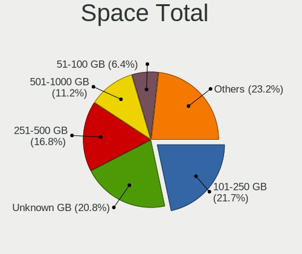

Debian 11 - Tested Hardware & Statistics
----------------------------------------

A project to collect tested hardware configurations for Debian 11.

Anyone can contribute to this report by the [hw-probe](https://github.com/linuxhw/hw-probe) tool:

    sudo -E hw-probe -all -upload

Please submit a probe of your configuration if it's not presented on the page or is rare.

This is a report for all computer types. See also reports for [desktops](/Dist/Debian_11/Desktop/README.md) and [notebooks](/Dist/Debian_11/Notebook/README.md).

Full-feature report is available here: https://linux-hardware.org/?view=trends&rel=debian-11

Contents
--------

* [ Test Cases ](#test-cases)

* [ System ](#system)
  - [ Kernel                   ](#kernel)
  - [ Kernel Family            ](#kernel-family)
  - [ Kernel Major Ver.        ](#kernel-major-ver)
  - [ Arch                     ](#arch)
  - [ DE                       ](#de)
  - [ Display Server           ](#display-server)
  - [ Display Manager          ](#display-manager)
  - [ OS Lang                  ](#os-lang)
  - [ Boot Mode                ](#boot-mode)
  - [ Filesystem               ](#filesystem)
  - [ Part. scheme             ](#part-scheme)
  - [ Dual Boot with Linux/BSD ](#dual-boot-with-linux-bsd)
  - [ Dual Boot (Win)          ](#dual-boot-win)

* [ Board ](#board)
  - [ Vendor                   ](#vendor)
  - [ Model                    ](#model)
  - [ Model Family             ](#model-family)
  - [ MFG Year                 ](#mfg-year)
  - [ Form Factor              ](#form-factor)
  - [ Secure Boot              ](#secure-boot)
  - [ Coreboot                 ](#coreboot)
  - [ RAM Size                 ](#ram-size)
  - [ RAM Used                 ](#ram-used)
  - [ Total Drives             ](#total-drives)
  - [ Has CD-ROM               ](#has-cd-rom)
  - [ Has Ethernet             ](#has-ethernet)
  - [ Has WiFi                 ](#has-wifi)
  - [ Has Bluetooth            ](#has-bluetooth)

* [ Location ](#location)
  - [ Country                  ](#country)
  - [ City                     ](#city)

* [ Drives ](#drives)
  - [ Drive Vendor             ](#drive-vendor)
  - [ Drive Model              ](#drive-model)
  - [ HDD Vendor               ](#hdd-vendor)
  - [ SSD Vendor               ](#ssd-vendor)
  - [ Drive Kind               ](#drive-kind)
  - [ Drive Connector          ](#drive-connector)
  - [ Drive Size               ](#drive-size)
  - [ Space Total              ](#space-total)
  - [ Space Used               ](#space-used)
  - [ Malfunc. Drives          ](#malfunc-drives)
  - [ Malfunc. Drive Vendor    ](#malfunc-drive-vendor)
  - [ Malfunc. HDD Vendor      ](#malfunc-hdd-vendor)
  - [ Malfunc. Drive Kind      ](#malfunc-drive-kind)
  - [ Failed Drives            ](#failed-drives)
  - [ Failed Drive Vendor      ](#failed-drive-vendor)
  - [ Drive Status             ](#drive-status)

* [ Storage controller ](#storage-controller)
  - [ Storage Vendor           ](#storage-vendor)
  - [ Storage Model            ](#storage-model)
  - [ Storage Kind             ](#storage-kind)

* [ Processor ](#processor)
  - [ CPU Vendor               ](#cpu-vendor)
  - [ CPU Model                ](#cpu-model)
  - [ CPU Model Family         ](#cpu-model-family)
  - [ CPU Cores                ](#cpu-cores)
  - [ CPU Sockets              ](#cpu-sockets)
  - [ CPU Threads              ](#cpu-threads)
  - [ CPU Op-Modes             ](#cpu-op-modes)
  - [ CPU Microcode            ](#cpu-microcode)
  - [ CPU Microarch            ](#cpu-microarch)

* [ Graphics ](#graphics)
  - [ GPU Vendor               ](#gpu-vendor)
  - [ GPU Model                ](#gpu-model)
  - [ GPU Combo                ](#gpu-combo)
  - [ GPU Driver               ](#gpu-driver)
  - [ GPU Memory               ](#gpu-memory)

* [ Monitor ](#monitor)
  - [ Monitor Vendor           ](#monitor-vendor)
  - [ Monitor Model            ](#monitor-model)
  - [ Monitor Resolution       ](#monitor-resolution)
  - [ Monitor Diagonal         ](#monitor-diagonal)
  - [ Monitor Width            ](#monitor-width)
  - [ Aspect Ratio             ](#aspect-ratio)
  - [ Monitor Area             ](#monitor-area)
  - [ Pixel Density            ](#pixel-density)
  - [ Multiple Monitors        ](#multiple-monitors)

* [ Network ](#network)
  - [ Net Controller Vendor    ](#net-controller-vendor)
  - [ Net Controller Model     ](#net-controller-model)
  - [ Wireless Vendor          ](#wireless-vendor)
  - [ Wireless Model           ](#wireless-model)
  - [ Ethernet Vendor          ](#ethernet-vendor)
  - [ Ethernet Model           ](#ethernet-model)
  - [ Net Controller Kind      ](#net-controller-kind)
  - [ Used Controller          ](#used-controller)
  - [ NICs                     ](#nics)
  - [ IPv6                     ](#ipv6)

* [ Bluetooth ](#bluetooth)
  - [ Bluetooth Vendor         ](#bluetooth-vendor)
  - [ Bluetooth Model          ](#bluetooth-model)

* [ Sound ](#sound)
  - [ Sound Vendor             ](#sound-vendor)
  - [ Sound Model              ](#sound-model)

* [ Memory ](#memory)
  - [ Memory Vendor            ](#memory-vendor)
  - [ Memory Model             ](#memory-model)
  - [ Memory Kind              ](#memory-kind)
  - [ Memory Form Factor       ](#memory-form-factor)
  - [ Memory Size              ](#memory-size)
  - [ Memory Speed             ](#memory-speed)

* [ Printers & scanners ](#printers-scanners)
  - [ Printer Vendor           ](#printer-vendor)
  - [ Printer Model            ](#printer-model)
  - [ Scanner Vendor           ](#scanner-vendor)
  - [ Scanner Model            ](#scanner-model)

* [ Camera ](#camera)
  - [ Camera Vendor            ](#camera-vendor)
  - [ Camera Model             ](#camera-model)

* [ Security ](#security)
  - [ Fingerprint Vendor       ](#fingerprint-vendor)
  - [ Fingerprint Model        ](#fingerprint-model)
  - [ Chipcard Vendor          ](#chipcard-vendor)
  - [ Chipcard Model           ](#chipcard-model)

* [ Unsupported ](#unsupported)
  - [ Unsupported Devices      ](#unsupported-devices)
  - [ Unsupported Device Types ](#unsupported-device-types)

Test Cases
----------

| Vendor        | Model                       | Form-Factor | Probe                                                      | Date         |
|---------------|-----------------------------|-------------|------------------------------------------------------------|--------------|
| HP            | EliteBook x360 1030 G3      | Convertible | [0c49a20e7c](https://linux-hardware.org/?probe=0c49a20e7c) | Jul 24, 2021 |
| Apple         | MacBookPro8,1               | Notebook    | [b0e58bf8de](https://linux-hardware.org/?probe=b0e58bf8de) | Jul 24, 2021 |
| Gigabyte      | B560M D3H                   | Desktop     | [1456f9bf8e](https://linux-hardware.org/?probe=1456f9bf8e) | Jul 23, 2021 |
| Lenovo        | IdeaPad 700-15ISK 80RU      | Notebook    | [3491bd4228](https://linux-hardware.org/?probe=3491bd4228) | Jul 23, 2021 |
| Lenovo        | ThinkPad E595 20NF0005IX    | Notebook    | [dd220c0bdb](https://linux-hardware.org/?probe=dd220c0bdb) | Jul 23, 2021 |
| Gigabyte      | AERO 17-SA                  | Notebook    | [eaff86e276](https://linux-hardware.org/?probe=eaff86e276) | Jul 23, 2021 |
| Acer          | Aspire A715-72G             | Notebook    | [b436023dda](https://linux-hardware.org/?probe=b436023dda) | Jul 23, 2021 |
| Lenovo        | IdeaPad S145-15IWL 81S9     | Notebook    | [ecd10ec3a7](https://linux-hardware.org/?probe=ecd10ec3a7) | Jul 22, 2021 |
| ASUSTek       | VivoBook_ASUSLaptop X509... | Notebook    | [1abb08da83](https://linux-hardware.org/?probe=1abb08da83) | Jul 21, 2021 |
| Supermicro    | X11DDW-L                    | Server      | [6fab4e3135](https://linux-hardware.org/?probe=6fab4e3135) | Jul 20, 2021 |
| HP            | Laptop 15s-fq1xxx           | Notebook    | [4ed280d4c8](https://linux-hardware.org/?probe=4ed280d4c8) | Jul 19, 2021 |
| ASUSTek       | ROG STRIX Z370-H GAMING     | Desktop     | [8af9716200](https://linux-hardware.org/?probe=8af9716200) | Jul 19, 2021 |
| ASUSTek       | P8Z68-V                     | Desktop     | [1a60e02aa9](https://linux-hardware.org/?probe=1a60e02aa9) | Jul 19, 2021 |
| Dell          | 0H5J4J A01                  | Server      | [fbdf83f7ff](https://linux-hardware.org/?probe=fbdf83f7ff) | Jul 17, 2021 |
| HP            | ProLiant MicroServer        | Desktop     | [ca7c4b4967](https://linux-hardware.org/?probe=ca7c4b4967) | Jul 16, 2021 |
| HP            | EliteBook 830 G7 Noteboo... | Notebook    | [acca72e9c1](https://linux-hardware.org/?probe=acca72e9c1) | Jul 15, 2021 |
| Lenovo        | ThinkPad Edge E540 20C60... | Notebook    | [a5daecad1d](https://linux-hardware.org/?probe=a5daecad1d) | Jul 15, 2021 |
| Dell          | Precision 3540              | Notebook    | [383ebf30aa](https://linux-hardware.org/?probe=383ebf30aa) | Jul 14, 2021 |
| Itautec       | Infoway                     | Notebook    | [06dc7b0fd1](https://linux-hardware.org/?probe=06dc7b0fd1) | Jul 14, 2021 |
| Lenovo        | ThinkPad E15 Gen 2 20TD0... | Notebook    | [71d234aaef](https://linux-hardware.org/?probe=71d234aaef) | Jul 14, 2021 |
| MSI           | A68HM-E33 V2                | Desktop     | [983bc90bc7](https://linux-hardware.org/?probe=983bc90bc7) | Jul 14, 2021 |
| Acer          | Aspire 7741                 | Notebook    | [6ed4934b61](https://linux-hardware.org/?probe=6ed4934b61) | Jul 13, 2021 |
| Acer          | Aspire 7741                 | Notebook    | [ee5a2b2029](https://linux-hardware.org/?probe=ee5a2b2029) | Jul 13, 2021 |
| ASUSTek       | VivoBook_ASUSLaptop X513... | Notebook    | [54bfb26e0f](https://linux-hardware.org/?probe=54bfb26e0f) | Jul 12, 2021 |
| ASUSTek       | ROG Strix G533QS_G533QS     | Notebook    | [98271924ba](https://linux-hardware.org/?probe=98271924ba) | Jul 11, 2021 |
| Lenovo        | ThinkPad T430 2349V4B       | Notebook    | [d39fe8e9d4](https://linux-hardware.org/?probe=d39fe8e9d4) | Jul 11, 2021 |
| HP            | EliteBook 855 G7 Noteboo... | Notebook    | [1cb0058b88](https://linux-hardware.org/?probe=1cb0058b88) | Jul 10, 2021 |
| Huanan        | X99-F8 V2.0                 | Desktop     | [776f848ccd](https://linux-hardware.org/?probe=776f848ccd) | Jul 09, 2021 |
| Dell          | 0M863N A00                  | Desktop     | [574671bbb9](https://linux-hardware.org/?probe=574671bbb9) | Jul 09, 2021 |
| Acer          | Aspire A315-23G             | Notebook    | [e6aa891005](https://linux-hardware.org/?probe=e6aa891005) | Jul 08, 2021 |
| MSI           | MPG B550 GAMING PLUS        | Desktop     | [c79b71d033](https://linux-hardware.org/?probe=c79b71d033) | Jul 08, 2021 |
| ASUSTek       | H81M-E                      | Desktop     | [02c3ce63e7](https://linux-hardware.org/?probe=02c3ce63e7) | Jul 08, 2021 |
| HP            | 2215                        | Desktop     | [b0b56138b2](https://linux-hardware.org/?probe=b0b56138b2) | Jul 08, 2021 |
| Dell          | XPS 13 9380                 | Notebook    | [b31688ecfa](https://linux-hardware.org/?probe=b31688ecfa) | Jul 08, 2021 |
| HP            | 2215                        | Desktop     | [cdf48de6b2](https://linux-hardware.org/?probe=cdf48de6b2) | Jul 07, 2021 |
| Dell          | Latitude E6330              | Notebook    | [321bec10eb](https://linux-hardware.org/?probe=321bec10eb) | Jul 05, 2021 |
| HP            | Compaq 6830s                | Notebook    | [9c47e76afe](https://linux-hardware.org/?probe=9c47e76afe) | Jul 04, 2021 |
| MSI           | MS-6712                     | Desktop     | [ced0409e55](https://linux-hardware.org/?probe=ced0409e55) | Jul 04, 2021 |
| HP            | Compaq 6830s                | Notebook    | [b524035304](https://linux-hardware.org/?probe=b524035304) | Jul 04, 2021 |
| Dell          | Inspiron 5570               | Notebook    | [b760b0d9cc](https://linux-hardware.org/?probe=b760b0d9cc) | Jul 03, 2021 |
| Acer          | Aspire A515-51              | Notebook    | [f94bb31c5a](https://linux-hardware.org/?probe=f94bb31c5a) | Jul 03, 2021 |
| HP            | ZBook Fury 17 G7 Mobile ... | Notebook    | [c24fcd1454](https://linux-hardware.org/?probe=c24fcd1454) | Jul 02, 2021 |
| Dell          | Latitude 7410               | Convertible | [457f309f39](https://linux-hardware.org/?probe=457f309f39) | Jul 02, 2021 |
| Dell          | Latitude 7410               | Convertible | [945a4600c4](https://linux-hardware.org/?probe=945a4600c4) | Jul 02, 2021 |
| ASRock        | H77 Pro4-M                  | Desktop     | [8ba58cff9a](https://linux-hardware.org/?probe=8ba58cff9a) | Jul 02, 2021 |
| Gigabyte      | B550I AORUS PRO AX          | Desktop     | [cb62272a68](https://linux-hardware.org/?probe=cb62272a68) | Jul 02, 2021 |
| Dell          | Inspiron 5570               | Notebook    | [44b96068f2](https://linux-hardware.org/?probe=44b96068f2) | Jul 02, 2021 |
| Acer          | Aspire A315-23G             | Notebook    | [5729444e9b](https://linux-hardware.org/?probe=5729444e9b) | Jul 02, 2021 |
| Acer          | Aspire A315-23G             | Notebook    | [bd3211a03b](https://linux-hardware.org/?probe=bd3211a03b) | Jun 30, 2021 |
| Lenovo        | ThinkPad X1 Extreme Gen ... | Notebook    | [c8cb82f74d](https://linux-hardware.org/?probe=c8cb82f74d) | Jun 30, 2021 |
| Gigabyte      | AX370-Gaming K7             | Desktop     | [e325df530d](https://linux-hardware.org/?probe=e325df530d) | Jun 30, 2021 |
| Dell          | XPS 13 9310                 | Notebook    | [24a52836b4](https://linux-hardware.org/?probe=24a52836b4) | Jun 30, 2021 |
| HP            | ProBook 640 G3              | Notebook    | [c56b8f3ff1](https://linux-hardware.org/?probe=c56b8f3ff1) | Jun 29, 2021 |
| MSI           | B85M-G43                    | Desktop     | [4598afdf7e](https://linux-hardware.org/?probe=4598afdf7e) | Jun 29, 2021 |
| HP            | ZBook 17 G5                 | Notebook    | [5557a5c23c](https://linux-hardware.org/?probe=5557a5c23c) | Jun 29, 2021 |
| Lenovo        | IdeaPad Z580                | Notebook    | [6a9d31c8ef](https://linux-hardware.org/?probe=6a9d31c8ef) | Jun 29, 2021 |
| Dell          | Inspiron 5570               | Notebook    | [5335641d04](https://linux-hardware.org/?probe=5335641d04) | Jun 28, 2021 |
| Dell          | Inspiron 5570               | Notebook    | [0632a7bf28](https://linux-hardware.org/?probe=0632a7bf28) | Jun 28, 2021 |
| Acer          | Aspire A315-23G             | Notebook    | [834b68e61a](https://linux-hardware.org/?probe=834b68e61a) | Jun 28, 2021 |
| HUAWEI        | BOHK-WAX9X                  | Notebook    | [65c54db09e](https://linux-hardware.org/?probe=65c54db09e) | Jun 27, 2021 |
| HUAWEI        | BOHK-WAX9X                  | Notebook    | [fda3d18cf7](https://linux-hardware.org/?probe=fda3d18cf7) | Jun 27, 2021 |
| Huanan        | X99-8M-F V1.1               | Desktop     | [8ecfcffbaf](https://linux-hardware.org/?probe=8ecfcffbaf) | Jun 27, 2021 |
| HP            | ZBook Fury 17 G7 Mobile ... | Notebook    | [c3d5fd07c1](https://linux-hardware.org/?probe=c3d5fd07c1) | Jun 27, 2021 |
| ASRock        | FM2A68M-HD+                 | Desktop     | [f435417b41](https://linux-hardware.org/?probe=f435417b41) | Jun 26, 2021 |
| Acer          | Nitro AN515-51              | Notebook    | [6c4a46b4ec](https://linux-hardware.org/?probe=6c4a46b4ec) | Jun 26, 2021 |
| Pine Micro... | Pine64 PinePhone (1.2) (... | Phone       | [6805b89f3d](https://linux-hardware.org/?probe=6805b89f3d) | Jun 25, 2021 |
| Gigabyte      | Z370 AORUS Gaming 5-CF      | Desktop     | [807a4ba37d](https://linux-hardware.org/?probe=807a4ba37d) | Jun 23, 2021 |
| Gigabyte      | Z370 AORUS Gaming 5-CF      | Desktop     | [bc7246038e](https://linux-hardware.org/?probe=bc7246038e) | Jun 23, 2021 |
| ASRock        | B550 Pro4                   | Desktop     | [ef1b7bfb77](https://linux-hardware.org/?probe=ef1b7bfb77) | Jun 23, 2021 |
| ASRock        | X399 Taichi                 | Desktop     | [a664e4cf99](https://linux-hardware.org/?probe=a664e4cf99) | Jun 23, 2021 |
| HARDKERNEL    | ODROID-H2                   | Desktop     | [c9fed56a36](https://linux-hardware.org/?probe=c9fed56a36) | Jun 23, 2021 |
| Dell          | Inspiron 3501               | Notebook    | [d6f07cb592](https://linux-hardware.org/?probe=d6f07cb592) | Jun 23, 2021 |
| Dell          | 04WYPY A04                  | Server      | [20fa770830](https://linux-hardware.org/?probe=20fa770830) | Jun 22, 2021 |
| MSI           | GF65 Thin 10UE              | Notebook    | [d1e0b6ee58](https://linux-hardware.org/?probe=d1e0b6ee58) | Jun 22, 2021 |
| Lenovo        | ThinkPad T495 20NKS0PG00    | Notebook    | [9e646a384e](https://linux-hardware.org/?probe=9e646a384e) | Jun 22, 2021 |
| ASUSTek       | ROG STRIX B450-F GAMING ... | Desktop     | [b3a5333d2a](https://linux-hardware.org/?probe=b3a5333d2a) | Jun 21, 2021 |
| Dell          | Precision 3560              | Notebook    | [81efcf647c](https://linux-hardware.org/?probe=81efcf647c) | Jun 21, 2021 |
| Fujitsu       | LIFEBOOK A357               | Notebook    | [75c4ec9e5a](https://linux-hardware.org/?probe=75c4ec9e5a) | Jun 21, 2021 |
| Gigabyte      | AB350M-Gaming 3-CF          | Desktop     | [08fc06c75e](https://linux-hardware.org/?probe=08fc06c75e) | Jun 20, 2021 |
| Lenovo        | IdeaPad 700-15ISK 80RU      | Notebook    | [c62a9a5058](https://linux-hardware.org/?probe=c62a9a5058) | Jun 20, 2021 |
| Lenovo        | IdeaPad 700-15ISK 80RU      | Notebook    | [5a39dabe8a](https://linux-hardware.org/?probe=5a39dabe8a) | Jun 20, 2021 |
| Acer          | Aspire A315-23G             | Notebook    | [b37bec27b3](https://linux-hardware.org/?probe=b37bec27b3) | Jun 20, 2021 |
| Dell          | Latitude E7470              | Notebook    | [49cb9ff0b0](https://linux-hardware.org/?probe=49cb9ff0b0) | Jun 20, 2021 |
| Acer          | Aspire 5750G                | Notebook    | [73d6b46b6b](https://linux-hardware.org/?probe=73d6b46b6b) | Jun 19, 2021 |
| ASUSTek       | ZenBook UX431DA_UM431DA     | Notebook    | [a894e25838](https://linux-hardware.org/?probe=a894e25838) | Jun 19, 2021 |
| Acer          | Aspire A315-23G             | Notebook    | [dde7123487](https://linux-hardware.org/?probe=dde7123487) | Jun 19, 2021 |
| MSI           | B450M MORTAR MAX            | Desktop     | [33ffb80782](https://linux-hardware.org/?probe=33ffb80782) | Jun 19, 2021 |
| Lenovo        | ThinkPad X270 W10DG 20K5... | Notebook    | [842c53b8e2](https://linux-hardware.org/?probe=842c53b8e2) | Jun 18, 2021 |
| Acer          | Aspire A315-23G             | Notebook    | [1a8a3efde5](https://linux-hardware.org/?probe=1a8a3efde5) | Jun 18, 2021 |
| Lenovo        | ThinkPad X230 2325AZ8       | Notebook    | [b5ea5009bf](https://linux-hardware.org/?probe=b5ea5009bf) | Jun 18, 2021 |
| Lenovo        | Yoga 300-11IBR 80M1         | Notebook    | [259fc86278](https://linux-hardware.org/?probe=259fc86278) | Jun 18, 2021 |
| ASUSTek       | ROG STRIX B450-F GAMING ... | Desktop     | [9e3e72ec72](https://linux-hardware.org/?probe=9e3e72ec72) | Jun 17, 2021 |
| Acer          | Aspire ES1-132              | Notebook    | [c26c0f6e33](https://linux-hardware.org/?probe=c26c0f6e33) | Jun 15, 2021 |
| ASUSTek       | PRIME B450M-A               | Desktop     | [0ccc446224](https://linux-hardware.org/?probe=0ccc446224) | Jun 14, 2021 |
| Acer          | Aspire A315-23G             | Notebook    | [eb77944ea2](https://linux-hardware.org/?probe=eb77944ea2) | Jun 14, 2021 |
| Gigabyte      | MCMLUAB-00                  | Desktop     | [99780e8ba8](https://linux-hardware.org/?probe=99780e8ba8) | Jun 13, 2021 |
| Acer          | Aspire V3-331               | Notebook    | [91f4f7aab6](https://linux-hardware.org/?probe=91f4f7aab6) | Jun 13, 2021 |
| UNOWHY        | Y13G002S4EI                 | Notebook    | [3d25dc9f69](https://linux-hardware.org/?probe=3d25dc9f69) | Jun 13, 2021 |
| ASUSTek       | X550LD                      | Notebook    | [2d1f6364aa](https://linux-hardware.org/?probe=2d1f6364aa) | Jun 13, 2021 |
| Acer          | Aspire V3-331               | Notebook    | [02e288caf9](https://linux-hardware.org/?probe=02e288caf9) | Jun 13, 2021 |
| Lenovo        | ThinkPad X270 W10DG 20K5... | Notebook    | [1b2cda6c08](https://linux-hardware.org/?probe=1b2cda6c08) | Jun 12, 2021 |
| ASUSTek       | PRIME A320M-K               | Desktop     | [f2770a810e](https://linux-hardware.org/?probe=f2770a810e) | Jun 12, 2021 |
| ASUSTek       | VivoBook_ASUSLaptop X512... | Notebook    | [f6ba765876](https://linux-hardware.org/?probe=f6ba765876) | Jun 12, 2021 |
| HUAWEI        | BOHK-WAX9X                  | Notebook    | [57684125de](https://linux-hardware.org/?probe=57684125de) | Jun 12, 2021 |
| Unknown       | Helios64                    | Soc         | [33c6248333](https://linux-hardware.org/?probe=33c6248333) | Jun 11, 2021 |
| Dell          | 0Y7WYT A00                  | Desktop     | [8e424773e5](https://linux-hardware.org/?probe=8e424773e5) | Jun 10, 2021 |
| Dell          | Latitude E7470              | Notebook    | [51c1f3f1f5](https://linux-hardware.org/?probe=51c1f3f1f5) | Jun 10, 2021 |
| ASUSTek       | Z97-AR                      | Desktop     | [709a74c713](https://linux-hardware.org/?probe=709a74c713) | Jun 09, 2021 |
| Acer          | Aspire A315-23G             | Notebook    | [377f2e9ec6](https://linux-hardware.org/?probe=377f2e9ec6) | Jun 09, 2021 |
| Dell          | Latitude E6330              | Notebook    | [ba88cd6328](https://linux-hardware.org/?probe=ba88cd6328) | Jun 08, 2021 |
| Lenovo        | ThinkPad T430s 2356A89      | Notebook    | [0195b8564e](https://linux-hardware.org/?probe=0195b8564e) | Jun 08, 2021 |
| ASRock        | B450M Pro4                  | Desktop     | [ee4dfdfde3](https://linux-hardware.org/?probe=ee4dfdfde3) | Jun 08, 2021 |
| Acer          | Aspire ES1-132              | Notebook    | [2db77f0d01](https://linux-hardware.org/?probe=2db77f0d01) | Jun 07, 2021 |
| ASUSTek       | PRIME A320M-K               | Desktop     | [69dd9fbe20](https://linux-hardware.org/?probe=69dd9fbe20) | Jun 07, 2021 |
| Acer          | Aspire A315-23G             | Notebook    | [548356ed30](https://linux-hardware.org/?probe=548356ed30) | Jun 06, 2021 |
| Dell          | Inspiron 3793               | Notebook    | [f65812f774](https://linux-hardware.org/?probe=f65812f774) | Jun 06, 2021 |
| ASUSTek       | M3N                         | Notebook    | [ec5f914161](https://linux-hardware.org/?probe=ec5f914161) | Jun 06, 2021 |
| ASUSTek       | M3N                         | Notebook    | [bd89f26d7e](https://linux-hardware.org/?probe=bd89f26d7e) | Jun 05, 2021 |
| ASRock        | B450M Pro4                  | Desktop     | [0fd993c4dd](https://linux-hardware.org/?probe=0fd993c4dd) | Jun 05, 2021 |
| Lenovo        | IdeaPad 320-15IKB 80XL      | Notebook    | [5c16d903d3](https://linux-hardware.org/?probe=5c16d903d3) | Jun 05, 2021 |
| HUAWEI        | BOHK-WAX9X                  | Notebook    | [47e9dfd146](https://linux-hardware.org/?probe=47e9dfd146) | Jun 05, 2021 |
| Acer          | Aspire A315-23G             | Notebook    | [90dbe22a68](https://linux-hardware.org/?probe=90dbe22a68) | Jun 05, 2021 |
| HP            | ProBook 640 G8 Notebook ... | Notebook    | [e20b51102d](https://linux-hardware.org/?probe=e20b51102d) | Jun 03, 2021 |
| Lenovo        | ThinkPad T495 20NJCTO1WW    | Notebook    | [b513f2fc77](https://linux-hardware.org/?probe=b513f2fc77) | Jun 03, 2021 |
| ASUSTek       | M4A88T-M/USB3               | Desktop     | [7483847993](https://linux-hardware.org/?probe=7483847993) | Jun 03, 2021 |
| Monster       | ABRA A5 V15.2               | Notebook    | [012bfa586d](https://linux-hardware.org/?probe=012bfa586d) | Jun 02, 2021 |
| Pegatron      | A15                         | Notebook    | [dec1b6b43a](https://linux-hardware.org/?probe=dec1b6b43a) | Jun 02, 2021 |
| Dell          | 0YXT71 A02                  | Desktop     | [a45729e01a](https://linux-hardware.org/?probe=a45729e01a) | Jun 01, 2021 |
| HUAWEI        | BOHK-WAX9X                  | Notebook    | [ac80feea4f](https://linux-hardware.org/?probe=ac80feea4f) | Jun 01, 2021 |
| ASUSTek       | PRIME B550-PLUS             | Desktop     | [21574f62a5](https://linux-hardware.org/?probe=21574f62a5) | Jun 01, 2021 |
| Acer          | Aspire A315-23G             | Notebook    | [80cf3dc8e7](https://linux-hardware.org/?probe=80cf3dc8e7) | Jun 01, 2021 |
| HP            | Compaq tc4400 (GE179UP#A... | Notebook    | [eeaee9f1ad](https://linux-hardware.org/?probe=eeaee9f1ad) | Jun 01, 2021 |
| HP            | ENVY x360 Convertible 13... | Convertible | [f77e2ebb10](https://linux-hardware.org/?probe=f77e2ebb10) | May 31, 2021 |
| ASUSTek       | P5B-Deluxe                  | Desktop     | [926229be87](https://linux-hardware.org/?probe=926229be87) | May 31, 2021 |
| Toshiba       | Satellite U800W             | Notebook    | [ac79b35dfd](https://linux-hardware.org/?probe=ac79b35dfd) | May 30, 2021 |
| MSI           | U90/U100                    | Notebook    | [477251f62e](https://linux-hardware.org/?probe=477251f62e) | May 30, 2021 |
| MSI           | U90/U100                    | Notebook    | [1a0476551b](https://linux-hardware.org/?probe=1a0476551b) | May 30, 2021 |
| Apple         | Mac-63001698E7A34814 iMa... | All in one  | [eb3d04e089](https://linux-hardware.org/?probe=eb3d04e089) | May 29, 2021 |
| Intel         | NUC10i7FNB K61360-302       | Mini pc     | [92aa2017b9](https://linux-hardware.org/?probe=92aa2017b9) | May 29, 2021 |
| Lenovo        | ThinkPad X1 Carbon 6th 2... | Notebook    | [c33e7ced42](https://linux-hardware.org/?probe=c33e7ced42) | May 29, 2021 |
| Gigabyte      | B450 AORUS PRO WIFI-CF      | Desktop     | [24d2e85009](https://linux-hardware.org/?probe=24d2e85009) | May 29, 2021 |
| MSI           | CX700                       | Notebook    | [ef40976753](https://linux-hardware.org/?probe=ef40976753) | May 29, 2021 |
| Intel         | NUC8BEB J72692-308          | Mini pc     | [7ca350189c](https://linux-hardware.org/?probe=7ca350189c) | May 29, 2021 |
| Dell          | XPS 13 9310                 | Notebook    | [5de2c933c1](https://linux-hardware.org/?probe=5de2c933c1) | May 28, 2021 |
| Lenovo        | ThinkPad T530 24296HG       | Notebook    | [88cee1e822](https://linux-hardware.org/?probe=88cee1e822) | May 28, 2021 |
| Samsung       | 370E4K                      | Notebook    | [125fbb3d15](https://linux-hardware.org/?probe=125fbb3d15) | May 28, 2021 |
| MSI           | CX700                       | Notebook    | [535d0016e2](https://linux-hardware.org/?probe=535d0016e2) | May 27, 2021 |
| MSI           | B250M BAZOOKA               | Desktop     | [fb2eef67f2](https://linux-hardware.org/?probe=fb2eef67f2) | May 26, 2021 |
| Acer          | Aspire A315-23G             | Notebook    | [c091670daa](https://linux-hardware.org/?probe=c091670daa) | May 25, 2021 |
| Acer          | Aspire A315-23G             | Notebook    | [ad6cd7847f](https://linux-hardware.org/?probe=ad6cd7847f) | May 24, 2021 |
| MSI           | B450I GAMING PLUS AC        | Desktop     | [2c698534c6](https://linux-hardware.org/?probe=2c698534c6) | May 23, 2021 |
| Lenovo        | ThinkPad T14 Gen 1 20UDC... | Notebook    | [f03341d873](https://linux-hardware.org/?probe=f03341d873) | May 23, 2021 |
| Gigabyte      | AB350M-D3H-CF               | Desktop     | [1ad175fddc](https://linux-hardware.org/?probe=1ad175fddc) | May 23, 2021 |
| Dell          | Latitude 7410               | Convertible | [bc7c58f248](https://linux-hardware.org/?probe=bc7c58f248) | May 21, 2021 |
| HP            | EliteBook 840 G1            | Notebook    | [6573923d55](https://linux-hardware.org/?probe=6573923d55) | May 21, 2021 |
| Lenovo        | ThinkPad X1 Tablet 20GGS... | Tablet      | [1c271464f4](https://linux-hardware.org/?probe=1c271464f4) | May 21, 2021 |
| Acer          | Aspire A315-23G             | Notebook    | [8b7b153998](https://linux-hardware.org/?probe=8b7b153998) | May 20, 2021 |
| Dell          | Latitude 7410               | Convertible | [cbd8832f44](https://linux-hardware.org/?probe=cbd8832f44) | May 19, 2021 |
| Dell          | Latitude 7480               | Notebook    | [0f2477786d](https://linux-hardware.org/?probe=0f2477786d) | May 19, 2021 |
| Lenovo        | ThinkPad T440p 20AWS4PN0... | Notebook    | [f8b2c84bc1](https://linux-hardware.org/?probe=f8b2c84bc1) | May 19, 2021 |
| sunxi         | Unknown                     | Soc         | [d54c3a2a33](https://linux-hardware.org/?probe=d54c3a2a33) | May 19, 2021 |
| HUAWEI        | BOHK-WAX9X                  | Notebook    | [b9d0acf0a6](https://linux-hardware.org/?probe=b9d0acf0a6) | May 19, 2021 |
| HUAWEI        | BOHK-WAX9X                  | Notebook    | [97a658e572](https://linux-hardware.org/?probe=97a658e572) | May 19, 2021 |
| Gigabyte      | Z170X-GamingG1              | Desktop     | [361469c7d5](https://linux-hardware.org/?probe=361469c7d5) | May 18, 2021 |
| Acer          | Aspire A315-23G             | Notebook    | [28bb88d60c](https://linux-hardware.org/?probe=28bb88d60c) | May 17, 2021 |
| Lenovo        | ThinkPad Yoga 260 20FEA0... | Convertible | [2a0eca4670](https://linux-hardware.org/?probe=2a0eca4670) | May 17, 2021 |
| HP            | Compaq Presario C700        | Notebook    | [91a939ce16](https://linux-hardware.org/?probe=91a939ce16) | May 16, 2021 |
| Acer          | Aspire A315-23G             | Notebook    | [646b64ccb3](https://linux-hardware.org/?probe=646b64ccb3) | May 15, 2021 |
| Gigabyte      | Z77-D3H                     | Desktop     | [71f4ed3e35](https://linux-hardware.org/?probe=71f4ed3e35) | May 11, 2021 |
| Lenovo        | MAHOBAY                     | Desktop     | [c0b8e99e35](https://linux-hardware.org/?probe=c0b8e99e35) | May 06, 2021 |
| HP            | Split 13 x2 PC              | Notebook    | [5834b6321d](https://linux-hardware.org/?probe=5834b6321d) | May 05, 2021 |
| ASUSTek       | ZenBook UX425IA_UM425IA     | Notebook    | [bf3e99374e](https://linux-hardware.org/?probe=bf3e99374e) | Apr 29, 2021 |
| Lenovo        | IdeaPad Z500 20202          | Notebook    | [a06f2bc29e](https://linux-hardware.org/?probe=a06f2bc29e) | Apr 27, 2021 |
| Biostar       | B450MH                      | Desktop     | [f0a1151d81](https://linux-hardware.org/?probe=f0a1151d81) | Apr 27, 2021 |
| ASUSTek       | ZenBook UX333FN_UX333FN     | Notebook    | [a042fd63c6](https://linux-hardware.org/?probe=a042fd63c6) | Apr 27, 2021 |
| Dell          | Inspiron 3793               | Notebook    | [a4c79ea8c3](https://linux-hardware.org/?probe=a4c79ea8c3) | Apr 26, 2021 |
| Chuwi         | Hi10 pro tablet             | Tablet      | [446238dd0c](https://linux-hardware.org/?probe=446238dd0c) | Apr 25, 2021 |
| Chuwi         | Hi10 pro tablet             | Tablet      | [bb76391a12](https://linux-hardware.org/?probe=bb76391a12) | Apr 25, 2021 |
| HP            | EliteBook 8460p             | Notebook    | [bcea790fba](https://linux-hardware.org/?probe=bcea790fba) | Apr 24, 2021 |
| Lenovo        | ThinkPad T430s 23533KJ      | Notebook    | [39aa120e47](https://linux-hardware.org/?probe=39aa120e47) | Apr 21, 2021 |
| Dell          | Inspiron 5468               | Notebook    | [cfc77b26b5](https://linux-hardware.org/?probe=cfc77b26b5) | Apr 17, 2021 |
| Gigabyte      | EG41MF-US2H                 | Desktop     | [a2aa6eaec8](https://linux-hardware.org/?probe=a2aa6eaec8) | Apr 16, 2021 |
| Lenovo        | ThinkPad T530 24296HG       | Notebook    | [4967255e37](https://linux-hardware.org/?probe=4967255e37) | Apr 14, 2021 |
| Lenovo        | ThinkPad T530 24296HG       | Notebook    | [e1a5725060](https://linux-hardware.org/?probe=e1a5725060) | Apr 14, 2021 |
| sunxi         | Banana Pi BPI-M2-Ultra      | Soc         | [c0536c5433](https://linux-hardware.org/?probe=c0536c5433) | Apr 13, 2021 |
| sunxi         | Banana Pi BPI-M2-Ultra      | Soc         | [935ccffcd5](https://linux-hardware.org/?probe=935ccffcd5) | Feb 01, 2021 |
| Unknown       | Shenzhen Amediatech Tech... | Soc         | [2fed627592](https://linux-hardware.org/?probe=2fed627592) | Jan 18, 2021 |
| sunxi         | Unknown                     | Soc         | [604dd9d393](https://linux-hardware.org/?probe=604dd9d393) | Feb 25, 2020 |

System
------

Kernel
------

Version of the Linux kernel

| Version                        | Computers | Percent |
|--------------------------------|-----------|---------|
| 5.10.0-7-amd64                 | 64        | 43.84%  |
| 5.10.0-6-amd64                 | 35        | 23.97%  |
| 5.10.0-8-amd64                 | 10        | 6.85%   |
| 5.11.22-2-pve                  | 2         | 1.37%   |
| 5.11.22-1-pve                  | 2         | 1.37%   |
| 5.10-sunxi64                   | 2         | 1.37%   |
| 5.9.0-arm-64                   | 1         | 0.68%   |
| 5.8.0-3-amd64                  | 1         | 0.68%   |
| 5.4.18-sunxi64                 | 1         | 0.68%   |
| 5.4.0-73-generic               | 1         | 0.68%   |
| 5.13.0-rc7-00024-g0418ae8de752 | 1         | 0.68%   |
| 5.12.4                         | 1         | 0.68%   |
| 5.12.10                        | 1         | 0.68%   |
| 5.12.1                         | 1         | 0.68%   |
| 5.12.0-9.2-liquorix-amd64      | 1         | 0.68%   |
| 5.12.0-14.2-liquorix-amd64     | 1         | 0.68%   |
| 5.11.9+                        | 1         | 0.68%   |
| 5.11.15-terranz                | 1         | 0.68%   |
| 5.11.15-051115-generic         | 1         | 0.68%   |
| 5.11.14                        | 1         | 0.68%   |
| 5.11.0-rc6                     | 1         | 0.68%   |
| 5.11.0-21.1-liquorix-amd64     | 1         | 0.68%   |
| 5.11.0-16.1-liquorix-amd64     | 1         | 0.68%   |
| 5.10.35-rockchip64             | 1         | 0.68%   |
| 5.10.21-sunxi                  | 1         | 0.68%   |
| 5.10.12-sunxi                  | 1         | 0.68%   |
| 5.10.0-io7-amd64               | 1         | 0.68%   |
| 5.10.0-7-686-pae               | 1         | 0.68%   |
| 5.10.0-6-rt-amd64              | 1         | 0.68%   |
| 5.10.0-6-686                   | 1         | 0.68%   |
| 5.10.0-5-amd64                 | 1         | 0.68%   |
| 5.10.0-3-amd64                 | 1         | 0.68%   |
| 5.10.0-2-amd64                 | 1         | 0.68%   |
| 4.19.181-z580322               | 1         | 0.68%   |
| 4.19.0-16-amd64                | 1         | 0.68%   |
| 4.19.0-16-686-pae              | 1         | 0.68%   |
| 4.19.0-14-amd64                | 1         | 0.68%   |

Kernel Family
-------------

Linux kernel without a distro release

| Version  | Computers | Percent |
|----------|-----------|---------|
| 5.10.0   | 112       | 79.43%  |
| 5.11.22  | 4         | 2.84%   |
| 5.11.0   | 3         | 2.13%   |
| 4.19.0   | 3         | 2.13%   |
| 5.11.15  | 2         | 1.42%   |
| 5.10     | 2         | 1.42%   |
| 5.9.0    | 1         | 0.71%   |
| 5.8.0    | 1         | 0.71%   |
| 5.4.18   | 1         | 0.71%   |
| 5.4.0    | 1         | 0.71%   |
| 5.13.0   | 1         | 0.71%   |
| 5.12.4   | 1         | 0.71%   |
| 5.12.10  | 1         | 0.71%   |
| 5.12.1   | 1         | 0.71%   |
| 5.12.0   | 1         | 0.71%   |
| 5.11.9   | 1         | 0.71%   |
| 5.11.14  | 1         | 0.71%   |
| 5.10.35  | 1         | 0.71%   |
| 5.10.21  | 1         | 0.71%   |
| 5.10.12  | 1         | 0.71%   |
| 4.19.181 | 1         | 0.71%   |

Kernel Major Ver.
-----------------

Linux kernel major version

| Version | Computers | Percent |
|---------|-----------|---------|
| 5.10    | 114       | 81.43%  |
| 5.11    | 11        | 7.86%   |
| 5.12    | 4         | 2.86%   |
| 4.19    | 4         | 2.86%   |
| 5.4     | 2         | 1.43%   |
| 5       | 2         | 1.43%   |
| 5.9     | 1         | 0.71%   |
| 5.8     | 1         | 0.71%   |
| 5.13    | 1         | 0.71%   |

Arch
----

OS architecture (x86_64, i586, etc.)

| Name    | Computers | Percent |
|---------|-----------|---------|
| x86_64  | 131       | 93.57%  |
| aarch64 | 5         | 3.57%   |
| i686    | 3         | 2.14%   |
| armv7l  | 1         | 0.71%   |

DE
--

Desktop Environment

| Name             | Computers | Percent |
|------------------|-----------|---------|
| GNOME            | 34        | 24.29%  |
| KDE5             | 27        | 19.29%  |
| XFCE             | 16        | 11.43%  |
| Unknown          | 13        | 9.29%   |
| MATE             | 11        | 7.86%   |
| KDE              | 9         | 6.43%   |
| i3               | 6         | 4.29%   |
| Cinnamon         | 5         | 3.57%   |
| X-Cinnamon       | 4         | 2.86%   |
| LXQt             | 4         | 2.86%   |
| openbox          | 2         | 1.43%   |
| lightdm-xsession | 2         | 1.43%   |
| GNOME Flashback  | 2         | 1.43%   |
| LXDE             | 1         | 0.71%   |
| GNUstep          | 1         | 0.71%   |
| default          | 1         | 0.71%   |
| Budgie           | 1         | 0.71%   |
| awesome          | 1         | 0.71%   |

Display Server
--------------

X11 or Wayland

| Name    | Computers | Percent |
|---------|-----------|---------|
| X11     | 100       | 70.42%  |
| Wayland | 26        | 18.31%  |
| Tty     | 11        | 7.75%   |
| Unknown | 5         | 3.52%   |

Display Manager
---------------

SDDM, LightDM, etc.

| Name    | Computers | Percent |
|---------|-----------|---------|
| TDM     | 41        | 29.29%  |
| Unknown | 37        | 26.43%  |
| GDM     | 29        | 20.71%  |
| SDDM    | 26        | 18.57%  |
| LightDM | 5         | 3.57%   |
| XDM     | 2         | 1.43%   |

OS Lang
-------

Language

| Lang    | Computers | Percent |
|---------|-----------|---------|
| en_US   | 47        | 33.33%  |
| fr_FR   | 13        | 9.22%   |
| de_DE   | 10        | 7.09%   |
| ru_RU   | 8         | 5.67%   |
| pt_BR   | 8         | 5.67%   |
| es_ES   | 7         | 4.96%   |
| pl_PL   | 6         | 4.26%   |
| en_GB   | 6         | 4.26%   |
| C       | 5         | 3.55%   |
| Unknown | 4         | 2.84%   |
| tr_TR   | 3         | 2.13%   |
| it_IT   | 3         | 2.13%   |
| de_CH   | 3         | 2.13%   |
| ro_RO   | 2         | 1.42%   |
| pt_PT   | 2         | 1.42%   |
| nl_BE   | 2         | 1.42%   |
| ja_JP   | 2         | 1.42%   |
| hu_HU   | 2         | 1.42%   |
| sr_RS   | 1         | 0.71%   |
| ru_UA   | 1         | 0.71%   |
| en_PH   | 1         | 0.71%   |
| en_IN   | 1         | 0.71%   |
| en_HK   | 1         | 0.71%   |
| en_CA   | 1         | 0.71%   |
| cs_CZ   | 1         | 0.71%   |
| ca_ES   | 1         | 0.71%   |

Boot Mode
---------

EFI or BIOS

| Mode | Computers | Percent |
|------|-----------|---------|
| EFI  | 83        | 59.29%  |
| BIOS | 57        | 40.71%  |

Filesystem
----------

Type of filesystem

| Type    | Computers | Percent |
|---------|-----------|---------|
| Ext4    | 115       | 82.14%  |
| Btrfs   | 9         | 6.43%   |
| Zfs     | 5         | 3.57%   |
| Overlay | 5         | 3.57%   |
| Ext3    | 3         | 2.14%   |
| Unknown | 2         | 1.43%   |
| Xfs     | 1         | 0.71%   |

Part. scheme
------------

Scheme of partitioning

| Type    | Computers | Percent |
|---------|-----------|---------|
| GPT     | 88        | 62.86%  |
| Unknown | 29        | 20.71%  |
| MBR     | 23        | 16.43%  |

Dual Boot with Linux/BSD
------------------------

Hosting more than one Linux/BSD

| Dual boot | Computers | Percent |
|-----------|-----------|---------|
| No        | 116       | 82.86%  |
| Yes       | 24        | 17.14%  |

Dual Boot (Win)
---------------

Hosting Linux and Windows

| Dual boot | Computers | Percent |
|-----------|-----------|---------|
| No        | 101       | 72.14%  |
| Yes       | 39        | 27.86%  |

Board
-----

Vendor
------

Motherboard manufacturer

| Name                | Computers | Percent |
|---------------------|-----------|---------|
| Lenovo              | 24        | 17.14%  |
| Dell                | 19        | 13.57%  |
| ASUSTek Computer    | 19        | 13.57%  |
| Hewlett-Packard     | 17        | 12.14%  |
| Gigabyte Technology | 13        | 9.29%   |
| MSI                 | 10        | 7.14%   |
| Acer                | 8         | 5.71%   |
| ASRock              | 6         | 4.29%   |
| sunxi               | 3         | 2.14%   |
| Intel               | 2         | 1.43%   |
| Huanan              | 2         | 1.43%   |
| Apple               | 2         | 1.43%   |
| Unknown             | 2         | 1.43%   |
| UNOWHY              | 1         | 0.71%   |
| Toshiba             | 1         | 0.71%   |
| Supermicro          | 1         | 0.71%   |
| Samsung Electronics | 1         | 0.71%   |
| Pine Microsystems   | 1         | 0.71%   |
| Pegatron            | 1         | 0.71%   |
| Monster             | 1         | 0.71%   |
| Itautec             | 1         | 0.71%   |
| HUAWEI              | 1         | 0.71%   |
| HARDKERNEL          | 1         | 0.71%   |
| Fujitsu             | 1         | 0.71%   |
| Chuwi               | 1         | 0.71%   |
| Biostar             | 1         | 0.71%   |

Model
-----

Motherboard model

| Name                                          | Computers | Percent |
|-----------------------------------------------|-----------|---------|
| Unknown                                       | 4         | 2.86%   |
| Gigabyte Z370 AORUS Gaming 5                  | 2         | 1.43%   |
| Dell XPS 13 9310                              | 2         | 1.43%   |
| Dell Inspiron 3793                            | 2         | 1.43%   |
| ASUS All Series                               | 2         | 1.43%   |
| ASRock B450M Pro4                             | 2         | 1.43%   |
| UNOWHY Y13G002S4EI                            | 1         | 0.71%   |
| Toshiba Satellite U800W                       | 1         | 0.71%   |
| Supermicro SYS-6019P-WT                       | 1         | 0.71%   |
| sunxi Banana Pi BPI-M2-Ultra                  | 1         | 0.71%   |
| Samsung 370E4K                                | 1         | 0.71%   |
| Pine Microsystems Pine64 PinePhone (1.2) (DT) | 1         | 0.71%   |
| Pegatron A15                                  | 1         | 0.71%   |
| MSI U90/U100                                  | 1         | 0.71%   |
| MSI MS-7C56                                   | 1         | 0.71%   |
| MSI MS-7B89                                   | 1         | 0.71%   |
| MSI MS-7A70                                   | 1         | 0.71%   |
| MSI MS-7A40                                   | 1         | 0.71%   |
| MSI MS-7823                                   | 1         | 0.71%   |
| MSI MS-7721                                   | 1         | 0.71%   |
| MSI MS-6712                                   | 1         | 0.71%   |
| MSI GF65 Thin 10UE                            | 1         | 0.71%   |
| MSI CX700                                     | 1         | 0.71%   |
| Monster ABRA A5 V15.2                         | 1         | 0.71%   |
| Lenovo Yoga 300-11IBR 80M1                    | 1         | 0.71%   |
| Lenovo ThinkPad Yoga 260 20FEA02WJP           | 1         | 0.71%   |
| Lenovo ThinkPad X270 W10DG 20K5S41E00         | 1         | 0.71%   |
| Lenovo ThinkPad X230 2325AZ8                  | 1         | 0.71%   |
| Lenovo ThinkPad X1 Tablet 20GGS02600          | 1         | 0.71%   |
| Lenovo ThinkPad X1 Extreme Gen 3 20TK001GUS   | 1         | 0.71%   |
| Lenovo ThinkPad X1 Carbon 6th 20KH006JRT      | 1         | 0.71%   |
| Lenovo ThinkPad T530 24296HG                  | 1         | 0.71%   |
| Lenovo ThinkPad T495 20NKS0PG00               | 1         | 0.71%   |
| Lenovo ThinkPad T495 20NJCTO1WW               | 1         | 0.71%   |
| Lenovo ThinkPad T440p 20AWS4PN00              | 1         | 0.71%   |
| Lenovo ThinkPad T430s 2356A89                 | 1         | 0.71%   |
| Lenovo ThinkPad T430s 23533KJ                 | 1         | 0.71%   |
| Lenovo ThinkPad T430 2349V4B                  | 1         | 0.71%   |
| Lenovo ThinkPad T14 Gen 1 20UDCTO1WW          | 1         | 0.71%   |
| Lenovo ThinkPad Edge E540 20C600KCJP          | 1         | 0.71%   |
| Lenovo ThinkPad E595 20NF0005IX               | 1         | 0.71%   |
| Lenovo ThinkPad E15 Gen 2 20TD003MRT          | 1         | 0.71%   |
| Lenovo ThinkCentre M92p 3209EK4               | 1         | 0.71%   |
| Lenovo IdeaPad Z580                           | 1         | 0.71%   |
| Lenovo IdeaPad Z500 20202                     | 1         | 0.71%   |
| Lenovo IdeaPad S145-15IWL 81S9                | 1         | 0.71%   |
| Lenovo IdeaPad 700-15ISK 80RU                 | 1         | 0.71%   |
| Lenovo IdeaPad 320-15IKB 80XL                 | 1         | 0.71%   |
| Itautec Infoway                               | 1         | 0.71%   |
| Intel NUC8i5BEH                               | 1         | 0.71%   |
| Intel NUC10i7FNH                              | 1         | 0.71%   |
| HUAWEI BOHK-WAX9X                             | 1         | 0.71%   |
| Huanan X99-F8                                 | 1         | 0.71%   |
| Huanan X99-8M-F V1.1                          | 1         | 0.71%   |
| HP ZBook Fury 17 G7 Mobile Workstation        | 1         | 0.71%   |
| HP ZBook 17 G5                                | 1         | 0.71%   |
| HP Split 13 x2 PC                             | 1         | 0.71%   |
| HP ProLiant MicroServer                       | 1         | 0.71%   |
| HP ProBook 640 G8 Notebook PC                 | 1         | 0.71%   |
| HP ProBook 640 G3                             | 1         | 0.71%   |

Model Family
------------

Motherboard model prefix

| Name                     | Computers | Percent |
|--------------------------|-----------|---------|
| Lenovo ThinkPad          | 17        | 12.14%  |
| Acer Aspire              | 7         | 5%      |
| Lenovo IdeaPad           | 5         | 3.57%   |
| HP EliteBook             | 5         | 3.57%   |
| Dell Inspiron            | 5         | 3.57%   |
| Dell Latitude            | 4         | 2.86%   |
| Unknown                  | 4         | 2.86%   |
| HP Compaq                | 3         | 2.14%   |
| Dell XPS                 | 3         | 2.14%   |
| Dell OptiPlex            | 3         | 2.14%   |
| ASUS ZenBook             | 3         | 2.14%   |
| ASUS VivoBook            | 3         | 2.14%   |
| ASUS ROG                 | 3         | 2.14%   |
| ASUS PRIME               | 3         | 2.14%   |
| HP ZBook                 | 2         | 1.43%   |
| HP ProBook               | 2         | 1.43%   |
| Gigabyte Z370            | 2         | 1.43%   |
| Dell Precision           | 2         | 1.43%   |
| Dell PowerEdge           | 2         | 1.43%   |
| ASUS All                 | 2         | 1.43%   |
| ASRock B450M             | 2         | 1.43%   |
| UNOWHY Y13G002S4EI       | 1         | 0.71%   |
| Toshiba Satellite        | 1         | 0.71%   |
| Supermicro SYS-6019P-WT  | 1         | 0.71%   |
| sunxi Banana             | 1         | 0.71%   |
| Samsung 370E4K           | 1         | 0.71%   |
| Pine Microsystems Pine64 | 1         | 0.71%   |
| Pegatron A15             | 1         | 0.71%   |
| MSI U90                  | 1         | 0.71%   |
| MSI MS-7C56              | 1         | 0.71%   |
| MSI MS-7B89              | 1         | 0.71%   |
| MSI MS-7A70              | 1         | 0.71%   |
| MSI MS-7A40              | 1         | 0.71%   |
| MSI MS-7823              | 1         | 0.71%   |
| MSI MS-7721              | 1         | 0.71%   |
| MSI MS-6712              | 1         | 0.71%   |
| MSI GF65                 | 1         | 0.71%   |
| MSI CX700                | 1         | 0.71%   |
| Monster ABRA             | 1         | 0.71%   |
| Lenovo Yoga              | 1         | 0.71%   |
| Lenovo ThinkCentre       | 1         | 0.71%   |
| Itautec Infoway          | 1         | 0.71%   |
| Intel NUC8i5BEH          | 1         | 0.71%   |
| Intel NUC10i7FNH         | 1         | 0.71%   |
| HUAWEI BOHK-WAX9X        | 1         | 0.71%   |
| Huanan X99-F8            | 1         | 0.71%   |
| Huanan X99-8M-F          | 1         | 0.71%   |
| HP Split                 | 1         | 0.71%   |
| HP ProLiant              | 1         | 0.71%   |
| HP Laptop                | 1         | 0.71%   |
| HP ENVY                  | 1         | 0.71%   |
| HP EliteDesk             | 1         | 0.71%   |
| HARDKERNEL ODROID-H2     | 1         | 0.71%   |
| Gigabyte Z77-D3H         | 1         | 0.71%   |
| Gigabyte Z170X-GamingG1  | 1         | 0.71%   |
| Gigabyte EG41MF-US2H     | 1         | 0.71%   |
| Gigabyte BRi7(H)-10710   | 1         | 0.71%   |
| Gigabyte B560M           | 1         | 0.71%   |
| Gigabyte B550I           | 1         | 0.71%   |
| Gigabyte B450            | 1         | 0.71%   |

MFG Year
--------

Motherboard manufacture year

| Year    | Computers | Percent |
|---------|-----------|---------|
| 2020    | 35        | 25%     |
| 2021    | 24        | 17.14%  |
| 2019    | 24        | 17.14%  |
| 2018    | 10        | 7.14%   |
| 2012    | 8         | 5.71%   |
| 2016    | 6         | 4.29%   |
| 2014    | 6         | 4.29%   |
| Unknown | 6         | 4.29%   |
| 2013    | 3         | 2.14%   |
| 2011    | 3         | 2.14%   |
| 2009    | 3         | 2.14%   |
| 2017    | 2         | 1.43%   |
| 2015    | 2         | 1.43%   |
| 2010    | 2         | 1.43%   |
| 2008    | 2         | 1.43%   |
| 2007    | 2         | 1.43%   |
| 2004    | 1         | 0.71%   |
| 2001    | 1         | 0.71%   |

Form Factor
-----------

Physical design of the computer

| Name           | Computers | Percent |
|----------------|-----------|---------|
| Notebook       | 77        | 55%     |
| Desktop        | 45        | 32.14%  |
| System on chip | 5         | 3.57%   |
| Convertible    | 4         | 2.86%   |
| Server         | 3         | 2.14%   |
| Tablet         | 2         | 1.43%   |
| Mini pc        | 2         | 1.43%   |
| Phone          | 1         | 0.71%   |
| All in one     | 1         | 0.71%   |

Secure Boot
-----------

Enabled or disabled

| State    | Computers | Percent |
|----------|-----------|---------|
| Disabled | 125       | 88.65%  |
| Enabled  | 16        | 11.35%  |

Coreboot
--------

Have coreboot on board

| Used | Computers | Percent |
|------|-----------|---------|
| No   | 140       | 100%    |

RAM Size
--------

Total RAM memory

| Size in GB  | Computers | Percent |
|-------------|-----------|---------|
| 16.01-24.0  | 37        | 26.43%  |
| 4.01-8.0    | 27        | 19.29%  |
| 8.01-16.0   | 27        | 19.29%  |
| 32.01-64.0  | 13        | 9.29%   |
| 64.01-256.0 | 12        | 8.57%   |
| 3.01-4.0    | 10        | 7.14%   |
| 1.01-2.0    | 7         | 5%      |
| 2.01-3.0    | 6         | 4.29%   |
| 24.01-32.0  | 1         | 0.71%   |

RAM Used
--------

Used RAM memory

| Used GB     | Computers | Percent |
|-------------|-----------|---------|
| 2.01-3.0    | 34        | 23.61%  |
| 4.01-8.0    | 29        | 20.14%  |
| 3.01-4.0    | 23        | 15.97%  |
| 1.01-2.0    | 22        | 15.28%  |
| 8.01-16.0   | 13        | 9.03%   |
| 0.51-1.0    | 12        | 8.33%   |
| 16.01-24.0  | 4         | 2.78%   |
| 0.01-0.5    | 3         | 2.08%   |
| 32.01-64.0  | 2         | 1.39%   |
| 24.01-32.0  | 1         | 0.69%   |
| 64.01-256.0 | 1         | 0.69%   |

Total Drives
------------

Number of drives on board

| Drives | Computers | Percent |
|--------|-----------|---------|
| 1      | 64        | 45.71%  |
| 2      | 47        | 33.57%  |
| 3      | 15        | 10.71%  |
| 5      | 4         | 2.86%   |
| 4      | 4         | 2.86%   |
| 8      | 3         | 2.14%   |
| 0      | 2         | 1.43%   |
| 6      | 1         | 0.71%   |

Has CD-ROM
----------

Has CD-ROM on board

| Presented | Computers | Percent |
|-----------|-----------|---------|
| No        | 97        | 69.29%  |
| Yes       | 43        | 30.71%  |

Has Ethernet
------------

Has Ethernet on board

| Presented | Computers | Percent |
|-----------|-----------|---------|
| Yes       | 114       | 81.43%  |
| No        | 26        | 18.57%  |

Has WiFi
--------

Has WiFi module

| Presented | Computers | Percent |
|-----------|-----------|---------|
| Yes       | 105       | 75%     |
| No        | 35        | 25%     |

Has Bluetooth
-------------

Has Bluetooth module

| Presented | Computers | Percent |
|-----------|-----------|---------|
| Yes       | 84        | 60%     |
| No        | 56        | 40%     |

Location
--------

Country
-------

Geographic location (country)

| Country       | Computers | Percent |
|---------------|-----------|---------|
| USA           | 19        | 13.57%  |
| Germany       | 14        | 10%     |
| Russia        | 13        | 9.29%   |
| France        | 13        | 9.29%   |
| Poland        | 10        | 7.14%   |
| Spain         | 9         | 6.43%   |
| Brazil        | 9         | 6.43%   |
| Italy         | 5         | 3.57%   |
| Hungary       | 4         | 2.86%   |
| Ukraine       | 3         | 2.14%   |
| Turkey        | 3         | 2.14%   |
| Switzerland   | 3         | 2.14%   |
| Portugal      | 3         | 2.14%   |
| Netherlands   | 3         | 2.14%   |
| Canada        | 3         | 2.14%   |
| UK            | 2         | 1.43%   |
| Japan         | 2         | 1.43%   |
| Belgium       | 2         | 1.43%   |
| Argentina     | 2         | 1.43%   |
| Vietnam       | 1         | 0.71%   |
| Thailand      | 1         | 0.71%   |
| Syria         | 1         | 0.71%   |
| Singapore     | 1         | 0.71%   |
| Serbia        | 1         | 0.71%   |
| Romania       | 1         | 0.71%   |
| Philippines   | 1         | 0.71%   |
| Norway        | 1         | 0.71%   |
| New Caledonia | 1         | 0.71%   |
| Madagascar    | 1         | 0.71%   |
| Kazakhstan    | 1         | 0.71%   |
| India         | 1         | 0.71%   |
| Greece        | 1         | 0.71%   |
| Denmark       | 1         | 0.71%   |
| Czechia       | 1         | 0.71%   |
| China         | 1         | 0.71%   |
| Belarus       | 1         | 0.71%   |
| Australia     | 1         | 0.71%   |

City
----

Geographic location (city)

| City                        | Computers | Percent |
|-----------------------------|-----------|---------|
| St Petersburg               | 5         | 3.55%   |
| Warsaw                      | 3         | 2.13%   |
| Paris                       | 3         | 2.13%   |
| Mesa                        | 3         | 2.13%   |
| Waregem                     | 2         | 1.42%   |
| Shizuoka                    | 2         | 1.42%   |
| Rio de Janeiro              | 2         | 1.42%   |
| New York                    | 2         | 1.42%   |
| Madrid                      | 2         | 1.42%   |
| Las Vegas                   | 2         | 1.42%   |
| Kyiv                        | 2         | 1.42%   |
| Ankara                      | 2         | 1.42%   |
| rd                        | 1         | 0.71%   |
| Zaragoza                    | 1         | 0.71%   |
| Vladivostok                 | 1         | 0.71%   |
| Vitria                    | 1         | 0.71%   |
| Utrecht                     | 1         | 0.71%   |
| Turin                       | 1         | 0.71%   |
| Toulouse                    | 1         | 0.71%   |
| Toul                        | 1         | 0.71%   |
| Thionville                  | 1         | 0.71%   |
| Sunnyvale                   | 1         | 0.71%   |
| Srednyaya Akhtuba           | 1         | 0.71%   |
| Sosnowiec                   | 1         | 0.71%   |
| Singapore                   | 1         | 0.71%   |
| Schleswig                   | 1         | 0.71%   |
| Sarand                      | 1         | 0.71%   |
| San Justo                   | 1         | 0.71%   |
| San Francisco               | 1         | 0.71%   |
| San Cristbal de La Laguna | 1         | 0.71%   |
| Sagunto                     | 1         | 0.71%   |
| Rottenburg                  | 1         | 0.71%   |
| Rochester                   | 1         | 0.71%   |
| Ribeirao Pires              | 1         | 0.71%   |
| Reliquias                   | 1         | 0.71%   |
| Regen                       | 1         | 0.71%   |
| Ratiskovice                 | 1         | 0.71%   |
| Perth                       | 1         | 0.71%   |
| Perm                        | 1         | 0.71%   |
| Paderno Franciacorta        | 1         | 0.71%   |
| Odessa                      | 1         | 0.71%   |
| Nur-Sultan                  | 1         | 0.71%   |
| Novo Hamburgo               | 1         | 0.71%   |
| Nova Porteirinha            | 1         | 0.71%   |
| Noumea                      | 1         | 0.71%   |
| Nizhniy Novgorod            | 1         | 0.71%   |
| New Westminster             | 1         | 0.71%   |
| Navalcarnero                | 1         | 0.71%   |
| Narvik                      | 1         | 0.71%   |
| Munich                      | 1         | 0.71%   |
| Moscow                      | 1         | 0.71%   |
| Minneapolis                 | 1         | 0.71%   |
| Meitingen                   | 1         | 0.71%   |
| Matar                     | 1         | 0.71%   |
| Mannheim                    | 1         | 0.71%   |
| Mairena del Aljarafe        | 1         | 0.71%   |
| Lyon                        | 1         | 0.71%   |
| Lucon                       | 1         | 0.71%   |
| Loziska                     | 1         | 0.71%   |
| Lodz                        | 1         | 0.71%   |

Drives
------

Drive Vendor
------------

Hard drive vendors

| Vendor              | Computers | Drives | Percent |
|---------------------|-----------|--------|---------|
| Seagate             | 33        | 44     | 15.64%  |
| Samsung Electronics | 32        | 45     | 15.17%  |
| WDC                 | 31        | 50     | 14.69%  |
| Toshiba             | 15        | 17     | 7.11%   |
| Kingston            | 14        | 18     | 6.64%   |
| Unknown             | 12        | 20     | 5.69%   |
| Intel               | 10        | 17     | 4.74%   |
| Crucial             | 8         | 9      | 3.79%   |
| SanDisk             | 7         | 7      | 3.32%   |
| SK Hynix            | 5         | 6      | 2.37%   |
| A-DATA Technology   | 5         | 7      | 2.37%   |
| Hitachi             | 4         | 4      | 1.9%    |
| Intenso             | 3         | 3      | 1.42%   |
| Phison Electronics  | 2         | 2      | 0.95%   |
| Phison              | 2         | 3      | 0.95%   |
| Patriot             | 2         | 2      | 0.95%   |
| Micron Technology   | 2         | 2      | 0.95%   |
| LITEONIT            | 2         | 2      | 0.95%   |
| LITEON              | 2         | 2      | 0.95%   |
| KIOXIA              | 2         | 2      | 0.95%   |
| JMicron             | 2         | 2      | 0.95%   |
| HGST                | 2         | 2      | 0.95%   |
| Gigabyte Technology | 2         | 2      | 0.95%   |
| China               | 2         | 2      | 0.95%   |
| Apple               | 2         | 2      | 0.95%   |
| XPG                 | 1         | 1      | 0.47%   |
| Transcend           | 1         | 1      | 0.47%   |
| SPCC                | 1         | 1      | 0.47%   |
| Silicon Motion      | 1         | 1      | 0.47%   |
| SABRENT             | 1         | 1      | 0.47%   |
| PNY                 | 1         | 1      | 0.47%   |
| Maxtor              | 1         | 1      | 0.47%   |
| Fujitsu             | 1         | 1      | 0.47%   |

Drive Model
-----------

Hard drive models

| Model                                | Computers | Percent |
|--------------------------------------|-----------|---------|
| Samsung SSD 970 EVO Plus 1TB         | 5         | 2.07%   |
| Seagate ST1000LM024 HN-M101MBB 1TB   | 3         | 1.24%   |
| Kingston SV300S37A240G 240GB SSD     | 3         | 1.24%   |
| Kingston SA400S37240G 240GB SSD      | 3         | 1.24%   |
| WDC WDS500G3X0C-00SJG0 500GB         | 2         | 0.83%   |
| WDC WD20EARX-00PASB0 2TB             | 2         | 0.83%   |
| WDC WD10SPZX-21Z10T0 1TB             | 2         | 0.83%   |
| Unknown MMC Card  64GB               | 2         | 0.83%   |
| Unknown MMC Card  32GB               | 2         | 0.83%   |
| Toshiba MQ01ACF032 320GB             | 2         | 0.83%   |
| Toshiba HDWD110 1TB                  | 2         | 0.83%   |
| Seagate ST500DM002-1BD142 500GB      | 2         | 0.83%   |
| Seagate ST4000DM004-2CV104 4TB       | 2         | 0.83%   |
| Seagate ST2000LX001-1RG174 2TB       | 2         | 0.83%   |
| Seagate ST1000DM003-1CH162 1TB       | 2         | 0.83%   |
| Seagate BUP Slim BL 2TB              | 2         | 0.83%   |
| Sandisk NVMe SSD Drive 1TB           | 2         | 0.83%   |
| Samsung SSD 860 EVO 500GB            | 2         | 0.83%   |
| Samsung SSD 860 EVO 250GB            | 2         | 0.83%   |
| Samsung SSD 850 EVO 250GB            | 2         | 0.83%   |
| Samsung SSD 840 PRO Series 256GB     | 2         | 0.83%   |
| Samsung HD103SJ 1TB                  | 2         | 0.83%   |
| Phison PCIe SSD 512GB                | 2         | 0.83%   |
| KIOXIA KBG40ZNV1T02 1TB              | 2         | 0.83%   |
| Kingston SV300S37A120G 120GB SSD     | 2         | 0.83%   |
| Intel NVMe SSD Drive 1024GB          | 2         | 0.83%   |
| Intel MEMPEK1J016GAL 16GB            | 2         | 0.83%   |
| Crucial CT1000MX500SSD1 1TB          | 2         | 0.83%   |
| XPG NVMe SSD Drive 1024GB            | 1         | 0.41%   |
| WDC WDS500G2B0A-00SM50 500GB SSD     | 1         | 0.41%   |
| WDC WDS240G2G0A-00JH30 240GB SSD     | 1         | 0.41%   |
| WDC WDS120G2G0A-00JH30 120GB SSD     | 1         | 0.41%   |
| WDC WDS100T3X0C-00SJG0 1TB           | 1         | 0.41%   |
| WDC WDBRPG5000ANC-WRSN 500GB         | 1         | 0.41%   |
| WDC WD5003ABYX-18WERA0 500GB         | 1         | 0.41%   |
| WDC WD5000BPVT-00HXZT3 500GB         | 1         | 0.41%   |
| WDC WD5000AVCS-632DY1 500GB          | 1         | 0.41%   |
| WDC WD5000AAKX-00ERMA0 500GB         | 1         | 0.41%   |
| WDC WD5000AAKS-22V1A0 500GB          | 1         | 0.41%   |
| WDC WD5000A 500GB                    | 1         | 0.41%   |
| WDC WD50 00LPCX-24VHA 500GB          | 1         | 0.41%   |
| WDC WD400BB-00DEA0 40GB              | 1         | 0.41%   |
| WDC WD30EZRX-22D8PB0 3TB             | 1         | 0.41%   |
| WDC WD30EZRX-00MMMB0 3TB             | 1         | 0.41%   |
| WDC WD2500AAKX-00ERMA0 250GB         | 1         | 0.41%   |
| WDC WD20EZRZ-00Z5HB0 2TB             | 1         | 0.41%   |
| WDC WD20EZRX-22D8PB0 2TB             | 1         | 0.41%   |
| WDC WD20EZAZ-00GGJB0 2TB             | 1         | 0.41%   |
| WDC WD140EDFZ-11A0VA0 14TB           | 1         | 0.41%   |
| WDC WD1200BEVS-60UST0 120GB          | 1         | 0.41%   |
| WDC WD10SPZX-80Z10T2 1TB             | 1         | 0.41%   |
| WDC WD10SPZX-22Z10T0 1TB             | 1         | 0.41%   |
| WDC WD10EZEX-75WN4A1 1TB             | 1         | 0.41%   |
| WDC WD10EZEX-08WN4A0 1TB             | 1         | 0.41%   |
| WDC WD10EZEX-00BN5A0 1TB             | 1         | 0.41%   |
| WDC WD10EVDS-63N5B1 1TB              | 1         | 0.41%   |
| WDC WD10EALX-009BA0 1TB              | 1         | 0.41%   |
| WDC WD1001FALS-75J7B0 1TB            | 1         | 0.41%   |
| WDC WD-WD3200BVVT-62A26Y080 320GB    | 1         | 0.41%   |
| WDC PC SN730 SDBPNTY-256G-1027 256GB | 1         | 0.41%   |

HDD Vendor
----------

Hard disk drive vendors

| Vendor              | Computers | Drives | Percent |
|---------------------|-----------|--------|---------|
| Seagate             | 31        | 42     | 42.47%  |
| WDC                 | 23        | 36     | 31.51%  |
| Toshiba             | 9         | 11     | 12.33%  |
| Hitachi             | 4         | 4      | 5.48%   |
| Samsung Electronics | 3         | 4      | 4.11%   |
| HGST                | 2         | 2      | 2.74%   |
| Fujitsu             | 1         | 1      | 1.37%   |

SSD Vendor
----------

Solid state drive vendors

| Vendor              | Computers | Drives | Percent |
|---------------------|-----------|--------|---------|
| Samsung Electronics | 15        | 25     | 23.81%  |
| Kingston            | 11        | 15     | 17.46%  |
| Crucial             | 7         | 7      | 11.11%  |
| WDC                 | 3         | 5      | 4.76%   |
| SanDisk             | 3         | 3      | 4.76%   |
| Intel               | 3         | 3      | 4.76%   |
| A-DATA Technology   | 3         | 3      | 4.76%   |
| Toshiba             | 2         | 2      | 3.17%   |
| Patriot             | 2         | 2      | 3.17%   |
| LITEONIT            | 2         | 2      | 3.17%   |
| Intenso             | 2         | 2      | 3.17%   |
| China               | 2         | 2      | 3.17%   |
| Unknown             | 1         | 1      | 1.59%   |
| Transcend           | 1         | 1      | 1.59%   |
| Seagate             | 1         | 1      | 1.59%   |
| Micron Technology   | 1         | 1      | 1.59%   |
| Maxtor              | 1         | 1      | 1.59%   |
| LITEON              | 1         | 1      | 1.59%   |
| JMicron             | 1         | 1      | 1.59%   |
| Apple               | 1         | 1      | 1.59%   |

Drive Kind
----------

HDD or SSD

| Kind    | Computers | Drives | Percent |
|---------|-----------|--------|---------|
| HDD     | 62        | 100    | 31.96%  |
| NVMe    | 59        | 77     | 30.41%  |
| SSD     | 58        | 79     | 29.9%   |
| MMC     | 11        | 20     | 5.67%   |
| Unknown | 4         | 4      | 2.06%   |

Drive Connector
---------------

SATA, SAS, NVMe, etc.

| Type | Computers | Drives | Percent |
|------|-----------|--------|---------|
| SATA | 89        | 169    | 52.05%  |
| NVMe | 58        | 76     | 33.92%  |
| SAS  | 13        | 15     | 7.6%    |
| MMC  | 11        | 20     | 6.43%   |

Drive Size
----------

Size of hard drive

| Size in TB | Computers | Drives | Percent |
|------------|-----------|--------|---------|
| 0.01-0.5   | 61        | 97     | 49.59%  |
| 0.51-1.0   | 34        | 42     | 27.64%  |
| 1.01-2.0   | 17        | 20     | 13.82%  |
| 3.01-4.0   | 5         | 5      | 4.07%   |
| 2.01-3.0   | 3         | 4      | 2.44%   |
| 4.01-10.0  | 2         | 6      | 1.63%   |
| 10.01-20.0 | 1         | 5      | 0.81%   |

Space Total
-----------

Amount of disk space available on the file system

| Size in GB     | Computers | Percent |
|----------------|-----------|---------|
| 251-500        | 32        | 22.7%   |
| 101-250        | 27        | 19.15%  |
| 501-1000       | 20        | 14.18%  |
| 1001-2000      | 19        | 13.48%  |
| More than 3000 | 10        | 7.09%   |
| 51-100         | 9         | 6.38%   |
| Unknown        | 8         | 5.67%   |
| 21-50          | 7         | 4.96%   |
| 1-20           | 5         | 3.55%   |
| 2001-3000      | 4         | 2.84%   |

Space Used
----------

Amount of used disk space

| Used GB        | Computers | Percent |
|----------------|-----------|---------|
| 1-20           | 34        | 23.94%  |
| 101-250        | 26        | 18.31%  |
| 21-50          | 19        | 13.38%  |
| 251-500        | 15        | 10.56%  |
| 51-100         | 15        | 10.56%  |
| 501-1000       | 11        | 7.75%   |
| 1001-2000      | 9         | 6.34%   |
| Unknown        | 8         | 5.63%   |
| More than 3000 | 3         | 2.11%   |
| 2001-3000      | 2         | 1.41%   |

Malfunc. Drives
---------------

Drive models with a malfunction

| Model                                        | Computers | Drives | Percent |
|----------------------------------------------|-----------|--------|---------|
| WDC WD5003ABYX-18WERA0 500GB                 | 1         | 2      | 3.7%    |
| WDC WD5000AAKX-00ERMA0 500GB                 | 1         | 1      | 3.7%    |
| WDC WD5000AAKS-22V1A0 500GB                  | 1         | 1      | 3.7%    |
| WDC WD400BB-00DEA0 40GB                      | 1         | 1      | 3.7%    |
| WDC WD20EARX-00PASB0 2TB                     | 1         | 1      | 3.7%    |
| WDC WD10EZEX-00BN5A0 1TB                     | 1         | 1      | 3.7%    |
| WDC WD1001FALS-75J7B0 1TB                    | 1         | 1      | 3.7%    |
| Toshiba MK2565GSX 250GB                      | 1         | 1      | 3.7%    |
| Seagate ST9320325AS 320GB                    | 1         | 1      | 3.7%    |
| Seagate ST500DM002-1BD142 500GB              | 1         | 1      | 3.7%    |
| Seagate ST32000542AS 2TB                     | 1         | 1      | 3.7%    |
| Seagate ST31500341AS 1TB                     | 1         | 1      | 3.7%    |
| Seagate ST2000LX001-1RG174 2TB               | 1         | 1      | 3.7%    |
| Seagate ST1000LM024 HN-M101MBB 1TB           | 1         | 1      | 3.7%    |
| Seagate ST1000DM003-1CH162 1TB               | 1         | 1      | 3.7%    |
| Samsung Electronics SSD 840 PRO Series 256GB | 1         | 2      | 3.7%    |
| LITEONIT LMT-64M6M-HP 64GB SSD               | 1         | 1      | 3.7%    |
| Kingston SV300S37A120G 120GB SSD             | 1         | 1      | 3.7%    |
| Intel SSDSC2KW120H6 120GB                    | 1         | 1      | 3.7%    |
| Intel SSDSC2BF180A4H 180GB                   | 1         | 1      | 3.7%    |
| Intel SSDPEKKW010T7 1TB                      | 1         | 2      | 3.7%    |
| Hitachi HTS545050A7E380 500GB                | 1         | 1      | 3.7%    |
| Hitachi HTS543212L9A300 120GB                | 1         | 1      | 3.7%    |
| Hitachi HDS722525VLAT80 250GB                | 1         | 1      | 3.7%    |
| HGST HTS725050A7E630 500GB                   | 1         | 1      | 3.7%    |
| A-DATA Technology SU630 480GB SSD            | 1         | 1      | 3.7%    |
| A-DATA Technology SSD DP900 128GB-DL3        | 1         | 1      | 3.7%    |

Malfunc. Drive Vendor
---------------------

Vendors of faulty drives

| Vendor              | Computers | Drives | Percent |
|---------------------|-----------|--------|---------|
| WDC                 | 7         | 8      | 25.93%  |
| Seagate             | 7         | 7      | 25.93%  |
| Intel               | 3         | 4      | 11.11%  |
| Hitachi             | 3         | 3      | 11.11%  |
| A-DATA Technology   | 2         | 2      | 7.41%   |
| Toshiba             | 1         | 1      | 3.7%    |
| Samsung Electronics | 1         | 2      | 3.7%    |
| LITEONIT            | 1         | 1      | 3.7%    |
| Kingston            | 1         | 1      | 3.7%    |
| HGST                | 1         | 1      | 3.7%    |

Malfunc. HDD Vendor
-------------------

Vendors of faulty HDD drives

| Vendor  | Computers | Drives | Percent |
|---------|-----------|--------|---------|
| WDC     | 7         | 8      | 36.84%  |
| Seagate | 7         | 7      | 36.84%  |
| Hitachi | 3         | 3      | 15.79%  |
| Toshiba | 1         | 1      | 5.26%   |
| HGST    | 1         | 1      | 5.26%   |

Malfunc. Drive Kind
-------------------

Kinds of faulty drives

| Kind | Computers | Drives | Percent |
|------|-----------|--------|---------|
| HDD  | 18        | 20     | 69.23%  |
| SSD  | 7         | 8      | 26.92%  |
| NVMe | 1         | 2      | 3.85%   |

Failed Drives
-------------

Failed drive models

| Model                     | Computers | Drives | Percent |
|---------------------------|-----------|--------|---------|
| Seagate ST3500830AS 500GB | 1         | 1      | 100%    |

Failed Drive Vendor
-------------------

Failed drive vendors

| Vendor  | Computers | Drives | Percent |
|---------|-----------|--------|---------|
| Seagate | 1         | 1      | 100%    |

Drive Status
------------

Number of failed and malfunc. drives

| Status   | Computers | Drives | Percent |
|----------|-----------|--------|---------|
| Works    | 97        | 172    | 59.51%  |
| Detected | 40        | 77     | 24.54%  |
| Malfunc  | 25        | 30     | 15.34%  |
| Failed   | 1         | 1      | 0.61%   |

Storage controller
------------------

Storage Vendor
--------------

Storage controller vendors

| Vendor                       | Computers | Percent |
|------------------------------|-----------|---------|
| Intel                        | 83        | 47.98%  |
| AMD                          | 27        | 15.61%  |
| Samsung Electronics          | 17        | 9.83%   |
| Sandisk                      | 10        | 5.78%   |
| Phison Electronics           | 7         | 4.05%   |
| SK Hynix                     | 5         | 2.89%   |
| Toshiba America Info Systems | 4         | 2.31%   |
| Kingston Technology Company  | 3         | 1.73%   |
| ADATA Technology             | 3         | 1.73%   |
| Micron/Crucial Technology    | 2         | 1.16%   |
| KIOXIA                       | 2         | 1.16%   |
| JMicron Technology           | 2         | 1.16%   |
| ASMedia Technology           | 2         | 1.16%   |
| VIA Technologies             | 1         | 0.58%   |
| Silicon Motion               | 1         | 0.58%   |
| Micron Technology            | 1         | 0.58%   |
| Marvell Technology Group     | 1         | 0.58%   |
| Lite-On Technology           | 1         | 0.58%   |
| Broadcom / LSI               | 1         | 0.58%   |

Storage Model
-------------

Storage controller models

| Model                                                                            | Computers | Percent |
|----------------------------------------------------------------------------------|-----------|---------|
| AMD FCH SATA Controller [AHCI mode]                                              | 20        | 10%     |
| Samsung NVMe SSD Controller SM981/PM981/PM983                                    | 10        | 5%      |
| Intel 82801 Mobile SATA Controller [RAID mode]                                   | 8         | 4%      |
| Intel 7 Series Chipset Family 6-port SATA Controller [AHCI mode]                 | 8         | 4%      |
| AMD 400 Series Chipset SATA Controller                                           | 8         | 4%      |
| Intel Sunrise Point-LP SATA Controller [AHCI mode]                               | 6         | 3%      |
| Intel 8 Series/C220 Series Chipset Family 6-port SATA Controller 1 [AHCI mode]   | 6         | 3%      |
| Sandisk WD Black SN750 / PC SN730 NVMe SSD                                       | 5         | 2.5%    |
| Phison E12 NVMe Controller                                                       | 5         | 2.5%    |
| Intel 8 Series SATA Controller 1 [AHCI mode]                                     | 4         | 2%      |
| Intel 7 Series/C210 Series Chipset Family 6-port SATA Controller [AHCI mode]     | 4         | 2%      |
| Intel 6 Series/C200 Series Chipset Family 6 port Mobile SATA AHCI Controller     | 4         | 2%      |
| Intel 200 Series PCH SATA controller [AHCI mode]                                 | 4         | 2%      |
| AMD Starship/Matisse Chipset SATA Controller [AHCI mode]                         | 4         | 2%      |
| Toshiba America Info Systems XG6 NVMe SSD Controller                             | 3         | 1.5%    |
| SK Hynix BC501 NVMe Solid State Drive                                            | 3         | 1.5%    |
| Samsung NVMe SSD Controller SM961/PM961/SM963                                    | 3         | 1.5%    |
| Intel Volume Management Device NVMe RAID Controller                              | 3         | 1.5%    |
| Intel SSD 600P Series                                                            | 3         | 1.5%    |
| Intel Cannon Point-LP SATA Controller [AHCI Mode]                                | 3         | 1.5%    |
| SK Hynix NVMe SSD Controller                                                     | 2         | 1%      |
| Sandisk WD Blue SN550 NVMe SSD                                                   | 2         | 1%      |
| Sandisk WD Blue SN500 / PC SN520 NVMe SSD                                        | 2         | 1%      |
| Samsung NVMe Controller                                                          | 2         | 1%      |
| KIOXIA Non-Volatile memory controller                                            | 2         | 1%      |
| Kingston Company Company Non-Volatile memory controller                          | 2         | 1%      |
| Intel SSD 660P Series                                                            | 2         | 1%      |
| Intel Q170/Q150/B150/H170/H110/Z170/CM236 Chipset SATA Controller [AHCI Mode]    | 2         | 1%      |
| Intel NVMe Optane Memory Series                                                  | 2         | 1%      |
| Intel HM170/QM170 Chipset SATA Controller [AHCI Mode]                            | 2         | 1%      |
| Intel Comet Lake SATA AHCI Controller                                            | 2         | 1%      |
| Intel Celeron N3350/Pentium N4200/Atom E3900 Series SATA AHCI Controller         | 2         | 1%      |
| Intel Cannon Lake Mobile PCH SATA AHCI Controller                                | 2         | 1%      |
| Intel 82801HM/HEM (ICH8M/ICH8M-E) SATA Controller [AHCI mode]                    | 2         | 1%      |
| Intel 82801HM/HEM (ICH8M/ICH8M-E) IDE Controller                                 | 2         | 1%      |
| Intel 82801GBM/GHM (ICH7-M Family) SATA Controller [AHCI mode]                   | 2         | 1%      |
| ASMedia ASM1062 Serial ATA Controller                                            | 2         | 1%      |
| AMD SB7x0/SB8x0/SB9x0 SATA Controller [AHCI mode]                                | 2         | 1%      |
| AMD SB7x0/SB8x0/SB9x0 IDE Controller                                             | 2         | 1%      |
| AMD 300 Series Chipset SATA Controller                                           | 2         | 1%      |
| ADATA Non-Volatile memory controller                                             | 2         | 1%      |
| VIA VT82C586A/B/VT82C686/A/B/VT823x/A/C PIPC Bus Master IDE                      | 1         | 0.5%    |
| Toshiba America Info Systems Toshiba America Info Non-Volatile memory controller | 1         | 0.5%    |
| Silicon Motion SM2263EN/SM2263XT SSD Controller                                  | 1         | 0.5%    |
| Sandisk WD Black 2018/SN750 / PC SN720 NVMe SSD                                  | 1         | 0.5%    |
| Samsung NVMe SSD Controller SM951/PM951                                          | 1         | 0.5%    |
| Samsung NVMe SSD Controller PM9A1/PM9A3/980PRO                                   | 1         | 0.5%    |
| Phison PS5013 E13 NVMe Controller                                                | 1         | 0.5%    |
| Phison NVMe Storage Controller                                                   | 1         | 0.5%    |
| Phison E16 PCIe4 NVMe Controller                                                 | 1         | 0.5%    |
| Micron/Crucial P2 NVMe PCIe SSD                                                  | 1         | 0.5%    |
| Micron/Crucial P1 NVMe PCIe SSD                                                  | 1         | 0.5%    |
| Micron Non-Volatile memory controller                                            | 1         | 0.5%    |
| Marvell Group 88NR2241 Non-Volatile memory controller                            | 1         | 0.5%    |
| Lite-On Non-Volatile memory controller                                           | 1         | 0.5%    |
| Kingston Company A2000 NVMe SSD                                                  | 1         | 0.5%    |
| JMicron JMB58x AHCI SATA controller                                              | 1         | 0.5%    |
| JMicron JMB362 SATA Controller                                                   | 1         | 0.5%    |
| Intel Wildcat Point-LP SATA Controller [AHCI Mode]                               | 1         | 0.5%    |
| Intel Tiger Lake-LP SATA Controller [AHCI mode]                                  | 1         | 0.5%    |

Storage Kind
------------

Kind of storage controller (IDE, SATA, NVMe, SAS, ...)

| Kind | Computers | Percent |
|------|-----------|---------|
| SATA | 95        | 53.98%  |
| NVMe | 58        | 32.95%  |
| RAID | 12        | 6.82%   |
| IDE  | 10        | 5.68%   |
| SAS  | 1         | 0.57%   |

Processor
---------

CPU Vendor
----------

Processor vendors

| Vendor | Computers | Percent |
|--------|-----------|---------|
| Intel  | 99        | 70.71%  |
| AMD    | 35        | 25%     |
| ARM    | 6         | 4.29%   |

CPU Model
---------

Processor models

| Model                                           | Computers | Percent |
|-------------------------------------------------|-----------|---------|
| Intel Core i5-3320M CPU @ 2.60GHz               | 5         | 3.57%   |
| Intel Core i5-7200U CPU @ 2.50GHz               | 4         | 2.86%   |
| ARM Processor                                   | 4         | 2.86%   |
| AMD Ryzen 5 3600 6-Core Processor               | 4         | 2.86%   |
| AMD Ryzen 5 3500U with Radeon Vega Mobile Gfx   | 4         | 2.86%   |
| Intel Core i7-8565U CPU @ 1.80GHz               | 3         | 2.14%   |
| Intel Core i7-9750H CPU @ 2.60GHz               | 2         | 1.43%   |
| Intel Core i7-8700K CPU @ 3.70GHz               | 2         | 1.43%   |
| Intel Core i7-10750H CPU @ 2.60GHz              | 2         | 1.43%   |
| Intel Core i7-10710U CPU @ 1.10GHz              | 2         | 1.43%   |
| Intel Core i7-1065G7 CPU @ 1.30GHz              | 2         | 1.43%   |
| Intel Core i5-8265U CPU @ 1.60GHz               | 2         | 1.43%   |
| Intel Core i5-4460 CPU @ 3.20GHz                | 2         | 1.43%   |
| Intel 11th Gen Core i7-1165G7 @ 2.80GHz         | 2         | 1.43%   |
| Intel 11th Gen Core i5-1135G7 @ 2.40GHz         | 2         | 1.43%   |
| AMD Ryzen 9 3900X 12-Core Processor             | 2         | 1.43%   |
| AMD Ryzen 7 PRO 4750U with Radeon Graphics      | 2         | 1.43%   |
| AMD Ryzen 7 PRO 3700U w/ Radeon Vega Mobile Gfx | 2         | 1.43%   |
| AMD Ryzen 7 4700U with Radeon Graphics          | 2         | 1.43%   |
| AMD Ryzen 7 3700X 8-Core Processor              | 2         | 1.43%   |
| Intel Xeon Silver 4215R CPU @ 3.20GHz           | 1         | 0.71%   |
| Intel Xeon E-2176M CPU @ 2.70GHz                | 1         | 0.71%   |
| Intel Xeon CPU E5-2678 v3 @ 2.50GHz             | 1         | 0.71%   |
| Intel Xeon CPU E5-2640 v3 @ 2.60GHz             | 1         | 0.71%   |
| Intel Xeon CPU E5-2620 0 @ 2.00GHz              | 1         | 0.71%   |
| Intel Pentium M processor 1600MHz               | 1         | 0.71%   |
| Intel Pentium CPU N4200 @ 1.10GHz               | 1         | 0.71%   |
| Intel Pentium CPU 4415U @ 2.30GHz               | 1         | 0.71%   |
| Intel Pentium 3556U @ 1.70GHz                   | 1         | 0.71%   |
| Intel Core m7-6Y75 CPU @ 1.20GHz                | 1         | 0.71%   |
| Intel Core i7-8700 CPU @ 3.20GHz                | 1         | 0.71%   |
| Intel Core i7-8550U CPU @ 1.80GHz               | 1         | 0.71%   |
| Intel Core i7-8086K CPU @ 4.00GHz               | 1         | 0.71%   |
| Intel Core i7-7700HQ CPU @ 2.80GHz              | 1         | 0.71%   |
| Intel Core i7-7700 CPU @ 3.60GHz                | 1         | 0.71%   |
| Intel Core i7-7600U CPU @ 2.80GHz               | 1         | 0.71%   |
| Intel Core i7-6700HQ CPU @ 2.60GHz              | 1         | 0.71%   |
| Intel Core i7-6600U CPU @ 2.60GHz               | 1         | 0.71%   |
| Intel Core i7-4810MQ CPU @ 2.80GHz              | 1         | 0.71%   |
| Intel Core i7-4790 CPU @ 3.60GHz                | 1         | 0.71%   |
| Intel Core i7-4710MQ CPU @ 2.50GHz              | 1         | 0.71%   |
| Intel Core i7-3630QM CPU @ 2.40GHz              | 1         | 0.71%   |
| Intel Core i7-3612QM CPU @ 2.10GHz              | 1         | 0.71%   |
| Intel Core i7-3610QM CPU @ 2.30GHz              | 1         | 0.71%   |
| Intel Core i7-2620M CPU @ 2.70GHz               | 1         | 0.71%   |
| Intel Core i7-10850H CPU @ 2.70GHz              | 1         | 0.71%   |
| Intel Core i7-10610U CPU @ 1.80GHz              | 1         | 0.71%   |
| Intel Core i7-10510U CPU @ 1.80GHz              | 1         | 0.71%   |
| Intel Core i5-8350U CPU @ 1.70GHz               | 1         | 0.71%   |
| Intel Core i5-8300H CPU @ 2.30GHz               | 1         | 0.71%   |
| Intel Core i5-8259U CPU @ 2.30GHz               | 1         | 0.71%   |
| Intel Core i5-8250U CPU @ 1.60GHz               | 1         | 0.71%   |
| Intel Core i5-6600 CPU @ 3.30GHz                | 1         | 0.71%   |
| Intel Core i5-6500 CPU @ 3.20GHz                | 1         | 0.71%   |
| Intel Core i5-6300U CPU @ 2.40GHz               | 1         | 0.71%   |
| Intel Core i5-6200U CPU @ 2.30GHz               | 1         | 0.71%   |
| Intel Core i5-5200U CPU @ 2.20GHz               | 1         | 0.71%   |
| Intel Core i5-4300U CPU @ 1.90GHz               | 1         | 0.71%   |
| Intel Core i5-4200Y CPU @ 1.40GHz               | 1         | 0.71%   |
| Intel Core i5-4200U CPU @ 1.60GHz               | 1         | 0.71%   |

CPU Model Family
----------------

Processor model prefix

| Model                  | Computers | Percent |
|------------------------|-----------|---------|
| Intel Core i5          | 35        | 25%     |
| Intel Core i7          | 31        | 22.14%  |
| AMD Ryzen 5            | 13        | 9.29%   |
| Other                  | 11        | 7.86%   |
| AMD Ryzen 7            | 6         | 4.29%   |
| Intel Celeron          | 5         | 3.57%   |
| Intel Xeon             | 4         | 2.86%   |
| Intel Core 2 Duo       | 4         | 2.86%   |
| AMD Ryzen 7 PRO        | 4         | 2.86%   |
| Intel Pentium          | 3         | 2.14%   |
| Intel Core i3          | 3         | 2.14%   |
| AMD Ryzen 9            | 3         | 2.14%   |
| Intel Atom             | 2         | 1.43%   |
| AMD Ryzen 3            | 2         | 1.43%   |
| Intel Xeon Silver      | 1         | 0.71%   |
| Intel Pentium M        | 1         | 0.71%   |
| Intel Core m7          | 1         | 0.71%   |
| Intel Core 2 Quad      | 1         | 0.71%   |
| Intel Core 2           | 1         | 0.71%   |
| ARM Allwinner          | 1         | 0.71%   |
| ARM AArch64            | 1         | 0.71%   |
| AMD Ryzen Threadripper | 1         | 0.71%   |
| AMD Phenom II X4       | 1         | 0.71%   |
| AMD Athlon XP          | 1         | 0.71%   |
| AMD Athlon II Neo      | 1         | 0.71%   |
| AMD A8                 | 1         | 0.71%   |
| AMD A6                 | 1         | 0.71%   |
| AMD A10                | 1         | 0.71%   |

CPU Cores
---------

Number of processor cores

| Number | Computers | Percent |
|--------|-----------|---------|
| 4      | 57        | 40.71%  |
| 2      | 39        | 27.86%  |
| 6      | 23        | 16.43%  |
| 8      | 10        | 7.14%   |
| 1      | 5         | 3.57%   |
| 12     | 4         | 2.86%   |
| 32     | 1         | 0.71%   |
| 16     | 1         | 0.71%   |

CPU Sockets
-----------

Number of sockets

| Number | Computers | Percent |
|--------|-----------|---------|
| 1      | 137       | 97.86%  |
| 2      | 3         | 2.14%   |

CPU Threads
-----------

Threads per core (Hyper-Threading)

| Number | Computers | Percent |
|--------|-----------|---------|
| 2      | 100       | 71.43%  |
| 1      | 40        | 28.57%  |

CPU Op-Modes
------------

CPU Operation Modes (32-bit, 64-bit)

| Op mode        | Computers | Percent |
|----------------|-----------|---------|
| 32-bit, 64-bit | 134       | 95.71%  |
| 32-bit         | 3         | 2.14%   |
| 64-bit         | 2         | 1.43%   |
| Unknown        | 1         | 0.71%   |

CPU Microcode
-------------

Microcode number

| Number     | Computers | Percent |
|------------|-----------|---------|
| Unknown    | 45        | 31.91%  |
| 0x306a9    | 8         | 5.67%   |
| 0x806c1    | 6         | 4.26%   |
| 0x206a7    | 6         | 4.26%   |
| 0x906ea    | 5         | 3.55%   |
| 0x806e9    | 5         | 3.55%   |
| 0x706e5    | 4         | 2.84%   |
| 0x306c3    | 4         | 2.84%   |
| 0x08701021 | 4         | 2.84%   |
| 0x806ec    | 3         | 2.13%   |
| 0x406e3    | 3         | 2.13%   |
| 0x40651    | 3         | 2.13%   |
| 0x08108109 | 3         | 2.13%   |
| 0xa0660    | 2         | 1.42%   |
| 0xa0652    | 2         | 1.42%   |
| 0x906e9    | 2         | 1.42%   |
| 0x806eb    | 2         | 1.42%   |
| 0x806ea    | 2         | 1.42%   |
| 0x506c9    | 2         | 1.42%   |
| 0x406c4    | 2         | 1.42%   |
| 0x306f2    | 2         | 1.42%   |
| 0x08600106 | 2         | 1.42%   |
| 0x0800820d | 2         | 1.42%   |
| 0x08001138 | 2         | 1.42%   |
| 0x06003106 | 2         | 1.42%   |
| 0xa0671    | 1         | 0.71%   |
| 0x706a1    | 1         | 0.71%   |
| 0x6fb      | 1         | 0.71%   |
| 0x6f6      | 1         | 0.71%   |
| 0x695      | 1         | 0.71%   |
| 0x506e3    | 1         | 0.71%   |
| 0x50657    | 1         | 0.71%   |
| 0x306d4    | 1         | 0.71%   |
| 0x206d7    | 1         | 0.71%   |
| 0x20655    | 1         | 0.71%   |
| 0x106c2    | 1         | 0.71%   |
| 0x1067a    | 1         | 0.71%   |
| 0x10661    | 1         | 0.71%   |
| 0x0a50000b | 1         | 0.71%   |
| 0x08600104 | 1         | 0.71%   |
| 0x08108102 | 1         | 0.71%   |
| 0x0800820b | 1         | 0.71%   |
| 0x010000c8 | 1         | 0.71%   |

CPU Microarch
-------------

Microarchitecture

| Name          | Computers | Percent |
|---------------|-----------|---------|
| KabyLake      | 27        | 19.29%  |
| Zen 2         | 14        | 10%     |
| IvyBridge     | 13        | 9.29%   |
| Haswell       | 12        | 8.57%   |
| Zen+          | 11        | 7.86%   |
| Skylake       | 8         | 5.71%   |
| SandyBridge   | 7         | 5%      |
| Unknown       | 7         | 5%      |
| TigerLake     | 6         | 4.29%   |
| Core          | 5         | 3.57%   |
| CometLake     | 5         | 3.57%   |
| IceLake       | 4         | 2.86%   |
| Steamroller   | 3         | 2.14%   |
| Zen 3         | 2         | 1.43%   |
| Zen           | 2         | 1.43%   |
| Silvermont    | 2         | 1.43%   |
| Penryn        | 2         | 1.43%   |
| K10           | 2         | 1.43%   |
| Goldmont      | 2         | 1.43%   |
| Westmere      | 1         | 0.71%   |
| P6            | 1         | 0.71%   |
| K6            | 1         | 0.71%   |
| Goldmont plus | 1         | 0.71%   |
| Broadwell     | 1         | 0.71%   |
| Bonnell       | 1         | 0.71%   |

Graphics
--------

GPU Vendor
----------

Vendors of graphics cards

| Vendor                     | Computers | Percent |
|----------------------------|-----------|---------|
| Intel                      | 82        | 51.57%  |
| Nvidia                     | 40        | 25.16%  |
| AMD                        | 35        | 22.01%  |
| Matrox Electronics Systems | 1         | 0.63%   |
| ASPEED Technology          | 1         | 0.63%   |

GPU Model
---------

Graphics card models

| Model                                                                                    | Computers | Percent |
|------------------------------------------------------------------------------------------|-----------|---------|
| Intel 3rd Gen Core processor Graphics Controller                                         | 9         | 5.45%   |
| AMD Picasso                                                                              | 6         | 3.64%   |
| AMD Ellesmere [Radeon RX 470/480/570/570X/580/580X/590]                                  | 6         | 3.64%   |
| Intel WhiskeyLake-U GT2 [UHD Graphics 620]                                               | 5         | 3.03%   |
| Intel TigerLake-LP GT2 [Iris Xe Graphics]                                                | 5         | 3.03%   |
| Intel HD Graphics 620                                                                    | 5         | 3.03%   |
| Intel 2nd Generation Core Processor Family Integrated Graphics Controller                | 5         | 3.03%   |
| AMD Renoir                                                                               | 5         | 3.03%   |
| Intel UHD Graphics 620                                                                   | 3         | 1.82%   |
| Intel Skylake GT2 [HD Graphics 520]                                                      | 3         | 1.82%   |
| Intel Haswell-ULT Integrated Graphics Controller                                         | 3         | 1.82%   |
| Intel CometLake-H GT2 [UHD Graphics]                                                     | 3         | 1.82%   |
| Intel CoffeeLake-H GT2 [UHD Graphics 630]                                                | 3         | 1.82%   |
| AMD Navi 10 [Radeon RX 5600 OEM/5600 XT / 5700/5700 XT]                                  | 3         | 1.82%   |
| Nvidia GP107M [GeForce GTX 1050 Mobile]                                                  | 2         | 1.21%   |
| Nvidia GM107 [GeForce GTX 750 Ti]                                                        | 2         | 1.21%   |
| Nvidia GK107M [GeForce GT 640M]                                                          | 2         | 1.21%   |
| Nvidia GF117M [GeForce 610M/710M/810M/820M / GT 620M/625M/630M/720M]                     | 2         | 1.21%   |
| Intel Xeon E3-1200 v2/3rd Gen Core processor Graphics Controller                         | 2         | 1.21%   |
| Intel Mobile GM965/GL960 Integrated Graphics Controller (secondary)                      | 2         | 1.21%   |
| Intel Mobile GM965/GL960 Integrated Graphics Controller (primary)                        | 2         | 1.21%   |
| Intel Mobile 945GM/GMS/GME, 943/940GML Express Integrated Graphics Controller            | 2         | 1.21%   |
| Intel Iris Plus Graphics G7                                                              | 2         | 1.21%   |
| Intel Iris Plus Graphics G1 (Ice Lake)                                                   | 2         | 1.21%   |
| Intel HD Graphics 530                                                                    | 2         | 1.21%   |
| Intel CometLake-U GT2 [UHD Graphics]                                                     | 2         | 1.21%   |
| Intel CometLake-S GT2 [UHD Graphics 630]                                                 | 2         | 1.21%   |
| Intel Comet Lake UHD Graphics                                                            | 2         | 1.21%   |
| Intel Atom/Celeron/Pentium Processor x5-E8000/J3xxx/N3xxx Integrated Graphics Controller | 2         | 1.21%   |
| Intel 4th Gen Core Processor Integrated Graphics Controller                              | 2         | 1.21%   |
| AMD Topaz XT [Radeon R7 M260/M265 / M340/M360 / M440/M445 / 530/535 / 620/625 Mobile]    | 2         | 1.21%   |
| AMD Kaveri [Radeon R7 Graphics]                                                          | 2         | 1.21%   |
| Nvidia TU117M [GeForce GTX 1650 Ti Mobile]                                               | 1         | 0.61%   |
| Nvidia TU117M [GeForce GTX 1650 Mobile / Max-Q]                                          | 1         | 0.61%   |
| Nvidia TU117GLM [Quadro T500 Mobile]                                                     | 1         | 0.61%   |
| Nvidia TU117GLM [Quadro T2000 Mobile / Max-Q]                                            | 1         | 0.61%   |
| Nvidia TU117 [GeForce GTX 1650]                                                          | 1         | 0.61%   |
| Nvidia TU116M [GeForce GTX 1660 Ti Mobile]                                               | 1         | 0.61%   |
| Nvidia TU116 [GeForce GTX 1660 Ti]                                                       | 1         | 0.61%   |
| Nvidia TU116 [GeForce GTX 1660 SUPER]                                                    | 1         | 0.61%   |
| Nvidia GP108M [GeForce MX250]                                                            | 1         | 0.61%   |
| Nvidia GP108M [GeForce MX230]                                                            | 1         | 0.61%   |
| Nvidia GP108M [GeForce MX150]                                                            | 1         | 0.61%   |
| Nvidia GP108 [GeForce GT 1030]                                                           | 1         | 0.61%   |
| Nvidia GP107 [GeForce GTX 1050]                                                          | 1         | 0.61%   |
| Nvidia GP107 [GeForce GTX 1050 Ti]                                                       | 1         | 0.61%   |
| Nvidia GP104GLM [Quadro P3200 Mobile]                                                    | 1         | 0.61%   |
| Nvidia GP104 [GeForce GTX 1080]                                                          | 1         | 0.61%   |
| Nvidia GP104 [GeForce GTX 1070]                                                          | 1         | 0.61%   |
| Nvidia GM204 [GeForce GTX 970]                                                           | 1         | 0.61%   |
| Nvidia GM200 [GeForce GTX 980 Ti]                                                        | 1         | 0.61%   |
| Nvidia GM108M [GeForce 940MX]                                                            | 1         | 0.61%   |
| Nvidia GM107M [GeForce GTX 950M]                                                         | 1         | 0.61%   |
| Nvidia GK208M [GeForce GT 740M]                                                          | 1         | 0.61%   |
| Nvidia GK208B [GeForce GT 710]                                                           | 1         | 0.61%   |
| Nvidia GK107 [GeForce GTX 650]                                                           | 1         | 0.61%   |
| Nvidia GK104 [GeForce GTX 670]                                                           | 1         | 0.61%   |
| Nvidia GF119 [GeForce 605]                                                               | 1         | 0.61%   |
| Nvidia GF110 [GeForce GTX 560 Ti 448 Cores]                                              | 1         | 0.61%   |
| Nvidia GF108M [NVS 5400M]                                                                | 1         | 0.61%   |

GPU Combo
---------

Combinations of graphics cards

| Name            | Computers | Percent |
|-----------------|-----------|---------|
| 1 x Intel       | 59        | 41.55%  |
| 1 x AMD         | 30        | 21.13%  |
| Intel + Nvidia  | 21        | 14.79%  |
| 1 x Nvidia      | 18        | 12.68%  |
| Other           | 7         | 4.93%   |
| 2 x AMD         | 2         | 1.41%   |
| Intel + AMD     | 2         | 1.41%   |
| Nvidia + Matrox | 1         | 0.7%    |
| 1 x ASPEED      | 1         | 0.7%    |
| AMD + Nvidia    | 1         | 0.7%    |

GPU Driver
----------

Free vs proprietary

| Driver      | Computers | Percent |
|-------------|-----------|---------|
| Free        | 119       | 84.4%   |
| Proprietary | 13        | 9.22%   |
| Unknown     | 9         | 6.38%   |

GPU Memory
----------

Total video memory

| Size in GB | Computers | Percent |
|------------|-----------|---------|
| Unknown    | 103       | 73.05%  |
| 1.01-2.0   | 9         | 6.38%   |
| 0.51-1.0   | 7         | 4.96%   |
| 7.01-8.0   | 6         | 4.26%   |
| 3.01-4.0   | 6         | 4.26%   |
| 0.01-0.5   | 6         | 4.26%   |
| 5.01-6.0   | 4         | 2.84%   |

Monitor
-------

Monitor Vendor
--------------

Monitor vendors

| Vendor               | Computers | Percent |
|----------------------|-----------|---------|
| Samsung Electronics  | 23        | 13.86%  |
| AU Optronics         | 21        | 12.65%  |
| BOE                  | 16        | 9.64%   |
| LG Display           | 13        | 7.83%   |
| Chimei Innolux       | 10        | 6.02%   |
| Hewlett-Packard      | 9         | 5.42%   |
| Dell                 | 8         | 4.82%   |
| Ancor Communications | 8         | 4.82%   |
| Acer                 | 8         | 4.82%   |
| Sharp                | 6         | 3.61%   |
| Goldstar             | 6         | 3.61%   |
| Philips              | 4         | 2.41%   |
| AOC                  | 4         | 2.41%   |
| Unknown              | 2         | 1.2%    |
| LG Electronics       | 2         | 1.2%    |
| Lenovo               | 2         | 1.2%    |
| Iiyama               | 2         | 1.2%    |
| CPT                  | 2         | 1.2%    |
| BenQ                 | 2         | 1.2%    |
| Apple                | 2         | 1.2%    |
| ___                  | 1         | 0.6%    |
| ViewSonic            | 1         | 0.6%    |
| Vestel Elektronik    | 1         | 0.6%    |
| TEO                  | 1         | 0.6%    |
| PANDA                | 1         | 0.6%    |
| NCS                  | 1         | 0.6%    |
| Medion               | 1         | 0.6%    |
| JXG                  | 1         | 0.6%    |
| JVC                  | 1         | 0.6%    |
| InfoVision           | 1         | 0.6%    |
| INFOTRONIC           | 1         | 0.6%    |
| Idek Iiyama          | 1         | 0.6%    |
| Hitachi              | 1         | 0.6%    |
| Eizo                 | 1         | 0.6%    |
| CSO                  | 1         | 0.6%    |
| Belinea              | 1         | 0.6%    |

Monitor Model
-------------

Monitor models

| Model                                                                  | Computers | Percent |
|------------------------------------------------------------------------|-----------|---------|
| Sharp LCD Monitor SHP14F9 1920x1200 288x180mm 13.4-inch                | 2         | 1.18%   |
| Hewlett-Packard ZR30w HWP286C 2560x1600 641x400mm 29.7-inch            | 2         | 1.18%   |
| Hewlett-Packard LA2405 HWP284C 1920x1200 518x324mm 24.1-inch           | 2         | 1.18%   |
| BOE LCD Monitor BOE0903 1920x1080 344x194mm 15.5-inch                  | 2         | 1.18%   |
| AU Optronics LCD Monitor AUO213E 1600x900 309x174mm 14.0-inch          | 2         | 1.18%   |
| AU Optronics LCD Monitor AUO139D 1920x1080 381x214mm 17.2-inch         | 2         | 1.18%   |
| Ancor Communications ASUS VH236H ACI23F2 1920x1080 520x290mm 23.4-inch | 2         | 1.18%   |
| Acer G246HL ACR02FF 1920x1080 531x299mm 24.0-inch                      | 2         | 1.18%   |
| ___ LCDTV16 ___0101 1600x1200 1600x900mm 72.3-inch                     | 1         | 0.59%   |
| ViewSonic VX3211-2K VSCF634 2560x1440 698x392mm 31.5-inch              | 1         | 0.59%   |
| Vestel Elektronik 50UHD_LCD_TV VES3700 3840x2160 1872x1053mm 84.6-inch | 1         | 0.59%   |
| Unknown LCDTV16 0101 1920x1080 1600x900mm 72.3-inch                    | 1         | 0.59%   |
| Unknown LCD Monitor FFFF 2288x1287 2550x2550mm 142.0-inch              | 1         | 0.59%   |
| TEO TL565 TEO5550 1024x768 304x228mm 15.0-inch                         | 1         | 0.59%   |
| Sharp LQ156M1JW25 SHP152C 1920x1080 344x194mm 15.5-inch                | 1         | 0.59%   |
| Sharp LQ133M1JW08 SHP1425 1920x1080 294x165mm 13.3-inch                | 1         | 0.59%   |
| Sharp LCD Monitor SHP14E2 1920x1080 309x174mm 14.0-inch                | 1         | 0.59%   |
| Sharp LCD Monitor SHP14AD 3840x2160 294x165mm 13.3-inch                | 1         | 0.59%   |
| Samsung Electronics SyncMaster SAM0656 1920x1080 510x287mm 23.0-inch   | 1         | 0.59%   |
| Samsung Electronics SyncMaster SAM04D4 1920x1080 531x298mm 24.0-inch   | 1         | 0.59%   |
| Samsung Electronics SyncMaster SAM0304 1680x1050 494x320mm 23.2-inch   | 1         | 0.59%   |
| Samsung Electronics SyncMaster SAM0302 1680x1050 459x296mm 21.5-inch   | 1         | 0.59%   |
| Samsung Electronics SyncMaster SAM0274 1440x900 410x257mm 19.1-inch    | 1         | 0.59%   |
| Samsung Electronics SyncMaster SAM01AE 1600x1200 408x306mm 20.1-inch   | 1         | 0.59%   |
| Samsung Electronics SyncMaster SAM0115 1280x1024 376x301mm 19.0-inch   | 1         | 0.59%   |
| Samsung Electronics SMS24A450 SAM083A 1920x1200 518x324mm 24.1-inch    | 1         | 0.59%   |
| Samsung Electronics SMB2430H SAM064D 1920x1080 531x299mm 24.0-inch     | 1         | 0.59%   |
| Samsung Electronics S24D330 SAM0D92 1920x1080 531x299mm 24.0-inch      | 1         | 0.59%   |
| Samsung Electronics S22C450 SAM09C5 1920x1080 477x268mm 21.5-inch      | 1         | 0.59%   |
| Samsung Electronics S19D300 SAM0B36 1366x768 410x230mm 18.5-inch       | 1         | 0.59%   |
| Samsung Electronics LU28R55 SAM1016 3840x2160 632x360mm 28.6-inch      | 1         | 0.59%   |
| Samsung Electronics LCD Monitor SyncMaster 5760x1080                   | 1         | 0.59%   |
| Samsung Electronics LCD Monitor SMB2430L                               | 1         | 0.59%   |
| Samsung Electronics LCD Monitor SEC4D45 1280x800 331x207mm 15.4-inch   | 1         | 0.59%   |
| Samsung Electronics LCD Monitor SEC4252 1366x768 344x194mm 15.5-inch   | 1         | 0.59%   |
| Samsung Electronics LCD Monitor SDC4752 1366x768 340x190mm 15.3-inch   | 1         | 0.59%   |
| Samsung Electronics LCD Monitor SDC4244 2160x1440 254x169mm 12.0-inch  | 1         | 0.59%   |
| Samsung Electronics LCD Monitor SAM0D42 1920x540                       | 1         | 0.59%   |
| Samsung Electronics LCD Monitor SAM0C39 1920x1080 1050x590mm 47.4-inch | 1         | 0.59%   |
| Samsung Electronics LCD Monitor SAM0659 1920x1080                      | 1         | 0.59%   |
| Samsung Electronics LCD Monitor C24F390 3360x1080                      | 1         | 0.59%   |
| Samsung Electronics LC32G7xT SAM705A 2560x1440 698x393mm 31.5-inch     | 1         | 0.59%   |
| Samsung Electronics C24FG70 SAM0D58 1920x1080 532x304mm 24.1-inch      | 1         | 0.59%   |
| Philips PHL 276E8V PHLC18F 3840x2160 597x336mm 27.0-inch               | 1         | 0.59%   |
| Philips PHL 243V5 PHLC0D1 1920x1080 521x293mm 23.5-inch                | 1         | 0.59%   |
| Philips LCD Monitor PHLD074 1920x1080 640x360mm 28.9-inch              | 1         | 0.59%   |
| Philips 170S PHL082B 1280x1024 338x270mm 17.0-inch                     | 1         | 0.59%   |
| PANDA LCD Monitor NCP0035 1920x1080 309x174mm 14.0-inch                | 1         | 0.59%   |
| NCS LCD Monitor NCS2275 1920x1080 256x192mm 12.6-inch                  | 1         | 0.59%   |
| Medion MD41077EA MED078B 1280x1024 330x270mm 16.8-inch                 | 1         | 0.59%   |
| LG Electronics LCD Monitor LG IPS FULLHD                               | 1         | 0.59%   |
| LG Electronics LCD Monitor LG HDR QHD 4480x1440                        | 1         | 0.59%   |
| LG Electronics LCD Monitor 27GL850 2560x1440                           | 1         | 0.59%   |
| LG Display LCD Monitor LGD064C 1920x1080 344x194mm 15.5-inch           | 1         | 0.59%   |
| LG Display LCD Monitor LGD0608 1920x1080 309x174mm 14.0-inch           | 1         | 0.59%   |
| LG Display LCD Monitor LGD05E5 1920x1080 344x194mm 15.5-inch           | 1         | 0.59%   |
| LG Display LCD Monitor LGD0590 1920x1080 344x194mm 15.5-inch           | 1         | 0.59%   |
| LG Display LCD Monitor LGD0543 2560x1440 310x174mm 14.0-inch           | 1         | 0.59%   |
| LG Display LCD Monitor LGD04A7 1920x1080 340x190mm 15.3-inch           | 1         | 0.59%   |
| LG Display LCD Monitor LGD04A3 1366x768 277x156mm 12.5-inch            | 1         | 0.59%   |

Monitor Resolution
------------------

Monitor screen resolution

| Resolution         | Computers | Percent |
|--------------------|-----------|---------|
| 1920x1080 (FHD)    | 62        | 39.24%  |
| 1366x768 (WXGA)    | 23        | 14.56%  |
| 3840x2160 (4K)     | 13        | 8.23%   |
| 2560x1440 (QHD)    | 9         | 5.7%    |
| 1600x900 (HD+)     | 8         | 5.06%   |
| 1920x1200 (WUXGA)  | 7         | 4.43%   |
| 1280x1024 (SXGA)   | 6         | 3.8%    |
| 1680x1050 (WSXGA+) | 5         | 3.16%   |
| 1440x900 (WXGA+)   | 5         | 3.16%   |
| 1280x800 (WXGA)    | 3         | 1.9%    |
| Unknown            | 3         | 1.9%    |
| 2560x1600          | 2         | 1.27%   |
| 1600x1200          | 2         | 1.27%   |
| 1024x768 (XGA)     | 2         | 1.27%   |
| 5760x1080          | 1         | 0.63%   |
| 4480x1440          | 1         | 0.63%   |
| 3360x1080          | 1         | 0.63%   |
| 2288x1287          | 1         | 0.63%   |
| 2160x1440          | 1         | 0.63%   |
| 1920x540           | 1         | 0.63%   |
| 1792x768           | 1         | 0.63%   |
| 1024x600           | 1         | 0.63%   |

Monitor Diagonal
----------------

Diagonal size in inches

| Inches  | Computers | Percent |
|---------|-----------|---------|
| 15      | 35        | 21.6%   |
| 13      | 17        | 10.49%  |
| 24      | 15        | 9.26%   |
| 14      | 14        | 8.64%   |
| 23      | 13        | 8.02%   |
| 17      | 8         | 4.94%   |
| Unknown | 8         | 4.94%   |
| 21      | 7         | 4.32%   |
| 19      | 6         | 3.7%    |
| 12      | 6         | 3.7%    |
| 31      | 5         | 3.09%   |
| 27      | 5         | 3.09%   |
| 18      | 4         | 2.47%   |
| 84      | 2         | 1.23%   |
| 29      | 2         | 1.23%   |
| 28      | 2         | 1.23%   |
| 20      | 2         | 1.23%   |
| 11      | 2         | 1.23%   |
| 142     | 1         | 0.62%   |
| 72      | 1         | 0.62%   |
| 48      | 1         | 0.62%   |
| 47      | 1         | 0.62%   |
| 40      | 1         | 0.62%   |
| 33      | 1         | 0.62%   |
| 25      | 1         | 0.62%   |
| 16      | 1         | 0.62%   |
| 10      | 1         | 0.62%   |

Monitor Width
-------------

Physical width

| Width in mm    | Computers | Percent |
|----------------|-----------|---------|
| 301-350        | 57        | 36.31%  |
| 501-600        | 28        | 17.83%  |
| 201-300        | 21        | 13.38%  |
| 401-500        | 18        | 11.46%  |
| 601-700        | 10        | 6.37%   |
| Unknown        | 8         | 5.1%    |
| 351-400        | 7         | 4.46%   |
| 1501-2000      | 3         | 1.91%   |
| 1001-1500      | 2         | 1.27%   |
| More than 2000 | 1         | 0.64%   |
| 801-900        | 1         | 0.64%   |
| 701-800        | 1         | 0.64%   |

Aspect Ratio
------------

Proportional relationship between the width and the height

| Ratio   | Computers | Percent |
|---------|-----------|---------|
| 16/9    | 103       | 71.03%  |
| 16/10   | 17        | 11.72%  |
| Unknown | 7         | 4.83%   |
| 5/4     | 5         | 3.45%   |
| 4/3     | 5         | 3.45%   |
| 3/2     | 4         | 2.76%   |
| 6/5     | 1         | 0.69%   |
| 21/9    | 1         | 0.69%   |
| 1.96    | 1         | 0.69%   |
| 1.00    | 1         | 0.69%   |

Monitor Area
------------

Area in inch

| Area in inch | Computers | Percent |
|----------------|-----------|---------|
| 101-110        | 35        | 22.15%  |
| 201-250        | 24        | 15.19%  |
| 81-90          | 19        | 12.03%  |
| 71-80          | 13        | 8.23%   |
| 151-200        | 11        | 6.96%   |
| 351-500        | 10        | 6.33%   |
| Unknown        | 8         | 5.06%   |
| 251-300        | 7         | 4.43%   |
| 61-70          | 5         | 3.16%   |
| 301-350        | 5         | 3.16%   |
| 141-150        | 5         | 3.16%   |
| 121-130        | 5         | 3.16%   |
| More than 1000 | 4         | 2.53%   |
| 501-1000       | 3         | 1.9%    |
| 51-60          | 2         | 1.27%   |
| 41-50          | 1         | 0.63%   |
| 131-140        | 1         | 0.63%   |

Pixel Density
-------------

Pixels per inch

| Density       | Computers | Percent |
|---------------|-----------|---------|
| 51-100        | 52        | 33.77%  |
| 121-160       | 48        | 31.17%  |
| 101-120       | 26        | 16.88%  |
| 161-240       | 13        | 8.44%   |
| Unknown       | 8         | 5.19%   |
| 1-50          | 4         | 2.6%    |
| More than 240 | 3         | 1.95%   |

Multiple Monitors
-----------------

Total monitors connected

| Total | Computers | Percent |
|-------|-----------|---------|
| 1     | 97        | 68.31%  |
| 2     | 32        | 22.54%  |
| 0     | 8         | 5.63%   |
| 3     | 4         | 2.82%   |
| 4     | 1         | 0.7%    |

Network
-------

Net Controller Vendor
---------------------

Controller vendors

| Vendor                   | Computers | Percent |
|--------------------------|-----------|---------|
| Intel                    | 74        | 38.34%  |
| Realtek Semiconductor    | 67        | 34.72%  |
| Qualcomm Atheros         | 24        | 12.44%  |
| Broadcom                 | 9         | 4.66%   |
| Marvell Technology Group | 3         | 1.55%   |
| Ralink                   | 2         | 1.04%   |
| Cypress Semiconductor    | 2         | 1.04%   |
| Broadcom Limited         | 2         | 1.04%   |
| Xiaomi                   | 1         | 0.52%   |
| TP-Link                  | 1         | 0.52%   |
| Sierra Wireless          | 1         | 0.52%   |
| Qualcomm                 | 1         | 0.52%   |
| Microchip Technology     | 1         | 0.52%   |
| Huawei Technologies      | 1         | 0.52%   |
| Edimax Technology        | 1         | 0.52%   |
| DisplayLink              | 1         | 0.52%   |
| Dell                     | 1         | 0.52%   |
| D-Link                   | 1         | 0.52%   |

Net Controller Model
--------------------

Controller models

| Model                                                             | Computers | Percent |
|-------------------------------------------------------------------|-----------|---------|
| Realtek RTL8111/8168/8411 PCI Express Gigabit Ethernet Controller | 45        | 18.91%  |
| Intel 82579LM Gigabit Network Connection (Lewisville)             | 9         | 3.78%   |
| Intel Wi-Fi 6 AX200                                               | 8         | 3.36%   |
| Realtek RTL810xE PCI Express Fast Ethernet controller             | 7         | 2.94%   |
| Qualcomm Atheros QCA9377 802.11ac Wireless Network Adapter        | 7         | 2.94%   |
| Realtek RTL8153 Gigabit Ethernet Adapter                          | 5         | 2.1%    |
| Intel Wireless 8260                                               | 5         | 2.1%    |
| Intel Wi-Fi 6 AX201                                               | 5         | 2.1%    |
| Intel Dual Band Wireless-AC 3168NGW [Stone Peak]                  | 5         | 2.1%    |
| Qualcomm Atheros QCA6174 802.11ac Wireless Network Adapter        | 4         | 1.68%   |
| Intel Wireless 8265 / 8275                                        | 4         | 1.68%   |
| Intel I211 Gigabit Network Connection                             | 4         | 1.68%   |
| Realtek RTL8822CE 802.11ac PCIe Wireless Network Adapter          | 3         | 1.26%   |
| Intel Wireless 7260                                               | 3         | 1.26%   |
| Intel Wireless 3165                                               | 3         | 1.26%   |
| Intel Ethernet Connection (6) I219-V                              | 3         | 1.26%   |
| Intel Ethernet Connection (2) I219-V                              | 3         | 1.26%   |
| Intel Comet Lake PCH-LP CNVi WiFi                                 | 3         | 1.26%   |
| Intel Comet Lake PCH CNVi WiFi                                    | 3         | 1.26%   |
| Intel Centrino Advanced-N 6205 [Taylor Peak]                      | 3         | 1.26%   |
| Intel Cannon Point-LP CNVi [Wireless-AC]                          | 3         | 1.26%   |
| Realtek RTL8822BE 802.11a/b/g/n/ac WiFi adapter                   | 2         | 0.84%   |
| Realtek RTL8812AU 802.11a/b/g/n/ac 2T2R DB WLAN Adapter           | 2         | 0.84%   |
| Realtek RTL8125 2.5GbE Controller                                 | 2         | 0.84%   |
| Qualcomm Atheros QCA9565 / AR9565 Wireless Network Adapter        | 2         | 0.84%   |
| Qualcomm Atheros AR9485 Wireless Network Adapter                  | 2         | 0.84%   |
| Qualcomm Atheros AR9285 Wireless Network Adapter (PCI-Express)    | 2         | 0.84%   |
| Qualcomm Atheros AR8151 v2.0 Gigabit Ethernet                     | 2         | 0.84%   |
| Intel Wireless-AC 9260                                            | 2         | 0.84%   |
| Intel Wireless 7265                                               | 2         | 0.84%   |
| Intel Ethernet Connection I219-LM                                 | 2         | 0.84%   |
| Intel Ethernet Connection (4) I219-V                              | 2         | 0.84%   |
| Intel Ethernet Connection (13) I219-V                             | 2         | 0.84%   |
| Intel Ethernet Connection (10) I219-V                             | 2         | 0.84%   |
| Intel Dual Band Wireless-AC 3165 Plus Bluetooth                   | 2         | 0.84%   |
| Intel Centrino Ultimate-N 6300                                    | 2         | 0.84%   |
| Intel Cannon Lake PCH CNVi WiFi                                   | 2         | 0.84%   |
| Cypress K38231_03                                                 | 2         | 0.84%   |
| Xiaomi Mi/Redmi series (RNDIS)                                    | 1         | 0.42%   |
| TP-Link Archer T4U ver.3                                          | 1         | 0.42%   |
| Sierra Wireless EM7455                                            | 1         | 0.42%   |
| Realtek USB 10/100/1G/2.5G LAN                                    | 1         | 0.42%   |
| Realtek RTL88x2bu [AC1200 Techkey]                                | 1         | 0.42%   |
| Realtek RTL8812AE 802.11ac PCIe Wireless Network Adapter          | 1         | 0.42%   |
| Realtek RTL8723BE PCIe Wireless Network Adapter                   | 1         | 0.42%   |
| Realtek RTL8192EE PCIe Wireless Network Adapter                   | 1         | 0.42%   |
| Realtek RTL8192CU 802.11n WLAN Adapter                            | 1         | 0.42%   |
| Realtek RTL8188EUS 802.11n Wireless Network Adapter               | 1         | 0.42%   |
| Realtek RTL8187B Wireless 802.11g 54Mbps Network Adapter          | 1         | 0.42%   |
| Realtek RTL8169 PCI Gigabit Ethernet Controller                   | 1         | 0.42%   |
| Realtek RTL-8100/8101L/8139 PCI Fast Ethernet Adapter             | 1         | 0.42%   |
| Realtek Killer E2600 Gigabit Ethernet Controller                  | 1         | 0.42%   |
| Ralink RT3290 Wireless 802.11n 1T/1R PCIe                         | 1         | 0.42%   |
| Ralink RT2790 Wireless 802.11n 1T/2R PCIe                         | 1         | 0.42%   |
| Qualcomm QCA6390 Wireless Network Adapter [AX500-DBS (2x2)]       | 1         | 0.42%   |
| Qualcomm Atheros Killer E2500 Gigabit Ethernet Controller         | 1         | 0.42%   |
| Qualcomm Atheros Killer E2400 Gigabit Ethernet Controller         | 1         | 0.42%   |
| Qualcomm Atheros AR9462 Wireless Network Adapter                  | 1         | 0.42%   |
| Qualcomm Atheros AR8152 v2.0 Fast Ethernet                        | 1         | 0.42%   |
| Qualcomm Atheros AR5212/5213/2414 Wireless Network Adapter        | 1         | 0.42%   |

Wireless Vendor
---------------

Wireless vendors

| Vendor                | Computers | Percent |
|-----------------------|-----------|---------|
| Intel                 | 61        | 55.96%  |
| Qualcomm Atheros      | 21        | 19.27%  |
| Realtek Semiconductor | 14        | 12.84%  |
| Broadcom              | 5         | 4.59%   |
| Ralink                | 2         | 1.83%   |
| TP-Link               | 1         | 0.92%   |
| Sierra Wireless       | 1         | 0.92%   |
| Qualcomm              | 1         | 0.92%   |
| Edimax Technology     | 1         | 0.92%   |
| D-Link                | 1         | 0.92%   |
| Broadcom Limited      | 1         | 0.92%   |

Wireless Model
--------------

Wireless models

| Model                                                                   | Computers | Percent |
|-------------------------------------------------------------------------|-----------|---------|
| Intel Wi-Fi 6 AX200                                                     | 8         | 7.27%   |
| Qualcomm Atheros QCA9377 802.11ac Wireless Network Adapter              | 7         | 6.36%   |
| Intel Wireless 8260                                                     | 5         | 4.55%   |
| Intel Wi-Fi 6 AX201                                                     | 5         | 4.55%   |
| Intel Dual Band Wireless-AC 3168NGW [Stone Peak]                        | 5         | 4.55%   |
| Qualcomm Atheros QCA6174 802.11ac Wireless Network Adapter              | 4         | 3.64%   |
| Intel Wireless 8265 / 8275                                              | 4         | 3.64%   |
| Realtek RTL8822CE 802.11ac PCIe Wireless Network Adapter                | 3         | 2.73%   |
| Intel Wireless 7260                                                     | 3         | 2.73%   |
| Intel Wireless 3165                                                     | 3         | 2.73%   |
| Intel Comet Lake PCH-LP CNVi WiFi                                       | 3         | 2.73%   |
| Intel Comet Lake PCH CNVi WiFi                                          | 3         | 2.73%   |
| Intel Centrino Advanced-N 6205 [Taylor Peak]                            | 3         | 2.73%   |
| Intel Cannon Point-LP CNVi [Wireless-AC]                                | 3         | 2.73%   |
| Realtek RTL8822BE 802.11a/b/g/n/ac WiFi adapter                         | 2         | 1.82%   |
| Realtek RTL8812AU 802.11a/b/g/n/ac 2T2R DB WLAN Adapter                 | 2         | 1.82%   |
| Qualcomm Atheros QCA9565 / AR9565 Wireless Network Adapter              | 2         | 1.82%   |
| Qualcomm Atheros AR9485 Wireless Network Adapter                        | 2         | 1.82%   |
| Qualcomm Atheros AR9285 Wireless Network Adapter (PCI-Express)          | 2         | 1.82%   |
| Intel Wireless-AC 9260                                                  | 2         | 1.82%   |
| Intel Wireless 7265                                                     | 2         | 1.82%   |
| Intel Dual Band Wireless-AC 3165 Plus Bluetooth                         | 2         | 1.82%   |
| Intel Centrino Ultimate-N 6300                                          | 2         | 1.82%   |
| Intel Cannon Lake PCH CNVi WiFi                                         | 2         | 1.82%   |
| TP-Link Archer T4U ver.3                                                | 1         | 0.91%   |
| Sierra Wireless EM7455                                                  | 1         | 0.91%   |
| Realtek RTL88x2bu [AC1200 Techkey]                                      | 1         | 0.91%   |
| Realtek RTL8812AE 802.11ac PCIe Wireless Network Adapter                | 1         | 0.91%   |
| Realtek RTL8723BE PCIe Wireless Network Adapter                         | 1         | 0.91%   |
| Realtek RTL8192EE PCIe Wireless Network Adapter                         | 1         | 0.91%   |
| Realtek RTL8192CU 802.11n WLAN Adapter                                  | 1         | 0.91%   |
| Realtek RTL8188EUS 802.11n Wireless Network Adapter                     | 1         | 0.91%   |
| Realtek RTL8187B Wireless 802.11g 54Mbps Network Adapter                | 1         | 0.91%   |
| Ralink RT3290 Wireless 802.11n 1T/1R PCIe                               | 1         | 0.91%   |
| Ralink RT2790 Wireless 802.11n 1T/2R PCIe                               | 1         | 0.91%   |
| Qualcomm QCA6390 Wireless Network Adapter [AX500-DBS (2x2)]             | 1         | 0.91%   |
| Qualcomm Atheros AR9462 Wireless Network Adapter                        | 1         | 0.91%   |
| Qualcomm Atheros AR5212/5213/2414 Wireless Network Adapter              | 1         | 0.91%   |
| Qualcomm Atheros AR242x / AR542x Wireless Network Adapter (PCI-Express) | 1         | 0.91%   |
| Qualcomm Atheros AR2417 Wireless Network Adapter [AR5007G 802.11bg]     | 1         | 0.91%   |
| Intel Wireless Gigabit 17265                                            | 1         | 0.91%   |
| Intel Wireless 3160                                                     | 1         | 0.91%   |
| Intel PRO/Wireless LAN 2100 3B Mini PCI Adapter                         | 1         | 0.91%   |
| Intel PRO/Wireless 5100 AGN [Shiloh] Network Connection                 | 1         | 0.91%   |
| Intel PRO/Wireless 3945ABG [Golan] Network Connection                   | 1         | 0.91%   |
| Intel Ice Lake-LP PCH CNVi WiFi                                         | 1         | 0.91%   |
| Intel Centrino Wireless-N 2200                                          | 1         | 0.91%   |
| Edimax EW-7811Un 802.11n Wireless Adapter [Realtek RTL8188CUS]          | 1         | 0.91%   |
| D-Link DWA-121 802.11n Wireless N 150 Pico Adapter [Realtek RTL8188CUS] | 1         | 0.91%   |
| Broadcom Limited BCM4313 802.11bgn Wireless Network Adapter             | 1         | 0.91%   |
| Broadcom BCM4364 802.11ac Wireless Network Adapter                      | 1         | 0.91%   |
| Broadcom BCM4360 802.11ac Wireless Network Adapter                      | 1         | 0.91%   |
| Broadcom BCM4331 802.11a/b/g/n                                          | 1         | 0.91%   |
| Broadcom BCM43227 802.11b/g/n                                           | 1         | 0.91%   |
| Broadcom BCM43224 802.11a/b/g/n                                         | 1         | 0.91%   |

Ethernet Vendor
---------------

Ethernet vendors

| Vendor                   | Computers | Percent |
|--------------------------|-----------|---------|
| Realtek Semiconductor    | 62        | 50%     |
| Intel                    | 40        | 32.26%  |
| Broadcom                 | 7         | 5.65%   |
| Qualcomm Atheros         | 5         | 4.03%   |
| Marvell Technology Group | 3         | 2.42%   |
| Cypress Semiconductor    | 2         | 1.61%   |
| Xiaomi                   | 1         | 0.81%   |
| Microchip Technology     | 1         | 0.81%   |
| Huawei Technologies      | 1         | 0.81%   |
| DisplayLink              | 1         | 0.81%   |
| Broadcom Limited         | 1         | 0.81%   |

Ethernet Model
--------------

Ethernet models

| Model                                                             | Computers | Percent |
|-------------------------------------------------------------------|-----------|---------|
| Realtek RTL8111/8168/8411 PCI Express Gigabit Ethernet Controller | 45        | 35.71%  |
| Intel 82579LM Gigabit Network Connection (Lewisville)             | 9         | 7.14%   |
| Realtek RTL810xE PCI Express Fast Ethernet controller             | 7         | 5.56%   |
| Realtek RTL8153 Gigabit Ethernet Adapter                          | 5         | 3.97%   |
| Intel I211 Gigabit Network Connection                             | 4         | 3.17%   |
| Intel Ethernet Connection (6) I219-V                              | 3         | 2.38%   |
| Intel Ethernet Connection (2) I219-V                              | 3         | 2.38%   |
| Realtek RTL8125 2.5GbE Controller                                 | 2         | 1.59%   |
| Qualcomm Atheros AR8151 v2.0 Gigabit Ethernet                     | 2         | 1.59%   |
| Intel Ethernet Connection I219-LM                                 | 2         | 1.59%   |
| Intel Ethernet Connection (4) I219-V                              | 2         | 1.59%   |
| Intel Ethernet Connection (13) I219-V                             | 2         | 1.59%   |
| Intel Ethernet Connection (10) I219-V                             | 2         | 1.59%   |
| Cypress K38231_03                                                 | 2         | 1.59%   |
| Xiaomi Mi/Redmi series (RNDIS)                                    | 1         | 0.79%   |
| Realtek USB 10/100/1G/2.5G LAN                                    | 1         | 0.79%   |
| Realtek RTL8169 PCI Gigabit Ethernet Controller                   | 1         | 0.79%   |
| Realtek RTL-8100/8101L/8139 PCI Fast Ethernet Adapter             | 1         | 0.79%   |
| Realtek Killer E2600 Gigabit Ethernet Controller                  | 1         | 0.79%   |
| Qualcomm Atheros Killer E2500 Gigabit Ethernet Controller         | 1         | 0.79%   |
| Qualcomm Atheros Killer E2400 Gigabit Ethernet Controller         | 1         | 0.79%   |
| Qualcomm Atheros AR8152 v2.0 Fast Ethernet                        | 1         | 0.79%   |
| Microchip LAN9512/LAN9514 Ethernet 10/100 Adapter (SAL10)         | 1         | 0.79%   |
| Marvell Group 88E8072 PCI-E Gigabit Ethernet Controller           | 1         | 0.79%   |
| Marvell Group 88E8056 PCI-E Gigabit Ethernet Controller           | 1         | 0.79%   |
| Marvell Group 88E8055 PCI-E Gigabit Ethernet Controller           | 1         | 0.79%   |
| Marvell Group 88E8001 Gigabit Ethernet Controller                 | 1         | 0.79%   |
| Intel I210 Gigabit Network Connection                             | 1         | 0.79%   |
| Intel Ethernet Connection X722 for 1GbE                           | 1         | 0.79%   |
| Intel Ethernet Connection I219-V                                  | 1         | 0.79%   |
| Intel Ethernet Connection I218-LM                                 | 1         | 0.79%   |
| Intel Ethernet Connection I217-LM                                 | 1         | 0.79%   |
| Intel Ethernet Connection (7) I219-LM                             | 1         | 0.79%   |
| Intel Ethernet Connection (4) I219-LM                             | 1         | 0.79%   |
| Intel Ethernet Connection (2) I219-LM                             | 1         | 0.79%   |
| Intel Ethernet Connection (2) I218-V                              | 1         | 0.79%   |
| Intel Ethernet Connection (14) I219-V                             | 1         | 0.79%   |
| Intel 82801DB PRO/100 VM (MOB) Ethernet Controller                | 1         | 0.79%   |
| Intel 82579V Gigabit Network Connection                           | 1         | 0.79%   |
| Intel 82567LM-3 Gigabit Network Connection                        | 1         | 0.79%   |
| Huawei E353/E3131                                                 | 1         | 0.79%   |
| DisplayLink LAPDOCK                                               | 1         | 0.79%   |
| Broadcom NetXtreme BCM57766 Gigabit Ethernet PCIe                 | 1         | 0.79%   |
| Broadcom NetXtreme BCM57765 Gigabit Ethernet PCIe                 | 1         | 0.79%   |
| Broadcom NetXtreme BCM5762 Gigabit Ethernet PCIe                  | 1         | 0.79%   |
| Broadcom NetXtreme BCM5723 Gigabit Ethernet PCIe                  | 1         | 0.79%   |
| Broadcom NetXtreme BCM5720 Gigabit Ethernet PCIe                  | 1         | 0.79%   |
| Broadcom NetLink BCM57785 Gigabit Ethernet PCIe                   | 1         | 0.79%   |
| Broadcom NetLink BCM57780 Gigabit Ethernet PCIe                   | 1         | 0.79%   |
| Broadcom Limited NetXtreme BCM5753M Gigabit Ethernet PCI Express  | 1         | 0.79%   |

Net Controller Kind
-------------------

Ethernet, WiFi or modem

| Kind     | Computers | Percent |
|----------|-----------|---------|
| Ethernet | 114       | 51.82%  |
| WiFi     | 104       | 47.27%  |
| Modem    | 2         | 0.91%   |

Used Controller
---------------

Currently used network controller

| Kind     | Computers | Percent |
|----------|-----------|---------|
| WiFi     | 89        | 52.05%  |
| Ethernet | 82        | 47.95%  |

NICs
----

Total network controllers on board

| Total | Computers | Percent |
|-------|-----------|---------|
| 2     | 74        | 52.86%  |
| 1     | 50        | 35.71%  |
| 0     | 8         | 5.71%   |
| 3     | 7         | 5%      |
| 4     | 1         | 0.71%   |

IPv6
----

IPv6 vs IPv4

| Used | Computers | Percent |
|------|-----------|---------|
| No   | 105       | 74.47%  |
| Yes  | 36        | 25.53%  |

Bluetooth
---------

Bluetooth Vendor
----------------

Controller vendors

| Vendor                          | Computers | Percent |
|---------------------------------|-----------|---------|
| Intel                           | 48        | 55.81%  |
| Qualcomm Atheros Communications | 8         | 9.3%    |
| Cambridge Silicon Radio         | 6         | 6.98%   |
| Realtek Semiconductor           | 5         | 5.81%   |
| Lite-On Technology              | 5         | 5.81%   |
| Broadcom                        | 4         | 4.65%   |
| Foxconn / Hon Hai               | 2         | 2.33%   |
| ASUSTek Computer                | 2         | 2.33%   |
| Realtek                         | 1         | 1.16%   |
| Ralink                          | 1         | 1.16%   |
| IMC Networks                    | 1         | 1.16%   |
| Hewlett-Packard                 | 1         | 1.16%   |
| Dell                            | 1         | 1.16%   |
| Apple                           | 1         | 1.16%   |

Bluetooth Model
---------------

Controller models

| Model                                               | Computers | Percent |
|-----------------------------------------------------|-----------|---------|
| Intel Bluetooth wireless interface                  | 17        | 19.77%  |
| Intel AX201 Bluetooth                               | 9         | 10.47%  |
| Intel AX200 Bluetooth                               | 8         | 9.3%    |
| Intel Bluetooth 9460/9560 Jefferson Peak (JfP)      | 7         | 8.14%   |
| Cambridge Silicon Radio Bluetooth Dongle (HCI mode) | 6         | 6.98%   |
| Qualcomm Atheros  Bluetooth Device                  | 5         | 5.81%   |
| Intel Wireless-AC 3168 Bluetooth                    | 5         | 5.81%   |
| Realtek Bluetooth Radio                             | 4         | 4.65%   |
| Broadcom BCM20702 Bluetooth 4.0 [ThinkPad]          | 3         | 3.49%   |
| Qualcomm Atheros AR3012 Bluetooth 4.0               | 2         | 2.33%   |
| Lite-On Qualcomm Atheros QCA9377 Bluetooth          | 2         | 2.33%   |
| Lite-On Bluetooth Device                            | 2         | 2.33%   |
| Intel Wireless-AC 9260 Bluetooth Adapter            | 2         | 2.33%   |
| Realtek RTL8723B Bluetooth                          | 1         | 1.16%   |
| Realtek Bluetooth Radio                             | 1         | 1.16%   |
| Ralink RT3290 Bluetooth                             | 1         | 1.16%   |
| Qualcomm Atheros QCA61x4 Bluetooth 4.0              | 1         | 1.16%   |
| Lite-On Atheros AR3012 Bluetooth                    | 1         | 1.16%   |
| IMC Networks Bluetooth Device                       | 1         | 1.16%   |
| HP Bluetooth 2.0 Interface [Broadcom BCM2045]       | 1         | 1.16%   |
| Foxconn / Hon Hai Broadcom BCM20702 Bluetooth       | 1         | 1.16%   |
| Foxconn / Hon Hai Bluetooth Device                  | 1         | 1.16%   |
| Dell BCM20702A0                                     | 1         | 1.16%   |
| Broadcom BCM2035 Bluetooth dongle                   | 1         | 1.16%   |
| ASUS Broadcom BCM20702A0 Bluetooth                  | 1         | 1.16%   |
| ASUS Bluetooth Adapter                              | 1         | 1.16%   |
| Apple Bluetooth Host Controller                     | 1         | 1.16%   |

Sound
-----

Sound Vendor
------------

Sound card vendors

| Vendor                 | Computers | Percent |
|------------------------|-----------|---------|
| Intel                  | 95        | 52.2%   |
| AMD                    | 37        | 20.33%  |
| Nvidia                 | 28        | 15.38%  |
| C-Media Electronics    | 7         | 3.85%   |
| Generalplus Technology | 3         | 1.65%   |
| Texas Instruments      | 2         | 1.1%    |
| Logitech               | 2         | 1.1%    |
| VIA Technologies       | 1         | 0.55%   |
| Razer USA              | 1         | 0.55%   |
| Hewlett-Packard        | 1         | 0.55%   |
| GYROCOM C&C            | 1         | 0.55%   |
| GN Netcom              | 1         | 0.55%   |
| Creative Technology    | 1         | 0.55%   |
| Creative Labs          | 1         | 0.55%   |
| Blue Microphones       | 1         | 0.55%   |

Sound Model
-----------

Sound card models

| Model                                                                                             | Computers | Percent |
|---------------------------------------------------------------------------------------------------|-----------|---------|
| Intel 7 Series/C216 Chipset Family High Definition Audio Controller                               | 14        | 6.48%   |
| Intel Sunrise Point-LP HD Audio                                                                   | 13        | 6.02%   |
| AMD Family 17h (Models 10h-1fh) HD Audio Controller                                               | 12        | 5.56%   |
| AMD Starship/Matisse HD Audio Controller                                                          | 10        | 4.63%   |
| Intel Tiger Lake-LP Smart Sound Technology Audio Controller                                       | 6         | 2.78%   |
| Intel Cannon Point-LP High Definition Audio Controller                                            | 6         | 2.78%   |
| AMD Renoir Radeon High Definition Audio Controller                                                | 6         | 2.78%   |
| AMD Raven/Raven2/Fenghuang HDMI/DP Audio Controller                                               | 6         | 2.78%   |
| AMD Family 17h (Models 00h-0fh) HD Audio Controller                                               | 6         | 2.78%   |
| AMD Ellesmere HDMI Audio [Radeon RX 470/480 / 570/580/590]                                        | 6         | 2.78%   |
| Intel Cannon Lake PCH cAVS                                                                        | 5         | 2.31%   |
| Intel 8 Series/C220 Series Chipset High Definition Audio Controller                               | 5         | 2.31%   |
| Intel 6 Series/C200 Series Chipset Family High Definition Audio Controller                        | 5         | 2.31%   |
| Nvidia TU107 GeForce GTX 1650 High Definition Audio Controller                                    | 4         | 1.85%   |
| Nvidia GP107GL High Definition Audio Controller                                                   | 4         | 1.85%   |
| Intel Xeon E3-1200 v3/4th Gen Core Processor HD Audio Controller                                  | 4         | 1.85%   |
| Intel Ice Lake-LP Smart Sound Technology Audio Controller                                         | 4         | 1.85%   |
| Intel Haswell-ULT HD Audio Controller                                                             | 4         | 1.85%   |
| Intel Comet Lake PCH-LP cAVS                                                                      | 4         | 1.85%   |
| Intel 8 Series HD Audio Controller                                                                | 4         | 1.85%   |
| Intel 200 Series PCH HD Audio                                                                     | 4         | 1.85%   |
| Nvidia TU116 High Definition Audio Controller                                                     | 3         | 1.39%   |
| Nvidia GP104 High Definition Audio Controller                                                     | 3         | 1.39%   |
| Intel NM10/ICH7 Family High Definition Audio Controller                                           | 3         | 1.39%   |
| Intel Comet Lake PCH cAVS                                                                         | 3         | 1.39%   |
| Intel 82801H (ICH8 Family) HD Audio Controller                                                    | 3         | 1.39%   |
| Intel 100 Series/C230 Series Chipset Family HD Audio Controller                                   | 3         | 1.39%   |
| Generalplus Technology USB Audio Device                                                           | 3         | 1.39%   |
| AMD Navi 10 HDMI Audio                                                                            | 3         | 1.39%   |
| AMD Kaveri HDMI/DP Audio Controller                                                               | 3         | 1.39%   |
| AMD FCH Azalia Controller                                                                         | 3         | 1.39%   |
| Texas Instruments PCM2912A Audio Codec                                                            | 2         | 0.93%   |
| Nvidia GM107 High Definition Audio Controller [GeForce 940MX]                                     | 2         | 0.93%   |
| Nvidia GF108 High Definition Audio Controller                                                     | 2         | 0.93%   |
| Intel Celeron N3350/Pentium N4200/Atom E3900 Series Audio Cluster                                 | 2         | 0.93%   |
| VIA Technologies VT8233/A/8235/8237 AC97 Audio Controller                                         | 1         | 0.46%   |
| Razer USA Razer Thresher 7.1                                                                      | 1         | 0.46%   |
| Nvidia GP108 High Definition Audio Controller                                                     | 1         | 0.46%   |
| Nvidia GM204 High Definition Audio Controller                                                     | 1         | 0.46%   |
| Nvidia GM200 High Definition Audio                                                                | 1         | 0.46%   |
| Nvidia GK208 HDMI/DP Audio Controller                                                             | 1         | 0.46%   |
| Nvidia GK107 HDMI Audio Controller                                                                | 1         | 0.46%   |
| Nvidia GK104 HDMI Audio Controller                                                                | 1         | 0.46%   |
| Nvidia GF119 HDMI Audio Controller                                                                | 1         | 0.46%   |
| Nvidia GF110 High Definition Audio Controller                                                     | 1         | 0.46%   |
| Nvidia GA104 High Definition Audio Controller                                                     | 1         | 0.46%   |
| Nvidia Audio device                                                                               | 1         | 0.46%   |
| Logitech USB Headset                                                                              | 1         | 0.46%   |
| Logitech G430 Surround Sound Gaming Headset                                                       | 1         | 0.46%   |
| Intel Wildcat Point-LP High Definition Audio Controller                                           | 1         | 0.46%   |
| Intel Tiger Lake-H HD Audio Controller                                                            | 1         | 0.46%   |
| Intel CM238 HD Audio Controller                                                                   | 1         | 0.46%   |
| Intel Celeron/Pentium Silver Processor High Definition Audio                                      | 1         | 0.46%   |
| Intel C610/X99 series chipset HD Audio Controller                                                 | 1         | 0.46%   |
| Intel Broadwell-U Audio Controller                                                                | 1         | 0.46%   |
| Intel Atom/Celeron/Pentium Processor x5-E8000/J3xxx/N3xxx Series High Definition Audio Controller | 1         | 0.46%   |
| Intel 9 Series Chipset Family HD Audio Controller                                                 | 1         | 0.46%   |
| Intel 82801JD/DO (ICH10 Family) HD Audio Controller                                               | 1         | 0.46%   |
| Intel 82801I (ICH9 Family) HD Audio Controller                                                    | 1         | 0.46%   |
| Intel 82801DB/DBL/DBM (ICH4/ICH4-L/ICH4-M) AC'97 Audio Controller                                 | 1         | 0.46%   |

Memory
------

Memory Vendor
-------------

Memory module vendors

| Vendor              | Computers | Percent |
|---------------------|-----------|---------|
| SK Hynix            | 25        | 18.94%  |
| Samsung Electronics | 22        | 16.67%  |
| Kingston            | 16        | 12.12%  |
| Unknown             | 14        | 10.61%  |
| Micron Technology   | 10        | 7.58%   |
| Crucial             | 10        | 7.58%   |
| A-DATA Technology   | 7         | 5.3%    |
| Corsair             | 6         | 4.55%   |
| G.Skill             | 5         | 3.79%   |
| Elpida              | 4         | 3.03%   |
| Unknown (ABCD)      | 2         | 1.52%   |
| Nanya Technology    | 2         | 1.52%   |
| Kllisre             | 2         | 1.52%   |
| V-Color             | 1         | 0.76%   |
| SMART Brazil        | 1         | 0.76%   |
| Smart               | 1         | 0.76%   |
| Ramaxel Technology  | 1         | 0.76%   |
| PNY                 | 1         | 0.76%   |
| GOODRAM             | 1         | 0.76%   |
| GeIL                | 1         | 0.76%   |

Memory Model
------------

Memory module models

| Model                                                            | Computers | Percent |
|------------------------------------------------------------------|-----------|---------|
| Unknown RAM Module 4GB DIMM 1333MT/s                             | 2         | 1.41%   |
| Samsung RAM M471B5273DH0-CK0 4096MB SODIMM DDR3 1600MT/s         | 2         | 1.41%   |
| Samsung RAM M471A5244CB0-CRC 4096MB SODIMM DDR4 2667MT/s         | 2         | 1.41%   |
| Kingston RAM KHX1600C10D3/4G 4GB DIMM DDR3 1866MT/s              | 2         | 1.41%   |
| Crucial RAM CT102464BF160B.M16 8GB SODIMM DDR3 1600MT/s          | 2         | 1.41%   |
| V-Color RAM TD4G16C11-H11 4GB DIMM DDR3 1333MT/s                 | 1         | 0.7%    |
| Unknown SODIMM 2GB SODIMM DDR2 533MT/s                           | 1         | 0.7%    |
| Unknown SODIMM 1GB SODIMM DDR2 533MT/s                           | 1         | 0.7%    |
| Unknown RAM V02D4LF8GB5285282400 8192MB DIMM DDR4 2400MT/s       | 1         | 0.7%    |
| Unknown RAM Module 8GB DIMM DDR3 1333MT/s                        | 1         | 0.7%    |
| Unknown RAM Module 4GB DIMM 800MT/s                              | 1         | 0.7%    |
| Unknown RAM Module 4096MB Row Of Chips LPDDR4 4267MT/s           | 1         | 0.7%    |
| Unknown RAM Module 32GB DIMM DDR4 3200MT/s                       | 1         | 0.7%    |
| Unknown RAM Module 2GB SODIMM DDR2                               | 1         | 0.7%    |
| Unknown RAM Module 2GB Row Of Chips LPDDR4 4267MT/s              | 1         | 0.7%    |
| Unknown RAM Module 2GB DIMM 1333MT/s                             | 1         | 0.7%    |
| Unknown RAM Module 1GB SODIMM SDRAM                              | 1         | 0.7%    |
| Unknown RAM Module 16GB DIMM DDR4 2667MT/s                       | 1         | 0.7%    |
| Unknown RAM Module 16GB DIMM DDR4 2400MT/s                       | 1         | 0.7%    |
| Unknown RAM 7EH64AA# 8GB DIMM DDR4 2667MT/s                      | 1         | 0.7%    |
| Unknown (ABCD) RAM 123456789012345678 2GB SODIMM DDR4 2400MT/s   | 1         | 0.7%    |
| Unknown (ABCD) RAM 123456789012345678 2GB DIMM LPDDR4 2133MT/s   | 1         | 0.7%    |
| Smart RAM SH5641G8FJ8NWRNSQR 8GB SODIMM DDR3 1600MT/s            | 1         | 0.7%    |
| SMART Brazil RAM SMS4TDC3C0K0446SCG 4GB SODIMM DDR4 2667MT/s     | 1         | 0.7%    |
| SK Hynix RAM S949A4UUH-ITR 16GB DIMM DDR4 2400MT/s               | 1         | 0.7%    |
| SK Hynix RAM Module 8GB SODIMM DDR4 3200MT/s                     | 1         | 0.7%    |
| SK Hynix RAM Module 8GB SODIMM DDR4 2133MT/s                     | 1         | 0.7%    |
| SK Hynix RAM Module 4GB SODIMM DDR3 1333MT/s                     | 1         | 0.7%    |
| SK Hynix RAM Module 4GB DIMM DDR3 1066MT/s                       | 1         | 0.7%    |
| SK Hynix RAM Module 32GB SODIMM DDR4 3200MT/s                    | 1         | 0.7%    |
| SK Hynix RAM HYMP512S64CP8-Y5 1GB SODIMM DDR2 667MT/s            | 1         | 0.7%    |
| SK Hynix RAM HMT425S6AFR6A-PB 2GB SODIMM DDR3 1600MT/s           | 1         | 0.7%    |
| SK Hynix RAM HMT41GS6BFR8A-PB 8192MB SODIMM DDR3 1600MT/s        | 1         | 0.7%    |
| SK Hynix RAM HMT351S6CFR8C-PB 4096MB SODIMM DDR3 1600MT/s        | 1         | 0.7%    |
| SK Hynix RAM HMT351S6CFR8C-H9 4GB SODIMM DDR3 1334MT/s           | 1         | 0.7%    |
| SK Hynix RAM HMT325S6CFR8C-PB 2048MB SODIMM DDR3 1600MT/s        | 1         | 0.7%    |
| SK Hynix RAM HMAA4GS6AJR8N-XN 32GB SODIMM DDR4 3200MT/s          | 1         | 0.7%    |
| SK Hynix RAM HMAA2GS6AJR8N-XN 16384MB SODIMM DDR4 3200MT/s       | 1         | 0.7%    |
| SK Hynix RAM HMAA1GS6CMR8N-VK 8GB Row Of Chips DDR4 2667MT/s     | 1         | 0.7%    |
| SK Hynix RAM HMA851S6CJR6N-VK 4GB Row Of Chips DDR4 2667MT/s     | 1         | 0.7%    |
| SK Hynix RAM HMA851S6CJR6N-UH 4GB SODIMM DDR4 2400MT/s           | 1         | 0.7%    |
| SK Hynix RAM HMA851S6AFR6N-UH 4GB SODIMM DDR4 2667MT/s           | 1         | 0.7%    |
| SK Hynix RAM HMA82GS6DJR8N-VK 16GB SODIMM DDR4 2667MT/s          | 1         | 0.7%    |
| SK Hynix RAM HMA82GS6AFR8N-UH 16384MB SODIMM DDR4 2667MT/s       | 1         | 0.7%    |
| SK Hynix RAM HMA81GS6CJR8N-VK 8192MB SODIMM DDR4 2667MT/s        | 1         | 0.7%    |
| SK Hynix RAM HMA81GS6AFR8N-UH 8GB SODIMM DDR4 2667MT/s           | 1         | 0.7%    |
| SK Hynix RAM HMA41GU6AFR8N-TF 8GB DIMM DDR4 2465MT/s             | 1         | 0.7%    |
| SK Hynix RAM HMA41GS6AFR8N-TF 8GB SODIMM DDR4 2133MT/s           | 1         | 0.7%    |
| SK Hynix RAM H9CCNNNCLTMLAR 8192MB SODIMM LPDDR3 1867MT/s        | 1         | 0.7%    |
| SK Hynix RAM H9CCNNNCLTMLAR 8192MB Chip LPDDR3 1867MT/s          | 1         | 0.7%    |
| SK Hynix RAM H9CCNNNCLGALAR-NVD 8GB Row Of Chips LPDDR3 2133MT/s | 1         | 0.7%    |
| Samsung RAM Module 32GB SODIMM DDR4 3200MT/s                     | 1         | 0.7%    |
| Samsung RAM Module 1GB SODIMM DDR2 533MT/s                       | 1         | 0.7%    |
| Samsung RAM Module 16GB SODIMM DDR4 2667MT/s                     | 1         | 0.7%    |
| Samsung RAM M471B5273DH0-CH9 4GB SODIMM DDR3 1334MT/s            | 1         | 0.7%    |
| Samsung RAM M471B5273CH0-CH9 4GB SODIMM DDR3 1334MT/s            | 1         | 0.7%    |
| Samsung RAM M471B5173DB0-YK0 4096MB SODIMM DDR3 1600MT/s         | 1         | 0.7%    |
| Samsung RAM M471B5173BH0-YK0 4GB SODIMM DDR3 1600MT/s            | 1         | 0.7%    |
| Samsung RAM M471B1G73BH0-CK0 8GB SODIMM DDR3 1600MT/s            | 1         | 0.7%    |
| Samsung RAM M471A5244CB0-CWE 4GB SODIMM DDR4 3200MT/s            | 1         | 0.7%    |

Memory Kind
-----------

Memory module kinds

| Kind    | Computers | Percent |
|---------|-----------|---------|
| DDR4    | 62        | 56.88%  |
| DDR3    | 29        | 26.61%  |
| LPDDR4  | 6         | 5.5%    |
| LPDDR3  | 4         | 3.67%   |
| DDR2    | 4         | 3.67%   |
| Unknown | 3         | 2.75%   |
| SDRAM   | 1         | 0.92%   |

Memory Form Factor
------------------

Physical design of the memory module

| Name         | Computers | Percent |
|--------------|-----------|---------|
| SODIMM       | 65        | 59.63%  |
| DIMM         | 34        | 31.19%  |
| Row Of Chips | 8         | 7.34%   |
| Chip         | 2         | 1.83%   |

Memory Size
-----------

Memory module size

| Size  | Computers | Percent |
|-------|-----------|---------|
| 8192  | 44        | 36.36%  |
| 4096  | 34        | 28.1%   |
| 16384 | 19        | 15.7%   |
| 2048  | 11        | 9.09%   |
| 32768 | 8         | 6.61%   |
| 1024  | 5         | 4.13%   |

Memory Speed
------------

Memory module speed

| Speed   | Computers | Percent |
|---------|-----------|---------|
| 2667    | 25        | 21.01%  |
| 1600    | 19        | 15.97%  |
| 3200    | 17        | 14.29%  |
| 2400    | 13        | 10.92%  |
| 2133    | 9         | 7.56%   |
| 1333    | 9         | 7.56%   |
| 1334    | 4         | 3.36%   |
| 4267    | 2         | 1.68%   |
| 3600    | 2         | 1.68%   |
| 2933    | 2         | 1.68%   |
| 1866    | 2         | 1.68%   |
| 533     | 2         | 1.68%   |
| Unknown | 2         | 1.68%   |
| 4266    | 1         | 0.84%   |
| 3500    | 1         | 0.84%   |
| 3466    | 1         | 0.84%   |
| 3066    | 1         | 0.84%   |
| 3000    | 1         | 0.84%   |
| 2465    | 1         | 0.84%   |
| 1867    | 1         | 0.84%   |
| 1067    | 1         | 0.84%   |
| 1066    | 1         | 0.84%   |
| 800     | 1         | 0.84%   |
| 667     | 1         | 0.84%   |

Printers & scanners
-------------------

Printer Vendor
--------------

Printer device vendors

| Vendor              | Computers | Percent |
|---------------------|-----------|---------|
| Samsung Electronics | 1         | 50%     |
| Hewlett-Packard     | 1         | 50%     |

Printer Model
-------------

Printer device models

| Model                  | Computers | Percent |
|------------------------|-----------|---------|
| Samsung ML-1660 Series | 1         | 50%     |
| HP LaserJet 1200       | 1         | 50%     |

Scanner Vendor
--------------

Scanner device vendors

| Vendor      | Computers | Percent |
|-------------|-----------|---------|
| Seiko Epson | 1         | 50%     |
| Canon       | 1         | 50%     |

Scanner Model
-------------

Scanner device models

| Model                                         | Computers | Percent |
|-----------------------------------------------|-----------|---------|
| Seiko Epson GT-9300UF [Perfection 2400 PHOTO] | 1         | 50%     |
| Canon CanoScan N670U/N676U/LiDE 20            | 1         | 50%     |

Camera
------

Camera Vendor
-------------

Camera device vendors

| Vendor                                 | Computers | Percent |
|----------------------------------------|-----------|---------|
| Chicony Electronics                    | 17        | 19.1%   |
| IMC Networks                           | 13        | 14.61%  |
| Microdia                               | 12        | 13.48%  |
| Logitech                               | 8         | 8.99%   |
| Acer                                   | 6         | 6.74%   |
| Realtek Semiconductor                  | 5         | 5.62%   |
| Quanta                                 | 4         | 4.49%   |
| Sunplus Innovation Technology          | 3         | 3.37%   |
| Syntek                                 | 2         | 2.25%   |
| Lite-On Technology                     | 2         | 2.25%   |
| Generalplus Technology                 | 2         | 2.25%   |
| Apple                                  | 2         | 2.25%   |
| Xiongmai                               | 1         | 1.12%   |
| Suyin                                  | 1         | 1.12%   |
| Samsung Electronics                    | 1         | 1.12%   |
| Razer USA                              | 1         | 1.12%   |
| Huawei Technologies                    | 1         | 1.12%   |
| Hewlett-Packard                        | 1         | 1.12%   |
| eMPIA Technology                       | 1         | 1.12%   |
| DJKCVA19IE3NE8                         | 1         | 1.12%   |
| Cheng Uei Precision Industry (Foxlink) | 1         | 1.12%   |
| AVerMedia Technologies                 | 1         | 1.12%   |
| ARC International                      | 1         | 1.12%   |
| ALi                                    | 1         | 1.12%   |
| Alcor Micro                            | 1         | 1.12%   |

Camera Model
------------

Camera device models

| Model                                                         | Computers | Percent |
|---------------------------------------------------------------|-----------|---------|
| Microdia Integrated_Webcam_HD                                 | 7         | 7.87%   |
| Chicony Integrated Camera                                     | 6         | 6.74%   |
| IMC Networks USB2.0 HD UVC WebCam                             | 5         | 5.62%   |
| IMC Networks Integrated Camera                                | 5         | 5.62%   |
| Chicony HP HD Camera                                          | 4         | 4.49%   |
| Acer Integrated Camera                                        | 3         | 3.37%   |
| Realtek Integrated_Webcam_HD                                  | 2         | 2.25%   |
| Quanta HD Webcam                                              | 2         | 2.25%   |
| Microdia Webcam Vitade AF                                     | 2         | 2.25%   |
| Microdia USB Live camera                                      | 2         | 2.25%   |
| Logitech C505 HD Webcam                                       | 2         | 2.25%   |
| Chicony Lenovo EasyCamera                                     | 2         | 2.25%   |
| Chicony HD WebCam                                             | 2         | 2.25%   |
| Xiongmai web camera                                           | 1         | 1.12%   |
| Syntek USB 2.0 UVC PC Camera                                  | 1         | 1.12%   |
| Syntek Lenovo EasyCamera                                      | 1         | 1.12%   |
| Suyin HP TrueVision Full HD                                   | 1         | 1.12%   |
| Sunplus Integrated_Webcam_HD                                  | 1         | 1.12%   |
| Sunplus Dell E5570 integrated webcam                          | 1         | 1.12%   |
| Sunplus 1.3M HD WebCam                                        | 1         | 1.12%   |
| Samsung Galaxy A5 (MTP)                                       | 1         | 1.12%   |
| Realtek Integrated Webcam                                     | 1         | 1.12%   |
| Realtek HD WebCam                                             | 1         | 1.12%   |
| Realtek Acer 640 x 480 laptop camera                          | 1         | 1.12%   |
| Razer USA Razer Kiyo                                          | 1         | 1.12%   |
| Quanta VGA WebCam                                             | 1         | 1.12%   |
| Quanta HP HD Camera                                           | 1         | 1.12%   |
| Microdia Laptop_Integrated_Webcam_E4HD                        | 1         | 1.12%   |
| Logitech Webcam C930e                                         | 1         | 1.12%   |
| Logitech Webcam C260                                          | 1         | 1.12%   |
| Logitech HD Webcam C615                                       | 1         | 1.12%   |
| Logitech HD Pro Webcam C920                                   | 1         | 1.12%   |
| Logitech CrystalCam                                           | 1         | 1.12%   |
| Logitech BRIO                                                 | 1         | 1.12%   |
| Lite-On Integrated Camera                                     | 1         | 1.12%   |
| Lite-On HP Full-HD Camera                                     | 1         | 1.12%   |
| IMC Networks USB2.0 VGA UVC WebCam                            | 1         | 1.12%   |
| IMC Networks USB2.0 HD IR UVC WebCam                          | 1         | 1.12%   |
| IMC Networks ov9734_azurewave_camera                          | 1         | 1.12%   |
| Huawei UVC Camera                                             | 1         | 1.12%   |
| HP Webcam 3110                                                | 1         | 1.12%   |
| Generalplus GENERAL WEBCAM                                    | 1         | 1.12%   |
| Generalplus 808 Camera #9 (web-cam mode)                      | 1         | 1.12%   |
| eMPIA M035 Compact Web Cam                                    | 1         | 1.12%   |
| DJKCVA19IE3NE8 HP TrueVision HD Camera                        | 1         | 1.12%   |
| Chicony USB2.0 HD UVC WebCam                                  | 1         | 1.12%   |
| Chicony HP HD Webcam                                          | 1         | 1.12%   |
| Chicony FJ Camera                                             | 1         | 1.12%   |
| Cheng Uei Precision Industry (Foxlink) USB2.0 UVC 1.3M Webcam | 1         | 1.12%   |
| AVerMedia Live Gamer Ultra-Video                              | 1         | 1.12%   |
| ARC International Camera                                      | 1         | 1.12%   |
| Apple FaceTime HD Camera (Built-in)                           | 1         | 1.12%   |
| Apple FaceTime HD Camera                                      | 1         | 1.12%   |
| ALi Gateway Webcam                                            | 1         | 1.12%   |
| Alcor Micro USB 2.0 Camera                                    | 1         | 1.12%   |
| Acer ThinkPad Integrated Camera                               | 1         | 1.12%   |
| Acer Lenovo EasyCamera                                        | 1         | 1.12%   |
| Acer EasyCamera                                               | 1         | 1.12%   |

Security
--------

Fingerprint Vendor
------------------

Fingerprint sensor vendors

| Vendor                     | Computers | Percent |
|----------------------------|-----------|---------|
| Synaptics                  | 7         | 36.84%  |
| Validity Sensors           | 4         | 21.05%  |
| Shenzhen Goodix Technology | 4         | 21.05%  |
| Elan Microelectronics      | 3         | 15.79%  |
| AuthenTec                  | 1         | 5.26%   |

Fingerprint Model
-----------------

Fingerprint sensor models

| Model                                                                      | Computers | Percent |
|----------------------------------------------------------------------------|-----------|---------|
| Synaptics Prometheus MIS Touch Fingerprint Reader                          | 3         | 15.79%  |
| Elan ELAN:Fingerprint                                                      | 3         | 15.79%  |
| Validity Sensors Synaptics VFS7552 Touch Fingerprint Sensor with PurePrint | 2         | 10.53%  |
| Synaptics  FS7604 Touch Fingerprint Sensor with PurePrint                  | 2         | 10.53%  |
| Shenzhen Goodix  FingerPrint Device                                        | 2         | 10.53%  |
| Shenzhen Goodix FingerPrint                                                | 2         | 10.53%  |
| Validity Sensors VFS495 Fingerprint Reader                                 | 1         | 5.26%   |
| Validity Sensors VFS 5011 fingerprint sensor                               | 1         | 5.26%   |
| Synaptics Metallica MIS Touch Fingerprint Reader                           | 1         | 5.26%   |
| AuthenTec AES2501 Fingerprint Sensor                                       | 1         | 5.26%   |
| Unknown                                                                    | 1         | 5.26%   |

Chipcard Vendor
---------------

Chipcard module vendors

| Vendor                | Computers | Percent |
|-----------------------|-----------|---------|
| Broadcom              | 5         | 38.46%  |
| Alcor Micro           | 3         | 23.08%  |
| Upek                  | 2         | 15.38%  |
| Lenovo                | 2         | 15.38%  |
| Gemalto (was Gemplus) | 1         | 7.69%   |

Chipcard Model
--------------

Chipcard module models

| Model                                                                        | Computers | Percent |
|------------------------------------------------------------------------------|-----------|---------|
| Broadcom 58200                                                               | 3         | 23.08%  |
| Alcor Micro AU9540 Smartcard Reader                                          | 3         | 23.08%  |
| Upek TouchChip Fingerprint Coprocessor (WBF advanced mode)                   | 2         | 15.38%  |
| Lenovo Integrated Smart Card Reader                                          | 2         | 15.38%  |
| Gemalto (was Gemplus) GemPC Twin SmartCard Reader                            | 1         | 7.69%   |
| Broadcom BCM5880 Secure Applications Processor with fingerprint swipe sensor | 1         | 7.69%   |
| Broadcom 5880                                                                | 1         | 7.69%   |

Unsupported
-----------

Unsupported Devices
-------------------

Total unsupported devices on board

| Total | Computers | Percent |
|-------|-----------|---------|
| 0     | 98        | 69.01%  |
| 1     | 30        | 21.13%  |
| 2     | 12        | 8.45%   |
| 5     | 1         | 0.7%    |
| 4     | 1         | 0.7%    |

Unsupported Device Types
------------------------

Types of unsupported devices

| Type                     | Computers | Percent |
|--------------------------|-----------|---------|
| Fingerprint reader       | 19        | 32.76%  |
| Graphics card            | 12        | 20.69%  |
| Chipcard                 | 9         | 15.52%  |
| Net/wireless             | 5         | 8.62%   |
| Multimedia controller    | 5         | 8.62%   |
| Communication controller | 4         | 6.9%    |
| Unassigned class         | 2         | 3.45%   |
| Card reader              | 1         | 1.72%   |
| Bluetooth                | 1         | 1.72%   |

