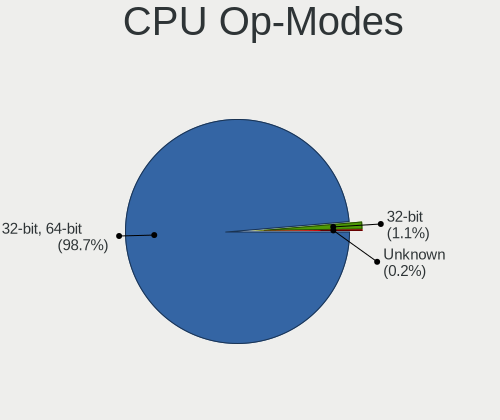
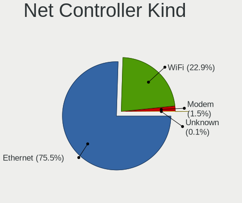
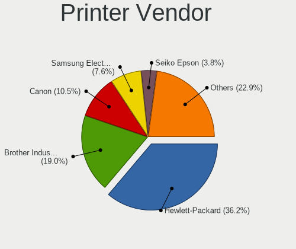
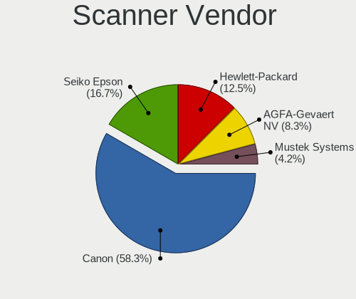

Debian 11 - Tested Hardware & Statistics (Desktops)
---------------------------------------------------

A project to collect tested hardware configurations for Debian 11 (Beta test).

Anyone can contribute to this report by the [hw-probe](https://github.com/linuxhw/hw-probe) tool:

    sudo -E hw-probe -all -upload

Please submit a probe of your configuration if it's not presented on the page or is rare.

Full-feature report is available here: https://linux-hardware.org/?view=trends&rel=debian-11

Contents
--------

* [ Test Cases ](#test-cases)

* [ System ](#system)
  - [ Kernel                   ](#kernel)
  - [ Kernel Family            ](#kernel-family)
  - [ Kernel Major Ver.        ](#kernel-major-ver)
  - [ Arch                     ](#arch)
  - [ DE                       ](#de)
  - [ Display Server           ](#display-server)
  - [ Display Manager          ](#display-manager)
  - [ OS Lang                  ](#os-lang)
  - [ Boot Mode                ](#boot-mode)
  - [ Filesystem               ](#filesystem)
  - [ Part. scheme             ](#part-scheme)
  - [ Dual Boot with Linux/BSD ](#dual-boot-with-linuxbsd)
  - [ Dual Boot (Win)          ](#dual-boot-win)

* [ Board ](#board)
  - [ Vendor                   ](#vendor)
  - [ Model                    ](#model)
  - [ Model Family             ](#model-family)
  - [ MFG Year                 ](#mfg-year)
  - [ Form Factor              ](#form-factor)
  - [ Secure Boot              ](#secure-boot)
  - [ Coreboot                 ](#coreboot)
  - [ RAM Size                 ](#ram-size)
  - [ RAM Used                 ](#ram-used)
  - [ Total Drives             ](#total-drives)
  - [ Has CD-ROM               ](#has-cd-rom)
  - [ Has Ethernet             ](#has-ethernet)
  - [ Has WiFi                 ](#has-wifi)
  - [ Has Bluetooth            ](#has-bluetooth)

* [ Location ](#location)
  - [ Country                  ](#country)
  - [ City                     ](#city)

* [ Drives ](#drives)
  - [ Drive Vendor             ](#drive-vendor)
  - [ Drive Model              ](#drive-model)
  - [ HDD Vendor               ](#hdd-vendor)
  - [ SSD Vendor               ](#ssd-vendor)
  - [ Drive Kind               ](#drive-kind)
  - [ Drive Connector          ](#drive-connector)
  - [ Drive Size               ](#drive-size)
  - [ Space Total              ](#space-total)
  - [ Space Used               ](#space-used)
  - [ Malfunc. Drives          ](#malfunc-drives)
  - [ Malfunc. Drive Vendor    ](#malfunc-drive-vendor)
  - [ Malfunc. HDD Vendor      ](#malfunc-hdd-vendor)
  - [ Malfunc. Drive Kind      ](#malfunc-drive-kind)
  - [ Failed Drives            ](#failed-drives)
  - [ Failed Drive Vendor      ](#failed-drive-vendor)
  - [ Drive Status             ](#drive-status)

* [ Storage controller ](#storage-controller)
  - [ Storage Vendor           ](#storage-vendor)
  - [ Storage Model            ](#storage-model)
  - [ Storage Kind             ](#storage-kind)

* [ Processor ](#processor)
  - [ CPU Vendor               ](#cpu-vendor)
  - [ CPU Model                ](#cpu-model)
  - [ CPU Model Family         ](#cpu-model-family)
  - [ CPU Cores                ](#cpu-cores)
  - [ CPU Sockets              ](#cpu-sockets)
  - [ CPU Threads              ](#cpu-threads)
  - [ CPU Op-Modes             ](#cpu-op-modes)
  - [ CPU Microcode            ](#cpu-microcode)
  - [ CPU Microarch            ](#cpu-microarch)

* [ Graphics ](#graphics)
  - [ GPU Vendor               ](#gpu-vendor)
  - [ GPU Model                ](#gpu-model)
  - [ GPU Combo                ](#gpu-combo)
  - [ GPU Driver               ](#gpu-driver)
  - [ GPU Memory               ](#gpu-memory)

* [ Monitor ](#monitor)
  - [ Monitor Vendor           ](#monitor-vendor)
  - [ Monitor Model            ](#monitor-model)
  - [ Monitor Resolution       ](#monitor-resolution)
  - [ Monitor Diagonal         ](#monitor-diagonal)
  - [ Monitor Width            ](#monitor-width)
  - [ Aspect Ratio             ](#aspect-ratio)
  - [ Monitor Area             ](#monitor-area)
  - [ Pixel Density            ](#pixel-density)
  - [ Multiple Monitors        ](#multiple-monitors)

* [ Network ](#network)
  - [ Net Controller Vendor    ](#net-controller-vendor)
  - [ Net Controller Model     ](#net-controller-model)
  - [ Wireless Vendor          ](#wireless-vendor)
  - [ Wireless Model           ](#wireless-model)
  - [ Ethernet Vendor          ](#ethernet-vendor)
  - [ Ethernet Model           ](#ethernet-model)
  - [ Net Controller Kind      ](#net-controller-kind)
  - [ Used Controller          ](#used-controller)
  - [ NICs                     ](#nics)
  - [ IPv6                     ](#ipv6)

* [ Bluetooth ](#bluetooth)
  - [ Bluetooth Vendor         ](#bluetooth-vendor)
  - [ Bluetooth Model          ](#bluetooth-model)

* [ Sound ](#sound)
  - [ Sound Vendor             ](#sound-vendor)
  - [ Sound Model              ](#sound-model)

* [ Memory ](#memory)
  - [ Memory Vendor            ](#memory-vendor)
  - [ Memory Model             ](#memory-model)
  - [ Memory Kind              ](#memory-kind)
  - [ Memory Form Factor       ](#memory-form-factor)
  - [ Memory Size              ](#memory-size)
  - [ Memory Speed             ](#memory-speed)

* [ Printers & scanners ](#printers--scanners)
  - [ Printer Vendor           ](#printer-vendor)
  - [ Printer Model            ](#printer-model)
  - [ Scanner Vendor           ](#scanner-vendor)
  - [ Scanner Model            ](#scanner-model)

* [ Camera ](#camera)
  - [ Camera Vendor            ](#camera-vendor)
  - [ Camera Model             ](#camera-model)

* [ Security ](#security)
  - [ Fingerprint Vendor       ](#fingerprint-vendor)
  - [ Fingerprint Model        ](#fingerprint-model)
  - [ Chipcard Vendor          ](#chipcard-vendor)
  - [ Chipcard Model           ](#chipcard-model)

* [ Unsupported ](#unsupported)
  - [ Unsupported Devices      ](#unsupported-devices)
  - [ Unsupported Device Types ](#unsupported-device-types)

Test Cases
----------

| Vendor     | Model                       | Probe                                                      | Date         |
|------------|-----------------------------|------------------------------------------------------------|--------------|
| ASUSTek    | ROG STRIX TRX40-XE GAMIN... | [a6e0859eac](https://linux-hardware.org/?probe=a6e0859eac) | Aug 14, 2021 |
| ASUSTek    | ROG STRIX TRX40-XE GAMIN... | [5ce5d800d3](https://linux-hardware.org/?probe=5ce5d800d3) | Aug 14, 2021 |
| ASUSTek    | PRIME Z390-P                | [dfe51161fe](https://linux-hardware.org/?probe=dfe51161fe) | Aug 14, 2021 |
| ASRock     | Z97 Pro3                    | [0e5746a060](https://linux-hardware.org/?probe=0e5746a060) | Aug 14, 2021 |
| Dell       | 0X9M3X A01                  | [b5b9c80c53](https://linux-hardware.org/?probe=b5b9c80c53) | Aug 14, 2021 |
| HP         | 3397                        | [a3425b956c](https://linux-hardware.org/?probe=a3425b956c) | Aug 14, 2021 |
| ASUSTek    | X99-DELUXE                  | [f59179a579](https://linux-hardware.org/?probe=f59179a579) | Aug 13, 2021 |
| ASUSTek    | Z170-PRO                    | [7f9b5606a5](https://linux-hardware.org/?probe=7f9b5606a5) | Aug 13, 2021 |
| HP         | 3048h                       | [894950911f](https://linux-hardware.org/?probe=894950911f) | Aug 11, 2021 |
| Gigabyte   | 970A-DS3P                   | [9b62457757](https://linux-hardware.org/?probe=9b62457757) | Aug 11, 2021 |
| ASUSTek    | PRIME A320M-K               | [40d1d24c90](https://linux-hardware.org/?probe=40d1d24c90) | Aug 11, 2021 |
| ASUSTek    | STRIX B250H GAMING          | [78223998b6](https://linux-hardware.org/?probe=78223998b6) | Aug 10, 2021 |
| MSI        | B250M PRO-VDH               | [d6be998202](https://linux-hardware.org/?probe=d6be998202) | Aug 10, 2021 |
| ASUSTek    | PRIME A320M-K               | [7cc269740d](https://linux-hardware.org/?probe=7cc269740d) | Aug 10, 2021 |
| Dell       | 04MFRM A01                  | [c0094def97](https://linux-hardware.org/?probe=c0094def97) | Aug 09, 2021 |
| MSI        | B450 TOMAHAWK               | [58b4f52cc0](https://linux-hardware.org/?probe=58b4f52cc0) | Aug 09, 2021 |
| Gigabyte   | H470M DS3H                  | [29de4693d8](https://linux-hardware.org/?probe=29de4693d8) | Aug 09, 2021 |
| ASRock     | 970A-G                      | [f1e9959894](https://linux-hardware.org/?probe=f1e9959894) | Aug 09, 2021 |
| Toshiba    | STI 910090 STIJ             | [389ebd7675](https://linux-hardware.org/?probe=389ebd7675) | Aug 08, 2021 |
| ASRock     | X370 Killer SLI             | [8a0885afb6](https://linux-hardware.org/?probe=8a0885afb6) | Aug 08, 2021 |
| MSI        | Z490-A PRO                  | [eac37d633f](https://linux-hardware.org/?probe=eac37d633f) | Aug 08, 2021 |
| ASRock     | Z97 Pro4                    | [090d12a96f](https://linux-hardware.org/?probe=090d12a96f) | Aug 08, 2021 |
| ASUSTek    | ROG STRIX B350-F GAMING     | [39eb5a1578](https://linux-hardware.org/?probe=39eb5a1578) | Aug 08, 2021 |
| Toshiba    | STI 005038 G31T-M7          | [faa8f15725](https://linux-hardware.org/?probe=faa8f15725) | Aug 08, 2021 |
| Gigabyte   | Z77-D3H                     | [9dafe47483](https://linux-hardware.org/?probe=9dafe47483) | Aug 07, 2021 |
| MSI        | X470 GAMING PLUS MAX        | [da833ac33e](https://linux-hardware.org/?probe=da833ac33e) | Aug 07, 2021 |
| ASUSTek    | TUF Z370-PLUS GAMING        | [80c7711147](https://linux-hardware.org/?probe=80c7711147) | Aug 07, 2021 |
| Gigabyte   | Z77-D3H                     | [4ff5966d22](https://linux-hardware.org/?probe=4ff5966d22) | Aug 07, 2021 |
| ASUSTek    | PRIME X470-PRO              | [5839492cd8](https://linux-hardware.org/?probe=5839492cd8) | Aug 07, 2021 |
| ASUSTek    | PRIME B460-PLUS             | [733a3e325c](https://linux-hardware.org/?probe=733a3e325c) | Aug 07, 2021 |
| Dell       | 08WKV3 A01                  | [8ab0ff9442](https://linux-hardware.org/?probe=8ab0ff9442) | Aug 07, 2021 |
| MSI        | MEG X399 CREATION           | [7cada9aaed](https://linux-hardware.org/?probe=7cada9aaed) | Aug 07, 2021 |
| MSI        | B250M PRO-VDH               | [187e4dd872](https://linux-hardware.org/?probe=187e4dd872) | Aug 07, 2021 |
| Gigabyte   | GA-78LMT-USB3               | [31d159af99](https://linux-hardware.org/?probe=31d159af99) | Aug 06, 2021 |
| Lenovo     | Board                       | [18138486db](https://linux-hardware.org/?probe=18138486db) | Aug 05, 2021 |
| Intel      | DN2820FYK H24582-201        | [7caf949908](https://linux-hardware.org/?probe=7caf949908) | Aug 05, 2021 |
| Unknown    | Intel X79                   | [fc0dedbb3c](https://linux-hardware.org/?probe=fc0dedbb3c) | Aug 05, 2021 |
| AMD        | 970A-D3                     | [91825066e0](https://linux-hardware.org/?probe=91825066e0) | Aug 04, 2021 |
| HP         | 3047h                       | [6294617672](https://linux-hardware.org/?probe=6294617672) | Aug 03, 2021 |
| ASRock     | FM2A68M-HD+                 | [a7bdbd8ebe](https://linux-hardware.org/?probe=a7bdbd8ebe) | Aug 03, 2021 |
| ASUSTek    | PRIME B450-PLUS             | [55cd593df1](https://linux-hardware.org/?probe=55cd593df1) | Aug 03, 2021 |
| Gigabyte   | X399 AORUS XTREME-CF        | [3a2fd430f6](https://linux-hardware.org/?probe=3a2fd430f6) | Aug 03, 2021 |
| MSI        | 760GM-P23                   | [93b6f212af](https://linux-hardware.org/?probe=93b6f212af) | Aug 02, 2021 |
| Supermicro | X11SSH-F                    | [641e4fd8ce](https://linux-hardware.org/?probe=641e4fd8ce) | Aug 02, 2021 |
| ASRock     | H310CM-DVS                  | [f84e5eba5a](https://linux-hardware.org/?probe=f84e5eba5a) | Aug 02, 2021 |
| ASUSTek    | M4A785TD-M EVO              | [e90a873ad0](https://linux-hardware.org/?probe=e90a873ad0) | Aug 02, 2021 |
| ASUSTek    | P5QL-E                      | [2894e88095](https://linux-hardware.org/?probe=2894e88095) | Aug 02, 2021 |
| ASUSTek    | A88X-PRO                    | [ed95430eec](https://linux-hardware.org/?probe=ed95430eec) | Aug 02, 2021 |
| HP         | 2187 A01                    | [16bfdd86e3](https://linux-hardware.org/?probe=16bfdd86e3) | Aug 02, 2021 |
| Gigabyte   | 970A-DS3P                   | [61886d812f](https://linux-hardware.org/?probe=61886d812f) | Aug 01, 2021 |
| ASRock     | J1900D2Y                    | [0dc4afc8c4](https://linux-hardware.org/?probe=0dc4afc8c4) | Aug 01, 2021 |
| ASRock     | N68C-S UCC                  | [3da0d57fd5](https://linux-hardware.org/?probe=3da0d57fd5) | Aug 01, 2021 |
| Dell       | 0WVYMC A00                  | [4d2aa42e3c](https://linux-hardware.org/?probe=4d2aa42e3c) | Jul 31, 2021 |
| ASUSTek    | Pro WS WRX80E-SAGE SE WI... | [159ff0ba7f](https://linux-hardware.org/?probe=159ff0ba7f) | Jul 31, 2021 |
| ASRock     | Z370M-ITX/ac                | [30511d93c4](https://linux-hardware.org/?probe=30511d93c4) | Jul 31, 2021 |
| ASUSTek    | Pro WS WRX80E-SAGE SE WI... | [3f0c3901f6](https://linux-hardware.org/?probe=3f0c3901f6) | Jul 30, 2021 |
| MSI        | Z490-A PRO                  | [b882a9cf0d](https://linux-hardware.org/?probe=b882a9cf0d) | Jul 29, 2021 |
| MSI        | Q45MDO                      | [ab547f0047](https://linux-hardware.org/?probe=ab547f0047) | Jul 29, 2021 |
| MSI        | Q45MDO                      | [6b5aaa6969](https://linux-hardware.org/?probe=6b5aaa6969) | Jul 29, 2021 |
| Dell       | 0TY915                      | [9cb5aed659](https://linux-hardware.org/?probe=9cb5aed659) | Jul 29, 2021 |
| Gigabyte   | B550M AORUS PRO-P           | [ed7394c65a](https://linux-hardware.org/?probe=ed7394c65a) | Jul 29, 2021 |
| ASUSTek    | LEONITE                     | [3bf9048839](https://linux-hardware.org/?probe=3bf9048839) | Jul 29, 2021 |
| Foxconn    | 2AA9                        | [920a813aaf](https://linux-hardware.org/?probe=920a813aaf) | Jul 29, 2021 |
| ASRock     | B85M Pro4                   | [32e615b538](https://linux-hardware.org/?probe=32e615b538) | Jul 29, 2021 |
| ASRock     | FM2A88X Extreme6+           | [f449b8ce85](https://linux-hardware.org/?probe=f449b8ce85) | Jul 29, 2021 |
| ECS        | H61H2-M12                   | [42050ab984](https://linux-hardware.org/?probe=42050ab984) | Jul 28, 2021 |
| MSI        | B450M PRO-VDH PLUS          | [cccaebb483](https://linux-hardware.org/?probe=cccaebb483) | Jul 28, 2021 |
| Gigabyte   | GA-990FX-GAMING             | [4206886abb](https://linux-hardware.org/?probe=4206886abb) | Jul 28, 2021 |
| Gigabyte   | GA-990FX-GAMING             | [d244dc6763](https://linux-hardware.org/?probe=d244dc6763) | Jul 28, 2021 |
| MSI        | MAG X570 TOMAHAWK WIFI      | [f96bcc3ab2](https://linux-hardware.org/?probe=f96bcc3ab2) | Jul 28, 2021 |
| Shuttle    | FX79R                       | [6ceba6fc67](https://linux-hardware.org/?probe=6ceba6fc67) | Jul 28, 2021 |
| ASUSTek    | PRIME X570-PRO              | [df0a4b1a0f](https://linux-hardware.org/?probe=df0a4b1a0f) | Jul 27, 2021 |
| ASRockRack | X570D4U-2L2T                | [7bb34c9dec](https://linux-hardware.org/?probe=7bb34c9dec) | Jul 27, 2021 |
| ASUSTek    | A88X-PLUS/USB               | [57b54cc925](https://linux-hardware.org/?probe=57b54cc925) | Jul 27, 2021 |
| ASRock     | N68C-GS FX                  | [660f13d25d](https://linux-hardware.org/?probe=660f13d25d) | Jul 27, 2021 |
| ASUSTek    | PRIME Z490-P                | [2e0f5417fc](https://linux-hardware.org/?probe=2e0f5417fc) | Jul 27, 2021 |
| Dell       | 0X8DXD A00                  | [7821dfc370](https://linux-hardware.org/?probe=7821dfc370) | Jul 27, 2021 |
| ASUSTek    | M4A785D-M PRO               | [467d107518](https://linux-hardware.org/?probe=467d107518) | Jul 27, 2021 |
| Foxconn    | 915MH Series                | [6a3ae85dfc](https://linux-hardware.org/?probe=6a3ae85dfc) | Jul 27, 2021 |
| ASUSTek    | PRIME H310M-R R2.0          | [dc4a709a3b](https://linux-hardware.org/?probe=dc4a709a3b) | Jul 27, 2021 |
| Dell       | 0WMJ54 A01                  | [b24fc8e5f2](https://linux-hardware.org/?probe=b24fc8e5f2) | Jul 27, 2021 |
| ASUSTek    | PRIME H310M-K R2.0          | [1e69873301](https://linux-hardware.org/?probe=1e69873301) | Jul 27, 2021 |
| Dell       | 0M863N A00                  | [e94bee6137](https://linux-hardware.org/?probe=e94bee6137) | Jul 27, 2021 |
| Gigabyte   | P35C-DS3R                   | [e8ffe8991b](https://linux-hardware.org/?probe=e8ffe8991b) | Jul 27, 2021 |
| MSI        | X399 GAMING PRO CARBON A... | [3c6898fcd8](https://linux-hardware.org/?probe=3c6898fcd8) | Jul 27, 2021 |
| MSI        | MEG X570 UNIFY              | [9d0528280a](https://linux-hardware.org/?probe=9d0528280a) | Jul 26, 2021 |
| ASRock     | Z97 Pro3                    | [8cd14c1874](https://linux-hardware.org/?probe=8cd14c1874) | Jul 26, 2021 |
| MSI        | Z370 SLI PLUS               | [04d84e38b8](https://linux-hardware.org/?probe=04d84e38b8) | Jul 26, 2021 |
| ASUSTek    | PRIME X370-PRO              | [eb6369aac9](https://linux-hardware.org/?probe=eb6369aac9) | Jul 26, 2021 |
| ASRock     | B450 Pro4                   | [0de4a63af4](https://linux-hardware.org/?probe=0de4a63af4) | Jul 26, 2021 |
| HP         | 2B38                        | [be24f3f652](https://linux-hardware.org/?probe=be24f3f652) | Jul 26, 2021 |
| HP         | 2B38                        | [c1198b90f6](https://linux-hardware.org/?probe=c1198b90f6) | Jul 26, 2021 |
| ASRock     | 970 Pro3 R2.0               | [9fd8d25e24](https://linux-hardware.org/?probe=9fd8d25e24) | Jul 26, 2021 |
| ASUSTek    | PRIME B550-PLUS             | [8b0f398a93](https://linux-hardware.org/?probe=8b0f398a93) | Jul 26, 2021 |
| ASUSTek    | PRIME B550-PLUS             | [cd62d88495](https://linux-hardware.org/?probe=cd62d88495) | Jul 26, 2021 |
| ASRock     | X570 Steel Legend           | [b040663b7c](https://linux-hardware.org/?probe=b040663b7c) | Jul 26, 2021 |
| ASUSTek    | PRIME B350-PLUS             | [36caa67715](https://linux-hardware.org/?probe=36caa67715) | Jul 26, 2021 |
| Gigabyte   | AB350-Gaming 3-CF           | [e9ddc17233](https://linux-hardware.org/?probe=e9ddc17233) | Jul 26, 2021 |
| Gigabyte   | AB350-Gaming 3-CF           | [6623f96b90](https://linux-hardware.org/?probe=6623f96b90) | Jul 26, 2021 |
| ASUSTek    | M5A78L-M LX3                | [2c05790c36](https://linux-hardware.org/?probe=2c05790c36) | Jul 26, 2021 |
| Gigabyte   | B450M DS3H-CF               | [64b4d84778](https://linux-hardware.org/?probe=64b4d84778) | Jul 26, 2021 |
| ASUSTek    | B85-PRO GAMER               | [fffec5c87f](https://linux-hardware.org/?probe=fffec5c87f) | Jul 26, 2021 |
| ASUSTek    | M5A78L-M LX3                | [0b35b55294](https://linux-hardware.org/?probe=0b35b55294) | Jul 26, 2021 |
| Dell       | 0D28YY A02                  | [71b0f194a3](https://linux-hardware.org/?probe=71b0f194a3) | Jul 26, 2021 |
| ASRock     | H470M-ITX/ac                | [8a3b6cb663](https://linux-hardware.org/?probe=8a3b6cb663) | Jul 26, 2021 |
| ASUSTek    | M5A78L-M LX3                | [fcd103f100](https://linux-hardware.org/?probe=fcd103f100) | Jul 26, 2021 |
| ASUSTek    | PRIME B450M-A               | [00d53058e7](https://linux-hardware.org/?probe=00d53058e7) | Jul 26, 2021 |
| MSI        | B450 TOMAHAWK MAX II        | [d09fdc110f](https://linux-hardware.org/?probe=d09fdc110f) | Jul 25, 2021 |
| Gigabyte   | H110M-S2H-CF                | [11c5d6c6d0](https://linux-hardware.org/?probe=11c5d6c6d0) | Jul 25, 2021 |
| Dell       | 0PTTT9 A00                  | [113235448d](https://linux-hardware.org/?probe=113235448d) | Jul 25, 2021 |
| Dell       | 0X8DXD A00                  | [54b46bdd5d](https://linux-hardware.org/?probe=54b46bdd5d) | Jul 25, 2021 |
| ASUSTek    | PRIME H270M-PLUS            | [21b43b8718](https://linux-hardware.org/?probe=21b43b8718) | Jul 25, 2021 |
| Gigabyte   | Z170M-D3H-CF                | [9301420a7b](https://linux-hardware.org/?probe=9301420a7b) | Jul 25, 2021 |
| ASRock     | P67 Pro3                    | [ce711e5011](https://linux-hardware.org/?probe=ce711e5011) | Jul 25, 2021 |
| Supermicro | A1SA2-2750FA                | [de408d6408](https://linux-hardware.org/?probe=de408d6408) | Jul 25, 2021 |
| Gigabyte   | H87-HD3                     | [a102014ef0](https://linux-hardware.org/?probe=a102014ef0) | Jul 25, 2021 |
| ASUSTek    | ROG STRIX B450-I GAMING     | [dcff1a4a95](https://linux-hardware.org/?probe=dcff1a4a95) | Jul 25, 2021 |
| Gigabyte   | AB350M-DS3H V2-CF           | [8b1c4f962a](https://linux-hardware.org/?probe=8b1c4f962a) | Jul 25, 2021 |
| Dell       | 0Y1057                      | [ac342b01e2](https://linux-hardware.org/?probe=ac342b01e2) | Jul 25, 2021 |
| HP         | ProLiant MicroServer Gen... | [2bcfda70b5](https://linux-hardware.org/?probe=2bcfda70b5) | Jul 25, 2021 |
| ASRock     | B450M Pro4                  | [514f64cef0](https://linux-hardware.org/?probe=514f64cef0) | Jul 25, 2021 |
| ASRock     | Z97 Extreme6                | [84730f7819](https://linux-hardware.org/?probe=84730f7819) | Jul 25, 2021 |
| Lenovo     | 3098 0B98401 PRO            | [a5bb2fb53c](https://linux-hardware.org/?probe=a5bb2fb53c) | Jul 25, 2021 |
| HP         | 1495                        | [5d01240605](https://linux-hardware.org/?probe=5d01240605) | Jul 25, 2021 |
| HP         | 158A                        | [219b010ebb](https://linux-hardware.org/?probe=219b010ebb) | Jul 25, 2021 |
| HP         | 158A                        | [da4016cb27](https://linux-hardware.org/?probe=da4016cb27) | Jul 25, 2021 |
| ASUSTek    | H110M-A/M.2                 | [a98eb4deab](https://linux-hardware.org/?probe=a98eb4deab) | Jul 25, 2021 |
| Gigabyte   | H110N-CF                    | [2a85c9961c](https://linux-hardware.org/?probe=2a85c9961c) | Jul 25, 2021 |
| MSI        | MAG B550M MORTAR            | [b5e7cb3f3d](https://linux-hardware.org/?probe=b5e7cb3f3d) | Jul 25, 2021 |
| Dell       | 0X8DXD A00                  | [dd60e87813](https://linux-hardware.org/?probe=dd60e87813) | Jul 25, 2021 |
| HP         | 2129                        | [8de5bae655](https://linux-hardware.org/?probe=8de5bae655) | Jul 25, 2021 |
| Intel      | DP55WG AAE57269-407         | [fa1be73a3f](https://linux-hardware.org/?probe=fa1be73a3f) | Jul 25, 2021 |
| ASRock     | B85 Anniversary             | [b9bdc402ce](https://linux-hardware.org/?probe=b9bdc402ce) | Jul 25, 2021 |
| Gigabyte   | B550I AORUS PRO AX          | [db0c50510b](https://linux-hardware.org/?probe=db0c50510b) | Jul 25, 2021 |
| Gigabyte   | B550I AORUS PRO AX          | [c873d77069](https://linux-hardware.org/?probe=c873d77069) | Jul 25, 2021 |
| Gigabyte   | Z97X-UD3H-CF                | [6630c7ef27](https://linux-hardware.org/?probe=6630c7ef27) | Jul 25, 2021 |
| ASUSTek    | PRIME B250M-A               | [b0f56654dc](https://linux-hardware.org/?probe=b0f56654dc) | Jul 25, 2021 |
| ASRock     | B450M Pro4                  | [cd13d1596f](https://linux-hardware.org/?probe=cd13d1596f) | Jul 25, 2021 |
| ASRock     | B450M Pro4                  | [beec8a1c7d](https://linux-hardware.org/?probe=beec8a1c7d) | Jul 25, 2021 |
| Gigabyte   | H61MS                       | [742ede3c3e](https://linux-hardware.org/?probe=742ede3c3e) | Jul 25, 2021 |
| Gigabyte   | H81M-S2H GSM                | [f49c35b208](https://linux-hardware.org/?probe=f49c35b208) | Jul 25, 2021 |
| Dell       | 09KPNV A01                  | [fb6ec7188c](https://linux-hardware.org/?probe=fb6ec7188c) | Jul 25, 2021 |
| ASUSTek    | PRIME A320I-K               | [fca7acc5ee](https://linux-hardware.org/?probe=fca7acc5ee) | Jul 25, 2021 |
| ASUSTek    | H61M-K                      | [1cf0bdeec4](https://linux-hardware.org/?probe=1cf0bdeec4) | Jul 25, 2021 |
| Dell       | 0NK5PH A00                  | [d6444ebf26](https://linux-hardware.org/?probe=d6444ebf26) | Jul 25, 2021 |
| Gigabyte   | Z77-D3H                     | [522d784ace](https://linux-hardware.org/?probe=522d784ace) | Jul 25, 2021 |
| Intel      | DP55WB AAE64798-206         | [9c9e82f80f](https://linux-hardware.org/?probe=9c9e82f80f) | Jul 25, 2021 |
| Protectli  | FW6                         | [0efef10e76](https://linux-hardware.org/?probe=0efef10e76) | Jul 25, 2021 |
| ASUSTek    | ROG STRIX Z390-F GAMING     | [dd3347639f](https://linux-hardware.org/?probe=dd3347639f) | Jul 25, 2021 |
| Gigabyte   | X570 I AORUS PRO WIFI       | [f7c4474b4d](https://linux-hardware.org/?probe=f7c4474b4d) | Jul 25, 2021 |
| ASUSTek    | Z170-DELUXE                 | [df5c29f984](https://linux-hardware.org/?probe=df5c29f984) | Jul 25, 2021 |
| Gigabyte   | 970A-D3P                    | [c564faffdb](https://linux-hardware.org/?probe=c564faffdb) | Jul 25, 2021 |
| Dell       | 0D441T A03                  | [41283af596](https://linux-hardware.org/?probe=41283af596) | Jul 25, 2021 |
| MSI        | H110I PRO AC                | [08094a9121](https://linux-hardware.org/?probe=08094a9121) | Jul 25, 2021 |
| ASUSTek    | PRIME Z370-A                | [c7cf1f5978](https://linux-hardware.org/?probe=c7cf1f5978) | Jul 25, 2021 |
| ASUSTek    | H87-PRO                     | [293b556234](https://linux-hardware.org/?probe=293b556234) | Jul 25, 2021 |
| MSI        | Z77MA-G45                   | [bbc6d96681](https://linux-hardware.org/?probe=bbc6d96681) | Jul 25, 2021 |
| ASRock     | FM2A68M-DG3+                | [884f8f2850](https://linux-hardware.org/?probe=884f8f2850) | Jul 25, 2021 |
| ASUSTek    | ROG STRIX B450-F GAMING     | [1e8f9a7189](https://linux-hardware.org/?probe=1e8f9a7189) | Jul 24, 2021 |
| Gigabyte   | B560M D3H                   | [1456f9bf8e](https://linux-hardware.org/?probe=1456f9bf8e) | Jul 23, 2021 |
| ASUSTek    | ROG STRIX Z370-H GAMING     | [8af9716200](https://linux-hardware.org/?probe=8af9716200) | Jul 19, 2021 |
| ASUSTek    | P8Z68-V                     | [1a60e02aa9](https://linux-hardware.org/?probe=1a60e02aa9) | Jul 19, 2021 |
| HP         | ProLiant MicroServer        | [ca7c4b4967](https://linux-hardware.org/?probe=ca7c4b4967) | Jul 16, 2021 |
| MSI        | A68HM-E33 V2                | [983bc90bc7](https://linux-hardware.org/?probe=983bc90bc7) | Jul 14, 2021 |
| Huanan     | X99-F8 V2.0                 | [776f848ccd](https://linux-hardware.org/?probe=776f848ccd) | Jul 09, 2021 |
| Dell       | 0M863N A00                  | [574671bbb9](https://linux-hardware.org/?probe=574671bbb9) | Jul 09, 2021 |
| MSI        | MPG B550 GAMING PLUS        | [c79b71d033](https://linux-hardware.org/?probe=c79b71d033) | Jul 08, 2021 |
| ASUSTek    | H81M-E                      | [02c3ce63e7](https://linux-hardware.org/?probe=02c3ce63e7) | Jul 08, 2021 |
| HP         | 2215                        | [b0b56138b2](https://linux-hardware.org/?probe=b0b56138b2) | Jul 08, 2021 |
| HP         | 2215                        | [cdf48de6b2](https://linux-hardware.org/?probe=cdf48de6b2) | Jul 07, 2021 |
| MSI        | MS-6712                     | [ced0409e55](https://linux-hardware.org/?probe=ced0409e55) | Jul 04, 2021 |
| ASRock     | H77 Pro4-M                  | [8ba58cff9a](https://linux-hardware.org/?probe=8ba58cff9a) | Jul 02, 2021 |
| Gigabyte   | B550I AORUS PRO AX          | [cb62272a68](https://linux-hardware.org/?probe=cb62272a68) | Jul 02, 2021 |
| Gigabyte   | AX370-Gaming K7             | [e325df530d](https://linux-hardware.org/?probe=e325df530d) | Jun 30, 2021 |
| MSI        | B85M-G43                    | [4598afdf7e](https://linux-hardware.org/?probe=4598afdf7e) | Jun 29, 2021 |
| Huanan     | X99-8M-F V1.1               | [8ecfcffbaf](https://linux-hardware.org/?probe=8ecfcffbaf) | Jun 27, 2021 |
| ASRock     | FM2A68M-HD+                 | [f435417b41](https://linux-hardware.org/?probe=f435417b41) | Jun 26, 2021 |
| Gigabyte   | Z370 AORUS Gaming 5-CF      | [807a4ba37d](https://linux-hardware.org/?probe=807a4ba37d) | Jun 23, 2021 |
| Gigabyte   | Z370 AORUS Gaming 5-CF      | [bc7246038e](https://linux-hardware.org/?probe=bc7246038e) | Jun 23, 2021 |
| ASRock     | B550 Pro4                   | [ef1b7bfb77](https://linux-hardware.org/?probe=ef1b7bfb77) | Jun 23, 2021 |
| ASRock     | X399 Taichi                 | [a664e4cf99](https://linux-hardware.org/?probe=a664e4cf99) | Jun 23, 2021 |
| HARDKERNEL | ODROID-H2                   | [c9fed56a36](https://linux-hardware.org/?probe=c9fed56a36) | Jun 23, 2021 |
| ASUSTek    | ROG STRIX B450-F GAMING ... | [b3a5333d2a](https://linux-hardware.org/?probe=b3a5333d2a) | Jun 21, 2021 |
| Gigabyte   | AB350M-Gaming 3-CF          | [08fc06c75e](https://linux-hardware.org/?probe=08fc06c75e) | Jun 20, 2021 |
| MSI        | B450M MORTAR MAX            | [33ffb80782](https://linux-hardware.org/?probe=33ffb80782) | Jun 19, 2021 |
| ASUSTek    | ROG STRIX B450-F GAMING ... | [9e3e72ec72](https://linux-hardware.org/?probe=9e3e72ec72) | Jun 17, 2021 |
| ASUSTek    | PRIME B450M-A               | [0ccc446224](https://linux-hardware.org/?probe=0ccc446224) | Jun 14, 2021 |
| Gigabyte   | MCMLUAB-00                  | [99780e8ba8](https://linux-hardware.org/?probe=99780e8ba8) | Jun 13, 2021 |
| ASUSTek    | PRIME A320M-K               | [f2770a810e](https://linux-hardware.org/?probe=f2770a810e) | Jun 12, 2021 |
| Dell       | 0Y7WYT A00                  | [8e424773e5](https://linux-hardware.org/?probe=8e424773e5) | Jun 10, 2021 |
| ASUSTek    | Z97-AR                      | [709a74c713](https://linux-hardware.org/?probe=709a74c713) | Jun 09, 2021 |
| ASRock     | B450M Pro4                  | [ee4dfdfde3](https://linux-hardware.org/?probe=ee4dfdfde3) | Jun 08, 2021 |
| ASUSTek    | PRIME A320M-K               | [69dd9fbe20](https://linux-hardware.org/?probe=69dd9fbe20) | Jun 07, 2021 |
| ASRock     | B450M Pro4                  | [0fd993c4dd](https://linux-hardware.org/?probe=0fd993c4dd) | Jun 05, 2021 |
| ASUSTek    | M4A88T-M/USB3               | [7483847993](https://linux-hardware.org/?probe=7483847993) | Jun 03, 2021 |
| Dell       | 0YXT71 A02                  | [a45729e01a](https://linux-hardware.org/?probe=a45729e01a) | Jun 01, 2021 |
| ASUSTek    | PRIME B550-PLUS             | [21574f62a5](https://linux-hardware.org/?probe=21574f62a5) | Jun 01, 2021 |
| ASUSTek    | P5B-Deluxe                  | [926229be87](https://linux-hardware.org/?probe=926229be87) | May 31, 2021 |
| Gigabyte   | B450 AORUS PRO WIFI-CF      | [24d2e85009](https://linux-hardware.org/?probe=24d2e85009) | May 29, 2021 |
| MSI        | B250M BAZOOKA               | [fb2eef67f2](https://linux-hardware.org/?probe=fb2eef67f2) | May 26, 2021 |
| MSI        | B450I GAMING PLUS AC        | [2c698534c6](https://linux-hardware.org/?probe=2c698534c6) | May 23, 2021 |
| Gigabyte   | AB350M-D3H-CF               | [1ad175fddc](https://linux-hardware.org/?probe=1ad175fddc) | May 23, 2021 |
| Gigabyte   | Z170X-GamingG1              | [361469c7d5](https://linux-hardware.org/?probe=361469c7d5) | May 18, 2021 |
| Gigabyte   | Z77-D3H                     | [71f4ed3e35](https://linux-hardware.org/?probe=71f4ed3e35) | May 11, 2021 |
| Lenovo     | MAHOBAY                     | [c0b8e99e35](https://linux-hardware.org/?probe=c0b8e99e35) | May 06, 2021 |
| Biostar    | B450MH                      | [f0a1151d81](https://linux-hardware.org/?probe=f0a1151d81) | Apr 27, 2021 |
| Gigabyte   | EG41MF-US2H                 | [a2aa6eaec8](https://linux-hardware.org/?probe=a2aa6eaec8) | Apr 16, 2021 |

System
------

Kernel
------

Version of the Linux kernel

| Version                        | Desktops | Percent |
|--------------------------------|----------|---------|
| 5.10.0-8-amd64                 | 110      | 59.46%  |
| 5.10.0-7-amd64                 | 44       | 23.78%  |
| 5.10.0-6-amd64                 | 9        | 4.86%   |
| 5.11.22-1-pve                  | 3        | 1.62%   |
| 5.10.0-8-rt-amd64              | 2        | 1.08%   |
| 5.10.0-8-686-pae               | 2        | 1.08%   |
| 5.8.0-3-amd64                  | 1        | 0.54%   |
| 5.13.8-gnu                     | 1        | 0.54%   |
| 5.13.4                         | 1        | 0.54%   |
| 5.13.1a                        | 1        | 0.54%   |
| 5.13.0-rc7-00024-g0418ae8de752 | 1        | 0.54%   |
| 5.11.22-2-pve                  | 1        | 0.54%   |
| 5.11.0-21.1-liquorix-amd64     | 1        | 0.54%   |
| 5.11.0-16.1-liquorix-amd64     | 1        | 0.54%   |
| 5.10.46custom                  | 1        | 0.54%   |
| 5.10.42+truenas                | 1        | 0.54%   |
| 5.10.38-falcot                 | 1        | 0.54%   |
| 5.10.0-8-686                   | 1        | 0.54%   |
| 5.10.0-7-686-pae               | 1        | 0.54%   |
| 5.10.0-3-amd64                 | 1        | 0.54%   |
| 5.10.0-2-amd64                 | 1        | 0.54%   |

Kernel Family
-------------

Linux kernel without a distro release

| Version | Desktops | Percent |
|---------|----------|---------|
| 5.10.0  | 168      | 92.31%  |
| 5.11.22 | 4        | 2.2%    |
| 5.11.0  | 2        | 1.1%    |
| 5.8.0   | 1        | 0.55%   |
| 5.13.8  | 1        | 0.55%   |
| 5.13.4  | 1        | 0.55%   |
| 5.13.1  | 1        | 0.55%   |
| 5.13.0  | 1        | 0.55%   |
| 5.10.46 | 1        | 0.55%   |
| 5.10.42 | 1        | 0.55%   |
| 5.10.38 | 1        | 0.55%   |

Kernel Major Ver.
-----------------

Linux kernel major version

| Version | Desktops | Percent |
|---------|----------|---------|
| 5.10    | 171      | 93.96%  |
| 5.11    | 6        | 3.3%    |
| 5.13    | 4        | 2.2%    |
| 5.8     | 1        | 0.55%   |

Arch
----

OS architecture (x86_64, i586, etc.)

| Name   | Desktops | Percent |
|--------|----------|---------|
| x86_64 | 178      | 97.8%   |
| i686   | 4        | 2.2%    |

DE
--

Desktop Environment

| Name             | Desktops | Percent |
|------------------|----------|---------|
| KDE5             | 39       | 21.31%  |
| GNOME            | 35       | 19.13%  |
| Unknown          | 27       | 14.75%  |
| XFCE             | 20       | 10.93%  |
| MATE             | 16       | 8.74%   |
| Cinnamon         | 11       | 6.01%   |
| LXQt             | 6        | 3.28%   |
| Trinity          | 5        | 2.73%   |
| LXDE             | 5        | 2.73%   |
| i3               | 5        | 2.73%   |
| KDE              | 4        | 2.19%   |
| X-Cinnamon       | 3        | 1.64%   |
| lightdm-xsession | 2        | 1.09%   |
| GNOME Flashback  | 2        | 1.09%   |
| sway             | 1        | 0.55%   |
| GNUstep          | 1        | 0.55%   |
| Budgie           | 1        | 0.55%   |

Display Server
--------------

X11 or Wayland

| Name    | Desktops | Percent |
|---------|----------|---------|
| X11     | 129      | 70.88%  |
| Tty     | 22       | 12.09%  |
| Wayland | 20       | 10.99%  |
| Unknown | 11       | 6.04%   |

Display Manager
---------------

SDDM, LightDM, etc.

| Name    | Desktops | Percent |
|---------|----------|---------|
| TDM     | 63       | 34.43%  |
| Unknown | 39       | 21.31%  |
| SDDM    | 38       | 20.77%  |
| GDM     | 33       | 18.03%  |
| LightDM | 6        | 3.28%   |
| SLiM    | 3        | 1.64%   |
| XDM     | 1        | 0.55%   |

OS Lang
-------

Language

| Lang    | Desktops | Percent |
|---------|----------|---------|
| en_US   | 83       | 45.6%   |
| ru_RU   | 15       | 8.24%   |
| en_GB   | 14       | 7.69%   |
| fr_FR   | 10       | 5.49%   |
| de_DE   | 8        | 4.4%    |
| Unknown | 8        | 4.4%    |
| pt_BR   | 5        | 2.75%   |
| es_ES   | 5        | 2.75%   |
| C       | 4        | 2.2%    |
| pl_PL   | 3        | 1.65%   |
| en_CA   | 3        | 1.65%   |
| en_AU   | 3        | 1.65%   |
| nl_BE   | 2        | 1.1%    |
| uk_UA   | 1        | 0.55%   |
| sv_SE   | 1        | 0.55%   |
| sr_RS   | 1        | 0.55%   |
| ru_UA   | 1        | 0.55%   |
| ro_RO   | 1        | 0.55%   |
| nl_NL   | 1        | 0.55%   |
| it_IT   | 1        | 0.55%   |
| hu_HU   | 1        | 0.55%   |
| hr_HR   | 1        | 0.55%   |
| es_VE   | 1        | 0.55%   |
| es_US   | 1        | 0.55%   |
| es_AR   | 1        | 0.55%   |
| en_PH   | 1        | 0.55%   |
| en_NZ   | 1        | 0.55%   |
| en_IN   | 1        | 0.55%   |
| en_IE   | 1        | 0.55%   |
| en_HK   | 1        | 0.55%   |
| de_CH   | 1        | 0.55%   |
| cs_CZ   | 1        | 0.55%   |

Boot Mode
---------

EFI or BIOS

| Mode | Desktops | Percent |
|------|----------|---------|
| EFI  | 93       | 50.82%  |
| BIOS | 90       | 49.18%  |

Filesystem
----------

Type of filesystem

| Type    | Desktops | Percent |
|---------|----------|---------|
| Ext4    | 134      | 73.63%  |
| Overlay | 20       | 10.99%  |
| Btrfs   | 16       | 8.79%   |
| Ext3    | 5        | 2.75%   |
| Zfs     | 4        | 2.2%    |
| Xfs     | 2        | 1.1%    |
| Unknown | 1        | 0.55%   |

Part. scheme
------------

Scheme of partitioning

| Type    | Desktops | Percent |
|---------|----------|---------|
| GPT     | 119      | 65.03%  |
| MBR     | 48       | 26.23%  |
| Unknown | 16       | 8.74%   |

Dual Boot with Linux/BSD
------------------------

Hosting more than one Linux/BSD

| Dual boot | Desktops | Percent |
|-----------|----------|---------|
| No        | 132      | 72.53%  |
| Yes       | 50       | 27.47%  |

Dual Boot (Win)
---------------

Hosting Linux and Windows

| Dual boot | Desktops | Percent |
|-----------|----------|---------|
| No        | 132      | 72.13%  |
| Yes       | 51       | 27.87%  |

Board
-----

Vendor
------

Motherboard manufacturer

| Name                | Desktops | Percent |
|---------------------|----------|---------|
| ASUSTek Computer    | 48       | 26.37%  |
| Gigabyte Technology | 36       | 19.78%  |
| ASRock              | 26       | 14.29%  |
| MSI                 | 22       | 12.09%  |
| Dell                | 17       | 9.34%   |
| Hewlett-Packard     | 12       | 6.59%   |
| Lenovo              | 3        | 1.65%   |
| Intel               | 3        | 1.65%   |
| Supermicro          | 2        | 1.1%    |
| Semp Toshiba        | 2        | 1.1%    |
| Huanan              | 2        | 1.1%    |
| Foxconn             | 2        | 1.1%    |
| Shuttle             | 1        | 0.55%   |
| Protectli           | 1        | 0.55%   |
| HARDKERNEL          | 1        | 0.55%   |
| ECS                 | 1        | 0.55%   |
| Biostar             | 1        | 0.55%   |
| ASRockRack          | 1        | 0.55%   |
| Unknown             | 1        | 0.55%   |

Model
-----

Motherboard model

| Name                              | Desktops | Percent |
|-----------------------------------|----------|---------|
| ASUS All Series                   | 5        | 2.75%   |
| Gigabyte Z77-D3H                  | 3        | 1.65%   |
| Gigabyte B550I AORUS PRO AX       | 3        | 1.65%   |
| ASRock B450M Pro4                 | 3        | 1.65%   |
| Semp Toshiba STI                  | 2        | 1.1%    |
| MSI MS-7A70                       | 2        | 1.1%    |
| HP Z620 Workstation               | 2        | 1.1%    |
| Gigabyte Z370 AORUS Gaming 5      | 2        | 1.1%    |
| Gigabyte 970A-DS3P                | 2        | 1.1%    |
| Dell OptiPlex 760                 | 2        | 1.1%    |
| ASUS PRIME B550-PLUS              | 2        | 1.1%    |
| ASUS PRIME B450M-A                | 2        | 1.1%    |
| ASUS PRIME A320M-K                | 2        | 1.1%    |
| Supermicro SYS-5038MA-H24TRF      | 1        | 0.55%   |
| Supermicro SYS-5019S-MR           | 1        | 0.55%   |
| Shuttle SX79R                     | 1        | 0.55%   |
| Protectli FW6                     | 1        | 0.55%   |
| MSI MS-7C94                       | 1        | 0.55%   |
| MSI MS-7C84                       | 1        | 0.55%   |
| MSI MS-7C75                       | 1        | 0.55%   |
| MSI MS-7C56                       | 1        | 0.55%   |
| MSI MS-7C35                       | 1        | 0.55%   |
| MSI MS-7C02                       | 1        | 0.55%   |
| MSI MS-7B92                       | 1        | 0.55%   |
| MSI MS-7B89                       | 1        | 0.55%   |
| MSI MS-7B79                       | 1        | 0.55%   |
| MSI MS-7B46                       | 1        | 0.55%   |
| MSI MS-7B09                       | 1        | 0.55%   |
| MSI MS-7A40                       | 1        | 0.55%   |
| MSI MS-7A38                       | 1        | 0.55%   |
| MSI MS-7995                       | 1        | 0.55%   |
| MSI MS-7823                       | 1        | 0.55%   |
| MSI MS-7759                       | 1        | 0.55%   |
| MSI MS-7721                       | 1        | 0.55%   |
| MSI MS-7641                       | 1        | 0.55%   |
| MSI MS-7562                       | 1        | 0.55%   |
| MSI MS-6712                       | 1        | 0.55%   |
| Lenovo ThinkCentre M92p 3209EK4   | 1        | 0.55%   |
| Lenovo ThinkCentre M73 10B00005US | 1        | 0.55%   |
| Lenovo ThinkCentre M55p 8808D8U   | 1        | 0.55%   |
| Intel DP55WG AAE57269-407         | 1        | 0.55%   |
| Intel DP55WB AAE64798-206         | 1        | 0.55%   |
| Intel DN2820FYK H24582-201        | 1        | 0.55%   |
| Huanan X99-F8                     | 1        | 0.55%   |
| Huanan X99-8M-F V1.1              | 1        | 0.55%   |
| HP Z840 Workstation               | 1        | 0.55%   |
| HP t620 Dual Core TC              | 1        | 0.55%   |
| HP ProLiant MicroServer Gen8      | 1        | 0.55%   |
| HP ProLiant MicroServer           | 1        | 0.55%   |
| HP EliteDesk 705 G1 SFF           | 1        | 0.55%   |
| HP Compaq Elite 8300 SFF          | 1        | 0.55%   |
| HP Compaq 8200 Elite SFF PC       | 1        | 0.55%   |
| HP Compaq 6005 Pro MT PC          | 1        | 0.55%   |
| HP Compaq 6000 Pro SFF PC         | 1        | 0.55%   |
| HP 200-010hk                      | 1        | 0.55%   |
| HARDKERNEL ODROID-H2              | 1        | 0.55%   |
| Gigabyte Z97X-UD3H                | 1        | 0.55%   |
| Gigabyte Z170X-GamingG1           | 1        | 0.55%   |
| Gigabyte Z170M-D3H                | 1        | 0.55%   |
| Gigabyte X570 I AORUS PRO WIFI    | 1        | 0.55%   |

Model Family
------------

Motherboard model prefix

| Name                         | Desktops | Percent |
|------------------------------|----------|---------|
| ASUS PRIME                   | 18       | 9.89%   |
| Dell OptiPlex                | 11       | 6.04%   |
| ASUS ROG                     | 7        | 3.85%   |
| Dell Precision               | 5        | 2.75%   |
| ASUS All                     | 5        | 2.75%   |
| HP Compaq                    | 4        | 2.2%    |
| Lenovo ThinkCentre           | 3        | 1.65%   |
| Gigabyte Z77-D3H             | 3        | 1.65%   |
| Gigabyte B550I               | 3        | 1.65%   |
| ASRock Z97                   | 3        | 1.65%   |
| ASRock B450M                 | 3        | 1.65%   |
| Semp Toshiba STI             | 2        | 1.1%    |
| MSI MS-7A70                  | 2        | 1.1%    |
| HP Z620                      | 2        | 1.1%    |
| HP ProLiant                  | 2        | 1.1%    |
| Gigabyte Z370                | 2        | 1.1%    |
| Gigabyte 970A-DS3P           | 2        | 1.1%    |
| Supermicro SYS-5038MA-H24TRF | 1        | 0.55%   |
| Supermicro SYS-5019S-MR      | 1        | 0.55%   |
| Shuttle SX79R                | 1        | 0.55%   |
| Protectli FW6                | 1        | 0.55%   |
| MSI MS-7C94                  | 1        | 0.55%   |
| MSI MS-7C84                  | 1        | 0.55%   |
| MSI MS-7C75                  | 1        | 0.55%   |
| MSI MS-7C56                  | 1        | 0.55%   |
| MSI MS-7C35                  | 1        | 0.55%   |
| MSI MS-7C02                  | 1        | 0.55%   |
| MSI MS-7B92                  | 1        | 0.55%   |
| MSI MS-7B89                  | 1        | 0.55%   |
| MSI MS-7B79                  | 1        | 0.55%   |
| MSI MS-7B46                  | 1        | 0.55%   |
| MSI MS-7B09                  | 1        | 0.55%   |
| MSI MS-7A40                  | 1        | 0.55%   |
| MSI MS-7A38                  | 1        | 0.55%   |
| MSI MS-7995                  | 1        | 0.55%   |
| MSI MS-7823                  | 1        | 0.55%   |
| MSI MS-7759                  | 1        | 0.55%   |
| MSI MS-7721                  | 1        | 0.55%   |
| MSI MS-7641                  | 1        | 0.55%   |
| MSI MS-7562                  | 1        | 0.55%   |
| MSI MS-6712                  | 1        | 0.55%   |
| Intel DP55WG                 | 1        | 0.55%   |
| Intel DP55WB                 | 1        | 0.55%   |
| Intel DN2820FYK              | 1        | 0.55%   |
| Huanan X99-F8                | 1        | 0.55%   |
| Huanan X99-8M-F              | 1        | 0.55%   |
| HP Z840                      | 1        | 0.55%   |
| HP t620                      | 1        | 0.55%   |
| HP EliteDesk                 | 1        | 0.55%   |
| HP 200-010hk                 | 1        | 0.55%   |
| HARDKERNEL ODROID-H2         | 1        | 0.55%   |
| Gigabyte Z97X-UD3H           | 1        | 0.55%   |
| Gigabyte Z170X-GamingG1      | 1        | 0.55%   |
| Gigabyte Z170M-D3H           | 1        | 0.55%   |
| Gigabyte X570                | 1        | 0.55%   |
| Gigabyte X399                | 1        | 0.55%   |
| Gigabyte P35C-DS3R           | 1        | 0.55%   |
| Gigabyte H87-HD3             | 1        | 0.55%   |
| Gigabyte H81M-S2H            | 1        | 0.55%   |
| Gigabyte H61MS               | 1        | 0.55%   |

MFG Year
--------

Motherboard manufacture year

| Year | Desktops | Percent |
|------|----------|---------|
| 2020 | 35       | 19.23%  |
| 2019 | 27       | 14.84%  |
| 2018 | 24       | 13.19%  |
| 2021 | 17       | 9.34%   |
| 2016 | 14       | 7.69%   |
| 2014 | 11       | 6.04%   |
| 2012 | 11       | 6.04%   |
| 2015 | 9        | 4.95%   |
| 2010 | 8        | 4.4%    |
| 2009 | 6        | 3.3%    |
| 2013 | 5        | 2.75%   |
| 2017 | 4        | 2.2%    |
| 2011 | 4        | 2.2%    |
| 2007 | 3        | 1.65%   |
| 2006 | 2        | 1.1%    |
| 2008 | 1        | 0.55%   |
| 2001 | 1        | 0.55%   |

Form Factor
-----------

Physical design of the computer

| Name    | Desktops | Percent |
|---------|----------|---------|
| Desktop | 182      | 100%    |

Secure Boot
-----------

Enabled or disabled

| State    | Desktops | Percent |
|----------|----------|---------|
| Disabled | 179      | 98.35%  |
| Enabled  | 3        | 1.65%   |

Coreboot
--------

Have coreboot on board

| Used | Desktops | Percent |
|------|----------|---------|
| No   | 181      | 99.45%  |
| Yes  | 1        | 0.55%   |

RAM Size
--------

Total RAM memory

| Size in GB      | Desktops | Percent |
|-----------------|----------|---------|
| 16.01-24.0      | 57       | 31.32%  |
| 8.01-16.0       | 34       | 18.68%  |
| 32.01-64.0      | 33       | 18.13%  |
| 64.01-256.0     | 20       | 10.99%  |
| 4.01-8.0        | 17       | 9.34%   |
| 3.01-4.0        | 10       | 5.49%   |
| 1.01-2.0        | 5        | 2.75%   |
| 24.01-32.0      | 2        | 1.1%    |
| 2.01-3.0        | 2        | 1.1%    |
| More than 256.0 | 1        | 0.55%   |
| 0.51-1.0        | 1        | 0.55%   |

RAM Used
--------

Used RAM memory

| Used GB     | Desktops | Percent |
|-------------|----------|---------|
| 1.01-2.0    | 35       | 19.02%  |
| 4.01-8.0    | 32       | 17.39%  |
| 3.01-4.0    | 31       | 16.85%  |
| 2.01-3.0    | 30       | 16.3%   |
| 0.51-1.0    | 18       | 9.78%   |
| 8.01-16.0   | 14       | 7.61%   |
| 0.01-0.5    | 12       | 6.52%   |
| 16.01-24.0  | 5        | 2.72%   |
| 24.01-32.0  | 4        | 2.17%   |
| 32.01-64.0  | 2        | 1.09%   |
| 64.01-256.0 | 1        | 0.54%   |

Total Drives
------------

Number of drives on board

| Drives | Desktops | Percent |
|--------|----------|---------|
| 1      | 57       | 31.32%  |
| 2      | 51       | 28.02%  |
| 3      | 31       | 17.03%  |
| 4      | 18       | 9.89%   |
| 5      | 12       | 6.59%   |
| 8      | 4        | 2.2%    |
| 6      | 4        | 2.2%    |
| 9      | 3        | 1.65%   |
| 10     | 2        | 1.1%    |

Has CD-ROM
----------

Has CD-ROM on board

| Presented | Desktops | Percent |
|-----------|----------|---------|
| No        | 99       | 54.4%   |
| Yes       | 83       | 45.6%   |

Has Ethernet
------------

Has Ethernet on board

| Presented | Desktops | Percent |
|-----------|----------|---------|
| Yes       | 181      | 99.45%  |
| No        | 1        | 0.55%   |

Has WiFi
--------

Has WiFi module

| Presented | Desktops | Percent |
|-----------|----------|---------|
| No        | 128      | 70.33%  |
| Yes       | 54       | 29.67%  |

Has Bluetooth
-------------

Has Bluetooth module

| Presented | Desktops | Percent |
|-----------|----------|---------|
| No        | 137      | 75.27%  |
| Yes       | 45       | 24.73%  |

Location
--------

Country
-------

Geographic location (country)

| Country                | Desktops | Percent |
|------------------------|----------|---------|
| USA                    | 44       | 24.18%  |
| Russia                 | 17       | 9.34%   |
| UK                     | 14       | 7.69%   |
| Germany                | 13       | 7.14%   |
| France                 | 13       | 7.14%   |
| Ukraine                | 8        | 4.4%    |
| Spain                  | 7        | 3.85%   |
| Poland                 | 5        | 2.75%   |
| Brazil                 | 5        | 2.75%   |
| Netherlands            | 4        | 2.2%    |
| Belgium                | 4        | 2.2%    |
| Australia              | 4        | 2.2%    |
| Sweden                 | 3        | 1.65%   |
| Mexico                 | 3        | 1.65%   |
| Czechia                | 3        | 1.65%   |
| Canada                 | 3        | 1.65%   |
| Bulgaria               | 3        | 1.65%   |
| Venezuela              | 2        | 1.1%    |
| Switzerland            | 2        | 1.1%    |
| Norway                 | 2        | 1.1%    |
| Italy                  | 2        | 1.1%    |
| Hungary                | 2        | 1.1%    |
| Finland                | 2        | 1.1%    |
| Argentina              | 2        | 1.1%    |
| Syria                  | 1        | 0.55%   |
| Singapore              | 1        | 0.55%   |
| Serbia                 | 1        | 0.55%   |
| Romania                | 1        | 0.55%   |
| New Zealand            | 1        | 0.55%   |
| New Caledonia          | 1        | 0.55%   |
| Madagascar             | 1        | 0.55%   |
| Ireland                | 1        | 0.55%   |
| India                  | 1        | 0.55%   |
| Hong Kong              | 1        | 0.55%   |
| Greece                 | 1        | 0.55%   |
| Ecuador                | 1        | 0.55%   |
| Croatia                | 1        | 0.55%   |
| Bosnia and Herzegovina | 1        | 0.55%   |
| Austria                | 1        | 0.55%   |

City
----

Geographic location (city)

| City                        | Desktops | Percent |
|-----------------------------|----------|---------|
| Portland                    | 5        | 2.72%   |
| Ocala                       | 5        | 2.72%   |
| Lyon                        | 5        | 2.72%   |
| London                      | 4        | 2.17%   |
| Sofia                       | 3        | 1.63%   |
| Kalamazoo                   | 3        | 1.63%   |
| Ensenada                    | 3        | 1.63%   |
| Warsaw                      | 2        | 1.09%   |
| Stockholm                   | 2        | 1.09%   |
| Saint-Denis                 | 2        | 1.09%   |
| Perm                        | 2        | 1.09%   |
| New York                    | 2        | 1.09%   |
| Moscow                      | 2        | 1.09%   |
| Las Vegas                   | 2        | 1.09%   |
| Kyiv                        | 2        | 1.09%   |
| Kharkiv                     | 2        | 1.09%   |
| Clitheroe                   | 2        | 1.09%   |
| Athens                      | 2        | 1.09%   |
| Amsterdam                   | 2        | 1.09%   |
| rd                        | 1        | 0.54%   |
| Zastavka                    | 1        | 0.54%   |
| Zagreb                      | 1        | 0.54%   |
| Yuncos                      | 1        | 0.54%   |
| Ypres                       | 1        | 0.54%   |
| Yekaterinburg               | 1        | 0.54%   |
| Woolloongabba               | 1        | 0.54%   |
| Woodstock                   | 1        | 0.54%   |
| Wenatchee                   | 1        | 0.54%   |
| Waregem                     | 1        | 0.54%   |
| Voerde                      | 1        | 0.54%   |
| Vladimir                    | 1        | 0.54%   |
| Vienna                      | 1        | 0.54%   |
| Vancouver                   | 1        | 0.54%   |
| Valera                      | 1        | 0.54%   |
| Vaasa                       | 1        | 0.54%   |
| Ulyanovsk                   | 1        | 0.54%   |
| Ufa                         | 1        | 0.54%   |
| Turku                       | 1        | 0.54%   |
| Toulouse                    | 1        | 0.54%   |
| Thionville                  | 1        | 0.54%   |
| Tai Kok Tsui                | 1        | 0.54%   |
| Stroud                      | 1        | 0.54%   |
| Strasbourg                  | 1        | 0.54%   |
| Stockelsdorf                | 1        | 0.54%   |
| Stavanger                   | 1        | 0.54%   |
| St Petersburg               | 1        | 0.54%   |
| Springfield                 | 1        | 0.54%   |
| Sosnowiec                   | 1        | 0.54%   |
| Singapore                   | 1        | 0.54%   |
| Sevastopol                  | 1        | 0.54%   |
| S??o Paulo                  | 1        | 0.54%   |
| Saratov                     | 1        | 0.54%   |
| Sarajevo                    | 1        | 0.54%   |
| Santa Brigida               | 1        | 0.54%   |
| San Francisco               | 1        | 0.54%   |
| San Cristbal de La Laguna | 1        | 0.54%   |
| Rochester                   | 1        | 0.54%   |
| Ribeirao Pires              | 1        | 0.54%   |
| Reedsburg                   | 1        | 0.54%   |
| Prague                      | 1        | 0.54%   |

Drives
------

Drive Vendor
------------

Hard drive vendors

| Vendor              | Desktops | Drives | Percent |
|---------------------|----------|--------|---------|
| WDC                 | 70       | 113    | 20.9%   |
| Seagate             | 69       | 115    | 20.6%   |
| Samsung Electronics | 52       | 80     | 15.52%  |
| Crucial             | 24       | 28     | 7.16%   |
| Kingston            | 21       | 25     | 6.27%   |
| Toshiba             | 20       | 36     | 5.97%   |
| SanDisk             | 12       | 15     | 3.58%   |
| Intel               | 10       | 17     | 2.99%   |
| Hitachi             | 9        | 10     | 2.69%   |
| SPCC                | 5        | 5      | 1.49%   |
| PNY                 | 5        | 5      | 1.49%   |
| HGST                | 5        | 7      | 1.49%   |
| A-DATA Technology   | 5        | 7      | 1.49%   |
| Gigabyte Technology | 3        | 3      | 0.9%    |
| Unknown             | 2        | 2      | 0.6%    |
| SABRENT             | 2        | 2      | 0.6%    |
| Phison Electronics  | 2        | 2      | 0.6%    |
| Phison              | 2        | 2      | 0.6%    |
| Corsair             | 2        | 2      | 0.6%    |
| Transcend           | 1        | 2      | 0.3%    |
| Team                | 1        | 1      | 0.3%    |
| T-FORCE             | 1        | 1      | 0.3%    |
| SK Hynix            | 1        | 2      | 0.3%    |
| Patriot             | 1        | 1      | 0.3%    |
| OCZ                 | 1        | 1      | 0.3%    |
| NAS                 | 1        | 5      | 0.3%    |
| Micron Technology   | 1        | 1      | 0.3%    |
| MaxDigital          | 1        | 2      | 0.3%    |
| Lexar               | 1        | 1      | 0.3%    |
| KingDian            | 1        | 1      | 0.3%    |
| Intenso             | 1        | 2      | 0.3%    |
| Hewlett-Packard     | 1        | 1      | 0.3%    |
| DOGFISH             | 1        | 1      | 0.3%    |
| China               | 1        | 1      | 0.3%    |

Drive Model
-----------

Hard drive models

| Model                             | Desktops | Percent |
|-----------------------------------|----------|---------|
| Samsung SSD 860 EVO 1TB           | 9        | 2.2%    |
| Seagate ST1000DM010-2EP102 1TB    | 6        | 1.46%   |
| Toshiba HDWD110 1TB               | 5        | 1.22%   |
| Seagate ST500DM002-1BD142 500GB   | 5        | 1.22%   |
| Seagate ST4000DM004-2CV104 4TB    | 5        | 1.22%   |
| Samsung SSD 970 EVO Plus 500GB    | 5        | 1.22%   |
| Samsung SSD 850 EVO 500GB         | 5        | 1.22%   |
| Samsung SSD 850 EVO 250GB         | 5        | 1.22%   |
| Kingston SA400S37120G 120GB SSD   | 5        | 1.22%   |
| Toshiba DT01ACA300 3TB            | 4        | 0.98%   |
| Toshiba DT01ACA200 2TB            | 4        | 0.98%   |
| Seagate ST2000DM008-2FR102 2TB    | 4        | 0.98%   |
| Samsung SSD 970 EVO Plus 1TB      | 4        | 0.98%   |
| Samsung SSD 970 EVO 500GB         | 4        | 0.98%   |
| WDC WDS500G3X0C-00SJG0 500GB      | 3        | 0.73%   |
| WDC WDS500G2B0A-00SM50 500GB SSD  | 3        | 0.73%   |
| WDC WDS120G2G0A-00JH30 120GB SSD  | 3        | 0.73%   |
| WDC WD40EFRX-68N32N0 4TB          | 3        | 0.73%   |
| WDC WD10EZEX-08WN4A0 1TB          | 3        | 0.73%   |
| WDC WD10EZEX-00BN5A0 1TB          | 3        | 0.73%   |
| Seagate ST3000DM001-1CH166 3TB    | 3        | 0.73%   |
| Seagate ST2000DM001-1ER164 2TB    | 3        | 0.73%   |
| SanDisk SD8SBAT128G1122 128GB SSD | 3        | 0.73%   |
| Kingston SV300S37A240G 240GB SSD  | 3        | 0.73%   |
| Kingston SV300S37A120G 120GB SSD  | 3        | 0.73%   |
| Kingston SA400S37240G 240GB SSD   | 3        | 0.73%   |
| Hitachi HUS724040ALE641 4TB       | 3        | 0.73%   |
| Crucial CT500P1SSD8 500GB         | 3        | 0.73%   |
| Crucial CT500MX500SSD1 500GB      | 3        | 0.73%   |
| Crucial CT240BX500SSD1 240GB      | 3        | 0.73%   |
| Crucial CT1000MX500SSD1 1TB       | 3        | 0.73%   |
| WDC WDS500G2B0C-00PXH0 500GB      | 2        | 0.49%   |
| WDC WD5000AADS-00S9B0 500GB       | 2        | 0.49%   |
| WDC WD20EZAZ-00GGJB0 2TB          | 2        | 0.49%   |
| WDC WD20EFRX-68EUZN0 2TB          | 2        | 0.49%   |
| WDC WD20EARX-00PASB0 2TB          | 2        | 0.49%   |
| WDC WD20EARS-00MVWB0 2TB          | 2        | 0.49%   |
| WDC WD10EFRX-68FYTN0 1TB          | 2        | 0.49%   |
| WDC WD1003FZEX-00MK2A0 1TB        | 2        | 0.49%   |
| Seagate ST4000DM000-1F2168 4TB    | 2        | 0.49%   |
| Seagate ST3160815AS 160GB         | 2        | 0.49%   |
| Seagate ST2000DM006-2DM164 2TB    | 2        | 0.49%   |
| Seagate ST1000DM003-1CH162 1TB    | 2        | 0.49%   |
| Seagate BUP Slim BL 2TB           | 2        | 0.49%   |
| Seagate Backup+ Hub BK 8TB        | 2        | 0.49%   |
| Sandisk NVMe SSD Drive 1TB        | 2        | 0.49%   |
| Samsung SSD 980 PRO 1TB           | 2        | 0.49%   |
| Samsung SSD 960 EVO 250GB         | 2        | 0.49%   |
| Samsung SSD 860 EVO 500GB         | 2        | 0.49%   |
| Samsung SSD 860 EVO 2TB           | 2        | 0.49%   |
| Samsung SSD 860 EVO 250GB         | 2        | 0.49%   |
| Samsung SSD 840 PRO Series 256GB  | 2        | 0.49%   |
| Samsung HD103SJ 1TB               | 2        | 0.49%   |
| SABRENT Disk 160GB                | 2        | 0.49%   |
| Phison PCIe SSD 1TB               | 2        | 0.49%   |
| Kingston SUV500240G 240GB SSD     | 2        | 0.49%   |
| Intel SSDPEKNW010T9 1TB           | 2        | 0.49%   |
| Intel NVMe SSD Drive 1024GB       | 2        | 0.49%   |
| Intel MEMPEK1J016GAL 16GB         | 2        | 0.49%   |
| Crucial CT525MX300SSD1 528GB      | 2        | 0.49%   |

HDD Vendor
----------

Hard disk drive vendors

| Vendor              | Desktops | Drives | Percent |
|---------------------|----------|--------|---------|
| Seagate             | 66       | 102    | 40%     |
| WDC                 | 58       | 93     | 35.15%  |
| Toshiba             | 18       | 32     | 10.91%  |
| Hitachi             | 9        | 10     | 5.45%   |
| Samsung Electronics | 7        | 8      | 4.24%   |
| HGST                | 5        | 7      | 3.03%   |
| NAS                 | 1        | 5      | 0.61%   |
| MaxDigital          | 1        | 2      | 0.61%   |

SSD Vendor
----------

Solid state drive vendors

| Vendor              | Desktops | Drives | Percent |
|---------------------|----------|--------|---------|
| Samsung Electronics | 30       | 42     | 26.09%  |
| Kingston            | 20       | 24     | 17.39%  |
| Crucial             | 18       | 20     | 15.65%  |
| WDC                 | 9        | 10     | 7.83%   |
| SanDisk             | 9        | 11     | 7.83%   |
| A-DATA Technology   | 5        | 6      | 4.35%   |
| SPCC                | 4        | 4      | 3.48%   |
| PNY                 | 3        | 3      | 2.61%   |
| Toshiba             | 2        | 4      | 1.74%   |
| SABRENT             | 2        | 2      | 1.74%   |
| Unknown             | 1        | 1      | 0.87%   |
| Transcend           | 1        | 2      | 0.87%   |
| Team                | 1        | 1      | 0.87%   |
| T-FORCE             | 1        | 1      | 0.87%   |
| Seagate             | 1        | 1      | 0.87%   |
| Patriot             | 1        | 1      | 0.87%   |
| OCZ                 | 1        | 1      | 0.87%   |
| Micron Technology   | 1        | 1      | 0.87%   |
| Lexar               | 1        | 1      | 0.87%   |
| KingDian            | 1        | 1      | 0.87%   |
| Gigabyte Technology | 1        | 1      | 0.87%   |
| DOGFISH             | 1        | 1      | 0.87%   |
| China               | 1        | 1      | 0.87%   |

Drive Kind
----------

HDD or SSD

| Kind    | Desktops | Drives | Percent |
|---------|----------|--------|---------|
| HDD     | 130      | 259    | 42.48%  |
| SSD     | 106      | 140    | 34.64%  |
| NVMe    | 63       | 85     | 20.59%  |
| Unknown | 6        | 14     | 1.96%   |
| MMC     | 1        | 1      | 0.33%   |

Drive Connector
---------------

SATA, SAS, NVMe, etc.

| Type | Desktops | Drives | Percent |
|------|----------|--------|---------|
| SATA | 165      | 390    | 67.9%   |
| NVMe | 63       | 85     | 25.93%  |
| SAS  | 14       | 23     | 5.76%   |
| MMC  | 1        | 1      | 0.41%   |

Drive Size
----------

Size of hard drive

| Size in TB | Desktops | Drives | Percent |
|------------|----------|--------|---------|
| 0.01-0.5   | 112      | 165    | 43.24%  |
| 0.51-1.0   | 68       | 91     | 26.25%  |
| 1.01-2.0   | 40       | 57     | 15.44%  |
| 3.01-4.0   | 17       | 43     | 6.56%   |
| 2.01-3.0   | 11       | 18     | 4.25%   |
| 4.01-10.0  | 9        | 22     | 3.47%   |
| 10.01-20.0 | 2        | 3      | 0.77%   |

Space Total
-----------

Amount of disk space available on the file system

| Size in GB     | Desktops | Percent |
|----------------|----------|---------|
| More than 3000 | 34       | 18.68%  |
| 251-500        | 28       | 15.38%  |
| 501-1000       | 24       | 13.19%  |
| 101-250        | 22       | 12.09%  |
| 1001-2000      | 22       | 12.09%  |
| 1-20           | 19       | 10.44%  |
| 2001-3000      | 13       | 7.14%   |
| 51-100         | 9        | 4.95%   |
| Unknown        | 7        | 3.85%   |
| 21-50          | 4        | 2.2%    |

Space Used
----------

Amount of used disk space

| Used GB        | Desktops | Percent |
|----------------|----------|---------|
| 1-20           | 48       | 26.23%  |
| 101-250        | 21       | 11.48%  |
| 501-1000       | 21       | 11.48%  |
| 251-500        | 19       | 10.38%  |
| 21-50          | 16       | 8.74%   |
| More than 3000 | 15       | 8.2%    |
| 1001-2000      | 15       | 8.2%    |
| 51-100         | 13       | 7.1%    |
| 2001-3000      | 7        | 3.83%   |
| Unknown        | 7        | 3.83%   |
| 0              | 1        | 0.55%   |

Malfunc. Drives
---------------

Drive models with a malfunction

| Model                                 | Desktops | Drives | Percent |
|---------------------------------------|----------|--------|---------|
| WDC WD20EARS-00MVWB0 2TB              | 2        | 2      | 4.17%   |
| Seagate ST500DM002-1BD142 500GB       | 2        | 2      | 4.17%   |
| WDC WD5003ABYX-18WERA0 500GB          | 1        | 2      | 2.08%   |
| WDC WD5000AAKX-00U6AA0 500GB          | 1        | 1      | 2.08%   |
| WDC WD5000AAKX-00ERMA0 500GB          | 1        | 1      | 2.08%   |
| WDC WD5000AAKS-22V1A0 500GB           | 1        | 1      | 2.08%   |
| WDC WD5000AAJS-22A8B0 500GB           | 1        | 1      | 2.08%   |
| WDC WD40EFZX-68AWUN0 4TB              | 1        | 6      | 2.08%   |
| WDC WD400BB-00DEA0 40GB               | 1        | 1      | 2.08%   |
| WDC WD30EZRX-00AZ6B0 3TB              | 1        | 1      | 2.08%   |
| WDC WD20EFRX-68EUZN0 2TB              | 1        | 2      | 2.08%   |
| WDC WD20EARX-00PASB0 2TB              | 1        | 1      | 2.08%   |
| WDC WD1600AAJS-00L7A0 160GB           | 1        | 1      | 2.08%   |
| WDC WD10JPVX-60JC3T0 1TB              | 1        | 1      | 2.08%   |
| WDC WD10EZEX-08WN4A0 1TB              | 1        | 1      | 2.08%   |
| WDC WD10EZEX-00BN5A0 1TB              | 1        | 1      | 2.08%   |
| WDC WD1001FALS-75J7B0 1TB             | 1        | 1      | 2.08%   |
| Toshiba MK2565GSX 250GB               | 1        | 1      | 2.08%   |
| Toshiba DT01ACA050 500GB              | 1        | 1      | 2.08%   |
| SK Hynix PC401 NVMe 512GB             | 1        | 2      | 2.08%   |
| Seagate ST3320620A 320GB              | 1        | 1      | 2.08%   |
| Seagate ST3200827AS 200GB             | 1        | 2      | 2.08%   |
| Seagate ST32000542AS 2TB              | 1        | 1      | 2.08%   |
| Seagate ST3160813AS 160GB             | 1        | 1      | 2.08%   |
| Seagate ST31500341AS 1TB              | 1        | 1      | 2.08%   |
| Seagate ST3120827AS 120GB             | 1        | 2      | 2.08%   |
| Seagate ST31000333AS 1TB              | 1        | 1      | 2.08%   |
| Seagate ST3000DM001-9YN166 320GB      | 1        | 1      | 2.08%   |
| Seagate ST250DM000-1BD141 250GB       | 1        | 1      | 2.08%   |
| Seagate ST2000DM001-1ER164 2TB        | 1        | 1      | 2.08%   |
| Seagate ST1000LM024 HN-M101MBB 1TB    | 1        | 1      | 2.08%   |
| Seagate ST1000DM003-9YN162 1TB        | 1        | 1      | 2.08%   |
| Seagate ST1000DM003-1CH162 1TB        | 1        | 1      | 2.08%   |
| SanDisk SSD PLUS 120 GB               | 1        | 1      | 2.08%   |
| Samsung Electronics SSD 970 EVO 250GB | 1        | 1      | 2.08%   |
| Samsung Electronics SP0842N 80GB      | 1        | 1      | 2.08%   |
| Samsung Electronics HD161GJ 160GB     | 1        | 1      | 2.08%   |
| PNY SSD2SC240G3LC709B121-460P 240GB   | 1        | 1      | 2.08%   |
| Kingston SV300S37A120G 120GB SSD      | 1        | 1      | 2.08%   |
| Kingston SE100S3100G 100GB SSD        | 1        | 1      | 2.08%   |
| KingDian S280-240GB SSD               | 1        | 1      | 2.08%   |
| Intel SSDPEKKW010T7 1TB               | 1        | 2      | 2.08%   |
| Hitachi HUA722020ALA331 2TB           | 1        | 1      | 2.08%   |
| Hitachi HDS722525VLAT80 250GB         | 1        | 1      | 2.08%   |
| A-DATA Technology SU800 256GB SSD     | 1        | 2      | 2.08%   |
| A-DATA Technology SSD DP900 128GB-DL3 | 1        | 1      | 2.08%   |

Malfunc. Drive Vendor
---------------------

Vendors of faulty drives

| Vendor              | Desktops | Drives | Percent |
|---------------------|----------|--------|---------|
| WDC                 | 17       | 24     | 36.96%  |
| Seagate             | 13       | 17     | 28.26%  |
| Samsung Electronics | 3        | 3      | 6.52%   |
| Toshiba             | 2        | 2      | 4.35%   |
| Kingston            | 2        | 2      | 4.35%   |
| Hitachi             | 2        | 2      | 4.35%   |
| A-DATA Technology   | 2        | 3      | 4.35%   |
| SK Hynix            | 1        | 2      | 2.17%   |
| SanDisk             | 1        | 1      | 2.17%   |
| PNY                 | 1        | 1      | 2.17%   |
| KingDian            | 1        | 1      | 2.17%   |
| Intel               | 1        | 2      | 2.17%   |

Malfunc. HDD Vendor
-------------------

Vendors of faulty HDD drives

| Vendor              | Desktops | Drives | Percent |
|---------------------|----------|--------|---------|
| WDC                 | 17       | 24     | 47.22%  |
| Seagate             | 13       | 17     | 36.11%  |
| Toshiba             | 2        | 2      | 5.56%   |
| Samsung Electronics | 2        | 2      | 5.56%   |
| Hitachi             | 2        | 2      | 5.56%   |

Malfunc. Drive Kind
-------------------

Kinds of faulty drives

| Kind | Desktops | Drives | Percent |
|------|----------|--------|---------|
| HDD  | 35       | 47     | 77.78%  |
| SSD  | 7        | 8      | 15.56%  |
| NVMe | 3        | 5      | 6.67%   |

Failed Drives
-------------

Failed drive models

| Model                            | Desktops | Drives | Percent |
|----------------------------------|----------|--------|---------|
| Seagate ST500DM005 HD502HJ 500GB | 1        | 1      | 50%     |
| Seagate ST3500830AS 500GB        | 1        | 1      | 50%     |

Failed Drive Vendor
-------------------

Failed drive vendors

| Vendor  | Desktops | Drives | Percent |
|---------|----------|--------|---------|
| Seagate | 2        | 2      | 100%    |

Drive Status
------------

Number of failed and malfunc. drives

| Status   | Desktops | Drives | Percent |
|----------|----------|--------|---------|
| Works    | 160      | 381    | 70.18%  |
| Malfunc  | 42       | 60     | 18.42%  |
| Detected | 24       | 56     | 10.53%  |
| Failed   | 2        | 2      | 0.88%   |

Storage controller
------------------

Storage Vendor
--------------

Storage controller vendors

| Vendor                      | Desktops | Percent |
|-----------------------------|----------|---------|
| Intel                       | 105      | 40.08%  |
| AMD                         | 75       | 28.63%  |
| Samsung Electronics         | 26       | 9.92%   |
| Sandisk                     | 10       | 3.82%   |
| Phison Electronics          | 10       | 3.82%   |
| ASMedia Technology          | 8        | 3.05%   |
| Micron/Crucial Technology   | 7        | 2.67%   |
| Marvell Technology Group    | 5        | 1.91%   |
| JMicron Technology          | 3        | 1.15%   |
| VIA Technologies            | 2        | 0.76%   |
| Nvidia                      | 2        | 0.76%   |
| Broadcom / LSI              | 2        | 0.76%   |
| SK Hynix                    | 1        | 0.38%   |
| Silicon Motion              | 1        | 0.38%   |
| Silicon Image               | 1        | 0.38%   |
| Seagate Technology          | 1        | 0.38%   |
| Kingston Technology Company | 1        | 0.38%   |
| ADATA Technology            | 1        | 0.38%   |
| Adaptec                     | 1        | 0.38%   |

Storage Model
-------------

Storage controller models

| Model                                                                                   | Desktops | Percent |
|-----------------------------------------------------------------------------------------|----------|---------|
| AMD FCH SATA Controller [AHCI mode]                                                     | 48       | 14.04%  |
| Samsung NVMe SSD Controller SM981/PM981/PM983                                           | 19       | 5.56%   |
| AMD 400 Series Chipset SATA Controller                                                  | 19       | 5.56%   |
| Intel 200 Series PCH SATA controller [AHCI mode]                                        | 15       | 4.39%   |
| Intel 8 Series/C220 Series Chipset Family 6-port SATA Controller 1 [AHCI mode]          | 12       | 3.51%   |
| AMD SB7x0/SB8x0/SB9x0 SATA Controller [AHCI mode]                                       | 11       | 3.22%   |
| Intel Q170/Q150/B150/H170/H110/Z170/CM236 Chipset SATA Controller [AHCI Mode]           | 10       | 2.92%   |
| AMD Starship/Matisse Chipset SATA Controller [AHCI mode]                                | 9        | 2.63%   |
| AMD SB7x0/SB8x0/SB9x0 IDE Controller                                                    | 9        | 2.63%   |
| Intel 7 Series/C210 Series Chipset Family 6-port SATA Controller [AHCI mode]            | 7        | 2.05%   |
| ASMedia ASM1062 Serial ATA Controller                                                   | 7        | 2.05%   |
| Phison E12 NVMe Controller                                                              | 6        | 1.75%   |
| AMD 300 Series Chipset SATA Controller                                                  | 6        | 1.75%   |
| Samsung NVMe SSD Controller SM961/PM961/SM963                                           | 5        | 1.46%   |
| Micron/Crucial P1 NVMe PCIe SSD                                                         | 5        | 1.46%   |
| Intel SATA Controller [RAID mode]                                                       | 5        | 1.46%   |
| Intel Comet Lake SATA AHCI Controller                                                   | 5        | 1.46%   |
| Intel 9 Series Chipset Family SATA Controller [AHCI Mode]                               | 5        | 1.46%   |
| Sandisk WD Blue SN550 NVMe SSD                                                          | 4        | 1.17%   |
| Intel 6 Series/C200 Series Chipset Family 6 port Desktop SATA AHCI Controller           | 4        | 1.17%   |
| AMD X399 Series Chipset SATA Controller                                                 | 4        | 1.17%   |
| AMD SB7x0/SB8x0/SB9x0 SATA Controller [IDE mode]                                        | 4        | 1.17%   |
| Sandisk WD Black SN750 / PC SN730 NVMe SSD                                              | 3        | 0.88%   |
| Intel C600/X79 series chipset SATA RAID Controller                                      | 3        | 0.88%   |
| Intel C600/X79 series chipset 6-Port SATA AHCI Controller                               | 3        | 0.88%   |
| Intel 82801JD/DO (ICH10 Family) SATA AHCI Controller                                    | 3        | 0.88%   |
| Intel 6 Series/C200 Series Chipset Family Desktop SATA Controller (IDE mode, ports 4-5) | 3        | 0.88%   |
| Intel 6 Series/C200 Series Chipset Family Desktop SATA Controller (IDE mode, ports 0-3) | 3        | 0.88%   |
| Intel 4 Series Chipset PT IDER Controller                                               | 3        | 0.88%   |
| AMD X370 Series Chipset SATA Controller                                                 | 3        | 0.88%   |
| AMD FCH SATA Controller D                                                               | 3        | 0.88%   |
| VIA VT82C586A/B/VT82C686/A/B/VT823x/A/C PIPC Bus Master IDE                             | 2        | 0.58%   |
| Samsung NVMe SSD Controller PM9A1/PM9A3/980PRO                                          | 2        | 0.58%   |
| Phison E16 PCIe4 NVMe Controller                                                        | 2        | 0.58%   |
| Nvidia MCP61 SATA Controller                                                            | 2        | 0.58%   |
| Nvidia MCP61 IDE                                                                        | 2        | 0.58%   |
| Micron/Crucial P2 NVMe PCIe SSD                                                         | 2        | 0.58%   |
| Marvell Group 88SE9215 PCIe 2.0 x1 4-port SATA 6 Gb/s Controller                        | 2        | 0.58%   |
| JMicron JMB363 SATA/IDE Controller                                                      | 2        | 0.58%   |
| Intel SSD 660P Series                                                                   | 2        | 0.58%   |
| Intel SSD 600P Series                                                                   | 2        | 0.58%   |
| Intel NVMe Optane Memory Series                                                         | 2        | 0.58%   |
| Intel Non-Volatile memory controller                                                    | 2        | 0.58%   |
| Intel NM10/ICH7 Family SATA Controller [IDE mode]                                       | 2        | 0.58%   |
| Intel Cannon Lake PCH SATA AHCI Controller                                              | 2        | 0.58%   |
| Intel C610/X99 series chipset 6-Port SATA Controller [AHCI mode]                        | 2        | 0.58%   |
| Intel C602 chipset 4-Port SATA Storage Control Unit                                     | 2        | 0.58%   |
| Intel C600/X79 series chipset IDE-r Controller                                          | 2        | 0.58%   |
| Intel Atom Processor E3800 Series SATA AHCI Controller                                  | 2        | 0.58%   |
| Intel 7 Series/C210 Series Chipset Family 4-port SATA Controller [IDE mode]             | 2        | 0.58%   |
| Intel 7 Series/C210 Series Chipset Family 2-port SATA Controller [IDE mode]             | 2        | 0.58%   |
| VIA VIA VT6420 SATA RAID Controller                                                     | 1        | 0.29%   |
| SK Hynix PC401 NVMe Solid State Drive 256GB                                             | 1        | 0.29%   |
| Silicon Motion SM2262/SM2262EN SSD Controller                                           | 1        | 0.29%   |
| Silicon Image SiI 3512 [SATALink/SATARaid] Serial ATA Controller                        | 1        | 0.29%   |
| Seagate FireCuda 510 SSD                                                                | 1        | 0.29%   |
| Sandisk WD Blue SN500 / PC SN520 NVMe SSD                                               | 1        | 0.29%   |
| Sandisk WD Black SN850                                                                  | 1        | 0.29%   |
| Sandisk WD Black 2018/SN750 / PC SN720 NVMe SSD                                         | 1        | 0.29%   |
| Samsung NVMe Controller                                                                 | 1        | 0.29%   |

Storage Kind
------------

Kind of storage controller (IDE, SATA, NVMe, SAS, ...)

| Kind | Desktops | Percent |
|------|----------|---------|
| SATA | 157      | 57.72%  |
| NVMe | 63       | 23.16%  |
| IDE  | 36       | 13.24%  |
| RAID | 11       | 4.04%   |
| SAS  | 5        | 1.84%   |

Processor
---------

CPU Vendor
----------

Processor vendors

| Vendor | Desktops | Percent |
|--------|----------|---------|
| Intel  | 105      | 57.69%  |
| AMD    | 77       | 42.31%  |

CPU Model
---------

Processor models

| Model                                          | Desktops | Percent |
|------------------------------------------------|----------|---------|
| AMD Ryzen 5 3600 6-Core Processor              | 10       | 5.49%   |
| AMD Ryzen 7 3700X 8-Core Processor             | 4        | 2.2%    |
| Intel Core i7-7700 CPU @ 3.60GHz               | 3        | 1.65%   |
| Intel Core i5-7500 CPU @ 3.40GHz               | 3        | 1.65%   |
| Intel Core i5-4570 CPU @ 3.20GHz               | 3        | 1.65%   |
| Intel Core 2 Duo CPU E8400 @ 3.00GHz           | 3        | 1.65%   |
| AMD Ryzen 9 3900X 12-Core Processor            | 3        | 1.65%   |
| AMD Ryzen 7 5800X 8-Core Processor             | 3        | 1.65%   |
| AMD Ryzen 5 5600X 6-Core Processor             | 3        | 1.65%   |
| AMD Ryzen 5 1600 Six-Core Processor            | 3        | 1.65%   |
| Intel Pentium Gold G5420 CPU @ 3.80GHz         | 2        | 1.1%    |
| Intel Core i7-8700K CPU @ 3.70GHz              | 2        | 1.1%    |
| Intel Core i7-8086K CPU @ 4.00GHz              | 2        | 1.1%    |
| Intel Core i7-6700K CPU @ 4.00GHz              | 2        | 1.1%    |
| Intel Core i7-4790 CPU @ 3.60GHz               | 2        | 1.1%    |
| Intel Core i7-3770 CPU @ 3.40GHz               | 2        | 1.1%    |
| Intel Core i7-10700 CPU @ 2.90GHz              | 2        | 1.1%    |
| Intel Core i5-6600 CPU @ 3.30GHz               | 2        | 1.1%    |
| Intel Core i5-6500 CPU @ 3.20GHz               | 2        | 1.1%    |
| Intel Core i5-4460 CPU @ 3.20GHz               | 2        | 1.1%    |
| Intel Core i5-2500K CPU @ 3.30GHz              | 2        | 1.1%    |
| Intel Core i5 CPU 650 @ 3.20GHz                | 2        | 1.1%    |
| Intel Core i3-10100 CPU @ 3.60GHz              | 2        | 1.1%    |
| Intel Core 2 Quad CPU Q6600 @ 2.40GHz          | 2        | 1.1%    |
| AMD Ryzen Threadripper 2950X 16-Core Processor | 2        | 1.1%    |
| AMD Ryzen 7 2700X Eight-Core Processor         | 2        | 1.1%    |
| AMD Ryzen 5 3600X 6-Core Processor             | 2        | 1.1%    |
| AMD Ryzen 5 2400G with Radeon Vega Graphics    | 2        | 1.1%    |
| AMD Ryzen 3 1200 Quad-Core Processor           | 2        | 1.1%    |
| AMD Phenom II X4 965 Processor                 | 2        | 1.1%    |
| AMD FX-8350 Eight-Core Processor               | 2        | 1.1%    |
| AMD FX-4300 Quad-Core Processor                | 2        | 1.1%    |
| Intel Xeon W-2145 CPU @ 3.70GHz                | 1        | 0.55%   |
| Intel Xeon CPU W3503 @ 2.40GHz                 | 1        | 0.55%   |
| Intel Xeon CPU E5-2699 v4 @ 2.20GHz            | 1        | 0.55%   |
| Intel Xeon CPU E5-2697 v3 @ 2.60GHz            | 1        | 0.55%   |
| Intel Xeon CPU E5-2689 0 @ 2.60GHz             | 1        | 0.55%   |
| Intel Xeon CPU E5-2678 v3 @ 2.50GHz            | 1        | 0.55%   |
| Intel Xeon CPU E5-2660 0 @ 2.20GHz             | 1        | 0.55%   |
| Intel Xeon CPU E5-2640 v3 @ 2.60GHz            | 1        | 0.55%   |
| Intel Xeon CPU E5-2630 0 @ 2.30GHz             | 1        | 0.55%   |
| Intel Xeon CPU E5-1650 0 @ 3.20GHz             | 1        | 0.55%   |
| Intel Xeon CPU E3-1230 v6 @ 3.50GHz            | 1        | 0.55%   |
| Intel Pentium Dual-Core CPU E6700 @ 3.20GHz    | 1        | 0.55%   |
| Intel Pentium Dual-Core CPU E5300 @ 2.60GHz    | 1        | 0.55%   |
| Intel Pentium CPU N3700 @ 1.60GHz              | 1        | 0.55%   |
| Intel Pentium CPU G3258 @ 3.20GHz              | 1        | 0.55%   |
| Intel Pentium CPU G3250 @ 3.20GHz              | 1        | 0.55%   |
| Intel Pentium CPU G2030 @ 3.00GHz              | 1        | 0.55%   |
| Intel Pentium 4 CPU 3.06GHz                    | 1        | 0.55%   |
| Intel Pentium 4 CPU 2.80GHz                    | 1        | 0.55%   |
| Intel Core i9-9900K CPU @ 3.60GHz              | 1        | 0.55%   |
| Intel Core i7-9700F CPU @ 3.00GHz              | 1        | 0.55%   |
| Intel Core i7-8700 CPU @ 3.20GHz               | 1        | 0.55%   |
| Intel Core i7-5930K CPU @ 3.50GHz              | 1        | 0.55%   |
| Intel Core i7-4820K CPU @ 3.70GHz              | 1        | 0.55%   |
| Intel Core i7-4790S CPU @ 3.20GHz              | 1        | 0.55%   |
| Intel Core i7-4790K CPU @ 4.00GHz              | 1        | 0.55%   |
| Intel Core i7-10710U CPU @ 1.10GHz             | 1        | 0.55%   |
| Intel Core i7-10700K CPU @ 3.80GHz             | 1        | 0.55%   |

CPU Model Family
----------------

Processor model prefix

| Model                   | Desktops | Percent |
|-------------------------|----------|---------|
| Intel Core i5           | 34       | 18.68%  |
| Intel Core i7           | 24       | 13.19%  |
| AMD Ryzen 5             | 23       | 12.64%  |
| AMD Ryzen 7             | 14       | 7.69%   |
| Intel Xeon              | 11       | 6.04%   |
| AMD FX                  | 8        | 4.4%    |
| Intel Core i3           | 7        | 3.85%   |
| Intel Celeron           | 6        | 3.3%    |
| AMD Ryzen Threadripper  | 6        | 3.3%    |
| Intel Core 2 Duo        | 5        | 2.75%   |
| Intel Pentium           | 4        | 2.2%    |
| AMD Ryzen 9             | 4        | 2.2%    |
| AMD Ryzen 3             | 4        | 2.2%    |
| AMD Phenom II X4        | 4        | 2.2%    |
| Intel Core 2 Quad       | 3        | 1.65%   |
| Intel Pentium Gold      | 2        | 1.1%    |
| Intel Pentium Dual-Core | 2        | 1.1%    |
| Intel Pentium 4         | 2        | 1.1%    |
| Intel Core 2            | 2        | 1.1%    |
| AMD Athlon X4           | 2        | 1.1%    |
| AMD A10                 | 2        | 1.1%    |
| Other                   | 1        | 0.55%   |
| Intel Core i9           | 1        | 0.55%   |
| Intel Atom              | 1        | 0.55%   |
| AMD Sempron             | 1        | 0.55%   |
| AMD PRO A8              | 1        | 0.55%   |
| AMD Phenom II X3        | 1        | 0.55%   |
| AMD GX                  | 1        | 0.55%   |
| AMD Athlon XP           | 1        | 0.55%   |
| AMD Athlon II X2        | 1        | 0.55%   |
| AMD Athlon II Neo       | 1        | 0.55%   |
| AMD Athlon Dual Core    | 1        | 0.55%   |
| AMD A8                  | 1        | 0.55%   |
| AMD A6                  | 1        | 0.55%   |

CPU Cores
---------

Number of processor cores

| Number | Desktops | Percent |
|--------|----------|---------|
| 4      | 65       | 35.71%  |
| 2      | 39       | 21.43%  |
| 6      | 34       | 18.68%  |
| 8      | 23       | 12.64%  |
| 1      | 6        | 3.3%    |
| 16     | 5        | 2.75%   |
| 12     | 5        | 2.75%   |
| 44     | 1        | 0.55%   |
| 32     | 1        | 0.55%   |
| 28     | 1        | 0.55%   |
| 24     | 1        | 0.55%   |
| 3      | 1        | 0.55%   |

CPU Sockets
-----------

Number of sockets

| Number | Desktops | Percent |
|--------|----------|---------|
| 1      | 179      | 98.35%  |
| 2      | 3        | 1.65%   |

CPU Threads
-----------

Threads per core (Hyper-Threading)

| Number | Desktops | Percent |
|--------|----------|---------|
| 2      | 107      | 58.79%  |
| 1      | 75       | 41.21%  |

CPU Op-Modes
------------

CPU Operation Modes (32-bit, 64-bit)

| Op mode        | Desktops | Percent |
|----------------|----------|---------|
| 32-bit, 64-bit | 180      | 98.9%   |
| 32-bit         | 2        | 1.1%    |

CPU Microcode
-------------

Microcode number

| Number     | Desktops | Percent |
|------------|----------|---------|
| Unknown    | 30       | 16.39%  |
| 0x306c3    | 15       | 8.2%    |
| 0x08701021 | 15       | 8.2%    |
| 0x306a9    | 10       | 5.46%   |
| 0x906e9    | 7        | 3.83%   |
| 0x506e3    | 6        | 3.28%   |
| 0x0800820d | 6        | 3.28%   |
| 0x06003106 | 6        | 3.28%   |
| 0x906ea    | 5        | 2.73%   |
| 0x206a7    | 5        | 2.73%   |
| 0x1067a    | 5        | 2.73%   |
| 0x206d7    | 4        | 2.19%   |
| 0x0a201009 | 4        | 2.19%   |
| 0x06000852 | 4        | 2.19%   |
| 0xa0655    | 3        | 1.64%   |
| 0x306f2    | 3        | 1.64%   |
| 0x08001138 | 3        | 1.64%   |
| 0x010000c8 | 3        | 1.64%   |
| 0x010000b6 | 3        | 1.64%   |
| 0xa0653    | 2        | 1.09%   |
| 0x906ed    | 2        | 1.09%   |
| 0x6fb      | 2        | 1.09%   |
| 0x0a201016 | 2        | 1.09%   |
| 0x08701013 | 2        | 1.09%   |
| 0x08001137 | 2        | 1.09%   |
| 0xf49      | 1        | 0.55%   |
| 0xf41      | 1        | 0.55%   |
| 0xf29      | 1        | 0.55%   |
| 0xa0671    | 1        | 0.55%   |
| 0xa0660    | 1        | 0.55%   |
| 0x906ec    | 1        | 0.55%   |
| 0x906eb    | 1        | 0.55%   |
| 0x806e9    | 1        | 0.55%   |
| 0x706a1    | 1        | 0.55%   |
| 0x6fd      | 1        | 0.55%   |
| 0x6f6      | 1        | 0.55%   |
| 0x6f2      | 1        | 0.55%   |
| 0x50654    | 1        | 0.55%   |
| 0x406f1    | 1        | 0.55%   |
| 0x406d8    | 1        | 0.55%   |
| 0x406c3    | 1        | 0.55%   |
| 0x40651    | 1        | 0.55%   |
| 0x306e4    | 1        | 0.55%   |
| 0x30678    | 1        | 0.55%   |
| 0x30673    | 1        | 0.55%   |
| 0x20655    | 1        | 0.55%   |
| 0x106e5    | 1        | 0.55%   |
| 0x106a5    | 1        | 0.55%   |
| 0x0830104d | 1        | 0.55%   |
| 0x08301039 | 1        | 0.55%   |
| 0x08108109 | 1        | 0.55%   |
| 0x08101016 | 1        | 0.55%   |
| 0x0800820b | 1        | 0.55%   |
| 0x08001129 | 1        | 0.55%   |
| 0x0700010f | 1        | 0.55%   |
| 0x0600081c | 1        | 0.55%   |
| 0x0600063e | 1        | 0.55%   |
| 0x0600063d | 1        | 0.55%   |
| 0x010000db | 1        | 0.55%   |

CPU Microarch
-------------

Microarchitecture

| Name          | Desktops | Percent |
|---------------|----------|---------|
| Zen 2         | 24       | 13.19%  |
| KabyLake      | 21       | 11.54%  |
| Haswell       | 21       | 11.54%  |
| IvyBridge     | 13       | 7.14%   |
| Zen+          | 12       | 6.59%   |
| Skylake       | 9        | 4.95%   |
| SandyBridge   | 9        | 4.95%   |
| Zen           | 8        | 4.4%    |
| K10           | 8        | 4.4%    |
| Zen 3         | 7        | 3.85%   |
| Steamroller   | 7        | 3.85%   |
| Piledriver    | 6        | 3.3%    |
| Penryn        | 6        | 3.3%    |
| Core          | 6        | 3.3%    |
| CometLake     | 6        | 3.3%    |
| Silvermont    | 4        | 2.2%    |
| NetBurst      | 3        | 1.65%   |
| Westmere      | 2        | 1.1%    |
| Nehalem       | 2        | 1.1%    |
| Bulldozer     | 2        | 1.1%    |
| K8 Hammer     | 1        | 0.55%   |
| K6            | 1        | 0.55%   |
| Jaguar        | 1        | 0.55%   |
| Goldmont plus | 1        | 0.55%   |
| Broadwell     | 1        | 0.55%   |
| Unknown       | 1        | 0.55%   |

Graphics
--------

GPU Vendor
----------

Vendors of graphics cards

| Vendor                     | Desktops | Percent |
|----------------------------|----------|---------|
| Nvidia                     | 75       | 39.89%  |
| AMD                        | 58       | 30.85%  |
| Intel                      | 48       | 25.53%  |
| ASPEED Technology          | 5        | 2.66%   |
| VIA Technologies           | 1        | 0.53%   |
| Matrox Electronics Systems | 1        | 0.53%   |

GPU Model
---------

Graphics card models

| Model                                                                         | Desktops | Percent |
|-------------------------------------------------------------------------------|----------|---------|
| AMD Ellesmere [Radeon RX 470/480/570/570X/580/580X/590]                       | 15       | 7.94%   |
| Nvidia GP107 [GeForce GTX 1050 Ti]                                            | 8        | 4.23%   |
| Intel Xeon E3-1200 v3/4th Gen Core Processor Integrated Graphics Controller   | 8        | 4.23%   |
| Nvidia GK208B [GeForce GT 710]                                                | 7        | 3.7%    |
| Intel CometLake-S GT2 [UHD Graphics 630]                                      | 7        | 3.7%    |
| AMD Navi 10 [Radeon RX 5600 OEM/5600 XT / 5700/5700 XT]                       | 6        | 3.17%   |
| Intel Xeon E3-1200 v2/3rd Gen Core processor Graphics Controller              | 5        | 2.65%   |
| ASPEED Technology ASPEED Graphics Family                                      | 5        | 2.65%   |
| AMD Lexa PRO [Radeon 540/540X/550/550X / RX 540X/550/550X]                    | 5        | 2.65%   |
| Nvidia GP108 [GeForce GT 1030]                                                | 4        | 2.12%   |
| Nvidia GP104 [GeForce GTX 1080]                                               | 4        | 2.12%   |
| AMD Kaveri [Radeon R7 Graphics]                                               | 4        | 2.12%   |
| Nvidia GP107 [GeForce GTX 1050]                                               | 3        | 1.59%   |
| Intel HD Graphics 530                                                         | 3        | 1.59%   |
| Intel 4 Series Chipset Integrated Graphics Controller                         | 3        | 1.59%   |
| Intel 2nd Generation Core Processor Family Integrated Graphics Controller     | 3        | 1.59%   |
| AMD Cedar [Radeon HD 5000/6000/7350/8350 Series]                              | 3        | 1.59%   |
| Nvidia GT218 [GeForce 210]                                                    | 2        | 1.06%   |
| Nvidia GP106 [GeForce GTX 1060 6GB]                                           | 2        | 1.06%   |
| Nvidia GP104 [GeForce GTX 1070]                                               | 2        | 1.06%   |
| Nvidia GM204 [GeForce GTX 970]                                                | 2        | 1.06%   |
| Nvidia GM107 [GeForce GTX 750 Ti]                                             | 2        | 1.06%   |
| Nvidia GK104 [GeForce GTX 670]                                                | 2        | 1.06%   |
| Nvidia GF104 [GeForce GTX 460]                                                | 2        | 1.06%   |
| Nvidia GA102 [GeForce RTX 3090]                                               | 2        | 1.06%   |
| Nvidia G98 [Quadro NVS 295]                                                   | 2        | 1.06%   |
| Intel HD Graphics 630                                                         | 2        | 1.06%   |
| Intel CoffeeLake-S GT1 [UHD Graphics 610]                                     | 2        | 1.06%   |
| Intel Atom Processor Z36xxx/Z37xxx Series Graphics & Display                  | 2        | 1.06%   |
| AMD Vega 10 XL/XT [Radeon RX Vega 56/64]                                      | 2        | 1.06%   |
| AMD RS780L [Radeon 3000]                                                      | 2        | 1.06%   |
| AMD Navi 14 [Radeon RX 5500/5500M / Pro 5500M]                                | 2        | 1.06%   |
| VIA Technologies CN700/P4M800 Pro/P4M800 CE/VN800 Graphics [S3 UniChrome Pro] | 1        | 0.53%   |
| Nvidia TU117 [GeForce GTX 1650]                                               | 1        | 0.53%   |
| Nvidia TU116 [GeForce GTX 1660 Ti]                                            | 1        | 0.53%   |
| Nvidia TU116 [GeForce GTX 1660 SUPER]                                         | 1        | 0.53%   |
| Nvidia TU106 [GeForce RTX 2060 SUPER]                                         | 1        | 0.53%   |
| Nvidia TU106 [GeForce RTX 2060 Rev. A]                                        | 1        | 0.53%   |
| Nvidia TU104 [GeForce RTX 2080 Rev. A]                                        | 1        | 0.53%   |
| Nvidia TU104 [GeForce RTX 2070 SUPER]                                         | 1        | 0.53%   |
| Nvidia GV100GL [Quadro GV100]                                                 | 1        | 0.53%   |
| Nvidia GP104 [GeForce GTX 1070 Ti]                                            | 1        | 0.53%   |
| Nvidia GP102 [GeForce GTX 1080 Ti]                                            | 1        | 0.53%   |
| Nvidia GM206 [GeForce GTX 960]                                                | 1        | 0.53%   |
| Nvidia GM200 [GeForce GTX 980 Ti]                                             | 1        | 0.53%   |
| Nvidia GK110 [GeForce GTX 780]                                                | 1        | 0.53%   |
| Nvidia GK107GL [Quadro K2000]                                                 | 1        | 0.53%   |
| Nvidia GK107 [GeForce GTX 650]                                                | 1        | 0.53%   |
| Nvidia GK106GL [Quadro K4000]                                                 | 1        | 0.53%   |
| Nvidia GK106 [GeForce GTX 650 Ti]                                             | 1        | 0.53%   |
| Nvidia GK104 [GeForce GTX 770]                                                | 1        | 0.53%   |
| Nvidia GF119 [GeForce GT 520]                                                 | 1        | 0.53%   |
| Nvidia GF119 [GeForce 605]                                                    | 1        | 0.53%   |
| Nvidia GF116 [GeForce GTS 450 Rev. 2]                                         | 1        | 0.53%   |
| Nvidia GF110 [GeForce GTX 560 Ti 448 Cores]                                   | 1        | 0.53%   |
| Nvidia GF108 [GeForce GT 630]                                                 | 1        | 0.53%   |
| Nvidia GF108 [GeForce GT 440]                                                 | 1        | 0.53%   |
| Nvidia GF106GL [Quadro 2000]                                                  | 1        | 0.53%   |
| Nvidia GA104 [GeForce RTX 3060 Ti]                                            | 1        | 0.53%   |
| Nvidia G96C [GeForce 9500 GT]                                                 | 1        | 0.53%   |

GPU Combo
---------

Combinations of graphics cards

| Name           | Desktops | Percent |
|----------------|----------|---------|
| 1 x Nvidia     | 72       | 39.56%  |
| 1 x AMD        | 55       | 30.22%  |
| 1 x Intel      | 44       | 24.18%  |
| 1 x ASPEED     | 4        | 2.2%    |
| Intel + Nvidia | 2        | 1.1%    |
| 2 x AMD        | 1        | 0.55%   |
| 1 x VIA        | 1        | 0.55%   |
| 1 x Matrox     | 1        | 0.55%   |
| AMD + Nvidia   | 1        | 0.55%   |
| AMD + ASPEED   | 1        | 0.55%   |

GPU Driver
----------

Free vs proprietary

| Driver      | Desktops | Percent |
|-------------|----------|---------|
| Free        | 126      | 69.23%  |
| Proprietary | 50       | 27.47%  |
| Unknown     | 6        | 3.3%    |

GPU Memory
----------

Total video memory

| Size in GB | Desktops | Percent |
|------------|----------|---------|
| Unknown    | 75       | 40.98%  |
| 7.01-8.0   | 24       | 13.11%  |
| 1.01-2.0   | 22       | 12.02%  |
| 3.01-4.0   | 19       | 10.38%  |
| 0.51-1.0   | 16       | 8.74%   |
| 0.01-0.5   | 13       | 7.1%    |
| 5.01-6.0   | 6        | 3.28%   |
| 8.01-16.0  | 3        | 1.64%   |
| 2.01-3.0   | 2        | 1.09%   |
| 16.01-24.0 | 2        | 1.09%   |
| 24.01-32.0 | 1        | 0.55%   |

Monitor
-------

Monitor Vendor
--------------

Monitor vendors

| Vendor               | Desktops | Percent |
|----------------------|----------|---------|
| Samsung Electronics  | 25       | 12.76%  |
| Dell                 | 25       | 12.76%  |
| Goldstar             | 23       | 11.73%  |
| Acer                 | 18       | 9.18%   |
| Ancor Communications | 17       | 8.67%   |
| Hewlett-Packard      | 12       | 6.12%   |
| BenQ                 | 12       | 6.12%   |
| Philips              | 9        | 4.59%   |
| AOC                  | 9        | 4.59%   |
| Eizo                 | 5        | 2.55%   |
| ASUSTek Computer     | 5        | 2.55%   |
| ViewSonic            | 4        | 2.04%   |
| NEC Computers        | 3        | 1.53%   |
| Lenovo               | 3        | 1.53%   |
| Unknown              | 2        | 1.02%   |
| Sony                 | 2        | 1.02%   |
| MSI                  | 2        | 1.02%   |
| LG Electronics       | 2        | 1.02%   |
| Iiyama               | 2        | 1.02%   |
| VMO                  | 1        | 0.51%   |
| Vizio                | 1        | 0.51%   |
| Vestel Elektronik    | 1        | 0.51%   |
| Prestigio            | 1        | 0.51%   |
| ODH                  | 1        | 0.51%   |
| MIT                  | 1        | 0.51%   |
| Mi                   | 1        | 0.51%   |
| Medion               | 1        | 0.51%   |
| JVC                  | 1        | 0.51%   |
| INFOTRONIC           | 1        | 0.51%   |
| Idek Iiyama          | 1        | 0.51%   |
| HKC                  | 1        | 0.51%   |
| Hitachi              | 1        | 0.51%   |
| HannStar Display     | 1        | 0.51%   |
| COBY                 | 1        | 0.51%   |
| Belinea              | 1        | 0.51%   |

Monitor Model
-------------

Monitor models

| Model                                                                  | Desktops | Percent |
|------------------------------------------------------------------------|----------|---------|
| Dell U2412M DELA07A 1920x1200 518x324mm 24.1-inch                      | 3        | 1.44%   |
| Dell E176FP DELA014 1280x1024 340x270mm 17.1-inch                      | 3        | 1.44%   |
| ASUSTek Computer MZ279 AUS27CA 1920x1080 598x336mm 27.0-inch           | 3        | 1.44%   |
| Ancor Communications ASUS VH236H ACI23F2 1920x1080 520x290mm 23.4-inch | 3        | 1.44%   |
| ViewSonic VG730m VSC951E 1280x1024 338x270mm 17.0-inch                 | 2        | 0.96%   |
| Unknown LCD Monitor FFFF 2288x1287 2550x2550mm 142.0-inch              | 2        | 0.96%   |
| Lenovo L2251x Wide LEN0A12 1680x1050 474x296mm 22.0-inch               | 2        | 0.96%   |
| Hewlett-Packard ZR30w HWP286C 2560x1600 641x400mm 29.7-inch            | 2        | 0.96%   |
| Goldstar Ultra HD GSM5B09 3840x2160 600x340mm 27.2-inch                | 2        | 0.96%   |
| Goldstar LG ULTRAWIDE GSM59F1 1920x1080 580x240mm 24.7-inch            | 2        | 0.96%   |
| Goldstar HDR 4K GSM7706 3840x2160 600x340mm 27.2-inch                  | 2        | 0.96%   |
| Dell LCD Monitor U2312HM 1920x1080                                     | 2        | 0.96%   |
| BenQ GW2760 BNQ78C6 1920x1080 598x336mm 27.0-inch                      | 2        | 0.96%   |
| Acer G246HL ACR02FF 1920x1080 531x299mm 24.0-inch                      | 2        | 0.96%   |
| VMO WQX DP VMO1507 2560x1600 1600x1000mm 74.3-inch                     | 1        | 0.48%   |
| Vizio D32h-D1 VIZ1002 1360x768 697x392mm 31.5-inch                     | 1        | 0.48%   |
| ViewSonic VA926 Series VSC7D20 1280x1024 376x301mm 19.0-inch           | 1        | 0.48%   |
| ViewSonic VA2719-2K VSC6B34 2560x1440 597x336mm 27.0-inch              | 1        | 0.48%   |
| Vestel Elektronik 50UHD_LCD_TV VES3700 3840x2160 1872x1053mm 84.6-inch | 1        | 0.48%   |
| Sony TV SNY4D04 1920x1080 1600x900mm 72.3-inch                         | 1        | 0.48%   |
| Sony TV *00 SNY3F05 3840x2160 952x535mm 43.0-inch                      | 1        | 0.48%   |
| Samsung Electronics U32J59x SAM0F52 3840x2160 697x392mm 31.5-inch      | 1        | 0.48%   |
| Samsung Electronics U28E590 SAM0C4D 3840x2160 607x345mm 27.5-inch      | 1        | 0.48%   |
| Samsung Electronics T24B350 SAM093E 1920x1080 531x299mm 24.0-inch      | 1        | 0.48%   |
| Samsung Electronics SyncMaster SAM0656 1920x1080 510x287mm 23.0-inch   | 1        | 0.48%   |
| Samsung Electronics SyncMaster SAM0521 1600x900 443x249mm 20.0-inch    | 1        | 0.48%   |
| Samsung Electronics SyncMaster SAM01AE 1600x1200 408x306mm 20.1-inch   | 1        | 0.48%   |
| Samsung Electronics SyncMaster SAM0115 1280x1024 376x301mm 19.0-inch   | 1        | 0.48%   |
| Samsung Electronics SyncMaster SAM0088 1024x768 304x228mm 15.0-inch    | 1        | 0.48%   |
| Samsung Electronics SMB2430H SAM064D 1920x1080 531x299mm 24.0-inch     | 1        | 0.48%   |
| Samsung Electronics SA300/SA350 SAM0789 1366x768 410x230mm 18.5-inch   | 1        | 0.48%   |
| Samsung Electronics S27F350 SAM0D22 1920x1080 598x336mm 27.0-inch      | 1        | 0.48%   |
| Samsung Electronics S27C350 SAM0A3E 1920x1080 598x336mm 27.0-inch      | 1        | 0.48%   |
| Samsung Electronics S24D330 SAM0D92 1920x1080 531x299mm 24.0-inch      | 1        | 0.48%   |
| Samsung Electronics S19D300 SAM0B36 1366x768 410x230mm 18.5-inch       | 1        | 0.48%   |
| Samsung Electronics Monitor SAM1057 1280x1024 306x230mm 15.1-inch      | 1        | 0.48%   |
| Samsung Electronics LU28R55 SAM1016 3840x2160 632x360mm 28.6-inch      | 1        | 0.48%   |
| Samsung Electronics LF27T850 SAM704F 2560x1440 597x336mm 27.0-inch     | 1        | 0.48%   |
| Samsung Electronics LCD Monitor SyncMaster 5760x1080                   | 1        | 0.48%   |
| Samsung Electronics LCD Monitor SMB2430L                               | 1        | 0.48%   |
| Samsung Electronics LCD Monitor SEC4351 1366x768 344x194mm 15.5-inch   | 1        | 0.48%   |
| Samsung Electronics LCD Monitor SAM0FEE 3840x2160 950x540mm 43.0-inch  | 1        | 0.48%   |
| Samsung Electronics LCD Monitor SAM0BC9 1920x1080 600x340mm 27.2-inch  | 1        | 0.48%   |
| Samsung Electronics LCD Monitor SAM0659 1920x1080                      | 1        | 0.48%   |
| Samsung Electronics LCD Monitor C24F390 3360x1080                      | 1        | 0.48%   |
| Samsung Electronics LC32G7xT SAM7058 2560x1440 698x393mm 31.5-inch     | 1        | 0.48%   |
| Samsung Electronics C27F591 SAM0D37 1920x1080 598x336mm 27.0-inch      | 1        | 0.48%   |
| Samsung Electronics C24FG70 SAM0D58 1920x1080 532x304mm 24.1-inch      | 1        | 0.48%   |
| Prestigio P151 ASB0503 1024x768 304x228mm 15.0-inch                    | 1        | 0.48%   |
| Philips PHL 276E8V PHLC18F 3840x2160 597x336mm 27.0-inch               | 1        | 0.48%   |
| Philips PHL 243V5 PHLC0D1 1920x1080 521x293mm 23.5-inch                | 1        | 0.48%   |
| Philips PHL 242E1GZ PHLC24C 1920x1080 527x296mm 23.8-inch              | 1        | 0.48%   |
| Philips PHL 241E1 PHLC207 1920x1080 530x300mm 24.0-inch                | 1        | 0.48%   |
| Philips PHL 223V5 PHLC0CF 1920x1080 480x270mm 21.7-inch                | 1        | 0.48%   |
| Philips LCD Monitor PHLC0B8 1920x1080 600x340mm 27.2-inch              | 1        | 0.48%   |
| Philips LCD Monitor PHL0850 1680x1050 470x300mm 22.0-inch              | 1        | 0.48%   |
| Philips LCD Monitor PHL 243V7 3840x1080                                | 1        | 0.48%   |
| Philips LCD Monitor PHL 243V7                                          | 1        | 0.48%   |
| Philips 240S PHL087D 1920x1200 519x324mm 24.1-inch                     | 1        | 0.48%   |
| ODH LM24 ODH2492 1920x1080 345x259mm 17.0-inch                         | 1        | 0.48%   |

Monitor Resolution
------------------

Monitor screen resolution

| Resolution         | Desktops | Percent |
|--------------------|----------|---------|
| 1920x1080 (FHD)    | 80       | 41.45%  |
| 2560x1440 (QHD)    | 21       | 10.88%  |
| 3840x2160 (4K)     | 17       | 8.81%   |
| 1280x1024 (SXGA)   | 14       | 7.25%   |
| 1680x1050 (WSXGA+) | 10       | 5.18%   |
| 1920x1200 (WUXGA)  | 9        | 4.66%   |
| 1366x768 (WXGA)    | 7        | 3.63%   |
| 1600x900 (HD+)     | 5        | 2.59%   |
| Unknown            | 5        | 2.59%   |
| 2560x1080          | 4        | 2.07%   |
| 2560x1600          | 3        | 1.55%   |
| 1440x900 (WXGA+)   | 3        | 1.55%   |
| 1024x768 (XGA)     | 3        | 1.55%   |
| 3440x1440          | 2        | 1.04%   |
| 2288x1287          | 2        | 1.04%   |
| 1600x1200          | 2        | 1.04%   |
| 7680x4320          | 1        | 0.52%   |
| 5760x1080          | 1        | 0.52%   |
| 4480x1440          | 1        | 0.52%   |
| 3840x1080          | 1        | 0.52%   |
| 3360x1080          | 1        | 0.52%   |
| 1920x540           | 1        | 0.52%   |

Monitor Diagonal
----------------

Diagonal size in inches

| Inches  | Desktops | Percent |
|---------|----------|---------|
| 27      | 34       | 17.62%  |
| 24      | 34       | 17.62%  |
| 23      | 28       | 14.51%  |
| 21      | 14       | 7.25%   |
| Unknown | 14       | 7.25%   |
| 17      | 10       | 5.18%   |
| 31      | 9        | 4.66%   |
| 18      | 7        | 3.63%   |
| 22      | 6        | 3.11%   |
| 34      | 5        | 2.59%   |
| 20      | 5        | 2.59%   |
| 19      | 5        | 2.59%   |
| 15      | 5        | 2.59%   |
| 142     | 2        | 1.04%   |
| 84      | 2        | 1.04%   |
| 29      | 2        | 1.04%   |
| 28      | 2        | 1.04%   |
| 74      | 1        | 0.52%   |
| 72      | 1        | 0.52%   |
| 55      | 1        | 0.52%   |
| 48      | 1        | 0.52%   |
| 38      | 1        | 0.52%   |
| 32      | 1        | 0.52%   |
| 26      | 1        | 0.52%   |
| 25      | 1        | 0.52%   |
| 16      | 1        | 0.52%   |

Monitor Width
-------------

Physical width

| Width in mm    | Desktops | Percent |
|----------------|----------|---------|
| 501-600        | 87       | 46.52%  |
| 401-500        | 36       | 19.25%  |
| 601-700        | 16       | 8.56%   |
| 301-350        | 16       | 8.56%   |
| Unknown        | 14       | 7.49%   |
| 701-800        | 6        | 3.21%   |
| 1501-2000      | 4        | 2.14%   |
| 351-400        | 3        | 1.6%    |
| More than 2000 | 2        | 1.07%   |
| 1001-1500      | 2        | 1.07%   |
| 801-900        | 1        | 0.53%   |

Aspect Ratio
------------

Proportional relationship between the width and the height

| Ratio   | Desktops | Percent |
|---------|----------|---------|
| 16/9    | 116      | 62.7%   |
| 16/10   | 24       | 12.97%  |
| Unknown | 13       | 7.03%   |
| 5/4     | 12       | 6.49%   |
| 4/3     | 7        | 3.78%   |
| 21/9    | 6        | 3.24%   |
| 1.00    | 3        | 1.62%   |
| 3/2     | 2        | 1.08%   |
| 6/5     | 1        | 0.54%   |
| 1.96    | 1        | 0.54%   |

Monitor Area
------------

Area in inch

| Area in inch | Desktops | Percent |
|----------------|----------|---------|
| 201-250        | 62       | 32.8%   |
| 301-350        | 34       | 17.99%  |
| 351-500        | 19       | 10.05%  |
| 251-300        | 15       | 7.94%   |
| 151-200        | 15       | 7.94%   |
| 141-150        | 14       | 7.41%   |
| Unknown        | 14       | 7.41%   |
| More than 1000 | 7        | 3.7%    |
| 101-110        | 5        | 2.65%   |
| 131-140        | 2        | 1.06%   |
| 501-1000       | 2        | 1.06%   |

Pixel Density
-------------

Pixels per inch

| Density | Desktops | Percent |
|---------|----------|---------|
| 51-100  | 113      | 62.43%  |
| 101-120 | 31       | 17.13%  |
| Unknown | 14       | 7.73%   |
| 121-160 | 10       | 5.52%   |
| 161-240 | 7        | 3.87%   |
| 1-50    | 6        | 3.31%   |

Multiple Monitors
-----------------

Total monitors connected

| Total | Desktops | Percent |
|-------|----------|---------|
| 1     | 131      | 71.98%  |
| 2     | 33       | 18.13%  |
| 0     | 13       | 7.14%   |
| 3     | 4        | 2.2%    |
| 4     | 1        | 0.55%   |

Network
-------

Net Controller Vendor
---------------------

Controller vendors

| Vendor                          | Desktops | Percent |
|---------------------------------|----------|---------|
| Realtek Semiconductor           | 97       | 41.81%  |
| Intel                           | 89       | 38.36%  |
| Qualcomm Atheros                | 15       | 6.47%   |
| Broadcom                        | 9        | 3.88%   |
| Ralink Technology               | 3        | 1.29%   |
| TP-Link                         | 2        | 0.86%   |
| Nvidia                          | 2        | 0.86%   |
| Microsoft                       | 2        | 0.86%   |
| Mellanox Technologies           | 2        | 0.86%   |
| ZTE WCDMA Technologies MSM      | 1        | 0.43%   |
| Xiaomi                          | 1        | 0.43%   |
| VIA Technologies                | 1        | 0.43%   |
| Ralink                          | 1        | 0.43%   |
| Qualcomm Atheros Communications | 1        | 0.43%   |
| Marvell Technology Group        | 1        | 0.43%   |
| Edimax Technology               | 1        | 0.43%   |
| D-Link                          | 1        | 0.43%   |
| Broadcom Limited                | 1        | 0.43%   |
| Aquantia                        | 1        | 0.43%   |
| American Megatrends             | 1        | 0.43%   |

Net Controller Model
--------------------

Controller models

| Model                                                               | Desktops | Percent |
|---------------------------------------------------------------------|----------|---------|
| Realtek RTL8111/8168/8411 PCI Express Gigabit Ethernet Controller   | 76       | 29.12%  |
| Intel I211 Gigabit Network Connection                               | 17       | 6.51%   |
| Intel Ethernet Connection (2) I219-V                                | 13       | 4.98%   |
| Realtek RTL8125 2.5GbE Controller                                   | 11       | 4.21%   |
| Intel Wi-Fi 6 AX200                                                 | 9        | 3.45%   |
| Intel 82579LM Gigabit Network Connection (Lewisville)               | 9        | 3.45%   |
| Intel I210 Gigabit Network Connection                               | 6        | 2.3%    |
| Intel Dual Band Wireless-AC 3168NGW [Stone Peak]                    | 6        | 2.3%    |
| Intel Ethernet Connection (2) I218-V                                | 5        | 1.92%   |
| Intel 82567LM-3 Gigabit Network Connection                          | 4        | 1.53%   |
| Realtek RTL-8100/8101L/8139 PCI Fast Ethernet Adapter               | 3        | 1.15%   |
| Intel Ethernet Connection I217-V                                    | 3        | 1.15%   |
| Intel 82574L Gigabit Network Connection                             | 3        | 1.15%   |
| Realtek RTL8822BE 802.11a/b/g/n/ac WiFi adapter                     | 2        | 0.77%   |
| Realtek RTL8812AU 802.11a/b/g/n/ac 2T2R DB WLAN Adapter             | 2        | 0.77%   |
| Realtek RTL8192EE PCIe Wireless Network Adapter                     | 2        | 0.77%   |
| Qualcomm Atheros QCA8171 Gigabit Ethernet                           | 2        | 0.77%   |
| Qualcomm Atheros Killer E2400 Gigabit Ethernet Controller           | 2        | 0.77%   |
| Qualcomm Atheros AR8161 Gigabit Ethernet                            | 2        | 0.77%   |
| Qualcomm Atheros AR8151 v2.0 Gigabit Ethernet                       | 2        | 0.77%   |
| Nvidia MCP61 Ethernet                                               | 2        | 0.77%   |
| Microsoft Xbox 360 Wireless Adapter                                 | 2        | 0.77%   |
| Mellanox MT27500 Family [ConnectX-3]                                | 2        | 0.77%   |
| Intel Wireless 8260                                                 | 2        | 0.77%   |
| Intel Wireless 7260                                                 | 2        | 0.77%   |
| Intel Wireless 3165                                                 | 2        | 0.77%   |
| Intel Ethernet Controller 10G X550T                                 | 2        | 0.77%   |
| Intel Ethernet Connection (11) I219-V                               | 2        | 0.77%   |
| Broadcom NetXtreme BCM5761 Gigabit Ethernet PCIe                    | 2        | 0.77%   |
| Broadcom BCM4360 802.11ac Wireless Network Adapter                  | 2        | 0.77%   |
| ZTE WCDMA MSM USB SCSI CD-ROM                                       | 1        | 0.38%   |
| Xiaomi Mi/Redmi series (RNDIS)                                      | 1        | 0.38%   |
| VIA VT6102/VT6103 [Rhine-II]                                        | 1        | 0.38%   |
| TP-Link TL-WN821N v5/v6 [RTL8192EU]                                 | 1        | 0.38%   |
| TP-Link Archer T4U ver.3                                            | 1        | 0.38%   |
| Realtek RTL8812AE 802.11ac PCIe Wireless Network Adapter            | 1        | 0.38%   |
| Realtek RTL8192CU 802.11n WLAN Adapter                              | 1        | 0.38%   |
| Realtek RTL8169 PCI Gigabit Ethernet Controller                     | 1        | 0.38%   |
| Realtek RTL8153 Gigabit Ethernet Adapter                            | 1        | 0.38%   |
| Realtek RTL810xE PCI Express Fast Ethernet controller               | 1        | 0.38%   |
| Realtek 802.11ac NIC                                                | 1        | 0.38%   |
| Ralink RT5372 Wireless Adapter                                      | 1        | 0.38%   |
| Ralink RT5370 Wireless Adapter                                      | 1        | 0.38%   |
| Ralink MT7601U Wireless Adapter                                     | 1        | 0.38%   |
| Ralink RT5392 PCIe Wireless Network Adapter                         | 1        | 0.38%   |
| Qualcomm Atheros QCA6174 802.11ac Wireless Network Adapter          | 1        | 0.38%   |
| Qualcomm Atheros Killer E2500 Gigabit Ethernet Controller           | 1        | 0.38%   |
| Qualcomm Atheros AR9271 802.11n                                     | 1        | 0.38%   |
| Qualcomm Atheros Attansic L2 Fast Ethernet                          | 1        | 0.38%   |
| Qualcomm Atheros AR9485 Wireless Network Adapter                    | 1        | 0.38%   |
| Qualcomm Atheros AR9287 Wireless Network Adapter (PCI-Express)      | 1        | 0.38%   |
| Qualcomm Atheros AR8121/AR8113/AR8114 Gigabit or Fast Ethernet      | 1        | 0.38%   |
| Qualcomm Atheros AR5212/5213/2414 Wireless Network Adapter          | 1        | 0.38%   |
| Qualcomm Atheros AR2417 Wireless Network Adapter [AR5007G 802.11bg] | 1        | 0.38%   |
| Marvell Group 88E8056 PCI-E Gigabit Ethernet Controller             | 1        | 0.38%   |
| Marvell Group 88E8001 Gigabit Ethernet Controller                   | 1        | 0.38%   |
| Intel Wireless-AC 9260                                              | 1        | 0.38%   |
| Intel Wireless 8265 / 8275                                          | 1        | 0.38%   |
| Intel Wi-Fi 6 AX210/AX211/AX411 160MHz                              | 1        | 0.38%   |
| Intel NM10/ICH7 Family LAN Controller                               | 1        | 0.38%   |

Wireless Vendor
---------------

Wireless vendors

| Vendor                          | Desktops | Percent |
|---------------------------------|----------|---------|
| Intel                           | 25       | 46.3%   |
| Realtek Semiconductor           | 9        | 16.67%  |
| Qualcomm Atheros                | 5        | 9.26%   |
| Broadcom                        | 4        | 7.41%   |
| Ralink Technology               | 3        | 5.56%   |
| TP-Link                         | 2        | 3.7%    |
| Microsoft                       | 2        | 3.7%    |
| Ralink                          | 1        | 1.85%   |
| Qualcomm Atheros Communications | 1        | 1.85%   |
| Edimax Technology               | 1        | 1.85%   |
| D-Link                          | 1        | 1.85%   |

Wireless Model
--------------

Wireless models

| Model                                                                   | Desktops | Percent |
|-------------------------------------------------------------------------|----------|---------|
| Intel Wi-Fi 6 AX200                                                     | 9        | 16.67%  |
| Intel Dual Band Wireless-AC 3168NGW [Stone Peak]                        | 6        | 11.11%  |
| Realtek RTL8822BE 802.11a/b/g/n/ac WiFi adapter                         | 2        | 3.7%    |
| Realtek RTL8812AU 802.11a/b/g/n/ac 2T2R DB WLAN Adapter                 | 2        | 3.7%    |
| Realtek RTL8192EE PCIe Wireless Network Adapter                         | 2        | 3.7%    |
| Microsoft Xbox 360 Wireless Adapter                                     | 2        | 3.7%    |
| Intel Wireless 8260                                                     | 2        | 3.7%    |
| Intel Wireless 7260                                                     | 2        | 3.7%    |
| Intel Wireless 3165                                                     | 2        | 3.7%    |
| Broadcom BCM4360 802.11ac Wireless Network Adapter                      | 2        | 3.7%    |
| TP-Link TL-WN821N v5/v6 [RTL8192EU]                                     | 1        | 1.85%   |
| TP-Link Archer T4U ver.3                                                | 1        | 1.85%   |
| Realtek RTL8812AE 802.11ac PCIe Wireless Network Adapter                | 1        | 1.85%   |
| Realtek RTL8192CU 802.11n WLAN Adapter                                  | 1        | 1.85%   |
| Realtek 802.11ac NIC                                                    | 1        | 1.85%   |
| Ralink RT5372 Wireless Adapter                                          | 1        | 1.85%   |
| Ralink RT5370 Wireless Adapter                                          | 1        | 1.85%   |
| Ralink MT7601U Wireless Adapter                                         | 1        | 1.85%   |
| Ralink RT5392 PCIe Wireless Network Adapter                             | 1        | 1.85%   |
| Qualcomm Atheros QCA6174 802.11ac Wireless Network Adapter              | 1        | 1.85%   |
| Qualcomm Atheros AR9271 802.11n                                         | 1        | 1.85%   |
| Qualcomm Atheros AR9485 Wireless Network Adapter                        | 1        | 1.85%   |
| Qualcomm Atheros AR9287 Wireless Network Adapter (PCI-Express)          | 1        | 1.85%   |
| Qualcomm Atheros AR5212/5213/2414 Wireless Network Adapter              | 1        | 1.85%   |
| Qualcomm Atheros AR2417 Wireless Network Adapter [AR5007G 802.11bg]     | 1        | 1.85%   |
| Intel Wireless-AC 9260                                                  | 1        | 1.85%   |
| Intel Wireless 8265 / 8275                                              | 1        | 1.85%   |
| Intel Wi-Fi 6 AX210/AX211/AX411 160MHz                                  | 1        | 1.85%   |
| Intel Cannon Lake PCH CNVi WiFi                                         | 1        | 1.85%   |
| Edimax EW-7811Un 802.11n Wireless Adapter [Realtek RTL8188CUS]          | 1        | 1.85%   |
| D-Link DWA-121 802.11n Wireless N 150 Pico Adapter [Realtek RTL8188CUS] | 1        | 1.85%   |
| Broadcom BCM43142 802.11b/g/n                                           | 1        | 1.85%   |
| Broadcom BCM4306 802.11b/g Wireless LAN Controller                      | 1        | 1.85%   |

Ethernet Vendor
---------------

Ethernet vendors

| Vendor                   | Desktops | Percent |
|--------------------------|----------|---------|
| Realtek Semiconductor    | 93       | 47.69%  |
| Intel                    | 76       | 38.97%  |
| Qualcomm Atheros         | 11       | 5.64%   |
| Broadcom                 | 5        | 2.56%   |
| Nvidia                   | 2        | 1.03%   |
| Mellanox Technologies    | 2        | 1.03%   |
| Xiaomi                   | 1        | 0.51%   |
| VIA Technologies         | 1        | 0.51%   |
| Marvell Technology Group | 1        | 0.51%   |
| Broadcom Limited         | 1        | 0.51%   |
| Aquantia                 | 1        | 0.51%   |
| American Megatrends      | 1        | 0.51%   |

Ethernet Model
--------------

Ethernet models

| Model                                                             | Desktops | Percent |
|-------------------------------------------------------------------|----------|---------|
| Realtek RTL8111/8168/8411 PCI Express Gigabit Ethernet Controller | 76       | 36.89%  |
| Intel I211 Gigabit Network Connection                             | 17       | 8.25%   |
| Intel Ethernet Connection (2) I219-V                              | 13       | 6.31%   |
| Realtek RTL8125 2.5GbE Controller                                 | 11       | 5.34%   |
| Intel 82579LM Gigabit Network Connection (Lewisville)             | 9        | 4.37%   |
| Intel I210 Gigabit Network Connection                             | 6        | 2.91%   |
| Intel Ethernet Connection (2) I218-V                              | 5        | 2.43%   |
| Intel 82567LM-3 Gigabit Network Connection                        | 4        | 1.94%   |
| Realtek RTL-8100/8101L/8139 PCI Fast Ethernet Adapter             | 3        | 1.46%   |
| Intel Ethernet Connection I217-V                                  | 3        | 1.46%   |
| Intel 82574L Gigabit Network Connection                           | 3        | 1.46%   |
| Qualcomm Atheros QCA8171 Gigabit Ethernet                         | 2        | 0.97%   |
| Qualcomm Atheros Killer E2400 Gigabit Ethernet Controller         | 2        | 0.97%   |
| Qualcomm Atheros AR8161 Gigabit Ethernet                          | 2        | 0.97%   |
| Qualcomm Atheros AR8151 v2.0 Gigabit Ethernet                     | 2        | 0.97%   |
| Nvidia MCP61 Ethernet                                             | 2        | 0.97%   |
| Mellanox MT27500 Family [ConnectX-3]                              | 2        | 0.97%   |
| Intel Ethernet Controller 10G X550T                               | 2        | 0.97%   |
| Intel Ethernet Connection (11) I219-V                             | 2        | 0.97%   |
| Broadcom NetXtreme BCM5761 Gigabit Ethernet PCIe                  | 2        | 0.97%   |
| Xiaomi Mi/Redmi series (RNDIS)                                    | 1        | 0.49%   |
| VIA VT6102/VT6103 [Rhine-II]                                      | 1        | 0.49%   |
| Realtek RTL8169 PCI Gigabit Ethernet Controller                   | 1        | 0.49%   |
| Realtek RTL8153 Gigabit Ethernet Adapter                          | 1        | 0.49%   |
| Realtek RTL810xE PCI Express Fast Ethernet controller             | 1        | 0.49%   |
| Qualcomm Atheros Killer E2500 Gigabit Ethernet Controller         | 1        | 0.49%   |
| Qualcomm Atheros Attansic L2 Fast Ethernet                        | 1        | 0.49%   |
| Qualcomm Atheros AR8121/AR8113/AR8114 Gigabit or Fast Ethernet    | 1        | 0.49%   |
| Marvell Group 88E8056 PCI-E Gigabit Ethernet Controller           | 1        | 0.49%   |
| Marvell Group 88E8001 Gigabit Ethernet Controller                 | 1        | 0.49%   |
| Intel NM10/ICH7 Family LAN Controller                             | 1        | 0.49%   |
| Intel I350 Gigabit Network Connection                             | 1        | 0.49%   |
| Intel Ethernet Virtual Function 700 Series                        | 1        | 0.49%   |
| Intel Ethernet Controller XXV710 for 25GbE SFP28                  | 1        | 0.49%   |
| Intel Ethernet Controller 10-Gigabit X540-AT2                     | 1        | 0.49%   |
| Intel Ethernet Connection I354                                    | 1        | 0.49%   |
| Intel Ethernet Connection I217-LM                                 | 1        | 0.49%   |
| Intel Ethernet Connection (7) I219-V                              | 1        | 0.49%   |
| Intel Ethernet Connection (7) I219-LM                             | 1        | 0.49%   |
| Intel Ethernet Connection (6) I219-V                              | 1        | 0.49%   |
| Intel Ethernet Connection (5) I219-LM                             | 1        | 0.49%   |
| Intel Ethernet Connection (2) I219-LM                             | 1        | 0.49%   |
| Intel Ethernet Connection (2) I218-LM                             | 1        | 0.49%   |
| Intel Ethernet Connection (14) I219-V                             | 1        | 0.49%   |
| Intel 82583V Gigabit Network Connection                           | 1        | 0.49%   |
| Intel 82579V Gigabit Network Connection                           | 1        | 0.49%   |
| Intel 82578DM Gigabit Network Connection                          | 1        | 0.49%   |
| Intel 82578DC Gigabit Network Connection                          | 1        | 0.49%   |
| Intel 82576 Gigabit Network Connection                            | 1        | 0.49%   |
| Intel 82571EB/82571GB Gigabit Ethernet Controller (Copper)        | 1        | 0.49%   |
| Intel 82566DM Gigabit Network Connection                          | 1        | 0.49%   |
| Intel 82540EM Gigabit Ethernet Controller                         | 1        | 0.49%   |
| Broadcom NetXtreme BCM5762 Gigabit Ethernet PCIe                  | 1        | 0.49%   |
| Broadcom NetXtreme BCM5723 Gigabit Ethernet PCIe                  | 1        | 0.49%   |
| Broadcom NetXtreme BCM5720 Gigabit Ethernet PCIe                  | 1        | 0.49%   |
| Broadcom Limited NetXtreme BCM5722 Gigabit Ethernet PCI Express   | 1        | 0.49%   |
| Aquantia AQC107 NBase-T/IEEE 802.3bz Ethernet Controller [AQtion] | 1        | 0.49%   |
| American Megatrends Virtual Ethernet                              | 1        | 0.49%   |

Net Controller Kind
-------------------

Ethernet, WiFi or modem

| Kind     | Desktops | Percent |
|----------|----------|---------|
| Ethernet | 181      | 76.69%  |
| WiFi     | 54       | 22.88%  |
| Modem    | 1        | 0.42%   |

Used Controller
---------------

Currently used network controller

| Kind     | Desktops | Percent |
|----------|----------|---------|
| Ethernet | 164      | 82.41%  |
| WiFi     | 35       | 17.59%  |

NICs
----

Total network controllers on board

| Total | Desktops | Percent |
|-------|----------|---------|
| 1     | 116      | 63.74%  |
| 2     | 51       | 28.02%  |
| 3     | 9        | 4.95%   |
| 4     | 2        | 1.1%    |
| 13    | 1        | 0.55%   |
| 6     | 1        | 0.55%   |
| 5     | 1        | 0.55%   |
| 0     | 1        | 0.55%   |

IPv6
----

IPv6 vs IPv4

| Used | Desktops | Percent |
|------|----------|---------|
| No   | 144      | 79.12%  |
| Yes  | 38       | 20.88%  |

Bluetooth
---------

Bluetooth Vendor
----------------

Controller vendors

| Vendor                          | Desktops | Percent |
|---------------------------------|----------|---------|
| Intel                           | 23       | 50%     |
| Cambridge Silicon Radio         | 10       | 21.74%  |
| Broadcom                        | 6        | 13.04%  |
| ASUSTek Computer                | 5        | 10.87%  |
| Realtek Semiconductor           | 1        | 2.17%   |
| Qualcomm Atheros Communications | 1        | 2.17%   |

Bluetooth Model
---------------

Controller models

| Model                                                 | Desktops | Percent |
|-------------------------------------------------------|----------|---------|
| Cambridge Silicon Radio Bluetooth Dongle (HCI mode)   | 10       | 21.74%  |
| Intel AX200 Bluetooth                                 | 9        | 19.57%  |
| Intel Wireless-AC 3168 Bluetooth                      | 5        | 10.87%  |
| Intel Bluetooth wireless interface                    | 4        | 8.7%    |
| Intel Wireless-AC 9260 Bluetooth Adapter              | 2        | 4.35%   |
| Broadcom BCM20702A0 Bluetooth 4.0                     | 2        | 4.35%   |
| ASUS Broadcom BCM20702A0 Bluetooth                    | 2        | 4.35%   |
| Realtek Bluetooth Radio                               | 1        | 2.17%   |
| Qualcomm Atheros QCA61x4 Bluetooth 4.0                | 1        | 2.17%   |
| Intel Bluetooth Device                                | 1        | 2.17%   |
| Intel Bluetooth 9460/9560 Jefferson Peak (JfP)        | 1        | 2.17%   |
| Intel AX210 Bluetooth                                 | 1        | 2.17%   |
| Broadcom Bluetooth 3.0 Device                         | 1        | 2.17%   |
| Broadcom BCM43142A0 Bluetooth 4.0                     | 1        | 2.17%   |
| Broadcom BCM2045 Bluetooth                            | 1        | 2.17%   |
| Broadcom BCM2035 Bluetooth dongle                     | 1        | 2.17%   |
| ASUS Broadcom BCM20702 Single-Chip Bluetooth 4.0 + LE | 1        | 2.17%   |
| ASUS Bluetooth Radio                                  | 1        | 2.17%   |
| ASUS Bluetooth Adapter                                | 1        | 2.17%   |

Sound
-----

Sound Vendor
------------

Sound card vendors

| Vendor                     | Desktops | Percent |
|----------------------------|----------|---------|
| Intel                      | 96       | 31.37%  |
| AMD                        | 84       | 27.45%  |
| Nvidia                     | 69       | 22.55%  |
| C-Media Electronics        | 11       | 3.59%   |
| Logitech                   | 5        | 1.63%   |
| GYROCOM C&C                | 4        | 1.31%   |
| Creative Labs              | 4        | 1.31%   |
| VIA Technologies           | 3        | 0.98%   |
| Generalplus Technology     | 3        | 0.98%   |
| XMOS                       | 2        | 0.65%   |
| Samson Technologies        | 2        | 0.65%   |
| GN Netcom                  | 2        | 0.65%   |
| BEHRINGER International    | 2        | 0.65%   |
| ASUSTek Computer           | 2        | 0.65%   |
| Unknown                    | 1        | 0.33%   |
| Texas Instruments          | 1        | 0.33%   |
| TEAC                       | 1        | 0.33%   |
| SteelSeries ApS            | 1        | 0.33%   |
| RODE Microphones           | 1        | 0.33%   |
| ROCCAT                     | 1        | 0.33%   |
| PreSonus Audio Electronics | 1        | 0.33%   |
| Micronas                   | 1        | 0.33%   |
| JMTek                      | 1        | 0.33%   |
| Hangzhou Worlde            | 1        | 0.33%   |
| Focusrite-Novation         | 1        | 0.33%   |
| Dell                       | 1        | 0.33%   |
| Blue Microphones           | 1        | 0.33%   |
| AXELVOX                    | 1        | 0.33%   |
| AVID Technology            | 1        | 0.33%   |
| Audioengine                | 1        | 0.33%   |
| Alesis                     | 1        | 0.33%   |

Sound Model
-----------

Sound card models

| Model                                                                       | Desktops | Percent |
|-----------------------------------------------------------------------------|----------|---------|
| AMD Starship/Matisse HD Audio Controller                                    | 29       | 8.24%   |
| Intel 200 Series PCH HD Audio                                               | 16       | 4.55%   |
| AMD Family 17h (Models 00h-0fh) HD Audio Controller                         | 15       | 4.26%   |
| AMD Ellesmere HDMI Audio [Radeon RX 470/480 / 570/580/590]                  | 15       | 4.26%   |
| AMD SBx00 Azalia (Intel HDA)                                                | 14       | 3.98%   |
| Nvidia GP107GL High Definition Audio Controller                             | 11       | 3.13%   |
| Intel 8 Series/C220 Series Chipset High Definition Audio Controller         | 10       | 2.84%   |
| Intel Xeon E3-1200 v3/4th Gen Core Processor HD Audio Controller            | 9        | 2.56%   |
| Intel 7 Series/C216 Chipset Family High Definition Audio Controller         | 9        | 2.56%   |
| Intel 100 Series/C230 Series Chipset Family HD Audio Controller             | 9        | 2.56%   |
| AMD Navi 10 HDMI Audio                                                      | 8        | 2.27%   |
| AMD FCH Azalia Controller                                                   | 8        | 2.27%   |
| Nvidia GP104 High Definition Audio Controller                               | 7        | 1.99%   |
| Nvidia GK208 HDMI/DP Audio Controller                                       | 7        | 1.99%   |
| Intel 6 Series/C200 Series Chipset Family High Definition Audio Controller  | 7        | 1.99%   |
| AMD Baffin HDMI/DP Audio [Radeon RX 550 640SP / RX 560/560X]                | 6        | 1.7%    |
| Intel C600/X79 series chipset High Definition Audio Controller              | 5        | 1.42%   |
| Intel 9 Series Chipset Family HD Audio Controller                           | 5        | 1.42%   |
| AMD Kaveri HDMI/DP Audio Controller                                         | 5        | 1.42%   |
| Nvidia GP108 High Definition Audio Controller                               | 4        | 1.14%   |
| Intel Comet Lake PCH cAVS                                                   | 4        | 1.14%   |
| Intel C610/X99 series chipset HD Audio Controller                           | 4        | 1.14%   |
| Intel 82801JD/DO (ICH10 Family) HD Audio Controller                         | 4        | 1.14%   |
| Nvidia GK104 HDMI Audio Controller                                          | 3        | 0.85%   |
| Intel Cannon Lake PCH cAVS                                                  | 3        | 0.85%   |
| Intel 5 Series/3400 Series Chipset High Definition Audio                    | 3        | 0.85%   |
| GYROCOM C&C Fiio E10                                                        | 3        | 0.85%   |
| Generalplus Technology USB Audio Device                                     | 3        | 0.85%   |
| C-Media Electronics CMI8788 [Oxygen HD Audio]                               | 3        | 0.85%   |
| AMD Family 17h (Models 10h-1fh) HD Audio Controller                         | 3        | 0.85%   |
| VIA Technologies VT8233/A/8235/8237 AC97 Audio Controller                   | 2        | 0.57%   |
| Nvidia TU116 High Definition Audio Controller                               | 2        | 0.57%   |
| Nvidia TU106 High Definition Audio Controller                               | 2        | 0.57%   |
| Nvidia TU104 HD Audio Controller                                            | 2        | 0.57%   |
| Nvidia MCP61 High Definition Audio                                          | 2        | 0.57%   |
| Nvidia High Definition Audio Controller                                     | 2        | 0.57%   |
| Nvidia GP106 High Definition Audio Controller                               | 2        | 0.57%   |
| Nvidia GM204 High Definition Audio Controller                               | 2        | 0.57%   |
| Nvidia GM107 High Definition Audio Controller [GeForce 940MX]               | 2        | 0.57%   |
| Nvidia GK107 HDMI Audio Controller                                          | 2        | 0.57%   |
| Nvidia GK106 HDMI Audio Controller                                          | 2        | 0.57%   |
| Nvidia GF119 HDMI Audio Controller                                          | 2        | 0.57%   |
| Nvidia GF108 High Definition Audio Controller                               | 2        | 0.57%   |
| Nvidia GF104 High Definition Audio Controller                               | 2        | 0.57%   |
| Nvidia GA102 High Definition Audio Controller                               | 2        | 0.57%   |
| Logitech G430 Surround Sound Gaming Headset                                 | 2        | 0.57%   |
| Intel NM10/ICH7 Family High Definition Audio Controller                     | 2        | 0.57%   |
| Intel Atom Processor Z36xxx/Z37xxx Series High Definition Audio Controller  | 2        | 0.57%   |
| Intel 82801JI (ICH10 Family) HD Audio Controller                            | 2        | 0.57%   |
| Intel 82801H (ICH8 Family) HD Audio Controller                              | 2        | 0.57%   |
| Creative Labs EMU10k1 [Sound Blaster Live! Series]                          | 2        | 0.57%   |
| C-Media Electronics USB Audio Device                                        | 2        | 0.57%   |
| ASUSTek Computer USB Audio                                                  | 2        | 0.57%   |
| AMD Vega 10 HDMI Audio [Radeon Vega 56/64]                                  | 2        | 0.57%   |
| AMD Oland/Hainan/Cape Verde/Pitcairn HDMI Audio [Radeon HD 7000 Series]     | 2        | 0.57%   |
| AMD Navi 21 HDMI Audio [Radeon RX 6800/6800 XT / 6900 XT]                   | 2        | 0.57%   |
| AMD Cedar HDMI Audio [Radeon HD 5400/6300/7300 Series]                      | 2        | 0.57%   |
| XMOS MIYO USB Audio 2.0                                                     | 1        | 0.28%   |
| XMOS HIFI DSD                                                               | 1        | 0.28%   |
| VIA Technologies VT1720/24 [Envy24PT/HT] PCI Multi-Channel Audio Controller | 1        | 0.28%   |

Memory
------

Memory Vendor
-------------

Memory module vendors

| Vendor              | Desktops | Percent |
|---------------------|----------|---------|
| Kingston            | 42       | 21.88%  |
| Corsair             | 33       | 17.19%  |
| Unknown             | 27       | 14.06%  |
| Samsung Electronics | 21       | 10.94%  |
| G.Skill             | 16       | 8.33%   |
| Crucial             | 15       | 7.81%   |
| SK Hynix            | 13       | 6.77%   |
| Micron Technology   | 5        | 2.6%    |
| Patriot             | 4        | 2.08%   |
| A-DATA Technology   | 3        | 1.56%   |
| Team                | 2        | 1.04%   |
| Kllisre             | 2        | 1.04%   |
| Elpida              | 2        | 1.04%   |
| V-Color             | 1        | 0.52%   |
| Unknown (ABCD)      | 1        | 0.52%   |
| Nanya Technology    | 1        | 0.52%   |
| Kingmax             | 1        | 0.52%   |
| KETECH              | 1        | 0.52%   |
| GOODRAM             | 1        | 0.52%   |
| GeIL                | 1        | 0.52%   |

Memory Model
------------

Memory module models

| Model                                                             | Desktops | Percent |
|-------------------------------------------------------------------|----------|---------|
| Unknown RAM Module 4GB DIMM 1333MT/s                              | 5        | 2.26%   |
| Corsair RAM CMK16GX4M2B3000C15 8GB DIMM DDR4 3466MT/s             | 5        | 2.26%   |
| Kingston RAM KHX3200C16D4/32GX 32GB DIMM DDR4 3200MT/s            | 4        | 1.81%   |
| Kingston RAM KHX2400C15/8G 8GB DIMM DDR4 2933MT/s                 | 3        | 1.36%   |
| G.Skill RAM F4-3000C16-8GISB 8192MB DIMM DDR4 3200MT/s            | 3        | 1.36%   |
| Corsair RAM CMZ16GX3M2A1600C10 8GB DIMM DDR3 1600MT/s             | 3        | 1.36%   |
| Corsair RAM CMK16GX4M2B3200C16 8192MB DIMM DDR4 3600MT/s          | 3        | 1.36%   |
| Unknown RAM Module 4GB DIMM DDR3 1600MT/s                         | 2        | 0.9%    |
| Unknown RAM Module 2GB DIMM SDRAM                                 | 2        | 0.9%    |
| Unknown RAM Module 2GB DIMM 1333MT/s                              | 2        | 0.9%    |
| Unknown RAM Module 1GB DIMM DDR2 800MT/s                          | 2        | 0.9%    |
| Unknown RAM Module 16GB DIMM DDR4 2667MT/s                        | 2        | 0.9%    |
| Unknown RAM 99[2/7/4]164(F/R) 4GB DIMM DDR3 1600MT/s              | 2        | 0.9%    |
| Samsung RAM M378B5273CH0-CK0 4GB DIMM DDR3 2000MT/s               | 2        | 0.9%    |
| Samsung RAM M378A1K43CB2-CRC 8GB DIMM DDR4 3500MT/s               | 2        | 0.9%    |
| Kllisre RAM KRE-D3U1600M/8G 8GB DIMM DDR3 1600MT/s                | 2        | 0.9%    |
| Kingston RAM KHX2666C16/8G 8192MB DIMM DDR4 3200MT/s              | 2        | 0.9%    |
| Kingston RAM KHX2133C14D4/8G 8192MB DIMM DDR4 2667MT/s            | 2        | 0.9%    |
| Kingston RAM KHX1600C10D3/8G 4GB DIMM DDR3 1867MT/s               | 2        | 0.9%    |
| Kingston RAM KHX1600C10D3/4G 4096MB DIMM DDR3 1866MT/s            | 2        | 0.9%    |
| G.Skill RAM F4-3600C16-16GTZNC 16GB DIMM DDR4 3600MT/s            | 2        | 0.9%    |
| G.Skill RAM F4-3200C16-16GTZSK 16GB DIMM DDR4 3200MT/s            | 2        | 0.9%    |
| Crucial RAM CT102464BD160B.C16 8GB DIMM DDR3 1600MT/s             | 2        | 0.9%    |
| Corsair RAM CMK32GX4M2A2666C16 16384MB DIMM DDR4 3100MT/s         | 2        | 0.9%    |
| Corsair RAM CMK16GX4M2D3600C18 8GB DIMM DDR4 3600MT/s             | 2        | 0.9%    |
| V-Color RAM TD4G16C11-H11 4GB DIMM DDR3 1333MT/s                  | 1        | 0.45%   |
| Unknown RAM V02D4LF8GB5285282400 8192MB DIMM DDR4 2400MT/s        | 1        | 0.45%   |
| Unknown RAM Module 8GB DIMM DDR3 1600MT/s                         | 1        | 0.45%   |
| Unknown RAM Module 8GB DIMM DDR3 1333MT/s                         | 1        | 0.45%   |
| Unknown RAM Module 8GB DIMM 1333MT/s                              | 1        | 0.45%   |
| Unknown RAM Module 512MB DIMM SDRAM 400MT/s                       | 1        | 0.45%   |
| Unknown RAM Module 512MB DIMM DDR2 667MT/s                        | 1        | 0.45%   |
| Unknown RAM Module 4GB DIMM 800MT/s                               | 1        | 0.45%   |
| Unknown RAM Module 4GB DIMM 400MT/s                               | 1        | 0.45%   |
| Unknown RAM Module 32GB DIMM DDR4 3200MT/s                        | 1        | 0.45%   |
| Unknown RAM Module 2GB DIMM DDR2 800MT/s                          | 1        | 0.45%   |
| Unknown RAM Module 2GB DIMM 800MT/s                               | 1        | 0.45%   |
| Unknown RAM Module 2GB DIMM 400MT/s                               | 1        | 0.45%   |
| Unknown RAM Module 256MB DIMM SDRAM 400MT/s                       | 1        | 0.45%   |
| Unknown RAM Module 256MB DIMM                                     | 1        | 0.45%   |
| Unknown RAM Module 1GB DIMM SDRAM                                 | 1        | 0.45%   |
| Unknown RAM Module 1GB DIMM DDR2 667MT/s                          | 1        | 0.45%   |
| Unknown RAM Module 1GB DIMM                                       | 1        | 0.45%   |
| Unknown RAM Module 16GB DIMM DDR4 2400MT/s                        | 1        | 0.45%   |
| Unknown RAM 7EH64AA# 8GB DIMM DDR4 2667MT/s                       | 1        | 0.45%   |
| Unknown RAM 1866 CL10 Series 8192MB DIMM DDR3 933MT/s             | 1        | 0.45%   |
| Unknown (ABCD) RAM 123456789012345678 1536MB DIMM LPDDR4 2133MT/s | 1        | 0.45%   |
| Team RAM TEAMGROUP-UD3-1333 8GB DIMM DDR3 1333MT/s                | 1        | 0.45%   |
| Team RAM Elite-1600 8GB DIMM DDR3 1600MT/s                        | 1        | 0.45%   |
| SK Hynix RAM S949A4UUH-ITR 16GB DIMM DDR4 2400MT/s                | 1        | 0.45%   |
| SK Hynix RAM HYMP512U64CP8-S5 1GB DIMM DDR2 400MT/s               | 1        | 0.45%   |
| SK Hynix RAM HYMP112U64CP8-S6 1GB DIMM DDR2 400MT/s               | 1        | 0.45%   |
| SK Hynix RAM HMT451U6BFR8A-PB 4GB DIMM DDR3 1600MT/s              | 1        | 0.45%   |
| SK Hynix RAM HMT451S6AFR8A-PB 4GB SODIMM DDR3 1600MT/s            | 1        | 0.45%   |
| SK Hynix RAM HMT41GE7BFR8A-PB 8GB DIMM DDR3 1600MT/s              | 1        | 0.45%   |
| SK Hynix RAM HMT351U6CFR8C 4096MB DIMM DDR3 1333MT/s              | 1        | 0.45%   |
| SK Hynix RAM HMT325U7CFR8A-H9 2GB DIMM DDR3 1333MT/s              | 1        | 0.45%   |
| SK Hynix RAM HMT31GR7BFR4A-H9 8GB DIMM DDR3 1333MT/s              | 1        | 0.45%   |
| SK Hynix RAM HMT125U6TFR8C-H9 2GB DIMM DDR3 1333MT/s              | 1        | 0.45%   |
| SK Hynix RAM HMT125U6TFR8C-G7 2GB DIMM DDR3 1067MT/s              | 1        | 0.45%   |

Memory Kind
-----------

Memory module kinds

| Kind    | Desktops | Percent |
|---------|----------|---------|
| DDR4    | 85       | 50%     |
| DDR3    | 61       | 35.88%  |
| Unknown | 10       | 5.88%   |
| SDRAM   | 7        | 4.12%   |
| DDR2    | 6        | 3.53%   |
| LPDDR4  | 1        | 0.59%   |

Memory Form Factor
------------------

Physical design of the memory module

| Name   | Desktops | Percent |
|--------|----------|---------|
| DIMM   | 163      | 96.45%  |
| SODIMM | 5        | 2.96%   |
| RIMM   | 1        | 0.59%   |

Memory Size
-----------

Memory module size

| Size  | Desktops | Percent |
|-------|----------|---------|
| 8192  | 77       | 40.96%  |
| 4096  | 38       | 20.21%  |
| 16384 | 30       | 15.96%  |
| 2048  | 18       | 9.57%   |
| 32768 | 11       | 5.85%   |
| 1024  | 8        | 4.26%   |
| 512   | 3        | 1.6%    |
| 256   | 2        | 1.06%   |
| 65536 | 1        | 0.53%   |

Memory Speed
------------

Memory module speed

| Speed   | Desktops | Percent |
|---------|----------|---------|
| 1600    | 41       | 21.03%  |
| 1333    | 24       | 12.31%  |
| 3200    | 21       | 10.77%  |
| 2667    | 15       | 7.69%   |
| 3600    | 12       | 6.15%   |
| 2400    | 12       | 6.15%   |
| 2933    | 6        | 3.08%   |
| 2666    | 6        | 3.08%   |
| 1866    | 6        | 3.08%   |
| 800     | 6        | 3.08%   |
| 3466    | 5        | 2.56%   |
| 2133    | 5        | 2.56%   |
| 1867    | 5        | 2.56%   |
| 3000    | 4        | 2.05%   |
| Unknown | 4        | 2.05%   |
| 667     | 3        | 1.54%   |
| 400     | 3        | 1.54%   |
| 3500    | 2        | 1.03%   |
| 3400    | 2        | 1.03%   |
| 3100    | 2        | 1.03%   |
| 2000    | 2        | 1.03%   |
| 1067    | 2        | 1.03%   |
| 3533    | 1        | 0.51%   |
| 3066    | 1        | 0.51%   |
| 2866    | 1        | 0.51%   |
| 2465    | 1        | 0.51%   |
| 1800    | 1        | 0.51%   |
| 1400    | 1        | 0.51%   |
| 1367    | 1        | 0.51%   |

Printers & scanners
-------------------

Printer Vendor
--------------

Printer device vendors

| Vendor              | Desktops | Percent |
|---------------------|----------|---------|
| Hewlett-Packard     | 4        | 57.14%  |
| Samsung Electronics | 1        | 14.29%  |
| Konica Minolta      | 1        | 14.29%  |
| Canon               | 1        | 14.29%  |

Printer Model
-------------

Printer device models

| Model                       | Desktops | Percent |
|-----------------------------|----------|---------|
| Samsung ML-1660 Series      | 1        | 14.29%  |
| Konica Minolta bizhub 4402P | 1        | 14.29%  |
| HP LaserJet P1006           | 1        | 14.29%  |
| HP LaserJet M101-M106       | 1        | 14.29%  |
| HP LaserJet 1200            | 1        | 14.29%  |
| HP ENVY 4520 series         | 1        | 14.29%  |
| Canon iP2700 series         | 1        | 14.29%  |

Scanner Vendor
--------------

Scanner device vendors

| Vendor | Desktops | Percent |
|--------|----------|---------|
| Canon  | 1        | 100%    |

Scanner Model
-------------

Scanner device models

| Model                              | Desktops | Percent |
|------------------------------------|----------|---------|
| Canon CanoScan N670U/N676U/LiDE 20 | 1        | 100%    |

Camera
------

Camera Vendor
-------------

Camera device vendors

| Vendor                        | Desktops | Percent |
|-------------------------------|----------|---------|
| Logitech                      | 13       | 35.14%  |
| Microdia                      | 5        | 13.51%  |
| Samsung Electronics           | 3        | 8.11%   |
| Sunplus Innovation Technology | 2        | 5.41%   |
| Genesys Logic                 | 2        | 5.41%   |
| Generalplus Technology        | 2        | 5.41%   |
| Z-Star Microelectronics       | 1        | 2.7%    |
| Xiongmai                      | 1        | 2.7%    |
| SiGma Micro                   | 1        | 2.7%    |
| Razer USA                     | 1        | 2.7%    |
| Lenovo                        | 1        | 2.7%    |
| Huawei Technologies           | 1        | 2.7%    |
| Hewlett-Packard               | 1        | 2.7%    |
| eMPIA Technology              | 1        | 2.7%    |
| AVerMedia Technologies        | 1        | 2.7%    |
| ARC International             | 1        | 2.7%    |

Camera Model
------------

Camera device models

| Model                               | Desktops | Percent |
|-------------------------------------|----------|---------|
| Samsung Galaxy A5 (MTP)             | 3        | 8.11%   |
| Microdia USB 2.0 Camera             | 3        | 8.11%   |
| Logitech Webcam C270                | 3        | 8.11%   |
| Logitech HD Pro Webcam C920         | 3        | 8.11%   |
| Logitech HD Webcam C910             | 2        | 5.41%   |
| Logitech HD Webcam C615             | 2        | 5.41%   |
| Z-Star Venus USB2.0 Camera          | 1        | 2.7%    |
| Xiongmai web camera                 | 1        | 2.7%    |
| Sunplus HD USB Camaer 4K            | 1        | 2.7%    |
| Sunplus HD 720P webcam              | 1        | 2.7%    |
| SiGma Micro WebCam SiGma Micro      | 1        | 2.7%    |
| Razer USA Razer Kiyo                | 1        | 2.7%    |
| Microdia USB Live camera            | 1        | 2.7%    |
| Microdia Integrated Camera          | 1        | 2.7%    |
| Logitech Webcam C260                | 1        | 2.7%    |
| Logitech Quickcam 3000 For Business | 1        | 2.7%    |
| Logitech BRIO                       | 1        | 2.7%    |
| Lenovo FHD Webcam                   | 1        | 2.7%    |
| Huawei HiCamera                     | 1        | 2.7%    |
| HP Webcam 3110                      | 1        | 2.7%    |
| Genesys Logic USB2.0 Digital Camera | 1        | 2.7%    |
| Genesys Logic Camera                | 1        | 2.7%    |
| Generalplus GENERAL WEBCAM          | 1        | 2.7%    |
| Generalplus 808 Camera              | 1        | 2.7%    |
| eMPIA M035 Compact Web Cam          | 1        | 2.7%    |
| AVerMedia Live Gamer Ultra-Video    | 1        | 2.7%    |
| ARC International Camera            | 1        | 2.7%    |

Security
--------

Fingerprint Vendor
------------------

Fingerprint sensor vendors

Zero info for selected period =(

Fingerprint Model
-----------------

Fingerprint sensor models

Zero info for selected period =(

Chipcard Vendor
---------------

Chipcard module vendors

| Vendor                | Desktops | Percent |
|-----------------------|----------|---------|
| Yubico.com            | 1        | 50%     |
| Gemalto (was Gemplus) | 1        | 50%     |

Chipcard Model
--------------

Chipcard module models

| Model                                             | Desktops | Percent |
|---------------------------------------------------|----------|---------|
| Yubico.com Yubikey 4 CCID                         | 1        | 50%     |
| Gemalto (was Gemplus) GemPC Twin SmartCard Reader | 1        | 50%     |

Unsupported
-----------

Unsupported Devices
-------------------

Total unsupported devices on board

| Total | Desktops | Percent |
|-------|----------|---------|
| 0     | 163      | 89.56%  |
| 1     | 17       | 9.34%   |
| 5     | 1        | 0.55%   |
| 2     | 1        | 0.55%   |

Unsupported Device Types
------------------------

Types of unsupported devices

| Type                     | Desktops | Percent |
|--------------------------|----------|---------|
| Graphics card            | 9        | 47.37%  |
| Unassigned class         | 4        | 21.05%  |
| Communication controller | 2        | 10.53%  |
| Sound                    | 1        | 5.26%   |
| Network                  | 1        | 5.26%   |
| Net/wireless             | 1        | 5.26%   |
| Multimedia controller    | 1        | 5.26%   |

