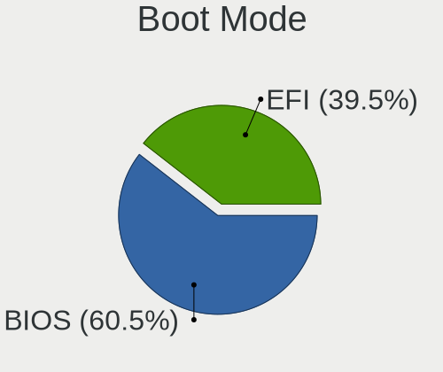
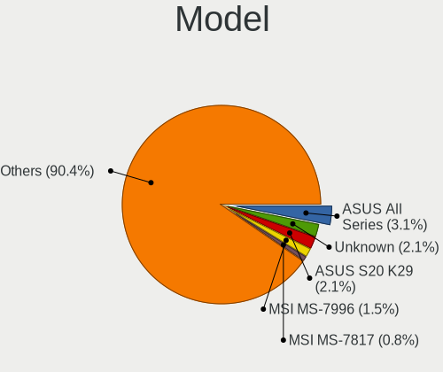
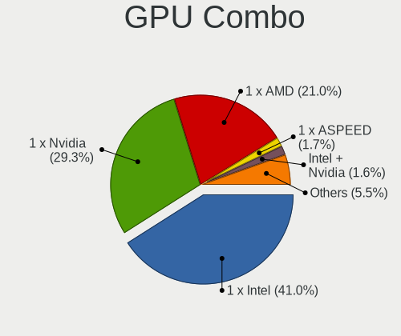
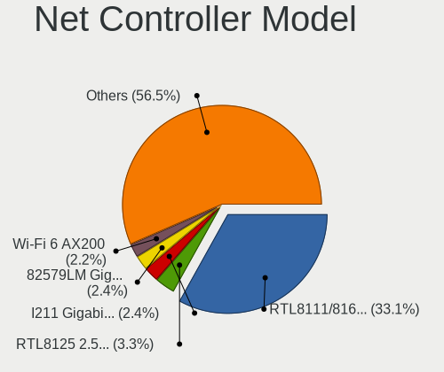
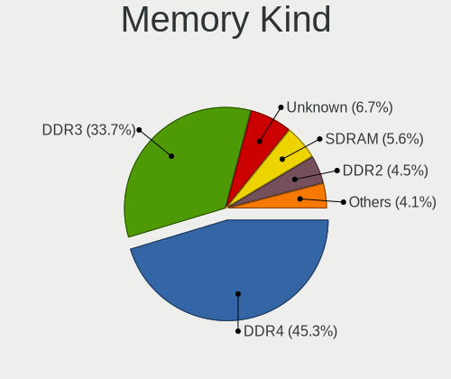

Debian 11 - Tested Hardware & Statistics (Desktops)
---------------------------------------------------

A project to collect tested hardware configurations for Debian 11.

Anyone can contribute to this report by the [hw-probe](https://github.com/linuxhw/hw-probe) tool:

    sudo -E hw-probe -all -upload

Please contribute! Especially if your hardware is rare.

Contents
--------

* [ Test Cases ](#test-cases)

* [ System ](#system)
  - [ Kernel                   ](#kernel)
  - [ Kernel Family            ](#kernel-family)
  - [ Kernel Major Ver.        ](#kernel-major-ver)
  - [ Arch                     ](#arch)
  - [ DE                       ](#de)
  - [ Display Server           ](#display-server)
  - [ Display Manager          ](#display-manager)
  - [ OS Lang                  ](#os-lang)
  - [ Boot Mode                ](#boot-mode)
  - [ Filesystem               ](#filesystem)
  - [ Part. scheme             ](#part-scheme)
  - [ Dual Boot with Linux/BSD ](#dual-boot-with-linuxbsd)
  - [ Dual Boot (Win)          ](#dual-boot-win)

* [ Board ](#board)
  - [ Vendor                   ](#vendor)
  - [ Model                    ](#model)
  - [ Model Family             ](#model-family)
  - [ MFG Year                 ](#mfg-year)
  - [ Form Factor              ](#form-factor)
  - [ Secure Boot              ](#secure-boot)
  - [ Coreboot                 ](#coreboot)
  - [ RAM Size                 ](#ram-size)
  - [ RAM Used                 ](#ram-used)
  - [ Total Drives             ](#total-drives)
  - [ Has CD-ROM               ](#has-cd-rom)
  - [ Has Ethernet             ](#has-ethernet)
  - [ Has WiFi                 ](#has-wifi)
  - [ Has Bluetooth            ](#has-bluetooth)

* [ Location ](#location)
  - [ Country                  ](#country)
  - [ City                     ](#city)

* [ Drives ](#drives)
  - [ Drive Vendor             ](#drive-vendor)
  - [ Drive Model              ](#drive-model)
  - [ HDD Vendor               ](#hdd-vendor)
  - [ SSD Vendor               ](#ssd-vendor)
  - [ Drive Kind               ](#drive-kind)
  - [ Drive Connector          ](#drive-connector)
  - [ Drive Size               ](#drive-size)
  - [ Space Total              ](#space-total)
  - [ Space Used               ](#space-used)
  - [ Malfunc. Drives          ](#malfunc-drives)
  - [ Malfunc. Drive Vendor    ](#malfunc-drive-vendor)
  - [ Malfunc. HDD Vendor      ](#malfunc-hdd-vendor)
  - [ Malfunc. Drive Kind      ](#malfunc-drive-kind)
  - [ Failed Drives            ](#failed-drives)
  - [ Failed Drive Vendor      ](#failed-drive-vendor)
  - [ Drive Status             ](#drive-status)

* [ Storage controller ](#storage-controller)
  - [ Storage Vendor           ](#storage-vendor)
  - [ Storage Model            ](#storage-model)
  - [ Storage Kind             ](#storage-kind)

* [ Processor ](#processor)
  - [ CPU Vendor               ](#cpu-vendor)
  - [ CPU Model                ](#cpu-model)
  - [ CPU Model Family         ](#cpu-model-family)
  - [ CPU Cores                ](#cpu-cores)
  - [ CPU Sockets              ](#cpu-sockets)
  - [ CPU Threads              ](#cpu-threads)
  - [ CPU Op-Modes             ](#cpu-op-modes)
  - [ CPU Microcode            ](#cpu-microcode)
  - [ CPU Microarch            ](#cpu-microarch)

* [ Graphics ](#graphics)
  - [ GPU Vendor               ](#gpu-vendor)
  - [ GPU Model                ](#gpu-model)
  - [ GPU Combo                ](#gpu-combo)
  - [ GPU Driver               ](#gpu-driver)
  - [ GPU Memory               ](#gpu-memory)

* [ Monitor ](#monitor)
  - [ Monitor Vendor           ](#monitor-vendor)
  - [ Monitor Model            ](#monitor-model)
  - [ Monitor Resolution       ](#monitor-resolution)
  - [ Monitor Diagonal         ](#monitor-diagonal)
  - [ Monitor Width            ](#monitor-width)
  - [ Aspect Ratio             ](#aspect-ratio)
  - [ Monitor Area             ](#monitor-area)
  - [ Pixel Density            ](#pixel-density)
  - [ Multiple Monitors        ](#multiple-monitors)

* [ Network ](#network)
  - [ Net Controller Vendor    ](#net-controller-vendor)
  - [ Net Controller Model     ](#net-controller-model)
  - [ Wireless Vendor          ](#wireless-vendor)
  - [ Wireless Model           ](#wireless-model)
  - [ Ethernet Vendor          ](#ethernet-vendor)
  - [ Ethernet Model           ](#ethernet-model)
  - [ Net Controller Kind      ](#net-controller-kind)
  - [ Used Controller          ](#used-controller)
  - [ NICs                     ](#nics)
  - [ IPv6                     ](#ipv6)

* [ Bluetooth ](#bluetooth)
  - [ Bluetooth Vendor         ](#bluetooth-vendor)
  - [ Bluetooth Model          ](#bluetooth-model)

* [ Sound ](#sound)
  - [ Sound Vendor             ](#sound-vendor)
  - [ Sound Model              ](#sound-model)

* [ Memory ](#memory)
  - [ Memory Vendor            ](#memory-vendor)
  - [ Memory Model             ](#memory-model)
  - [ Memory Kind              ](#memory-kind)
  - [ Memory Form Factor       ](#memory-form-factor)
  - [ Memory Size              ](#memory-size)
  - [ Memory Speed             ](#memory-speed)

* [ Printers & scanners ](#printers--scanners)
  - [ Printer Vendor           ](#printer-vendor)
  - [ Printer Model            ](#printer-model)
  - [ Scanner Vendor           ](#scanner-vendor)
  - [ Scanner Model            ](#scanner-model)

* [ Camera ](#camera)
  - [ Camera Vendor            ](#camera-vendor)
  - [ Camera Model             ](#camera-model)

* [ Security ](#security)
  - [ Fingerprint Vendor       ](#fingerprint-vendor)
  - [ Fingerprint Model        ](#fingerprint-model)
  - [ Chipcard Vendor          ](#chipcard-vendor)
  - [ Chipcard Model           ](#chipcard-model)

* [ Unsupported ](#unsupported)
  - [ Unsupported Devices      ](#unsupported-devices)
  - [ Unsupported Device Types ](#unsupported-device-types)

Test Cases
----------

Total: 3444

| Vendor        | Model                       | Probe                                                      | Date         |
|---------------|-----------------------------|------------------------------------------------------------|--------------|
| JGINYUE       | X79M-PLUS V2.2              | [1535be8e5f](https://linux-hardware.org/?probe=1535be8e5f) | Sep 06, 2023 |
| Intel         | DN2800MT AAG23738-803       | [8bdf13908a](https://linux-hardware.org/?probe=8bdf13908a) | Sep 06, 2023 |
| ASRockRack    | B565D4-V1L                  | [ff236ef40e](https://linux-hardware.org/?probe=ff236ef40e) | Sep 06, 2023 |
| Intel         | D33217GKE G76540-205        | [98630bd8bd](https://linux-hardware.org/?probe=98630bd8bd) | Sep 05, 2023 |
| Dell          | 0Y2MRG A00                  | [893bd8a261](https://linux-hardware.org/?probe=893bd8a261) | Sep 04, 2023 |
| Fujitsu       | D3400-A1 S26361-D3400-A1    | [49e3c842c1](https://linux-hardware.org/?probe=49e3c842c1) | Sep 04, 2023 |
| Unknown       | Unknown                     | [0c53c2df55](https://linux-hardware.org/?probe=0c53c2df55) | Sep 04, 2023 |
| ASRockRack    | X470D4U                     | [d38e269d11](https://linux-hardware.org/?probe=d38e269d11) | Sep 04, 2023 |
| MEGA          | G41T-M7 LGT                 | [8d645686ff](https://linux-hardware.org/?probe=8d645686ff) | Sep 02, 2023 |
| ASUSTek       | TUF Gaming B550M-PLUS       | [7e93b2a981](https://linux-hardware.org/?probe=7e93b2a981) | Sep 02, 2023 |
| HP            | 1495                        | [09b1cf815c](https://linux-hardware.org/?probe=09b1cf815c) | Aug 31, 2023 |
| Dell          | 0T10XW A00                  | [cc093c964f](https://linux-hardware.org/?probe=cc093c964f) | Aug 29, 2023 |
| HP            | 1495                        | [86b148e011](https://linux-hardware.org/?probe=86b148e011) | Aug 26, 2023 |
| HP            | 158A                        | [e154a48901](https://linux-hardware.org/?probe=e154a48901) | Aug 25, 2023 |
| Dell          | 03NVJ6 A01                  | [71102ac92b](https://linux-hardware.org/?probe=71102ac92b) | Aug 24, 2023 |
| Acer          | Aspire XC-780               | [e154995d9e](https://linux-hardware.org/?probe=e154995d9e) | Aug 24, 2023 |
| ASUSTek       | PRIME X299-DELUXE           | [266edae3d0](https://linux-hardware.org/?probe=266edae3d0) | Aug 23, 2023 |
| ASRock        | J4125B-ITX                  | [93853db701](https://linux-hardware.org/?probe=93853db701) | Aug 21, 2023 |
| ASRock        | J4125B-ITX                  | [f9058bcea1](https://linux-hardware.org/?probe=f9058bcea1) | Aug 21, 2023 |
| Medion        | MS-7728                     | [f548540f0c](https://linux-hardware.org/?probe=f548540f0c) | Aug 19, 2023 |
| Dell          | 0CT017                      | [0800c86065](https://linux-hardware.org/?probe=0800c86065) | Aug 14, 2023 |
| Unknown       | CN700-8237                  | [5890f075f7](https://linux-hardware.org/?probe=5890f075f7) | Aug 13, 2023 |
| ECS           | H61H2-CM                    | [7e33e0f06c](https://linux-hardware.org/?probe=7e33e0f06c) | Aug 13, 2023 |
| ECS           | H61H2-CM                    | [2656581f21](https://linux-hardware.org/?probe=2656581f21) | Aug 13, 2023 |
| Gigabyte      | B360HD3PLM-CF               | [650f840aa5](https://linux-hardware.org/?probe=650f840aa5) | Aug 13, 2023 |
| ASRock        | J4125B-ITX                  | [fa9ebd523f](https://linux-hardware.org/?probe=fa9ebd523f) | Aug 11, 2023 |
| Lenovo        | 3740 NOK                    | [9964e9a820](https://linux-hardware.org/?probe=9964e9a820) | Aug 11, 2023 |
| ASUSTek       | ROG STRIX B450-F GAMING     | [2be2a9d5f4](https://linux-hardware.org/?probe=2be2a9d5f4) | Aug 09, 2023 |
| HP            | 8433 11                     | [93432b3df2](https://linux-hardware.org/?probe=93432b3df2) | Aug 09, 2023 |
| ASUSTek       | P5LD2-SE                    | [04d19635d5](https://linux-hardware.org/?probe=04d19635d5) | Aug 08, 2023 |
| ASUSTek       | P5LD2-SE                    | [671a686166](https://linux-hardware.org/?probe=671a686166) | Aug 08, 2023 |
| Biostar       | B365MHC                     | [1a7d051f1e](https://linux-hardware.org/?probe=1a7d051f1e) | Aug 06, 2023 |
| Gigabyte      | 990FXA-UD3                  | [4b57f7d6ea](https://linux-hardware.org/?probe=4b57f7d6ea) | Aug 06, 2023 |
| MSI           | B350 TOMAHAWK               | [3aa0e077c0](https://linux-hardware.org/?probe=3aa0e077c0) | Aug 05, 2023 |
| ASRock        | FM2A68M-DG3+                | [d930261042](https://linux-hardware.org/?probe=d930261042) | Aug 04, 2023 |
| Dell          | 0K095G A01                  | [ee2fb87d2f](https://linux-hardware.org/?probe=ee2fb87d2f) | Aug 04, 2023 |
| ASUSTek       | TUF Gaming B450M-PLUS II    | [18f95b58ac](https://linux-hardware.org/?probe=18f95b58ac) | Aug 04, 2023 |
| ASUSTek       | TUF Gaming B450M-PLUS II    | [349de8928b](https://linux-hardware.org/?probe=349de8928b) | Aug 04, 2023 |
| Gigabyte      | H510M H                     | [d74aab937a](https://linux-hardware.org/?probe=d74aab937a) | Aug 02, 2023 |
| ASRock        | X300-ITX                    | [70a181c62b](https://linux-hardware.org/?probe=70a181c62b) | Jul 31, 2023 |
| Intel         | DH55HC AAE70933-502         | [e849da706a](https://linux-hardware.org/?probe=e849da706a) | Jul 31, 2023 |
| Unknown       | Unknown                     | [11d7923fa3](https://linux-hardware.org/?probe=11d7923fa3) | Jul 31, 2023 |
| ASUSTek       | M4N78-AM                    | [a4740d2b14](https://linux-hardware.org/?probe=a4740d2b14) | Jul 31, 2023 |
| Gigabyte      | B550M K                     | [139e314619](https://linux-hardware.org/?probe=139e314619) | Jul 31, 2023 |
| Dell          | 0K240Y A01                  | [80b81f5eff](https://linux-hardware.org/?probe=80b81f5eff) | Jul 30, 2023 |
| ASRockRack    | X470D4U                     | [532a72a722](https://linux-hardware.org/?probe=532a72a722) | Jul 29, 2023 |
| Dell          | 0HD5W2 A01                  | [76394a9fc7](https://linux-hardware.org/?probe=76394a9fc7) | Jul 29, 2023 |
| IceWhale T... | ZimaBoard 832 ZMB           | [4cbba6622f](https://linux-hardware.org/?probe=4cbba6622f) | Jul 28, 2023 |
| IceWhale T... | ZimaBoard 832 ZMB           | [8cf3decf30](https://linux-hardware.org/?probe=8cf3decf30) | Jul 28, 2023 |
| Dell          | 06X1TJ A00                  | [e873051e73](https://linux-hardware.org/?probe=e873051e73) | Jul 27, 2023 |
| ABIT          | NF7-S/NF7,NF7-V,1.0         | [f5184af4e0](https://linux-hardware.org/?probe=f5184af4e0) | Jul 27, 2023 |
| Dell          | 01XK1W A00                  | [9793da4c20](https://linux-hardware.org/?probe=9793da4c20) | Jul 26, 2023 |
| ASRock        | X570 PG Velocita            | [64d86600a4](https://linux-hardware.org/?probe=64d86600a4) | Jul 26, 2023 |
| Phoenix Co... | PSB514 A11                  | [9791c84b0d](https://linux-hardware.org/?probe=9791c84b0d) | Jul 25, 2023 |
| Phoenix Co... | PSB514 A11                  | [8e271c334d](https://linux-hardware.org/?probe=8e271c334d) | Jul 24, 2023 |
| Lenovo        | ThinkCentre M58 7360W1J     | [1e1e565ac4](https://linux-hardware.org/?probe=1e1e565ac4) | Jul 23, 2023 |
| Dell          | OptiPlex 755                | [9297c88bef](https://linux-hardware.org/?probe=9297c88bef) | Jul 23, 2023 |
| Dell          | OptiPlex 755                | [15827e6939](https://linux-hardware.org/?probe=15827e6939) | Jul 23, 2023 |
| Fujitsu       | D3313-A1 S26361-D3313-A1    | [97edd15b78](https://linux-hardware.org/?probe=97edd15b78) | Jul 21, 2023 |
| HP            | ProLiant MicroServer Gen... | [a9214c4672](https://linux-hardware.org/?probe=a9214c4672) | Jul 21, 2023 |
| AAEON         | GENE-CML5 V1.0              | [4120e07431](https://linux-hardware.org/?probe=4120e07431) | Jul 19, 2023 |
| Gigabyte      | X570 AORUS MASTER           | [98cddbfe0e](https://linux-hardware.org/?probe=98cddbfe0e) | Jul 18, 2023 |
| ASUSTek       | Z87-C                       | [5324c1542f](https://linux-hardware.org/?probe=5324c1542f) | Jul 18, 2023 |
| HP            | 805A                        | [d4e6fca09f](https://linux-hardware.org/?probe=d4e6fca09f) | Jul 17, 2023 |
| ASUSTek       | M5A78L/USB3                 | [a8b082a8be](https://linux-hardware.org/?probe=a8b082a8be) | Jul 17, 2023 |
| MSI           | H81M-P33                    | [0d3af45e51](https://linux-hardware.org/?probe=0d3af45e51) | Jul 16, 2023 |
| ASUSTek       | ROG STRIX Z790-E GAMING ... | [0c592730d7](https://linux-hardware.org/?probe=0c592730d7) | Jul 16, 2023 |
| Unknown       | Unknown                     | [1073620f0c](https://linux-hardware.org/?probe=1073620f0c) | Jul 16, 2023 |
| GEEKOM        | Mini IT 8                   | [4754a5fc1b](https://linux-hardware.org/?probe=4754a5fc1b) | Jul 16, 2023 |
| Lenovo        | 30BE SDK0J40697 WIN 3305... | [9161db3013](https://linux-hardware.org/?probe=9161db3013) | Jul 15, 2023 |
| ASUSTek       | Z87-C                       | [33e96d6f34](https://linux-hardware.org/?probe=33e96d6f34) | Jul 15, 2023 |
| Gigabyte      | H81M-HD3                    | [4a6f56c54a](https://linux-hardware.org/?probe=4a6f56c54a) | Jul 15, 2023 |
| Dell          | 06X1TJ A00                  | [8ca31a1cfb](https://linux-hardware.org/?probe=8ca31a1cfb) | Jul 15, 2023 |
| ASRock        | FM2A68M-DG3+                | [19fdd69149](https://linux-hardware.org/?probe=19fdd69149) | Jul 14, 2023 |
| MSI           | H170M PRO-VDH               | [ce0a8a33fb](https://linux-hardware.org/?probe=ce0a8a33fb) | Jul 13, 2023 |
| ASRockRack    | ROMED8QM-2T                 | [a4fe5ea9c9](https://linux-hardware.org/?probe=a4fe5ea9c9) | Jul 13, 2023 |
| Dell          | 0D28YY A00                  | [1976f92f56](https://linux-hardware.org/?probe=1976f92f56) | Jul 12, 2023 |
| ASUSTek       | PRIME B360M-K               | [3a06b254a5](https://linux-hardware.org/?probe=3a06b254a5) | Jul 12, 2023 |
| Unknown       | i855-W83627HF               | [b330e5c4fb](https://linux-hardware.org/?probe=b330e5c4fb) | Jul 12, 2023 |
| Unknown       | i855-W83627HF               | [c0fb949fdc](https://linux-hardware.org/?probe=c0fb949fdc) | Jul 12, 2023 |
| Dell          | 0Y2MRG A00                  | [3866c4a7ff](https://linux-hardware.org/?probe=3866c4a7ff) | Jul 12, 2023 |
| Dell          | 0T10XW A01                  | [58fb207824](https://linux-hardware.org/?probe=58fb207824) | Jul 11, 2023 |
| ASUSTek       | A88XM-A                     | [544563aaae](https://linux-hardware.org/?probe=544563aaae) | Jul 11, 2023 |
| ASUSTek       | PRIME Z590-P                | [8d33346009](https://linux-hardware.org/?probe=8d33346009) | Jul 10, 2023 |
| Dell          | 01XK1W A00                  | [16aac702d5](https://linux-hardware.org/?probe=16aac702d5) | Jul 10, 2023 |
| Dell          | 0M5DCD A00                  | [ae3e8910bf](https://linux-hardware.org/?probe=ae3e8910bf) | Jul 10, 2023 |
| Gigabyte      | B560 HD3                    | [437e2c44d9](https://linux-hardware.org/?probe=437e2c44d9) | Jul 09, 2023 |
| Gigabyte      | X570S AORUS ELITE           | [6381f6da84](https://linux-hardware.org/?probe=6381f6da84) | Jul 09, 2023 |
| Unknown       | Unknown                     | [89a5a4461f](https://linux-hardware.org/?probe=89a5a4461f) | Jul 09, 2023 |
| ASUSTek       | M4A88TD-V EVO/USB3          | [003c30f690](https://linux-hardware.org/?probe=003c30f690) | Jul 09, 2023 |
| AZW           | U59                         | [5cf3ddbe4b](https://linux-hardware.org/?probe=5cf3ddbe4b) | Jul 08, 2023 |
| AZW           | U59                         | [ea367423d1](https://linux-hardware.org/?probe=ea367423d1) | Jul 08, 2023 |
| AZW           | MINI S                      | [b13eb96728](https://linux-hardware.org/?probe=b13eb96728) | Jul 08, 2023 |
| Gigabyte      | Z170-HD3P-CF                | [6afd29fd20](https://linux-hardware.org/?probe=6afd29fd20) | Jul 06, 2023 |
| HP            | 895C                        | [8a7f102530](https://linux-hardware.org/?probe=8a7f102530) | Jul 05, 2023 |
| Dell          | 0KYWH7 A00                  | [0c16b66976](https://linux-hardware.org/?probe=0c16b66976) | Jul 04, 2023 |
| Dell          | 0KWVT8 A02                  | [234e7f985d](https://linux-hardware.org/?probe=234e7f985d) | Jul 04, 2023 |
| ASUSTek       | Z87-A                       | [e000de29fe](https://linux-hardware.org/?probe=e000de29fe) | Jul 03, 2023 |
| EPoX Compu... | Intel I945 DDR2 : 5P945-... | [5aa77af58f](https://linux-hardware.org/?probe=5aa77af58f) | Jul 03, 2023 |
| Gigabyte      | B550 UD AC                  | [8e758ec922](https://linux-hardware.org/?probe=8e758ec922) | Jul 03, 2023 |
| IceWhale T... | ZimaBoard 432 ZMB           | [f17cce1847](https://linux-hardware.org/?probe=f17cce1847) | Jul 02, 2023 |
| Supermicro    | X8ST3                       | [bac142132d](https://linux-hardware.org/?probe=bac142132d) | Jul 01, 2023 |
| ASUSTek       | Z170-A                      | [24adbf0475](https://linux-hardware.org/?probe=24adbf0475) | Jul 01, 2023 |
| NetGear       | ReadyDATA 5200              | [b89ca471ef](https://linux-hardware.org/?probe=b89ca471ef) | Jul 01, 2023 |
| Gigabyte      | B365M D3H-CF                | [f40af0020a](https://linux-hardware.org/?probe=f40af0020a) | Jun 29, 2023 |
| Supermicro    | X8ST3                       | [305a3e3c1a](https://linux-hardware.org/?probe=305a3e3c1a) | Jun 29, 2023 |
| Shuttle       | FS61                        | [a67d2edea8](https://linux-hardware.org/?probe=a67d2edea8) | Jun 28, 2023 |
| AMI           | Cherry Trail CR             | [65fb07ed8d](https://linux-hardware.org/?probe=65fb07ed8d) | Jun 27, 2023 |
| Gigabyte      | B550 AORUS PRO V2           | [1143a7eebc](https://linux-hardware.org/?probe=1143a7eebc) | Jun 27, 2023 |
| Gigabyte      | GA-78LMT-USB3 x.x           | [baf77629c1](https://linux-hardware.org/?probe=baf77629c1) | Jun 26, 2023 |
| ASRock        | H61M-HVS                    | [a65485d236](https://linux-hardware.org/?probe=a65485d236) | Jun 25, 2023 |
| Dell          | 01XK1W A00                  | [53dbc2e799](https://linux-hardware.org/?probe=53dbc2e799) | Jun 24, 2023 |
| ASRockRack    | X470D4U                     | [2d49269787](https://linux-hardware.org/?probe=2d49269787) | Jun 23, 2023 |
| ASRockRack    | X470D4U2-2T                 | [4a11a4190a](https://linux-hardware.org/?probe=4a11a4190a) | Jun 23, 2023 |
| Gigabyte      | B250M-DS3H-CF               | [1ca06fb3a9](https://linux-hardware.org/?probe=1ca06fb3a9) | Jun 23, 2023 |
| HP            | 3397                        | [8c9be2f4c0](https://linux-hardware.org/?probe=8c9be2f4c0) | Jun 23, 2023 |
| ASRockRack    | X470D4U                     | [d419086209](https://linux-hardware.org/?probe=d419086209) | Jun 22, 2023 |
| HP            | 3397                        | [a47ce0d4dc](https://linux-hardware.org/?probe=a47ce0d4dc) | Jun 22, 2023 |
| ASRockRack    | X470D4U                     | [9e0ba5032b](https://linux-hardware.org/?probe=9e0ba5032b) | Jun 21, 2023 |
| MSI           | H81M-P33                    | [62fb9cda50](https://linux-hardware.org/?probe=62fb9cda50) | Jun 20, 2023 |
| Dell          | 06FW8P A02                  | [f65ec61ffc](https://linux-hardware.org/?probe=f65ec61ffc) | Jun 20, 2023 |
| Dell          | 0PU052                      | [2eb6dceca9](https://linux-hardware.org/?probe=2eb6dceca9) | Jun 19, 2023 |
| ASUSTek       | PRIME A320M-K               | [3eab70981f](https://linux-hardware.org/?probe=3eab70981f) | Jun 19, 2023 |
| AZW           | U59                         | [6f1191e5e2](https://linux-hardware.org/?probe=6f1191e5e2) | Jun 18, 2023 |
| Dell          | 01XK1W A00                  | [f431c0b66f](https://linux-hardware.org/?probe=f431c0b66f) | Jun 18, 2023 |
| MSI           | MAG B550M MORTAR MAX WIF... | [9994571651](https://linux-hardware.org/?probe=9994571651) | Jun 15, 2023 |
| HP            | 1589                        | [6bfe1d5b63](https://linux-hardware.org/?probe=6bfe1d5b63) | Jun 15, 2023 |
| MSI           | MAG B550 TOMAHAWK MAX WI... | [6e241e56cf](https://linux-hardware.org/?probe=6e241e56cf) | Jun 14, 2023 |
| ASUSTek       | PRIME B350-PLUS             | [f9ebdca1bd](https://linux-hardware.org/?probe=f9ebdca1bd) | Jun 14, 2023 |
| HP            | 2AED                        | [2550c16272](https://linux-hardware.org/?probe=2550c16272) | Jun 13, 2023 |
| Intel         | JSL MRD                     | [764e533752](https://linux-hardware.org/?probe=764e533752) | Jun 13, 2023 |
| Gigabyte      | B450 AORUS ELITE            | [59a9e7e2e8](https://linux-hardware.org/?probe=59a9e7e2e8) | Jun 11, 2023 |
| Intel         | SHARKBAY                    | [8772d55075](https://linux-hardware.org/?probe=8772d55075) | Jun 10, 2023 |
| MSI           | B450M PRO-VDH MAX           | [4dcc51e897](https://linux-hardware.org/?probe=4dcc51e897) | Jun 10, 2023 |
| ASRock        | B365M Pro4-F                | [e54f1a9447](https://linux-hardware.org/?probe=e54f1a9447) | Jun 10, 2023 |
| ASUSTek       | K30BF_M32BF                 | [65b3c16165](https://linux-hardware.org/?probe=65b3c16165) | Jun 10, 2023 |
| ASUSTek       | P5GC-MX/1333                | [b47fab6285](https://linux-hardware.org/?probe=b47fab6285) | Jun 09, 2023 |
| Gigabyte      | B550M DS3H                  | [ea724e204b](https://linux-hardware.org/?probe=ea724e204b) | Jun 09, 2023 |
| Dell          | 0XCR8D A03                  | [e37bceb6fb](https://linux-hardware.org/?probe=e37bceb6fb) | Jun 09, 2023 |
| Gigabyte      | GA-78LMT-USB3 R2 sex        | [bcad738da6](https://linux-hardware.org/?probe=bcad738da6) | Jun 09, 2023 |
| Inventec      | VXC Class A02               | [c2bc26120f](https://linux-hardware.org/?probe=c2bc26120f) | Jun 08, 2023 |
| MSI           | B450M-A PRO MAX             | [230465c003](https://linux-hardware.org/?probe=230465c003) | Jun 08, 2023 |
| ASRock        | B365M Pro4-F                | [7ed0f0346c](https://linux-hardware.org/?probe=7ed0f0346c) | Jun 07, 2023 |
| ASUSTek       | H97M-E                      | [97140e9688](https://linux-hardware.org/?probe=97140e9688) | Jun 07, 2023 |
| Lenovo        | ThinkCentre A58e 0841B4Y    | [fe410cd5db](https://linux-hardware.org/?probe=fe410cd5db) | Jun 07, 2023 |
| ASUSTek       | TUF Gaming B650-PLUS WIF... | [db42ab94ee](https://linux-hardware.org/?probe=db42ab94ee) | Jun 06, 2023 |
| ASUSTek       | ROG STRIX X570-E GAMING     | [d288737b23](https://linux-hardware.org/?probe=d288737b23) | Jun 05, 2023 |
| ASUSTek       | TUF Gaming X670E-PLUS WI... | [3a1c1daa3d](https://linux-hardware.org/?probe=3a1c1daa3d) | Jun 05, 2023 |
| Gigabyte      | H470M DS3H                  | [e7bbac1b14](https://linux-hardware.org/?probe=e7bbac1b14) | Jun 04, 2023 |
| Gigabyte      | B360M HD3                   | [fcb1b60578](https://linux-hardware.org/?probe=fcb1b60578) | Jun 04, 2023 |
| MSI           | H81M-E34                    | [4c5f5c7903](https://linux-hardware.org/?probe=4c5f5c7903) | Jun 04, 2023 |
| Gigabyte      | B660M GAMING X DDR4         | [0bd883cae2](https://linux-hardware.org/?probe=0bd883cae2) | Jun 04, 2023 |
| Dell          | 01XK1W A00                  | [8690705151](https://linux-hardware.org/?probe=8690705151) | Jun 04, 2023 |
| HP            | 843C                        | [e69fbf77e4](https://linux-hardware.org/?probe=e69fbf77e4) | Jun 04, 2023 |
| HP            | 843C                        | [21751c1221](https://linux-hardware.org/?probe=21751c1221) | Jun 04, 2023 |
| Lenovo        | ThinkStation D30 42234T7    | [18cb6a946b](https://linux-hardware.org/?probe=18cb6a946b) | Jun 03, 2023 |
| ASUSTek       | SABERTOOTH 990FX R2.0       | [8d4d1f7313](https://linux-hardware.org/?probe=8d4d1f7313) | Jun 03, 2023 |
| Gigabyte      | P75-D3                      | [a56c3ceb55](https://linux-hardware.org/?probe=a56c3ceb55) | Jun 02, 2023 |
| ASUSTek       | TUF Gaming X570-PLUS        | [d6561ecd7b](https://linux-hardware.org/?probe=d6561ecd7b) | Jun 02, 2023 |
| ASRockRack    | X470D4U2-2T                 | [43901d3db7](https://linux-hardware.org/?probe=43901d3db7) | Jun 02, 2023 |
| ASUSTek       | Z87-C                       | [20242d8299](https://linux-hardware.org/?probe=20242d8299) | Jun 02, 2023 |
| ASUSTek       | P8H61                       | [7e9f999121](https://linux-hardware.org/?probe=7e9f999121) | Jun 02, 2023 |
| Dell          | 01XK1W A00                  | [5846820609](https://linux-hardware.org/?probe=5846820609) | Jun 02, 2023 |
| Intel         | DH61WW AAG23116-204         | [2bfe32ef05](https://linux-hardware.org/?probe=2bfe32ef05) | Jun 02, 2023 |
| ChangWang     | CW56-58                     | [e00e626ea6](https://linux-hardware.org/?probe=e00e626ea6) | Jun 01, 2023 |
| MSI           | H510M-A PRO                 | [8557cd4efa](https://linux-hardware.org/?probe=8557cd4efa) | Jun 01, 2023 |
| Gigabyte      | H410M S2H V3                | [78e4d7a22b](https://linux-hardware.org/?probe=78e4d7a22b) | Jun 01, 2023 |
| ASUSTek       | H81M-C                      | [5fc6ec135b](https://linux-hardware.org/?probe=5fc6ec135b) | Jun 01, 2023 |
| ASRock        | J4125-ITX                   | [31e0f624be](https://linux-hardware.org/?probe=31e0f624be) | Jun 01, 2023 |
| Gigabyte      | Z790 AORUS ELITE AX DDR4    | [5f1045564e](https://linux-hardware.org/?probe=5f1045564e) | Jun 01, 2023 |
| Inventec      | D CLASS A02                 | [433df815db](https://linux-hardware.org/?probe=433df815db) | Jun 01, 2023 |
| Intel         | DB75EN AAG39650-302         | [9872e0cb5c](https://linux-hardware.org/?probe=9872e0cb5c) | May 31, 2023 |
| ASUSTek       | ROG STRIX Z690-G GAMING ... | [32a85827df](https://linux-hardware.org/?probe=32a85827df) | May 31, 2023 |
| ASUSTek       | Maximus VIII RANGER         | [354e883340](https://linux-hardware.org/?probe=354e883340) | May 31, 2023 |
| ASRock        | G41M-VS3                    | [166031ba4d](https://linux-hardware.org/?probe=166031ba4d) | May 31, 2023 |
| ASRock        | G41M-VS3                    | [8f55c9aa98](https://linux-hardware.org/?probe=8f55c9aa98) | May 31, 2023 |
| Dell          | 01XK1W A00                  | [8a18b7bada](https://linux-hardware.org/?probe=8a18b7bada) | May 31, 2023 |
| Dell          | 01XK1W A00                  | [611cf59f44](https://linux-hardware.org/?probe=611cf59f44) | May 31, 2023 |
| Intel         | X99                         | [cef654d9c5](https://linux-hardware.org/?probe=cef654d9c5) | May 30, 2023 |
| ASUSTek       | P4S8L                       | [c26269028e](https://linux-hardware.org/?probe=c26269028e) | May 30, 2023 |
| ASUSTek       | PRIME B550-PLUS             | [698e3b5e35](https://linux-hardware.org/?probe=698e3b5e35) | May 30, 2023 |
| MSI           | H55M-ED55                   | [a89bdc8ec0](https://linux-hardware.org/?probe=a89bdc8ec0) | May 30, 2023 |
| ASRock        | H310CM-HDV                  | [e6e310a9b4](https://linux-hardware.org/?probe=e6e310a9b4) | May 29, 2023 |
| ASRock        | H310CM-HDV                  | [84e791ec5e](https://linux-hardware.org/?probe=84e791ec5e) | May 29, 2023 |
| Inventec      | VXC Class A02               | [0befe25313](https://linux-hardware.org/?probe=0befe25313) | May 29, 2023 |
| Inventec      | VXC Class A02               | [363827ad8c](https://linux-hardware.org/?probe=363827ad8c) | May 29, 2023 |
| MSI           | Z390-A PRO                  | [c797a10bff](https://linux-hardware.org/?probe=c797a10bff) | May 29, 2023 |
| ASUSTek       | Z10PA-D8 Series             | [02821a3220](https://linux-hardware.org/?probe=02821a3220) | May 29, 2023 |
| Dell          | 040DDP A01                  | [bce6b61241](https://linux-hardware.org/?probe=bce6b61241) | May 29, 2023 |
| Unknown       | Unknown                     | [81e905b8bf](https://linux-hardware.org/?probe=81e905b8bf) | May 29, 2023 |
| MSI           | PRO Z690-A DDR4             | [b0be576b32](https://linux-hardware.org/?probe=b0be576b32) | May 28, 2023 |
| Intel         | X99                         | [70895d913f](https://linux-hardware.org/?probe=70895d913f) | May 28, 2023 |
| Dell          | 01XK1W A00                  | [a81daffe89](https://linux-hardware.org/?probe=a81daffe89) | May 28, 2023 |
| Dell          | 01XK1W A00                  | [ef918dfbfa](https://linux-hardware.org/?probe=ef918dfbfa) | May 28, 2023 |
| AZW           | MINI S                      | [55c17a6700](https://linux-hardware.org/?probe=55c17a6700) | May 27, 2023 |
| MSI           | H55M-ED55                   | [61e1fc3841](https://linux-hardware.org/?probe=61e1fc3841) | May 27, 2023 |
| ASUSTek       | K30BF_M32BF                 | [a262345925](https://linux-hardware.org/?probe=a262345925) | May 27, 2023 |
| HP            | 2B38                        | [528dfa2310](https://linux-hardware.org/?probe=528dfa2310) | May 27, 2023 |
| MSI           | MAG B460M MORTAR            | [ac03083cbd](https://linux-hardware.org/?probe=ac03083cbd) | May 27, 2023 |
| HP            | 895C                        | [f0986c3613](https://linux-hardware.org/?probe=f0986c3613) | May 26, 2023 |
| ASUSTek       | P4S8L                       | [75096a0d55](https://linux-hardware.org/?probe=75096a0d55) | May 25, 2023 |
| ASRock        | H61M-VG4                    | [4a6c3586fa](https://linux-hardware.org/?probe=4a6c3586fa) | May 25, 2023 |
| ASUSTek       | PRIME H270-PRO              | [2a14c05edc](https://linux-hardware.org/?probe=2a14c05edc) | May 25, 2023 |
| Acer          | EG31M R01-A4                | [447645dad3](https://linux-hardware.org/?probe=447645dad3) | May 25, 2023 |
| ASUSTek       | PRIME B450M-GAMING/BR       | [2a3382aa0c](https://linux-hardware.org/?probe=2a3382aa0c) | May 25, 2023 |
| Unknown       | SKYBAY                      | [7884ad9bf4](https://linux-hardware.org/?probe=7884ad9bf4) | May 25, 2023 |
| ASUSTek       | PRIME B760M-A D4            | [95321eedeb](https://linux-hardware.org/?probe=95321eedeb) | May 25, 2023 |
| Lenovo        | SHARKBAY SDK0E50510 PRO ... | [24d62f2da3](https://linux-hardware.org/?probe=24d62f2da3) | May 25, 2023 |
| ASUSTek       | Berkeley                    | [c3e5448952](https://linux-hardware.org/?probe=c3e5448952) | May 24, 2023 |
| Fujitsu       | D3233-A1 S26361-D3233-A1    | [4f91b6897e](https://linux-hardware.org/?probe=4f91b6897e) | May 24, 2023 |
| HP            | 1496                        | [2edc574902](https://linux-hardware.org/?probe=2edc574902) | May 24, 2023 |
| ASUSTek       | PRIME Z370-A II             | [e1681daf09](https://linux-hardware.org/?probe=e1681daf09) | May 24, 2023 |
| ASRock        | B760M Pro RS/D4 WiFi        | [05a334c56f](https://linux-hardware.org/?probe=05a334c56f) | May 24, 2023 |
| ASUSTek       | Z87M-PLUS                   | [f20bf1430d](https://linux-hardware.org/?probe=f20bf1430d) | May 24, 2023 |
| Lenovo        | 3132 SDK0J40697 WIN 3305... | [8ae80f0665](https://linux-hardware.org/?probe=8ae80f0665) | May 23, 2023 |
| ASUSTek       | PRIME H410M-D               | [584c6658c6](https://linux-hardware.org/?probe=584c6658c6) | May 23, 2023 |
| ASUSTek       | PRIME H410M-D               | [e7d7c8f7d8](https://linux-hardware.org/?probe=e7d7c8f7d8) | May 23, 2023 |
| ASRock        | B760M Pro RS/D4 WiFi        | [c5d225afe1](https://linux-hardware.org/?probe=c5d225afe1) | May 23, 2023 |
| ASUSTek       | F2A85-M                     | [9532d524c9](https://linux-hardware.org/?probe=9532d524c9) | May 22, 2023 |
| Unknown       | Unknown                     | [aec9e5a959](https://linux-hardware.org/?probe=aec9e5a959) | May 22, 2023 |
| AZW           | U59                         | [59edf1c8a6](https://linux-hardware.org/?probe=59edf1c8a6) | May 22, 2023 |
| AZW           | U59                         | [b365dbf63a](https://linux-hardware.org/?probe=b365dbf63a) | May 22, 2023 |
| Gigabyte      | B450M DS3H-CF               | [2b2367f9b1](https://linux-hardware.org/?probe=2b2367f9b1) | May 22, 2023 |
| ASUSTek       | K30BF_M32BF                 | [243f08edd7](https://linux-hardware.org/?probe=243f08edd7) | May 22, 2023 |
| Dell          | 0J1C3P A00                  | [5f3d8a94e6](https://linux-hardware.org/?probe=5f3d8a94e6) | May 22, 2023 |
| HP            | 2B38                        | [b45d316c65](https://linux-hardware.org/?probe=b45d316c65) | May 21, 2023 |
| HP            | 2B38                        | [c2ab5ab32a](https://linux-hardware.org/?probe=c2ab5ab32a) | May 21, 2023 |
| Gigabyte      | B550I AORUS PRO AX          | [e2d9f2e00f](https://linux-hardware.org/?probe=e2d9f2e00f) | May 21, 2023 |
| MSI           | A320M PRO-VD/S V2           | [f573a9cfae](https://linux-hardware.org/?probe=f573a9cfae) | May 21, 2023 |
| MSI           | Z170A SLI PLUS              | [a28c25cf6a](https://linux-hardware.org/?probe=a28c25cf6a) | May 21, 2023 |
| BESSTAR Te... | HM90                        | [874345ef99](https://linux-hardware.org/?probe=874345ef99) | May 21, 2023 |
| Dell          | 09KPNV A00                  | [118adf4d65](https://linux-hardware.org/?probe=118adf4d65) | May 20, 2023 |
| MSI           | X99S SLI PLUS               | [35b5231ed2](https://linux-hardware.org/?probe=35b5231ed2) | May 20, 2023 |
| ASRock        | Z390 Phantom Gaming SLI     | [d17f4a61d7](https://linux-hardware.org/?probe=d17f4a61d7) | May 20, 2023 |
| ASRock        | Z390 Phantom Gaming SLI     | [0362a8829c](https://linux-hardware.org/?probe=0362a8829c) | May 20, 2023 |
| MSI           | 2AE0                        | [5f47fbb9cb](https://linux-hardware.org/?probe=5f47fbb9cb) | May 19, 2023 |
| MSI           | 2AE0                        | [c14f84a498](https://linux-hardware.org/?probe=c14f84a498) | May 19, 2023 |
| ASUSTek       | P8Z68-V PRO                 | [875d854ec4](https://linux-hardware.org/?probe=875d854ec4) | May 18, 2023 |
| HP            | 8076                        | [fe142eecf2](https://linux-hardware.org/?probe=fe142eecf2) | May 18, 2023 |
| Intel         | DB75EN AAG39650-302         | [2f6a330442](https://linux-hardware.org/?probe=2f6a330442) | May 17, 2023 |
| Gigabyte      | B560 HD3                    | [2a6dcbf826](https://linux-hardware.org/?probe=2a6dcbf826) | May 17, 2023 |
| ASUSTek       | PRIME B365-PLUS             | [d43fc4e5b9](https://linux-hardware.org/?probe=d43fc4e5b9) | May 17, 2023 |
| ASUSTek       | PRIME B350-PLUS             | [863f20642f](https://linux-hardware.org/?probe=863f20642f) | May 17, 2023 |
| ASUSTek       | B150-PLUS                   | [41b19667a8](https://linux-hardware.org/?probe=41b19667a8) | May 17, 2023 |
| MSI           | H510M-A PRO                 | [94ee6e64c4](https://linux-hardware.org/?probe=94ee6e64c4) | May 17, 2023 |
| AMI           | Cherry Trail CR             | [60abe2cf78](https://linux-hardware.org/?probe=60abe2cf78) | May 17, 2023 |
| ASUSTek       | P8Z68-V PRO                 | [84ee42ec2e](https://linux-hardware.org/?probe=84ee42ec2e) | May 17, 2023 |
| Dell          | 0D883F A04                  | [62cee990ff](https://linux-hardware.org/?probe=62cee990ff) | May 17, 2023 |
| Pegatron      | Yangtze                     | [4e3ce38e7b](https://linux-hardware.org/?probe=4e3ce38e7b) | May 17, 2023 |
| ASUSTek       | K30BF_M32BF                 | [6ce8f784b0](https://linux-hardware.org/?probe=6ce8f784b0) | May 17, 2023 |
| Dell          | 07KY25 A00                  | [16e4096f62](https://linux-hardware.org/?probe=16e4096f62) | May 16, 2023 |
| Dell          | 0782GW A00                  | [3699048599](https://linux-hardware.org/?probe=3699048599) | May 16, 2023 |
| Dell          | 0D24M8 A01                  | [4dcf0cf794](https://linux-hardware.org/?probe=4dcf0cf794) | May 16, 2023 |
| Intel         | DB75EN AAG39650-302         | [db27da6896](https://linux-hardware.org/?probe=db27da6896) | May 15, 2023 |
| ASUSTek       | PRIME B550M-K               | [61e6c3f5f1](https://linux-hardware.org/?probe=61e6c3f5f1) | May 15, 2023 |
| ASUSTek       | PRIME H310-PLUS R2.0        | [4ef8752290](https://linux-hardware.org/?probe=4ef8752290) | May 15, 2023 |
| ASUSTek       | PRIME H310-PLUS R2.0        | [b5c9664f50](https://linux-hardware.org/?probe=b5c9664f50) | May 15, 2023 |
| HP            | 339A                        | [4c56331906](https://linux-hardware.org/?probe=4c56331906) | May 14, 2023 |
| Intel         | D510MO AAE76523-404         | [03221e90c1](https://linux-hardware.org/?probe=03221e90c1) | May 14, 2023 |
| Dell          | 01XK1W A00                  | [b15a6ee63f](https://linux-hardware.org/?probe=b15a6ee63f) | May 13, 2023 |
| ASRock        | B450 Gaming-ITX/ac          | [921f919bb6](https://linux-hardware.org/?probe=921f919bb6) | May 12, 2023 |
| ASUSTek       | SABERTOOTH 990FX            | [b56358c287](https://linux-hardware.org/?probe=b56358c287) | May 12, 2023 |
| HP            | 1632                        | [d3a5a15faa](https://linux-hardware.org/?probe=d3a5a15faa) | May 12, 2023 |
| Dell          | 0K240Y A01                  | [cbc84d049a](https://linux-hardware.org/?probe=cbc84d049a) | May 12, 2023 |
| Dell          | 0HHV7N A00                  | [c458dad4b3](https://linux-hardware.org/?probe=c458dad4b3) | May 12, 2023 |
| Dell          | 0K240Y A02                  | [c51d42778d](https://linux-hardware.org/?probe=c51d42778d) | May 12, 2023 |
| Dell          | 0K240Y A02                  | [e65b0be462](https://linux-hardware.org/?probe=e65b0be462) | May 12, 2023 |
| ASUSTek       | ROG CROSSHAIR VIII DARK ... | [6c61b581ba](https://linux-hardware.org/?probe=6c61b581ba) | May 12, 2023 |
| Gigabyte      | GA-970A-D3                  | [2302fc6860](https://linux-hardware.org/?probe=2302fc6860) | May 12, 2023 |
| AZW           | Green G3                    | [e11013e93f](https://linux-hardware.org/?probe=e11013e93f) | May 11, 2023 |
| Intel         | DB75EN AAG39650-302         | [e0ebf9fa8a](https://linux-hardware.org/?probe=e0ebf9fa8a) | May 11, 2023 |
| Fujitsu       | D3224-A1 S26361-D3224-A1    | [4b5279de3c](https://linux-hardware.org/?probe=4b5279de3c) | May 11, 2023 |
| Unknown       | Unknown                     | [661a7cf306](https://linux-hardware.org/?probe=661a7cf306) | May 11, 2023 |
| ASRockRack    | X470D4U2-2T                 | [25b993b097](https://linux-hardware.org/?probe=25b993b097) | May 10, 2023 |
| Dell          | 0C1R19 A01                  | [8a436329aa](https://linux-hardware.org/?probe=8a436329aa) | May 09, 2023 |
| ASUSTek       | PRIME H310-PLUS R2.0        | [bcb5863b0a](https://linux-hardware.org/?probe=bcb5863b0a) | May 09, 2023 |
| MSI           | MAG B550 TOMAHAWK           | [99dfb3e933](https://linux-hardware.org/?probe=99dfb3e933) | May 09, 2023 |
| ASUSTek       | SABERTOOTH 990FX            | [e98eff32d6](https://linux-hardware.org/?probe=e98eff32d6) | May 08, 2023 |
| ASRock        | N68-VS3 FX                  | [26e8efdd69](https://linux-hardware.org/?probe=26e8efdd69) | May 08, 2023 |
| HP            | 0AA8h                       | [05689fe634](https://linux-hardware.org/?probe=05689fe634) | May 08, 2023 |
| ASUSTek       | PRIME X570-PRO              | [4a8c2101e8](https://linux-hardware.org/?probe=4a8c2101e8) | May 08, 2023 |
| HP            | 3031h                       | [dc7b257f83](https://linux-hardware.org/?probe=dc7b257f83) | May 08, 2023 |
| MSI           | H61M-E23                    | [22cdfbec52](https://linux-hardware.org/?probe=22cdfbec52) | May 08, 2023 |
| Lenovo        | 0x36C017AA SDK0J40700 WI... | [2a26d32cc3](https://linux-hardware.org/?probe=2a26d32cc3) | May 07, 2023 |
| Lenovo        | MAHOBAY NO DPK              | [0fa7cb39ce](https://linux-hardware.org/?probe=0fa7cb39ce) | May 07, 2023 |
| Unknown       | Unknown                     | [18dcba612c](https://linux-hardware.org/?probe=18dcba612c) | May 07, 2023 |
| Gigabyte      | Z590 AORUS ULTRA            | [6ec1762e12](https://linux-hardware.org/?probe=6ec1762e12) | May 07, 2023 |
| Gigabyte      | Z590 AORUS ULTRA            | [6816b3dddd](https://linux-hardware.org/?probe=6816b3dddd) | May 07, 2023 |
| Gigabyte      | Z370 HD3P-CF                | [e40d8038da](https://linux-hardware.org/?probe=e40d8038da) | May 07, 2023 |
| ASUSTek       | E3 PRO GAMING V5            | [507036954e](https://linux-hardware.org/?probe=507036954e) | May 07, 2023 |
| Dell          | 0N4YC8 A00                  | [e3dc4ed549](https://linux-hardware.org/?probe=e3dc4ed549) | May 06, 2023 |
| Supermicro    | X9DRi-LN4+/X9DR3-LN4+       | [701907636a](https://linux-hardware.org/?probe=701907636a) | May 06, 2023 |
| HP            | 1998                        | [59c2c05cdb](https://linux-hardware.org/?probe=59c2c05cdb) | May 05, 2023 |
| Gigabyte      | B550I AORUS PRO AX          | [808f3370fc](https://linux-hardware.org/?probe=808f3370fc) | May 05, 2023 |
| Dell          | 0RN474                      | [b638694274](https://linux-hardware.org/?probe=b638694274) | May 05, 2023 |
| Unknown       | Unknown                     | [e7f4d1fdda](https://linux-hardware.org/?probe=e7f4d1fdda) | May 05, 2023 |
| ASRock        | N68-VS3 FX                  | [417be33443](https://linux-hardware.org/?probe=417be33443) | May 05, 2023 |
| Lenovo        | 314F SDK0T08861 WIN 3305... | [4e80f798e2](https://linux-hardware.org/?probe=4e80f798e2) | May 04, 2023 |
| ASRock        | B760 Pro RS/D4              | [78dbd4cfb6](https://linux-hardware.org/?probe=78dbd4cfb6) | May 04, 2023 |
| Lenovo        | 314F SDK0T08861 WIN 3305... | [0b303a3773](https://linux-hardware.org/?probe=0b303a3773) | May 03, 2023 |
| Unknown       | Unknown                     | [93a11302fb](https://linux-hardware.org/?probe=93a11302fb) | May 03, 2023 |
| Pegatron      | TRUCKEE                     | [7beeddc27c](https://linux-hardware.org/?probe=7beeddc27c) | May 03, 2023 |
| BESSTAR Te... | DMAF5                       | [b9f947fec3](https://linux-hardware.org/?probe=b9f947fec3) | May 02, 2023 |
| ASUSTek       | PRIME X670-P WIFI           | [86b607e7d4](https://linux-hardware.org/?probe=86b607e7d4) | May 02, 2023 |
| MSI           | Z87-G43                     | [8ba78b7b0b](https://linux-hardware.org/?probe=8ba78b7b0b) | May 02, 2023 |
| ASUSTek       | PRIME A520M-E               | [f149f8c9fb](https://linux-hardware.org/?probe=f149f8c9fb) | May 02, 2023 |
| Gigabyte      | H61M-D2H-USB3               | [9098e5d498](https://linux-hardware.org/?probe=9098e5d498) | May 01, 2023 |
| MSI           | MAG B660 TOMAHAWK WIFI D... | [ec30321519](https://linux-hardware.org/?probe=ec30321519) | May 01, 2023 |
| Intel         | DN2820FYK H24582-201        | [cfe5e305c8](https://linux-hardware.org/?probe=cfe5e305c8) | May 01, 2023 |
| MSI           | B85-G43 GAMING              | [0d041ed447](https://linux-hardware.org/?probe=0d041ed447) | May 01, 2023 |
| MSI           | MAG B660 TOMAHAWK WIFI D... | [a237c703d9](https://linux-hardware.org/?probe=a237c703d9) | May 01, 2023 |
| HP            | 2B38                        | [bf99202e8b](https://linux-hardware.org/?probe=bf99202e8b) | May 01, 2023 |
| Dell          | 0NC2VH A01                  | [7fb1708706](https://linux-hardware.org/?probe=7fb1708706) | May 01, 2023 |
| HP            | 2B38                        | [6942eb2544](https://linux-hardware.org/?probe=6942eb2544) | May 01, 2023 |
| Gigabyte      | GA-78LMT-USB3 SEx           | [ccb46c2a2b](https://linux-hardware.org/?probe=ccb46c2a2b) | Apr 30, 2023 |
| Hardkernel    | ODROID-H3                   | [139d61e128](https://linux-hardware.org/?probe=139d61e128) | Apr 29, 2023 |
| HP            | 3397                        | [8b84766d3d](https://linux-hardware.org/?probe=8b84766d3d) | Apr 29, 2023 |
| Medion        | MS-7708                     | [af2020cd9c](https://linux-hardware.org/?probe=af2020cd9c) | Apr 28, 2023 |
| Medion        | MS-7708                     | [424c4ca2db](https://linux-hardware.org/?probe=424c4ca2db) | Apr 28, 2023 |
| Intel         | H61 V124                    | [1fa0b34b3c](https://linux-hardware.org/?probe=1fa0b34b3c) | Apr 28, 2023 |
| Unknown       | iKoolCore R1 iKoolCore R... | [429d6f994a](https://linux-hardware.org/?probe=429d6f994a) | Apr 28, 2023 |
| ASUSTek       | B150-PRO D3                 | [35fa6f9a33](https://linux-hardware.org/?probe=35fa6f9a33) | Apr 28, 2023 |
| ASRock        | X470 Master SLI             | [cded55a936](https://linux-hardware.org/?probe=cded55a936) | Apr 28, 2023 |
| BESSTAR Te... | HM80                        | [476c573547](https://linux-hardware.org/?probe=476c573547) | Apr 28, 2023 |
| Shenzhen M... | F6BFC                       | [e2f7b853b1](https://linux-hardware.org/?probe=e2f7b853b1) | Apr 27, 2023 |
| Unknown       | Unknown                     | [e9f8ff6596](https://linux-hardware.org/?probe=e9f8ff6596) | Apr 27, 2023 |
| MSI           | MS-B0A21                    | [646d14f7b0](https://linux-hardware.org/?probe=646d14f7b0) | Apr 26, 2023 |
| HP            | 1632                        | [ace6df6aee](https://linux-hardware.org/?probe=ace6df6aee) | Apr 25, 2023 |
| Dell          | 0KYJ8C A00                  | [1e8226d149](https://linux-hardware.org/?probe=1e8226d149) | Apr 25, 2023 |
| ASUSTek       | PRIME Z590-P                | [5d03070db6](https://linux-hardware.org/?probe=5d03070db6) | Apr 24, 2023 |
| HP            | 8056                        | [a7686ee1af](https://linux-hardware.org/?probe=a7686ee1af) | Apr 24, 2023 |
| AZW           | MINI S                      | [d71153ae6e](https://linux-hardware.org/?probe=d71153ae6e) | Apr 24, 2023 |
| Intel         | SE7320EP2 D11950-402        | [ad1a126878](https://linux-hardware.org/?probe=ad1a126878) | Apr 24, 2023 |
| MSI           | Z87-G43                     | [4d908cb615](https://linux-hardware.org/?probe=4d908cb615) | Apr 24, 2023 |
| Dell          | 0N0992 A01                  | [a8e8000610](https://linux-hardware.org/?probe=a8e8000610) | Apr 24, 2023 |
| Biostar       | B350ET2                     | [47289e48eb](https://linux-hardware.org/?probe=47289e48eb) | Apr 23, 2023 |
| ASRock        | B560 Pro4                   | [3a9f7b19fa](https://linux-hardware.org/?probe=3a9f7b19fa) | Apr 23, 2023 |
| MSI           | Z390-A PRO                  | [74cf7ef6e5](https://linux-hardware.org/?probe=74cf7ef6e5) | Apr 23, 2023 |
| Fujitsu       | D3313-G1 S26361-D3313-G1    | [78c1951456](https://linux-hardware.org/?probe=78c1951456) | Apr 23, 2023 |
| ASRock        | B560 Pro4                   | [965aa93228](https://linux-hardware.org/?probe=965aa93228) | Apr 23, 2023 |
| Unknown       | Unknown                     | [0605faa66d](https://linux-hardware.org/?probe=0605faa66d) | Apr 23, 2023 |
| AZW           | U59                         | [8921a6910d](https://linux-hardware.org/?probe=8921a6910d) | Apr 23, 2023 |
| Shuttle       | DS20U                       | [2e8e79b5ff](https://linux-hardware.org/?probe=2e8e79b5ff) | Apr 23, 2023 |
| HP            | 845A                        | [41a0cad635](https://linux-hardware.org/?probe=41a0cad635) | Apr 23, 2023 |
| Gigabyte      | B550 VISION D-P             | [ccb49b32a0](https://linux-hardware.org/?probe=ccb49b32a0) | Apr 23, 2023 |
| Gigabyte      | B550 VISION D-P             | [2651f47f8c](https://linux-hardware.org/?probe=2651f47f8c) | Apr 23, 2023 |
| ASUSTek       | ROG STRIX B660-I GAMING ... | [03a331aa44](https://linux-hardware.org/?probe=03a331aa44) | Apr 22, 2023 |
| ASUSTek       | PRIME B650M-A AX            | [0a90dc180c](https://linux-hardware.org/?probe=0a90dc180c) | Apr 22, 2023 |
| MW            | GMLK-2_5G4L                 | [b5ffb4ee22](https://linux-hardware.org/?probe=b5ffb4ee22) | Apr 22, 2023 |
| Gigabyte      | B550M DS3H                  | [e98b4fdd23](https://linux-hardware.org/?probe=e98b4fdd23) | Apr 21, 2023 |
| ASUSTek       | B85M-G                      | [4392c46287](https://linux-hardware.org/?probe=4392c46287) | Apr 20, 2023 |
| Gigabyte      | Z77-DS3H                    | [cde1ecf1c6](https://linux-hardware.org/?probe=cde1ecf1c6) | Apr 20, 2023 |
| Shuttle       | FS81                        | [051b7f4753](https://linux-hardware.org/?probe=051b7f4753) | Apr 20, 2023 |
| ASRock        | B550 Pro4                   | [2d4578e52a](https://linux-hardware.org/?probe=2d4578e52a) | Apr 20, 2023 |
| ASUSTek       | SABERTOOTH 990FX R2.0       | [4abfcb4ab3](https://linux-hardware.org/?probe=4abfcb4ab3) | Apr 19, 2023 |
| ASUSTek       | SABERTOOTH 990FX R2.0       | [e93357961f](https://linux-hardware.org/?probe=e93357961f) | Apr 19, 2023 |
| MSI           | MPG Z590 GAMING EDGE WIF... | [97860c01ca](https://linux-hardware.org/?probe=97860c01ca) | Apr 19, 2023 |
| ASRock        | J3455-ITX                   | [895abaa15e](https://linux-hardware.org/?probe=895abaa15e) | Apr 19, 2023 |
| ASRock        | J3455-ITX                   | [f70d811bbd](https://linux-hardware.org/?probe=f70d811bbd) | Apr 19, 2023 |
| ASUSTek       | PRIME A320M-K               | [fd82dc08dc](https://linux-hardware.org/?probe=fd82dc08dc) | Apr 18, 2023 |
| MSI           | MAG Z390M MORTAR            | [121237b9c1](https://linux-hardware.org/?probe=121237b9c1) | Apr 17, 2023 |
| MSI           | MPG B650I EDGE WIFI         | [11f85df48e](https://linux-hardware.org/?probe=11f85df48e) | Apr 17, 2023 |
| ASRock        | H310M-STX                   | [438e774de5](https://linux-hardware.org/?probe=438e774de5) | Apr 17, 2023 |
| HP            | 0AECh D                     | [f6c67d337e](https://linux-hardware.org/?probe=f6c67d337e) | Apr 17, 2023 |
| ASUSTek       | K30BF_M32BF                 | [6ea01fad49](https://linux-hardware.org/?probe=6ea01fad49) | Apr 17, 2023 |
| Gigabyte      | GA-78LMT-USB3 SEx           | [7f5feb82ab](https://linux-hardware.org/?probe=7f5feb82ab) | Apr 17, 2023 |
| Gigabyte      | Z690 AORUS ULTRA            | [a4bb147f89](https://linux-hardware.org/?probe=a4bb147f89) | Apr 17, 2023 |
| ASUSTek       | P8H77-M                     | [6364dbb93a](https://linux-hardware.org/?probe=6364dbb93a) | Apr 16, 2023 |
| Dell          | 0HHV7N A00                  | [4443ff9154](https://linux-hardware.org/?probe=4443ff9154) | Apr 16, 2023 |
| HP            | 18E7                        | [6c2c248eec](https://linux-hardware.org/?probe=6c2c248eec) | Apr 16, 2023 |
| ASUSTek       | PRIME X570-P                | [1f02ee3393](https://linux-hardware.org/?probe=1f02ee3393) | Apr 16, 2023 |
| Gigabyte      | GA-78LMT-USB3 SEx           | [7d9278e08a](https://linux-hardware.org/?probe=7d9278e08a) | Apr 15, 2023 |
| ASRock        | H61M-DGS                    | [e0b2a066ee](https://linux-hardware.org/?probe=e0b2a066ee) | Apr 15, 2023 |
| Medion        | TJ4125                      | [887d24e023](https://linux-hardware.org/?probe=887d24e023) | Apr 14, 2023 |
| ASUSTek       | ROG STRIX B550-F GAMING     | [d7768947bc](https://linux-hardware.org/?probe=d7768947bc) | Apr 14, 2023 |
| Gigabyte      | B550 AORUS PRO V2           | [f4cbe67033](https://linux-hardware.org/?probe=f4cbe67033) | Apr 14, 2023 |
| ASRock        | H81M-VG4 R2.0               | [cc951809ed](https://linux-hardware.org/?probe=cc951809ed) | Apr 14, 2023 |
| Lenovo        | ThinkStation D30 42234T7    | [7730eb04fa](https://linux-hardware.org/?probe=7730eb04fa) | Apr 14, 2023 |
| Gigabyte      | B75M-D3H                    | [6106a2c31f](https://linux-hardware.org/?probe=6106a2c31f) | Apr 13, 2023 |
| ASUSTek       | M5A97 EVO R2.0              | [70e0ac9475](https://linux-hardware.org/?probe=70e0ac9475) | Apr 13, 2023 |
| Fujitsu       | D3403-A1 S26361-D3403-A1    | [5be961705c](https://linux-hardware.org/?probe=5be961705c) | Apr 13, 2023 |
| IceWhale T... | ZimaBoard 216 ZMB           | [33a7fad816](https://linux-hardware.org/?probe=33a7fad816) | Apr 13, 2023 |
| ASUSTek       | TUF B450-PLUS GAMING        | [721a60ff30](https://linux-hardware.org/?probe=721a60ff30) | Apr 13, 2023 |
| ASRock        | H410M-HVS R2.0              | [7f388965d7](https://linux-hardware.org/?probe=7f388965d7) | Apr 13, 2023 |
| HP            | 21EF                        | [d2b3751fd1](https://linux-hardware.org/?probe=d2b3751fd1) | Apr 13, 2023 |
| Dell          | 0XD433 A00                  | [e0a30bf441](https://linux-hardware.org/?probe=e0a30bf441) | Apr 12, 2023 |
| ASUSTek       | PRIME B450-PLUS             | [108725a205](https://linux-hardware.org/?probe=108725a205) | Apr 12, 2023 |
| MSI           | Z370 PC PRO                 | [fb3078d5c3](https://linux-hardware.org/?probe=fb3078d5c3) | Apr 12, 2023 |
| Intel         | H61 V124                    | [28b73b97b3](https://linux-hardware.org/?probe=28b73b97b3) | Apr 12, 2023 |
| Dell          | 01XK1W A00                  | [4eb8c9f372](https://linux-hardware.org/?probe=4eb8c9f372) | Apr 12, 2023 |
| MSI           | MS-7060                     | [d78aaad9ec](https://linux-hardware.org/?probe=d78aaad9ec) | Apr 12, 2023 |
| HP            | 1589                        | [c04488f359](https://linux-hardware.org/?probe=c04488f359) | Apr 11, 2023 |
| ASUSTek       | PRIME Z590-P                | [e4299a2ce6](https://linux-hardware.org/?probe=e4299a2ce6) | Apr 11, 2023 |
| HP            | 1589                        | [e52c705c13](https://linux-hardware.org/?probe=e52c705c13) | Apr 11, 2023 |
| ASUSTek       | PRIME Z370-A                | [64759fca72](https://linux-hardware.org/?probe=64759fca72) | Apr 10, 2023 |
| ASUSTek       | ROG STRIX Z390-F GAMING     | [5b0601fc42](https://linux-hardware.org/?probe=5b0601fc42) | Apr 09, 2023 |
| Medion        | TJ4125                      | [5c5f39a8fd](https://linux-hardware.org/?probe=5c5f39a8fd) | Apr 09, 2023 |
| HP            | 2B29                        | [b909d3c46d](https://linux-hardware.org/?probe=b909d3c46d) | Apr 09, 2023 |
| HP            | 2B29                        | [1fd9cd3d7c](https://linux-hardware.org/?probe=1fd9cd3d7c) | Apr 09, 2023 |
| ASUSTek       | PRIME B450-PLUS             | [3b665833d1](https://linux-hardware.org/?probe=3b665833d1) | Apr 09, 2023 |
| HP            | 83E9                        | [4e62f72ee2](https://linux-hardware.org/?probe=4e62f72ee2) | Apr 08, 2023 |
| HP            | 83E9                        | [36fdd064cc](https://linux-hardware.org/?probe=36fdd064cc) | Apr 08, 2023 |
| AMI           | Intel                       | [48c620d141](https://linux-hardware.org/?probe=48c620d141) | Apr 08, 2023 |
| ASRock        | B450 Gaming-ITX/ac          | [36c87da9d9](https://linux-hardware.org/?probe=36c87da9d9) | Apr 07, 2023 |
| Inventec      | D CLASS A02                 | [3d53baddbf](https://linux-hardware.org/?probe=3d53baddbf) | Apr 07, 2023 |
| Inventec      | VXC Class A02               | [3ff1b18b81](https://linux-hardware.org/?probe=3ff1b18b81) | Apr 07, 2023 |
| Dell          | 01XK1W A00                  | [023a578b76](https://linux-hardware.org/?probe=023a578b76) | Apr 07, 2023 |
| MSI           | MS-7253                     | [1b9074e1ac](https://linux-hardware.org/?probe=1b9074e1ac) | Apr 06, 2023 |
| Foxconn       | 2A8C                        | [f202bac0de](https://linux-hardware.org/?probe=f202bac0de) | Apr 06, 2023 |
| Huanan        | X99-F8D PLUS V1.1           | [6d7db3d917](https://linux-hardware.org/?probe=6d7db3d917) | Apr 06, 2023 |
| Gigabyte      | B550 AORUS ELITE            | [ca1cdc7f46](https://linux-hardware.org/?probe=ca1cdc7f46) | Apr 06, 2023 |
| MSI           | MS-B1831                    | [9ea2ec4f47](https://linux-hardware.org/?probe=9ea2ec4f47) | Apr 06, 2023 |
| Gigabyte      | F2A88XN-WIFI                | [ea7a921618](https://linux-hardware.org/?probe=ea7a921618) | Apr 06, 2023 |
| Gigabyte      | F2A88XN-WIFI                | [125f93468e](https://linux-hardware.org/?probe=125f93468e) | Apr 06, 2023 |
| HP            | 895C                        | [27de3e2244](https://linux-hardware.org/?probe=27de3e2244) | Apr 06, 2023 |
| Huanan        | X99-F8D PLUS V1.1           | [9c6a3de994](https://linux-hardware.org/?probe=9c6a3de994) | Apr 05, 2023 |
| HP            | 895C                        | [3c87e6de19](https://linux-hardware.org/?probe=3c87e6de19) | Apr 05, 2023 |
| ASUSTek       | PRIME A320M-K               | [6dbb59e2fc](https://linux-hardware.org/?probe=6dbb59e2fc) | Apr 05, 2023 |
| ASUSTek       | Z170-K                      | [d9ab0a1946](https://linux-hardware.org/?probe=d9ab0a1946) | Apr 05, 2023 |
| Gigabyte      | Z97X-UD3H-BK-CF             | [2783ec6da9](https://linux-hardware.org/?probe=2783ec6da9) | Apr 05, 2023 |
| Shenzhen M... | F7BFD                       | [7f6103b394](https://linux-hardware.org/?probe=7f6103b394) | Apr 05, 2023 |
| Shenzhen M... | F7BFD                       | [ac039ed7e6](https://linux-hardware.org/?probe=ac039ed7e6) | Apr 05, 2023 |
| HP            | 1790                        | [55e3d423e0](https://linux-hardware.org/?probe=55e3d423e0) | Apr 05, 2023 |
| Inventec      | D CLASS A02                 | [58cf8c28ff](https://linux-hardware.org/?probe=58cf8c28ff) | Apr 05, 2023 |
| Inventec      | D CLASS A02                 | [7f904181ea](https://linux-hardware.org/?probe=7f904181ea) | Apr 04, 2023 |
| Gigabyte      | B450 AORUS PRO-CF           | [b5106f816a](https://linux-hardware.org/?probe=b5106f816a) | Apr 04, 2023 |
| Acer          | WG43M                       | [10bf0c0d1a](https://linux-hardware.org/?probe=10bf0c0d1a) | Apr 04, 2023 |
| MSI           | MAG B460 TORPEDO            | [62a628da55](https://linux-hardware.org/?probe=62a628da55) | Apr 04, 2023 |
| Unknown       | Q-790                       | [5f41d7d182](https://linux-hardware.org/?probe=5f41d7d182) | Apr 04, 2023 |
| ASUSTek       | P8Z77-M                     | [ec9901fcd5](https://linux-hardware.org/?probe=ec9901fcd5) | Apr 04, 2023 |
| ASUSTek       | TUF Gaming X570-PRO         | [849adee9bf](https://linux-hardware.org/?probe=849adee9bf) | Apr 03, 2023 |
| Fujitsu       | D3220-A1 S26361-D3220-A1    | [6b554016fe](https://linux-hardware.org/?probe=6b554016fe) | Apr 03, 2023 |
| Fujitsu       | D3403-A1 S26361-D3403-A1    | [aaa2e273c1](https://linux-hardware.org/?probe=aaa2e273c1) | Apr 03, 2023 |
| Dell          | 07N90W A02                  | [fd992821e0](https://linux-hardware.org/?probe=fd992821e0) | Apr 03, 2023 |
| Unknown       | Unknown                     | [cbcfbb8783](https://linux-hardware.org/?probe=cbcfbb8783) | Apr 03, 2023 |
| BESSTAR Te... | HM90                        | [722013016f](https://linux-hardware.org/?probe=722013016f) | Apr 03, 2023 |
| Shuttle       | FH370                       | [29b2ad6149](https://linux-hardware.org/?probe=29b2ad6149) | Apr 03, 2023 |
| ASUSTek       | ROG Rampage VI EXTREME      | [03fe72ba57](https://linux-hardware.org/?probe=03fe72ba57) | Apr 02, 2023 |
| Gigabyte      | B550 AORUS ELITE            | [6844d471e4](https://linux-hardware.org/?probe=6844d471e4) | Apr 02, 2023 |
| Unknown       | Unknown                     | [077bed9951](https://linux-hardware.org/?probe=077bed9951) | Apr 02, 2023 |
| Google        | Panther                     | [73f3ed3c65](https://linux-hardware.org/?probe=73f3ed3c65) | Apr 02, 2023 |
| MSI           | MS-7318                     | [3d02816b24](https://linux-hardware.org/?probe=3d02816b24) | Apr 01, 2023 |
| ASUSTek       | PRIME X670-P WIFI           | [2a597d7a33](https://linux-hardware.org/?probe=2a597d7a33) | Apr 01, 2023 |
| Dell          | 040DDP A00                  | [0771f1547e](https://linux-hardware.org/?probe=0771f1547e) | Apr 01, 2023 |
| Gigabyte      | B550 AORUS ELITE AX V2      | [32c0716bfa](https://linux-hardware.org/?probe=32c0716bfa) | Apr 01, 2023 |
| Medion        | TJ4125                      | [2627cc2d42](https://linux-hardware.org/?probe=2627cc2d42) | Apr 01, 2023 |
| Gigabyte      | A320M-H-CF                  | [a5c21e7892](https://linux-hardware.org/?probe=a5c21e7892) | Apr 01, 2023 |
| Gigabyte      | A320M-H-CF                  | [4b873550ab](https://linux-hardware.org/?probe=4b873550ab) | Apr 01, 2023 |
| ASUSTek       | TS10                        | [054de4f36a](https://linux-hardware.org/?probe=054de4f36a) | Mar 31, 2023 |
| Lenovo        | ThinkStation D30 42234T7    | [47f6f4653b](https://linux-hardware.org/?probe=47f6f4653b) | Mar 31, 2023 |
| ASUSTek       | M4A88TD-V EVO/USB3          | [624d23335b](https://linux-hardware.org/?probe=624d23335b) | Mar 31, 2023 |
| MSI           | X470 GAMING PLUS MAX        | [d6b6c88578](https://linux-hardware.org/?probe=d6b6c88578) | Mar 31, 2023 |
| MSI           | X470 GAMING PLUS MAX        | [704145641e](https://linux-hardware.org/?probe=704145641e) | Mar 31, 2023 |
| Fujitsu       | D3417-B2 S26361-D3417-B2    | [56c886069b](https://linux-hardware.org/?probe=56c886069b) | Mar 31, 2023 |
| Unknown       | iKoolCore R1 iKoolCore R... | [050875ba5f](https://linux-hardware.org/?probe=050875ba5f) | Mar 30, 2023 |
| AZW           | U59                         | [c87edfe3b6](https://linux-hardware.org/?probe=c87edfe3b6) | Mar 30, 2023 |
| ASUSTek       | ROG STRIX TRX40-E GAMING    | [fbcdd4ed13](https://linux-hardware.org/?probe=fbcdd4ed13) | Mar 30, 2023 |
| ASRock        | X670E PG Lightning          | [6078dd3087](https://linux-hardware.org/?probe=6078dd3087) | Mar 30, 2023 |
| Gigabyte      | H61M-S1                     | [76e79f5f19](https://linux-hardware.org/?probe=76e79f5f19) | Mar 30, 2023 |
| Gigabyte      | H61M-S1                     | [78d1316a55](https://linux-hardware.org/?probe=78d1316a55) | Mar 30, 2023 |
| ASUSTek       | F2A85-M                     | [4d6ae3ef0f](https://linux-hardware.org/?probe=4d6ae3ef0f) | Mar 30, 2023 |
| HP            | 213D A01                    | [d5fb38a71b](https://linux-hardware.org/?probe=d5fb38a71b) | Mar 30, 2023 |
| HP            | 213D A01                    | [79d8e1b64f](https://linux-hardware.org/?probe=79d8e1b64f) | Mar 30, 2023 |
| HP            | 3048h                       | [1a4d86fca8](https://linux-hardware.org/?probe=1a4d86fca8) | Mar 30, 2023 |
| ASUSTek       | TUF Z270 MARK 2             | [4976f6b6b2](https://linux-hardware.org/?probe=4976f6b6b2) | Mar 30, 2023 |
| MSI           | B450 TOMAHAWK               | [9251f2d561](https://linux-hardware.org/?probe=9251f2d561) | Mar 30, 2023 |
| MSI           | B450 TOMAHAWK               | [2d28ba397e](https://linux-hardware.org/?probe=2d28ba397e) | Mar 29, 2023 |
| Fujitsu       | D3401-A1 S26361-D3401-A1    | [e772d0e916](https://linux-hardware.org/?probe=e772d0e916) | Mar 29, 2023 |
| AZW           | U59                         | [3776cd7fb3](https://linux-hardware.org/?probe=3776cd7fb3) | Mar 29, 2023 |
| AZW           | U59                         | [f7958b8f39](https://linux-hardware.org/?probe=f7958b8f39) | Mar 29, 2023 |
| Medion        | TJ4125                      | [e03693b0f0](https://linux-hardware.org/?probe=e03693b0f0) | Mar 29, 2023 |
| ASRockRack    | X470D4U2-2T                 | [38e3ecfb84](https://linux-hardware.org/?probe=38e3ecfb84) | Mar 29, 2023 |
| Intel         | 945GCT-M                    | [d7e65e945e](https://linux-hardware.org/?probe=d7e65e945e) | Mar 29, 2023 |
| ECS           | G31T-M                      | [d6149cbd0d](https://linux-hardware.org/?probe=d6149cbd0d) | Mar 29, 2023 |
| Dell          | 01XK1W A00                  | [bf9252a1ac](https://linux-hardware.org/?probe=bf9252a1ac) | Mar 29, 2023 |
| HP            | 89B4 A                      | [cb8136a176](https://linux-hardware.org/?probe=cb8136a176) | Mar 28, 2023 |
| Pegatron      | Maureen                     | [0fdcf4a5bc](https://linux-hardware.org/?probe=0fdcf4a5bc) | Mar 28, 2023 |
| Unknown       | Unknown                     | [8f1561c37b](https://linux-hardware.org/?probe=8f1561c37b) | Mar 28, 2023 |
| MSI           | MAG B660M MORTAR WIFI DD... | [11cb22743c](https://linux-hardware.org/?probe=11cb22743c) | Mar 27, 2023 |
| ASRock        | 770 Extreme3                | [9cd5d1485c](https://linux-hardware.org/?probe=9cd5d1485c) | Mar 27, 2023 |
| HP            | 18E6                        | [a406dc2463](https://linux-hardware.org/?probe=a406dc2463) | Mar 27, 2023 |
| Medion        | TJ4125                      | [571b476915](https://linux-hardware.org/?probe=571b476915) | Mar 27, 2023 |
| ASRock        | FM2A88X+ Killer             | [6180e562dd](https://linux-hardware.org/?probe=6180e562dd) | Mar 27, 2023 |
| Gigabyte      | B550 AORUS ELITE V2         | [33608bbcda](https://linux-hardware.org/?probe=33608bbcda) | Mar 27, 2023 |
| Lenovo        | ThinkStation D30 42234T7    | [cfb8c9d396](https://linux-hardware.org/?probe=cfb8c9d396) | Mar 27, 2023 |
| ASRockRack    | D1541D4U-2T8R               | [012c10ae8c](https://linux-hardware.org/?probe=012c10ae8c) | Mar 27, 2023 |
| ASUSTek       | P8Z77-V LE                  | [b6a0d45508](https://linux-hardware.org/?probe=b6a0d45508) | Mar 26, 2023 |
| Gigabyte      | B550 AORUS MASTER           | [a4f4013e4e](https://linux-hardware.org/?probe=a4f4013e4e) | Mar 26, 2023 |
| Gigabyte      | B550 AORUS MASTER           | [af88fa64c6](https://linux-hardware.org/?probe=af88fa64c6) | Mar 26, 2023 |
| Dell          | 0HY9JP A00                  | [d1c982b241](https://linux-hardware.org/?probe=d1c982b241) | Mar 26, 2023 |
| HP            | 83E2                        | [00f64e69cd](https://linux-hardware.org/?probe=00f64e69cd) | Mar 26, 2023 |
| Medion        | TJ4125                      | [74b96baec4](https://linux-hardware.org/?probe=74b96baec4) | Mar 25, 2023 |
| HP            | 1497                        | [fb8706575a](https://linux-hardware.org/?probe=fb8706575a) | Mar 25, 2023 |
| MSI           | B450M PRO-VDH MAX           | [76338f95ea](https://linux-hardware.org/?probe=76338f95ea) | Mar 25, 2023 |
| Gigabyte      | B450 AORUS ELITE            | [6e459078e7](https://linux-hardware.org/?probe=6e459078e7) | Mar 25, 2023 |
| HP            | 83E2                        | [cd40c6aa18](https://linux-hardware.org/?probe=cd40c6aa18) | Mar 25, 2023 |
| ASUSTek       | Pro WS WRX80E-SAGE SE WI... | [b9d321c70e](https://linux-hardware.org/?probe=b9d321c70e) | Mar 25, 2023 |
| Dell          | 0PU052                      | [ccea2ad8e8](https://linux-hardware.org/?probe=ccea2ad8e8) | Mar 25, 2023 |
| Gigabyte      | Z690 AORUS PRO              | [9b8ddda3c3](https://linux-hardware.org/?probe=9b8ddda3c3) | Mar 24, 2023 |
| Gigabyte      | B550 AORUS MASTER           | [1f7c1bfa41](https://linux-hardware.org/?probe=1f7c1bfa41) | Mar 24, 2023 |
| AZW           | U59                         | [b4058b773d](https://linux-hardware.org/?probe=b4058b773d) | Mar 24, 2023 |
| ASRockRack    | E3C242D4U2-2T               | [05eb6d08bd](https://linux-hardware.org/?probe=05eb6d08bd) | Mar 23, 2023 |
| Dell          | 0J3C2F A02                  | [cb6e3973c8](https://linux-hardware.org/?probe=cb6e3973c8) | Mar 23, 2023 |
| HP            | 0A68h                       | [527cad6ad0](https://linux-hardware.org/?probe=527cad6ad0) | Mar 23, 2023 |
| Gigabyte      | B450 AORUS ELITE            | [e2fe65e540](https://linux-hardware.org/?probe=e2fe65e540) | Mar 22, 2023 |
| Dell          | 0HHV7N A00                  | [7b10e71784](https://linux-hardware.org/?probe=7b10e71784) | Mar 22, 2023 |
| HP            | 3048h                       | [5163f9de22](https://linux-hardware.org/?probe=5163f9de22) | Mar 22, 2023 |
| Lenovo        | SHARKBAY SDK0E50510 WIN     | [57a69bcf57](https://linux-hardware.org/?probe=57a69bcf57) | Mar 21, 2023 |
| Gigabyte      | EX38-DS4                    | [6dd3e18637](https://linux-hardware.org/?probe=6dd3e18637) | Mar 21, 2023 |
| Gigabyte      | Z77X-UD3H                   | [3b06195ff0](https://linux-hardware.org/?probe=3b06195ff0) | Mar 21, 2023 |
| Google        | Teemo                       | [3e60b11752](https://linux-hardware.org/?probe=3e60b11752) | Mar 21, 2023 |
| Supermicro    | X10DRi-T4+                  | [3aa5aebaee](https://linux-hardware.org/?probe=3aa5aebaee) | Mar 20, 2023 |
| HP            | 1825                        | [73a2e18f3a](https://linux-hardware.org/?probe=73a2e18f3a) | Mar 20, 2023 |
| Techvision    | TVI7309X B0                 | [67b681a703](https://linux-hardware.org/?probe=67b681a703) | Mar 20, 2023 |
| MSI           | MAG B550 TOMAHAWK MAX WI... | [1a21f25ce5](https://linux-hardware.org/?probe=1a21f25ce5) | Mar 20, 2023 |
| ASUSTek       | A88X-PRO                    | [ea415770cb](https://linux-hardware.org/?probe=ea415770cb) | Mar 20, 2023 |
| ASUSTek       | ROG STRIX B660-F GAMING ... | [b5d9053f1c](https://linux-hardware.org/?probe=b5d9053f1c) | Mar 19, 2023 |
| ASUSTek       | ROG STRIX B660-F GAMING ... | [660ae0f7ed](https://linux-hardware.org/?probe=660ae0f7ed) | Mar 19, 2023 |
| Gigabyte      | B550 AORUS ELITE            | [d7b27c1822](https://linux-hardware.org/?probe=d7b27c1822) | Mar 19, 2023 |
| ASUSTek       | PRIME Z690-P D4             | [5308592de8](https://linux-hardware.org/?probe=5308592de8) | Mar 19, 2023 |
| Intel         | 945GCT-M                    | [ac83eeefb9](https://linux-hardware.org/?probe=ac83eeefb9) | Mar 19, 2023 |
| ASRock        | Z590M-ITX/ax                | [715b1e5c6b](https://linux-hardware.org/?probe=715b1e5c6b) | Mar 18, 2023 |
| Medion        | TJ4125                      | [6895b929a4](https://linux-hardware.org/?probe=6895b929a4) | Mar 18, 2023 |
| Lenovo        | SHARKBAY SDK0E50510 WIN     | [1e96b578fa](https://linux-hardware.org/?probe=1e96b578fa) | Mar 18, 2023 |
| Gigabyte      | Q270M-D3H                   | [b244f2a8fd](https://linux-hardware.org/?probe=b244f2a8fd) | Mar 18, 2023 |
| ASRock        | X570 PG Velocita            | [bc3f2240b9](https://linux-hardware.org/?probe=bc3f2240b9) | Mar 18, 2023 |
| Fujitsu       | D3601-A1 S26361-D3601-A1    | [ec47c2dcb7](https://linux-hardware.org/?probe=ec47c2dcb7) | Mar 18, 2023 |
| Lenovo        | ThinkServer TS440           | [f34d8572e9](https://linux-hardware.org/?probe=f34d8572e9) | Mar 18, 2023 |
| HP            | 198E                        | [23e214216d](https://linux-hardware.org/?probe=23e214216d) | Mar 17, 2023 |
| HP            | 198E                        | [d5d5af66a8](https://linux-hardware.org/?probe=d5d5af66a8) | Mar 17, 2023 |
| Dell          | PowerEdge M620              | [c628cb7f90](https://linux-hardware.org/?probe=c628cb7f90) | Mar 17, 2023 |
| MSI           | MPG Z690 EDGE TI WIFI DD... | [b42850eb13](https://linux-hardware.org/?probe=b42850eb13) | Mar 17, 2023 |
| Gigabyte      | AX370-Gaming 5              | [97d434b3b5](https://linux-hardware.org/?probe=97d434b3b5) | Mar 16, 2023 |
| Gigabyte      | AX370-Gaming 5              | [dd101b4b05](https://linux-hardware.org/?probe=dd101b4b05) | Mar 16, 2023 |
| ASUSTek       | PRIME X670-P WIFI           | [0b9755873a](https://linux-hardware.org/?probe=0b9755873a) | Mar 16, 2023 |
| MSI           | B450 TOMAHAWK MAX II        | [4e61f760cb](https://linux-hardware.org/?probe=4e61f760cb) | Mar 16, 2023 |
| MSI           | B450 TOMAHAWK MAX II        | [b7671cbae5](https://linux-hardware.org/?probe=b7671cbae5) | Mar 16, 2023 |
| Gigabyte      | Q270M-D3H                   | [8841b23ef7](https://linux-hardware.org/?probe=8841b23ef7) | Mar 16, 2023 |
| ASRock        | X570 PG Velocita            | [bd8bc5740e](https://linux-hardware.org/?probe=bd8bc5740e) | Mar 16, 2023 |
| ASRock        | B450M Pro4                  | [108d237ebe](https://linux-hardware.org/?probe=108d237ebe) | Mar 16, 2023 |
| Gigabyte      | Z77X-UD3H                   | [a22bba0e53](https://linux-hardware.org/?probe=a22bba0e53) | Mar 15, 2023 |
| Cincoze       | P1101.01.001                | [9443379d5e](https://linux-hardware.org/?probe=9443379d5e) | Mar 15, 2023 |
| iEi           | SAT3 V1.03                  | [2d3c739ac5](https://linux-hardware.org/?probe=2d3c739ac5) | Mar 15, 2023 |
| iEi           | SAT3 V1.03                  | [f6f29a0f8a](https://linux-hardware.org/?probe=f6f29a0f8a) | Mar 15, 2023 |
| ASUSTek       | B85M-G                      | [ea280402ca](https://linux-hardware.org/?probe=ea280402ca) | Mar 15, 2023 |
| ASUSTek       | B85M-G                      | [513385d981](https://linux-hardware.org/?probe=513385d981) | Mar 15, 2023 |
| Gigabyte      | B450M DS3H V2               | [b952483e9a](https://linux-hardware.org/?probe=b952483e9a) | Mar 15, 2023 |
| HP            | 1495                        | [72769abb34](https://linux-hardware.org/?probe=72769abb34) | Mar 15, 2023 |
| Gigabyte      | H97M-HD3                    | [6831505433](https://linux-hardware.org/?probe=6831505433) | Mar 14, 2023 |
| HP            | ProLiant SL4540 Gen8        | [fb493ce600](https://linux-hardware.org/?probe=fb493ce600) | Mar 14, 2023 |
| Intel         | D945GCPE AAD97209-201       | [7733f89d7d](https://linux-hardware.org/?probe=7733f89d7d) | Mar 14, 2023 |
| Unknown       | Unknown                     | [3c314ab1c2](https://linux-hardware.org/?probe=3c314ab1c2) | Mar 14, 2023 |
| Unknown       | Unknown                     | [eff328db22](https://linux-hardware.org/?probe=eff328db22) | Mar 14, 2023 |
| Fujitsu       | D3221-A1 S26361-D3221-A1    | [9793c62af0](https://linux-hardware.org/?probe=9793c62af0) | Mar 13, 2023 |
| ASUSTek       | Pro WS WRX80E-SAGE SE WI... | [5545b43cf0](https://linux-hardware.org/?probe=5545b43cf0) | Mar 13, 2023 |
| ASUSTek       | Pro WS WRX80E-SAGE SE WI... | [0211c6712f](https://linux-hardware.org/?probe=0211c6712f) | Mar 13, 2023 |
| Gigabyte      | H61M-DS2                    | [0cee087c15](https://linux-hardware.org/?probe=0cee087c15) | Mar 13, 2023 |
| Gigabyte      | X570 UD                     | [839a069bc4](https://linux-hardware.org/?probe=839a069bc4) | Mar 13, 2023 |
| ASRock        | 970M Pro3                   | [a35e76c9bf](https://linux-hardware.org/?probe=a35e76c9bf) | Mar 13, 2023 |
| ASUSTek       | PRIME B450M-A               | [881e48f258](https://linux-hardware.org/?probe=881e48f258) | Mar 13, 2023 |
| ASUSTek       | PRIME B450M-A               | [6ddc564b5d](https://linux-hardware.org/?probe=6ddc564b5d) | Mar 12, 2023 |
| HP            | 1825                        | [85011ed37d](https://linux-hardware.org/?probe=85011ed37d) | Mar 12, 2023 |
| Medion        | TJ4125                      | [5b8893bf40](https://linux-hardware.org/?probe=5b8893bf40) | Mar 12, 2023 |
| ASRock        | B450 Pro4                   | [4dd7be5be9](https://linux-hardware.org/?probe=4dd7be5be9) | Mar 12, 2023 |
| Medion        | TJ4125                      | [a93f645a7b](https://linux-hardware.org/?probe=a93f645a7b) | Mar 11, 2023 |
| Lenovo        | SKYBAY SDK0J40705 WIN 34... | [c91efb0de0](https://linux-hardware.org/?probe=c91efb0de0) | Mar 11, 2023 |
| MSI           | MS-B1831                    | [a9bfb4f294](https://linux-hardware.org/?probe=a9bfb4f294) | Mar 11, 2023 |
| ASRock        | 970M Pro3                   | [988d270005](https://linux-hardware.org/?probe=988d270005) | Mar 11, 2023 |
| ASRock        | B660M-STX                   | [2d0fdf6553](https://linux-hardware.org/?probe=2d0fdf6553) | Mar 11, 2023 |
| ASRock        | B660M-STX                   | [34a92205b4](https://linux-hardware.org/?probe=34a92205b4) | Mar 11, 2023 |
| MSI           | B560M PRO-VDH WIFI [CEC]    | [eff63861e7](https://linux-hardware.org/?probe=eff63861e7) | Mar 11, 2023 |
| ASRock        | Z790 Taichi Carrara         | [629adaf380](https://linux-hardware.org/?probe=629adaf380) | Mar 11, 2023 |
| Dell          | 01XK1W A00                  | [f8e050789f](https://linux-hardware.org/?probe=f8e050789f) | Mar 11, 2023 |
| ASUSTek       | AT3N7A-I                    | [59de62aac5](https://linux-hardware.org/?probe=59de62aac5) | Mar 11, 2023 |
| Gigabyte      | Z77X-UD3H                   | [823c3530a1](https://linux-hardware.org/?probe=823c3530a1) | Mar 10, 2023 |
| Gigabyte      | X570 AORUS ULTRA            | [35ab0f32c5](https://linux-hardware.org/?probe=35ab0f32c5) | Mar 10, 2023 |
| GoWin Solu... | R86S                        | [495614211e](https://linux-hardware.org/?probe=495614211e) | Mar 09, 2023 |
| ASRock        | G31M-VS2                    | [c098fa3ee0](https://linux-hardware.org/?probe=c098fa3ee0) | Mar 09, 2023 |
| AZW           | MINI S                      | [e304668a70](https://linux-hardware.org/?probe=e304668a70) | Mar 09, 2023 |
| ASRock        | 990FX Killer                | [326cdc81b2](https://linux-hardware.org/?probe=326cdc81b2) | Mar 09, 2023 |
| ASUSTek       | P5G41T-M LX                 | [4f55573ba6](https://linux-hardware.org/?probe=4f55573ba6) | Mar 08, 2023 |
| Intel         | JSL MRD                     | [ac75dbf1f6](https://linux-hardware.org/?probe=ac75dbf1f6) | Mar 08, 2023 |
| HP            | 0AACh                       | [2f4ba72670](https://linux-hardware.org/?probe=2f4ba72670) | Mar 08, 2023 |
| ASUSTek       | ROG STRIX B550-E GAMING     | [69dd85d8cf](https://linux-hardware.org/?probe=69dd85d8cf) | Mar 07, 2023 |
| MSI           | MPG B550 GAMING EDGE WIF... | [ced1079ce2](https://linux-hardware.org/?probe=ced1079ce2) | Mar 07, 2023 |
| ASRock        | B450M-HDV                   | [cca3440ed3](https://linux-hardware.org/?probe=cca3440ed3) | Mar 07, 2023 |
| MSI           | 880GM-E43                   | [f4027fb865](https://linux-hardware.org/?probe=f4027fb865) | Mar 07, 2023 |
| Gigabyte      | B360M DS3H                  | [5a1521197e](https://linux-hardware.org/?probe=5a1521197e) | Mar 07, 2023 |
| Dell          | 0F5C5X A00                  | [5f0ab2a253](https://linux-hardware.org/?probe=5f0ab2a253) | Mar 06, 2023 |
| ASUSTek       | M4N68T-M-LE-V2              | [a0bccf2d2b](https://linux-hardware.org/?probe=a0bccf2d2b) | Mar 06, 2023 |
| HP            | ProLiant MicroServer Gen... | [ae0bbd2f73](https://linux-hardware.org/?probe=ae0bbd2f73) | Mar 06, 2023 |
| ASRock        | B450M Pro4 R2.0             | [31376d711e](https://linux-hardware.org/?probe=31376d711e) | Mar 06, 2023 |
| ASUSTek       | M4N68T-M-LE-V2              | [2f63b318f6](https://linux-hardware.org/?probe=2f63b318f6) | Mar 06, 2023 |
| Gigabyte      | Z68X-UD3-B3                 | [f2be73745e](https://linux-hardware.org/?probe=f2be73745e) | Mar 06, 2023 |
| AZW           | MINI S                      | [cb0b08973d](https://linux-hardware.org/?probe=cb0b08973d) | Mar 06, 2023 |
| ASRock        | 990FX Extreme4              | [641d1c6a8f](https://linux-hardware.org/?probe=641d1c6a8f) | Mar 05, 2023 |
| Unknown       | i855-W83627HF               | [e60d4877f4](https://linux-hardware.org/?probe=e60d4877f4) | Mar 04, 2023 |
| Lenovo        | 310B SDK0J40697 WIN 3305... | [a9c39c2b82](https://linux-hardware.org/?probe=a9c39c2b82) | Mar 04, 2023 |
| MSI           | B250M MORTAR                | [a4e8543fe2](https://linux-hardware.org/?probe=a4e8543fe2) | Mar 03, 2023 |
| ASUSTek       | P5KPL-AM                    | [7471275fc7](https://linux-hardware.org/?probe=7471275fc7) | Mar 03, 2023 |
| ASUSTek       | M4N68T-M-LE-V2              | [31fc7e49b2](https://linux-hardware.org/?probe=31fc7e49b2) | Mar 03, 2023 |
| Fujitsu       | D3221-A1 S26361-D3221-A1    | [7adf1c211e](https://linux-hardware.org/?probe=7adf1c211e) | Mar 03, 2023 |
| Win elemen... | M600                        | [36ce350e0c](https://linux-hardware.org/?probe=36ce350e0c) | Mar 03, 2023 |
| Dell          | 0D6H9T A02                  | [0027e59622](https://linux-hardware.org/?probe=0027e59622) | Mar 02, 2023 |
| ASUSTek       | M5A78L-M PLUS/USB3          | [8f61a5507b](https://linux-hardware.org/?probe=8f61a5507b) | Mar 02, 2023 |
| AMI           | Intel                       | [b6d932a0ed](https://linux-hardware.org/?probe=b6d932a0ed) | Mar 02, 2023 |
| ASUSTek       | M5A97 R2.0                  | [0e66878368](https://linux-hardware.org/?probe=0e66878368) | Mar 02, 2023 |
| ASRockRack    | B450D4U-V1L                 | [93e91a76bf](https://linux-hardware.org/?probe=93e91a76bf) | Mar 02, 2023 |
| ASRockRack    | B450D4U-V1L                 | [1774000cc4](https://linux-hardware.org/?probe=1774000cc4) | Mar 02, 2023 |
| HPE           | ProLiant MicroServer Gen... | [11c1bf8316](https://linux-hardware.org/?probe=11c1bf8316) | Mar 02, 2023 |
| ECS           | G31T-M9                     | [88447490cb](https://linux-hardware.org/?probe=88447490cb) | Mar 02, 2023 |
| Supermicro    | X9DR3-F                     | [977be97551](https://linux-hardware.org/?probe=977be97551) | Mar 02, 2023 |
| Supermicro    | X9DR3-F                     | [2191c9e96a](https://linux-hardware.org/?probe=2191c9e96a) | Mar 02, 2023 |
| Supermicro    | X9DR3-F                     | [5b8c79ac33](https://linux-hardware.org/?probe=5b8c79ac33) | Mar 02, 2023 |
| Supermicro    | X9DR3-F                     | [80644bb1ec](https://linux-hardware.org/?probe=80644bb1ec) | Mar 02, 2023 |
| Gigabyte      | H310M H x.x                 | [f6b780ae7e](https://linux-hardware.org/?probe=f6b780ae7e) | Mar 01, 2023 |
| CWWK          | CW-J6-6L                    | [aea23f5903](https://linux-hardware.org/?probe=aea23f5903) | Mar 01, 2023 |
| Gigabyte      | H310M H x.x                 | [25112e4f96](https://linux-hardware.org/?probe=25112e4f96) | Mar 01, 2023 |
| Unknown       | J3160-4L                    | [8089ba23b4](https://linux-hardware.org/?probe=8089ba23b4) | Mar 01, 2023 |
| Gigabyte      | B650M DS3H                  | [6e5e4d848d](https://linux-hardware.org/?probe=6e5e4d848d) | Mar 01, 2023 |
| AZW           | MINI S                      | [2206d30a53](https://linux-hardware.org/?probe=2206d30a53) | Mar 01, 2023 |
| HP            | 8433 11                     | [15dccf1191](https://linux-hardware.org/?probe=15dccf1191) | Mar 01, 2023 |
| Medion        | TJ4125                      | [2024916642](https://linux-hardware.org/?probe=2024916642) | Feb 28, 2023 |
| CWWK          | CW-J6-6L                    | [46c17d2c14](https://linux-hardware.org/?probe=46c17d2c14) | Feb 28, 2023 |
| ASUSTek       | AT4NM10T-I                  | [921aebe62a](https://linux-hardware.org/?probe=921aebe62a) | Feb 28, 2023 |
| HP            | 83E2                        | [fdbe4ec1cb](https://linux-hardware.org/?probe=fdbe4ec1cb) | Feb 28, 2023 |
| Gigabyte      | A320M-S2H-CF                | [19fd766ea6](https://linux-hardware.org/?probe=19fd766ea6) | Feb 28, 2023 |
| ASUSTek       | P8B75-V                     | [17fcfc2758](https://linux-hardware.org/?probe=17fcfc2758) | Feb 28, 2023 |
| AZW           | MINI S                      | [e65b0d1ef6](https://linux-hardware.org/?probe=e65b0d1ef6) | Feb 28, 2023 |
| Gigabyte      | H61M-DS2                    | [49205269e7](https://linux-hardware.org/?probe=49205269e7) | Feb 28, 2023 |
| ASUSTek       | AT4NM10T-I                  | [fa2df8125a](https://linux-hardware.org/?probe=fa2df8125a) | Feb 28, 2023 |
| ASUSTek       | M5A78L-M PLUS/USB3          | [8cadddf432](https://linux-hardware.org/?probe=8cadddf432) | Feb 28, 2023 |
| ASRock        | N68C-S UCC                  | [a5469adf59](https://linux-hardware.org/?probe=a5469adf59) | Feb 28, 2023 |
| ASRockRack    | X470D4U2-2T                 | [4d3d5e02a1](https://linux-hardware.org/?probe=4d3d5e02a1) | Feb 28, 2023 |
| HP            | 3397                        | [8081d24eb1](https://linux-hardware.org/?probe=8081d24eb1) | Feb 27, 2023 |
| Dell          | 0MH651                      | [7921e9f8bc](https://linux-hardware.org/?probe=7921e9f8bc) | Feb 27, 2023 |
| Aquarius      | AQH310CM                    | [a2f4d0f77e](https://linux-hardware.org/?probe=a2f4d0f77e) | Feb 27, 2023 |
| ASUSTek       | P8B75-V                     | [7a8e478900](https://linux-hardware.org/?probe=7a8e478900) | Feb 27, 2023 |
| ASUSTek       | H61M-E                      | [ee5b36d127](https://linux-hardware.org/?probe=ee5b36d127) | Feb 27, 2023 |
| Dell          | 0NW6H5 A00                  | [b4485b65b3](https://linux-hardware.org/?probe=b4485b65b3) | Feb 27, 2023 |
| Dell          | 0NW6H5 A00                  | [a52e16df32](https://linux-hardware.org/?probe=a52e16df32) | Feb 27, 2023 |
| ASRock        | 970M Pro3                   | [787ddfd44c](https://linux-hardware.org/?probe=787ddfd44c) | Feb 26, 2023 |
| Gigabyte      | B550 GAMING X V2            | [9c64d6366e](https://linux-hardware.org/?probe=9c64d6366e) | Feb 26, 2023 |
| ASUSTek       | PRIME X370-PRO              | [aaa112feae](https://linux-hardware.org/?probe=aaa112feae) | Feb 26, 2023 |
| MSI           | B85M-E45                    | [a7748c0e8b](https://linux-hardware.org/?probe=a7748c0e8b) | Feb 25, 2023 |
| Medion        | TJ4125                      | [bde9228741](https://linux-hardware.org/?probe=bde9228741) | Feb 25, 2023 |
| Intel         | JSL MRD                     | [84a33f3c84](https://linux-hardware.org/?probe=84a33f3c84) | Feb 24, 2023 |
| ASUSTek       | TUF Gaming X570-PLUS        | [7fe6e0dcde](https://linux-hardware.org/?probe=7fe6e0dcde) | Feb 24, 2023 |
| Fujitsu Si... | D2824-A1 S26361-D2824-A1    | [f5b4a5da72](https://linux-hardware.org/?probe=f5b4a5da72) | Feb 24, 2023 |
| HP            | 82F2 A01                    | [efc9b2fdbf](https://linux-hardware.org/?probe=efc9b2fdbf) | Feb 24, 2023 |
| HP            | 82F2 A01                    | [24dc4341d3](https://linux-hardware.org/?probe=24dc4341d3) | Feb 24, 2023 |
| Seeed Stud... | ODYSSEY-X86J4105 SD-BS-C... | [1989031eb6](https://linux-hardware.org/?probe=1989031eb6) | Feb 24, 2023 |
| MSI           | MPG Z690 CARBON WIFI        | [52b14c9235](https://linux-hardware.org/?probe=52b14c9235) | Feb 24, 2023 |
| MSI           | MPG Z690 CARBON WIFI        | [a09d17dd16](https://linux-hardware.org/?probe=a09d17dd16) | Feb 24, 2023 |
| Dell          | 0GY6Y8 A01                  | [0806dcb9ca](https://linux-hardware.org/?probe=0806dcb9ca) | Feb 24, 2023 |
| Dell          | 0GY6Y8 A01                  | [e3cdd0b411](https://linux-hardware.org/?probe=e3cdd0b411) | Feb 24, 2023 |
| Gigabyte      | H610M S2H DDR4              | [e44618f1c3](https://linux-hardware.org/?probe=e44618f1c3) | Feb 23, 2023 |
| ASUSTek       | KRPA-U16 Series             | [e417ffd8e7](https://linux-hardware.org/?probe=e417ffd8e7) | Feb 23, 2023 |
| ASUSTek       | PRIME B560-PLUS             | [4f19f71811](https://linux-hardware.org/?probe=4f19f71811) | Feb 23, 2023 |
| ASUSTek       | P8H67-M                     | [a3ea522d78](https://linux-hardware.org/?probe=a3ea522d78) | Feb 23, 2023 |
| Intel         | H61                         | [de757dd659](https://linux-hardware.org/?probe=de757dd659) | Feb 23, 2023 |
| AZW           | U59                         | [9289537f45](https://linux-hardware.org/?probe=9289537f45) | Feb 22, 2023 |
| ASRockRack    | X470D4U2-2T                 | [9d233c96b5](https://linux-hardware.org/?probe=9d233c96b5) | Feb 22, 2023 |
| ASUSTek       | P8B75-V                     | [fb050eaf3c](https://linux-hardware.org/?probe=fb050eaf3c) | Feb 22, 2023 |
| Gigabyte      | B360 AORUS GAMING 3 WIFI... | [1d2132b142](https://linux-hardware.org/?probe=1d2132b142) | Feb 22, 2023 |
| AZW           | U59                         | [368562790b](https://linux-hardware.org/?probe=368562790b) | Feb 22, 2023 |
| Unknown       | Unknown                     | [5cf4127d47](https://linux-hardware.org/?probe=5cf4127d47) | Feb 21, 2023 |
| MSI           | MAG Z590 TORPEDO            | [30f09c71a1](https://linux-hardware.org/?probe=30f09c71a1) | Feb 21, 2023 |
| ASUSTek       | P8B75-V                     | [de56e36164](https://linux-hardware.org/?probe=de56e36164) | Feb 21, 2023 |
| HP            | ProLiant ML110 G7           | [56cbaf4274](https://linux-hardware.org/?probe=56cbaf4274) | Feb 21, 2023 |
| ASUSTek       | PRIME H310M-K R2.0          | [211cd972f0](https://linux-hardware.org/?probe=211cd972f0) | Feb 20, 2023 |
| Lenovo        | ThinkCentre M58e 7269E3S    | [6b30da3a31](https://linux-hardware.org/?probe=6b30da3a31) | Feb 20, 2023 |
| Dell          | 073MMW A02                  | [aa198228bc](https://linux-hardware.org/?probe=aa198228bc) | Feb 19, 2023 |
| Lenovo        | 3178 SDK0J40697 WIN 3305... | [34681494ec](https://linux-hardware.org/?probe=34681494ec) | Feb 18, 2023 |
| Pegatron      | 2AB6                        | [537c2d1b64](https://linux-hardware.org/?probe=537c2d1b64) | Feb 18, 2023 |
| Intel         | JSL MRD                     | [5e021f6a92](https://linux-hardware.org/?probe=5e021f6a92) | Feb 18, 2023 |
| Lenovo        | 3178 SDK0J40697 WIN 3305... | [a2cdf7d471](https://linux-hardware.org/?probe=a2cdf7d471) | Feb 18, 2023 |
| Gigabyte      | GA-A55M-DS2                 | [3159aede6c](https://linux-hardware.org/?probe=3159aede6c) | Feb 17, 2023 |
| ASUSTek       | H110M-R                     | [bd6636c99d](https://linux-hardware.org/?probe=bd6636c99d) | Feb 17, 2023 |
| Intel         | H61                         | [90e4a9358f](https://linux-hardware.org/?probe=90e4a9358f) | Feb 17, 2023 |
| MSI           | X399 SLI PLUS               | [8741094cd9](https://linux-hardware.org/?probe=8741094cd9) | Feb 17, 2023 |
| Gigabyte      | B550 AORUS PRO V2           | [8f202b88fa](https://linux-hardware.org/?probe=8f202b88fa) | Feb 16, 2023 |
| ASRock        | B550 Pro4                   | [9ad890517a](https://linux-hardware.org/?probe=9ad890517a) | Feb 16, 2023 |
| ASRock        | X370 Gaming X               | [cda38b5b9b](https://linux-hardware.org/?probe=cda38b5b9b) | Feb 16, 2023 |
| ASUSTek       | P7H55-M SI                  | [387881f288](https://linux-hardware.org/?probe=387881f288) | Feb 16, 2023 |
| ASUSTek       | TUF Gaming B550-PLUS        | [bbce6ba3b1](https://linux-hardware.org/?probe=bbce6ba3b1) | Feb 16, 2023 |
| Lenovo        | 1030 SDK0J40705 WIN 3425... | [daed0124f0](https://linux-hardware.org/?probe=daed0124f0) | Feb 16, 2023 |
| Gigabyte      | H270M-D3H-CF                | [7a58ceb644](https://linux-hardware.org/?probe=7a58ceb644) | Feb 15, 2023 |
| ASRock        | X300M-STX                   | [2b25f214e9](https://linux-hardware.org/?probe=2b25f214e9) | Feb 15, 2023 |
| ASRock        | X300M-STX                   | [5bf8aa635c](https://linux-hardware.org/?probe=5bf8aa635c) | Feb 15, 2023 |
| Gigabyte      | EP43-S3L                    | [82730ed699](https://linux-hardware.org/?probe=82730ed699) | Feb 15, 2023 |
| Itautec       | ST 4265                     | [84023fa8ac](https://linux-hardware.org/?probe=84023fa8ac) | Feb 15, 2023 |
| ASUSTek       | P5GD1 PRO                   | [043021ca86](https://linux-hardware.org/?probe=043021ca86) | Feb 15, 2023 |
| ASRock        | Z77 Extreme6                | [48328ab864](https://linux-hardware.org/?probe=48328ab864) | Feb 15, 2023 |
| Unknown       | Unknown                     | [0ac84e31dd](https://linux-hardware.org/?probe=0ac84e31dd) | Feb 14, 2023 |
| Dell          | 0RN474                      | [5c1bf45372](https://linux-hardware.org/?probe=5c1bf45372) | Feb 14, 2023 |
| Gigabyte      | B550 AORUS PRO V2           | [27fa84ce56](https://linux-hardware.org/?probe=27fa84ce56) | Feb 14, 2023 |
| ASUSTek       | Pro WS WRX80E-SAGE SE WI... | [8895a873ab](https://linux-hardware.org/?probe=8895a873ab) | Feb 14, 2023 |
| ASUSTek       | Pro WS WRX80E-SAGE SE WI... | [fb00615692](https://linux-hardware.org/?probe=fb00615692) | Feb 14, 2023 |
| Gigabyte      | X570 UD                     | [ae563f7bfe](https://linux-hardware.org/?probe=ae563f7bfe) | Feb 14, 2023 |
| Shenzhen M... | F6BFC                       | [67b141272c](https://linux-hardware.org/?probe=67b141272c) | Feb 14, 2023 |
| LORD ELECT... | LORD G4x 775 ICH7 8712 A... | [c69ee15636](https://linux-hardware.org/?probe=c69ee15636) | Feb 14, 2023 |
| Dell          | 0RN474                      | [20f3c37dc2](https://linux-hardware.org/?probe=20f3c37dc2) | Feb 14, 2023 |
| IceWhale T... | ZimaBoard 832 ZMB           | [55e684c121](https://linux-hardware.org/?probe=55e684c121) | Feb 13, 2023 |
| MSI           | H97 GAMING 3                | [855634fadc](https://linux-hardware.org/?probe=855634fadc) | Feb 13, 2023 |
| ASUSTek       | TUF Gaming B550-PRO         | [e83cd923a5](https://linux-hardware.org/?probe=e83cd923a5) | Feb 13, 2023 |
| Gigabyte      | H81M-S2V                    | [09dff429cd](https://linux-hardware.org/?probe=09dff429cd) | Feb 12, 2023 |
| ASUSTek       | TUF Gaming B550-PRO         | [52674d23ad](https://linux-hardware.org/?probe=52674d23ad) | Feb 12, 2023 |
| ASRock        | X300M-STX                   | [4829b991be](https://linux-hardware.org/?probe=4829b991be) | Feb 12, 2023 |
| ASRock        | A320M-DVS R4.0              | [1589cfe790](https://linux-hardware.org/?probe=1589cfe790) | Feb 11, 2023 |
| ASRock        | A320M-DVS R4.0              | [22fdde82eb](https://linux-hardware.org/?probe=22fdde82eb) | Feb 11, 2023 |
| ASUSTek       | PRIME H310M-K R2.0          | [ed3233c97b](https://linux-hardware.org/?probe=ed3233c97b) | Feb 11, 2023 |
| ASUSTek       | P5VD2-X                     | [32a509e760](https://linux-hardware.org/?probe=32a509e760) | Feb 11, 2023 |
| ASUSTek       | PRIME H310M-K R2.0          | [2695a9350a](https://linux-hardware.org/?probe=2695a9350a) | Feb 11, 2023 |
| ASUSTek       | ROG STRIX Z690-A GAMING ... | [d003016397](https://linux-hardware.org/?probe=d003016397) | Feb 11, 2023 |
| AZW           | U59                         | [24ccf521f0](https://linux-hardware.org/?probe=24ccf521f0) | Feb 11, 2023 |
| Dell          | 0J3C2F A00                  | [a3f08d08aa](https://linux-hardware.org/?probe=a3f08d08aa) | Feb 11, 2023 |
| MSI           | H110M PRO-VD                | [5483d83053](https://linux-hardware.org/?probe=5483d83053) | Feb 11, 2023 |
| AMD           | CM-iGLX Platform Board R... | [c256a73072](https://linux-hardware.org/?probe=c256a73072) | Feb 11, 2023 |
| Maxtang       | EHL30 V1.0                  | [4d133c615c](https://linux-hardware.org/?probe=4d133c615c) | Feb 10, 2023 |
| ASRockRack    | X570D4U                     | [bb2c98768e](https://linux-hardware.org/?probe=bb2c98768e) | Feb 10, 2023 |
| Intel         | H61                         | [e07896a0a6](https://linux-hardware.org/?probe=e07896a0a6) | Feb 10, 2023 |
| Gigabyte      | B550 GAMING X V2            | [8c4ab545de](https://linux-hardware.org/?probe=8c4ab545de) | Feb 09, 2023 |
| Acer          | Veriton N4630G              | [262d8ec347](https://linux-hardware.org/?probe=262d8ec347) | Feb 09, 2023 |
| MSI           | H97 GAMING 3                | [209d4693fe](https://linux-hardware.org/?probe=209d4693fe) | Feb 09, 2023 |
| ASUSTek       | PRIME B660-PLUS D4          | [a0132107aa](https://linux-hardware.org/?probe=a0132107aa) | Feb 08, 2023 |
| ASUSTek       | PRIME B660-PLUS D4          | [6231dbe6d4](https://linux-hardware.org/?probe=6231dbe6d4) | Feb 08, 2023 |
| Intel         | DH67CL AAG10212-208         | [e53a89d83d](https://linux-hardware.org/?probe=e53a89d83d) | Feb 08, 2023 |
| Lenovo        | 3178 SDK0J40697 WIN 3305... | [8fb3a20b27](https://linux-hardware.org/?probe=8fb3a20b27) | Feb 08, 2023 |
| ASUSTek       | PRIME H610M-A WIFI D4       | [1b800ff8c2](https://linux-hardware.org/?probe=1b800ff8c2) | Feb 07, 2023 |
| ASUSTek       | PRIME H610M-A WIFI D4       | [69f96bffa5](https://linux-hardware.org/?probe=69f96bffa5) | Feb 07, 2023 |
| Lenovo        | 3178 SDK0J40697 WIN 3305... | [83380dcad6](https://linux-hardware.org/?probe=83380dcad6) | Feb 07, 2023 |
| HP            | 3397                        | [2fb7638874](https://linux-hardware.org/?probe=2fb7638874) | Feb 06, 2023 |
| Intel         | DH77EB AAG39073-304         | [b3169f788f](https://linux-hardware.org/?probe=b3169f788f) | Feb 06, 2023 |
| AZW           | U59                         | [b97c4f6277](https://linux-hardware.org/?probe=b97c4f6277) | Feb 06, 2023 |
| MSI           | MPG Z690 CARBON WIFI        | [db292bc714](https://linux-hardware.org/?probe=db292bc714) | Feb 05, 2023 |
| HP            | 0A64h                       | [40ef639345](https://linux-hardware.org/?probe=40ef639345) | Feb 05, 2023 |
| Huanan        | X99-T8D V1.2                | [cb7e750cee](https://linux-hardware.org/?probe=cb7e750cee) | Feb 05, 2023 |
| Gigabyte      | H61MA-D2V                   | [b708cdc12f](https://linux-hardware.org/?probe=b708cdc12f) | Feb 05, 2023 |
| Gigabyte      | B450M S2H                   | [c3891f43b5](https://linux-hardware.org/?probe=c3891f43b5) | Feb 05, 2023 |
| Gigabyte      | Z77X-UD3H                   | [6023defc83](https://linux-hardware.org/?probe=6023defc83) | Feb 05, 2023 |
| Unknown       | Unknown                     | [5a491991ef](https://linux-hardware.org/?probe=5a491991ef) | Feb 05, 2023 |
| MSI           | A320M PRO-M2                | [3fa2ac81f2](https://linux-hardware.org/?probe=3fa2ac81f2) | Feb 05, 2023 |
| Dell          | 0D4MD1 A00                  | [7198c3d131](https://linux-hardware.org/?probe=7198c3d131) | Feb 05, 2023 |
| ECS           | H61H2-MV                    | [e0a93d257b](https://linux-hardware.org/?probe=e0a93d257b) | Feb 05, 2023 |
| OEM           | Intel H81                   | [806280459d](https://linux-hardware.org/?probe=806280459d) | Feb 05, 2023 |
| Lenovo        | 3178 SDK0J40697 WIN 3305... | [f2423d1d75](https://linux-hardware.org/?probe=f2423d1d75) | Feb 05, 2023 |
| ASUSTek       | PRIME Z690-P WIFI D4        | [2543adebba](https://linux-hardware.org/?probe=2543adebba) | Feb 05, 2023 |
| HP            | 1589                        | [7b3a0cf51b](https://linux-hardware.org/?probe=7b3a0cf51b) | Feb 04, 2023 |
| ASRock        | 4X4-4000 Series             | [4ed27fe851](https://linux-hardware.org/?probe=4ed27fe851) | Feb 04, 2023 |
| Gigabyte      | MZBSWMP-00                  | [018b3728ea](https://linux-hardware.org/?probe=018b3728ea) | Feb 04, 2023 |
| Gigabyte      | MZBSWMP-00                  | [52bb20e0b2](https://linux-hardware.org/?probe=52bb20e0b2) | Feb 04, 2023 |
| ECS           | A780GM-A                    | [6f6599f880](https://linux-hardware.org/?probe=6f6599f880) | Feb 04, 2023 |
| HP            | 3048h                       | [03b28af2be](https://linux-hardware.org/?probe=03b28af2be) | Feb 03, 2023 |
| AZW           | MINI S                      | [6c746a5f95](https://linux-hardware.org/?probe=6c746a5f95) | Feb 03, 2023 |
| ASUSTek       | M5A97 R2.0                  | [c0c511ec65](https://linux-hardware.org/?probe=c0c511ec65) | Feb 03, 2023 |
| BESSTAR Te... | TH50                        | [6d39ef2792](https://linux-hardware.org/?probe=6d39ef2792) | Feb 03, 2023 |
| Intel         | SKYBAY                      | [a75cb78ad9](https://linux-hardware.org/?probe=a75cb78ad9) | Feb 02, 2023 |
| NEC Comput... | MS9666 011                  | [26a38770fe](https://linux-hardware.org/?probe=26a38770fe) | Feb 02, 2023 |
| ASUSTek       | Z170-DELUXE                 | [2cb0ec3b98](https://linux-hardware.org/?probe=2cb0ec3b98) | Feb 01, 2023 |
| Lenovo        | MAHOBAY Win8 STD MM DPK ... | [203e3fe693](https://linux-hardware.org/?probe=203e3fe693) | Feb 01, 2023 |
| ASUSTek       | P9X79                       | [01e8662b39](https://linux-hardware.org/?probe=01e8662b39) | Feb 01, 2023 |
| Gigabyte      | X299 AORUS Gaming 3-CF      | [775a993b3a](https://linux-hardware.org/?probe=775a993b3a) | Feb 01, 2023 |
| Gigabyte      | Z690M DS3H DDR4             | [8f858cb9b9](https://linux-hardware.org/?probe=8f858cb9b9) | Jan 31, 2023 |
| MSI           | 870A-G54                    | [0aaa012de5](https://linux-hardware.org/?probe=0aaa012de5) | Jan 31, 2023 |
| Gigabyte      | P85-D3                      | [7e25d19fae](https://linux-hardware.org/?probe=7e25d19fae) | Jan 31, 2023 |
| ASRock        | G31M-VS2                    | [e12dd528ea](https://linux-hardware.org/?probe=e12dd528ea) | Jan 31, 2023 |
| MSI           | H81M-E34                    | [19b8f90522](https://linux-hardware.org/?probe=19b8f90522) | Jan 31, 2023 |
| ASUSTek       | H61M-A/BR                   | [b6a73bd22e](https://linux-hardware.org/?probe=b6a73bd22e) | Jan 30, 2023 |
| ASUSTek       | H61M-A/BR                   | [0ae96c2bbc](https://linux-hardware.org/?probe=0ae96c2bbc) | Jan 30, 2023 |
| NetGear       | ReadyDATA 5200              | [74a68eba33](https://linux-hardware.org/?probe=74a68eba33) | Jan 30, 2023 |
| ASUSTek       | P8H61-MX                    | [f13f4da766](https://linux-hardware.org/?probe=f13f4da766) | Jan 30, 2023 |
| HP            | 0A64h                       | [da7b36ad47](https://linux-hardware.org/?probe=da7b36ad47) | Jan 30, 2023 |
| Dell          | 02YRK5 A02                  | [d6faeebd74](https://linux-hardware.org/?probe=d6faeebd74) | Jan 29, 2023 |
| Gigabyte      | Z270X-Ultra Gaming-CF       | [55c3e9597c](https://linux-hardware.org/?probe=55c3e9597c) | Jan 29, 2023 |
| ASUSTek       | ROG Maximus XIII HERO       | [6b634c85e8](https://linux-hardware.org/?probe=6b634c85e8) | Jan 29, 2023 |
| ASUSTek       | P8H67                       | [c6163491b5](https://linux-hardware.org/?probe=c6163491b5) | Jan 29, 2023 |
| Medion        | TJ4125                      | [5fb5d01ae9](https://linux-hardware.org/?probe=5fb5d01ae9) | Jan 29, 2023 |
| Gigabyte      | 8IPE1000-G/L                | [6f83e8b57d](https://linux-hardware.org/?probe=6f83e8b57d) | Jan 29, 2023 |
| Gigabyte      | M61PME-S2                   | [8227150e0d](https://linux-hardware.org/?probe=8227150e0d) | Jan 29, 2023 |
| Gigabyte      | M61PME-S2                   | [813f01976d](https://linux-hardware.org/?probe=813f01976d) | Jan 29, 2023 |
| ASRock        | B550 Pro4                   | [eaed78d213](https://linux-hardware.org/?probe=eaed78d213) | Jan 28, 2023 |
| Dell          | 0F8098                      | [d6066c739e](https://linux-hardware.org/?probe=d6066c739e) | Jan 28, 2023 |
| ASRock        | B550 Pro4                   | [5fa28ba14d](https://linux-hardware.org/?probe=5fa28ba14d) | Jan 28, 2023 |
| ASUSTek       | B85M-G                      | [4a83dc2dc2](https://linux-hardware.org/?probe=4a83dc2dc2) | Jan 27, 2023 |
| MSI           | B365M PRO-VDH               | [d5bbfc18d5](https://linux-hardware.org/?probe=d5bbfc18d5) | Jan 27, 2023 |
| AZW           | MINI S                      | [ce5e6b1504](https://linux-hardware.org/?probe=ce5e6b1504) | Jan 26, 2023 |
| HP            | 805D                        | [b1996094a9](https://linux-hardware.org/?probe=b1996094a9) | Jan 26, 2023 |
| Inventec      | D CLASS A02                 | [2e70086887](https://linux-hardware.org/?probe=2e70086887) | Jan 25, 2023 |
| ASUSTek       | P8H61-M LX2                 | [dee0143024](https://linux-hardware.org/?probe=dee0143024) | Jan 25, 2023 |
| Gigabyte      | B450M DS3H V2               | [90d383c54e](https://linux-hardware.org/?probe=90d383c54e) | Jan 25, 2023 |
| ASUSTek       | H110M-R                     | [e4b50b33a2](https://linux-hardware.org/?probe=e4b50b33a2) | Jan 25, 2023 |
| MSI           | H110M PRO-VD                | [e0eefbde94](https://linux-hardware.org/?probe=e0eefbde94) | Jan 25, 2023 |
| Gigabyte      | B450M DS3H-CF               | [e2d354b9c5](https://linux-hardware.org/?probe=e2d354b9c5) | Jan 25, 2023 |
| Dell          | 0K3CM7 A00                  | [d3cc219bf7](https://linux-hardware.org/?probe=d3cc219bf7) | Jan 24, 2023 |
| MSI           | H97 PC Mate                 | [d00ec3c042](https://linux-hardware.org/?probe=d00ec3c042) | Jan 24, 2023 |
| ECS           | G31T-M9                     | [59747c81ca](https://linux-hardware.org/?probe=59747c81ca) | Jan 24, 2023 |
| ASRock        | 990FX Killer                | [b6bd3a3bdb](https://linux-hardware.org/?probe=b6bd3a3bdb) | Jan 23, 2023 |
| MSI           | 870A-G54                    | [b1baf04990](https://linux-hardware.org/?probe=b1baf04990) | Jan 23, 2023 |
| Dell          | 09M8Y8 A01                  | [3f3b6c888d](https://linux-hardware.org/?probe=3f3b6c888d) | Jan 23, 2023 |
| Gigabyte      | P85-D3                      | [69164f2a61](https://linux-hardware.org/?probe=69164f2a61) | Jan 23, 2023 |
| ASUSTek       | PRIME X399-A                | [4687e8d062](https://linux-hardware.org/?probe=4687e8d062) | Jan 22, 2023 |
| Intel         | JSL MRD                     | [39dc5a7f96](https://linux-hardware.org/?probe=39dc5a7f96) | Jan 22, 2023 |
| Lenovo        | ThinkCentre M57e 7066W57    | [3ddcdbb616](https://linux-hardware.org/?probe=3ddcdbb616) | Jan 22, 2023 |
| Dell          | 0KRC95 A02                  | [ef532b60e6](https://linux-hardware.org/?probe=ef532b60e6) | Jan 21, 2023 |
| Biostar       | H310MHP                     | [21de314a44](https://linux-hardware.org/?probe=21de314a44) | Jan 21, 2023 |
| ASRock        | H61M-VG3                    | [c9d6e1cbb1](https://linux-hardware.org/?probe=c9d6e1cbb1) | Jan 21, 2023 |
| ASUSTek       | TUF Gaming B450M-PRO S      | [046504c970](https://linux-hardware.org/?probe=046504c970) | Jan 21, 2023 |
| DFI           | CR101-CST                   | [604ce5b10f](https://linux-hardware.org/?probe=604ce5b10f) | Jan 21, 2023 |
| ASUSTek       | P5QL PRO                    | [9f700f7e19](https://linux-hardware.org/?probe=9f700f7e19) | Jan 21, 2023 |
| Intel         | DH77EB AAG39073-304         | [4af2ea2f7f](https://linux-hardware.org/?probe=4af2ea2f7f) | Jan 20, 2023 |
| Dell          | 0VC8RJ X02                  | [313ea92e9c](https://linux-hardware.org/?probe=313ea92e9c) | Jan 20, 2023 |
| Gigabyte      | H410M H V2                  | [5767b63675](https://linux-hardware.org/?probe=5767b63675) | Jan 20, 2023 |
| Gigabyte      | P85-D3                      | [28e6aeb27a](https://linux-hardware.org/?probe=28e6aeb27a) | Jan 20, 2023 |
| Gigabyte      | P85-D3                      | [beec5d3864](https://linux-hardware.org/?probe=beec5d3864) | Jan 20, 2023 |
| Gigabyte      | P85-D3                      | [6ff84d12be](https://linux-hardware.org/?probe=6ff84d12be) | Jan 20, 2023 |
| Gigabyte      | P85-D3                      | [002a38370c](https://linux-hardware.org/?probe=002a38370c) | Jan 20, 2023 |
| Gigabyte      | P85-D3                      | [bbfb85788c](https://linux-hardware.org/?probe=bbfb85788c) | Jan 20, 2023 |
| Gigabyte      | P85-D3                      | [9d6c73b1c1](https://linux-hardware.org/?probe=9d6c73b1c1) | Jan 20, 2023 |
| HP            | 3397                        | [39391f23c4](https://linux-hardware.org/?probe=39391f23c4) | Jan 20, 2023 |
| HP            | 3397                        | [7b05c1fdf9](https://linux-hardware.org/?probe=7b05c1fdf9) | Jan 20, 2023 |
| AZW           | SEi                         | [257b104c3a](https://linux-hardware.org/?probe=257b104c3a) | Jan 20, 2023 |
| Gigabyte      | Z690I A ULTRA LITE D4       | [f7cac38f4a](https://linux-hardware.org/?probe=f7cac38f4a) | Jan 20, 2023 |
| AZW           | SEi                         | [481932390b](https://linux-hardware.org/?probe=481932390b) | Jan 20, 2023 |
| ASUSTek       | P5KPL-CM                    | [b9f1f115ba](https://linux-hardware.org/?probe=b9f1f115ba) | Jan 20, 2023 |
| Gigabyte      | Z690I A ULTRA LITE D4       | [abcfca9ea7](https://linux-hardware.org/?probe=abcfca9ea7) | Jan 20, 2023 |
| Lenovo        | 7033EW4                     | [fd4303de2e](https://linux-hardware.org/?probe=fd4303de2e) | Jan 20, 2023 |
| Gigabyte      | H81M-S2V                    | [76be7bde5d](https://linux-hardware.org/?probe=76be7bde5d) | Jan 19, 2023 |
| ASUSTek       | P6T                         | [ac42d5a147](https://linux-hardware.org/?probe=ac42d5a147) | Jan 19, 2023 |
| Gigabyte      | B85M-D3V                    | [285dc35475](https://linux-hardware.org/?probe=285dc35475) | Jan 19, 2023 |
| ASUSTek       | P5AD2-E-Premium             | [285c0f23f1](https://linux-hardware.org/?probe=285c0f23f1) | Jan 19, 2023 |
| ASUSTek       | P8H61-M                     | [1ffe9344ff](https://linux-hardware.org/?probe=1ffe9344ff) | Jan 18, 2023 |
| Medion        | TJ4125                      | [b4f48c3140](https://linux-hardware.org/?probe=b4f48c3140) | Jan 18, 2023 |
| Lenovo        | 7033EW4                     | [df0d8cd728](https://linux-hardware.org/?probe=df0d8cd728) | Jan 18, 2023 |
| ASRock        | A300M-STX                   | [4d726dcf9b](https://linux-hardware.org/?probe=4d726dcf9b) | Jan 17, 2023 |
| Huanan        | B75 V10.1 376               | [2703c87348](https://linux-hardware.org/?probe=2703c87348) | Jan 17, 2023 |
| ASUSTek       | PRIME H510M-K               | [f9f926e910](https://linux-hardware.org/?probe=f9f926e910) | Jan 17, 2023 |
| MSI           | H81M-E34                    | [db4a6791a0](https://linux-hardware.org/?probe=db4a6791a0) | Jan 17, 2023 |
| ASUSTek       | P5G41T-M LE                 | [31b369770d](https://linux-hardware.org/?probe=31b369770d) | Jan 17, 2023 |
| Foxconn       | nT-A3000 series FAB         | [0bdefb0a4f](https://linux-hardware.org/?probe=0bdefb0a4f) | Jan 17, 2023 |
| ASUSTek       | M2N-SLI DELUXE              | [d31aea19b2](https://linux-hardware.org/?probe=d31aea19b2) | Jan 16, 2023 |
| Intel         | DH67BL AAG10189-206         | [23e07704eb](https://linux-hardware.org/?probe=23e07704eb) | Jan 16, 2023 |
| ASRock        | J3455-ITX                   | [6746dfae39](https://linux-hardware.org/?probe=6746dfae39) | Jan 16, 2023 |
| Intel         | JSL MRD                     | [edbaf7bb5d](https://linux-hardware.org/?probe=edbaf7bb5d) | Jan 16, 2023 |
| Lenovo        | 370A SDK0J40697 WIN 3305... | [deb2b560bc](https://linux-hardware.org/?probe=deb2b560bc) | Jan 16, 2023 |
| ASRock        | J3455-ITX                   | [457c7ea5a4](https://linux-hardware.org/?probe=457c7ea5a4) | Jan 16, 2023 |
| Intel         | DH77EB AAG39073-304         | [cb3c4b1eb4](https://linux-hardware.org/?probe=cb3c4b1eb4) | Jan 16, 2023 |
| HP            | 8643 SMVB                   | [4572999070](https://linux-hardware.org/?probe=4572999070) | Jan 16, 2023 |
| MSI           | B450 TOMAHAWK MAX           | [3b4a530695](https://linux-hardware.org/?probe=3b4a530695) | Jan 15, 2023 |
| MSI           | MS-B1711                    | [730b1e7f90](https://linux-hardware.org/?probe=730b1e7f90) | Jan 15, 2023 |
| Lenovo        | SHARKBAY SDK0E50510 WIN     | [202535bce7](https://linux-hardware.org/?probe=202535bce7) | Jan 15, 2023 |
| ASUSTek       | PRIME X570-P                | [ab5933911d](https://linux-hardware.org/?probe=ab5933911d) | Jan 15, 2023 |
| ASUSTek       | TUF Gaming B460M-PLUS       | [d1e2f08907](https://linux-hardware.org/?probe=d1e2f08907) | Jan 14, 2023 |
| HP            | ProLiant MicroServer Gen... | [8a79dd9e27](https://linux-hardware.org/?probe=8a79dd9e27) | Jan 13, 2023 |
| ASRock        | H110M-HDV R3.0              | [bed628ce8a](https://linux-hardware.org/?probe=bed628ce8a) | Jan 13, 2023 |
| Lenovo        | ThinkCentre M58p 6234A1U    | [63d74a9021](https://linux-hardware.org/?probe=63d74a9021) | Jan 13, 2023 |
| ASRock        | 970M Pro3                   | [ed62a9383e](https://linux-hardware.org/?probe=ed62a9383e) | Jan 13, 2023 |
| Medion        | TJ4125                      | [700f862aa6](https://linux-hardware.org/?probe=700f862aa6) | Jan 13, 2023 |
| HC            | HCAR357-MI V1.0             | [516f1ed052](https://linux-hardware.org/?probe=516f1ed052) | Jan 13, 2023 |
| Vestel        | 14MB24A                     | [56ee8713e8](https://linux-hardware.org/?probe=56ee8713e8) | Jan 13, 2023 |
| Vestel        | 14MB24A                     | [02c99c8c38](https://linux-hardware.org/?probe=02c99c8c38) | Jan 13, 2023 |
| Lenovo        | SHARKBAY SDK0E50510 WIN     | [d7c612580f](https://linux-hardware.org/?probe=d7c612580f) | Jan 13, 2023 |
| HP            | 21EF                        | [0d5e3a9354](https://linux-hardware.org/?probe=0d5e3a9354) | Jan 12, 2023 |
| HP            | 21EF                        | [cdeab03273](https://linux-hardware.org/?probe=cdeab03273) | Jan 12, 2023 |
| ASUSTek       | P5G41T-M LX V2              | [36a8e226c5](https://linux-hardware.org/?probe=36a8e226c5) | Jan 12, 2023 |
| ASUSTek       | PRIME Z690M-PLUS D4         | [4687ae7d43](https://linux-hardware.org/?probe=4687ae7d43) | Jan 12, 2023 |
| Gigabyte      | X570 GAMING X               | [bb85f0bdc7](https://linux-hardware.org/?probe=bb85f0bdc7) | Jan 12, 2023 |
| ASUSTek       | ROG STRIX B550-F GAMING     | [d93218978e](https://linux-hardware.org/?probe=d93218978e) | Jan 12, 2023 |
| MSI           | B350 PC MATE                | [f235ff785b](https://linux-hardware.org/?probe=f235ff785b) | Jan 12, 2023 |
| ASUSTek       | ROG STRIX Z390-E GAMING     | [25bd789598](https://linux-hardware.org/?probe=25bd789598) | Jan 12, 2023 |
| ASUSTek       | ROG STRIX Z390-E GAMING     | [c040acffcf](https://linux-hardware.org/?probe=c040acffcf) | Jan 12, 2023 |
| MSI           | X470 GAMING PLUS            | [ba153350d8](https://linux-hardware.org/?probe=ba153350d8) | Jan 11, 2023 |
| ASRock        | X300-ITX                    | [9e74676ba4](https://linux-hardware.org/?probe=9e74676ba4) | Jan 11, 2023 |
| ASRockRack    | X470D4U                     | [b60a38ae60](https://linux-hardware.org/?probe=b60a38ae60) | Jan 11, 2023 |
| Gigabyte      | X570 GAMING X               | [204a5e8a8e](https://linux-hardware.org/?probe=204a5e8a8e) | Jan 11, 2023 |
| ASRockRack    | X470D4U2/1N1                | [ee2147214c](https://linux-hardware.org/?probe=ee2147214c) | Jan 11, 2023 |
| Dell          | 01XK1W A00                  | [54793acf7e](https://linux-hardware.org/?probe=54793acf7e) | Jan 11, 2023 |
| Gigabyte      | H510M H                     | [81a8002b99](https://linux-hardware.org/?probe=81a8002b99) | Jan 10, 2023 |
| Lenovo        | 1059 SDK0T76538 WIN 3556... | [a2660dcbfb](https://linux-hardware.org/?probe=a2660dcbfb) | Jan 09, 2023 |
| Techvision    | TVI7309X B0                 | [e336a260d6](https://linux-hardware.org/?probe=e336a260d6) | Jan 09, 2023 |
| Techvision    | TVI7309X B0                 | [43cc06ef1d](https://linux-hardware.org/?probe=43cc06ef1d) | Jan 09, 2023 |
| ASRockRack    | X470D4U                     | [0e51eb7caa](https://linux-hardware.org/?probe=0e51eb7caa) | Jan 09, 2023 |
| Dell          | 0HD5W2 A01                  | [a14e62fdf8](https://linux-hardware.org/?probe=a14e62fdf8) | Jan 09, 2023 |
| Acer          | Predator G3-710             | [d47ca88192](https://linux-hardware.org/?probe=d47ca88192) | Jan 09, 2023 |
| HP            | 8053                        | [b377deb121](https://linux-hardware.org/?probe=b377deb121) | Jan 09, 2023 |
| ASUSTek       | TUF Gaming X570-PRO         | [92205d303f](https://linux-hardware.org/?probe=92205d303f) | Jan 08, 2023 |
| Gigabyte      | X570S I AORUS PRO AX        | [2b8206db29](https://linux-hardware.org/?probe=2b8206db29) | Jan 08, 2023 |
| Gigabyte      | X570S I AORUS PRO AX        | [68fe02a04c](https://linux-hardware.org/?probe=68fe02a04c) | Jan 08, 2023 |
| ASUSTek       | TUF Gaming B450-PLUS II     | [0f0b86d738](https://linux-hardware.org/?probe=0f0b86d738) | Jan 07, 2023 |
| ASRock        | Q1900-ITX                   | [ac7df499e8](https://linux-hardware.org/?probe=ac7df499e8) | Jan 07, 2023 |
| Gigabyte      | GA-78LMT-USB3               | [4ceeb719c2](https://linux-hardware.org/?probe=4ceeb719c2) | Jan 06, 2023 |
| Gigabyte      | GA-78LMT-USB3               | [d930da3de0](https://linux-hardware.org/?probe=d930da3de0) | Jan 06, 2023 |
| MSI           | Z97 GAMING 5                | [1edff66d1a](https://linux-hardware.org/?probe=1edff66d1a) | Jan 06, 2023 |
| ASUSTek       | M5A97 R2.0                  | [982de9c98d](https://linux-hardware.org/?probe=982de9c98d) | Jan 06, 2023 |
| Dell          | 01XK1W A00                  | [bb487db79f](https://linux-hardware.org/?probe=bb487db79f) | Jan 05, 2023 |
| ELSKY         | M219FN-6C                   | [95862529f8](https://linux-hardware.org/?probe=95862529f8) | Jan 04, 2023 |
| Lenovo        | 310B SDK0J40697 WIN 3305... | [b1771ee07c](https://linux-hardware.org/?probe=b1771ee07c) | Jan 03, 2023 |
| MSI           | MS-7519                     | [3239304aa0](https://linux-hardware.org/?probe=3239304aa0) | Jan 03, 2023 |
| Pegatron      | Maureen                     | [071cde04e9](https://linux-hardware.org/?probe=071cde04e9) | Jan 03, 2023 |
| ASUSTek       | Z170-DELUXE                 | [4a37b87ecf](https://linux-hardware.org/?probe=4a37b87ecf) | Jan 02, 2023 |
| Lenovo        | SHARKBAY NOK                | [7c72451666](https://linux-hardware.org/?probe=7c72451666) | Jan 01, 2023 |
| MSI           | B450M-A PRO MAX             | [8726e38f02](https://linux-hardware.org/?probe=8726e38f02) | Jan 01, 2023 |
| ASUSTek       | TUF Gaming B650-PLUS WIF... | [b1dc879a16](https://linux-hardware.org/?probe=b1dc879a16) | Jan 01, 2023 |
| ASUSTek       | TUF Z390-PRO GAMING         | [de65f4b654](https://linux-hardware.org/?probe=de65f4b654) | Dec 31, 2022 |
| Google        | Teemo                       | [6f6671a40e](https://linux-hardware.org/?probe=6f6671a40e) | Dec 31, 2022 |
| Gigabyte      | AB350-Gaming 3-CF           | [500ce7ae28](https://linux-hardware.org/?probe=500ce7ae28) | Dec 31, 2022 |
| Google        | Teemo                       | [e3c39f29da](https://linux-hardware.org/?probe=e3c39f29da) | Dec 31, 2022 |
| ASRock        | J3455-ITX                   | [4f45d532ac](https://linux-hardware.org/?probe=4f45d532ac) | Dec 30, 2022 |
| Lenovo        | ThinkStation C20 4263BA7    | [7b55955e2a](https://linux-hardware.org/?probe=7b55955e2a) | Dec 30, 2022 |
| HP            | 339A                        | [8e0b785427](https://linux-hardware.org/?probe=8e0b785427) | Dec 29, 2022 |
| ASUSTek       | PRIME B360M-C               | [c38ca6386e](https://linux-hardware.org/?probe=c38ca6386e) | Dec 29, 2022 |
| Gigabyte      | H61M-DS2                    | [50149bf9e3](https://linux-hardware.org/?probe=50149bf9e3) | Dec 29, 2022 |
| Gigabyte      | H61M-DS2                    | [b0a40a3ac0](https://linux-hardware.org/?probe=b0a40a3ac0) | Dec 29, 2022 |
| Unknown       | Unknown                     | [34b6109940](https://linux-hardware.org/?probe=34b6109940) | Dec 29, 2022 |
| ASRock        | X570 Taichi                 | [c1e5e82fbb](https://linux-hardware.org/?probe=c1e5e82fbb) | Dec 29, 2022 |
| HP            | ProLiant ML30 Gen9          | [174e7e831b](https://linux-hardware.org/?probe=174e7e831b) | Dec 28, 2022 |
| HP            | 158A                        | [c80bfd7c30](https://linux-hardware.org/?probe=c80bfd7c30) | Dec 28, 2022 |
| Lenovo        | 0B98401 WIN                 | [0f71bbaf67](https://linux-hardware.org/?probe=0f71bbaf67) | Dec 28, 2022 |
| ASRock        | J3455-ITX                   | [6e628aeb01](https://linux-hardware.org/?probe=6e628aeb01) | Dec 28, 2022 |
| ASUSTek       | PRIME B360M-K               | [48f161dfc8](https://linux-hardware.org/?probe=48f161dfc8) | Dec 27, 2022 |
| Dell          | 0M017G A00                  | [5c41315695](https://linux-hardware.org/?probe=5c41315695) | Dec 27, 2022 |
| ASRock        | H470M-HVS                   | [210f0c0375](https://linux-hardware.org/?probe=210f0c0375) | Dec 27, 2022 |
| ASRock        | Brazos                      | [f5183b395b](https://linux-hardware.org/?probe=f5183b395b) | Dec 27, 2022 |
| Dell          | 02YRK5 A02                  | [56dc5ff1b9](https://linux-hardware.org/?probe=56dc5ff1b9) | Dec 26, 2022 |
| Gigabyte      | B660M GAMING DDR4           | [2618b85414](https://linux-hardware.org/?probe=2618b85414) | Dec 26, 2022 |
| Lenovo        | ThinkStation D30 42234T7    | [6ad649ad46](https://linux-hardware.org/?probe=6ad649ad46) | Dec 26, 2022 |
| Gigabyte      | B360M H                     | [2f0d1b1c8d](https://linux-hardware.org/?probe=2f0d1b1c8d) | Dec 26, 2022 |
| ASUSTek       | PRIME A320M-K               | [d90a9cdcd3](https://linux-hardware.org/?probe=d90a9cdcd3) | Dec 26, 2022 |
| ASUSTek       | PRIME A320M-K               | [fc0eac877c](https://linux-hardware.org/?probe=fc0eac877c) | Dec 26, 2022 |
| Lenovo        | ThinkStation D30 42234T7    | [6ac63aca4f](https://linux-hardware.org/?probe=6ac63aca4f) | Dec 25, 2022 |
| HP            | ProLiant MicroServer        | [b95892f2dc](https://linux-hardware.org/?probe=b95892f2dc) | Dec 24, 2022 |
| ASUSTek       | WS C422 DC                  | [7be7c81575](https://linux-hardware.org/?probe=7be7c81575) | Dec 24, 2022 |
| ASUSTek       | WS C422 DC                  | [526414fd8f](https://linux-hardware.org/?probe=526414fd8f) | Dec 24, 2022 |
| HP            | 876C SMVB                   | [988b03aae5](https://linux-hardware.org/?probe=988b03aae5) | Dec 23, 2022 |
| ASRock        | X300M-STX                   | [3d90b10b72](https://linux-hardware.org/?probe=3d90b10b72) | Dec 22, 2022 |
| Gigabyte      | B450M DS3H-CF               | [fe4ef75450](https://linux-hardware.org/?probe=fe4ef75450) | Dec 21, 2022 |
| HP            | ProLiant MicroServer Gen... | [57182d09ed](https://linux-hardware.org/?probe=57182d09ed) | Dec 21, 2022 |
| Intel         | DQ77CP AAG67261-300         | [908f619aa7](https://linux-hardware.org/?probe=908f619aa7) | Dec 21, 2022 |
| Gigabyte      | P43-ES3G                    | [363c106fa2](https://linux-hardware.org/?probe=363c106fa2) | Dec 21, 2022 |
| Gigabyte      | P43-ES3G                    | [ed29442d39](https://linux-hardware.org/?probe=ed29442d39) | Dec 21, 2022 |
| Fujitsu       | D3222-A1 S26361-D3222-A1    | [c4719bd0ac](https://linux-hardware.org/?probe=c4719bd0ac) | Dec 21, 2022 |
| MSI           | MS-7318                     | [4622016059](https://linux-hardware.org/?probe=4622016059) | Dec 21, 2022 |
| Intel         | DG35EC AAE29266-205         | [3cee3ad865](https://linux-hardware.org/?probe=3cee3ad865) | Dec 20, 2022 |
| Dell          | 0MN1TX A00                  | [f2ae430663](https://linux-hardware.org/?probe=f2ae430663) | Dec 20, 2022 |
| Gigabyte      | P75-D3P                     | [ff2420e759](https://linux-hardware.org/?probe=ff2420e759) | Dec 19, 2022 |
| Dell          | 09KPNV A01                  | [a4c5e58eec](https://linux-hardware.org/?probe=a4c5e58eec) | Dec 19, 2022 |
| ASRock        | N68-GS3 UCC                 | [19dad9b5b2](https://linux-hardware.org/?probe=19dad9b5b2) | Dec 19, 2022 |
| Gigabyte      | G41MT-ES2L                  | [d23b58b5da](https://linux-hardware.org/?probe=d23b58b5da) | Dec 19, 2022 |
| MSI           | A320M-A PRO MAX             | [30aec905c0](https://linux-hardware.org/?probe=30aec905c0) | Dec 19, 2022 |
| GIFA Indus... | TM-J3355-2G2L               | [526697a9d0](https://linux-hardware.org/?probe=526697a9d0) | Dec 19, 2022 |
| Apple         | Mac-F221BEC8                | [493ddb6998](https://linux-hardware.org/?probe=493ddb6998) | Dec 19, 2022 |
| IceWhale T... | ZimaBoard 216 ZMB           | [647bf0e2a7](https://linux-hardware.org/?probe=647bf0e2a7) | Dec 19, 2022 |
| Dell          | 0UY894 A02                  | [904ee2bb12](https://linux-hardware.org/?probe=904ee2bb12) | Dec 18, 2022 |
| Dell          | 06JWJY A00                  | [89ac693c2c](https://linux-hardware.org/?probe=89ac693c2c) | Dec 18, 2022 |
| ASUSTek       | M51BC                       | [78a6f49d22](https://linux-hardware.org/?probe=78a6f49d22) | Dec 18, 2022 |
| ASUSTek       | ROG Maximus Z690 FORMULA    | [0886e650a3](https://linux-hardware.org/?probe=0886e650a3) | Dec 18, 2022 |
| Gigabyte      | X570S AERO G                | [1ec932aa3a](https://linux-hardware.org/?probe=1ec932aa3a) | Dec 17, 2022 |
| ASUSTek       | P8H67-M                     | [cf6fc033d6](https://linux-hardware.org/?probe=cf6fc033d6) | Dec 17, 2022 |
| Dell          | 0V8F20 A01                  | [d9e3649f12](https://linux-hardware.org/?probe=d9e3649f12) | Dec 16, 2022 |
| ASUSTek       | PRIME B560M-A               | [abfa3437b3](https://linux-hardware.org/?probe=abfa3437b3) | Dec 16, 2022 |
| Gigabyte      | B550M DS3H                  | [7b3f9b5af0](https://linux-hardware.org/?probe=7b3f9b5af0) | Dec 16, 2022 |
| Dell          | 0M5DCD A00                  | [f58cc5bcba](https://linux-hardware.org/?probe=f58cc5bcba) | Dec 16, 2022 |
| ASUSTek       | PRIME B560M-A               | [f43049fe6d](https://linux-hardware.org/?probe=f43049fe6d) | Dec 16, 2022 |
| HP            | 876C SMVB                   | [e214378eea](https://linux-hardware.org/?probe=e214378eea) | Dec 16, 2022 |
| ASUSTek       | Z170-DELUXE                 | [3a524796f6](https://linux-hardware.org/?probe=3a524796f6) | Dec 16, 2022 |
| ASUSTek       | TUF Gaming X570-PLUS        | [138cbfa0ba](https://linux-hardware.org/?probe=138cbfa0ba) | Dec 16, 2022 |
| MSI           | AM1I                        | [0ebd00e848](https://linux-hardware.org/?probe=0ebd00e848) | Dec 16, 2022 |
| MSI           | AM1I                        | [97dfa5ebf8](https://linux-hardware.org/?probe=97dfa5ebf8) | Dec 16, 2022 |
| HP            | 876C SMVB                   | [c704265799](https://linux-hardware.org/?probe=c704265799) | Dec 15, 2022 |
| HP            | 876C SMVB                   | [3a6fdcc184](https://linux-hardware.org/?probe=3a6fdcc184) | Dec 15, 2022 |
| ASRock        | H470M-HVS                   | [3c6c7c5eb5](https://linux-hardware.org/?probe=3c6c7c5eb5) | Dec 15, 2022 |
| Fujitsu       | D3313-G1 S26361-D3313-G1    | [4651fa0db3](https://linux-hardware.org/?probe=4651fa0db3) | Dec 14, 2022 |
| ASRockRack    | X470D4U2-2T                 | [47c18717db](https://linux-hardware.org/?probe=47c18717db) | Dec 14, 2022 |
| ASRock        | B550M Steel Legend          | [516d6f7f12](https://linux-hardware.org/?probe=516d6f7f12) | Dec 14, 2022 |
| Dell          | 0N185P A02                  | [32d47ba775](https://linux-hardware.org/?probe=32d47ba775) | Dec 14, 2022 |
| Dell          | 0N185P A02                  | [ee28e5efa8](https://linux-hardware.org/?probe=ee28e5efa8) | Dec 14, 2022 |
| Gigabyte      | GA-MA785GMT-UD2H            | [9e8ad3aefd](https://linux-hardware.org/?probe=9e8ad3aefd) | Dec 14, 2022 |
| Dell          | 0H8367                      | [7fff4bfffc](https://linux-hardware.org/?probe=7fff4bfffc) | Dec 14, 2022 |
| Gigabyte      | GA-MA785GMT-UD2H            | [bdbf3d8792](https://linux-hardware.org/?probe=bdbf3d8792) | Dec 14, 2022 |
| ASUSTek       | P8H61-M LX3 R2.0            | [049fef0294](https://linux-hardware.org/?probe=049fef0294) | Dec 14, 2022 |
| Gigabyte      | Z87M-D3H                    | [88c6ca8956](https://linux-hardware.org/?probe=88c6ca8956) | Dec 14, 2022 |
| MSI           | MS-7318                     | [420ae8857b](https://linux-hardware.org/?probe=420ae8857b) | Dec 13, 2022 |
| ASUSTek       | A88XM-A                     | [64176404e2](https://linux-hardware.org/?probe=64176404e2) | Dec 13, 2022 |
| MSI           | MS-B1591                    | [33cb107fb9](https://linux-hardware.org/?probe=33cb107fb9) | Dec 13, 2022 |
| ASUSTek       | P7H55-M SI                  | [973e367765](https://linux-hardware.org/?probe=973e367765) | Dec 13, 2022 |
| NetGear       | ReadyDATA 5200              | [2db45cfb13](https://linux-hardware.org/?probe=2db45cfb13) | Dec 13, 2022 |
| ASUSTek       | STRIX H270F GAMING          | [3b9b8bb589](https://linux-hardware.org/?probe=3b9b8bb589) | Dec 12, 2022 |
| ASUSTek       | CM6330_CM6630_CM6730_CM6... | [d1b0bc1c03](https://linux-hardware.org/?probe=d1b0bc1c03) | Dec 12, 2022 |
| HP            | 1850                        | [af4f26481a](https://linux-hardware.org/?probe=af4f26481a) | Dec 11, 2022 |
| HP            | 1850                        | [28b194e897](https://linux-hardware.org/?probe=28b194e897) | Dec 11, 2022 |
| Gigabyte      | A320M-H-CF                  | [7d4b5e1c20](https://linux-hardware.org/?probe=7d4b5e1c20) | Dec 11, 2022 |
| ASUSTek       | PRIME B450-PLUS             | [822e79aa3e](https://linux-hardware.org/?probe=822e79aa3e) | Dec 11, 2022 |
| ASUSTek       | ROG STRIX B550-F GAMING ... | [e3cecbe4be](https://linux-hardware.org/?probe=e3cecbe4be) | Dec 11, 2022 |
| ASUSTek       | CM6330_CM6630_CM6730_CM6... | [32e7431c24](https://linux-hardware.org/?probe=32e7431c24) | Dec 11, 2022 |
| Supermicro    | C7SIM-Q                     | [76cf2b62db](https://linux-hardware.org/?probe=76cf2b62db) | Dec 11, 2022 |
| ASRock        | X370 Killer SLI/ac          | [83fc85f9e5](https://linux-hardware.org/?probe=83fc85f9e5) | Dec 10, 2022 |
| Dell          | 0VHWTR A02                  | [b489057ccc](https://linux-hardware.org/?probe=b489057ccc) | Dec 10, 2022 |
| HP            | 876C SMVB                   | [d6211ccceb](https://linux-hardware.org/?probe=d6211ccceb) | Dec 10, 2022 |
| HP            | 339A                        | [ca1d494630](https://linux-hardware.org/?probe=ca1d494630) | Dec 10, 2022 |
| ASUSTek       | PRIME B550-PLUS             | [a80714c4ec](https://linux-hardware.org/?probe=a80714c4ec) | Dec 09, 2022 |
| Gigabyte      | B450 AORUS M                | [bb3d3b636f](https://linux-hardware.org/?probe=bb3d3b636f) | Dec 09, 2022 |

...

See full list of test cases in the file [Test_Cases.md](</Dist/Debian_11/Desktop/Test_Cases.md>).

System
------

Kernel
------

Version of the Linux kernel

| Version                | Desktops | Percent |
|------------------------|----------|---------|
| 5.10.0-7-amd64         | 513      | 19.13%  |
| 5.10.0-8-amd64         | 230      | 8.58%   |
| 5.10.0-21-amd64        | 180      | 6.71%   |
| 5.10.0-9-amd64         | 121      | 4.51%   |
| 5.10.0-2-amd64         | 116      | 4.33%   |
| 5.10.0-20-amd64        | 103      | 3.84%   |
| 5.10.0-19-amd64        | 101      | 3.77%   |
| 5.10.0-23-amd64        | 88       | 3.28%   |
| 5.10.0-13-amd64        | 87       | 3.24%   |
| 5.10.0-18-amd64        | 83       | 3.09%   |
| 5.10.0-10-amd64        | 73       | 2.72%   |
| 5.10.0-11-amd64        | 72       | 2.68%   |
| 5.10.0-16-amd64        | 69       | 2.57%   |
| 5.10.0-14-amd64        | 50       | 1.86%   |
| 5.10.0-17-amd64        | 43       | 1.6%    |
| 5.10.0-15-amd64        | 43       | 1.6%    |
| 5.10.0-22-amd64        | 41       | 1.53%   |
| 5.10.0-12-amd64        | 29       | 1.08%   |
| 5.15.0-2-amd64         | 22       | 0.82%   |
| 5.16.0-0.bpo.4-amd64   | 20       | 0.75%   |
| 6.0.0-0.deb11.6-amd64  | 19       | 0.71%   |
| 5.15.102-1-pve         | 19       | 0.71%   |
| 5.13.19-6-pve          | 18       | 0.67%   |
| 5.18.0-0.bpo.1-amd64   | 16       | 0.6%    |
| 5.18.0-0.deb11.4-amd64 | 14       | 0.52%   |
| 5.15.83-1-pve          | 14       | 0.52%   |
| 5.13.19-2-pve          | 14       | 0.52%   |
| 5.15.74-1-pve          | 13       | 0.48%   |
| 5.10.0-6-amd64         | 13       | 0.48%   |
| 6.1.0-0.deb11.7-amd64  | 12       | 0.45%   |
| 5.15.85-1-pve          | 12       | 0.45%   |
| 5.15.30-2-pve          | 11       | 0.41%   |
| 5.15.107-2-pve         | 11       | 0.41%   |
| 5.15.53-1-pve          | 10       | 0.37%   |
| 6.0.0-0.deb11.2-amd64  | 9        | 0.34%   |
| 5.15.35-1-pve          | 9        | 0.34%   |
| 5.19.0-0.deb11.2-amd64 | 8        | 0.3%    |
| 5.15.104-1-pve         | 8        | 0.3%    |
| 5.10.0-25-amd64        | 8        | 0.3%    |
| 5.19.0-2-amd64         | 7        | 0.26%   |

Kernel Family
-------------

Linux kernel without a distro release

| Version  | Desktops | Percent |
|----------|----------|---------|
| 5.10.0   | 2004     | 78.74%  |
| 5.13.19  | 44       | 1.73%   |
| 5.18.0   | 43       | 1.69%   |
| 6.0.0    | 38       | 1.49%   |
| 5.15.0   | 35       | 1.38%   |
| 5.16.0   | 31       | 1.22%   |
| 6.1.0    | 28       | 1.1%    |
| 5.19.0   | 21       | 0.83%   |
| 5.15.107 | 19       | 0.75%   |
| 5.15.102 | 19       | 0.75%   |
| 5.14.0   | 17       | 0.67%   |
| 5.11.22  | 17       | 0.67%   |
| 5.15.83  | 14       | 0.55%   |
| 5.15.74  | 13       | 0.51%   |
| 5.15.39  | 13       | 0.51%   |
| 5.15.35  | 13       | 0.51%   |
| 5.15.85  | 12       | 0.47%   |
| 5.15.30  | 11       | 0.43%   |
| 5.15.53  | 10       | 0.39%   |
| 5.17.0   | 9        | 0.35%   |
| 5.15.104 | 8        | 0.31%   |
| 5.15.108 | 6        | 0.24%   |
| 6.2.6    | 5        | 0.2%    |
| 6.1.15   | 5        | 0.2%    |
| 6.2.9    | 4        | 0.16%   |
| 6.2.11   | 4        | 0.16%   |
| 6.0.8    | 4        | 0.16%   |
| 5.19.17  | 4        | 0.16%   |
| 5.15.60  | 4        | 0.16%   |
| 5.13.0   | 4        | 0.16%   |
| 5.16.5   | 3        | 0.12%   |
| 5.15.79  | 3        | 0.12%   |
| 5.10.57  | 3        | 0.12%   |
| 4.19.0   | 3        | 0.12%   |
| 6.1.12   | 2        | 0.08%   |
| 6.0.19   | 2        | 0.08%   |
| 5.4.0    | 2        | 0.08%   |
| 5.15.64  | 2        | 0.08%   |
| 5.15.19  | 2        | 0.08%   |
| 5.15.12  | 2        | 0.08%   |

Kernel Major Ver.
-----------------

Linux kernel major version

| Version  | Desktops | Percent |
|----------|----------|---------|
| 5.10     | 2024     | 80.09%  |
| 5.15     | 174      | 6.89%   |
| 5.13     | 54       | 2.14%   |
| 5.18     | 47       | 1.86%   |
| 6.0      | 46       | 1.82%   |
| 6.1      | 38       | 1.5%    |
| 5.16     | 36       | 1.42%   |
| 5.19     | 29       | 1.15%   |
| 5.11     | 20       | 0.79%   |
| 5.14     | 18       | 0.71%   |
| 6.2      | 16       | 0.63%   |
| 5.17     | 11       | 0.44%   |
| 6.3      | 3        | 0.12%   |
| 5.4      | 3        | 0.12%   |
| 4.19     | 3        | 0.12%   |
| 5.8      | 1        | 0.04%   |
| 5.5      | 1        | 0.04%   |
| 5.12     | 1        | 0.04%   |
| 5.10.164 | 1        | 0.04%   |
| 5.1      | 1        | 0.04%   |

Arch
----

OS architecture (x86_64, i586, etc.)

| Name    | Desktops | Percent |
|---------|----------|---------|
| x86_64  | 2408     | 97.61%  |
| i686    | 55       | 2.23%   |
| riscv64 | 2        | 0.08%   |
| i586    | 1        | 0.04%   |
| armv7l  | 1        | 0.04%   |

DE
--

Desktop Environment

| Name              | Desktops | Percent |
|-------------------|----------|---------|
| Unknown           | 1041     | 41.62%  |
| GNOME             | 477      | 19.07%  |
| XFCE              | 271      | 10.84%  |
| KDE5              | 255      | 10.2%   |
| MATE              | 107      | 4.28%   |
| X-Cinnamon        | 84       | 3.36%   |
| LXDE              | 66       | 2.64%   |
| Cinnamon          | 55       | 2.2%    |
| LXQt              | 32       | 1.28%   |
| i3                | 22       | 0.88%   |
| Openbox           | 17       | 0.68%   |
| trinity           | 13       | 0.52%   |
| KDE               | 13       | 0.52%   |
| lightdm-xsession  | 11       | 0.44%   |
| GNOME Flashback   | 10       | 0.4%    |
| Budgie            | 10       | 0.4%    |
| GNOME Classic     | 4        | 0.16%   |
| sway              | 3        | 0.12%   |
| awesome           | 3        | 0.12%   |
| UKUI              | 1        | 0.04%   |
| GNUstep           | 1        | 0.04%   |
| gnome-xorg        | 1        | 0.04%   |
| Enlightenment     | 1        | 0.04%   |
| e16-session       | 1        | 0.04%   |
| DWM               | 1        | 0.04%   |
| /etc/X11/Xsession | 1        | 0.04%   |

Display Server
--------------

X11 or Wayland

| Name        | Desktops | Percent |
|-------------|----------|---------|
| X11         | 1120     | 44.89%  |
| Unknown     | 685      | 27.45%  |
| Tty         | 443      | 17.76%  |
| Wayland     | 244      | 9.78%   |
| Web         | 2        | 0.08%   |
| Unspecified | 1        | 0.04%   |

Display Manager
---------------

SDDM, LightDM, etc.

| Name    | Desktops | Percent |
|---------|----------|---------|
| Unknown | 1332     | 53.6%   |
| LightDM | 454      | 18.27%  |
| GDM     | 344      | 13.84%  |
| SDDM    | 215      | 8.65%   |
| TDM     | 73       | 2.94%   |
| GDM3    | 45       | 1.81%   |
| SLiM    | 9        | 0.36%   |
| XDM     | 5        | 0.2%    |
| NODM    | 4        | 0.16%   |
| LXDM    | 2        | 0.08%   |
| WDM     | 1        | 0.04%   |
| SU      | 1        | 0.04%   |

OS Lang
-------

Language

| Lang    | Desktops | Percent |
|---------|----------|---------|
| en_US   | 872      | 35.19%  |
| ru_RU   | 669      | 27%     |
| de_DE   | 137      | 5.53%   |
| fr_FR   | 130      | 5.25%   |
| en_GB   | 97       | 3.91%   |
| es_ES   | 71       | 2.87%   |
| pt_BR   | 55       | 2.22%   |
| Unknown | 47       | 1.9%    |
| it_IT   | 44       | 1.78%   |
| en_CA   | 33       | 1.33%   |
| en_AU   | 31       | 1.25%   |
| C       | 31       | 1.25%   |
| pl_PL   | 23       | 0.93%   |
| es_MX   | 14       | 0.56%   |
| en_IE   | 14       | 0.56%   |
| hu_HU   | 13       | 0.52%   |
| es_AR   | 13       | 0.52%   |
| ja_JP   | 12       | 0.48%   |
| es_VE   | 12       | 0.48%   |
| zh_CN   | 11       | 0.44%   |
| de_AT   | 9        | 0.36%   |
| nl_BE   | 8        | 0.32%   |
| en_IN   | 8        | 0.32%   |
| en_NZ   | 7        | 0.28%   |
| pt_PT   | 6        | 0.24%   |
| nl_NL   | 6        | 0.24%   |
| de_CH   | 6        | 0.24%   |
| ca_ES   | 5        | 0.2%    |
| uk_UA   | 4        | 0.16%   |
| sv_SE   | 4        | 0.16%   |
| fr_BE   | 4        | 0.16%   |
| en_ZA   | 4        | 0.16%   |
| en_HK   | 4        | 0.16%   |
| cs_CZ   | 4        | 0.16%   |
| tr_TR   | 3        | 0.12%   |
| ru_UA   | 3        | 0.12%   |
| hr_HR   | 3        | 0.12%   |
| fi_FI   | 3        | 0.12%   |
| es_UY   | 3        | 0.12%   |
| es_PE   | 3        | 0.12%   |

Boot Mode
---------

EFI or BIOS

| Mode | Desktops | Percent |
|------|----------|---------|
| BIOS | 1535     | 61.33%  |
| EFI  | 968      | 38.67%  |

Filesystem
----------

Type of filesystem

| Type    | Desktops | Percent |
|---------|----------|---------|
| Ext4    | 1604     | 64.7%   |
| Overlay | 671      | 27.07%  |
| Btrfs   | 82       | 3.31%   |
| Zfs     | 65       | 2.62%   |
| Xfs     | 33       | 1.33%   |
| Ext3    | 12       | 0.48%   |
| Tmpfs   | 4        | 0.16%   |
| Ext2    | 3        | 0.12%   |
| Unknown | 3        | 0.12%   |
| Rootfs  | 1        | 0.04%   |
| Aufs    | 1        | 0.04%   |

Part. scheme
------------

Scheme of partitioning

| Type    | Desktops | Percent |
|---------|----------|---------|
| GPT     | 1184     | 47.4%   |
| MBR     | 974      | 38.99%  |
| Unknown | 340      | 13.61%  |

Dual Boot with Linux/BSD
------------------------

Hosting more than one Linux/BSD

| Dual boot | Desktops | Percent |
|-----------|----------|---------|
| No        | 2032     | 81.74%  |
| Yes       | 454      | 18.26%  |

Dual Boot (Win)
---------------

Hosting Linux and Windows

| Dual boot | Desktops | Percent |
|-----------|----------|---------|
| No        | 1437     | 57.71%  |
| Yes       | 1053     | 42.29%  |

Board
-----

Vendor
------

Motherboard manufacturer

| Name                                 | Desktops | Percent |
|--------------------------------------|----------|---------|
| ASUSTek Computer                     | 654      | 26.52%  |
| Gigabyte Technology                  | 410      | 16.63%  |
| MSI                                  | 255      | 10.34%  |
| ASRock                               | 227      | 9.21%   |
| Dell                                 | 177      | 7.18%   |
| Hewlett-Packard                      | 158      | 6.41%   |
| Intel                                | 82       | 3.33%   |
| Lenovo                               | 77       | 3.12%   |
| ECS                                  | 49       | 1.99%   |
| Unknown                              | 47       | 1.91%   |
| Fujitsu                              | 29       | 1.18%   |
| ASRockRack                           | 29       | 1.18%   |
| Foxconn                              | 28       | 1.14%   |
| AZW                                  | 27       | 1.09%   |
| Supermicro                           | 18       | 0.73%   |
| Acer                                 | 16       | 0.65%   |
| Pegatron                             | 14       | 0.57%   |
| Biostar                              | 13       | 0.53%   |
| Inventec                             | 11       | 0.45%   |
| BESSTAR Tech                         | 9        | 0.36%   |
| Medion                               | 7        | 0.28%   |
| Huanan                               | 7        | 0.28%   |
| Shuttle                              | 6        | 0.24%   |
| IceWhale Technology                  | 6        | 0.24%   |
| Google                               | 6        | 0.24%   |
| Apple                                | 5        | 0.2%    |
| Positivo                             | 4        | 0.16%   |
| Fujitsu Siemens                      | 4        | 0.16%   |
| Techvision                           | 3        | 0.12%   |
| Shenzhen Meigao Electronic Equipment | 3        | 0.12%   |
| Packard Bell                         | 3        | 0.12%   |
| HPE                                  | 3        | 0.12%   |
| Hardkernel                           | 3        | 0.12%   |
| Aquarius                             | 3        | 0.12%   |
| AMI                                  | 3        | 0.12%   |
| AAEON                                | 3        | 0.12%   |
| Thecus                               | 2        | 0.08%   |
| Semp Toshiba                         | 2        | 0.08%   |
| Seeed Studio                         | 2        | 0.08%   |
| PC Engines                           | 2        | 0.08%   |

Model
-----

Motherboard model

| Name                              | Desktops | Percent |
|-----------------------------------|----------|---------|
| ASUS All Series                   | 81       | 3.28%   |
| ASUS S20 K29                      | 55       | 2.23%   |
| Unknown                           | 48       | 1.95%   |
| MSI MS-7996                       | 38       | 1.54%   |
| MSI MS-7817                       | 22       | 0.89%   |
| ECS G31T-M9                       | 22       | 0.89%   |
| ASRock H470M-HVS                  | 20       | 0.81%   |
| Gigabyte H81M-S2V                 | 18       | 0.73%   |
| ASUS PRIME H510M-A                | 17       | 0.69%   |
| Gigabyte H410M S2H                | 16       | 0.65%   |
| ECS H61H2-M13                     | 16       | 0.65%   |
| ASUS P8H61-M LX3 R2.0             | 15       | 0.61%   |
| Dell OptiPlex 7010                | 13       | 0.53%   |
| Gigabyte B450M DS3H               | 11       | 0.45%   |
| AZW U59                           | 11       | 0.45%   |
| AZW MINI S                        | 10       | 0.41%   |
| ASUS PRIME B450M-A                | 10       | 0.41%   |
| ASUS PRIME A320M-K                | 10       | 0.41%   |
| ASUS H110M-R                      | 10       | 0.41%   |
| HP Z420 Workstation               | 9        | 0.36%   |
| ASUS TUF Gaming X570-PLUS         | 9        | 0.36%   |
| ASUS P8H67-M                      | 9        | 0.36%   |
| HP ProLiant MicroServer Gen8      | 8        | 0.32%   |
| Gigabyte B360M H                  | 8        | 0.32%   |
| Dell OptiPlex 9020                | 8        | 0.32%   |
| Dell OptiPlex 790                 | 8        | 0.32%   |
| ASRock H61M-VG4                   | 8        | 0.32%   |
| ASRock G31M-VS2                   | 8        | 0.32%   |
| ASRock B450M Pro4                 | 8        | 0.32%   |
| MSI MS-7C91                       | 7        | 0.28%   |
| MSI MS-7C56                       | 7        | 0.28%   |
| MSI MS-7C02                       | 7        | 0.28%   |
| Gigabyte A320M-S2H                | 7        | 0.28%   |
| Fujitsu ESPRIMO P720              | 7        | 0.28%   |
| ASUS P8H61-M LX3 PLUS R2.0        | 7        | 0.28%   |
| ASUS P5G41T-M LE                  | 7        | 0.28%   |
| ASRockRack X470D4U                | 7        | 0.28%   |
| Inventec D CLASS                  | 6        | 0.24%   |
| Intel Pro, Std, Elt Series        | 6        | 0.24%   |
| Intel Jasper Lake Client Platform | 6        | 0.24%   |

Model Family
------------

Motherboard model prefix

| Name                   | Desktops | Percent |
|------------------------|----------|---------|
| ASUS PRIME             | 135      | 5.47%   |
| Dell OptiPlex          | 95       | 3.85%   |
| ASUS All               | 81       | 3.28%   |
| ASUS S20               | 55       | 2.23%   |
| Unknown                | 48       | 1.95%   |
| Lenovo ThinkCentre     | 46       | 1.87%   |
| ASUS ROG               | 46       | 1.87%   |
| HP Compaq              | 42       | 1.7%    |
| ASUS TUF               | 42       | 1.7%    |
| Dell Precision         | 41       | 1.66%   |
| MSI MS-7996            | 38       | 1.54%   |
| ASUS P8H61-M           | 31       | 1.26%   |
| Gigabyte B450M         | 25       | 1.01%   |
| HP EliteDesk           | 23       | 0.93%   |
| MSI MS-7817            | 22       | 0.89%   |
| ECS G31T-M9            | 22       | 0.89%   |
| ASUS PRO               | 21       | 0.85%   |
| ASRock H470M-HVS       | 20       | 0.81%   |
| HP ProLiant            | 19       | 0.77%   |
| Gigabyte H410M         | 19       | 0.77%   |
| Gigabyte H81M-S2V      | 18       | 0.73%   |
| Fujitsu ESPRIMO        | 18       | 0.73%   |
| ECS H61H2-M13          | 16       | 0.65%   |
| Gigabyte X570          | 13       | 0.53%   |
| Gigabyte B550          | 13       | 0.53%   |
| ASRock B450M           | 13       | 0.53%   |
| Lenovo ThinkStation    | 12       | 0.49%   |
| Dell XPS               | 12       | 0.49%   |
| ASUS P5G41T-M          | 12       | 0.49%   |
| HP ProDesk             | 11       | 0.45%   |
| Gigabyte GA-78LMT-USB3 | 11       | 0.45%   |
| AZW U59                | 11       | 0.45%   |
| ASUS P8H67-M           | 11       | 0.45%   |
| ASRock B450            | 11       | 0.45%   |
| Dell Vostro            | 10       | 0.41%   |
| AZW MINI               | 10       | 0.41%   |
| ASUS M5A97             | 10       | 0.41%   |
| ASUS H110M-R           | 10       | 0.41%   |
| HP Z420                | 9        | 0.36%   |
| Gigabyte H61M-DS2      | 9        | 0.36%   |

MFG Year
--------

Motherboard manufacture year

| Year    | Desktops | Percent |
|---------|----------|---------|
| 2020    | 265      | 10.75%  |
| 2012    | 239      | 9.69%   |
| 2021    | 218      | 8.84%   |
| 2018    | 215      | 8.72%   |
| 2013    | 209      | 8.48%   |
| 2011    | 158      | 6.41%   |
| 2019    | 148      | 6%      |
| 2014    | 136      | 5.52%   |
| 2015    | 120      | 4.87%   |
| 2009    | 119      | 4.83%   |
| 2022    | 110      | 4.46%   |
| 2017    | 110      | 4.46%   |
| 2010    | 109      | 4.42%   |
| 2016    | 97       | 3.93%   |
| 2008    | 84       | 3.41%   |
| 2007    | 58       | 2.35%   |
| 2006    | 24       | 0.97%   |
| 2005    | 18       | 0.73%   |
| 2023    | 12       | 0.49%   |
| 2003    | 6        | 0.24%   |
| 2004    | 4        | 0.16%   |
| 2001    | 3        | 0.12%   |
| Unknown | 3        | 0.12%   |
| 2000    | 1        | 0.04%   |

Form Factor
-----------

Physical design of the computer

| Name    | Desktops | Percent |
|---------|----------|---------|
| Desktop | 2466     | 100%    |

Secure Boot
-----------

Enabled or disabled

| State    | Desktops | Percent |
|----------|----------|---------|
| Disabled | 2430     | 98.3%   |
| Enabled  | 42       | 1.7%    |

Coreboot
--------

Have coreboot on board

| Used | Desktops | Percent |
|------|----------|---------|
| No   | 2453     | 99.47%  |
| Yes  | 13       | 0.53%   |

RAM Size
--------

Total RAM memory

| Size in GB      | Desktops | Percent |
|-----------------|----------|---------|
| 16.01-24.0      | 485      | 19.45%  |
| 4.01-8.0        | 463      | 18.56%  |
| 3.01-4.0        | 396      | 15.88%  |
| 8.01-16.0       | 346      | 13.87%  |
| 32.01-64.0      | 327      | 13.11%  |
| 64.01-256.0     | 221      | 8.86%   |
| 1.01-2.0        | 121      | 4.85%   |
| 24.01-32.0      | 57       | 2.29%   |
| 2.01-3.0        | 43       | 1.72%   |
| 0.51-1.0        | 17       | 0.68%   |
| More than 256.0 | 10       | 0.4%    |
| 0.01-0.5        | 8        | 0.32%   |

RAM Used
--------

Used RAM memory

| Used GB         | Desktops | Percent |
|-----------------|----------|---------|
| 0.51-1.0        | 758      | 29%     |
| 1.01-2.0        | 516      | 19.74%  |
| 2.01-3.0        | 381      | 14.58%  |
| 4.01-8.0        | 338      | 12.93%  |
| 3.01-4.0        | 235      | 8.99%   |
| 8.01-16.0       | 136      | 5.2%    |
| 0.01-0.5        | 108      | 4.13%   |
| 16.01-24.0      | 59       | 2.26%   |
| 32.01-64.0      | 40       | 1.53%   |
| 24.01-32.0      | 29       | 1.11%   |
| 64.01-256.0     | 13       | 0.5%    |
| More than 256.0 | 1        | 0.04%   |

Total Drives
------------

Number of drives on board

| Drives | Desktops | Percent |
|--------|----------|---------|
| 1      | 1250     | 49.45%  |
| 2      | 517      | 20.45%  |
| 3      | 295      | 11.67%  |
| 4      | 197      | 7.79%   |
| 5      | 95       | 3.76%   |
| 6      | 59       | 2.33%   |
| 7      | 32       | 1.27%   |
| 8      | 26       | 1.03%   |
| 0      | 15       | 0.59%   |
| 9      | 12       | 0.47%   |
| 10     | 8        | 0.32%   |
| 13     | 5        | 0.2%    |
| 12     | 5        | 0.2%    |
| 11     | 4        | 0.16%   |
| 29     | 1        | 0.04%   |
| 28     | 1        | 0.04%   |
| 27     | 1        | 0.04%   |
| 22     | 1        | 0.04%   |
| 21     | 1        | 0.04%   |
| 19     | 1        | 0.04%   |
| 18     | 1        | 0.04%   |
| 14     | 1        | 0.04%   |

Has CD-ROM
----------

Has CD-ROM on board

| Presented | Desktops | Percent |
|-----------|----------|---------|
| No        | 1662     | 67.07%  |
| Yes       | 816      | 32.93%  |

Has Ethernet
------------

Has Ethernet on board

| Presented | Desktops | Percent |
|-----------|----------|---------|
| Yes       | 2454     | 99.51%  |
| No        | 12       | 0.49%   |

Has WiFi
--------

Has WiFi module

| Presented | Desktops | Percent |
|-----------|----------|---------|
| No        | 1742     | 70.27%  |
| Yes       | 737      | 29.73%  |

Has Bluetooth
-------------

Has Bluetooth module

| Presented | Desktops | Percent |
|-----------|----------|---------|
| No        | 1900     | 76.64%  |
| Yes       | 579      | 23.36%  |

Location
--------

Country
-------

Geographic location (country)

| Country      | Desktops | Percent |
|--------------|----------|---------|
| Russia       | 698      | 28.27%  |
| USA          | 373      | 15.11%  |
| Germany      | 232      | 9.4%    |
| France       | 160      | 6.48%   |
| Spain        | 96       | 3.89%   |
| Brazil       | 77       | 3.12%   |
| UK           | 72       | 2.92%   |
| Italy        | 63       | 2.55%   |
| Canada       | 60       | 2.43%   |
| Australia    | 48       | 1.94%   |
| Poland       | 41       | 1.66%   |
| Netherlands  | 36       | 1.46%   |
| Argentina    | 28       | 1.13%   |
| Mexico       | 23       | 0.93%   |
| Austria      | 23       | 0.93%   |
| Ukraine      | 22       | 0.89%   |
| Belgium      | 22       | 0.89%   |
| Hungary      | 20       | 0.81%   |
| Switzerland  | 19       | 0.77%   |
| China        | 19       | 0.77%   |
| Bulgaria     | 17       | 0.69%   |
| Czechia      | 16       | 0.65%   |
| Sweden       | 15       | 0.61%   |
| Norway       | 15       | 0.61%   |
| Venezuela    | 14       | 0.57%   |
| Japan        | 14       | 0.57%   |
| Romania      | 13       | 0.53%   |
| Portugal     | 13       | 0.53%   |
| Finland      | 13       | 0.53%   |
| Malaysia     | 11       | 0.45%   |
| India        | 11       | 0.45%   |
| Taiwan       | 10       | 0.41%   |
| Ireland      | 9        | 0.36%   |
| Turkey       | 8        | 0.32%   |
| Denmark      | 8        | 0.32%   |
| New Zealand  | 7        | 0.28%   |
| Hong Kong    | 7        | 0.28%   |
| Croatia      | 7        | 0.28%   |
| Belarus      | 7        | 0.28%   |
| South Africa | 6        | 0.24%   |

City
----

Geographic location (city)

| City              | Desktops | Percent |
|-------------------|----------|---------|
| Voronezh          | 571      | 22.6%   |
| Moscow            | 33       | 1.31%   |
| Vienna            | 18       | 0.71%   |
| St Petersburg     | 18       | 0.71%   |
| Paris             | 18       | 0.71%   |
| Falkenstein       | 18       | 0.71%   |
| Seville           | 16       | 0.63%   |
| Barcelona         | 14       | 0.55%   |
| Bangor            | 13       | 0.51%   |
| Sao Paulo         | 12       | 0.48%   |
| Melbourne         | 11       | 0.44%   |
| Berlin            | 11       | 0.44%   |
| Dover-Foxcroft    | 10       | 0.4%    |
| Buenos Aires      | 10       | 0.4%    |
| Toronto           | 9        | 0.36%   |
| Sydney            | 9        | 0.36%   |
| Munich            | 9        | 0.36%   |
| Kuala Lumpur      | 9        | 0.36%   |
| Chicago           | 9        | 0.36%   |
| Brisbane          | 9        | 0.36%   |
| Sofia             | 8        | 0.32%   |
| Milan             | 8        | 0.32%   |
| Madrid            | 8        | 0.32%   |
| Zurich            | 7        | 0.28%   |
| Yekaterinburg     | 7        | 0.28%   |
| Warsaw            | 7        | 0.28%   |
| Valencia          | 7        | 0.28%   |
| Stuttgart         | 7        | 0.28%   |
| Siegsdorf         | 7        | 0.28%   |
| Nuremberg         | 7        | 0.28%   |
| London            | 7        | 0.28%   |
| Kyiv              | 7        | 0.28%   |
| Stockholm         | 6        | 0.24%   |
| Rio de Janeiro    | 6        | 0.24%   |
| Ocala             | 6        | 0.24%   |
| New York          | 6        | 0.24%   |
| Leipzig           | 6        | 0.24%   |
| Las Vegas         | 6        | 0.24%   |
| Frankfurt am Main | 6        | 0.24%   |
| Dublin            | 6        | 0.24%   |

Drives
------

Drive Vendor
------------

Hard drive vendors

| Vendor                    | Desktops | Drives | Percent |
|---------------------------|----------|--------|---------|
| Seagate                   | 738      | 1331   | 17.63%  |
| WDC                       | 731      | 1284   | 17.46%  |
| Samsung Electronics       | 594      | 925    | 14.19%  |
| Kingston                  | 315      | 396    | 7.52%   |
| Toshiba                   | 290      | 529    | 6.93%   |
| Crucial                   | 248      | 311    | 5.92%   |
| Hitachi                   | 146      | 200    | 3.49%   |
| SanDisk                   | 145      | 187    | 3.46%   |
| Intel                     | 82       | 112    | 1.96%   |
| China                     | 71       | 84     | 1.7%    |
| HGST                      | 67       | 110    | 1.6%    |
| A-DATA Technology         | 60       | 78     | 1.43%   |
| SPCC                      | 40       | 45     | 0.96%   |
| PNY                       | 38       | 69     | 0.91%   |
| Unknown                   | 37       | 58     | 0.88%   |
| Corsair                   | 26       | 42     | 0.62%   |
| Transcend                 | 25       | 26     | 0.6%    |
| Phison                    | 25       | 32     | 0.6%    |
| Netac                     | 25       | 84     | 0.6%    |
| Micron Technology         | 24       | 30     | 0.57%   |
| Maxtor                    | 23       | 25     | 0.55%   |
| Intenso                   | 21       | 28     | 0.5%    |
| Hewlett-Packard           | 21       | 36     | 0.5%    |
| SK hynix                  | 20       | 37     | 0.48%   |
| Patriot                   | 20       | 26     | 0.48%   |
| Unknown                   | 19       | 20     | 0.45%   |
| OCZ                       | 18       | 22     | 0.43%   |
| Gigabyte Technology       | 18       | 19     | 0.43%   |
| Goodram                   | 14       | 30     | 0.33%   |
| JMicron Technology        | 11       | 11     | 0.26%   |
| Apacer                    | 11       | 11     | 0.26%   |
| Team                      | 10       | 15     | 0.24%   |
| XPG                       | 8        | 9      | 0.19%   |
| LITEON                    | 8        | 11     | 0.19%   |
| Mushkin                   | 7        | 9      | 0.17%   |
| Micron/Crucial Technology | 7        | 8      | 0.17%   |
| Hajaan                    | 7        | 9      | 0.17%   |
| Silicon Motion            | 6        | 9      | 0.14%   |
| Phison Electronics        | 6        | 7      | 0.14%   |
| KIOXIA                    | 6        | 8      | 0.14%   |

Drive Model
-----------

Hard drive models

| Model                            | Desktops | Percent |
|----------------------------------|----------|---------|
| Seagate ST500DM002-1BD142 500GB  | 82       | 1.66%   |
| Kingston SA400S37240G 240GB SSD  | 82       | 1.66%   |
| Crucial CT480BX500SSD1 480GB     | 67       | 1.36%   |
| Toshiba DT01ACA050 500GB         | 60       | 1.22%   |
| Seagate ST1000DM010-2EP102 1TB   | 52       | 1.06%   |
| Kingston SV300S37A120G 120GB SSD | 45       | 0.91%   |
| Kingston SA400S37480G 480GB SSD  | 44       | 0.89%   |
| Samsung SSD 860 EVO 250GB        | 41       | 0.83%   |
| WDC WD5000AAKX-60U6AA0 500GB     | 36       | 0.73%   |
| Toshiba DT01ACA100 1TB           | 36       | 0.73%   |
| WDC WD10EZEX-08WN4A0 1TB         | 33       | 0.67%   |
| Seagate ST1000DM003-1ER162 1TB   | 33       | 0.67%   |
| Samsung SSD 860 EVO 1TB          | 33       | 0.67%   |
| Seagate ST2000DM008-2FR102 2TB   | 32       | 0.65%   |
| Samsung SSD 860 EVO 500GB        | 32       | 0.65%   |
| Hitachi HDS721050CLA362 500GB    | 32       | 0.65%   |
| Toshiba HDWD110 1TB              | 30       | 0.61%   |
| Samsung SSD 970 EVO Plus 500GB   | 30       | 0.61%   |
| Samsung SSD 970 EVO Plus 1TB     | 30       | 0.61%   |
| Crucial CT500MX500SSD1 500GB     | 28       | 0.57%   |
| Crucial CT240BX500SSD1 240GB     | 28       | 0.57%   |
| Samsung SSD 850 EVO 250GB        | 27       | 0.55%   |
| Crucial CT1000MX500SSD1 1TB      | 26       | 0.53%   |
| Seagate ST1000DM003-1CH162 1TB   | 25       | 0.51%   |
| Seagate ST4000DM004-2CV104 4TB   | 24       | 0.49%   |
| Kingston SA400S37120G 120GB SSD  | 24       | 0.49%   |
| Samsung SSD 870 EVO 500GB        | 23       | 0.47%   |
| Samsung SSD 850 EVO 500GB        | 23       | 0.47%   |
| Seagate ST3250318AS 250GB        | 20       | 0.41%   |
| Samsung SSD 980 PRO 1TB          | 20       | 0.41%   |
| Netac SSD 240GB                  | 20       | 0.41%   |
| Toshiba DT01ACA200 2TB           | 19       | 0.39%   |
| SanDisk NVMe SSD Drive 1TB       | 19       | 0.39%   |
| Unknown                          | 19       | 0.39%   |
| Seagate ST3500418AS 500GB        | 18       | 0.37%   |
| Seagate ST1000DM003-1SB102 1TB   | 18       | 0.37%   |
| Seagate ST250DM000-1BD141 250GB  | 17       | 0.35%   |
| WDC WD40EFRX-68N32N0 4TB         | 16       | 0.32%   |
| Seagate ST2000DM001-1ER164 2TB   | 16       | 0.32%   |
| WDC WDS500G2B0A-00SM50 500GB SSD | 15       | 0.3%    |

HDD Vendor
----------

Hard disk drive vendors

| Vendor              | Desktops | Drives | Percent |
|---------------------|----------|--------|---------|
| Seagate             | 723      | 1289   | 36.37%  |
| WDC                 | 632      | 1118   | 31.79%  |
| Toshiba             | 268      | 491    | 13.48%  |
| Hitachi             | 146      | 200    | 7.34%   |
| Samsung Electronics | 71       | 89     | 3.57%   |
| HGST                | 67       | 110    | 3.37%   |
| Maxtor              | 22       | 24     | 1.11%   |
| Unknown             | 10       | 15     | 0.5%    |
| Hewlett-Packard     | 6        | 15     | 0.3%    |
| SABRENT             | 5        | 5      | 0.25%   |
| External            | 4        | 5      | 0.2%    |
| Intenso             | 3        | 3      | 0.15%   |
| Fujitsu             | 3        | 4      | 0.15%   |
| QNAP                | 2        | 3      | 0.1%    |
| HPE                 | 2        | 6      | 0.1%    |
| Apple               | 2        | 2      | 0.1%    |
| WD MediaMax         | 1        | 6      | 0.05%   |
| Synology            | 1        | 1      | 0.05%   |
| StoreJet            | 1        | 1      | 0.05%   |
| SSK                 | 1        | 1      | 0.05%   |
| SD                  | 1        | 1      | 0.05%   |
| RSH-319             | 1        | 1      | 0.05%   |
| pqi                 | 1        | 1      | 0.05%   |
| NAS                 | 1        | 5      | 0.05%   |
| MaxDigital          | 1        | 4      | 0.05%   |
| MARSHAL             | 1        | 1      | 0.05%   |
| Inateck             | 1        | 1      | 0.05%   |
| IBM/Hitachi         | 1        | 1      | 0.05%   |
| IBM                 | 1        | 1      | 0.05%   |
| Hajaan              | 1        | 1      | 0.05%   |
| H/W                 | 1        | 3      | 0.05%   |
| China               | 1        | 1      | 0.05%   |
| ASMT                | 1        | 1      | 0.05%   |
| ASMedia             | 1        | 1      | 0.05%   |
| AMP                 | 1        | 1      | 0.05%   |
| Advantech           | 1        | 1      | 0.05%   |
| 3ware               | 1        | 4      | 0.05%   |
| 128MB               | 1        | 1      | 0.05%   |

SSD Vendor
----------

Solid state drive vendors

| Vendor              | Desktops | Drives | Percent |
|---------------------|----------|--------|---------|
| Samsung Electronics | 338      | 490    | 21.13%  |
| Kingston            | 284      | 354    | 17.75%  |
| Crucial             | 223      | 277    | 13.94%  |
| SanDisk             | 96       | 121    | 6%      |
| WDC                 | 87       | 96     | 5.44%   |
| China               | 69       | 82     | 4.31%   |
| A-DATA Technology   | 47       | 56     | 2.94%   |
| Intel               | 44       | 58     | 2.75%   |
| SPCC                | 35       | 38     | 2.19%   |
| PNY                 | 26       | 54     | 1.63%   |
| Netac               | 24       | 83     | 1.5%    |
| Transcend           | 23       | 24     | 1.44%   |
| Toshiba             | 19       | 23     | 1.19%   |
| OCZ                 | 18       | 22     | 1.13%   |
| Patriot             | 16       | 18     | 1%      |
| Intenso             | 16       | 21     | 1%      |
| Micron Technology   | 15       | 17     | 0.94%   |
| GOODRAM             | 12       | 19     | 0.75%   |
| Gigabyte Technology | 11       | 11     | 0.69%   |
| Hewlett-Packard     | 10       | 14     | 0.63%   |
| Apacer              | 10       | 10     | 0.63%   |
| Team                | 9        | 11     | 0.56%   |
| Unknown             | 9        | 10     | 0.56%   |
| Corsair             | 8        | 12     | 0.5%    |
| LITEON              | 7        | 10     | 0.44%   |
| Hajaan              | 7        | 8      | 0.44%   |
| Seagate             | 6        | 7      | 0.38%   |
| Mushkin             | 6        | 7      | 0.38%   |
| JMicron Technology  | 6        | 6      | 0.38%   |
| Xinhaike            | 5        | 8      | 0.31%   |
| SK hynix            | 5        | 6      | 0.31%   |
| NGFF                | 5        | 5      | 0.31%   |
| LITEONIT            | 5        | 9      | 0.31%   |
| Unknown             | 4        | 7      | 0.25%   |
| Plextor             | 4        | 7      | 0.25%   |
| Foxline             | 4        | 4      | 0.25%   |
| T-FORCE             | 3        | 4      | 0.19%   |
| Supermicro          | 3        | 4      | 0.19%   |
| LDLC                | 3        | 3      | 0.19%   |
| KingDian            | 3        | 3      | 0.19%   |

Drive Kind
----------

HDD or SSD

| Kind    | Desktops | Drives | Percent |
|---------|----------|--------|---------|
| HDD     | 1557     | 3418   | 43.83%  |
| SSD     | 1334     | 2104   | 37.56%  |
| NVMe    | 594      | 909    | 16.72%  |
| Unknown | 45       | 88     | 1.27%   |
| MMC     | 22       | 24     | 0.62%   |

Drive Connector
---------------

SATA, SAS, NVMe, etc.

| Type | Desktops | Drives | Percent |
|------|----------|--------|---------|
| SATA | 2221     | 5288   | 74.56%  |
| NVMe | 591      | 903    | 19.84%  |
| SAS  | 145      | 328    | 4.87%   |
| MMC  | 22       | 24     | 0.74%   |

Drive Size
----------

Size of hard drive

| Size in TB | Desktops | Drives | Percent |
|------------|----------|--------|---------|
| 0.01-0.5   | 1734     | 2741   | 53.7%   |
| 0.51-1.0   | 739      | 1203   | 22.89%  |
| 1.01-2.0   | 328      | 565    | 10.16%  |
| 3.01-4.0   | 166      | 340    | 5.14%   |
| 4.01-10.0  | 132      | 328    | 4.09%   |
| 2.01-3.0   | 88       | 170    | 2.73%   |
| 10.01-20.0 | 41       | 174    | 1.27%   |
| 20.01-50.0 | 1        | 1      | 0.03%   |

Space Total
-----------

Amount of disk space available on the file system

| Size in GB     | Desktops | Percent |
|----------------|----------|---------|
| Unknown        | 691      | 27.39%  |
| 101-250        | 375      | 14.86%  |
| 251-500        | 317      | 12.56%  |
| 501-1000       | 304      | 12.05%  |
| More than 3000 | 255      | 10.11%  |
| 1001-2000      | 178      | 7.06%   |
| 51-100         | 131      | 5.19%   |
| 1-20           | 98       | 3.88%   |
| 2001-3000      | 93       | 3.69%   |
| 21-50          | 81       | 3.21%   |

Space Used
----------

Amount of used disk space

| Used GB        | Desktops | Percent |
|----------------|----------|---------|
| Unknown        | 691      | 26.94%  |
| 1-20           | 687      | 26.78%  |
| 101-250        | 225      | 8.77%   |
| 21-50          | 192      | 7.49%   |
| 51-100         | 181      | 7.06%   |
| 251-500        | 161      | 6.28%   |
| 501-1000       | 142      | 5.54%   |
| More than 3000 | 117      | 4.56%   |
| 1001-2000      | 106      | 4.13%   |
| 2001-3000      | 55       | 2.14%   |
| 0              | 8        | 0.31%   |

Malfunc. Drives
---------------

Drive models with a malfunction

| Model                                        | Desktops | Drives | Percent |
|----------------------------------------------|----------|--------|---------|
| WDC WD5000AAKX-60U6AA0 500GB                 | 20       | 24     | 3.45%   |
| Seagate ST500DM002-1BD142 500GB              | 20       | 34     | 3.45%   |
| Kingston SV300S37A120G 120GB SSD             | 17       | 17     | 2.93%   |
| WDC WD5000AAKX-08U6AA0 500GB                 | 8        | 8      | 1.38%   |
| Hitachi HDS721050CLA362 500GB                | 8        | 8      | 1.38%   |
| Seagate ST3500418AS 500GB                    | 7        | 9      | 1.21%   |
| Seagate ST3250318AS 250GB                    | 7        | 7      | 1.21%   |
| Seagate ST250DM000-1BD141 250GB              | 7        | 7      | 1.21%   |
| Toshiba DT01ACA050 500GB                     | 6        | 7      | 1.03%   |
| Seagate ST31000528AS 1TB                     | 6        | 7      | 1.03%   |
| Seagate ST1000DM003-9YN162 1TB               | 6        | 7      | 1.03%   |
| Hitachi HDS721050DLE630 500GB                | 6        | 11     | 1.03%   |
| WDC WD20EARX-00PASB0 2TB                     | 5        | 5      | 0.86%   |
| WDC WD20EARS-00MVWB0 2TB                     | 5        | 5      | 0.86%   |
| WDC WD10EZEX-08WN4A0 1TB                     | 5        | 5      | 0.86%   |
| Seagate ST31500341AS 1TB                     | 5        | 7      | 0.86%   |
| WDC WDS120G2G0A-00JH30 120GB SSD             | 4        | 4      | 0.69%   |
| WDC WD5000AAKX-00ERMA0 500GB                 | 4        | 5      | 0.69%   |
| Seagate ST3500413AS 500GB                    | 4        | 5      | 0.69%   |
| Seagate ST3320613AS 320GB                    | 4        | 4      | 0.69%   |
| Seagate ST2000DL003-9VT166 2TB               | 4        | 4      | 0.69%   |
| Seagate ST1000DM003-1CH162 1TB               | 4        | 4      | 0.69%   |
| WDC WD5000AAKX-001CA0 500GB                  | 3        | 3      | 0.52%   |
| WDC WD3200AAJS-08L7A0 320GB                  | 3        | 3      | 0.52%   |
| WDC WD3200AAJS-00L7A0 320GB                  | 3        | 3      | 0.52%   |
| WDC WD2500AAJS-00YZCA0 250GB                 | 3        | 3      | 0.52%   |
| WDC WD10EARS-00Y5B1 1TB                      | 3        | 3      | 0.52%   |
| Toshiba MK2555GSXF 250GB                     | 3        | 3      | 0.52%   |
| Toshiba DT01ACA100 1TB                       | 3        | 4      | 0.52%   |
| Seagate ST3320620AS 320GB                    | 3        | 5      | 0.52%   |
| Seagate ST3320418AS 320GB                    | 3        | 5      | 0.52%   |
| Seagate ST3250310AS 250GB                    | 3        | 3      | 0.52%   |
| Seagate ST3120827AS 120GB                    | 3        | 4      | 0.52%   |
| Seagate ST3120811AS 120GB                    | 3        | 3      | 0.52%   |
| Seagate ST2000DM008-2FR102 2TB               | 3        | 4      | 0.52%   |
| Seagate ST2000DM001-1ER164 2TB               | 3        | 3      | 0.52%   |
| Seagate ST2000DM001-1CH164 2TB               | 3        | 4      | 0.52%   |
| SanDisk SSD PLUS 120 GB                      | 3        | 3      | 0.52%   |
| Samsung Electronics SSD 970 EVO 1TB          | 3        | 4      | 0.52%   |
| Samsung Electronics SSD 840 PRO Series 128GB | 3        | 5      | 0.52%   |

Malfunc. Drive Vendor
---------------------

Vendors of faulty drives

| Vendor              | Desktops | Drives | Percent |
|---------------------|----------|--------|---------|
| Seagate             | 171      | 238    | 30.87%  |
| WDC                 | 166      | 206    | 29.96%  |
| Hitachi             | 38       | 51     | 6.86%   |
| Samsung Electronics | 37       | 41     | 6.68%   |
| Kingston            | 29       | 34     | 5.23%   |
| Toshiba             | 27       | 30     | 4.87%   |
| Intel               | 18       | 22     | 3.25%   |
| A-DATA Technology   | 11       | 14     | 1.99%   |
| Maxtor              | 10       | 10     | 1.81%   |
| Crucial             | 8        | 13     | 1.44%   |
| SanDisk             | 7        | 7      | 1.26%   |
| HGST                | 5        | 5      | 0.9%    |
| SK hynix            | 3        | 6      | 0.54%   |
| China               | 3        | 3      | 0.54%   |
| Transcend           | 2        | 2      | 0.36%   |
| SPCC                | 2        | 2      | 0.36%   |
| OCZ                 | 2        | 2      | 0.36%   |
| Micron Technology   | 2        | 2      | 0.36%   |
| Hewlett-Packard     | 2        | 3      | 0.36%   |
| Apacer              | 2        | 2      | 0.36%   |
| Western Digital     | 1        | 2      | 0.18%   |
| ShiJi               | 1        | 1      | 0.18%   |
| PNY                 | 1        | 1      | 0.18%   |
| Patriot             | 1        | 1      | 0.18%   |
| LITEONIT            | 1        | 1      | 0.18%   |
| KingDian            | 1        | 1      | 0.18%   |
| Intenso             | 1        | 1      | 0.18%   |
| IBM                 | 1        | 1      | 0.18%   |
| Fujitsu             | 1        | 2      | 0.18%   |

Malfunc. HDD Vendor
-------------------

Vendors of faulty HDD drives

| Vendor              | Desktops | Drives | Percent |
|---------------------|----------|--------|---------|
| Seagate             | 171      | 238    | 39.58%  |
| WDC                 | 159      | 198    | 36.81%  |
| Hitachi             | 38       | 51     | 8.8%    |
| Toshiba             | 25       | 28     | 5.79%   |
| Samsung Electronics | 20       | 20     | 4.63%   |
| Maxtor              | 10       | 10     | 2.31%   |
| HGST                | 5        | 5      | 1.16%   |
| Hewlett-Packard     | 2        | 3      | 0.46%   |
| IBM                 | 1        | 1      | 0.23%   |
| Fujitsu             | 1        | 2      | 0.23%   |

Malfunc. Drive Kind
-------------------

Kinds of faulty drives

| Kind | Desktops | Drives | Percent |
|------|----------|--------|---------|
| HDD  | 399      | 556    | 76.88%  |
| SSD  | 103      | 122    | 19.85%  |
| NVMe | 17       | 26     | 3.28%   |

Failed Drives
-------------

Failed drive models

| Model                                       | Desktops | Drives | Percent |
|---------------------------------------------|----------|--------|---------|
| WDC WD4001FFSX-68JNUN0 4TB                  | 1        | 1      | 6.67%   |
| Seagate ST500DM005 HD502HJ 500GB            | 1        | 1      | 6.67%   |
| Seagate ST500DM002-1BD142 500GB             | 1        | 2      | 6.67%   |
| Seagate ST3500830AS 500GB                   | 1        | 1      | 6.67%   |
| Seagate ST3500630A 500GB                    | 1        | 1      | 6.67%   |
| Samsung Electronics SSD PM871 2.5 7mm 128GB | 1        | 1      | 6.67%   |
| Samsung Electronics SSD 980 1TB             | 1        | 1      | 6.67%   |
| Samsung Electronics SP0802N 80GB            | 1        | 1      | 6.67%   |
| Samsung Electronics HD253GJ 250GB           | 1        | 1      | 6.67%   |
| Samsung Electronics HD103SJ 1TB             | 1        | 1      | 6.67%   |
| Intel SSDSC2KW256G8 256GB                   | 1        | 1      | 6.67%   |
| Inland SATA SSD 128GB                       | 1        | 1      | 6.67%   |
| HGST HUH728080ALN600 8TB                    | 1        | 1      | 6.67%   |
| HGST HDN724040ALE640 4TB                    | 1        | 1      | 6.67%   |
| Hewlett-Packard SSD S700 500GB              | 1        | 2      | 6.67%   |

Failed Drive Vendor
-------------------

Failed drive vendors

| Vendor              | Desktops | Drives | Percent |
|---------------------|----------|--------|---------|
| Samsung Electronics | 5        | 5      | 33.33%  |
| Seagate             | 4        | 5      | 26.67%  |
| HGST                | 2        | 2      | 13.33%  |
| WDC                 | 1        | 1      | 6.67%   |
| Intel               | 1        | 1      | 6.67%   |
| Inland              | 1        | 1      | 6.67%   |
| Hewlett-Packard     | 1        | 2      | 6.67%   |

Drive Status
------------

Number of failed and malfunc. drives

| Status   | Desktops | Drives | Percent |
|----------|----------|--------|---------|
| Works    | 1868     | 4404   | 65.04%  |
| Malfunc  | 498      | 704    | 17.34%  |
| Detected | 490      | 1417   | 17.06%  |
| Failed   | 15       | 17     | 0.52%   |
| Limited  | 1        | 1      | 0.03%   |

Storage controller
------------------

Storage Vendor
--------------

Storage controller vendors

| Vendor                           | Desktops | Percent |
|----------------------------------|----------|---------|
| Intel                            | 1740     | 50.85%  |
| AMD                              | 644      | 18.82%  |
| Samsung Electronics              | 248      | 7.25%   |
| ASMedia Technology               | 118      | 3.45%   |
| SanDisk                          | 101      | 2.95%   |
| Phison Electronics               | 78       | 2.28%   |
| Marvell Technology Group         | 69       | 2.02%   |
| JMicron Technology               | 68       | 1.99%   |
| Nvidia                           | 52       | 1.52%   |
| Kingston Technology Company      | 40       | 1.17%   |
| Micron/Crucial Technology        | 35       | 1.02%   |
| VIA Technologies                 | 31       | 0.91%   |
| LSI Logic / Symbios Logic        | 30       | 0.88%   |
| Broadcom / LSI                   | 25       | 0.73%   |
| ADATA Technology                 | 19       | 0.56%   |
| Silicon Motion                   | 17       | 0.5%    |
| SK hynix                         | 14       | 0.41%   |
| Toshiba America Info Systems     | 11       | 0.32%   |
| Adaptec                          | 11       | 0.32%   |
| Micron Technology                | 10       | 0.29%   |
| MAXIO Technology (Hangzhou)      | 9        | 0.26%   |
| Silicon Image                    | 8        | 0.23%   |
| Realtek Semiconductor            | 7        | 0.2%    |
| KIOXIA                           | 7        | 0.2%    |
| Seagate Technology               | 5        | 0.15%   |
| Silicon Integrated Systems [SiS] | 4        | 0.12%   |
| INNOGRIT                         | 3        | 0.09%   |
| Hewlett-Packard                  | 3        | 0.09%   |
| Lite-On Technology               | 2        | 0.06%   |
| Integrated Technology Express    | 2        | 0.06%   |
| Biwin Storage Technology         | 2        | 0.06%   |
| 3ware                            | 2        | 0.06%   |
| Swissbit                         | 1        | 0.03%   |
| Shenzhen Longsys Electronics     | 1        | 0.03%   |
| Netac Technology                 | 1        | 0.03%   |
| Jiangsu Huacun Elec.             | 1        | 0.03%   |
| Innodisk                         | 1        | 0.03%   |
| HighPoint Technologies           | 1        | 0.03%   |
| Broadcom                         | 1        | 0.03%   |

Storage Model
-------------

Storage controller models

| Model                                                                                   | Desktops | Percent |
|-----------------------------------------------------------------------------------------|----------|---------|
| AMD FCH SATA Controller [AHCI mode]                                                     | 368      | 8.66%   |
| Intel 8 Series/C220 Series Chipset Family 6-port SATA Controller 1 [AHCI mode]          | 211      | 4.97%   |
| AMD 400 Series Chipset SATA Controller                                                  | 147      | 3.46%   |
| Intel 200 Series PCH SATA controller [AHCI mode]                                        | 144      | 3.39%   |
| Intel 6 Series/C200 Series Chipset Family 6 port Desktop SATA AHCI Controller           | 143      | 3.37%   |
| Samsung NVMe SSD Controller SM981/PM981/PM983                                           | 141      | 3.32%   |
| Intel NM10/ICH7 Family SATA Controller [IDE mode]                                       | 134      | 3.15%   |
| Intel Q170/Q150/B150/H170/H110/Z170/CM236 Chipset SATA Controller [AHCI Mode]           | 131      | 3.08%   |
| Intel 82801G (ICH7 Family) IDE Controller                                               | 102      | 2.4%    |
| ASMedia ASM1062 Serial ATA Controller                                                   | 98       | 2.31%   |
| AMD 500 Series Chipset SATA Controller                                                  | 96       | 2.26%   |
| AMD SB7x0/SB8x0/SB9x0 SATA Controller [AHCI mode]                                       | 87       | 2.05%   |
| Intel 7 Series/C210 Series Chipset Family 6-port SATA Controller [AHCI mode]            | 78       | 1.84%   |
| AMD SB7x0/SB8x0/SB9x0 IDE Controller                                                    | 74       | 1.74%   |
| Intel 500 Series Chipset Family SATA AHCI Controller                                    | 73       | 1.72%   |
| Intel Cannon Lake PCH SATA AHCI Controller                                              | 65       | 1.53%   |
| Intel 6 Series/C200 Series Chipset Family Desktop SATA Controller (IDE mode, ports 4-5) | 63       | 1.48%   |
| Intel 6 Series/C200 Series Chipset Family Desktop SATA Controller (IDE mode, ports 0-3) | 63       | 1.48%   |
| Samsung NVMe SSD Controller PM9A1/PM9A3/980PRO                                          | 58       | 1.37%   |
| Intel SATA Controller [RAID mode]                                                       | 56       | 1.32%   |
| Intel Comet Lake SATA AHCI Controller                                                   | 53       | 1.25%   |
| Intel Alder Lake-S PCH SATA Controller [AHCI Mode]                                      | 50       | 1.18%   |
| AMD SB7x0/SB8x0/SB9x0 SATA Controller [IDE mode]                                        | 40       | 0.94%   |
| Intel Jasper Lake SATA AHCI Controller                                                  | 39       | 0.92%   |
| Phison E12 NVMe Controller                                                              | 38       | 0.89%   |
| AMD FCH SATA Controller D                                                               | 38       | 0.89%   |
| Intel 82801JI (ICH10 Family) SATA AHCI Controller                                       | 37       | 0.87%   |
| Intel 400 Series Chipset Family SATA AHCI Controller                                    | 34       | 0.8%    |
| Samsung NVMe SSD Controller 980                                                         | 33       | 0.78%   |
| Nvidia MCP61 SATA Controller                                                            | 30       | 0.71%   |
| Intel C600/X79 series chipset 6-Port SATA AHCI Controller                               | 30       | 0.71%   |
| AMD 300 Series Chipset SATA Controller                                                  | 29       | 0.68%   |
| JMicron JMB363 SATA/IDE Controller                                                      | 28       | 0.66%   |
| Intel 9 Series Chipset Family SATA Controller [AHCI Mode]                               | 28       | 0.66%   |
| Samsung NVMe SSD Controller SM961/PM961/SM963                                           | 25       | 0.59%   |
| Nvidia MCP61 IDE                                                                        | 25       | 0.59%   |
| Intel Volume Management Device NVMe RAID Controller                                     | 24       | 0.56%   |
| Intel Celeron/Pentium Silver Processor SATA Controller                                  | 24       | 0.56%   |
| Intel C610/X99 series chipset 6-Port SATA Controller [AHCI mode]                        | 24       | 0.56%   |
| Intel C602 chipset 4-Port SATA Storage Control Unit                                     | 24       | 0.56%   |

Storage Kind
------------

Kind of storage controller (IDE, SATA, NVMe, SAS, ...)

| Kind | Desktops | Percent |
|------|----------|---------|
| SATA | 1994     | 58.65%  |
| NVMe | 592      | 17.41%  |
| IDE  | 592      | 17.41%  |
| RAID | 144      | 4.24%   |
| SAS  | 61       | 1.79%   |
| SCSI | 17       | 0.5%    |

Processor
---------

CPU Vendor
----------

Processor vendors

| Vendor                | Desktops | Percent |
|-----------------------|----------|---------|
| Intel                 | 1756     | 71.21%  |
| AMD                   | 702      | 28.47%  |
| CentaurHauls          | 5        | 0.2%    |
| sifive,u74-mc         | 1        | 0.04%   |
| Marvell Semiconductor | 1        | 0.04%   |
| Unknown               | 1        | 0.04%   |

CPU Model
---------

Processor models

| Model                                       | Desktops | Percent |
|---------------------------------------------|----------|---------|
| Intel Core i5-9400 CPU @ 2.90GHz            | 63       | 2.55%   |
| AMD Ryzen 5 3600 6-Core Processor           | 36       | 1.46%   |
| Intel Pentium CPU G3420 @ 3.20GHz           | 35       | 1.42%   |
| AMD Ryzen 9 5950X 16-Core Processor         | 31       | 1.25%   |
| Intel Pentium CPU G4400 @ 3.30GHz           | 30       | 1.21%   |
| Intel Pentium Dual-Core CPU E6500 @ 2.93GHz | 28       | 1.13%   |
| Intel Core i5-10400 CPU @ 2.90GHz           | 28       | 1.13%   |
| Intel Core i7-10700 CPU @ 2.90GHz           | 27       | 1.09%   |
| Intel Core i3-10100 CPU @ 3.60GHz           | 27       | 1.09%   |
| Intel Core i3-4130 CPU @ 3.40GHz            | 25       | 1.01%   |
| Intel Core i3-2120 CPU @ 3.30GHz            | 24       | 0.97%   |
| AMD Ryzen 7 5800X 8-Core Processor          | 24       | 0.97%   |
| AMD Ryzen 5 5600X 6-Core Processor          | 23       | 0.93%   |
| Intel Celeron N5105 @ 2.00GHz               | 22       | 0.89%   |
| Intel Pentium CPU G3220 @ 3.00GHz           | 21       | 0.85%   |
| Intel Core i3-3240 CPU @ 3.40GHz            | 21       | 0.85%   |
| AMD Ryzen 7 3700X 8-Core Processor          | 21       | 0.85%   |
| Intel Pentium CPU G630 @ 2.70GHz            | 20       | 0.81%   |
| Intel Core 2 Duo CPU E8400 @ 3.00GHz        | 20       | 0.81%   |
| AMD Ryzen 7 5700G with Radeon Graphics      | 20       | 0.81%   |
| Intel Core i7-3770 CPU @ 3.40GHz            | 19       | 0.77%   |
| Intel Core i7-2600 CPU @ 3.40GHz            | 19       | 0.77%   |
| Intel Core i3-6100 CPU @ 3.70GHz            | 19       | 0.77%   |
| Intel Core 2 Duo CPU E7500 @ 2.93GHz        | 19       | 0.77%   |
| Intel Core i5-6500 CPU @ 3.20GHz            | 18       | 0.73%   |
| Intel Core i7-8700 CPU @ 3.20GHz            | 17       | 0.69%   |
| Intel Core i7-4790 CPU @ 3.60GHz            | 17       | 0.69%   |
| Intel Core i5-3470 CPU @ 3.20GHz            | 17       | 0.69%   |
| Intel Core i5-2400 CPU @ 3.10GHz            | 16       | 0.65%   |
| Intel Core 2 Duo CPU E7400 @ 2.80GHz        | 16       | 0.65%   |
| AMD Ryzen 5 5600G with Radeon Graphics      | 16       | 0.65%   |
| AMD Ryzen 5 3400G with Radeon Vega Graphics | 16       | 0.65%   |
| Intel Core i5-4590 CPU @ 3.30GHz            | 15       | 0.61%   |
| Intel Core i5-4570 CPU @ 3.20GHz            | 15       | 0.61%   |
| Intel Core i3-3220 CPU @ 3.30GHz            | 15       | 0.61%   |
| AMD Ryzen 9 5900X 12-Core Processor         | 15       | 0.61%   |
| AMD Ryzen 9 3900X 12-Core Processor         | 15       | 0.61%   |
| AMD Ryzen 5 1600 Six-Core Processor         | 15       | 0.61%   |
| Intel Core i5-6400 CPU @ 2.70GHz            | 14       | 0.57%   |
| Intel Celeron J4125 CPU @ 2.00GHz           | 14       | 0.57%   |

CPU Model Family
----------------

Processor model prefix

| Model                   | Desktops | Percent |
|-------------------------|----------|---------|
| Intel Core i5           | 412      | 16.69%  |
| Intel Core i3           | 237      | 9.6%    |
| Intel Core i7           | 220      | 8.91%   |
| Intel Pentium           | 167      | 6.76%   |
| AMD Ryzen 5             | 158      | 6.4%    |
| Intel Xeon              | 154      | 6.24%   |
| Intel Celeron           | 145      | 5.87%   |
| AMD Ryzen 7             | 123      | 4.98%   |
| Other                   | 106      | 4.29%   |
| Intel Core 2 Duo        | 101      | 4.09%   |
| AMD Ryzen 9             | 79       | 3.2%    |
| AMD FX                  | 67       | 2.71%   |
| Intel Pentium Dual-Core | 58       | 2.35%   |
| Intel Core 2 Quad       | 36       | 1.46%   |
| AMD Ryzen 3             | 35       | 1.42%   |
| Intel Atom              | 28       | 1.13%   |
| AMD Ryzen Threadripper  | 25       | 1.01%   |
| Intel Core i9           | 24       | 0.97%   |
| AMD Athlon              | 20       | 0.81%   |
| AMD A10                 | 20       | 0.81%   |
| Intel Pentium Gold      | 17       | 0.69%   |
| AMD Phenom II X4        | 17       | 0.69%   |
| AMD Athlon II X2        | 17       | 0.69%   |
| AMD Athlon 64 X2        | 17       | 0.69%   |
| Intel Pentium 4         | 15       | 0.61%   |
| Intel Core 2            | 12       | 0.49%   |
| AMD GX                  | 12       | 0.49%   |
| AMD Phenom II X6        | 11       | 0.45%   |
| AMD Ryzen 5 PRO         | 10       | 0.41%   |
| Intel Pentium Silver    | 9        | 0.36%   |
| Intel Pentium Dual      | 8        | 0.32%   |
| Intel Pentium D         | 8        | 0.32%   |
| AMD G                   | 8        | 0.32%   |
| AMD A8                  | 8        | 0.32%   |
| AMD A4                  | 8        | 0.32%   |
| AMD Sempron             | 7        | 0.28%   |
| AMD Athlon II X4        | 6        | 0.24%   |
| AMD A6                  | 6        | 0.24%   |
| Intel Genuine           | 5        | 0.2%    |
| AMD E                   | 5        | 0.2%    |

CPU Cores
---------

Number of processor cores

| Number  | Desktops | Percent |
|---------|----------|---------|
| 4       | 814      | 32.97%  |
| 2       | 763      | 30.9%   |
| 6       | 367      | 14.86%  |
| 8       | 229      | 9.28%   |
| 1       | 75       | 3.04%   |
| 16      | 72       | 2.92%   |
| 12      | 65       | 2.63%   |
| 3       | 26       | 1.05%   |
| 10      | 20       | 0.81%   |
| 32      | 11       | 0.45%   |
| 24      | 11       | 0.45%   |
| 18      | 4        | 0.16%   |
| 14      | 3        | 0.12%   |
| 44      | 2        | 0.08%   |
| 20      | 2        | 0.08%   |
| Unknown | 2        | 0.08%   |
| 64      | 1        | 0.04%   |
| 36      | 1        | 0.04%   |
| 28      | 1        | 0.04%   |

CPU Sockets
-----------

Number of sockets

| Number  | Desktops | Percent |
|---------|----------|---------|
| 1       | 2420     | 98.09%  |
| 2       | 44       | 1.78%   |
| Unknown | 2        | 0.08%   |
| 0       | 1        | 0.04%   |

CPU Threads
-----------

Threads per core (Hyper-Threading)

| Number  | Desktops | Percent |
|---------|----------|---------|
| 2       | 1287     | 52.15%  |
| 1       | 1179     | 47.77%  |
| Unknown | 2        | 0.08%   |

CPU Op-Modes
------------

CPU Operation Modes (32-bit, 64-bit)

| Op mode        | Desktops | Percent |
|----------------|----------|---------|
| 32-bit, 64-bit | 2434     | 98.66%  |
| 32-bit         | 29       | 1.18%   |
| Unknown        | 4        | 0.16%   |

CPU Microcode
-------------

Microcode number

| Number     | Desktops | Percent |
|------------|----------|---------|
| Unknown    | 418      | 16.59%  |
| 0x306c3    | 221      | 8.77%   |
| 0x206a7    | 142      | 5.64%   |
| 0x1067a    | 133      | 5.28%   |
| 0x306a9    | 132      | 5.24%   |
| 0x506e3    | 111      | 4.41%   |
| 0x906ea    | 107      | 4.25%   |
| 0xa0653    | 73       | 2.9%    |
| 0x08701021 | 68       | 2.7%    |
| 0x906e9    | 49       | 1.95%   |
| 0x0a201016 | 42       | 1.67%   |
| 0x906c0    | 40       | 1.59%   |
| 0xa0655    | 38       | 1.51%   |
| 0xa0671    | 37       | 1.47%   |
| 0x08108109 | 35       | 1.39%   |
| 0x0800820d | 35       | 1.39%   |
| 0x90672    | 28       | 1.11%   |
| 0x010000c8 | 24       | 0.95%   |
| 0x6fd      | 22       | 0.87%   |
| 0x906ed    | 21       | 0.83%   |
| 0x306f2    | 21       | 0.83%   |
| 0x08101016 | 20       | 0.79%   |
| 0x6fb      | 19       | 0.75%   |
| 0x906eb    | 18       | 0.71%   |
| 0x0a50000c | 18       | 0.71%   |
| 0x06003106 | 18       | 0.71%   |
| 0x0a50000d | 17       | 0.67%   |
| 0x306e4    | 16       | 0.64%   |
| 0x206d7    | 16       | 0.64%   |
| 0x0a201009 | 16       | 0.64%   |
| 0x06000852 | 16       | 0.64%   |
| 0x206c2    | 15       | 0.6%    |
| 0x0a20120a | 15       | 0.6%    |
| 0x08600106 | 15       | 0.6%    |
| 0x06000822 | 15       | 0.6%    |
| 0x20655    | 14       | 0.56%   |
| 0x10676    | 14       | 0.56%   |
| 0x010000b6 | 14       | 0.56%   |
| 0x90675    | 13       | 0.52%   |
| 0x706a8    | 13       | 0.52%   |

CPU Microarch
-------------

Microarchitecture

| Name             | Desktops | Percent |
|------------------|----------|---------|
| Haswell          | 297      | 12.01%  |
| KabyLake         | 246      | 9.95%   |
| SandyBridge      | 183      | 7.4%    |
| IvyBridge        | 169      | 6.84%   |
| Penryn           | 167      | 6.76%   |
| Zen 3            | 144      | 5.83%   |
| Skylake          | 138      | 5.58%   |
| Zen 2            | 135      | 5.46%   |
| CometLake        | 128      | 5.18%   |
| Zen+             | 99       | 4%      |
| Unknown          | 89       | 3.6%    |
| Core             | 71       | 2.87%   |
| K10              | 69       | 2.79%   |
| Piledriver       | 67       | 2.71%   |
| Zen              | 64       | 2.59%   |
| Tremont          | 46       | 1.86%   |
| Westmere         | 42       | 1.7%    |
| Silvermont       | 33       | 1.33%   |
| NetBurst         | 30       | 1.21%   |
| Nehalem          | 27       | 1.09%   |
| K8 Hammer        | 27       | 1.09%   |
| Goldmont plus    | 24       | 0.97%   |
| Alderlake Hybrid | 22       | 0.89%   |
| Steamroller      | 21       | 0.85%   |
| Bonnell          | 19       | 0.77%   |
| Goldmont         | 17       | 0.69%   |
| Bulldozer        | 17       | 0.69%   |
| Broadwell        | 13       | 0.53%   |
| Bobcat           | 12       | 0.49%   |
| Icelake          | 11       | 0.44%   |
| Jaguar           | 10       | 0.4%    |
| Excavator        | 10       | 0.4%    |
| Puma             | 8        | 0.32%   |
| P6               | 5        | 0.2%    |
| TigerLake        | 4        | 0.16%   |
| K6               | 4        | 0.16%   |
| K10 Llano        | 2        | 0.08%   |
| Gracemont        | 1        | 0.04%   |
| Geode            | 1        | 0.04%   |

Graphics
--------

GPU Vendor
----------

Vendors of graphics cards

| Vendor                           | Desktops | Percent |
|----------------------------------|----------|---------|
| Intel                            | 1122     | 43%     |
| Nvidia                           | 811      | 31.08%  |
| AMD                              | 584      | 22.38%  |
| ASPEED Technology                | 57       | 2.18%   |
| Matrox Electronics Systems       | 24       | 0.92%   |
| VIA Technologies                 | 7        | 0.27%   |
| Silicon Integrated Systems [SiS] | 3        | 0.11%   |
| ATI Technologies                 | 1        | 0.04%   |

GPU Model
---------

Graphics card models

| Model                                                                       | Desktops | Percent |
|-----------------------------------------------------------------------------|----------|---------|
| Intel Xeon E3-1200 v3/4th Gen Core Processor Integrated Graphics Controller | 156      | 5.86%   |
| Intel CoffeeLake-S GT2 [UHD Graphics 630]                                   | 118      | 4.44%   |
| Intel 2nd Generation Core Processor Family Integrated Graphics Controller   | 94       | 3.53%   |
| Intel CometLake-S GT2 [UHD Graphics 630]                                    | 79       | 2.97%   |
| Intel Xeon E3-1200 v2/3rd Gen Core processor Graphics Controller            | 76       | 2.86%   |
| AMD Ellesmere [Radeon RX 470/480/570/570X/580/580X/590]                     | 68       | 2.56%   |
| Intel 82G33/G31 Express Integrated Graphics Controller                      | 59       | 2.22%   |
| Intel 4 Series Chipset Integrated Graphics Controller                       | 59       | 2.22%   |
| ASPEED Technology ASPEED Graphics Family                                    | 57       | 2.14%   |
| Nvidia GK208B [GeForce GT 710]                                              | 53       | 1.99%   |
| Intel HD Graphics 530                                                       | 53       | 1.99%   |
| Nvidia GP107 [GeForce GTX 1050 Ti]                                          | 49       | 1.84%   |
| Intel JasperLake [UHD Graphics]                                             | 42       | 1.58%   |
| Intel 4th Generation Core Processor Family Integrated Graphics Controller   | 40       | 1.5%    |
| AMD Picasso/Raven 2 [Radeon Vega Series / Radeon Vega Mobile Series]        | 39       | 1.47%   |
| Nvidia GF108 [GeForce GT 730]                                               | 38       | 1.43%   |
| AMD Cezanne [Radeon Vega Series / Radeon Vega Mobile Series]                | 36       | 1.35%   |
| Nvidia GP108 [GeForce GT 1030]                                              | 34       | 1.28%   |
| Intel HD Graphics 630                                                       | 34       | 1.28%   |
| Intel HD Graphics 510                                                       | 30       | 1.13%   |
| AMD Raven Ridge [Radeon Vega Series / Radeon Vega Mobile Series]            | 29       | 1.09%   |
| Nvidia TU106 [GeForce RTX 2060 Rev. A]                                      | 28       | 1.05%   |
| Nvidia GP106 [GeForce GTX 1060 6GB]                                         | 24       | 0.9%    |
| Nvidia GF108 [GeForce GT 630]                                               | 24       | 0.9%    |
| AMD Navi 10 [Radeon RX 5600 OEM/5600 XT / 5700/5700 XT]                     | 23       | 0.86%   |
| Nvidia GM107 [GeForce GTX 750 Ti]                                           | 22       | 0.83%   |
| Nvidia GT218 [GeForce 210]                                                  | 21       | 0.79%   |
| Intel IvyBridge GT2 [HD Graphics 4000]                                      | 21       | 0.79%   |
| Intel GeminiLake [UHD Graphics 600]                                         | 21       | 0.79%   |
| Intel AlderLake-S GT1                                                       | 20       | 0.75%   |
| Nvidia GM204 [GeForce GTX 970]                                              | 18       | 0.68%   |
| Nvidia GK208B [GeForce GT 730]                                              | 18       | 0.68%   |
| AMD Renoir                                                                  | 18       | 0.68%   |
| Intel Atom Processor Z36xxx/Z37xxx Series Graphics & Display                | 16       | 0.6%    |
| AMD Lexa PRO [Radeon 540/540X/550/550X / RX 540X/550/550X]                  | 16       | 0.6%    |
| AMD Cedar [Radeon HD 5000/6000/7350/8350 Series]                            | 16       | 0.6%    |
| AMD Caicos [Radeon HD 6450/7450/8450 / R5 230 OEM]                          | 16       | 0.6%    |
| Nvidia GP104 [GeForce GTX 1070]                                             | 14       | 0.53%   |
| Nvidia GM206 [GeForce GTX 960]                                              | 14       | 0.53%   |
| Intel RocketLake-S GT1 [UHD Graphics 750]                                   | 14       | 0.53%   |

GPU Combo
---------

Combinations of graphics cards

| Name                              | Desktops | Percent |
|-----------------------------------|----------|---------|
| 1 x Intel                         | 1017     | 40.91%  |
| 1 x Nvidia                        | 730      | 29.36%  |
| 1 x AMD                           | 527      | 21.2%   |
| 1 x ASPEED                        | 41       | 1.65%   |
| Intel + Nvidia                    | 39       | 1.57%   |
| 1 x Matrox                        | 23       | 0.93%   |
| 2 x AMD                           | 22       | 0.88%   |
| Other                             | 19       | 0.76%   |
| AMD + Nvidia                      | 19       | 0.76%   |
| Nvidia + ASPEED                   | 9        | 0.36%   |
| Intel + AMD                       | 9        | 0.36%   |
| 2 x Nvidia                        | 8        | 0.32%   |
| 1 x VIA                           | 7        | 0.28%   |
| AMD + ASPEED                      | 5        | 0.2%    |
| 1 x SiS                           | 3        | 0.12%   |
| Intel + 2 x Nvidia                | 3        | 0.12%   |
| 3 x AMD                           | 1        | 0.04%   |
| 2 x Nvidia + 1 x ASPEED           | 1        | 0.04%   |
| 2 x Intel                         | 1        | 0.04%   |
| 2 x AMD + 1 x Nvidia + 1 x ASPEED | 1        | 0.04%   |
| AMD + Matrox                      | 1        | 0.04%   |

GPU Driver
----------

Free vs proprietary

| Driver      | Desktops | Percent |
|-------------|----------|---------|
| Free        | 1297     | 52.17%  |
| Unknown     | 854      | 34.35%  |
| Proprietary | 335      | 13.48%  |

GPU Memory
----------

Total video memory

| Size in GB | Desktops | Percent |
|------------|----------|---------|
| Unknown    | 1665     | 66.6%   |
| 1.01-2.0   | 199      | 7.96%   |
| 0.01-0.5   | 146      | 5.84%   |
| 3.01-4.0   | 128      | 5.12%   |
| 0.51-1.0   | 128      | 5.12%   |
| 7.01-8.0   | 112      | 4.48%   |
| 5.01-6.0   | 56       | 2.24%   |
| 8.01-16.0  | 33       | 1.32%   |
| 2.01-3.0   | 19       | 0.76%   |
| 16.01-24.0 | 7        | 0.28%   |
| 4.01-5.0   | 5        | 0.2%    |
| 32.01-64.0 | 1        | 0.04%   |
| 24.01-32.0 | 1        | 0.04%   |

Monitor
-------

Monitor Vendor
--------------

Monitor vendors

| Vendor                  | Desktops | Percent |
|-------------------------|----------|---------|
| Samsung Electronics     | 259      | 15.19%  |
| Dell                    | 195      | 11.44%  |
| Goldstar                | 170      | 9.97%   |
| Acer                    | 112      | 6.57%   |
| Hewlett-Packard         | 107      | 6.28%   |
| BenQ                    | 93       | 5.45%   |
| AOC                     | 81       | 4.75%   |
| Ancor Communications    | 74       | 4.34%   |
| Philips                 | 72       | 4.22%   |
| Unknown                 | 44       | 2.58%   |
| Iiyama                  | 40       | 2.35%   |
| ViewSonic               | 38       | 2.23%   |
| ASUSTek Computer        | 32       | 1.88%   |
| Eizo                    | 27       | 1.58%   |
| Lenovo                  | 25       | 1.47%   |
| LG Electronics          | 22       | 1.29%   |
| Sony                    | 19       | 1.11%   |
| NEC Computers           | 17       | 1%      |
| Unknown                 | 14       | 0.82%   |
| Vestel Elektronik       | 10       | 0.59%   |
| Vizio                   | 9        | 0.53%   |
| MSI                     | 9        | 0.53%   |
| Medion                  | 9        | 0.53%   |
| Fujitsu Siemens         | 7        | 0.41%   |
| Belinea                 | 6        | 0.35%   |
| Toshiba                 | 5        | 0.29%   |
| Panasonic               | 5        | 0.29%   |
| Idek Iiyama             | 5        | 0.29%   |
| HPN                     | 5        | 0.29%   |
| HannStar                | 5        | 0.29%   |
| Plain Tree Systems      | 4        | 0.23%   |
| Packard Bell            | 4        | 0.23%   |
| Microstep               | 4        | 0.23%   |
| Lenovo Group Limited    | 4        | 0.23%   |
| HKC                     | 4        | 0.23%   |
| Hitachi                 | 4        | 0.23%   |
| Chi Mei Optoelectronics | 4        | 0.23%   |
| AGO                     | 4        | 0.23%   |
| SKY                     | 3        | 0.18%   |
| Sceptre Tech            | 3        | 0.18%   |

Monitor Model
-------------

Monitor models

| Model                                                                 | Desktops | Percent |
|-----------------------------------------------------------------------|----------|---------|
| Unknown LCD Monitor FFFF 2288x1287 2550x2550mm 142.0-inch             | 31       | 1.72%   |
| Unknown                                                               | 14       | 0.78%   |
| Goldstar ULTRAWIDE GSM59F1 2560x1080 673x284mm 28.8-inch              | 10       | 0.56%   |
| Goldstar FULL HD GSM5B55 1920x1080 480x270mm 21.7-inch                | 10       | 0.56%   |
| Vestel Elektronik 40W_LCD_TV VES3700 1920x540                         | 9        | 0.5%    |
| ViewSonic VG730m VSC951E 1280x1024 338x270mm 17.0-inch                | 8        | 0.44%   |
| Samsung Electronics U28E590 SAM0C4D 3840x2160 607x345mm 27.5-inch     | 7        | 0.39%   |
| Samsung Electronics S24F350 SAM0D20 1920x1080 521x293mm 23.5-inch     | 7        | 0.39%   |
| Samsung Electronics C24F390 SAM0D2C 1920x1080 521x293mm 23.5-inch     | 6        | 0.33%   |
| Dell E176FP DELA014 1280x1024 338x270mm 17.0-inch                     | 6        | 0.33%   |
| AOC 1950w AOC1950 1366x768 410x230mm 18.5-inch                        | 6        | 0.33%   |
| Samsung Electronics C27F390 SAM0D32 1920x1080 598x336mm 27.0-inch     | 5        | 0.28%   |
| Dell U2518D DEL413A 2560x1440 553x311mm 25.0-inch                     | 5        | 0.28%   |
| BenQ GW2480 BNQ78E7 1920x1080 530x300mm 24.0-inch                     | 5        | 0.28%   |
| Ancor Communications VS248 ACI2498 1920x1080 531x299mm 24.0-inch      | 5        | 0.28%   |
| Ancor Communications VE228 ACI22FA 1920x1080 477x268mm 21.5-inch      | 5        | 0.28%   |
| Ancor Communications ASUS VS247 ACI249A 1920x1080 521x293mm 23.5-inch | 5        | 0.28%   |
| Unknown LCD Monitor SAMSUNG 3840x2160                                 | 4        | 0.22%   |
| Samsung Electronics SyncMaster SAM01B7 1280x1024 338x270mm 17.0-inch  | 4        | 0.22%   |
| Samsung Electronics S27F350 SAM0D22 1920x1080 598x336mm 27.0-inch     | 4        | 0.22%   |
| Philips PHL 243V7 PHLC155 1920x1080 527x296mm 23.8-inch               | 4        | 0.22%   |
| Philips PHL 243V5 PHLC0D1 1920x1080 520x290mm 23.4-inch               | 4        | 0.22%   |
| Philips PHL 223V5 PHLC0CF 1920x1080 477x268mm 21.5-inch               | 4        | 0.22%   |
| Philips PHL 221V8 PHLC211 1920x1080 477x268mm 21.5-inch               | 4        | 0.22%   |
| Hewlett-Packard E201 HWP305F 1600x900 440x250mm 19.9-inch             | 4        | 0.22%   |
| Goldstar W2243 GSM56FE 1920x1080 480x270mm 21.7-inch                  | 4        | 0.22%   |
| Goldstar Ultra HD GSM5B09 3840x2160 600x340mm 27.2-inch               | 4        | 0.22%   |
| Goldstar MP59G GSM5B34 1920x1080 480x270mm 21.7-inch                  | 4        | 0.22%   |
| Goldstar HDR 4K GSM7706 3840x2160 600x340mm 27.2-inch                 | 4        | 0.22%   |
| Dell U2415 DELA0BA 1920x1200 518x324mm 24.1-inch                      | 4        | 0.22%   |
| Dell U2412M DELA07A 1920x1200 518x324mm 24.1-inch                     | 4        | 0.22%   |
| Dell 1905FP DEL400D 1280x1024 376x301mm 19.0-inch                     | 4        | 0.22%   |
| BenQ GL2480 BNQ78ED 1920x1080 531x298mm 24.0-inch                     | 4        | 0.22%   |
| AOC 27G2WG3 AOC2702 1920x1080 598x336mm 27.0-inch                     | 4        | 0.22%   |
| AOC 2475W AOC2475 1920x1080 521x293mm 23.5-inch                       | 4        | 0.22%   |
| Ancor Communications VE248 ACI2494 1920x1080 531x299mm 24.0-inch      | 4        | 0.22%   |
| Ancor Communications ASUS VS228 ACI22FD 1920x1080 476x268mm 21.5-inch | 4        | 0.22%   |
| Acer K242HL ACR03E3 1920x1080 531x299mm 24.0-inch                     | 4        | 0.22%   |
| ViewSonic VX2457 VSCB931 1920x1080 521x293mm 23.5-inch                | 3        | 0.17%   |
| Unknown LCD Monitor SAMSUNG 1920x1080                                 | 3        | 0.17%   |

Monitor Resolution
------------------

Monitor screen resolution

| Resolution         | Desktops | Percent |
|--------------------|----------|---------|
| 1920x1080 (FHD)    | 725      | 43.15%  |
| 3840x2160 (4K)     | 162      | 9.64%   |
| 1280x1024 (SXGA)   | 145      | 8.63%   |
| 2560x1440 (QHD)    | 117      | 6.96%   |
| 1680x1050 (WSXGA+) | 77       | 4.58%   |
| Unknown            | 58       | 3.45%   |
| 1366x768 (WXGA)    | 53       | 3.15%   |
| 1920x1200 (WUXGA)  | 44       | 2.62%   |
| 1600x900 (HD+)     | 42       | 2.5%    |
| 1440x900 (WXGA+)   | 38       | 2.26%   |
| 2288x1287          | 33       | 1.96%   |
| 3440x1440          | 25       | 1.49%   |
| 2560x1080          | 23       | 1.37%   |
| 1360x768           | 21       | 1.25%   |
| 1024x768 (XGA)     | 21       | 1.25%   |
| 3840x1080          | 18       | 1.07%   |
| 1600x1200          | 16       | 0.95%   |
| 1920x540           | 6        | 0.36%   |
| 4480x1440          | 5        | 0.3%    |
| 5760x1080          | 4        | 0.24%   |
| 3200x1080          | 4        | 0.24%   |
| 2560x1600          | 3        | 0.18%   |
| 1400x1050          | 3        | 0.18%   |
| 5760x2160          | 2        | 0.12%   |
| 5360x1440          | 2        | 0.12%   |
| 3840x1200          | 2        | 0.12%   |
| 3360x1050          | 2        | 0.12%   |
| 2048x1152          | 2        | 0.12%   |
| 1280x800 (WXGA)    | 2        | 0.12%   |
| 1280x720 (HD)      | 2        | 0.12%   |
| 7680x4320          | 1        | 0.06%   |
| 6400x2160          | 1        | 0.06%   |
| 6160x1440          | 1        | 0.06%   |
| 5120x2160          | 1        | 0.06%   |
| 5120x1440          | 1        | 0.06%   |
| 5120x1080          | 1        | 0.06%   |
| 4480x1600          | 1        | 0.06%   |
| 3840x2560          | 1        | 0.06%   |
| 3840x1600          | 1        | 0.06%   |
| 3600x1080          | 1        | 0.06%   |

Monitor Diagonal
----------------

Diagonal size in inches

| Inches  | Desktops | Percent |
|---------|----------|---------|
| 24      | 238      | 14.35%  |
| 27      | 213      | 12.84%  |
| 23      | 208      | 12.54%  |
| 21      | 158      | 9.52%   |
| Unknown | 158      | 9.52%   |
| 19      | 102      | 6.15%   |
| 17      | 76       | 4.58%   |
| 18      | 68       | 4.1%    |
| 31      | 64       | 3.86%   |
| 22      | 55       | 3.32%   |
| 20      | 51       | 3.07%   |
| 15      | 40       | 2.41%   |
| 34      | 34       | 2.05%   |
| 142     | 31       | 1.87%   |
| 84      | 24       | 1.45%   |
| 32      | 14       | 0.84%   |
| 72      | 13       | 0.78%   |
| 54      | 12       | 0.72%   |
| 25      | 11       | 0.66%   |
| 28      | 10       | 0.6%    |
| 26      | 8        | 0.48%   |
| 40      | 7        | 0.42%   |
| 13      | 7        | 0.42%   |
| 52      | 5        | 0.3%    |
| 48      | 5        | 0.3%    |
| 42      | 4        | 0.24%   |
| 35      | 4        | 0.24%   |
| 75      | 3        | 0.18%   |
| 65      | 3        | 0.18%   |
| 43      | 3        | 0.18%   |
| 39      | 3        | 0.18%   |
| 33      | 3        | 0.18%   |
| 29      | 3        | 0.18%   |
| 12      | 3        | 0.18%   |
| 36      | 2        | 0.12%   |
| 16      | 2        | 0.12%   |
| 99      | 1        | 0.06%   |
| 74      | 1        | 0.06%   |
| 64      | 1        | 0.06%   |
| 61      | 1        | 0.06%   |

Monitor Width
-------------

Physical width

| Width in mm    | Desktops | Percent |
|----------------|----------|---------|
| 501-600        | 601      | 37.42%  |
| 401-500        | 362      | 22.54%  |
| Unknown        | 158      | 9.84%   |
| 301-350        | 111      | 6.91%   |
| 601-700        | 105      | 6.54%   |
| 351-400        | 78       | 4.86%   |
| 701-800        | 51       | 3.18%   |
| 1501-2000      | 41       | 2.55%   |
| More than 2000 | 32       | 1.99%   |
| 1001-1500      | 30       | 1.87%   |
| 801-900        | 16       | 1%      |
| 201-300        | 12       | 0.75%   |
| 901-1000       | 7        | 0.44%   |
| 101-200        | 2        | 0.12%   |

Aspect Ratio
------------

Proportional relationship between the width and the height

| Ratio   | Desktops | Percent |
|---------|----------|---------|
| 16/9    | 962      | 61.67%  |
| 16/10   | 166      | 10.64%  |
| Unknown | 142      | 9.1%    |
| 5/4     | 135      | 8.65%   |
| 4/3     | 49       | 3.14%   |
| 21/9    | 43       | 2.76%   |
| 1.00    | 33       | 2.12%   |
| 3/2     | 13       | 0.83%   |
| 6/5     | 9        | 0.58%   |
| 32/9    | 3        | 0.19%   |
| 2.65    | 1        | 0.06%   |
| 2.00    | 1        | 0.06%   |
| 11/10   | 1        | 0.06%   |
| 1.96    | 1        | 0.06%   |
| 0.56    | 1        | 0.06%   |

Monitor Area
------------

Area in inch

| Area in inch | Desktops | Percent |
|----------------|----------|---------|
| 201-250        | 533      | 32.9%   |
| 301-350        | 218      | 13.46%  |
| 151-200        | 200      | 12.35%  |
| Unknown        | 158      | 9.75%   |
| 351-500        | 128      | 7.9%    |
| 141-150        | 121      | 7.47%   |
| More than 1000 | 99       | 6.11%   |
| 251-300        | 79       | 4.88%   |
| 101-110        | 33       | 2.04%   |
| 501-1000       | 23       | 1.42%   |
| 71-80          | 7        | 0.43%   |
| 131-140        | 5        | 0.31%   |
| 111-120        | 5        | 0.31%   |
| 121-130        | 4        | 0.25%   |
| 81-90          | 3        | 0.19%   |
| 1-40           | 2        | 0.12%   |
| 41-50          | 1        | 0.06%   |
| 91-100         | 1        | 0.06%   |

Pixel Density
-------------

Pixels per inch

| Density       | Desktops | Percent |
|---------------|----------|---------|
| 51-100        | 954      | 61.23%  |
| 101-120       | 260      | 16.69%  |
| Unknown       | 158      | 10.14%  |
| 121-160       | 75       | 4.81%   |
| 1-50          | 74       | 4.75%   |
| 161-240       | 35       | 2.25%   |
| More than 240 | 2        | 0.13%   |

Multiple Monitors
-----------------

Total monitors connected

| Total | Desktops | Percent |
|-------|----------|---------|
| 1     | 1210     | 48.42%  |
| 0     | 972      | 38.9%   |
| 2     | 288      | 11.52%  |
| 3     | 27       | 1.08%   |
| 4     | 2        | 0.08%   |

Network
-------

Net Controller Vendor
---------------------

Controller vendors

| Vendor                           | Desktops | Percent |
|----------------------------------|----------|---------|
| Realtek Semiconductor            | 1534     | 46.48%  |
| Intel                            | 1003     | 30.39%  |
| Qualcomm Atheros                 | 178      | 5.39%   |
| Broadcom                         | 83       | 2.52%   |
| Ralink Technology                | 51       | 1.55%   |
| Nvidia                           | 45       | 1.36%   |
| TP-Link                          | 36       | 1.09%   |
| MediaTek                         | 30       | 0.91%   |
| Broadcom Limited                 | 27       | 0.82%   |
| Ralink                           | 21       | 0.64%   |
| Marvell Technology Group         | 19       | 0.58%   |
| Aquantia                         | 19       | 0.58%   |
| Mellanox Technologies            | 16       | 0.48%   |
| Samsung Electronics              | 15       | 0.45%   |
| Qualcomm Atheros Communications  | 14       | 0.42%   |
| ASIX Electronics                 | 14       | 0.42%   |
| D-Link System                    | 13       | 0.39%   |
| American Megatrends              | 12       | 0.36%   |
| D-Link                           | 10       | 0.3%    |
| VIA Technologies                 | 9        | 0.27%   |
| NetGear                          | 9        | 0.27%   |
| Microsoft                        | 9        | 0.27%   |
| Huawei Technologies              | 9        | 0.27%   |
| Edimax Technology                | 9        | 0.27%   |
| ASUSTek Computer                 | 8        | 0.24%   |
| Xiaomi                           | 6        | 0.18%   |
| Sigma Designs                    | 5        | 0.15%   |
| Gemtek                           | 5        | 0.15%   |
| Belkin Components                | 5        | 0.15%   |
| 3Com                             | 5        | 0.15%   |
| ZTE WCDMA Technologies MSM       | 4        | 0.12%   |
| Texas Instruments                | 4        | 0.12%   |
| Dresden Elektronik               | 4        | 0.12%   |
| Silicon Integrated Systems [SiS] | 3        | 0.09%   |
| QLogic                           | 3        | 0.09%   |
| QinHeng Electronics              | 3        | 0.09%   |
| OPPO Electronics                 | 3        | 0.09%   |
| IMC Networks                     | 3        | 0.09%   |
| ICS Advent                       | 3        | 0.09%   |
| Emulex                           | 3        | 0.09%   |

Net Controller Model
--------------------

Controller models

| Model                                                             | Desktops | Percent |
|-------------------------------------------------------------------|----------|---------|
| Realtek RTL8111/8168/8411 PCI Express Gigabit Ethernet Controller | 1232     | 33.49%  |
| Realtek RTL8125 2.5GbE Controller                                 | 118      | 3.21%   |
| Intel I211 Gigabit Network Connection                             | 91       | 2.47%   |
| Realtek RTL810xE PCI Express Fast Ethernet controller             | 86       | 2.34%   |
| Intel Wi-Fi 6 AX200                                               | 85       | 2.31%   |
| Intel 82579LM Gigabit Network Connection (Lewisville)             | 85       | 2.31%   |
| Intel Ethernet Controller I225-V                                  | 72       | 1.96%   |
| Intel Ethernet Connection (2) I219-V                              | 59       | 1.6%    |
| Intel I210 Gigabit Network Connection                             | 56       | 1.52%   |
| Intel Ethernet Connection I217-LM                                 | 52       | 1.41%   |
| Intel 82579V Gigabit Network Connection                           | 37       | 1.01%   |
| Intel 82574L Gigabit Network Connection                           | 36       | 0.98%   |
| Intel Ethernet Connection (14) I219-V                             | 35       | 0.95%   |
| Intel Wireless 3165                                               | 34       | 0.92%   |
| Intel Ethernet Connection (7) I219-V                              | 30       | 0.82%   |
| Nvidia MCP61 Ethernet                                             | 29       | 0.79%   |
| Intel Dual Band Wireless-AC 3168NGW [Stone Peak]                  | 29       | 0.79%   |
| Intel Ethernet Connection (2) I219-LM                             | 28       | 0.76%   |
| Intel Ethernet Connection I217-V                                  | 25       | 0.68%   |
| Intel Wi-Fi 6 AX210/AX211/AX411 160MHz                            | 24       | 0.65%   |
| Realtek RTL88x2bu [AC1200 Techkey]                                | 23       | 0.63%   |
| Intel 82567LM-3 Gigabit Network Connection                        | 23       | 0.63%   |
| Realtek RTL8821CE 802.11ac PCIe Wireless Network Adapter          | 22       | 0.6%    |
| Qualcomm Atheros AR8151 v2.0 Gigabit Ethernet                     | 22       | 0.6%    |
| MediaTek MT7921K (RZ608) Wi-Fi 6E 80MHz                           | 21       | 0.57%   |
| Realtek RTL8153 Gigabit Ethernet Adapter                          | 19       | 0.52%   |
| Ralink MT7601U Wireless Adapter                                   | 18       | 0.49%   |
| Intel Wireless-AC 9260                                            | 18       | 0.49%   |
| Realtek RTL-8100/8101L/8139 PCI Fast Ethernet Adapter             | 17       | 0.46%   |
| Realtek 802.11ac NIC                                              | 17       | 0.46%   |
| Intel I350 Gigabit Network Connection                             | 17       | 0.46%   |
| Intel Ethernet Controller X550                                    | 17       | 0.46%   |
| Intel Ethernet Connection (2) I218-V                              | 17       | 0.46%   |
| Intel Alder Lake-S PCH CNVi WiFi                                  | 17       | 0.46%   |
| Realtek RTL8169 PCI Gigabit Ethernet Controller                   | 16       | 0.43%   |
| Qualcomm Atheros Killer E220x Gigabit Ethernet Controller         | 16       | 0.43%   |
| Qualcomm Atheros AR8131 Gigabit Ethernet                          | 16       | 0.43%   |
| Intel Wireless 7260                                               | 16       | 0.43%   |
| Intel Wireless 7265                                               | 15       | 0.41%   |
| Intel Ethernet Connection (7) I219-LM                             | 15       | 0.41%   |

Wireless Vendor
---------------

Wireless vendors

| Vendor                          | Desktops | Percent |
|---------------------------------|----------|---------|
| Intel                           | 300      | 37.88%  |
| Realtek Semiconductor           | 160      | 20.2%   |
| Qualcomm Atheros                | 83       | 10.48%  |
| Ralink Technology               | 51       | 6.44%   |
| TP-Link                         | 33       | 4.17%   |
| MediaTek                        | 28       | 3.54%   |
| Ralink                          | 21       | 2.65%   |
| Broadcom                        | 20       | 2.53%   |
| Qualcomm Atheros Communications | 14       | 1.77%   |
| D-Link                          | 10       | 1.26%   |
| NetGear                         | 9        | 1.14%   |
| Edimax Technology               | 9        | 1.14%   |
| Microsoft                       | 8        | 1.01%   |
| ASUSTek Computer                | 8        | 1.01%   |
| D-Link System                   | 7        | 0.88%   |
| Belkin Components               | 5        | 0.63%   |
| Gemtek                          | 4        | 0.51%   |
| Broadcom Limited                | 4        | 0.51%   |
| IMC Networks                    | 3        | 0.38%   |
| AVM                             | 3        | 0.38%   |
| Wilocity                        | 2        | 0.25%   |
| Linksys                         | 2        | 0.25%   |
| Xiaomi                          | 1        | 0.13%   |
| Tenda                           | 1        | 0.13%   |
| Sitecom Europe                  | 1        | 0.13%   |
| Micro Star International        | 1        | 0.13%   |
| Marvell Technology Group        | 1        | 0.13%   |
| Encore Electronics              | 1        | 0.13%   |
| CyberTAN Technology             | 1        | 0.13%   |
| BUFFALO                         | 1        | 0.13%   |

Wireless Model
--------------

Wireless models

| Model                                                          | Desktops | Percent |
|----------------------------------------------------------------|----------|---------|
| Intel Wi-Fi 6 AX200                                            | 85       | 10.68%  |
| Intel Wireless 3165                                            | 34       | 4.27%   |
| Intel Dual Band Wireless-AC 3168NGW [Stone Peak]               | 29       | 3.64%   |
| Intel Wi-Fi 6 AX210/AX211/AX411 160MHz                         | 24       | 3.02%   |
| Realtek RTL88x2bu [AC1200 Techkey]                             | 23       | 2.89%   |
| Realtek RTL8821CE 802.11ac PCIe Wireless Network Adapter       | 22       | 2.76%   |
| MediaTek MT7921K (RZ608) Wi-Fi 6E 80MHz                        | 21       | 2.64%   |
| Ralink MT7601U Wireless Adapter                                | 18       | 2.26%   |
| Intel Wireless-AC 9260                                         | 18       | 2.26%   |
| Realtek 802.11ac NIC                                           | 17       | 2.14%   |
| Intel Alder Lake-S PCH CNVi WiFi                               | 17       | 2.14%   |
| Intel Wireless 7260                                            | 16       | 2.01%   |
| Intel Wireless 7265                                            | 15       | 1.88%   |
| Realtek RTL8192EE PCIe Wireless Network Adapter                | 14       | 1.76%   |
| Qualcomm Atheros AR9485 Wireless Network Adapter               | 14       | 1.76%   |
| Ralink RT5370 Wireless Adapter                                 | 13       | 1.63%   |
| Qualcomm Atheros AR9271 802.11n                                | 13       | 1.63%   |
| Realtek RTL8812AE 802.11ac PCIe Wireless Network Adapter       | 12       | 1.51%   |
| Realtek RTL8188EUS 802.11n Wireless Network Adapter            | 10       | 1.26%   |
| Broadcom BCM4360 802.11ac Wireless Network Adapter             | 10       | 1.26%   |
| Qualcomm Atheros AR9462 Wireless Network Adapter               | 9        | 1.13%   |
| Intel Wireless 8260                                            | 9        | 1.13%   |
| Realtek RTL8812AU 802.11a/b/g/n/ac 2T2R DB WLAN Adapter        | 8        | 1.01%   |
| Ralink RT2870/RT3070 Wireless Adapter                          | 8        | 1.01%   |
| Qualcomm Atheros AR9227 Wireless Network Adapter               | 8        | 1.01%   |
| Intel Comet Lake PCH CNVi WiFi                                 | 8        | 1.01%   |
| Intel Cannon Lake PCH CNVi WiFi                                | 8        | 1.01%   |
| Qualcomm Atheros QCA9565 / AR9565 Wireless Network Adapter     | 7        | 0.88%   |
| Qualcomm Atheros AR93xx Wireless Network Adapter               | 7        | 0.88%   |
| Qualcomm Atheros AR9287 Wireless Network Adapter (PCI-Express) | 7        | 0.88%   |
| Intel Tiger Lake PCH CNVi WiFi                                 | 7        | 0.88%   |
| Realtek RTL8822CE 802.11ac PCIe Wireless Network Adapter       | 6        | 0.75%   |
| Realtek RTL8188CUS 802.11n WLAN Adapter                        | 6        | 0.75%   |
| Ralink RT5372 Wireless Adapter                                 | 6        | 0.75%   |
| TP-Link TL-WN821N Version 5 RTL8192EU                          | 5        | 0.63%   |
| Realtek RTL8822BE 802.11a/b/g/n/ac WiFi adapter                | 5        | 0.63%   |
| Qualcomm Atheros QCA6174 802.11ac Wireless Network Adapter     | 5        | 0.63%   |
| Qualcomm Atheros AR928X Wireless Network Adapter (PCI-Express) | 5        | 0.63%   |
| Qualcomm Atheros AR9285 Wireless Network Adapter (PCI-Express) | 5        | 0.63%   |
| NetGear A6210                                                  | 5        | 0.63%   |

Ethernet Vendor
---------------

Ethernet vendors

| Vendor                            | Desktops | Percent |
|-----------------------------------|----------|---------|
| Realtek Semiconductor             | 1472     | 54.46%  |
| Intel                             | 834      | 30.85%  |
| Qualcomm Atheros                  | 103      | 3.81%   |
| Broadcom                          | 66       | 2.44%   |
| Nvidia                            | 45       | 1.66%   |
| Broadcom Limited                  | 23       | 0.85%   |
| Marvell Technology Group          | 19       | 0.7%    |
| Aquantia                          | 19       | 0.7%    |
| Samsung Electronics               | 15       | 0.55%   |
| Mellanox Technologies             | 14       | 0.52%   |
| ASIX Electronics                  | 14       | 0.52%   |
| American Megatrends               | 12       | 0.44%   |
| VIA Technologies                  | 9        | 0.33%   |
| D-Link System                     | 6        | 0.22%   |
| Xiaomi                            | 5        | 0.18%   |
| Huawei Technologies               | 5        | 0.18%   |
| 3Com                              | 5        | 0.18%   |
| TP-Link                           | 3        | 0.11%   |
| Silicon Integrated Systems [SiS]  | 3        | 0.11%   |
| QLogic                            | 3        | 0.11%   |
| OPPO Electronics                  | 3        | 0.11%   |
| ICS Advent                        | 3        | 0.11%   |
| Emulex                            | 3        | 0.11%   |
| DisplayLink                       | 3        | 0.11%   |
| ZTE WCDMA Technologies MSM        | 2        | 0.07%   |
| Qualcomm                          | 2        | 0.07%   |
| Motorola PCS                      | 2        | 0.07%   |
| Tehuti Networks                   | 1        | 0.04%   |
| Sundance Technology Inc / IC Plus | 1        | 0.04%   |
| Microsoft                         | 1        | 0.04%   |
| MediaTek                          | 1        | 0.04%   |
| Lenovo                            | 1        | 0.04%   |
| Google                            | 1        | 0.04%   |
| Gemtek                            | 1        | 0.04%   |
| ATEN International                | 1        | 0.04%   |
| ADMtek                            | 1        | 0.04%   |
| Accton Technology                 | 1        | 0.04%   |

Ethernet Model
--------------

Ethernet models

| Model                                                             | Desktops | Percent |
|-------------------------------------------------------------------|----------|---------|
| Realtek RTL8111/8168/8411 PCI Express Gigabit Ethernet Controller | 1232     | 43.46%  |
| Realtek RTL8125 2.5GbE Controller                                 | 118      | 4.16%   |
| Intel I211 Gigabit Network Connection                             | 91       | 3.21%   |
| Realtek RTL810xE PCI Express Fast Ethernet controller             | 86       | 3.03%   |
| Intel 82579LM Gigabit Network Connection (Lewisville)             | 85       | 3%      |
| Intel Ethernet Controller I225-V                                  | 72       | 2.54%   |
| Intel Ethernet Connection (2) I219-V                              | 59       | 2.08%   |
| Intel I210 Gigabit Network Connection                             | 56       | 1.98%   |
| Intel Ethernet Connection I217-LM                                 | 52       | 1.83%   |
| Intel 82579V Gigabit Network Connection                           | 37       | 1.31%   |
| Intel 82574L Gigabit Network Connection                           | 36       | 1.27%   |
| Intel Ethernet Connection (14) I219-V                             | 35       | 1.23%   |
| Intel Ethernet Connection (7) I219-V                              | 30       | 1.06%   |
| Nvidia MCP61 Ethernet                                             | 29       | 1.02%   |
| Intel Ethernet Connection (2) I219-LM                             | 28       | 0.99%   |
| Intel Ethernet Connection I217-V                                  | 25       | 0.88%   |
| Intel 82567LM-3 Gigabit Network Connection                        | 23       | 0.81%   |
| Qualcomm Atheros AR8151 v2.0 Gigabit Ethernet                     | 22       | 0.78%   |
| Realtek RTL8153 Gigabit Ethernet Adapter                          | 19       | 0.67%   |
| Realtek RTL-8100/8101L/8139 PCI Fast Ethernet Adapter             | 17       | 0.6%    |
| Intel I350 Gigabit Network Connection                             | 17       | 0.6%    |
| Intel Ethernet Controller X550                                    | 17       | 0.6%    |
| Intel Ethernet Connection (2) I218-V                              | 17       | 0.6%    |
| Realtek RTL8169 PCI Gigabit Ethernet Controller                   | 16       | 0.56%   |
| Qualcomm Atheros Killer E220x Gigabit Ethernet Controller         | 16       | 0.56%   |
| Qualcomm Atheros AR8131 Gigabit Ethernet                          | 16       | 0.56%   |
| Intel Ethernet Connection (7) I219-LM                             | 15       | 0.53%   |
| Broadcom NetXtreme BCM5761 Gigabit Ethernet PCIe                  | 15       | 0.53%   |
| Intel 82599ES 10-Gigabit SFI/SFP+ Network Connection              | 14       | 0.49%   |
| Intel Ethernet Controller I226-V                                  | 13       | 0.46%   |
| Intel 82566DM-2 Gigabit Network Connection                        | 13       | 0.46%   |
| Qualcomm Atheros AR8121/AR8113/AR8114 Gigabit or Fast Ethernet    | 12       | 0.42%   |
| Aquantia AQC107 NBase-T/IEEE 802.3bz Ethernet Controller [AQtion] | 12       | 0.42%   |
| American Megatrends Virtual Ethernet.                             | 12       | 0.42%   |
| Samsung Galaxy series, misc. (tethering mode)                     | 11       | 0.39%   |
| Marvell Group 88E8056 PCI-E Gigabit Ethernet Controller           | 11       | 0.39%   |
| Broadcom NetXtreme BCM5720 Gigabit Ethernet PCIe                  | 11       | 0.39%   |
| ASIX AX88179 Gigabit Ethernet                                     | 11       | 0.39%   |
| Qualcomm Atheros AR8161 Gigabit Ethernet                          | 10       | 0.35%   |
| Intel Ethernet Connection (5) I219-LM                             | 10       | 0.35%   |

Net Controller Kind
-------------------

Ethernet, WiFi or modem

| Kind     | Desktops | Percent |
|----------|----------|---------|
| Ethernet | 2454     | 75.79%  |
| WiFi     | 737      | 22.76%  |
| Modem    | 42       | 1.3%    |
| Unknown  | 5        | 0.15%   |

Used Controller
---------------

Currently used network controller

| Kind     | Desktops | Percent |
|----------|----------|---------|
| Ethernet | 2160     | 88.06%  |
| WiFi     | 293      | 11.94%  |

NICs
----

Total network controllers on board

| Total | Desktops | Percent |
|-------|----------|---------|
| 1     | 1625     | 65.58%  |
| 2     | 616      | 24.86%  |
| 3     | 138      | 5.57%   |
| 4     | 37       | 1.49%   |
| 5     | 19       | 0.77%   |
| 6     | 15       | 0.61%   |
| 0     | 9        | 0.36%   |
| 7     | 7        | 0.28%   |
| 8     | 5        | 0.2%    |
| 9     | 3        | 0.12%   |
| 12    | 2        | 0.08%   |
| 17    | 1        | 0.04%   |
| 13    | 1        | 0.04%   |

IPv6
----

IPv6 vs IPv4

| Used | Desktops | Percent |
|------|----------|---------|
| No   | 2033     | 81.75%  |
| Yes  | 454      | 18.25%  |

Bluetooth
---------

Bluetooth Vendor
----------------

Controller vendors

| Vendor                          | Desktops | Percent |
|---------------------------------|----------|---------|
| Intel                           | 277      | 46.09%  |
| Cambridge Silicon Radio         | 137      | 22.8%   |
| Realtek Semiconductor           | 45       | 7.49%   |
| ASUSTek Computer                | 33       | 5.49%   |
| Broadcom                        | 26       | 4.33%   |
| MediaTek                        | 21       | 3.49%   |
| Qualcomm Atheros Communications | 19       | 3.16%   |
| IMC Networks                    | 16       | 2.66%   |
| TP-Link                         | 4        | 0.67%   |
| Apple                           | 4        | 0.67%   |
| Lite-On Technology              | 3        | 0.5%    |
| Foxconn / Hon Hai               | 3        | 0.5%    |
| Belkin Components               | 2        | 0.33%   |
| Toshiba                         | 1        | 0.17%   |
| Sitecom Europe                  | 1        | 0.17%   |
| SINO WEALTH                     | 1        | 0.17%   |
| Realtek                         | 1        | 0.17%   |
| Microsoft                       | 1        | 0.17%   |
| Micro Star International        | 1        | 0.17%   |
| Integrated System Solution      | 1        | 0.17%   |
| Hewlett-Packard                 | 1        | 0.17%   |
| Edimax Technology               | 1        | 0.17%   |
| Dynex                           | 1        | 0.17%   |
| Unknown                         | 1        | 0.17%   |

Bluetooth Model
---------------

Controller models

| Model                                                     | Desktops | Percent |
|-----------------------------------------------------------|----------|---------|
| Cambridge Silicon Radio Bluetooth Dongle (HCI mode)       | 137      | 22.76%  |
| Intel AX200 Bluetooth                                     | 81       | 13.46%  |
| Intel Bluetooth wireless interface                        | 77       | 12.79%  |
| Intel Bluetooth Device                                    | 39       | 6.48%   |
| Realtek Bluetooth Radio                                   | 37       | 6.15%   |
| Intel AX201 Bluetooth                                     | 24       | 3.99%   |
| MediaTek Wireless_Device                                  | 21       | 3.49%   |
| Intel AX210 Bluetooth                                     | 20       | 3.32%   |
| Intel Bluetooth 9460/9560 Jefferson Peak (JfP)            | 17       | 2.82%   |
| Intel Wireless-AC 9260 Bluetooth Adapter                  | 16       | 2.66%   |
| Broadcom BCM20702A0 Bluetooth 4.0                         | 15       | 2.49%   |
| ASUS Broadcom BCM20702A0 Bluetooth                        | 11       | 1.83%   |
| IMC Networks Bluetooth Radio                              | 8        | 1.33%   |
| ASUS ASUS USB-BT500                                       | 8        | 1.33%   |
| Realtek  Bluetooth 4.2 Adapter                            | 7        | 1.16%   |
| Qualcomm Atheros  Bluetooth Device                        | 6        | 1%      |
| ASUS Bluetooth Radio                                      | 5        | 0.83%   |
| TP-Link UB5A Adapter                                      | 4        | 0.66%   |
| Qualcomm Atheros Bluetooth USB Host Controller            | 4        | 0.66%   |
| Qualcomm Atheros AR9462 Bluetooth                         | 4        | 0.66%   |
| Intel Centrino Bluetooth Wireless Transceiver             | 4        | 0.66%   |
| IMC Networks Bluetooth Device                             | 4        | 0.66%   |
| ASUS Broadcom BCM20702 Single-Chip Bluetooth 4.0 + LE     | 3        | 0.5%    |
| Qualcomm Atheros QCA61x4 Bluetooth 4.0                    | 2        | 0.33%   |
| Qualcomm Atheros AR3011 Bluetooth (no firmware)           | 2        | 0.33%   |
| Lite-On Bluetooth Device                                  | 2        | 0.33%   |
| IMC Networks Wireless_Device                              | 2        | 0.33%   |
| Broadcom BCM43142A0 Bluetooth 4.0                         | 2        | 0.33%   |
| Broadcom BCM2045 Bluetooth                                | 2        | 0.33%   |
| ASUS Bluetooth Device                                     | 2        | 0.33%   |
| ASUS Bluetooth Adapter                                    | 2        | 0.33%   |
| Apple Built-in Bluetooth 2.0+EDR HCI                      | 2        | 0.33%   |
| Apple Bluetooth Host Controller                           | 2        | 0.33%   |
| Toshiba Atheros AR3012 Bluetooth                          | 1        | 0.17%   |
| Sitecom Europe Sitecom bluetooth2.0 class 1 dongle CN-521 | 1        | 0.17%   |
| SINO WEALTH RK Bluetooth Keyboard                         | 1        | 0.17%   |
| Realtek RTL8822BE Bluetooth 4.2 Adapter                   | 1        | 0.17%   |
| Realtek Bluetooth Radio                                   | 1        | 0.17%   |
| Qualcomm Atheros AR3012 Bluetooth 4.0                     | 1        | 0.17%   |
| Microsoft Wireless Transceiver for Bluetooth              | 1        | 0.17%   |

Sound
-----

Sound Vendor
------------

Sound card vendors

| Vendor                                       | Desktops | Percent |
|----------------------------------------------|----------|---------|
| Intel                                        | 1616     | 44.91%  |
| AMD                                          | 793      | 22.04%  |
| Nvidia                                       | 757      | 21.04%  |
| C-Media Electronics                          | 72       | 2%      |
| Logitech                                     | 35       | 0.97%   |
| Creative Labs                                | 34       | 0.94%   |
| ASUSTek Computer                             | 23       | 0.64%   |
| KTMicro                                      | 21       | 0.58%   |
| Texas Instruments                            | 14       | 0.39%   |
| Generalplus Technology                       | 14       | 0.39%   |
| VIA Technologies                             | 13       | 0.36%   |
| Focusrite-Novation                           | 13       | 0.36%   |
| Micro Star International                     | 11       | 0.31%   |
| Creative Technology                          | 11       | 0.31%   |
| Kingston Technology                          | 9        | 0.25%   |
| GN Netcom                                    | 8        | 0.22%   |
| Plantronics                                  | 7        | 0.19%   |
| JMTek                                        | 7        | 0.19%   |
| SteelSeries ApS                              | 6        | 0.17%   |
| RODE Microphones                             | 6        | 0.17%   |
| GYROCOM C&C                                  | 6        | 0.17%   |
| Yamaha                                       | 5        | 0.14%   |
| Razer USA                                    | 5        | 0.14%   |
| Giga-Byte Technology                         | 5        | 0.14%   |
| Dell                                         | 5        | 0.14%   |
| BEHRINGER International                      | 5        | 0.14%   |
| Zoran Co. Personal Media Division (Nogatech) | 4        | 0.11%   |
| Silicon Integrated Systems [SiS]             | 4        | 0.11%   |
| Cambridge Silicon Radio                      | 4        | 0.11%   |
| TerraTec Electronic                          | 3        | 0.08%   |
| Tenx Technology                              | 3        | 0.08%   |
| Samson Technologies                          | 3        | 0.08%   |
| Realtek Semiconductor                        | 3        | 0.08%   |
| Ensoniq                                      | 3        | 0.08%   |
| Corsair                                      | 3        | 0.08%   |
| Blue Microphones                             | 3        | 0.08%   |
| XMOS                                         | 2        | 0.06%   |
| Valve Software                               | 2        | 0.06%   |
| Unknown                                      | 2        | 0.06%   |
| Thesycon Systemsoftware & Consulting         | 2        | 0.06%   |

Sound Model
-----------

Sound card models

| Model                                                                      | Desktops | Percent |
|----------------------------------------------------------------------------|----------|---------|
| Intel 8 Series/C220 Series Chipset High Definition Audio Controller        | 227      | 5.44%   |
| AMD Starship/Matisse HD Audio Controller                                   | 198      | 4.75%   |
| Intel 6 Series/C200 Series Chipset Family High Definition Audio Controller | 196      | 4.7%    |
| Intel Xeon E3-1200 v3/4th Gen Core Processor HD Audio Controller           | 173      | 4.15%   |
| Intel 200 Series PCH HD Audio                                              | 146      | 3.5%    |
| AMD Family 17h/19h HD Audio Controller                                     | 143      | 3.43%   |
| Intel NM10/ICH7 Family High Definition Audio Controller                    | 136      | 3.26%   |
| Intel 100 Series/C230 Series Chipset Family HD Audio Controller            | 135      | 3.24%   |
| AMD SBx00 Azalia (Intel HDA)                                               | 125      | 3%      |
| Intel 7 Series/C216 Chipset Family High Definition Audio Controller        | 95       | 2.28%   |
| AMD Family 17h (Models 00h-0fh) HD Audio Controller                        | 83       | 1.99%   |
| Nvidia GF108 High Definition Audio Controller                              | 78       | 1.87%   |
| Nvidia GK208 HDMI/DP Audio Controller                                      | 76       | 1.82%   |
| Nvidia GP107GL High Definition Audio Controller                            | 73       | 1.75%   |
| AMD Ellesmere HDMI Audio [Radeon RX 470/480 / 570/580/590]                 | 70       | 1.68%   |
| AMD Raven/Raven2/Fenghuang HDMI/DP Audio Controller                        | 67       | 1.61%   |
| Intel Cannon Lake PCH cAVS                                                 | 63       | 1.51%   |
| AMD Renoir Radeon High Definition Audio Controller                         | 60       | 1.44%   |
| AMD FCH Azalia Controller                                                  | 57       | 1.37%   |
| Intel 82801JI (ICH10 Family) HD Audio Controller                           | 56       | 1.34%   |
| Intel Comet Lake PCH cAVS                                                  | 50       | 1.2%    |
| Intel Alder Lake-S HD Audio Controller                                     | 45       | 1.08%   |
| AMD Oland/Hainan/Cape Verde/Pitcairn HDMI Audio [Radeon HD 7000 Series]    | 45       | 1.08%   |
| Nvidia GP106 High Definition Audio Controller                              | 42       | 1.01%   |
| Intel Jasper Lake HD Audio                                                 | 41       | 0.98%   |
| Intel Smart Sound Technology (SST) Audio Controller                        | 40       | 0.96%   |
| Nvidia High Definition Audio Controller                                    | 39       | 0.94%   |
| Nvidia TU106 High Definition Audio Controller                              | 36       | 0.86%   |
| Nvidia GP104 High Definition Audio Controller                              | 35       | 0.84%   |
| Nvidia GP108 High Definition Audio Controller                              | 34       | 0.82%   |
| Intel Tiger Lake-H HD Audio Controller                                     | 34       | 0.82%   |
| Nvidia TU116 High Definition Audio Controller                              | 33       | 0.79%   |
| Intel Comet Lake PCH-V cAVS                                                | 33       | 0.79%   |
| Intel 5 Series/3400 Series Chipset High Definition Audio                   | 32       | 0.77%   |
| Intel C600/X79 series chipset High Definition Audio Controller             | 31       | 0.74%   |
| AMD Navi 21/23 HDMI/DP Audio Controller                                    | 31       | 0.74%   |
| Nvidia GM107 High Definition Audio Controller [GeForce 940MX]              | 30       | 0.72%   |
| Intel C610/X99 series chipset HD Audio Controller                          | 30       | 0.72%   |
| AMD Navi 10 HDMI Audio                                                     | 30       | 0.72%   |
| Intel 9 Series Chipset Family HD Audio Controller                          | 29       | 0.7%    |

Memory
------

Memory Vendor
-------------

Memory module vendors

| Vendor                       | Desktops | Percent |
|------------------------------|----------|---------|
| Kingston                     | 412      | 16.99%  |
| Unknown                      | 363      | 14.97%  |
| Crucial                      | 300      | 12.37%  |
| Samsung Electronics          | 256      | 10.56%  |
| SK hynix                     | 227      | 9.36%   |
| Corsair                      | 198      | 8.16%   |
| G.Skill                      | 142      | 5.86%   |
| Micron Technology            | 103      | 4.25%   |
| Patriot                      | 66       | 2.72%   |
| A-DATA Technology            | 39       | 1.61%   |
| Unknown                      | 32       | 1.32%   |
| Team                         | 23       | 0.95%   |
| Hikvision                    | 21       | 0.87%   |
| Ramaxel Technology           | 20       | 0.82%   |
| Unknown (ABCD)               | 18       | 0.74%   |
| AMD                          | 18       | 0.74%   |
| Nanya Technology             | 16       | 0.66%   |
| Elpida                       | 15       | 0.62%   |
| Smart                        | 9        | 0.37%   |
| Transcend                    | 8        | 0.33%   |
| GOODRAM                      | 8        | 0.33%   |
| Timetec                      | 7        | 0.29%   |
| Apacer                       | 7        | 0.29%   |
| Hewlett-Packard              | 6        | 0.25%   |
| GeIL                         | 6        | 0.25%   |
| Unknown (0x5846)             | 5        | 0.21%   |
| Qimonda                      | 5        | 0.21%   |
| Avant                        | 5        | 0.21%   |
| Unknown (AB)                 | 3        | 0.12%   |
| Unknown (0x0B45)             | 3        | 0.12%   |
| Unifosa                      | 3        | 0.12%   |
| Toshiba                      | 3        | 0.12%   |
| PNY                          | 3        | 0.12%   |
| Kingmax                      | 3        | 0.12%   |
| Goldkey                      | 3        | 0.12%   |
| Wilk                         | 2        | 0.08%   |
| V-Color                      | 2        | 0.08%   |
| Unknown (0x0DD5)             | 2        | 0.08%   |
| Silicon Power                | 2        | 0.08%   |
| Patriot Memory (PDP Systems) | 2        | 0.08%   |

Memory Model
------------

Memory module models

| Model                                                          | Desktops | Percent |
|----------------------------------------------------------------|----------|---------|
| Unknown RAM Module 2GB DIMM SDRAM                              | 44       | 1.65%   |
| Kingston RAM 99U5584-010.A00LF 4GB DIMM DDR3 1866MT/s          | 36       | 1.35%   |
| Unknown                                                        | 32       | 1.2%    |
| Crucial RAM CT8G4DFRA266.M16FG 8GB DIMM DDR4 2666MT/s          | 31       | 1.16%   |
| Crucial RAM CT4G4DFS8213.C8FAR2 4GB DIMM DDR4 2133MT/s         | 29       | 1.09%   |
| Unknown RAM Module 1GB DIMM SDRAM                              | 25       | 0.94%   |
| Crucial RAM CT8G4DFRA266.C8FN 8GB DIMM DDR4 2866MT/s           | 24       | 0.9%    |
| Corsair RAM CMK16GX4M2B3200C16 8GB DIMM DDR4 3600MT/s          | 23       | 0.86%   |
| Unknown RAM Module 4GB DIMM 1333MT/s                           | 20       | 0.75%   |
| Hikvision RAM HKED4161DAA1D0MA1 16GB DIMM DDR4 2667MT/s        | 20       | 0.75%   |
| Unknown RAM Module 2GB DIMM 800MT/s                            | 19       | 0.71%   |
| Unknown (ABCD) RAM 123456789012345678 2GB DIMM LPDDR4 2400MT/s | 18       | 0.68%   |
| SK hynix RAM HMA82GU6JJR8N-VK 16GB DIMM DDR4 2667MT/s          | 18       | 0.68%   |
| Unknown RAM Module 2GB DIMM DDR2 800MT/s                       | 17       | 0.64%   |
| Unknown RAM Module 2GB DIMM 1333MT/s                           | 16       | 0.6%    |
| Patriot RAM PSD34G160081 4GB DIMM DDR3 1600MT/s                | 16       | 0.6%    |
| Unknown RAM Module 1GB DIMM 800MT/s                            | 15       | 0.56%   |
| Patriot RAM PSD32G13332 2GB DIMM DDR3 1333MT/s                 | 14       | 0.53%   |
| Kingston RAM KHX2666C16/8G 8GB DIMM DDR4 3466MT/s              | 13       | 0.49%   |
| Unknown RAM DDR4 NB 8G 2666 8GB SODIMM DDR4 2667MT/s           | 12       | 0.45%   |
| Crucial RAM CT8G4DFRA32A.M4FE 8GB DIMM DDR4 3200MT/s           | 12       | 0.45%   |
| Samsung RAM M378B5773DH0-CH9 2GB DIMM DDR3 1333MT/s            | 11       | 0.41%   |
| Corsair RAM CMK16GX4M2B3000C15 8GB DIMM DDR4 3533MT/s          | 11       | 0.41%   |
| Unknown RAM Module 2GB DIMM 1066MT/s                           | 10       | 0.38%   |
| Unknown RAM Module 1GB DIMM                                    | 10       | 0.38%   |
| Kingston RAM KHX1600C10D3/8G 4GB DIMM DDR3 1600MT/s            | 10       | 0.38%   |
| Kingston RAM KF3200C16D4/32GX 32GB DIMM DDR4 3933MT/s          | 10       | 0.38%   |
| G.Skill RAM F4-3200C16-16GVK 16384MB DIMM DDR4 3600MT/s        | 10       | 0.38%   |
| Crucial RAM CT8G4DFD8213.C16FAR2 8GB DIMM DDR4 2133MT/s        | 10       | 0.38%   |
| Corsair RAM CMK32GX4M2E3200C16 16GB DIMM DDR4 3534MT/s         | 10       | 0.38%   |
| Unknown RAM Module 4GB DIMM DDR3 1600MT/s                      | 9        | 0.34%   |
| Unknown RAM Module 4GB DIMM DDR3 1333MT/s                      | 9        | 0.34%   |
| Kingston RAM 99U5584-005.A00LF 4GB DIMM DDR3 1600MT/s          | 9        | 0.34%   |
| Kingston RAM 99U5474-013.A00LF 2GB DIMM DDR3 1600MT/s          | 9        | 0.34%   |
| Unknown RAM Module 8GB DIMM DDR3 1333MT/s                      | 8        | 0.3%    |
| Unknown RAM Module 8GB DIMM 1333MT/s                           | 8        | 0.3%    |
| Unknown RAM Module 1GB DIMM DDR2 800MT/s                       | 8        | 0.3%    |
| SK hynix RAM HMT351U6CFR8C-PB 4GB DIMM DDR3 1800MT/s           | 8        | 0.3%    |
| SK hynix RAM HMT351U6CFR8C-H9 4GB DIMM DDR3 1600MT/s           | 8        | 0.3%    |
| Samsung RAM M378B5673FH0-CH9 2GB DIMM DDR3 1600MT/s            | 8        | 0.3%    |

Memory Kind
-----------

Memory module kinds

| Kind         | Desktops | Percent |
|--------------|----------|---------|
| DDR4         | 989      | 45.81%  |
| DDR3         | 720      | 33.35%  |
| Unknown      | 153      | 7.09%   |
| SDRAM        | 127      | 5.88%   |
| DDR2         | 95       | 4.4%    |
| LPDDR4       | 27       | 1.25%   |
| DDR          | 24       | 1.11%   |
| DDR5         | 18       | 0.83%   |
| DRAM         | 5        | 0.23%   |
| DDR2 FB-DIMM | 1        | 0.05%   |

Memory Form Factor
------------------

Physical design of the memory module

| Name         | Desktops | Percent |
|--------------|----------|---------|
| DIMM         | 1905     | 89.44%  |
| SODIMM       | 201      | 9.44%   |
| Row Of Chips | 9        | 0.42%   |
| RIMM         | 8        | 0.38%   |
| FB-DIMM      | 4        | 0.19%   |
| Unknown      | 2        | 0.09%   |
| Chip         | 1        | 0.05%   |

Memory Size
-----------

Memory module size

| Size    | Desktops | Percent |
|---------|----------|---------|
| 8192    | 743      | 31.7%   |
| 4096    | 536      | 22.87%  |
| 2048    | 374      | 15.96%  |
| 16384   | 360      | 15.36%  |
| 32768   | 167      | 7.12%   |
| 1024    | 123      | 5.25%   |
| 512     | 28       | 1.19%   |
| 256     | 6        | 0.26%   |
| 65536   | 4        | 0.17%   |
| 1536    | 1        | 0.04%   |
| 128     | 1        | 0.04%   |
| Unknown | 1        | 0.04%   |

Memory Speed
------------

Memory module speed

| Speed   | Desktops | Percent |
|---------|----------|---------|
| 1600    | 401      | 17.08%  |
| 1333    | 268      | 11.41%  |
| 3200    | 208      | 8.86%   |
| 2667    | 194      | 8.26%   |
| 2400    | 144      | 6.13%   |
| 2133    | 118      | 5.03%   |
| 3600    | 112      | 4.77%   |
| 800     | 105      | 4.47%   |
| Unknown | 95       | 4.05%   |
| 1866    | 71       | 3.02%   |
| 2666    | 68       | 2.9%    |
| 667     | 48       | 2.04%   |
| 1867    | 33       | 1.41%   |
| 3000    | 31       | 1.32%   |
| 3400    | 30       | 1.28%   |
| 1066    | 30       | 1.28%   |
| 1800    | 29       | 1.24%   |
| 2933    | 28       | 1.19%   |
| 2866    | 26       | 1.11%   |
| 1067    | 26       | 1.11%   |
| 3733    | 23       | 0.98%   |
| 4800    | 20       | 0.85%   |
| 3800    | 17       | 0.72%   |
| 3466    | 17       | 0.72%   |
| 3266    | 12       | 0.51%   |
| 1334    | 12       | 0.51%   |
| 400     | 12       | 0.51%   |
| 3533    | 11       | 0.47%   |
| 3933    | 10       | 0.43%   |
| 3866    | 10       | 0.43%   |
| 3534    | 10       | 0.43%   |
| 533     | 9        | 0.38%   |
| 3100    | 8        | 0.34%   |
| 2800    | 8        | 0.34%   |
| 2048    | 8        | 0.34%   |
| 1648    | 8        | 0.34%   |
| 4333    | 7        | 0.3%    |
| 3500    | 6        | 0.26%   |
| 3666    | 5        | 0.21%   |
| 333     | 5        | 0.21%   |

Printers & scanners
-------------------

Printer Vendor
--------------

Printer device vendors

| Vendor                | Desktops | Percent |
|-----------------------|----------|---------|
| Hewlett-Packard       | 35       | 36.08%  |
| Brother Industries    | 20       | 20.62%  |
| Canon                 | 10       | 10.31%  |
| Samsung Electronics   | 7        | 7.22%   |
| Seiko Epson           | 4        | 4.12%   |
| Xerox                 | 3        | 3.09%   |
| Dymo-CoStar           | 3        | 3.09%   |
| Zebra                 | 2        | 2.06%   |
| Prolific Technology   | 2        | 2.06%   |
| Pantum                | 2        | 2.06%   |
| Lexmark International | 2        | 2.06%   |
| STMicroelectronics    | 1        | 1.03%   |
| QinHeng Electronics   | 1        | 1.03%   |
| Printer               | 1        | 1.03%   |
| Kyocera               | 1        | 1.03%   |
| Konica Minolta        | 1        | 1.03%   |
| GODEX INTERNATIONAL   | 1        | 1.03%   |
| Apple                 | 1        | 1.03%   |

Printer Model
-------------

Printer device models

| Model                                                     | Desktops | Percent |
|-----------------------------------------------------------|----------|---------|
| HP LaserJet 1200                                          | 5        | 5.15%   |
| Xerox B205                                                | 3        | 3.09%   |
| Samsung ML-1660 Series                                    | 3        | 3.09%   |
| HP LaserJet M101-M106                                     | 3        | 3.09%   |
| HP LaserJet 1020                                          | 3        | 3.09%   |
| Prolific PL2305 Parallel Port                             | 2        | 2.06%   |
| HP LaserJet P1005                                         | 2        | 2.06%   |
| HP ENVY 4520 series                                       | 2        | 2.06%   |
| Canon MF4410                                              | 2        | 2.06%   |
| Brother MFC-7460DN                                        | 2        | 2.06%   |
| Zebra ZTC ZP 500 (ZPL)                                    | 1        | 1.03%   |
| Zebra ZTC ZD420-203dpi ZPL                                | 1        | 1.03%   |
| STMicroelectronics LED badge -- mini LED display -- 11x44 | 1        | 1.03%   |
| Seiko Epson XP-200 Series                                 | 1        | 1.03%   |
| Seiko Epson M105 Series                                   | 1        | 1.03%   |
| Seiko Epson ET-2710 Series                                | 1        | 1.03%   |
| Seiko Epson ET-2700 Series                                | 1        | 1.03%   |
| Samsung SCX-4x26 Series                                   | 1        | 1.03%   |
| Samsung SCX-4650 4x21S Series                             | 1        | 1.03%   |
| Samsung SCX-3200 Series                                   | 1        | 1.03%   |
| Samsung ML-216x Series Laser Printer                      | 1        | 1.03%   |
| QinHeng CH340S                                            | 1        | 1.03%   |
| Printer Printer                                           | 1        | 1.03%   |
| Pantum P2500W series                                      | 1        | 1.03%   |
| Pantum M6500-series                                       | 1        | 1.03%   |
| Lexmark International MS710                               | 1        | 1.03%   |
| Lexmark International B2338dw                             | 1        | 1.03%   |
| Kyocera ECOSYS M5521cdn                                   | 1        | 1.03%   |
| Konica Minolta bizhub 4402P                               | 1        | 1.03%   |
| HP Officejet J4500 series                                 | 1        | 1.03%   |
| HP Officejet 7110 series                                  | 1        | 1.03%   |
| HP LaserJet Pro M404-M405                                 | 1        | 1.03%   |
| HP LaserJet Pro M148-M149                                 | 1        | 1.03%   |
| HP LaserJet P2055 series                                  | 1        | 1.03%   |
| HP Laserjet P1505                                         | 1        | 1.03%   |
| HP LaserJet P1006                                         | 1        | 1.03%   |
| HP LaserJet M14-M17                                       | 1        | 1.03%   |
| HP LaserJet 400 M401a                                     | 1        | 1.03%   |
| HP LaserJet 1320                                          | 1        | 1.03%   |
| HP LaserJet 1300                                          | 1        | 1.03%   |

Scanner Vendor
--------------

Scanner device vendors

| Vendor          | Desktops | Percent |
|-----------------|----------|---------|
| Canon           | 14       | 60.87%  |
| Seiko Epson     | 4        | 17.39%  |
| Hewlett-Packard | 3        | 13.04%  |
| AGFA-Gevaert NV | 2        | 8.7%    |

Scanner Model
-------------

Scanner device models

| Model                                                         | Desktops | Percent |
|---------------------------------------------------------------|----------|---------|
| Canon CanoScan N670U/N676U/LiDE 20                            | 3        | 13.04%  |
| Canon CanoScan LiDE 220                                       | 3        | 13.04%  |
| Canon CanoScan LiDE 210                                       | 2        | 8.7%    |
| Canon CanoScan LiDE 110                                       | 2        | 8.7%    |
| AGFA-Gevaert NV SnapScan 1212U (?)                            | 2        | 8.7%    |
| Seiko Epson GT-X770 [Perfection V500]                         | 1        | 4.35%   |
| Seiko Epson GT-F650 [GT-S600/Perfection V10/V100]             | 1        | 4.35%   |
| Seiko Epson GT-F500/GT-F550 [Perfection 2480/2580 PHOTO]      | 1        | 4.35%   |
| Seiko Epson GT-8700/GT-8700F [Perfection 1640SU/1640SU PHOTO] | 1        | 4.35%   |
| HP ScanJet Pro 2500 f1                                        | 1        | 4.35%   |
| HP ScanJet 3970c                                              | 1        | 4.35%   |
| HP Scanjet 300                                                | 1        | 4.35%   |
| Canon CanoScan LiDE 60                                        | 1        | 4.35%   |
| Canon CanoScan 8800F                                          | 1        | 4.35%   |
| Canon CanoScan 5600F                                          | 1        | 4.35%   |
| Canon CanoScan 4400F                                          | 1        | 4.35%   |

Camera
------

Camera Vendor
-------------

Camera device vendors

| Vendor                                 | Desktops | Percent |
|----------------------------------------|----------|---------|
| Logitech                               | 134      | 41.49%  |
| Microdia                               | 22       | 6.81%   |
| Generalplus Technology                 | 16       | 4.95%   |
| Sunplus Innovation Technology          | 13       | 4.02%   |
| Microsoft                              | 10       | 3.1%    |
| Creative Technology                    | 10       | 3.1%    |
| Apple                                  | 10       | 3.1%    |
| Samsung Electronics                    | 9        | 2.79%   |
| Jieli Technology                       | 8        | 2.48%   |
| KYE Systems (Mouse Systems)            | 7        | 2.17%   |
| Chicony Electronics                    | 6        | 1.86%   |
| ARC International                      | 6        | 1.86%   |
| Z-Star Microelectronics                | 4        | 1.24%   |
| GEMBIRD                                | 4        | 1.24%   |
| Novatek Microelectronics               | 3        | 0.93%   |
| Google                                 | 3        | 0.93%   |
| Genesys Logic                          | 3        | 0.93%   |
| AVerMedia Technologies                 | 3        | 0.93%   |
| Xiongmai                               | 2        | 0.62%   |
| Valve Software                         | 2        | 0.62%   |
| Realtek Semiconductor                  | 2        | 0.62%   |
| Razer USA                              | 2        | 0.62%   |
| Nintendo                               | 2        | 0.62%   |
| MacroSilicon                           | 2        | 0.62%   |
| Cubeternet                             | 2        | 0.62%   |
| Cheng Uei Precision Industry (Foxlink) | 2        | 0.62%   |
| Arkmicro Technologies                  | 2        | 0.62%   |
| 2M UVC CAMERA                          | 2        | 0.62%   |
| Xiaomi                                 | 1        | 0.31%   |
| WaveRider Communications               | 1        | 0.31%   |
| ValueHD                                | 1        | 0.31%   |
| USB3.0 HD Audio Capture                | 1        | 0.31%   |
| Unknown                                | 1        | 0.31%   |
| Trust                                  | 1        | 0.31%   |
| Tobii Technology AB                    | 1        | 0.31%   |
| Syntek                                 | 1        | 0.31%   |
| SunplusIT                              | 1        | 0.31%   |
| Sunplus IT                             | 1        | 0.31%   |
| Silicon Motion                         | 1        | 0.31%   |
| SiGma Micro                            | 1        | 0.31%   |

Camera Model
------------

Camera device models

| Model                                      | Desktops | Percent |
|--------------------------------------------|----------|---------|
| Logitech Webcam C270                       | 46       | 14.11%  |
| Logitech HD Pro Webcam C920                | 19       | 5.83%   |
| Logitech C922 Pro Stream Webcam            | 14       | 4.29%   |
| Generalplus CAMERA - UVC                   | 10       | 3.07%   |
| Apple iPhone 5/5C/5S/6/SE/7/8/X            | 10       | 3.07%   |
| Samsung Galaxy series, misc. (MTP mode)    | 9        | 2.76%   |
| Jieli USB PHY 2.0                          | 8        | 2.45%   |
| Microdia Webcam Vitade AF                  | 7        | 2.15%   |
| Logitech Webcam C170                       | 7        | 2.15%   |
| Microsoft LifeCam HD-3000                  | 6        | 1.84%   |
| Microdia GC02M2                            | 6        | 1.84%   |
| Logitech Webcam C310                       | 6        | 1.84%   |
| KYE Systems (Mouse Systems) Genius Webcam  | 6        | 1.84%   |
| Logitech HD Webcam C615                    | 5        | 1.53%   |
| Logitech HD Webcam C525                    | 5        | 1.53%   |
| ARC International Camera                   | 4        | 1.23%   |
| Z-Star Venus USB2.0 Camera                 | 3        | 0.92%   |
| Sunplus FHD Camera Microphone              | 3        | 0.92%   |
| Novatek HP High Definition 2MP Webcam      | 3        | 0.92%   |
| Logitech Webcam C925e                      | 3        | 0.92%   |
| Logitech Logi Webcam C920e                 | 3        | 0.92%   |
| Logitech HD Webcam C910                    | 3        | 0.92%   |
| Logitech BRIO Ultra HD Webcam              | 3        | 0.92%   |
| Generalplus WEB CAM                        | 3        | 0.92%   |
| Generalplus 808 Camera                     | 3        | 0.92%   |
| Creative Live! Cam Chat HD [VF0700/VF0790] | 3        | 0.92%   |
| Xiongmai web camera                        | 2        | 0.61%   |
| Valve Software 3D Camera                   | 2        | 0.61%   |
| Sunplus papalook AF 925                    | 2        | 0.61%   |
| Sunplus HD 720P webcam                     | 2        | 0.61%   |
| Razer USA Gaming Webcam [Kiyo]             | 2        | 0.61%   |
| Nintendo USB Camera                        | 2        | 0.61%   |
| Microdia USB 2.0 Camera                    | 2        | 0.61%   |
| Microdia Sonix USB 2.0 Camera              | 2        | 0.61%   |
| Logitech StreamCam                         | 2        | 0.61%   |
| Logitech QuickCam Pro 9000                 | 2        | 0.61%   |
| Logitech QuickCam Pro 4000                 | 2        | 0.61%   |
| Logitech QuickCam Communicate MP/S5500     | 2        | 0.61%   |
| Google Nexus/Pixel Device (MTP + debug)    | 2        | 0.61%   |
| Genesys Logic USB2.0 UVC PC Camera         | 2        | 0.61%   |

Security
--------

Fingerprint Vendor
------------------

Fingerprint sensor vendors

| Vendor           | Desktops | Percent |
|------------------|----------|---------|
| Validity Sensors | 1        | 50%     |
| Synaptics        | 1        | 50%     |

Fingerprint Model
-----------------

Fingerprint sensor models

| Model                                        | Desktops | Percent |
|----------------------------------------------|----------|---------|
| Validity Sensors VFS 5011 fingerprint sensor | 1        | 50%     |
| Synaptics  WBDI Fingerprint Reader - USB 052 | 1        | 50%     |

Chipcard Vendor
---------------

Chipcard module vendors

| Vendor                   | Desktops | Percent |
|--------------------------|----------|---------|
| SCM Microsystems         | 3        | 18.75%  |
| Gemalto (was Gemplus)    | 2        | 12.5%   |
| Alcor Micro              | 2        | 12.5%   |
| Yubico.com               | 1        | 6.25%   |
| Reiner SCT Kartensysteme | 1        | 6.25%   |
| Realtek Semiconductor    | 1        | 6.25%   |
| Lenovo                   | 1        | 6.25%   |
| Feitian Technologies     | 1        | 6.25%   |
| Clay Logic               | 1        | 6.25%   |
| Chicony Electronics      | 1        | 6.25%   |
| Cherry                   | 1        | 6.25%   |
| Advanced Card Systems    | 1        | 6.25%   |

Chipcard Model
--------------

Chipcard module models

| Model                                                                      | Desktops | Percent |
|----------------------------------------------------------------------------|----------|---------|
| SCM Microsystems SCR331-LC1 / SCR3310 SmartCard Reader                     | 2        | 12.5%   |
| Yubico.com Yubikey 4/5 CCID                                                | 1        | 6.25%   |
| SCM Microsystems uTrust 3512 SAM slot Token                                | 1        | 6.25%   |
| Reiner SCT Kartensysteme cyberJack RFID basis contactless smartcard reader | 1        | 6.25%   |
| Realtek Semiconductor Smart Card Reader Interface                          | 1        | 6.25%   |
| Lenovo Smartcard Keyboard                                                  | 1        | 6.25%   |
| Gemalto (was Gemplus) GemPC Twin SmartCard Reader                          | 1        | 6.25%   |
| Gemalto (was Gemplus) GemPC Key SmartCard Reader                           | 1        | 6.25%   |
| Feitian Technologies SCR301                                                | 1        | 6.25%   |
| Clay Logic Nitrokey Pro                                                    | 1        | 6.25%   |
| Chicony Electronics HP Skylab USB Smartcard Keyboard                       | 1        | 6.25%   |
| Cherry SmartTerminal XX1X                                                  | 1        | 6.25%   |
| Alcor Micro Watchdata W 1981                                               | 1        | 6.25%   |
| Alcor Micro AU9540 Smartcard Reader                                        | 1        | 6.25%   |
| Advanced Card Systems ACR39U                                               | 1        | 6.25%   |

Unsupported
-----------

Unsupported Devices
-------------------

Total unsupported devices on board

| Total | Desktops | Percent |
|-------|----------|---------|
| 0     | 1416     | 56.75%  |
| 1     | 943      | 37.8%   |
| 2     | 117      | 4.69%   |
| 3     | 14       | 0.56%   |
| 4     | 3        | 0.12%   |
| 7     | 1        | 0.04%   |
| 5     | 1        | 0.04%   |

Unsupported Device Types
------------------------

Types of unsupported devices

| Type                     | Desktops | Percent |
|--------------------------|----------|---------|
| Graphics card            | 900      | 76.99%  |
| Net/wireless             | 94       | 8.04%   |
| Communication controller | 41       | 3.51%   |
| Unassigned class         | 40       | 3.42%   |
| Sound                    | 20       | 1.71%   |
| Multimedia controller    | 15       | 1.28%   |
| Bluetooth                | 14       | 1.2%    |
| Chipcard                 | 8        | 0.68%   |
| Camera                   | 8        | 0.68%   |
| Card reader              | 6        | 0.51%   |
| Storage/raid             | 5        | 0.43%   |
| Net/ethernet             | 5        | 0.43%   |
| Tv card                  | 3        | 0.26%   |
| Modem                    | 3        | 0.26%   |
| Fingerprint reader       | 2        | 0.17%   |
| Dvb card                 | 2        | 0.17%   |
| Storage/nvme             | 1        | 0.09%   |
| Storage                  | 1        | 0.09%   |
| Network                  | 1        | 0.09%   |

