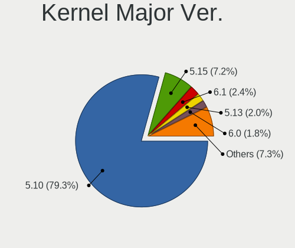
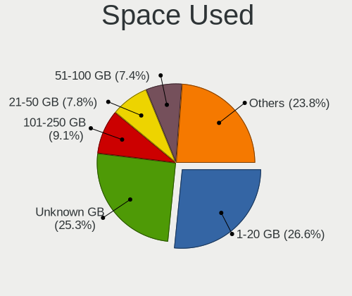
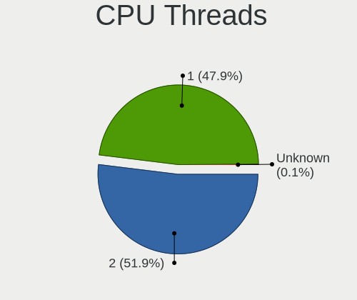
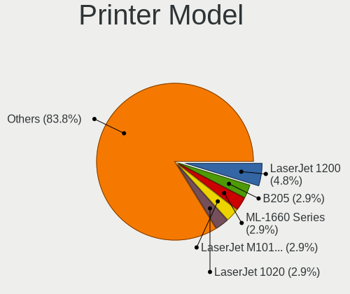

Debian 11 - Tested Hardware & Statistics (Desktops)
---------------------------------------------------

A project to collect tested hardware configurations for Debian 11.

Anyone can contribute to this report by the [hw-probe](https://github.com/linuxhw/hw-probe) tool:

    sudo -E hw-probe -all -upload

Please submit a probe of your configuration if it's not presented on the page or is rare.

Full-feature report is available here: https://linux-hardware.org/?view=trends&rel=debian-11

Contents
--------

* [ Test Cases ](#test-cases)

* [ System ](#system)
  - [ Kernel                   ](#kernel)
  - [ Kernel Family            ](#kernel-family)
  - [ Kernel Major Ver.        ](#kernel-major-ver)
  - [ Arch                     ](#arch)
  - [ DE                       ](#de)
  - [ Display Server           ](#display-server)
  - [ Display Manager          ](#display-manager)
  - [ OS Lang                  ](#os-lang)
  - [ Boot Mode                ](#boot-mode)
  - [ Filesystem               ](#filesystem)
  - [ Part. scheme             ](#part-scheme)
  - [ Dual Boot with Linux/BSD ](#dual-boot-with-linuxbsd)
  - [ Dual Boot (Win)          ](#dual-boot-win)

* [ Board ](#board)
  - [ Vendor                   ](#vendor)
  - [ Model                    ](#model)
  - [ Model Family             ](#model-family)
  - [ MFG Year                 ](#mfg-year)
  - [ Form Factor              ](#form-factor)
  - [ Secure Boot              ](#secure-boot)
  - [ Coreboot                 ](#coreboot)
  - [ RAM Size                 ](#ram-size)
  - [ RAM Used                 ](#ram-used)
  - [ Total Drives             ](#total-drives)
  - [ Has CD-ROM               ](#has-cd-rom)
  - [ Has Ethernet             ](#has-ethernet)
  - [ Has WiFi                 ](#has-wifi)
  - [ Has Bluetooth            ](#has-bluetooth)

* [ Location ](#location)
  - [ Country                  ](#country)
  - [ City                     ](#city)

* [ Drives ](#drives)
  - [ Drive Vendor             ](#drive-vendor)
  - [ Drive Model              ](#drive-model)
  - [ HDD Vendor               ](#hdd-vendor)
  - [ SSD Vendor               ](#ssd-vendor)
  - [ Drive Kind               ](#drive-kind)
  - [ Drive Connector          ](#drive-connector)
  - [ Drive Size               ](#drive-size)
  - [ Space Total              ](#space-total)
  - [ Space Used               ](#space-used)
  - [ Malfunc. Drives          ](#malfunc-drives)
  - [ Malfunc. Drive Vendor    ](#malfunc-drive-vendor)
  - [ Malfunc. HDD Vendor      ](#malfunc-hdd-vendor)
  - [ Malfunc. Drive Kind      ](#malfunc-drive-kind)
  - [ Failed Drives            ](#failed-drives)
  - [ Failed Drive Vendor      ](#failed-drive-vendor)
  - [ Drive Status             ](#drive-status)

* [ Storage controller ](#storage-controller)
  - [ Storage Vendor           ](#storage-vendor)
  - [ Storage Model            ](#storage-model)
  - [ Storage Kind             ](#storage-kind)

* [ Processor ](#processor)
  - [ CPU Vendor               ](#cpu-vendor)
  - [ CPU Model                ](#cpu-model)
  - [ CPU Model Family         ](#cpu-model-family)
  - [ CPU Cores                ](#cpu-cores)
  - [ CPU Sockets              ](#cpu-sockets)
  - [ CPU Threads              ](#cpu-threads)
  - [ CPU Op-Modes             ](#cpu-op-modes)
  - [ CPU Microcode            ](#cpu-microcode)
  - [ CPU Microarch            ](#cpu-microarch)

* [ Graphics ](#graphics)
  - [ GPU Vendor               ](#gpu-vendor)
  - [ GPU Model                ](#gpu-model)
  - [ GPU Combo                ](#gpu-combo)
  - [ GPU Driver               ](#gpu-driver)
  - [ GPU Memory               ](#gpu-memory)

* [ Monitor ](#monitor)
  - [ Monitor Vendor           ](#monitor-vendor)
  - [ Monitor Model            ](#monitor-model)
  - [ Monitor Resolution       ](#monitor-resolution)
  - [ Monitor Diagonal         ](#monitor-diagonal)
  - [ Monitor Width            ](#monitor-width)
  - [ Aspect Ratio             ](#aspect-ratio)
  - [ Monitor Area             ](#monitor-area)
  - [ Pixel Density            ](#pixel-density)
  - [ Multiple Monitors        ](#multiple-monitors)

* [ Network ](#network)
  - [ Net Controller Vendor    ](#net-controller-vendor)
  - [ Net Controller Model     ](#net-controller-model)
  - [ Wireless Vendor          ](#wireless-vendor)
  - [ Wireless Model           ](#wireless-model)
  - [ Ethernet Vendor          ](#ethernet-vendor)
  - [ Ethernet Model           ](#ethernet-model)
  - [ Net Controller Kind      ](#net-controller-kind)
  - [ Used Controller          ](#used-controller)
  - [ NICs                     ](#nics)
  - [ IPv6                     ](#ipv6)

* [ Bluetooth ](#bluetooth)
  - [ Bluetooth Vendor         ](#bluetooth-vendor)
  - [ Bluetooth Model          ](#bluetooth-model)

* [ Sound ](#sound)
  - [ Sound Vendor             ](#sound-vendor)
  - [ Sound Model              ](#sound-model)

* [ Memory ](#memory)
  - [ Memory Vendor            ](#memory-vendor)
  - [ Memory Model             ](#memory-model)
  - [ Memory Kind              ](#memory-kind)
  - [ Memory Form Factor       ](#memory-form-factor)
  - [ Memory Size              ](#memory-size)
  - [ Memory Speed             ](#memory-speed)

* [ Printers & scanners ](#printers--scanners)
  - [ Printer Vendor           ](#printer-vendor)
  - [ Printer Model            ](#printer-model)
  - [ Scanner Vendor           ](#scanner-vendor)
  - [ Scanner Model            ](#scanner-model)

* [ Camera ](#camera)
  - [ Camera Vendor            ](#camera-vendor)
  - [ Camera Model             ](#camera-model)

* [ Security ](#security)
  - [ Fingerprint Vendor       ](#fingerprint-vendor)
  - [ Fingerprint Model        ](#fingerprint-model)
  - [ Chipcard Vendor          ](#chipcard-vendor)
  - [ Chipcard Model           ](#chipcard-model)

* [ Unsupported ](#unsupported)
  - [ Unsupported Devices      ](#unsupported-devices)
  - [ Unsupported Device Types ](#unsupported-device-types)

Test Cases
----------

| Vendor        | Model                       | Probe                                                      | Date         |
|---------------|-----------------------------|------------------------------------------------------------|--------------|
| ECS           | H61H2-M13                   | [58efd773fc](https://linux-hardware.org/?probe=58efd773fc) | Sep 17, 2021 |
| ECS           | H61H2-M13                   | [6f61a4bed1](https://linux-hardware.org/?probe=6f61a4bed1) | Sep 17, 2021 |
| ECS           | H61H2-M13                   | [2847b27014](https://linux-hardware.org/?probe=2847b27014) | Sep 17, 2021 |
| Foxconn       | H61MXL/H61MXL-K             | [f6cde497b4](https://linux-hardware.org/?probe=f6cde497b4) | Sep 17, 2021 |
| ECS           | H61H2-M13                   | [ca5062256b](https://linux-hardware.org/?probe=ca5062256b) | Sep 17, 2021 |
| ECS           | H61H2-M13                   | [8b0908956f](https://linux-hardware.org/?probe=8b0908956f) | Sep 17, 2021 |
| ECS           | H61H2-M13                   | [35b84b3b23](https://linux-hardware.org/?probe=35b84b3b23) | Sep 17, 2021 |
| ECS           | H61H2-M13                   | [fd3abf36d9](https://linux-hardware.org/?probe=fd3abf36d9) | Sep 17, 2021 |
| ECS           | H61H2-M13                   | [49001d8064](https://linux-hardware.org/?probe=49001d8064) | Sep 17, 2021 |
| Gigabyte      | H61M-DS2                    | [3fde672bb3](https://linux-hardware.org/?probe=3fde672bb3) | Sep 17, 2021 |
| Gigabyte      | H61M-DS2                    | [77f32a8e42](https://linux-hardware.org/?probe=77f32a8e42) | Sep 17, 2021 |
| MSI           | Z370 PC PRO                 | [c79178e6db](https://linux-hardware.org/?probe=c79178e6db) | Sep 17, 2021 |
| Dell          | 0X8DXD A00                  | [1fe7a4c597](https://linux-hardware.org/?probe=1fe7a4c597) | Sep 17, 2021 |
| Dell          | 0X8DXD A00                  | [cbe5d18ac2](https://linux-hardware.org/?probe=cbe5d18ac2) | Sep 17, 2021 |
| Libretrend    | LT1000                      | [781fa86fea](https://linux-hardware.org/?probe=781fa86fea) | Sep 17, 2021 |
| ECS           | G31T-M9                     | [ba4a294b69](https://linux-hardware.org/?probe=ba4a294b69) | Sep 16, 2021 |
| ASUSTek       | H81M-PLUS                   | [d1a7e38fc8](https://linux-hardware.org/?probe=d1a7e38fc8) | Sep 16, 2021 |
| ASUSTek       | PRIME X570-P                | [3ef71721e0](https://linux-hardware.org/?probe=3ef71721e0) | Sep 16, 2021 |
| ASUSTek       | H81M-PLUS                   | [e8ac4691b0](https://linux-hardware.org/?probe=e8ac4691b0) | Sep 16, 2021 |
| ASUSTek       | B75M-PLUS                   | [6056c96428](https://linux-hardware.org/?probe=6056c96428) | Sep 16, 2021 |
| ASUSTek       | PRIME B450M-A               | [4bb2af8998](https://linux-hardware.org/?probe=4bb2af8998) | Sep 16, 2021 |
| ASRock        | H470M-HVS                   | [233ad54ef9](https://linux-hardware.org/?probe=233ad54ef9) | Sep 16, 2021 |
| ASRock        | H470M-HVS                   | [d4e804931a](https://linux-hardware.org/?probe=d4e804931a) | Sep 15, 2021 |
| ASUSTek       | PRIME A320M-K               | [f6f26d4c8e](https://linux-hardware.org/?probe=f6f26d4c8e) | Sep 14, 2021 |
| ASUSTek       | PRIME A320M-K               | [54e89a0f5a](https://linux-hardware.org/?probe=54e89a0f5a) | Sep 14, 2021 |
| Positivo      | POS-PIQ77CL                 | [87ec217aed](https://linux-hardware.org/?probe=87ec217aed) | Sep 14, 2021 |
| ASUSTek       | P5Q-EM                      | [7f6f4bedd3](https://linux-hardware.org/?probe=7f6f4bedd3) | Sep 14, 2021 |
| MSI           | H81M-P33                    | [b5b64471de](https://linux-hardware.org/?probe=b5b64471de) | Sep 13, 2021 |
| Dell          | 0KC9NP A01                  | [3be45aba31](https://linux-hardware.org/?probe=3be45aba31) | Sep 13, 2021 |
| ASRock        | AM1B-ITX                    | [b15ebc1577](https://linux-hardware.org/?probe=b15ebc1577) | Sep 13, 2021 |
| MSI           | Z170-A PRO                  | [5b702a6c05](https://linux-hardware.org/?probe=5b702a6c05) | Sep 12, 2021 |
| Gigabyte      | H81M-S                      | [8109d84e42](https://linux-hardware.org/?probe=8109d84e42) | Sep 12, 2021 |
| ASUSTek       | M32CD_A_F_K20CD_K31CD       | [cf7cbe9ec0](https://linux-hardware.org/?probe=cf7cbe9ec0) | Sep 12, 2021 |
| MSI           | A68HM-E33 V2                | [1fc1622a64](https://linux-hardware.org/?probe=1fc1622a64) | Sep 12, 2021 |
| Lenovo        | 0x30F617AA SDK0J40697 WI... | [f81450ac96](https://linux-hardware.org/?probe=f81450ac96) | Sep 11, 2021 |
| ASUSTek       | PRIME X570-PRO              | [c9bcb0db96](https://linux-hardware.org/?probe=c9bcb0db96) | Sep 11, 2021 |
| Fujitsu Si... | D2608-A1 S26361-D2608-A1    | [0e9729a88b](https://linux-hardware.org/?probe=0e9729a88b) | Sep 11, 2021 |
| Acer          | Aspire M3420                | [dfd381db06](https://linux-hardware.org/?probe=dfd381db06) | Sep 10, 2021 |
| Acer          | Aspire M3420                | [7a4ab56f68](https://linux-hardware.org/?probe=7a4ab56f68) | Sep 10, 2021 |
| Gigabyte      | H61M-DS2                    | [c2b2ebce62](https://linux-hardware.org/?probe=c2b2ebce62) | Sep 09, 2021 |
| ASUSTek       | P6T DELUXE V2               | [3fa68fe391](https://linux-hardware.org/?probe=3fa68fe391) | Sep 09, 2021 |
| Gigabyte      | H61M-DS2                    | [8bc230f7dc](https://linux-hardware.org/?probe=8bc230f7dc) | Sep 09, 2021 |
| Dell          | 0WMJ54 A01                  | [fb3d977ed2](https://linux-hardware.org/?probe=fb3d977ed2) | Sep 09, 2021 |
| ASUSTek       | P6T DELUXE V2               | [488fd18d85](https://linux-hardware.org/?probe=488fd18d85) | Sep 09, 2021 |
| Dell          | 040DDP A01                  | [19d6905d9a](https://linux-hardware.org/?probe=19d6905d9a) | Sep 09, 2021 |
| Gigabyte      | M61PME-S2P                  | [0baa540bf5](https://linux-hardware.org/?probe=0baa540bf5) | Sep 08, 2021 |
| Foxconn       | nT-A3000 series FAB         | [9e22d6dc70](https://linux-hardware.org/?probe=9e22d6dc70) | Sep 08, 2021 |
| ASUSTek       | P6T DELUXE V2               | [f8aae7ade2](https://linux-hardware.org/?probe=f8aae7ade2) | Sep 08, 2021 |
| ASUSTek       | B85M-G                      | [a826f2f4c9](https://linux-hardware.org/?probe=a826f2f4c9) | Sep 08, 2021 |
| Gigabyte      | H61M-DS2                    | [5aa6e46608](https://linux-hardware.org/?probe=5aa6e46608) | Sep 08, 2021 |
| Gigabyte      | M61PME-S2P                  | [2626e29c5f](https://linux-hardware.org/?probe=2626e29c5f) | Sep 08, 2021 |
| ASUSTek       | Z87-A                       | [04ecb299d9](https://linux-hardware.org/?probe=04ecb299d9) | Sep 08, 2021 |
| ASUSTek       | B85M-G                      | [b521805956](https://linux-hardware.org/?probe=b521805956) | Sep 08, 2021 |
| ASUSTek       | B85M-G                      | [c4f6c7da11](https://linux-hardware.org/?probe=c4f6c7da11) | Sep 08, 2021 |
| ASUSTek       | B85M-G                      | [a4acb4b4d7](https://linux-hardware.org/?probe=a4acb4b4d7) | Sep 08, 2021 |
| ASUSTek       | B85M-G                      | [33ae3adcc6](https://linux-hardware.org/?probe=33ae3adcc6) | Sep 08, 2021 |
| Gigabyte      | H81M-S2V                    | [cb2158566c](https://linux-hardware.org/?probe=cb2158566c) | Sep 08, 2021 |
| Dell          | 0X8DXD A00                  | [65e545345d](https://linux-hardware.org/?probe=65e545345d) | Sep 07, 2021 |
| Gigabyte      | M61PME-S2P                  | [41ab6b2f21](https://linux-hardware.org/?probe=41ab6b2f21) | Sep 07, 2021 |
| ASUSTek       | B85M-G                      | [5acaf42867](https://linux-hardware.org/?probe=5acaf42867) | Sep 07, 2021 |
| ASUSTek       | B85M-G                      | [4d6ad821df](https://linux-hardware.org/?probe=4d6ad821df) | Sep 07, 2021 |
| ASUSTek       | B85M-G                      | [511d2e120b](https://linux-hardware.org/?probe=511d2e120b) | Sep 07, 2021 |
| Gigabyte      | H81M-S2V                    | [13256468d1](https://linux-hardware.org/?probe=13256468d1) | Sep 07, 2021 |
| ASUSTek       | P5Q3                        | [3f08e7bf37](https://linux-hardware.org/?probe=3f08e7bf37) | Sep 07, 2021 |
| ASUSTek       | B85M-G                      | [bcd1f7553d](https://linux-hardware.org/?probe=bcd1f7553d) | Sep 07, 2021 |
| ASUSTek       | B85M-G                      | [0c0ccb21d8](https://linux-hardware.org/?probe=0c0ccb21d8) | Sep 07, 2021 |
| ASUSTek       | H81M-C                      | [cf59508b79](https://linux-hardware.org/?probe=cf59508b79) | Sep 07, 2021 |
| ASUSTek       | B85M-G                      | [1c85c31f57](https://linux-hardware.org/?probe=1c85c31f57) | Sep 07, 2021 |
| ASUSTek       | B85M-G                      | [6cf8ebc24c](https://linux-hardware.org/?probe=6cf8ebc24c) | Sep 07, 2021 |
| ASUSTek       | B85M-G                      | [bf328adcb8](https://linux-hardware.org/?probe=bf328adcb8) | Sep 07, 2021 |
| ASUSTek       | B85M-G                      | [09e28c958c](https://linux-hardware.org/?probe=09e28c958c) | Sep 07, 2021 |
| HP            | 212A                        | [7f51e384f7](https://linux-hardware.org/?probe=7f51e384f7) | Sep 07, 2021 |
| HP            | 212A                        | [c89a2196ab](https://linux-hardware.org/?probe=c89a2196ab) | Sep 07, 2021 |
| ASUSTek       | STRIX B250H GAMING          | [265822ee2e](https://linux-hardware.org/?probe=265822ee2e) | Sep 06, 2021 |
| ASUSTek       | P5Q-PRO                     | [a0d1d9b2e6](https://linux-hardware.org/?probe=a0d1d9b2e6) | Sep 06, 2021 |
| ECS           | H61H2-M13                   | [4aec08beef](https://linux-hardware.org/?probe=4aec08beef) | Sep 06, 2021 |
| Dell          | 0X8DXD A00                  | [28c59930e4](https://linux-hardware.org/?probe=28c59930e4) | Sep 05, 2021 |
| Gigabyte      | Z77X-UP5 TH-CF              | [20f947223f](https://linux-hardware.org/?probe=20f947223f) | Sep 05, 2021 |
| ASUSTek       | PRIME H410M-E               | [af5a140c2e](https://linux-hardware.org/?probe=af5a140c2e) | Sep 04, 2021 |
| ASRock        | TRX40 Creator               | [0734c9bbd0](https://linux-hardware.org/?probe=0734c9bbd0) | Sep 03, 2021 |
| ASRock        | 960GM/U3S3 FX               | [ced0e47579](https://linux-hardware.org/?probe=ced0e47579) | Sep 02, 2021 |
| ECS           | G31T-M9                     | [0757de543d](https://linux-hardware.org/?probe=0757de543d) | Sep 02, 2021 |
| Gigabyte      | 8I945P-G                    | [a1eb33a5f1](https://linux-hardware.org/?probe=a1eb33a5f1) | Sep 02, 2021 |
| ASUSTek       | ROG STRIX Z390-E GAMING     | [d4c78cc3c4](https://linux-hardware.org/?probe=d4c78cc3c4) | Sep 02, 2021 |
| Fujitsu       | D3041-A1 S26361-D3041-A1    | [ca0e00bc0f](https://linux-hardware.org/?probe=ca0e00bc0f) | Sep 01, 2021 |
| ECS           | H61H2-M13                   | [e96ab5fb39](https://linux-hardware.org/?probe=e96ab5fb39) | Sep 01, 2021 |
| MSI           | H110M PRO-VD                | [78fafc3314](https://linux-hardware.org/?probe=78fafc3314) | Sep 01, 2021 |
| Dell          | 0M863N A00                  | [d8083308fc](https://linux-hardware.org/?probe=d8083308fc) | Sep 01, 2021 |
| ASRock        | N68-VS3 FX                  | [450ffd830c](https://linux-hardware.org/?probe=450ffd830c) | Sep 01, 2021 |
| Intel         | DH77KC AAG39641-400         | [dadb397ef1](https://linux-hardware.org/?probe=dadb397ef1) | Sep 01, 2021 |
| Pegatron      | TRUCKEE                     | [68f16e9542](https://linux-hardware.org/?probe=68f16e9542) | Sep 01, 2021 |
| ASRock        | H61M-VG4                    | [6521e0d6be](https://linux-hardware.org/?probe=6521e0d6be) | Aug 31, 2021 |
| ASRock        | H470M-HVS                   | [9c31643811](https://linux-hardware.org/?probe=9c31643811) | Aug 31, 2021 |
| ASUSTek       | P7P55D-E                    | [4c05b36e94](https://linux-hardware.org/?probe=4c05b36e94) | Aug 31, 2021 |
| ASRock        | H470M-HVS                   | [37c3e457bc](https://linux-hardware.org/?probe=37c3e457bc) | Aug 31, 2021 |
| ASRock        | H470M-HVS                   | [0d38048f46](https://linux-hardware.org/?probe=0d38048f46) | Aug 31, 2021 |
| Intel         | DH77KC AAG39641-400         | [d7eaf975a0](https://linux-hardware.org/?probe=d7eaf975a0) | Aug 31, 2021 |
| ASRock        | H470M-HVS                   | [df9b303eec](https://linux-hardware.org/?probe=df9b303eec) | Aug 31, 2021 |
| ASRock        | H470M-HVS                   | [d9af23fb86](https://linux-hardware.org/?probe=d9af23fb86) | Aug 31, 2021 |
| AOpen         | D1001 C26361-D1001          | [e27239d870](https://linux-hardware.org/?probe=e27239d870) | Aug 31, 2021 |
| ASUSTek       | B85M-G                      | [1470c8cc7f](https://linux-hardware.org/?probe=1470c8cc7f) | Aug 31, 2021 |
| ASRock        | H470M-HVS                   | [ba7144c0dc](https://linux-hardware.org/?probe=ba7144c0dc) | Aug 31, 2021 |
| ASRock        | H470M-HVS                   | [7204a77b38](https://linux-hardware.org/?probe=7204a77b38) | Aug 31, 2021 |
| ASRock        | H470M-HVS                   | [c6a754129a](https://linux-hardware.org/?probe=c6a754129a) | Aug 30, 2021 |
| ASRock        | H470M-HVS                   | [a251dca266](https://linux-hardware.org/?probe=a251dca266) | Aug 30, 2021 |
| Intel         | DH67BL AAG10189-206         | [b7b3f489f2](https://linux-hardware.org/?probe=b7b3f489f2) | Aug 30, 2021 |
| Gigabyte      | H81M-S2V                    | [d255f48a39](https://linux-hardware.org/?probe=d255f48a39) | Aug 30, 2021 |
| ASRock        | H61M-VG4                    | [dc0abe4fcd](https://linux-hardware.org/?probe=dc0abe4fcd) | Aug 30, 2021 |
| ASRock        | H61M-VG4                    | [fc61c24624](https://linux-hardware.org/?probe=fc61c24624) | Aug 30, 2021 |
| Gigabyte      | H81M-S2V                    | [9d1b86643e](https://linux-hardware.org/?probe=9d1b86643e) | Aug 30, 2021 |
| ASUSTek       | PRIME B550-PLUS             | [b9595196ea](https://linux-hardware.org/?probe=b9595196ea) | Aug 28, 2021 |
| NC9VL         | 1.0                         | [9c4b8ad466](https://linux-hardware.org/?probe=9c4b8ad466) | Aug 28, 2021 |
| MSI           | B150A GAMING PRO            | [06de6cd826](https://linux-hardware.org/?probe=06de6cd826) | Aug 27, 2021 |
| ASRock        | H470M-HVS                   | [46eacf8d5c](https://linux-hardware.org/?probe=46eacf8d5c) | Aug 27, 2021 |
| Intel         | DN2820FYK H24582-201        | [06f4334a82](https://linux-hardware.org/?probe=06f4334a82) | Aug 27, 2021 |
| ASUSTek       | WS X299 SAGE                | [7f3a68dd2a](https://linux-hardware.org/?probe=7f3a68dd2a) | Aug 27, 2021 |
| ASRock        | H470M-HVS                   | [2737cfb67d](https://linux-hardware.org/?probe=2737cfb67d) | Aug 27, 2021 |
| ASRock        | H470M-HVS                   | [dc9428d8b4](https://linux-hardware.org/?probe=dc9428d8b4) | Aug 27, 2021 |
| HP            | 0B0Ch                       | [b5933fde35](https://linux-hardware.org/?probe=b5933fde35) | Aug 26, 2021 |
| Fujitsu       | D3219-A1 S26361-D3219-A1    | [f26ade88cd](https://linux-hardware.org/?probe=f26ade88cd) | Aug 26, 2021 |
| Dell          | 0WR7PY A00                  | [cb25b1811b](https://linux-hardware.org/?probe=cb25b1811b) | Aug 26, 2021 |
| Dell          | 0X8DXD A00                  | [8dd8862b4b](https://linux-hardware.org/?probe=8dd8862b4b) | Aug 26, 2021 |
| ASRock        | H470M-HVS                   | [d37f13917f](https://linux-hardware.org/?probe=d37f13917f) | Aug 25, 2021 |
| ASRock        | C2750D4I                    | [6daa3c26bf](https://linux-hardware.org/?probe=6daa3c26bf) | Aug 25, 2021 |
| Gigabyte      | X570 I AORUS PRO WIFI       | [0a79171c9e](https://linux-hardware.org/?probe=0a79171c9e) | Aug 25, 2021 |
| ASUSTek       | P5KPL-CM                    | [feed9e2921](https://linux-hardware.org/?probe=feed9e2921) | Aug 25, 2021 |
| Biostar       | Hi-Fi A85W                  | [ffb66dafd4](https://linux-hardware.org/?probe=ffb66dafd4) | Aug 25, 2021 |
| AAEON         | MF-001 V1.0                 | [b06c4079a7](https://linux-hardware.org/?probe=b06c4079a7) | Aug 25, 2021 |
| Dell          | 040DDP A01                  | [557d74beb9](https://linux-hardware.org/?probe=557d74beb9) | Aug 25, 2021 |
| ASRock        | H470M-HVS                   | [e5c92fe4ad](https://linux-hardware.org/?probe=e5c92fe4ad) | Aug 24, 2021 |
| ASRock        | H470M-HVS                   | [441b8b892e](https://linux-hardware.org/?probe=441b8b892e) | Aug 24, 2021 |
| ASRock        | P4i65G                      | [43ce3e711f](https://linux-hardware.org/?probe=43ce3e711f) | Aug 24, 2021 |
| ASRock        | H77 Pro4/MVP                | [c2179206a9](https://linux-hardware.org/?probe=c2179206a9) | Aug 24, 2021 |
| Unknown       | 1.0                         | [5e638360a8](https://linux-hardware.org/?probe=5e638360a8) | Aug 24, 2021 |
| ASUSTek       | GA35DX                      | [3843ea048e](https://linux-hardware.org/?probe=3843ea048e) | Aug 24, 2021 |
| ASRock        | H470M-HVS                   | [e92004f46a](https://linux-hardware.org/?probe=e92004f46a) | Aug 23, 2021 |
| ASRock        | H470M-HVS                   | [06c9a1ed3a](https://linux-hardware.org/?probe=06c9a1ed3a) | Aug 23, 2021 |
| ASUSTek       | P5KPL-CM                    | [06234ebe05](https://linux-hardware.org/?probe=06234ebe05) | Aug 23, 2021 |
| MSI           | Z270-A PRO                  | [73b14ecca0](https://linux-hardware.org/?probe=73b14ecca0) | Aug 23, 2021 |
| ASUSTek       | TUF GAMING X570-PRO         | [eea45758b7](https://linux-hardware.org/?probe=eea45758b7) | Aug 22, 2021 |
| HP            | 085Ch                       | [2e649d07a0](https://linux-hardware.org/?probe=2e649d07a0) | Aug 21, 2021 |
| HP            | 085Ch                       | [c5b36c5187](https://linux-hardware.org/?probe=c5b36c5187) | Aug 21, 2021 |
| ASRock        | Z97 Pro3                    | [0f9abf9c63](https://linux-hardware.org/?probe=0f9abf9c63) | Aug 21, 2021 |
| ASUSTek       | TUF GAMING X570-PRO         | [7f83e1b3c8](https://linux-hardware.org/?probe=7f83e1b3c8) | Aug 21, 2021 |
| ASUSTek       | P5B SE                      | [81634fcb22](https://linux-hardware.org/?probe=81634fcb22) | Aug 21, 2021 |
| MSI           | Z270-A PRO                  | [e59c9482f6](https://linux-hardware.org/?probe=e59c9482f6) | Aug 21, 2021 |
| ASRock        | H470M-HVS                   | [cba7d82942](https://linux-hardware.org/?probe=cba7d82942) | Aug 20, 2021 |
| ASRock        | H470M-HVS                   | [62068f391f](https://linux-hardware.org/?probe=62068f391f) | Aug 20, 2021 |
| ASRock        | H470M-HVS                   | [c980f2d201](https://linux-hardware.org/?probe=c980f2d201) | Aug 20, 2021 |
| Dell          | 0Y2K8N A01                  | [6b0fd02c91](https://linux-hardware.org/?probe=6b0fd02c91) | Aug 20, 2021 |
| Intel         | DG33BU AAD79951-407         | [17c70c7886](https://linux-hardware.org/?probe=17c70c7886) | Aug 19, 2021 |
| HP            | 339A                        | [57d5bbd1e4](https://linux-hardware.org/?probe=57d5bbd1e4) | Aug 19, 2021 |
| Gigabyte      | A320M-S2H-CF                | [2151b5cdae](https://linux-hardware.org/?probe=2151b5cdae) | Aug 19, 2021 |
| HP            | 1587h                       | [3ddbdb3101](https://linux-hardware.org/?probe=3ddbdb3101) | Aug 19, 2021 |
| ASRock        | H470M-HVS                   | [0489699bc4](https://linux-hardware.org/?probe=0489699bc4) | Aug 19, 2021 |
| MSI           | B450M PRO-M2 MAX            | [cc54b8955c](https://linux-hardware.org/?probe=cc54b8955c) | Aug 19, 2021 |
| ASRock        | H470M-HVS                   | [757e261c56](https://linux-hardware.org/?probe=757e261c56) | Aug 19, 2021 |
| Lenovo        | MAHOBAY                     | [df15656fce](https://linux-hardware.org/?probe=df15656fce) | Aug 19, 2021 |
| ASUSTek       | ROG STRIX B450-F GAMING     | [6f5485edfc](https://linux-hardware.org/?probe=6f5485edfc) | Aug 18, 2021 |
| ASUSTek       | ROG STRIX B550-E GAMING     | [1fce0ab0e8](https://linux-hardware.org/?probe=1fce0ab0e8) | Aug 18, 2021 |
| Lenovo        | Board                       | [3de8569fe7](https://linux-hardware.org/?probe=3de8569fe7) | Aug 18, 2021 |
| ASUSTek       | H81M-R                      | [8598ad2248](https://linux-hardware.org/?probe=8598ad2248) | Aug 18, 2021 |
| ASUSTek       | B150M-K                     | [3f706a2a69](https://linux-hardware.org/?probe=3f706a2a69) | Aug 18, 2021 |
| ASUSTek       | P7H55-M SI                  | [9f3381d34c](https://linux-hardware.org/?probe=9f3381d34c) | Aug 18, 2021 |
| ASRock        | B460 Phantom Gaming 4       | [85cfabd795](https://linux-hardware.org/?probe=85cfabd795) | Aug 18, 2021 |
| ASUSTek       | P7H55-M SI                  | [765f5d340e](https://linux-hardware.org/?probe=765f5d340e) | Aug 18, 2021 |
| ASRock        | J4205-ITX                   | [30de75d2c8](https://linux-hardware.org/?probe=30de75d2c8) | Aug 18, 2021 |
| ASUSTek       | A68HM-PLUS                  | [b2ed4bc6fe](https://linux-hardware.org/?probe=b2ed4bc6fe) | Aug 18, 2021 |
| Gigabyte      | Z97N-WIFI                   | [be9383850e](https://linux-hardware.org/?probe=be9383850e) | Aug 17, 2021 |
| Fujitsu Si... | D2840-A1 S26361-D2840-A1    | [7911fbd6a6](https://linux-hardware.org/?probe=7911fbd6a6) | Aug 17, 2021 |
| MSI           | FM2-A55M-E33                | [6972c43e80](https://linux-hardware.org/?probe=6972c43e80) | Aug 17, 2021 |
| ASUSTek       | P5KC                        | [5e2f61d652](https://linux-hardware.org/?probe=5e2f61d652) | Aug 16, 2021 |
| Intel         | DN2820FYK H24582-201        | [86cf4755a0](https://linux-hardware.org/?probe=86cf4755a0) | Aug 16, 2021 |
| ASRock        | B460 Phantom Gaming 4       | [51f9388874](https://linux-hardware.org/?probe=51f9388874) | Aug 15, 2021 |
| ASUSTek       | STRIX B250H GAMING          | [88160f850f](https://linux-hardware.org/?probe=88160f850f) | Aug 15, 2021 |
| ASUSTek       | M5A99X EVO                  | [53aff8d681](https://linux-hardware.org/?probe=53aff8d681) | Aug 15, 2021 |
| ECS           | KBN-I                       | [bbfe1ba1a2](https://linux-hardware.org/?probe=bbfe1ba1a2) | Aug 15, 2021 |
| ASUSTek       | Pro WS X570-ACE             | [987ab1f3bf](https://linux-hardware.org/?probe=987ab1f3bf) | Aug 15, 2021 |
| ASUSTek       | ROG STRIX TRX40-XE GAMIN... | [a6e0859eac](https://linux-hardware.org/?probe=a6e0859eac) | Aug 14, 2021 |
| ASUSTek       | ROG STRIX TRX40-XE GAMIN... | [5ce5d800d3](https://linux-hardware.org/?probe=5ce5d800d3) | Aug 14, 2021 |
| ASUSTek       | PRIME Z390-P                | [dfe51161fe](https://linux-hardware.org/?probe=dfe51161fe) | Aug 14, 2021 |
| ASRock        | Z97 Pro3                    | [0e5746a060](https://linux-hardware.org/?probe=0e5746a060) | Aug 14, 2021 |
| Dell          | 0X9M3X A01                  | [b5b9c80c53](https://linux-hardware.org/?probe=b5b9c80c53) | Aug 14, 2021 |
| HP            | 3397                        | [a3425b956c](https://linux-hardware.org/?probe=a3425b956c) | Aug 14, 2021 |
| Gigabyte      | A320M-S2H V2-CF             | [62faddbfaa](https://linux-hardware.org/?probe=62faddbfaa) | Aug 13, 2021 |
| ASUSTek       | X99-DELUXE                  | [f59179a579](https://linux-hardware.org/?probe=f59179a579) | Aug 13, 2021 |
| ASUSTek       | Z170-PRO                    | [7f9b5606a5](https://linux-hardware.org/?probe=7f9b5606a5) | Aug 13, 2021 |
| HP            | 3048h                       | [894950911f](https://linux-hardware.org/?probe=894950911f) | Aug 11, 2021 |
| Gigabyte      | 970A-DS3P                   | [9b62457757](https://linux-hardware.org/?probe=9b62457757) | Aug 11, 2021 |
| ASUSTek       | PRIME A320M-K               | [40d1d24c90](https://linux-hardware.org/?probe=40d1d24c90) | Aug 11, 2021 |
| HP            | 2AF7                        | [649ed7df8e](https://linux-hardware.org/?probe=649ed7df8e) | Aug 10, 2021 |
| Intel         | DQ45CB AAE30148-207         | [56a573eeed](https://linux-hardware.org/?probe=56a573eeed) | Aug 10, 2021 |
| ASUSTek       | P7H55-M/USB3                | [6f4ad31000](https://linux-hardware.org/?probe=6f4ad31000) | Aug 10, 2021 |
| ASUSTek       | STRIX B250H GAMING          | [78223998b6](https://linux-hardware.org/?probe=78223998b6) | Aug 10, 2021 |
| MSI           | B250M PRO-VDH               | [d6be998202](https://linux-hardware.org/?probe=d6be998202) | Aug 10, 2021 |
| ASUSTek       | PRIME A320M-K               | [7cc269740d](https://linux-hardware.org/?probe=7cc269740d) | Aug 10, 2021 |
| Dell          | 04MFRM A01                  | [c0094def97](https://linux-hardware.org/?probe=c0094def97) | Aug 09, 2021 |
| MSI           | B450 TOMAHAWK               | [58b4f52cc0](https://linux-hardware.org/?probe=58b4f52cc0) | Aug 09, 2021 |
| ASUSTek       | P7H55-M/USB3                | [7ca1257064](https://linux-hardware.org/?probe=7ca1257064) | Aug 09, 2021 |
| Gigabyte      | A320M-S2H V2-CF             | [fffaf4c700](https://linux-hardware.org/?probe=fffaf4c700) | Aug 09, 2021 |
| Gigabyte      | H470M DS3H                  | [29de4693d8](https://linux-hardware.org/?probe=29de4693d8) | Aug 09, 2021 |
| ASRock        | 970A-G                      | [f1e9959894](https://linux-hardware.org/?probe=f1e9959894) | Aug 09, 2021 |
| Toshiba       | STI 910090 STIJ             | [389ebd7675](https://linux-hardware.org/?probe=389ebd7675) | Aug 08, 2021 |
| ASRock        | X370 Killer SLI             | [8a0885afb6](https://linux-hardware.org/?probe=8a0885afb6) | Aug 08, 2021 |
| MSI           | Z490-A PRO                  | [eac37d633f](https://linux-hardware.org/?probe=eac37d633f) | Aug 08, 2021 |
| ASRock        | Z97 Pro4                    | [090d12a96f](https://linux-hardware.org/?probe=090d12a96f) | Aug 08, 2021 |
| ASUSTek       | ROG STRIX B350-F GAMING     | [39eb5a1578](https://linux-hardware.org/?probe=39eb5a1578) | Aug 08, 2021 |
| Toshiba       | STI 005038 G31T-M7          | [faa8f15725](https://linux-hardware.org/?probe=faa8f15725) | Aug 08, 2021 |
| Gigabyte      | Z77-D3H                     | [9dafe47483](https://linux-hardware.org/?probe=9dafe47483) | Aug 07, 2021 |
| MSI           | X470 GAMING PLUS MAX        | [da833ac33e](https://linux-hardware.org/?probe=da833ac33e) | Aug 07, 2021 |
| ASUSTek       | TUF Z370-PLUS GAMING        | [80c7711147](https://linux-hardware.org/?probe=80c7711147) | Aug 07, 2021 |
| Gigabyte      | Z77-D3H                     | [4ff5966d22](https://linux-hardware.org/?probe=4ff5966d22) | Aug 07, 2021 |
| ASUSTek       | PRIME X470-PRO              | [5839492cd8](https://linux-hardware.org/?probe=5839492cd8) | Aug 07, 2021 |
| ASUSTek       | PRIME B460-PLUS             | [733a3e325c](https://linux-hardware.org/?probe=733a3e325c) | Aug 07, 2021 |
| Dell          | 08WKV3 A01                  | [8ab0ff9442](https://linux-hardware.org/?probe=8ab0ff9442) | Aug 07, 2021 |
| MSI           | MEG X399 CREATION           | [7cada9aaed](https://linux-hardware.org/?probe=7cada9aaed) | Aug 07, 2021 |
| MSI           | B250M PRO-VDH               | [187e4dd872](https://linux-hardware.org/?probe=187e4dd872) | Aug 07, 2021 |
| ASRock        | H470M-HVS                   | [545f7195ab](https://linux-hardware.org/?probe=545f7195ab) | Aug 06, 2021 |
| Gigabyte      | H81M-S2V                    | [9ec5eaeaf9](https://linux-hardware.org/?probe=9ec5eaeaf9) | Aug 06, 2021 |
| HP            | 2AF7                        | [1737071720](https://linux-hardware.org/?probe=1737071720) | Aug 06, 2021 |
| HP            | 2AF7                        | [c504247f44](https://linux-hardware.org/?probe=c504247f44) | Aug 06, 2021 |
| Gigabyte      | GA-78LMT-USB3               | [31d159af99](https://linux-hardware.org/?probe=31d159af99) | Aug 06, 2021 |
| Lenovo        | Board                       | [18138486db](https://linux-hardware.org/?probe=18138486db) | Aug 05, 2021 |
| Intel         | DN2820FYK H24582-201        | [7caf949908](https://linux-hardware.org/?probe=7caf949908) | Aug 05, 2021 |
| Unknown       | Intel X79                   | [fc0dedbb3c](https://linux-hardware.org/?probe=fc0dedbb3c) | Aug 05, 2021 |
| Gigabyte      | H81M-S2V                    | [10e9ef3d45](https://linux-hardware.org/?probe=10e9ef3d45) | Aug 05, 2021 |
| ASUSTek       | P8H61-M LX3 R2.0            | [8a70054744](https://linux-hardware.org/?probe=8a70054744) | Aug 04, 2021 |
| AMD           | 970A-D3                     | [91825066e0](https://linux-hardware.org/?probe=91825066e0) | Aug 04, 2021 |
| HP            | 3047h                       | [6294617672](https://linux-hardware.org/?probe=6294617672) | Aug 03, 2021 |
| ASRock        | FM2A68M-HD+                 | [a7bdbd8ebe](https://linux-hardware.org/?probe=a7bdbd8ebe) | Aug 03, 2021 |
| ASUSTek       | PRIME B450-PLUS             | [55cd593df1](https://linux-hardware.org/?probe=55cd593df1) | Aug 03, 2021 |
| Gigabyte      | X399 AORUS XTREME-CF        | [3a2fd430f6](https://linux-hardware.org/?probe=3a2fd430f6) | Aug 03, 2021 |
| MSI           | 760GM-P23                   | [93b6f212af](https://linux-hardware.org/?probe=93b6f212af) | Aug 02, 2021 |
| Supermicro    | X11SSH-F                    | [641e4fd8ce](https://linux-hardware.org/?probe=641e4fd8ce) | Aug 02, 2021 |
| ASRock        | H310CM-DVS                  | [f84e5eba5a](https://linux-hardware.org/?probe=f84e5eba5a) | Aug 02, 2021 |
| ASUSTek       | M4A785TD-M EVO              | [e90a873ad0](https://linux-hardware.org/?probe=e90a873ad0) | Aug 02, 2021 |
| ASUSTek       | P5QL-E                      | [2894e88095](https://linux-hardware.org/?probe=2894e88095) | Aug 02, 2021 |
| ASUSTek       | A88X-PRO                    | [ed95430eec](https://linux-hardware.org/?probe=ed95430eec) | Aug 02, 2021 |
| HP            | 2187 A01                    | [16bfdd86e3](https://linux-hardware.org/?probe=16bfdd86e3) | Aug 02, 2021 |
| Gigabyte      | 970A-DS3P                   | [61886d812f](https://linux-hardware.org/?probe=61886d812f) | Aug 01, 2021 |
| ASRock        | J1900D2Y                    | [0dc4afc8c4](https://linux-hardware.org/?probe=0dc4afc8c4) | Aug 01, 2021 |
| ASRock        | N68C-S UCC                  | [3da0d57fd5](https://linux-hardware.org/?probe=3da0d57fd5) | Aug 01, 2021 |
| Dell          | 0WVYMC A00                  | [4d2aa42e3c](https://linux-hardware.org/?probe=4d2aa42e3c) | Jul 31, 2021 |
| ASUSTek       | Pro WS WRX80E-SAGE SE WI... | [159ff0ba7f](https://linux-hardware.org/?probe=159ff0ba7f) | Jul 31, 2021 |
| ASRock        | Z370M-ITX/ac                | [30511d93c4](https://linux-hardware.org/?probe=30511d93c4) | Jul 31, 2021 |
| ASUSTek       | Pro WS WRX80E-SAGE SE WI... | [3f0c3901f6](https://linux-hardware.org/?probe=3f0c3901f6) | Jul 30, 2021 |
| MSI           | Z490-A PRO                  | [b882a9cf0d](https://linux-hardware.org/?probe=b882a9cf0d) | Jul 29, 2021 |
| MSI           | Q45MDO                      | [ab547f0047](https://linux-hardware.org/?probe=ab547f0047) | Jul 29, 2021 |
| MSI           | Q45MDO                      | [6b5aaa6969](https://linux-hardware.org/?probe=6b5aaa6969) | Jul 29, 2021 |
| Dell          | 0TY915                      | [9cb5aed659](https://linux-hardware.org/?probe=9cb5aed659) | Jul 29, 2021 |
| Gigabyte      | B550M AORUS PRO-P           | [ed7394c65a](https://linux-hardware.org/?probe=ed7394c65a) | Jul 29, 2021 |
| ASUSTek       | LEONITE                     | [3bf9048839](https://linux-hardware.org/?probe=3bf9048839) | Jul 29, 2021 |
| Foxconn       | 2AA9                        | [920a813aaf](https://linux-hardware.org/?probe=920a813aaf) | Jul 29, 2021 |
| ASRock        | B85M Pro4                   | [32e615b538](https://linux-hardware.org/?probe=32e615b538) | Jul 29, 2021 |
| ASRock        | FM2A88X Extreme6+           | [f449b8ce85](https://linux-hardware.org/?probe=f449b8ce85) | Jul 29, 2021 |
| ECS           | H61H2-M12                   | [42050ab984](https://linux-hardware.org/?probe=42050ab984) | Jul 28, 2021 |
| MSI           | B450M PRO-VDH PLUS          | [cccaebb483](https://linux-hardware.org/?probe=cccaebb483) | Jul 28, 2021 |
| Gigabyte      | H61M-DS2                    | [21c6bb9dde](https://linux-hardware.org/?probe=21c6bb9dde) | Jul 28, 2021 |
| Gigabyte      | GA-990FX-GAMING             | [4206886abb](https://linux-hardware.org/?probe=4206886abb) | Jul 28, 2021 |
| Gigabyte      | GA-990FX-GAMING             | [d244dc6763](https://linux-hardware.org/?probe=d244dc6763) | Jul 28, 2021 |
| MSI           | MAG X570 TOMAHAWK WIFI      | [f96bcc3ab2](https://linux-hardware.org/?probe=f96bcc3ab2) | Jul 28, 2021 |
| Shuttle       | FX79R                       | [6ceba6fc67](https://linux-hardware.org/?probe=6ceba6fc67) | Jul 28, 2021 |
| ASUSTek       | PRIME X570-PRO              | [df0a4b1a0f](https://linux-hardware.org/?probe=df0a4b1a0f) | Jul 27, 2021 |
| ASRockRack    | X570D4U-2L2T                | [7bb34c9dec](https://linux-hardware.org/?probe=7bb34c9dec) | Jul 27, 2021 |
| ASRock        | B450M-HDV R4.0              | [72032bc046](https://linux-hardware.org/?probe=72032bc046) | Jul 27, 2021 |
| ASUSTek       | A88X-PLUS/USB               | [57b54cc925](https://linux-hardware.org/?probe=57b54cc925) | Jul 27, 2021 |
| ASRock        | N68C-GS FX                  | [660f13d25d](https://linux-hardware.org/?probe=660f13d25d) | Jul 27, 2021 |
| ASUSTek       | PRIME Z490-P                | [2e0f5417fc](https://linux-hardware.org/?probe=2e0f5417fc) | Jul 27, 2021 |
| Dell          | 0X8DXD A00                  | [7821dfc370](https://linux-hardware.org/?probe=7821dfc370) | Jul 27, 2021 |
| ASUSTek       | M4A785D-M PRO               | [467d107518](https://linux-hardware.org/?probe=467d107518) | Jul 27, 2021 |
| Foxconn       | 915MH Series                | [6a3ae85dfc](https://linux-hardware.org/?probe=6a3ae85dfc) | Jul 27, 2021 |
| ASUSTek       | PRIME H310M-R R2.0          | [dc4a709a3b](https://linux-hardware.org/?probe=dc4a709a3b) | Jul 27, 2021 |
| Dell          | 0WMJ54 A01                  | [b24fc8e5f2](https://linux-hardware.org/?probe=b24fc8e5f2) | Jul 27, 2021 |
| ASUSTek       | PRIME H310M-K R2.0          | [1e69873301](https://linux-hardware.org/?probe=1e69873301) | Jul 27, 2021 |
| Dell          | 0M863N A00                  | [e94bee6137](https://linux-hardware.org/?probe=e94bee6137) | Jul 27, 2021 |
| Gigabyte      | P35C-DS3R                   | [e8ffe8991b](https://linux-hardware.org/?probe=e8ffe8991b) | Jul 27, 2021 |
| MSI           | X399 GAMING PRO CARBON A... | [3c6898fcd8](https://linux-hardware.org/?probe=3c6898fcd8) | Jul 27, 2021 |
| MSI           | MEG X570 UNIFY              | [9d0528280a](https://linux-hardware.org/?probe=9d0528280a) | Jul 26, 2021 |
| ASRock        | Z97 Pro3                    | [8cd14c1874](https://linux-hardware.org/?probe=8cd14c1874) | Jul 26, 2021 |
| MSI           | Z370 SLI PLUS               | [04d84e38b8](https://linux-hardware.org/?probe=04d84e38b8) | Jul 26, 2021 |
| ASUSTek       | PRIME X370-PRO              | [eb6369aac9](https://linux-hardware.org/?probe=eb6369aac9) | Jul 26, 2021 |
| ASRock        | B450 Pro4                   | [0de4a63af4](https://linux-hardware.org/?probe=0de4a63af4) | Jul 26, 2021 |
| HP            | 2B38                        | [be24f3f652](https://linux-hardware.org/?probe=be24f3f652) | Jul 26, 2021 |
| HP            | 2B38                        | [c1198b90f6](https://linux-hardware.org/?probe=c1198b90f6) | Jul 26, 2021 |
| ASRock        | 970 Pro3 R2.0               | [9fd8d25e24](https://linux-hardware.org/?probe=9fd8d25e24) | Jul 26, 2021 |
| ASUSTek       | PRIME B550-PLUS             | [8b0f398a93](https://linux-hardware.org/?probe=8b0f398a93) | Jul 26, 2021 |
| ASUSTek       | PRIME B550-PLUS             | [cd62d88495](https://linux-hardware.org/?probe=cd62d88495) | Jul 26, 2021 |
| ASRock        | X570 Steel Legend           | [b040663b7c](https://linux-hardware.org/?probe=b040663b7c) | Jul 26, 2021 |
| ASUSTek       | PRIME B350-PLUS             | [36caa67715](https://linux-hardware.org/?probe=36caa67715) | Jul 26, 2021 |
| Gigabyte      | AB350-Gaming 3-CF           | [e9ddc17233](https://linux-hardware.org/?probe=e9ddc17233) | Jul 26, 2021 |
| Gigabyte      | AB350-Gaming 3-CF           | [6623f96b90](https://linux-hardware.org/?probe=6623f96b90) | Jul 26, 2021 |
| ASUSTek       | M5A78L-M LX3                | [2c05790c36](https://linux-hardware.org/?probe=2c05790c36) | Jul 26, 2021 |
| Gigabyte      | B450M DS3H-CF               | [64b4d84778](https://linux-hardware.org/?probe=64b4d84778) | Jul 26, 2021 |
| ASUSTek       | B85-PRO GAMER               | [fffec5c87f](https://linux-hardware.org/?probe=fffec5c87f) | Jul 26, 2021 |
| ASUSTek       | M5A78L-M LX3                | [0b35b55294](https://linux-hardware.org/?probe=0b35b55294) | Jul 26, 2021 |
| Dell          | 0D28YY A02                  | [71b0f194a3](https://linux-hardware.org/?probe=71b0f194a3) | Jul 26, 2021 |
| ASRock        | H470M-ITX/ac                | [8a3b6cb663](https://linux-hardware.org/?probe=8a3b6cb663) | Jul 26, 2021 |
| ASUSTek       | M5A78L-M LX3                | [fcd103f100](https://linux-hardware.org/?probe=fcd103f100) | Jul 26, 2021 |
| ASUSTek       | PRIME B450M-A               | [00d53058e7](https://linux-hardware.org/?probe=00d53058e7) | Jul 26, 2021 |
| MSI           | B450 TOMAHAWK MAX II        | [d09fdc110f](https://linux-hardware.org/?probe=d09fdc110f) | Jul 25, 2021 |
| Gigabyte      | H110M-S2H-CF                | [11c5d6c6d0](https://linux-hardware.org/?probe=11c5d6c6d0) | Jul 25, 2021 |
| Dell          | 0PTTT9 A00                  | [113235448d](https://linux-hardware.org/?probe=113235448d) | Jul 25, 2021 |
| Dell          | 0X8DXD A00                  | [54b46bdd5d](https://linux-hardware.org/?probe=54b46bdd5d) | Jul 25, 2021 |
| ASUSTek       | PRIME H270M-PLUS            | [21b43b8718](https://linux-hardware.org/?probe=21b43b8718) | Jul 25, 2021 |
| Gigabyte      | Z170M-D3H-CF                | [9301420a7b](https://linux-hardware.org/?probe=9301420a7b) | Jul 25, 2021 |
| ASRock        | P67 Pro3                    | [ce711e5011](https://linux-hardware.org/?probe=ce711e5011) | Jul 25, 2021 |
| Supermicro    | A1SA2-2750FA                | [de408d6408](https://linux-hardware.org/?probe=de408d6408) | Jul 25, 2021 |
| Gigabyte      | H87-HD3                     | [a102014ef0](https://linux-hardware.org/?probe=a102014ef0) | Jul 25, 2021 |
| ASUSTek       | ROG STRIX B450-I GAMING     | [dcff1a4a95](https://linux-hardware.org/?probe=dcff1a4a95) | Jul 25, 2021 |
| Gigabyte      | AB350M-DS3H V2-CF           | [8b1c4f962a](https://linux-hardware.org/?probe=8b1c4f962a) | Jul 25, 2021 |
| Dell          | 0Y1057                      | [ac342b01e2](https://linux-hardware.org/?probe=ac342b01e2) | Jul 25, 2021 |
| HP            | ProLiant MicroServer Gen... | [2bcfda70b5](https://linux-hardware.org/?probe=2bcfda70b5) | Jul 25, 2021 |
| ASRock        | B450M Pro4                  | [514f64cef0](https://linux-hardware.org/?probe=514f64cef0) | Jul 25, 2021 |
| ASRock        | Z97 Extreme6                | [84730f7819](https://linux-hardware.org/?probe=84730f7819) | Jul 25, 2021 |
| Lenovo        | 3098 0B98401 PRO            | [a5bb2fb53c](https://linux-hardware.org/?probe=a5bb2fb53c) | Jul 25, 2021 |
| HP            | 1495                        | [5d01240605](https://linux-hardware.org/?probe=5d01240605) | Jul 25, 2021 |
| HP            | 158A                        | [219b010ebb](https://linux-hardware.org/?probe=219b010ebb) | Jul 25, 2021 |
| HP            | 158A                        | [da4016cb27](https://linux-hardware.org/?probe=da4016cb27) | Jul 25, 2021 |
| ASUSTek       | H110M-A/M.2                 | [a98eb4deab](https://linux-hardware.org/?probe=a98eb4deab) | Jul 25, 2021 |
| Gigabyte      | H110N-CF                    | [2a85c9961c](https://linux-hardware.org/?probe=2a85c9961c) | Jul 25, 2021 |
| MSI           | MAG B550M MORTAR            | [b5e7cb3f3d](https://linux-hardware.org/?probe=b5e7cb3f3d) | Jul 25, 2021 |
| Dell          | 0X8DXD A00                  | [dd60e87813](https://linux-hardware.org/?probe=dd60e87813) | Jul 25, 2021 |
| HP            | 2129                        | [8de5bae655](https://linux-hardware.org/?probe=8de5bae655) | Jul 25, 2021 |
| Intel         | DP55WG AAE57269-407         | [fa1be73a3f](https://linux-hardware.org/?probe=fa1be73a3f) | Jul 25, 2021 |
| ASRock        | B85 Anniversary             | [b9bdc402ce](https://linux-hardware.org/?probe=b9bdc402ce) | Jul 25, 2021 |
| Gigabyte      | B550I AORUS PRO AX          | [db0c50510b](https://linux-hardware.org/?probe=db0c50510b) | Jul 25, 2021 |
| Gigabyte      | B550I AORUS PRO AX          | [c873d77069](https://linux-hardware.org/?probe=c873d77069) | Jul 25, 2021 |
| Gigabyte      | Z97X-UD3H-CF                | [6630c7ef27](https://linux-hardware.org/?probe=6630c7ef27) | Jul 25, 2021 |
| ASUSTek       | PRIME B250M-A               | [b0f56654dc](https://linux-hardware.org/?probe=b0f56654dc) | Jul 25, 2021 |
| ASRock        | B450M Pro4                  | [cd13d1596f](https://linux-hardware.org/?probe=cd13d1596f) | Jul 25, 2021 |
| ASRock        | B450M Pro4                  | [beec8a1c7d](https://linux-hardware.org/?probe=beec8a1c7d) | Jul 25, 2021 |
| Gigabyte      | H61MS                       | [742ede3c3e](https://linux-hardware.org/?probe=742ede3c3e) | Jul 25, 2021 |
| Gigabyte      | H81M-S2H GSM                | [f49c35b208](https://linux-hardware.org/?probe=f49c35b208) | Jul 25, 2021 |
| Dell          | 09KPNV A01                  | [fb6ec7188c](https://linux-hardware.org/?probe=fb6ec7188c) | Jul 25, 2021 |
| ASUSTek       | PRIME A320I-K               | [fca7acc5ee](https://linux-hardware.org/?probe=fca7acc5ee) | Jul 25, 2021 |
| ASUSTek       | H61M-K                      | [1cf0bdeec4](https://linux-hardware.org/?probe=1cf0bdeec4) | Jul 25, 2021 |
| Dell          | 0NK5PH A00                  | [d6444ebf26](https://linux-hardware.org/?probe=d6444ebf26) | Jul 25, 2021 |
| Gigabyte      | Z77-D3H                     | [522d784ace](https://linux-hardware.org/?probe=522d784ace) | Jul 25, 2021 |
| Intel         | DP55WB AAE64798-206         | [9c9e82f80f](https://linux-hardware.org/?probe=9c9e82f80f) | Jul 25, 2021 |
| Protectli     | FW6                         | [0efef10e76](https://linux-hardware.org/?probe=0efef10e76) | Jul 25, 2021 |
| ASUSTek       | ROG STRIX Z390-F GAMING     | [dd3347639f](https://linux-hardware.org/?probe=dd3347639f) | Jul 25, 2021 |
| Gigabyte      | X570 I AORUS PRO WIFI       | [f7c4474b4d](https://linux-hardware.org/?probe=f7c4474b4d) | Jul 25, 2021 |
| ASUSTek       | Z170-DELUXE                 | [df5c29f984](https://linux-hardware.org/?probe=df5c29f984) | Jul 25, 2021 |
| Gigabyte      | 970A-D3P                    | [c564faffdb](https://linux-hardware.org/?probe=c564faffdb) | Jul 25, 2021 |
| Dell          | 0D441T A03                  | [41283af596](https://linux-hardware.org/?probe=41283af596) | Jul 25, 2021 |
| MSI           | H110I PRO AC                | [08094a9121](https://linux-hardware.org/?probe=08094a9121) | Jul 25, 2021 |
| ASUSTek       | PRIME Z370-A                | [c7cf1f5978](https://linux-hardware.org/?probe=c7cf1f5978) | Jul 25, 2021 |
| ASUSTek       | H87-PRO                     | [293b556234](https://linux-hardware.org/?probe=293b556234) | Jul 25, 2021 |
| MSI           | Z77MA-G45                   | [bbc6d96681](https://linux-hardware.org/?probe=bbc6d96681) | Jul 25, 2021 |
| ASRock        | FM2A68M-DG3+                | [884f8f2850](https://linux-hardware.org/?probe=884f8f2850) | Jul 25, 2021 |
| ASUSTek       | ROG STRIX B450-F GAMING     | [1e8f9a7189](https://linux-hardware.org/?probe=1e8f9a7189) | Jul 24, 2021 |
| Gigabyte      | B560M D3H                   | [1456f9bf8e](https://linux-hardware.org/?probe=1456f9bf8e) | Jul 23, 2021 |
| Fujitsu       | D3221-A1 S26361-D3221-A1    | [d3a887bf62](https://linux-hardware.org/?probe=d3a887bf62) | Jul 22, 2021 |
| Fujitsu       | D3221-A1 S26361-D3221-A1    | [c3aac7e847](https://linux-hardware.org/?probe=c3aac7e847) | Jul 22, 2021 |
| Fujitsu       | D3221-A1 S26361-D3221-A1    | [eeb04ca8d9](https://linux-hardware.org/?probe=eeb04ca8d9) | Jul 22, 2021 |
| Gigabyte      | B450M S2H V2                | [650e0a4954](https://linux-hardware.org/?probe=650e0a4954) | Jul 21, 2021 |
| ASUSTek       | ROG STRIX Z370-H GAMING     | [8af9716200](https://linux-hardware.org/?probe=8af9716200) | Jul 19, 2021 |
| ASUSTek       | P8Z68-V                     | [1a60e02aa9](https://linux-hardware.org/?probe=1a60e02aa9) | Jul 19, 2021 |
| HP            | ProLiant MicroServer        | [ca7c4b4967](https://linux-hardware.org/?probe=ca7c4b4967) | Jul 16, 2021 |
| Gigabyte      | H61M-DS2                    | [be4679a65b](https://linux-hardware.org/?probe=be4679a65b) | Jul 14, 2021 |
| MSI           | A68HM-E33 V2                | [983bc90bc7](https://linux-hardware.org/?probe=983bc90bc7) | Jul 14, 2021 |
| ASUSTek       | PRIME B450M-K               | [8691cb3cb9](https://linux-hardware.org/?probe=8691cb3cb9) | Jul 12, 2021 |
| Huanan        | X99-F8 V2.0                 | [776f848ccd](https://linux-hardware.org/?probe=776f848ccd) | Jul 09, 2021 |
| Dell          | 0M863N A00                  | [574671bbb9](https://linux-hardware.org/?probe=574671bbb9) | Jul 09, 2021 |
| ASRock        | H470M-HVS                   | [145ca872cf](https://linux-hardware.org/?probe=145ca872cf) | Jul 09, 2021 |
| MSI           | MPG B550 GAMING PLUS        | [c79b71d033](https://linux-hardware.org/?probe=c79b71d033) | Jul 08, 2021 |
| ASUSTek       | H81M-E                      | [02c3ce63e7](https://linux-hardware.org/?probe=02c3ce63e7) | Jul 08, 2021 |
| HP            | 2215                        | [b0b56138b2](https://linux-hardware.org/?probe=b0b56138b2) | Jul 08, 2021 |
| ASRock        | H470M-HVS                   | [5ab6c73674](https://linux-hardware.org/?probe=5ab6c73674) | Jul 08, 2021 |
| HP            | 2215                        | [cdf48de6b2](https://linux-hardware.org/?probe=cdf48de6b2) | Jul 07, 2021 |
| Gigabyte      | H61M-DS2                    | [c80bd2ff96](https://linux-hardware.org/?probe=c80bd2ff96) | Jul 05, 2021 |
| Gigabyte      | B85M-D3H                    | [e8da9b3b84](https://linux-hardware.org/?probe=e8da9b3b84) | Jul 05, 2021 |
| MSI           | MS-6712                     | [ced0409e55](https://linux-hardware.org/?probe=ced0409e55) | Jul 04, 2021 |
| ASRock        | H77 Pro4-M                  | [8ba58cff9a](https://linux-hardware.org/?probe=8ba58cff9a) | Jul 02, 2021 |
| Gigabyte      | B550I AORUS PRO AX          | [cb62272a68](https://linux-hardware.org/?probe=cb62272a68) | Jul 02, 2021 |
| ASUSTek       | H81M-PLUS                   | [4ff716ad3a](https://linux-hardware.org/?probe=4ff716ad3a) | Jul 02, 2021 |
| Gigabyte      | AX370-Gaming K7             | [e325df530d](https://linux-hardware.org/?probe=e325df530d) | Jun 30, 2021 |
| Intel         | DG41RQ AAE54511-205         | [51edb744b9](https://linux-hardware.org/?probe=51edb744b9) | Jun 29, 2021 |
| MSI           | B85M-G43                    | [4598afdf7e](https://linux-hardware.org/?probe=4598afdf7e) | Jun 29, 2021 |
| Huanan        | X99-8M-F V1.1               | [8ecfcffbaf](https://linux-hardware.org/?probe=8ecfcffbaf) | Jun 27, 2021 |
| ASRock        | FM2A68M-HD+                 | [f435417b41](https://linux-hardware.org/?probe=f435417b41) | Jun 26, 2021 |
| Gigabyte      | H61M-DS2                    | [25956c35fb](https://linux-hardware.org/?probe=25956c35fb) | Jun 24, 2021 |
| Gigabyte      | Z370 AORUS Gaming 5-CF      | [807a4ba37d](https://linux-hardware.org/?probe=807a4ba37d) | Jun 23, 2021 |
| Gigabyte      | Z370 AORUS Gaming 5-CF      | [bc7246038e](https://linux-hardware.org/?probe=bc7246038e) | Jun 23, 2021 |
| ASRock        | B550 Pro4                   | [ef1b7bfb77](https://linux-hardware.org/?probe=ef1b7bfb77) | Jun 23, 2021 |
| ASRock        | X399 Taichi                 | [a664e4cf99](https://linux-hardware.org/?probe=a664e4cf99) | Jun 23, 2021 |
| HARDKERNEL    | ODROID-H2                   | [c9fed56a36](https://linux-hardware.org/?probe=c9fed56a36) | Jun 23, 2021 |
| ASUSTek       | H110M-R                     | [f952173995](https://linux-hardware.org/?probe=f952173995) | Jun 23, 2021 |
| Gigabyte      | B85M-D2V                    | [25f911e59c](https://linux-hardware.org/?probe=25f911e59c) | Jun 23, 2021 |
| Gigabyte      | B360M H                     | [fcddb198ec](https://linux-hardware.org/?probe=fcddb198ec) | Jun 22, 2021 |
| Gigabyte      | B85M-D2V                    | [a719f039de](https://linux-hardware.org/?probe=a719f039de) | Jun 22, 2021 |
| ASUSTek       | ROG STRIX B450-F GAMING ... | [b3a5333d2a](https://linux-hardware.org/?probe=b3a5333d2a) | Jun 21, 2021 |
| ASUSTek       | P8H61-M LX3 R2.0            | [16cf7bfb30](https://linux-hardware.org/?probe=16cf7bfb30) | Jun 21, 2021 |
| Gigabyte      | AB350M-Gaming 3-CF          | [08fc06c75e](https://linux-hardware.org/?probe=08fc06c75e) | Jun 20, 2021 |
| MSI           | B450M MORTAR MAX            | [33ffb80782](https://linux-hardware.org/?probe=33ffb80782) | Jun 19, 2021 |
| Acer          | H11H4-AI V:1.0              | [19fb8aa218](https://linux-hardware.org/?probe=19fb8aa218) | Jun 18, 2021 |
| Acer          | H11H4-AI V:1.0              | [a1f50d7038](https://linux-hardware.org/?probe=a1f50d7038) | Jun 18, 2021 |
| ASUSTek       | P5KPL-AM IN/ROEM/SI         | [1dc449cb66](https://linux-hardware.org/?probe=1dc449cb66) | Jun 17, 2021 |
| ASUSTek       | ROG STRIX B450-F GAMING ... | [9e3e72ec72](https://linux-hardware.org/?probe=9e3e72ec72) | Jun 17, 2021 |
| ASUSTek       | P8H61-M LX3 R2.0            | [6511e56d8f](https://linux-hardware.org/?probe=6511e56d8f) | Jun 16, 2021 |
| Gigabyte      | B360M H                     | [44fd3744da](https://linux-hardware.org/?probe=44fd3744da) | Jun 16, 2021 |
| ASUSTek       | P7H55                       | [c8abc22ac7](https://linux-hardware.org/?probe=c8abc22ac7) | Jun 15, 2021 |
| ASUSTek       | PRIME B450M-A               | [0ccc446224](https://linux-hardware.org/?probe=0ccc446224) | Jun 14, 2021 |
| Gigabyte      | MCMLUAB-00                  | [99780e8ba8](https://linux-hardware.org/?probe=99780e8ba8) | Jun 13, 2021 |
| ASUSTek       | PRIME A320M-K               | [f2770a810e](https://linux-hardware.org/?probe=f2770a810e) | Jun 12, 2021 |
| ASUSTek       | P9X79                       | [dc6ae81a40](https://linux-hardware.org/?probe=dc6ae81a40) | Jun 11, 2021 |
| ASUSTek       | P9X79                       | [359862901e](https://linux-hardware.org/?probe=359862901e) | Jun 11, 2021 |
| QIYIDA        | X99-H9 V2.0                 | [b081ed3973](https://linux-hardware.org/?probe=b081ed3973) | Jun 11, 2021 |
| Dell          | 0Y7WYT A00                  | [8e424773e5](https://linux-hardware.org/?probe=8e424773e5) | Jun 10, 2021 |
| ASUSTek       | Z97-AR                      | [709a74c713](https://linux-hardware.org/?probe=709a74c713) | Jun 09, 2021 |
| Gigabyte      | H61M-S2PV                   | [50a33d0c01](https://linux-hardware.org/?probe=50a33d0c01) | Jun 09, 2021 |
| ASUSTek       | P5QL-CM                     | [2eb12a165a](https://linux-hardware.org/?probe=2eb12a165a) | Jun 09, 2021 |
| ASRock        | B450M Pro4                  | [ee4dfdfde3](https://linux-hardware.org/?probe=ee4dfdfde3) | Jun 08, 2021 |
| Gigabyte      | P43-ES3G                    | [86c3abf0e6](https://linux-hardware.org/?probe=86c3abf0e6) | Jun 07, 2021 |
| ASUSTek       | B85M-G                      | [15fdd98402](https://linux-hardware.org/?probe=15fdd98402) | Jun 07, 2021 |
| ASUSTek       | PRIME A320M-K               | [69dd9fbe20](https://linux-hardware.org/?probe=69dd9fbe20) | Jun 07, 2021 |
| ASRock        | B450M Pro4                  | [0fd993c4dd](https://linux-hardware.org/?probe=0fd993c4dd) | Jun 05, 2021 |
| ASUSTek       | M4A88T-M/USB3               | [7483847993](https://linux-hardware.org/?probe=7483847993) | Jun 03, 2021 |
| Gigabyte      | H61M-DS2                    | [f543bd7919](https://linux-hardware.org/?probe=f543bd7919) | Jun 02, 2021 |
| Dell          | 0YXT71 A02                  | [a45729e01a](https://linux-hardware.org/?probe=a45729e01a) | Jun 01, 2021 |
| Intel         | DP965LT AAD41694-209        | [64b76f3b3d](https://linux-hardware.org/?probe=64b76f3b3d) | Jun 01, 2021 |
| ASUSTek       | PRIME B550-PLUS             | [21574f62a5](https://linux-hardware.org/?probe=21574f62a5) | Jun 01, 2021 |
| Gigabyte      | H61M-DS2                    | [446457dc79](https://linux-hardware.org/?probe=446457dc79) | Jun 01, 2021 |
| ASUSTek       | P5QL-CM                     | [53e36afc53](https://linux-hardware.org/?probe=53e36afc53) | Jun 01, 2021 |
| Intel         | DG965RY AAD41691-206        | [1b04d7a76f](https://linux-hardware.org/?probe=1b04d7a76f) | Jun 01, 2021 |
| Medion        | MS-7616                     | [c3730db7dd](https://linux-hardware.org/?probe=c3730db7dd) | May 31, 2021 |
| ASUSTek       | P7H55                       | [ac572ef424](https://linux-hardware.org/?probe=ac572ef424) | May 31, 2021 |
| ASUSTek       | P5B-Deluxe                  | [926229be87](https://linux-hardware.org/?probe=926229be87) | May 31, 2021 |
| Gigabyte      | B450 AORUS PRO WIFI-CF      | [24d2e85009](https://linux-hardware.org/?probe=24d2e85009) | May 29, 2021 |
| Gigabyte      | H81M-S2V                    | [e00920532d](https://linux-hardware.org/?probe=e00920532d) | May 27, 2021 |
| MSI           | B250M BAZOOKA               | [fb2eef67f2](https://linux-hardware.org/?probe=fb2eef67f2) | May 26, 2021 |
| Gigabyte      | H81M-S1                     | [07fcf530f1](https://linux-hardware.org/?probe=07fcf530f1) | May 24, 2021 |
| MSI           | B450I GAMING PLUS AC        | [2c698534c6](https://linux-hardware.org/?probe=2c698534c6) | May 23, 2021 |
| Gigabyte      | AB350M-D3H-CF               | [1ad175fddc](https://linux-hardware.org/?probe=1ad175fddc) | May 23, 2021 |
| ASRock        | A320M-HDV R3.0              | [8947349c20](https://linux-hardware.org/?probe=8947349c20) | May 21, 2021 |
| Gigabyte      | H81M-S2V                    | [95f4bad7b5](https://linux-hardware.org/?probe=95f4bad7b5) | May 20, 2021 |
| Gigabyte      | Z170X-GamingG1              | [361469c7d5](https://linux-hardware.org/?probe=361469c7d5) | May 18, 2021 |
| ASRock        | H61M-VG4                    | [f2d7c64e1c](https://linux-hardware.org/?probe=f2d7c64e1c) | May 18, 2021 |
| ASUSTek       | P5KPL-AM IN/ROEM/SI         | [b471b7cf95](https://linux-hardware.org/?probe=b471b7cf95) | May 18, 2021 |
| ASRock        | H61M-VG4                    | [1699c8eab5](https://linux-hardware.org/?probe=1699c8eab5) | May 14, 2021 |
| ASRock        | H61M-VG4                    | [bd2a3417a0](https://linux-hardware.org/?probe=bd2a3417a0) | May 14, 2021 |
| ASRock        | H61M-VG4                    | [3a27d20178](https://linux-hardware.org/?probe=3a27d20178) | May 14, 2021 |
| ASRock        | H61M-VG4                    | [17ff2add7a](https://linux-hardware.org/?probe=17ff2add7a) | May 14, 2021 |
| Gigabyte      | A320M-S2H-CF                | [07ea2a4b8e](https://linux-hardware.org/?probe=07ea2a4b8e) | May 14, 2021 |
| ASRock        | H61M-VG4                    | [823bbbb4ed](https://linux-hardware.org/?probe=823bbbb4ed) | May 12, 2021 |
| ASRock        | G31M-VS2                    | [af6e17ac8c](https://linux-hardware.org/?probe=af6e17ac8c) | May 12, 2021 |
| ASRock        | B450M Pro4-F                | [f6d2299c81](https://linux-hardware.org/?probe=f6d2299c81) | May 12, 2021 |
| Gigabyte      | H61M-DS2                    | [380bf2eacc](https://linux-hardware.org/?probe=380bf2eacc) | May 11, 2021 |
| Gigabyte      | Z77-D3H                     | [71f4ed3e35](https://linux-hardware.org/?probe=71f4ed3e35) | May 11, 2021 |
| Gigabyte      | H81M-DS2                    | [589d53b7ce](https://linux-hardware.org/?probe=589d53b7ce) | May 11, 2021 |
| Lenovo        | MAHOBAY                     | [c0b8e99e35](https://linux-hardware.org/?probe=c0b8e99e35) | May 06, 2021 |
| Foxconn       | H61MXL/H61MXL-K             | [0c87980ed4](https://linux-hardware.org/?probe=0c87980ed4) | Apr 29, 2021 |
| Pegatron      | C15B                        | [54d1d5cde0](https://linux-hardware.org/?probe=54d1d5cde0) | Apr 27, 2021 |
| Biostar       | B450MH                      | [f0a1151d81](https://linux-hardware.org/?probe=f0a1151d81) | Apr 27, 2021 |
| ASRock        | 970M Pro3                   | [89d9898d88](https://linux-hardware.org/?probe=89d9898d88) | Apr 26, 2021 |
| HP            | 3399                        | [4085344b20](https://linux-hardware.org/?probe=4085344b20) | Apr 26, 2021 |
| ASUSTek       | P8Z77-M                     | [8495ecf36e](https://linux-hardware.org/?probe=8495ecf36e) | Apr 26, 2021 |
| ASUSTek       | PRIME A320M-K               | [1c397e42c6](https://linux-hardware.org/?probe=1c397e42c6) | Apr 23, 2021 |
| ASUSTek       | PRIME B450M-K               | [fc24c1c56f](https://linux-hardware.org/?probe=fc24c1c56f) | Apr 23, 2021 |
| HP            | 3399                        | [a265b73c37](https://linux-hardware.org/?probe=a265b73c37) | Apr 22, 2021 |
| Gigabyte      | H410M S2H                   | [88f270d1d0](https://linux-hardware.org/?probe=88f270d1d0) | Apr 22, 2021 |
| Gigabyte      | A320M-S2H-CF                | [6cdd8afad1](https://linux-hardware.org/?probe=6cdd8afad1) | Apr 19, 2021 |
| ECS           | G31T-M7                     | [4e1e8d1c1a](https://linux-hardware.org/?probe=4e1e8d1c1a) | Apr 19, 2021 |
| ECS           | G31T-M7                     | [2ffcd0d78d](https://linux-hardware.org/?probe=2ffcd0d78d) | Apr 19, 2021 |
| Gigabyte      | EG41MF-US2H                 | [a2aa6eaec8](https://linux-hardware.org/?probe=a2aa6eaec8) | Apr 16, 2021 |
| HP            | 3399                        | [ae0ed46819](https://linux-hardware.org/?probe=ae0ed46819) | Apr 16, 2021 |
| MSI           | G41M-P28                    | [0b714b1814](https://linux-hardware.org/?probe=0b714b1814) | Apr 16, 2021 |
| Intel         | DQ45CB AAE30148-206         | [6a9f891230](https://linux-hardware.org/?probe=6a9f891230) | Apr 15, 2021 |
| ASUSTek       | P8H61-M LX3 R2.0            | [7a1d829bbb](https://linux-hardware.org/?probe=7a1d829bbb) | Apr 14, 2021 |
| Gigabyte      | H81M-S2V                    | [97a320e9df](https://linux-hardware.org/?probe=97a320e9df) | Apr 14, 2021 |
| MSI           | H110M PRO-D                 | [9f79d5f548](https://linux-hardware.org/?probe=9f79d5f548) | Apr 09, 2021 |
| ASUSTek       | TUF GAMING X570-PLUS        | [2f2f027581](https://linux-hardware.org/?probe=2f2f027581) | Apr 07, 2021 |
| ASUSTek       | P5B                         | [e6f18312ca](https://linux-hardware.org/?probe=e6f18312ca) | Apr 07, 2021 |
| Gigabyte      | G41M-ES2L                   | [1ae4d948e8](https://linux-hardware.org/?probe=1ae4d948e8) | Apr 06, 2021 |
| ECS           | G31T-M9                     | [769cb653f7](https://linux-hardware.org/?probe=769cb653f7) | Apr 02, 2021 |
| MSI           | H110M PRO-VD                | [6ba14141a6](https://linux-hardware.org/?probe=6ba14141a6) | Apr 01, 2021 |
| MSI           | H110M PRO-VD                | [f2e276c03d](https://linux-hardware.org/?probe=f2e276c03d) | Apr 01, 2021 |
| Intel         | DG33FB AAD81072-303         | [df4527f66c](https://linux-hardware.org/?probe=df4527f66c) | Mar 31, 2021 |
| ASUSTek       | P5K-VM                      | [4c297474dc](https://linux-hardware.org/?probe=4c297474dc) | Mar 30, 2021 |
| ASUSTek       | Z87I-DELUXE                 | [34a8087893](https://linux-hardware.org/?probe=34a8087893) | Mar 22, 2021 |
| Lenovo        | 3706 SDK0J40700 WIN 3258... | [3876e9ed84](https://linux-hardware.org/?probe=3876e9ed84) | Mar 21, 2021 |
| ASUSTek       | H81M-K                      | [be20eafb4f](https://linux-hardware.org/?probe=be20eafb4f) | Mar 20, 2021 |
| ASUSTek       | H81M-K                      | [0dd442a763](https://linux-hardware.org/?probe=0dd442a763) | Mar 19, 2021 |
| HPE           | ProLiant MicroServer Gen... | [2f3f591fd0](https://linux-hardware.org/?probe=2f3f591fd0) | Mar 10, 2021 |
| Intel         | DG31PR AAD97573-301         | [09e15a8c00](https://linux-hardware.org/?probe=09e15a8c00) | Mar 04, 2021 |
| MSI           | MS-7329                     | [d67a4df7d0](https://linux-hardware.org/?probe=d67a4df7d0) | Feb 04, 2021 |
| ASRock        | X570 Taichi                 | [96d6904297](https://linux-hardware.org/?probe=96d6904297) | Feb 01, 2021 |
| Dell          | 0KWVT8 A02                  | [4bff426962](https://linux-hardware.org/?probe=4bff426962) | Jan 31, 2021 |
| ASUSTek       | ROG ZENITH EXTREME          | [5d23694899](https://linux-hardware.org/?probe=5d23694899) | Jan 24, 2021 |
| ASRock        | B450 Gaming-ITX/ac          | [04b6596686](https://linux-hardware.org/?probe=04b6596686) | Jan 13, 2021 |
| Dell          | 0K83V0 A00                  | [54858a0cb0](https://linux-hardware.org/?probe=54858a0cb0) | Jan 06, 2021 |
| Gigabyte      | GA-MA78GM-S2H               | [8d9dbecbba](https://linux-hardware.org/?probe=8d9dbecbba) | Aug 11, 2019 |

System
------

Kernel
------

Version of the Linux kernel

| Version                        | Desktops | Percent |
|--------------------------------|----------|---------|
| 5.10.0-8-amd64                 | 175      | 41.67%  |
| 5.10.0-7-amd64                 | 115      | 27.38%  |
| 5.10.0-2-amd64                 | 76       | 18.1%   |
| 5.10.0-6-amd64                 | 13       | 3.1%    |
| 5.10.0-4-amd64                 | 4        | 0.95%   |
| 5.11.22-1-pve                  | 3        | 0.71%   |
| 5.10.0-8-686-pae               | 3        | 0.71%   |
| 5.11.22-2-pve                  | 2        | 0.48%   |
| 5.10.0-8-rt-amd64              | 2        | 0.48%   |
| 5.10.0-8-686                   | 2        | 0.48%   |
| 5.10.0-5-amd64                 | 2        | 0.48%   |
| 5.10.0-3-amd64                 | 2        | 0.48%   |
| 5.8.0-3-amd64                  | 1        | 0.24%   |
| 5.14.0-trunk-amd64             | 1        | 0.24%   |
| 5.13.8-gnu                     | 1        | 0.24%   |
| 5.13.4                         | 1        | 0.24%   |
| 5.13.1a                        | 1        | 0.24%   |
| 5.13.13-arch1-1                | 1        | 0.24%   |
| 5.13.0-rc7-00024-g0418ae8de752 | 1        | 0.24%   |
| 5.13.0-13.1-liquorix-amd64     | 1        | 0.24%   |
| 5.13.0-12.1-liquorix-amd64     | 1        | 0.24%   |
| 5.12.18-amd64-desktop          | 1        | 0.24%   |
| 5.11.22-3-pve                  | 1        | 0.24%   |
| 5.11.0-21.1-liquorix-amd64     | 1        | 0.24%   |
| 5.11.0-16.1-liquorix-amd64     | 1        | 0.24%   |
| 5.10.46custom                  | 1        | 0.24%   |
| 5.10.42+truenas                | 1        | 0.24%   |
| 5.10.38-falcot                 | 1        | 0.24%   |
| 5.10.10                        | 1        | 0.24%   |
| 5.10.0-7-686-pae               | 1        | 0.24%   |
| 5.10.0-1-amd64                 | 1        | 0.24%   |
| 5.1.0-20.1-liquorix-amd64      | 1        | 0.24%   |
| 4.19.0-9-686-pae               | 1        | 0.24%   |

Kernel Family
-------------

Linux kernel without a distro release

| Version | Desktops | Percent |
|---------|----------|---------|
| 5.10.0  | 384      | 94.12%  |
| 5.11.22 | 6        | 1.47%   |
| 5.13.0  | 3        | 0.74%   |
| 5.11.0  | 2        | 0.49%   |
| 5.8.0   | 1        | 0.25%   |
| 5.14.0  | 1        | 0.25%   |
| 5.13.8  | 1        | 0.25%   |
| 5.13.4  | 1        | 0.25%   |
| 5.13.13 | 1        | 0.25%   |
| 5.13.1  | 1        | 0.25%   |
| 5.12.18 | 1        | 0.25%   |
| 5.10.46 | 1        | 0.25%   |
| 5.10.42 | 1        | 0.25%   |
| 5.10.38 | 1        | 0.25%   |
| 5.10.10 | 1        | 0.25%   |
| 5.1.0   | 1        | 0.25%   |
| 4.19.0  | 1        | 0.25%   |

Kernel Major Ver.
-----------------

Linux kernel major version

| Version | Desktops | Percent |
|---------|----------|---------|
| 5.10    | 388      | 95.1%   |
| 5.11    | 8        | 1.96%   |
| 5.13    | 7        | 1.72%   |
| 5.8     | 1        | 0.25%   |
| 5.14    | 1        | 0.25%   |
| 5.12    | 1        | 0.25%   |
| 5.1     | 1        | 0.25%   |
| 4.19    | 1        | 0.25%   |

Arch
----

OS architecture (x86_64, i586, etc.)

| Name   | Desktops | Percent |
|--------|----------|---------|
| x86_64 | 400      | 98.04%  |
| i686   | 8        | 1.96%   |

DE
--

Desktop Environment

| Name             | Desktops | Percent |
|------------------|----------|---------|
| Unknown          | 178      | 43.31%  |
| GNOME            | 72       | 17.52%  |
| KDE5             | 43       | 10.46%  |
| XFCE             | 29       | 7.06%   |
| MATE             | 22       | 5.35%   |
| Cinnamon         | 12       | 2.92%   |
| X-Cinnamon       | 8        | 1.95%   |
| LXDE             | 8        | 1.95%   |
| i3               | 8        | 1.95%   |
| LXQt             | 7        | 1.7%    |
| KDE              | 7        | 1.7%    |
| Trinity          | 6        | 1.46%   |
| Budgie           | 3        | 0.73%   |
| lightdm-xsession | 2        | 0.49%   |
| GNOME Flashback  | 2        | 0.49%   |
| sway             | 1        | 0.24%   |
| openbox          | 1        | 0.24%   |
| GNUstep          | 1        | 0.24%   |
| awesome          | 1        | 0.24%   |

Display Server
--------------

X11 or Wayland

| Name    | Desktops | Percent |
|---------|----------|---------|
| X11     | 187      | 45.61%  |
| Unknown | 152      | 37.07%  |
| Wayland | 38       | 9.27%   |
| Tty     | 33       | 8.05%   |

Display Manager
---------------

SDDM, LightDM, etc.

| Name    | Desktops | Percent |
|---------|----------|---------|
| Unknown | 212      | 51.83%  |
| TDM     | 71       | 17.36%  |
| GDM     | 55       | 13.45%  |
| SDDM    | 42       | 10.27%  |
| LightDM | 23       | 5.62%   |
| SLiM    | 3        | 0.73%   |
| XDM     | 1        | 0.24%   |
| NODM    | 1        | 0.24%   |
| GDM3    | 1        | 0.24%   |

OS Lang
-------

Language

| Lang    | Desktops | Percent |
|---------|----------|---------|
| ru_RU   | 155      | 37.99%  |
| en_US   | 124      | 30.39%  |
| fr_FR   | 18       | 4.41%   |
| en_GB   | 17       | 4.17%   |
| de_DE   | 12       | 2.94%   |
| es_ES   | 11       | 2.7%    |
| Unknown | 10       | 2.45%   |
| pt_BR   | 9        | 2.21%   |
| en_AU   | 5        | 1.23%   |
| C       | 5        | 1.23%   |
| pl_PL   | 4        | 0.98%   |
| nl_BE   | 4        | 0.98%   |
| hu_HU   | 3        | 0.74%   |
| en_CA   | 3        | 0.74%   |
| pt_PT   | 2        | 0.49%   |
| ja_JP   | 2        | 0.49%   |
| it_IT   | 2        | 0.49%   |
| es_AR   | 2        | 0.49%   |
| uk_UA   | 1        | 0.25%   |
| tr_TR   | 1        | 0.25%   |
| sv_SE   | 1        | 0.25%   |
| sr_RS   | 1        | 0.25%   |
| ru_UA   | 1        | 0.25%   |
| ro_RO   | 1        | 0.25%   |
| nl_NL   | 1        | 0.25%   |
| hr_HR   | 1        | 0.25%   |
| es_VE   | 1        | 0.25%   |
| es_US   | 1        | 0.25%   |
| es_MX   | 1        | 0.25%   |
| en_PH   | 1        | 0.25%   |
| en_NZ   | 1        | 0.25%   |
| en_IN   | 1        | 0.25%   |
| en_IE   | 1        | 0.25%   |
| en_HK   | 1        | 0.25%   |
| de_CH   | 1        | 0.25%   |
| de_AT   | 1        | 0.25%   |
| cs_CZ   | 1        | 0.25%   |
| bg_BG   | 1        | 0.25%   |

Boot Mode
---------

EFI or BIOS

| Mode | Desktops | Percent |
|------|----------|---------|
| BIOS | 268      | 65.05%  |
| EFI  | 144      | 34.95%  |

Filesystem
----------

Type of filesystem

| Type    | Desktops | Percent |
|---------|----------|---------|
| Ext4    | 201      | 49.26%  |
| Overlay | 164      | 40.2%   |
| Btrfs   | 23       | 5.64%   |
| Zfs     | 6        | 1.47%   |
| Ext3    | 6        | 1.47%   |
| Xfs     | 5        | 1.23%   |
| Rootfs  | 1        | 0.25%   |
| Ext2    | 1        | 0.25%   |
| Unknown | 1        | 0.25%   |

Part. scheme
------------

Scheme of partitioning

| Type    | Desktops | Percent |
|---------|----------|---------|
| MBR     | 193      | 46.84%  |
| GPT     | 179      | 43.45%  |
| Unknown | 40       | 9.71%   |

Dual Boot with Linux/BSD
------------------------

Hosting more than one Linux/BSD

| Dual boot | Desktops | Percent |
|-----------|----------|---------|
| No        | 342      | 83.62%  |
| Yes       | 67       | 16.38%  |

Dual Boot (Win)
---------------

Hosting Linux and Windows

| Dual boot | Desktops | Percent |
|-----------|----------|---------|
| Yes       | 211      | 51.46%  |
| No        | 199      | 48.54%  |

Board
-----

Vendor
------

Motherboard manufacturer

| Name                | Desktops | Percent |
|---------------------|----------|---------|
| ASUSTek Computer    | 119      | 29.17%  |
| Gigabyte Technology | 70       | 17.16%  |
| ASRock              | 66       | 16.18%  |
| MSI                 | 36       | 8.82%   |
| Dell                | 24       | 5.88%   |
| Hewlett-Packard     | 19       | 4.66%   |
| ECS                 | 16       | 3.92%   |
| Intel               | 14       | 3.43%   |
| Lenovo              | 6        | 1.47%   |
| Fujitsu             | 5        | 1.23%   |
| Foxconn             | 5        | 1.23%   |
| Supermicro          | 2        | 0.49%   |
| Semp Toshiba        | 2        | 0.49%   |
| Pegatron            | 2        | 0.49%   |
| Huanan              | 2        | 0.49%   |
| Fujitsu Siemens     | 2        | 0.49%   |
| Biostar             | 2        | 0.49%   |
| Acer                | 2        | 0.49%   |
| Unknown             | 2        | 0.49%   |
| Shuttle             | 1        | 0.25%   |
| QIYIDA              | 1        | 0.25%   |
| Protectli           | 1        | 0.25%   |
| Positivo            | 1        | 0.25%   |
| NC9VL               | 1        | 0.25%   |
| Medion              | 1        | 0.25%   |
| Libretrend          | 1        | 0.25%   |
| HPE                 | 1        | 0.25%   |
| HARDKERNEL          | 1        | 0.25%   |
| ASRockRack          | 1        | 0.25%   |
| AOpen               | 1        | 0.25%   |
| AAEON               | 1        | 0.25%   |

Model
-----

Motherboard model

| Name                           | Desktops | Percent |
|--------------------------------|----------|---------|
| ASUS All Series                | 28       | 6.86%   |
| ASRock H470M-HVS               | 20       | 4.9%    |
| ECS H61H2-M13                  | 10       | 2.45%   |
| Gigabyte H81M-S2V              | 6        | 1.47%   |
| ASRock H61M-VG4                | 6        | 1.47%   |
| Gigabyte H61M-DS2 REV 1.2      | 4        | 0.98%   |
| ASUS PRIME A320M-K             | 4        | 0.98%   |
| ASUS P8H61-M LX3 R2.0          | 4        | 0.98%   |
| MSI MS-7996                    | 3        | 0.74%   |
| MSI MS-7721                    | 3        | 0.74%   |
| Intel Pro, Std, Elt Series     | 3        | 0.74%   |
| Gigabyte Z77-D3H               | 3        | 0.74%   |
| Gigabyte B550I AORUS PRO AX    | 3        | 0.74%   |
| Gigabyte A320M-S2H             | 3        | 0.74%   |
| Fujitsu ESPRIMO P720           | 3        | 0.74%   |
| ECS G31T-M9                    | 3        | 0.74%   |
| Dell OptiPlex 3020             | 3        | 0.74%   |
| ASUS PRIME B450M-A             | 3        | 0.74%   |
| ASRock B450M Pro4              | 3        | 0.74%   |
| Semp Toshiba STI               | 2        | 0.49%   |
| MSI MS-7A71                    | 2        | 0.49%   |
| MSI MS-7A70                    | 2        | 0.49%   |
| Intel DN2820FYK H24582-201     | 2        | 0.49%   |
| HP Z620 Workstation            | 2        | 0.49%   |
| Gigabyte Z370 AORUS Gaming 5   | 2        | 0.49%   |
| Gigabyte X570 I AORUS PRO WIFI | 2        | 0.49%   |
| Gigabyte H61M-DS2              | 2        | 0.49%   |
| Gigabyte B360M H               | 2        | 0.49%   |
| Gigabyte 970A-DS3P             | 2        | 0.49%   |
| Foxconn H61MXL/H61MXL-K        | 2        | 0.49%   |
| Dell OptiPlex 760              | 2        | 0.49%   |
| Dell OptiPlex 7010             | 2        | 0.49%   |
| ASUS TUF GAMING X570-PRO       | 2        | 0.49%   |
| ASUS ROG STRIX B450-F GAMING   | 2        | 0.49%   |
| ASUS PRIME B550-PLUS           | 2        | 0.49%   |
| ASUS PRIME B450M-K             | 2        | 0.49%   |
| ASUS P6T DELUXE V2             | 2        | 0.49%   |
| ASUS P5QL-CM                   | 2        | 0.49%   |
| ASUS P5KPL-CM                  | 2        | 0.49%   |
| Unknown                        | 2        | 0.49%   |
| Supermicro SYS-5038MA-H24TRF   | 1        | 0.25%   |
| Supermicro SYS-5019S-MR        | 1        | 0.25%   |
| Shuttle SX79R                  | 1        | 0.25%   |
| QIYIDA X99-H9 V2.0             | 1        | 0.25%   |
| Protectli FW6                  | 1        | 0.25%   |
| Positivo POS-PIQ77CL           | 1        | 0.25%   |
| Pegatron NP267AA-A2L e9180f    | 1        | 0.25%   |
| Pegatron C15B                  | 1        | 0.25%   |
| NC9VL 1.0                      | 1        | 0.25%   |
| MSI MS-7C94                    | 1        | 0.25%   |
| MSI MS-7C84                    | 1        | 0.25%   |
| MSI MS-7C75                    | 1        | 0.25%   |
| MSI MS-7C56                    | 1        | 0.25%   |
| MSI MS-7C35                    | 1        | 0.25%   |
| MSI MS-7C02                    | 1        | 0.25%   |
| MSI MS-7B92                    | 1        | 0.25%   |
| MSI MS-7B89                    | 1        | 0.25%   |
| MSI MS-7B84                    | 1        | 0.25%   |
| MSI MS-7B79                    | 1        | 0.25%   |
| MSI MS-7B49                    | 1        | 0.25%   |

Model Family
------------

Motherboard model prefix

| Name                         | Desktops | Percent |
|------------------------------|----------|---------|
| ASUS All                     | 28       | 6.86%   |
| ASUS PRIME                   | 26       | 6.37%   |
| ASRock H470M-HVS             | 20       | 4.9%    |
| Dell OptiPlex                | 15       | 3.68%   |
| ASUS ROG                     | 12       | 2.94%   |
| ECS H61H2-M13                | 10       | 2.45%   |
| HP Compaq                    | 6        | 1.47%   |
| Gigabyte H81M-S2V            | 6        | 1.47%   |
| Gigabyte H61M-DS2            | 6        | 1.47%   |
| Dell Precision               | 6        | 1.47%   |
| ASRock H61M-VG4              | 6        | 1.47%   |
| Gigabyte A320M-S2H           | 4        | 0.98%   |
| Fujitsu ESPRIMO              | 4        | 0.98%   |
| ASUS TUF                     | 4        | 0.98%   |
| ASUS P8H61-M                 | 4        | 0.98%   |
| ASRock B450M                 | 4        | 0.98%   |
| MSI MS-7996                  | 3        | 0.74%   |
| MSI MS-7721                  | 3        | 0.74%   |
| Lenovo ThinkCentre           | 3        | 0.74%   |
| Intel Pro                    | 3        | 0.74%   |
| Gigabyte Z77-D3H             | 3        | 0.74%   |
| Gigabyte B550I               | 3        | 0.74%   |
| ECS G31T-M9                  | 3        | 0.74%   |
| ASRock Z97                   | 3        | 0.74%   |
| Semp Toshiba STI             | 2        | 0.49%   |
| MSI MS-7A71                  | 2        | 0.49%   |
| MSI MS-7A70                  | 2        | 0.49%   |
| Intel DN2820FYK              | 2        | 0.49%   |
| HP Z620                      | 2        | 0.49%   |
| HP ProLiant                  | 2        | 0.49%   |
| Gigabyte Z370                | 2        | 0.49%   |
| Gigabyte X570                | 2        | 0.49%   |
| Gigabyte B450M               | 2        | 0.49%   |
| Gigabyte B360M               | 2        | 0.49%   |
| Gigabyte 970A-DS3P           | 2        | 0.49%   |
| Foxconn H61MXL               | 2        | 0.49%   |
| Dell Inspiron                | 2        | 0.49%   |
| ASUS Pro                     | 2        | 0.49%   |
| ASUS P7H55-M                 | 2        | 0.49%   |
| ASUS P6T                     | 2        | 0.49%   |
| ASUS P5QL-CM                 | 2        | 0.49%   |
| ASUS P5KPL-CM                | 2        | 0.49%   |
| ASUS P5B                     | 2        | 0.49%   |
| ASRock X570                  | 2        | 0.49%   |
| ASRock H77                   | 2        | 0.49%   |
| Unknown                      | 2        | 0.49%   |
| Supermicro SYS-5038MA-H24TRF | 1        | 0.25%   |
| Supermicro SYS-5019S-MR      | 1        | 0.25%   |
| Shuttle SX79R                | 1        | 0.25%   |
| QIYIDA X99-H9                | 1        | 0.25%   |
| Protectli FW6                | 1        | 0.25%   |
| Positivo POS-PIQ77CL         | 1        | 0.25%   |
| Pegatron NP267AA-A2L         | 1        | 0.25%   |
| Pegatron C15B                | 1        | 0.25%   |
| NC9VL 1.0                    | 1        | 0.25%   |
| MSI MS-7C94                  | 1        | 0.25%   |
| MSI MS-7C84                  | 1        | 0.25%   |
| MSI MS-7C75                  | 1        | 0.25%   |
| MSI MS-7C56                  | 1        | 0.25%   |
| MSI MS-7C35                  | 1        | 0.25%   |

MFG Year
--------

Motherboard manufacture year

| Year | Desktops | Percent |
|------|----------|---------|
| 2021 | 50       | 12.25%  |
| 2020 | 49       | 12.01%  |
| 2014 | 42       | 10.29%  |
| 2018 | 41       | 10.05%  |
| 2019 | 37       | 9.07%   |
| 2015 | 27       | 6.62%   |
| 2011 | 24       | 5.88%   |
| 2009 | 23       | 5.64%   |
| 2016 | 22       | 5.39%   |
| 2013 | 22       | 5.39%   |
| 2010 | 21       | 5.15%   |
| 2012 | 20       | 4.9%    |
| 2008 | 10       | 2.45%   |
| 2017 | 9        | 2.21%   |
| 2007 | 5        | 1.23%   |
| 2006 | 3        | 0.74%   |
| 2005 | 1        | 0.25%   |
| 2004 | 1        | 0.25%   |
| 2001 | 1        | 0.25%   |

Form Factor
-----------

Physical design of the computer

| Name    | Desktops | Percent |
|---------|----------|---------|
| Desktop | 408      | 100%    |

Secure Boot
-----------

Enabled or disabled

| State    | Desktops | Percent |
|----------|----------|---------|
| Disabled | 404      | 99.02%  |
| Enabled  | 4        | 0.98%   |

Coreboot
--------

Have coreboot on board

| Used | Desktops | Percent |
|------|----------|---------|
| No   | 406      | 99.51%  |
| Yes  | 2        | 0.49%   |

RAM Size
--------

Total RAM memory

| Size in GB      | Desktops | Percent |
|-----------------|----------|---------|
| 16.01-24.0      | 82       | 20.05%  |
| 3.01-4.0        | 75       | 18.34%  |
| 8.01-16.0       | 73       | 17.85%  |
| 32.01-64.0      | 64       | 15.65%  |
| 4.01-8.0        | 52       | 12.71%  |
| 64.01-256.0     | 26       | 6.36%   |
| 1.01-2.0        | 20       | 4.89%   |
| 2.01-3.0        | 6        | 1.47%   |
| 24.01-32.0      | 5        | 1.22%   |
| More than 256.0 | 3        | 0.73%   |
| 0.51-1.0        | 2        | 0.49%   |
| 0.01-0.5        | 1        | 0.24%   |

RAM Used
--------

Used RAM memory

| Used GB     | Desktops | Percent |
|-------------|----------|---------|
| 0.51-1.0    | 163      | 39.37%  |
| 1.01-2.0    | 54       | 13.04%  |
| 4.01-8.0    | 50       | 12.08%  |
| 2.01-3.0    | 47       | 11.35%  |
| 3.01-4.0    | 45       | 10.87%  |
| 8.01-16.0   | 18       | 4.35%   |
| 0.01-0.5    | 18       | 4.35%   |
| 16.01-24.0  | 10       | 2.42%   |
| 24.01-32.0  | 4        | 0.97%   |
| 32.01-64.0  | 3        | 0.72%   |
| 64.01-256.0 | 2        | 0.48%   |

Total Drives
------------

Number of drives on board

| Drives | Desktops | Percent |
|--------|----------|---------|
| 1      | 202      | 49.51%  |
| 2      | 98       | 24.02%  |
| 3      | 45       | 11.03%  |
| 4      | 27       | 6.62%   |
| 5      | 15       | 3.68%   |
| 8      | 5        | 1.23%   |
| 6      | 5        | 1.23%   |
| 9      | 3        | 0.74%   |
| 0      | 3        | 0.74%   |
| 10     | 2        | 0.49%   |
| 13     | 1        | 0.25%   |
| 12     | 1        | 0.25%   |
| 7      | 1        | 0.25%   |

Has CD-ROM
----------

Has CD-ROM on board

| Presented | Desktops | Percent |
|-----------|----------|---------|
| No        | 262      | 64.22%  |
| Yes       | 146      | 35.78%  |

Has Ethernet
------------

Has Ethernet on board

| Presented | Desktops | Percent |
|-----------|----------|---------|
| Yes       | 406      | 99.51%  |
| No        | 2        | 0.49%   |

Has WiFi
--------

Has WiFi module

| Presented | Desktops | Percent |
|-----------|----------|---------|
| No        | 311      | 76.23%  |
| Yes       | 97       | 23.77%  |

Has Bluetooth
-------------

Has Bluetooth module

| Presented | Desktops | Percent |
|-----------|----------|---------|
| No        | 323      | 79.17%  |
| Yes       | 85       | 20.83%  |

Location
--------

Country
-------

Geographic location (country)

| Country                | Desktops | Percent |
|------------------------|----------|---------|
| Russia                 | 157      | 38.39%  |
| USA                    | 64       | 15.65%  |
| France                 | 22       | 5.38%   |
| Germany                | 20       | 4.89%   |
| UK                     | 15       | 3.67%   |
| Spain                  | 14       | 3.42%   |
| Ukraine                | 12       | 2.93%   |
| Brazil                 | 10       | 2.44%   |
| Poland                 | 8        | 1.96%   |
| Australia              | 7        | 1.71%   |
| Belgium                | 6        | 1.47%   |
| Portugal               | 5        | 1.22%   |
| Sweden                 | 4        | 0.98%   |
| Netherlands            | 4        | 0.98%   |
| Mexico                 | 4        | 0.98%   |
| Italy                  | 4        | 0.98%   |
| Canada                 | 4        | 0.98%   |
| Bulgaria               | 4        | 0.98%   |
| Austria                | 4        | 0.98%   |
| Argentina              | 4        | 0.98%   |
| Norway                 | 3        | 0.73%   |
| Hungary                | 3        | 0.73%   |
| Czechia                | 3        | 0.73%   |
| Venezuela              | 2        | 0.49%   |
| Switzerland            | 2        | 0.49%   |
| Singapore              | 2        | 0.49%   |
| Romania                | 2        | 0.49%   |
| Japan                  | 2        | 0.49%   |
| Finland                | 2        | 0.49%   |
| Turkey                 | 1        | 0.24%   |
| Syria                  | 1        | 0.24%   |
| Serbia                 | 1        | 0.24%   |
| New Zealand            | 1        | 0.24%   |
| New Caledonia          | 1        | 0.24%   |
| Madagascar             | 1        | 0.24%   |
| Latvia                 | 1        | 0.24%   |
| Ireland                | 1        | 0.24%   |
| India                  | 1        | 0.24%   |
| Hong Kong              | 1        | 0.24%   |
| Greece                 | 1        | 0.24%   |
| Ecuador                | 1        | 0.24%   |
| Croatia                | 1        | 0.24%   |
| Bosnia and Herzegovina | 1        | 0.24%   |
| Bolivia                | 1        | 0.24%   |
| Bangladesh             | 1        | 0.24%   |

City
----

Geographic location (city)

| City                 | Desktops | Percent |
|----------------------|----------|---------|
| Voronezh             | 135      | 32.85%  |
| Portland             | 7        | 1.7%    |
| Ocala                | 6        | 1.46%   |
| Kyiv                 | 6        | 1.46%   |
| Lyon                 | 5        | 1.22%   |
| London               | 5        | 1.22%   |
| Vienna               | 4        | 0.97%   |
| Sofia                | 4        | 0.97%   |
| Stockholm            | 3        | 0.73%   |
| S??o Paulo           | 3        | 0.73%   |
| Moscow               | 3        | 0.73%   |
| M??laga              | 3        | 0.73%   |
| Kalamazoo            | 3        | 0.73%   |
| Frankfort            | 3        | 0.73%   |
| Ensenada             | 3        | 0.73%   |
| Warsaw               | 2        | 0.49%   |
| St Petersburg        | 2        | 0.49%   |
| Saint-Denis          | 2        | 0.49%   |
| Perm                 | 2        | 0.49%   |
| Paris                | 2        | 0.49%   |
| New York             | 2        | 0.49%   |
| Melbourne            | 2        | 0.49%   |
| Lisbon               | 2        | 0.49%   |
| Las Vegas            | 2        | 0.49%   |
| Kharkiv              | 2        | 0.49%   |
| Iasi                 | 2        | 0.49%   |
| Herndon              | 2        | 0.49%   |
| Clitheroe            | 2        | 0.49%   |
| Berlin               | 2        | 0.49%   |
| Barcelona            | 2        | 0.49%   |
| Athens               | 2        | 0.49%   |
| Amsterdam            | 2        | 0.49%   |
| rd                 | 1        | 0.24%   |
| Zastavka             | 1        | 0.24%   |
| Zagreb               | 1        | 0.24%   |
| Yuncos               | 1        | 0.24%   |
| Ypres                | 1        | 0.24%   |
| Yekaterinburg        | 1        | 0.24%   |
| Wroclaw              | 1        | 0.24%   |
| Woolloongabba        | 1        | 0.24%   |
| Woodstock            | 1        | 0.24%   |
| West Islip           | 1        | 0.24%   |
| Wenatchee            | 1        | 0.24%   |
| Waregem              | 1        | 0.24%   |
| Vologda              | 1        | 0.24%   |
| Voerde               | 1        | 0.24%   |
| Vladivostok          | 1        | 0.24%   |
| Vladimir             | 1        | 0.24%   |
| V?nissieux          | 1        | 0.24%   |
| Vandoeuvre-les-Nancy | 1        | 0.24%   |
| Vancouver            | 1        | 0.24%   |
| Valladolid           | 1        | 0.24%   |
| Valera               | 1        | 0.24%   |
| Vaasa                | 1        | 0.24%   |
| Ulyanovsk            | 1        | 0.24%   |
| Ufa                  | 1        | 0.24%   |
| Tyler                | 1        | 0.24%   |
| Turku                | 1        | 0.24%   |
| Tucson               | 1        | 0.24%   |
| Trinidad             | 1        | 0.24%   |

Drives
------

Drive Vendor
------------

Hard drive vendors

| Vendor              | Desktops | Drives | Percent |
|---------------------|----------|--------|---------|
| Seagate             | 130      | 204    | 19.58%  |
| WDC                 | 118      | 175    | 17.77%  |
| Samsung Electronics | 99       | 143    | 14.91%  |
| Toshiba             | 56       | 82     | 8.43%   |
| Kingston            | 45       | 54     | 6.78%   |
| Crucial             | 40       | 45     | 6.02%   |
| Hitachi             | 30       | 31     | 4.52%   |
| Netac               | 20       | 24     | 3.01%   |
| SanDisk             | 16       | 19     | 2.41%   |
| Intel               | 15       | 22     | 2.26%   |
| HGST                | 13       | 16     | 1.96%   |
| A-DATA Technology   | 8        | 11     | 1.2%    |
| PNY                 | 6        | 6      | 0.9%    |
| China               | 6        | 6      | 0.9%    |
| Unknown             | 5        | 5      | 0.75%   |
| SPCC                | 5        | 5      | 0.75%   |
| MAXTOR              | 5        | 5      | 0.75%   |
| Patriot             | 3        | 3      | 0.45%   |
| OCZ                 | 3        | 3      | 0.45%   |
| Gigabyte Technology | 3        | 3      | 0.45%   |
| Corsair             | 3        | 3      | 0.45%   |
| Transcend           | 2        | 3      | 0.3%    |
| SABRENT             | 2        | 2      | 0.3%    |
| PLEXTOR             | 2        | 4      | 0.3%    |
| Phison Electronics  | 2        | 2      | 0.3%    |
| Phison              | 2        | 2      | 0.3%    |
| Micron Technology   | 2        | 2      | 0.3%    |
| Intenso             | 2        | 3      | 0.3%    |
| Hewlett-Packard     | 2        | 3      | 0.3%    |
| Xinhaike            | 1        | 1      | 0.15%   |
| Team                | 1        | 1      | 0.15%   |
| T-FORCE             | 1        | 1      | 0.15%   |
| SK Hynix            | 1        | 6      | 0.15%   |
| PNY USB             | 1        | 1      | 0.15%   |
| Pioneer             | 1        | 1      | 0.15%   |
| NAS                 | 1        | 5      | 0.15%   |
| Mushkin             | 1        | 1      | 0.15%   |
| MaxDigital          | 1        | 2      | 0.15%   |
| LITEON              | 1        | 1      | 0.15%   |
| Lexar               | 1        | 1      | 0.15%   |
| KingDian            | 1        | 1      | 0.15%   |
| GOODRAM             | 1        | 2      | 0.15%   |
| Elite               | 1        | 2      | 0.15%   |
| DOGFISH             | 1        | 1      | 0.15%   |
| Apple               | 1        | 1      | 0.15%   |
| Apacer              | 1        | 1      | 0.15%   |
| 2-Power             | 1        | 1      | 0.15%   |
| 128MB               | 1        | 1      | 0.15%   |

Drive Model
-----------

Hard drive models

| Model                             | Desktops | Percent |
|-----------------------------------|----------|---------|
| Toshiba HDWD110 1TB               | 23       | 2.98%   |
| Netac SSD 240GB                   | 20       | 2.59%   |
| WDC WD5000AAKX-60U6AA0 500GB      | 19       | 2.46%   |
| Seagate ST500DM002-1BD142 500GB   | 16       | 2.08%   |
| Samsung SSD 860 EVO 250GB         | 11       | 1.43%   |
| Seagate ST1000DM010-2EP102 1TB    | 10       | 1.3%    |
| Kingston SA400S37240G 240GB SSD   | 10       | 1.3%    |
| Samsung SSD 970 EVO Plus 1TB      | 9        | 1.17%   |
| Samsung SSD 860 EVO 1TB           | 9        | 1.17%   |
| Kingston SV300S37A120G 120GB SSD  | 9        | 1.17%   |
| Seagate ST1000DM003-1ER162 1TB    | 8        | 1.04%   |
| Hitachi HDS721050DLE630 500GB     | 8        | 1.04%   |
| Toshiba DT01ACA100 1TB            | 7        | 0.91%   |
| Toshiba DT01ACA050 500GB          | 7        | 0.91%   |
| Samsung SSD 870 EVO 500GB         | 7        | 0.91%   |
| Kingston SA400S37120G 120GB SSD   | 7        | 0.91%   |
| Hitachi HDS721050CLA362 500GB     | 7        | 0.91%   |
| Seagate ST4000DM004-2CV104 4TB    | 6        | 0.78%   |
| Samsung SSD 970 EVO Plus 500GB    | 6        | 0.78%   |
| Samsung SSD 970 EVO 500GB         | 6        | 0.78%   |
| Samsung SSD 850 EVO 500GB         | 6        | 0.78%   |
| Samsung SSD 850 EVO 250GB         | 6        | 0.78%   |
| Crucial CT500MX500SSD1 500GB      | 6        | 0.78%   |
| Crucial CT240BX500SSD1 240GB      | 6        | 0.78%   |
| Seagate ST2000DM008-2FR102 2TB    | 5        | 0.65%   |
| Seagate ST2000DM001-1ER164 2TB    | 5        | 0.65%   |
| Samsung SSD 980 PRO 1TB           | 5        | 0.65%   |
| WDC WDS500G2B0A-00SM50 500GB SSD  | 4        | 0.52%   |
| WDC WD10EZEX-08WN4A0 1TB          | 4        | 0.52%   |
| Toshiba DT01ACA300 3TB            | 4        | 0.52%   |
| Toshiba DT01ACA200 2TB            | 4        | 0.52%   |
| Samsung SSD 860 EVO 500GB         | 4        | 0.52%   |
| Kingston SV300S37A240G 240GB SSD  | 4        | 0.52%   |
| Crucial CT480BX500SSD1 480GB      | 4        | 0.52%   |
| Crucial CT250MX500SSD1 250GB      | 4        | 0.52%   |
| WDC WDS500G3X0C-00SJG0 500GB      | 3        | 0.39%   |
| WDC WDS120G2G0A-00JH30 120GB SSD  | 3        | 0.39%   |
| WDC WD40EFRX-68N32N0 4TB          | 3        | 0.39%   |
| WDC WD20EFRX-68EUZN0 2TB          | 3        | 0.39%   |
| WDC WD10EZEX-00BN5A0 1TB          | 3        | 0.39%   |
| Seagate ST3320613AS 320GB         | 3        | 0.39%   |
| Seagate ST3000DM001-1CH166 3TB    | 3        | 0.39%   |
| Seagate Backup+ Hub BK 10TB       | 3        | 0.39%   |
| SanDisk SD8SBAT128G1122 128GB SSD | 3        | 0.39%   |
| MAXTOR STM3500320AS 500GB         | 3        | 0.39%   |
| Kingston SUV400S37120G 120GB SSD  | 3        | 0.39%   |
| Hitachi HUS724040ALE641 4TB       | 3        | 0.39%   |
| Crucial CT500P1SSD8 500GB         | 3        | 0.39%   |
| Crucial CT120BX500SSD1 120GB      | 3        | 0.39%   |
| Crucial CT1000MX500SSD1 1TB       | 3        | 0.39%   |
| WDC WDS500G2B0C-00PXH0 500GB      | 2        | 0.26%   |
| WDC WDS100T1X0E-00AFY0 1TB        | 2        | 0.26%   |
| WDC WD5000AAKX-22ERMA0 500GB      | 2        | 0.26%   |
| WDC WD5000AADS-00S9B0 500GB       | 2        | 0.26%   |
| WDC WD40EZRZ-00GXCB0 4TB          | 2        | 0.26%   |
| WDC WD3200AAJS-00L7A0 320GB       | 2        | 0.26%   |
| WDC WD20EZAZ-00GGJB0 2TB          | 2        | 0.26%   |
| WDC WD20EARX-00PASB0 2TB          | 2        | 0.26%   |
| WDC WD20EARS-00MVWB0 2TB          | 2        | 0.26%   |
| WDC WD10EFRX-68FYTN0 1TB          | 2        | 0.26%   |

HDD Vendor
----------

Hard disk drive vendors

| Vendor              | Desktops | Drives | Percent |
|---------------------|----------|--------|---------|
| Seagate             | 126      | 188    | 36.63%  |
| WDC                 | 102      | 149    | 29.65%  |
| Toshiba             | 53       | 77     | 15.41%  |
| Hitachi             | 30       | 31     | 8.72%   |
| HGST                | 13       | 16     | 3.78%   |
| Samsung Electronics | 11       | 13     | 3.2%    |
| MAXTOR              | 5        | 5      | 1.45%   |
| NAS                 | 1        | 5      | 0.29%   |
| MaxDigital          | 1        | 2      | 0.29%   |
| Apple               | 1        | 1      | 0.29%   |
| 128MB               | 1        | 1      | 0.29%   |

SSD Vendor
----------

Solid state drive vendors

| Vendor              | Desktops | Drives | Percent |
|---------------------|----------|--------|---------|
| Samsung Electronics | 62       | 82     | 25.62%  |
| Kingston            | 44       | 52     | 18.18%  |
| Crucial             | 34       | 36     | 14.05%  |
| Netac               | 20       | 24     | 8.26%   |
| WDC                 | 12       | 13     | 4.96%   |
| SanDisk             | 12       | 14     | 4.96%   |
| A-DATA Technology   | 8        | 10     | 3.31%   |
| China               | 5        | 5      | 2.07%   |
| SPCC                | 4        | 4      | 1.65%   |
| PNY                 | 4        | 4      | 1.65%   |
| Toshiba             | 3        | 5      | 1.24%   |
| Patriot             | 3        | 3      | 1.24%   |
| OCZ                 | 3        | 3      | 1.24%   |
| Intel               | 3        | 3      | 1.24%   |
| Unknown             | 2        | 2      | 0.83%   |
| Transcend           | 2        | 3      | 0.83%   |
| Seagate             | 2        | 2      | 0.83%   |
| SABRENT             | 2        | 2      | 0.83%   |
| PLEXTOR             | 2        | 4      | 0.83%   |
| Xinhaike            | 1        | 1      | 0.41%   |
| Team                | 1        | 1      | 0.41%   |
| T-FORCE             | 1        | 1      | 0.41%   |
| PNY USB             | 1        | 1      | 0.41%   |
| Pioneer             | 1        | 1      | 0.41%   |
| Mushkin             | 1        | 1      | 0.41%   |
| Micron Technology   | 1        | 1      | 0.41%   |
| Lexar               | 1        | 1      | 0.41%   |
| KingDian            | 1        | 1      | 0.41%   |
| Intenso             | 1        | 1      | 0.41%   |
| GOODRAM             | 1        | 2      | 0.41%   |
| Gigabyte Technology | 1        | 1      | 0.41%   |
| DOGFISH             | 1        | 1      | 0.41%   |
| Apacer              | 1        | 1      | 0.41%   |
| 2-Power             | 1        | 1      | 0.41%   |

Drive Kind
----------

HDD or SSD

| Kind    | Desktops | Drives | Percent |
|---------|----------|--------|---------|
| HDD     | 287      | 488    | 47.44%  |
| SSD     | 222      | 287    | 36.69%  |
| NVMe    | 84       | 120    | 13.88%  |
| Unknown | 9        | 19     | 1.49%   |
| MMC     | 3        | 3      | 0.5%    |

Drive Connector
---------------

SATA, SAS, NVMe, etc.

| Type | Desktops | Drives | Percent |
|------|----------|--------|---------|
| SATA | 378      | 763    | 78.1%   |
| NVMe | 84       | 120    | 17.36%  |
| SAS  | 19       | 31     | 3.93%   |
| MMC  | 3        | 3      | 0.62%   |

Drive Size
----------

Size of hard drive

| Size in TB | Desktops | Drives | Percent |
|------------|----------|--------|---------|
| 0.01-0.5   | 300      | 409    | 55.56%  |
| 0.51-1.0   | 134      | 172    | 24.81%  |
| 1.01-2.0   | 48       | 66     | 8.89%   |
| 3.01-4.0   | 26       | 58     | 4.81%   |
| 4.01-10.0  | 15       | 32     | 2.78%   |
| 2.01-3.0   | 13       | 20     | 2.41%   |
| 10.01-20.0 | 4        | 18     | 0.74%   |

Space Total
-----------

Amount of disk space available on the file system

| Size in GB     | Desktops | Percent |
|----------------|----------|---------|
| Unknown        | 146      | 35.78%  |
| 101-250        | 48       | 11.76%  |
| More than 3000 | 45       | 11.03%  |
| 251-500        | 40       | 9.8%    |
| 501-1000       | 36       | 8.82%   |
| 1001-2000      | 30       | 7.35%   |
| 1-20           | 27       | 6.62%   |
| 2001-3000      | 15       | 3.68%   |
| 51-100         | 15       | 3.68%   |
| 21-50          | 6        | 1.47%   |

Space Used
----------

Amount of used disk space

| Used GB        | Desktops | Percent |
|----------------|----------|---------|
| Unknown        | 146      | 35.7%   |
| 1-20           | 79       | 19.32%  |
| 101-250        | 34       | 8.31%   |
| 501-1000       | 28       | 6.85%   |
| 51-100         | 25       | 6.11%   |
| 251-500        | 24       | 5.87%   |
| 21-50          | 23       | 5.62%   |
| More than 3000 | 22       | 5.38%   |
| 1001-2000      | 18       | 4.4%    |
| 2001-3000      | 9        | 2.2%    |
| 0              | 1        | 0.24%   |

Malfunc. Drives
---------------

Drive models with a malfunction

| Model                                 | Desktops | Drives | Percent |
|---------------------------------------|----------|--------|---------|
| WDC WD5000AAKX-60U6AA0 500GB          | 12       | 12     | 11.76%  |
| Seagate ST500DM002-1BD142 500GB       | 5        | 5      | 4.9%    |
| Hitachi HDS721050DLE630 500GB         | 4        | 4      | 3.92%   |
| WDC WD20EARS-00MVWB0 2TB              | 2        | 2      | 1.96%   |
| Seagate ST3320613AS 320GB             | 2        | 2      | 1.96%   |
| Seagate ST3160813AS 160GB             | 2        | 2      | 1.96%   |
| Seagate ST31000528AS 1TB              | 2        | 2      | 1.96%   |
| Kingston SV300S37A120G 120GB SSD      | 2        | 2      | 1.96%   |
| WDC WD6400AAKS-22A7B0 640GB           | 1        | 1      | 0.98%   |
| WDC WD5003ABYX-18WERA0 500GB          | 1        | 2      | 0.98%   |
| WDC WD5002AALX-00J37A0 500GB          | 1        | 1      | 0.98%   |
| WDC WD5000AAKX-08U6AA0 500GB          | 1        | 1      | 0.98%   |
| WDC WD5000AAKX-00U6AA0 500GB          | 1        | 1      | 0.98%   |
| WDC WD5000AAKX-00ERMA0 500GB          | 1        | 1      | 0.98%   |
| WDC WD5000AAKS-22V1A0 500GB           | 1        | 1      | 0.98%   |
| WDC WD5000AAJS-22A8B0 500GB           | 1        | 1      | 0.98%   |
| WDC WD40EFZX-68AWUN0 4TB              | 1        | 6      | 0.98%   |
| WDC WD400BB-00DEA0 40GB               | 1        | 1      | 0.98%   |
| WDC WD3200AAJS-08L7A0 320GB           | 1        | 1      | 0.98%   |
| WDC WD3200AAJS-00L7A0 320GB           | 1        | 1      | 0.98%   |
| WDC WD30EZRX-00AZ6B0 3TB              | 1        | 1      | 0.98%   |
| WDC WD20EFRX-68EUZN0 2TB              | 1        | 2      | 0.98%   |
| WDC WD20EARX-00PASB0 2TB              | 1        | 1      | 0.98%   |
| WDC WD1600AAJS-00L7A0 160GB           | 1        | 1      | 0.98%   |
| WDC WD10JPVX-60JC3T0 1TB              | 1        | 1      | 0.98%   |
| WDC WD10EZEX-08WN4A0 1TB              | 1        | 1      | 0.98%   |
| WDC WD10EZEX-00BN5A0 1TB              | 1        | 1      | 0.98%   |
| WDC WD1001FALS-75J7B0 1TB             | 1        | 1      | 0.98%   |
| Toshiba MK2565GSX 250GB               | 1        | 1      | 0.98%   |
| Toshiba DT01ACA100 1TB                | 1        | 1      | 0.98%   |
| Toshiba DT01ACA050 500GB              | 1        | 1      | 0.98%   |
| SK Hynix PC401 NVMe 512GB             | 1        | 6      | 0.98%   |
| Seagate ST9500325AS 500GB             | 1        | 2      | 0.98%   |
| Seagate ST380215A 80GB                | 1        | 1      | 0.98%   |
| Seagate ST3500418AS 500GB             | 1        | 1      | 0.98%   |
| Seagate ST340014A 40GB                | 1        | 1      | 0.98%   |
| Seagate ST3320620A 320GB              | 1        | 1      | 0.98%   |
| Seagate ST3250310AS 250GB             | 1        | 1      | 0.98%   |
| Seagate ST3200827AS 200GB             | 1        | 2      | 0.98%   |
| Seagate ST32000542AS 2TB              | 1        | 1      | 0.98%   |
| Seagate ST31500341AS 1TB              | 1        | 1      | 0.98%   |
| Seagate ST3120827AS 120GB             | 1        | 2      | 0.98%   |
| Seagate ST3120811AS 120GB             | 1        | 1      | 0.98%   |
| Seagate ST31000333AS 1TB              | 1        | 1      | 0.98%   |
| Seagate ST3000DM001-9YN166 3TB        | 1        | 1      | 0.98%   |
| Seagate ST250DM000-1BD141 250GB       | 1        | 1      | 0.98%   |
| Seagate ST2000DM001-9YN164 2TB        | 1        | 1      | 0.98%   |
| Seagate ST2000DM001-1ER164 2TB        | 1        | 1      | 0.98%   |
| Seagate ST1000LM024 HN-M101MBB 1TB    | 1        | 1      | 0.98%   |
| Seagate ST1000DM003-9YN162 1TB        | 1        | 1      | 0.98%   |
| Seagate ST1000DM003-1CH162 1TB        | 1        | 1      | 0.98%   |
| Seagate ST10000NE0004-1ZF101 10TB     | 1        | 2      | 0.98%   |
| SanDisk SSD PLUS 120 GB               | 1        | 1      | 0.98%   |
| Samsung Electronics SSD 970 EVO 250GB | 1        | 1      | 0.98%   |
| Samsung Electronics SP0842N 80GB      | 1        | 1      | 0.98%   |
| Samsung Electronics HD321KJ 320GB     | 1        | 1      | 0.98%   |
| Samsung Electronics HD161GJ 160GB     | 1        | 1      | 0.98%   |
| Samsung Electronics HD103SI 1TB       | 1        | 1      | 0.98%   |
| PNY SSD2SC240G3LC709B121-460P 240GB   | 1        | 1      | 0.98%   |
| MAXTOR STM3500320AS 500GB             | 1        | 1      | 0.98%   |

Malfunc. Drive Vendor
---------------------

Vendors of faulty drives

| Vendor              | Desktops | Drives | Percent |
|---------------------|----------|--------|---------|
| WDC                 | 34       | 41     | 34.34%  |
| Seagate             | 28       | 35     | 28.28%  |
| Hitachi             | 9        | 9      | 9.09%   |
| Samsung Electronics | 5        | 5      | 5.05%   |
| A-DATA Technology   | 5        | 6      | 5.05%   |
| Toshiba             | 3        | 3      | 3.03%   |
| Kingston            | 3        | 3      | 3.03%   |
| Intel               | 3        | 4      | 3.03%   |
| Maxtor              | 2        | 2      | 2.02%   |
| SK Hynix            | 1        | 6      | 1.01%   |
| SanDisk             | 1        | 1      | 1.01%   |
| PNY                 | 1        | 1      | 1.01%   |
| KingDian            | 1        | 1      | 1.01%   |
| HGST                | 1        | 1      | 1.01%   |
| Crucial             | 1        | 1      | 1.01%   |
| China               | 1        | 1      | 1.01%   |

Malfunc. HDD Vendor
-------------------

Vendors of faulty HDD drives

| Vendor              | Desktops | Drives | Percent |
|---------------------|----------|--------|---------|
| WDC                 | 34       | 41     | 41.98%  |
| Seagate             | 28       | 35     | 34.57%  |
| Hitachi             | 9        | 9      | 11.11%  |
| Samsung Electronics | 4        | 4      | 4.94%   |
| Toshiba             | 3        | 3      | 3.7%    |
| Maxtor              | 2        | 2      | 2.47%   |
| HGST                | 1        | 1      | 1.23%   |

Malfunc. Drive Kind
-------------------

Kinds of faulty drives

| Kind | Desktops | Drives | Percent |
|------|----------|--------|---------|
| HDD  | 76       | 95     | 80.85%  |
| SSD  | 14       | 15     | 14.89%  |
| NVMe | 4        | 10     | 4.26%   |

Failed Drives
-------------

Failed drive models

| Model                            | Desktops | Drives | Percent |
|----------------------------------|----------|--------|---------|
| Seagate ST500DM005 HD502HJ 500GB | 1        | 1      | 50%     |
| Seagate ST3500830AS 500GB        | 1        | 1      | 50%     |

Failed Drive Vendor
-------------------

Failed drive vendors

| Vendor  | Desktops | Drives | Percent |
|---------|----------|--------|---------|
| Seagate | 2        | 2      | 100%    |

Drive Status
------------

Number of failed and malfunc. drives

| Status   | Desktops | Drives | Percent |
|----------|----------|--------|---------|
| Works    | 321      | 667    | 69.33%  |
| Malfunc  | 88       | 120    | 19.01%  |
| Detected | 52       | 128    | 11.23%  |
| Failed   | 2        | 2      | 0.43%   |

Storage controller
------------------

Storage Vendor
--------------

Storage controller vendors

| Vendor                        | Desktops | Percent |
|-------------------------------|----------|---------|
| Intel                         | 286      | 52.67%  |
| AMD                           | 115      | 21.18%  |
| Samsung Electronics           | 41       | 7.55%   |
| Marvell Technology Group      | 19       | 3.5%    |
| JMicron Technology            | 14       | 2.58%   |
| ASMedia Technology            | 14       | 2.58%   |
| Sandisk                       | 12       | 2.21%   |
| Phison Electronics            | 11       | 2.03%   |
| Micron/Crucial Technology     | 7        | 1.29%   |
| Nvidia                        | 5        | 0.92%   |
| VIA Technologies              | 4        | 0.74%   |
| Broadcom / LSI                | 3        | 0.55%   |
| Silicon Motion                | 2        | 0.37%   |
| Kingston Technology Company   | 2        | 0.37%   |
| SK Hynix                      | 1        | 0.18%   |
| Silicon Image                 | 1        | 0.18%   |
| Seagate Technology            | 1        | 0.18%   |
| Micron Technology             | 1        | 0.18%   |
| Lite-On Technology            | 1        | 0.18%   |
| Integrated Technology Express | 1        | 0.18%   |
| ADATA Technology              | 1        | 0.18%   |
| Adaptec                       | 1        | 0.18%   |

Storage Model
-------------

Storage controller models

| Model                                                                                   | Desktops | Percent |
|-----------------------------------------------------------------------------------------|----------|---------|
| AMD FCH SATA Controller [AHCI mode]                                                     | 78       | 11.39%  |
| Intel 8 Series/C220 Series Chipset Family 6-port SATA Controller 1 [AHCI mode]          | 54       | 7.88%   |
| Samsung NVMe SSD Controller SM981/PM981/PM983                                           | 29       | 4.23%   |
| Intel 6 Series/C200 Series Chipset Family 6 port Desktop SATA AHCI Controller           | 28       | 4.09%   |
| AMD 400 Series Chipset SATA Controller                                                  | 27       | 3.94%   |
| Intel Comet Lake SATA AHCI Controller                                                   | 25       | 3.65%   |
| Intel Q170/Q150/B150/H170/H110/Z170/CM236 Chipset SATA Controller [AHCI Mode]           | 20       | 2.92%   |
| Intel NM10/ICH7 Family SATA Controller [IDE mode]                                       | 17       | 2.48%   |
| Intel 200 Series PCH SATA controller [AHCI mode]                                        | 17       | 2.48%   |
| Intel 7 Series/C210 Series Chipset Family 6-port SATA Controller [AHCI mode]            | 15       | 2.19%   |
| AMD SB7x0/SB8x0/SB9x0 SATA Controller [AHCI mode]                                       | 15       | 2.19%   |
| Intel 82801G (ICH7 Family) IDE Controller                                               | 13       | 1.9%    |
| AMD SB7x0/SB8x0/SB9x0 IDE Controller                                                    | 13       | 1.9%    |
| ASMedia ASM1062 Serial ATA Controller                                                   | 12       | 1.75%   |
| Intel 6 Series/C200 Series Chipset Family Desktop SATA Controller (IDE mode, ports 4-5) | 10       | 1.46%   |
| Intel 6 Series/C200 Series Chipset Family Desktop SATA Controller (IDE mode, ports 0-3) | 10       | 1.46%   |
| AMD Starship/Matisse Chipset SATA Controller [AHCI mode]                                | 10       | 1.46%   |
| Intel SATA Controller [RAID mode]                                                       | 9        | 1.31%   |
| AMD FCH SATA Controller D                                                               | 9        | 1.31%   |
| Samsung NVMe SSD Controller SM961/PM961/SM963                                           | 7        | 1.02%   |
| JMicron JMB363 SATA/IDE Controller                                                      | 7        | 1.02%   |
| Intel 82801JI (ICH10 Family) SATA AHCI Controller                                       | 7        | 1.02%   |
| AMD 300 Series Chipset SATA Controller                                                  | 7        | 1.02%   |
| Samsung NVMe SSD Controller PM9A1/PM9A3/980PRO                                          | 6        | 0.88%   |
| Phison E12 NVMe Controller                                                              | 6        | 0.88%   |
| Intel Cannon Lake PCH SATA AHCI Controller                                              | 6        | 0.88%   |
| Intel 9 Series Chipset Family SATA Controller [AHCI Mode]                               | 6        | 0.88%   |
| Micron/Crucial P1 NVMe PCIe SSD                                                         | 5        | 0.73%   |
| JMicron JMB368 IDE controller                                                           | 5        | 0.73%   |
| Intel 82801JD/DO (ICH10 Family) SATA AHCI Controller                                    | 5        | 0.73%   |
| Intel 8 Series/C220 Series Chipset Family 4-port SATA Controller 1 [IDE mode]           | 5        | 0.73%   |
| Intel 4 Series Chipset PT IDER Controller                                               | 5        | 0.73%   |
| AMD X399 Series Chipset SATA Controller                                                 | 5        | 0.73%   |
| AMD SB7x0/SB8x0/SB9x0 SATA Controller [IDE mode]                                        | 5        | 0.73%   |
| Sandisk WD Blue SN550 NVMe SSD                                                          | 4        | 0.58%   |
| Nvidia MCP61 SATA Controller                                                            | 4        | 0.58%   |
| Nvidia MCP61 IDE                                                                        | 4        | 0.58%   |
| Marvell Group 88SE9230 PCIe 2.0 x2 4-port SATA 6 Gb/s RAID Controller                   | 4        | 0.58%   |
| Marvell Group 88SE9215 PCIe 2.0 x1 4-port SATA 6 Gb/s Controller                        | 4        | 0.58%   |
| Marvell Group 88SE6101/6102 single-port PATA133 interface                               | 4        | 0.58%   |
| Intel C600/X79 series chipset 6-Port SATA AHCI Controller                               | 4        | 0.58%   |
| Intel 5 Series/3400 Series Chipset 6 port SATA AHCI Controller                          | 4        | 0.58%   |
| Intel 5 Series/3400 Series Chipset 4 port SATA IDE Controller                           | 4        | 0.58%   |
| Intel 5 Series/3400 Series Chipset 2 port SATA IDE Controller                           | 4        | 0.58%   |
| Sandisk WD Black SN750 / PC SN730 NVMe SSD                                              | 3        | 0.44%   |
| Phison E16 PCIe4 NVMe Controller                                                        | 3        | 0.44%   |
| Intel Sunrise Point-LP SATA Controller [AHCI mode]                                      | 3        | 0.44%   |
| Intel SSD 660P Series                                                                   | 3        | 0.44%   |
| Intel SSD 600P Series                                                                   | 3        | 0.44%   |
| Intel C610/X99 series chipset 6-Port SATA Controller [AHCI mode]                        | 3        | 0.44%   |
| Intel C600/X79 series chipset SATA RAID Controller                                      | 3        | 0.44%   |
| Intel Atom Processor E3800 Series SATA AHCI Controller                                  | 3        | 0.44%   |
| Intel 82801JI (ICH10 Family) 4 port SATA IDE Controller #1                              | 3        | 0.44%   |
| Intel 82801JI (ICH10 Family) 2 port SATA IDE Controller #2                              | 3        | 0.44%   |
| Intel 82801JD/DO (ICH10 Family) 2-port SATA IDE Controller                              | 3        | 0.44%   |
| Intel 82801IR/IO/IH (ICH9R/DO/DH) 6 port SATA Controller [AHCI mode]                    | 3        | 0.44%   |
| Intel 82801HR/HO/HH (ICH8R/DO/DH) 2 port SATA Controller [IDE mode]                     | 3        | 0.44%   |
| Intel 82801H (ICH8 Family) 4 port SATA Controller [IDE mode]                            | 3        | 0.44%   |
| Intel 82801EB/ER (ICH5/ICH5R) IDE Controller                                            | 3        | 0.44%   |
| Intel 7 Series/C210 Series Chipset Family 4-port SATA Controller [IDE mode]             | 3        | 0.44%   |

Storage Kind
------------

Kind of storage controller (IDE, SATA, NVMe, SAS, ...)

| Kind | Desktops | Percent |
|------|----------|---------|
| SATA | 337      | 62.52%  |
| IDE  | 95       | 17.63%  |
| NVMe | 84       | 15.58%  |
| RAID | 17       | 3.15%   |
| SAS  | 6        | 1.11%   |

Processor
---------

CPU Vendor
----------

Processor vendors

| Vendor       | Desktops | Percent |
|--------------|----------|---------|
| Intel        | 286      | 70.1%   |
| AMD          | 121      | 29.66%  |
| CentaurHauls | 1        | 0.25%   |

CPU Model
---------

Processor models

| Model                                       | Desktops | Percent |
|---------------------------------------------|----------|---------|
| Intel Core i7-10700 CPU @ 2.90GHz           | 22       | 5.39%   |
| Intel Pentium CPU G3420 @ 3.20GHz           | 18       | 4.41%   |
| Intel Pentium CPU G630 @ 2.70GHz            | 11       | 2.7%    |
| AMD Ryzen 5 3600 6-Core Processor           | 10       | 2.45%   |
| Intel Core i3-4130 CPU @ 3.40GHz            | 9        | 2.21%   |
| Intel Core i3-3210 CPU @ 3.20GHz            | 6        | 1.47%   |
| Intel Core i5-6400 CPU @ 2.70GHz            | 5        | 1.23%   |
| Intel Core 2 Duo CPU E8400 @ 3.00GHz        | 5        | 1.23%   |
| Intel Core 2 Duo CPU E7500 @ 2.93GHz        | 5        | 1.23%   |
| Intel Core 2 Duo CPU E7400 @ 2.80GHz        | 5        | 1.23%   |
| AMD Ryzen 7 5800X 8-Core Processor          | 5        | 1.23%   |
| AMD Ryzen 7 3700X 8-Core Processor          | 5        | 1.23%   |
| Intel Pentium CPU G620 @ 2.60GHz            | 4        | 0.98%   |
| Intel Core i7-4790 CPU @ 3.60GHz            | 4        | 0.98%   |
| Intel Core i5-4570 CPU @ 3.20GHz            | 4        | 0.98%   |
| Intel Core i3-3220 CPU @ 3.30GHz            | 4        | 0.98%   |
| Intel Core i3-2120 CPU @ 3.30GHz            | 4        | 0.98%   |
| Intel Core i3-10100 CPU @ 3.60GHz           | 4        | 0.98%   |
| AMD Ryzen 9 3900X 12-Core Processor         | 4        | 0.98%   |
| AMD Ryzen 5 5600X 6-Core Processor          | 4        | 0.98%   |
| AMD Ryzen 5 1600 Six-Core Processor         | 4        | 0.98%   |
| Intel Pentium Dual-Core CPU E6500 @ 2.93GHz | 3        | 0.74%   |
| Intel Pentium CPU G4400 @ 3.30GHz           | 3        | 0.74%   |
| Intel Pentium CPU G3220 @ 3.00GHz           | 3        | 0.74%   |
| Intel Core i7-7700 CPU @ 3.60GHz            | 3        | 0.74%   |
| Intel Core i7-3770 CPU @ 3.40GHz            | 3        | 0.74%   |
| Intel Core i5-7500 CPU @ 3.40GHz            | 3        | 0.74%   |
| Intel Core i5-6500 CPU @ 3.20GHz            | 3        | 0.74%   |
| Intel Core i5-4590 CPU @ 3.30GHz            | 3        | 0.74%   |
| Intel Core i5-4460 CPU @ 3.20GHz            | 3        | 0.74%   |
| Intel Core i5 CPU 650 @ 3.20GHz             | 3        | 0.74%   |
| Intel Core 2 Quad CPU Q6600 @ 2.40GHz       | 3        | 0.74%   |
| Intel Core 2 Duo CPU E4500 @ 2.20GHz        | 3        | 0.74%   |
| AMD Ryzen 7 2700X Eight-Core Processor      | 3        | 0.74%   |
| AMD Ryzen 5 3400G with Radeon Vega Graphics | 3        | 0.74%   |
| AMD Ryzen 3 2200G with Radeon Vega Graphics | 3        | 0.74%   |
| AMD Phenom II X4 965 Processor              | 3        | 0.74%   |
| AMD Athlon 3000G with Radeon Vega Graphics  | 3        | 0.74%   |
| Intel Pentium Gold G5420 CPU @ 3.80GHz      | 2        | 0.49%   |
| Intel Pentium Gold G5400 CPU @ 3.70GHz      | 2        | 0.49%   |
| Intel Pentium Dual-Core CPU E5200 @ 2.50GHz | 2        | 0.49%   |
| Intel Pentium CPU G3250 @ 3.20GHz           | 2        | 0.49%   |
| Intel Core i9-9900K CPU @ 3.60GHz           | 2        | 0.49%   |
| Intel Core i7-8700K CPU @ 3.70GHz           | 2        | 0.49%   |
| Intel Core i7-8086K CPU @ 4.00GHz           | 2        | 0.49%   |
| Intel Core i7-6700K CPU @ 4.00GHz           | 2        | 0.49%   |
| Intel Core i7-4790K CPU @ 4.00GHz           | 2        | 0.49%   |
| Intel Core i7-2600 CPU @ 3.40GHz            | 2        | 0.49%   |
| Intel Core i7 CPU 930 @ 2.80GHz             | 2        | 0.49%   |
| Intel Core i5-6600 CPU @ 3.30GHz            | 2        | 0.49%   |
| Intel Core i5-4590S CPU @ 3.00GHz           | 2        | 0.49%   |
| Intel Core i5-3570K CPU @ 3.40GHz           | 2        | 0.49%   |
| Intel Core i5-3570 CPU @ 3.40GHz            | 2        | 0.49%   |
| Intel Core i5-3470 CPU @ 3.20GHz            | 2        | 0.49%   |
| Intel Core i5-2500K CPU @ 3.30GHz           | 2        | 0.49%   |
| Intel Core i5-2320 CPU @ 3.00GHz            | 2        | 0.49%   |
| Intel Core i3-2130 CPU @ 3.40GHz            | 2        | 0.49%   |
| Intel Core 2 Quad CPU Q9550 @ 2.83GHz       | 2        | 0.49%   |
| Intel Core 2 Quad CPU Q9450 @ 2.66GHz       | 2        | 0.49%   |
| Intel Celeron CPU N2820 @ 2.13GHz           | 2        | 0.49%   |

CPU Model Family
----------------

Processor model prefix

| Model                   | Desktops | Percent |
|-------------------------|----------|---------|
| Intel Core i7           | 58       | 14.22%  |
| Intel Core i5           | 57       | 13.97%  |
| Intel Pentium           | 47       | 11.52%  |
| Intel Core i3           | 40       | 9.8%    |
| AMD Ryzen 5             | 31       | 7.6%    |
| Intel Core 2 Duo        | 23       | 5.64%   |
| AMD Ryzen 7             | 19       | 4.66%   |
| Intel Xeon              | 14       | 3.43%   |
| Intel Celeron           | 10       | 2.45%   |
| AMD Ryzen 3             | 10       | 2.45%   |
| AMD FX                  | 10       | 2.45%   |
| Intel Core 2 Quad       | 9        | 2.21%   |
| AMD Ryzen Threadripper  | 8        | 1.96%   |
| AMD Ryzen 9             | 8        | 1.96%   |
| Intel Pentium Dual-Core | 7        | 1.72%   |
| Intel Pentium 4         | 5        | 1.23%   |
| AMD Phenom II X4        | 5        | 1.23%   |
| Intel Pentium Gold      | 4        | 0.98%   |
| Intel Core i9           | 4        | 0.98%   |
| Intel Core 2            | 4        | 0.98%   |
| AMD Athlon              | 4        | 0.98%   |
| AMD A10                 | 4        | 0.98%   |
| Intel Atom              | 3        | 0.74%   |
| AMD Athlon X4           | 2        | 0.49%   |
| AMD Athlon II X2        | 2        | 0.49%   |
| AMD Athlon 64 X2        | 2        | 0.49%   |
| AMD A8                  | 2        | 0.49%   |
| AMD A6                  | 2        | 0.49%   |
| Other                   | 1        | 0.25%   |
| CentaurHauls VIA Eden   | 1        | 0.25%   |
| AMD Sempron             | 1        | 0.25%   |
| AMD PRO A8              | 1        | 0.25%   |
| AMD Phenom II X6        | 1        | 0.25%   |
| AMD Phenom II X3        | 1        | 0.25%   |
| AMD Opteron             | 1        | 0.25%   |
| AMD GX                  | 1        | 0.25%   |
| AMD E1                  | 1        | 0.25%   |
| AMD E                   | 1        | 0.25%   |
| AMD Athlon XP           | 1        | 0.25%   |
| AMD Athlon II Neo       | 1        | 0.25%   |
| AMD Athlon Dual Core    | 1        | 0.25%   |
| AMD A4                  | 1        | 0.25%   |

CPU Cores
---------

Number of processor cores

| Number | Desktops | Percent |
|--------|----------|---------|
| 2      | 158      | 38.73%  |
| 4      | 126      | 30.88%  |
| 8      | 51       | 12.5%   |
| 6      | 38       | 9.31%   |
| 1      | 12       | 2.94%   |
| 12     | 8        | 1.96%   |
| 16     | 7        | 1.72%   |
| 32     | 2        | 0.49%   |
| 24     | 2        | 0.49%   |
| 44     | 1        | 0.25%   |
| 28     | 1        | 0.25%   |
| 14     | 1        | 0.25%   |
| 3      | 1        | 0.25%   |

CPU Sockets
-----------

Number of sockets

| Number | Desktops | Percent |
|--------|----------|---------|
| 1      | 404      | 99.02%  |
| 2      | 4        | 0.98%   |

CPU Threads
-----------

Threads per core (Hyper-Threading)

| Number | Desktops | Percent |
|--------|----------|---------|
| 2      | 218      | 53.43%  |
| 1      | 190      | 46.57%  |

CPU Op-Modes
------------

CPU Operation Modes (32-bit, 64-bit)

| Op mode        | Desktops | Percent |
|----------------|----------|---------|
| 32-bit, 64-bit | 402      | 98.53%  |
| 32-bit         | 5        | 1.23%   |
| Unknown        | 1        | 0.25%   |

CPU Microcode
-------------

Microcode number

| Number     | Desktops | Percent |
|------------|----------|---------|
| Unknown    | 58       | 14.15%  |
| 0x306c3    | 56       | 13.66%  |
| 0x206a7    | 30       | 7.32%   |
| 0xa0655    | 23       | 5.61%   |
| 0x1067a    | 23       | 5.61%   |
| 0x306a9    | 22       | 5.37%   |
| 0x08701021 | 18       | 4.39%   |
| 0x506e3    | 15       | 3.66%   |
| 0x906e9    | 10       | 2.44%   |
| 0x08108109 | 9        | 2.2%    |
| 0x906ea    | 7        | 1.71%   |
| 0x0a201009 | 7        | 1.71%   |
| 0x0800820d | 6        | 1.46%   |
| 0x06003106 | 6        | 1.46%   |
| 0x306f2    | 5        | 1.22%   |
| 0x206d7    | 5        | 1.22%   |
| 0x0a201016 | 5        | 1.22%   |
| 0x010000c8 | 5        | 1.22%   |
| 0xa0653    | 4        | 0.98%   |
| 0x6fd      | 4        | 0.98%   |
| 0x6fb      | 4        | 0.98%   |
| 0x20655    | 4        | 0.98%   |
| 0x08001138 | 4        | 0.98%   |
| 0x06000852 | 4        | 0.98%   |
| 0xf29      | 3        | 0.73%   |
| 0x906ed    | 3        | 0.73%   |
| 0x106a5    | 3        | 0.73%   |
| 0x10677    | 3        | 0.73%   |
| 0x08101016 | 3        | 0.73%   |
| 0x08001137 | 3        | 0.73%   |
| 0x010000b6 | 3        | 0.73%   |
| 0x906ec    | 2        | 0.49%   |
| 0x906eb    | 2        | 0.49%   |
| 0x6f6      | 2        | 0.49%   |
| 0x6f2      | 2        | 0.49%   |
| 0x50654    | 2        | 0.49%   |
| 0x30673    | 2        | 0.49%   |
| 0x10676    | 2        | 0.49%   |
| 0x08701013 | 2        | 0.49%   |
| 0x08301039 | 2        | 0.49%   |
| 0x0700010f | 2        | 0.49%   |
| 0x06001119 | 2        | 0.49%   |
| 0x0600063e | 2        | 0.49%   |
| 0xf49      | 1        | 0.24%   |
| 0xf43      | 1        | 0.24%   |
| 0xf41      | 1        | 0.24%   |
| 0xa0671    | 1        | 0.24%   |
| 0xa0660    | 1        | 0.24%   |
| 0x806e9    | 1        | 0.24%   |
| 0x706a1    | 1        | 0.24%   |
| 0x506c9    | 1        | 0.24%   |
| 0x406f1    | 1        | 0.24%   |
| 0x406e3    | 1        | 0.24%   |
| 0x406d8    | 1        | 0.24%   |
| 0x406c4    | 1        | 0.24%   |
| 0x406c3    | 1        | 0.24%   |
| 0x40651    | 1        | 0.24%   |
| 0x306e4    | 1        | 0.24%   |
| 0x30678    | 1        | 0.24%   |
| 0x20652    | 1        | 0.24%   |

CPU Microarch
-------------

Microarchitecture

| Name          | Desktops | Percent |
|---------------|----------|---------|
| Haswell       | 70       | 17.16%  |
| SandyBridge   | 37       | 9.07%   |
| Penryn        | 32       | 7.84%   |
| Zen 2         | 30       | 7.35%   |
| KabyLake      | 29       | 7.11%   |
| CometLake     | 28       | 6.86%   |
| IvyBridge     | 27       | 6.62%   |
| Zen+          | 22       | 5.39%   |
| Skylake       | 21       | 5.15%   |
| Zen           | 14       | 3.43%   |
| Zen 3         | 13       | 3.19%   |
| Core          | 13       | 3.19%   |
| K10           | 11       | 2.7%    |
| Piledriver    | 10       | 2.45%   |
| Steamroller   | 8        | 1.96%   |
| Silvermont    | 7        | 1.72%   |
| Westmere      | 6        | 1.47%   |
| NetBurst      | 6        | 1.47%   |
| Nehalem       | 6        | 1.47%   |
| K8 Hammer     | 3        | 0.74%   |
| Jaguar        | 3        | 0.74%   |
| Bulldozer     | 3        | 0.74%   |
| Excavator     | 2        | 0.49%   |
| Unknown       | 2        | 0.49%   |
| K6            | 1        | 0.25%   |
| Goldmont plus | 1        | 0.25%   |
| Goldmont      | 1        | 0.25%   |
| Broadwell     | 1        | 0.25%   |
| Bobcat        | 1        | 0.25%   |

Graphics
--------

GPU Vendor
----------

Vendors of graphics cards

| Vendor                     | Desktops | Percent |
|----------------------------|----------|---------|
| Nvidia                     | 179      | 40.96%  |
| Intel                      | 144      | 32.95%  |
| AMD                        | 105      | 24.03%  |
| ASPEED Technology          | 6        | 1.37%   |
| VIA Technologies           | 2        | 0.46%   |
| Matrox Electronics Systems | 1        | 0.23%   |

GPU Model
---------

Graphics card models

| Model                                                                                    | Desktops | Percent |
|------------------------------------------------------------------------------------------|----------|---------|
| Intel Xeon E3-1200 v3/4th Gen Core Processor Integrated Graphics Controller              | 30       | 6.77%   |
| Nvidia TU106 [GeForce RTX 2060 Rev. A]                                                   | 20       | 4.51%   |
| Nvidia GF108 [GeForce GT 730]                                                            | 19       | 4.29%   |
| AMD Ellesmere [Radeon RX 470/480/570/570X/580/580X/590]                                  | 19       | 4.29%   |
| Intel Xeon E3-1200 v2/3rd Gen Core processor Graphics Controller                         | 14       | 3.16%   |
| Intel 2nd Generation Core Processor Family Integrated Graphics Controller                | 14       | 3.16%   |
| Intel CometLake-S GT2 [UHD Graphics 630]                                                 | 12       | 2.71%   |
| Nvidia GF108 [GeForce GT 630]                                                            | 11       | 2.48%   |
| Intel 4th Generation Core Processor Family Integrated Graphics Controller                | 11       | 2.48%   |
| Intel 82G33/G31 Express Integrated Graphics Controller                                   | 10       | 2.26%   |
| Intel 4 Series Chipset Integrated Graphics Controller                                    | 10       | 2.26%   |
| AMD Picasso                                                                              | 10       | 2.26%   |
| Nvidia GP107 [GeForce GTX 1050 Ti]                                                       | 9        | 2.03%   |
| Nvidia GK208B [GeForce GT 710]                                                           | 9        | 2.03%   |
| AMD Navi 10 [Radeon RX 5600 OEM/5600 XT / 5700/5700 XT]                                  | 9        | 2.03%   |
| Intel HD Graphics 530                                                                    | 7        | 1.58%   |
| Nvidia GP108 [GeForce GT 1030]                                                           | 6        | 1.35%   |
| ASPEED Technology ASPEED Graphics Family                                                 | 6        | 1.35%   |
| AMD Lexa PRO [Radeon 540/540X/550/550X / RX 540X/550/550X]                               | 6        | 1.35%   |
| AMD Cedar [Radeon HD 5000/6000/7350/8350 Series]                                         | 5        | 1.13%   |
| Nvidia GP104 [GeForce GTX 1080]                                                          | 4        | 0.9%    |
| Nvidia GM204 [GeForce GTX 970]                                                           | 4        | 0.9%    |
| Nvidia GA102 [GeForce RTX 3090]                                                          | 4        | 0.9%    |
| Intel HD Graphics 630                                                                    | 4        | 0.9%    |
| Intel CoffeeLake-S GT1 [UHD Graphics 610]                                                | 4        | 0.9%    |
| AMD Kaveri [Radeon R7 Graphics]                                                          | 4        | 0.9%    |
| Nvidia GT218 [GeForce 210]                                                               | 3        | 0.68%   |
| Nvidia GP107 [GeForce GTX 1050]                                                          | 3        | 0.68%   |
| Nvidia GM107 [GeForce GTX 750 Ti]                                                        | 3        | 0.68%   |
| Nvidia GF116 [GeForce GTX 550 Ti]                                                        | 3        | 0.68%   |
| Nvidia G92 [GeForce GTS 250]                                                             | 3        | 0.68%   |
| Intel CoffeeLake-S GT2 [UHD Graphics 630]                                                | 3        | 0.68%   |
| Intel Atom Processor Z36xxx/Z37xxx Series Graphics & Display                             | 3        | 0.68%   |
| Intel 82865G Integrated Graphics Controller                                              | 3        | 0.68%   |
| AMD Raven Ridge [Radeon Vega Series / Radeon Vega Mobile Series]                         | 3        | 0.68%   |
| Nvidia TU117 [GeForce GTX 1650]                                                          | 2        | 0.45%   |
| Nvidia TU116 [GeForce GTX 1660 Ti]                                                       | 2        | 0.45%   |
| Nvidia GT218 [GeForce 8400 GS Rev. 3]                                                    | 2        | 0.45%   |
| Nvidia GP106 [GeForce GTX 1060 6GB]                                                      | 2        | 0.45%   |
| Nvidia GP104 [GeForce GTX 1070]                                                          | 2        | 0.45%   |
| Nvidia GM206GL [Quadro M2000]                                                            | 2        | 0.45%   |
| Nvidia GK107 [GeForce GTX 650]                                                           | 2        | 0.45%   |
| Nvidia GK104 [GeForce GTX 670]                                                           | 2        | 0.45%   |
| Nvidia GF119 [NVS 310]                                                                   | 2        | 0.45%   |
| Nvidia GF116 [GeForce GTS 450 Rev. 2]                                                    | 2        | 0.45%   |
| Nvidia GF108 [GeForce GT 440]                                                            | 2        | 0.45%   |
| Nvidia GF104 [GeForce GTX 460]                                                           | 2        | 0.45%   |
| Nvidia GA104 [GeForce RTX 3070]                                                          | 2        | 0.45%   |
| Nvidia GA102 [GeForce RTX 3080]                                                          | 2        | 0.45%   |
| Nvidia G98 [Quadro NVS 295]                                                              | 2        | 0.45%   |
| Nvidia G96C [GeForce 9500 GT]                                                            | 2        | 0.45%   |
| Intel Skylake GT2 [HD Graphics 520]                                                      | 2        | 0.45%   |
| Intel HD Graphics 510                                                                    | 2        | 0.45%   |
| Intel Atom/Celeron/Pentium Processor x5-E8000/J3xxx/N3xxx Integrated Graphics Controller | 2        | 0.45%   |
| AMD Wani [Radeon R5/R6/R7 Graphics]                                                      | 2        | 0.45%   |
| AMD Vega 10 XL/XT [Radeon RX Vega 56/64]                                                 | 2        | 0.45%   |
| AMD Trinity [Radeon HD 7660D]                                                            | 2        | 0.45%   |
| AMD RV730 XT [Radeon HD 4670]                                                            | 2        | 0.45%   |
| AMD RV710 [Radeon HD 4350/4550]                                                          | 2        | 0.45%   |
| AMD RS780L [Radeon 3000]                                                                 | 2        | 0.45%   |

GPU Combo
---------

Combinations of graphics cards

| Name               | Desktops | Percent |
|--------------------|----------|---------|
| 1 x Nvidia         | 165      | 40.24%  |
| 1 x Intel          | 120      | 29.27%  |
| 1 x AMD            | 99       | 24.15%  |
| Intel + Nvidia     | 11       | 2.68%   |
| 1 x ASPEED         | 5        | 1.22%   |
| 2 x AMD            | 3        | 0.73%   |
| 1 x VIA            | 2        | 0.49%   |
| Intel + 2 x Nvidia | 2        | 0.49%   |
| 1 x Matrox         | 1        | 0.24%   |
| AMD + Nvidia       | 1        | 0.24%   |
| AMD + ASPEED       | 1        | 0.24%   |

GPU Driver
----------

Free vs proprietary

| Driver      | Desktops | Percent |
|-------------|----------|---------|
| Free        | 191      | 46.7%   |
| Unknown     | 149      | 36.43%  |
| Proprietary | 69       | 16.87%  |

GPU Memory
----------

Total video memory

| Size in GB | Desktops | Percent |
|------------|----------|---------|
| Unknown    | 263      | 64.15%  |
| 7.01-8.0   | 31       | 7.56%   |
| 1.01-2.0   | 28       | 6.83%   |
| 3.01-4.0   | 26       | 6.34%   |
| 0.51-1.0   | 24       | 5.85%   |
| 0.01-0.5   | 20       | 4.88%   |
| 5.01-6.0   | 9        | 2.2%    |
| 8.01-16.0  | 4        | 0.98%   |
| 2.01-3.0   | 2        | 0.49%   |
| 16.01-24.0 | 2        | 0.49%   |
| 24.01-32.0 | 1        | 0.24%   |

Monitor
-------

Monitor Vendor
--------------

Monitor vendors

| Vendor                  | Desktops | Percent |
|-------------------------|----------|---------|
| Samsung Electronics     | 43       | 14.43%  |
| Dell                    | 39       | 13.09%  |
| Goldstar                | 34       | 11.41%  |
| Acer                    | 22       | 7.38%   |
| Ancor Communications    | 21       | 7.05%   |
| Hewlett-Packard         | 19       | 6.38%   |
| BenQ                    | 18       | 6.04%   |
| Philips                 | 13       | 4.36%   |
| AOC                     | 11       | 3.69%   |
| ViewSonic               | 7        | 2.35%   |
| Unknown                 | 7        | 2.35%   |
| Lenovo                  | 5        | 1.68%   |
| Iiyama                  | 5        | 1.68%   |
| Eizo                    | 5        | 1.68%   |
| ASUSTek Computer        | 5        | 1.68%   |
| Sony                    | 4        | 1.34%   |
| NEC Computers           | 4        | 1.34%   |
| LG Electronics          | 3        | 1.01%   |
| Vizio                   | 2        | 0.67%   |
| MSI                     | 2        | 0.67%   |
| Fujitsu Siemens         | 2        | 0.67%   |
| Chi Mei Optoelectronics | 2        | 0.67%   |
| WTC                     | 1        | 0.34%   |
| VMO                     | 1        | 0.34%   |
| Vestel Elektronik       | 1        | 0.34%   |
| SGT                     | 1        | 0.34%   |
| Sangyo                  | 1        | 0.34%   |
| RIC                     | 1        | 0.34%   |
| Prestigio               | 1        | 0.34%   |
| ONN                     | 1        | 0.34%   |
| ODH                     | 1        | 0.34%   |
| Mitsubishi              | 1        | 0.34%   |
| MIT                     | 1        | 0.34%   |
| Mi                      | 1        | 0.34%   |
| Medion                  | 1        | 0.34%   |
| Lenovo Group Limited    | 1        | 0.34%   |
| JVC                     | 1        | 0.34%   |
| INFOTRONIC              | 1        | 0.34%   |
| Idek Iiyama             | 1        | 0.34%   |
| Hyundai ImageQuest      | 1        | 0.34%   |
| HXF                     | 1        | 0.34%   |
| HKC                     | 1        | 0.34%   |
| Hitachi                 | 1        | 0.34%   |
| HannStar Display        | 1        | 0.34%   |
| COBY                    | 1        | 0.34%   |
| Belinea                 | 1        | 0.34%   |
| AU Optronics            | 1        | 0.34%   |

Monitor Model
-------------

Monitor models

| Model                                                                  | Desktops | Percent |
|------------------------------------------------------------------------|----------|---------|
| Unknown LCD Monitor FFFF 2288x1287 2550x2550mm 142.0-inch              | 5        | 1.6%    |
| ViewSonic VG730m VSC951E 1280x1024 338x270mm 17.0-inch                 | 3        | 0.96%   |
| Philips 220WS PHL0851 1680x1050 474x296mm 22.0-inch                    | 3        | 0.96%   |
| Goldstar LG ULTRAWIDE GSM59F1 1920x1080 580x240mm 24.7-inch            | 3        | 0.96%   |
| Dell U2412M DELA07A 1920x1200 518x324mm 24.1-inch                      | 3        | 0.96%   |
| Dell E176FP DELA014 1280x1024 340x270mm 17.1-inch                      | 3        | 0.96%   |
| ASUSTek Computer MZ279 AUS27CA 1920x1080 598x336mm 27.0-inch           | 3        | 0.96%   |
| Ancor Communications ASUS VH236H ACI23F2 1920x1080 520x290mm 23.4-inch | 3        | 0.96%   |
| Sony TV *00 SNY8004 3840x2160 1085x610mm 49.0-inch                     | 2        | 0.64%   |
| Samsung Electronics U28E590 SAM0C4D 3840x2160 607x345mm 27.5-inch      | 2        | 0.64%   |
| Samsung Electronics SyncMaster SAM0115 1280x1024 376x301mm 19.0-inch   | 2        | 0.64%   |
| Samsung Electronics SMB2430H SAM064D 1920x1080 531x299mm 24.0-inch     | 2        | 0.64%   |
| Samsung Electronics S27F350 SAM0D22 1920x1080 598x336mm 27.0-inch      | 2        | 0.64%   |
| Lenovo L2251x Wide LEN0A12 1680x1050 474x296mm 22.0-inch               | 2        | 0.64%   |
| Hewlett-Packard ZR30w HWP286C 2560x1600 641x400mm 29.7-inch            | 2        | 0.64%   |
| Goldstar Ultra HD GSM5B09 3840x2160 600x340mm 27.2-inch                | 2        | 0.64%   |
| Goldstar HDR 4K GSM7706 3840x2160 600x340mm 27.2-inch                  | 2        | 0.64%   |
| Dell P2415Q DELA0BE 2048x1280 530x300mm 24.0-inch                      | 2        | 0.64%   |
| Dell LCD Monitor U2312HM 1920x1080                                     | 2        | 0.64%   |
| BenQ GW2760 BNQ78C6 1920x1080 598x336mm 27.0-inch                      | 2        | 0.64%   |
| Acer K272HUL ACR0524 2560x1440 598x336mm 27.0-inch                     | 2        | 0.64%   |
| Acer G246HL ACR02FF 1920x1080 531x299mm 24.0-inch                      | 2        | 0.64%   |
| WTC FW1420S WTC1400 1024x768 304x228mm 15.0-inch                       | 1        | 0.32%   |
| VMO WQX DP VMO1507 2560x1600 1600x1000mm 74.3-inch                     | 1        | 0.32%   |
| Vizio D32h-D1 VIZ1002 1360x768 697x392mm 31.5-inch                     | 1        | 0.32%   |
| Vizio D32f-F1 VIZ1027 1920x1080 698x392mm 31.5-inch                    | 1        | 0.32%   |
| ViewSonic VX3209-2K VSC328E 2560x1440 698x393mm 31.5-inch              | 1        | 0.32%   |
| ViewSonic VG2860 SERIES VSC1F30 3840x2160 621x341mm 27.9-inch          | 1        | 0.32%   |
| ViewSonic VA926 Series VSC7D20 1280x1024 376x301mm 19.0-inch           | 1        | 0.32%   |
| ViewSonic VA2719-2K VSC6B34 2560x1440 597x336mm 27.0-inch              | 1        | 0.32%   |
| Vestel Elektronik 50UHD_LCD_TV VES3700 3840x2160 1872x1053mm 84.6-inch | 1        | 0.32%   |
| Unknown LCD Monitor TCT DP1080P60 1920x1080                            | 1        | 0.32%   |
| Unknown LCD Monitor SAMSUNG 1920x1080                                  | 1        | 0.32%   |
| Sony TV SNY4D04 1920x1080 1600x900mm 72.3-inch                         | 1        | 0.32%   |
| Sony TV *00 SNY3F05 3840x2160 952x535mm 43.0-inch                      | 1        | 0.32%   |
| SGT LCD Monitor SGT1900 1440x900 400x270mm 19.0-inch                   | 1        | 0.32%   |
| Sangyo LCD Monitor MT23L 1360x768                                      | 1        | 0.32%   |
| Samsung Electronics U32J59x SAM0F52 3840x2160 697x392mm 31.5-inch      | 1        | 0.32%   |
| Samsung Electronics U28E570 SAM0D6F 3840x2160 607x345mm 27.5-inch      | 1        | 0.32%   |
| Samsung Electronics U24E850 SAM0CCF 3840x2160 521x293mm 23.5-inch      | 1        | 0.32%   |
| Samsung Electronics T24B350 SAM093E 1920x1080 531x299mm 24.0-inch      | 1        | 0.32%   |
| Samsung Electronics SyncMaster SAM0656 1920x1080 510x287mm 23.0-inch   | 1        | 0.32%   |
| Samsung Electronics SyncMaster SAM0572 1280x1024 376x301mm 19.0-inch   | 1        | 0.32%   |
| Samsung Electronics SyncMaster SAM0564 1024x768 410x230mm 18.5-inch    | 1        | 0.32%   |
| Samsung Electronics SyncMaster SAM0546 1920x1080 510x287mm 23.0-inch   | 1        | 0.32%   |
| Samsung Electronics SyncMaster SAM0521 1600x900 443x249mm 20.0-inch    | 1        | 0.32%   |
| Samsung Electronics SyncMaster SAM03E5 1680x1050 470x300mm 22.0-inch   | 1        | 0.32%   |
| Samsung Electronics SyncMaster SAM01AE 1600x1200 408x306mm 20.1-inch   | 1        | 0.32%   |
| Samsung Electronics SyncMaster SAM0088 1024x768 304x228mm 15.0-inch    | 1        | 0.32%   |
| Samsung Electronics SMBX2450 SAM0722 1920x1080 531x299mm 24.0-inch     | 1        | 0.32%   |
| Samsung Electronics SA300/SA350 SAM078F 1920x1080 477x268mm 21.5-inch  | 1        | 0.32%   |
| Samsung Electronics SA300/SA350 SAM0789 1366x768 410x230mm 18.5-inch   | 1        | 0.32%   |
| Samsung Electronics S27D590 SAM0B49 1920x1080 598x336mm 27.0-inch      | 1        | 0.32%   |
| Samsung Electronics S27C350 SAM0A3E 1920x1080 598x336mm 27.0-inch      | 1        | 0.32%   |
| Samsung Electronics S24F350 SAM0D20 1920x1080 521x293mm 23.5-inch      | 1        | 0.32%   |
| Samsung Electronics S24E650 SAM0CBE 1920x1200 520x320mm 24.0-inch      | 1        | 0.32%   |
| Samsung Electronics S24D330 SAM0D92 1920x1080 531x299mm 24.0-inch      | 1        | 0.32%   |
| Samsung Electronics S23B350 SAM08D6 1920x1080 510x287mm 23.0-inch      | 1        | 0.32%   |
| Samsung Electronics S22D390 SAM0B63 1920x1080 477x268mm 21.5-inch      | 1        | 0.32%   |
| Samsung Electronics S19D300 SAM0B36 1366x768 410x230mm 18.5-inch       | 1        | 0.32%   |

Monitor Resolution
------------------

Monitor screen resolution

| Resolution         | Desktops | Percent |
|--------------------|----------|---------|
| 1920x1080 (FHD)    | 119      | 40.61%  |
| 3840x2160 (4K)     | 25       | 8.53%   |
| 2560x1440 (QHD)    | 25       | 8.53%   |
| 1280x1024 (SXGA)   | 24       | 8.19%   |
| 1680x1050 (WSXGA+) | 20       | 6.83%   |
| 1920x1200 (WUXGA)  | 10       | 3.41%   |
| 1366x768 (WXGA)    | 10       | 3.41%   |
| 1600x900 (HD+)     | 8        | 2.73%   |
| Unknown            | 8        | 2.73%   |
| 2560x1080          | 7        | 2.39%   |
| 1440x900 (WXGA+)   | 6        | 2.05%   |
| 2288x1287          | 5        | 1.71%   |
| 1024x768 (XGA)     | 5        | 1.71%   |
| 3840x1080          | 3        | 1.02%   |
| 3440x1440          | 3        | 1.02%   |
| 2560x1600          | 3        | 1.02%   |
| 1600x1200          | 3        | 1.02%   |
| 1360x768           | 2        | 0.68%   |
| 7680x4320          | 1        | 0.34%   |
| 5760x1080          | 1        | 0.34%   |
| 5360x1440          | 1        | 0.34%   |
| 4480x1440          | 1        | 0.34%   |
| 3360x1080          | 1        | 0.34%   |
| 1920x540           | 1        | 0.34%   |
| 1024x600           | 1        | 0.34%   |

Monitor Diagonal
----------------

Diagonal size in inches

| Inches  | Desktops | Percent |
|---------|----------|---------|
| 24      | 43       | 14.78%  |
| 23      | 40       | 13.75%  |
| 27      | 39       | 13.4%   |
| 21      | 24       | 8.25%   |
| Unknown | 24       | 8.25%   |
| 22      | 17       | 5.84%   |
| 19      | 14       | 4.81%   |
| 17      | 13       | 4.47%   |
| 18      | 11       | 3.78%   |
| 31      | 10       | 3.44%   |
| 15      | 10       | 3.44%   |
| 20      | 9        | 3.09%   |
| 34      | 8        | 2.75%   |
| 142     | 5        | 1.72%   |
| 72      | 3        | 1.03%   |
| 28      | 3        | 1.03%   |
| 84      | 2        | 0.69%   |
| 65      | 2        | 0.69%   |
| 48      | 2        | 0.69%   |
| 32      | 2        | 0.69%   |
| 29      | 2        | 0.69%   |
| 74      | 1        | 0.34%   |
| 55      | 1        | 0.34%   |
| 49      | 1        | 0.34%   |
| 38      | 1        | 0.34%   |
| 26      | 1        | 0.34%   |
| 25      | 1        | 0.34%   |
| 16      | 1        | 0.34%   |
| 10      | 1        | 0.34%   |

Monitor Width
-------------

Physical width

| Width in mm    | Desktops | Percent |
|----------------|----------|---------|
| 501-600        | 112      | 39.72%  |
| 401-500        | 64       | 22.7%   |
| 301-350        | 24       | 8.51%   |
| Unknown        | 24       | 8.51%   |
| 601-700        | 20       | 7.09%   |
| 351-400        | 10       | 3.55%   |
| 701-800        | 9        | 3.19%   |
| 1501-2000      | 6        | 2.13%   |
| 1001-1500      | 6        | 2.13%   |
| More than 2000 | 5        | 1.77%   |
| 801-900        | 1        | 0.35%   |
| 201-300        | 1        | 0.35%   |

Aspect Ratio
------------

Proportional relationship between the width and the height

| Ratio   | Desktops | Percent |
|---------|----------|---------|
| 16/9    | 164      | 59.21%  |
| 16/10   | 38       | 13.72%  |
| Unknown | 22       | 7.94%   |
| 5/4     | 21       | 7.58%   |
| 4/3     | 11       | 3.97%   |
| 21/9    | 10       | 3.61%   |
| 1.00    | 6        | 2.17%   |
| 3/2     | 3        | 1.08%   |
| 6/5     | 1        | 0.36%   |
| 1.96    | 1        | 0.36%   |

Monitor Area
------------

Area in inch

| Area in inch | Desktops | Percent |
|----------------|----------|---------|
| 201-250        | 99       | 34.74%  |
| 301-350        | 39       | 13.68%  |
| 151-200        | 32       | 11.23%  |
| Unknown        | 24       | 8.42%   |
| 351-500        | 23       | 8.07%   |
| 141-150        | 20       | 7.02%   |
| 251-300        | 18       | 6.32%   |
| More than 1000 | 15       | 5.26%   |
| 101-110        | 9        | 3.16%   |
| 131-140        | 2        | 0.7%    |
| 501-1000       | 2        | 0.7%    |
| 41-50          | 1        | 0.35%   |
| 111-120        | 1        | 0.35%   |

Pixel Density
-------------

Pixels per inch

| Density | Desktops | Percent |
|---------|----------|---------|
| 51-100  | 173      | 62.45%  |
| 101-120 | 46       | 16.61%  |
| Unknown | 24       | 8.66%   |
| 121-160 | 14       | 5.05%   |
| 1-50    | 11       | 3.97%   |
| 161-240 | 9        | 3.25%   |

Multiple Monitors
-----------------

Total monitors connected

| Total | Desktops | Percent |
|-------|----------|---------|
| 1     | 198      | 48.41%  |
| 0     | 155      | 37.9%   |
| 2     | 50       | 12.22%  |
| 3     | 5        | 1.22%   |
| 4     | 1        | 0.24%   |

Network
-------

Net Controller Vendor
---------------------

Controller vendors

| Vendor                          | Desktops | Percent |
|---------------------------------|----------|---------|
| Realtek Semiconductor           | 262      | 52.4%   |
| Intel                           | 139      | 27.8%   |
| Qualcomm Atheros                | 38       | 7.6%    |
| Broadcom                        | 13       | 2.6%    |
| Ralink Technology               | 6        | 1.2%    |
| Nvidia                          | 5        | 1%      |
| Microsoft                       | 4        | 0.8%    |
| Marvell Technology Group        | 4        | 0.8%    |
| Ralink                          | 3        | 0.6%    |
| Broadcom Limited                | 3        | 0.6%    |
| VIA Technologies                | 2        | 0.4%    |
| TP-Link                         | 2        | 0.4%    |
| Mellanox Technologies           | 2        | 0.4%    |
| Aquantia                        | 2        | 0.4%    |
| ZTE WCDMA Technologies MSM      | 1        | 0.2%    |
| Xiaomi                          | 1        | 0.2%    |
| Wilocity                        | 1        | 0.2%    |
| Qualcomm Atheros Communications | 1        | 0.2%    |
| NetGear                         | 1        | 0.2%    |
| Micro Star International        | 1        | 0.2%    |
| IMC Networks                    | 1        | 0.2%    |
| Edimax Technology               | 1        | 0.2%    |
| D-Link System                   | 1        | 0.2%    |
| D-Link                          | 1        | 0.2%    |
| Belkin Components               | 1        | 0.2%    |
| ASUSTek Computer                | 1        | 0.2%    |
| ASIX Electronics                | 1        | 0.2%    |
| American Megatrends             | 1        | 0.2%    |
| ADMtek                          | 1        | 0.2%    |

Net Controller Model
--------------------

Controller models

| Model                                                             | Desktops | Percent |
|-------------------------------------------------------------------|----------|---------|
| Realtek RTL8111/8168/8411 PCI Express Gigabit Ethernet Controller | 219      | 40.11%  |
| Intel I211 Gigabit Network Connection                             | 24       | 4.4%    |
| Intel Wi-Fi 6 AX200                                               | 17       | 3.11%   |
| Realtek RTL810xE PCI Express Fast Ethernet controller             | 16       | 2.93%   |
| Intel Ethernet Connection (2) I219-V                              | 15       | 2.75%   |
| Intel 82579LM Gigabit Network Connection (Lewisville)             | 14       | 2.56%   |
| Realtek RTL8125 2.5GbE Controller                                 | 12       | 2.2%    |
| Intel I210 Gigabit Network Connection                             | 10       | 1.83%   |
| Intel Ethernet Connection I217-V                                  | 8        | 1.47%   |
| Realtek RTL-8100/8101L/8139 PCI Fast Ethernet Adapter             | 6        | 1.1%    |
| Intel Dual Band Wireless-AC 3168NGW [Stone Peak]                  | 6        | 1.1%    |
| Intel 82579V Gigabit Network Connection                           | 6        | 1.1%    |
| Intel 82567LM-3 Gigabit Network Connection                        | 6        | 1.1%    |
| Intel Wireless 7260                                               | 5        | 0.92%   |
| Intel Ethernet Connection (2) I218-V                              | 5        | 0.92%   |
| Qualcomm Atheros AR8151 v2.0 Gigabit Ethernet                     | 4        | 0.73%   |
| Qualcomm Atheros AR8121/AR8113/AR8114 Gigabit or Fast Ethernet    | 4        | 0.73%   |
| Nvidia MCP61 Ethernet                                             | 4        | 0.73%   |
| Marvell Group 88E8056 PCI-E Gigabit Ethernet Controller           | 4        | 0.73%   |
| Intel Ethernet Connection I217-LM                                 | 4        | 0.73%   |
| Intel 82574L Gigabit Network Connection                           | 4        | 0.73%   |
| Realtek RTL8192EE PCIe Wireless Network Adapter                   | 3        | 0.55%   |
| Ralink MT7601U Wireless Adapter                                   | 3        | 0.55%   |
| Qualcomm Atheros AR9485 Wireless Network Adapter                  | 3        | 0.55%   |
| Qualcomm Atheros AR928X Wireless Network Adapter (PCI-Express)    | 3        | 0.55%   |
| Qualcomm Atheros AR9285 Wireless Network Adapter (PCI-Express)    | 3        | 0.55%   |
| Qualcomm Atheros AR8161 Gigabit Ethernet                          | 3        | 0.55%   |
| Microsoft Xbox 360 Wireless Adapter                               | 3        | 0.55%   |
| Intel Ethernet Controller I225-V                                  | 3        | 0.55%   |
| Realtek RTL8822BE 802.11a/b/g/n/ac WiFi adapter                   | 2        | 0.37%   |
| Realtek RTL8812AU 802.11a/b/g/n/ac 2T2R DB WLAN Adapter           | 2        | 0.37%   |
| Realtek RTL8153 Gigabit Ethernet Adapter                          | 2        | 0.37%   |
| Qualcomm Atheros QCA8171 Gigabit Ethernet                         | 2        | 0.37%   |
| Qualcomm Atheros QCA6174 802.11ac Wireless Network Adapter        | 2        | 0.37%   |
| Qualcomm Atheros Killer E2400 Gigabit Ethernet Controller         | 2        | 0.37%   |
| Qualcomm Atheros Attansic L2 Fast Ethernet                        | 2        | 0.37%   |
| Qualcomm Atheros Attansic L1 Gigabit Ethernet                     | 2        | 0.37%   |
| Qualcomm Atheros AR9462 Wireless Network Adapter                  | 2        | 0.37%   |
| Mellanox MT27500 Family [ConnectX-3]                              | 2        | 0.37%   |
| Intel Wireless 8260                                               | 2        | 0.37%   |
| Intel Wireless 3165                                               | 2        | 0.37%   |
| Intel Ethernet Controller 10G X550T                               | 2        | 0.37%   |
| Intel Ethernet Connection (7) I219-V                              | 2        | 0.37%   |
| Intel Ethernet Connection (7) I219-LM                             | 2        | 0.37%   |
| Intel Ethernet Connection (2) I219-LM                             | 2        | 0.37%   |
| Intel Ethernet Connection (2) I218-LM                             | 2        | 0.37%   |
| Intel Ethernet Connection (11) I219-V                             | 2        | 0.37%   |
| Intel Cannon Lake PCH CNVi WiFi                                   | 2        | 0.37%   |
| Intel 82566DC-2 Gigabit Network Connection                        | 2        | 0.37%   |
| Intel 82566DC Gigabit Network Connection                          | 2        | 0.37%   |
| Broadcom NetXtreme BCM5761 Gigabit Ethernet PCIe                  | 2        | 0.37%   |
| Broadcom NetXtreme BCM5720 Gigabit Ethernet PCIe                  | 2        | 0.37%   |
| Broadcom BCM4360 802.11ac Wireless Network Adapter                | 2        | 0.37%   |
| Aquantia AQC107 NBase-T/IEEE 802.3bz Ethernet Controller [AQtion] | 2        | 0.37%   |
| ZTE WCDMA MSM ZTE MSM                                             | 1        | 0.18%   |
| Xiaomi SDM660-MTP _SN:6C524624                                    | 1        | 0.18%   |
| Wilocity Wil6200 802.11ad Wireless Network Adapter                | 1        | 0.18%   |
| VIA VT6120/VT6121/VT6122 Gigabit Ethernet Adapter                 | 1        | 0.18%   |
| VIA VT6102/VT6103 [Rhine-II]                                      | 1        | 0.18%   |
| TP-Link TL-WN821N Version 5 RTL8192EU                             | 1        | 0.18%   |

Wireless Vendor
---------------

Wireless vendors

| Vendor                          | Desktops | Percent |
|---------------------------------|----------|---------|
| Intel                           | 37       | 36.27%  |
| Qualcomm Atheros                | 18       | 17.65%  |
| Realtek Semiconductor           | 16       | 15.69%  |
| Ralink Technology               | 6        | 5.88%   |
| Broadcom                        | 6        | 5.88%   |
| Microsoft                       | 4        | 3.92%   |
| Ralink                          | 3        | 2.94%   |
| TP-Link                         | 2        | 1.96%   |
| Wilocity                        | 1        | 0.98%   |
| Qualcomm Atheros Communications | 1        | 0.98%   |
| NetGear                         | 1        | 0.98%   |
| Micro Star International        | 1        | 0.98%   |
| IMC Networks                    | 1        | 0.98%   |
| Edimax Technology               | 1        | 0.98%   |
| D-Link System                   | 1        | 0.98%   |
| D-Link                          | 1        | 0.98%   |
| Belkin Components               | 1        | 0.98%   |
| ASUSTek Computer                | 1        | 0.98%   |

Wireless Model
--------------

Wireless models

| Model                                                                     | Desktops | Percent |
|---------------------------------------------------------------------------|----------|---------|
| Intel Wi-Fi 6 AX200                                                       | 17       | 16.67%  |
| Intel Dual Band Wireless-AC 3168NGW [Stone Peak]                          | 6        | 5.88%   |
| Intel Wireless 7260                                                       | 5        | 4.9%    |
| Realtek RTL8192EE PCIe Wireless Network Adapter                           | 3        | 2.94%   |
| Ralink MT7601U Wireless Adapter                                           | 3        | 2.94%   |
| Qualcomm Atheros AR9485 Wireless Network Adapter                          | 3        | 2.94%   |
| Qualcomm Atheros AR928X Wireless Network Adapter (PCI-Express)            | 3        | 2.94%   |
| Qualcomm Atheros AR9285 Wireless Network Adapter (PCI-Express)            | 3        | 2.94%   |
| Microsoft Xbox 360 Wireless Adapter                                       | 3        | 2.94%   |
| Realtek RTL8822BE 802.11a/b/g/n/ac WiFi adapter                           | 2        | 1.96%   |
| Realtek RTL8812AU 802.11a/b/g/n/ac 2T2R DB WLAN Adapter                   | 2        | 1.96%   |
| Qualcomm Atheros QCA6174 802.11ac Wireless Network Adapter                | 2        | 1.96%   |
| Qualcomm Atheros AR9462 Wireless Network Adapter                          | 2        | 1.96%   |
| Intel Wireless 8260                                                       | 2        | 1.96%   |
| Intel Wireless 3165                                                       | 2        | 1.96%   |
| Intel Cannon Lake PCH CNVi WiFi                                           | 2        | 1.96%   |
| Broadcom BCM4360 802.11ac Wireless Network Adapter                        | 2        | 1.96%   |
| Wilocity Wil6200 802.11ad Wireless Network Adapter                        | 1        | 0.98%   |
| TP-Link TL-WN821N Version 5 RTL8192EU                                     | 1        | 0.98%   |
| TP-Link Archer T4U ver.3                                                  | 1        | 0.98%   |
| Realtek RTL88x2bu [AC1200 Techkey]                                        | 1        | 0.98%   |
| Realtek RTL8822CE 802.11ac PCIe Wireless Network Adapter                  | 1        | 0.98%   |
| Realtek RTL8821CE 802.11ac PCIe Wireless Network Adapter                  | 1        | 0.98%   |
| Realtek RTL8821AE 802.11ac PCIe Wireless Network Adapter                  | 1        | 0.98%   |
| Realtek RTL8812AE 802.11ac PCIe Wireless Network Adapter                  | 1        | 0.98%   |
| Realtek RTL8723AE PCIe Wireless Network Adapter                           | 1        | 0.98%   |
| Realtek RTL8192CU 802.11n WLAN Adapter                                    | 1        | 0.98%   |
| Realtek RTL8188CUS 802.11n WLAN Adapter                                   | 1        | 0.98%   |
| Realtek 802.11ac NIC                                                      | 1        | 0.98%   |
| Ralink RT5572 Wireless Adapter                                            | 1        | 0.98%   |
| Ralink RT5372 Wireless Adapter                                            | 1        | 0.98%   |
| Ralink RT5370 Wireless Adapter                                            | 1        | 0.98%   |
| Ralink RT5392 PCIe Wireless Network Adapter                               | 1        | 0.98%   |
| Ralink RT3060 Wireless 802.11n 1T/1R                                      | 1        | 0.98%   |
| Ralink RT2800 802.11n PCI                                                 | 1        | 0.98%   |
| Qualcomm Atheros AR9271 802.11n                                           | 1        | 0.98%   |
| Qualcomm Atheros AR93xx Wireless Network Adapter                          | 1        | 0.98%   |
| Qualcomm Atheros AR9287 Wireless Network Adapter (PCI-Express)            | 1        | 0.98%   |
| Qualcomm Atheros AR9227 Wireless Network Adapter                          | 1        | 0.98%   |
| Qualcomm Atheros AR5212/5213/2414 Wireless Network Adapter                | 1        | 0.98%   |
| Qualcomm Atheros AR2417 Wireless Network Adapter [AR5007G 802.11bg]       | 1        | 0.98%   |
| NetGear WNA3100M(v1) Wireless-N 300 [Realtek RTL8192CU]                   | 1        | 0.98%   |
| Microsoft Wireless XBox Controller Dongle                                 | 1        | 0.98%   |
| Micro Star International RT2573                                           | 1        | 0.98%   |
| Intel Wireless-AC 9260                                                    | 1        | 0.98%   |
| Intel Wireless 8265 / 8275                                                | 1        | 0.98%   |
| Intel Wi-Fi 6 AX210/AX211/AX411 160MHz                                    | 1        | 0.98%   |
| IMC Networks Mediao 802.11n WLAN [Realtek RTL8191SU]                      | 1        | 0.98%   |
| Edimax EW-7811Un 802.11n Wireless Adapter [Realtek RTL8188CUS]            | 1        | 0.98%   |
| D-Link System AirPlus G DWL-G122 Wireless Adapter(rev.E1) [Ralink RT2070] | 1        | 0.98%   |
| D-Link DWA-121 802.11n Wireless N 150 Pico Adapter [Realtek RTL8188CUS]   | 1        | 0.98%   |
| Broadcom BCM4352 802.11ac Wireless Network Adapter                        | 1        | 0.98%   |
| Broadcom BCM43228 802.11a/b/g/n                                           | 1        | 0.98%   |
| Broadcom BCM43142 802.11b/g/n                                             | 1        | 0.98%   |
| Broadcom BCM4306 802.11b/g Wireless LAN Controller                        | 1        | 0.98%   |
| Belkin Components F5D7050 Wireless G Adapter v4000 [Zydas ZD1211B]        | 1        | 0.98%   |
| ASUS Realtek 8188EUS [USB-N10 Nano]                                       | 1        | 0.98%   |

Ethernet Vendor
---------------

Ethernet vendors

| Vendor                     | Desktops | Percent |
|----------------------------|----------|---------|
| Realtek Semiconductor      | 256      | 59.67%  |
| Intel                      | 122      | 28.44%  |
| Qualcomm Atheros           | 21       | 4.9%    |
| Broadcom                   | 7        | 1.63%   |
| Nvidia                     | 5        | 1.17%   |
| Marvell Technology Group   | 4        | 0.93%   |
| Broadcom Limited           | 3        | 0.7%    |
| VIA Technologies           | 2        | 0.47%   |
| Mellanox Technologies      | 2        | 0.47%   |
| Aquantia                   | 2        | 0.47%   |
| ZTE WCDMA Technologies MSM | 1        | 0.23%   |
| Xiaomi                     | 1        | 0.23%   |
| ASIX Electronics           | 1        | 0.23%   |
| American Megatrends        | 1        | 0.23%   |
| ADMtek                     | 1        | 0.23%   |

Ethernet Model
--------------

Ethernet models

| Model                                                             | Desktops | Percent |
|-------------------------------------------------------------------|----------|---------|
| Realtek RTL8111/8168/8411 PCI Express Gigabit Ethernet Controller | 219      | 49.32%  |
| Intel I211 Gigabit Network Connection                             | 24       | 5.41%   |
| Realtek RTL810xE PCI Express Fast Ethernet controller             | 16       | 3.6%    |
| Intel Ethernet Connection (2) I219-V                              | 15       | 3.38%   |
| Intel 82579LM Gigabit Network Connection (Lewisville)             | 14       | 3.15%   |
| Realtek RTL8125 2.5GbE Controller                                 | 12       | 2.7%    |
| Intel I210 Gigabit Network Connection                             | 10       | 2.25%   |
| Intel Ethernet Connection I217-V                                  | 8        | 1.8%    |
| Realtek RTL-8100/8101L/8139 PCI Fast Ethernet Adapter             | 6        | 1.35%   |
| Intel 82579V Gigabit Network Connection                           | 6        | 1.35%   |
| Intel 82567LM-3 Gigabit Network Connection                        | 6        | 1.35%   |
| Intel Ethernet Connection (2) I218-V                              | 5        | 1.13%   |
| Qualcomm Atheros AR8151 v2.0 Gigabit Ethernet                     | 4        | 0.9%    |
| Qualcomm Atheros AR8121/AR8113/AR8114 Gigabit or Fast Ethernet    | 4        | 0.9%    |
| Nvidia MCP61 Ethernet                                             | 4        | 0.9%    |
| Marvell Group 88E8056 PCI-E Gigabit Ethernet Controller           | 4        | 0.9%    |
| Intel Ethernet Connection I217-LM                                 | 4        | 0.9%    |
| Intel 82574L Gigabit Network Connection                           | 4        | 0.9%    |
| Qualcomm Atheros AR8161 Gigabit Ethernet                          | 3        | 0.68%   |
| Intel Ethernet Controller I225-V                                  | 3        | 0.68%   |
| Realtek RTL8153 Gigabit Ethernet Adapter                          | 2        | 0.45%   |
| Qualcomm Atheros QCA8171 Gigabit Ethernet                         | 2        | 0.45%   |
| Qualcomm Atheros Killer E2400 Gigabit Ethernet Controller         | 2        | 0.45%   |
| Qualcomm Atheros Attansic L2 Fast Ethernet                        | 2        | 0.45%   |
| Qualcomm Atheros Attansic L1 Gigabit Ethernet                     | 2        | 0.45%   |
| Mellanox MT27500 Family [ConnectX-3]                              | 2        | 0.45%   |
| Intel Ethernet Controller 10G X550T                               | 2        | 0.45%   |
| Intel Ethernet Connection (7) I219-V                              | 2        | 0.45%   |
| Intel Ethernet Connection (7) I219-LM                             | 2        | 0.45%   |
| Intel Ethernet Connection (2) I219-LM                             | 2        | 0.45%   |
| Intel Ethernet Connection (2) I218-LM                             | 2        | 0.45%   |
| Intel Ethernet Connection (11) I219-V                             | 2        | 0.45%   |
| Intel 82566DC-2 Gigabit Network Connection                        | 2        | 0.45%   |
| Intel 82566DC Gigabit Network Connection                          | 2        | 0.45%   |
| Broadcom NetXtreme BCM5761 Gigabit Ethernet PCIe                  | 2        | 0.45%   |
| Broadcom NetXtreme BCM5720 Gigabit Ethernet PCIe                  | 2        | 0.45%   |
| Aquantia AQC107 NBase-T/IEEE 802.3bz Ethernet Controller [AQtion] | 2        | 0.45%   |
| ZTE WCDMA MSM ZTE MSM                                             | 1        | 0.23%   |
| Xiaomi SDM660-MTP _SN:6C524624                                    | 1        | 0.23%   |
| VIA VT6120/VT6121/VT6122 Gigabit Ethernet Adapter                 | 1        | 0.23%   |
| VIA VT6102/VT6103 [Rhine-II]                                      | 1        | 0.23%   |
| Realtek USB 10/100/1G/2.5G LAN                                    | 1        | 0.23%   |
| Realtek RTL8169 PCI Gigabit Ethernet Controller                   | 1        | 0.23%   |
| Qualcomm Atheros Killer E2500 Gigabit Ethernet Controller         | 1        | 0.23%   |
| Qualcomm Atheros AR8131 Gigabit Ethernet                          | 1        | 0.23%   |
| Nvidia MCP51 Ethernet Controller                                  | 1        | 0.23%   |
| Marvell Group 88E8001 Gigabit Ethernet Controller                 | 1        | 0.23%   |
| Intel NM10/ICH7 Family LAN Controller                             | 1        | 0.23%   |
| Intel I350 Gigabit Network Connection                             | 1        | 0.23%   |
| Intel Ethernet Virtual Function 700 Series                        | 1        | 0.23%   |
| Intel Ethernet Controller XXV710 for 25GbE SFP28                  | 1        | 0.23%   |
| Intel Ethernet Controller 10-Gigabit X540-AT2                     | 1        | 0.23%   |
| Intel Ethernet Connection I354                                    | 1        | 0.23%   |
| Intel Ethernet Connection I219-LM                                 | 1        | 0.23%   |
| Intel Ethernet Connection (6) I219-V                              | 1        | 0.23%   |
| Intel Ethernet Connection (5) I219-LM                             | 1        | 0.23%   |
| Intel Ethernet Connection (14) I219-V                             | 1        | 0.23%   |
| Intel 82583V Gigabit Network Connection                           | 1        | 0.23%   |
| Intel 82578DM Gigabit Network Connection                          | 1        | 0.23%   |
| Intel 82578DC Gigabit Network Connection                          | 1        | 0.23%   |

Net Controller Kind
-------------------

Ethernet, WiFi or modem

| Kind     | Desktops | Percent |
|----------|----------|---------|
| Ethernet | 406      | 80.72%  |
| WiFi     | 97       | 19.28%  |

Used Controller
---------------

Currently used network controller

| Kind     | Desktops | Percent |
|----------|----------|---------|
| Ethernet | 383      | 85.11%  |
| WiFi     | 67       | 14.89%  |

NICs
----

Total network controllers on board

| Total | Desktops | Percent |
|-------|----------|---------|
| 1     | 298      | 73.04%  |
| 2     | 91       | 22.3%   |
| 3     | 13       | 3.19%   |
| 4     | 2        | 0.49%   |
| 13    | 1        | 0.25%   |
| 6     | 1        | 0.25%   |
| 5     | 1        | 0.25%   |
| 0     | 1        | 0.25%   |

IPv6
----

IPv6 vs IPv4

| Used | Desktops | Percent |
|------|----------|---------|
| No   | 355      | 87.01%  |
| Yes  | 53       | 12.99%  |

Bluetooth
---------

Bluetooth Vendor
----------------

Controller vendors

| Vendor                          | Desktops | Percent |
|---------------------------------|----------|---------|
| Intel                           | 35       | 39.77%  |
| Cambridge Silicon Radio         | 20       | 22.73%  |
| Broadcom                        | 10       | 11.36%  |
| ASUSTek Computer                | 7        | 7.95%   |
| Realtek Semiconductor           | 5        | 5.68%   |
| Qualcomm Atheros Communications | 3        | 3.41%   |
| IMC Networks                    | 2        | 2.27%   |
| Belkin Components               | 2        | 2.27%   |
| Toshiba                         | 1        | 1.14%   |
| Sitecom Europe                  | 1        | 1.14%   |
| Realtek                         | 1        | 1.14%   |
| Micro Star International        | 1        | 1.14%   |

Bluetooth Model
---------------

Controller models

| Model                                                     | Desktops | Percent |
|-----------------------------------------------------------|----------|---------|
| Cambridge Silicon Radio Bluetooth Dongle (HCI mode)       | 20       | 22.73%  |
| Intel AX200 Bluetooth                                     | 17       | 19.32%  |
| Intel Bluetooth wireless interface                        | 6        | 6.82%   |
| Realtek Bluetooth Radio                                   | 5        | 5.68%   |
| Intel Wireless-AC 3168 Bluetooth                          | 5        | 5.68%   |
| Broadcom BCM20702A0 Bluetooth 4.0                         | 4        | 4.55%   |
| Intel Wireless-AC 9260 Bluetooth Adapter                  | 2        | 2.27%   |
| Intel Bluetooth Device                                    | 2        | 2.27%   |
| Intel Bluetooth 9460/9560 Jefferson Peak (JfP)            | 2        | 2.27%   |
| ASUS Broadcom BCM20702A0 Bluetooth                        | 2        | 2.27%   |
| Toshiba Atheros AR3012 Bluetooth                          | 1        | 1.14%   |
| Sitecom Europe Sitecom bluetooth2.0 class 1 dongle CN-521 | 1        | 1.14%   |
| Realtek Bluetooth Radio                                   | 1        | 1.14%   |
| Qualcomm Atheros QCA61x4 Bluetooth 4.0                    | 1        | 1.14%   |
| Qualcomm Atheros Bluetooth USB Host Controller            | 1        | 1.14%   |
| Qualcomm Atheros AR3012 Bluetooth 4.0                     | 1        | 1.14%   |
| Micro Star International Bluetooth EDR Device             | 1        | 1.14%   |
| Intel AX210 Bluetooth                                     | 1        | 1.14%   |
| IMC Networks Bluetooth Radio                              | 1        | 1.14%   |
| IMC Networks Bluetooth                                    | 1        | 1.14%   |
| Broadcom HP Portable Bumble Bee                           | 1        | 1.14%   |
| Broadcom Bluetooth 3.0 Device                             | 1        | 1.14%   |
| Broadcom BCM92046DG-CL1ROM Bluetooth 2.1 Adapter          | 1        | 1.14%   |
| Broadcom BCM43142A0 Bluetooth 4.0                         | 1        | 1.14%   |
| Broadcom BCM2045 Bluetooth                                | 1        | 1.14%   |
| Broadcom BCM2035 Bluetooth dongle                         | 1        | 1.14%   |
| Belkin Components F8T065BF Mini Bluetooth 4.0 Adapter     | 1        | 1.14%   |
| Belkin Components F8T012 Bluetooth Adapter                | 1        | 1.14%   |
| ASUS Broadcom BCM20702 Single-Chip Bluetooth 4.0 + LE     | 1        | 1.14%   |
| ASUS Bluetooth Radio                                      | 1        | 1.14%   |
| ASUS Bluetooth Device                                     | 1        | 1.14%   |
| ASUS Bluetooth Adapter                                    | 1        | 1.14%   |
| ASUS BCM20702A0                                           | 1        | 1.14%   |

Sound
-----

Sound Vendor
------------

Sound card vendors

| Vendor                     | Desktops | Percent |
|----------------------------|----------|---------|
| Intel                      | 270      | 41.41%  |
| Nvidia                     | 162      | 24.85%  |
| AMD                        | 141      | 21.63%  |
| C-Media Electronics        | 11       | 1.69%   |
| Logitech                   | 7        | 1.07%   |
| Creative Labs              | 6        | 0.92%   |
| VIA Technologies           | 4        | 0.61%   |
| GYROCOM C&C                | 4        | 0.61%   |
| Generalplus Technology     | 4        | 0.61%   |
| Unknown                    | 3        | 0.46%   |
| RODE Microphones           | 3        | 0.46%   |
| Yamaha                     | 2        | 0.31%   |
| XMOS                       | 2        | 0.31%   |
| Samson Technologies        | 2        | 0.31%   |
| JMTek                      | 2        | 0.31%   |
| GN Netcom                  | 2        | 0.31%   |
| Cambridge Silicon Radio    | 2        | 0.31%   |
| BEHRINGER International    | 2        | 0.31%   |
| ASUSTek Computer           | 2        | 0.31%   |
| Texas Instruments          | 1        | 0.15%   |
| TerraTec Electronic        | 1        | 0.15%   |
| TEAC                       | 1        | 0.15%   |
| SteelSeries ApS            | 1        | 0.15%   |
| ROCCAT                     | 1        | 0.15%   |
| PreSonus Audio Electronics | 1        | 0.15%   |
| Plantronics                | 1        | 0.15%   |
| Musical Fidelity           | 1        | 0.15%   |
| Micronas                   | 1        | 0.15%   |
| M-Audio                    | 1        | 0.15%   |
| Kingston Technology        | 1        | 0.15%   |
| Hangzhou Worlde            | 1        | 0.15%   |
| Focusrite-Novation         | 1        | 0.15%   |
| Dell                       | 1        | 0.15%   |
| Creative Technology        | 1        | 0.15%   |
| Blue Microphones           | 1        | 0.15%   |
| B & W Group                | 1        | 0.15%   |
| AXELVOX                    | 1        | 0.15%   |
| AVID Technology            | 1        | 0.15%   |
| Audioengine                | 1        | 0.15%   |
| Alesis                     | 1        | 0.15%   |

Sound Model
-----------

Sound card models

| Model                                                                      | Desktops | Percent |
|----------------------------------------------------------------------------|----------|---------|
| Intel 8 Series/C220 Series Chipset High Definition Audio Controller        | 54       | 7.15%   |
| AMD Starship/Matisse HD Audio Controller                                   | 40       | 5.3%    |
| Intel Xeon E3-1200 v3/4th Gen Core Processor HD Audio Controller           | 39       | 5.17%   |
| Intel 6 Series/C200 Series Chipset Family High Definition Audio Controller | 39       | 5.17%   |
| Nvidia GF108 High Definition Audio Controller                              | 34       | 4.5%    |
| Intel Comet Lake PCH cAVS                                                  | 24       | 3.18%   |
| Nvidia TU106 High Definition Audio Controller                              | 21       | 2.78%   |
| AMD Ellesmere HDMI Audio [Radeon RX 470/480 / 570/580/590]                 | 20       | 2.65%   |
| Intel 100 Series/C230 Series Chipset Family HD Audio Controller            | 19       | 2.52%   |
| AMD SBx00 Azalia (Intel HDA)                                               | 19       | 2.52%   |
| AMD Family 17h (Models 00h-0fh) HD Audio Controller                        | 19       | 2.52%   |
| Intel 200 Series PCH HD Audio                                              | 18       | 2.38%   |
| Intel NM10/ICH7 Family High Definition Audio Controller                    | 17       | 2.25%   |
| Intel 7 Series/C216 Chipset Family High Definition Audio Controller        | 17       | 2.25%   |
| AMD Family 17h (Models 10h-1fh) HD Audio Controller                        | 16       | 2.12%   |
| AMD FCH Azalia Controller                                                  | 15       | 1.99%   |
| Nvidia GP107GL High Definition Audio Controller                            | 13       | 1.72%   |
| Nvidia GK208 HDMI/DP Audio Controller                                      | 12       | 1.59%   |
| Intel 82801JI (ICH10 Family) HD Audio Controller                           | 12       | 1.59%   |
| AMD Raven/Raven2/Fenghuang HDMI/DP Audio Controller                        | 12       | 1.59%   |
| AMD Navi 10 HDMI Audio                                                     | 11       | 1.46%   |
| Intel 5 Series/3400 Series Chipset High Definition Audio                   | 8        | 1.06%   |
| AMD Baffin HDMI/DP Audio [Radeon RX 550 640SP / RX 560/560X]               | 8        | 1.06%   |
| Nvidia GP104 High Definition Audio Controller                              | 7        | 0.93%   |
| Intel Cannon Lake PCH cAVS                                                 | 7        | 0.93%   |
| Nvidia High Definition Audio Controller                                    | 6        | 0.79%   |
| Nvidia GP108 High Definition Audio Controller                              | 6        | 0.79%   |
| Intel C600/X79 series chipset High Definition Audio Controller             | 6        | 0.79%   |
| Intel 9 Series Chipset Family HD Audio Controller                          | 6        | 0.79%   |
| Intel 82801JD/DO (ICH10 Family) HD Audio Controller                        | 6        | 0.79%   |
| Intel 82801I (ICH9 Family) HD Audio Controller                             | 6        | 0.79%   |
| Intel 82801H (ICH8 Family) HD Audio Controller                             | 6        | 0.79%   |
| AMD Kaveri HDMI/DP Audio Controller                                        | 6        | 0.79%   |
| Nvidia GM204 High Definition Audio Controller                              | 5        | 0.66%   |
| Nvidia GF116 High Definition Audio Controller                              | 5        | 0.66%   |
| Intel C610/X99 series chipset HD Audio Controller                          | 5        | 0.66%   |
| AMD Oland/Hainan/Cape Verde/Pitcairn HDMI Audio [Radeon HD 7000 Series]    | 5        | 0.66%   |
| AMD Kabini HDMI/DP Audio                                                   | 5        | 0.66%   |
| Nvidia TU116 High Definition Audio Controller                              | 4        | 0.53%   |
| Nvidia MCP61 High Definition Audio                                         | 4        | 0.53%   |
| Nvidia GM206 High Definition Audio Controller                              | 4        | 0.53%   |
| Nvidia GK107 HDMI Audio Controller                                         | 4        | 0.53%   |
| Nvidia GK104 HDMI Audio Controller                                         | 4        | 0.53%   |
| Nvidia GF119 HDMI Audio Controller                                         | 4        | 0.53%   |
| Nvidia GA102 High Definition Audio Controller                              | 4        | 0.53%   |
| Generalplus Technology USB Audio Device                                    | 4        | 0.53%   |
| AMD RV710/730 HDMI Audio [Radeon HD 4000 series]                           | 4        | 0.53%   |
| AMD Cedar HDMI Audio [Radeon HD 5400/6300/7300 Series]                     | 4        | 0.53%   |
| Nvidia GM107 High Definition Audio Controller [GeForce 940MX]              | 3        | 0.4%    |
| Nvidia GA104 High Definition Audio Controller                              | 3        | 0.4%    |
| Intel Comet Lake PCH-V Smart Sound Technology Audio Controller             | 3        | 0.4%    |
| Intel Atom Processor Z36xxx/Z37xxx Series High Definition Audio Controller | 3        | 0.4%    |
| Intel 82801EB/ER (ICH5/ICH5R) AC'97 Audio Controller                       | 3        | 0.4%    |
| GYROCOM C&C Fiio E10                                                       | 3        | 0.4%    |
| Creative Labs Sound Core3D [Sound Blaster Recon3D / Z-Series]              | 3        | 0.4%    |
| C-Media Electronics CMI8788 [Oxygen HD Audio]                              | 3        | 0.4%    |
| AMD Trinity HDMI Audio Controller                                          | 3        | 0.4%    |
| AMD Navi 21 HDMI Audio [Radeon RX 6800/6800 XT / 6900 XT]                  | 3        | 0.4%    |
| VIA Technologies VT8233/A/8235/8237 AC97 Audio Controller                  | 2        | 0.26%   |
| Nvidia TU107 GeForce GTX 1650 High Definition Audio Controller             | 2        | 0.26%   |

Memory
------

Memory Vendor
-------------

Memory module vendors

| Vendor                  | Desktops | Percent |
|-------------------------|----------|---------|
| Kingston                | 92       | 22.44%  |
| Unknown                 | 65       | 15.85%  |
| Corsair                 | 40       | 9.76%   |
| SK Hynix                | 37       | 9.02%   |
| Samsung Electronics     | 35       | 8.54%   |
| Crucial                 | 35       | 8.54%   |
| G.Skill                 | 23       | 5.61%   |
| Patriot                 | 20       | 4.88%   |
| Hikvision               | 20       | 4.88%   |
| Micron Technology       | 8        | 1.95%   |
| A-DATA Technology       | 3        | 0.73%   |
| Team                    | 2        | 0.49%   |
| Smart                   | 2        | 0.49%   |
| Ramaxel Technology      | 2        | 0.49%   |
| Nanya Technology        | 2        | 0.49%   |
| Kllisre                 | 2        | 0.49%   |
| Elpida                  | 2        | 0.49%   |
| Apacer                  | 2        | 0.49%   |
| AMD                     | 2        | 0.49%   |
| V-Color                 | 1        | 0.24%   |
| Unknown (ABCD)          | 1        | 0.24%   |
| Unknown (000000000FE02) | 1        | 0.24%   |
| Unknown (0000000002C80) | 1        | 0.24%   |
| Unifosa                 | 1        | 0.24%   |
| Transcend               | 1        | 0.24%   |
| SemsoTai                | 1        | 0.24%   |
| Qimonda                 | 1        | 0.24%   |
| OCZ                     | 1        | 0.24%   |
| Kingmax                 | 1        | 0.24%   |
| KETECH                  | 1        | 0.24%   |
| Infineon                | 1        | 0.24%   |
| GOODRAM                 | 1        | 0.24%   |
| Goldkey                 | 1        | 0.24%   |
| GeIL                    | 1        | 0.24%   |
| 48spaces                | 1        | 0.24%   |

Memory Model
------------

Memory module models

| Model                                                      | Desktops | Percent |
|------------------------------------------------------------|----------|---------|
| Hikvision RAM HKED4161DAA1D0MA1 16384MB DIMM DDR4 2667MT/s | 20       | 4.36%   |
| Kingston RAM 99U5584-010.A00LF 4096MB DIMM DDR3 1600MT/s   | 19       | 4.14%   |
| Patriot RAM PSD32G13332 2048MB DIMM DDR3 1333MT/s          | 7        | 1.53%   |
| Unknown RAM Module 4GB DIMM 1333MT/s                       | 5        | 1.09%   |
| Unknown RAM Module 2048MB DIMM DDR2 800MT/s                | 5        | 1.09%   |
| Patriot RAM PSD32G133381 2048MB DIMM DDR3 1333MT/s         | 5        | 1.09%   |
| Kingston RAM KHX3200C16D4/32GX 32GB DIMM DDR4 3200MT/s     | 5        | 1.09%   |
| Corsair RAM CMK16GX4M2B3000C15 8GB DIMM DDR4 3466MT/s      | 5        | 1.09%   |
| Unknown RAM Module 2048MB DIMM SDRAM                       | 4        | 0.87%   |
| Unknown RAM Module 2048MB DIMM DDR 1333MT/s                | 4        | 0.87%   |
| Unknown RAM Module 2048MB DIMM 1066MT/s                    | 4        | 0.87%   |
| Corsair RAM CMK16GX4M2B3200C16 8GB DIMM DDR4 3600MT/s      | 4        | 0.87%   |
| Unknown RAM Module 4GB DIMM DDR3 1600MT/s                  | 3        | 0.65%   |
| Unknown RAM Module 2GB DIMM SDRAM                          | 3        | 0.65%   |
| Unknown RAM Module 2048MB DIMM 800MT/s                     | 3        | 0.65%   |
| SK Hynix RAM 4GBPC1600PB N0 4096MB DIMM DDR3 1067MT/s      | 3        | 0.65%   |
| Kingston RAM KHX2400C15/8G 8192MB DIMM DDR4 2933MT/s       | 3        | 0.65%   |
| Kingston RAM KHX2133C14D4/8G 8192MB DIMM 2667MT/s          | 3        | 0.65%   |
| Kingston RAM KHX1600C10D3/8G 8GB DIMM DDR3 1867MT/s        | 3        | 0.65%   |
| Kingston RAM 99U5584-017.A00LF 4GB DIMM DDR3 1600MT/s      | 3        | 0.65%   |
| Kingston RAM 99U5584-005.A00LF 4GB DIMM DDR3 1600MT/s      | 3        | 0.65%   |
| Kingston RAM 99U5474-010.A00LF 2048MB DIMM DDR3 1333MT/s   | 3        | 0.65%   |
| G.Skill RAM F4-3000C16-8GISB 8GB DIMM DDR4 3200MT/s        | 3        | 0.65%   |
| Crucial RAM CT102464BA160B.C16 8GB DIMM DDR3 1600MT/s      | 3        | 0.65%   |
| Corsair RAM CMZ16GX3M2A1600C10 8192MB DIMM DDR3 1600MT/s   | 3        | 0.65%   |
| Unknown RAM Module 8GB DIMM DDR3 1333MT/s                  | 2        | 0.44%   |
| Unknown RAM Module 512MB DIMM DDR2 667MT/s                 | 2        | 0.44%   |
| Unknown RAM Module 4096MB DIMM 1066MT/s                    | 2        | 0.44%   |
| Unknown RAM Module 2GB DIMM DDR2 800MT/s                   | 2        | 0.44%   |
| Unknown RAM Module 2GB DIMM 800MT/s                        | 2        | 0.44%   |
| Unknown RAM Module 2GB DIMM 1333MT/s                       | 2        | 0.44%   |
| Unknown RAM Module 1GB DIMM DDR2 800MT/s                   | 2        | 0.44%   |
| Unknown RAM Module 16GB DIMM DDR4 2667MT/s                 | 2        | 0.44%   |
| Unknown RAM Module 1024MB DIMM DDR2 800MT/s                | 2        | 0.44%   |
| Unknown RAM Module 1024MB DIMM 1066MT/s                    | 2        | 0.44%   |
| Unknown RAM 99[2/7/4]164(F/R) 4GB DIMM DDR3 1600MT/s       | 2        | 0.44%   |
| SK Hynix RAM HMAA2GU6AJR8N-XN 16GB DIMM DDR4 3200MT/s      | 2        | 0.44%   |
| SK Hynix RAM HMA82GU6JJR8N-VK 16GB DIMM DDR4 2666MT/s      | 2        | 0.44%   |
| SK Hynix RAM HMA41GU6AFR8N-TF 8192MB DIMM DDR4 2465MT/s    | 2        | 0.44%   |
| Samsung RAM M378B5773QB0-CK0 2GB DIMM DDR3 1600MT/s        | 2        | 0.44%   |
| Samsung RAM M378B5273CH0-CK0 4GB DIMM DDR3 2000MT/s        | 2        | 0.44%   |
| Samsung RAM M378A1K43DB2-CTD 8192MB DIMM DDR4 4333MT/s     | 2        | 0.44%   |
| Samsung RAM M378A1K43CB2-CRC 8GB DIMM DDR4 3500MT/s        | 2        | 0.44%   |
| Patriot RAM PSD38G13332 8192MB DIMM DDR3 1333MT/s          | 2        | 0.44%   |
| Kllisre RAM KRE-D3U1600M/8G 8GB DIMM DDR3 1600MT/s         | 2        | 0.44%   |
| Kingston RAM KHX3200C16D4/8GX 8GB DIMM DDR4 3533MT/s       | 2        | 0.44%   |
| Kingston RAM KHX2666C16/8G 8GB DIMM DDR4 3200MT/s          | 2        | 0.44%   |
| Kingston RAM KHX1600C10D3/4G 4096MB DIMM DDR3 1866MT/s     | 2        | 0.44%   |
| Kingston RAM 99P5474-013.A00LF 4096MB DIMM DDR3 1600MT/s   | 2        | 0.44%   |
| Kingston RAM 9905702-120.A00G 8192MB DIMM DDR4 2667MT/s    | 2        | 0.44%   |
| G.Skill RAM F4-3600C16-16GTZNC 16384MB DIMM DDR4 3600MT/s  | 2        | 0.44%   |
| G.Skill RAM F4-3200C16-16GTZSK 16GB DIMM DDR4 3200MT/s     | 2        | 0.44%   |
| Crucial RAM CT51264BD160B.C16F 4GB DIMM DDR3 1600MT/s      | 2        | 0.44%   |
| Crucial RAM CT51264BA160BJ.C8 4096MB DIMM DDR3 1600MT/s    | 2        | 0.44%   |
| Crucial RAM CT4G4DFS8213.C8FAR2 4096MB DIMM DDR4 2133MT/s  | 2        | 0.44%   |
| Crucial RAM CT102464BD160B.C16 8GB DIMM DDR3 1600MT/s      | 2        | 0.44%   |
| Corsair RAM CMK32GX4M2A2666C16 16GB DIMM DDR4 3100MT/s     | 2        | 0.44%   |
| Corsair RAM CMK16GX4M2D3600C18 8GB DIMM DDR4 3600MT/s      | 2        | 0.44%   |
| Corsair RAM CMK16GX4M2A2666C16 8GB DIMM DDR4 3200MT/s      | 2        | 0.44%   |
| AMD RAM R748G2400U2S 8GB DIMM DDR4 2400MT/s                | 2        | 0.44%   |

Memory Kind
-----------

Memory module kinds

| Kind    | Desktops | Percent |
|---------|----------|---------|
| DDR4    | 153      | 41.24%  |
| DDR3    | 148      | 39.89%  |
| DDR2    | 23       | 6.2%    |
| Unknown | 23       | 6.2%    |
| SDRAM   | 17       | 4.58%   |
| DDR     | 6        | 1.62%   |
| LPDDR4  | 1        | 0.27%   |

Memory Form Factor
------------------

Physical design of the memory module

| Name   | Desktops | Percent |
|--------|----------|---------|
| DIMM   | 359      | 97.03%  |
| SODIMM | 10       | 2.7%    |
| RIMM   | 1        | 0.27%   |

Memory Size
-----------

Memory module size

| Size  | Desktops | Percent |
|-------|----------|---------|
| 8192  | 123      | 30.45%  |
| 4096  | 101      | 25%     |
| 2048  | 68       | 16.83%  |
| 16384 | 63       | 15.59%  |
| 1024  | 23       | 5.69%   |
| 32768 | 15       | 3.71%   |
| 512   | 7        | 1.73%   |
| 256   | 3        | 0.74%   |
| 65536 | 1        | 0.25%   |

Memory Speed
------------

Memory module speed

| Speed   | Desktops | Percent |
|---------|----------|---------|
| 1600    | 95       | 23.51%  |
| 1333    | 56       | 13.86%  |
| 2667    | 43       | 10.64%  |
| 3200    | 27       | 6.68%   |
| 800     | 23       | 5.69%   |
| 2400    | 19       | 4.7%    |
| 3600    | 16       | 3.96%   |
| 2133    | 16       | 3.96%   |
| Unknown | 11       | 2.72%   |
| 2666    | 10       | 2.48%   |
| 667     | 9        | 2.23%   |
| 2933    | 7        | 1.73%   |
| 1867    | 7        | 1.73%   |
| 1866    | 7        | 1.73%   |
| 1067    | 7        | 1.73%   |
| 1066    | 7        | 1.73%   |
| 3000    | 6        | 1.49%   |
| 3466    | 5        | 1.24%   |
| 3400    | 3        | 0.74%   |
| 1800    | 3        | 0.74%   |
| 400     | 3        | 0.74%   |
| 4333    | 2        | 0.5%    |
| 3533    | 2        | 0.5%    |
| 3500    | 2        | 0.5%    |
| 3100    | 2        | 0.5%    |
| 2465    | 2        | 0.5%    |
| 2000    | 2        | 0.5%    |
| 1400    | 2        | 0.5%    |
| 3866    | 1        | 0.25%   |
| 3733    | 1        | 0.25%   |
| 3333    | 1        | 0.25%   |
| 3066    | 1        | 0.25%   |
| 2866    | 1        | 0.25%   |
| 2187    | 1        | 0.25%   |
| 2048    | 1        | 0.25%   |
| 1367    | 1        | 0.25%   |
| 333     | 1        | 0.25%   |
| 66      | 1        | 0.25%   |

Printers & scanners
-------------------

Printer Vendor
--------------

Printer device vendors

| Vendor              | Desktops | Percent |
|---------------------|----------|---------|
| Hewlett-Packard     | 9        | 60%     |
| Samsung Electronics | 2        | 13.33%  |
| Brother Industries  | 2        | 13.33%  |
| Konica Minolta      | 1        | 6.67%   |
| Canon               | 1        | 6.67%   |

Printer Model
-------------

Printer device models

| Model                         | Desktops | Percent |
|-------------------------------|----------|---------|
| HP LaserJet 1200              | 2        | 13.33%  |
| HP ENVY 4520 series           | 2        | 13.33%  |
| Samsung SCX-4650 4x21S Series | 1        | 6.67%   |
| Samsung ML-1660 Series        | 1        | 6.67%   |
| Konica Minolta bizhub 4402P   | 1        | 6.67%   |
| HP LaserJet P1006             | 1        | 6.67%   |
| HP LaserJet M101-M106         | 1        | 6.67%   |
| HP LaserJet 400 M401dn        | 1        | 6.67%   |
| HP LaserJet 1150              | 1        | 6.67%   |
| HP ENVY 5000 series           | 1        | 6.67%   |
| Canon iP2700 series           | 1        | 6.67%   |
| Brother MFC-L2710DW series    | 1        | 6.67%   |
| Brother HL-2240 series        | 1        | 6.67%   |

Scanner Vendor
--------------

Scanner device vendors

| Vendor      | Desktops | Percent |
|-------------|----------|---------|
| Seiko Epson | 1        | 50%     |
| Canon       | 1        | 50%     |

Scanner Model
-------------

Scanner device models

| Model                                                    | Desktops | Percent |
|----------------------------------------------------------|----------|---------|
| Seiko Epson GT-F500/GT-F550 [Perfection 2480/2580 PHOTO] | 1        | 50%     |
| Canon CanoScan N670U/N676U/LiDE 20                       | 1        | 50%     |

Camera
------

Camera Vendor
-------------

Camera device vendors

| Vendor                        | Desktops | Percent |
|-------------------------------|----------|---------|
| Logitech                      | 20       | 32.79%  |
| Microdia                      | 10       | 16.39%  |
| Samsung Electronics           | 4        | 6.56%   |
| Generalplus Technology        | 4        | 6.56%   |
| Z-Star Microelectronics       | 2        | 3.28%   |
| Sunplus Innovation Technology | 2        | 3.28%   |
| Microsoft                     | 2        | 3.28%   |
| Genesys Logic                 | 2        | 3.28%   |
| Xiongmai                      | 1        | 1.64%   |
| Unknown                       | 1        | 1.64%   |
| SiGma Micro                   | 1        | 1.64%   |
| Razer USA                     | 1        | 1.64%   |
| Novatek Microelectronics      | 1        | 1.64%   |
| Lenovo                        | 1        | 1.64%   |
| Jieli Technology              | 1        | 1.64%   |
| Huawei Technologies           | 1        | 1.64%   |
| Hewlett-Packard               | 1        | 1.64%   |
| eMPIA Technology              | 1        | 1.64%   |
| Creative Technology           | 1        | 1.64%   |
| Chicony Electronics           | 1        | 1.64%   |
| AVerMedia Technologies        | 1        | 1.64%   |
| ARC International             | 1        | 1.64%   |
| Apple                         | 1        | 1.64%   |

Camera Model
------------

Camera device models

| Model                                    | Desktops | Percent |
|------------------------------------------|----------|---------|
| Logitech Webcam C270                     | 6        | 9.84%   |
| Samsung Galaxy A5 (MTP)                  | 4        | 6.56%   |
| Microdia Webcam Vitade AF                | 4        | 6.56%   |
| Logitech HD Pro Webcam C920              | 4        | 6.56%   |
| Z-Star Venus USB2.0 Camera               | 2        | 3.28%   |
| Microsoft LifeCam HD-3000                | 2        | 3.28%   |
| Microdia HD USB Camera                   | 2        | 3.28%   |
| Logitech HD Webcam C910                  | 2        | 3.28%   |
| Logitech HD Webcam C615                  | 2        | 3.28%   |
| Generalplus GENERAL WEBCAM               | 2        | 3.28%   |
| Generalplus 808 Camera #9 (web-cam mode) | 2        | 3.28%   |
| Xiongmai web camera                      | 1        | 1.64%   |
| Unknown Konftel Cam20                    | 1        | 1.64%   |
| Sunplus HD USB Camaer 4K                 | 1        | 1.64%   |
| Sunplus HD 720P webcam                   | 1        | 1.64%   |
| SiGma Micro WebCam SiGma Micro           | 1        | 1.64%   |
| Razer USA Gaming Webcam [Kiyo]           | 1        | 1.64%   |
| Novatek HP High Definition 2MP Webcam    | 1        | 1.64%   |
| Microdia Sonix USB 2.0 Camera            | 1        | 1.64%   |
| Microdia Integrated Camera               | 1        | 1.64%   |
| Microdia CyberTrack H6                   | 1        | 1.64%   |
| Microdia Camera                          | 1        | 1.64%   |
| Logitech Webcam C925e                    | 1        | 1.64%   |
| Logitech Webcam C260                     | 1        | 1.64%   |
| Logitech Webcam C170                     | 1        | 1.64%   |
| Logitech Quickcam 3000 For Business      | 1        | 1.64%   |
| Logitech HD Webcam B910                  | 1        | 1.64%   |
| Logitech BRIO Ultra HD Webcam            | 1        | 1.64%   |
| Lenovo FHD Webcam                        | 1        | 1.64%   |
| Jieli USB PHY 2.0                        | 1        | 1.64%   |
| Huawei UVC Camera                        | 1        | 1.64%   |
| HP Webcam 3110                           | 1        | 1.64%   |
| Genesys Logic USB2.0 UVC PC Camera       | 1        | 1.64%   |
| Genesys Logic Camera                     | 1        | 1.64%   |
| eMPIA M035 Compact Web Cam               | 1        | 1.64%   |
| Creative Live! Cam Chat HD [VF0700]      | 1        | 1.64%   |
| Chicony USB2.0 HD UVC WebCam             | 1        | 1.64%   |
| AVerMedia Live Gamer Ultra-Video         | 1        | 1.64%   |
| ARC International Camera                 | 1        | 1.64%   |
| Apple iPhone 5/5C/5S/6/SE                | 1        | 1.64%   |

Security
--------

Fingerprint Vendor
------------------

Fingerprint sensor vendors

Zero info for selected period =(

Fingerprint Model
-----------------

Fingerprint sensor models

Zero info for selected period =(

Chipcard Vendor
---------------

Chipcard module vendors

| Vendor                | Desktops | Percent |
|-----------------------|----------|---------|
| Yubico.com            | 1        | 50%     |
| Gemalto (was Gemplus) | 1        | 50%     |

Chipcard Model
--------------

Chipcard module models

| Model                                             | Desktops | Percent |
|---------------------------------------------------|----------|---------|
| Yubico.com Yubikey 4 CCID                         | 1        | 50%     |
| Gemalto (was Gemplus) GemPC Twin SmartCard Reader | 1        | 50%     |

Unsupported
-----------

Unsupported Devices
-------------------

Total unsupported devices on board

| Total | Desktops | Percent |
|-------|----------|---------|
| 0     | 241      | 59.07%  |
| 1     | 152      | 37.25%  |
| 2     | 13       | 3.19%   |
| 5     | 1        | 0.25%   |
| 3     | 1        | 0.25%   |

Unsupported Device Types
------------------------

Types of unsupported devices

| Type                     | Desktops | Percent |
|--------------------------|----------|---------|
| Graphics card            | 151      | 89.88%  |
| Unassigned class         | 5        | 2.98%   |
| Bluetooth                | 3        | 1.79%   |
| Sound                    | 2        | 1.19%   |
| Net/wireless             | 2        | 1.19%   |
| Multimedia controller    | 2        | 1.19%   |
| Communication controller | 2        | 1.19%   |
| Network                  | 1        | 0.6%    |

