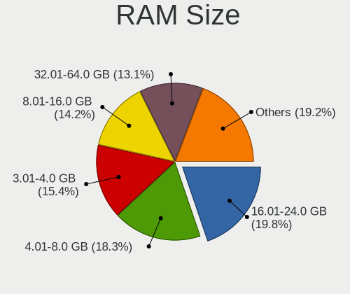
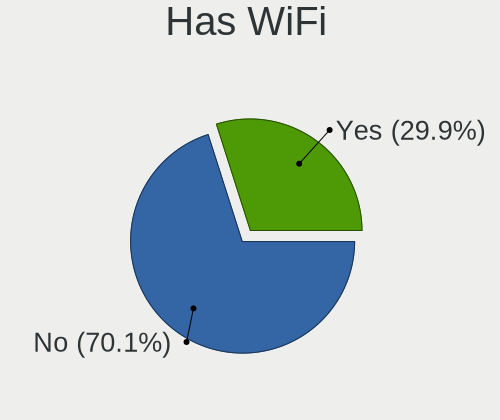
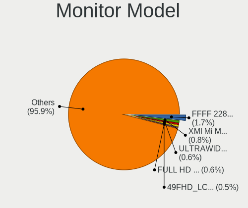

Debian 11 - Tested Hardware & Statistics (Desktops)
---------------------------------------------------

A project to collect tested hardware configurations for Debian 11.

Anyone can contribute to this report by the [hw-probe](https://github.com/linuxhw/hw-probe) tool:

    sudo -E hw-probe -all -upload

Please submit a probe of your configuration if it's not presented on the page or is rare.

Full-feature report is available here: https://linux-hardware.org/?view=trends&rel=debian-11

Contents
--------

* [ Test Cases ](#test-cases)

* [ System ](#system)
  - [ Kernel                   ](#kernel)
  - [ Kernel Family            ](#kernel-family)
  - [ Kernel Major Ver.        ](#kernel-major-ver)
  - [ Arch                     ](#arch)
  - [ DE                       ](#de)
  - [ Display Server           ](#display-server)
  - [ Display Manager          ](#display-manager)
  - [ OS Lang                  ](#os-lang)
  - [ Boot Mode                ](#boot-mode)
  - [ Filesystem               ](#filesystem)
  - [ Part. scheme             ](#part-scheme)
  - [ Dual Boot with Linux/BSD ](#dual-boot-with-linux-bsd)
  - [ Dual Boot (Win)          ](#dual-boot-win)

* [ Board ](#board)
  - [ Vendor                   ](#vendor)
  - [ Model                    ](#model)
  - [ Model Family             ](#model-family)
  - [ MFG Year                 ](#mfg-year)
  - [ Form Factor              ](#form-factor)
  - [ Secure Boot              ](#secure-boot)
  - [ Coreboot                 ](#coreboot)
  - [ RAM Size                 ](#ram-size)
  - [ RAM Used                 ](#ram-used)
  - [ Total Drives             ](#total-drives)
  - [ Has CD-ROM               ](#has-cd-rom)
  - [ Has Ethernet             ](#has-ethernet)
  - [ Has WiFi                 ](#has-wifi)
  - [ Has Bluetooth            ](#has-bluetooth)

* [ Location ](#location)
  - [ Country                  ](#country)
  - [ City                     ](#city)

* [ Drives ](#drives)
  - [ Drive Vendor             ](#drive-vendor)
  - [ Drive Model              ](#drive-model)
  - [ HDD Vendor               ](#hdd-vendor)
  - [ SSD Vendor               ](#ssd-vendor)
  - [ Drive Kind               ](#drive-kind)
  - [ Drive Connector          ](#drive-connector)
  - [ Drive Size               ](#drive-size)
  - [ Space Total              ](#space-total)
  - [ Space Used               ](#space-used)
  - [ Malfunc. Drives          ](#malfunc-drives)
  - [ Malfunc. Drive Vendor    ](#malfunc-drive-vendor)
  - [ Malfunc. HDD Vendor      ](#malfunc-hdd-vendor)
  - [ Malfunc. Drive Kind      ](#malfunc-drive-kind)
  - [ Failed Drives            ](#failed-drives)
  - [ Failed Drive Vendor      ](#failed-drive-vendor)
  - [ Drive Status             ](#drive-status)

* [ Storage controller ](#storage-controller)
  - [ Storage Vendor           ](#storage-vendor)
  - [ Storage Model            ](#storage-model)
  - [ Storage Kind             ](#storage-kind)

* [ Processor ](#processor)
  - [ CPU Vendor               ](#cpu-vendor)
  - [ CPU Model                ](#cpu-model)
  - [ CPU Model Family         ](#cpu-model-family)
  - [ CPU Cores                ](#cpu-cores)
  - [ CPU Sockets              ](#cpu-sockets)
  - [ CPU Threads              ](#cpu-threads)
  - [ CPU Op-Modes             ](#cpu-op-modes)
  - [ CPU Microcode            ](#cpu-microcode)
  - [ CPU Microarch            ](#cpu-microarch)

* [ Graphics ](#graphics)
  - [ GPU Vendor               ](#gpu-vendor)
  - [ GPU Model                ](#gpu-model)
  - [ GPU Combo                ](#gpu-combo)
  - [ GPU Driver               ](#gpu-driver)
  - [ GPU Memory               ](#gpu-memory)

* [ Monitor ](#monitor)
  - [ Monitor Vendor           ](#monitor-vendor)
  - [ Monitor Model            ](#monitor-model)
  - [ Monitor Resolution       ](#monitor-resolution)
  - [ Monitor Diagonal         ](#monitor-diagonal)
  - [ Monitor Width            ](#monitor-width)
  - [ Aspect Ratio             ](#aspect-ratio)
  - [ Monitor Area             ](#monitor-area)
  - [ Pixel Density            ](#pixel-density)
  - [ Multiple Monitors        ](#multiple-monitors)

* [ Network ](#network)
  - [ Net Controller Vendor    ](#net-controller-vendor)
  - [ Net Controller Model     ](#net-controller-model)
  - [ Wireless Vendor          ](#wireless-vendor)
  - [ Wireless Model           ](#wireless-model)
  - [ Ethernet Vendor          ](#ethernet-vendor)
  - [ Ethernet Model           ](#ethernet-model)
  - [ Net Controller Kind      ](#net-controller-kind)
  - [ Used Controller          ](#used-controller)
  - [ NICs                     ](#nics)
  - [ IPv6                     ](#ipv6)

* [ Bluetooth ](#bluetooth)
  - [ Bluetooth Vendor         ](#bluetooth-vendor)
  - [ Bluetooth Model          ](#bluetooth-model)

* [ Sound ](#sound)
  - [ Sound Vendor             ](#sound-vendor)
  - [ Sound Model              ](#sound-model)

* [ Memory ](#memory)
  - [ Memory Vendor            ](#memory-vendor)
  - [ Memory Model             ](#memory-model)
  - [ Memory Kind              ](#memory-kind)
  - [ Memory Form Factor       ](#memory-form-factor)
  - [ Memory Size              ](#memory-size)
  - [ Memory Speed             ](#memory-speed)

* [ Printers & scanners ](#printers-scanners)
  - [ Printer Vendor           ](#printer-vendor)
  - [ Printer Model            ](#printer-model)
  - [ Scanner Vendor           ](#scanner-vendor)
  - [ Scanner Model            ](#scanner-model)

* [ Camera ](#camera)
  - [ Camera Vendor            ](#camera-vendor)
  - [ Camera Model             ](#camera-model)

* [ Security ](#security)
  - [ Fingerprint Vendor       ](#fingerprint-vendor)
  - [ Fingerprint Model        ](#fingerprint-model)
  - [ Chipcard Vendor          ](#chipcard-vendor)
  - [ Chipcard Model           ](#chipcard-model)

* [ Unsupported ](#unsupported)
  - [ Unsupported Devices      ](#unsupported-devices)
  - [ Unsupported Device Types ](#unsupported-device-types)

Test Cases
----------

| Vendor     | Model                       | Probe                                                      | Date         |
|------------|-----------------------------|------------------------------------------------------------|--------------|
| Gigabyte   | B560M D3H                   | [1456f9bf8e](https://linux-hardware.org/?probe=1456f9bf8e) | Jul 23, 2021 |
| ASUSTek    | ROG STRIX Z370-H GAMING     | [8af9716200](https://linux-hardware.org/?probe=8af9716200) | Jul 19, 2021 |
| ASUSTek    | P8Z68-V                     | [1a60e02aa9](https://linux-hardware.org/?probe=1a60e02aa9) | Jul 19, 2021 |
| HP         | ProLiant MicroServer        | [ca7c4b4967](https://linux-hardware.org/?probe=ca7c4b4967) | Jul 16, 2021 |
| MSI        | A68HM-E33 V2                | [983bc90bc7](https://linux-hardware.org/?probe=983bc90bc7) | Jul 14, 2021 |
| Huanan     | X99-F8 V2.0                 | [776f848ccd](https://linux-hardware.org/?probe=776f848ccd) | Jul 09, 2021 |
| Dell       | 0M863N A00                  | [574671bbb9](https://linux-hardware.org/?probe=574671bbb9) | Jul 09, 2021 |
| MSI        | MPG B550 GAMING PLUS        | [c79b71d033](https://linux-hardware.org/?probe=c79b71d033) | Jul 08, 2021 |
| ASUSTek    | H81M-E                      | [02c3ce63e7](https://linux-hardware.org/?probe=02c3ce63e7) | Jul 08, 2021 |
| HP         | 2215                        | [b0b56138b2](https://linux-hardware.org/?probe=b0b56138b2) | Jul 08, 2021 |
| HP         | 2215                        | [cdf48de6b2](https://linux-hardware.org/?probe=cdf48de6b2) | Jul 07, 2021 |
| MSI        | MS-6712                     | [ced0409e55](https://linux-hardware.org/?probe=ced0409e55) | Jul 04, 2021 |
| ASRock     | H77 Pro4-M                  | [8ba58cff9a](https://linux-hardware.org/?probe=8ba58cff9a) | Jul 02, 2021 |
| Gigabyte   | B550I AORUS PRO AX          | [cb62272a68](https://linux-hardware.org/?probe=cb62272a68) | Jul 02, 2021 |
| Gigabyte   | AX370-Gaming K7             | [e325df530d](https://linux-hardware.org/?probe=e325df530d) | Jun 30, 2021 |
| MSI        | B85M-G43                    | [4598afdf7e](https://linux-hardware.org/?probe=4598afdf7e) | Jun 29, 2021 |
| Huanan     | X99-8M-F V1.1               | [8ecfcffbaf](https://linux-hardware.org/?probe=8ecfcffbaf) | Jun 27, 2021 |
| ASRock     | FM2A68M-HD+                 | [f435417b41](https://linux-hardware.org/?probe=f435417b41) | Jun 26, 2021 |
| Gigabyte   | Z370 AORUS Gaming 5-CF      | [807a4ba37d](https://linux-hardware.org/?probe=807a4ba37d) | Jun 23, 2021 |
| Gigabyte   | Z370 AORUS Gaming 5-CF      | [bc7246038e](https://linux-hardware.org/?probe=bc7246038e) | Jun 23, 2021 |
| ASRock     | B550 Pro4                   | [ef1b7bfb77](https://linux-hardware.org/?probe=ef1b7bfb77) | Jun 23, 2021 |
| ASRock     | X399 Taichi                 | [a664e4cf99](https://linux-hardware.org/?probe=a664e4cf99) | Jun 23, 2021 |
| HARDKERNEL | ODROID-H2                   | [c9fed56a36](https://linux-hardware.org/?probe=c9fed56a36) | Jun 23, 2021 |
| ASUSTek    | ROG STRIX B450-F GAMING ... | [b3a5333d2a](https://linux-hardware.org/?probe=b3a5333d2a) | Jun 21, 2021 |
| Gigabyte   | AB350M-Gaming 3-CF          | [08fc06c75e](https://linux-hardware.org/?probe=08fc06c75e) | Jun 20, 2021 |
| MSI        | B450M MORTAR MAX            | [33ffb80782](https://linux-hardware.org/?probe=33ffb80782) | Jun 19, 2021 |
| ASUSTek    | ROG STRIX B450-F GAMING ... | [9e3e72ec72](https://linux-hardware.org/?probe=9e3e72ec72) | Jun 17, 2021 |
| ASUSTek    | PRIME B450M-A               | [0ccc446224](https://linux-hardware.org/?probe=0ccc446224) | Jun 14, 2021 |
| Gigabyte   | MCMLUAB-00                  | [99780e8ba8](https://linux-hardware.org/?probe=99780e8ba8) | Jun 13, 2021 |
| ASUSTek    | PRIME A320M-K               | [f2770a810e](https://linux-hardware.org/?probe=f2770a810e) | Jun 12, 2021 |
| Dell       | 0Y7WYT A00                  | [8e424773e5](https://linux-hardware.org/?probe=8e424773e5) | Jun 10, 2021 |
| ASUSTek    | Z97-AR                      | [709a74c713](https://linux-hardware.org/?probe=709a74c713) | Jun 09, 2021 |
| ASRock     | B450M Pro4                  | [ee4dfdfde3](https://linux-hardware.org/?probe=ee4dfdfde3) | Jun 08, 2021 |
| ASUSTek    | PRIME A320M-K               | [69dd9fbe20](https://linux-hardware.org/?probe=69dd9fbe20) | Jun 07, 2021 |
| ASRock     | B450M Pro4                  | [0fd993c4dd](https://linux-hardware.org/?probe=0fd993c4dd) | Jun 05, 2021 |
| ASUSTek    | M4A88T-M/USB3               | [7483847993](https://linux-hardware.org/?probe=7483847993) | Jun 03, 2021 |
| Dell       | 0YXT71 A02                  | [a45729e01a](https://linux-hardware.org/?probe=a45729e01a) | Jun 01, 2021 |
| ASUSTek    | PRIME B550-PLUS             | [21574f62a5](https://linux-hardware.org/?probe=21574f62a5) | Jun 01, 2021 |
| ASUSTek    | P5B-Deluxe                  | [926229be87](https://linux-hardware.org/?probe=926229be87) | May 31, 2021 |
| Gigabyte   | B450 AORUS PRO WIFI-CF      | [24d2e85009](https://linux-hardware.org/?probe=24d2e85009) | May 29, 2021 |
| MSI        | B250M BAZOOKA               | [fb2eef67f2](https://linux-hardware.org/?probe=fb2eef67f2) | May 26, 2021 |
| MSI        | B450I GAMING PLUS AC        | [2c698534c6](https://linux-hardware.org/?probe=2c698534c6) | May 23, 2021 |
| Gigabyte   | AB350M-D3H-CF               | [1ad175fddc](https://linux-hardware.org/?probe=1ad175fddc) | May 23, 2021 |
| Gigabyte   | Z170X-GamingG1              | [361469c7d5](https://linux-hardware.org/?probe=361469c7d5) | May 18, 2021 |
| Gigabyte   | Z77-D3H                     | [71f4ed3e35](https://linux-hardware.org/?probe=71f4ed3e35) | May 11, 2021 |
| Lenovo     | MAHOBAY                     | [c0b8e99e35](https://linux-hardware.org/?probe=c0b8e99e35) | May 06, 2021 |
| Biostar    | B450MH                      | [f0a1151d81](https://linux-hardware.org/?probe=f0a1151d81) | Apr 27, 2021 |
| Gigabyte   | EG41MF-US2H                 | [a2aa6eaec8](https://linux-hardware.org/?probe=a2aa6eaec8) | Apr 16, 2021 |

System
------

Kernel
------

Version of the Linux kernel

| Version                        | Desktops | Percent |
|--------------------------------|----------|---------|
| 5.10.0-7-amd64                 | 25       | 55.56%  |
| 5.10.0-6-amd64                 | 9        | 20%     |
| 5.10.0-8-amd64                 | 2        | 4.44%   |
| 5.8.0-3-amd64                  | 1        | 2.22%   |
| 5.13.0-rc7-00024-g0418ae8de752 | 1        | 2.22%   |
| 5.11.22-2-pve                  | 1        | 2.22%   |
| 5.11.22-1-pve                  | 1        | 2.22%   |
| 5.11.0-21.1-liquorix-amd64     | 1        | 2.22%   |
| 5.11.0-16.1-liquorix-amd64     | 1        | 2.22%   |
| 5.10.0-7-686-pae               | 1        | 2.22%   |
| 5.10.0-3-amd64                 | 1        | 2.22%   |
| 5.10.0-2-amd64                 | 1        | 2.22%   |

Kernel Family
-------------

Linux kernel without a distro release

| Version | Desktops | Percent |
|---------|----------|---------|
| 5.10.0  | 39       | 86.67%  |
| 5.11.22 | 2        | 4.44%   |
| 5.11.0  | 2        | 4.44%   |
| 5.8.0   | 1        | 2.22%   |
| 5.13.0  | 1        | 2.22%   |

Kernel Major Ver.
-----------------

Linux kernel major version

| Version | Desktops | Percent |
|---------|----------|---------|
| 5.10    | 39       | 86.67%  |
| 5.11    | 4        | 8.89%   |
| 5.8     | 1        | 2.22%   |
| 5.13    | 1        | 2.22%   |

Arch
----

OS architecture (x86_64, i586, etc.)

| Name   | Desktops | Percent |
|--------|----------|---------|
| x86_64 | 44       | 97.78%  |
| i686   | 1        | 2.22%   |

DE
--

Desktop Environment

| Name       | Desktops | Percent |
|------------|----------|---------|
| KDE5       | 9        | 20%     |
| GNOME      | 9        | 20%     |
| XFCE       | 6        | 13.33%  |
| Unknown    | 5        | 11.11%  |
| MATE       | 4        | 8.89%   |
| KDE        | 4        | 8.89%   |
| X-Cinnamon | 2        | 4.44%   |
| i3         | 2        | 4.44%   |
| Cinnamon   | 2        | 4.44%   |
| GNUstep    | 1        | 2.22%   |
| Budgie     | 1        | 2.22%   |

Display Server
--------------

X11 or Wayland

| Name    | Desktops | Percent |
|---------|----------|---------|
| X11     | 33       | 73.33%  |
| Wayland | 6        | 13.33%  |
| Tty     | 4        | 8.89%   |
| Unknown | 2        | 4.44%   |

Display Manager
---------------

SDDM, LightDM, etc.

| Name    | Desktops | Percent |
|---------|----------|---------|
| Unknown | 16       | 35.56%  |
| TDM     | 12       | 26.67%  |
| GDM     | 7        | 15.56%  |
| SDDM    | 6        | 13.33%  |
| LightDM | 3        | 6.67%   |
| XDM     | 1        | 2.22%   |

OS Lang
-------

Language

| Lang    | Desktops | Percent |
|---------|----------|---------|
| en_US   | 17       | 37.78%  |
| fr_FR   | 6        | 13.33%  |
| pt_BR   | 3        | 6.67%   |
| de_DE   | 3        | 6.67%   |
| C       | 3        | 6.67%   |
| pl_PL   | 2        | 4.44%   |
| es_ES   | 2        | 4.44%   |
| Unknown | 2        | 4.44%   |
| sr_RS   | 1        | 2.22%   |
| ru_RU   | 1        | 2.22%   |
| ro_RO   | 1        | 2.22%   |
| nl_BE   | 1        | 2.22%   |
| en_PH   | 1        | 2.22%   |
| en_GB   | 1        | 2.22%   |
| en_CA   | 1        | 2.22%   |

Boot Mode
---------

EFI or BIOS

| Mode | Desktops | Percent |
|------|----------|---------|
| BIOS | 24       | 53.33%  |
| EFI  | 21       | 46.67%  |

Filesystem
----------

Type of filesystem

| Type    | Desktops | Percent |
|---------|----------|---------|
| Ext4    | 36       | 80%     |
| Btrfs   | 4        | 8.89%   |
| Ext3    | 3        | 6.67%   |
| Zfs     | 1        | 2.22%   |
| Overlay | 1        | 2.22%   |

Part. scheme
------------

Scheme of partitioning

| Type    | Desktops | Percent |
|---------|----------|---------|
| GPT     | 26       | 57.78%  |
| Unknown | 13       | 28.89%  |
| MBR     | 6        | 13.33%  |

Dual Boot with Linux/BSD
------------------------

Hosting more than one Linux/BSD

| Dual boot | Desktops | Percent |
|-----------|----------|---------|
| No        | 36       | 80%     |
| Yes       | 9        | 20%     |

Dual Boot (Win)
---------------

Hosting Linux and Windows

| Dual boot | Desktops | Percent |
|-----------|----------|---------|
| No        | 34       | 75.56%  |
| Yes       | 11       | 24.44%  |

Board
-----

Vendor
------

Motherboard manufacturer

| Name                | Desktops | Percent |
|---------------------|----------|---------|
| Gigabyte Technology | 12       | 26.67%  |
| ASUSTek Computer    | 10       | 22.22%  |
| MSI                 | 7        | 15.56%  |
| ASRock              | 6        | 13.33%  |
| Dell                | 3        | 6.67%   |
| Huanan              | 2        | 4.44%   |
| Hewlett-Packard     | 2        | 4.44%   |
| Lenovo              | 1        | 2.22%   |
| HARDKERNEL          | 1        | 2.22%   |
| Biostar             | 1        | 2.22%   |

Model
-----

Motherboard model

| Name                            | Desktops | Percent |
|---------------------------------|----------|---------|
| Gigabyte Z370 AORUS Gaming 5    | 2        | 4.44%   |
| ASUS All Series                 | 2        | 4.44%   |
| ASRock B450M Pro4               | 2        | 4.44%   |
| MSI MS-7C56                     | 1        | 2.22%   |
| MSI MS-7B89                     | 1        | 2.22%   |
| MSI MS-7A70                     | 1        | 2.22%   |
| MSI MS-7A40                     | 1        | 2.22%   |
| MSI MS-7823                     | 1        | 2.22%   |
| MSI MS-7721                     | 1        | 2.22%   |
| MSI MS-6712                     | 1        | 2.22%   |
| Lenovo ThinkCentre M92p 3209EK4 | 1        | 2.22%   |
| Huanan X99-F8                   | 1        | 2.22%   |
| Huanan X99-8M-F V1.1            | 1        | 2.22%   |
| HP ProLiant MicroServer         | 1        | 2.22%   |
| HP EliteDesk 705 G1 SFF         | 1        | 2.22%   |
| HARDKERNEL ODROID-H2            | 1        | 2.22%   |
| Gigabyte Z77-D3H                | 1        | 2.22%   |
| Gigabyte Z170X-GamingG1         | 1        | 2.22%   |
| Gigabyte EG41MF-US2H            | 1        | 2.22%   |
| Gigabyte BRi7(H)-10710          | 1        | 2.22%   |
| Gigabyte B560M D3H              | 1        | 2.22%   |
| Gigabyte B550I AORUS PRO AX     | 1        | 2.22%   |
| Gigabyte B450 AORUS PRO WIFI    | 1        | 2.22%   |
| Gigabyte AX370-Gaming K7        | 1        | 2.22%   |
| Gigabyte AB350M-Gaming 3        | 1        | 2.22%   |
| Gigabyte AB350M-D3H             | 1        | 2.22%   |
| Dell OptiPlex 760               | 1        | 2.22%   |
| Dell OptiPlex 7040              | 1        | 2.22%   |
| Dell OptiPlex 7010              | 1        | 2.22%   |
| Biostar B450MH                  | 1        | 2.22%   |
| ASUS ROG STRIX Z370-H GAMING    | 1        | 2.22%   |
| ASUS ROG STRIX B450-F GAMING II | 1        | 2.22%   |
| ASUS PRIME B550-PLUS            | 1        | 2.22%   |
| ASUS PRIME B450M-A              | 1        | 2.22%   |
| ASUS PRIME A320M-K              | 1        | 2.22%   |
| ASUS P8Z68-V                    | 1        | 2.22%   |
| ASUS P5B-Deluxe                 | 1        | 2.22%   |
| ASUS M4A88T-M/USB3              | 1        | 2.22%   |
| ASRock X399 Taichi              | 1        | 2.22%   |
| ASRock H77 Pro4-M               | 1        | 2.22%   |
| ASRock FM2A68M-HD+              | 1        | 2.22%   |
| ASRock B550 Pro4                | 1        | 2.22%   |

Model Family
------------

Motherboard model prefix

| Name                    | Desktops | Percent |
|-------------------------|----------|---------|
| Dell OptiPlex           | 3        | 6.67%   |
| ASUS PRIME              | 3        | 6.67%   |
| Gigabyte Z370           | 2        | 4.44%   |
| ASUS ROG                | 2        | 4.44%   |
| ASUS All                | 2        | 4.44%   |
| ASRock B450M            | 2        | 4.44%   |
| MSI MS-7C56             | 1        | 2.22%   |
| MSI MS-7B89             | 1        | 2.22%   |
| MSI MS-7A70             | 1        | 2.22%   |
| MSI MS-7A40             | 1        | 2.22%   |
| MSI MS-7823             | 1        | 2.22%   |
| MSI MS-7721             | 1        | 2.22%   |
| MSI MS-6712             | 1        | 2.22%   |
| Lenovo ThinkCentre      | 1        | 2.22%   |
| Huanan X99-F8           | 1        | 2.22%   |
| Huanan X99-8M-F         | 1        | 2.22%   |
| HP ProLiant             | 1        | 2.22%   |
| HP EliteDesk            | 1        | 2.22%   |
| HARDKERNEL ODROID-H2    | 1        | 2.22%   |
| Gigabyte Z77-D3H        | 1        | 2.22%   |
| Gigabyte Z170X-GamingG1 | 1        | 2.22%   |
| Gigabyte EG41MF-US2H    | 1        | 2.22%   |
| Gigabyte BRi7(H)-10710  | 1        | 2.22%   |
| Gigabyte B560M          | 1        | 2.22%   |
| Gigabyte B550I          | 1        | 2.22%   |
| Gigabyte B450           | 1        | 2.22%   |
| Gigabyte AX370-Gaming   | 1        | 2.22%   |
| Gigabyte AB350M-Gaming  | 1        | 2.22%   |
| Gigabyte AB350M-D3H     | 1        | 2.22%   |
| Biostar B450MH          | 1        | 2.22%   |
| ASUS P8Z68-V            | 1        | 2.22%   |
| ASUS P5B-Deluxe         | 1        | 2.22%   |
| ASUS M4A88T-M           | 1        | 2.22%   |
| ASRock X399             | 1        | 2.22%   |
| ASRock H77              | 1        | 2.22%   |
| ASRock FM2A68M-HD+      | 1        | 2.22%   |
| ASRock B550             | 1        | 2.22%   |

MFG Year
--------

Motherboard manufacture year

| Year | Desktops | Percent |
|------|----------|---------|
| 2020 | 10       | 22.22%  |
| 2019 | 9        | 20%     |
| 2021 | 7        | 15.56%  |
| 2018 | 3        | 6.67%   |
| 2014 | 3        | 6.67%   |
| 2016 | 2        | 4.44%   |
| 2012 | 2        | 4.44%   |
| 2010 | 2        | 4.44%   |
| 2017 | 1        | 2.22%   |
| 2015 | 1        | 2.22%   |
| 2013 | 1        | 2.22%   |
| 2011 | 1        | 2.22%   |
| 2009 | 1        | 2.22%   |
| 2007 | 1        | 2.22%   |
| 2001 | 1        | 2.22%   |

Form Factor
-----------

Physical design of the computer

| Name    | Desktops | Percent |
|---------|----------|---------|
| Desktop | 45       | 100%    |

Secure Boot
-----------

Enabled or disabled

| State    | Desktops | Percent |
|----------|----------|---------|
| Disabled | 44       | 97.78%  |
| Enabled  | 1        | 2.22%   |

Coreboot
--------

Have coreboot on board

| Used | Desktops | Percent |
|------|----------|---------|
| No   | 45       | 100%    |

RAM Size
--------

Total RAM memory

| Size in GB  | Desktops | Percent |
|-------------|----------|---------|
| 16.01-24.0  | 14       | 31.11%  |
| 32.01-64.0  | 8        | 17.78%  |
| 8.01-16.0   | 8        | 17.78%  |
| 4.01-8.0    | 6        | 13.33%  |
| 64.01-256.0 | 6        | 13.33%  |
| 3.01-4.0    | 1        | 2.22%   |
| 2.01-3.0    | 1        | 2.22%   |
| 1.01-2.0    | 1        | 2.22%   |

RAM Used
--------

Used RAM memory

| Used GB    | Desktops | Percent |
|------------|----------|---------|
| 4.01-8.0   | 11       | 24.44%  |
| 3.01-4.0   | 10       | 22.22%  |
| 2.01-3.0   | 7        | 15.56%  |
| 8.01-16.0  | 5        | 11.11%  |
| 16.01-24.0 | 4        | 8.89%   |
| 0.51-1.0   | 3        | 6.67%   |
| 1.01-2.0   | 2        | 4.44%   |
| 32.01-64.0 | 1        | 2.22%   |
| 24.01-32.0 | 1        | 2.22%   |
| 0.01-0.5   | 1        | 2.22%   |

Total Drives
------------

Number of drives on board

| Drives | Desktops | Percent |
|--------|----------|---------|
| 2      | 14       | 31.11%  |
| 3      | 13       | 28.89%  |
| 1      | 8        | 17.78%  |
| 5      | 4        | 8.89%   |
| 4      | 4        | 8.89%   |
| 8      | 1        | 2.22%   |
| 6      | 1        | 2.22%   |

Has CD-ROM
----------

Has CD-ROM on board

| Presented | Desktops | Percent |
|-----------|----------|---------|
| Yes       | 23       | 51.11%  |
| No        | 22       | 48.89%  |

Has Ethernet
------------

Has Ethernet on board

| Presented | Desktops | Percent |
|-----------|----------|---------|
| Yes       | 44       | 97.78%  |
| No        | 1        | 2.22%   |

Has WiFi
--------

Has WiFi module

| Presented | Desktops | Percent |
|-----------|----------|---------|
| No        | 25       | 55.56%  |
| Yes       | 20       | 44.44%  |

Has Bluetooth
-------------

Has Bluetooth module

| Presented | Desktops | Percent |
|-----------|----------|---------|
| No        | 28       | 62.22%  |
| Yes       | 17       | 37.78%  |

Location
--------

Country
-------

Geographic location (country)

| Country       | Desktops | Percent |
|---------------|----------|---------|
| USA           | 11       | 24.44%  |
| Germany       | 5        | 11.11%  |
| France        | 5        | 11.11%  |
| Spain         | 4        | 8.89%   |
| Poland        | 4        | 8.89%   |
| Brazil        | 3        | 6.67%   |
| UK            | 1        | 2.22%   |
| Syria         | 1        | 2.22%   |
| Singapore     | 1        | 2.22%   |
| Serbia        | 1        | 2.22%   |
| Russia        | 1        | 2.22%   |
| New Caledonia | 1        | 2.22%   |
| Netherlands   | 1        | 2.22%   |
| Madagascar    | 1        | 2.22%   |
| Italy         | 1        | 2.22%   |
| Hungary       | 1        | 2.22%   |
| Belgium       | 1        | 2.22%   |
| Australia     | 1        | 2.22%   |
| Argentina     | 1        | 2.22%   |

City
----

Geographic location (city)

| City                        | Desktops | Percent |
|-----------------------------|----------|---------|
| Warsaw                      | 2        | 4.44%   |
| New York                    | 2        | 4.44%   |
| Las Vegas                   | 2        | 4.44%   |
| Érd                        | 1        | 2.22%   |
| Waregem                     | 1        | 2.22%   |
| Toulouse                    | 1        | 2.22%   |
| Thionville                  | 1        | 2.22%   |
| Sosnowiec                   | 1        | 2.22%   |
| Singapore                   | 1        | 2.22%   |
| San Francisco               | 1        | 2.22%   |
| San Cristóbal de La Laguna | 1        | 2.22%   |
| Rochester                   | 1        | 2.22%   |
| Ribeirao Pires              | 1        | 2.22%   |
| Perth                       | 1        | 2.22%   |
| Noumea                      | 1        | 2.22%   |
| Mesa                        | 1        | 2.22%   |
| Mannheim                    | 1        | 2.22%   |
| Mairena del Aljarafe        | 1        | 2.22%   |
| Madrid                      | 1        | 2.22%   |
| Lyon                        | 1        | 2.22%   |
| Khabarovsk                  | 1        | 2.22%   |
| Great Malvern               | 1        | 2.22%   |
| Glienicke                   | 1        | 2.22%   |
| Gdansk                      | 1        | 2.22%   |
| Garching bei Munchen        | 1        | 2.22%   |
| Flanders                    | 1        | 2.22%   |
| Ettlingen                   | 1        | 2.22%   |
| East Orange                 | 1        | 2.22%   |
| Dourados                    | 1        | 2.22%   |
| Delft                       | 1        | 2.22%   |
| Damascus                    | 1        | 2.22%   |
| Córdoba                    | 1        | 2.22%   |
| Chapel Hill                 | 1        | 2.22%   |
| Chaligny                    | 1        | 2.22%   |
| Bonn                        | 1        | 2.22%   |
| Bologna                     | 1        | 2.22%   |
| Bloomfield                  | 1        | 2.22%   |
| Belgrade                    | 1        | 2.22%   |
| Barueri                     | 1        | 2.22%   |
| Barcelona                   | 1        | 2.22%   |
| Aulnay-sous-Bois            | 1        | 2.22%   |
| Antananarivo                | 1        | 2.22%   |

Drives
------

Drive Vendor
------------

Hard drive vendors

| Vendor              | Desktops | Drives | Percent |
|---------------------|----------|--------|---------|
| Seagate             | 23       | 32     | 25%     |
| WDC                 | 17       | 27     | 18.48%  |
| Samsung Electronics | 8        | 11     | 8.7%    |
| Toshiba             | 7        | 9      | 7.61%   |
| Kingston            | 6        | 7      | 6.52%   |
| SanDisk             | 5        | 5      | 5.43%   |
| Intel               | 5        | 12     | 5.43%   |
| Crucial             | 5        | 6      | 5.43%   |
| Unknown             | 2        | 2      | 2.17%   |
| Phison Electronics  | 2        | 2      | 2.17%   |
| Hitachi             | 2        | 2      | 2.17%   |
| Gigabyte Technology | 2        | 2      | 2.17%   |
| A-DATA Technology   | 2        | 2      | 2.17%   |
| SPCC                | 1        | 1      | 1.09%   |
| PNY                 | 1        | 1      | 1.09%   |
| Phison              | 1        | 1      | 1.09%   |
| Patriot             | 1        | 1      | 1.09%   |
| Intenso             | 1        | 1      | 1.09%   |
| China               | 1        | 1      | 1.09%   |

Drive Model
-----------

Hard drive models

| Model                               | Desktops | Percent |
|-------------------------------------|----------|---------|
| WDC WDS500G3X0C-00SJG0 500GB        | 2        | 1.82%   |
| WDC WD20EARX-00PASB0 2TB            | 2        | 1.82%   |
| Toshiba HDWD110 1TB                 | 2        | 1.82%   |
| Seagate ST500DM002-1BD142 500GB     | 2        | 1.82%   |
| Seagate ST4000DM004-2CV104 4TB      | 2        | 1.82%   |
| Seagate ST1000DM003-1CH162 1TB      | 2        | 1.82%   |
| Seagate BUP Slim BL 2TB             | 2        | 1.82%   |
| Sandisk NVMe SSD Drive 1TB          | 2        | 1.82%   |
| Samsung HD103SJ 1TB                 | 2        | 1.82%   |
| Phison PCIe SSD 512GB               | 2        | 1.82%   |
| Kingston SV300S37A240G 240GB SSD    | 2        | 1.82%   |
| Kingston SV300S37A120G 120GB SSD    | 2        | 1.82%   |
| Intel NVMe SSD Drive 1024GB         | 2        | 1.82%   |
| Intel MEMPEK1J016GAL 16GB           | 2        | 1.82%   |
| WDC WDS500G2B0A-00SM50 500GB SSD    | 1        | 0.91%   |
| WDC WDS120G2G0A-00JH30 120GB SSD    | 1        | 0.91%   |
| WDC WDBRPG5000ANC-WRSN 500GB        | 1        | 0.91%   |
| WDC WD5003ABYX-18WERA0 500GB        | 1        | 0.91%   |
| WDC WD5000AVCS-632DY1 500GB         | 1        | 0.91%   |
| WDC WD5000AAKX-00ERMA0 500GB        | 1        | 0.91%   |
| WDC WD5000AAKS-22V1A0 500GB         | 1        | 0.91%   |
| WDC WD5000A 500GB                   | 1        | 0.91%   |
| WDC WD400BB-00DEA0 40GB             | 1        | 0.91%   |
| WDC WD30EZRX-22D8PB0 3TB            | 1        | 0.91%   |
| WDC WD30EZRX-00MMMB0 3TB            | 1        | 0.91%   |
| WDC WD2500AAKX-00ERMA0 250GB        | 1        | 0.91%   |
| WDC WD20EZRZ-00Z5HB0 2TB            | 1        | 0.91%   |
| WDC WD20EZRX-22D8PB0 2TB            | 1        | 0.91%   |
| WDC WD20EZAZ-00GGJB0 2TB            | 1        | 0.91%   |
| WDC WD10EZEX-75WN4A1 1TB            | 1        | 0.91%   |
| WDC WD10EZEX-08WN4A0 1TB            | 1        | 0.91%   |
| WDC WD10EZEX-00BN5A0 1TB            | 1        | 0.91%   |
| WDC WD10EVDS-63N5B1 1TB             | 1        | 0.91%   |
| WDC WD10EALX-009BA0 1TB             | 1        | 0.91%   |
| WDC WD1001FALS-75J7B0 1TB           | 1        | 0.91%   |
| Unknown ZA480NM10001 480GB SSD      | 1        | 0.91%   |
| Unknown BJTD4R  32GB                | 1        | 0.91%   |
| Toshiba TR150 960GB SSD             | 1        | 0.91%   |
| Toshiba MQ01ACF032 320GB            | 1        | 0.91%   |
| Toshiba MK2565GSX 250GB             | 1        | 0.91%   |
| Toshiba HDWD120 2TB                 | 1        | 0.91%   |
| Toshiba DT01ACA300 3TB              | 1        | 0.91%   |
| Toshiba DT01ACA200 2TB              | 1        | 0.91%   |
| Toshiba A100 240GB SSD              | 1        | 0.91%   |
| SPCC M.2 PCIe SSD 1TB               | 1        | 0.91%   |
| Seagate ST8000AS0002-1NA17Z 8TB     | 1        | 0.91%   |
| Seagate ST4000VN000-2AH166 4TB      | 1        | 0.91%   |
| Seagate ST4000DM000-1F2168 4TB      | 1        | 0.91%   |
| Seagate ST3500830AS 500GB           | 1        | 0.91%   |
| Seagate ST3500630AS 500GB           | 1        | 0.91%   |
| Seagate ST3320613AS 320GB           | 1        | 0.91%   |
| Seagate ST32000542AS 2TB            | 1        | 0.91%   |
| Seagate ST31500341AS 1TB            | 1        | 0.91%   |
| Seagate ST3000DM001-1CH166 3TB      | 1        | 0.91%   |
| Seagate ST2000LM 003 HN-M201RAD 2TB | 1        | 0.91%   |
| Seagate ST2000DM008-2FR102 2TB      | 1        | 0.91%   |
| Seagate ST2000DM006-2DM164 2TB      | 1        | 0.91%   |
| Seagate ST2000DL003-9VT166 2TB      | 1        | 0.91%   |
| Seagate ST1000LM044 HN-M101SAD 1TB  | 1        | 0.91%   |
| Seagate ST1000LM024 HN-M101MBB 1TB  | 1        | 0.91%   |

HDD Vendor
----------

Hard disk drive vendors

| Vendor              | Desktops | Drives | Percent |
|---------------------|----------|--------|---------|
| Seagate             | 23       | 32     | 48.94%  |
| WDC                 | 14       | 22     | 29.79%  |
| Toshiba             | 5        | 7      | 10.64%  |
| Samsung Electronics | 3        | 4      | 6.38%   |
| Hitachi             | 2        | 2      | 4.26%   |

SSD Vendor
----------

Solid state drive vendors

| Vendor              | Desktops | Drives | Percent |
|---------------------|----------|--------|---------|
| Kingston            | 6        | 7      | 24%     |
| Samsung Electronics | 4        | 5      | 16%     |
| Crucial             | 4        | 4      | 16%     |
| WDC                 | 2        | 2      | 8%      |
| Toshiba             | 2        | 2      | 8%      |
| SanDisk             | 2        | 2      | 8%      |
| A-DATA Technology   | 2        | 2      | 8%      |
| Unknown             | 1        | 1      | 4%      |
| Patriot             | 1        | 1      | 4%      |
| China               | 1        | 1      | 4%      |

Drive Kind
----------

HDD or SSD

| Kind    | Desktops | Drives | Percent |
|---------|----------|--------|---------|
| HDD     | 36       | 67     | 44.44%  |
| SSD     | 23       | 27     | 28.4%   |
| NVMe    | 19       | 28     | 23.46%  |
| Unknown | 2        | 2      | 2.47%   |
| MMC     | 1        | 1      | 1.23%   |

Drive Connector
---------------

SATA, SAS, NVMe, etc.

| Type | Desktops | Drives | Percent |
|------|----------|--------|---------|
| SATA | 38       | 89     | 59.38%  |
| NVMe | 19       | 28     | 29.69%  |
| SAS  | 6        | 7      | 9.38%   |
| MMC  | 1        | 1      | 1.56%   |

Drive Size
----------

Size of hard drive

| Size in TB | Desktops | Drives | Percent |
|------------|----------|--------|---------|
| 0.01-0.5   | 24       | 38     | 36.36%  |
| 0.51-1.0   | 19       | 25     | 28.79%  |
| 1.01-2.0   | 14       | 17     | 21.21%  |
| 3.01-4.0   | 4        | 4      | 6.06%   |
| 2.01-3.0   | 3        | 4      | 4.55%   |
| 4.01-10.0  | 2        | 6      | 3.03%   |

Space Total
-----------

Amount of disk space available on the file system

| Size in GB     | Desktops | Percent |
|----------------|----------|---------|
| 251-500        | 9        | 20%     |
| More than 3000 | 8        | 17.78%  |
| 1001-2000      | 8        | 17.78%  |
| 501-1000       | 7        | 15.56%  |
| 101-250        | 6        | 13.33%  |
| 2001-3000      | 4        | 8.89%   |
| Unknown        | 2        | 4.44%   |
| 21-50          | 1        | 2.22%   |

Space Used
----------

Amount of used disk space

| Used GB        | Desktops | Percent |
|----------------|----------|---------|
| 101-250        | 9        | 20%     |
| 251-500        | 6        | 13.33%  |
| 1001-2000      | 6        | 13.33%  |
| 501-1000       | 5        | 11.11%  |
| 51-100         | 5        | 11.11%  |
| 1-20           | 4        | 8.89%   |
| More than 3000 | 3        | 6.67%   |
| 21-50          | 3        | 6.67%   |
| 2001-3000      | 2        | 4.44%   |
| Unknown        | 2        | 4.44%   |

Malfunc. Drives
---------------

Drive models with a malfunction

| Model                                 | Desktops | Drives | Percent |
|---------------------------------------|----------|--------|---------|
| WDC WD5003ABYX-18WERA0 500GB          | 1        | 2      | 5.88%   |
| WDC WD5000AAKX-00ERMA0 500GB          | 1        | 1      | 5.88%   |
| WDC WD5000AAKS-22V1A0 500GB           | 1        | 1      | 5.88%   |
| WDC WD400BB-00DEA0 40GB               | 1        | 1      | 5.88%   |
| WDC WD20EARX-00PASB0 2TB              | 1        | 1      | 5.88%   |
| WDC WD10EZEX-00BN5A0 1TB              | 1        | 1      | 5.88%   |
| WDC WD1001FALS-75J7B0 1TB             | 1        | 1      | 5.88%   |
| Toshiba MK2565GSX 250GB               | 1        | 1      | 5.88%   |
| Seagate ST500DM002-1BD142 500GB       | 1        | 1      | 5.88%   |
| Seagate ST32000542AS 2TB              | 1        | 1      | 5.88%   |
| Seagate ST31500341AS 1TB              | 1        | 1      | 5.88%   |
| Seagate ST1000LM024 HN-M101MBB 1TB    | 1        | 1      | 5.88%   |
| Seagate ST1000DM003-1CH162 1TB        | 1        | 1      | 5.88%   |
| Kingston SV300S37A120G 120GB SSD      | 1        | 1      | 5.88%   |
| Intel SSDPEKKW010T7 1TB               | 1        | 2      | 5.88%   |
| Hitachi HDS722525VLAT80 250GB         | 1        | 1      | 5.88%   |
| A-DATA Technology SSD DP900 128GB-DL3 | 1        | 1      | 5.88%   |

Malfunc. Drive Vendor
---------------------

Vendors of faulty drives

| Vendor            | Desktops | Drives | Percent |
|-------------------|----------|--------|---------|
| WDC               | 7        | 8      | 41.18%  |
| Seagate           | 5        | 5      | 29.41%  |
| Toshiba           | 1        | 1      | 5.88%   |
| Kingston          | 1        | 1      | 5.88%   |
| Intel             | 1        | 2      | 5.88%   |
| Hitachi           | 1        | 1      | 5.88%   |
| A-DATA Technology | 1        | 1      | 5.88%   |

Malfunc. HDD Vendor
-------------------

Vendors of faulty HDD drives

| Vendor  | Desktops | Drives | Percent |
|---------|----------|--------|---------|
| WDC     | 7        | 8      | 50%     |
| Seagate | 5        | 5      | 35.71%  |
| Toshiba | 1        | 1      | 7.14%   |
| Hitachi | 1        | 1      | 7.14%   |

Malfunc. Drive Kind
-------------------

Kinds of faulty drives

| Kind | Desktops | Drives | Percent |
|------|----------|--------|---------|
| HDD  | 13       | 15     | 81.25%  |
| SSD  | 2        | 2      | 12.5%   |
| NVMe | 1        | 2      | 6.25%   |

Failed Drives
-------------

Failed drive models

| Model                     | Desktops | Drives | Percent |
|---------------------------|----------|--------|---------|
| Seagate ST3500830AS 500GB | 1        | 1      | 100%    |

Failed Drive Vendor
-------------------

Failed drive vendors

| Vendor  | Desktops | Drives | Percent |
|---------|----------|--------|---------|
| Seagate | 1        | 1      | 100%    |

Drive Status
------------

Number of failed and malfunc. drives

| Status   | Desktops | Drives | Percent |
|----------|----------|--------|---------|
| Works    | 31       | 72     | 49.21%  |
| Detected | 16       | 33     | 25.4%   |
| Malfunc  | 15       | 19     | 23.81%  |
| Failed   | 1        | 1      | 1.59%   |

Storage controller
------------------

Storage Vendor
--------------

Storage controller vendors

| Vendor                    | Desktops | Percent |
|---------------------------|----------|---------|
| Intel                     | 24       | 36.36%  |
| AMD                       | 22       | 33.33%  |
| Phison Electronics        | 6        | 9.09%   |
| Sandisk                   | 5        | 7.58%   |
| Samsung Electronics       | 2        | 3.03%   |
| Micron/Crucial Technology | 2        | 3.03%   |
| ASMedia Technology        | 2        | 3.03%   |
| VIA Technologies          | 1        | 1.52%   |
| Marvell Technology Group  | 1        | 1.52%   |
| JMicron Technology        | 1        | 1.52%   |

Storage Model
-------------

Storage controller models

| Model                                                                          | Desktops | Percent |
|--------------------------------------------------------------------------------|----------|---------|
| AMD FCH SATA Controller [AHCI mode]                                            | 15       | 17.44%  |
| AMD 400 Series Chipset SATA Controller                                         | 8        | 9.3%    |
| Phison E12 NVMe Controller                                                     | 4        | 4.65%   |
| Intel 7 Series/C210 Series Chipset Family 6-port SATA Controller [AHCI mode]   | 4        | 4.65%   |
| Intel 200 Series PCH SATA controller [AHCI mode]                               | 4        | 4.65%   |
| AMD Starship/Matisse Chipset SATA Controller [AHCI mode]                       | 4        | 4.65%   |
| Intel 8 Series/C220 Series Chipset Family 6-port SATA Controller 1 [AHCI mode] | 3        | 3.49%   |
| Sandisk WD Blue SN550 NVMe SSD                                                 | 2        | 2.33%   |
| Sandisk WD Black SN750 / PC SN730 NVMe SSD                                     | 2        | 2.33%   |
| Samsung NVMe SSD Controller SM981/PM981/PM983                                  | 2        | 2.33%   |
| Intel SSD 600P Series                                                          | 2        | 2.33%   |
| Intel Q170/Q150/B150/H170/H110/Z170/CM236 Chipset SATA Controller [AHCI Mode]  | 2        | 2.33%   |
| Intel NVMe Optane Memory Series                                                | 2        | 2.33%   |
| ASMedia ASM1062 Serial ATA Controller                                          | 2        | 2.33%   |
| AMD SB7x0/SB8x0/SB9x0 SATA Controller [AHCI mode]                              | 2        | 2.33%   |
| AMD SB7x0/SB8x0/SB9x0 IDE Controller                                           | 2        | 2.33%   |
| AMD 300 Series Chipset SATA Controller                                         | 2        | 2.33%   |
| VIA VT82C586A/B/VT82C686/A/B/VT823x/A/C PIPC Bus Master IDE                    | 1        | 1.16%   |
| Sandisk WD Black 2018/SN750 / PC SN720 NVMe SSD                                | 1        | 1.16%   |
| Phison PS5013 E13 NVMe Controller                                              | 1        | 1.16%   |
| Phison E16 PCIe4 NVMe Controller                                               | 1        | 1.16%   |
| Micron/Crucial P2 NVMe PCIe SSD                                                | 1        | 1.16%   |
| Micron/Crucial P1 NVMe PCIe SSD                                                | 1        | 1.16%   |
| Marvell Group 88NR2241 Non-Volatile memory controller                          | 1        | 1.16%   |
| JMicron JMB362 SATA Controller                                                 | 1        | 1.16%   |
| Intel SSD 660P Series                                                          | 1        | 1.16%   |
| Intel SATA Controller [RAID mode]                                              | 1        | 1.16%   |
| Intel NM10/ICH7 Family SATA Controller [IDE mode]                              | 1        | 1.16%   |
| Intel Comet Lake SATA AHCI Controller                                          | 1        | 1.16%   |
| Intel Celeron/Pentium Silver Processor SATA Controller                         | 1        | 1.16%   |
| Intel C610/X99 series chipset sSATA Controller [AHCI mode]                     | 1        | 1.16%   |
| Intel C610/X99 series chipset 6-Port SATA Controller [AHCI mode]               | 1        | 1.16%   |
| Intel 9 Series Chipset Family SATA Controller [AHCI Mode]                      | 1        | 1.16%   |
| Intel 82801JD/DO (ICH10 Family) SATA AHCI Controller                           | 1        | 1.16%   |
| Intel 82801HR/HO/HH (ICH8R/DO/DH) 2 port SATA Controller [IDE mode]            | 1        | 1.16%   |
| Intel 82801H (ICH8 Family) 4 port SATA Controller [IDE mode]                   | 1        | 1.16%   |
| Intel 500 Series Chipset Family SATA AHCI Controller                           | 1        | 1.16%   |
| Intel 4 Series Chipset PT IDER Controller                                      | 1        | 1.16%   |
| AMD X399 Series Chipset SATA Controller                                        | 1        | 1.16%   |
| AMD X370 Series Chipset SATA Controller                                        | 1        | 1.16%   |
| AMD FCH SATA Controller D                                                      | 1        | 1.16%   |

Storage Kind
------------

Kind of storage controller (IDE, SATA, NVMe, SAS, ...)

| Kind | Desktops | Percent |
|------|----------|---------|
| SATA | 42       | 61.76%  |
| NVMe | 19       | 27.94%  |
| IDE  | 6        | 8.82%   |
| RAID | 1        | 1.47%   |

Processor
---------

CPU Vendor
----------

Processor vendors

| Vendor | Desktops | Percent |
|--------|----------|---------|
| AMD    | 23       | 51.11%  |
| Intel  | 22       | 48.89%  |

CPU Model
---------

Processor models

| Model                                           | Desktops | Percent |
|-------------------------------------------------|----------|---------|
| AMD Ryzen 5 3600 6-Core Processor               | 4        | 8.89%   |
| Intel Core i7-8700K CPU @ 3.70GHz               | 2        | 4.44%   |
| Intel Core i5-4460 CPU @ 3.20GHz                | 2        | 4.44%   |
| AMD Ryzen 9 3900X 12-Core Processor             | 2        | 4.44%   |
| AMD Ryzen 7 3700X 8-Core Processor              | 2        | 4.44%   |
| Intel Xeon CPU E5-2678 v3 @ 2.50GHz             | 1        | 2.22%   |
| Intel Xeon CPU E5-2640 v3 @ 2.60GHz             | 1        | 2.22%   |
| Intel Core i7-8086K CPU @ 4.00GHz               | 1        | 2.22%   |
| Intel Core i7-7700 CPU @ 3.60GHz                | 1        | 2.22%   |
| Intel Core i7-4790 CPU @ 3.60GHz                | 1        | 2.22%   |
| Intel Core i7-10710U CPU @ 1.10GHz              | 1        | 2.22%   |
| Intel Core i5-6600 CPU @ 3.30GHz                | 1        | 2.22%   |
| Intel Core i5-6500 CPU @ 3.20GHz                | 1        | 2.22%   |
| Intel Core i5-3570K CPU @ 3.40GHz               | 1        | 2.22%   |
| Intel Core i5-3570 CPU @ 3.40GHz                | 1        | 2.22%   |
| Intel Core i5-3550 CPU @ 3.30GHz                | 1        | 2.22%   |
| Intel Core i5-3470 CPU @ 3.20GHz                | 1        | 2.22%   |
| Intel Core i5-2500K CPU @ 3.30GHz               | 1        | 2.22%   |
| Intel Core 2 Quad CPU Q6600 @ 2.40GHz           | 1        | 2.22%   |
| Intel Core 2 Duo CPU E8400 @ 3.00GHz            | 1        | 2.22%   |
| Intel Core 2 Duo CPU E4500 @ 2.20GHz            | 1        | 2.22%   |
| Intel Celeron J4115 CPU @ 1.80GHz               | 1        | 2.22%   |
| Intel 11th Gen Core i5-11500 @ 2.70GHz          | 1        | 2.22%   |
| AMD Ryzen Threadripper 2990WX 32-Core Processor | 1        | 2.22%   |
| AMD Ryzen 7 2700X Eight-Core Processor          | 1        | 2.22%   |
| AMD Ryzen 7 1700X Eight-Core Processor          | 1        | 2.22%   |
| AMD Ryzen 5 5600X 6-Core Processor              | 1        | 2.22%   |
| AMD Ryzen 5 3500X 6-Core Processor              | 1        | 2.22%   |
| AMD Ryzen 5 2600X Six-Core Processor            | 1        | 2.22%   |
| AMD Ryzen 5 1600 Six-Core Processor             | 1        | 2.22%   |
| AMD Ryzen 3 1300X Quad-Core Processor           | 1        | 2.22%   |
| AMD Ryzen 3 1200 Quad-Core Processor            | 1        | 2.22%   |
| AMD Phenom II X4 965 Processor                  | 1        | 2.22%   |
| AMD Athlon XP 1500+                             | 1        | 2.22%   |
| AMD Athlon II Neo N36L Dual-Core Processor      | 1        | 2.22%   |
| AMD A8 PRO-7600B R7, 10 Compute Cores 4C+6G     | 1        | 2.22%   |
| AMD A6 PRO-7400B R5, 6 Compute Cores 2C+4G      | 1        | 2.22%   |
| AMD A10-7860K Radeon R7, 12 Compute Cores 4C+8G | 1        | 2.22%   |

CPU Model Family
----------------

Processor model prefix

| Model                  | Desktops | Percent |
|------------------------|----------|---------|
| Intel Core i5          | 9        | 20%     |
| AMD Ryzen 5            | 8        | 17.78%  |
| Intel Core i7          | 6        | 13.33%  |
| AMD Ryzen 7            | 4        | 8.89%   |
| Intel Xeon             | 2        | 4.44%   |
| Intel Core 2 Duo       | 2        | 4.44%   |
| AMD Ryzen 9            | 2        | 4.44%   |
| AMD Ryzen 3            | 2        | 4.44%   |
| Other                  | 1        | 2.22%   |
| Intel Core 2 Quad      | 1        | 2.22%   |
| Intel Celeron          | 1        | 2.22%   |
| AMD Ryzen Threadripper | 1        | 2.22%   |
| AMD Phenom II X4       | 1        | 2.22%   |
| AMD Athlon XP          | 1        | 2.22%   |
| AMD Athlon II Neo      | 1        | 2.22%   |
| AMD A8                 | 1        | 2.22%   |
| AMD A6                 | 1        | 2.22%   |
| AMD A10                | 1        | 2.22%   |

CPU Cores
---------

Number of processor cores

| Number | Desktops | Percent |
|--------|----------|---------|
| 4      | 16       | 35.56%  |
| 6      | 13       | 28.89%  |
| 8      | 5        | 11.11%  |
| 2      | 5        | 11.11%  |
| 12     | 3        | 6.67%   |
| 1      | 2        | 4.44%   |
| 32     | 1        | 2.22%   |

CPU Sockets
-----------

Number of sockets

| Number | Desktops | Percent |
|--------|----------|---------|
| 1      | 45       | 100%    |

CPU Threads
-----------

Threads per core (Hyper-Threading)

| Number | Desktops | Percent |
|--------|----------|---------|
| 2      | 26       | 57.78%  |
| 1      | 19       | 42.22%  |

CPU Op-Modes
------------

CPU Operation Modes (32-bit, 64-bit)

| Op mode        | Desktops | Percent |
|----------------|----------|---------|
| 32-bit, 64-bit | 44       | 97.78%  |
| 32-bit         | 1        | 2.22%   |

CPU Microcode
-------------

Microcode number

| Number     | Desktops | Percent |
|------------|----------|---------|
| Unknown    | 19       | 42.22%  |
| 0x08701021 | 4        | 8.89%   |
| 0x306c3    | 3        | 6.67%   |
| 0x306f2    | 2        | 4.44%   |
| 0x306a9    | 2        | 4.44%   |
| 0x0800820d | 2        | 4.44%   |
| 0x08001138 | 2        | 4.44%   |
| 0x06003106 | 2        | 4.44%   |
| 0xa0671    | 1        | 2.22%   |
| 0xa0660    | 1        | 2.22%   |
| 0x906e9    | 1        | 2.22%   |
| 0x706a1    | 1        | 2.22%   |
| 0x6fb      | 1        | 2.22%   |
| 0x506e3    | 1        | 2.22%   |
| 0x206a7    | 1        | 2.22%   |
| 0x0800820b | 1        | 2.22%   |
| 0x010000c8 | 1        | 2.22%   |

CPU Microarch
-------------

Microarchitecture

| Name          | Desktops | Percent |
|---------------|----------|---------|
| Zen 2         | 9        | 20%     |
| Zen+          | 5        | 11.11%  |
| Haswell       | 5        | 11.11%  |
| KabyLake      | 4        | 8.89%   |
| IvyBridge     | 4        | 8.89%   |
| Steamroller   | 3        | 6.67%   |
| Zen           | 2        | 4.44%   |
| Skylake       | 2        | 4.44%   |
| K10           | 2        | 4.44%   |
| Core          | 2        | 4.44%   |
| Zen 3         | 1        | 2.22%   |
| SandyBridge   | 1        | 2.22%   |
| Penryn        | 1        | 2.22%   |
| K6            | 1        | 2.22%   |
| Goldmont plus | 1        | 2.22%   |
| CometLake     | 1        | 2.22%   |
| Unknown       | 1        | 2.22%   |

Graphics
--------

GPU Vendor
----------

Vendors of graphics cards

| Vendor | Desktops | Percent |
|--------|----------|---------|
| AMD    | 18       | 40%     |
| Nvidia | 17       | 37.78%  |
| Intel  | 10       | 22.22%  |

GPU Model
---------

Graphics card models

| Model                                                                       | Desktops | Percent |
|-----------------------------------------------------------------------------|----------|---------|
| AMD Ellesmere [Radeon RX 470/480/570/570X/580/580X/590]                     | 6        | 13.04%  |
| AMD Navi 10 [Radeon RX 5600 OEM/5600 XT / 5700/5700 XT]                     | 3        | 6.52%   |
| Nvidia GM107 [GeForce GTX 750 Ti]                                           | 2        | 4.35%   |
| Intel Xeon E3-1200 v2/3rd Gen Core processor Graphics Controller            | 2        | 4.35%   |
| Intel CometLake-S GT2 [UHD Graphics 630]                                    | 2        | 4.35%   |
| AMD Kaveri [Radeon R7 Graphics]                                             | 2        | 4.35%   |
| Nvidia TU117 [GeForce GTX 1650]                                             | 1        | 2.17%   |
| Nvidia TU116 [GeForce GTX 1660 Ti]                                          | 1        | 2.17%   |
| Nvidia TU116 [GeForce GTX 1660 SUPER]                                       | 1        | 2.17%   |
| Nvidia GP108 [GeForce GT 1030]                                              | 1        | 2.17%   |
| Nvidia GP107 [GeForce GTX 1050 Ti]                                          | 1        | 2.17%   |
| Nvidia GP104 [GeForce GTX 1080]                                             | 1        | 2.17%   |
| Nvidia GP104 [GeForce GTX 1070]                                             | 1        | 2.17%   |
| Nvidia GM204 [GeForce GTX 970]                                              | 1        | 2.17%   |
| Nvidia GM200 [GeForce GTX 980 Ti]                                           | 1        | 2.17%   |
| Nvidia GK208B [GeForce GT 710]                                              | 1        | 2.17%   |
| Nvidia GK107 [GeForce GTX 650]                                              | 1        | 2.17%   |
| Nvidia GK104 [GeForce GTX 670]                                              | 1        | 2.17%   |
| Nvidia GF119 [GeForce 605]                                                  | 1        | 2.17%   |
| Nvidia GF110 [GeForce GTX 560 Ti 448 Cores]                                 | 1        | 2.17%   |
| Nvidia G92 [GeForce GTS 250]                                                | 1        | 2.17%   |
| Intel Xeon E3-1200 v3/4th Gen Core Processor Integrated Graphics Controller | 1        | 2.17%   |
| Intel RocketLake-S GT1 [UHD Graphics 750]                                   | 1        | 2.17%   |
| Intel HD Graphics 530                                                       | 1        | 2.17%   |
| Intel GeminiLake [UHD Graphics 600]                                         | 1        | 2.17%   |
| Intel Comet Lake UHD Graphics                                               | 1        | 2.17%   |
| Intel 4 Series Chipset Integrated Graphics Controller                       | 1        | 2.17%   |
| AMD Vega 10 XL/XT [Radeon RX Vega 56/64]                                    | 1        | 2.17%   |
| AMD Turks [Radeon HD 7600 Series]                                           | 1        | 2.17%   |
| AMD RV280 [Radeon 9200 SE] (Secondary)                                      | 1        | 2.17%   |
| AMD RV280 [Radeon 9200 SE]                                                  | 1        | 2.17%   |
| AMD RS880M [Mobility Radeon HD 4225/4250]                                   | 1        | 2.17%   |
| AMD RS880 [Radeon HD 4250]                                                  | 1        | 2.17%   |
| AMD Lexa PRO [Radeon 540/540X/550/550X / RX 540X/550/550X]                  | 1        | 2.17%   |
| AMD Kaveri [Radeon R5 Graphics]                                             | 1        | 2.17%   |

GPU Combo
---------

Combinations of graphics cards

| Name       | Desktops | Percent |
|------------|----------|---------|
| 1 x Nvidia | 17       | 37.78%  |
| 1 x AMD    | 17       | 37.78%  |
| 1 x Intel  | 10       | 22.22%  |
| 2 x AMD    | 1        | 2.22%   |

GPU Driver
----------

Free vs proprietary

| Driver      | Desktops | Percent |
|-------------|----------|---------|
| Free        | 32       | 71.11%  |
| Proprietary | 13       | 28.89%  |

GPU Memory
----------

Total video memory

| Size in GB | Desktops | Percent |
|------------|----------|---------|
| Unknown    | 20       | 44.44%  |
| 7.01-8.0   | 6        | 13.33%  |
| 1.01-2.0   | 5        | 11.11%  |
| 0.51-1.0   | 5        | 11.11%  |
| 3.01-4.0   | 4        | 8.89%   |
| 5.01-6.0   | 3        | 6.67%   |
| 0.01-0.5   | 2        | 4.44%   |

Monitor
-------

Monitor Vendor
--------------

Monitor vendors

| Vendor               | Desktops | Percent |
|----------------------|----------|---------|
| Samsung Electronics  | 10       | 16.67%  |
| Ancor Communications | 8        | 13.33%  |
| Hewlett-Packard      | 7        | 11.67%  |
| Acer                 | 7        | 11.67%  |
| Goldstar             | 5        | 8.33%   |
| Dell                 | 5        | 8.33%   |
| AOC                  | 3        | 5%      |
| LG Electronics       | 2        | 3.33%   |
| BenQ                 | 2        | 3.33%   |
| Vestel Elektronik    | 1        | 1.67%   |
| Unknown              | 1        | 1.67%   |
| Philips              | 1        | 1.67%   |
| Medion               | 1        | 1.67%   |
| JVC                  | 1        | 1.67%   |
| INFOTRONIC           | 1        | 1.67%   |
| Iiyama               | 1        | 1.67%   |
| Idek Iiyama          | 1        | 1.67%   |
| Hitachi              | 1        | 1.67%   |
| Eizo                 | 1        | 1.67%   |
| Belinea              | 1        | 1.67%   |

Monitor Model
-------------

Monitor models

| Model                                                                  | Desktops | Percent |
|------------------------------------------------------------------------|----------|---------|
| Hewlett-Packard ZR30w HWP286C 2560x1600 641x400mm 29.7-inch            | 2        | 3.17%   |
| Ancor Communications ASUS VH236H ACI23F2 1920x1080 520x290mm 23.4-inch | 2        | 3.17%   |
| Acer G246HL ACR02FF 1920x1080 531x299mm 24.0-inch                      | 2        | 3.17%   |
| Vestel Elektronik 50UHD_LCD_TV VES3700 3840x2160 1872x1053mm 84.6-inch | 1        | 1.59%   |
| Unknown LCD Monitor FFFF 2288x1287 2550x2550mm 142.0-inch              | 1        | 1.59%   |
| Samsung Electronics SyncMaster SAM01AE 1600x1200 408x306mm 20.1-inch   | 1        | 1.59%   |
| Samsung Electronics SyncMaster SAM0115 1280x1024 376x301mm 19.0-inch   | 1        | 1.59%   |
| Samsung Electronics SMB2430H SAM064D 1920x1080 531x299mm 24.0-inch     | 1        | 1.59%   |
| Samsung Electronics S24D330 SAM0D92 1920x1080 531x299mm 24.0-inch      | 1        | 1.59%   |
| Samsung Electronics S19D300 SAM0B36 1366x768 410x230mm 18.5-inch       | 1        | 1.59%   |
| Samsung Electronics LU28R55 SAM1016 3840x2160 632x360mm 28.6-inch      | 1        | 1.59%   |
| Samsung Electronics LCD Monitor SyncMaster 5760x1080                   | 1        | 1.59%   |
| Samsung Electronics LCD Monitor SMB2430L                               | 1        | 1.59%   |
| Samsung Electronics LCD Monitor SAM0659 1920x1080                      | 1        | 1.59%   |
| Samsung Electronics LCD Monitor C24F390 3360x1080                      | 1        | 1.59%   |
| Samsung Electronics C24FG70 SAM0D58 1920x1080 532x304mm 24.1-inch      | 1        | 1.59%   |
| Philips PHL 276E8V PHLC18F 3840x2160 597x336mm 27.0-inch               | 1        | 1.59%   |
| Medion MD41077EA MED078B 1280x1024 330x270mm 16.8-inch                 | 1        | 1.59%   |
| LG Electronics LCD Monitor LG IPS FULLHD                               | 1        | 1.59%   |
| LG Electronics LCD Monitor LG HDR QHD 4480x1440                        | 1        | 1.59%   |
| LG Electronics LCD Monitor 27GL850 2560x1440                           | 1        | 1.59%   |
| JVC EM32FL AMR1007 1920x1080 700x390mm 31.5-inch                       | 1        | 1.59%   |
| INFOTRONIC L2130 ITR8852 1600x1200 432x324mm 21.3-inch                 | 1        | 1.59%   |
| Iiyama PL2480H IVM610B 1920x1080 520x290mm 23.4-inch                   | 1        | 1.59%   |
| Idek Iiyama LCD Monitor PL2492H                                        | 1        | 1.59%   |
| Hitachi HDMI    HEC0088 1920x1080 1100x560mm 48.6-inch                 | 1        | 1.59%   |
| Hewlett-Packard Z24i HWP309E 1920x1200 518x324mm 24.1-inch             | 1        | 1.59%   |
| Hewlett-Packard Z23i HWP308F 1920x1080 509x286mm 23.0-inch             | 1        | 1.59%   |
| Hewlett-Packard V20 HPN36B3 1600x900 440x240mm 19.7-inch               | 1        | 1.59%   |
| Hewlett-Packard LCD Monitor w2007 1680x1050                            | 1        | 1.59%   |
| Hewlett-Packard 24f HPN3545 1920x1080 527x296mm 23.8-inch              | 1        | 1.59%   |
| Goldstar WX942 GSM4B80 1440x900 408x255mm 18.9-inch                    | 1        | 1.59%   |
| Goldstar W2242 GSM5678 1680x1050 474x296mm 22.0-inch                   | 1        | 1.59%   |
| Goldstar ULTRAGEAR GSM775C 1920x1080 698x393mm 31.5-inch               | 1        | 1.59%   |
| Goldstar Ultra HD GSM5B09 3840x2160 600x340mm 27.2-inch                | 1        | 1.59%   |
| Goldstar HDR 4K GSM7706 3840x2160 600x340mm 27.2-inch                  | 1        | 1.59%   |
| Goldstar FULL HD GSM5B55 1920x1080 480x270mm 21.7-inch                 | 1        | 1.59%   |
| Eizo S2100 ENC1803 1600x1200 432x324mm 21.3-inch                       | 1        | 1.59%   |
| Dell S3220DGF DELD0F4 2560x1440 697x392mm 31.5-inch                    | 1        | 1.59%   |
| Dell P2414H DELA09A 1920x1080 527x297mm 23.8-inch                      | 1        | 1.59%   |
| Dell LCD Monitor E1911                                                 | 1        | 1.59%   |
| Dell E198WFP DELF005 1440x900 408x255mm 18.9-inch                      | 1        | 1.59%   |
| Dell 2408WFP DELA02C 1920x1200 519x324mm 24.1-inch                     | 1        | 1.59%   |
| BenQ GW2765 BNQ78D6 1920x1080 600x340mm 27.2-inch                      | 1        | 1.59%   |
| BenQ GW2470 BNQ78D9 1920x1080 530x300mm 24.0-inch                      | 1        | 1.59%   |
| Belinea 101725 MAX06BF 1280x1024 337x270mm 17.0-inch                   | 1        | 1.59%   |
| AOC LCD Monitor 2230 1680x1050                                         | 1        | 1.59%   |
| AOC 2360 AOC2360 1920x1080 509x286mm 23.0-inch                         | 1        | 1.59%   |
| AOC 1970W AOC1970 1366x768 410x230mm 18.5-inch                         | 1        | 1.59%   |
| Ancor Communications LCD Monitor ASUS PB278 2560x1440                  | 1        | 1.59%   |
| Ancor Communications ASUS VS247 ACI249A 1920x1080 521x293mm 23.5-inch  | 1        | 1.59%   |
| Ancor Communications ASUS VS229 ACI22C2 1920x1080 477x268mm 21.5-inch  | 1        | 1.59%   |
| Ancor Communications ASUS VH242H ACI24F3 1920x1080 521x293mm 23.5-inch | 1        | 1.59%   |
| Ancor Communications ASUS VH232 ACI23F1 1920x1080 521x293mm 23.5-inch  | 1        | 1.59%   |
| Ancor Communications ASUS VE278 ACI27F6 1920x1080 598x336mm 27.0-inch  | 1        | 1.59%   |
| Acer V193W ACR001A 1440x900 410x256mm 19.0-inch                        | 1        | 1.59%   |
| Acer V173 ACR0019 1280x1024 340x270mm 17.1-inch                        | 1        | 1.59%   |
| Acer S200HL ACR0294 1600x900 442x249mm 20.0-inch                       | 1        | 1.59%   |
| Acer K242HQL ACR042E 1920x1080 521x293mm 23.5-inch                     | 1        | 1.59%   |
| Acer ET322QK ACR0631 3840x2160 698x393mm 31.5-inch                     | 1        | 1.59%   |

Monitor Resolution
------------------

Monitor screen resolution

| Resolution         | Desktops | Percent |
|--------------------|----------|---------|
| 1920x1080 (FHD)    | 18       | 32.14%  |
| 3840x2160 (4K)     | 6        | 10.71%  |
| 2560x1440 (QHD)    | 4        | 7.14%   |
| 1280x1024 (SXGA)   | 4        | 7.14%   |
| 1680x1050 (WSXGA+) | 3        | 5.36%   |
| 1440x900 (WXGA+)   | 3        | 5.36%   |
| Unknown            | 3        | 5.36%   |
| 2560x1600          | 2        | 3.57%   |
| 1920x1200 (WUXGA)  | 2        | 3.57%   |
| 1600x900 (HD+)     | 2        | 3.57%   |
| 1600x1200          | 2        | 3.57%   |
| 1366x768 (WXGA)    | 2        | 3.57%   |
| 5760x1080          | 1        | 1.79%   |
| 4480x1440          | 1        | 1.79%   |
| 3360x1080          | 1        | 1.79%   |
| 2288x1287          | 1        | 1.79%   |
| 1920x540           | 1        | 1.79%   |

Monitor Diagonal
----------------

Diagonal size in inches

| Inches  | Desktops | Percent |
|---------|----------|---------|
| 23      | 10       | 17.86%  |
| 24      | 9        | 16.07%  |
| Unknown | 8        | 14.29%  |
| 27      | 4        | 7.14%   |
| 21      | 4        | 7.14%   |
| 18      | 4        | 7.14%   |
| 31      | 3        | 5.36%   |
| 19      | 3        | 5.36%   |
| 29      | 2        | 3.57%   |
| 20      | 2        | 3.57%   |
| 17      | 2        | 3.57%   |
| 142     | 1        | 1.79%   |
| 84      | 1        | 1.79%   |
| 48      | 1        | 1.79%   |
| 28      | 1        | 1.79%   |
| 16      | 1        | 1.79%   |

Monitor Width
-------------

Physical width

| Width in mm    | Desktops | Percent |
|----------------|----------|---------|
| 501-600        | 19       | 36.54%  |
| 401-500        | 12       | 23.08%  |
| Unknown        | 8        | 15.38%  |
| 601-700        | 6        | 11.54%  |
| 301-350        | 3        | 5.77%   |
| More than 2000 | 1        | 1.92%   |
| 351-400        | 1        | 1.92%   |
| 1501-2000      | 1        | 1.92%   |
| 1001-1500      | 1        | 1.92%   |

Aspect Ratio
------------

Proportional relationship between the width and the height

| Ratio   | Desktops | Percent |
|---------|----------|---------|
| 16/9    | 28       | 54.9%   |
| 16/10   | 7        | 13.73%  |
| Unknown | 7        | 13.73%  |
| 5/4     | 3        | 5.88%   |
| 4/3     | 2        | 3.92%   |
| 6/5     | 1        | 1.96%   |
| 3/2     | 1        | 1.96%   |
| 1.96    | 1        | 1.96%   |
| 1.00    | 1        | 1.96%   |

Monitor Area
------------

Area in inch²

| Area in inch² | Desktops | Percent |
|----------------|----------|---------|
| 201-250        | 16       | 30.77%  |
| Unknown        | 8        | 15.38%  |
| 151-200        | 7        | 13.46%  |
| 351-500        | 6        | 11.54%  |
| 301-350        | 4        | 7.69%   |
| 141-150        | 4        | 7.69%   |
| 251-300        | 3        | 5.77%   |
| More than 1000 | 2        | 3.85%   |
| 131-140        | 1        | 1.92%   |
| 501-1000       | 1        | 1.92%   |

Pixel Density
-------------

Pixels per inch

| Density | Desktops | Percent |
|---------|----------|---------|
| 51-100  | 30       | 61.22%  |
| Unknown | 8        | 16.33%  |
| 101-120 | 5        | 10.2%   |
| 1-50    | 2        | 4.08%   |
| 161-240 | 2        | 4.08%   |
| 121-160 | 2        | 4.08%   |

Multiple Monitors
-----------------

Total monitors connected

| Total | Desktops | Percent |
|-------|----------|---------|
| 1     | 28       | 62.22%  |
| 2     | 13       | 28.89%  |
| 3     | 2        | 4.44%   |
| 4     | 1        | 2.22%   |
| 0     | 1        | 2.22%   |

Network
-------

Net Controller Vendor
---------------------

Controller vendors

| Vendor                   | Desktops | Percent |
|--------------------------|----------|---------|
| Realtek Semiconductor    | 27       | 46.55%  |
| Intel                    | 20       | 34.48%  |
| Qualcomm Atheros         | 5        | 8.62%   |
| Broadcom                 | 3        | 5.17%   |
| TP-Link                  | 1        | 1.72%   |
| Marvell Technology Group | 1        | 1.72%   |
| D-Link                   | 1        | 1.72%   |

Net Controller Model
--------------------

Controller models

| Model                                                                   | Desktops | Percent |
|-------------------------------------------------------------------------|----------|---------|
| Realtek RTL8111/8168/8411 PCI Express Gigabit Ethernet Controller       | 22       | 32.35%  |
| Intel I211 Gigabit Network Connection                                   | 4        | 5.88%   |
| Intel Dual Band Wireless-AC 3168NGW [Stone Peak]                        | 4        | 5.88%   |
| Intel Ethernet Connection (2) I219-V                                    | 3        | 4.41%   |
| Realtek RTL8125 2.5GbE Controller                                       | 2        | 2.94%   |
| Intel Wireless 3165                                                     | 2        | 2.94%   |
| Intel 82579LM Gigabit Network Connection (Lewisville)                   | 2        | 2.94%   |
| TP-Link Archer T4U ver.3                                                | 1        | 1.47%   |
| Realtek RTL8822BE 802.11a/b/g/n/ac WiFi adapter                         | 1        | 1.47%   |
| Realtek RTL8812AU 802.11a/b/g/n/ac 2T2R DB WLAN Adapter                 | 1        | 1.47%   |
| Realtek RTL8812AE 802.11ac PCIe Wireless Network Adapter                | 1        | 1.47%   |
| Realtek RTL8192EE PCIe Wireless Network Adapter                         | 1        | 1.47%   |
| Realtek RTL8192CU 802.11n WLAN Adapter                                  | 1        | 1.47%   |
| Realtek RTL8169 PCI Gigabit Ethernet Controller                         | 1        | 1.47%   |
| Qualcomm Atheros QCA6174 802.11ac Wireless Network Adapter              | 1        | 1.47%   |
| Qualcomm Atheros Killer E2500 Gigabit Ethernet Controller               | 1        | 1.47%   |
| Qualcomm Atheros Killer E2400 Gigabit Ethernet Controller               | 1        | 1.47%   |
| Qualcomm Atheros AR8151 v2.0 Gigabit Ethernet                           | 1        | 1.47%   |
| Qualcomm Atheros AR5212/5213/2414 Wireless Network Adapter              | 1        | 1.47%   |
| Qualcomm Atheros AR2417 Wireless Network Adapter [AR5007G 802.11bg]     | 1        | 1.47%   |
| Marvell Group 88E8056 PCI-E Gigabit Ethernet Controller                 | 1        | 1.47%   |
| Marvell Group 88E8001 Gigabit Ethernet Controller                       | 1        | 1.47%   |
| Intel Wireless-AC 9260                                                  | 1        | 1.47%   |
| Intel Wireless 8260                                                     | 1        | 1.47%   |
| Intel Wi-Fi 6 AX200                                                     | 1        | 1.47%   |
| Intel I210 Gigabit Network Connection                                   | 1        | 1.47%   |
| Intel Ethernet Connection (6) I219-V                                    | 1        | 1.47%   |
| Intel Ethernet Connection (2) I219-LM                                   | 1        | 1.47%   |
| Intel Ethernet Connection (2) I218-V                                    | 1        | 1.47%   |
| Intel Ethernet Connection (14) I219-V                                   | 1        | 1.47%   |
| Intel 82579V Gigabit Network Connection                                 | 1        | 1.47%   |
| Intel 82567LM-3 Gigabit Network Connection                              | 1        | 1.47%   |
| D-Link DWA-121 802.11n Wireless N 150 Pico Adapter [Realtek RTL8188CUS] | 1        | 1.47%   |
| Broadcom NetXtreme BCM5762 Gigabit Ethernet PCIe                        | 1        | 1.47%   |
| Broadcom NetXtreme BCM5723 Gigabit Ethernet PCIe                        | 1        | 1.47%   |
| Broadcom BCM4360 802.11ac Wireless Network Adapter                      | 1        | 1.47%   |

Wireless Vendor
---------------

Wireless vendors

| Vendor                | Desktops | Percent |
|-----------------------|----------|---------|
| Intel                 | 9        | 45%     |
| Realtek Semiconductor | 5        | 25%     |
| Qualcomm Atheros      | 3        | 15%     |
| TP-Link               | 1        | 5%      |
| D-Link                | 1        | 5%      |
| Broadcom              | 1        | 5%      |

Wireless Model
--------------

Wireless models

| Model                                                                   | Desktops | Percent |
|-------------------------------------------------------------------------|----------|---------|
| Intel Dual Band Wireless-AC 3168NGW [Stone Peak]                        | 4        | 20%     |
| Intel Wireless 3165                                                     | 2        | 10%     |
| TP-Link Archer T4U ver.3                                                | 1        | 5%      |
| Realtek RTL8822BE 802.11a/b/g/n/ac WiFi adapter                         | 1        | 5%      |
| Realtek RTL8812AU 802.11a/b/g/n/ac 2T2R DB WLAN Adapter                 | 1        | 5%      |
| Realtek RTL8812AE 802.11ac PCIe Wireless Network Adapter                | 1        | 5%      |
| Realtek RTL8192EE PCIe Wireless Network Adapter                         | 1        | 5%      |
| Realtek RTL8192CU 802.11n WLAN Adapter                                  | 1        | 5%      |
| Qualcomm Atheros QCA6174 802.11ac Wireless Network Adapter              | 1        | 5%      |
| Qualcomm Atheros AR5212/5213/2414 Wireless Network Adapter              | 1        | 5%      |
| Qualcomm Atheros AR2417 Wireless Network Adapter [AR5007G 802.11bg]     | 1        | 5%      |
| Intel Wireless-AC 9260                                                  | 1        | 5%      |
| Intel Wireless 8260                                                     | 1        | 5%      |
| Intel Wi-Fi 6 AX200                                                     | 1        | 5%      |
| D-Link DWA-121 802.11n Wireless N 150 Pico Adapter [Realtek RTL8188CUS] | 1        | 5%      |
| Broadcom BCM4360 802.11ac Wireless Network Adapter                      | 1        | 5%      |

Ethernet Vendor
---------------

Ethernet vendors

| Vendor                   | Desktops | Percent |
|--------------------------|----------|---------|
| Realtek Semiconductor    | 25       | 53.19%  |
| Intel                    | 16       | 34.04%  |
| Qualcomm Atheros         | 3        | 6.38%   |
| Broadcom                 | 2        | 4.26%   |
| Marvell Technology Group | 1        | 2.13%   |

Ethernet Model
--------------

Ethernet models

| Model                                                             | Desktops | Percent |
|-------------------------------------------------------------------|----------|---------|
| Realtek RTL8111/8168/8411 PCI Express Gigabit Ethernet Controller | 22       | 45.83%  |
| Intel I211 Gigabit Network Connection                             | 4        | 8.33%   |
| Intel Ethernet Connection (2) I219-V                              | 3        | 6.25%   |
| Realtek RTL8125 2.5GbE Controller                                 | 2        | 4.17%   |
| Intel 82579LM Gigabit Network Connection (Lewisville)             | 2        | 4.17%   |
| Realtek RTL8169 PCI Gigabit Ethernet Controller                   | 1        | 2.08%   |
| Qualcomm Atheros Killer E2500 Gigabit Ethernet Controller         | 1        | 2.08%   |
| Qualcomm Atheros Killer E2400 Gigabit Ethernet Controller         | 1        | 2.08%   |
| Qualcomm Atheros AR8151 v2.0 Gigabit Ethernet                     | 1        | 2.08%   |
| Marvell Group 88E8056 PCI-E Gigabit Ethernet Controller           | 1        | 2.08%   |
| Marvell Group 88E8001 Gigabit Ethernet Controller                 | 1        | 2.08%   |
| Intel I210 Gigabit Network Connection                             | 1        | 2.08%   |
| Intel Ethernet Connection (6) I219-V                              | 1        | 2.08%   |
| Intel Ethernet Connection (2) I219-LM                             | 1        | 2.08%   |
| Intel Ethernet Connection (2) I218-V                              | 1        | 2.08%   |
| Intel Ethernet Connection (14) I219-V                             | 1        | 2.08%   |
| Intel 82579V Gigabit Network Connection                           | 1        | 2.08%   |
| Intel 82567LM-3 Gigabit Network Connection                        | 1        | 2.08%   |
| Broadcom NetXtreme BCM5762 Gigabit Ethernet PCIe                  | 1        | 2.08%   |
| Broadcom NetXtreme BCM5723 Gigabit Ethernet PCIe                  | 1        | 2.08%   |

Net Controller Kind
-------------------

Ethernet, WiFi or modem

| Kind     | Desktops | Percent |
|----------|----------|---------|
| Ethernet | 44       | 68.75%  |
| WiFi     | 20       | 31.25%  |

Used Controller
---------------

Currently used network controller

| Kind     | Desktops | Percent |
|----------|----------|---------|
| Ethernet | 37       | 75.51%  |
| WiFi     | 12       | 24.49%  |

NICs
----

Total network controllers on board

| Total | Desktops | Percent |
|-------|----------|---------|
| 1     | 23       | 51.11%  |
| 2     | 18       | 40%     |
| 3     | 3        | 6.67%   |
| 0     | 1        | 2.22%   |

IPv6
----

IPv6 vs IPv4

| Used | Desktops | Percent |
|------|----------|---------|
| No   | 31       | 68.89%  |
| Yes  | 14       | 31.11%  |

Bluetooth
---------

Bluetooth Vendor
----------------

Controller vendors

| Vendor                          | Desktops | Percent |
|---------------------------------|----------|---------|
| Intel                           | 9        | 50%     |
| Cambridge Silicon Radio         | 4        | 22.22%  |
| ASUSTek Computer                | 2        | 11.11%  |
| Realtek Semiconductor           | 1        | 5.56%   |
| Qualcomm Atheros Communications | 1        | 5.56%   |
| Broadcom                        | 1        | 5.56%   |

Bluetooth Model
---------------

Controller models

| Model                                               | Desktops | Percent |
|-----------------------------------------------------|----------|---------|
| Intel Wireless-AC 3168 Bluetooth                    | 4        | 22.22%  |
| Cambridge Silicon Radio Bluetooth Dongle (HCI mode) | 4        | 22.22%  |
| Intel Bluetooth wireless interface                  | 3        | 16.67%  |
| Realtek Bluetooth Radio                             | 1        | 5.56%   |
| Qualcomm Atheros QCA61x4 Bluetooth 4.0              | 1        | 5.56%   |
| Intel Wireless-AC 9260 Bluetooth Adapter            | 1        | 5.56%   |
| Intel AX200 Bluetooth                               | 1        | 5.56%   |
| Broadcom BCM2035 Bluetooth dongle                   | 1        | 5.56%   |
| ASUS Broadcom BCM20702A0 Bluetooth                  | 1        | 5.56%   |
| ASUS Bluetooth Adapter                              | 1        | 5.56%   |

Sound
-----

Sound Vendor
------------

Sound card vendors

| Vendor                 | Desktops | Percent |
|------------------------|----------|---------|
| AMD                    | 23       | 31.94%  |
| Intel                  | 21       | 29.17%  |
| Nvidia                 | 16       | 22.22%  |
| C-Media Electronics    | 4        | 5.56%   |
| Generalplus Technology | 2        | 2.78%   |
| VIA Technologies       | 1        | 1.39%   |
| Logitech               | 1        | 1.39%   |
| GYROCOM C&C            | 1        | 1.39%   |
| GN Netcom              | 1        | 1.39%   |
| Creative Labs          | 1        | 1.39%   |
| Blue Microphones       | 1        | 1.39%   |

Sound Model
-----------

Sound card models

| Model                                                                      | Desktops | Percent |
|----------------------------------------------------------------------------|----------|---------|
| AMD Starship/Matisse HD Audio Controller                                   | 10       | 11.63%  |
| AMD Family 17h (Models 00h-0fh) HD Audio Controller                        | 6        | 6.98%   |
| AMD Ellesmere HDMI Audio [Radeon RX 470/480 / 570/580/590]                 | 6        | 6.98%   |
| Intel 7 Series/C216 Chipset Family High Definition Audio Controller        | 4        | 4.65%   |
| Intel 200 Series PCH HD Audio                                              | 4        | 4.65%   |
| AMD Navi 10 HDMI Audio                                                     | 3        | 3.49%   |
| AMD Kaveri HDMI/DP Audio Controller                                        | 3        | 3.49%   |
| AMD FCH Azalia Controller                                                  | 3        | 3.49%   |
| Nvidia TU116 High Definition Audio Controller                              | 2        | 2.33%   |
| Nvidia GP104 High Definition Audio Controller                              | 2        | 2.33%   |
| Nvidia GM107 High Definition Audio Controller [GeForce 940MX]              | 2        | 2.33%   |
| Intel 8 Series/C220 Series Chipset High Definition Audio Controller        | 2        | 2.33%   |
| Intel 100 Series/C230 Series Chipset Family HD Audio Controller            | 2        | 2.33%   |
| Generalplus Technology USB Audio Device                                    | 2        | 2.33%   |
| VIA Technologies VT8233/A/8235/8237 AC97 Audio Controller                  | 1        | 1.16%   |
| Nvidia TU107 GeForce GTX 1650 High Definition Audio Controller             | 1        | 1.16%   |
| Nvidia GP108 High Definition Audio Controller                              | 1        | 1.16%   |
| Nvidia GP107GL High Definition Audio Controller                            | 1        | 1.16%   |
| Nvidia GM204 High Definition Audio Controller                              | 1        | 1.16%   |
| Nvidia GM200 High Definition Audio                                         | 1        | 1.16%   |
| Nvidia GK208 HDMI/DP Audio Controller                                      | 1        | 1.16%   |
| Nvidia GK107 HDMI Audio Controller                                         | 1        | 1.16%   |
| Nvidia GK104 HDMI Audio Controller                                         | 1        | 1.16%   |
| Nvidia GF119 HDMI Audio Controller                                         | 1        | 1.16%   |
| Nvidia GF110 High Definition Audio Controller                              | 1        | 1.16%   |
| Logitech G430 Surround Sound Gaming Headset                                | 1        | 1.16%   |
| Intel Xeon E3-1200 v3/4th Gen Core Processor HD Audio Controller           | 1        | 1.16%   |
| Intel Tiger Lake-H HD Audio Controller                                     | 1        | 1.16%   |
| Intel NM10/ICH7 Family High Definition Audio Controller                    | 1        | 1.16%   |
| Intel Comet Lake PCH-LP cAVS                                               | 1        | 1.16%   |
| Intel Celeron/Pentium Silver Processor High Definition Audio               | 1        | 1.16%   |
| Intel C610/X99 series chipset HD Audio Controller                          | 1        | 1.16%   |
| Intel 9 Series Chipset Family HD Audio Controller                          | 1        | 1.16%   |
| Intel 82801JD/DO (ICH10 Family) HD Audio Controller                        | 1        | 1.16%   |
| Intel 82801H (ICH8 Family) HD Audio Controller                             | 1        | 1.16%   |
| Intel 6 Series/C200 Series Chipset Family High Definition Audio Controller | 1        | 1.16%   |
| GYROCOM C&C Fiio E10                                                       | 1        | 1.16%   |
| GN Netcom Jabra EVOLVE 20                                                  | 1        | 1.16%   |
| Creative Labs Sound Core3D [Sound Blaster Recon3D / Z-Series]              | 1        | 1.16%   |
| C-Media Electronics USB Audio Device                                       | 1        | 1.16%   |
| C-Media Electronics Multimedia Headset [Gigaware by Ignition L.P.]         | 1        | 1.16%   |
| C-Media Electronics CMI8788 [Oxygen HD Audio]                              | 1        | 1.16%   |
| C-Media Electronics CM106 Like Sound Device                                | 1        | 1.16%   |
| Blue Microphones Yeti Stereo Microphone                                    | 1        | 1.16%   |
| AMD Vega 10 HDMI Audio [Radeon Vega 56/64]                                 | 1        | 1.16%   |
| AMD Turks HDMI Audio [Radeon HD 6500/6600 / 6700M Series]                  | 1        | 1.16%   |
| AMD SBx00 Azalia (Intel HDA)                                               | 1        | 1.16%   |
| AMD RS880 HDMI Audio [Radeon HD 4200 Series]                               | 1        | 1.16%   |
| AMD Baffin HDMI/DP Audio [Radeon RX 550 640SP / RX 560/560X]               | 1        | 1.16%   |

Memory
------

Memory Vendor
-------------

Memory module vendors

| Vendor              | Desktops | Percent |
|---------------------|----------|---------|
| Unknown             | 9        | 21.95%  |
| Kingston            | 8        | 19.51%  |
| Corsair             | 6        | 14.63%  |
| G.Skill             | 5        | 12.2%   |
| Crucial             | 3        | 7.32%   |
| SK Hynix            | 2        | 4.88%   |
| Samsung Electronics | 2        | 4.88%   |
| V-Color             | 1        | 2.44%   |
| Unknown (ABCD)      | 1        | 2.44%   |
| Kllisre             | 1        | 2.44%   |
| GeIL                | 1        | 2.44%   |
| Elpida              | 1        | 2.44%   |
| A-DATA Technology   | 1        | 2.44%   |

Memory Model
------------

Memory module models

| Model                                                          | Desktops | Percent |
|----------------------------------------------------------------|----------|---------|
| Unknown RAM Module 4GB DIMM 1333MT/s                           | 2        | 4.65%   |
| Kingston RAM KHX1600C10D3/4G 4GB DIMM DDR3 1866MT/s            | 2        | 4.65%   |
| V-Color RAM TD4G16C11-H11 4GB DIMM DDR3 1333MT/s               | 1        | 2.33%   |
| Unknown RAM V02D4LF8GB5285282400 8192MB DIMM DDR4 2400MT/s     | 1        | 2.33%   |
| Unknown RAM Module 8GB DIMM DDR3 1333MT/s                      | 1        | 2.33%   |
| Unknown RAM Module 4GB DIMM 800MT/s                            | 1        | 2.33%   |
| Unknown RAM Module 32GB DIMM DDR4 3200MT/s                     | 1        | 2.33%   |
| Unknown RAM Module 2GB DIMM 1333MT/s                           | 1        | 2.33%   |
| Unknown RAM Module 16GB DIMM DDR4 2667MT/s                     | 1        | 2.33%   |
| Unknown RAM Module 16GB DIMM DDR4 2400MT/s                     | 1        | 2.33%   |
| Unknown RAM 7EH64AA# 8GB DIMM DDR4 2667MT/s                    | 1        | 2.33%   |
| Unknown (ABCD) RAM 123456789012345678 2GB DIMM LPDDR4 2133MT/s | 1        | 2.33%   |
| SK Hynix RAM S949A4UUH-ITR 16GB DIMM DDR4 2400MT/s             | 1        | 2.33%   |
| SK Hynix RAM HMA41GU6AFR8N-TF 8GB DIMM DDR4 2465MT/s           | 1        | 2.33%   |
| Samsung RAM M378B5673FH0-CF8 2GB DIMM DDR3 1067MT/s            | 1        | 2.33%   |
| Samsung RAM M378A1K43CB2-CRC 8GB DIMM DDR4 3500MT/s            | 1        | 2.33%   |
| Kllisre RAM KRE-D3U1600M/8G 8GB DIMM DDR3 1600MT/s             | 1        | 2.33%   |
| Kingston RAM KHX3333C16D4/16GX 16GB DIMM DDR4 2933MT/s         | 1        | 2.33%   |
| Kingston RAM KHX3200C16D4/32GX 32GB DIMM DDR4 3200MT/s         | 1        | 2.33%   |
| Kingston RAM HMT351U6CFR8C-PB 4GB DIMM DDR3 1600MT/s           | 1        | 2.33%   |
| Kingston RAM CL16-18-18 D4-3000 8192MB DIMM DDR4 3000MT/s      | 1        | 2.33%   |
| Kingston RAM 9965684-013.A00G 8192MB DIMM DDR4 2667MT/s        | 1        | 2.33%   |
| Kingston RAM 9905744-067.A00G 32GB SODIMM DDR4 2667MT/s        | 1        | 2.33%   |
| Kingston RAM 9905670-012.A00G 8GB DIMM DDR4 2400MT/s           | 1        | 2.33%   |
| GeIL RAM CL11-11-11 D3-1600 4096MB DIMM DDR3 1600MT/s          | 1        | 2.33%   |
| G.Skill RAM F4-3600C16-8GVKC 8GB DIMM DDR4 3600MT/s            | 1        | 2.33%   |
| G.Skill RAM F4-3200C16-16GTZSK 16GB DIMM DDR4 3200MT/s         | 1        | 2.33%   |
| G.Skill RAM F4-3000C16-8GISB 8192MB DIMM DDR4 3200MT/s         | 1        | 2.33%   |
| G.Skill RAM F3-1333C9-8GAO 8GB DIMM DDR3 1333MT/s              | 1        | 2.33%   |
| G.Skill RAM F3-12800CL9-4GBXL 4096MB DIMM DDR3 1600MT/s        | 1        | 2.33%   |
| Elpida RAM EBJ21UE8BDF0-AE-F 2GB DIMM DDR3 1067MT/s            | 1        | 2.33%   |
| Crucial RAM CT4G4DFS6266.C4FJ 4GB DIMM DDR4 2133MT/s           | 1        | 2.33%   |
| Crucial RAM BLS16G4D30AESB.M16FE 16GB DIMM DDR4 3200MT/s       | 1        | 2.33%   |
| Crucial RAM BL8G32C16U4B.M8FE1 8GB DIMM DDR4 3200MT/s          | 1        | 2.33%   |
| Corsair RAM CMX4GX3M2A1600C9 2GB DIMM DDR3 1600MT/s            | 1        | 2.33%   |
| Corsair RAM CMV8GX3M2A1333C9 4GB DIMM DDR3 1333MT/s            | 1        | 2.33%   |
| Corsair RAM CMV4GX4M1A2133C15 4GB DIMM DDR4 2133MT/s           | 1        | 2.33%   |
| Corsair RAM CMK32GX4M2D3000C16 16384MB DIMM DDR4 3066MT/s      | 1        | 2.33%   |
| Corsair RAM CMK16GX4M2D3600C18 8GB DIMM DDR4 3600MT/s          | 1        | 2.33%   |
| Corsair RAM CMK16GX4M2B3000C15 8GB DIMM DDR4 3466MT/s          | 1        | 2.33%   |
| A-DATA RAM Module 2GB DIMM DDR3 1333MT/s                       | 1        | 2.33%   |

Memory Kind
-----------

Memory module kinds

| Kind    | Desktops | Percent |
|---------|----------|---------|
| DDR4    | 20       | 62.5%   |
| DDR3    | 8        | 25%     |
| Unknown | 3        | 9.38%   |
| LPDDR4  | 1        | 3.13%   |

Memory Form Factor
------------------

Physical design of the memory module

| Name   | Desktops | Percent |
|--------|----------|---------|
| DIMM   | 31       | 96.88%  |
| SODIMM | 1        | 3.13%   |

Memory Size
-----------

Memory module size

| Size  | Desktops | Percent |
|-------|----------|---------|
| 8192  | 13       | 36.11%  |
| 16384 | 9        | 25%     |
| 4096  | 8        | 22.22%  |
| 32768 | 3        | 8.33%   |
| 2048  | 3        | 8.33%   |

Memory Speed
------------

Memory module speed

| Speed | Desktops | Percent |
|-------|----------|---------|
| 3200  | 6        | 15.79%  |
| 1333  | 6        | 15.79%  |
| 1600  | 5        | 13.16%  |
| 2667  | 4        | 10.53%  |
| 2400  | 4        | 10.53%  |
| 3600  | 2        | 5.26%   |
| 1866  | 2        | 5.26%   |
| 3500  | 1        | 2.63%   |
| 3466  | 1        | 2.63%   |
| 3066  | 1        | 2.63%   |
| 3000  | 1        | 2.63%   |
| 2933  | 1        | 2.63%   |
| 2465  | 1        | 2.63%   |
| 2133  | 1        | 2.63%   |
| 1067  | 1        | 2.63%   |
| 800   | 1        | 2.63%   |

Printers & scanners
-------------------

Printer Vendor
--------------

Printer device vendors

| Vendor              | Desktops | Percent |
|---------------------|----------|---------|
| Samsung Electronics | 1        | 50%     |
| Hewlett-Packard     | 1        | 50%     |

Printer Model
-------------

Printer device models

| Model                  | Desktops | Percent |
|------------------------|----------|---------|
| Samsung ML-1660 Series | 1        | 50%     |
| HP LaserJet 1200       | 1        | 50%     |

Scanner Vendor
--------------

Scanner device vendors

Zero info for selected period =(

Scanner Model
-------------

Scanner device models

Zero info for selected period =(

Camera
------

Camera Vendor
-------------

Camera device vendors

| Vendor                 | Desktops | Percent |
|------------------------|----------|---------|
| Logitech               | 4        | 23.53%  |
| Microdia               | 3        | 17.65%  |
| Generalplus Technology | 2        | 11.76%  |
| Xiongmai               | 1        | 5.88%   |
| Samsung Electronics    | 1        | 5.88%   |
| Razer USA              | 1        | 5.88%   |
| Huawei Technologies    | 1        | 5.88%   |
| Hewlett-Packard        | 1        | 5.88%   |
| eMPIA Technology       | 1        | 5.88%   |
| AVerMedia Technologies | 1        | 5.88%   |
| ARC International      | 1        | 5.88%   |

Camera Model
------------

Camera device models

| Model                                    | Desktops | Percent |
|------------------------------------------|----------|---------|
| Microdia Webcam Vitade AF                | 2        | 11.76%  |
| Xiongmai web camera                      | 1        | 5.88%   |
| Samsung Galaxy A5 (MTP)                  | 1        | 5.88%   |
| Razer USA Razer Kiyo                     | 1        | 5.88%   |
| Microdia USB Live camera                 | 1        | 5.88%   |
| Logitech Webcam C260                     | 1        | 5.88%   |
| Logitech HD Webcam C615                  | 1        | 5.88%   |
| Logitech HD Pro Webcam C920              | 1        | 5.88%   |
| Logitech BRIO                            | 1        | 5.88%   |
| Huawei UVC Camera                        | 1        | 5.88%   |
| HP Webcam 3110                           | 1        | 5.88%   |
| Generalplus GENERAL WEBCAM               | 1        | 5.88%   |
| Generalplus 808 Camera #9 (web-cam mode) | 1        | 5.88%   |
| eMPIA M035 Compact Web Cam               | 1        | 5.88%   |
| AVerMedia Live Gamer Ultra-Video         | 1        | 5.88%   |
| ARC International Camera                 | 1        | 5.88%   |

Security
--------

Fingerprint Vendor
------------------

Fingerprint sensor vendors

Zero info for selected period =(

Fingerprint Model
-----------------

Fingerprint sensor models

Zero info for selected period =(

Chipcard Vendor
---------------

Chipcard module vendors

| Vendor                | Desktops | Percent |
|-----------------------|----------|---------|
| Gemalto (was Gemplus) | 1        | 100%    |

Chipcard Model
--------------

Chipcard module models

| Model                                             | Desktops | Percent |
|---------------------------------------------------|----------|---------|
| Gemalto (was Gemplus) GemPC Twin SmartCard Reader | 1        | 100%    |

Unsupported
-----------

Unsupported Devices
-------------------

Total unsupported devices on board

| Total | Desktops | Percent |
|-------|----------|---------|
| 0     | 42       | 93.33%  |
| 1     | 3        | 6.67%   |

Unsupported Device Types
------------------------

Types of unsupported devices

| Type             | Desktops | Percent |
|------------------|----------|---------|
| Unassigned class | 1        | 33.33%  |
| Net/wireless     | 1        | 33.33%  |
| Graphics card    | 1        | 33.33%  |

