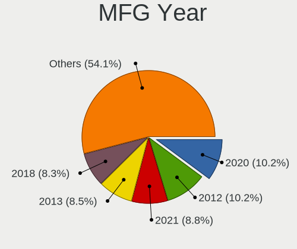
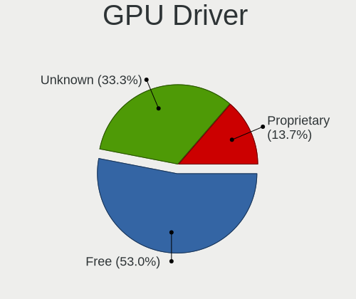
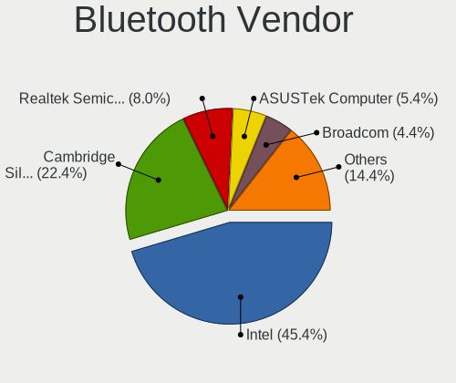
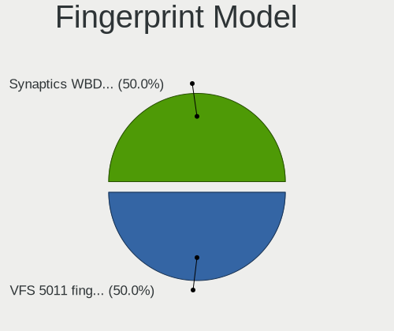

Debian 11 - Tested Hardware & Statistics (Desktops)
---------------------------------------------------

A project to collect tested hardware configurations for Debian 11.

Anyone can contribute to this report by the [hw-probe](https://github.com/linuxhw/hw-probe) tool:

    sudo -E hw-probe -all -upload

Please contribute! Especially if your hardware is rare.

Contents
--------

* [ Test Cases ](#test-cases)

* [ System ](#system)
  - [ Kernel                   ](#kernel)
  - [ Kernel Family            ](#kernel-family)
  - [ Kernel Major Ver.        ](#kernel-major-ver)
  - [ Arch                     ](#arch)
  - [ DE                       ](#de)
  - [ Display Server           ](#display-server)
  - [ Display Manager          ](#display-manager)
  - [ OS Lang                  ](#os-lang)
  - [ Boot Mode                ](#boot-mode)
  - [ Filesystem               ](#filesystem)
  - [ Part. scheme             ](#part-scheme)
  - [ Dual Boot with Linux/BSD ](#dual-boot-with-linuxbsd)
  - [ Dual Boot (Win)          ](#dual-boot-win)

* [ Board ](#board)
  - [ Vendor                   ](#vendor)
  - [ Model                    ](#model)
  - [ Model Family             ](#model-family)
  - [ MFG Year                 ](#mfg-year)
  - [ Form Factor              ](#form-factor)
  - [ Secure Boot              ](#secure-boot)
  - [ Coreboot                 ](#coreboot)
  - [ RAM Size                 ](#ram-size)
  - [ RAM Used                 ](#ram-used)
  - [ Total Drives             ](#total-drives)
  - [ Has CD-ROM               ](#has-cd-rom)
  - [ Has Ethernet             ](#has-ethernet)
  - [ Has WiFi                 ](#has-wifi)
  - [ Has Bluetooth            ](#has-bluetooth)

* [ Location ](#location)
  - [ Country                  ](#country)
  - [ City                     ](#city)

* [ Drives ](#drives)
  - [ Drive Vendor             ](#drive-vendor)
  - [ Drive Model              ](#drive-model)
  - [ HDD Vendor               ](#hdd-vendor)
  - [ SSD Vendor               ](#ssd-vendor)
  - [ Drive Kind               ](#drive-kind)
  - [ Drive Connector          ](#drive-connector)
  - [ Drive Size               ](#drive-size)
  - [ Space Total              ](#space-total)
  - [ Space Used               ](#space-used)
  - [ Malfunc. Drives          ](#malfunc-drives)
  - [ Malfunc. Drive Vendor    ](#malfunc-drive-vendor)
  - [ Malfunc. HDD Vendor      ](#malfunc-hdd-vendor)
  - [ Malfunc. Drive Kind      ](#malfunc-drive-kind)
  - [ Failed Drives            ](#failed-drives)
  - [ Failed Drive Vendor      ](#failed-drive-vendor)
  - [ Drive Status             ](#drive-status)

* [ Storage controller ](#storage-controller)
  - [ Storage Vendor           ](#storage-vendor)
  - [ Storage Model            ](#storage-model)
  - [ Storage Kind             ](#storage-kind)

* [ Processor ](#processor)
  - [ CPU Vendor               ](#cpu-vendor)
  - [ CPU Model                ](#cpu-model)
  - [ CPU Model Family         ](#cpu-model-family)
  - [ CPU Cores                ](#cpu-cores)
  - [ CPU Sockets              ](#cpu-sockets)
  - [ CPU Threads              ](#cpu-threads)
  - [ CPU Op-Modes             ](#cpu-op-modes)
  - [ CPU Microcode            ](#cpu-microcode)
  - [ CPU Microarch            ](#cpu-microarch)

* [ Graphics ](#graphics)
  - [ GPU Vendor               ](#gpu-vendor)
  - [ GPU Model                ](#gpu-model)
  - [ GPU Combo                ](#gpu-combo)
  - [ GPU Driver               ](#gpu-driver)
  - [ GPU Memory               ](#gpu-memory)

* [ Monitor ](#monitor)
  - [ Monitor Vendor           ](#monitor-vendor)
  - [ Monitor Model            ](#monitor-model)
  - [ Monitor Resolution       ](#monitor-resolution)
  - [ Monitor Diagonal         ](#monitor-diagonal)
  - [ Monitor Width            ](#monitor-width)
  - [ Aspect Ratio             ](#aspect-ratio)
  - [ Monitor Area             ](#monitor-area)
  - [ Pixel Density            ](#pixel-density)
  - [ Multiple Monitors        ](#multiple-monitors)

* [ Network ](#network)
  - [ Net Controller Vendor    ](#net-controller-vendor)
  - [ Net Controller Model     ](#net-controller-model)
  - [ Wireless Vendor          ](#wireless-vendor)
  - [ Wireless Model           ](#wireless-model)
  - [ Ethernet Vendor          ](#ethernet-vendor)
  - [ Ethernet Model           ](#ethernet-model)
  - [ Net Controller Kind      ](#net-controller-kind)
  - [ Used Controller          ](#used-controller)
  - [ NICs                     ](#nics)
  - [ IPv6                     ](#ipv6)

* [ Bluetooth ](#bluetooth)
  - [ Bluetooth Vendor         ](#bluetooth-vendor)
  - [ Bluetooth Model          ](#bluetooth-model)

* [ Sound ](#sound)
  - [ Sound Vendor             ](#sound-vendor)
  - [ Sound Model              ](#sound-model)

* [ Memory ](#memory)
  - [ Memory Vendor            ](#memory-vendor)
  - [ Memory Model             ](#memory-model)
  - [ Memory Kind              ](#memory-kind)
  - [ Memory Form Factor       ](#memory-form-factor)
  - [ Memory Size              ](#memory-size)
  - [ Memory Speed             ](#memory-speed)

* [ Printers & scanners ](#printers--scanners)
  - [ Printer Vendor           ](#printer-vendor)
  - [ Printer Model            ](#printer-model)
  - [ Scanner Vendor           ](#scanner-vendor)
  - [ Scanner Model            ](#scanner-model)

* [ Camera ](#camera)
  - [ Camera Vendor            ](#camera-vendor)
  - [ Camera Model             ](#camera-model)

* [ Security ](#security)
  - [ Fingerprint Vendor       ](#fingerprint-vendor)
  - [ Fingerprint Model        ](#fingerprint-model)
  - [ Chipcard Vendor          ](#chipcard-vendor)
  - [ Chipcard Model           ](#chipcard-model)

* [ Unsupported ](#unsupported)
  - [ Unsupported Devices      ](#unsupported-devices)
  - [ Unsupported Device Types ](#unsupported-device-types)

Test Cases
----------

Total: 1739

| Vendor        | Model                       | Probe                                                      | Date         |
|---------------|-----------------------------|------------------------------------------------------------|--------------|
| Gigabyte      | H81M-DS2V                   | [5f35ee7109](https://linux-hardware.org/?probe=5f35ee7109) | Jul 01, 2022 |
| ASUSTek       | PRIME H310M-R R2.0          | [d7d9387e6d](https://linux-hardware.org/?probe=d7d9387e6d) | Jul 01, 2022 |
| Gigabyte      | B85M-D3H                    | [d0d9e7b5c7](https://linux-hardware.org/?probe=d0d9e7b5c7) | Jul 01, 2022 |
| MSI           | B75MA-E33                   | [482aec0a52](https://linux-hardware.org/?probe=482aec0a52) | Jun 30, 2022 |
| ASUSTek       | P5KPL-E                     | [c969c7cce8](https://linux-hardware.org/?probe=c969c7cce8) | Jun 30, 2022 |
| Dell          | 0D441T A01                  | [b205bc201e](https://linux-hardware.org/?probe=b205bc201e) | Jun 29, 2022 |
| Dell          | 0M858N A01                  | [6cc8dcd51e](https://linux-hardware.org/?probe=6cc8dcd51e) | Jun 29, 2022 |
| Gigabyte      | B150-HD3 DDR3-CF            | [3fe71d66c6](https://linux-hardware.org/?probe=3fe71d66c6) | Jun 28, 2022 |
| ECS           | G41T-M16                    | [5a3363d66f](https://linux-hardware.org/?probe=5a3363d66f) | Jun 28, 2022 |
| Intel         | D945PLRN AAD32731-404       | [d9519690b8](https://linux-hardware.org/?probe=d9519690b8) | Jun 28, 2022 |
| ASUSTek       | B85M-G                      | [642e677d05](https://linux-hardware.org/?probe=642e677d05) | Jun 27, 2022 |
| ASUSTek       | PRIME B450M-A               | [60810eb934](https://linux-hardware.org/?probe=60810eb934) | Jun 27, 2022 |
| ASUSTek       | PRIME B450M-A               | [6ab12fa31e](https://linux-hardware.org/?probe=6ab12fa31e) | Jun 27, 2022 |
| Maxtang       | FP30 V1.0                   | [6d86a132d4](https://linux-hardware.org/?probe=6d86a132d4) | Jun 26, 2022 |
| ASUSTek       | P8Z77-V PRO                 | [838a928e6a](https://linux-hardware.org/?probe=838a928e6a) | Jun 26, 2022 |
| Gigabyte      | M52LT-D3                    | [6c650dabf3](https://linux-hardware.org/?probe=6c650dabf3) | Jun 24, 2022 |
| Gigabyte      | B150-HD3P-CF                | [c62062eac9](https://linux-hardware.org/?probe=c62062eac9) | Jun 24, 2022 |
| Intel         | MAHOBAY                     | [c292904665](https://linux-hardware.org/?probe=c292904665) | Jun 24, 2022 |
| Lenovo        | ThinkServer TS440           | [e68364c28e](https://linux-hardware.org/?probe=e68364c28e) | Jun 24, 2022 |
| Gigabyte      | H470M DS3H                  | [624ad307fc](https://linux-hardware.org/?probe=624ad307fc) | Jun 24, 2022 |
| ASUSTek       | ROG STRIX B550-I GAMING     | [cf76d2d9a4](https://linux-hardware.org/?probe=cf76d2d9a4) | Jun 23, 2022 |
| HP            | 830C                        | [7e34e5c70d](https://linux-hardware.org/?probe=7e34e5c70d) | Jun 23, 2022 |
| ASUSTek       | PRIME A320M-K/BR            | [c44391986b](https://linux-hardware.org/?probe=c44391986b) | Jun 23, 2022 |
| MSI           | MPG X570S EDGE MAX WIFI     | [2c1f55aa8f](https://linux-hardware.org/?probe=2c1f55aa8f) | Jun 23, 2022 |
| ECS           | G31T-M9                     | [79e0e345f0](https://linux-hardware.org/?probe=79e0e345f0) | Jun 23, 2022 |
| Dell          | 0J8885                      | [06e5e2fe54](https://linux-hardware.org/?probe=06e5e2fe54) | Jun 23, 2022 |
| Gigabyte      | B450 AORUS PRO-CF           | [989b450d8b](https://linux-hardware.org/?probe=989b450d8b) | Jun 23, 2022 |
| ASUSTek       | ProArt X570-CREATOR WIFI    | [39cc29c976](https://linux-hardware.org/?probe=39cc29c976) | Jun 23, 2022 |
| ASUSTek       | STRIX Z270F GAMING          | [d5d735e981](https://linux-hardware.org/?probe=d5d735e981) | Jun 22, 2022 |
| Gigabyte      | B660M GAMING X DDR4         | [d2d5590419](https://linux-hardware.org/?probe=d2d5590419) | Jun 22, 2022 |
| MSI           | H110M PRO-VD                | [a46ae32016](https://linux-hardware.org/?probe=a46ae32016) | Jun 22, 2022 |
| Gigabyte      | H97M-D3H                    | [1529cf29a5](https://linux-hardware.org/?probe=1529cf29a5) | Jun 22, 2022 |
| Gigabyte      | H97M-D3H                    | [4a2493f02c](https://linux-hardware.org/?probe=4a2493f02c) | Jun 22, 2022 |
| Unknown       | Unknown                     | [6024015ecc](https://linux-hardware.org/?probe=6024015ecc) | Jun 21, 2022 |
| ASUSTek       | M5A78L-M/USB3               | [273f19137a](https://linux-hardware.org/?probe=273f19137a) | Jun 21, 2022 |
| ASUSTek       | H110M-R                     | [49fca67e16](https://linux-hardware.org/?probe=49fca67e16) | Jun 21, 2022 |
| ASUSTek       | P5KPL-AM SE                 | [fd01dae061](https://linux-hardware.org/?probe=fd01dae061) | Jun 21, 2022 |
| Gigabyte      | B360M H                     | [3b3898bab6](https://linux-hardware.org/?probe=3b3898bab6) | Jun 21, 2022 |
| Lenovo        | ThinkStation S20 4105J6G    | [3182b17f83](https://linux-hardware.org/?probe=3182b17f83) | Jun 21, 2022 |
| Gigabyte      | B360M H                     | [9302b49143](https://linux-hardware.org/?probe=9302b49143) | Jun 21, 2022 |
| ASUSTek       | P5G41T-M LE                 | [2ff86ed754](https://linux-hardware.org/?probe=2ff86ed754) | Jun 21, 2022 |
| Intel         | CD952                       | [da181703fa](https://linux-hardware.org/?probe=da181703fa) | Jun 21, 2022 |
| Unknown       | Unknown                     | [604913c4e4](https://linux-hardware.org/?probe=604913c4e4) | Jun 20, 2022 |
| ASUSTek       | P5GC-MX/1333                | [e7527331d5](https://linux-hardware.org/?probe=e7527331d5) | Jun 20, 2022 |
| Foxconn       | G33M03                      | [e66dc33431](https://linux-hardware.org/?probe=e66dc33431) | Jun 20, 2022 |
| HP            | ProLiant ML350 G5           | [57a6a7a493](https://linux-hardware.org/?probe=57a6a7a493) | Jun 20, 2022 |
| ASUSTek       | PRIME H310M-R R2.0          | [e6bd544051](https://linux-hardware.org/?probe=e6bd544051) | Jun 20, 2022 |
| Gigabyte      | B450M S2H                   | [deae1c7af7](https://linux-hardware.org/?probe=deae1c7af7) | Jun 19, 2022 |
| Lenovo        | ThinkServer TS440           | [42bf4b080d](https://linux-hardware.org/?probe=42bf4b080d) | Jun 19, 2022 |
| Lenovo        | 3132 SDK0R32862 WIN 3258... | [473e2262b2](https://linux-hardware.org/?probe=473e2262b2) | Jun 19, 2022 |
| Lenovo        | 3132 SDK0R32862 WIN 3258... | [83858f351b](https://linux-hardware.org/?probe=83858f351b) | Jun 19, 2022 |
| Dell          | 00V62H A00                  | [b902ece510](https://linux-hardware.org/?probe=b902ece510) | Jun 19, 2022 |
| ASUSTek       | KGPE-D16                    | [8a0bcff648](https://linux-hardware.org/?probe=8a0bcff648) | Jun 19, 2022 |
| ASUSTek       | KGPE-D16                    | [2ce805f758](https://linux-hardware.org/?probe=2ce805f758) | Jun 19, 2022 |
| ASUSTek       | Z77-A                       | [b416c587af](https://linux-hardware.org/?probe=b416c587af) | Jun 18, 2022 |
| Dell          | 0P9XHK A00                  | [e167c05dd2](https://linux-hardware.org/?probe=e167c05dd2) | Jun 17, 2022 |
| ASUSTek       | H110M-R                     | [575d907137](https://linux-hardware.org/?probe=575d907137) | Jun 17, 2022 |
| ASUSTek       | P5G41T-M LE                 | [9f392efe48](https://linux-hardware.org/?probe=9f392efe48) | Jun 17, 2022 |
| Fujitsu       | D3221-A1 S26361-D3221-A1    | [eb011c0886](https://linux-hardware.org/?probe=eb011c0886) | Jun 17, 2022 |
| Dell          | 0NDYHG A01                  | [c4ed1ece70](https://linux-hardware.org/?probe=c4ed1ece70) | Jun 16, 2022 |
| Gigabyte      | B75-D3V                     | [3de9ecfb70](https://linux-hardware.org/?probe=3de9ecfb70) | Jun 16, 2022 |
| Gigabyte      | H81M-S2V                    | [de482da93c](https://linux-hardware.org/?probe=de482da93c) | Jun 15, 2022 |
| Gigabyte      | H81M-S2V                    | [2af43ca43d](https://linux-hardware.org/?probe=2af43ca43d) | Jun 15, 2022 |
| MSI           | H110M PRO-VD                | [9ac46f589f](https://linux-hardware.org/?probe=9ac46f589f) | Jun 14, 2022 |
| ASUSTek       | PRIME H310M-R R2.0          | [0c8ec2807f](https://linux-hardware.org/?probe=0c8ec2807f) | Jun 14, 2022 |
| ASUSTek       | PRIME B360M-C               | [c250d3b2e0](https://linux-hardware.org/?probe=c250d3b2e0) | Jun 14, 2022 |
| ASUSTek       | PRIME H310M-R R2.0          | [54800ad012](https://linux-hardware.org/?probe=54800ad012) | Jun 14, 2022 |
| ASUSTek       | P8Z68-V GEN3                | [863fc6a3bd](https://linux-hardware.org/?probe=863fc6a3bd) | Jun 14, 2022 |
| ASUSTek       | SABERTOOTH 990FX R2.0       | [cdbe0685be](https://linux-hardware.org/?probe=cdbe0685be) | Jun 13, 2022 |
| ASUSTek       | P8H77-M PRO                 | [674cb88747](https://linux-hardware.org/?probe=674cb88747) | Jun 13, 2022 |
| Supermicro    | X8STi                       | [d99d775afe](https://linux-hardware.org/?probe=d99d775afe) | Jun 12, 2022 |
| MSI           | MAG X570 TOMAHAWK WIFI      | [3ddbde438b](https://linux-hardware.org/?probe=3ddbde438b) | Jun 12, 2022 |
| ASUSTek       | PRIME H310M-R R2.0          | [b15a9cd9ec](https://linux-hardware.org/?probe=b15a9cd9ec) | Jun 11, 2022 |
| ASUSTek       | PRIME H310M-R R2.0          | [530d14088b](https://linux-hardware.org/?probe=530d14088b) | Jun 11, 2022 |
| ASUSTek       | PRIME B350-PLUS             | [55be0755f9](https://linux-hardware.org/?probe=55be0755f9) | Jun 11, 2022 |
| ASUSTek       | PRIME H310M-R R2.0          | [288ab3a8ad](https://linux-hardware.org/?probe=288ab3a8ad) | Jun 11, 2022 |
| ASUSTek       | PRIME H310M-R R2.0          | [e7931e1d59](https://linux-hardware.org/?probe=e7931e1d59) | Jun 11, 2022 |
| ASUSTek       | PRIME H310M-R R2.0          | [4624e51d0d](https://linux-hardware.org/?probe=4624e51d0d) | Jun 11, 2022 |
| ASUSTek       | PRIME H310M-R R2.0          | [4d5e823219](https://linux-hardware.org/?probe=4d5e823219) | Jun 11, 2022 |
| ASUSTek       | PRIME H310M-R R2.0          | [d185e26655](https://linux-hardware.org/?probe=d185e26655) | Jun 11, 2022 |
| ASUSTek       | PRIME H310M-R R2.0          | [c184039865](https://linux-hardware.org/?probe=c184039865) | Jun 11, 2022 |
| ASUSTek       | PRIME H310M-R R2.0          | [96026aee3c](https://linux-hardware.org/?probe=96026aee3c) | Jun 11, 2022 |
| ASUSTek       | PRIME H310M-R R2.0          | [a7feb8b173](https://linux-hardware.org/?probe=a7feb8b173) | Jun 11, 2022 |
| ASUSTek       | PRIME H310M-R R2.0          | [8cf2ab21a1](https://linux-hardware.org/?probe=8cf2ab21a1) | Jun 11, 2022 |
| ASUSTek       | PRIME H310M-R R2.0          | [361ad1fd01](https://linux-hardware.org/?probe=361ad1fd01) | Jun 11, 2022 |
| ASUSTek       | PRIME H310M-R R2.0          | [2f0948a486](https://linux-hardware.org/?probe=2f0948a486) | Jun 11, 2022 |
| ASUSTek       | PRIME H310M-R R2.0          | [cbe79f811b](https://linux-hardware.org/?probe=cbe79f811b) | Jun 11, 2022 |
| ASUSTek       | PRIME H310M-R R2.0          | [128a4f95b3](https://linux-hardware.org/?probe=128a4f95b3) | Jun 11, 2022 |
| ASUSTek       | PRIME H310M-R R2.0          | [62c847aae6](https://linux-hardware.org/?probe=62c847aae6) | Jun 11, 2022 |
| ASUSTek       | PRIME H310M-R R2.0          | [0cdb0bc0ec](https://linux-hardware.org/?probe=0cdb0bc0ec) | Jun 11, 2022 |
| ASUSTek       | PRIME H310M-R R2.0          | [c6ea351f57](https://linux-hardware.org/?probe=c6ea351f57) | Jun 11, 2022 |
| ASUSTek       | PRIME H310M-R R2.0          | [a9a0fd0187](https://linux-hardware.org/?probe=a9a0fd0187) | Jun 11, 2022 |
| ASUSTek       | PRIME H310M-R R2.0          | [e0610fc3ee](https://linux-hardware.org/?probe=e0610fc3ee) | Jun 11, 2022 |
| ASUSTek       | PRIME H310M-R R2.0          | [17e9ad5909](https://linux-hardware.org/?probe=17e9ad5909) | Jun 11, 2022 |
| ASUSTek       | PRIME H310M-R R2.0          | [3ddd67d79c](https://linux-hardware.org/?probe=3ddd67d79c) | Jun 11, 2022 |
| ASUSTek       | PRIME H310M-R R2.0          | [52b1a2ddcc](https://linux-hardware.org/?probe=52b1a2ddcc) | Jun 11, 2022 |
| ASUSTek       | PRIME H310M-R R2.0          | [855eccf466](https://linux-hardware.org/?probe=855eccf466) | Jun 11, 2022 |
| ASUSTek       | PRIME H310M-R R2.0          | [8e97ffd0ce](https://linux-hardware.org/?probe=8e97ffd0ce) | Jun 11, 2022 |
| ASUSTek       | PRIME H310M-R R2.0          | [4c0f195f39](https://linux-hardware.org/?probe=4c0f195f39) | Jun 11, 2022 |
| ASUSTek       | PRIME H310M-R R2.0          | [e525f8832b](https://linux-hardware.org/?probe=e525f8832b) | Jun 11, 2022 |
| ASUSTek       | PRIME H310M-R R2.0          | [8511f3e652](https://linux-hardware.org/?probe=8511f3e652) | Jun 11, 2022 |
| ASUSTek       | PRIME H310M-R R2.0          | [44e4fe183c](https://linux-hardware.org/?probe=44e4fe183c) | Jun 11, 2022 |
| ASUSTek       | PRIME H310M-R R2.0          | [f8f771b95b](https://linux-hardware.org/?probe=f8f771b95b) | Jun 11, 2022 |
| ASUSTek       | PRIME H310M-R R2.0          | [3c70a63df1](https://linux-hardware.org/?probe=3c70a63df1) | Jun 11, 2022 |
| ASUSTek       | PRIME H310M-R R2.0          | [ea7ec909e0](https://linux-hardware.org/?probe=ea7ec909e0) | Jun 11, 2022 |
| Dell          | 0TDG4V A01                  | [3da09dbe5d](https://linux-hardware.org/?probe=3da09dbe5d) | Jun 10, 2022 |
| ASRock        | G31M-VS2                    | [8da76dfd88](https://linux-hardware.org/?probe=8da76dfd88) | Jun 10, 2022 |
| Gigabyte      | H81M-DS2                    | [8f6316f63d](https://linux-hardware.org/?probe=8f6316f63d) | Jun 10, 2022 |
| ASUSTek       | PRIME H310M-R R2.0          | [25b0162512](https://linux-hardware.org/?probe=25b0162512) | Jun 10, 2022 |
| ASUSTek       | PRIME H310M-R R2.0          | [dec67b7ea7](https://linux-hardware.org/?probe=dec67b7ea7) | Jun 10, 2022 |
| ASUSTek       | PRIME H310M-R R2.0          | [a1af74a271](https://linux-hardware.org/?probe=a1af74a271) | Jun 10, 2022 |
| ASUSTek       | PRIME H310M-R R2.0          | [5863863487](https://linux-hardware.org/?probe=5863863487) | Jun 10, 2022 |
| ASUSTek       | PRIME H310M-R R2.0          | [4dd447cf4a](https://linux-hardware.org/?probe=4dd447cf4a) | Jun 10, 2022 |
| ASUSTek       | PRIME H310M-R R2.0          | [b248c80824](https://linux-hardware.org/?probe=b248c80824) | Jun 10, 2022 |
| ASUSTek       | PRIME H310M-R R2.0          | [ec484ac5f1](https://linux-hardware.org/?probe=ec484ac5f1) | Jun 10, 2022 |
| ASUSTek       | PRIME H310M-R R2.0          | [fbfb5f5567](https://linux-hardware.org/?probe=fbfb5f5567) | Jun 10, 2022 |
| ASUSTek       | PRIME H310M-R R2.0          | [69177b9dd1](https://linux-hardware.org/?probe=69177b9dd1) | Jun 10, 2022 |
| ASUSTek       | PRIME H310M-R R2.0          | [7b37f934d9](https://linux-hardware.org/?probe=7b37f934d9) | Jun 10, 2022 |
| ASUSTek       | PRIME H310M-R R2.0          | [f81bbaa809](https://linux-hardware.org/?probe=f81bbaa809) | Jun 10, 2022 |
| ASUSTek       | PRIME H310M-R R2.0          | [53cde78383](https://linux-hardware.org/?probe=53cde78383) | Jun 10, 2022 |
| Gigabyte      | H410M S2H                   | [958add1814](https://linux-hardware.org/?probe=958add1814) | Jun 10, 2022 |
| Gigabyte      | H410M S2H                   | [0045fbc083](https://linux-hardware.org/?probe=0045fbc083) | Jun 10, 2022 |
| Gigabyte      | H410M S2H                   | [4e319d922b](https://linux-hardware.org/?probe=4e319d922b) | Jun 10, 2022 |
| Gigabyte      | H410M S2H                   | [6d0ab85ca8](https://linux-hardware.org/?probe=6d0ab85ca8) | Jun 10, 2022 |
| Gigabyte      | H410M S2H                   | [057d965770](https://linux-hardware.org/?probe=057d965770) | Jun 10, 2022 |
| Gigabyte      | H410M S2H                   | [47adb91a17](https://linux-hardware.org/?probe=47adb91a17) | Jun 10, 2022 |
| Gigabyte      | H410M S2H                   | [e6c10e7c75](https://linux-hardware.org/?probe=e6c10e7c75) | Jun 10, 2022 |
| Gigabyte      | H410M S2H                   | [aa239405c6](https://linux-hardware.org/?probe=aa239405c6) | Jun 10, 2022 |
| Gigabyte      | H410M S2H                   | [c581adfc75](https://linux-hardware.org/?probe=c581adfc75) | Jun 10, 2022 |
| Gigabyte      | H410M S2H                   | [36a127b30b](https://linux-hardware.org/?probe=36a127b30b) | Jun 10, 2022 |
| Gigabyte      | H410M S2H                   | [c265928721](https://linux-hardware.org/?probe=c265928721) | Jun 10, 2022 |
| Gigabyte      | H410M S2H                   | [bc6f4accca](https://linux-hardware.org/?probe=bc6f4accca) | Jun 10, 2022 |
| Gigabyte      | H410M S2H                   | [495a331678](https://linux-hardware.org/?probe=495a331678) | Jun 10, 2022 |
| Gigabyte      | H410M S2H                   | [50d4873224](https://linux-hardware.org/?probe=50d4873224) | Jun 10, 2022 |
| Gigabyte      | H410M S2H                   | [e90c802b8a](https://linux-hardware.org/?probe=e90c802b8a) | Jun 10, 2022 |
| Dell          | 0X75JG A01                  | [04a5e20d9e](https://linux-hardware.org/?probe=04a5e20d9e) | Jun 10, 2022 |
| MSI           | X99S GAMING 7               | [d36fec156a](https://linux-hardware.org/?probe=d36fec156a) | Jun 10, 2022 |
| ASRock        | 970 Performance             | [d017602bb8](https://linux-hardware.org/?probe=d017602bb8) | Jun 10, 2022 |
| ASRock        | 970 Performance             | [a2afdf2651](https://linux-hardware.org/?probe=a2afdf2651) | Jun 10, 2022 |
| ASRockRack    | X470D4U                     | [bdf16fa487](https://linux-hardware.org/?probe=bdf16fa487) | Jun 09, 2022 |
| Gigabyte      | B360M H                     | [94843ffed7](https://linux-hardware.org/?probe=94843ffed7) | Jun 09, 2022 |
| MSI           | H110M PRO-VD                | [d731f8ac03](https://linux-hardware.org/?probe=d731f8ac03) | Jun 09, 2022 |
| ASUSTek       | P5G41T-M LE                 | [6ae73c0b67](https://linux-hardware.org/?probe=6ae73c0b67) | Jun 09, 2022 |
| HP            | 085Ch                       | [357911a814](https://linux-hardware.org/?probe=357911a814) | Jun 08, 2022 |
| ASRock        | B450 Gaming-ITX/ac          | [6daae3f4db](https://linux-hardware.org/?probe=6daae3f4db) | Jun 08, 2022 |
| MSI           | H110M PRO-VD                | [aac1519759](https://linux-hardware.org/?probe=aac1519759) | Jun 08, 2022 |
| ASRock        | H470M-HVS                   | [0de4237fba](https://linux-hardware.org/?probe=0de4237fba) | Jun 08, 2022 |
| MSI           | H110M PRO-VD                | [0f1129c5f3](https://linux-hardware.org/?probe=0f1129c5f3) | Jun 08, 2022 |
| ASUSTek       | H110M-R                     | [75c023ebe1](https://linux-hardware.org/?probe=75c023ebe1) | Jun 08, 2022 |
| MSI           | H110M PRO-VH                | [ceae668577](https://linux-hardware.org/?probe=ceae668577) | Jun 07, 2022 |
| Gigabyte      | H81M-S2H                    | [4ca91078a2](https://linux-hardware.org/?probe=4ca91078a2) | Jun 07, 2022 |
| MSI           | B450M PRO-VDH MAX           | [11c7f60ef1](https://linux-hardware.org/?probe=11c7f60ef1) | Jun 07, 2022 |
| ASRock        | B365M Pro4-F                | [90b2505b78](https://linux-hardware.org/?probe=90b2505b78) | Jun 07, 2022 |
| MSI           | H110M PRO-VD                | [dbea5c81f2](https://linux-hardware.org/?probe=dbea5c81f2) | Jun 07, 2022 |
| ASUSTek       | B85M-G                      | [67662acc02](https://linux-hardware.org/?probe=67662acc02) | Jun 07, 2022 |
| MSI           | H81M-E33                    | [b2ce1d66a3](https://linux-hardware.org/?probe=b2ce1d66a3) | Jun 07, 2022 |
| ASRock        | B85M Pro3                   | [929408f1cd](https://linux-hardware.org/?probe=929408f1cd) | Jun 07, 2022 |
| Dell          | 040DDP A01                  | [94cce73a9d](https://linux-hardware.org/?probe=94cce73a9d) | Jun 07, 2022 |
| ASRock        | B365M Pro4-F                | [722cfa9375](https://linux-hardware.org/?probe=722cfa9375) | Jun 06, 2022 |
| PC Engines    | APU2                        | [269fa69513](https://linux-hardware.org/?probe=269fa69513) | Jun 06, 2022 |
| ASUSTek       | P8H61-MX                    | [a1b3220a4e](https://linux-hardware.org/?probe=a1b3220a4e) | Jun 06, 2022 |
| ASRock        | H310CM-DVS                  | [2c46c3adb2](https://linux-hardware.org/?probe=2c46c3adb2) | Jun 06, 2022 |
| Gigabyte      | X570 AORUS MASTER           | [9998592ce0](https://linux-hardware.org/?probe=9998592ce0) | Jun 06, 2022 |
| MSI           | B450M PRO-VDH MAX           | [2aeb22bc4b](https://linux-hardware.org/?probe=2aeb22bc4b) | Jun 06, 2022 |
| Gigabyte      | A320M-S2H-CF                | [e3c84aefa8](https://linux-hardware.org/?probe=e3c84aefa8) | Jun 05, 2022 |
| ASRock        | B450 Gaming-ITX/ac          | [0948fcded8](https://linux-hardware.org/?probe=0948fcded8) | Jun 05, 2022 |
| Dell          | 0WR7PY A01                  | [39c37e56ec](https://linux-hardware.org/?probe=39c37e56ec) | Jun 04, 2022 |
| ASUSTek       | PRIME B360M-C               | [b57fa63f1a](https://linux-hardware.org/?probe=b57fa63f1a) | Jun 04, 2022 |
| BESSTAR Te... | HM90                        | [5272429aa9](https://linux-hardware.org/?probe=5272429aa9) | Jun 04, 2022 |
| Gigabyte      | H61M-USB3H                  | [1f88a2c07c](https://linux-hardware.org/?probe=1f88a2c07c) | Jun 04, 2022 |
| Gigabyte      | H61M-USB3H                  | [3cc513c431](https://linux-hardware.org/?probe=3cc513c431) | Jun 04, 2022 |
| ASUSTek       | PRIME A320M-A               | [b610820278](https://linux-hardware.org/?probe=b610820278) | Jun 03, 2022 |
| Gigabyte      | B360M H                     | [8f5cd5eef5](https://linux-hardware.org/?probe=8f5cd5eef5) | Jun 03, 2022 |
| Gigabyte      | B360M H                     | [3cd0f35827](https://linux-hardware.org/?probe=3cd0f35827) | Jun 03, 2022 |
| Gigabyte      | M61PME-S2P                  | [a56a39a60e](https://linux-hardware.org/?probe=a56a39a60e) | Jun 03, 2022 |
| MSI           | H81M-P33                    | [c7974d4e6d](https://linux-hardware.org/?probe=c7974d4e6d) | Jun 03, 2022 |
| ASUSTek       | PRIME H310M-R R2.0          | [b20f8a904c](https://linux-hardware.org/?probe=b20f8a904c) | Jun 03, 2022 |
| ASUSTek       | PRIME H310M-R R2.0          | [deaecc76bb](https://linux-hardware.org/?probe=deaecc76bb) | Jun 03, 2022 |
| ASUSTek       | PRIME H310M-R R2.0          | [65725a95b9](https://linux-hardware.org/?probe=65725a95b9) | Jun 03, 2022 |
| ASUSTek       | PRIME H310M-R R2.0          | [a4622d1f55](https://linux-hardware.org/?probe=a4622d1f55) | Jun 03, 2022 |
| ASUSTek       | PRIME H310M-R R2.0          | [e8019b4f83](https://linux-hardware.org/?probe=e8019b4f83) | Jun 03, 2022 |
| ASUSTek       | PRIME H310M-R R2.0          | [afba735e60](https://linux-hardware.org/?probe=afba735e60) | Jun 03, 2022 |
| ASUSTek       | PRIME H310M-R R2.0          | [7f34664fe0](https://linux-hardware.org/?probe=7f34664fe0) | Jun 03, 2022 |
| ASUSTek       | PRIME H310M-R R2.0          | [feaafa4cfa](https://linux-hardware.org/?probe=feaafa4cfa) | Jun 03, 2022 |
| ASUSTek       | PRIME H310M-R R2.0          | [61260328d6](https://linux-hardware.org/?probe=61260328d6) | Jun 03, 2022 |
| ASUSTek       | PRIME H310M-R R2.0          | [5dcef6967d](https://linux-hardware.org/?probe=5dcef6967d) | Jun 03, 2022 |
| ASUSTek       | PRIME H310M-R R2.0          | [3a2e3ed469](https://linux-hardware.org/?probe=3a2e3ed469) | Jun 03, 2022 |
| Gigabyte      | H57M-USB3                   | [ad3c50375c](https://linux-hardware.org/?probe=ad3c50375c) | Jun 03, 2022 |
| ASUSTek       | PRIME H310M-R R2.0          | [7725e74369](https://linux-hardware.org/?probe=7725e74369) | Jun 02, 2022 |
| MSI           | H110M PRO-VD                | [cd124df84c](https://linux-hardware.org/?probe=cd124df84c) | Jun 02, 2022 |
| Gigabyte      | M68MT-S2                    | [c71933a046](https://linux-hardware.org/?probe=c71933a046) | Jun 02, 2022 |
| Lenovo        | 3132 SDK0R32862 WIN 3258... | [459a6a7c75](https://linux-hardware.org/?probe=459a6a7c75) | Jun 02, 2022 |
| Lenovo        | 30D9 SDK0J40705 WIN 3425... | [b9eb4d507e](https://linux-hardware.org/?probe=b9eb4d507e) | Jun 02, 2022 |
| Dell          | 0J8885                      | [1b1eafbd15](https://linux-hardware.org/?probe=1b1eafbd15) | Jun 01, 2022 |
| Gigabyte      | 970A-DS3P                   | [272322b54a](https://linux-hardware.org/?probe=272322b54a) | Jun 01, 2022 |
| ASRock        | A320M-HDV R3.0              | [1b402ad8a4](https://linux-hardware.org/?probe=1b402ad8a4) | Jun 01, 2022 |
| Gigabyte      | M68MT-S2                    | [24ef5903aa](https://linux-hardware.org/?probe=24ef5903aa) | Jun 01, 2022 |
| Intel         | DH61BF AAG81311-101         | [b1fe95fd93](https://linux-hardware.org/?probe=b1fe95fd93) | May 31, 2022 |
| HP            | ProLiant ML110 Gen9         | [2940e1d0b2](https://linux-hardware.org/?probe=2940e1d0b2) | May 31, 2022 |
| ASUSTek       | PRIME H310M-R R2.0          | [4dad4a323a](https://linux-hardware.org/?probe=4dad4a323a) | May 31, 2022 |
| MSI           | A320M-HDV R4.0              | [c6f912a3cd](https://linux-hardware.org/?probe=c6f912a3cd) | May 31, 2022 |
| ASUSTek       | PRIME H310M-R R2.0          | [c60a969370](https://linux-hardware.org/?probe=c60a969370) | May 31, 2022 |
| ASUSTek       | P8H61-M LX3 R2.0            | [7bd2b1490a](https://linux-hardware.org/?probe=7bd2b1490a) | May 31, 2022 |
| ASUSTek       | P7H55-M SI                  | [bd7e895652](https://linux-hardware.org/?probe=bd7e895652) | May 31, 2022 |
| MSI           | G31TM-P21                   | [3ddbd38a08](https://linux-hardware.org/?probe=3ddbd38a08) | May 31, 2022 |
| Gigabyte      | M61PME-S2P                  | [6960eaa85b](https://linux-hardware.org/?probe=6960eaa85b) | May 31, 2022 |
| HP            | 158A                        | [7f7c6ae514](https://linux-hardware.org/?probe=7f7c6ae514) | May 31, 2022 |
| Gigabyte      | H61M-S2-B3                  | [3de5695c62](https://linux-hardware.org/?probe=3de5695c62) | May 30, 2022 |
| Gigabyte      | H61M-S2PV                   | [b002ab0fe8](https://linux-hardware.org/?probe=b002ab0fe8) | May 30, 2022 |
| Gigabyte      | M52L-S3                     | [1add8e904e](https://linux-hardware.org/?probe=1add8e904e) | May 30, 2022 |
| Gigabyte      | H61M-S2PV                   | [990a8757b8](https://linux-hardware.org/?probe=990a8757b8) | May 30, 2022 |
| Gigabyte      | M52L-S3                     | [e49b2962df](https://linux-hardware.org/?probe=e49b2962df) | May 30, 2022 |
| ASRock        | H470M-HVS                   | [b7404d28e0](https://linux-hardware.org/?probe=b7404d28e0) | May 30, 2022 |
| ASRock        | B450M-HDV R4.0              | [b6d663fde6](https://linux-hardware.org/?probe=b6d663fde6) | May 29, 2022 |
| MSI           | MAG B550M BAZOOKA           | [9399a639c8](https://linux-hardware.org/?probe=9399a639c8) | May 29, 2022 |
| Biostar       | X470GTQ                     | [44e1072418](https://linux-hardware.org/?probe=44e1072418) | May 28, 2022 |
| HP            | 213D A01                    | [1be94a04b6](https://linux-hardware.org/?probe=1be94a04b6) | May 28, 2022 |
| BESSTAR Te... | HM80                        | [f507d65c2e](https://linux-hardware.org/?probe=f507d65c2e) | May 28, 2022 |
| Gigabyte      | B450M DS3H-CF               | [ed9c55ffc6](https://linux-hardware.org/?probe=ed9c55ffc6) | May 28, 2022 |
| MSI           | MAG B550M BAZOOKA           | [42b16ce834](https://linux-hardware.org/?probe=42b16ce834) | May 28, 2022 |
| MSI           | MAG B550M BAZOOKA           | [4620e51e7b](https://linux-hardware.org/?probe=4620e51e7b) | May 28, 2022 |
| ASRock        | AM2NF6G-VSTA                | [475179d795](https://linux-hardware.org/?probe=475179d795) | May 27, 2022 |
| MSI           | H110M PRO-VD                | [6c505927be](https://linux-hardware.org/?probe=6c505927be) | May 27, 2022 |
| Gigabyte      | B85M-D3H                    | [dc5f3161bd](https://linux-hardware.org/?probe=dc5f3161bd) | May 27, 2022 |
| ASRock        | 970M Pro3                   | [7c13c36e57](https://linux-hardware.org/?probe=7c13c36e57) | May 27, 2022 |
| ECS           | H61H2-M13                   | [6c5eea6e0a](https://linux-hardware.org/?probe=6c5eea6e0a) | May 27, 2022 |
| ASUSTek       | PRIME H310M-R R2.0          | [e28ecda6a9](https://linux-hardware.org/?probe=e28ecda6a9) | May 27, 2022 |
| ASRock        | IMB-185                     | [f7b3b565a0](https://linux-hardware.org/?probe=f7b3b565a0) | May 27, 2022 |
| ASUSTek       | PRIME H310M-R R2.0          | [5b4a1a0b2d](https://linux-hardware.org/?probe=5b4a1a0b2d) | May 27, 2022 |
| ASUSTek       | PRIME H310M-R R2.0          | [8a9debf1da](https://linux-hardware.org/?probe=8a9debf1da) | May 27, 2022 |
| ASUSTek       | PRIME H310M-R R2.0          | [c34cf96051](https://linux-hardware.org/?probe=c34cf96051) | May 27, 2022 |
| Gigabyte      | H110M-S2H-CF                | [305a4aa2be](https://linux-hardware.org/?probe=305a4aa2be) | May 26, 2022 |
| Gigabyte      | H410M S2H                   | [c7e011235c](https://linux-hardware.org/?probe=c7e011235c) | May 26, 2022 |
| MSI           | H110M PRO-VD                | [f50e4f5314](https://linux-hardware.org/?probe=f50e4f5314) | May 26, 2022 |
| ASRock        | H470M-HVS                   | [134bd88895](https://linux-hardware.org/?probe=134bd88895) | May 26, 2022 |
| Gigabyte      | Z77-DS3H                    | [fe6eb0ff04](https://linux-hardware.org/?probe=fe6eb0ff04) | May 26, 2022 |
| ASUSTek       | H81M-K                      | [3fc005308d](https://linux-hardware.org/?probe=3fc005308d) | May 26, 2022 |
| Intel         | DZ77SL-50K AAG55115-300     | [a05a4109f7](https://linux-hardware.org/?probe=a05a4109f7) | May 26, 2022 |
| Gigabyte      | Z590 AORUS ULTRA            | [544888143f](https://linux-hardware.org/?probe=544888143f) | May 25, 2022 |
| ECS           | G31T-M9                     | [cbc52e0724](https://linux-hardware.org/?probe=cbc52e0724) | May 25, 2022 |
| Foxconn       | H61MXL/H61MXL-K             | [c44b877046](https://linux-hardware.org/?probe=c44b877046) | May 25, 2022 |
| ASUSTek       | M4A785TD-V EVO              | [29dd7760ba](https://linux-hardware.org/?probe=29dd7760ba) | May 25, 2022 |
| Packard Be... | IMEDIA S3840                | [d102437a6f](https://linux-hardware.org/?probe=d102437a6f) | May 25, 2022 |
| Foxconn       | G31MXP FAB:1.1              | [64552194de](https://linux-hardware.org/?probe=64552194de) | May 24, 2022 |
| Gigabyte      | H510M H                     | [4bf981574e](https://linux-hardware.org/?probe=4bf981574e) | May 24, 2022 |
| MACHINIST     | X99-RS9 V2.0                | [ca5eb0e4ff](https://linux-hardware.org/?probe=ca5eb0e4ff) | May 24, 2022 |
| ASUSTek       | Z97M-PLUS/BR                | [66b8c4e68c](https://linux-hardware.org/?probe=66b8c4e68c) | May 24, 2022 |
| MSI           | H110M PRO-VD                | [5f3d17f133](https://linux-hardware.org/?probe=5f3d17f133) | May 24, 2022 |
| Gigabyte      | H61M-DS2                    | [1613ab8b42](https://linux-hardware.org/?probe=1613ab8b42) | May 23, 2022 |
| ASRock        | H470M-HVS                   | [0e8f0ed773](https://linux-hardware.org/?probe=0e8f0ed773) | May 23, 2022 |
| ASRock        | H470M-HVS                   | [193d7daf36](https://linux-hardware.org/?probe=193d7daf36) | May 23, 2022 |
| ASRock        | H470M-HVS                   | [0d1907cc6f](https://linux-hardware.org/?probe=0d1907cc6f) | May 23, 2022 |
| ASRock        | H470M-HVS                   | [ea8294c786](https://linux-hardware.org/?probe=ea8294c786) | May 23, 2022 |
| ASRock        | H470M-HVS                   | [a888bc633f](https://linux-hardware.org/?probe=a888bc633f) | May 23, 2022 |
| ASRock        | H470M-HVS                   | [4277ebe7e7](https://linux-hardware.org/?probe=4277ebe7e7) | May 23, 2022 |
| ASRock        | H470M-HVS                   | [6bfc4ef24f](https://linux-hardware.org/?probe=6bfc4ef24f) | May 23, 2022 |
| ASRock        | H470M-HVS                   | [3629d7c796](https://linux-hardware.org/?probe=3629d7c796) | May 23, 2022 |
| ASRock        | H470M-HVS                   | [9938056162](https://linux-hardware.org/?probe=9938056162) | May 23, 2022 |
| ASRock        | H470M-HVS                   | [02393f8ed7](https://linux-hardware.org/?probe=02393f8ed7) | May 23, 2022 |
| ASRock        | H470M-HVS                   | [f8257427c6](https://linux-hardware.org/?probe=f8257427c6) | May 23, 2022 |
| ASRock        | H470M-HVS                   | [3c545f2940](https://linux-hardware.org/?probe=3c545f2940) | May 23, 2022 |
| ECS           | H61H2-MV                    | [13918cd2b7](https://linux-hardware.org/?probe=13918cd2b7) | May 23, 2022 |
| MSI           | H81M-P33                    | [5694eb0d0e](https://linux-hardware.org/?probe=5694eb0d0e) | May 22, 2022 |
| Gigabyte      | G41MT-S2                    | [0245a34484](https://linux-hardware.org/?probe=0245a34484) | May 20, 2022 |
| ASUSTek       | H81M-R                      | [d29d7ee0ad](https://linux-hardware.org/?probe=d29d7ee0ad) | May 20, 2022 |
| Dell          | 0D6H9T A02                  | [3f87c84f7a](https://linux-hardware.org/?probe=3f87c84f7a) | May 20, 2022 |
| Intel         | CM-iAM/SBC-FITPC2i          | [cbfe433386](https://linux-hardware.org/?probe=cbfe433386) | May 20, 2022 |
| Apple         | Mac-F4208DC8 PVT            | [9330599ada](https://linux-hardware.org/?probe=9330599ada) | May 20, 2022 |
| MSI           | H110M PRO-VD                | [a9d54e08c9](https://linux-hardware.org/?probe=a9d54e08c9) | May 20, 2022 |
| Gigabyte      | X570S AORUS MASTER          | [d26b453c29](https://linux-hardware.org/?probe=d26b453c29) | May 20, 2022 |
| MSI           | B550-A PRO                  | [373569ca56](https://linux-hardware.org/?probe=373569ca56) | May 20, 2022 |
| HP            | 8298                        | [3f45b43adb](https://linux-hardware.org/?probe=3f45b43adb) | May 19, 2022 |
| ASRock        | H470M-HVS                   | [b78055bf57](https://linux-hardware.org/?probe=b78055bf57) | May 19, 2022 |
| HP            | 158A                        | [befd0b5756](https://linux-hardware.org/?probe=befd0b5756) | May 18, 2022 |
| Gigabyte      | B75-D3V                     | [81bd72f465](https://linux-hardware.org/?probe=81bd72f465) | May 18, 2022 |
| MouseCompu... | B360M-ITX                   | [bee48ca0b0](https://linux-hardware.org/?probe=bee48ca0b0) | May 18, 2022 |
| ASUSTek       | ROG STRIX X570-I GAMING     | [05c3d14729](https://linux-hardware.org/?probe=05c3d14729) | May 18, 2022 |
| ASUSTek       | P8Z68-V                     | [4e8ebb2b51](https://linux-hardware.org/?probe=4e8ebb2b51) | May 17, 2022 |
| Gigabyte      | B75M-D2V                    | [6eba5e9bf2](https://linux-hardware.org/?probe=6eba5e9bf2) | May 17, 2022 |
| HP            | 1905                        | [eae1688df4](https://linux-hardware.org/?probe=eae1688df4) | May 17, 2022 |
| HP            | ProLiant MicroServer Gen... | [2a8a53c628](https://linux-hardware.org/?probe=2a8a53c628) | May 17, 2022 |
| ASRock        | H470M-HVS                   | [d71e59e4ef](https://linux-hardware.org/?probe=d71e59e4ef) | May 17, 2022 |
| Gigabyte      | G31M-ES2L                   | [1ab7586d5f](https://linux-hardware.org/?probe=1ab7586d5f) | May 17, 2022 |
| Dell          | 07N90W A01                  | [09d256b2ea](https://linux-hardware.org/?probe=09d256b2ea) | May 17, 2022 |
| ASUSTek       | Pro WS X570-ACE             | [79682a20fa](https://linux-hardware.org/?probe=79682a20fa) | May 16, 2022 |
| IP3 Tech      | TB20                        | [1cf2be0840](https://linux-hardware.org/?probe=1cf2be0840) | May 16, 2022 |
| Gigabyte      | B75M-D2V                    | [86de85c736](https://linux-hardware.org/?probe=86de85c736) | May 16, 2022 |
| Gigabyte      | H81M-S2V                    | [f5817a11ec](https://linux-hardware.org/?probe=f5817a11ec) | May 16, 2022 |
| Gigabyte      | X570S AORUS MASTER          | [e12a8b383f](https://linux-hardware.org/?probe=e12a8b383f) | May 16, 2022 |
| Gigabyte      | B550I AORUS PRO AX          | [587c1deb4c](https://linux-hardware.org/?probe=587c1deb4c) | May 15, 2022 |
| ASUSTek       | ROG STRIX Z370-H GAMING     | [709552ce76](https://linux-hardware.org/?probe=709552ce76) | May 15, 2022 |
| Lenovo        | ThinkServer TS440           | [bde3f15809](https://linux-hardware.org/?probe=bde3f15809) | May 15, 2022 |
| Dell          | 0654JC A01                  | [ed0864a499](https://linux-hardware.org/?probe=ed0864a499) | May 14, 2022 |
| Dell          | 0654JC A01                  | [ed8e9e61b7](https://linux-hardware.org/?probe=ed8e9e61b7) | May 14, 2022 |
| Fujitsu       | D3813-A1 S26361-D3813-A1... | [f0e3c26d56](https://linux-hardware.org/?probe=f0e3c26d56) | May 14, 2022 |
| Dell          | 0JGM7F A00                  | [49bb61d936](https://linux-hardware.org/?probe=49bb61d936) | May 14, 2022 |
| Dell          | 0JGM7F A00                  | [1f5b1d9c0a](https://linux-hardware.org/?probe=1f5b1d9c0a) | May 14, 2022 |
| HP            | 2129                        | [d0babde387](https://linux-hardware.org/?probe=d0babde387) | May 14, 2022 |
| ASUSTek       | CROSSHAIR V FORMULA-Z       | [e39a3d8da2](https://linux-hardware.org/?probe=e39a3d8da2) | May 14, 2022 |
| Dell          | 0HY9JP A02                  | [5f98aaf42c](https://linux-hardware.org/?probe=5f98aaf42c) | May 14, 2022 |
| ASUSTek       | ROG ZENITH II EXTREME AL... | [bc9270aeff](https://linux-hardware.org/?probe=bc9270aeff) | May 13, 2022 |
| MSI           | 870S-C45                    | [eefd6f4979](https://linux-hardware.org/?probe=eefd6f4979) | May 12, 2022 |
| ASRock        | B365M Pro4-F                | [75587e5d3e](https://linux-hardware.org/?probe=75587e5d3e) | May 12, 2022 |
| ASRockRack    | X399D8A-2T                  | [f1d2fbc435](https://linux-hardware.org/?probe=f1d2fbc435) | May 12, 2022 |
| Medion        | Z370H4-EM                   | [2030abcd26](https://linux-hardware.org/?probe=2030abcd26) | May 12, 2022 |
| ASUSTek       | ROG ZENITH II EXTREME AL... | [f0e5f896a4](https://linux-hardware.org/?probe=f0e5f896a4) | May 11, 2022 |
| ASRock        | H570M-ITX/ac                | [74f198b961](https://linux-hardware.org/?probe=74f198b961) | May 11, 2022 |
| MSI           | H97M-E35                    | [fdd0f51b46](https://linux-hardware.org/?probe=fdd0f51b46) | May 10, 2022 |
| Gigabyte      | H370M D3H-CF                | [ffc3d3cf27](https://linux-hardware.org/?probe=ffc3d3cf27) | May 10, 2022 |
| ASRock        | B450 Gaming-ITX/ac          | [8575f58f88](https://linux-hardware.org/?probe=8575f58f88) | May 10, 2022 |
| Dell          | 0KV3RP A00                  | [6ef8c2f171](https://linux-hardware.org/?probe=6ef8c2f171) | May 10, 2022 |
| ASUSTek       | PRIME H510M-E               | [0fed762686](https://linux-hardware.org/?probe=0fed762686) | May 10, 2022 |
| Dell          | 0J37VM A01                  | [a5363ae511](https://linux-hardware.org/?probe=a5363ae511) | May 09, 2022 |
| ASUSTek       | PRIME H510M-A               | [1e2ee4a2fb](https://linux-hardware.org/?probe=1e2ee4a2fb) | May 09, 2022 |
| ASRock        | Z87 Extreme4                | [db3a8bef92](https://linux-hardware.org/?probe=db3a8bef92) | May 09, 2022 |
| AAEON         | MedPC-2000 V1.0             | [2375c6016b](https://linux-hardware.org/?probe=2375c6016b) | May 08, 2022 |
| Packard Be... | 1.XX                        | [d06b70fd87](https://linux-hardware.org/?probe=d06b70fd87) | May 08, 2022 |
| Packard Be... | 1.XX                        | [9f3bfe5333](https://linux-hardware.org/?probe=9f3bfe5333) | May 08, 2022 |
| ASUSTek       | TUF Gaming B550M-PLUS       | [c16ef97196](https://linux-hardware.org/?probe=c16ef97196) | May 08, 2022 |
| Alienware     | 0N43JM A00                  | [ec934dd53b](https://linux-hardware.org/?probe=ec934dd53b) | May 07, 2022 |
| Gigabyte      | Z170X-Gaming 3              | [48cfd98488](https://linux-hardware.org/?probe=48cfd98488) | May 07, 2022 |
| ASUSTek       | Z97M-PLUS/BR                | [4c2b573647](https://linux-hardware.org/?probe=4c2b573647) | May 07, 2022 |
| ASUSTek       | Z97M-PLUS                   | [d5210f6852](https://linux-hardware.org/?probe=d5210f6852) | May 07, 2022 |
| Dell          | 0D6H9T A00                  | [d9c26e7eee](https://linux-hardware.org/?probe=d9c26e7eee) | May 07, 2022 |
| HP            | 870C                        | [49c59843d3](https://linux-hardware.org/?probe=49c59843d3) | May 06, 2022 |
| Gigabyte      | B550 AORUS PRO AC           | [033456f893](https://linux-hardware.org/?probe=033456f893) | May 06, 2022 |
| ASRock        | B450 Steel Legend           | [d2a6709c96](https://linux-hardware.org/?probe=d2a6709c96) | May 06, 2022 |
| Apple         | Mac-F60DEB81FF30ACF6 Mac... | [35aa84c6f4](https://linux-hardware.org/?probe=35aa84c6f4) | May 05, 2022 |
| Clientron     | Sunshine Valley             | [97a95fa1af](https://linux-hardware.org/?probe=97a95fa1af) | May 05, 2022 |
| ASUSTek       | VM42                        | [cb73da6c51](https://linux-hardware.org/?probe=cb73da6c51) | May 05, 2022 |
| ASUSTek       | VM42                        | [1fb131686b](https://linux-hardware.org/?probe=1fb131686b) | May 05, 2022 |
| Gigabyte      | H110M-DS2-CF                | [374070d210](https://linux-hardware.org/?probe=374070d210) | May 04, 2022 |
| Dell          | 0NDYHG A01                  | [2c2fd29320](https://linux-hardware.org/?probe=2c2fd29320) | May 03, 2022 |
| MSI           | MS-7053                     | [6de132b805](https://linux-hardware.org/?probe=6de132b805) | May 02, 2022 |
| Gigabyte      | B560M D3H                   | [4a93a15de8](https://linux-hardware.org/?probe=4a93a15de8) | May 02, 2022 |
| Gigabyte      | B550 AORUS PRO AC           | [5e020f2247](https://linux-hardware.org/?probe=5e020f2247) | May 01, 2022 |
| Dell          | 0G919G A00                  | [f70b64d6b4](https://linux-hardware.org/?probe=f70b64d6b4) | May 01, 2022 |
| Positivo      | POS-EIH110EA                | [d0a20e98ac](https://linux-hardware.org/?probe=d0a20e98ac) | May 01, 2022 |
| ASUSTek       | PRIME B550M-A               | [0132f4f349](https://linux-hardware.org/?probe=0132f4f349) | May 01, 2022 |
| ASUSTek       | PRIME B550M-A               | [f2dccc8fb8](https://linux-hardware.org/?probe=f2dccc8fb8) | May 01, 2022 |
| ASUSTek       | PRIME B550M-A               | [379c6be15c](https://linux-hardware.org/?probe=379c6be15c) | May 01, 2022 |
| ASUSTek       | PRIME B550M-A               | [620c550b04](https://linux-hardware.org/?probe=620c550b04) | May 01, 2022 |
| MSI           | B560M-A PRO                 | [21dbd84bbc](https://linux-hardware.org/?probe=21dbd84bbc) | Apr 30, 2022 |
| ASRock        | A300M-STX                   | [1c72c0839b](https://linux-hardware.org/?probe=1c72c0839b) | Apr 30, 2022 |
| MSI           | H87I                        | [af4a26a5ea](https://linux-hardware.org/?probe=af4a26a5ea) | Apr 30, 2022 |
| MSI           | MPG X570 GAMING PLUS        | [af01f27647](https://linux-hardware.org/?probe=af01f27647) | Apr 30, 2022 |
| HP            | 18E7                        | [90a161bd80](https://linux-hardware.org/?probe=90a161bd80) | Apr 30, 2022 |
| ASUSTek       | P8Z68-V                     | [e6557824cb](https://linux-hardware.org/?probe=e6557824cb) | Apr 30, 2022 |
| Lenovo        | MAHOBAY NOK                 | [ab21675303](https://linux-hardware.org/?probe=ab21675303) | Apr 29, 2022 |
| Supermicro    | X7DB8                       | [a2dd962374](https://linux-hardware.org/?probe=a2dd962374) | Apr 29, 2022 |
| Supermicro    | X11SSH-F                    | [0d475e91f3](https://linux-hardware.org/?probe=0d475e91f3) | Apr 29, 2022 |
| Hardkernel    | ODROID-H2                   | [c3303164ff](https://linux-hardware.org/?probe=c3303164ff) | Apr 29, 2022 |
| MSI           | H110M PRO-VD                | [e750916955](https://linux-hardware.org/?probe=e750916955) | Apr 29, 2022 |
| Gigabyte      | X570 AORUS ULTRA            | [6bb8f4af30](https://linux-hardware.org/?probe=6bb8f4af30) | Apr 29, 2022 |
| Gigabyte      | B450M DS3H V2               | [94a47b7e85](https://linux-hardware.org/?probe=94a47b7e85) | Apr 28, 2022 |
| ASUSTek       | H110M-D D3                  | [e94f15dbb8](https://linux-hardware.org/?probe=e94f15dbb8) | Apr 27, 2022 |
| Dell          | 0M5DCD A00                  | [f420f53eca](https://linux-hardware.org/?probe=f420f53eca) | Apr 27, 2022 |
| Intel         | DH61BF AAG81311-101         | [f40f12b9be](https://linux-hardware.org/?probe=f40f12b9be) | Apr 27, 2022 |
| Dell          | 0M5DCD A00                  | [a8752656c1](https://linux-hardware.org/?probe=a8752656c1) | Apr 27, 2022 |
| ASUSTek       | Z97M-PLUS/BR                | [c82cd4f476](https://linux-hardware.org/?probe=c82cd4f476) | Apr 27, 2022 |
| ASRockRack    | B565D4-V1L                  | [bf0b5a06c9](https://linux-hardware.org/?probe=bf0b5a06c9) | Apr 27, 2022 |
| ASUSTek       | H110M-D D3                  | [abc1b924c9](https://linux-hardware.org/?probe=abc1b924c9) | Apr 27, 2022 |
| ASUSTek       | Z97M-PLUS/BR                | [8dafe7350b](https://linux-hardware.org/?probe=8dafe7350b) | Apr 27, 2022 |
| MSI           | Z370 SLI PLUS               | [75dbc4ddab](https://linux-hardware.org/?probe=75dbc4ddab) | Apr 27, 2022 |
| Gigabyte      | H67MA-USB3-B3               | [f2fb45ef53](https://linux-hardware.org/?probe=f2fb45ef53) | Apr 26, 2022 |
| Gigabyte      | H67MA-USB3-B3               | [d1e23f1023](https://linux-hardware.org/?probe=d1e23f1023) | Apr 26, 2022 |
| ASRock        | G31M-VS2                    | [912aa8341f](https://linux-hardware.org/?probe=912aa8341f) | Apr 25, 2022 |
| ASUSTek       | P5KPL-AM EPU                | [71c83c7998](https://linux-hardware.org/?probe=71c83c7998) | Apr 25, 2022 |
| ASUSTek       | PRO A320M-R WI-FI           | [0cbc3290f0](https://linux-hardware.org/?probe=0cbc3290f0) | Apr 25, 2022 |
| Pegatron      | Narra6                      | [0bfaba2999](https://linux-hardware.org/?probe=0bfaba2999) | Apr 25, 2022 |
| Supermicro    | X7DWT                       | [d7d46c682c](https://linux-hardware.org/?probe=d7d46c682c) | Apr 25, 2022 |
| Supermicro    | X7DWT                       | [4570a2caf7](https://linux-hardware.org/?probe=4570a2caf7) | Apr 25, 2022 |
| Gigabyte      | H110M-S2PV-CF               | [d076b5c763](https://linux-hardware.org/?probe=d076b5c763) | Apr 24, 2022 |
| Intel         | X99                         | [1c9a508130](https://linux-hardware.org/?probe=1c9a508130) | Apr 23, 2022 |
| Unknown       | Unknown                     | [5d54074527](https://linux-hardware.org/?probe=5d54074527) | Apr 23, 2022 |
| Dell          | 0GY6Y8 A00                  | [cb93a4a05d](https://linux-hardware.org/?probe=cb93a4a05d) | Apr 23, 2022 |
| Supermicro    | X5DP8                       | [991180636d](https://linux-hardware.org/?probe=991180636d) | Apr 22, 2022 |
| Supermicro    | X5DP8                       | [3e50d9b6b4](https://linux-hardware.org/?probe=3e50d9b6b4) | Apr 22, 2022 |
| Dell          | 0HY9JP A00                  | [40d59bce4b](https://linux-hardware.org/?probe=40d59bce4b) | Apr 22, 2022 |
| Biostar       | TB250-BTC                   | [dd7f66f6dc](https://linux-hardware.org/?probe=dd7f66f6dc) | Apr 22, 2022 |
| ASRock        | H61M-VG4                    | [a2452e4824](https://linux-hardware.org/?probe=a2452e4824) | Apr 21, 2022 |
| Unknown       | RS780-SB700                 | [eb3aa5fa60](https://linux-hardware.org/?probe=eb3aa5fa60) | Apr 20, 2022 |
| HP            | 18E7                        | [5f675779f1](https://linux-hardware.org/?probe=5f675779f1) | Apr 19, 2022 |
| Intel         | X79G V2.x                   | [497807c732](https://linux-hardware.org/?probe=497807c732) | Apr 18, 2022 |
| Gigabyte      | B365M DS3H                  | [ed62d97841](https://linux-hardware.org/?probe=ed62d97841) | Apr 18, 2022 |
| MSI           | G41M-P33 Combo              | [b3c127802c](https://linux-hardware.org/?probe=b3c127802c) | Apr 18, 2022 |
| ASUSTek       | H87-PLUS                    | [10e97d2168](https://linux-hardware.org/?probe=10e97d2168) | Apr 18, 2022 |
| Gigabyte      | A320M-H-CF                  | [6247b19a2f](https://linux-hardware.org/?probe=6247b19a2f) | Apr 18, 2022 |
| ASUSTek       | TUF Z390-PLUS GAMING        | [dddd6b6edd](https://linux-hardware.org/?probe=dddd6b6edd) | Apr 18, 2022 |
| Gigabyte      | M61PME-S2P                  | [c354af5ec4](https://linux-hardware.org/?probe=c354af5ec4) | Apr 17, 2022 |
| J&W           | J1900T                      | [7c87f17ed7](https://linux-hardware.org/?probe=7c87f17ed7) | Apr 17, 2022 |
| Gigabyte      | B450M DS3H-CF               | [c8161370ea](https://linux-hardware.org/?probe=c8161370ea) | Apr 15, 2022 |
| ASRock        | G41M-VGS3                   | [62f424c896](https://linux-hardware.org/?probe=62f424c896) | Apr 15, 2022 |
| MSI           | B85I GAMING                 | [be865001b9](https://linux-hardware.org/?probe=be865001b9) | Apr 15, 2022 |
| Gigabyte      | B550I AORUS PRO AX          | [14f5389e9e](https://linux-hardware.org/?probe=14f5389e9e) | Apr 15, 2022 |
| ASUSTek       | M5A78L-M LX/BR              | [83dda83cdf](https://linux-hardware.org/?probe=83dda83cdf) | Apr 14, 2022 |
| ASUSTek       | M5A78L-M LX/BR              | [92eaa72b3c](https://linux-hardware.org/?probe=92eaa72b3c) | Apr 14, 2022 |
| Gigabyte      | B85M-D3H                    | [a0c2314e31](https://linux-hardware.org/?probe=a0c2314e31) | Apr 14, 2022 |
| HP            | ProLiant ML330 G6           | [a62736690a](https://linux-hardware.org/?probe=a62736690a) | Apr 14, 2022 |
| Dell          | 0Y2MRG A00                  | [47f495eda5](https://linux-hardware.org/?probe=47f495eda5) | Apr 14, 2022 |
| Lenovo        | 30C9 SDK0J40697 WIN 3305... | [d00bde2a05](https://linux-hardware.org/?probe=d00bde2a05) | Apr 14, 2022 |
| Lenovo        | 30D0 SDK0J40697 WIN 3305... | [91a7810a37](https://linux-hardware.org/?probe=91a7810a37) | Apr 14, 2022 |
| ASUSTek       | Z97-A                       | [df33a057b6](https://linux-hardware.org/?probe=df33a057b6) | Apr 13, 2022 |
| ASUSTek       | PRIME H310M-A R2.0          | [4c86ab8c47](https://linux-hardware.org/?probe=4c86ab8c47) | Apr 13, 2022 |
| ASUSTek       | PRIME B450-PLUS             | [e3cc5e949a](https://linux-hardware.org/?probe=e3cc5e949a) | Apr 13, 2022 |
| ASUSTek       | Z97-A                       | [94783711b3](https://linux-hardware.org/?probe=94783711b3) | Apr 13, 2022 |
| ASRockRack    | ROMED8-2T                   | [600b198520](https://linux-hardware.org/?probe=600b198520) | Apr 13, 2022 |
| Gigabyte      | X570S I AORUS PRO AX        | [47267431ed](https://linux-hardware.org/?probe=47267431ed) | Apr 13, 2022 |
| ASUSTek       | P9X79                       | [b7a035ea6b](https://linux-hardware.org/?probe=b7a035ea6b) | Apr 13, 2022 |
| Gigabyte      | B560M DS3H V2               | [175d1ee5ad](https://linux-hardware.org/?probe=175d1ee5ad) | Apr 12, 2022 |
| Intel         | DP43TF AAE34878-401         | [69a9b1705c](https://linux-hardware.org/?probe=69a9b1705c) | Apr 12, 2022 |
| ASUSTek       | PRIME H510M-A               | [3cd8b545ab](https://linux-hardware.org/?probe=3cd8b545ab) | Apr 12, 2022 |
| Intel         | DN2820FYK H24582-201        | [401c412e61](https://linux-hardware.org/?probe=401c412e61) | Apr 12, 2022 |
| ASRock        | Z97E-ITX/ac                 | [082a102be9](https://linux-hardware.org/?probe=082a102be9) | Apr 12, 2022 |
| ASRockRack    | X470D4U                     | [69fbad2150](https://linux-hardware.org/?probe=69fbad2150) | Apr 12, 2022 |
| ASRock        | AB350 Gaming-ITX/ac         | [b9f39d99ba](https://linux-hardware.org/?probe=b9f39d99ba) | Apr 12, 2022 |
| Intel         | DN2820FYK H24582-201        | [9618216033](https://linux-hardware.org/?probe=9618216033) | Apr 11, 2022 |
| Intel         | DN2820FYK H24582-201        | [10d0131978](https://linux-hardware.org/?probe=10d0131978) | Apr 11, 2022 |
| Intel         | DP43TF AAE34878-401         | [7ddb79a059](https://linux-hardware.org/?probe=7ddb79a059) | Apr 11, 2022 |
| Lenovo        | ThinkCentre M55p 8808D8U    | [7536bcd98d](https://linux-hardware.org/?probe=7536bcd98d) | Apr 11, 2022 |
| Gigabyte      | Z170X-Gaming 3              | [69eac21427](https://linux-hardware.org/?probe=69eac21427) | Apr 11, 2022 |
| MSI           | Z490-A PRO                  | [3e5dde6b49](https://linux-hardware.org/?probe=3e5dde6b49) | Apr 11, 2022 |
| PC Engines    | apu4                        | [601866ecaa](https://linux-hardware.org/?probe=601866ecaa) | Apr 11, 2022 |
| eMachines     | EL1850                      | [4c641c8e6a](https://linux-hardware.org/?probe=4c641c8e6a) | Apr 11, 2022 |
| ASUSTek       | P6T                         | [579a4a7f83](https://linux-hardware.org/?probe=579a4a7f83) | Apr 10, 2022 |
| ASUSTek       | ProArt X570-CREATOR WIFI    | [e4fc7cc2cc](https://linux-hardware.org/?probe=e4fc7cc2cc) | Apr 10, 2022 |
| MSI           | A68HM-E33 V2                | [cfa5407b7f](https://linux-hardware.org/?probe=cfa5407b7f) | Apr 10, 2022 |
| ASRock        | A300M-STX                   | [6d3fe856b8](https://linux-hardware.org/?probe=6d3fe856b8) | Apr 10, 2022 |
| ASUSTek       | PRIME A320M-K               | [9cc7cc23d6](https://linux-hardware.org/?probe=9cc7cc23d6) | Apr 10, 2022 |
| ASUSTek       | PRIME A320M-K               | [3845180872](https://linux-hardware.org/?probe=3845180872) | Apr 10, 2022 |
| Dell          | 0MN1TX A02                  | [cf2e65caf4](https://linux-hardware.org/?probe=cf2e65caf4) | Apr 10, 2022 |
| Gigabyte      | GA-MA78GM-S2H               | [a56209b0c7](https://linux-hardware.org/?probe=a56209b0c7) | Apr 09, 2022 |
| Dell          | 0HY9JP A02                  | [84b46b3236](https://linux-hardware.org/?probe=84b46b3236) | Apr 09, 2022 |
| MACHINIST     | X99-RS9 V2.0                | [862e7ffc88](https://linux-hardware.org/?probe=862e7ffc88) | Apr 09, 2022 |
| MACHINIST     | X99-RS9 V2.0                | [e20b365083](https://linux-hardware.org/?probe=e20b365083) | Apr 09, 2022 |
| MSI           | B550M PRO-VDH               | [9597b0a2d9](https://linux-hardware.org/?probe=9597b0a2d9) | Apr 09, 2022 |
| Supermicro    | X9SRH-7F/7TF                | [ad534e1bb2](https://linux-hardware.org/?probe=ad534e1bb2) | Apr 09, 2022 |
| Fujitsu       | D3219-A1 S26361-D3219-A1    | [53afee4cf6](https://linux-hardware.org/?probe=53afee4cf6) | Apr 08, 2022 |
| ASUSTek       | PRIME H510M-A               | [7a337eb0a8](https://linux-hardware.org/?probe=7a337eb0a8) | Apr 08, 2022 |
| ASRockRack    | B565D4-V1L                  | [12f3bc72ea](https://linux-hardware.org/?probe=12f3bc72ea) | Apr 08, 2022 |
| Acer          | EG43M                       | [cf64046a46](https://linux-hardware.org/?probe=cf64046a46) | Apr 08, 2022 |
| ASUSTek       | H87M-PRO                    | [86b82467fd](https://linux-hardware.org/?probe=86b82467fd) | Apr 08, 2022 |
| Gigabyte      | B550M DS3H                  | [0291e8b387](https://linux-hardware.org/?probe=0291e8b387) | Apr 08, 2022 |
| Gigabyte      | X570 AORUS MASTER           | [40c5824930](https://linux-hardware.org/?probe=40c5824930) | Apr 08, 2022 |
| ASUSTek       | TUF Gaming X570-PLUS        | [d75f38ec35](https://linux-hardware.org/?probe=d75f38ec35) | Apr 08, 2022 |
| MSI           | Z77A-GD65                   | [030e3f6ea9](https://linux-hardware.org/?probe=030e3f6ea9) | Apr 07, 2022 |
| MSI           | H81M-P33                    | [2dc40369ce](https://linux-hardware.org/?probe=2dc40369ce) | Apr 07, 2022 |
| ASUSTek       | PRIME H510M-K               | [3b8c5ecec8](https://linux-hardware.org/?probe=3b8c5ecec8) | Apr 07, 2022 |
| ASUSTek       | PRIME H510M-K               | [311f56085c](https://linux-hardware.org/?probe=311f56085c) | Apr 07, 2022 |
| MSI           | B450-A PRO                  | [682206ff84](https://linux-hardware.org/?probe=682206ff84) | Apr 07, 2022 |
| Gigabyte      | H410M S2H                   | [eff608a49e](https://linux-hardware.org/?probe=eff608a49e) | Apr 06, 2022 |
| Gigabyte      | H410M S2H                   | [a2cbf77c20](https://linux-hardware.org/?probe=a2cbf77c20) | Apr 06, 2022 |
| Gigabyte      | H410M S2H                   | [281a36cc7d](https://linux-hardware.org/?probe=281a36cc7d) | Apr 06, 2022 |
| Gigabyte      | H410M S2H                   | [b498ef386c](https://linux-hardware.org/?probe=b498ef386c) | Apr 06, 2022 |
| Gigabyte      | H410M S2H                   | [5f0fbae656](https://linux-hardware.org/?probe=5f0fbae656) | Apr 06, 2022 |
| Gigabyte      | H410M S2H                   | [e543d9b013](https://linux-hardware.org/?probe=e543d9b013) | Apr 06, 2022 |
| Gigabyte      | H410M S2H                   | [0bfc08cf7d](https://linux-hardware.org/?probe=0bfc08cf7d) | Apr 06, 2022 |
| Gigabyte      | H410M S2H                   | [9e22b32d6b](https://linux-hardware.org/?probe=9e22b32d6b) | Apr 06, 2022 |
| Gigabyte      | H410M S2H                   | [d11fa87811](https://linux-hardware.org/?probe=d11fa87811) | Apr 06, 2022 |
| Gigabyte      | H410M S2H                   | [01f4e56f26](https://linux-hardware.org/?probe=01f4e56f26) | Apr 06, 2022 |
| Gigabyte      | H410M S2H                   | [360473d244](https://linux-hardware.org/?probe=360473d244) | Apr 06, 2022 |
| Gigabyte      | H410M S2H                   | [7154fae7e4](https://linux-hardware.org/?probe=7154fae7e4) | Apr 06, 2022 |
| Gigabyte      | H410M S2H                   | [b5dcbdd4b0](https://linux-hardware.org/?probe=b5dcbdd4b0) | Apr 06, 2022 |
| Gigabyte      | H410M S2H                   | [22e3c6f830](https://linux-hardware.org/?probe=22e3c6f830) | Apr 06, 2022 |
| ASUSTek       | PRIME H510M-E               | [77b4a03b19](https://linux-hardware.org/?probe=77b4a03b19) | Apr 05, 2022 |
| Dell          | 0DR845                      | [d7fc0864f8](https://linux-hardware.org/?probe=d7fc0864f8) | Apr 05, 2022 |
| Dell          | 0HY9JP A02                  | [ed1cda9998](https://linux-hardware.org/?probe=ed1cda9998) | Apr 05, 2022 |
| Lenovo        | 312A SDK0J40700 WIN 3258... | [a645768047](https://linux-hardware.org/?probe=a645768047) | Apr 05, 2022 |
| ASUSTek       | PRIME H510M-A               | [1737ff348a](https://linux-hardware.org/?probe=1737ff348a) | Apr 05, 2022 |
| ASUSTek       | TUF Gaming B560-PLUS WIF... | [db18e71352](https://linux-hardware.org/?probe=db18e71352) | Apr 05, 2022 |
| ASRock        | G31M-VS2                    | [e618635f7e](https://linux-hardware.org/?probe=e618635f7e) | Apr 04, 2022 |
| Acer          | Aspire M1470                | [6612952747](https://linux-hardware.org/?probe=6612952747) | Apr 04, 2022 |
| Lenovo        | ThinkCentre M55p 8808D8U    | [2553eb95aa](https://linux-hardware.org/?probe=2553eb95aa) | Apr 04, 2022 |
| Gigabyte      | H410M S2H                   | [02c8690b96](https://linux-hardware.org/?probe=02c8690b96) | Apr 04, 2022 |
| Gigabyte      | H410M S2H                   | [52cdca6be2](https://linux-hardware.org/?probe=52cdca6be2) | Apr 04, 2022 |
| Gigabyte      | H410M S2H                   | [04078826f9](https://linux-hardware.org/?probe=04078826f9) | Apr 04, 2022 |
| Gigabyte      | H410M S2H                   | [beff3d022a](https://linux-hardware.org/?probe=beff3d022a) | Apr 04, 2022 |
| Gigabyte      | H410M S2H                   | [b50bb2ee16](https://linux-hardware.org/?probe=b50bb2ee16) | Apr 04, 2022 |
| Gigabyte      | H410M S2H                   | [b78fd6db36](https://linux-hardware.org/?probe=b78fd6db36) | Apr 04, 2022 |
| Gigabyte      | H410M S2H                   | [7482990555](https://linux-hardware.org/?probe=7482990555) | Apr 04, 2022 |
| Gigabyte      | H410M S2H                   | [8b9056398a](https://linux-hardware.org/?probe=8b9056398a) | Apr 04, 2022 |
| Gigabyte      | H410M S2H                   | [6243da846e](https://linux-hardware.org/?probe=6243da846e) | Apr 04, 2022 |
| Gigabyte      | H410M S2H                   | [42553daa02](https://linux-hardware.org/?probe=42553daa02) | Apr 04, 2022 |
| Gigabyte      | H410M S2H                   | [f8fa4a854a](https://linux-hardware.org/?probe=f8fa4a854a) | Apr 04, 2022 |
| Gigabyte      | H410M S2H                   | [5e53b0911d](https://linux-hardware.org/?probe=5e53b0911d) | Apr 04, 2022 |
| Gigabyte      | H410M S2H                   | [1029c094d5](https://linux-hardware.org/?probe=1029c094d5) | Apr 04, 2022 |
| Gigabyte      | H410M S2H                   | [fcc9bc2d30](https://linux-hardware.org/?probe=fcc9bc2d30) | Apr 04, 2022 |
| Acer          | Aspire M1470                | [d32d46984e](https://linux-hardware.org/?probe=d32d46984e) | Apr 04, 2022 |
| Gigabyte      | H410M S2H                   | [a88a724049](https://linux-hardware.org/?probe=a88a724049) | Apr 04, 2022 |
| Acer          | Revo RL80                   | [414f1870b3](https://linux-hardware.org/?probe=414f1870b3) | Apr 04, 2022 |
| Dell          | 0NDYHG A01                  | [26629406de](https://linux-hardware.org/?probe=26629406de) | Apr 03, 2022 |
| Medion        | Z370H4-EM                   | [0f9b0bf367](https://linux-hardware.org/?probe=0f9b0bf367) | Apr 03, 2022 |
| ASUSTek       | P5KPL-AM-CKD-VISUM-SI       | [42038ab400](https://linux-hardware.org/?probe=42038ab400) | Apr 02, 2022 |
| Fujitsu       | D3221-A1 S26361-D3221-A1    | [981ddceae1](https://linux-hardware.org/?probe=981ddceae1) | Apr 02, 2022 |
| Fujitsu       | D3221-A1 S26361-D3221-A1    | [b88c7aef34](https://linux-hardware.org/?probe=b88c7aef34) | Apr 02, 2022 |
| ASUSTek       | P5KPL-AM-CKD-VISUM-SI       | [ba7a9c106a](https://linux-hardware.org/?probe=ba7a9c106a) | Apr 02, 2022 |
| Wistron       | ProLiant ML110 G5           | [ccea23c3b5](https://linux-hardware.org/?probe=ccea23c3b5) | Apr 01, 2022 |
| Wistron       | ProLiant ML110 G5           | [4c01aec65d](https://linux-hardware.org/?probe=4c01aec65d) | Apr 01, 2022 |
| Gigabyte      | H81M-S1                     | [08db8019f3](https://linux-hardware.org/?probe=08db8019f3) | Apr 01, 2022 |
| ASRock        | G31M-S                      | [33737ec5ba](https://linux-hardware.org/?probe=33737ec5ba) | Apr 01, 2022 |
| Lenovo        | SHARKBAY 0B98401 WIN        | [5215972642](https://linux-hardware.org/?probe=5215972642) | Mar 31, 2022 |
| Lenovo        | ThinkCentre M91p 4524AS3    | [c338f4ffd4](https://linux-hardware.org/?probe=c338f4ffd4) | Mar 31, 2022 |
| Gigabyte      | B360M H                     | [c6d64363b9](https://linux-hardware.org/?probe=c6d64363b9) | Mar 31, 2022 |
| Gigabyte      | H81M-S2V                    | [f2dc785121](https://linux-hardware.org/?probe=f2dc785121) | Mar 31, 2022 |
| Dell          | 0MN1TX A02                  | [f9be94fa9b](https://linux-hardware.org/?probe=f9be94fa9b) | Mar 31, 2022 |
| Dell          | OptiPlex 7010               | [f1167c797e](https://linux-hardware.org/?probe=f1167c797e) | Mar 31, 2022 |
| ASRock        | FM2A88X-ITX+                | [edf21d564c](https://linux-hardware.org/?probe=edf21d564c) | Mar 30, 2022 |
| MSI           | H110M PRO-VD                | [e299a5abe8](https://linux-hardware.org/?probe=e299a5abe8) | Mar 30, 2022 |
| ASUSTek       | H81M-K                      | [cefeb9762e](https://linux-hardware.org/?probe=cefeb9762e) | Mar 30, 2022 |
| Gigabyte      | P35-DS3L                    | [8167ee62f2](https://linux-hardware.org/?probe=8167ee62f2) | Mar 30, 2022 |
| Gigabyte      | Z270-Gaming K3              | [50780eda28](https://linux-hardware.org/?probe=50780eda28) | Mar 30, 2022 |
| Lenovo        | Myrtle CRB SDK0J40700 WI... | [078946745f](https://linux-hardware.org/?probe=078946745f) | Mar 30, 2022 |
| ASUSTek       | TUF Gaming X570-PRO         | [3e182ccdbe](https://linux-hardware.org/?probe=3e182ccdbe) | Mar 30, 2022 |
| ASUSTek       | PRIME B460M-A               | [519c65be70](https://linux-hardware.org/?probe=519c65be70) | Mar 29, 2022 |
| ASUSTek       | PRIME B460M-A               | [f21f3af1ca](https://linux-hardware.org/?probe=f21f3af1ca) | Mar 29, 2022 |
| MSI           | H81M-P33                    | [853b5b2236](https://linux-hardware.org/?probe=853b5b2236) | Mar 29, 2022 |
| Foxconn       | H61MXL-K                    | [50b743dab8](https://linux-hardware.org/?probe=50b743dab8) | Mar 29, 2022 |
| ASUSTek       | PRIME H310M-R R2.0          | [0ff3da859e](https://linux-hardware.org/?probe=0ff3da859e) | Mar 29, 2022 |
| ASUSTek       | P6T                         | [00868ae20c](https://linux-hardware.org/?probe=00868ae20c) | Mar 29, 2022 |
| ASUSTek       | PRIME H310M-R R2.0          | [7fe672d3a9](https://linux-hardware.org/?probe=7fe672d3a9) | Mar 28, 2022 |
| ASUSTek       | B85-PRO GAMER               | [44913af0e4](https://linux-hardware.org/?probe=44913af0e4) | Mar 27, 2022 |
| Lenovo        | ThinkServer TS440           | [a356a33d0a](https://linux-hardware.org/?probe=a356a33d0a) | Mar 27, 2022 |
| Dell          | 0PC5F7 A03                  | [aeb87f174c](https://linux-hardware.org/?probe=aeb87f174c) | Mar 27, 2022 |
| ASRock        | FM2A88X-ITX+                | [dc35b742d2](https://linux-hardware.org/?probe=dc35b742d2) | Mar 26, 2022 |
| Lenovo        | ThinkCentre M91p 4524AS3    | [7e1b536f6b](https://linux-hardware.org/?probe=7e1b536f6b) | Mar 26, 2022 |
| Biostar       | B450MH                      | [9152345747](https://linux-hardware.org/?probe=9152345747) | Mar 26, 2022 |
| Fujitsu       | D3221-A1 S26361-D3221-A1    | [c8a76eb9ae](https://linux-hardware.org/?probe=c8a76eb9ae) | Mar 25, 2022 |
| Gigabyte      | H510M H                     | [d809ca0f7a](https://linux-hardware.org/?probe=d809ca0f7a) | Mar 25, 2022 |
| Intel         | B75                         | [9f73efdcc8](https://linux-hardware.org/?probe=9f73efdcc8) | Mar 25, 2022 |
| Lenovo        | SHARKBAY SDK0E50510 WIN     | [9da89c589d](https://linux-hardware.org/?probe=9da89c589d) | Mar 24, 2022 |
| ASUSTek       | PRIME H510M-A               | [9590cc2288](https://linux-hardware.org/?probe=9590cc2288) | Mar 24, 2022 |
| Biostar       | G31D-M7                     | [9882f292ea](https://linux-hardware.org/?probe=9882f292ea) | Mar 24, 2022 |
| Dell          | 0Y7WYT A00                  | [2376c46c04](https://linux-hardware.org/?probe=2376c46c04) | Mar 23, 2022 |
| ASUSTek       | TUF B450M-PLUS GAMING       | [847b9e1fbb](https://linux-hardware.org/?probe=847b9e1fbb) | Mar 23, 2022 |
| Lenovo        | SHARKBAY SDK0E50510 WIN     | [7a02e1b55c](https://linux-hardware.org/?probe=7a02e1b55c) | Mar 22, 2022 |
| HP            | 1589                        | [a97fa22164](https://linux-hardware.org/?probe=a97fa22164) | Mar 22, 2022 |
| Digiboard     | MPxx                        | [b3bb9ff288](https://linux-hardware.org/?probe=b3bb9ff288) | Mar 22, 2022 |
| MSI           | 760GM -E51                  | [fd746ce3ee](https://linux-hardware.org/?probe=fd746ce3ee) | Mar 21, 2022 |
| ASUSTek       | H81M-E                      | [069849c461](https://linux-hardware.org/?probe=069849c461) | Mar 21, 2022 |
| ASUSTek       | PRIME H510M-A               | [9c0d4c37d8](https://linux-hardware.org/?probe=9c0d4c37d8) | Mar 21, 2022 |
| Gigabyte      | H81M-S2V                    | [d8f482f916](https://linux-hardware.org/?probe=d8f482f916) | Mar 21, 2022 |
| Dell          | 07T4MC A09                  | [ef5f0dcfe7](https://linux-hardware.org/?probe=ef5f0dcfe7) | Mar 21, 2022 |
| HP            | 18E7                        | [727446a2df](https://linux-hardware.org/?probe=727446a2df) | Mar 20, 2022 |
| Gigabyte      | B450M GAMING                | [9cc0fc6cd0](https://linux-hardware.org/?probe=9cc0fc6cd0) | Mar 19, 2022 |
| MSI           | A320M-A PRO MAX             | [b77a3343c9](https://linux-hardware.org/?probe=b77a3343c9) | Mar 19, 2022 |
| Gigabyte      | G31M-S2L                    | [b9822ea50b](https://linux-hardware.org/?probe=b9822ea50b) | Mar 18, 2022 |
| ASRock        | Z87 Pro4                    | [7c46cc65dc](https://linux-hardware.org/?probe=7c46cc65dc) | Mar 18, 2022 |
| ASUSTek       | P5K/EPU                     | [38de085421](https://linux-hardware.org/?probe=38de085421) | Mar 17, 2022 |
| Intel         | DH67BL AAG10189-211         | [90b9116ab3](https://linux-hardware.org/?probe=90b9116ab3) | Mar 17, 2022 |
| ASUSTek       | PRIME H510M-A               | [d71d1c794b](https://linux-hardware.org/?probe=d71d1c794b) | Mar 17, 2022 |
| Gigabyte      | B360M H                     | [3190c29544](https://linux-hardware.org/?probe=3190c29544) | Mar 17, 2022 |
| Unknown       | Unknown                     | [1aaee68ff4](https://linux-hardware.org/?probe=1aaee68ff4) | Mar 16, 2022 |
| MSI           | 760GM -E51                  | [0d9d56531d](https://linux-hardware.org/?probe=0d9d56531d) | Mar 16, 2022 |
| ASUSTek       | PRIME Z690-A                | [228a532955](https://linux-hardware.org/?probe=228a532955) | Mar 16, 2022 |
| ASUSTek       | PRIME H510M-A               | [fedff7063c](https://linux-hardware.org/?probe=fedff7063c) | Mar 16, 2022 |
| MSI           | H110M PRO-VD                | [c187336160](https://linux-hardware.org/?probe=c187336160) | Mar 16, 2022 |
| MSI           | MAG X570 TOMAHAWK WIFI      | [11bc08ed1f](https://linux-hardware.org/?probe=11bc08ed1f) | Mar 16, 2022 |
| HP            | ProLiant MicroServer Gen... | [9da39d2356](https://linux-hardware.org/?probe=9da39d2356) | Mar 15, 2022 |
| ASUSTek       | SABERTOOTH 990FX R2.0       | [539ebb7dd9](https://linux-hardware.org/?probe=539ebb7dd9) | Mar 15, 2022 |
| ASUSTek       | B85M-G                      | [aa7912e58f](https://linux-hardware.org/?probe=aa7912e58f) | Mar 15, 2022 |
| ASUSTek       | B85M-G                      | [cc44f7c610](https://linux-hardware.org/?probe=cc44f7c610) | Mar 14, 2022 |
| Aquarius      | AQH310CM                    | [e2d2a06fac](https://linux-hardware.org/?probe=e2d2a06fac) | Mar 14, 2022 |
| Supermicro    | A1SRi-2758F                 | [f78973af80](https://linux-hardware.org/?probe=f78973af80) | Mar 14, 2022 |
| Gigabyte      | M68MT-S2                    | [7f4d5a9689](https://linux-hardware.org/?probe=7f4d5a9689) | Mar 14, 2022 |
| ASUSTek       | M5A78L-M LX/BR              | [2e828331f3](https://linux-hardware.org/?probe=2e828331f3) | Mar 14, 2022 |
| Gigabyte      | GA-78LMT-USB3 SEx           | [3a5b71395a](https://linux-hardware.org/?probe=3a5b71395a) | Mar 13, 2022 |
| Gigabyte      | GA-78LMT-USB3 SEx           | [8cfd0e9795](https://linux-hardware.org/?probe=8cfd0e9795) | Mar 13, 2022 |
| MSI           | MPG X570S EDGE MAX WIFI     | [595ba4af42](https://linux-hardware.org/?probe=595ba4af42) | Mar 13, 2022 |
| Lenovo        | MAHOBAY                     | [0141fa64e7](https://linux-hardware.org/?probe=0141fa64e7) | Mar 13, 2022 |
| Lenovo        | MAHOBAY                     | [1dac441515](https://linux-hardware.org/?probe=1dac441515) | Mar 12, 2022 |
| ASUSTek       | TUF B450M-PLUS GAMING       | [85920b5b34](https://linux-hardware.org/?probe=85920b5b34) | Mar 12, 2022 |
| MSI           | B450M PRO-VDH MAX           | [2f53098049](https://linux-hardware.org/?probe=2f53098049) | Mar 12, 2022 |
| MSI           | H81M-P33                    | [0f103bcb15](https://linux-hardware.org/?probe=0f103bcb15) | Mar 12, 2022 |
| ASUSTek       | M5A97                       | [a89e3579bb](https://linux-hardware.org/?probe=a89e3579bb) | Mar 12, 2022 |
| Lenovo        | ThinkServer TS440           | [ec0e6e5114](https://linux-hardware.org/?probe=ec0e6e5114) | Mar 11, 2022 |
| ASUSTek       | P5KPL-AM IN/GB              | [927be27436](https://linux-hardware.org/?probe=927be27436) | Mar 11, 2022 |
| MSI           | H81M-P33                    | [304738db66](https://linux-hardware.org/?probe=304738db66) | Mar 11, 2022 |
| Gigabyte      | M61PME-S2P                  | [37c37094b9](https://linux-hardware.org/?probe=37c37094b9) | Mar 11, 2022 |
| Fujitsu       | D3221-A1 S26361-D3221-A1    | [2d3f5f0f14](https://linux-hardware.org/?probe=2d3f5f0f14) | Mar 11, 2022 |
| Fujitsu       | D3221-A1 S26361-D3221-A1    | [11b61d2b8a](https://linux-hardware.org/?probe=11b61d2b8a) | Mar 11, 2022 |
| ECS           | H61H2-M13                   | [c10003c041](https://linux-hardware.org/?probe=c10003c041) | Mar 11, 2022 |
| Gigabyte      | H81M-S2V                    | [db28c629ec](https://linux-hardware.org/?probe=db28c629ec) | Mar 10, 2022 |
| Gigabyte      | M68MT-S2                    | [e3ff8d781a](https://linux-hardware.org/?probe=e3ff8d781a) | Mar 10, 2022 |
| MSI           | 3664h                       | [e5eaec6553](https://linux-hardware.org/?probe=e5eaec6553) | Mar 08, 2022 |
| MSI           | B550M PRO-VDH WIFI          | [5b31db42d4](https://linux-hardware.org/?probe=5b31db42d4) | Mar 08, 2022 |
| HP            | 1589                        | [5a3c3065d0](https://linux-hardware.org/?probe=5a3c3065d0) | Mar 07, 2022 |
| Gigabyte      | GA-990FXA-D3                | [35e716f504](https://linux-hardware.org/?probe=35e716f504) | Mar 07, 2022 |
| HP            | 3399                        | [60fa2f3867](https://linux-hardware.org/?probe=60fa2f3867) | Mar 07, 2022 |
| ASRock        | FM2A88X+ Killer             | [c75eb0d27f](https://linux-hardware.org/?probe=c75eb0d27f) | Mar 07, 2022 |
| Acer          | EG43M                       | [3df7717081](https://linux-hardware.org/?probe=3df7717081) | Mar 06, 2022 |
| Gigabyte      | H110M-S2PV-CF               | [87bffb084f](https://linux-hardware.org/?probe=87bffb084f) | Mar 06, 2022 |
| Gigabyte      | M68MT-S2                    | [b57d637fce](https://linux-hardware.org/?probe=b57d637fce) | Mar 06, 2022 |
| Gigabyte      | H110M-S2H-CF                | [2df5098230](https://linux-hardware.org/?probe=2df5098230) | Mar 05, 2022 |
| Foxconn       | 2A8Ch                       | [49093d0be0](https://linux-hardware.org/?probe=49093d0be0) | Mar 05, 2022 |
| ASUSTek       | H87M-PRO                    | [99effa6921](https://linux-hardware.org/?probe=99effa6921) | Mar 05, 2022 |
| MSI           | MPG X570 GAMING PLUS        | [ac671d5e38](https://linux-hardware.org/?probe=ac671d5e38) | Mar 05, 2022 |
| Gigabyte      | Z390 AORUS MASTER-CF        | [90e4cc2972](https://linux-hardware.org/?probe=90e4cc2972) | Mar 05, 2022 |
| Gigabyte      | Z390 AORUS MASTER-CF        | [a786074185](https://linux-hardware.org/?probe=a786074185) | Mar 05, 2022 |
| MSI           | H110M PRO-VD                | [015cea29f4](https://linux-hardware.org/?probe=015cea29f4) | Mar 04, 2022 |
| Gigabyte      | B450M S2H V2                | [000ae29fb1](https://linux-hardware.org/?probe=000ae29fb1) | Mar 03, 2022 |
| Foxconn       | Irvine HP P/N               | [1d37020507](https://linux-hardware.org/?probe=1d37020507) | Mar 03, 2022 |
| ASUSTek       | PRIME H510M-A               | [0195fe9da4](https://linux-hardware.org/?probe=0195fe9da4) | Mar 03, 2022 |
| Dell          | 0RM5DR A00                  | [2a8f42bdc3](https://linux-hardware.org/?probe=2a8f42bdc3) | Mar 03, 2022 |
| ASRock        | B550M Pro4                  | [c67a313947](https://linux-hardware.org/?probe=c67a313947) | Mar 03, 2022 |
| Intel         | DG41CN AAE82429-102         | [0e75969d4d](https://linux-hardware.org/?probe=0e75969d4d) | Mar 03, 2022 |
| Intel         | DG41CN AAE82429-102         | [a4145828e3](https://linux-hardware.org/?probe=a4145828e3) | Mar 02, 2022 |
| Gigabyte      | B85M-D3H                    | [a90b7bb57e](https://linux-hardware.org/?probe=a90b7bb57e) | Mar 02, 2022 |
| Gigabyte      | B85M-D3H                    | [6e98976f1a](https://linux-hardware.org/?probe=6e98976f1a) | Mar 01, 2022 |
| ASUSTek       | PRIME H510M-A               | [e683855566](https://linux-hardware.org/?probe=e683855566) | Mar 01, 2022 |
| ASUSTek       | PRIME H510M-A               | [c5b8c08527](https://linux-hardware.org/?probe=c5b8c08527) | Mar 01, 2022 |
| ASUSTek       | PRIME H510M-A               | [e61dde5545](https://linux-hardware.org/?probe=e61dde5545) | Mar 01, 2022 |
| Gigabyte      | GA-78LMT-S2                 | [87083d1a0f](https://linux-hardware.org/?probe=87083d1a0f) | Feb 28, 2022 |
| ASUSTek       | PRIME H510M-A               | [efcd8651f8](https://linux-hardware.org/?probe=efcd8651f8) | Feb 28, 2022 |
| ASUSTek       | SABERTOOTH 990FX R2.0       | [332a3f936b](https://linux-hardware.org/?probe=332a3f936b) | Feb 28, 2022 |
| ASUSTek       | ROG STRIX Z370-H GAMING     | [0bb471d9a2](https://linux-hardware.org/?probe=0bb471d9a2) | Feb 28, 2022 |
| ASUSTek       | PRIME H510M-A               | [a032cb00cd](https://linux-hardware.org/?probe=a032cb00cd) | Feb 28, 2022 |
| HP            | 09F8h                       | [19dc89049d](https://linux-hardware.org/?probe=19dc89049d) | Feb 28, 2022 |
| ASRock        | 760GM-HDV                   | [7f7cbc5231](https://linux-hardware.org/?probe=7f7cbc5231) | Feb 28, 2022 |
| Gigabyte      | H61M-DS2                    | [905f4927f5](https://linux-hardware.org/?probe=905f4927f5) | Feb 28, 2022 |
| Intel         | H81                         | [a62759e3c8](https://linux-hardware.org/?probe=a62759e3c8) | Feb 27, 2022 |
| Intel         | H81                         | [d1f816774f](https://linux-hardware.org/?probe=d1f816774f) | Feb 27, 2022 |
| Digiboard     | MPxx                        | [9ad44a5962](https://linux-hardware.org/?probe=9ad44a5962) | Feb 26, 2022 |
| ASRock        | FM2A88X+ Killer             | [4f5cd3d750](https://linux-hardware.org/?probe=4f5cd3d750) | Feb 26, 2022 |
| ASRock        | FM2A88X+ Killer             | [cc86c9d580](https://linux-hardware.org/?probe=cc86c9d580) | Feb 26, 2022 |
| ASRock        | N68-VS3 UCC                 | [39389b9ddf](https://linux-hardware.org/?probe=39389b9ddf) | Feb 26, 2022 |
| Lenovo        | 3132 SDK0R32862 WIN 3258... | [4492e8dd58](https://linux-hardware.org/?probe=4492e8dd58) | Feb 26, 2022 |
| Clientron ... | L700                        | [c2cebca02b](https://linux-hardware.org/?probe=c2cebca02b) | Feb 26, 2022 |
| Gigabyte      | H61M-DS2                    | [c4d875ab4f](https://linux-hardware.org/?probe=c4d875ab4f) | Feb 25, 2022 |
| ASUSTek       | PRIME H510M-A               | [50f19dd349](https://linux-hardware.org/?probe=50f19dd349) | Feb 25, 2022 |
| Gigabyte      | 8I945GZME-RH                | [4afdb1534e](https://linux-hardware.org/?probe=4afdb1534e) | Feb 25, 2022 |
| Gigabyte      | B250M-D2V-CF                | [e97bd26a11](https://linux-hardware.org/?probe=e97bd26a11) | Feb 25, 2022 |
| ASUSTek       | P5G41T-M LE                 | [a8f77b99e9](https://linux-hardware.org/?probe=a8f77b99e9) | Feb 25, 2022 |
| ECS           | G31T-M9                     | [4de828bf82](https://linux-hardware.org/?probe=4de828bf82) | Feb 25, 2022 |
| ASUSTek       | P9X79                       | [cd0609e2cc](https://linux-hardware.org/?probe=cd0609e2cc) | Feb 25, 2022 |
| ASUSTek       | P9X79                       | [f576f08ecb](https://linux-hardware.org/?probe=f576f08ecb) | Feb 24, 2022 |
| MSI           | H81M-P33                    | [64955f775b](https://linux-hardware.org/?probe=64955f775b) | Feb 24, 2022 |
| ASUSTek       | PRIME H510M-A               | [0b5555f2ed](https://linux-hardware.org/?probe=0b5555f2ed) | Feb 24, 2022 |
| Gigabyte      | 8I945GZME-RH                | [a7414ad5c1](https://linux-hardware.org/?probe=a7414ad5c1) | Feb 24, 2022 |
| Unknown       | Unknown                     | [be7b7ac530](https://linux-hardware.org/?probe=be7b7ac530) | Feb 24, 2022 |
| MSI           | H110M PRO-VD                | [5e687a3ff4](https://linux-hardware.org/?probe=5e687a3ff4) | Feb 24, 2022 |
| ECS           | G31T-M9                     | [a5898e6474](https://linux-hardware.org/?probe=a5898e6474) | Feb 24, 2022 |
| ASUSTek       | PRIME H510M-A               | [00e3cebb2f](https://linux-hardware.org/?probe=00e3cebb2f) | Feb 24, 2022 |
| ASUSTek       | PRIME H510M-A               | [cbf876b408](https://linux-hardware.org/?probe=cbf876b408) | Feb 24, 2022 |
| Gigabyte      | H410M S2H                   | [71de12f898](https://linux-hardware.org/?probe=71de12f898) | Feb 24, 2022 |
| Clientron ... | L700                        | [0a16915d4f](https://linux-hardware.org/?probe=0a16915d4f) | Feb 23, 2022 |
| Clientron ... | L700                        | [64f361f774](https://linux-hardware.org/?probe=64f361f774) | Feb 23, 2022 |
| Gigabyte      | H410M S2H                   | [399a541ed9](https://linux-hardware.org/?probe=399a541ed9) | Feb 23, 2022 |
| Gigabyte      | B550M AORUS PRO             | [98a6706e6a](https://linux-hardware.org/?probe=98a6706e6a) | Feb 23, 2022 |
| MSI           | Z97 GAMING 5                | [779dfa3e78](https://linux-hardware.org/?probe=779dfa3e78) | Feb 22, 2022 |
| Gigabyte      | G31M-S2L                    | [8580399323](https://linux-hardware.org/?probe=8580399323) | Feb 22, 2022 |
| Gigabyte      | Z390 GAMING X-CF            | [611cfcfbaa](https://linux-hardware.org/?probe=611cfcfbaa) | Feb 22, 2022 |
| ASUSTek       | P6X58D PREMIUM              | [286998a230](https://linux-hardware.org/?probe=286998a230) | Feb 22, 2022 |
| ECS           | G31T-M9                     | [a1c64c22b2](https://linux-hardware.org/?probe=a1c64c22b2) | Feb 21, 2022 |
| Gigabyte      | H81M-DS2V                   | [d4f94f7b98](https://linux-hardware.org/?probe=d4f94f7b98) | Feb 21, 2022 |
| Foxconn       | H61MXL-K                    | [2a9136e1ad](https://linux-hardware.org/?probe=2a9136e1ad) | Feb 21, 2022 |
| Gigabyte      | B250M-DS3H-CF               | [62161a1c28](https://linux-hardware.org/?probe=62161a1c28) | Feb 21, 2022 |
| Gigabyte      | B250M-DS3H-CF               | [aeba2103e0](https://linux-hardware.org/?probe=aeba2103e0) | Feb 21, 2022 |
| ASRock        | B450 Pro4                   | [cf906c0ca1](https://linux-hardware.org/?probe=cf906c0ca1) | Feb 20, 2022 |
| ASUSTek       | PRIME B450M-A II            | [2a57fc9391](https://linux-hardware.org/?probe=2a57fc9391) | Feb 20, 2022 |
| ASRock        | B450 Pro4                   | [807790386b](https://linux-hardware.org/?probe=807790386b) | Feb 20, 2022 |
| ASRock        | J4205-ITX                   | [e7e09c80fa](https://linux-hardware.org/?probe=e7e09c80fa) | Feb 20, 2022 |
| HP            | 158A                        | [f31e70e834](https://linux-hardware.org/?probe=f31e70e834) | Feb 19, 2022 |
| Dell          | 0PU052                      | [20d5c30034](https://linux-hardware.org/?probe=20d5c30034) | Feb 19, 2022 |
| ASRock        | A320M-HDV                   | [6678e3ba4a](https://linux-hardware.org/?probe=6678e3ba4a) | Feb 18, 2022 |
| Gigabyte      | M52L-S3P                    | [b8aecf78e9](https://linux-hardware.org/?probe=b8aecf78e9) | Feb 18, 2022 |
| MSI           | H81M-P33                    | [ee22059bf7](https://linux-hardware.org/?probe=ee22059bf7) | Feb 18, 2022 |
| ASRock        | H570M-ITX/ac                | [3eb9652b7e](https://linux-hardware.org/?probe=3eb9652b7e) | Feb 18, 2022 |
| Gigabyte      | H110M-S2V-CF                | [37b0807b22](https://linux-hardware.org/?probe=37b0807b22) | Feb 18, 2022 |
| Gigabyte      | M61PME-S2                   | [c1b7bc8432](https://linux-hardware.org/?probe=c1b7bc8432) | Feb 18, 2022 |
| HP            | 0AACh                       | [5a45fe2b9b](https://linux-hardware.org/?probe=5a45fe2b9b) | Feb 18, 2022 |
| ASRock        | A320M-HDV                   | [f37110c1d5](https://linux-hardware.org/?probe=f37110c1d5) | Feb 18, 2022 |
| ECS           | G31T-M9                     | [c239ee9817](https://linux-hardware.org/?probe=c239ee9817) | Feb 17, 2022 |
| Gigabyte      | M61PME-S2                   | [9dca95891f](https://linux-hardware.org/?probe=9dca95891f) | Feb 17, 2022 |
| ASUSTek       | Z97-A                       | [b1ab92368d](https://linux-hardware.org/?probe=b1ab92368d) | Feb 17, 2022 |
| ASUSTek       | H61M-E                      | [8500cd1a03](https://linux-hardware.org/?probe=8500cd1a03) | Feb 17, 2022 |
| Dell          | 0PTTT9 A01                  | [89cecb62bc](https://linux-hardware.org/?probe=89cecb62bc) | Feb 17, 2022 |
| ASRock        | G41M-VGS3                   | [b0d8f9faed](https://linux-hardware.org/?probe=b0d8f9faed) | Feb 16, 2022 |
| Gigabyte      | P55-UD3L                    | [e7318489dd](https://linux-hardware.org/?probe=e7318489dd) | Feb 16, 2022 |
| HP            | 8433 11                     | [3e76b8876b](https://linux-hardware.org/?probe=3e76b8876b) | Feb 16, 2022 |
| MSI           | MPG X570S CARBON MAX WIF... | [b11d43558e](https://linux-hardware.org/?probe=b11d43558e) | Feb 15, 2022 |
| Dell          | 0CRH6C A02                  | [f014fcba4f](https://linux-hardware.org/?probe=f014fcba4f) | Feb 14, 2022 |
| Gigabyte      | P55-UD3L                    | [bf852c386f](https://linux-hardware.org/?probe=bf852c386f) | Feb 14, 2022 |
| Medion        | Z370H4-EM                   | [254b8351a1](https://linux-hardware.org/?probe=254b8351a1) | Feb 14, 2022 |
| ASRock        | FM2A68M-HD+                 | [c034584d73](https://linux-hardware.org/?probe=c034584d73) | Feb 13, 2022 |
| MSI           | MS-7053                     | [2ee97bf0a8](https://linux-hardware.org/?probe=2ee97bf0a8) | Feb 13, 2022 |
| Lenovo        | MAHOBAY NO DPK              | [d5ba9deed5](https://linux-hardware.org/?probe=d5ba9deed5) | Feb 13, 2022 |
| Gateway       | SX2865 V1.0                 | [890768bebd](https://linux-hardware.org/?probe=890768bebd) | Feb 12, 2022 |
| ASRock        | K8A780LM                    | [4ad26b4255](https://linux-hardware.org/?probe=4ad26b4255) | Feb 12, 2022 |
| ASRock        | K8A780LM                    | [d9641143f2](https://linux-hardware.org/?probe=d9641143f2) | Feb 12, 2022 |
| Gigabyte      | GA-78LMT-USB3 SEx           | [393686a6c4](https://linux-hardware.org/?probe=393686a6c4) | Feb 12, 2022 |
| ASUSTek       | ROG STRIX B560-E GAMING ... | [9b5ea5d470](https://linux-hardware.org/?probe=9b5ea5d470) | Feb 12, 2022 |
| Foxconn       | nT-iBT18/nT-iBT19/nT-iBT... | [51095189f7](https://linux-hardware.org/?probe=51095189f7) | Feb 12, 2022 |
| ASUSTek       | PRIME B460M-A               | [92246486de](https://linux-hardware.org/?probe=92246486de) | Feb 12, 2022 |
| Positivo      | POS-EAA75DE                 | [1b14cace5c](https://linux-hardware.org/?probe=1b14cace5c) | Feb 11, 2022 |
| Lenovo        | MAHOBAY NO DPK              | [1b6bf699a8](https://linux-hardware.org/?probe=1b6bf699a8) | Feb 11, 2022 |
| Gigabyte      | B360M H                     | [565dc78c67](https://linux-hardware.org/?probe=565dc78c67) | Feb 11, 2022 |
| HP            | 2B34                        | [1281e2e4dd](https://linux-hardware.org/?probe=1281e2e4dd) | Feb 10, 2022 |
| ASRockRack    | X470D4U2-2T                 | [c462619a26](https://linux-hardware.org/?probe=c462619a26) | Feb 10, 2022 |
| HP            | 83E0                        | [12a6ad4f59](https://linux-hardware.org/?probe=12a6ad4f59) | Feb 10, 2022 |
| ASUSTek       | P8H61-M LX3 R2.0            | [44a8558637](https://linux-hardware.org/?probe=44a8558637) | Feb 10, 2022 |
| ASUSTek       | P5B SE                      | [cf067d000a](https://linux-hardware.org/?probe=cf067d000a) | Feb 10, 2022 |
| ASUSTek       | EX-A320M-GAMING             | [8e73dc39ab](https://linux-hardware.org/?probe=8e73dc39ab) | Feb 09, 2022 |
| ASRock        | G31M-VS2                    | [9ec5d393d6](https://linux-hardware.org/?probe=9ec5d393d6) | Feb 09, 2022 |
| ASUSTek       | PRIME H510M-A               | [516754657f](https://linux-hardware.org/?probe=516754657f) | Feb 09, 2022 |
| MSI           | G41M-P28                    | [bf1ae3ecc9](https://linux-hardware.org/?probe=bf1ae3ecc9) | Feb 08, 2022 |
| HP            | ProLiant MicroServer Gen... | [0b17c19b0f](https://linux-hardware.org/?probe=0b17c19b0f) | Feb 08, 2022 |
| Intel         | DZ68DB AAG27985-104         | [bc0462d8e3](https://linux-hardware.org/?probe=bc0462d8e3) | Feb 08, 2022 |
| Gigabyte      | H81M-D2V                    | [fb079a5d70](https://linux-hardware.org/?probe=fb079a5d70) | Feb 08, 2022 |
| Gigabyte      | H81M-D2V                    | [99626fa6fd](https://linux-hardware.org/?probe=99626fa6fd) | Feb 08, 2022 |
| ASRock        | J4125M                      | [fa6797fc35](https://linux-hardware.org/?probe=fa6797fc35) | Feb 08, 2022 |
| Gigabyte      | B550M AORUS PRO-P           | [4ceccc2e76](https://linux-hardware.org/?probe=4ceccc2e76) | Feb 07, 2022 |
| Gigabyte      | B660M GAMING DDR4           | [8291648326](https://linux-hardware.org/?probe=8291648326) | Feb 07, 2022 |
| ASUSTek       | B85M-G                      | [7d8714b9f8](https://linux-hardware.org/?probe=7d8714b9f8) | Feb 07, 2022 |
| ASUSTek       | B85M-G                      | [20b4867308](https://linux-hardware.org/?probe=20b4867308) | Feb 07, 2022 |
| HP            | 81B3                        | [aecaad32ad](https://linux-hardware.org/?probe=aecaad32ad) | Feb 07, 2022 |
| ASUSTek       | TUF Gaming B550M-PLUS       | [72a1b5ae56](https://linux-hardware.org/?probe=72a1b5ae56) | Feb 07, 2022 |
| Gigabyte      | B550M AORUS PRO-P           | [9ac652a7bf](https://linux-hardware.org/?probe=9ac652a7bf) | Feb 06, 2022 |
| Dell          | 06CV2N A00                  | [b3be05cbce](https://linux-hardware.org/?probe=b3be05cbce) | Feb 06, 2022 |
| ASRock        | G31M-S                      | [2b4d2d640f](https://linux-hardware.org/?probe=2b4d2d640f) | Feb 05, 2022 |
| Google        | Guado                       | [bfe64f10a1](https://linux-hardware.org/?probe=bfe64f10a1) | Feb 05, 2022 |
| Dell          | 0GY6Y8 A01                  | [f979fa1136](https://linux-hardware.org/?probe=f979fa1136) | Feb 05, 2022 |
| Gigabyte      | B365M DS3H                  | [6d5ae4cd37](https://linux-hardware.org/?probe=6d5ae4cd37) | Feb 05, 2022 |
| Gigabyte      | B365M DS3H                  | [b11a458ecb](https://linux-hardware.org/?probe=b11a458ecb) | Feb 04, 2022 |
| ASRock        | B450 Steel Legend           | [8c7f779c9f](https://linux-hardware.org/?probe=8c7f779c9f) | Feb 04, 2022 |
| MSI           | H81M-P33                    | [38b8a1408d](https://linux-hardware.org/?probe=38b8a1408d) | Feb 04, 2022 |
| MSI           | X470 GAMING PLUS            | [b0c6fdf764](https://linux-hardware.org/?probe=b0c6fdf764) | Feb 04, 2022 |
| ASUSTek       | PRIME TRX40-PRO S           | [cc04fe990c](https://linux-hardware.org/?probe=cc04fe990c) | Feb 03, 2022 |
| ASRock        | FM2A68M-HD+ R2.0            | [2f5f68141f](https://linux-hardware.org/?probe=2f5f68141f) | Feb 03, 2022 |
| Gigabyte      | GA-78LMT-S2P                | [8c7268f192](https://linux-hardware.org/?probe=8c7268f192) | Feb 03, 2022 |
| Dell          | 0GY6Y8 A01                  | [a3590999f3](https://linux-hardware.org/?probe=a3590999f3) | Feb 03, 2022 |
| MSI           | MS-7309                     | [75c2bc30ee](https://linux-hardware.org/?probe=75c2bc30ee) | Feb 03, 2022 |
| Dell          | 0HY9JP A00                  | [7795931f5c](https://linux-hardware.org/?probe=7795931f5c) | Feb 02, 2022 |
| Dell          | 0HY9JP A00                  | [bed385cef6](https://linux-hardware.org/?probe=bed385cef6) | Feb 02, 2022 |
| ABIT          | IP35 PRO                    | [fb20f8b8dd](https://linux-hardware.org/?probe=fb20f8b8dd) | Feb 02, 2022 |
| HP            | 1587h                       | [92625959b4](https://linux-hardware.org/?probe=92625959b4) | Feb 02, 2022 |
| Dell          | 0Y1861 A00                  | [cb60a2e337](https://linux-hardware.org/?probe=cb60a2e337) | Feb 02, 2022 |
| Gigabyte      | X570 AORUS PRO              | [55dc5e6e08](https://linux-hardware.org/?probe=55dc5e6e08) | Feb 01, 2022 |
| Dell          | 0Y1861 A00                  | [1a05a6ca0e](https://linux-hardware.org/?probe=1a05a6ca0e) | Feb 01, 2022 |
| Dell          | 0M863N A00                  | [7b6c2d4857](https://linux-hardware.org/?probe=7b6c2d4857) | Feb 01, 2022 |
| Digiboard     | MPxx                        | [1ea5e5205c](https://linux-hardware.org/?probe=1ea5e5205c) | Feb 01, 2022 |
| HP            | 158A                        | [1f77d0f211](https://linux-hardware.org/?probe=1f77d0f211) | Feb 01, 2022 |
| Lenovo        | 374F SDK0R32862 WIN 3258... | [ee7ecf2967](https://linux-hardware.org/?probe=ee7ecf2967) | Jan 31, 2022 |
| EPoX Compu... | nForce3 DDR: 8KDA3I Seri... | [29b8359b05](https://linux-hardware.org/?probe=29b8359b05) | Jan 31, 2022 |
| EPoX Compu... | nForce3 DDR: 8KDA3I Seri... | [c9e2f8c425](https://linux-hardware.org/?probe=c9e2f8c425) | Jan 31, 2022 |
| HP            | 3031h                       | [6d72e2608a](https://linux-hardware.org/?probe=6d72e2608a) | Jan 31, 2022 |
| ASUSTek       | P8H61-M LX3                 | [b80429c5fe](https://linux-hardware.org/?probe=b80429c5fe) | Jan 31, 2022 |
| HP            | 3031h                       | [dcda450860](https://linux-hardware.org/?probe=dcda450860) | Jan 31, 2022 |
| ASUSTek       | P8H77-V LE                  | [cd91d445e6](https://linux-hardware.org/?probe=cd91d445e6) | Jan 30, 2022 |
| ASUSTek       | P8H77-V LE                  | [c1703ee8ee](https://linux-hardware.org/?probe=c1703ee8ee) | Jan 30, 2022 |
| ASRock        | N68C-S                      | [a53e0201fe](https://linux-hardware.org/?probe=a53e0201fe) | Jan 30, 2022 |
| Inventec      | DQ Class A02                | [a10cf02e71](https://linux-hardware.org/?probe=a10cf02e71) | Jan 30, 2022 |
| Lenovo        | ThinkStation S20 4105L1U    | [f34d9d82dd](https://linux-hardware.org/?probe=f34d9d82dd) | Jan 29, 2022 |
| MSI           | H81M-P33                    | [d06c6f8577](https://linux-hardware.org/?probe=d06c6f8577) | Jan 29, 2022 |
| ASRock        | B550 Taichi                 | [9816a8594b](https://linux-hardware.org/?probe=9816a8594b) | Jan 29, 2022 |
| Lenovo        | ThinkServer TS440           | [eaef3cbdab](https://linux-hardware.org/?probe=eaef3cbdab) | Jan 29, 2022 |
| Gigabyte      | B550 GAMING X V2            | [579b23602f](https://linux-hardware.org/?probe=579b23602f) | Jan 29, 2022 |
| ASUSTek       | PRIME H510M-A               | [fa25de8775](https://linux-hardware.org/?probe=fa25de8775) | Jan 27, 2022 |
| ASUSTek       | TUF Gaming B550M-PLUS       | [4ba7714220](https://linux-hardware.org/?probe=4ba7714220) | Jan 27, 2022 |
| ASUSTek       | PRIME H510M-A               | [cf83c49673](https://linux-hardware.org/?probe=cf83c49673) | Jan 27, 2022 |
| ASUSTek       | B85M-G                      | [b994601640](https://linux-hardware.org/?probe=b994601640) | Jan 27, 2022 |
| ASUSTek       | M51BC                       | [b491c2ea72](https://linux-hardware.org/?probe=b491c2ea72) | Jan 27, 2022 |
| Gigabyte      | 2AC8                        | [dddbfc539d](https://linux-hardware.org/?probe=dddbfc539d) | Jan 26, 2022 |
| MSI           | H110M PRO-VH PLUS           | [62e942ea94](https://linux-hardware.org/?probe=62e942ea94) | Jan 26, 2022 |
| HP            | 3647h                       | [6d141f0ee8](https://linux-hardware.org/?probe=6d141f0ee8) | Jan 25, 2022 |
| ASUSTek       | PRIME H510M-A               | [f2eb94b9ee](https://linux-hardware.org/?probe=f2eb94b9ee) | Jan 25, 2022 |
| Gigabyte      | H81M-S2V                    | [7500a45a9c](https://linux-hardware.org/?probe=7500a45a9c) | Jan 25, 2022 |
| Biostar       | TA970                       | [cf3df73bc5](https://linux-hardware.org/?probe=cf3df73bc5) | Jan 24, 2022 |
| Gigabyte      | B450M DS3H-CF               | [7b46c1043e](https://linux-hardware.org/?probe=7b46c1043e) | Jan 24, 2022 |
| HP            | 83E2                        | [1f0f221e5b](https://linux-hardware.org/?probe=1f0f221e5b) | Jan 24, 2022 |
| ASUSTek       | TUF Gaming X570-PLUS        | [7f69220928](https://linux-hardware.org/?probe=7f69220928) | Jan 24, 2022 |
| ASUSTek       | B85M-G                      | [d89e0eaac6](https://linux-hardware.org/?probe=d89e0eaac6) | Jan 24, 2022 |
| Gigabyte      | B560M DS3H V2               | [1f1008ad86](https://linux-hardware.org/?probe=1f1008ad86) | Jan 24, 2022 |
| Foxconn       | 2A8Ch                       | [276caa5169](https://linux-hardware.org/?probe=276caa5169) | Jan 23, 2022 |
| ASUSTek       | B85M-G PLUS/USB             | [f02501a8a9](https://linux-hardware.org/?probe=f02501a8a9) | Jan 23, 2022 |
| ASUSTek       | ROG STRIX B560-I GAMING ... | [012cafbe22](https://linux-hardware.org/?probe=012cafbe22) | Jan 22, 2022 |
| ASUSTek       | P8H77-M PRO                 | [c706f6dd55](https://linux-hardware.org/?probe=c706f6dd55) | Jan 21, 2022 |
| Lenovo        | ThinkServer TS440           | [b736a56c19](https://linux-hardware.org/?probe=b736a56c19) | Jan 21, 2022 |
| Lenovo        | ThinkServer TS440           | [1f5146de0a](https://linux-hardware.org/?probe=1f5146de0a) | Jan 21, 2022 |
| MSI           | B350 PC MATE                | [ab31e5f54c](https://linux-hardware.org/?probe=ab31e5f54c) | Jan 21, 2022 |
| Gigabyte      | B560M DS3H V2               | [c2bec0fc16](https://linux-hardware.org/?probe=c2bec0fc16) | Jan 21, 2022 |
| Gigabyte      | B560M DS3H V2               | [16dc35d7f3](https://linux-hardware.org/?probe=16dc35d7f3) | Jan 21, 2022 |
| ASUSTek       | PRIME B450M-A               | [e211c03111](https://linux-hardware.org/?probe=e211c03111) | Jan 21, 2022 |
| ECS           | H61H2-M13                   | [bb336e025c](https://linux-hardware.org/?probe=bb336e025c) | Jan 21, 2022 |
| ASUSTek       | M4A77TD                     | [def5a2ab70](https://linux-hardware.org/?probe=def5a2ab70) | Jan 21, 2022 |
| ASUSTek       | PRIME B450M-A               | [913bcfdde8](https://linux-hardware.org/?probe=913bcfdde8) | Jan 21, 2022 |
| ASUSTek       | PRIME B450M-A               | [0962dc3d31](https://linux-hardware.org/?probe=0962dc3d31) | Jan 21, 2022 |
| ASUSTek       | PRIME B450M-A               | [76589eb682](https://linux-hardware.org/?probe=76589eb682) | Jan 21, 2022 |
| HP            | 158A                        | [c889f7be59](https://linux-hardware.org/?probe=c889f7be59) | Jan 21, 2022 |
| ASRock        | Z97 Extreme6                | [4b8a587819](https://linux-hardware.org/?probe=4b8a587819) | Jan 20, 2022 |
| MSI           | X470 GAMING PLUS            | [8433f6a685](https://linux-hardware.org/?probe=8433f6a685) | Jan 20, 2022 |
| ASRock        | G31M-S                      | [9d338d58c9](https://linux-hardware.org/?probe=9d338d58c9) | Jan 20, 2022 |
| AZW           | GK55                        | [f7fbdb5987](https://linux-hardware.org/?probe=f7fbdb5987) | Jan 19, 2022 |
| MSI           | B365M PRO-VH                | [8e66dbbe5c](https://linux-hardware.org/?probe=8e66dbbe5c) | Jan 19, 2022 |
| Gigabyte      | H81M-S2V                    | [700b09fbb1](https://linux-hardware.org/?probe=700b09fbb1) | Jan 19, 2022 |
| Lenovo        | 1046 SDK0T08861 WIN 3305... | [fc313a8f4a](https://linux-hardware.org/?probe=fc313a8f4a) | Jan 18, 2022 |
| ASUSTek       | H81M-C                      | [a28c50c71f](https://linux-hardware.org/?probe=a28c50c71f) | Jan 17, 2022 |
| ASRock        | Z97 Extreme6                | [d897de368d](https://linux-hardware.org/?probe=d897de368d) | Jan 17, 2022 |
| Gigabyte      | Z170X-Gaming 3              | [5052313cdf](https://linux-hardware.org/?probe=5052313cdf) | Jan 17, 2022 |
| MSI           | B550-A PRO                  | [72d6b552aa](https://linux-hardware.org/?probe=72d6b552aa) | Jan 17, 2022 |
| Gigabyte      | H81M-S2V                    | [957331295f](https://linux-hardware.org/?probe=957331295f) | Jan 17, 2022 |
| Gigabyte      | G31M-S2C                    | [07f1a949ab](https://linux-hardware.org/?probe=07f1a949ab) | Jan 16, 2022 |
| ASUSTek       | TUF Gaming X570-PLUS        | [ee6c3d4eef](https://linux-hardware.org/?probe=ee6c3d4eef) | Jan 16, 2022 |
| Intel         | MAHOBAY                     | [86b8b64223](https://linux-hardware.org/?probe=86b8b64223) | Jan 16, 2022 |
| Lenovo        | ThinkServer TS440           | [bae7c1cd50](https://linux-hardware.org/?probe=bae7c1cd50) | Jan 15, 2022 |
| ASUSTek       | P5QL PRO                    | [18abe058ad](https://linux-hardware.org/?probe=18abe058ad) | Jan 15, 2022 |
| ASUSTek       | M4A77TD                     | [f9f3b0fe25](https://linux-hardware.org/?probe=f9f3b0fe25) | Jan 14, 2022 |
| ASUSTek       | ROG STRIX B550-F GAMING     | [57fe150494](https://linux-hardware.org/?probe=57fe150494) | Jan 14, 2022 |
| MSI           | MS-7255                     | [bf4604061a](https://linux-hardware.org/?probe=bf4604061a) | Jan 14, 2022 |
| Medion        | Z370H4-EM                   | [a4bb231aa7](https://linux-hardware.org/?probe=a4bb231aa7) | Jan 13, 2022 |
| MSI           | MS-7309                     | [b980404ce1](https://linux-hardware.org/?probe=b980404ce1) | Jan 13, 2022 |
| ASRock        | B85M-HDS                    | [77cb3218a8](https://linux-hardware.org/?probe=77cb3218a8) | Jan 12, 2022 |
| MSI           | MPG X570 GAMING PLUS        | [9f68c2c102](https://linux-hardware.org/?probe=9f68c2c102) | Jan 12, 2022 |
| HP            | 82B4                        | [79444cc816](https://linux-hardware.org/?probe=79444cc816) | Jan 12, 2022 |
| Gigabyte      | Z77X-D3H                    | [4168195256](https://linux-hardware.org/?probe=4168195256) | Jan 11, 2022 |
| ASUSTek       | ROG STRIX Z390-H GAMING     | [19857c8f84](https://linux-hardware.org/?probe=19857c8f84) | Jan 11, 2022 |
| Lenovo        | 374F SDK0R32862 WIN 3258... | [dcd83fe037](https://linux-hardware.org/?probe=dcd83fe037) | Jan 10, 2022 |
| Medion        | MS-7708                     | [730133d40b](https://linux-hardware.org/?probe=730133d40b) | Jan 10, 2022 |
| ASRock        | H470M-HVS                   | [ec14408cbe](https://linux-hardware.org/?probe=ec14408cbe) | Jan 10, 2022 |
| MSI           | B360M PRO-VDH               | [bd136c19e0](https://linux-hardware.org/?probe=bd136c19e0) | Jan 10, 2022 |
| Gigabyte      | Z77X-D3H                    | [57fc8e39d7](https://linux-hardware.org/?probe=57fc8e39d7) | Jan 10, 2022 |
| ASRock        | H470M-HVS                   | [b874d96145](https://linux-hardware.org/?probe=b874d96145) | Jan 10, 2022 |
| HP            | 1589                        | [fea389a369](https://linux-hardware.org/?probe=fea389a369) | Jan 10, 2022 |
| Intel         | DP55WB AAE64798-205         | [7e26a217f2](https://linux-hardware.org/?probe=7e26a217f2) | Jan 09, 2022 |
| ASRock        | FM2A88X+ Killer             | [fdcf291970](https://linux-hardware.org/?probe=fdcf291970) | Jan 09, 2022 |
| Gigabyte      | W480M VISION W              | [dca115751f](https://linux-hardware.org/?probe=dca115751f) | Jan 09, 2022 |
| MSI           | Z490-A PRO                  | [aa059ae8f8](https://linux-hardware.org/?probe=aa059ae8f8) | Jan 09, 2022 |
| ASRock        | B450 Pro4                   | [56ebb4b643](https://linux-hardware.org/?probe=56ebb4b643) | Jan 09, 2022 |
| HP            | 18E7                        | [a46399c837](https://linux-hardware.org/?probe=a46399c837) | Jan 08, 2022 |
| ASUSTek       | ROG STRIX B560-I GAMING ... | [c290fc6fc3](https://linux-hardware.org/?probe=c290fc6fc3) | Jan 08, 2022 |
| ASUSTek       | P8H61-I                     | [261ea10bf8](https://linux-hardware.org/?probe=261ea10bf8) | Jan 08, 2022 |
| MSI           | Z490-A PRO                  | [8401b2859b](https://linux-hardware.org/?probe=8401b2859b) | Jan 08, 2022 |
| HP            | 3396                        | [939dc1ef96](https://linux-hardware.org/?probe=939dc1ef96) | Jan 06, 2022 |
| HP            | 3396                        | [39df16b288](https://linux-hardware.org/?probe=39df16b288) | Jan 06, 2022 |
| MSI           | MS-B0A1                     | [110935722f](https://linux-hardware.org/?probe=110935722f) | Jan 05, 2022 |
| ASUSTek       | P5QL-VM DO                  | [924ba5ac94](https://linux-hardware.org/?probe=924ba5ac94) | Jan 04, 2022 |
| HP            | 0AACh                       | [fb95b0029a](https://linux-hardware.org/?probe=fb95b0029a) | Jan 04, 2022 |
| Fujitsu       | D3446-S1 S26361-D3446-S1    | [8b38b529e9](https://linux-hardware.org/?probe=8b38b529e9) | Jan 03, 2022 |
| Lenovo        | 3178 NOK                    | [38785dd89c](https://linux-hardware.org/?probe=38785dd89c) | Jan 03, 2022 |
| Dell          | 0RW203                      | [7d16607324](https://linux-hardware.org/?probe=7d16607324) | Dec 31, 2021 |
| Unknown       | Unknown                     | [cbe80d8c24](https://linux-hardware.org/?probe=cbe80d8c24) | Dec 30, 2021 |
| HP            | 8906 SMVB                   | [be19f6df45](https://linux-hardware.org/?probe=be19f6df45) | Dec 29, 2021 |
| ASUSTek       | ROG STRIX Z390-H GAMING     | [02f8579bf3](https://linux-hardware.org/?probe=02f8579bf3) | Dec 29, 2021 |
| ASUSTek       | Pro H510M-C                 | [d2544fc8dc](https://linux-hardware.org/?probe=d2544fc8dc) | Dec 29, 2021 |
| MSI           | B460M-A PRO                 | [209e15690e](https://linux-hardware.org/?probe=209e15690e) | Dec 29, 2021 |
| ASRock        | J4105M                      | [37f37bbbfd](https://linux-hardware.org/?probe=37f37bbbfd) | Dec 28, 2021 |
| Intel         | DZ77SL-50K AAG55115-300     | [d644ed8f37](https://linux-hardware.org/?probe=d644ed8f37) | Dec 28, 2021 |
| Fujitsu Si... | D2584-A1 S26361-D2584-A1    | [01df3a24cd](https://linux-hardware.org/?probe=01df3a24cd) | Dec 28, 2021 |
| Gigabyte      | B85M-D3H                    | [4a40c7a706](https://linux-hardware.org/?probe=4a40c7a706) | Dec 28, 2021 |
| ASRock        | X370 Pro4                   | [701f9ae732](https://linux-hardware.org/?probe=701f9ae732) | Dec 28, 2021 |
| ASRock        | X370 Pro4                   | [d6585bd061](https://linux-hardware.org/?probe=d6585bd061) | Dec 28, 2021 |
| ASUSTek       | H61M-K                      | [d02d1bb775](https://linux-hardware.org/?probe=d02d1bb775) | Dec 27, 2021 |
| Gigabyte      | H81M-S2V                    | [eb08ea9851](https://linux-hardware.org/?probe=eb08ea9851) | Dec 27, 2021 |
| ASRock        | X300M-STX                   | [64e387d031](https://linux-hardware.org/?probe=64e387d031) | Dec 27, 2021 |
| MSI           | B450-A PRO MAX              | [2151771a0d](https://linux-hardware.org/?probe=2151771a0d) | Dec 26, 2021 |
| MSI           | B450-A PRO MAX              | [0477f867f5](https://linux-hardware.org/?probe=0477f867f5) | Dec 25, 2021 |
| JGINYUE       | X99-D8 Server V1.0          | [d1548e5cd1](https://linux-hardware.org/?probe=d1548e5cd1) | Dec 25, 2021 |
| Dell          | 07T4MC A09                  | [68af9c7556](https://linux-hardware.org/?probe=68af9c7556) | Dec 25, 2021 |
| ASUSTek       | P5G41T-M LX2/GB             | [7d0eeda884](https://linux-hardware.org/?probe=7d0eeda884) | Dec 24, 2021 |
| Lenovo        | SHARKBAY 31900058 STD       | [fa1d026542](https://linux-hardware.org/?probe=fa1d026542) | Dec 23, 2021 |
| AZW           | Gemini X45                  | [84dd0d27a1](https://linux-hardware.org/?probe=84dd0d27a1) | Dec 23, 2021 |
| Gigabyte      | Z77X-D3H                    | [1dbb28ea7e](https://linux-hardware.org/?probe=1dbb28ea7e) | Dec 23, 2021 |
| ASRock        | 970M Pro3                   | [d14dc298c0](https://linux-hardware.org/?probe=d14dc298c0) | Dec 23, 2021 |
| MSI           | 870S-C45                    | [ac4454681e](https://linux-hardware.org/?probe=ac4454681e) | Dec 23, 2021 |
| Gigabyte      | B550I AORUS PRO AX          | [b097a62c18](https://linux-hardware.org/?probe=b097a62c18) | Dec 22, 2021 |
| Intel         | DH67BL AAG10189-213         | [5fa9087a0f](https://linux-hardware.org/?probe=5fa9087a0f) | Dec 22, 2021 |
| MSI           | X299 RAIDER                 | [305fffd6f2](https://linux-hardware.org/?probe=305fffd6f2) | Dec 22, 2021 |
| Huanan        | X99-8M-F V1.1               | [c56f06be0f](https://linux-hardware.org/?probe=c56f06be0f) | Dec 22, 2021 |
| Huanan        | X99-8M-F V1.1               | [11c6b9c8f3](https://linux-hardware.org/?probe=11c6b9c8f3) | Dec 22, 2021 |
| ASUSTek       | M5A97 LE R2.0               | [60dacbeece](https://linux-hardware.org/?probe=60dacbeece) | Dec 22, 2021 |
| ASUSTek       | M5A78L-M/USB3               | [72ba2d0d17](https://linux-hardware.org/?probe=72ba2d0d17) | Dec 22, 2021 |
| Seeed Stud... | ODYSSEY-X86J41X5 SD-BS-C... | [e6d6c1a347](https://linux-hardware.org/?probe=e6d6c1a347) | Dec 21, 2021 |
| ASUSTek       | M5A97 LE R2.0               | [4bc10ff46d](https://linux-hardware.org/?probe=4bc10ff46d) | Dec 21, 2021 |
| Gigabyte      | B550 AORUS PRO AC           | [fcd4727186](https://linux-hardware.org/?probe=fcd4727186) | Dec 21, 2021 |
| Dell          | 0F6X5P A00                  | [4c0f81d1b6](https://linux-hardware.org/?probe=4c0f81d1b6) | Dec 21, 2021 |
| ASRock        | H470M-HVS                   | [a48a676fb3](https://linux-hardware.org/?probe=a48a676fb3) | Dec 20, 2021 |
| ASRock        | H470M-HVS                   | [655f1beaae](https://linux-hardware.org/?probe=655f1beaae) | Dec 20, 2021 |
| ASRock        | H470M-HVS                   | [ba03646dce](https://linux-hardware.org/?probe=ba03646dce) | Dec 20, 2021 |
| ASRock        | H470M-HVS                   | [18425a0c0d](https://linux-hardware.org/?probe=18425a0c0d) | Dec 20, 2021 |
| ASUSTek       | P8Z68-V PRO                 | [ce7e7de4b4](https://linux-hardware.org/?probe=ce7e7de4b4) | Dec 20, 2021 |
| Gigabyte      | Z390 GAMING X-CF            | [8962cfd1c6](https://linux-hardware.org/?probe=8962cfd1c6) | Dec 19, 2021 |
| Dell          | 0KC9NP A01                  | [aa65cbb14e](https://linux-hardware.org/?probe=aa65cbb14e) | Dec 19, 2021 |
| ASRock        | A300M-STX                   | [e94f13d236](https://linux-hardware.org/?probe=e94f13d236) | Dec 19, 2021 |
| MSI           | MAG X570 TOMAHAWK WIFI      | [398e67d90d](https://linux-hardware.org/?probe=398e67d90d) | Dec 19, 2021 |
| HP            | 0B4Ch D                     | [627db696e0](https://linux-hardware.org/?probe=627db696e0) | Dec 18, 2021 |
| Acer          | EG43M                       | [6f5d9e50df](https://linux-hardware.org/?probe=6f5d9e50df) | Dec 17, 2021 |
| ASUSTek       | Pro H510M-C                 | [1e938fa2cb](https://linux-hardware.org/?probe=1e938fa2cb) | Dec 17, 2021 |
| ASRock        | H310CM-DVS                  | [17e733167d](https://linux-hardware.org/?probe=17e733167d) | Dec 17, 2021 |
| ASUSTek       | Pro H510M-C                 | [28d02842a6](https://linux-hardware.org/?probe=28d02842a6) | Dec 17, 2021 |
| Foxconn       | H61MXV/H67MXV               | [dd2a38b869](https://linux-hardware.org/?probe=dd2a38b869) | Dec 17, 2021 |
| Foxconn       | H61MXV/H67MXV               | [218235b0b1](https://linux-hardware.org/?probe=218235b0b1) | Dec 17, 2021 |
| ASRock        | H470M-HVS                   | [0470e28c02](https://linux-hardware.org/?probe=0470e28c02) | Dec 17, 2021 |
| ASUSTek       | H81M-K                      | [8ba18843cb](https://linux-hardware.org/?probe=8ba18843cb) | Dec 17, 2021 |
| ASUSTek       | ROG STRIX B550-F GAMING     | [526e490544](https://linux-hardware.org/?probe=526e490544) | Dec 17, 2021 |
| Dell          | 07T4MC A05                  | [c54a28e0a8](https://linux-hardware.org/?probe=c54a28e0a8) | Dec 16, 2021 |
| MSI           | MPG Z490 GAMING PLUS        | [e498196491](https://linux-hardware.org/?probe=e498196491) | Dec 16, 2021 |
| Gigabyte      | H410M S2H V3                | [afff6656ae](https://linux-hardware.org/?probe=afff6656ae) | Dec 16, 2021 |
| Gigabyte      | H81M-S2V                    | [0a7ab91f41](https://linux-hardware.org/?probe=0a7ab91f41) | Dec 16, 2021 |
| Fujitsu       | D3221-A1 S26361-D3221-A1    | [ab117d0139](https://linux-hardware.org/?probe=ab117d0139) | Dec 16, 2021 |
| HP            | 18E7                        | [c600f1f2bb](https://linux-hardware.org/?probe=c600f1f2bb) | Dec 15, 2021 |
| Fujitsu       | D3221-A1 S26361-D3221-A1    | [14467dd4b9](https://linux-hardware.org/?probe=14467dd4b9) | Dec 15, 2021 |
| Fujitsu       | D3221-A1 S26361-D3221-A1    | [8b1901d7dc](https://linux-hardware.org/?probe=8b1901d7dc) | Dec 15, 2021 |
| ASUSTek       | Q170M2                      | [83811b886e](https://linux-hardware.org/?probe=83811b886e) | Dec 15, 2021 |
| ASUSTek       | P5G41T-M LX                 | [466da9344c](https://linux-hardware.org/?probe=466da9344c) | Dec 15, 2021 |
| Pegatron      | 2A73h                       | [603a6f5087](https://linux-hardware.org/?probe=603a6f5087) | Dec 15, 2021 |
| Unknown       | CN700-8237                  | [c55be123a1](https://linux-hardware.org/?probe=c55be123a1) | Dec 15, 2021 |
| ASUSTek       | H110M-R                     | [4f0b004478](https://linux-hardware.org/?probe=4f0b004478) | Dec 14, 2021 |
| Intel         | Eaglelake Fab D             | [354a223fbd](https://linux-hardware.org/?probe=354a223fbd) | Dec 13, 2021 |
| ASRock        | X399 Taichi                 | [1a1ad9435a](https://linux-hardware.org/?probe=1a1ad9435a) | Dec 13, 2021 |
| HP            | 09F8h                       | [c70b669376](https://linux-hardware.org/?probe=c70b669376) | Dec 13, 2021 |
| Huanan        | X58 V1.0                    | [6cb5c8da29](https://linux-hardware.org/?probe=6cb5c8da29) | Dec 12, 2021 |
| MSI           | MAG B365M MORTAR            | [bd72de2067](https://linux-hardware.org/?probe=bd72de2067) | Dec 12, 2021 |
| ASUSTek       | PRIME B250-PRO              | [51dfe24c10](https://linux-hardware.org/?probe=51dfe24c10) | Dec 12, 2021 |
| Gigabyte      | Z490 AORUS PRO AX           | [03ba9fdf17](https://linux-hardware.org/?probe=03ba9fdf17) | Dec 11, 2021 |
| MSI           | X470 GAMING PLUS            | [7319c92561](https://linux-hardware.org/?probe=7319c92561) | Dec 10, 2021 |
| ASRock        | FM2A68M-HD+                 | [a46a3aab04](https://linux-hardware.org/?probe=a46a3aab04) | Dec 10, 2021 |
| ASUSTek       | H61M-K                      | [3cd23b929b](https://linux-hardware.org/?probe=3cd23b929b) | Dec 10, 2021 |
| Gigabyte      | X570 GAMING X               | [d0f4c6c32f](https://linux-hardware.org/?probe=d0f4c6c32f) | Dec 09, 2021 |
| Gigabyte      | X570 GAMING X               | [c7c63c686c](https://linux-hardware.org/?probe=c7c63c686c) | Dec 09, 2021 |
| ASRock        | B450M Pro4-F                | [877095541e](https://linux-hardware.org/?probe=877095541e) | Dec 09, 2021 |
| Gigabyte      | H81M-S2V                    | [d1d8529d39](https://linux-hardware.org/?probe=d1d8529d39) | Dec 09, 2021 |
| ASUSTek       | PRIME A320M-K               | [f9ada169fd](https://linux-hardware.org/?probe=f9ada169fd) | Dec 09, 2021 |
| HP            | 3048h                       | [b583a7dd31](https://linux-hardware.org/?probe=b583a7dd31) | Dec 09, 2021 |
| ASUSTek       | PRIME A320M-K               | [7d39826b60](https://linux-hardware.org/?probe=7d39826b60) | Dec 09, 2021 |
| MSI           | B550-A PRO                  | [1cea605cac](https://linux-hardware.org/?probe=1cea605cac) | Dec 08, 2021 |
| Dell          | 0WG864                      | [59d9c69b35](https://linux-hardware.org/?probe=59d9c69b35) | Dec 08, 2021 |
| ASRock        | B450M Pro4-F                | [6eab211fad](https://linux-hardware.org/?probe=6eab211fad) | Dec 08, 2021 |
| ECS           | G31T-M9                     | [ec3bb13ae2](https://linux-hardware.org/?probe=ec3bb13ae2) | Dec 08, 2021 |
| HP            | 09F8h                       | [fe41d0247b](https://linux-hardware.org/?probe=fe41d0247b) | Dec 08, 2021 |
| ASRock        | B550M Pro4                  | [c72fc0c384](https://linux-hardware.org/?probe=c72fc0c384) | Dec 08, 2021 |
| Gigabyte      | B75M-D2V                    | [4f0e1458f2](https://linux-hardware.org/?probe=4f0e1458f2) | Dec 07, 2021 |
| ASUSTek       | H81M-K                      | [d7c59ade1e](https://linux-hardware.org/?probe=d7c59ade1e) | Dec 07, 2021 |
| ASUSTek       | H61M-K                      | [0f3fd91a00](https://linux-hardware.org/?probe=0f3fd91a00) | Dec 06, 2021 |
| MSI           | Z390-A PRO                  | [f67e3e407c](https://linux-hardware.org/?probe=f67e3e407c) | Dec 06, 2021 |
| MSI           | X470 GAMING PLUS            | [8a01b0cd81](https://linux-hardware.org/?probe=8a01b0cd81) | Dec 06, 2021 |
| Gigabyte      | P55-USB3                    | [6cbec7b450](https://linux-hardware.org/?probe=6cbec7b450) | Dec 06, 2021 |
| Dell          | 0427JK A00                  | [7f5adb4cb3](https://linux-hardware.org/?probe=7f5adb4cb3) | Dec 06, 2021 |
| Fujitsu       | D3446-S1 S26361-D3446-S1    | [077673c895](https://linux-hardware.org/?probe=077673c895) | Dec 05, 2021 |
| ASRockRack    | C3558D4I-4L                 | [d563eb82ae](https://linux-hardware.org/?probe=d563eb82ae) | Dec 04, 2021 |
| Lenovo        | ThinkStation D30 4223CC9    | [0784c5596b](https://linux-hardware.org/?probe=0784c5596b) | Dec 04, 2021 |
| ASUSTek       | M5A99FX PRO R2.0            | [cdd02a2ffa](https://linux-hardware.org/?probe=cdd02a2ffa) | Dec 04, 2021 |
| Lenovo        | ThinkCentre A58e 0841A2U    | [d8d9d0cf7a](https://linux-hardware.org/?probe=d8d9d0cf7a) | Dec 04, 2021 |
| Dell          | 0VHRW1 A03                  | [ebfaaee6ef](https://linux-hardware.org/?probe=ebfaaee6ef) | Dec 04, 2021 |
| ASUSTek       | PRIME B450M-K               | [a94e228ed4](https://linux-hardware.org/?probe=a94e228ed4) | Dec 03, 2021 |
| Gigabyte      | B450M S2H                   | [4029822099](https://linux-hardware.org/?probe=4029822099) | Dec 03, 2021 |
| Huanan        | X99-F8 V2.0                 | [039bbca776](https://linux-hardware.org/?probe=039bbca776) | Dec 02, 2021 |
| ASUSTek       | PRIME H510M-E               | [6432830846](https://linux-hardware.org/?probe=6432830846) | Dec 02, 2021 |
| Lenovo        | ThinkStation D30 4223CC9    | [50a026d588](https://linux-hardware.org/?probe=50a026d588) | Dec 02, 2021 |
| Lenovo        | MAHOBAY                     | [e6f6525ecd](https://linux-hardware.org/?probe=e6f6525ecd) | Dec 01, 2021 |
| ASRock        | G31M-VS2                    | [477e2949fe](https://linux-hardware.org/?probe=477e2949fe) | Dec 01, 2021 |
| ASRock        | B450M Pro4-F                | [a193d7ccae](https://linux-hardware.org/?probe=a193d7ccae) | Dec 01, 2021 |
| ASUSTek       | B85M-G                      | [8289b6f249](https://linux-hardware.org/?probe=8289b6f249) | Dec 01, 2021 |
| Gigabyte      | G31M-S2L                    | [b12e3b7ad0](https://linux-hardware.org/?probe=b12e3b7ad0) | Dec 01, 2021 |
| MSI           | H110M PRO-VD                | [915ab51632](https://linux-hardware.org/?probe=915ab51632) | Nov 30, 2021 |
| ECS           | G31T-M9                     | [54a394adb1](https://linux-hardware.org/?probe=54a394adb1) | Nov 30, 2021 |
| ECS           | B85H3-M4R                   | [fb85d32462](https://linux-hardware.org/?probe=fb85d32462) | Nov 30, 2021 |
| Dell          | 0VHRW1 A03                  | [19fd4c2057](https://linux-hardware.org/?probe=19fd4c2057) | Nov 30, 2021 |
| Lenovo        | ThinkStation D30 4223CC9    | [7493408721](https://linux-hardware.org/?probe=7493408721) | Nov 29, 2021 |
| Dell          | 0VHRW1 A03                  | [637bba1c58](https://linux-hardware.org/?probe=637bba1c58) | Nov 29, 2021 |
| Foxconn       | H61MXL-K                    | [271670f758](https://linux-hardware.org/?probe=271670f758) | Nov 29, 2021 |
| ASUSTek       | P8H61-M LX3 R2.0            | [592b77242d](https://linux-hardware.org/?probe=592b77242d) | Nov 29, 2021 |
| ASUSTek       | P8H61-M LX3 R2.0            | [d5aae23742](https://linux-hardware.org/?probe=d5aae23742) | Nov 29, 2021 |
| ASUSTek       | P8H61-M LX3 R2.0            | [593d86b4d2](https://linux-hardware.org/?probe=593d86b4d2) | Nov 29, 2021 |
| ASUSTek       | P8H61-M LX3 R2.0            | [70954353f3](https://linux-hardware.org/?probe=70954353f3) | Nov 29, 2021 |
| Gigabyte      | H81M-S2V                    | [4f34b82346](https://linux-hardware.org/?probe=4f34b82346) | Nov 29, 2021 |
| Lenovo        | ThinkCentre A58e 0841A2U    | [123b071e52](https://linux-hardware.org/?probe=123b071e52) | Nov 29, 2021 |
| ASRock        | G31M-S                      | [48ad510e26](https://linux-hardware.org/?probe=48ad510e26) | Nov 29, 2021 |
| ASRock        | G31M-S                      | [5f87bf3b90](https://linux-hardware.org/?probe=5f87bf3b90) | Nov 28, 2021 |
| Lenovo        | ThinkCentre M58p 6137BG5    | [f5f0997eca](https://linux-hardware.org/?probe=f5f0997eca) | Nov 28, 2021 |
| HP            | ProLiant MicroServer        | [af5f461e74](https://linux-hardware.org/?probe=af5f461e74) | Nov 28, 2021 |
| Intel         | X79G V2.x                   | [a04ccc0b10](https://linux-hardware.org/?probe=a04ccc0b10) | Nov 28, 2021 |
| Dell          | 06FW8P A02                  | [555032936f](https://linux-hardware.org/?probe=555032936f) | Nov 28, 2021 |
| Unknown       | Unknown                     | [3b55838cb6](https://linux-hardware.org/?probe=3b55838cb6) | Nov 27, 2021 |
| MSI           | B350M MORTAR ARCTIC         | [50608748f0](https://linux-hardware.org/?probe=50608748f0) | Nov 27, 2021 |
| MSI           | MPG Z490 GAMING PLUS        | [46a63cf369](https://linux-hardware.org/?probe=46a63cf369) | Nov 27, 2021 |
| MSI           | MPG Z490 GAMING PLUS        | [d8109a1195](https://linux-hardware.org/?probe=d8109a1195) | Nov 27, 2021 |
| PCWare        | IPMH61R3                    | [9d69282e7a](https://linux-hardware.org/?probe=9d69282e7a) | Nov 26, 2021 |
| ASRock        | H470M-HVS                   | [921493c5de](https://linux-hardware.org/?probe=921493c5de) | Nov 26, 2021 |
| ASRock        | H470M-HVS                   | [372ecff863](https://linux-hardware.org/?probe=372ecff863) | Nov 26, 2021 |
| ASRock        | H470M-HVS                   | [c2e9888262](https://linux-hardware.org/?probe=c2e9888262) | Nov 26, 2021 |
| ASRock        | H470M-HVS                   | [e993ed0b0f](https://linux-hardware.org/?probe=e993ed0b0f) | Nov 26, 2021 |
| ASRock        | H470M-HVS                   | [47f77bc2b9](https://linux-hardware.org/?probe=47f77bc2b9) | Nov 26, 2021 |
| ASRock        | H470M-HVS                   | [d6812643cf](https://linux-hardware.org/?probe=d6812643cf) | Nov 26, 2021 |
| ASRock        | H470M-HVS                   | [96558bdade](https://linux-hardware.org/?probe=96558bdade) | Nov 26, 2021 |
| ASRock        | H470M-HVS                   | [699315cb63](https://linux-hardware.org/?probe=699315cb63) | Nov 26, 2021 |
| ASRock        | H470M-HVS                   | [d792605965](https://linux-hardware.org/?probe=d792605965) | Nov 26, 2021 |
| ASRock        | H470M-HVS                   | [30a358041c](https://linux-hardware.org/?probe=30a358041c) | Nov 26, 2021 |
| ASRock        | H470M-HVS                   | [f5d837e417](https://linux-hardware.org/?probe=f5d837e417) | Nov 26, 2021 |
| ASRock        | H470M-HVS                   | [d500b1e29f](https://linux-hardware.org/?probe=d500b1e29f) | Nov 26, 2021 |
| Foxconn       | 2AB1                        | [04c11c5b5f](https://linux-hardware.org/?probe=04c11c5b5f) | Nov 26, 2021 |
| ASRock        | H470M-HVS                   | [474255a405](https://linux-hardware.org/?probe=474255a405) | Nov 26, 2021 |
| ASUSTek       | M5A97                       | [00f73ea6c2](https://linux-hardware.org/?probe=00f73ea6c2) | Nov 26, 2021 |
| Gigabyte      | B450M S2H V2                | [caf3c5f8f2](https://linux-hardware.org/?probe=caf3c5f8f2) | Nov 25, 2021 |
| ASRock        | H470M-HVS                   | [88af62cd43](https://linux-hardware.org/?probe=88af62cd43) | Nov 25, 2021 |
| ASRock        | H470M-HVS                   | [8fad7fe107](https://linux-hardware.org/?probe=8fad7fe107) | Nov 25, 2021 |
| Intel         | DG41RQ AAE54511-205         | [cd148d2d45](https://linux-hardware.org/?probe=cd148d2d45) | Nov 25, 2021 |
| Acer          | EG43M                       | [328e16606e](https://linux-hardware.org/?probe=328e16606e) | Nov 25, 2021 |
| Gigabyte      | B450M S2H V2                | [ea4dbbbf15](https://linux-hardware.org/?probe=ea4dbbbf15) | Nov 25, 2021 |
| A10 Networ... | TH4435                      | [46267dfe86](https://linux-hardware.org/?probe=46267dfe86) | Nov 25, 2021 |
| ASUSTek       | PRIME H310M-K               | [90d994abcd](https://linux-hardware.org/?probe=90d994abcd) | Nov 24, 2021 |
| ASRock        | B450 Gaming-ITX/ac          | [b9c8e3ec8f](https://linux-hardware.org/?probe=b9c8e3ec8f) | Nov 24, 2021 |
| ASUSTek       | PRIME H310M-R R2.0          | [ef54a544fc](https://linux-hardware.org/?probe=ef54a544fc) | Nov 24, 2021 |
| ASUSTek       | P8H61-M LE                  | [4e07143fc9](https://linux-hardware.org/?probe=4e07143fc9) | Nov 23, 2021 |
| MSI           | MS-7030                     | [dc2b0207b3](https://linux-hardware.org/?probe=dc2b0207b3) | Nov 23, 2021 |
| ASUSTek       | B85M-G                      | [b01da81848](https://linux-hardware.org/?probe=b01da81848) | Nov 23, 2021 |
| HPE           | ProLiant MicroServer Gen... | [bbb91b2f5f](https://linux-hardware.org/?probe=bbb91b2f5f) | Nov 23, 2021 |
| Lenovo        | 36EB SDK0R32862 WIN 3258... | [ab35c5c468](https://linux-hardware.org/?probe=ab35c5c468) | Nov 23, 2021 |
| ASUSTek       | P5K/EPU                     | [4b0e227f6f](https://linux-hardware.org/?probe=4b0e227f6f) | Nov 22, 2021 |
| ASUSTek       | P5K/EPU                     | [44ed7fe92e](https://linux-hardware.org/?probe=44ed7fe92e) | Nov 22, 2021 |
| ASUSTek       | B85M-G                      | [4f0dc5afbf](https://linux-hardware.org/?probe=4f0dc5afbf) | Nov 22, 2021 |
| Packard Be... | FMP55                       | [13e6b9ef4c](https://linux-hardware.org/?probe=13e6b9ef4c) | Nov 21, 2021 |
| Shuttle       | FS35V4                      | [dc4a084ef6](https://linux-hardware.org/?probe=dc4a084ef6) | Nov 21, 2021 |
| Gigabyte      | P55-UD3                     | [6fbfc34971](https://linux-hardware.org/?probe=6fbfc34971) | Nov 21, 2021 |
| ZOTAC         | Unknown                     | [b151b05476](https://linux-hardware.org/?probe=b151b05476) | Nov 21, 2021 |
| ASUSTek       | ROG STRIX X470-F GAMING     | [c357da262c](https://linux-hardware.org/?probe=c357da262c) | Nov 20, 2021 |
| ASRock        | N68-VS3 UCC                 | [09039121c2](https://linux-hardware.org/?probe=09039121c2) | Nov 20, 2021 |
| MSI           | MEG Z490I UNIFY             | [d8f2089df2](https://linux-hardware.org/?probe=d8f2089df2) | Nov 20, 2021 |
| ASUSTek       | P8H61-I                     | [bb8c25b299](https://linux-hardware.org/?probe=bb8c25b299) | Nov 20, 2021 |
| Dell          | 0KRC95 A00                  | [fa7d35906a](https://linux-hardware.org/?probe=fa7d35906a) | Nov 19, 2021 |
| ECS           | H81H3-M3                    | [019a8bc90a](https://linux-hardware.org/?probe=019a8bc90a) | Nov 19, 2021 |
| Shuttle       | FS81                        | [ac6138c9d7](https://linux-hardware.org/?probe=ac6138c9d7) | Nov 19, 2021 |
| Datto         | SSD                         | [ab058b04af](https://linux-hardware.org/?probe=ab058b04af) | Nov 19, 2021 |
| Unknown       | Unknown                     | [86767db090](https://linux-hardware.org/?probe=86767db090) | Nov 19, 2021 |
| Shuttle       | FS81                        | [d889090212](https://linux-hardware.org/?probe=d889090212) | Nov 18, 2021 |
| Gigabyte      | H110M-S2H-CF                | [b97a7f7688](https://linux-hardware.org/?probe=b97a7f7688) | Nov 18, 2021 |
| ASUSTek       | PRIME X399-A                | [5edbaed472](https://linux-hardware.org/?probe=5edbaed472) | Nov 18, 2021 |
| ASUSTek       | PRIME H310M-R R2.0          | [f3bd0e1fa6](https://linux-hardware.org/?probe=f3bd0e1fa6) | Nov 18, 2021 |
| Gigabyte      | H110M-S2H-CF                | [2b3ac03929](https://linux-hardware.org/?probe=2b3ac03929) | Nov 18, 2021 |
| Gigabyte      | Q270M-D3H                   | [11abeb4513](https://linux-hardware.org/?probe=11abeb4513) | Nov 18, 2021 |
| ASRock        | X570 PG Velocita            | [98a028263b](https://linux-hardware.org/?probe=98a028263b) | Nov 18, 2021 |
| ASUSTek       | H81M-A                      | [c7762271da](https://linux-hardware.org/?probe=c7762271da) | Nov 18, 2021 |
| Gigabyte      | B550M S2H                   | [b242137617](https://linux-hardware.org/?probe=b242137617) | Nov 17, 2021 |
| Gigabyte      | Z170M-D3H DDR3-CF           | [729de8e04c](https://linux-hardware.org/?probe=729de8e04c) | Nov 17, 2021 |
| Unknown       | Unknown                     | [c0cb61a9fc](https://linux-hardware.org/?probe=c0cb61a9fc) | Nov 17, 2021 |
| ASUSTek       | P8H67-M LE                  | [e8f5452c3a](https://linux-hardware.org/?probe=e8f5452c3a) | Nov 16, 2021 |
| ASUSTek       | P8H67-M LE                  | [4288c7ddbf](https://linux-hardware.org/?probe=4288c7ddbf) | Nov 16, 2021 |
| Lenovo        | 3168 NOK                    | [28a3c13b73](https://linux-hardware.org/?probe=28a3c13b73) | Nov 16, 2021 |
| HP            | 3397                        | [be170ea3c0](https://linux-hardware.org/?probe=be170ea3c0) | Nov 15, 2021 |
| HP            | 3397                        | [33500b1506](https://linux-hardware.org/?probe=33500b1506) | Nov 15, 2021 |
| Intel         | DH77EB AAG39073-304         | [d1e04ead11](https://linux-hardware.org/?probe=d1e04ead11) | Nov 15, 2021 |
| Gigabyte      | B450M S2H                   | [67a90a8265](https://linux-hardware.org/?probe=67a90a8265) | Nov 14, 2021 |
| HPE           | ProLiant MicroServer Gen... | [1c302d3d99](https://linux-hardware.org/?probe=1c302d3d99) | Nov 14, 2021 |
| Gigabyte      | H87N-WIFI                   | [b19a68b774](https://linux-hardware.org/?probe=b19a68b774) | Nov 13, 2021 |
| ASUSTek       | PRIME H570M-PLUS            | [6c1708134f](https://linux-hardware.org/?probe=6c1708134f) | Nov 13, 2021 |
| Datto         | SSD                         | [49001aa936](https://linux-hardware.org/?probe=49001aa936) | Nov 13, 2021 |
| HP            | 821D                        | [4227f76ab4](https://linux-hardware.org/?probe=4227f76ab4) | Nov 12, 2021 |
| Gigabyte      | B550M DS3H                  | [56dd47d979](https://linux-hardware.org/?probe=56dd47d979) | Nov 12, 2021 |
| Gigabyte      | B450M DS3H V2               | [2574fae667](https://linux-hardware.org/?probe=2574fae667) | Nov 12, 2021 |
| Gigabyte      | B85M-D3H                    | [be11374c4b](https://linux-hardware.org/?probe=be11374c4b) | Nov 12, 2021 |
| Intel         | ChiefRiver                  | [4490bddeed](https://linux-hardware.org/?probe=4490bddeed) | Nov 12, 2021 |
| ASUSTek       | TUF Gaming X570-PRO         | [a119684a3e](https://linux-hardware.org/?probe=a119684a3e) | Nov 11, 2021 |
| MSI           | G41M-P28                    | [2586b84980](https://linux-hardware.org/?probe=2586b84980) | Nov 11, 2021 |
| Intel         | H55                         | [7fc34476de](https://linux-hardware.org/?probe=7fc34476de) | Nov 10, 2021 |
| Intel         | H55                         | [0364a82ed9](https://linux-hardware.org/?probe=0364a82ed9) | Nov 10, 2021 |
| Dell          | 0KC9NP A01                  | [20898da2a5](https://linux-hardware.org/?probe=20898da2a5) | Nov 10, 2021 |
| Gigabyte      | Q170TN-T20                  | [28a80f5aa9](https://linux-hardware.org/?probe=28a80f5aa9) | Nov 10, 2021 |
| ASUSTek       | PRIME H310M-R R2.0          | [e41c568cf3](https://linux-hardware.org/?probe=e41c568cf3) | Nov 10, 2021 |
| Gigabyte      | Q170TN-T20                  | [8fce727047](https://linux-hardware.org/?probe=8fce727047) | Nov 10, 2021 |
| ASUSTek       | P8H61-M LX3 R2.0            | [689a981891](https://linux-hardware.org/?probe=689a981891) | Nov 10, 2021 |
| ASUSTek       | P8H61-M LX3 R2.0            | [d7635d487f](https://linux-hardware.org/?probe=d7635d487f) | Nov 10, 2021 |
| ASUSTek       | P8H61-M LX3 R2.0            | [2acec5d06c](https://linux-hardware.org/?probe=2acec5d06c) | Nov 10, 2021 |
| ASUSTek       | PRIME H310M-R R2.0          | [e67fcb38c6](https://linux-hardware.org/?probe=e67fcb38c6) | Nov 10, 2021 |
| ASUSTek       | PRIME H310M-R R2.0          | [ed50a31f1a](https://linux-hardware.org/?probe=ed50a31f1a) | Nov 10, 2021 |
| ASUSTek       | M5A97 LE R2.0               | [188d241df7](https://linux-hardware.org/?probe=188d241df7) | Nov 10, 2021 |
| Huanan        | X99-F8 V2.0                 | [7463b38c9c](https://linux-hardware.org/?probe=7463b38c9c) | Nov 10, 2021 |
| ASUSTek       | Z97M-PLUS/BR                | [4427467cb5](https://linux-hardware.org/?probe=4427467cb5) | Nov 10, 2021 |
| ASRockRack    | EPYCD8-2T                   | [0f80e3768e](https://linux-hardware.org/?probe=0f80e3768e) | Nov 09, 2021 |
| MSI           | MAG B560 TOMAHAWK WIFI      | [9b7fba5c1a](https://linux-hardware.org/?probe=9b7fba5c1a) | Nov 09, 2021 |
| Gigabyte      | B360HD3PLM-CF               | [71a272c9a3](https://linux-hardware.org/?probe=71a272c9a3) | Nov 09, 2021 |
| MSI           | H81M-P33                    | [091f7e066b](https://linux-hardware.org/?probe=091f7e066b) | Nov 09, 2021 |
| HP            | 8433 11                     | [737e98b3e9](https://linux-hardware.org/?probe=737e98b3e9) | Nov 09, 2021 |
| Apple         | Mac-F4208DC8 PVT            | [8378557eb5](https://linux-hardware.org/?probe=8378557eb5) | Nov 09, 2021 |
| HP            | 8433 11                     | [ad7a603e07](https://linux-hardware.org/?probe=ad7a603e07) | Nov 09, 2021 |
| ASUSTek       | H97-PLUS                    | [f27ce2e38a](https://linux-hardware.org/?probe=f27ce2e38a) | Nov 09, 2021 |
| Lenovo        | 3102 SDK0J40700 WIN 3258... | [a7ba011636](https://linux-hardware.org/?probe=a7ba011636) | Nov 09, 2021 |
| ASUSTek       | P8H67-M PRO                 | [66654fe284](https://linux-hardware.org/?probe=66654fe284) | Nov 09, 2021 |
| Dell          | 06FW8P A02                  | [72f1028535](https://linux-hardware.org/?probe=72f1028535) | Nov 09, 2021 |
| Apple         | Mac-F4208DC8 PVT            | [2e75320963](https://linux-hardware.org/?probe=2e75320963) | Nov 09, 2021 |
| Dell          | 06FW8P A02                  | [e43d36b3cf](https://linux-hardware.org/?probe=e43d36b3cf) | Nov 09, 2021 |
| Fujitsu       | D3120-A1 S26361-D3120-A1    | [31ffcb5018](https://linux-hardware.org/?probe=31ffcb5018) | Nov 09, 2021 |
| Gigabyte      | GA-78LMT-USB3               | [f59ff36e50](https://linux-hardware.org/?probe=f59ff36e50) | Nov 09, 2021 |
| MSI           | 990XA-GD55                  | [461ac78561](https://linux-hardware.org/?probe=461ac78561) | Nov 08, 2021 |
| MSI           | MS-7369                     | [670cc450d8](https://linux-hardware.org/?probe=670cc450d8) | Nov 08, 2021 |
| ASUSTek       | PRIME Z490-P                | [c25ef7b482](https://linux-hardware.org/?probe=c25ef7b482) | Nov 08, 2021 |
| ASUSTek       | B85M-G                      | [142203c854](https://linux-hardware.org/?probe=142203c854) | Nov 08, 2021 |
| ASUSTek       | B85M-G                      | [e34b11f673](https://linux-hardware.org/?probe=e34b11f673) | Nov 08, 2021 |
| ASUSTek       | B85M-G                      | [87e5aa3c2c](https://linux-hardware.org/?probe=87e5aa3c2c) | Nov 08, 2021 |
| ASUSTek       | B85M-G                      | [58f187feb7](https://linux-hardware.org/?probe=58f187feb7) | Nov 08, 2021 |
| ASUSTek       | B85M-G                      | [2229fe93fb](https://linux-hardware.org/?probe=2229fe93fb) | Nov 08, 2021 |
| Minix         | NEO Z83-4 V1.1              | [c7b52e35cf](https://linux-hardware.org/?probe=c7b52e35cf) | Nov 08, 2021 |
| HP            | 3031h                       | [66af9f5944](https://linux-hardware.org/?probe=66af9f5944) | Nov 07, 2021 |
| Dell          | 0WWJRX A01                  | [4fa10e9d4b](https://linux-hardware.org/?probe=4fa10e9d4b) | Nov 06, 2021 |
| MSI           | A320M-A PRO MAX             | [bfe89af8ab](https://linux-hardware.org/?probe=bfe89af8ab) | Nov 04, 2021 |
| ASUSTek       | TUF Gaming B550-PLUS        | [28366fcde0](https://linux-hardware.org/?probe=28366fcde0) | Nov 04, 2021 |
| Dell          | 0WWJRX A01                  | [a03dcb58fb](https://linux-hardware.org/?probe=a03dcb58fb) | Nov 01, 2021 |
| ASUSTek       | TUF Gaming X570-PLUS        | [a3fe4bd135](https://linux-hardware.org/?probe=a3fe4bd135) | Nov 01, 2021 |
| ASUSTek       | ROG STRIX B550-F GAMING     | [d68eea1b12](https://linux-hardware.org/?probe=d68eea1b12) | Nov 01, 2021 |
| ASRock        | X399 Taichi                 | [70d528a8fc](https://linux-hardware.org/?probe=70d528a8fc) | Oct 31, 2021 |
| Lenovo        | 30BE SDK0J40705 WIN 3425... | [5adc857043](https://linux-hardware.org/?probe=5adc857043) | Oct 31, 2021 |
| Gigabyte      | B460M DS3H V2               | [83857e3215](https://linux-hardware.org/?probe=83857e3215) | Oct 29, 2021 |
| Gigabyte      | P55M-UD2                    | [b14c0e8dd2](https://linux-hardware.org/?probe=b14c0e8dd2) | Oct 29, 2021 |
| HP            | 1998                        | [b9e492678d](https://linux-hardware.org/?probe=b9e492678d) | Oct 29, 2021 |
| ASUSTek       | P5Q-EM                      | [ce2c332b33](https://linux-hardware.org/?probe=ce2c332b33) | Oct 29, 2021 |
| Acer          | Aspire XC600 v1.0           | [58dfae44e0](https://linux-hardware.org/?probe=58dfae44e0) | Oct 29, 2021 |
| ASUSTek       | M5A97                       | [83a2d81e1c](https://linux-hardware.org/?probe=83a2d81e1c) | Oct 29, 2021 |
| HP            | 0AECh D                     | [15a01d5e13](https://linux-hardware.org/?probe=15a01d5e13) | Oct 28, 2021 |
| HP            | 3047h                       | [eedab3769c](https://linux-hardware.org/?probe=eedab3769c) | Oct 28, 2021 |
| Gigabyte      | Q270M-D3H                   | [6ad4929a33](https://linux-hardware.org/?probe=6ad4929a33) | Oct 28, 2021 |
| Intel         | D945GCCR AAD78647-300       | [d41d75c998](https://linux-hardware.org/?probe=d41d75c998) | Oct 28, 2021 |
| Gigabyte      | G31M-ES2L                   | [369b39d1be](https://linux-hardware.org/?probe=369b39d1be) | Oct 28, 2021 |
| Gigabyte      | G31M-ES2L                   | [5b7faf1cc6](https://linux-hardware.org/?probe=5b7faf1cc6) | Oct 28, 2021 |
| MSI           | MEG X570 UNIFY              | [7c73c4e6f0](https://linux-hardware.org/?probe=7c73c4e6f0) | Oct 27, 2021 |
| ASUSTek       | M4A77T                      | [07942589ae](https://linux-hardware.org/?probe=07942589ae) | Oct 27, 2021 |
| Intel         | H55                         | [b32e64a698](https://linux-hardware.org/?probe=b32e64a698) | Oct 27, 2021 |
| Dell          | 06FW8P A02                  | [2f188b606a](https://linux-hardware.org/?probe=2f188b606a) | Oct 25, 2021 |
| ASUSTek       | M5A78L-M/USB3               | [b47e0921b6](https://linux-hardware.org/?probe=b47e0921b6) | Oct 25, 2021 |
| ASRock        | X399 Taichi                 | [88030b7fcb](https://linux-hardware.org/?probe=88030b7fcb) | Oct 25, 2021 |
| ASRock        | X399 Taichi                 | [ae0cd83502](https://linux-hardware.org/?probe=ae0cd83502) | Oct 25, 2021 |
| MSI           | MPG Z490 GAMING PLUS        | [487d0f0e12](https://linux-hardware.org/?probe=487d0f0e12) | Oct 24, 2021 |
| ASUSTek       | PRIME H310M-K               | [fd2f79c5fc](https://linux-hardware.org/?probe=fd2f79c5fc) | Oct 24, 2021 |
| Dell          | 0KRC95 A00                  | [117223995c](https://linux-hardware.org/?probe=117223995c) | Oct 23, 2021 |
| Dell          | 0KRC95 A00                  | [e97646cc2e](https://linux-hardware.org/?probe=e97646cc2e) | Oct 23, 2021 |
| MSI           | FM2-A55M-E33                | [08a5e38790](https://linux-hardware.org/?probe=08a5e38790) | Oct 22, 2021 |
| ASUSTek       | H81M-A                      | [c7a2305704](https://linux-hardware.org/?probe=c7a2305704) | Oct 21, 2021 |
| ASRock        | G31M-VS2                    | [c36147b6a6](https://linux-hardware.org/?probe=c36147b6a6) | Oct 21, 2021 |
| ASUSTek       | H81M-A                      | [8d1ec3a3b6](https://linux-hardware.org/?probe=8d1ec3a3b6) | Oct 21, 2021 |
| ASRock        | G31M-VS2                    | [0c016119e3](https://linux-hardware.org/?probe=0c016119e3) | Oct 21, 2021 |
| ASUSTek       | PRIME B460M-A               | [3cdf9d520e](https://linux-hardware.org/?probe=3cdf9d520e) | Oct 21, 2021 |
| Dell          | 02YRK5 A01                  | [d7c89a5f6a](https://linux-hardware.org/?probe=d7c89a5f6a) | Oct 21, 2021 |
| ASRock        | B365M Pro4                  | [ec939fb289](https://linux-hardware.org/?probe=ec939fb289) | Oct 20, 2021 |
| American M... | K7S41GX                     | [b5f8d33cc4](https://linux-hardware.org/?probe=b5f8d33cc4) | Oct 20, 2021 |
| American M... | K7S41GX                     | [920a47f107](https://linux-hardware.org/?probe=920a47f107) | Oct 20, 2021 |
| ASUSTek       | PRIME B460M-A               | [4899fa0cab](https://linux-hardware.org/?probe=4899fa0cab) | Oct 19, 2021 |
| ASRock        | B450 Pro4                   | [b5f275b4c4](https://linux-hardware.org/?probe=b5f275b4c4) | Oct 17, 2021 |
| ASUSTek       | TUF B450-PLUS GAMING        | [5c4edf2e8d](https://linux-hardware.org/?probe=5c4edf2e8d) | Oct 17, 2021 |
| Dell          | 0D6H9T A01                  | [795b03a6f8](https://linux-hardware.org/?probe=795b03a6f8) | Oct 16, 2021 |
| Pegatron      | 2AC2A                       | [b59ab42003](https://linux-hardware.org/?probe=b59ab42003) | Oct 16, 2021 |
| Gigabyte      | H61M-S2PV                   | [d54d095b0d](https://linux-hardware.org/?probe=d54d095b0d) | Oct 15, 2021 |
| HP            | 84FD 10                     | [fb32fc7215](https://linux-hardware.org/?probe=fb32fc7215) | Oct 14, 2021 |
| ASRock        | H510M-HDV/M.2               | [3d41f5d139](https://linux-hardware.org/?probe=3d41f5d139) | Oct 14, 2021 |
| Intel         | DP43BF AAE78171-301         | [42df25414b](https://linux-hardware.org/?probe=42df25414b) | Oct 14, 2021 |
| Intel         | DP43BF AAE78171-301         | [b08c85ef1a](https://linux-hardware.org/?probe=b08c85ef1a) | Oct 14, 2021 |
| ASUSTek       | B85M-G                      | [7facc39e0e](https://linux-hardware.org/?probe=7facc39e0e) | Oct 14, 2021 |
| ASUSTek       | B85M-G                      | [65477965f4](https://linux-hardware.org/?probe=65477965f4) | Oct 14, 2021 |
| ASRock        | B550M Pro4                  | [6847e8306e](https://linux-hardware.org/?probe=6847e8306e) | Oct 14, 2021 |
| Gigabyte      | AB350M-DS3H V2-CF           | [6bd5cc2d9b](https://linux-hardware.org/?probe=6bd5cc2d9b) | Oct 14, 2021 |
| Dell          | 0773VG A02                  | [ecd9b7c720](https://linux-hardware.org/?probe=ecd9b7c720) | Oct 14, 2021 |
| Dell          | 0C2KJT A00                  | [0175c5181a](https://linux-hardware.org/?probe=0175c5181a) | Oct 13, 2021 |
| ASUSTek       | PRIME A320M-K               | [82de48bc60](https://linux-hardware.org/?probe=82de48bc60) | Oct 13, 2021 |
| Pegatron      | IPXCR-VN1                   | [695f542c6c](https://linux-hardware.org/?probe=695f542c6c) | Oct 13, 2021 |
| ASUSTek       | PRIME A320M-K               | [e3a92a65f5](https://linux-hardware.org/?probe=e3a92a65f5) | Oct 13, 2021 |
| Unknown       | LakePort                    | [24159c8d9e](https://linux-hardware.org/?probe=24159c8d9e) | Oct 13, 2021 |
| Lenovo        | SHARKBAY 0B98405 STD        | [6d09c42ade](https://linux-hardware.org/?probe=6d09c42ade) | Oct 12, 2021 |
| Gigabyte      | Z590 UD AC                  | [ec7ba8e11a](https://linux-hardware.org/?probe=ec7ba8e11a) | Oct 12, 2021 |
| ASUSTek       | TUF Gaming X570-PRO         | [34774c0428](https://linux-hardware.org/?probe=34774c0428) | Oct 12, 2021 |
| ASUSTek       | B85M-G                      | [34fe4b38c7](https://linux-hardware.org/?probe=34fe4b38c7) | Oct 12, 2021 |
| MSI           | P43 Neo-F                   | [d79f0f85c1](https://linux-hardware.org/?probe=d79f0f85c1) | Oct 12, 2021 |
| MSI           | MPG Z490 GAMING PLUS        | [59f755658e](https://linux-hardware.org/?probe=59f755658e) | Oct 12, 2021 |
| ASUSTek       | Pro WS X570-ACE             | [3638982195](https://linux-hardware.org/?probe=3638982195) | Oct 12, 2021 |
| ASUSTek       | H81M-E                      | [8ab9e5cc4b](https://linux-hardware.org/?probe=8ab9e5cc4b) | Oct 11, 2021 |
| Sun Micros... | Ultra 27 52                 | [144b473603](https://linux-hardware.org/?probe=144b473603) | Oct 11, 2021 |
| ASUSTek       | CROSSHAIR V FORMULA-Z       | [e776648230](https://linux-hardware.org/?probe=e776648230) | Oct 11, 2021 |
| MSI           | MPG Z490 GAMING PLUS        | [46f9cbae92](https://linux-hardware.org/?probe=46f9cbae92) | Oct 11, 2021 |
| HP            | 1589                        | [bb8d8d60cf](https://linux-hardware.org/?probe=bb8d8d60cf) | Oct 10, 2021 |
| ASUSTek       | TUF Gaming B550M-PLUS       | [2a83508f22](https://linux-hardware.org/?probe=2a83508f22) | Oct 10, 2021 |
| ASRock        | FM2A88X-ITX+                | [f6a1aece80](https://linux-hardware.org/?probe=f6a1aece80) | Oct 10, 2021 |
| MSI           | B150M Night Elf             | [ed3f4e9937](https://linux-hardware.org/?probe=ed3f4e9937) | Oct 09, 2021 |
| ASRock        | H110M-ITX/ac                | [261f3477ea](https://linux-hardware.org/?probe=261f3477ea) | Oct 09, 2021 |
| ASRock        | B75 Pro3-M                  | [62522e187a](https://linux-hardware.org/?probe=62522e187a) | Oct 09, 2021 |
| Gigabyte      | B450 AORUS M                | [e709e42b6e](https://linux-hardware.org/?probe=e709e42b6e) | Oct 09, 2021 |
| Dell          | 0RW199                      | [265977f345](https://linux-hardware.org/?probe=265977f345) | Oct 08, 2021 |
| Foxconn       | H61MXL/H61MXL-K             | [d6391c098d](https://linux-hardware.org/?probe=d6391c098d) | Oct 08, 2021 |
| MSI           | B550-A PRO                  | [3c5d005ffb](https://linux-hardware.org/?probe=3c5d005ffb) | Oct 08, 2021 |
| Lenovo        | 3132 SDK0R32862 WIN 3258... | [b8531e8039](https://linux-hardware.org/?probe=b8531e8039) | Oct 07, 2021 |
| HP            | 1998                        | [1a06c2831b](https://linux-hardware.org/?probe=1a06c2831b) | Oct 07, 2021 |
| HP            | 1998                        | [639a06485d](https://linux-hardware.org/?probe=639a06485d) | Oct 07, 2021 |
| HP            | 1998                        | [152a505ffd](https://linux-hardware.org/?probe=152a505ffd) | Oct 07, 2021 |
| Dell          | 06FW8P A02                  | [06efedbf24](https://linux-hardware.org/?probe=06efedbf24) | Oct 07, 2021 |
| Pegatron      | 2A99                        | [10f364b4ef](https://linux-hardware.org/?probe=10f364b4ef) | Oct 07, 2021 |
| ASUSTek       | P5G41T-M LE                 | [9578e01f5b](https://linux-hardware.org/?probe=9578e01f5b) | Oct 06, 2021 |
| ASRock        | AM1B-ITX                    | [417050a11e](https://linux-hardware.org/?probe=417050a11e) | Oct 06, 2021 |
| Gigabyte      | B75M-D2V                    | [dca9b0f592](https://linux-hardware.org/?probe=dca9b0f592) | Oct 05, 2021 |
| ASUSTek       | H110M-R                     | [95f6633ea0](https://linux-hardware.org/?probe=95f6633ea0) | Oct 04, 2021 |
| MSI           | H81M-P33                    | [a0fffdb381](https://linux-hardware.org/?probe=a0fffdb381) | Oct 04, 2021 |
| ASUSTek       | P8H61-M LX2                 | [69ac6e6156](https://linux-hardware.org/?probe=69ac6e6156) | Oct 04, 2021 |
| Gigabyte      | MZBAYAB-00                  | [3040e45974](https://linux-hardware.org/?probe=3040e45974) | Oct 02, 2021 |
| ASUSTek       | PRIME B450M-K               | [666c41eb03](https://linux-hardware.org/?probe=666c41eb03) | Oct 01, 2021 |
| ASUSTek       | B85M-G                      | [0228744a56](https://linux-hardware.org/?probe=0228744a56) | Oct 01, 2021 |
| ASRock        | FM2A88X+ Killer             | [689bc2e25f](https://linux-hardware.org/?probe=689bc2e25f) | Oct 01, 2021 |
| ASUSTek       | B85M-E/BR                   | [29ae8992b5](https://linux-hardware.org/?probe=29ae8992b5) | Sep 30, 2021 |
| Foxconn       | 2ABF                        | [de498adb08](https://linux-hardware.org/?probe=de498adb08) | Sep 30, 2021 |
| HP            | 3047h                       | [89b3f0a1ad](https://linux-hardware.org/?probe=89b3f0a1ad) | Sep 30, 2021 |
| ASUSTek       | P8H61-M LX3 PLUS R2.0       | [201d45c8e0](https://linux-hardware.org/?probe=201d45c8e0) | Sep 30, 2021 |
| ASUSTek       | P8H61-M LX3 PLUS R2.0       | [508593e110](https://linux-hardware.org/?probe=508593e110) | Sep 30, 2021 |
| ASUSTek       | P8H61-M LX3 PLUS R2.0       | [0a0b3ced3f](https://linux-hardware.org/?probe=0a0b3ced3f) | Sep 30, 2021 |
| ASUSTek       | P8H61-M LX3 PLUS R2.0       | [b083b87cc1](https://linux-hardware.org/?probe=b083b87cc1) | Sep 30, 2021 |
| ASUSTek       | P8H61-M LX3 PLUS R2.0       | [6bf4c617bf](https://linux-hardware.org/?probe=6bf4c617bf) | Sep 30, 2021 |
| ASUSTek       | P8H61-M LX3 PLUS R2.0       | [2891a2fc4e](https://linux-hardware.org/?probe=2891a2fc4e) | Sep 30, 2021 |
| ASUSTek       | P8H61-M LX3 PLUS R2.0       | [1969de09f1](https://linux-hardware.org/?probe=1969de09f1) | Sep 30, 2021 |
| Intel         | DN2820FYK H24582-201        | [75eb93bbe0](https://linux-hardware.org/?probe=75eb93bbe0) | Sep 29, 2021 |
| MSI           | H81M-P33                    | [c7540ecd61](https://linux-hardware.org/?probe=c7540ecd61) | Sep 29, 2021 |
| Digiboard     | MPxx                        | [bad4baa7aa](https://linux-hardware.org/?probe=bad4baa7aa) | Sep 28, 2021 |
| ASRock        | B450M Pro4-F                | [997cfe39d2](https://linux-hardware.org/?probe=997cfe39d2) | Sep 28, 2021 |
| ASUSTek       | P8H61-M LE R2.0             | [b633c9e1d1](https://linux-hardware.org/?probe=b633c9e1d1) | Sep 28, 2021 |
| ASUSTek       | Pro WS 565-ACE              | [55315b68ec](https://linux-hardware.org/?probe=55315b68ec) | Sep 28, 2021 |
| ASUSTek       | Pro WS 565-ACE              | [5849e72724](https://linux-hardware.org/?probe=5849e72724) | Sep 28, 2021 |
| MSI           | B350 PC MATE                | [b8427dd0a9](https://linux-hardware.org/?probe=b8427dd0a9) | Sep 27, 2021 |
| Dell          | 06FW8P A02                  | [029b85826d](https://linux-hardware.org/?probe=029b85826d) | Sep 27, 2021 |
| ASRockRack    | ROMED8-2T                   | [c0104aa33d](https://linux-hardware.org/?probe=c0104aa33d) | Sep 27, 2021 |
| Dell          | 0X8DXD A00                  | [9870240430](https://linux-hardware.org/?probe=9870240430) | Sep 27, 2021 |
| ASUSTek       | PRIME X470-PRO              | [85925128ef](https://linux-hardware.org/?probe=85925128ef) | Sep 27, 2021 |
| ASUSTek       | P5KPL-AM-CKD-VISUM-SI       | [ee4f0f6f02](https://linux-hardware.org/?probe=ee4f0f6f02) | Sep 27, 2021 |
| MSI           | B350 PC MATE                | [6500bed04d](https://linux-hardware.org/?probe=6500bed04d) | Sep 26, 2021 |
| ASUSTek       | TUF Gaming H570-PRO         | [97c090583f](https://linux-hardware.org/?probe=97c090583f) | Sep 26, 2021 |
| Gigabyte      | B450 I AORUS PRO WIFI-CF    | [26897714a0](https://linux-hardware.org/?probe=26897714a0) | Sep 26, 2021 |
| Dell          | 018D1Y A00                  | [7ffbeea841](https://linux-hardware.org/?probe=7ffbeea841) | Sep 26, 2021 |
| ECS           | G31T-M9                     | [e0cdbe10a3](https://linux-hardware.org/?probe=e0cdbe10a3) | Sep 25, 2021 |
| Gigabyte      | B450M DS3H-CF               | [10ce8f4e5e](https://linux-hardware.org/?probe=10ce8f4e5e) | Sep 25, 2021 |
| Gigabyte      | B450M DS3H-CF               | [b62637ba85](https://linux-hardware.org/?probe=b62637ba85) | Sep 25, 2021 |
| ASUSTek       | P8H77-V LE                  | [76445d703b](https://linux-hardware.org/?probe=76445d703b) | Sep 24, 2021 |
| Dell          | 0DFRFW A01                  | [22132026c3](https://linux-hardware.org/?probe=22132026c3) | Sep 24, 2021 |
| Intel         | DH67CL AAG10212-205         | [652a4e63cd](https://linux-hardware.org/?probe=652a4e63cd) | Sep 24, 2021 |
| Acer          | Revo 70                     | [beb207e679](https://linux-hardware.org/?probe=beb207e679) | Sep 24, 2021 |
| Intel         | DH67CL AAG10212-210         | [5e1a7fc6bc](https://linux-hardware.org/?probe=5e1a7fc6bc) | Sep 24, 2021 |
| ASRock        | AM1B-ITX                    | [5ffe158a0b](https://linux-hardware.org/?probe=5ffe158a0b) | Sep 24, 2021 |
| Dell          | 0DFRFW A01                  | [166930508c](https://linux-hardware.org/?probe=166930508c) | Sep 24, 2021 |
| Lenovo        | ThinkStation S20 4105L1U    | [593eda37d7](https://linux-hardware.org/?probe=593eda37d7) | Sep 23, 2021 |
| Acer          | Revo 70                     | [138db946a6](https://linux-hardware.org/?probe=138db946a6) | Sep 23, 2021 |
| ASUSTek       | P8H67-M                     | [b77c25619c](https://linux-hardware.org/?probe=b77c25619c) | Sep 23, 2021 |
| ASUSTek       | P8H67-M                     | [8d162e55d8](https://linux-hardware.org/?probe=8d162e55d8) | Sep 23, 2021 |
| ASRock        | 760GM-HD                    | [3e95020892](https://linux-hardware.org/?probe=3e95020892) | Sep 23, 2021 |
| ASRock        | 760GM-HD                    | [f43227bf66](https://linux-hardware.org/?probe=f43227bf66) | Sep 23, 2021 |
| Gigabyte      | H81M-H                      | [f214b7efbe](https://linux-hardware.org/?probe=f214b7efbe) | Sep 22, 2021 |
| ASUSTek       | P8H67-M                     | [259707c0a4](https://linux-hardware.org/?probe=259707c0a4) | Sep 22, 2021 |
| ASUSTek       | P8H67-M                     | [50f1e050a8](https://linux-hardware.org/?probe=50f1e050a8) | Sep 22, 2021 |
| ASUSTek       | P8H67-M                     | [37c5e8334c](https://linux-hardware.org/?probe=37c5e8334c) | Sep 22, 2021 |
| ASUSTek       | P8H67-M                     | [581dba008c](https://linux-hardware.org/?probe=581dba008c) | Sep 22, 2021 |
| ASUSTek       | P8H67-M                     | [635bf47b02](https://linux-hardware.org/?probe=635bf47b02) | Sep 22, 2021 |
| ASUSTek       | P8H67-M                     | [8a38fba20f](https://linux-hardware.org/?probe=8a38fba20f) | Sep 22, 2021 |
| ASUSTek       | P8B75-V                     | [84fc3eb5f2](https://linux-hardware.org/?probe=84fc3eb5f2) | Sep 22, 2021 |
| HP            | 8298                        | [5517c4780d](https://linux-hardware.org/?probe=5517c4780d) | Sep 22, 2021 |
| ASUSTek       | H110M-R                     | [09083b7dad](https://linux-hardware.org/?probe=09083b7dad) | Sep 22, 2021 |
| ASUSTek       | P8B75-V                     | [cf5436e8a1](https://linux-hardware.org/?probe=cf5436e8a1) | Sep 22, 2021 |
| ECS           | G31T-M9                     | [92ecc52d2f](https://linux-hardware.org/?probe=92ecc52d2f) | Sep 22, 2021 |
| Gigabyte      | Z97X-Gaming 3               | [0dcd3691cd](https://linux-hardware.org/?probe=0dcd3691cd) | Sep 21, 2021 |
| ASUSTek       | TUF X470-PLUS GAMING        | [8d112d9531](https://linux-hardware.org/?probe=8d112d9531) | Sep 21, 2021 |
| Dell          | 040DDP A01                  | [f2e1fbb30c](https://linux-hardware.org/?probe=f2e1fbb30c) | Sep 21, 2021 |
| ASRock        | B550M Pro4                  | [d6e37b9488](https://linux-hardware.org/?probe=d6e37b9488) | Sep 21, 2021 |
| ASUSTek       | TUF X470-PLUS GAMING        | [b767020eb6](https://linux-hardware.org/?probe=b767020eb6) | Sep 21, 2021 |
| Intel         | DQ35JO AAD82085-800         | [3751d2399e](https://linux-hardware.org/?probe=3751d2399e) | Sep 21, 2021 |
| Gigabyte      | Z390 AORUS ELITE-CF         | [7e46c0bea0](https://linux-hardware.org/?probe=7e46c0bea0) | Sep 20, 2021 |
| ASUSTek       | PRIME H410M-E               | [d5776c4fd0](https://linux-hardware.org/?probe=d5776c4fd0) | Sep 20, 2021 |
| ASUSTek       | PRIME H410M-E               | [7be63eda40](https://linux-hardware.org/?probe=7be63eda40) | Sep 20, 2021 |
| HP            | 8433 11                     | [5c7a7c98e8](https://linux-hardware.org/?probe=5c7a7c98e8) | Sep 19, 2021 |
| HP            | 225E                        | [eadad0eb90](https://linux-hardware.org/?probe=eadad0eb90) | Sep 19, 2021 |
| Gigabyte      | GB-BLCE-4105R               | [3a1284b530](https://linux-hardware.org/?probe=3a1284b530) | Sep 19, 2021 |
| ASUSTek       | H81M-PLUS                   | [7a0ce4b17e](https://linux-hardware.org/?probe=7a0ce4b17e) | Sep 19, 2021 |
| Gigabyte      | P35-DS3                     | [32413546ce](https://linux-hardware.org/?probe=32413546ce) | Sep 18, 2021 |
| ECS           | H61H2-M13                   | [ebc7aac8d2](https://linux-hardware.org/?probe=ebc7aac8d2) | Sep 17, 2021 |
| ECS           | H61H2-M13                   | [cc91d3d293](https://linux-hardware.org/?probe=cc91d3d293) | Sep 17, 2021 |
| ECS           | H61H2-M13                   | [cf7b743325](https://linux-hardware.org/?probe=cf7b743325) | Sep 17, 2021 |
| ECS           | H61H2-M13                   | [58efd773fc](https://linux-hardware.org/?probe=58efd773fc) | Sep 17, 2021 |
| ECS           | H61H2-M13                   | [6f61a4bed1](https://linux-hardware.org/?probe=6f61a4bed1) | Sep 17, 2021 |
| ECS           | H61H2-M13                   | [2847b27014](https://linux-hardware.org/?probe=2847b27014) | Sep 17, 2021 |
| Foxconn       | H61MXL/H61MXL-K             | [f6cde497b4](https://linux-hardware.org/?probe=f6cde497b4) | Sep 17, 2021 |
| ECS           | H61H2-M13                   | [ca5062256b](https://linux-hardware.org/?probe=ca5062256b) | Sep 17, 2021 |
| ECS           | H61H2-M13                   | [8b0908956f](https://linux-hardware.org/?probe=8b0908956f) | Sep 17, 2021 |
| ECS           | H61H2-M13                   | [35b84b3b23](https://linux-hardware.org/?probe=35b84b3b23) | Sep 17, 2021 |
| ECS           | H61H2-M13                   | [fd3abf36d9](https://linux-hardware.org/?probe=fd3abf36d9) | Sep 17, 2021 |
| ECS           | H61H2-M13                   | [49001d8064](https://linux-hardware.org/?probe=49001d8064) | Sep 17, 2021 |
| Gigabyte      | H61M-DS2                    | [3fde672bb3](https://linux-hardware.org/?probe=3fde672bb3) | Sep 17, 2021 |
| Gigabyte      | H61M-DS2                    | [77f32a8e42](https://linux-hardware.org/?probe=77f32a8e42) | Sep 17, 2021 |
| MSI           | Z370 PC PRO                 | [c79178e6db](https://linux-hardware.org/?probe=c79178e6db) | Sep 17, 2021 |
| Libretrend    | LT1000                      | [781fa86fea](https://linux-hardware.org/?probe=781fa86fea) | Sep 17, 2021 |
| ECS           | G31T-M9                     | [ba4a294b69](https://linux-hardware.org/?probe=ba4a294b69) | Sep 16, 2021 |
| ASUSTek       | H81M-PLUS                   | [d1a7e38fc8](https://linux-hardware.org/?probe=d1a7e38fc8) | Sep 16, 2021 |
| ASUSTek       | PRIME X570-P                | [3ef71721e0](https://linux-hardware.org/?probe=3ef71721e0) | Sep 16, 2021 |
| ASUSTek       | H81M-PLUS                   | [e8ac4691b0](https://linux-hardware.org/?probe=e8ac4691b0) | Sep 16, 2021 |
| ASUSTek       | B75M-PLUS                   | [6056c96428](https://linux-hardware.org/?probe=6056c96428) | Sep 16, 2021 |
| ASUSTek       | PRIME B450M-A               | [4bb2af8998](https://linux-hardware.org/?probe=4bb2af8998) | Sep 16, 2021 |
| ASUSTek       | PRIME A320M-K               | [f6f26d4c8e](https://linux-hardware.org/?probe=f6f26d4c8e) | Sep 14, 2021 |
| ASUSTek       | PRIME A320M-K               | [54e89a0f5a](https://linux-hardware.org/?probe=54e89a0f5a) | Sep 14, 2021 |
| Positivo      | POS-PIQ77CL                 | [87ec217aed](https://linux-hardware.org/?probe=87ec217aed) | Sep 14, 2021 |
| ASUSTek       | P5Q-EM                      | [7f6f4bedd3](https://linux-hardware.org/?probe=7f6f4bedd3) | Sep 14, 2021 |
| MSI           | H81M-P33                    | [b5b64471de](https://linux-hardware.org/?probe=b5b64471de) | Sep 13, 2021 |
| Dell          | 0KC9NP A01                  | [3be45aba31](https://linux-hardware.org/?probe=3be45aba31) | Sep 13, 2021 |
| ASRock        | AM1B-ITX                    | [b15ebc1577](https://linux-hardware.org/?probe=b15ebc1577) | Sep 13, 2021 |
| MSI           | Z170-A PRO                  | [5b702a6c05](https://linux-hardware.org/?probe=5b702a6c05) | Sep 12, 2021 |
| Gigabyte      | H81M-S                      | [8109d84e42](https://linux-hardware.org/?probe=8109d84e42) | Sep 12, 2021 |
| ASUSTek       | M32CD_A_F_K20CD_K31CD       | [cf7cbe9ec0](https://linux-hardware.org/?probe=cf7cbe9ec0) | Sep 12, 2021 |
| MSI           | A68HM-E33 V2                | [1fc1622a64](https://linux-hardware.org/?probe=1fc1622a64) | Sep 12, 2021 |
| Lenovo        | 0x30F617AA SDK0J40697 WI... | [f81450ac96](https://linux-hardware.org/?probe=f81450ac96) | Sep 11, 2021 |
| ASUSTek       | PRIME X570-PRO              | [c9bcb0db96](https://linux-hardware.org/?probe=c9bcb0db96) | Sep 11, 2021 |
| Fujitsu Si... | D2608-A1 S26361-D2608-A1    | [0e9729a88b](https://linux-hardware.org/?probe=0e9729a88b) | Sep 11, 2021 |
| Acer          | Aspire M3420                | [dfd381db06](https://linux-hardware.org/?probe=dfd381db06) | Sep 10, 2021 |
| Acer          | Aspire M3420                | [7a4ab56f68](https://linux-hardware.org/?probe=7a4ab56f68) | Sep 10, 2021 |
| ITI LIMITE... | SMAASH XU3i                 | [10c0154577](https://linux-hardware.org/?probe=10c0154577) | Sep 10, 2021 |
| Gigabyte      | H61M-DS2                    | [c2b2ebce62](https://linux-hardware.org/?probe=c2b2ebce62) | Sep 09, 2021 |
| ASUSTek       | P6T DELUXE V2               | [3fa68fe391](https://linux-hardware.org/?probe=3fa68fe391) | Sep 09, 2021 |
| Gigabyte      | H61M-DS2                    | [8bc230f7dc](https://linux-hardware.org/?probe=8bc230f7dc) | Sep 09, 2021 |
| Dell          | 0WMJ54 A01                  | [fb3d977ed2](https://linux-hardware.org/?probe=fb3d977ed2) | Sep 09, 2021 |
| ASUSTek       | P6T DELUXE V2               | [488fd18d85](https://linux-hardware.org/?probe=488fd18d85) | Sep 09, 2021 |
| Gigabyte      | M61PME-S2P                  | [0baa540bf5](https://linux-hardware.org/?probe=0baa540bf5) | Sep 08, 2021 |
| Foxconn       | nT-A3000 series FAB         | [9e22d6dc70](https://linux-hardware.org/?probe=9e22d6dc70) | Sep 08, 2021 |
| ASUSTek       | P6T DELUXE V2               | [f8aae7ade2](https://linux-hardware.org/?probe=f8aae7ade2) | Sep 08, 2021 |
| ASUSTek       | B85M-G                      | [a826f2f4c9](https://linux-hardware.org/?probe=a826f2f4c9) | Sep 08, 2021 |
| Gigabyte      | H61M-DS2                    | [5aa6e46608](https://linux-hardware.org/?probe=5aa6e46608) | Sep 08, 2021 |
| ASUSTek       | Z87-A                       | [04ecb299d9](https://linux-hardware.org/?probe=04ecb299d9) | Sep 08, 2021 |
| ASUSTek       | B85M-G                      | [b521805956](https://linux-hardware.org/?probe=b521805956) | Sep 08, 2021 |
| ASUSTek       | B85M-G                      | [c4f6c7da11](https://linux-hardware.org/?probe=c4f6c7da11) | Sep 08, 2021 |
| ASUSTek       | B85M-G                      | [a4acb4b4d7](https://linux-hardware.org/?probe=a4acb4b4d7) | Sep 08, 2021 |
| ASUSTek       | B85M-G                      | [33ae3adcc6](https://linux-hardware.org/?probe=33ae3adcc6) | Sep 08, 2021 |
| Gigabyte      | H81M-S2V                    | [cb2158566c](https://linux-hardware.org/?probe=cb2158566c) | Sep 08, 2021 |
| Dell          | 0X8DXD A00                  | [65e545345d](https://linux-hardware.org/?probe=65e545345d) | Sep 07, 2021 |
| Gigabyte      | M61PME-S2P                  | [41ab6b2f21](https://linux-hardware.org/?probe=41ab6b2f21) | Sep 07, 2021 |
| ASUSTek       | B85M-G                      | [5acaf42867](https://linux-hardware.org/?probe=5acaf42867) | Sep 07, 2021 |
| ASUSTek       | B85M-G                      | [4d6ad821df](https://linux-hardware.org/?probe=4d6ad821df) | Sep 07, 2021 |
| ASUSTek       | B85M-G                      | [511d2e120b](https://linux-hardware.org/?probe=511d2e120b) | Sep 07, 2021 |
| Gigabyte      | H81M-S2V                    | [13256468d1](https://linux-hardware.org/?probe=13256468d1) | Sep 07, 2021 |
| ASUSTek       | P5Q3                        | [3f08e7bf37](https://linux-hardware.org/?probe=3f08e7bf37) | Sep 07, 2021 |
| ASUSTek       | B85M-G                      | [bcd1f7553d](https://linux-hardware.org/?probe=bcd1f7553d) | Sep 07, 2021 |
| ASUSTek       | B85M-G                      | [0c0ccb21d8](https://linux-hardware.org/?probe=0c0ccb21d8) | Sep 07, 2021 |
| ASUSTek       | H81M-C                      | [cf59508b79](https://linux-hardware.org/?probe=cf59508b79) | Sep 07, 2021 |
| ASUSTek       | B85M-G                      | [1c85c31f57](https://linux-hardware.org/?probe=1c85c31f57) | Sep 07, 2021 |
| ASUSTek       | B85M-G                      | [6cf8ebc24c](https://linux-hardware.org/?probe=6cf8ebc24c) | Sep 07, 2021 |
| ASUSTek       | B85M-G                      | [bf328adcb8](https://linux-hardware.org/?probe=bf328adcb8) | Sep 07, 2021 |
| ASUSTek       | B85M-G                      | [09e28c958c](https://linux-hardware.org/?probe=09e28c958c) | Sep 07, 2021 |
| HP            | 212A                        | [7f51e384f7](https://linux-hardware.org/?probe=7f51e384f7) | Sep 07, 2021 |
| HP            | 212A                        | [c89a2196ab](https://linux-hardware.org/?probe=c89a2196ab) | Sep 07, 2021 |
| ASUSTek       | STRIX B250H GAMING          | [265822ee2e](https://linux-hardware.org/?probe=265822ee2e) | Sep 06, 2021 |
| ASUSTek       | P5Q-PRO                     | [a0d1d9b2e6](https://linux-hardware.org/?probe=a0d1d9b2e6) | Sep 06, 2021 |
| ECS           | H61H2-M13                   | [4aec08beef](https://linux-hardware.org/?probe=4aec08beef) | Sep 06, 2021 |
| Gigabyte      | Z77X-UP5 TH-CF              | [20f947223f](https://linux-hardware.org/?probe=20f947223f) | Sep 05, 2021 |
| ASUSTek       | PRIME H410M-E               | [af5a140c2e](https://linux-hardware.org/?probe=af5a140c2e) | Sep 04, 2021 |
| ASRock        | TRX40 Creator               | [0734c9bbd0](https://linux-hardware.org/?probe=0734c9bbd0) | Sep 03, 2021 |
| ASRock        | 960GM/U3S3 FX               | [ced0e47579](https://linux-hardware.org/?probe=ced0e47579) | Sep 02, 2021 |
| ECS           | G31T-M9                     | [0757de543d](https://linux-hardware.org/?probe=0757de543d) | Sep 02, 2021 |
| Gigabyte      | 8I945P-G                    | [a1eb33a5f1](https://linux-hardware.org/?probe=a1eb33a5f1) | Sep 02, 2021 |
| ASUSTek       | ROG STRIX Z390-E GAMING     | [d4c78cc3c4](https://linux-hardware.org/?probe=d4c78cc3c4) | Sep 02, 2021 |
| Fujitsu       | D3041-A1 S26361-D3041-A1    | [ca0e00bc0f](https://linux-hardware.org/?probe=ca0e00bc0f) | Sep 01, 2021 |
| ECS           | H61H2-M13                   | [e96ab5fb39](https://linux-hardware.org/?probe=e96ab5fb39) | Sep 01, 2021 |
| MSI           | H110M PRO-VD                | [78fafc3314](https://linux-hardware.org/?probe=78fafc3314) | Sep 01, 2021 |
| Dell          | 0M863N A00                  | [d8083308fc](https://linux-hardware.org/?probe=d8083308fc) | Sep 01, 2021 |
| ASRock        | N68-VS3 FX                  | [450ffd830c](https://linux-hardware.org/?probe=450ffd830c) | Sep 01, 2021 |
| Intel         | DH77KC AAG39641-400         | [dadb397ef1](https://linux-hardware.org/?probe=dadb397ef1) | Sep 01, 2021 |
| Pegatron      | TRUCKEE                     | [68f16e9542](https://linux-hardware.org/?probe=68f16e9542) | Sep 01, 2021 |
| ASRock        | H61M-VG4                    | [6521e0d6be](https://linux-hardware.org/?probe=6521e0d6be) | Aug 31, 2021 |
| ASRock        | H470M-HVS                   | [9c31643811](https://linux-hardware.org/?probe=9c31643811) | Aug 31, 2021 |
| ASUSTek       | P7P55D-E                    | [4c05b36e94](https://linux-hardware.org/?probe=4c05b36e94) | Aug 31, 2021 |
| ASRock        | H470M-HVS                   | [37c3e457bc](https://linux-hardware.org/?probe=37c3e457bc) | Aug 31, 2021 |
| ASRock        | H470M-HVS                   | [0d38048f46](https://linux-hardware.org/?probe=0d38048f46) | Aug 31, 2021 |
| Intel         | DH77KC AAG39641-400         | [d7eaf975a0](https://linux-hardware.org/?probe=d7eaf975a0) | Aug 31, 2021 |
| ASRock        | H470M-HVS                   | [df9b303eec](https://linux-hardware.org/?probe=df9b303eec) | Aug 31, 2021 |
| ASRock        | H470M-HVS                   | [d9af23fb86](https://linux-hardware.org/?probe=d9af23fb86) | Aug 31, 2021 |
| AOpen         | D1001 C26361-D1001          | [e27239d870](https://linux-hardware.org/?probe=e27239d870) | Aug 31, 2021 |
| ASUSTek       | B85M-G                      | [1470c8cc7f](https://linux-hardware.org/?probe=1470c8cc7f) | Aug 31, 2021 |
| ASRock        | H470M-HVS                   | [ba7144c0dc](https://linux-hardware.org/?probe=ba7144c0dc) | Aug 31, 2021 |
| ASRock        | H470M-HVS                   | [7204a77b38](https://linux-hardware.org/?probe=7204a77b38) | Aug 31, 2021 |
| ASRock        | H470M-HVS                   | [c6a754129a](https://linux-hardware.org/?probe=c6a754129a) | Aug 30, 2021 |
| ASRock        | H470M-HVS                   | [a251dca266](https://linux-hardware.org/?probe=a251dca266) | Aug 30, 2021 |
| Intel         | DH67BL AAG10189-206         | [b7b3f489f2](https://linux-hardware.org/?probe=b7b3f489f2) | Aug 30, 2021 |
| Gigabyte      | H81M-S2V                    | [d255f48a39](https://linux-hardware.org/?probe=d255f48a39) | Aug 30, 2021 |
| ASRock        | H61M-VG4                    | [dc0abe4fcd](https://linux-hardware.org/?probe=dc0abe4fcd) | Aug 30, 2021 |
| ASRock        | H61M-VG4                    | [fc61c24624](https://linux-hardware.org/?probe=fc61c24624) | Aug 30, 2021 |
| ASUSTek       | PRIME B550-PLUS             | [b9595196ea](https://linux-hardware.org/?probe=b9595196ea) | Aug 28, 2021 |
| Jetway        | 1.0                         | [9c4b8ad466](https://linux-hardware.org/?probe=9c4b8ad466) | Aug 28, 2021 |
| MSI           | B150A GAMING PRO            | [06de6cd826](https://linux-hardware.org/?probe=06de6cd826) | Aug 27, 2021 |
| ASRock        | H470M-HVS                   | [46eacf8d5c](https://linux-hardware.org/?probe=46eacf8d5c) | Aug 27, 2021 |
| Intel         | DN2820FYK H24582-201        | [06f4334a82](https://linux-hardware.org/?probe=06f4334a82) | Aug 27, 2021 |
| ASUSTek       | WS X299 SAGE                | [7f3a68dd2a](https://linux-hardware.org/?probe=7f3a68dd2a) | Aug 27, 2021 |
| ASRock        | H470M-HVS                   | [2737cfb67d](https://linux-hardware.org/?probe=2737cfb67d) | Aug 27, 2021 |
| ASRock        | H470M-HVS                   | [dc9428d8b4](https://linux-hardware.org/?probe=dc9428d8b4) | Aug 27, 2021 |
| HP            | 0B0Ch                       | [b5933fde35](https://linux-hardware.org/?probe=b5933fde35) | Aug 26, 2021 |
| Fujitsu       | D3219-A1 S26361-D3219-A1    | [f26ade88cd](https://linux-hardware.org/?probe=f26ade88cd) | Aug 26, 2021 |
| Dell          | 0WR7PY A00                  | [cb25b1811b](https://linux-hardware.org/?probe=cb25b1811b) | Aug 26, 2021 |
| ASRock        | H470M-HVS                   | [d37f13917f](https://linux-hardware.org/?probe=d37f13917f) | Aug 25, 2021 |
| ASRock        | C2750D4I                    | [6daa3c26bf](https://linux-hardware.org/?probe=6daa3c26bf) | Aug 25, 2021 |
| Gigabyte      | X570 I AORUS PRO WIFI       | [0a79171c9e](https://linux-hardware.org/?probe=0a79171c9e) | Aug 25, 2021 |
| ASUSTek       | P5KPL-CM                    | [feed9e2921](https://linux-hardware.org/?probe=feed9e2921) | Aug 25, 2021 |
| Biostar       | Hi-Fi A85W                  | [ffb66dafd4](https://linux-hardware.org/?probe=ffb66dafd4) | Aug 25, 2021 |
| AAEON         | MF-001 V1.0                 | [b06c4079a7](https://linux-hardware.org/?probe=b06c4079a7) | Aug 25, 2021 |
| Dell          | 040DDP A01                  | [557d74beb9](https://linux-hardware.org/?probe=557d74beb9) | Aug 25, 2021 |
| ASRock        | H470M-HVS                   | [e5c92fe4ad](https://linux-hardware.org/?probe=e5c92fe4ad) | Aug 24, 2021 |
| ASRock        | H470M-HVS                   | [441b8b892e](https://linux-hardware.org/?probe=441b8b892e) | Aug 24, 2021 |
| ASRock        | P4i65G                      | [43ce3e711f](https://linux-hardware.org/?probe=43ce3e711f) | Aug 24, 2021 |
| ASRock        | H77 Pro4/MVP                | [c2179206a9](https://linux-hardware.org/?probe=c2179206a9) | Aug 24, 2021 |
| Unknown       | 1.0                         | [5e638360a8](https://linux-hardware.org/?probe=5e638360a8) | Aug 24, 2021 |
| ASUSTek       | GA35DX                      | [3843ea048e](https://linux-hardware.org/?probe=3843ea048e) | Aug 24, 2021 |
| ASRock        | H470M-HVS                   | [e92004f46a](https://linux-hardware.org/?probe=e92004f46a) | Aug 23, 2021 |
| ASRock        | H470M-HVS                   | [06c9a1ed3a](https://linux-hardware.org/?probe=06c9a1ed3a) | Aug 23, 2021 |
| ASUSTek       | P5KPL-CM                    | [06234ebe05](https://linux-hardware.org/?probe=06234ebe05) | Aug 23, 2021 |
| MSI           | Z270-A PRO                  | [73b14ecca0](https://linux-hardware.org/?probe=73b14ecca0) | Aug 23, 2021 |
| ASUSTek       | TUF Gaming X570-PRO         | [eea45758b7](https://linux-hardware.org/?probe=eea45758b7) | Aug 22, 2021 |
| HP            | 085Ch                       | [2e649d07a0](https://linux-hardware.org/?probe=2e649d07a0) | Aug 21, 2021 |
| HP            | 085Ch                       | [c5b36c5187](https://linux-hardware.org/?probe=c5b36c5187) | Aug 21, 2021 |
| ASRock        | Z97 Pro3                    | [0f9abf9c63](https://linux-hardware.org/?probe=0f9abf9c63) | Aug 21, 2021 |
| ASUSTek       | TUF Gaming X570-PRO         | [7f83e1b3c8](https://linux-hardware.org/?probe=7f83e1b3c8) | Aug 21, 2021 |
| ASUSTek       | P5B SE                      | [81634fcb22](https://linux-hardware.org/?probe=81634fcb22) | Aug 21, 2021 |
| MSI           | Z270-A PRO                  | [e59c9482f6](https://linux-hardware.org/?probe=e59c9482f6) | Aug 21, 2021 |
| ASRock        | H470M-HVS                   | [62068f391f](https://linux-hardware.org/?probe=62068f391f) | Aug 20, 2021 |
| Supermicro    | X10DRW-iT                   | [aaeee85be7](https://linux-hardware.org/?probe=aaeee85be7) | Aug 20, 2021 |
| ASRock        | H470M-HVS                   | [c980f2d201](https://linux-hardware.org/?probe=c980f2d201) | Aug 20, 2021 |
| Dell          | 0Y2K8N A01                  | [6b0fd02c91](https://linux-hardware.org/?probe=6b0fd02c91) | Aug 20, 2021 |
| Intel         | DG33BU AAD79951-407         | [17c70c7886](https://linux-hardware.org/?probe=17c70c7886) | Aug 19, 2021 |
| HP            | 339A                        | [57d5bbd1e4](https://linux-hardware.org/?probe=57d5bbd1e4) | Aug 19, 2021 |
| Gigabyte      | A320M-S2H-CF                | [2151b5cdae](https://linux-hardware.org/?probe=2151b5cdae) | Aug 19, 2021 |
| HP            | 1587h                       | [3ddbdb3101](https://linux-hardware.org/?probe=3ddbdb3101) | Aug 19, 2021 |
| ASRock        | H470M-HVS                   | [0489699bc4](https://linux-hardware.org/?probe=0489699bc4) | Aug 19, 2021 |
| MSI           | B450M PRO-M2 MAX            | [cc54b8955c](https://linux-hardware.org/?probe=cc54b8955c) | Aug 19, 2021 |
| ASRock        | H470M-HVS                   | [757e261c56](https://linux-hardware.org/?probe=757e261c56) | Aug 19, 2021 |
| Lenovo        | MAHOBAY                     | [df15656fce](https://linux-hardware.org/?probe=df15656fce) | Aug 19, 2021 |
| ASUSTek       | ROG STRIX B450-F GAMING     | [6f5485edfc](https://linux-hardware.org/?probe=6f5485edfc) | Aug 18, 2021 |
| ASUSTek       | ROG STRIX B550-E GAMING     | [1fce0ab0e8](https://linux-hardware.org/?probe=1fce0ab0e8) | Aug 18, 2021 |
| Lenovo        | H330                        | [3de8569fe7](https://linux-hardware.org/?probe=3de8569fe7) | Aug 18, 2021 |
| ASUSTek       | H81M-R                      | [8598ad2248](https://linux-hardware.org/?probe=8598ad2248) | Aug 18, 2021 |
| ASUSTek       | B150M-K                     | [3f706a2a69](https://linux-hardware.org/?probe=3f706a2a69) | Aug 18, 2021 |
| ASUSTek       | P7H55-M SI                  | [9f3381d34c](https://linux-hardware.org/?probe=9f3381d34c) | Aug 18, 2021 |
| ASRock        | B460 Phantom Gaming 4       | [85cfabd795](https://linux-hardware.org/?probe=85cfabd795) | Aug 18, 2021 |
| ASUSTek       | P7H55-M SI                  | [765f5d340e](https://linux-hardware.org/?probe=765f5d340e) | Aug 18, 2021 |
| ASRock        | J4205-ITX                   | [30de75d2c8](https://linux-hardware.org/?probe=30de75d2c8) | Aug 18, 2021 |
| ASUSTek       | A68HM-PLUS                  | [b2ed4bc6fe](https://linux-hardware.org/?probe=b2ed4bc6fe) | Aug 18, 2021 |
| Gigabyte      | Z97N-WIFI                   | [be9383850e](https://linux-hardware.org/?probe=be9383850e) | Aug 17, 2021 |
| Fujitsu Si... | D2840-A1 S26361-D2840-A1    | [7911fbd6a6](https://linux-hardware.org/?probe=7911fbd6a6) | Aug 17, 2021 |
| MSI           | FM2-A55M-E33                | [6972c43e80](https://linux-hardware.org/?probe=6972c43e80) | Aug 17, 2021 |
| ASUSTek       | P5KC                        | [5e2f61d652](https://linux-hardware.org/?probe=5e2f61d652) | Aug 16, 2021 |
| Intel         | DN2820FYK H24582-201        | [86cf4755a0](https://linux-hardware.org/?probe=86cf4755a0) | Aug 16, 2021 |
| ASRock        | B460 Phantom Gaming 4       | [51f9388874](https://linux-hardware.org/?probe=51f9388874) | Aug 15, 2021 |
| ASUSTek       | STRIX B250H GAMING          | [88160f850f](https://linux-hardware.org/?probe=88160f850f) | Aug 15, 2021 |
| ASUSTek       | M5A99X EVO                  | [53aff8d681](https://linux-hardware.org/?probe=53aff8d681) | Aug 15, 2021 |
| ECS           | KBN-I                       | [bbfe1ba1a2](https://linux-hardware.org/?probe=bbfe1ba1a2) | Aug 15, 2021 |
| ASUSTek       | Pro WS X570-ACE             | [987ab1f3bf](https://linux-hardware.org/?probe=987ab1f3bf) | Aug 15, 2021 |
| ASUSTek       | ROG STRIX TRX40-XE GAMIN... | [a6e0859eac](https://linux-hardware.org/?probe=a6e0859eac) | Aug 14, 2021 |
| ASUSTek       | ROG STRIX TRX40-XE GAMIN... | [5ce5d800d3](https://linux-hardware.org/?probe=5ce5d800d3) | Aug 14, 2021 |
| ASUSTek       | PRIME Z390-P                | [dfe51161fe](https://linux-hardware.org/?probe=dfe51161fe) | Aug 14, 2021 |
| Dell          | 0X9M3X A01                  | [b5b9c80c53](https://linux-hardware.org/?probe=b5b9c80c53) | Aug 14, 2021 |
| HP            | 3397                        | [a3425b956c](https://linux-hardware.org/?probe=a3425b956c) | Aug 14, 2021 |
| Gigabyte      | A320M-S2H V2-CF             | [62faddbfaa](https://linux-hardware.org/?probe=62faddbfaa) | Aug 13, 2021 |
| ASUSTek       | X99-DELUXE                  | [f59179a579](https://linux-hardware.org/?probe=f59179a579) | Aug 13, 2021 |
| ASUSTek       | Z170-PRO                    | [7f9b5606a5](https://linux-hardware.org/?probe=7f9b5606a5) | Aug 13, 2021 |
| HP            | 3048h                       | [894950911f](https://linux-hardware.org/?probe=894950911f) | Aug 11, 2021 |
| Gigabyte      | 970A-DS3P                   | [9b62457757](https://linux-hardware.org/?probe=9b62457757) | Aug 11, 2021 |
| ASUSTek       | PRIME A320M-K               | [40d1d24c90](https://linux-hardware.org/?probe=40d1d24c90) | Aug 11, 2021 |
| HP            | 2AF7                        | [649ed7df8e](https://linux-hardware.org/?probe=649ed7df8e) | Aug 10, 2021 |
| Intel         | DQ45CB AAE30148-207         | [56a573eeed](https://linux-hardware.org/?probe=56a573eeed) | Aug 10, 2021 |
| ASUSTek       | P7H55-M/USB3                | [6f4ad31000](https://linux-hardware.org/?probe=6f4ad31000) | Aug 10, 2021 |
| ASUSTek       | STRIX B250H GAMING          | [78223998b6](https://linux-hardware.org/?probe=78223998b6) | Aug 10, 2021 |
| MSI           | B250M PRO-VDH               | [d6be998202](https://linux-hardware.org/?probe=d6be998202) | Aug 10, 2021 |
| ASUSTek       | PRIME A320M-K               | [7cc269740d](https://linux-hardware.org/?probe=7cc269740d) | Aug 10, 2021 |
| Dell          | 04MFRM A01                  | [c0094def97](https://linux-hardware.org/?probe=c0094def97) | Aug 09, 2021 |
| MSI           | B450 TOMAHAWK               | [58b4f52cc0](https://linux-hardware.org/?probe=58b4f52cc0) | Aug 09, 2021 |
| ASUSTek       | P7H55-M/USB3                | [7ca1257064](https://linux-hardware.org/?probe=7ca1257064) | Aug 09, 2021 |
| Gigabyte      | A320M-S2H V2-CF             | [fffaf4c700](https://linux-hardware.org/?probe=fffaf4c700) | Aug 09, 2021 |
| Gigabyte      | H470M DS3H                  | [29de4693d8](https://linux-hardware.org/?probe=29de4693d8) | Aug 09, 2021 |
| ASRock        | 970A-G                      | [f1e9959894](https://linux-hardware.org/?probe=f1e9959894) | Aug 09, 2021 |
| Toshiba       | STI 910090 STIJ             | [389ebd7675](https://linux-hardware.org/?probe=389ebd7675) | Aug 08, 2021 |
| ASRock        | X370 Killer SLI             | [8a0885afb6](https://linux-hardware.org/?probe=8a0885afb6) | Aug 08, 2021 |
| MSI           | Z490-A PRO                  | [eac37d633f](https://linux-hardware.org/?probe=eac37d633f) | Aug 08, 2021 |
| ASRock        | Z97 Pro4                    | [090d12a96f](https://linux-hardware.org/?probe=090d12a96f) | Aug 08, 2021 |
| ASUSTek       | ROG STRIX B350-F GAMING     | [39eb5a1578](https://linux-hardware.org/?probe=39eb5a1578) | Aug 08, 2021 |
| Toshiba       | STI 005038 G31T-M7          | [faa8f15725](https://linux-hardware.org/?probe=faa8f15725) | Aug 08, 2021 |
| Gigabyte      | Z77-D3H                     | [9dafe47483](https://linux-hardware.org/?probe=9dafe47483) | Aug 07, 2021 |
| MSI           | X470 GAMING PLUS MAX        | [da833ac33e](https://linux-hardware.org/?probe=da833ac33e) | Aug 07, 2021 |
| ASUSTek       | TUF Z370-PLUS GAMING        | [80c7711147](https://linux-hardware.org/?probe=80c7711147) | Aug 07, 2021 |
| Gigabyte      | Z77-D3H                     | [4ff5966d22](https://linux-hardware.org/?probe=4ff5966d22) | Aug 07, 2021 |
| ASUSTek       | PRIME X470-PRO              | [5839492cd8](https://linux-hardware.org/?probe=5839492cd8) | Aug 07, 2021 |
| ASUSTek       | PRIME B460-PLUS             | [733a3e325c](https://linux-hardware.org/?probe=733a3e325c) | Aug 07, 2021 |
| Dell          | 08WKV3 A01                  | [8ab0ff9442](https://linux-hardware.org/?probe=8ab0ff9442) | Aug 07, 2021 |
| MSI           | MEG X399 CREATION           | [7cada9aaed](https://linux-hardware.org/?probe=7cada9aaed) | Aug 07, 2021 |
| MSI           | B250M PRO-VDH               | [187e4dd872](https://linux-hardware.org/?probe=187e4dd872) | Aug 07, 2021 |
| ASRock        | H470M-HVS                   | [545f7195ab](https://linux-hardware.org/?probe=545f7195ab) | Aug 06, 2021 |
| Gigabyte      | H81M-S2V                    | [9ec5eaeaf9](https://linux-hardware.org/?probe=9ec5eaeaf9) | Aug 06, 2021 |
| HP            | 2AF7                        | [c504247f44](https://linux-hardware.org/?probe=c504247f44) | Aug 06, 2021 |
| Gigabyte      | GA-78LMT-USB3               | [31d159af99](https://linux-hardware.org/?probe=31d159af99) | Aug 06, 2021 |
| Lenovo        | ThinkCentre M55p 8808D8U    | [18138486db](https://linux-hardware.org/?probe=18138486db) | Aug 05, 2021 |
| Intel         | DN2820FYK H24582-201        | [7caf949908](https://linux-hardware.org/?probe=7caf949908) | Aug 05, 2021 |
| Unknown       | Intel X79                   | [fc0dedbb3c](https://linux-hardware.org/?probe=fc0dedbb3c) | Aug 05, 2021 |
| Gigabyte      | H81M-S2V                    | [10e9ef3d45](https://linux-hardware.org/?probe=10e9ef3d45) | Aug 05, 2021 |
| ASUSTek       | P8H61-M LX3 R2.0            | [8a70054744](https://linux-hardware.org/?probe=8a70054744) | Aug 04, 2021 |
| Gigabyte      | 970A-D3                     | [91825066e0](https://linux-hardware.org/?probe=91825066e0) | Aug 04, 2021 |
| HP            | 3047h                       | [6294617672](https://linux-hardware.org/?probe=6294617672) | Aug 03, 2021 |
| ASUSTek       | PRIME B450-PLUS             | [55cd593df1](https://linux-hardware.org/?probe=55cd593df1) | Aug 03, 2021 |
| ASUSTek       | B150M-A/M.2                 | [1a69f31e56](https://linux-hardware.org/?probe=1a69f31e56) | Aug 03, 2021 |
| Gigabyte      | X399 AORUS XTREME-CF        | [3a2fd430f6](https://linux-hardware.org/?probe=3a2fd430f6) | Aug 03, 2021 |
| MSI           | 760GM-P23                   | [93b6f212af](https://linux-hardware.org/?probe=93b6f212af) | Aug 02, 2021 |
| Supermicro    | X11SSH-F                    | [641e4fd8ce](https://linux-hardware.org/?probe=641e4fd8ce) | Aug 02, 2021 |
| ASRock        | H310CM-DVS                  | [f84e5eba5a](https://linux-hardware.org/?probe=f84e5eba5a) | Aug 02, 2021 |
| ASUSTek       | M4A785TD-M EVO              | [e90a873ad0](https://linux-hardware.org/?probe=e90a873ad0) | Aug 02, 2021 |
| ASUSTek       | P5QL-E                      | [2894e88095](https://linux-hardware.org/?probe=2894e88095) | Aug 02, 2021 |
| ASUSTek       | A88X-PRO                    | [ed95430eec](https://linux-hardware.org/?probe=ed95430eec) | Aug 02, 2021 |
| HP            | 2187 A01                    | [16bfdd86e3](https://linux-hardware.org/?probe=16bfdd86e3) | Aug 02, 2021 |
| Gigabyte      | 970A-DS3P                   | [61886d812f](https://linux-hardware.org/?probe=61886d812f) | Aug 01, 2021 |
| ASRock        | J1900D2Y                    | [0dc4afc8c4](https://linux-hardware.org/?probe=0dc4afc8c4) | Aug 01, 2021 |
| ASRock        | N68C-S UCC                  | [3da0d57fd5](https://linux-hardware.org/?probe=3da0d57fd5) | Aug 01, 2021 |
| Dell          | 0WVYMC A00                  | [4d2aa42e3c](https://linux-hardware.org/?probe=4d2aa42e3c) | Jul 31, 2021 |
| ASUSTek       | Pro WS WRX80E-SAGE SE WI... | [159ff0ba7f](https://linux-hardware.org/?probe=159ff0ba7f) | Jul 31, 2021 |
| ASRock        | Z370M-ITX/ac                | [30511d93c4](https://linux-hardware.org/?probe=30511d93c4) | Jul 31, 2021 |
| ASUSTek       | Pro WS WRX80E-SAGE SE WI... | [3f0c3901f6](https://linux-hardware.org/?probe=3f0c3901f6) | Jul 30, 2021 |
| MSI           | Z490-A PRO                  | [b882a9cf0d](https://linux-hardware.org/?probe=b882a9cf0d) | Jul 29, 2021 |
| MSI           | Q45MDO                      | [ab547f0047](https://linux-hardware.org/?probe=ab547f0047) | Jul 29, 2021 |
| MSI           | Q45MDO                      | [6b5aaa6969](https://linux-hardware.org/?probe=6b5aaa6969) | Jul 29, 2021 |
| Dell          | 0TY915                      | [9cb5aed659](https://linux-hardware.org/?probe=9cb5aed659) | Jul 29, 2021 |
| Gigabyte      | B550M AORUS PRO-P           | [ed7394c65a](https://linux-hardware.org/?probe=ed7394c65a) | Jul 29, 2021 |
| ASUSTek       | LEONITE                     | [3bf9048839](https://linux-hardware.org/?probe=3bf9048839) | Jul 29, 2021 |
| Foxconn       | 2AA9                        | [920a813aaf](https://linux-hardware.org/?probe=920a813aaf) | Jul 29, 2021 |
| ASRock        | B85M Pro4                   | [32e615b538](https://linux-hardware.org/?probe=32e615b538) | Jul 29, 2021 |
| ASRock        | FM2A88X Extreme6+           | [f449b8ce85](https://linux-hardware.org/?probe=f449b8ce85) | Jul 29, 2021 |
| ECS           | H61H2-M12                   | [42050ab984](https://linux-hardware.org/?probe=42050ab984) | Jul 28, 2021 |
| MSI           | B450M PRO-VDH PLUS          | [cccaebb483](https://linux-hardware.org/?probe=cccaebb483) | Jul 28, 2021 |
| Gigabyte      | H61M-DS2                    | [21c6bb9dde](https://linux-hardware.org/?probe=21c6bb9dde) | Jul 28, 2021 |
| Gigabyte      | GA-990FX-GAMING             | [4206886abb](https://linux-hardware.org/?probe=4206886abb) | Jul 28, 2021 |
| Gigabyte      | GA-990FX-GAMING             | [d244dc6763](https://linux-hardware.org/?probe=d244dc6763) | Jul 28, 2021 |
| MSI           | MAG X570 TOMAHAWK WIFI      | [f96bcc3ab2](https://linux-hardware.org/?probe=f96bcc3ab2) | Jul 28, 2021 |
| Shuttle       | FX79R                       | [6ceba6fc67](https://linux-hardware.org/?probe=6ceba6fc67) | Jul 28, 2021 |
| ASUSTek       | PRIME X570-PRO              | [df0a4b1a0f](https://linux-hardware.org/?probe=df0a4b1a0f) | Jul 27, 2021 |
| ASRockRack    | X570D4U-2L2T                | [7bb34c9dec](https://linux-hardware.org/?probe=7bb34c9dec) | Jul 27, 2021 |
| ASRock        | B450M-HDV R4.0              | [72032bc046](https://linux-hardware.org/?probe=72032bc046) | Jul 27, 2021 |
| ASUSTek       | A88X-PLUS/USB               | [57b54cc925](https://linux-hardware.org/?probe=57b54cc925) | Jul 27, 2021 |
| ASRock        | N68C-GS FX                  | [660f13d25d](https://linux-hardware.org/?probe=660f13d25d) | Jul 27, 2021 |
| ASUSTek       | PRIME Z490-P                | [2e0f5417fc](https://linux-hardware.org/?probe=2e0f5417fc) | Jul 27, 2021 |
| ASUSTek       | M4A785D-M PRO               | [467d107518](https://linux-hardware.org/?probe=467d107518) | Jul 27, 2021 |
| Foxconn       | 915MH Series                | [6a3ae85dfc](https://linux-hardware.org/?probe=6a3ae85dfc) | Jul 27, 2021 |
| ASUSTek       | PRIME H310M-R R2.0          | [dc4a709a3b](https://linux-hardware.org/?probe=dc4a709a3b) | Jul 27, 2021 |
| Dell          | 0WMJ54 A01                  | [b24fc8e5f2](https://linux-hardware.org/?probe=b24fc8e5f2) | Jul 27, 2021 |
| ASUSTek       | PRIME H310M-K R2.0          | [1e69873301](https://linux-hardware.org/?probe=1e69873301) | Jul 27, 2021 |
| Dell          | 0M863N A00                  | [e94bee6137](https://linux-hardware.org/?probe=e94bee6137) | Jul 27, 2021 |
| Gigabyte      | P35C-DS3R                   | [e8ffe8991b](https://linux-hardware.org/?probe=e8ffe8991b) | Jul 27, 2021 |
| MSI           | X399 GAMING PRO CARBON A... | [3c6898fcd8](https://linux-hardware.org/?probe=3c6898fcd8) | Jul 27, 2021 |
| MSI           | MEG X570 UNIFY              | [9d0528280a](https://linux-hardware.org/?probe=9d0528280a) | Jul 26, 2021 |
| ASRock        | Z97 Pro3                    | [8cd14c1874](https://linux-hardware.org/?probe=8cd14c1874) | Jul 26, 2021 |
| MSI           | Z370 SLI PLUS               | [04d84e38b8](https://linux-hardware.org/?probe=04d84e38b8) | Jul 26, 2021 |
| ASUSTek       | PRIME X370-PRO              | [eb6369aac9](https://linux-hardware.org/?probe=eb6369aac9) | Jul 26, 2021 |
| ASRock        | B450 Pro4                   | [0de4a63af4](https://linux-hardware.org/?probe=0de4a63af4) | Jul 26, 2021 |
| HP            | 2B38                        | [be24f3f652](https://linux-hardware.org/?probe=be24f3f652) | Jul 26, 2021 |
| HP            | 2B38                        | [c1198b90f6](https://linux-hardware.org/?probe=c1198b90f6) | Jul 26, 2021 |
| ASRock        | 970 Pro3 R2.0               | [9fd8d25e24](https://linux-hardware.org/?probe=9fd8d25e24) | Jul 26, 2021 |
| ASUSTek       | PRIME B550-PLUS             | [8b0f398a93](https://linux-hardware.org/?probe=8b0f398a93) | Jul 26, 2021 |
| ASUSTek       | PRIME B550-PLUS             | [cd62d88495](https://linux-hardware.org/?probe=cd62d88495) | Jul 26, 2021 |
| ASRock        | X570 Steel Legend           | [b040663b7c](https://linux-hardware.org/?probe=b040663b7c) | Jul 26, 2021 |
| ASUSTek       | PRIME B350-PLUS             | [36caa67715](https://linux-hardware.org/?probe=36caa67715) | Jul 26, 2021 |
| Gigabyte      | AB350-Gaming 3-CF           | [e9ddc17233](https://linux-hardware.org/?probe=e9ddc17233) | Jul 26, 2021 |
| Gigabyte      | AB350-Gaming 3-CF           | [6623f96b90](https://linux-hardware.org/?probe=6623f96b90) | Jul 26, 2021 |
| ASUSTek       | M5A78L-M LX3                | [2c05790c36](https://linux-hardware.org/?probe=2c05790c36) | Jul 26, 2021 |
| Gigabyte      | B450M DS3H-CF               | [64b4d84778](https://linux-hardware.org/?probe=64b4d84778) | Jul 26, 2021 |
| ASUSTek       | B85-PRO GAMER               | [fffec5c87f](https://linux-hardware.org/?probe=fffec5c87f) | Jul 26, 2021 |
| Dell          | 0D28YY A02                  | [71b0f194a3](https://linux-hardware.org/?probe=71b0f194a3) | Jul 26, 2021 |
| ASRock        | H470M-ITX/ac                | [8a3b6cb663](https://linux-hardware.org/?probe=8a3b6cb663) | Jul 26, 2021 |
| ASUSTek       | M5A78L-M LX3                | [fcd103f100](https://linux-hardware.org/?probe=fcd103f100) | Jul 26, 2021 |
| ASUSTek       | PRIME B450M-A               | [00d53058e7](https://linux-hardware.org/?probe=00d53058e7) | Jul 26, 2021 |
| MSI           | B450 TOMAHAWK MAX II        | [d09fdc110f](https://linux-hardware.org/?probe=d09fdc110f) | Jul 25, 2021 |
| Gigabyte      | H110M-S2H-CF                | [11c5d6c6d0](https://linux-hardware.org/?probe=11c5d6c6d0) | Jul 25, 2021 |
| Dell          | 0PTTT9 A00                  | [113235448d](https://linux-hardware.org/?probe=113235448d) | Jul 25, 2021 |
| ASUSTek       | PRIME H270M-PLUS            | [21b43b8718](https://linux-hardware.org/?probe=21b43b8718) | Jul 25, 2021 |
| Gigabyte      | Z170M-D3H-CF                | [9301420a7b](https://linux-hardware.org/?probe=9301420a7b) | Jul 25, 2021 |
| ASRock        | P67 Pro3                    | [ce711e5011](https://linux-hardware.org/?probe=ce711e5011) | Jul 25, 2021 |
| Supermicro    | A1SA2-2750FA                | [de408d6408](https://linux-hardware.org/?probe=de408d6408) | Jul 25, 2021 |
| Gigabyte      | H87-HD3                     | [a102014ef0](https://linux-hardware.org/?probe=a102014ef0) | Jul 25, 2021 |
| ASUSTek       | ROG STRIX B450-I GAMING     | [dcff1a4a95](https://linux-hardware.org/?probe=dcff1a4a95) | Jul 25, 2021 |
| Gigabyte      | AB350M-DS3H V2-CF           | [8b1c4f962a](https://linux-hardware.org/?probe=8b1c4f962a) | Jul 25, 2021 |
| Dell          | 0Y1057                      | [ac342b01e2](https://linux-hardware.org/?probe=ac342b01e2) | Jul 25, 2021 |
| HP            | ProLiant MicroServer Gen... | [2bcfda70b5](https://linux-hardware.org/?probe=2bcfda70b5) | Jul 25, 2021 |
| ASRock        | B450M Pro4                  | [514f64cef0](https://linux-hardware.org/?probe=514f64cef0) | Jul 25, 2021 |
| ASRock        | Z97 Extreme6                | [84730f7819](https://linux-hardware.org/?probe=84730f7819) | Jul 25, 2021 |
| Lenovo        | 3098 0B98401 PRO            | [a5bb2fb53c](https://linux-hardware.org/?probe=a5bb2fb53c) | Jul 25, 2021 |
| HP            | 1495                        | [5d01240605](https://linux-hardware.org/?probe=5d01240605) | Jul 25, 2021 |
| HP            | 158A                        | [219b010ebb](https://linux-hardware.org/?probe=219b010ebb) | Jul 25, 2021 |
| HP            | 158A                        | [da4016cb27](https://linux-hardware.org/?probe=da4016cb27) | Jul 25, 2021 |
| ASUSTek       | H110M-A/M.2                 | [a98eb4deab](https://linux-hardware.org/?probe=a98eb4deab) | Jul 25, 2021 |
| Gigabyte      | H110N-CF                    | [2a85c9961c](https://linux-hardware.org/?probe=2a85c9961c) | Jul 25, 2021 |
| MSI           | MAG B550M MORTAR            | [b5e7cb3f3d](https://linux-hardware.org/?probe=b5e7cb3f3d) | Jul 25, 2021 |
| Dell          | 0X8DXD A00                  | [dd60e87813](https://linux-hardware.org/?probe=dd60e87813) | Jul 25, 2021 |
| HP            | 2129                        | [8de5bae655](https://linux-hardware.org/?probe=8de5bae655) | Jul 25, 2021 |
| Intel         | DP55WG AAE57269-407         | [fa1be73a3f](https://linux-hardware.org/?probe=fa1be73a3f) | Jul 25, 2021 |
| ASRock        | B85 Anniversary             | [b9bdc402ce](https://linux-hardware.org/?probe=b9bdc402ce) | Jul 25, 2021 |
| Gigabyte      | B550I AORUS PRO AX          | [db0c50510b](https://linux-hardware.org/?probe=db0c50510b) | Jul 25, 2021 |
| Gigabyte      | B550I AORUS PRO AX          | [c873d77069](https://linux-hardware.org/?probe=c873d77069) | Jul 25, 2021 |
| Gigabyte      | Z97X-UD3H-CF                | [6630c7ef27](https://linux-hardware.org/?probe=6630c7ef27) | Jul 25, 2021 |
| ASUSTek       | PRIME B250M-A               | [b0f56654dc](https://linux-hardware.org/?probe=b0f56654dc) | Jul 25, 2021 |
| ASRock        | B450M Pro4                  | [cd13d1596f](https://linux-hardware.org/?probe=cd13d1596f) | Jul 25, 2021 |
| ASRock        | B450M Pro4                  | [beec8a1c7d](https://linux-hardware.org/?probe=beec8a1c7d) | Jul 25, 2021 |
| Gigabyte      | H61MS                       | [742ede3c3e](https://linux-hardware.org/?probe=742ede3c3e) | Jul 25, 2021 |
| Gigabyte      | H81M-S2H GSM                | [f49c35b208](https://linux-hardware.org/?probe=f49c35b208) | Jul 25, 2021 |
| Dell          | 09KPNV A01                  | [fb6ec7188c](https://linux-hardware.org/?probe=fb6ec7188c) | Jul 25, 2021 |
| ASUSTek       | PRIME A320I-K               | [fca7acc5ee](https://linux-hardware.org/?probe=fca7acc5ee) | Jul 25, 2021 |
| ASUSTek       | H61M-K                      | [1cf0bdeec4](https://linux-hardware.org/?probe=1cf0bdeec4) | Jul 25, 2021 |
| Dell          | 0NK5PH A00                  | [d6444ebf26](https://linux-hardware.org/?probe=d6444ebf26) | Jul 25, 2021 |
| Gigabyte      | Z77-D3H                     | [522d784ace](https://linux-hardware.org/?probe=522d784ace) | Jul 25, 2021 |
| Intel         | DP55WB AAE64798-206         | [9c9e82f80f](https://linux-hardware.org/?probe=9c9e82f80f) | Jul 25, 2021 |
| Protectli     | FW6                         | [0efef10e76](https://linux-hardware.org/?probe=0efef10e76) | Jul 25, 2021 |
| ASUSTek       | ROG STRIX Z390-F GAMING     | [dd3347639f](https://linux-hardware.org/?probe=dd3347639f) | Jul 25, 2021 |
| Gigabyte      | X570 I AORUS PRO WIFI       | [f7c4474b4d](https://linux-hardware.org/?probe=f7c4474b4d) | Jul 25, 2021 |
| ASUSTek       | Z170-DELUXE                 | [df5c29f984](https://linux-hardware.org/?probe=df5c29f984) | Jul 25, 2021 |
| Gigabyte      | 970A-D3P                    | [c564faffdb](https://linux-hardware.org/?probe=c564faffdb) | Jul 25, 2021 |
| Dell          | 0D441T A03                  | [41283af596](https://linux-hardware.org/?probe=41283af596) | Jul 25, 2021 |
| MSI           | H110I PRO AC                | [08094a9121](https://linux-hardware.org/?probe=08094a9121) | Jul 25, 2021 |
| ASUSTek       | PRIME Z370-A                | [c7cf1f5978](https://linux-hardware.org/?probe=c7cf1f5978) | Jul 25, 2021 |
| ASUSTek       | H87-PRO                     | [293b556234](https://linux-hardware.org/?probe=293b556234) | Jul 25, 2021 |
| MSI           | Z77MA-G45                   | [bbc6d96681](https://linux-hardware.org/?probe=bbc6d96681) | Jul 25, 2021 |
| ASRock        | FM2A68M-DG3+                | [884f8f2850](https://linux-hardware.org/?probe=884f8f2850) | Jul 25, 2021 |
| ASUSTek       | ROG STRIX B450-F GAMING     | [1e8f9a7189](https://linux-hardware.org/?probe=1e8f9a7189) | Jul 24, 2021 |
| Gigabyte      | B560M D3H                   | [1456f9bf8e](https://linux-hardware.org/?probe=1456f9bf8e) | Jul 23, 2021 |
| Fujitsu       | D3221-A1 S26361-D3221-A1    | [d3a887bf62](https://linux-hardware.org/?probe=d3a887bf62) | Jul 22, 2021 |
| Fujitsu       | D3221-A1 S26361-D3221-A1    | [c3aac7e847](https://linux-hardware.org/?probe=c3aac7e847) | Jul 22, 2021 |
| Fujitsu       | D3221-A1 S26361-D3221-A1    | [eeb04ca8d9](https://linux-hardware.org/?probe=eeb04ca8d9) | Jul 22, 2021 |
| Gigabyte      | B450M S2H V2                | [650e0a4954](https://linux-hardware.org/?probe=650e0a4954) | Jul 21, 2021 |
| ASUSTek       | ROG STRIX Z370-H GAMING     | [8af9716200](https://linux-hardware.org/?probe=8af9716200) | Jul 19, 2021 |
| ASUSTek       | P8Z68-V                     | [1a60e02aa9](https://linux-hardware.org/?probe=1a60e02aa9) | Jul 19, 2021 |
| HP            | ProLiant MicroServer        | [ca7c4b4967](https://linux-hardware.org/?probe=ca7c4b4967) | Jul 16, 2021 |
| Gigabyte      | H61M-DS2                    | [be4679a65b](https://linux-hardware.org/?probe=be4679a65b) | Jul 14, 2021 |
| MSI           | A68HM-E33 V2                | [983bc90bc7](https://linux-hardware.org/?probe=983bc90bc7) | Jul 14, 2021 |
| ASUSTek       | PRIME B450M-K               | [8691cb3cb9](https://linux-hardware.org/?probe=8691cb3cb9) | Jul 12, 2021 |
| Huanan        | X99-F8 V2.0                 | [776f848ccd](https://linux-hardware.org/?probe=776f848ccd) | Jul 09, 2021 |
| Dell          | 0M863N A00                  | [574671bbb9](https://linux-hardware.org/?probe=574671bbb9) | Jul 09, 2021 |
| ASRock        | H470M-HVS                   | [145ca872cf](https://linux-hardware.org/?probe=145ca872cf) | Jul 09, 2021 |
| MSI           | MPG B550 GAMING PLUS        | [c79b71d033](https://linux-hardware.org/?probe=c79b71d033) | Jul 08, 2021 |
| ASUSTek       | H81M-E                      | [02c3ce63e7](https://linux-hardware.org/?probe=02c3ce63e7) | Jul 08, 2021 |
| HP            | 2215                        | [b0b56138b2](https://linux-hardware.org/?probe=b0b56138b2) | Jul 08, 2021 |
| ASRock        | H470M-HVS                   | [5ab6c73674](https://linux-hardware.org/?probe=5ab6c73674) | Jul 08, 2021 |
| HP            | 2215                        | [cdf48de6b2](https://linux-hardware.org/?probe=cdf48de6b2) | Jul 07, 2021 |
| Gigabyte      | H61M-DS2                    | [c80bd2ff96](https://linux-hardware.org/?probe=c80bd2ff96) | Jul 05, 2021 |
| Gigabyte      | B85M-D3H                    | [e8da9b3b84](https://linux-hardware.org/?probe=e8da9b3b84) | Jul 05, 2021 |
| MSI           | MS-6712                     | [ced0409e55](https://linux-hardware.org/?probe=ced0409e55) | Jul 04, 2021 |
| ASRock        | H77 Pro4-M                  | [8ba58cff9a](https://linux-hardware.org/?probe=8ba58cff9a) | Jul 02, 2021 |
| Gigabyte      | B550I AORUS PRO AX          | [cb62272a68](https://linux-hardware.org/?probe=cb62272a68) | Jul 02, 2021 |
| ASUSTek       | H81M-PLUS                   | [4ff716ad3a](https://linux-hardware.org/?probe=4ff716ad3a) | Jul 02, 2021 |
| Gigabyte      | AX370-Gaming K7             | [e325df530d](https://linux-hardware.org/?probe=e325df530d) | Jun 30, 2021 |
| Intel         | DG41RQ AAE54511-205         | [51edb744b9](https://linux-hardware.org/?probe=51edb744b9) | Jun 29, 2021 |
| MSI           | B85M-G43                    | [4598afdf7e](https://linux-hardware.org/?probe=4598afdf7e) | Jun 29, 2021 |
| Huanan        | X99-8M-F V1.1               | [8ecfcffbaf](https://linux-hardware.org/?probe=8ecfcffbaf) | Jun 27, 2021 |
| ASRock        | FM2A68M-HD+                 | [f435417b41](https://linux-hardware.org/?probe=f435417b41) | Jun 26, 2021 |
| Gigabyte      | H61M-DS2                    | [25956c35fb](https://linux-hardware.org/?probe=25956c35fb) | Jun 24, 2021 |
| Gigabyte      | Z370 AORUS Gaming 5-CF      | [807a4ba37d](https://linux-hardware.org/?probe=807a4ba37d) | Jun 23, 2021 |
| Gigabyte      | Z370 AORUS Gaming 5-CF      | [bc7246038e](https://linux-hardware.org/?probe=bc7246038e) | Jun 23, 2021 |
| ASRock        | B550 Pro4                   | [ef1b7bfb77](https://linux-hardware.org/?probe=ef1b7bfb77) | Jun 23, 2021 |
| ASRock        | X399 Taichi                 | [a664e4cf99](https://linux-hardware.org/?probe=a664e4cf99) | Jun 23, 2021 |
| Hardkernel    | ODROID-H2                   | [c9fed56a36](https://linux-hardware.org/?probe=c9fed56a36) | Jun 23, 2021 |
| ASUSTek       | H110M-R                     | [f952173995](https://linux-hardware.org/?probe=f952173995) | Jun 23, 2021 |
| Gigabyte      | B85M-D2V                    | [25f911e59c](https://linux-hardware.org/?probe=25f911e59c) | Jun 23, 2021 |
| Gigabyte      | B360M H                     | [fcddb198ec](https://linux-hardware.org/?probe=fcddb198ec) | Jun 22, 2021 |
| Gigabyte      | B85M-D2V                    | [a719f039de](https://linux-hardware.org/?probe=a719f039de) | Jun 22, 2021 |
| ASUSTek       | ROG STRIX B450-F GAMING ... | [b3a5333d2a](https://linux-hardware.org/?probe=b3a5333d2a) | Jun 21, 2021 |
| ASUSTek       | P8H61-M LX3 R2.0            | [16cf7bfb30](https://linux-hardware.org/?probe=16cf7bfb30) | Jun 21, 2021 |
| Gigabyte      | AB350M-Gaming 3-CF          | [08fc06c75e](https://linux-hardware.org/?probe=08fc06c75e) | Jun 20, 2021 |
| MSI           | B450M MORTAR MAX            | [33ffb80782](https://linux-hardware.org/?probe=33ffb80782) | Jun 19, 2021 |
| Acer          | H11H4-AI V:1.0              | [19fb8aa218](https://linux-hardware.org/?probe=19fb8aa218) | Jun 18, 2021 |
| Acer          | H11H4-AI V:1.0              | [a1f50d7038](https://linux-hardware.org/?probe=a1f50d7038) | Jun 18, 2021 |
| ASUSTek       | P5KPL-AM IN/ROEM/SI         | [1dc449cb66](https://linux-hardware.org/?probe=1dc449cb66) | Jun 17, 2021 |
| ASUSTek       | ROG STRIX B450-F GAMING ... | [9e3e72ec72](https://linux-hardware.org/?probe=9e3e72ec72) | Jun 17, 2021 |
| ASUSTek       | P8H61-M LX3 R2.0            | [6511e56d8f](https://linux-hardware.org/?probe=6511e56d8f) | Jun 16, 2021 |
| Gigabyte      | B360M H                     | [44fd3744da](https://linux-hardware.org/?probe=44fd3744da) | Jun 16, 2021 |
| ASUSTek       | P7H55                       | [c8abc22ac7](https://linux-hardware.org/?probe=c8abc22ac7) | Jun 15, 2021 |
| ASUSTek       | PRIME B450M-A               | [0ccc446224](https://linux-hardware.org/?probe=0ccc446224) | Jun 14, 2021 |
| Gigabyte      | MCMLUAB-00                  | [99780e8ba8](https://linux-hardware.org/?probe=99780e8ba8) | Jun 13, 2021 |
| ASUSTek       | PRIME A320M-K               | [f2770a810e](https://linux-hardware.org/?probe=f2770a810e) | Jun 12, 2021 |
| ASUSTek       | P9X79                       | [dc6ae81a40](https://linux-hardware.org/?probe=dc6ae81a40) | Jun 11, 2021 |
| ASUSTek       | P9X79                       | [359862901e](https://linux-hardware.org/?probe=359862901e) | Jun 11, 2021 |
| QIYIDA        | X99-H9 V2.0                 | [b081ed3973](https://linux-hardware.org/?probe=b081ed3973) | Jun 11, 2021 |
| Dell          | 0Y7WYT A00                  | [8e424773e5](https://linux-hardware.org/?probe=8e424773e5) | Jun 10, 2021 |
| ASUSTek       | Z97-AR                      | [709a74c713](https://linux-hardware.org/?probe=709a74c713) | Jun 09, 2021 |
| Gigabyte      | H61M-S2PV                   | [50a33d0c01](https://linux-hardware.org/?probe=50a33d0c01) | Jun 09, 2021 |
| ASUSTek       | P5QL-CM                     | [2eb12a165a](https://linux-hardware.org/?probe=2eb12a165a) | Jun 09, 2021 |
| ASRock        | B450M Pro4                  | [ee4dfdfde3](https://linux-hardware.org/?probe=ee4dfdfde3) | Jun 08, 2021 |
| Gigabyte      | P43-ES3G                    | [86c3abf0e6](https://linux-hardware.org/?probe=86c3abf0e6) | Jun 07, 2021 |
| ASUSTek       | B85M-G                      | [15fdd98402](https://linux-hardware.org/?probe=15fdd98402) | Jun 07, 2021 |
| ASUSTek       | PRIME A320M-K               | [69dd9fbe20](https://linux-hardware.org/?probe=69dd9fbe20) | Jun 07, 2021 |
| ASRock        | B450M Pro4                  | [0fd993c4dd](https://linux-hardware.org/?probe=0fd993c4dd) | Jun 05, 2021 |
| ASUSTek       | M4A88T-M/USB3               | [7483847993](https://linux-hardware.org/?probe=7483847993) | Jun 03, 2021 |
| Gigabyte      | H61M-DS2                    | [f543bd7919](https://linux-hardware.org/?probe=f543bd7919) | Jun 02, 2021 |
| Dell          | 0YXT71 A02                  | [a45729e01a](https://linux-hardware.org/?probe=a45729e01a) | Jun 01, 2021 |
| Intel         | DP965LT AAD41694-209        | [64b76f3b3d](https://linux-hardware.org/?probe=64b76f3b3d) | Jun 01, 2021 |
| ASUSTek       | PRIME B550-PLUS             | [21574f62a5](https://linux-hardware.org/?probe=21574f62a5) | Jun 01, 2021 |
| Gigabyte      | H61M-DS2                    | [446457dc79](https://linux-hardware.org/?probe=446457dc79) | Jun 01, 2021 |
| ASUSTek       | P5QL-CM                     | [53e36afc53](https://linux-hardware.org/?probe=53e36afc53) | Jun 01, 2021 |
| Intel         | DG965RY AAD41691-206        | [1b04d7a76f](https://linux-hardware.org/?probe=1b04d7a76f) | Jun 01, 2021 |
| Medion        | MS-7616                     | [c3730db7dd](https://linux-hardware.org/?probe=c3730db7dd) | May 31, 2021 |
| ASUSTek       | P7H55                       | [ac572ef424](https://linux-hardware.org/?probe=ac572ef424) | May 31, 2021 |
| ASUSTek       | P5B-Deluxe                  | [926229be87](https://linux-hardware.org/?probe=926229be87) | May 31, 2021 |
| Gigabyte      | B450 AORUS PRO WIFI-CF      | [24d2e85009](https://linux-hardware.org/?probe=24d2e85009) | May 29, 2021 |
| Gigabyte      | H81M-S2V                    | [e00920532d](https://linux-hardware.org/?probe=e00920532d) | May 27, 2021 |
| MSI           | B250M BAZOOKA               | [fb2eef67f2](https://linux-hardware.org/?probe=fb2eef67f2) | May 26, 2021 |
| Gigabyte      | H81M-S1                     | [07fcf530f1](https://linux-hardware.org/?probe=07fcf530f1) | May 24, 2021 |
| MSI           | B450I GAMING PLUS AC        | [2c698534c6](https://linux-hardware.org/?probe=2c698534c6) | May 23, 2021 |
| Gigabyte      | AB350M-D3H-CF               | [1ad175fddc](https://linux-hardware.org/?probe=1ad175fddc) | May 23, 2021 |
| ASRock        | A320M-HDV R3.0              | [8947349c20](https://linux-hardware.org/?probe=8947349c20) | May 21, 2021 |
| Gigabyte      | H81M-S2V                    | [95f4bad7b5](https://linux-hardware.org/?probe=95f4bad7b5) | May 20, 2021 |
| Gigabyte      | Z170X-GamingG1              | [361469c7d5](https://linux-hardware.org/?probe=361469c7d5) | May 18, 2021 |
| ASRock        | H61M-VG4                    | [f2d7c64e1c](https://linux-hardware.org/?probe=f2d7c64e1c) | May 18, 2021 |
| ASUSTek       | P5KPL-AM IN/ROEM/SI         | [b471b7cf95](https://linux-hardware.org/?probe=b471b7cf95) | May 18, 2021 |
| ASRock        | H61M-VG4                    | [1699c8eab5](https://linux-hardware.org/?probe=1699c8eab5) | May 14, 2021 |
| ASRock        | H61M-VG4                    | [bd2a3417a0](https://linux-hardware.org/?probe=bd2a3417a0) | May 14, 2021 |
| ASRock        | H61M-VG4                    | [3a27d20178](https://linux-hardware.org/?probe=3a27d20178) | May 14, 2021 |
| ASRock        | H61M-VG4                    | [17ff2add7a](https://linux-hardware.org/?probe=17ff2add7a) | May 14, 2021 |
| Gigabyte      | A320M-S2H-CF                | [07ea2a4b8e](https://linux-hardware.org/?probe=07ea2a4b8e) | May 14, 2021 |
| ASRock        | H61M-VG4                    | [823bbbb4ed](https://linux-hardware.org/?probe=823bbbb4ed) | May 12, 2021 |
| ASRock        | G31M-VS2                    | [af6e17ac8c](https://linux-hardware.org/?probe=af6e17ac8c) | May 12, 2021 |
| ASRock        | B450M Pro4-F                | [f6d2299c81](https://linux-hardware.org/?probe=f6d2299c81) | May 12, 2021 |
| Gigabyte      | H61M-DS2                    | [380bf2eacc](https://linux-hardware.org/?probe=380bf2eacc) | May 11, 2021 |
| Gigabyte      | Z77-D3H                     | [71f4ed3e35](https://linux-hardware.org/?probe=71f4ed3e35) | May 11, 2021 |
| Gigabyte      | H81M-DS2                    | [589d53b7ce](https://linux-hardware.org/?probe=589d53b7ce) | May 11, 2021 |
| Lenovo        | MAHOBAY                     | [c0b8e99e35](https://linux-hardware.org/?probe=c0b8e99e35) | May 06, 2021 |
| Foxconn       | H61MXL/H61MXL-K             | [0c87980ed4](https://linux-hardware.org/?probe=0c87980ed4) | Apr 29, 2021 |
| Pegatron      | C15B                        | [54d1d5cde0](https://linux-hardware.org/?probe=54d1d5cde0) | Apr 27, 2021 |
| Biostar       | B450MH                      | [f0a1151d81](https://linux-hardware.org/?probe=f0a1151d81) | Apr 27, 2021 |
| ASRock        | 970M Pro3                   | [89d9898d88](https://linux-hardware.org/?probe=89d9898d88) | Apr 26, 2021 |
| HP            | 3399                        | [4085344b20](https://linux-hardware.org/?probe=4085344b20) | Apr 26, 2021 |
| ASUSTek       | P8Z77-M                     | [8495ecf36e](https://linux-hardware.org/?probe=8495ecf36e) | Apr 26, 2021 |
| ASUSTek       | PRIME A320M-K               | [1c397e42c6](https://linux-hardware.org/?probe=1c397e42c6) | Apr 23, 2021 |
| ASUSTek       | PRIME B450M-K               | [fc24c1c56f](https://linux-hardware.org/?probe=fc24c1c56f) | Apr 23, 2021 |
| HP            | 3399                        | [a265b73c37](https://linux-hardware.org/?probe=a265b73c37) | Apr 22, 2021 |
| Gigabyte      | H410M S2H                   | [88f270d1d0](https://linux-hardware.org/?probe=88f270d1d0) | Apr 22, 2021 |
| Gigabyte      | A320M-S2H-CF                | [6cdd8afad1](https://linux-hardware.org/?probe=6cdd8afad1) | Apr 19, 2021 |
| ECS           | G31T-M7                     | [4e1e8d1c1a](https://linux-hardware.org/?probe=4e1e8d1c1a) | Apr 19, 2021 |
| ECS           | G31T-M7                     | [2ffcd0d78d](https://linux-hardware.org/?probe=2ffcd0d78d) | Apr 19, 2021 |
| Gigabyte      | EG41MF-US2H                 | [a2aa6eaec8](https://linux-hardware.org/?probe=a2aa6eaec8) | Apr 16, 2021 |
| HP            | 3399                        | [ae0ed46819](https://linux-hardware.org/?probe=ae0ed46819) | Apr 16, 2021 |
| MSI           | G41M-P28                    | [0b714b1814](https://linux-hardware.org/?probe=0b714b1814) | Apr 16, 2021 |
| Intel         | DQ45CB AAE30148-206         | [6a9f891230](https://linux-hardware.org/?probe=6a9f891230) | Apr 15, 2021 |
| ASUSTek       | P8H61-M LX3 R2.0            | [7a1d829bbb](https://linux-hardware.org/?probe=7a1d829bbb) | Apr 14, 2021 |
| Gigabyte      | H81M-S2V                    | [97a320e9df](https://linux-hardware.org/?probe=97a320e9df) | Apr 14, 2021 |
| MSI           | H110M PRO-D                 | [9f79d5f548](https://linux-hardware.org/?probe=9f79d5f548) | Apr 09, 2021 |
| ASUSTek       | TUF Gaming X570-PLUS        | [2f2f027581](https://linux-hardware.org/?probe=2f2f027581) | Apr 07, 2021 |
| ASUSTek       | P5B                         | [e6f18312ca](https://linux-hardware.org/?probe=e6f18312ca) | Apr 07, 2021 |
| Gigabyte      | G41M-ES2L                   | [1ae4d948e8](https://linux-hardware.org/?probe=1ae4d948e8) | Apr 06, 2021 |
| ECS           | G31T-M9                     | [769cb653f7](https://linux-hardware.org/?probe=769cb653f7) | Apr 02, 2021 |
| MSI           | H110M PRO-VD                | [6ba14141a6](https://linux-hardware.org/?probe=6ba14141a6) | Apr 01, 2021 |
| MSI           | H110M PRO-VD                | [f2e276c03d](https://linux-hardware.org/?probe=f2e276c03d) | Apr 01, 2021 |
| Intel         | DG33FB AAD81072-303         | [df4527f66c](https://linux-hardware.org/?probe=df4527f66c) | Mar 31, 2021 |
| ASUSTek       | P5K-VM                      | [4c297474dc](https://linux-hardware.org/?probe=4c297474dc) | Mar 30, 2021 |
| ASUSTek       | Z87I-DELUXE                 | [34a8087893](https://linux-hardware.org/?probe=34a8087893) | Mar 22, 2021 |
| Lenovo        | 3706 SDK0J40700 WIN 3258... | [3876e9ed84](https://linux-hardware.org/?probe=3876e9ed84) | Mar 21, 2021 |
| ASUSTek       | H81M-K                      | [be20eafb4f](https://linux-hardware.org/?probe=be20eafb4f) | Mar 20, 2021 |
| ASUSTek       | H81M-K                      | [0dd442a763](https://linux-hardware.org/?probe=0dd442a763) | Mar 19, 2021 |
| HPE           | ProLiant MicroServer Gen... | [2f3f591fd0](https://linux-hardware.org/?probe=2f3f591fd0) | Mar 10, 2021 |
| Intel         | DG31PR AAD97573-301         | [09e15a8c00](https://linux-hardware.org/?probe=09e15a8c00) | Mar 04, 2021 |
| MSI           | MS-7329                     | [d67a4df7d0](https://linux-hardware.org/?probe=d67a4df7d0) | Feb 04, 2021 |
| ASRock        | X570 Taichi                 | [96d6904297](https://linux-hardware.org/?probe=96d6904297) | Feb 01, 2021 |
| Dell          | 0KWVT8 A02                  | [4bff426962](https://linux-hardware.org/?probe=4bff426962) | Jan 31, 2021 |
| ASUSTek       | ROG ZENITH EXTREME          | [5d23694899](https://linux-hardware.org/?probe=5d23694899) | Jan 24, 2021 |
| ASRock        | B450 Gaming-ITX/ac          | [04b6596686](https://linux-hardware.org/?probe=04b6596686) | Jan 13, 2021 |
| Dell          | 0K83V0 A00                  | [54858a0cb0](https://linux-hardware.org/?probe=54858a0cb0) | Jan 06, 2021 |
| Gigabyte      | GA-MA78GM-S2H               | [8d9dbecbba](https://linux-hardware.org/?probe=8d9dbecbba) | Aug 11, 2019 |

...

See full list of test cases in the file [Test_Cases.md](</Dist/Debian_11/Desktop/Test_Cases.md>).

System
------

Kernel
------

Version of the Linux kernel

| Version                   | Desktops | Percent |
|---------------------------|----------|---------|
| 5.10.0-7-amd64            | 407      | 29.58%  |
| 5.10.0-8-amd64            | 229      | 16.64%  |
| 5.10.0-9-amd64            | 114      | 8.28%   |
| 5.10.0-13-amd64           | 79       | 5.74%   |
| 5.10.0-2-amd64            | 77       | 5.6%    |
| 5.10.0-11-amd64           | 71       | 5.16%   |
| 5.10.0-10-amd64           | 65       | 4.72%   |
| 5.10.0-14-amd64           | 46       | 3.34%   |
| 5.10.0-12-amd64           | 26       | 1.89%   |
| 5.15.0-2-amd64            | 22       | 1.6%    |
| 5.16.0-0.bpo.4-amd64      | 14       | 1.02%   |
| 5.13.19-2-pve             | 13       | 0.94%   |
| 5.10.0-6-amd64            | 13       | 0.94%   |
| 5.13.19-6-pve             | 12       | 0.87%   |
| 5.10.0-15-amd64           | 11       | 0.8%    |
| 5.15.35-1-pve             | 9        | 0.65%   |
| 5.14.0-0.bpo.2-amd64      | 7        | 0.51%   |
| 5.11.22-4-pve             | 7        | 0.51%   |
| 5.13.19-1-pve             | 5        | 0.36%   |
| 5.17.0-1-amd64            | 4        | 0.29%   |
| 5.15.0-3-amd64            | 4        | 0.29%   |
| 5.13.19-3-pve             | 4        | 0.29%   |
| 5.10.0-9-686              | 4        | 0.29%   |
| 5.10.0-8-686-pae          | 4        | 0.29%   |
| 5.10.0-4-amd64            | 4        | 0.29%   |
| 5.10.0-10-686-pae         | 4        | 0.29%   |
| 5.14.0-4mx-amd64          | 3        | 0.22%   |
| 5.13.19-4-pve             | 3        | 0.22%   |
| 5.11.22-1-pve             | 3        | 0.22%   |
| 5.10.0-9-686-pae          | 3        | 0.22%   |
| 5.10.0-13-686-pae         | 3        | 0.22%   |
| 5.16.0-5-amd64            | 2        | 0.15%   |
| 5.15.35-2-pve             | 2        | 0.15%   |
| 5.15.19-2-pve             | 2        | 0.15%   |
| 5.15.0-0.bpo.3-amd64      | 2        | 0.15%   |
| 5.15.0-0.bpo.2-amd64      | 2        | 0.15%   |
| 5.14.0-3mx-amd64          | 2        | 0.15%   |
| 5.11.22-7-pve             | 2        | 0.15%   |
| 5.11.22-5-pve             | 2        | 0.15%   |
| 5.11.22-2-pve             | 2        | 0.15%   |
| 5.10.81+truenas           | 2        | 0.15%   |
| 5.10.0-8-rt-amd64         | 2        | 0.15%   |
| 5.10.0-8-686              | 2        | 0.15%   |
| 5.10.0-5-amd64            | 2        | 0.15%   |
| 5.10.0-3-amd64            | 2        | 0.15%   |
| 5.10.0-14-686-pae         | 2        | 0.15%   |
| 5.10.0-10-686             | 2        | 0.15%   |
| 5.8.0-3-amd64             | 1        | 0.07%   |
| 5.4.148                   | 1        | 0.07%   |
| 5.4.0-48-generic          | 1        | 0.07%   |
| 5.18.6-xanmod1            | 1        | 0.07%   |
| 5.18.5-amd64              | 1        | 0.07%   |
| 5.18.0-0.bpo.1-amd64      | 1        | 0.07%   |
| 5.18.0                    | 1        | 0.07%   |
| 5.17.6-amd64              | 1        | 0.07%   |
| 5.17.5                    | 1        | 0.07%   |
| 5.17.0-trunk-amd64        | 1        | 0.07%   |
| 5.17.0-rc8-amd64          | 1        | 0.07%   |
| 5.17.0-rc5                | 1        | 0.07%   |
| 5.17.0-2.3-liquorix-amd64 | 1        | 0.07%   |

Kernel Family
-------------

Linux kernel without a distro release

| Version  | Desktops | Percent |
|----------|----------|---------|
| 5.10.0   | 1120     | 85.3%   |
| 5.13.19  | 35       | 2.67%   |
| 5.15.0   | 32       | 2.44%   |
| 5.16.0   | 24       | 1.83%   |
| 5.11.22  | 17       | 1.29%   |
| 5.14.0   | 15       | 1.14%   |
| 5.15.35  | 12       | 0.91%   |
| 5.17.0   | 9        | 0.69%   |
| 5.13.0   | 4        | 0.3%    |
| 4.19.0   | 3        | 0.23%   |
| 5.18.0   | 2        | 0.15%   |
| 5.15.19  | 2        | 0.15%   |
| 5.15.12  | 2        | 0.15%   |
| 5.13.13  | 2        | 0.15%   |
| 5.11.0   | 2        | 0.15%   |
| 5.10.81  | 2        | 0.15%   |
| 5.10.57  | 2        | 0.15%   |
| 5.10.109 | 2        | 0.15%   |
| 5.8.0    | 1        | 0.08%   |
| 5.4.148  | 1        | 0.08%   |
| 5.4.0    | 1        | 0.08%   |
| 5.18.6   | 1        | 0.08%   |
| 5.18.5   | 1        | 0.08%   |
| 5.17.6   | 1        | 0.08%   |
| 5.17.5   | 1        | 0.08%   |
| 5.16.5   | 1        | 0.08%   |
| 5.16.15  | 1        | 0.08%   |
| 5.16.14  | 1        | 0.08%   |
| 5.15.11  | 1        | 0.08%   |
| 5.14.21  | 1        | 0.08%   |
| 5.13.8   | 1        | 0.08%   |
| 5.13.4   | 1        | 0.08%   |
| 5.13.18  | 1        | 0.08%   |
| 5.13.1   | 1        | 0.08%   |
| 5.12.18  | 1        | 0.08%   |
| 5.10.92  | 1        | 0.08%   |
| 5.10.70  | 1        | 0.08%   |
| 5.10.65  | 1        | 0.08%   |
| 5.10.46  | 1        | 0.08%   |
| 5.10.42  | 1        | 0.08%   |
| 5.10.38  | 1        | 0.08%   |
| 5.10.102 | 1        | 0.08%   |
| 5.10.10  | 1        | 0.08%   |
| 5.1.0    | 1        | 0.08%   |

Kernel Major Ver.
-----------------

Linux kernel major version

| Version | Desktops | Percent |
|---------|----------|---------|
| 5.10    | 1134     | 86.43%  |
| 5.15    | 49       | 3.73%   |
| 5.13    | 45       | 3.43%   |
| 5.16    | 26       | 1.98%   |
| 5.11    | 19       | 1.45%   |
| 5.14    | 16       | 1.22%   |
| 5.17    | 11       | 0.84%   |
| 5.18    | 4        | 0.3%    |
| 4.19    | 3        | 0.23%   |
| 5.4     | 2        | 0.15%   |
| 5.8     | 1        | 0.08%   |
| 5.12    | 1        | 0.08%   |
| 5.1     | 1        | 0.08%   |

Arch
----

OS architecture (x86_64, i586, etc.)

| Name   | Desktops | Percent |
|--------|----------|---------|
| x86_64 | 1266     | 97.61%  |
| i686   | 31       | 2.39%   |

DE
--

Desktop Environment

| Name             | Desktops | Percent |
|------------------|----------|---------|
| Unknown          | 608      | 46.38%  |
| GNOME            | 226      | 17.24%  |
| KDE5             | 128      | 9.76%   |
| XFCE             | 126      | 9.61%   |
| MATE             | 55       | 4.2%    |
| X-Cinnamon       | 34       | 2.59%   |
| Cinnamon         | 29       | 2.21%   |
| LXDE             | 26       | 1.98%   |
| LXQt             | 15       | 1.14%   |
| i3               | 12       | 0.92%   |
| KDE              | 11       | 0.84%   |
| trinity          | 8        | 0.61%   |
| lightdm-xsession | 8        | 0.61%   |
| Openbox          | 7        | 0.53%   |
| GNOME Flashback  | 6        | 0.46%   |
| Budgie           | 5        | 0.38%   |
| sway             | 2        | 0.15%   |
| awesome          | 2        | 0.15%   |
| UKUI             | 1        | 0.08%   |
| GNUstep          | 1        | 0.08%   |
| DWM              | 1        | 0.08%   |

Display Server
--------------

X11 or Wayland

| Name    | Desktops | Percent |
|---------|----------|---------|
| X11     | 538      | 41.13%  |
| Unknown | 485      | 37.08%  |
| Tty     | 163      | 12.46%  |
| Wayland | 122      | 9.33%   |

Display Manager
---------------

SDDM, LightDM, etc.

| Name    | Desktops | Percent |
|---------|----------|---------|
| Unknown | 775      | 59.39%  |
| LightDM | 167      | 12.8%   |
| GDM     | 166      | 12.72%  |
| SDDM    | 104      | 7.97%   |
| TDM     | 72       | 5.52%   |
| GDM3    | 13       | 1%      |
| SLiM    | 4        | 0.31%   |
| XDM     | 2        | 0.15%   |
| NODM    | 2        | 0.15%   |

OS Lang
-------

Language

| Lang        | Desktops | Percent |
|-------------|----------|---------|
| ru_RU       | 486      | 37.36%  |
| en_US       | 381      | 29.29%  |
| en_GB       | 57       | 4.38%   |
| de_DE       | 57       | 4.38%   |
| fr_FR       | 48       | 3.69%   |
| pt_BR       | 32       | 2.46%   |
| es_ES       | 32       | 2.46%   |
| Unknown     | 29       | 2.23%   |
| it_IT       | 18       | 1.38%   |
| en_AU       | 16       | 1.23%   |
| pl_PL       | 12       | 0.92%   |
| en_CA       | 12       | 0.92%   |
| C           | 10       | 0.77%   |
| es_AR       | 8        | 0.61%   |
| hu_HU       | 7        | 0.54%   |
| ja_JP       | 6        | 0.46%   |
| es_VE       | 6        | 0.46%   |
| es_MX       | 6        | 0.46%   |
| en_IE       | 6        | 0.46%   |
| nl_BE       | 5        | 0.38%   |
| de_AT       | 5        | 0.38%   |
| pt_PT       | 4        | 0.31%   |
| uk_UA       | 3        | 0.23%   |
| sv_SE       | 3        | 0.23%   |
| ru_UA       | 3        | 0.23%   |
| nl_NL       | 3        | 0.23%   |
| es_CO       | 3        | 0.23%   |
| en_IN       | 3        | 0.23%   |
| de_CH       | 3        | 0.23%   |
| cs_CZ       | 3        | 0.23%   |
| ca_ES       | 3        | 0.23%   |
| zh_CN       | 2        | 0.15%   |
| hr_HR       | 2        | 0.15%   |
| fr_CH       | 2        | 0.15%   |
| es_US       | 2        | 0.15%   |
| es_EC       | 2        | 0.15%   |
| en_HK       | 2        | 0.15%   |
| tr_TR       | 1        | 0.08%   |
| sr_RS       | 1        | 0.08%   |
| ro_RO       | 1        | 0.08%   |
| nb_NO       | 1        | 0.08%   |
| ja_JP.utf-8 | 1        | 0.08%   |
| fr_LU       | 1        | 0.08%   |
| fr_CA       | 1        | 0.08%   |
| fr_BE       | 1        | 0.08%   |
| fi_FI       | 1        | 0.08%   |
| eu_ES       | 1        | 0.08%   |
| es_CL       | 1        | 0.08%   |
| en_ZA       | 1        | 0.08%   |
| en_SE       | 1        | 0.08%   |
| en_PH       | 1        | 0.08%   |
| en_NZ       | 1        | 0.08%   |
| en_IL       | 1        | 0.08%   |
| en_DK       | 1        | 0.08%   |
| en_DE       | 1        | 0.08%   |
| bg_BG       | 1        | 0.08%   |

Boot Mode
---------

EFI or BIOS

| Mode | Desktops | Percent |
|------|----------|---------|
| BIOS | 901      | 68.31%  |
| EFI  | 418      | 31.69%  |

Filesystem
----------

Type of filesystem

| Type    | Desktops | Percent |
|---------|----------|---------|
| Ext4    | 722      | 55.45%  |
| Overlay | 486      | 37.33%  |
| Btrfs   | 45       | 3.46%   |
| Zfs     | 24       | 1.84%   |
| Xfs     | 10       | 0.77%   |
| Ext3    | 8        | 0.61%   |
| Unknown | 3        | 0.23%   |
| Ext2    | 2        | 0.15%   |
| Tmpfs   | 1        | 0.08%   |
| Rootfs  | 1        | 0.08%   |

Part. scheme
------------

Scheme of partitioning

| Type    | Desktops | Percent |
|---------|----------|---------|
| MBR     | 635      | 48.14%  |
| GPT     | 497      | 37.68%  |
| Unknown | 187      | 14.18%  |

Dual Boot with Linux/BSD
------------------------

Hosting more than one Linux/BSD

| Dual boot | Desktops | Percent |
|-----------|----------|---------|
| No        | 1094     | 83.83%  |
| Yes       | 211      | 16.17%  |

Dual Boot (Win)
---------------

Hosting Linux and Windows

| Dual boot | Desktops | Percent |
|-----------|----------|---------|
| No        | 664      | 50.84%  |
| Yes       | 642      | 49.16%  |

Board
-----

Vendor
------

Motherboard manufacturer

| Name                | Desktops | Percent |
|---------------------|----------|---------|
| ASUSTek Computer    | 383      | 29.55%  |
| Gigabyte Technology | 230      | 17.75%  |
| ASRock              | 135      | 10.42%  |
| MSI                 | 130      | 10.03%  |
| Dell                | 81       | 6.25%   |
| Hewlett-Packard     | 72       | 5.56%   |
| Intel               | 43       | 3.32%   |
| Lenovo              | 36       | 2.78%   |
| ECS                 | 34       | 2.62%   |
| Foxconn             | 18       | 1.39%   |
| Fujitsu             | 13       | 1%      |
| Unknown             | 12       | 0.93%   |
| Supermicro          | 11       | 0.85%   |
| ASRockRack          | 10       | 0.77%   |
| Acer                | 8        | 0.62%   |
| Pegatron            | 7        | 0.54%   |
| Biostar             | 6        | 0.46%   |
| Shuttle             | 3        | 0.23%   |
| Positivo            | 3        | 0.23%   |
| Packard Bell        | 3        | 0.23%   |
| Medion              | 3        | 0.23%   |
| Huanan              | 3        | 0.23%   |
| Fujitsu Siemens     | 3        | 0.23%   |
| Apple               | 3        | 0.23%   |
| Semp Toshiba        | 2        | 0.15%   |
| PC Engines          | 2        | 0.15%   |
| HPE                 | 2        | 0.15%   |
| Hardkernel          | 2        | 0.15%   |
| BESSTAR Tech        | 2        | 0.15%   |
| AZW                 | 2        | 0.15%   |
| AAEON               | 2        | 0.15%   |
| ZOTAC               | 1        | 0.08%   |
| Wistron             | 1        | 0.08%   |
| Sun Microsystems    | 1        | 0.08%   |
| Seeed Studio        | 1        | 0.08%   |
| QIYIDA              | 1        | 0.08%   |
| Protectli           | 1        | 0.08%   |
| PCWare              | 1        | 0.08%   |
| MouseComputer       | 1        | 0.08%   |
| Minix               | 1        | 0.08%   |
| Maxtang             | 1        | 0.08%   |
| MACHINIST           | 1        | 0.08%   |
| Libretrend          | 1        | 0.08%   |
| JGINYUE             | 1        | 0.08%   |
| Jetway              | 1        | 0.08%   |
| J&W                 | 1        | 0.08%   |
| ITI LIMITED         | 1        | 0.08%   |
| IP3 Tech            | 1        | 0.08%   |
| Inventec            | 1        | 0.08%   |
| Google              | 1        | 0.08%   |
| Gateway             | 1        | 0.08%   |
| EPoX Computer       | 1        | 0.08%   |
| eMachines           | 1        | 0.08%   |
| Digiboard           | 1        | 0.08%   |
| Datto               | 1        | 0.08%   |
| Clientron Crop.     | 1        | 0.08%   |
| Clientron           | 1        | 0.08%   |
| Aquarius            | 1        | 0.08%   |
| AOpen               | 1        | 0.08%   |
| American Megatrends | 1        | 0.08%   |

Model
-----

Motherboard model

| Name                             | Desktops | Percent |
|----------------------------------|----------|---------|
| ASUS All Series                  | 61       | 4.71%   |
| ASUS S20 K29                     | 54       | 4.17%   |
| MSI MS-7996                      | 20       | 1.54%   |
| ASRock H470M-HVS                 | 20       | 1.54%   |
| ASUS PRIME H510M-A               | 17       | 1.31%   |
| Gigabyte H410M S2H               | 16       | 1.23%   |
| ECS H61H2-M13                    | 16       | 1.23%   |
| Gigabyte H81M-S2V                | 14       | 1.08%   |
| Unknown                          | 13       | 1%      |
| MSI MS-7817                      | 12       | 0.93%   |
| ASUS P8H61-M LX3 R2.0            | 12       | 0.93%   |
| ECS G31T-M9                      | 11       | 0.85%   |
| Dell OptiPlex 7010               | 9        | 0.69%   |
| Gigabyte B360M H                 | 7        | 0.54%   |
| Fujitsu ESPRIMO P720             | 7        | 0.54%   |
| ASUS PRIME B450M-A               | 7        | 0.54%   |
| ASUS PRIME A320M-K               | 7        | 0.54%   |
| ASUS P8H67-M                     | 7        | 0.54%   |
| ASUS P8H61-M LX3 PLUS R2.0       | 7        | 0.54%   |
| ASUS H110M-R                     | 7        | 0.54%   |
| ASRock H61M-VG4                  | 7        | 0.54%   |
| ASRock G31M-VS2                  | 7        | 0.54%   |
| Gigabyte B85M-D3H                | 6        | 0.46%   |
| MSI MS-7C56                      | 5        | 0.39%   |
| HP Z620 Workstation              | 5        | 0.39%   |
| Gigabyte H61M-DS2 REV 1.2        | 5        | 0.39%   |
| Gigabyte B450M DS3H              | 5        | 0.39%   |
| MSI MS-7C84                      | 4        | 0.31%   |
| MSI MS-7C75                      | 4        | 0.31%   |
| MSI MS-7721                      | 4        | 0.31%   |
| Intel Pro, Std, Elt Series       | 4        | 0.31%   |
| Intel DN2820FYK H24582-201       | 4        | 0.31%   |
| HP Z420 Workstation              | 4        | 0.31%   |
| HP ProLiant MicroServer Gen8     | 4        | 0.31%   |
| Gigabyte B550I AORUS PRO AX      | 4        | 0.31%   |
| Gigabyte A320M-S2H               | 4        | 0.31%   |
| Foxconn H61MXL/H61MXL-K          | 4        | 0.31%   |
| Dell OptiPlex 790                | 4        | 0.31%   |
| Dell OptiPlex 760                | 4        | 0.31%   |
| Dell OptiPlex 3020               | 4        | 0.31%   |
| ASUS TUF Gaming X570-PLUS        | 4        | 0.31%   |
| ASUS P5G41T-M LE                 | 4        | 0.31%   |
| ASRock B550M Pro4                | 4        | 0.31%   |
| ASRock B450 Pro4                 | 4        | 0.31%   |
| MSI MS-7C95                      | 3        | 0.23%   |
| MSI MS-7B79                      | 3        | 0.23%   |
| MSI MS-7A38                      | 3        | 0.23%   |
| Lenovo ThinkCentre M55p 8808D8U  | 3        | 0.23%   |
| HP ProDesk 600 G1 SFF            | 3        | 0.23%   |
| Gigabyte Z77-D3H                 | 3        | 0.23%   |
| Gigabyte H61M-S2PV               | 3        | 0.23%   |
| Gigabyte H61M-DS2                | 3        | 0.23%   |
| Gigabyte H110M-S2H-CF            | 3        | 0.23%   |
| Gigabyte G31M-S2L                | 3        | 0.23%   |
| Gigabyte B75M-D2V                | 3        | 0.23%   |
| Gigabyte B450M S2H V2            | 3        | 0.23%   |
| Gigabyte B450M S2H               | 3        | 0.23%   |
| Gigabyte 970A-DS3P               | 3        | 0.23%   |
| Dell Precision WorkStation T7500 | 3        | 0.23%   |
| Dell Precision 3650 Tower        | 3        | 0.23%   |

Model Family
------------

Motherboard model prefix

| Name                   | Desktops | Percent |
|------------------------|----------|---------|
| ASUS PRIME             | 74       | 5.71%   |
| ASUS All               | 61       | 4.71%   |
| ASUS S20               | 54       | 4.17%   |
| Dell OptiPlex          | 45       | 3.47%   |
| ASUS P8H61-M           | 23       | 1.77%   |
| Lenovo ThinkCentre     | 22       | 1.7%    |
| MSI MS-7996            | 20       | 1.54%   |
| ASUS ROG               | 20       | 1.54%   |
| ASRock H470M-HVS       | 20       | 1.54%   |
| Dell Precision         | 19       | 1.47%   |
| ASUS TUF               | 19       | 1.47%   |
| HP Compaq              | 18       | 1.39%   |
| Gigabyte H410M         | 17       | 1.31%   |
| ECS H61H2-M13          | 16       | 1.23%   |
| Gigabyte H81M-S2V      | 14       | 1.08%   |
| Gigabyte B450M         | 13       | 1%      |
| Unknown                | 13       | 1%      |
| MSI MS-7817            | 12       | 0.93%   |
| ECS G31T-M9            | 11       | 0.85%   |
| HP EliteDesk           | 10       | 0.77%   |
| Fujitsu ESPRIMO        | 10       | 0.77%   |
| HP ProLiant            | 9        | 0.69%   |
| ASUS PRO               | 9        | 0.69%   |
| ASUS P8H67-M           | 9        | 0.69%   |
| ASRock B450            | 9        | 0.69%   |
| Gigabyte X570          | 8        | 0.62%   |
| Gigabyte H61M-DS2      | 8        | 0.62%   |
| Gigabyte B360M         | 7        | 0.54%   |
| ASUS H110M-R           | 7        | 0.54%   |
| ASRock H61M-VG4        | 7        | 0.54%   |
| ASRock G31M-VS2        | 7        | 0.54%   |
| Gigabyte B85M-D3H      | 6        | 0.46%   |
| ASUS P5G41T-M          | 6        | 0.46%   |
| ASRock B450M           | 6        | 0.46%   |
| MSI MS-7C56            | 5        | 0.39%   |
| HP Z620                | 5        | 0.39%   |
| Gigabyte B550M         | 5        | 0.39%   |
| Gigabyte A320M-S2H     | 5        | 0.39%   |
| Dell Inspiron          | 5        | 0.39%   |
| ASUS P8Z68-V           | 5        | 0.39%   |
| ASUS M5A78L-M          | 5        | 0.39%   |
| Acer Aspire            | 5        | 0.39%   |
| MSI MS-7C84            | 4        | 0.31%   |
| MSI MS-7C75            | 4        | 0.31%   |
| MSI MS-7721            | 4        | 0.31%   |
| Lenovo ThinkStation    | 4        | 0.31%   |
| Lenovo IdeaCentre      | 4        | 0.31%   |
| Intel Pro              | 4        | 0.31%   |
| Intel DN2820FYK        | 4        | 0.31%   |
| HP Z420                | 4        | 0.31%   |
| HP ProDesk             | 4        | 0.31%   |
| HP Pavilion            | 4        | 0.31%   |
| Gigabyte Z390          | 4        | 0.31%   |
| Gigabyte GA-78LMT-USB3 | 4        | 0.31%   |
| Gigabyte B560M         | 4        | 0.31%   |
| Gigabyte B550I         | 4        | 0.31%   |
| Gigabyte B450          | 4        | 0.31%   |
| Foxconn H61MXL         | 4        | 0.31%   |
| Dell XPS               | 4        | 0.31%   |
| ASUS P6T               | 4        | 0.31%   |

MFG Year
--------

Motherboard manufacture year

| Year | Desktops | Percent |
|------|----------|---------|
| 2020 | 164      | 12.65%  |
| 2012 | 134      | 10.34%  |
| 2018 | 120      | 9.26%   |
| 2013 | 118      | 9.1%    |
| 2021 | 109      | 8.41%   |
| 2011 | 98       | 7.56%   |
| 2019 | 79       | 6.1%    |
| 2014 | 77       | 5.94%   |
| 2009 | 71       | 5.48%   |
| 2017 | 64       | 4.94%   |
| 2015 | 62       | 4.78%   |
| 2008 | 50       | 3.86%   |
| 2010 | 44       | 3.4%    |
| 2016 | 41       | 3.16%   |
| 2007 | 33       | 2.55%   |
| 2006 | 10       | 0.77%   |
| 2005 | 9        | 0.69%   |
| 2022 | 6        | 0.46%   |
| 2003 | 4        | 0.31%   |
| 2004 | 2        | 0.15%   |
| 2001 | 1        | 0.08%   |

Form Factor
-----------

Physical design of the computer

| Name    | Desktops | Percent |
|---------|----------|---------|
| Desktop | 1296     | 100%    |

Secure Boot
-----------

Enabled or disabled

| State    | Desktops | Percent |
|----------|----------|---------|
| Disabled | 1281     | 98.69%  |
| Enabled  | 17       | 1.31%   |

Coreboot
--------

Have coreboot on board

| Used | Desktops | Percent |
|------|----------|---------|
| No   | 1290     | 99.54%  |
| Yes  | 6        | 0.46%   |

RAM Size
--------

Total RAM memory

| Size in GB      | Desktops | Percent |
|-----------------|----------|---------|
| 4.01-8.0        | 274      | 20.98%  |
| 16.01-24.0      | 247      | 18.91%  |
| 3.01-4.0        | 231      | 17.69%  |
| 8.01-16.0       | 184      | 14.09%  |
| 32.01-64.0      | 156      | 11.94%  |
| 64.01-256.0     | 84       | 6.43%   |
| 1.01-2.0        | 67       | 5.13%   |
| 2.01-3.0        | 30       | 2.3%    |
| 24.01-32.0      | 22       | 1.68%   |
| More than 256.0 | 5        | 0.38%   |
| 0.51-1.0        | 4        | 0.31%   |
| 0.01-0.5        | 2        | 0.15%   |

RAM Used
--------

Used RAM memory

| Used GB     | Desktops | Percent |
|-------------|----------|---------|
| 0.51-1.0    | 512      | 37.7%   |
| 1.01-2.0    | 238      | 17.53%  |
| 2.01-3.0    | 169      | 12.44%  |
| 4.01-8.0    | 149      | 10.97%  |
| 3.01-4.0    | 120      | 8.84%   |
| 8.01-16.0   | 59       | 4.34%   |
| 0.01-0.5    | 49       | 3.61%   |
| 16.01-24.0  | 31       | 2.28%   |
| 32.01-64.0  | 14       | 1.03%   |
| 24.01-32.0  | 13       | 0.96%   |
| 64.01-256.0 | 4        | 0.29%   |

Total Drives
------------

Number of drives on board

| Drives | Desktops | Percent |
|--------|----------|---------|
| 1      | 726      | 55%     |
| 2      | 243      | 18.41%  |
| 3      | 136      | 10.3%   |
| 4      | 95       | 7.2%    |
| 5      | 48       | 3.64%   |
| 6      | 22       | 1.67%   |
| 8      | 14       | 1.06%   |
| 7      | 14       | 1.06%   |
| 0      | 6        | 0.45%   |
| 10     | 4        | 0.3%    |
| 9      | 4        | 0.3%    |
| 13     | 2        | 0.15%   |
| 12     | 2        | 0.15%   |
| 11     | 2        | 0.15%   |
| 28     | 1        | 0.08%   |
| 27     | 1        | 0.08%   |

Has CD-ROM
----------

Has CD-ROM on board

| Presented | Desktops | Percent |
|-----------|----------|---------|
| No        | 869      | 66.85%  |
| Yes       | 431      | 33.15%  |

Has Ethernet
------------

Has Ethernet on board

| Presented | Desktops | Percent |
|-----------|----------|---------|
| Yes       | 1292     | 99.69%  |
| No        | 4        | 0.31%   |

Has WiFi
--------

Has WiFi module

| Presented | Desktops | Percent |
|-----------|----------|---------|
| No        | 979      | 75.08%  |
| Yes       | 325      | 24.92%  |

Has Bluetooth
-------------

Has Bluetooth module

| Presented | Desktops | Percent |
|-----------|----------|---------|
| No        | 1055     | 80.9%   |
| Yes       | 249      | 19.1%   |

Location
--------

Country
-------

Geographic location (country)

| Country       | Desktops | Percent |
|---------------|----------|---------|
| Russia        | 495      | 38.19%  |
| USA           | 186      | 14.35%  |
| Germany       | 93       | 7.18%   |
| France        | 60       | 4.63%   |
| Spain         | 43       | 3.32%   |
| UK            | 40       | 3.09%   |
| Brazil        | 40       | 3.09%   |
| Italy         | 24       | 1.85%   |
| Poland        | 20       | 1.54%   |
| Australia     | 20       | 1.54%   |
| Ukraine       | 19       | 1.47%   |
| Canada        | 18       | 1.39%   |
| Hungary       | 14       | 1.08%   |
| Austria       | 14       | 1.08%   |
| Netherlands   | 13       | 1%      |
| Belgium       | 13       | 1%      |
| Switzerland   | 12       | 0.93%   |
| Argentina     | 12       | 0.93%   |
| Mexico        | 11       | 0.85%   |
| Sweden        | 9        | 0.69%   |
| Portugal      | 9        | 0.69%   |
| Czechia       | 8        | 0.62%   |
| Bulgaria      | 8        | 0.62%   |
| Venezuela     | 7        | 0.54%   |
| Japan         | 7        | 0.54%   |
| Pakistan      | 6        | 0.46%   |
| Norway        | 6        | 0.46%   |
| Croatia       | 5        | 0.39%   |
| Turkey        | 4        | 0.31%   |
| Romania       | 4        | 0.31%   |
| Israel        | 4        | 0.31%   |
| India         | 4        | 0.31%   |
| Singapore     | 3        | 0.23%   |
| Ireland       | 3        | 0.23%   |
| Greece        | 3        | 0.23%   |
| Finland       | 3        | 0.23%   |
| Ecuador       | 3        | 0.23%   |
| Colombia      | 3        | 0.23%   |
| China         | 3        | 0.23%   |
| Belarus       | 3        | 0.23%   |
| Bangladesh    | 3        | 0.23%   |
| Taiwan        | 2        | 0.15%   |
| South Africa  | 2        | 0.15%   |
| Slovenia      | 2        | 0.15%   |
| Slovakia      | 2        | 0.15%   |
| Morocco       | 2        | 0.15%   |
| Kazakhstan    | 2        | 0.15%   |
| Hong Kong     | 2        | 0.15%   |
| Denmark       | 2        | 0.15%   |
| Chile         | 2        | 0.15%   |
| Vietnam       | 1        | 0.08%   |
| UAE           | 1        | 0.08%   |
| Tunisia       | 1        | 0.08%   |
| Syria         | 1        | 0.08%   |
| Serbia        | 1        | 0.08%   |
| Saudi Arabia  | 1        | 0.08%   |
| Peru          | 1        | 0.08%   |
| Oman          | 1        | 0.08%   |
| New Zealand   | 1        | 0.08%   |
| New Caledonia | 1        | 0.08%   |

City
----

Geographic location (city)

| City           | Desktops | Percent |
|----------------|----------|---------|
| Voronezh       | 434      | 32.98%  |
| Vienna         | 10       | 0.76%   |
| St Petersburg  | 10       | 0.76%   |
| Moscow         | 10       | 0.76%   |
| Dover-Foxcroft | 10       | 0.76%   |
| Barcelona      | 10       | 0.76%   |
| Sao Paulo      | 9        | 0.68%   |
| Seville        | 8        | 0.61%   |
| Paris          | 7        | 0.53%   |
| Bangor         | 7        | 0.53%   |
| Stockholm      | 6        | 0.46%   |
| Ocala          | 6        | 0.46%   |
| Berlin         | 6        | 0.46%   |
| Sofia          | 5        | 0.38%   |
| Orlando        | 5        | 0.38%   |
| Munich         | 5        | 0.38%   |
| Milan          | 5        | 0.38%   |
| Lyon           | 5        | 0.38%   |
| Los Angeles    | 5        | 0.38%   |
| Chicago        | 5        | 0.38%   |
| Brisbane       | 5        | 0.38%   |
| Zurich         | 4        | 0.3%    |
| Winterport     | 4        | 0.3%    |
| Tel Aviv       | 4        | 0.3%    |
| San Jose       | 4        | 0.3%    |
| New York       | 4        | 0.3%    |
| Las Vegas      | 4        | 0.3%    |
| Lahore         | 4        | 0.3%    |
| Kyiv           | 4        | 0.3%    |
| Gladbeck       | 4        | 0.3%    |
| Buenos Aires   | 4        | 0.3%    |
| Budapest       | 4        | 0.3%    |
| Windsor        | 3        | 0.23%   |
| Warsaw         | 3        | 0.23%   |
| Vladivostok    | 3        | 0.23%   |
| Valencia       | 3        | 0.23%   |
| Sydney         | 3        | 0.23%   |
| Prague         | 3        | 0.23%   |
| Peterborough   | 3        | 0.23%   |
| Perm           | 3        | 0.23%   |
| New Orleans    | 3        | 0.23%   |
| Melbourne      | 3        | 0.23%   |
| Madrid         | 3        | 0.23%   |
| London         | 3        | 0.23%   |
| Leipzig        | 3        | 0.23%   |
| Kalamazoo      | 3        | 0.23%   |
| Gloucester     | 3        | 0.23%   |
| Falkenstein    | 3        | 0.23%   |
| Ensenada       | 3        | 0.23%   |
| Dublin         | 3        | 0.23%   |
| Dallas         | 3        | 0.23%   |
| Cologne        | 3        | 0.23%   |
| Chemnitz       | 3        | 0.23%   |
| Cheboksary     | 3        | 0.23%   |
| Campinas       | 3        | 0.23%   |
| Cambridge      | 3        | 0.23%   |
| Bucha          | 3        | 0.23%   |
| Braslia      | 3        | 0.23%   |
| Athens         | 3        | 0.23%   |
| Zagreb         | 2        | 0.15%   |

Drives
------

Drive Vendor
------------

Hard drive vendors

| Vendor                | Desktops | Drives | Percent |
|-----------------------|----------|--------|---------|
| Seagate               | 397      | 677    | 18.94%  |
| WDC                   | 371      | 600    | 17.7%   |
| Samsung Electronics   | 295      | 427    | 14.07%  |
| Kingston              | 164      | 212    | 7.82%   |
| Toshiba               | 159      | 276    | 7.59%   |
| Crucial               | 158      | 188    | 7.54%   |
| Hitachi               | 76       | 93     | 3.63%   |
| SanDisk               | 59       | 74     | 2.81%   |
| Intel                 | 39       | 52     | 1.86%   |
| A-DATA Technology     | 30       | 38     | 1.43%   |
| HGST                  | 27       | 39     | 1.29%   |
| Netac                 | 22       | 57     | 1.05%   |
| China                 | 21       | 25     | 1%      |
| SPCC                  | 17       | 19     | 0.81%   |
| Unknown               | 14       | 24     | 0.67%   |
| PNY                   | 13       | 17     | 0.62%   |
| Phison                | 13       | 15     | 0.62%   |
| Patriot               | 13       | 14     | 0.62%   |
| Maxtor                | 13       | 14     | 0.62%   |
| Hewlett-Packard       | 11       | 20     | 0.52%   |
| OCZ                   | 10       | 13     | 0.48%   |
| Intenso               | 10       | 13     | 0.48%   |
| Corsair               | 10       | 17     | 0.48%   |
| Transcend             | 8        | 9      | 0.38%   |
| Micron Technology     | 8        | 10     | 0.38%   |
| Gigabyte Technology   | 8        | 10     | 0.38%   |
| XPG                   | 6        | 8      | 0.29%   |
| SK hynix              | 6        | 9      | 0.29%   |
| Goodram               | 6        | 14     | 0.29%   |
| Unknown               | 6        | 7      | 0.29%   |
| Xinhaike              | 4        | 6      | 0.19%   |
| Team                  | 4        | 4      | 0.19%   |
| LITEONIT              | 4        | 5      | 0.19%   |
| Hajaan                | 4        | 5      | 0.19%   |
| Foxline               | 4        | 4      | 0.19%   |
| Apacer                | 4        | 4      | 0.19%   |
| T-FORCE               | 3        | 4      | 0.14%   |
| Silicon Motion        | 3        | 4      | 0.14%   |
| SABRENT               | 3        | 3      | 0.14%   |
| Plextor               | 3        | 5      | 0.14%   |
| Phison Electronics    | 3        | 4      | 0.14%   |
| Mushkin               | 3        | 3      | 0.14%   |
| LITEON                | 3        | 4      | 0.14%   |
| KIOXIA                | 3        | 3      | 0.14%   |
| JMicron Technology    | 3        | 3      | 0.14%   |
| Fujitsu               | 3        | 4      | 0.14%   |
| Pioneer               | 2        | 2      | 0.1%    |
| Lexar                 | 2        | 3      | 0.1%    |
| LDLC                  | 2        | 2      | 0.1%    |
| WDC WUH               | 1        | 1      | 0.05%   |
| WALRAM                | 1        | 1      | 0.05%   |
| TEXTORM               | 1        | 1      | 0.05%   |
| Smartbuy              | 1        | 1      | 0.05%   |
| Smart                 | 1        | 1      | 0.05%   |
| Realtek Semiconductor | 1        | 1      | 0.05%   |
| Realtek               | 1        | 1      | 0.05%   |
| QGeeM                 | 1        | 2      | 0.05%   |
| pqi                   | 1        | 1      | 0.05%   |
| PNY USB               | 1        | 1      | 0.05%   |
| NAS                   | 1        | 5      | 0.05%   |

Drive Model
-----------

Hard drive models

| Model                                  | Desktops | Percent |
|----------------------------------------|----------|---------|
| Crucial CT480BX500SSD1 480GB           | 60       | 2.47%   |
| Seagate ST500DM002-1BD142 500GB        | 56       | 2.31%   |
| Kingston SA400S37240G 240GB SSD        | 45       | 1.86%   |
| Toshiba DT01ACA050 500GB               | 36       | 1.48%   |
| WDC WD5000AAKX-60U6AA0 500GB           | 31       | 1.28%   |
| Seagate ST1000DM010-2EP102 1TB         | 28       | 1.15%   |
| Samsung SSD 860 EVO 250GB              | 27       | 1.11%   |
| Toshiba HDWD110 1TB                    | 26       | 1.07%   |
| Kingston SV300S37A120G 120GB SSD       | 24       | 0.99%   |
| Samsung SSD 860 EVO 1TB                | 22       | 0.91%   |
| Kingston SA400S37480G 480GB SSD        | 22       | 0.91%   |
| Samsung SSD 970 EVO Plus 500GB         | 21       | 0.87%   |
| Netac SSD 240GB                        | 20       | 0.82%   |
| WDC WD10EZEX-08WN4A0 1TB               | 19       | 0.78%   |
| Seagate ST1000DM003-1ER162 1TB         | 19       | 0.78%   |
| Hitachi HDS721050CLA362 500GB          | 19       | 0.78%   |
| Toshiba DT01ACA100 1TB                 | 18       | 0.74%   |
| Seagate ST2000DM008-2FR102 2TB         | 18       | 0.74%   |
| Samsung SSD 970 EVO Plus 1TB           | 16       | 0.66%   |
| Samsung SSD 850 EVO 250GB              | 16       | 0.66%   |
| Samsung SSD 860 EVO 500GB              | 15       | 0.62%   |
| Crucial CT240BX500SSD1 240GB           | 15       | 0.62%   |
| Kingston SA400S37120G 120GB SSD        | 14       | 0.58%   |
| Crucial CT500MX500SSD1 500GB           | 14       | 0.58%   |
| Seagate ST1000DM003-1CH162 1TB         | 13       | 0.54%   |
| Crucial CT1000MX500SSD1 1TB            | 13       | 0.54%   |
| Samsung SSD 850 EVO 500GB              | 12       | 0.49%   |
| Toshiba DT01ACA200 2TB                 | 11       | 0.45%   |
| Seagate ST4000DM004-2CV104 4TB         | 11       | 0.45%   |
| Kingston SUV400S37120G 120GB SSD       | 11       | 0.45%   |
| WDC WD10EZEX-00BN5A0 1TB               | 10       | 0.41%   |
| Seagate ST3500418AS 500GB              | 10       | 0.41%   |
| Seagate ST3250318AS 250GB              | 10       | 0.41%   |
| Seagate ST250DM000-1BD141 250GB        | 10       | 0.41%   |
| Seagate ST1000DM003-9YN162 1TB         | 10       | 0.41%   |
| Hitachi HDS721050DLE630 500GB          | 10       | 0.41%   |
| WDC WD5000AAKX-08U6AA0 500GB           | 9        | 0.37%   |
| WDC WD2500AAKX-00ERMA0 250GB           | 9        | 0.37%   |
| Seagate ST2000DM001-1ER164 2TB         | 9        | 0.37%   |
| Samsung SSD 870 EVO 500GB              | 9        | 0.37%   |
| Samsung SM963 2.5" NVMe PCIe SSD 500GB | 9        | 0.37%   |
| Crucial CT250MX500SSD1 250GB           | 9        | 0.37%   |
| WDC WD20EFRX-68EUZN0 2TB               | 8        | 0.33%   |
| WDC WDS500G2B0A-00SM50 500GB SSD       | 7        | 0.29%   |
| WDC WD40EFRX-68N32N0 4TB               | 7        | 0.29%   |
| Toshiba DT01ACA300 3TB                 | 7        | 0.29%   |
| Seagate ST3500413AS 500GB              | 7        | 0.29%   |
| Seagate ST1000DM003-1SB102 1TB         | 7        | 0.29%   |
| SanDisk SDSSDH3 500G                   | 7        | 0.29%   |
| Samsung SSD 970 EVO 500GB              | 7        | 0.29%   |
| Samsung SSD 840 PRO Series 256GB       | 7        | 0.29%   |
| Samsung NVMe SSD Drive 1TB             | 7        | 0.29%   |
| WDC WDS120G2G0A-00JH30 120GB SSD       | 6        | 0.25%   |
| WDC WDS100T2B0A-00SM50 1TB SSD         | 6        | 0.25%   |
| WDC WD5000AAKX-00ERMA0 500GB           | 6        | 0.25%   |
| WDC WD1003FZEX-00MK2A0 1TB             | 6        | 0.25%   |
| Seagate ST8000DM004-2CX188 8TB         | 6        | 0.25%   |
| Seagate ST4000VN008-2DR166 4TB         | 6        | 0.25%   |
| Seagate ST3250410AS 250GB              | 6        | 0.25%   |
| Seagate ST3160815AS 160GB              | 6        | 0.25%   |

HDD Vendor
----------

Hard disk drive vendors

| Vendor              | Desktops | Drives | Percent |
|---------------------|----------|--------|---------|
| Seagate             | 387      | 657    | 37.43%  |
| WDC                 | 326      | 528    | 31.53%  |
| Toshiba             | 147      | 261    | 14.22%  |
| Hitachi             | 76       | 93     | 7.35%   |
| Samsung Electronics | 35       | 41     | 3.38%   |
| HGST                | 27       | 39     | 2.61%   |
| Maxtor              | 13       | 14     | 1.26%   |
| Hewlett-Packard     | 5        | 12     | 0.48%   |
| Unknown             | 4        | 8      | 0.39%   |
| Fujitsu             | 3        | 4      | 0.29%   |
| pqi                 | 1        | 1      | 0.1%    |
| NAS                 | 1        | 5      | 0.1%    |
| MaxDigital          | 1        | 4      | 0.1%    |
| MARSHAL             | 1        | 1      | 0.1%    |
| JMicron Technology  | 1        | 1      | 0.1%    |
| Intenso             | 1        | 1      | 0.1%    |
| HPE                 | 1        | 2      | 0.1%    |
| Apple               | 1        | 1      | 0.1%    |
| AMP                 | 1        | 1      | 0.1%    |
| 3ware               | 1        | 4      | 0.1%    |
| 128MB               | 1        | 1      | 0.1%    |

SSD Vendor
----------

Solid state drive vendors

| Vendor              | Desktops | Drives | Percent |
|---------------------|----------|--------|---------|
| Samsung Electronics | 179      | 241    | 21.96%  |
| Kingston            | 151      | 194    | 18.53%  |
| Crucial             | 148      | 174    | 18.16%  |
| SanDisk             | 49       | 61     | 6.01%   |
| WDC                 | 39       | 43     | 4.79%   |
| A-DATA Technology   | 26       | 31     | 3.19%   |
| Netac               | 22       | 57     | 2.7%    |
| China               | 20       | 24     | 2.45%   |
| Intel               | 18       | 22     | 2.21%   |
| SPCC                | 15       | 15     | 1.84%   |
| Patriot             | 11       | 12     | 1.35%   |
| Toshiba             | 10       | 12     | 1.23%   |
| OCZ                 | 10       | 13     | 1.23%   |
| PNY                 | 9        | 12     | 1.1%    |
| Transcend           | 8        | 9      | 0.98%   |
| Intenso             | 7        | 8      | 0.86%   |
| Micron Technology   | 6        | 7      | 0.74%   |
| Goodram             | 5        | 9      | 0.61%   |
| Gigabyte Technology | 5        | 5      | 0.61%   |
| Unknown             | 5        | 6      | 0.61%   |
| Xinhaike            | 4        | 6      | 0.49%   |
| Team                | 4        | 4      | 0.49%   |
| Seagate             | 4        | 4      | 0.49%   |
| LITEONIT            | 4        | 5      | 0.49%   |
| Hajaan              | 4        | 5      | 0.49%   |
| Foxline             | 4        | 4      | 0.49%   |
| Apacer              | 4        | 4      | 0.49%   |
| Unknown             | 3        | 6      | 0.37%   |
| Plextor             | 3        | 5      | 0.37%   |
| Mushkin             | 3        | 3      | 0.37%   |
| Hewlett-Packard     | 3        | 3      | 0.37%   |
| Corsair             | 3        | 5      | 0.37%   |
| Pioneer             | 2        | 2      | 0.25%   |
| LITEON              | 2        | 3      | 0.25%   |
| Lexar               | 2        | 3      | 0.25%   |
| LDLC                | 2        | 2      | 0.25%   |
| WALRAM              | 1        | 1      | 0.12%   |
| TEXTORM             | 1        | 1      | 0.12%   |
| T-FORCE             | 1        | 1      | 0.12%   |
| Smartbuy            | 1        | 1      | 0.12%   |
| Smart               | 1        | 1      | 0.12%   |
| SK hynix            | 1        | 1      | 0.12%   |
| PNY USB             | 1        | 1      | 0.12%   |
| Phison              | 1        | 1      | 0.12%   |
| Lenovo              | 1        | 1      | 0.12%   |
| KIOXIA-EXCERIA      | 1        | 1      | 0.12%   |
| KingSpec            | 1        | 1      | 0.12%   |
| KingDian            | 1        | 1      | 0.12%   |
| KING                | 1        | 1      | 0.12%   |
| JAMESDONKEY         | 1        | 1      | 0.12%   |
| INDMEM              | 1        | 1      | 0.12%   |
| Hoodisk             | 1        | 1      | 0.12%   |
| FORESEE             | 1        | 1      | 0.12%   |
| Drevo               | 1        | 1      | 0.12%   |
| Dogfish             | 1        | 1      | 0.12%   |
| ASMedia             | 1        | 1      | 0.12%   |
| 2-Power             | 1        | 1      | 0.12%   |

Drive Kind
----------

HDD or SSD

| Kind    | Desktops | Drives | Percent |
|---------|----------|--------|---------|
| HDD     | 836      | 1679   | 46.04%  |
| SSD     | 696      | 1040   | 38.33%  |
| NVMe    | 257      | 361    | 14.15%  |
| Unknown | 22       | 43     | 1.21%   |
| MMC     | 5        | 5      | 0.28%   |

Drive Connector
---------------

SATA, SAS, NVMe, etc.

| Type | Desktops | Drives | Percent |
|------|----------|--------|---------|
| SATA | 1202     | 2606   | 78.87%  |
| NVMe | 253      | 356    | 16.6%   |
| SAS  | 64       | 161    | 4.2%    |
| MMC  | 5        | 5      | 0.33%   |

Drive Size
----------

Size of hard drive

| Size in TB | Desktops | Drives | Percent |
|------------|----------|--------|---------|
| 0.01-0.5   | 957      | 1447   | 57.13%  |
| 0.51-1.0   | 373      | 557    | 22.27%  |
| 1.01-2.0   | 157      | 258    | 9.37%   |
| 3.01-4.0   | 73       | 169    | 4.36%   |
| 4.01-10.0  | 61       | 159    | 3.64%   |
| 2.01-3.0   | 35       | 56     | 2.09%   |
| 10.01-20.0 | 19       | 73     | 1.13%   |

Space Total
-----------

Amount of disk space available on the file system

| Size in GB     | Desktops | Percent |
|----------------|----------|---------|
| Unknown        | 478      | 36.29%  |
| 101-250        | 175      | 13.29%  |
| 501-1000       | 144      | 10.93%  |
| 251-500        | 130      | 9.87%   |
| More than 3000 | 124      | 9.42%   |
| 1001-2000      | 77       | 5.85%   |
| 51-100         | 58       | 4.4%    |
| 1-20           | 52       | 3.95%   |
| 2001-3000      | 44       | 3.34%   |
| 21-50          | 35       | 2.66%   |

Space Used
----------

Amount of used disk space

| Used GB        | Desktops | Percent |
|----------------|----------|---------|
| Unknown        | 478      | 35.81%  |
| 1-20           | 288      | 21.57%  |
| 101-250        | 113      | 8.46%   |
| 51-100         | 84       | 6.29%   |
| 251-500        | 82       | 6.14%   |
| 21-50          | 80       | 5.99%   |
| 501-1000       | 66       | 4.94%   |
| More than 3000 | 61       | 4.57%   |
| 1001-2000      | 51       | 3.82%   |
| 2001-3000      | 27       | 2.02%   |
| 0              | 5        | 0.37%   |

Malfunc. Drives
---------------

Drive models with a malfunction

| Model                                        | Desktops | Drives | Percent |
|----------------------------------------------|----------|--------|---------|
| WDC WD5000AAKX-60U6AA0 500GB                 | 17       | 19     | 6.18%   |
| Seagate ST500DM002-1BD142 500GB              | 13       | 13     | 4.73%   |
| Kingston SV300S37A120G 120GB SSD             | 7        | 7      | 2.55%   |
| Hitachi HDS721050CLA362 500GB                | 6        | 6      | 2.18%   |
| WDC WD5000AAKX-08U6AA0 500GB                 | 5        | 5      | 1.82%   |
| Seagate ST250DM000-1BD141 250GB              | 5        | 5      | 1.82%   |
| Seagate ST1000DM003-9YN162 1TB               | 5        | 6      | 1.82%   |
| Hitachi HDS721050DLE630 500GB                | 5        | 5      | 1.82%   |
| WDC WD20EARS-00MVWB0 2TB                     | 4        | 4      | 1.45%   |
| Seagate ST3250318AS 250GB                    | 4        | 4      | 1.45%   |
| WDC WDS120G2G0A-00JH30 120GB SSD             | 3        | 3      | 1.09%   |
| WDC WD10EZEX-08WN4A0 1TB                     | 3        | 3      | 1.09%   |
| Seagate ST3500418AS 500GB                    | 3        | 3      | 1.09%   |
| Seagate ST31500341AS 1TB                     | 3        | 5      | 1.09%   |
| Seagate ST3120827AS 120GB                    | 3        | 4      | 1.09%   |
| Seagate ST31000528AS 1TB                     | 3        | 3      | 1.09%   |
| WDC WD5000AAKX-00ERMA0 500GB                 | 2        | 3      | 0.73%   |
| WDC WD3200AAJS-08L7A0 320GB                  | 2        | 2      | 0.73%   |
| WDC WD2500AAJS-00YZCA0 250GB                 | 2        | 2      | 0.73%   |
| WDC WD2500AAJS-00B4A0 250GB                  | 2        | 2      | 0.73%   |
| WDC WD10EARS-00Y5B1 1TB                      | 2        | 2      | 0.73%   |
| Toshiba DT01ACA050 500GB                     | 2        | 3      | 0.73%   |
| Seagate ST9500325AS 500GB                    | 2        | 4      | 0.73%   |
| Seagate ST3320613AS 320GB                    | 2        | 2      | 0.73%   |
| Seagate ST3250310AS 250GB                    | 2        | 2      | 0.73%   |
| Seagate ST3160815AS 160GB                    | 2        | 2      | 0.73%   |
| Seagate ST3160813AS 160GB                    | 2        | 2      | 0.73%   |
| Seagate ST2000DM001-1CH164 2TB               | 2        | 3      | 0.73%   |
| Seagate ST1000DM003-1CH162 1TB               | 2        | 2      | 0.73%   |
| Samsung Electronics SSD 970 EVO 250GB        | 2        | 2      | 0.73%   |
| Samsung Electronics SSD 840 PRO Series 128GB | 2        | 3      | 0.73%   |
| Kingston SHFS37A120G 120GB SSD               | 2        | 2      | 0.73%   |
| Hitachi HDS722020ALA330 2TB                  | 2        | 2      | 0.73%   |
| Hitachi HDP725050GLA360 500GB                | 2        | 2      | 0.73%   |
| Hitachi HDP725025GLA380 250GB                | 2        | 2      | 0.73%   |
| WDC WDS100T2B0A-00SM50 1TB SSD               | 1        | 1      | 0.36%   |
| WDC WD6400BPVT-22HXZT3 640GB                 | 1        | 1      | 0.36%   |
| WDC WD6400AAKS-22A7B0 640GB                  | 1        | 1      | 0.36%   |
| WDC WD6003FFBX-68MU3N0 6TB                   | 1        | 2      | 0.36%   |
| WDC WD5003ABYX-18WERA0 500GB                 | 1        | 6      | 0.36%   |
| WDC WD5002AALX-00J37A0 500GB                 | 1        | 1      | 0.36%   |
| WDC WD5000AAKX-08ERMA0 500GB                 | 1        | 1      | 0.36%   |
| WDC WD5000AAKX-00U6AA0 500GB                 | 1        | 1      | 0.36%   |
| WDC WD5000AAKX-001CA0 500GB                  | 1        | 1      | 0.36%   |
| WDC WD5000AAKS-65V0A0 500GB                  | 1        | 1      | 0.36%   |
| WDC WD5000AAKS-22V1A0 500GB                  | 1        | 1      | 0.36%   |
| WDC WD5000AAKS-00UU3A0 500GB                 | 1        | 1      | 0.36%   |
| WDC WD5000AAKS-00A7B2 500GB                  | 1        | 1      | 0.36%   |
| WDC WD5000AAJS-22A8B0 500GB                  | 1        | 1      | 0.36%   |
| WDC WD5000AADS-00S9B0 500GB                  | 1        | 1      | 0.36%   |
| WDC WD40EFZX-68AWUN0 4TB                     | 1        | 6      | 0.36%   |
| WDC WD40EFRX-68N32N0 4TB                     | 1        | 1      | 0.36%   |
| WDC WD40EFAX-68JH4N1 4TB                     | 1        | 2      | 0.36%   |
| WDC WD400EB-00CPF0 40GB                      | 1        | 1      | 0.36%   |
| WDC WD400BB-00DEA0 40GB                      | 1        | 1      | 0.36%   |
| WDC WD3200BEKT-75PVMT1 320GB                 | 1        | 1      | 0.36%   |
| WDC WD3200AAKX-753CA1 320GB                  | 1        | 1      | 0.36%   |
| WDC WD3200AAJS-60M0A0 320GB                  | 1        | 1      | 0.36%   |
| WDC WD3200AAJS-22B4A0 320GB                  | 1        | 1      | 0.36%   |
| WDC WD3200AAJS-00L7A0 320GB                  | 1        | 1      | 0.36%   |

Malfunc. Drive Vendor
---------------------

Vendors of faulty drives

| Vendor              | Desktops | Drives | Percent |
|---------------------|----------|--------|---------|
| WDC                 | 88       | 106    | 33.21%  |
| Seagate             | 84       | 107    | 31.7%   |
| Hitachi             | 24       | 27     | 9.06%   |
| Samsung Electronics | 14       | 15     | 5.28%   |
| Kingston            | 12       | 12     | 4.53%   |
| Toshiba             | 8        | 9      | 3.02%   |
| Intel               | 8        | 11     | 3.02%   |
| A-DATA Technology   | 6        | 7      | 2.26%   |
| Maxtor              | 4        | 4      | 1.51%   |
| Crucial             | 4        | 5      | 1.51%   |
| SanDisk             | 2        | 2      | 0.75%   |
| HGST                | 2        | 2      | 0.75%   |
| China               | 2        | 2      | 0.75%   |
| SK hynix            | 1        | 4      | 0.38%   |
| PNY                 | 1        | 1      | 0.38%   |
| Micron Technology   | 1        | 1      | 0.38%   |
| LITEONIT            | 1        | 1      | 0.38%   |
| KingDian            | 1        | 1      | 0.38%   |
| Hewlett-Packard     | 1        | 2      | 0.38%   |
| Fujitsu             | 1        | 2      | 0.38%   |

Malfunc. HDD Vendor
-------------------

Vendors of faulty HDD drives

| Vendor              | Desktops | Drives | Percent |
|---------------------|----------|--------|---------|
| WDC                 | 85       | 102    | 39.17%  |
| Seagate             | 84       | 107    | 38.71%  |
| Hitachi             | 24       | 27     | 11.06%  |
| Toshiba             | 8        | 9      | 3.69%   |
| Samsung Electronics | 8        | 8      | 3.69%   |
| Maxtor              | 4        | 4      | 1.84%   |
| HGST                | 2        | 2      | 0.92%   |
| Hewlett-Packard     | 1        | 2      | 0.46%   |
| Fujitsu             | 1        | 2      | 0.46%   |

Malfunc. Drive Kind
-------------------

Kinds of faulty drives

| Kind | Desktops | Drives | Percent |
|------|----------|--------|---------|
| HDD  | 202      | 263    | 80.48%  |
| SSD  | 41       | 45     | 16.33%  |
| NVMe | 8        | 13     | 3.19%   |

Failed Drives
-------------

Failed drive models

| Model                            | Desktops | Drives | Percent |
|----------------------------------|----------|--------|---------|
| Seagate ST500DM005 HD502HJ 500GB | 1        | 1      | 33.33%  |
| Seagate ST3500830AS 500GB        | 1        | 1      | 33.33%  |
| HGST HDN724040ALE640 4TB         | 1        | 1      | 33.33%  |

Failed Drive Vendor
-------------------

Failed drive vendors

| Vendor  | Desktops | Drives | Percent |
|---------|----------|--------|---------|
| Seagate | 2        | 2      | 66.67%  |
| HGST    | 1        | 1      | 33.33%  |

Drive Status
------------

Number of failed and malfunc. drives

| Status   | Desktops | Drives | Percent |
|----------|----------|--------|---------|
| Works    | 980      | 2096   | 67.45%  |
| Malfunc  | 242      | 321    | 16.66%  |
| Detected | 227      | 707    | 15.62%  |
| Failed   | 3        | 3      | 0.21%   |
| Limited  | 1        | 1      | 0.07%   |

Storage controller
------------------

Storage Vendor
--------------

Storage controller vendors

| Vendor                           | Desktops | Percent |
|----------------------------------|----------|---------|
| Intel                            | 952      | 55.45%  |
| AMD                              | 314      | 18.29%  |
| Samsung Electronics              | 117      | 6.81%   |
| ASMedia Technology               | 48       | 2.8%    |
| Marvell Technology Group         | 42       | 2.45%   |
| JMicron Technology               | 35       | 2.04%   |
| Phison Electronics               | 34       | 1.98%   |
| SanDisk                          | 31       | 1.81%   |
| Nvidia                           | 25       | 1.46%   |
| VIA Technologies                 | 16       | 0.93%   |
| Kingston Technology Company      | 16       | 0.93%   |
| Micron/Crucial Technology        | 13       | 0.76%   |
| LSI Logic / Symbios Logic        | 13       | 0.76%   |
| Silicon Motion                   | 8        | 0.47%   |
| ADATA Technology                 | 8        | 0.47%   |
| Broadcom / LSI                   | 7        | 0.41%   |
| SK hynix                         | 5        | 0.29%   |
| Toshiba America Info Systems     | 4        | 0.23%   |
| Seagate Technology               | 4        | 0.23%   |
| Realtek Semiconductor            | 3        | 0.17%   |
| Micron Technology                | 3        | 0.17%   |
| Adaptec                          | 3        | 0.17%   |
| Silicon Image                    | 2        | 0.12%   |
| Hewlett-Packard                  | 2        | 0.12%   |
| 3ware                            | 2        | 0.12%   |
| Unknown                          | 1        | 0.06%   |
| Silicon Integrated Systems [SiS] | 1        | 0.06%   |
| MAXIO Technology (Hangzhou)      | 1        | 0.06%   |
| Lite-On Technology               | 1        | 0.06%   |
| KIOXIA                           | 1        | 0.06%   |
| Integrated Technology Express    | 1        | 0.06%   |
| HighPoint Technologies           | 1        | 0.06%   |
| Broadcom                         | 1        | 0.06%   |
| Biwin Storage Technology         | 1        | 0.06%   |
| Unknown                          | 1        | 0.06%   |

Storage Model
-------------

Storage controller models

| Model                                                                                   | Desktops | Percent |
|-----------------------------------------------------------------------------------------|----------|---------|
| AMD FCH SATA Controller [AHCI mode]                                                     | 198      | 9.21%   |
| Intel 8 Series/C220 Series Chipset Family 6-port SATA Controller 1 [AHCI mode]          | 135      | 6.28%   |
| Intel 200 Series PCH SATA controller [AHCI mode]                                        | 97       | 4.51%   |
| Intel 6 Series/C200 Series Chipset Family 6 port Desktop SATA AHCI Controller           | 81       | 3.77%   |
| Samsung NVMe SSD Controller SM981/PM981/PM983                                           | 80       | 3.72%   |
| AMD 400 Series Chipset SATA Controller                                                  | 75       | 3.49%   |
| Intel NM10/ICH7 Family SATA Controller [IDE mode]                                       | 73       | 3.4%    |
| Intel Q170/Q150/B150/H170/H110/Z170/CM236 Chipset SATA Controller [AHCI Mode]           | 67       | 3.12%   |
| Intel 82801G (ICH7 Family) IDE Controller                                               | 56       | 2.6%    |
| Intel 500 Series Chipset Family SATA AHCI Controller                                    | 45       | 2.09%   |
| Intel 7 Series/C210 Series Chipset Family 6-port SATA Controller [AHCI mode]            | 44       | 2.05%   |
| Intel 6 Series/C200 Series Chipset Family Desktop SATA Controller (IDE mode, ports 4-5) | 42       | 1.95%   |
| Intel 6 Series/C200 Series Chipset Family Desktop SATA Controller (IDE mode, ports 0-3) | 42       | 1.95%   |
| ASMedia ASM1062 Serial ATA Controller                                                   | 42       | 1.95%   |
| AMD SB7x0/SB8x0/SB9x0 SATA Controller [AHCI mode]                                       | 42       | 1.95%   |
| AMD 500 Series Chipset SATA Controller                                                  | 40       | 1.86%   |
| Intel Comet Lake SATA AHCI Controller                                                   | 38       | 1.77%   |
| AMD SB7x0/SB8x0/SB9x0 IDE Controller                                                    | 38       | 1.77%   |
| Intel SATA Controller [RAID mode]                                                       | 32       | 1.49%   |
| Intel Cannon Lake PCH SATA AHCI Controller                                              | 29       | 1.35%   |
| Intel 82801JI (ICH10 Family) SATA AHCI Controller                                       | 24       | 1.12%   |
| Intel 400 Series Chipset Family SATA AHCI Controller                                    | 24       | 1.12%   |
| AMD FCH SATA Controller D                                                               | 23       | 1.07%   |
| Nvidia MCP61 SATA Controller                                                            | 19       | 0.88%   |
| AMD SB7x0/SB8x0/SB9x0 SATA Controller [IDE mode]                                        | 19       | 0.88%   |
| Intel 8 Series/C220 Series Chipset Family 4-port SATA Controller 1 [IDE mode]           | 18       | 0.84%   |
| JMicron JMB363 SATA/IDE Controller                                                      | 17       | 0.79%   |
| Intel 9 Series Chipset Family SATA Controller [AHCI Mode]                               | 17       | 0.79%   |
| Samsung NVMe SSD Controller PM9A1/PM9A3/980PRO                                          | 16       | 0.74%   |
| Phison E12 NVMe Controller                                                              | 16       | 0.74%   |
| Nvidia MCP61 IDE                                                                        | 16       | 0.74%   |
| Intel C600/X79 series chipset 6-Port SATA AHCI Controller                               | 16       | 0.74%   |
| AMD 300 Series Chipset SATA Controller                                                  | 15       | 0.7%    |
| Intel 5 Series/3400 Series Chipset 6 port SATA AHCI Controller                          | 13       | 0.6%    |
| Samsung NVMe SSD Controller SM961/PM961/SM963                                           | 12       | 0.56%   |
| Intel 4 Series Chipset PT IDER Controller                                               | 12       | 0.56%   |
| JMicron JMB368 IDE controller                                                           | 11       | 0.51%   |
| Intel C602 chipset 4-Port SATA Storage Control Unit                                     | 11       | 0.51%   |
| Intel Atom Processor E3800 Series SATA AHCI Controller                                  | 11       | 0.51%   |
| Intel 82801JD/DO (ICH10 Family) SATA AHCI Controller                                    | 11       | 0.51%   |
| Samsung NVMe SSD Controller 980                                                         | 10       | 0.47%   |
| Kingston Company A2000 NVMe SSD                                                         | 10       | 0.47%   |
| Intel Celeron/Pentium Silver Processor SATA Controller                                  | 10       | 0.47%   |
| Intel 82801I (ICH9 Family) 2 port SATA Controller [IDE mode]                            | 10       | 0.47%   |
| Intel 7 Series/C210 Series Chipset Family 4-port SATA Controller [IDE mode]             | 10       | 0.47%   |
| Intel 7 Series/C210 Series Chipset Family 2-port SATA Controller [IDE mode]             | 10       | 0.47%   |
| Marvell Group 88SE9215 PCIe 2.0 x1 4-port SATA 6 Gb/s Controller                        | 9        | 0.42%   |
| Marvell Group 88SE6101/6102 single-port PATA133 interface                               | 9        | 0.42%   |
| Intel 82801JI (ICH10 Family) 4 port SATA IDE Controller #1                              | 9        | 0.42%   |
| Intel 82801JI (ICH10 Family) 2 port SATA IDE Controller #2                              | 9        | 0.42%   |
| AMD X399 Series Chipset SATA Controller                                                 | 9        | 0.42%   |
| VIA VT6415 PATA IDE Host Controller                                                     | 8        | 0.37%   |
| SanDisk WD Black SN750 / PC SN730 NVMe SSD                                              | 8        | 0.37%   |
| Intel SSD 660P Series                                                                   | 8        | 0.37%   |
| SanDisk WD Blue SN550 NVMe SSD                                                          | 7        | 0.33%   |
| LSI Logic / Symbios Logic SAS2008 PCI-Express Fusion-MPT SAS-2 [Falcon]                 | 7        | 0.33%   |
| LSI Logic / Symbios Logic SAS1068E PCI-Express Fusion-MPT SAS                           | 7        | 0.33%   |
| Intel C600/X79 series chipset IDE-r Controller                                          | 7        | 0.33%   |
| Intel 82801IR/IO/IH (ICH9R/DO/DH) 6 port SATA Controller [AHCI mode]                    | 7        | 0.33%   |
| Intel 5 Series/3400 Series Chipset 4 port SATA IDE Controller                           | 7        | 0.33%   |

Storage Kind
------------

Kind of storage controller (IDE, SATA, NVMe, SAS, ...)

| Kind | Desktops | Percent |
|------|----------|---------|
| SATA | 1040     | 60.54%  |
| IDE  | 328      | 19.09%  |
| NVMe | 253      | 14.73%  |
| RAID | 62       | 3.61%   |
| SAS  | 26       | 1.51%   |
| SCSI | 9        | 0.52%   |

Processor
---------

CPU Vendor
----------

Processor vendors

| Vendor       | Desktops | Percent |
|--------------|----------|---------|
| Intel        | 953      | 73.53%  |
| AMD          | 340      | 26.23%  |
| CentaurHauls | 3        | 0.23%   |

CPU Model
---------

Processor models

| Model                                       | Desktops | Percent |
|---------------------------------------------|----------|---------|
| Intel Core i5-9400 CPU @ 2.90GHz            | 57       | 4.39%   |
| Intel Pentium CPU G3420 @ 3.20GHz           | 33       | 2.54%   |
| Intel Core i7-10700 CPU @ 2.90GHz           | 25       | 1.93%   |
| Intel Core i3-10100 CPU @ 3.60GHz           | 24       | 1.85%   |
| Intel Pentium CPU G4400 @ 3.30GHz           | 22       | 1.7%    |
| AMD Ryzen 5 3600 6-Core Processor           | 20       | 1.54%   |
| Intel Core i5-10400 CPU @ 2.90GHz           | 19       | 1.46%   |
| Intel Core i3-4130 CPU @ 3.40GHz            | 19       | 1.46%   |
| Intel Pentium Dual-Core CPU E6500 @ 2.93GHz | 18       | 1.39%   |
| Intel Pentium CPU G630 @ 2.70GHz            | 17       | 1.31%   |
| Intel Pentium CPU G3220 @ 3.00GHz           | 14       | 1.08%   |
| Intel Core i3-2120 CPU @ 3.30GHz            | 14       | 1.08%   |
| Intel Core 2 Duo CPU E8400 @ 3.00GHz        | 14       | 1.08%   |
| AMD Ryzen 7 5800X 8-Core Processor          | 14       | 1.08%   |
| Intel Core i3-3240 CPU @ 3.40GHz            | 12       | 0.93%   |
| Intel Core 2 Duo CPU E7500 @ 2.93GHz        | 12       | 0.93%   |
| AMD Ryzen 7 3700X 8-Core Processor          | 12       | 0.93%   |
| Intel Core i7-4790 CPU @ 3.60GHz            | 11       | 0.85%   |
| AMD Ryzen 9 5950X 16-Core Processor         | 11       | 0.85%   |
| AMD Ryzen 5 5600X 6-Core Processor          | 11       | 0.85%   |
| AMD Ryzen 3 3200G with Radeon Vega Graphics | 11       | 0.85%   |
| Intel Core i7-8700 CPU @ 3.20GHz            | 10       | 0.77%   |
| Intel Core i7-2600 CPU @ 3.40GHz            | 10       | 0.77%   |
| Intel Core i3-3220 CPU @ 3.30GHz            | 10       | 0.77%   |
| AMD Ryzen 5 1600 Six-Core Processor         | 10       | 0.77%   |
| Intel Core i5-4570 CPU @ 3.20GHz            | 9        | 0.69%   |
| Intel Core i5-2400 CPU @ 3.10GHz            | 9        | 0.69%   |
| AMD Ryzen 9 5900X 12-Core Processor         | 9        | 0.69%   |
| Intel Core i5-6400 CPU @ 2.70GHz            | 8        | 0.62%   |
| Intel Core i5-3570 CPU @ 3.40GHz            | 8        | 0.62%   |
| Intel Core i5-3470 CPU @ 3.20GHz            | 8        | 0.62%   |
| Intel Core i5-2300 CPU @ 2.80GHz            | 8        | 0.62%   |
| Intel Core i3-3210 CPU @ 3.20GHz            | 8        | 0.62%   |
| Intel Core 2 Duo CPU E7400 @ 2.80GHz        | 8        | 0.62%   |
| AMD Ryzen 9 3900X 12-Core Processor         | 8        | 0.62%   |
| AMD Ryzen 7 5700G with Radeon Graphics      | 8        | 0.62%   |
| AMD Ryzen 5 3400G with Radeon Vega Graphics | 8        | 0.62%   |
| Intel Pentium CPU G620 @ 2.60GHz            | 7        | 0.54%   |
| Intel Core i7-4790K CPU @ 4.00GHz           | 7        | 0.54%   |
| Intel Core i5-6500 CPU @ 3.20GHz            | 7        | 0.54%   |
| Intel Core i5-4590 CPU @ 3.30GHz            | 7        | 0.54%   |
| Intel Core i5-4460 CPU @ 3.20GHz            | 7        | 0.54%   |
| AMD Ryzen 5 2600 Six-Core Processor         | 7        | 0.54%   |
| Intel Pentium Gold G5400 CPU @ 3.70GHz      | 6        | 0.46%   |
| Intel Core i7-3770 CPU @ 3.40GHz            | 6        | 0.46%   |
| Intel Core i5-7500 CPU @ 3.40GHz            | 6        | 0.46%   |
| Intel Core i5-7400 CPU @ 3.00GHz            | 6        | 0.46%   |
| Intel Core i5 CPU 650 @ 3.20GHz             | 6        | 0.46%   |
| Intel 11th Gen Core i7-11700 @ 2.50GHz      | 6        | 0.46%   |
| Intel 11th Gen Core i5-11400 @ 2.60GHz      | 6        | 0.46%   |
| AMD Ryzen 7 2700 Eight-Core Processor       | 6        | 0.46%   |
| AMD Ryzen 3 2200G with Radeon Vega Graphics | 6        | 0.46%   |
| AMD FX-8350 Eight-Core Processor            | 6        | 0.46%   |
| Intel Xeon CPU X5650 @ 2.67GHz              | 5        | 0.39%   |
| Intel Pentium CPU G3240 @ 3.10GHz           | 5        | 0.39%   |
| Intel Core i9-9900K CPU @ 3.60GHz           | 5        | 0.39%   |
| Intel Core i7-7700 CPU @ 3.60GHz            | 5        | 0.39%   |
| Intel Core i7-3770K CPU @ 3.50GHz           | 5        | 0.39%   |
| Intel Core i5-2500 CPU @ 3.30GHz            | 5        | 0.39%   |
| Intel Core i3-4160 CPU @ 3.60GHz            | 5        | 0.39%   |

CPU Model Family
----------------

Processor model prefix

| Model                   | Desktops | Percent |
|-------------------------|----------|---------|
| Intel Core i5           | 242      | 18.66%  |
| Intel Core i3           | 140      | 10.79%  |
| Intel Core i7           | 126      | 9.71%   |
| Intel Pentium           | 124      | 9.56%   |
| Intel Xeon              | 77       | 5.94%   |
| AMD Ryzen 5             | 74       | 5.71%   |
| Intel Core 2 Duo        | 58       | 4.47%   |
| AMD Ryzen 7             | 55       | 4.24%   |
| Intel Celeron           | 45       | 3.47%   |
| Intel Pentium Dual-Core | 34       | 2.62%   |
| AMD Ryzen 9             | 34       | 2.62%   |
| AMD FX                  | 33       | 2.54%   |
| Other                   | 27       | 2.08%   |
| AMD Ryzen 3             | 27       | 2.08%   |
| Intel Core 2 Quad       | 21       | 1.62%   |
| AMD Ryzen Threadripper  | 15       | 1.16%   |
| Intel Core i9           | 12       | 0.93%   |
| Intel Atom              | 11       | 0.85%   |
| AMD A10                 | 11       | 0.85%   |
| Intel Pentium Gold      | 10       | 0.77%   |
| Intel Core 2            | 10       | 0.77%   |
| AMD Athlon II X2        | 10       | 0.77%   |
| AMD Athlon              | 10       | 0.77%   |
| Intel Pentium 4         | 9        | 0.69%   |
| AMD Phenom II X4        | 9        | 0.69%   |
| AMD Athlon 64 X2        | 7        | 0.54%   |
| Intel Pentium Dual      | 6        | 0.46%   |
| AMD Sempron             | 6        | 0.46%   |
| AMD GX                  | 5        | 0.39%   |
| AMD A8                  | 5        | 0.39%   |
| AMD Phenom II X6        | 4        | 0.31%   |
| AMD Athlon X4           | 4        | 0.31%   |
| AMD A6                  | 4        | 0.31%   |
| AMD E                   | 3        | 0.23%   |
| Intel Pentium D         | 2        | 0.15%   |
| CentaurHauls VIA Eden   | 2        | 0.15%   |
| AMD PRO A8              | 2        | 0.15%   |
| AMD Phenom II X3        | 2        | 0.15%   |
| AMD Phenom              | 2        | 0.15%   |
| AMD Opteron             | 2        | 0.15%   |
| AMD Athlon XP           | 2        | 0.15%   |
| AMD Athlon II X3        | 2        | 0.15%   |
| Intel Pentium Silver    | 1        | 0.08%   |
| CentaurHauls VIA C7     | 1        | 0.08%   |
| AMD Turion II Neo       | 1        | 0.08%   |
| AMD Ryzen Embedded      | 1        | 0.08%   |
| AMD Ryzen 7 PRO         | 1        | 0.08%   |
| AMD Ryzen 3 PRO         | 1        | 0.08%   |
| AMD EPYC                | 1        | 0.08%   |
| AMD E1                  | 1        | 0.08%   |
| AMD Athlon II X4        | 1        | 0.08%   |
| AMD Athlon II Neo       | 1        | 0.08%   |
| AMD Athlon Dual Core    | 1        | 0.08%   |
| AMD Athlon 64           | 1        | 0.08%   |
| AMD A4                  | 1        | 0.08%   |

CPU Cores
---------

Number of processor cores

| Number | Desktops | Percent |
|--------|----------|---------|
| 2      | 455      | 35.08%  |
| 4      | 408      | 31.46%  |
| 6      | 191      | 14.73%  |
| 8      | 126      | 9.71%   |
| 1      | 31       | 2.39%   |
| 16     | 29       | 2.24%   |
| 12     | 27       | 2.08%   |
| 3      | 12       | 0.93%   |
| 10     | 7        | 0.54%   |
| 32     | 3        | 0.23%   |
| 24     | 3        | 0.23%   |
| 64     | 1        | 0.08%   |
| 44     | 1        | 0.08%   |
| 28     | 1        | 0.08%   |
| 18     | 1        | 0.08%   |
| 14     | 1        | 0.08%   |

CPU Sockets
-----------

Number of sockets

| Number | Desktops | Percent |
|--------|----------|---------|
| 1      | 1274     | 98.3%   |
| 2      | 22       | 1.7%    |

CPU Threads
-----------

Threads per core (Hyper-Threading)

| Number | Desktops | Percent |
|--------|----------|---------|
| 2      | 661      | 51%     |
| 1      | 635      | 49%     |

CPU Op-Modes
------------

CPU Operation Modes (32-bit, 64-bit)

| Op mode        | Desktops | Percent |
|----------------|----------|---------|
| 32-bit, 64-bit | 1283     | 98.92%  |
| 32-bit         | 13       | 1%      |
| Unknown        | 1        | 0.08%   |

CPU Microcode
-------------

Microcode number

| Number     | Desktops | Percent |
|------------|----------|---------|
| Unknown    | 207      | 15.74%  |
| 0x306c3    | 142      | 10.8%   |
| 0x206a7    | 90       | 6.84%   |
| 0x906ea    | 81       | 6.16%   |
| 0x1067a    | 75       | 5.7%    |
| 0x306a9    | 73       | 5.55%   |
| 0x506e3    | 53       | 4.03%   |
| 0xa0653    | 51       | 3.88%   |
| 0x08701021 | 39       | 2.97%   |
| 0xa0655    | 34       | 2.59%   |
| 0x906e9    | 26       | 1.98%   |
| 0x08108109 | 23       | 1.75%   |
| 0xa0671    | 21       | 1.6%    |
| 0x0a201016 | 21       | 1.6%    |
| 0x0800820d | 21       | 1.6%    |
| 0x6fd      | 14       | 1.06%   |
| 0x010000c8 | 12       | 0.91%   |
| 0x6fb      | 11       | 0.84%   |
| 0x206d7    | 11       | 0.84%   |
| 0x06003106 | 11       | 0.84%   |
| 0x906eb    | 10       | 0.76%   |
| 0x0a201009 | 10       | 0.76%   |
| 0x906ed    | 9        | 0.68%   |
| 0x10676    | 9        | 0.68%   |
| 0x08101016 | 9        | 0.68%   |
| 0x06000822 | 9        | 0.68%   |
| 0x306e4    | 8        | 0.61%   |
| 0x20655    | 8        | 0.61%   |
| 0x6f6      | 7        | 0.53%   |
| 0x206c2    | 7        | 0.53%   |
| 0x106a5    | 7        | 0.53%   |
| 0x0a50000c | 7        | 0.53%   |
| 0x010000b6 | 7        | 0.53%   |
| 0x6f2      | 6        | 0.46%   |
| 0x306f2    | 6        | 0.46%   |
| 0x30678    | 6        | 0.46%   |
| 0x06000852 | 6        | 0.46%   |
| 0x0600063e | 6        | 0.46%   |
| 0xf29      | 5        | 0.38%   |
| 0x706a8    | 5        | 0.38%   |
| 0x106e5    | 5        | 0.38%   |
| 0x10677    | 5        | 0.38%   |
| 0x08600106 | 5        | 0.38%   |
| 0x08001138 | 5        | 0.38%   |
| 0x08001137 | 5        | 0.38%   |
| 0x706a1    | 4        | 0.3%    |
| 0x406f1    | 4        | 0.3%    |
| 0x406c4    | 4        | 0.3%    |
| 0x30673    | 4        | 0.3%    |
| 0x20652    | 4        | 0.3%    |
| 0x106c2    | 4        | 0.3%    |
| 0x0810100b | 4        | 0.3%    |
| 0x0800820b | 4        | 0.3%    |
| 0x0600611a | 4        | 0.3%    |
| 0x906ec    | 3        | 0.23%   |
| 0x08701013 | 3        | 0.23%   |
| 0x0830104d | 3        | 0.23%   |
| 0x08301039 | 3        | 0.23%   |
| 0x0700010f | 3        | 0.23%   |
| 0x06006118 | 3        | 0.23%   |

CPU Microarch
-------------

Microarchitecture

| Name             | Desktops | Percent |
|------------------|----------|---------|
| Haswell          | 179      | 13.81%  |
| KabyLake         | 145      | 11.19%  |
| SandyBridge      | 113      | 8.72%   |
| Penryn           | 99       | 7.64%   |
| IvyBridge        | 91       | 7.02%   |
| CometLake        | 91       | 7.02%   |
| Zen 2            | 68       | 5.25%   |
| Skylake          | 65       | 5.02%   |
| Zen+             | 63       | 4.86%   |
| Zen 3            | 56       | 4.32%   |
| Core             | 43       | 3.32%   |
| K10              | 34       | 2.62%   |
| Zen              | 32       | 2.47%   |
| Piledriver       | 28       | 2.16%   |
| Westmere         | 22       | 1.7%    |
| Unknown          | 22       | 1.7%    |
| Silvermont       | 20       | 1.54%   |
| Nehalem          | 18       | 1.39%   |
| NetBurst         | 15       | 1.16%   |
| Steamroller      | 14       | 1.08%   |
| K8 Hammer        | 13       | 1%      |
| Goldmont plus    | 10       | 0.77%   |
| Bulldozer        | 10       | 0.77%   |
| Excavator        | 8        | 0.62%   |
| Broadwell        | 7        | 0.54%   |
| Icelake          | 6        | 0.46%   |
| Jaguar           | 5        | 0.39%   |
| Bonnell          | 5        | 0.39%   |
| Puma             | 3        | 0.23%   |
| Goldmont         | 3        | 0.23%   |
| K6               | 2        | 0.15%   |
| Bobcat           | 2        | 0.15%   |
| Tremont          | 1        | 0.08%   |
| TigerLake        | 1        | 0.08%   |
| K10 Llano        | 1        | 0.08%   |
| Alderlake Hybrid | 1        | 0.08%   |

Graphics
--------

GPU Vendor
----------

Vendors of graphics cards

| Vendor                           | Desktops | Percent |
|----------------------------------|----------|---------|
| Intel                            | 599      | 43.75%  |
| Nvidia                           | 446      | 32.58%  |
| AMD                              | 289      | 21.11%  |
| ASPEED Technology                | 19       | 1.39%   |
| Matrox Electronics Systems       | 10       | 0.73%   |
| VIA Technologies                 | 4        | 0.29%   |
| Silicon Integrated Systems [SiS] | 1        | 0.07%   |
| ATI Technologies                 | 1        | 0.07%   |

GPU Model
---------

Graphics card models

| Model                                                                                    | Desktops | Percent |
|------------------------------------------------------------------------------------------|----------|---------|
| Intel Xeon E3-1200 v3/4th Gen Core Processor Integrated Graphics Controller              | 97       | 6.98%   |
| Intel CoffeeLake-S GT2 [UHD Graphics 630]                                                | 81       | 5.83%   |
| Intel CometLake-S GT2 [UHD Graphics 630]                                                 | 58       | 4.17%   |
| Intel 2nd Generation Core Processor Family Integrated Graphics Controller                | 53       | 3.81%   |
| Intel Xeon E3-1200 v2/3rd Gen Core processor Graphics Controller                         | 48       | 3.45%   |
| AMD Ellesmere [Radeon RX 470/480/570/570X/580/580X/590]                                  | 42       | 3.02%   |
| Intel 82G33/G31 Express Integrated Graphics Controller                                   | 39       | 2.81%   |
| Nvidia GF108 [GeForce GT 730]                                                            | 31       | 2.23%   |
| Intel 4 Series Chipset Integrated Graphics Controller                                    | 31       | 2.23%   |
| Nvidia GP107 [GeForce GTX 1050 Ti]                                                       | 27       | 1.94%   |
| Intel 4th Generation Core Processor Family Integrated Graphics Controller                | 27       | 1.94%   |
| AMD Picasso/Raven 2 [Radeon Vega Series / Radeon Vega Mobile Series]                     | 27       | 1.94%   |
| Nvidia GK208B [GeForce GT 710]                                                           | 26       | 1.87%   |
| Nvidia TU106 [GeForce RTX 2060 Rev. A]                                                   | 23       | 1.65%   |
| Intel HD Graphics 510                                                                    | 22       | 1.58%   |
| ASPEED Technology ASPEED Graphics Family                                                 | 19       | 1.37%   |
| Nvidia GF108 [GeForce GT 630]                                                            | 18       | 1.29%   |
| Intel HD Graphics 530                                                                    | 18       | 1.29%   |
| Nvidia GT218 [GeForce 210]                                                               | 17       | 1.22%   |
| Intel HD Graphics 630                                                                    | 17       | 1.22%   |
| Nvidia GP108 [GeForce GT 1030]                                                           | 16       | 1.15%   |
| Nvidia GP106 [GeForce GTX 1060 6GB]                                                      | 14       | 1.01%   |
| AMD Raven Ridge [Radeon Vega Series / Radeon Vega Mobile Series]                         | 13       | 0.94%   |
| AMD Navi 10 [Radeon RX 5600 OEM/5600 XT / 5700/5700 XT]                                  | 12       | 0.86%   |
| Intel Atom Processor Z36xxx/Z37xxx Series Graphics & Display                             | 11       | 0.79%   |
| Nvidia GF108 [GeForce GT 430]                                                            | 10       | 0.72%   |
| Intel GeminiLake [UHD Graphics 600]                                                      | 10       | 0.72%   |
| AMD Cezanne                                                                              | 10       | 0.72%   |
| Nvidia GP107 [GeForce GTX 1050]                                                          | 9        | 0.65%   |
| Nvidia GM204 [GeForce GTX 970]                                                           | 9        | 0.65%   |
| Nvidia GM107 [GeForce GTX 750 Ti]                                                        | 9        | 0.65%   |
| Intel CoffeeLake-S GT1 [UHD Graphics 610]                                                | 9        | 0.65%   |
| AMD RS780L [Radeon 3000]                                                                 | 9        | 0.65%   |
| AMD Kaveri [Radeon R7 Graphics]                                                          | 9        | 0.65%   |
| AMD Cedar [Radeon HD 5000/6000/7350/8350 Series]                                         | 9        | 0.65%   |
| Intel RocketLake-S GT1 [UHD Graphics 750]                                                | 8        | 0.58%   |
| Nvidia GP106 [GeForce GTX 1060 3GB]                                                      | 7        | 0.5%    |
| Nvidia GP104 [GeForce GTX 1080]                                                          | 7        | 0.5%    |
| Nvidia GP104 [GeForce GTX 1070]                                                          | 7        | 0.5%    |
| Nvidia GF116 [GeForce GTX 550 Ti]                                                        | 7        | 0.5%    |
| Intel IvyBridge GT2 [HD Graphics 4000]                                                   | 7        | 0.5%    |
| AMD Lexa PRO [Radeon 540/540X/550/550X / RX 540X/550/550X]                               | 7        | 0.5%    |
| Nvidia TU116 [GeForce GTX 1660]                                                          | 6        | 0.43%   |
| Nvidia TU116 [GeForce GTX 1650 SUPER]                                                    | 6        | 0.43%   |
| Nvidia GM206 [GeForce GTX 960]                                                           | 6        | 0.43%   |
| Nvidia GK106 [GeForce GTX 650 Ti]                                                        | 6        | 0.43%   |
| Nvidia G96C [GeForce 9500 GT]                                                            | 6        | 0.43%   |
| Intel RocketLake-S GT1 [UHD Graphics 730]                                                | 6        | 0.43%   |
| Intel Atom/Celeron/Pentium Processor x5-E8000/J3xxx/N3xxx Integrated Graphics Controller | 6        | 0.43%   |
| AMD Renoir                                                                               | 6        | 0.43%   |
| AMD Navi 21 [Radeon RX 6800/6800 XT / 6900 XT]                                           | 6        | 0.43%   |
| Nvidia TU117 [GeForce GTX 1650]                                                          | 5        | 0.36%   |
| Nvidia GP107GL [Quadro P400]                                                             | 5        | 0.36%   |
| Nvidia GK107 [GeForce GT 640]                                                            | 5        | 0.36%   |
| Nvidia GF119 [GeForce GT 610]                                                            | 5        | 0.36%   |
| Nvidia GA104 [GeForce RTX 3070]                                                          | 5        | 0.36%   |
| Nvidia G86 [GeForce 8500 GT]                                                             | 5        | 0.36%   |
| Matrox Electronics Systems MGA G200EH                                                    | 5        | 0.36%   |
| Intel Xeon E3-1200 v3 Processor Integrated Graphics Controller                           | 5        | 0.36%   |
| Intel 82945G/GZ Integrated Graphics Controller                                           | 5        | 0.36%   |

GPU Combo
---------

Combinations of graphics cards

| Name                              | Desktops | Percent |
|-----------------------------------|----------|---------|
| 1 x Intel                         | 540      | 41.41%  |
| 1 x Nvidia                        | 409      | 31.37%  |
| 1 x AMD                           | 269      | 20.63%  |
| Intel + Nvidia                    | 25       | 1.92%   |
| 1 x ASPEED                        | 13       | 1%      |
| 1 x Matrox                        | 10       | 0.77%   |
| 2 x AMD                           | 9        | 0.69%   |
| Other                             | 7        | 0.54%   |
| 1 x VIA                           | 4        | 0.31%   |
| AMD + Nvidia                      | 4        | 0.31%   |
| Intel + 2 x Nvidia                | 3        | 0.23%   |
| AMD + ASPEED                      | 3        | 0.23%   |
| 2 x Nvidia                        | 2        | 0.15%   |
| Nvidia + ASPEED                   | 2        | 0.15%   |
| 3 x AMD                           | 1        | 0.08%   |
| 2 x AMD + 1 x Nvidia + 1 x ASPEED | 1        | 0.08%   |
| 1 x SiS                           | 1        | 0.08%   |
| Intel + AMD                       | 1        | 0.08%   |

GPU Driver
----------

Free vs proprietary

| Driver      | Desktops | Percent |
|-------------|----------|---------|
| Free        | 605      | 46.32%  |
| Unknown     | 519      | 39.74%  |
| Proprietary | 182      | 13.94%  |

GPU Memory
----------

Total video memory

| Size in GB | Desktops | Percent |
|------------|----------|---------|
| Unknown    | 900      | 68.7%   |
| 1.01-2.0   | 99       | 7.56%   |
| 0.01-0.5   | 72       | 5.5%    |
| 3.01-4.0   | 63       | 4.81%   |
| 0.51-1.0   | 62       | 4.73%   |
| 7.01-8.0   | 57       | 4.35%   |
| 5.01-6.0   | 32       | 2.44%   |
| 8.01-16.0  | 12       | 0.92%   |
| 2.01-3.0   | 10       | 0.76%   |
| 16.01-24.0 | 2        | 0.15%   |
| 24.01-32.0 | 1        | 0.08%   |

Monitor
-------

Monitor Vendor
--------------

Monitor vendors

| Vendor                  | Desktops | Percent |
|-------------------------|----------|---------|
| Samsung Electronics     | 121      | 14.29%  |
| Dell                    | 107      | 12.63%  |
| Goldstar                | 90       | 10.63%  |
| Acer                    | 55       | 6.49%   |
| BenQ                    | 50       | 5.9%    |
| Hewlett-Packard         | 49       | 5.79%   |
| Ancor Communications    | 45       | 5.31%   |
| Philips                 | 39       | 4.6%    |
| AOC                     | 39       | 4.6%    |
| Unknown                 | 23       | 2.72%   |
| Iiyama                  | 18       | 2.13%   |
| ViewSonic               | 17       | 2.01%   |
| Eizo                    | 16       | 1.89%   |
| Lenovo                  | 15       | 1.77%   |
| ASUSTek Computer        | 13       | 1.53%   |
| LG Electronics          | 11       | 1.3%    |
| Sony                    | 10       | 1.18%   |
| NEC Computers           | 6        | 0.71%   |
| Unknown                 | 6        | 0.71%   |
| Medion                  | 5        | 0.59%   |
| Vizio                   | 4        | 0.47%   |
| Vestel Elektronik       | 4        | 0.47%   |
| Sceptre Tech            | 3        | 0.35%   |
| ONN                     | 3        | 0.35%   |
| Microstep               | 3        | 0.35%   |
| Idek Iiyama             | 3        | 0.35%   |
| Grundig                 | 3        | 0.35%   |
| Fujitsu Siemens         | 3        | 0.35%   |
| Chi Mei Optoelectronics | 3        | 0.35%   |
| VIE                     | 2        | 0.24%   |
| SGT                     | 2        | 0.24%   |
| Planar                  | 2        | 0.24%   |
| Plain Tree Systems      | 2        | 0.24%   |
| MStar                   | 2        | 0.24%   |
| MSI                     | 2        | 0.24%   |
| Mi                      | 2        | 0.24%   |
| IOD                     | 2        | 0.24%   |
| Hitachi                 | 2        | 0.24%   |
| HannStar                | 2        | 0.24%   |
| CHR                     | 2        | 0.24%   |
| Belinea                 | 2        | 0.24%   |
| AU Optronics            | 2        | 0.24%   |
| WTC                     | 1        | 0.12%   |
| VMO                     | 1        | 0.12%   |
| VIZ                     | 1        | 0.12%   |
| Videoseven              | 1        | 0.12%   |
| Vestel                  | 1        | 0.12%   |
| Valve                   | 1        | 0.12%   |
| UGD                     | 1        | 0.12%   |
| TXD                     | 1        | 0.12%   |
| TPU                     | 1        | 0.12%   |
| Targa Visionary         | 1        | 0.12%   |
| STD                     | 1        | 0.12%   |
| SIL                     | 1        | 0.12%   |
| SANYO                   | 1        | 0.12%   |
| Sangyo                  | 1        | 0.12%   |
| SAC                     | 1        | 0.12%   |
| S2-Tek                  | 1        | 0.12%   |
| RIC                     | 1        | 0.12%   |
| Prestigio               | 1        | 0.12%   |

Monitor Model
-------------

Monitor models

| Model                                                                   | Desktops | Percent |
|-------------------------------------------------------------------------|----------|---------|
| Unknown LCD Monitor FFFF 2288x1287 2550x2550mm 142.0-inch               | 16       | 1.78%   |
| ViewSonic VG730m VSC951E 1280x1024 338x270mm 17.0-inch                  | 6        | 0.67%   |
| Goldstar ULTRAWIDE GSM59F1 2560x1080 673x284mm 28.8-inch                | 6        | 0.67%   |
| Unknown                                                                 | 6        | 0.67%   |
| Goldstar FULL HD GSM5B55 1920x1080 480x270mm 21.7-inch                  | 5        | 0.56%   |
| Vestel Elektronik 28W_LCD_TV VES3700 1920x540                           | 4        | 0.45%   |
| Goldstar Ultra HD GSM5B09 3840x2160 600x340mm 27.2-inch                 | 4        | 0.45%   |
| Dell U2518D DEL413A 2560x1440 553x311mm 25.0-inch                       | 4        | 0.45%   |
| Dell U2412M DELA07A 1920x1200 518x324mm 24.1-inch                       | 4        | 0.45%   |
| Dell E176FP DELA014 1280x1024 338x270mm 17.0-inch                       | 4        | 0.45%   |
| BenQ GL2480 BNQ78ED 1920x1080 531x298mm 24.0-inch                       | 4        | 0.45%   |
| Ancor Communications ASUS VS228 ACI22FD 1920x1080 476x268mm 21.5-inch   | 4        | 0.45%   |
| Samsung Electronics U28E590 SAM0C4D 3840x2160 607x345mm 27.5-inch       | 3        | 0.33%   |
| Samsung Electronics SyncMaster SAM01B7 1280x1024 338x270mm 17.0-inch    | 3        | 0.33%   |
| Samsung Electronics S27F350 SAM0D22 1920x1080 600x340mm 27.2-inch       | 3        | 0.33%   |
| Samsung Electronics S24F350 SAM0D20 1920x1080 521x293mm 23.5-inch       | 3        | 0.33%   |
| Philips PHL 243V5 PHLC0D1 1920x1080 521x293mm 23.5-inch                 | 3        | 0.33%   |
| Philips 220WS PHL0851 1680x1050 474x296mm 22.0-inch                     | 3        | 0.33%   |
| Iiyama PL2283H IVM562E 1920x1080 496x292mm 22.7-inch                    | 3        | 0.33%   |
| Grundig WXGA GRU4448 1600x1200                                          | 3        | 0.33%   |
| Goldstar W2243 GSM56FE 1920x1080 477x268mm 21.5-inch                    | 3        | 0.33%   |
| Goldstar MP59G GSM5B34 1920x1080 480x270mm 21.7-inch                    | 3        | 0.33%   |
| Goldstar HDR 4K GSM7706 3840x2160 600x340mm 27.2-inch                   | 3        | 0.33%   |
| Goldstar 27GL850 GSM5B80 2560x1440 697x392mm 31.5-inch                  | 3        | 0.33%   |
| Dell U2715H DELD065 2560x1440 597x336mm 27.0-inch                       | 3        | 0.33%   |
| Dell U2713HM DEL407E 2560x1440 600x340mm 27.2-inch                      | 3        | 0.33%   |
| Dell P2415Q DELA0BE 3840x2160 530x300mm 24.0-inch                       | 3        | 0.33%   |
| BenQ GW2480 BNQ78E7 1920x1080 527x296mm 23.8-inch                       | 3        | 0.33%   |
| ASUSTek Computer MZ279 AUS27CA 1920x1080 598x336mm 27.0-inch            | 3        | 0.33%   |
| AOC 2250W AOC2250 1920x1080 477x268mm 21.5-inch                         | 3        | 0.33%   |
| AOC 1950W AOC1950 1366x768 410x230mm 18.5-inch                          | 3        | 0.33%   |
| Ancor Communications ASUS VH236H ACI23F2 1920x1080 520x290mm 23.4-inch  | 3        | 0.33%   |
| ViewSonic XG2401 SERIES VSCBB31 1920x1080 531x299mm 24.0-inch           | 2        | 0.22%   |
| Unknown LCD Monitor SAMSUNG 3840x2160                                   | 2        | 0.22%   |
| Unknown LCD Monitor SAMSUNG 1920x1080                                   | 2        | 0.22%   |
| Sony TV SNYE903 1920x1080                                               | 2        | 0.22%   |
| Sony TV *00 SNY8004 3840x2160 1218x685mm 55.0-inch                      | 2        | 0.22%   |
| Samsung Electronics U32J59x SAM0F52 3840x2160 697x392mm 31.5-inch       | 2        | 0.22%   |
| Samsung Electronics SyncMaster SAM0572 1280x1024 376x301mm 19.0-inch    | 2        | 0.22%   |
| Samsung Electronics SyncMaster SAM04D4 1920x1080 531x298mm 24.0-inch    | 2        | 0.22%   |
| Samsung Electronics SyncMaster SAM011E 1280x1024 338x270mm 17.0-inch    | 2        | 0.22%   |
| Samsung Electronics SyncMaster SAM0115 1280x1024 380x300mm 19.1-inch    | 2        | 0.22%   |
| Samsung Electronics SyncMaster SAM00C8 1280x1024 338x270mm 17.0-inch    | 2        | 0.22%   |
| Samsung Electronics SMB2440MH SAM06DC 1920x1080 531x299mm 24.0-inch     | 2        | 0.22%   |
| Samsung Electronics SMB2430H SAM064D 1920x1080 531x299mm 24.0-inch      | 2        | 0.22%   |
| Samsung Electronics SA300/SA350 SAM078F 1920x1080 477x268mm 21.5-inch   | 2        | 0.22%   |
| Samsung Electronics LCD Monitor SyncMaster 1680x1050                    | 2        | 0.22%   |
| Samsung Electronics LCD Monitor SAM0FEE 3840x2160 1872x1053mm 84.6-inch | 2        | 0.22%   |
| Samsung Electronics C27F591 SAM0D37 1920x1080 598x336mm 27.0-inch       | 2        | 0.22%   |
| Philips PHL 276E8V PHLC18F 3840x2160 597x336mm 27.0-inch                | 2        | 0.22%   |
| Philips PHL 243V7 PHLC155 1920x1080 527x296mm 23.8-inch                 | 2        | 0.22%   |
| Philips PHL 242V8 PHLC219 1920x1080 527x296mm 23.8-inch                 | 2        | 0.22%   |
| Philips 170S PHL0839 1280x1024 338x270mm 17.0-inch                      | 2        | 0.22%   |
| ONN ONA18HO015 ONN0101 1920x1080 698x393mm 31.5-inch                    | 2        | 0.22%   |
| NEC Computers LCD1550V NEC65C6 1024x768 304x228mm 15.0-inch             | 2        | 0.22%   |
| MStar Demo MST0030 1920x1080 708x398mm 32.0-inch                        | 2        | 0.22%   |
| Mi Monitor XMI3444 3440x1440 797x334mm 34.0-inch                        | 2        | 0.22%   |
| Medion MD20432 MED36A8 1920x1080 521x293mm 23.5-inch                    | 2        | 0.22%   |
| Lenovo LEN LI2364d LEN65C8 1920x1080 509x286mm 23.0-inch                | 2        | 0.22%   |
| Lenovo L2251x Wide LEN0A12 1680x1050 474x296mm 22.0-inch                | 2        | 0.22%   |

Monitor Resolution
------------------

Monitor screen resolution

| Resolution         | Desktops | Percent |
|--------------------|----------|---------|
| 1920x1080 (FHD)    | 359      | 42.74%  |
| 3840x2160 (4K)     | 79       | 9.4%    |
| 1280x1024 (SXGA)   | 72       | 8.57%   |
| 2560x1440 (QHD)    | 65       | 7.74%   |
| 1680x1050 (WSXGA+) | 43       | 5.12%   |
| Unknown            | 30       | 3.57%   |
| 1366x768 (WXGA)    | 26       | 3.1%    |
| 1920x1200 (WUXGA)  | 23       | 2.74%   |
| 1440x900 (WXGA+)   | 21       | 2.5%    |
| 1600x900 (HD+)     | 19       | 2.26%   |
| 2288x1287          | 17       | 2.02%   |
| 2560x1080          | 11       | 1.31%   |
| 3440x1440          | 10       | 1.19%   |
| 1024x768 (XGA)     | 10       | 1.19%   |
| 3840x1080          | 8        | 0.95%   |
| 1600x1200          | 7        | 0.83%   |
| 1360x768           | 7        | 0.83%   |
| 4480x1440          | 5        | 0.6%    |
| 2560x1600          | 3        | 0.36%   |
| 1920x540           | 3        | 0.36%   |
| 5360x1440          | 2        | 0.24%   |
| 3360x1050          | 2        | 0.24%   |
| 7680x4320          | 1        | 0.12%   |
| 6400x2160          | 1        | 0.12%   |
| 5760x2160          | 1        | 0.12%   |
| 5760x1080          | 1        | 0.12%   |
| 5120x2160          | 1        | 0.12%   |
| 5120x1440          | 1        | 0.12%   |
| 5120x1080          | 1        | 0.12%   |
| 3360x1080          | 1        | 0.12%   |
| 3280x1080          | 1        | 0.12%   |
| 3200x1080          | 1        | 0.12%   |
| 2960x1050          | 1        | 0.12%   |
| 2880x1620          | 1        | 0.12%   |
| 2560x1024          | 1        | 0.12%   |
| 2048x1536          | 1        | 0.12%   |
| 2048x1152          | 1        | 0.12%   |
| 1800x1440          | 1        | 0.12%   |
| 1400x1050          | 1        | 0.12%   |
| 1024x600           | 1        | 0.12%   |

Monitor Diagonal
----------------

Diagonal size in inches

| Inches  | Desktops | Percent |
|---------|----------|---------|
| 24      | 125      | 15.06%  |
| 27      | 113      | 13.61%  |
| 23      | 105      | 12.65%  |
| 21      | 75       | 9.04%   |
| Unknown | 73       | 8.8%    |
| 19      | 50       | 6.02%   |
| 17      | 43       | 5.18%   |
| 22      | 37       | 4.46%   |
| 31      | 33       | 3.98%   |
| 18      | 33       | 3.98%   |
| 15      | 20       | 2.41%   |
| 20      | 19       | 2.29%   |
| 142     | 16       | 1.93%   |
| 34      | 16       | 1.93%   |
| 84      | 9        | 1.08%   |
| 25      | 7        | 0.84%   |
| 72      | 6        | 0.72%   |
| 32      | 6        | 0.72%   |
| 28      | 5        | 0.6%    |
| 54      | 4        | 0.48%   |
| 52      | 4        | 0.48%   |
| 48      | 3        | 0.36%   |
| 39      | 3        | 0.36%   |
| 35      | 3        | 0.36%   |
| 13      | 3        | 0.36%   |
| 65      | 2        | 0.24%   |
| 55      | 2        | 0.24%   |
| 42      | 2        | 0.24%   |
| 29      | 2        | 0.24%   |
| 26      | 2        | 0.24%   |
| 74      | 1        | 0.12%   |
| 50      | 1        | 0.12%   |
| 49      | 1        | 0.12%   |
| 43      | 1        | 0.12%   |
| 40      | 1        | 0.12%   |
| 38      | 1        | 0.12%   |
| 33      | 1        | 0.12%   |
| 16      | 1        | 0.12%   |
| 10      | 1        | 0.12%   |

Monitor Width
-------------

Physical width

| Width in mm    | Desktops | Percent |
|----------------|----------|---------|
| 501-600        | 317      | 39.53%  |
| 401-500        | 178      | 22.19%  |
| Unknown        | 73       | 9.1%    |
| 301-350        | 61       | 7.61%   |
| 601-700        | 51       | 6.36%   |
| 351-400        | 36       | 4.49%   |
| 701-800        | 22       | 2.74%   |
| 1001-1500      | 17       | 2.12%   |
| More than 2000 | 16       | 2%      |
| 1501-2000      | 16       | 2%      |
| 801-900        | 8        | 1%      |
| 201-300        | 4        | 0.5%    |
| 901-1000       | 3        | 0.37%   |

Aspect Ratio
------------

Proportional relationship between the width and the height

| Ratio   | Desktops | Percent |
|---------|----------|---------|
| 16/9    | 473      | 60.95%  |
| 16/10   | 97       | 12.5%   |
| 5/4     | 69       | 8.89%   |
| Unknown | 67       | 8.63%   |
| 4/3     | 22       | 2.84%   |
| 21/9    | 21       | 2.71%   |
| 1.00    | 17       | 2.19%   |
| 3/2     | 5        | 0.64%   |
| 6/5     | 2        | 0.26%   |
| 32/9    | 2        | 0.26%   |
| 1.96    | 1        | 0.13%   |

Monitor Area
------------

Area in inch

| Area in inch | Desktops | Percent |
|----------------|----------|---------|
| 201-250        | 277      | 34.32%  |
| 301-350        | 114      | 14.13%  |
| 151-200        | 92       | 11.4%   |
| Unknown        | 73       | 9.05%   |
| 141-150        | 63       | 7.81%   |
| 351-500        | 62       | 7.68%   |
| More than 1000 | 46       | 5.7%    |
| 251-300        | 42       | 5.2%    |
| 101-110        | 16       | 1.98%   |
| 501-1000       | 10       | 1.24%   |
| 131-140        | 4        | 0.5%    |
| 111-120        | 4        | 0.5%    |
| 71-80          | 2        | 0.25%   |
| 81-90          | 1        | 0.12%   |
| 41-50          | 1        | 0.12%   |

Pixel Density
-------------

Pixels per inch

| Density | Desktops | Percent |
|---------|----------|---------|
| 51-100  | 481      | 61.67%  |
| 101-120 | 134      | 17.18%  |
| Unknown | 73       | 9.36%   |
| 1-50    | 36       | 4.62%   |
| 121-160 | 34       | 4.36%   |
| 161-240 | 22       | 2.82%   |

Multiple Monitors
-----------------

Total monitors connected

| Total | Desktops | Percent |
|-------|----------|---------|
| 0     | 573      | 43.67%  |
| 1     | 571      | 43.52%  |
| 2     | 153      | 11.66%  |
| 3     | 13       | 0.99%   |
| 4     | 2        | 0.15%   |

Network
-------

Net Controller Vendor
---------------------

Controller vendors

| Vendor                            | Desktops | Percent |
|-----------------------------------|----------|---------|
| Realtek Semiconductor             | 841      | 51.12%  |
| Intel                             | 465      | 28.27%  |
| Qualcomm Atheros                  | 93       | 5.65%   |
| Broadcom                          | 43       | 2.61%   |
| Ralink Technology                 | 26       | 1.58%   |
| Nvidia                            | 22       | 1.34%   |
| Broadcom Limited                  | 14       | 0.85%   |
| TP-Link                           | 13       | 0.79%   |
| Marvell Technology Group          | 11       | 0.67%   |
| D-Link                            | 9        | 0.55%   |
| Microsoft                         | 8        | 0.49%   |
| D-Link System                     | 8        | 0.49%   |
| Aquantia                          | 8        | 0.49%   |
| Ralink                            | 7        | 0.43%   |
| Qualcomm Atheros Communications   | 7        | 0.43%   |
| NetGear                           | 6        | 0.36%   |
| Mellanox Technologies             | 6        | 0.36%   |
| Samsung Electronics               | 4        | 0.24%   |
| VIA Technologies                  | 3        | 0.18%   |
| MediaTek                          | 3        | 0.18%   |
| Dresden Elektronik                | 3        | 0.18%   |
| ASUSTek Computer                  | 3        | 0.18%   |
| ASIX Electronics                  | 3        | 0.18%   |
| Texas Instruments                 | 2        | 0.12%   |
| Silicon Integrated Systems [SiS]  | 2        | 0.12%   |
| QLogic                            | 2        | 0.12%   |
| IMC Networks                      | 2        | 0.12%   |
| Gemtek                            | 2        | 0.12%   |
| Edimax Technology                 | 2        | 0.12%   |
| Belkin Components                 | 2        | 0.12%   |
| American Megatrends               | 2        | 0.12%   |
| 3Com                              | 2        | 0.12%   |
| ZTE WCDMA Technologies MSM        | 1        | 0.06%   |
| Xiaomi                            | 1        | 0.06%   |
| Wilocity                          | 1        | 0.06%   |
| Sundance Technology Inc / IC Plus | 1        | 0.06%   |
| STMicroelectronics                | 1        | 0.06%   |
| Sitecom Europe                    | 1        | 0.06%   |
| Sigma Designs                     | 1        | 0.06%   |
| Seeed Technology                  | 1        | 0.06%   |
| Qualcomm                          | 1        | 0.06%   |
| OPPO Electronics                  | 1        | 0.06%   |
| Micro Star International          | 1        | 0.06%   |
| Linksys                           | 1        | 0.06%   |
| ICS Advent                        | 1        | 0.06%   |
| Huawei Technologies               | 1        | 0.06%   |
| Google                            | 1        | 0.06%   |
| Gemalto M2M                       | 1        | 0.06%   |
| Exar                              | 1        | 0.06%   |
| DisplayLink                       | 1        | 0.06%   |
| BUFFALO                           | 1        | 0.06%   |
| AVM                               | 1        | 0.06%   |
| ADMtek                            | 1        | 0.06%   |

Net Controller Model
--------------------

Controller models

| Model                                                             | Desktops | Percent |
|-------------------------------------------------------------------|----------|---------|
| Realtek RTL8111/8168/8411 PCI Express Gigabit Ethernet Controller | 685      | 37.97%  |
| Realtek RTL810xE PCI Express Fast Ethernet controller             | 57       | 3.16%   |
| Intel I211 Gigabit Network Connection                             | 50       | 2.77%   |
| Intel Wi-Fi 6 AX200                                               | 46       | 2.55%   |
| Intel 82579LM Gigabit Network Connection (Lewisville)             | 46       | 2.55%   |
| Realtek RTL8125 2.5GbE Controller                                 | 44       | 2.44%   |
| Intel Ethernet Connection (14) I219-V                             | 29       | 1.61%   |
| Intel Ethernet Connection (2) I219-V                              | 27       | 1.5%    |
| Intel 82579V Gigabit Network Connection                           | 23       | 1.27%   |
| Intel I210 Gigabit Network Connection                             | 21       | 1.16%   |
| Intel Ethernet Connection I217-LM                                 | 20       | 1.11%   |
| Intel Ethernet Controller I225-V                                  | 19       | 1.05%   |
| Intel 82574L Gigabit Network Connection                           | 19       | 1.05%   |
| Nvidia MCP61 Ethernet                                             | 18       | 1%      |
| Intel Ethernet Connection I217-V                                  | 16       | 0.89%   |
| Intel Ethernet Connection (7) I219-V                              | 15       | 0.83%   |
| Intel Dual Band Wireless-AC 3168NGW [Stone Peak]                  | 15       | 0.83%   |
| Qualcomm Atheros AR8151 v2.0 Gigabit Ethernet                     | 14       | 0.78%   |
| Intel 82567LM-3 Gigabit Network Connection                        | 13       | 0.72%   |
| Realtek RTL-8100/8101L/8139 PCI Fast Ethernet Adapter             | 12       | 0.67%   |
| Intel Ethernet Connection (2) I218-V                              | 12       | 0.67%   |
| Realtek RTL88x2bu [AC1200 Techkey]                                | 10       | 0.55%   |
| Intel Wi-Fi 6 AX210/AX211/AX411 160MHz                            | 10       | 0.55%   |
| Intel Ethernet Connection (2) I219-LM                             | 10       | 0.55%   |
| Realtek RTL8192EE PCIe Wireless Network Adapter                   | 9        | 0.5%    |
| Ralink RT5370 Wireless Adapter                                    | 9        | 0.5%    |
| Ralink MT7601U Wireless Adapter                                   | 9        | 0.5%    |
| Intel Wireless 7260                                               | 9        | 0.5%    |
| Intel Wireless 3165                                               | 9        | 0.5%    |
| Realtek RTL8812AE 802.11ac PCIe Wireless Network Adapter          | 8        | 0.44%   |
| Realtek 802.11ac NIC                                              | 8        | 0.44%   |
| Qualcomm Atheros Killer E220x Gigabit Ethernet Controller         | 8        | 0.44%   |
| Qualcomm Atheros AR8131 Gigabit Ethernet                          | 8        | 0.44%   |
| Marvell Group 88E8056 PCI-E Gigabit Ethernet Controller           | 8        | 0.44%   |
| Broadcom NetXtreme BCM5761 Gigabit Ethernet PCIe                  | 8        | 0.44%   |
| Realtek RTL8169 PCI Gigabit Ethernet Controller                   | 7        | 0.39%   |
| Realtek RTL8153 Gigabit Ethernet Adapter                          | 7        | 0.39%   |
| Qualcomm Atheros AR9271 802.11n                                   | 7        | 0.39%   |
| Qualcomm Atheros AR8161 Gigabit Ethernet                          | 7        | 0.39%   |
| Intel Comet Lake PCH CNVi WiFi                                    | 7        | 0.39%   |
| Qualcomm Atheros AR9485 Wireless Network Adapter                  | 6        | 0.33%   |
| Qualcomm Atheros AR8121/AR8113/AR8114 Gigabit or Fast Ethernet    | 6        | 0.33%   |
| Intel Wireless-AC 9260                                            | 6        | 0.33%   |
| Intel I350 Gigabit Network Connection                             | 6        | 0.33%   |
| Intel Ethernet Controller X550                                    | 6        | 0.33%   |
| Intel Ethernet Connection (7) I219-LM                             | 6        | 0.33%   |
| Intel 82599ES 10-Gigabit SFI/SFP+ Network Connection              | 6        | 0.33%   |
| Intel 82566DM-2 Gigabit Network Connection                        | 6        | 0.33%   |
| Broadcom BCM4360 802.11ac Wireless Network Adapter                | 6        | 0.33%   |
| Aquantia AQC107 NBase-T/IEEE 802.3bz Ethernet Controller [AQtion] | 6        | 0.33%   |
| Realtek RTL8821CE 802.11ac PCIe Wireless Network Adapter          | 5        | 0.28%   |
| Realtek RTL8812AU 802.11a/b/g/n/ac 2T2R DB WLAN Adapter           | 5        | 0.28%   |
| Qualcomm Atheros AR9462 Wireless Network Adapter                  | 5        | 0.28%   |
| Mellanox MT27500 Family [ConnectX-3]                              | 5        | 0.28%   |
| Intel Wireless 8260                                               | 5        | 0.28%   |
| Intel Ethernet Connection (5) I219-LM                             | 5        | 0.28%   |
| Intel Ethernet Connection (14) I219-LM                            | 5        | 0.28%   |
| Intel Ethernet Connection (11) I219-V                             | 5        | 0.28%   |
| Intel Cannon Lake PCH CNVi WiFi                                   | 5        | 0.28%   |
| Intel 82583V Gigabit Network Connection                           | 5        | 0.28%   |

Wireless Vendor
---------------

Wireless vendors

| Vendor                          | Desktops | Percent |
|---------------------------------|----------|---------|
| Intel                           | 126      | 36.42%  |
| Realtek Semiconductor           | 73       | 21.1%   |
| Qualcomm Atheros                | 37       | 10.69%  |
| Ralink Technology               | 26       | 7.51%   |
| TP-Link                         | 13       | 3.76%   |
| Broadcom                        | 12       | 3.47%   |
| D-Link                          | 9        | 2.6%    |
| Ralink                          | 7        | 2.02%   |
| Qualcomm Atheros Communications | 7        | 2.02%   |
| Microsoft                       | 7        | 2.02%   |
| NetGear                         | 6        | 1.73%   |
| D-Link System                   | 4        | 1.16%   |
| ASUSTek Computer                | 3        | 0.87%   |
| MediaTek                        | 2        | 0.58%   |
| IMC Networks                    | 2        | 0.58%   |
| Edimax Technology               | 2        | 0.58%   |
| Belkin Components               | 2        | 0.58%   |
| Wilocity                        | 1        | 0.29%   |
| Sitecom Europe                  | 1        | 0.29%   |
| Micro Star International        | 1        | 0.29%   |
| Linksys                         | 1        | 0.29%   |
| Gemtek                          | 1        | 0.29%   |
| BUFFALO                         | 1        | 0.29%   |
| Broadcom Limited                | 1        | 0.29%   |
| AVM                             | 1        | 0.29%   |

Wireless Model
--------------

Wireless models

| Model                                                                        | Desktops | Percent |
|------------------------------------------------------------------------------|----------|---------|
| Intel Wi-Fi 6 AX200                                                          | 46       | 13.18%  |
| Intel Dual Band Wireless-AC 3168NGW [Stone Peak]                             | 15       | 4.3%    |
| Realtek RTL88x2bu [AC1200 Techkey]                                           | 10       | 2.87%   |
| Intel Wi-Fi 6 AX210/AX211/AX411 160MHz                                       | 10       | 2.87%   |
| Realtek RTL8192EE PCIe Wireless Network Adapter                              | 9        | 2.58%   |
| Ralink RT5370 Wireless Adapter                                               | 9        | 2.58%   |
| Ralink MT7601U Wireless Adapter                                              | 9        | 2.58%   |
| Intel Wireless 7260                                                          | 9        | 2.58%   |
| Intel Wireless 3165                                                          | 9        | 2.58%   |
| Realtek RTL8812AE 802.11ac PCIe Wireless Network Adapter                     | 8        | 2.29%   |
| Realtek 802.11ac NIC                                                         | 8        | 2.29%   |
| Qualcomm Atheros AR9271 802.11n                                              | 7        | 2.01%   |
| Intel Comet Lake PCH CNVi WiFi                                               | 7        | 2.01%   |
| Qualcomm Atheros AR9485 Wireless Network Adapter                             | 6        | 1.72%   |
| Intel Wireless-AC 9260                                                       | 6        | 1.72%   |
| Broadcom BCM4360 802.11ac Wireless Network Adapter                           | 6        | 1.72%   |
| Realtek RTL8821CE 802.11ac PCIe Wireless Network Adapter                     | 5        | 1.43%   |
| Realtek RTL8812AU 802.11a/b/g/n/ac 2T2R DB WLAN Adapter                      | 5        | 1.43%   |
| Qualcomm Atheros AR9462 Wireless Network Adapter                             | 5        | 1.43%   |
| Intel Wireless 8260                                                          | 5        | 1.43%   |
| Intel Cannon Lake PCH CNVi WiFi                                              | 5        | 1.43%   |
| Realtek RTL8822BE 802.11a/b/g/n/ac WiFi adapter                              | 4        | 1.15%   |
| Ralink RT5372 Wireless Adapter                                               | 4        | 1.15%   |
| Qualcomm Atheros AR928X Wireless Network Adapter (PCI-Express)               | 4        | 1.15%   |
| Qualcomm Atheros AR9285 Wireless Network Adapter (PCI-Express)               | 4        | 1.15%   |
| Microsoft Xbox 360 Wireless Adapter                                          | 4        | 1.15%   |
| Intel Tiger Lake PCH CNVi WiFi                                               | 4        | 1.15%   |
| TP-Link TL-WN821N v5/v6 [RTL8192EU]                                          | 3        | 0.86%   |
| TP-Link 802.11n NIC                                                          | 3        | 0.86%   |
| Realtek RTL8192EU 802.11b/g/n WLAN Adapter                                   | 3        | 0.86%   |
| Realtek RTL8188EUS 802.11n Wireless Network Adapter                          | 3        | 0.86%   |
| Qualcomm Atheros QCA6174 802.11ac Wireless Network Adapter                   | 3        | 0.86%   |
| Qualcomm Atheros AR93xx Wireless Network Adapter                             | 3        | 0.86%   |
| NetGear A6210                                                                | 3        | 0.86%   |
| Intel Centrino Wireless-N 2230                                               | 3        | 0.86%   |
| D-Link DWA-131 Wireless N Nano Adapter (Rev. E1) [Realtek RTL8192EU]         | 3        | 0.86%   |
| Realtek RTL8822CE 802.11ac PCIe Wireless Network Adapter                     | 2        | 0.57%   |
| Realtek RTL8723BE PCIe Wireless Network Adapter                              | 2        | 0.57%   |
| Realtek RTL8188FTV 802.11b/g/n 1T1R 2.4G WLAN Adapter                        | 2        | 0.57%   |
| Realtek RTL8188EE Wireless Network Adapter                                   | 2        | 0.57%   |
| Realtek RTL8188CUS 802.11n WLAN Adapter                                      | 2        | 0.57%   |
| Ralink RT2870/RT3070 Wireless Adapter                                        | 2        | 0.57%   |
| Qualcomm Atheros QCA9377 802.11ac Wireless Network Adapter                   | 2        | 0.57%   |
| Qualcomm Atheros AR9287 Wireless Network Adapter (PCI-Express)               | 2        | 0.57%   |
| Qualcomm Atheros AR5212/5213/2414 Wireless Network Adapter                   | 2        | 0.57%   |
| Microsoft XBOX ACC                                                           | 2        | 0.57%   |
| MediaTek MT7921K (RZ608) Wi-Fi 6E 80MHz                                      | 2        | 0.57%   |
| Intel Wireless 3160                                                          | 2        | 0.57%   |
| Intel Gemini Lake PCH CNVi WiFi                                              | 2        | 0.57%   |
| IMC Networks Mediao 802.11n WLAN [Realtek RTL8191SU]                         | 2        | 0.57%   |
| D-Link System AirPlus G DWL-G122 Wireless Adapter(rev.E1) [Ralink RT2070]    | 2        | 0.57%   |
| D-Link DWA-160 802.11abgn Xtreme N Dual Band Adapter(rev.B2) [Ralink RT5572] | 2        | 0.57%   |
| Broadcom BCM4306 802.11b/g Wireless LAN Controller                           | 2        | 0.57%   |
| ASUS Realtek 8188EUS [USB-N10 Nano]                                          | 2        | 0.57%   |
| Wilocity Wil6200 802.11ad Wireless Network Adapter                           | 1        | 0.29%   |
| TP-Link TL-WN823N v2/v3 [Realtek RTL8192EU]                                  | 1        | 0.29%   |
| TP-Link Archer T9UH v1 [Realtek RTL8814AU]                                   | 1        | 0.29%   |
| TP-Link Archer T4UH wireless Realtek 8812AU                                  | 1        | 0.29%   |
| TP-Link Archer T4U ver.3                                                     | 1        | 0.29%   |
| TP-Link Archer T3U [Realtek RTL8812BU]                                       | 1        | 0.29%   |

Ethernet Vendor
---------------

Ethernet vendors

| Vendor                            | Desktops | Percent |
|-----------------------------------|----------|---------|
| Realtek Semiconductor             | 810      | 58.23%  |
| Intel                             | 397      | 28.54%  |
| Qualcomm Atheros                  | 59       | 4.24%   |
| Broadcom                          | 34       | 2.44%   |
| Nvidia                            | 22       | 1.58%   |
| Broadcom Limited                  | 13       | 0.93%   |
| Marvell Technology Group          | 11       | 0.79%   |
| Aquantia                          | 8        | 0.58%   |
| Mellanox Technologies             | 5        | 0.36%   |
| Samsung Electronics               | 4        | 0.29%   |
| D-Link System                     | 4        | 0.29%   |
| VIA Technologies                  | 3        | 0.22%   |
| ASIX Electronics                  | 3        | 0.22%   |
| Silicon Integrated Systems [SiS]  | 2        | 0.14%   |
| QLogic                            | 2        | 0.14%   |
| American Megatrends               | 2        | 0.14%   |
| 3Com                              | 2        | 0.14%   |
| ZTE WCDMA Technologies MSM        | 1        | 0.07%   |
| Xiaomi                            | 1        | 0.07%   |
| Sundance Technology Inc / IC Plus | 1        | 0.07%   |
| Qualcomm                          | 1        | 0.07%   |
| OPPO Electronics                  | 1        | 0.07%   |
| Microsoft                         | 1        | 0.07%   |
| ICS Advent                        | 1        | 0.07%   |
| Gemtek                            | 1        | 0.07%   |
| DisplayLink                       | 1        | 0.07%   |
| ADMtek                            | 1        | 0.07%   |

Ethernet Model
--------------

Ethernet models

| Model                                                             | Desktops | Percent |
|-------------------------------------------------------------------|----------|---------|
| Realtek RTL8111/8168/8411 PCI Express Gigabit Ethernet Controller | 685      | 47.54%  |
| Realtek RTL810xE PCI Express Fast Ethernet controller             | 57       | 3.96%   |
| Intel I211 Gigabit Network Connection                             | 50       | 3.47%   |
| Intel 82579LM Gigabit Network Connection (Lewisville)             | 46       | 3.19%   |
| Realtek RTL8125 2.5GbE Controller                                 | 44       | 3.05%   |
| Intel Ethernet Connection (14) I219-V                             | 29       | 2.01%   |
| Intel Ethernet Connection (2) I219-V                              | 27       | 1.87%   |
| Intel 82579V Gigabit Network Connection                           | 23       | 1.6%    |
| Intel I210 Gigabit Network Connection                             | 21       | 1.46%   |
| Intel Ethernet Connection I217-LM                                 | 20       | 1.39%   |
| Intel Ethernet Controller I225-V                                  | 19       | 1.32%   |
| Intel 82574L Gigabit Network Connection                           | 19       | 1.32%   |
| Nvidia MCP61 Ethernet                                             | 18       | 1.25%   |
| Intel Ethernet Connection I217-V                                  | 16       | 1.11%   |
| Intel Ethernet Connection (7) I219-V                              | 15       | 1.04%   |
| Qualcomm Atheros AR8151 v2.0 Gigabit Ethernet                     | 14       | 0.97%   |
| Intel 82567LM-3 Gigabit Network Connection                        | 13       | 0.9%    |
| Realtek RTL-8100/8101L/8139 PCI Fast Ethernet Adapter             | 12       | 0.83%   |
| Intel Ethernet Connection (2) I218-V                              | 12       | 0.83%   |
| Intel Ethernet Connection (2) I219-LM                             | 10       | 0.69%   |
| Qualcomm Atheros Killer E220x Gigabit Ethernet Controller         | 8        | 0.56%   |
| Qualcomm Atheros AR8131 Gigabit Ethernet                          | 8        | 0.56%   |
| Marvell Group 88E8056 PCI-E Gigabit Ethernet Controller           | 8        | 0.56%   |
| Broadcom NetXtreme BCM5761 Gigabit Ethernet PCIe                  | 8        | 0.56%   |
| Realtek RTL8169 PCI Gigabit Ethernet Controller                   | 7        | 0.49%   |
| Realtek RTL8153 Gigabit Ethernet Adapter                          | 7        | 0.49%   |
| Qualcomm Atheros AR8161 Gigabit Ethernet                          | 7        | 0.49%   |
| Qualcomm Atheros AR8121/AR8113/AR8114 Gigabit or Fast Ethernet    | 6        | 0.42%   |
| Intel I350 Gigabit Network Connection                             | 6        | 0.42%   |
| Intel Ethernet Controller X550                                    | 6        | 0.42%   |
| Intel Ethernet Connection (7) I219-LM                             | 6        | 0.42%   |
| Intel 82599ES 10-Gigabit SFI/SFP+ Network Connection              | 6        | 0.42%   |
| Intel 82566DM-2 Gigabit Network Connection                        | 6        | 0.42%   |
| Aquantia AQC107 NBase-T/IEEE 802.3bz Ethernet Controller [AQtion] | 6        | 0.42%   |
| Intel Ethernet Connection (5) I219-LM                             | 5        | 0.35%   |
| Intel Ethernet Connection (14) I219-LM                            | 5        | 0.35%   |
| Intel Ethernet Connection (11) I219-V                             | 5        | 0.35%   |
| Intel 82583V Gigabit Network Connection                           | 5        | 0.35%   |
| Intel 82576 Gigabit Network Connection                            | 5        | 0.35%   |
| Intel 82567V-2 Gigabit Network Connection                         | 5        | 0.35%   |
| Intel 80003ES2LAN Gigabit Ethernet Controller (Copper)            | 5        | 0.35%   |
| Broadcom NetXtreme BCM5720 Gigabit Ethernet PCIe                  | 5        | 0.35%   |
| Qualcomm Atheros QCA8171 Gigabit Ethernet                         | 4        | 0.28%   |
| Qualcomm Atheros Attansic L1 Gigabit Ethernet                     | 4        | 0.28%   |
| Mellanox MT27500 Family [ConnectX-3]                              | 4        | 0.28%   |
| Qualcomm Atheros Attansic L2 Fast Ethernet                        | 3        | 0.21%   |
| Intel NM10/ICH7 Family LAN Controller                             | 3        | 0.21%   |
| Intel Ethernet Connection (11) I219-LM                            | 3        | 0.21%   |
| Intel 82578DC Gigabit Network Connection                          | 3        | 0.21%   |
| Intel 82571EB/82571GB Gigabit Ethernet Controller (Copper)        | 3        | 0.21%   |
| Intel 82566DM Gigabit Network Connection                          | 3        | 0.21%   |
| Intel 82546EB Gigabit Ethernet Controller (Copper)                | 3        | 0.21%   |
| D-Link System DGE-528T Gigabit Ethernet Adapter                   | 3        | 0.21%   |
| Broadcom NetLink BCM57788 Gigabit Ethernet PCIe                   | 3        | 0.21%   |
| Broadcom Limited NetXtreme BCM5751 Gigabit Ethernet PCI Express   | 3        | 0.21%   |
| Broadcom Limited NetXtreme BCM5722 Gigabit Ethernet PCI Express   | 3        | 0.21%   |
| ASIX AX88179 Gigabit Ethernet                                     | 3        | 0.21%   |
| VIA VT6102/VT6103 [Rhine-II]                                      | 2        | 0.14%   |
| Silicon Integrated Systems [SiS] SiS900 PCI Fast Ethernet         | 2        | 0.14%   |
| Samsung GT-I9070 (network tethering, USB debugging enabled)       | 2        | 0.14%   |

Net Controller Kind
-------------------

Ethernet, WiFi or modem

| Kind     | Desktops | Percent |
|----------|----------|---------|
| Ethernet | 1292     | 79.26%  |
| WiFi     | 324      | 19.88%  |
| Modem    | 13       | 0.8%    |
| Unknown  | 1        | 0.06%   |

Used Controller
---------------

Currently used network controller

| Kind     | Desktops | Percent |
|----------|----------|---------|
| Ethernet | 1160     | 89.71%  |
| WiFi     | 132      | 10.21%  |
| Modem    | 1        | 0.08%   |

NICs
----

Total network controllers on board

| Total | Desktops | Percent |
|-------|----------|---------|
| 1     | 944      | 72.56%  |
| 2     | 272      | 20.91%  |
| 3     | 52       | 4%      |
| 4     | 16       | 1.23%   |
| 6     | 7        | 0.54%   |
| 5     | 5        | 0.38%   |
| 0     | 2        | 0.15%   |
| 13    | 1        | 0.08%   |
| 9     | 1        | 0.08%   |
| 8     | 1        | 0.08%   |

IPv6
----

IPv6 vs IPv4

| Used | Desktops | Percent |
|------|----------|---------|
| No   | 1102     | 84.7%   |
| Yes  | 199      | 15.3%   |

Bluetooth
---------

Bluetooth Vendor
----------------

Controller vendors

| Vendor                          | Desktops | Percent |
|---------------------------------|----------|---------|
| Intel                           | 121      | 47.08%  |
| Cambridge Silicon Radio         | 59       | 22.96%  |
| Realtek Semiconductor           | 19       | 7.39%   |
| Broadcom                        | 17       | 6.61%   |
| ASUSTek Computer                | 15       | 5.84%   |
| Qualcomm Atheros Communications | 8        | 3.11%   |
| IMC Networks                    | 6        | 2.33%   |
| MediaTek                        | 2        | 0.78%   |
| Belkin Components               | 2        | 0.78%   |
| Toshiba                         | 1        | 0.39%   |
| Sitecom Europe                  | 1        | 0.39%   |
| Realtek                         | 1        | 0.39%   |
| Micro Star International        | 1        | 0.39%   |
| Foxconn / Hon Hai               | 1        | 0.39%   |
| Edimax Technology               | 1        | 0.39%   |
| Dynex                           | 1        | 0.39%   |
| Apple                           | 1        | 0.39%   |

Bluetooth Model
---------------

Controller models

| Model                                                     | Desktops | Percent |
|-----------------------------------------------------------|----------|---------|
| Cambridge Silicon Radio Bluetooth Dongle (HCI mode)       | 59       | 22.87%  |
| Intel AX200 Bluetooth                                     | 45       | 17.44%  |
| Intel Bluetooth wireless interface                        | 26       | 10.08%  |
| Realtek Bluetooth Radio                                   | 15       | 5.81%   |
| Intel Wireless-AC 3168 Bluetooth                          | 15       | 5.81%   |
| Intel Bluetooth 9460/9560 Jefferson Peak (JfP)            | 10       | 3.88%   |
| Broadcom BCM20702A0 Bluetooth 4.0                         | 10       | 3.88%   |
| Intel Bluetooth Device                                    | 9        | 3.49%   |
| Intel AX210 Bluetooth                                     | 8        | 3.1%    |
| Intel Wireless-AC 9260 Bluetooth Adapter                  | 6        | 2.33%   |
| ASUS Broadcom BCM20702A0 Bluetooth                        | 6        | 2.33%   |
| Realtek  Bluetooth 4.2 Adapter                            | 3        | 1.16%   |
| Intel Centrino Bluetooth Wireless Transceiver             | 3        | 1.16%   |
| IMC Networks Bluetooth Device                             | 3        | 1.16%   |
| ASUS Bluetooth Radio                                      | 3        | 1.16%   |
| Qualcomm Atheros  Bluetooth Device                        | 2        | 0.78%   |
| Qualcomm Atheros QCA61x4 Bluetooth 4.0                    | 2        | 0.78%   |
| Qualcomm Atheros Bluetooth USB Host Controller            | 2        | 0.78%   |
| MediaTek Wireless_Device                                  | 2        | 0.78%   |
| IMC Networks Bluetooth Radio                              | 2        | 0.78%   |
| ASUS Bluetooth Adapter                                    | 2        | 0.78%   |
| Toshiba Atheros AR3012 Bluetooth                          | 1        | 0.39%   |
| Sitecom Europe Sitecom bluetooth2.0 class 1 dongle CN-521 | 1        | 0.39%   |
| Realtek RTL8822BE Bluetooth 4.2 Adapter                   | 1        | 0.39%   |
| Realtek Bluetooth Radio                                   | 1        | 0.39%   |
| Qualcomm Atheros AR9462 Bluetooth                         | 1        | 0.39%   |
| Qualcomm Atheros AR3012 Bluetooth 4.0                     | 1        | 0.39%   |
| Micro Star International Bluetooth EDR Device             | 1        | 0.39%   |
| IMC Networks Bluetooth                                    | 1        | 0.39%   |
| Foxconn / Hon Hai Bluetooth USB Host Controller           | 1        | 0.39%   |
| Edimax EW-7611ULB 802.11b/g/n and Bluetooth 4.0 Adapter   | 1        | 0.39%   |
| Dynex BCM20702A0                                          | 1        | 0.39%   |
| Broadcom HP Portable Bumble Bee                           | 1        | 0.39%   |
| Broadcom Bluetooth 3.0 Dongle                             | 1        | 0.39%   |
| Broadcom Bluetooth 3.0 Device                             | 1        | 0.39%   |
| Broadcom BCM92046DG-CL1ROM Bluetooth 2.1 Adapter          | 1        | 0.39%   |
| Broadcom BCM43142A0 Bluetooth 4.0                         | 1        | 0.39%   |
| Broadcom BCM2045 Bluetooth                                | 1        | 0.39%   |
| Broadcom BCM2035 Bluetooth dongle                         | 1        | 0.39%   |
| Belkin Components F8T065BF Mini Bluetooth 4.0 Adapter     | 1        | 0.39%   |
| Belkin Components F8T012 Bluetooth Adapter                | 1        | 0.39%   |
| ASUS Broadcom BCM20702 Single-Chip Bluetooth 4.0 + LE     | 1        | 0.39%   |
| ASUS Bluetooth Device                                     | 1        | 0.39%   |
| ASUS BCM20702A0                                           | 1        | 0.39%   |
| ASUS ASUS USB-BT500                                       | 1        | 0.39%   |
| Apple Bluetooth USB Host Controller                       | 1        | 0.39%   |

Sound
-----

Sound Vendor
------------

Sound card vendors

| Vendor                                       | Desktops | Percent |
|----------------------------------------------|----------|---------|
| Intel                                        | 887      | 47.23%  |
| Nvidia                                       | 415      | 22.1%   |
| AMD                                          | 385      | 20.5%   |
| C-Media Electronics                          | 30       | 1.6%    |
| Logitech                                     | 16       | 0.85%   |
| Creative Labs                                | 15       | 0.8%    |
| Generalplus Technology                       | 9        | 0.48%   |
| ASUSTek Computer                             | 8        | 0.43%   |
| Texas Instruments                            | 7        | 0.37%   |
| VIA Technologies                             | 6        | 0.32%   |
| GYROCOM C&C                                  | 6        | 0.32%   |
| Focusrite-Novation                           | 6        | 0.32%   |
| RODE Microphones                             | 5        | 0.27%   |
| Kingston Technology                          | 5        | 0.27%   |
| Creative Technology                          | 5        | 0.27%   |
| Unknown                                      | 4        | 0.21%   |
| SteelSeries ApS                              | 4        | 0.21%   |
| Plantronics                                  | 4        | 0.21%   |
| JMTek                                        | 4        | 0.21%   |
| Cambridge Silicon Radio                      | 4        | 0.21%   |
| Yamaha                                       | 3        | 0.16%   |
| Samson Technologies                          | 3        | 0.16%   |
| Micro Star International                     | 3        | 0.16%   |
| GN Netcom                                    | 3        | 0.16%   |
| BEHRINGER International                      | 3        | 0.16%   |
| XMOS                                         | 2        | 0.11%   |
| Sennheiser Communications                    | 2        | 0.11%   |
| ROCCAT                                       | 2        | 0.11%   |
| Razer USA                                    | 2        | 0.11%   |
| Microsoft                                    | 2        | 0.11%   |
| M-Audio                                      | 2        | 0.11%   |
| Blue Microphones                             | 2        | 0.11%   |
| Zoran Co. Personal Media Division (Nogatech) | 1        | 0.05%   |
| Valve Software                               | 1        | 0.05%   |
| TerraTec Electronic                          | 1        | 0.05%   |
| TEAC                                         | 1        | 0.05%   |
| Silicon Integrated Systems [SiS]             | 1        | 0.05%   |
| PreSonus Audio Electronics                   | 1        | 0.05%   |
| Nordic Semiconductor ASA                     | 1        | 0.05%   |
| Musical Fidelity                             | 1        | 0.05%   |
| Micronas                                     | 1        | 0.05%   |
| Mackie Designs                               | 1        | 0.05%   |
| Hangzhou Worlde                              | 1        | 0.05%   |
| Giga-Byte Technology                         | 1        | 0.05%   |
| Ensoniq                                      | 1        | 0.05%   |
| DisplayLink                                  | 1        | 0.05%   |
| Dell                                         | 1        | 0.05%   |
| DCMT Technology                              | 1        | 0.05%   |
| B & W Group                                  | 1        | 0.05%   |
| AXELVOX                                      | 1        | 0.05%   |
| Avid Technology                              | 1        | 0.05%   |
| Audioengine                                  | 1        | 0.05%   |
| ATI Technologies                             | 1        | 0.05%   |
| Asahi Kasei Microsystems                     | 1        | 0.05%   |
| AlfaPlus Semiconductor                       | 1        | 0.05%   |
| Alesis                                       | 1        | 0.05%   |

Sound Model
-----------

Sound card models

| Model                                                                      | Desktops | Percent |
|----------------------------------------------------------------------------|----------|---------|
| Intel 8 Series/C220 Series Chipset High Definition Audio Controller        | 145      | 6.66%   |
| Intel 6 Series/C200 Series Chipset Family High Definition Audio Controller | 119      | 5.47%   |
| Intel Xeon E3-1200 v3/4th Gen Core Processor HD Audio Controller           | 110      | 5.05%   |
| Intel 200 Series PCH HD Audio                                              | 98       | 4.5%    |
| AMD Starship/Matisse HD Audio Controller                                   | 96       | 4.41%   |
| Intel NM10/ICH7 Family High Definition Audio Controller                    | 73       | 3.35%   |
| Intel 100 Series/C230 Series Chipset Family HD Audio Controller            | 68       | 3.12%   |
| Nvidia GF108 High Definition Audio Controller                              | 63       | 2.89%   |
| AMD SBx00 Azalia (Intel HDA)                                               | 58       | 2.66%   |
| AMD Family 17h/19h HD Audio Controller                                     | 58       | 2.66%   |
| Intel 7 Series/C216 Chipset Family High Definition Audio Controller        | 51       | 2.34%   |
| AMD Family 17h (Models 00h-0fh) HD Audio Controller                        | 48       | 2.2%    |
| AMD Ellesmere HDMI Audio [Radeon RX 470/480 / 570/580/590]                 | 44       | 2.02%   |
| Nvidia GP107GL High Definition Audio Controller                            | 42       | 1.93%   |
| Intel Comet Lake PCH cAVS                                                  | 39       | 1.79%   |
| AMD Raven/Raven2/Fenghuang HDMI/DP Audio Controller                        | 39       | 1.79%   |
| Intel 82801JI (ICH10 Family) HD Audio Controller                           | 34       | 1.56%   |
| Nvidia GK208 HDMI/DP Audio Controller                                      | 32       | 1.47%   |
| Intel Cannon Lake PCH cAVS                                                 | 31       | 1.42%   |
| Intel Audio device                                                         | 29       | 1.33%   |
| AMD FCH Azalia Controller                                                  | 28       | 1.29%   |
| AMD Oland/Hainan/Cape Verde/Pitcairn HDMI Audio [Radeon HD 7000 Series]    | 26       | 1.19%   |
| Nvidia High Definition Audio Controller                                    | 25       | 1.15%   |
| Nvidia TU106 High Definition Audio Controller                              | 24       | 1.1%    |
| Intel Comet Lake PCH-V cAVS                                                | 24       | 1.1%    |
| Nvidia GP106 High Definition Audio Controller                              | 23       | 1.06%   |
| Nvidia TU116 High Definition Audio Controller                              | 21       | 0.96%   |
| Intel C600/X79 series chipset High Definition Audio Controller             | 20       | 0.92%   |
| Intel 5 Series/3400 Series Chipset High Definition Audio                   | 20       | 0.92%   |
| Intel Tiger Lake-H HD Audio Controller                                     | 19       | 0.87%   |
| Nvidia MCP61 High Definition Audio                                         | 18       | 0.83%   |
| Intel 9 Series Chipset Family HD Audio Controller                          | 18       | 0.83%   |
| Nvidia GP104 High Definition Audio Controller                              | 17       | 0.78%   |
| AMD Renoir Radeon High Definition Audio Controller                         | 17       | 0.78%   |
| AMD Navi 10 HDMI Audio                                                     | 17       | 0.78%   |
| Nvidia GP108 High Definition Audio Controller                              | 16       | 0.73%   |
| Intel 82801I (ICH9 Family) HD Audio Controller                             | 16       | 0.73%   |
| AMD Baffin HDMI/DP Audio [Radeon RX 550 640SP / RX 560/560X]               | 16       | 0.73%   |
| Intel 82801JD/DO (ICH10 Family) HD Audio Controller                        | 15       | 0.69%   |
| Nvidia GM204 High Definition Audio Controller                              | 13       | 0.6%    |
| Nvidia GM107 High Definition Audio Controller [GeForce 940MX]              | 12       | 0.55%   |
| Nvidia GF119 HDMI Audio Controller                                         | 11       | 0.51%   |
| AMD Navi 21/23 HDMI/DP Audio Controller                                    | 11       | 0.51%   |
| AMD Kaveri HDMI/DP Audio Controller                                        | 11       | 0.51%   |
| AMD Kabini HDMI/DP Audio                                                   | 11       | 0.51%   |
| Nvidia GM206 High Definition Audio Controller                              | 10       | 0.46%   |
| Nvidia GK107 HDMI Audio Controller                                         | 10       | 0.46%   |
| Nvidia GK106 HDMI Audio Controller                                         | 10       | 0.46%   |
| Nvidia GK104 HDMI Audio Controller                                         | 10       | 0.46%   |
| Nvidia GF116 High Definition Audio Controller                              | 10       | 0.46%   |
| Intel Celeron/Pentium Silver Processor High Definition Audio               | 10       | 0.46%   |
| Intel Atom Processor Z36xxx/Z37xxx Series High Definition Audio Controller | 10       | 0.46%   |
| Intel 82801H (ICH8 Family) HD Audio Controller                             | 10       | 0.46%   |
| Generalplus Technology IMYB 7.1 Channel                                    | 9        | 0.41%   |
| C-Media Electronics Audio Adapter (Unitek Y-247A)                          | 9        | 0.41%   |
| AMD Cedar HDMI Audio [Radeon HD 5400/6300/7300 Series]                     | 9        | 0.41%   |
| Intel C610/X99 series chipset HD Audio Controller                          | 8        | 0.37%   |
| Nvidia GA104 High Definition Audio Controller                              | 7        | 0.32%   |
| Nvidia GA102 High Definition Audio Controller                              | 7        | 0.32%   |
| C-Media Electronics CMI8788 [Oxygen HD Audio]                              | 7        | 0.32%   |

Memory
------

Memory Vendor
-------------

Memory module vendors

| Vendor                       | Desktops | Percent |
|------------------------------|----------|---------|
| Kingston                     | 232      | 18.28%  |
| Crucial                      | 204      | 16.08%  |
| Unknown                      | 183      | 14.42%  |
| Samsung Electronics          | 117      | 9.22%   |
| SK hynix                     | 116      | 9.14%   |
| Corsair                      | 91       | 7.17%   |
| G.Skill                      | 67       | 5.28%   |
| Patriot                      | 52       | 4.1%    |
| Micron Technology            | 43       | 3.39%   |
| Hikvision                    | 20       | 1.58%   |
| A-DATA Technology            | 14       | 1.1%    |
| Unknown                      | 12       | 0.95%   |
| Ramaxel Technology           | 11       | 0.87%   |
| AMD                          | 10       | 0.79%   |
| Team                         | 9        | 0.71%   |
| Elpida                       | 9        | 0.71%   |
| Nanya Technology             | 8        | 0.63%   |
| Transcend                    | 5        | 0.39%   |
| Smart                        | 5        | 0.39%   |
| Unknown (ABCD)               | 4        | 0.32%   |
| GeIL                         | 4        | 0.32%   |
| Qimonda                      | 3        | 0.24%   |
| Hewlett-Packard              | 3        | 0.24%   |
| Goodram                      | 3        | 0.24%   |
| V-Color                      | 2        | 0.16%   |
| Unifosa                      | 2        | 0.16%   |
| Toshiba                      | 2        | 0.16%   |
| Timetec                      | 2        | 0.16%   |
| Silicon Power                | 2        | 0.16%   |
| Kllisre                      | 2        | 0.16%   |
| Kingmax                      | 2        | 0.16%   |
| KETECH                       | 2        | 0.16%   |
| Apacer                       | 2        | 0.16%   |
| 48spaces                     | 2        | 0.16%   |
| Wilk Elektronik              | 1        | 0.08%   |
| Wilk                         | 1        | 0.08%   |
| Unknown (8AC8)               | 1        | 0.08%   |
| Unknown (836D)               | 1        | 0.08%   |
| Unknown (0x0CBA)             | 1        | 0.08%   |
| Unknown (08C8)               | 1        | 0.08%   |
| TwinMOS                      | 1        | 0.08%   |
| Teikon                       | 1        | 0.08%   |
| Super Talent                 | 1        | 0.08%   |
| SemsoTai                     | 1        | 0.08%   |
| PNY                          | 1        | 0.08%   |
| Patriot Memory (PDP Systems) | 1        | 0.08%   |
| OCZ                          | 1        | 0.08%   |
| Neo Forza                    | 1        | 0.08%   |
| KLEVV                        | 1        | 0.08%   |
| Kimtigo                      | 1        | 0.08%   |
| Infineon                     | 1        | 0.08%   |
| HPE                          | 1        | 0.08%   |
| HBS                          | 1        | 0.08%   |
| Goldkey                      | 1        | 0.08%   |
| Foxline                      | 1        | 0.08%   |
| Exceleram                    | 1        | 0.08%   |
| Avant                        | 1        | 0.08%   |
| ATP                          | 1        | 0.08%   |

Memory Model
------------

Memory module models

| Model                                                          | Desktops | Percent |
|----------------------------------------------------------------|----------|---------|
| Kingston RAM 99U5584-010.A00LF 4GB DIMM DDR3 1866MT/s          | 30       | 2.13%   |
| Crucial RAM CT8G4DFRA266.M16FG 8GB DIMM DDR4 2666MT/s          | 30       | 2.13%   |
| Crucial RAM CT8G4DFRA266.C8FN 8GB DIMM DDR4 2866MT/s           | 24       | 1.7%    |
| Unknown RAM Module 2GB DIMM SDRAM                              | 23       | 1.63%   |
| Hikvision RAM HKED4161DAA1D0MA1 16GB DIMM DDR4 2667MT/s        | 20       | 1.42%   |
| Crucial RAM CT4G4DFS8213.C8FAR2 4GB DIMM DDR4 2133MT/s         | 19       | 1.35%   |
| SK hynix RAM HMA82GU6JJR8N-VK 16GB DIMM DDR4 2667MT/s          | 18       | 1.28%   |
| Patriot RAM PSD34G160081 4GB DIMM DDR3 1600MT/s                | 15       | 1.06%   |
| Unknown RAM Module 1GB DIMM SDRAM                              | 13       | 0.92%   |
| Patriot RAM PSD32G13332 2GB DIMM DDR3 1333MT/s                 | 13       | 0.92%   |
| Unknown RAM Module 2GB DIMM DDR2 800MT/s                       | 12       | 0.85%   |
| Unknown RAM Module 2GB DIMM 800MT/s                            | 12       | 0.85%   |
| Crucial RAM CT8G4DFRA32A.M4FE 8GB DIMM DDR4 3200MT/s           | 12       | 0.85%   |
| Unknown                                                        | 12       | 0.85%   |
| Corsair RAM CMK16GX4M2B3200C16 8GB DIMM DDR4 3600MT/s          | 11       | 0.78%   |
| Unknown RAM Module 2GB DIMM 1333MT/s                           | 10       | 0.71%   |
| Unknown RAM Module 4GB DIMM 1333MT/s                           | 9        | 0.64%   |
| Patriot RAM PSD32G133381 2GB DIMM DDR3 1333MT/s                | 8        | 0.57%   |
| Kingston RAM 99U5474-013.A00LF 2GB DIMM DDR3 1600MT/s          | 8        | 0.57%   |
| Unknown RAM Module 2GB DIMM 1066MT/s                           | 7        | 0.5%    |
| Patriot RAM PSD38G13332 8GB DIMM DDR3 1333MT/s                 | 7        | 0.5%    |
| Kingston RAM KHX3200C16D4/32GX 32GB DIMM DDR4 3200MT/s         | 7        | 0.5%    |
| Kingston RAM 99U5474-025.A00LF 2GB DIMM DDR3 1333MT/s          | 7        | 0.5%    |
| Kingston RAM 9905474-012.A00LF 2048MB DIMM DDR3 1333MT/s       | 7        | 0.5%    |
| Crucial RAM CT25664BA160B.D8FE 2GB DIMM DDR3 1600MT/s          | 7        | 0.5%    |
| Unknown RAM Module 1GB DIMM 800MT/s                            | 6        | 0.43%   |
| Samsung RAM M378A1K43DB2-CTD 8GB DIMM DDR4 4333MT/s            | 6        | 0.43%   |
| G.Skill RAM F4-3200C16-8GVKB 8GB DIMM DDR4 3200MT/s            | 6        | 0.43%   |
| Corsair RAM CMK16GX4M2B3000C15 8192MB DIMM DDR4 3000MT/s       | 6        | 0.43%   |
| Unknown RAM Module 8GB DIMM DDR3 1333MT/s                      | 5        | 0.35%   |
| Unknown RAM Module 4GB DIMM DDR3 1600MT/s                      | 5        | 0.35%   |
| Unknown RAM Module 2048MB DIMM DDR2 800MT/s                    | 5        | 0.35%   |
| Unknown RAM Module 1GB DIMM                                    | 5        | 0.35%   |
| Samsung RAM M378B5773QB0-CK0 2GB DIMM DDR3 1600MT/s            | 5        | 0.35%   |
| Samsung RAM M378B5673FH0-CH9 2GB DIMM DDR3 1600MT/s            | 5        | 0.35%   |
| Kingston RAM KHX2666C16/8G 8GB DIMM DDR4 3466MT/s              | 5        | 0.35%   |
| Kingston RAM KHX1600C10D3/8G 8GB DIMM DDR3 1600MT/s            | 5        | 0.35%   |
| Kingston RAM KHX1600C10D3/4G 4GB DIMM DDR3 1866MT/s            | 5        | 0.35%   |
| Kingston RAM 99U5584-005.A00LF 4GB DIMM DDR3 1600MT/s          | 5        | 0.35%   |
| G.Skill RAM F4-3000C16-8GISB 8GB DIMM DDR4 3200MT/s            | 5        | 0.35%   |
| Corsair RAM CMK32GX4M2B3200C16 16GB DIMM DDR4 3400MT/s         | 5        | 0.35%   |
| Corsair RAM CMK32GX4M2A2666C16 16GB DIMM DDR4 3100MT/s         | 5        | 0.35%   |
| Unknown RAM Module 8GB DIMM DDR3 1600MT/s                      | 4        | 0.28%   |
| Unknown RAM Module 4GB DIMM 1066MT/s                           | 4        | 0.28%   |
| Unknown RAM Module 2GB DIMM                                    | 4        | 0.28%   |
| Unknown RAM Module 2048MB DIMM SDRAM                           | 4        | 0.28%   |
| Unknown RAM Module 2048MB DIMM DDR 1333MT/s                    | 4        | 0.28%   |
| Unknown RAM Module 2048MB DIMM 1066MT/s                        | 4        | 0.28%   |
| Unknown (ABCD) RAM 123456789012345678 2GB DIMM LPDDR4 2400MT/s | 4        | 0.28%   |
| SK hynix RAM HMT351U6EFR8C-PB 4GB DIMM DDR3 1800MT/s           | 4        | 0.28%   |
| Samsung RAM M378B5773DH0-CH9 2048MB DIMM DDR3 1333MT/s         | 4        | 0.28%   |
| Kingston RAM 99U5584-017.A00LF 4GB DIMM 1600MT/s               | 4        | 0.28%   |
| Kingston RAM 99U5584-003.A00LF 4GB DIMM DDR3 1600MT/s          | 4        | 0.28%   |
| Kingston RAM 9905678-041.A00G 4GB DIMM DDR4 2400MT/s           | 4        | 0.28%   |
| Crucial RAM CT8G4DFRA266.C8FE 8GB DIMM DDR4 2667MT/s           | 4        | 0.28%   |
| Crucial RAM CT25664BA160B.C8FM 2GB DIMM DDR3 1600MT/s          | 4        | 0.28%   |
| Crucial RAM CT102464BA160B.C16 8192MB DIMM DDR3 1600MT/s       | 4        | 0.28%   |
| Crucial RAM BLS8G3D1609DS1S00. 8192MB DIMM DDR3 1600MT/s       | 4        | 0.28%   |
| Corsair RAM CMZ16GX3M2A1600C10 8GB DIMM DDR3 1600MT/s          | 4        | 0.28%   |
| Corsair RAM CMK64GX4M2E3200C16 32GB DIMM DDR4 3200MT/s         | 4        | 0.28%   |

Memory Kind
-----------

Memory module kinds

| Kind         | Desktops | Percent |
|--------------|----------|---------|
| DDR4         | 498      | 43.99%  |
| DDR3         | 413      | 36.48%  |
| Unknown      | 77       | 6.8%    |
| SDRAM        | 64       | 5.65%   |
| DDR2         | 61       | 5.39%   |
| DDR          | 14       | 1.24%   |
| LPDDR4       | 4        | 0.35%   |
| DDR2 FB-DIMM | 1        | 0.09%   |

Memory Form Factor
------------------

Physical design of the memory module

| Name    | Desktops | Percent |
|---------|----------|---------|
| DIMM    | 1064     | 95.17%  |
| SODIMM  | 47       | 4.2%    |
| FB-DIMM | 4        | 0.36%   |
| RIMM    | 1        | 0.09%   |
| Chip    | 1        | 0.09%   |
| Unknown | 1        | 0.09%   |

Memory Size
-----------

Memory module size

| Size  | Desktops | Percent |
|-------|----------|---------|
| 8192  | 396      | 32.22%  |
| 4096  | 295      | 24%     |
| 2048  | 214      | 17.41%  |
| 16384 | 173      | 14.08%  |
| 1024  | 75       | 6.1%    |
| 32768 | 56       | 4.56%   |
| 512   | 15       | 1.22%   |
| 256   | 4        | 0.33%   |
| 65536 | 1        | 0.08%   |

Memory Speed
------------

Memory module speed

| Speed   | Desktops | Percent |
|---------|----------|---------|
| 1600    | 233      | 19.13%  |
| 1333    | 151      | 12.4%   |
| 3200    | 101      | 8.29%   |
| 2667    | 101      | 8.29%   |
| 2400    | 64       | 5.25%   |
| 800     | 60       | 4.93%   |
| 3600    | 51       | 4.19%   |
| 2666    | 50       | 4.11%   |
| 2133    | 49       | 4.02%   |
| 1866    | 48       | 3.94%   |
| Unknown | 48       | 3.94%   |
| 667     | 33       | 2.71%   |
| 2866    | 25       | 2.05%   |
| 3000    | 20       | 1.64%   |
| 3466    | 17       | 1.4%    |
| 1066    | 17       | 1.4%    |
| 3400    | 15       | 1.23%   |
| 1067    | 14       | 1.15%   |
| 2933    | 12       | 0.99%   |
| 1867    | 12       | 0.99%   |
| 1800    | 10       | 0.82%   |
| 4333    | 6        | 0.49%   |
| 3733    | 6        | 0.49%   |
| 1334    | 6        | 0.49%   |
| 400     | 6        | 0.49%   |
| 3800    | 5        | 0.41%   |
| 3100    | 5        | 0.41%   |
| 3066    | 5        | 0.41%   |
| 2048    | 5        | 0.41%   |
| 333     | 4        | 0.33%   |
| 3500    | 3        | 0.25%   |
| 2465    | 3        | 0.25%   |
| 1400    | 3        | 0.25%   |
| 533     | 3        | 0.25%   |
| 266     | 3        | 0.25%   |
| 3533    | 2        | 0.16%   |
| 3333    | 2        | 0.16%   |
| 2200    | 2        | 0.16%   |
| 2000    | 2        | 0.16%   |
| 66      | 2        | 0.16%   |
| 5354    | 1        | 0.08%   |
| 4800    | 1        | 0.08%   |
| 4400    | 1        | 0.08%   |
| 4199    | 1        | 0.08%   |
| 4000    | 1        | 0.08%   |
| 3866    | 1        | 0.08%   |
| 3334    | 1        | 0.08%   |
| 3266    | 1        | 0.08%   |
| 2800    | 1        | 0.08%   |
| 2733    | 1        | 0.08%   |
| 2134    | 1        | 0.08%   |
| 1639    | 1        | 0.08%   |
| 1367    | 1        | 0.08%   |
| 1033    | 1        | 0.08%   |

Printers & scanners
-------------------

Printer Vendor
--------------

Printer device vendors

| Vendor              | Desktops | Percent |
|---------------------|----------|---------|
| Hewlett-Packard     | 27       | 46.55%  |
| Brother Industries  | 10       | 17.24%  |
| Samsung Electronics | 5        | 8.62%   |
| Xerox               | 3        | 5.17%   |
| Zebra               | 2        | 3.45%   |
| Prolific Technology | 2        | 3.45%   |
| Canon               | 2        | 3.45%   |
| STMicroelectronics  | 1        | 1.72%   |
| Seiko Epson         | 1        | 1.72%   |
| Pantum              | 1        | 1.72%   |
| Kyocera             | 1        | 1.72%   |
| Konica Minolta      | 1        | 1.72%   |
| GODEX INTERNATIONAL | 1        | 1.72%   |
| Dymo-CoStar         | 1        | 1.72%   |

Printer Model
-------------

Printer device models

| Model                                                     | Desktops | Percent |
|-----------------------------------------------------------|----------|---------|
| Xerox B205                                                | 3        | 5.17%   |
| HP LaserJet M101-M106                                     | 3        | 5.17%   |
| HP LaserJet 1200                                          | 3        | 5.17%   |
| HP LaserJet 1020                                          | 3        | 5.17%   |
| Samsung ML-1660 Series                                    | 2        | 3.45%   |
| Prolific PL2305 Parallel Port                             | 2        | 3.45%   |
| HP LaserJet P1005                                         | 2        | 3.45%   |
| HP ENVY 4520 series                                       | 2        | 3.45%   |
| Zebra ZTC ZP 500 (ZPL)                                    | 1        | 1.72%   |
| Zebra ZTC ZD420-203dpi ZPL                                | 1        | 1.72%   |
| STMicroelectronics LED badge -- mini LED display -- 11x44 | 1        | 1.72%   |
| Seiko Epson L4150 Series                                  | 1        | 1.72%   |
| Samsung SCX-4650 4x21S Series                             | 1        | 1.72%   |
| Samsung SCX-3200 Series                                   | 1        | 1.72%   |
| Samsung ML-216x Series Laser Printer                      | 1        | 1.72%   |
| Pantum P2500W series                                      | 1        | 1.72%   |
| Kyocera ECOSYS M5521cdn                                   | 1        | 1.72%   |
| Konica Minolta bizhub 4402P                               | 1        | 1.72%   |
| HP Officejet J4500 series                                 | 1        | 1.72%   |
| HP Officejet 7110 series                                  | 1        | 1.72%   |
| HP LaserJet Pro M404-M405                                 | 1        | 1.72%   |
| HP LaserJet P2055 series                                  | 1        | 1.72%   |
| HP LaserJet P1006                                         | 1        | 1.72%   |
| HP LaserJet M14-M17                                       | 1        | 1.72%   |
| HP LaserJet 400 M401dne                                   | 1        | 1.72%   |
| HP LaserJet 1300                                          | 1        | 1.72%   |
| HP LaserJet 1150                                          | 1        | 1.72%   |
| HP LaserJet 1015                                          | 1        | 1.72%   |
| HP ENVY Photo 6200 series                                 | 1        | 1.72%   |
| HP ENVY 5000 series                                       | 1        | 1.72%   |
| HP Deskjet 4640 series                                    | 1        | 1.72%   |
| HP DeskJet 2620 All-in-One Printer                        | 1        | 1.72%   |
| GODEX INTERNATIONAL DT2                                   | 1        | 1.72%   |
| Dymo-CoStar LabelWriter 450                               | 1        | 1.72%   |
| Canon MF4100 series                                       | 1        | 1.72%   |
| Canon iP2700 series                                       | 1        | 1.72%   |
| Brother Printer                                           | 1        | 1.72%   |
| Brother MFC-L3770CDW series                               | 1        | 1.72%   |
| Brother MFC-L2710DW series                                | 1        | 1.72%   |
| Brother MFC-L2690DW                                       | 1        | 1.72%   |
| Brother HL-5370DW series                                  | 1        | 1.72%   |
| Brother HL-2240 series                                    | 1        | 1.72%   |
| Brother HL-2030 Laser Printer                             | 1        | 1.72%   |
| Brother FAX-2940                                          | 1        | 1.72%   |
| Brother DCP-L3550CDW series                               | 1        | 1.72%   |
| Brother DCP-L2500D                                        | 1        | 1.72%   |

Scanner Vendor
--------------

Scanner device vendors

| Vendor          | Desktops | Percent |
|-----------------|----------|---------|
| Canon           | 7        | 50%     |
| Hewlett-Packard | 3        | 21.43%  |
| Seiko Epson     | 2        | 14.29%  |
| AGFA-Gevaert NV | 2        | 14.29%  |

Scanner Model
-------------

Scanner device models

| Model                                                    | Desktops | Percent |
|----------------------------------------------------------|----------|---------|
| Canon CanoScan LiDE 220                                  | 2        | 14.29%  |
| Canon CanoScan LiDE 110                                  | 2        | 14.29%  |
| AGFA-Gevaert NV SnapScan 1212U (?)                       | 2        | 14.29%  |
| Seiko Epson GT-F650 [GT-S600/Perfection V10/V100]        | 1        | 7.14%   |
| Seiko Epson GT-F500/GT-F550 [Perfection 2480/2580 PHOTO] | 1        | 7.14%   |
| HP ScanJet Pro 2500 f1                                   | 1        | 7.14%   |
| HP ScanJet 3970c                                         | 1        | 7.14%   |
| HP Scanjet 300                                           | 1        | 7.14%   |
| Canon CanoScan N670U/N676U/LiDE 20                       | 1        | 7.14%   |
| Canon CanoScan LiDE 210                                  | 1        | 7.14%   |
| Canon CanoScan 8800F                                     | 1        | 7.14%   |

Camera
------

Camera Vendor
-------------

Camera device vendors

| Vendor                        | Desktops | Percent |
|-------------------------------|----------|---------|
| Logitech                      | 71       | 41.52%  |
| Microdia                      | 18       | 10.53%  |
| Generalplus Technology        | 10       | 5.85%   |
| Sunplus Innovation Technology | 8        | 4.68%   |
| Apple                         | 7        | 4.09%   |
| Microsoft                     | 6        | 3.51%   |
| Samsung Electronics           | 5        | 2.92%   |
| Z-Star Microelectronics       | 4        | 2.34%   |
| KYE Systems (Mouse Systems)   | 4        | 2.34%   |
| Creative Technology           | 4        | 2.34%   |
| Genesys Logic                 | 3        | 1.75%   |
| ARC International             | 3        | 1.75%   |
| Xiongmai                      | 2        | 1.17%   |
| Novatek Microelectronics      | 2        | 1.17%   |
| Jieli Technology              | 2        | 1.17%   |
| Xiaomi                        | 1        | 0.58%   |
| Valve Software                | 1        | 0.58%   |
| Unknown                       | 1        | 0.58%   |
| Trust                         | 1        | 0.58%   |
| SiGma Micro                   | 1        | 0.58%   |
| Ruision                       | 1        | 0.58%   |
| Realtek Semiconductor         | 1        | 0.58%   |
| Razer USA                     | 1        | 0.58%   |
| Nintendo                      | 1        | 0.58%   |
| Mimaki Engineering            | 1        | 0.58%   |
| MacroSilicon                  | 1        | 0.58%   |
| Lenovo                        | 1        | 0.58%   |
| IMC Networks                  | 1        | 0.58%   |
| Huawei Technologies           | 1        | 0.58%   |
| Hewlett-Packard               | 1        | 0.58%   |
| Google                        | 1        | 0.58%   |
| GEMBIRD                       | 1        | 0.58%   |
| eMPIA Technology              | 1        | 0.58%   |
| Chicony Electronics           | 1        | 0.58%   |
| AVerMedia Technologies        | 1        | 0.58%   |
| Arkmicro Technologies         | 1        | 0.58%   |
| Alcor Micro                   | 1        | 0.58%   |

Camera Model
------------

Camera device models

| Model                                         | Desktops | Percent |
|-----------------------------------------------|----------|---------|
| Logitech Webcam C270                          | 26       | 15.12%  |
| Logitech HD Pro Webcam C920                   | 8        | 4.65%   |
| Logitech C922 Pro Stream Webcam               | 8        | 4.65%   |
| Apple iPhone 5/5C/5S/6/SE                     | 7        | 4.07%   |
| Microdia Webcam Vitade AF                     | 6        | 3.49%   |
| Microdia USB 2.0 Camera                       | 6        | 3.49%   |
| Samsung Galaxy series, misc. (MTP mode)       | 5        | 2.91%   |
| Generalplus GENERAL WEBCAM                    | 5        | 2.91%   |
| Logitech Webcam C170                          | 4        | 2.33%   |
| Logitech HD Webcam C615                       | 4        | 2.33%   |
| Z-Star Venus USB2.0 Camera                    | 3        | 1.74%   |
| Sunplus Full HD webcam                        | 3        | 1.74%   |
| Microsoft LifeCam HD-3000                     | 3        | 1.74%   |
| Logitech HD Webcam C910                       | 3        | 1.74%   |
| Logitech BRIO Ultra HD Webcam                 | 3        | 1.74%   |
| KYE Systems (Mouse Systems) Genius Webcam     | 3        | 1.74%   |
| Generalplus 808 Camera                        | 3        | 1.74%   |
| Xiongmai web camera                           | 2        | 1.16%   |
| Novatek HP High Definition 2MP Webcam         | 2        | 1.16%   |
| Microdia Sonix USB 2.0 Camera                 | 2        | 1.16%   |
| Logitech Webcam C925e                         | 2        | 1.16%   |
| Logitech StreamCam                            | 2        | 1.16%   |
| Logitech C920 PRO HD Webcam                   | 2        | 1.16%   |
| Jieli USB PHY 2.0                             | 2        | 1.16%   |
| Genesys Logic USB2.0 Digital Camera           | 2        | 1.16%   |
| Generalplus 2K HD Camera                      | 2        | 1.16%   |
| Creative Live! Cam Chat HD [VF0700]           | 2        | 1.16%   |
| ARC International Camera - 1080p              | 2        | 1.16%   |
| Z-Star Integrated Camera                      | 1        | 0.58%   |
| Xiaomi MI 9                                   | 1        | 0.58%   |
| Valve Software 3D Camera                      | 1        | 0.58%   |
| Unknown Konftel Cam20                         | 1        | 0.58%   |
| Trust Full HD Webcam                          | 1        | 0.58%   |
| Sunplus USB 2.0 Camera                        | 1        | 0.58%   |
| Sunplus Lihappe8 Webcam L0485A2SP             | 1        | 0.58%   |
| Sunplus HD USB Camaer 4K                      | 1        | 0.58%   |
| Sunplus FHD Camera Microphone                 | 1        | 0.58%   |
| Sunplus Aukey-PC-LM1E Camera                  | 1        | 0.58%   |
| SiGma Micro WebCam SiGma Micro                | 1        | 0.58%   |
| Ruision UVC Camera                            | 1        | 0.58%   |
| Realtek Thronmax Webcam Mic                   | 1        | 0.58%   |
| Realtek A2L USB Camera                        | 1        | 0.58%   |
| Razer USA Gaming Webcam [Kiyo]                | 1        | 0.58%   |
| Nintendo USB Camera                           | 1        | 0.58%   |
| Mimaki Engineering HD WEB CAMERA              | 1        | 0.58%   |
| Microsoft Microsoft LifeCam Cinema          | 1        | 0.58%   |
| Microsoft LifeCam VX-2000                     | 1        | 0.58%   |
| Microsoft LifeCam HD-5000                     | 1        | 0.58%   |
| Microdia Rapoo camera                         | 1        | 0.58%   |
| Microdia Integrated Camera                    | 1        | 0.58%   |
| Microdia CyberTrack H6                        | 1        | 0.58%   |
| Microdia Camera                               | 1        | 0.58%   |
| MacroSilicon MS210x Video Grabber [EasierCAP] | 1        | 0.58%   |
| Logitech Webcam C600                          | 1        | 0.58%   |
| Logitech Webcam C310                          | 1        | 0.58%   |
| Logitech Webcam C260                          | 1        | 0.58%   |
| Logitech QuickCam Orbit/Sphere AF             | 1        | 0.58%   |
| Logitech Quickcam 3000 For Business           | 1        | 0.58%   |
| Logitech HD Webcam C525                       | 1        | 0.58%   |
| Logitech HD Webcam C510                       | 1        | 0.58%   |

Security
--------

Fingerprint Vendor
------------------

Fingerprint sensor vendors

| Vendor           | Desktops | Percent |
|------------------|----------|---------|
| Validity Sensors | 1        | 100%    |

Fingerprint Model
-----------------

Fingerprint sensor models

| Model                                        | Desktops | Percent |
|----------------------------------------------|----------|---------|
| Validity Sensors VFS 5011 fingerprint sensor | 1        | 100%    |

Chipcard Vendor
---------------

Chipcard module vendors

| Vendor                | Desktops | Percent |
|-----------------------|----------|---------|
| Gemalto (was Gemplus) | 2        | 28.57%  |
| Yubico.com            | 1        | 14.29%  |
| SCM Microsystems      | 1        | 14.29%  |
| Chicony Electronics   | 1        | 14.29%  |
| Cherry                | 1        | 14.29%  |
| Alcor Micro           | 1        | 14.29%  |

Chipcard Model
--------------

Chipcard module models

| Model                                                | Desktops | Percent |
|------------------------------------------------------|----------|---------|
| Yubico.com Yubikey 4/5 CCID                          | 1        | 14.29%  |
| SCM Microsystems uTrust 3512 SAM slot Token          | 1        | 14.29%  |
| Gemalto (was Gemplus) GemPC Twin SmartCard Reader    | 1        | 14.29%  |
| Gemalto (was Gemplus) GemPC Key SmartCard Reader     | 1        | 14.29%  |
| Chicony Electronics HP Skylab USB Smartcard Keyboard | 1        | 14.29%  |
| Cherry SmartTerminal XX1X                            | 1        | 14.29%  |
| Alcor Micro Watchdata W 1981                         | 1        | 14.29%  |

Unsupported
-----------

Unsupported Devices
-------------------

Total unsupported devices on board

| Total | Desktops | Percent |
|-------|----------|---------|
| 0     | 724      | 55.31%  |
| 1     | 531      | 40.57%  |
| 2     | 46       | 3.51%   |
| 3     | 6        | 0.46%   |
| 5     | 1        | 0.08%   |
| 4     | 1        | 0.08%   |

Unsupported Device Types
------------------------

Types of unsupported devices

| Type                     | Desktops | Percent |
|--------------------------|----------|---------|
| Graphics card            | 508      | 83.69%  |
| Net/wireless             | 31       | 5.11%   |
| Unassigned class         | 14       | 2.31%   |
| Sound                    | 12       | 1.98%   |
| Communication controller | 12       | 1.98%   |
| Multimedia controller    | 6        | 0.99%   |
| Bluetooth                | 6        | 0.99%   |
| Card reader              | 5        | 0.82%   |
| Chipcard                 | 3        | 0.49%   |
| Tv card                  | 2        | 0.33%   |
| Net/ethernet             | 2        | 0.33%   |
| Storage/raid             | 1        | 0.16%   |
| Storage                  | 1        | 0.16%   |
| Network                  | 1        | 0.16%   |
| Fingerprint reader       | 1        | 0.16%   |
| Dvb card                 | 1        | 0.16%   |
| Camera                   | 1        | 0.16%   |

