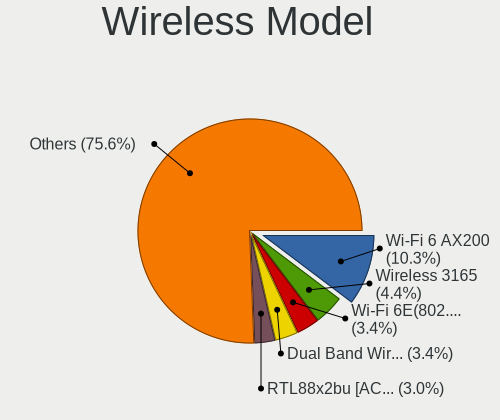

Debian 11 - Tested Hardware & Statistics (Desktops)
---------------------------------------------------

A project to collect tested hardware configurations for Debian 11.

Anyone can contribute to this report by the [hw-probe](https://github.com/linuxhw/hw-probe) tool:

    sudo -E hw-probe -all -upload

Please submit a probe of your configuration if it's not presented on the page or is rare.

Full-feature report is available here: https://linux-hardware.org/?view=trends

Contents
--------

* [ Test Cases ](#test-cases)

* [ System ](#system)
  - [ Kernel                   ](#kernel)
  - [ Kernel Family            ](#kernel-family)
  - [ Kernel Major Ver.        ](#kernel-major-ver)
  - [ Arch                     ](#arch)
  - [ DE                       ](#de)
  - [ Display Server           ](#display-server)
  - [ Display Manager          ](#display-manager)
  - [ OS Lang                  ](#os-lang)
  - [ Boot Mode                ](#boot-mode)
  - [ Filesystem               ](#filesystem)
  - [ Part. scheme             ](#part-scheme)
  - [ Dual Boot with Linux/BSD ](#dual-boot-with-linuxbsd)
  - [ Dual Boot (Win)          ](#dual-boot-win)

* [ Board ](#board)
  - [ Vendor                   ](#vendor)
  - [ Model                    ](#model)
  - [ Model Family             ](#model-family)
  - [ MFG Year                 ](#mfg-year)
  - [ Form Factor              ](#form-factor)
  - [ Secure Boot              ](#secure-boot)
  - [ Coreboot                 ](#coreboot)
  - [ RAM Size                 ](#ram-size)
  - [ RAM Used                 ](#ram-used)
  - [ Total Drives             ](#total-drives)
  - [ Has CD-ROM               ](#has-cd-rom)
  - [ Has Ethernet             ](#has-ethernet)
  - [ Has WiFi                 ](#has-wifi)
  - [ Has Bluetooth            ](#has-bluetooth)

* [ Location ](#location)
  - [ Country                  ](#country)
  - [ City                     ](#city)

* [ Drives ](#drives)
  - [ Drive Vendor             ](#drive-vendor)
  - [ Drive Model              ](#drive-model)
  - [ HDD Vendor               ](#hdd-vendor)
  - [ SSD Vendor               ](#ssd-vendor)
  - [ Drive Kind               ](#drive-kind)
  - [ Drive Connector          ](#drive-connector)
  - [ Drive Size               ](#drive-size)
  - [ Space Total              ](#space-total)
  - [ Space Used               ](#space-used)
  - [ Malfunc. Drives          ](#malfunc-drives)
  - [ Malfunc. Drive Vendor    ](#malfunc-drive-vendor)
  - [ Malfunc. HDD Vendor      ](#malfunc-hdd-vendor)
  - [ Malfunc. Drive Kind      ](#malfunc-drive-kind)
  - [ Failed Drives            ](#failed-drives)
  - [ Failed Drive Vendor      ](#failed-drive-vendor)
  - [ Drive Status             ](#drive-status)

* [ Storage controller ](#storage-controller)
  - [ Storage Vendor           ](#storage-vendor)
  - [ Storage Model            ](#storage-model)
  - [ Storage Kind             ](#storage-kind)

* [ Processor ](#processor)
  - [ CPU Vendor               ](#cpu-vendor)
  - [ CPU Model                ](#cpu-model)
  - [ CPU Model Family         ](#cpu-model-family)
  - [ CPU Cores                ](#cpu-cores)
  - [ CPU Sockets              ](#cpu-sockets)
  - [ CPU Threads              ](#cpu-threads)
  - [ CPU Op-Modes             ](#cpu-op-modes)
  - [ CPU Microcode            ](#cpu-microcode)
  - [ CPU Microarch            ](#cpu-microarch)

* [ Graphics ](#graphics)
  - [ GPU Vendor               ](#gpu-vendor)
  - [ GPU Model                ](#gpu-model)
  - [ GPU Combo                ](#gpu-combo)
  - [ GPU Driver               ](#gpu-driver)
  - [ GPU Memory               ](#gpu-memory)

* [ Monitor ](#monitor)
  - [ Monitor Vendor           ](#monitor-vendor)
  - [ Monitor Model            ](#monitor-model)
  - [ Monitor Resolution       ](#monitor-resolution)
  - [ Monitor Diagonal         ](#monitor-diagonal)
  - [ Monitor Width            ](#monitor-width)
  - [ Aspect Ratio             ](#aspect-ratio)
  - [ Monitor Area             ](#monitor-area)
  - [ Pixel Density            ](#pixel-density)
  - [ Multiple Monitors        ](#multiple-monitors)

* [ Network ](#network)
  - [ Net Controller Vendor    ](#net-controller-vendor)
  - [ Net Controller Model     ](#net-controller-model)
  - [ Wireless Vendor          ](#wireless-vendor)
  - [ Wireless Model           ](#wireless-model)
  - [ Ethernet Vendor          ](#ethernet-vendor)
  - [ Ethernet Model           ](#ethernet-model)
  - [ Net Controller Kind      ](#net-controller-kind)
  - [ Used Controller          ](#used-controller)
  - [ NICs                     ](#nics)
  - [ IPv6                     ](#ipv6)

* [ Bluetooth ](#bluetooth)
  - [ Bluetooth Vendor         ](#bluetooth-vendor)
  - [ Bluetooth Model          ](#bluetooth-model)

* [ Sound ](#sound)
  - [ Sound Vendor             ](#sound-vendor)
  - [ Sound Model              ](#sound-model)

* [ Memory ](#memory)
  - [ Memory Vendor            ](#memory-vendor)
  - [ Memory Model             ](#memory-model)
  - [ Memory Kind              ](#memory-kind)
  - [ Memory Form Factor       ](#memory-form-factor)
  - [ Memory Size              ](#memory-size)
  - [ Memory Speed             ](#memory-speed)

* [ Printers & scanners ](#printers--scanners)
  - [ Printer Vendor           ](#printer-vendor)
  - [ Printer Model            ](#printer-model)
  - [ Scanner Vendor           ](#scanner-vendor)
  - [ Scanner Model            ](#scanner-model)

* [ Camera ](#camera)
  - [ Camera Vendor            ](#camera-vendor)
  - [ Camera Model             ](#camera-model)

* [ Security ](#security)
  - [ Fingerprint Vendor       ](#fingerprint-vendor)
  - [ Fingerprint Model        ](#fingerprint-model)
  - [ Chipcard Vendor          ](#chipcard-vendor)
  - [ Chipcard Model           ](#chipcard-model)

* [ Unsupported ](#unsupported)
  - [ Unsupported Devices      ](#unsupported-devices)
  - [ Unsupported Device Types ](#unsupported-device-types)

Test Cases
----------

| Vendor        | Model                       | Probe                                                      | Date         |
|---------------|-----------------------------|------------------------------------------------------------|--------------|
| Dell          | 0RW203                      | [7d16607324](https://linux-hardware.org/?probe=7d16607324) | Dec 31, 2021 |
| Unknown       | Unknown                     | [cbe80d8c24](https://linux-hardware.org/?probe=cbe80d8c24) | Dec 30, 2021 |
| HP            | 8906 SMVB                   | [be19f6df45](https://linux-hardware.org/?probe=be19f6df45) | Dec 29, 2021 |
| ASUSTek       | ROG STRIX Z390-H GAMING     | [02f8579bf3](https://linux-hardware.org/?probe=02f8579bf3) | Dec 29, 2021 |
| ASUSTek       | Pro H510M-C                 | [d2544fc8dc](https://linux-hardware.org/?probe=d2544fc8dc) | Dec 29, 2021 |
| MSI           | B460M-A PRO                 | [209e15690e](https://linux-hardware.org/?probe=209e15690e) | Dec 29, 2021 |
| ASRock        | J4105M                      | [37f37bbbfd](https://linux-hardware.org/?probe=37f37bbbfd) | Dec 28, 2021 |
| Intel         | DZ77SL-50K AAG55115-300     | [d644ed8f37](https://linux-hardware.org/?probe=d644ed8f37) | Dec 28, 2021 |
| Fujitsu Si... | D2584-A1 S26361-D2584-A1    | [01df3a24cd](https://linux-hardware.org/?probe=01df3a24cd) | Dec 28, 2021 |
| Gigabyte      | B85M-D3H                    | [4a40c7a706](https://linux-hardware.org/?probe=4a40c7a706) | Dec 28, 2021 |
| ASRock        | X370 Pro4                   | [701f9ae732](https://linux-hardware.org/?probe=701f9ae732) | Dec 28, 2021 |
| ASRock        | X370 Pro4                   | [d6585bd061](https://linux-hardware.org/?probe=d6585bd061) | Dec 28, 2021 |
| ASUSTek       | H61M-K                      | [d02d1bb775](https://linux-hardware.org/?probe=d02d1bb775) | Dec 27, 2021 |
| Gigabyte      | H81M-S2V                    | [eb08ea9851](https://linux-hardware.org/?probe=eb08ea9851) | Dec 27, 2021 |
| ASRock        | X300M-STX                   | [64e387d031](https://linux-hardware.org/?probe=64e387d031) | Dec 27, 2021 |
| MSI           | B450-A PRO MAX              | [2151771a0d](https://linux-hardware.org/?probe=2151771a0d) | Dec 26, 2021 |
| MSI           | B450-A PRO MAX              | [0477f867f5](https://linux-hardware.org/?probe=0477f867f5) | Dec 25, 2021 |
| JGINYUE       | X99-D8 Server V1.0          | [d1548e5cd1](https://linux-hardware.org/?probe=d1548e5cd1) | Dec 25, 2021 |
| Dell          | 07T4MC A09                  | [68af9c7556](https://linux-hardware.org/?probe=68af9c7556) | Dec 25, 2021 |
| ASUSTek       | P5G41T-M LX2/GB             | [7d0eeda884](https://linux-hardware.org/?probe=7d0eeda884) | Dec 24, 2021 |
| Lenovo        | SHARKBAY 31900058 STD       | [fa1d026542](https://linux-hardware.org/?probe=fa1d026542) | Dec 23, 2021 |
| AZW           | Gemini X45                  | [84dd0d27a1](https://linux-hardware.org/?probe=84dd0d27a1) | Dec 23, 2021 |
| Gigabyte      | Z77X-D3H                    | [1dbb28ea7e](https://linux-hardware.org/?probe=1dbb28ea7e) | Dec 23, 2021 |
| ASRock        | 970M Pro3                   | [d14dc298c0](https://linux-hardware.org/?probe=d14dc298c0) | Dec 23, 2021 |
| MSI           | 870S-C45                    | [ac4454681e](https://linux-hardware.org/?probe=ac4454681e) | Dec 23, 2021 |
| Gigabyte      | B550I AORUS PRO AX          | [b097a62c18](https://linux-hardware.org/?probe=b097a62c18) | Dec 22, 2021 |
| Intel         | DH67BL AAG10189-213         | [5fa9087a0f](https://linux-hardware.org/?probe=5fa9087a0f) | Dec 22, 2021 |
| MSI           | X299 RAIDER                 | [305fffd6f2](https://linux-hardware.org/?probe=305fffd6f2) | Dec 22, 2021 |
| Huanan        | X99-8M-F V1.1               | [c56f06be0f](https://linux-hardware.org/?probe=c56f06be0f) | Dec 22, 2021 |
| Huanan        | X99-8M-F V1.1               | [11c6b9c8f3](https://linux-hardware.org/?probe=11c6b9c8f3) | Dec 22, 2021 |
| ASUSTek       | M5A97 LE R2.0               | [60dacbeece](https://linux-hardware.org/?probe=60dacbeece) | Dec 22, 2021 |
| ASUSTek       | M5A78L-M/USB3               | [72ba2d0d17](https://linux-hardware.org/?probe=72ba2d0d17) | Dec 22, 2021 |
| SeeedStudi... | ODYSSEY-X86J41X5 SD-BS-C... | [e6d6c1a347](https://linux-hardware.org/?probe=e6d6c1a347) | Dec 21, 2021 |
| ASUSTek       | M5A97 LE R2.0               | [4bc10ff46d](https://linux-hardware.org/?probe=4bc10ff46d) | Dec 21, 2021 |
| Gigabyte      | B550 AORUS PRO AC           | [fcd4727186](https://linux-hardware.org/?probe=fcd4727186) | Dec 21, 2021 |
| Dell          | 0F6X5P A00                  | [4c0f81d1b6](https://linux-hardware.org/?probe=4c0f81d1b6) | Dec 21, 2021 |
| ASRock        | H470M-HVS                   | [a48a676fb3](https://linux-hardware.org/?probe=a48a676fb3) | Dec 20, 2021 |
| ASRock        | H470M-HVS                   | [655f1beaae](https://linux-hardware.org/?probe=655f1beaae) | Dec 20, 2021 |
| ASRock        | H470M-HVS                   | [ba03646dce](https://linux-hardware.org/?probe=ba03646dce) | Dec 20, 2021 |
| ASRock        | H470M-HVS                   | [18425a0c0d](https://linux-hardware.org/?probe=18425a0c0d) | Dec 20, 2021 |
| ASRock        | H470M-HVS                   | [19ffe60b26](https://linux-hardware.org/?probe=19ffe60b26) | Dec 20, 2021 |
| ASUSTek       | P8Z68-V PRO                 | [ce7e7de4b4](https://linux-hardware.org/?probe=ce7e7de4b4) | Dec 20, 2021 |
| Gigabyte      | Z390 GAMING X-CF            | [8962cfd1c6](https://linux-hardware.org/?probe=8962cfd1c6) | Dec 19, 2021 |
| Dell          | 0KC9NP A01                  | [aa65cbb14e](https://linux-hardware.org/?probe=aa65cbb14e) | Dec 19, 2021 |
| ASRock        | A300M-STX                   | [e94f13d236](https://linux-hardware.org/?probe=e94f13d236) | Dec 19, 2021 |
| MSI           | MAG X570 TOMAHAWK WIFI      | [398e67d90d](https://linux-hardware.org/?probe=398e67d90d) | Dec 19, 2021 |
| HP            | 0B4Ch D                     | [627db696e0](https://linux-hardware.org/?probe=627db696e0) | Dec 18, 2021 |
| Acer          | EG43M                       | [6f5d9e50df](https://linux-hardware.org/?probe=6f5d9e50df) | Dec 17, 2021 |
| ASUSTek       | Pro H510M-C                 | [1e938fa2cb](https://linux-hardware.org/?probe=1e938fa2cb) | Dec 17, 2021 |
| ASRock        | H310CM-DVS                  | [17e733167d](https://linux-hardware.org/?probe=17e733167d) | Dec 17, 2021 |
| ASUSTek       | Pro H510M-C                 | [28d02842a6](https://linux-hardware.org/?probe=28d02842a6) | Dec 17, 2021 |
| Foxconn       | H61MXV/H67MXV               | [dd2a38b869](https://linux-hardware.org/?probe=dd2a38b869) | Dec 17, 2021 |
| Foxconn       | H61MXV/H67MXV               | [218235b0b1](https://linux-hardware.org/?probe=218235b0b1) | Dec 17, 2021 |
| ASRock        | H470M-HVS                   | [080e441056](https://linux-hardware.org/?probe=080e441056) | Dec 17, 2021 |
| ASRock        | H470M-HVS                   | [0470e28c02](https://linux-hardware.org/?probe=0470e28c02) | Dec 17, 2021 |
| ASUSTek       | H81M-K                      | [8ba18843cb](https://linux-hardware.org/?probe=8ba18843cb) | Dec 17, 2021 |
| ASUSTek       | ROG STRIX B550-F GAMING     | [526e490544](https://linux-hardware.org/?probe=526e490544) | Dec 17, 2021 |
| Dell          | 07T4MC A05                  | [c54a28e0a8](https://linux-hardware.org/?probe=c54a28e0a8) | Dec 16, 2021 |
| MSI           | MPG Z490 GAMING PLUS        | [e498196491](https://linux-hardware.org/?probe=e498196491) | Dec 16, 2021 |
| Gigabyte      | H410M S2H V3                | [afff6656ae](https://linux-hardware.org/?probe=afff6656ae) | Dec 16, 2021 |
| Gigabyte      | H81M-S2V                    | [0a7ab91f41](https://linux-hardware.org/?probe=0a7ab91f41) | Dec 16, 2021 |
| Fujitsu       | D3221-A1 S26361-D3221-A1    | [ab117d0139](https://linux-hardware.org/?probe=ab117d0139) | Dec 16, 2021 |
| HP            | 18E7                        | [c600f1f2bb](https://linux-hardware.org/?probe=c600f1f2bb) | Dec 15, 2021 |
| Fujitsu       | D3221-A1 S26361-D3221-A1    | [14467dd4b9](https://linux-hardware.org/?probe=14467dd4b9) | Dec 15, 2021 |
| Fujitsu       | D3221-A1 S26361-D3221-A1    | [8b1901d7dc](https://linux-hardware.org/?probe=8b1901d7dc) | Dec 15, 2021 |
| ASUSTek       | Q170M2                      | [83811b886e](https://linux-hardware.org/?probe=83811b886e) | Dec 15, 2021 |
| ASUSTek       | P5G41T-M LX                 | [466da9344c](https://linux-hardware.org/?probe=466da9344c) | Dec 15, 2021 |
| Pegatron      | 2A73h                       | [603a6f5087](https://linux-hardware.org/?probe=603a6f5087) | Dec 15, 2021 |
| Unknown       | CN700-8237                  | [c55be123a1](https://linux-hardware.org/?probe=c55be123a1) | Dec 15, 2021 |
| ASUSTek       | H110M-R                     | [4f0b004478](https://linux-hardware.org/?probe=4f0b004478) | Dec 14, 2021 |
| Intel         | Eaglelake Fab D             | [354a223fbd](https://linux-hardware.org/?probe=354a223fbd) | Dec 13, 2021 |
| ASRock        | X399 Taichi                 | [1a1ad9435a](https://linux-hardware.org/?probe=1a1ad9435a) | Dec 13, 2021 |
| HP            | 09F8h                       | [c70b669376](https://linux-hardware.org/?probe=c70b669376) | Dec 13, 2021 |
| Huanan        | X58 V1.0                    | [6cb5c8da29](https://linux-hardware.org/?probe=6cb5c8da29) | Dec 12, 2021 |
| MSI           | MAG B365M MORTAR            | [bd72de2067](https://linux-hardware.org/?probe=bd72de2067) | Dec 12, 2021 |
| ASUSTek       | PRIME B250-PRO              | [51dfe24c10](https://linux-hardware.org/?probe=51dfe24c10) | Dec 12, 2021 |
| Gigabyte      | Z490 AORUS PRO AX           | [03ba9fdf17](https://linux-hardware.org/?probe=03ba9fdf17) | Dec 11, 2021 |
| HP            | 09F8h                       | [b01b09b7a4](https://linux-hardware.org/?probe=b01b09b7a4) | Dec 10, 2021 |
| MSI           | X470 GAMING PLUS            | [7319c92561](https://linux-hardware.org/?probe=7319c92561) | Dec 10, 2021 |
| ASRock        | FM2A68M-HD+                 | [a46a3aab04](https://linux-hardware.org/?probe=a46a3aab04) | Dec 10, 2021 |
| ASUSTek       | H61M-K                      | [3cd23b929b](https://linux-hardware.org/?probe=3cd23b929b) | Dec 10, 2021 |
| Gigabyte      | X570 GAMING X               | [d0f4c6c32f](https://linux-hardware.org/?probe=d0f4c6c32f) | Dec 09, 2021 |
| Gigabyte      | X570 GAMING X               | [c7c63c686c](https://linux-hardware.org/?probe=c7c63c686c) | Dec 09, 2021 |
| ASRock        | B450M Pro4-F                | [877095541e](https://linux-hardware.org/?probe=877095541e) | Dec 09, 2021 |
| Gigabyte      | H81M-S2V                    | [d1d8529d39](https://linux-hardware.org/?probe=d1d8529d39) | Dec 09, 2021 |
| ASUSTek       | PRIME A320M-K               | [f9ada169fd](https://linux-hardware.org/?probe=f9ada169fd) | Dec 09, 2021 |
| HP            | 3048h                       | [b583a7dd31](https://linux-hardware.org/?probe=b583a7dd31) | Dec 09, 2021 |
| ASUSTek       | PRIME A320M-K               | [7d39826b60](https://linux-hardware.org/?probe=7d39826b60) | Dec 09, 2021 |
| MSI           | B550-A PRO                  | [1cea605cac](https://linux-hardware.org/?probe=1cea605cac) | Dec 08, 2021 |
| Dell          | 0WG864                      | [59d9c69b35](https://linux-hardware.org/?probe=59d9c69b35) | Dec 08, 2021 |
| ASRock        | B450M Pro4-F                | [6eab211fad](https://linux-hardware.org/?probe=6eab211fad) | Dec 08, 2021 |
| ECS           | G31T-M9                     | [ec3bb13ae2](https://linux-hardware.org/?probe=ec3bb13ae2) | Dec 08, 2021 |
| HP            | 09F8h                       | [fe41d0247b](https://linux-hardware.org/?probe=fe41d0247b) | Dec 08, 2021 |
| ASRock        | B550M Pro4                  | [c72fc0c384](https://linux-hardware.org/?probe=c72fc0c384) | Dec 08, 2021 |
| Gigabyte      | B75M-D2V                    | [4f0e1458f2](https://linux-hardware.org/?probe=4f0e1458f2) | Dec 07, 2021 |
| ASUSTek       | H81M-K                      | [d7c59ade1e](https://linux-hardware.org/?probe=d7c59ade1e) | Dec 07, 2021 |
| ASUSTek       | H61M-K                      | [0f3fd91a00](https://linux-hardware.org/?probe=0f3fd91a00) | Dec 06, 2021 |
| MSI           | Z390-A PRO                  | [f67e3e407c](https://linux-hardware.org/?probe=f67e3e407c) | Dec 06, 2021 |
| MSI           | X470 GAMING PLUS            | [8a01b0cd81](https://linux-hardware.org/?probe=8a01b0cd81) | Dec 06, 2021 |
| Gigabyte      | P55-USB3                    | [6cbec7b450](https://linux-hardware.org/?probe=6cbec7b450) | Dec 06, 2021 |
| Dell          | 0427JK A00                  | [7f5adb4cb3](https://linux-hardware.org/?probe=7f5adb4cb3) | Dec 06, 2021 |
| Fujitsu       | D3446-S1 S26361-D3446-S1    | [077673c895](https://linux-hardware.org/?probe=077673c895) | Dec 05, 2021 |
| ASRockRack    | C3558D4I-4L                 | [d563eb82ae](https://linux-hardware.org/?probe=d563eb82ae) | Dec 04, 2021 |
| Lenovo        | ThinkStation D30 4223CC9    | [0784c5596b](https://linux-hardware.org/?probe=0784c5596b) | Dec 04, 2021 |
| ASUSTek       | M5A99FX PRO R2.0            | [cdd02a2ffa](https://linux-hardware.org/?probe=cdd02a2ffa) | Dec 04, 2021 |
| Lenovo        | ThinkCentre A58e 0841A2U    | [d8d9d0cf7a](https://linux-hardware.org/?probe=d8d9d0cf7a) | Dec 04, 2021 |
| Dell          | 0VHRW1 A03                  | [ebfaaee6ef](https://linux-hardware.org/?probe=ebfaaee6ef) | Dec 04, 2021 |
| ASUSTek       | PRIME B450M-K               | [a94e228ed4](https://linux-hardware.org/?probe=a94e228ed4) | Dec 03, 2021 |
| Gigabyte      | B450M S2H                   | [4029822099](https://linux-hardware.org/?probe=4029822099) | Dec 03, 2021 |
| Huanan        | X99-F8 V2.0                 | [039bbca776](https://linux-hardware.org/?probe=039bbca776) | Dec 02, 2021 |
| ASUSTek       | PRIME H510M-E               | [6432830846](https://linux-hardware.org/?probe=6432830846) | Dec 02, 2021 |
| Lenovo        | ThinkStation D30 4223CC9    | [50a026d588](https://linux-hardware.org/?probe=50a026d588) | Dec 02, 2021 |
| Lenovo        | MAHOBAY                     | [e6f6525ecd](https://linux-hardware.org/?probe=e6f6525ecd) | Dec 01, 2021 |
| ASRock        | G31M-VS2                    | [477e2949fe](https://linux-hardware.org/?probe=477e2949fe) | Dec 01, 2021 |
| ASRock        | B450M Pro4-F                | [a193d7ccae](https://linux-hardware.org/?probe=a193d7ccae) | Dec 01, 2021 |
| ASUSTek       | B85M-G                      | [8289b6f249](https://linux-hardware.org/?probe=8289b6f249) | Dec 01, 2021 |
| Gigabyte      | G31M-S2L                    | [b12e3b7ad0](https://linux-hardware.org/?probe=b12e3b7ad0) | Dec 01, 2021 |
| MSI           | H110M PRO-VD                | [915ab51632](https://linux-hardware.org/?probe=915ab51632) | Nov 30, 2021 |
| ECS           | G31T-M9                     | [54a394adb1](https://linux-hardware.org/?probe=54a394adb1) | Nov 30, 2021 |
| ASRock        | H470M-HVS                   | [3395298923](https://linux-hardware.org/?probe=3395298923) | Nov 30, 2021 |
| ASRock        | H470M-HVS                   | [427480c39a](https://linux-hardware.org/?probe=427480c39a) | Nov 30, 2021 |
| ASRock        | H470M-HVS                   | [f92e797aea](https://linux-hardware.org/?probe=f92e797aea) | Nov 30, 2021 |
| ASRock        | H470M-HVS                   | [bfe63a9c60](https://linux-hardware.org/?probe=bfe63a9c60) | Nov 30, 2021 |
| ASRock        | H470M-HVS                   | [dc21f1680a](https://linux-hardware.org/?probe=dc21f1680a) | Nov 30, 2021 |
| ECS           | B85H3-M4R                   | [fb85d32462](https://linux-hardware.org/?probe=fb85d32462) | Nov 30, 2021 |
| Dell          | 0VHRW1 A03                  | [19fd4c2057](https://linux-hardware.org/?probe=19fd4c2057) | Nov 30, 2021 |
| Lenovo        | ThinkStation D30 4223CC9    | [7493408721](https://linux-hardware.org/?probe=7493408721) | Nov 29, 2021 |
| Dell          | 0VHRW1 A03                  | [637bba1c58](https://linux-hardware.org/?probe=637bba1c58) | Nov 29, 2021 |
| ASRock        | FM2A68M-HD+                 | [e643c12a79](https://linux-hardware.org/?probe=e643c12a79) | Nov 29, 2021 |
| Foxconn       | H61MXL-K                    | [271670f758](https://linux-hardware.org/?probe=271670f758) | Nov 29, 2021 |
| ASUSTek       | P8H61-M LX3 R2.0            | [592b77242d](https://linux-hardware.org/?probe=592b77242d) | Nov 29, 2021 |
| ASUSTek       | P8H61-M LX3 R2.0            | [d5aae23742](https://linux-hardware.org/?probe=d5aae23742) | Nov 29, 2021 |
| ASUSTek       | P8H61-M LX3 R2.0            | [593d86b4d2](https://linux-hardware.org/?probe=593d86b4d2) | Nov 29, 2021 |
| ASUSTek       | P8H61-M LX3 R2.0            | [70954353f3](https://linux-hardware.org/?probe=70954353f3) | Nov 29, 2021 |
| Gigabyte      | H81M-S2V                    | [4f34b82346](https://linux-hardware.org/?probe=4f34b82346) | Nov 29, 2021 |
| Lenovo        | ThinkCentre A58e 0841A2U    | [123b071e52](https://linux-hardware.org/?probe=123b071e52) | Nov 29, 2021 |
| ASRock        | G31M-S                      | [48ad510e26](https://linux-hardware.org/?probe=48ad510e26) | Nov 29, 2021 |
| ASRock        | G31M-S                      | [5f87bf3b90](https://linux-hardware.org/?probe=5f87bf3b90) | Nov 28, 2021 |
| Lenovo        | ThinkCentre M58p 6137BG5    | [f5f0997eca](https://linux-hardware.org/?probe=f5f0997eca) | Nov 28, 2021 |
| HP            | ProLiant MicroServer        | [af5f461e74](https://linux-hardware.org/?probe=af5f461e74) | Nov 28, 2021 |
| Intel         | X79G V2.x                   | [a04ccc0b10](https://linux-hardware.org/?probe=a04ccc0b10) | Nov 28, 2021 |
| Dell          | 06FW8P A02                  | [555032936f](https://linux-hardware.org/?probe=555032936f) | Nov 28, 2021 |
| Unknown       | Unknown                     | [3b55838cb6](https://linux-hardware.org/?probe=3b55838cb6) | Nov 27, 2021 |
| MSI           | B350M MORTAR ARCTIC         | [50608748f0](https://linux-hardware.org/?probe=50608748f0) | Nov 27, 2021 |
| MSI           | MPG Z490 GAMING PLUS        | [46a63cf369](https://linux-hardware.org/?probe=46a63cf369) | Nov 27, 2021 |
| MSI           | MPG Z490 GAMING PLUS        | [d8109a1195](https://linux-hardware.org/?probe=d8109a1195) | Nov 27, 2021 |
| PCWare        | IPMH61R3                    | [9d69282e7a](https://linux-hardware.org/?probe=9d69282e7a) | Nov 26, 2021 |
| ASRock        | H470M-HVS                   | [921493c5de](https://linux-hardware.org/?probe=921493c5de) | Nov 26, 2021 |
| ASRock        | H470M-HVS                   | [372ecff863](https://linux-hardware.org/?probe=372ecff863) | Nov 26, 2021 |
| ASRock        | H470M-HVS                   | [c2e9888262](https://linux-hardware.org/?probe=c2e9888262) | Nov 26, 2021 |
| ASRock        | H470M-HVS                   | [3210708d2b](https://linux-hardware.org/?probe=3210708d2b) | Nov 26, 2021 |
| ASRock        | H470M-HVS                   | [af6a185f57](https://linux-hardware.org/?probe=af6a185f57) | Nov 26, 2021 |
| ASRock        | H470M-HVS                   | [e993ed0b0f](https://linux-hardware.org/?probe=e993ed0b0f) | Nov 26, 2021 |
| ASRock        | H470M-HVS                   | [47f77bc2b9](https://linux-hardware.org/?probe=47f77bc2b9) | Nov 26, 2021 |
| ASRock        | H470M-HVS                   | [d6812643cf](https://linux-hardware.org/?probe=d6812643cf) | Nov 26, 2021 |
| ASRock        | H470M-HVS                   | [96558bdade](https://linux-hardware.org/?probe=96558bdade) | Nov 26, 2021 |
| ASRock        | H470M-HVS                   | [535b83e569](https://linux-hardware.org/?probe=535b83e569) | Nov 26, 2021 |
| ASRock        | H470M-HVS                   | [699315cb63](https://linux-hardware.org/?probe=699315cb63) | Nov 26, 2021 |
| ASRock        | H470M-HVS                   | [d792605965](https://linux-hardware.org/?probe=d792605965) | Nov 26, 2021 |
| ASRock        | H470M-HVS                   | [30a358041c](https://linux-hardware.org/?probe=30a358041c) | Nov 26, 2021 |
| ASRock        | H470M-HVS                   | [64dcda1fa3](https://linux-hardware.org/?probe=64dcda1fa3) | Nov 26, 2021 |
| ASRock        | H470M-HVS                   | [e2b310a3f2](https://linux-hardware.org/?probe=e2b310a3f2) | Nov 26, 2021 |
| ASRock        | H470M-HVS                   | [f5d837e417](https://linux-hardware.org/?probe=f5d837e417) | Nov 26, 2021 |
| ASRock        | H470M-HVS                   | [c525b3d17b](https://linux-hardware.org/?probe=c525b3d17b) | Nov 26, 2021 |
| ASRock        | H470M-HVS                   | [d500b1e29f](https://linux-hardware.org/?probe=d500b1e29f) | Nov 26, 2021 |
| Foxconn       | 2AB1                        | [04c11c5b5f](https://linux-hardware.org/?probe=04c11c5b5f) | Nov 26, 2021 |
| ASRock        | H470M-HVS                   | [474255a405](https://linux-hardware.org/?probe=474255a405) | Nov 26, 2021 |
| ASUSTek       | M5A97                       | [00f73ea6c2](https://linux-hardware.org/?probe=00f73ea6c2) | Nov 26, 2021 |
| Gigabyte      | B450M S2H V2                | [caf3c5f8f2](https://linux-hardware.org/?probe=caf3c5f8f2) | Nov 25, 2021 |
| ASRock        | H470M-HVS                   | [88af62cd43](https://linux-hardware.org/?probe=88af62cd43) | Nov 25, 2021 |
| ASRock        | H470M-HVS                   | [8fad7fe107](https://linux-hardware.org/?probe=8fad7fe107) | Nov 25, 2021 |
| Intel         | DG41RQ AAE54511-205         | [cd148d2d45](https://linux-hardware.org/?probe=cd148d2d45) | Nov 25, 2021 |
| Acer          | EG43M                       | [328e16606e](https://linux-hardware.org/?probe=328e16606e) | Nov 25, 2021 |
| Gigabyte      | B450M S2H V2                | [ea4dbbbf15](https://linux-hardware.org/?probe=ea4dbbbf15) | Nov 25, 2021 |
| A10 Networ... | TH4435                      | [46267dfe86](https://linux-hardware.org/?probe=46267dfe86) | Nov 25, 2021 |
| ASUSTek       | PRIME H310M-K               | [90d994abcd](https://linux-hardware.org/?probe=90d994abcd) | Nov 24, 2021 |
| ASRock        | B450 Gaming-ITX/ac          | [b9c8e3ec8f](https://linux-hardware.org/?probe=b9c8e3ec8f) | Nov 24, 2021 |
| Intel         | DG41RQ AAE54511-205         | [31c566f4ac](https://linux-hardware.org/?probe=31c566f4ac) | Nov 24, 2021 |
| ASRock        | H470M-HVS                   | [8e627fb473](https://linux-hardware.org/?probe=8e627fb473) | Nov 24, 2021 |
| ASUSTek       | PRIME H310M-R R2.0          | [ef54a544fc](https://linux-hardware.org/?probe=ef54a544fc) | Nov 24, 2021 |
| ASUSTek       | P8H61-M LE                  | [4e07143fc9](https://linux-hardware.org/?probe=4e07143fc9) | Nov 23, 2021 |
| MSI           | MS-7030                     | [dc2b0207b3](https://linux-hardware.org/?probe=dc2b0207b3) | Nov 23, 2021 |
| ASUSTek       | B85M-G                      | [b01da81848](https://linux-hardware.org/?probe=b01da81848) | Nov 23, 2021 |
| HPE           | ProLiant MicroServer Gen... | [bbb91b2f5f](https://linux-hardware.org/?probe=bbb91b2f5f) | Nov 23, 2021 |
| Lenovo        | 36EB SDK0R32862 WIN 3258... | [ab35c5c468](https://linux-hardware.org/?probe=ab35c5c468) | Nov 23, 2021 |
| ASUSTek       | P5K/EPU                     | [4b0e227f6f](https://linux-hardware.org/?probe=4b0e227f6f) | Nov 22, 2021 |
| ASUSTek       | P5K/EPU                     | [44ed7fe92e](https://linux-hardware.org/?probe=44ed7fe92e) | Nov 22, 2021 |
| ASUSTek       | B85M-G                      | [4f0dc5afbf](https://linux-hardware.org/?probe=4f0dc5afbf) | Nov 22, 2021 |
| Packard Be... | FMP55                       | [13e6b9ef4c](https://linux-hardware.org/?probe=13e6b9ef4c) | Nov 21, 2021 |
| Shuttle       | FS35V4                      | [dc4a084ef6](https://linux-hardware.org/?probe=dc4a084ef6) | Nov 21, 2021 |
| Gigabyte      | P55-UD3                     | [6fbfc34971](https://linux-hardware.org/?probe=6fbfc34971) | Nov 21, 2021 |
| ZOTAC         | Unknown                     | [b151b05476](https://linux-hardware.org/?probe=b151b05476) | Nov 21, 2021 |
| ASUSTek       | ROG STRIX X470-F GAMING     | [c357da262c](https://linux-hardware.org/?probe=c357da262c) | Nov 20, 2021 |
| ASRock        | N68-VS3 UCC                 | [09039121c2](https://linux-hardware.org/?probe=09039121c2) | Nov 20, 2021 |
| MSI           | MEG Z490I UNIFY             | [d8f2089df2](https://linux-hardware.org/?probe=d8f2089df2) | Nov 20, 2021 |
| ASUSTek       | P8H61-I                     | [bb8c25b299](https://linux-hardware.org/?probe=bb8c25b299) | Nov 20, 2021 |
| Dell          | 0KRC95 A00                  | [fa7d35906a](https://linux-hardware.org/?probe=fa7d35906a) | Nov 19, 2021 |
| ECS           | H81H3-M3                    | [019a8bc90a](https://linux-hardware.org/?probe=019a8bc90a) | Nov 19, 2021 |
| Shuttle       | FS81                        | [ac6138c9d7](https://linux-hardware.org/?probe=ac6138c9d7) | Nov 19, 2021 |
| Datto         | SSD                         | [ab058b04af](https://linux-hardware.org/?probe=ab058b04af) | Nov 19, 2021 |
| Unknown       | Unknown                     | [86767db090](https://linux-hardware.org/?probe=86767db090) | Nov 19, 2021 |
| Shuttle       | FS81                        | [d889090212](https://linux-hardware.org/?probe=d889090212) | Nov 18, 2021 |
| Gigabyte      | H110M-S2H-CF                | [b97a7f7688](https://linux-hardware.org/?probe=b97a7f7688) | Nov 18, 2021 |
| ASUSTek       | PRIME X399-A                | [5edbaed472](https://linux-hardware.org/?probe=5edbaed472) | Nov 18, 2021 |
| ASUSTek       | PRIME H310M-R R2.0          | [f3bd0e1fa6](https://linux-hardware.org/?probe=f3bd0e1fa6) | Nov 18, 2021 |
| Gigabyte      | H110M-S2H-CF                | [2b3ac03929](https://linux-hardware.org/?probe=2b3ac03929) | Nov 18, 2021 |
| Gigabyte      | Q270M-D3H                   | [11abeb4513](https://linux-hardware.org/?probe=11abeb4513) | Nov 18, 2021 |
| ASRock        | X570 PG Velocita            | [98a028263b](https://linux-hardware.org/?probe=98a028263b) | Nov 18, 2021 |
| ASUSTek       | H81M-A                      | [c7762271da](https://linux-hardware.org/?probe=c7762271da) | Nov 18, 2021 |
| Gigabyte      | B550M S2H                   | [b242137617](https://linux-hardware.org/?probe=b242137617) | Nov 17, 2021 |
| Gigabyte      | Z170M-D3H DDR3-CF           | [729de8e04c](https://linux-hardware.org/?probe=729de8e04c) | Nov 17, 2021 |
| Unknown       | Unknown                     | [c0cb61a9fc](https://linux-hardware.org/?probe=c0cb61a9fc) | Nov 17, 2021 |
| ASUSTek       | P8H67-M LE                  | [e8f5452c3a](https://linux-hardware.org/?probe=e8f5452c3a) | Nov 16, 2021 |
| ASUSTek       | P8H67-M LE                  | [4288c7ddbf](https://linux-hardware.org/?probe=4288c7ddbf) | Nov 16, 2021 |
| Lenovo        | 3168 NOK                    | [28a3c13b73](https://linux-hardware.org/?probe=28a3c13b73) | Nov 16, 2021 |
| HP            | 3397                        | [be170ea3c0](https://linux-hardware.org/?probe=be170ea3c0) | Nov 15, 2021 |
| HP            | 3397                        | [33500b1506](https://linux-hardware.org/?probe=33500b1506) | Nov 15, 2021 |
| Intel         | DH77EB AAG39073-304         | [d1e04ead11](https://linux-hardware.org/?probe=d1e04ead11) | Nov 15, 2021 |
| Gigabyte      | B450M S2H                   | [67a90a8265](https://linux-hardware.org/?probe=67a90a8265) | Nov 14, 2021 |
| HPE           | ProLiant MicroServer Gen... | [1c302d3d99](https://linux-hardware.org/?probe=1c302d3d99) | Nov 14, 2021 |
| Gigabyte      | H87N-WIFI                   | [b19a68b774](https://linux-hardware.org/?probe=b19a68b774) | Nov 13, 2021 |
| ASUSTek       | PRIME H570M-PLUS            | [6c1708134f](https://linux-hardware.org/?probe=6c1708134f) | Nov 13, 2021 |
| Datto         | SSD                         | [49001aa936](https://linux-hardware.org/?probe=49001aa936) | Nov 13, 2021 |
| HP            | 821D                        | [4227f76ab4](https://linux-hardware.org/?probe=4227f76ab4) | Nov 12, 2021 |
| Gigabyte      | B550M DS3H                  | [56dd47d979](https://linux-hardware.org/?probe=56dd47d979) | Nov 12, 2021 |
| Gigabyte      | B450M DS3H V2               | [2574fae667](https://linux-hardware.org/?probe=2574fae667) | Nov 12, 2021 |
| Gigabyte      | B85M-D3H                    | [be11374c4b](https://linux-hardware.org/?probe=be11374c4b) | Nov 12, 2021 |
| Intel         | ChiefRiver                  | [4490bddeed](https://linux-hardware.org/?probe=4490bddeed) | Nov 12, 2021 |
| ASUSTek       | TUF GAMING X570-PRO         | [a119684a3e](https://linux-hardware.org/?probe=a119684a3e) | Nov 11, 2021 |
| MSI           | G41M-P28                    | [2586b84980](https://linux-hardware.org/?probe=2586b84980) | Nov 11, 2021 |
| Intel         | H55                         | [7fc34476de](https://linux-hardware.org/?probe=7fc34476de) | Nov 10, 2021 |
| Intel         | H55                         | [0364a82ed9](https://linux-hardware.org/?probe=0364a82ed9) | Nov 10, 2021 |
| Dell          | 0KC9NP A01                  | [20898da2a5](https://linux-hardware.org/?probe=20898da2a5) | Nov 10, 2021 |
| Gigabyte      | Q170TN-T20                  | [28a80f5aa9](https://linux-hardware.org/?probe=28a80f5aa9) | Nov 10, 2021 |
| ASUSTek       | PRIME H310M-R R2.0          | [e41c568cf3](https://linux-hardware.org/?probe=e41c568cf3) | Nov 10, 2021 |
| Gigabyte      | Q170TN-T20                  | [8fce727047](https://linux-hardware.org/?probe=8fce727047) | Nov 10, 2021 |
| ASUSTek       | P8H61-M LX3 R2.0            | [689a981891](https://linux-hardware.org/?probe=689a981891) | Nov 10, 2021 |
| ASUSTek       | P8H61-M LX3 R2.0            | [d7635d487f](https://linux-hardware.org/?probe=d7635d487f) | Nov 10, 2021 |
| ASUSTek       | P8H61-M LX3 R2.0            | [2acec5d06c](https://linux-hardware.org/?probe=2acec5d06c) | Nov 10, 2021 |
| ASUSTek       | PRIME H310M-R R2.0          | [e67fcb38c6](https://linux-hardware.org/?probe=e67fcb38c6) | Nov 10, 2021 |
| ASUSTek       | PRIME H310M-R R2.0          | [ed50a31f1a](https://linux-hardware.org/?probe=ed50a31f1a) | Nov 10, 2021 |
| ASUSTek       | M5A97 LE R2.0               | [188d241df7](https://linux-hardware.org/?probe=188d241df7) | Nov 10, 2021 |
| Huanan        | X99-F8 V2.0                 | [7463b38c9c](https://linux-hardware.org/?probe=7463b38c9c) | Nov 10, 2021 |
| ASUSTek       | Z97M-PLUS/BR                | [4427467cb5](https://linux-hardware.org/?probe=4427467cb5) | Nov 10, 2021 |
| Huanan        | X99-F8 V2.0                 | [5b3b6a8e90](https://linux-hardware.org/?probe=5b3b6a8e90) | Nov 10, 2021 |
| ASRockRack    | EPYCD8-2T                   | [0f80e3768e](https://linux-hardware.org/?probe=0f80e3768e) | Nov 09, 2021 |
| MSI           | MAG B560 TOMAHAWK WIFI      | [9b7fba5c1a](https://linux-hardware.org/?probe=9b7fba5c1a) | Nov 09, 2021 |
| Gigabyte      | B360HD3PLM-CF               | [71a272c9a3](https://linux-hardware.org/?probe=71a272c9a3) | Nov 09, 2021 |
| MSI           | H81M-P33                    | [091f7e066b](https://linux-hardware.org/?probe=091f7e066b) | Nov 09, 2021 |
| HP            | 8433 11                     | [737e98b3e9](https://linux-hardware.org/?probe=737e98b3e9) | Nov 09, 2021 |
| Apple         | Mac-F4208DC8 PVT            | [8378557eb5](https://linux-hardware.org/?probe=8378557eb5) | Nov 09, 2021 |
| HP            | 8433 11                     | [ad7a603e07](https://linux-hardware.org/?probe=ad7a603e07) | Nov 09, 2021 |
| ASUSTek       | H97-PLUS                    | [f27ce2e38a](https://linux-hardware.org/?probe=f27ce2e38a) | Nov 09, 2021 |
| Lenovo        | 3102 SDK0J40700 WIN 3258... | [a7ba011636](https://linux-hardware.org/?probe=a7ba011636) | Nov 09, 2021 |
| ASUSTek       | P8H67-M PRO                 | [66654fe284](https://linux-hardware.org/?probe=66654fe284) | Nov 09, 2021 |
| Dell          | 06FW8P A02                  | [72f1028535](https://linux-hardware.org/?probe=72f1028535) | Nov 09, 2021 |
| Apple         | Mac-F4208DC8 PVT            | [2e75320963](https://linux-hardware.org/?probe=2e75320963) | Nov 09, 2021 |
| Dell          | 06FW8P A02                  | [e43d36b3cf](https://linux-hardware.org/?probe=e43d36b3cf) | Nov 09, 2021 |
| Fujitsu       | D3120-A1 S26361-D3120-A1    | [31ffcb5018](https://linux-hardware.org/?probe=31ffcb5018) | Nov 09, 2021 |
| Gigabyte      | GA-78LMT-USB3               | [f59ff36e50](https://linux-hardware.org/?probe=f59ff36e50) | Nov 09, 2021 |
| MSI           | 990XA-GD55                  | [461ac78561](https://linux-hardware.org/?probe=461ac78561) | Nov 08, 2021 |
| MSI           | MS-7369                     | [670cc450d8](https://linux-hardware.org/?probe=670cc450d8) | Nov 08, 2021 |
| ASUSTek       | PRIME Z490-P                | [c25ef7b482](https://linux-hardware.org/?probe=c25ef7b482) | Nov 08, 2021 |
| ASUSTek       | B85M-G                      | [142203c854](https://linux-hardware.org/?probe=142203c854) | Nov 08, 2021 |
| ASUSTek       | B85M-G                      | [e34b11f673](https://linux-hardware.org/?probe=e34b11f673) | Nov 08, 2021 |
| ASUSTek       | B85M-G                      | [87e5aa3c2c](https://linux-hardware.org/?probe=87e5aa3c2c) | Nov 08, 2021 |
| ASUSTek       | B85M-G                      | [58f187feb7](https://linux-hardware.org/?probe=58f187feb7) | Nov 08, 2021 |
| ASUSTek       | B85M-G                      | [2229fe93fb](https://linux-hardware.org/?probe=2229fe93fb) | Nov 08, 2021 |
| Minix         | NEO Z83-4 V1.1              | [c7b52e35cf](https://linux-hardware.org/?probe=c7b52e35cf) | Nov 08, 2021 |
| HP            | 3031h                       | [66af9f5944](https://linux-hardware.org/?probe=66af9f5944) | Nov 07, 2021 |
| Dell          | 0WWJRX A01                  | [4fa10e9d4b](https://linux-hardware.org/?probe=4fa10e9d4b) | Nov 06, 2021 |
| MSI           | A320M-A PRO MAX             | [bfe89af8ab](https://linux-hardware.org/?probe=bfe89af8ab) | Nov 04, 2021 |
| ASUSTek       | TUF GAMING B550-PLUS        | [28366fcde0](https://linux-hardware.org/?probe=28366fcde0) | Nov 04, 2021 |
| Dell          | 0WWJRX A01                  | [a03dcb58fb](https://linux-hardware.org/?probe=a03dcb58fb) | Nov 01, 2021 |
| ASUSTek       | TUF GAMING X570-PLUS        | [a3fe4bd135](https://linux-hardware.org/?probe=a3fe4bd135) | Nov 01, 2021 |
| ASUSTek       | ROG STRIX B550-F GAMING     | [d68eea1b12](https://linux-hardware.org/?probe=d68eea1b12) | Nov 01, 2021 |
| ASRock        | X399 Taichi                 | [70d528a8fc](https://linux-hardware.org/?probe=70d528a8fc) | Oct 31, 2021 |
| Lenovo        | 30BE SDK0J40705 WIN 3425... | [5adc857043](https://linux-hardware.org/?probe=5adc857043) | Oct 31, 2021 |
| Gigabyte      | B460M DS3H V2               | [83857e3215](https://linux-hardware.org/?probe=83857e3215) | Oct 29, 2021 |
| Gigabyte      | P55M-UD2                    | [b14c0e8dd2](https://linux-hardware.org/?probe=b14c0e8dd2) | Oct 29, 2021 |
| HP            | 1998                        | [b9e492678d](https://linux-hardware.org/?probe=b9e492678d) | Oct 29, 2021 |
| ASUSTek       | P5Q-EM                      | [ce2c332b33](https://linux-hardware.org/?probe=ce2c332b33) | Oct 29, 2021 |
| Acer          | Aspire XC600 v1.0           | [58dfae44e0](https://linux-hardware.org/?probe=58dfae44e0) | Oct 29, 2021 |
| ASUSTek       | M5A97                       | [83a2d81e1c](https://linux-hardware.org/?probe=83a2d81e1c) | Oct 29, 2021 |
| HP            | 0AECh D                     | [15a01d5e13](https://linux-hardware.org/?probe=15a01d5e13) | Oct 28, 2021 |
| HP            | 3047h                       | [eedab3769c](https://linux-hardware.org/?probe=eedab3769c) | Oct 28, 2021 |
| Gigabyte      | Q270M-D3H                   | [6ad4929a33](https://linux-hardware.org/?probe=6ad4929a33) | Oct 28, 2021 |
| Intel         | D945GCCR AAD78647-300       | [d41d75c998](https://linux-hardware.org/?probe=d41d75c998) | Oct 28, 2021 |
| Gigabyte      | G31M-ES2L                   | [369b39d1be](https://linux-hardware.org/?probe=369b39d1be) | Oct 28, 2021 |
| Gigabyte      | G31M-ES2L                   | [5b7faf1cc6](https://linux-hardware.org/?probe=5b7faf1cc6) | Oct 28, 2021 |
| MSI           | MEG X570 UNIFY              | [7c73c4e6f0](https://linux-hardware.org/?probe=7c73c4e6f0) | Oct 27, 2021 |
| ASUSTek       | M4A77T                      | [07942589ae](https://linux-hardware.org/?probe=07942589ae) | Oct 27, 2021 |
| Intel         | H55                         | [b32e64a698](https://linux-hardware.org/?probe=b32e64a698) | Oct 27, 2021 |
| Dell          | 06FW8P A02                  | [2f188b606a](https://linux-hardware.org/?probe=2f188b606a) | Oct 25, 2021 |
| ASUSTek       | M5A78L-M/USB3               | [b47e0921b6](https://linux-hardware.org/?probe=b47e0921b6) | Oct 25, 2021 |
| Dell          | 06FW8P A02                  | [3e6b56c5f9](https://linux-hardware.org/?probe=3e6b56c5f9) | Oct 25, 2021 |
| ASRock        | X399 Taichi                 | [88030b7fcb](https://linux-hardware.org/?probe=88030b7fcb) | Oct 25, 2021 |
| ASRock        | X399 Taichi                 | [ae0cd83502](https://linux-hardware.org/?probe=ae0cd83502) | Oct 25, 2021 |
| MSI           | MPG Z490 GAMING PLUS        | [487d0f0e12](https://linux-hardware.org/?probe=487d0f0e12) | Oct 24, 2021 |
| ASUSTek       | PRIME H310M-K               | [fd2f79c5fc](https://linux-hardware.org/?probe=fd2f79c5fc) | Oct 24, 2021 |
| Dell          | 0KRC95 A00                  | [117223995c](https://linux-hardware.org/?probe=117223995c) | Oct 23, 2021 |
| Dell          | 0KRC95 A00                  | [e97646cc2e](https://linux-hardware.org/?probe=e97646cc2e) | Oct 23, 2021 |
| MSI           | FM2-A55M-E33                | [08a5e38790](https://linux-hardware.org/?probe=08a5e38790) | Oct 22, 2021 |
| ASUSTek       | H81M-A                      | [c7a2305704](https://linux-hardware.org/?probe=c7a2305704) | Oct 21, 2021 |
| ASRock        | G31M-VS2                    | [c36147b6a6](https://linux-hardware.org/?probe=c36147b6a6) | Oct 21, 2021 |
| ASUSTek       | H81M-A                      | [8d1ec3a3b6](https://linux-hardware.org/?probe=8d1ec3a3b6) | Oct 21, 2021 |
| ASRock        | G31M-VS2                    | [0c016119e3](https://linux-hardware.org/?probe=0c016119e3) | Oct 21, 2021 |
| ASUSTek       | PRIME B460M-A               | [3cdf9d520e](https://linux-hardware.org/?probe=3cdf9d520e) | Oct 21, 2021 |
| Dell          | 02YRK5 A01                  | [d7c89a5f6a](https://linux-hardware.org/?probe=d7c89a5f6a) | Oct 21, 2021 |
| ASRock        | B365M Pro4                  | [ec939fb289](https://linux-hardware.org/?probe=ec939fb289) | Oct 20, 2021 |
| American M... | K7S41GX                     | [b5f8d33cc4](https://linux-hardware.org/?probe=b5f8d33cc4) | Oct 20, 2021 |
| American M... | K7S41GX                     | [920a47f107](https://linux-hardware.org/?probe=920a47f107) | Oct 20, 2021 |
| ASUSTek       | PRIME B460M-A               | [4899fa0cab](https://linux-hardware.org/?probe=4899fa0cab) | Oct 19, 2021 |
| Digiboard     | MPxx                        | [138c2ef6fb](https://linux-hardware.org/?probe=138c2ef6fb) | Oct 19, 2021 |
| ASRock        | B450 Pro4                   | [b5f275b4c4](https://linux-hardware.org/?probe=b5f275b4c4) | Oct 17, 2021 |
| ASUSTek       | TUF B450-PLUS GAMING        | [5c4edf2e8d](https://linux-hardware.org/?probe=5c4edf2e8d) | Oct 17, 2021 |
| Dell          | 0D6H9T A01                  | [795b03a6f8](https://linux-hardware.org/?probe=795b03a6f8) | Oct 16, 2021 |
| Pegatron      | 2AC2A                       | [b59ab42003](https://linux-hardware.org/?probe=b59ab42003) | Oct 16, 2021 |
| Gigabyte      | H61M-S2PV                   | [d54d095b0d](https://linux-hardware.org/?probe=d54d095b0d) | Oct 15, 2021 |
| HP            | 84FD 10                     | [fb32fc7215](https://linux-hardware.org/?probe=fb32fc7215) | Oct 14, 2021 |
| ASRock        | H510M-HDV/M.2               | [3d41f5d139](https://linux-hardware.org/?probe=3d41f5d139) | Oct 14, 2021 |
| Intel         | DP43BF AAE78171-301         | [42df25414b](https://linux-hardware.org/?probe=42df25414b) | Oct 14, 2021 |
| Intel         | DP43BF AAE78171-301         | [b08c85ef1a](https://linux-hardware.org/?probe=b08c85ef1a) | Oct 14, 2021 |
| ASUSTek       | B85M-G                      | [7facc39e0e](https://linux-hardware.org/?probe=7facc39e0e) | Oct 14, 2021 |
| ASUSTek       | B85M-G                      | [65477965f4](https://linux-hardware.org/?probe=65477965f4) | Oct 14, 2021 |
| ASRock        | B550M Pro4                  | [6847e8306e](https://linux-hardware.org/?probe=6847e8306e) | Oct 14, 2021 |
| Gigabyte      | AB350M-DS3H V2-CF           | [6bd5cc2d9b](https://linux-hardware.org/?probe=6bd5cc2d9b) | Oct 14, 2021 |
| Dell          | 0773VG A02                  | [ecd9b7c720](https://linux-hardware.org/?probe=ecd9b7c720) | Oct 14, 2021 |
| Dell          | 0C2KJT A00                  | [0175c5181a](https://linux-hardware.org/?probe=0175c5181a) | Oct 13, 2021 |
| ASUSTek       | PRIME A320M-K               | [82de48bc60](https://linux-hardware.org/?probe=82de48bc60) | Oct 13, 2021 |
| Pegatron      | IPXCR-VN1                   | [695f542c6c](https://linux-hardware.org/?probe=695f542c6c) | Oct 13, 2021 |
| ASUSTek       | PRIME A320M-K               | [e3a92a65f5](https://linux-hardware.org/?probe=e3a92a65f5) | Oct 13, 2021 |
| Unknown       | LakePort                    | [24159c8d9e](https://linux-hardware.org/?probe=24159c8d9e) | Oct 13, 2021 |
| Lenovo        | SHARKBAY 0B98405 STD        | [6d09c42ade](https://linux-hardware.org/?probe=6d09c42ade) | Oct 12, 2021 |
| Gigabyte      | Z590 UD AC                  | [ec7ba8e11a](https://linux-hardware.org/?probe=ec7ba8e11a) | Oct 12, 2021 |
| ASUSTek       | TUF GAMING X570-PRO         | [34774c0428](https://linux-hardware.org/?probe=34774c0428) | Oct 12, 2021 |
| ASUSTek       | B85M-G                      | [34fe4b38c7](https://linux-hardware.org/?probe=34fe4b38c7) | Oct 12, 2021 |
| MSI           | P43 Neo-F                   | [d79f0f85c1](https://linux-hardware.org/?probe=d79f0f85c1) | Oct 12, 2021 |
| MSI           | MPG Z490 GAMING PLUS        | [59f755658e](https://linux-hardware.org/?probe=59f755658e) | Oct 12, 2021 |
| ASUSTek       | Pro WS X570-ACE             | [3638982195](https://linux-hardware.org/?probe=3638982195) | Oct 12, 2021 |
| ASUSTek       | H81M-E                      | [8ab9e5cc4b](https://linux-hardware.org/?probe=8ab9e5cc4b) | Oct 11, 2021 |
| Sun Micros... | Ultra 27 52                 | [144b473603](https://linux-hardware.org/?probe=144b473603) | Oct 11, 2021 |
| ASUSTek       | CROSSHAIR V FORMULA-Z       | [e776648230](https://linux-hardware.org/?probe=e776648230) | Oct 11, 2021 |
| MSI           | MPG Z490 GAMING PLUS        | [46f9cbae92](https://linux-hardware.org/?probe=46f9cbae92) | Oct 11, 2021 |
| HP            | 1589                        | [bb8d8d60cf](https://linux-hardware.org/?probe=bb8d8d60cf) | Oct 10, 2021 |
| ASUSTek       | TUF GAMING B550M-PLUS       | [2a83508f22](https://linux-hardware.org/?probe=2a83508f22) | Oct 10, 2021 |
| ASRock        | FM2A88X-ITX+                | [f6a1aece80](https://linux-hardware.org/?probe=f6a1aece80) | Oct 10, 2021 |
| MSI           | B150M Night Elf             | [ed3f4e9937](https://linux-hardware.org/?probe=ed3f4e9937) | Oct 09, 2021 |
| ASRock        | H110M-ITX/ac                | [261f3477ea](https://linux-hardware.org/?probe=261f3477ea) | Oct 09, 2021 |
| ASRock        | B75 Pro3-M                  | [62522e187a](https://linux-hardware.org/?probe=62522e187a) | Oct 09, 2021 |
| Gigabyte      | B450 AORUS M                | [e709e42b6e](https://linux-hardware.org/?probe=e709e42b6e) | Oct 09, 2021 |
| Dell          | 0RW199                      | [265977f345](https://linux-hardware.org/?probe=265977f345) | Oct 08, 2021 |
| Foxconn       | H61MXL/H61MXL-K             | [d6391c098d](https://linux-hardware.org/?probe=d6391c098d) | Oct 08, 2021 |
| MSI           | B550-A PRO                  | [3c5d005ffb](https://linux-hardware.org/?probe=3c5d005ffb) | Oct 08, 2021 |
| ASUSTek       | TUF GAMING X570-PRO         | [f180e5db7d](https://linux-hardware.org/?probe=f180e5db7d) | Oct 07, 2021 |
| Lenovo        | 3132 SDK0R32862 WIN 3258... | [b8531e8039](https://linux-hardware.org/?probe=b8531e8039) | Oct 07, 2021 |
| HP            | 1998                        | [1a06c2831b](https://linux-hardware.org/?probe=1a06c2831b) | Oct 07, 2021 |
| HP            | 1998                        | [152a505ffd](https://linux-hardware.org/?probe=152a505ffd) | Oct 07, 2021 |
| HP            | 1998                        | [639a06485d](https://linux-hardware.org/?probe=639a06485d) | Oct 07, 2021 |
| Dell          | 06FW8P A02                  | [06efedbf24](https://linux-hardware.org/?probe=06efedbf24) | Oct 07, 2021 |
| Pegatron      | 2A99                        | [10f364b4ef](https://linux-hardware.org/?probe=10f364b4ef) | Oct 07, 2021 |
| ASUSTek       | P5G41T-M LE                 | [9578e01f5b](https://linux-hardware.org/?probe=9578e01f5b) | Oct 06, 2021 |
| ASRock        | AM1B-ITX                    | [417050a11e](https://linux-hardware.org/?probe=417050a11e) | Oct 06, 2021 |
| Gigabyte      | B75M-D2V                    | [dca9b0f592](https://linux-hardware.org/?probe=dca9b0f592) | Oct 05, 2021 |
| ASUSTek       | H110M-R                     | [95f6633ea0](https://linux-hardware.org/?probe=95f6633ea0) | Oct 04, 2021 |
| MSI           | H81M-P33                    | [a0fffdb381](https://linux-hardware.org/?probe=a0fffdb381) | Oct 04, 2021 |
| ASUSTek       | P8H61-M LX2                 | [69ac6e6156](https://linux-hardware.org/?probe=69ac6e6156) | Oct 04, 2021 |
| Gigabyte      | MZBAYAB-00                  | [3040e45974](https://linux-hardware.org/?probe=3040e45974) | Oct 02, 2021 |
| ASUSTek       | PRIME B450M-K               | [666c41eb03](https://linux-hardware.org/?probe=666c41eb03) | Oct 01, 2021 |
| ASUSTek       | B85M-G                      | [0228744a56](https://linux-hardware.org/?probe=0228744a56) | Oct 01, 2021 |
| ASRock        | FM2A88X+ Killer             | [689bc2e25f](https://linux-hardware.org/?probe=689bc2e25f) | Oct 01, 2021 |
| ASUSTek       | B85M-E/BR                   | [29ae8992b5](https://linux-hardware.org/?probe=29ae8992b5) | Sep 30, 2021 |
| Foxconn       | 2ABF                        | [de498adb08](https://linux-hardware.org/?probe=de498adb08) | Sep 30, 2021 |
| HP            | 3047h                       | [89b3f0a1ad](https://linux-hardware.org/?probe=89b3f0a1ad) | Sep 30, 2021 |
| ASUSTek       | P8H61-M LX3 PLUS R2.0       | [201d45c8e0](https://linux-hardware.org/?probe=201d45c8e0) | Sep 30, 2021 |
| ASUSTek       | P8H61-M LX3 PLUS R2.0       | [508593e110](https://linux-hardware.org/?probe=508593e110) | Sep 30, 2021 |
| ASUSTek       | P8H61-M LX3 PLUS R2.0       | [0a0b3ced3f](https://linux-hardware.org/?probe=0a0b3ced3f) | Sep 30, 2021 |
| ASUSTek       | P8H61-M LX3 PLUS R2.0       | [b083b87cc1](https://linux-hardware.org/?probe=b083b87cc1) | Sep 30, 2021 |
| ASUSTek       | P8H61-M LX3 PLUS R2.0       | [6bf4c617bf](https://linux-hardware.org/?probe=6bf4c617bf) | Sep 30, 2021 |
| ASUSTek       | P8H61-M LX3 PLUS R2.0       | [2891a2fc4e](https://linux-hardware.org/?probe=2891a2fc4e) | Sep 30, 2021 |
| ASUSTek       | P8H61-M LX3 PLUS R2.0       | [1969de09f1](https://linux-hardware.org/?probe=1969de09f1) | Sep 30, 2021 |
| Intel         | DN2820FYK H24582-201        | [75eb93bbe0](https://linux-hardware.org/?probe=75eb93bbe0) | Sep 29, 2021 |
| MSI           | H81M-P33                    | [c7540ecd61](https://linux-hardware.org/?probe=c7540ecd61) | Sep 29, 2021 |
| Digiboard     | MPxx                        | [bad4baa7aa](https://linux-hardware.org/?probe=bad4baa7aa) | Sep 28, 2021 |
| ASRock        | B450M Pro4-F                | [997cfe39d2](https://linux-hardware.org/?probe=997cfe39d2) | Sep 28, 2021 |
| ASUSTek       | P8H61-M LE R2.0             | [b633c9e1d1](https://linux-hardware.org/?probe=b633c9e1d1) | Sep 28, 2021 |
| ASUSTek       | Pro WS 565-ACE              | [55315b68ec](https://linux-hardware.org/?probe=55315b68ec) | Sep 28, 2021 |
| ASUSTek       | Pro WS 565-ACE              | [5849e72724](https://linux-hardware.org/?probe=5849e72724) | Sep 28, 2021 |
| MSI           | B350 PC MATE                | [b8427dd0a9](https://linux-hardware.org/?probe=b8427dd0a9) | Sep 27, 2021 |
| Dell          | 06FW8P A02                  | [029b85826d](https://linux-hardware.org/?probe=029b85826d) | Sep 27, 2021 |
| ASRockRack    | ROMED8-2T                   | [c0104aa33d](https://linux-hardware.org/?probe=c0104aa33d) | Sep 27, 2021 |
| Dell          | 0X8DXD A00                  | [9870240430](https://linux-hardware.org/?probe=9870240430) | Sep 27, 2021 |
| ASUSTek       | PRIME X470-PRO              | [85925128ef](https://linux-hardware.org/?probe=85925128ef) | Sep 27, 2021 |
| ASUSTek       | P5KPL-AM-CKD-VISUM-SI       | [ee4f0f6f02](https://linux-hardware.org/?probe=ee4f0f6f02) | Sep 27, 2021 |
| MSI           | B350 PC MATE                | [6500bed04d](https://linux-hardware.org/?probe=6500bed04d) | Sep 26, 2021 |
| ASUSTek       | TUF GAMING H570-PRO         | [97c090583f](https://linux-hardware.org/?probe=97c090583f) | Sep 26, 2021 |
| Gigabyte      | B450 I AORUS PRO WIFI-CF    | [26897714a0](https://linux-hardware.org/?probe=26897714a0) | Sep 26, 2021 |
| Dell          | 018D1Y A00                  | [7ffbeea841](https://linux-hardware.org/?probe=7ffbeea841) | Sep 26, 2021 |
| ECS           | G31T-M9                     | [e0cdbe10a3](https://linux-hardware.org/?probe=e0cdbe10a3) | Sep 25, 2021 |
| Gigabyte      | B450M DS3H-CF               | [10ce8f4e5e](https://linux-hardware.org/?probe=10ce8f4e5e) | Sep 25, 2021 |
| Gigabyte      | B450M DS3H-CF               | [b62637ba85](https://linux-hardware.org/?probe=b62637ba85) | Sep 25, 2021 |
| ASUSTek       | P8H77-V LE                  | [76445d703b](https://linux-hardware.org/?probe=76445d703b) | Sep 24, 2021 |
| Dell          | 0DFRFW A01                  | [22132026c3](https://linux-hardware.org/?probe=22132026c3) | Sep 24, 2021 |
| Intel         | DH67CL AAG10212-205         | [652a4e63cd](https://linux-hardware.org/?probe=652a4e63cd) | Sep 24, 2021 |
| Acer          | Revo 70                     | [beb207e679](https://linux-hardware.org/?probe=beb207e679) | Sep 24, 2021 |
| Intel         | DH67CL AAG10212-210         | [5e1a7fc6bc](https://linux-hardware.org/?probe=5e1a7fc6bc) | Sep 24, 2021 |
| ASRock        | AM1B-ITX                    | [5ffe158a0b](https://linux-hardware.org/?probe=5ffe158a0b) | Sep 24, 2021 |
| Dell          | 0DFRFW A01                  | [166930508c](https://linux-hardware.org/?probe=166930508c) | Sep 24, 2021 |
| Lenovo        | ThinkStation S20 4105L1U    | [593eda37d7](https://linux-hardware.org/?probe=593eda37d7) | Sep 23, 2021 |
| Acer          | Revo 70                     | [138db946a6](https://linux-hardware.org/?probe=138db946a6) | Sep 23, 2021 |
| ASUSTek       | P8H67-M                     | [b77c25619c](https://linux-hardware.org/?probe=b77c25619c) | Sep 23, 2021 |
| ASUSTek       | P8H67-M                     | [8d162e55d8](https://linux-hardware.org/?probe=8d162e55d8) | Sep 23, 2021 |
| ASRock        | 760GM-HD                    | [3e95020892](https://linux-hardware.org/?probe=3e95020892) | Sep 23, 2021 |
| ASRock        | 760GM-HD                    | [f43227bf66](https://linux-hardware.org/?probe=f43227bf66) | Sep 23, 2021 |
| ASRock        | AM1B-ITX                    | [5896638049](https://linux-hardware.org/?probe=5896638049) | Sep 22, 2021 |
| Gigabyte      | H81M-H                      | [f214b7efbe](https://linux-hardware.org/?probe=f214b7efbe) | Sep 22, 2021 |
| ASUSTek       | P8H67-M                     | [259707c0a4](https://linux-hardware.org/?probe=259707c0a4) | Sep 22, 2021 |
| ASUSTek       | P8H67-M                     | [50f1e050a8](https://linux-hardware.org/?probe=50f1e050a8) | Sep 22, 2021 |
| ASUSTek       | P8H67-M                     | [37c5e8334c](https://linux-hardware.org/?probe=37c5e8334c) | Sep 22, 2021 |
| ASUSTek       | P8H67-M                     | [581dba008c](https://linux-hardware.org/?probe=581dba008c) | Sep 22, 2021 |
| ASUSTek       | P8H67-M                     | [635bf47b02](https://linux-hardware.org/?probe=635bf47b02) | Sep 22, 2021 |
| ASUSTek       | P8H67-M                     | [8a38fba20f](https://linux-hardware.org/?probe=8a38fba20f) | Sep 22, 2021 |
| ASUSTek       | P8B75-V                     | [84fc3eb5f2](https://linux-hardware.org/?probe=84fc3eb5f2) | Sep 22, 2021 |
| HP            | 8298                        | [5517c4780d](https://linux-hardware.org/?probe=5517c4780d) | Sep 22, 2021 |
| ASUSTek       | H110M-R                     | [09083b7dad](https://linux-hardware.org/?probe=09083b7dad) | Sep 22, 2021 |
| ASUSTek       | P8B75-V                     | [cf5436e8a1](https://linux-hardware.org/?probe=cf5436e8a1) | Sep 22, 2021 |
| ECS           | G31T-M9                     | [92ecc52d2f](https://linux-hardware.org/?probe=92ecc52d2f) | Sep 22, 2021 |
| Gigabyte      | Z97X-Gaming 3               | [0dcd3691cd](https://linux-hardware.org/?probe=0dcd3691cd) | Sep 21, 2021 |
| ASRock        | FM2A68M-HD+                 | [c2a3074723](https://linux-hardware.org/?probe=c2a3074723) | Sep 21, 2021 |
| ASUSTek       | TUF X470-PLUS GAMING        | [8d112d9531](https://linux-hardware.org/?probe=8d112d9531) | Sep 21, 2021 |
| Dell          | 040DDP A01                  | [f2e1fbb30c](https://linux-hardware.org/?probe=f2e1fbb30c) | Sep 21, 2021 |
| ASRock        | B550M Pro4                  | [d6e37b9488](https://linux-hardware.org/?probe=d6e37b9488) | Sep 21, 2021 |
| ASUSTek       | TUF X470-PLUS GAMING        | [b767020eb6](https://linux-hardware.org/?probe=b767020eb6) | Sep 21, 2021 |
| Intel         | DQ35JO AAD82085-800         | [3751d2399e](https://linux-hardware.org/?probe=3751d2399e) | Sep 21, 2021 |
| Gigabyte      | Z390 AORUS ELITE-CF         | [7e46c0bea0](https://linux-hardware.org/?probe=7e46c0bea0) | Sep 20, 2021 |
| ASUSTek       | PRIME H410M-E               | [d5776c4fd0](https://linux-hardware.org/?probe=d5776c4fd0) | Sep 20, 2021 |
| ASUSTek       | PRIME H410M-E               | [7be63eda40](https://linux-hardware.org/?probe=7be63eda40) | Sep 20, 2021 |
| HP            | 8433 11                     | [5c7a7c98e8](https://linux-hardware.org/?probe=5c7a7c98e8) | Sep 19, 2021 |
| HP            | 225E                        | [eadad0eb90](https://linux-hardware.org/?probe=eadad0eb90) | Sep 19, 2021 |
| Gigabyte      | GB-BLCE-4105R               | [3a1284b530](https://linux-hardware.org/?probe=3a1284b530) | Sep 19, 2021 |
| ASUSTek       | H81M-PLUS                   | [7a0ce4b17e](https://linux-hardware.org/?probe=7a0ce4b17e) | Sep 19, 2021 |
| Gigabyte      | P35-DS3                     | [32413546ce](https://linux-hardware.org/?probe=32413546ce) | Sep 18, 2021 |
| ECS           | H61H2-M13                   | [ebc7aac8d2](https://linux-hardware.org/?probe=ebc7aac8d2) | Sep 17, 2021 |
| ECS           | H61H2-M13                   | [cc91d3d293](https://linux-hardware.org/?probe=cc91d3d293) | Sep 17, 2021 |
| ECS           | H61H2-M13                   | [cf7b743325](https://linux-hardware.org/?probe=cf7b743325) | Sep 17, 2021 |
| ECS           | H61H2-M13                   | [58efd773fc](https://linux-hardware.org/?probe=58efd773fc) | Sep 17, 2021 |
| ECS           | H61H2-M13                   | [6f61a4bed1](https://linux-hardware.org/?probe=6f61a4bed1) | Sep 17, 2021 |
| ECS           | H61H2-M13                   | [2847b27014](https://linux-hardware.org/?probe=2847b27014) | Sep 17, 2021 |
| Foxconn       | H61MXL/H61MXL-K             | [f6cde497b4](https://linux-hardware.org/?probe=f6cde497b4) | Sep 17, 2021 |
| ECS           | H61H2-M13                   | [ca5062256b](https://linux-hardware.org/?probe=ca5062256b) | Sep 17, 2021 |
| ECS           | H61H2-M13                   | [8b0908956f](https://linux-hardware.org/?probe=8b0908956f) | Sep 17, 2021 |
| ECS           | H61H2-M13                   | [35b84b3b23](https://linux-hardware.org/?probe=35b84b3b23) | Sep 17, 2021 |
| ECS           | H61H2-M13                   | [fd3abf36d9](https://linux-hardware.org/?probe=fd3abf36d9) | Sep 17, 2021 |
| ECS           | H61H2-M13                   | [49001d8064](https://linux-hardware.org/?probe=49001d8064) | Sep 17, 2021 |
| Gigabyte      | H61M-DS2                    | [3fde672bb3](https://linux-hardware.org/?probe=3fde672bb3) | Sep 17, 2021 |
| Gigabyte      | H61M-DS2                    | [77f32a8e42](https://linux-hardware.org/?probe=77f32a8e42) | Sep 17, 2021 |
| MSI           | Z370 PC PRO                 | [c79178e6db](https://linux-hardware.org/?probe=c79178e6db) | Sep 17, 2021 |
| Dell          | 0X8DXD A00                  | [1fe7a4c597](https://linux-hardware.org/?probe=1fe7a4c597) | Sep 17, 2021 |
| Dell          | 0X8DXD A00                  | [cbe5d18ac2](https://linux-hardware.org/?probe=cbe5d18ac2) | Sep 17, 2021 |
| Libretrend    | LT1000                      | [781fa86fea](https://linux-hardware.org/?probe=781fa86fea) | Sep 17, 2021 |
| ECS           | G31T-M9                     | [ba4a294b69](https://linux-hardware.org/?probe=ba4a294b69) | Sep 16, 2021 |
| ASUSTek       | H81M-PLUS                   | [d1a7e38fc8](https://linux-hardware.org/?probe=d1a7e38fc8) | Sep 16, 2021 |
| ASUSTek       | PRIME X570-P                | [3ef71721e0](https://linux-hardware.org/?probe=3ef71721e0) | Sep 16, 2021 |
| ASUSTek       | H81M-PLUS                   | [e8ac4691b0](https://linux-hardware.org/?probe=e8ac4691b0) | Sep 16, 2021 |
| ASUSTek       | B75M-PLUS                   | [6056c96428](https://linux-hardware.org/?probe=6056c96428) | Sep 16, 2021 |
| ASUSTek       | PRIME B450M-A               | [4bb2af8998](https://linux-hardware.org/?probe=4bb2af8998) | Sep 16, 2021 |
| ASRock        | H470M-HVS                   | [233ad54ef9](https://linux-hardware.org/?probe=233ad54ef9) | Sep 16, 2021 |
| ASRock        | H470M-HVS                   | [d4e804931a](https://linux-hardware.org/?probe=d4e804931a) | Sep 15, 2021 |
| ASUSTek       | PRIME A320M-K               | [f6f26d4c8e](https://linux-hardware.org/?probe=f6f26d4c8e) | Sep 14, 2021 |
| ASUSTek       | PRIME A320M-K               | [54e89a0f5a](https://linux-hardware.org/?probe=54e89a0f5a) | Sep 14, 2021 |
| Positivo      | POS-PIQ77CL                 | [87ec217aed](https://linux-hardware.org/?probe=87ec217aed) | Sep 14, 2021 |
| ASUSTek       | P5Q-EM                      | [7f6f4bedd3](https://linux-hardware.org/?probe=7f6f4bedd3) | Sep 14, 2021 |
| MSI           | H81M-P33                    | [b5b64471de](https://linux-hardware.org/?probe=b5b64471de) | Sep 13, 2021 |
| Dell          | 0KC9NP A01                  | [3be45aba31](https://linux-hardware.org/?probe=3be45aba31) | Sep 13, 2021 |
| ASRock        | AM1B-ITX                    | [b15ebc1577](https://linux-hardware.org/?probe=b15ebc1577) | Sep 13, 2021 |
| MSI           | Z170-A PRO                  | [5b702a6c05](https://linux-hardware.org/?probe=5b702a6c05) | Sep 12, 2021 |
| Gigabyte      | H81M-S                      | [8109d84e42](https://linux-hardware.org/?probe=8109d84e42) | Sep 12, 2021 |
| ASUSTek       | M32CD_A_F_K20CD_K31CD       | [cf7cbe9ec0](https://linux-hardware.org/?probe=cf7cbe9ec0) | Sep 12, 2021 |
| MSI           | A68HM-E33 V2                | [1fc1622a64](https://linux-hardware.org/?probe=1fc1622a64) | Sep 12, 2021 |
| Lenovo        | 0x30F617AA SDK0J40697 WI... | [f81450ac96](https://linux-hardware.org/?probe=f81450ac96) | Sep 11, 2021 |
| ASUSTek       | PRIME X570-PRO              | [c9bcb0db96](https://linux-hardware.org/?probe=c9bcb0db96) | Sep 11, 2021 |
| Fujitsu Si... | D2608-A1 S26361-D2608-A1    | [0e9729a88b](https://linux-hardware.org/?probe=0e9729a88b) | Sep 11, 2021 |
| Acer          | Aspire M3420                | [dfd381db06](https://linux-hardware.org/?probe=dfd381db06) | Sep 10, 2021 |
| Acer          | Aspire M3420                | [7a4ab56f68](https://linux-hardware.org/?probe=7a4ab56f68) | Sep 10, 2021 |
| Gigabyte      | H61M-DS2                    | [c2b2ebce62](https://linux-hardware.org/?probe=c2b2ebce62) | Sep 09, 2021 |
| ASUSTek       | P6T DELUXE V2               | [3fa68fe391](https://linux-hardware.org/?probe=3fa68fe391) | Sep 09, 2021 |
| Gigabyte      | H61M-DS2                    | [8bc230f7dc](https://linux-hardware.org/?probe=8bc230f7dc) | Sep 09, 2021 |
| Dell          | 0WMJ54 A01                  | [fb3d977ed2](https://linux-hardware.org/?probe=fb3d977ed2) | Sep 09, 2021 |
| ASUSTek       | P6T DELUXE V2               | [488fd18d85](https://linux-hardware.org/?probe=488fd18d85) | Sep 09, 2021 |
| Dell          | 040DDP A01                  | [19d6905d9a](https://linux-hardware.org/?probe=19d6905d9a) | Sep 09, 2021 |
| Gigabyte      | M61PME-S2P                  | [0baa540bf5](https://linux-hardware.org/?probe=0baa540bf5) | Sep 08, 2021 |
| Foxconn       | nT-A3000 series FAB         | [9e22d6dc70](https://linux-hardware.org/?probe=9e22d6dc70) | Sep 08, 2021 |
| ASUSTek       | P6T DELUXE V2               | [f8aae7ade2](https://linux-hardware.org/?probe=f8aae7ade2) | Sep 08, 2021 |
| ASUSTek       | B85M-G                      | [a826f2f4c9](https://linux-hardware.org/?probe=a826f2f4c9) | Sep 08, 2021 |
| Gigabyte      | H61M-DS2                    | [5aa6e46608](https://linux-hardware.org/?probe=5aa6e46608) | Sep 08, 2021 |
| Gigabyte      | M61PME-S2P                  | [2626e29c5f](https://linux-hardware.org/?probe=2626e29c5f) | Sep 08, 2021 |
| ASUSTek       | Z87-A                       | [04ecb299d9](https://linux-hardware.org/?probe=04ecb299d9) | Sep 08, 2021 |
| ASUSTek       | B85M-G                      | [b521805956](https://linux-hardware.org/?probe=b521805956) | Sep 08, 2021 |
| ASUSTek       | B85M-G                      | [c4f6c7da11](https://linux-hardware.org/?probe=c4f6c7da11) | Sep 08, 2021 |
| ASUSTek       | B85M-G                      | [a4acb4b4d7](https://linux-hardware.org/?probe=a4acb4b4d7) | Sep 08, 2021 |
| ASUSTek       | B85M-G                      | [33ae3adcc6](https://linux-hardware.org/?probe=33ae3adcc6) | Sep 08, 2021 |
| Gigabyte      | H81M-S2V                    | [cb2158566c](https://linux-hardware.org/?probe=cb2158566c) | Sep 08, 2021 |
| Dell          | 0X8DXD A00                  | [65e545345d](https://linux-hardware.org/?probe=65e545345d) | Sep 07, 2021 |
| Gigabyte      | M61PME-S2P                  | [41ab6b2f21](https://linux-hardware.org/?probe=41ab6b2f21) | Sep 07, 2021 |
| ASUSTek       | B85M-G                      | [5acaf42867](https://linux-hardware.org/?probe=5acaf42867) | Sep 07, 2021 |
| ASUSTek       | B85M-G                      | [4d6ad821df](https://linux-hardware.org/?probe=4d6ad821df) | Sep 07, 2021 |
| ASUSTek       | B85M-G                      | [511d2e120b](https://linux-hardware.org/?probe=511d2e120b) | Sep 07, 2021 |
| Gigabyte      | H81M-S2V                    | [13256468d1](https://linux-hardware.org/?probe=13256468d1) | Sep 07, 2021 |
| ASUSTek       | P5Q3                        | [3f08e7bf37](https://linux-hardware.org/?probe=3f08e7bf37) | Sep 07, 2021 |
| ASUSTek       | B85M-G                      | [bcd1f7553d](https://linux-hardware.org/?probe=bcd1f7553d) | Sep 07, 2021 |
| ASUSTek       | B85M-G                      | [0c0ccb21d8](https://linux-hardware.org/?probe=0c0ccb21d8) | Sep 07, 2021 |
| ASUSTek       | H81M-C                      | [cf59508b79](https://linux-hardware.org/?probe=cf59508b79) | Sep 07, 2021 |
| ASUSTek       | B85M-G                      | [1c85c31f57](https://linux-hardware.org/?probe=1c85c31f57) | Sep 07, 2021 |
| ASUSTek       | B85M-G                      | [6cf8ebc24c](https://linux-hardware.org/?probe=6cf8ebc24c) | Sep 07, 2021 |
| ASUSTek       | B85M-G                      | [bf328adcb8](https://linux-hardware.org/?probe=bf328adcb8) | Sep 07, 2021 |
| ASUSTek       | B85M-G                      | [09e28c958c](https://linux-hardware.org/?probe=09e28c958c) | Sep 07, 2021 |
| HP            | 212A                        | [7f51e384f7](https://linux-hardware.org/?probe=7f51e384f7) | Sep 07, 2021 |
| HP            | 212A                        | [c89a2196ab](https://linux-hardware.org/?probe=c89a2196ab) | Sep 07, 2021 |
| ASUSTek       | STRIX B250H GAMING          | [265822ee2e](https://linux-hardware.org/?probe=265822ee2e) | Sep 06, 2021 |
| ASUSTek       | P5Q-PRO                     | [a0d1d9b2e6](https://linux-hardware.org/?probe=a0d1d9b2e6) | Sep 06, 2021 |
| ECS           | H61H2-M13                   | [4aec08beef](https://linux-hardware.org/?probe=4aec08beef) | Sep 06, 2021 |
| Dell          | 0X8DXD A00                  | [28c59930e4](https://linux-hardware.org/?probe=28c59930e4) | Sep 05, 2021 |
| Gigabyte      | Z77X-UP5 TH-CF              | [20f947223f](https://linux-hardware.org/?probe=20f947223f) | Sep 05, 2021 |
| ASUSTek       | PRIME H410M-E               | [af5a140c2e](https://linux-hardware.org/?probe=af5a140c2e) | Sep 04, 2021 |
| ASRock        | TRX40 Creator               | [0734c9bbd0](https://linux-hardware.org/?probe=0734c9bbd0) | Sep 03, 2021 |
| ASRock        | 960GM/U3S3 FX               | [ced0e47579](https://linux-hardware.org/?probe=ced0e47579) | Sep 02, 2021 |
| ECS           | G31T-M9                     | [0757de543d](https://linux-hardware.org/?probe=0757de543d) | Sep 02, 2021 |
| Gigabyte      | 8I945P-G                    | [a1eb33a5f1](https://linux-hardware.org/?probe=a1eb33a5f1) | Sep 02, 2021 |
| ASUSTek       | ROG STRIX Z390-E GAMING     | [d4c78cc3c4](https://linux-hardware.org/?probe=d4c78cc3c4) | Sep 02, 2021 |
| Fujitsu       | D3041-A1 S26361-D3041-A1    | [ca0e00bc0f](https://linux-hardware.org/?probe=ca0e00bc0f) | Sep 01, 2021 |
| ECS           | H61H2-M13                   | [e96ab5fb39](https://linux-hardware.org/?probe=e96ab5fb39) | Sep 01, 2021 |
| MSI           | H110M PRO-VD                | [78fafc3314](https://linux-hardware.org/?probe=78fafc3314) | Sep 01, 2021 |
| Dell          | 0M863N A00                  | [d8083308fc](https://linux-hardware.org/?probe=d8083308fc) | Sep 01, 2021 |
| ASRock        | N68-VS3 FX                  | [450ffd830c](https://linux-hardware.org/?probe=450ffd830c) | Sep 01, 2021 |
| Intel         | DH77KC AAG39641-400         | [dadb397ef1](https://linux-hardware.org/?probe=dadb397ef1) | Sep 01, 2021 |
| Pegatron      | TRUCKEE                     | [68f16e9542](https://linux-hardware.org/?probe=68f16e9542) | Sep 01, 2021 |
| ASRock        | H61M-VG4                    | [6521e0d6be](https://linux-hardware.org/?probe=6521e0d6be) | Aug 31, 2021 |
| ASRock        | H470M-HVS                   | [9c31643811](https://linux-hardware.org/?probe=9c31643811) | Aug 31, 2021 |
| ASUSTek       | P7P55D-E                    | [4c05b36e94](https://linux-hardware.org/?probe=4c05b36e94) | Aug 31, 2021 |
| ASRock        | H470M-HVS                   | [37c3e457bc](https://linux-hardware.org/?probe=37c3e457bc) | Aug 31, 2021 |
| ASRock        | H470M-HVS                   | [0d38048f46](https://linux-hardware.org/?probe=0d38048f46) | Aug 31, 2021 |
| Intel         | DH77KC AAG39641-400         | [d7eaf975a0](https://linux-hardware.org/?probe=d7eaf975a0) | Aug 31, 2021 |
| ASRock        | H470M-HVS                   | [df9b303eec](https://linux-hardware.org/?probe=df9b303eec) | Aug 31, 2021 |
| ASRock        | H470M-HVS                   | [d9af23fb86](https://linux-hardware.org/?probe=d9af23fb86) | Aug 31, 2021 |
| AOpen         | D1001 C26361-D1001          | [e27239d870](https://linux-hardware.org/?probe=e27239d870) | Aug 31, 2021 |
| ASUSTek       | B85M-G                      | [1470c8cc7f](https://linux-hardware.org/?probe=1470c8cc7f) | Aug 31, 2021 |
| ASRock        | H470M-HVS                   | [ba7144c0dc](https://linux-hardware.org/?probe=ba7144c0dc) | Aug 31, 2021 |
| ASRock        | H470M-HVS                   | [7204a77b38](https://linux-hardware.org/?probe=7204a77b38) | Aug 31, 2021 |
| ASRock        | H470M-HVS                   | [c6a754129a](https://linux-hardware.org/?probe=c6a754129a) | Aug 30, 2021 |
| ASRock        | H470M-HVS                   | [a251dca266](https://linux-hardware.org/?probe=a251dca266) | Aug 30, 2021 |
| Intel         | DH67BL AAG10189-206         | [b7b3f489f2](https://linux-hardware.org/?probe=b7b3f489f2) | Aug 30, 2021 |
| Gigabyte      | H81M-S2V                    | [d255f48a39](https://linux-hardware.org/?probe=d255f48a39) | Aug 30, 2021 |
| ASRock        | H61M-VG4                    | [dc0abe4fcd](https://linux-hardware.org/?probe=dc0abe4fcd) | Aug 30, 2021 |
| ASRock        | H61M-VG4                    | [fc61c24624](https://linux-hardware.org/?probe=fc61c24624) | Aug 30, 2021 |
| Gigabyte      | H81M-S2V                    | [9d1b86643e](https://linux-hardware.org/?probe=9d1b86643e) | Aug 30, 2021 |
| ASUSTek       | PRIME B550-PLUS             | [b9595196ea](https://linux-hardware.org/?probe=b9595196ea) | Aug 28, 2021 |
| Jetway        | 1.0                         | [9c4b8ad466](https://linux-hardware.org/?probe=9c4b8ad466) | Aug 28, 2021 |
| MSI           | B150A GAMING PRO            | [06de6cd826](https://linux-hardware.org/?probe=06de6cd826) | Aug 27, 2021 |
| ASRock        | H470M-HVS                   | [46eacf8d5c](https://linux-hardware.org/?probe=46eacf8d5c) | Aug 27, 2021 |
| Intel         | DN2820FYK H24582-201        | [06f4334a82](https://linux-hardware.org/?probe=06f4334a82) | Aug 27, 2021 |
| ASUSTek       | WS X299 SAGE                | [7f3a68dd2a](https://linux-hardware.org/?probe=7f3a68dd2a) | Aug 27, 2021 |
| ASRock        | H470M-HVS                   | [2737cfb67d](https://linux-hardware.org/?probe=2737cfb67d) | Aug 27, 2021 |
| ASRock        | H470M-HVS                   | [dc9428d8b4](https://linux-hardware.org/?probe=dc9428d8b4) | Aug 27, 2021 |
| HP            | 0B0Ch                       | [b5933fde35](https://linux-hardware.org/?probe=b5933fde35) | Aug 26, 2021 |
| Fujitsu       | D3219-A1 S26361-D3219-A1    | [f26ade88cd](https://linux-hardware.org/?probe=f26ade88cd) | Aug 26, 2021 |
| Dell          | 0WR7PY A00                  | [cb25b1811b](https://linux-hardware.org/?probe=cb25b1811b) | Aug 26, 2021 |
| Dell          | 0X8DXD A00                  | [8dd8862b4b](https://linux-hardware.org/?probe=8dd8862b4b) | Aug 26, 2021 |
| ASRock        | H470M-HVS                   | [d37f13917f](https://linux-hardware.org/?probe=d37f13917f) | Aug 25, 2021 |
| ASRock        | C2750D4I                    | [6daa3c26bf](https://linux-hardware.org/?probe=6daa3c26bf) | Aug 25, 2021 |
| Gigabyte      | X570 I AORUS PRO WIFI       | [0a79171c9e](https://linux-hardware.org/?probe=0a79171c9e) | Aug 25, 2021 |
| ASUSTek       | P5KPL-CM                    | [feed9e2921](https://linux-hardware.org/?probe=feed9e2921) | Aug 25, 2021 |
| Biostar       | Hi-Fi A85W                  | [ffb66dafd4](https://linux-hardware.org/?probe=ffb66dafd4) | Aug 25, 2021 |
| AAEON         | MF-001 V1.0                 | [b06c4079a7](https://linux-hardware.org/?probe=b06c4079a7) | Aug 25, 2021 |
| Dell          | 040DDP A01                  | [557d74beb9](https://linux-hardware.org/?probe=557d74beb9) | Aug 25, 2021 |
| ASRock        | H470M-HVS                   | [e5c92fe4ad](https://linux-hardware.org/?probe=e5c92fe4ad) | Aug 24, 2021 |
| ASRock        | H470M-HVS                   | [441b8b892e](https://linux-hardware.org/?probe=441b8b892e) | Aug 24, 2021 |
| ASRock        | P4i65G                      | [43ce3e711f](https://linux-hardware.org/?probe=43ce3e711f) | Aug 24, 2021 |
| ASRock        | H77 Pro4/MVP                | [c2179206a9](https://linux-hardware.org/?probe=c2179206a9) | Aug 24, 2021 |
| Unknown       | 1.0                         | [5e638360a8](https://linux-hardware.org/?probe=5e638360a8) | Aug 24, 2021 |
| ASUSTek       | GA35DX                      | [3843ea048e](https://linux-hardware.org/?probe=3843ea048e) | Aug 24, 2021 |
| ASRock        | H470M-HVS                   | [e92004f46a](https://linux-hardware.org/?probe=e92004f46a) | Aug 23, 2021 |
| ASRock        | H470M-HVS                   | [06c9a1ed3a](https://linux-hardware.org/?probe=06c9a1ed3a) | Aug 23, 2021 |
| ASUSTek       | P5KPL-CM                    | [06234ebe05](https://linux-hardware.org/?probe=06234ebe05) | Aug 23, 2021 |
| MSI           | Z270-A PRO                  | [73b14ecca0](https://linux-hardware.org/?probe=73b14ecca0) | Aug 23, 2021 |
| ASUSTek       | TUF GAMING X570-PRO         | [eea45758b7](https://linux-hardware.org/?probe=eea45758b7) | Aug 22, 2021 |
| HP            | 085Ch                       | [2e649d07a0](https://linux-hardware.org/?probe=2e649d07a0) | Aug 21, 2021 |
| HP            | 085Ch                       | [c5b36c5187](https://linux-hardware.org/?probe=c5b36c5187) | Aug 21, 2021 |
| ASRock        | Z97 Pro3                    | [0f9abf9c63](https://linux-hardware.org/?probe=0f9abf9c63) | Aug 21, 2021 |
| ASUSTek       | TUF GAMING X570-PRO         | [7f83e1b3c8](https://linux-hardware.org/?probe=7f83e1b3c8) | Aug 21, 2021 |
| ASUSTek       | P5B SE                      | [81634fcb22](https://linux-hardware.org/?probe=81634fcb22) | Aug 21, 2021 |
| MSI           | Z270-A PRO                  | [e59c9482f6](https://linux-hardware.org/?probe=e59c9482f6) | Aug 21, 2021 |
| ASRock        | H470M-HVS                   | [cba7d82942](https://linux-hardware.org/?probe=cba7d82942) | Aug 20, 2021 |
| ASRock        | H470M-HVS                   | [62068f391f](https://linux-hardware.org/?probe=62068f391f) | Aug 20, 2021 |
| ASRock        | H470M-HVS                   | [c980f2d201](https://linux-hardware.org/?probe=c980f2d201) | Aug 20, 2021 |
| Dell          | 0Y2K8N A01                  | [6b0fd02c91](https://linux-hardware.org/?probe=6b0fd02c91) | Aug 20, 2021 |
| Intel         | DG33BU AAD79951-407         | [17c70c7886](https://linux-hardware.org/?probe=17c70c7886) | Aug 19, 2021 |
| HP            | 339A                        | [57d5bbd1e4](https://linux-hardware.org/?probe=57d5bbd1e4) | Aug 19, 2021 |
| Gigabyte      | A320M-S2H-CF                | [2151b5cdae](https://linux-hardware.org/?probe=2151b5cdae) | Aug 19, 2021 |
| HP            | 1587h                       | [3ddbdb3101](https://linux-hardware.org/?probe=3ddbdb3101) | Aug 19, 2021 |
| ASRock        | H470M-HVS                   | [0489699bc4](https://linux-hardware.org/?probe=0489699bc4) | Aug 19, 2021 |
| MSI           | B450M PRO-M2 MAX            | [cc54b8955c](https://linux-hardware.org/?probe=cc54b8955c) | Aug 19, 2021 |
| ASRock        | H470M-HVS                   | [757e261c56](https://linux-hardware.org/?probe=757e261c56) | Aug 19, 2021 |
| Lenovo        | MAHOBAY                     | [df15656fce](https://linux-hardware.org/?probe=df15656fce) | Aug 19, 2021 |
| ASUSTek       | ROG STRIX B450-F GAMING     | [6f5485edfc](https://linux-hardware.org/?probe=6f5485edfc) | Aug 18, 2021 |
| ASUSTek       | ROG STRIX B550-E GAMING     | [1fce0ab0e8](https://linux-hardware.org/?probe=1fce0ab0e8) | Aug 18, 2021 |
| Lenovo        | Board                       | [3de8569fe7](https://linux-hardware.org/?probe=3de8569fe7) | Aug 18, 2021 |
| ASUSTek       | H81M-R                      | [8598ad2248](https://linux-hardware.org/?probe=8598ad2248) | Aug 18, 2021 |
| ASUSTek       | B150M-K                     | [3f706a2a69](https://linux-hardware.org/?probe=3f706a2a69) | Aug 18, 2021 |
| ASUSTek       | P7H55-M SI                  | [9f3381d34c](https://linux-hardware.org/?probe=9f3381d34c) | Aug 18, 2021 |
| ASRock        | B460 Phantom Gaming 4       | [85cfabd795](https://linux-hardware.org/?probe=85cfabd795) | Aug 18, 2021 |
| ASUSTek       | P7H55-M SI                  | [765f5d340e](https://linux-hardware.org/?probe=765f5d340e) | Aug 18, 2021 |
| ASRock        | J4205-ITX                   | [30de75d2c8](https://linux-hardware.org/?probe=30de75d2c8) | Aug 18, 2021 |
| ASUSTek       | A68HM-PLUS                  | [b2ed4bc6fe](https://linux-hardware.org/?probe=b2ed4bc6fe) | Aug 18, 2021 |
| Gigabyte      | Z97N-WIFI                   | [be9383850e](https://linux-hardware.org/?probe=be9383850e) | Aug 17, 2021 |
| Fujitsu Si... | D2840-A1 S26361-D2840-A1    | [7911fbd6a6](https://linux-hardware.org/?probe=7911fbd6a6) | Aug 17, 2021 |
| MSI           | FM2-A55M-E33                | [6972c43e80](https://linux-hardware.org/?probe=6972c43e80) | Aug 17, 2021 |
| ASUSTek       | P5KC                        | [5e2f61d652](https://linux-hardware.org/?probe=5e2f61d652) | Aug 16, 2021 |
| Intel         | DN2820FYK H24582-201        | [86cf4755a0](https://linux-hardware.org/?probe=86cf4755a0) | Aug 16, 2021 |
| ASRock        | B460 Phantom Gaming 4       | [51f9388874](https://linux-hardware.org/?probe=51f9388874) | Aug 15, 2021 |
| ASUSTek       | STRIX B250H GAMING          | [88160f850f](https://linux-hardware.org/?probe=88160f850f) | Aug 15, 2021 |
| ASUSTek       | M5A99X EVO                  | [53aff8d681](https://linux-hardware.org/?probe=53aff8d681) | Aug 15, 2021 |
| ECS           | KBN-I                       | [bbfe1ba1a2](https://linux-hardware.org/?probe=bbfe1ba1a2) | Aug 15, 2021 |
| ASUSTek       | Pro WS X570-ACE             | [987ab1f3bf](https://linux-hardware.org/?probe=987ab1f3bf) | Aug 15, 2021 |
| ASUSTek       | ROG STRIX TRX40-XE GAMIN... | [a6e0859eac](https://linux-hardware.org/?probe=a6e0859eac) | Aug 14, 2021 |
| ASUSTek       | ROG STRIX TRX40-XE GAMIN... | [5ce5d800d3](https://linux-hardware.org/?probe=5ce5d800d3) | Aug 14, 2021 |
| ASUSTek       | PRIME Z390-P                | [dfe51161fe](https://linux-hardware.org/?probe=dfe51161fe) | Aug 14, 2021 |
| ASRock        | Z97 Pro3                    | [0e5746a060](https://linux-hardware.org/?probe=0e5746a060) | Aug 14, 2021 |
| Dell          | 0X9M3X A01                  | [b5b9c80c53](https://linux-hardware.org/?probe=b5b9c80c53) | Aug 14, 2021 |
| HP            | 3397                        | [a3425b956c](https://linux-hardware.org/?probe=a3425b956c) | Aug 14, 2021 |
| Gigabyte      | A320M-S2H V2-CF             | [62faddbfaa](https://linux-hardware.org/?probe=62faddbfaa) | Aug 13, 2021 |
| ASUSTek       | X99-DELUXE                  | [f59179a579](https://linux-hardware.org/?probe=f59179a579) | Aug 13, 2021 |
| ASUSTek       | Z170-PRO                    | [7f9b5606a5](https://linux-hardware.org/?probe=7f9b5606a5) | Aug 13, 2021 |
| HP            | 3048h                       | [894950911f](https://linux-hardware.org/?probe=894950911f) | Aug 11, 2021 |
| Gigabyte      | 970A-DS3P                   | [9b62457757](https://linux-hardware.org/?probe=9b62457757) | Aug 11, 2021 |
| ASUSTek       | PRIME A320M-K               | [40d1d24c90](https://linux-hardware.org/?probe=40d1d24c90) | Aug 11, 2021 |
| HP            | 2AF7                        | [649ed7df8e](https://linux-hardware.org/?probe=649ed7df8e) | Aug 10, 2021 |
| Intel         | DQ45CB AAE30148-207         | [56a573eeed](https://linux-hardware.org/?probe=56a573eeed) | Aug 10, 2021 |
| ASUSTek       | P7H55-M/USB3                | [6f4ad31000](https://linux-hardware.org/?probe=6f4ad31000) | Aug 10, 2021 |
| ASUSTek       | STRIX B250H GAMING          | [78223998b6](https://linux-hardware.org/?probe=78223998b6) | Aug 10, 2021 |
| MSI           | B250M PRO-VDH               | [d6be998202](https://linux-hardware.org/?probe=d6be998202) | Aug 10, 2021 |
| ASUSTek       | PRIME A320M-K               | [7cc269740d](https://linux-hardware.org/?probe=7cc269740d) | Aug 10, 2021 |
| Dell          | 04MFRM A01                  | [c0094def97](https://linux-hardware.org/?probe=c0094def97) | Aug 09, 2021 |
| MSI           | B450 TOMAHAWK               | [58b4f52cc0](https://linux-hardware.org/?probe=58b4f52cc0) | Aug 09, 2021 |
| ASUSTek       | P7H55-M/USB3                | [7ca1257064](https://linux-hardware.org/?probe=7ca1257064) | Aug 09, 2021 |
| Gigabyte      | A320M-S2H V2-CF             | [fffaf4c700](https://linux-hardware.org/?probe=fffaf4c700) | Aug 09, 2021 |
| Gigabyte      | H470M DS3H                  | [29de4693d8](https://linux-hardware.org/?probe=29de4693d8) | Aug 09, 2021 |
| ASRock        | 970A-G                      | [f1e9959894](https://linux-hardware.org/?probe=f1e9959894) | Aug 09, 2021 |
| Toshiba       | STI 910090 STIJ             | [389ebd7675](https://linux-hardware.org/?probe=389ebd7675) | Aug 08, 2021 |
| ASRock        | X370 Killer SLI             | [8a0885afb6](https://linux-hardware.org/?probe=8a0885afb6) | Aug 08, 2021 |
| MSI           | Z490-A PRO                  | [eac37d633f](https://linux-hardware.org/?probe=eac37d633f) | Aug 08, 2021 |
| ASRock        | Z97 Pro4                    | [090d12a96f](https://linux-hardware.org/?probe=090d12a96f) | Aug 08, 2021 |
| ASUSTek       | ROG STRIX B350-F GAMING     | [39eb5a1578](https://linux-hardware.org/?probe=39eb5a1578) | Aug 08, 2021 |
| Toshiba       | STI 005038 G31T-M7          | [faa8f15725](https://linux-hardware.org/?probe=faa8f15725) | Aug 08, 2021 |
| Gigabyte      | Z77-D3H                     | [9dafe47483](https://linux-hardware.org/?probe=9dafe47483) | Aug 07, 2021 |
| MSI           | X470 GAMING PLUS MAX        | [da833ac33e](https://linux-hardware.org/?probe=da833ac33e) | Aug 07, 2021 |
| ASUSTek       | TUF Z370-PLUS GAMING        | [80c7711147](https://linux-hardware.org/?probe=80c7711147) | Aug 07, 2021 |
| Gigabyte      | Z77-D3H                     | [4ff5966d22](https://linux-hardware.org/?probe=4ff5966d22) | Aug 07, 2021 |
| ASUSTek       | PRIME X470-PRO              | [5839492cd8](https://linux-hardware.org/?probe=5839492cd8) | Aug 07, 2021 |
| ASUSTek       | PRIME B460-PLUS             | [733a3e325c](https://linux-hardware.org/?probe=733a3e325c) | Aug 07, 2021 |
| Dell          | 08WKV3 A01                  | [8ab0ff9442](https://linux-hardware.org/?probe=8ab0ff9442) | Aug 07, 2021 |
| MSI           | MEG X399 CREATION           | [7cada9aaed](https://linux-hardware.org/?probe=7cada9aaed) | Aug 07, 2021 |
| MSI           | B250M PRO-VDH               | [187e4dd872](https://linux-hardware.org/?probe=187e4dd872) | Aug 07, 2021 |
| ASRock        | H470M-HVS                   | [545f7195ab](https://linux-hardware.org/?probe=545f7195ab) | Aug 06, 2021 |
| Gigabyte      | H81M-S2V                    | [9ec5eaeaf9](https://linux-hardware.org/?probe=9ec5eaeaf9) | Aug 06, 2021 |
| HP            | 2AF7                        | [1737071720](https://linux-hardware.org/?probe=1737071720) | Aug 06, 2021 |
| HP            | 2AF7                        | [c504247f44](https://linux-hardware.org/?probe=c504247f44) | Aug 06, 2021 |
| Gigabyte      | GA-78LMT-USB3               | [31d159af99](https://linux-hardware.org/?probe=31d159af99) | Aug 06, 2021 |
| Lenovo        | Board                       | [18138486db](https://linux-hardware.org/?probe=18138486db) | Aug 05, 2021 |
| Intel         | DN2820FYK H24582-201        | [7caf949908](https://linux-hardware.org/?probe=7caf949908) | Aug 05, 2021 |
| Unknown       | Intel X79                   | [fc0dedbb3c](https://linux-hardware.org/?probe=fc0dedbb3c) | Aug 05, 2021 |
| Gigabyte      | H81M-S2V                    | [10e9ef3d45](https://linux-hardware.org/?probe=10e9ef3d45) | Aug 05, 2021 |
| ASUSTek       | P8H61-M LX3 R2.0            | [8a70054744](https://linux-hardware.org/?probe=8a70054744) | Aug 04, 2021 |
| Gigabyte      | 970A-D3                     | [91825066e0](https://linux-hardware.org/?probe=91825066e0) | Aug 04, 2021 |
| HP            | 3047h                       | [6294617672](https://linux-hardware.org/?probe=6294617672) | Aug 03, 2021 |
| ASRock        | FM2A68M-HD+                 | [a7bdbd8ebe](https://linux-hardware.org/?probe=a7bdbd8ebe) | Aug 03, 2021 |
| ASUSTek       | PRIME B450-PLUS             | [55cd593df1](https://linux-hardware.org/?probe=55cd593df1) | Aug 03, 2021 |
| Gigabyte      | X399 AORUS XTREME-CF        | [3a2fd430f6](https://linux-hardware.org/?probe=3a2fd430f6) | Aug 03, 2021 |
| MSI           | 760GM-P23                   | [93b6f212af](https://linux-hardware.org/?probe=93b6f212af) | Aug 02, 2021 |
| Supermicro    | X11SSH-F                    | [641e4fd8ce](https://linux-hardware.org/?probe=641e4fd8ce) | Aug 02, 2021 |
| ASRock        | H310CM-DVS                  | [f84e5eba5a](https://linux-hardware.org/?probe=f84e5eba5a) | Aug 02, 2021 |
| ASUSTek       | M4A785TD-M EVO              | [e90a873ad0](https://linux-hardware.org/?probe=e90a873ad0) | Aug 02, 2021 |
| ASUSTek       | P5QL-E                      | [2894e88095](https://linux-hardware.org/?probe=2894e88095) | Aug 02, 2021 |
| ASUSTek       | A88X-PRO                    | [ed95430eec](https://linux-hardware.org/?probe=ed95430eec) | Aug 02, 2021 |
| HP            | 2187 A01                    | [16bfdd86e3](https://linux-hardware.org/?probe=16bfdd86e3) | Aug 02, 2021 |
| Gigabyte      | 970A-DS3P                   | [61886d812f](https://linux-hardware.org/?probe=61886d812f) | Aug 01, 2021 |
| ASRock        | J1900D2Y                    | [0dc4afc8c4](https://linux-hardware.org/?probe=0dc4afc8c4) | Aug 01, 2021 |
| ASRock        | N68C-S UCC                  | [3da0d57fd5](https://linux-hardware.org/?probe=3da0d57fd5) | Aug 01, 2021 |
| Dell          | 0WVYMC A00                  | [4d2aa42e3c](https://linux-hardware.org/?probe=4d2aa42e3c) | Jul 31, 2021 |
| ASUSTek       | Pro WS WRX80E-SAGE SE WI... | [159ff0ba7f](https://linux-hardware.org/?probe=159ff0ba7f) | Jul 31, 2021 |
| ASRock        | Z370M-ITX/ac                | [30511d93c4](https://linux-hardware.org/?probe=30511d93c4) | Jul 31, 2021 |
| ASUSTek       | Pro WS WRX80E-SAGE SE WI... | [3f0c3901f6](https://linux-hardware.org/?probe=3f0c3901f6) | Jul 30, 2021 |
| MSI           | Z490-A PRO                  | [b882a9cf0d](https://linux-hardware.org/?probe=b882a9cf0d) | Jul 29, 2021 |
| MSI           | Q45MDO                      | [ab547f0047](https://linux-hardware.org/?probe=ab547f0047) | Jul 29, 2021 |
| MSI           | Q45MDO                      | [6b5aaa6969](https://linux-hardware.org/?probe=6b5aaa6969) | Jul 29, 2021 |
| Dell          | 0TY915                      | [9cb5aed659](https://linux-hardware.org/?probe=9cb5aed659) | Jul 29, 2021 |
| Gigabyte      | B550M AORUS PRO-P           | [ed7394c65a](https://linux-hardware.org/?probe=ed7394c65a) | Jul 29, 2021 |
| ASUSTek       | LEONITE                     | [3bf9048839](https://linux-hardware.org/?probe=3bf9048839) | Jul 29, 2021 |
| Foxconn       | 2AA9                        | [920a813aaf](https://linux-hardware.org/?probe=920a813aaf) | Jul 29, 2021 |
| ASRock        | B85M Pro4                   | [32e615b538](https://linux-hardware.org/?probe=32e615b538) | Jul 29, 2021 |
| ASRock        | FM2A88X Extreme6+           | [f449b8ce85](https://linux-hardware.org/?probe=f449b8ce85) | Jul 29, 2021 |
| ECS           | H61H2-M12                   | [42050ab984](https://linux-hardware.org/?probe=42050ab984) | Jul 28, 2021 |
| MSI           | B450M PRO-VDH PLUS          | [cccaebb483](https://linux-hardware.org/?probe=cccaebb483) | Jul 28, 2021 |
| Gigabyte      | H61M-DS2                    | [21c6bb9dde](https://linux-hardware.org/?probe=21c6bb9dde) | Jul 28, 2021 |
| Gigabyte      | GA-990FX-GAMING             | [4206886abb](https://linux-hardware.org/?probe=4206886abb) | Jul 28, 2021 |
| Gigabyte      | GA-990FX-GAMING             | [d244dc6763](https://linux-hardware.org/?probe=d244dc6763) | Jul 28, 2021 |
| MSI           | MAG X570 TOMAHAWK WIFI      | [f96bcc3ab2](https://linux-hardware.org/?probe=f96bcc3ab2) | Jul 28, 2021 |
| Shuttle       | FX79R                       | [6ceba6fc67](https://linux-hardware.org/?probe=6ceba6fc67) | Jul 28, 2021 |
| ASUSTek       | PRIME X570-PRO              | [df0a4b1a0f](https://linux-hardware.org/?probe=df0a4b1a0f) | Jul 27, 2021 |
| ASRockRack    | X570D4U-2L2T                | [7bb34c9dec](https://linux-hardware.org/?probe=7bb34c9dec) | Jul 27, 2021 |
| ASRock        | B450M-HDV R4.0              | [72032bc046](https://linux-hardware.org/?probe=72032bc046) | Jul 27, 2021 |
| ASUSTek       | A88X-PLUS/USB               | [57b54cc925](https://linux-hardware.org/?probe=57b54cc925) | Jul 27, 2021 |
| ASRock        | N68C-GS FX                  | [660f13d25d](https://linux-hardware.org/?probe=660f13d25d) | Jul 27, 2021 |
| ASUSTek       | PRIME Z490-P                | [2e0f5417fc](https://linux-hardware.org/?probe=2e0f5417fc) | Jul 27, 2021 |
| Dell          | 0X8DXD A00                  | [7821dfc370](https://linux-hardware.org/?probe=7821dfc370) | Jul 27, 2021 |
| ASUSTek       | M4A785D-M PRO               | [467d107518](https://linux-hardware.org/?probe=467d107518) | Jul 27, 2021 |
| Foxconn       | 915MH Series                | [6a3ae85dfc](https://linux-hardware.org/?probe=6a3ae85dfc) | Jul 27, 2021 |
| ASUSTek       | PRIME H310M-R R2.0          | [dc4a709a3b](https://linux-hardware.org/?probe=dc4a709a3b) | Jul 27, 2021 |
| Dell          | 0WMJ54 A01                  | [b24fc8e5f2](https://linux-hardware.org/?probe=b24fc8e5f2) | Jul 27, 2021 |
| ASUSTek       | PRIME H310M-K R2.0          | [1e69873301](https://linux-hardware.org/?probe=1e69873301) | Jul 27, 2021 |
| Dell          | 0M863N A00                  | [e94bee6137](https://linux-hardware.org/?probe=e94bee6137) | Jul 27, 2021 |
| Gigabyte      | P35C-DS3R                   | [e8ffe8991b](https://linux-hardware.org/?probe=e8ffe8991b) | Jul 27, 2021 |
| MSI           | X399 GAMING PRO CARBON A... | [3c6898fcd8](https://linux-hardware.org/?probe=3c6898fcd8) | Jul 27, 2021 |
| MSI           | MEG X570 UNIFY              | [9d0528280a](https://linux-hardware.org/?probe=9d0528280a) | Jul 26, 2021 |
| ASRock        | Z97 Pro3                    | [8cd14c1874](https://linux-hardware.org/?probe=8cd14c1874) | Jul 26, 2021 |
| MSI           | Z370 SLI PLUS               | [04d84e38b8](https://linux-hardware.org/?probe=04d84e38b8) | Jul 26, 2021 |
| ASUSTek       | PRIME X370-PRO              | [eb6369aac9](https://linux-hardware.org/?probe=eb6369aac9) | Jul 26, 2021 |
| ASRock        | B450 Pro4                   | [0de4a63af4](https://linux-hardware.org/?probe=0de4a63af4) | Jul 26, 2021 |
| HP            | 2B38                        | [be24f3f652](https://linux-hardware.org/?probe=be24f3f652) | Jul 26, 2021 |
| HP            | 2B38                        | [c1198b90f6](https://linux-hardware.org/?probe=c1198b90f6) | Jul 26, 2021 |
| ASRock        | 970 Pro3 R2.0               | [9fd8d25e24](https://linux-hardware.org/?probe=9fd8d25e24) | Jul 26, 2021 |
| ASUSTek       | PRIME B550-PLUS             | [8b0f398a93](https://linux-hardware.org/?probe=8b0f398a93) | Jul 26, 2021 |
| ASUSTek       | PRIME B550-PLUS             | [cd62d88495](https://linux-hardware.org/?probe=cd62d88495) | Jul 26, 2021 |
| ASRock        | X570 Steel Legend           | [b040663b7c](https://linux-hardware.org/?probe=b040663b7c) | Jul 26, 2021 |
| ASUSTek       | PRIME B350-PLUS             | [36caa67715](https://linux-hardware.org/?probe=36caa67715) | Jul 26, 2021 |
| Gigabyte      | AB350-Gaming 3-CF           | [e9ddc17233](https://linux-hardware.org/?probe=e9ddc17233) | Jul 26, 2021 |
| Gigabyte      | AB350-Gaming 3-CF           | [6623f96b90](https://linux-hardware.org/?probe=6623f96b90) | Jul 26, 2021 |
| ASUSTek       | M5A78L-M LX3                | [2c05790c36](https://linux-hardware.org/?probe=2c05790c36) | Jul 26, 2021 |
| Gigabyte      | B450M DS3H-CF               | [64b4d84778](https://linux-hardware.org/?probe=64b4d84778) | Jul 26, 2021 |
| ASUSTek       | B85-PRO GAMER               | [fffec5c87f](https://linux-hardware.org/?probe=fffec5c87f) | Jul 26, 2021 |
| ASUSTek       | M5A78L-M LX3                | [0b35b55294](https://linux-hardware.org/?probe=0b35b55294) | Jul 26, 2021 |
| Dell          | 0D28YY A02                  | [71b0f194a3](https://linux-hardware.org/?probe=71b0f194a3) | Jul 26, 2021 |
| ASRock        | H470M-ITX/ac                | [8a3b6cb663](https://linux-hardware.org/?probe=8a3b6cb663) | Jul 26, 2021 |
| ASUSTek       | M5A78L-M LX3                | [fcd103f100](https://linux-hardware.org/?probe=fcd103f100) | Jul 26, 2021 |
| ASUSTek       | PRIME B450M-A               | [00d53058e7](https://linux-hardware.org/?probe=00d53058e7) | Jul 26, 2021 |
| MSI           | B450 TOMAHAWK MAX II        | [d09fdc110f](https://linux-hardware.org/?probe=d09fdc110f) | Jul 25, 2021 |
| Gigabyte      | H110M-S2H-CF                | [11c5d6c6d0](https://linux-hardware.org/?probe=11c5d6c6d0) | Jul 25, 2021 |
| Dell          | 0PTTT9 A00                  | [113235448d](https://linux-hardware.org/?probe=113235448d) | Jul 25, 2021 |
| Dell          | 0X8DXD A00                  | [54b46bdd5d](https://linux-hardware.org/?probe=54b46bdd5d) | Jul 25, 2021 |
| ASUSTek       | PRIME H270M-PLUS            | [21b43b8718](https://linux-hardware.org/?probe=21b43b8718) | Jul 25, 2021 |
| Gigabyte      | Z170M-D3H-CF                | [9301420a7b](https://linux-hardware.org/?probe=9301420a7b) | Jul 25, 2021 |
| ASRock        | P67 Pro3                    | [ce711e5011](https://linux-hardware.org/?probe=ce711e5011) | Jul 25, 2021 |
| Supermicro    | A1SA2-2750FA                | [de408d6408](https://linux-hardware.org/?probe=de408d6408) | Jul 25, 2021 |
| Gigabyte      | H87-HD3                     | [a102014ef0](https://linux-hardware.org/?probe=a102014ef0) | Jul 25, 2021 |
| ASUSTek       | ROG STRIX B450-I GAMING     | [dcff1a4a95](https://linux-hardware.org/?probe=dcff1a4a95) | Jul 25, 2021 |
| Gigabyte      | AB350M-DS3H V2-CF           | [8b1c4f962a](https://linux-hardware.org/?probe=8b1c4f962a) | Jul 25, 2021 |
| Dell          | 0Y1057                      | [ac342b01e2](https://linux-hardware.org/?probe=ac342b01e2) | Jul 25, 2021 |
| HP            | ProLiant MicroServer Gen... | [2bcfda70b5](https://linux-hardware.org/?probe=2bcfda70b5) | Jul 25, 2021 |
| ASRock        | B450M Pro4                  | [514f64cef0](https://linux-hardware.org/?probe=514f64cef0) | Jul 25, 2021 |
| ASRock        | Z97 Extreme6                | [84730f7819](https://linux-hardware.org/?probe=84730f7819) | Jul 25, 2021 |
| Lenovo        | 3098 0B98401 PRO            | [a5bb2fb53c](https://linux-hardware.org/?probe=a5bb2fb53c) | Jul 25, 2021 |
| HP            | 1495                        | [5d01240605](https://linux-hardware.org/?probe=5d01240605) | Jul 25, 2021 |
| HP            | 158A                        | [219b010ebb](https://linux-hardware.org/?probe=219b010ebb) | Jul 25, 2021 |
| HP            | 158A                        | [da4016cb27](https://linux-hardware.org/?probe=da4016cb27) | Jul 25, 2021 |
| ASUSTek       | H110M-A/M.2                 | [a98eb4deab](https://linux-hardware.org/?probe=a98eb4deab) | Jul 25, 2021 |
| Gigabyte      | H110N-CF                    | [2a85c9961c](https://linux-hardware.org/?probe=2a85c9961c) | Jul 25, 2021 |
| MSI           | MAG B550M MORTAR            | [b5e7cb3f3d](https://linux-hardware.org/?probe=b5e7cb3f3d) | Jul 25, 2021 |
| Dell          | 0X8DXD A00                  | [dd60e87813](https://linux-hardware.org/?probe=dd60e87813) | Jul 25, 2021 |
| HP            | 2129                        | [8de5bae655](https://linux-hardware.org/?probe=8de5bae655) | Jul 25, 2021 |
| Intel         | DP55WG AAE57269-407         | [fa1be73a3f](https://linux-hardware.org/?probe=fa1be73a3f) | Jul 25, 2021 |
| ASRock        | B85 Anniversary             | [b9bdc402ce](https://linux-hardware.org/?probe=b9bdc402ce) | Jul 25, 2021 |
| Gigabyte      | B550I AORUS PRO AX          | [db0c50510b](https://linux-hardware.org/?probe=db0c50510b) | Jul 25, 2021 |
| Gigabyte      | B550I AORUS PRO AX          | [c873d77069](https://linux-hardware.org/?probe=c873d77069) | Jul 25, 2021 |
| Gigabyte      | Z97X-UD3H-CF                | [6630c7ef27](https://linux-hardware.org/?probe=6630c7ef27) | Jul 25, 2021 |
| ASUSTek       | PRIME B250M-A               | [b0f56654dc](https://linux-hardware.org/?probe=b0f56654dc) | Jul 25, 2021 |
| ASRock        | B450M Pro4                  | [cd13d1596f](https://linux-hardware.org/?probe=cd13d1596f) | Jul 25, 2021 |
| ASRock        | B450M Pro4                  | [beec8a1c7d](https://linux-hardware.org/?probe=beec8a1c7d) | Jul 25, 2021 |
| Gigabyte      | H61MS                       | [742ede3c3e](https://linux-hardware.org/?probe=742ede3c3e) | Jul 25, 2021 |
| Gigabyte      | H81M-S2H GSM                | [f49c35b208](https://linux-hardware.org/?probe=f49c35b208) | Jul 25, 2021 |
| Dell          | 09KPNV A01                  | [fb6ec7188c](https://linux-hardware.org/?probe=fb6ec7188c) | Jul 25, 2021 |
| ASUSTek       | PRIME A320I-K               | [fca7acc5ee](https://linux-hardware.org/?probe=fca7acc5ee) | Jul 25, 2021 |
| ASUSTek       | H61M-K                      | [1cf0bdeec4](https://linux-hardware.org/?probe=1cf0bdeec4) | Jul 25, 2021 |
| Dell          | 0NK5PH A00                  | [d6444ebf26](https://linux-hardware.org/?probe=d6444ebf26) | Jul 25, 2021 |
| Gigabyte      | Z77-D3H                     | [522d784ace](https://linux-hardware.org/?probe=522d784ace) | Jul 25, 2021 |
| Intel         | DP55WB AAE64798-206         | [9c9e82f80f](https://linux-hardware.org/?probe=9c9e82f80f) | Jul 25, 2021 |
| Protectli     | FW6                         | [0efef10e76](https://linux-hardware.org/?probe=0efef10e76) | Jul 25, 2021 |
| ASUSTek       | ROG STRIX Z390-F GAMING     | [dd3347639f](https://linux-hardware.org/?probe=dd3347639f) | Jul 25, 2021 |
| Gigabyte      | X570 I AORUS PRO WIFI       | [f7c4474b4d](https://linux-hardware.org/?probe=f7c4474b4d) | Jul 25, 2021 |
| ASUSTek       | Z170-DELUXE                 | [df5c29f984](https://linux-hardware.org/?probe=df5c29f984) | Jul 25, 2021 |
| Gigabyte      | 970A-D3P                    | [c564faffdb](https://linux-hardware.org/?probe=c564faffdb) | Jul 25, 2021 |
| Dell          | 0D441T A03                  | [41283af596](https://linux-hardware.org/?probe=41283af596) | Jul 25, 2021 |
| MSI           | H110I PRO AC                | [08094a9121](https://linux-hardware.org/?probe=08094a9121) | Jul 25, 2021 |
| ASUSTek       | PRIME Z370-A                | [c7cf1f5978](https://linux-hardware.org/?probe=c7cf1f5978) | Jul 25, 2021 |
| ASUSTek       | H87-PRO                     | [293b556234](https://linux-hardware.org/?probe=293b556234) | Jul 25, 2021 |
| MSI           | Z77MA-G45                   | [bbc6d96681](https://linux-hardware.org/?probe=bbc6d96681) | Jul 25, 2021 |
| ASRock        | FM2A68M-DG3+                | [884f8f2850](https://linux-hardware.org/?probe=884f8f2850) | Jul 25, 2021 |
| ASUSTek       | ROG STRIX B450-F GAMING     | [1e8f9a7189](https://linux-hardware.org/?probe=1e8f9a7189) | Jul 24, 2021 |
| Gigabyte      | B560M D3H                   | [1456f9bf8e](https://linux-hardware.org/?probe=1456f9bf8e) | Jul 23, 2021 |
| Fujitsu       | D3221-A1 S26361-D3221-A1    | [d3a887bf62](https://linux-hardware.org/?probe=d3a887bf62) | Jul 22, 2021 |
| Fujitsu       | D3221-A1 S26361-D3221-A1    | [c3aac7e847](https://linux-hardware.org/?probe=c3aac7e847) | Jul 22, 2021 |
| Fujitsu       | D3221-A1 S26361-D3221-A1    | [eeb04ca8d9](https://linux-hardware.org/?probe=eeb04ca8d9) | Jul 22, 2021 |
| Gigabyte      | B450M S2H V2                | [650e0a4954](https://linux-hardware.org/?probe=650e0a4954) | Jul 21, 2021 |
| ASUSTek       | ROG STRIX Z370-H GAMING     | [8af9716200](https://linux-hardware.org/?probe=8af9716200) | Jul 19, 2021 |
| ASUSTek       | P8Z68-V                     | [1a60e02aa9](https://linux-hardware.org/?probe=1a60e02aa9) | Jul 19, 2021 |
| HP            | ProLiant MicroServer        | [ca7c4b4967](https://linux-hardware.org/?probe=ca7c4b4967) | Jul 16, 2021 |
| Gigabyte      | H61M-DS2                    | [be4679a65b](https://linux-hardware.org/?probe=be4679a65b) | Jul 14, 2021 |
| MSI           | A68HM-E33 V2                | [983bc90bc7](https://linux-hardware.org/?probe=983bc90bc7) | Jul 14, 2021 |
| ASUSTek       | PRIME B450M-K               | [8691cb3cb9](https://linux-hardware.org/?probe=8691cb3cb9) | Jul 12, 2021 |
| Huanan        | X99-F8 V2.0                 | [776f848ccd](https://linux-hardware.org/?probe=776f848ccd) | Jul 09, 2021 |
| Dell          | 0M863N A00                  | [574671bbb9](https://linux-hardware.org/?probe=574671bbb9) | Jul 09, 2021 |
| ASRock        | H470M-HVS                   | [145ca872cf](https://linux-hardware.org/?probe=145ca872cf) | Jul 09, 2021 |
| MSI           | MPG B550 GAMING PLUS        | [c79b71d033](https://linux-hardware.org/?probe=c79b71d033) | Jul 08, 2021 |
| ASUSTek       | H81M-E                      | [02c3ce63e7](https://linux-hardware.org/?probe=02c3ce63e7) | Jul 08, 2021 |
| HP            | 2215                        | [b0b56138b2](https://linux-hardware.org/?probe=b0b56138b2) | Jul 08, 2021 |
| ASRock        | H470M-HVS                   | [5ab6c73674](https://linux-hardware.org/?probe=5ab6c73674) | Jul 08, 2021 |
| HP            | 2215                        | [cdf48de6b2](https://linux-hardware.org/?probe=cdf48de6b2) | Jul 07, 2021 |
| Gigabyte      | H61M-DS2                    | [c80bd2ff96](https://linux-hardware.org/?probe=c80bd2ff96) | Jul 05, 2021 |
| Gigabyte      | B85M-D3H                    | [e8da9b3b84](https://linux-hardware.org/?probe=e8da9b3b84) | Jul 05, 2021 |
| MSI           | MS-6712                     | [ced0409e55](https://linux-hardware.org/?probe=ced0409e55) | Jul 04, 2021 |
| ASRock        | H77 Pro4-M                  | [8ba58cff9a](https://linux-hardware.org/?probe=8ba58cff9a) | Jul 02, 2021 |
| Gigabyte      | B550I AORUS PRO AX          | [cb62272a68](https://linux-hardware.org/?probe=cb62272a68) | Jul 02, 2021 |
| ASUSTek       | H81M-PLUS                   | [4ff716ad3a](https://linux-hardware.org/?probe=4ff716ad3a) | Jul 02, 2021 |
| Gigabyte      | AX370-Gaming K7             | [e325df530d](https://linux-hardware.org/?probe=e325df530d) | Jun 30, 2021 |
| Intel         | DG41RQ AAE54511-205         | [51edb744b9](https://linux-hardware.org/?probe=51edb744b9) | Jun 29, 2021 |
| MSI           | B85M-G43                    | [4598afdf7e](https://linux-hardware.org/?probe=4598afdf7e) | Jun 29, 2021 |
| Huanan        | X99-8M-F V1.1               | [8ecfcffbaf](https://linux-hardware.org/?probe=8ecfcffbaf) | Jun 27, 2021 |
| ASRock        | FM2A68M-HD+                 | [f435417b41](https://linux-hardware.org/?probe=f435417b41) | Jun 26, 2021 |
| Gigabyte      | H61M-DS2                    | [25956c35fb](https://linux-hardware.org/?probe=25956c35fb) | Jun 24, 2021 |
| Gigabyte      | Z370 AORUS Gaming 5-CF      | [807a4ba37d](https://linux-hardware.org/?probe=807a4ba37d) | Jun 23, 2021 |
| Gigabyte      | Z370 AORUS Gaming 5-CF      | [bc7246038e](https://linux-hardware.org/?probe=bc7246038e) | Jun 23, 2021 |
| ASRock        | B550 Pro4                   | [ef1b7bfb77](https://linux-hardware.org/?probe=ef1b7bfb77) | Jun 23, 2021 |
| ASRock        | X399 Taichi                 | [a664e4cf99](https://linux-hardware.org/?probe=a664e4cf99) | Jun 23, 2021 |
| HARDKERNEL    | ODROID-H2                   | [c9fed56a36](https://linux-hardware.org/?probe=c9fed56a36) | Jun 23, 2021 |
| ASUSTek       | H110M-R                     | [f952173995](https://linux-hardware.org/?probe=f952173995) | Jun 23, 2021 |
| Gigabyte      | B85M-D2V                    | [25f911e59c](https://linux-hardware.org/?probe=25f911e59c) | Jun 23, 2021 |
| Gigabyte      | B360M H                     | [fcddb198ec](https://linux-hardware.org/?probe=fcddb198ec) | Jun 22, 2021 |
| Gigabyte      | B85M-D2V                    | [a719f039de](https://linux-hardware.org/?probe=a719f039de) | Jun 22, 2021 |
| ASUSTek       | ROG STRIX B450-F GAMING ... | [b3a5333d2a](https://linux-hardware.org/?probe=b3a5333d2a) | Jun 21, 2021 |
| ASUSTek       | P8H61-M LX3 R2.0            | [16cf7bfb30](https://linux-hardware.org/?probe=16cf7bfb30) | Jun 21, 2021 |
| Gigabyte      | AB350M-Gaming 3-CF          | [08fc06c75e](https://linux-hardware.org/?probe=08fc06c75e) | Jun 20, 2021 |
| MSI           | B450M MORTAR MAX            | [33ffb80782](https://linux-hardware.org/?probe=33ffb80782) | Jun 19, 2021 |
| Acer          | H11H4-AI V:1.0              | [19fb8aa218](https://linux-hardware.org/?probe=19fb8aa218) | Jun 18, 2021 |
| Acer          | H11H4-AI V:1.0              | [a1f50d7038](https://linux-hardware.org/?probe=a1f50d7038) | Jun 18, 2021 |
| ASUSTek       | P5KPL-AM IN/ROEM/SI         | [1dc449cb66](https://linux-hardware.org/?probe=1dc449cb66) | Jun 17, 2021 |
| ASUSTek       | ROG STRIX B450-F GAMING ... | [9e3e72ec72](https://linux-hardware.org/?probe=9e3e72ec72) | Jun 17, 2021 |
| ASUSTek       | P8H61-M LX3 R2.0            | [6511e56d8f](https://linux-hardware.org/?probe=6511e56d8f) | Jun 16, 2021 |
| Gigabyte      | B360M H                     | [44fd3744da](https://linux-hardware.org/?probe=44fd3744da) | Jun 16, 2021 |
| ASUSTek       | P7H55                       | [c8abc22ac7](https://linux-hardware.org/?probe=c8abc22ac7) | Jun 15, 2021 |
| ASUSTek       | PRIME B450M-A               | [0ccc446224](https://linux-hardware.org/?probe=0ccc446224) | Jun 14, 2021 |
| Gigabyte      | MCMLUAB-00                  | [99780e8ba8](https://linux-hardware.org/?probe=99780e8ba8) | Jun 13, 2021 |
| ASUSTek       | PRIME A320M-K               | [f2770a810e](https://linux-hardware.org/?probe=f2770a810e) | Jun 12, 2021 |
| ASUSTek       | P9X79                       | [dc6ae81a40](https://linux-hardware.org/?probe=dc6ae81a40) | Jun 11, 2021 |
| ASUSTek       | P9X79                       | [359862901e](https://linux-hardware.org/?probe=359862901e) | Jun 11, 2021 |
| QIYIDA        | X99-H9 V2.0                 | [b081ed3973](https://linux-hardware.org/?probe=b081ed3973) | Jun 11, 2021 |
| Dell          | 0Y7WYT A00                  | [8e424773e5](https://linux-hardware.org/?probe=8e424773e5) | Jun 10, 2021 |
| ASUSTek       | Z97-AR                      | [709a74c713](https://linux-hardware.org/?probe=709a74c713) | Jun 09, 2021 |
| Gigabyte      | H61M-S2PV                   | [50a33d0c01](https://linux-hardware.org/?probe=50a33d0c01) | Jun 09, 2021 |
| ASUSTek       | P5QL-CM                     | [2eb12a165a](https://linux-hardware.org/?probe=2eb12a165a) | Jun 09, 2021 |
| ASRock        | B450M Pro4                  | [ee4dfdfde3](https://linux-hardware.org/?probe=ee4dfdfde3) | Jun 08, 2021 |
| Gigabyte      | P43-ES3G                    | [86c3abf0e6](https://linux-hardware.org/?probe=86c3abf0e6) | Jun 07, 2021 |
| ASUSTek       | B85M-G                      | [15fdd98402](https://linux-hardware.org/?probe=15fdd98402) | Jun 07, 2021 |
| ASUSTek       | PRIME A320M-K               | [69dd9fbe20](https://linux-hardware.org/?probe=69dd9fbe20) | Jun 07, 2021 |
| ASRock        | B450M Pro4                  | [0fd993c4dd](https://linux-hardware.org/?probe=0fd993c4dd) | Jun 05, 2021 |
| ASUSTek       | M4A88T-M/USB3               | [7483847993](https://linux-hardware.org/?probe=7483847993) | Jun 03, 2021 |
| Gigabyte      | H61M-DS2                    | [f543bd7919](https://linux-hardware.org/?probe=f543bd7919) | Jun 02, 2021 |
| Dell          | 0YXT71 A02                  | [a45729e01a](https://linux-hardware.org/?probe=a45729e01a) | Jun 01, 2021 |
| Intel         | DP965LT AAD41694-209        | [64b76f3b3d](https://linux-hardware.org/?probe=64b76f3b3d) | Jun 01, 2021 |
| ASUSTek       | PRIME B550-PLUS             | [21574f62a5](https://linux-hardware.org/?probe=21574f62a5) | Jun 01, 2021 |
| Gigabyte      | H61M-DS2                    | [446457dc79](https://linux-hardware.org/?probe=446457dc79) | Jun 01, 2021 |
| ASUSTek       | P5QL-CM                     | [53e36afc53](https://linux-hardware.org/?probe=53e36afc53) | Jun 01, 2021 |
| Intel         | DG965RY AAD41691-206        | [1b04d7a76f](https://linux-hardware.org/?probe=1b04d7a76f) | Jun 01, 2021 |
| Medion        | MS-7616                     | [c3730db7dd](https://linux-hardware.org/?probe=c3730db7dd) | May 31, 2021 |
| ASUSTek       | P7H55                       | [ac572ef424](https://linux-hardware.org/?probe=ac572ef424) | May 31, 2021 |
| ASUSTek       | P5B-Deluxe                  | [926229be87](https://linux-hardware.org/?probe=926229be87) | May 31, 2021 |
| Gigabyte      | B450 AORUS PRO WIFI-CF      | [24d2e85009](https://linux-hardware.org/?probe=24d2e85009) | May 29, 2021 |
| Gigabyte      | H81M-S2V                    | [e00920532d](https://linux-hardware.org/?probe=e00920532d) | May 27, 2021 |
| MSI           | B250M BAZOOKA               | [fb2eef67f2](https://linux-hardware.org/?probe=fb2eef67f2) | May 26, 2021 |
| Gigabyte      | H81M-S1                     | [07fcf530f1](https://linux-hardware.org/?probe=07fcf530f1) | May 24, 2021 |
| MSI           | B450I GAMING PLUS AC        | [2c698534c6](https://linux-hardware.org/?probe=2c698534c6) | May 23, 2021 |
| Gigabyte      | AB350M-D3H-CF               | [1ad175fddc](https://linux-hardware.org/?probe=1ad175fddc) | May 23, 2021 |
| ASRock        | A320M-HDV R3.0              | [8947349c20](https://linux-hardware.org/?probe=8947349c20) | May 21, 2021 |
| Gigabyte      | H81M-S2V                    | [95f4bad7b5](https://linux-hardware.org/?probe=95f4bad7b5) | May 20, 2021 |
| Gigabyte      | Z170X-GamingG1              | [361469c7d5](https://linux-hardware.org/?probe=361469c7d5) | May 18, 2021 |
| ASRock        | H61M-VG4                    | [f2d7c64e1c](https://linux-hardware.org/?probe=f2d7c64e1c) | May 18, 2021 |
| ASUSTek       | P5KPL-AM IN/ROEM/SI         | [b471b7cf95](https://linux-hardware.org/?probe=b471b7cf95) | May 18, 2021 |
| ASRock        | H61M-VG4                    | [1699c8eab5](https://linux-hardware.org/?probe=1699c8eab5) | May 14, 2021 |
| ASRock        | H61M-VG4                    | [bd2a3417a0](https://linux-hardware.org/?probe=bd2a3417a0) | May 14, 2021 |
| ASRock        | H61M-VG4                    | [3a27d20178](https://linux-hardware.org/?probe=3a27d20178) | May 14, 2021 |
| ASRock        | H61M-VG4                    | [17ff2add7a](https://linux-hardware.org/?probe=17ff2add7a) | May 14, 2021 |
| Gigabyte      | A320M-S2H-CF                | [07ea2a4b8e](https://linux-hardware.org/?probe=07ea2a4b8e) | May 14, 2021 |
| ASRock        | H61M-VG4                    | [823bbbb4ed](https://linux-hardware.org/?probe=823bbbb4ed) | May 12, 2021 |
| ASRock        | G31M-VS2                    | [af6e17ac8c](https://linux-hardware.org/?probe=af6e17ac8c) | May 12, 2021 |
| ASRock        | B450M Pro4-F                | [f6d2299c81](https://linux-hardware.org/?probe=f6d2299c81) | May 12, 2021 |
| Gigabyte      | H61M-DS2                    | [380bf2eacc](https://linux-hardware.org/?probe=380bf2eacc) | May 11, 2021 |
| Gigabyte      | Z77-D3H                     | [71f4ed3e35](https://linux-hardware.org/?probe=71f4ed3e35) | May 11, 2021 |
| Gigabyte      | H81M-DS2                    | [589d53b7ce](https://linux-hardware.org/?probe=589d53b7ce) | May 11, 2021 |
| Lenovo        | MAHOBAY                     | [c0b8e99e35](https://linux-hardware.org/?probe=c0b8e99e35) | May 06, 2021 |
| Foxconn       | H61MXL/H61MXL-K             | [0c87980ed4](https://linux-hardware.org/?probe=0c87980ed4) | Apr 29, 2021 |
| Pegatron      | C15B                        | [54d1d5cde0](https://linux-hardware.org/?probe=54d1d5cde0) | Apr 27, 2021 |
| Biostar       | B450MH                      | [f0a1151d81](https://linux-hardware.org/?probe=f0a1151d81) | Apr 27, 2021 |
| ASRock        | 970M Pro3                   | [89d9898d88](https://linux-hardware.org/?probe=89d9898d88) | Apr 26, 2021 |
| HP            | 3399                        | [4085344b20](https://linux-hardware.org/?probe=4085344b20) | Apr 26, 2021 |
| ASUSTek       | P8Z77-M                     | [8495ecf36e](https://linux-hardware.org/?probe=8495ecf36e) | Apr 26, 2021 |
| ASUSTek       | PRIME A320M-K               | [1c397e42c6](https://linux-hardware.org/?probe=1c397e42c6) | Apr 23, 2021 |
| ASUSTek       | PRIME B450M-K               | [fc24c1c56f](https://linux-hardware.org/?probe=fc24c1c56f) | Apr 23, 2021 |
| HP            | 3399                        | [a265b73c37](https://linux-hardware.org/?probe=a265b73c37) | Apr 22, 2021 |
| Gigabyte      | H410M S2H                   | [88f270d1d0](https://linux-hardware.org/?probe=88f270d1d0) | Apr 22, 2021 |
| Gigabyte      | A320M-S2H-CF                | [6cdd8afad1](https://linux-hardware.org/?probe=6cdd8afad1) | Apr 19, 2021 |
| ECS           | G31T-M7                     | [4e1e8d1c1a](https://linux-hardware.org/?probe=4e1e8d1c1a) | Apr 19, 2021 |
| ECS           | G31T-M7                     | [2ffcd0d78d](https://linux-hardware.org/?probe=2ffcd0d78d) | Apr 19, 2021 |
| Gigabyte      | EG41MF-US2H                 | [a2aa6eaec8](https://linux-hardware.org/?probe=a2aa6eaec8) | Apr 16, 2021 |
| HP            | 3399                        | [ae0ed46819](https://linux-hardware.org/?probe=ae0ed46819) | Apr 16, 2021 |
| MSI           | G41M-P28                    | [0b714b1814](https://linux-hardware.org/?probe=0b714b1814) | Apr 16, 2021 |
| Intel         | DQ45CB AAE30148-206         | [6a9f891230](https://linux-hardware.org/?probe=6a9f891230) | Apr 15, 2021 |
| ASUSTek       | P8H61-M LX3 R2.0            | [7a1d829bbb](https://linux-hardware.org/?probe=7a1d829bbb) | Apr 14, 2021 |
| Gigabyte      | H81M-S2V                    | [97a320e9df](https://linux-hardware.org/?probe=97a320e9df) | Apr 14, 2021 |
| MSI           | H110M PRO-D                 | [9f79d5f548](https://linux-hardware.org/?probe=9f79d5f548) | Apr 09, 2021 |
| ASUSTek       | TUF GAMING X570-PLUS        | [2f2f027581](https://linux-hardware.org/?probe=2f2f027581) | Apr 07, 2021 |
| ASUSTek       | P5B                         | [e6f18312ca](https://linux-hardware.org/?probe=e6f18312ca) | Apr 07, 2021 |
| Gigabyte      | G41M-ES2L                   | [1ae4d948e8](https://linux-hardware.org/?probe=1ae4d948e8) | Apr 06, 2021 |
| ECS           | G31T-M9                     | [769cb653f7](https://linux-hardware.org/?probe=769cb653f7) | Apr 02, 2021 |
| MSI           | H110M PRO-VD                | [6ba14141a6](https://linux-hardware.org/?probe=6ba14141a6) | Apr 01, 2021 |
| MSI           | H110M PRO-VD                | [f2e276c03d](https://linux-hardware.org/?probe=f2e276c03d) | Apr 01, 2021 |
| Intel         | DG33FB AAD81072-303         | [df4527f66c](https://linux-hardware.org/?probe=df4527f66c) | Mar 31, 2021 |
| ASUSTek       | P5K-VM                      | [4c297474dc](https://linux-hardware.org/?probe=4c297474dc) | Mar 30, 2021 |
| ASUSTek       | Z87I-DELUXE                 | [34a8087893](https://linux-hardware.org/?probe=34a8087893) | Mar 22, 2021 |
| Lenovo        | 3706 SDK0J40700 WIN 3258... | [3876e9ed84](https://linux-hardware.org/?probe=3876e9ed84) | Mar 21, 2021 |
| ASUSTek       | H81M-K                      | [be20eafb4f](https://linux-hardware.org/?probe=be20eafb4f) | Mar 20, 2021 |
| ASUSTek       | H81M-K                      | [0dd442a763](https://linux-hardware.org/?probe=0dd442a763) | Mar 19, 2021 |
| HPE           | ProLiant MicroServer Gen... | [2f3f591fd0](https://linux-hardware.org/?probe=2f3f591fd0) | Mar 10, 2021 |
| Intel         | DG31PR AAD97573-301         | [09e15a8c00](https://linux-hardware.org/?probe=09e15a8c00) | Mar 04, 2021 |
| MSI           | MS-7329                     | [d67a4df7d0](https://linux-hardware.org/?probe=d67a4df7d0) | Feb 04, 2021 |
| ASRock        | X570 Taichi                 | [96d6904297](https://linux-hardware.org/?probe=96d6904297) | Feb 01, 2021 |
| Dell          | 0KWVT8 A02                  | [4bff426962](https://linux-hardware.org/?probe=4bff426962) | Jan 31, 2021 |
| ASUSTek       | ROG ZENITH EXTREME          | [5d23694899](https://linux-hardware.org/?probe=5d23694899) | Jan 24, 2021 |
| ASRock        | B450 Gaming-ITX/ac          | [04b6596686](https://linux-hardware.org/?probe=04b6596686) | Jan 13, 2021 |
| Dell          | 0K83V0 A00                  | [54858a0cb0](https://linux-hardware.org/?probe=54858a0cb0) | Jan 06, 2021 |
| Gigabyte      | GA-MA78GM-S2H               | [8d9dbecbba](https://linux-hardware.org/?probe=8d9dbecbba) | Aug 11, 2019 |

System
------

Kernel
------

Version of the Linux kernel

| Version                        | Desktops | Percent |
|--------------------------------|----------|---------|
| 5.10.0-8-amd64                 | 227      | 30.23%  |
| 5.10.0-7-amd64                 | 217      | 28.89%  |
| 5.10.0-9-amd64                 | 110      | 14.65%  |
| 5.10.0-2-amd64                 | 77       | 10.25%  |
| 5.10.0-10-amd64                | 19       | 2.53%   |
| 5.10.0-6-amd64                 | 13       | 1.73%   |
| 5.11.22-4-pve                  | 7        | 0.93%   |
| 5.14.0-0.bpo.2-amd64           | 5        | 0.67%   |
| 5.15.0-2-amd64                 | 4        | 0.53%   |
| 5.13.19-2-pve                  | 4        | 0.53%   |
| 5.10.0-8-686-pae               | 4        | 0.53%   |
| 5.10.0-4-amd64                 | 4        | 0.53%   |
| 5.13.19-1-pve                  | 3        | 0.4%    |
| 5.11.22-1-pve                  | 3        | 0.4%    |
| 5.10.0-9-686                   | 3        | 0.4%    |
| 5.14.0-3mx-amd64               | 2        | 0.27%   |
| 5.11.22-7-pve                  | 2        | 0.27%   |
| 5.11.22-5-pve                  | 2        | 0.27%   |
| 5.11.22-2-pve                  | 2        | 0.27%   |
| 5.10.0-9-686-pae               | 2        | 0.27%   |
| 5.10.0-8-rt-amd64              | 2        | 0.27%   |
| 5.10.0-8-686                   | 2        | 0.27%   |
| 5.10.0-5-amd64                 | 2        | 0.27%   |
| 5.10.0-3-amd64                 | 2        | 0.27%   |
| 5.8.0-3-amd64                  | 1        | 0.13%   |
| 5.4.148                        | 1        | 0.13%   |
| 5.15.0-rc5-recomp              | 1        | 0.13%   |
| 5.15.0-11.1-liquorix-amd64     | 1        | 0.13%   |
| 5.15.0-1-amd64                 | 1        | 0.13%   |
| 5.14.0-trunk-amd64             | 1        | 0.13%   |
| 5.14.0-4mx-amd64               | 1        | 0.13%   |
| 5.14.0-2-amd64                 | 1        | 0.13%   |
| 5.13.8-gnu                     | 1        | 0.13%   |
| 5.13.4                         | 1        | 0.13%   |
| 5.13.1a                        | 1        | 0.13%   |
| 5.13.18-21.09.16.amdgpu        | 1        | 0.13%   |
| 5.13.13-arch1-1                | 1        | 0.13%   |
| 5.13.0-rc7-00024-g0418ae8de752 | 1        | 0.13%   |
| 5.13.0-13.1-liquorix-amd64     | 1        | 0.13%   |
| 5.13.0-12.1-liquorix-amd64     | 1        | 0.13%   |
| 5.12.18-amd64-desktop          | 1        | 0.13%   |
| 5.11.22-6-pve                  | 1        | 0.13%   |
| 5.11.22-3-pve                  | 1        | 0.13%   |
| 5.11.0-21.1-liquorix-amd64     | 1        | 0.13%   |
| 5.11.0-16.1-liquorix-amd64     | 1        | 0.13%   |
| 5.10.81+truenas                | 1        | 0.13%   |
| 5.10.70+truenas                | 1        | 0.13%   |
| 5.10.65-gnu1                   | 1        | 0.13%   |
| 5.10.46custom                  | 1        | 0.13%   |
| 5.10.42+truenas                | 1        | 0.13%   |
| 5.10.38-falcot                 | 1        | 0.13%   |
| 5.10.10                        | 1        | 0.13%   |
| 5.10.0-7-686-pae               | 1        | 0.13%   |
| 5.10.0-1-amd64                 | 1        | 0.13%   |
| 5.1.0-20.1-liquorix-amd64      | 1        | 0.13%   |
| 4.19.0-9-686-pae               | 1        | 0.13%   |
| 4.19.0-18-amd64                | 1        | 0.13%   |

Kernel Family
-------------

Linux kernel without a distro release

| Version | Desktops | Percent |
|---------|----------|---------|
| 5.10.0  | 661      | 91.3%   |
| 5.11.22 | 17       | 2.35%   |
| 5.14.0  | 10       | 1.38%   |
| 5.13.19 | 7        | 0.97%   |
| 5.15.0  | 6        | 0.83%   |
| 5.13.0  | 3        | 0.41%   |
| 5.11.0  | 2        | 0.28%   |
| 4.19.0  | 2        | 0.28%   |
| 5.8.0   | 1        | 0.14%   |
| 5.4.148 | 1        | 0.14%   |
| 5.13.8  | 1        | 0.14%   |
| 5.13.4  | 1        | 0.14%   |
| 5.13.18 | 1        | 0.14%   |
| 5.13.13 | 1        | 0.14%   |
| 5.13.1  | 1        | 0.14%   |
| 5.12.18 | 1        | 0.14%   |
| 5.10.81 | 1        | 0.14%   |
| 5.10.70 | 1        | 0.14%   |
| 5.10.65 | 1        | 0.14%   |
| 5.10.46 | 1        | 0.14%   |
| 5.10.42 | 1        | 0.14%   |
| 5.10.38 | 1        | 0.14%   |
| 5.10.10 | 1        | 0.14%   |
| 5.1.0   | 1        | 0.14%   |

Kernel Major Ver.
-----------------

Linux kernel major version

| Version | Desktops | Percent |
|---------|----------|---------|
| 5.10    | 668      | 92.27%  |
| 5.11    | 19       | 2.62%   |
| 5.13    | 15       | 2.07%   |
| 5.14    | 10       | 1.38%   |
| 5.15    | 6        | 0.83%   |
| 4.19    | 2        | 0.28%   |
| 5.8     | 1        | 0.14%   |
| 5.4     | 1        | 0.14%   |
| 5.12    | 1        | 0.14%   |
| 5.1     | 1        | 0.14%   |

Arch
----

OS architecture (x86_64, i586, etc.)

| Name   | Desktops | Percent |
|--------|----------|---------|
| x86_64 | 708      | 98.06%  |
| i686   | 14       | 1.94%   |

DE
--

Desktop Environment

| Name             | Desktops | Percent |
|------------------|----------|---------|
| Unknown          | 314      | 43.07%  |
| GNOME            | 125      | 17.15%  |
| KDE5             | 80       | 10.97%  |
| XFCE             | 70       | 9.6%    |
| MATE             | 29       | 3.98%   |
| Cinnamon         | 21       | 2.88%   |
| X-Cinnamon       | 18       | 2.47%   |
| LXDE             | 17       | 2.33%   |
| LXQt             | 9        | 1.23%   |
| KDE              | 9        | 1.23%   |
| i3               | 9        | 1.23%   |
| trinity          | 8        | 1.1%    |
| lightdm-xsession | 7        | 0.96%   |
| openbox          | 3        | 0.41%   |
| Budgie           | 3        | 0.41%   |
| GNOME Flashback  | 2        | 0.27%   |
| awesome          | 2        | 0.27%   |
| UKUI             | 1        | 0.14%   |
| sway             | 1        | 0.14%   |
| GNUstep          | 1        | 0.14%   |

Display Server
--------------

X11 or Wayland

| Name    | Desktops | Percent |
|---------|----------|---------|
| X11     | 331      | 45.59%  |
| Unknown | 254      | 34.99%  |
| Tty     | 76       | 10.47%  |
| Wayland | 65       | 8.95%   |

Display Manager
---------------

SDDM, LightDM, etc.

| Name    | Desktops | Percent |
|---------|----------|---------|
| Unknown | 403      | 55.59%  |
| GDM     | 93       | 12.83%  |
| LightDM | 77       | 10.62%  |
| TDM     | 71       | 9.79%   |
| SDDM    | 70       | 9.66%   |
| GDM3    | 4        | 0.55%   |
| SLiM    | 3        | 0.41%   |
| XDM     | 2        | 0.28%   |
| NODM    | 2        | 0.28%   |

OS Lang
-------

Language

| Lang        | Desktops | Percent |
|-------------|----------|---------|
| ru_RU       | 264      | 36.51%  |
| en_US       | 209      | 28.91%  |
| en_GB       | 33       | 4.56%   |
| fr_FR       | 29       | 4.01%   |
| pt_BR       | 21       | 2.9%    |
| de_DE       | 21       | 2.9%    |
| es_ES       | 20       | 2.77%   |
| Unknown     | 18       | 2.49%   |
| pl_PL       | 10       | 1.38%   |
| en_AU       | 10       | 1.38%   |
| en_CA       | 9        | 1.24%   |
| it_IT       | 8        | 1.11%   |
| C           | 7        | 0.97%   |
| nl_BE       | 5        | 0.69%   |
| es_AR       | 5        | 0.69%   |
| ja_JP       | 4        | 0.55%   |
| uk_UA       | 3        | 0.41%   |
| sv_SE       | 3        | 0.41%   |
| ru_UA       | 3        | 0.41%   |
| pt_PT       | 3        | 0.41%   |
| nl_NL       | 3        | 0.41%   |
| hu_HU       | 3        | 0.41%   |
| es_MX       | 3        | 0.41%   |
| de_AT       | 3        | 0.41%   |
| es_US       | 2        | 0.28%   |
| en_IE       | 2        | 0.28%   |
| de_CH       | 2        | 0.28%   |
| tr_TR       | 1        | 0.14%   |
| sr_RS       | 1        | 0.14%   |
| ro_RO       | 1        | 0.14%   |
| nb_NO       | 1        | 0.14%   |
| ja_JP.utf-8 | 1        | 0.14%   |
| hr_HR       | 1        | 0.14%   |
| fr_CH       | 1        | 0.14%   |
| fr_CA       | 1        | 0.14%   |
| es_VE       | 1        | 0.14%   |
| es_EC       | 1        | 0.14%   |
| es_CO       | 1        | 0.14%   |
| en_SE       | 1        | 0.14%   |
| en_PH       | 1        | 0.14%   |
| en_NZ       | 1        | 0.14%   |
| en_IN       | 1        | 0.14%   |
| en_IL       | 1        | 0.14%   |
| en_HK       | 1        | 0.14%   |
| cs_CZ       | 1        | 0.14%   |
| ca_ES       | 1        | 0.14%   |
| bg_BG       | 1        | 0.14%   |

Boot Mode
---------

EFI or BIOS

| Mode | Desktops | Percent |
|------|----------|---------|
| BIOS | 506      | 68.19%  |
| EFI  | 236      | 31.81%  |

Filesystem
----------

Type of filesystem

| Type    | Desktops | Percent |
|---------|----------|---------|
| Ext4    | 392      | 54.22%  |
| Overlay | 268      | 37.07%  |
| Btrfs   | 30       | 4.15%   |
| Zfs     | 16       | 2.21%   |
| Xfs     | 8        | 1.11%   |
| Ext3    | 6        | 0.83%   |
| Rootfs  | 1        | 0.14%   |
| Ext2    | 1        | 0.14%   |
| Unknown | 1        | 0.14%   |

Part. scheme
------------

Scheme of partitioning

| Type    | Desktops | Percent |
|---------|----------|---------|
| MBR     | 354      | 47.71%  |
| GPT     | 290      | 39.08%  |
| Unknown | 98       | 13.21%  |

Dual Boot with Linux/BSD
------------------------

Hosting more than one Linux/BSD

| Dual boot | Desktops | Percent |
|-----------|----------|---------|
| No        | 620      | 85.52%  |
| Yes       | 105      | 14.48%  |

Dual Boot (Win)
---------------

Hosting Linux and Windows

| Dual boot | Desktops | Percent |
|-----------|----------|---------|
| Yes       | 364      | 50%     |
| No        | 364      | 50%     |

Board
-----

Vendor
------

Motherboard manufacturer

| Name                | Desktops | Percent |
|---------------------|----------|---------|
| ASUSTek Computer    | 214      | 29.64%  |
| Gigabyte Technology | 116      | 16.07%  |
| ASRock              | 93       | 12.88%  |
| MSI                 | 63       | 8.73%   |
| Dell                | 44       | 6.09%   |
| Hewlett-Packard     | 40       | 5.54%   |
| Intel               | 27       | 3.74%   |
| ECS                 | 24       | 3.32%   |
| Lenovo              | 18       | 2.49%   |
| Foxconn             | 11       | 1.52%   |
| Fujitsu             | 10       | 1.39%   |
| Unknown             | 7        | 0.97%   |
| Pegatron            | 6        | 0.83%   |
| Acer                | 6        | 0.83%   |
| ASRockRack          | 4        | 0.55%   |
| Shuttle             | 3        | 0.42%   |
| Huanan              | 3        | 0.42%   |
| Fujitsu Siemens     | 3        | 0.42%   |
| Supermicro          | 2        | 0.28%   |
| Semp Toshiba        | 2        | 0.28%   |
| HPE                 | 2        | 0.28%   |
| Biostar             | 2        | 0.28%   |
| ZOTAC               | 1        | 0.14%   |
| Sun Microsystems    | 1        | 0.14%   |
| SeeedStudio         | 1        | 0.14%   |
| QIYIDA              | 1        | 0.14%   |
| Protectli           | 1        | 0.14%   |
| Positivo            | 1        | 0.14%   |
| PCWare              | 1        | 0.14%   |
| Packard Bell        | 1        | 0.14%   |
| Minix               | 1        | 0.14%   |
| Medion              | 1        | 0.14%   |
| Libretrend          | 1        | 0.14%   |
| JGINYUE             | 1        | 0.14%   |
| Jetway              | 1        | 0.14%   |
| HARDKERNEL          | 1        | 0.14%   |
| Digiboard           | 1        | 0.14%   |
| Datto               | 1        | 0.14%   |
| AZW                 | 1        | 0.14%   |
| Apple               | 1        | 0.14%   |
| AOpen               | 1        | 0.14%   |
| American Megatrends | 1        | 0.14%   |
| AAEON               | 1        | 0.14%   |
| A10 Networks        | 1        | 0.14%   |

Model
-----

Motherboard model

| Name                             | Desktops | Percent |
|----------------------------------|----------|---------|
| ASUS All Series                  | 44       | 6.09%   |
| ASRock H470M-HVS                 | 20       | 2.77%   |
| ECS H61H2-M13                    | 13       | 1.8%    |
| ASUS P8H61-M LX3 R2.0            | 11       | 1.52%   |
| Gigabyte H81M-S2V                | 9        | 1.25%   |
| Unknown                          | 8        | 1.11%   |
| ASUS P8H67-M                     | 7        | 0.97%   |
| ASUS P8H61-M LX3 PLUS R2.0       | 7        | 0.97%   |
| Fujitsu ESPRIMO P720             | 6        | 0.83%   |
| ECS G31T-M9                      | 6        | 0.83%   |
| ASUS PRIME A320M-K               | 6        | 0.83%   |
| ASRock H61M-VG4                  | 6        | 0.83%   |
| MSI MS-7996                      | 4        | 0.55%   |
| MSI MS-7817                      | 4        | 0.55%   |
| MSI MS-7721                      | 4        | 0.55%   |
| Gigabyte H61M-DS2 REV 1.2        | 4        | 0.55%   |
| Gigabyte B550I AORUS PRO AX      | 4        | 0.55%   |
| Dell OptiPlex 7010               | 4        | 0.55%   |
| ASUS S20 K29                     | 4        | 0.55%   |
| ASUS H110M-R                     | 4        | 0.55%   |
| ASRock G31M-VS2                  | 4        | 0.55%   |
| MSI MS-7C56                      | 3        | 0.42%   |
| Intel Pro, Std, Elt Series       | 3        | 0.42%   |
| Intel DN2820FYK H24582-201       | 3        | 0.42%   |
| Gigabyte Z77-D3H                 | 3        | 0.42%   |
| Gigabyte B85M-D3H                | 3        | 0.42%   |
| Gigabyte A320M-S2H               | 3        | 0.42%   |
| Foxconn H61MXL/H61MXL-K          | 3        | 0.42%   |
| Dell Precision WorkStation T7500 | 3        | 0.42%   |
| Dell OptiPlex 3020               | 3        | 0.42%   |
| ASUS Pro H510M-C                 | 3        | 0.42%   |
| ASUS PRIME B450M-K               | 3        | 0.42%   |
| ASUS PRIME B450M-A               | 3        | 0.42%   |
| ASUS H61M-K                      | 3        | 0.42%   |
| ASRock X399 Taichi               | 3        | 0.42%   |
| ASRock B550M Pro4                | 3        | 0.42%   |
| ASRock B450M Pro4-F              | 3        | 0.42%   |
| ASRock B450M Pro4                | 3        | 0.42%   |
| Semp Toshiba STI                 | 2        | 0.28%   |
| MSI MS-7C84                      | 2        | 0.28%   |
| MSI MS-7C75                      | 2        | 0.28%   |
| MSI MS-7C35                      | 2        | 0.28%   |
| MSI MS-7B79                      | 2        | 0.28%   |
| MSI MS-7A71                      | 2        | 0.28%   |
| MSI MS-7A70                      | 2        | 0.28%   |
| Intel H55                        | 2        | 0.28%   |
| HP Z620 Workstation              | 2        | 0.28%   |
| HP ProLiant MicroServer          | 2        | 0.28%   |
| HP EliteDesk 700 G1 SFF          | 2        | 0.28%   |
| HP Compaq Elite 8300 SFF         | 2        | 0.28%   |
| HP Compaq 6005 Pro MT PC         | 2        | 0.28%   |
| Gigabyte Z370 AORUS Gaming 5     | 2        | 0.28%   |
| Gigabyte X570 I AORUS PRO WIFI   | 2        | 0.28%   |
| Gigabyte X570 GAMING X           | 2        | 0.28%   |
| Gigabyte H61M-S2PV               | 2        | 0.28%   |
| Gigabyte H61M-DS2                | 2        | 0.28%   |
| Gigabyte GA-78LMT-USB3           | 2        | 0.28%   |
| Gigabyte B75M-D2V                | 2        | 0.28%   |
| Gigabyte B450M S2H V2            | 2        | 0.28%   |
| Gigabyte B450M S2H               | 2        | 0.28%   |

Model Family
------------

Motherboard model prefix

| Name                | Desktops | Percent |
|---------------------|----------|---------|
| ASUS All            | 44       | 6.09%   |
| ASUS PRIME          | 37       | 5.12%   |
| Dell OptiPlex       | 22       | 3.05%   |
| ASUS P8H61-M        | 21       | 2.91%   |
| ASRock H470M-HVS    | 20       | 2.77%   |
| ASUS ROG            | 15       | 2.08%   |
| ECS H61H2-M13       | 13       | 1.8%    |
| HP Compaq           | 12       | 1.66%   |
| Dell Precision      | 12       | 1.66%   |
| Lenovo ThinkCentre  | 10       | 1.39%   |
| ASUS TUF            | 10       | 1.39%   |
| Gigabyte H81M-S2V   | 9        | 1.25%   |
| ASUS P8H67-M        | 9        | 1.25%   |
| Fujitsu ESPRIMO     | 8        | 1.11%   |
| Unknown             | 8        | 1.11%   |
| Gigabyte B450M      | 7        | 0.97%   |
| ASUS Pro            | 7        | 0.97%   |
| HP EliteDesk        | 6        | 0.83%   |
| Gigabyte H61M-DS2   | 6        | 0.83%   |
| ECS G31T-M9         | 6        | 0.83%   |
| ASRock H61M-VG4     | 6        | 0.83%   |
| ASRock B450M        | 6        | 0.83%   |
| Dell Inspiron       | 5        | 0.69%   |
| MSI MS-7996         | 4        | 0.55%   |
| MSI MS-7817         | 4        | 0.55%   |
| MSI MS-7721         | 4        | 0.55%   |
| Gigabyte X570       | 4        | 0.55%   |
| Gigabyte B550I      | 4        | 0.55%   |
| Gigabyte A320M-S2H  | 4        | 0.55%   |
| ASUS S20            | 4        | 0.55%   |
| ASUS H110M-R        | 4        | 0.55%   |
| ASRock G31M-VS2     | 4        | 0.55%   |
| Acer Aspire         | 4        | 0.55%   |
| MSI MS-7C56         | 3        | 0.42%   |
| Intel Pro           | 3        | 0.42%   |
| Intel DN2820FYK     | 3        | 0.42%   |
| HP ProLiant         | 3        | 0.42%   |
| HP Pavilion         | 3        | 0.42%   |
| Gigabyte Z77-D3H    | 3        | 0.42%   |
| Gigabyte B85M-D3H   | 3        | 0.42%   |
| Gigabyte B550M      | 3        | 0.42%   |
| Gigabyte B450       | 3        | 0.42%   |
| Foxconn H61MXL      | 3        | 0.42%   |
| ASUS P5G41T-M       | 3        | 0.42%   |
| ASUS M5A97          | 3        | 0.42%   |
| ASUS M5A78L-M       | 3        | 0.42%   |
| ASUS H61M-K         | 3        | 0.42%   |
| ASRock Z97          | 3        | 0.42%   |
| ASRock X570         | 3        | 0.42%   |
| ASRock X399         | 3        | 0.42%   |
| ASRock B550M        | 3        | 0.42%   |
| ASRock B450         | 3        | 0.42%   |
| Semp Toshiba STI    | 2        | 0.28%   |
| MSI MS-7C84         | 2        | 0.28%   |
| MSI MS-7C75         | 2        | 0.28%   |
| MSI MS-7C35         | 2        | 0.28%   |
| MSI MS-7B79         | 2        | 0.28%   |
| MSI MS-7A71         | 2        | 0.28%   |
| MSI MS-7A70         | 2        | 0.28%   |
| Lenovo ThinkStation | 2        | 0.28%   |

MFG Year
--------

Motherboard manufacture year

| Year | Desktops | Percent |
|------|----------|---------|
| 2021 | 98       | 13.57%  |
| 2020 | 80       | 11.08%  |
| 2014 | 72       | 9.97%   |
| 2018 | 64       | 8.86%   |
| 2019 | 61       | 8.45%   |
| 2012 | 55       | 7.62%   |
| 2011 | 50       | 6.93%   |
| 2013 | 47       | 6.51%   |
| 2015 | 42       | 5.82%   |
| 2009 | 38       | 5.26%   |
| 2010 | 37       | 5.12%   |
| 2016 | 29       | 4.02%   |
| 2017 | 16       | 2.22%   |
| 2008 | 16       | 2.22%   |
| 2007 | 9        | 1.25%   |
| 2006 | 4        | 0.55%   |
| 2005 | 2        | 0.28%   |
| 2004 | 1        | 0.14%   |
| 2001 | 1        | 0.14%   |

Form Factor
-----------

Physical design of the computer

| Name    | Desktops | Percent |
|---------|----------|---------|
| Desktop | 722      | 100%    |

Secure Boot
-----------

Enabled or disabled

| State    | Desktops | Percent |
|----------|----------|---------|
| Disabled | 715      | 99.03%  |
| Enabled  | 7        | 0.97%   |

Coreboot
--------

Have coreboot on board

| Used | Desktops | Percent |
|------|----------|---------|
| No   | 720      | 99.72%  |
| Yes  | 2        | 0.28%   |

RAM Size
--------

Total RAM memory

| Size in GB      | Desktops | Percent |
|-----------------|----------|---------|
| 16.01-24.0      | 137      | 18.95%  |
| 3.01-4.0        | 131      | 18.12%  |
| 8.01-16.0       | 125      | 17.29%  |
| 4.01-8.0        | 120      | 16.6%   |
| 32.01-64.0      | 92       | 12.72%  |
| 64.01-256.0     | 48       | 6.64%   |
| 1.01-2.0        | 36       | 4.98%   |
| 24.01-32.0      | 14       | 1.94%   |
| 2.01-3.0        | 12       | 1.66%   |
| More than 256.0 | 4        | 0.55%   |
| 0.51-1.0        | 3        | 0.41%   |
| 0.01-0.5        | 1        | 0.14%   |

RAM Used
--------

Used RAM memory

| Used GB     | Desktops | Percent |
|-------------|----------|---------|
| 0.51-1.0    | 274      | 36.73%  |
| 1.01-2.0    | 131      | 17.56%  |
| 2.01-3.0    | 92       | 12.33%  |
| 4.01-8.0    | 80       | 10.72%  |
| 3.01-4.0    | 76       | 10.19%  |
| 8.01-16.0   | 32       | 4.29%   |
| 0.01-0.5    | 29       | 3.89%   |
| 16.01-24.0  | 17       | 2.28%   |
| 24.01-32.0  | 7        | 0.94%   |
| 32.01-64.0  | 6        | 0.8%    |
| 64.01-256.0 | 2        | 0.27%   |

Total Drives
------------

Number of drives on board

| Drives | Desktops | Percent |
|--------|----------|---------|
| 1      | 381      | 52.26%  |
| 2      | 150      | 20.58%  |
| 3      | 76       | 10.43%  |
| 4      | 53       | 7.27%   |
| 5      | 27       | 3.7%    |
| 8      | 10       | 1.37%   |
| 6      | 10       | 1.37%   |
| 7      | 8        | 1.1%    |
| 10     | 3        | 0.41%   |
| 9      | 3        | 0.41%   |
| 0      | 3        | 0.41%   |
| 13     | 2        | 0.27%   |
| 11     | 2        | 0.27%   |
| 12     | 1        | 0.14%   |

Has CD-ROM
----------

Has CD-ROM on board

| Presented | Desktops | Percent |
|-----------|----------|---------|
| No        | 483      | 66.8%   |
| Yes       | 240      | 33.2%   |

Has Ethernet
------------

Has Ethernet on board

| Presented | Desktops | Percent |
|-----------|----------|---------|
| Yes       | 718      | 99.45%  |
| No        | 4        | 0.55%   |

Has WiFi
--------

Has WiFi module

| Presented | Desktops | Percent |
|-----------|----------|---------|
| No        | 551      | 76.32%  |
| Yes       | 171      | 23.68%  |

Has Bluetooth
-------------

Has Bluetooth module

| Presented | Desktops | Percent |
|-----------|----------|---------|
| No        | 583      | 80.41%  |
| Yes       | 142      | 19.59%  |

Location
--------

Country
-------

Geographic location (country)

| Country                | Desktops | Percent |
|------------------------|----------|---------|
| Russia                 | 269      | 37.21%  |
| USA                    | 102      | 14.11%  |
| Germany                | 39       | 5.39%   |
| France                 | 38       | 5.26%   |
| Spain                  | 27       | 3.73%   |
| UK                     | 24       | 3.32%   |
| Brazil                 | 22       | 3.04%   |
| Ukraine                | 18       | 2.49%   |
| Poland                 | 16       | 2.21%   |
| Australia              | 12       | 1.66%   |
| Canada                 | 11       | 1.52%   |
| Italy                  | 10       | 1.38%   |
| Sweden                 | 9        | 1.24%   |
| Belgium                | 9        | 1.24%   |
| Argentina              | 9        | 1.24%   |
| Mexico                 | 8        | 1.11%   |
| Austria                | 8        | 1.11%   |
| Switzerland            | 7        | 0.97%   |
| Portugal               | 6        | 0.83%   |
| Pakistan               | 6        | 0.83%   |
| Netherlands            | 6        | 0.83%   |
| Hungary                | 6        | 0.83%   |
| Japan                  | 5        | 0.69%   |
| Bulgaria               | 5        | 0.69%   |
| Norway                 | 4        | 0.55%   |
| Czechia                | 4        | 0.55%   |
| Turkey                 | 3        | 0.41%   |
| Venezuela              | 2        | 0.28%   |
| Singapore              | 2        | 0.28%   |
| Romania                | 2        | 0.28%   |
| Morocco                | 2        | 0.28%   |
| Greece                 | 2        | 0.28%   |
| Finland                | 2        | 0.28%   |
| Ecuador                | 2        | 0.28%   |
| Bangladesh             | 2        | 0.28%   |
| Vietnam                | 1        | 0.14%   |
| Taiwan                 | 1        | 0.14%   |
| Syria                  | 1        | 0.14%   |
| Serbia                 | 1        | 0.14%   |
| Saudi Arabia           | 1        | 0.14%   |
| New Zealand            | 1        | 0.14%   |
| New Caledonia          | 1        | 0.14%   |
| Madagascar             | 1        | 0.14%   |
| Latvia                 | 1        | 0.14%   |
| Kazakhstan             | 1        | 0.14%   |
| Jamaica                | 1        | 0.14%   |
| Israel                 | 1        | 0.14%   |
| Ireland                | 1        | 0.14%   |
| Iran                   | 1        | 0.14%   |
| Indonesia              | 1        | 0.14%   |
| India                  | 1        | 0.14%   |
| Hong Kong              | 1        | 0.14%   |
| Croatia                | 1        | 0.14%   |
| Costa Rica             | 1        | 0.14%   |
| Colombia               | 1        | 0.14%   |
| China                  | 1        | 0.14%   |
| Bosnia and Herzegovina | 1        | 0.14%   |
| Bolivia                | 1        | 0.14%   |
| Belarus                | 1        | 0.14%   |

City
----

Geographic location (city)

| City          | Desktops | Percent |
|---------------|----------|---------|
| Voronezh      | 232      | 31.82%  |
| Portland      | 9        | 1.23%   |
| Moscow        | 8        | 1.1%    |
| Kyiv          | 7        | 0.96%   |
| Warsaw        | 6        | 0.82%   |
| Vienna        | 6        | 0.82%   |
| Ocala         | 6        | 0.82%   |
| M??laga       | 6        | 0.82%   |
| Lyon          | 6        | 0.82%   |
| London        | 6        | 0.82%   |
| Barcelona     | 6        | 0.82%   |
| St Petersburg | 5        | 0.69%   |
| Sofia         | 5        | 0.69%   |
| Stockholm     | 4        | 0.55%   |
| S??o Paulo    | 4        | 0.55%   |
| New York      | 4        | 0.55%   |
| Lahore        | 4        | 0.55%   |
| Berlin        | 4        | 0.55%   |
| Paris         | 3        | 0.41%   |
| Melbourne     | 3        | 0.41%   |
| Las Vegas     | 3        | 0.41%   |
| Kalamazoo     | 3        | 0.41%   |
| Frankfort     | 3        | 0.41%   |
| Ensenada      | 3        | 0.41%   |
| Cambridge     | 3        | 0.41%   |
| Yarraville    | 2        | 0.27%   |
| Warminster    | 2        | 0.27%   |
| Toulouse      | 2        | 0.27%   |
| Saint-Denis   | 2        | 0.27%   |
| Rodez         | 2        | 0.27%   |
| Prague        | 2        | 0.27%   |
| Perth         | 2        | 0.27%   |
| Perm          | 2        | 0.27%   |
| New Orleans   | 2        | 0.27%   |
| Munich        | 2        | 0.27%   |
| Milan         | 2        | 0.27%   |
| Mannheim      | 2        | 0.27%   |
| Lublin        | 2        | 0.27%   |
| Lisbon        | 2        | 0.27%   |
| Leipzig       | 2        | 0.27%   |
| Kharkiv       | 2        | 0.27%   |
| Kamoke        | 2        | 0.27%   |
| Iasi          | 2        | 0.27%   |
| Herndon       | 2        | 0.27%   |
| Hamilton      | 2        | 0.27%   |
| Gloucester    | 2        | 0.27%   |
| Dallas        | 2        | 0.27%   |
| Curitiba      | 2        | 0.27%   |
| Clitheroe     | 2        | 0.27%   |
| Clearwater    | 2        | 0.27%   |
| Ciudadela     | 2        | 0.27%   |
| Canc??n       | 2        | 0.27%   |
| Burnaby       | 2        | 0.27%   |
| Brisbane      | 2        | 0.27%   |
| Barueri       | 2        | 0.27%   |
| Athens        | 2        | 0.27%   |
| Antwerp       | 2        | 0.27%   |
| Amsterdam     | 2        | 0.27%   |
| rd          | 1        | 0.14%   |
| Zurich        | 1        | 0.14%   |

Drives
------

Drive Vendor
------------

Hard drive vendors

| Vendor              | Desktops | Drives | Percent |
|---------------------|----------|--------|---------|
| Seagate             | 237      | 374    | 20.14%  |
| WDC                 | 215      | 341    | 18.27%  |
| Samsung Electronics | 175      | 245    | 14.87%  |
| Toshiba             | 91       | 162    | 7.73%   |
| Kingston            | 74       | 87     | 6.29%   |
| Crucial             | 60       | 72     | 5.1%    |
| Hitachi             | 47       | 56     | 3.99%   |
| SanDisk             | 31       | 39     | 2.63%   |
| Intel               | 24       | 33     | 2.04%   |
| Netac               | 20       | 50     | 1.7%    |
| HGST                | 16       | 23     | 1.36%   |
| A-DATA Technology   | 16       | 21     | 1.36%   |
| China               | 10       | 11     | 0.85%   |
| Unknown             | 9        | 12     | 0.76%   |
| SPCC                | 9        | 9      | 0.76%   |
| PNY                 | 9        | 10     | 0.76%   |
| Hewlett-Packard     | 9        | 18     | 0.76%   |
| Phison              | 7        | 8      | 0.59%   |
| Corsair             | 7        | 9      | 0.59%   |
| Patriot             | 6        | 6      | 0.51%   |
| OCZ                 | 6        | 8      | 0.51%   |
| MAXTOR              | 6        | 6      | 0.51%   |
| Gigabyte Technology | 6        | 7      | 0.51%   |
| Xinhaike            | 4        | 4      | 0.34%   |
| Transcend           | 4        | 5      | 0.34%   |
| Intenso             | 4        | 9      | 0.34%   |
| Hajaan              | 4        | 5      | 0.34%   |
| GOODRAM             | 4        | 9      | 0.34%   |
| Unknown             | 4        | 4      | 0.34%   |
| XPG                 | 3        | 4      | 0.25%   |
| Mushkin             | 3        | 3      | 0.25%   |
| LITEONIT            | 3        | 4      | 0.25%   |
| LITEON              | 3        | 4      | 0.25%   |
| JMicron             | 3        | 3      | 0.25%   |
| FOXLINE             | 3        | 3      | 0.25%   |
| Team                | 2        | 2      | 0.17%   |
| Silicon Motion      | 2        | 2      | 0.17%   |
| SABRENT             | 2        | 2      | 0.17%   |
| PLEXTOR             | 2        | 4      | 0.17%   |
| Pioneer             | 2        | 2      | 0.17%   |
| Phison Electronics  | 2        | 3      | 0.17%   |
| Micron Technology   | 2        | 2      | 0.17%   |
| Lexar               | 2        | 3      | 0.17%   |
| Apacer              | 2        | 2      | 0.17%   |
| WDC WUH             | 1        | 1      | 0.08%   |
| walram              | 1        | 1      | 0.08%   |
| T-FORCE             | 1        | 1      | 0.08%   |
| Smartbuy            | 1        | 1      | 0.08%   |
| SK Hynix            | 1        | 6      | 0.08%   |
| QGeeM               | 1        | 2      | 0.08%   |
| PNY USB             | 1        | 1      | 0.08%   |
| NAS                 | 1        | 5      | 0.08%   |
| MaxDigital          | 1        | 2      | 0.08%   |
| MARSHAL             | 1        | 1      | 0.08%   |
| Lenovo              | 1        | 1      | 0.08%   |
| LaCie               | 1        | 1      | 0.08%   |
| KLEVV               | 1        | 1      | 0.08%   |
| KIOXIA              | 1        | 1      | 0.08%   |
| KingSpec            | 1        | 1      | 0.08%   |
| KingDian            | 1        | 1      | 0.08%   |

Drive Model
-----------

Hard drive models

| Model                            | Desktops | Percent |
|----------------------------------|----------|---------|
| Seagate ST500DM002-1BD142 500GB  | 30       | 2.19%   |
| WDC WD5000AAKX-60U6AA0 500GB     | 26       | 1.9%    |
| Toshiba HDWD110 1TB              | 23       | 1.68%   |
| Netac SSD 240GB                  | 20       | 1.46%   |
| Kingston SA400S37240G 240GB SSD  | 20       | 1.46%   |
| Samsung SSD 860 EVO 250GB        | 17       | 1.24%   |
| Toshiba DT01ACA050 500GB         | 15       | 1.09%   |
| Samsung SSD 860 EVO 1TB          | 15       | 1.09%   |
| Seagate ST1000DM010-2EP102 1TB   | 14       | 1.02%   |
| Seagate ST1000DM003-1ER162 1TB   | 14       | 1.02%   |
| Samsung SSD 970 EVO Plus 500GB   | 12       | 0.87%   |
| Toshiba DT01ACA100 1TB           | 11       | 0.8%    |
| Kingston SV300S37A120G 120GB SSD | 11       | 0.8%    |
| WDC WD10EZEX-08WN4A0 1TB         | 10       | 0.73%   |
| Seagate ST250DM000-1BD141 250GB  | 10       | 0.73%   |
| Seagate ST2000DM008-2FR102 2TB   | 10       | 0.73%   |
| Samsung SSD 970 EVO Plus 1TB     | 10       | 0.73%   |
| Samsung SSD 850 EVO 500GB        | 10       | 0.73%   |
| Samsung SSD 850 EVO 250GB        | 10       | 0.73%   |
| Kingston SA400S37120G 120GB SSD  | 10       | 0.73%   |
| Hitachi HDS721050DLE630 500GB    | 10       | 0.73%   |
| Hitachi HDS721050CLA362 500GB    | 10       | 0.73%   |
| WDC WD2500AAKX-00ERMA0 250GB     | 9        | 0.66%   |
| Seagate ST1000DM003-9YN162 1TB   | 9        | 0.66%   |
| Samsung SSD 860 EVO 500GB        | 9        | 0.66%   |
| Toshiba DT01ACA200 2TB           | 8        | 0.58%   |
| Seagate ST1000DM003-1CH162 1TB   | 8        | 0.58%   |
| Samsung SSD 870 EVO 500GB        | 8        | 0.58%   |
| Crucial CT480BX500SSD1 480GB     | 8        | 0.58%   |
| WDC WD40EFRX-68N32N0 4TB         | 7        | 0.51%   |
| Seagate ST4000DM004-2CV104 4TB   | 7        | 0.51%   |
| Seagate ST2000DM001-1ER164 2TB   | 7        | 0.51%   |
| Crucial CT500MX500SSD1 500GB     | 7        | 0.51%   |
| Crucial CT240BX500SSD1 240GB     | 7        | 0.51%   |
| Crucial CT1000MX500SSD1 1TB      | 7        | 0.51%   |
| WDC WD10EZEX-00BN5A0 1TB         | 6        | 0.44%   |
| Samsung SSD 970 EVO 500GB        | 6        | 0.44%   |
| Kingston SUV400S37120G 120GB SSD | 6        | 0.44%   |
| WDC WDS500G2B0A-00SM50 500GB SSD | 5        | 0.36%   |
| Toshiba DT01ACA300 3TB           | 5        | 0.36%   |
| Seagate ST8000DM004-2CX188 8TB   | 5        | 0.36%   |
| Seagate ST3500418AS 500GB        | 5        | 0.36%   |
| Seagate ST31000528AS 1TB         | 5        | 0.36%   |
| Seagate ST3000NXCLAR3000 3TB     | 5        | 0.36%   |
| SanDisk SDSSDH3 500G             | 5        | 0.36%   |
| Samsung SSD 980 PRO 1TB          | 5        | 0.36%   |
| Samsung SSD 840 PRO Series 256GB | 5        | 0.36%   |
| HP MB2000EBZQC 2TB               | 5        | 0.36%   |
| Crucial CT250MX500SSD1 250GB     | 5        | 0.36%   |
| Xinhaike SSD 120GB               | 4        | 0.29%   |
| WDC WD5000AAKX-00ERMA0 500GB     | 4        | 0.29%   |
| WDC WD40EZRZ-00GXCB0 4TB         | 4        | 0.29%   |
| WDC WD20EFRX-68EUZN0 2TB         | 4        | 0.29%   |
| WDC WD20EARX-00PASB0 2TB         | 4        | 0.29%   |
| Toshiba HDWD120 2TB              | 4        | 0.29%   |
| Seagate ST500DM002-1SB10A 500GB  | 4        | 0.29%   |
| Seagate ST4000VN008-2DR166 4TB   | 4        | 0.29%   |
| Seagate ST4000DM000-1F2168 4TB   | 4        | 0.29%   |
| Seagate ST3500413AS 500GB        | 4        | 0.29%   |
| Seagate ST3160815AS 160GB        | 4        | 0.29%   |

HDD Vendor
----------

Hard disk drive vendors

| Vendor              | Desktops | Drives | Percent |
|---------------------|----------|--------|---------|
| Seagate             | 231      | 355    | 37.99%  |
| WDC                 | 190      | 301    | 31.25%  |
| Toshiba             | 85       | 153    | 13.98%  |
| Hitachi             | 47       | 56     | 7.73%   |
| Samsung Electronics | 19       | 23     | 3.13%   |
| HGST                | 16       | 23     | 2.63%   |
| MAXTOR              | 6        | 6      | 0.99%   |
| Hewlett-Packard     | 5        | 12     | 0.82%   |
| SABRENT             | 2        | 2      | 0.33%   |
| Unknown             | 1        | 2      | 0.16%   |
| NAS                 | 1        | 5      | 0.16%   |
| MaxDigital          | 1        | 2      | 0.16%   |
| MARSHAL             | 1        | 1      | 0.16%   |
| Fujitsu             | 1        | 1      | 0.16%   |
| Apple               | 1        | 1      | 0.16%   |
| 128MB               | 1        | 1      | 0.16%   |

SSD Vendor
----------

Solid state drive vendors

| Vendor              | Desktops | Drives | Percent |
|---------------------|----------|--------|---------|
| Samsung Electronics | 111      | 142    | 25.81%  |
| Kingston            | 70       | 82     | 16.28%  |
| Crucial             | 54       | 63     | 12.56%  |
| SanDisk             | 25       | 32     | 5.81%   |
| WDC                 | 20       | 22     | 4.65%   |
| Netac               | 20       | 50     | 4.65%   |
| A-DATA Technology   | 14       | 17     | 3.26%   |
| Intel               | 9        | 10     | 2.09%   |
| China               | 9        | 10     | 2.09%   |
| SPCC                | 8        | 8      | 1.86%   |
| PNY                 | 7        | 8      | 1.63%   |
| Patriot             | 6        | 6      | 1.4%    |
| OCZ                 | 6        | 8      | 1.4%    |
| Toshiba             | 5        | 7      | 1.16%   |
| Xinhaike            | 4        | 4      | 0.93%   |
| Transcend           | 4        | 5      | 0.93%   |
| Hajaan              | 4        | 5      | 0.93%   |
| Unknown             | 3        | 5      | 0.7%    |
| Mushkin             | 3        | 3      | 0.7%    |
| LITEONIT            | 3        | 4      | 0.7%    |
| GOODRAM             | 3        | 4      | 0.7%    |
| Gigabyte Technology | 3        | 3      | 0.7%    |
| FOXLINE             | 3        | 3      | 0.7%    |
| Unknown             | 3        | 3      | 0.7%    |
| Team                | 2        | 2      | 0.47%   |
| Seagate             | 2        | 2      | 0.47%   |
| PLEXTOR             | 2        | 4      | 0.47%   |
| Pioneer             | 2        | 2      | 0.47%   |
| LITEON              | 2        | 3      | 0.47%   |
| Lexar               | 2        | 3      | 0.47%   |
| Intenso             | 2        | 3      | 0.47%   |
| CORSAIR             | 2        | 3      | 0.47%   |
| Apacer              | 2        | 2      | 0.47%   |
| walram              | 1        | 1      | 0.23%   |
| T-FORCE             | 1        | 1      | 0.23%   |
| Smartbuy            | 1        | 1      | 0.23%   |
| PNY USB             | 1        | 1      | 0.23%   |
| Micron Technology   | 1        | 1      | 0.23%   |
| Lenovo              | 1        | 1      | 0.23%   |
| KingSpec            | 1        | 1      | 0.23%   |
| KingDian            | 1        | 1      | 0.23%   |
| KING                | 1        | 1      | 0.23%   |
| JMicron             | 1        | 1      | 0.23%   |
| JAMESDONKEY         | 1        | 1      | 0.23%   |
| Hewlett-Packard     | 1        | 1      | 0.23%   |
| DREVO               | 1        | 1      | 0.23%   |
| DOGFISH             | 1        | 1      | 0.23%   |
| 2-Power             | 1        | 1      | 0.23%   |

Drive Kind
----------

HDD or SSD

| Kind    | Desktops | Drives | Percent |
|---------|----------|--------|---------|
| HDD     | 504      | 944    | 48.55%  |
| SSD     | 372      | 543    | 35.84%  |
| NVMe    | 138      | 199    | 13.29%  |
| Unknown | 19       | 37     | 1.83%   |
| MMC     | 5        | 5      | 0.48%   |

Drive Connector
---------------

SATA, SAS, NVMe, etc.

| Type | Desktops | Drives | Percent |
|------|----------|--------|---------|
| SATA | 670      | 1461   | 78.73%  |
| NVMe | 138      | 199    | 16.22%  |
| SAS  | 38       | 63     | 4.47%   |
| MMC  | 5        | 5      | 0.59%   |

Drive Size
----------

Size of hard drive

| Size in TB | Desktops | Drives | Percent |
|------------|----------|--------|---------|
| 0.01-0.5   | 522      | 767    | 55.12%  |
| 0.51-1.0   | 229      | 330    | 24.18%  |
| 1.01-2.0   | 96       | 147    | 10.14%  |
| 3.01-4.0   | 44       | 97     | 4.65%   |
| 2.01-3.0   | 24       | 44     | 2.53%   |
| 4.01-10.0  | 24       | 62     | 2.53%   |
| 10.01-20.0 | 8        | 40     | 0.84%   |

Space Total
-----------

Amount of disk space available on the file system

| Size in GB     | Desktops | Percent |
|----------------|----------|---------|
| Unknown        | 258      | 35.34%  |
| 101-250        | 95       | 13.01%  |
| 251-500        | 77       | 10.55%  |
| More than 3000 | 75       | 10.27%  |
| 501-1000       | 69       | 9.45%   |
| 1001-2000      | 50       | 6.85%   |
| 1-20           | 36       | 4.93%   |
| 51-100         | 30       | 4.11%   |
| 2001-3000      | 26       | 3.56%   |
| 21-50          | 14       | 1.92%   |

Space Used
----------

Amount of used disk space

| Used GB        | Desktops | Percent |
|----------------|----------|---------|
| Unknown        | 258      | 35.25%  |
| 1-20           | 150      | 20.49%  |
| 101-250        | 65       | 8.88%   |
| 51-100         | 50       | 6.83%   |
| 21-50          | 43       | 5.87%   |
| 251-500        | 42       | 5.74%   |
| More than 3000 | 38       | 5.19%   |
| 501-1000       | 38       | 5.19%   |
| 1001-2000      | 28       | 3.83%   |
| 2001-3000      | 16       | 2.19%   |
| 0              | 4        | 0.55%   |

Malfunc. Drives
---------------

Drive models with a malfunction

| Model                            | Desktops | Drives | Percent |
|----------------------------------|----------|--------|---------|
| WDC WD5000AAKX-60U6AA0 500GB     | 16       | 17     | 9.3%    |
| Seagate ST500DM002-1BD142 500GB  | 8        | 8      | 4.65%   |
| Seagate ST250DM000-1BD141 250GB  | 5        | 5      | 2.91%   |
| Hitachi HDS721050DLE630 500GB    | 5        | 5      | 2.91%   |
| Seagate ST1000DM003-9YN162 1TB   | 4        | 4      | 2.33%   |
| Hitachi HDS721050CLA362 500GB    | 4        | 4      | 2.33%   |
| WDC WD20EARS-00MVWB0 2TB         | 3        | 3      | 1.74%   |
| Seagate ST31500341AS 1TB         | 3        | 3      | 1.74%   |
| Seagate ST31000528AS 1TB         | 3        | 3      | 1.74%   |
| Kingston SV300S37A120G 120GB SSD | 3        | 3      | 1.74%   |
| WDC WD5000AAKX-00ERMA0 500GB     | 2        | 2      | 1.16%   |
| WDC WD3200AAJS-08L7A0 320GB      | 2        | 2      | 1.16%   |
| WDC WD10EZEX-08WN4A0 1TB         | 2        | 2      | 1.16%   |
| Seagate ST3500418AS 500GB        | 2        | 2      | 1.16%   |
| Seagate ST3320613AS 320GB        | 2        | 2      | 1.16%   |
| Seagate ST3250310AS 250GB        | 2        | 2      | 1.16%   |
| Seagate ST3160813AS 160GB        | 2        | 2      | 1.16%   |
| WDC WD6400BPVT-22HXZT3 640GB     | 1        | 1      | 0.58%   |
| WDC WD6400AAKS-22A7B0 640GB      | 1        | 1      | 0.58%   |
| WDC WD5003ABYX-18WERA0 500GB     | 1        | 6      | 0.58%   |
| WDC WD5002AALX-00J37A0 500GB     | 1        | 1      | 0.58%   |
| WDC WD5000AAKX-08U6AA0 500GB     | 1        | 1      | 0.58%   |
| WDC WD5000AAKX-00U6AA0 500GB     | 1        | 1      | 0.58%   |
| WDC WD5000AAKX-001CA0 500GB      | 1        | 1      | 0.58%   |
| WDC WD5000AAKS-22V1A0 500GB      | 1        | 1      | 0.58%   |
| WDC WD5000AAJS-22A8B0 500GB      | 1        | 1      | 0.58%   |
| WDC WD40EFZX-68AWUN0 4TB         | 1        | 6      | 0.58%   |
| WDC WD40EFRX-68N32N0 4TB         | 1        | 1      | 0.58%   |
| WDC WD40EFAX-68JH4N1 4TB         | 1        | 2      | 0.58%   |
| WDC WD400BB-00DEA0 40GB          | 1        | 1      | 0.58%   |
| WDC WD3200BEKT-75PVMT1 320GB     | 1        | 1      | 0.58%   |
| WDC WD3200AAJS-60M0A0 320GB      | 1        | 1      | 0.58%   |
| WDC WD3200AAJS-22B4A0 320GB      | 1        | 1      | 0.58%   |
| WDC WD3200AAJS-00L7A0 320GB      | 1        | 1      | 0.58%   |
| WDC WD30EZRX-00AZ6B0 3TB         | 1        | 1      | 0.58%   |
| WDC WD2500AAKX-00ERMA0 250GB     | 1        | 1      | 0.58%   |
| WDC WD20EFRX-68EUZN0 2TB         | 1        | 2      | 0.58%   |
| WDC WD20EFRX-68AX9N0 2TB         | 1        | 1      | 0.58%   |
| WDC WD20EARX-00ZUDB0 2TB         | 1        | 1      | 0.58%   |
| WDC WD20EARX-00PASB0 2TB         | 1        | 1      | 0.58%   |
| WDC WD1600AAJS-00L7A0 160GB      | 1        | 1      | 0.58%   |
| WDC WD10JPVX-60JC3T0 1TB         | 1        | 1      | 0.58%   |
| WDC WD10EZEX-60WN4A0 1TB         | 1        | 1      | 0.58%   |
| WDC WD10EZEX-00BN5A0 1TB         | 1        | 1      | 0.58%   |
| WDC WD10EARS-00Y5B1 1TB          | 1        | 1      | 0.58%   |
| WDC WD10EALX-009BA0 1TB          | 1        | 1      | 0.58%   |
| WDC WD1003FBYZ-010FB0 1TB        | 1        | 1      | 0.58%   |
| WDC WD1002FAEX-00Z3A0 1TB        | 1        | 1      | 0.58%   |
| WDC WD1001FALS-75J7B0 1TB        | 1        | 1      | 0.58%   |
| Toshiba MK3265GSX 320GB          | 1        | 1      | 0.58%   |
| Toshiba MK2565GSX 250GB          | 1        | 1      | 0.58%   |
| Toshiba DT01ACA100 1TB           | 1        | 1      | 0.58%   |
| Toshiba DT01ACA050 500GB         | 1        | 1      | 0.58%   |
| SK Hynix PC401 NVMe 512GB        | 1        | 6      | 0.58%   |
| Seagate ST9500325AS 500GB        | 1        | 2      | 0.58%   |
| Seagate ST500DM002-1SB10A 500GB  | 1        | 1      | 0.58%   |
| Seagate ST380815AS 80GB          | 1        | 1      | 0.58%   |
| Seagate ST380215A 80GB           | 1        | 1      | 0.58%   |
| Seagate ST340016A 40GB           | 1        | 1      | 0.58%   |
| Seagate ST340014A 40GB           | 1        | 1      | 0.58%   |

Malfunc. Drive Vendor
---------------------

Vendors of faulty drives

| Vendor              | Desktops | Drives | Percent |
|---------------------|----------|--------|---------|
| WDC                 | 57       | 70     | 34.13%  |
| Seagate             | 52       | 61     | 31.14%  |
| Hitachi             | 18       | 21     | 10.78%  |
| Samsung Electronics | 8        | 8      | 4.79%   |
| A-DATA Technology   | 6        | 7      | 3.59%   |
| Intel               | 5        | 6      | 2.99%   |
| Toshiba             | 4        | 4      | 2.4%    |
| Kingston            | 4        | 4      | 2.4%    |
| SanDisk             | 2        | 2      | 1.2%    |
| MAXTOR              | 2        | 2      | 1.2%    |
| Crucial             | 2        | 2      | 1.2%    |
| SK Hynix            | 1        | 6      | 0.6%    |
| PNY                 | 1        | 1      | 0.6%    |
| KingDian            | 1        | 1      | 0.6%    |
| HGST                | 1        | 1      | 0.6%    |
| Hewlett-Packard     | 1        | 2      | 0.6%    |
| Fujitsu             | 1        | 1      | 0.6%    |
| China               | 1        | 1      | 0.6%    |

Malfunc. HDD Vendor
-------------------

Vendors of faulty HDD drives

| Vendor              | Desktops | Drives | Percent |
|---------------------|----------|--------|---------|
| WDC                 | 57       | 70     | 40.14%  |
| Seagate             | 52       | 61     | 36.62%  |
| Hitachi             | 18       | 21     | 12.68%  |
| Samsung Electronics | 6        | 6      | 4.23%   |
| Toshiba             | 4        | 4      | 2.82%   |
| MAXTOR              | 2        | 2      | 1.41%   |
| HGST                | 1        | 1      | 0.7%    |
| Hewlett-Packard     | 1        | 2      | 0.7%    |
| Fujitsu             | 1        | 1      | 0.7%    |

Malfunc. Drive Kind
-------------------

Kinds of faulty drives

| Kind | Desktops | Drives | Percent |
|------|----------|--------|---------|
| HDD  | 131      | 168    | 83.97%  |
| SSD  | 21       | 22     | 13.46%  |
| NVMe | 4        | 10     | 2.56%   |

Failed Drives
-------------

Failed drive models

| Model                            | Desktops | Drives | Percent |
|----------------------------------|----------|--------|---------|
| Seagate ST500DM005 HD502HJ 500GB | 1        | 1      | 33.33%  |
| Seagate ST3500830AS 500GB        | 1        | 1      | 33.33%  |
| HGST HDN724040ALE640 4TB         | 1        | 1      | 33.33%  |

Failed Drive Vendor
-------------------

Failed drive vendors

| Vendor  | Desktops | Drives | Percent |
|---------|----------|--------|---------|
| Seagate | 2        | 2      | 66.67%  |
| HGST    | 1        | 1      | 33.33%  |

Drive Status
------------

Number of failed and malfunc. drives

| Status   | Desktops | Drives | Percent |
|----------|----------|--------|---------|
| Works    | 540      | 1186   | 66.18%  |
| Malfunc  | 150      | 200    | 18.38%  |
| Detected | 122      | 338    | 14.95%  |
| Failed   | 3        | 3      | 0.37%   |
| Limited  | 1        | 1      | 0.12%   |

Storage controller
------------------

Storage Vendor
--------------

Storage controller vendors

| Vendor                           | Desktops | Percent |
|----------------------------------|----------|---------|
| Intel                            | 517      | 54.25%  |
| AMD                              | 191      | 20.04%  |
| Samsung Electronics              | 66       | 6.93%   |
| Marvell Technology Group         | 28       | 2.94%   |
| JMicron Technology               | 21       | 2.2%    |
| ASMedia Technology               | 21       | 2.2%    |
| Phison Electronics               | 20       | 2.1%    |
| Sandisk                          | 19       | 1.99%   |
| VIA Technologies                 | 13       | 1.36%   |
| Nvidia                           | 9        | 0.94%   |
| LSI Logic / Symbios Logic        | 8        | 0.84%   |
| Micron/Crucial Technology        | 7        | 0.73%   |
| Silicon Motion                   | 5        | 0.52%   |
| Kingston Technology Company      | 5        | 0.52%   |
| ADATA Technology                 | 5        | 0.52%   |
| Broadcom / LSI                   | 4        | 0.42%   |
| Seagate Technology               | 2        | 0.21%   |
| Adaptec                          | 2        | 0.21%   |
| Toshiba America Info Systems     | 1        | 0.1%    |
| SK Hynix                         | 1        | 0.1%    |
| Silicon Integrated Systems [SiS] | 1        | 0.1%    |
| Silicon Image                    | 1        | 0.1%    |
| Realtek Semiconductor            | 1        | 0.1%    |
| Micron Technology                | 1        | 0.1%    |
| Lite-On Technology               | 1        | 0.1%    |
| KIOXIA                           | 1        | 0.1%    |
| Integrated Technology Express    | 1        | 0.1%    |
| Biwin Storage Technology         | 1        | 0.1%    |

Storage Model
-------------

Storage controller models

| Model                                                                                   | Desktops | Percent |
|-----------------------------------------------------------------------------------------|----------|---------|
| AMD FCH SATA Controller [AHCI mode]                                                     | 118      | 9.72%   |
| Intel 8 Series/C220 Series Chipset Family 6-port SATA Controller 1 [AHCI mode]          | 86       | 7.08%   |
| Intel 6 Series/C200 Series Chipset Family 6 port Desktop SATA AHCI Controller           | 51       | 4.2%    |
| AMD 400 Series Chipset SATA Controller                                                  | 46       | 3.79%   |
| Samsung NVMe SSD Controller SM981/PM981/PM983                                           | 45       | 3.71%   |
| Intel NM10/ICH7 Family SATA Controller [IDE mode]                                       | 34       | 2.8%    |
| Intel 6 Series/C200 Series Chipset Family Desktop SATA Controller (IDE mode, ports 4-5) | 34       | 2.8%    |
| Intel 6 Series/C200 Series Chipset Family Desktop SATA Controller (IDE mode, ports 0-3) | 34       | 2.8%    |
| Intel Q170/Q150/B150/H170/H110/Z170/CM236 Chipset SATA Controller [AHCI Mode]           | 31       | 2.55%   |
| Intel Comet Lake SATA AHCI Controller                                                   | 30       | 2.47%   |
| Intel 200 Series PCH SATA controller [AHCI mode]                                        | 29       | 2.39%   |
| Intel 82801G (ICH7 Family) IDE Controller                                               | 27       | 2.22%   |
| AMD SB7x0/SB8x0/SB9x0 SATA Controller [AHCI mode]                                       | 27       | 2.22%   |
| Intel 7 Series/C210 Series Chipset Family 6-port SATA Controller [AHCI mode]            | 24       | 1.98%   |
| Intel SATA Controller [RAID mode]                                                       | 23       | 1.89%   |
| AMD Starship/Matisse Chipset SATA Controller [AHCI mode]                                | 23       | 1.89%   |
| AMD SB7x0/SB8x0/SB9x0 IDE Controller                                                    | 23       | 1.89%   |
| Intel 82801JI (ICH10 Family) SATA AHCI Controller                                       | 18       | 1.48%   |
| ASMedia ASM1062 Serial ATA Controller                                                   | 18       | 1.48%   |
| Intel Cannon Lake PCH SATA AHCI Controller                                              | 14       | 1.15%   |
| Intel 8 Series/C220 Series Chipset Family 4-port SATA Controller 1 [IDE mode]           | 12       | 0.99%   |
| AMD FCH SATA Controller D                                                               | 12       | 0.99%   |
| AMD 300 Series Chipset SATA Controller                                                  | 12       | 0.99%   |
| JMicron JMB363 SATA/IDE Controller                                                      | 11       | 0.91%   |
| Samsung NVMe SSD Controller SM961/PM961/SM963                                           | 10       | 0.82%   |
| Phison E12 NVMe Controller                                                              | 10       | 0.82%   |
| Intel 500 Series Chipset Family SATA AHCI Controller                                    | 10       | 0.82%   |
| AMD SB7x0/SB8x0/SB9x0 SATA Controller [IDE mode]                                        | 10       | 0.82%   |
| Samsung NVMe SSD Controller PM9A1/PM9A3/980PRO                                          | 9        | 0.74%   |
| Intel C600/X79 series chipset 6-Port SATA AHCI Controller                               | 9        | 0.74%   |
| Intel 9 Series Chipset Family SATA Controller [AHCI Mode]                               | 9        | 0.74%   |
| Intel 5 Series/3400 Series Chipset 6 port SATA AHCI Controller                          | 9        | 0.74%   |
| VIA VT6415 PATA IDE Host Controller                                                     | 8        | 0.66%   |
| Intel 4 Series Chipset PT IDER Controller                                               | 8        | 0.66%   |
| AMD X399 Series Chipset SATA Controller                                                 | 8        | 0.66%   |
| Marvell Group 88SE6101/6102 single-port PATA133 interface                               | 7        | 0.58%   |
| Intel Atom Processor E3800 Series SATA AHCI Controller                                  | 7        | 0.58%   |
| Intel 82801JD/DO (ICH10 Family) SATA AHCI Controller                                    | 7        | 0.58%   |
| Nvidia MCP61 SATA Controller                                                            | 6        | 0.49%   |
| LSI Logic / Symbios Logic SAS1068E PCI-Express Fusion-MPT SAS                           | 6        | 0.49%   |
| JMicron JMB368 IDE controller                                                           | 6        | 0.49%   |
| Intel Celeron/Pentium Silver Processor SATA Controller                                  | 6        | 0.49%   |
| Intel 82801I (ICH9 Family) 2 port SATA Controller [IDE mode]                            | 6        | 0.49%   |
| Intel 7 Series/C210 Series Chipset Family 4-port SATA Controller [IDE mode]             | 6        | 0.49%   |
| Intel 7 Series/C210 Series Chipset Family 2-port SATA Controller [IDE mode]             | 6        | 0.49%   |
| Intel 5 Series/3400 Series Chipset 4 port SATA IDE Controller                           | 6        | 0.49%   |
| Sandisk WD Blue SN550 NVMe SSD                                                          | 5        | 0.41%   |
| Nvidia MCP61 IDE                                                                        | 5        | 0.41%   |
| Micron/Crucial P1 NVMe PCIe SSD                                                         | 5        | 0.41%   |
| Marvell Group 88SE9230 PCIe 2.0 x2 4-port SATA 6 Gb/s RAID Controller                   | 5        | 0.41%   |
| Marvell Group 88SE9215 PCIe 2.0 x1 4-port SATA 6 Gb/s Controller                        | 5        | 0.41%   |
| Intel SSD 660P Series                                                                   | 5        | 0.41%   |
| Intel 82801JI (ICH10 Family) 4 port SATA IDE Controller #1                              | 5        | 0.41%   |
| Intel 82801JI (ICH10 Family) 2 port SATA IDE Controller #2                              | 5        | 0.41%   |
| Intel 5 Series/3400 Series Chipset 2 port SATA IDE Controller                           | 5        | 0.41%   |
| Intel 400 Series Chipset Family SATA AHCI Controller                                    | 5        | 0.41%   |
| Silicon Motion SM2262/SM2262EN SSD Controller                                           | 4        | 0.33%   |
| Sandisk WD Black SN750 / PC SN730 NVMe SSD                                              | 4        | 0.33%   |
| Samsung NVMe SSD Controller 980                                                         | 4        | 0.33%   |
| Phison E16 PCIe4 NVMe Controller                                                        | 4        | 0.33%   |

Storage Kind
------------

Kind of storage controller (IDE, SATA, NVMe, SAS, ...)

| Kind | Desktops | Percent |
|------|----------|---------|
| SATA | 573      | 59.81%  |
| IDE  | 191      | 19.94%  |
| NVMe | 138      | 14.41%  |
| RAID | 36       | 3.76%   |
| SAS  | 14       | 1.46%   |
| SCSI | 6        | 0.63%   |

Processor
---------

CPU Vendor
----------

Processor vendors

| Vendor       | Desktops | Percent |
|--------------|----------|---------|
| Intel        | 517      | 71.61%  |
| AMD          | 203      | 28.12%  |
| CentaurHauls | 2        | 0.28%   |

CPU Model
---------

Processor models

| Model                                       | Desktops | Percent |
|---------------------------------------------|----------|---------|
| Intel Pentium CPU G3420 @ 3.20GHz           | 28       | 3.88%   |
| Intel Core i7-10700 CPU @ 2.90GHz           | 22       | 3.05%   |
| Intel Core i3-4130 CPU @ 3.40GHz            | 15       | 2.08%   |
| Intel Pentium CPU G630 @ 2.70GHz            | 14       | 1.94%   |
| AMD Ryzen 5 3600 6-Core Processor           | 14       | 1.94%   |
| Intel Core i3-2120 CPU @ 3.30GHz            | 12       | 1.66%   |
| AMD Ryzen 7 5800X 8-Core Processor          | 10       | 1.39%   |
| Intel Core i3-3240 CPU @ 3.40GHz            | 9        | 1.25%   |
| Intel Core 2 Duo CPU E8400 @ 3.00GHz        | 9        | 1.25%   |
| Intel Pentium Dual-Core CPU E6500 @ 2.93GHz | 8        | 1.11%   |
| Intel Core i5-2300 CPU @ 2.80GHz            | 8        | 1.11%   |
| Intel Core i3-3220 CPU @ 3.30GHz            | 8        | 1.11%   |
| Intel Core i7-4790 CPU @ 3.60GHz            | 7        | 0.97%   |
| Intel Core i5-4570 CPU @ 3.20GHz            | 7        | 0.97%   |
| Intel Core i3-3210 CPU @ 3.20GHz            | 7        | 0.97%   |
| AMD Ryzen 5 5600X 6-Core Processor          | 7        | 0.97%   |
| Intel Core i5-6500 CPU @ 3.20GHz            | 6        | 0.83%   |
| Intel Core i5-6400 CPU @ 2.70GHz            | 6        | 0.83%   |
| Intel Core i3-10100 CPU @ 3.60GHz           | 6        | 0.83%   |
| Intel Core 2 Duo CPU E7500 @ 2.93GHz        | 6        | 0.83%   |
| AMD Ryzen 9 3900X 12-Core Processor         | 6        | 0.83%   |
| AMD Ryzen 7 3700X 8-Core Processor          | 6        | 0.83%   |
| Intel Pentium CPU G4400 @ 3.30GHz           | 5        | 0.69%   |
| Intel Pentium CPU G3220 @ 3.00GHz           | 5        | 0.69%   |
| Intel Core i5-9400 CPU @ 2.90GHz            | 5        | 0.69%   |
| Intel Core i5-4590 CPU @ 3.30GHz            | 5        | 0.69%   |
| Intel Core i5-4460 CPU @ 3.20GHz            | 5        | 0.69%   |
| Intel Core i5-10400 CPU @ 2.90GHz           | 5        | 0.69%   |
| Intel Core i5 CPU 650 @ 3.20GHz             | 5        | 0.69%   |
| Intel Core 2 Duo CPU E7400 @ 2.80GHz        | 5        | 0.69%   |
| AMD Ryzen 9 5950X 16-Core Processor         | 5        | 0.69%   |
| AMD Ryzen 7 2700X Eight-Core Processor      | 5        | 0.69%   |
| AMD Ryzen 5 3400G with Radeon Vega Graphics | 5        | 0.69%   |
| AMD Ryzen 5 1600 Six-Core Processor         | 5        | 0.69%   |
| AMD Ryzen 3 3200G with Radeon Vega Graphics | 5        | 0.69%   |
| AMD Athlon 3000G with Radeon Vega Graphics  | 5        | 0.69%   |
| Intel Xeon CPU X5650 @ 2.67GHz              | 4        | 0.55%   |
| Intel Pentium CPU G620 @ 2.60GHz            | 4        | 0.55%   |
| Intel Core i9-9900K CPU @ 3.60GHz           | 4        | 0.55%   |
| Intel Core i7-8700 CPU @ 3.20GHz            | 4        | 0.55%   |
| Intel Core i7-3770 CPU @ 3.40GHz            | 4        | 0.55%   |
| Intel Core i7-2600 CPU @ 3.40GHz            | 4        | 0.55%   |
| Intel Core i5-7500 CPU @ 3.40GHz            | 4        | 0.55%   |
| Intel Core i5-7400 CPU @ 3.00GHz            | 4        | 0.55%   |
| Intel Core i5-3470 CPU @ 3.20GHz            | 4        | 0.55%   |
| Intel Core i3-2100 CPU @ 3.10GHz            | 4        | 0.55%   |
| Intel Core 2 Quad CPU Q8300 @ 2.50GHz       | 4        | 0.55%   |
| Intel Core 2 Quad CPU Q6600 @ 2.40GHz       | 4        | 0.55%   |
| Intel Core 2 Duo CPU E4500 @ 2.20GHz        | 4        | 0.55%   |
| Intel Xeon CPU E3-1225 v5 @ 3.30GHz         | 3        | 0.42%   |
| Intel Pentium CPU G3240 @ 3.10GHz           | 3        | 0.42%   |
| Intel Core i7-7700 CPU @ 3.60GHz            | 3        | 0.42%   |
| Intel Core i7-6700K CPU @ 4.00GHz           | 3        | 0.42%   |
| Intel Core i7-4790K CPU @ 4.00GHz           | 3        | 0.42%   |
| Intel Core i7-10700K CPU @ 3.80GHz          | 3        | 0.42%   |
| Intel Core i5-4590S CPU @ 3.00GHz           | 3        | 0.42%   |
| Intel Core i5-3570 CPU @ 3.40GHz            | 3        | 0.42%   |
| Intel Core i5-2500 CPU @ 3.30GHz            | 3        | 0.42%   |
| Intel Core i5-2320 CPU @ 3.00GHz            | 3        | 0.42%   |
| Intel Core i3-4160 CPU @ 3.60GHz            | 3        | 0.42%   |

CPU Model Family
----------------

Processor model prefix

| Model                   | Desktops | Percent |
|-------------------------|----------|---------|
| Intel Core i5           | 114      | 15.79%  |
| Intel Core i3           | 81       | 11.22%  |
| Intel Core i7           | 79       | 10.94%  |
| Intel Pentium           | 72       | 9.97%   |
| AMD Ryzen 5             | 47       | 6.51%   |
| Intel Xeon              | 39       | 5.4%    |
| Intel Core 2 Duo        | 34       | 4.71%   |
| AMD Ryzen 7             | 32       | 4.43%   |
| Intel Celeron           | 29       | 4.02%   |
| AMD FX                  | 20       | 2.77%   |
| Intel Pentium Dual-Core | 16       | 2.22%   |
| AMD Ryzen 9             | 16       | 2.22%   |
| Intel Core 2 Quad       | 15       | 2.08%   |
| AMD Ryzen 3             | 14       | 1.94%   |
| AMD Ryzen Threadripper  | 11       | 1.52%   |
| AMD Athlon              | 10       | 1.39%   |
| Other                   | 8        | 1.11%   |
| AMD Phenom II X4        | 8        | 1.11%   |
| Intel Core i9           | 7        | 0.97%   |
| AMD A10                 | 7        | 0.97%   |
| Intel Core 2            | 6        | 0.83%   |
| Intel Atom              | 6        | 0.83%   |
| Intel Pentium 4         | 5        | 0.69%   |
| Intel Pentium Gold      | 4        | 0.55%   |
| AMD Athlon II X2        | 4        | 0.55%   |
| AMD A8                  | 4        | 0.55%   |
| AMD E                   | 3        | 0.42%   |
| AMD Athlon X4           | 3        | 0.42%   |
| AMD Athlon 64 X2        | 3        | 0.42%   |
| Intel Pentium Dual      | 2        | 0.28%   |
| AMD Sempron             | 2        | 0.28%   |
| AMD Phenom II X3        | 2        | 0.28%   |
| AMD Athlon XP           | 2        | 0.28%   |
| AMD A6                  | 2        | 0.28%   |
| Intel Pentium D         | 1        | 0.14%   |
| CentaurHauls VIA Eden   | 1        | 0.14%   |
| CentaurHauls VIA C7     | 1        | 0.14%   |
| AMD Turion II Neo       | 1        | 0.14%   |
| AMD Ryzen 7 PRO         | 1        | 0.14%   |
| AMD PRO A8              | 1        | 0.14%   |
| AMD Phenom II X6        | 1        | 0.14%   |
| AMD Opteron             | 1        | 0.14%   |
| AMD GX                  | 1        | 0.14%   |
| AMD EPYC                | 1        | 0.14%   |
| AMD E1                  | 1        | 0.14%   |
| AMD Athlon II X4        | 1        | 0.14%   |
| AMD Athlon II Neo       | 1        | 0.14%   |
| AMD Athlon Dual Core    | 1        | 0.14%   |
| AMD A4                  | 1        | 0.14%   |

CPU Cores
---------

Number of processor cores

| Number | Desktops | Percent |
|--------|----------|---------|
| 2      | 281      | 38.92%  |
| 4      | 225      | 31.16%  |
| 6      | 78       | 10.8%   |
| 8      | 77       | 10.66%  |
| 16     | 17       | 2.35%   |
| 1      | 15       | 2.08%   |
| 12     | 13       | 1.8%    |
| 3      | 6        | 0.83%   |
| 32     | 3        | 0.42%   |
| 24     | 2        | 0.28%   |
| 10     | 2        | 0.28%   |
| 44     | 1        | 0.14%   |
| 28     | 1        | 0.14%   |
| 14     | 1        | 0.14%   |

CPU Sockets
-----------

Number of sockets

| Number | Desktops | Percent |
|--------|----------|---------|
| 1      | 712      | 98.61%  |
| 2      | 10       | 1.39%   |

CPU Threads
-----------

Threads per core (Hyper-Threading)

| Number | Desktops | Percent |
|--------|----------|---------|
| 2      | 379      | 52.49%  |
| 1      | 343      | 47.51%  |

CPU Op-Modes
------------

CPU Operation Modes (32-bit, 64-bit)

| Op mode        | Desktops | Percent |
|----------------|----------|---------|
| 32-bit, 64-bit | 714      | 98.89%  |
| 32-bit         | 7        | 0.97%   |
| Unknown        | 1        | 0.14%   |

CPU Microcode
-------------

Microcode number

| Number     | Desktops | Percent |
|------------|----------|---------|
| Unknown    | 114      | 15.72%  |
| 0x306c3    | 91       | 12.55%  |
| 0x206a7    | 64       | 8.83%   |
| 0x306a9    | 43       | 5.93%   |
| 0x1067a    | 40       | 5.52%   |
| 0x08701021 | 28       | 3.86%   |
| 0xa0655    | 27       | 3.72%   |
| 0x506e3    | 27       | 3.72%   |
| 0x906ea    | 16       | 2.21%   |
| 0x906e9    | 14       | 1.93%   |
| 0x08108109 | 14       | 1.93%   |
| 0xa0653    | 12       | 1.66%   |
| 0x0800820d | 12       | 1.66%   |
| 0x206d7    | 9        | 1.24%   |
| 0x0a201016 | 9        | 1.24%   |
| 0x0a201009 | 9        | 1.24%   |
| 0x010000c8 | 9        | 1.24%   |
| 0x6fd      | 8        | 1.1%    |
| 0x06003106 | 8        | 1.1%    |
| 0xa0671    | 7        | 0.97%   |
| 0x08101016 | 7        | 0.97%   |
| 0x906ed    | 6        | 0.83%   |
| 0x6fb      | 6        | 0.83%   |
| 0x20655    | 6        | 0.83%   |
| 0x306f2    | 5        | 0.69%   |
| 0x08001138 | 5        | 0.69%   |
| 0x06000852 | 5        | 0.69%   |
| 0x0600063e | 5        | 0.69%   |
| 0x010000b6 | 5        | 0.69%   |
| 0x906eb    | 4        | 0.55%   |
| 0x6f2      | 4        | 0.55%   |
| 0x206c2    | 4        | 0.55%   |
| 0x106e5    | 4        | 0.55%   |
| 0x106a5    | 4        | 0.55%   |
| 0x10676    | 4        | 0.55%   |
| 0x08001137 | 4        | 0.55%   |
| 0x06000822 | 4        | 0.55%   |
| 0xf29      | 3        | 0.41%   |
| 0x906ec    | 3        | 0.41%   |
| 0x706a1    | 3        | 0.41%   |
| 0x6f6      | 3        | 0.41%   |
| 0x406c4    | 3        | 0.41%   |
| 0x30678    | 3        | 0.41%   |
| 0x30673    | 3        | 0.41%   |
| 0x10677    | 3        | 0.41%   |
| 0x06001119 | 3        | 0.41%   |
| 0x706a8    | 2        | 0.28%   |
| 0x50654    | 2        | 0.28%   |
| 0x406f1    | 2        | 0.28%   |
| 0x406c3    | 2        | 0.28%   |
| 0x306e4    | 2        | 0.28%   |
| 0x0a50000c | 2        | 0.28%   |
| 0x08701013 | 2        | 0.28%   |
| 0x08600106 | 2        | 0.28%   |
| 0x08301039 | 2        | 0.28%   |
| 0x0800820b | 2        | 0.28%   |
| 0x08001129 | 2        | 0.28%   |
| 0x0700010f | 2        | 0.28%   |
| 0x0600611a | 2        | 0.28%   |
| 0xf49      | 1        | 0.14%   |

CPU Microarch
-------------

Microarchitecture

| Name          | Desktops | Percent |
|---------------|----------|---------|
| Haswell       | 112      | 15.51%  |
| SandyBridge   | 77       | 10.66%  |
| Penryn        | 56       | 7.76%   |
| IvyBridge     | 53       | 7.34%   |
| KabyLake      | 52       | 7.2%    |
| Zen 2         | 42       | 5.82%   |
| CometLake     | 41       | 5.68%   |
| Zen+          | 38       | 5.26%   |
| Skylake       | 35       | 4.85%   |
| Zen 3         | 28       | 3.88%   |
| Zen           | 24       | 3.32%   |
| Core          | 24       | 3.32%   |
| K10           | 19       | 2.63%   |
| Piledriver    | 17       | 2.35%   |
| Westmere      | 14       | 1.94%   |
| Silvermont    | 14       | 1.94%   |
| Nehalem       | 13       | 1.8%    |
| Steamroller   | 11       | 1.52%   |
| Unknown       | 10       | 1.39%   |
| NetBurst      | 7        | 0.97%   |
| Bulldozer     | 7        | 0.97%   |
| Goldmont plus | 6        | 0.83%   |
| K8 Hammer     | 5        | 0.69%   |
| Excavator     | 4        | 0.55%   |
| Jaguar        | 3        | 0.42%   |
| Broadwell     | 3        | 0.42%   |
| K6            | 2        | 0.28%   |
| Goldmont      | 2        | 0.28%   |
| Bobcat        | 2        | 0.28%   |
| Bonnell       | 1        | 0.14%   |

Graphics
--------

GPU Vendor
----------

Vendors of graphics cards

| Vendor                           | Desktops | Percent |
|----------------------------------|----------|---------|
| Nvidia                           | 291      | 37.74%  |
| Intel                            | 290      | 37.61%  |
| AMD                              | 173      | 22.44%  |
| ASPEED Technology                | 10       | 1.3%    |
| VIA Technologies                 | 3        | 0.39%   |
| Matrox Electronics Systems       | 2        | 0.26%   |
| Silicon Integrated Systems [SiS] | 1        | 0.13%   |
| ATI Technologies                 | 1        | 0.13%   |

GPU Model
---------

Graphics card models

| Model                                                                                    | Desktops | Percent |
|------------------------------------------------------------------------------------------|----------|---------|
| Intel Xeon E3-1200 v3/4th Gen Core Processor Integrated Graphics Controller              | 56       | 7.14%   |
| Intel 2nd Generation Core Processor Family Integrated Graphics Controller                | 37       | 4.72%   |
| AMD Ellesmere [Radeon RX 470/480/570/570X/580/580X/590]                                  | 30       | 3.83%   |
| Intel Xeon E3-1200 v2/3rd Gen Core processor Graphics Controller                         | 29       | 3.7%    |
| Nvidia TU106 [GeForce RTX 2060 Rev. A]                                                   | 23       | 2.93%   |
| Nvidia GF108 [GeForce GT 730]                                                            | 23       | 2.93%   |
| Nvidia GP107 [GeForce GTX 1050 Ti]                                                       | 20       | 2.55%   |
| Intel 82G33/G31 Express Integrated Graphics Controller                                   | 20       | 2.55%   |
| Intel 4th Generation Core Processor Family Integrated Graphics Controller                | 18       | 2.3%    |
| Intel CometLake-S GT2 [UHD Graphics 630]                                                 | 17       | 2.17%   |
| Intel 4 Series Chipset Integrated Graphics Controller                                    | 17       | 2.17%   |
| AMD Picasso/Raven 2 [Radeon Vega Series / Radeon Vega Mobile Series]                     | 17       | 2.17%   |
| Nvidia GK208B [GeForce GT 710]                                                           | 16       | 2.04%   |
| Intel CoffeeLake-S GT2 [UHD Graphics 630]                                                | 15       | 1.91%   |
| Nvidia GF108 [GeForce GT 630]                                                            | 14       | 1.79%   |
| Nvidia GP108 [GeForce GT 1030]                                                           | 12       | 1.53%   |
| Intel HD Graphics 530                                                                    | 12       | 1.53%   |
| Nvidia GF108 [GeForce GT 430]                                                            | 10       | 1.28%   |
| ASPEED Technology ASPEED Graphics Family                                                 | 10       | 1.28%   |
| AMD Navi 10 [Radeon RX 5600 OEM/5600 XT / 5700/5700 XT]                                  | 10       | 1.28%   |
| Nvidia GT218 [GeForce 210]                                                               | 9        | 1.15%   |
| Intel HD Graphics 630                                                                    | 8        | 1.02%   |
| AMD Raven Ridge [Radeon Vega Series / Radeon Vega Mobile Series]                         | 8        | 1.02%   |
| Intel Atom Processor Z36xxx/Z37xxx Series Graphics & Display                             | 7        | 0.89%   |
| Nvidia GP106 [GeForce GTX 1060 6GB]                                                      | 6        | 0.77%   |
| Nvidia GP104 [GeForce GTX 1080]                                                          | 6        | 0.77%   |
| Intel GeminiLake [UHD Graphics 600]                                                      | 6        | 0.77%   |
| AMD Lexa PRO [Radeon 540/540X/550/550X / RX 540X/550/550X]                               | 6        | 0.77%   |
| AMD Kaveri [Radeon R7 Graphics]                                                          | 6        | 0.77%   |
| AMD Cedar [Radeon HD 5000/6000/7350/8350 Series]                                         | 6        | 0.77%   |
| Nvidia TU116 [GeForce GTX 1660]                                                          | 5        | 0.64%   |
| Nvidia GP107 [GeForce GTX 1050]                                                          | 5        | 0.64%   |
| Nvidia GM204 [GeForce GTX 970]                                                           | 5        | 0.64%   |
| Nvidia GM107 [GeForce GTX 750 Ti]                                                        | 5        | 0.64%   |
| Intel HD Graphics 510                                                                    | 5        | 0.64%   |
| Intel Atom/Celeron/Pentium Processor x5-E8000/J3xxx/N3xxx Integrated Graphics Controller | 5        | 0.64%   |
| AMD RS780L [Radeon 3000]                                                                 | 5        | 0.64%   |
| Nvidia GP106 [GeForce GTX 1060 3GB]                                                      | 4        | 0.51%   |
| Nvidia GP104 [GeForce GTX 1070]                                                          | 4        | 0.51%   |
| Nvidia GF116 [GeForce GTX 550 Ti]                                                        | 4        | 0.51%   |
| Nvidia GA102 [GeForce RTX 3090]                                                          | 4        | 0.51%   |
| Nvidia G92 [GeForce GTS 250]                                                             | 4        | 0.51%   |
| Intel Core Processor Integrated Graphics Controller                                      | 4        | 0.51%   |
| Intel CoffeeLake-S GT1 [UHD Graphics 610]                                                | 4        | 0.51%   |
| Nvidia TU116 [GeForce GTX 1660 Ti]                                                       | 3        | 0.38%   |
| Nvidia TU116 [GeForce GTX 1650 SUPER]                                                    | 3        | 0.38%   |
| Nvidia GP107GL [Quadro P400]                                                             | 3        | 0.38%   |
| Nvidia GM206 [GeForce GTX 960]                                                           | 3        | 0.38%   |
| Nvidia GK104 [GeForce GTX 670]                                                           | 3        | 0.38%   |
| Nvidia GF119 [GeForce GT 610]                                                            | 3        | 0.38%   |
| Nvidia GA104 [GeForce RTX 3070]                                                          | 3        | 0.38%   |
| Nvidia G96C [GeForce 9500 GT]                                                            | 3        | 0.38%   |
| Intel RocketLake-S GT1 [UHD Graphics 730]                                                | 3        | 0.38%   |
| Intel IvyBridge GT2 [HD Graphics 4000]                                                   | 3        | 0.38%   |
| Intel 82865G Integrated Graphics Controller                                              | 3        | 0.38%   |
| AMD Wani [Radeon R5/R6/R7 Graphics]                                                      | 3        | 0.38%   |
| AMD Trinity [Radeon HD 7660D]                                                            | 3        | 0.38%   |
| AMD RV730 XT [Radeon HD 4670]                                                            | 3        | 0.38%   |
| AMD RV620 LE [Radeon HD 3450]                                                            | 3        | 0.38%   |
| AMD RS880 [Radeon HD 4200]                                                               | 3        | 0.38%   |

GPU Combo
---------

Combinations of graphics cards

| Name                              | Desktops | Percent |
|-----------------------------------|----------|---------|
| 1 x Nvidia                        | 265      | 36.5%   |
| 1 x Intel                         | 252      | 34.71%  |
| 1 x AMD                           | 161      | 22.18%  |
| Intel + Nvidia                    | 16       | 2.2%    |
| 1 x ASPEED                        | 8        | 1.1%    |
| 2 x AMD                           | 6        | 0.83%   |
| AMD + Nvidia                      | 4        | 0.55%   |
| 1 x VIA                           | 3        | 0.41%   |
| Other                             | 2        | 0.28%   |
| 2 x Nvidia                        | 2        | 0.28%   |
| 1 x Matrox                        | 2        | 0.28%   |
| Intel + 2 x Nvidia                | 2        | 0.28%   |
| 2 x AMD + 1 x Nvidia + 1 x ASPEED | 1        | 0.14%   |
| 1 x SiS                           | 1        | 0.14%   |
| AMD + ASPEED                      | 1        | 0.14%   |

GPU Driver
----------

Free vs proprietary

| Driver      | Desktops | Percent |
|-------------|----------|---------|
| Free        | 342      | 47.11%  |
| Unknown     | 267      | 36.78%  |
| Proprietary | 117      | 16.12%  |

GPU Memory
----------

Total video memory

| Size in GB | Desktops | Percent |
|------------|----------|---------|
| Unknown    | 481      | 66.34%  |
| 1.01-2.0   | 52       | 7.17%   |
| 3.01-4.0   | 42       | 5.79%   |
| 0.01-0.5   | 39       | 5.38%   |
| 7.01-8.0   | 38       | 5.24%   |
| 0.51-1.0   | 37       | 5.1%    |
| 5.01-6.0   | 21       | 2.9%    |
| 2.01-3.0   | 6        | 0.83%   |
| 8.01-16.0  | 6        | 0.83%   |
| 16.01-24.0 | 2        | 0.28%   |
| 24.01-32.0 | 1        | 0.14%   |

Monitor
-------

Monitor Vendor
--------------

Monitor vendors

| Vendor                  | Desktops | Percent |
|-------------------------|----------|---------|
| Samsung Electronics     | 77       | 15.46%  |
| Dell                    | 64       | 12.85%  |
| Goldstar                | 47       | 9.44%   |
| Acer                    | 34       | 6.83%   |
| Ancor Communications    | 33       | 6.63%   |
| Hewlett-Packard         | 27       | 5.42%   |
| BenQ                    | 27       | 5.42%   |
| AOC                     | 25       | 5.02%   |
| Philips                 | 22       | 4.42%   |
| Unknown                 | 16       | 3.21%   |
| ViewSonic               | 11       | 2.21%   |
| Lenovo                  | 10       | 2.01%   |
| ASUSTek Computer        | 10       | 2.01%   |
| Iiyama                  | 9        | 1.81%   |
| Eizo                    | 8        | 1.61%   |
| Sony                    | 6        | 1.2%    |
| NEC Computers           | 5        | 1%      |
| LG Electronics          | 5        | 1%      |
| Vizio                   | 3        | 0.6%    |
| Fujitsu Siemens         | 3        | 0.6%    |
| Unknown                 | 3        | 0.6%    |
| Vestel Elektronik       | 2        | 0.4%    |
| ONN                     | 2        | 0.4%    |
| MStar                   | 2        | 0.4%    |
| MSI                     | 2        | 0.4%    |
| IOD                     | 2        | 0.4%    |
| Idek Iiyama             | 2        | 0.4%    |
| Hitachi                 | 2        | 0.4%    |
| Chi Mei Optoelectronics | 2        | 0.4%    |
| WTC                     | 1        | 0.2%    |
| VMO                     | 1        | 0.2%    |
| UGD                     | 1        | 0.2%    |
| TXD                     | 1        | 0.2%    |
| TPU                     | 1        | 0.2%    |
| SGT                     | 1        | 0.2%    |
| Sceptre Tech            | 1        | 0.2%    |
| Sangyo                  | 1        | 0.2%    |
| RIC                     | 1        | 0.2%    |
| Prestigio               | 1        | 0.2%    |
| PER                     | 1        | 0.2%    |
| Packard Bell            | 1        | 0.2%    |
| Onkyo                   | 1        | 0.2%    |
| ODH                     | 1        | 0.2%    |
| Mitsubishi              | 1        | 0.2%    |
| MiTAC                   | 1        | 0.2%    |
| MIT                     | 1        | 0.2%    |
| Microstep               | 1        | 0.2%    |
| Mi                      | 1        | 0.2%    |
| Medion                  | 1        | 0.2%    |
| Lenovo Group Limited    | 1        | 0.2%    |
| JVC                     | 1        | 0.2%    |
| INFOTRONIC              | 1        | 0.2%    |
| Hyundai ImageQuest      | 1        | 0.2%    |
| HXF                     | 1        | 0.2%    |
| HKC                     | 1        | 0.2%    |
| HannStar Display        | 1        | 0.2%    |
| HannStar                | 1        | 0.2%    |
| Grundig                 | 1        | 0.2%    |
| EXP                     | 1        | 0.2%    |
| DENON                   | 1        | 0.2%    |

Monitor Model
-------------

Monitor models

| Model                                                                  | Desktops | Percent |
|------------------------------------------------------------------------|----------|---------|
| Unknown LCD Monitor FFFF 2288x1287 2550x2550mm 142.0-inch              | 11       | 2.08%   |
| ViewSonic VG730m VSC951E 1280x1024 338x270mm 17.0-inch                 | 4        | 0.76%   |
| Goldstar Ultra HD GSM5B09 3840x2160 600x340mm 27.2-inch                | 4        | 0.76%   |
| Goldstar LG ULTRAWIDE GSM59F1 1920x1080 580x240mm 24.7-inch            | 4        | 0.76%   |
| Dell U2412M DELA07A 1920x1200 518x324mm 24.1-inch                      | 4        | 0.76%   |
| Samsung Electronics U28E590 SAM0C4D 3840x2160 607x345mm 27.5-inch      | 3        | 0.57%   |
| Philips PHL 243V5 PHLC0D1 1920x1080 521x293mm 23.5-inch                | 3        | 0.57%   |
| Philips 220WS PHL0851 1680x1050 474x296mm 22.0-inch                    | 3        | 0.57%   |
| Goldstar FULL HD GSM5B55 1920x1080 480x270mm 21.7-inch                 | 3        | 0.57%   |
| Dell U2518D DEL413A 2560x1440 553x311mm 25.0-inch                      | 3        | 0.57%   |
| Dell P2415Q DELA0BE 2048x1280 530x300mm 24.0-inch                      | 3        | 0.57%   |
| Dell E176FP DELA014 1280x1024 340x270mm 17.1-inch                      | 3        | 0.57%   |
| ASUSTek Computer MZ279 AUS27CA 1920x1080 598x336mm 27.0-inch           | 3        | 0.57%   |
| Ancor Communications ASUS VS228 ACI22FD 1920x1080 476x268mm 21.5-inch  | 3        | 0.57%   |
| Ancor Communications ASUS VH236H ACI23F2 1920x1080 520x290mm 23.4-inch | 3        | 0.57%   |
| Unknown                                                                | 3        | 0.57%   |
| Vestel Elektronik 50UHD_LCD_TV VES3700 3840x2160 1872x1053mm 84.6-inch | 2        | 0.38%   |
| Unknown LCD Monitor SAMSUNG 3840x2160                                  | 2        | 0.38%   |
| Sony TV *00 SNY8004 3840x2160 1085x610mm 49.0-inch                     | 2        | 0.38%   |
| Samsung Electronics SyncMaster SAM0572 1280x1024 376x301mm 19.0-inch   | 2        | 0.38%   |
| Samsung Electronics SyncMaster SAM0115 1280x1024 376x301mm 19.0-inch   | 2        | 0.38%   |
| Samsung Electronics SyncMaster SAM00C8 1280x1024 338x270mm 17.0-inch   | 2        | 0.38%   |
| Samsung Electronics SMB2430H SAM064D 1920x1080 531x299mm 24.0-inch     | 2        | 0.38%   |
| Samsung Electronics S27F350 SAM0D22 1920x1080 598x336mm 27.0-inch      | 2        | 0.38%   |
| Samsung Electronics S24F350 SAM0D20 1920x1080 521x293mm 23.5-inch      | 2        | 0.38%   |
| Samsung Electronics LCD Monitor SAM0FEE 3840x2160 950x540mm 43.0-inch  | 2        | 0.38%   |
| Philips PHL 276E8V PHLC18F 3840x2160 597x336mm 27.0-inch               | 2        | 0.38%   |
| MStar TV_MONITOR MST0030 1440x900 1150x650mm 52.0-inch                 | 2        | 0.38%   |
| Lenovo LEN LI2364d LEN65C8 1920x1080 509x286mm 23.0-inch               | 2        | 0.38%   |
| Lenovo L2251x Wide LEN0A12 1680x1050 474x296mm 22.0-inch               | 2        | 0.38%   |
| Iiyama PL2409HD IVM560C 1920x1080 521x293mm 23.5-inch                  | 2        | 0.38%   |
| Hewlett-Packard ZR30w HWP286C 2560x1600 641x400mm 29.7-inch            | 2        | 0.38%   |
| Goldstar MP59G GSM5B34 1920x1080 480x270mm 21.7-inch                   | 2        | 0.38%   |
| Goldstar HDR 4K GSM7706 3840x2160 600x340mm 27.2-inch                  | 2        | 0.38%   |
| Dell U2713HM DEL407E 2560x1440 597x336mm 27.0-inch                     | 2        | 0.38%   |
| Dell LCD Monitor U2312HM 1920x1080                                     | 2        | 0.38%   |
| BenQ GW2765 BNQ78D6 1920x1080 600x340mm 27.2-inch                      | 2        | 0.38%   |
| BenQ GW2760 BNQ78C6 1920x1080 598x336mm 27.0-inch                      | 2        | 0.38%   |
| BenQ GL2480 BNQ78ED 1920x1080 531x298mm 24.0-inch                      | 2        | 0.38%   |
| AOC 2770 AOC2770 1920x1080 598x336mm 27.0-inch                         | 2        | 0.38%   |
| AOC 2475W1 AOC2475 1920x1080 527x296mm 23.8-inch                       | 2        | 0.38%   |
| AOC 1950w AOC1950 1366x768 410x230mm 18.5-inch                         | 2        | 0.38%   |
| Ancor Communications PB328 ACI32A5 2560x1440 708x399mm 32.0-inch       | 2        | 0.38%   |
| Ancor Communications ASUS VS247 ACI249A 1920x1080 521x293mm 23.5-inch  | 2        | 0.38%   |
| Acer K272HUL ACR0524 2560x1440 598x336mm 27.0-inch                     | 2        | 0.38%   |
| Acer H233H ACR00A0 1920x1080 510x287mm 23.0-inch                       | 2        | 0.38%   |
| Acer G246HL ACR02FF 1920x1080 531x299mm 24.0-inch                      | 2        | 0.38%   |
| WTC FW1420S WTC1400 1024x768 304x228mm 15.0-inch                       | 1        | 0.19%   |
| VMO WQX DP VMO1507 2560x1600 1600x1000mm 74.3-inch                     | 1        | 0.19%   |
| Vizio VA19L HDTV10T VIZ0019 1360x768 410x230mm 18.5-inch               | 1        | 0.19%   |
| Vizio D32h-D1 VIZ1002 1360x768 697x392mm 31.5-inch                     | 1        | 0.19%   |
| Vizio D32f-F1 VIZ1027 1920x1080 698x392mm 31.5-inch                    | 1        | 0.19%   |
| ViewSonic XG2401 SERIES VSCBB31 1920x1080 531x299mm 24.0-inch          | 1        | 0.19%   |
| ViewSonic VX3209-2K VSC328E 2560x1440 698x393mm 31.5-inch              | 1        | 0.19%   |
| ViewSonic VX2457 VSCB931 1920x1080 520x290mm 23.4-inch                 | 1        | 0.19%   |
| ViewSonic VP2768-4k VSC9636 3840x2160 597x336mm 27.0-inch              | 1        | 0.19%   |
| ViewSonic VG2860 SERIES VSC1F30 3840x2160 621x341mm 27.9-inch          | 1        | 0.19%   |
| ViewSonic VA926 Series VSC7D20 1280x1024 376x301mm 19.0-inch           | 1        | 0.19%   |
| ViewSonic VA2719-2K VSC6B34 2560x1440 597x336mm 27.0-inch              | 1        | 0.19%   |
| Unknown LCD Monitor TCT DP1080P60 1920x1080                            | 1        | 0.19%   |

Monitor Resolution
------------------

Monitor screen resolution

| Resolution         | Desktops | Percent |
|--------------------|----------|---------|
| 1920x1080 (FHD)    | 207      | 41.73%  |
| 3840x2160 (4K)     | 48       | 9.68%   |
| 1280x1024 (SXGA)   | 42       | 8.47%   |
| 2560x1440 (QHD)    | 36       | 7.26%   |
| 1680x1050 (WSXGA+) | 28       | 5.65%   |
| Unknown            | 18       | 3.63%   |
| 1366x768 (WXGA)    | 17       | 3.43%   |
| 1920x1200 (WUXGA)  | 14       | 2.82%   |
| 1440x900 (WXGA+)   | 13       | 2.62%   |
| 1600x900 (HD+)     | 12       | 2.42%   |
| 2288x1287          | 11       | 2.22%   |
| 2560x1080          | 8        | 1.61%   |
| 1024x768 (XGA)     | 7        | 1.41%   |
| 3840x1080          | 5        | 1.01%   |
| 3440x1440          | 5        | 1.01%   |
| 4480x1440          | 3        | 0.6%    |
| 2560x1600          | 3        | 0.6%    |
| 1600x1200          | 3        | 0.6%    |
| 1920x540           | 2        | 0.4%    |
| 1360x768           | 2        | 0.4%    |
| 7680x4320          | 1        | 0.2%    |
| 6400x2160          | 1        | 0.2%    |
| 5760x1080          | 1        | 0.2%    |
| 5360x1440          | 1        | 0.2%    |
| 5120x2160          | 1        | 0.2%    |
| 5120x1080          | 1        | 0.2%    |
| 3360x1080          | 1        | 0.2%    |
| 3360x1050          | 1        | 0.2%    |
| 2560x1024          | 1        | 0.2%    |
| 2048x1536          | 1        | 0.2%    |
| 2048x1152          | 1        | 0.2%    |
| 1024x600           | 1        | 0.2%    |

Monitor Diagonal
----------------

Diagonal size in inches

| Inches  | Desktops | Percent |
|---------|----------|---------|
| 24      | 72       | 14.81%  |
| 27      | 65       | 13.37%  |
| 23      | 61       | 12.55%  |
| Unknown | 46       | 9.47%   |
| 21      | 41       | 8.44%   |
| 19      | 26       | 5.35%   |
| 22      | 24       | 4.94%   |
| 18      | 22       | 4.53%   |
| 17      | 22       | 4.53%   |
| 15      | 16       | 3.29%   |
| 31      | 14       | 2.88%   |
| 20      | 12       | 2.47%   |
| 142     | 11       | 2.26%   |
| 34      | 10       | 2.06%   |
| 72      | 5        | 1.03%   |
| 84      | 4        | 0.82%   |
| 52      | 4        | 0.82%   |
| 32      | 4        | 0.82%   |
| 28      | 4        | 0.82%   |
| 25      | 4        | 0.82%   |
| 65      | 2        | 0.41%   |
| 55      | 2        | 0.41%   |
| 48      | 2        | 0.41%   |
| 29      | 2        | 0.41%   |
| 74      | 1        | 0.21%   |
| 54      | 1        | 0.21%   |
| 50      | 1        | 0.21%   |
| 49      | 1        | 0.21%   |
| 38      | 1        | 0.21%   |
| 35      | 1        | 0.21%   |
| 33      | 1        | 0.21%   |
| 26      | 1        | 0.21%   |
| 16      | 1        | 0.21%   |
| 13      | 1        | 0.21%   |
| 10      | 1        | 0.21%   |

Monitor Width
-------------

Physical width

| Width in mm    | Desktops | Percent |
|----------------|----------|---------|
| 501-600        | 183      | 38.85%  |
| 401-500        | 102      | 21.66%  |
| Unknown        | 46       | 9.77%   |
| 301-350        | 38       | 8.07%   |
| 601-700        | 29       | 6.16%   |
| 351-400        | 21       | 4.46%   |
| 701-800        | 14       | 2.97%   |
| 1001-1500      | 13       | 2.76%   |
| More than 2000 | 11       | 2.34%   |
| 1501-2000      | 10       | 2.12%   |
| 801-900        | 2        | 0.42%   |
| 201-300        | 2        | 0.42%   |

Aspect Ratio
------------

Proportional relationship between the width and the height

| Ratio   | Desktops | Percent |
|---------|----------|---------|
| 16/9    | 276      | 59.74%  |
| 16/10   | 57       | 12.34%  |
| Unknown | 43       | 9.31%   |
| 5/4     | 38       | 8.23%   |
| 4/3     | 16       | 3.46%   |
| 21/9    | 13       | 2.81%   |
| 1.00    | 12       | 2.6%    |
| 3/2     | 4        | 0.87%   |
| 6/5     | 2        | 0.43%   |
| 1.96    | 1        | 0.22%   |

Monitor Area
------------

Area in inch

| Area in inch | Desktops | Percent |
|----------------|----------|---------|
| 201-250        | 159      | 33.62%  |
| 301-350        | 65       | 13.74%  |
| 151-200        | 54       | 11.42%  |
| Unknown        | 46       | 9.73%   |
| 351-500        | 34       | 7.19%   |
| 141-150        | 34       | 7.19%   |
| More than 1000 | 32       | 6.77%   |
| 251-300        | 26       | 5.5%    |
| 101-110        | 12       | 2.54%   |
| 111-120        | 4        | 0.85%   |
| 131-140        | 3        | 0.63%   |
| 501-1000       | 2        | 0.42%   |
| 71-80          | 1        | 0.21%   |
| 41-50          | 1        | 0.21%   |

Pixel Density
-------------

Pixels per inch

| Density | Desktops | Percent |
|---------|----------|---------|
| 51-100  | 279      | 60.39%  |
| 101-120 | 74       | 16.02%  |
| Unknown | 46       | 9.96%   |
| 1-50    | 27       | 5.84%   |
| 121-160 | 19       | 4.11%   |
| 161-240 | 17       | 3.68%   |

Multiple Monitors
-----------------

Total monitors connected

| Total | Desktops | Percent |
|-------|----------|---------|
| 1     | 341      | 46.84%  |
| 0     | 292      | 40.11%  |
| 2     | 86       | 11.81%  |
| 3     | 7        | 0.96%   |
| 4     | 2        | 0.27%   |

Network
-------

Net Controller Vendor
---------------------

Controller vendors

| Vendor                            | Desktops | Percent |
|-----------------------------------|----------|---------|
| Realtek Semiconductor             | 471      | 52.39%  |
| Intel                             | 250      | 27.81%  |
| Qualcomm Atheros                  | 54       | 6.01%   |
| Broadcom                          | 27       | 3%      |
| Ralink Technology                 | 10       | 1.11%   |
| Broadcom Limited                  | 9        | 1%      |
| Nvidia                            | 7        | 0.78%   |
| Microsoft                         | 7        | 0.78%   |
| Marvell Technology Group          | 6        | 0.67%   |
| D-Link                            | 6        | 0.67%   |
| TP-Link                           | 5        | 0.56%   |
| Ralink                            | 4        | 0.44%   |
| Qualcomm Atheros Communications   | 3        | 0.33%   |
| NetGear                           | 3        | 0.33%   |
| Mellanox Technologies             | 3        | 0.33%   |
| VIA Technologies                  | 2        | 0.22%   |
| D-Link System                     | 2        | 0.22%   |
| Belkin Components                 | 2        | 0.22%   |
| ASIX Electronics                  | 2        | 0.22%   |
| Aquantia                          | 2        | 0.22%   |
| ZTE WCDMA Technologies MSM        | 1        | 0.11%   |
| Xiaomi                            | 1        | 0.11%   |
| Wilocity                          | 1        | 0.11%   |
| Sundance Technology Inc / IC Plus | 1        | 0.11%   |
| STMicroelectronics                | 1        | 0.11%   |
| Sitecom Europe                    | 1        | 0.11%   |
| Silicon Integrated Systems [SiS]  | 1        | 0.11%   |
| Seeed Technology                  | 1        | 0.11%   |
| QLogic                            | 1        | 0.11%   |
| OPPO Electronics                  | 1        | 0.11%   |
| Micro Star International          | 1        | 0.11%   |
| MediaTek                          | 1        | 0.11%   |
| IMC Networks                      | 1        | 0.11%   |
| Huawei Technologies               | 1        | 0.11%   |
| Google                            | 1        | 0.11%   |
| Gemtek                            | 1        | 0.11%   |
| Edimax Technology                 | 1        | 0.11%   |
| Dresden Elektronik                | 1        | 0.11%   |
| DisplayLink                       | 1        | 0.11%   |
| AVM                               | 1        | 0.11%   |
| ASUSTek Computer                  | 1        | 0.11%   |
| American Megatrends               | 1        | 0.11%   |
| ADMtek                            | 1        | 0.11%   |
| 3Com                              | 1        | 0.11%   |

Net Controller Model
--------------------

Controller models

| Model                                                             | Desktops | Percent |
|-------------------------------------------------------------------|----------|---------|
| Realtek RTL8111/8168/8411 PCI Express Gigabit Ethernet Controller | 386      | 39.19%  |
| Intel I211 Gigabit Network Connection                             | 35       | 3.55%   |
| Realtek RTL810xE PCI Express Fast Ethernet controller             | 31       | 3.15%   |
| Intel Wi-Fi 6 AX200                                               | 23       | 2.34%   |
| Realtek RTL8125 2.5GbE Controller                                 | 22       | 2.23%   |
| Intel 82579LM Gigabit Network Connection (Lewisville)             | 22       | 2.23%   |
| Intel Ethernet Connection (2) I219-V                              | 21       | 2.13%   |
| Intel I210 Gigabit Network Connection                             | 14       | 1.42%   |
| Intel 82579V Gigabit Network Connection                           | 12       | 1.22%   |
| Realtek RTL-8100/8101L/8139 PCI Fast Ethernet Adapter             | 11       | 1.12%   |
| Intel Ethernet Connection I217-V                                  | 11       | 1.12%   |
| Intel Ethernet Connection I217-LM                                 | 11       | 1.12%   |
| Intel Dual Band Wireless-AC 3168NGW [Stone Peak]                  | 10       | 1.02%   |
| Intel 82574L Gigabit Network Connection                           | 9        | 0.91%   |
| Intel 82567LM-3 Gigabit Network Connection                        | 9        | 0.91%   |
| Intel Ethernet Connection (2) I219-LM                             | 8        | 0.81%   |
| Realtek RTL8192EE PCIe Wireless Network Adapter                   | 7        | 0.71%   |
| Qualcomm Atheros AR8151 v2.0 Gigabit Ethernet                     | 7        | 0.71%   |
| Intel Ethernet Connection (7) I219-V                              | 7        | 0.71%   |
| Intel Ethernet Connection (14) I219-V                             | 7        | 0.71%   |
| Broadcom NetXtreme BCM5761 Gigabit Ethernet PCIe                  | 7        | 0.71%   |
| Nvidia MCP61 Ethernet                                             | 6        | 0.61%   |
| Intel Wireless 7260                                               | 6        | 0.61%   |
| Intel Ethernet Controller I225-V                                  | 6        | 0.61%   |
| Intel Ethernet Connection (2) I218-V                              | 6        | 0.61%   |
| Realtek RTL8153 Gigabit Ethernet Adapter                          | 5        | 0.51%   |
| Ralink MT7601U Wireless Adapter                                   | 5        | 0.51%   |
| Qualcomm Atheros AR8161 Gigabit Ethernet                          | 5        | 0.51%   |
| Marvell Group 88E8056 PCI-E Gigabit Ethernet Controller           | 5        | 0.51%   |
| Intel Wireless-AC 9260                                            | 5        | 0.51%   |
| Intel 82599ES 10-Gigabit SFI/SFP+ Network Connection              | 5        | 0.51%   |
| Realtek RTL88x2bu [AC1200 Techkey]                                | 4        | 0.41%   |
| Realtek RTL8822BE 802.11a/b/g/n/ac WiFi adapter                   | 4        | 0.41%   |
| Realtek 802.11ac NIC                                              | 4        | 0.41%   |
| Qualcomm Atheros AR9485 Wireless Network Adapter                  | 4        | 0.41%   |
| Qualcomm Atheros AR8131 Gigabit Ethernet                          | 4        | 0.41%   |
| Qualcomm Atheros AR8121/AR8113/AR8114 Gigabit or Fast Ethernet    | 4        | 0.41%   |
| Microsoft Xbox 360 Wireless Adapter                               | 4        | 0.41%   |
| Intel Ethernet Controller 10G X550T                               | 4        | 0.41%   |
| Intel Ethernet Connection (7) I219-LM                             | 4        | 0.41%   |
| Intel Ethernet Connection (11) I219-V                             | 4        | 0.41%   |
| Intel 82567V-2 Gigabit Network Connection                         | 4        | 0.41%   |
| Realtek RTL8821CE 802.11ac PCIe Wireless Network Adapter          | 3        | 0.3%    |
| Realtek RTL8169 PCI Gigabit Ethernet Controller                   | 3        | 0.3%    |
| Qualcomm Atheros QCA8171 Gigabit Ethernet                         | 3        | 0.3%    |
| Qualcomm Atheros QCA6174 802.11ac Wireless Network Adapter        | 3        | 0.3%    |
| Qualcomm Atheros AR9271 802.11n                                   | 3        | 0.3%    |
| Qualcomm Atheros AR9462 Wireless Network Adapter                  | 3        | 0.3%    |
| Qualcomm Atheros AR928X Wireless Network Adapter (PCI-Express)    | 3        | 0.3%    |
| Qualcomm Atheros AR9285 Wireless Network Adapter (PCI-Express)    | 3        | 0.3%    |
| Intel Wireless 3165                                               | 3        | 0.3%    |
| Intel I350 Gigabit Network Connection                             | 3        | 0.3%    |
| Intel Comet Lake PCH CNVi WiFi                                    | 3        | 0.3%    |
| Intel Cannon Lake PCH CNVi WiFi                                   | 3        | 0.3%    |
| Intel 82566DM-2 Gigabit Network Connection                        | 3        | 0.3%    |
| Broadcom Limited NetXtreme BCM5751 Gigabit Ethernet PCI Express   | 3        | 0.3%    |
| TP-Link TL-WN821N v5/v6 [RTL8192EU]                               | 2        | 0.2%    |
| Realtek RTL8822CE 802.11ac PCIe Wireless Network Adapter          | 2        | 0.2%    |
| Realtek RTL8812AU 802.11a/b/g/n/ac 2T2R DB WLAN Adapter           | 2        | 0.2%    |
| Realtek RTL8188EUS 802.11n Wireless Network Adapter               | 2        | 0.2%    |

Wireless Vendor
---------------

Wireless vendors

| Vendor                          | Desktops | Percent |
|---------------------------------|----------|---------|
| Intel                           | 65       | 35.91%  |
| Realtek Semiconductor           | 38       | 20.99%  |
| Qualcomm Atheros                | 24       | 13.26%  |
| Ralink Technology               | 10       | 5.52%   |
| Broadcom                        | 7        | 3.87%   |
| Microsoft                       | 6        | 3.31%   |
| D-Link                          | 6        | 3.31%   |
| TP-Link                         | 5        | 2.76%   |
| Ralink                          | 4        | 2.21%   |
| Qualcomm Atheros Communications | 3        | 1.66%   |
| NetGear                         | 3        | 1.66%   |
| Belkin Components               | 2        | 1.1%    |
| Wilocity                        | 1        | 0.55%   |
| Sitecom Europe                  | 1        | 0.55%   |
| Micro Star International        | 1        | 0.55%   |
| IMC Networks                    | 1        | 0.55%   |
| Edimax Technology               | 1        | 0.55%   |
| D-Link System                   | 1        | 0.55%   |
| AVM                             | 1        | 0.55%   |
| ASUSTek Computer                | 1        | 0.55%   |

Wireless Model
--------------

Wireless models

| Model                                                                                         | Desktops | Percent |
|-----------------------------------------------------------------------------------------------|----------|---------|
| Intel Wi-Fi 6 AX200                                                                           | 23       | 12.64%  |
| Intel Dual Band Wireless-AC 3168NGW [Stone Peak]                                              | 10       | 5.49%   |
| Realtek RTL8192EE PCIe Wireless Network Adapter                                               | 7        | 3.85%   |
| Intel Wireless 7260                                                                           | 6        | 3.3%    |
| Ralink MT7601U Wireless Adapter                                                               | 5        | 2.75%   |
| Intel Wireless-AC 9260                                                                        | 5        | 2.75%   |
| Realtek RTL88x2bu [AC1200 Techkey]                                                            | 4        | 2.2%    |
| Realtek RTL8822BE 802.11a/b/g/n/ac WiFi adapter                                               | 4        | 2.2%    |
| Realtek 802.11ac NIC                                                                          | 4        | 2.2%    |
| Qualcomm Atheros AR9485 Wireless Network Adapter                                              | 4        | 2.2%    |
| Microsoft Xbox 360 Wireless Adapter                                                           | 4        | 2.2%    |
| Realtek RTL8821CE 802.11ac PCIe Wireless Network Adapter                                      | 3        | 1.65%   |
| Qualcomm Atheros QCA6174 802.11ac Wireless Network Adapter                                    | 3        | 1.65%   |
| Qualcomm Atheros AR9271 802.11n                                                               | 3        | 1.65%   |
| Qualcomm Atheros AR9462 Wireless Network Adapter                                              | 3        | 1.65%   |
| Qualcomm Atheros AR928X Wireless Network Adapter (PCI-Express)                                | 3        | 1.65%   |
| Qualcomm Atheros AR9285 Wireless Network Adapter (PCI-Express)                                | 3        | 1.65%   |
| Intel Wireless 3165                                                                           | 3        | 1.65%   |
| Intel Comet Lake PCH CNVi WiFi                                                                | 3        | 1.65%   |
| Intel Cannon Lake PCH CNVi WiFi                                                               | 3        | 1.65%   |
| TP-Link TL-WN821N v5/v6 [RTL8192EU]                                                           | 2        | 1.1%    |
| Realtek RTL8822CE 802.11ac PCIe Wireless Network Adapter                                      | 2        | 1.1%    |
| Realtek RTL8812AU 802.11a/b/g/n/ac 2T2R DB WLAN Adapter                                       | 2        | 1.1%    |
| Realtek RTL8188EUS 802.11n Wireless Network Adapter                                           | 2        | 1.1%    |
| Ralink RT5372 Wireless Adapter                                                                | 2        | 1.1%    |
| Ralink RT5370 Wireless Adapter                                                                | 2        | 1.1%    |
| NetGear A6210                                                                                 | 2        | 1.1%    |
| Intel Wireless 8260                                                                           | 2        | 1.1%    |
| Intel Wireless 3160                                                                           | 2        | 1.1%    |
| Intel Wi-Fi 6 AX210/AX211/AX411 160MHz                                                        | 2        | 1.1%    |
| Intel Gemini Lake PCH CNVi WiFi                                                               | 2        | 1.1%    |
| Intel Centrino Wireless-N 2230                                                                | 2        | 1.1%    |
| D-Link DWA-131 Wireless N Nano Adapter (Rev. E1) [Realtek RTL8192EU]                          | 2        | 1.1%    |
| Broadcom BCM4360 802.11ac Wireless Network Adapter                                            | 2        | 1.1%    |
| Broadcom BCM4306 802.11b/g Wireless LAN Controller                                            | 2        | 1.1%    |
| Wilocity Wil6200 802.11ad Wireless Network Adapter                                            | 1        | 0.55%   |
| TP-Link Archer T9UH v1 [Realtek RTL8814AU]                                                    | 1        | 0.55%   |
| TP-Link Archer T4UH wireless Realtek 8812AU                                                   | 1        | 0.55%   |
| TP-Link Archer T4U ver.3                                                                      | 1        | 0.55%   |
| Sitecom Europe 802.11n WLAN Adapter                                                           | 1        | 0.55%   |
| Realtek RTL8821AE 802.11ac PCIe Wireless Network Adapter                                      | 1        | 0.55%   |
| Realtek RTL8812AE 802.11ac PCIe Wireless Network Adapter                                      | 1        | 0.55%   |
| Realtek RTL8723BE PCIe Wireless Network Adapter                                               | 1        | 0.55%   |
| Realtek RTL8723AE PCIe Wireless Network Adapter                                               | 1        | 0.55%   |
| Realtek RTL8192CU 802.11n WLAN Adapter                                                        | 1        | 0.55%   |
| Realtek RTL8191SU 802.11n WLAN Adapter                                                        | 1        | 0.55%   |
| Realtek RTL8188ETV Wireless LAN 802.11n Network Adapter                                       | 1        | 0.55%   |
| Realtek RTL8188EE Wireless Network Adapter                                                    | 1        | 0.55%   |
| Realtek RTL8188CUS 802.11n WLAN Adapter                                                       | 1        | 0.55%   |
| Realtek RTL-8185 IEEE 802.11a/b/g Wireless LAN Controller                                     | 1        | 0.55%   |
| Realtek Realtek 8812AU/8821AU 802.11ac WLAN Adapter [USB Wireless Dual-Band Adapter 2.4/5Ghz] | 1        | 0.55%   |
| Ralink RT5572 Wireless Adapter                                                                | 1        | 0.55%   |
| Ralink RT5392 PCIe Wireless Network Adapter                                                   | 1        | 0.55%   |
| Ralink RT3090 Wireless 802.11n 1T/1R PCIe                                                     | 1        | 0.55%   |
| Ralink RT3060 Wireless 802.11n 1T/1R                                                          | 1        | 0.55%   |
| Ralink RT2800 802.11n PCI                                                                     | 1        | 0.55%   |
| Qualcomm Atheros QCA9565 / AR9565 Wireless Network Adapter                                    | 1        | 0.55%   |
| Qualcomm Atheros AR93xx Wireless Network Adapter                                              | 1        | 0.55%   |
| Qualcomm Atheros AR9287 Wireless Network Adapter (PCI-Express)                                | 1        | 0.55%   |
| Qualcomm Atheros AR9227 Wireless Network Adapter                                              | 1        | 0.55%   |

Ethernet Vendor
---------------

Ethernet vendors

| Vendor                            | Desktops | Percent |
|-----------------------------------|----------|---------|
| Realtek Semiconductor             | 455      | 59.24%  |
| Intel                             | 216      | 28.13%  |
| Qualcomm Atheros                  | 32       | 4.17%   |
| Broadcom                          | 21       | 2.73%   |
| Broadcom Limited                  | 9        | 1.17%   |
| Nvidia                            | 7        | 0.91%   |
| Marvell Technology Group          | 6        | 0.78%   |
| Mellanox Technologies             | 3        | 0.39%   |
| VIA Technologies                  | 2        | 0.26%   |
| ASIX Electronics                  | 2        | 0.26%   |
| Aquantia                          | 2        | 0.26%   |
| ZTE WCDMA Technologies MSM        | 1        | 0.13%   |
| Xiaomi                            | 1        | 0.13%   |
| Sundance Technology Inc / IC Plus | 1        | 0.13%   |
| Silicon Integrated Systems [SiS]  | 1        | 0.13%   |
| QLogic                            | 1        | 0.13%   |
| OPPO Electronics                  | 1        | 0.13%   |
| Microsoft                         | 1        | 0.13%   |
| Gemtek                            | 1        | 0.13%   |
| DisplayLink                       | 1        | 0.13%   |
| D-Link System                     | 1        | 0.13%   |
| American Megatrends               | 1        | 0.13%   |
| ADMtek                            | 1        | 0.13%   |
| 3Com                              | 1        | 0.13%   |

Ethernet Model
--------------

Ethernet models

| Model                                                             | Desktops | Percent |
|-------------------------------------------------------------------|----------|---------|
| Realtek RTL8111/8168/8411 PCI Express Gigabit Ethernet Controller | 386      | 48.43%  |
| Intel I211 Gigabit Network Connection                             | 35       | 4.39%   |
| Realtek RTL810xE PCI Express Fast Ethernet controller             | 31       | 3.89%   |
| Realtek RTL8125 2.5GbE Controller                                 | 22       | 2.76%   |
| Intel 82579LM Gigabit Network Connection (Lewisville)             | 22       | 2.76%   |
| Intel Ethernet Connection (2) I219-V                              | 21       | 2.63%   |
| Intel I210 Gigabit Network Connection                             | 14       | 1.76%   |
| Intel 82579V Gigabit Network Connection                           | 12       | 1.51%   |
| Realtek RTL-8100/8101L/8139 PCI Fast Ethernet Adapter             | 11       | 1.38%   |
| Intel Ethernet Connection I217-V                                  | 11       | 1.38%   |
| Intel Ethernet Connection I217-LM                                 | 11       | 1.38%   |
| Intel 82574L Gigabit Network Connection                           | 9        | 1.13%   |
| Intel 82567LM-3 Gigabit Network Connection                        | 9        | 1.13%   |
| Intel Ethernet Connection (2) I219-LM                             | 8        | 1%      |
| Qualcomm Atheros AR8151 v2.0 Gigabit Ethernet                     | 7        | 0.88%   |
| Intel Ethernet Connection (7) I219-V                              | 7        | 0.88%   |
| Intel Ethernet Connection (14) I219-V                             | 7        | 0.88%   |
| Broadcom NetXtreme BCM5761 Gigabit Ethernet PCIe                  | 7        | 0.88%   |
| Nvidia MCP61 Ethernet                                             | 6        | 0.75%   |
| Intel Ethernet Controller I225-V                                  | 6        | 0.75%   |
| Intel Ethernet Connection (2) I218-V                              | 6        | 0.75%   |
| Realtek RTL8153 Gigabit Ethernet Adapter                          | 5        | 0.63%   |
| Qualcomm Atheros AR8161 Gigabit Ethernet                          | 5        | 0.63%   |
| Marvell Group 88E8056 PCI-E Gigabit Ethernet Controller           | 5        | 0.63%   |
| Intel 82599ES 10-Gigabit SFI/SFP+ Network Connection              | 5        | 0.63%   |
| Qualcomm Atheros AR8131 Gigabit Ethernet                          | 4        | 0.5%    |
| Qualcomm Atheros AR8121/AR8113/AR8114 Gigabit or Fast Ethernet    | 4        | 0.5%    |
| Intel Ethernet Controller 10G X550T                               | 4        | 0.5%    |
| Intel Ethernet Connection (7) I219-LM                             | 4        | 0.5%    |
| Intel Ethernet Connection (11) I219-V                             | 4        | 0.5%    |
| Intel 82567V-2 Gigabit Network Connection                         | 4        | 0.5%    |
| Realtek RTL8169 PCI Gigabit Ethernet Controller                   | 3        | 0.38%   |
| Qualcomm Atheros QCA8171 Gigabit Ethernet                         | 3        | 0.38%   |
| Intel I350 Gigabit Network Connection                             | 3        | 0.38%   |
| Intel 82566DM-2 Gigabit Network Connection                        | 3        | 0.38%   |
| Broadcom Limited NetXtreme BCM5751 Gigabit Ethernet PCI Express   | 3        | 0.38%   |
| Qualcomm Atheros Killer E2400 Gigabit Ethernet Controller         | 2        | 0.25%   |
| Qualcomm Atheros Killer E220x Gigabit Ethernet Controller         | 2        | 0.25%   |
| Qualcomm Atheros Attansic L2 Fast Ethernet                        | 2        | 0.25%   |
| Qualcomm Atheros Attansic L1 Gigabit Ethernet                     | 2        | 0.25%   |
| Mellanox MT27500 Family [ConnectX-3]                              | 2        | 0.25%   |
| Intel Ethernet Connection (5) I219-LM                             | 2        | 0.25%   |
| Intel Ethernet Connection (2) I218-LM                             | 2        | 0.25%   |
| Intel 82583V Gigabit Network Connection                           | 2        | 0.25%   |
| Intel 82578DC Gigabit Network Connection                          | 2        | 0.25%   |
| Intel 82571EB/82571GB Gigabit Ethernet Controller (Copper)        | 2        | 0.25%   |
| Intel 82566DC-2 Gigabit Network Connection                        | 2        | 0.25%   |
| Intel 82566DC Gigabit Network Connection                          | 2        | 0.25%   |
| Broadcom NetXtreme BCM5764M Gigabit Ethernet PCIe                 | 2        | 0.25%   |
| Broadcom NetXtreme BCM5762 Gigabit Ethernet PCIe                  | 2        | 0.25%   |
| Broadcom NetXtreme BCM5754 Gigabit Ethernet PCI Express           | 2        | 0.25%   |
| Broadcom NetXtreme BCM5723 Gigabit Ethernet PCIe                  | 2        | 0.25%   |
| Broadcom NetXtreme BCM5720 Gigabit Ethernet PCIe                  | 2        | 0.25%   |
| Broadcom Limited NetXtreme BCM5722 Gigabit Ethernet PCI Express   | 2        | 0.25%   |
| ASIX AX88179 Gigabit Ethernet                                     | 2        | 0.25%   |
| Aquantia AQC107 NBase-T/IEEE 802.3bz Ethernet Controller [AQtion] | 2        | 0.25%   |
| ZTE WCDMA MSM USB SCSI CD-ROM                                     | 1        | 0.13%   |
| Xiaomi Mi/Redmi series (RNDIS)                                    | 1        | 0.13%   |
| VIA VT6120/VT6121/VT6122 Gigabit Ethernet Adapter                 | 1        | 0.13%   |
| VIA VT6102/VT6103 [Rhine-II]                                      | 1        | 0.13%   |

Net Controller Kind
-------------------

Ethernet, WiFi or modem

| Kind     | Desktops | Percent |
|----------|----------|---------|
| Ethernet | 718      | 80.31%  |
| WiFi     | 170      | 19.02%  |
| Modem    | 6        | 0.67%   |

Used Controller
---------------

Currently used network controller

| Kind     | Desktops | Percent |
|----------|----------|---------|
| Ethernet | 681      | 85.55%  |
| WiFi     | 114      | 14.32%  |
| Modem    | 1        | 0.13%   |

NICs
----

Total network controllers on board

| Total | Desktops | Percent |
|-------|----------|---------|
| 1     | 531      | 73.44%  |
| 2     | 149      | 20.61%  |
| 3     | 23       | 3.18%   |
| 4     | 11       | 1.52%   |
| 6     | 3        | 0.41%   |
| 5     | 3        | 0.41%   |
| 0     | 2        | 0.28%   |
| 13    | 1        | 0.14%   |

IPv6
----

IPv6 vs IPv4

| Used | Desktops | Percent |
|------|----------|---------|
| No   | 622      | 86.15%  |
| Yes  | 100      | 13.85%  |

Bluetooth
---------

Bluetooth Vendor
----------------

Controller vendors

| Vendor                          | Desktops | Percent |
|---------------------------------|----------|---------|
| Intel                           | 63       | 42.57%  |
| Cambridge Silicon Radio         | 34       | 22.97%  |
| Realtek Semiconductor           | 13       | 8.78%   |
| Broadcom                        | 13       | 8.78%   |
| ASUSTek Computer                | 9        | 6.08%   |
| Qualcomm Atheros Communications | 5        | 3.38%   |
| IMC Networks                    | 4        | 2.7%    |
| Belkin Components               | 2        | 1.35%   |
| Toshiba                         | 1        | 0.68%   |
| Sitecom Europe                  | 1        | 0.68%   |
| Realtek                         | 1        | 0.68%   |
| Micro Star International        | 1        | 0.68%   |
| Edimax Technology               | 1        | 0.68%   |

Bluetooth Model
---------------

Controller models

| Model                                                     | Desktops | Percent |
|-----------------------------------------------------------|----------|---------|
| Cambridge Silicon Radio Bluetooth Dongle (HCI mode)       | 34       | 22.97%  |
| Intel AX200 Bluetooth                                     | 24       | 16.22%  |
| Intel Bluetooth Device                                    | 12       | 8.11%   |
| Intel Bluetooth wireless interface                        | 10       | 6.76%   |
| Realtek Bluetooth Radio                                   | 9        | 6.08%   |
| Intel Wireless-AC 3168 Bluetooth                          | 9        | 6.08%   |
| Broadcom BCM20702A0 Bluetooth 4.0                         | 7        | 4.73%   |
| Intel Wireless-AC 9260 Bluetooth Adapter                  | 6        | 4.05%   |
| ASUS Broadcom BCM20702A0 Bluetooth                        | 4        | 2.7%    |
| Realtek  Bluetooth 4.2 Adapter                            | 3        | 2.03%   |
| Qualcomm Atheros  Bluetooth Device                        | 2        | 1.35%   |
| Intel Centrino Bluetooth Wireless Transceiver             | 2        | 1.35%   |
| IMC Networks Bluetooth Radio                              | 2        | 1.35%   |
| Toshiba Atheros AR3012 Bluetooth                          | 1        | 0.68%   |
| Sitecom Europe Sitecom bluetooth2.0 class 1 dongle CN-521 | 1        | 0.68%   |
| Realtek RTL8822BE Bluetooth 4.2 Adapter                   | 1        | 0.68%   |
| Realtek Bluetooth Radio                                   | 1        | 0.68%   |
| Qualcomm Atheros Bluetooth USB Host Controller            | 1        | 0.68%   |
| Qualcomm Atheros AR9462 Bluetooth                         | 1        | 0.68%   |
| Qualcomm Atheros AR3012 Bluetooth 4.0                     | 1        | 0.68%   |
| Micro Star International Bluetooth EDR Device             | 1        | 0.68%   |
| IMC Networks Bluetooth Device                             | 1        | 0.68%   |
| IMC Networks Bluetooth                                    | 1        | 0.68%   |
| Edimax EW-7611ULB 802.11b/g/n and Bluetooth 4.0 Adapter   | 1        | 0.68%   |
| Broadcom HP Portable Bumble Bee                           | 1        | 0.68%   |
| Broadcom Bluetooth 2.1 Device                             | 1        | 0.68%   |
| Broadcom BCM92046DG-CL1ROM Bluetooth 2.1 Adapter          | 1        | 0.68%   |
| Broadcom BCM43142A0 Bluetooth 4.0                         | 1        | 0.68%   |
| Broadcom BCM2045 Bluetooth                                | 1        | 0.68%   |
| Broadcom BCM2035 Bluetooth dongle                         | 1        | 0.68%   |
| Belkin Components F8T065BF Mini Bluetooth 4.0 Adapter     | 1        | 0.68%   |
| Belkin Components F8T012 Bluetooth Adapter                | 1        | 0.68%   |
| ASUS Broadcom BCM20702 Single-Chip Bluetooth 4.0 + LE     | 1        | 0.68%   |
| ASUS Bluetooth Radio                                      | 1        | 0.68%   |
| ASUS Bluetooth Device                                     | 1        | 0.68%   |
| ASUS Bluetooth Adapter                                    | 1        | 0.68%   |
| ASUS BCM20702A0                                           | 1        | 0.68%   |

Sound
-----

Sound Vendor
------------

Sound card vendors

| Vendor                           | Desktops | Percent |
|----------------------------------|----------|---------|
| Intel                            | 493      | 44.7%   |
| Nvidia                           | 267      | 24.21%  |
| AMD                              | 232      | 21.03%  |
| C-Media Electronics              | 14       | 1.27%   |
| Creative Labs                    | 9        | 0.82%   |
| Logitech                         | 8        | 0.73%   |
| Generalplus Technology           | 8        | 0.73%   |
| VIA Technologies                 | 5        | 0.45%   |
| RODE Microphones                 | 5        | 0.45%   |
| GYROCOM C&C                      | 5        | 0.45%   |
| Texas Instruments                | 4        | 0.36%   |
| Unknown                          | 3        | 0.27%   |
| SteelSeries ApS                  | 3        | 0.27%   |
| Plantronics                      | 3        | 0.27%   |
| GN Netcom                        | 3        | 0.27%   |
| Focusrite-Novation               | 3        | 0.27%   |
| Cambridge Silicon Radio          | 3        | 0.27%   |
| Yamaha                           | 2        | 0.18%   |
| XMOS                             | 2        | 0.18%   |
| Samson Technologies              | 2        | 0.18%   |
| Kingston Technology              | 2        | 0.18%   |
| JMTek                            | 2        | 0.18%   |
| BEHRINGER International          | 2        | 0.18%   |
| ASUSTek Computer                 | 2        | 0.18%   |
| TerraTec Electronic              | 1        | 0.09%   |
| TEAC                             | 1        | 0.09%   |
| Silicon Integrated Systems [SiS] | 1        | 0.09%   |
| ROCCAT                           | 1        | 0.09%   |
| Razer USA                        | 1        | 0.09%   |
| PreSonus Audio Electronics       | 1        | 0.09%   |
| Musical Fidelity                 | 1        | 0.09%   |
| Micronas                         | 1        | 0.09%   |
| Mackie Designs                   | 1        | 0.09%   |
| M-Audio                          | 1        | 0.09%   |
| Hangzhou Worlde                  | 1        | 0.09%   |
| DisplayLink                      | 1        | 0.09%   |
| Dell                             | 1        | 0.09%   |
| Creative Technology              | 1        | 0.09%   |
| Blue Microphones                 | 1        | 0.09%   |
| B & W Group                      | 1        | 0.09%   |
| AXELVOX                          | 1        | 0.09%   |
| AVID Technology                  | 1        | 0.09%   |
| Audioengine                      | 1        | 0.09%   |
| ATI Technologies                 | 1        | 0.09%   |
| Alesis                           | 1        | 0.09%   |

Sound Model
-----------

Sound card models

| Model                                                                      | Desktops | Percent |
|----------------------------------------------------------------------------|----------|---------|
| Intel 8 Series/C220 Series Chipset High Definition Audio Controller        | 92       | 7.19%   |
| Intel 6 Series/C200 Series Chipset Family High Definition Audio Controller | 87       | 6.8%    |
| Intel Xeon E3-1200 v3/4th Gen Core Processor HD Audio Controller           | 67       | 5.24%   |
| AMD Starship/Matisse HD Audio Controller                                   | 60       | 4.69%   |
| Nvidia GF108 High Definition Audio Controller                              | 50       | 3.91%   |
| AMD SBx00 Azalia (Intel HDA)                                               | 35       | 2.74%   |
| Intel NM10/ICH7 Family High Definition Audio Controller                    | 34       | 2.66%   |
| Intel 100 Series/C230 Series Chipset Family HD Audio Controller            | 33       | 2.58%   |
| AMD Family 17h (Models 10h-1fh) HD Audio Controller                        | 32       | 2.5%    |
| AMD Ellesmere HDMI Audio [Radeon RX 470/480 / 570/580/590]                 | 32       | 2.5%    |
| Intel 200 Series PCH HD Audio                                              | 31       | 2.42%   |
| AMD Family 17h (Models 00h-0fh) HD Audio Controller                        | 31       | 2.42%   |
| Intel Comet Lake PCH cAVS                                                  | 30       | 2.35%   |
| Intel 7 Series/C216 Chipset Family High Definition Audio Controller        | 29       | 2.27%   |
| Nvidia GP107GL High Definition Audio Controller                            | 28       | 2.19%   |
| Intel 82801JI (ICH10 Family) HD Audio Controller                           | 26       | 2.03%   |
| Nvidia TU106 High Definition Audio Controller                              | 24       | 1.88%   |
| AMD Raven/Raven2/Fenghuang HDMI/DP Audio Controller                        | 24       | 1.88%   |
| AMD FCH Azalia Controller                                                  | 20       | 1.56%   |
| Nvidia GK208 HDMI/DP Audio Controller                                      | 19       | 1.49%   |
| Nvidia High Definition Audio Controller                                    | 16       | 1.25%   |
| Intel Cannon Lake PCH cAVS                                                 | 15       | 1.17%   |
| Intel 5 Series/3400 Series Chipset High Definition Audio                   | 15       | 1.17%   |
| Nvidia TU116 High Definition Audio Controller                              | 14       | 1.09%   |
| Nvidia GP104 High Definition Audio Controller                              | 13       | 1.02%   |
| AMD Navi 10 HDMI Audio                                                     | 13       | 1.02%   |
| Nvidia GP108 High Definition Audio Controller                              | 12       | 0.94%   |
| Nvidia GP106 High Definition Audio Controller                              | 12       | 0.94%   |
| Intel 82801I (ICH9 Family) HD Audio Controller                             | 11       | 0.86%   |
| AMD Baffin HDMI/DP Audio [Radeon RX 550 640SP / RX 560/560X]               | 11       | 0.86%   |
| Intel C600/X79 series chipset High Definition Audio Controller             | 10       | 0.78%   |
| Intel 82801JD/DO (ICH10 Family) HD Audio Controller                        | 10       | 0.78%   |
| AMD Oland/Hainan/Cape Verde/Pitcairn HDMI Audio [Radeon HD 7000 Series]    | 10       | 0.78%   |
| Intel 9 Series Chipset Family HD Audio Controller                          | 9        | 0.7%    |
| Nvidia GF119 HDMI Audio Controller                                         | 8        | 0.63%   |
| Generalplus Technology USB Audio Device                                    | 8        | 0.63%   |
| AMD Kaveri HDMI/DP Audio Controller                                        | 8        | 0.63%   |
| Nvidia GM204 High Definition Audio Controller                              | 7        | 0.55%   |
| Nvidia GM107 High Definition Audio Controller [GeForce 940MX]              | 7        | 0.55%   |
| Intel Atom Processor Z36xxx/Z37xxx Series High Definition Audio Controller | 7        | 0.55%   |
| Intel 82801H (ICH8 Family) HD Audio Controller                             | 7        | 0.55%   |
| Nvidia MCP61 High Definition Audio                                         | 6        | 0.47%   |
| Nvidia GM206 High Definition Audio Controller                              | 6        | 0.47%   |
| Nvidia GK104 HDMI Audio Controller                                         | 6        | 0.47%   |
| Nvidia GF116 High Definition Audio Controller                              | 6        | 0.47%   |
| Intel Tiger Lake-H HD Audio Controller                                     | 6        | 0.47%   |
| Intel Celeron/Pentium Silver Processor High Definition Audio               | 6        | 0.47%   |
| Intel C610/X99 series chipset HD Audio Controller                          | 6        | 0.47%   |
| Intel Audio device                                                         | 6        | 0.47%   |
| AMD Kabini HDMI/DP Audio                                                   | 6        | 0.47%   |
| Intel Comet Lake PCH-V cAVS                                                | 5        | 0.39%   |
| Creative Labs Sound Core3D [Sound Blaster Recon3D / Z-Series]              | 5        | 0.39%   |
| C-Media Electronics CMI8788 [Oxygen HD Audio]                              | 5        | 0.39%   |
| AMD RV710/730 HDMI Audio [Radeon HD 4000 series]                           | 5        | 0.39%   |
| AMD Renoir Radeon High Definition Audio Controller                         | 5        | 0.39%   |
| AMD Cedar HDMI Audio [Radeon HD 5400/6300/7300 Series]                     | 5        | 0.39%   |
| Nvidia GK107 HDMI Audio Controller                                         | 4        | 0.31%   |
| Nvidia GA104 High Definition Audio Controller                              | 4        | 0.31%   |
| Nvidia GA102 High Definition Audio Controller                              | 4        | 0.31%   |
| GYROCOM C&C Fiio E10                                                       | 4        | 0.31%   |

Memory
------

Memory Vendor
-------------

Memory module vendors

| Vendor              | Desktops | Percent |
|---------------------|----------|---------|
| Kingston            | 150      | 20.83%  |
| Unknown             | 102      | 14.17%  |
| Crucial             | 75       | 10.42%  |
| Samsung Electronics | 69       | 9.58%   |
| SK Hynix            | 61       | 8.47%   |
| Corsair             | 58       | 8.06%   |
| Patriot             | 43       | 5.97%   |
| G.Skill             | 42       | 5.83%   |
| Hikvision           | 20       | 2.78%   |
| Micron Technology   | 17       | 2.36%   |
| A-DATA Technology   | 8        | 1.11%   |
| Team                | 6        | 0.83%   |
| Elpida              | 6        | 0.83%   |
| AMD                 | 6        | 0.83%   |
| Ramaxel Technology  | 5        | 0.69%   |
| Transcend           | 4        | 0.56%   |
| Smart               | 4        | 0.56%   |
| Nanya Technology    | 3        | 0.42%   |
| Unknown             | 3        | 0.42%   |
| Unknown (ABCD)      | 2        | 0.28%   |
| Unifosa             | 2        | 0.28%   |
| Toshiba             | 2        | 0.28%   |
| TIMETEC             | 2        | 0.28%   |
| Qimonda             | 2        | 0.28%   |
| Kllisre             | 2        | 0.28%   |
| Kingmax             | 2        | 0.28%   |
| GOODRAM             | 2        | 0.28%   |
| GEIL                | 2        | 0.28%   |
| Apacer              | 2        | 0.28%   |
| 48spaces            | 2        | 0.28%   |
| Wilk Elektronik     | 1        | 0.14%   |
| Wilk                | 1        | 0.14%   |
| V-Color             | 1        | 0.14%   |
| Unknown (836D)      | 1        | 0.14%   |
| TwinMOS             | 1        | 0.14%   |
| Silicon Power       | 1        | 0.14%   |
| SemsoTai            | 1        | 0.14%   |
| OCZ                 | 1        | 0.14%   |
| Neo Forza           | 1        | 0.14%   |
| KETECH              | 1        | 0.14%   |
| Infineon            | 1        | 0.14%   |
| HPE                 | 1        | 0.14%   |
| Hewlett-Packard     | 1        | 0.14%   |
| Goldkey             | 1        | 0.14%   |
| Exceleram           | 1        | 0.14%   |
| ATP                 | 1        | 0.14%   |

Memory Model
------------

Memory module models

| Model                                                     | Desktops | Percent |
|-----------------------------------------------------------|----------|---------|
| Kingston RAM 99U5584-010.A00LF 4GB DIMM DDR3 1600MT/s     | 27       | 3.33%   |
| Hikvision RAM HKED4161DAA1D0MA1 16GB DIMM DDR4 2667MT/s   | 20       | 2.47%   |
| Patriot RAM PSD34G160081 4GB DIMM DDR3 1600MT/s           | 15       | 1.85%   |
| Patriot RAM PSD32G13332 2GB DIMM DDR3 1333MT/s            | 10       | 1.23%   |
| Unknown RAM Module 2GB DIMM SDRAM                         | 9        | 1.11%   |
| Kingston RAM 99U5474-025.A00LF 2GB DIMM DDR3 1333MT/s     | 7        | 0.86%   |
| Kingston RAM 99U5474-013.A00LF 2GB DIMM DDR3 1600MT/s     | 7        | 0.86%   |
| Kingston RAM 9905474-012.A00LF 2048MB DIMM DDR3 1333MT/s  | 7        | 0.86%   |
| Corsair RAM CMK16GX4M2B3200C16 8GB DIMM DDR4 3600MT/s     | 7        | 0.86%   |
| Unknown RAM Module 4GB DIMM 1333MT/s                      | 6        | 0.74%   |
| Unknown RAM Module 2GB DIMM 1333MT/s                      | 6        | 0.74%   |
| Unknown RAM Module 1GB DIMM SDRAM                         | 6        | 0.74%   |
| Patriot RAM PSD32G133381 2GB DIMM DDR3 1333MT/s           | 6        | 0.74%   |
| Kingston RAM KHX3200C16D4/32GX 32GB DIMM DDR4 3200MT/s    | 6        | 0.74%   |
| Crucial RAM CT25664BA160B.D8FE 2GB DIMM DDR3 1600MT/s     | 6        | 0.74%   |
| Corsair RAM CMK16GX4M2B3000C15 8GB DIMM DDR4 3466MT/s     | 6        | 0.74%   |
| Unknown RAM Module 2GB DIMM DDR2 800MT/s                  | 5        | 0.62%   |
| Unknown RAM Module 2048MB DIMM DDR2 800MT/s               | 5        | 0.62%   |
| Samsung RAM M378B5773QB0-CK0 2GB DIMM DDR3 1600MT/s       | 5        | 0.62%   |
| Patriot RAM PSD38G13332 8GB DIMM DDR3 1333MT/s            | 5        | 0.62%   |
| Unknown RAM Module 4GB DIMM DDR3 1600MT/s                 | 4        | 0.49%   |
| Unknown RAM Module 2048MB DIMM SDRAM                      | 4        | 0.49%   |
| Unknown RAM Module 2048MB DIMM DDR 1333MT/s               | 4        | 0.49%   |
| Unknown RAM Module 2048MB DIMM 1066MT/s                   | 4        | 0.49%   |
| Unknown RAM Module 1GB DIMM                               | 4        | 0.49%   |
| Kingston RAM KHX1600C10D3/8G 4GB DIMM DDR3 1867MT/s       | 4        | 0.49%   |
| Kingston RAM KHX1600C10D3/4G 4096MB DIMM DDR3 1866MT/s    | 4        | 0.49%   |
| Kingston RAM 99U5584-017.A00LF 4096MB DIMM DDR3 1600MT/s  | 4        | 0.49%   |
| Kingston RAM 99U5584-005.A00LF 4096MB DIMM DDR3 1600MT/s  | 4        | 0.49%   |
| G.Skill RAM F4-3000C16-8GISB 8GB DIMM DDR4 3200MT/s       | 4        | 0.49%   |
| Crucial RAM CT4G4DFS8213.C8FAR2 4GB DIMM DDR4 2133MT/s    | 4        | 0.49%   |
| Corsair RAM CMZ16GX3M2A1600C10 8192MB DIMM DDR3 1600MT/s  | 4        | 0.49%   |
| AMD RAM R748G2606U2S-U 8GB DIMM DDR4 3066MT/s             | 4        | 0.49%   |
| Unknown RAM Module 8GB DIMM DDR3 1333MT/s                 | 3        | 0.37%   |
| Unknown RAM Module 2GB DIMM 800MT/s                       | 3        | 0.37%   |
| Unknown RAM Module 2048MB DIMM 800MT/s                    | 3        | 0.37%   |
| Unknown RAM Module 16GB DIMM DDR4 2667MT/s                | 3        | 0.37%   |
| SK Hynix RAM 4GBPC1600PB N0 4096MB DIMM DDR3 1067MT/s     | 3        | 0.37%   |
| Samsung RAM M393B2G70BH0-YH9 16GB DIMM DDR3 1333MT/s      | 3        | 0.37%   |
| Samsung RAM M393B2G70BH0-CK0 16GB DIMM DDR3 1600MT/s      | 3        | 0.37%   |
| Samsung RAM M378B5773DH0-CH9 2GB DIMM DDR3 1333MT/s       | 3        | 0.37%   |
| Samsung RAM M378A1K43DB2-CTD 8GB DIMM DDR4 4333MT/s       | 3        | 0.37%   |
| Kingston RAM KHX3000C15D4/8GX 8GB DIMM DDR4 3400MT/s      | 3        | 0.37%   |
| Kingston RAM KHX2400C15/8G 8GB DIMM DDR4 2933MT/s         | 3        | 0.37%   |
| Kingston RAM KHX2133C14D4/8G 8GB DIMM DDR4 2667MT/s       | 3        | 0.37%   |
| Kingston RAM 99U5474-010.A00LF 2GB DIMM DDR3 1333MT/s     | 3        | 0.37%   |
| G.Skill RAM F4-3600C18-32GVK 32GB DIMM DDR4 3600MT/s      | 3        | 0.37%   |
| G.Skill RAM F4-3200C16-8GVKB 8GB DIMM DDR4 3200MT/s       | 3        | 0.37%   |
| Crucial RAM CT8G4DFRA266.M16FG 8GB DIMM DDR4 2666MT/s     | 3        | 0.37%   |
| Crucial RAM CT25664BA160B.C8FM 2GB DIMM DDR3 1600MT/s     | 3        | 0.37%   |
| Crucial RAM CT102464BD160B.C16 8GB DIMM DDR3 1600MT/s     | 3        | 0.37%   |
| Crucial RAM CT102464BA160B.C16 8GB DIMM DDR3 1600MT/s     | 3        | 0.37%   |
| Corsair RAM CMK32GX4M2B3200C16 16GB DIMM DDR4 3400MT/s    | 3        | 0.37%   |
| Corsair RAM CMK32GX4M2A2666C16 16384MB DIMM DDR4 3100MT/s | 3        | 0.37%   |
| A-DATA RAM DDR4 3200 8GB DIMM DDR4 3200MT/s               | 3        | 0.37%   |
| Unknown                                                   | 3        | 0.37%   |
| Unknown RAM Module 8GB DIMM DDR3 1600MT/s                 | 2        | 0.25%   |
| Unknown RAM Module 512MB DIMM DDR2 667MT/s                | 2        | 0.25%   |
| Unknown RAM Module 4GB DIMM                               | 2        | 0.25%   |
| Unknown RAM Module 4096MB DIMM 1066MT/s                   | 2        | 0.25%   |

Memory Kind
-----------

Memory module kinds

| Kind    | Desktops | Percent |
|---------|----------|---------|
| DDR3    | 267      | 42.25%  |
| DDR4    | 248      | 39.24%  |
| Unknown | 40       | 6.33%   |
| DDR2    | 38       | 6.01%   |
| SDRAM   | 31       | 4.91%   |
| DDR     | 6        | 0.95%   |
| LPDDR4  | 2        | 0.32%   |

Memory Form Factor
------------------

Physical design of the memory module

| Name    | Desktops | Percent |
|---------|----------|---------|
| DIMM    | 602      | 96.01%  |
| SODIMM  | 21       | 3.35%   |
| FB-DIMM | 2        | 0.32%   |
| RIMM    | 1        | 0.16%   |
| Chip    | 1        | 0.16%   |

Memory Size
-----------

Memory module size

| Size  | Desktops | Percent |
|-------|----------|---------|
| 8192  | 201      | 28.96%  |
| 4096  | 179      | 25.79%  |
| 2048  | 129      | 18.59%  |
| 16384 | 102      | 14.7%   |
| 1024  | 42       | 6.05%   |
| 32768 | 29       | 4.18%   |
| 512   | 8        | 1.15%   |
| 256   | 3        | 0.43%   |
| 65536 | 1        | 0.14%   |

Memory Speed
------------

Memory module speed

| Speed   | Desktops | Percent |
|---------|----------|---------|
| 1600    | 167      | 24.34%  |
| 1333    | 99       | 14.43%  |
| 2667    | 55       | 8.02%   |
| 3200    | 48       | 7%      |
| 2400    | 32       | 4.66%   |
| 800     | 31       | 4.52%   |
| 3600    | 30       | 4.37%   |
| Unknown | 28       | 4.08%   |
| 2133    | 23       | 3.35%   |
| 2666    | 19       | 2.77%   |
| 667     | 18       | 2.62%   |
| 3000    | 12       | 1.75%   |
| 1067    | 12       | 1.75%   |
| 2933    | 10       | 1.46%   |
| 1867    | 10       | 1.46%   |
| 1866    | 10       | 1.46%   |
| 3400    | 9        | 1.31%   |
| 1066    | 8        | 1.17%   |
| 1800    | 7        | 1.02%   |
| 3466    | 6        | 0.87%   |
| 3066    | 5        | 0.73%   |
| 3733    | 4        | 0.58%   |
| 1334    | 4        | 0.58%   |
| 400     | 4        | 0.58%   |
| 4333    | 3        | 0.44%   |
| 3100    | 3        | 0.44%   |
| 1400    | 3        | 0.44%   |
| 3800    | 2        | 0.29%   |
| 3533    | 2        | 0.29%   |
| 3500    | 2        | 0.29%   |
| 3333    | 2        | 0.29%   |
| 2465    | 2        | 0.29%   |
| 2000    | 2        | 0.29%   |
| 333     | 2        | 0.29%   |
| 4199    | 1        | 0.15%   |
| 3866    | 1        | 0.15%   |
| 3334    | 1        | 0.15%   |
| 2866    | 1        | 0.15%   |
| 2733    | 1        | 0.15%   |
| 2187    | 1        | 0.15%   |
| 2134    | 1        | 0.15%   |
| 2048    | 1        | 0.15%   |
| 1367    | 1        | 0.15%   |
| 1033    | 1        | 0.15%   |
| 533     | 1        | 0.15%   |
| 66      | 1        | 0.15%   |

Printers & scanners
-------------------

Printer Vendor
--------------

Printer device vendors

| Vendor              | Desktops | Percent |
|---------------------|----------|---------|
| Hewlett-Packard     | 16       | 55.17%  |
| Brother Industries  | 4        | 13.79%  |
| Samsung Electronics | 3        | 10.34%  |
| Zebra               | 1        | 3.45%   |
| Seiko Epson         | 1        | 3.45%   |
| Prolific Technology | 1        | 3.45%   |
| Konica Minolta      | 1        | 3.45%   |
| Dymo-CoStar         | 1        | 3.45%   |
| Canon               | 1        | 3.45%   |

Printer Model
-------------

Printer device models

| Model                              | Desktops | Percent |
|------------------------------------|----------|---------|
| HP LaserJet M101-M106              | 3        | 10.34%  |
| HP LaserJet 1200                   | 2        | 6.9%    |
| HP ENVY 4520 series                | 2        | 6.9%    |
| Zebra ZTC ZP 500 (ZPL)             | 1        | 3.45%   |
| Seiko Epson L4150 Series           | 1        | 3.45%   |
| Samsung SCX-4650 4x21S Series      | 1        | 3.45%   |
| Samsung SCX-3200 Series            | 1        | 3.45%   |
| Samsung ML-1660 Series             | 1        | 3.45%   |
| Prolific PL2305 Parallel Port      | 1        | 3.45%   |
| Konica Minolta bizhub 4402P        | 1        | 3.45%   |
| HP Officejet J4500 series          | 1        | 3.45%   |
| HP Officejet 7110 series           | 1        | 3.45%   |
| HP LaserJet P1006                  | 1        | 3.45%   |
| HP LaserJet 400 M401n              | 1        | 3.45%   |
| HP LaserJet 1150                   | 1        | 3.45%   |
| HP LaserJet 1020                   | 1        | 3.45%   |
| HP ENVY Photo 6200 series          | 1        | 3.45%   |
| HP ENVY 5000 series                | 1        | 3.45%   |
| HP DeskJet 2620 All-in-One Printer | 1        | 3.45%   |
| Dymo-CoStar LabelWriter 450        | 1        | 3.45%   |
| Canon iP2700 series                | 1        | 3.45%   |
| Brother Printer                    | 1        | 3.45%   |
| Brother MFC-L2710DW series         | 1        | 3.45%   |
| Brother HL-2240 series             | 1        | 3.45%   |
| Brother FAX-2940                   | 1        | 3.45%   |

Scanner Vendor
--------------

Scanner device vendors

| Vendor          | Desktops | Percent |
|-----------------|----------|---------|
| Seiko Epson     | 2        | 50%     |
| Hewlett-Packard | 1        | 25%     |
| Canon           | 1        | 25%     |

Scanner Model
-------------

Scanner device models

| Model                                                    | Desktops | Percent |
|----------------------------------------------------------|----------|---------|
| Seiko Epson GT-F650 [GT-S600/Perfection V10/V100]        | 1        | 25%     |
| Seiko Epson GT-F500/GT-F550 [Perfection 2480/2580 PHOTO] | 1        | 25%     |
| HP ScanJet 3970c                                         | 1        | 25%     |
| Canon CanoScan N670U/N676U/LiDE 20                       | 1        | 25%     |

Camera
------

Camera Vendor
-------------

Camera device vendors

| Vendor                        | Desktops | Percent |
|-------------------------------|----------|---------|
| Logitech                      | 43       | 42.16%  |
| Microdia                      | 13       | 12.75%  |
| Samsung Electronics           | 5        | 4.9%    |
| Generalplus Technology        | 5        | 4.9%    |
| Apple                         | 5        | 4.9%    |
| Z-Star Microelectronics       | 4        | 3.92%   |
| Sunplus Innovation Technology | 3        | 2.94%   |
| Microsoft                     | 3        | 2.94%   |
| Genesys Logic                 | 3        | 2.94%   |
| Xiongmai                      | 2        | 1.96%   |
| Creative Technology           | 2        | 1.96%   |
| Xiaomi                        | 1        | 0.98%   |
| Unknown                       | 1        | 0.98%   |
| SiGma Micro                   | 1        | 0.98%   |
| Razer USA                     | 1        | 0.98%   |
| Novatek Microelectronics      | 1        | 0.98%   |
| Nintendo                      | 1        | 0.98%   |
| Lenovo                        | 1        | 0.98%   |
| Jieli Technology              | 1        | 0.98%   |
| Huawei Technologies           | 1        | 0.98%   |
| Hewlett-Packard               | 1        | 0.98%   |
| eMPIA Technology              | 1        | 0.98%   |
| Chicony Electronics           | 1        | 0.98%   |
| AVerMedia Technologies        | 1        | 0.98%   |
| ARC International             | 1        | 0.98%   |

Camera Model
------------

Camera device models

| Model                                 | Desktops | Percent |
|---------------------------------------|----------|---------|
| Logitech Webcam C270                  | 12       | 11.76%  |
| Logitech HD Pro Webcam C920           | 7        | 6.86%   |
| Logitech C922 Pro Stream Webcam       | 7        | 6.86%   |
| Samsung Galaxy A5 (MTP)               | 5        | 4.9%    |
| Microdia USB 2.0 Camera               | 5        | 4.9%    |
| Apple iPhone 5/5C/5S/6/SE             | 5        | 4.9%    |
| Microdia Webcam Vitade AF             | 4        | 3.92%   |
| Logitech HD Webcam C615               | 4        | 3.92%   |
| Z-Star Venus USB2.0 Camera            | 3        | 2.94%   |
| Generalplus GENERAL WEBCAM            | 3        | 2.94%   |
| Xiongmai web camera                   | 2        | 1.96%   |
| Microsoft LifeCam HD-3000             | 2        | 1.96%   |
| Logitech Webcam C170                  | 2        | 1.96%   |
| Logitech HD Webcam C910               | 2        | 1.96%   |
| Genesys Logic USB2.0 Digital Camera   | 2        | 1.96%   |
| Generalplus 808 Camera                | 2        | 1.96%   |
| Z-Star Integrated Camera              | 1        | 0.98%   |
| Xiaomi Mi Note 10 Lite                | 1        | 0.98%   |
| Unknown Konftel Cam20                 | 1        | 0.98%   |
| Sunplus HD USB Camaer 4K              | 1        | 0.98%   |
| Sunplus HD 720P webcam                | 1        | 0.98%   |
| Sunplus Feeltek Full HD Webcam 1080P  | 1        | 0.98%   |
| SiGma Micro WebCam SiGma Micro        | 1        | 0.98%   |
| Razer USA Gaming Webcam [Kiyo]        | 1        | 0.98%   |
| Novatek HP High Definition 2MP Webcam | 1        | 0.98%   |
| Nintendo USB Camera                   | 1        | 0.98%   |
| Microsoft Microsoft? LifeCam Cinema  | 1        | 0.98%   |
| Microdia Sonix USB 2.0 Camera         | 1        | 0.98%   |
| Microdia Integrated Camera            | 1        | 0.98%   |
| Microdia CyberTrack H6                | 1        | 0.98%   |
| Microdia Camera                       | 1        | 0.98%   |
| Logitech Webcam C925e                 | 1        | 0.98%   |
| Logitech Webcam C600                  | 1        | 0.98%   |
| Logitech Webcam C310                  | 1        | 0.98%   |
| Logitech Webcam C260                  | 1        | 0.98%   |
| Logitech QuickCam Orbit/Sphere AF     | 1        | 0.98%   |
| Logitech Quickcam 3000 For Business   | 1        | 0.98%   |
| Logitech HD Webcam B910               | 1        | 0.98%   |
| Logitech BRIO                         | 1        | 0.98%   |
| Logitech BCC950 ConferenceCam         | 1        | 0.98%   |
| Lenovo FHD Webcam                     | 1        | 0.98%   |
| Jieli USB PHY 2.0                     | 1        | 0.98%   |
| Huawei UVC Camera                     | 1        | 0.98%   |
| HP Webcam 3110                        | 1        | 0.98%   |
| Genesys Logic Camera                  | 1        | 0.98%   |
| eMPIA M035 Compact Web Cam            | 1        | 0.98%   |
| Creative Live! Cam Sync HD [VF0770]   | 1        | 0.98%   |
| Creative Live! Cam Chat HD [VF0700]   | 1        | 0.98%   |
| Chicony USB2.0 HD UVC WebCam          | 1        | 0.98%   |
| AVerMedia Live Gamer Ultra-Video      | 1        | 0.98%   |
| ARC International Camera              | 1        | 0.98%   |

Security
--------

Fingerprint Vendor
------------------

Fingerprint sensor vendors

| Vendor           | Desktops | Percent |
|------------------|----------|---------|
| Validity Sensors | 1        | 100%    |

Fingerprint Model
-----------------

Fingerprint sensor models

| Model                                        | Desktops | Percent |
|----------------------------------------------|----------|---------|
| Validity Sensors VFS 5011 fingerprint sensor | 1        | 100%    |

Chipcard Vendor
---------------

Chipcard module vendors

| Vendor                | Desktops | Percent |
|-----------------------|----------|---------|
| Yubico.com            | 1        | 33.33%  |
| Gemalto (was Gemplus) | 1        | 33.33%  |
| Chicony Electronics   | 1        | 33.33%  |

Chipcard Model
--------------

Chipcard module models

| Model                                                | Desktops | Percent |
|------------------------------------------------------|----------|---------|
| Yubico.com Yubikey 4 CCID                            | 1        | 33.33%  |
| Gemalto (was Gemplus) GemPC Twin SmartCard Reader    | 1        | 33.33%  |
| Chicony Electronics HP Skylab USB Smartcard Keyboard | 1        | 33.33%  |

Unsupported
-----------

Unsupported Devices
-------------------

Total unsupported devices on board

| Total | Desktops | Percent |
|-------|----------|---------|
| 0     | 407      | 56.22%  |
| 1     | 283      | 39.09%  |
| 2     | 27       | 3.73%   |
| 3     | 5        | 0.69%   |
| 5     | 1        | 0.14%   |
| 4     | 1        | 0.14%   |

Unsupported Device Types
------------------------

Types of unsupported devices

| Type                     | Desktops | Percent |
|--------------------------|----------|---------|
| Graphics card            | 279      | 85.06%  |
| Net/wireless             | 12       | 3.66%   |
| Unassigned class         | 8        | 2.44%   |
| Sound                    | 8        | 2.44%   |
| Communication controller | 7        | 2.13%   |
| Bluetooth                | 4        | 1.22%   |
| Multimedia controller    | 3        | 0.91%   |
| Card reader              | 2        | 0.61%   |
| Network                  | 1        | 0.3%    |
| Net/ethernet             | 1        | 0.3%    |
| Fingerprint reader       | 1        | 0.3%    |
| Dvb card                 | 1        | 0.3%    |
| Camera                   | 1        | 0.3%    |

