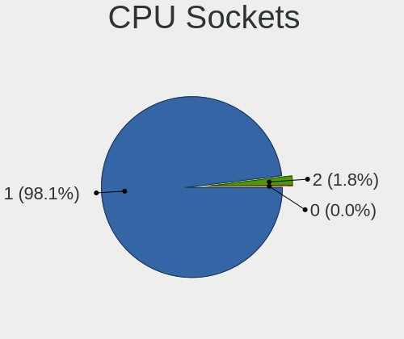

Debian 11 - Tested Hardware & Statistics (Desktops)
---------------------------------------------------

A project to collect tested hardware configurations for Debian 11 (Beta test).

Anyone can contribute to this report by the [hw-probe](https://github.com/linuxhw/hw-probe) tool:

    sudo -E hw-probe -all -upload

Please submit a probe of your configuration if it's not presented on the page or is rare.

Full-feature report is available here: https://linux-hardware.org/?view=trends&rel=debian-11

Contents
--------

* [ Test Cases ](#test-cases)

* [ System ](#system)
  - [ Kernel                   ](#kernel)
  - [ Kernel Family            ](#kernel-family)
  - [ Kernel Major Ver.        ](#kernel-major-ver)
  - [ Arch                     ](#arch)
  - [ DE                       ](#de)
  - [ Display Server           ](#display-server)
  - [ Display Manager          ](#display-manager)
  - [ OS Lang                  ](#os-lang)
  - [ Boot Mode                ](#boot-mode)
  - [ Filesystem               ](#filesystem)
  - [ Part. scheme             ](#part-scheme)
  - [ Dual Boot with Linux/BSD ](#dual-boot-with-linuxbsd)
  - [ Dual Boot (Win)          ](#dual-boot-win)

* [ Board ](#board)
  - [ Vendor                   ](#vendor)
  - [ Model                    ](#model)
  - [ Model Family             ](#model-family)
  - [ MFG Year                 ](#mfg-year)
  - [ Form Factor              ](#form-factor)
  - [ Secure Boot              ](#secure-boot)
  - [ Coreboot                 ](#coreboot)
  - [ RAM Size                 ](#ram-size)
  - [ RAM Used                 ](#ram-used)
  - [ Total Drives             ](#total-drives)
  - [ Has CD-ROM               ](#has-cd-rom)
  - [ Has Ethernet             ](#has-ethernet)
  - [ Has WiFi                 ](#has-wifi)
  - [ Has Bluetooth            ](#has-bluetooth)

* [ Location ](#location)
  - [ Country                  ](#country)
  - [ City                     ](#city)

* [ Drives ](#drives)
  - [ Drive Vendor             ](#drive-vendor)
  - [ Drive Model              ](#drive-model)
  - [ HDD Vendor               ](#hdd-vendor)
  - [ SSD Vendor               ](#ssd-vendor)
  - [ Drive Kind               ](#drive-kind)
  - [ Drive Connector          ](#drive-connector)
  - [ Drive Size               ](#drive-size)
  - [ Space Total              ](#space-total)
  - [ Space Used               ](#space-used)
  - [ Malfunc. Drives          ](#malfunc-drives)
  - [ Malfunc. Drive Vendor    ](#malfunc-drive-vendor)
  - [ Malfunc. HDD Vendor      ](#malfunc-hdd-vendor)
  - [ Malfunc. Drive Kind      ](#malfunc-drive-kind)
  - [ Failed Drives            ](#failed-drives)
  - [ Failed Drive Vendor      ](#failed-drive-vendor)
  - [ Drive Status             ](#drive-status)

* [ Storage controller ](#storage-controller)
  - [ Storage Vendor           ](#storage-vendor)
  - [ Storage Model            ](#storage-model)
  - [ Storage Kind             ](#storage-kind)

* [ Processor ](#processor)
  - [ CPU Vendor               ](#cpu-vendor)
  - [ CPU Model                ](#cpu-model)
  - [ CPU Model Family         ](#cpu-model-family)
  - [ CPU Cores                ](#cpu-cores)
  - [ CPU Sockets              ](#cpu-sockets)
  - [ CPU Threads              ](#cpu-threads)
  - [ CPU Op-Modes             ](#cpu-op-modes)
  - [ CPU Microcode            ](#cpu-microcode)
  - [ CPU Microarch            ](#cpu-microarch)

* [ Graphics ](#graphics)
  - [ GPU Vendor               ](#gpu-vendor)
  - [ GPU Model                ](#gpu-model)
  - [ GPU Combo                ](#gpu-combo)
  - [ GPU Driver               ](#gpu-driver)
  - [ GPU Memory               ](#gpu-memory)

* [ Monitor ](#monitor)
  - [ Monitor Vendor           ](#monitor-vendor)
  - [ Monitor Model            ](#monitor-model)
  - [ Monitor Resolution       ](#monitor-resolution)
  - [ Monitor Diagonal         ](#monitor-diagonal)
  - [ Monitor Width            ](#monitor-width)
  - [ Aspect Ratio             ](#aspect-ratio)
  - [ Monitor Area             ](#monitor-area)
  - [ Pixel Density            ](#pixel-density)
  - [ Multiple Monitors        ](#multiple-monitors)

* [ Network ](#network)
  - [ Net Controller Vendor    ](#net-controller-vendor)
  - [ Net Controller Model     ](#net-controller-model)
  - [ Wireless Vendor          ](#wireless-vendor)
  - [ Wireless Model           ](#wireless-model)
  - [ Ethernet Vendor          ](#ethernet-vendor)
  - [ Ethernet Model           ](#ethernet-model)
  - [ Net Controller Kind      ](#net-controller-kind)
  - [ Used Controller          ](#used-controller)
  - [ NICs                     ](#nics)
  - [ IPv6                     ](#ipv6)

* [ Bluetooth ](#bluetooth)
  - [ Bluetooth Vendor         ](#bluetooth-vendor)
  - [ Bluetooth Model          ](#bluetooth-model)

* [ Sound ](#sound)
  - [ Sound Vendor             ](#sound-vendor)
  - [ Sound Model              ](#sound-model)

* [ Memory ](#memory)
  - [ Memory Vendor            ](#memory-vendor)
  - [ Memory Model             ](#memory-model)
  - [ Memory Kind              ](#memory-kind)
  - [ Memory Form Factor       ](#memory-form-factor)
  - [ Memory Size              ](#memory-size)
  - [ Memory Speed             ](#memory-speed)

* [ Printers & scanners ](#printers--scanners)
  - [ Printer Vendor           ](#printer-vendor)
  - [ Printer Model            ](#printer-model)
  - [ Scanner Vendor           ](#scanner-vendor)
  - [ Scanner Model            ](#scanner-model)

* [ Camera ](#camera)
  - [ Camera Vendor            ](#camera-vendor)
  - [ Camera Model             ](#camera-model)

* [ Security ](#security)
  - [ Fingerprint Vendor       ](#fingerprint-vendor)
  - [ Fingerprint Model        ](#fingerprint-model)
  - [ Chipcard Vendor          ](#chipcard-vendor)
  - [ Chipcard Model           ](#chipcard-model)

* [ Unsupported ](#unsupported)
  - [ Unsupported Devices      ](#unsupported-devices)
  - [ Unsupported Device Types ](#unsupported-device-types)

Test Cases
----------

| Vendor        | Model                       | Probe                                                      | Date         |
|---------------|-----------------------------|------------------------------------------------------------|--------------|
| ASUSTek       | WS X299 SAGE                | [7f3a68dd2a](https://linux-hardware.org/?probe=7f3a68dd2a) | Aug 27, 2021 |
| ASRock        | H470M-HVS                   | [2737cfb67d](https://linux-hardware.org/?probe=2737cfb67d) | Aug 27, 2021 |
| ASRock        | H470M-HVS                   | [dc9428d8b4](https://linux-hardware.org/?probe=dc9428d8b4) | Aug 27, 2021 |
| HP            | 0B0Ch                       | [b5933fde35](https://linux-hardware.org/?probe=b5933fde35) | Aug 26, 2021 |
| Fujitsu       | D3219-A1 S26361-D3219-A1    | [f26ade88cd](https://linux-hardware.org/?probe=f26ade88cd) | Aug 26, 2021 |
| Dell          | 0WR7PY A00                  | [cb25b1811b](https://linux-hardware.org/?probe=cb25b1811b) | Aug 26, 2021 |
| Dell          | 0X8DXD A00                  | [8dd8862b4b](https://linux-hardware.org/?probe=8dd8862b4b) | Aug 26, 2021 |
| ASRock        | H470M-HVS                   | [d37f13917f](https://linux-hardware.org/?probe=d37f13917f) | Aug 25, 2021 |
| ASRock        | C2750D4I                    | [6daa3c26bf](https://linux-hardware.org/?probe=6daa3c26bf) | Aug 25, 2021 |
| Gigabyte      | X570 I AORUS PRO WIFI       | [0a79171c9e](https://linux-hardware.org/?probe=0a79171c9e) | Aug 25, 2021 |
| ASUSTek       | P5KPL-CM                    | [feed9e2921](https://linux-hardware.org/?probe=feed9e2921) | Aug 25, 2021 |
| Biostar       | Hi-Fi A85W                  | [ffb66dafd4](https://linux-hardware.org/?probe=ffb66dafd4) | Aug 25, 2021 |
| AAEON         | MF-001 V1.0                 | [b06c4079a7](https://linux-hardware.org/?probe=b06c4079a7) | Aug 25, 2021 |
| Dell          | 040DDP A01                  | [557d74beb9](https://linux-hardware.org/?probe=557d74beb9) | Aug 25, 2021 |
| ASRock        | H470M-HVS                   | [e5c92fe4ad](https://linux-hardware.org/?probe=e5c92fe4ad) | Aug 24, 2021 |
| ASRock        | H470M-HVS                   | [441b8b892e](https://linux-hardware.org/?probe=441b8b892e) | Aug 24, 2021 |
| ASRock        | P4i65G                      | [43ce3e711f](https://linux-hardware.org/?probe=43ce3e711f) | Aug 24, 2021 |
| ASRock        | H77 Pro4/MVP                | [c2179206a9](https://linux-hardware.org/?probe=c2179206a9) | Aug 24, 2021 |
| Unknown       | 1.0                         | [5e638360a8](https://linux-hardware.org/?probe=5e638360a8) | Aug 24, 2021 |
| ASUSTek       | GA35DX                      | [3843ea048e](https://linux-hardware.org/?probe=3843ea048e) | Aug 24, 2021 |
| ASRock        | H470M-HVS                   | [e92004f46a](https://linux-hardware.org/?probe=e92004f46a) | Aug 23, 2021 |
| ASRock        | H470M-HVS                   | [06c9a1ed3a](https://linux-hardware.org/?probe=06c9a1ed3a) | Aug 23, 2021 |
| ASUSTek       | P5KPL-CM                    | [06234ebe05](https://linux-hardware.org/?probe=06234ebe05) | Aug 23, 2021 |
| MSI           | Z270-A PRO                  | [73b14ecca0](https://linux-hardware.org/?probe=73b14ecca0) | Aug 23, 2021 |
| ASUSTek       | TUF GAMING X570-PRO         | [eea45758b7](https://linux-hardware.org/?probe=eea45758b7) | Aug 22, 2021 |
| HP            | 085Ch                       | [2e649d07a0](https://linux-hardware.org/?probe=2e649d07a0) | Aug 21, 2021 |
| HP            | 085Ch                       | [c5b36c5187](https://linux-hardware.org/?probe=c5b36c5187) | Aug 21, 2021 |
| ASRock        | Z97 Pro3                    | [0f9abf9c63](https://linux-hardware.org/?probe=0f9abf9c63) | Aug 21, 2021 |
| ASUSTek       | TUF GAMING X570-PRO         | [7f83e1b3c8](https://linux-hardware.org/?probe=7f83e1b3c8) | Aug 21, 2021 |
| ASUSTek       | P5B SE                      | [81634fcb22](https://linux-hardware.org/?probe=81634fcb22) | Aug 21, 2021 |
| MSI           | Z270-A PRO                  | [e59c9482f6](https://linux-hardware.org/?probe=e59c9482f6) | Aug 21, 2021 |
| ASRock        | H470M-HVS                   | [cba7d82942](https://linux-hardware.org/?probe=cba7d82942) | Aug 20, 2021 |
| ASRock        | H470M-HVS                   | [62068f391f](https://linux-hardware.org/?probe=62068f391f) | Aug 20, 2021 |
| ASRock        | H470M-HVS                   | [c980f2d201](https://linux-hardware.org/?probe=c980f2d201) | Aug 20, 2021 |
| Dell          | 0Y2K8N A01                  | [6b0fd02c91](https://linux-hardware.org/?probe=6b0fd02c91) | Aug 20, 2021 |
| Intel         | DG33BU AAD79951-407         | [17c70c7886](https://linux-hardware.org/?probe=17c70c7886) | Aug 19, 2021 |
| HP            | 339A                        | [57d5bbd1e4](https://linux-hardware.org/?probe=57d5bbd1e4) | Aug 19, 2021 |
| Gigabyte      | A320M-S2H-CF                | [2151b5cdae](https://linux-hardware.org/?probe=2151b5cdae) | Aug 19, 2021 |
| HP            | 1587h                       | [3ddbdb3101](https://linux-hardware.org/?probe=3ddbdb3101) | Aug 19, 2021 |
| ASRock        | H470M-HVS                   | [0489699bc4](https://linux-hardware.org/?probe=0489699bc4) | Aug 19, 2021 |
| MSI           | B450M PRO-M2 MAX            | [cc54b8955c](https://linux-hardware.org/?probe=cc54b8955c) | Aug 19, 2021 |
| ASRock        | H470M-HVS                   | [757e261c56](https://linux-hardware.org/?probe=757e261c56) | Aug 19, 2021 |
| Lenovo        | MAHOBAY                     | [df15656fce](https://linux-hardware.org/?probe=df15656fce) | Aug 19, 2021 |
| ASUSTek       | ROG STRIX B450-F GAMING     | [6f5485edfc](https://linux-hardware.org/?probe=6f5485edfc) | Aug 18, 2021 |
| ASUSTek       | ROG STRIX B550-E GAMING     | [1fce0ab0e8](https://linux-hardware.org/?probe=1fce0ab0e8) | Aug 18, 2021 |
| Lenovo        | Board                       | [3de8569fe7](https://linux-hardware.org/?probe=3de8569fe7) | Aug 18, 2021 |
| ASUSTek       | H81M-R                      | [8598ad2248](https://linux-hardware.org/?probe=8598ad2248) | Aug 18, 2021 |
| ASUSTek       | B150M-K                     | [3f706a2a69](https://linux-hardware.org/?probe=3f706a2a69) | Aug 18, 2021 |
| ASUSTek       | P7H55-M SI                  | [9f3381d34c](https://linux-hardware.org/?probe=9f3381d34c) | Aug 18, 2021 |
| ASRock        | B460 Phantom Gaming 4       | [85cfabd795](https://linux-hardware.org/?probe=85cfabd795) | Aug 18, 2021 |
| ASUSTek       | P7H55-M SI                  | [765f5d340e](https://linux-hardware.org/?probe=765f5d340e) | Aug 18, 2021 |
| ASRock        | J4205-ITX                   | [30de75d2c8](https://linux-hardware.org/?probe=30de75d2c8) | Aug 18, 2021 |
| ASUSTek       | A68HM-PLUS                  | [b2ed4bc6fe](https://linux-hardware.org/?probe=b2ed4bc6fe) | Aug 18, 2021 |
| Gigabyte      | Z97N-WIFI                   | [be9383850e](https://linux-hardware.org/?probe=be9383850e) | Aug 17, 2021 |
| Fujitsu Si... | D2840-A1 S26361-D2840-A1    | [7911fbd6a6](https://linux-hardware.org/?probe=7911fbd6a6) | Aug 17, 2021 |
| MSI           | FM2-A55M-E33                | [6972c43e80](https://linux-hardware.org/?probe=6972c43e80) | Aug 17, 2021 |
| ASUSTek       | P5KC                        | [5e2f61d652](https://linux-hardware.org/?probe=5e2f61d652) | Aug 16, 2021 |
| Intel         | DN2820FYK H24582-201        | [86cf4755a0](https://linux-hardware.org/?probe=86cf4755a0) | Aug 16, 2021 |
| ASRock        | B460 Phantom Gaming 4       | [51f9388874](https://linux-hardware.org/?probe=51f9388874) | Aug 15, 2021 |
| ASUSTek       | STRIX B250H GAMING          | [88160f850f](https://linux-hardware.org/?probe=88160f850f) | Aug 15, 2021 |
| ASUSTek       | M5A99X EVO                  | [53aff8d681](https://linux-hardware.org/?probe=53aff8d681) | Aug 15, 2021 |
| ECS           | KBN-I                       | [bbfe1ba1a2](https://linux-hardware.org/?probe=bbfe1ba1a2) | Aug 15, 2021 |
| ASUSTek       | Pro WS X570-ACE             | [987ab1f3bf](https://linux-hardware.org/?probe=987ab1f3bf) | Aug 15, 2021 |
| ASUSTek       | ROG STRIX TRX40-XE GAMIN... | [a6e0859eac](https://linux-hardware.org/?probe=a6e0859eac) | Aug 14, 2021 |
| ASUSTek       | ROG STRIX TRX40-XE GAMIN... | [5ce5d800d3](https://linux-hardware.org/?probe=5ce5d800d3) | Aug 14, 2021 |
| ASUSTek       | PRIME Z390-P                | [dfe51161fe](https://linux-hardware.org/?probe=dfe51161fe) | Aug 14, 2021 |
| ASRock        | Z97 Pro3                    | [0e5746a060](https://linux-hardware.org/?probe=0e5746a060) | Aug 14, 2021 |
| Dell          | 0X9M3X A01                  | [b5b9c80c53](https://linux-hardware.org/?probe=b5b9c80c53) | Aug 14, 2021 |
| HP            | 3397                        | [a3425b956c](https://linux-hardware.org/?probe=a3425b956c) | Aug 14, 2021 |
| ASUSTek       | X99-DELUXE                  | [f59179a579](https://linux-hardware.org/?probe=f59179a579) | Aug 13, 2021 |
| ASUSTek       | Z170-PRO                    | [7f9b5606a5](https://linux-hardware.org/?probe=7f9b5606a5) | Aug 13, 2021 |
| HP            | 3048h                       | [894950911f](https://linux-hardware.org/?probe=894950911f) | Aug 11, 2021 |
| Gigabyte      | 970A-DS3P                   | [9b62457757](https://linux-hardware.org/?probe=9b62457757) | Aug 11, 2021 |
| ASUSTek       | PRIME A320M-K               | [40d1d24c90](https://linux-hardware.org/?probe=40d1d24c90) | Aug 11, 2021 |
| ASUSTek       | STRIX B250H GAMING          | [78223998b6](https://linux-hardware.org/?probe=78223998b6) | Aug 10, 2021 |
| MSI           | B250M PRO-VDH               | [d6be998202](https://linux-hardware.org/?probe=d6be998202) | Aug 10, 2021 |
| ASUSTek       | PRIME A320M-K               | [7cc269740d](https://linux-hardware.org/?probe=7cc269740d) | Aug 10, 2021 |
| Dell          | 04MFRM A01                  | [c0094def97](https://linux-hardware.org/?probe=c0094def97) | Aug 09, 2021 |
| MSI           | B450 TOMAHAWK               | [58b4f52cc0](https://linux-hardware.org/?probe=58b4f52cc0) | Aug 09, 2021 |
| Gigabyte      | H470M DS3H                  | [29de4693d8](https://linux-hardware.org/?probe=29de4693d8) | Aug 09, 2021 |
| ASRock        | 970A-G                      | [f1e9959894](https://linux-hardware.org/?probe=f1e9959894) | Aug 09, 2021 |
| Toshiba       | STI 910090 STIJ             | [389ebd7675](https://linux-hardware.org/?probe=389ebd7675) | Aug 08, 2021 |
| ASRock        | X370 Killer SLI             | [8a0885afb6](https://linux-hardware.org/?probe=8a0885afb6) | Aug 08, 2021 |
| MSI           | Z490-A PRO                  | [eac37d633f](https://linux-hardware.org/?probe=eac37d633f) | Aug 08, 2021 |
| ASRock        | Z97 Pro4                    | [090d12a96f](https://linux-hardware.org/?probe=090d12a96f) | Aug 08, 2021 |
| ASUSTek       | ROG STRIX B350-F GAMING     | [39eb5a1578](https://linux-hardware.org/?probe=39eb5a1578) | Aug 08, 2021 |
| Toshiba       | STI 005038 G31T-M7          | [faa8f15725](https://linux-hardware.org/?probe=faa8f15725) | Aug 08, 2021 |
| Gigabyte      | Z77-D3H                     | [9dafe47483](https://linux-hardware.org/?probe=9dafe47483) | Aug 07, 2021 |
| MSI           | X470 GAMING PLUS MAX        | [da833ac33e](https://linux-hardware.org/?probe=da833ac33e) | Aug 07, 2021 |
| ASUSTek       | TUF Z370-PLUS GAMING        | [80c7711147](https://linux-hardware.org/?probe=80c7711147) | Aug 07, 2021 |
| Gigabyte      | Z77-D3H                     | [4ff5966d22](https://linux-hardware.org/?probe=4ff5966d22) | Aug 07, 2021 |
| ASUSTek       | PRIME X470-PRO              | [5839492cd8](https://linux-hardware.org/?probe=5839492cd8) | Aug 07, 2021 |
| ASUSTek       | PRIME B460-PLUS             | [733a3e325c](https://linux-hardware.org/?probe=733a3e325c) | Aug 07, 2021 |
| Dell          | 08WKV3 A01                  | [8ab0ff9442](https://linux-hardware.org/?probe=8ab0ff9442) | Aug 07, 2021 |
| MSI           | MEG X399 CREATION           | [7cada9aaed](https://linux-hardware.org/?probe=7cada9aaed) | Aug 07, 2021 |
| MSI           | B250M PRO-VDH               | [187e4dd872](https://linux-hardware.org/?probe=187e4dd872) | Aug 07, 2021 |
| Gigabyte      | GA-78LMT-USB3               | [31d159af99](https://linux-hardware.org/?probe=31d159af99) | Aug 06, 2021 |
| Lenovo        | Board                       | [18138486db](https://linux-hardware.org/?probe=18138486db) | Aug 05, 2021 |
| Intel         | DN2820FYK H24582-201        | [7caf949908](https://linux-hardware.org/?probe=7caf949908) | Aug 05, 2021 |
| Unknown       | Intel X79                   | [fc0dedbb3c](https://linux-hardware.org/?probe=fc0dedbb3c) | Aug 05, 2021 |
| AMD           | 970A-D3                     | [91825066e0](https://linux-hardware.org/?probe=91825066e0) | Aug 04, 2021 |
| HP            | 3047h                       | [6294617672](https://linux-hardware.org/?probe=6294617672) | Aug 03, 2021 |
| ASRock        | FM2A68M-HD+                 | [a7bdbd8ebe](https://linux-hardware.org/?probe=a7bdbd8ebe) | Aug 03, 2021 |
| ASUSTek       | PRIME B450-PLUS             | [55cd593df1](https://linux-hardware.org/?probe=55cd593df1) | Aug 03, 2021 |
| Gigabyte      | X399 AORUS XTREME-CF        | [3a2fd430f6](https://linux-hardware.org/?probe=3a2fd430f6) | Aug 03, 2021 |
| MSI           | 760GM-P23                   | [93b6f212af](https://linux-hardware.org/?probe=93b6f212af) | Aug 02, 2021 |
| Supermicro    | X11SSH-F                    | [641e4fd8ce](https://linux-hardware.org/?probe=641e4fd8ce) | Aug 02, 2021 |
| ASRock        | H310CM-DVS                  | [f84e5eba5a](https://linux-hardware.org/?probe=f84e5eba5a) | Aug 02, 2021 |
| ASUSTek       | M4A785TD-M EVO              | [e90a873ad0](https://linux-hardware.org/?probe=e90a873ad0) | Aug 02, 2021 |
| ASUSTek       | P5QL-E                      | [2894e88095](https://linux-hardware.org/?probe=2894e88095) | Aug 02, 2021 |
| ASUSTek       | A88X-PRO                    | [ed95430eec](https://linux-hardware.org/?probe=ed95430eec) | Aug 02, 2021 |
| HP            | 2187 A01                    | [16bfdd86e3](https://linux-hardware.org/?probe=16bfdd86e3) | Aug 02, 2021 |
| Gigabyte      | 970A-DS3P                   | [61886d812f](https://linux-hardware.org/?probe=61886d812f) | Aug 01, 2021 |
| ASRock        | J1900D2Y                    | [0dc4afc8c4](https://linux-hardware.org/?probe=0dc4afc8c4) | Aug 01, 2021 |
| ASRock        | N68C-S UCC                  | [3da0d57fd5](https://linux-hardware.org/?probe=3da0d57fd5) | Aug 01, 2021 |
| Dell          | 0WVYMC A00                  | [4d2aa42e3c](https://linux-hardware.org/?probe=4d2aa42e3c) | Jul 31, 2021 |
| ASUSTek       | Pro WS WRX80E-SAGE SE WI... | [159ff0ba7f](https://linux-hardware.org/?probe=159ff0ba7f) | Jul 31, 2021 |
| ASRock        | Z370M-ITX/ac                | [30511d93c4](https://linux-hardware.org/?probe=30511d93c4) | Jul 31, 2021 |
| ASUSTek       | Pro WS WRX80E-SAGE SE WI... | [3f0c3901f6](https://linux-hardware.org/?probe=3f0c3901f6) | Jul 30, 2021 |
| MSI           | Z490-A PRO                  | [b882a9cf0d](https://linux-hardware.org/?probe=b882a9cf0d) | Jul 29, 2021 |
| MSI           | Q45MDO                      | [ab547f0047](https://linux-hardware.org/?probe=ab547f0047) | Jul 29, 2021 |
| MSI           | Q45MDO                      | [6b5aaa6969](https://linux-hardware.org/?probe=6b5aaa6969) | Jul 29, 2021 |
| Dell          | 0TY915                      | [9cb5aed659](https://linux-hardware.org/?probe=9cb5aed659) | Jul 29, 2021 |
| Gigabyte      | B550M AORUS PRO-P           | [ed7394c65a](https://linux-hardware.org/?probe=ed7394c65a) | Jul 29, 2021 |
| ASUSTek       | LEONITE                     | [3bf9048839](https://linux-hardware.org/?probe=3bf9048839) | Jul 29, 2021 |
| Foxconn       | 2AA9                        | [920a813aaf](https://linux-hardware.org/?probe=920a813aaf) | Jul 29, 2021 |
| ASRock        | B85M Pro4                   | [32e615b538](https://linux-hardware.org/?probe=32e615b538) | Jul 29, 2021 |
| ASRock        | FM2A88X Extreme6+           | [f449b8ce85](https://linux-hardware.org/?probe=f449b8ce85) | Jul 29, 2021 |
| ECS           | H61H2-M12                   | [42050ab984](https://linux-hardware.org/?probe=42050ab984) | Jul 28, 2021 |
| MSI           | B450M PRO-VDH PLUS          | [cccaebb483](https://linux-hardware.org/?probe=cccaebb483) | Jul 28, 2021 |
| Gigabyte      | GA-990FX-GAMING             | [4206886abb](https://linux-hardware.org/?probe=4206886abb) | Jul 28, 2021 |
| Gigabyte      | GA-990FX-GAMING             | [d244dc6763](https://linux-hardware.org/?probe=d244dc6763) | Jul 28, 2021 |
| MSI           | MAG X570 TOMAHAWK WIFI      | [f96bcc3ab2](https://linux-hardware.org/?probe=f96bcc3ab2) | Jul 28, 2021 |
| Shuttle       | FX79R                       | [6ceba6fc67](https://linux-hardware.org/?probe=6ceba6fc67) | Jul 28, 2021 |
| ASUSTek       | PRIME X570-PRO              | [df0a4b1a0f](https://linux-hardware.org/?probe=df0a4b1a0f) | Jul 27, 2021 |
| ASRockRack    | X570D4U-2L2T                | [7bb34c9dec](https://linux-hardware.org/?probe=7bb34c9dec) | Jul 27, 2021 |
| ASUSTek       | A88X-PLUS/USB               | [57b54cc925](https://linux-hardware.org/?probe=57b54cc925) | Jul 27, 2021 |
| ASRock        | N68C-GS FX                  | [660f13d25d](https://linux-hardware.org/?probe=660f13d25d) | Jul 27, 2021 |
| ASUSTek       | PRIME Z490-P                | [2e0f5417fc](https://linux-hardware.org/?probe=2e0f5417fc) | Jul 27, 2021 |
| Dell          | 0X8DXD A00                  | [7821dfc370](https://linux-hardware.org/?probe=7821dfc370) | Jul 27, 2021 |
| ASUSTek       | M4A785D-M PRO               | [467d107518](https://linux-hardware.org/?probe=467d107518) | Jul 27, 2021 |
| Foxconn       | 915MH Series                | [6a3ae85dfc](https://linux-hardware.org/?probe=6a3ae85dfc) | Jul 27, 2021 |
| ASUSTek       | PRIME H310M-R R2.0          | [dc4a709a3b](https://linux-hardware.org/?probe=dc4a709a3b) | Jul 27, 2021 |
| Dell          | 0WMJ54 A01                  | [b24fc8e5f2](https://linux-hardware.org/?probe=b24fc8e5f2) | Jul 27, 2021 |
| ASUSTek       | PRIME H310M-K R2.0          | [1e69873301](https://linux-hardware.org/?probe=1e69873301) | Jul 27, 2021 |
| Dell          | 0M863N A00                  | [e94bee6137](https://linux-hardware.org/?probe=e94bee6137) | Jul 27, 2021 |
| Gigabyte      | P35C-DS3R                   | [e8ffe8991b](https://linux-hardware.org/?probe=e8ffe8991b) | Jul 27, 2021 |
| MSI           | X399 GAMING PRO CARBON A... | [3c6898fcd8](https://linux-hardware.org/?probe=3c6898fcd8) | Jul 27, 2021 |
| MSI           | MEG X570 UNIFY              | [9d0528280a](https://linux-hardware.org/?probe=9d0528280a) | Jul 26, 2021 |
| ASRock        | Z97 Pro3                    | [8cd14c1874](https://linux-hardware.org/?probe=8cd14c1874) | Jul 26, 2021 |
| MSI           | Z370 SLI PLUS               | [04d84e38b8](https://linux-hardware.org/?probe=04d84e38b8) | Jul 26, 2021 |
| ASUSTek       | PRIME X370-PRO              | [eb6369aac9](https://linux-hardware.org/?probe=eb6369aac9) | Jul 26, 2021 |
| ASRock        | B450 Pro4                   | [0de4a63af4](https://linux-hardware.org/?probe=0de4a63af4) | Jul 26, 2021 |
| HP            | 2B38                        | [be24f3f652](https://linux-hardware.org/?probe=be24f3f652) | Jul 26, 2021 |
| HP            | 2B38                        | [c1198b90f6](https://linux-hardware.org/?probe=c1198b90f6) | Jul 26, 2021 |
| ASRock        | 970 Pro3 R2.0               | [9fd8d25e24](https://linux-hardware.org/?probe=9fd8d25e24) | Jul 26, 2021 |
| ASUSTek       | PRIME B550-PLUS             | [8b0f398a93](https://linux-hardware.org/?probe=8b0f398a93) | Jul 26, 2021 |
| ASUSTek       | PRIME B550-PLUS             | [cd62d88495](https://linux-hardware.org/?probe=cd62d88495) | Jul 26, 2021 |
| ASRock        | X570 Steel Legend           | [b040663b7c](https://linux-hardware.org/?probe=b040663b7c) | Jul 26, 2021 |
| ASUSTek       | PRIME B350-PLUS             | [36caa67715](https://linux-hardware.org/?probe=36caa67715) | Jul 26, 2021 |
| Gigabyte      | AB350-Gaming 3-CF           | [e9ddc17233](https://linux-hardware.org/?probe=e9ddc17233) | Jul 26, 2021 |
| Gigabyte      | AB350-Gaming 3-CF           | [6623f96b90](https://linux-hardware.org/?probe=6623f96b90) | Jul 26, 2021 |
| ASUSTek       | M5A78L-M LX3                | [2c05790c36](https://linux-hardware.org/?probe=2c05790c36) | Jul 26, 2021 |
| Gigabyte      | B450M DS3H-CF               | [64b4d84778](https://linux-hardware.org/?probe=64b4d84778) | Jul 26, 2021 |
| ASUSTek       | B85-PRO GAMER               | [fffec5c87f](https://linux-hardware.org/?probe=fffec5c87f) | Jul 26, 2021 |
| ASUSTek       | M5A78L-M LX3                | [0b35b55294](https://linux-hardware.org/?probe=0b35b55294) | Jul 26, 2021 |
| Dell          | 0D28YY A02                  | [71b0f194a3](https://linux-hardware.org/?probe=71b0f194a3) | Jul 26, 2021 |
| ASRock        | H470M-ITX/ac                | [8a3b6cb663](https://linux-hardware.org/?probe=8a3b6cb663) | Jul 26, 2021 |
| ASUSTek       | M5A78L-M LX3                | [fcd103f100](https://linux-hardware.org/?probe=fcd103f100) | Jul 26, 2021 |
| ASUSTek       | PRIME B450M-A               | [00d53058e7](https://linux-hardware.org/?probe=00d53058e7) | Jul 26, 2021 |
| MSI           | B450 TOMAHAWK MAX II        | [d09fdc110f](https://linux-hardware.org/?probe=d09fdc110f) | Jul 25, 2021 |
| Gigabyte      | H110M-S2H-CF                | [11c5d6c6d0](https://linux-hardware.org/?probe=11c5d6c6d0) | Jul 25, 2021 |
| Dell          | 0PTTT9 A00                  | [113235448d](https://linux-hardware.org/?probe=113235448d) | Jul 25, 2021 |
| Dell          | 0X8DXD A00                  | [54b46bdd5d](https://linux-hardware.org/?probe=54b46bdd5d) | Jul 25, 2021 |
| ASUSTek       | PRIME H270M-PLUS            | [21b43b8718](https://linux-hardware.org/?probe=21b43b8718) | Jul 25, 2021 |
| Gigabyte      | Z170M-D3H-CF                | [9301420a7b](https://linux-hardware.org/?probe=9301420a7b) | Jul 25, 2021 |
| ASRock        | P67 Pro3                    | [ce711e5011](https://linux-hardware.org/?probe=ce711e5011) | Jul 25, 2021 |
| Supermicro    | A1SA2-2750FA                | [de408d6408](https://linux-hardware.org/?probe=de408d6408) | Jul 25, 2021 |
| Gigabyte      | H87-HD3                     | [a102014ef0](https://linux-hardware.org/?probe=a102014ef0) | Jul 25, 2021 |
| ASUSTek       | ROG STRIX B450-I GAMING     | [dcff1a4a95](https://linux-hardware.org/?probe=dcff1a4a95) | Jul 25, 2021 |
| Gigabyte      | AB350M-DS3H V2-CF           | [8b1c4f962a](https://linux-hardware.org/?probe=8b1c4f962a) | Jul 25, 2021 |
| Dell          | 0Y1057                      | [ac342b01e2](https://linux-hardware.org/?probe=ac342b01e2) | Jul 25, 2021 |
| HP            | ProLiant MicroServer Gen... | [2bcfda70b5](https://linux-hardware.org/?probe=2bcfda70b5) | Jul 25, 2021 |
| ASRock        | B450M Pro4                  | [514f64cef0](https://linux-hardware.org/?probe=514f64cef0) | Jul 25, 2021 |
| ASRock        | Z97 Extreme6                | [84730f7819](https://linux-hardware.org/?probe=84730f7819) | Jul 25, 2021 |
| Lenovo        | 3098 0B98401 PRO            | [a5bb2fb53c](https://linux-hardware.org/?probe=a5bb2fb53c) | Jul 25, 2021 |
| HP            | 1495                        | [5d01240605](https://linux-hardware.org/?probe=5d01240605) | Jul 25, 2021 |
| HP            | 158A                        | [219b010ebb](https://linux-hardware.org/?probe=219b010ebb) | Jul 25, 2021 |
| HP            | 158A                        | [da4016cb27](https://linux-hardware.org/?probe=da4016cb27) | Jul 25, 2021 |
| ASUSTek       | H110M-A/M.2                 | [a98eb4deab](https://linux-hardware.org/?probe=a98eb4deab) | Jul 25, 2021 |
| Gigabyte      | H110N-CF                    | [2a85c9961c](https://linux-hardware.org/?probe=2a85c9961c) | Jul 25, 2021 |
| MSI           | MAG B550M MORTAR            | [b5e7cb3f3d](https://linux-hardware.org/?probe=b5e7cb3f3d) | Jul 25, 2021 |
| Dell          | 0X8DXD A00                  | [dd60e87813](https://linux-hardware.org/?probe=dd60e87813) | Jul 25, 2021 |
| HP            | 2129                        | [8de5bae655](https://linux-hardware.org/?probe=8de5bae655) | Jul 25, 2021 |
| Intel         | DP55WG AAE57269-407         | [fa1be73a3f](https://linux-hardware.org/?probe=fa1be73a3f) | Jul 25, 2021 |
| ASRock        | B85 Anniversary             | [b9bdc402ce](https://linux-hardware.org/?probe=b9bdc402ce) | Jul 25, 2021 |
| Gigabyte      | B550I AORUS PRO AX          | [db0c50510b](https://linux-hardware.org/?probe=db0c50510b) | Jul 25, 2021 |
| Gigabyte      | B550I AORUS PRO AX          | [c873d77069](https://linux-hardware.org/?probe=c873d77069) | Jul 25, 2021 |
| Gigabyte      | Z97X-UD3H-CF                | [6630c7ef27](https://linux-hardware.org/?probe=6630c7ef27) | Jul 25, 2021 |
| ASUSTek       | PRIME B250M-A               | [b0f56654dc](https://linux-hardware.org/?probe=b0f56654dc) | Jul 25, 2021 |
| ASRock        | B450M Pro4                  | [cd13d1596f](https://linux-hardware.org/?probe=cd13d1596f) | Jul 25, 2021 |
| ASRock        | B450M Pro4                  | [beec8a1c7d](https://linux-hardware.org/?probe=beec8a1c7d) | Jul 25, 2021 |
| Gigabyte      | H61MS                       | [742ede3c3e](https://linux-hardware.org/?probe=742ede3c3e) | Jul 25, 2021 |
| Gigabyte      | H81M-S2H GSM                | [f49c35b208](https://linux-hardware.org/?probe=f49c35b208) | Jul 25, 2021 |
| Dell          | 09KPNV A01                  | [fb6ec7188c](https://linux-hardware.org/?probe=fb6ec7188c) | Jul 25, 2021 |
| ASUSTek       | PRIME A320I-K               | [fca7acc5ee](https://linux-hardware.org/?probe=fca7acc5ee) | Jul 25, 2021 |
| ASUSTek       | H61M-K                      | [1cf0bdeec4](https://linux-hardware.org/?probe=1cf0bdeec4) | Jul 25, 2021 |
| Dell          | 0NK5PH A00                  | [d6444ebf26](https://linux-hardware.org/?probe=d6444ebf26) | Jul 25, 2021 |
| Gigabyte      | Z77-D3H                     | [522d784ace](https://linux-hardware.org/?probe=522d784ace) | Jul 25, 2021 |
| Intel         | DP55WB AAE64798-206         | [9c9e82f80f](https://linux-hardware.org/?probe=9c9e82f80f) | Jul 25, 2021 |
| Protectli     | FW6                         | [0efef10e76](https://linux-hardware.org/?probe=0efef10e76) | Jul 25, 2021 |
| ASUSTek       | ROG STRIX Z390-F GAMING     | [dd3347639f](https://linux-hardware.org/?probe=dd3347639f) | Jul 25, 2021 |
| Gigabyte      | X570 I AORUS PRO WIFI       | [f7c4474b4d](https://linux-hardware.org/?probe=f7c4474b4d) | Jul 25, 2021 |
| ASUSTek       | Z170-DELUXE                 | [df5c29f984](https://linux-hardware.org/?probe=df5c29f984) | Jul 25, 2021 |
| Gigabyte      | 970A-D3P                    | [c564faffdb](https://linux-hardware.org/?probe=c564faffdb) | Jul 25, 2021 |
| Dell          | 0D441T A03                  | [41283af596](https://linux-hardware.org/?probe=41283af596) | Jul 25, 2021 |
| MSI           | H110I PRO AC                | [08094a9121](https://linux-hardware.org/?probe=08094a9121) | Jul 25, 2021 |
| ASUSTek       | PRIME Z370-A                | [c7cf1f5978](https://linux-hardware.org/?probe=c7cf1f5978) | Jul 25, 2021 |
| ASUSTek       | H87-PRO                     | [293b556234](https://linux-hardware.org/?probe=293b556234) | Jul 25, 2021 |
| MSI           | Z77MA-G45                   | [bbc6d96681](https://linux-hardware.org/?probe=bbc6d96681) | Jul 25, 2021 |
| ASRock        | FM2A68M-DG3+                | [884f8f2850](https://linux-hardware.org/?probe=884f8f2850) | Jul 25, 2021 |
| ASUSTek       | ROG STRIX B450-F GAMING     | [1e8f9a7189](https://linux-hardware.org/?probe=1e8f9a7189) | Jul 24, 2021 |
| Gigabyte      | B560M D3H                   | [1456f9bf8e](https://linux-hardware.org/?probe=1456f9bf8e) | Jul 23, 2021 |
| ASUSTek       | ROG STRIX Z370-H GAMING     | [8af9716200](https://linux-hardware.org/?probe=8af9716200) | Jul 19, 2021 |
| ASUSTek       | P8Z68-V                     | [1a60e02aa9](https://linux-hardware.org/?probe=1a60e02aa9) | Jul 19, 2021 |
| HP            | ProLiant MicroServer        | [ca7c4b4967](https://linux-hardware.org/?probe=ca7c4b4967) | Jul 16, 2021 |
| MSI           | A68HM-E33 V2                | [983bc90bc7](https://linux-hardware.org/?probe=983bc90bc7) | Jul 14, 2021 |
| Huanan        | X99-F8 V2.0                 | [776f848ccd](https://linux-hardware.org/?probe=776f848ccd) | Jul 09, 2021 |
| Dell          | 0M863N A00                  | [574671bbb9](https://linux-hardware.org/?probe=574671bbb9) | Jul 09, 2021 |
| MSI           | MPG B550 GAMING PLUS        | [c79b71d033](https://linux-hardware.org/?probe=c79b71d033) | Jul 08, 2021 |
| ASUSTek       | H81M-E                      | [02c3ce63e7](https://linux-hardware.org/?probe=02c3ce63e7) | Jul 08, 2021 |
| HP            | 2215                        | [b0b56138b2](https://linux-hardware.org/?probe=b0b56138b2) | Jul 08, 2021 |
| HP            | 2215                        | [cdf48de6b2](https://linux-hardware.org/?probe=cdf48de6b2) | Jul 07, 2021 |
| MSI           | MS-6712                     | [ced0409e55](https://linux-hardware.org/?probe=ced0409e55) | Jul 04, 2021 |
| ASRock        | H77 Pro4-M                  | [8ba58cff9a](https://linux-hardware.org/?probe=8ba58cff9a) | Jul 02, 2021 |
| Gigabyte      | B550I AORUS PRO AX          | [cb62272a68](https://linux-hardware.org/?probe=cb62272a68) | Jul 02, 2021 |
| Gigabyte      | AX370-Gaming K7             | [e325df530d](https://linux-hardware.org/?probe=e325df530d) | Jun 30, 2021 |
| MSI           | B85M-G43                    | [4598afdf7e](https://linux-hardware.org/?probe=4598afdf7e) | Jun 29, 2021 |
| Huanan        | X99-8M-F V1.1               | [8ecfcffbaf](https://linux-hardware.org/?probe=8ecfcffbaf) | Jun 27, 2021 |
| ASRock        | FM2A68M-HD+                 | [f435417b41](https://linux-hardware.org/?probe=f435417b41) | Jun 26, 2021 |
| Gigabyte      | Z370 AORUS Gaming 5-CF      | [807a4ba37d](https://linux-hardware.org/?probe=807a4ba37d) | Jun 23, 2021 |
| Gigabyte      | Z370 AORUS Gaming 5-CF      | [bc7246038e](https://linux-hardware.org/?probe=bc7246038e) | Jun 23, 2021 |
| ASRock        | B550 Pro4                   | [ef1b7bfb77](https://linux-hardware.org/?probe=ef1b7bfb77) | Jun 23, 2021 |
| ASRock        | X399 Taichi                 | [a664e4cf99](https://linux-hardware.org/?probe=a664e4cf99) | Jun 23, 2021 |
| HARDKERNEL    | ODROID-H2                   | [c9fed56a36](https://linux-hardware.org/?probe=c9fed56a36) | Jun 23, 2021 |
| ASUSTek       | ROG STRIX B450-F GAMING ... | [b3a5333d2a](https://linux-hardware.org/?probe=b3a5333d2a) | Jun 21, 2021 |
| Gigabyte      | AB350M-Gaming 3-CF          | [08fc06c75e](https://linux-hardware.org/?probe=08fc06c75e) | Jun 20, 2021 |
| MSI           | B450M MORTAR MAX            | [33ffb80782](https://linux-hardware.org/?probe=33ffb80782) | Jun 19, 2021 |
| ASUSTek       | ROG STRIX B450-F GAMING ... | [9e3e72ec72](https://linux-hardware.org/?probe=9e3e72ec72) | Jun 17, 2021 |
| ASUSTek       | PRIME B450M-A               | [0ccc446224](https://linux-hardware.org/?probe=0ccc446224) | Jun 14, 2021 |
| Gigabyte      | MCMLUAB-00                  | [99780e8ba8](https://linux-hardware.org/?probe=99780e8ba8) | Jun 13, 2021 |
| ASUSTek       | PRIME A320M-K               | [f2770a810e](https://linux-hardware.org/?probe=f2770a810e) | Jun 12, 2021 |
| Dell          | 0Y7WYT A00                  | [8e424773e5](https://linux-hardware.org/?probe=8e424773e5) | Jun 10, 2021 |
| ASUSTek       | Z97-AR                      | [709a74c713](https://linux-hardware.org/?probe=709a74c713) | Jun 09, 2021 |
| ASRock        | B450M Pro4                  | [ee4dfdfde3](https://linux-hardware.org/?probe=ee4dfdfde3) | Jun 08, 2021 |
| ASUSTek       | PRIME A320M-K               | [69dd9fbe20](https://linux-hardware.org/?probe=69dd9fbe20) | Jun 07, 2021 |
| ASRock        | B450M Pro4                  | [0fd993c4dd](https://linux-hardware.org/?probe=0fd993c4dd) | Jun 05, 2021 |
| ASUSTek       | M4A88T-M/USB3               | [7483847993](https://linux-hardware.org/?probe=7483847993) | Jun 03, 2021 |
| Dell          | 0YXT71 A02                  | [a45729e01a](https://linux-hardware.org/?probe=a45729e01a) | Jun 01, 2021 |
| ASUSTek       | PRIME B550-PLUS             | [21574f62a5](https://linux-hardware.org/?probe=21574f62a5) | Jun 01, 2021 |
| ASUSTek       | P5B-Deluxe                  | [926229be87](https://linux-hardware.org/?probe=926229be87) | May 31, 2021 |
| Gigabyte      | B450 AORUS PRO WIFI-CF      | [24d2e85009](https://linux-hardware.org/?probe=24d2e85009) | May 29, 2021 |
| MSI           | B250M BAZOOKA               | [fb2eef67f2](https://linux-hardware.org/?probe=fb2eef67f2) | May 26, 2021 |
| MSI           | B450I GAMING PLUS AC        | [2c698534c6](https://linux-hardware.org/?probe=2c698534c6) | May 23, 2021 |
| Gigabyte      | AB350M-D3H-CF               | [1ad175fddc](https://linux-hardware.org/?probe=1ad175fddc) | May 23, 2021 |
| Gigabyte      | Z170X-GamingG1              | [361469c7d5](https://linux-hardware.org/?probe=361469c7d5) | May 18, 2021 |
| Gigabyte      | Z77-D3H                     | [71f4ed3e35](https://linux-hardware.org/?probe=71f4ed3e35) | May 11, 2021 |
| Lenovo        | MAHOBAY                     | [c0b8e99e35](https://linux-hardware.org/?probe=c0b8e99e35) | May 06, 2021 |
| Biostar       | B450MH                      | [f0a1151d81](https://linux-hardware.org/?probe=f0a1151d81) | Apr 27, 2021 |
| Gigabyte      | EG41MF-US2H                 | [a2aa6eaec8](https://linux-hardware.org/?probe=a2aa6eaec8) | Apr 16, 2021 |

System
------

Kernel
------

Version of the Linux kernel

| Version                        | Desktops | Percent |
|--------------------------------|----------|---------|
| 5.10.0-8-amd64                 | 142      | 59.92%  |
| 5.10.0-7-amd64                 | 58       | 24.47%  |
| 5.10.0-6-amd64                 | 9        | 3.8%    |
| 5.11.22-1-pve                  | 3        | 1.27%   |
| 5.10.0-8-686-pae               | 3        | 1.27%   |
| 5.11.22-2-pve                  | 2        | 0.84%   |
| 5.10.0-8-rt-amd64              | 2        | 0.84%   |
| 5.10.0-8-686                   | 2        | 0.84%   |
| 5.8.0-3-amd64                  | 1        | 0.42%   |
| 5.13.8-gnu                     | 1        | 0.42%   |
| 5.13.4                         | 1        | 0.42%   |
| 5.13.1a                        | 1        | 0.42%   |
| 5.13.0-rc7-00024-g0418ae8de752 | 1        | 0.42%   |
| 5.11.22-3-pve                  | 1        | 0.42%   |
| 5.11.0-21.1-liquorix-amd64     | 1        | 0.42%   |
| 5.11.0-16.1-liquorix-amd64     | 1        | 0.42%   |
| 5.10.46custom                  | 1        | 0.42%   |
| 5.10.42+truenas                | 1        | 0.42%   |
| 5.10.38-falcot                 | 1        | 0.42%   |
| 5.10.0-7-686-pae               | 1        | 0.42%   |
| 5.10.0-5-amd64                 | 1        | 0.42%   |
| 5.10.0-3-amd64                 | 1        | 0.42%   |
| 5.10.0-2-amd64                 | 1        | 0.42%   |
| 4.19.0-9-686-pae               | 1        | 0.42%   |

Kernel Family
-------------

Linux kernel without a distro release

| Version | Desktops | Percent |
|---------|----------|---------|
| 5.10.0  | 216      | 92.7%   |
| 5.11.22 | 6        | 2.58%   |
| 5.11.0  | 2        | 0.86%   |
| 5.8.0   | 1        | 0.43%   |
| 5.13.8  | 1        | 0.43%   |
| 5.13.4  | 1        | 0.43%   |
| 5.13.1  | 1        | 0.43%   |
| 5.13.0  | 1        | 0.43%   |
| 5.10.46 | 1        | 0.43%   |
| 5.10.42 | 1        | 0.43%   |
| 5.10.38 | 1        | 0.43%   |
| 4.19.0  | 1        | 0.43%   |

Kernel Major Ver.
-----------------

Linux kernel major version

| Version | Desktops | Percent |
|---------|----------|---------|
| 5.10    | 219      | 93.99%  |
| 5.11    | 8        | 3.43%   |
| 5.13    | 4        | 1.72%   |
| 5.8     | 1        | 0.43%   |
| 4.19    | 1        | 0.43%   |

Arch
----

OS architecture (x86_64, i586, etc.)

| Name   | Desktops | Percent |
|--------|----------|---------|
| x86_64 | 226      | 97%     |
| i686   | 7        | 3%      |

DE
--

Desktop Environment

| Name             | Desktops | Percent |
|------------------|----------|---------|
| GNOME            | 51       | 21.7%   |
| Unknown          | 48       | 20.43%  |
| KDE5             | 41       | 17.45%  |
| XFCE             | 25       | 10.64%  |
| MATE             | 19       | 8.09%   |
| Cinnamon         | 11       | 4.68%   |
| X-Cinnamon       | 6        | 2.55%   |
| Trinity          | 6        | 2.55%   |
| LXQt             | 6        | 2.55%   |
| i3               | 6        | 2.55%   |
| LXDE             | 5        | 2.13%   |
| KDE              | 4        | 1.7%    |
| lightdm-xsession | 2        | 0.85%   |
| GNOME Flashback  | 2        | 0.85%   |
| sway             | 1        | 0.43%   |
| GNUstep          | 1        | 0.43%   |
| Budgie           | 1        | 0.43%   |

Display Server
--------------

X11 or Wayland

| Name    | Desktops | Percent |
|---------|----------|---------|
| X11     | 152      | 64.96%  |
| Tty     | 31       | 13.25%  |
| Unknown | 26       | 11.11%  |
| Wayland | 25       | 10.68%  |

Display Manager
---------------

SDDM, LightDM, etc.

| Name    | Desktops | Percent |
|---------|----------|---------|
| TDM     | 71       | 30.34%  |
| Unknown | 65       | 27.78%  |
| GDM     | 42       | 17.95%  |
| SDDM    | 39       | 16.67%  |
| LightDM | 12       | 5.13%   |
| SLiM    | 3        | 1.28%   |
| XDM     | 1        | 0.43%   |
| GDM3    | 1        | 0.43%   |

OS Lang
-------

Language

| Lang    | Desktops | Percent |
|---------|----------|---------|
| en_US   | 102      | 43.78%  |
| ru_RU   | 31       | 13.3%   |
| en_GB   | 16       | 6.87%   |
| fr_FR   | 14       | 6.01%   |
| de_DE   | 8        | 3.43%   |
| Unknown | 8        | 3.43%   |
| pt_BR   | 7        | 3%      |
| es_ES   | 6        | 2.58%   |
| en_AU   | 4        | 1.72%   |
| C       | 4        | 1.72%   |
| pl_PL   | 3        | 1.29%   |
| nl_BE   | 3        | 1.29%   |
| en_CA   | 3        | 1.29%   |
| ja_JP   | 2        | 0.86%   |
| uk_UA   | 1        | 0.43%   |
| tr_TR   | 1        | 0.43%   |
| sv_SE   | 1        | 0.43%   |
| sr_RS   | 1        | 0.43%   |
| ru_UA   | 1        | 0.43%   |
| ro_RO   | 1        | 0.43%   |
| nl_NL   | 1        | 0.43%   |
| it_IT   | 1        | 0.43%   |
| hu_HU   | 1        | 0.43%   |
| hr_HR   | 1        | 0.43%   |
| es_VE   | 1        | 0.43%   |
| es_US   | 1        | 0.43%   |
| es_MX   | 1        | 0.43%   |
| es_AR   | 1        | 0.43%   |
| en_PH   | 1        | 0.43%   |
| en_NZ   | 1        | 0.43%   |
| en_IN   | 1        | 0.43%   |
| en_IE   | 1        | 0.43%   |
| en_HK   | 1        | 0.43%   |
| de_CH   | 1        | 0.43%   |
| cs_CZ   | 1        | 0.43%   |
| bg_BG   | 1        | 0.43%   |

Boot Mode
---------

EFI or BIOS

| Mode | Desktops | Percent |
|------|----------|---------|
| EFI  | 120      | 51.28%  |
| BIOS | 114      | 48.72%  |

Filesystem
----------

Type of filesystem

| Type    | Desktops | Percent |
|---------|----------|---------|
| Ext4    | 164      | 70.39%  |
| Overlay | 36       | 15.45%  |
| Btrfs   | 18       | 7.73%   |
| Zfs     | 5        | 2.15%   |
| Ext3    | 5        | 2.15%   |
| Xfs     | 4        | 1.72%   |
| Unknown | 1        | 0.43%   |

Part. scheme
------------

Scheme of partitioning

| Type    | Desktops | Percent |
|---------|----------|---------|
| GPT     | 149      | 63.68%  |
| MBR     | 63       | 26.92%  |
| Unknown | 22       | 9.4%    |

Dual Boot with Linux/BSD
------------------------

Hosting more than one Linux/BSD

| Dual boot | Desktops | Percent |
|-----------|----------|---------|
| No        | 176      | 75.54%  |
| Yes       | 57       | 24.46%  |

Dual Boot (Win)
---------------

Hosting Linux and Windows

| Dual boot | Desktops | Percent |
|-----------|----------|---------|
| No        | 158      | 67.52%  |
| Yes       | 76       | 32.48%  |

Board
-----

Vendor
------

Motherboard manufacturer

| Name                | Desktops | Percent |
|---------------------|----------|---------|
| ASUSTek Computer    | 64       | 27.47%  |
| Gigabyte Technology | 39       | 16.74%  |
| ASRock              | 39       | 16.74%  |
| MSI                 | 26       | 11.16%  |
| Dell                | 20       | 8.58%   |
| Hewlett-Packard     | 16       | 6.87%   |
| Lenovo              | 4        | 1.72%   |
| Intel               | 4        | 1.72%   |
| Supermicro          | 2        | 0.86%   |
| Semp Toshiba        | 2        | 0.86%   |
| Huanan              | 2        | 0.86%   |
| Foxconn             | 2        | 0.86%   |
| ECS                 | 2        | 0.86%   |
| Biostar             | 2        | 0.86%   |
| Unknown             | 2        | 0.86%   |
| Shuttle             | 1        | 0.43%   |
| Protectli           | 1        | 0.43%   |
| HARDKERNEL          | 1        | 0.43%   |
| Fujitsu Siemens     | 1        | 0.43%   |
| Fujitsu             | 1        | 0.43%   |
| ASRockRack          | 1        | 0.43%   |
| AAEON               | 1        | 0.43%   |

Model
-----

Motherboard model

| Name                              | Desktops | Percent |
|-----------------------------------|----------|---------|
| ASRock H470M-HVS                  | 9        | 3.86%   |
| ASUS All Series                   | 6        | 2.58%   |
| Gigabyte Z77-D3H                  | 3        | 1.29%   |
| Gigabyte B550I AORUS PRO AX       | 3        | 1.29%   |
| ASRock B450M Pro4                 | 3        | 1.29%   |
| Semp Toshiba STI                  | 2        | 0.86%   |
| MSI MS-7A71                       | 2        | 0.86%   |
| MSI MS-7A70                       | 2        | 0.86%   |
| MSI MS-7721                       | 2        | 0.86%   |
| HP Z620 Workstation               | 2        | 0.86%   |
| Gigabyte Z370 AORUS Gaming 5      | 2        | 0.86%   |
| Gigabyte X570 I AORUS PRO WIFI    | 2        | 0.86%   |
| Gigabyte 970A-DS3P                | 2        | 0.86%   |
| Dell OptiPlex 760                 | 2        | 0.86%   |
| Dell OptiPlex 7010                | 2        | 0.86%   |
| Dell OptiPlex 3020                | 2        | 0.86%   |
| ASUS TUF GAMING X570-PRO          | 2        | 0.86%   |
| ASUS ROG STRIX B450-F GAMING      | 2        | 0.86%   |
| ASUS PRIME B550-PLUS              | 2        | 0.86%   |
| ASUS PRIME B450M-A                | 2        | 0.86%   |
| ASUS PRIME A320M-K                | 2        | 0.86%   |
| ASUS P5KPL-CM                     | 2        | 0.86%   |
| Unknown                           | 2        | 0.86%   |
| Supermicro SYS-5038MA-H24TRF      | 1        | 0.43%   |
| Supermicro SYS-5019S-MR           | 1        | 0.43%   |
| Shuttle SX79R                     | 1        | 0.43%   |
| Protectli FW6                     | 1        | 0.43%   |
| MSI MS-7C94                       | 1        | 0.43%   |
| MSI MS-7C84                       | 1        | 0.43%   |
| MSI MS-7C75                       | 1        | 0.43%   |
| MSI MS-7C56                       | 1        | 0.43%   |
| MSI MS-7C35                       | 1        | 0.43%   |
| MSI MS-7C02                       | 1        | 0.43%   |
| MSI MS-7B92                       | 1        | 0.43%   |
| MSI MS-7B89                       | 1        | 0.43%   |
| MSI MS-7B84                       | 1        | 0.43%   |
| MSI MS-7B79                       | 1        | 0.43%   |
| MSI MS-7B46                       | 1        | 0.43%   |
| MSI MS-7B09                       | 1        | 0.43%   |
| MSI MS-7A40                       | 1        | 0.43%   |
| MSI MS-7A38                       | 1        | 0.43%   |
| MSI MS-7995                       | 1        | 0.43%   |
| MSI MS-7823                       | 1        | 0.43%   |
| MSI MS-7759                       | 1        | 0.43%   |
| MSI MS-7641                       | 1        | 0.43%   |
| MSI MS-7562                       | 1        | 0.43%   |
| MSI MS-6712                       | 1        | 0.43%   |
| Lenovo ThinkCentre M92p 3209EK4   | 1        | 0.43%   |
| Lenovo ThinkCentre M73 10B00005US | 1        | 0.43%   |
| Lenovo ThinkCentre M55p 8808D8U   | 1        | 0.43%   |
| Lenovo H330                       | 1        | 0.43%   |
| Intel DP55WG AAE57269-407         | 1        | 0.43%   |
| Intel DP55WB AAE64798-206         | 1        | 0.43%   |
| Intel DN2820FYK H24582-201        | 1        | 0.43%   |
| Intel DG33BU AAD79951-407         | 1        | 0.43%   |
| Huanan X99-F8                     | 1        | 0.43%   |
| Huanan X99-8M-F V1.1              | 1        | 0.43%   |
| HP Z840 Workstation               | 1        | 0.43%   |
| HP Z210 Workstation               | 1        | 0.43%   |
| HP t620 Dual Core TC              | 1        | 0.43%   |

Model Family
------------

Motherboard model prefix

| Name                         | Desktops | Percent |
|------------------------------|----------|---------|
| ASUS PRIME                   | 18       | 7.73%   |
| Dell OptiPlex                | 13       | 5.58%   |
| ASUS ROG                     | 10       | 4.29%   |
| ASRock H470M-HVS             | 9        | 3.86%   |
| Dell Precision               | 6        | 2.58%   |
| ASUS All                     | 6        | 2.58%   |
| HP Compaq                    | 5        | 2.15%   |
| Lenovo ThinkCentre           | 3        | 1.29%   |
| Gigabyte Z77-D3H             | 3        | 1.29%   |
| Gigabyte B550I               | 3        | 1.29%   |
| ASUS TUF                     | 3        | 1.29%   |
| ASRock Z97                   | 3        | 1.29%   |
| ASRock B450M                 | 3        | 1.29%   |
| Semp Toshiba STI             | 2        | 0.86%   |
| MSI MS-7A71                  | 2        | 0.86%   |
| MSI MS-7A70                  | 2        | 0.86%   |
| MSI MS-7721                  | 2        | 0.86%   |
| HP Z620                      | 2        | 0.86%   |
| HP ProLiant                  | 2        | 0.86%   |
| Gigabyte Z370                | 2        | 0.86%   |
| Gigabyte X570                | 2        | 0.86%   |
| Gigabyte 970A-DS3P           | 2        | 0.86%   |
| ASUS Pro                     | 2        | 0.86%   |
| ASUS P5KPL-CM                | 2        | 0.86%   |
| ASRock H77                   | 2        | 0.86%   |
| Unknown                      | 2        | 0.86%   |
| Supermicro SYS-5038MA-H24TRF | 1        | 0.43%   |
| Supermicro SYS-5019S-MR      | 1        | 0.43%   |
| Shuttle SX79R                | 1        | 0.43%   |
| Protectli FW6                | 1        | 0.43%   |
| MSI MS-7C94                  | 1        | 0.43%   |
| MSI MS-7C84                  | 1        | 0.43%   |
| MSI MS-7C75                  | 1        | 0.43%   |
| MSI MS-7C56                  | 1        | 0.43%   |
| MSI MS-7C35                  | 1        | 0.43%   |
| MSI MS-7C02                  | 1        | 0.43%   |
| MSI MS-7B92                  | 1        | 0.43%   |
| MSI MS-7B89                  | 1        | 0.43%   |
| MSI MS-7B84                  | 1        | 0.43%   |
| MSI MS-7B79                  | 1        | 0.43%   |
| MSI MS-7B46                  | 1        | 0.43%   |
| MSI MS-7B09                  | 1        | 0.43%   |
| MSI MS-7A40                  | 1        | 0.43%   |
| MSI MS-7A38                  | 1        | 0.43%   |
| MSI MS-7995                  | 1        | 0.43%   |
| MSI MS-7823                  | 1        | 0.43%   |
| MSI MS-7759                  | 1        | 0.43%   |
| MSI MS-7641                  | 1        | 0.43%   |
| MSI MS-7562                  | 1        | 0.43%   |
| MSI MS-6712                  | 1        | 0.43%   |
| Lenovo H330                  | 1        | 0.43%   |
| Intel DP55WG                 | 1        | 0.43%   |
| Intel DP55WB                 | 1        | 0.43%   |
| Intel DN2820FYK              | 1        | 0.43%   |
| Intel DG33BU                 | 1        | 0.43%   |
| Huanan X99-F8                | 1        | 0.43%   |
| Huanan X99-8M-F              | 1        | 0.43%   |
| HP Z840                      | 1        | 0.43%   |
| HP Z210                      | 1        | 0.43%   |
| HP t620                      | 1        | 0.43%   |

MFG Year
--------

Motherboard manufacture year

| Year | Desktops | Percent |
|------|----------|---------|
| 2020 | 36       | 15.45%  |
| 2021 | 33       | 14.16%  |
| 2018 | 33       | 14.16%  |
| 2019 | 32       | 13.73%  |
| 2016 | 14       | 6.01%   |
| 2014 | 12       | 5.15%   |
| 2012 | 11       | 4.72%   |
| 2015 | 10       | 4.29%   |
| 2013 | 10       | 4.29%   |
| 2010 | 10       | 4.29%   |
| 2009 | 9        | 3.86%   |
| 2017 | 6        | 2.58%   |
| 2011 | 5        | 2.15%   |
| 2008 | 4        | 1.72%   |
| 2007 | 3        | 1.29%   |
| 2006 | 3        | 1.29%   |
| 2004 | 1        | 0.43%   |
| 2001 | 1        | 0.43%   |

Form Factor
-----------

Physical design of the computer

| Name    | Desktops | Percent |
|---------|----------|---------|
| Desktop | 233      | 100%    |

Secure Boot
-----------

Enabled or disabled

| State    | Desktops | Percent |
|----------|----------|---------|
| Disabled | 230      | 98.71%  |
| Enabled  | 3        | 1.29%   |

Coreboot
--------

Have coreboot on board

| Used | Desktops | Percent |
|------|----------|---------|
| No   | 232      | 99.57%  |
| Yes  | 1        | 0.43%   |

RAM Size
--------

Total RAM memory

| Size in GB      | Desktops | Percent |
|-----------------|----------|---------|
| 16.01-24.0      | 67       | 28.76%  |
| 32.01-64.0      | 48       | 20.6%   |
| 8.01-16.0       | 41       | 17.6%   |
| 64.01-256.0     | 23       | 9.87%   |
| 4.01-8.0        | 19       | 8.15%   |
| 3.01-4.0        | 13       | 5.58%   |
| 1.01-2.0        | 10       | 4.29%   |
| 24.01-32.0      | 5        | 2.15%   |
| 2.01-3.0        | 3        | 1.29%   |
| 0.51-1.0        | 2        | 0.86%   |
| More than 256.0 | 1        | 0.43%   |
| 0.01-0.5        | 1        | 0.43%   |

RAM Used
--------

Used RAM memory

| Used GB     | Desktops | Percent |
|-------------|----------|---------|
| 3.01-4.0    | 40       | 16.88%  |
| 1.01-2.0    | 39       | 16.46%  |
| 4.01-8.0    | 38       | 16.03%  |
| 0.51-1.0    | 37       | 15.61%  |
| 2.01-3.0    | 36       | 15.19%  |
| 0.01-0.5    | 16       | 6.75%   |
| 8.01-16.0   | 15       | 6.33%   |
| 16.01-24.0  | 7        | 2.95%   |
| 24.01-32.0  | 4        | 1.69%   |
| 32.01-64.0  | 3        | 1.27%   |
| 64.01-256.0 | 2        | 0.84%   |

Total Drives
------------

Number of drives on board

| Drives | Desktops | Percent |
|--------|----------|---------|
| 1      | 73       | 31.33%  |
| 2      | 69       | 29.61%  |
| 3      | 37       | 15.88%  |
| 4      | 23       | 9.87%   |
| 5      | 12       | 5.15%   |
| 8      | 5        | 2.15%   |
| 6      | 5        | 2.15%   |
| 9      | 3        | 1.29%   |
| 10     | 2        | 0.86%   |
| 0      | 2        | 0.86%   |
| 13     | 1        | 0.43%   |
| 12     | 1        | 0.43%   |

Has CD-ROM
----------

Has CD-ROM on board

| Presented | Desktops | Percent |
|-----------|----------|---------|
| No        | 131      | 56.22%  |
| Yes       | 102      | 43.78%  |

Has Ethernet
------------

Has Ethernet on board

| Presented | Desktops | Percent |
|-----------|----------|---------|
| Yes       | 231      | 99.14%  |
| No        | 2        | 0.86%   |

Has WiFi
--------

Has WiFi module

| Presented | Desktops | Percent |
|-----------|----------|---------|
| No        | 163      | 69.96%  |
| Yes       | 70       | 30.04%  |

Has Bluetooth
-------------

Has Bluetooth module

| Presented | Desktops | Percent |
|-----------|----------|---------|
| No        | 171      | 73.39%  |
| Yes       | 62       | 26.61%  |

Location
--------

Country
-------

Geographic location (country)

| Country                | Desktops | Percent |
|------------------------|----------|---------|
| USA                    | 54       | 23.18%  |
| Russia                 | 32       | 13.73%  |
| France                 | 16       | 6.87%   |
| UK                     | 15       | 6.44%   |
| Germany                | 14       | 6.01%   |
| Ukraine                | 12       | 5.15%   |
| Spain                  | 10       | 4.29%   |
| Brazil                 | 7        | 3%      |
| Poland                 | 6        | 2.58%   |
| Belgium                | 5        | 2.15%   |
| Australia              | 5        | 2.15%   |
| Netherlands            | 4        | 1.72%   |
| Mexico                 | 4        | 1.72%   |
| Bulgaria               | 4        | 1.72%   |
| Sweden                 | 3        | 1.29%   |
| Czechia                | 3        | 1.29%   |
| Canada                 | 3        | 1.29%   |
| Argentina              | 3        | 1.29%   |
| Venezuela              | 2        | 0.86%   |
| Switzerland            | 2        | 0.86%   |
| Romania                | 2        | 0.86%   |
| Norway                 | 2        | 0.86%   |
| Japan                  | 2        | 0.86%   |
| Italy                  | 2        | 0.86%   |
| Hungary                | 2        | 0.86%   |
| Finland                | 2        | 0.86%   |
| Austria                | 2        | 0.86%   |
| Turkey                 | 1        | 0.43%   |
| Syria                  | 1        | 0.43%   |
| Singapore              | 1        | 0.43%   |
| Serbia                 | 1        | 0.43%   |
| Portugal               | 1        | 0.43%   |
| New Zealand            | 1        | 0.43%   |
| New Caledonia          | 1        | 0.43%   |
| Madagascar             | 1        | 0.43%   |
| Ireland                | 1        | 0.43%   |
| India                  | 1        | 0.43%   |
| Hong Kong              | 1        | 0.43%   |
| Greece                 | 1        | 0.43%   |
| Ecuador                | 1        | 0.43%   |
| Croatia                | 1        | 0.43%   |
| Bosnia and Herzegovina | 1        | 0.43%   |

City
----

Geographic location (city)

| City                 | Desktops | Percent |
|----------------------|----------|---------|
| Voronezh             | 13       | 5.53%   |
| Ocala                | 6        | 2.55%   |
| Kyiv                 | 6        | 2.55%   |
| Portland             | 5        | 2.13%   |
| Lyon                 | 5        | 2.13%   |
| London               | 5        | 2.13%   |
| Sofia                | 4        | 1.7%    |
| Moscow               | 3        | 1.28%   |
| Kalamazoo            | 3        | 1.28%   |
| Frankfort            | 3        | 1.28%   |
| Ensenada             | 3        | 1.28%   |
| Warsaw               | 2        | 0.85%   |
| Vienna               | 2        | 0.85%   |
| Stockholm            | 2        | 0.85%   |
| S??o Paulo           | 2        | 0.85%   |
| Saint-Denis          | 2        | 0.85%   |
| Perm                 | 2        | 0.85%   |
| Paris                | 2        | 0.85%   |
| New York             | 2        | 0.85%   |
| Las Vegas            | 2        | 0.85%   |
| Kharkiv              | 2        | 0.85%   |
| Iasi                 | 2        | 0.85%   |
| Herndon              | 2        | 0.85%   |
| Clitheroe            | 2        | 0.85%   |
| Barcelona            | 2        | 0.85%   |
| Athens               | 2        | 0.85%   |
| Amsterdam            | 2        | 0.85%   |
| rd                 | 1        | 0.43%   |
| Zastavka             | 1        | 0.43%   |
| Zagreb               | 1        | 0.43%   |
| Yuncos               | 1        | 0.43%   |
| Ypres                | 1        | 0.43%   |
| Yekaterinburg        | 1        | 0.43%   |
| Wroclaw              | 1        | 0.43%   |
| Woolloongabba        | 1        | 0.43%   |
| Woodstock            | 1        | 0.43%   |
| Wenatchee            | 1        | 0.43%   |
| Waregem              | 1        | 0.43%   |
| Voerde               | 1        | 0.43%   |
| Vladivostok          | 1        | 0.43%   |
| Vladimir             | 1        | 0.43%   |
| Vandoeuvre-les-Nancy | 1        | 0.43%   |
| Vancouver            | 1        | 0.43%   |
| Valladolid           | 1        | 0.43%   |
| Valera               | 1        | 0.43%   |
| Vaasa                | 1        | 0.43%   |
| Ulyanovsk            | 1        | 0.43%   |
| Ufa                  | 1        | 0.43%   |
| Turku                | 1        | 0.43%   |
| Toulouse             | 1        | 0.43%   |
| Torrox Costa         | 1        | 0.43%   |
| Thionville           | 1        | 0.43%   |
| Tai Kok Tsui         | 1        | 0.43%   |
| Stroud               | 1        | 0.43%   |
| Strasbourg           | 1        | 0.43%   |
| Stockelsdorf         | 1        | 0.43%   |
| Stavanger            | 1        | 0.43%   |
| St Petersburg        | 1        | 0.43%   |
| Springfield          | 1        | 0.43%   |
| Sosnowiec            | 1        | 0.43%   |

Drives
------

Drive Vendor
------------

Hard drive vendors

| Vendor              | Desktops | Drives | Percent |
|---------------------|----------|--------|---------|
| Seagate             | 89       | 149    | 20.51%  |
| WDC                 | 79       | 131    | 18.2%   |
| Samsung Electronics | 65       | 98     | 14.98%  |
| Toshiba             | 31       | 49     | 7.14%   |
| Crucial             | 28       | 32     | 6.45%   |
| Kingston            | 26       | 31     | 5.99%   |
| SanDisk             | 15       | 18     | 3.46%   |
| Hitachi             | 15       | 16     | 3.46%   |
| Intel               | 10       | 17     | 2.3%    |
| Netac               | 9        | 9      | 2.07%   |
| HGST                | 7        | 9      | 1.61%   |
| PNY                 | 6        | 6      | 1.38%   |
| A-DATA Technology   | 6        | 9      | 1.38%   |
| SPCC                | 5        | 5      | 1.15%   |
| Unknown             | 4        | 4      | 0.92%   |
| OCZ                 | 3        | 3      | 0.69%   |
| Gigabyte Technology | 3        | 3      | 0.69%   |
| Transcend           | 2        | 3      | 0.46%   |
| SABRENT             | 2        | 2      | 0.46%   |
| Phison Electronics  | 2        | 2      | 0.46%   |
| Phison              | 2        | 2      | 0.46%   |
| Micron Technology   | 2        | 2      | 0.46%   |
| Maxtor              | 2        | 2      | 0.46%   |
| Hewlett-Packard     | 2        | 3      | 0.46%   |
| Corsair             | 2        | 2      | 0.46%   |
| China               | 2        | 2      | 0.46%   |
| Team                | 1        | 1      | 0.23%   |
| T-FORCE             | 1        | 1      | 0.23%   |
| SK Hynix            | 1        | 4      | 0.23%   |
| PNY USB             | 1        | 1      | 0.23%   |
| PLEXTOR             | 1        | 2      | 0.23%   |
| Patriot             | 1        | 1      | 0.23%   |
| NAS                 | 1        | 5      | 0.23%   |
| MaxDigital          | 1        | 2      | 0.23%   |
| LITEON              | 1        | 1      | 0.23%   |
| Lexar               | 1        | 1      | 0.23%   |
| KingDian            | 1        | 1      | 0.23%   |
| Intenso             | 1        | 2      | 0.23%   |
| GOODRAM             | 1        | 1      | 0.23%   |
| DOGFISH             | 1        | 1      | 0.23%   |
| 128MB               | 1        | 1      | 0.23%   |

Drive Model
-----------

Hard drive models

| Model                                        | Desktops | Percent |
|----------------------------------------------|----------|---------|
| Toshiba HDWD110 1TB                          | 13       | 2.48%   |
| Samsung SSD 860 EVO 1TB                      | 9        | 1.72%   |
| Netac SSD 240GB                              | 9        | 1.72%   |
| Seagate ST500DM002-1BD142 500GB              | 7        | 1.34%   |
| Seagate ST1000DM010-2EP102 1TB               | 7        | 1.34%   |
| Samsung SSD 850 EVO 250GB                    | 6        | 1.15%   |
| Kingston SA400S37120G 120GB SSD              | 6        | 1.15%   |
| Seagate ST4000DM004-2CV104 4TB               | 5        | 0.95%   |
| Seagate ST2000DM001-1ER164 2TB               | 5        | 0.95%   |
| Samsung SSD 970 EVO Plus 500GB               | 5        | 0.95%   |
| Samsung SSD 970 EVO Plus 1TB                 | 5        | 0.95%   |
| Samsung SSD 970 EVO 500GB                    | 5        | 0.95%   |
| Samsung SSD 850 EVO 500GB                    | 5        | 0.95%   |
| Kingston SV300S37A120G 120GB SSD             | 5        | 0.95%   |
| WDC WDS500G2B0A-00SM50 500GB SSD             | 4        | 0.76%   |
| Toshiba DT01ACA300 3TB                       | 4        | 0.76%   |
| Toshiba DT01ACA200 2TB                       | 4        | 0.76%   |
| Seagate ST2000DM008-2FR102 2TB               | 4        | 0.76%   |
| Samsung SSD 980 PRO 1TB                      | 4        | 0.76%   |
| Kingston SA400S37240G 240GB SSD              | 4        | 0.76%   |
| Crucial CT500MX500SSD1 500GB                 | 4        | 0.76%   |
| WDC WDS500G3X0C-00SJG0 500GB                 | 3        | 0.57%   |
| WDC WDS120G2G0A-00JH30 120GB SSD             | 3        | 0.57%   |
| WDC WD40EFRX-68N32N0 4TB                     | 3        | 0.57%   |
| WDC WD10EZEX-08WN4A0 1TB                     | 3        | 0.57%   |
| WDC WD10EZEX-00BN5A0 1TB                     | 3        | 0.57%   |
| Seagate ST3000DM001-1CH166 3TB               | 3        | 0.57%   |
| Seagate Backup+ Hub BK 8TB                   | 3        | 0.57%   |
| SanDisk SD8SBAT128G1122 128GB SSD            | 3        | 0.57%   |
| Samsung SSD 860 EVO 250GB                    | 3        | 0.57%   |
| Kingston SV300S37A240G 240GB SSD             | 3        | 0.57%   |
| Hitachi HUS724040ALE641 4TB                  | 3        | 0.57%   |
| Crucial CT500P1SSD8 500GB                    | 3        | 0.57%   |
| Crucial CT240BX500SSD1 240GB                 | 3        | 0.57%   |
| Crucial CT1000MX500SSD1 1TB                  | 3        | 0.57%   |
| WDC WDS500G2B0C-00PXH0 500GB                 | 2        | 0.38%   |
| WDC WD5000AADS-00S9B0 500GB                  | 2        | 0.38%   |
| WDC WD40EZRZ-00GXCB0 4TB                     | 2        | 0.38%   |
| WDC WD20EZAZ-00GGJB0 2TB                     | 2        | 0.38%   |
| WDC WD20EFRX-68EUZN0 2TB                     | 2        | 0.38%   |
| WDC WD20EARX-00PASB0 2TB                     | 2        | 0.38%   |
| WDC WD20EARS-00MVWB0 2TB                     | 2        | 0.38%   |
| WDC WD10EFRX-68FYTN0 1TB                     | 2        | 0.38%   |
| WDC WD1003FZEX-00MK2A0 1TB                   | 2        | 0.38%   |
| Seagate ST4000DM000-1F2168 4TB               | 2        | 0.38%   |
| Seagate ST3320620A 320GB                     | 2        | 0.38%   |
| Seagate ST3160815AS 160GB                    | 2        | 0.38%   |
| Seagate ST3160813AS 160GB                    | 2        | 0.38%   |
| Seagate ST3120811AS 120GB                    | 2        | 0.38%   |
| Seagate ST2000DM006-2DM164 2TB               | 2        | 0.38%   |
| Seagate ST1000DM003-1CH162 1TB               | 2        | 0.38%   |
| Seagate Expansion 1TB                        | 2        | 0.38%   |
| Seagate BUP Slim BL 2TB                      | 2        | 0.38%   |
| Seagate BarraCuda 120 SSD ZA250CM10003 250GB | 2        | 0.38%   |
| SanDisk SSD PLUS 240GB                       | 2        | 0.38%   |
| Sandisk NVMe SSD Drive 1TB                   | 2        | 0.38%   |
| Samsung SSD 960 EVO 250GB                    | 2        | 0.38%   |
| Samsung SSD 860 EVO 500GB                    | 2        | 0.38%   |
| Samsung SSD 860 EVO 2TB                      | 2        | 0.38%   |
| Samsung SSD 840 PRO Series 256GB             | 2        | 0.38%   |

HDD Vendor
----------

Hard disk drive vendors

| Vendor              | Desktops | Drives | Percent |
|---------------------|----------|--------|---------|
| Seagate             | 85       | 133    | 39.53%  |
| WDC                 | 65       | 108    | 30.23%  |
| Toshiba             | 29       | 45     | 13.49%  |
| Hitachi             | 15       | 16     | 6.98%   |
| Samsung Electronics | 9        | 10     | 4.19%   |
| HGST                | 7        | 9      | 3.26%   |
| Maxtor              | 2        | 2      | 0.93%   |
| NAS                 | 1        | 5      | 0.47%   |
| MaxDigital          | 1        | 2      | 0.47%   |
| 128MB               | 1        | 1      | 0.47%   |

SSD Vendor
----------

Solid state drive vendors

| Vendor              | Desktops | Drives | Percent |
|---------------------|----------|--------|---------|
| Samsung Electronics | 36       | 52     | 23.23%  |
| Kingston            | 25       | 29     | 16.13%  |
| Crucial             | 22       | 24     | 14.19%  |
| SanDisk             | 12       | 14     | 7.74%   |
| WDC                 | 11       | 12     | 7.1%    |
| Netac               | 9        | 9      | 5.81%   |
| A-DATA Technology   | 6        | 8      | 3.87%   |
| SPCC                | 4        | 4      | 2.58%   |
| PNY                 | 4        | 4      | 2.58%   |
| OCZ                 | 3        | 3      | 1.94%   |
| Unknown             | 2        | 2      | 1.29%   |
| Transcend           | 2        | 3      | 1.29%   |
| Toshiba             | 2        | 4      | 1.29%   |
| Seagate             | 2        | 2      | 1.29%   |
| SABRENT             | 2        | 2      | 1.29%   |
| China               | 2        | 2      | 1.29%   |
| Team                | 1        | 1      | 0.65%   |
| T-FORCE             | 1        | 1      | 0.65%   |
| PNY USB             | 1        | 1      | 0.65%   |
| PLEXTOR             | 1        | 2      | 0.65%   |
| Patriot             | 1        | 1      | 0.65%   |
| Micron Technology   | 1        | 1      | 0.65%   |
| Lexar               | 1        | 1      | 0.65%   |
| KingDian            | 1        | 1      | 0.65%   |
| GOODRAM             | 1        | 1      | 0.65%   |
| Gigabyte Technology | 1        | 1      | 0.65%   |
| DOGFISH             | 1        | 1      | 0.65%   |

Drive Kind
----------

HDD or SSD

| Kind    | Desktops | Drives | Percent |
|---------|----------|--------|---------|
| HDD     | 165      | 331    | 42.97%  |
| SSD     | 138      | 186    | 35.94%  |
| NVMe    | 72       | 99     | 18.75%  |
| Unknown | 7        | 16     | 1.82%   |
| MMC     | 2        | 2      | 0.52%   |

Drive Connector
---------------

SATA, SAS, NVMe, etc.

| Type | Desktops | Drives | Percent |
|------|----------|--------|---------|
| SATA | 210      | 506    | 69.77%  |
| NVMe | 72       | 99     | 23.92%  |
| SAS  | 17       | 27     | 5.65%   |
| MMC  | 2        | 2      | 0.66%   |

Drive Size
----------

Size of hard drive

| Size in TB | Desktops | Drives | Percent |
|------------|----------|--------|---------|
| 0.01-0.5   | 150      | 226    | 45.05%  |
| 0.51-1.0   | 91       | 121    | 27.33%  |
| 1.01-2.0   | 42       | 58     | 12.61%  |
| 3.01-4.0   | 20       | 47     | 6.01%   |
| 4.01-10.0  | 14       | 30     | 4.2%    |
| 2.01-3.0   | 12       | 19     | 3.6%    |
| 10.01-20.0 | 4        | 16     | 1.2%    |

Space Total
-----------

Amount of disk space available on the file system

| Size in GB     | Desktops | Percent |
|----------------|----------|---------|
| More than 3000 | 40       | 17.17%  |
| 251-500        | 33       | 14.16%  |
| 101-250        | 32       | 13.73%  |
| 501-1000       | 27       | 11.59%  |
| 1001-2000      | 24       | 10.3%   |
| 1-20           | 24       | 10.3%   |
| Unknown        | 21       | 9.01%   |
| 2001-3000      | 14       | 6.01%   |
| 51-100         | 12       | 5.15%   |
| 21-50          | 6        | 2.58%   |

Space Used
----------

Amount of used disk space

| Used GB        | Desktops | Percent |
|----------------|----------|---------|
| 1-20           | 61       | 26.07%  |
| 101-250        | 26       | 11.11%  |
| 501-1000       | 24       | 10.26%  |
| 51-100         | 21       | 8.97%   |
| Unknown        | 21       | 8.97%   |
| More than 3000 | 19       | 8.12%   |
| 251-500        | 19       | 8.12%   |
| 21-50          | 19       | 8.12%   |
| 1001-2000      | 16       | 6.84%   |
| 2001-3000      | 7        | 2.99%   |
| 0              | 1        | 0.43%   |

Malfunc. Drives
---------------

Drive models with a malfunction

| Model                                 | Desktops | Drives | Percent |
|---------------------------------------|----------|--------|---------|
| WDC WD20EARS-00MVWB0 2TB              | 2        | 2      | 3.28%   |
| Seagate ST500DM002-1BD142 500GB       | 2        | 2      | 3.28%   |
| Seagate ST3160813AS 160GB             | 2        | 2      | 3.28%   |
| WDC WD6400AAKS-22A7B0 640GB           | 1        | 1      | 1.64%   |
| WDC WD5003ABYX-18WERA0 500GB          | 1        | 2      | 1.64%   |
| WDC WD5000AAKX-00U6AA0 500GB          | 1        | 1      | 1.64%   |
| WDC WD5000AAKX-00ERMA0 500GB          | 1        | 1      | 1.64%   |
| WDC WD5000AAKS-22V1A0 500GB           | 1        | 1      | 1.64%   |
| WDC WD5000AAJS-22A8B0 500GB           | 1        | 1      | 1.64%   |
| WDC WD40EFZX-68AWUN0 4TB              | 1        | 6      | 1.64%   |
| WDC WD400BB-00DEA0 40GB               | 1        | 1      | 1.64%   |
| WDC WD30EZRX-00AZ6B0 3TB              | 1        | 1      | 1.64%   |
| WDC WD20EFRX-68EUZN0 2TB              | 1        | 2      | 1.64%   |
| WDC WD20EARX-00PASB0 2TB              | 1        | 1      | 1.64%   |
| WDC WD1600AAJS-00L7A0 160GB           | 1        | 1      | 1.64%   |
| WDC WD10JPVX-60JC3T0 1TB              | 1        | 1      | 1.64%   |
| WDC WD10EZEX-08WN4A0 1TB              | 1        | 1      | 1.64%   |
| WDC WD10EZEX-00BN5A0 1TB              | 1        | 1      | 1.64%   |
| WDC WD1001FALS-75J7B0 1TB             | 1        | 1      | 1.64%   |
| Toshiba MK2565GSX 250GB               | 1        | 1      | 1.64%   |
| Toshiba DT01ACA050 500GB              | 1        | 1      | 1.64%   |
| SK Hynix PC401 NVMe 512GB             | 1        | 4      | 1.64%   |
| Seagate ST9500325AS 500GB             | 1        | 2      | 1.64%   |
| Seagate ST340014A 40GB                | 1        | 1      | 1.64%   |
| Seagate ST3320620A 320GB              | 1        | 1      | 1.64%   |
| Seagate ST3200827AS 200GB             | 1        | 2      | 1.64%   |
| Seagate ST32000542AS 2TB              | 1        | 1      | 1.64%   |
| Seagate ST31500341AS 1TB              | 1        | 1      | 1.64%   |
| Seagate ST3120827AS 120GB             | 1        | 2      | 1.64%   |
| Seagate ST3120811AS 120GB             | 1        | 1      | 1.64%   |
| Seagate ST31000333AS 1TB              | 1        | 1      | 1.64%   |
| Seagate ST3000DM001-9YN166 320GB      | 1        | 1      | 1.64%   |
| Seagate ST250DM000-1BD141 250GB       | 1        | 1      | 1.64%   |
| Seagate ST2000DM001-1ER164 2TB        | 1        | 1      | 1.64%   |
| Seagate ST1000LM024 HN-M101MBB 1TB    | 1        | 1      | 1.64%   |
| Seagate ST1000DM003-9YN162 1TB        | 1        | 1      | 1.64%   |
| Seagate ST1000DM003-1CH162 1TB        | 1        | 1      | 1.64%   |
| Seagate ST10000NE0004-1ZF101 10TB     | 1        | 1      | 1.64%   |
| SanDisk SSD PLUS 120 GB               | 1        | 1      | 1.64%   |
| Samsung Electronics SSD 970 EVO 250GB | 1        | 1      | 1.64%   |
| Samsung Electronics SP0842N 80GB      | 1        | 1      | 1.64%   |
| Samsung Electronics HD161GJ 160GB     | 1        | 1      | 1.64%   |
| Samsung Electronics HD103SI 1TB       | 1        | 1      | 1.64%   |
| PNY SSD2SC240G3LC709B121-460P 240GB   | 1        | 1      | 1.64%   |
| Maxtor 6B300S0 304GB                  | 1        | 1      | 1.64%   |
| Kingston SV300S37A120G 120GB SSD      | 1        | 1      | 1.64%   |
| Kingston SE100S3100G 100GB SSD        | 1        | 1      | 1.64%   |
| KingDian S280 240GB                   | 1        | 1      | 1.64%   |
| Intel SSDPEKKW010T7 1TB               | 1        | 2      | 1.64%   |
| Hitachi HUA722020ALA331 2TB           | 1        | 1      | 1.64%   |
| Hitachi HUA722010ALA330 1TB           | 1        | 1      | 1.64%   |
| Hitachi HTS547575A9E384 752GB         | 1        | 1      | 1.64%   |
| Hitachi HDS722525VLAT80 250GB         | 1        | 1      | 1.64%   |
| Crucial CT128MX100SSD1 128GB          | 1        | 1      | 1.64%   |
| China SATA SSD 120GB                  | 1        | 1      | 1.64%   |
| A-DATA Technology SU800 256GB SSD     | 1        | 2      | 1.64%   |
| A-DATA Technology SU650 480GB SSD     | 1        | 1      | 1.64%   |
| A-DATA Technology SSD DP900 128GB-DL3 | 1        | 1      | 1.64%   |

Malfunc. Drive Vendor
---------------------

Vendors of faulty drives

| Vendor              | Desktops | Drives | Percent |
|---------------------|----------|--------|---------|
| WDC                 | 18       | 25     | 30.51%  |
| Seagate             | 18       | 23     | 30.51%  |
| Samsung Electronics | 4        | 4      | 6.78%   |
| Hitachi             | 4        | 4      | 6.78%   |
| A-DATA Technology   | 3        | 4      | 5.08%   |
| Toshiba             | 2        | 2      | 3.39%   |
| Kingston            | 2        | 2      | 3.39%   |
| SK Hynix            | 1        | 4      | 1.69%   |
| SanDisk             | 1        | 1      | 1.69%   |
| PNY                 | 1        | 1      | 1.69%   |
| Maxtor              | 1        | 1      | 1.69%   |
| KingDian            | 1        | 1      | 1.69%   |
| Intel               | 1        | 2      | 1.69%   |
| Crucial             | 1        | 1      | 1.69%   |
| China               | 1        | 1      | 1.69%   |

Malfunc. HDD Vendor
-------------------

Vendors of faulty HDD drives

| Vendor              | Desktops | Drives | Percent |
|---------------------|----------|--------|---------|
| WDC                 | 18       | 25     | 39.13%  |
| Seagate             | 18       | 23     | 39.13%  |
| Hitachi             | 4        | 4      | 8.7%    |
| Samsung Electronics | 3        | 3      | 6.52%   |
| Toshiba             | 2        | 2      | 4.35%   |
| Maxtor              | 1        | 1      | 2.17%   |

Malfunc. Drive Kind
-------------------

Kinds of faulty drives

| Kind | Desktops | Drives | Percent |
|------|----------|--------|---------|
| HDD  | 41       | 58     | 75.93%  |
| SSD  | 10       | 11     | 18.52%  |
| NVMe | 3        | 7      | 5.56%   |

Failed Drives
-------------

Failed drive models

| Model                            | Desktops | Drives | Percent |
|----------------------------------|----------|--------|---------|
| Seagate ST500DM005 HD502HJ 500GB | 1        | 1      | 50%     |
| Seagate ST3500830AS 500GB        | 1        | 1      | 50%     |

Failed Drive Vendor
-------------------

Failed drive vendors

| Vendor  | Desktops | Drives | Percent |
|---------|----------|--------|---------|
| Seagate | 2        | 2      | 100%    |

Drive Status
------------

Number of failed and malfunc. drives

| Status   | Desktops | Drives | Percent |
|----------|----------|--------|---------|
| Works    | 200      | 479    | 70.18%  |
| Malfunc  | 50       | 76     | 17.54%  |
| Detected | 33       | 77     | 11.58%  |
| Failed   | 2        | 2      | 0.7%    |

Storage controller
------------------

Storage Vendor
--------------

Storage controller vendors

| Vendor                      | Desktops | Percent |
|-----------------------------|----------|---------|
| Intel                       | 140      | 41.92%  |
| AMD                         | 88       | 26.35%  |
| Samsung Electronics         | 32       | 9.58%   |
| ASMedia Technology          | 11       | 3.29%   |
| Sandisk                     | 10       | 2.99%   |
| Phison Electronics          | 10       | 2.99%   |
| Marvell Technology Group    | 10       | 2.99%   |
| Micron/Crucial Technology   | 7        | 2.1%    |
| JMicron Technology          | 7        | 2.1%    |
| VIA Technologies            | 3        | 0.9%    |
| Broadcom / LSI              | 3        | 0.9%    |
| Silicon Motion              | 2        | 0.6%    |
| Nvidia                      | 2        | 0.6%    |
| Kingston Technology Company | 2        | 0.6%    |
| SK Hynix                    | 1        | 0.3%    |
| Silicon Image               | 1        | 0.3%    |
| Seagate Technology          | 1        | 0.3%    |
| Micron Technology           | 1        | 0.3%    |
| Lite-On Technology          | 1        | 0.3%    |
| ADATA Technology            | 1        | 0.3%    |
| Adaptec                     | 1        | 0.3%    |

Storage Model
-------------

Storage controller models

| Model                                                                                   | Desktops | Percent |
|-----------------------------------------------------------------------------------------|----------|---------|
| AMD FCH SATA Controller [AHCI mode]                                                     | 58       | 13.62%  |
| Samsung NVMe SSD Controller SM981/PM981/PM983                                           | 22       | 5.16%   |
| AMD 400 Series Chipset SATA Controller                                                  | 21       | 4.93%   |
| Intel 200 Series PCH SATA controller [AHCI mode]                                        | 16       | 3.76%   |
| Intel 8 Series/C220 Series Chipset Family 6-port SATA Controller 1 [AHCI mode]          | 15       | 3.52%   |
| Intel Comet Lake SATA AHCI Controller                                                   | 14       | 3.29%   |
| AMD SB7x0/SB8x0/SB9x0 SATA Controller [AHCI mode]                                       | 12       | 2.82%   |
| Intel Q170/Q150/B150/H170/H110/Z170/CM236 Chipset SATA Controller [AHCI Mode]           | 11       | 2.58%   |
| Intel 7 Series/C210 Series Chipset Family 6-port SATA Controller [AHCI mode]            | 10       | 2.35%   |
| ASMedia ASM1062 Serial ATA Controller                                                   | 10       | 2.35%   |
| AMD Starship/Matisse Chipset SATA Controller [AHCI mode]                                | 10       | 2.35%   |
| AMD SB7x0/SB8x0/SB9x0 IDE Controller                                                    | 9        | 2.11%   |
| Intel SATA Controller [RAID mode]                                                       | 8        | 1.88%   |
| Phison E12 NVMe Controller                                                              | 6        | 1.41%   |
| Intel 9 Series Chipset Family SATA Controller [AHCI Mode]                               | 6        | 1.41%   |
| AMD 300 Series Chipset SATA Controller                                                  | 6        | 1.41%   |
| Samsung NVMe SSD Controller SM961/PM961/SM963                                           | 5        | 1.17%   |
| Samsung NVMe SSD Controller PM9A1/PM9A3/980PRO                                          | 5        | 1.17%   |
| Micron/Crucial P1 NVMe PCIe SSD                                                         | 5        | 1.17%   |
| Intel NM10/ICH7 Family SATA Controller [IDE mode]                                       | 5        | 1.17%   |
| Intel 6 Series/C200 Series Chipset Family 6 port Desktop SATA AHCI Controller           | 5        | 1.17%   |
| Sandisk WD Blue SN550 NVMe SSD                                                          | 4        | 0.94%   |
| Marvell Group 88SE9215 PCIe 2.0 x1 4-port SATA 6 Gb/s Controller                        | 4        | 0.94%   |
| JMicron JMB363 SATA/IDE Controller                                                      | 4        | 0.94%   |
| AMD X399 Series Chipset SATA Controller                                                 | 4        | 0.94%   |
| AMD SB7x0/SB8x0/SB9x0 SATA Controller [IDE mode]                                        | 4        | 0.94%   |
| AMD FCH SATA Controller D                                                               | 4        | 0.94%   |
| Sandisk WD Black SN750 / PC SN730 NVMe SSD                                              | 3        | 0.7%    |
| Marvell Group 88SE9230 PCIe 2.0 x2 4-port SATA 6 Gb/s RAID Controller                   | 3        | 0.7%    |
| Intel Cannon Lake PCH SATA AHCI Controller                                              | 3        | 0.7%    |
| Intel C600/X79 series chipset SATA RAID Controller                                      | 3        | 0.7%    |
| Intel C600/X79 series chipset 6-Port SATA AHCI Controller                               | 3        | 0.7%    |
| Intel 82801JD/DO (ICH10 Family) SATA AHCI Controller                                    | 3        | 0.7%    |
| Intel 82801G (ICH7 Family) IDE Controller                                               | 3        | 0.7%    |
| Intel 82801EB/ER (ICH5/ICH5R) IDE Controller                                            | 3        | 0.7%    |
| Intel 6 Series/C200 Series Chipset Family Desktop SATA Controller (IDE mode, ports 4-5) | 3        | 0.7%    |
| Intel 6 Series/C200 Series Chipset Family Desktop SATA Controller (IDE mode, ports 0-3) | 3        | 0.7%    |
| Intel 4 Series Chipset PT IDER Controller                                               | 3        | 0.7%    |
| AMD X370 Series Chipset SATA Controller                                                 | 3        | 0.7%    |
| VIA VT82C586A/B/VT82C686/A/B/VT823x/A/C PIPC Bus Master IDE                             | 2        | 0.47%   |
| Silicon Motion SM2262/SM2262EN SSD Controller                                           | 2        | 0.47%   |
| Phison E16 PCIe4 NVMe Controller                                                        | 2        | 0.47%   |
| Nvidia MCP61 SATA Controller                                                            | 2        | 0.47%   |
| Nvidia MCP61 IDE                                                                        | 2        | 0.47%   |
| Micron/Crucial P2 NVMe PCIe SSD                                                         | 2        | 0.47%   |
| Kingston Company A2000 NVMe SSD                                                         | 2        | 0.47%   |
| JMicron JMB362 SATA Controller                                                          | 2        | 0.47%   |
| Intel Sunrise Point-LP SATA Controller [AHCI mode]                                      | 2        | 0.47%   |
| Intel SSD 660P Series                                                                   | 2        | 0.47%   |
| Intel SSD 600P Series                                                                   | 2        | 0.47%   |
| Intel NVMe Optane Memory Series                                                         | 2        | 0.47%   |
| Intel Non-Volatile memory controller                                                    | 2        | 0.47%   |
| Intel C610/X99 series chipset 6-Port SATA Controller [AHCI mode]                        | 2        | 0.47%   |
| Intel C602 chipset 4-Port SATA Storage Control Unit                                     | 2        | 0.47%   |
| Intel C600/X79 series chipset IDE-r Controller                                          | 2        | 0.47%   |
| Intel Atom Processor E3800 Series SATA AHCI Controller                                  | 2        | 0.47%   |
| Intel Atom processor C2000 AHCI SATA3 Controller                                        | 2        | 0.47%   |
| Intel 82801HR/HO/HH (ICH8R/DO/DH) 2 port SATA Controller [IDE mode]                     | 2        | 0.47%   |
| Intel 82801H (ICH8 Family) 4 port SATA Controller [IDE mode]                            | 2        | 0.47%   |
| Intel 82801EB (ICH5) SATA Controller                                                    | 2        | 0.47%   |

Storage Kind
------------

Kind of storage controller (IDE, SATA, NVMe, SAS, ...)

| Kind | Desktops | Percent |
|------|----------|---------|
| SATA | 196      | 58.51%  |
| NVMe | 72       | 21.49%  |
| IDE  | 47       | 14.03%  |
| RAID | 14       | 4.18%   |
| SAS  | 6        | 1.79%   |

Processor
---------

CPU Vendor
----------

Processor vendors

| Vendor       | Desktops | Percent |
|--------------|----------|---------|
| Intel        | 141      | 60.52%  |
| AMD          | 91       | 39.06%  |
| CentaurHauls | 1        | 0.43%   |

CPU Model
---------

Processor models

| Model                                          | Desktops | Percent |
|------------------------------------------------|----------|---------|
| Intel Core i7-10700 CPU @ 2.90GHz              | 11       | 4.72%   |
| AMD Ryzen 5 3600 6-Core Processor              | 10       | 4.29%   |
| AMD Ryzen 7 3700X 8-Core Processor             | 5        | 2.15%   |
| Intel Core 2 Duo CPU E8400 @ 3.00GHz           | 4        | 1.72%   |
| AMD Ryzen 7 5800X 8-Core Processor             | 4        | 1.72%   |
| Intel Core i7-7700 CPU @ 3.60GHz               | 3        | 1.29%   |
| Intel Core i7-4790 CPU @ 3.60GHz               | 3        | 1.29%   |
| Intel Core i7-3770 CPU @ 3.40GHz               | 3        | 1.29%   |
| Intel Core i5-7500 CPU @ 3.40GHz               | 3        | 1.29%   |
| Intel Core i5-6400 CPU @ 2.70GHz               | 3        | 1.29%   |
| Intel Core i5-4570 CPU @ 3.20GHz               | 3        | 1.29%   |
| AMD Ryzen 9 3900X 12-Core Processor            | 3        | 1.29%   |
| AMD Ryzen 7 2700X Eight-Core Processor         | 3        | 1.29%   |
| AMD Ryzen 5 5600X 6-Core Processor             | 3        | 1.29%   |
| AMD Ryzen 5 1600 Six-Core Processor            | 3        | 1.29%   |
| Intel Pentium Gold G5420 CPU @ 3.80GHz         | 2        | 0.86%   |
| Intel Core i7-8700K CPU @ 3.70GHz              | 2        | 0.86%   |
| Intel Core i7-8086K CPU @ 4.00GHz              | 2        | 0.86%   |
| Intel Core i7-6700K CPU @ 4.00GHz              | 2        | 0.86%   |
| Intel Core i7-2600 CPU @ 3.40GHz               | 2        | 0.86%   |
| Intel Core i5-6600 CPU @ 3.30GHz               | 2        | 0.86%   |
| Intel Core i5-6500 CPU @ 3.20GHz               | 2        | 0.86%   |
| Intel Core i5-4460 CPU @ 3.20GHz               | 2        | 0.86%   |
| Intel Core i5-3570K CPU @ 3.40GHz              | 2        | 0.86%   |
| Intel Core i5-2500K CPU @ 3.30GHz              | 2        | 0.86%   |
| Intel Core i5 CPU 650 @ 3.20GHz                | 2        | 0.86%   |
| Intel Core i3-10100 CPU @ 3.60GHz              | 2        | 0.86%   |
| Intel Core 2 Quad CPU Q6600 @ 2.40GHz          | 2        | 0.86%   |
| Intel Atom CPU C2750 @ 2.40GHz                 | 2        | 0.86%   |
| AMD Ryzen Threadripper 2950X 16-Core Processor | 2        | 0.86%   |
| AMD Ryzen 9 5950X 16-Core Processor            | 2        | 0.86%   |
| AMD Ryzen 7 3800X 8-Core Processor             | 2        | 0.86%   |
| AMD Ryzen 5 3600X 6-Core Processor             | 2        | 0.86%   |
| AMD Ryzen 5 3400G with Radeon Vega Graphics    | 2        | 0.86%   |
| AMD Ryzen 5 2400G with Radeon Vega Graphics    | 2        | 0.86%   |
| AMD Ryzen 3 1200 Quad-Core Processor           | 2        | 0.86%   |
| AMD Phenom II X4 965 Processor                 | 2        | 0.86%   |
| AMD FX-8350 Eight-Core Processor               | 2        | 0.86%   |
| AMD FX-8120 Eight-Core Processor               | 2        | 0.86%   |
| AMD FX-4300 Quad-Core Processor                | 2        | 0.86%   |
| Intel Xeon W-2145 CPU @ 3.70GHz                | 1        | 0.43%   |
| Intel Xeon CPU W3503 @ 2.40GHz                 | 1        | 0.43%   |
| Intel Xeon CPU E5-2699 v4 @ 2.20GHz            | 1        | 0.43%   |
| Intel Xeon CPU E5-2697 v3 @ 2.60GHz            | 1        | 0.43%   |
| Intel Xeon CPU E5-2689 0 @ 2.60GHz             | 1        | 0.43%   |
| Intel Xeon CPU E5-2678 v3 @ 2.50GHz            | 1        | 0.43%   |
| Intel Xeon CPU E5-2660 0 @ 2.20GHz             | 1        | 0.43%   |
| Intel Xeon CPU E5-2640 v3 @ 2.60GHz            | 1        | 0.43%   |
| Intel Xeon CPU E5-2630 0 @ 2.30GHz             | 1        | 0.43%   |
| Intel Xeon CPU E5-1650 0 @ 3.20GHz             | 1        | 0.43%   |
| Intel Xeon CPU E3-1230 v6 @ 3.50GHz            | 1        | 0.43%   |
| Intel Xeon CPU E3-1225 v3 @ 3.20GHz            | 1        | 0.43%   |
| Intel Pentium Dual-Core CPU E6700 @ 3.20GHz    | 1        | 0.43%   |
| Intel Pentium Dual-Core CPU E5300 @ 2.60GHz    | 1        | 0.43%   |
| Intel Pentium Dual-Core CPU E5200 @ 2.50GHz    | 1        | 0.43%   |
| Intel Pentium CPU N3700 @ 1.60GHz              | 1        | 0.43%   |
| Intel Pentium CPU J4205 @ 1.50GHz              | 1        | 0.43%   |
| Intel Pentium CPU G3258 @ 3.20GHz              | 1        | 0.43%   |
| Intel Pentium CPU G3250 @ 3.20GHz              | 1        | 0.43%   |
| Intel Pentium CPU G3220 @ 3.00GHz              | 1        | 0.43%   |

CPU Model Family
----------------

Processor model prefix

| Model                   | Desktops | Percent |
|-------------------------|----------|---------|
| Intel Core i5           | 40       | 17.17%  |
| Intel Core i7           | 37       | 15.88%  |
| AMD Ryzen 5             | 25       | 10.73%  |
| AMD Ryzen 7             | 18       | 7.73%   |
| Intel Xeon              | 12       | 5.15%   |
| Intel Core i3           | 9        | 3.86%   |
| Intel Core 2 Duo        | 9        | 3.86%   |
| AMD FX                  | 9        | 3.86%   |
| Intel Celeron           | 7        | 3%      |
| Intel Pentium           | 6        | 2.58%   |
| AMD Ryzen Threadripper  | 6        | 2.58%   |
| AMD Ryzen 9             | 6        | 2.58%   |
| AMD Ryzen 3             | 5        | 2.15%   |
| Intel Pentium 4         | 4        | 1.72%   |
| AMD Phenom II X4        | 4        | 1.72%   |
| Intel Pentium Dual-Core | 3        | 1.29%   |
| Intel Core i9           | 3        | 1.29%   |
| Intel Core 2 Quad       | 3        | 1.29%   |
| Intel Atom              | 3        | 1.29%   |
| AMD A10                 | 3        | 1.29%   |
| Intel Pentium Gold      | 2        | 0.86%   |
| Intel Core 2            | 2        | 0.86%   |
| AMD Athlon X4           | 2        | 0.86%   |
| AMD A8                  | 2        | 0.86%   |
| Other                   | 1        | 0.43%   |
| CentaurHauls VIA Eden   | 1        | 0.43%   |
| AMD Sempron             | 1        | 0.43%   |
| AMD PRO A8              | 1        | 0.43%   |
| AMD Phenom II X3        | 1        | 0.43%   |
| AMD GX                  | 1        | 0.43%   |
| AMD E1                  | 1        | 0.43%   |
| AMD Athlon XP           | 1        | 0.43%   |
| AMD Athlon II X2        | 1        | 0.43%   |
| AMD Athlon II Neo       | 1        | 0.43%   |
| AMD Athlon Dual Core    | 1        | 0.43%   |
| AMD A6                  | 1        | 0.43%   |
| AMD A4                  | 1        | 0.43%   |

CPU Cores
---------

Number of processor cores

| Number | Desktops | Percent |
|--------|----------|---------|
| 4      | 82       | 35.19%  |
| 2      | 51       | 21.89%  |
| 8      | 38       | 16.31%  |
| 6      | 34       | 14.59%  |
| 1      | 10       | 4.29%   |
| 16     | 6        | 2.58%   |
| 12     | 6        | 2.58%   |
| 44     | 1        | 0.43%   |
| 32     | 1        | 0.43%   |
| 28     | 1        | 0.43%   |
| 24     | 1        | 0.43%   |
| 14     | 1        | 0.43%   |
| 3      | 1        | 0.43%   |

CPU Sockets
-----------

Number of sockets

| Number | Desktops | Percent |
|--------|----------|---------|
| 1      | 230      | 98.71%  |
| 2      | 3        | 1.29%   |

CPU Threads
-----------

Threads per core (Hyper-Threading)

| Number | Desktops | Percent |
|--------|----------|---------|
| 2      | 138      | 59.23%  |
| 1      | 95       | 40.77%  |

CPU Op-Modes
------------

CPU Operation Modes (32-bit, 64-bit)

| Op mode        | Desktops | Percent |
|----------------|----------|---------|
| 32-bit, 64-bit | 228      | 97.85%  |
| 32-bit         | 5        | 2.15%   |

CPU Microcode
-------------

Microcode number

| Number     | Desktops | Percent |
|------------|----------|---------|
| Unknown    | 39       | 16.67%  |
| 0x306c3    | 17       | 7.26%   |
| 0x08701021 | 17       | 7.26%   |
| 0xa0655    | 12       | 5.13%   |
| 0x306a9    | 11       | 4.7%    |
| 0x906e9    | 8        | 3.42%   |
| 0x506e3    | 8        | 3.42%   |
| 0x1067a    | 8        | 3.42%   |
| 0x206a7    | 7        | 2.99%   |
| 0x0800820d | 6        | 2.56%   |
| 0x06003106 | 6        | 2.56%   |
| 0x906ea    | 5        | 2.14%   |
| 0x0a201009 | 5        | 2.14%   |
| 0x206d7    | 4        | 1.71%   |
| 0x0a201016 | 4        | 1.71%   |
| 0x06000852 | 4        | 1.71%   |
| 0xf29      | 3        | 1.28%   |
| 0x906ed    | 3        | 1.28%   |
| 0x306f2    | 3        | 1.28%   |
| 0x08108109 | 3        | 1.28%   |
| 0x08001138 | 3        | 1.28%   |
| 0x010000c8 | 3        | 1.28%   |
| 0x010000b6 | 3        | 1.28%   |
| 0xa0653    | 2        | 0.85%   |
| 0x6fd      | 2        | 0.85%   |
| 0x6fb      | 2        | 0.85%   |
| 0x50654    | 2        | 0.85%   |
| 0x20655    | 2        | 0.85%   |
| 0x08701013 | 2        | 0.85%   |
| 0x08001137 | 2        | 0.85%   |
| 0x0700010f | 2        | 0.85%   |
| 0x06001119 | 2        | 0.85%   |
| 0x0600063e | 2        | 0.85%   |
| 0xf49      | 1        | 0.43%   |
| 0xf41      | 1        | 0.43%   |
| 0xa0671    | 1        | 0.43%   |
| 0xa0660    | 1        | 0.43%   |
| 0x906ec    | 1        | 0.43%   |
| 0x906eb    | 1        | 0.43%   |
| 0x806e9    | 1        | 0.43%   |
| 0x706a1    | 1        | 0.43%   |
| 0x6f6      | 1        | 0.43%   |
| 0x6f2      | 1        | 0.43%   |
| 0x506c9    | 1        | 0.43%   |
| 0x406f1    | 1        | 0.43%   |
| 0x406e3    | 1        | 0.43%   |
| 0x406d8    | 1        | 0.43%   |
| 0x406c4    | 1        | 0.43%   |
| 0x406c3    | 1        | 0.43%   |
| 0x40651    | 1        | 0.43%   |
| 0x306e4    | 1        | 0.43%   |
| 0x30678    | 1        | 0.43%   |
| 0x30673    | 1        | 0.43%   |
| 0x106e5    | 1        | 0.43%   |
| 0x106a5    | 1        | 0.43%   |
| 0x10676    | 1        | 0.43%   |
| 0x0830104d | 1        | 0.43%   |
| 0x08301039 | 1        | 0.43%   |
| 0x08101016 | 1        | 0.43%   |
| 0x0800820b | 1        | 0.43%   |

CPU Microarch
-------------

Microarchitecture

| Name          | Desktops | Percent |
|---------------|----------|---------|
| Zen 2         | 27       | 11.59%  |
| Haswell       | 25       | 10.73%  |
| KabyLake      | 23       | 9.87%   |
| Zen+          | 15       | 6.44%   |
| IvyBridge     | 15       | 6.44%   |
| CometLake     | 15       | 6.44%   |
| Skylake       | 13       | 5.58%   |
| SandyBridge   | 12       | 5.15%   |
| Penryn        | 11       | 4.72%   |
| Zen 3         | 10       | 4.29%   |
| Zen           | 8        | 3.43%   |
| Piledriver    | 8        | 3.43%   |
| K10           | 8        | 3.43%   |
| Steamroller   | 7        | 3%      |
| Core          | 7        | 3%      |
| Silvermont    | 6        | 2.58%   |
| NetBurst      | 5        | 2.15%   |
| Westmere      | 3        | 1.29%   |
| Bulldozer     | 3        | 1.29%   |
| Nehalem       | 2        | 0.86%   |
| Jaguar        | 2        | 0.86%   |
| Unknown       | 2        | 0.86%   |
| K8 Hammer     | 1        | 0.43%   |
| K6            | 1        | 0.43%   |
| Goldmont plus | 1        | 0.43%   |
| Goldmont      | 1        | 0.43%   |
| Excavator     | 1        | 0.43%   |
| Broadwell     | 1        | 0.43%   |

Graphics
--------

GPU Vendor
----------

Vendors of graphics cards

| Vendor                     | Desktops | Percent |
|----------------------------|----------|---------|
| Nvidia                     | 100      | 40.98%  |
| AMD                        | 68       | 27.87%  |
| Intel                      | 67       | 27.46%  |
| ASPEED Technology          | 6        | 2.46%   |
| VIA Technologies           | 2        | 0.82%   |
| Matrox Electronics Systems | 1        | 0.41%   |

GPU Model
---------

Graphics card models

| Model                                                                                    | Desktops | Percent |
|------------------------------------------------------------------------------------------|----------|---------|
| AMD Ellesmere [Radeon RX 470/480/570/570X/580/580X/590]                                  | 17       | 6.88%   |
| Nvidia TU106 [GeForce RTX 2060 Rev. A]                                                   | 10       | 4.05%   |
| Intel Xeon E3-1200 v3/4th Gen Core Processor Integrated Graphics Controller              | 10       | 4.05%   |
| Nvidia GP107 [GeForce GTX 1050 Ti]                                                       | 8        | 3.24%   |
| Nvidia GK208B [GeForce GT 710]                                                           | 8        | 3.24%   |
| AMD Navi 10 [Radeon RX 5600 OEM/5600 XT / 5700/5700 XT]                                  | 8        | 3.24%   |
| Intel Xeon E3-1200 v2/3rd Gen Core processor Graphics Controller                         | 7        | 2.83%   |
| Intel CometLake-S GT2 [UHD Graphics 630]                                                 | 7        | 2.83%   |
| ASPEED Technology ASPEED Graphics Family                                                 | 6        | 2.43%   |
| Nvidia GP108 [GeForce GT 1030]                                                           | 5        | 2.02%   |
| Intel HD Graphics 530                                                                    | 5        | 2.02%   |
| AMD Lexa PRO [Radeon 540/540X/550/550X / RX 540X/550/550X]                               | 5        | 2.02%   |
| Nvidia GP104 [GeForce GTX 1080]                                                          | 4        | 1.62%   |
| Nvidia GM204 [GeForce GTX 970]                                                           | 4        | 1.62%   |
| Nvidia GA102 [GeForce RTX 3090]                                                          | 4        | 1.62%   |
| Intel 82G33/G31 Express Integrated Graphics Controller                                   | 4        | 1.62%   |
| Intel 4 Series Chipset Integrated Graphics Controller                                    | 4        | 1.62%   |
| Intel 2nd Generation Core Processor Family Integrated Graphics Controller                | 4        | 1.62%   |
| AMD Kaveri [Radeon R7 Graphics]                                                          | 4        | 1.62%   |
| Nvidia GT218 [GeForce 210]                                                               | 3        | 1.21%   |
| Nvidia GP107 [GeForce GTX 1050]                                                          | 3        | 1.21%   |
| Intel HD Graphics 630                                                                    | 3        | 1.21%   |
| Intel 82865G Integrated Graphics Controller                                              | 3        | 1.21%   |
| AMD Picasso                                                                              | 3        | 1.21%   |
| AMD Cedar [Radeon HD 5000/6000/7350/8350 Series]                                         | 3        | 1.21%   |
| Nvidia TU116 [GeForce GTX 1660 Ti]                                                       | 2        | 0.81%   |
| Nvidia GP106 [GeForce GTX 1060 6GB]                                                      | 2        | 0.81%   |
| Nvidia GP104 [GeForce GTX 1070]                                                          | 2        | 0.81%   |
| Nvidia GM107 [GeForce GTX 750 Ti]                                                        | 2        | 0.81%   |
| Nvidia GK104 [GeForce GTX 670]                                                           | 2        | 0.81%   |
| Nvidia GF119 [NVS 310]                                                                   | 2        | 0.81%   |
| Nvidia GF104 [GeForce GTX 460]                                                           | 2        | 0.81%   |
| Nvidia GA102 [GeForce RTX 3080]                                                          | 2        | 0.81%   |
| Nvidia G98 [Quadro NVS 295]                                                              | 2        | 0.81%   |
| Intel CoffeeLake-S GT2 [UHD Graphics 630]                                                | 2        | 0.81%   |
| Intel CoffeeLake-S GT1 [UHD Graphics 610]                                                | 2        | 0.81%   |
| Intel Atom/Celeron/Pentium Processor x5-E8000/J3xxx/N3xxx Integrated Graphics Controller | 2        | 0.81%   |
| Intel Atom Processor Z36xxx/Z37xxx Series Graphics & Display                             | 2        | 0.81%   |
| AMD Vega 10 XL/XT [Radeon RX Vega 56/64]                                                 | 2        | 0.81%   |
| AMD RS780L [Radeon 3000]                                                                 | 2        | 0.81%   |
| AMD Navi 14 [Radeon RX 5500/5500M / Pro 5500M]                                           | 2        | 0.81%   |
| VIA Technologies VX800/VX820 Chrome 9 HC3 Integrated Graphics                            | 1        | 0.4%    |
| VIA Technologies CN700/P4M800 Pro/P4M800 CE/VN800 Graphics [S3 UniChrome Pro]            | 1        | 0.4%    |
| Nvidia TU117 [GeForce GTX 1650]                                                          | 1        | 0.4%    |
| Nvidia TU116 [GeForce GTX 1660 SUPER]                                                    | 1        | 0.4%    |
| Nvidia TU106 [GeForce RTX 2060 SUPER]                                                    | 1        | 0.4%    |
| Nvidia TU104 [GeForce RTX 2080 Rev. A]                                                   | 1        | 0.4%    |
| Nvidia TU104 [GeForce RTX 2070 SUPER]                                                    | 1        | 0.4%    |
| Nvidia NV44 [GeForce 6200 LE]                                                            | 1        | 0.4%    |
| Nvidia GV100GL [Quadro GV100]                                                            | 1        | 0.4%    |
| Nvidia GT218 [GeForce 8400 GS Rev. 3]                                                    | 1        | 0.4%    |
| Nvidia GP107GL [Quadro P400]                                                             | 1        | 0.4%    |
| Nvidia GP104 [GeForce GTX 1070 Ti]                                                       | 1        | 0.4%    |
| Nvidia GP102 [GeForce GTX 1080 Ti]                                                       | 1        | 0.4%    |
| Nvidia GM206 [GeForce GTX 960]                                                           | 1        | 0.4%    |
| Nvidia GM204 [GeForce GTX 980]                                                           | 1        | 0.4%    |
| Nvidia GM200 [GeForce GTX 980 Ti]                                                        | 1        | 0.4%    |
| Nvidia GK208B [GeForce GT 730]                                                           | 1        | 0.4%    |
| Nvidia GK110 [GeForce GTX 780]                                                           | 1        | 0.4%    |
| Nvidia GK107GL [Quadro K2000]                                                            | 1        | 0.4%    |

GPU Combo
---------

Combinations of graphics cards

| Name               | Desktops | Percent |
|--------------------|----------|---------|
| 1 x Nvidia         | 93       | 39.91%  |
| 1 x AMD            | 65       | 27.9%   |
| 1 x Intel          | 58       | 24.89%  |
| 1 x ASPEED         | 5        | 2.15%   |
| Intel + Nvidia     | 4        | 1.72%   |
| 1 x VIA            | 2        | 0.86%   |
| Intel + 2 x Nvidia | 2        | 0.86%   |
| 2 x AMD            | 1        | 0.43%   |
| 1 x Matrox         | 1        | 0.43%   |
| AMD + Nvidia       | 1        | 0.43%   |
| AMD + ASPEED       | 1        | 0.43%   |

GPU Driver
----------

Free vs proprietary

| Driver      | Desktops | Percent |
|-------------|----------|---------|
| Free        | 153      | 65.67%  |
| Proprietary | 57       | 24.46%  |
| Unknown     | 23       | 9.87%   |

GPU Memory
----------

Total video memory

| Size in GB | Desktops | Percent |
|------------|----------|---------|
| Unknown    | 110      | 47.01%  |
| 7.01-8.0   | 26       | 11.11%  |
| 1.01-2.0   | 25       | 10.68%  |
| 3.01-4.0   | 21       | 8.97%   |
| 0.51-1.0   | 20       | 8.55%   |
| 0.01-0.5   | 16       | 6.84%   |
| 5.01-6.0   | 8        | 3.42%   |
| 8.01-16.0  | 3        | 1.28%   |
| 2.01-3.0   | 2        | 0.85%   |
| 16.01-24.0 | 2        | 0.85%   |
| 24.01-32.0 | 1        | 0.43%   |

Monitor
-------

Monitor Vendor
--------------

Monitor vendors

| Vendor                  | Desktops | Percent |
|-------------------------|----------|---------|
| Dell                    | 32       | 13.45%  |
| Samsung Electronics     | 31       | 13.03%  |
| Goldstar                | 27       | 11.34%  |
| Acer                    | 19       | 7.98%   |
| BenQ                    | 17       | 7.14%   |
| Ancor Communications    | 17       | 7.14%   |
| Hewlett-Packard         | 14       | 5.88%   |
| Philips                 | 12       | 5.04%   |
| AOC                     | 10       | 4.2%    |
| ViewSonic               | 5        | 2.1%    |
| Eizo                    | 5        | 2.1%    |
| ASUSTek Computer        | 5        | 2.1%    |
| Unknown                 | 4        | 1.68%   |
| Sony                    | 4        | 1.68%   |
| NEC Computers           | 3        | 1.26%   |
| Lenovo                  | 3        | 1.26%   |
| Iiyama                  | 3        | 1.26%   |
| Vizio                   | 2        | 0.84%   |
| MSI                     | 2        | 0.84%   |
| LG Electronics          | 2        | 0.84%   |
| WTC                     | 1        | 0.42%   |
| VMO                     | 1        | 0.42%   |
| Vestel Elektronik       | 1        | 0.42%   |
| SGT                     | 1        | 0.42%   |
| Prestigio               | 1        | 0.42%   |
| ODH                     | 1        | 0.42%   |
| Mitsubishi              | 1        | 0.42%   |
| MIT                     | 1        | 0.42%   |
| Mi                      | 1        | 0.42%   |
| Medion                  | 1        | 0.42%   |
| JVC                     | 1        | 0.42%   |
| INFOTRONIC              | 1        | 0.42%   |
| Idek Iiyama             | 1        | 0.42%   |
| Hyundai ImageQuest      | 1        | 0.42%   |
| HKC                     | 1        | 0.42%   |
| Hitachi                 | 1        | 0.42%   |
| HannStar Display        | 1        | 0.42%   |
| Fujitsu Siemens         | 1        | 0.42%   |
| COBY                    | 1        | 0.42%   |
| Chi Mei Optoelectronics | 1        | 0.42%   |
| Belinea                 | 1        | 0.42%   |

Monitor Model
-------------

Monitor models

| Model                                                                  | Desktops | Percent |
|------------------------------------------------------------------------|----------|---------|
| Unknown LCD Monitor FFFF 2288x1287 2550x2550mm 142.0-inch              | 3        | 1.19%   |
| Philips 220WS PHL0851 1680x1050 474x296mm 22.0-inch                    | 3        | 1.19%   |
| Dell U2412M DELA07A 1920x1200 518x324mm 24.1-inch                      | 3        | 1.19%   |
| Dell E176FP DELA014 1280x1024 340x270mm 17.1-inch                      | 3        | 1.19%   |
| ASUSTek Computer MZ279 AUS27CA 1920x1080 598x336mm 27.0-inch           | 3        | 1.19%   |
| Ancor Communications ASUS VH236H ACI23F2 1920x1080 520x290mm 23.4-inch | 3        | 1.19%   |
| ViewSonic VG730m VSC951E 1280x1024 338x270mm 17.0-inch                 | 2        | 0.79%   |
| Sony TV *00 SNY8004 3840x2160 1085x610mm 49.0-inch                     | 2        | 0.79%   |
| Samsung Electronics SyncMaster SAM0115 1280x1024 376x301mm 19.0-inch   | 2        | 0.79%   |
| Samsung Electronics SMB2430H SAM064D 1920x1080 531x299mm 24.0-inch     | 2        | 0.79%   |
| Lenovo L2251x Wide LEN0A12 1680x1050 474x296mm 22.0-inch               | 2        | 0.79%   |
| Hewlett-Packard ZR30w HWP286C 2560x1600 641x400mm 29.7-inch            | 2        | 0.79%   |
| Goldstar Ultra HD GSM5B09 3840x2160 600x340mm 27.2-inch                | 2        | 0.79%   |
| Goldstar LG ULTRAWIDE GSM59F1 1920x1080 580x240mm 24.7-inch            | 2        | 0.79%   |
| Goldstar HDR 4K GSM7706 3840x2160 600x340mm 27.2-inch                  | 2        | 0.79%   |
| Dell LCD Monitor U2312HM 1920x1080                                     | 2        | 0.79%   |
| BenQ GW2760 BNQ78C6 1920x1080 598x336mm 27.0-inch                      | 2        | 0.79%   |
| Acer K272HUL ACR0524 2560x1440 598x336mm 27.0-inch                     | 2        | 0.79%   |
| Acer G246HL ACR02FF 1920x1080 531x299mm 24.0-inch                      | 2        | 0.79%   |
| WTC FW1420S WTC1400 1024x768 304x228mm 15.0-inch                       | 1        | 0.4%    |
| VMO WQX DP VMO1507 2560x1600 1600x1000mm 74.3-inch                     | 1        | 0.4%    |
| Vizio D32h-D1 VIZ1002 1360x768 697x392mm 31.5-inch                     | 1        | 0.4%    |
| Vizio D32f-F1 VIZ1027 1920x1080 698x392mm 31.5-inch                    | 1        | 0.4%    |
| ViewSonic VG2860 SERIES VSC1F30 3840x2160 621x341mm 27.9-inch          | 1        | 0.4%    |
| ViewSonic VA926 Series VSC7D20 1280x1024 376x301mm 19.0-inch           | 1        | 0.4%    |
| ViewSonic VA2719-2K VSC6B34 2560x1440 597x336mm 27.0-inch              | 1        | 0.4%    |
| Vestel Elektronik 50UHD_LCD_TV VES3700 3840x2160 1872x1053mm 84.6-inch | 1        | 0.4%    |
| Unknown LCD Monitor TCT DP1080P60 1920x1080                            | 1        | 0.4%    |
| Sony TV SNY4D04 1920x1080 1600x900mm 72.3-inch                         | 1        | 0.4%    |
| Sony TV *00 SNY3F05 3840x2160 952x535mm 43.0-inch                      | 1        | 0.4%    |
| SGT LCD Monitor SGT1900 1440x900 400x270mm 19.0-inch                   | 1        | 0.4%    |
| Samsung Electronics U32J59x SAM0F52 3840x2160 697x392mm 31.5-inch      | 1        | 0.4%    |
| Samsung Electronics U28E590 SAM0C4D 3840x2160 607x345mm 27.5-inch      | 1        | 0.4%    |
| Samsung Electronics U24E850 SAM0CCF 3840x2160 521x293mm 23.5-inch      | 1        | 0.4%    |
| Samsung Electronics T24B350 SAM093E 1920x1080 531x299mm 24.0-inch      | 1        | 0.4%    |
| Samsung Electronics SyncMaster SAM0656 1920x1080 510x287mm 23.0-inch   | 1        | 0.4%    |
| Samsung Electronics SyncMaster SAM0521 1600x900 443x249mm 20.0-inch    | 1        | 0.4%    |
| Samsung Electronics SyncMaster SAM01AE 1600x1200 408x306mm 20.1-inch   | 1        | 0.4%    |
| Samsung Electronics SyncMaster SAM0088 1024x768 304x228mm 15.0-inch    | 1        | 0.4%    |
| Samsung Electronics SA300/SA350 SAM0789 1366x768 410x230mm 18.5-inch   | 1        | 0.4%    |
| Samsung Electronics S27F350 SAM0D22 1920x1080 598x336mm 27.0-inch      | 1        | 0.4%    |
| Samsung Electronics S27D590 SAM0B49 1920x1080 598x336mm 27.0-inch      | 1        | 0.4%    |
| Samsung Electronics S27C350 SAM0A3E 1920x1080 598x336mm 27.0-inch      | 1        | 0.4%    |
| Samsung Electronics S24F350 SAM0D20 1920x1080 521x293mm 23.5-inch      | 1        | 0.4%    |
| Samsung Electronics S24D330 SAM0D92 1920x1080 531x299mm 24.0-inch      | 1        | 0.4%    |
| Samsung Electronics S22D390 SAM0B63 1920x1080 477x268mm 21.5-inch      | 1        | 0.4%    |
| Samsung Electronics S19D300 SAM0B36 1366x768 410x230mm 18.5-inch       | 1        | 0.4%    |
| Samsung Electronics Monitor SAM1057 1280x1024 306x230mm 15.1-inch      | 1        | 0.4%    |
| Samsung Electronics LU28R55 SAM1016 3840x2160 632x360mm 28.6-inch      | 1        | 0.4%    |
| Samsung Electronics LF27T850 SAM704F 2560x1440 597x336mm 27.0-inch     | 1        | 0.4%    |
| Samsung Electronics LCD Monitor SyncMaster 5760x1080                   | 1        | 0.4%    |
| Samsung Electronics LCD Monitor SMB2430L                               | 1        | 0.4%    |
| Samsung Electronics LCD Monitor SEC4351 1366x768 344x194mm 15.5-inch   | 1        | 0.4%    |
| Samsung Electronics LCD Monitor SAM0FEE 3840x2160 950x540mm 43.0-inch  | 1        | 0.4%    |
| Samsung Electronics LCD Monitor SAM0BC9 1920x1080 600x340mm 27.2-inch  | 1        | 0.4%    |
| Samsung Electronics LCD Monitor SAM0659 1920x1080                      | 1        | 0.4%    |
| Samsung Electronics LCD Monitor C24F390 3360x1080                      | 1        | 0.4%    |
| Samsung Electronics LC32G7xT SAM7058 2560x1440 698x393mm 31.5-inch     | 1        | 0.4%    |
| Samsung Electronics C27F591 SAM0D37 1920x1080 598x336mm 27.0-inch      | 1        | 0.4%    |
| Samsung Electronics C24FG70 SAM0D58 1920x1080 532x304mm 24.1-inch      | 1        | 0.4%    |

Monitor Resolution
------------------

Monitor screen resolution

| Resolution         | Desktops | Percent |
|--------------------|----------|---------|
| 1920x1080 (FHD)    | 94       | 39.83%  |
| 2560x1440 (QHD)    | 23       | 9.75%   |
| 3840x2160 (4K)     | 21       | 8.9%    |
| 1280x1024 (SXGA)   | 19       | 8.05%   |
| 1680x1050 (WSXGA+) | 16       | 6.78%   |
| 1920x1200 (WUXGA)  | 9        | 3.81%   |
| 1366x768 (WXGA)    | 7        | 2.97%   |
| Unknown            | 7        | 2.97%   |
| 2560x1080          | 5        | 2.12%   |
| 1600x900 (HD+)     | 5        | 2.12%   |
| 1440x900 (WXGA+)   | 5        | 2.12%   |
| 1024x768 (XGA)     | 5        | 2.12%   |
| 3840x1080          | 3        | 1.27%   |
| 2560x1600          | 3        | 1.27%   |
| 2288x1287          | 3        | 1.27%   |
| 1600x1200          | 3        | 1.27%   |
| 3440x1440          | 2        | 0.85%   |
| 7680x4320          | 1        | 0.42%   |
| 5760x1080          | 1        | 0.42%   |
| 4480x1440          | 1        | 0.42%   |
| 3360x1080          | 1        | 0.42%   |
| 1920x540           | 1        | 0.42%   |
| 1024x600           | 1        | 0.42%   |

Monitor Diagonal
----------------

Diagonal size in inches

| Inches  | Desktops | Percent |
|---------|----------|---------|
| 24      | 38       | 16.31%  |
| 27      | 37       | 15.88%  |
| 23      | 33       | 14.16%  |
| 21      | 17       | 7.3%    |
| Unknown | 17       | 7.3%    |
| 22      | 12       | 5.15%   |
| 17      | 11       | 4.72%   |
| 19      | 10       | 4.29%   |
| 31      | 9        | 3.86%   |
| 15      | 8        | 3.43%   |
| 18      | 7        | 3%      |
| 20      | 6        | 2.58%   |
| 34      | 5        | 2.15%   |
| 142     | 3        | 1.29%   |
| 28      | 3        | 1.29%   |
| 84      | 2        | 0.86%   |
| 65      | 2        | 0.86%   |
| 29      | 2        | 0.86%   |
| 74      | 1        | 0.43%   |
| 72      | 1        | 0.43%   |
| 55      | 1        | 0.43%   |
| 49      | 1        | 0.43%   |
| 48      | 1        | 0.43%   |
| 38      | 1        | 0.43%   |
| 32      | 1        | 0.43%   |
| 26      | 1        | 0.43%   |
| 25      | 1        | 0.43%   |
| 16      | 1        | 0.43%   |
| 10      | 1        | 0.43%   |

Monitor Width
-------------

Physical width

| Width in mm    | Desktops | Percent |
|----------------|----------|---------|
| 501-600        | 99       | 43.42%  |
| 401-500        | 47       | 20.61%  |
| 301-350        | 20       | 8.77%   |
| 601-700        | 18       | 7.89%   |
| Unknown        | 17       | 7.46%   |
| 351-400        | 7        | 3.07%   |
| 701-800        | 6        | 2.63%   |
| 1001-1500      | 5        | 2.19%   |
| 1501-2000      | 4        | 1.75%   |
| More than 2000 | 3        | 1.32%   |
| 801-900        | 1        | 0.44%   |
| 201-300        | 1        | 0.44%   |

Aspect Ratio
------------

Proportional relationship between the width and the height

| Ratio   | Desktops | Percent |
|---------|----------|---------|
| 16/9    | 134      | 59.82%  |
| 16/10   | 31       | 13.84%  |
| 5/4     | 16       | 7.14%   |
| Unknown | 16       | 7.14%   |
| 4/3     | 11       | 4.91%   |
| 21/9    | 7        | 3.13%   |
| 1.00    | 4        | 1.79%   |
| 3/2     | 3        | 1.34%   |
| 6/5     | 1        | 0.45%   |
| 1.96    | 1        | 0.45%   |

Monitor Area
------------

Area in inch

| Area in inch | Desktops | Percent |
|----------------|----------|---------|
| 201-250        | 79       | 34.65%  |
| 301-350        | 37       | 16.23%  |
| 151-200        | 22       | 9.65%   |
| 351-500        | 19       | 8.33%   |
| Unknown        | 17       | 7.46%   |
| 251-300        | 16       | 7.02%   |
| 141-150        | 15       | 6.58%   |
| More than 1000 | 10       | 4.39%   |
| 101-110        | 7        | 3.07%   |
| 131-140        | 2        | 0.88%   |
| 501-1000       | 2        | 0.88%   |
| 41-50          | 1        | 0.44%   |
| 111-120        | 1        | 0.44%   |

Pixel Density
-------------

Pixels per inch

| Density | Desktops | Percent |
|---------|----------|---------|
| 51-100  | 139      | 62.9%   |
| 101-120 | 38       | 17.19%  |
| Unknown | 17       | 7.69%   |
| 121-160 | 11       | 4.98%   |
| 1-50    | 8        | 3.62%   |
| 161-240 | 8        | 3.62%   |

Multiple Monitors
-----------------

Total monitors connected

| Total | Desktops | Percent |
|-------|----------|---------|
| 1     | 159      | 68.24%  |
| 2     | 40       | 17.17%  |
| 0     | 28       | 12.02%  |
| 3     | 5        | 2.15%   |
| 4     | 1        | 0.43%   |

Network
-------

Net Controller Vendor
---------------------

Controller vendors

| Vendor                          | Desktops | Percent |
|---------------------------------|----------|---------|
| Realtek Semiconductor           | 126      | 42.28%  |
| Intel                           | 109      | 36.58%  |
| Qualcomm Atheros                | 21       | 7.05%   |
| Broadcom                        | 10       | 3.36%   |
| Ralink Technology               | 6        | 2.01%   |
| Ralink                          | 3        | 1.01%   |
| Microsoft                       | 3        | 1.01%   |
| VIA Technologies                | 2        | 0.67%   |
| TP-Link                         | 2        | 0.67%   |
| Nvidia                          | 2        | 0.67%   |
| Mellanox Technologies           | 2        | 0.67%   |
| Broadcom Limited                | 2        | 0.67%   |
| ZTE WCDMA Technologies MSM      | 1        | 0.34%   |
| Xiaomi                          | 1        | 0.34%   |
| Qualcomm Atheros Communications | 1        | 0.34%   |
| NetGear                         | 1        | 0.34%   |
| Marvell Technology Group        | 1        | 0.34%   |
| Edimax Technology               | 1        | 0.34%   |
| D-Link                          | 1        | 0.34%   |
| ASIX Electronics                | 1        | 0.34%   |
| Aquantia                        | 1        | 0.34%   |
| American Megatrends             | 1        | 0.34%   |

Net Controller Model
--------------------

Controller models

| Model                                                             | Desktops | Percent |
|-------------------------------------------------------------------|----------|---------|
| Realtek RTL8111/8168/8411 PCI Express Gigabit Ethernet Controller | 101      | 30.15%  |
| Intel I211 Gigabit Network Connection                             | 21       | 6.27%   |
| Intel Wi-Fi 6 AX200                                               | 15       | 4.48%   |
| Intel Ethernet Connection (2) I219-V                              | 13       | 3.88%   |
| Intel 82579LM Gigabit Network Connection (Lewisville)             | 12       | 3.58%   |
| Realtek RTL8125 2.5GbE Controller                                 | 11       | 3.28%   |
| Intel I210 Gigabit Network Connection                             | 10       | 2.99%   |
| Intel Dual Band Wireless-AC 3168NGW [Stone Peak]                  | 6        | 1.79%   |
| Realtek RTL-8100/8101L/8139 PCI Fast Ethernet Adapter             | 5        | 1.49%   |
| Intel Ethernet Connection (2) I218-V                              | 5        | 1.49%   |
| Intel Ethernet Connection I217-V                                  | 4        | 1.19%   |
| Intel 82567LM-3 Gigabit Network Connection                        | 4        | 1.19%   |
| Ralink MT7601U Wireless Adapter                                   | 3        | 0.9%    |
| Qualcomm Atheros AR8161 Gigabit Ethernet                          | 3        | 0.9%    |
| Qualcomm Atheros AR8121/AR8113/AR8114 Gigabit or Fast Ethernet    | 3        | 0.9%    |
| Intel Wireless 7260                                               | 3        | 0.9%    |
| Intel Ethernet Controller I225-V                                  | 3        | 0.9%    |
| Intel 82574L Gigabit Network Connection                           | 3        | 0.9%    |
| Realtek RTL8822BE 802.11a/b/g/n/ac WiFi adapter                   | 2        | 0.6%    |
| Realtek RTL8812AU 802.11a/b/g/n/ac 2T2R DB WLAN Adapter           | 2        | 0.6%    |
| Realtek RTL8192EE PCIe Wireless Network Adapter                   | 2        | 0.6%    |
| Qualcomm Atheros QCA8171 Gigabit Ethernet                         | 2        | 0.6%    |
| Qualcomm Atheros Killer E2400 Gigabit Ethernet Controller         | 2        | 0.6%    |
| Qualcomm Atheros Attansic L1 Gigabit Ethernet                     | 2        | 0.6%    |
| Qualcomm Atheros AR8151 v2.0 Gigabit Ethernet                     | 2        | 0.6%    |
| Nvidia MCP61 Ethernet                                             | 2        | 0.6%    |
| Microsoft Xbox 360 Wireless Adapter                               | 2        | 0.6%    |
| Mellanox MT27500 Family [ConnectX-3]                              | 2        | 0.6%    |
| Intel Wireless 8260                                               | 2        | 0.6%    |
| Intel Wireless 3165                                               | 2        | 0.6%    |
| Intel Ethernet Controller 10G X550T                               | 2        | 0.6%    |
| Intel Ethernet Connection I217-LM                                 | 2        | 0.6%    |
| Intel Ethernet Connection (7) I219-LM                             | 2        | 0.6%    |
| Intel Ethernet Connection (2) I219-LM                             | 2        | 0.6%    |
| Intel Ethernet Connection (11) I219-V                             | 2        | 0.6%    |
| Intel 82579V Gigabit Network Connection                           | 2        | 0.6%    |
| Broadcom NetXtreme BCM5761 Gigabit Ethernet PCIe                  | 2        | 0.6%    |
| Broadcom BCM4360 802.11ac Wireless Network Adapter                | 2        | 0.6%    |
| ZTE WCDMA MSM USB SCSI CD-ROM                                     | 1        | 0.3%    |
| Xiaomi Mi/Redmi series (RNDIS)                                    | 1        | 0.3%    |
| VIA VT6120/VT6121/VT6122 Gigabit Ethernet Adapter                 | 1        | 0.3%    |
| VIA VT6102/VT6103 [Rhine-II]                                      | 1        | 0.3%    |
| TP-Link TL-WN821N Version 5 RTL8192EU                             | 1        | 0.3%    |
| TP-Link Archer T4U ver.3                                          | 1        | 0.3%    |
| Realtek USB 10/100/1G/2.5G LAN                                    | 1        | 0.3%    |
| Realtek RTL8822CE 802.11ac PCIe Wireless Network Adapter          | 1        | 0.3%    |
| Realtek RTL8812AE 802.11ac PCIe Wireless Network Adapter          | 1        | 0.3%    |
| Realtek RTL8192CU 802.11n WLAN Adapter                            | 1        | 0.3%    |
| Realtek RTL8169 PCI Gigabit Ethernet Controller                   | 1        | 0.3%    |
| Realtek RTL8153 Gigabit Ethernet Adapter                          | 1        | 0.3%    |
| Realtek RTL810xE PCI Express Fast Ethernet controller             | 1        | 0.3%    |
| Realtek 802.11ac NIC                                              | 1        | 0.3%    |
| Ralink RT5572 Wireless Adapter                                    | 1        | 0.3%    |
| Ralink RT5372 Wireless Adapter                                    | 1        | 0.3%    |
| Ralink RT5370 Wireless Adapter                                    | 1        | 0.3%    |
| Ralink RT5392 PCIe Wireless Network Adapter                       | 1        | 0.3%    |
| Ralink RT3060 Wireless 802.11n 1T/1R                              | 1        | 0.3%    |
| Ralink RT2800 802.11n PCI                                         | 1        | 0.3%    |
| Qualcomm Atheros QCA6174 802.11ac Wireless Network Adapter        | 1        | 0.3%    |
| Qualcomm Atheros Killer E2500 Gigabit Ethernet Controller         | 1        | 0.3%    |

Wireless Vendor
---------------

Wireless vendors

| Vendor                          | Desktops | Percent |
|---------------------------------|----------|---------|
| Intel                           | 32       | 45.71%  |
| Realtek Semiconductor           | 10       | 14.29%  |
| Ralink Technology               | 6        | 8.57%   |
| Qualcomm Atheros                | 6        | 8.57%   |
| Broadcom                        | 4        | 5.71%   |
| Ralink                          | 3        | 4.29%   |
| Microsoft                       | 3        | 4.29%   |
| TP-Link                         | 2        | 2.86%   |
| Qualcomm Atheros Communications | 1        | 1.43%   |
| NetGear                         | 1        | 1.43%   |
| Edimax Technology               | 1        | 1.43%   |
| D-Link                          | 1        | 1.43%   |

Wireless Model
--------------

Wireless models

| Model                                                                   | Desktops | Percent |
|-------------------------------------------------------------------------|----------|---------|
| Intel Wi-Fi 6 AX200                                                     | 15       | 21.43%  |
| Intel Dual Band Wireless-AC 3168NGW [Stone Peak]                        | 6        | 8.57%   |
| Ralink MT7601U Wireless Adapter                                         | 3        | 4.29%   |
| Intel Wireless 7260                                                     | 3        | 4.29%   |
| Realtek RTL8822BE 802.11a/b/g/n/ac WiFi adapter                         | 2        | 2.86%   |
| Realtek RTL8812AU 802.11a/b/g/n/ac 2T2R DB WLAN Adapter                 | 2        | 2.86%   |
| Realtek RTL8192EE PCIe Wireless Network Adapter                         | 2        | 2.86%   |
| Microsoft Xbox 360 Wireless Adapter                                     | 2        | 2.86%   |
| Intel Wireless 8260                                                     | 2        | 2.86%   |
| Intel Wireless 3165                                                     | 2        | 2.86%   |
| Broadcom BCM4360 802.11ac Wireless Network Adapter                      | 2        | 2.86%   |
| TP-Link TL-WN821N Version 5 RTL8192EU                                   | 1        | 1.43%   |
| TP-Link Archer T4U ver.3                                                | 1        | 1.43%   |
| Realtek RTL8822CE 802.11ac PCIe Wireless Network Adapter                | 1        | 1.43%   |
| Realtek RTL8812AE 802.11ac PCIe Wireless Network Adapter                | 1        | 1.43%   |
| Realtek RTL8192CU 802.11n WLAN Adapter                                  | 1        | 1.43%   |
| Realtek 802.11ac NIC                                                    | 1        | 1.43%   |
| Ralink RT5572 Wireless Adapter                                          | 1        | 1.43%   |
| Ralink RT5372 Wireless Adapter                                          | 1        | 1.43%   |
| Ralink RT5370 Wireless Adapter                                          | 1        | 1.43%   |
| Ralink RT5392 PCIe Wireless Network Adapter                             | 1        | 1.43%   |
| Ralink RT3060 Wireless 802.11n 1T/1R                                    | 1        | 1.43%   |
| Ralink RT2800 802.11n PCI                                               | 1        | 1.43%   |
| Qualcomm Atheros QCA6174 802.11ac Wireless Network Adapter              | 1        | 1.43%   |
| Qualcomm Atheros AR9271 802.11n                                         | 1        | 1.43%   |
| Qualcomm Atheros AR9485 Wireless Network Adapter                        | 1        | 1.43%   |
| Qualcomm Atheros AR9462 Wireless Network Adapter                        | 1        | 1.43%   |
| Qualcomm Atheros AR9287 Wireless Network Adapter (PCI-Express)          | 1        | 1.43%   |
| Qualcomm Atheros AR5212/5213/2414 Wireless Network Adapter              | 1        | 1.43%   |
| Qualcomm Atheros AR2417 Wireless Network Adapter [AR5007G 802.11bg]     | 1        | 1.43%   |
| NetGear WNA3100M(v1) Wireless-N 300 [Realtek RTL8192CU]                 | 1        | 1.43%   |
| Microsoft Wireless XBox Controller Dongle                               | 1        | 1.43%   |
| Intel Wireless-AC 9260                                                  | 1        | 1.43%   |
| Intel Wireless 8265 / 8275                                              | 1        | 1.43%   |
| Intel Wi-Fi 6 AX210/AX211/AX411 160MHz                                  | 1        | 1.43%   |
| Intel Cannon Lake PCH CNVi WiFi                                         | 1        | 1.43%   |
| Edimax EW-7811Un 802.11n Wireless Adapter [Realtek RTL8188CUS]          | 1        | 1.43%   |
| D-Link DWA-121 802.11n Wireless N 150 Pico Adapter [Realtek RTL8188CUS] | 1        | 1.43%   |
| Broadcom BCM43142 802.11b/g/n                                           | 1        | 1.43%   |
| Broadcom BCM4306 802.11b/g Wireless LAN Controller                      | 1        | 1.43%   |

Ethernet Vendor
---------------

Ethernet vendors

| Vendor                   | Desktops | Percent |
|--------------------------|----------|---------|
| Realtek Semiconductor    | 121      | 48.4%   |
| Intel                    | 94       | 37.6%   |
| Qualcomm Atheros         | 16       | 6.4%    |
| Broadcom                 | 6        | 2.4%    |
| VIA Technologies         | 2        | 0.8%    |
| Nvidia                   | 2        | 0.8%    |
| Mellanox Technologies    | 2        | 0.8%    |
| Broadcom Limited         | 2        | 0.8%    |
| Xiaomi                   | 1        | 0.4%    |
| Marvell Technology Group | 1        | 0.4%    |
| ASIX Electronics         | 1        | 0.4%    |
| Aquantia                 | 1        | 0.4%    |
| American Megatrends      | 1        | 0.4%    |

Ethernet Model
--------------

Ethernet models

| Model                                                             | Desktops | Percent |
|-------------------------------------------------------------------|----------|---------|
| Realtek RTL8111/8168/8411 PCI Express Gigabit Ethernet Controller | 101      | 38.26%  |
| Intel I211 Gigabit Network Connection                             | 21       | 7.95%   |
| Intel Ethernet Connection (2) I219-V                              | 13       | 4.92%   |
| Intel 82579LM Gigabit Network Connection (Lewisville)             | 12       | 4.55%   |
| Realtek RTL8125 2.5GbE Controller                                 | 11       | 4.17%   |
| Intel I210 Gigabit Network Connection                             | 10       | 3.79%   |
| Realtek RTL-8100/8101L/8139 PCI Fast Ethernet Adapter             | 5        | 1.89%   |
| Intel Ethernet Connection (2) I218-V                              | 5        | 1.89%   |
| Intel Ethernet Connection I217-V                                  | 4        | 1.52%   |
| Intel 82567LM-3 Gigabit Network Connection                        | 4        | 1.52%   |
| Qualcomm Atheros AR8161 Gigabit Ethernet                          | 3        | 1.14%   |
| Qualcomm Atheros AR8121/AR8113/AR8114 Gigabit or Fast Ethernet    | 3        | 1.14%   |
| Intel Ethernet Controller I225-V                                  | 3        | 1.14%   |
| Intel 82574L Gigabit Network Connection                           | 3        | 1.14%   |
| Qualcomm Atheros QCA8171 Gigabit Ethernet                         | 2        | 0.76%   |
| Qualcomm Atheros Killer E2400 Gigabit Ethernet Controller         | 2        | 0.76%   |
| Qualcomm Atheros Attansic L1 Gigabit Ethernet                     | 2        | 0.76%   |
| Qualcomm Atheros AR8151 v2.0 Gigabit Ethernet                     | 2        | 0.76%   |
| Nvidia MCP61 Ethernet                                             | 2        | 0.76%   |
| Mellanox MT27500 Family [ConnectX-3]                              | 2        | 0.76%   |
| Intel Ethernet Controller 10G X550T                               | 2        | 0.76%   |
| Intel Ethernet Connection I217-LM                                 | 2        | 0.76%   |
| Intel Ethernet Connection (7) I219-LM                             | 2        | 0.76%   |
| Intel Ethernet Connection (2) I219-LM                             | 2        | 0.76%   |
| Intel Ethernet Connection (11) I219-V                             | 2        | 0.76%   |
| Intel 82579V Gigabit Network Connection                           | 2        | 0.76%   |
| Broadcom NetXtreme BCM5761 Gigabit Ethernet PCIe                  | 2        | 0.76%   |
| Xiaomi Mi/Redmi series (RNDIS)                                    | 1        | 0.38%   |
| VIA VT6120/VT6121/VT6122 Gigabit Ethernet Adapter                 | 1        | 0.38%   |
| VIA VT6102/VT6103 [Rhine-II]                                      | 1        | 0.38%   |
| Realtek USB 10/100/1G/2.5G LAN                                    | 1        | 0.38%   |
| Realtek RTL8169 PCI Gigabit Ethernet Controller                   | 1        | 0.38%   |
| Realtek RTL8153 Gigabit Ethernet Adapter                          | 1        | 0.38%   |
| Realtek RTL810xE PCI Express Fast Ethernet controller             | 1        | 0.38%   |
| Qualcomm Atheros Killer E2500 Gigabit Ethernet Controller         | 1        | 0.38%   |
| Qualcomm Atheros Attansic L2 Fast Ethernet                        | 1        | 0.38%   |
| Marvell Group 88E8056 PCI-E Gigabit Ethernet Controller           | 1        | 0.38%   |
| Marvell Group 88E8001 Gigabit Ethernet Controller                 | 1        | 0.38%   |
| Intel NM10/ICH7 Family LAN Controller                             | 1        | 0.38%   |
| Intel I350 Gigabit Network Connection                             | 1        | 0.38%   |
| Intel Ethernet Virtual Function 700 Series                        | 1        | 0.38%   |
| Intel Ethernet Controller XXV710 for 25GbE SFP28                  | 1        | 0.38%   |
| Intel Ethernet Controller 10-Gigabit X540-AT2                     | 1        | 0.38%   |
| Intel Ethernet Connection I354                                    | 1        | 0.38%   |
| Intel Ethernet Connection I219-LM                                 | 1        | 0.38%   |
| Intel Ethernet Connection (7) I219-V                              | 1        | 0.38%   |
| Intel Ethernet Connection (6) I219-V                              | 1        | 0.38%   |
| Intel Ethernet Connection (5) I219-LM                             | 1        | 0.38%   |
| Intel Ethernet Connection (2) I218-LM                             | 1        | 0.38%   |
| Intel Ethernet Connection (14) I219-V                             | 1        | 0.38%   |
| Intel 82583V Gigabit Network Connection                           | 1        | 0.38%   |
| Intel 82578DM Gigabit Network Connection                          | 1        | 0.38%   |
| Intel 82578DC Gigabit Network Connection                          | 1        | 0.38%   |
| Intel 82576 Gigabit Network Connection                            | 1        | 0.38%   |
| Intel 82571EB/82571GB Gigabit Ethernet Controller (Copper)        | 1        | 0.38%   |
| Intel 82566DM Gigabit Network Connection                          | 1        | 0.38%   |
| Intel 82566DC-2 Gigabit Network Connection                        | 1        | 0.38%   |
| Intel 82540EM Gigabit Ethernet Controller                         | 1        | 0.38%   |
| Broadcom NetXtreme BCM5762 Gigabit Ethernet PCIe                  | 1        | 0.38%   |
| Broadcom NetXtreme BCM5723 Gigabit Ethernet PCIe                  | 1        | 0.38%   |

Net Controller Kind
-------------------

Ethernet, WiFi or modem

| Kind     | Desktops | Percent |
|----------|----------|---------|
| Ethernet | 231      | 76.49%  |
| WiFi     | 70       | 23.18%  |
| Modem    | 1        | 0.33%   |

Used Controller
---------------

Currently used network controller

| Kind     | Desktops | Percent |
|----------|----------|---------|
| Ethernet | 211      | 82.1%   |
| WiFi     | 46       | 17.9%   |

NICs
----

Total network controllers on board

| Total | Desktops | Percent |
|-------|----------|---------|
| 1     | 151      | 64.81%  |
| 2     | 65       | 27.9%   |
| 3     | 11       | 4.72%   |
| 4     | 2        | 0.86%   |
| 13    | 1        | 0.43%   |
| 6     | 1        | 0.43%   |
| 5     | 1        | 0.43%   |
| 0     | 1        | 0.43%   |

IPv6
----

IPv6 vs IPv4

| Used | Desktops | Percent |
|------|----------|---------|
| No   | 190      | 81.55%  |
| Yes  | 43       | 18.45%  |

Bluetooth
---------

Bluetooth Vendor
----------------

Controller vendors

| Vendor                          | Desktops | Percent |
|---------------------------------|----------|---------|
| Intel                           | 30       | 47.62%  |
| Cambridge Silicon Radio         | 14       | 22.22%  |
| Broadcom                        | 7        | 11.11%  |
| ASUSTek Computer                | 5        | 7.94%   |
| Realtek Semiconductor           | 2        | 3.17%   |
| Qualcomm Atheros Communications | 2        | 3.17%   |
| Sitecom Europe                  | 1        | 1.59%   |
| IMC Networks                    | 1        | 1.59%   |
| Belkin Components               | 1        | 1.59%   |

Bluetooth Model
---------------

Controller models

| Model                                                     | Desktops | Percent |
|-----------------------------------------------------------|----------|---------|
| Intel AX200 Bluetooth                                     | 15       | 23.81%  |
| Cambridge Silicon Radio Bluetooth Dongle (HCI mode)       | 14       | 22.22%  |
| Intel Bluetooth wireless interface                        | 6        | 9.52%   |
| Intel Bluetooth Device                                    | 5        | 7.94%   |
| Broadcom BCM20702A0 Bluetooth 4.0                         | 3        | 4.76%   |
| Realtek Bluetooth Radio                                   | 2        | 3.17%   |
| Intel Wireless-AC 9260 Bluetooth Adapter                  | 2        | 3.17%   |
| ASUS Broadcom BCM20702A0 Bluetooth                        | 2        | 3.17%   |
| Sitecom Europe Sitecom bluetooth2.0 class 1 dongle CN-521 | 1        | 1.59%   |
| Qualcomm Atheros QCA61x4 Bluetooth 4.0                    | 1        | 1.59%   |
| Qualcomm Atheros AR3012 Bluetooth 4.0                     | 1        | 1.59%   |
| Intel Bluetooth 9460/9560 Jefferson Peak (JfP)            | 1        | 1.59%   |
| Intel AX210 Bluetooth                                     | 1        | 1.59%   |
| IMC Networks Bluetooth Radio                              | 1        | 1.59%   |
| Broadcom Bluetooth 3.0 Device                             | 1        | 1.59%   |
| Broadcom BCM43142A0 Bluetooth 4.0                         | 1        | 1.59%   |
| Broadcom BCM2045 Bluetooth                                | 1        | 1.59%   |
| Broadcom BCM2035 Bluetooth dongle                         | 1        | 1.59%   |
| Belkin Components F8T065BF Mini Bluetooth 4.0 Adapter     | 1        | 1.59%   |
| ASUS Broadcom BCM20702 Single-Chip Bluetooth 4.0 + LE     | 1        | 1.59%   |
| ASUS Bluetooth Radio                                      | 1        | 1.59%   |
| ASUS Bluetooth Device                                     | 1        | 1.59%   |

Sound
-----

Sound Vendor
------------

Sound card vendors

| Vendor                     | Desktops | Percent |
|----------------------------|----------|---------|
| Intel                      | 125      | 32.64%  |
| AMD                        | 98       | 25.59%  |
| Nvidia                     | 93       | 24.28%  |
| C-Media Electronics        | 11       | 2.87%   |
| Logitech                   | 5        | 1.31%   |
| Creative Labs              | 5        | 1.31%   |
| VIA Technologies           | 4        | 1.04%   |
| GYROCOM C&C                | 4        | 1.04%   |
| Generalplus Technology     | 3        | 0.78%   |
| XMOS                       | 2        | 0.52%   |
| Samson Technologies        | 2        | 0.52%   |
| RODE Microphones           | 2        | 0.52%   |
| GN Netcom                  | 2        | 0.52%   |
| Cambridge Silicon Radio    | 2        | 0.52%   |
| BEHRINGER International    | 2        | 0.52%   |
| ASUSTek Computer           | 2        | 0.52%   |
| Yamaha                     | 1        | 0.26%   |
| Unknown                    | 1        | 0.26%   |
| Texas Instruments          | 1        | 0.26%   |
| TerraTec Electronic        | 1        | 0.26%   |
| TEAC                       | 1        | 0.26%   |
| SteelSeries ApS            | 1        | 0.26%   |
| ROCCAT                     | 1        | 0.26%   |
| PreSonus Audio Electronics | 1        | 0.26%   |
| Micronas                   | 1        | 0.26%   |
| M-Audio                    | 1        | 0.26%   |
| Kingston Technology        | 1        | 0.26%   |
| JMTek                      | 1        | 0.26%   |
| Hangzhou Worlde            | 1        | 0.26%   |
| Focusrite-Novation         | 1        | 0.26%   |
| Dell                       | 1        | 0.26%   |
| Creative Technology        | 1        | 0.26%   |
| Blue Microphones           | 1        | 0.26%   |
| AXELVOX                    | 1        | 0.26%   |
| AVID Technology            | 1        | 0.26%   |
| Audioengine                | 1        | 0.26%   |
| Alesis                     | 1        | 0.26%   |

Sound Model
-----------

Sound card models

| Model                                                                      | Desktops | Percent |
|----------------------------------------------------------------------------|----------|---------|
| AMD Starship/Matisse HD Audio Controller                                   | 35       | 7.95%   |
| Intel 200 Series PCH HD Audio                                              | 17       | 3.86%   |
| AMD Ellesmere HDMI Audio [Radeon RX 470/480 / 570/580/590]                 | 17       | 3.86%   |
| AMD Family 17h (Models 00h-0fh) HD Audio Controller                        | 16       | 3.64%   |
| AMD SBx00 Azalia (Intel HDA)                                               | 15       | 3.41%   |
| Intel Comet Lake PCH cAVS                                                  | 13       | 2.95%   |
| Nvidia GP107GL High Definition Audio Controller                            | 12       | 2.73%   |
| AMD FCH Azalia Controller                                                  | 12       | 2.73%   |
| Nvidia TU106 High Definition Audio Controller                              | 11       | 2.5%    |
| Intel Xeon E3-1200 v3/4th Gen Core Processor HD Audio Controller           | 11       | 2.5%    |
| Intel 8 Series/C220 Series Chipset High Definition Audio Controller        | 11       | 2.5%    |
| Intel 7 Series/C216 Chipset Family High Definition Audio Controller        | 11       | 2.5%    |
| Intel 100 Series/C230 Series Chipset Family HD Audio Controller            | 10       | 2.27%   |
| AMD Navi 10 HDMI Audio                                                     | 10       | 2.27%   |
| Nvidia GK208 HDMI/DP Audio Controller                                      | 9        | 2.05%   |
| Intel 6 Series/C200 Series Chipset Family High Definition Audio Controller | 9        | 2.05%   |
| Nvidia GP104 High Definition Audio Controller                              | 7        | 1.59%   |
| Intel 9 Series Chipset Family HD Audio Controller                          | 6        | 1.36%   |
| AMD Baffin HDMI/DP Audio [Radeon RX 550 640SP / RX 560/560X]               | 6        | 1.36%   |
| Nvidia GP108 High Definition Audio Controller                              | 5        | 1.14%   |
| Nvidia GM204 High Definition Audio Controller                              | 5        | 1.14%   |
| Intel NM10/ICH7 Family High Definition Audio Controller                    | 5        | 1.14%   |
| Intel C600/X79 series chipset High Definition Audio Controller             | 5        | 1.14%   |
| AMD Kaveri HDMI/DP Audio Controller                                        | 5        | 1.14%   |
| AMD Family 17h (Models 10h-1fh) HD Audio Controller                        | 5        | 1.14%   |
| Nvidia High Definition Audio Controller                                    | 4        | 0.91%   |
| Nvidia GF119 HDMI Audio Controller                                         | 4        | 0.91%   |
| Nvidia GA102 High Definition Audio Controller                              | 4        | 0.91%   |
| Intel Cannon Lake PCH cAVS                                                 | 4        | 0.91%   |
| Intel C610/X99 series chipset HD Audio Controller                          | 4        | 0.91%   |
| Intel 82801JD/DO (ICH10 Family) HD Audio Controller                        | 4        | 0.91%   |
| Intel 5 Series/3400 Series Chipset High Definition Audio                   | 4        | 0.91%   |
| Nvidia TU116 High Definition Audio Controller                              | 3        | 0.68%   |
| Nvidia GK104 HDMI Audio Controller                                         | 3        | 0.68%   |
| Nvidia GF108 High Definition Audio Controller                              | 3        | 0.68%   |
| Intel 82801H (ICH8 Family) HD Audio Controller                             | 3        | 0.68%   |
| Intel 82801EB/ER (ICH5/ICH5R) AC'97 Audio Controller                       | 3        | 0.68%   |
| GYROCOM C&C Fiio E10                                                       | 3        | 0.68%   |
| Generalplus Technology USB Audio Device                                    | 3        | 0.68%   |
| C-Media Electronics CMI8788 [Oxygen HD Audio]                              | 3        | 0.68%   |
| AMD Raven/Raven2/Fenghuang HDMI/DP Audio Controller                        | 3        | 0.68%   |
| AMD Kabini HDMI/DP Audio                                                   | 3        | 0.68%   |
| VIA Technologies VT8233/A/8235/8237 AC97 Audio Controller                  | 2        | 0.45%   |
| Nvidia TU104 HD Audio Controller                                           | 2        | 0.45%   |
| Nvidia MCP61 High Definition Audio                                         | 2        | 0.45%   |
| Nvidia GP106 High Definition Audio Controller                              | 2        | 0.45%   |
| Nvidia GM107 High Definition Audio Controller [GeForce 940MX]              | 2        | 0.45%   |
| Nvidia GK107 HDMI Audio Controller                                         | 2        | 0.45%   |
| Nvidia GK106 HDMI Audio Controller                                         | 2        | 0.45%   |
| Nvidia GF104 High Definition Audio Controller                              | 2        | 0.45%   |
| Logitech G430 Surround Sound Gaming Headset                                | 2        | 0.45%   |
| Intel Atom Processor Z36xxx/Z37xxx Series High Definition Audio Controller | 2        | 0.45%   |
| Intel 82801JI (ICH10 Family) HD Audio Controller                           | 2        | 0.45%   |
| Intel 82801I (ICH9 Family) HD Audio Controller                             | 2        | 0.45%   |
| Creative Labs Sound Core3D [Sound Blaster Recon3D / Z-Series]              | 2        | 0.45%   |
| Creative Labs EMU10k1 [Sound Blaster Live! Series]                         | 2        | 0.45%   |
| Cambridge Silicon Radio CSR8645                                            | 2        | 0.45%   |
| C-Media Electronics USB Audio Device                                       | 2        | 0.45%   |
| ASUSTek Computer USB Audio                                                 | 2        | 0.45%   |
| AMD Vega 10 HDMI Audio [Radeon Vega 56/64]                                 | 2        | 0.45%   |

Memory
------

Memory Vendor
-------------

Memory module vendors

| Vendor              | Desktops | Percent |
|---------------------|----------|---------|
| Kingston            | 45       | 18.6%   |
| Corsair             | 37       | 15.29%  |
| Unknown             | 33       | 13.64%  |
| SK Hynix            | 22       | 9.09%   |
| Samsung Electronics | 22       | 9.09%   |
| Crucial             | 20       | 8.26%   |
| G.Skill             | 19       | 7.85%   |
| Hikvision           | 9        | 3.72%   |
| Micron Technology   | 7        | 2.89%   |
| Patriot             | 5        | 2.07%   |
| A-DATA Technology   | 3        | 1.24%   |
| Team                | 2        | 0.83%   |
| Kllisre             | 2        | 0.83%   |
| Elpida              | 2        | 0.83%   |
| AMD                 | 2        | 0.83%   |
| V-Color             | 1        | 0.41%   |
| Unknown (ABCD)      | 1        | 0.41%   |
| Smart               | 1        | 0.41%   |
| Ramaxel Technology  | 1        | 0.41%   |
| OCZ                 | 1        | 0.41%   |
| Nanya Technology    | 1        | 0.41%   |
| Kingmax             | 1        | 0.41%   |
| KETECH              | 1        | 0.41%   |
| Infineon            | 1        | 0.41%   |
| GOODRAM             | 1        | 0.41%   |
| GeIL                | 1        | 0.41%   |
| Apacer              | 1        | 0.41%   |

Memory Model
------------

Memory module models

| Model                                                        | Desktops | Percent |
|--------------------------------------------------------------|----------|---------|
| Hikvision RAM HKED4161DAA1D0MA1 16384MB DIMM DDR4 2667MT/s   | 9        | 3.32%   |
| Unknown RAM Module 4GB DIMM 1333MT/s                         | 5        | 1.85%   |
| Corsair RAM CMK16GX4M2B3000C15 8GB DIMM DDR4 3466MT/s        | 5        | 1.85%   |
| Kingston RAM KHX3200C16D4/32GX 32GB DIMM DDR4 3200MT/s       | 4        | 1.48%   |
| Unknown RAM Module 4GB DIMM DDR3 1600MT/s                    | 3        | 1.11%   |
| Kingston RAM KHX2400C15/8G 8GB DIMM DDR4 2933MT/s            | 3        | 1.11%   |
| G.Skill RAM F4-3000C16-8GISB 8GB DIMM DDR4 3200MT/s          | 3        | 1.11%   |
| Corsair RAM CMZ16GX3M2A1600C10 8192MB DIMM DDR3 1600MT/s     | 3        | 1.11%   |
| Corsair RAM CMK16GX4M2B3200C16 8192MB DIMM DDR4 3600MT/s     | 3        | 1.11%   |
| Unknown RAM Module 8GB DIMM DDR3 1333MT/s                    | 2        | 0.74%   |
| Unknown RAM Module 2GB DIMM SDRAM                            | 2        | 0.74%   |
| Unknown RAM Module 2GB DIMM 1333MT/s                         | 2        | 0.74%   |
| Unknown RAM Module 1GB DIMM DDR2 800MT/s                     | 2        | 0.74%   |
| Unknown RAM Module 16GB DIMM DDR4 2667MT/s                   | 2        | 0.74%   |
| Unknown RAM Module 1024MB DIMM DDR2 800MT/s                  | 2        | 0.74%   |
| Unknown RAM 99[2/7/4]164(F/R) 4GB DIMM DDR3 1600MT/s         | 2        | 0.74%   |
| SK Hynix RAM HMAA2GU6AJR8N-XN 16GB DIMM DDR4 3200MT/s        | 2        | 0.74%   |
| Samsung RAM M378B5273CH0-CK0 4GB DIMM DDR3 2000MT/s          | 2        | 0.74%   |
| Samsung RAM M378A1K43CB2-CRC 8GB DIMM DDR4 3500MT/s          | 2        | 0.74%   |
| Kllisre RAM KRE-D3U1600M/8G 8GB DIMM DDR3 1600MT/s           | 2        | 0.74%   |
| Kingston RAM KHX2666C16/8G 8192MB DIMM DDR4 3200MT/s         | 2        | 0.74%   |
| Kingston RAM KHX2133C14D4/8G 8GB DIMM DDR4 2667MT/s          | 2        | 0.74%   |
| Kingston RAM KHX1600C10D3/8G 8GB DIMM DDR3 1867MT/s          | 2        | 0.74%   |
| Kingston RAM KHX1600C10D3/4G 4096MB DIMM DDR3 1866MT/s       | 2        | 0.74%   |
| G.Skill RAM F4-3600C16-16GTZNC 16GB DIMM DDR4 3600MT/s       | 2        | 0.74%   |
| G.Skill RAM F4-3200C16-16GTZSK 16GB DIMM DDR4 3200MT/s       | 2        | 0.74%   |
| Crucial RAM CT51264BD160B.C16F 4GB DIMM DDR3 1600MT/s        | 2        | 0.74%   |
| Crucial RAM CT102464BD160B.C16 8GB DIMM DDR3 1600MT/s        | 2        | 0.74%   |
| Corsair RAM CMK32GX4M2A2666C16 16384MB DIMM DDR4 3100MT/s    | 2        | 0.74%   |
| Corsair RAM CMK16GX4M2D3600C18 8GB DIMM DDR4 3600MT/s        | 2        | 0.74%   |
| Corsair RAM CMK16GX4M2A2666C16 8GB DIMM DDR4 3200MT/s        | 2        | 0.74%   |
| AMD RAM R748G2400U2S 8GB DIMM DDR4 2400MT/s                  | 2        | 0.74%   |
| V-Color RAM TD4G16C11-H11 4GB DIMM DDR3 1333MT/s             | 1        | 0.37%   |
| Unknown RAM V02D4LF8GB5285282400 8192MB DIMM DDR4 2400MT/s   | 1        | 0.37%   |
| Unknown RAM Module 8GB DIMM DDR3 1600MT/s                    | 1        | 0.37%   |
| Unknown RAM Module 8GB DIMM 1333MT/s                         | 1        | 0.37%   |
| Unknown RAM Module 512MB DIMM SDRAM 400MT/s                  | 1        | 0.37%   |
| Unknown RAM Module 512MB DIMM DDR2 667MT/s                   | 1        | 0.37%   |
| Unknown RAM Module 4GB DIMM 800MT/s                          | 1        | 0.37%   |
| Unknown RAM Module 4GB DIMM 400MT/s                          | 1        | 0.37%   |
| Unknown RAM Module 32GB DIMM DDR4 3200MT/s                   | 1        | 0.37%   |
| Unknown RAM Module 2GB DIMM SDRAM 800MT/s                    | 1        | 0.37%   |
| Unknown RAM Module 2GB DIMM DDR2 800MT/s                     | 1        | 0.37%   |
| Unknown RAM Module 2GB DIMM 800MT/s                          | 1        | 0.37%   |
| Unknown RAM Module 2GB DIMM 400MT/s                          | 1        | 0.37%   |
| Unknown RAM Module 256MB DIMM SDRAM 400MT/s                  | 1        | 0.37%   |
| Unknown RAM Module 256MB DIMM                                | 1        | 0.37%   |
| Unknown RAM Module 2048MB DIMM DDR 1333MT/s                  | 1        | 0.37%   |
| Unknown RAM Module 1GB DIMM SDRAM                            | 1        | 0.37%   |
| Unknown RAM Module 1GB DIMM DDR2 667MT/s                     | 1        | 0.37%   |
| Unknown RAM Module 1GB DIMM                                  | 1        | 0.37%   |
| Unknown RAM Module 16GB DIMM DDR4 2400MT/s                   | 1        | 0.37%   |
| Unknown RAM 7EH64AA# 8GB DIMM DDR4 2667MT/s                  | 1        | 0.37%   |
| Unknown RAM 1866 CL10 Series 8192MB DIMM DDR3 933MT/s        | 1        | 0.37%   |
| Unknown (ABCD) RAM 123456789012345678 4GB DIMM DDR4 2400MT/s | 1        | 0.37%   |
| Team RAM TEAMGROUP-UD3-1333 8GB DIMM DDR3 1333MT/s           | 1        | 0.37%   |
| Team RAM Elite-1600 8GB DIMM DDR3 1600MT/s                   | 1        | 0.37%   |
| Smart RAM Module 2GB DIMM DDR2 800MT/s                       | 1        | 0.37%   |
| SK Hynix RAM S949A4UUH-ITR 16GB DIMM DDR4 2400MT/s           | 1        | 0.37%   |
| SK Hynix RAM Module 4GB DIMM DDR3 1600MT/s                   | 1        | 0.37%   |

Memory Kind
-----------

Memory module kinds

| Kind    | Desktops | Percent |
|---------|----------|---------|
| DDR4    | 108      | 50.23%  |
| DDR3    | 75       | 34.88%  |
| DDR2    | 10       | 4.65%   |
| Unknown | 10       | 4.65%   |
| SDRAM   | 9        | 4.19%   |
| DDR     | 2        | 0.93%   |
| LPDDR4  | 1        | 0.47%   |

Memory Form Factor
------------------

Physical design of the memory module

| Name   | Desktops | Percent |
|--------|----------|---------|
| DIMM   | 205      | 95.79%  |
| SODIMM | 8        | 3.74%   |
| RIMM   | 1        | 0.47%   |

Memory Size
-----------

Memory module size

| Size  | Desktops | Percent |
|-------|----------|---------|
| 8192  | 90       | 38.14%  |
| 16384 | 47       | 19.92%  |
| 4096  | 44       | 18.64%  |
| 2048  | 25       | 10.59%  |
| 32768 | 12       | 5.08%   |
| 1024  | 11       | 4.66%   |
| 512   | 3        | 1.27%   |
| 256   | 3        | 1.27%   |
| 65536 | 1        | 0.42%   |

Memory Speed
------------

Memory module speed

| Speed   | Desktops | Percent |
|---------|----------|---------|
| 1600    | 52       | 21.4%   |
| 1333    | 28       | 11.52%  |
| 3200    | 24       | 9.88%   |
| 2667    | 24       | 9.88%   |
| 2400    | 17       | 7%      |
| 3600    | 14       | 5.76%   |
| 800     | 10       | 4.12%   |
| 2666    | 7        | 2.88%   |
| 2133    | 7        | 2.88%   |
| 2933    | 6        | 2.47%   |
| 1867    | 6        | 2.47%   |
| 1866    | 6        | 2.47%   |
| 3466    | 5        | 2.06%   |
| 3000    | 5        | 2.06%   |
| 667     | 4        | 1.65%   |
| Unknown | 4        | 1.65%   |
| 400     | 3        | 1.23%   |
| 3500    | 2        | 0.82%   |
| 3400    | 2        | 0.82%   |
| 3100    | 2        | 0.82%   |
| 2000    | 2        | 0.82%   |
| 1067    | 2        | 0.82%   |
| 3866    | 1        | 0.41%   |
| 3733    | 1        | 0.41%   |
| 3533    | 1        | 0.41%   |
| 3066    | 1        | 0.41%   |
| 2866    | 1        | 0.41%   |
| 2465    | 1        | 0.41%   |
| 2048    | 1        | 0.41%   |
| 1800    | 1        | 0.41%   |
| 1400    | 1        | 0.41%   |
| 1367    | 1        | 0.41%   |
| 333     | 1        | 0.41%   |

Printers & scanners
-------------------

Printer Vendor
--------------

Printer device vendors

| Vendor              | Desktops | Percent |
|---------------------|----------|---------|
| Hewlett-Packard     | 6        | 66.67%  |
| Samsung Electronics | 1        | 11.11%  |
| Konica Minolta      | 1        | 11.11%  |
| Canon               | 1        | 11.11%  |

Printer Model
-------------

Printer device models

| Model                       | Desktops | Percent |
|-----------------------------|----------|---------|
| HP LaserJet 1200            | 2        | 22.22%  |
| Samsung ML-1660 Series      | 1        | 11.11%  |
| Konica Minolta bizhub 4402P | 1        | 11.11%  |
| HP LaserJet P1006           | 1        | 11.11%  |
| HP LaserJet M101-M106       | 1        | 11.11%  |
| HP ENVY 5000 series         | 1        | 11.11%  |
| HP ENVY 4520 series         | 1        | 11.11%  |
| Canon iP2700 series         | 1        | 11.11%  |

Scanner Vendor
--------------

Scanner device vendors

| Vendor      | Desktops | Percent |
|-------------|----------|---------|
| Seiko Epson | 1        | 50%     |
| Canon       | 1        | 50%     |

Scanner Model
-------------

Scanner device models

| Model                                                    | Desktops | Percent |
|----------------------------------------------------------|----------|---------|
| Seiko Epson GT-F500/GT-F550 [Perfection 2480/2580 PHOTO] | 1        | 50%     |
| Canon CanoScan N670U/N676U/LiDE 20                       | 1        | 50%     |

Camera
------

Camera Vendor
-------------

Camera device vendors

| Vendor                        | Desktops | Percent |
|-------------------------------|----------|---------|
| Logitech                      | 15       | 31.91%  |
| Microdia                      | 8        | 17.02%  |
| Samsung Electronics           | 3        | 6.38%   |
| Generalplus Technology        | 3        | 6.38%   |
| Sunplus Innovation Technology | 2        | 4.26%   |
| Genesys Logic                 | 2        | 4.26%   |
| Z-Star Microelectronics       | 1        | 2.13%   |
| Xiongmai                      | 1        | 2.13%   |
| Unknown                       | 1        | 2.13%   |
| SiGma Micro                   | 1        | 2.13%   |
| Razer USA                     | 1        | 2.13%   |
| Microsoft                     | 1        | 2.13%   |
| Lenovo                        | 1        | 2.13%   |
| Huawei Technologies           | 1        | 2.13%   |
| Hewlett-Packard               | 1        | 2.13%   |
| eMPIA Technology              | 1        | 2.13%   |
| Creative Technology           | 1        | 2.13%   |
| AVerMedia Technologies        | 1        | 2.13%   |
| ARC International             | 1        | 2.13%   |
| Apple                         | 1        | 2.13%   |

Camera Model
------------

Camera device models

| Model                                   | Desktops | Percent |
|-----------------------------------------|----------|---------|
| Microdia USB Camera                     | 4        | 8.51%   |
| Samsung Galaxy series, misc. (MTP mode) | 3        | 6.38%   |
| Logitech Webcam C270                    | 3        | 6.38%   |
| Logitech HD Pro Webcam C920             | 3        | 6.38%   |
| Microdia USB 2.0 Camera                 | 2        | 4.26%   |
| Logitech HD Webcam C910                 | 2        | 4.26%   |
| Logitech HD Webcam C615                 | 2        | 4.26%   |
| Generalplus GENERAL WEBCAM              | 2        | 4.26%   |
| Z-Star Venus USB2.0 Camera              | 1        | 2.13%   |
| Xiongmai web camera                     | 1        | 2.13%   |
| Unknown Konftel Cam20                   | 1        | 2.13%   |
| Sunplus HD USB Camaer 4K                | 1        | 2.13%   |
| Sunplus HD 720P webcam                  | 1        | 2.13%   |
| SiGma Micro WebCam SiGma Micro          | 1        | 2.13%   |
| Razer USA Razer Kiyo                    | 1        | 2.13%   |
| Microsoft LifeCam HD-3000               | 1        | 2.13%   |
| Microdia Integrated Camera              | 1        | 2.13%   |
| Microdia Camera                         | 1        | 2.13%   |
| Logitech Webcam C925e                   | 1        | 2.13%   |
| Logitech Webcam C260                    | 1        | 2.13%   |
| Logitech Webcam C170                    | 1        | 2.13%   |
| Logitech Quickcam 3000 For Business     | 1        | 2.13%   |
| Logitech BRIO Ultra HD Webcam           | 1        | 2.13%   |
| Lenovo FHD Webcam                       | 1        | 2.13%   |
| Huawei HiCamera                         | 1        | 2.13%   |
| HP Webcam 3110                          | 1        | 2.13%   |
| Genesys Logic USB2.0 Digital Camera     | 1        | 2.13%   |
| Genesys Logic Camera                    | 1        | 2.13%   |
| Generalplus 808 Camera                  | 1        | 2.13%   |
| eMPIA M035 Compact Web Cam              | 1        | 2.13%   |
| Creative Live! Cam Chat HD [VF0700]     | 1        | 2.13%   |
| AVerMedia Live Gamer Ultra-Video        | 1        | 2.13%   |
| ARC International Camera                | 1        | 2.13%   |
| Apple iPhone5/5C/5S/6                   | 1        | 2.13%   |

Security
--------

Fingerprint Vendor
------------------

Fingerprint sensor vendors

Zero info for selected period =(

Fingerprint Model
-----------------

Fingerprint sensor models

Zero info for selected period =(

Chipcard Vendor
---------------

Chipcard module vendors

| Vendor                | Desktops | Percent |
|-----------------------|----------|---------|
| Yubico.com            | 1        | 50%     |
| Gemalto (was Gemplus) | 1        | 50%     |

Chipcard Model
--------------

Chipcard module models

| Model                                             | Desktops | Percent |
|---------------------------------------------------|----------|---------|
| Yubico.com Yubikey 4 CCID                         | 1        | 50%     |
| Gemalto (was Gemplus) GemPC Twin SmartCard Reader | 1        | 50%     |

Unsupported
-----------

Unsupported Devices
-------------------

Total unsupported devices on board

| Total | Desktops | Percent |
|-------|----------|---------|
| 0     | 194      | 83.26%  |
| 1     | 36       | 15.45%  |
| 2     | 2        | 0.86%   |
| 5     | 1        | 0.43%   |

Unsupported Device Types
------------------------

Types of unsupported devices

| Type                     | Desktops | Percent |
|--------------------------|----------|---------|
| Graphics card            | 27       | 69.23%  |
| Unassigned class         | 4        | 10.26%  |
| Net/wireless             | 2        | 5.13%   |
| Communication controller | 2        | 5.13%   |
| Sound                    | 1        | 2.56%   |
| Network                  | 1        | 2.56%   |
| Multimedia controller    | 1        | 2.56%   |
| Bluetooth                | 1        | 2.56%   |

