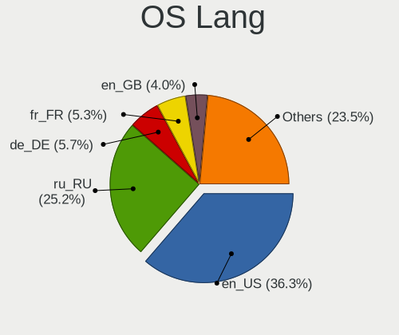
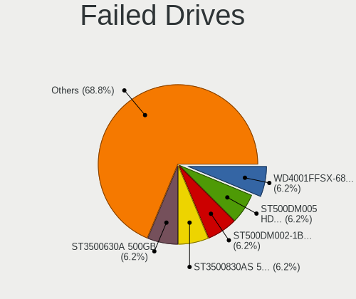
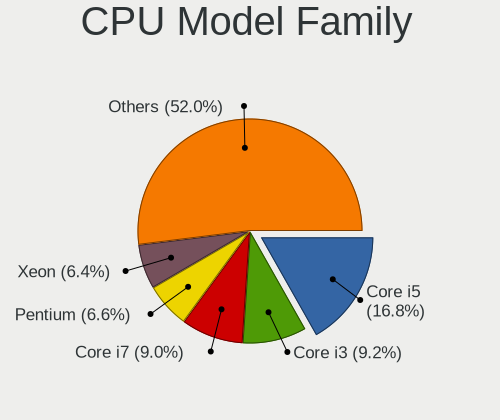
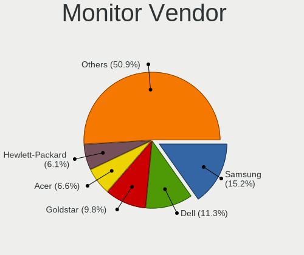
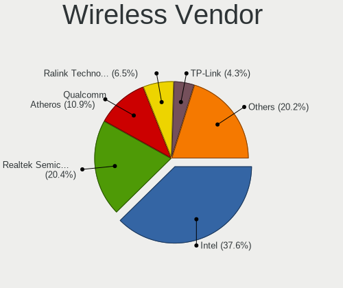

Debian 11 - Tested Hardware & Statistics (Desktops)
---------------------------------------------------

A project to collect tested hardware configurations for Debian 11 (Beta test).

Anyone can contribute to this report by the [hw-probe](https://github.com/linuxhw/hw-probe) tool:

    sudo -E hw-probe -all -upload

Please submit a probe of your configuration if it's not presented on the page or is rare.

Full-feature report is available here: https://linux-hardware.org/?view=trends&rel=debian-11

Contents
--------

* [ Test Cases ](#test-cases)

* [ System ](#system)
  - [ Kernel                   ](#kernel)
  - [ Kernel Family            ](#kernel-family)
  - [ Kernel Major Ver.        ](#kernel-major-ver)
  - [ Arch                     ](#arch)
  - [ DE                       ](#de)
  - [ Display Server           ](#display-server)
  - [ Display Manager          ](#display-manager)
  - [ OS Lang                  ](#os-lang)
  - [ Boot Mode                ](#boot-mode)
  - [ Filesystem               ](#filesystem)
  - [ Part. scheme             ](#part-scheme)
  - [ Dual Boot with Linux/BSD ](#dual-boot-with-linux-bsd)
  - [ Dual Boot (Win)          ](#dual-boot-win)

* [ Board ](#board)
  - [ Vendor                   ](#vendor)
  - [ Model                    ](#model)
  - [ Model Family             ](#model-family)
  - [ MFG Year                 ](#mfg-year)
  - [ Form Factor              ](#form-factor)
  - [ Secure Boot              ](#secure-boot)
  - [ Coreboot                 ](#coreboot)
  - [ RAM Size                 ](#ram-size)
  - [ RAM Used                 ](#ram-used)
  - [ Total Drives             ](#total-drives)
  - [ Has CD-ROM               ](#has-cd-rom)
  - [ Has Ethernet             ](#has-ethernet)
  - [ Has WiFi                 ](#has-wifi)
  - [ Has Bluetooth            ](#has-bluetooth)

* [ Location ](#location)
  - [ Country                  ](#country)
  - [ City                     ](#city)

* [ Drives ](#drives)
  - [ Drive Vendor             ](#drive-vendor)
  - [ Drive Model              ](#drive-model)
  - [ HDD Vendor               ](#hdd-vendor)
  - [ SSD Vendor               ](#ssd-vendor)
  - [ Drive Kind               ](#drive-kind)
  - [ Drive Connector          ](#drive-connector)
  - [ Drive Size               ](#drive-size)
  - [ Space Total              ](#space-total)
  - [ Space Used               ](#space-used)
  - [ Malfunc. Drives          ](#malfunc-drives)
  - [ Malfunc. Drive Vendor    ](#malfunc-drive-vendor)
  - [ Malfunc. HDD Vendor      ](#malfunc-hdd-vendor)
  - [ Malfunc. Drive Kind      ](#malfunc-drive-kind)
  - [ Failed Drives            ](#failed-drives)
  - [ Failed Drive Vendor      ](#failed-drive-vendor)
  - [ Drive Status             ](#drive-status)

* [ Storage controller ](#storage-controller)
  - [ Storage Vendor           ](#storage-vendor)
  - [ Storage Model            ](#storage-model)
  - [ Storage Kind             ](#storage-kind)

* [ Processor ](#processor)
  - [ CPU Vendor               ](#cpu-vendor)
  - [ CPU Model                ](#cpu-model)
  - [ CPU Model Family         ](#cpu-model-family)
  - [ CPU Cores                ](#cpu-cores)
  - [ CPU Sockets              ](#cpu-sockets)
  - [ CPU Threads              ](#cpu-threads)
  - [ CPU Op-Modes             ](#cpu-op-modes)
  - [ CPU Microcode            ](#cpu-microcode)
  - [ CPU Microarch            ](#cpu-microarch)

* [ Graphics ](#graphics)
  - [ GPU Vendor               ](#gpu-vendor)
  - [ GPU Model                ](#gpu-model)
  - [ GPU Combo                ](#gpu-combo)
  - [ GPU Driver               ](#gpu-driver)
  - [ GPU Memory               ](#gpu-memory)

* [ Monitor ](#monitor)
  - [ Monitor Vendor           ](#monitor-vendor)
  - [ Monitor Model            ](#monitor-model)
  - [ Monitor Resolution       ](#monitor-resolution)
  - [ Monitor Diagonal         ](#monitor-diagonal)
  - [ Monitor Width            ](#monitor-width)
  - [ Aspect Ratio             ](#aspect-ratio)
  - [ Monitor Area             ](#monitor-area)
  - [ Pixel Density            ](#pixel-density)
  - [ Multiple Monitors        ](#multiple-monitors)

* [ Network ](#network)
  - [ Net Controller Vendor    ](#net-controller-vendor)
  - [ Net Controller Model     ](#net-controller-model)
  - [ Wireless Vendor          ](#wireless-vendor)
  - [ Wireless Model           ](#wireless-model)
  - [ Ethernet Vendor          ](#ethernet-vendor)
  - [ Ethernet Model           ](#ethernet-model)
  - [ Net Controller Kind      ](#net-controller-kind)
  - [ Used Controller          ](#used-controller)
  - [ NICs                     ](#nics)
  - [ IPv6                     ](#ipv6)

* [ Bluetooth ](#bluetooth)
  - [ Bluetooth Vendor         ](#bluetooth-vendor)
  - [ Bluetooth Model          ](#bluetooth-model)

* [ Sound ](#sound)
  - [ Sound Vendor             ](#sound-vendor)
  - [ Sound Model              ](#sound-model)

* [ Memory ](#memory)
  - [ Memory Vendor            ](#memory-vendor)
  - [ Memory Model             ](#memory-model)
  - [ Memory Kind              ](#memory-kind)
  - [ Memory Form Factor       ](#memory-form-factor)
  - [ Memory Size              ](#memory-size)
  - [ Memory Speed             ](#memory-speed)

* [ Printers & scanners ](#printers-scanners)
  - [ Printer Vendor           ](#printer-vendor)
  - [ Printer Model            ](#printer-model)
  - [ Scanner Vendor           ](#scanner-vendor)
  - [ Scanner Model            ](#scanner-model)

* [ Camera ](#camera)
  - [ Camera Vendor            ](#camera-vendor)
  - [ Camera Model             ](#camera-model)

* [ Security ](#security)
  - [ Fingerprint Vendor       ](#fingerprint-vendor)
  - [ Fingerprint Model        ](#fingerprint-model)
  - [ Chipcard Vendor          ](#chipcard-vendor)
  - [ Chipcard Model           ](#chipcard-model)

* [ Unsupported ](#unsupported)
  - [ Unsupported Devices      ](#unsupported-devices)
  - [ Unsupported Device Types ](#unsupported-device-types)

Test Cases
----------

| Vendor     | Model                       | Probe                                                      | Date         |
|------------|-----------------------------|------------------------------------------------------------|--------------|
| Gigabyte   | B450M DS3H-CF               | [64b4d84778](https://linux-hardware.org/?probe=64b4d84778) | Jul 26, 2021 |
| ASUSTek    | B85-PRO GAMER               | [fffec5c87f](https://linux-hardware.org/?probe=fffec5c87f) | Jul 26, 2021 |
| ASUSTek    | M5A78L-M LX3                | [0b35b55294](https://linux-hardware.org/?probe=0b35b55294) | Jul 26, 2021 |
| Dell       | 0D28YY A02                  | [71b0f194a3](https://linux-hardware.org/?probe=71b0f194a3) | Jul 26, 2021 |
| ASRock     | H470M-ITX/ac                | [8a3b6cb663](https://linux-hardware.org/?probe=8a3b6cb663) | Jul 26, 2021 |
| ASUSTek    | M5A78L-M LX3                | [fcd103f100](https://linux-hardware.org/?probe=fcd103f100) | Jul 26, 2021 |
| ASUSTek    | PRIME B450M-A               | [00d53058e7](https://linux-hardware.org/?probe=00d53058e7) | Jul 26, 2021 |
| MSI        | B450 TOMAHAWK MAX II        | [d09fdc110f](https://linux-hardware.org/?probe=d09fdc110f) | Jul 25, 2021 |
| Gigabyte   | H110M-S2H-CF                | [11c5d6c6d0](https://linux-hardware.org/?probe=11c5d6c6d0) | Jul 25, 2021 |
| Dell       | 0PTTT9 A00                  | [113235448d](https://linux-hardware.org/?probe=113235448d) | Jul 25, 2021 |
| Dell       | 0X8DXD A00                  | [54b46bdd5d](https://linux-hardware.org/?probe=54b46bdd5d) | Jul 25, 2021 |
| ASUSTek    | PRIME H270M-PLUS            | [21b43b8718](https://linux-hardware.org/?probe=21b43b8718) | Jul 25, 2021 |
| Gigabyte   | Z170M-D3H-CF                | [9301420a7b](https://linux-hardware.org/?probe=9301420a7b) | Jul 25, 2021 |
| ASRock     | P67 Pro3                    | [ce711e5011](https://linux-hardware.org/?probe=ce711e5011) | Jul 25, 2021 |
| Supermicro | A1SA2-2750FA                | [de408d6408](https://linux-hardware.org/?probe=de408d6408) | Jul 25, 2021 |
| Gigabyte   | H87-HD3                     | [a102014ef0](https://linux-hardware.org/?probe=a102014ef0) | Jul 25, 2021 |
| ASUSTek    | ROG STRIX B450-I GAMING     | [dcff1a4a95](https://linux-hardware.org/?probe=dcff1a4a95) | Jul 25, 2021 |
| Gigabyte   | AB350M-DS3H V2-CF           | [8b1c4f962a](https://linux-hardware.org/?probe=8b1c4f962a) | Jul 25, 2021 |
| Dell       | 0Y1057                      | [ac342b01e2](https://linux-hardware.org/?probe=ac342b01e2) | Jul 25, 2021 |
| HP         | ProLiant MicroServer Gen... | [2bcfda70b5](https://linux-hardware.org/?probe=2bcfda70b5) | Jul 25, 2021 |
| ASRock     | B450M Pro4                  | [514f64cef0](https://linux-hardware.org/?probe=514f64cef0) | Jul 25, 2021 |
| ASRock     | Z97 Extreme6                | [84730f7819](https://linux-hardware.org/?probe=84730f7819) | Jul 25, 2021 |
| Lenovo     | 3098 0B98401 PRO            | [a5bb2fb53c](https://linux-hardware.org/?probe=a5bb2fb53c) | Jul 25, 2021 |
| HP         | 1495                        | [5d01240605](https://linux-hardware.org/?probe=5d01240605) | Jul 25, 2021 |
| HP         | 158A                        | [219b010ebb](https://linux-hardware.org/?probe=219b010ebb) | Jul 25, 2021 |
| HP         | 158A                        | [da4016cb27](https://linux-hardware.org/?probe=da4016cb27) | Jul 25, 2021 |
| ASUSTek    | H110M-A/M.2                 | [a98eb4deab](https://linux-hardware.org/?probe=a98eb4deab) | Jul 25, 2021 |
| Gigabyte   | H110N-CF                    | [2a85c9961c](https://linux-hardware.org/?probe=2a85c9961c) | Jul 25, 2021 |
| MSI        | MAG B550M MORTAR            | [b5e7cb3f3d](https://linux-hardware.org/?probe=b5e7cb3f3d) | Jul 25, 2021 |
| Dell       | 0X8DXD A00                  | [dd60e87813](https://linux-hardware.org/?probe=dd60e87813) | Jul 25, 2021 |
| HP         | 2129                        | [8de5bae655](https://linux-hardware.org/?probe=8de5bae655) | Jul 25, 2021 |
| Intel      | DP55WG AAE57269-407         | [fa1be73a3f](https://linux-hardware.org/?probe=fa1be73a3f) | Jul 25, 2021 |
| ASRock     | B85 Anniversary             | [b9bdc402ce](https://linux-hardware.org/?probe=b9bdc402ce) | Jul 25, 2021 |
| Gigabyte   | B550I AORUS PRO AX          | [db0c50510b](https://linux-hardware.org/?probe=db0c50510b) | Jul 25, 2021 |
| Gigabyte   | B550I AORUS PRO AX          | [c873d77069](https://linux-hardware.org/?probe=c873d77069) | Jul 25, 2021 |
| Gigabyte   | Z97X-UD3H-CF                | [6630c7ef27](https://linux-hardware.org/?probe=6630c7ef27) | Jul 25, 2021 |
| ASUSTek    | PRIME B250M-A               | [b0f56654dc](https://linux-hardware.org/?probe=b0f56654dc) | Jul 25, 2021 |
| ASRock     | B450M Pro4                  | [cd13d1596f](https://linux-hardware.org/?probe=cd13d1596f) | Jul 25, 2021 |
| ASRock     | B450M Pro4                  | [beec8a1c7d](https://linux-hardware.org/?probe=beec8a1c7d) | Jul 25, 2021 |
| Gigabyte   | H61MS                       | [742ede3c3e](https://linux-hardware.org/?probe=742ede3c3e) | Jul 25, 2021 |
| Gigabyte   | H81M-S2H GSM                | [f49c35b208](https://linux-hardware.org/?probe=f49c35b208) | Jul 25, 2021 |
| Dell       | 09KPNV A01                  | [fb6ec7188c](https://linux-hardware.org/?probe=fb6ec7188c) | Jul 25, 2021 |
| ASUSTek    | PRIME A320I-K               | [fca7acc5ee](https://linux-hardware.org/?probe=fca7acc5ee) | Jul 25, 2021 |
| ASUSTek    | H61M-K                      | [1cf0bdeec4](https://linux-hardware.org/?probe=1cf0bdeec4) | Jul 25, 2021 |
| Dell       | 0NK5PH A00                  | [d6444ebf26](https://linux-hardware.org/?probe=d6444ebf26) | Jul 25, 2021 |
| Gigabyte   | Z77-D3H                     | [522d784ace](https://linux-hardware.org/?probe=522d784ace) | Jul 25, 2021 |
| Intel      | DP55WB AAE64798-206         | [9c9e82f80f](https://linux-hardware.org/?probe=9c9e82f80f) | Jul 25, 2021 |
| Protectli  | FW6                         | [0efef10e76](https://linux-hardware.org/?probe=0efef10e76) | Jul 25, 2021 |
| ASUSTek    | ROG STRIX Z390-F GAMING     | [dd3347639f](https://linux-hardware.org/?probe=dd3347639f) | Jul 25, 2021 |
| Gigabyte   | X570 I AORUS PRO WIFI       | [f7c4474b4d](https://linux-hardware.org/?probe=f7c4474b4d) | Jul 25, 2021 |
| ASUSTek    | Z170-DELUXE                 | [df5c29f984](https://linux-hardware.org/?probe=df5c29f984) | Jul 25, 2021 |
| Gigabyte   | 970A-D3P                    | [c564faffdb](https://linux-hardware.org/?probe=c564faffdb) | Jul 25, 2021 |
| Dell       | 0D441T A03                  | [41283af596](https://linux-hardware.org/?probe=41283af596) | Jul 25, 2021 |
| MSI        | H110I PRO AC                | [08094a9121](https://linux-hardware.org/?probe=08094a9121) | Jul 25, 2021 |
| ASUSTek    | PRIME Z370-A                | [c7cf1f5978](https://linux-hardware.org/?probe=c7cf1f5978) | Jul 25, 2021 |
| ASUSTek    | H87-PRO                     | [293b556234](https://linux-hardware.org/?probe=293b556234) | Jul 25, 2021 |
| MSI        | Z77MA-G45                   | [bbc6d96681](https://linux-hardware.org/?probe=bbc6d96681) | Jul 25, 2021 |
| ASRock     | FM2A68M-DG3+                | [884f8f2850](https://linux-hardware.org/?probe=884f8f2850) | Jul 25, 2021 |
| ASUSTek    | ROG STRIX B450-F GAMING     | [1e8f9a7189](https://linux-hardware.org/?probe=1e8f9a7189) | Jul 24, 2021 |
| Gigabyte   | B560M D3H                   | [1456f9bf8e](https://linux-hardware.org/?probe=1456f9bf8e) | Jul 23, 2021 |
| ASUSTek    | ROG STRIX Z370-H GAMING     | [8af9716200](https://linux-hardware.org/?probe=8af9716200) | Jul 19, 2021 |
| ASUSTek    | P8Z68-V                     | [1a60e02aa9](https://linux-hardware.org/?probe=1a60e02aa9) | Jul 19, 2021 |
| HP         | ProLiant MicroServer        | [ca7c4b4967](https://linux-hardware.org/?probe=ca7c4b4967) | Jul 16, 2021 |
| MSI        | A68HM-E33 V2                | [983bc90bc7](https://linux-hardware.org/?probe=983bc90bc7) | Jul 14, 2021 |
| Huanan     | X99-F8 V2.0                 | [776f848ccd](https://linux-hardware.org/?probe=776f848ccd) | Jul 09, 2021 |
| Dell       | 0M863N A00                  | [574671bbb9](https://linux-hardware.org/?probe=574671bbb9) | Jul 09, 2021 |
| MSI        | MPG B550 GAMING PLUS        | [c79b71d033](https://linux-hardware.org/?probe=c79b71d033) | Jul 08, 2021 |
| ASUSTek    | H81M-E                      | [02c3ce63e7](https://linux-hardware.org/?probe=02c3ce63e7) | Jul 08, 2021 |
| HP         | 2215                        | [b0b56138b2](https://linux-hardware.org/?probe=b0b56138b2) | Jul 08, 2021 |
| HP         | 2215                        | [cdf48de6b2](https://linux-hardware.org/?probe=cdf48de6b2) | Jul 07, 2021 |
| MSI        | MS-6712                     | [ced0409e55](https://linux-hardware.org/?probe=ced0409e55) | Jul 04, 2021 |
| ASRock     | H77 Pro4-M                  | [8ba58cff9a](https://linux-hardware.org/?probe=8ba58cff9a) | Jul 02, 2021 |
| Gigabyte   | B550I AORUS PRO AX          | [cb62272a68](https://linux-hardware.org/?probe=cb62272a68) | Jul 02, 2021 |
| Gigabyte   | AX370-Gaming K7             | [e325df530d](https://linux-hardware.org/?probe=e325df530d) | Jun 30, 2021 |
| MSI        | B85M-G43                    | [4598afdf7e](https://linux-hardware.org/?probe=4598afdf7e) | Jun 29, 2021 |
| Huanan     | X99-8M-F V1.1               | [8ecfcffbaf](https://linux-hardware.org/?probe=8ecfcffbaf) | Jun 27, 2021 |
| ASRock     | FM2A68M-HD+                 | [f435417b41](https://linux-hardware.org/?probe=f435417b41) | Jun 26, 2021 |
| Gigabyte   | Z370 AORUS Gaming 5-CF      | [807a4ba37d](https://linux-hardware.org/?probe=807a4ba37d) | Jun 23, 2021 |
| Gigabyte   | Z370 AORUS Gaming 5-CF      | [bc7246038e](https://linux-hardware.org/?probe=bc7246038e) | Jun 23, 2021 |
| ASRock     | B550 Pro4                   | [ef1b7bfb77](https://linux-hardware.org/?probe=ef1b7bfb77) | Jun 23, 2021 |
| ASRock     | X399 Taichi                 | [a664e4cf99](https://linux-hardware.org/?probe=a664e4cf99) | Jun 23, 2021 |
| HARDKERNEL | ODROID-H2                   | [c9fed56a36](https://linux-hardware.org/?probe=c9fed56a36) | Jun 23, 2021 |
| ASUSTek    | ROG STRIX B450-F GAMING ... | [b3a5333d2a](https://linux-hardware.org/?probe=b3a5333d2a) | Jun 21, 2021 |
| Gigabyte   | AB350M-Gaming 3-CF          | [08fc06c75e](https://linux-hardware.org/?probe=08fc06c75e) | Jun 20, 2021 |
| MSI        | B450M MORTAR MAX            | [33ffb80782](https://linux-hardware.org/?probe=33ffb80782) | Jun 19, 2021 |
| ASUSTek    | ROG STRIX B450-F GAMING ... | [9e3e72ec72](https://linux-hardware.org/?probe=9e3e72ec72) | Jun 17, 2021 |
| ASUSTek    | PRIME B450M-A               | [0ccc446224](https://linux-hardware.org/?probe=0ccc446224) | Jun 14, 2021 |
| Gigabyte   | MCMLUAB-00                  | [99780e8ba8](https://linux-hardware.org/?probe=99780e8ba8) | Jun 13, 2021 |
| ASUSTek    | PRIME A320M-K               | [f2770a810e](https://linux-hardware.org/?probe=f2770a810e) | Jun 12, 2021 |
| Dell       | 0Y7WYT A00                  | [8e424773e5](https://linux-hardware.org/?probe=8e424773e5) | Jun 10, 2021 |
| ASUSTek    | Z97-AR                      | [709a74c713](https://linux-hardware.org/?probe=709a74c713) | Jun 09, 2021 |
| ASRock     | B450M Pro4                  | [ee4dfdfde3](https://linux-hardware.org/?probe=ee4dfdfde3) | Jun 08, 2021 |
| ASUSTek    | PRIME A320M-K               | [69dd9fbe20](https://linux-hardware.org/?probe=69dd9fbe20) | Jun 07, 2021 |
| ASRock     | B450M Pro4                  | [0fd993c4dd](https://linux-hardware.org/?probe=0fd993c4dd) | Jun 05, 2021 |
| ASUSTek    | M4A88T-M/USB3               | [7483847993](https://linux-hardware.org/?probe=7483847993) | Jun 03, 2021 |
| Dell       | 0YXT71 A02                  | [a45729e01a](https://linux-hardware.org/?probe=a45729e01a) | Jun 01, 2021 |
| ASUSTek    | PRIME B550-PLUS             | [21574f62a5](https://linux-hardware.org/?probe=21574f62a5) | Jun 01, 2021 |
| ASUSTek    | P5B-Deluxe                  | [926229be87](https://linux-hardware.org/?probe=926229be87) | May 31, 2021 |
| Gigabyte   | B450 AORUS PRO WIFI-CF      | [24d2e85009](https://linux-hardware.org/?probe=24d2e85009) | May 29, 2021 |
| MSI        | B250M BAZOOKA               | [fb2eef67f2](https://linux-hardware.org/?probe=fb2eef67f2) | May 26, 2021 |
| MSI        | B450I GAMING PLUS AC        | [2c698534c6](https://linux-hardware.org/?probe=2c698534c6) | May 23, 2021 |
| Gigabyte   | AB350M-D3H-CF               | [1ad175fddc](https://linux-hardware.org/?probe=1ad175fddc) | May 23, 2021 |
| Gigabyte   | Z170X-GamingG1              | [361469c7d5](https://linux-hardware.org/?probe=361469c7d5) | May 18, 2021 |
| Gigabyte   | Z77-D3H                     | [71f4ed3e35](https://linux-hardware.org/?probe=71f4ed3e35) | May 11, 2021 |
| Lenovo     | MAHOBAY                     | [c0b8e99e35](https://linux-hardware.org/?probe=c0b8e99e35) | May 06, 2021 |
| Biostar    | B450MH                      | [f0a1151d81](https://linux-hardware.org/?probe=f0a1151d81) | Apr 27, 2021 |
| Gigabyte   | EG41MF-US2H                 | [a2aa6eaec8](https://linux-hardware.org/?probe=a2aa6eaec8) | Apr 16, 2021 |

System
------

Kernel
------

Version of the Linux kernel

| Version                        | Desktops | Percent |
|--------------------------------|----------|---------|
| 5.10.0-8-amd64                 | 45       | 45%     |
| 5.10.0-7-amd64                 | 35       | 35%     |
| 5.10.0-6-amd64                 | 9        | 9%      |
| 5.11.22-1-pve                  | 2        | 2%      |
| 5.8.0-3-amd64                  | 1        | 1%      |
| 5.13.0-rc7-00024-g0418ae8de752 | 1        | 1%      |
| 5.11.22-2-pve                  | 1        | 1%      |
| 5.11.0-21.1-liquorix-amd64     | 1        | 1%      |
| 5.11.0-16.1-liquorix-amd64     | 1        | 1%      |
| 5.10.0-8-686                   | 1        | 1%      |
| 5.10.0-7-686-pae               | 1        | 1%      |
| 5.10.0-3-amd64                 | 1        | 1%      |
| 5.10.0-2-amd64                 | 1        | 1%      |

Kernel Family
-------------

Linux kernel without a distro release

| Version | Desktops | Percent |
|---------|----------|---------|
| 5.10.0  | 92       | 92.93%  |
| 5.11.22 | 3        | 3.03%   |
| 5.11.0  | 2        | 2.02%   |
| 5.8.0   | 1        | 1.01%   |
| 5.13.0  | 1        | 1.01%   |

Kernel Major Ver.
-----------------

Linux kernel major version

| Version | Desktops | Percent |
|---------|----------|---------|
| 5.10    | 92       | 92.93%  |
| 5.11    | 5        | 5.05%   |
| 5.8     | 1        | 1.01%   |
| 5.13    | 1        | 1.01%   |

Arch
----

OS architecture (x86_64, i586, etc.)

| Name   | Desktops | Percent |
|--------|----------|---------|
| x86_64 | 97       | 97.98%  |
| i686   | 2        | 2.02%   |

DE
--

Desktop Environment

| Name             | Desktops | Percent |
|------------------|----------|---------|
| GNOME            | 22       | 22%     |
| KDE5             | 19       | 19%     |
| MATE             | 13       | 13%     |
| XFCE             | 11       | 11%     |
| Unknown          | 10       | 10%     |
| i3               | 5        | 5%      |
| KDE              | 4        | 4%      |
| LXQt             | 3        | 3%      |
| Cinnamon         | 3        | 3%      |
| X-Cinnamon       | 2        | 2%      |
| LXDE             | 2        | 2%      |
| Trinity          | 1        | 1%      |
| sway             | 1        | 1%      |
| lightdm-xsession | 1        | 1%      |
| GNUstep          | 1        | 1%      |
| GNOME Flashback  | 1        | 1%      |
| Budgie           | 1        | 1%      |

Display Server
--------------

X11 or Wayland

| Name    | Desktops | Percent |
|---------|----------|---------|
| X11     | 71       | 71.72%  |
| Tty     | 13       | 13.13%  |
| Wayland | 11       | 11.11%  |
| Unknown | 4        | 4.04%   |

Display Manager
---------------

SDDM, LightDM, etc.

| Name    | Desktops | Percent |
|---------|----------|---------|
| TDM     | 34       | 34%     |
| Unknown | 22       | 22%     |
| GDM     | 21       | 21%     |
| SDDM    | 15       | 15%     |
| LightDM | 5        | 5%      |
| SLiM    | 2        | 2%      |
| XDM     | 1        | 1%      |

OS Lang
-------

Language

| Lang    | Desktops | Percent |
|---------|----------|---------|
| en_US   | 48       | 48.48%  |
| fr_FR   | 8        | 8.08%   |
| en_GB   | 6        | 6.06%   |
| de_DE   | 5        | 5.05%   |
| C       | 4        | 4.04%   |
| ru_RU   | 3        | 3.03%   |
| pt_BR   | 3        | 3.03%   |
| pl_PL   | 3        | 3.03%   |
| en_CA   | 3        | 3.03%   |
| nl_BE   | 2        | 2.02%   |
| es_ES   | 2        | 2.02%   |
| en_AU   | 2        | 2.02%   |
| Unknown | 2        | 2.02%   |
| sv_SE   | 1        | 1.01%   |
| sr_RS   | 1        | 1.01%   |
| ru_UA   | 1        | 1.01%   |
| ro_RO   | 1        | 1.01%   |
| hu_HU   | 1        | 1.01%   |
| es_AR   | 1        | 1.01%   |
| en_PH   | 1        | 1.01%   |
| en_IN   | 1        | 1.01%   |

Boot Mode
---------

EFI or BIOS

| Mode | Desktops | Percent |
|------|----------|---------|
| EFI  | 51       | 51%     |
| BIOS | 49       | 49%     |

Filesystem
----------

Type of filesystem

| Type    | Desktops | Percent |
|---------|----------|---------|
| Ext4    | 78       | 78.79%  |
| Btrfs   | 8        | 8.08%   |
| Overlay | 5        | 5.05%   |
| Ext3    | 4        | 4.04%   |
| Zfs     | 3        | 3.03%   |
| Xfs     | 1        | 1.01%   |

Part. scheme
------------

Scheme of partitioning

| Type    | Desktops | Percent |
|---------|----------|---------|
| GPT     | 64       | 64%     |
| MBR     | 23       | 23%     |
| Unknown | 13       | 13%     |

Dual Boot with Linux/BSD
------------------------

Hosting more than one Linux/BSD

| Dual boot | Desktops | Percent |
|-----------|----------|---------|
| No        | 71       | 71.72%  |
| Yes       | 28       | 28.28%  |

Dual Boot (Win)
---------------

Hosting Linux and Windows

| Dual boot | Desktops | Percent |
|-----------|----------|---------|
| No        | 73       | 73%     |
| Yes       | 27       | 27%     |

Board
-----

Vendor
------

Motherboard manufacturer

| Name                | Desktops | Percent |
|---------------------|----------|---------|
| Gigabyte Technology | 26       | 26.26%  |
| ASUSTek Computer    | 24       | 24.24%  |
| ASRock              | 12       | 12.12%  |
| MSI                 | 10       | 10.1%   |
| Dell                | 10       | 10.1%   |
| Hewlett-Packard     | 7        | 7.07%   |
| Lenovo              | 2        | 2.02%   |
| Intel               | 2        | 2.02%   |
| Huanan              | 2        | 2.02%   |
| Supermicro          | 1        | 1.01%   |
| Protectli           | 1        | 1.01%   |
| HARDKERNEL          | 1        | 1.01%   |
| Biostar             | 1        | 1.01%   |

Model
-----

Motherboard model

| Name                              | Desktops | Percent |
|-----------------------------------|----------|---------|
| ASUS All Series                   | 4        | 4.04%   |
| Gigabyte B550I AORUS PRO AX       | 3        | 3.03%   |
| ASRock B450M Pro4                 | 3        | 3.03%   |
| HP Z620 Workstation               | 2        | 2.02%   |
| Gigabyte Z77-D3H                  | 2        | 2.02%   |
| Gigabyte Z370 AORUS Gaming 5      | 2        | 2.02%   |
| ASUS PRIME B450M-A                | 2        | 2.02%   |
| Supermicro SYS-5038MA-H24TRF      | 1        | 1.01%   |
| Protectli FW6                     | 1        | 1.01%   |
| MSI MS-7C94                       | 1        | 1.01%   |
| MSI MS-7C56                       | 1        | 1.01%   |
| MSI MS-7B89                       | 1        | 1.01%   |
| MSI MS-7A70                       | 1        | 1.01%   |
| MSI MS-7A40                       | 1        | 1.01%   |
| MSI MS-7995                       | 1        | 1.01%   |
| MSI MS-7823                       | 1        | 1.01%   |
| MSI MS-7759                       | 1        | 1.01%   |
| MSI MS-7721                       | 1        | 1.01%   |
| MSI MS-6712                       | 1        | 1.01%   |
| Lenovo ThinkCentre M92p 3209EK4   | 1        | 1.01%   |
| Lenovo ThinkCentre M73 10B00005US | 1        | 1.01%   |
| Intel DP55WG AAE57269-407         | 1        | 1.01%   |
| Intel DP55WB AAE64798-206         | 1        | 1.01%   |
| Huanan X99-F8                     | 1        | 1.01%   |
| Huanan X99-8M-F V1.1              | 1        | 1.01%   |
| HP Z840 Workstation               | 1        | 1.01%   |
| HP ProLiant MicroServer Gen8      | 1        | 1.01%   |
| HP ProLiant MicroServer           | 1        | 1.01%   |
| HP EliteDesk 705 G1 SFF           | 1        | 1.01%   |
| HP Compaq 8200 Elite SFF PC       | 1        | 1.01%   |
| HARDKERNEL ODROID-H2              | 1        | 1.01%   |
| Gigabyte Z97X-UD3H                | 1        | 1.01%   |
| Gigabyte Z170X-GamingG1           | 1        | 1.01%   |
| Gigabyte Z170M-D3H                | 1        | 1.01%   |
| Gigabyte X570 I AORUS PRO WIFI    | 1        | 1.01%   |
| Gigabyte H87-HD3                  | 1        | 1.01%   |
| Gigabyte H81M-S2H GSM             | 1        | 1.01%   |
| Gigabyte H61MS                    | 1        | 1.01%   |
| Gigabyte H110N                    | 1        | 1.01%   |
| Gigabyte H110M-S2H                | 1        | 1.01%   |
| Gigabyte EG41MF-US2H              | 1        | 1.01%   |
| Gigabyte BRi7(H)-10710            | 1        | 1.01%   |
| Gigabyte B560M D3H                | 1        | 1.01%   |
| Gigabyte B450M DS3H               | 1        | 1.01%   |
| Gigabyte B450 AORUS PRO WIFI      | 1        | 1.01%   |
| Gigabyte AX370-Gaming K7          | 1        | 1.01%   |
| Gigabyte AB350M-Gaming 3          | 1        | 1.01%   |
| Gigabyte AB350M-DS3H V2           | 1        | 1.01%   |
| Gigabyte AB350M-D3H               | 1        | 1.01%   |
| Gigabyte 970A-D3P                 | 1        | 1.01%   |
| Dell Precision WorkStation T3500  | 1        | 1.01%   |
| Dell Precision Tower 7910         | 1        | 1.01%   |
| Dell Precision T3600              | 1        | 1.01%   |
| Dell Precision 5820 Tower         | 1        | 1.01%   |
| Dell OptiPlex GX270               | 1        | 1.01%   |
| Dell OptiPlex 980                 | 1        | 1.01%   |
| Dell OptiPlex 790                 | 1        | 1.01%   |
| Dell OptiPlex 760                 | 1        | 1.01%   |
| Dell OptiPlex 7040                | 1        | 1.01%   |
| Dell OptiPlex 7010                | 1        | 1.01%   |

Model Family
------------

Motherboard model prefix

| Name                         | Desktops | Percent |
|------------------------------|----------|---------|
| ASUS PRIME                   | 8        | 8.08%   |
| Dell OptiPlex                | 6        | 6.06%   |
| ASUS ROG                     | 5        | 5.05%   |
| Dell Precision               | 4        | 4.04%   |
| ASUS All                     | 4        | 4.04%   |
| Gigabyte B550I               | 3        | 3.03%   |
| ASRock B450M                 | 3        | 3.03%   |
| Lenovo ThinkCentre           | 2        | 2.02%   |
| HP Z620                      | 2        | 2.02%   |
| HP ProLiant                  | 2        | 2.02%   |
| Gigabyte Z77-D3H             | 2        | 2.02%   |
| Gigabyte Z370                | 2        | 2.02%   |
| Supermicro SYS-5038MA-H24TRF | 1        | 1.01%   |
| Protectli FW6                | 1        | 1.01%   |
| MSI MS-7C94                  | 1        | 1.01%   |
| MSI MS-7C56                  | 1        | 1.01%   |
| MSI MS-7B89                  | 1        | 1.01%   |
| MSI MS-7A70                  | 1        | 1.01%   |
| MSI MS-7A40                  | 1        | 1.01%   |
| MSI MS-7995                  | 1        | 1.01%   |
| MSI MS-7823                  | 1        | 1.01%   |
| MSI MS-7759                  | 1        | 1.01%   |
| MSI MS-7721                  | 1        | 1.01%   |
| MSI MS-6712                  | 1        | 1.01%   |
| Intel DP55WG                 | 1        | 1.01%   |
| Intel DP55WB                 | 1        | 1.01%   |
| Huanan X99-F8                | 1        | 1.01%   |
| Huanan X99-8M-F              | 1        | 1.01%   |
| HP Z840                      | 1        | 1.01%   |
| HP EliteDesk                 | 1        | 1.01%   |
| HP Compaq                    | 1        | 1.01%   |
| HARDKERNEL ODROID-H2         | 1        | 1.01%   |
| Gigabyte Z97X-UD3H           | 1        | 1.01%   |
| Gigabyte Z170X-GamingG1      | 1        | 1.01%   |
| Gigabyte Z170M-D3H           | 1        | 1.01%   |
| Gigabyte X570                | 1        | 1.01%   |
| Gigabyte H87-HD3             | 1        | 1.01%   |
| Gigabyte H81M-S2H            | 1        | 1.01%   |
| Gigabyte H61MS               | 1        | 1.01%   |
| Gigabyte H110N               | 1        | 1.01%   |
| Gigabyte H110M-S2H           | 1        | 1.01%   |
| Gigabyte EG41MF-US2H         | 1        | 1.01%   |
| Gigabyte BRi7(H)-10710       | 1        | 1.01%   |
| Gigabyte B560M               | 1        | 1.01%   |
| Gigabyte B450M               | 1        | 1.01%   |
| Gigabyte B450                | 1        | 1.01%   |
| Gigabyte AX370-Gaming        | 1        | 1.01%   |
| Gigabyte AB350M-Gaming       | 1        | 1.01%   |
| Gigabyte AB350M-DS3H         | 1        | 1.01%   |
| Gigabyte AB350M-D3H          | 1        | 1.01%   |
| Gigabyte 970A-D3P            | 1        | 1.01%   |
| Biostar B450MH               | 1        | 1.01%   |
| ASUS Z170-DELUXE             | 1        | 1.01%   |
| ASUS P8Z68-V                 | 1        | 1.01%   |
| ASUS P5B-Deluxe              | 1        | 1.01%   |
| ASUS M5A78L-M                | 1        | 1.01%   |
| ASUS M4A88T-M                | 1        | 1.01%   |
| ASUS H61M-K                  | 1        | 1.01%   |
| ASUS H110M-A                 | 1        | 1.01%   |
| ASRock Z97                   | 1        | 1.01%   |

MFG Year
--------

Motherboard manufacture year

| Year | Desktops | Percent |
|------|----------|---------|
| 2020 | 21       | 21.21%  |
| 2019 | 14       | 14.14%  |
| 2018 | 13       | 13.13%  |
| 2021 | 10       | 10.1%   |
| 2014 | 8        | 8.08%   |
| 2016 | 7        | 7.07%   |
| 2012 | 7        | 7.07%   |
| 2015 | 4        | 4.04%   |
| 2010 | 4        | 4.04%   |
| 2013 | 3        | 3.03%   |
| 2017 | 2        | 2.02%   |
| 2011 | 2        | 2.02%   |
| 2009 | 1        | 1.01%   |
| 2007 | 1        | 1.01%   |
| 2006 | 1        | 1.01%   |
| 2001 | 1        | 1.01%   |

Form Factor
-----------

Physical design of the computer

| Name    | Desktops | Percent |
|---------|----------|---------|
| Desktop | 99       | 100%    |

Secure Boot
-----------

Enabled or disabled

| State    | Desktops | Percent |
|----------|----------|---------|
| Disabled | 96       | 96.97%  |
| Enabled  | 3        | 3.03%   |

Coreboot
--------

Have coreboot on board

| Used | Desktops | Percent |
|------|----------|---------|
| No   | 98       | 98.99%  |
| Yes  | 1        | 1.01%   |

RAM Size
--------

Total RAM memory

| Size in GB      | Desktops | Percent |
|-----------------|----------|---------|
| 16.01-24.0      | 36       | 36.36%  |
| 32.01-64.0      | 17       | 17.17%  |
| 8.01-16.0       | 17       | 17.17%  |
| 64.01-256.0     | 13       | 13.13%  |
| 4.01-8.0        | 8        | 8.08%   |
| 3.01-4.0        | 4        | 4.04%   |
| 1.01-2.0        | 2        | 2.02%   |
| More than 256.0 | 1        | 1.01%   |
| 2.01-3.0        | 1        | 1.01%   |

RAM Used
--------

Used RAM memory

| Used GB    | Desktops | Percent |
|------------|----------|---------|
| 4.01-8.0   | 18       | 18.18%  |
| 3.01-4.0   | 18       | 18.18%  |
| 2.01-3.0   | 15       | 15.15%  |
| 1.01-2.0   | 13       | 13.13%  |
| 8.01-16.0  | 13       | 13.13%  |
| 0.51-1.0   | 9        | 9.09%   |
| 16.01-24.0 | 4        | 4.04%   |
| 0.01-0.5   | 4        | 4.04%   |
| 24.01-32.0 | 3        | 3.03%   |
| 32.01-64.0 | 2        | 2.02%   |

Total Drives
------------

Number of drives on board

| Drives | Desktops | Percent |
|--------|----------|---------|
| 2      | 28       | 28.28%  |
| 1      | 24       | 24.24%  |
| 3      | 21       | 21.21%  |
| 4      | 12       | 12.12%  |
| 5      | 8        | 8.08%   |
| 8      | 3        | 3.03%   |
| 9      | 2        | 2.02%   |
| 6      | 1        | 1.01%   |

Has CD-ROM
----------

Has CD-ROM on board

| Presented | Desktops | Percent |
|-----------|----------|---------|
| Yes       | 50       | 50.51%  |
| No        | 49       | 49.49%  |

Has Ethernet
------------

Has Ethernet on board

| Presented | Desktops | Percent |
|-----------|----------|---------|
| Yes       | 98       | 98.99%  |
| No        | 1        | 1.01%   |

Has WiFi
--------

Has WiFi module

| Presented | Desktops | Percent |
|-----------|----------|---------|
| No        | 64       | 64.65%  |
| Yes       | 35       | 35.35%  |

Has Bluetooth
-------------

Has Bluetooth module

| Presented | Desktops | Percent |
|-----------|----------|---------|
| No        | 75       | 75.76%  |
| Yes       | 24       | 24.24%  |

Location
--------

Country
-------

Geographic location (country)

| Country       | Desktops | Percent |
|---------------|----------|---------|
| USA           | 23       | 23.23%  |
| France        | 10       | 10.1%   |
| Germany       | 8        | 8.08%   |
| UK            | 6        | 6.06%   |
| Russia        | 5        | 5.05%   |
| Poland        | 5        | 5.05%   |
| Ukraine       | 4        | 4.04%   |
| Spain         | 4        | 4.04%   |
| Mexico        | 3        | 3.03%   |
| Brazil        | 3        | 3.03%   |
| Australia     | 3        | 3.03%   |
| Sweden        | 2        | 2.02%   |
| Hungary       | 2        | 2.02%   |
| Canada        | 2        | 2.02%   |
| Bulgaria      | 2        | 2.02%   |
| Belgium       | 2        | 2.02%   |
| Argentina     | 2        | 2.02%   |
| Syria         | 1        | 1.01%   |
| Singapore     | 1        | 1.01%   |
| Serbia        | 1        | 1.01%   |
| Norway        | 1        | 1.01%   |
| New Caledonia | 1        | 1.01%   |
| Netherlands   | 1        | 1.01%   |
| Madagascar    | 1        | 1.01%   |
| Italy         | 1        | 1.01%   |
| India         | 1        | 1.01%   |
| Finland       | 1        | 1.01%   |
| Ecuador       | 1        | 1.01%   |
| Czechia       | 1        | 1.01%   |
| Austria       | 1        | 1.01%   |

City
----

Geographic location (city)

| City                        | Desktops | Percent |
|-----------------------------|----------|---------|
| Lyon                        | 3        | 3.03%   |
| Ensenada                    | 3        | 3.03%   |
| Warsaw                      | 2        | 2.02%   |
| Sofia                       | 2        | 2.02%   |
| New York                    | 2        | 2.02%   |
| Las Vegas                   | 2        | 2.02%   |
| Kyiv                        | 2        | 2.02%   |
| Érd                        | 1        | 1.01%   |
| Woolloongabba               | 1        | 1.01%   |
| Woodstock                   | 1        | 1.01%   |
| Waregem                     | 1        | 1.01%   |
| Vienna                      | 1        | 1.01%   |
| Vancouver                   | 1        | 1.01%   |
| Vaasa                       | 1        | 1.01%   |
| Ulyanovsk                   | 1        | 1.01%   |
| Toulouse                    | 1        | 1.01%   |
| Thionville                  | 1        | 1.01%   |
| Stroud                      | 1        | 1.01%   |
| Strasbourg                  | 1        | 1.01%   |
| Stockholm                   | 1        | 1.01%   |
| Stavanger                   | 1        | 1.01%   |
| Sosnowiec                   | 1        | 1.01%   |
| Singapore                   | 1        | 1.01%   |
| San Francisco               | 1        | 1.01%   |
| San Cristóbal de La Laguna | 1        | 1.01%   |
| Saint-Denis                 | 1        | 1.01%   |
| Rochester                   | 1        | 1.01%   |
| Ribeirao Pires              | 1        | 1.01%   |
| Prague                      | 1        | 1.01%   |
| Phoenix                     | 1        | 1.01%   |
| Pforzheim                   | 1        | 1.01%   |
| Perth                       | 1        | 1.01%   |
| Perm                        | 1        | 1.01%   |
| Paris                       | 1        | 1.01%   |
| Orlando                     | 1        | 1.01%   |
| Oleksandrivka               | 1        | 1.01%   |
| Oldham                      | 1        | 1.01%   |
| Ocala                       | 1        | 1.01%   |
| Noumea                      | 1        | 1.01%   |
| Noblesville                 | 1        | 1.01%   |
| New Orleans                 | 1        | 1.01%   |
| Mytishchi                   | 1        | 1.01%   |
| Mesa                        | 1        | 1.01%   |
| Mannheim                    | 1        | 1.01%   |
| Mairena del Aljarafe        | 1        | 1.01%   |
| Madrid                      | 1        | 1.01%   |
| Lublin                      | 1        | 1.01%   |
| London                      | 1        | 1.01%   |
| Langenhagen                 | 1        | 1.01%   |
| Kozhikode                   | 1        | 1.01%   |
| Kiel                        | 1        | 1.01%   |
| Kharkiv                     | 1        | 1.01%   |
| Khabarovsk                  | 1        | 1.01%   |
| Kalamazoo                   | 1        | 1.01%   |
| High Wycombe                | 1        | 1.01%   |
| Hanover                     | 1        | 1.01%   |
| Hallstavik                  | 1        | 1.01%   |
| Gyomro                      | 1        | 1.01%   |
| Great Malvern               | 1        | 1.01%   |
| Gloucester                  | 1        | 1.01%   |

Drives
------

Drive Vendor
------------

Hard drive vendors

| Vendor              | Desktops | Drives | Percent |
|---------------------|----------|--------|---------|
| WDC                 | 42       | 64     | 22.22%  |
| Seagate             | 36       | 62     | 19.05%  |
| Samsung Electronics | 25       | 36     | 13.23%  |
| Toshiba             | 13       | 25     | 6.88%   |
| Crucial             | 13       | 15     | 6.88%   |
| Kingston            | 8        | 9      | 4.23%   |
| Hitachi             | 8        | 9      | 4.23%   |
| SanDisk             | 7        | 9      | 3.7%    |
| Intel               | 7        | 14     | 3.7%    |
| HGST                | 5        | 7      | 2.65%   |
| A-DATA Technology   | 4        | 6      | 2.12%   |
| Gigabyte Technology | 3        | 3      | 1.59%   |
| Unknown             | 2        | 2      | 1.06%   |
| SPCC                | 2        | 2      | 1.06%   |
| PNY                 | 2        | 2      | 1.06%   |
| Phison Electronics  | 2        | 2      | 1.06%   |
| Transcend           | 1        | 2      | 0.53%   |
| Team                | 1        | 1      | 0.53%   |
| SK Hynix            | 1        | 2      | 0.53%   |
| Phison              | 1        | 1      | 0.53%   |
| Patriot             | 1        | 1      | 0.53%   |
| MaxDigital          | 1        | 2      | 0.53%   |
| KingDian            | 1        | 1      | 0.53%   |
| Intenso             | 1        | 1      | 0.53%   |
| Corsair             | 1        | 1      | 0.53%   |
| China               | 1        | 1      | 0.53%   |

Drive Model
-----------

Hard drive models

| Model                            | Desktops | Percent |
|----------------------------------|----------|---------|
| Samsung SSD 860 EVO 1TB          | 5        | 2.17%   |
| WDC WDS500G3X0C-00SJG0 500GB     | 3        | 1.3%    |
| WDC WDS500G2B0A-00SM50 500GB SSD | 3        | 1.3%    |
| WDC WDS120G2G0A-00JH30 120GB SSD | 3        | 1.3%    |
| Toshiba HDWD110 1TB              | 3        | 1.3%    |
| Samsung SSD 970 EVO Plus 500GB   | 3        | 1.3%    |
| Samsung SSD 970 EVO Plus 1TB     | 3        | 1.3%    |
| Hitachi HUS724040ALE641 4TB      | 3        | 1.3%    |
| WDC WDS500G2B0C-00PXH0 500GB     | 2        | 0.87%   |
| WDC WD20EFRX-68EUZN0 2TB         | 2        | 0.87%   |
| WDC WD20EARX-00PASB0 2TB         | 2        | 0.87%   |
| WDC WD10EZEX-08WN4A0 1TB         | 2        | 0.87%   |
| WDC WD10EFRX-68FYTN0 1TB         | 2        | 0.87%   |
| Toshiba DT01ACA300 3TB           | 2        | 0.87%   |
| Toshiba DT01ACA200 2TB           | 2        | 0.87%   |
| Seagate ST500DM002-1BD142 500GB  | 2        | 0.87%   |
| Seagate ST4000DM004-2CV104 4TB   | 2        | 0.87%   |
| Seagate ST3000DM001-1CH166 3TB   | 2        | 0.87%   |
| Seagate ST2000DM008-2FR102 2TB   | 2        | 0.87%   |
| Seagate ST2000DM006-2DM164 2TB   | 2        | 0.87%   |
| Seagate ST1000DM010-2EP102 1TB   | 2        | 0.87%   |
| Seagate ST1000DM003-1CH162 1TB   | 2        | 0.87%   |
| Seagate BUP Slim BL 2TB          | 2        | 0.87%   |
| Sandisk NVMe SSD Drive 1TB       | 2        | 0.87%   |
| Samsung SSD 970 EVO 500GB        | 2        | 0.87%   |
| Samsung SSD 860 EVO 2TB          | 2        | 0.87%   |
| Samsung SSD 860 EVO 250GB        | 2        | 0.87%   |
| Samsung SSD 850 EVO 500GB        | 2        | 0.87%   |
| Samsung SSD 850 EVO 250GB        | 2        | 0.87%   |
| Samsung SSD 840 PRO Series 256GB | 2        | 0.87%   |
| Samsung HD103SJ 1TB              | 2        | 0.87%   |
| Phison PCIe SSD 512GB            | 2        | 0.87%   |
| Kingston SV300S37A240G 240GB SSD | 2        | 0.87%   |
| Kingston SV300S37A120G 120GB SSD | 2        | 0.87%   |
| Kingston SUV500240G 240GB SSD    | 2        | 0.87%   |
| Intel NVMe SSD Drive 1024GB      | 2        | 0.87%   |
| Intel MEMPEK1J016GAL 16GB        | 2        | 0.87%   |
| Crucial CT500P1SSD8 500GB        | 2        | 0.87%   |
| Crucial CT500MX500SSD1 500GB     | 2        | 0.87%   |
| WDC WUH721414ALE6L4 14TB         | 1        | 0.43%   |
| WDC WDS250G1B0A-00H9H0 250GB SSD | 1        | 0.43%   |
| WDC WDS200T2B0B-00YS70 2TB SSD   | 1        | 0.43%   |
| WDC WDBRPG5000ANC-WRSN 500GB     | 1        | 0.43%   |
| WDC WD6001FZWX-00A2VA0 6TB       | 1        | 0.43%   |
| WDC WD5003ABYX-18WERA0 500GB     | 1        | 0.43%   |
| WDC WD5000AZRX-00A8LB0 500GB     | 1        | 0.43%   |
| WDC WD5000AVCS-632DY1 500GB      | 1        | 0.43%   |
| WDC WD5000AAKX-00ERMA0 500GB     | 1        | 0.43%   |
| WDC WD5000AAKS-22V1A0 500GB      | 1        | 0.43%   |
| WDC WD5000AAJS-22A8B0 500GB      | 1        | 0.43%   |
| WDC WD5000AADS-00S9B0 500GB      | 1        | 0.43%   |
| WDC WD5000A 500GB                | 1        | 0.43%   |
| WDC WD40EZRZ-00GXCB0 4TB         | 1        | 0.43%   |
| WDC WD40EFRX-68N32N0 4TB         | 1        | 0.43%   |
| WDC WD400BB-00DEA0 40GB          | 1        | 0.43%   |
| WDC WD30EZRX-22D8PB0 3TB         | 1        | 0.43%   |
| WDC WD30EZRX-00MMMB0 3TB         | 1        | 0.43%   |
| WDC WD2500AAKX-00ERMA0 250GB     | 1        | 0.43%   |
| WDC WD2500AAJS-75M0A0 250GB      | 1        | 0.43%   |
| WDC WD20PURX-64P6ZY0 2TB         | 1        | 0.43%   |

HDD Vendor
----------

Hard disk drive vendors

| Vendor              | Desktops | Drives | Percent |
|---------------------|----------|--------|---------|
| Seagate             | 34       | 51     | 35.42%  |
| WDC                 | 33       | 50     | 34.38%  |
| Toshiba             | 11       | 22     | 11.46%  |
| Hitachi             | 8        | 9      | 8.33%   |
| HGST                | 5        | 7      | 5.21%   |
| Samsung Electronics | 4        | 5      | 4.17%   |
| MaxDigital          | 1        | 2      | 1.04%   |

SSD Vendor
----------

Solid state drive vendors

| Vendor              | Desktops | Drives | Percent |
|---------------------|----------|--------|---------|
| Samsung Electronics | 15       | 20     | 24.59%  |
| Crucial             | 11       | 12     | 18.03%  |
| Kingston            | 8        | 9      | 13.11%  |
| WDC                 | 7        | 8      | 11.48%  |
| SanDisk             | 4        | 5      | 6.56%   |
| A-DATA Technology   | 4        | 5      | 6.56%   |
| Toshiba             | 2        | 3      | 3.28%   |
| Unknown             | 1        | 1      | 1.64%   |
| Transcend           | 1        | 2      | 1.64%   |
| Team                | 1        | 1      | 1.64%   |
| SPCC                | 1        | 1      | 1.64%   |
| Seagate             | 1        | 1      | 1.64%   |
| PNY                 | 1        | 1      | 1.64%   |
| Patriot             | 1        | 1      | 1.64%   |
| KingDian            | 1        | 1      | 1.64%   |
| Gigabyte Technology | 1        | 1      | 1.64%   |
| China               | 1        | 1      | 1.64%   |

Drive Kind
----------

HDD or SSD

| Kind    | Desktops | Drives | Percent |
|---------|----------|--------|---------|
| HDD     | 75       | 146    | 43.35%  |
| SSD     | 57       | 73     | 32.95%  |
| NVMe    | 36       | 49     | 20.81%  |
| Unknown | 4        | 11     | 2.31%   |
| MMC     | 1        | 1      | 0.58%   |

Drive Connector
---------------

SATA, SAS, NVMe, etc.

| Type | Desktops | Drives | Percent |
|------|----------|--------|---------|
| SATA | 87       | 213    | 65.41%  |
| NVMe | 36       | 49     | 27.07%  |
| SAS  | 9        | 17     | 6.77%   |
| MMC  | 1        | 1      | 0.75%   |

Drive Size
----------

Size of hard drive

| Size in TB | Desktops | Drives | Percent |
|------------|----------|--------|---------|
| 0.01-0.5   | 54       | 81     | 38.03%  |
| 0.51-1.0   | 43       | 59     | 30.28%  |
| 1.01-2.0   | 23       | 29     | 16.2%   |
| 3.01-4.0   | 10       | 23     | 7.04%   |
| 2.01-3.0   | 5        | 9      | 3.52%   |
| 4.01-10.0  | 5        | 15     | 3.52%   |
| 10.01-20.0 | 2        | 3      | 1.41%   |

Space Total
-----------

Amount of disk space available on the file system

| Size in GB     | Desktops | Percent |
|----------------|----------|---------|
| More than 3000 | 22       | 22.22%  |
| 251-500        | 20       | 20.2%   |
| 501-1000       | 15       | 15.15%  |
| 1001-2000      | 12       | 12.12%  |
| 101-250        | 9        | 9.09%   |
| 2001-3000      | 7        | 7.07%   |
| 1-20           | 7        | 7.07%   |
| 21-50          | 3        | 3.03%   |
| 51-100         | 2        | 2.02%   |
| Unknown        | 2        | 2.02%   |

Space Used
----------

Amount of used disk space

| Used GB        | Desktops | Percent |
|----------------|----------|---------|
| 1-20           | 21       | 21%     |
| 101-250        | 17       | 17%     |
| 251-500        | 11       | 11%     |
| More than 3000 | 9        | 9%      |
| 1001-2000      | 9        | 9%      |
| 501-1000       | 9        | 9%      |
| 51-100         | 8        | 8%      |
| 21-50          | 7        | 7%      |
| 2001-3000      | 6        | 6%      |
| Unknown        | 2        | 2%      |
| 0              | 1        | 1%      |

Malfunc. Drives
---------------

Drive models with a malfunction

| Model                                 | Desktops | Drives | Percent |
|---------------------------------------|----------|--------|---------|
| WDC WD5003ABYX-18WERA0 500GB          | 1        | 2      | 3.7%    |
| WDC WD5000AAKX-00ERMA0 500GB          | 1        | 1      | 3.7%    |
| WDC WD5000AAKS-22V1A0 500GB           | 1        | 1      | 3.7%    |
| WDC WD5000AAJS-22A8B0 500GB           | 1        | 1      | 3.7%    |
| WDC WD400BB-00DEA0 40GB               | 1        | 1      | 3.7%    |
| WDC WD20EFRX-68EUZN0 2TB              | 1        | 2      | 3.7%    |
| WDC WD20EARX-00PASB0 2TB              | 1        | 1      | 3.7%    |
| WDC WD1600AAJS-00L7A0 160GB           | 1        | 1      | 3.7%    |
| WDC WD10EZEX-08WN4A0 1TB              | 1        | 1      | 3.7%    |
| WDC WD10EZEX-00BN5A0 1TB              | 1        | 1      | 3.7%    |
| WDC WD1001FALS-75J7B0 1TB             | 1        | 1      | 3.7%    |
| Toshiba MK2565GSX 250GB               | 1        | 1      | 3.7%    |
| Toshiba DT01ACA050 500GB              | 1        | 1      | 3.7%    |
| SK Hynix PC401 NVMe 512GB             | 1        | 2      | 3.7%    |
| Seagate ST500DM002-1BD142 500GB       | 1        | 1      | 3.7%    |
| Seagate ST32000542AS 2TB              | 1        | 1      | 3.7%    |
| Seagate ST31500341AS 1TB              | 1        | 1      | 3.7%    |
| Seagate ST250DM000-1BD141 250GB       | 1        | 1      | 3.7%    |
| Seagate ST1000LM024 HN-M101MBB 1TB    | 1        | 1      | 3.7%    |
| Seagate ST1000DM003-1CH162 1TB        | 1        | 1      | 3.7%    |
| SanDisk SSD PLUS 120 GB               | 1        | 1      | 3.7%    |
| Kingston SV300S37A120G 120GB SSD      | 1        | 1      | 3.7%    |
| KingDian S280 240GB                   | 1        | 1      | 3.7%    |
| Intel SSDPEKKW010T7 1TB               | 1        | 2      | 3.7%    |
| Hitachi HDS722525VLAT80 250GB         | 1        | 1      | 3.7%    |
| A-DATA Technology SU800 256GB SSD     | 1        | 2      | 3.7%    |
| A-DATA Technology SSD DP900 128GB-DL3 | 1        | 1      | 3.7%    |

Malfunc. Drive Vendor
---------------------

Vendors of faulty drives

| Vendor            | Desktops | Drives | Percent |
|-------------------|----------|--------|---------|
| WDC               | 11       | 13     | 40.74%  |
| Seagate           | 6        | 6      | 22.22%  |
| Toshiba           | 2        | 2      | 7.41%   |
| A-DATA Technology | 2        | 3      | 7.41%   |
| SK Hynix          | 1        | 2      | 3.7%    |
| SanDisk           | 1        | 1      | 3.7%    |
| Kingston          | 1        | 1      | 3.7%    |
| KingDian          | 1        | 1      | 3.7%    |
| Intel             | 1        | 2      | 3.7%    |
| Hitachi           | 1        | 1      | 3.7%    |

Malfunc. HDD Vendor
-------------------

Vendors of faulty HDD drives

| Vendor  | Desktops | Drives | Percent |
|---------|----------|--------|---------|
| WDC     | 11       | 13     | 55%     |
| Seagate | 6        | 6      | 30%     |
| Toshiba | 2        | 2      | 10%     |
| Hitachi | 1        | 1      | 5%      |

Malfunc. Drive Kind
-------------------

Kinds of faulty drives

| Kind | Desktops | Drives | Percent |
|------|----------|--------|---------|
| HDD  | 19       | 22     | 73.08%  |
| SSD  | 5        | 6      | 19.23%  |
| NVMe | 2        | 4      | 7.69%   |

Failed Drives
-------------

Failed drive models

| Model                     | Desktops | Drives | Percent |
|---------------------------|----------|--------|---------|
| Seagate ST3500830AS 500GB | 1        | 1      | 100%    |

Failed Drive Vendor
-------------------

Failed drive vendors

| Vendor  | Desktops | Drives | Percent |
|---------|----------|--------|---------|
| Seagate | 1        | 1      | 100%    |

Drive Status
------------

Number of failed and malfunc. drives

| Status   | Desktops | Drives | Percent |
|----------|----------|--------|---------|
| Works    | 84       | 205    | 65.63%  |
| Malfunc  | 25       | 32     | 19.53%  |
| Detected | 18       | 42     | 14.06%  |
| Failed   | 1        | 1      | 0.78%   |

Storage controller
------------------

Storage Vendor
--------------

Storage controller vendors

| Vendor                    | Desktops | Percent |
|---------------------------|----------|---------|
| Intel                     | 65       | 44.52%  |
| AMD                       | 36       | 24.66%  |
| Samsung Electronics       | 11       | 7.53%   |
| Sandisk                   | 8        | 5.48%   |
| Phison Electronics        | 7        | 4.79%   |
| ASMedia Technology        | 5        | 3.42%   |
| Micron/Crucial Technology | 3        | 2.05%   |
| Marvell Technology Group  | 3        | 2.05%   |
| Broadcom / LSI            | 2        | 1.37%   |
| VIA Technologies          | 1        | 0.68%   |
| SK Hynix                  | 1        | 0.68%   |
| Seagate Technology        | 1        | 0.68%   |
| JMicron Technology        | 1        | 0.68%   |
| ADATA Technology          | 1        | 0.68%   |
| Adaptec                   | 1        | 0.68%   |

Storage Model
-------------

Storage controller models

| Model                                                                                   | Desktops | Percent |
|-----------------------------------------------------------------------------------------|----------|---------|
| AMD FCH SATA Controller [AHCI mode]                                                     | 24       | 12.77%  |
| AMD 400 Series Chipset SATA Controller                                                  | 13       | 6.91%   |
| Samsung NVMe SSD Controller SM981/PM981/PM983                                           | 10       | 5.32%   |
| Intel 8 Series/C220 Series Chipset Family 6-port SATA Controller 1 [AHCI mode]          | 9        | 4.79%   |
| Intel Q170/Q150/B150/H170/H110/Z170/CM236 Chipset SATA Controller [AHCI Mode]           | 8        | 4.26%   |
| Intel 200 Series PCH SATA controller [AHCI mode]                                        | 7        | 3.72%   |
| AMD Starship/Matisse Chipset SATA Controller [AHCI mode]                                | 7        | 3.72%   |
| Phison E12 NVMe Controller                                                              | 5        | 2.66%   |
| Intel 7 Series/C210 Series Chipset Family 6-port SATA Controller [AHCI mode]            | 5        | 2.66%   |
| Sandisk WD Blue SN550 NVMe SSD                                                          | 4        | 2.13%   |
| Intel SATA Controller [RAID mode]                                                       | 4        | 2.13%   |
| Intel 6 Series/C200 Series Chipset Family 6 port Desktop SATA AHCI Controller           | 4        | 2.13%   |
| ASMedia ASM1062 Serial ATA Controller                                                   | 4        | 2.13%   |
| Sandisk WD Black SN750 / PC SN730 NVMe SSD                                              | 3        | 1.6%    |
| Intel C600/X79 series chipset SATA RAID Controller                                      | 3        | 1.6%    |
| Intel 9 Series Chipset Family SATA Controller [AHCI Mode]                               | 3        | 1.6%    |
| AMD SB7x0/SB8x0/SB9x0 SATA Controller [AHCI mode]                                       | 3        | 1.6%    |
| AMD SB7x0/SB8x0/SB9x0 IDE Controller                                                    | 3        | 1.6%    |
| AMD 300 Series Chipset SATA Controller                                                  | 3        | 1.6%    |
| Micron/Crucial P1 NVMe PCIe SSD                                                         | 2        | 1.06%   |
| Intel SSD 600P Series                                                                   | 2        | 1.06%   |
| Intel NVMe Optane Memory Series                                                         | 2        | 1.06%   |
| Intel Comet Lake SATA AHCI Controller                                                   | 2        | 1.06%   |
| Intel C610/X99 series chipset 6-Port SATA Controller [AHCI mode]                        | 2        | 1.06%   |
| Intel C602 chipset 4-Port SATA Storage Control Unit                                     | 2        | 1.06%   |
| Intel C600/X79 series chipset IDE-r Controller                                          | 2        | 1.06%   |
| Intel 6 Series/C200 Series Chipset Family Desktop SATA Controller (IDE mode, ports 4-5) | 2        | 1.06%   |
| Intel 6 Series/C200 Series Chipset Family Desktop SATA Controller (IDE mode, ports 0-3) | 2        | 1.06%   |
| AMD FCH SATA Controller D                                                               | 2        | 1.06%   |
| VIA VT82C586A/B/VT82C686/A/B/VT823x/A/C PIPC Bus Master IDE                             | 1        | 0.53%   |
| SK Hynix PC401 NVMe Solid State Drive 256GB                                             | 1        | 0.53%   |
| Seagate FireCuda 510 SSD                                                                | 1        | 0.53%   |
| Sandisk WD Black 2018/SN750 / PC SN720 NVMe SSD                                         | 1        | 0.53%   |
| Samsung NVMe SSD Controller SM961/PM961/SM963                                           | 1        | 0.53%   |
| Phison PS5013 E13 NVMe Controller                                                       | 1        | 0.53%   |
| Phison E16 PCIe4 NVMe Controller                                                        | 1        | 0.53%   |
| Micron/Crucial P2 NVMe PCIe SSD                                                         | 1        | 0.53%   |
| Marvell Group 88SE9215 PCIe 2.0 x1 4-port SATA 6 Gb/s Controller                        | 1        | 0.53%   |
| Marvell Group 88SE9128 PCIe SATA 6 Gb/s RAID controller                                 | 1        | 0.53%   |
| Marvell Group 88NR2241 Non-Volatile memory controller                                   | 1        | 0.53%   |
| JMicron JMB362 SATA Controller                                                          | 1        | 0.53%   |
| Intel Volume Management Device NVMe RAID Controller                                     | 1        | 0.53%   |
| Intel Sunrise Point-LP SATA Controller [AHCI mode]                                      | 1        | 0.53%   |
| Intel SSD 660P Series                                                                   | 1        | 0.53%   |
| Intel PCIe Data Center SSD                                                              | 1        | 0.53%   |
| Intel Non-Volatile memory controller                                                    | 1        | 0.53%   |
| Intel NM10/ICH7 Family SATA Controller [IDE mode]                                       | 1        | 0.53%   |
| Intel Celeron/Pentium Silver Processor SATA Controller                                  | 1        | 0.53%   |
| Intel Cannon Lake PCH SATA AHCI Controller                                              | 1        | 0.53%   |
| Intel C610/X99 series chipset sSATA Controller [RAID mode]                              | 1        | 0.53%   |
| Intel C610/X99 series chipset sSATA Controller [AHCI mode]                              | 1        | 0.53%   |
| Intel C608 chipset Dual 4-Port SATA/SAS Storage Control Unit                            | 1        | 0.53%   |
| Intel C600/X79 series chipset 6-Port SATA AHCI Controller                               | 1        | 0.53%   |
| Intel Atom processor C2000 AHCI SATA3 Controller                                        | 1        | 0.53%   |
| Intel 82801JD/DO (ICH10 Family) SATA AHCI Controller                                    | 1        | 0.53%   |
| Intel 82801HR/HO/HH (ICH8R/DO/DH) 2 port SATA Controller [IDE mode]                     | 1        | 0.53%   |
| Intel 82801H (ICH8 Family) 4 port SATA Controller [IDE mode]                            | 1        | 0.53%   |
| Intel 82801EB/ER (ICH5/ICH5R) IDE Controller                                            | 1        | 0.53%   |
| Intel 82801EB (ICH5) SATA Controller                                                    | 1        | 0.53%   |
| Intel 7 Series/C210 Series Chipset Family 4-port SATA Controller [IDE mode]             | 1        | 0.53%   |

Storage Kind
------------

Kind of storage controller (IDE, SATA, NVMe, SAS, ...)

| Kind | Desktops | Percent |
|------|----------|---------|
| SATA | 85       | 56.29%  |
| NVMe | 36       | 23.84%  |
| IDE  | 16       | 10.6%   |
| RAID | 9        | 5.96%   |
| SAS  | 5        | 3.31%   |

Processor
---------

CPU Vendor
----------

Processor vendors

| Vendor | Desktops | Percent |
|--------|----------|---------|
| Intel  | 62       | 62.63%  |
| AMD    | 37       | 37.37%  |

CPU Model
---------

Processor models

| Model                                           | Desktops | Percent |
|-------------------------------------------------|----------|---------|
| AMD Ryzen 5 3600 6-Core Processor               | 8        | 8.08%   |
| AMD Ryzen 7 3700X 8-Core Processor              | 4        | 4.04%   |
| Intel Core i7-7700 CPU @ 3.60GHz                | 3        | 3.03%   |
| Intel Core i5-4570 CPU @ 3.20GHz                | 3        | 3.03%   |
| Intel Core i7-8700K CPU @ 3.70GHz               | 2        | 2.02%   |
| Intel Core i5-6600 CPU @ 3.30GHz                | 2        | 2.02%   |
| Intel Core i5-6500 CPU @ 3.20GHz                | 2        | 2.02%   |
| Intel Core i5-4460 CPU @ 3.20GHz                | 2        | 2.02%   |
| Intel Core i5-2500K CPU @ 3.30GHz               | 2        | 2.02%   |
| Intel Core i5 CPU 650 @ 3.20GHz                 | 2        | 2.02%   |
| AMD Ryzen 9 3900X 12-Core Processor             | 2        | 2.02%   |
| AMD Ryzen 5 5600X 6-Core Processor              | 2        | 2.02%   |
| AMD Ryzen 5 3600X 6-Core Processor              | 2        | 2.02%   |
| Intel Xeon W-2145 CPU @ 3.70GHz                 | 1        | 1.01%   |
| Intel Xeon CPU W3503 @ 2.40GHz                  | 1        | 1.01%   |
| Intel Xeon CPU E5-2699 v4 @ 2.20GHz             | 1        | 1.01%   |
| Intel Xeon CPU E5-2697 v3 @ 2.60GHz             | 1        | 1.01%   |
| Intel Xeon CPU E5-2678 v3 @ 2.50GHz             | 1        | 1.01%   |
| Intel Xeon CPU E5-2660 0 @ 2.20GHz              | 1        | 1.01%   |
| Intel Xeon CPU E5-2640 v3 @ 2.60GHz             | 1        | 1.01%   |
| Intel Xeon CPU E5-2630 0 @ 2.30GHz              | 1        | 1.01%   |
| Intel Xeon CPU E5-1650 0 @ 3.20GHz              | 1        | 1.01%   |
| Intel Pentium CPU G2030 @ 3.00GHz               | 1        | 1.01%   |
| Intel Pentium 4 CPU 2.80GHz                     | 1        | 1.01%   |
| Intel Core i9-9900K CPU @ 3.60GHz               | 1        | 1.01%   |
| Intel Core i7-8700 CPU @ 3.20GHz                | 1        | 1.01%   |
| Intel Core i7-8086K CPU @ 4.00GHz               | 1        | 1.01%   |
| Intel Core i7-6700K CPU @ 4.00GHz               | 1        | 1.01%   |
| Intel Core i7-4790S CPU @ 3.20GHz               | 1        | 1.01%   |
| Intel Core i7-4790K CPU @ 4.00GHz               | 1        | 1.01%   |
| Intel Core i7-4790 CPU @ 3.60GHz                | 1        | 1.01%   |
| Intel Core i7-3770 CPU @ 3.40GHz                | 1        | 1.01%   |
| Intel Core i7-10710U CPU @ 1.10GHz              | 1        | 1.01%   |
| Intel Core i7 CPU 860 @ 2.80GHz                 | 1        | 1.01%   |
| Intel Core i5-7500 CPU @ 3.40GHz                | 1        | 1.01%   |
| Intel Core i5-7200U CPU @ 2.50GHz               | 1        | 1.01%   |
| Intel Core i5-6400 CPU @ 2.70GHz                | 1        | 1.01%   |
| Intel Core i5-4690 CPU @ 3.50GHz                | 1        | 1.01%   |
| Intel Core i5-4430 CPU @ 3.00GHz                | 1        | 1.01%   |
| Intel Core i5-3570K CPU @ 3.40GHz               | 1        | 1.01%   |
| Intel Core i5-3570 CPU @ 3.40GHz                | 1        | 1.01%   |
| Intel Core i5-3550 CPU @ 3.30GHz                | 1        | 1.01%   |
| Intel Core i5-3470 CPU @ 3.20GHz                | 1        | 1.01%   |
| Intel Core i5-3450 CPU @ 3.10GHz                | 1        | 1.01%   |
| Intel Core i5-2500 CPU @ 3.30GHz                | 1        | 1.01%   |
| Intel Core i5-2400 CPU @ 3.10GHz                | 1        | 1.01%   |
| Intel Core i3-6100 CPU @ 3.70GHz                | 1        | 1.01%   |
| Intel Core i3-4170 CPU @ 3.70GHz                | 1        | 1.01%   |
| Intel Core i3-2120 CPU @ 3.30GHz                | 1        | 1.01%   |
| Intel Core i3-10100 CPU @ 3.60GHz               | 1        | 1.01%   |
| Intel Core 2 Quad CPU Q6600 @ 2.40GHz           | 1        | 1.01%   |
| Intel Core 2 Duo CPU E8400 @ 3.00GHz            | 1        | 1.01%   |
| Intel Core 2 Duo CPU E4500 @ 2.20GHz            | 1        | 1.01%   |
| Intel Celeron J4115 CPU @ 1.80GHz               | 1        | 1.01%   |
| Intel Celeron CPU G1610T @ 2.30GHz              | 1        | 1.01%   |
| Intel Atom CPU C2750 @ 2.40GHz                  | 1        | 1.01%   |
| Intel 11th Gen Core i5-11500 @ 2.70GHz          | 1        | 1.01%   |
| AMD Ryzen Threadripper 2990WX 32-Core Processor | 1        | 1.01%   |
| AMD Ryzen 9 5950X 16-Core Processor             | 1        | 1.01%   |
| AMD Ryzen 7 3800X 8-Core Processor              | 1        | 1.01%   |

CPU Model Family
----------------

Processor model prefix

| Model                  | Desktops | Percent |
|------------------------|----------|---------|
| Intel Core i5          | 25       | 25.25%  |
| AMD Ryzen 5            | 15       | 15.15%  |
| Intel Core i7          | 14       | 14.14%  |
| Intel Xeon             | 9        | 9.09%   |
| AMD Ryzen 7            | 7        | 7.07%   |
| Intel Core i3          | 4        | 4.04%   |
| AMD Ryzen 9            | 3        | 3.03%   |
| Intel Core 2 Duo       | 2        | 2.02%   |
| Intel Celeron          | 2        | 2.02%   |
| AMD Ryzen 3            | 2        | 2.02%   |
| AMD Phenom II X4       | 2        | 2.02%   |
| Other                  | 1        | 1.01%   |
| Intel Pentium 4        | 1        | 1.01%   |
| Intel Pentium          | 1        | 1.01%   |
| Intel Core i9          | 1        | 1.01%   |
| Intel Core 2 Quad      | 1        | 1.01%   |
| Intel Atom             | 1        | 1.01%   |
| AMD Ryzen Threadripper | 1        | 1.01%   |
| AMD FX                 | 1        | 1.01%   |
| AMD Athlon XP          | 1        | 1.01%   |
| AMD Athlon X4          | 1        | 1.01%   |
| AMD Athlon II Neo      | 1        | 1.01%   |
| AMD A8                 | 1        | 1.01%   |
| AMD A6                 | 1        | 1.01%   |
| AMD A10                | 1        | 1.01%   |

CPU Cores
---------

Number of processor cores

| Number | Desktops | Percent |
|--------|----------|---------|
| 4      | 39       | 39.39%  |
| 6      | 23       | 23.23%  |
| 2      | 15       | 15.15%  |
| 8      | 11       | 11.11%  |
| 12     | 3        | 3.03%   |
| 1      | 3        | 3.03%   |
| 16     | 2        | 2.02%   |
| 44     | 1        | 1.01%   |
| 32     | 1        | 1.01%   |
| 28     | 1        | 1.01%   |

CPU Sockets
-----------

Number of sockets

| Number | Desktops | Percent |
|--------|----------|---------|
| 1      | 96       | 96.97%  |
| 2      | 3        | 3.03%   |

CPU Threads
-----------

Threads per core (Hyper-Threading)

| Number | Desktops | Percent |
|--------|----------|---------|
| 2      | 61       | 61.62%  |
| 1      | 38       | 38.38%  |

CPU Op-Modes
------------

CPU Operation Modes (32-bit, 64-bit)

| Op mode        | Desktops | Percent |
|----------------|----------|---------|
| 32-bit, 64-bit | 97       | 97.98%  |
| 32-bit         | 2        | 2.02%   |

CPU Microcode
-------------

Microcode number

| Number     | Desktops | Percent |
|------------|----------|---------|
| Unknown    | 22       | 22%     |
| 0x08701021 | 12       | 12%     |
| 0x306c3    | 11       | 11%     |
| 0x306a9    | 6        | 6%      |
| 0x506e3    | 5        | 5%      |
| 0x206a7    | 5        | 5%      |
| 0x906e9    | 4        | 4%      |
| 0x306f2    | 3        | 3%      |
| 0x206d7    | 3        | 3%      |
| 0x06003106 | 3        | 3%      |
| 0x0a201009 | 2        | 2%      |
| 0x08701013 | 2        | 2%      |
| 0x0800820d | 2        | 2%      |
| 0x08001138 | 2        | 2%      |
| 0x010000c8 | 2        | 2%      |
| 0xf29      | 1        | 1%      |
| 0xa0671    | 1        | 1%      |
| 0xa0660    | 1        | 1%      |
| 0xa0653    | 1        | 1%      |
| 0x906ec    | 1        | 1%      |
| 0x906ea    | 1        | 1%      |
| 0x806e9    | 1        | 1%      |
| 0x706a1    | 1        | 1%      |
| 0x6fb      | 1        | 1%      |
| 0x50654    | 1        | 1%      |
| 0x406f1    | 1        | 1%      |
| 0x406d8    | 1        | 1%      |
| 0x20655    | 1        | 1%      |
| 0x106e5    | 1        | 1%      |
| 0x106a5    | 1        | 1%      |
| 0x0800820b | 1        | 1%      |

CPU Microarch
-------------

Microarchitecture

| Name          | Desktops | Percent |
|---------------|----------|---------|
| Zen 2         | 18       | 18.18%  |
| Haswell       | 14       | 14.14%  |
| KabyLake      | 10       | 10.1%   |
| Skylake       | 8        | 8.08%   |
| SandyBridge   | 8        | 8.08%   |
| IvyBridge     | 8        | 8.08%   |
| Zen+          | 5        | 5.05%   |
| Steamroller   | 4        | 4.04%   |
| Zen 3         | 3        | 3.03%   |
| K10           | 3        | 3.03%   |
| Zen           | 2        | 2.02%   |
| Westmere      | 2        | 2.02%   |
| Nehalem       | 2        | 2.02%   |
| Core          | 2        | 2.02%   |
| CometLake     | 2        | 2.02%   |
| Silvermont    | 1        | 1.01%   |
| Piledriver    | 1        | 1.01%   |
| Penryn        | 1        | 1.01%   |
| NetBurst      | 1        | 1.01%   |
| K6            | 1        | 1.01%   |
| Goldmont plus | 1        | 1.01%   |
| Broadwell     | 1        | 1.01%   |
| Unknown       | 1        | 1.01%   |

Graphics
--------

GPU Vendor
----------

Vendors of graphics cards

| Vendor                     | Desktops | Percent |
|----------------------------|----------|---------|
| Nvidia                     | 45       | 44.12%  |
| AMD                        | 28       | 27.45%  |
| Intel                      | 27       | 26.47%  |
| Matrox Electronics Systems | 1        | 0.98%   |
| ASPEED Technology          | 1        | 0.98%   |

GPU Model
---------

Graphics card models

| Model                                                                       | Desktops | Percent |
|-----------------------------------------------------------------------------|----------|---------|
| AMD Ellesmere [Radeon RX 470/480/570/570X/580/580X/590]                     | 9        | 8.74%   |
| Nvidia GP107 [GeForce GTX 1050 Ti]                                          | 5        | 4.85%   |
| Nvidia GK208B [GeForce GT 710]                                              | 4        | 3.88%   |
| Intel Xeon E3-1200 v3/4th Gen Core Processor Integrated Graphics Controller | 4        | 3.88%   |
| Intel Xeon E3-1200 v2/3rd Gen Core processor Graphics Controller            | 4        | 3.88%   |
| Intel CometLake-S GT2 [UHD Graphics 630]                                    | 4        | 3.88%   |
| AMD Navi 10 [Radeon RX 5600 OEM/5600 XT / 5700/5700 XT]                     | 4        | 3.88%   |
| Nvidia GP104 [GeForce GTX 1080]                                             | 3        | 2.91%   |
| Intel HD Graphics 530                                                       | 3        | 2.91%   |
| Intel 2nd Generation Core Processor Family Integrated Graphics Controller   | 3        | 2.91%   |
| AMD Lexa PRO [Radeon 540/540X/550/550X / RX 540X/550/550X]                  | 3        | 2.91%   |
| Nvidia GP108 [GeForce GT 1030]                                              | 2        | 1.94%   |
| Nvidia GM107 [GeForce GTX 750 Ti]                                           | 2        | 1.94%   |
| Nvidia GK104 [GeForce GTX 670]                                              | 2        | 1.94%   |
| Nvidia G98 [Quadro NVS 295]                                                 | 2        | 1.94%   |
| AMD Kaveri [Radeon R7 Graphics]                                             | 2        | 1.94%   |
| Nvidia TU117 [GeForce GTX 1650]                                             | 1        | 0.97%   |
| Nvidia TU116 [GeForce GTX 1660 Ti]                                          | 1        | 0.97%   |
| Nvidia TU116 [GeForce GTX 1660 SUPER]                                       | 1        | 0.97%   |
| Nvidia TU104 [GeForce RTX 2080 Rev. A]                                      | 1        | 0.97%   |
| Nvidia TU104 [GeForce RTX 2070 SUPER]                                       | 1        | 0.97%   |
| Nvidia GV100GL [Quadro GV100]                                               | 1        | 0.97%   |
| Nvidia GT218 [GeForce 210]                                                  | 1        | 0.97%   |
| Nvidia GP107 [GeForce GTX 1050]                                             | 1        | 0.97%   |
| Nvidia GP106 [GeForce GTX 1060 6GB]                                         | 1        | 0.97%   |
| Nvidia GP104 [GeForce GTX 1070]                                             | 1        | 0.97%   |
| Nvidia GP104 [GeForce GTX 1070 Ti]                                          | 1        | 0.97%   |
| Nvidia GM206 [GeForce GTX 960]                                              | 1        | 0.97%   |
| Nvidia GM204 [GeForce GTX 970]                                              | 1        | 0.97%   |
| Nvidia GM200 [GeForce GTX 980 Ti]                                           | 1        | 0.97%   |
| Nvidia GK110 [GeForce GTX 780]                                              | 1        | 0.97%   |
| Nvidia GK107GL [Quadro K2000]                                               | 1        | 0.97%   |
| Nvidia GK107 [GeForce GTX 650]                                              | 1        | 0.97%   |
| Nvidia GK106GL [Quadro K4000]                                               | 1        | 0.97%   |
| Nvidia GK106 [GeForce GTX 650 Ti]                                           | 1        | 0.97%   |
| Nvidia GF119 [GeForce 605]                                                  | 1        | 0.97%   |
| Nvidia GF116 [GeForce GTS 450 Rev. 2]                                       | 1        | 0.97%   |
| Nvidia GF110 [GeForce GTX 560 Ti 448 Cores]                                 | 1        | 0.97%   |
| Nvidia GF108 [GeForce GT 440]                                               | 1        | 0.97%   |
| Nvidia GF106GL [Quadro 2000]                                                | 1        | 0.97%   |
| Nvidia G92 [GeForce GTS 250]                                                | 1        | 0.97%   |
| Matrox Electronics Systems MGA G200EH                                       | 1        | 0.97%   |
| Intel RocketLake-S GT1 [UHD Graphics 750]                                   | 1        | 0.97%   |
| Intel HD Graphics 630                                                       | 1        | 0.97%   |
| Intel HD Graphics 620                                                       | 1        | 0.97%   |
| Intel GeminiLake [UHD Graphics 600]                                         | 1        | 0.97%   |
| Intel Core Processor Integrated Graphics Controller                         | 1        | 0.97%   |
| Intel Comet Lake UHD Graphics                                               | 1        | 0.97%   |
| Intel 82865G Integrated Graphics Controller                                 | 1        | 0.97%   |
| Intel 4th Generation Core Processor Family Integrated Graphics Controller   | 1        | 0.97%   |
| Intel 4 Series Chipset Integrated Graphics Controller                       | 1        | 0.97%   |
| ASPEED Technology ASPEED Graphics Family                                    | 1        | 0.97%   |
| AMD Vega 10 XL/XT [Radeon RX Vega 56/64]                                    | 1        | 0.97%   |
| AMD Turks [Radeon HD 7600 Series]                                           | 1        | 0.97%   |
| AMD RV620 LE [Radeon HD 3450]                                               | 1        | 0.97%   |
| AMD RV280 [Radeon 9200 SE] (Secondary)                                      | 1        | 0.97%   |
| AMD RV280 [Radeon 9200 SE]                                                  | 1        | 0.97%   |
| AMD RS880M [Mobility Radeon HD 4225/4250]                                   | 1        | 0.97%   |
| AMD RS880 [Radeon HD 4250]                                                  | 1        | 0.97%   |
| AMD Navi 14 [Radeon RX 5500/5500M / Pro 5500M]                              | 1        | 0.97%   |

GPU Combo
---------

Combinations of graphics cards

| Name           | Desktops | Percent |
|----------------|----------|---------|
| 1 x Nvidia     | 42       | 42.42%  |
| 1 x AMD        | 26       | 26.26%  |
| 1 x Intel      | 25       | 25.25%  |
| Intel + Nvidia | 2        | 2.02%   |
| 2 x AMD        | 1        | 1.01%   |
| 1 x Matrox     | 1        | 1.01%   |
| 1 x ASPEED     | 1        | 1.01%   |
| AMD + Nvidia   | 1        | 1.01%   |

GPU Driver
----------

Free vs proprietary

| Driver      | Desktops | Percent |
|-------------|----------|---------|
| Free        | 69       | 69.7%   |
| Proprietary | 28       | 28.28%  |
| Unknown     | 2        | 2.02%   |

GPU Memory
----------

Total video memory

| Size in GB | Desktops | Percent |
|------------|----------|---------|
| Unknown    | 42       | 42%     |
| 1.01-2.0   | 14       | 14%     |
| 7.01-8.0   | 12       | 12%     |
| 3.01-4.0   | 11       | 11%     |
| 0.51-1.0   | 7        | 7%      |
| 0.01-0.5   | 6        | 6%      |
| 5.01-6.0   | 5        | 5%      |
| 2.01-3.0   | 2        | 2%      |
| 24.01-32.0 | 1        | 1%      |

Monitor
-------

Monitor Vendor
--------------

Monitor vendors

| Vendor               | Desktops | Percent |
|----------------------|----------|---------|
| Samsung Electronics  | 17       | 15.32%  |
| Dell                 | 16       | 14.41%  |
| Goldstar             | 15       | 13.51%  |
| Ancor Communications | 10       | 9.01%   |
| Acer                 | 10       | 9.01%   |
| Hewlett-Packard      | 7        | 6.31%   |
| BenQ                 | 6        | 5.41%   |
| Philips              | 5        | 4.5%    |
| AOC                  | 5        | 4.5%    |
| ASUSTek Computer     | 3        | 2.7%    |
| Unknown              | 2        | 1.8%    |
| LG Electronics       | 2        | 1.8%    |
| Iiyama               | 2        | 1.8%    |
| Vestel Elektronik    | 1        | 0.9%    |
| Sony                 | 1        | 0.9%    |
| ODH                  | 1        | 0.9%    |
| Medion               | 1        | 0.9%    |
| Lenovo               | 1        | 0.9%    |
| JVC                  | 1        | 0.9%    |
| INFOTRONIC           | 1        | 0.9%    |
| Idek Iiyama          | 1        | 0.9%    |
| Hitachi              | 1        | 0.9%    |
| Eizo                 | 1        | 0.9%    |
| Belinea              | 1        | 0.9%    |

Monitor Model
-------------

Monitor models

| Model                                                                  | Desktops | Percent |
|------------------------------------------------------------------------|----------|---------|
| ASUSTek Computer MZ279 AUS27CA 1920x1080 598x336mm 27.0-inch           | 3        | 2.52%   |
| Unknown LCD Monitor FFFF 2288x1287 2550x2550mm 142.0-inch              | 2        | 1.68%   |
| Hewlett-Packard ZR30w HWP286C 2560x1600 641x400mm 29.7-inch            | 2        | 1.68%   |
| Goldstar HDR 4K GSM7706 3840x2160 600x340mm 27.2-inch                  | 2        | 1.68%   |
| Dell LCD Monitor U2312HM 1920x1080                                     | 2        | 1.68%   |
| Ancor Communications ASUS VH236H ACI23F2 1920x1080 520x290mm 23.4-inch | 2        | 1.68%   |
| Acer G246HL ACR02FF 1920x1080 531x299mm 24.0-inch                      | 2        | 1.68%   |
| Vestel Elektronik 50UHD_LCD_TV VES3700 3840x2160 1872x1053mm 84.6-inch | 1        | 0.84%   |
| Sony TV *00 SNY3F05 3840x2160 952x535mm 43.0-inch                      | 1        | 0.84%   |
| Samsung Electronics U28E590 SAM0C4D 3840x2160 607x345mm 27.5-inch      | 1        | 0.84%   |
| Samsung Electronics T24B350 SAM093E 1920x1080 531x299mm 24.0-inch      | 1        | 0.84%   |
| Samsung Electronics SyncMaster SAM0656 1920x1080 510x287mm 23.0-inch   | 1        | 0.84%   |
| Samsung Electronics SyncMaster SAM0521 1600x900 443x249mm 20.0-inch    | 1        | 0.84%   |
| Samsung Electronics SyncMaster SAM01AE 1600x1200 408x306mm 20.1-inch   | 1        | 0.84%   |
| Samsung Electronics SyncMaster SAM0115 1280x1024 376x301mm 19.0-inch   | 1        | 0.84%   |
| Samsung Electronics SMB2430H SAM064D 1920x1080 531x299mm 24.0-inch     | 1        | 0.84%   |
| Samsung Electronics S27F350 SAM0D22 1920x1080 598x336mm 27.0-inch      | 1        | 0.84%   |
| Samsung Electronics S27C350 SAM0A3E 1920x1080 598x336mm 27.0-inch      | 1        | 0.84%   |
| Samsung Electronics S24D330 SAM0D92 1920x1080 531x299mm 24.0-inch      | 1        | 0.84%   |
| Samsung Electronics S19D300 SAM0B36 1366x768 410x230mm 18.5-inch       | 1        | 0.84%   |
| Samsung Electronics LU28R55 SAM1016 3840x2160 632x360mm 28.6-inch      | 1        | 0.84%   |
| Samsung Electronics LCD Monitor SyncMaster 5760x1080                   | 1        | 0.84%   |
| Samsung Electronics LCD Monitor SMB2430L                               | 1        | 0.84%   |
| Samsung Electronics LCD Monitor SAM0BC9 1920x1080 600x340mm 27.2-inch  | 1        | 0.84%   |
| Samsung Electronics LCD Monitor SAM0659 1920x1080                      | 1        | 0.84%   |
| Samsung Electronics LCD Monitor C24F390 3360x1080                      | 1        | 0.84%   |
| Samsung Electronics C27F591 SAM0D37 1920x1080 598x336mm 27.0-inch      | 1        | 0.84%   |
| Samsung Electronics C24FG70 SAM0D58 1920x1080 532x304mm 24.1-inch      | 1        | 0.84%   |
| Philips PHL 276E8V PHLC18F 3840x2160 597x336mm 27.0-inch               | 1        | 0.84%   |
| Philips PHL 243V5 PHLC0D1 1920x1080 521x293mm 23.5-inch                | 1        | 0.84%   |
| Philips PHL 242E1GZ PHLC24C 1920x1080 527x296mm 23.8-inch              | 1        | 0.84%   |
| Philips LCD Monitor PHLC0B8 1920x1080 600x340mm 27.2-inch              | 1        | 0.84%   |
| Philips LCD Monitor PHL0850 1680x1050 470x300mm 22.0-inch              | 1        | 0.84%   |
| ODH LM24 ODH2492 1920x1080 345x259mm 17.0-inch                         | 1        | 0.84%   |
| Medion MD41077EA MED078B 1280x1024 330x270mm 16.8-inch                 | 1        | 0.84%   |
| LG Electronics LCD Monitor LG IPS FULLHD                               | 1        | 0.84%   |
| LG Electronics LCD Monitor LG HDR QHD 4480x1440                        | 1        | 0.84%   |
| LG Electronics LCD Monitor 27GL850 2560x1440                           | 1        | 0.84%   |
| Lenovo L2251x Wide LEN0A12 1680x1050 474x296mm 22.0-inch               | 1        | 0.84%   |
| JVC EM32FL AMR1007 1920x1080 700x390mm 31.5-inch                       | 1        | 0.84%   |
| INFOTRONIC L2130 ITR8852 1600x1200 432x324mm 21.3-inch                 | 1        | 0.84%   |
| Iiyama PL2790 IVM6616 1920x1080 598x336mm 27.0-inch                    | 1        | 0.84%   |
| Iiyama PL2480H IVM610B 1920x1080 520x290mm 23.4-inch                   | 1        | 0.84%   |
| Idek Iiyama LCD Monitor PL2492H                                        | 1        | 0.84%   |
| Hitachi HDMI    HEC0088 1920x1080 1100x560mm 48.6-inch                 | 1        | 0.84%   |
| Hewlett-Packard Z24i HWP309E 1920x1200 518x324mm 24.1-inch             | 1        | 0.84%   |
| Hewlett-Packard Z23i HWP308F 1920x1080 509x286mm 23.0-inch             | 1        | 0.84%   |
| Hewlett-Packard V20 HPN36B3 1600x900 440x240mm 19.7-inch               | 1        | 0.84%   |
| Hewlett-Packard LCD Monitor w2007 1680x1050                            | 1        | 0.84%   |
| Hewlett-Packard 24f HPN3545 1920x1080 527x296mm 23.8-inch              | 1        | 0.84%   |
| Goldstar WX942 GSM4B80 1440x900 408x255mm 18.9-inch                    | 1        | 0.84%   |
| Goldstar W2363 GSM572E 1680x1050 510x290mm 23.1-inch                   | 1        | 0.84%   |
| Goldstar W2242 GSM5678 1680x1050 474x296mm 22.0-inch                   | 1        | 0.84%   |
| Goldstar ULTRAWIDE GSM76FE 2560x1080 798x334mm 34.1-inch               | 1        | 0.84%   |
| Goldstar ULTRAGEAR GSM775C 1920x1080 698x393mm 31.5-inch               | 1        | 0.84%   |
| Goldstar Ultra HD GSM5B09 3840x2160 600x340mm 27.2-inch                | 1        | 0.84%   |
| Goldstar L226W GSM566B 1680x1050 474x296mm 22.0-inch                   | 1        | 0.84%   |
| Goldstar L1952TQ GSM4B16 1280x1024 380x300mm 19.1-inch                 | 1        | 0.84%   |
| Goldstar IPS FULLHD GSM5AB6 1920x1080 480x270mm 21.7-inch              | 1        | 0.84%   |
| Goldstar HDR 4K GSM774F 3840x2160 697x392mm 31.5-inch                  | 1        | 0.84%   |

Monitor Resolution
------------------

Monitor screen resolution

| Resolution         | Desktops | Percent |
|--------------------|----------|---------|
| 1920x1080 (FHD)    | 43       | 39.45%  |
| 2560x1440 (QHD)    | 12       | 11.01%  |
| 3840x2160 (4K)     | 10       | 9.17%   |
| 1680x1050 (WSXGA+) | 7        | 6.42%   |
| 1280x1024 (SXGA)   | 7        | 6.42%   |
| 1600x900 (HD+)     | 4        | 3.67%   |
| 1366x768 (WXGA)    | 4        | 3.67%   |
| Unknown            | 4        | 3.67%   |
| 1920x1200 (WUXGA)  | 3        | 2.75%   |
| 1440x900 (WXGA+)   | 3        | 2.75%   |
| 2560x1600          | 2        | 1.83%   |
| 2288x1287          | 2        | 1.83%   |
| 1600x1200          | 2        | 1.83%   |
| 7680x4320          | 1        | 0.92%   |
| 5760x1080          | 1        | 0.92%   |
| 4480x1440          | 1        | 0.92%   |
| 3360x1080          | 1        | 0.92%   |
| 2560x1080          | 1        | 0.92%   |
| 1920x540           | 1        | 0.92%   |

Monitor Diagonal
----------------

Diagonal size in inches

| Inches  | Desktops | Percent |
|---------|----------|---------|
| 27      | 19       | 17.27%  |
| 24      | 18       | 16.36%  |
| 23      | 17       | 15.45%  |
| Unknown | 11       | 10%     |
| 21      | 7        | 6.36%   |
| 18      | 6        | 5.45%   |
| 31      | 5        | 4.55%   |
| 17      | 5        | 4.55%   |
| 20      | 4        | 3.64%   |
| 19      | 4        | 3.64%   |
| 22      | 3        | 2.73%   |
| 142     | 2        | 1.82%   |
| 29      | 2        | 1.82%   |
| 84      | 1        | 0.91%   |
| 55      | 1        | 0.91%   |
| 48      | 1        | 0.91%   |
| 34      | 1        | 0.91%   |
| 28      | 1        | 0.91%   |
| 25      | 1        | 0.91%   |
| 16      | 1        | 0.91%   |

Monitor Width
-------------

Physical width

| Width in mm    | Desktops | Percent |
|----------------|----------|---------|
| 501-600        | 47       | 45.19%  |
| 401-500        | 23       | 22.12%  |
| Unknown        | 11       | 10.58%  |
| 601-700        | 9        | 8.65%   |
| 301-350        | 6        | 5.77%   |
| More than 2000 | 2        | 1.92%   |
| 351-400        | 2        | 1.92%   |
| 1001-1500      | 2        | 1.92%   |
| 701-800        | 1        | 0.96%   |
| 1501-2000      | 1        | 0.96%   |

Aspect Ratio
------------

Proportional relationship between the width and the height

| Ratio   | Desktops | Percent |
|---------|----------|---------|
| 16/9    | 65       | 63.73%  |
| 16/10   | 11       | 10.78%  |
| Unknown | 10       | 9.8%    |
| 5/4     | 6        | 5.88%   |
| 4/3     | 3        | 2.94%   |
| 3/2     | 2        | 1.96%   |
| 1.00    | 2        | 1.96%   |
| 6/5     | 1        | 0.98%   |
| 21/9    | 1        | 0.98%   |
| 1.96    | 1        | 0.98%   |

Monitor Area
------------

Area in inch²

| Area in inch² | Desktops | Percent |
|----------------|----------|---------|
| 201-250        | 35       | 33.33%  |
| 301-350        | 19       | 18.1%   |
| 151-200        | 11       | 10.48%  |
| Unknown        | 11       | 10.48%  |
| 351-500        | 9        | 8.57%   |
| 141-150        | 8        | 7.62%   |
| 251-300        | 5        | 4.76%   |
| More than 1000 | 4        | 3.81%   |
| 131-140        | 2        | 1.9%    |
| 501-1000       | 1        | 0.95%   |

Pixel Density
-------------

Pixels per inch

| Density | Desktops | Percent |
|---------|----------|---------|
| 51-100  | 61       | 62.24%  |
| 101-120 | 13       | 13.27%  |
| Unknown | 11       | 11.22%  |
| 121-160 | 6        | 6.12%   |
| 161-240 | 4        | 4.08%   |
| 1-50    | 3        | 3.06%   |

Multiple Monitors
-----------------

Total monitors connected

| Total | Desktops | Percent |
|-------|----------|---------|
| 1     | 68       | 68.69%  |
| 2     | 21       | 21.21%  |
| 0     | 6        | 6.06%   |
| 3     | 3        | 3.03%   |
| 4     | 1        | 1.01%   |

Network
-------

Net Controller Vendor
---------------------

Controller vendors

| Vendor                     | Desktops | Percent |
|----------------------------|----------|---------|
| Realtek Semiconductor      | 54       | 41.86%  |
| Intel                      | 51       | 39.53%  |
| Qualcomm Atheros           | 8        | 6.2%    |
| Broadcom                   | 5        | 3.88%   |
| Ralink Technology          | 3        | 2.33%   |
| ZTE WCDMA Technologies MSM | 1        | 0.78%   |
| TP-Link                    | 1        | 0.78%   |
| Ralink                     | 1        | 0.78%   |
| Microsoft                  | 1        | 0.78%   |
| Marvell Technology Group   | 1        | 0.78%   |
| Edimax Technology          | 1        | 0.78%   |
| D-Link                     | 1        | 0.78%   |
| Broadcom Limited           | 1        | 0.78%   |

Net Controller Model
--------------------

Controller models

| Model                                                               | Desktops | Percent |
|---------------------------------------------------------------------|----------|---------|
| Realtek RTL8111/8168/8411 PCI Express Gigabit Ethernet Controller   | 43       | 28.86%  |
| Intel I211 Gigabit Network Connection                               | 8        | 5.37%   |
| Intel Ethernet Connection (2) I219-V                                | 8        | 5.37%   |
| Intel 82579LM Gigabit Network Connection (Lewisville)               | 7        | 4.7%    |
| Realtek RTL8125 2.5GbE Controller                                   | 6        | 4.03%   |
| Intel Dual Band Wireless-AC 3168NGW [Stone Peak]                    | 5        | 3.36%   |
| Intel Wi-Fi 6 AX200                                                 | 4        | 2.68%   |
| Realtek RTL8822BE 802.11a/b/g/n/ac WiFi adapter                     | 2        | 1.34%   |
| Intel Wireless 8260                                                 | 2        | 1.34%   |
| Intel Wireless 3165                                                 | 2        | 1.34%   |
| Intel I210 Gigabit Network Connection                               | 2        | 1.34%   |
| Intel Ethernet Connection I217-V                                    | 2        | 1.34%   |
| Intel Ethernet Connection (2) I218-V                                | 2        | 1.34%   |
| Intel 82574L Gigabit Network Connection                             | 2        | 1.34%   |
| ZTE WCDMA MSM USB SCSI CD-ROM                                       | 1        | 0.67%   |
| TP-Link Archer T4U ver.3                                            | 1        | 0.67%   |
| Realtek RTL8812AU 802.11a/b/g/n/ac 2T2R DB WLAN Adapter             | 1        | 0.67%   |
| Realtek RTL8812AE 802.11ac PCIe Wireless Network Adapter            | 1        | 0.67%   |
| Realtek RTL8192EE PCIe Wireless Network Adapter                     | 1        | 0.67%   |
| Realtek RTL8192CU 802.11n WLAN Adapter                              | 1        | 0.67%   |
| Realtek RTL8169 PCI Gigabit Ethernet Controller                     | 1        | 0.67%   |
| Realtek RTL8153 Gigabit Ethernet Adapter                            | 1        | 0.67%   |
| Realtek 802.11ac NIC                                                | 1        | 0.67%   |
| Ralink RT5372 Wireless Adapter                                      | 1        | 0.67%   |
| Ralink RT5370 Wireless Adapter                                      | 1        | 0.67%   |
| Ralink MT7601U Wireless Adapter                                     | 1        | 0.67%   |
| Ralink RT5392 PCIe Wireless Network Adapter                         | 1        | 0.67%   |
| Qualcomm Atheros QCA8171 Gigabit Ethernet                           | 1        | 0.67%   |
| Qualcomm Atheros QCA6174 802.11ac Wireless Network Adapter          | 1        | 0.67%   |
| Qualcomm Atheros Killer E2500 Gigabit Ethernet Controller           | 1        | 0.67%   |
| Qualcomm Atheros Killer E2400 Gigabit Ethernet Controller           | 1        | 0.67%   |
| Qualcomm Atheros AR9485 Wireless Network Adapter                    | 1        | 0.67%   |
| Qualcomm Atheros AR8161 Gigabit Ethernet                            | 1        | 0.67%   |
| Qualcomm Atheros AR8151 v2.0 Gigabit Ethernet                       | 1        | 0.67%   |
| Qualcomm Atheros AR5212/5213/2414 Wireless Network Adapter          | 1        | 0.67%   |
| Qualcomm Atheros AR2417 Wireless Network Adapter [AR5007G 802.11bg] | 1        | 0.67%   |
| Microsoft Xbox 360 Wireless Adapter                                 | 1        | 0.67%   |
| Marvell Group 88E8056 PCI-E Gigabit Ethernet Controller             | 1        | 0.67%   |
| Marvell Group 88E8001 Gigabit Ethernet Controller                   | 1        | 0.67%   |
| Intel Wireless-AC 9260                                              | 1        | 0.67%   |
| Intel Wireless 7260                                                 | 1        | 0.67%   |
| Intel I350 Gigabit Network Connection                               | 1        | 0.67%   |
| Intel Ethernet Virtual Function 700 Series                          | 1        | 0.67%   |
| Intel Ethernet Controller XXV710 for 25GbE SFP28                    | 1        | 0.67%   |
| Intel Ethernet Controller 10-Gigabit X540-AT2                       | 1        | 0.67%   |
| Intel Ethernet Connection I354                                      | 1        | 0.67%   |
| Intel Ethernet Connection (7) I219-V                                | 1        | 0.67%   |
| Intel Ethernet Connection (6) I219-V                                | 1        | 0.67%   |
| Intel Ethernet Connection (5) I219-LM                               | 1        | 0.67%   |
| Intel Ethernet Connection (2) I219-LM                               | 1        | 0.67%   |
| Intel Ethernet Connection (2) I218-LM                               | 1        | 0.67%   |
| Intel Ethernet Connection (14) I219-V                               | 1        | 0.67%   |
| Intel Ethernet Connection (11) I219-V                               | 1        | 0.67%   |
| Intel 82583V Gigabit Network Connection                             | 1        | 0.67%   |
| Intel 82579V Gigabit Network Connection                             | 1        | 0.67%   |
| Intel 82578DM Gigabit Network Connection                            | 1        | 0.67%   |
| Intel 82578DC Gigabit Network Connection                            | 1        | 0.67%   |
| Intel 82576 Gigabit Network Connection                              | 1        | 0.67%   |
| Intel 82567LM-3 Gigabit Network Connection                          | 1        | 0.67%   |
| Intel 82540EM Gigabit Ethernet Controller                           | 1        | 0.67%   |

Wireless Vendor
---------------

Wireless vendors

| Vendor                | Desktops | Percent |
|-----------------------|----------|---------|
| Intel                 | 15       | 42.86%  |
| Realtek Semiconductor | 7        | 20%     |
| Qualcomm Atheros      | 4        | 11.43%  |
| Ralink Technology     | 3        | 8.57%   |
| TP-Link               | 1        | 2.86%   |
| Ralink                | 1        | 2.86%   |
| Microsoft             | 1        | 2.86%   |
| Edimax Technology     | 1        | 2.86%   |
| D-Link                | 1        | 2.86%   |
| Broadcom              | 1        | 2.86%   |

Wireless Model
--------------

Wireless models

| Model                                                                   | Desktops | Percent |
|-------------------------------------------------------------------------|----------|---------|
| Intel Dual Band Wireless-AC 3168NGW [Stone Peak]                        | 5        | 14.29%  |
| Intel Wi-Fi 6 AX200                                                     | 4        | 11.43%  |
| Realtek RTL8822BE 802.11a/b/g/n/ac WiFi adapter                         | 2        | 5.71%   |
| Intel Wireless 8260                                                     | 2        | 5.71%   |
| Intel Wireless 3165                                                     | 2        | 5.71%   |
| TP-Link Archer T4U ver.3                                                | 1        | 2.86%   |
| Realtek RTL8812AU 802.11a/b/g/n/ac 2T2R DB WLAN Adapter                 | 1        | 2.86%   |
| Realtek RTL8812AE 802.11ac PCIe Wireless Network Adapter                | 1        | 2.86%   |
| Realtek RTL8192EE PCIe Wireless Network Adapter                         | 1        | 2.86%   |
| Realtek RTL8192CU 802.11n WLAN Adapter                                  | 1        | 2.86%   |
| Realtek 802.11ac NIC                                                    | 1        | 2.86%   |
| Ralink RT5372 Wireless Adapter                                          | 1        | 2.86%   |
| Ralink RT5370 Wireless Adapter                                          | 1        | 2.86%   |
| Ralink MT7601U Wireless Adapter                                         | 1        | 2.86%   |
| Ralink RT5392 PCIe Wireless Network Adapter                             | 1        | 2.86%   |
| Qualcomm Atheros QCA6174 802.11ac Wireless Network Adapter              | 1        | 2.86%   |
| Qualcomm Atheros AR9485 Wireless Network Adapter                        | 1        | 2.86%   |
| Qualcomm Atheros AR5212/5213/2414 Wireless Network Adapter              | 1        | 2.86%   |
| Qualcomm Atheros AR2417 Wireless Network Adapter [AR5007G 802.11bg]     | 1        | 2.86%   |
| Microsoft Xbox 360 Wireless Adapter                                     | 1        | 2.86%   |
| Intel Wireless-AC 9260                                                  | 1        | 2.86%   |
| Intel Wireless 7260                                                     | 1        | 2.86%   |
| Edimax EW-7811Un 802.11n Wireless Adapter [Realtek RTL8188CUS]          | 1        | 2.86%   |
| D-Link DWA-121 802.11n Wireless N 150 Pico Adapter [Realtek RTL8188CUS] | 1        | 2.86%   |
| Broadcom BCM4360 802.11ac Wireless Network Adapter                      | 1        | 2.86%   |

Ethernet Vendor
---------------

Ethernet vendors

| Vendor                   | Desktops | Percent |
|--------------------------|----------|---------|
| Realtek Semiconductor    | 51       | 48.11%  |
| Intel                    | 44       | 41.51%  |
| Qualcomm Atheros         | 5        | 4.72%   |
| Broadcom                 | 4        | 3.77%   |
| Marvell Technology Group | 1        | 0.94%   |
| Broadcom Limited         | 1        | 0.94%   |

Ethernet Model
--------------

Ethernet models

| Model                                                             | Desktops | Percent |
|-------------------------------------------------------------------|----------|---------|
| Realtek RTL8111/8168/8411 PCI Express Gigabit Ethernet Controller | 43       | 38.05%  |
| Intel I211 Gigabit Network Connection                             | 8        | 7.08%   |
| Intel Ethernet Connection (2) I219-V                              | 8        | 7.08%   |
| Intel 82579LM Gigabit Network Connection (Lewisville)             | 7        | 6.19%   |
| Realtek RTL8125 2.5GbE Controller                                 | 6        | 5.31%   |
| Intel I210 Gigabit Network Connection                             | 2        | 1.77%   |
| Intel Ethernet Connection I217-V                                  | 2        | 1.77%   |
| Intel Ethernet Connection (2) I218-V                              | 2        | 1.77%   |
| Intel 82574L Gigabit Network Connection                           | 2        | 1.77%   |
| Realtek RTL8169 PCI Gigabit Ethernet Controller                   | 1        | 0.88%   |
| Realtek RTL8153 Gigabit Ethernet Adapter                          | 1        | 0.88%   |
| Qualcomm Atheros QCA8171 Gigabit Ethernet                         | 1        | 0.88%   |
| Qualcomm Atheros Killer E2500 Gigabit Ethernet Controller         | 1        | 0.88%   |
| Qualcomm Atheros Killer E2400 Gigabit Ethernet Controller         | 1        | 0.88%   |
| Qualcomm Atheros AR8161 Gigabit Ethernet                          | 1        | 0.88%   |
| Qualcomm Atheros AR8151 v2.0 Gigabit Ethernet                     | 1        | 0.88%   |
| Marvell Group 88E8056 PCI-E Gigabit Ethernet Controller           | 1        | 0.88%   |
| Marvell Group 88E8001 Gigabit Ethernet Controller                 | 1        | 0.88%   |
| Intel I350 Gigabit Network Connection                             | 1        | 0.88%   |
| Intel Ethernet Virtual Function 700 Series                        | 1        | 0.88%   |
| Intel Ethernet Controller XXV710 for 25GbE SFP28                  | 1        | 0.88%   |
| Intel Ethernet Controller 10-Gigabit X540-AT2                     | 1        | 0.88%   |
| Intel Ethernet Connection I354                                    | 1        | 0.88%   |
| Intel Ethernet Connection (7) I219-V                              | 1        | 0.88%   |
| Intel Ethernet Connection (6) I219-V                              | 1        | 0.88%   |
| Intel Ethernet Connection (5) I219-LM                             | 1        | 0.88%   |
| Intel Ethernet Connection (2) I219-LM                             | 1        | 0.88%   |
| Intel Ethernet Connection (2) I218-LM                             | 1        | 0.88%   |
| Intel Ethernet Connection (14) I219-V                             | 1        | 0.88%   |
| Intel Ethernet Connection (11) I219-V                             | 1        | 0.88%   |
| Intel 82583V Gigabit Network Connection                           | 1        | 0.88%   |
| Intel 82579V Gigabit Network Connection                           | 1        | 0.88%   |
| Intel 82578DM Gigabit Network Connection                          | 1        | 0.88%   |
| Intel 82578DC Gigabit Network Connection                          | 1        | 0.88%   |
| Intel 82576 Gigabit Network Connection                            | 1        | 0.88%   |
| Intel 82567LM-3 Gigabit Network Connection                        | 1        | 0.88%   |
| Intel 82540EM Gigabit Ethernet Controller                         | 1        | 0.88%   |
| Broadcom NetXtreme BCM5762 Gigabit Ethernet PCIe                  | 1        | 0.88%   |
| Broadcom NetXtreme BCM5761 Gigabit Ethernet PCIe                  | 1        | 0.88%   |
| Broadcom NetXtreme BCM5723 Gigabit Ethernet PCIe                  | 1        | 0.88%   |
| Broadcom NetXtreme BCM5720 Gigabit Ethernet PCIe                  | 1        | 0.88%   |
| Broadcom Limited NetXtreme BCM5722 Gigabit Ethernet PCI Express   | 1        | 0.88%   |

Net Controller Kind
-------------------

Ethernet, WiFi or modem

| Kind     | Desktops | Percent |
|----------|----------|---------|
| Ethernet | 98       | 73.13%  |
| WiFi     | 35       | 26.12%  |
| Modem    | 1        | 0.75%   |

Used Controller
---------------

Currently used network controller

| Kind     | Desktops | Percent |
|----------|----------|---------|
| Ethernet | 87       | 79.09%  |
| WiFi     | 23       | 20.91%  |

NICs
----

Total network controllers on board

| Total | Desktops | Percent |
|-------|----------|---------|
| 1     | 55       | 55.56%  |
| 2     | 36       | 36.36%  |
| 3     | 5        | 5.05%   |
| 13    | 1        | 1.01%   |
| 6     | 1        | 1.01%   |
| 0     | 1        | 1.01%   |

IPv6
----

IPv6 vs IPv4

| Used | Desktops | Percent |
|------|----------|---------|
| No   | 74       | 74.75%  |
| Yes  | 25       | 25.25%  |

Bluetooth
---------

Bluetooth Vendor
----------------

Controller vendors

| Vendor                          | Desktops | Percent |
|---------------------------------|----------|---------|
| Intel                           | 13       | 52%     |
| Cambridge Silicon Radio         | 6        | 24%     |
| ASUSTek Computer                | 3        | 12%     |
| Realtek Semiconductor           | 1        | 4%      |
| Qualcomm Atheros Communications | 1        | 4%      |
| Broadcom                        | 1        | 4%      |

Bluetooth Model
---------------

Controller models

| Model                                               | Desktops | Percent |
|-----------------------------------------------------|----------|---------|
| Cambridge Silicon Radio Bluetooth Dongle (HCI mode) | 6        | 24%     |
| Intel Wireless-AC 3168 Bluetooth                    | 5        | 20%     |
| Intel AX200 Bluetooth                               | 4        | 16%     |
| Intel Bluetooth wireless interface                  | 3        | 12%     |
| Realtek Bluetooth Radio                             | 1        | 4%      |
| Qualcomm Atheros QCA61x4 Bluetooth 4.0              | 1        | 4%      |
| Intel Wireless-AC 9260 Bluetooth Adapter            | 1        | 4%      |
| Broadcom BCM2035 Bluetooth dongle                   | 1        | 4%      |
| ASUS Broadcom BCM20702A0 Bluetooth                  | 1        | 4%      |
| ASUS Bluetooth Radio                                | 1        | 4%      |
| ASUS Bluetooth Adapter                              | 1        | 4%      |

Sound
-----

Sound Vendor
------------

Sound card vendors

| Vendor                     | Desktops | Percent |
|----------------------------|----------|---------|
| Intel                      | 57       | 33.33%  |
| Nvidia                     | 42       | 24.56%  |
| AMD                        | 41       | 23.98%  |
| C-Media Electronics        | 8        | 4.68%   |
| GYROCOM C&C                | 3        | 1.75%   |
| Creative Labs              | 3        | 1.75%   |
| Samson Technologies        | 2        | 1.17%   |
| Logitech                   | 2        | 1.17%   |
| GN Netcom                  | 2        | 1.17%   |
| Generalplus Technology     | 2        | 1.17%   |
| BEHRINGER International    | 2        | 1.17%   |
| VIA Technologies           | 1        | 0.58%   |
| Texas Instruments          | 1        | 0.58%   |
| ROCCAT                     | 1        | 0.58%   |
| PreSonus Audio Electronics | 1        | 0.58%   |
| Hangzhou Worlde            | 1        | 0.58%   |
| Blue Microphones           | 1        | 0.58%   |
| Alesis                     | 1        | 0.58%   |

Sound Model
-----------

Sound card models

| Model                                                                      | Desktops | Percent |
|----------------------------------------------------------------------------|----------|---------|
| AMD Starship/Matisse HD Audio Controller                                   | 19       | 9.95%   |
| AMD Ellesmere HDMI Audio [Radeon RX 470/480 / 570/580/590]                 | 9        | 4.71%   |
| Intel 200 Series PCH HD Audio                                              | 8        | 4.19%   |
| Intel 100 Series/C230 Series Chipset Family HD Audio Controller            | 8        | 4.19%   |
| Intel 8 Series/C220 Series Chipset High Definition Audio Controller        | 7        | 3.66%   |
| Nvidia GP107GL High Definition Audio Controller                            | 6        | 3.14%   |
| Intel 7 Series/C216 Chipset Family High Definition Audio Controller        | 6        | 3.14%   |
| Intel 6 Series/C200 Series Chipset Family High Definition Audio Controller | 6        | 3.14%   |
| AMD Family 17h (Models 00h-0fh) HD Audio Controller                        | 6        | 3.14%   |
| Nvidia GP104 High Definition Audio Controller                              | 5        | 2.62%   |
| Intel Xeon E3-1200 v3/4th Gen Core Processor HD Audio Controller           | 5        | 2.62%   |
| AMD Navi 10 HDMI Audio                                                     | 5        | 2.62%   |
| Nvidia GK208 HDMI/DP Audio Controller                                      | 4        | 2.09%   |
| AMD FCH Azalia Controller                                                  | 4        | 2.09%   |
| Intel C610/X99 series chipset HD Audio Controller                          | 3        | 1.57%   |
| Intel C600/X79 series chipset High Definition Audio Controller             | 3        | 1.57%   |
| Intel 9 Series Chipset Family HD Audio Controller                          | 3        | 1.57%   |
| Intel 5 Series/3400 Series Chipset High Definition Audio                   | 3        | 1.57%   |
| AMD SBx00 Azalia (Intel HDA)                                               | 3        | 1.57%   |
| AMD Kaveri HDMI/DP Audio Controller                                        | 3        | 1.57%   |
| AMD Baffin HDMI/DP Audio [Radeon RX 550 640SP / RX 560/560X]               | 3        | 1.57%   |
| Nvidia TU116 High Definition Audio Controller                              | 2        | 1.05%   |
| Nvidia TU104 HD Audio Controller                                           | 2        | 1.05%   |
| Nvidia GP108 High Definition Audio Controller                              | 2        | 1.05%   |
| Nvidia GM107 High Definition Audio Controller [GeForce 940MX]              | 2        | 1.05%   |
| Nvidia GK107 HDMI Audio Controller                                         | 2        | 1.05%   |
| Nvidia GK106 HDMI Audio Controller                                         | 2        | 1.05%   |
| Nvidia GK104 HDMI Audio Controller                                         | 2        | 1.05%   |
| GYROCOM C&C Fiio E10                                                       | 2        | 1.05%   |
| Generalplus Technology USB Audio Device                                    | 2        | 1.05%   |
| C-Media Electronics USB Audio Device                                       | 2        | 1.05%   |
| C-Media Electronics CMI8788 [Oxygen HD Audio]                              | 2        | 1.05%   |
| VIA Technologies VT8233/A/8235/8237 AC97 Audio Controller                  | 1        | 0.52%   |
| Texas Instruments PCM2902 Audio Codec                                      | 1        | 0.52%   |
| Samson Technologies Q1U dynamic microphone                                 | 1        | 0.52%   |
| Samson Technologies Meteorite condenser microphone                         | 1        | 0.52%   |
| ROCCAT Juke                                                                | 1        | 0.52%   |
| PreSonus Audio Electronics PreSonus AudioBox iTwo                          | 1        | 0.52%   |
| Nvidia TU107 GeForce GTX 1650 High Definition Audio Controller             | 1        | 0.52%   |
| Nvidia High Definition Audio Controller                                    | 1        | 0.52%   |
| Nvidia GV100 TITAN V High Definition Audio Controller                      | 1        | 0.52%   |
| Nvidia GP106 High Definition Audio Controller                              | 1        | 0.52%   |
| Nvidia GM206 High Definition Audio Controller                              | 1        | 0.52%   |
| Nvidia GM204 High Definition Audio Controller                              | 1        | 0.52%   |
| Nvidia GM200 High Definition Audio                                         | 1        | 0.52%   |
| Nvidia GK110 High Definition Audio Controller                              | 1        | 0.52%   |
| Nvidia GF119 HDMI Audio Controller                                         | 1        | 0.52%   |
| Nvidia GF116 High Definition Audio Controller                              | 1        | 0.52%   |
| Nvidia GF110 High Definition Audio Controller                              | 1        | 0.52%   |
| Nvidia GF108 High Definition Audio Controller                              | 1        | 0.52%   |
| Nvidia GF106 High Definition Audio Controller                              | 1        | 0.52%   |
| Logitech V20 portable speakers (USB powered)                               | 1        | 0.52%   |
| Logitech G430 Surround Sound Gaming Headset                                | 1        | 0.52%   |
| Intel Tiger Lake-H HD Audio Controller                                     | 1        | 0.52%   |
| Intel NM10/ICH7 Family High Definition Audio Controller                    | 1        | 0.52%   |
| Intel Comet Lake PCH-LP cAVS                                               | 1        | 0.52%   |
| Intel Comet Lake PCH cAVS                                                  | 1        | 0.52%   |
| Intel Celeron/Pentium Silver Processor High Definition Audio               | 1        | 0.52%   |
| Intel Cannon Lake PCH cAVS                                                 | 1        | 0.52%   |
| Intel 82801JI (ICH10 Family) HD Audio Controller                           | 1        | 0.52%   |

Memory
------

Memory Vendor
-------------

Memory module vendors

| Vendor              | Desktops | Percent |
|---------------------|----------|---------|
| Kingston            | 20       | 19.61%  |
| Corsair             | 16       | 15.69%  |
| Unknown             | 12       | 11.76%  |
| G.Skill             | 11       | 10.78%  |
| Crucial             | 11       | 10.78%  |
| SK Hynix            | 8        | 7.84%   |
| Samsung Electronics | 7        | 6.86%   |
| Micron Technology   | 4        | 3.92%   |
| A-DATA Technology   | 3        | 2.94%   |
| Team                | 2        | 1.96%   |
| Elpida              | 2        | 1.96%   |
| V-Color             | 1        | 0.98%   |
| Unknown (ABCD)      | 1        | 0.98%   |
| Patriot             | 1        | 0.98%   |
| Kllisre             | 1        | 0.98%   |
| GOODRAM             | 1        | 0.98%   |
| GeIL                | 1        | 0.98%   |

Memory Model
------------

Memory module models

| Model                                                          | Desktops | Percent |
|----------------------------------------------------------------|----------|---------|
| Unknown RAM Module 4GB DIMM 1333MT/s                           | 3        | 2.7%    |
| G.Skill RAM F4-3000C16-8GISB 8GB DIMM DDR4 3200MT/s            | 3        | 2.7%    |
| Kingston RAM KHX3200C16D4/32GX 32GB DIMM DDR4 3200MT/s         | 2        | 1.8%    |
| Kingston RAM KHX2133C14D4/8G 8GB DIMM DDR4 2667MT/s            | 2        | 1.8%    |
| Kingston RAM KHX1600C10D3/4G 4GB DIMM DDR3 1866MT/s            | 2        | 1.8%    |
| G.Skill RAM F4-3200C16-16GTZSK 16GB DIMM DDR4 3200MT/s         | 2        | 1.8%    |
| Crucial RAM CT102464BD160B.C16 8GB DIMM DDR3 1600MT/s          | 2        | 1.8%    |
| Corsair RAM CMK16GX4M2D3600C18 8GB DIMM DDR4 3600MT/s          | 2        | 1.8%    |
| Corsair RAM CMK16GX4M2B3000C15 8GB DIMM DDR4 3466MT/s          | 2        | 1.8%    |
| V-Color RAM TD4G16C11-H11 4GB DIMM DDR3 1333MT/s               | 1        | 0.9%    |
| Unknown RAM V02D4LF8GB5285282400 8192MB DIMM DDR4 2400MT/s     | 1        | 0.9%    |
| Unknown RAM Module 8GB DIMM DDR3 1600MT/s                      | 1        | 0.9%    |
| Unknown RAM Module 8GB DIMM DDR3 1333MT/s                      | 1        | 0.9%    |
| Unknown RAM Module 512MB DIMM SDRAM 400MT/s                    | 1        | 0.9%    |
| Unknown RAM Module 4GB DIMM 800MT/s                            | 1        | 0.9%    |
| Unknown RAM Module 32GB DIMM DDR4 3200MT/s                     | 1        | 0.9%    |
| Unknown RAM Module 2GB DIMM 1333MT/s                           | 1        | 0.9%    |
| Unknown RAM Module 256MB DIMM SDRAM 400MT/s                    | 1        | 0.9%    |
| Unknown RAM Module 16GB DIMM DDR4 2667MT/s                     | 1        | 0.9%    |
| Unknown RAM Module 16GB DIMM DDR4 2400MT/s                     | 1        | 0.9%    |
| Unknown RAM 7EH64AA# 8GB DIMM DDR4 2667MT/s                    | 1        | 0.9%    |
| Unknown (ABCD) RAM 123456789012345678 2GB DIMM LPDDR4 2133MT/s | 1        | 0.9%    |
| Team RAM TEAMGROUP-UD3-1333 8GB DIMM DDR3 1333MT/s             | 1        | 0.9%    |
| Team RAM Elite-1600 8GB DIMM DDR3 1600MT/s                     | 1        | 0.9%    |
| SK Hynix RAM S949A4UUH-ITR 16GB DIMM DDR4 2400MT/s             | 1        | 0.9%    |
| SK Hynix RAM HMT41GE7BFR8A-PB 8GB DIMM DDR3 1600MT/s           | 1        | 0.9%    |
| SK Hynix RAM HMT325U7CFR8A-H9 2GB DIMM DDR3 1333MT/s           | 1        | 0.9%    |
| SK Hynix RAM HMT31GR7BFR4A-H9 8GB DIMM DDR3 1333MT/s           | 1        | 0.9%    |
| SK Hynix RAM HMT125U6TFR8C-G7 2GB DIMM DDR3 1067MT/s           | 1        | 0.9%    |
| SK Hynix RAM HMA81GR7AFR8N-VK 8GB DIMM DDR4 2666MT/s           | 1        | 0.9%    |
| SK Hynix RAM HMA41GU6AFR8N-TF 8GB DIMM DDR4 2465MT/s           | 1        | 0.9%    |
| SK Hynix RAM HMA41GR7AFR4N-TF 8GB DIMM DDR4 2133MT/s           | 1        | 0.9%    |
| Samsung RAM M393B5273DH0-CK0 4GB DIMM DDR3 1600MT/s            | 1        | 0.9%    |
| Samsung RAM M393B5270DH0-CK0 4GB DIMM DDR3 1600MT/s            | 1        | 0.9%    |
| Samsung RAM M386A8K40BM1-CRC 64GB RIMM DDR4 2400MT/s           | 1        | 0.9%    |
| Samsung RAM M378B5673FH0-CH9 2GB DIMM DDR3 1600MT/s            | 1        | 0.9%    |
| Samsung RAM M378B5673FH0-CF8 2GB DIMM DDR3 1067MT/s            | 1        | 0.9%    |
| Samsung RAM M378B5273CH0-CK0 4GB DIMM DDR3 2000MT/s            | 1        | 0.9%    |
| Samsung RAM M378A1K43CB2-CRC 8GB DIMM DDR4 3500MT/s            | 1        | 0.9%    |
| Patriot RAM 2666 C15 Series 8GB DIMM DDR4 2666MT/s             | 1        | 0.9%    |
| Micron RAM 9ASF1G72PZ-2G6D1 8GB DIMM DDR4 2667MT/s             | 1        | 0.9%    |
| Micron RAM 16KTF1G64AZ-1G6P1 8GB DIMM DDR3 1600MT/s            | 1        | 0.9%    |
| Micron RAM 16JTF51264AZ-1G6M1 4GB DIMM DDR3 1600MT/s           | 1        | 0.9%    |
| Micron RAM 16JTF25664AY-1G1D1 2GB DIMM DDR3 1067MT/s           | 1        | 0.9%    |
| Kllisre RAM KRE-D3U1600M/8G 8GB DIMM DDR3 1600MT/s             | 1        | 0.9%    |
| Kingston RAM Module 4GB DIMM DDR3 1333MT/s                     | 1        | 0.9%    |
| Kingston RAM Module 2GB DIMM DDR3 1333MT/s                     | 1        | 0.9%    |
| Kingston RAM KHX3333C16D4/16GX 16GB DIMM DDR4 2933MT/s         | 1        | 0.9%    |
| Kingston RAM KHX3200C16D4/8GX 8GB DIMM DDR4 3533MT/s           | 1        | 0.9%    |
| Kingston RAM KHX3000C15/16GX 16GB DIMM DDR4 3200MT/s           | 1        | 0.9%    |
| Kingston RAM KHX2666C16/8G 8GB DIMM DDR4 3200MT/s              | 1        | 0.9%    |
| Kingston RAM KHX2400C15/8G 8GB DIMM DDR4 2933MT/s              | 1        | 0.9%    |
| Kingston RAM KHX1600C10D3/8G 8GB DIMM DDR3 1867MT/s            | 1        | 0.9%    |
| Kingston RAM HMT351U6CFR8C-PB 4GB DIMM DDR3 1600MT/s           | 1        | 0.9%    |
| Kingston RAM CL16-18-18 D4-3000 8192MB DIMM DDR4 3000MT/s      | 1        | 0.9%    |
| Kingston RAM 99U5584-017.A00LF 4096MB DIMM DDR3 1600MT/s       | 1        | 0.9%    |
| Kingston RAM 99U5471-039.A00LF 8GB DIMM DDR3 1600MT/s          | 1        | 0.9%    |
| Kingston RAM 99U5471-037.A00LF 8GB DIMM DDR3 1600MT/s          | 1        | 0.9%    |
| Kingston RAM 99U5471-032.A 4GB DIMM DDR3 800MT/s               | 1        | 0.9%    |
| Kingston RAM 9965684-013.A00G 8192MB DIMM DDR4 2667MT/s        | 1        | 0.9%    |

Memory Kind
-----------

Memory module kinds

| Kind    | Desktops | Percent |
|---------|----------|---------|
| DDR4    | 47       | 53.41%  |
| DDR3    | 34       | 38.64%  |
| Unknown | 4        | 4.55%   |
| SDRAM   | 2        | 2.27%   |
| LPDDR4  | 1        | 1.14%   |

Memory Form Factor
------------------

Physical design of the memory module

| Name   | Desktops | Percent |
|--------|----------|---------|
| DIMM   | 84       | 96.55%  |
| SODIMM | 2        | 2.3%    |
| RIMM   | 1        | 1.15%   |

Memory Size
-----------

Memory module size

| Size  | Desktops | Percent |
|-------|----------|---------|
| 8192  | 41       | 43.62%  |
| 4096  | 20       | 21.28%  |
| 16384 | 17       | 18.09%  |
| 2048  | 8        | 8.51%   |
| 32768 | 5        | 5.32%   |
| 65536 | 1        | 1.06%   |
| 512   | 1        | 1.06%   |
| 256   | 1        | 1.06%   |

Memory Speed
------------

Memory module speed

| Speed | Desktops | Percent |
|-------|----------|---------|
| 1600  | 21       | 20.39%  |
| 1333  | 15       | 14.56%  |
| 3200  | 14       | 13.59%  |
| 2667  | 9        | 8.74%   |
| 2400  | 7        | 6.8%    |
| 3600  | 6        | 5.83%   |
| 2133  | 5        | 4.85%   |
| 2933  | 3        | 2.91%   |
| 2666  | 3        | 2.91%   |
| 1867  | 3        | 2.91%   |
| 3466  | 2        | 1.94%   |
| 3000  | 2        | 1.94%   |
| 1866  | 2        | 1.94%   |
| 1067  | 2        | 1.94%   |
| 800   | 2        | 1.94%   |
| 3533  | 1        | 0.97%   |
| 3500  | 1        | 0.97%   |
| 3066  | 1        | 0.97%   |
| 2465  | 1        | 0.97%   |
| 2000  | 1        | 0.97%   |
| 1800  | 1        | 0.97%   |
| 400   | 1        | 0.97%   |

Printers & scanners
-------------------

Printer Vendor
--------------

Printer device vendors

| Vendor              | Desktops | Percent |
|---------------------|----------|---------|
| Hewlett-Packard     | 4        | 80%     |
| Samsung Electronics | 1        | 20%     |

Printer Model
-------------

Printer device models

| Model                  | Desktops | Percent |
|------------------------|----------|---------|
| Samsung ML-1660 Series | 1        | 20%     |
| HP LaserJet P1006      | 1        | 20%     |
| HP LaserJet M101-M106  | 1        | 20%     |
| HP LaserJet 1200       | 1        | 20%     |
| HP ENVY 4520 series    | 1        | 20%     |

Scanner Vendor
--------------

Scanner device vendors

Zero info for selected period =(

Scanner Model
-------------

Scanner device models

Zero info for selected period =(

Camera
------

Camera Vendor
-------------

Camera device vendors

| Vendor                  | Desktops | Percent |
|-------------------------|----------|---------|
| Logitech                | 7        | 28%     |
| Microdia                | 5        | 20%     |
| Samsung Electronics     | 2        | 8%      |
| Generalplus Technology  | 2        | 8%      |
| Z-Star Microelectronics | 1        | 4%      |
| Xiongmai                | 1        | 4%      |
| Razer USA               | 1        | 4%      |
| Huawei Technologies     | 1        | 4%      |
| Hewlett-Packard         | 1        | 4%      |
| Genesys Logic           | 1        | 4%      |
| eMPIA Technology        | 1        | 4%      |
| AVerMedia Technologies  | 1        | 4%      |
| ARC International       | 1        | 4%      |

Camera Model
------------

Camera device models

| Model                                    | Desktops | Percent |
|------------------------------------------|----------|---------|
| Microdia Webcam Vitade AF                | 3        | 12%     |
| Samsung Galaxy series, misc. (MTP mode)  | 2        | 8%      |
| Logitech HD Pro Webcam C920              | 2        | 8%      |
| Z-Star Venus USB2.0 Camera               | 1        | 4%      |
| Xiongmai web camera                      | 1        | 4%      |
| Razer USA Razer Kiyo                     | 1        | 4%      |
| Microdia USB Live camera                 | 1        | 4%      |
| Microdia Integrated Camera               | 1        | 4%      |
| Logitech Webcam C270                     | 1        | 4%      |
| Logitech Webcam C260                     | 1        | 4%      |
| Logitech HD Webcam C910                  | 1        | 4%      |
| Logitech HD Webcam C615                  | 1        | 4%      |
| Logitech BRIO                            | 1        | 4%      |
| Huawei UVC Camera                        | 1        | 4%      |
| HP Webcam 3110                           | 1        | 4%      |
| Genesys Logic Camera                     | 1        | 4%      |
| Generalplus GENERAL WEBCAM               | 1        | 4%      |
| Generalplus 808 Camera #9 (web-cam mode) | 1        | 4%      |
| eMPIA M035 Compact Web Cam               | 1        | 4%      |
| AVerMedia Live Gamer Ultra-Video         | 1        | 4%      |
| ARC International Camera                 | 1        | 4%      |

Security
--------

Fingerprint Vendor
------------------

Fingerprint sensor vendors

Zero info for selected period =(

Fingerprint Model
-----------------

Fingerprint sensor models

Zero info for selected period =(

Chipcard Vendor
---------------

Chipcard module vendors

| Vendor                | Desktops | Percent |
|-----------------------|----------|---------|
| Gemalto (was Gemplus) | 1        | 100%    |

Chipcard Model
--------------

Chipcard module models

| Model                                             | Desktops | Percent |
|---------------------------------------------------|----------|---------|
| Gemalto (was Gemplus) GemPC Twin SmartCard Reader | 1        | 100%    |

Unsupported
-----------

Unsupported Devices
-------------------

Total unsupported devices on board

| Total | Desktops | Percent |
|-------|----------|---------|
| 0     | 89       | 89.9%   |
| 1     | 9        | 9.09%   |
| 5     | 1        | 1.01%   |

Unsupported Device Types
------------------------

Types of unsupported devices

| Type                  | Desktops | Percent |
|-----------------------|----------|---------|
| Graphics card         | 5        | 50%     |
| Unassigned class      | 3        | 30%     |
| Net/wireless          | 1        | 10%     |
| Multimedia controller | 1        | 10%     |

