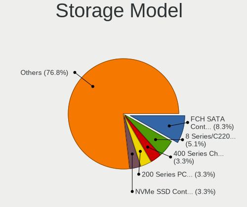
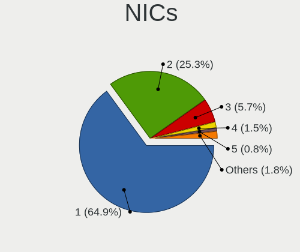

Debian 11 - Tested Hardware & Statistics (Desktops)
---------------------------------------------------

A project to collect tested hardware configurations for Debian 11.

Anyone can contribute to this report by the [hw-probe](https://github.com/linuxhw/hw-probe) tool:

    sudo -E hw-probe -all -upload

Please contribute! Especially if your hardware is rare.

Contents
--------

* [ Test Cases ](#test-cases)

* [ System ](#system)
  - [ Kernel                   ](#kernel)
  - [ Kernel Family            ](#kernel-family)
  - [ Kernel Major Ver.        ](#kernel-major-ver)
  - [ Arch                     ](#arch)
  - [ DE                       ](#de)
  - [ Display Server           ](#display-server)
  - [ Display Manager          ](#display-manager)
  - [ OS Lang                  ](#os-lang)
  - [ Boot Mode                ](#boot-mode)
  - [ Filesystem               ](#filesystem)
  - [ Part. scheme             ](#part-scheme)
  - [ Dual Boot with Linux/BSD ](#dual-boot-with-linuxbsd)
  - [ Dual Boot (Win)          ](#dual-boot-win)

* [ Board ](#board)
  - [ Vendor                   ](#vendor)
  - [ Model                    ](#model)
  - [ Model Family             ](#model-family)
  - [ MFG Year                 ](#mfg-year)
  - [ Form Factor              ](#form-factor)
  - [ Secure Boot              ](#secure-boot)
  - [ Coreboot                 ](#coreboot)
  - [ RAM Size                 ](#ram-size)
  - [ RAM Used                 ](#ram-used)
  - [ Total Drives             ](#total-drives)
  - [ Has CD-ROM               ](#has-cd-rom)
  - [ Has Ethernet             ](#has-ethernet)
  - [ Has WiFi                 ](#has-wifi)
  - [ Has Bluetooth            ](#has-bluetooth)

* [ Location ](#location)
  - [ Country                  ](#country)
  - [ City                     ](#city)

* [ Drives ](#drives)
  - [ Drive Vendor             ](#drive-vendor)
  - [ Drive Model              ](#drive-model)
  - [ HDD Vendor               ](#hdd-vendor)
  - [ SSD Vendor               ](#ssd-vendor)
  - [ Drive Kind               ](#drive-kind)
  - [ Drive Connector          ](#drive-connector)
  - [ Drive Size               ](#drive-size)
  - [ Space Total              ](#space-total)
  - [ Space Used               ](#space-used)
  - [ Malfunc. Drives          ](#malfunc-drives)
  - [ Malfunc. Drive Vendor    ](#malfunc-drive-vendor)
  - [ Malfunc. HDD Vendor      ](#malfunc-hdd-vendor)
  - [ Malfunc. Drive Kind      ](#malfunc-drive-kind)
  - [ Failed Drives            ](#failed-drives)
  - [ Failed Drive Vendor      ](#failed-drive-vendor)
  - [ Drive Status             ](#drive-status)

* [ Storage controller ](#storage-controller)
  - [ Storage Vendor           ](#storage-vendor)
  - [ Storage Model            ](#storage-model)
  - [ Storage Kind             ](#storage-kind)

* [ Processor ](#processor)
  - [ CPU Vendor               ](#cpu-vendor)
  - [ CPU Model                ](#cpu-model)
  - [ CPU Model Family         ](#cpu-model-family)
  - [ CPU Cores                ](#cpu-cores)
  - [ CPU Sockets              ](#cpu-sockets)
  - [ CPU Threads              ](#cpu-threads)
  - [ CPU Op-Modes             ](#cpu-op-modes)
  - [ CPU Microcode            ](#cpu-microcode)
  - [ CPU Microarch            ](#cpu-microarch)

* [ Graphics ](#graphics)
  - [ GPU Vendor               ](#gpu-vendor)
  - [ GPU Model                ](#gpu-model)
  - [ GPU Combo                ](#gpu-combo)
  - [ GPU Driver               ](#gpu-driver)
  - [ GPU Memory               ](#gpu-memory)

* [ Monitor ](#monitor)
  - [ Monitor Vendor           ](#monitor-vendor)
  - [ Monitor Model            ](#monitor-model)
  - [ Monitor Resolution       ](#monitor-resolution)
  - [ Monitor Diagonal         ](#monitor-diagonal)
  - [ Monitor Width            ](#monitor-width)
  - [ Aspect Ratio             ](#aspect-ratio)
  - [ Monitor Area             ](#monitor-area)
  - [ Pixel Density            ](#pixel-density)
  - [ Multiple Monitors        ](#multiple-monitors)

* [ Network ](#network)
  - [ Net Controller Vendor    ](#net-controller-vendor)
  - [ Net Controller Model     ](#net-controller-model)
  - [ Wireless Vendor          ](#wireless-vendor)
  - [ Wireless Model           ](#wireless-model)
  - [ Ethernet Vendor          ](#ethernet-vendor)
  - [ Ethernet Model           ](#ethernet-model)
  - [ Net Controller Kind      ](#net-controller-kind)
  - [ Used Controller          ](#used-controller)
  - [ NICs                     ](#nics)
  - [ IPv6                     ](#ipv6)

* [ Bluetooth ](#bluetooth)
  - [ Bluetooth Vendor         ](#bluetooth-vendor)
  - [ Bluetooth Model          ](#bluetooth-model)

* [ Sound ](#sound)
  - [ Sound Vendor             ](#sound-vendor)
  - [ Sound Model              ](#sound-model)

* [ Memory ](#memory)
  - [ Memory Vendor            ](#memory-vendor)
  - [ Memory Model             ](#memory-model)
  - [ Memory Kind              ](#memory-kind)
  - [ Memory Form Factor       ](#memory-form-factor)
  - [ Memory Size              ](#memory-size)
  - [ Memory Speed             ](#memory-speed)

* [ Printers & scanners ](#printers--scanners)
  - [ Printer Vendor           ](#printer-vendor)
  - [ Printer Model            ](#printer-model)
  - [ Scanner Vendor           ](#scanner-vendor)
  - [ Scanner Model            ](#scanner-model)

* [ Camera ](#camera)
  - [ Camera Vendor            ](#camera-vendor)
  - [ Camera Model             ](#camera-model)

* [ Security ](#security)
  - [ Fingerprint Vendor       ](#fingerprint-vendor)
  - [ Fingerprint Model        ](#fingerprint-model)
  - [ Chipcard Vendor          ](#chipcard-vendor)
  - [ Chipcard Model           ](#chipcard-model)

* [ Unsupported ](#unsupported)
  - [ Unsupported Devices      ](#unsupported-devices)
  - [ Unsupported Device Types ](#unsupported-device-types)

Test Cases
----------

Total: 2826

| Vendor        | Model                       | Probe                                                      | Date         |
|---------------|-----------------------------|------------------------------------------------------------|--------------|
| Medion        | TJ4125                      | [2024916642](https://linux-hardware.org/?probe=2024916642) | Feb 28, 2023 |
| CWWK          | CW-J6-6L                    | [46c17d2c14](https://linux-hardware.org/?probe=46c17d2c14) | Feb 28, 2023 |
| ASUSTek       | AT4NM10T-I                  | [921aebe62a](https://linux-hardware.org/?probe=921aebe62a) | Feb 28, 2023 |
| HP            | 83E2                        | [fdbe4ec1cb](https://linux-hardware.org/?probe=fdbe4ec1cb) | Feb 28, 2023 |
| Gigabyte      | A320M-S2H-CF                | [19fd766ea6](https://linux-hardware.org/?probe=19fd766ea6) | Feb 28, 2023 |
| ASUSTek       | P8B75-V                     | [17fcfc2758](https://linux-hardware.org/?probe=17fcfc2758) | Feb 28, 2023 |
| AZW           | MINI S                      | [e65b0d1ef6](https://linux-hardware.org/?probe=e65b0d1ef6) | Feb 28, 2023 |
| Gigabyte      | H61M-DS2                    | [49205269e7](https://linux-hardware.org/?probe=49205269e7) | Feb 28, 2023 |
| ASUSTek       | AT4NM10T-I                  | [fa2df8125a](https://linux-hardware.org/?probe=fa2df8125a) | Feb 28, 2023 |
| ASUSTek       | M5A78L-M PLUS/USB3          | [8cadddf432](https://linux-hardware.org/?probe=8cadddf432) | Feb 28, 2023 |
| ASRock        | N68C-S UCC                  | [a5469adf59](https://linux-hardware.org/?probe=a5469adf59) | Feb 28, 2023 |
| ASRockRack    | X470D4U2-2T                 | [4d3d5e02a1](https://linux-hardware.org/?probe=4d3d5e02a1) | Feb 28, 2023 |
| HP            | 3397                        | [8081d24eb1](https://linux-hardware.org/?probe=8081d24eb1) | Feb 27, 2023 |
| Dell          | 0MH651                      | [7921e9f8bc](https://linux-hardware.org/?probe=7921e9f8bc) | Feb 27, 2023 |
| Aquarius      | AQH310CM                    | [a2f4d0f77e](https://linux-hardware.org/?probe=a2f4d0f77e) | Feb 27, 2023 |
| ASUSTek       | P8B75-V                     | [7a8e478900](https://linux-hardware.org/?probe=7a8e478900) | Feb 27, 2023 |
| ASUSTek       | H61M-E                      | [ee5b36d127](https://linux-hardware.org/?probe=ee5b36d127) | Feb 27, 2023 |
| Dell          | 0NW6H5 A00                  | [b4485b65b3](https://linux-hardware.org/?probe=b4485b65b3) | Feb 27, 2023 |
| Dell          | 0NW6H5 A00                  | [a52e16df32](https://linux-hardware.org/?probe=a52e16df32) | Feb 27, 2023 |
| ASRock        | 970M Pro3                   | [787ddfd44c](https://linux-hardware.org/?probe=787ddfd44c) | Feb 26, 2023 |
| Gigabyte      | B550 GAMING X V2            | [9c64d6366e](https://linux-hardware.org/?probe=9c64d6366e) | Feb 26, 2023 |
| ASUSTek       | PRIME X370-PRO              | [aaa112feae](https://linux-hardware.org/?probe=aaa112feae) | Feb 26, 2023 |
| MSI           | B85M-E45                    | [a7748c0e8b](https://linux-hardware.org/?probe=a7748c0e8b) | Feb 25, 2023 |
| Medion        | TJ4125                      | [bde9228741](https://linux-hardware.org/?probe=bde9228741) | Feb 25, 2023 |
| Intel         | JSL MRD                     | [84a33f3c84](https://linux-hardware.org/?probe=84a33f3c84) | Feb 24, 2023 |
| ASUSTek       | TUF Gaming X570-PLUS        | [7fe6e0dcde](https://linux-hardware.org/?probe=7fe6e0dcde) | Feb 24, 2023 |
| Fujitsu Si... | D2824-A1 S26361-D2824-A1    | [f5b4a5da72](https://linux-hardware.org/?probe=f5b4a5da72) | Feb 24, 2023 |
| HP            | 82F2 A01                    | [efc9b2fdbf](https://linux-hardware.org/?probe=efc9b2fdbf) | Feb 24, 2023 |
| HP            | 82F2 A01                    | [24dc4341d3](https://linux-hardware.org/?probe=24dc4341d3) | Feb 24, 2023 |
| Seeed Stud... | ODYSSEY-X86J4105 SD-BS-C... | [1989031eb6](https://linux-hardware.org/?probe=1989031eb6) | Feb 24, 2023 |
| MSI           | MPG Z690 CARBON WIFI        | [52b14c9235](https://linux-hardware.org/?probe=52b14c9235) | Feb 24, 2023 |
| MSI           | MPG Z690 CARBON WIFI        | [a09d17dd16](https://linux-hardware.org/?probe=a09d17dd16) | Feb 24, 2023 |
| Dell          | 0GY6Y8 A01                  | [0806dcb9ca](https://linux-hardware.org/?probe=0806dcb9ca) | Feb 24, 2023 |
| Dell          | 0GY6Y8 A01                  | [e3cdd0b411](https://linux-hardware.org/?probe=e3cdd0b411) | Feb 24, 2023 |
| Gigabyte      | H610M S2H DDR4              | [e44618f1c3](https://linux-hardware.org/?probe=e44618f1c3) | Feb 23, 2023 |
| ASUSTek       | KRPA-U16 Series             | [e417ffd8e7](https://linux-hardware.org/?probe=e417ffd8e7) | Feb 23, 2023 |
| ASUSTek       | PRIME B560-PLUS             | [4f19f71811](https://linux-hardware.org/?probe=4f19f71811) | Feb 23, 2023 |
| ASUSTek       | P8H67-M                     | [a3ea522d78](https://linux-hardware.org/?probe=a3ea522d78) | Feb 23, 2023 |
| Intel         | H61                         | [de757dd659](https://linux-hardware.org/?probe=de757dd659) | Feb 23, 2023 |
| AZW           | U59                         | [9289537f45](https://linux-hardware.org/?probe=9289537f45) | Feb 22, 2023 |
| ASRockRack    | X470D4U2-2T                 | [9d233c96b5](https://linux-hardware.org/?probe=9d233c96b5) | Feb 22, 2023 |
| ASUSTek       | P8B75-V                     | [fb050eaf3c](https://linux-hardware.org/?probe=fb050eaf3c) | Feb 22, 2023 |
| Gigabyte      | B360 AORUS GAMING 3 WIFI... | [1d2132b142](https://linux-hardware.org/?probe=1d2132b142) | Feb 22, 2023 |
| AZW           | U59                         | [368562790b](https://linux-hardware.org/?probe=368562790b) | Feb 22, 2023 |
| Unknown       | Unknown                     | [5cf4127d47](https://linux-hardware.org/?probe=5cf4127d47) | Feb 21, 2023 |
| MSI           | MAG Z590 TORPEDO            | [30f09c71a1](https://linux-hardware.org/?probe=30f09c71a1) | Feb 21, 2023 |
| ASUSTek       | P8B75-V                     | [de56e36164](https://linux-hardware.org/?probe=de56e36164) | Feb 21, 2023 |
| HP            | ProLiant ML110 G7           | [56cbaf4274](https://linux-hardware.org/?probe=56cbaf4274) | Feb 21, 2023 |
| ASUSTek       | PRIME H310M-K R2.0          | [211cd972f0](https://linux-hardware.org/?probe=211cd972f0) | Feb 20, 2023 |
| Lenovo        | ThinkCentre M58e 7269E3S    | [6b30da3a31](https://linux-hardware.org/?probe=6b30da3a31) | Feb 20, 2023 |
| Dell          | 073MMW A02                  | [aa198228bc](https://linux-hardware.org/?probe=aa198228bc) | Feb 19, 2023 |
| Dell          | 0T065F A01                  | [c8b1f8651a](https://linux-hardware.org/?probe=c8b1f8651a) | Feb 19, 2023 |
| Lenovo        | 3178 SDK0J40697 WIN 3305... | [34681494ec](https://linux-hardware.org/?probe=34681494ec) | Feb 18, 2023 |
| Pegatron      | 2AB6                        | [537c2d1b64](https://linux-hardware.org/?probe=537c2d1b64) | Feb 18, 2023 |
| Intel         | JSL MRD                     | [5e021f6a92](https://linux-hardware.org/?probe=5e021f6a92) | Feb 18, 2023 |
| Lenovo        | 3178 SDK0J40697 WIN 3305... | [a2cdf7d471](https://linux-hardware.org/?probe=a2cdf7d471) | Feb 18, 2023 |
| Gigabyte      | GA-A55M-DS2                 | [3159aede6c](https://linux-hardware.org/?probe=3159aede6c) | Feb 17, 2023 |
| ASUSTek       | H110M-R                     | [bd6636c99d](https://linux-hardware.org/?probe=bd6636c99d) | Feb 17, 2023 |
| Intel         | H61                         | [90e4a9358f](https://linux-hardware.org/?probe=90e4a9358f) | Feb 17, 2023 |
| MSI           | X399 SLI PLUS               | [8741094cd9](https://linux-hardware.org/?probe=8741094cd9) | Feb 17, 2023 |
| MSI           | Z270 TOMAHAWK ARCTIC        | [cfdcc68921](https://linux-hardware.org/?probe=cfdcc68921) | Feb 16, 2023 |
| MSI           | Z270 TOMAHAWK ARCTIC        | [7bb3c6268f](https://linux-hardware.org/?probe=7bb3c6268f) | Feb 16, 2023 |
| Gigabyte      | B550 AORUS PRO V2           | [8f202b88fa](https://linux-hardware.org/?probe=8f202b88fa) | Feb 16, 2023 |
| ASRock        | B550 Pro4                   | [9ad890517a](https://linux-hardware.org/?probe=9ad890517a) | Feb 16, 2023 |
| ASRock        | X370 Gaming X               | [cda38b5b9b](https://linux-hardware.org/?probe=cda38b5b9b) | Feb 16, 2023 |
| ASUSTek       | P7H55-M SI                  | [387881f288](https://linux-hardware.org/?probe=387881f288) | Feb 16, 2023 |
| ASUSTek       | TUF Gaming B550-PLUS        | [bbce6ba3b1](https://linux-hardware.org/?probe=bbce6ba3b1) | Feb 16, 2023 |
| Lenovo        | 1030 SDK0J40705 WIN 3425... | [daed0124f0](https://linux-hardware.org/?probe=daed0124f0) | Feb 16, 2023 |
| Gigabyte      | H270M-D3H-CF                | [7a58ceb644](https://linux-hardware.org/?probe=7a58ceb644) | Feb 15, 2023 |
| ASRock        | X300M-STX                   | [2b25f214e9](https://linux-hardware.org/?probe=2b25f214e9) | Feb 15, 2023 |
| ASRock        | X300M-STX                   | [5bf8aa635c](https://linux-hardware.org/?probe=5bf8aa635c) | Feb 15, 2023 |
| Gigabyte      | EP43-S3L                    | [82730ed699](https://linux-hardware.org/?probe=82730ed699) | Feb 15, 2023 |
| Itautec       | ST 4265                     | [84023fa8ac](https://linux-hardware.org/?probe=84023fa8ac) | Feb 15, 2023 |
| ASUSTek       | P5GD1 PRO                   | [043021ca86](https://linux-hardware.org/?probe=043021ca86) | Feb 15, 2023 |
| ASRock        | Z77 Extreme6                | [48328ab864](https://linux-hardware.org/?probe=48328ab864) | Feb 15, 2023 |
| Unknown       | Unknown                     | [0ac84e31dd](https://linux-hardware.org/?probe=0ac84e31dd) | Feb 14, 2023 |
| Dell          | 0RN474                      | [5c1bf45372](https://linux-hardware.org/?probe=5c1bf45372) | Feb 14, 2023 |
| Gigabyte      | B550 AORUS PRO V2           | [27fa84ce56](https://linux-hardware.org/?probe=27fa84ce56) | Feb 14, 2023 |
| ASUSTek       | Pro WS WRX80E-SAGE SE WI... | [8895a873ab](https://linux-hardware.org/?probe=8895a873ab) | Feb 14, 2023 |
| ASUSTek       | Pro WS WRX80E-SAGE SE WI... | [fb00615692](https://linux-hardware.org/?probe=fb00615692) | Feb 14, 2023 |
| Gigabyte      | X570 UD                     | [ae563f7bfe](https://linux-hardware.org/?probe=ae563f7bfe) | Feb 14, 2023 |
| Shenzhen M... | F6BFC                       | [67b141272c](https://linux-hardware.org/?probe=67b141272c) | Feb 14, 2023 |
| LORD ELECT... | LORD G4x 775 ICH7 8712 A... | [c69ee15636](https://linux-hardware.org/?probe=c69ee15636) | Feb 14, 2023 |
| Dell          | 0RN474                      | [20f3c37dc2](https://linux-hardware.org/?probe=20f3c37dc2) | Feb 14, 2023 |
| IceWhale T... | ZimaBoard 832 ZMB           | [55e684c121](https://linux-hardware.org/?probe=55e684c121) | Feb 13, 2023 |
| MSI           | H97 GAMING 3                | [855634fadc](https://linux-hardware.org/?probe=855634fadc) | Feb 13, 2023 |
| ASUSTek       | TUF Gaming B550-PRO         | [e83cd923a5](https://linux-hardware.org/?probe=e83cd923a5) | Feb 13, 2023 |
| Gigabyte      | H81M-S2V                    | [09dff429cd](https://linux-hardware.org/?probe=09dff429cd) | Feb 12, 2023 |
| ASUSTek       | TUF Gaming B550-PRO         | [52674d23ad](https://linux-hardware.org/?probe=52674d23ad) | Feb 12, 2023 |
| ASRock        | X300M-STX                   | [4829b991be](https://linux-hardware.org/?probe=4829b991be) | Feb 12, 2023 |
| ASRock        | A320M-DVS R4.0              | [1589cfe790](https://linux-hardware.org/?probe=1589cfe790) | Feb 11, 2023 |
| ASRock        | A320M-DVS R4.0              | [22fdde82eb](https://linux-hardware.org/?probe=22fdde82eb) | Feb 11, 2023 |
| ASUSTek       | PRIME H310M-K R2.0          | [ed3233c97b](https://linux-hardware.org/?probe=ed3233c97b) | Feb 11, 2023 |
| ASUSTek       | P5VD2-X                     | [32a509e760](https://linux-hardware.org/?probe=32a509e760) | Feb 11, 2023 |
| ASUSTek       | PRIME H310M-K R2.0          | [2695a9350a](https://linux-hardware.org/?probe=2695a9350a) | Feb 11, 2023 |
| ASUSTek       | ROG STRIX Z690-A GAMING ... | [d003016397](https://linux-hardware.org/?probe=d003016397) | Feb 11, 2023 |
| AZW           | U59                         | [24ccf521f0](https://linux-hardware.org/?probe=24ccf521f0) | Feb 11, 2023 |
| Dell          | 0J3C2F A00                  | [a3f08d08aa](https://linux-hardware.org/?probe=a3f08d08aa) | Feb 11, 2023 |
| MSI           | H110M PRO-VD                | [5483d83053](https://linux-hardware.org/?probe=5483d83053) | Feb 11, 2023 |
| AMD           | CM-iGLX Platform Board R... | [c256a73072](https://linux-hardware.org/?probe=c256a73072) | Feb 11, 2023 |
| Maxtang       | EHL30 V1.0                  | [4d133c615c](https://linux-hardware.org/?probe=4d133c615c) | Feb 10, 2023 |
| ASRockRack    | X570D4U                     | [bb2c98768e](https://linux-hardware.org/?probe=bb2c98768e) | Feb 10, 2023 |
| Intel         | H61                         | [e07896a0a6](https://linux-hardware.org/?probe=e07896a0a6) | Feb 10, 2023 |
| Gigabyte      | B550 GAMING X V2            | [8c4ab545de](https://linux-hardware.org/?probe=8c4ab545de) | Feb 09, 2023 |
| Acer          | Veriton N4630G              | [262d8ec347](https://linux-hardware.org/?probe=262d8ec347) | Feb 09, 2023 |
| MSI           | H97 GAMING 3                | [209d4693fe](https://linux-hardware.org/?probe=209d4693fe) | Feb 09, 2023 |
| ASUSTek       | PRIME B660-PLUS D4          | [a0132107aa](https://linux-hardware.org/?probe=a0132107aa) | Feb 08, 2023 |
| ASUSTek       | PRIME B660-PLUS D4          | [6231dbe6d4](https://linux-hardware.org/?probe=6231dbe6d4) | Feb 08, 2023 |
| Intel         | DH67CL AAG10212-208         | [e53a89d83d](https://linux-hardware.org/?probe=e53a89d83d) | Feb 08, 2023 |
| Lenovo        | 3178 SDK0J40697 WIN 3305... | [8fb3a20b27](https://linux-hardware.org/?probe=8fb3a20b27) | Feb 08, 2023 |
| ASUSTek       | PRIME H610M-A WIFI D4       | [69f96bffa5](https://linux-hardware.org/?probe=69f96bffa5) | Feb 07, 2023 |
| Lenovo        | 3178 SDK0J40697 WIN 3305... | [83380dcad6](https://linux-hardware.org/?probe=83380dcad6) | Feb 07, 2023 |
| HP            | 3397                        | [2fb7638874](https://linux-hardware.org/?probe=2fb7638874) | Feb 06, 2023 |
| Intel         | DH77EB AAG39073-304         | [b3169f788f](https://linux-hardware.org/?probe=b3169f788f) | Feb 06, 2023 |
| AZW           | U59                         | [b97c4f6277](https://linux-hardware.org/?probe=b97c4f6277) | Feb 06, 2023 |
| MSI           | MPG Z690 CARBON WIFI        | [db292bc714](https://linux-hardware.org/?probe=db292bc714) | Feb 05, 2023 |
| HP            | 0A64h                       | [40ef639345](https://linux-hardware.org/?probe=40ef639345) | Feb 05, 2023 |
| Huanan        | X99-T8D V1.2                | [cb7e750cee](https://linux-hardware.org/?probe=cb7e750cee) | Feb 05, 2023 |
| Gigabyte      | H61MA-D2V                   | [b708cdc12f](https://linux-hardware.org/?probe=b708cdc12f) | Feb 05, 2023 |
| Gigabyte      | B450M S2H                   | [c3891f43b5](https://linux-hardware.org/?probe=c3891f43b5) | Feb 05, 2023 |
| Gigabyte      | Z77X-UD3H                   | [6023defc83](https://linux-hardware.org/?probe=6023defc83) | Feb 05, 2023 |
| Unknown       | Unknown                     | [5a491991ef](https://linux-hardware.org/?probe=5a491991ef) | Feb 05, 2023 |
| MSI           | A320M PRO-M2                | [3fa2ac81f2](https://linux-hardware.org/?probe=3fa2ac81f2) | Feb 05, 2023 |
| Dell          | 0D4MD1 A00                  | [7198c3d131](https://linux-hardware.org/?probe=7198c3d131) | Feb 05, 2023 |
| ECS           | H61H2-MV                    | [e0a93d257b](https://linux-hardware.org/?probe=e0a93d257b) | Feb 05, 2023 |
| OEM           | Intel H81                   | [806280459d](https://linux-hardware.org/?probe=806280459d) | Feb 05, 2023 |
| Lenovo        | 3178 SDK0J40697 WIN 3305... | [f2423d1d75](https://linux-hardware.org/?probe=f2423d1d75) | Feb 05, 2023 |
| ASUSTek       | PRIME Z690-P WIFI D4        | [2543adebba](https://linux-hardware.org/?probe=2543adebba) | Feb 05, 2023 |
| HP            | 1589                        | [7b3a0cf51b](https://linux-hardware.org/?probe=7b3a0cf51b) | Feb 04, 2023 |
| ASRock        | 4X4-4000 Series             | [4ed27fe851](https://linux-hardware.org/?probe=4ed27fe851) | Feb 04, 2023 |
| Gigabyte      | MZBSWMP-00                  | [018b3728ea](https://linux-hardware.org/?probe=018b3728ea) | Feb 04, 2023 |
| Gigabyte      | MZBSWMP-00                  | [52bb20e0b2](https://linux-hardware.org/?probe=52bb20e0b2) | Feb 04, 2023 |
| ECS           | A780GM-A                    | [6f6599f880](https://linux-hardware.org/?probe=6f6599f880) | Feb 04, 2023 |
| HP            | 3048h                       | [03b28af2be](https://linux-hardware.org/?probe=03b28af2be) | Feb 03, 2023 |
| AZW           | MINI S                      | [6c746a5f95](https://linux-hardware.org/?probe=6c746a5f95) | Feb 03, 2023 |
| ASUSTek       | M5A97 R2.0                  | [c0c511ec65](https://linux-hardware.org/?probe=c0c511ec65) | Feb 03, 2023 |
| BESSTAR Te... | TH50                        | [6d39ef2792](https://linux-hardware.org/?probe=6d39ef2792) | Feb 03, 2023 |
| Intel         | SKYBAY                      | [a75cb78ad9](https://linux-hardware.org/?probe=a75cb78ad9) | Feb 02, 2023 |
| NEC Comput... | MS9666 011                  | [26a38770fe](https://linux-hardware.org/?probe=26a38770fe) | Feb 02, 2023 |
| ASUSTek       | Z170-DELUXE                 | [2cb0ec3b98](https://linux-hardware.org/?probe=2cb0ec3b98) | Feb 01, 2023 |
| Lenovo        | MAHOBAY Win8 STD MM DPK ... | [203e3fe693](https://linux-hardware.org/?probe=203e3fe693) | Feb 01, 2023 |
| ASUSTek       | P9X79                       | [01e8662b39](https://linux-hardware.org/?probe=01e8662b39) | Feb 01, 2023 |
| Gigabyte      | X299 AORUS Gaming 3-CF      | [775a993b3a](https://linux-hardware.org/?probe=775a993b3a) | Feb 01, 2023 |
| Gigabyte      | Z690M DS3H DDR4             | [8f858cb9b9](https://linux-hardware.org/?probe=8f858cb9b9) | Jan 31, 2023 |
| MSI           | 870A-G54                    | [0aaa012de5](https://linux-hardware.org/?probe=0aaa012de5) | Jan 31, 2023 |
| Gigabyte      | P85-D3                      | [7e25d19fae](https://linux-hardware.org/?probe=7e25d19fae) | Jan 31, 2023 |
| ASRock        | G31M-VS2                    | [e12dd528ea](https://linux-hardware.org/?probe=e12dd528ea) | Jan 31, 2023 |
| MSI           | H81M-E34                    | [19b8f90522](https://linux-hardware.org/?probe=19b8f90522) | Jan 31, 2023 |
| ASUSTek       | H61M-A/BR                   | [b6a73bd22e](https://linux-hardware.org/?probe=b6a73bd22e) | Jan 30, 2023 |
| ASUSTek       | H61M-A/BR                   | [0ae96c2bbc](https://linux-hardware.org/?probe=0ae96c2bbc) | Jan 30, 2023 |
| NetGear       | ReadyDATA 5200              | [74a68eba33](https://linux-hardware.org/?probe=74a68eba33) | Jan 30, 2023 |
| ASUSTek       | P8H61-MX                    | [f13f4da766](https://linux-hardware.org/?probe=f13f4da766) | Jan 30, 2023 |
| HP            | 0A64h                       | [da7b36ad47](https://linux-hardware.org/?probe=da7b36ad47) | Jan 30, 2023 |
| Dell          | 02YRK5 A02                  | [d6faeebd74](https://linux-hardware.org/?probe=d6faeebd74) | Jan 29, 2023 |
| Gigabyte      | Z270X-Ultra Gaming-CF       | [55c3e9597c](https://linux-hardware.org/?probe=55c3e9597c) | Jan 29, 2023 |
| ASUSTek       | ROG Maximus XIII HERO       | [6b634c85e8](https://linux-hardware.org/?probe=6b634c85e8) | Jan 29, 2023 |
| ASUSTek       | P8H67                       | [c6163491b5](https://linux-hardware.org/?probe=c6163491b5) | Jan 29, 2023 |
| Medion        | TJ4125                      | [5fb5d01ae9](https://linux-hardware.org/?probe=5fb5d01ae9) | Jan 29, 2023 |
| Gigabyte      | 8IPE1000-G/L                | [6f83e8b57d](https://linux-hardware.org/?probe=6f83e8b57d) | Jan 29, 2023 |
| Gigabyte      | M61PME-S2                   | [8227150e0d](https://linux-hardware.org/?probe=8227150e0d) | Jan 29, 2023 |
| Gigabyte      | M61PME-S2                   | [813f01976d](https://linux-hardware.org/?probe=813f01976d) | Jan 29, 2023 |
| ASRock        | B550 Pro4                   | [eaed78d213](https://linux-hardware.org/?probe=eaed78d213) | Jan 28, 2023 |
| Dell          | 0F8098                      | [d6066c739e](https://linux-hardware.org/?probe=d6066c739e) | Jan 28, 2023 |
| ASRock        | B550 Pro4                   | [5fa28ba14d](https://linux-hardware.org/?probe=5fa28ba14d) | Jan 28, 2023 |
| ASUSTek       | B85M-G                      | [4a83dc2dc2](https://linux-hardware.org/?probe=4a83dc2dc2) | Jan 27, 2023 |
| MSI           | B365M PRO-VDH               | [d5bbfc18d5](https://linux-hardware.org/?probe=d5bbfc18d5) | Jan 27, 2023 |
| AZW           | MINI S                      | [ce5e6b1504](https://linux-hardware.org/?probe=ce5e6b1504) | Jan 26, 2023 |
| HP            | 805D                        | [b1996094a9](https://linux-hardware.org/?probe=b1996094a9) | Jan 26, 2023 |
| Inventec      | D CLASS A02                 | [2e70086887](https://linux-hardware.org/?probe=2e70086887) | Jan 25, 2023 |
| ASUSTek       | P8H61-M LX2                 | [dee0143024](https://linux-hardware.org/?probe=dee0143024) | Jan 25, 2023 |
| Gigabyte      | B450M DS3H V2               | [90d383c54e](https://linux-hardware.org/?probe=90d383c54e) | Jan 25, 2023 |
| ASUSTek       | H110M-R                     | [e4b50b33a2](https://linux-hardware.org/?probe=e4b50b33a2) | Jan 25, 2023 |
| MSI           | H110M PRO-VD                | [e0eefbde94](https://linux-hardware.org/?probe=e0eefbde94) | Jan 25, 2023 |
| Gigabyte      | B450M DS3H-CF               | [e2d354b9c5](https://linux-hardware.org/?probe=e2d354b9c5) | Jan 25, 2023 |
| Dell          | 0K3CM7 A00                  | [d3cc219bf7](https://linux-hardware.org/?probe=d3cc219bf7) | Jan 24, 2023 |
| MSI           | H97 PC Mate                 | [d00ec3c042](https://linux-hardware.org/?probe=d00ec3c042) | Jan 24, 2023 |
| ECS           | G31T-M9                     | [59747c81ca](https://linux-hardware.org/?probe=59747c81ca) | Jan 24, 2023 |
| ASRock        | 990FX Killer                | [b6bd3a3bdb](https://linux-hardware.org/?probe=b6bd3a3bdb) | Jan 23, 2023 |
| MSI           | 870A-G54                    | [b1baf04990](https://linux-hardware.org/?probe=b1baf04990) | Jan 23, 2023 |
| Dell          | 09M8Y8 A01                  | [3f3b6c888d](https://linux-hardware.org/?probe=3f3b6c888d) | Jan 23, 2023 |
| Gigabyte      | P85-D3                      | [69164f2a61](https://linux-hardware.org/?probe=69164f2a61) | Jan 23, 2023 |
| ASUSTek       | PRIME X399-A                | [4687e8d062](https://linux-hardware.org/?probe=4687e8d062) | Jan 22, 2023 |
| Intel         | JSL MRD                     | [39dc5a7f96](https://linux-hardware.org/?probe=39dc5a7f96) | Jan 22, 2023 |
| Lenovo        | ThinkCentre M57e 7066W57    | [3ddcdbb616](https://linux-hardware.org/?probe=3ddcdbb616) | Jan 22, 2023 |
| Dell          | 0KRC95 A02                  | [ef532b60e6](https://linux-hardware.org/?probe=ef532b60e6) | Jan 21, 2023 |
| Biostar       | H310MHP                     | [21de314a44](https://linux-hardware.org/?probe=21de314a44) | Jan 21, 2023 |
| ASRock        | H61M-VG3                    | [c9d6e1cbb1](https://linux-hardware.org/?probe=c9d6e1cbb1) | Jan 21, 2023 |
| ASUSTek       | TUF Gaming B450M-PRO S      | [046504c970](https://linux-hardware.org/?probe=046504c970) | Jan 21, 2023 |
| DFI           | CR101-CST                   | [604ce5b10f](https://linux-hardware.org/?probe=604ce5b10f) | Jan 21, 2023 |
| ASUSTek       | P5QL PRO                    | [9f700f7e19](https://linux-hardware.org/?probe=9f700f7e19) | Jan 21, 2023 |
| Intel         | DH77EB AAG39073-304         | [4af2ea2f7f](https://linux-hardware.org/?probe=4af2ea2f7f) | Jan 20, 2023 |
| Dell          | 0VC8RJ X02                  | [313ea92e9c](https://linux-hardware.org/?probe=313ea92e9c) | Jan 20, 2023 |
| Gigabyte      | H410M H V2                  | [5767b63675](https://linux-hardware.org/?probe=5767b63675) | Jan 20, 2023 |
| Gigabyte      | P85-D3                      | [28e6aeb27a](https://linux-hardware.org/?probe=28e6aeb27a) | Jan 20, 2023 |
| Gigabyte      | P85-D3                      | [beec5d3864](https://linux-hardware.org/?probe=beec5d3864) | Jan 20, 2023 |
| Gigabyte      | P85-D3                      | [6ff84d12be](https://linux-hardware.org/?probe=6ff84d12be) | Jan 20, 2023 |
| Gigabyte      | P85-D3                      | [002a38370c](https://linux-hardware.org/?probe=002a38370c) | Jan 20, 2023 |
| Gigabyte      | P85-D3                      | [bbfb85788c](https://linux-hardware.org/?probe=bbfb85788c) | Jan 20, 2023 |
| Gigabyte      | P85-D3                      | [9d6c73b1c1](https://linux-hardware.org/?probe=9d6c73b1c1) | Jan 20, 2023 |
| HP            | 3397                        | [39391f23c4](https://linux-hardware.org/?probe=39391f23c4) | Jan 20, 2023 |
| HP            | 3397                        | [7b05c1fdf9](https://linux-hardware.org/?probe=7b05c1fdf9) | Jan 20, 2023 |
| AZW           | SEi                         | [257b104c3a](https://linux-hardware.org/?probe=257b104c3a) | Jan 20, 2023 |
| Gigabyte      | Z690I A ULTRA LITE D4       | [f7cac38f4a](https://linux-hardware.org/?probe=f7cac38f4a) | Jan 20, 2023 |
| AZW           | SEi                         | [481932390b](https://linux-hardware.org/?probe=481932390b) | Jan 20, 2023 |
| ASUSTek       | P5KPL-CM                    | [b9f1f115ba](https://linux-hardware.org/?probe=b9f1f115ba) | Jan 20, 2023 |
| Gigabyte      | Z690I A ULTRA LITE D4       | [abcfca9ea7](https://linux-hardware.org/?probe=abcfca9ea7) | Jan 20, 2023 |
| Lenovo        | 7033EW4                     | [fd4303de2e](https://linux-hardware.org/?probe=fd4303de2e) | Jan 20, 2023 |
| Gigabyte      | H81M-S2V                    | [76be7bde5d](https://linux-hardware.org/?probe=76be7bde5d) | Jan 19, 2023 |
| ASUSTek       | P6T                         | [ac42d5a147](https://linux-hardware.org/?probe=ac42d5a147) | Jan 19, 2023 |
| Gigabyte      | B85M-D3V                    | [285dc35475](https://linux-hardware.org/?probe=285dc35475) | Jan 19, 2023 |
| ASUSTek       | P5AD2-E-Premium             | [285c0f23f1](https://linux-hardware.org/?probe=285c0f23f1) | Jan 19, 2023 |
| ASUSTek       | P8H61-M                     | [1ffe9344ff](https://linux-hardware.org/?probe=1ffe9344ff) | Jan 18, 2023 |
| Medion        | TJ4125                      | [b4f48c3140](https://linux-hardware.org/?probe=b4f48c3140) | Jan 18, 2023 |
| Lenovo        | 7033EW4                     | [df0d8cd728](https://linux-hardware.org/?probe=df0d8cd728) | Jan 18, 2023 |
| ASRock        | A300M-STX                   | [4d726dcf9b](https://linux-hardware.org/?probe=4d726dcf9b) | Jan 17, 2023 |
| Huanan        | B75 V10.1 376               | [2703c87348](https://linux-hardware.org/?probe=2703c87348) | Jan 17, 2023 |
| ASUSTek       | PRIME H510M-K               | [f9f926e910](https://linux-hardware.org/?probe=f9f926e910) | Jan 17, 2023 |
| MSI           | H81M-E34                    | [db4a6791a0](https://linux-hardware.org/?probe=db4a6791a0) | Jan 17, 2023 |
| ASUSTek       | P5G41T-M LE                 | [31b369770d](https://linux-hardware.org/?probe=31b369770d) | Jan 17, 2023 |
| Foxconn       | nT-A3000 series FAB         | [0bdefb0a4f](https://linux-hardware.org/?probe=0bdefb0a4f) | Jan 17, 2023 |
| ASUSTek       | M2N-SLI DELUXE              | [d31aea19b2](https://linux-hardware.org/?probe=d31aea19b2) | Jan 16, 2023 |
| Intel         | DH67BL AAG10189-206         | [23e07704eb](https://linux-hardware.org/?probe=23e07704eb) | Jan 16, 2023 |
| ASRock        | J3455-ITX                   | [6746dfae39](https://linux-hardware.org/?probe=6746dfae39) | Jan 16, 2023 |
| Intel         | JSL MRD                     | [edbaf7bb5d](https://linux-hardware.org/?probe=edbaf7bb5d) | Jan 16, 2023 |
| Lenovo        | 370A SDK0J40697 WIN 3305... | [deb2b560bc](https://linux-hardware.org/?probe=deb2b560bc) | Jan 16, 2023 |
| ASRock        | J3455-ITX                   | [457c7ea5a4](https://linux-hardware.org/?probe=457c7ea5a4) | Jan 16, 2023 |
| Intel         | DH77EB AAG39073-304         | [cb3c4b1eb4](https://linux-hardware.org/?probe=cb3c4b1eb4) | Jan 16, 2023 |
| HP            | 8643 SMVB                   | [4572999070](https://linux-hardware.org/?probe=4572999070) | Jan 16, 2023 |
| MSI           | B450 TOMAHAWK MAX           | [3b4a530695](https://linux-hardware.org/?probe=3b4a530695) | Jan 15, 2023 |
| MSI           | MS-B1711                    | [730b1e7f90](https://linux-hardware.org/?probe=730b1e7f90) | Jan 15, 2023 |
| Lenovo        | SHARKBAY SDK0E50510 WIN     | [202535bce7](https://linux-hardware.org/?probe=202535bce7) | Jan 15, 2023 |
| ASUSTek       | PRIME X570-P                | [ab5933911d](https://linux-hardware.org/?probe=ab5933911d) | Jan 15, 2023 |
| ASUSTek       | TUF Gaming B460M-PLUS       | [d1e2f08907](https://linux-hardware.org/?probe=d1e2f08907) | Jan 14, 2023 |
| HP            | ProLiant MicroServer Gen... | [8a79dd9e27](https://linux-hardware.org/?probe=8a79dd9e27) | Jan 13, 2023 |
| ASRock        | H110M-HDV R3.0              | [bed628ce8a](https://linux-hardware.org/?probe=bed628ce8a) | Jan 13, 2023 |
| Lenovo        | ThinkCentre M58p 6234A1U    | [63d74a9021](https://linux-hardware.org/?probe=63d74a9021) | Jan 13, 2023 |
| ASRock        | 970M Pro3                   | [ed62a9383e](https://linux-hardware.org/?probe=ed62a9383e) | Jan 13, 2023 |
| Medion        | TJ4125                      | [700f862aa6](https://linux-hardware.org/?probe=700f862aa6) | Jan 13, 2023 |
| HC            | HCAR357-MI V1.0             | [516f1ed052](https://linux-hardware.org/?probe=516f1ed052) | Jan 13, 2023 |
| Vestel        | 14MB24A                     | [56ee8713e8](https://linux-hardware.org/?probe=56ee8713e8) | Jan 13, 2023 |
| Vestel        | 14MB24A                     | [02c99c8c38](https://linux-hardware.org/?probe=02c99c8c38) | Jan 13, 2023 |
| Lenovo        | SHARKBAY SDK0E50510 WIN     | [d7c612580f](https://linux-hardware.org/?probe=d7c612580f) | Jan 13, 2023 |
| HP            | 21EF                        | [0d5e3a9354](https://linux-hardware.org/?probe=0d5e3a9354) | Jan 12, 2023 |
| HP            | 21EF                        | [cdeab03273](https://linux-hardware.org/?probe=cdeab03273) | Jan 12, 2023 |
| ASUSTek       | P5G41T-M LX V2              | [36a8e226c5](https://linux-hardware.org/?probe=36a8e226c5) | Jan 12, 2023 |
| ASUSTek       | PRIME Z690M-PLUS D4         | [4687ae7d43](https://linux-hardware.org/?probe=4687ae7d43) | Jan 12, 2023 |
| Gigabyte      | X570 GAMING X               | [bb85f0bdc7](https://linux-hardware.org/?probe=bb85f0bdc7) | Jan 12, 2023 |
| ASUSTek       | ROG STRIX B550-F GAMING     | [d93218978e](https://linux-hardware.org/?probe=d93218978e) | Jan 12, 2023 |
| MSI           | B350 PC MATE                | [f235ff785b](https://linux-hardware.org/?probe=f235ff785b) | Jan 12, 2023 |
| ASUSTek       | ROG STRIX Z390-E GAMING     | [25bd789598](https://linux-hardware.org/?probe=25bd789598) | Jan 12, 2023 |
| ASUSTek       | ROG STRIX Z390-E GAMING     | [c040acffcf](https://linux-hardware.org/?probe=c040acffcf) | Jan 12, 2023 |
| MSI           | X470 GAMING PLUS            | [ba153350d8](https://linux-hardware.org/?probe=ba153350d8) | Jan 11, 2023 |
| ASRock        | X300-ITX                    | [9e74676ba4](https://linux-hardware.org/?probe=9e74676ba4) | Jan 11, 2023 |
| ASRockRack    | X470D4U                     | [b60a38ae60](https://linux-hardware.org/?probe=b60a38ae60) | Jan 11, 2023 |
| Gigabyte      | X570 GAMING X               | [204a5e8a8e](https://linux-hardware.org/?probe=204a5e8a8e) | Jan 11, 2023 |
| ASRockRack    | X470D4U2/1N1                | [ee2147214c](https://linux-hardware.org/?probe=ee2147214c) | Jan 11, 2023 |
| Dell          | 01XK1W A00                  | [54793acf7e](https://linux-hardware.org/?probe=54793acf7e) | Jan 11, 2023 |
| Gigabyte      | H510M H                     | [81a8002b99](https://linux-hardware.org/?probe=81a8002b99) | Jan 10, 2023 |
| Lenovo        | 1059 SDK0T76538 WIN 3556... | [a2660dcbfb](https://linux-hardware.org/?probe=a2660dcbfb) | Jan 09, 2023 |
| Techvision    | TVI7309X B0                 | [e336a260d6](https://linux-hardware.org/?probe=e336a260d6) | Jan 09, 2023 |
| Techvision    | TVI7309X B0                 | [43cc06ef1d](https://linux-hardware.org/?probe=43cc06ef1d) | Jan 09, 2023 |
| ASRockRack    | X470D4U                     | [0e51eb7caa](https://linux-hardware.org/?probe=0e51eb7caa) | Jan 09, 2023 |
| Dell          | 0HD5W2 A01                  | [a14e62fdf8](https://linux-hardware.org/?probe=a14e62fdf8) | Jan 09, 2023 |
| Acer          | Predator G3-710             | [d47ca88192](https://linux-hardware.org/?probe=d47ca88192) | Jan 09, 2023 |
| HP            | 8053                        | [b377deb121](https://linux-hardware.org/?probe=b377deb121) | Jan 09, 2023 |
| ASUSTek       | TUF Gaming X570-PRO         | [92205d303f](https://linux-hardware.org/?probe=92205d303f) | Jan 08, 2023 |
| Gigabyte      | X570S I AORUS PRO AX        | [2b8206db29](https://linux-hardware.org/?probe=2b8206db29) | Jan 08, 2023 |
| Gigabyte      | X570S I AORUS PRO AX        | [68fe02a04c](https://linux-hardware.org/?probe=68fe02a04c) | Jan 08, 2023 |
| ASUSTek       | TUF Gaming B450-PLUS II     | [0f0b86d738](https://linux-hardware.org/?probe=0f0b86d738) | Jan 07, 2023 |
| ASRock        | Q1900-ITX                   | [ac7df499e8](https://linux-hardware.org/?probe=ac7df499e8) | Jan 07, 2023 |
| Gigabyte      | GA-78LMT-USB3               | [4ceeb719c2](https://linux-hardware.org/?probe=4ceeb719c2) | Jan 06, 2023 |
| Gigabyte      | GA-78LMT-USB3               | [d930da3de0](https://linux-hardware.org/?probe=d930da3de0) | Jan 06, 2023 |
| MSI           | Z97 GAMING 5                | [1edff66d1a](https://linux-hardware.org/?probe=1edff66d1a) | Jan 06, 2023 |
| ASUSTek       | M5A97 R2.0                  | [982de9c98d](https://linux-hardware.org/?probe=982de9c98d) | Jan 06, 2023 |
| Dell          | 01XK1W A00                  | [bb487db79f](https://linux-hardware.org/?probe=bb487db79f) | Jan 05, 2023 |
| ELSKY         | M219FN-6C                   | [95862529f8](https://linux-hardware.org/?probe=95862529f8) | Jan 04, 2023 |
| Lenovo        | 310B SDK0J40697 WIN 3305... | [b1771ee07c](https://linux-hardware.org/?probe=b1771ee07c) | Jan 03, 2023 |
| MSI           | MS-7519                     | [3239304aa0](https://linux-hardware.org/?probe=3239304aa0) | Jan 03, 2023 |
| Pegatron      | Maureen                     | [071cde04e9](https://linux-hardware.org/?probe=071cde04e9) | Jan 03, 2023 |
| ASUSTek       | Z170-DELUXE                 | [4a37b87ecf](https://linux-hardware.org/?probe=4a37b87ecf) | Jan 02, 2023 |
| Lenovo        | SHARKBAY NOK                | [7c72451666](https://linux-hardware.org/?probe=7c72451666) | Jan 01, 2023 |
| MSI           | B450M-A PRO MAX             | [8726e38f02](https://linux-hardware.org/?probe=8726e38f02) | Jan 01, 2023 |
| ASUSTek       | TUF Gaming B650-PLUS WIF... | [b1dc879a16](https://linux-hardware.org/?probe=b1dc879a16) | Jan 01, 2023 |
| ASUSTek       | TUF Z390-PRO GAMING         | [de65f4b654](https://linux-hardware.org/?probe=de65f4b654) | Dec 31, 2022 |
| Google        | Teemo                       | [6f6671a40e](https://linux-hardware.org/?probe=6f6671a40e) | Dec 31, 2022 |
| Gigabyte      | AB350-Gaming 3-CF           | [500ce7ae28](https://linux-hardware.org/?probe=500ce7ae28) | Dec 31, 2022 |
| Google        | Teemo                       | [e3c39f29da](https://linux-hardware.org/?probe=e3c39f29da) | Dec 31, 2022 |
| ASRock        | J3455-ITX                   | [4f45d532ac](https://linux-hardware.org/?probe=4f45d532ac) | Dec 30, 2022 |
| Lenovo        | ThinkStation C20 4263BA7    | [7b55955e2a](https://linux-hardware.org/?probe=7b55955e2a) | Dec 30, 2022 |
| HP            | 339A                        | [8e0b785427](https://linux-hardware.org/?probe=8e0b785427) | Dec 29, 2022 |
| ASUSTek       | PRIME B360M-C               | [c38ca6386e](https://linux-hardware.org/?probe=c38ca6386e) | Dec 29, 2022 |
| Gigabyte      | H61M-DS2                    | [50149bf9e3](https://linux-hardware.org/?probe=50149bf9e3) | Dec 29, 2022 |
| Gigabyte      | H61M-DS2                    | [b0a40a3ac0](https://linux-hardware.org/?probe=b0a40a3ac0) | Dec 29, 2022 |
| Unknown       | Unknown                     | [34b6109940](https://linux-hardware.org/?probe=34b6109940) | Dec 29, 2022 |
| ASRock        | X570 Taichi                 | [c1e5e82fbb](https://linux-hardware.org/?probe=c1e5e82fbb) | Dec 29, 2022 |
| HP            | ProLiant ML30 Gen9          | [174e7e831b](https://linux-hardware.org/?probe=174e7e831b) | Dec 28, 2022 |
| HP            | 158A                        | [c80bfd7c30](https://linux-hardware.org/?probe=c80bfd7c30) | Dec 28, 2022 |
| Lenovo        | 0B98401 WIN                 | [0f71bbaf67](https://linux-hardware.org/?probe=0f71bbaf67) | Dec 28, 2022 |
| ASRock        | J3455-ITX                   | [6e628aeb01](https://linux-hardware.org/?probe=6e628aeb01) | Dec 28, 2022 |
| ASUSTek       | PRIME B360M-K               | [48f161dfc8](https://linux-hardware.org/?probe=48f161dfc8) | Dec 27, 2022 |
| Dell          | 0M017G A00                  | [5c41315695](https://linux-hardware.org/?probe=5c41315695) | Dec 27, 2022 |
| ASRock        | H470M-HVS                   | [210f0c0375](https://linux-hardware.org/?probe=210f0c0375) | Dec 27, 2022 |
| ASRock        | Brazos                      | [f5183b395b](https://linux-hardware.org/?probe=f5183b395b) | Dec 27, 2022 |
| Dell          | 02YRK5 A02                  | [56dc5ff1b9](https://linux-hardware.org/?probe=56dc5ff1b9) | Dec 26, 2022 |
| Gigabyte      | B660M GAMING DDR4           | [2618b85414](https://linux-hardware.org/?probe=2618b85414) | Dec 26, 2022 |
| Lenovo        | ThinkStation D30 42234T7    | [6ad649ad46](https://linux-hardware.org/?probe=6ad649ad46) | Dec 26, 2022 |
| Gigabyte      | B360M H                     | [2f0d1b1c8d](https://linux-hardware.org/?probe=2f0d1b1c8d) | Dec 26, 2022 |
| ASUSTek       | PRIME A320M-K               | [d90a9cdcd3](https://linux-hardware.org/?probe=d90a9cdcd3) | Dec 26, 2022 |
| ASUSTek       | PRIME A320M-K               | [fc0eac877c](https://linux-hardware.org/?probe=fc0eac877c) | Dec 26, 2022 |
| Lenovo        | ThinkStation D30 42234T7    | [6ac63aca4f](https://linux-hardware.org/?probe=6ac63aca4f) | Dec 25, 2022 |
| HP            | ProLiant MicroServer        | [b95892f2dc](https://linux-hardware.org/?probe=b95892f2dc) | Dec 24, 2022 |
| ASUSTek       | WS C422 DC                  | [7be7c81575](https://linux-hardware.org/?probe=7be7c81575) | Dec 24, 2022 |
| ASUSTek       | WS C422 DC                  | [526414fd8f](https://linux-hardware.org/?probe=526414fd8f) | Dec 24, 2022 |
| HP            | 876C SMVB                   | [988b03aae5](https://linux-hardware.org/?probe=988b03aae5) | Dec 23, 2022 |
| ASRock        | X300M-STX                   | [3d90b10b72](https://linux-hardware.org/?probe=3d90b10b72) | Dec 22, 2022 |
| Gigabyte      | B450M DS3H-CF               | [fe4ef75450](https://linux-hardware.org/?probe=fe4ef75450) | Dec 21, 2022 |
| HP            | ProLiant MicroServer Gen... | [57182d09ed](https://linux-hardware.org/?probe=57182d09ed) | Dec 21, 2022 |
| Intel         | DQ77CP AAG67261-300         | [908f619aa7](https://linux-hardware.org/?probe=908f619aa7) | Dec 21, 2022 |
| Gigabyte      | M68MT-S2P                   | [363c106fa2](https://linux-hardware.org/?probe=363c106fa2) | Dec 21, 2022 |
| Gigabyte      | M68MT-S2P                   | [ed29442d39](https://linux-hardware.org/?probe=ed29442d39) | Dec 21, 2022 |
| Fujitsu       | D3222-A1 S26361-D3222-A1    | [c4719bd0ac](https://linux-hardware.org/?probe=c4719bd0ac) | Dec 21, 2022 |
| MSI           | MS-7318                     | [4622016059](https://linux-hardware.org/?probe=4622016059) | Dec 21, 2022 |
| Intel         | DG35EC AAE29266-205         | [3cee3ad865](https://linux-hardware.org/?probe=3cee3ad865) | Dec 20, 2022 |
| Dell          | 0MN1TX A00                  | [f2ae430663](https://linux-hardware.org/?probe=f2ae430663) | Dec 20, 2022 |
| Gigabyte      | P75-D3P                     | [ff2420e759](https://linux-hardware.org/?probe=ff2420e759) | Dec 19, 2022 |
| Dell          | 09KPNV A01                  | [a4c5e58eec](https://linux-hardware.org/?probe=a4c5e58eec) | Dec 19, 2022 |
| ASRock        | N68-GS3 UCC                 | [19dad9b5b2](https://linux-hardware.org/?probe=19dad9b5b2) | Dec 19, 2022 |
| Gigabyte      | G41MT-ES2L                  | [d23b58b5da](https://linux-hardware.org/?probe=d23b58b5da) | Dec 19, 2022 |
| MSI           | A320M-A PRO MAX             | [30aec905c0](https://linux-hardware.org/?probe=30aec905c0) | Dec 19, 2022 |
| GIFA Indus... | TM-J3355-2G2L               | [526697a9d0](https://linux-hardware.org/?probe=526697a9d0) | Dec 19, 2022 |
| Apple         | Mac-F221BEC8                | [493ddb6998](https://linux-hardware.org/?probe=493ddb6998) | Dec 19, 2022 |
| IceWhale T... | ZimaBoard 216 ZMB           | [647bf0e2a7](https://linux-hardware.org/?probe=647bf0e2a7) | Dec 19, 2022 |
| Dell          | 0UY894 A02                  | [904ee2bb12](https://linux-hardware.org/?probe=904ee2bb12) | Dec 18, 2022 |
| Dell          | 06JWJY A00                  | [89ac693c2c](https://linux-hardware.org/?probe=89ac693c2c) | Dec 18, 2022 |
| ASUSTek       | M51BC                       | [78a6f49d22](https://linux-hardware.org/?probe=78a6f49d22) | Dec 18, 2022 |
| ASUSTek       | ROG Maximus Z690 FORMULA    | [0886e650a3](https://linux-hardware.org/?probe=0886e650a3) | Dec 18, 2022 |
| Gigabyte      | X570S AERO G                | [1ec932aa3a](https://linux-hardware.org/?probe=1ec932aa3a) | Dec 17, 2022 |
| ASUSTek       | P8H67-M                     | [cf6fc033d6](https://linux-hardware.org/?probe=cf6fc033d6) | Dec 17, 2022 |
| Dell          | 0V8F20 A01                  | [d9e3649f12](https://linux-hardware.org/?probe=d9e3649f12) | Dec 16, 2022 |
| ASUSTek       | PRIME B560M-A               | [abfa3437b3](https://linux-hardware.org/?probe=abfa3437b3) | Dec 16, 2022 |
| Gigabyte      | B550M DS3H                  | [7b3f9b5af0](https://linux-hardware.org/?probe=7b3f9b5af0) | Dec 16, 2022 |
| Dell          | 0M5DCD A00                  | [f58cc5bcba](https://linux-hardware.org/?probe=f58cc5bcba) | Dec 16, 2022 |
| ASUSTek       | PRIME B560M-A               | [f43049fe6d](https://linux-hardware.org/?probe=f43049fe6d) | Dec 16, 2022 |
| HP            | 876C SMVB                   | [e214378eea](https://linux-hardware.org/?probe=e214378eea) | Dec 16, 2022 |
| ASUSTek       | Z170-DELUXE                 | [3a524796f6](https://linux-hardware.org/?probe=3a524796f6) | Dec 16, 2022 |
| ASUSTek       | TUF Gaming X570-PLUS        | [138cbfa0ba](https://linux-hardware.org/?probe=138cbfa0ba) | Dec 16, 2022 |
| MSI           | AM1I                        | [0ebd00e848](https://linux-hardware.org/?probe=0ebd00e848) | Dec 16, 2022 |
| MSI           | AM1I                        | [97dfa5ebf8](https://linux-hardware.org/?probe=97dfa5ebf8) | Dec 16, 2022 |
| HP            | 876C SMVB                   | [c704265799](https://linux-hardware.org/?probe=c704265799) | Dec 15, 2022 |
| HP            | 876C SMVB                   | [3a6fdcc184](https://linux-hardware.org/?probe=3a6fdcc184) | Dec 15, 2022 |
| ASRock        | H470M-HVS                   | [3c6c7c5eb5](https://linux-hardware.org/?probe=3c6c7c5eb5) | Dec 15, 2022 |
| Fujitsu       | D3313-G1 S26361-D3313-G1    | [4651fa0db3](https://linux-hardware.org/?probe=4651fa0db3) | Dec 14, 2022 |
| ASRockRack    | X470D4U2-2T                 | [47c18717db](https://linux-hardware.org/?probe=47c18717db) | Dec 14, 2022 |
| ASRock        | B550M Steel Legend          | [516d6f7f12](https://linux-hardware.org/?probe=516d6f7f12) | Dec 14, 2022 |
| Dell          | 0N185P A02                  | [32d47ba775](https://linux-hardware.org/?probe=32d47ba775) | Dec 14, 2022 |
| Dell          | 0N185P A02                  | [ee28e5efa8](https://linux-hardware.org/?probe=ee28e5efa8) | Dec 14, 2022 |
| Gigabyte      | GA-MA785GMT-UD2H            | [9e8ad3aefd](https://linux-hardware.org/?probe=9e8ad3aefd) | Dec 14, 2022 |
| Dell          | 0H8367                      | [7fff4bfffc](https://linux-hardware.org/?probe=7fff4bfffc) | Dec 14, 2022 |
| Gigabyte      | GA-MA785GMT-UD2H            | [bdbf3d8792](https://linux-hardware.org/?probe=bdbf3d8792) | Dec 14, 2022 |
| ASUSTek       | P8H61-M LX3 R2.0            | [049fef0294](https://linux-hardware.org/?probe=049fef0294) | Dec 14, 2022 |
| Gigabyte      | Z87M-D3H                    | [88c6ca8956](https://linux-hardware.org/?probe=88c6ca8956) | Dec 14, 2022 |
| MSI           | MS-7318                     | [420ae8857b](https://linux-hardware.org/?probe=420ae8857b) | Dec 13, 2022 |
| ASUSTek       | A88XM-A                     | [64176404e2](https://linux-hardware.org/?probe=64176404e2) | Dec 13, 2022 |
| MSI           | MS-B1591                    | [33cb107fb9](https://linux-hardware.org/?probe=33cb107fb9) | Dec 13, 2022 |
| ASUSTek       | P7H55-M SI                  | [973e367765](https://linux-hardware.org/?probe=973e367765) | Dec 13, 2022 |
| NetGear       | ReadyDATA 5200              | [2db45cfb13](https://linux-hardware.org/?probe=2db45cfb13) | Dec 13, 2022 |
| ASUSTek       | STRIX H270F GAMING          | [3b9b8bb589](https://linux-hardware.org/?probe=3b9b8bb589) | Dec 12, 2022 |
| ASUSTek       | CM6330_CM6630_CM6730_CM6... | [d1b0bc1c03](https://linux-hardware.org/?probe=d1b0bc1c03) | Dec 12, 2022 |
| HP            | 1850                        | [af4f26481a](https://linux-hardware.org/?probe=af4f26481a) | Dec 11, 2022 |
| HP            | 1850                        | [28b194e897](https://linux-hardware.org/?probe=28b194e897) | Dec 11, 2022 |
| Gigabyte      | A320M-H-CF                  | [7d4b5e1c20](https://linux-hardware.org/?probe=7d4b5e1c20) | Dec 11, 2022 |
| ASUSTek       | PRIME B450-PLUS             | [822e79aa3e](https://linux-hardware.org/?probe=822e79aa3e) | Dec 11, 2022 |
| ASUSTek       | ROG STRIX B550-F GAMING ... | [e3cecbe4be](https://linux-hardware.org/?probe=e3cecbe4be) | Dec 11, 2022 |
| ASUSTek       | CM6330_CM6630_CM6730_CM6... | [32e7431c24](https://linux-hardware.org/?probe=32e7431c24) | Dec 11, 2022 |
| Supermicro    | C7SIM-Q                     | [76cf2b62db](https://linux-hardware.org/?probe=76cf2b62db) | Dec 11, 2022 |
| ASRock        | X370 Killer SLI/ac          | [83fc85f9e5](https://linux-hardware.org/?probe=83fc85f9e5) | Dec 10, 2022 |
| Dell          | 0VHWTR A02                  | [b489057ccc](https://linux-hardware.org/?probe=b489057ccc) | Dec 10, 2022 |
| HP            | 876C SMVB                   | [d6211ccceb](https://linux-hardware.org/?probe=d6211ccceb) | Dec 10, 2022 |
| HP            | 339A                        | [ca1d494630](https://linux-hardware.org/?probe=ca1d494630) | Dec 10, 2022 |
| ASUSTek       | PRIME B550-PLUS             | [a80714c4ec](https://linux-hardware.org/?probe=a80714c4ec) | Dec 09, 2022 |
| Gigabyte      | B450 AORUS M                | [bb3d3b636f](https://linux-hardware.org/?probe=bb3d3b636f) | Dec 09, 2022 |
| Gigabyte      | 990FXA-UD3                  | [b2aa17a680](https://linux-hardware.org/?probe=b2aa17a680) | Dec 09, 2022 |
| Gigabyte      | 990FXA-UD3                  | [416ad70d66](https://linux-hardware.org/?probe=416ad70d66) | Dec 08, 2022 |
| Acer          | Veriton N2620G              | [2c4bd5a093](https://linux-hardware.org/?probe=2c4bd5a093) | Dec 08, 2022 |
| Dell          | 0VHWTR A02                  | [5b85a90055](https://linux-hardware.org/?probe=5b85a90055) | Dec 08, 2022 |
| ASRock        | H470M-HVS                   | [2f4b3b1185](https://linux-hardware.org/?probe=2f4b3b1185) | Dec 08, 2022 |
| Unknown       | Unknown                     | [3a5aa82738](https://linux-hardware.org/?probe=3a5aa82738) | Dec 07, 2022 |
| Dell          | 0RM5DR A00                  | [cd67b584bb](https://linux-hardware.org/?probe=cd67b584bb) | Dec 07, 2022 |
| ASUSTek       | ProArt Z690-CREATOR WIFI    | [611fd80398](https://linux-hardware.org/?probe=611fd80398) | Dec 07, 2022 |
| Unknown       | Unknown                     | [4d8d2c3a47](https://linux-hardware.org/?probe=4d8d2c3a47) | Dec 07, 2022 |
| ASUSTek       | STRIX Z270F GAMING          | [7766e8d043](https://linux-hardware.org/?probe=7766e8d043) | Dec 07, 2022 |
| MSI           | B550-A PRO                  | [eb1b8bc98a](https://linux-hardware.org/?probe=eb1b8bc98a) | Dec 06, 2022 |
| Dell          | 0XHGV1 A00                  | [9b9778c525](https://linux-hardware.org/?probe=9b9778c525) | Dec 06, 2022 |
| Dell          | 01XK1W A00                  | [e2ec28bd7c](https://linux-hardware.org/?probe=e2ec28bd7c) | Dec 06, 2022 |
| MSI           | H110M PRO-VD                | [64c80c03cf](https://linux-hardware.org/?probe=64c80c03cf) | Dec 05, 2022 |
| Gigabyte      | Z97-HD3                     | [9b7999b50d](https://linux-hardware.org/?probe=9b7999b50d) | Dec 05, 2022 |
| ASUSTek       | ROG STRIX B550-I GAMING     | [b7b2f976e8](https://linux-hardware.org/?probe=b7b2f976e8) | Dec 05, 2022 |
| ASUSTek       | ROG STRIX B450-F GAMING     | [4d38cbb41a](https://linux-hardware.org/?probe=4d38cbb41a) | Dec 04, 2022 |
| ASUSTek       | ROG STRIX B450-F GAMING     | [7428311d73](https://linux-hardware.org/?probe=7428311d73) | Dec 04, 2022 |
| Dell          | 0K3CM7 A00                  | [9ee4df50e7](https://linux-hardware.org/?probe=9ee4df50e7) | Dec 04, 2022 |
| ASUSTek       | LEUCITE3                    | [4f28bb5933](https://linux-hardware.org/?probe=4f28bb5933) | Dec 04, 2022 |
| HP            | 339A                        | [91ed08d2a9](https://linux-hardware.org/?probe=91ed08d2a9) | Dec 04, 2022 |
| ASUSTek       | PRIME A320M-A               | [91d50f0379](https://linux-hardware.org/?probe=91d50f0379) | Dec 03, 2022 |
| Lenovo        | SHARKBAY NOK                | [c7cf7a1604](https://linux-hardware.org/?probe=c7cf7a1604) | Dec 03, 2022 |
| Lenovo        | SHARKBAY NOK                | [67c278b32e](https://linux-hardware.org/?probe=67c278b32e) | Dec 03, 2022 |
| MSI           | B450M BAZOOKA PLUS          | [dc890ad363](https://linux-hardware.org/?probe=dc890ad363) | Dec 03, 2022 |
| MSI           | B450M BAZOOKA PLUS          | [a087ddb18f](https://linux-hardware.org/?probe=a087ddb18f) | Dec 03, 2022 |
| ASUSTek       | ROG STRIX X670E-E GAMING... | [61e955b5a6](https://linux-hardware.org/?probe=61e955b5a6) | Dec 03, 2022 |
| ASUSTek       | ROG STRIX X670E-E GAMING... | [dc9c0686e7](https://linux-hardware.org/?probe=dc9c0686e7) | Dec 03, 2022 |
| Dell          | 0GY6Y8 A01                  | [f86e02dee0](https://linux-hardware.org/?probe=f86e02dee0) | Dec 03, 2022 |
| ASUSTek       | Z170I PRO GAMING            | [bf8f5e2683](https://linux-hardware.org/?probe=bf8f5e2683) | Dec 03, 2022 |
| Intel         | DP45SG AAE27733-401         | [bc19b3f6a3](https://linux-hardware.org/?probe=bc19b3f6a3) | Dec 02, 2022 |
| Lenovo        | 3753 SDK0T76479 WIN 3423... | [5476b73cb7](https://linux-hardware.org/?probe=5476b73cb7) | Dec 02, 2022 |
| Lenovo        | 3753 SDK0T76479 WIN 3423... | [6d07106192](https://linux-hardware.org/?probe=6d07106192) | Dec 02, 2022 |
| Lenovo        | SHARKBAY NOK                | [e03c6b53ed](https://linux-hardware.org/?probe=e03c6b53ed) | Dec 01, 2022 |
| ASUSTek       | P5B                         | [44f13beada](https://linux-hardware.org/?probe=44f13beada) | Dec 01, 2022 |
| Gigabyte      | Z390 M GAMING-CF            | [f0dba35258](https://linux-hardware.org/?probe=f0dba35258) | Dec 01, 2022 |
| Gigabyte      | Z390 M GAMING-CF            | [baa969bf8b](https://linux-hardware.org/?probe=baa969bf8b) | Nov 30, 2022 |
| Pegatron      | BYT-X1                      | [edadb85201](https://linux-hardware.org/?probe=edadb85201) | Nov 30, 2022 |
| Pegatron      | BYT-X1                      | [b248df8671](https://linux-hardware.org/?probe=b248df8671) | Nov 30, 2022 |
| ASUSTek       | ROG STRIX Z490-A GAMING     | [dc5ec6eb84](https://linux-hardware.org/?probe=dc5ec6eb84) | Nov 30, 2022 |
| ASUSTek       | ROG STRIX Z690-A GAMING ... | [6b21f343c3](https://linux-hardware.org/?probe=6b21f343c3) | Nov 30, 2022 |
| Gigabyte      | B450M DS3H-CF               | [952c3681c0](https://linux-hardware.org/?probe=952c3681c0) | Nov 30, 2022 |
| Gigabyte      | B450 AORUS M                | [3e3ccd1471](https://linux-hardware.org/?probe=3e3ccd1471) | Nov 30, 2022 |
| MSI           | B560M-A PRO                 | [81bf84e7e5](https://linux-hardware.org/?probe=81bf84e7e5) | Nov 29, 2022 |
| ASUSTek       | M4A89GTD-PRO/USB3           | [9dd6019148](https://linux-hardware.org/?probe=9dd6019148) | Nov 29, 2022 |
| BESSTAR Te... | UM700                       | [a97334be81](https://linux-hardware.org/?probe=a97334be81) | Nov 29, 2022 |
| Gigabyte      | B450M DS3H-CF               | [eae94e440a](https://linux-hardware.org/?probe=eae94e440a) | Nov 29, 2022 |
| ASUSTek       | P5KPL-CM                    | [a20e18af73](https://linux-hardware.org/?probe=a20e18af73) | Nov 29, 2022 |
| ASRock        | H510M-HDV                   | [03a1675c85](https://linux-hardware.org/?probe=03a1675c85) | Nov 29, 2022 |
| Gigabyte      | F2A55M-HD2                  | [8b3da34947](https://linux-hardware.org/?probe=8b3da34947) | Nov 28, 2022 |
| ASRock        | B450M Pro4-F                | [8d0514a0df](https://linux-hardware.org/?probe=8d0514a0df) | Nov 28, 2022 |
| ECS           | H61H2-M13                   | [88988d4d0d](https://linux-hardware.org/?probe=88988d4d0d) | Nov 28, 2022 |
| Dell          | 0K3CM7 A00                  | [076eeadd80](https://linux-hardware.org/?probe=076eeadd80) | Nov 28, 2022 |
| HP            | 212B                        | [53471968c2](https://linux-hardware.org/?probe=53471968c2) | Nov 28, 2022 |
| Dell          | 05XGC8 A00                  | [e0e0efb9be](https://linux-hardware.org/?probe=e0e0efb9be) | Nov 27, 2022 |
| Dell          | 0D24M8 A00                  | [c58c83e367](https://linux-hardware.org/?probe=c58c83e367) | Nov 26, 2022 |
| Dell          | 0D24M8 A00                  | [85b508d6d3](https://linux-hardware.org/?probe=85b508d6d3) | Nov 26, 2022 |
| Dell          | 05XGC8 A00                  | [6ea1a60122](https://linux-hardware.org/?probe=6ea1a60122) | Nov 26, 2022 |
| Gigabyte      | B250-FinTech-CF             | [fcc81ea02b](https://linux-hardware.org/?probe=fcc81ea02b) | Nov 24, 2022 |
| ASUSTek       | P5Q3                        | [655065ee03](https://linux-hardware.org/?probe=655065ee03) | Nov 24, 2022 |
| Lenovo        | 312A NOK                    | [94cdaff2c9](https://linux-hardware.org/?probe=94cdaff2c9) | Nov 24, 2022 |
| Gigabyte      | 990FXA-UD3                  | [38aca80776](https://linux-hardware.org/?probe=38aca80776) | Nov 24, 2022 |
| MSI           | MAG X570 TOMAHAWK WIFI      | [c0ce9a3ff3](https://linux-hardware.org/?probe=c0ce9a3ff3) | Nov 23, 2022 |
| MSI           | MAG B550 TORPEDO            | [ca3bcfa403](https://linux-hardware.org/?probe=ca3bcfa403) | Nov 23, 2022 |
| Gigabyte      | G31M-ES2L                   | [e8ab5ad410](https://linux-hardware.org/?probe=e8ab5ad410) | Nov 23, 2022 |
| ASRock        | H410M-HVS R2.0              | [3f381f9fa3](https://linux-hardware.org/?probe=3f381f9fa3) | Nov 23, 2022 |
| ASUSTek       | PRIME Z270-P                | [0e778da8b6](https://linux-hardware.org/?probe=0e778da8b6) | Nov 22, 2022 |
| ECS           | H61H2-M13                   | [6d50058ef8](https://linux-hardware.org/?probe=6d50058ef8) | Nov 22, 2022 |
| ECS           | H61H2-M13                   | [f6a783a27a](https://linux-hardware.org/?probe=f6a783a27a) | Nov 22, 2022 |
| ECS           | H61H2-M13                   | [423fbc1fa0](https://linux-hardware.org/?probe=423fbc1fa0) | Nov 22, 2022 |
| ECS           | H61H2-M13                   | [debc5b7ab9](https://linux-hardware.org/?probe=debc5b7ab9) | Nov 22, 2022 |
| ECS           | H61H2-M13                   | [dc53077baa](https://linux-hardware.org/?probe=dc53077baa) | Nov 22, 2022 |
| ECS           | H61H2-M13                   | [856bb3def2](https://linux-hardware.org/?probe=856bb3def2) | Nov 22, 2022 |
| Foxconn       | H61MXL/H61MXL-K             | [d140a0f503](https://linux-hardware.org/?probe=d140a0f503) | Nov 22, 2022 |
| ECS           | H61H2-M13                   | [ee55108218](https://linux-hardware.org/?probe=ee55108218) | Nov 22, 2022 |
| ECS           | H61H2-M13                   | [ec03d1b050](https://linux-hardware.org/?probe=ec03d1b050) | Nov 22, 2022 |
| ECS           | H61H2-M13                   | [1f2a4089cc](https://linux-hardware.org/?probe=1f2a4089cc) | Nov 22, 2022 |
| ECS           | H61H2-M13                   | [4190bbb2d8](https://linux-hardware.org/?probe=4190bbb2d8) | Nov 22, 2022 |
| ECS           | H61H2-M13                   | [570a11d74b](https://linux-hardware.org/?probe=570a11d74b) | Nov 22, 2022 |
| Gigabyte      | G41M-ES2L                   | [404927f4cc](https://linux-hardware.org/?probe=404927f4cc) | Nov 22, 2022 |
| ASUSTek       | M4A78T-E                    | [aef32a0e69](https://linux-hardware.org/?probe=aef32a0e69) | Nov 22, 2022 |
| Dell          | 05DN3X A00                  | [f15eef78fa](https://linux-hardware.org/?probe=f15eef78fa) | Nov 22, 2022 |
| Gigabyte      | GA-78LMT-USB3               | [dba99c363e](https://linux-hardware.org/?probe=dba99c363e) | Nov 20, 2022 |
| Intel         | JSL MRD                     | [469567b71f](https://linux-hardware.org/?probe=469567b71f) | Nov 20, 2022 |
| Dell          | 0WPMFG A00                  | [8b3a3dc37f](https://linux-hardware.org/?probe=8b3a3dc37f) | Nov 20, 2022 |
| Acer          | Nitro N50-620               | [ecd8e9ec1b](https://linux-hardware.org/?probe=ecd8e9ec1b) | Nov 20, 2022 |
| Intel         | JSL MRD                     | [e8171566d3](https://linux-hardware.org/?probe=e8171566d3) | Nov 19, 2022 |
| Gigabyte      | G31M-ES2L                   | [3e3d8f727c](https://linux-hardware.org/?probe=3e3d8f727c) | Nov 19, 2022 |
| Dell          | 02YRK5 A02                  | [da08e08dec](https://linux-hardware.org/?probe=da08e08dec) | Nov 18, 2022 |
| MSI           | H510M-A PRO                 | [e913feb821](https://linux-hardware.org/?probe=e913feb821) | Nov 18, 2022 |
| MSI           | MAG B550M MORTAR            | [57c6327e27](https://linux-hardware.org/?probe=57c6327e27) | Nov 18, 2022 |
| ASUSTek       | TUF Gaming X570-PLUS        | [d1d9ddf9f3](https://linux-hardware.org/?probe=d1d9ddf9f3) | Nov 18, 2022 |
| MSI           | B550M PRO-VDH WIFI          | [da04bee118](https://linux-hardware.org/?probe=da04bee118) | Nov 18, 2022 |
| ASUSTek       | PRIME Z690-A                | [06a234be2c](https://linux-hardware.org/?probe=06a234be2c) | Nov 17, 2022 |
| ASUSTek       | P6T DELUXE V2               | [550bd99088](https://linux-hardware.org/?probe=550bd99088) | Nov 17, 2022 |
| ASUSTek       | Pro WS WRX80E-SAGE SE WI... | [b3e809f3d2](https://linux-hardware.org/?probe=b3e809f3d2) | Nov 17, 2022 |
| Dell          | 09KPNV A01                  | [b21e07c887](https://linux-hardware.org/?probe=b21e07c887) | Nov 16, 2022 |
| GuoGuang      | IC2M1028N-3                 | [32351ceb62](https://linux-hardware.org/?probe=32351ceb62) | Nov 16, 2022 |
| Gigabyte      | H61M-DS2                    | [757a1066ff](https://linux-hardware.org/?probe=757a1066ff) | Nov 16, 2022 |
| ASUSTek       | P8Z68-V LX                  | [a3c41dcc96](https://linux-hardware.org/?probe=a3c41dcc96) | Nov 16, 2022 |
| Gigabyte      | P75-D3                      | [02bdf99508](https://linux-hardware.org/?probe=02bdf99508) | Nov 16, 2022 |
| ASRock        | J3455-ITX                   | [71c99edeb1](https://linux-hardware.org/?probe=71c99edeb1) | Nov 16, 2022 |
| ASRock        | FM2A68M-HD+                 | [e907b4c718](https://linux-hardware.org/?probe=e907b4c718) | Nov 15, 2022 |
| Gigabyte      | A320M-S2H-CF                | [c3cacc3ed6](https://linux-hardware.org/?probe=c3cacc3ed6) | Nov 15, 2022 |
| Gigabyte      | GA-78LMT-S2P                | [ee8a80240d](https://linux-hardware.org/?probe=ee8a80240d) | Nov 15, 2022 |
| ASRock        | B450M-HDV R4.0              | [a46c1d62cf](https://linux-hardware.org/?probe=a46c1d62cf) | Nov 15, 2022 |
| ASRock        | H470M-HVS                   | [e69c2f0da4](https://linux-hardware.org/?probe=e69c2f0da4) | Nov 15, 2022 |
| Intel         | DH77KC AAG39641-400         | [137906fffe](https://linux-hardware.org/?probe=137906fffe) | Nov 15, 2022 |
| ASUSTek       | B85M-G                      | [2029195495](https://linux-hardware.org/?probe=2029195495) | Nov 14, 2022 |
| Lenovo        | ThinkServer TS440           | [9fe9bc94a0](https://linux-hardware.org/?probe=9fe9bc94a0) | Nov 14, 2022 |
| ASUSTek       | M4A89GTD-PRO/USB3           | [28df02c741](https://linux-hardware.org/?probe=28df02c741) | Nov 14, 2022 |
| Gigabyte      | P75-D3                      | [37f9da1b7f](https://linux-hardware.org/?probe=37f9da1b7f) | Nov 14, 2022 |
| ASUSTek       | B85M-G                      | [277739769b](https://linux-hardware.org/?probe=277739769b) | Nov 14, 2022 |
| ASUSTek       | PRIME H310M-R R2.0          | [53a532435e](https://linux-hardware.org/?probe=53a532435e) | Nov 14, 2022 |
| ASUSTek       | PRIME H310M-A R2.0          | [80cce966ce](https://linux-hardware.org/?probe=80cce966ce) | Nov 14, 2022 |
| Gigabyte      | A320M-H-CF                  | [2a6473f450](https://linux-hardware.org/?probe=2a6473f450) | Nov 13, 2022 |
| ASUSTek       | H81M-K                      | [d7ae86ad73](https://linux-hardware.org/?probe=d7ae86ad73) | Nov 13, 2022 |
| Gigabyte      | GA-MA770-UD3                | [d31168230f](https://linux-hardware.org/?probe=d31168230f) | Nov 13, 2022 |
| ASUSTek       | PRIME H310M-A R2.0          | [4788a2a91d](https://linux-hardware.org/?probe=4788a2a91d) | Nov 13, 2022 |
| Gigabyte      | Z590 UD AC                  | [57952c1512](https://linux-hardware.org/?probe=57952c1512) | Nov 13, 2022 |
| Gigabyte      | GA-78LMT-USB3               | [dc2a41e0ee](https://linux-hardware.org/?probe=dc2a41e0ee) | Nov 12, 2022 |
| MSI           | B450 TOMAHAWK MAX           | [e69a98ce67](https://linux-hardware.org/?probe=e69a98ce67) | Nov 11, 2022 |
| ASRock        | H470M-HVS                   | [b81b19a472](https://linux-hardware.org/?probe=b81b19a472) | Nov 11, 2022 |
| Gigabyte      | H61M-D2-B3                  | [46ee069dd8](https://linux-hardware.org/?probe=46ee069dd8) | Nov 11, 2022 |
| Gigabyte      | GA-78LMT-USB3               | [524b1115eb](https://linux-hardware.org/?probe=524b1115eb) | Nov 11, 2022 |
| Apple         | Mac-F4208DC8 PVT            | [45dc316bea](https://linux-hardware.org/?probe=45dc316bea) | Nov 10, 2022 |
| ASUSTek       | M4A78T-E                    | [a885b61478](https://linux-hardware.org/?probe=a885b61478) | Nov 10, 2022 |
| ASUSTek       | M4A78T-E                    | [475ad820cd](https://linux-hardware.org/?probe=475ad820cd) | Nov 10, 2022 |
| Gigabyte      | B75M-D3H                    | [6dd51f8707](https://linux-hardware.org/?probe=6dd51f8707) | Nov 10, 2022 |
| Gigabyte      | X570 UD                     | [29641e8b7c](https://linux-hardware.org/?probe=29641e8b7c) | Nov 09, 2022 |
| ASUSTek       | A88XM-PLUS                  | [e6eee311ea](https://linux-hardware.org/?probe=e6eee311ea) | Nov 08, 2022 |
| ASRock        | FM2A68M-HD+                 | [a90c14df17](https://linux-hardware.org/?probe=a90c14df17) | Nov 08, 2022 |
| ASUSTek       | H110-PLUS                   | [4d260267d7](https://linux-hardware.org/?probe=4d260267d7) | Nov 06, 2022 |
| ASUSTek       | H110-PLUS                   | [789df18cfb](https://linux-hardware.org/?probe=789df18cfb) | Nov 06, 2022 |
| Intel         | DQ67SW AAG12527-310         | [97d0b022d2](https://linux-hardware.org/?probe=97d0b022d2) | Nov 05, 2022 |
| Foxconn       | A88GMV                      | [1391b33f62](https://linux-hardware.org/?probe=1391b33f62) | Nov 05, 2022 |
| ASUSTek       | X99-DELUXE                  | [ab4089c760](https://linux-hardware.org/?probe=ab4089c760) | Nov 04, 2022 |
| ASUSTek       | X99-E WS/USB                | [7a65820be2](https://linux-hardware.org/?probe=7a65820be2) | Nov 04, 2022 |
| Dell          | 0200DY A01                  | [a473b71b4e](https://linux-hardware.org/?probe=a473b71b4e) | Nov 03, 2022 |
| MSI           | H510M PRO-E                 | [23fa7a2cf8](https://linux-hardware.org/?probe=23fa7a2cf8) | Nov 03, 2022 |
| Foxconn       | 2A92                        | [927cf971e9](https://linux-hardware.org/?probe=927cf971e9) | Nov 02, 2022 |
| Gigabyte      | B560M DS3H V2               | [36612b5e01](https://linux-hardware.org/?probe=36612b5e01) | Nov 02, 2022 |
| Shenzhen a... | AC1-DP                      | [754335ffe9](https://linux-hardware.org/?probe=754335ffe9) | Nov 02, 2022 |
| Dell          | 0JGM7F A00                  | [28f4800b2b](https://linux-hardware.org/?probe=28f4800b2b) | Nov 02, 2022 |
| MSI           | H110M PRO-VD                | [1fb0a79791](https://linux-hardware.org/?probe=1fb0a79791) | Nov 02, 2022 |
| Foxconn       | 2A92                        | [0898482b18](https://linux-hardware.org/?probe=0898482b18) | Nov 02, 2022 |
| ASUSTek       | PRO B460M-C                 | [dcf7112b3d](https://linux-hardware.org/?probe=dcf7112b3d) | Nov 01, 2022 |
| ASUSTek       | PRO B460M-C                 | [a333f47ffa](https://linux-hardware.org/?probe=a333f47ffa) | Nov 01, 2022 |
| Phoenix       | POULSBO                     | [177f05205b](https://linux-hardware.org/?probe=177f05205b) | Nov 01, 2022 |
| Gigabyte      | H610M H DDR4                | [b726668f90](https://linux-hardware.org/?probe=b726668f90) | Nov 01, 2022 |
| Gigabyte      | X570S AERO G                | [92fccb6716](https://linux-hardware.org/?probe=92fccb6716) | Nov 01, 2022 |
| MSI           | Z390-A PRO                  | [3eea020596](https://linux-hardware.org/?probe=3eea020596) | Nov 01, 2022 |
| MSI           | MEG Z590 ACE                | [1082f00d60](https://linux-hardware.org/?probe=1082f00d60) | Oct 31, 2022 |
| ASRock        | 960GM-VGS3 FX               | [f31f613901](https://linux-hardware.org/?probe=f31f613901) | Oct 31, 2022 |
| Intel         | DG41AN AAE92991-401         | [cd670cef3d](https://linux-hardware.org/?probe=cd670cef3d) | Oct 31, 2022 |
| ASUSTek       | M5A99FX PRO R2.0            | [4179fe16d6](https://linux-hardware.org/?probe=4179fe16d6) | Oct 31, 2022 |
| ASUSTek       | PRIME X570-PRO              | [3fbcca75d5](https://linux-hardware.org/?probe=3fbcca75d5) | Oct 30, 2022 |
| HP            | 158B                        | [9c02b7fe58](https://linux-hardware.org/?probe=9c02b7fe58) | Oct 30, 2022 |
| Foxconn       | 2ADA                        | [16815dacc1](https://linux-hardware.org/?probe=16815dacc1) | Oct 29, 2022 |
| Unknown       | 775V88+                     | [f1a685b497](https://linux-hardware.org/?probe=f1a685b497) | Oct 28, 2022 |
| HP            | 3396                        | [d42479acb8](https://linux-hardware.org/?probe=d42479acb8) | Oct 28, 2022 |
| ASUSTek       | PRIME X370-PRO              | [d3cf194e94](https://linux-hardware.org/?probe=d3cf194e94) | Oct 28, 2022 |
| Apple         | Mac-F221BEC8                | [0bf03c49f7](https://linux-hardware.org/?probe=0bf03c49f7) | Oct 27, 2022 |
| MSI           | B450 TOMAHAWK MAX           | [b682a38061](https://linux-hardware.org/?probe=b682a38061) | Oct 27, 2022 |
| MSI           | H110M PRO-VD                | [175f39979c](https://linux-hardware.org/?probe=175f39979c) | Oct 27, 2022 |
| Gigabyte      | 970A-DS3P                   | [1bc5db124b](https://linux-hardware.org/?probe=1bc5db124b) | Oct 27, 2022 |
| Lenovo        | ThinkServer TS440           | [acdfb9b02e](https://linux-hardware.org/?probe=acdfb9b02e) | Oct 26, 2022 |
| ASUSTek       | B85M-G                      | [0d3545c6aa](https://linux-hardware.org/?probe=0d3545c6aa) | Oct 26, 2022 |
| ASUSTek       | B85M-G                      | [0b8dc998a9](https://linux-hardware.org/?probe=0b8dc998a9) | Oct 26, 2022 |
| ASUSTek       | PRIME H310M-R R2.0          | [c1067e423b](https://linux-hardware.org/?probe=c1067e423b) | Oct 26, 2022 |
| MSI           | Z170A GAMING M5             | [b5dcdb6844](https://linux-hardware.org/?probe=b5dcdb6844) | Oct 25, 2022 |
| MSI           | H81M-P33                    | [b0f36ae0c5](https://linux-hardware.org/?probe=b0f36ae0c5) | Oct 25, 2022 |
| MSI           | H110M PRO-VD                | [f8466185a4](https://linux-hardware.org/?probe=f8466185a4) | Oct 25, 2022 |
| Dell          | 0YJPT1 A00                  | [bb1a7da646](https://linux-hardware.org/?probe=bb1a7da646) | Oct 25, 2022 |
| Dell          | 01XK1W A00                  | [c0fb49f07a](https://linux-hardware.org/?probe=c0fb49f07a) | Oct 25, 2022 |
| ASUSTek       | ROG CROSSHAIR X670E HERO    | [54710cefe5](https://linux-hardware.org/?probe=54710cefe5) | Oct 24, 2022 |
| ASUSTek       | H81M-C                      | [1deed99314](https://linux-hardware.org/?probe=1deed99314) | Oct 24, 2022 |
| ASUSTek       | M4A78T-E                    | [ee86cdac2a](https://linux-hardware.org/?probe=ee86cdac2a) | Oct 24, 2022 |
| Dell          | 0M5WNK A00                  | [fad0f2f50e](https://linux-hardware.org/?probe=fad0f2f50e) | Oct 24, 2022 |
| Lenovo        | 0x36C017AA SDK0J40700 WI... | [0d21d658ee](https://linux-hardware.org/?probe=0d21d658ee) | Oct 24, 2022 |
| Inventec      | DQ Class A02                | [f64d3223c5](https://linux-hardware.org/?probe=f64d3223c5) | Oct 24, 2022 |
| Inventec      | DQ Class A02                | [c4fddde4b6](https://linux-hardware.org/?probe=c4fddde4b6) | Oct 24, 2022 |
| Dell          | 040DDP A01                  | [083b2c218e](https://linux-hardware.org/?probe=083b2c218e) | Oct 24, 2022 |
| Biostar       | B450MH                      | [048cd18957](https://linux-hardware.org/?probe=048cd18957) | Oct 24, 2022 |
| ASUSTek       | STRIX Z270F GAMING          | [ce3e956a0a](https://linux-hardware.org/?probe=ce3e956a0a) | Oct 24, 2022 |
| ASRock        | Z97 Anniversary             | [9c94714d56](https://linux-hardware.org/?probe=9c94714d56) | Oct 24, 2022 |
| Dell          | 01XK1W A00                  | [86e8f9141a](https://linux-hardware.org/?probe=86e8f9141a) | Oct 24, 2022 |
| Gigabyte      | G41MT-S2P                   | [9d2d49b8e4](https://linux-hardware.org/?probe=9d2d49b8e4) | Oct 23, 2022 |
| ASUSTek       | ROG STRIX B550-I GAMING     | [50b6612f7d](https://linux-hardware.org/?probe=50b6612f7d) | Oct 23, 2022 |
| ASRock        | G31M-S                      | [5f1ca232ea](https://linux-hardware.org/?probe=5f1ca232ea) | Oct 23, 2022 |
| Dell          | 0YJPT1 A00                  | [678916671d](https://linux-hardware.org/?probe=678916671d) | Oct 23, 2022 |
| Unknown       | Unknown                     | [dcb8b694a7](https://linux-hardware.org/?probe=dcb8b694a7) | Oct 23, 2022 |
| ASRock        | FM2A68M-HD+                 | [1a49be478c](https://linux-hardware.org/?probe=1a49be478c) | Oct 22, 2022 |
| ASUSTek       | M4A89GTD-PRO/USB3           | [168cbb8438](https://linux-hardware.org/?probe=168cbb8438) | Oct 21, 2022 |
| MSI           | H81M-P33                    | [efbd4959b8](https://linux-hardware.org/?probe=efbd4959b8) | Oct 21, 2022 |
| MSI           | H81M-P33                    | [a59f545a7b](https://linux-hardware.org/?probe=a59f545a7b) | Oct 21, 2022 |
| Gigabyte      | H61M-S2PV                   | [f60716afd0](https://linux-hardware.org/?probe=f60716afd0) | Oct 20, 2022 |
| ASRock        | Q1900-ITX                   | [c9d76cd138](https://linux-hardware.org/?probe=c9d76cd138) | Oct 20, 2022 |
| Gigabyte      | GA-6LXSV 00000001           | [ac15415eca](https://linux-hardware.org/?probe=ac15415eca) | Oct 20, 2022 |
| Dell          | 0D4MD1 A02                  | [becbded076](https://linux-hardware.org/?probe=becbded076) | Oct 20, 2022 |
| ASUSTek       | Pro WS WRX80E-SAGE SE WI... | [e7875c59bc](https://linux-hardware.org/?probe=e7875c59bc) | Oct 20, 2022 |
| Gigabyte      | B360M AORUS Gaming 3-CF     | [7799fd6266](https://linux-hardware.org/?probe=7799fd6266) | Oct 20, 2022 |
| ASUSTek       | M4A89GTD-PRO/USB3           | [565e5d5e3b](https://linux-hardware.org/?probe=565e5d5e3b) | Oct 20, 2022 |
| Dell          | 0782GW A00                  | [d54932d557](https://linux-hardware.org/?probe=d54932d557) | Oct 19, 2022 |
| ASUSTek       | P9X79                       | [285e78cfbe](https://linux-hardware.org/?probe=285e78cfbe) | Oct 19, 2022 |
| HP            | 876C SMVB                   | [384313312d](https://linux-hardware.org/?probe=384313312d) | Oct 19, 2022 |
| MSI           | H81M-P33                    | [784b068521](https://linux-hardware.org/?probe=784b068521) | Oct 19, 2022 |
| ASUSTek       | B85M-G                      | [42a1bedb35](https://linux-hardware.org/?probe=42a1bedb35) | Oct 19, 2022 |
| HP            | 8061                        | [8692ad745b](https://linux-hardware.org/?probe=8692ad745b) | Oct 19, 2022 |
| ASUSTek       | P5G41T-M LX2/BR             | [46a99f3d0e](https://linux-hardware.org/?probe=46a99f3d0e) | Oct 18, 2022 |
| HP            | 0A58h                       | [4c8d533bb0](https://linux-hardware.org/?probe=4c8d533bb0) | Oct 18, 2022 |
| HP            | 3047h                       | [c1716b926a](https://linux-hardware.org/?probe=c1716b926a) | Oct 18, 2022 |
| Giga-Byte ... | i440BX-W977                 | [018daa60e1](https://linux-hardware.org/?probe=018daa60e1) | Oct 18, 2022 |
| ASUSTek       | B85M-G                      | [86b92cdc50](https://linux-hardware.org/?probe=86b92cdc50) | Oct 18, 2022 |
| Dell          | 0DFRFW A01                  | [dd4ada0631](https://linux-hardware.org/?probe=dd4ada0631) | Oct 18, 2022 |
| MSI           | B450 TOMAHAWK MAX           | [db3ce64578](https://linux-hardware.org/?probe=db3ce64578) | Oct 18, 2022 |
| MSI           | B450 TOMAHAWK MAX           | [621cca0fca](https://linux-hardware.org/?probe=621cca0fca) | Oct 18, 2022 |
| Gigabyte      | B450M DS3H-CF               | [e61760eab3](https://linux-hardware.org/?probe=e61760eab3) | Oct 18, 2022 |
| Dell          | 0WG864                      | [2feb42b3cf](https://linux-hardware.org/?probe=2feb42b3cf) | Oct 17, 2022 |
| HP            | 1589                        | [a6be3ee931](https://linux-hardware.org/?probe=a6be3ee931) | Oct 17, 2022 |
| ASRock        | B450M-HDV                   | [6a523a41da](https://linux-hardware.org/?probe=6a523a41da) | Oct 17, 2022 |
| Dell          | 01XK1W A00                  | [d86b86e8a8](https://linux-hardware.org/?probe=d86b86e8a8) | Oct 17, 2022 |
| HP            | 1589                        | [c36aa260eb](https://linux-hardware.org/?probe=c36aa260eb) | Oct 17, 2022 |
| Acer          | MCP7A                       | [32f914d009](https://linux-hardware.org/?probe=32f914d009) | Oct 17, 2022 |
| ASRock        | B450M Pro4                  | [d55b50c6c7](https://linux-hardware.org/?probe=d55b50c6c7) | Oct 16, 2022 |
| ASRock        | B450M Pro4                  | [4af4c60051](https://linux-hardware.org/?probe=4af4c60051) | Oct 16, 2022 |
| Gigabyte      | C246N-WU2-CF                | [cb7ca4eb5a](https://linux-hardware.org/?probe=cb7ca4eb5a) | Oct 16, 2022 |
| ASUSTek       | PRIME B250M-PLUS            | [c0feb12708](https://linux-hardware.org/?probe=c0feb12708) | Oct 16, 2022 |
| ASUSTek       | PRIME Z690-P WIFI D4        | [f26592e956](https://linux-hardware.org/?probe=f26592e956) | Oct 16, 2022 |
| Dell          | 0782GW A00                  | [6a6f7314c0](https://linux-hardware.org/?probe=6a6f7314c0) | Oct 15, 2022 |
| Gigabyte      | H61M-S2PV                   | [f9568da63c](https://linux-hardware.org/?probe=f9568da63c) | Oct 15, 2022 |
| Gigabyte      | H61M-S2PV                   | [b226135430](https://linux-hardware.org/?probe=b226135430) | Oct 15, 2022 |
| Dell          | 0M863N A00                  | [27e1ded122](https://linux-hardware.org/?probe=27e1ded122) | Oct 15, 2022 |
| ASRock        | J5040-ITX                   | [aee52607f0](https://linux-hardware.org/?probe=aee52607f0) | Oct 14, 2022 |
| MSI           | G31TM-P21                   | [ea0fc2d497](https://linux-hardware.org/?probe=ea0fc2d497) | Oct 14, 2022 |
| ASRockRack    | X470D4U2-2T                 | [ebada4e791](https://linux-hardware.org/?probe=ebada4e791) | Oct 14, 2022 |
| Dell          | 0N4YC8 A00                  | [85766540b3](https://linux-hardware.org/?probe=85766540b3) | Oct 14, 2022 |
| Dell          | 0GY6Y8 A01                  | [06e46e98b4](https://linux-hardware.org/?probe=06e46e98b4) | Oct 14, 2022 |
| Fujitsu       | D3221-A1 S26361-D3221-A1    | [9554b1f29a](https://linux-hardware.org/?probe=9554b1f29a) | Oct 14, 2022 |
| ASUSTek       | P5QL-CM                     | [34c01c8045](https://linux-hardware.org/?probe=34c01c8045) | Oct 14, 2022 |
| MSI           | PRO B550-VC                 | [0141458d01](https://linux-hardware.org/?probe=0141458d01) | Oct 14, 2022 |
| Gigabyte      | B450M DS3H-CF               | [ede8c7fa36](https://linux-hardware.org/?probe=ede8c7fa36) | Oct 13, 2022 |
| ASRock        | AM2NF6G-VSTA                | [6a810d253c](https://linux-hardware.org/?probe=6a810d253c) | Oct 13, 2022 |
| ASUSTek       | TUF Gaming X570-PLUS        | [1e2eda446c](https://linux-hardware.org/?probe=1e2eda446c) | Oct 13, 2022 |
| HP            | ProLiant MicroServer        | [067097bef8](https://linux-hardware.org/?probe=067097bef8) | Oct 13, 2022 |
| HP            | 158A                        | [6b1d53174a](https://linux-hardware.org/?probe=6b1d53174a) | Oct 12, 2022 |
| HP            | 3047h                       | [ba7f593887](https://linux-hardware.org/?probe=ba7f593887) | Oct 12, 2022 |
| Gigabyte      | 970A-DS3P                   | [744091dcaa](https://linux-hardware.org/?probe=744091dcaa) | Oct 12, 2022 |
| Gigabyte      | B450 AORUS PRO WIFI-CF      | [55bb52409c](https://linux-hardware.org/?probe=55bb52409c) | Oct 12, 2022 |
| MSI           | B550M PRO-VDH WIFI          | [300975f708](https://linux-hardware.org/?probe=300975f708) | Oct 11, 2022 |
| ASRock        | H570M-ITX/ac                | [eac6add22e](https://linux-hardware.org/?probe=eac6add22e) | Oct 11, 2022 |
| Gigabyte      | GA-880GM-D2H                | [6a9fe776d8](https://linux-hardware.org/?probe=6a9fe776d8) | Oct 10, 2022 |
| MSI           | MAG Z490 TOMAHAWK           | [97bbb3b52b](https://linux-hardware.org/?probe=97bbb3b52b) | Oct 09, 2022 |
| Unknown       | Seagate Personal Cloud (... | [40ea197650](https://linux-hardware.org/?probe=40ea197650) | Oct 09, 2022 |
| ASUSTek       | PRIME B450M-A               | [bef5f7f7d7](https://linux-hardware.org/?probe=bef5f7f7d7) | Oct 09, 2022 |
| Dell          | 01XK1W A00                  | [ce045937bc](https://linux-hardware.org/?probe=ce045937bc) | Oct 09, 2022 |
| Dell          | 01XK1W A00                  | [939e426600](https://linux-hardware.org/?probe=939e426600) | Oct 08, 2022 |
| Dell          | 003KPJ A00                  | [e151f6645b](https://linux-hardware.org/?probe=e151f6645b) | Oct 08, 2022 |
| MSI           | H81M-E34                    | [154cb109bf](https://linux-hardware.org/?probe=154cb109bf) | Oct 08, 2022 |
| ASUSTek       | V-P8H67E                    | [b4f0f561d2](https://linux-hardware.org/?probe=b4f0f561d2) | Oct 08, 2022 |
| ASUSTek       | TUF B450-PLUS GAMING        | [1798b09b89](https://linux-hardware.org/?probe=1798b09b89) | Oct 08, 2022 |
| ASRockRack    | X470D4U2-2T                 | [5b543dbd16](https://linux-hardware.org/?probe=5b543dbd16) | Oct 08, 2022 |
| Shuttle       | FS81                        | [ba7c22e135](https://linux-hardware.org/?probe=ba7c22e135) | Oct 07, 2022 |
| Shuttle       | FS81                        | [63ec5c8971](https://linux-hardware.org/?probe=63ec5c8971) | Oct 07, 2022 |
| Fujitsu       | D3417-B1 S26361-D3417-B1    | [aa89234022](https://linux-hardware.org/?probe=aa89234022) | Oct 07, 2022 |
| ASRock        | Z68 Extreme4                | [6b96459f0a](https://linux-hardware.org/?probe=6b96459f0a) | Oct 07, 2022 |
| ASUSTek       | PRIME H270-PRO              | [bbf95bf34d](https://linux-hardware.org/?probe=bbf95bf34d) | Oct 06, 2022 |
| ASUSTek       | P5GDC Pro                   | [25ac480f76](https://linux-hardware.org/?probe=25ac480f76) | Oct 06, 2022 |
| Techvision    | TVI7309X B0                 | [a12d335502](https://linux-hardware.org/?probe=a12d335502) | Oct 06, 2022 |
| Techvision    | TVI7309X B0                 | [fd49fda31a](https://linux-hardware.org/?probe=fd49fda31a) | Oct 06, 2022 |
| ASRock        | B450M Pro4                  | [0432411e08](https://linux-hardware.org/?probe=0432411e08) | Oct 05, 2022 |
| ASRock        | B450M Pro4                  | [c287d961f7](https://linux-hardware.org/?probe=c287d961f7) | Oct 05, 2022 |
| MSI           | X399 GAMING PRO CARBON A... | [1b399dcbb2](https://linux-hardware.org/?probe=1b399dcbb2) | Oct 05, 2022 |
| Fujitsu       | D3221-A1 S26361-D3221-A1    | [bbea875fdc](https://linux-hardware.org/?probe=bbea875fdc) | Oct 05, 2022 |
| Lenovo        | ThinkStation S30 0569BE3    | [026d1ee25e](https://linux-hardware.org/?probe=026d1ee25e) | Oct 05, 2022 |
| ASUSTek       | ROG STRIX X570-E GAMING     | [93698d1670](https://linux-hardware.org/?probe=93698d1670) | Oct 05, 2022 |
| ASRock        | 970M Pro3                   | [a9e9513b41](https://linux-hardware.org/?probe=a9e9513b41) | Oct 04, 2022 |
| Dell          | 0D4MD1 A00                  | [9ab1446c27](https://linux-hardware.org/?probe=9ab1446c27) | Oct 04, 2022 |
| Inventec      | D CLASS A02                 | [851214001a](https://linux-hardware.org/?probe=851214001a) | Oct 04, 2022 |
| ASUSTek       | P6T DELUXE V2               | [1c6fd70d5f](https://linux-hardware.org/?probe=1c6fd70d5f) | Oct 04, 2022 |
| HP            | 1906                        | [a6f705f119](https://linux-hardware.org/?probe=a6f705f119) | Oct 03, 2022 |
| Dell          | 0T7D40 A01                  | [1fb6d9ec64](https://linux-hardware.org/?probe=1fb6d9ec64) | Oct 03, 2022 |
| Gigabyte      | D525TUD                     | [47d31ff25c](https://linux-hardware.org/?probe=47d31ff25c) | Oct 03, 2022 |
| Lenovo        | ThinkServer TS440           | [1031dfcd50](https://linux-hardware.org/?probe=1031dfcd50) | Oct 03, 2022 |
| Pegatron      | 2AC3                        | [0ea51f0746](https://linux-hardware.org/?probe=0ea51f0746) | Oct 03, 2022 |
| ASUSTek       | M4A89GTD-PRO/USB3           | [e3a783a839](https://linux-hardware.org/?probe=e3a783a839) | Oct 02, 2022 |
| ASUSTek       | PRIME B550M-K               | [31dcf67714](https://linux-hardware.org/?probe=31dcf67714) | Oct 02, 2022 |
| ASUSTek       | PRIME B550M-K               | [97afbe98b8](https://linux-hardware.org/?probe=97afbe98b8) | Oct 02, 2022 |
| ASUSTek       | M5A97 R2.0                  | [78ff851478](https://linux-hardware.org/?probe=78ff851478) | Oct 02, 2022 |
| Dell          | 0KJCC5 A00                  | [7915b298b2](https://linux-hardware.org/?probe=7915b298b2) | Oct 01, 2022 |
| Dell          | 01XK1W A00                  | [29c4292c62](https://linux-hardware.org/?probe=29c4292c62) | Oct 01, 2022 |
| Gigabyte      | H81M-D2V                    | [21a601e10a](https://linux-hardware.org/?probe=21a601e10a) | Sep 30, 2022 |
| HP            | 859C                        | [08161b9516](https://linux-hardware.org/?probe=08161b9516) | Sep 30, 2022 |
| ASRock        | X570 Steel Legend           | [40e65e38cf](https://linux-hardware.org/?probe=40e65e38cf) | Sep 30, 2022 |
| ECS           | G31T-M9                     | [45b25aaf8c](https://linux-hardware.org/?probe=45b25aaf8c) | Sep 29, 2022 |
| Biostar       | H55 HD                      | [bde8e0a133](https://linux-hardware.org/?probe=bde8e0a133) | Sep 28, 2022 |
| BESSTAR Te... | TH50                        | [2045e665b1](https://linux-hardware.org/?probe=2045e665b1) | Sep 28, 2022 |
| ASUSTek       | M5A97 EVO R2.0              | [6d92b99f8e](https://linux-hardware.org/?probe=6d92b99f8e) | Sep 28, 2022 |
| HP            | 339A                        | [5c961ef93f](https://linux-hardware.org/?probe=5c961ef93f) | Sep 28, 2022 |
| HP            | 339A                        | [ac9538b489](https://linux-hardware.org/?probe=ac9538b489) | Sep 28, 2022 |
| ASUSTek       | P8H61-M LX3 R2.0            | [82b108b3b8](https://linux-hardware.org/?probe=82b108b3b8) | Sep 28, 2022 |
| ASUSTek       | TUF Gaming X570-PLUS        | [0031772f40](https://linux-hardware.org/?probe=0031772f40) | Sep 27, 2022 |
| MSI           | B365M PRO-VDH               | [45e07c7119](https://linux-hardware.org/?probe=45e07c7119) | Sep 27, 2022 |
| Medion        | MS-7728                     | [0b9b2ca570](https://linux-hardware.org/?probe=0b9b2ca570) | Sep 27, 2022 |
| HP            | 339A                        | [25ef7556cc](https://linux-hardware.org/?probe=25ef7556cc) | Sep 27, 2022 |
| ASUSTek       | TUF Gaming B660M-PLUS D4    | [757d465447](https://linux-hardware.org/?probe=757d465447) | Sep 27, 2022 |
| ASUSTek       | TUF Gaming Z690-PLUS WIF... | [e3826dca71](https://linux-hardware.org/?probe=e3826dca71) | Sep 27, 2022 |
| Gigabyte      | H81M-S2PV                   | [76a7224818](https://linux-hardware.org/?probe=76a7224818) | Sep 26, 2022 |
| HP            | 339A                        | [07986ca95e](https://linux-hardware.org/?probe=07986ca95e) | Sep 26, 2022 |
| HP            | 0B40h                       | [d72bb749ff](https://linux-hardware.org/?probe=d72bb749ff) | Sep 26, 2022 |
| Lenovo        | Myrtle CRB SDK0J40700 WI... | [508c873693](https://linux-hardware.org/?probe=508c873693) | Sep 26, 2022 |
| Dell          | 01XK1W A00                  | [4e228116be](https://linux-hardware.org/?probe=4e228116be) | Sep 25, 2022 |
| ASUSTek       | TUF Gaming X570-PLUS        | [6c9c3f13d0](https://linux-hardware.org/?probe=6c9c3f13d0) | Sep 25, 2022 |
| ASRockRack    | X570D4U-2L2T                | [779faa3cfd](https://linux-hardware.org/?probe=779faa3cfd) | Sep 25, 2022 |
| ASUSTek       | ROG STRIX B550-F GAMING     | [65d54e7273](https://linux-hardware.org/?probe=65d54e7273) | Sep 25, 2022 |
| Google        | Teemo                       | [5ddc8b97b8](https://linux-hardware.org/?probe=5ddc8b97b8) | Sep 24, 2022 |
| MSI           | H81M-P33                    | [7e4f539e70](https://linux-hardware.org/?probe=7e4f539e70) | Sep 24, 2022 |
| MSI           | H81M-P33                    | [64cd74457e](https://linux-hardware.org/?probe=64cd74457e) | Sep 24, 2022 |
| Foxconn       | 2ADA                        | [8a734f0799](https://linux-hardware.org/?probe=8a734f0799) | Sep 24, 2022 |
| ASUSTek       | P8B75-M                     | [0299e4f7b1](https://linux-hardware.org/?probe=0299e4f7b1) | Sep 24, 2022 |
| ASUSTek       | P8B75-M                     | [cad0f6f375](https://linux-hardware.org/?probe=cad0f6f375) | Sep 24, 2022 |
| ASUSTek       | P8B75-M                     | [91d179670c](https://linux-hardware.org/?probe=91d179670c) | Sep 23, 2022 |
| ASUSTek       | PRIME X570-P                | [5f1b4b1679](https://linux-hardware.org/?probe=5f1b4b1679) | Sep 23, 2022 |
| ECS           | H61H2-CM                    | [13ad69a13e](https://linux-hardware.org/?probe=13ad69a13e) | Sep 23, 2022 |
| ASUSTek       | P5QPL-VM EPU                | [8a4819f23d](https://linux-hardware.org/?probe=8a4819f23d) | Sep 23, 2022 |
| Gigabyte      | H81M-S2V                    | [6c884d4968](https://linux-hardware.org/?probe=6c884d4968) | Sep 23, 2022 |
| Gigabyte      | H81M-S2V                    | [39a94459dc](https://linux-hardware.org/?probe=39a94459dc) | Sep 23, 2022 |
| ASUSTek       | H110M-R                     | [c9f00bec8e](https://linux-hardware.org/?probe=c9f00bec8e) | Sep 23, 2022 |
| HP            | 876C SMVB                   | [c6fbf7c631](https://linux-hardware.org/?probe=c6fbf7c631) | Sep 23, 2022 |
| ASUSTek       | ROG STRIX B550-F GAMING ... | [c0cc0dc101](https://linux-hardware.org/?probe=c0cc0dc101) | Sep 21, 2022 |
| Lenovo        | ThinkCentre A70z 0401R6U    | [2a93ca040a](https://linux-hardware.org/?probe=2a93ca040a) | Sep 21, 2022 |
| Thecus        | N2810 0001                  | [f54df3994c](https://linux-hardware.org/?probe=f54df3994c) | Sep 21, 2022 |
| ECS           | G31T-M9                     | [6e67780df1](https://linux-hardware.org/?probe=6e67780df1) | Sep 21, 2022 |
| Gigabyte      | H61M-DS2                    | [a9e18191f7](https://linux-hardware.org/?probe=a9e18191f7) | Sep 21, 2022 |
| ASRock        | H470M-HVS                   | [e267d78b42](https://linux-hardware.org/?probe=e267d78b42) | Sep 21, 2022 |
| ECS           | G31T-M9                     | [46fd18ee44](https://linux-hardware.org/?probe=46fd18ee44) | Sep 21, 2022 |
| ASUSTek       | M3N78-VM                    | [03e6d4f5bc](https://linux-hardware.org/?probe=03e6d4f5bc) | Sep 21, 2022 |
| ASUSTek       | M3N78-VM                    | [658141844b](https://linux-hardware.org/?probe=658141844b) | Sep 21, 2022 |
| Lenovo        | ThinkCentre M57 6072WMD     | [eb8221088f](https://linux-hardware.org/?probe=eb8221088f) | Sep 21, 2022 |
| HP            | 158A                        | [428326af76](https://linux-hardware.org/?probe=428326af76) | Sep 21, 2022 |
| Supermicro    | X9DR3-F                     | [da32f7dbfb](https://linux-hardware.org/?probe=da32f7dbfb) | Sep 21, 2022 |
| ASUSTek       | G20CB                       | [34f4d43b97](https://linux-hardware.org/?probe=34f4d43b97) | Sep 20, 2022 |
| Shuttle       | FS81                        | [4c1fb942aa](https://linux-hardware.org/?probe=4c1fb942aa) | Sep 20, 2022 |
| Gigabyte      | A320M-S2H-CF                | [172fd1874d](https://linux-hardware.org/?probe=172fd1874d) | Sep 20, 2022 |
| Dell          | 0KY237 A01                  | [e1258b712e](https://linux-hardware.org/?probe=e1258b712e) | Sep 20, 2022 |
| Dell          | 0KY237 A01                  | [6f2ce8e794](https://linux-hardware.org/?probe=6f2ce8e794) | Sep 20, 2022 |
| ASUSTek       | B85M-G                      | [f9fa37f0d2](https://linux-hardware.org/?probe=f9fa37f0d2) | Sep 20, 2022 |
| Gigabyte      | GA-M56S-S3                  | [ecd62e14f4](https://linux-hardware.org/?probe=ecd62e14f4) | Sep 20, 2022 |
| Unknown       | 1.0                         | [1ef071c553](https://linux-hardware.org/?probe=1ef071c553) | Sep 20, 2022 |
| MSI           | Z370 PC PRO                 | [7967e43f1d](https://linux-hardware.org/?probe=7967e43f1d) | Sep 20, 2022 |
| Lenovo        | SKYBAY SDK0J40700 WIN 32... | [37fcfc48c5](https://linux-hardware.org/?probe=37fcfc48c5) | Sep 20, 2022 |
| Gigabyte      | EP45T-UD3R                  | [979765d106](https://linux-hardware.org/?probe=979765d106) | Sep 20, 2022 |
| Gigabyte      | GA-78LMT-USB3               | [a0a61b5d8c](https://linux-hardware.org/?probe=a0a61b5d8c) | Sep 20, 2022 |
| Gigabyte      | GA-78LMT-USB3               | [bb8e3ae62a](https://linux-hardware.org/?probe=bb8e3ae62a) | Sep 20, 2022 |
| ASUSTek       | M5A97 R2.0                  | [96e0712ca0](https://linux-hardware.org/?probe=96e0712ca0) | Sep 19, 2022 |
| ASRock        | H470M-HVS                   | [ee235bf98c](https://linux-hardware.org/?probe=ee235bf98c) | Sep 19, 2022 |
| Gigabyte      | B550 VISION D-P             | [9457acbe13](https://linux-hardware.org/?probe=9457acbe13) | Sep 19, 2022 |
| ASUSTek       | P5G41T-M LX                 | [74e31be1be](https://linux-hardware.org/?probe=74e31be1be) | Sep 19, 2022 |
| AZW           | GK55                        | [9a9019eee6](https://linux-hardware.org/?probe=9a9019eee6) | Sep 19, 2022 |
| ASRock        | Z590M-ITX/ax                | [d202b0a504](https://linux-hardware.org/?probe=d202b0a504) | Sep 19, 2022 |
| Supermicro    | X10DRi-T4+                  | [1f507cde8c](https://linux-hardware.org/?probe=1f507cde8c) | Sep 19, 2022 |
| HP            | 1998                        | [14eeedb712](https://linux-hardware.org/?probe=14eeedb712) | Sep 18, 2022 |
| Dell          | 0KY237 A01                  | [8b2d50f5d1](https://linux-hardware.org/?probe=8b2d50f5d1) | Sep 18, 2022 |
| Dell          | 0G785M A00                  | [c1045050d6](https://linux-hardware.org/?probe=c1045050d6) | Sep 17, 2022 |
| Gigabyte      | B365M DS3H                  | [e552983263](https://linux-hardware.org/?probe=e552983263) | Sep 17, 2022 |
| Dell          | 0T2HR0 A02                  | [46dd4dfa8f](https://linux-hardware.org/?probe=46dd4dfa8f) | Sep 17, 2022 |
| AZW           | Gemini T34-M                | [baafe96fc5](https://linux-hardware.org/?probe=baafe96fc5) | Sep 17, 2022 |
| ASUSTek       | P8Z77-V                     | [3ace24ebfc](https://linux-hardware.org/?probe=3ace24ebfc) | Sep 16, 2022 |
| ASUSTek       | LITHIUM                     | [3aab1aa49f](https://linux-hardware.org/?probe=3aab1aa49f) | Sep 16, 2022 |
| ASUSTek       | KCMA-D8                     | [dc8ecec94f](https://linux-hardware.org/?probe=dc8ecec94f) | Sep 16, 2022 |
| Gigabyte      | B150M-D3P-WG-CF             | [e37ff8fec3](https://linux-hardware.org/?probe=e37ff8fec3) | Sep 16, 2022 |
| ASRock        | H470M-HVS                   | [205e3937a8](https://linux-hardware.org/?probe=205e3937a8) | Sep 16, 2022 |
| MSI           | B450-A PRO MAX              | [c63f6d45b4](https://linux-hardware.org/?probe=c63f6d45b4) | Sep 16, 2022 |
| ASUSTek       | M4A89GTD-PRO/USB3           | [00ca986a4c](https://linux-hardware.org/?probe=00ca986a4c) | Sep 16, 2022 |
| MSI           | H110M PRO-VD                | [23194305f6](https://linux-hardware.org/?probe=23194305f6) | Sep 15, 2022 |
| ASUSTek       | B85M-G                      | [9f2a08c261](https://linux-hardware.org/?probe=9f2a08c261) | Sep 15, 2022 |
| Gigabyte      | EP45T-UD3R                  | [007e9d4205](https://linux-hardware.org/?probe=007e9d4205) | Sep 15, 2022 |
| HP            | 876C SMVB                   | [adc81b2fd5](https://linux-hardware.org/?probe=adc81b2fd5) | Sep 15, 2022 |
| Gigabyte      | B560M DS3H V2               | [af4b9d7add](https://linux-hardware.org/?probe=af4b9d7add) | Sep 14, 2022 |
| ASRock        | H470M-HVS                   | [01d92ffc28](https://linux-hardware.org/?probe=01d92ffc28) | Sep 14, 2022 |
| ASRock        | H470M-HVS                   | [c04d19fe27](https://linux-hardware.org/?probe=c04d19fe27) | Sep 14, 2022 |
| ASRock        | H470M-HVS                   | [ad0ac85a1c](https://linux-hardware.org/?probe=ad0ac85a1c) | Sep 14, 2022 |
| ASRock        | H470M-HVS                   | [6cb46b9558](https://linux-hardware.org/?probe=6cb46b9558) | Sep 14, 2022 |
| ASRock        | H470M-HVS                   | [bec6da09ae](https://linux-hardware.org/?probe=bec6da09ae) | Sep 14, 2022 |
| ASRock        | H470M-HVS                   | [0366b6294c](https://linux-hardware.org/?probe=0366b6294c) | Sep 14, 2022 |
| ASRock        | H470M-HVS                   | [a914907c0f](https://linux-hardware.org/?probe=a914907c0f) | Sep 14, 2022 |
| ASRock        | H470M-HVS                   | [662117584a](https://linux-hardware.org/?probe=662117584a) | Sep 14, 2022 |
| ASRock        | H470M-HVS                   | [272b6ec971](https://linux-hardware.org/?probe=272b6ec971) | Sep 14, 2022 |
| ASRock        | H470M-HVS                   | [2528bbb7ac](https://linux-hardware.org/?probe=2528bbb7ac) | Sep 14, 2022 |
| ASRock        | H470M-HVS                   | [212a063241](https://linux-hardware.org/?probe=212a063241) | Sep 14, 2022 |
| ASRock        | H470M-HVS                   | [2b6d3fc6f0](https://linux-hardware.org/?probe=2b6d3fc6f0) | Sep 14, 2022 |
| ASRock        | H470M-HVS                   | [9bc2776801](https://linux-hardware.org/?probe=9bc2776801) | Sep 14, 2022 |
| ASRock        | H470M-HVS                   | [4048396126](https://linux-hardware.org/?probe=4048396126) | Sep 14, 2022 |
| ASRock        | H470M-HVS                   | [7036d4bc55](https://linux-hardware.org/?probe=7036d4bc55) | Sep 14, 2022 |
| ASRock        | H470M-HVS                   | [e4147da882](https://linux-hardware.org/?probe=e4147da882) | Sep 14, 2022 |
| ASRock        | H470M-HVS                   | [f85ab5e109](https://linux-hardware.org/?probe=f85ab5e109) | Sep 14, 2022 |
| Lenovo        | SHARKBAY 0C48431 WIN        | [4598920e84](https://linux-hardware.org/?probe=4598920e84) | Sep 13, 2022 |
| HP            | 876C SMVB                   | [15ec81ce9d](https://linux-hardware.org/?probe=15ec81ce9d) | Sep 13, 2022 |
| Biostar       | NF560-A2G                   | [96c296c2f3](https://linux-hardware.org/?probe=96c296c2f3) | Sep 13, 2022 |
| ASRock        | H470M-HDV                   | [41977548bc](https://linux-hardware.org/?probe=41977548bc) | Sep 13, 2022 |
| Positivo      | POS-EINM10CB POSITIVO       | [7c876e560b](https://linux-hardware.org/?probe=7c876e560b) | Sep 13, 2022 |
| HP            | 8464                        | [fcc16a5a56](https://linux-hardware.org/?probe=fcc16a5a56) | Sep 12, 2022 |
| Gigabyte      | H410M S2H                   | [31ca5d0add](https://linux-hardware.org/?probe=31ca5d0add) | Sep 12, 2022 |
| Gigabyte      | H410M S2H                   | [d76d427a61](https://linux-hardware.org/?probe=d76d427a61) | Sep 12, 2022 |
| Gigabyte      | H410M S2H                   | [c996d652d3](https://linux-hardware.org/?probe=c996d652d3) | Sep 12, 2022 |
| Gigabyte      | H410M S2H                   | [d08cb8e35b](https://linux-hardware.org/?probe=d08cb8e35b) | Sep 12, 2022 |
| Gigabyte      | H410M S2H                   | [0c2d66313e](https://linux-hardware.org/?probe=0c2d66313e) | Sep 12, 2022 |
| Gigabyte      | H410M S2H                   | [5461cdbf3b](https://linux-hardware.org/?probe=5461cdbf3b) | Sep 12, 2022 |
| Gigabyte      | H410M S2H                   | [c055d82971](https://linux-hardware.org/?probe=c055d82971) | Sep 12, 2022 |
| Gigabyte      | H410M S2H                   | [8c0d419ac8](https://linux-hardware.org/?probe=8c0d419ac8) | Sep 12, 2022 |
| ASUSTek       | PRIME B450M-A               | [2af6edb7a0](https://linux-hardware.org/?probe=2af6edb7a0) | Sep 12, 2022 |
| ASUSTek       | G20CB                       | [a52ff97f3b](https://linux-hardware.org/?probe=a52ff97f3b) | Sep 12, 2022 |
| ASUSTek       | G20CB                       | [2d737743f4](https://linux-hardware.org/?probe=2d737743f4) | Sep 12, 2022 |
| ASUSTek       | Pro WS 565-ACE              | [e8da6da2b0](https://linux-hardware.org/?probe=e8da6da2b0) | Sep 12, 2022 |
| Inventec      | C CLASS A01                 | [613f741235](https://linux-hardware.org/?probe=613f741235) | Sep 12, 2022 |
| Dell          | 01XK1W A00                  | [09d0fcce0e](https://linux-hardware.org/?probe=09d0fcce0e) | Sep 12, 2022 |
| Lenovo        | 36EB SDK0J40700 WIN 3258... | [e007728e0a](https://linux-hardware.org/?probe=e007728e0a) | Sep 11, 2022 |
| Inventec      | C CLASS A01                 | [21ae14e7a0](https://linux-hardware.org/?probe=21ae14e7a0) | Sep 11, 2022 |
| Inventec      | C CLASS A01                 | [3ddd0d7aa0](https://linux-hardware.org/?probe=3ddd0d7aa0) | Sep 11, 2022 |
| Dell          | 01XK1W A00                  | [41b9796681](https://linux-hardware.org/?probe=41b9796681) | Sep 10, 2022 |
| HP            | 1998                        | [37cd896e72](https://linux-hardware.org/?probe=37cd896e72) | Sep 10, 2022 |
| HP            | 1998                        | [3da9c3ef8e](https://linux-hardware.org/?probe=3da9c3ef8e) | Sep 10, 2022 |
| Lenovo        | ThinkServer TS440           | [cf028f9b8c](https://linux-hardware.org/?probe=cf028f9b8c) | Sep 10, 2022 |
| Lenovo        | ThinkCentre A70 7099A5G     | [102cf248e9](https://linux-hardware.org/?probe=102cf248e9) | Sep 10, 2022 |
| Biostar       | NF560-A2G                   | [68ffa42095](https://linux-hardware.org/?probe=68ffa42095) | Sep 09, 2022 |
| ASRock        | H310CM-HDV                  | [4f0ec780ee](https://linux-hardware.org/?probe=4f0ec780ee) | Sep 09, 2022 |
| Gigabyte      | A320M-S2H-CF                | [e4d2c1c120](https://linux-hardware.org/?probe=e4d2c1c120) | Sep 09, 2022 |
| Gigabyte      | A320M-S2H-CF                | [d28677add3](https://linux-hardware.org/?probe=d28677add3) | Sep 09, 2022 |
| Gigabyte      | M61PME-S2                   | [2557dd83ce](https://linux-hardware.org/?probe=2557dd83ce) | Sep 09, 2022 |
| ASRock        | Q1900M                      | [aadbe54f8d](https://linux-hardware.org/?probe=aadbe54f8d) | Sep 08, 2022 |
| ASUSTek       | P8H61-MX R2.0               | [17675b7bc8](https://linux-hardware.org/?probe=17675b7bc8) | Sep 08, 2022 |
| Gigabyte      | M61PME-S2                   | [1c48e52b18](https://linux-hardware.org/?probe=1c48e52b18) | Sep 08, 2022 |
| Gigabyte      | GA-M56S-S3                  | [b090ccb8fe](https://linux-hardware.org/?probe=b090ccb8fe) | Sep 07, 2022 |
| ASUSTek       | P5G41T-M LE                 | [6949fd04b7](https://linux-hardware.org/?probe=6949fd04b7) | Sep 07, 2022 |
| ASUSTek       | X99-E WS                    | [fcf815d38f](https://linux-hardware.org/?probe=fcf815d38f) | Sep 07, 2022 |
| MSI           | H110M PRO-VD                | [754b9daf74](https://linux-hardware.org/?probe=754b9daf74) | Sep 07, 2022 |
| Gigabyte      | GA-M56S-S3                  | [9012dd4a5d](https://linux-hardware.org/?probe=9012dd4a5d) | Sep 06, 2022 |
| Foxconn       | H61MXL/H61MXL-K             | [92af2339e3](https://linux-hardware.org/?probe=92af2339e3) | Sep 06, 2022 |
| ECS           | G31T-M9                     | [5005d8382e](https://linux-hardware.org/?probe=5005d8382e) | Sep 06, 2022 |
| ASUSTek       | P8H61-M LX3 R2.0            | [f7b09fb3e3](https://linux-hardware.org/?probe=f7b09fb3e3) | Sep 06, 2022 |
| ASUSTek       | PRIME H310M-R R2.0          | [dacafc4729](https://linux-hardware.org/?probe=dacafc4729) | Sep 06, 2022 |
| ASUSTek       | PRIME Z690M-HZ              | [2c5b0be3af](https://linux-hardware.org/?probe=2c5b0be3af) | Sep 06, 2022 |
| Gigabyte      | G41M-ES2L                   | [4071a8ff9b](https://linux-hardware.org/?probe=4071a8ff9b) | Sep 05, 2022 |
| ASUSTek       | PRIME X370-PRO              | [312e33b434](https://linux-hardware.org/?probe=312e33b434) | Sep 05, 2022 |
| HP            | 805D                        | [fdf50a9e36](https://linux-hardware.org/?probe=fdf50a9e36) | Sep 05, 2022 |
| Dell          | 06FW8P A00                  | [6023e5aa76](https://linux-hardware.org/?probe=6023e5aa76) | Sep 05, 2022 |
| ASUSTek       | Z97-PRO                     | [b9f3857d65](https://linux-hardware.org/?probe=b9f3857d65) | Sep 04, 2022 |
| ASRock        | Q1900M                      | [55a86f60b9](https://linux-hardware.org/?probe=55a86f60b9) | Sep 04, 2022 |
| Gigabyte      | Z87X-UD4H-CF                | [8ffe312747](https://linux-hardware.org/?probe=8ffe312747) | Sep 04, 2022 |
| MSI           | H510M-A PRO                 | [eb29524a90](https://linux-hardware.org/?probe=eb29524a90) | Sep 03, 2022 |
| ASUSTek       | Pro WS 565-ACE              | [3a599be2f2](https://linux-hardware.org/?probe=3a599be2f2) | Sep 03, 2022 |
| ASUSTek       | P8H61 PRO                   | [082520f2d8](https://linux-hardware.org/?probe=082520f2d8) | Sep 03, 2022 |
| MSI           | B450 TOMAHAWK MAX           | [9b8eef74b8](https://linux-hardware.org/?probe=9b8eef74b8) | Sep 03, 2022 |
| ASUSTek       | PRIME H270-PRO              | [5c0b32f572](https://linux-hardware.org/?probe=5c0b32f572) | Sep 03, 2022 |
| ASRockRack    | X470D4U2/1N1                | [0be6c5963d](https://linux-hardware.org/?probe=0be6c5963d) | Sep 02, 2022 |
| ASRock        | J3455-ITX                   | [262c6222d1](https://linux-hardware.org/?probe=262c6222d1) | Sep 02, 2022 |
| Gigabyte      | B550M DS3H                  | [acdd27f635](https://linux-hardware.org/?probe=acdd27f635) | Sep 02, 2022 |
| ASUSTek       | PRIME H310M-R R2.0          | [3870423379](https://linux-hardware.org/?probe=3870423379) | Sep 02, 2022 |
| Lenovo        | SDK0J40705 WIN 342504154... | [4feb69184d](https://linux-hardware.org/?probe=4feb69184d) | Sep 02, 2022 |
| Lenovo        | SDK0J40705 WIN 342504154... | [bfee1a862f](https://linux-hardware.org/?probe=bfee1a862f) | Sep 02, 2022 |
| Gigabyte      | H77-DS3H                    | [11f9e9fa68](https://linux-hardware.org/?probe=11f9e9fa68) | Sep 02, 2022 |
| Gigabyte      | GA-970A-UD3                 | [e9f6cafc6c](https://linux-hardware.org/?probe=e9f6cafc6c) | Sep 02, 2022 |
| Gigabyte      | Z590 UD AC                  | [6c7b47158f](https://linux-hardware.org/?probe=6c7b47158f) | Sep 02, 2022 |
| Dell          | 02YRK5 A02                  | [bc316a8d3f](https://linux-hardware.org/?probe=bc316a8d3f) | Sep 01, 2022 |
| MSI           | H81M-P33                    | [8d15799ff9](https://linux-hardware.org/?probe=8d15799ff9) | Sep 01, 2022 |
| ASUSTek       | PRIME H310M-R R2.0          | [b226dd8bc2](https://linux-hardware.org/?probe=b226dd8bc2) | Sep 01, 2022 |
| Gigabyte      | M68MT-S2                    | [29b9669488](https://linux-hardware.org/?probe=29b9669488) | Aug 31, 2022 |
| ASRock        | B450M-HDV R4.0              | [9c9e1d1ff1](https://linux-hardware.org/?probe=9c9e1d1ff1) | Aug 31, 2022 |
| ASRock        | N68-VS3 UCC                 | [688dcf88c9](https://linux-hardware.org/?probe=688dcf88c9) | Aug 30, 2022 |
| ASRock        | N68-VS3 UCC                 | [4ccef99860](https://linux-hardware.org/?probe=4ccef99860) | Aug 30, 2022 |
| ASUSTek       | PRIME H310M-R R2.0          | [28f3abde34](https://linux-hardware.org/?probe=28f3abde34) | Aug 30, 2022 |
| Fujitsu       | D3348-B1 S26361-D3348-B1    | [9721d1f81d](https://linux-hardware.org/?probe=9721d1f81d) | Aug 30, 2022 |
| Unknown       | Unknown                     | [fd4ab67b77](https://linux-hardware.org/?probe=fd4ab67b77) | Aug 29, 2022 |
| Pegatron      | VIOLET6                     | [f17bcbfc4b](https://linux-hardware.org/?probe=f17bcbfc4b) | Aug 28, 2022 |
| Pegatron      | VIOLET6                     | [4960a57d91](https://linux-hardware.org/?probe=4960a57d91) | Aug 28, 2022 |
| Gigabyte      | B450 AORUS ELITE            | [859b3cb78a](https://linux-hardware.org/?probe=859b3cb78a) | Aug 28, 2022 |
| ASUSTek       | Z170 PRO GAMING             | [e0fedafd62](https://linux-hardware.org/?probe=e0fedafd62) | Aug 27, 2022 |
| ASRock        | Z68 Pro3 Gen3               | [186a63fa9e](https://linux-hardware.org/?probe=186a63fa9e) | Aug 27, 2022 |
| ASUSTek       | P5G41T-M LX V2              | [3c63953ca6](https://linux-hardware.org/?probe=3c63953ca6) | Aug 27, 2022 |
| MSI           | MAG B550 TOMAHAWK MAX WI... | [fbfc58655a](https://linux-hardware.org/?probe=fbfc58655a) | Aug 26, 2022 |
| Dell          | 01XK1W A00                  | [7728612d53](https://linux-hardware.org/?probe=7728612d53) | Aug 26, 2022 |
| Dell          | 01XK1W A00                  | [ee6cec5f61](https://linux-hardware.org/?probe=ee6cec5f61) | Aug 26, 2022 |
| Gigabyte      | B250M-DS3H-CF               | [5d4e41a441](https://linux-hardware.org/?probe=5d4e41a441) | Aug 26, 2022 |
| Intel         | X79G V2.x                   | [8418a8e83c](https://linux-hardware.org/?probe=8418a8e83c) | Aug 26, 2022 |
| ASUSTek       | IPN73-BA                    | [89f8b175e2](https://linux-hardware.org/?probe=89f8b175e2) | Aug 26, 2022 |
| Foxconn       | 2ABF                        | [46efca142c](https://linux-hardware.org/?probe=46efca142c) | Aug 26, 2022 |
| HP            | 18E5                        | [9196bf639b](https://linux-hardware.org/?probe=9196bf639b) | Aug 26, 2022 |
| Lenovo        | 7033EW4                     | [54417ae55f](https://linux-hardware.org/?probe=54417ae55f) | Aug 26, 2022 |
| Gigabyte      | X399 AORUS PRO-CF           | [5769de3299](https://linux-hardware.org/?probe=5769de3299) | Aug 25, 2022 |
| Gigabyte      | M61SME-S2                   | [2ee74a388d](https://linux-hardware.org/?probe=2ee74a388d) | Aug 25, 2022 |
| Dell          | 0D4MD1 A02                  | [7a06622253](https://linux-hardware.org/?probe=7a06622253) | Aug 25, 2022 |
| Dell          | 0WG864                      | [a333ec7f99](https://linux-hardware.org/?probe=a333ec7f99) | Aug 25, 2022 |
| ASUSTek       | A7N8X2.0                    | [f063b3e61a](https://linux-hardware.org/?probe=f063b3e61a) | Aug 25, 2022 |
| Gigabyte      | G41MT-S2                    | [42cd205688](https://linux-hardware.org/?probe=42cd205688) | Aug 25, 2022 |
| ASUSTek       | IPN73-BA                    | [da7e1db516](https://linux-hardware.org/?probe=da7e1db516) | Aug 25, 2022 |
| Dell          | 01XK1W A00                  | [604a0a7789](https://linux-hardware.org/?probe=604a0a7789) | Aug 25, 2022 |
| ASUSTek       | ROG STRIX X570-E GAMING     | [413cc5a3c3](https://linux-hardware.org/?probe=413cc5a3c3) | Aug 24, 2022 |
| HP            | 339A                        | [961ac650aa](https://linux-hardware.org/?probe=961ac650aa) | Aug 24, 2022 |
| Dell          | 0D4MD1 A02                  | [b634bcdfa9](https://linux-hardware.org/?probe=b634bcdfa9) | Aug 24, 2022 |
| Huanan        | X99-F8D V2.4                | [11cfa7a502](https://linux-hardware.org/?probe=11cfa7a502) | Aug 24, 2022 |
| ASUSTek       | Pro B550M-C                 | [f0691dc9d8](https://linux-hardware.org/?probe=f0691dc9d8) | Aug 23, 2022 |
| Aquarius      | AQH310CM                    | [5e7e2820f4](https://linux-hardware.org/?probe=5e7e2820f4) | Aug 23, 2022 |
| ASUSTek       | A7N8X2.0                    | [56416fa002](https://linux-hardware.org/?probe=56416fa002) | Aug 23, 2022 |
| Dell          | 0MWYPT A02                  | [017af6f58d](https://linux-hardware.org/?probe=017af6f58d) | Aug 23, 2022 |
| Dell          | 0WG864                      | [e199a1a176](https://linux-hardware.org/?probe=e199a1a176) | Aug 23, 2022 |
| MSI           | H110M PRO-VD                | [7652f87b3a](https://linux-hardware.org/?probe=7652f87b3a) | Aug 22, 2022 |
| ASUSTek       | Z10PA-U8 Series             | [3e560a4018](https://linux-hardware.org/?probe=3e560a4018) | Aug 22, 2022 |
| Fujitsu       | D3220-A1 S26361-D3220-A1    | [5cf178d7ac](https://linux-hardware.org/?probe=5cf178d7ac) | Aug 22, 2022 |
| ASUSTek       | Z170-A                      | [35270005d4](https://linux-hardware.org/?probe=35270005d4) | Aug 22, 2022 |
| Biostar       | A68N-5100                   | [2c6df92279](https://linux-hardware.org/?probe=2c6df92279) | Aug 22, 2022 |
| Foxconn       | 2ABF                        | [3eed86b908](https://linux-hardware.org/?probe=3eed86b908) | Aug 21, 2022 |
| ASRock        | Z77 Extreme6                | [660091e5bb](https://linux-hardware.org/?probe=660091e5bb) | Aug 20, 2022 |
| Google        | Teemo                       | [4cc9295e6d](https://linux-hardware.org/?probe=4cc9295e6d) | Aug 20, 2022 |
| MSI           | Z370 PC PRO                 | [9131aa23c4](https://linux-hardware.org/?probe=9131aa23c4) | Aug 20, 2022 |
| Gigabyte      | B460M DS3H V2               | [e5e74eea07](https://linux-hardware.org/?probe=e5e74eea07) | Aug 19, 2022 |
| Intel         | DN2820FYK H24582-201        | [a67c5b1926](https://linux-hardware.org/?probe=a67c5b1926) | Aug 19, 2022 |
| ASRock        | B450M-HDV R4.0              | [2f99e182f6](https://linux-hardware.org/?probe=2f99e182f6) | Aug 19, 2022 |
| Gigabyte      | A320M-S2H V2-CF             | [38eed67854](https://linux-hardware.org/?probe=38eed67854) | Aug 18, 2022 |
| Gateway       | DS50                        | [3d4faf13bb](https://linux-hardware.org/?probe=3d4faf13bb) | Aug 18, 2022 |
| ASUSTek       | ROG STRIX B660-I GAMING ... | [58b22885a8](https://linux-hardware.org/?probe=58b22885a8) | Aug 18, 2022 |
| Gigabyte      | B560M DS3H AC               | [84e861fd2c](https://linux-hardware.org/?probe=84e861fd2c) | Aug 18, 2022 |
| ECS           | H61H2-M13                   | [fb83ed3720](https://linux-hardware.org/?probe=fb83ed3720) | Aug 18, 2022 |
| ECS           | G31T-M9                     | [d5b3edd559](https://linux-hardware.org/?probe=d5b3edd559) | Aug 18, 2022 |
| Lenovo        | ThinkStation D30 4223CC9    | [16e54152fd](https://linux-hardware.org/?probe=16e54152fd) | Aug 18, 2022 |
| Lenovo        | ThinkStation D30 4223CC9    | [e0208cab99](https://linux-hardware.org/?probe=e0208cab99) | Aug 18, 2022 |
| MSI           | B85M-E45                    | [cb991c0789](https://linux-hardware.org/?probe=cb991c0789) | Aug 17, 2022 |
| MSI           | X470 GAMING PRO             | [b648d56b04](https://linux-hardware.org/?probe=b648d56b04) | Aug 17, 2022 |
| Gigabyte      | H61M-DS2                    | [d066e1bcdf](https://linux-hardware.org/?probe=d066e1bcdf) | Aug 17, 2022 |
| ECS           | G31T-M9                     | [6192258c32](https://linux-hardware.org/?probe=6192258c32) | Aug 17, 2022 |
| Gigabyte      | D525TUD                     | [125fdc6af1](https://linux-hardware.org/?probe=125fdc6af1) | Aug 17, 2022 |
| Dell          | 0F6X5P A00                  | [47ecca331e](https://linux-hardware.org/?probe=47ecca331e) | Aug 16, 2022 |
| ASUSTek       | ROG STRIX X570-I GAMING     | [1999369ff0](https://linux-hardware.org/?probe=1999369ff0) | Aug 16, 2022 |
| Dell          | 02YRK5 A02                  | [959d35921a](https://linux-hardware.org/?probe=959d35921a) | Aug 15, 2022 |
| HP            | 3047h                       | [bba72086af](https://linux-hardware.org/?probe=bba72086af) | Aug 15, 2022 |
| ASUSTek       | WS C422 DC                  | [92d816348a](https://linux-hardware.org/?probe=92d816348a) | Aug 15, 2022 |
| Gigabyte      | GA-970A-UD3                 | [9a1ff39910](https://linux-hardware.org/?probe=9a1ff39910) | Aug 15, 2022 |
| ASRock        | AB350 Gaming K4             | [8a6141848a](https://linux-hardware.org/?probe=8a6141848a) | Aug 13, 2022 |
| Dell          | 0WWJRX A00                  | [c9a3a6e952](https://linux-hardware.org/?probe=c9a3a6e952) | Aug 13, 2022 |
| System76      | Thelio thelio-r1            | [5b24d3e87b](https://linux-hardware.org/?probe=5b24d3e87b) | Aug 12, 2022 |
| Dell          | 0WG864                      | [de74f89735](https://linux-hardware.org/?probe=de74f89735) | Aug 12, 2022 |
| Unknown       | Unknown                     | [ed94063eb8](https://linux-hardware.org/?probe=ed94063eb8) | Aug 12, 2022 |
| ASUSTek       | PRIME Z370-P                | [7afaba2067](https://linux-hardware.org/?probe=7afaba2067) | Aug 12, 2022 |
| MSI           | H110M PRO-VD                | [57be8a8829](https://linux-hardware.org/?probe=57be8a8829) | Aug 12, 2022 |
| MSI           | B450M PRO-VDH MAX           | [059e0786bf](https://linux-hardware.org/?probe=059e0786bf) | Aug 11, 2022 |
| ASRock        | H110M-DGS R3.0              | [934583e785](https://linux-hardware.org/?probe=934583e785) | Aug 11, 2022 |
| Aquarius      | AQH310CM                    | [4084737708](https://linux-hardware.org/?probe=4084737708) | Aug 11, 2022 |
| MSI           | H110M PRO-VD                | [830489f44c](https://linux-hardware.org/?probe=830489f44c) | Aug 11, 2022 |
| Gigabyte      | B360M HD3                   | [d8432224a8](https://linux-hardware.org/?probe=d8432224a8) | Aug 11, 2022 |
| Gigabyte      | B360M HD3                   | [1325d40c4e](https://linux-hardware.org/?probe=1325d40c4e) | Aug 11, 2022 |
| ASRock        | H61M/U3S3                   | [be0d853621](https://linux-hardware.org/?probe=be0d853621) | Aug 11, 2022 |
| Gigabyte      | B450M DS3H V2               | [33dc68fe04](https://linux-hardware.org/?probe=33dc68fe04) | Aug 11, 2022 |
| ASUSTek       | H81T                        | [4049aa824c](https://linux-hardware.org/?probe=4049aa824c) | Aug 11, 2022 |
| ASRock        | G31M-S                      | [335a6f8616](https://linux-hardware.org/?probe=335a6f8616) | Aug 10, 2022 |
| MSI           | H81M-P33                    | [fd910dc3ca](https://linux-hardware.org/?probe=fd910dc3ca) | Aug 10, 2022 |
| MSI           | G41M-P28                    | [c20d54489d](https://linux-hardware.org/?probe=c20d54489d) | Aug 10, 2022 |
| Intel         | DP35DP AAD81073-207         | [3f55eb1ae4](https://linux-hardware.org/?probe=3f55eb1ae4) | Aug 10, 2022 |
| Intel         | DH87RL AAG74240-402         | [a83fd820d4](https://linux-hardware.org/?probe=a83fd820d4) | Aug 10, 2022 |
| MSI           | H81M-P33                    | [243392c01f](https://linux-hardware.org/?probe=243392c01f) | Aug 10, 2022 |
| ASUSTek       | Pro WS 565-ACE              | [ea9b6a4757](https://linux-hardware.org/?probe=ea9b6a4757) | Aug 10, 2022 |
| ASUSTek       | Pro WS 565-ACE              | [4e9256cf7f](https://linux-hardware.org/?probe=4e9256cf7f) | Aug 10, 2022 |
| Intel         | DH87RL AAG74240-402         | [8ea693190b](https://linux-hardware.org/?probe=8ea693190b) | Aug 09, 2022 |
| ASUSTek       | P8H61-M LX3                 | [19346d16de](https://linux-hardware.org/?probe=19346d16de) | Aug 09, 2022 |
| MSI           | MAG B550 TOMAHAWK           | [1713317338](https://linux-hardware.org/?probe=1713317338) | Aug 09, 2022 |
| Gigabyte      | Z270-Gaming K3              | [b73567b27b](https://linux-hardware.org/?probe=b73567b27b) | Aug 09, 2022 |
| ASUSTek       | Z97M-PLUS/BR                | [b66253f362](https://linux-hardware.org/?probe=b66253f362) | Aug 09, 2022 |
| Gigabyte      | B550 GAMING X V2            | [fb01a8303f](https://linux-hardware.org/?probe=fb01a8303f) | Aug 08, 2022 |
| ASUSTek       | M5A88-V EVO                 | [b07157a232](https://linux-hardware.org/?probe=b07157a232) | Aug 08, 2022 |
| Unknown       | Unknown                     | [49c2378f28](https://linux-hardware.org/?probe=49c2378f28) | Aug 08, 2022 |
| Unknown       | Unknown                     | [9943b58e25](https://linux-hardware.org/?probe=9943b58e25) | Aug 08, 2022 |
| Foxconn       | G41MXP/G41MXP-V             | [91fb10e9c6](https://linux-hardware.org/?probe=91fb10e9c6) | Aug 08, 2022 |
| ECS           | G31T-M9                     | [6d24097613](https://linux-hardware.org/?probe=6d24097613) | Aug 08, 2022 |
| ASUSTek       | P8Z77-V                     | [18935d4aff](https://linux-hardware.org/?probe=18935d4aff) | Aug 07, 2022 |
| Gigabyte      | MZGLKAP-00                  | [5a349b05d2](https://linux-hardware.org/?probe=5a349b05d2) | Aug 07, 2022 |
| ASUSTek       | PRIME Z690M-HZ              | [67934f8ed6](https://linux-hardware.org/?probe=67934f8ed6) | Aug 07, 2022 |
| ASUSTek       | PRIME Z690M-HZ              | [d6d5cc239f](https://linux-hardware.org/?probe=d6d5cc239f) | Aug 07, 2022 |
| ASUSTek       | TUF Gaming X570-PRO         | [468c10942e](https://linux-hardware.org/?probe=468c10942e) | Aug 06, 2022 |
| ECS           | G31T-M9                     | [8cdebd57de](https://linux-hardware.org/?probe=8cdebd57de) | Aug 05, 2022 |
| Gigabyte      | H81M-S2V                    | [696740d407](https://linux-hardware.org/?probe=696740d407) | Aug 05, 2022 |
| Lenovo        | 102F NO DPK                 | [1a040c2717](https://linux-hardware.org/?probe=1a040c2717) | Aug 04, 2022 |
| Intel         | X99                         | [33e0d23783](https://linux-hardware.org/?probe=33e0d23783) | Aug 04, 2022 |
| Foxconn       | 2AB1                        | [a2ebd67b7b](https://linux-hardware.org/?probe=a2ebd67b7b) | Aug 04, 2022 |
| ASUSTek       | P8H61-M LX3                 | [3d945110f8](https://linux-hardware.org/?probe=3d945110f8) | Aug 03, 2022 |
| ASUSTek       | Pro WS 565-ACE              | [d5e820b393](https://linux-hardware.org/?probe=d5e820b393) | Aug 03, 2022 |
| HP            | 8876 11                     | [150fcb8977](https://linux-hardware.org/?probe=150fcb8977) | Aug 03, 2022 |
| HP            | 8876 11                     | [029813dfc5](https://linux-hardware.org/?probe=029813dfc5) | Aug 03, 2022 |
| ASUSTek       | M5A97 EVO R2.0              | [ca1d7dd61b](https://linux-hardware.org/?probe=ca1d7dd61b) | Aug 03, 2022 |
| Foxconn       | 2AB1                        | [74cd42b826](https://linux-hardware.org/?probe=74cd42b826) | Aug 03, 2022 |
| Lenovo        | 102F SDK0E50510 WIN 2625... | [80512402c0](https://linux-hardware.org/?probe=80512402c0) | Aug 02, 2022 |
| MSI           | Z97 GAMING 5                | [d2c534d06f](https://linux-hardware.org/?probe=d2c534d06f) | Aug 02, 2022 |
| ASUSTek       | P5G41T-M LE                 | [80c0577159](https://linux-hardware.org/?probe=80c0577159) | Aug 02, 2022 |
| Gigabyte      | H110M-Gaming3-CF            | [99a140d79b](https://linux-hardware.org/?probe=99a140d79b) | Aug 01, 2022 |
| ASRock        | H470M-HVS                   | [5282e92d2c](https://linux-hardware.org/?probe=5282e92d2c) | Aug 01, 2022 |
| ASUSTek       | P9X79                       | [4a518ab792](https://linux-hardware.org/?probe=4a518ab792) | Jul 31, 2022 |
| Gigabyte      | Z590 UD AC                  | [12cf4f1c81](https://linux-hardware.org/?probe=12cf4f1c81) | Jul 31, 2022 |
| Lenovo        | 3106 SDK0J40697 WIN 3305... | [cc1944f4a3](https://linux-hardware.org/?probe=cc1944f4a3) | Jul 31, 2022 |
| Gigabyte      | A320M-H-CF                  | [5facb7723f](https://linux-hardware.org/?probe=5facb7723f) | Jul 30, 2022 |
| MSI           | MS-7418 100                 | [c17e48cc2b](https://linux-hardware.org/?probe=c17e48cc2b) | Jul 30, 2022 |
| MSI           | MS-7418 100                 | [4644e4eaa8](https://linux-hardware.org/?probe=4644e4eaa8) | Jul 30, 2022 |
| ASUSTek       | P8B75-M                     | [ddf26da899](https://linux-hardware.org/?probe=ddf26da899) | Jul 30, 2022 |
| ASUSTek       | P8H61-M LX3                 | [0cdabe4b69](https://linux-hardware.org/?probe=0cdabe4b69) | Jul 30, 2022 |
| ASUSTek       | STRIX Z270F GAMING          | [3b1f863612](https://linux-hardware.org/?probe=3b1f863612) | Jul 30, 2022 |
| Intel         | TR440BXA A16643-311         | [e6245255f4](https://linux-hardware.org/?probe=e6245255f4) | Jul 29, 2022 |
| MSI           | H110M PRO-VD                | [675b1fa2ff](https://linux-hardware.org/?probe=675b1fa2ff) | Jul 29, 2022 |
| ASUSTek       | B85M-E/DASH                 | [2ebbaa4052](https://linux-hardware.org/?probe=2ebbaa4052) | Jul 29, 2022 |
| Fujitsu       | D3313-A1 S26361-D3313-A1    | [902ee3b350](https://linux-hardware.org/?probe=902ee3b350) | Jul 29, 2022 |
| AZW           | MINI S                      | [53ba28d9c3](https://linux-hardware.org/?probe=53ba28d9c3) | Jul 28, 2022 |
| AZW           | MINI S                      | [46216b2db1](https://linux-hardware.org/?probe=46216b2db1) | Jul 28, 2022 |
| MSI           | Z370 GAMING M5              | [b9ec9e3dd4](https://linux-hardware.org/?probe=b9ec9e3dd4) | Jul 28, 2022 |
| MSI           | X470 GAMING PLUS            | [8415a45799](https://linux-hardware.org/?probe=8415a45799) | Jul 28, 2022 |
| MSI           | PRO Z690-A DDR4             | [b5b5f049d0](https://linux-hardware.org/?probe=b5b5f049d0) | Jul 28, 2022 |
| HP            | ProLiant MicroServer        | [8104eee56e](https://linux-hardware.org/?probe=8104eee56e) | Jul 28, 2022 |
| ASUSTek       | P7P55D                      | [0c9828e226](https://linux-hardware.org/?probe=0c9828e226) | Jul 28, 2022 |
| ASUSTek       | H97-PRO                     | [ca77f59b41](https://linux-hardware.org/?probe=ca77f59b41) | Jul 28, 2022 |
| MSI           | H110M PRO-VD                | [33961c087b](https://linux-hardware.org/?probe=33961c087b) | Jul 28, 2022 |
| MSI           | X470 GAMING PLUS            | [88ac64a1bd](https://linux-hardware.org/?probe=88ac64a1bd) | Jul 28, 2022 |
| Gigabyte      | B660M GAMING DDR4           | [661a4a67d4](https://linux-hardware.org/?probe=661a4a67d4) | Jul 27, 2022 |
| ECS           | G31T-M9                     | [5537dcbed3](https://linux-hardware.org/?probe=5537dcbed3) | Jul 27, 2022 |
| Medion        | MS-7728                     | [662e3948f2](https://linux-hardware.org/?probe=662e3948f2) | Jul 27, 2022 |
| HP            | 0AACh                       | [d7df31df8c](https://linux-hardware.org/?probe=d7df31df8c) | Jul 26, 2022 |
| HP            | 0AACh                       | [357aa343ec](https://linux-hardware.org/?probe=357aa343ec) | Jul 26, 2022 |

...

See full list of test cases in the file [Test_Cases.md](</Dist/Debian_11/Desktop/Test_Cases.md>).

System
------

Kernel
------

Version of the Linux kernel

| Version                | Desktops | Percent |
|------------------------|----------|---------|
| 5.10.0-7-amd64         | 513      | 23.25%  |
| 5.10.0-8-amd64         | 231      | 10.47%  |
| 5.10.0-9-amd64         | 120      | 5.44%   |
| 5.10.0-2-amd64         | 108      | 4.9%    |
| 5.10.0-19-amd64        | 100      | 4.53%   |
| 5.10.0-13-amd64        | 85       | 3.85%   |
| 5.10.0-18-amd64        | 79       | 3.58%   |
| 5.10.0-20-amd64        | 78       | 3.54%   |
| 5.10.0-11-amd64        | 72       | 3.26%   |
| 5.10.0-10-amd64        | 71       | 3.22%   |
| 5.10.0-16-amd64        | 68       | 3.08%   |
| 5.10.0-21-amd64        | 61       | 2.77%   |
| 5.10.0-14-amd64        | 50       | 2.27%   |
| 5.10.0-17-amd64        | 42       | 1.9%    |
| 5.10.0-15-amd64        | 38       | 1.72%   |
| 5.10.0-12-amd64        | 29       | 1.31%   |
| 5.15.0-2-amd64         | 22       | 1%      |
| 5.13.19-6-pve          | 18       | 0.82%   |
| 5.18.0-0.bpo.1-amd64   | 16       | 0.73%   |
| 5.16.0-0.bpo.4-amd64   | 16       | 0.73%   |
| 5.13.19-2-pve          | 14       | 0.63%   |
| 5.18.0-0.deb11.4-amd64 | 13       | 0.59%   |
| 5.10.0-6-amd64         | 13       | 0.59%   |
| 6.0.0-0.deb11.6-amd64  | 11       | 0.5%    |
| 5.15.74-1-pve          | 10       | 0.45%   |
| 5.15.53-1-pve          | 10       | 0.45%   |
| 5.15.30-2-pve          | 10       | 0.45%   |
| 5.15.35-1-pve          | 9        | 0.41%   |
| 6.0.0-0.deb11.2-amd64  | 8        | 0.36%   |
| 5.19.0-2-amd64         | 7        | 0.32%   |
| 5.19.0-0.deb11.2-amd64 | 7        | 0.32%   |
| 5.15.83-1-pve          | 7        | 0.32%   |
| 5.14.0-0.bpo.2-amd64   | 7        | 0.32%   |
| 5.11.22-4-pve          | 7        | 0.32%   |
| 5.15.39-4-pve          | 6        | 0.27%   |
| 5.13.19-1-pve          | 6        | 0.27%   |
| 5.15.39-1-pve          | 5        | 0.23%   |
| 5.10.0-9-686           | 5        | 0.23%   |
| 5.18.0-2-amd64         | 4        | 0.18%   |
| 5.17.0-1-amd64         | 4        | 0.18%   |

Kernel Family
-------------

Linux kernel without a distro release

| Version  | Desktops | Percent |
|----------|----------|---------|
| 5.10.0   | 1708     | 81.72%  |
| 5.13.19  | 43       | 2.06%   |
| 5.18.0   | 42       | 2.01%   |
| 5.15.0   | 35       | 1.67%   |
| 5.16.0   | 27       | 1.29%   |
| 6.0.0    | 24       | 1.15%   |
| 5.19.0   | 19       | 0.91%   |
| 5.11.22  | 17       | 0.81%   |
| 5.14.0   | 16       | 0.77%   |
| 5.15.39  | 13       | 0.62%   |
| 5.15.35  | 13       | 0.62%   |
| 5.15.74  | 10       | 0.48%   |
| 5.15.53  | 10       | 0.48%   |
| 5.15.30  | 10       | 0.48%   |
| 5.17.0   | 9        | 0.43%   |
| 5.15.83  | 7        | 0.33%   |
| 6.1.0    | 4        | 0.19%   |
| 6.0.8    | 4        | 0.19%   |
| 5.13.0   | 4        | 0.19%   |
| 5.19.17  | 3        | 0.14%   |
| 5.16.5   | 3        | 0.14%   |
| 5.15.85  | 3        | 0.14%   |
| 5.15.60  | 3        | 0.14%   |
| 4.19.0   | 3        | 0.14%   |
| 5.4.0    | 2        | 0.1%    |
| 5.15.64  | 2        | 0.1%    |
| 5.15.19  | 2        | 0.1%    |
| 5.15.12  | 2        | 0.1%    |
| 5.13.13  | 2        | 0.1%    |
| 5.11.0   | 2        | 0.1%    |
| 5.10.81  | 2        | 0.1%    |
| 5.10.57  | 2        | 0.1%    |
| 5.10.46  | 2        | 0.1%    |
| 5.10.109 | 2        | 0.1%    |
| 6.1.12   | 1        | 0.05%   |
| 6.0.3    | 1        | 0.05%   |
| 6.0.15   | 1        | 0.05%   |
| 5.8.0    | 1        | 0.05%   |
| 5.5.0    | 1        | 0.05%   |
| 5.4.148  | 1        | 0.05%   |

Kernel Major Ver.
-----------------

Linux kernel major version

| Version | Desktops | Percent |
|---------|----------|---------|
| 5.10    | 1726     | 82.82%  |
| 5.15    | 109      | 5.23%   |
| 5.13    | 53       | 2.54%   |
| 5.18    | 46       | 2.21%   |
| 5.16    | 32       | 1.54%   |
| 6.0     | 29       | 1.39%   |
| 5.19    | 26       | 1.25%   |
| 5.11    | 20       | 0.96%   |
| 5.14    | 17       | 0.82%   |
| 5.17    | 11       | 0.53%   |
| 6.1     | 5        | 0.24%   |
| 5.4     | 3        | 0.14%   |
| 4.19    | 3        | 0.14%   |
| 5.8     | 1        | 0.05%   |
| 5.5     | 1        | 0.05%   |
| 5.12    | 1        | 0.05%   |
| 5.1     | 1        | 0.05%   |

Arch
----

OS architecture (x86_64, i586, etc.)

| Name    | Desktops | Percent |
|---------|----------|---------|
| x86_64  | 1993     | 97.5%   |
| i686    | 47       | 2.3%    |
| riscv64 | 2        | 0.1%    |
| i586    | 1        | 0.05%   |
| armv7l  | 1        | 0.05%   |

DE
--

Desktop Environment

| Name              | Desktops | Percent |
|-------------------|----------|---------|
| Unknown           | 896      | 43.2%   |
| GNOME             | 368      | 17.74%  |
| XFCE              | 219      | 10.56%  |
| KDE5              | 218      | 10.51%  |
| MATE              | 86       | 4.15%   |
| X-Cinnamon        | 64       | 3.09%   |
| LXDE              | 51       | 2.46%   |
| Cinnamon          | 45       | 2.17%   |
| LXQt              | 27       | 1.3%    |
| i3                | 20       | 0.96%   |
| Openbox           | 15       | 0.72%   |
| KDE               | 12       | 0.58%   |
| Trinity           | 11       | 0.53%   |
| lightdm-xsession  | 11       | 0.53%   |
| GNOME Flashback   | 9        | 0.43%   |
| Budgie            | 7        | 0.34%   |
| sway              | 3        | 0.14%   |
| awesome           | 3        | 0.14%   |
| GNOME Classic     | 2        | 0.1%    |
| UKUI              | 1        | 0.05%   |
| GNUstep           | 1        | 0.05%   |
| gnome-xorg        | 1        | 0.05%   |
| Enlightenment     | 1        | 0.05%   |
| e16-session       | 1        | 0.05%   |
| DWM               | 1        | 0.05%   |
| /etc/X11/Xsession | 1        | 0.05%   |

Display Server
--------------

X11 or Wayland

| Name    | Desktops | Percent |
|---------|----------|---------|
| X11     | 898      | 43.49%  |
| Unknown | 648      | 31.38%  |
| Tty     | 318      | 15.4%   |
| Wayland | 200      | 9.69%   |
| Web     | 1        | 0.05%   |

Display Manager
---------------

SDDM, LightDM, etc.

| Name    | Desktops | Percent |
|---------|----------|---------|
| Unknown | 1143     | 55.49%  |
| LightDM | 343      | 16.65%  |
| GDM     | 267      | 12.96%  |
| SDDM    | 181      | 8.79%   |
| TDM     | 72       | 3.5%    |
| GDM3    | 38       | 1.84%   |
| SLiM    | 6        | 0.29%   |
| XDM     | 5        | 0.24%   |
| NODM    | 3        | 0.15%   |
| LXDM    | 2        | 0.1%    |

OS Lang
-------

Language

| Lang    | Desktops | Percent |
|---------|----------|---------|
| en_US   | 665      | 32.41%  |
| ru_RU   | 649      | 31.63%  |
| de_DE   | 99       | 4.82%   |
| fr_FR   | 93       | 4.53%   |
| en_GB   | 84       | 4.09%   |
| es_ES   | 53       | 2.58%   |
| pt_BR   | 46       | 2.24%   |
| it_IT   | 40       | 1.95%   |
| Unknown | 37       | 1.8%    |
| en_CA   | 26       | 1.27%   |
| en_AU   | 25       | 1.22%   |
| C       | 24       | 1.17%   |
| pl_PL   | 19       | 0.93%   |
| ja_JP   | 12       | 0.58%   |
| hu_HU   | 11       | 0.54%   |
| en_IE   | 11       | 0.54%   |
| es_MX   | 10       | 0.49%   |
| es_AR   | 10       | 0.49%   |
| es_VE   | 9        | 0.44%   |
| de_AT   | 9        | 0.44%   |
| zh_CN   | 8        | 0.39%   |
| nl_BE   | 7        | 0.34%   |
| pt_PT   | 6        | 0.29%   |
| en_NZ   | 5        | 0.24%   |
| en_IN   | 5        | 0.24%   |
| ca_ES   | 5        | 0.24%   |
| uk_UA   | 4        | 0.19%   |
| nl_NL   | 4        | 0.19%   |
| fr_BE   | 4        | 0.19%   |
| de_CH   | 4        | 0.19%   |
| cs_CZ   | 4        | 0.19%   |
| sv_SE   | 3        | 0.15%   |
| ru_UA   | 3        | 0.15%   |
| hr_HR   | 3        | 0.15%   |
| es_PE   | 3        | 0.15%   |
| es_CO   | 3        | 0.15%   |
| en_ZA   | 3        | 0.15%   |
| en_HK   | 3        | 0.15%   |
| bg_BG   | 3        | 0.15%   |
| ro_RO   | 2        | 0.1%    |

Boot Mode
---------

EFI or BIOS

| Mode | Desktops | Percent |
|------|----------|---------|
| BIOS | 1341     | 64.6%   |
| EFI  | 735      | 35.4%   |

Filesystem
----------

Type of filesystem

| Type    | Desktops | Percent |
|---------|----------|---------|
| Ext4    | 1254     | 61.08%  |
| Overlay | 643      | 31.32%  |
| Btrfs   | 70       | 3.41%   |
| Zfs     | 45       | 2.19%   |
| Xfs     | 23       | 1.12%   |
| Ext3    | 10       | 0.49%   |
| Unknown | 3        | 0.15%   |
| Tmpfs   | 2        | 0.1%    |
| Ext2    | 2        | 0.1%    |
| Rootfs  | 1        | 0.05%   |

Part. scheme
------------

Scheme of partitioning

| Type    | Desktops | Percent |
|---------|----------|---------|
| MBR     | 895      | 43.15%  |
| GPT     | 893      | 43.06%  |
| Unknown | 286      | 13.79%  |

Dual Boot with Linux/BSD
------------------------

Hosting more than one Linux/BSD

| Dual boot | Desktops | Percent |
|-----------|----------|---------|
| No        | 1699     | 82.52%  |
| Yes       | 360      | 17.48%  |

Dual Boot (Win)
---------------

Hosting Linux and Windows

| Dual boot | Desktops | Percent |
|-----------|----------|---------|
| No        | 1119     | 54.27%  |
| Yes       | 943      | 45.73%  |

Board
-----

Vendor
------

Motherboard manufacturer

| Name                | Desktops | Percent |
|---------------------|----------|---------|
| ASUSTek Computer    | 569      | 27.85%  |
| Gigabyte Technology | 357      | 17.47%  |
| MSI                 | 215      | 10.52%  |
| ASRock              | 196      | 9.59%   |
| Dell                | 140      | 6.85%   |
| Hewlett-Packard     | 115      | 5.63%   |
| Intel               | 68       | 3.33%   |
| Lenovo              | 66       | 3.23%   |
| ECS                 | 46       | 2.25%   |
| Foxconn             | 27       | 1.32%   |
| Unknown             | 25       | 1.22%   |
| ASRockRack          | 20       | 0.98%   |
| Fujitsu             | 19       | 0.93%   |
| Supermicro          | 14       | 0.69%   |
| Acer                | 14       | 0.69%   |
| AZW                 | 13       | 0.64%   |
| Pegatron            | 12       | 0.59%   |
| Biostar             | 11       | 0.54%   |
| Inventec            | 6        | 0.29%   |
| Huanan              | 6        | 0.29%   |
| Medion              | 5        | 0.24%   |
| BESSTAR Tech        | 5        | 0.24%   |
| Apple               | 5        | 0.24%   |
| Positivo            | 4        | 0.2%    |
| Google              | 4        | 0.2%    |
| Fujitsu Siemens     | 4        | 0.2%    |
| Shuttle             | 3        | 0.15%   |
| Packard Bell        | 3        | 0.15%   |
| IceWhale Technology | 3        | 0.15%   |
| Aquarius            | 3        | 0.15%   |
| Thecus              | 2        | 0.1%    |
| Techvision          | 2        | 0.1%    |
| Semp Toshiba        | 2        | 0.1%    |
| Seeed Studio        | 2        | 0.1%    |
| PC Engines          | 2        | 0.1%    |
| Maxtang             | 2        | 0.1%    |
| HPE                 | 2        | 0.1%    |
| Hardkernel          | 2        | 0.1%    |
| Gateway             | 2        | 0.1%    |
| AAEON               | 2        | 0.1%    |

Model
-----

Motherboard model

| Name                         | Desktops | Percent |
|------------------------------|----------|---------|
| ASUS All Series              | 73       | 3.57%   |
| ASUS S20 K29                 | 55       | 2.69%   |
| MSI MS-7996                  | 38       | 1.86%   |
| Unknown                      | 26       | 1.27%   |
| ECS G31T-M9                  | 21       | 1.03%   |
| MSI MS-7817                  | 20       | 0.98%   |
| ASRock H470M-HVS             | 20       | 0.98%   |
| Gigabyte H81M-S2V            | 18       | 0.88%   |
| ASUS PRIME H510M-A           | 17       | 0.83%   |
| Gigabyte H410M S2H           | 16       | 0.78%   |
| ECS H61H2-M13                | 16       | 0.78%   |
| ASUS P8H61-M LX3 R2.0        | 15       | 0.73%   |
| Dell OptiPlex 7010           | 13       | 0.64%   |
| Gigabyte B450M DS3H          | 10       | 0.49%   |
| ASUS H110M-R                 | 10       | 0.49%   |
| ASUS PRIME B450M-A           | 9        | 0.44%   |
| ASUS P8H67-M                 | 9        | 0.44%   |
| Gigabyte B360M H             | 8        | 0.39%   |
| ASUS TUF Gaming X570-PLUS    | 8        | 0.39%   |
| ASUS PRIME A320M-K           | 8        | 0.39%   |
| MSI MS-7C56                  | 7        | 0.34%   |
| Gigabyte A320M-S2H           | 7        | 0.34%   |
| Fujitsu ESPRIMO P720         | 7        | 0.34%   |
| ASUS P8H61-M LX3 PLUS R2.0   | 7        | 0.34%   |
| ASUS P5G41T-M LE             | 7        | 0.34%   |
| ASRock H61M-VG4              | 7        | 0.34%   |
| ASRock G31M-VS2              | 7        | 0.34%   |
| ASRock B450M Pro4            | 7        | 0.34%   |
| Intel Pro, Std, Elt Series   | 6        | 0.29%   |
| HP Z620 Workstation          | 6        | 0.29%   |
| HP Z420 Workstation          | 6        | 0.29%   |
| HP ProLiant MicroServer Gen8 | 6        | 0.29%   |
| Gigabyte P85-D3              | 6        | 0.29%   |
| Gigabyte GA-78LMT-USB3       | 6        | 0.29%   |
| Gigabyte B85M-D3H            | 6        | 0.29%   |
| Gigabyte B450M S2H           | 6        | 0.29%   |
| ASUS Pro WS 565-ACE          | 6        | 0.29%   |
| ASRock X300M-STX             | 6        | 0.29%   |
| MSI MS-7C95                  | 5        | 0.24%   |
| MSI MS-7C84                  | 5        | 0.24%   |

Model Family
------------

Motherboard model prefix

| Name                   | Desktops | Percent |
|------------------------|----------|---------|
| ASUS PRIME             | 109      | 5.34%   |
| Dell OptiPlex          | 75       | 3.67%   |
| ASUS All               | 73       | 3.57%   |
| ASUS S20               | 55       | 2.69%   |
| MSI MS-7996            | 38       | 1.86%   |
| Lenovo ThinkCentre     | 37       | 1.81%   |
| ASUS ROG               | 36       | 1.76%   |
| ASUS TUF               | 35       | 1.71%   |
| HP Compaq              | 32       | 1.57%   |
| ASUS P8H61-M           | 31       | 1.52%   |
| Dell Precision         | 30       | 1.47%   |
| Unknown                | 26       | 1.27%   |
| Gigabyte B450M         | 24       | 1.17%   |
| ECS G31T-M9            | 21       | 1.03%   |
| ASUS PRO               | 21       | 1.03%   |
| MSI MS-7817            | 20       | 0.98%   |
| ASRock H470M-HVS       | 20       | 0.98%   |
| Gigabyte H81M-S2V      | 18       | 0.88%   |
| Gigabyte H410M         | 18       | 0.88%   |
| HP ProLiant            | 16       | 0.78%   |
| ECS H61H2-M13          | 16       | 0.78%   |
| HP EliteDesk           | 14       | 0.69%   |
| Fujitsu ESPRIMO        | 12       | 0.59%   |
| Lenovo ThinkStation    | 11       | 0.54%   |
| Gigabyte X570          | 11       | 0.54%   |
| ASUS P8H67-M           | 11       | 0.54%   |
| ASUS P5G41T-M          | 11       | 0.54%   |
| ASRock B450M           | 11       | 0.54%   |
| ASUS H110M-R           | 10       | 0.49%   |
| Gigabyte H61M-DS2      | 9        | 0.44%   |
| Gigabyte B360M         | 9        | 0.44%   |
| Gigabyte A320M-S2H     | 9        | 0.44%   |
| Dell XPS               | 9        | 0.44%   |
| Dell Vostro            | 9        | 0.44%   |
| ASRock B450            | 9        | 0.44%   |
| HP ProDesk             | 8        | 0.39%   |
| Gigabyte GA-78LMT-USB3 | 8        | 0.39%   |
| Dell Inspiron          | 8        | 0.39%   |
| ASUS M5A97             | 8        | 0.39%   |
| MSI MS-7C56            | 7        | 0.34%   |

MFG Year
--------

Motherboard manufacture year

| Year    | Desktops | Percent |
|---------|----------|---------|
| 2020    | 233      | 11.4%   |
| 2012    | 208      | 10.18%  |
| 2013    | 178      | 8.71%   |
| 2021    | 177      | 8.66%   |
| 2018    | 177      | 8.66%   |
| 2011    | 129      | 6.31%   |
| 2019    | 120      | 5.87%   |
| 2014    | 111      | 5.43%   |
| 2009    | 110      | 5.38%   |
| 2015    | 107      | 5.24%   |
| 2017    | 95       | 4.65%   |
| 2010    | 90       | 4.41%   |
| 2016    | 79       | 3.87%   |
| 2008    | 75       | 3.67%   |
| 2022    | 56       | 2.74%   |
| 2007    | 47       | 2.3%    |
| 2006    | 21       | 1.03%   |
| 2005    | 16       | 0.78%   |
| 2003    | 5        | 0.24%   |
| 2001    | 3        | 0.15%   |
| Unknown | 3        | 0.15%   |
| 2004    | 2        | 0.1%    |
| 2000    | 1        | 0.05%   |

Form Factor
-----------

Physical design of the computer

| Name    | Desktops | Percent |
|---------|----------|---------|
| Desktop | 2043     | 100%    |

Secure Boot
-----------

Enabled or disabled

| State    | Desktops | Percent |
|----------|----------|---------|
| Disabled | 2016     | 98.44%  |
| Enabled  | 32       | 1.56%   |

Coreboot
--------

Have coreboot on board

| Used | Desktops | Percent |
|------|----------|---------|
| No   | 2033     | 99.51%  |
| Yes  | 10       | 0.49%   |

RAM Size
--------

Total RAM memory

| Size in GB      | Desktops | Percent |
|-----------------|----------|---------|
| 4.01-8.0        | 406      | 19.67%  |
| 16.01-24.0      | 389      | 18.85%  |
| 3.01-4.0        | 354      | 17.15%  |
| 8.01-16.0       | 289      | 14%     |
| 32.01-64.0      | 249      | 12.06%  |
| 64.01-256.0     | 162      | 7.85%   |
| 1.01-2.0        | 107      | 5.18%   |
| 24.01-32.0      | 42       | 2.03%   |
| 2.01-3.0        | 38       | 1.84%   |
| 0.51-1.0        | 11       | 0.53%   |
| More than 256.0 | 10       | 0.48%   |
| 0.01-0.5        | 7        | 0.34%   |

RAM Used
--------

Used RAM memory

| Used GB     | Desktops | Percent |
|-------------|----------|---------|
| 0.51-1.0    | 710      | 32.93%  |
| 1.01-2.0    | 410      | 19.02%  |
| 2.01-3.0    | 296      | 13.73%  |
| 4.01-8.0    | 267      | 12.38%  |
| 3.01-4.0    | 183      | 8.49%   |
| 8.01-16.0   | 104      | 4.82%   |
| 0.01-0.5    | 83       | 3.85%   |
| 16.01-24.0  | 50       | 2.32%   |
| 32.01-64.0  | 28       | 1.3%    |
| 24.01-32.0  | 16       | 0.74%   |
| 64.01-256.0 | 9        | 0.42%   |

Total Drives
------------

Number of drives on board

| Drives | Desktops | Percent |
|--------|----------|---------|
| 1      | 1083     | 51.82%  |
| 2      | 413      | 19.76%  |
| 3      | 238      | 11.39%  |
| 4      | 158      | 7.56%   |
| 5      | 74       | 3.54%   |
| 6      | 42       | 2.01%   |
| 7      | 26       | 1.24%   |
| 8      | 19       | 0.91%   |
| 0      | 11       | 0.53%   |
| 10     | 7        | 0.33%   |
| 9      | 6        | 0.29%   |
| 13     | 3        | 0.14%   |
| 12     | 3        | 0.14%   |
| 11     | 2        | 0.1%    |
| 28     | 1        | 0.05%   |
| 27     | 1        | 0.05%   |
| 21     | 1        | 0.05%   |
| 18     | 1        | 0.05%   |
| 14     | 1        | 0.05%   |

Has CD-ROM
----------

Has CD-ROM on board

| Presented | Desktops | Percent |
|-----------|----------|---------|
| No        | 1367     | 66.55%  |
| Yes       | 687      | 33.45%  |

Has Ethernet
------------

Has Ethernet on board

| Presented | Desktops | Percent |
|-----------|----------|---------|
| Yes       | 2033     | 99.51%  |
| No        | 10       | 0.49%   |

Has WiFi
--------

Has WiFi module

| Presented | Desktops | Percent |
|-----------|----------|---------|
| No        | 1492     | 72.67%  |
| Yes       | 561      | 27.33%  |

Has Bluetooth
-------------

Has Bluetooth module

| Presented | Desktops | Percent |
|-----------|----------|---------|
| No        | 1614     | 78.58%  |
| Yes       | 440      | 21.42%  |

Location
--------

Country
-------

Geographic location (country)

| Country      | Desktops | Percent |
|--------------|----------|---------|
| Russia       | 666      | 32.57%  |
| USA          | 289      | 14.13%  |
| Germany      | 173      | 8.46%   |
| France       | 117      | 5.72%   |
| Spain        | 72       | 3.52%   |
| Brazil       | 62       | 3.03%   |
| UK           | 61       | 2.98%   |
| Italy        | 53       | 2.59%   |
| Canada       | 45       | 2.2%    |
| Australia    | 36       | 1.76%   |
| Poland       | 35       | 1.71%   |
| Netherlands  | 25       | 1.22%   |
| Belgium      | 21       | 1.03%   |
| Ukraine      | 20       | 0.98%   |
| Austria      | 20       | 0.98%   |
| Mexico       | 19       | 0.93%   |
| Hungary      | 18       | 0.88%   |
| Argentina    | 18       | 0.88%   |
| Switzerland  | 17       | 0.83%   |
| Japan        | 14       | 0.68%   |
| Portugal     | 13       | 0.64%   |
| Bulgaria     | 13       | 0.64%   |
| Romania      | 12       | 0.59%   |
| Czechia      | 12       | 0.59%   |
| China        | 12       | 0.59%   |
| Venezuela    | 11       | 0.54%   |
| Finland      | 11       | 0.54%   |
| Sweden       | 10       | 0.49%   |
| Norway       | 9        | 0.44%   |
| Malaysia     | 9        | 0.44%   |
| India        | 8        | 0.39%   |
| Denmark      | 7        | 0.34%   |
| Croatia      | 7        | 0.34%   |
| Belarus      | 7        | 0.34%   |
| Turkey       | 6        | 0.29%   |
| Taiwan       | 6        | 0.29%   |
| Pakistan     | 6        | 0.29%   |
| Ireland      | 6        | 0.29%   |
| South Africa | 5        | 0.24%   |
| New Zealand  | 5        | 0.24%   |

City
----

Geographic location (city)

| City           | Desktops | Percent |
|----------------|----------|---------|
| Voronezh       | 565      | 27.11%  |
| Moscow         | 27       | 1.3%    |
| Vienna         | 16       | 0.77%   |
| St Petersburg  | 15       | 0.72%   |
| Seville        | 14       | 0.67%   |
| Paris          | 13       | 0.62%   |
| Falkenstein    | 13       | 0.62%   |
| Barcelona      | 12       | 0.58%   |
| Bangor         | 12       | 0.58%   |
| Sao Paulo      | 11       | 0.53%   |
| Dover-Foxcroft | 10       | 0.48%   |
| Berlin         | 9        | 0.43%   |
| Kuala Lumpur   | 8        | 0.38%   |
| Chicago        | 8        | 0.38%   |
| Warsaw         | 7        | 0.34%   |
| Toronto        | 7        | 0.34%   |
| Sydney         | 7        | 0.34%   |
| Munich         | 7        | 0.34%   |
| Milan          | 7        | 0.34%   |
| London         | 7        | 0.34%   |
| Brisbane       | 7        | 0.34%   |
| Zurich         | 6        | 0.29%   |
| Stockholm      | 6        | 0.29%   |
| Sofia          | 6        | 0.29%   |
| Ocala          | 6        | 0.29%   |
| New York       | 6        | 0.29%   |
| Melbourne      | 6        | 0.29%   |
| Leipzig        | 6        | 0.29%   |
| Cologne        | 6        | 0.29%   |
| Buenos Aires   | 6        | 0.29%   |
| Amsterdam      | 6        | 0.29%   |
| Windsor        | 5        | 0.24%   |
| San Jos      | 5        | 0.24%   |
| Rio de Janeiro | 5        | 0.24%   |
| Orlando        | 5        | 0.24%   |
| Nuremberg      | 5        | 0.24%   |
| Madrid         | 5        | 0.24%   |
| Lyon           | 5        | 0.24%   |
| Los ngeles   | 5        | 0.24%   |
| Las Vegas      | 5        | 0.24%   |

Drives
------

Drive Vendor
------------

Hard drive vendors

| Vendor              | Desktops | Drives | Percent |
|---------------------|----------|--------|---------|
| Seagate             | 627      | 1069   | 18.46%  |
| WDC                 | 596      | 987    | 17.54%  |
| Samsung Electronics | 479      | 732    | 14.1%   |
| Kingston            | 265      | 334    | 7.8%    |
| Toshiba             | 243      | 443    | 7.15%   |
| Crucial             | 215      | 265    | 6.33%   |
| Hitachi             | 125      | 172    | 3.68%   |
| SanDisk             | 110      | 141    | 3.24%   |
| Intel               | 63       | 86     | 1.85%   |
| China               | 53       | 65     | 1.56%   |
| A-DATA Technology   | 47       | 59     | 1.38%   |
| HGST                | 43       | 71     | 1.27%   |
| SPCC                | 34       | 39     | 1%      |
| Unknown             | 28       | 44     | 0.82%   |
| PNY                 | 27       | 41     | 0.79%   |
| Netac               | 24       | 83     | 0.71%   |
| Corsair             | 20       | 34     | 0.59%   |
| Maxtor              | 19       | 21     | 0.56%   |
| Phison              | 18       | 24     | 0.53%   |
| Micron Technology   | 18       | 21     | 0.53%   |
| Transcend           | 17       | 18     | 0.5%    |
| Intenso             | 17       | 21     | 0.5%    |
| Hewlett-Packard     | 17       | 31     | 0.5%    |
| Patriot             | 16       | 18     | 0.47%   |
| OCZ                 | 16       | 20     | 0.47%   |
| SK hynix            | 14       | 25     | 0.41%   |
| Gigabyte Technology | 14       | 16     | 0.41%   |
| Unknown             | 11       | 12     | 0.32%   |
| GOODRAM             | 10       | 22     | 0.29%   |
| Apacer              | 9        | 9      | 0.26%   |
| XPG                 | 8        | 10     | 0.24%   |
| JMicron Technology  | 8        | 8      | 0.24%   |
| Hajaan              | 7        | 9      | 0.21%   |
| Team                | 6        | 7      | 0.18%   |
| Silicon Motion      | 6        | 9      | 0.18%   |
| KIOXIA              | 6        | 8      | 0.18%   |
| T-FORCE             | 5        | 7      | 0.15%   |
| Plextor             | 5        | 8      | 0.15%   |
| Phison Electronics  | 5        | 6      | 0.15%   |
| Mushkin             | 5        | 6      | 0.15%   |

Drive Model
-----------

Hard drive models

| Model                            | Desktops | Percent |
|----------------------------------|----------|---------|
| Seagate ST500DM002-1BD142 500GB  | 81       | 2.05%   |
| Crucial CT480BX500SSD1 480GB     | 66       | 1.67%   |
| Kingston SA400S37240G 240GB SSD  | 64       | 1.62%   |
| Toshiba DT01ACA050 500GB         | 56       | 1.42%   |
| Seagate ST1000DM010-2EP102 1TB   | 44       | 1.11%   |
| Kingston SV300S37A120G 120GB SSD | 39       | 0.99%   |
| Kingston SA400S37480G 480GB SSD  | 38       | 0.96%   |
| WDC WD5000AAKX-60U6AA0 500GB     | 35       | 0.89%   |
| Samsung SSD 860 EVO 250GB        | 34       | 0.86%   |
| WDC WD10EZEX-08WN4A0 1TB         | 31       | 0.79%   |
| Toshiba DT01ACA100 1TB           | 31       | 0.79%   |
| Hitachi HDS721050CLA362 500GB    | 31       | 0.79%   |
| Toshiba HDWD110 1TB              | 30       | 0.76%   |
| Samsung SSD 860 EVO 1TB          | 30       | 0.76%   |
| Seagate ST1000DM003-1ER162 1TB   | 27       | 0.68%   |
| Samsung SSD 860 EVO 500GB        | 27       | 0.68%   |
| Samsung SSD 970 EVO Plus 500GB   | 26       | 0.66%   |
| Seagate ST2000DM008-2FR102 2TB   | 24       | 0.61%   |
| Samsung SSD 970 EVO Plus 1TB     | 23       | 0.58%   |
| Crucial CT500MX500SSD1 500GB     | 23       | 0.58%   |
| Crucial CT240BX500SSD1 240GB     | 23       | 0.58%   |
| Seagate ST1000DM003-1CH162 1TB   | 22       | 0.56%   |
| Crucial CT1000MX500SSD1 1TB      | 22       | 0.56%   |
| Kingston SA400S37120G 120GB SSD  | 21       | 0.53%   |
| Netac SSD 240GB                  | 20       | 0.51%   |
| Samsung SSD 850 EVO 250GB        | 19       | 0.48%   |
| Toshiba DT01ACA200 2TB           | 18       | 0.46%   |
| Seagate ST3250318AS 250GB        | 17       | 0.43%   |
| Samsung SSD 850 EVO 500GB        | 17       | 0.43%   |
| Seagate ST4000DM004-2CV104 4TB   | 16       | 0.41%   |
| Seagate ST3500418AS 500GB        | 16       | 0.41%   |
| Samsung SSD 870 EVO 500GB        | 16       | 0.41%   |
| Seagate ST250DM000-1BD141 250GB  | 15       | 0.38%   |
| Samsung SSD 980 PRO 1TB          | 15       | 0.38%   |
| WDC WDS500G2B0A-00SM50 500GB SSD | 14       | 0.35%   |
| WDC WD5000AAKX-08U6AA0 500GB     | 14       | 0.35%   |
| Seagate ST2000DM001-1ER164 2TB   | 14       | 0.35%   |
| SanDisk NVMe SSD Drive 1TB       | 14       | 0.35%   |
| Seagate ST3500413AS 500GB        | 13       | 0.33%   |
| Kingston SUV400S37120G 120GB SSD | 13       | 0.33%   |

HDD Vendor
----------

Hard disk drive vendors

| Vendor              | Desktops | Drives | Percent |
|---------------------|----------|--------|---------|
| Seagate             | 614      | 1033   | 37.17%  |
| WDC                 | 521      | 864    | 31.54%  |
| Toshiba             | 226      | 417    | 13.68%  |
| Hitachi             | 125      | 172    | 7.57%   |
| Samsung Electronics | 56       | 73     | 3.39%   |
| HGST                | 43       | 71     | 2.6%    |
| Maxtor              | 19       | 21     | 1.15%   |
| Unknown             | 8        | 13     | 0.48%   |
| Hewlett-Packard     | 5        | 14     | 0.3%    |
| SABRENT             | 4        | 4      | 0.24%   |
| JMicron Technology  | 4        | 4      | 0.24%   |
| Intenso             | 3        | 3      | 0.18%   |
| Fujitsu             | 3        | 4      | 0.18%   |
| HPE                 | 2        | 6      | 0.12%   |
| Apple               | 2        | 2      | 0.12%   |
| Synology            | 1        | 1      | 0.06%   |
| StoreJet            | 1        | 1      | 0.06%   |
| RSH-319             | 1        | 1      | 0.06%   |
| QNAP                | 1        | 1      | 0.06%   |
| pqi                 | 1        | 1      | 0.06%   |
| NAS                 | 1        | 5      | 0.06%   |
| MaxDigital          | 1        | 4      | 0.06%   |
| MARSHAL             | 1        | 1      | 0.06%   |
| IBM/Hitachi         | 1        | 1      | 0.06%   |
| Hajaan              | 1        | 1      | 0.06%   |
| China               | 1        | 1      | 0.06%   |
| ASMT                | 1        | 1      | 0.06%   |
| ASMedia             | 1        | 1      | 0.06%   |
| AMP                 | 1        | 1      | 0.06%   |
| Advantech           | 1        | 1      | 0.06%   |
| 3ware               | 1        | 4      | 0.06%   |
| 128MB               | 1        | 1      | 0.06%   |

SSD Vendor
----------

Solid state drive vendors

| Vendor              | Desktops | Drives | Percent |
|---------------------|----------|--------|---------|
| Samsung Electronics | 272      | 386    | 21.13%  |
| Kingston            | 236      | 295    | 18.34%  |
| Crucial             | 197      | 239    | 15.31%  |
| SanDisk             | 76       | 94     | 5.91%   |
| WDC                 | 66       | 72     | 5.13%   |
| China               | 51       | 63     | 3.96%   |
| A-DATA Technology   | 38       | 46     | 2.95%   |
| Intel               | 34       | 44     | 2.64%   |
| SPCC                | 30       | 33     | 2.33%   |
| Netac               | 24       | 83     | 1.86%   |
| PNY                 | 20       | 33     | 1.55%   |
| Toshiba             | 17       | 20     | 1.32%   |
| OCZ                 | 16       | 20     | 1.24%   |
| Transcend           | 15       | 16     | 1.17%   |
| Patriot             | 13       | 14     | 1.01%   |
| Micron Technology   | 12       | 13     | 0.93%   |
| Intenso             | 12       | 14     | 0.93%   |
| GOODRAM             | 9        | 15     | 0.7%    |
| Gigabyte Technology | 9        | 9      | 0.7%    |
| Hewlett-Packard     | 8        | 11     | 0.62%   |
| Apacer              | 8        | 8      | 0.62%   |
| Hajaan              | 7        | 8      | 0.54%   |
| Unknown             | 7        | 8      | 0.54%   |
| Seagate             | 6        | 7      | 0.47%   |
| Corsair             | 6        | 10     | 0.47%   |
| Team                | 5        | 5      | 0.39%   |
| Mushkin             | 5        | 6      | 0.39%   |
| Xinhaike            | 4        | 6      | 0.31%   |
| Unknown             | 4        | 7      | 0.31%   |
| Plextor             | 4        | 7      | 0.31%   |
| LITEONIT            | 4        | 6      | 0.31%   |
| LITEON              | 4        | 5      | 0.31%   |
| Foxline             | 4        | 4      | 0.31%   |
| T-FORCE             | 3        | 4      | 0.23%   |
| Supermicro          | 3        | 4      | 0.23%   |
| SK hynix            | 3        | 3      | 0.23%   |
| KingDian            | 3        | 3      | 0.23%   |
| TEXTORM             | 2        | 3      | 0.16%   |
| Smartbuy            | 2        | 2      | 0.16%   |
| Pioneer             | 2        | 2      | 0.16%   |

Drive Kind
----------

HDD or SSD

| Kind    | Desktops | Drives | Percent |
|---------|----------|--------|---------|
| HDD     | 1311     | 2728   | 45.04%  |
| SSD     | 1090     | 1681   | 37.44%  |
| NVMe    | 459      | 688    | 15.77%  |
| Unknown | 38       | 75     | 1.31%   |
| MMC     | 13       | 14     | 0.45%   |

Drive Connector
---------------

SATA, SAS, NVMe, etc.

| Type | Desktops | Drives | Percent |
|------|----------|--------|---------|
| SATA | 1859     | 4217   | 76.03%  |
| NVMe | 457      | 682    | 18.69%  |
| SAS  | 116      | 273    | 4.74%   |
| MMC  | 13       | 14     | 0.53%   |

Drive Size
----------

Size of hard drive

| Size in TB | Desktops | Drives | Percent |
|------------|----------|--------|---------|
| 0.01-0.5   | 1482     | 2326   | 56.07%  |
| 0.51-1.0   | 592      | 941    | 22.4%   |
| 1.01-2.0   | 248      | 413    | 9.38%   |
| 3.01-4.0   | 123      | 249    | 4.65%   |
| 4.01-10.0  | 105      | 259    | 3.97%   |
| 2.01-3.0   | 62       | 105    | 2.35%   |
| 10.01-20.0 | 30       | 115    | 1.14%   |
| 20.01-50.0 | 1        | 1      | 0.04%   |

Space Total
-----------

Amount of disk space available on the file system

| Size in GB     | Desktops | Percent |
|----------------|----------|---------|
| Unknown        | 650      | 31.13%  |
| 101-250        | 294      | 14.08%  |
| 251-500        | 252      | 12.07%  |
| 501-1000       | 236      | 11.3%   |
| More than 3000 | 201      | 9.63%   |
| 1001-2000      | 145      | 6.94%   |
| 51-100         | 95       | 4.55%   |
| 1-20           | 78       | 3.74%   |
| 2001-3000      | 73       | 3.5%    |
| 21-50          | 64       | 3.07%   |

Space Used
----------

Amount of used disk space

| Used GB        | Desktops | Percent |
|----------------|----------|---------|
| Unknown        | 650      | 30.66%  |
| 1-20           | 528      | 24.91%  |
| 101-250        | 183      | 8.63%   |
| 51-100         | 146      | 6.89%   |
| 21-50          | 144      | 6.79%   |
| 251-500        | 127      | 5.99%   |
| 501-1000       | 114      | 5.38%   |
| More than 3000 | 91       | 4.29%   |
| 1001-2000      | 83       | 3.92%   |
| 2001-3000      | 46       | 2.17%   |
| 0              | 8        | 0.38%   |

Malfunc. Drives
---------------

Drive models with a malfunction

| Model                            | Desktops | Drives | Percent |
|----------------------------------|----------|--------|---------|
| WDC WD5000AAKX-60U6AA0 500GB     | 20       | 23     | 4.26%   |
| Seagate ST500DM002-1BD142 500GB  | 20       | 24     | 4.26%   |
| Kingston SV300S37A120G 120GB SSD | 15       | 15     | 3.2%    |
| WDC WD5000AAKX-08U6AA0 500GB     | 8        | 8      | 1.71%   |
| Hitachi HDS721050CLA362 500GB    | 8        | 8      | 1.71%   |
| Seagate ST250DM000-1BD141 250GB  | 7        | 7      | 1.49%   |
| Seagate ST3250318AS 250GB        | 6        | 6      | 1.28%   |
| Seagate ST1000DM003-9YN162 1TB   | 6        | 7      | 1.28%   |
| Hitachi HDS721050DLE630 500GB    | 6        | 11     | 1.28%   |
| WDC WD10EZEX-08WN4A0 1TB         | 5        | 5      | 1.07%   |
| Toshiba DT01ACA050 500GB         | 5        | 6      | 1.07%   |
| Seagate ST3500418AS 500GB        | 5        | 6      | 1.07%   |
| Seagate ST31500341AS 1TB         | 5        | 7      | 1.07%   |
| WDC WDS120G2G0A-00JH30 120GB SSD | 4        | 4      | 0.85%   |
| WDC WD5000AAKX-00ERMA0 500GB     | 4        | 5      | 0.85%   |
| WDC WD20EARS-00MVWB0 2TB         | 4        | 4      | 0.85%   |
| Seagate ST3500413AS 500GB        | 4        | 5      | 0.85%   |
| Seagate ST31000528AS 1TB         | 4        | 4      | 0.85%   |
| Seagate ST1000DM003-1CH162 1TB   | 4        | 4      | 0.85%   |
| WDC WD5000AAKX-001CA0 500GB      | 3        | 3      | 0.64%   |
| WDC WD40EFRX-68N32N0 4TB         | 3        | 5      | 0.64%   |
| WDC WD3200AAJS-08L7A0 320GB      | 3        | 3      | 0.64%   |
| WDC WD2500AAJS-00YZCA0 250GB     | 3        | 3      | 0.64%   |
| WDC WD20EARX-00PASB0 2TB         | 3        | 3      | 0.64%   |
| WDC WD10EARS-00Y5B1 1TB          | 3        | 3      | 0.64%   |
| Toshiba DT01ACA100 1TB           | 3        | 3      | 0.64%   |
| Seagate ST3320620AS 320GB        | 3        | 5      | 0.64%   |
| Seagate ST3320613AS 320GB        | 3        | 3      | 0.64%   |
| Seagate ST3120827AS 120GB        | 3        | 4      | 0.64%   |
| Seagate ST3120811AS 120GB        | 3        | 3      | 0.64%   |
| Seagate ST2000DM008-2FR102 2TB   | 3        | 4      | 0.64%   |
| Seagate ST2000DM001-1ER164 2TB   | 3        | 3      | 0.64%   |
| Seagate ST2000DM001-1CH164 2TB   | 3        | 4      | 0.64%   |
| SanDisk SSD PLUS 120 GB          | 3        | 3      | 0.64%   |
| WDC WD5000AAKS-00UU3A0 500GB     | 2        | 2      | 0.43%   |
| WDC WD3200AAKX-753CA1 320GB      | 2        | 2      | 0.43%   |
| WDC WD3200AAJS-00L7A0 320GB      | 2        | 2      | 0.43%   |
| WDC WD30EFRX-68EUZN0 3TB         | 2        | 2      | 0.43%   |
| WDC WD2500AAKX-001CA0 250GB      | 2        | 2      | 0.43%   |
| WDC WD2500AAJS-00B4A0 250GB      | 2        | 2      | 0.43%   |

Malfunc. Drive Vendor
---------------------

Vendors of faulty drives

| Vendor              | Desktops | Drives | Percent |
|---------------------|----------|--------|---------|
| Seagate             | 144      | 185    | 31.86%  |
| WDC                 | 142      | 174    | 31.42%  |
| Hitachi             | 34       | 47     | 7.52%   |
| Samsung Electronics | 30       | 32     | 6.64%   |
| Kingston            | 24       | 29     | 5.31%   |
| Toshiba             | 18       | 19     | 3.98%   |
| Intel               | 14       | 17     | 3.1%    |
| A-DATA Technology   | 8        | 11     | 1.77%   |
| Maxtor              | 7        | 7      | 1.55%   |
| SanDisk             | 5        | 5      | 1.11%   |
| HGST                | 4        | 4      | 0.88%   |
| Crucial             | 4        | 7      | 0.88%   |
| China               | 3        | 3      | 0.66%   |
| SK hynix            | 2        | 5      | 0.44%   |
| OCZ                 | 2        | 2      | 0.44%   |
| Micron Technology   | 2        | 2      | 0.44%   |
| Hewlett-Packard     | 2        | 3      | 0.44%   |
| Apacer              | 2        | 2      | 0.44%   |
| SPCC                | 1        | 1      | 0.22%   |
| PNY                 | 1        | 1      | 0.22%   |
| LITEONIT            | 1        | 1      | 0.22%   |
| KingDian            | 1        | 1      | 0.22%   |
| Fujitsu             | 1        | 2      | 0.22%   |

Malfunc. HDD Vendor
-------------------

Vendors of faulty HDD drives

| Vendor              | Desktops | Drives | Percent |
|---------------------|----------|--------|---------|
| Seagate             | 144      | 185    | 39.78%  |
| WDC                 | 137      | 168    | 37.85%  |
| Hitachi             | 34       | 47     | 9.39%   |
| Toshiba             | 17       | 18     | 4.7%    |
| Samsung Electronics | 16       | 16     | 4.42%   |
| Maxtor              | 7        | 7      | 1.93%   |
| HGST                | 4        | 4      | 1.1%    |
| Hewlett-Packard     | 2        | 3      | 0.55%   |
| Fujitsu             | 1        | 2      | 0.28%   |

Malfunc. Drive Kind
-------------------

Kinds of faulty drives

| Kind | Desktops | Drives | Percent |
|------|----------|--------|---------|
| HDD  | 337      | 450    | 78.92%  |
| SSD  | 79       | 94     | 18.5%   |
| NVMe | 11       | 16     | 2.58%   |

Failed Drives
-------------

Failed drive models

| Model                             | Desktops | Drives | Percent |
|-----------------------------------|----------|--------|---------|
| WDC WD4001FFSX-68JNUN0 4TB        | 1        | 1      | 9.09%   |
| Seagate ST500DM005 HD502HJ 500GB  | 1        | 1      | 9.09%   |
| Seagate ST500DM002-1BD142 500GB   | 1        | 2      | 9.09%   |
| Seagate ST3500830AS 500GB         | 1        | 1      | 9.09%   |
| Seagate ST3500630A 500GB          | 1        | 1      | 9.09%   |
| Samsung Electronics SSD 980 1TB   | 1        | 1      | 9.09%   |
| Samsung Electronics SP0802N 80GB  | 1        | 1      | 9.09%   |
| Samsung Electronics HD253GJ 250GB | 1        | 1      | 9.09%   |
| HGST HUH728080ALN600 8TB          | 1        | 1      | 9.09%   |
| HGST HDN724040ALE640 4TB          | 1        | 1      | 9.09%   |
| Hewlett-Packard SSD S700 500GB    | 1        | 2      | 9.09%   |

Failed Drive Vendor
-------------------

Failed drive vendors

| Vendor              | Desktops | Drives | Percent |
|---------------------|----------|--------|---------|
| Seagate             | 4        | 5      | 36.36%  |
| Samsung Electronics | 3        | 3      | 27.27%  |
| HGST                | 2        | 2      | 18.18%  |
| WDC                 | 1        | 1      | 9.09%   |
| Hewlett-Packard     | 1        | 2      | 9.09%   |

Drive Status
------------

Number of failed and malfunc. drives

| Status   | Desktops | Drives | Percent |
|----------|----------|--------|---------|
| Works    | 1541     | 3446   | 65.57%  |
| Malfunc  | 411      | 560    | 17.49%  |
| Detected | 386      | 1166   | 16.43%  |
| Failed   | 11       | 13     | 0.47%   |
| Limited  | 1        | 1      | 0.04%   |

Storage controller
------------------

Storage Vendor
--------------

Storage controller vendors

| Vendor                           | Desktops | Percent |
|----------------------------------|----------|---------|
| Intel                            | 1453     | 52.19%  |
| AMD                              | 523      | 18.79%  |
| Samsung Electronics              | 197      | 7.08%   |
| ASMedia Technology               | 92       | 3.3%    |
| SanDisk                          | 73       | 2.62%   |
| Marvell Technology Group         | 58       | 2.08%   |
| JMicron Technology               | 58       | 2.08%   |
| Phison Electronics               | 55       | 1.98%   |
| Nvidia                           | 47       | 1.69%   |
| Kingston Technology Company      | 34       | 1.22%   |
| Micron/Crucial Technology        | 26       | 0.93%   |
| VIA Technologies                 | 25       | 0.9%    |
| LSI Logic / Symbios Logic        | 24       | 0.86%   |
| Broadcom / LSI                   | 15       | 0.54%   |
| Silicon Motion                   | 14       | 0.5%    |
| ADATA Technology                 | 14       | 0.5%    |
| SK hynix                         | 11       | 0.4%    |
| Adaptec                          | 9        | 0.32%   |
| Toshiba America Info Systems     | 7        | 0.25%   |
| Micron Technology                | 7        | 0.25%   |
| KIOXIA                           | 7        | 0.25%   |
| Silicon Image                    | 6        | 0.22%   |
| Seagate Technology               | 5        | 0.18%   |
| Realtek Semiconductor            | 4        | 0.14%   |
| MAXIO Technology (Hangzhou)      | 4        | 0.14%   |
| Silicon Integrated Systems [SiS] | 2        | 0.07%   |
| Lite-On Technology               | 2        | 0.07%   |
| Integrated Technology Express    | 2        | 0.07%   |
| INNOGRIT                         | 2        | 0.07%   |
| Hewlett-Packard                  | 2        | 0.07%   |
| 3ware                            | 2        | 0.07%   |
| Jiangsu Huacun Elec.             | 1        | 0.04%   |
| HighPoint Technologies           | 1        | 0.04%   |
| Broadcom                         | 1        | 0.04%   |
| Biwin Storage Technology         | 1        | 0.04%   |

Storage Model
-------------

Storage controller models

| Model                                                                                   | Desktops | Percent |
|-----------------------------------------------------------------------------------------|----------|---------|
| AMD FCH SATA Controller [AHCI mode]                                                     | 300      | 8.6%    |
| Intel 8 Series/C220 Series Chipset Family 6-port SATA Controller 1 [AHCI mode]          | 180      | 5.16%   |
| Intel 200 Series PCH SATA controller [AHCI mode]                                        | 130      | 3.73%   |
| AMD 400 Series Chipset SATA Controller                                                  | 122      | 3.5%    |
| Samsung NVMe SSD Controller SM981/PM981/PM983                                           | 120      | 3.44%   |
| Intel 6 Series/C200 Series Chipset Family 6 port Desktop SATA AHCI Controller           | 117      | 3.35%   |
| Intel NM10/ICH7 Family SATA Controller [IDE mode]                                       | 116      | 3.32%   |
| Intel Q170/Q150/B150/H170/H110/Z170/CM236 Chipset SATA Controller [AHCI Mode]           | 111      | 3.18%   |
| Intel 82801G (ICH7 Family) IDE Controller                                               | 86       | 2.46%   |
| ASMedia ASM1062 Serial ATA Controller                                                   | 78       | 2.24%   |
| AMD 500 Series Chipset SATA Controller                                                  | 74       | 2.12%   |
| AMD SB7x0/SB8x0/SB9x0 SATA Controller [AHCI mode]                                       | 71       | 2.03%   |
| Intel 7 Series/C210 Series Chipset Family 6-port SATA Controller [AHCI mode]            | 70       | 2.01%   |
| AMD SB7x0/SB8x0/SB9x0 IDE Controller                                                    | 65       | 1.86%   |
| Intel 500 Series Chipset Family SATA AHCI Controller                                    | 62       | 1.78%   |
| Intel 6 Series/C200 Series Chipset Family Desktop SATA Controller (IDE mode, ports 4-5) | 59       | 1.69%   |
| Intel 6 Series/C200 Series Chipset Family Desktop SATA Controller (IDE mode, ports 0-3) | 59       | 1.69%   |
| Intel Comet Lake SATA AHCI Controller                                                   | 48       | 1.38%   |
| Intel SATA Controller [RAID mode]                                                       | 47       | 1.35%   |
| Intel Cannon Lake PCH SATA AHCI Controller                                              | 47       | 1.35%   |
| Samsung NVMe SSD Controller PM9A1/PM9A3/980PRO                                          | 43       | 1.23%   |
| Intel 82801JI (ICH10 Family) SATA AHCI Controller                                       | 36       | 1.03%   |
| AMD SB7x0/SB8x0/SB9x0 SATA Controller [IDE mode]                                        | 34       | 0.97%   |
| AMD FCH SATA Controller D                                                               | 34       | 0.97%   |
| Intel Alder Lake-S PCH SATA Controller [AHCI Mode]                                      | 32       | 0.92%   |
| Intel 400 Series Chipset Family SATA AHCI Controller                                    | 31       | 0.89%   |
| Nvidia MCP61 SATA Controller                                                            | 28       | 0.8%    |
| Phison E12 NVMe Controller                                                              | 27       | 0.77%   |
| Intel 9 Series Chipset Family SATA Controller [AHCI Mode]                               | 26       | 0.75%   |
| JMicron JMB363 SATA/IDE Controller                                                      | 25       | 0.72%   |
| Intel 8 Series/C220 Series Chipset Family 4-port SATA Controller 1 [IDE mode]           | 24       | 0.69%   |
| Nvidia MCP61 IDE                                                                        | 23       | 0.66%   |
| Intel C600/X79 series chipset 6-Port SATA AHCI Controller                               | 23       | 0.66%   |
| Samsung NVMe SSD Controller 980                                                         | 22       | 0.63%   |
| AMD 300 Series Chipset SATA Controller                                                  | 21       | 0.6%    |
| Intel Celeron/Pentium Silver Processor SATA Controller                                  | 20       | 0.57%   |
| SanDisk WD Blue SN550 NVMe SSD                                                          | 19       | 0.54%   |
| JMicron JMB368 IDE controller                                                           | 19       | 0.54%   |
| Samsung NVMe SSD Controller SM961/PM961/SM963                                           | 18       | 0.52%   |
| Intel Volume Management Device NVMe RAID Controller                                     | 18       | 0.52%   |

Storage Kind
------------

Kind of storage controller (IDE, SATA, NVMe, SAS, ...)

| Kind | Desktops | Percent |
|------|----------|---------|
| SATA | 1636     | 58.66%  |
| IDE  | 523      | 18.75%  |
| NVMe | 456      | 16.35%  |
| RAID | 116      | 4.16%   |
| SAS  | 44       | 1.58%   |
| SCSI | 14       | 0.5%    |

Processor
---------

CPU Vendor
----------

Processor vendors

| Vendor                | Desktops | Percent |
|-----------------------|----------|---------|
| Intel                 | 1464     | 71.66%  |
| AMD                   | 572      | 28%     |
| CentaurHauls          | 4        | 0.2%    |
| sifive,u74-mc         | 1        | 0.05%   |
| Marvell Semiconductor | 1        | 0.05%   |
| Unknown               | 1        | 0.05%   |

CPU Model
---------

Processor models

| Model                                       | Desktops | Percent |
|---------------------------------------------|----------|---------|
| Intel Core i5-9400 CPU @ 2.90GHz            | 61       | 2.98%   |
| Intel Pentium CPU G3420 @ 3.20GHz           | 35       | 1.71%   |
| Intel Pentium CPU G4400 @ 3.30GHz           | 30       | 1.47%   |
| Intel Pentium Dual-Core CPU E6500 @ 2.93GHz | 28       | 1.37%   |
| AMD Ryzen 5 3600 6-Core Processor           | 28       | 1.37%   |
| Intel Core i7-10700 CPU @ 2.90GHz           | 27       | 1.32%   |
| Intel Core i3-10100 CPU @ 3.60GHz           | 27       | 1.32%   |
| AMD Ryzen 9 5950X 16-Core Processor         | 25       | 1.22%   |
| Intel Core i5-10400 CPU @ 2.90GHz           | 24       | 1.17%   |
| Intel Core i3-4130 CPU @ 3.40GHz            | 23       | 1.12%   |
| Intel Core i3-2120 CPU @ 3.30GHz            | 21       | 1.03%   |
| Intel Pentium CPU G630 @ 2.70GHz            | 20       | 0.98%   |
| Intel Pentium CPU G3220 @ 3.00GHz           | 20       | 0.98%   |
| AMD Ryzen 7 5800X 8-Core Processor          | 20       | 0.98%   |
| AMD Ryzen 5 5600X 6-Core Processor          | 20       | 0.98%   |
| Intel Core i3-6100 CPU @ 3.70GHz            | 18       | 0.88%   |
| Intel Core i3-3240 CPU @ 3.40GHz            | 18       | 0.88%   |
| Intel Core 2 Duo CPU E8400 @ 3.00GHz        | 18       | 0.88%   |
| Intel Core 2 Duo CPU E7500 @ 2.93GHz        | 18       | 0.88%   |
| AMD Ryzen 7 3700X 8-Core Processor          | 17       | 0.83%   |
| Intel Core i7-3770 CPU @ 3.40GHz            | 15       | 0.73%   |
| Intel Core i5-6500 CPU @ 3.20GHz            | 15       | 0.73%   |
| Intel Core i3-3220 CPU @ 3.30GHz            | 15       | 0.73%   |
| AMD Ryzen 5 3400G with Radeon Vega Graphics | 15       | 0.73%   |
| Intel Core i7-4790 CPU @ 3.60GHz            | 14       | 0.68%   |
| AMD Ryzen 7 5700G with Radeon Graphics      | 14       | 0.68%   |
| Intel Core i7-8700 CPU @ 3.20GHz            | 13       | 0.64%   |
| Intel Core i5-4570 CPU @ 3.20GHz            | 13       | 0.64%   |
| Intel Core i5-3470 CPU @ 3.20GHz            | 13       | 0.64%   |
| Intel Core 2 Duo CPU E7400 @ 2.80GHz        | 13       | 0.64%   |
| AMD Ryzen 5 5600G with Radeon Graphics      | 13       | 0.64%   |
| AMD FX-8350 Eight-Core Processor            | 13       | 0.64%   |
| Intel Core i7-7700 CPU @ 3.60GHz            | 12       | 0.59%   |
| Intel Core i7-2600 CPU @ 3.40GHz            | 12       | 0.59%   |
| Intel Core i5-6400 CPU @ 2.70GHz            | 12       | 0.59%   |
| Intel Core i5-2400 CPU @ 3.10GHz            | 12       | 0.59%   |
| AMD Ryzen 9 5900X 12-Core Processor         | 12       | 0.59%   |
| AMD Ryzen 3 3200G with Radeon Vega Graphics | 12       | 0.59%   |
| Intel Core i5-4590 CPU @ 3.30GHz            | 11       | 0.54%   |
| Intel Core i5-3570 CPU @ 3.40GHz            | 11       | 0.54%   |

CPU Model Family
----------------

Processor model prefix

| Model                   | Desktops | Percent |
|-------------------------|----------|---------|
| Intel Core i5           | 339      | 16.58%  |
| Intel Core i3           | 215      | 10.51%  |
| Intel Core i7           | 182      | 8.9%    |
| Intel Pentium           | 159      | 7.78%   |
| AMD Ryzen 5             | 128      | 6.26%   |
| Intel Xeon              | 125      | 6.11%   |
| Intel Celeron           | 105      | 5.13%   |
| AMD Ryzen 7             | 92       | 4.5%    |
| Intel Core 2 Duo        | 86       | 4.21%   |
| Other                   | 70       | 3.42%   |
| AMD Ryzen 9             | 58       | 2.84%   |
| AMD FX                  | 55       | 2.69%   |
| Intel Pentium Dual-Core | 52       | 2.54%   |
| AMD Ryzen 3             | 33       | 1.61%   |
| Intel Core 2 Quad       | 31       | 1.52%   |
| AMD Ryzen Threadripper  | 24       | 1.17%   |
| Intel Core i9           | 20       | 0.98%   |
| Intel Atom              | 20       | 0.98%   |
| AMD Athlon              | 19       | 0.93%   |
| Intel Pentium Gold      | 17       | 0.83%   |
| AMD Athlon II X2        | 16       | 0.78%   |
| AMD Athlon 64 X2        | 16       | 0.78%   |
| AMD A10                 | 15       | 0.73%   |
| Intel Pentium 4         | 14       | 0.68%   |
| AMD Phenom II X4        | 14       | 0.68%   |
| Intel Core 2            | 11       | 0.54%   |
| AMD Phenom II X6        | 10       | 0.49%   |
| AMD GX                  | 9        | 0.44%   |
| AMD Ryzen 5 PRO         | 8        | 0.39%   |
| Intel Pentium Dual      | 7        | 0.34%   |
| Intel Pentium D         | 7        | 0.34%   |
| AMD Sempron             | 6        | 0.29%   |
| AMD A8                  | 6        | 0.29%   |
| Intel Pentium Silver    | 5        | 0.24%   |
| AMD E                   | 5        | 0.24%   |
| AMD A4                  | 5        | 0.24%   |
| Intel Genuine           | 4        | 0.2%    |
| AMD Turion II Neo       | 4        | 0.2%    |
| AMD Athlon X4           | 4        | 0.2%    |
| AMD Athlon II X4        | 4        | 0.2%    |

CPU Cores
---------

Number of processor cores

| Number  | Desktops | Percent |
|---------|----------|---------|
| 2       | 683      | 33.4%   |
| 4       | 650      | 31.78%  |
| 6       | 295      | 14.43%  |
| 8       | 186      | 9.1%    |
| 16      | 61       | 2.98%   |
| 1       | 60       | 2.93%   |
| 12      | 46       | 2.25%   |
| 3       | 23       | 1.12%   |
| 10      | 16       | 0.78%   |
| 32      | 10       | 0.49%   |
| 24      | 4        | 0.2%    |
| 18      | 3        | 0.15%   |
| 44      | 2        | 0.1%    |
| Unknown | 2        | 0.1%    |
| 64      | 1        | 0.05%   |
| 28      | 1        | 0.05%   |
| 20      | 1        | 0.05%   |
| 14      | 1        | 0.05%   |

CPU Sockets
-----------

Number of sockets

| Number  | Desktops | Percent |
|---------|----------|---------|
| 1       | 2010     | 98.34%  |
| 2       | 32       | 1.57%   |
| Unknown | 2        | 0.1%    |

CPU Threads
-----------

Threads per core (Hyper-Threading)

| Number  | Desktops | Percent |
|---------|----------|---------|
| 2       | 1062     | 51.93%  |
| 1       | 981      | 47.97%  |
| Unknown | 2        | 0.1%    |

CPU Op-Modes
------------

CPU Operation Modes (32-bit, 64-bit)

| Op mode        | Desktops | Percent |
|----------------|----------|---------|
| 32-bit, 64-bit | 2017     | 98.68%  |
| 32-bit         | 23       | 1.13%   |
| Unknown        | 4        | 0.2%    |

CPU Microcode
-------------

Microcode number

| Number     | Desktops | Percent |
|------------|----------|---------|
| Unknown    | 332      | 15.99%  |
| 0x306c3    | 192      | 9.25%   |
| 0x206a7    | 125      | 6.02%   |
| 0x1067a    | 121      | 5.83%   |
| 0x306a9    | 115      | 5.54%   |
| 0x906ea    | 95       | 4.58%   |
| 0x506e3    | 95       | 4.58%   |
| 0xa0653    | 66       | 3.18%   |
| 0x08701021 | 57       | 2.75%   |
| 0x906e9    | 45       | 2.17%   |
| 0xa0655    | 38       | 1.83%   |
| 0x0a201016 | 35       | 1.69%   |
| 0x08108109 | 35       | 1.69%   |
| 0x0800820d | 31       | 1.49%   |
| 0xa0671    | 30       | 1.45%   |
| 0x010000c8 | 22       | 1.06%   |
| 0x90672    | 19       | 0.92%   |
| 0x6fd      | 19       | 0.92%   |
| 0x906ed    | 16       | 0.77%   |
| 0x906c0    | 16       | 0.77%   |
| 0x906eb    | 15       | 0.72%   |
| 0x6fb      | 15       | 0.72%   |
| 0x206d7    | 15       | 0.72%   |
| 0x0a50000c | 15       | 0.72%   |
| 0x08101016 | 15       | 0.72%   |
| 0x306f2    | 14       | 0.67%   |
| 0x20655    | 14       | 0.67%   |
| 0x0a201009 | 14       | 0.67%   |
| 0x06003106 | 14       | 0.67%   |
| 0x06000852 | 13       | 0.63%   |
| 0x06000822 | 13       | 0.63%   |
| 0x306e4    | 12       | 0.58%   |
| 0x206c2    | 12       | 0.58%   |
| 0x08600106 | 12       | 0.58%   |
| 0x010000b6 | 12       | 0.58%   |
| 0x10676    | 11       | 0.53%   |
| 0x706a8    | 10       | 0.48%   |
| 0x30678    | 10       | 0.48%   |
| 0x106a5    | 10       | 0.48%   |
| 0x08701013 | 10       | 0.48%   |

CPU Microarch
-------------

Microarchitecture

| Name             | Desktops | Percent |
|------------------|----------|---------|
| Haswell          | 253      | 12.37%  |
| KabyLake         | 205      | 10.02%  |
| SandyBridge      | 156      | 7.63%   |
| Penryn           | 151      | 7.38%   |
| IvyBridge        | 144      | 7.04%   |
| CometLake        | 119      | 5.82%   |
| Skylake          | 118      | 5.77%   |
| Zen 3            | 111      | 5.43%   |
| Zen 2            | 111      | 5.43%   |
| Zen+             | 90       | 4.4%    |
| K10              | 62       | 3.03%   |
| Unknown          | 60       | 2.93%   |
| Core             | 59       | 2.89%   |
| Zen              | 51       | 2.49%   |
| Piledriver       | 49       | 2.4%    |
| Westmere         | 36       | 1.76%   |
| Silvermont       | 30       | 1.47%   |
| NetBurst         | 26       | 1.27%   |
| K8 Hammer        | 25       | 1.22%   |
| Nehalem          | 24       | 1.17%   |
| Goldmont plus    | 20       | 0.98%   |
| Tremont          | 18       | 0.88%   |
| Steamroller      | 17       | 0.83%   |
| Bulldozer        | 16       | 0.78%   |
| Bonnell          | 15       | 0.73%   |
| Alderlake Hybrid | 11       | 0.54%   |
| Goldmont         | 10       | 0.49%   |
| Broadwell        | 10       | 0.49%   |
| Jaguar           | 9        | 0.44%   |
| Icelake          | 8        | 0.39%   |
| Excavator        | 8        | 0.39%   |
| Bobcat           | 7        | 0.34%   |
| Puma             | 5        | 0.24%   |
| P6               | 3        | 0.15%   |
| K6               | 3        | 0.15%   |
| TigerLake        | 2        | 0.1%    |
| K10 Llano        | 2        | 0.1%    |
| Geode            | 1        | 0.05%   |

Graphics
--------

GPU Vendor
----------

Vendors of graphics cards

| Vendor                           | Desktops | Percent |
|----------------------------------|----------|---------|
| Intel                            | 931      | 43%     |
| Nvidia                           | 689      | 31.82%  |
| AMD                              | 475      | 21.94%  |
| ASPEED Technology                | 46       | 2.12%   |
| Matrox Electronics Systems       | 16       | 0.74%   |
| VIA Technologies                 | 5        | 0.23%   |
| Silicon Integrated Systems [SiS] | 2        | 0.09%   |
| ATI Technologies                 | 1        | 0.05%   |

GPU Model
---------

Graphics card models

| Model                                                                       | Desktops | Percent |
|-----------------------------------------------------------------------------|----------|---------|
| Intel Xeon E3-1200 v3/4th Gen Core Processor Integrated Graphics Controller | 137      | 6.2%    |
| Intel CoffeeLake-S GT2 [UHD Graphics 630]                                   | 98       | 4.44%   |
| Intel 2nd Generation Core Processor Family Integrated Graphics Controller   | 84       | 3.8%    |
| Intel CometLake-S GT2 [UHD Graphics 630]                                    | 73       | 3.31%   |
| Intel Xeon E3-1200 v2/3rd Gen Core processor Graphics Controller            | 68       | 3.08%   |
| AMD Ellesmere [Radeon RX 470/480/570/570X/580/580X/590]                     | 58       | 2.63%   |
| Intel 82G33/G31 Express Integrated Graphics Controller                      | 53       | 2.4%    |
| Intel 4 Series Chipset Integrated Graphics Controller                       | 53       | 2.4%    |
| ASPEED Technology ASPEED Graphics Family                                    | 46       | 2.08%   |
| Nvidia GP107 [GeForce GTX 1050 Ti]                                          | 41       | 1.86%   |
| Intel HD Graphics 530                                                       | 41       | 1.86%   |
| Nvidia GK208B [GeForce GT 710]                                              | 38       | 1.72%   |
| Nvidia GF108 [GeForce GT 730]                                               | 38       | 1.72%   |
| Intel 4th Generation Core Processor Family Integrated Graphics Controller   | 37       | 1.68%   |
| AMD Picasso/Raven 2 [Radeon Vega Series / Radeon Vega Mobile Series]        | 37       | 1.68%   |
| Intel HD Graphics 630                                                       | 30       | 1.36%   |
| Intel HD Graphics 510                                                       | 30       | 1.36%   |
| Nvidia GP108 [GeForce GT 1030]                                              | 28       | 1.27%   |
| Nvidia TU106 [GeForce RTX 2060 Rev. A]                                      | 27       | 1.22%   |
| AMD Cezanne [Radeon Vega Series / Radeon Vega Mobile Series]                | 26       | 1.18%   |
| Nvidia GF108 [GeForce GT 630]                                               | 23       | 1.04%   |
| AMD Raven Ridge [Radeon Vega Series / Radeon Vega Mobile Series]            | 22       | 1%      |
| AMD Navi 10 [Radeon RX 5600 OEM/5600 XT / 5700/5700 XT]                     | 21       | 0.95%   |
| Nvidia GT218 [GeForce 210]                                                  | 20       | 0.91%   |
| Nvidia GP106 [GeForce GTX 1060 6GB]                                         | 19       | 0.86%   |
| Intel IvyBridge GT2 [HD Graphics 4000]                                      | 18       | 0.82%   |
| Intel JasperLake [UHD Graphics]                                             | 17       | 0.77%   |
| Intel GeminiLake [UHD Graphics 600]                                         | 17       | 0.77%   |
| Intel Atom Processor Z36xxx/Z37xxx Series Graphics & Display                | 16       | 0.72%   |
| AMD Renoir                                                                  | 15       | 0.68%   |
| Nvidia GM204 [GeForce GTX 970]                                              | 14       | 0.63%   |
| Nvidia GP104 [GeForce GTX 1070]                                             | 13       | 0.59%   |
| Nvidia GM206 [GeForce GTX 960]                                              | 13       | 0.59%   |
| Nvidia GM107 [GeForce GTX 750 Ti]                                           | 13       | 0.59%   |
| Nvidia GF108 [GeForce GT 430]                                               | 13       | 0.59%   |
| Intel RocketLake-S GT1 [UHD Graphics 750]                                   | 13       | 0.59%   |
| Nvidia GP107 [GeForce GTX 1050]                                             | 12       | 0.54%   |
| Nvidia G86 [GeForce 8500 GT]                                                | 12       | 0.54%   |
| Intel CoffeeLake-S GT1 [UHD Graphics 610]                                   | 12       | 0.54%   |
| AMD RS780L [Radeon 3000]                                                    | 12       | 0.54%   |

GPU Combo
---------

Combinations of graphics cards

| Name                              | Desktops | Percent |
|-----------------------------------|----------|---------|
| 1 x Intel                         | 843      | 40.9%   |
| 1 x Nvidia                        | 625      | 30.33%  |
| 1 x AMD                           | 426      | 20.67%  |
| Intel + Nvidia                    | 32       | 1.55%   |
| 1 x ASPEED                        | 32       | 1.55%   |
| 2 x AMD                           | 21       | 1.02%   |
| 1 x Matrox                        | 15       | 0.73%   |
| Other                             | 14       | 0.68%   |
| AMD + Nvidia                      | 13       | 0.63%   |
| Intel + AMD                       | 8        | 0.39%   |
| Nvidia + ASPEED                   | 7        | 0.34%   |
| 2 x Nvidia                        | 6        | 0.29%   |
| 1 x VIA                           | 5        | 0.24%   |
| AMD + ASPEED                      | 5        | 0.24%   |
| Intel + 2 x Nvidia                | 3        | 0.15%   |
| 1 x SiS                           | 2        | 0.1%    |
| 3 x AMD                           | 1        | 0.05%   |
| 2 x Nvidia + 1 x ASPEED           | 1        | 0.05%   |
| 2 x AMD + 1 x Nvidia + 1 x ASPEED | 1        | 0.05%   |
| AMD + Matrox                      | 1        | 0.05%   |

GPU Driver
----------

Free vs proprietary

| Driver      | Desktops | Percent |
|-------------|----------|---------|
| Free        | 1026     | 49.83%  |
| Unknown     | 757      | 36.77%  |
| Proprietary | 276      | 13.4%   |

GPU Memory
----------

Total video memory

| Size in GB | Desktops | Percent |
|------------|----------|---------|
| Unknown    | 1391     | 67.17%  |
| 1.01-2.0   | 160      | 7.73%   |
| 0.01-0.5   | 119      | 5.75%   |
| 0.51-1.0   | 108      | 5.21%   |
| 3.01-4.0   | 105      | 5.07%   |
| 7.01-8.0   | 95       | 4.59%   |
| 5.01-6.0   | 45       | 2.17%   |
| 8.01-16.0  | 22       | 1.06%   |
| 2.01-3.0   | 17       | 0.82%   |
| 16.01-24.0 | 6        | 0.29%   |
| 4.01-5.0   | 2        | 0.1%    |
| 24.01-32.0 | 1        | 0.05%   |

Monitor
-------

Monitor Vendor
--------------

Monitor vendors

| Vendor                  | Desktops | Percent |
|-------------------------|----------|---------|
| Samsung Electronics     | 211      | 15.2%   |
| Dell                    | 156      | 11.24%  |
| Goldstar                | 150      | 10.81%  |
| Acer                    | 90       | 6.48%   |
| Hewlett-Packard         | 80       | 5.76%   |
| BenQ                    | 79       | 5.69%   |
| AOC                     | 66       | 4.76%   |
| Ancor Communications    | 62       | 4.47%   |
| Philips                 | 59       | 4.25%   |
| Iiyama                  | 36       | 2.59%   |
| Unknown                 | 33       | 2.38%   |
| ASUSTek Computer        | 31       | 2.23%   |
| ViewSonic               | 29       | 2.09%   |
| Eizo                    | 24       | 1.73%   |
| Lenovo                  | 22       | 1.59%   |
| LG Electronics          | 18       | 1.3%    |
| Sony                    | 13       | 0.94%   |
| Vestel Elektronik       | 10       | 0.72%   |
| NEC Computers           | 10       | 0.72%   |
| Unknown                 | 9        | 0.65%   |
| MSI                     | 8        | 0.58%   |
| Medion                  | 7        | 0.5%    |
| Vizio                   | 6        | 0.43%   |
| Fujitsu Siemens         | 6        | 0.43%   |
| Toshiba                 | 5        | 0.36%   |
| Panasonic               | 4        | 0.29%   |
| Microstep               | 4        | 0.29%   |
| Idek Iiyama             | 4        | 0.29%   |
| Chi Mei Optoelectronics | 4        | 0.29%   |
| Belinea                 | 4        | 0.29%   |
| Sceptre Tech            | 3        | 0.22%   |
| ONN                     | 3        | 0.22%   |
| Mi                      | 3        | 0.22%   |
| Lenovo Group Limited    | 3        | 0.22%   |
| HPN                     | 3        | 0.22%   |
| Hitachi                 | 3        | 0.22%   |
| Grundig                 | 3        | 0.22%   |
| Gigabyte Technology     | 3        | 0.22%   |
| DENON                   | 3        | 0.22%   |
| VIZ                     | 2        | 0.14%   |

Monitor Model
-------------

Monitor models

| Model                                                                 | Desktops | Percent |
|-----------------------------------------------------------------------|----------|---------|
| Unknown LCD Monitor FFFF 2288x1287 2550x2550mm 142.0-inch             | 24       | 1.63%   |
| Vestel Elektronik 42 FHD_LCD-TV VES3700 1920x540                      | 9        | 0.61%   |
| Goldstar FULL HD GSM5B55 1920x1080 480x270mm 21.7-inch                | 9        | 0.61%   |
| Unknown                                                               | 9        | 0.61%   |
| ViewSonic VG730m VSC951E 1280x1024 338x270mm 17.0-inch                | 7        | 0.48%   |
| Samsung Electronics S24F350 SAM0D20 1920x1080 521x293mm 23.5-inch     | 7        | 0.48%   |
| Goldstar ULTRAWIDE GSM59F1 2560x1080 798x334mm 34.1-inch              | 7        | 0.48%   |
| Goldstar HDR 4K GSM7707 3840x2160 600x340mm 27.2-inch                 | 7        | 0.48%   |
| Samsung Electronics U28E590 SAM0C4D 3840x2160 607x345mm 27.5-inch     | 6        | 0.41%   |
| Samsung Electronics C24F390 SAM0D2C 1920x1080 521x293mm 23.5-inch     | 5        | 0.34%   |
| Dell U2518D DEL413A 2560x1440 550x310mm 24.9-inch                     | 5        | 0.34%   |
| Dell E176FP DELA014 1280x1024 338x270mm 17.0-inch                     | 5        | 0.34%   |
| AOC 1950W AOC1950 1366x768 410x230mm 18.5-inch                        | 5        | 0.34%   |
| Ancor Communications VE228 ACI22FA 1920x1080 477x268mm 21.5-inch      | 5        | 0.34%   |
| Samsung Electronics SyncMaster SAM01B7 1280x1024 338x270mm 17.0-inch  | 4        | 0.27%   |
| Philips PHL 243V5 PHLC0D1 1920x1080 521x293mm 23.5-inch               | 4        | 0.27%   |
| Philips PHL 221V8 PHLC211 1920x1080 477x268mm 21.5-inch               | 4        | 0.27%   |
| Goldstar Ultra HD GSM5B09 3840x2160 600x340mm 27.2-inch               | 4        | 0.27%   |
| Goldstar HDR 4K GSM7706 3840x2160 600x340mm 27.2-inch                 | 4        | 0.27%   |
| Dell U2415 DELA0BA 1920x1080 518x324mm 24.1-inch                      | 4        | 0.27%   |
| Dell U2412M DELA07A 1920x1200 518x324mm 24.1-inch                     | 4        | 0.27%   |
| Dell 1905FP DEL400D 1280x1024 376x301mm 19.0-inch                     | 4        | 0.27%   |
| BenQ GL2480 BNQ78ED 1920x1080 531x298mm 24.0-inch                     | 4        | 0.27%   |
| Ancor Communications VE248 ACI2494 1920x1080 531x299mm 24.0-inch      | 4        | 0.27%   |
| Ancor Communications ASUS VS228 ACI22FD 1920x1080 476x268mm 21.5-inch | 4        | 0.27%   |
| Acer K242HL ACR03E3 1920x1080 531x299mm 24.0-inch                     | 4        | 0.27%   |
| Samsung Electronics S27F350 SAM0D22 1920x1080 600x340mm 27.2-inch     | 3        | 0.2%    |
| Samsung Electronics LCD Monitor SyncMaster                            | 3        | 0.2%    |
| Samsung Electronics LC32G7xT SAM7058 2560x1440 698x393mm 31.5-inch    | 3        | 0.2%    |
| Samsung Electronics C27F390 SAM0D32 1920x1080 598x336mm 27.0-inch     | 3        | 0.2%    |
| Philips PHL 243V7 PHLC155 1920x1080 527x296mm 23.8-inch               | 3        | 0.2%    |
| Philips PHL 242V8 PHLC219 1920x1080 527x296mm 23.8-inch               | 3        | 0.2%    |
| Philips PHL 223V5 PHLC0CF 1920x1080 477x268mm 21.5-inch               | 3        | 0.2%    |
| Philips 220WS PHL0851 1680x1050 434x270mm 20.1-inch                   | 3        | 0.2%    |
| Iiyama PL2409HD IVM560C 1920x1080 521x293mm 23.5-inch                 | 3        | 0.2%    |
| Iiyama PL2283H IVM562E 1920x1080 496x292mm 22.7-inch                  | 3        | 0.2%    |
| Hewlett-Packard E201 HWP305F 1600x900 443x249mm 20.0-inch             | 3        | 0.2%    |
| Grundig TV GRU4448 1920x1080                                          | 3        | 0.2%    |
| Goldstar W2243 GSM56FE 1920x1080 477x268mm 21.5-inch                  | 3        | 0.2%    |
| Goldstar ULTRAGEAR GSM5B80 2560x1440 597x336mm 27.0-inch              | 3        | 0.2%    |

Monitor Resolution
------------------

Monitor screen resolution

| Resolution         | Desktops | Percent |
|--------------------|----------|---------|
| 1920x1080 (FHD)    | 577      | 42.24%  |
| 3840x2160 (4K)     | 133      | 9.74%   |
| 1280x1024 (SXGA)   | 124      | 9.08%   |
| 2560x1440 (QHD)    | 103      | 7.54%   |
| 1680x1050 (WSXGA+) | 65       | 4.76%   |
| Unknown            | 47       | 3.44%   |
| 1366x768 (WXGA)    | 39       | 2.86%   |
| 1920x1200 (WUXGA)  | 34       | 2.49%   |
| 1600x900 (HD+)     | 33       | 2.42%   |
| 1440x900 (WXGA+)   | 32       | 2.34%   |
| 2288x1287          | 26       | 1.9%    |
| 3440x1440          | 19       | 1.39%   |
| 3840x1080          | 17       | 1.24%   |
| 2560x1080          | 17       | 1.24%   |
| 1360x768           | 16       | 1.17%   |
| 1024x768 (XGA)     | 16       | 1.17%   |
| 1600x1200          | 14       | 1.02%   |
| 4480x1440          | 6        | 0.44%   |
| 1920x540           | 6        | 0.44%   |
| 5760x1080          | 4        | 0.29%   |
| 3200x1080          | 3        | 0.22%   |
| 2560x1600          | 3        | 0.22%   |
| 1400x1050          | 3        | 0.22%   |
| 5760x2160          | 2        | 0.15%   |
| 5360x1440          | 2        | 0.15%   |
| 3360x1050          | 2        | 0.15%   |
| 2048x1152          | 2        | 0.15%   |
| 1280x800 (WXGA)    | 2        | 0.15%   |
| 1280x720 (HD)      | 2        | 0.15%   |
| 7680x4320          | 1        | 0.07%   |
| 6400x2160          | 1        | 0.07%   |
| 5120x2160          | 1        | 0.07%   |
| 5120x1440          | 1        | 0.07%   |
| 5120x1080          | 1        | 0.07%   |
| 4480x1600          | 1        | 0.07%   |
| 3840x2560          | 1        | 0.07%   |
| 3840x1600          | 1        | 0.07%   |
| 3360x1080          | 1        | 0.07%   |
| 3280x1080          | 1        | 0.07%   |
| 2960x1050          | 1        | 0.07%   |

Monitor Diagonal
----------------

Diagonal size in inches

| Inches  | Desktops | Percent |
|---------|----------|---------|
| 24      | 200      | 14.8%   |
| 27      | 177      | 13.1%   |
| 23      | 165      | 12.21%  |
| 21      | 126      | 9.33%   |
| Unknown | 117      | 8.66%   |
| 19      | 91       | 6.74%   |
| 17      | 63       | 4.66%   |
| 31      | 56       | 4.15%   |
| 18      | 52       | 3.85%   |
| 22      | 50       | 3.7%    |
| 20      | 39       | 2.89%   |
| 15      | 33       | 2.44%   |
| 34      | 27       | 2%      |
| 142     | 24       | 1.78%   |
| 84      | 20       | 1.48%   |
| 32      | 13       | 0.96%   |
| 72      | 11       | 0.81%   |
| 25      | 10       | 0.74%   |
| 54      | 8        | 0.59%   |
| 26      | 8        | 0.59%   |
| 28      | 6        | 0.44%   |
| 52      | 5        | 0.37%   |
| 48      | 5        | 0.37%   |
| 42      | 4        | 0.3%    |
| 40      | 4        | 0.3%    |
| 13      | 4        | 0.3%    |
| 39      | 3        | 0.22%   |
| 35      | 3        | 0.22%   |
| 33      | 3        | 0.22%   |
| 29      | 3        | 0.22%   |
| 65      | 2        | 0.15%   |
| 43      | 2        | 0.15%   |
| 36      | 2        | 0.15%   |
| 75      | 1        | 0.07%   |
| 74      | 1        | 0.07%   |
| 64      | 1        | 0.07%   |
| 61      | 1        | 0.07%   |
| 55      | 1        | 0.07%   |
| 50      | 1        | 0.07%   |
| 49      | 1        | 0.07%   |

Monitor Width
-------------

Physical width

| Width in mm    | Desktops | Percent |
|----------------|----------|---------|
| 501-600        | 496      | 37.92%  |
| 401-500        | 295      | 22.55%  |
| Unknown        | 117      | 8.94%   |
| 301-350        | 93       | 7.11%   |
| 601-700        | 89       | 6.8%    |
| 351-400        | 67       | 5.12%   |
| 701-800        | 43       | 3.29%   |
| 1501-2000      | 33       | 2.52%   |
| 1001-1500      | 26       | 1.99%   |
| More than 2000 | 24       | 1.83%   |
| 801-900        | 12       | 0.92%   |
| 901-1000       | 6        | 0.46%   |
| 201-300        | 5        | 0.38%   |
| 101-200        | 2        | 0.15%   |

Aspect Ratio
------------

Proportional relationship between the width and the height

| Ratio   | Desktops | Percent |
|---------|----------|---------|
| 16/9    | 782      | 61.82%  |
| 16/10   | 142      | 11.23%  |
| 5/4     | 115      | 9.09%   |
| Unknown | 105      | 8.3%    |
| 4/3     | 40       | 3.16%   |
| 21/9    | 33       | 2.61%   |
| 1.00    | 26       | 2.06%   |
| 3/2     | 9        | 0.71%   |
| 6/5     | 7        | 0.55%   |
| 32/9    | 3        | 0.24%   |
| 2.65    | 1        | 0.08%   |
| 2.00    | 1        | 0.08%   |
| 1.96    | 1        | 0.08%   |

Monitor Area
------------

Area in inch

| Area in inch | Desktops | Percent |
|----------------|----------|---------|
| 201-250        | 435      | 33.08%  |
| 301-350        | 182      | 13.84%  |
| 151-200        | 169      | 12.85%  |
| Unknown        | 117      | 8.9%    |
| 351-500        | 108      | 8.21%   |
| 141-150        | 96       | 7.3%    |
| More than 1000 | 78       | 5.93%   |
| 251-300        | 65       | 4.94%   |
| 101-110        | 27       | 2.05%   |
| 501-1000       | 20       | 1.52%   |
| 111-120        | 5        | 0.38%   |
| 131-140        | 4        | 0.3%    |
| 71-80          | 3        | 0.23%   |
| 1-40           | 2        | 0.15%   |
| 81-90          | 1        | 0.08%   |
| 41-50          | 1        | 0.08%   |
| 121-130        | 1        | 0.08%   |
| 91-100         | 1        | 0.08%   |

Pixel Density
-------------

Pixels per inch

| Density       | Desktops | Percent |
|---------------|----------|---------|
| 51-100        | 774      | 61.33%  |
| 101-120       | 216      | 17.12%  |
| Unknown       | 117      | 9.27%   |
| 121-160       | 62       | 4.91%   |
| 1-50          | 60       | 4.75%   |
| 161-240       | 32       | 2.54%   |
| More than 240 | 1        | 0.08%   |

Multiple Monitors
-----------------

Total monitors connected

| Total | Desktops | Percent |
|-------|----------|---------|
| 1     | 958      | 46.24%  |
| 0     | 856      | 41.31%  |
| 2     | 232      | 11.2%   |
| 3     | 24       | 1.16%   |
| 4     | 2        | 0.1%    |

Network
-------

Net Controller Vendor
---------------------

Controller vendors

| Vendor                           | Desktops | Percent |
|----------------------------------|----------|---------|
| Realtek Semiconductor            | 1284     | 48.27%  |
| Intel                            | 777      | 29.21%  |
| Qualcomm Atheros                 | 148      | 5.56%   |
| Broadcom                         | 67       | 2.52%   |
| Ralink Technology                | 46       | 1.73%   |
| Nvidia                           | 42       | 1.58%   |
| Broadcom Limited                 | 25       | 0.94%   |
| TP-Link                          | 24       | 0.9%    |
| Marvell Technology Group         | 17       | 0.64%   |
| Ralink                           | 16       | 0.6%    |
| MediaTek                         | 14       | 0.53%   |
| Aquantia                         | 13       | 0.49%   |
| Samsung Electronics              | 12       | 0.45%   |
| Mellanox Technologies            | 12       | 0.45%   |
| Qualcomm Atheros Communications  | 11       | 0.41%   |
| D-Link System                    | 11       | 0.41%   |
| ASIX Electronics                 | 10       | 0.38%   |
| D-Link                           | 9        | 0.34%   |
| NetGear                          | 8        | 0.3%    |
| Microsoft                        | 8        | 0.3%    |
| American Megatrends              | 8        | 0.3%    |
| VIA Technologies                 | 7        | 0.26%   |
| Huawei Technologies              | 6        | 0.23%   |
| ASUSTek Computer                 | 6        | 0.23%   |
| Gemtek                           | 4        | 0.15%   |
| Edimax Technology                | 4        | 0.15%   |
| Dresden Elektronik               | 4        | 0.15%   |
| Belkin Components                | 4        | 0.15%   |
| 3Com                             | 4        | 0.15%   |
| ZTE WCDMA Technologies MSM       | 3        | 0.11%   |
| Xiaomi                           | 3        | 0.11%   |
| Texas Instruments                | 3        | 0.11%   |
| IMC Networks                     | 3        | 0.11%   |
| DisplayLink                      | 3        | 0.11%   |
| Silicon Integrated Systems [SiS] | 2        | 0.08%   |
| Sigma Designs                    | 2        | 0.08%   |
| Seeed Technology                 | 2        | 0.08%   |
| Qualcomm                         | 2        | 0.08%   |
| QLogic                           | 2        | 0.08%   |
| OPPO                             | 2        | 0.08%   |

Net Controller Model
--------------------

Controller models

| Model                                                             | Desktops | Percent |
|-------------------------------------------------------------------|----------|---------|
| Realtek RTL8111/8168/8411 PCI Express Gigabit Ethernet Controller | 1057     | 35.88%  |
| Realtek RTL810xE PCI Express Fast Ethernet controller             | 77       | 2.61%   |
| Intel I211 Gigabit Network Connection                             | 74       | 2.51%   |
| Realtek RTL8125 2.5GbE Controller                                 | 73       | 2.48%   |
| Intel Wi-Fi 6 AX200                                               | 70       | 2.38%   |
| Intel 82579LM Gigabit Network Connection (Lewisville)             | 69       | 2.34%   |
| Intel Ethernet Controller I225-V                                  | 49       | 1.66%   |
| Intel Ethernet Connection (2) I219-V                              | 49       | 1.66%   |
| Intel I210 Gigabit Network Connection                             | 48       | 1.63%   |
| Intel Ethernet Connection (14) I219-V                             | 34       | 1.15%   |
| Intel 82579V Gigabit Network Connection                           | 33       | 1.12%   |
| Intel Ethernet Connection I217-LM                                 | 32       | 1.09%   |
| Intel 82574L Gigabit Network Connection                           | 30       | 1.02%   |
| Nvidia MCP61 Ethernet                                             | 27       | 0.92%   |
| Intel Ethernet Connection (7) I219-V                              | 25       | 0.85%   |
| Intel Dual Band Wireless-AC 3168NGW [Stone Peak]                  | 24       | 0.81%   |
| Intel Wireless 3165                                               | 23       | 0.78%   |
| Intel Ethernet Connection I217-V                                  | 22       | 0.75%   |
| Intel Ethernet Connection (2) I219-LM                             | 22       | 0.75%   |
| Realtek RTL88x2bu [AC1200 Techkey]                                | 20       | 0.68%   |
| Qualcomm Atheros AR8151 v2.0 Gigabit Ethernet                     | 19       | 0.64%   |
| Intel Wi-Fi 6 AX210/AX211/AX411 160MHz                            | 19       | 0.64%   |
| Intel 82567LM-3 Gigabit Network Connection                        | 19       | 0.64%   |
| Intel Wireless-AC 9260                                            | 17       | 0.58%   |
| Realtek RTL-8100/8101L/8139 PCI Fast Ethernet Adapter             | 16       | 0.54%   |
| Intel Ethernet Connection (2) I218-V                              | 16       | 0.54%   |
| Ralink MT7601U Wireless Adapter                                   | 15       | 0.51%   |
| Qualcomm Atheros AR8131 Gigabit Ethernet                          | 15       | 0.51%   |
| Intel Ethernet Controller X550                                    | 15       | 0.51%   |
| Realtek RTL8821CE 802.11ac PCIe Wireless Network Adapter          | 14       | 0.48%   |
| Realtek RTL8169 PCI Gigabit Ethernet Controller                   | 13       | 0.44%   |
| Realtek 802.11ac NIC                                              | 13       | 0.44%   |
| Ralink RT5370 Wireless Adapter                                    | 13       | 0.44%   |
| Qualcomm Atheros Killer E220x Gigabit Ethernet Controller         | 13       | 0.44%   |
| Realtek RTL8192EE PCIe Wireless Network Adapter                   | 12       | 0.41%   |
| Qualcomm Atheros AR9485 Wireless Network Adapter                  | 12       | 0.41%   |
| Qualcomm Atheros AR8121/AR8113/AR8114 Gigabit or Fast Ethernet    | 12       | 0.41%   |
| Realtek RTL8812AE 802.11ac PCIe Wireless Network Adapter          | 11       | 0.37%   |
| Realtek RTL8153 Gigabit Ethernet Adapter                          | 11       | 0.37%   |
| Marvell Group 88E8056 PCI-E Gigabit Ethernet Controller           | 11       | 0.37%   |

Wireless Vendor
---------------

Wireless vendors

| Vendor                          | Desktops | Percent |
|---------------------------------|----------|---------|
| Intel                           | 226      | 37.73%  |
| Realtek Semiconductor           | 119      | 19.87%  |
| Qualcomm Atheros                | 63       | 10.52%  |
| Ralink Technology               | 46       | 7.68%   |
| TP-Link                         | 22       | 3.67%   |
| Broadcom                        | 19       | 3.17%   |
| Ralink                          | 16       | 2.67%   |
| MediaTek                        | 13       | 2.17%   |
| Qualcomm Atheros Communications | 11       | 1.84%   |
| D-Link                          | 9        | 1.5%    |
| NetGear                         | 8        | 1.34%   |
| Microsoft                       | 7        | 1.17%   |
| D-Link System                   | 6        | 1%      |
| ASUSTek Computer                | 6        | 1%      |
| Edimax Technology               | 4        | 0.67%   |
| Broadcom Limited                | 4        | 0.67%   |
| Belkin Components               | 4        | 0.67%   |
| IMC Networks                    | 3        | 0.5%    |
| Gemtek                          | 3        | 0.5%    |
| Linksys                         | 2        | 0.33%   |
| AVM                             | 2        | 0.33%   |
| Wilocity                        | 1        | 0.17%   |
| Sitecom Europe                  | 1        | 0.17%   |
| Micro Star International        | 1        | 0.17%   |
| Marvell Technology Group        | 1        | 0.17%   |
| CyberTAN Technology             | 1        | 0.17%   |
| BUFFALO                         | 1        | 0.17%   |

Wireless Model
--------------

Wireless models

| Model                                                          | Desktops | Percent |
|----------------------------------------------------------------|----------|---------|
| Intel Wi-Fi 6 AX200                                            | 70       | 11.63%  |
| Intel Dual Band Wireless-AC 3168NGW [Stone Peak]               | 24       | 3.99%   |
| Intel Wireless 3165                                            | 23       | 3.82%   |
| Realtek RTL88x2bu [AC1200 Techkey]                             | 20       | 3.32%   |
| Intel Wi-Fi 6 AX210/AX211/AX411 160MHz                         | 19       | 3.16%   |
| Intel Wireless-AC 9260                                         | 17       | 2.82%   |
| Ralink MT7601U Wireless Adapter                                | 15       | 2.49%   |
| Realtek RTL8821CE 802.11ac PCIe Wireless Network Adapter       | 14       | 2.33%   |
| Realtek 802.11ac NIC                                           | 13       | 2.16%   |
| Ralink RT5370 Wireless Adapter                                 | 13       | 2.16%   |
| Realtek RTL8192EE PCIe Wireless Network Adapter                | 12       | 1.99%   |
| Qualcomm Atheros AR9485 Wireless Network Adapter               | 12       | 1.99%   |
| Realtek RTL8812AE 802.11ac PCIe Wireless Network Adapter       | 11       | 1.83%   |
| Intel Wireless 7260                                            | 11       | 1.83%   |
| Qualcomm Atheros AR9271 802.11n                                | 10       | 1.66%   |
| MediaTek MT7921K (RZ608) Wi-Fi 6E 80MHz                        | 10       | 1.66%   |
| Broadcom BCM4360 802.11ac Wireless Network Adapter             | 10       | 1.66%   |
| Intel Wireless 7265                                            | 9        | 1.5%    |
| Ralink RT2870/RT3070 Wireless Adapter                          | 8        | 1.33%   |
| Intel Comet Lake PCH CNVi WiFi                                 | 8        | 1.33%   |
| Intel Alder Lake-S PCH CNVi WiFi                               | 8        | 1.33%   |
| Intel Cannon Lake PCH CNVi WiFi                                | 7        | 1.16%   |
| Realtek RTL8188EUS 802.11n Wireless Network Adapter            | 6        | 1%      |
| Ralink RT5372 Wireless Adapter                                 | 6        | 1%      |
| Qualcomm Atheros QCA9565 / AR9565 Wireless Network Adapter     | 6        | 1%      |
| Qualcomm Atheros AR9462 Wireless Network Adapter               | 6        | 1%      |
| Qualcomm Atheros AR93xx Wireless Network Adapter               | 6        | 1%      |
| Intel Wireless 8260                                            | 6        | 1%      |
| Intel Tiger Lake PCH CNVi WiFi                                 | 6        | 1%      |
| Realtek RTL8822CE 802.11ac PCIe Wireless Network Adapter       | 5        | 0.83%   |
| Realtek RTL8822BE 802.11a/b/g/n/ac WiFi adapter                | 5        | 0.83%   |
| Realtek RTL8812AU 802.11a/b/g/n/ac 2T2R DB WLAN Adapter        | 5        | 0.83%   |
| Qualcomm Atheros AR928X Wireless Network Adapter (PCI-Express) | 5        | 0.83%   |
| Qualcomm Atheros AR9287 Wireless Network Adapter (PCI-Express) | 5        | 0.83%   |
| TP-Link TL-WN821N v5/v6 [RTL8192EU]                            | 4        | 0.66%   |
| Realtek RTL8188CUS 802.11n WLAN Adapter                        | 4        | 0.66%   |
| Qualcomm Atheros QCA6174 802.11ac Wireless Network Adapter     | 4        | 0.66%   |
| Qualcomm Atheros AR9285 Wireless Network Adapter (PCI-Express) | 4        | 0.66%   |
| NetGear A6210                                                  | 4        | 0.66%   |
| Microsoft Xbox 360 Wireless Adapter                            | 4        | 0.66%   |

Ethernet Vendor
---------------

Ethernet vendors

| Vendor                            | Desktops | Percent |
|-----------------------------------|----------|---------|
| Realtek Semiconductor             | 1237     | 55.92%  |
| Intel                             | 650      | 29.39%  |
| Qualcomm Atheros                  | 91       | 4.11%   |
| Broadcom                          | 51       | 2.31%   |
| Nvidia                            | 42       | 1.9%    |
| Broadcom Limited                  | 21       | 0.95%   |
| Marvell Technology Group          | 17       | 0.77%   |
| Aquantia                          | 13       | 0.59%   |
| Samsung Electronics               | 12       | 0.54%   |
| Mellanox Technologies             | 11       | 0.5%    |
| ASIX Electronics                  | 10       | 0.45%   |
| American Megatrends               | 8        | 0.36%   |
| VIA Technologies                  | 7        | 0.32%   |
| D-Link System                     | 5        | 0.23%   |
| Huawei Technologies               | 4        | 0.18%   |
| 3Com                              | 4        | 0.18%   |
| Xiaomi                            | 3        | 0.14%   |
| DisplayLink                       | 3        | 0.14%   |
| ZTE WCDMA Technologies MSM        | 2        | 0.09%   |
| TP-Link                           | 2        | 0.09%   |
| Silicon Integrated Systems [SiS]  | 2        | 0.09%   |
| Qualcomm                          | 2        | 0.09%   |
| QLogic                            | 2        | 0.09%   |
| OPPO                              | 2        | 0.09%   |
| ICS Advent                        | 2        | 0.09%   |
| Tehuti Networks                   | 1        | 0.05%   |
| Sundance Technology Inc / IC Plus | 1        | 0.05%   |
| Motorola PCS                      | 1        | 0.05%   |
| Microsoft                         | 1        | 0.05%   |
| Google                            | 1        | 0.05%   |
| Gemtek                            | 1        | 0.05%   |
| ATEN International                | 1        | 0.05%   |
| ADMtek                            | 1        | 0.05%   |
| Accton Technology                 | 1        | 0.05%   |

Ethernet Model
--------------

Ethernet models

| Model                                                             | Desktops | Percent |
|-------------------------------------------------------------------|----------|---------|
| Realtek RTL8111/8168/8411 PCI Express Gigabit Ethernet Controller | 1057     | 45.72%  |
| Realtek RTL810xE PCI Express Fast Ethernet controller             | 77       | 3.33%   |
| Intel I211 Gigabit Network Connection                             | 74       | 3.2%    |
| Realtek RTL8125 2.5GbE Controller                                 | 73       | 3.16%   |
| Intel 82579LM Gigabit Network Connection (Lewisville)             | 69       | 2.98%   |
| Intel Ethernet Controller I225-V                                  | 49       | 2.12%   |
| Intel Ethernet Connection (2) I219-V                              | 49       | 2.12%   |
| Intel I210 Gigabit Network Connection                             | 48       | 2.08%   |
| Intel Ethernet Connection (14) I219-V                             | 34       | 1.47%   |
| Intel 82579V Gigabit Network Connection                           | 33       | 1.43%   |
| Intel Ethernet Connection I217-LM                                 | 32       | 1.38%   |
| Intel 82574L Gigabit Network Connection                           | 30       | 1.3%    |
| Nvidia MCP61 Ethernet                                             | 27       | 1.17%   |
| Intel Ethernet Connection (7) I219-V                              | 25       | 1.08%   |
| Intel Ethernet Connection I217-V                                  | 22       | 0.95%   |
| Intel Ethernet Connection (2) I219-LM                             | 22       | 0.95%   |
| Qualcomm Atheros AR8151 v2.0 Gigabit Ethernet                     | 19       | 0.82%   |
| Intel 82567LM-3 Gigabit Network Connection                        | 19       | 0.82%   |
| Realtek RTL-8100/8101L/8139 PCI Fast Ethernet Adapter             | 16       | 0.69%   |
| Intel Ethernet Connection (2) I218-V                              | 16       | 0.69%   |
| Qualcomm Atheros AR8131 Gigabit Ethernet                          | 15       | 0.65%   |
| Intel Ethernet Controller X550                                    | 15       | 0.65%   |
| Realtek RTL8169 PCI Gigabit Ethernet Controller                   | 13       | 0.56%   |
| Qualcomm Atheros Killer E220x Gigabit Ethernet Controller         | 13       | 0.56%   |
| Qualcomm Atheros AR8121/AR8113/AR8114 Gigabit or Fast Ethernet    | 12       | 0.52%   |
| Realtek RTL8153 Gigabit Ethernet Adapter                          | 11       | 0.48%   |
| Marvell Group 88E8056 PCI-E Gigabit Ethernet Controller           | 11       | 0.48%   |
| Intel I350 Gigabit Network Connection                             | 11       | 0.48%   |
| Intel 82599ES 10-Gigabit SFI/SFP+ Network Connection              | 11       | 0.48%   |
| Broadcom NetXtreme BCM5761 Gigabit Ethernet PCIe                  | 11       | 0.48%   |
| Qualcomm Atheros AR8161 Gigabit Ethernet                          | 9        | 0.39%   |
| Intel Ethernet Connection (5) I219-LM                             | 9        | 0.39%   |
| Intel 82566DM-2 Gigabit Network Connection                        | 9        | 0.39%   |
| Aquantia AQC107 NBase-T/IEEE 802.3bz Ethernet Controller [AQtion] | 9        | 0.39%   |
| Samsung Galaxy series, misc. (tethering mode)                     | 8        | 0.35%   |
| Mellanox MT27500 Family [ConnectX-3]                              | 8        | 0.35%   |
| Intel Ethernet Connection (2) I218-LM                             | 8        | 0.35%   |
| Broadcom NetXtreme BCM5720 Gigabit Ethernet PCIe                  | 8        | 0.35%   |
| American Megatrends Virtual Ethernet                              | 8        | 0.35%   |
| Intel Ethernet Controller 10-Gigabit X540-AT2                     | 7        | 0.3%    |

Net Controller Kind
-------------------

Ethernet, WiFi or modem

| Kind     | Desktops | Percent |
|----------|----------|---------|
| Ethernet | 2033     | 77.48%  |
| WiFi     | 560      | 21.34%  |
| Modem    | 28       | 1.07%   |
| Unknown  | 3        | 0.11%   |

Used Controller
---------------

Currently used network controller

| Kind     | Desktops | Percent |
|----------|----------|---------|
| Ethernet | 1814     | 88.83%  |
| WiFi     | 228      | 11.17%  |

NICs
----

Total network controllers on board

| Total | Desktops | Percent |
|-------|----------|---------|
| 1     | 1412     | 68.88%  |
| 2     | 472      | 23.02%  |
| 3     | 103      | 5.02%   |
| 4     | 22       | 1.07%   |
| 5     | 14       | 0.68%   |
| 6     | 9        | 0.44%   |
| 0     | 9        | 0.44%   |
| 8     | 4        | 0.2%    |
| 7     | 2        | 0.1%    |
| 13    | 1        | 0.05%   |
| 12    | 1        | 0.05%   |
| 9     | 1        | 0.05%   |

IPv6
----

IPv6 vs IPv4

| Used | Desktops | Percent |
|------|----------|---------|
| No   | 1702     | 82.86%  |
| Yes  | 352      | 17.14%  |

Bluetooth
---------

Bluetooth Vendor
----------------

Controller vendors

| Vendor                          | Desktops | Percent |
|---------------------------------|----------|---------|
| Intel                           | 210      | 46.15%  |
| Cambridge Silicon Radio         | 106      | 23.3%   |
| Realtek Semiconductor           | 32       | 7.03%   |
| ASUSTek Computer                | 26       | 5.71%   |
| Broadcom                        | 25       | 5.49%   |
| Qualcomm Atheros Communications | 14       | 3.08%   |
| IMC Networks                    | 11       | 2.42%   |
| MediaTek                        | 9        | 1.98%   |
| Apple                           | 4        | 0.88%   |
| TP-Link                         | 3        | 0.66%   |
| Lite-On Technology              | 2        | 0.44%   |
| Belkin Components               | 2        | 0.44%   |
| Toshiba                         | 1        | 0.22%   |
| Sitecom Europe                  | 1        | 0.22%   |
| Realtek                         | 1        | 0.22%   |
| Microsoft                       | 1        | 0.22%   |
| Micro Star International        | 1        | 0.22%   |
| Integrated System Solution      | 1        | 0.22%   |
| Hewlett-Packard                 | 1        | 0.22%   |
| Foxconn / Hon Hai               | 1        | 0.22%   |
| Edimax Technology               | 1        | 0.22%   |
| Dynex                           | 1        | 0.22%   |
| Unknown                         | 1        | 0.22%   |

Bluetooth Model
---------------

Controller models

| Model                                                     | Desktops | Percent |
|-----------------------------------------------------------|----------|---------|
| Cambridge Silicon Radio Bluetooth Dongle (HCI mode)       | 106      | 23.25%  |
| Intel AX200 Bluetooth                                     | 65       | 14.25%  |
| Intel Bluetooth wireless interface                        | 54       | 11.84%  |
| Realtek Bluetooth Radio                                   | 26       | 5.7%    |
| Intel Wireless-AC 3168 Bluetooth                          | 24       | 5.26%   |
| Intel AX210 Bluetooth                                     | 17       | 3.73%   |
| Intel AX201 Bluetooth                                     | 16       | 3.51%   |
| Broadcom BCM20702A0 Bluetooth 4.0                         | 16       | 3.51%   |
| Intel Wireless-AC 9260 Bluetooth Adapter                  | 15       | 3.29%   |
| Intel Bluetooth 9460/9560 Jefferson Peak (JfP)            | 14       | 3.07%   |
| MediaTek Wireless_Device                                  | 9        | 1.97%   |
| ASUS Broadcom BCM20702A0 Bluetooth                        | 9        | 1.97%   |
| Realtek  Bluetooth 4.2 Adapter                            | 5        | 1.1%    |
| ASUS ASUS USB-BT500                                       | 5        | 1.1%    |
| Qualcomm Atheros  Bluetooth Device                        | 4        | 0.88%   |
| Qualcomm Atheros AR9462 Bluetooth                         | 4        | 0.88%   |
| Intel Centrino Bluetooth Wireless Transceiver             | 4        | 0.88%   |
| IMC Networks Bluetooth Radio                              | 4        | 0.88%   |
| ASUS Bluetooth Radio                                      | 4        | 0.88%   |
| TP-Link TPuLink UB500 Adapter                             | 3        | 0.66%   |
| Qualcomm Atheros Bluetooth USB Host Controller            | 3        | 0.66%   |
| IMC Networks Bluetooth Device                             | 3        | 0.66%   |
| ASUS Broadcom BCM20702 Single-Chip Bluetooth 4.0 + LE     | 3        | 0.66%   |
| Qualcomm Atheros QCA61x4 Bluetooth 4.0                    | 2        | 0.44%   |
| Intel Bluetooth Device                                    | 2        | 0.44%   |
| IMC Networks Wireless_Device                              | 2        | 0.44%   |
| ASUS Bluetooth Adapter                                    | 2        | 0.44%   |
| Apple Built-in Bluetooth 2.0+EDR HCI                      | 2        | 0.44%   |
| Apple Bluetooth USB Host Controller                       | 2        | 0.44%   |
| Toshiba Atheros AR3012 Bluetooth                          | 1        | 0.22%   |
| Sitecom Europe Sitecom bluetooth2.0 class 1 dongle CN-521 | 1        | 0.22%   |
| Realtek RTL8822BE Bluetooth 4.2 Adapter                   | 1        | 0.22%   |
| Realtek Bluetooth Radio                                   | 1        | 0.22%   |
| Qualcomm Atheros AR3012 Bluetooth 4.0                     | 1        | 0.22%   |
| Microsoft Wireless Transceiver for Bluetooth              | 1        | 0.22%   |
| Micro Star International Bluetooth EDR Device             | 1        | 0.22%   |
| Lite-On Bluetooth Device                                  | 1        | 0.22%   |
| Lite-On Atheros AR3012 Bluetooth                          | 1        | 0.22%   |
| Integrated System Solution KY-BT100 Bluetooth Adapter     | 1        | 0.22%   |
| IMC Networks Bluetooth                                    | 1        | 0.22%   |

Sound
-----

Sound Vendor
------------

Sound card vendors

| Vendor                                       | Desktops | Percent |
|----------------------------------------------|----------|---------|
| Intel                                        | 1352     | 45.35%  |
| AMD                                          | 643      | 21.57%  |
| Nvidia                                       | 640      | 21.47%  |
| C-Media Electronics                          | 58       | 1.95%   |
| Creative Labs                                | 27       | 0.91%   |
| Logitech                                     | 25       | 0.84%   |
| ASUSTek Computer                             | 19       | 0.64%   |
| Texas Instruments                            | 14       | 0.47%   |
| Generalplus Technology                       | 12       | 0.4%    |
| VIA Technologies                             | 11       | 0.37%   |
| Focusrite-Novation                           | 11       | 0.37%   |
| Kingston Technology                          | 9        | 0.3%    |
| Creative Technology                          | 9        | 0.3%    |
| Micro Star International                     | 8        | 0.27%   |
| KTMicro                                      | 7        | 0.23%   |
| JMTek                                        | 7        | 0.23%   |
| GN Netcom                                    | 7        | 0.23%   |
| SteelSeries ApS                              | 6        | 0.2%    |
| RODE Microphones                             | 6        | 0.2%    |
| Plantronics                                  | 6        | 0.2%    |
| GYROCOM C&C                                  | 6        | 0.2%    |
| Yamaha                                       | 5        | 0.17%   |
| Razer USA                                    | 5        | 0.17%   |
| Dell                                         | 5        | 0.17%   |
| Cambridge Silicon Radio                      | 5        | 0.17%   |
| Unknown                                      | 4        | 0.13%   |
| Blue Microphones                             | 4        | 0.13%   |
| BEHRINGER International                      | 4        | 0.13%   |
| TerraTec Electronic                          | 3        | 0.1%    |
| Tenx Technology                              | 3        | 0.1%    |
| Samson Technologies                          | 3        | 0.1%    |
| Zoran Co. Personal Media Division (Nogatech) | 2        | 0.07%   |
| XMOS                                         | 2        | 0.07%   |
| Silicon Integrated Systems [SiS]             | 2        | 0.07%   |
| ROCCAT                                       | 2        | 0.07%   |
| Microsoft                                    | 2        | 0.07%   |
| M-Audio                                      | 2        | 0.07%   |
| Huawei Technologies                          | 2        | 0.07%   |
| Giga-Byte Technology                         | 2        | 0.07%   |
| DSEA A/S                                     | 2        | 0.07%   |

Sound Model
-----------

Sound card models

| Model                                                                      | Desktops | Percent |
|----------------------------------------------------------------------------|----------|---------|
| Intel 8 Series/C220 Series Chipset High Definition Audio Controller        | 196      | 5.68%   |
| Intel 6 Series/C200 Series Chipset Family High Definition Audio Controller | 168      | 4.87%   |
| AMD Starship/Matisse HD Audio Controller                                   | 158      | 4.58%   |
| Intel Xeon E3-1200 v3/4th Gen Core Processor HD Audio Controller           | 154      | 4.46%   |
| Intel 200 Series PCH HD Audio                                              | 132      | 3.82%   |
| Intel NM10/ICH7 Family High Definition Audio Controller                    | 117      | 3.39%   |
| Intel 100 Series/C230 Series Chipset Family HD Audio Controller            | 117      | 3.39%   |
| AMD Family 17h/19h HD Audio Controller                                     | 111      | 3.22%   |
| AMD SBx00 Azalia (Intel HDA)                                               | 105      | 3.04%   |
| Intel 7 Series/C216 Chipset Family High Definition Audio Controller        | 83       | 2.41%   |
| Nvidia GF108 High Definition Audio Controller                              | 77       | 2.23%   |
| AMD Family 17h (Models 00h-0fh) HD Audio Controller                        | 70       | 2.03%   |
| Nvidia GP107GL High Definition Audio Controller                            | 64       | 1.85%   |
| AMD Ellesmere HDMI Audio [Radeon RX 470/480 / 570/580/590]                 | 60       | 1.74%   |
| AMD Raven/Raven2/Fenghuang HDMI/DP Audio Controller                        | 58       | 1.68%   |
| Nvidia GK208 HDMI/DP Audio Controller                                      | 53       | 1.54%   |
| Intel 82801JI (ICH10 Family) HD Audio Controller                           | 51       | 1.48%   |
| Intel Comet Lake PCH cAVS                                                  | 48       | 1.39%   |
| Intel Cannon Lake PCH cAVS                                                 | 47       | 1.36%   |
| AMD Renoir Radeon High Definition Audio Controller                         | 45       | 1.3%    |
| AMD FCH Azalia Controller                                                  | 42       | 1.22%   |
| Intel Audio device                                                         | 40       | 1.16%   |
| AMD Oland/Hainan/Cape Verde/Pitcairn HDMI Audio [Radeon HD 7000 Series]    | 37       | 1.07%   |
| Nvidia High Definition Audio Controller                                    | 36       | 1.04%   |
| Nvidia GP106 High Definition Audio Controller                              | 33       | 0.96%   |
| Nvidia TU106 High Definition Audio Controller                              | 32       | 0.93%   |
| Nvidia GP104 High Definition Audio Controller                              | 31       | 0.9%    |
| Intel Comet Lake PCH-V cAVS                                                | 30       | 0.87%   |
| Nvidia TU116 High Definition Audio Controller                              | 29       | 0.84%   |
| Intel 5 Series/3400 Series Chipset High Definition Audio                   | 29       | 0.84%   |
| AMD Navi 10 HDMI Audio                                                     | 29       | 0.84%   |
| Nvidia GP108 High Definition Audio Controller                              | 28       | 0.81%   |
| Intel C600/X79 series chipset High Definition Audio Controller             | 28       | 0.81%   |
| Intel Tiger Lake-H HD Audio Controller                                     | 27       | 0.78%   |
| Intel Alder Lake-S HD Audio Controller                                     | 27       | 0.78%   |
| Intel 9 Series Chipset Family HD Audio Controller                          | 27       | 0.78%   |
| Nvidia MCP61 High Definition Audio                                         | 26       | 0.75%   |
| AMD Navi 21/23 HDMI/DP Audio Controller                                    | 24       | 0.7%    |
| AMD Baffin HDMI/DP Audio [Radeon RX 550 640SP / RX 560/560X]               | 23       | 0.67%   |
| Intel 82801JD/DO (ICH10 Family) HD Audio Controller                        | 22       | 0.64%   |

Memory
------

Memory Vendor
-------------

Memory module vendors

| Vendor                       | Desktops | Percent |
|------------------------------|----------|---------|
| Kingston                     | 350      | 17.39%  |
| Unknown                      | 308      | 15.3%   |
| Crucial                      | 270      | 13.41%  |
| Samsung Electronics          | 203      | 10.08%  |
| SK hynix                     | 181      | 8.99%   |
| Corsair                      | 155      | 7.7%    |
| G.Skill                      | 110      | 5.46%   |
| Micron Technology            | 83       | 4.12%   |
| Patriot                      | 60       | 2.98%   |
| A-DATA Technology            | 32       | 1.59%   |
| Unknown                      | 28       | 1.39%   |
| Hikvision                    | 21       | 1.04%   |
| Team                         | 19       | 0.94%   |
| Ramaxel Technology           | 18       | 0.89%   |
| AMD                          | 17       | 0.84%   |
| Unknown (ABCD)               | 13       | 0.65%   |
| Nanya Technology             | 12       | 0.6%    |
| Elpida                       | 12       | 0.6%    |
| Smart                        | 7        | 0.35%   |
| GOODRAM                      | 7        | 0.35%   |
| Transcend                    | 6        | 0.3%    |
| GeIL                         | 6        | 0.3%    |
| Hewlett-Packard              | 5        | 0.25%   |
| Apacer                       | 5        | 0.25%   |
| Timetec                      | 4        | 0.2%    |
| Qimonda                      | 4        | 0.2%    |
| Toshiba                      | 3        | 0.15%   |
| Kingmax                      | 3        | 0.15%   |
| Goldkey                      | 3        | 0.15%   |
| V-Color                      | 2        | 0.1%    |
| Unknown (0x5846)             | 2        | 0.1%    |
| Unifosa                      | 2        | 0.1%    |
| Silicon Power                | 2        | 0.1%    |
| PNY                          | 2        | 0.1%    |
| Patriot Memory (PDP Systems) | 2        | 0.1%    |
| Kllisre                      | 2        | 0.1%    |
| KLEVV                        | 2        | 0.1%    |
| Kimtigo                      | 2        | 0.1%    |
| KETECH                       | 2        | 0.1%    |
| Infineon                     | 2        | 0.1%    |

Memory Model
------------

Memory module models

| Model                                                          | Desktops | Percent |
|----------------------------------------------------------------|----------|---------|
| Unknown RAM Module 2GB DIMM SDRAM                              | 40       | 1.81%   |
| Kingston RAM 99U5584-010.A00LF 4GB DIMM DDR3 1866MT/s          | 35       | 1.58%   |
| Crucial RAM CT8G4DFRA266.M16FG 8GB DIMM DDR4 2666MT/s          | 31       | 1.4%    |
| Crucial RAM CT4G4DFS8213.C8FAR2 4GB DIMM DDR4 2133MT/s         | 28       | 1.26%   |
| Unknown                                                        | 28       | 1.26%   |
| Crucial RAM CT8G4DFRA266.C8FN 8GB DIMM DDR4 2866MT/s           | 24       | 1.08%   |
| Unknown RAM Module 1GB DIMM SDRAM                              | 21       | 0.95%   |
| Hikvision RAM HKED4161DAA1D0MA1 16GB DIMM DDR4 2667MT/s        | 20       | 0.9%    |
| Unknown RAM Module 2GB DIMM 800MT/s                            | 18       | 0.81%   |
| SK hynix RAM HMA82GU6JJR8N-VK 16GB DIMM DDR4 2667MT/s          | 18       | 0.81%   |
| Corsair RAM CMK16GX4M2B3200C16 8GB DIMM DDR4 3600MT/s          | 18       | 0.81%   |
| Patriot RAM PSD34G160081 4GB DIMM DDR3 1600MT/s                | 16       | 0.72%   |
| Unknown RAM Module 4GB DIMM 1333MT/s                           | 15       | 0.68%   |
| Unknown RAM Module 2GB DIMM DDR2 800MT/s                       | 15       | 0.68%   |
| Unknown RAM Module 1GB DIMM 800MT/s                            | 15       | 0.68%   |
| Unknown RAM Module 2GB DIMM 1333MT/s                           | 14       | 0.63%   |
| Patriot RAM PSD32G13332 2GB DIMM DDR3 1333MT/s                 | 14       | 0.63%   |
| Unknown (ABCD) RAM 123456789012345678 2GB DIMM LPDDR4 2400MT/s | 13       | 0.59%   |
| Crucial RAM CT8G4DFRA32A.M4FE 8GB DIMM DDR4 3200MT/s           | 12       | 0.54%   |
| Kingston RAM KHX2666C16/8G 8GB DIMM DDR4 3466MT/s              | 11       | 0.5%    |
| Unknown RAM Module 2GB DIMM 1066MT/s                           | 10       | 0.45%   |
| Crucial RAM CT8G4DFD8213.C16FAR2 8GB DIMM DDR4 2133MT/s        | 10       | 0.45%   |
| Samsung RAM M378B5773DH0-CH9 2GB DIMM DDR3 1333MT/s            | 9        | 0.41%   |
| Kingston RAM 99U5584-005.A00LF 4096MB DIMM DDR3 1600MT/s       | 9        | 0.41%   |
| Kingston RAM 99U5474-013.A00LF 2GB DIMM DDR3 1600MT/s          | 9        | 0.41%   |
| Unknown RAM Module 8GB DIMM DDR3 1333MT/s                      | 8        | 0.36%   |
| Unknown RAM Module 4GB DIMM DDR3 1600MT/s                      | 8        | 0.36%   |
| Samsung RAM M378B5673FH0-CH9 2GB DIMM 1600MT/s                 | 8        | 0.36%   |
| Patriot RAM PSD32G133381 2GB DIMM DDR3 1333MT/s                | 8        | 0.36%   |
| Kingston RAM KHX3200C16D4/32GX 32GB DIMM DDR4 3200MT/s         | 8        | 0.36%   |
| G.Skill RAM F4-3200C16-8GVKB 8GB DIMM DDR4 3866MT/s            | 8        | 0.36%   |
| Corsair RAM CMK64GX4M2E3200C16 32GB DIMM DDR4 3200MT/s         | 8        | 0.36%   |
| Corsair RAM CMK32GX4M2E3200C16 16GB DIMM DDR4 3534MT/s         | 8        | 0.36%   |
| Corsair RAM CMK16GX4M2B3000C15 8GB DIMM DDR4 3200MT/s          | 8        | 0.36%   |
| A-DATA RAM DDR4 3200 8GB DIMM DDR4 3400MT/s                    | 8        | 0.36%   |
| Unknown RAM Module 2GB DIMM                                    | 7        | 0.32%   |
| Unknown RAM Module 1GB DIMM                                    | 7        | 0.32%   |
| Samsung RAM M378A1K43DB2-CTD 8GB DIMM DDR4 4333MT/s            | 7        | 0.32%   |
| Patriot RAM PSD38G13332 8GB DIMM DDR3 1333MT/s                 | 7        | 0.32%   |
| Kingston RAM KHX1600C10D3/8G 8GB DIMM DDR3 1600MT/s            | 7        | 0.32%   |

Memory Kind
-----------

Memory module kinds

| Kind         | Desktops | Percent |
|--------------|----------|---------|
| DDR4         | 802      | 44.68%  |
| DDR3         | 618      | 34.43%  |
| Unknown      | 127      | 7.08%   |
| SDRAM        | 108      | 6.02%   |
| DDR2         | 86       | 4.79%   |
| DDR          | 22       | 1.23%   |
| LPDDR4       | 17       | 0.95%   |
| DDR5         | 11       | 0.61%   |
| DRAM         | 3        | 0.17%   |
| DDR2 FB-DIMM | 1        | 0.06%   |

Memory Form Factor
------------------

Physical design of the memory module

| Name         | Desktops | Percent |
|--------------|----------|---------|
| DIMM         | 1642     | 92.72%  |
| SODIMM       | 116      | 6.55%   |
| Row Of Chips | 4        | 0.23%   |
| FB-DIMM      | 4        | 0.23%   |
| RIMM         | 2        | 0.11%   |
| Unknown      | 2        | 0.11%   |
| Chip         | 1        | 0.06%   |

Memory Size
-----------

Memory module size

| Size    | Desktops | Percent |
|---------|----------|---------|
| 8192    | 607      | 31.14%  |
| 4096    | 462      | 23.7%   |
| 2048    | 333      | 17.09%  |
| 16384   | 273      | 14.01%  |
| 32768   | 126      | 6.46%   |
| 1024    | 111      | 5.7%    |
| 512     | 24       | 1.23%   |
| 256     | 6        | 0.31%   |
| 65536   | 4        | 0.21%   |
| 1536    | 1        | 0.05%   |
| 128     | 1        | 0.05%   |
| Unknown | 1        | 0.05%   |

Memory Speed
------------

Memory module speed

| Speed   | Desktops | Percent |
|---------|----------|---------|
| 1600    | 352      | 18.13%  |
| 1333    | 232      | 11.95%  |
| 3200    | 159      | 8.19%   |
| 2667    | 149      | 7.67%   |
| 2400    | 115      | 5.92%   |
| 2133    | 95       | 4.89%   |
| 800     | 95       | 4.89%   |
| 3600    | 81       | 4.17%   |
| Unknown | 80       | 4.12%   |
| 2666    | 64       | 3.3%    |
| 1866    | 60       | 3.09%   |
| 667     | 48       | 2.47%   |
| 3400    | 32       | 1.65%   |
| 3000    | 28       | 1.44%   |
| 1066    | 27       | 1.39%   |
| 2866    | 26       | 1.34%   |
| 2933    | 25       | 1.29%   |
| 1067    | 22       | 1.13%   |
| 1867    | 21       | 1.08%   |
| 3466    | 20       | 1.03%   |
| 3733    | 19       | 0.98%   |
| 1800    | 17       | 0.88%   |
| 3266    | 14       | 0.72%   |
| 3800    | 11       | 0.57%   |
| 400     | 11       | 0.57%   |
| 3866    | 10       | 0.51%   |
| 533     | 10       | 0.51%   |
| 1334    | 9        | 0.46%   |
| 3534    | 8        | 0.41%   |
| 4800    | 7        | 0.36%   |
| 4333    | 7        | 0.36%   |
| 3066    | 6        | 0.31%   |
| 2800    | 6        | 0.31%   |
| 2048    | 6        | 0.31%   |
| 1648    | 6        | 0.31%   |
| 3500    | 5        | 0.26%   |
| 3100    | 5        | 0.26%   |
| 3666    | 4        | 0.21%   |
| 333     | 4        | 0.21%   |
| 266     | 4        | 0.21%   |

Printers & scanners
-------------------

Printer Vendor
--------------

Printer device vendors

| Vendor              | Desktops | Percent |
|---------------------|----------|---------|
| Hewlett-Packard     | 30       | 37.04%  |
| Brother Industries  | 18       | 22.22%  |
| Canon               | 8        | 9.88%   |
| Samsung Electronics | 5        | 6.17%   |
| Xerox               | 3        | 3.7%    |
| Seiko Epson         | 3        | 3.7%    |
| Dymo-CoStar         | 3        | 3.7%    |
| Zebra               | 2        | 2.47%   |
| Prolific Technology | 2        | 2.47%   |
| Pantum              | 2        | 2.47%   |
| STMicroelectronics  | 1        | 1.23%   |
| Kyocera             | 1        | 1.23%   |
| Konica Minolta      | 1        | 1.23%   |
| GODEX INTERNATIONAL | 1        | 1.23%   |
| Apple               | 1        | 1.23%   |

Printer Model
-------------

Printer device models

| Model                                                     | Desktops | Percent |
|-----------------------------------------------------------|----------|---------|
| Xerox B205                                                | 3        | 3.7%    |
| HP LaserJet M101-M106                                     | 3        | 3.7%    |
| HP LaserJet 1200                                          | 3        | 3.7%    |
| HP LaserJet 1020                                          | 3        | 3.7%    |
| Samsung ML-1660 Series                                    | 2        | 2.47%   |
| Prolific PL2305 Parallel Port                             | 2        | 2.47%   |
| HP LaserJet P1005                                         | 2        | 2.47%   |
| HP ENVY 4520 series                                       | 2        | 2.47%   |
| Canon MF4410                                              | 2        | 2.47%   |
| Zebra ZTC ZP 500 (ZPL)                                    | 1        | 1.23%   |
| Zebra ZTC ZD420-203dpi ZPL                                | 1        | 1.23%   |
| STMicroelectronics LED badge -- mini LED display -- 11x44 | 1        | 1.23%   |
| Seiko Epson XP-200 Series                                 | 1        | 1.23%   |
| Seiko Epson ET-2710 Series                                | 1        | 1.23%   |
| Seiko Epson ET-2700 Series                                | 1        | 1.23%   |
| Samsung SCX-4650 4x21S Series                             | 1        | 1.23%   |
| Samsung SCX-3200 Series                                   | 1        | 1.23%   |
| Samsung ML-216x Series Laser Printer                      | 1        | 1.23%   |
| Pantum P2500W series                                      | 1        | 1.23%   |
| Pantum M6500-series                                       | 1        | 1.23%   |
| Kyocera ECOSYS M5521cdn                                   | 1        | 1.23%   |
| Konica Minolta bizhub 4402P                               | 1        | 1.23%   |
| HP Officejet J4500 series                                 | 1        | 1.23%   |
| HP Officejet 7110 series                                  | 1        | 1.23%   |
| HP LaserJet Pro M404-M405                                 | 1        | 1.23%   |
| HP LaserJet Pro M148-M149                                 | 1        | 1.23%   |
| HP LaserJet P2055 series                                  | 1        | 1.23%   |
| HP Laserjet P1505                                         | 1        | 1.23%   |
| HP LaserJet P1006                                         | 1        | 1.23%   |
| HP LaserJet M14-M17                                       | 1        | 1.23%   |
| HP LaserJet 400 M401n                                     | 1        | 1.23%   |
| HP LaserJet 1320                                          | 1        | 1.23%   |
| HP LaserJet 1300                                          | 1        | 1.23%   |
| HP LaserJet 1150                                          | 1        | 1.23%   |
| HP LaserJet 1015                                          | 1        | 1.23%   |
| HP ENVY Photo 6200 series                                 | 1        | 1.23%   |
| HP ENVY 5000 series                                       | 1        | 1.23%   |
| HP Deskjet 4640 series                                    | 1        | 1.23%   |
| HP DeskJet 2620 All-in-One Printer                        | 1        | 1.23%   |
| GODEX INTERNATIONAL DT2                                   | 1        | 1.23%   |

Scanner Vendor
--------------

Scanner device vendors

| Vendor          | Desktops | Percent |
|-----------------|----------|---------|
| Canon           | 10       | 52.63%  |
| Seiko Epson     | 4        | 21.05%  |
| Hewlett-Packard | 3        | 15.79%  |
| AGFA-Gevaert NV | 2        | 10.53%  |

Scanner Model
-------------

Scanner device models

| Model                                                         | Desktops | Percent |
|---------------------------------------------------------------|----------|---------|
| Canon CanoScan LiDE 220                                       | 3        | 15.79%  |
| Canon CanoScan N670U/N676U/LiDE 20                            | 2        | 10.53%  |
| Canon CanoScan LiDE 110                                       | 2        | 10.53%  |
| AGFA-Gevaert NV SnapScan 1212U (?)                            | 2        | 10.53%  |
| Seiko Epson GT-X770 [Perfection V500]                         | 1        | 5.26%   |
| Seiko Epson GT-F650 [GT-S600/Perfection V10/V100]             | 1        | 5.26%   |
| Seiko Epson GT-F500/GT-F550 [Perfection 2480/2580 PHOTO]      | 1        | 5.26%   |
| Seiko Epson GT-8700/GT-8700F [Perfection 1640SU/1640SU PHOTO] | 1        | 5.26%   |
| HP ScanJet Pro 2500 f1                                        | 1        | 5.26%   |
| HP ScanJet 3970c                                              | 1        | 5.26%   |
| HP Scanjet 300                                                | 1        | 5.26%   |
| Canon CanoScan LiDE 210                                       | 1        | 5.26%   |
| Canon CanoScan 8800F                                          | 1        | 5.26%   |
| Canon CanoScan 5600F                                          | 1        | 5.26%   |

Camera
------

Camera Vendor
-------------

Camera device vendors

| Vendor                        | Desktops | Percent |
|-------------------------------|----------|---------|
| Logitech                      | 116      | 42.34%  |
| Microdia                      | 21       | 7.66%   |
| Generalplus Technology        | 13       | 4.74%   |
| Sunplus Innovation Technology | 12       | 4.38%   |
| Microsoft                     | 9        | 3.28%   |
| Creative Technology           | 9        | 3.28%   |
| Samsung Electronics           | 8        | 2.92%   |
| Apple                         | 8        | 2.92%   |
| KYE Systems (Mouse Systems)   | 6        | 2.19%   |
| Jieli Technology              | 6        | 2.19%   |
| ARC International             | 5        | 1.82%   |
| Z-Star Microelectronics       | 4        | 1.46%   |
| Novatek Microelectronics      | 3        | 1.09%   |
| Genesys Logic                 | 3        | 1.09%   |
| GEMBIRD                       | 3        | 1.09%   |
| Chicony Electronics           | 3        | 1.09%   |
| Xiongmai                      | 2        | 0.73%   |
| Unknown                       | 2        | 0.73%   |
| Razer USA                     | 2        | 0.73%   |
| Nintendo                      | 2        | 0.73%   |
| MacroSilicon                  | 2        | 0.73%   |
| Google                        | 2        | 0.73%   |
| Cubeternet                    | 2        | 0.73%   |
| AVerMedia Technologies        | 2        | 0.73%   |
| Arkmicro Technologies         | 2        | 0.73%   |
| 2M UVC CAMERA                 | 2        | 0.73%   |
| Xiaomi                        | 1        | 0.36%   |
| WaveRider Communications      | 1        | 0.36%   |
| Valve Software                | 1        | 0.36%   |
| Trust                         | 1        | 0.36%   |
| Syntek                        | 1        | 0.36%   |
| SunplusIT                     | 1        | 0.36%   |
| Sunplus IT                    | 1        | 0.36%   |
| Silicon Motion                | 1        | 0.36%   |
| SiGma Micro                   | 1        | 0.36%   |
| Ruision                       | 1        | 0.36%   |
| Realtek Semiconductor         | 1        | 0.36%   |
| Mimaki Engineering            | 1        | 0.36%   |
| Lite-On Technology            | 1        | 0.36%   |
| Linux Foundation              | 1        | 0.36%   |

Camera Model
------------

Camera device models

| Model                                             | Desktops | Percent |
|---------------------------------------------------|----------|---------|
| Logitech Webcam C270                              | 41       | 14.86%  |
| Logitech HD Pro Webcam C920                       | 12       | 4.35%   |
| Logitech C922 Pro Stream Webcam                   | 12       | 4.35%   |
| Samsung Galaxy A5 (MTP)                           | 8        | 2.9%    |
| Generalplus GENERAL WEBCAM                        | 8        | 2.9%    |
| Apple iPhone 5/5C/5S/6/SE                         | 8        | 2.9%    |
| Microdia Webcam Vitade AF                         | 7        | 2.54%   |
| Microsoft LifeCam HD-3000                         | 6        | 2.17%   |
| Microdia CameraA                                  | 6        | 2.17%   |
| Logitech Webcam C170                              | 6        | 2.17%   |
| Jieli USB PHY 2.0                                 | 6        | 2.17%   |
| Logitech HD Webcam C615                           | 5        | 1.81%   |
| Logitech C920 PRO HD Webcam                       | 5        | 1.81%   |
| Logitech Webcam C310                              | 4        | 1.45%   |
| Creative Live! Cam Chat HD [VF0700]               | 4        | 1.45%   |
| Z-Star Venus USB2.0 Camera                        | 3        | 1.09%   |
| Novatek HP High Definition 2MP Webcam             | 3        | 1.09%   |
| Microdia USB 2.0 Camera                           | 3        | 1.09%   |
| Logitech Webcam C925e                             | 3        | 1.09%   |
| Logitech Logi Webcam C920e                        | 3        | 1.09%   |
| Logitech HD Webcam C910                           | 3        | 1.09%   |
| Logitech BRIO Ultra HD Webcam                     | 3        | 1.09%   |
| KYE Systems (Mouse Systems) JOYACCESS JA-Webcam   | 3        | 1.09%   |
| Generalplus 808 Camera                            | 3        | 1.09%   |
| ARC International Camera                          | 3        | 1.09%   |
| Xiongmai web camera                               | 2        | 0.72%   |
| Sunplus HD 720P webcam                            | 2        | 0.72%   |
| Sunplus Full HD webcam                            | 2        | 0.72%   |
| Sunplus FHD Camera Microphone                     | 2        | 0.72%   |
| Razer USA Razer Kiyo                              | 2        | 0.72%   |
| Nintendo USB Camera                               | 2        | 0.72%   |
| Microdia Sonix USB 2.0 Camera                     | 2        | 0.72%   |
| Logitech StreamCam                                | 2        | 0.72%   |
| Logitech QuickCam Pro 9000                        | 2        | 0.72%   |
| Logitech QuickCam Communicate MP/S5500            | 2        | 0.72%   |
| Logitech HD Webcam C525                           | 2        | 0.72%   |
| KYE Systems (Mouse Systems) PC-LM1E Camera        | 2        | 0.72%   |
| Genesys Logic USB2.0 Digital Camera               | 2        | 0.72%   |
| Generalplus WEB CAM                               | 2        | 0.72%   |
| GEMBIRD Generic UVC 1.00 camera [AppoTech AX2311] | 2        | 0.72%   |

Security
--------

Fingerprint Vendor
------------------

Fingerprint sensor vendors

| Vendor           | Desktops | Percent |
|------------------|----------|---------|
| Validity Sensors | 1        | 100%    |

Fingerprint Model
-----------------

Fingerprint sensor models

| Model                                        | Desktops | Percent |
|----------------------------------------------|----------|---------|
| Validity Sensors VFS 5011 fingerprint sensor | 1        | 100%    |

Chipcard Vendor
---------------

Chipcard module vendors

| Vendor                | Desktops | Percent |
|-----------------------|----------|---------|
| SCM Microsystems      | 3        | 21.43%  |
| Gemalto (was Gemplus) | 2        | 14.29%  |
| Alcor Micro           | 2        | 14.29%  |
| Yubico.com            | 1        | 7.14%   |
| Lenovo                | 1        | 7.14%   |
| Feitian Technologies  | 1        | 7.14%   |
| Clay Logic            | 1        | 7.14%   |
| Chicony Electronics   | 1        | 7.14%   |
| Cherry                | 1        | 7.14%   |
| Advanced Card Systems | 1        | 7.14%   |

Chipcard Model
--------------

Chipcard module models

| Model                                                  | Desktops | Percent |
|--------------------------------------------------------|----------|---------|
| SCM Microsystems SCR331-LC1 / SCR3310 SmartCard Reader | 2        | 14.29%  |
| Yubico.com Yubikey 4/5 CCID                            | 1        | 7.14%   |
| SCM Microsystems uTrust 3512 SAM slot Token            | 1        | 7.14%   |
| Lenovo Smartcard Keyboard                              | 1        | 7.14%   |
| Gemalto (was Gemplus) GemPC Twin SmartCard Reader      | 1        | 7.14%   |
| Gemalto (was Gemplus) GemPC Key SmartCard Reader       | 1        | 7.14%   |
| Feitian Technologies SCR301                            | 1        | 7.14%   |
| Clay Logic Nitrokey Pro                                | 1        | 7.14%   |
| Chicony Electronics HP Skylab USB Smartcard Keyboard   | 1        | 7.14%   |
| Cherry SmartTerminal XX1X                              | 1        | 7.14%   |
| Alcor Micro Watchdata W 1981                           | 1        | 7.14%   |
| Alcor Micro AU9540 Smartcard Reader                    | 1        | 7.14%   |
| Advanced Card Systems ACR39U                           | 1        | 7.14%   |

Unsupported
-----------

Unsupported Devices
-------------------

Total unsupported devices on board

| Total | Desktops | Percent |
|-------|----------|---------|
| 0     | 1146     | 55.58%  |
| 1     | 810      | 39.28%  |
| 2     | 94       | 4.56%   |
| 3     | 8        | 0.39%   |
| 4     | 2        | 0.1%    |
| 7     | 1        | 0.05%   |
| 5     | 1        | 0.05%   |

Unsupported Device Types
------------------------

Types of unsupported devices

| Type                     | Desktops | Percent |
|--------------------------|----------|---------|
| Graphics card            | 785      | 80.68%  |
| Net/wireless             | 57       | 5.86%   |
| Communication controller | 29       | 2.98%   |
| Unassigned class         | 28       | 2.88%   |
| Sound                    | 14       | 1.44%   |
| Multimedia controller    | 12       | 1.23%   |
| Bluetooth                | 10       | 1.03%   |
| Camera                   | 8        | 0.82%   |
| Chipcard                 | 6        | 0.62%   |
| Net/ethernet             | 5        | 0.51%   |
| Card reader              | 5        | 0.51%   |
| Storage/raid             | 4        | 0.41%   |
| Tv card                  | 3        | 0.31%   |
| Modem                    | 3        | 0.31%   |
| Storage                  | 1        | 0.1%    |
| Network                  | 1        | 0.1%    |
| Fingerprint reader       | 1        | 0.1%    |
| Dvb card                 | 1        | 0.1%    |

