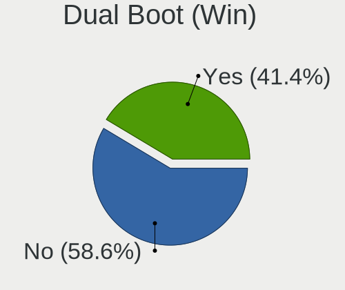
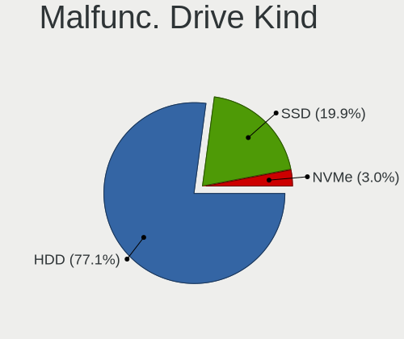
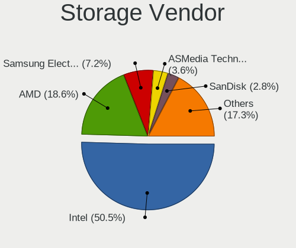
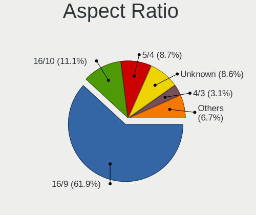
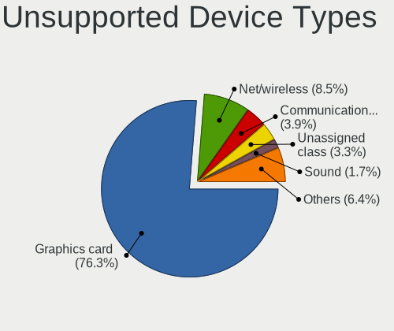

Debian 11 - Tested Hardware & Statistics (Desktops)
---------------------------------------------------

A project to collect tested hardware configurations for Debian 11.

Anyone can contribute to this report by the [hw-probe](https://github.com/linuxhw/hw-probe) tool:

    sudo -E hw-probe -all -upload

Please submit a probe of your configuration if it's not presented on the page or is rare.

Full-feature report is available here: https://linux-hardware.org/?view=trends

Contents
--------

* [ Test Cases ](#test-cases)

* [ System ](#system)
  - [ Kernel                   ](#kernel)
  - [ Kernel Family            ](#kernel-family)
  - [ Kernel Major Ver.        ](#kernel-major-ver)
  - [ Arch                     ](#arch)
  - [ DE                       ](#de)
  - [ Display Server           ](#display-server)
  - [ Display Manager          ](#display-manager)
  - [ OS Lang                  ](#os-lang)
  - [ Boot Mode                ](#boot-mode)
  - [ Filesystem               ](#filesystem)
  - [ Part. scheme             ](#part-scheme)
  - [ Dual Boot with Linux/BSD ](#dual-boot-with-linuxbsd)
  - [ Dual Boot (Win)          ](#dual-boot-win)

* [ Board ](#board)
  - [ Vendor                   ](#vendor)
  - [ Model                    ](#model)
  - [ Model Family             ](#model-family)
  - [ MFG Year                 ](#mfg-year)
  - [ Form Factor              ](#form-factor)
  - [ Secure Boot              ](#secure-boot)
  - [ Coreboot                 ](#coreboot)
  - [ RAM Size                 ](#ram-size)
  - [ RAM Used                 ](#ram-used)
  - [ Total Drives             ](#total-drives)
  - [ Has CD-ROM               ](#has-cd-rom)
  - [ Has Ethernet             ](#has-ethernet)
  - [ Has WiFi                 ](#has-wifi)
  - [ Has Bluetooth            ](#has-bluetooth)

* [ Location ](#location)
  - [ Country                  ](#country)
  - [ City                     ](#city)

* [ Drives ](#drives)
  - [ Drive Vendor             ](#drive-vendor)
  - [ Drive Model              ](#drive-model)
  - [ HDD Vendor               ](#hdd-vendor)
  - [ SSD Vendor               ](#ssd-vendor)
  - [ Drive Kind               ](#drive-kind)
  - [ Drive Connector          ](#drive-connector)
  - [ Drive Size               ](#drive-size)
  - [ Space Total              ](#space-total)
  - [ Space Used               ](#space-used)
  - [ Malfunc. Drives          ](#malfunc-drives)
  - [ Malfunc. Drive Vendor    ](#malfunc-drive-vendor)
  - [ Malfunc. HDD Vendor      ](#malfunc-hdd-vendor)
  - [ Malfunc. Drive Kind      ](#malfunc-drive-kind)
  - [ Failed Drives            ](#failed-drives)
  - [ Failed Drive Vendor      ](#failed-drive-vendor)
  - [ Drive Status             ](#drive-status)

* [ Storage controller ](#storage-controller)
  - [ Storage Vendor           ](#storage-vendor)
  - [ Storage Model            ](#storage-model)
  - [ Storage Kind             ](#storage-kind)

* [ Processor ](#processor)
  - [ CPU Vendor               ](#cpu-vendor)
  - [ CPU Model                ](#cpu-model)
  - [ CPU Model Family         ](#cpu-model-family)
  - [ CPU Cores                ](#cpu-cores)
  - [ CPU Sockets              ](#cpu-sockets)
  - [ CPU Threads              ](#cpu-threads)
  - [ CPU Op-Modes             ](#cpu-op-modes)
  - [ CPU Microcode            ](#cpu-microcode)
  - [ CPU Microarch            ](#cpu-microarch)

* [ Graphics ](#graphics)
  - [ GPU Vendor               ](#gpu-vendor)
  - [ GPU Model                ](#gpu-model)
  - [ GPU Combo                ](#gpu-combo)
  - [ GPU Driver               ](#gpu-driver)
  - [ GPU Memory               ](#gpu-memory)

* [ Monitor ](#monitor)
  - [ Monitor Vendor           ](#monitor-vendor)
  - [ Monitor Model            ](#monitor-model)
  - [ Monitor Resolution       ](#monitor-resolution)
  - [ Monitor Diagonal         ](#monitor-diagonal)
  - [ Monitor Width            ](#monitor-width)
  - [ Aspect Ratio             ](#aspect-ratio)
  - [ Monitor Area             ](#monitor-area)
  - [ Pixel Density            ](#pixel-density)
  - [ Multiple Monitors        ](#multiple-monitors)

* [ Network ](#network)
  - [ Net Controller Vendor    ](#net-controller-vendor)
  - [ Net Controller Model     ](#net-controller-model)
  - [ Wireless Vendor          ](#wireless-vendor)
  - [ Wireless Model           ](#wireless-model)
  - [ Ethernet Vendor          ](#ethernet-vendor)
  - [ Ethernet Model           ](#ethernet-model)
  - [ Net Controller Kind      ](#net-controller-kind)
  - [ Used Controller          ](#used-controller)
  - [ NICs                     ](#nics)
  - [ IPv6                     ](#ipv6)

* [ Bluetooth ](#bluetooth)
  - [ Bluetooth Vendor         ](#bluetooth-vendor)
  - [ Bluetooth Model          ](#bluetooth-model)

* [ Sound ](#sound)
  - [ Sound Vendor             ](#sound-vendor)
  - [ Sound Model              ](#sound-model)

* [ Memory ](#memory)
  - [ Memory Vendor            ](#memory-vendor)
  - [ Memory Model             ](#memory-model)
  - [ Memory Kind              ](#memory-kind)
  - [ Memory Form Factor       ](#memory-form-factor)
  - [ Memory Size              ](#memory-size)
  - [ Memory Speed             ](#memory-speed)

* [ Printers & scanners ](#printers--scanners)
  - [ Printer Vendor           ](#printer-vendor)
  - [ Printer Model            ](#printer-model)
  - [ Scanner Vendor           ](#scanner-vendor)
  - [ Scanner Model            ](#scanner-model)

* [ Camera ](#camera)
  - [ Camera Vendor            ](#camera-vendor)
  - [ Camera Model             ](#camera-model)

* [ Security ](#security)
  - [ Fingerprint Vendor       ](#fingerprint-vendor)
  - [ Fingerprint Model        ](#fingerprint-model)
  - [ Chipcard Vendor          ](#chipcard-vendor)
  - [ Chipcard Model           ](#chipcard-model)

* [ Unsupported ](#unsupported)
  - [ Unsupported Devices      ](#unsupported-devices)
  - [ Unsupported Device Types ](#unsupported-device-types)

Test Cases
----------

Total: 1293

| Vendor        | Model                       | Probe                                                      | Date         |
|---------------|-----------------------------|------------------------------------------------------------|--------------|
| ASRock        | G31M-S                      | [33737ec5ba](https://linux-hardware.org/?probe=33737ec5ba) | Apr 01, 2022 |
| Lenovo        | SHARKBAY 0B98401 WIN        | [5215972642](https://linux-hardware.org/?probe=5215972642) | Mar 31, 2022 |
| Lenovo        | ThinkCentre M91p 4524AS3    | [c338f4ffd4](https://linux-hardware.org/?probe=c338f4ffd4) | Mar 31, 2022 |
| Gigabyte      | B360M H                     | [c6d64363b9](https://linux-hardware.org/?probe=c6d64363b9) | Mar 31, 2022 |
| Gigabyte      | H81M-S2V                    | [f2dc785121](https://linux-hardware.org/?probe=f2dc785121) | Mar 31, 2022 |
| Dell          | 0MN1TX A02                  | [f9be94fa9b](https://linux-hardware.org/?probe=f9be94fa9b) | Mar 31, 2022 |
| Dell          | OptiPlex 7010               | [f1167c797e](https://linux-hardware.org/?probe=f1167c797e) | Mar 31, 2022 |
| ASRock        | FM2A88X-ITX+                | [edf21d564c](https://linux-hardware.org/?probe=edf21d564c) | Mar 30, 2022 |
| MSI           | H110M PRO-VD                | [e299a5abe8](https://linux-hardware.org/?probe=e299a5abe8) | Mar 30, 2022 |
| ASUSTek       | H81M-K                      | [cefeb9762e](https://linux-hardware.org/?probe=cefeb9762e) | Mar 30, 2022 |
| Gigabyte      | P35-DS3L                    | [8167ee62f2](https://linux-hardware.org/?probe=8167ee62f2) | Mar 30, 2022 |
| Gigabyte      | Z270-Gaming K3              | [50780eda28](https://linux-hardware.org/?probe=50780eda28) | Mar 30, 2022 |
| Lenovo        | Myrtle CRB SDK0J40700 WI... | [078946745f](https://linux-hardware.org/?probe=078946745f) | Mar 30, 2022 |
| ASUSTek       | TUF Gaming X570-PRO         | [3e182ccdbe](https://linux-hardware.org/?probe=3e182ccdbe) | Mar 30, 2022 |
| ASUSTek       | PRIME B460M-A               | [519c65be70](https://linux-hardware.org/?probe=519c65be70) | Mar 29, 2022 |
| ASUSTek       | PRIME B460M-A               | [f21f3af1ca](https://linux-hardware.org/?probe=f21f3af1ca) | Mar 29, 2022 |
| MSI           | H81M-P33                    | [853b5b2236](https://linux-hardware.org/?probe=853b5b2236) | Mar 29, 2022 |
| Foxconn       | H61MXL-K                    | [50b743dab8](https://linux-hardware.org/?probe=50b743dab8) | Mar 29, 2022 |
| ASUSTek       | PRIME H310M-R R2.0          | [0ff3da859e](https://linux-hardware.org/?probe=0ff3da859e) | Mar 29, 2022 |
| ASUSTek       | P6T                         | [00868ae20c](https://linux-hardware.org/?probe=00868ae20c) | Mar 29, 2022 |
| ASUSTek       | PRIME H310M-R R2.0          | [7fe672d3a9](https://linux-hardware.org/?probe=7fe672d3a9) | Mar 28, 2022 |
| ASUSTek       | B85-PRO GAMER               | [44913af0e4](https://linux-hardware.org/?probe=44913af0e4) | Mar 27, 2022 |
| Lenovo        | ThinkServer TS440           | [a356a33d0a](https://linux-hardware.org/?probe=a356a33d0a) | Mar 27, 2022 |
| Dell          | 0PC5F7 A03                  | [aeb87f174c](https://linux-hardware.org/?probe=aeb87f174c) | Mar 27, 2022 |
| ASRock        | FM2A88X-ITX+                | [dc35b742d2](https://linux-hardware.org/?probe=dc35b742d2) | Mar 26, 2022 |
| Lenovo        | ThinkCentre M91p 4524AS3    | [7e1b536f6b](https://linux-hardware.org/?probe=7e1b536f6b) | Mar 26, 2022 |
| Biostar       | B450MH                      | [9152345747](https://linux-hardware.org/?probe=9152345747) | Mar 26, 2022 |
| Fujitsu       | D3221-A1 S26361-D3221-A1    | [c8a76eb9ae](https://linux-hardware.org/?probe=c8a76eb9ae) | Mar 25, 2022 |
| Gigabyte      | H510M H                     | [d809ca0f7a](https://linux-hardware.org/?probe=d809ca0f7a) | Mar 25, 2022 |
| Intel         | B75                         | [9f73efdcc8](https://linux-hardware.org/?probe=9f73efdcc8) | Mar 25, 2022 |
| Lenovo        | SHARKBAY SDK0E50510 WIN     | [9da89c589d](https://linux-hardware.org/?probe=9da89c589d) | Mar 24, 2022 |
| ASUSTek       | PRIME H510M-A               | [9590cc2288](https://linux-hardware.org/?probe=9590cc2288) | Mar 24, 2022 |
| Biostar       | G31D-M7                     | [9882f292ea](https://linux-hardware.org/?probe=9882f292ea) | Mar 24, 2022 |
| Dell          | 0Y7WYT A00                  | [2376c46c04](https://linux-hardware.org/?probe=2376c46c04) | Mar 23, 2022 |
| ASUSTek       | TUF B450M-PLUS GAMING       | [847b9e1fbb](https://linux-hardware.org/?probe=847b9e1fbb) | Mar 23, 2022 |
| Lenovo        | SHARKBAY SDK0E50510 WIN     | [7a02e1b55c](https://linux-hardware.org/?probe=7a02e1b55c) | Mar 22, 2022 |
| Gigabyte      | M61PME-S2P                  | [ccb3b312a1](https://linux-hardware.org/?probe=ccb3b312a1) | Mar 22, 2022 |
| HP            | 1589                        | [a97fa22164](https://linux-hardware.org/?probe=a97fa22164) | Mar 22, 2022 |
| Digiboard     | MPxx                        | [b3bb9ff288](https://linux-hardware.org/?probe=b3bb9ff288) | Mar 22, 2022 |
| MSI           | 760GM -E51                  | [fd746ce3ee](https://linux-hardware.org/?probe=fd746ce3ee) | Mar 21, 2022 |
| ASUSTek       | H81M-E                      | [069849c461](https://linux-hardware.org/?probe=069849c461) | Mar 21, 2022 |
| ASUSTek       | PRIME H510M-A               | [9c0d4c37d8](https://linux-hardware.org/?probe=9c0d4c37d8) | Mar 21, 2022 |
| Gigabyte      | H81M-S2V                    | [d8f482f916](https://linux-hardware.org/?probe=d8f482f916) | Mar 21, 2022 |
| Dell          | 07T4MC A09                  | [ef5f0dcfe7](https://linux-hardware.org/?probe=ef5f0dcfe7) | Mar 21, 2022 |
| HP            | 18E7                        | [727446a2df](https://linux-hardware.org/?probe=727446a2df) | Mar 20, 2022 |
| Gigabyte      | B450M GAMING                | [9cc0fc6cd0](https://linux-hardware.org/?probe=9cc0fc6cd0) | Mar 19, 2022 |
| MSI           | A320M-A PRO MAX             | [b77a3343c9](https://linux-hardware.org/?probe=b77a3343c9) | Mar 19, 2022 |
| Gigabyte      | G31M-S2L                    | [b9822ea50b](https://linux-hardware.org/?probe=b9822ea50b) | Mar 18, 2022 |
| ASRock        | Z87 Pro4                    | [7c46cc65dc](https://linux-hardware.org/?probe=7c46cc65dc) | Mar 18, 2022 |
| ASUSTek       | P5K/EPU                     | [38de085421](https://linux-hardware.org/?probe=38de085421) | Mar 17, 2022 |
| Intel         | DH67BL AAG10189-211         | [90b9116ab3](https://linux-hardware.org/?probe=90b9116ab3) | Mar 17, 2022 |
| ASUSTek       | PRIME H510M-A               | [d71d1c794b](https://linux-hardware.org/?probe=d71d1c794b) | Mar 17, 2022 |
| Gigabyte      | B360M H                     | [3190c29544](https://linux-hardware.org/?probe=3190c29544) | Mar 17, 2022 |
| Unknown       | Unknown                     | [1aaee68ff4](https://linux-hardware.org/?probe=1aaee68ff4) | Mar 16, 2022 |
| MSI           | 760GM -E51                  | [0d9d56531d](https://linux-hardware.org/?probe=0d9d56531d) | Mar 16, 2022 |
| ASUSTek       | PRIME Z690-A                | [228a532955](https://linux-hardware.org/?probe=228a532955) | Mar 16, 2022 |
| ASUSTek       | PRIME H510M-A               | [fedff7063c](https://linux-hardware.org/?probe=fedff7063c) | Mar 16, 2022 |
| MSI           | H110M PRO-VD                | [c187336160](https://linux-hardware.org/?probe=c187336160) | Mar 16, 2022 |
| MSI           | MAG X570 TOMAHAWK WIFI      | [11bc08ed1f](https://linux-hardware.org/?probe=11bc08ed1f) | Mar 16, 2022 |
| HP            | ProLiant MicroServer Gen... | [9da39d2356](https://linux-hardware.org/?probe=9da39d2356) | Mar 15, 2022 |
| ASUSTek       | SABERTOOTH 990FX R2.0       | [539ebb7dd9](https://linux-hardware.org/?probe=539ebb7dd9) | Mar 15, 2022 |
| ASUSTek       | B85M-G                      | [aa7912e58f](https://linux-hardware.org/?probe=aa7912e58f) | Mar 15, 2022 |
| ASUSTek       | B85M-G                      | [cc44f7c610](https://linux-hardware.org/?probe=cc44f7c610) | Mar 14, 2022 |
| AQUARIUS      | AQH310CM                    | [e2d2a06fac](https://linux-hardware.org/?probe=e2d2a06fac) | Mar 14, 2022 |
| Supermicro    | A1SRi-2758F                 | [f78973af80](https://linux-hardware.org/?probe=f78973af80) | Mar 14, 2022 |
| Gigabyte      | M68MT-S2                    | [7f4d5a9689](https://linux-hardware.org/?probe=7f4d5a9689) | Mar 14, 2022 |
| ASUSTek       | M5A78L-M LX/BR              | [2e828331f3](https://linux-hardware.org/?probe=2e828331f3) | Mar 14, 2022 |
| Gigabyte      | GA-78LMT-USB3 SEx           | [3a5b71395a](https://linux-hardware.org/?probe=3a5b71395a) | Mar 13, 2022 |
| Gigabyte      | GA-78LMT-USB3 SEx           | [8cfd0e9795](https://linux-hardware.org/?probe=8cfd0e9795) | Mar 13, 2022 |
| MSI           | MPG X570S EDGE MAX WIFI     | [595ba4af42](https://linux-hardware.org/?probe=595ba4af42) | Mar 13, 2022 |
| Lenovo        | MAHOBAY                     | [0141fa64e7](https://linux-hardware.org/?probe=0141fa64e7) | Mar 13, 2022 |
| Lenovo        | MAHOBAY                     | [1dac441515](https://linux-hardware.org/?probe=1dac441515) | Mar 12, 2022 |
| ASUSTek       | TUF B450M-PLUS GAMING       | [85920b5b34](https://linux-hardware.org/?probe=85920b5b34) | Mar 12, 2022 |
| MSI           | B450M PRO-VDH MAX           | [2f53098049](https://linux-hardware.org/?probe=2f53098049) | Mar 12, 2022 |
| MSI           | H81M-P33                    | [0f103bcb15](https://linux-hardware.org/?probe=0f103bcb15) | Mar 12, 2022 |
| ASUSTek       | M5A97                       | [a89e3579bb](https://linux-hardware.org/?probe=a89e3579bb) | Mar 12, 2022 |
| Lenovo        | ThinkServer TS440           | [ec0e6e5114](https://linux-hardware.org/?probe=ec0e6e5114) | Mar 11, 2022 |
| ASUSTek       | P5KPL-AM IN/GB              | [927be27436](https://linux-hardware.org/?probe=927be27436) | Mar 11, 2022 |
| MSI           | H81M-P33                    | [304738db66](https://linux-hardware.org/?probe=304738db66) | Mar 11, 2022 |
| Gigabyte      | M61PME-S2P                  | [37c37094b9](https://linux-hardware.org/?probe=37c37094b9) | Mar 11, 2022 |
| Fujitsu       | D3221-A1 S26361-D3221-A1    | [2d3f5f0f14](https://linux-hardware.org/?probe=2d3f5f0f14) | Mar 11, 2022 |
| Fujitsu       | D3221-A1 S26361-D3221-A1    | [11b61d2b8a](https://linux-hardware.org/?probe=11b61d2b8a) | Mar 11, 2022 |
| ECS           | H61H2-M13                   | [c10003c041](https://linux-hardware.org/?probe=c10003c041) | Mar 11, 2022 |
| Gigabyte      | H81M-S2V                    | [db28c629ec](https://linux-hardware.org/?probe=db28c629ec) | Mar 10, 2022 |
| Gigabyte      | M68MT-S2                    | [e3ff8d781a](https://linux-hardware.org/?probe=e3ff8d781a) | Mar 10, 2022 |
| Gigabyte      | M68MT-S2                    | [0b30878d3e](https://linux-hardware.org/?probe=0b30878d3e) | Mar 09, 2022 |
| Gigabyte      | M61PME-S2P                  | [fcde4dafe3](https://linux-hardware.org/?probe=fcde4dafe3) | Mar 09, 2022 |
| MSI           | H81M-P33                    | [cf152def87](https://linux-hardware.org/?probe=cf152def87) | Mar 09, 2022 |
| MSI           | 3664h                       | [e5eaec6553](https://linux-hardware.org/?probe=e5eaec6553) | Mar 08, 2022 |
| MSI           | B550M PRO-VDH WIFI          | [5b31db42d4](https://linux-hardware.org/?probe=5b31db42d4) | Mar 08, 2022 |
| HP            | 1589                        | [5a3c3065d0](https://linux-hardware.org/?probe=5a3c3065d0) | Mar 07, 2022 |
| MSI           | H81M-P33                    | [546746c825](https://linux-hardware.org/?probe=546746c825) | Mar 07, 2022 |
| Gigabyte      | GA-990FXA-D3                | [35e716f504](https://linux-hardware.org/?probe=35e716f504) | Mar 07, 2022 |
| MSI           | H81M-P33                    | [493fe1a76a](https://linux-hardware.org/?probe=493fe1a76a) | Mar 07, 2022 |
| HP            | 3399                        | [60fa2f3867](https://linux-hardware.org/?probe=60fa2f3867) | Mar 07, 2022 |
| ASRock        | FM2A88X+ Killer             | [c75eb0d27f](https://linux-hardware.org/?probe=c75eb0d27f) | Mar 07, 2022 |
| Acer          | EG43M                       | [3df7717081](https://linux-hardware.org/?probe=3df7717081) | Mar 06, 2022 |
| MSI           | H81M-P33                    | [731850ebaf](https://linux-hardware.org/?probe=731850ebaf) | Mar 06, 2022 |
| Gigabyte      | H110M-S2PV-CF               | [87bffb084f](https://linux-hardware.org/?probe=87bffb084f) | Mar 06, 2022 |
| Gigabyte      | M68MT-S2                    | [b57d637fce](https://linux-hardware.org/?probe=b57d637fce) | Mar 06, 2022 |
| Gigabyte      | H110M-S2H-CF                | [2df5098230](https://linux-hardware.org/?probe=2df5098230) | Mar 05, 2022 |
| Foxconn       | 2A8Ch                       | [49093d0be0](https://linux-hardware.org/?probe=49093d0be0) | Mar 05, 2022 |
| ASUSTek       | H87M-PRO                    | [99effa6921](https://linux-hardware.org/?probe=99effa6921) | Mar 05, 2022 |
| MSI           | MPG X570 GAMING PLUS        | [ac671d5e38](https://linux-hardware.org/?probe=ac671d5e38) | Mar 05, 2022 |
| Gigabyte      | Z390 AORUS MASTER-CF        | [90e4cc2972](https://linux-hardware.org/?probe=90e4cc2972) | Mar 05, 2022 |
| Gigabyte      | Z390 AORUS MASTER-CF        | [a786074185](https://linux-hardware.org/?probe=a786074185) | Mar 05, 2022 |
| MSI           | H110M PRO-VD                | [015cea29f4](https://linux-hardware.org/?probe=015cea29f4) | Mar 04, 2022 |
| Gigabyte      | B450M S2H V2                | [000ae29fb1](https://linux-hardware.org/?probe=000ae29fb1) | Mar 03, 2022 |
| Foxconn       | Irvine HP P/N               | [1d37020507](https://linux-hardware.org/?probe=1d37020507) | Mar 03, 2022 |
| ASUSTek       | PRIME H510M-A               | [0195fe9da4](https://linux-hardware.org/?probe=0195fe9da4) | Mar 03, 2022 |
| Dell          | 0RM5DR A00                  | [2a8f42bdc3](https://linux-hardware.org/?probe=2a8f42bdc3) | Mar 03, 2022 |
| ASRock        | B550M Pro4                  | [c67a313947](https://linux-hardware.org/?probe=c67a313947) | Mar 03, 2022 |
| Intel         | DG41CN AAE82429-102         | [0e75969d4d](https://linux-hardware.org/?probe=0e75969d4d) | Mar 03, 2022 |
| Intel         | DG41CN AAE82429-102         | [a4145828e3](https://linux-hardware.org/?probe=a4145828e3) | Mar 02, 2022 |
| Gigabyte      | B85M-D3H                    | [a90b7bb57e](https://linux-hardware.org/?probe=a90b7bb57e) | Mar 02, 2022 |
| Gigabyte      | B85M-D3H                    | [6e98976f1a](https://linux-hardware.org/?probe=6e98976f1a) | Mar 01, 2022 |
| ASUSTek       | PRIME H510M-A               | [e683855566](https://linux-hardware.org/?probe=e683855566) | Mar 01, 2022 |
| ASUSTek       | PRIME H510M-A               | [c5b8c08527](https://linux-hardware.org/?probe=c5b8c08527) | Mar 01, 2022 |
| ASUSTek       | PRIME H510M-A               | [e61dde5545](https://linux-hardware.org/?probe=e61dde5545) | Mar 01, 2022 |
| Gigabyte      | GA-78LMT-S2                 | [87083d1a0f](https://linux-hardware.org/?probe=87083d1a0f) | Feb 28, 2022 |
| ASUSTek       | PRIME H510M-A               | [efcd8651f8](https://linux-hardware.org/?probe=efcd8651f8) | Feb 28, 2022 |
| ASUSTek       | SABERTOOTH 990FX R2.0       | [332a3f936b](https://linux-hardware.org/?probe=332a3f936b) | Feb 28, 2022 |
| ASUSTek       | ROG STRIX Z370-H GAMING     | [0bb471d9a2](https://linux-hardware.org/?probe=0bb471d9a2) | Feb 28, 2022 |
| ASUSTek       | PRIME H510M-A               | [a032cb00cd](https://linux-hardware.org/?probe=a032cb00cd) | Feb 28, 2022 |
| MSI           | H81M-P33                    | [4595a12a77](https://linux-hardware.org/?probe=4595a12a77) | Feb 28, 2022 |
| HP            | 09F8h                       | [19dc89049d](https://linux-hardware.org/?probe=19dc89049d) | Feb 28, 2022 |
| ASRock        | 760GM-HDV                   | [7f7cbc5231](https://linux-hardware.org/?probe=7f7cbc5231) | Feb 28, 2022 |
| Gigabyte      | H61M-DS2                    | [905f4927f5](https://linux-hardware.org/?probe=905f4927f5) | Feb 28, 2022 |
| MSI           | H81M-P33                    | [60e41d668b](https://linux-hardware.org/?probe=60e41d668b) | Feb 27, 2022 |
| Intel         | H81                         | [a62759e3c8](https://linux-hardware.org/?probe=a62759e3c8) | Feb 27, 2022 |
| Intel         | H81                         | [d1f816774f](https://linux-hardware.org/?probe=d1f816774f) | Feb 27, 2022 |
| Digiboard     | MPxx                        | [9ad44a5962](https://linux-hardware.org/?probe=9ad44a5962) | Feb 26, 2022 |
| ASRock        | FM2A88X+ Killer             | [4f5cd3d750](https://linux-hardware.org/?probe=4f5cd3d750) | Feb 26, 2022 |
| ASRock        | FM2A88X+ Killer             | [cc86c9d580](https://linux-hardware.org/?probe=cc86c9d580) | Feb 26, 2022 |
| ASRock        | N68-VS3 UCC                 | [39389b9ddf](https://linux-hardware.org/?probe=39389b9ddf) | Feb 26, 2022 |
| Lenovo        | 3132 SDK0R32862 WIN 3258... | [4492e8dd58](https://linux-hardware.org/?probe=4492e8dd58) | Feb 26, 2022 |
| Lenovo        | 3132 SDK0R32862 WIN 3258... | [6bb6bfa47a](https://linux-hardware.org/?probe=6bb6bfa47a) | Feb 26, 2022 |
| Clientron ... | L700                        | [c2cebca02b](https://linux-hardware.org/?probe=c2cebca02b) | Feb 26, 2022 |
| Gigabyte      | H61M-DS2                    | [c4d875ab4f](https://linux-hardware.org/?probe=c4d875ab4f) | Feb 25, 2022 |
| MSI           | H81M-P33                    | [647a154bd6](https://linux-hardware.org/?probe=647a154bd6) | Feb 25, 2022 |
| ASUSTek       | PRIME H510M-A               | [50f19dd349](https://linux-hardware.org/?probe=50f19dd349) | Feb 25, 2022 |
| Gigabyte      | 8I945GZME-RH                | [4afdb1534e](https://linux-hardware.org/?probe=4afdb1534e) | Feb 25, 2022 |
| Gigabyte      | B250M-D2V-CF                | [e97bd26a11](https://linux-hardware.org/?probe=e97bd26a11) | Feb 25, 2022 |
| ASUSTek       | P5G41T-M LE                 | [a8f77b99e9](https://linux-hardware.org/?probe=a8f77b99e9) | Feb 25, 2022 |
| ECS           | G31T-M9                     | [4de828bf82](https://linux-hardware.org/?probe=4de828bf82) | Feb 25, 2022 |
| ASUSTek       | P9X79                       | [cd0609e2cc](https://linux-hardware.org/?probe=cd0609e2cc) | Feb 25, 2022 |
| ASUSTek       | P9X79                       | [f576f08ecb](https://linux-hardware.org/?probe=f576f08ecb) | Feb 24, 2022 |
| MSI           | H81M-P33                    | [64955f775b](https://linux-hardware.org/?probe=64955f775b) | Feb 24, 2022 |
| ASUSTek       | PRIME H510M-A               | [0b5555f2ed](https://linux-hardware.org/?probe=0b5555f2ed) | Feb 24, 2022 |
| Gigabyte      | 8I945GZME-RH                | [a7414ad5c1](https://linux-hardware.org/?probe=a7414ad5c1) | Feb 24, 2022 |
| Unknown       | Unknown                     | [be7b7ac530](https://linux-hardware.org/?probe=be7b7ac530) | Feb 24, 2022 |
| MSI           | H110M PRO-VD                | [5e687a3ff4](https://linux-hardware.org/?probe=5e687a3ff4) | Feb 24, 2022 |
| ECS           | G31T-M9                     | [a5898e6474](https://linux-hardware.org/?probe=a5898e6474) | Feb 24, 2022 |
| ASUSTek       | PRIME H510M-A               | [00e3cebb2f](https://linux-hardware.org/?probe=00e3cebb2f) | Feb 24, 2022 |
| ASUSTek       | PRIME H510M-A               | [cbf876b408](https://linux-hardware.org/?probe=cbf876b408) | Feb 24, 2022 |
| Gigabyte      | H410M S2H                   | [71de12f898](https://linux-hardware.org/?probe=71de12f898) | Feb 24, 2022 |
| Clientron ... | L700                        | [0a16915d4f](https://linux-hardware.org/?probe=0a16915d4f) | Feb 23, 2022 |
| Clientron ... | L700                        | [64f361f774](https://linux-hardware.org/?probe=64f361f774) | Feb 23, 2022 |
| Gigabyte      | H410M S2H                   | [399a541ed9](https://linux-hardware.org/?probe=399a541ed9) | Feb 23, 2022 |
| Gigabyte      | B550M AORUS PRO             | [98a6706e6a](https://linux-hardware.org/?probe=98a6706e6a) | Feb 23, 2022 |
| MSI           | Z97 GAMING 5                | [779dfa3e78](https://linux-hardware.org/?probe=779dfa3e78) | Feb 22, 2022 |
| Gigabyte      | G31M-S2L                    | [8580399323](https://linux-hardware.org/?probe=8580399323) | Feb 22, 2022 |
| Gigabyte      | Z390 GAMING X-CF            | [611cfcfbaa](https://linux-hardware.org/?probe=611cfcfbaa) | Feb 22, 2022 |
| ASUSTek       | P6X58D PREMIUM              | [286998a230](https://linux-hardware.org/?probe=286998a230) | Feb 22, 2022 |
| ECS           | G31T-M9                     | [a1c64c22b2](https://linux-hardware.org/?probe=a1c64c22b2) | Feb 21, 2022 |
| Gigabyte      | H81M-DS2V                   | [d4f94f7b98](https://linux-hardware.org/?probe=d4f94f7b98) | Feb 21, 2022 |
| Foxconn       | H61MXL-K                    | [2a9136e1ad](https://linux-hardware.org/?probe=2a9136e1ad) | Feb 21, 2022 |
| Gigabyte      | B250M-DS3H-CF               | [62161a1c28](https://linux-hardware.org/?probe=62161a1c28) | Feb 21, 2022 |
| Gigabyte      | B250M-DS3H-CF               | [aeba2103e0](https://linux-hardware.org/?probe=aeba2103e0) | Feb 21, 2022 |
| ASRock        | B450 Pro4                   | [cf906c0ca1](https://linux-hardware.org/?probe=cf906c0ca1) | Feb 20, 2022 |
| ASUSTek       | PRIME B450M-A II            | [2a57fc9391](https://linux-hardware.org/?probe=2a57fc9391) | Feb 20, 2022 |
| ASRock        | B450 Pro4                   | [807790386b](https://linux-hardware.org/?probe=807790386b) | Feb 20, 2022 |
| ASRock        | J4205-ITX                   | [e7e09c80fa](https://linux-hardware.org/?probe=e7e09c80fa) | Feb 20, 2022 |
| HP            | 158A                        | [f31e70e834](https://linux-hardware.org/?probe=f31e70e834) | Feb 19, 2022 |
| Dell          | 0PU052                      | [20d5c30034](https://linux-hardware.org/?probe=20d5c30034) | Feb 19, 2022 |
| ASRock        | A320M-HDV                   | [6678e3ba4a](https://linux-hardware.org/?probe=6678e3ba4a) | Feb 18, 2022 |
| Gigabyte      | M52L-S3P                    | [b8aecf78e9](https://linux-hardware.org/?probe=b8aecf78e9) | Feb 18, 2022 |
| MSI           | H81M-P33                    | [ee22059bf7](https://linux-hardware.org/?probe=ee22059bf7) | Feb 18, 2022 |
| ASRock        | H570M-ITX/ac                | [3eb9652b7e](https://linux-hardware.org/?probe=3eb9652b7e) | Feb 18, 2022 |
| Gigabyte      | H110M-S2V-CF                | [37b0807b22](https://linux-hardware.org/?probe=37b0807b22) | Feb 18, 2022 |
| Gigabyte      | M61PME-S2                   | [c1b7bc8432](https://linux-hardware.org/?probe=c1b7bc8432) | Feb 18, 2022 |
| HP            | 0AACh                       | [5a45fe2b9b](https://linux-hardware.org/?probe=5a45fe2b9b) | Feb 18, 2022 |
| ASRock        | A320M-HDV                   | [f37110c1d5](https://linux-hardware.org/?probe=f37110c1d5) | Feb 18, 2022 |
| ECS           | G31T-M9                     | [c239ee9817](https://linux-hardware.org/?probe=c239ee9817) | Feb 17, 2022 |
| Gigabyte      | M61PME-S2                   | [9dca95891f](https://linux-hardware.org/?probe=9dca95891f) | Feb 17, 2022 |
| ASUSTek       | Z97-A                       | [b1ab92368d](https://linux-hardware.org/?probe=b1ab92368d) | Feb 17, 2022 |
| ASUSTek       | H61M-E                      | [8500cd1a03](https://linux-hardware.org/?probe=8500cd1a03) | Feb 17, 2022 |
| Dell          | 0PTTT9 A01                  | [89cecb62bc](https://linux-hardware.org/?probe=89cecb62bc) | Feb 17, 2022 |
| ASRock        | G41M-VGS3                   | [b0d8f9faed](https://linux-hardware.org/?probe=b0d8f9faed) | Feb 16, 2022 |
| Gigabyte      | P55-UD3L                    | [e7318489dd](https://linux-hardware.org/?probe=e7318489dd) | Feb 16, 2022 |
| HP            | 8433 11                     | [3e76b8876b](https://linux-hardware.org/?probe=3e76b8876b) | Feb 16, 2022 |
| MSI           | MPG X570S CARBON MAX WIF... | [b11d43558e](https://linux-hardware.org/?probe=b11d43558e) | Feb 15, 2022 |
| Dell          | 0CRH6C A02                  | [f014fcba4f](https://linux-hardware.org/?probe=f014fcba4f) | Feb 14, 2022 |
| Gigabyte      | P55-UD3L                    | [bf852c386f](https://linux-hardware.org/?probe=bf852c386f) | Feb 14, 2022 |
| Medion        | Z370H4-EM                   | [254b8351a1](https://linux-hardware.org/?probe=254b8351a1) | Feb 14, 2022 |
| ASRock        | FM2A68M-HD+                 | [c034584d73](https://linux-hardware.org/?probe=c034584d73) | Feb 13, 2022 |
| MSI           | MS-7053                     | [2ee97bf0a8](https://linux-hardware.org/?probe=2ee97bf0a8) | Feb 13, 2022 |
| Lenovo        | MAHOBAY NO DPK              | [d5ba9deed5](https://linux-hardware.org/?probe=d5ba9deed5) | Feb 13, 2022 |
| Gateway       | SX2865 V1.0                 | [890768bebd](https://linux-hardware.org/?probe=890768bebd) | Feb 12, 2022 |
| ASRock        | K8A780LM                    | [4ad26b4255](https://linux-hardware.org/?probe=4ad26b4255) | Feb 12, 2022 |
| ASRock        | K8A780LM                    | [d9641143f2](https://linux-hardware.org/?probe=d9641143f2) | Feb 12, 2022 |
| Gigabyte      | GA-78LMT-USB3 SEx           | [393686a6c4](https://linux-hardware.org/?probe=393686a6c4) | Feb 12, 2022 |
| ASUSTek       | ROG STRIX B560-E GAMING ... | [9b5ea5d470](https://linux-hardware.org/?probe=9b5ea5d470) | Feb 12, 2022 |
| Foxconn       | nT-iBT18/nT-iBT19/nT-iBT... | [51095189f7](https://linux-hardware.org/?probe=51095189f7) | Feb 12, 2022 |
| ASUSTek       | PRIME B460M-A               | [92246486de](https://linux-hardware.org/?probe=92246486de) | Feb 12, 2022 |
| Positivo      | POS-EAA75DE                 | [1b14cace5c](https://linux-hardware.org/?probe=1b14cace5c) | Feb 11, 2022 |
| Lenovo        | MAHOBAY NO DPK              | [1b6bf699a8](https://linux-hardware.org/?probe=1b6bf699a8) | Feb 11, 2022 |
| Gigabyte      | B360M H                     | [565dc78c67](https://linux-hardware.org/?probe=565dc78c67) | Feb 11, 2022 |
| HP            | 2B34                        | [1281e2e4dd](https://linux-hardware.org/?probe=1281e2e4dd) | Feb 10, 2022 |
| ASRockRack    | X470D4U2-2T                 | [c462619a26](https://linux-hardware.org/?probe=c462619a26) | Feb 10, 2022 |
| HP            | 83E0                        | [12a6ad4f59](https://linux-hardware.org/?probe=12a6ad4f59) | Feb 10, 2022 |
| ASUSTek       | P8H61-M LX3 R2.0            | [44a8558637](https://linux-hardware.org/?probe=44a8558637) | Feb 10, 2022 |
| ASUSTek       | P5B SE                      | [cf067d000a](https://linux-hardware.org/?probe=cf067d000a) | Feb 10, 2022 |
| ASUSTek       | EX-A320M-GAMING             | [8e73dc39ab](https://linux-hardware.org/?probe=8e73dc39ab) | Feb 09, 2022 |
| ASRock        | G31M-VS2                    | [9ec5d393d6](https://linux-hardware.org/?probe=9ec5d393d6) | Feb 09, 2022 |
| ASUSTek       | PRIME H510M-A               | [516754657f](https://linux-hardware.org/?probe=516754657f) | Feb 09, 2022 |
| MSI           | G41M-P28                    | [bf1ae3ecc9](https://linux-hardware.org/?probe=bf1ae3ecc9) | Feb 08, 2022 |
| HP            | ProLiant MicroServer Gen... | [0b17c19b0f](https://linux-hardware.org/?probe=0b17c19b0f) | Feb 08, 2022 |
| Intel         | DZ68DB AAG27985-104         | [bc0462d8e3](https://linux-hardware.org/?probe=bc0462d8e3) | Feb 08, 2022 |
| Gigabyte      | H81M-D2V                    | [fb079a5d70](https://linux-hardware.org/?probe=fb079a5d70) | Feb 08, 2022 |
| Gigabyte      | H81M-D2V                    | [99626fa6fd](https://linux-hardware.org/?probe=99626fa6fd) | Feb 08, 2022 |
| ASRock        | J4125M                      | [fa6797fc35](https://linux-hardware.org/?probe=fa6797fc35) | Feb 08, 2022 |
| Gigabyte      | B550M AORUS PRO-P           | [4ceccc2e76](https://linux-hardware.org/?probe=4ceccc2e76) | Feb 07, 2022 |
| Gigabyte      | B660M GAMING DDR4           | [8291648326](https://linux-hardware.org/?probe=8291648326) | Feb 07, 2022 |
| ASUSTek       | B85M-G                      | [7d8714b9f8](https://linux-hardware.org/?probe=7d8714b9f8) | Feb 07, 2022 |
| ASUSTek       | B85M-G                      | [20b4867308](https://linux-hardware.org/?probe=20b4867308) | Feb 07, 2022 |
| HP            | 81B3                        | [aecaad32ad](https://linux-hardware.org/?probe=aecaad32ad) | Feb 07, 2022 |
| ASUSTek       | TUF GAMING B550M-PLUS       | [72a1b5ae56](https://linux-hardware.org/?probe=72a1b5ae56) | Feb 07, 2022 |
| Gigabyte      | B550M AORUS PRO-P           | [9ac652a7bf](https://linux-hardware.org/?probe=9ac652a7bf) | Feb 06, 2022 |
| Dell          | 06CV2N A00                  | [b3be05cbce](https://linux-hardware.org/?probe=b3be05cbce) | Feb 06, 2022 |
| ASRock        | G31M-S                      | [2b4d2d640f](https://linux-hardware.org/?probe=2b4d2d640f) | Feb 05, 2022 |
| Google        | Guado                       | [bfe64f10a1](https://linux-hardware.org/?probe=bfe64f10a1) | Feb 05, 2022 |
| Dell          | 0GY6Y8 A01                  | [f979fa1136](https://linux-hardware.org/?probe=f979fa1136) | Feb 05, 2022 |
| Gigabyte      | B365M DS3H                  | [6d5ae4cd37](https://linux-hardware.org/?probe=6d5ae4cd37) | Feb 05, 2022 |
| Gigabyte      | B365M DS3H                  | [b11a458ecb](https://linux-hardware.org/?probe=b11a458ecb) | Feb 04, 2022 |
| ASRock        | B450 Steel Legend           | [8c7f779c9f](https://linux-hardware.org/?probe=8c7f779c9f) | Feb 04, 2022 |
| MSI           | H81M-P33                    | [38b8a1408d](https://linux-hardware.org/?probe=38b8a1408d) | Feb 04, 2022 |
| MSI           | X470 GAMING PLUS            | [b0c6fdf764](https://linux-hardware.org/?probe=b0c6fdf764) | Feb 04, 2022 |
| ASUSTek       | PRIME TRX40-PRO S           | [cc04fe990c](https://linux-hardware.org/?probe=cc04fe990c) | Feb 03, 2022 |
| ASRock        | FM2A68M-HD+ R2.0            | [2f5f68141f](https://linux-hardware.org/?probe=2f5f68141f) | Feb 03, 2022 |
| Lenovo        | 3132 SDK0R32862 WIN 3258... | [f8f89a9a55](https://linux-hardware.org/?probe=f8f89a9a55) | Feb 03, 2022 |
| Gigabyte      | GA-78LMT-S2P                | [8c7268f192](https://linux-hardware.org/?probe=8c7268f192) | Feb 03, 2022 |
| Dell          | 0GY6Y8 A01                  | [a3590999f3](https://linux-hardware.org/?probe=a3590999f3) | Feb 03, 2022 |
| MSI           | MS-7309                     | [75c2bc30ee](https://linux-hardware.org/?probe=75c2bc30ee) | Feb 03, 2022 |
| Dell          | 0HY9JP A00                  | [7795931f5c](https://linux-hardware.org/?probe=7795931f5c) | Feb 02, 2022 |
| Dell          | 0HY9JP A00                  | [bed385cef6](https://linux-hardware.org/?probe=bed385cef6) | Feb 02, 2022 |
| ABIT          | IP35 PRO                    | [fb20f8b8dd](https://linux-hardware.org/?probe=fb20f8b8dd) | Feb 02, 2022 |
| HP            | 1587h                       | [92625959b4](https://linux-hardware.org/?probe=92625959b4) | Feb 02, 2022 |
| Dell          | 0Y1861 A00                  | [cb60a2e337](https://linux-hardware.org/?probe=cb60a2e337) | Feb 02, 2022 |
| Gigabyte      | X570 AORUS PRO              | [55dc5e6e08](https://linux-hardware.org/?probe=55dc5e6e08) | Feb 01, 2022 |
| Dell          | 0Y1861 A00                  | [1a05a6ca0e](https://linux-hardware.org/?probe=1a05a6ca0e) | Feb 01, 2022 |
| Dell          | 0M863N A00                  | [7b6c2d4857](https://linux-hardware.org/?probe=7b6c2d4857) | Feb 01, 2022 |
| Digiboard     | MPxx                        | [1ea5e5205c](https://linux-hardware.org/?probe=1ea5e5205c) | Feb 01, 2022 |
| HP            | 158A                        | [1f77d0f211](https://linux-hardware.org/?probe=1f77d0f211) | Feb 01, 2022 |
| Lenovo        | 374F SDK0R32862 WIN 3258... | [ee7ecf2967](https://linux-hardware.org/?probe=ee7ecf2967) | Jan 31, 2022 |
| EPoX Compu... | nForce3 DDR: 8KDA3I Seri... | [29b8359b05](https://linux-hardware.org/?probe=29b8359b05) | Jan 31, 2022 |
| EPoX Compu... | nForce3 DDR: 8KDA3I Seri... | [c9e2f8c425](https://linux-hardware.org/?probe=c9e2f8c425) | Jan 31, 2022 |
| HP            | 3031h                       | [6d72e2608a](https://linux-hardware.org/?probe=6d72e2608a) | Jan 31, 2022 |
| ASUSTek       | P8H61-M LX3                 | [b80429c5fe](https://linux-hardware.org/?probe=b80429c5fe) | Jan 31, 2022 |
| HP            | 3031h                       | [dcda450860](https://linux-hardware.org/?probe=dcda450860) | Jan 31, 2022 |
| HP            | 158A                        | [da426c258f](https://linux-hardware.org/?probe=da426c258f) | Jan 31, 2022 |
| ASUSTek       | P8H77-V LE                  | [cd91d445e6](https://linux-hardware.org/?probe=cd91d445e6) | Jan 30, 2022 |
| ASUSTek       | P8H77-V LE                  | [c1703ee8ee](https://linux-hardware.org/?probe=c1703ee8ee) | Jan 30, 2022 |
| ASRock        | N68C-S                      | [a53e0201fe](https://linux-hardware.org/?probe=a53e0201fe) | Jan 30, 2022 |
| Inventec      | DQ Class A02                | [a10cf02e71](https://linux-hardware.org/?probe=a10cf02e71) | Jan 30, 2022 |
| Lenovo        | ThinkStation S20 4105L1U    | [f34d9d82dd](https://linux-hardware.org/?probe=f34d9d82dd) | Jan 29, 2022 |
| MSI           | H81M-P33                    | [d06c6f8577](https://linux-hardware.org/?probe=d06c6f8577) | Jan 29, 2022 |
| ASRock        | B550 Taichi                 | [9816a8594b](https://linux-hardware.org/?probe=9816a8594b) | Jan 29, 2022 |
| Lenovo        | ThinkServer TS440           | [eaef3cbdab](https://linux-hardware.org/?probe=eaef3cbdab) | Jan 29, 2022 |
| Gigabyte      | B550 GAMING X V2            | [579b23602f](https://linux-hardware.org/?probe=579b23602f) | Jan 29, 2022 |
| Gigabyte      | H61M-DS2                    | [efd35e8a46](https://linux-hardware.org/?probe=efd35e8a46) | Jan 28, 2022 |
| Gigabyte      | H61M-DS2                    | [b22a0ac0be](https://linux-hardware.org/?probe=b22a0ac0be) | Jan 28, 2022 |
| ASUSTek       | PRIME H510M-A               | [fa25de8775](https://linux-hardware.org/?probe=fa25de8775) | Jan 27, 2022 |
| ASUSTek       | TUF GAMING B550M-PLUS       | [4ba7714220](https://linux-hardware.org/?probe=4ba7714220) | Jan 27, 2022 |
| ASUSTek       | PRIME H510M-A               | [cf83c49673](https://linux-hardware.org/?probe=cf83c49673) | Jan 27, 2022 |
| ASUSTek       | B85M-G                      | [b994601640](https://linux-hardware.org/?probe=b994601640) | Jan 27, 2022 |
| ASUSTek       | M51BC                       | [b491c2ea72](https://linux-hardware.org/?probe=b491c2ea72) | Jan 27, 2022 |
| Gigabyte      | 2AC8                        | [dddbfc539d](https://linux-hardware.org/?probe=dddbfc539d) | Jan 26, 2022 |
| MSI           | H110M PRO-VH PLUS           | [62e942ea94](https://linux-hardware.org/?probe=62e942ea94) | Jan 26, 2022 |
| HP            | 3647h                       | [6d141f0ee8](https://linux-hardware.org/?probe=6d141f0ee8) | Jan 25, 2022 |
| ASUSTek       | PRIME H510M-A               | [f2eb94b9ee](https://linux-hardware.org/?probe=f2eb94b9ee) | Jan 25, 2022 |
| Gigabyte      | H81M-S2V                    | [7500a45a9c](https://linux-hardware.org/?probe=7500a45a9c) | Jan 25, 2022 |
| Biostar       | TA970                       | [cf3df73bc5](https://linux-hardware.org/?probe=cf3df73bc5) | Jan 24, 2022 |
| Gigabyte      | B450M DS3H-CF               | [7b46c1043e](https://linux-hardware.org/?probe=7b46c1043e) | Jan 24, 2022 |
| HP            | 83E2                        | [1f0f221e5b](https://linux-hardware.org/?probe=1f0f221e5b) | Jan 24, 2022 |
| ASUSTek       | TUF GAMING X570-PLUS        | [7f69220928](https://linux-hardware.org/?probe=7f69220928) | Jan 24, 2022 |
| ASUSTek       | B85M-G                      | [d89e0eaac6](https://linux-hardware.org/?probe=d89e0eaac6) | Jan 24, 2022 |
| Gigabyte      | B560M DS3H V2               | [1f1008ad86](https://linux-hardware.org/?probe=1f1008ad86) | Jan 24, 2022 |
| Foxconn       | 2A8Ch                       | [276caa5169](https://linux-hardware.org/?probe=276caa5169) | Jan 23, 2022 |
| ASUSTek       | B85M-G PLUS/USB             | [f02501a8a9](https://linux-hardware.org/?probe=f02501a8a9) | Jan 23, 2022 |
| ASUSTek       | ROG STRIX B560-I GAMING ... | [012cafbe22](https://linux-hardware.org/?probe=012cafbe22) | Jan 22, 2022 |
| ASUSTek       | P8H77-M PRO                 | [c706f6dd55](https://linux-hardware.org/?probe=c706f6dd55) | Jan 21, 2022 |
| Lenovo        | ThinkServer TS440           | [b736a56c19](https://linux-hardware.org/?probe=b736a56c19) | Jan 21, 2022 |
| Lenovo        | ThinkServer TS440           | [1f5146de0a](https://linux-hardware.org/?probe=1f5146de0a) | Jan 21, 2022 |
| MSI           | B350 PC MATE                | [ab31e5f54c](https://linux-hardware.org/?probe=ab31e5f54c) | Jan 21, 2022 |
| Gigabyte      | B560M DS3H V2               | [c2bec0fc16](https://linux-hardware.org/?probe=c2bec0fc16) | Jan 21, 2022 |
| Gigabyte      | B560M DS3H V2               | [16dc35d7f3](https://linux-hardware.org/?probe=16dc35d7f3) | Jan 21, 2022 |
| ASUSTek       | PRIME B450M-A               | [e211c03111](https://linux-hardware.org/?probe=e211c03111) | Jan 21, 2022 |
| ECS           | H61H2-M13                   | [bb336e025c](https://linux-hardware.org/?probe=bb336e025c) | Jan 21, 2022 |
| ASUSTek       | M4A77TD                     | [def5a2ab70](https://linux-hardware.org/?probe=def5a2ab70) | Jan 21, 2022 |
| ASUSTek       | PRIME B450M-A               | [913bcfdde8](https://linux-hardware.org/?probe=913bcfdde8) | Jan 21, 2022 |
| ASUSTek       | PRIME B450M-A               | [0962dc3d31](https://linux-hardware.org/?probe=0962dc3d31) | Jan 21, 2022 |
| ASUSTek       | PRIME B450M-A               | [76589eb682](https://linux-hardware.org/?probe=76589eb682) | Jan 21, 2022 |
| HP            | 158A                        | [98a8d6a378](https://linux-hardware.org/?probe=98a8d6a378) | Jan 21, 2022 |
| HP            | 158A                        | [c889f7be59](https://linux-hardware.org/?probe=c889f7be59) | Jan 21, 2022 |
| ASRock        | Z97 Extreme6                | [4b8a587819](https://linux-hardware.org/?probe=4b8a587819) | Jan 20, 2022 |
| MSI           | X470 GAMING PLUS            | [8433f6a685](https://linux-hardware.org/?probe=8433f6a685) | Jan 20, 2022 |
| ASRock        | G31M-S                      | [9d338d58c9](https://linux-hardware.org/?probe=9d338d58c9) | Jan 20, 2022 |
| AZW           | GK55                        | [f7fbdb5987](https://linux-hardware.org/?probe=f7fbdb5987) | Jan 19, 2022 |
| MSI           | B365M PRO-VH                | [8e66dbbe5c](https://linux-hardware.org/?probe=8e66dbbe5c) | Jan 19, 2022 |
| Gigabyte      | H81M-S2V                    | [700b09fbb1](https://linux-hardware.org/?probe=700b09fbb1) | Jan 19, 2022 |
| Lenovo        | 1046 SDK0T08861 WIN 3305... | [fc313a8f4a](https://linux-hardware.org/?probe=fc313a8f4a) | Jan 18, 2022 |
| ASUSTek       | H81M-C                      | [a28c50c71f](https://linux-hardware.org/?probe=a28c50c71f) | Jan 17, 2022 |
| ASRock        | Z97 Extreme6                | [d897de368d](https://linux-hardware.org/?probe=d897de368d) | Jan 17, 2022 |
| Gigabyte      | Z170X-Gaming 3              | [5052313cdf](https://linux-hardware.org/?probe=5052313cdf) | Jan 17, 2022 |
| MSI           | B550-A PRO                  | [72d6b552aa](https://linux-hardware.org/?probe=72d6b552aa) | Jan 17, 2022 |
| Gigabyte      | H81M-S2V                    | [957331295f](https://linux-hardware.org/?probe=957331295f) | Jan 17, 2022 |
| Gigabyte      | G31M-S2C                    | [07f1a949ab](https://linux-hardware.org/?probe=07f1a949ab) | Jan 16, 2022 |
| ASUSTek       | TUF GAMING X570-PLUS        | [ee6c3d4eef](https://linux-hardware.org/?probe=ee6c3d4eef) | Jan 16, 2022 |
| Intel         | MAHOBAY                     | [86b8b64223](https://linux-hardware.org/?probe=86b8b64223) | Jan 16, 2022 |
| Lenovo        | ThinkServer TS440           | [bae7c1cd50](https://linux-hardware.org/?probe=bae7c1cd50) | Jan 15, 2022 |
| ASUSTek       | P5QL PRO                    | [18abe058ad](https://linux-hardware.org/?probe=18abe058ad) | Jan 15, 2022 |
| ASUSTek       | M4A77TD                     | [f9f3b0fe25](https://linux-hardware.org/?probe=f9f3b0fe25) | Jan 14, 2022 |
| ASUSTek       | ROG STRIX B550-F GAMING     | [57fe150494](https://linux-hardware.org/?probe=57fe150494) | Jan 14, 2022 |
| MSI           | MS-7255                     | [bf4604061a](https://linux-hardware.org/?probe=bf4604061a) | Jan 14, 2022 |
| Medion        | Z370H4-EM                   | [a4bb231aa7](https://linux-hardware.org/?probe=a4bb231aa7) | Jan 13, 2022 |
| MSI           | MS-7309                     | [b980404ce1](https://linux-hardware.org/?probe=b980404ce1) | Jan 13, 2022 |
| ASRock        | B85M-HDS                    | [77cb3218a8](https://linux-hardware.org/?probe=77cb3218a8) | Jan 12, 2022 |
| MSI           | MPG X570 GAMING PLUS        | [9f68c2c102](https://linux-hardware.org/?probe=9f68c2c102) | Jan 12, 2022 |
| HP            | 82B4                        | [79444cc816](https://linux-hardware.org/?probe=79444cc816) | Jan 12, 2022 |
| Gigabyte      | Z77X-D3H                    | [4168195256](https://linux-hardware.org/?probe=4168195256) | Jan 11, 2022 |
| ASUSTek       | ROG STRIX Z390-H GAMING     | [19857c8f84](https://linux-hardware.org/?probe=19857c8f84) | Jan 11, 2022 |
| Lenovo        | 374F SDK0R32862 WIN 3258... | [dcd83fe037](https://linux-hardware.org/?probe=dcd83fe037) | Jan 10, 2022 |
| Medion        | MS-7708                     | [730133d40b](https://linux-hardware.org/?probe=730133d40b) | Jan 10, 2022 |
| ASRock        | H470M-HVS                   | [ec14408cbe](https://linux-hardware.org/?probe=ec14408cbe) | Jan 10, 2022 |
| MSI           | B360M PRO-VDH               | [bd136c19e0](https://linux-hardware.org/?probe=bd136c19e0) | Jan 10, 2022 |
| Gigabyte      | Z77X-D3H                    | [57fc8e39d7](https://linux-hardware.org/?probe=57fc8e39d7) | Jan 10, 2022 |
| ASRock        | H470M-HVS                   | [b874d96145](https://linux-hardware.org/?probe=b874d96145) | Jan 10, 2022 |
| HP            | 1589                        | [fea389a369](https://linux-hardware.org/?probe=fea389a369) | Jan 10, 2022 |
| Intel         | DP55WB AAE64798-205         | [7e26a217f2](https://linux-hardware.org/?probe=7e26a217f2) | Jan 09, 2022 |
| ASRock        | FM2A88X+ Killer             | [fdcf291970](https://linux-hardware.org/?probe=fdcf291970) | Jan 09, 2022 |
| Gigabyte      | W480M VISION W              | [dca115751f](https://linux-hardware.org/?probe=dca115751f) | Jan 09, 2022 |
| MSI           | Z490-A PRO                  | [aa059ae8f8](https://linux-hardware.org/?probe=aa059ae8f8) | Jan 09, 2022 |
| ASRock        | B450 Pro4                   | [56ebb4b643](https://linux-hardware.org/?probe=56ebb4b643) | Jan 09, 2022 |
| HP            | 18E7                        | [a46399c837](https://linux-hardware.org/?probe=a46399c837) | Jan 08, 2022 |
| ASUSTek       | ROG STRIX B560-I GAMING ... | [c290fc6fc3](https://linux-hardware.org/?probe=c290fc6fc3) | Jan 08, 2022 |
| ASUSTek       | P8H61-I                     | [261ea10bf8](https://linux-hardware.org/?probe=261ea10bf8) | Jan 08, 2022 |
| MSI           | Z490-A PRO                  | [8401b2859b](https://linux-hardware.org/?probe=8401b2859b) | Jan 08, 2022 |
| ASRock        | FM2A88X+ Killer             | [120f2dd1c4](https://linux-hardware.org/?probe=120f2dd1c4) | Jan 08, 2022 |
| HP            | 3396                        | [939dc1ef96](https://linux-hardware.org/?probe=939dc1ef96) | Jan 06, 2022 |
| HP            | 3396                        | [39df16b288](https://linux-hardware.org/?probe=39df16b288) | Jan 06, 2022 |
| MSI           | MS-B0A1                     | [110935722f](https://linux-hardware.org/?probe=110935722f) | Jan 05, 2022 |
| ASUSTek       | P5QL-VM DO                  | [924ba5ac94](https://linux-hardware.org/?probe=924ba5ac94) | Jan 04, 2022 |
| HP            | 0AACh                       | [fb95b0029a](https://linux-hardware.org/?probe=fb95b0029a) | Jan 04, 2022 |
| Fujitsu       | D3446-S1 S26361-D3446-S1    | [8b38b529e9](https://linux-hardware.org/?probe=8b38b529e9) | Jan 03, 2022 |
| Lenovo        | 3178 NOK                    | [38785dd89c](https://linux-hardware.org/?probe=38785dd89c) | Jan 03, 2022 |
| Dell          | 0RW203                      | [7d16607324](https://linux-hardware.org/?probe=7d16607324) | Dec 31, 2021 |
| Unknown       | Unknown                     | [cbe80d8c24](https://linux-hardware.org/?probe=cbe80d8c24) | Dec 30, 2021 |
| HP            | 8906 SMVB                   | [be19f6df45](https://linux-hardware.org/?probe=be19f6df45) | Dec 29, 2021 |
| ASUSTek       | ROG STRIX Z390-H GAMING     | [02f8579bf3](https://linux-hardware.org/?probe=02f8579bf3) | Dec 29, 2021 |
| ASUSTek       | Pro H510M-C                 | [d2544fc8dc](https://linux-hardware.org/?probe=d2544fc8dc) | Dec 29, 2021 |
| MSI           | B460M-A PRO                 | [209e15690e](https://linux-hardware.org/?probe=209e15690e) | Dec 29, 2021 |
| ASRock        | J4105M                      | [37f37bbbfd](https://linux-hardware.org/?probe=37f37bbbfd) | Dec 28, 2021 |
| Intel         | DZ77SL-50K AAG55115-300     | [d644ed8f37](https://linux-hardware.org/?probe=d644ed8f37) | Dec 28, 2021 |
| Fujitsu Si... | D2584-A1 S26361-D2584-A1    | [01df3a24cd](https://linux-hardware.org/?probe=01df3a24cd) | Dec 28, 2021 |
| Gigabyte      | B85M-D3H                    | [4a40c7a706](https://linux-hardware.org/?probe=4a40c7a706) | Dec 28, 2021 |
| ASRock        | X370 Pro4                   | [701f9ae732](https://linux-hardware.org/?probe=701f9ae732) | Dec 28, 2021 |
| ASRock        | X370 Pro4                   | [d6585bd061](https://linux-hardware.org/?probe=d6585bd061) | Dec 28, 2021 |
| ASUSTek       | H61M-K                      | [d02d1bb775](https://linux-hardware.org/?probe=d02d1bb775) | Dec 27, 2021 |
| Gigabyte      | H81M-S2V                    | [eb08ea9851](https://linux-hardware.org/?probe=eb08ea9851) | Dec 27, 2021 |
| ASRock        | X300M-STX                   | [64e387d031](https://linux-hardware.org/?probe=64e387d031) | Dec 27, 2021 |
| MSI           | B450-A PRO MAX              | [2151771a0d](https://linux-hardware.org/?probe=2151771a0d) | Dec 26, 2021 |
| MSI           | B450-A PRO MAX              | [0477f867f5](https://linux-hardware.org/?probe=0477f867f5) | Dec 25, 2021 |
| JGINYUE       | X99-D8 Server V1.0          | [d1548e5cd1](https://linux-hardware.org/?probe=d1548e5cd1) | Dec 25, 2021 |
| Dell          | 07T4MC A09                  | [68af9c7556](https://linux-hardware.org/?probe=68af9c7556) | Dec 25, 2021 |
| ASUSTek       | P5G41T-M LX2/GB             | [7d0eeda884](https://linux-hardware.org/?probe=7d0eeda884) | Dec 24, 2021 |
| Lenovo        | SHARKBAY 31900058 STD       | [fa1d026542](https://linux-hardware.org/?probe=fa1d026542) | Dec 23, 2021 |
| AZW           | Gemini X45                  | [84dd0d27a1](https://linux-hardware.org/?probe=84dd0d27a1) | Dec 23, 2021 |
| Gigabyte      | Z77X-D3H                    | [1dbb28ea7e](https://linux-hardware.org/?probe=1dbb28ea7e) | Dec 23, 2021 |
| ASRock        | 970M Pro3                   | [d14dc298c0](https://linux-hardware.org/?probe=d14dc298c0) | Dec 23, 2021 |
| MSI           | 870S-C45                    | [ac4454681e](https://linux-hardware.org/?probe=ac4454681e) | Dec 23, 2021 |
| Gigabyte      | B550I AORUS PRO AX          | [b097a62c18](https://linux-hardware.org/?probe=b097a62c18) | Dec 22, 2021 |
| Intel         | DH67BL AAG10189-213         | [5fa9087a0f](https://linux-hardware.org/?probe=5fa9087a0f) | Dec 22, 2021 |
| MSI           | X299 RAIDER                 | [305fffd6f2](https://linux-hardware.org/?probe=305fffd6f2) | Dec 22, 2021 |
| Huanan        | X99-8M-F V1.1               | [c56f06be0f](https://linux-hardware.org/?probe=c56f06be0f) | Dec 22, 2021 |
| Huanan        | X99-8M-F V1.1               | [11c6b9c8f3](https://linux-hardware.org/?probe=11c6b9c8f3) | Dec 22, 2021 |
| ASUSTek       | M5A97 LE R2.0               | [60dacbeece](https://linux-hardware.org/?probe=60dacbeece) | Dec 22, 2021 |
| ASUSTek       | M5A78L-M/USB3               | [72ba2d0d17](https://linux-hardware.org/?probe=72ba2d0d17) | Dec 22, 2021 |
| SeeedStudi... | ODYSSEY-X86J41X5 SD-BS-C... | [e6d6c1a347](https://linux-hardware.org/?probe=e6d6c1a347) | Dec 21, 2021 |
| ASUSTek       | M5A97 LE R2.0               | [4bc10ff46d](https://linux-hardware.org/?probe=4bc10ff46d) | Dec 21, 2021 |
| Gigabyte      | B550 AORUS PRO AC           | [fcd4727186](https://linux-hardware.org/?probe=fcd4727186) | Dec 21, 2021 |
| Dell          | 0F6X5P A00                  | [4c0f81d1b6](https://linux-hardware.org/?probe=4c0f81d1b6) | Dec 21, 2021 |
| ASRock        | H470M-HVS                   | [a48a676fb3](https://linux-hardware.org/?probe=a48a676fb3) | Dec 20, 2021 |
| ASRock        | H470M-HVS                   | [655f1beaae](https://linux-hardware.org/?probe=655f1beaae) | Dec 20, 2021 |
| ASRock        | H470M-HVS                   | [ba03646dce](https://linux-hardware.org/?probe=ba03646dce) | Dec 20, 2021 |
| ASRock        | H470M-HVS                   | [18425a0c0d](https://linux-hardware.org/?probe=18425a0c0d) | Dec 20, 2021 |
| ASRock        | H470M-HVS                   | [19ffe60b26](https://linux-hardware.org/?probe=19ffe60b26) | Dec 20, 2021 |
| ASUSTek       | P8Z68-V PRO                 | [ce7e7de4b4](https://linux-hardware.org/?probe=ce7e7de4b4) | Dec 20, 2021 |
| Gigabyte      | Z390 GAMING X-CF            | [8962cfd1c6](https://linux-hardware.org/?probe=8962cfd1c6) | Dec 19, 2021 |
| Dell          | 0KC9NP A01                  | [aa65cbb14e](https://linux-hardware.org/?probe=aa65cbb14e) | Dec 19, 2021 |
| ASRock        | A300M-STX                   | [e94f13d236](https://linux-hardware.org/?probe=e94f13d236) | Dec 19, 2021 |
| MSI           | MAG X570 TOMAHAWK WIFI      | [398e67d90d](https://linux-hardware.org/?probe=398e67d90d) | Dec 19, 2021 |
| HP            | 0B4Ch D                     | [627db696e0](https://linux-hardware.org/?probe=627db696e0) | Dec 18, 2021 |
| Acer          | EG43M                       | [6f5d9e50df](https://linux-hardware.org/?probe=6f5d9e50df) | Dec 17, 2021 |
| ASUSTek       | Pro H510M-C                 | [1e938fa2cb](https://linux-hardware.org/?probe=1e938fa2cb) | Dec 17, 2021 |
| ASRock        | H310CM-DVS                  | [17e733167d](https://linux-hardware.org/?probe=17e733167d) | Dec 17, 2021 |
| ASUSTek       | Pro H510M-C                 | [28d02842a6](https://linux-hardware.org/?probe=28d02842a6) | Dec 17, 2021 |
| Foxconn       | H61MXV/H67MXV               | [dd2a38b869](https://linux-hardware.org/?probe=dd2a38b869) | Dec 17, 2021 |
| Foxconn       | H61MXV/H67MXV               | [218235b0b1](https://linux-hardware.org/?probe=218235b0b1) | Dec 17, 2021 |
| ASRock        | H470M-HVS                   | [080e441056](https://linux-hardware.org/?probe=080e441056) | Dec 17, 2021 |
| ASRock        | H470M-HVS                   | [0470e28c02](https://linux-hardware.org/?probe=0470e28c02) | Dec 17, 2021 |
| ASUSTek       | H81M-K                      | [8ba18843cb](https://linux-hardware.org/?probe=8ba18843cb) | Dec 17, 2021 |
| ASUSTek       | ROG STRIX B550-F GAMING     | [526e490544](https://linux-hardware.org/?probe=526e490544) | Dec 17, 2021 |
| Dell          | 07T4MC A05                  | [c54a28e0a8](https://linux-hardware.org/?probe=c54a28e0a8) | Dec 16, 2021 |
| MSI           | MPG Z490 GAMING PLUS        | [e498196491](https://linux-hardware.org/?probe=e498196491) | Dec 16, 2021 |
| Gigabyte      | H410M S2H V3                | [afff6656ae](https://linux-hardware.org/?probe=afff6656ae) | Dec 16, 2021 |
| Gigabyte      | H81M-S2V                    | [0a7ab91f41](https://linux-hardware.org/?probe=0a7ab91f41) | Dec 16, 2021 |
| Fujitsu       | D3221-A1 S26361-D3221-A1    | [ab117d0139](https://linux-hardware.org/?probe=ab117d0139) | Dec 16, 2021 |
| HP            | 18E7                        | [c600f1f2bb](https://linux-hardware.org/?probe=c600f1f2bb) | Dec 15, 2021 |
| Fujitsu       | D3221-A1 S26361-D3221-A1    | [14467dd4b9](https://linux-hardware.org/?probe=14467dd4b9) | Dec 15, 2021 |
| Fujitsu       | D3221-A1 S26361-D3221-A1    | [8b1901d7dc](https://linux-hardware.org/?probe=8b1901d7dc) | Dec 15, 2021 |
| ASUSTek       | Q170M2                      | [83811b886e](https://linux-hardware.org/?probe=83811b886e) | Dec 15, 2021 |
| ASUSTek       | P5G41T-M LX                 | [466da9344c](https://linux-hardware.org/?probe=466da9344c) | Dec 15, 2021 |
| Pegatron      | 2A73h                       | [603a6f5087](https://linux-hardware.org/?probe=603a6f5087) | Dec 15, 2021 |
| Unknown       | CN700-8237                  | [c55be123a1](https://linux-hardware.org/?probe=c55be123a1) | Dec 15, 2021 |
| ASUSTek       | H110M-R                     | [4f0b004478](https://linux-hardware.org/?probe=4f0b004478) | Dec 14, 2021 |
| Intel         | Eaglelake Fab D             | [354a223fbd](https://linux-hardware.org/?probe=354a223fbd) | Dec 13, 2021 |
| ASRock        | X399 Taichi                 | [1a1ad9435a](https://linux-hardware.org/?probe=1a1ad9435a) | Dec 13, 2021 |
| HP            | 09F8h                       | [c70b669376](https://linux-hardware.org/?probe=c70b669376) | Dec 13, 2021 |
| Huanan        | X58 V1.0                    | [6cb5c8da29](https://linux-hardware.org/?probe=6cb5c8da29) | Dec 12, 2021 |
| MSI           | MAG B365M MORTAR            | [bd72de2067](https://linux-hardware.org/?probe=bd72de2067) | Dec 12, 2021 |
| ASUSTek       | PRIME B250-PRO              | [51dfe24c10](https://linux-hardware.org/?probe=51dfe24c10) | Dec 12, 2021 |
| Gigabyte      | Z490 AORUS PRO AX           | [03ba9fdf17](https://linux-hardware.org/?probe=03ba9fdf17) | Dec 11, 2021 |
| HP            | 09F8h                       | [b01b09b7a4](https://linux-hardware.org/?probe=b01b09b7a4) | Dec 10, 2021 |
| MSI           | X470 GAMING PLUS            | [7319c92561](https://linux-hardware.org/?probe=7319c92561) | Dec 10, 2021 |
| ASRock        | FM2A68M-HD+                 | [a46a3aab04](https://linux-hardware.org/?probe=a46a3aab04) | Dec 10, 2021 |
| ASUSTek       | H61M-K                      | [3cd23b929b](https://linux-hardware.org/?probe=3cd23b929b) | Dec 10, 2021 |
| Gigabyte      | X570 GAMING X               | [d0f4c6c32f](https://linux-hardware.org/?probe=d0f4c6c32f) | Dec 09, 2021 |
| Gigabyte      | X570 GAMING X               | [c7c63c686c](https://linux-hardware.org/?probe=c7c63c686c) | Dec 09, 2021 |
| ASRock        | B450M Pro4-F                | [877095541e](https://linux-hardware.org/?probe=877095541e) | Dec 09, 2021 |
| Gigabyte      | H81M-S2V                    | [d1d8529d39](https://linux-hardware.org/?probe=d1d8529d39) | Dec 09, 2021 |
| ASUSTek       | PRIME A320M-K               | [f9ada169fd](https://linux-hardware.org/?probe=f9ada169fd) | Dec 09, 2021 |
| HP            | 3048h                       | [b583a7dd31](https://linux-hardware.org/?probe=b583a7dd31) | Dec 09, 2021 |
| ASUSTek       | PRIME A320M-K               | [7d39826b60](https://linux-hardware.org/?probe=7d39826b60) | Dec 09, 2021 |
| MSI           | B550-A PRO                  | [1cea605cac](https://linux-hardware.org/?probe=1cea605cac) | Dec 08, 2021 |
| Dell          | 0WG864                      | [59d9c69b35](https://linux-hardware.org/?probe=59d9c69b35) | Dec 08, 2021 |
| ASRock        | B450M Pro4-F                | [6eab211fad](https://linux-hardware.org/?probe=6eab211fad) | Dec 08, 2021 |
| ECS           | G31T-M9                     | [ec3bb13ae2](https://linux-hardware.org/?probe=ec3bb13ae2) | Dec 08, 2021 |
| HP            | 09F8h                       | [fe41d0247b](https://linux-hardware.org/?probe=fe41d0247b) | Dec 08, 2021 |
| ASRock        | B550M Pro4                  | [c72fc0c384](https://linux-hardware.org/?probe=c72fc0c384) | Dec 08, 2021 |
| Gigabyte      | B75M-D2V                    | [4f0e1458f2](https://linux-hardware.org/?probe=4f0e1458f2) | Dec 07, 2021 |
| ASUSTek       | H81M-K                      | [d7c59ade1e](https://linux-hardware.org/?probe=d7c59ade1e) | Dec 07, 2021 |
| ASUSTek       | H61M-K                      | [0f3fd91a00](https://linux-hardware.org/?probe=0f3fd91a00) | Dec 06, 2021 |
| MSI           | Z390-A PRO                  | [f67e3e407c](https://linux-hardware.org/?probe=f67e3e407c) | Dec 06, 2021 |
| MSI           | X470 GAMING PLUS            | [8a01b0cd81](https://linux-hardware.org/?probe=8a01b0cd81) | Dec 06, 2021 |
| Gigabyte      | P55-USB3                    | [6cbec7b450](https://linux-hardware.org/?probe=6cbec7b450) | Dec 06, 2021 |
| Dell          | 0427JK A00                  | [7f5adb4cb3](https://linux-hardware.org/?probe=7f5adb4cb3) | Dec 06, 2021 |
| Fujitsu       | D3446-S1 S26361-D3446-S1    | [077673c895](https://linux-hardware.org/?probe=077673c895) | Dec 05, 2021 |
| ASRockRack    | C3558D4I-4L                 | [d563eb82ae](https://linux-hardware.org/?probe=d563eb82ae) | Dec 04, 2021 |
| Lenovo        | ThinkStation D30 4223CC9    | [0784c5596b](https://linux-hardware.org/?probe=0784c5596b) | Dec 04, 2021 |
| ASUSTek       | M5A99FX PRO R2.0            | [cdd02a2ffa](https://linux-hardware.org/?probe=cdd02a2ffa) | Dec 04, 2021 |
| Lenovo        | ThinkCentre A58e 0841A2U    | [d8d9d0cf7a](https://linux-hardware.org/?probe=d8d9d0cf7a) | Dec 04, 2021 |
| Dell          | 0VHRW1 A03                  | [ebfaaee6ef](https://linux-hardware.org/?probe=ebfaaee6ef) | Dec 04, 2021 |
| ASUSTek       | PRIME B450M-K               | [a94e228ed4](https://linux-hardware.org/?probe=a94e228ed4) | Dec 03, 2021 |
| Gigabyte      | B450M S2H                   | [4029822099](https://linux-hardware.org/?probe=4029822099) | Dec 03, 2021 |
| Huanan        | X99-F8 V2.0                 | [039bbca776](https://linux-hardware.org/?probe=039bbca776) | Dec 02, 2021 |
| ASUSTek       | PRIME H510M-E               | [6432830846](https://linux-hardware.org/?probe=6432830846) | Dec 02, 2021 |
| Lenovo        | ThinkStation D30 4223CC9    | [50a026d588](https://linux-hardware.org/?probe=50a026d588) | Dec 02, 2021 |
| Lenovo        | MAHOBAY                     | [e6f6525ecd](https://linux-hardware.org/?probe=e6f6525ecd) | Dec 01, 2021 |
| ASRock        | G31M-VS2                    | [477e2949fe](https://linux-hardware.org/?probe=477e2949fe) | Dec 01, 2021 |
| ASRock        | B450M Pro4-F                | [a193d7ccae](https://linux-hardware.org/?probe=a193d7ccae) | Dec 01, 2021 |
| ASUSTek       | B85M-G                      | [8289b6f249](https://linux-hardware.org/?probe=8289b6f249) | Dec 01, 2021 |
| Gigabyte      | G31M-S2L                    | [b12e3b7ad0](https://linux-hardware.org/?probe=b12e3b7ad0) | Dec 01, 2021 |
| MSI           | H110M PRO-VD                | [915ab51632](https://linux-hardware.org/?probe=915ab51632) | Nov 30, 2021 |
| ECS           | G31T-M9                     | [54a394adb1](https://linux-hardware.org/?probe=54a394adb1) | Nov 30, 2021 |
| ASRock        | H470M-HVS                   | [3395298923](https://linux-hardware.org/?probe=3395298923) | Nov 30, 2021 |
| ASRock        | H470M-HVS                   | [427480c39a](https://linux-hardware.org/?probe=427480c39a) | Nov 30, 2021 |
| ASRock        | H470M-HVS                   | [f92e797aea](https://linux-hardware.org/?probe=f92e797aea) | Nov 30, 2021 |
| ASRock        | H470M-HVS                   | [bfe63a9c60](https://linux-hardware.org/?probe=bfe63a9c60) | Nov 30, 2021 |
| ASRock        | H470M-HVS                   | [dc21f1680a](https://linux-hardware.org/?probe=dc21f1680a) | Nov 30, 2021 |
| ECS           | B85H3-M4R                   | [fb85d32462](https://linux-hardware.org/?probe=fb85d32462) | Nov 30, 2021 |
| Dell          | 0VHRW1 A03                  | [19fd4c2057](https://linux-hardware.org/?probe=19fd4c2057) | Nov 30, 2021 |
| Lenovo        | ThinkStation D30 4223CC9    | [7493408721](https://linux-hardware.org/?probe=7493408721) | Nov 29, 2021 |
| Dell          | 0VHRW1 A03                  | [637bba1c58](https://linux-hardware.org/?probe=637bba1c58) | Nov 29, 2021 |
| ASRock        | FM2A68M-HD+                 | [e643c12a79](https://linux-hardware.org/?probe=e643c12a79) | Nov 29, 2021 |
| Foxconn       | H61MXL-K                    | [271670f758](https://linux-hardware.org/?probe=271670f758) | Nov 29, 2021 |
| ASUSTek       | P8H61-M LX3 R2.0            | [592b77242d](https://linux-hardware.org/?probe=592b77242d) | Nov 29, 2021 |
| ASUSTek       | P8H61-M LX3 R2.0            | [d5aae23742](https://linux-hardware.org/?probe=d5aae23742) | Nov 29, 2021 |
| ASUSTek       | P8H61-M LX3 R2.0            | [593d86b4d2](https://linux-hardware.org/?probe=593d86b4d2) | Nov 29, 2021 |
| ASUSTek       | P8H61-M LX3 R2.0            | [70954353f3](https://linux-hardware.org/?probe=70954353f3) | Nov 29, 2021 |
| Gigabyte      | H81M-S2V                    | [4f34b82346](https://linux-hardware.org/?probe=4f34b82346) | Nov 29, 2021 |
| Lenovo        | ThinkCentre A58e 0841A2U    | [123b071e52](https://linux-hardware.org/?probe=123b071e52) | Nov 29, 2021 |
| ASRock        | G31M-S                      | [48ad510e26](https://linux-hardware.org/?probe=48ad510e26) | Nov 29, 2021 |
| ASRock        | G31M-S                      | [5f87bf3b90](https://linux-hardware.org/?probe=5f87bf3b90) | Nov 28, 2021 |
| Lenovo        | ThinkCentre M58p 6137BG5    | [f5f0997eca](https://linux-hardware.org/?probe=f5f0997eca) | Nov 28, 2021 |
| HP            | ProLiant MicroServer        | [af5f461e74](https://linux-hardware.org/?probe=af5f461e74) | Nov 28, 2021 |
| Intel         | X79G V2.x                   | [a04ccc0b10](https://linux-hardware.org/?probe=a04ccc0b10) | Nov 28, 2021 |
| Dell          | 06FW8P A02                  | [555032936f](https://linux-hardware.org/?probe=555032936f) | Nov 28, 2021 |
| Unknown       | Unknown                     | [3b55838cb6](https://linux-hardware.org/?probe=3b55838cb6) | Nov 27, 2021 |
| MSI           | B350M MORTAR ARCTIC         | [50608748f0](https://linux-hardware.org/?probe=50608748f0) | Nov 27, 2021 |
| MSI           | MPG Z490 GAMING PLUS        | [46a63cf369](https://linux-hardware.org/?probe=46a63cf369) | Nov 27, 2021 |
| MSI           | MPG Z490 GAMING PLUS        | [d8109a1195](https://linux-hardware.org/?probe=d8109a1195) | Nov 27, 2021 |
| PCWare        | IPMH61R3                    | [9d69282e7a](https://linux-hardware.org/?probe=9d69282e7a) | Nov 26, 2021 |
| ASRock        | H470M-HVS                   | [921493c5de](https://linux-hardware.org/?probe=921493c5de) | Nov 26, 2021 |
| ASRock        | H470M-HVS                   | [372ecff863](https://linux-hardware.org/?probe=372ecff863) | Nov 26, 2021 |
| ASRock        | H470M-HVS                   | [c2e9888262](https://linux-hardware.org/?probe=c2e9888262) | Nov 26, 2021 |
| ASRock        | H470M-HVS                   | [3210708d2b](https://linux-hardware.org/?probe=3210708d2b) | Nov 26, 2021 |
| ASRock        | H470M-HVS                   | [af6a185f57](https://linux-hardware.org/?probe=af6a185f57) | Nov 26, 2021 |
| ASRock        | H470M-HVS                   | [e993ed0b0f](https://linux-hardware.org/?probe=e993ed0b0f) | Nov 26, 2021 |
| ASRock        | H470M-HVS                   | [47f77bc2b9](https://linux-hardware.org/?probe=47f77bc2b9) | Nov 26, 2021 |
| ASRock        | H470M-HVS                   | [d6812643cf](https://linux-hardware.org/?probe=d6812643cf) | Nov 26, 2021 |
| ASRock        | H470M-HVS                   | [96558bdade](https://linux-hardware.org/?probe=96558bdade) | Nov 26, 2021 |
| ASRock        | H470M-HVS                   | [535b83e569](https://linux-hardware.org/?probe=535b83e569) | Nov 26, 2021 |
| ASRock        | H470M-HVS                   | [699315cb63](https://linux-hardware.org/?probe=699315cb63) | Nov 26, 2021 |
| ASRock        | H470M-HVS                   | [d792605965](https://linux-hardware.org/?probe=d792605965) | Nov 26, 2021 |
| ASRock        | H470M-HVS                   | [30a358041c](https://linux-hardware.org/?probe=30a358041c) | Nov 26, 2021 |
| ASRock        | H470M-HVS                   | [64dcda1fa3](https://linux-hardware.org/?probe=64dcda1fa3) | Nov 26, 2021 |
| ASRock        | H470M-HVS                   | [e2b310a3f2](https://linux-hardware.org/?probe=e2b310a3f2) | Nov 26, 2021 |
| ASRock        | H470M-HVS                   | [f5d837e417](https://linux-hardware.org/?probe=f5d837e417) | Nov 26, 2021 |
| ASRock        | H470M-HVS                   | [c525b3d17b](https://linux-hardware.org/?probe=c525b3d17b) | Nov 26, 2021 |
| ASRock        | H470M-HVS                   | [d500b1e29f](https://linux-hardware.org/?probe=d500b1e29f) | Nov 26, 2021 |
| Foxconn       | 2AB1                        | [04c11c5b5f](https://linux-hardware.org/?probe=04c11c5b5f) | Nov 26, 2021 |
| ASRock        | H470M-HVS                   | [474255a405](https://linux-hardware.org/?probe=474255a405) | Nov 26, 2021 |
| ASUSTek       | M5A97                       | [00f73ea6c2](https://linux-hardware.org/?probe=00f73ea6c2) | Nov 26, 2021 |
| Gigabyte      | B450M S2H V2                | [caf3c5f8f2](https://linux-hardware.org/?probe=caf3c5f8f2) | Nov 25, 2021 |
| ASRock        | H470M-HVS                   | [88af62cd43](https://linux-hardware.org/?probe=88af62cd43) | Nov 25, 2021 |
| ASRock        | H470M-HVS                   | [8fad7fe107](https://linux-hardware.org/?probe=8fad7fe107) | Nov 25, 2021 |
| Intel         | DG41RQ AAE54511-205         | [cd148d2d45](https://linux-hardware.org/?probe=cd148d2d45) | Nov 25, 2021 |
| Acer          | EG43M                       | [328e16606e](https://linux-hardware.org/?probe=328e16606e) | Nov 25, 2021 |
| Gigabyte      | B450M S2H V2                | [ea4dbbbf15](https://linux-hardware.org/?probe=ea4dbbbf15) | Nov 25, 2021 |
| A10 Networ... | TH4435                      | [46267dfe86](https://linux-hardware.org/?probe=46267dfe86) | Nov 25, 2021 |
| ASUSTek       | PRIME H310M-K               | [90d994abcd](https://linux-hardware.org/?probe=90d994abcd) | Nov 24, 2021 |
| ASRock        | B450 Gaming-ITX/ac          | [b9c8e3ec8f](https://linux-hardware.org/?probe=b9c8e3ec8f) | Nov 24, 2021 |
| Intel         | DG41RQ AAE54511-205         | [31c566f4ac](https://linux-hardware.org/?probe=31c566f4ac) | Nov 24, 2021 |
| ASRock        | H470M-HVS                   | [8e627fb473](https://linux-hardware.org/?probe=8e627fb473) | Nov 24, 2021 |
| ASUSTek       | PRIME H310M-R R2.0          | [ef54a544fc](https://linux-hardware.org/?probe=ef54a544fc) | Nov 24, 2021 |
| ASUSTek       | P8H61-M LE                  | [4e07143fc9](https://linux-hardware.org/?probe=4e07143fc9) | Nov 23, 2021 |
| MSI           | MS-7030                     | [dc2b0207b3](https://linux-hardware.org/?probe=dc2b0207b3) | Nov 23, 2021 |
| ASUSTek       | B85M-G                      | [b01da81848](https://linux-hardware.org/?probe=b01da81848) | Nov 23, 2021 |
| HPE           | ProLiant MicroServer Gen... | [bbb91b2f5f](https://linux-hardware.org/?probe=bbb91b2f5f) | Nov 23, 2021 |
| Lenovo        | 36EB SDK0R32862 WIN 3258... | [ab35c5c468](https://linux-hardware.org/?probe=ab35c5c468) | Nov 23, 2021 |
| ASUSTek       | P5K/EPU                     | [4b0e227f6f](https://linux-hardware.org/?probe=4b0e227f6f) | Nov 22, 2021 |
| ASUSTek       | P5K/EPU                     | [44ed7fe92e](https://linux-hardware.org/?probe=44ed7fe92e) | Nov 22, 2021 |
| ASUSTek       | B85M-G                      | [4f0dc5afbf](https://linux-hardware.org/?probe=4f0dc5afbf) | Nov 22, 2021 |
| Packard Be... | FMP55                       | [13e6b9ef4c](https://linux-hardware.org/?probe=13e6b9ef4c) | Nov 21, 2021 |
| Shuttle       | FS35V4                      | [dc4a084ef6](https://linux-hardware.org/?probe=dc4a084ef6) | Nov 21, 2021 |
| Gigabyte      | P55-UD3                     | [6fbfc34971](https://linux-hardware.org/?probe=6fbfc34971) | Nov 21, 2021 |
| ZOTAC         | Unknown                     | [b151b05476](https://linux-hardware.org/?probe=b151b05476) | Nov 21, 2021 |
| ASUSTek       | ROG STRIX X470-F GAMING     | [c357da262c](https://linux-hardware.org/?probe=c357da262c) | Nov 20, 2021 |
| ASRock        | N68-VS3 UCC                 | [09039121c2](https://linux-hardware.org/?probe=09039121c2) | Nov 20, 2021 |
| MSI           | MEG Z490I UNIFY             | [d8f2089df2](https://linux-hardware.org/?probe=d8f2089df2) | Nov 20, 2021 |
| ASUSTek       | P8H61-I                     | [bb8c25b299](https://linux-hardware.org/?probe=bb8c25b299) | Nov 20, 2021 |
| Dell          | 0KRC95 A00                  | [fa7d35906a](https://linux-hardware.org/?probe=fa7d35906a) | Nov 19, 2021 |
| ECS           | H81H3-M3                    | [019a8bc90a](https://linux-hardware.org/?probe=019a8bc90a) | Nov 19, 2021 |
| Shuttle       | FS81                        | [ac6138c9d7](https://linux-hardware.org/?probe=ac6138c9d7) | Nov 19, 2021 |
| Datto         | SSD                         | [ab058b04af](https://linux-hardware.org/?probe=ab058b04af) | Nov 19, 2021 |
| Unknown       | Unknown                     | [86767db090](https://linux-hardware.org/?probe=86767db090) | Nov 19, 2021 |
| Shuttle       | FS81                        | [d889090212](https://linux-hardware.org/?probe=d889090212) | Nov 18, 2021 |
| Gigabyte      | H110M-S2H-CF                | [b97a7f7688](https://linux-hardware.org/?probe=b97a7f7688) | Nov 18, 2021 |
| ASUSTek       | PRIME X399-A                | [5edbaed472](https://linux-hardware.org/?probe=5edbaed472) | Nov 18, 2021 |
| ASUSTek       | PRIME H310M-R R2.0          | [f3bd0e1fa6](https://linux-hardware.org/?probe=f3bd0e1fa6) | Nov 18, 2021 |
| Gigabyte      | H110M-S2H-CF                | [2b3ac03929](https://linux-hardware.org/?probe=2b3ac03929) | Nov 18, 2021 |
| Gigabyte      | Q270M-D3H                   | [11abeb4513](https://linux-hardware.org/?probe=11abeb4513) | Nov 18, 2021 |
| ASRock        | X570 PG Velocita            | [98a028263b](https://linux-hardware.org/?probe=98a028263b) | Nov 18, 2021 |
| ASUSTek       | H81M-A                      | [c7762271da](https://linux-hardware.org/?probe=c7762271da) | Nov 18, 2021 |
| Gigabyte      | B550M S2H                   | [b242137617](https://linux-hardware.org/?probe=b242137617) | Nov 17, 2021 |
| Gigabyte      | Z170M-D3H DDR3-CF           | [729de8e04c](https://linux-hardware.org/?probe=729de8e04c) | Nov 17, 2021 |
| Unknown       | Unknown                     | [c0cb61a9fc](https://linux-hardware.org/?probe=c0cb61a9fc) | Nov 17, 2021 |
| ASUSTek       | P8H67-M LE                  | [e8f5452c3a](https://linux-hardware.org/?probe=e8f5452c3a) | Nov 16, 2021 |
| ASUSTek       | P8H67-M LE                  | [4288c7ddbf](https://linux-hardware.org/?probe=4288c7ddbf) | Nov 16, 2021 |
| Lenovo        | 3168 NOK                    | [28a3c13b73](https://linux-hardware.org/?probe=28a3c13b73) | Nov 16, 2021 |
| HP            | 3397                        | [be170ea3c0](https://linux-hardware.org/?probe=be170ea3c0) | Nov 15, 2021 |
| HP            | 3397                        | [33500b1506](https://linux-hardware.org/?probe=33500b1506) | Nov 15, 2021 |
| Intel         | DH77EB AAG39073-304         | [d1e04ead11](https://linux-hardware.org/?probe=d1e04ead11) | Nov 15, 2021 |
| Gigabyte      | B450M S2H                   | [67a90a8265](https://linux-hardware.org/?probe=67a90a8265) | Nov 14, 2021 |
| HPE           | ProLiant MicroServer Gen... | [1c302d3d99](https://linux-hardware.org/?probe=1c302d3d99) | Nov 14, 2021 |
| Gigabyte      | H87N-WIFI                   | [b19a68b774](https://linux-hardware.org/?probe=b19a68b774) | Nov 13, 2021 |
| ASUSTek       | PRIME H570M-PLUS            | [6c1708134f](https://linux-hardware.org/?probe=6c1708134f) | Nov 13, 2021 |
| Datto         | SSD                         | [49001aa936](https://linux-hardware.org/?probe=49001aa936) | Nov 13, 2021 |
| HP            | 821D                        | [4227f76ab4](https://linux-hardware.org/?probe=4227f76ab4) | Nov 12, 2021 |
| Gigabyte      | B550M DS3H                  | [56dd47d979](https://linux-hardware.org/?probe=56dd47d979) | Nov 12, 2021 |
| Gigabyte      | B450M DS3H V2               | [2574fae667](https://linux-hardware.org/?probe=2574fae667) | Nov 12, 2021 |
| Gigabyte      | B85M-D3H                    | [be11374c4b](https://linux-hardware.org/?probe=be11374c4b) | Nov 12, 2021 |
| Intel         | ChiefRiver                  | [4490bddeed](https://linux-hardware.org/?probe=4490bddeed) | Nov 12, 2021 |
| ASUSTek       | TUF GAMING X570-PRO         | [a119684a3e](https://linux-hardware.org/?probe=a119684a3e) | Nov 11, 2021 |
| MSI           | G41M-P28                    | [2586b84980](https://linux-hardware.org/?probe=2586b84980) | Nov 11, 2021 |
| Intel         | H55                         | [7fc34476de](https://linux-hardware.org/?probe=7fc34476de) | Nov 10, 2021 |
| Intel         | H55                         | [0364a82ed9](https://linux-hardware.org/?probe=0364a82ed9) | Nov 10, 2021 |
| Dell          | 0KC9NP A01                  | [20898da2a5](https://linux-hardware.org/?probe=20898da2a5) | Nov 10, 2021 |
| Gigabyte      | Q170TN-T20                  | [28a80f5aa9](https://linux-hardware.org/?probe=28a80f5aa9) | Nov 10, 2021 |
| ASUSTek       | PRIME H310M-R R2.0          | [e41c568cf3](https://linux-hardware.org/?probe=e41c568cf3) | Nov 10, 2021 |
| Gigabyte      | Q170TN-T20                  | [8fce727047](https://linux-hardware.org/?probe=8fce727047) | Nov 10, 2021 |
| ASUSTek       | P8H61-M LX3 R2.0            | [689a981891](https://linux-hardware.org/?probe=689a981891) | Nov 10, 2021 |
| ASUSTek       | P8H61-M LX3 R2.0            | [d7635d487f](https://linux-hardware.org/?probe=d7635d487f) | Nov 10, 2021 |
| ASUSTek       | P8H61-M LX3 R2.0            | [2acec5d06c](https://linux-hardware.org/?probe=2acec5d06c) | Nov 10, 2021 |
| ASUSTek       | PRIME H310M-R R2.0          | [e67fcb38c6](https://linux-hardware.org/?probe=e67fcb38c6) | Nov 10, 2021 |
| ASUSTek       | PRIME H310M-R R2.0          | [ed50a31f1a](https://linux-hardware.org/?probe=ed50a31f1a) | Nov 10, 2021 |
| ASUSTek       | M5A97 LE R2.0               | [188d241df7](https://linux-hardware.org/?probe=188d241df7) | Nov 10, 2021 |
| Huanan        | X99-F8 V2.0                 | [7463b38c9c](https://linux-hardware.org/?probe=7463b38c9c) | Nov 10, 2021 |
| ASUSTek       | Z97M-PLUS/BR                | [4427467cb5](https://linux-hardware.org/?probe=4427467cb5) | Nov 10, 2021 |
| Huanan        | X99-F8 V2.0                 | [5b3b6a8e90](https://linux-hardware.org/?probe=5b3b6a8e90) | Nov 10, 2021 |
| ASRockRack    | EPYCD8-2T                   | [0f80e3768e](https://linux-hardware.org/?probe=0f80e3768e) | Nov 09, 2021 |
| MSI           | MAG B560 TOMAHAWK WIFI      | [9b7fba5c1a](https://linux-hardware.org/?probe=9b7fba5c1a) | Nov 09, 2021 |
| Gigabyte      | B360HD3PLM-CF               | [71a272c9a3](https://linux-hardware.org/?probe=71a272c9a3) | Nov 09, 2021 |
| MSI           | H81M-P33                    | [091f7e066b](https://linux-hardware.org/?probe=091f7e066b) | Nov 09, 2021 |
| HP            | 8433 11                     | [737e98b3e9](https://linux-hardware.org/?probe=737e98b3e9) | Nov 09, 2021 |
| Apple         | Mac-F4208DC8 PVT            | [8378557eb5](https://linux-hardware.org/?probe=8378557eb5) | Nov 09, 2021 |
| HP            | 8433 11                     | [ad7a603e07](https://linux-hardware.org/?probe=ad7a603e07) | Nov 09, 2021 |
| ASUSTek       | H97-PLUS                    | [f27ce2e38a](https://linux-hardware.org/?probe=f27ce2e38a) | Nov 09, 2021 |
| Lenovo        | 3102 SDK0J40700 WIN 3258... | [a7ba011636](https://linux-hardware.org/?probe=a7ba011636) | Nov 09, 2021 |
| ASUSTek       | P8H67-M PRO                 | [66654fe284](https://linux-hardware.org/?probe=66654fe284) | Nov 09, 2021 |
| Dell          | 06FW8P A02                  | [72f1028535](https://linux-hardware.org/?probe=72f1028535) | Nov 09, 2021 |
| Apple         | Mac-F4208DC8 PVT            | [2e75320963](https://linux-hardware.org/?probe=2e75320963) | Nov 09, 2021 |
| Dell          | 06FW8P A02                  | [e43d36b3cf](https://linux-hardware.org/?probe=e43d36b3cf) | Nov 09, 2021 |
| Fujitsu       | D3120-A1 S26361-D3120-A1    | [31ffcb5018](https://linux-hardware.org/?probe=31ffcb5018) | Nov 09, 2021 |
| Gigabyte      | GA-78LMT-USB3               | [f59ff36e50](https://linux-hardware.org/?probe=f59ff36e50) | Nov 09, 2021 |
| MSI           | 990XA-GD55                  | [461ac78561](https://linux-hardware.org/?probe=461ac78561) | Nov 08, 2021 |
| MSI           | MS-7369                     | [670cc450d8](https://linux-hardware.org/?probe=670cc450d8) | Nov 08, 2021 |
| ASUSTek       | PRIME Z490-P                | [c25ef7b482](https://linux-hardware.org/?probe=c25ef7b482) | Nov 08, 2021 |
| ASUSTek       | B85M-G                      | [142203c854](https://linux-hardware.org/?probe=142203c854) | Nov 08, 2021 |
| ASUSTek       | B85M-G                      | [e34b11f673](https://linux-hardware.org/?probe=e34b11f673) | Nov 08, 2021 |
| ASUSTek       | B85M-G                      | [87e5aa3c2c](https://linux-hardware.org/?probe=87e5aa3c2c) | Nov 08, 2021 |
| ASUSTek       | B85M-G                      | [58f187feb7](https://linux-hardware.org/?probe=58f187feb7) | Nov 08, 2021 |
| ASUSTek       | B85M-G                      | [2229fe93fb](https://linux-hardware.org/?probe=2229fe93fb) | Nov 08, 2021 |
| Minix         | NEO Z83-4 V1.1              | [c7b52e35cf](https://linux-hardware.org/?probe=c7b52e35cf) | Nov 08, 2021 |
| HP            | 3031h                       | [66af9f5944](https://linux-hardware.org/?probe=66af9f5944) | Nov 07, 2021 |
| Dell          | 0WWJRX A01                  | [4fa10e9d4b](https://linux-hardware.org/?probe=4fa10e9d4b) | Nov 06, 2021 |
| MSI           | A320M-A PRO MAX             | [bfe89af8ab](https://linux-hardware.org/?probe=bfe89af8ab) | Nov 04, 2021 |
| ASUSTek       | TUF GAMING B550-PLUS        | [28366fcde0](https://linux-hardware.org/?probe=28366fcde0) | Nov 04, 2021 |
| Dell          | 0WWJRX A01                  | [a03dcb58fb](https://linux-hardware.org/?probe=a03dcb58fb) | Nov 01, 2021 |
| ASUSTek       | TUF GAMING X570-PLUS        | [a3fe4bd135](https://linux-hardware.org/?probe=a3fe4bd135) | Nov 01, 2021 |
| ASUSTek       | ROG STRIX B550-F GAMING     | [d68eea1b12](https://linux-hardware.org/?probe=d68eea1b12) | Nov 01, 2021 |
| ASRock        | X399 Taichi                 | [70d528a8fc](https://linux-hardware.org/?probe=70d528a8fc) | Oct 31, 2021 |
| Lenovo        | 30BE SDK0J40705 WIN 3425... | [5adc857043](https://linux-hardware.org/?probe=5adc857043) | Oct 31, 2021 |
| Gigabyte      | B460M DS3H V2               | [83857e3215](https://linux-hardware.org/?probe=83857e3215) | Oct 29, 2021 |
| Gigabyte      | P55M-UD2                    | [b14c0e8dd2](https://linux-hardware.org/?probe=b14c0e8dd2) | Oct 29, 2021 |
| HP            | 1998                        | [b9e492678d](https://linux-hardware.org/?probe=b9e492678d) | Oct 29, 2021 |
| ASUSTek       | P5Q-EM                      | [ce2c332b33](https://linux-hardware.org/?probe=ce2c332b33) | Oct 29, 2021 |
| Acer          | Aspire XC600 v1.0           | [58dfae44e0](https://linux-hardware.org/?probe=58dfae44e0) | Oct 29, 2021 |
| ASUSTek       | M5A97                       | [83a2d81e1c](https://linux-hardware.org/?probe=83a2d81e1c) | Oct 29, 2021 |
| HP            | 0AECh D                     | [15a01d5e13](https://linux-hardware.org/?probe=15a01d5e13) | Oct 28, 2021 |
| HP            | 3047h                       | [eedab3769c](https://linux-hardware.org/?probe=eedab3769c) | Oct 28, 2021 |
| Gigabyte      | Q270M-D3H                   | [6ad4929a33](https://linux-hardware.org/?probe=6ad4929a33) | Oct 28, 2021 |
| Intel         | D945GCCR AAD78647-300       | [d41d75c998](https://linux-hardware.org/?probe=d41d75c998) | Oct 28, 2021 |
| Gigabyte      | G31M-ES2L                   | [369b39d1be](https://linux-hardware.org/?probe=369b39d1be) | Oct 28, 2021 |
| Gigabyte      | G31M-ES2L                   | [5b7faf1cc6](https://linux-hardware.org/?probe=5b7faf1cc6) | Oct 28, 2021 |
| MSI           | MEG X570 UNIFY              | [7c73c4e6f0](https://linux-hardware.org/?probe=7c73c4e6f0) | Oct 27, 2021 |
| ASUSTek       | M4A77T                      | [07942589ae](https://linux-hardware.org/?probe=07942589ae) | Oct 27, 2021 |
| Intel         | H55                         | [b32e64a698](https://linux-hardware.org/?probe=b32e64a698) | Oct 27, 2021 |
| Dell          | 06FW8P A02                  | [2f188b606a](https://linux-hardware.org/?probe=2f188b606a) | Oct 25, 2021 |
| ASUSTek       | M5A78L-M/USB3               | [b47e0921b6](https://linux-hardware.org/?probe=b47e0921b6) | Oct 25, 2021 |
| Dell          | 06FW8P A02                  | [3e6b56c5f9](https://linux-hardware.org/?probe=3e6b56c5f9) | Oct 25, 2021 |
| ASRock        | X399 Taichi                 | [88030b7fcb](https://linux-hardware.org/?probe=88030b7fcb) | Oct 25, 2021 |
| ASRock        | X399 Taichi                 | [ae0cd83502](https://linux-hardware.org/?probe=ae0cd83502) | Oct 25, 2021 |
| MSI           | MPG Z490 GAMING PLUS        | [487d0f0e12](https://linux-hardware.org/?probe=487d0f0e12) | Oct 24, 2021 |
| ASUSTek       | PRIME H310M-K               | [fd2f79c5fc](https://linux-hardware.org/?probe=fd2f79c5fc) | Oct 24, 2021 |
| Dell          | 0KRC95 A00                  | [117223995c](https://linux-hardware.org/?probe=117223995c) | Oct 23, 2021 |
| Dell          | 0KRC95 A00                  | [e97646cc2e](https://linux-hardware.org/?probe=e97646cc2e) | Oct 23, 2021 |
| MSI           | FM2-A55M-E33                | [08a5e38790](https://linux-hardware.org/?probe=08a5e38790) | Oct 22, 2021 |
| ASUSTek       | H81M-A                      | [c7a2305704](https://linux-hardware.org/?probe=c7a2305704) | Oct 21, 2021 |
| ASRock        | G31M-VS2                    | [c36147b6a6](https://linux-hardware.org/?probe=c36147b6a6) | Oct 21, 2021 |
| ASUSTek       | H81M-A                      | [8d1ec3a3b6](https://linux-hardware.org/?probe=8d1ec3a3b6) | Oct 21, 2021 |
| ASRock        | G31M-VS2                    | [0c016119e3](https://linux-hardware.org/?probe=0c016119e3) | Oct 21, 2021 |
| ASUSTek       | PRIME B460M-A               | [3cdf9d520e](https://linux-hardware.org/?probe=3cdf9d520e) | Oct 21, 2021 |
| Dell          | 02YRK5 A01                  | [d7c89a5f6a](https://linux-hardware.org/?probe=d7c89a5f6a) | Oct 21, 2021 |
| ASRock        | B365M Pro4                  | [ec939fb289](https://linux-hardware.org/?probe=ec939fb289) | Oct 20, 2021 |
| American M... | K7S41GX                     | [b5f8d33cc4](https://linux-hardware.org/?probe=b5f8d33cc4) | Oct 20, 2021 |
| American M... | K7S41GX                     | [920a47f107](https://linux-hardware.org/?probe=920a47f107) | Oct 20, 2021 |
| ASUSTek       | PRIME B460M-A               | [4899fa0cab](https://linux-hardware.org/?probe=4899fa0cab) | Oct 19, 2021 |
| Digiboard     | MPxx                        | [138c2ef6fb](https://linux-hardware.org/?probe=138c2ef6fb) | Oct 19, 2021 |
| ASRock        | B450 Pro4                   | [b5f275b4c4](https://linux-hardware.org/?probe=b5f275b4c4) | Oct 17, 2021 |
| ASUSTek       | TUF B450-PLUS GAMING        | [5c4edf2e8d](https://linux-hardware.org/?probe=5c4edf2e8d) | Oct 17, 2021 |
| Dell          | 0D6H9T A01                  | [795b03a6f8](https://linux-hardware.org/?probe=795b03a6f8) | Oct 16, 2021 |
| Pegatron      | 2AC2A                       | [b59ab42003](https://linux-hardware.org/?probe=b59ab42003) | Oct 16, 2021 |
| Gigabyte      | H61M-S2PV                   | [d54d095b0d](https://linux-hardware.org/?probe=d54d095b0d) | Oct 15, 2021 |
| HP            | 84FD 10                     | [fb32fc7215](https://linux-hardware.org/?probe=fb32fc7215) | Oct 14, 2021 |
| ASRock        | H510M-HDV/M.2               | [3d41f5d139](https://linux-hardware.org/?probe=3d41f5d139) | Oct 14, 2021 |
| Intel         | DP43BF AAE78171-301         | [42df25414b](https://linux-hardware.org/?probe=42df25414b) | Oct 14, 2021 |
| Intel         | DP43BF AAE78171-301         | [b08c85ef1a](https://linux-hardware.org/?probe=b08c85ef1a) | Oct 14, 2021 |
| ASUSTek       | B85M-G                      | [7facc39e0e](https://linux-hardware.org/?probe=7facc39e0e) | Oct 14, 2021 |
| ASUSTek       | B85M-G                      | [65477965f4](https://linux-hardware.org/?probe=65477965f4) | Oct 14, 2021 |
| ASRock        | B550M Pro4                  | [6847e8306e](https://linux-hardware.org/?probe=6847e8306e) | Oct 14, 2021 |
| Gigabyte      | AB350M-DS3H V2-CF           | [6bd5cc2d9b](https://linux-hardware.org/?probe=6bd5cc2d9b) | Oct 14, 2021 |
| Dell          | 0773VG A02                  | [ecd9b7c720](https://linux-hardware.org/?probe=ecd9b7c720) | Oct 14, 2021 |
| Dell          | 0C2KJT A00                  | [0175c5181a](https://linux-hardware.org/?probe=0175c5181a) | Oct 13, 2021 |
| ASUSTek       | PRIME A320M-K               | [82de48bc60](https://linux-hardware.org/?probe=82de48bc60) | Oct 13, 2021 |
| Pegatron      | IPXCR-VN1                   | [695f542c6c](https://linux-hardware.org/?probe=695f542c6c) | Oct 13, 2021 |
| ASUSTek       | PRIME A320M-K               | [e3a92a65f5](https://linux-hardware.org/?probe=e3a92a65f5) | Oct 13, 2021 |
| Unknown       | LakePort                    | [24159c8d9e](https://linux-hardware.org/?probe=24159c8d9e) | Oct 13, 2021 |
| Lenovo        | SHARKBAY 0B98405 STD        | [6d09c42ade](https://linux-hardware.org/?probe=6d09c42ade) | Oct 12, 2021 |
| Gigabyte      | Z590 UD AC                  | [ec7ba8e11a](https://linux-hardware.org/?probe=ec7ba8e11a) | Oct 12, 2021 |
| ASUSTek       | TUF GAMING X570-PRO         | [34774c0428](https://linux-hardware.org/?probe=34774c0428) | Oct 12, 2021 |
| ASUSTek       | B85M-G                      | [34fe4b38c7](https://linux-hardware.org/?probe=34fe4b38c7) | Oct 12, 2021 |
| MSI           | P43 Neo-F                   | [d79f0f85c1](https://linux-hardware.org/?probe=d79f0f85c1) | Oct 12, 2021 |
| MSI           | MPG Z490 GAMING PLUS        | [59f755658e](https://linux-hardware.org/?probe=59f755658e) | Oct 12, 2021 |
| ASUSTek       | Pro WS X570-ACE             | [3638982195](https://linux-hardware.org/?probe=3638982195) | Oct 12, 2021 |
| ASUSTek       | H81M-E                      | [8ab9e5cc4b](https://linux-hardware.org/?probe=8ab9e5cc4b) | Oct 11, 2021 |
| Sun Micros... | Ultra 27 52                 | [144b473603](https://linux-hardware.org/?probe=144b473603) | Oct 11, 2021 |
| ASUSTek       | CROSSHAIR V FORMULA-Z       | [e776648230](https://linux-hardware.org/?probe=e776648230) | Oct 11, 2021 |
| MSI           | MPG Z490 GAMING PLUS        | [46f9cbae92](https://linux-hardware.org/?probe=46f9cbae92) | Oct 11, 2021 |
| HP            | 1589                        | [bb8d8d60cf](https://linux-hardware.org/?probe=bb8d8d60cf) | Oct 10, 2021 |
| ASUSTek       | TUF GAMING B550M-PLUS       | [2a83508f22](https://linux-hardware.org/?probe=2a83508f22) | Oct 10, 2021 |
| ASRock        | FM2A88X-ITX+                | [f6a1aece80](https://linux-hardware.org/?probe=f6a1aece80) | Oct 10, 2021 |
| MSI           | B150M Night Elf             | [ed3f4e9937](https://linux-hardware.org/?probe=ed3f4e9937) | Oct 09, 2021 |
| ASRock        | H110M-ITX/ac                | [261f3477ea](https://linux-hardware.org/?probe=261f3477ea) | Oct 09, 2021 |
| ASRock        | B75 Pro3-M                  | [62522e187a](https://linux-hardware.org/?probe=62522e187a) | Oct 09, 2021 |
| Gigabyte      | B450 AORUS M                | [e709e42b6e](https://linux-hardware.org/?probe=e709e42b6e) | Oct 09, 2021 |
| Dell          | 0RW199                      | [265977f345](https://linux-hardware.org/?probe=265977f345) | Oct 08, 2021 |
| Foxconn       | H61MXL/H61MXL-K             | [d6391c098d](https://linux-hardware.org/?probe=d6391c098d) | Oct 08, 2021 |
| MSI           | B550-A PRO                  | [3c5d005ffb](https://linux-hardware.org/?probe=3c5d005ffb) | Oct 08, 2021 |
| ASUSTek       | TUF GAMING X570-PRO         | [f180e5db7d](https://linux-hardware.org/?probe=f180e5db7d) | Oct 07, 2021 |
| Lenovo        | 3132 SDK0R32862 WIN 3258... | [b8531e8039](https://linux-hardware.org/?probe=b8531e8039) | Oct 07, 2021 |
| HP            | 1998                        | [1a06c2831b](https://linux-hardware.org/?probe=1a06c2831b) | Oct 07, 2021 |
| HP            | 1998                        | [152a505ffd](https://linux-hardware.org/?probe=152a505ffd) | Oct 07, 2021 |
| HP            | 1998                        | [639a06485d](https://linux-hardware.org/?probe=639a06485d) | Oct 07, 2021 |
| Dell          | 06FW8P A02                  | [06efedbf24](https://linux-hardware.org/?probe=06efedbf24) | Oct 07, 2021 |
| Pegatron      | 2A99                        | [10f364b4ef](https://linux-hardware.org/?probe=10f364b4ef) | Oct 07, 2021 |
| ASUSTek       | P5G41T-M LE                 | [9578e01f5b](https://linux-hardware.org/?probe=9578e01f5b) | Oct 06, 2021 |
| ASRock        | AM1B-ITX                    | [417050a11e](https://linux-hardware.org/?probe=417050a11e) | Oct 06, 2021 |
| Gigabyte      | B75M-D2V                    | [dca9b0f592](https://linux-hardware.org/?probe=dca9b0f592) | Oct 05, 2021 |
| ASUSTek       | H110M-R                     | [95f6633ea0](https://linux-hardware.org/?probe=95f6633ea0) | Oct 04, 2021 |
| MSI           | H81M-P33                    | [a0fffdb381](https://linux-hardware.org/?probe=a0fffdb381) | Oct 04, 2021 |
| ASUSTek       | P8H61-M LX2                 | [69ac6e6156](https://linux-hardware.org/?probe=69ac6e6156) | Oct 04, 2021 |
| Gigabyte      | MZBAYAB-00                  | [3040e45974](https://linux-hardware.org/?probe=3040e45974) | Oct 02, 2021 |
| ASUSTek       | PRIME B450M-K               | [666c41eb03](https://linux-hardware.org/?probe=666c41eb03) | Oct 01, 2021 |
| ASUSTek       | B85M-G                      | [0228744a56](https://linux-hardware.org/?probe=0228744a56) | Oct 01, 2021 |
| ASRock        | FM2A88X+ Killer             | [689bc2e25f](https://linux-hardware.org/?probe=689bc2e25f) | Oct 01, 2021 |
| ASUSTek       | B85M-E/BR                   | [29ae8992b5](https://linux-hardware.org/?probe=29ae8992b5) | Sep 30, 2021 |
| Foxconn       | 2ABF                        | [de498adb08](https://linux-hardware.org/?probe=de498adb08) | Sep 30, 2021 |
| HP            | 3047h                       | [89b3f0a1ad](https://linux-hardware.org/?probe=89b3f0a1ad) | Sep 30, 2021 |
| ASUSTek       | P8H61-M LX3 PLUS R2.0       | [201d45c8e0](https://linux-hardware.org/?probe=201d45c8e0) | Sep 30, 2021 |
| ASUSTek       | P8H61-M LX3 PLUS R2.0       | [508593e110](https://linux-hardware.org/?probe=508593e110) | Sep 30, 2021 |
| ASUSTek       | P8H61-M LX3 PLUS R2.0       | [0a0b3ced3f](https://linux-hardware.org/?probe=0a0b3ced3f) | Sep 30, 2021 |
| ASUSTek       | P8H61-M LX3 PLUS R2.0       | [b083b87cc1](https://linux-hardware.org/?probe=b083b87cc1) | Sep 30, 2021 |
| ASUSTek       | P8H61-M LX3 PLUS R2.0       | [6bf4c617bf](https://linux-hardware.org/?probe=6bf4c617bf) | Sep 30, 2021 |
| ASUSTek       | P8H61-M LX3 PLUS R2.0       | [2891a2fc4e](https://linux-hardware.org/?probe=2891a2fc4e) | Sep 30, 2021 |
| ASUSTek       | P8H61-M LX3 PLUS R2.0       | [1969de09f1](https://linux-hardware.org/?probe=1969de09f1) | Sep 30, 2021 |
| Intel         | DN2820FYK H24582-201        | [75eb93bbe0](https://linux-hardware.org/?probe=75eb93bbe0) | Sep 29, 2021 |
| MSI           | H81M-P33                    | [c7540ecd61](https://linux-hardware.org/?probe=c7540ecd61) | Sep 29, 2021 |
| Digiboard     | MPxx                        | [bad4baa7aa](https://linux-hardware.org/?probe=bad4baa7aa) | Sep 28, 2021 |
| ASRock        | B450M Pro4-F                | [997cfe39d2](https://linux-hardware.org/?probe=997cfe39d2) | Sep 28, 2021 |
| ASUSTek       | P8H61-M LE R2.0             | [b633c9e1d1](https://linux-hardware.org/?probe=b633c9e1d1) | Sep 28, 2021 |
| ASUSTek       | Pro WS 565-ACE              | [55315b68ec](https://linux-hardware.org/?probe=55315b68ec) | Sep 28, 2021 |
| ASUSTek       | Pro WS 565-ACE              | [5849e72724](https://linux-hardware.org/?probe=5849e72724) | Sep 28, 2021 |
| MSI           | B350 PC MATE                | [b8427dd0a9](https://linux-hardware.org/?probe=b8427dd0a9) | Sep 27, 2021 |
| Dell          | 06FW8P A02                  | [029b85826d](https://linux-hardware.org/?probe=029b85826d) | Sep 27, 2021 |
| ASRockRack    | ROMED8-2T                   | [c0104aa33d](https://linux-hardware.org/?probe=c0104aa33d) | Sep 27, 2021 |
| Dell          | 0X8DXD A00                  | [9870240430](https://linux-hardware.org/?probe=9870240430) | Sep 27, 2021 |
| ASUSTek       | PRIME X470-PRO              | [85925128ef](https://linux-hardware.org/?probe=85925128ef) | Sep 27, 2021 |
| ASUSTek       | P5KPL-AM-CKD-VISUM-SI       | [ee4f0f6f02](https://linux-hardware.org/?probe=ee4f0f6f02) | Sep 27, 2021 |
| MSI           | B350 PC MATE                | [6500bed04d](https://linux-hardware.org/?probe=6500bed04d) | Sep 26, 2021 |
| ASUSTek       | TUF GAMING H570-PRO         | [97c090583f](https://linux-hardware.org/?probe=97c090583f) | Sep 26, 2021 |
| Gigabyte      | B450 I AORUS PRO WIFI-CF    | [26897714a0](https://linux-hardware.org/?probe=26897714a0) | Sep 26, 2021 |
| Dell          | 018D1Y A00                  | [7ffbeea841](https://linux-hardware.org/?probe=7ffbeea841) | Sep 26, 2021 |
| ECS           | G31T-M9                     | [e0cdbe10a3](https://linux-hardware.org/?probe=e0cdbe10a3) | Sep 25, 2021 |
| Gigabyte      | B450M DS3H-CF               | [10ce8f4e5e](https://linux-hardware.org/?probe=10ce8f4e5e) | Sep 25, 2021 |
| Gigabyte      | B450M DS3H-CF               | [b62637ba85](https://linux-hardware.org/?probe=b62637ba85) | Sep 25, 2021 |
| ASUSTek       | P8H77-V LE                  | [76445d703b](https://linux-hardware.org/?probe=76445d703b) | Sep 24, 2021 |
| Dell          | 0DFRFW A01                  | [22132026c3](https://linux-hardware.org/?probe=22132026c3) | Sep 24, 2021 |
| Intel         | DH67CL AAG10212-205         | [652a4e63cd](https://linux-hardware.org/?probe=652a4e63cd) | Sep 24, 2021 |
| Acer          | Revo 70                     | [beb207e679](https://linux-hardware.org/?probe=beb207e679) | Sep 24, 2021 |
| Intel         | DH67CL AAG10212-210         | [5e1a7fc6bc](https://linux-hardware.org/?probe=5e1a7fc6bc) | Sep 24, 2021 |
| ASRock        | AM1B-ITX                    | [5ffe158a0b](https://linux-hardware.org/?probe=5ffe158a0b) | Sep 24, 2021 |
| Dell          | 0DFRFW A01                  | [166930508c](https://linux-hardware.org/?probe=166930508c) | Sep 24, 2021 |
| Lenovo        | ThinkStation S20 4105L1U    | [593eda37d7](https://linux-hardware.org/?probe=593eda37d7) | Sep 23, 2021 |
| Acer          | Revo 70                     | [138db946a6](https://linux-hardware.org/?probe=138db946a6) | Sep 23, 2021 |
| ASUSTek       | P8H67-M                     | [b77c25619c](https://linux-hardware.org/?probe=b77c25619c) | Sep 23, 2021 |
| ASUSTek       | P8H67-M                     | [8d162e55d8](https://linux-hardware.org/?probe=8d162e55d8) | Sep 23, 2021 |
| ASRock        | 760GM-HD                    | [3e95020892](https://linux-hardware.org/?probe=3e95020892) | Sep 23, 2021 |
| ASRock        | 760GM-HD                    | [f43227bf66](https://linux-hardware.org/?probe=f43227bf66) | Sep 23, 2021 |
| ASRock        | AM1B-ITX                    | [5896638049](https://linux-hardware.org/?probe=5896638049) | Sep 22, 2021 |
| Gigabyte      | H81M-H                      | [f214b7efbe](https://linux-hardware.org/?probe=f214b7efbe) | Sep 22, 2021 |
| ASUSTek       | P8H67-M                     | [259707c0a4](https://linux-hardware.org/?probe=259707c0a4) | Sep 22, 2021 |
| ASUSTek       | P8H67-M                     | [50f1e050a8](https://linux-hardware.org/?probe=50f1e050a8) | Sep 22, 2021 |
| ASUSTek       | P8H67-M                     | [37c5e8334c](https://linux-hardware.org/?probe=37c5e8334c) | Sep 22, 2021 |
| ASUSTek       | P8H67-M                     | [581dba008c](https://linux-hardware.org/?probe=581dba008c) | Sep 22, 2021 |
| ASUSTek       | P8H67-M                     | [635bf47b02](https://linux-hardware.org/?probe=635bf47b02) | Sep 22, 2021 |
| ASUSTek       | P8H67-M                     | [8a38fba20f](https://linux-hardware.org/?probe=8a38fba20f) | Sep 22, 2021 |
| ASUSTek       | P8B75-V                     | [84fc3eb5f2](https://linux-hardware.org/?probe=84fc3eb5f2) | Sep 22, 2021 |
| HP            | 8298                        | [5517c4780d](https://linux-hardware.org/?probe=5517c4780d) | Sep 22, 2021 |
| ASUSTek       | H110M-R                     | [09083b7dad](https://linux-hardware.org/?probe=09083b7dad) | Sep 22, 2021 |
| ASUSTek       | P8B75-V                     | [cf5436e8a1](https://linux-hardware.org/?probe=cf5436e8a1) | Sep 22, 2021 |
| ECS           | G31T-M9                     | [92ecc52d2f](https://linux-hardware.org/?probe=92ecc52d2f) | Sep 22, 2021 |
| Gigabyte      | Z97X-Gaming 3               | [0dcd3691cd](https://linux-hardware.org/?probe=0dcd3691cd) | Sep 21, 2021 |
| ASRock        | FM2A68M-HD+                 | [c2a3074723](https://linux-hardware.org/?probe=c2a3074723) | Sep 21, 2021 |
| ASUSTek       | TUF X470-PLUS GAMING        | [8d112d9531](https://linux-hardware.org/?probe=8d112d9531) | Sep 21, 2021 |
| Dell          | 040DDP A01                  | [f2e1fbb30c](https://linux-hardware.org/?probe=f2e1fbb30c) | Sep 21, 2021 |
| ASRock        | B550M Pro4                  | [d6e37b9488](https://linux-hardware.org/?probe=d6e37b9488) | Sep 21, 2021 |
| ASUSTek       | TUF X470-PLUS GAMING        | [b767020eb6](https://linux-hardware.org/?probe=b767020eb6) | Sep 21, 2021 |
| Intel         | DQ35JO AAD82085-800         | [3751d2399e](https://linux-hardware.org/?probe=3751d2399e) | Sep 21, 2021 |
| Gigabyte      | Z390 AORUS ELITE-CF         | [7e46c0bea0](https://linux-hardware.org/?probe=7e46c0bea0) | Sep 20, 2021 |
| ASUSTek       | PRIME H410M-E               | [d5776c4fd0](https://linux-hardware.org/?probe=d5776c4fd0) | Sep 20, 2021 |
| ASUSTek       | PRIME H410M-E               | [7be63eda40](https://linux-hardware.org/?probe=7be63eda40) | Sep 20, 2021 |
| HP            | 8433 11                     | [5c7a7c98e8](https://linux-hardware.org/?probe=5c7a7c98e8) | Sep 19, 2021 |
| HP            | 225E                        | [eadad0eb90](https://linux-hardware.org/?probe=eadad0eb90) | Sep 19, 2021 |
| Gigabyte      | GB-BLCE-4105R               | [3a1284b530](https://linux-hardware.org/?probe=3a1284b530) | Sep 19, 2021 |
| ASUSTek       | H81M-PLUS                   | [7a0ce4b17e](https://linux-hardware.org/?probe=7a0ce4b17e) | Sep 19, 2021 |
| Gigabyte      | P35-DS3                     | [32413546ce](https://linux-hardware.org/?probe=32413546ce) | Sep 18, 2021 |
| ECS           | H61H2-M13                   | [ebc7aac8d2](https://linux-hardware.org/?probe=ebc7aac8d2) | Sep 17, 2021 |
| ECS           | H61H2-M13                   | [cc91d3d293](https://linux-hardware.org/?probe=cc91d3d293) | Sep 17, 2021 |
| ECS           | H61H2-M13                   | [cf7b743325](https://linux-hardware.org/?probe=cf7b743325) | Sep 17, 2021 |
| ECS           | H61H2-M13                   | [58efd773fc](https://linux-hardware.org/?probe=58efd773fc) | Sep 17, 2021 |
| ECS           | H61H2-M13                   | [6f61a4bed1](https://linux-hardware.org/?probe=6f61a4bed1) | Sep 17, 2021 |
| ECS           | H61H2-M13                   | [2847b27014](https://linux-hardware.org/?probe=2847b27014) | Sep 17, 2021 |
| Foxconn       | H61MXL/H61MXL-K             | [f6cde497b4](https://linux-hardware.org/?probe=f6cde497b4) | Sep 17, 2021 |
| ECS           | H61H2-M13                   | [ca5062256b](https://linux-hardware.org/?probe=ca5062256b) | Sep 17, 2021 |
| ECS           | H61H2-M13                   | [8b0908956f](https://linux-hardware.org/?probe=8b0908956f) | Sep 17, 2021 |
| ECS           | H61H2-M13                   | [35b84b3b23](https://linux-hardware.org/?probe=35b84b3b23) | Sep 17, 2021 |
| ECS           | H61H2-M13                   | [fd3abf36d9](https://linux-hardware.org/?probe=fd3abf36d9) | Sep 17, 2021 |
| ECS           | H61H2-M13                   | [49001d8064](https://linux-hardware.org/?probe=49001d8064) | Sep 17, 2021 |
| Gigabyte      | H61M-DS2                    | [3fde672bb3](https://linux-hardware.org/?probe=3fde672bb3) | Sep 17, 2021 |
| Gigabyte      | H61M-DS2                    | [77f32a8e42](https://linux-hardware.org/?probe=77f32a8e42) | Sep 17, 2021 |
| MSI           | Z370 PC PRO                 | [c79178e6db](https://linux-hardware.org/?probe=c79178e6db) | Sep 17, 2021 |
| Dell          | 0X8DXD A00                  | [1fe7a4c597](https://linux-hardware.org/?probe=1fe7a4c597) | Sep 17, 2021 |
| Dell          | 0X8DXD A00                  | [cbe5d18ac2](https://linux-hardware.org/?probe=cbe5d18ac2) | Sep 17, 2021 |
| Libretrend    | LT1000                      | [781fa86fea](https://linux-hardware.org/?probe=781fa86fea) | Sep 17, 2021 |
| ECS           | G31T-M9                     | [ba4a294b69](https://linux-hardware.org/?probe=ba4a294b69) | Sep 16, 2021 |
| ASUSTek       | H81M-PLUS                   | [d1a7e38fc8](https://linux-hardware.org/?probe=d1a7e38fc8) | Sep 16, 2021 |
| ASUSTek       | PRIME X570-P                | [3ef71721e0](https://linux-hardware.org/?probe=3ef71721e0) | Sep 16, 2021 |
| ASUSTek       | H81M-PLUS                   | [e8ac4691b0](https://linux-hardware.org/?probe=e8ac4691b0) | Sep 16, 2021 |
| ASUSTek       | B75M-PLUS                   | [6056c96428](https://linux-hardware.org/?probe=6056c96428) | Sep 16, 2021 |
| ASUSTek       | PRIME B450M-A               | [4bb2af8998](https://linux-hardware.org/?probe=4bb2af8998) | Sep 16, 2021 |
| ASRock        | H470M-HVS                   | [233ad54ef9](https://linux-hardware.org/?probe=233ad54ef9) | Sep 16, 2021 |
| ASRock        | H470M-HVS                   | [d4e804931a](https://linux-hardware.org/?probe=d4e804931a) | Sep 15, 2021 |
| ASUSTek       | PRIME A320M-K               | [f6f26d4c8e](https://linux-hardware.org/?probe=f6f26d4c8e) | Sep 14, 2021 |
| ASUSTek       | PRIME A320M-K               | [54e89a0f5a](https://linux-hardware.org/?probe=54e89a0f5a) | Sep 14, 2021 |
| Positivo      | POS-PIQ77CL                 | [87ec217aed](https://linux-hardware.org/?probe=87ec217aed) | Sep 14, 2021 |
| ASUSTek       | P5Q-EM                      | [7f6f4bedd3](https://linux-hardware.org/?probe=7f6f4bedd3) | Sep 14, 2021 |
| MSI           | H81M-P33                    | [b5b64471de](https://linux-hardware.org/?probe=b5b64471de) | Sep 13, 2021 |
| Dell          | 0KC9NP A01                  | [3be45aba31](https://linux-hardware.org/?probe=3be45aba31) | Sep 13, 2021 |
| ASRock        | AM1B-ITX                    | [b15ebc1577](https://linux-hardware.org/?probe=b15ebc1577) | Sep 13, 2021 |
| MSI           | Z170-A PRO                  | [5b702a6c05](https://linux-hardware.org/?probe=5b702a6c05) | Sep 12, 2021 |
| Gigabyte      | H81M-S                      | [8109d84e42](https://linux-hardware.org/?probe=8109d84e42) | Sep 12, 2021 |
| ASUSTek       | M32CD_A_F_K20CD_K31CD       | [cf7cbe9ec0](https://linux-hardware.org/?probe=cf7cbe9ec0) | Sep 12, 2021 |
| MSI           | A68HM-E33 V2                | [1fc1622a64](https://linux-hardware.org/?probe=1fc1622a64) | Sep 12, 2021 |
| Lenovo        | 0x30F617AA SDK0J40697 WI... | [f81450ac96](https://linux-hardware.org/?probe=f81450ac96) | Sep 11, 2021 |
| ASUSTek       | PRIME X570-PRO              | [c9bcb0db96](https://linux-hardware.org/?probe=c9bcb0db96) | Sep 11, 2021 |
| Fujitsu Si... | D2608-A1 S26361-D2608-A1    | [0e9729a88b](https://linux-hardware.org/?probe=0e9729a88b) | Sep 11, 2021 |
| Acer          | Aspire M3420                | [dfd381db06](https://linux-hardware.org/?probe=dfd381db06) | Sep 10, 2021 |
| Acer          | Aspire M3420                | [7a4ab56f68](https://linux-hardware.org/?probe=7a4ab56f68) | Sep 10, 2021 |
| Gigabyte      | H61M-DS2                    | [c2b2ebce62](https://linux-hardware.org/?probe=c2b2ebce62) | Sep 09, 2021 |
| ASUSTek       | P6T DELUXE V2               | [3fa68fe391](https://linux-hardware.org/?probe=3fa68fe391) | Sep 09, 2021 |
| Gigabyte      | H61M-DS2                    | [8bc230f7dc](https://linux-hardware.org/?probe=8bc230f7dc) | Sep 09, 2021 |
| Dell          | 0WMJ54 A01                  | [fb3d977ed2](https://linux-hardware.org/?probe=fb3d977ed2) | Sep 09, 2021 |
| ASUSTek       | P6T DELUXE V2               | [488fd18d85](https://linux-hardware.org/?probe=488fd18d85) | Sep 09, 2021 |
| Dell          | 040DDP A01                  | [19d6905d9a](https://linux-hardware.org/?probe=19d6905d9a) | Sep 09, 2021 |
| Gigabyte      | M61PME-S2P                  | [0baa540bf5](https://linux-hardware.org/?probe=0baa540bf5) | Sep 08, 2021 |
| Foxconn       | nT-A3000 series FAB         | [9e22d6dc70](https://linux-hardware.org/?probe=9e22d6dc70) | Sep 08, 2021 |
| ASUSTek       | P6T DELUXE V2               | [f8aae7ade2](https://linux-hardware.org/?probe=f8aae7ade2) | Sep 08, 2021 |
| ASUSTek       | B85M-G                      | [a826f2f4c9](https://linux-hardware.org/?probe=a826f2f4c9) | Sep 08, 2021 |
| Gigabyte      | H61M-DS2                    | [5aa6e46608](https://linux-hardware.org/?probe=5aa6e46608) | Sep 08, 2021 |
| Gigabyte      | M61PME-S2P                  | [2626e29c5f](https://linux-hardware.org/?probe=2626e29c5f) | Sep 08, 2021 |
| ASUSTek       | Z87-A                       | [04ecb299d9](https://linux-hardware.org/?probe=04ecb299d9) | Sep 08, 2021 |
| ASUSTek       | B85M-G                      | [b521805956](https://linux-hardware.org/?probe=b521805956) | Sep 08, 2021 |
| ASUSTek       | B85M-G                      | [c4f6c7da11](https://linux-hardware.org/?probe=c4f6c7da11) | Sep 08, 2021 |
| ASUSTek       | B85M-G                      | [a4acb4b4d7](https://linux-hardware.org/?probe=a4acb4b4d7) | Sep 08, 2021 |
| ASUSTek       | B85M-G                      | [33ae3adcc6](https://linux-hardware.org/?probe=33ae3adcc6) | Sep 08, 2021 |
| Gigabyte      | H81M-S2V                    | [cb2158566c](https://linux-hardware.org/?probe=cb2158566c) | Sep 08, 2021 |
| Dell          | 0X8DXD A00                  | [65e545345d](https://linux-hardware.org/?probe=65e545345d) | Sep 07, 2021 |
| Gigabyte      | M61PME-S2P                  | [41ab6b2f21](https://linux-hardware.org/?probe=41ab6b2f21) | Sep 07, 2021 |
| ASUSTek       | B85M-G                      | [5acaf42867](https://linux-hardware.org/?probe=5acaf42867) | Sep 07, 2021 |
| ASUSTek       | B85M-G                      | [4d6ad821df](https://linux-hardware.org/?probe=4d6ad821df) | Sep 07, 2021 |
| ASUSTek       | B85M-G                      | [511d2e120b](https://linux-hardware.org/?probe=511d2e120b) | Sep 07, 2021 |
| Gigabyte      | H81M-S2V                    | [13256468d1](https://linux-hardware.org/?probe=13256468d1) | Sep 07, 2021 |
| ASUSTek       | P5Q3                        | [3f08e7bf37](https://linux-hardware.org/?probe=3f08e7bf37) | Sep 07, 2021 |
| ASUSTek       | B85M-G                      | [bcd1f7553d](https://linux-hardware.org/?probe=bcd1f7553d) | Sep 07, 2021 |
| ASUSTek       | B85M-G                      | [0c0ccb21d8](https://linux-hardware.org/?probe=0c0ccb21d8) | Sep 07, 2021 |
| ASUSTek       | H81M-C                      | [cf59508b79](https://linux-hardware.org/?probe=cf59508b79) | Sep 07, 2021 |
| ASUSTek       | B85M-G                      | [1c85c31f57](https://linux-hardware.org/?probe=1c85c31f57) | Sep 07, 2021 |
| ASUSTek       | B85M-G                      | [6cf8ebc24c](https://linux-hardware.org/?probe=6cf8ebc24c) | Sep 07, 2021 |
| ASUSTek       | B85M-G                      | [bf328adcb8](https://linux-hardware.org/?probe=bf328adcb8) | Sep 07, 2021 |
| ASUSTek       | B85M-G                      | [09e28c958c](https://linux-hardware.org/?probe=09e28c958c) | Sep 07, 2021 |
| HP            | 212A                        | [7f51e384f7](https://linux-hardware.org/?probe=7f51e384f7) | Sep 07, 2021 |
| HP            | 212A                        | [c89a2196ab](https://linux-hardware.org/?probe=c89a2196ab) | Sep 07, 2021 |
| ASUSTek       | STRIX B250H GAMING          | [265822ee2e](https://linux-hardware.org/?probe=265822ee2e) | Sep 06, 2021 |
| ASUSTek       | P5Q-PRO                     | [a0d1d9b2e6](https://linux-hardware.org/?probe=a0d1d9b2e6) | Sep 06, 2021 |
| ECS           | H61H2-M13                   | [4aec08beef](https://linux-hardware.org/?probe=4aec08beef) | Sep 06, 2021 |
| Dell          | 0X8DXD A00                  | [28c59930e4](https://linux-hardware.org/?probe=28c59930e4) | Sep 05, 2021 |
| Gigabyte      | Z77X-UP5 TH-CF              | [20f947223f](https://linux-hardware.org/?probe=20f947223f) | Sep 05, 2021 |
| ASUSTek       | PRIME H410M-E               | [af5a140c2e](https://linux-hardware.org/?probe=af5a140c2e) | Sep 04, 2021 |
| ASRock        | TRX40 Creator               | [0734c9bbd0](https://linux-hardware.org/?probe=0734c9bbd0) | Sep 03, 2021 |
| ASRock        | 960GM/U3S3 FX               | [ced0e47579](https://linux-hardware.org/?probe=ced0e47579) | Sep 02, 2021 |
| ECS           | G31T-M9                     | [0757de543d](https://linux-hardware.org/?probe=0757de543d) | Sep 02, 2021 |
| Gigabyte      | 8I945P-G                    | [a1eb33a5f1](https://linux-hardware.org/?probe=a1eb33a5f1) | Sep 02, 2021 |
| ASUSTek       | ROG STRIX Z390-E GAMING     | [d4c78cc3c4](https://linux-hardware.org/?probe=d4c78cc3c4) | Sep 02, 2021 |
| Fujitsu       | D3041-A1 S26361-D3041-A1    | [ca0e00bc0f](https://linux-hardware.org/?probe=ca0e00bc0f) | Sep 01, 2021 |
| ECS           | H61H2-M13                   | [e96ab5fb39](https://linux-hardware.org/?probe=e96ab5fb39) | Sep 01, 2021 |
| MSI           | H110M PRO-VD                | [78fafc3314](https://linux-hardware.org/?probe=78fafc3314) | Sep 01, 2021 |
| Dell          | 0M863N A00                  | [d8083308fc](https://linux-hardware.org/?probe=d8083308fc) | Sep 01, 2021 |
| ASRock        | N68-VS3 FX                  | [450ffd830c](https://linux-hardware.org/?probe=450ffd830c) | Sep 01, 2021 |
| Intel         | DH77KC AAG39641-400         | [dadb397ef1](https://linux-hardware.org/?probe=dadb397ef1) | Sep 01, 2021 |
| Pegatron      | TRUCKEE                     | [68f16e9542](https://linux-hardware.org/?probe=68f16e9542) | Sep 01, 2021 |
| ASRock        | H61M-VG4                    | [6521e0d6be](https://linux-hardware.org/?probe=6521e0d6be) | Aug 31, 2021 |
| ASRock        | H470M-HVS                   | [9c31643811](https://linux-hardware.org/?probe=9c31643811) | Aug 31, 2021 |
| ASUSTek       | P7P55D-E                    | [4c05b36e94](https://linux-hardware.org/?probe=4c05b36e94) | Aug 31, 2021 |
| ASRock        | H470M-HVS                   | [37c3e457bc](https://linux-hardware.org/?probe=37c3e457bc) | Aug 31, 2021 |
| ASRock        | H470M-HVS                   | [0d38048f46](https://linux-hardware.org/?probe=0d38048f46) | Aug 31, 2021 |
| Intel         | DH77KC AAG39641-400         | [d7eaf975a0](https://linux-hardware.org/?probe=d7eaf975a0) | Aug 31, 2021 |
| ASRock        | H470M-HVS                   | [df9b303eec](https://linux-hardware.org/?probe=df9b303eec) | Aug 31, 2021 |
| ASRock        | H470M-HVS                   | [d9af23fb86](https://linux-hardware.org/?probe=d9af23fb86) | Aug 31, 2021 |
| AOpen         | D1001 C26361-D1001          | [e27239d870](https://linux-hardware.org/?probe=e27239d870) | Aug 31, 2021 |
| ASUSTek       | B85M-G                      | [1470c8cc7f](https://linux-hardware.org/?probe=1470c8cc7f) | Aug 31, 2021 |
| ASRock        | H470M-HVS                   | [ba7144c0dc](https://linux-hardware.org/?probe=ba7144c0dc) | Aug 31, 2021 |
| ASRock        | H470M-HVS                   | [7204a77b38](https://linux-hardware.org/?probe=7204a77b38) | Aug 31, 2021 |
| ASRock        | H470M-HVS                   | [c6a754129a](https://linux-hardware.org/?probe=c6a754129a) | Aug 30, 2021 |
| ASRock        | H470M-HVS                   | [a251dca266](https://linux-hardware.org/?probe=a251dca266) | Aug 30, 2021 |
| Intel         | DH67BL AAG10189-206         | [b7b3f489f2](https://linux-hardware.org/?probe=b7b3f489f2) | Aug 30, 2021 |
| Gigabyte      | H81M-S2V                    | [d255f48a39](https://linux-hardware.org/?probe=d255f48a39) | Aug 30, 2021 |
| ASRock        | H61M-VG4                    | [dc0abe4fcd](https://linux-hardware.org/?probe=dc0abe4fcd) | Aug 30, 2021 |
| ASRock        | H61M-VG4                    | [fc61c24624](https://linux-hardware.org/?probe=fc61c24624) | Aug 30, 2021 |
| Gigabyte      | H81M-S2V                    | [9d1b86643e](https://linux-hardware.org/?probe=9d1b86643e) | Aug 30, 2021 |
| ASUSTek       | PRIME B550-PLUS             | [b9595196ea](https://linux-hardware.org/?probe=b9595196ea) | Aug 28, 2021 |
| Jetway        | 1.0                         | [9c4b8ad466](https://linux-hardware.org/?probe=9c4b8ad466) | Aug 28, 2021 |
| MSI           | B150A GAMING PRO            | [06de6cd826](https://linux-hardware.org/?probe=06de6cd826) | Aug 27, 2021 |
| ASRock        | H470M-HVS                   | [46eacf8d5c](https://linux-hardware.org/?probe=46eacf8d5c) | Aug 27, 2021 |
| Intel         | DN2820FYK H24582-201        | [06f4334a82](https://linux-hardware.org/?probe=06f4334a82) | Aug 27, 2021 |
| ASUSTek       | WS X299 SAGE                | [7f3a68dd2a](https://linux-hardware.org/?probe=7f3a68dd2a) | Aug 27, 2021 |
| ASRock        | H470M-HVS                   | [2737cfb67d](https://linux-hardware.org/?probe=2737cfb67d) | Aug 27, 2021 |
| ASRock        | H470M-HVS                   | [dc9428d8b4](https://linux-hardware.org/?probe=dc9428d8b4) | Aug 27, 2021 |
| HP            | 0B0Ch                       | [b5933fde35](https://linux-hardware.org/?probe=b5933fde35) | Aug 26, 2021 |
| Fujitsu       | D3219-A1 S26361-D3219-A1    | [f26ade88cd](https://linux-hardware.org/?probe=f26ade88cd) | Aug 26, 2021 |
| Dell          | 0WR7PY A00                  | [cb25b1811b](https://linux-hardware.org/?probe=cb25b1811b) | Aug 26, 2021 |
| Dell          | 0X8DXD A00                  | [8dd8862b4b](https://linux-hardware.org/?probe=8dd8862b4b) | Aug 26, 2021 |
| ASRock        | H470M-HVS                   | [d37f13917f](https://linux-hardware.org/?probe=d37f13917f) | Aug 25, 2021 |
| ASRock        | C2750D4I                    | [6daa3c26bf](https://linux-hardware.org/?probe=6daa3c26bf) | Aug 25, 2021 |
| Gigabyte      | X570 I AORUS PRO WIFI       | [0a79171c9e](https://linux-hardware.org/?probe=0a79171c9e) | Aug 25, 2021 |
| ASUSTek       | P5KPL-CM                    | [feed9e2921](https://linux-hardware.org/?probe=feed9e2921) | Aug 25, 2021 |
| Biostar       | Hi-Fi A85W                  | [ffb66dafd4](https://linux-hardware.org/?probe=ffb66dafd4) | Aug 25, 2021 |
| AAEON         | MF-001 V1.0                 | [b06c4079a7](https://linux-hardware.org/?probe=b06c4079a7) | Aug 25, 2021 |
| Dell          | 040DDP A01                  | [557d74beb9](https://linux-hardware.org/?probe=557d74beb9) | Aug 25, 2021 |
| ASRock        | H470M-HVS                   | [e5c92fe4ad](https://linux-hardware.org/?probe=e5c92fe4ad) | Aug 24, 2021 |
| ASRock        | H470M-HVS                   | [441b8b892e](https://linux-hardware.org/?probe=441b8b892e) | Aug 24, 2021 |
| ASRock        | P4i65G                      | [43ce3e711f](https://linux-hardware.org/?probe=43ce3e711f) | Aug 24, 2021 |
| ASRock        | H77 Pro4/MVP                | [c2179206a9](https://linux-hardware.org/?probe=c2179206a9) | Aug 24, 2021 |
| Unknown       | 1.0                         | [5e638360a8](https://linux-hardware.org/?probe=5e638360a8) | Aug 24, 2021 |
| ASUSTek       | GA35DX                      | [3843ea048e](https://linux-hardware.org/?probe=3843ea048e) | Aug 24, 2021 |
| ASRock        | H470M-HVS                   | [e92004f46a](https://linux-hardware.org/?probe=e92004f46a) | Aug 23, 2021 |
| ASRock        | H470M-HVS                   | [06c9a1ed3a](https://linux-hardware.org/?probe=06c9a1ed3a) | Aug 23, 2021 |
| ASUSTek       | P5KPL-CM                    | [06234ebe05](https://linux-hardware.org/?probe=06234ebe05) | Aug 23, 2021 |
| MSI           | Z270-A PRO                  | [73b14ecca0](https://linux-hardware.org/?probe=73b14ecca0) | Aug 23, 2021 |
| ASUSTek       | TUF GAMING X570-PRO         | [eea45758b7](https://linux-hardware.org/?probe=eea45758b7) | Aug 22, 2021 |
| HP            | 085Ch                       | [2e649d07a0](https://linux-hardware.org/?probe=2e649d07a0) | Aug 21, 2021 |
| HP            | 085Ch                       | [c5b36c5187](https://linux-hardware.org/?probe=c5b36c5187) | Aug 21, 2021 |
| ASRock        | Z97 Pro3                    | [0f9abf9c63](https://linux-hardware.org/?probe=0f9abf9c63) | Aug 21, 2021 |
| ASUSTek       | TUF GAMING X570-PRO         | [7f83e1b3c8](https://linux-hardware.org/?probe=7f83e1b3c8) | Aug 21, 2021 |
| ASUSTek       | P5B SE                      | [81634fcb22](https://linux-hardware.org/?probe=81634fcb22) | Aug 21, 2021 |
| MSI           | Z270-A PRO                  | [e59c9482f6](https://linux-hardware.org/?probe=e59c9482f6) | Aug 21, 2021 |
| ASRock        | H470M-HVS                   | [cba7d82942](https://linux-hardware.org/?probe=cba7d82942) | Aug 20, 2021 |
| ASRock        | H470M-HVS                   | [62068f391f](https://linux-hardware.org/?probe=62068f391f) | Aug 20, 2021 |
| ASRock        | H470M-HVS                   | [c980f2d201](https://linux-hardware.org/?probe=c980f2d201) | Aug 20, 2021 |
| Dell          | 0Y2K8N A01                  | [6b0fd02c91](https://linux-hardware.org/?probe=6b0fd02c91) | Aug 20, 2021 |
| Intel         | DG33BU AAD79951-407         | [17c70c7886](https://linux-hardware.org/?probe=17c70c7886) | Aug 19, 2021 |
| HP            | 339A                        | [57d5bbd1e4](https://linux-hardware.org/?probe=57d5bbd1e4) | Aug 19, 2021 |
| Gigabyte      | A320M-S2H-CF                | [2151b5cdae](https://linux-hardware.org/?probe=2151b5cdae) | Aug 19, 2021 |
| HP            | 1587h                       | [3ddbdb3101](https://linux-hardware.org/?probe=3ddbdb3101) | Aug 19, 2021 |
| ASRock        | H470M-HVS                   | [0489699bc4](https://linux-hardware.org/?probe=0489699bc4) | Aug 19, 2021 |
| MSI           | B450M PRO-M2 MAX            | [cc54b8955c](https://linux-hardware.org/?probe=cc54b8955c) | Aug 19, 2021 |
| ASRock        | H470M-HVS                   | [757e261c56](https://linux-hardware.org/?probe=757e261c56) | Aug 19, 2021 |
| Lenovo        | MAHOBAY                     | [df15656fce](https://linux-hardware.org/?probe=df15656fce) | Aug 19, 2021 |
| ASUSTek       | ROG STRIX B450-F GAMING     | [6f5485edfc](https://linux-hardware.org/?probe=6f5485edfc) | Aug 18, 2021 |
| ASUSTek       | ROG STRIX B550-E GAMING     | [1fce0ab0e8](https://linux-hardware.org/?probe=1fce0ab0e8) | Aug 18, 2021 |
| Lenovo        | Board                       | [3de8569fe7](https://linux-hardware.org/?probe=3de8569fe7) | Aug 18, 2021 |
| ASUSTek       | H81M-R                      | [8598ad2248](https://linux-hardware.org/?probe=8598ad2248) | Aug 18, 2021 |
| ASUSTek       | B150M-K                     | [3f706a2a69](https://linux-hardware.org/?probe=3f706a2a69) | Aug 18, 2021 |
| ASUSTek       | P7H55-M SI                  | [9f3381d34c](https://linux-hardware.org/?probe=9f3381d34c) | Aug 18, 2021 |
| ASRock        | B460 Phantom Gaming 4       | [85cfabd795](https://linux-hardware.org/?probe=85cfabd795) | Aug 18, 2021 |
| ASUSTek       | P7H55-M SI                  | [765f5d340e](https://linux-hardware.org/?probe=765f5d340e) | Aug 18, 2021 |
| ASRock        | J4205-ITX                   | [30de75d2c8](https://linux-hardware.org/?probe=30de75d2c8) | Aug 18, 2021 |
| ASUSTek       | A68HM-PLUS                  | [b2ed4bc6fe](https://linux-hardware.org/?probe=b2ed4bc6fe) | Aug 18, 2021 |
| Gigabyte      | Z97N-WIFI                   | [be9383850e](https://linux-hardware.org/?probe=be9383850e) | Aug 17, 2021 |
| Fujitsu Si... | D2840-A1 S26361-D2840-A1    | [7911fbd6a6](https://linux-hardware.org/?probe=7911fbd6a6) | Aug 17, 2021 |
| MSI           | FM2-A55M-E33                | [6972c43e80](https://linux-hardware.org/?probe=6972c43e80) | Aug 17, 2021 |
| ASUSTek       | P5KC                        | [5e2f61d652](https://linux-hardware.org/?probe=5e2f61d652) | Aug 16, 2021 |
| Intel         | DN2820FYK H24582-201        | [86cf4755a0](https://linux-hardware.org/?probe=86cf4755a0) | Aug 16, 2021 |
| ASRock        | B460 Phantom Gaming 4       | [51f9388874](https://linux-hardware.org/?probe=51f9388874) | Aug 15, 2021 |
| ASUSTek       | STRIX B250H GAMING          | [88160f850f](https://linux-hardware.org/?probe=88160f850f) | Aug 15, 2021 |
| ASUSTek       | M5A99X EVO                  | [53aff8d681](https://linux-hardware.org/?probe=53aff8d681) | Aug 15, 2021 |
| ECS           | KBN-I                       | [bbfe1ba1a2](https://linux-hardware.org/?probe=bbfe1ba1a2) | Aug 15, 2021 |
| ASUSTek       | Pro WS X570-ACE             | [987ab1f3bf](https://linux-hardware.org/?probe=987ab1f3bf) | Aug 15, 2021 |
| ASUSTek       | ROG STRIX TRX40-XE GAMIN... | [a6e0859eac](https://linux-hardware.org/?probe=a6e0859eac) | Aug 14, 2021 |
| ASUSTek       | ROG STRIX TRX40-XE GAMIN... | [5ce5d800d3](https://linux-hardware.org/?probe=5ce5d800d3) | Aug 14, 2021 |
| ASUSTek       | PRIME Z390-P                | [dfe51161fe](https://linux-hardware.org/?probe=dfe51161fe) | Aug 14, 2021 |
| ASRock        | Z97 Pro3                    | [0e5746a060](https://linux-hardware.org/?probe=0e5746a060) | Aug 14, 2021 |
| Dell          | 0X9M3X A01                  | [b5b9c80c53](https://linux-hardware.org/?probe=b5b9c80c53) | Aug 14, 2021 |
| HP            | 3397                        | [a3425b956c](https://linux-hardware.org/?probe=a3425b956c) | Aug 14, 2021 |
| Gigabyte      | A320M-S2H V2-CF             | [62faddbfaa](https://linux-hardware.org/?probe=62faddbfaa) | Aug 13, 2021 |
| ASUSTek       | X99-DELUXE                  | [f59179a579](https://linux-hardware.org/?probe=f59179a579) | Aug 13, 2021 |
| ASUSTek       | Z170-PRO                    | [7f9b5606a5](https://linux-hardware.org/?probe=7f9b5606a5) | Aug 13, 2021 |
| HP            | 3048h                       | [894950911f](https://linux-hardware.org/?probe=894950911f) | Aug 11, 2021 |
| Gigabyte      | 970A-DS3P                   | [9b62457757](https://linux-hardware.org/?probe=9b62457757) | Aug 11, 2021 |
| ASUSTek       | PRIME A320M-K               | [40d1d24c90](https://linux-hardware.org/?probe=40d1d24c90) | Aug 11, 2021 |
| HP            | 2AF7                        | [649ed7df8e](https://linux-hardware.org/?probe=649ed7df8e) | Aug 10, 2021 |
| Intel         | DQ45CB AAE30148-207         | [56a573eeed](https://linux-hardware.org/?probe=56a573eeed) | Aug 10, 2021 |
| ASUSTek       | P7H55-M/USB3                | [6f4ad31000](https://linux-hardware.org/?probe=6f4ad31000) | Aug 10, 2021 |
| ASUSTek       | STRIX B250H GAMING          | [78223998b6](https://linux-hardware.org/?probe=78223998b6) | Aug 10, 2021 |
| MSI           | B250M PRO-VDH               | [d6be998202](https://linux-hardware.org/?probe=d6be998202) | Aug 10, 2021 |
| ASUSTek       | PRIME A320M-K               | [7cc269740d](https://linux-hardware.org/?probe=7cc269740d) | Aug 10, 2021 |
| Dell          | 04MFRM A01                  | [c0094def97](https://linux-hardware.org/?probe=c0094def97) | Aug 09, 2021 |
| MSI           | B450 TOMAHAWK               | [58b4f52cc0](https://linux-hardware.org/?probe=58b4f52cc0) | Aug 09, 2021 |
| ASUSTek       | P7H55-M/USB3                | [7ca1257064](https://linux-hardware.org/?probe=7ca1257064) | Aug 09, 2021 |
| Gigabyte      | A320M-S2H V2-CF             | [fffaf4c700](https://linux-hardware.org/?probe=fffaf4c700) | Aug 09, 2021 |
| Gigabyte      | H470M DS3H                  | [29de4693d8](https://linux-hardware.org/?probe=29de4693d8) | Aug 09, 2021 |
| ASRock        | 970A-G                      | [f1e9959894](https://linux-hardware.org/?probe=f1e9959894) | Aug 09, 2021 |
| Toshiba       | STI 910090 STIJ             | [389ebd7675](https://linux-hardware.org/?probe=389ebd7675) | Aug 08, 2021 |
| ASRock        | X370 Killer SLI             | [8a0885afb6](https://linux-hardware.org/?probe=8a0885afb6) | Aug 08, 2021 |
| MSI           | Z490-A PRO                  | [eac37d633f](https://linux-hardware.org/?probe=eac37d633f) | Aug 08, 2021 |
| ASRock        | Z97 Pro4                    | [090d12a96f](https://linux-hardware.org/?probe=090d12a96f) | Aug 08, 2021 |
| ASUSTek       | ROG STRIX B350-F GAMING     | [39eb5a1578](https://linux-hardware.org/?probe=39eb5a1578) | Aug 08, 2021 |
| Toshiba       | STI 005038 G31T-M7          | [faa8f15725](https://linux-hardware.org/?probe=faa8f15725) | Aug 08, 2021 |
| Gigabyte      | Z77-D3H                     | [9dafe47483](https://linux-hardware.org/?probe=9dafe47483) | Aug 07, 2021 |
| MSI           | X470 GAMING PLUS MAX        | [da833ac33e](https://linux-hardware.org/?probe=da833ac33e) | Aug 07, 2021 |
| ASUSTek       | TUF Z370-PLUS GAMING        | [80c7711147](https://linux-hardware.org/?probe=80c7711147) | Aug 07, 2021 |
| Gigabyte      | Z77-D3H                     | [4ff5966d22](https://linux-hardware.org/?probe=4ff5966d22) | Aug 07, 2021 |
| ASUSTek       | PRIME X470-PRO              | [5839492cd8](https://linux-hardware.org/?probe=5839492cd8) | Aug 07, 2021 |
| ASUSTek       | PRIME B460-PLUS             | [733a3e325c](https://linux-hardware.org/?probe=733a3e325c) | Aug 07, 2021 |
| Dell          | 08WKV3 A01                  | [8ab0ff9442](https://linux-hardware.org/?probe=8ab0ff9442) | Aug 07, 2021 |
| MSI           | MEG X399 CREATION           | [7cada9aaed](https://linux-hardware.org/?probe=7cada9aaed) | Aug 07, 2021 |
| MSI           | B250M PRO-VDH               | [187e4dd872](https://linux-hardware.org/?probe=187e4dd872) | Aug 07, 2021 |
| ASRock        | H470M-HVS                   | [545f7195ab](https://linux-hardware.org/?probe=545f7195ab) | Aug 06, 2021 |
| Gigabyte      | H81M-S2V                    | [9ec5eaeaf9](https://linux-hardware.org/?probe=9ec5eaeaf9) | Aug 06, 2021 |
| HP            | 2AF7                        | [1737071720](https://linux-hardware.org/?probe=1737071720) | Aug 06, 2021 |
| HP            | 2AF7                        | [c504247f44](https://linux-hardware.org/?probe=c504247f44) | Aug 06, 2021 |
| Gigabyte      | GA-78LMT-USB3               | [31d159af99](https://linux-hardware.org/?probe=31d159af99) | Aug 06, 2021 |
| Lenovo        | Board                       | [18138486db](https://linux-hardware.org/?probe=18138486db) | Aug 05, 2021 |
| Intel         | DN2820FYK H24582-201        | [7caf949908](https://linux-hardware.org/?probe=7caf949908) | Aug 05, 2021 |
| Unknown       | Intel X79                   | [fc0dedbb3c](https://linux-hardware.org/?probe=fc0dedbb3c) | Aug 05, 2021 |
| Gigabyte      | H81M-S2V                    | [10e9ef3d45](https://linux-hardware.org/?probe=10e9ef3d45) | Aug 05, 2021 |
| ASUSTek       | P8H61-M LX3 R2.0            | [8a70054744](https://linux-hardware.org/?probe=8a70054744) | Aug 04, 2021 |
| Gigabyte      | 970A-D3                     | [91825066e0](https://linux-hardware.org/?probe=91825066e0) | Aug 04, 2021 |
| HP            | 3047h                       | [6294617672](https://linux-hardware.org/?probe=6294617672) | Aug 03, 2021 |
| ASRock        | FM2A68M-HD+                 | [a7bdbd8ebe](https://linux-hardware.org/?probe=a7bdbd8ebe) | Aug 03, 2021 |
| ASUSTek       | PRIME B450-PLUS             | [55cd593df1](https://linux-hardware.org/?probe=55cd593df1) | Aug 03, 2021 |
| Gigabyte      | X399 AORUS XTREME-CF        | [3a2fd430f6](https://linux-hardware.org/?probe=3a2fd430f6) | Aug 03, 2021 |
| MSI           | 760GM-P23                   | [93b6f212af](https://linux-hardware.org/?probe=93b6f212af) | Aug 02, 2021 |
| Supermicro    | X11SSH-F                    | [641e4fd8ce](https://linux-hardware.org/?probe=641e4fd8ce) | Aug 02, 2021 |
| ASRock        | H310CM-DVS                  | [f84e5eba5a](https://linux-hardware.org/?probe=f84e5eba5a) | Aug 02, 2021 |
| ASUSTek       | M4A785TD-M EVO              | [e90a873ad0](https://linux-hardware.org/?probe=e90a873ad0) | Aug 02, 2021 |
| ASUSTek       | P5QL-E                      | [2894e88095](https://linux-hardware.org/?probe=2894e88095) | Aug 02, 2021 |
| ASUSTek       | A88X-PRO                    | [ed95430eec](https://linux-hardware.org/?probe=ed95430eec) | Aug 02, 2021 |
| HP            | 2187 A01                    | [16bfdd86e3](https://linux-hardware.org/?probe=16bfdd86e3) | Aug 02, 2021 |
| Gigabyte      | 970A-DS3P                   | [61886d812f](https://linux-hardware.org/?probe=61886d812f) | Aug 01, 2021 |
| ASRock        | J1900D2Y                    | [0dc4afc8c4](https://linux-hardware.org/?probe=0dc4afc8c4) | Aug 01, 2021 |
| ASRock        | N68C-S UCC                  | [3da0d57fd5](https://linux-hardware.org/?probe=3da0d57fd5) | Aug 01, 2021 |
| Dell          | 0WVYMC A00                  | [4d2aa42e3c](https://linux-hardware.org/?probe=4d2aa42e3c) | Jul 31, 2021 |
| ASUSTek       | Pro WS WRX80E-SAGE SE WI... | [159ff0ba7f](https://linux-hardware.org/?probe=159ff0ba7f) | Jul 31, 2021 |
| ASRock        | Z370M-ITX/ac                | [30511d93c4](https://linux-hardware.org/?probe=30511d93c4) | Jul 31, 2021 |
| ASUSTek       | Pro WS WRX80E-SAGE SE WI... | [3f0c3901f6](https://linux-hardware.org/?probe=3f0c3901f6) | Jul 30, 2021 |
| MSI           | Z490-A PRO                  | [b882a9cf0d](https://linux-hardware.org/?probe=b882a9cf0d) | Jul 29, 2021 |
| MSI           | Q45MDO                      | [ab547f0047](https://linux-hardware.org/?probe=ab547f0047) | Jul 29, 2021 |
| MSI           | Q45MDO                      | [6b5aaa6969](https://linux-hardware.org/?probe=6b5aaa6969) | Jul 29, 2021 |
| Dell          | 0TY915                      | [9cb5aed659](https://linux-hardware.org/?probe=9cb5aed659) | Jul 29, 2021 |
| Gigabyte      | B550M AORUS PRO-P           | [ed7394c65a](https://linux-hardware.org/?probe=ed7394c65a) | Jul 29, 2021 |
| ASUSTek       | LEONITE                     | [3bf9048839](https://linux-hardware.org/?probe=3bf9048839) | Jul 29, 2021 |
| Foxconn       | 2AA9                        | [920a813aaf](https://linux-hardware.org/?probe=920a813aaf) | Jul 29, 2021 |
| ASRock        | B85M Pro4                   | [32e615b538](https://linux-hardware.org/?probe=32e615b538) | Jul 29, 2021 |
| ASRock        | FM2A88X Extreme6+           | [f449b8ce85](https://linux-hardware.org/?probe=f449b8ce85) | Jul 29, 2021 |
| ECS           | H61H2-M12                   | [42050ab984](https://linux-hardware.org/?probe=42050ab984) | Jul 28, 2021 |
| MSI           | B450M PRO-VDH PLUS          | [cccaebb483](https://linux-hardware.org/?probe=cccaebb483) | Jul 28, 2021 |
| Gigabyte      | H61M-DS2                    | [21c6bb9dde](https://linux-hardware.org/?probe=21c6bb9dde) | Jul 28, 2021 |
| Gigabyte      | GA-990FX-GAMING             | [4206886abb](https://linux-hardware.org/?probe=4206886abb) | Jul 28, 2021 |
| Gigabyte      | GA-990FX-GAMING             | [d244dc6763](https://linux-hardware.org/?probe=d244dc6763) | Jul 28, 2021 |
| MSI           | MAG X570 TOMAHAWK WIFI      | [f96bcc3ab2](https://linux-hardware.org/?probe=f96bcc3ab2) | Jul 28, 2021 |
| Shuttle       | FX79R                       | [6ceba6fc67](https://linux-hardware.org/?probe=6ceba6fc67) | Jul 28, 2021 |
| ASUSTek       | PRIME X570-PRO              | [df0a4b1a0f](https://linux-hardware.org/?probe=df0a4b1a0f) | Jul 27, 2021 |
| ASRockRack    | X570D4U-2L2T                | [7bb34c9dec](https://linux-hardware.org/?probe=7bb34c9dec) | Jul 27, 2021 |
| ASRock        | B450M-HDV R4.0              | [72032bc046](https://linux-hardware.org/?probe=72032bc046) | Jul 27, 2021 |
| ASUSTek       | A88X-PLUS/USB               | [57b54cc925](https://linux-hardware.org/?probe=57b54cc925) | Jul 27, 2021 |
| ASRock        | N68C-GS FX                  | [660f13d25d](https://linux-hardware.org/?probe=660f13d25d) | Jul 27, 2021 |
| ASUSTek       | PRIME Z490-P                | [2e0f5417fc](https://linux-hardware.org/?probe=2e0f5417fc) | Jul 27, 2021 |
| Dell          | 0X8DXD A00                  | [7821dfc370](https://linux-hardware.org/?probe=7821dfc370) | Jul 27, 2021 |
| ASUSTek       | M4A785D-M PRO               | [467d107518](https://linux-hardware.org/?probe=467d107518) | Jul 27, 2021 |
| Foxconn       | 915MH Series                | [6a3ae85dfc](https://linux-hardware.org/?probe=6a3ae85dfc) | Jul 27, 2021 |
| ASUSTek       | PRIME H310M-R R2.0          | [dc4a709a3b](https://linux-hardware.org/?probe=dc4a709a3b) | Jul 27, 2021 |
| Dell          | 0WMJ54 A01                  | [b24fc8e5f2](https://linux-hardware.org/?probe=b24fc8e5f2) | Jul 27, 2021 |
| ASUSTek       | PRIME H310M-K R2.0          | [1e69873301](https://linux-hardware.org/?probe=1e69873301) | Jul 27, 2021 |
| Dell          | 0M863N A00                  | [e94bee6137](https://linux-hardware.org/?probe=e94bee6137) | Jul 27, 2021 |
| Gigabyte      | P35C-DS3R                   | [e8ffe8991b](https://linux-hardware.org/?probe=e8ffe8991b) | Jul 27, 2021 |
| MSI           | X399 GAMING PRO CARBON A... | [3c6898fcd8](https://linux-hardware.org/?probe=3c6898fcd8) | Jul 27, 2021 |
| MSI           | MEG X570 UNIFY              | [9d0528280a](https://linux-hardware.org/?probe=9d0528280a) | Jul 26, 2021 |
| ASRock        | Z97 Pro3                    | [8cd14c1874](https://linux-hardware.org/?probe=8cd14c1874) | Jul 26, 2021 |
| MSI           | Z370 SLI PLUS               | [04d84e38b8](https://linux-hardware.org/?probe=04d84e38b8) | Jul 26, 2021 |
| ASUSTek       | PRIME X370-PRO              | [eb6369aac9](https://linux-hardware.org/?probe=eb6369aac9) | Jul 26, 2021 |
| ASRock        | B450 Pro4                   | [0de4a63af4](https://linux-hardware.org/?probe=0de4a63af4) | Jul 26, 2021 |
| HP            | 2B38                        | [be24f3f652](https://linux-hardware.org/?probe=be24f3f652) | Jul 26, 2021 |
| HP            | 2B38                        | [c1198b90f6](https://linux-hardware.org/?probe=c1198b90f6) | Jul 26, 2021 |
| ASRock        | 970 Pro3 R2.0               | [9fd8d25e24](https://linux-hardware.org/?probe=9fd8d25e24) | Jul 26, 2021 |
| ASUSTek       | PRIME B550-PLUS             | [8b0f398a93](https://linux-hardware.org/?probe=8b0f398a93) | Jul 26, 2021 |
| ASUSTek       | PRIME B550-PLUS             | [cd62d88495](https://linux-hardware.org/?probe=cd62d88495) | Jul 26, 2021 |
| ASRock        | X570 Steel Legend           | [b040663b7c](https://linux-hardware.org/?probe=b040663b7c) | Jul 26, 2021 |
| ASUSTek       | PRIME B350-PLUS             | [36caa67715](https://linux-hardware.org/?probe=36caa67715) | Jul 26, 2021 |
| Gigabyte      | AB350-Gaming 3-CF           | [e9ddc17233](https://linux-hardware.org/?probe=e9ddc17233) | Jul 26, 2021 |
| Gigabyte      | AB350-Gaming 3-CF           | [6623f96b90](https://linux-hardware.org/?probe=6623f96b90) | Jul 26, 2021 |
| ASUSTek       | M5A78L-M LX3                | [2c05790c36](https://linux-hardware.org/?probe=2c05790c36) | Jul 26, 2021 |
| Gigabyte      | B450M DS3H-CF               | [64b4d84778](https://linux-hardware.org/?probe=64b4d84778) | Jul 26, 2021 |
| ASUSTek       | B85-PRO GAMER               | [fffec5c87f](https://linux-hardware.org/?probe=fffec5c87f) | Jul 26, 2021 |
| ASUSTek       | M5A78L-M LX3                | [0b35b55294](https://linux-hardware.org/?probe=0b35b55294) | Jul 26, 2021 |
| Dell          | 0D28YY A02                  | [71b0f194a3](https://linux-hardware.org/?probe=71b0f194a3) | Jul 26, 2021 |
| ASRock        | H470M-ITX/ac                | [8a3b6cb663](https://linux-hardware.org/?probe=8a3b6cb663) | Jul 26, 2021 |
| ASUSTek       | M5A78L-M LX3                | [fcd103f100](https://linux-hardware.org/?probe=fcd103f100) | Jul 26, 2021 |
| ASUSTek       | PRIME B450M-A               | [00d53058e7](https://linux-hardware.org/?probe=00d53058e7) | Jul 26, 2021 |
| MSI           | B450 TOMAHAWK MAX II        | [d09fdc110f](https://linux-hardware.org/?probe=d09fdc110f) | Jul 25, 2021 |
| Gigabyte      | H110M-S2H-CF                | [11c5d6c6d0](https://linux-hardware.org/?probe=11c5d6c6d0) | Jul 25, 2021 |
| Dell          | 0PTTT9 A00                  | [113235448d](https://linux-hardware.org/?probe=113235448d) | Jul 25, 2021 |
| Dell          | 0X8DXD A00                  | [54b46bdd5d](https://linux-hardware.org/?probe=54b46bdd5d) | Jul 25, 2021 |
| ASUSTek       | PRIME H270M-PLUS            | [21b43b8718](https://linux-hardware.org/?probe=21b43b8718) | Jul 25, 2021 |
| Gigabyte      | Z170M-D3H-CF                | [9301420a7b](https://linux-hardware.org/?probe=9301420a7b) | Jul 25, 2021 |
| ASRock        | P67 Pro3                    | [ce711e5011](https://linux-hardware.org/?probe=ce711e5011) | Jul 25, 2021 |
| Supermicro    | A1SA2-2750FA                | [de408d6408](https://linux-hardware.org/?probe=de408d6408) | Jul 25, 2021 |
| Gigabyte      | H87-HD3                     | [a102014ef0](https://linux-hardware.org/?probe=a102014ef0) | Jul 25, 2021 |
| ASUSTek       | ROG STRIX B450-I GAMING     | [dcff1a4a95](https://linux-hardware.org/?probe=dcff1a4a95) | Jul 25, 2021 |
| Gigabyte      | AB350M-DS3H V2-CF           | [8b1c4f962a](https://linux-hardware.org/?probe=8b1c4f962a) | Jul 25, 2021 |
| Dell          | 0Y1057                      | [ac342b01e2](https://linux-hardware.org/?probe=ac342b01e2) | Jul 25, 2021 |
| HP            | ProLiant MicroServer Gen... | [2bcfda70b5](https://linux-hardware.org/?probe=2bcfda70b5) | Jul 25, 2021 |
| ASRock        | B450M Pro4                  | [514f64cef0](https://linux-hardware.org/?probe=514f64cef0) | Jul 25, 2021 |
| ASRock        | Z97 Extreme6                | [84730f7819](https://linux-hardware.org/?probe=84730f7819) | Jul 25, 2021 |
| Lenovo        | 3098 0B98401 PRO            | [a5bb2fb53c](https://linux-hardware.org/?probe=a5bb2fb53c) | Jul 25, 2021 |
| HP            | 1495                        | [5d01240605](https://linux-hardware.org/?probe=5d01240605) | Jul 25, 2021 |
| HP            | 158A                        | [219b010ebb](https://linux-hardware.org/?probe=219b010ebb) | Jul 25, 2021 |
| HP            | 158A                        | [da4016cb27](https://linux-hardware.org/?probe=da4016cb27) | Jul 25, 2021 |
| ASUSTek       | H110M-A/M.2                 | [a98eb4deab](https://linux-hardware.org/?probe=a98eb4deab) | Jul 25, 2021 |
| Gigabyte      | H110N-CF                    | [2a85c9961c](https://linux-hardware.org/?probe=2a85c9961c) | Jul 25, 2021 |
| MSI           | MAG B550M MORTAR            | [b5e7cb3f3d](https://linux-hardware.org/?probe=b5e7cb3f3d) | Jul 25, 2021 |
| Dell          | 0X8DXD A00                  | [dd60e87813](https://linux-hardware.org/?probe=dd60e87813) | Jul 25, 2021 |
| HP            | 2129                        | [8de5bae655](https://linux-hardware.org/?probe=8de5bae655) | Jul 25, 2021 |
| Intel         | DP55WG AAE57269-407         | [fa1be73a3f](https://linux-hardware.org/?probe=fa1be73a3f) | Jul 25, 2021 |
| ASRock        | B85 Anniversary             | [b9bdc402ce](https://linux-hardware.org/?probe=b9bdc402ce) | Jul 25, 2021 |
| Gigabyte      | B550I AORUS PRO AX          | [db0c50510b](https://linux-hardware.org/?probe=db0c50510b) | Jul 25, 2021 |
| Gigabyte      | B550I AORUS PRO AX          | [c873d77069](https://linux-hardware.org/?probe=c873d77069) | Jul 25, 2021 |
| Gigabyte      | Z97X-UD3H-CF                | [6630c7ef27](https://linux-hardware.org/?probe=6630c7ef27) | Jul 25, 2021 |
| ASUSTek       | PRIME B250M-A               | [b0f56654dc](https://linux-hardware.org/?probe=b0f56654dc) | Jul 25, 2021 |
| ASRock        | B450M Pro4                  | [cd13d1596f](https://linux-hardware.org/?probe=cd13d1596f) | Jul 25, 2021 |
| ASRock        | B450M Pro4                  | [beec8a1c7d](https://linux-hardware.org/?probe=beec8a1c7d) | Jul 25, 2021 |
| Gigabyte      | H61MS                       | [742ede3c3e](https://linux-hardware.org/?probe=742ede3c3e) | Jul 25, 2021 |
| Gigabyte      | H81M-S2H GSM                | [f49c35b208](https://linux-hardware.org/?probe=f49c35b208) | Jul 25, 2021 |
| Dell          | 09KPNV A01                  | [fb6ec7188c](https://linux-hardware.org/?probe=fb6ec7188c) | Jul 25, 2021 |
| ASUSTek       | PRIME A320I-K               | [fca7acc5ee](https://linux-hardware.org/?probe=fca7acc5ee) | Jul 25, 2021 |
| ASUSTek       | H61M-K                      | [1cf0bdeec4](https://linux-hardware.org/?probe=1cf0bdeec4) | Jul 25, 2021 |
| Dell          | 0NK5PH A00                  | [d6444ebf26](https://linux-hardware.org/?probe=d6444ebf26) | Jul 25, 2021 |
| Gigabyte      | Z77-D3H                     | [522d784ace](https://linux-hardware.org/?probe=522d784ace) | Jul 25, 2021 |
| Intel         | DP55WB AAE64798-206         | [9c9e82f80f](https://linux-hardware.org/?probe=9c9e82f80f) | Jul 25, 2021 |
| Protectli     | FW6                         | [0efef10e76](https://linux-hardware.org/?probe=0efef10e76) | Jul 25, 2021 |
| ASUSTek       | ROG STRIX Z390-F GAMING     | [dd3347639f](https://linux-hardware.org/?probe=dd3347639f) | Jul 25, 2021 |
| Gigabyte      | X570 I AORUS PRO WIFI       | [f7c4474b4d](https://linux-hardware.org/?probe=f7c4474b4d) | Jul 25, 2021 |
| ASUSTek       | Z170-DELUXE                 | [df5c29f984](https://linux-hardware.org/?probe=df5c29f984) | Jul 25, 2021 |
| Gigabyte      | 970A-D3P                    | [c564faffdb](https://linux-hardware.org/?probe=c564faffdb) | Jul 25, 2021 |
| Dell          | 0D441T A03                  | [41283af596](https://linux-hardware.org/?probe=41283af596) | Jul 25, 2021 |
| MSI           | H110I PRO AC                | [08094a9121](https://linux-hardware.org/?probe=08094a9121) | Jul 25, 2021 |
| ASUSTek       | PRIME Z370-A                | [c7cf1f5978](https://linux-hardware.org/?probe=c7cf1f5978) | Jul 25, 2021 |
| ASUSTek       | H87-PRO                     | [293b556234](https://linux-hardware.org/?probe=293b556234) | Jul 25, 2021 |
| MSI           | Z77MA-G45                   | [bbc6d96681](https://linux-hardware.org/?probe=bbc6d96681) | Jul 25, 2021 |
| ASRock        | FM2A68M-DG3+                | [884f8f2850](https://linux-hardware.org/?probe=884f8f2850) | Jul 25, 2021 |
| ASUSTek       | ROG STRIX B450-F GAMING     | [1e8f9a7189](https://linux-hardware.org/?probe=1e8f9a7189) | Jul 24, 2021 |
| Gigabyte      | B560M D3H                   | [1456f9bf8e](https://linux-hardware.org/?probe=1456f9bf8e) | Jul 23, 2021 |
| Fujitsu       | D3221-A1 S26361-D3221-A1    | [d3a887bf62](https://linux-hardware.org/?probe=d3a887bf62) | Jul 22, 2021 |
| Fujitsu       | D3221-A1 S26361-D3221-A1    | [c3aac7e847](https://linux-hardware.org/?probe=c3aac7e847) | Jul 22, 2021 |
| Fujitsu       | D3221-A1 S26361-D3221-A1    | [eeb04ca8d9](https://linux-hardware.org/?probe=eeb04ca8d9) | Jul 22, 2021 |
| Gigabyte      | B450M S2H V2                | [650e0a4954](https://linux-hardware.org/?probe=650e0a4954) | Jul 21, 2021 |
| ASUSTek       | ROG STRIX Z370-H GAMING     | [8af9716200](https://linux-hardware.org/?probe=8af9716200) | Jul 19, 2021 |
| ASUSTek       | P8Z68-V                     | [1a60e02aa9](https://linux-hardware.org/?probe=1a60e02aa9) | Jul 19, 2021 |
| HP            | ProLiant MicroServer        | [ca7c4b4967](https://linux-hardware.org/?probe=ca7c4b4967) | Jul 16, 2021 |
| Gigabyte      | H61M-DS2                    | [be4679a65b](https://linux-hardware.org/?probe=be4679a65b) | Jul 14, 2021 |
| MSI           | A68HM-E33 V2                | [983bc90bc7](https://linux-hardware.org/?probe=983bc90bc7) | Jul 14, 2021 |
| ASUSTek       | PRIME B450M-K               | [8691cb3cb9](https://linux-hardware.org/?probe=8691cb3cb9) | Jul 12, 2021 |
| Huanan        | X99-F8 V2.0                 | [776f848ccd](https://linux-hardware.org/?probe=776f848ccd) | Jul 09, 2021 |
| Dell          | 0M863N A00                  | [574671bbb9](https://linux-hardware.org/?probe=574671bbb9) | Jul 09, 2021 |
| ASRock        | H470M-HVS                   | [145ca872cf](https://linux-hardware.org/?probe=145ca872cf) | Jul 09, 2021 |
| MSI           | MPG B550 GAMING PLUS        | [c79b71d033](https://linux-hardware.org/?probe=c79b71d033) | Jul 08, 2021 |
| ASUSTek       | H81M-E                      | [02c3ce63e7](https://linux-hardware.org/?probe=02c3ce63e7) | Jul 08, 2021 |
| HP            | 2215                        | [b0b56138b2](https://linux-hardware.org/?probe=b0b56138b2) | Jul 08, 2021 |
| ASRock        | H470M-HVS                   | [5ab6c73674](https://linux-hardware.org/?probe=5ab6c73674) | Jul 08, 2021 |
| HP            | 2215                        | [cdf48de6b2](https://linux-hardware.org/?probe=cdf48de6b2) | Jul 07, 2021 |
| Gigabyte      | H61M-DS2                    | [c80bd2ff96](https://linux-hardware.org/?probe=c80bd2ff96) | Jul 05, 2021 |
| Gigabyte      | B85M-D3H                    | [e8da9b3b84](https://linux-hardware.org/?probe=e8da9b3b84) | Jul 05, 2021 |
| MSI           | MS-6712                     | [ced0409e55](https://linux-hardware.org/?probe=ced0409e55) | Jul 04, 2021 |
| ASRock        | H77 Pro4-M                  | [8ba58cff9a](https://linux-hardware.org/?probe=8ba58cff9a) | Jul 02, 2021 |
| Gigabyte      | B550I AORUS PRO AX          | [cb62272a68](https://linux-hardware.org/?probe=cb62272a68) | Jul 02, 2021 |
| ASUSTek       | H81M-PLUS                   | [4ff716ad3a](https://linux-hardware.org/?probe=4ff716ad3a) | Jul 02, 2021 |
| Gigabyte      | AX370-Gaming K7             | [e325df530d](https://linux-hardware.org/?probe=e325df530d) | Jun 30, 2021 |
| Intel         | DG41RQ AAE54511-205         | [51edb744b9](https://linux-hardware.org/?probe=51edb744b9) | Jun 29, 2021 |
| MSI           | B85M-G43                    | [4598afdf7e](https://linux-hardware.org/?probe=4598afdf7e) | Jun 29, 2021 |
| Huanan        | X99-8M-F V1.1               | [8ecfcffbaf](https://linux-hardware.org/?probe=8ecfcffbaf) | Jun 27, 2021 |
| ASRock        | FM2A68M-HD+                 | [f435417b41](https://linux-hardware.org/?probe=f435417b41) | Jun 26, 2021 |
| Gigabyte      | H61M-DS2                    | [25956c35fb](https://linux-hardware.org/?probe=25956c35fb) | Jun 24, 2021 |
| Gigabyte      | Z370 AORUS Gaming 5-CF      | [807a4ba37d](https://linux-hardware.org/?probe=807a4ba37d) | Jun 23, 2021 |
| Gigabyte      | Z370 AORUS Gaming 5-CF      | [bc7246038e](https://linux-hardware.org/?probe=bc7246038e) | Jun 23, 2021 |
| ASRock        | B550 Pro4                   | [ef1b7bfb77](https://linux-hardware.org/?probe=ef1b7bfb77) | Jun 23, 2021 |
| ASRock        | X399 Taichi                 | [a664e4cf99](https://linux-hardware.org/?probe=a664e4cf99) | Jun 23, 2021 |
| HARDKERNEL    | ODROID-H2                   | [c9fed56a36](https://linux-hardware.org/?probe=c9fed56a36) | Jun 23, 2021 |
| ASUSTek       | H110M-R                     | [f952173995](https://linux-hardware.org/?probe=f952173995) | Jun 23, 2021 |
| Gigabyte      | B85M-D2V                    | [25f911e59c](https://linux-hardware.org/?probe=25f911e59c) | Jun 23, 2021 |
| Gigabyte      | B360M H                     | [fcddb198ec](https://linux-hardware.org/?probe=fcddb198ec) | Jun 22, 2021 |
| Gigabyte      | B85M-D2V                    | [a719f039de](https://linux-hardware.org/?probe=a719f039de) | Jun 22, 2021 |
| ASUSTek       | ROG STRIX B450-F GAMING ... | [b3a5333d2a](https://linux-hardware.org/?probe=b3a5333d2a) | Jun 21, 2021 |
| ASUSTek       | P8H61-M LX3 R2.0            | [16cf7bfb30](https://linux-hardware.org/?probe=16cf7bfb30) | Jun 21, 2021 |
| Gigabyte      | AB350M-Gaming 3-CF          | [08fc06c75e](https://linux-hardware.org/?probe=08fc06c75e) | Jun 20, 2021 |
| MSI           | B450M MORTAR MAX            | [33ffb80782](https://linux-hardware.org/?probe=33ffb80782) | Jun 19, 2021 |
| Acer          | H11H4-AI V:1.0              | [19fb8aa218](https://linux-hardware.org/?probe=19fb8aa218) | Jun 18, 2021 |
| Acer          | H11H4-AI V:1.0              | [a1f50d7038](https://linux-hardware.org/?probe=a1f50d7038) | Jun 18, 2021 |
| ASUSTek       | P5KPL-AM IN/ROEM/SI         | [1dc449cb66](https://linux-hardware.org/?probe=1dc449cb66) | Jun 17, 2021 |
| ASUSTek       | ROG STRIX B450-F GAMING ... | [9e3e72ec72](https://linux-hardware.org/?probe=9e3e72ec72) | Jun 17, 2021 |
| ASUSTek       | P8H61-M LX3 R2.0            | [6511e56d8f](https://linux-hardware.org/?probe=6511e56d8f) | Jun 16, 2021 |
| Gigabyte      | B360M H                     | [44fd3744da](https://linux-hardware.org/?probe=44fd3744da) | Jun 16, 2021 |
| ASUSTek       | P7H55                       | [c8abc22ac7](https://linux-hardware.org/?probe=c8abc22ac7) | Jun 15, 2021 |
| ASUSTek       | PRIME B450M-A               | [0ccc446224](https://linux-hardware.org/?probe=0ccc446224) | Jun 14, 2021 |
| Gigabyte      | MCMLUAB-00                  | [99780e8ba8](https://linux-hardware.org/?probe=99780e8ba8) | Jun 13, 2021 |
| ASUSTek       | PRIME A320M-K               | [f2770a810e](https://linux-hardware.org/?probe=f2770a810e) | Jun 12, 2021 |
| ASUSTek       | P9X79                       | [dc6ae81a40](https://linux-hardware.org/?probe=dc6ae81a40) | Jun 11, 2021 |
| ASUSTek       | P9X79                       | [359862901e](https://linux-hardware.org/?probe=359862901e) | Jun 11, 2021 |
| QIYIDA        | X99-H9 V2.0                 | [b081ed3973](https://linux-hardware.org/?probe=b081ed3973) | Jun 11, 2021 |
| Dell          | 0Y7WYT A00                  | [8e424773e5](https://linux-hardware.org/?probe=8e424773e5) | Jun 10, 2021 |
| ASUSTek       | Z97-AR                      | [709a74c713](https://linux-hardware.org/?probe=709a74c713) | Jun 09, 2021 |
| Gigabyte      | H61M-S2PV                   | [50a33d0c01](https://linux-hardware.org/?probe=50a33d0c01) | Jun 09, 2021 |
| ASUSTek       | P5QL-CM                     | [2eb12a165a](https://linux-hardware.org/?probe=2eb12a165a) | Jun 09, 2021 |
| ASRock        | B450M Pro4                  | [ee4dfdfde3](https://linux-hardware.org/?probe=ee4dfdfde3) | Jun 08, 2021 |
| Gigabyte      | P43-ES3G                    | [86c3abf0e6](https://linux-hardware.org/?probe=86c3abf0e6) | Jun 07, 2021 |
| ASUSTek       | B85M-G                      | [15fdd98402](https://linux-hardware.org/?probe=15fdd98402) | Jun 07, 2021 |
| ASUSTek       | PRIME A320M-K               | [69dd9fbe20](https://linux-hardware.org/?probe=69dd9fbe20) | Jun 07, 2021 |
| ASRock        | B450M Pro4                  | [0fd993c4dd](https://linux-hardware.org/?probe=0fd993c4dd) | Jun 05, 2021 |
| ASUSTek       | M4A88T-M/USB3               | [7483847993](https://linux-hardware.org/?probe=7483847993) | Jun 03, 2021 |
| Gigabyte      | H61M-DS2                    | [f543bd7919](https://linux-hardware.org/?probe=f543bd7919) | Jun 02, 2021 |
| Dell          | 0YXT71 A02                  | [a45729e01a](https://linux-hardware.org/?probe=a45729e01a) | Jun 01, 2021 |
| Intel         | DP965LT AAD41694-209        | [64b76f3b3d](https://linux-hardware.org/?probe=64b76f3b3d) | Jun 01, 2021 |
| ASUSTek       | PRIME B550-PLUS             | [21574f62a5](https://linux-hardware.org/?probe=21574f62a5) | Jun 01, 2021 |
| Gigabyte      | H61M-DS2                    | [446457dc79](https://linux-hardware.org/?probe=446457dc79) | Jun 01, 2021 |
| ASUSTek       | P5QL-CM                     | [53e36afc53](https://linux-hardware.org/?probe=53e36afc53) | Jun 01, 2021 |
| Intel         | DG965RY AAD41691-206        | [1b04d7a76f](https://linux-hardware.org/?probe=1b04d7a76f) | Jun 01, 2021 |
| Medion        | MS-7616                     | [c3730db7dd](https://linux-hardware.org/?probe=c3730db7dd) | May 31, 2021 |
| ASUSTek       | P7H55                       | [ac572ef424](https://linux-hardware.org/?probe=ac572ef424) | May 31, 2021 |
| ASUSTek       | P5B-Deluxe                  | [926229be87](https://linux-hardware.org/?probe=926229be87) | May 31, 2021 |
| Gigabyte      | B450 AORUS PRO WIFI-CF      | [24d2e85009](https://linux-hardware.org/?probe=24d2e85009) | May 29, 2021 |
| Gigabyte      | H81M-S2V                    | [e00920532d](https://linux-hardware.org/?probe=e00920532d) | May 27, 2021 |
| MSI           | B250M BAZOOKA               | [fb2eef67f2](https://linux-hardware.org/?probe=fb2eef67f2) | May 26, 2021 |
| Gigabyte      | H81M-S1                     | [07fcf530f1](https://linux-hardware.org/?probe=07fcf530f1) | May 24, 2021 |
| MSI           | B450I GAMING PLUS AC        | [2c698534c6](https://linux-hardware.org/?probe=2c698534c6) | May 23, 2021 |
| Gigabyte      | AB350M-D3H-CF               | [1ad175fddc](https://linux-hardware.org/?probe=1ad175fddc) | May 23, 2021 |
| ASRock        | A320M-HDV R3.0              | [8947349c20](https://linux-hardware.org/?probe=8947349c20) | May 21, 2021 |
| Gigabyte      | H81M-S2V                    | [95f4bad7b5](https://linux-hardware.org/?probe=95f4bad7b5) | May 20, 2021 |
| Gigabyte      | Z170X-GamingG1              | [361469c7d5](https://linux-hardware.org/?probe=361469c7d5) | May 18, 2021 |
| ASRock        | H61M-VG4                    | [f2d7c64e1c](https://linux-hardware.org/?probe=f2d7c64e1c) | May 18, 2021 |
| ASUSTek       | P5KPL-AM IN/ROEM/SI         | [b471b7cf95](https://linux-hardware.org/?probe=b471b7cf95) | May 18, 2021 |
| ASRock        | H61M-VG4                    | [1699c8eab5](https://linux-hardware.org/?probe=1699c8eab5) | May 14, 2021 |
| ASRock        | H61M-VG4                    | [bd2a3417a0](https://linux-hardware.org/?probe=bd2a3417a0) | May 14, 2021 |
| ASRock        | H61M-VG4                    | [3a27d20178](https://linux-hardware.org/?probe=3a27d20178) | May 14, 2021 |
| ASRock        | H61M-VG4                    | [17ff2add7a](https://linux-hardware.org/?probe=17ff2add7a) | May 14, 2021 |
| Gigabyte      | A320M-S2H-CF                | [07ea2a4b8e](https://linux-hardware.org/?probe=07ea2a4b8e) | May 14, 2021 |
| ASRock        | H61M-VG4                    | [823bbbb4ed](https://linux-hardware.org/?probe=823bbbb4ed) | May 12, 2021 |
| ASRock        | G31M-VS2                    | [af6e17ac8c](https://linux-hardware.org/?probe=af6e17ac8c) | May 12, 2021 |
| ASRock        | B450M Pro4-F                | [f6d2299c81](https://linux-hardware.org/?probe=f6d2299c81) | May 12, 2021 |
| Gigabyte      | H61M-DS2                    | [380bf2eacc](https://linux-hardware.org/?probe=380bf2eacc) | May 11, 2021 |
| Gigabyte      | Z77-D3H                     | [71f4ed3e35](https://linux-hardware.org/?probe=71f4ed3e35) | May 11, 2021 |
| Gigabyte      | H81M-DS2                    | [589d53b7ce](https://linux-hardware.org/?probe=589d53b7ce) | May 11, 2021 |
| Lenovo        | MAHOBAY                     | [c0b8e99e35](https://linux-hardware.org/?probe=c0b8e99e35) | May 06, 2021 |
| Foxconn       | H61MXL/H61MXL-K             | [0c87980ed4](https://linux-hardware.org/?probe=0c87980ed4) | Apr 29, 2021 |
| Pegatron      | C15B                        | [54d1d5cde0](https://linux-hardware.org/?probe=54d1d5cde0) | Apr 27, 2021 |
| Biostar       | B450MH                      | [f0a1151d81](https://linux-hardware.org/?probe=f0a1151d81) | Apr 27, 2021 |
| ASRock        | 970M Pro3                   | [89d9898d88](https://linux-hardware.org/?probe=89d9898d88) | Apr 26, 2021 |
| HP            | 3399                        | [4085344b20](https://linux-hardware.org/?probe=4085344b20) | Apr 26, 2021 |
| ASUSTek       | P8Z77-M                     | [8495ecf36e](https://linux-hardware.org/?probe=8495ecf36e) | Apr 26, 2021 |
| ASUSTek       | PRIME A320M-K               | [1c397e42c6](https://linux-hardware.org/?probe=1c397e42c6) | Apr 23, 2021 |
| ASUSTek       | PRIME B450M-K               | [fc24c1c56f](https://linux-hardware.org/?probe=fc24c1c56f) | Apr 23, 2021 |
| HP            | 3399                        | [a265b73c37](https://linux-hardware.org/?probe=a265b73c37) | Apr 22, 2021 |
| Gigabyte      | H410M S2H                   | [88f270d1d0](https://linux-hardware.org/?probe=88f270d1d0) | Apr 22, 2021 |
| Gigabyte      | A320M-S2H-CF                | [6cdd8afad1](https://linux-hardware.org/?probe=6cdd8afad1) | Apr 19, 2021 |
| ECS           | G31T-M7                     | [4e1e8d1c1a](https://linux-hardware.org/?probe=4e1e8d1c1a) | Apr 19, 2021 |
| ECS           | G31T-M7                     | [2ffcd0d78d](https://linux-hardware.org/?probe=2ffcd0d78d) | Apr 19, 2021 |
| Gigabyte      | EG41MF-US2H                 | [a2aa6eaec8](https://linux-hardware.org/?probe=a2aa6eaec8) | Apr 16, 2021 |
| HP            | 3399                        | [ae0ed46819](https://linux-hardware.org/?probe=ae0ed46819) | Apr 16, 2021 |
| MSI           | G41M-P28                    | [0b714b1814](https://linux-hardware.org/?probe=0b714b1814) | Apr 16, 2021 |
| Intel         | DQ45CB AAE30148-206         | [6a9f891230](https://linux-hardware.org/?probe=6a9f891230) | Apr 15, 2021 |
| ASUSTek       | P8H61-M LX3 R2.0            | [7a1d829bbb](https://linux-hardware.org/?probe=7a1d829bbb) | Apr 14, 2021 |
| Gigabyte      | H81M-S2V                    | [97a320e9df](https://linux-hardware.org/?probe=97a320e9df) | Apr 14, 2021 |
| MSI           | H110M PRO-D                 | [9f79d5f548](https://linux-hardware.org/?probe=9f79d5f548) | Apr 09, 2021 |
| ASUSTek       | TUF GAMING X570-PLUS        | [2f2f027581](https://linux-hardware.org/?probe=2f2f027581) | Apr 07, 2021 |
| ASUSTek       | P5B                         | [e6f18312ca](https://linux-hardware.org/?probe=e6f18312ca) | Apr 07, 2021 |
| Gigabyte      | G41M-ES2L                   | [1ae4d948e8](https://linux-hardware.org/?probe=1ae4d948e8) | Apr 06, 2021 |
| ECS           | G31T-M9                     | [769cb653f7](https://linux-hardware.org/?probe=769cb653f7) | Apr 02, 2021 |
| MSI           | H110M PRO-VD                | [6ba14141a6](https://linux-hardware.org/?probe=6ba14141a6) | Apr 01, 2021 |
| MSI           | H110M PRO-VD                | [f2e276c03d](https://linux-hardware.org/?probe=f2e276c03d) | Apr 01, 2021 |
| Intel         | DG33FB AAD81072-303         | [df4527f66c](https://linux-hardware.org/?probe=df4527f66c) | Mar 31, 2021 |
| ASUSTek       | P5K-VM                      | [4c297474dc](https://linux-hardware.org/?probe=4c297474dc) | Mar 30, 2021 |
| ASUSTek       | Z87I-DELUXE                 | [34a8087893](https://linux-hardware.org/?probe=34a8087893) | Mar 22, 2021 |
| Lenovo        | 3706 SDK0J40700 WIN 3258... | [3876e9ed84](https://linux-hardware.org/?probe=3876e9ed84) | Mar 21, 2021 |
| ASUSTek       | H81M-K                      | [be20eafb4f](https://linux-hardware.org/?probe=be20eafb4f) | Mar 20, 2021 |
| ASUSTek       | H81M-K                      | [0dd442a763](https://linux-hardware.org/?probe=0dd442a763) | Mar 19, 2021 |
| HPE           | ProLiant MicroServer Gen... | [2f3f591fd0](https://linux-hardware.org/?probe=2f3f591fd0) | Mar 10, 2021 |
| Intel         | DG31PR AAD97573-301         | [09e15a8c00](https://linux-hardware.org/?probe=09e15a8c00) | Mar 04, 2021 |
| MSI           | MS-7329                     | [d67a4df7d0](https://linux-hardware.org/?probe=d67a4df7d0) | Feb 04, 2021 |
| ASRock        | X570 Taichi                 | [96d6904297](https://linux-hardware.org/?probe=96d6904297) | Feb 01, 2021 |
| Dell          | 0KWVT8 A02                  | [4bff426962](https://linux-hardware.org/?probe=4bff426962) | Jan 31, 2021 |
| ASUSTek       | ROG ZENITH EXTREME          | [5d23694899](https://linux-hardware.org/?probe=5d23694899) | Jan 24, 2021 |
| ASRock        | B450 Gaming-ITX/ac          | [04b6596686](https://linux-hardware.org/?probe=04b6596686) | Jan 13, 2021 |
| Dell          | 0K83V0 A00                  | [54858a0cb0](https://linux-hardware.org/?probe=54858a0cb0) | Jan 06, 2021 |
| Gigabyte      | GA-MA78GM-S2H               | [8d9dbecbba](https://linux-hardware.org/?probe=8d9dbecbba) | Aug 11, 2019 |

System
------

Kernel
------

Version of the Linux kernel

| Version                    | Desktops | Percent |
|----------------------------|----------|---------|
| 5.10.0-7-amd64             | 269      | 26.69%  |
| 5.10.0-8-amd64             | 229      | 22.72%  |
| 5.10.0-9-amd64             | 113      | 11.21%  |
| 5.10.0-2-amd64             | 77       | 7.64%   |
| 5.10.0-11-amd64            | 69       | 6.85%   |
| 5.10.0-10-amd64            | 55       | 5.46%   |
| 5.15.0-2-amd64             | 22       | 2.18%   |
| 5.10.0-12-amd64            | 18       | 1.79%   |
| 5.10.0-6-amd64             | 13       | 1.29%   |
| 5.13.19-2-pve              | 11       | 1.09%   |
| 5.10.0-13-amd64            | 10       | 0.99%   |
| 5.11.22-4-pve              | 7        | 0.69%   |
| 5.14.0-0.bpo.2-amd64       | 6        | 0.6%    |
| 5.15.0-3-amd64             | 4        | 0.4%    |
| 5.13.19-3-pve              | 4        | 0.4%    |
| 5.13.19-1-pve              | 4        | 0.4%    |
| 5.10.0-9-686               | 4        | 0.4%    |
| 5.10.0-8-686-pae           | 4        | 0.4%    |
| 5.10.0-4-amd64             | 4        | 0.4%    |
| 5.10.0-10-686-pae          | 4        | 0.4%    |
| 5.13.19-4-pve              | 3        | 0.3%    |
| 5.11.22-1-pve              | 3        | 0.3%    |
| 5.15.0-0.bpo.2-amd64       | 2        | 0.2%    |
| 5.14.0-4mx-amd64           | 2        | 0.2%    |
| 5.14.0-3mx-amd64           | 2        | 0.2%    |
| 5.11.22-7-pve              | 2        | 0.2%    |
| 5.11.22-5-pve              | 2        | 0.2%    |
| 5.11.22-2-pve              | 2        | 0.2%    |
| 5.10.81+truenas            | 2        | 0.2%    |
| 5.10.0-9-686-pae           | 2        | 0.2%    |
| 5.10.0-8-rt-amd64          | 2        | 0.2%    |
| 5.10.0-8-686               | 2        | 0.2%    |
| 5.10.0-5-amd64             | 2        | 0.2%    |
| 5.10.0-3-amd64             | 2        | 0.2%    |
| 5.10.0-10-686              | 2        | 0.2%    |
| 5.8.0-3-amd64              | 1        | 0.1%    |
| 5.4.148                    | 1        | 0.1%    |
| 5.16.15-xanmod1            | 1        | 0.1%    |
| 5.16.14-amd64              | 1        | 0.1%    |
| 5.16.0-amd64               | 1        | 0.1%    |
| 5.16.0-8.2-liquorix-amd64  | 1        | 0.1%    |
| 5.16.0-5-amd64             | 1        | 0.1%    |
| 5.16.0-4-amd64             | 1        | 0.1%    |
| 5.16.0-12.2-liquorix-amd64 | 1        | 0.1%    |
| 5.16.0-1-amd64             | 1        | 0.1%    |
| 5.15.11-xanmod1            | 1        | 0.1%    |
| 5.15.0-rc5-recomp          | 1        | 0.1%    |
| 5.15.0-11.1-liquorix-amd64 | 1        | 0.1%    |
| 5.15.0-1-amd64             | 1        | 0.1%    |
| 5.15.0-0.bpo.3-amd64       | 1        | 0.1%    |
| 5.14.21-xanmod1            | 1        | 0.1%    |
| 5.14.0-trunk-amd64         | 1        | 0.1%    |
| 5.14.0-2-amd64             | 1        | 0.1%    |
| 5.13.8-gnu                 | 1        | 0.1%    |
| 5.13.4                     | 1        | 0.1%    |
| 5.13.1a                    | 1        | 0.1%    |
| 5.13.19-6-pve              | 1        | 0.1%    |
| 5.13.18-21.09.16.amdgpu    | 1        | 0.1%    |
| 5.13.13-arch1-1            | 1        | 0.1%    |
| 5.13.13                    | 1        | 0.1%    |

Kernel Family
-------------

Linux kernel without a distro release

| Version  | Desktops | Percent |
|----------|----------|---------|
| 5.10.0   | 846      | 87.76%  |
| 5.15.0   | 30       | 3.11%   |
| 5.13.19  | 21       | 2.18%   |
| 5.11.22  | 17       | 1.76%   |
| 5.14.0   | 12       | 1.24%   |
| 5.16.0   | 6        | 0.62%   |
| 5.13.0   | 4        | 0.41%   |
| 5.13.13  | 2        | 0.21%   |
| 5.11.0   | 2        | 0.21%   |
| 5.10.81  | 2        | 0.21%   |
| 4.19.0   | 2        | 0.21%   |
| 5.8.0    | 1        | 0.1%    |
| 5.4.148  | 1        | 0.1%    |
| 5.16.15  | 1        | 0.1%    |
| 5.16.14  | 1        | 0.1%    |
| 5.15.11  | 1        | 0.1%    |
| 5.14.21  | 1        | 0.1%    |
| 5.13.8   | 1        | 0.1%    |
| 5.13.4   | 1        | 0.1%    |
| 5.13.18  | 1        | 0.1%    |
| 5.13.1   | 1        | 0.1%    |
| 5.12.18  | 1        | 0.1%    |
| 5.10.70  | 1        | 0.1%    |
| 5.10.65  | 1        | 0.1%    |
| 5.10.57  | 1        | 0.1%    |
| 5.10.46  | 1        | 0.1%    |
| 5.10.42  | 1        | 0.1%    |
| 5.10.38  | 1        | 0.1%    |
| 5.10.102 | 1        | 0.1%    |
| 5.10.10  | 1        | 0.1%    |
| 5.1.0    | 1        | 0.1%    |

Kernel Major Ver.
-----------------

Linux kernel major version

| Version | Desktops | Percent |
|---------|----------|---------|
| 5.10    | 856      | 88.89%  |
| 5.15    | 31       | 3.22%   |
| 5.13    | 31       | 3.22%   |
| 5.11    | 19       | 1.97%   |
| 5.14    | 13       | 1.35%   |
| 5.16    | 7        | 0.73%   |
| 4.19    | 2        | 0.21%   |
| 5.8     | 1        | 0.1%    |
| 5.4     | 1        | 0.1%    |
| 5.12    | 1        | 0.1%    |
| 5.1     | 1        | 0.1%    |

Arch
----

OS architecture (x86_64, i586, etc.)

| Name   | Desktops | Percent |
|--------|----------|---------|
| x86_64 | 934      | 97.6%   |
| i686   | 23       | 2.4%    |

DE
--

Desktop Environment

| Name             | Desktops | Percent |
|------------------|----------|---------|
| Unknown          | 412      | 42.65%  |
| GNOME            | 181      | 18.74%  |
| KDE5             | 101      | 10.46%  |
| XFCE             | 94       | 9.73%   |
| MATE             | 37       | 3.83%   |
| X-Cinnamon       | 31       | 3.21%   |
| Cinnamon         | 25       | 2.59%   |
| LXDE             | 24       | 2.48%   |
| LXQt             | 10       | 1.04%   |
| i3               | 10       | 1.04%   |
| KDE              | 9        | 0.93%   |
| Trinity          | 8        | 0.83%   |
| lightdm-xsession | 8        | 0.83%   |
| GNOME Flashback  | 4        | 0.41%   |
| Budgie           | 4        | 0.41%   |
| openbox          | 3        | 0.31%   |
| awesome          | 2        | 0.21%   |
| UKUI             | 1        | 0.1%    |
| sway             | 1        | 0.1%    |
| GNUstep          | 1        | 0.1%    |

Display Server
--------------

X11 or Wayland

| Name    | Desktops | Percent |
|---------|----------|---------|
| X11     | 431      | 44.76%  |
| Unknown | 330      | 34.27%  |
| Tty     | 108      | 11.21%  |
| Wayland | 94       | 9.76%   |

Display Manager
---------------

SDDM, LightDM, etc.

| Name    | Desktops | Percent |
|---------|----------|---------|
| Unknown | 536      | 55.78%  |
| GDM     | 135      | 14.05%  |
| LightDM | 119      | 12.38%  |
| SDDM    | 84       | 8.74%   |
| TDM     | 71       | 7.39%   |
| GDM3    | 8        | 0.83%   |
| SLiM    | 4        | 0.42%   |
| XDM     | 2        | 0.21%   |
| NODM    | 2        | 0.21%   |

OS Lang
-------

Language

| Lang        | Desktops | Percent |
|-------------|----------|---------|
| ru_RU       | 339      | 35.39%  |
| en_US       | 272      | 28.39%  |
| en_GB       | 45       | 4.7%    |
| de_DE       | 43       | 4.49%   |
| fr_FR       | 36       | 3.76%   |
| pt_BR       | 28       | 2.92%   |
| es_ES       | 25       | 2.61%   |
| Unknown     | 21       | 2.19%   |
| it_IT       | 17       | 1.77%   |
| en_AU       | 12       | 1.25%   |
| pl_PL       | 10       | 1.04%   |
| en_CA       | 10       | 1.04%   |
| es_AR       | 8        | 0.84%   |
| C           | 8        | 0.84%   |
| hu_HU       | 7        | 0.73%   |
| nl_BE       | 5        | 0.52%   |
| ja_JP       | 5        | 0.52%   |
| es_MX       | 5        | 0.52%   |
| de_AT       | 5        | 0.52%   |
| pt_PT       | 4        | 0.42%   |
| es_VE       | 4        | 0.42%   |
| uk_UA       | 3        | 0.31%   |
| sv_SE       | 3        | 0.31%   |
| ru_UA       | 3        | 0.31%   |
| nl_NL       | 3        | 0.31%   |
| es_CO       | 3        | 0.31%   |
| de_CH       | 3        | 0.31%   |
| hr_HR       | 2        | 0.21%   |
| es_US       | 2        | 0.21%   |
| es_EC       | 2        | 0.21%   |
| en_IN       | 2        | 0.21%   |
| en_IE       | 2        | 0.21%   |
| cs_CZ       | 2        | 0.21%   |
| ca_ES       | 2        | 0.21%   |
| zh_CN       | 1        | 0.1%    |
| tr_TR       | 1        | 0.1%    |
| sr_RS       | 1        | 0.1%    |
| ro_RO       | 1        | 0.1%    |
| nb_NO       | 1        | 0.1%    |
| ja_JP.utf-8 | 1        | 0.1%    |
| fr_CH       | 1        | 0.1%    |
| fr_CA       | 1        | 0.1%    |
| fr_BE       | 1        | 0.1%    |
| es_CL       | 1        | 0.1%    |
| en_ZA       | 1        | 0.1%    |
| en_SE       | 1        | 0.1%    |
| en_PH       | 1        | 0.1%    |
| en_NZ       | 1        | 0.1%    |
| en_IL       | 1        | 0.1%    |
| en_HK       | 1        | 0.1%    |
| bg_BG       | 1        | 0.1%    |

Boot Mode
---------

EFI or BIOS

| Mode | Desktops | Percent |
|------|----------|---------|
| BIOS | 661      | 67.73%  |
| EFI  | 315      | 32.27%  |

Filesystem
----------

Type of filesystem

| Type    | Desktops | Percent |
|---------|----------|---------|
| Ext4    | 541      | 56.47%  |
| Overlay | 341      | 35.59%  |
| Btrfs   | 37       | 3.86%   |
| Zfs     | 20       | 2.09%   |
| Xfs     | 8        | 0.84%   |
| Ext3    | 6        | 0.63%   |
| Ext2    | 2        | 0.21%   |
| Tmpfs   | 1        | 0.1%    |
| Rootfs  | 1        | 0.1%    |
| Unknown | 1        | 0.1%    |

Part. scheme
------------

Scheme of partitioning

| Type    | Desktops | Percent |
|---------|----------|---------|
| MBR     | 458      | 46.93%  |
| GPT     | 378      | 38.73%  |
| Unknown | 140      | 14.34%  |

Dual Boot with Linux/BSD
------------------------

Hosting more than one Linux/BSD

| Dual boot | Desktops | Percent |
|-----------|----------|---------|
| No        | 815      | 84.72%  |
| Yes       | 147      | 15.28%  |

Dual Boot (Win)
---------------

Hosting Linux and Windows

| Dual boot | Desktops | Percent |
|-----------|----------|---------|
| No        | 499      | 51.71%  |
| Yes       | 466      | 48.29%  |

Board
-----

Vendor
------

Motherboard manufacturer

| Name                | Desktops | Percent |
|---------------------|----------|---------|
| ASUSTek Computer    | 272      | 28.45%  |
| Gigabyte Technology | 163      | 17.05%  |
| ASRock              | 116      | 12.13%  |
| MSI                 | 94       | 9.83%   |
| Hewlett-Packard     | 60       | 6.28%   |
| Dell                | 55       | 5.75%   |
| Intel               | 34       | 3.56%   |
| ECS                 | 29       | 3.03%   |
| Lenovo              | 28       | 2.93%   |
| Foxconn             | 15       | 1.57%   |
| Fujitsu             | 11       | 1.15%   |
| Unknown             | 9        | 0.94%   |
| Pegatron            | 6        | 0.63%   |
| Acer                | 6        | 0.63%   |
| ASRockRack          | 5        | 0.52%   |
| Biostar             | 4        | 0.42%   |
| Supermicro          | 3        | 0.31%   |
| Shuttle             | 3        | 0.31%   |
| Medion              | 3        | 0.31%   |
| Huanan              | 3        | 0.31%   |
| Fujitsu Siemens     | 3        | 0.31%   |
| Semp Toshiba        | 2        | 0.21%   |
| Positivo            | 2        | 0.21%   |
| HPE                 | 2        | 0.21%   |
| AZW                 | 2        | 0.21%   |
| ZOTAC               | 1        | 0.1%    |
| Sun Microsystems    | 1        | 0.1%    |
| SeeedStudio         | 1        | 0.1%    |
| QIYIDA              | 1        | 0.1%    |
| Protectli           | 1        | 0.1%    |
| PCWare              | 1        | 0.1%    |
| Packard Bell        | 1        | 0.1%    |
| Minix               | 1        | 0.1%    |
| Libretrend          | 1        | 0.1%    |
| JGINYUE             | 1        | 0.1%    |
| Jetway              | 1        | 0.1%    |
| Inventec            | 1        | 0.1%    |
| HARDKERNEL          | 1        | 0.1%    |
| Google              | 1        | 0.1%    |
| Gateway             | 1        | 0.1%    |
| EPoX Computer       | 1        | 0.1%    |
| Digiboard           | 1        | 0.1%    |
| Datto               | 1        | 0.1%    |
| Clientron Crop.     | 1        | 0.1%    |
| AQUARIUS            | 1        | 0.1%    |
| Apple               | 1        | 0.1%    |
| AOpen               | 1        | 0.1%    |
| American Megatrends | 1        | 0.1%    |
| ABIT                | 1        | 0.1%    |
| AAEON               | 1        | 0.1%    |
| A10 Networks        | 1        | 0.1%    |

Model
-----

Motherboard model

| Name                             | Desktops | Percent |
|----------------------------------|----------|---------|
| ASUS All Series                  | 53       | 5.54%   |
| ASRock H470M-HVS                 | 20       | 2.09%   |
| ECS H61H2-M13                    | 15       | 1.57%   |
| ASUS PRIME H510M-A               | 15       | 1.57%   |
| Gigabyte H81M-S2V                | 11       | 1.15%   |
| ASUS P8H61-M LX3 R2.0            | 11       | 1.15%   |
| Unknown                          | 10       | 1.05%   |
| ECS G31T-M9                      | 9        | 0.94%   |
| MSI MS-7996                      | 8        | 0.84%   |
| MSI MS-7817                      | 8        | 0.84%   |
| Fujitsu ESPRIMO P720             | 7        | 0.73%   |
| Dell OptiPlex 7010               | 7        | 0.73%   |
| ASUS P8H67-M                     | 7        | 0.73%   |
| ASUS P8H61-M LX3 PLUS R2.0       | 7        | 0.73%   |
| ASUS S20 K29                     | 6        | 0.63%   |
| ASUS PRIME B450M-A               | 6        | 0.63%   |
| ASUS PRIME A320M-K               | 6        | 0.63%   |
| ASRock H61M-VG4                  | 6        | 0.63%   |
| Gigabyte H61M-DS2 REV 1.2        | 5        | 0.52%   |
| Gigabyte B360M H                 | 5        | 0.52%   |
| ASRock G31M-VS2                  | 5        | 0.52%   |
| MSI MS-7C56                      | 4        | 0.42%   |
| MSI MS-7721                      | 4        | 0.42%   |
| Intel Pro, Std, Elt Series       | 4        | 0.42%   |
| HP Z620 Workstation              | 4        | 0.42%   |
| HP Z420 Workstation              | 4        | 0.42%   |
| Gigabyte B85M-D3H                | 4        | 0.42%   |
| Gigabyte B550I AORUS PRO AX      | 4        | 0.42%   |
| ASUS H110M-R                     | 4        | 0.42%   |
| ASRock B550M Pro4                | 4        | 0.42%   |
| ASRock B450 Pro4                 | 4        | 0.42%   |
| MSI MS-7C84                      | 3        | 0.31%   |
| MSI MS-7C75                      | 3        | 0.31%   |
| MSI MS-7B79                      | 3        | 0.31%   |
| Intel DN2820FYK H24582-201       | 3        | 0.31%   |
| HP ProLiant MicroServer Gen8     | 3        | 0.31%   |
| Gigabyte Z77-D3H                 | 3        | 0.31%   |
| Gigabyte G31M-S2L                | 3        | 0.31%   |
| Gigabyte B450M S2H V2            | 3        | 0.31%   |
| Gigabyte B450M DS3H              | 3        | 0.31%   |
| Gigabyte A320M-S2H               | 3        | 0.31%   |
| Foxconn H61MXL/H61MXL-K          | 3        | 0.31%   |
| Dell Precision WorkStation T7500 | 3        | 0.31%   |
| Dell OptiPlex 3020               | 3        | 0.31%   |
| ASUS TUF Gaming X570-PRO         | 3        | 0.31%   |
| ASUS TUF GAMING X570-PLUS        | 3        | 0.31%   |
| ASUS Pro H510M-C                 | 3        | 0.31%   |
| ASUS PRIME B460M-A               | 3        | 0.31%   |
| ASUS PRIME B450M-K               | 3        | 0.31%   |
| ASUS H61M-K                      | 3        | 0.31%   |
| ASRock X399 Taichi               | 3        | 0.31%   |
| ASRock G31M-S                    | 3        | 0.31%   |
| ASRock B450M Pro4-F              | 3        | 0.31%   |
| ASRock B450M Pro4                | 3        | 0.31%   |
| Semp Toshiba STI                 | 2        | 0.21%   |
| MSI MS-7C52                      | 2        | 0.21%   |
| MSI MS-7C37                      | 2        | 0.21%   |
| MSI MS-7C35                      | 2        | 0.21%   |
| MSI MS-7A71                      | 2        | 0.21%   |
| MSI MS-7A70                      | 2        | 0.21%   |

Model Family
------------

Motherboard model prefix

| Name                   | Desktops | Percent |
|------------------------|----------|---------|
| ASUS PRIME             | 59       | 6.17%   |
| ASUS All               | 53       | 5.54%   |
| Dell OptiPlex          | 28       | 2.93%   |
| ASUS P8H61-M           | 22       | 2.3%    |
| ASRock H470M-HVS       | 20       | 2.09%   |
| HP Compaq              | 18       | 1.88%   |
| ASUS ROG               | 17       | 1.78%   |
| Lenovo ThinkCentre     | 15       | 1.57%   |
| ECS H61H2-M13          | 15       | 1.57%   |
| ASUS TUF               | 15       | 1.57%   |
| Dell Precision         | 14       | 1.46%   |
| Gigabyte H81M-S2V      | 11       | 1.15%   |
| Gigabyte B450M         | 10       | 1.05%   |
| Unknown                | 10       | 1.05%   |
| Fujitsu ESPRIMO        | 9        | 0.94%   |
| ECS G31T-M9            | 9        | 0.94%   |
| ASUS P8H67-M           | 9        | 0.94%   |
| MSI MS-7996            | 8        | 0.84%   |
| MSI MS-7817            | 8        | 0.84%   |
| HP EliteDesk           | 8        | 0.84%   |
| Gigabyte H61M-DS2      | 7        | 0.73%   |
| ASUS Pro               | 7        | 0.73%   |
| ASUS S20               | 6        | 0.63%   |
| ASRock H61M-VG4        | 6        | 0.63%   |
| ASRock B450M           | 6        | 0.63%   |
| ASRock B450            | 6        | 0.63%   |
| HP ProLiant            | 5        | 0.52%   |
| Gigabyte X570          | 5        | 0.52%   |
| Gigabyte B550M         | 5        | 0.52%   |
| Gigabyte B360M         | 5        | 0.52%   |
| Dell Inspiron          | 5        | 0.52%   |
| ASRock G31M-VS2        | 5        | 0.52%   |
| MSI MS-7C56            | 4        | 0.42%   |
| MSI MS-7721            | 4        | 0.42%   |
| Lenovo IdeaCentre      | 4        | 0.42%   |
| Intel Pro              | 4        | 0.42%   |
| HP Z620                | 4        | 0.42%   |
| HP Z420                | 4        | 0.42%   |
| Gigabyte Z390          | 4        | 0.42%   |
| Gigabyte GA-78LMT-USB3 | 4        | 0.42%   |
| Gigabyte B85M-D3H      | 4        | 0.42%   |
| Gigabyte B550I         | 4        | 0.42%   |
| Gigabyte A320M-S2H     | 4        | 0.42%   |
| ASUS P5G41T-M          | 4        | 0.42%   |
| ASUS M5A78L-M          | 4        | 0.42%   |
| ASUS H110M-R           | 4        | 0.42%   |
| ASRock Z97             | 4        | 0.42%   |
| ASRock B550M           | 4        | 0.42%   |
| Acer Aspire            | 4        | 0.42%   |
| MSI MS-7C84            | 3        | 0.31%   |
| MSI MS-7C75            | 3        | 0.31%   |
| MSI MS-7B79            | 3        | 0.31%   |
| Lenovo ThinkStation    | 3        | 0.31%   |
| Intel DN2820FYK        | 3        | 0.31%   |
| HP ProDesk             | 3        | 0.31%   |
| HP Pavilion            | 3        | 0.31%   |
| Gigabyte Z77-D3H       | 3        | 0.31%   |
| Gigabyte H410M         | 3        | 0.31%   |
| Gigabyte G31M-S2L      | 3        | 0.31%   |
| Gigabyte B450          | 3        | 0.31%   |

MFG Year
--------

Motherboard manufacture year

| Year | Desktops | Percent |
|------|----------|---------|
| 2012 | 113      | 11.82%  |
| 2018 | 94       | 9.83%   |
| 2013 | 93       | 9.73%   |
| 2020 | 85       | 8.89%   |
| 2011 | 78       | 8.16%   |
| 2021 | 77       | 8.05%   |
| 2009 | 61       | 6.38%   |
| 2014 | 59       | 6.17%   |
| 2019 | 56       | 5.86%   |
| 2017 | 51       | 5.33%   |
| 2015 | 41       | 4.29%   |
| 2008 | 37       | 3.87%   |
| 2016 | 34       | 3.56%   |
| 2010 | 34       | 3.56%   |
| 2007 | 24       | 2.51%   |
| 2006 | 8        | 0.84%   |
| 2005 | 7        | 0.73%   |
| 2022 | 1        | 0.1%    |
| 2004 | 1        | 0.1%    |
| 2003 | 1        | 0.1%    |
| 2001 | 1        | 0.1%    |

Form Factor
-----------

Physical design of the computer

| Name    | Desktops | Percent |
|---------|----------|---------|
| Desktop | 956      | 100%    |

Secure Boot
-----------

Enabled or disabled

| State    | Desktops | Percent |
|----------|----------|---------|
| Disabled | 947      | 98.85%  |
| Enabled  | 11       | 1.15%   |

Coreboot
--------

Have coreboot on board

| Used | Desktops | Percent |
|------|----------|---------|
| No   | 953      | 99.69%  |
| Yes  | 3        | 0.31%   |

RAM Size
--------

Total RAM memory

| Size in GB      | Desktops | Percent |
|-----------------|----------|---------|
| 16.01-24.0      | 181      | 18.81%  |
| 3.01-4.0        | 179      | 18.61%  |
| 4.01-8.0        | 177      | 18.4%   |
| 8.01-16.0       | 151      | 15.7%   |
| 32.01-64.0      | 120      | 12.47%  |
| 64.01-256.0     | 57       | 5.93%   |
| 1.01-2.0        | 51       | 5.3%    |
| 2.01-3.0        | 20       | 2.08%   |
| 24.01-32.0      | 16       | 1.66%   |
| More than 256.0 | 5        | 0.52%   |
| 0.51-1.0        | 4        | 0.42%   |
| 0.01-0.5        | 1        | 0.1%    |

RAM Used
--------

Used RAM memory

| Used GB     | Desktops | Percent |
|-------------|----------|---------|
| 0.51-1.0    | 359      | 35.94%  |
| 1.01-2.0    | 178      | 17.82%  |
| 2.01-3.0    | 131      | 13.11%  |
| 4.01-8.0    | 116      | 11.61%  |
| 3.01-4.0    | 94       | 9.41%   |
| 8.01-16.0   | 41       | 4.1%    |
| 0.01-0.5    | 39       | 3.9%    |
| 16.01-24.0  | 21       | 2.1%    |
| 24.01-32.0  | 9        | 0.9%    |
| 32.01-64.0  | 7        | 0.7%    |
| 64.01-256.0 | 4        | 0.4%    |

Total Drives
------------

Number of drives on board

| Drives | Desktops | Percent |
|--------|----------|---------|
| 1      | 507      | 52.32%  |
| 2      | 190      | 19.61%  |
| 3      | 110      | 11.35%  |
| 4      | 69       | 7.12%   |
| 5      | 35       | 3.61%   |
| 6      | 19       | 1.96%   |
| 8      | 11       | 1.14%   |
| 7      | 10       | 1.03%   |
| 0      | 5        | 0.52%   |
| 10     | 3        | 0.31%   |
| 9      | 3        | 0.31%   |
| 13     | 2        | 0.21%   |
| 12     | 2        | 0.21%   |
| 11     | 2        | 0.21%   |
| 28     | 1        | 0.1%    |

Has CD-ROM
----------

Has CD-ROM on board

| Presented | Desktops | Percent |
|-----------|----------|---------|
| No        | 622      | 64.93%  |
| Yes       | 336      | 35.07%  |

Has Ethernet
------------

Has Ethernet on board

| Presented | Desktops | Percent |
|-----------|----------|---------|
| Yes       | 952      | 99.58%  |
| No        | 4        | 0.42%   |

Has WiFi
--------

Has WiFi module

| Presented | Desktops | Percent |
|-----------|----------|---------|
| No        | 720      | 74.84%  |
| Yes       | 242      | 25.16%  |

Has Bluetooth
-------------

Has Bluetooth module

| Presented | Desktops | Percent |
|-----------|----------|---------|
| No        | 781      | 81.1%   |
| Yes       | 182      | 18.9%   |

Location
--------

Country
-------

Geographic location (country)

| Country       | Desktops | Percent |
|---------------|----------|---------|
| Russia        | 345      | 36.05%  |
| USA           | 128      | 13.38%  |
| Germany       | 69       | 7.21%   |
| France        | 47       | 4.91%   |
| Spain         | 33       | 3.45%   |
| Brazil        | 32       | 3.34%   |
| UK            | 30       | 3.13%   |
| Italy         | 23       | 2.4%    |
| Ukraine       | 19       | 1.99%   |
| Poland        | 16       | 1.67%   |
| Australia     | 15       | 1.57%   |
| Hungary       | 13       | 1.36%   |
| Canada        | 13       | 1.36%   |
| Argentina     | 12       | 1.25%   |
| Belgium       | 11       | 1.15%   |
| Austria       | 11       | 1.15%   |
| Mexico        | 10       | 1.04%   |
| Switzerland   | 9        | 0.94%   |
| Sweden        | 9        | 0.94%   |
| Netherlands   | 9        | 0.94%   |
| Portugal      | 7        | 0.73%   |
| Pakistan      | 6        | 0.63%   |
| Japan         | 6        | 0.63%   |
| Bulgaria      | 6        | 0.63%   |
| Venezuela     | 5        | 0.52%   |
| Norway        | 5        | 0.52%   |
| Czechia       | 5        | 0.52%   |
| Turkey        | 4        | 0.42%   |
| Romania       | 4        | 0.42%   |
| Singapore     | 3        | 0.31%   |
| India         | 3        | 0.31%   |
| Ecuador       | 3        | 0.31%   |
| Colombia      | 3        | 0.31%   |
| Belarus       | 3        | 0.31%   |
| Bangladesh    | 3        | 0.31%   |
| Morocco       | 2        | 0.21%   |
| Kazakhstan    | 2        | 0.21%   |
| Israel        | 2        | 0.21%   |
| Greece        | 2        | 0.21%   |
| Finland       | 2        | 0.21%   |
| Croatia       | 2        | 0.21%   |
| China         | 2        | 0.21%   |
| Vietnam       | 1        | 0.1%    |
| UAE           | 1        | 0.1%    |
| Taiwan        | 1        | 0.1%    |
| Syria         | 1        | 0.1%    |
| South Africa  | 1        | 0.1%    |
| Slovenia      | 1        | 0.1%    |
| Serbia        | 1        | 0.1%    |
| Saudi Arabia  | 1        | 0.1%    |
| Oman          | 1        | 0.1%    |
| New Zealand   | 1        | 0.1%    |
| New Caledonia | 1        | 0.1%    |
| Madagascar    | 1        | 0.1%    |
| Latvia        | 1        | 0.1%    |
| Jamaica       | 1        | 0.1%    |
| Ireland       | 1        | 0.1%    |
| Iran          | 1        | 0.1%    |
| Indonesia     | 1        | 0.1%    |
| Hong Kong     | 1        | 0.1%    |

City
----

Geographic location (city)

| City                  | Desktops | Percent |
|-----------------------|----------|---------|
| Voronezh              | 300      | 30.8%   |
| Portland              | 9        | 0.92%   |
| Barcelona             | 9        | 0.92%   |
| Moscow                | 8        | 0.82%   |
| St Petersburg         | 7        | 0.72%   |
| Sao Paulo             | 7        | 0.72%   |
| Kyiv                  | 7        | 0.72%   |
| Berlin                | 7        | 0.72%   |
| Warsaw                | 6        | 0.62%   |
| Vienna                | 6        | 0.62%   |
| Ocala                 | 6        | 0.62%   |
| Mlaga             | 6        | 0.62%   |
| Lyon                  | 6        | 0.62%   |
| London                | 6        | 0.62%   |
| Sofia                 | 5        | 0.51%   |
| Stockholm             | 4        | 0.41%   |
| New York              | 4        | 0.41%   |
| Milan                 | 4        | 0.41%   |
| Melbourne             | 4        | 0.41%   |
| Los Angeles           | 4        | 0.41%   |
| Las Vegas             | 4        | 0.41%   |
| Lahore                | 4        | 0.41%   |
| Perm                  | 3        | 0.31%   |
| Paris                 | 3        | 0.31%   |
| New Orleans           | 3        | 0.31%   |
| Munich                | 3        | 0.31%   |
| Leipzig               | 3        | 0.31%   |
| Kalamazoo             | 3        | 0.31%   |
| Frankfort             | 3        | 0.31%   |
| Ensenada              | 3        | 0.31%   |
| Cologne               | 3        | 0.31%   |
| Cambridge             | 3        | 0.31%   |
| Budapest              | 3        | 0.31%   |
| Zurich                | 2        | 0.21%   |
| Zaporizhzhya          | 2        | 0.21%   |
| Yarraville            | 2        | 0.21%   |
| Wheaton               | 2        | 0.21%   |
| Warminster            | 2        | 0.21%   |
| Valencia              | 2        | 0.21%   |
| Ulyanovsk             | 2        | 0.21%   |
| Toulouse              | 2        | 0.21%   |
| The Hague             | 2        | 0.21%   |
| Sydney                | 2        | 0.21%   |
| Strasbourg            | 2        | 0.21%   |
| Singapore             | 2        | 0.21%   |
| Seville               | 2        | 0.21%   |
| San Jose              | 2        | 0.21%   |
| Salvador              | 2        | 0.21%   |
| Saint-Denis           | 2        | 0.21%   |
| Sabadell              | 2        | 0.21%   |
| Rome                  | 2        | 0.21%   |
| Rodez                 | 2        | 0.21%   |
| Prague                | 2        | 0.21%   |
| Perth                 | 2        | 0.21%   |
| Minsk                 | 2        | 0.21%   |
| Mannheim              | 2        | 0.21%   |
| Manchester            | 2        | 0.21%   |
| Ludwigshafen am Rhein | 2        | 0.21%   |
| Lublin                | 2        | 0.21%   |
| Lisbon                | 2        | 0.21%   |

Drives
------

Drive Vendor
------------

Hard drive vendors

| Vendor              | Desktops | Drives | Percent |
|---------------------|----------|--------|---------|
| Seagate             | 318      | 533    | 20.11%  |
| WDC                 | 288      | 454    | 18.22%  |
| Samsung Electronics | 236      | 338    | 14.93%  |
| Toshiba             | 126      | 235    | 7.97%   |
| Kingston            | 109      | 132    | 6.89%   |
| Crucial             | 82       | 100    | 5.19%   |
| Hitachi             | 64       | 77     | 4.05%   |
| SanDisk             | 42       | 53     | 2.66%   |
| Intel               | 30       | 41     | 1.9%    |
| Netac               | 22       | 54     | 1.39%   |
| HGST                | 21       | 31     | 1.33%   |
| A-DATA Technology   | 21       | 28     | 1.33%   |
| China               | 14       | 17     | 0.89%   |
| SPCC                | 13       | 14     | 0.82%   |
| Unknown             | 11       | 16     | 0.7%    |
| Phison              | 11       | 12     | 0.7%    |
| PNY                 | 9        | 12     | 0.57%   |
| Hewlett-Packard     | 9        | 18     | 0.57%   |
| Transcend           | 8        | 9      | 0.51%   |
| Patriot             | 8        | 9      | 0.51%   |
| MAXTOR              | 8        | 8      | 0.51%   |
| Intenso             | 8        | 14     | 0.51%   |
| Gigabyte Technology | 8        | 9      | 0.51%   |
| OCZ                 | 7        | 10     | 0.44%   |
| Corsair             | 7        | 10     | 0.44%   |
| XPG                 | 6        | 8      | 0.38%   |
| GOODRAM             | 5        | 10     | 0.32%   |
| Xinhaike            | 4        | 6      | 0.25%   |
| Micron Technology   | 4        | 5      | 0.25%   |
| LITEONIT            | 4        | 5      | 0.25%   |
| Hajaan              | 4        | 5      | 0.25%   |
| FOXLINE             | 4        | 4      | 0.25%   |
| Unknown             | 4        | 4      | 0.25%   |
| Team                | 3        | 3      | 0.19%   |
| SK Hynix            | 3        | 8      | 0.19%   |
| Mushkin             | 3        | 3      | 0.19%   |
| LITEON              | 3        | 4      | 0.19%   |
| JMicron             | 3        | 3      | 0.19%   |
| Fujitsu             | 3        | 4      | 0.19%   |
| Apacer              | 3        | 3      | 0.19%   |
| T-FORCE             | 2        | 2      | 0.13%   |
| Silicon Motion      | 2        | 2      | 0.13%   |
| SABRENT             | 2        | 2      | 0.13%   |
| PLEXTOR             | 2        | 4      | 0.13%   |
| Pioneer             | 2        | 2      | 0.13%   |
| Phison Electronics  | 2        | 3      | 0.13%   |
| Lexar               | 2        | 3      | 0.13%   |
| WDC WUH             | 1        | 1      | 0.06%   |
| walram              | 1        | 1      | 0.06%   |
| Smartbuy            | 1        | 1      | 0.06%   |
| SMART               | 1        | 1      | 0.06%   |
| QGeeM               | 1        | 2      | 0.06%   |
| PNY USB             | 1        | 1      | 0.06%   |
| NAS                 | 1        | 5      | 0.06%   |
| MaxDigital          | 1        | 2      | 0.06%   |
| MARSHAL             | 1        | 1      | 0.06%   |
| Lenovo              | 1        | 1      | 0.06%   |
| LDLC                | 1        | 1      | 0.06%   |
| LaCie               | 1        | 1      | 0.06%   |
| KLEVV               | 1        | 1      | 0.06%   |

Drive Model
-----------

Hard drive models

| Model                            | Desktops | Percent |
|----------------------------------|----------|---------|
| Seagate ST500DM002-1BD142 500GB  | 46       | 2.5%    |
| WDC WD5000AAKX-60U6AA0 500GB     | 30       | 1.63%   |
| Toshiba DT01ACA050 500GB         | 26       | 1.41%   |
| Kingston SA400S37240G 240GB SSD  | 26       | 1.41%   |
| Toshiba HDWD110 1TB              | 25       | 1.36%   |
| Samsung SSD 860 EVO 250GB        | 24       | 1.3%    |
| Seagate ST1000DM010-2EP102 1TB   | 20       | 1.09%   |
| Netac SSD 240GB                  | 20       | 1.09%   |
| Seagate ST2000DM008-2FR102 2TB   | 18       | 0.98%   |
| Samsung SSD 970 EVO Plus 500GB   | 18       | 0.98%   |
| Kingston SA400S37480G 480GB SSD  | 18       | 0.98%   |
| Samsung SSD 860 EVO 1TB          | 17       | 0.92%   |
| Toshiba DT01ACA100 1TB           | 16       | 0.87%   |
| Seagate ST1000DM003-1ER162 1TB   | 15       | 0.81%   |
| Samsung SSD 850 EVO 250GB        | 14       | 0.76%   |
| WDC WD10EZEX-08WN4A0 1TB         | 13       | 0.71%   |
| Samsung SSD 970 EVO Plus 1TB     | 13       | 0.71%   |
| Kingston SV300S37A120G 120GB SSD | 13       | 0.71%   |
| Hitachi HDS721050CLA362 500GB    | 13       | 0.71%   |
| Kingston SA400S37120G 120GB SSD  | 12       | 0.65%   |
| Crucial CT480BX500SSD1 480GB     | 12       | 0.65%   |
| Crucial CT1000MX500SSD1 1TB      | 11       | 0.6%    |
| Toshiba DT01ACA200 2TB           | 10       | 0.54%   |
| Seagate ST4000DM004-2CV104 4TB   | 10       | 0.54%   |
| Seagate ST250DM000-1BD141 250GB  | 10       | 0.54%   |
| Seagate ST1000DM003-9YN162 1TB   | 10       | 0.54%   |
| Seagate ST1000DM003-1CH162 1TB   | 10       | 0.54%   |
| Samsung SSD 860 EVO 500GB        | 10       | 0.54%   |
| Samsung SSD 850 EVO 500GB        | 10       | 0.54%   |
| Hitachi HDS721050DLE630 500GB    | 10       | 0.54%   |
| Crucial CT500MX500SSD1 500GB     | 10       | 0.54%   |
| WDC WD2500AAKX-00ERMA0 250GB     | 9        | 0.49%   |
| Seagate ST2000DM001-1ER164 2TB   | 9        | 0.49%   |
| Crucial CT240BX500SSD1 240GB     | 9        | 0.49%   |
| WDC WD10EZEX-00BN5A0 1TB         | 8        | 0.43%   |
| Samsung SSD 870 EVO 500GB        | 8        | 0.43%   |
| WDC WD40EFRX-68N32N0 4TB         | 7        | 0.38%   |
| WDC WD20EFRX-68EUZN0 2TB         | 7        | 0.38%   |
| Samsung SSD 970 EVO 500GB        | 7        | 0.38%   |
| Kingston SUV400S37120G 120GB SSD | 7        | 0.38%   |
| WDC WDS500G2B0A-00SM50 500GB SSD | 6        | 0.33%   |
| WDC WDS120G2G0A-00JH30 120GB SSD | 6        | 0.33%   |
| WDC WD5000AAKX-00ERMA0 500GB     | 6        | 0.33%   |
| Toshiba DT01ACA300 3TB           | 6        | 0.33%   |
| Seagate ST3500418AS 500GB        | 6        | 0.33%   |
| Seagate ST3250318AS 250GB        | 6        | 0.33%   |
| SanDisk SDSSDH3 500G             | 6        | 0.33%   |
| Samsung SSD 840 PRO Series 256GB | 6        | 0.33%   |
| Samsung SSD 840 EVO 250GB        | 6        | 0.33%   |
| Hitachi HDS721010CLA332 1TB      | 6        | 0.33%   |
| WDC WD1003FZEX-00MK2A0 1TB       | 5        | 0.27%   |
| Seagate ST8000DM004-2CX188 8TB   | 5        | 0.27%   |
| Seagate ST500DM002-1SB10A 500GB  | 5        | 0.27%   |
| Seagate ST3250410AS 250GB        | 5        | 0.27%   |
| Seagate ST3160815AS 160GB        | 5        | 0.27%   |
| Seagate ST31000528AS 1TB         | 5        | 0.27%   |
| Seagate ST3000NXCLAR3000 3TB     | 5        | 0.27%   |
| Seagate ST2000DM001-1CH164 2TB   | 5        | 0.27%   |
| Samsung SSD 980 PRO 1TB          | 5        | 0.27%   |
| Samsung SSD 970 EVO Plus 2TB     | 5        | 0.27%   |

HDD Vendor
----------

Hard disk drive vendors

| Vendor              | Desktops | Drives | Percent |
|---------------------|----------|--------|---------|
| Seagate             | 311      | 517    | 38.02%  |
| WDC                 | 251      | 397    | 30.68%  |
| Toshiba             | 118      | 224    | 14.43%  |
| Hitachi             | 64       | 77     | 7.82%   |
| Samsung Electronics | 27       | 32     | 3.3%    |
| HGST                | 21       | 31     | 2.57%   |
| MAXTOR              | 8        | 8      | 0.98%   |
| Hewlett-Packard     | 5        | 12     | 0.61%   |
| Fujitsu             | 3        | 4      | 0.37%   |
| Unknown             | 2        | 3      | 0.24%   |
| SABRENT             | 2        | 2      | 0.24%   |
| NAS                 | 1        | 5      | 0.12%   |
| MaxDigital          | 1        | 2      | 0.12%   |
| MARSHAL             | 1        | 1      | 0.12%   |
| Intenso             | 1        | 1      | 0.12%   |
| Apple               | 1        | 1      | 0.12%   |
| 128MB               | 1        | 1      | 0.12%   |

SSD Vendor
----------

Solid state drive vendors

| Vendor              | Desktops | Drives | Percent |
|---------------------|----------|--------|---------|
| Samsung Electronics | 146      | 193    | 25.17%  |
| Kingston            | 102      | 122    | 17.59%  |
| Crucial             | 74       | 89     | 12.76%  |
| SanDisk             | 36       | 46     | 6.21%   |
| WDC                 | 29       | 32     | 5%      |
| Netac               | 22       | 54     | 3.79%   |
| A-DATA Technology   | 19       | 24     | 3.28%   |
| Intel               | 13       | 16     | 2.24%   |
| China               | 13       | 16     | 2.24%   |
| SPCC                | 11       | 11     | 1.9%    |
| Transcend           | 8        | 9      | 1.38%   |
| Patriot             | 8        | 9      | 1.38%   |
| Toshiba             | 7        | 9      | 1.21%   |
| PNY                 | 7        | 10     | 1.21%   |
| OCZ                 | 7        | 10     | 1.21%   |
| Intenso             | 5        | 6      | 0.86%   |
| Gigabyte Technology | 5        | 5      | 0.86%   |
| Xinhaike            | 4        | 6      | 0.69%   |
| LITEONIT            | 4        | 5      | 0.69%   |
| Hajaan              | 4        | 5      | 0.69%   |
| GOODRAM             | 4        | 5      | 0.69%   |
| FOXLINE             | 4        | 4      | 0.69%   |
| Unknown             | 3        | 6      | 0.52%   |
| Team                | 3        | 3      | 0.52%   |
| Mushkin             | 3        | 3      | 0.52%   |
| Micron Technology   | 3        | 4      | 0.52%   |
| Apacer              | 3        | 3      | 0.52%   |
| Unknown             | 3        | 3      | 0.52%   |
| Seagate             | 2        | 2      | 0.34%   |
| PLEXTOR             | 2        | 4      | 0.34%   |
| Pioneer             | 2        | 2      | 0.34%   |
| LITEON              | 2        | 3      | 0.34%   |
| Lexar               | 2        | 3      | 0.34%   |
| CORSAIR             | 2        | 3      | 0.34%   |
| walram              | 1        | 1      | 0.17%   |
| T-FORCE             | 1        | 1      | 0.17%   |
| Smartbuy            | 1        | 1      | 0.17%   |
| SMART               | 1        | 1      | 0.17%   |
| SK Hynix            | 1        | 1      | 0.17%   |
| PNY USB             | 1        | 1      | 0.17%   |
| Lenovo              | 1        | 1      | 0.17%   |
| LDLC                | 1        | 1      | 0.17%   |
| KIOXIA-EXCERIA      | 1        | 1      | 0.17%   |
| KingSpec            | 1        | 1      | 0.17%   |
| KingDian            | 1        | 1      | 0.17%   |
| KING                | 1        | 1      | 0.17%   |
| JMicron             | 1        | 1      | 0.17%   |
| JAMESDONKEY         | 1        | 1      | 0.17%   |
| Hewlett-Packard     | 1        | 1      | 0.17%   |
| DREVO               | 1        | 1      | 0.17%   |
| DOGFISH             | 1        | 1      | 0.17%   |
| 2-Power             | 1        | 1      | 0.17%   |

Drive Kind
----------

HDD or SSD

| Kind    | Desktops | Drives | Percent |
|---------|----------|--------|---------|
| HDD     | 661      | 1318   | 48.42%  |
| SSD     | 495      | 743    | 36.26%  |
| NVMe    | 185      | 264    | 13.55%  |
| Unknown | 19       | 39     | 1.39%   |
| MMC     | 5        | 5      | 0.37%   |

Drive Connector
---------------

SATA, SAS, NVMe, etc.

| Type | Desktops | Drives | Percent |
|------|----------|--------|---------|
| SATA | 888      | 1984   | 78.65%  |
| NVMe | 185      | 263    | 16.39%  |
| SAS  | 51       | 117    | 4.52%   |
| MMC  | 5        | 5      | 0.44%   |

Drive Size
----------

Size of hard drive

| Size in TB | Desktops | Drives | Percent |
|------------|----------|--------|---------|
| 0.01-0.5   | 701      | 1049   | 55.46%  |
| 0.51-1.0   | 287      | 434    | 22.71%  |
| 1.01-2.0   | 135      | 220    | 10.68%  |
| 3.01-4.0   | 60       | 133    | 4.75%   |
| 4.01-10.0  | 41       | 120    | 3.24%   |
| 2.01-3.0   | 30       | 50     | 2.37%   |
| 10.01-20.0 | 10       | 55     | 0.79%   |

Space Total
-----------

Amount of disk space available on the file system

| Size in GB     | Desktops | Percent |
|----------------|----------|---------|
| Unknown        | 331      | 34.16%  |
| 101-250        | 132      | 13.62%  |
| 251-500        | 106      | 10.94%  |
| More than 3000 | 100      | 10.32%  |
| 501-1000       | 96       | 9.91%   |
| 1001-2000      | 67       | 6.91%   |
| 1-20           | 44       | 4.54%   |
| 51-100         | 37       | 3.82%   |
| 2001-3000      | 32       | 3.3%    |
| 21-50          | 24       | 2.48%   |

Space Used
----------

Amount of used disk space

| Used GB        | Desktops | Percent |
|----------------|----------|---------|
| Unknown        | 331      | 33.91%  |
| 1-20           | 215      | 22.03%  |
| 101-250        | 87       | 8.91%   |
| 51-100         | 62       | 6.35%   |
| 251-500        | 59       | 6.05%   |
| 21-50          | 59       | 6.05%   |
| More than 3000 | 49       | 5.02%   |
| 501-1000       | 49       | 5.02%   |
| 1001-2000      | 37       | 3.79%   |
| 2001-3000      | 23       | 2.36%   |
| 0              | 5        | 0.51%   |

Malfunc. Drives
---------------

Drive models with a malfunction

| Model                                        | Desktops | Drives | Percent |
|----------------------------------------------|----------|--------|---------|
| WDC WD5000AAKX-60U6AA0 500GB                 | 17       | 19     | 7.36%   |
| Seagate ST500DM002-1BD142 500GB              | 11       | 11     | 4.76%   |
| Seagate ST250DM000-1BD141 250GB              | 5        | 5      | 2.16%   |
| Seagate ST1000DM003-9YN162 1TB               | 5        | 6      | 2.16%   |
| Hitachi HDS721050DLE630 500GB                | 5        | 5      | 2.16%   |
| Hitachi HDS721050CLA362 500GB                | 5        | 5      | 2.16%   |
| WDC WD20EARS-00MVWB0 2TB                     | 4        | 4      | 1.73%   |
| WDC WDS120G2G0A-00JH30 120GB SSD             | 3        | 3      | 1.3%    |
| WDC WD10EZEX-08WN4A0 1TB                     | 3        | 3      | 1.3%    |
| Seagate ST31500341AS 1TB                     | 3        | 5      | 1.3%    |
| Seagate ST31000528AS 1TB                     | 3        | 3      | 1.3%    |
| Kingston SV300S37A120G 120GB SSD             | 3        | 3      | 1.3%    |
| WDC WD5000AAKX-08U6AA0 500GB                 | 2        | 2      | 0.87%   |
| WDC WD5000AAKX-00ERMA0 500GB                 | 2        | 3      | 0.87%   |
| WDC WD3200AAJS-08L7A0 320GB                  | 2        | 2      | 0.87%   |
| WDC WD2500AAJS-00B4A0 250GB                  | 2        | 2      | 0.87%   |
| Seagate ST9500325AS 500GB                    | 2        | 4      | 0.87%   |
| Seagate ST3500418AS 500GB                    | 2        | 2      | 0.87%   |
| Seagate ST3320613AS 320GB                    | 2        | 2      | 0.87%   |
| Seagate ST3250318AS 250GB                    | 2        | 2      | 0.87%   |
| Seagate ST3250310AS 250GB                    | 2        | 2      | 0.87%   |
| Seagate ST3160813AS 160GB                    | 2        | 2      | 0.87%   |
| Seagate ST3120827AS 120GB                    | 2        | 3      | 0.87%   |
| Seagate ST1000DM003-1CH162 1TB               | 2        | 2      | 0.87%   |
| Samsung Electronics SSD 970 EVO 250GB        | 2        | 2      | 0.87%   |
| Samsung Electronics SSD 840 PRO Series 128GB | 2        | 3      | 0.87%   |
| Kingston SHFS37A120G 120GB SSD               | 2        | 2      | 0.87%   |
| Hitachi HDS722020ALA330 2TB                  | 2        | 2      | 0.87%   |
| Hitachi HDP725050GLA360 500GB                | 2        | 2      | 0.87%   |
| Hitachi HDP725025GLA380 250GB                | 2        | 2      | 0.87%   |
| WDC WD6400BPVT-22HXZT3 640GB                 | 1        | 1      | 0.43%   |
| WDC WD6400AAKS-22A7B0 640GB                  | 1        | 1      | 0.43%   |
| WDC WD5003ABYX-18WERA0 500GB                 | 1        | 6      | 0.43%   |
| WDC WD5002AALX-00J37A0 500GB                 | 1        | 1      | 0.43%   |
| WDC WD5000AAKX-08ERMA0 500GB                 | 1        | 1      | 0.43%   |
| WDC WD5000AAKX-00U6AA0 500GB                 | 1        | 1      | 0.43%   |
| WDC WD5000AAKX-001CA0 500GB                  | 1        | 1      | 0.43%   |
| WDC WD5000AAKS-22V1A0 500GB                  | 1        | 1      | 0.43%   |
| WDC WD5000AAKS-00UU3A0 500GB                 | 1        | 1      | 0.43%   |
| WDC WD5000AAKS-00A7B2 500GB                  | 1        | 1      | 0.43%   |
| WDC WD5000AAJS-22A8B0 500GB                  | 1        | 1      | 0.43%   |
| WDC WD5000AADS-00S9B0 500GB                  | 1        | 1      | 0.43%   |
| WDC WD40EFZX-68AWUN0 4TB                     | 1        | 6      | 0.43%   |
| WDC WD40EFRX-68N32N0 4TB                     | 1        | 1      | 0.43%   |
| WDC WD40EFAX-68JH4N1 4TB                     | 1        | 2      | 0.43%   |
| WDC WD400BB-00DEA0 40GB                      | 1        | 1      | 0.43%   |
| WDC WD3200BEKT-75PVMT1 320GB                 | 1        | 1      | 0.43%   |
| WDC WD3200AAKX-753CA1 320GB                  | 1        | 1      | 0.43%   |
| WDC WD3200AAJS-60M0A0 320GB                  | 1        | 1      | 0.43%   |
| WDC WD3200AAJS-22B4A0 320GB                  | 1        | 1      | 0.43%   |
| WDC WD3200AAJS-00L7A0 320GB                  | 1        | 1      | 0.43%   |
| WDC WD30EZRX-00AZ6B0 3TB                     | 1        | 1      | 0.43%   |
| WDC WD30EFRX-68EUZN0 3TB                     | 1        | 1      | 0.43%   |
| WDC WD2500AAKX-75U6AA0 250GB                 | 1        | 1      | 0.43%   |
| WDC WD2500AAKX-00ERMA0 250GB                 | 1        | 1      | 0.43%   |
| WDC WD20EFRX-68EUZN0 2TB                     | 1        | 2      | 0.43%   |
| WDC WD20EFRX-68AX9N0 2TB                     | 1        | 2      | 0.43%   |
| WDC WD20EARX-00ZUDB0 2TB                     | 1        | 1      | 0.43%   |
| WDC WD20EARX-00PASB0 2TB                     | 1        | 1      | 0.43%   |
| WDC WD1600AAJS-00L7A0 160GB                  | 1        | 1      | 0.43%   |

Malfunc. Drive Vendor
---------------------

Vendors of faulty drives

| Vendor              | Desktops | Drives | Percent |
|---------------------|----------|--------|---------|
| WDC                 | 74       | 91     | 33.33%  |
| Seagate             | 70       | 89     | 31.53%  |
| Hitachi             | 23       | 26     | 10.36%  |
| Samsung Electronics | 12       | 13     | 5.41%   |
| Kingston            | 7        | 7      | 3.15%   |
| Toshiba             | 6        | 6      | 2.7%    |
| Intel               | 6        | 8      | 2.7%    |
| A-DATA Technology   | 6        | 7      | 2.7%    |
| Crucial             | 4        | 5      | 1.8%    |
| SanDisk             | 2        | 2      | 0.9%    |
| MAXTOR              | 2        | 2      | 0.9%    |
| HGST                | 2        | 2      | 0.9%    |
| SK Hynix            | 1        | 6      | 0.45%   |
| PNY                 | 1        | 1      | 0.45%   |
| Micron Technology   | 1        | 1      | 0.45%   |
| LITEONIT            | 1        | 1      | 0.45%   |
| KingDian            | 1        | 1      | 0.45%   |
| Hewlett-Packard     | 1        | 2      | 0.45%   |
| Fujitsu             | 1        | 2      | 0.45%   |
| China               | 1        | 1      | 0.45%   |

Malfunc. HDD Vendor
-------------------

Vendors of faulty HDD drives

| Vendor              | Desktops | Drives | Percent |
|---------------------|----------|--------|---------|
| WDC                 | 72       | 88     | 39.13%  |
| Seagate             | 70       | 89     | 38.04%  |
| Hitachi             | 23       | 26     | 12.5%   |
| Samsung Electronics | 7        | 7      | 3.8%    |
| Toshiba             | 6        | 6      | 3.26%   |
| MAXTOR              | 2        | 2      | 1.09%   |
| HGST                | 2        | 2      | 1.09%   |
| Hewlett-Packard     | 1        | 2      | 0.54%   |
| Fujitsu             | 1        | 2      | 0.54%   |

Malfunc. Drive Kind
-------------------

Kinds of faulty drives

| Kind | Desktops | Drives | Percent |
|------|----------|--------|---------|
| HDD  | 171      | 224    | 81.43%  |
| SSD  | 34       | 38     | 16.19%  |
| NVMe | 5        | 11     | 2.38%   |

Failed Drives
-------------

Failed drive models

| Model                            | Desktops | Drives | Percent |
|----------------------------------|----------|--------|---------|
| Seagate ST500DM005 HD502HJ 500GB | 1        | 1      | 33.33%  |
| Seagate ST3500830AS 500GB        | 1        | 1      | 33.33%  |
| HGST HDN724040ALE640 4TB         | 1        | 1      | 33.33%  |

Failed Drive Vendor
-------------------

Failed drive vendors

| Vendor  | Desktops | Drives | Percent |
|---------|----------|--------|---------|
| Seagate | 2        | 2      | 66.67%  |
| HGST    | 1        | 1      | 33.33%  |

Drive Status
------------

Number of failed and malfunc. drives

| Status   | Desktops | Drives | Percent |
|----------|----------|--------|---------|
| Works    | 712      | 1579   | 65.62%  |
| Malfunc  | 201      | 273    | 18.53%  |
| Detected | 168      | 513    | 15.48%  |
| Failed   | 3        | 3      | 0.28%   |
| Limited  | 1        | 1      | 0.09%   |

Storage controller
------------------

Storage Vendor
--------------

Storage controller vendors

| Vendor                           | Desktops | Percent |
|----------------------------------|----------|---------|
| Intel                            | 682      | 53.7%   |
| AMD                              | 248      | 19.53%  |
| Samsung Electronics              | 90       | 7.09%   |
| ASMedia Technology               | 37       | 2.91%   |
| Marvell Technology Group         | 36       | 2.83%   |
| Phison Electronics               | 26       | 2.05%   |
| JMicron Technology               | 26       | 2.05%   |
| Sandisk                          | 24       | 1.89%   |
| Nvidia                           | 19       | 1.5%    |
| VIA Technologies                 | 16       | 1.26%   |
| LSI Logic / Symbios Logic        | 10       | 0.79%   |
| Kingston Technology Company      | 10       | 0.79%   |
| Micron/Crucial Technology        | 9        | 0.71%   |
| ADATA Technology                 | 7        | 0.55%   |
| Silicon Motion                   | 6        | 0.47%   |
| Broadcom / LSI                   | 6        | 0.47%   |
| Seagate Technology               | 3        | 0.24%   |
| SK Hynix                         | 2        | 0.16%   |
| Adaptec                          | 2        | 0.16%   |
| Unknown                          | 1        | 0.08%   |
| Toshiba America Info Systems     | 1        | 0.08%   |
| Silicon Integrated Systems [SiS] | 1        | 0.08%   |
| Silicon Image                    | 1        | 0.08%   |
| Realtek Semiconductor            | 1        | 0.08%   |
| Micron Technology                | 1        | 0.08%   |
| Lite-On Technology               | 1        | 0.08%   |
| KIOXIA                           | 1        | 0.08%   |
| Integrated Technology Express    | 1        | 0.08%   |
| Broadcom                         | 1        | 0.08%   |
| Biwin Storage Technology         | 1        | 0.08%   |

Storage Model
-------------

Storage controller models

| Model                                                                                   | Desktops | Percent |
|-----------------------------------------------------------------------------------------|----------|---------|
| AMD FCH SATA Controller [AHCI mode]                                                     | 153      | 9.46%   |
| Intel 8 Series/C220 Series Chipset Family 6-port SATA Controller 1 [AHCI mode]          | 109      | 6.74%   |
| Samsung NVMe SSD Controller SM981/PM981/PM983                                           | 65       | 4.02%   |
| Intel 6 Series/C200 Series Chipset Family 6 port Desktop SATA AHCI Controller           | 62       | 3.83%   |
| AMD 400 Series Chipset SATA Controller                                                  | 60       | 3.71%   |
| Intel NM10/ICH7 Family SATA Controller [IDE mode]                                       | 52       | 3.21%   |
| Intel Q170/Q150/B150/H170/H110/Z170/CM236 Chipset SATA Controller [AHCI Mode]           | 41       | 2.53%   |
| Intel 200 Series PCH SATA controller [AHCI mode]                                        | 40       | 2.47%   |
| Intel 82801G (ICH7 Family) IDE Controller                                               | 39       | 2.41%   |
| Intel 6 Series/C200 Series Chipset Family Desktop SATA Controller (IDE mode, ports 4-5) | 38       | 2.35%   |
| Intel 6 Series/C200 Series Chipset Family Desktop SATA Controller (IDE mode, ports 0-3) | 38       | 2.35%   |
| AMD SB7x0/SB8x0/SB9x0 SATA Controller [AHCI mode]                                       | 35       | 2.16%   |
| Intel 7 Series/C210 Series Chipset Family 6-port SATA Controller [AHCI mode]            | 33       | 2.04%   |
| AMD SB7x0/SB8x0/SB9x0 IDE Controller                                                    | 33       | 2.04%   |
| Intel Comet Lake SATA AHCI Controller                                                   | 32       | 1.98%   |
| ASMedia ASM1062 Serial ATA Controller                                                   | 31       | 1.92%   |
| AMD 500 Series Chipset SATA Controller                                                  | 31       | 1.92%   |
| Intel 500 Series Chipset Family SATA AHCI Controller                                    | 30       | 1.85%   |
| Intel SATA Controller [RAID mode]                                                       | 25       | 1.55%   |
| Intel Cannon Lake PCH SATA AHCI Controller                                              | 21       | 1.3%    |
| Intel 82801JI (ICH10 Family) SATA AHCI Controller                                       | 21       | 1.3%    |
| Intel 8 Series/C220 Series Chipset Family 4-port SATA Controller 1 [IDE mode]           | 17       | 1.05%   |
| AMD SB7x0/SB8x0/SB9x0 SATA Controller [IDE mode]                                        | 16       | 0.99%   |
| JMicron JMB363 SATA/IDE Controller                                                      | 15       | 0.93%   |
| AMD FCH SATA Controller D                                                               | 15       | 0.93%   |
| Nvidia MCP61 SATA Controller                                                            | 13       | 0.8%    |
| Intel C600/X79 series chipset 6-Port SATA AHCI Controller                               | 13       | 0.8%    |
| AMD 300 Series Chipset SATA Controller                                                  | 13       | 0.8%    |
| Intel 9 Series Chipset Family SATA Controller [AHCI Mode]                               | 12       | 0.74%   |
| Samsung NVMe SSD Controller PM9A1/PM9A3/980PRO                                          | 11       | 0.68%   |
| Phison E12 NVMe Controller                                                              | 11       | 0.68%   |
| Nvidia MCP61 IDE                                                                        | 11       | 0.68%   |
| Intel 5 Series/3400 Series Chipset 6 port SATA AHCI Controller                          | 11       | 0.68%   |
| Samsung NVMe SSD Controller SM961/PM961/SM963                                           | 10       | 0.62%   |
| Intel C602 chipset 4-Port SATA Storage Control Unit                                     | 10       | 0.62%   |
| Intel 400 Series Chipset Family SATA AHCI Controller                                    | 10       | 0.62%   |
| Intel 4 Series Chipset PT IDER Controller                                               | 10       | 0.62%   |
| Marvell Group 88SE6101/6102 single-port PATA133 interface                               | 9        | 0.56%   |
| Intel 82801JD/DO (ICH10 Family) SATA AHCI Controller                                    | 9        | 0.56%   |
| Intel 82801I (ICH9 Family) 2 port SATA Controller [IDE mode]                            | 9        | 0.56%   |
| VIA VT6415 PATA IDE Host Controller                                                     | 8        | 0.49%   |
| Intel Celeron/Pentium Silver Processor SATA Controller                                  | 8        | 0.49%   |
| Intel Atom Processor E3800 Series SATA AHCI Controller                                  | 8        | 0.49%   |
| Intel 7 Series/C210 Series Chipset Family 4-port SATA Controller [IDE mode]             | 8        | 0.49%   |
| Intel 7 Series/C210 Series Chipset Family 2-port SATA Controller [IDE mode]             | 8        | 0.49%   |
| AMD X399 Series Chipset SATA Controller                                                 | 8        | 0.49%   |
| Marvell Group 88SE9215 PCIe 2.0 x1 4-port SATA 6 Gb/s Controller                        | 7        | 0.43%   |
| Kingston Company A2000 NVMe SSD                                                         | 7        | 0.43%   |
| JMicron JMB368 IDE controller                                                           | 7        | 0.43%   |
| Intel 82801JI (ICH10 Family) 4 port SATA IDE Controller #1                              | 7        | 0.43%   |
| Intel 82801JI (ICH10 Family) 2 port SATA IDE Controller #2                              | 7        | 0.43%   |
| Intel 5 Series/3400 Series Chipset 4 port SATA IDE Controller                           | 7        | 0.43%   |
| Sandisk WD Blue SN550 NVMe SSD                                                          | 6        | 0.37%   |
| Samsung NVMe SSD Controller 980                                                         | 6        | 0.37%   |
| Micron/Crucial P1 NVMe PCIe SSD                                                         | 6        | 0.37%   |
| LSI Logic / Symbios Logic SAS2008 PCI-Express Fusion-MPT SAS-2 [Falcon]                 | 6        | 0.37%   |
| LSI Logic / Symbios Logic SAS1068E PCI-Express Fusion-MPT SAS                           | 6        | 0.37%   |
| Intel SSD 660P Series                                                                   | 6        | 0.37%   |
| Intel C600/X79 series chipset SATA RAID Controller                                      | 6        | 0.37%   |
| Intel C600/X79 series chipset IDE-r Controller                                          | 6        | 0.37%   |

Storage Kind
------------

Kind of storage controller (IDE, SATA, NVMe, SAS, ...)

| Kind | Desktops | Percent |
|------|----------|---------|
| SATA | 756      | 59.25%  |
| IDE  | 262      | 20.53%  |
| NVMe | 185      | 14.5%   |
| RAID | 43       | 3.37%   |
| SAS  | 23       | 1.8%    |
| SCSI | 7        | 0.55%   |

Processor
---------

CPU Vendor
----------

Processor vendors

| Vendor       | Desktops | Percent |
|--------------|----------|---------|
| Intel        | 685      | 71.65%  |
| AMD          | 268      | 28.03%  |
| CentaurHauls | 3        | 0.31%   |

CPU Model
---------

Processor models

| Model                                       | Desktops | Percent |
|---------------------------------------------|----------|---------|
| Intel Pentium CPU G3420 @ 3.20GHz           | 31       | 3.24%   |
| Intel Core i7-10700 CPU @ 2.90GHz           | 23       | 2.4%    |
| Intel Core i5-10400 CPU @ 2.90GHz           | 17       | 1.78%   |
| Intel Pentium CPU G630 @ 2.70GHz            | 16       | 1.67%   |
| Intel Core i3-4130 CPU @ 3.40GHz            | 16       | 1.67%   |
| AMD Ryzen 5 3600 6-Core Processor           | 16       | 1.67%   |
| Intel Pentium Dual-Core CPU E6500 @ 2.93GHz | 14       | 1.46%   |
| Intel Core i3-2120 CPU @ 3.30GHz            | 12       | 1.25%   |
| Intel Core i3-3240 CPU @ 3.40GHz            | 11       | 1.15%   |
| Intel Core 2 Duo CPU E8400 @ 3.00GHz        | 11       | 1.15%   |
| AMD Ryzen 7 5800X 8-Core Processor          | 11       | 1.15%   |
| Intel Pentium CPU G4400 @ 3.30GHz           | 10       | 1.04%   |
| Intel Pentium CPU G3220 @ 3.00GHz           | 10       | 1.04%   |
| Intel Core i3-10100 CPU @ 3.60GHz           | 10       | 1.04%   |
| AMD Ryzen 5 5600X 6-Core Processor          | 10       | 1.04%   |
| Intel Core i7-4790 CPU @ 3.60GHz            | 9        | 0.94%   |
| Intel Core i3-3220 CPU @ 3.30GHz            | 9        | 0.94%   |
| Intel Core i5-9400 CPU @ 2.90GHz            | 8        | 0.84%   |
| Intel Core i5-4570 CPU @ 3.20GHz            | 8        | 0.84%   |
| Intel Core i5-2300 CPU @ 2.80GHz            | 8        | 0.84%   |
| Intel Core 2 Duo CPU E7500 @ 2.93GHz        | 8        | 0.84%   |
| AMD Ryzen 7 3700X 8-Core Processor          | 8        | 0.84%   |
| AMD Ryzen 3 3200G with Radeon Vega Graphics | 8        | 0.84%   |
| Intel Core i7-8700 CPU @ 3.20GHz            | 7        | 0.73%   |
| Intel Core i3-3210 CPU @ 3.20GHz            | 7        | 0.73%   |
| AMD Ryzen 9 5950X 16-Core Processor         | 7        | 0.73%   |
| AMD Ryzen 9 5900X 12-Core Processor         | 7        | 0.73%   |
| AMD Ryzen 5 3400G with Radeon Vega Graphics | 7        | 0.73%   |
| Intel Core i7-3770 CPU @ 3.40GHz            | 6        | 0.63%   |
| Intel Core i7-2600 CPU @ 3.40GHz            | 6        | 0.63%   |
| Intel Core i5-7400 CPU @ 3.00GHz            | 6        | 0.63%   |
| Intel Core i5-6500 CPU @ 3.20GHz            | 6        | 0.63%   |
| Intel Core i5-6400 CPU @ 2.70GHz            | 6        | 0.63%   |
| Intel Core i5-4590 CPU @ 3.30GHz            | 6        | 0.63%   |
| Intel Core i5-3470 CPU @ 3.20GHz            | 6        | 0.63%   |
| AMD Ryzen 9 3900X 12-Core Processor         | 6        | 0.63%   |
| AMD Ryzen 5 1600 Six-Core Processor         | 6        | 0.63%   |
| Intel Pentium CPU G620 @ 2.60GHz            | 5        | 0.52%   |
| Intel Core i9-9900K CPU @ 3.60GHz           | 5        | 0.52%   |
| Intel Core i7-4790K CPU @ 4.00GHz           | 5        | 0.52%   |
| Intel Core i5-4460 CPU @ 3.20GHz            | 5        | 0.52%   |
| Intel Core i5-2400 CPU @ 3.10GHz            | 5        | 0.52%   |
| Intel Core i5 CPU 650 @ 3.20GHz             | 5        | 0.52%   |
| Intel Core i3-4160 CPU @ 3.60GHz            | 5        | 0.52%   |
| Intel Core 2 Quad CPU Q6600 @ 2.40GHz       | 5        | 0.52%   |
| Intel Core 2 Duo CPU E7400 @ 2.80GHz        | 5        | 0.52%   |
| Intel Core 2 Duo CPU E4500 @ 2.20GHz        | 5        | 0.52%   |
| Intel 11th Gen Core i5-11400 @ 2.60GHz      | 5        | 0.52%   |
| AMD Ryzen 7 2700X Eight-Core Processor      | 5        | 0.52%   |
| AMD Ryzen 5 2600 Six-Core Processor         | 5        | 0.52%   |
| AMD FX-8350 Eight-Core Processor            | 5        | 0.52%   |
| AMD FX-4300 Quad-Core Processor             | 5        | 0.52%   |
| AMD Athlon 3000G with Radeon Vega Graphics  | 5        | 0.52%   |
| Intel Xeon CPU X5650 @ 2.67GHz              | 4        | 0.42%   |
| Intel Pentium Gold G5400 CPU @ 3.70GHz      | 4        | 0.42%   |
| Intel Pentium CPU G3240 @ 3.10GHz           | 4        | 0.42%   |
| Intel Core i5-7500 CPU @ 3.40GHz            | 4        | 0.42%   |
| Intel Core i5-4670 CPU @ 3.40GHz            | 4        | 0.42%   |
| Intel Core i5-3570 CPU @ 3.40GHz            | 4        | 0.42%   |
| Intel Core i5-2500 CPU @ 3.30GHz            | 4        | 0.42%   |

CPU Model Family
----------------

Processor model prefix

| Model                   | Desktops | Percent |
|-------------------------|----------|---------|
| Intel Core i5           | 151      | 15.78%  |
| Intel Core i3           | 106      | 11.08%  |
| Intel Core i7           | 100      | 10.45%  |
| Intel Pentium           | 94       | 9.82%   |
| AMD Ryzen 5             | 60       | 6.27%   |
| Intel Xeon              | 51       | 5.33%   |
| Intel Core 2 Duo        | 45       | 4.7%    |
| AMD Ryzen 7             | 38       | 3.97%   |
| Intel Celeron           | 34       | 3.55%   |
| Intel Pentium Dual-Core | 27       | 2.82%   |
| AMD FX                  | 27       | 2.82%   |
| AMD Ryzen 9             | 23       | 2.4%    |
| AMD Ryzen 3             | 20       | 2.09%   |
| Intel Core 2 Quad       | 19       | 1.99%   |
| Other                   | 16       | 1.67%   |
| AMD Ryzen Threadripper  | 13       | 1.36%   |
| AMD A10                 | 11       | 1.15%   |
| AMD Athlon              | 10       | 1.04%   |
| AMD Phenom II X4        | 9        | 0.94%   |
| Intel Core i9           | 8        | 0.84%   |
| Intel Core 2            | 8        | 0.84%   |
| Intel Atom              | 8        | 0.84%   |
| AMD Athlon II X2        | 8        | 0.84%   |
| Intel Pentium Gold      | 7        | 0.73%   |
| Intel Pentium 4         | 7        | 0.73%   |
| AMD Sempron             | 5        | 0.52%   |
| AMD A8                  | 5        | 0.52%   |
| Intel Pentium Dual      | 4        | 0.42%   |
| AMD Athlon 64 X2        | 4        | 0.42%   |
| AMD Phenom II X6        | 3        | 0.31%   |
| AMD E                   | 3        | 0.31%   |
| AMD Athlon X4           | 3        | 0.31%   |
| AMD A6                  | 3        | 0.31%   |
| CentaurHauls VIA Eden   | 2        | 0.21%   |
| AMD PRO A8              | 2        | 0.21%   |
| AMD Phenom II X3        | 2        | 0.21%   |
| AMD GX                  | 2        | 0.21%   |
| AMD Athlon XP           | 2        | 0.21%   |
| AMD Athlon II X3        | 2        | 0.21%   |
| Intel Pentium Silver    | 1        | 0.1%    |
| Intel Pentium D         | 1        | 0.1%    |
| CentaurHauls VIA C7     | 1        | 0.1%    |
| AMD Turion II Neo       | 1        | 0.1%    |
| AMD Ryzen 7 PRO         | 1        | 0.1%    |
| AMD Ryzen 3 PRO         | 1        | 0.1%    |
| AMD Phenom              | 1        | 0.1%    |
| AMD Opteron             | 1        | 0.1%    |
| AMD EPYC                | 1        | 0.1%    |
| AMD E1                  | 1        | 0.1%    |
| AMD Athlon II X4        | 1        | 0.1%    |
| AMD Athlon II Neo       | 1        | 0.1%    |
| AMD Athlon Dual Core    | 1        | 0.1%    |
| AMD Athlon 64           | 1        | 0.1%    |
| AMD A4                  | 1        | 0.1%    |

CPU Cores
---------

Number of processor cores

| Number | Desktops | Percent |
|--------|----------|---------|
| 2      | 364      | 38.04%  |
| 4      | 300      | 31.35%  |
| 6      | 114      | 11.91%  |
| 8      | 94       | 9.82%   |
| 1      | 24       | 2.51%   |
| 16     | 22       | 2.3%    |
| 12     | 18       | 1.88%   |
| 3      | 10       | 1.04%   |
| 32     | 3        | 0.31%   |
| 24     | 2        | 0.21%   |
| 10     | 2        | 0.21%   |
| 64     | 1        | 0.1%    |
| 44     | 1        | 0.1%    |
| 28     | 1        | 0.1%    |
| 14     | 1        | 0.1%    |

CPU Sockets
-----------

Number of sockets

| Number | Desktops | Percent |
|--------|----------|---------|
| 1      | 943      | 98.64%  |
| 2      | 13       | 1.36%   |

CPU Threads
-----------

Threads per core (Hyper-Threading)

| Number | Desktops | Percent |
|--------|----------|---------|
| 2      | 505      | 52.82%  |
| 1      | 451      | 47.18%  |

CPU Op-Modes
------------

CPU Operation Modes (32-bit, 64-bit)

| Op mode        | Desktops | Percent |
|----------------|----------|---------|
| 32-bit, 64-bit | 947      | 99.06%  |
| 32-bit         | 8        | 0.84%   |
| Unknown        | 1        | 0.1%    |

CPU Microcode
-------------

Microcode number

| Number     | Desktops | Percent |
|------------|----------|---------|
| Unknown    | 155      | 16.08%  |
| 0x306c3    | 113      | 11.72%  |
| 0x206a7    | 73       | 7.57%   |
| 0x306a9    | 56       | 5.81%   |
| 0x1067a    | 56       | 5.81%   |
| 0x506e3    | 35       | 3.63%   |
| 0xa0653    | 32       | 3.32%   |
| 0x08701021 | 31       | 3.22%   |
| 0xa0655    | 28       | 2.9%    |
| 0x906ea    | 24       | 2.49%   |
| 0x08108109 | 20       | 2.07%   |
| 0x906e9    | 19       | 1.97%   |
| 0x0a201016 | 17       | 1.76%   |
| 0x0800820d | 14       | 1.45%   |
| 0xa0671    | 13       | 1.35%   |
| 0x010000c8 | 12       | 1.24%   |
| 0x6fd      | 11       | 1.14%   |
| 0x206d7    | 11       | 1.14%   |
| 0x06003106 | 11       | 1.14%   |
| 0x6fb      | 10       | 1.04%   |
| 0x0a201009 | 10       | 1.04%   |
| 0x906ed    | 8        | 0.83%   |
| 0x906eb    | 8        | 0.83%   |
| 0x08101016 | 8        | 0.83%   |
| 0x20655    | 7        | 0.73%   |
| 0x10676    | 7        | 0.73%   |
| 0x06000822 | 7        | 0.73%   |
| 0x106a5    | 6        | 0.62%   |
| 0x06000852 | 6        | 0.62%   |
| 0x010000b6 | 6        | 0.62%   |
| 0x6f2      | 5        | 0.52%   |
| 0x306f2    | 5        | 0.52%   |
| 0x306e4    | 5        | 0.52%   |
| 0x206c2    | 5        | 0.52%   |
| 0x08001138 | 5        | 0.52%   |
| 0x08001137 | 5        | 0.52%   |
| 0x0600063e | 5        | 0.52%   |
| 0xf29      | 4        | 0.41%   |
| 0x706a8    | 4        | 0.41%   |
| 0x30678    | 4        | 0.41%   |
| 0x106e5    | 4        | 0.41%   |
| 0x10677    | 4        | 0.41%   |
| 0x906ec    | 3        | 0.31%   |
| 0x706a1    | 3        | 0.31%   |
| 0x6f6      | 3        | 0.31%   |
| 0x406c4    | 3        | 0.31%   |
| 0x30673    | 3        | 0.31%   |
| 0x20652    | 3        | 0.31%   |
| 0x08600106 | 3        | 0.31%   |
| 0x08301039 | 3        | 0.31%   |
| 0x0800820b | 3        | 0.31%   |
| 0x0700010f | 3        | 0.31%   |
| 0x0600611a | 3        | 0.31%   |
| 0x06006118 | 3        | 0.31%   |
| 0x06001119 | 3        | 0.31%   |
| 0x506c9    | 2        | 0.21%   |
| 0x50654    | 2        | 0.21%   |
| 0x406f1    | 2        | 0.21%   |
| 0x406d8    | 2        | 0.21%   |
| 0x406c3    | 2        | 0.21%   |

CPU Microarch
-------------

Microarchitecture

| Name             | Desktops | Percent |
|------------------|----------|---------|
| Haswell          | 141      | 14.75%  |
| SandyBridge      | 93       | 9.73%   |
| Penryn           | 77       | 8.05%   |
| KabyLake         | 72       | 7.53%   |
| IvyBridge        | 70       | 7.32%   |
| CometLake        | 63       | 6.59%   |
| Zen 2            | 52       | 5.44%   |
| Zen+             | 48       | 5.02%   |
| Skylake          | 44       | 4.6%    |
| Zen 3            | 39       | 4.08%   |
| Core             | 33       | 3.45%   |
| K10              | 30       | 3.14%   |
| Zen              | 28       | 2.93%   |
| Piledriver       | 24       | 2.51%   |
| Westmere         | 18       | 1.88%   |
| Silvermont       | 16       | 1.67%   |
| Nehalem          | 15       | 1.57%   |
| Unknown          | 15       | 1.57%   |
| Steamroller      | 14       | 1.46%   |
| NetBurst         | 10       | 1.05%   |
| K8 Hammer        | 9        | 0.94%   |
| Goldmont plus    | 8        | 0.84%   |
| Excavator        | 7        | 0.73%   |
| Bulldozer        | 7        | 0.73%   |
| Jaguar           | 4        | 0.42%   |
| Broadwell        | 4        | 0.42%   |
| Icelake          | 3        | 0.31%   |
| Goldmont         | 3        | 0.31%   |
| K6               | 2        | 0.21%   |
| Bonnell          | 2        | 0.21%   |
| Bobcat           | 2        | 0.21%   |
| Tremont          | 1        | 0.1%    |
| Puma             | 1        | 0.1%    |
| Alderlake Hybrid | 1        | 0.1%    |

Graphics
--------

GPU Vendor
----------

Vendors of graphics cards

| Vendor                           | Desktops | Percent |
|----------------------------------|----------|---------|
| Intel                            | 401      | 39.59%  |
| Nvidia                           | 362      | 35.74%  |
| AMD                              | 227      | 22.41%  |
| ASPEED Technology                | 12       | 1.18%   |
| Matrox Electronics Systems       | 5        | 0.49%   |
| VIA Technologies                 | 4        | 0.39%   |
| Silicon Integrated Systems [SiS] | 1        | 0.1%    |
| ATI Technologies                 | 1        | 0.1%    |

GPU Model
---------

Graphics card models

| Model                                                                                    | Desktops | Percent |
|------------------------------------------------------------------------------------------|----------|---------|
| Intel Xeon E3-1200 v3/4th Gen Core Processor Integrated Graphics Controller              | 77       | 7.49%   |
| Intel 2nd Generation Core Processor Family Integrated Graphics Controller                | 43       | 4.18%   |
| Intel Xeon E3-1200 v2/3rd Gen Core processor Graphics Controller                         | 38       | 3.7%    |
| AMD Ellesmere [Radeon RX 470/480/570/570X/580/580X/590]                                  | 36       | 3.5%    |
| Intel CometLake-S GT2 [UHD Graphics 630]                                                 | 35       | 3.4%    |
| Intel 82G33/G31 Express Integrated Graphics Controller                                   | 29       | 2.82%   |
| Nvidia GF108 [GeForce GT 730]                                                            | 26       | 2.53%   |
| Intel CoffeeLake-S GT2 [UHD Graphics 630]                                                | 25       | 2.43%   |
| Nvidia GP107 [GeForce GTX 1050 Ti]                                                       | 24       | 2.33%   |
| Nvidia TU106 [GeForce RTX 2060 Rev. A]                                                   | 23       | 2.24%   |
| Intel 4 Series Chipset Integrated Graphics Controller                                    | 23       | 2.24%   |
| AMD Picasso/Raven 2 [Radeon Vega Series / Radeon Vega Mobile Series]                     | 23       | 2.24%   |
| Intel 4th Generation Core Processor Family Integrated Graphics Controller                | 21       | 2.04%   |
| Nvidia GK208B [GeForce GT 710]                                                           | 20       | 1.95%   |
| Nvidia GF108 [GeForce GT 630]                                                            | 16       | 1.56%   |
| Nvidia GT218 [GeForce 210]                                                               | 15       | 1.46%   |
| Nvidia GP108 [GeForce GT 1030]                                                           | 15       | 1.46%   |
| Intel HD Graphics 530                                                                    | 14       | 1.36%   |
| Nvidia GP106 [GeForce GTX 1060 6GB]                                                      | 12       | 1.17%   |
| Intel HD Graphics 630                                                                    | 12       | 1.17%   |
| ASPEED Technology ASPEED Graphics Family                                                 | 12       | 1.17%   |
| AMD Navi 10 [Radeon RX 5600 OEM/5600 XT / 5700/5700 XT]                                  | 11       | 1.07%   |
| Nvidia GF108 [GeForce GT 430]                                                            | 10       | 0.97%   |
| Intel HD Graphics 510                                                                    | 10       | 0.97%   |
| AMD Raven Ridge [Radeon Vega Series / Radeon Vega Mobile Series]                         | 10       | 0.97%   |
| AMD Kaveri [Radeon R7 Graphics]                                                          | 9        | 0.88%   |
| Intel GeminiLake [UHD Graphics 600]                                                      | 8        | 0.78%   |
| Intel Atom Processor Z36xxx/Z37xxx Series Graphics & Display                             | 8        | 0.78%   |
| AMD RS780L [Radeon 3000]                                                                 | 8        | 0.78%   |
| Nvidia GP107 [GeForce GTX 1050]                                                          | 7        | 0.68%   |
| Nvidia GP104 [GeForce GTX 1080]                                                          | 6        | 0.58%   |
| Nvidia GM204 [GeForce GTX 970]                                                           | 6        | 0.58%   |
| Nvidia GM107 [GeForce GTX 750 Ti]                                                        | 6        | 0.58%   |
| Nvidia GF116 [GeForce GTX 550 Ti]                                                        | 6        | 0.58%   |
| Intel CoffeeLake-S GT1 [UHD Graphics 610]                                                | 6        | 0.58%   |
| AMD Lexa PRO [Radeon 540/540X/550/550X / RX 540X/550/550X]                               | 6        | 0.58%   |
| AMD Cedar [Radeon HD 5000/6000/7350/8350 Series]                                         | 6        | 0.58%   |
| Nvidia TU116 [GeForce GTX 1660]                                                          | 5        | 0.49%   |
| Nvidia GP106 [GeForce GTX 1060 3GB]                                                      | 5        | 0.49%   |
| Nvidia GM206 [GeForce GTX 960]                                                           | 5        | 0.49%   |
| Nvidia GK106 [GeForce GTX 650 Ti]                                                        | 5        | 0.49%   |
| Nvidia G96C [GeForce 9500 GT]                                                            | 5        | 0.49%   |
| Intel RocketLake-S GT1 [UHD Graphics 730]                                                | 5        | 0.49%   |
| Intel IvyBridge GT2 [HD Graphics 4000]                                                   | 5        | 0.49%   |
| Intel Atom/Celeron/Pentium Processor x5-E8000/J3xxx/N3xxx Integrated Graphics Controller | 5        | 0.49%   |
| AMD Wani [Radeon R5/R6/R7 Graphics]                                                      | 5        | 0.49%   |
| Nvidia TU117 [GeForce GTX 1650]                                                          | 4        | 0.39%   |
| Nvidia GP104 [GeForce GTX 1070]                                                          | 4        | 0.39%   |
| Nvidia GK107 [GeForce GT 640]                                                            | 4        | 0.39%   |
| Nvidia GF119 [GeForce GT 610]                                                            | 4        | 0.39%   |
| Nvidia GA102 [GeForce RTX 3090]                                                          | 4        | 0.39%   |
| Nvidia G92 [GeForce GTS 250]                                                             | 4        | 0.39%   |
| Nvidia G86 [GeForce 8500 GT]                                                             | 4        | 0.39%   |
| Nvidia C61 [GeForce 7025 / nForce 630a]                                                  | 4        | 0.39%   |
| Intel RocketLake-S GT1 [UHD Graphics 750]                                                | 4        | 0.39%   |
| Intel Core Processor Integrated Graphics Controller                                      | 4        | 0.39%   |
| AMD RV620 LE [Radeon HD 3450]                                                            | 4        | 0.39%   |
| AMD Navi 21 [Radeon RX 6800/6800 XT / 6900 XT]                                           | 4        | 0.39%   |
| AMD Cezanne                                                                              | 4        | 0.39%   |
| Nvidia TU116 [GeForce GTX 1660 Ti]                                                       | 3        | 0.29%   |

GPU Combo
---------

Combinations of graphics cards

| Name                              | Desktops | Percent |
|-----------------------------------|----------|---------|
| 1 x Intel                         | 357      | 37.11%  |
| 1 x Nvidia                        | 334      | 34.72%  |
| 1 x AMD                           | 212      | 22.04%  |
| Intel + Nvidia                    | 19       | 1.98%   |
| 1 x ASPEED                        | 9        | 0.94%   |
| 2 x AMD                           | 6        | 0.62%   |
| 1 x Matrox                        | 5        | 0.52%   |
| 1 x VIA                           | 4        | 0.42%   |
| AMD + Nvidia                      | 4        | 0.42%   |
| Other                             | 2        | 0.21%   |
| 2 x Nvidia                        | 2        | 0.21%   |
| Intel + 2 x Nvidia                | 2        | 0.21%   |
| AMD + ASPEED                      | 2        | 0.21%   |
| 3 x AMD                           | 1        | 0.1%    |
| 2 x AMD + 1 x Nvidia + 1 x ASPEED | 1        | 0.1%    |
| 1 x SiS                           | 1        | 0.1%    |
| Intel + AMD                       | 1        | 0.1%    |

GPU Driver
----------

Free vs proprietary

| Driver      | Desktops | Percent |
|-------------|----------|---------|
| Free        | 456      | 47.3%   |
| Unknown     | 361      | 37.45%  |
| Proprietary | 147      | 15.25%  |

GPU Memory
----------

Total video memory

| Size in GB | Desktops | Percent |
|------------|----------|---------|
| Unknown    | 648      | 67.36%  |
| 1.01-2.0   | 71       | 7.38%   |
| 3.01-4.0   | 54       | 5.61%   |
| 0.01-0.5   | 51       | 5.3%    |
| 0.51-1.0   | 50       | 5.2%    |
| 7.01-8.0   | 41       | 4.26%   |
| 5.01-6.0   | 28       | 2.91%   |
| 8.01-16.0  | 9        | 0.94%   |
| 2.01-3.0   | 7        | 0.73%   |
| 16.01-24.0 | 2        | 0.21%   |
| 24.01-32.0 | 1        | 0.1%    |

Monitor
-------

Monitor Vendor
--------------

Monitor vendors

| Vendor                  | Desktops | Percent |
|-------------------------|----------|---------|
| Samsung Electronics     | 98       | 14.94%  |
| Dell                    | 83       | 12.65%  |
| Goldstar                | 65       | 9.91%   |
| Acer                    | 42       | 6.4%    |
| BenQ                    | 40       | 6.1%    |
| Ancor Communications    | 39       | 5.95%   |
| Hewlett-Packard         | 37       | 5.64%   |
| AOC                     | 32       | 4.88%   |
| Philips                 | 30       | 4.57%   |
| Unknown                 | 21       | 3.2%    |
| ViewSonic               | 13       | 1.98%   |
| Lenovo                  | 12       | 1.83%   |
| ASUSTek Computer        | 12       | 1.83%   |
| Iiyama                  | 11       | 1.68%   |
| Eizo                    | 11       | 1.68%   |
| LG Electronics          | 9        | 1.37%   |
| Sony                    | 8        | 1.22%   |
| NEC Computers           | 5        | 0.76%   |
| Vestel Elektronik       | 4        | 0.61%   |
| Unknown                 | 4        | 0.61%   |
| Vizio                   | 3        | 0.46%   |
| Medion                  | 3        | 0.46%   |
| Idek Iiyama             | 3        | 0.46%   |
| Grundig                 | 3        | 0.46%   |
| Fujitsu Siemens         | 3        | 0.46%   |
| Chi Mei Optoelectronics | 3        | 0.46%   |
| Planar                  | 2        | 0.3%    |
| ONN                     | 2        | 0.3%    |
| MStar                   | 2        | 0.3%    |
| MSI                     | 2        | 0.3%    |
| IOD                     | 2        | 0.3%    |
| Hitachi                 | 2        | 0.3%    |
| HannStar                | 2        | 0.3%    |
| Belinea                 | 2        | 0.3%    |
| AU Optronics            | 2        | 0.3%    |
| WTC                     | 1        | 0.15%   |
| VMO                     | 1        | 0.15%   |
| VIE                     | 1        | 0.15%   |
| UGD                     | 1        | 0.15%   |
| TXD                     | 1        | 0.15%   |
| TPU                     | 1        | 0.15%   |
| SGT                     | 1        | 0.15%   |
| Sceptre Tech            | 1        | 0.15%   |
| Sanyo                   | 1        | 0.15%   |
| Sangyo                  | 1        | 0.15%   |
| SAC                     | 1        | 0.15%   |
| RIC                     | 1        | 0.15%   |
| Prestigio               | 1        | 0.15%   |
| PER                     | 1        | 0.15%   |
| Panasonic               | 1        | 0.15%   |
| Packard Bell            | 1        | 0.15%   |
| Onkyo                   | 1        | 0.15%   |
| ODH                     | 1        | 0.15%   |
| Mitsubishi              | 1        | 0.15%   |
| MiTAC                   | 1        | 0.15%   |
| MIT                     | 1        | 0.15%   |
| Microstep               | 1        | 0.15%   |
| Mi                      | 1        | 0.15%   |
| Lenovo Group Limited    | 1        | 0.15%   |
| JVC                     | 1        | 0.15%   |

Monitor Model
-------------

Monitor models

| Model                                                                  | Desktops | Percent |
|------------------------------------------------------------------------|----------|---------|
| Unknown LCD Monitor FFFF 2288x1287 2550x2550mm 142.0-inch              | 16       | 2.29%   |
| Goldstar ULTRAWIDE GSM59F1 2560x1080 673x284mm 28.8-inch               | 6        | 0.86%   |
| Goldstar FULL HD GSM5B55 1920x1080 480x270mm 21.7-inch                 | 5        | 0.72%   |
| ViewSonic VG730m VSC951E 1280x1024 338x270mm 17.0-inch                 | 4        | 0.57%   |
| Vestel Elektronik 22W_LCD_TV VES3700 1920x540                          | 4        | 0.57%   |
| Goldstar Ultra HD GSM5B09 3840x2160 600x340mm 27.2-inch                | 4        | 0.57%   |
| Dell U2412M DELA07A 1920x1200 518x324mm 24.1-inch                      | 4        | 0.57%   |
| Dell E176FP DELA014 1280x1024 338x270mm 17.0-inch                      | 4        | 0.57%   |
| Unknown                                                                | 4        | 0.57%   |
| Samsung Electronics U28E590 SAM0C4D 3840x2160 607x345mm 27.5-inch      | 3        | 0.43%   |
| Samsung Electronics S27F350 SAM0D22 1920x1080 600x340mm 27.2-inch      | 3        | 0.43%   |
| Samsung Electronics S24F350 SAM0D20 1920x1080 521x293mm 23.5-inch      | 3        | 0.43%   |
| Philips PHL 243V5 PHLC0D1 1920x1080 521x293mm 23.5-inch                | 3        | 0.43%   |
| Philips 220WS PHL0851 1680x1050 474x296mm 22.0-inch                    | 3        | 0.43%   |
| Grundig TV GRU4448 1920x1080 1210x680mm 54.6-inch                      | 3        | 0.43%   |
| Dell U2713HM DEL407E 2560x1440 597x336mm 27.0-inch                     | 3        | 0.43%   |
| Dell U2518D DEL413A 2560x1440 553x311mm 25.0-inch                      | 3        | 0.43%   |
| Dell P2415Q DELA0BE 3840x2160 527x296mm 23.8-inch                      | 3        | 0.43%   |
| BenQ GW2480 BNQ78E7 1920x1080 527x296mm 23.8-inch                      | 3        | 0.43%   |
| BenQ GL2480 BNQ78ED 1920x1080 531x298mm 24.0-inch                      | 3        | 0.43%   |
| ASUSTek Computer MZ279 AUS27CA 1920x1080 598x336mm 27.0-inch           | 3        | 0.43%   |
| AOC 1950W AOC1950 1366x768 410x230mm 18.5-inch                         | 3        | 0.43%   |
| Ancor Communications ASUS VS228 ACI22FD 1920x1080 480x270mm 21.7-inch  | 3        | 0.43%   |
| Ancor Communications ASUS VH236H ACI23F2 1920x1080 520x290mm 23.4-inch | 3        | 0.43%   |
| Unknown LCD Monitor SAMSUNG 3840x2160                                  | 2        | 0.29%   |
| Sony TV *00 SNY8004 3840x2160 1218x685mm 55.0-inch                     | 2        | 0.29%   |
| Samsung Electronics U32J59x SAM0F52 3840x2160 700x390mm 31.5-inch      | 2        | 0.29%   |
| Samsung Electronics SyncMaster SAM0572 1280x1024 376x301mm 19.0-inch   | 2        | 0.29%   |
| Samsung Electronics SyncMaster SAM01B7 1280x1024 338x270mm 17.0-inch   | 2        | 0.29%   |
| Samsung Electronics SyncMaster SAM011E 1280x1024 338x270mm 17.0-inch   | 2        | 0.29%   |
| Samsung Electronics SyncMaster SAM0115 1280x1024 376x301mm 19.0-inch   | 2        | 0.29%   |
| Samsung Electronics SyncMaster SAM00C8 1280x1024 338x270mm 17.0-inch   | 2        | 0.29%   |
| Samsung Electronics SMB2430H SAM064D 1920x1080 531x299mm 24.0-inch     | 2        | 0.29%   |
| Samsung Electronics LCD Monitor SAM0FEE 3840x2160 700x390mm 31.5-inch  | 2        | 0.29%   |
| Samsung Electronics C27F591 SAM0D37 1920x1080 598x336mm 27.0-inch      | 2        | 0.29%   |
| Philips PHL 276E8V PHLC18F 3840x2160 600x340mm 27.2-inch               | 2        | 0.29%   |
| Philips PHL 242V8 PHLC219 1920x1080 527x296mm 23.8-inch                | 2        | 0.29%   |
| MStar Demo MST0030 1920x540 1150x650mm 52.0-inch                       | 2        | 0.29%   |
| Medion MD20432 MED36A8 1920x1080 521x293mm 23.5-inch                   | 2        | 0.29%   |
| Lenovo LEN LI2364d LEN65C8 1920x1080 509x286mm 23.0-inch               | 2        | 0.29%   |
| Lenovo L2251x Wide LEN0A12 1680x1050 474x296mm 22.0-inch               | 2        | 0.29%   |
| Iiyama PL2409HD IVM560C 1920x1080 521x293mm 23.5-inch                  | 2        | 0.29%   |
| Hewlett-Packard ZR30w HWP286C 2560x1600 641x400mm 29.7-inch            | 2        | 0.29%   |
| Goldstar W2243 GSM56FE 1920x1080 477x268mm 21.5-inch                   | 2        | 0.29%   |
| Goldstar MP59G GSM5B34 1920x1080 480x270mm 21.7-inch                   | 2        | 0.29%   |
| Goldstar IPS234 GSM58D9 1920x1080 510x290mm 23.1-inch                  | 2        | 0.29%   |
| Goldstar HDR 4K GSM7706 3840x2160 600x340mm 27.2-inch                  | 2        | 0.29%   |
| Dell U2520D DELA14E 2560x1440 550x310mm 24.9-inch                      | 2        | 0.29%   |
| Dell LCD Monitor U2312HM 1920x1080                                     | 2        | 0.29%   |
| Dell 1907FP DEL4014 1280x1024 376x301mm 19.0-inch                      | 2        | 0.29%   |
| BenQ LCD BNQ801B 2560x1440 527x296mm 23.8-inch                         | 2        | 0.29%   |
| BenQ GW2765 BNQ78D6 2560x1440 597x336mm 27.0-inch                      | 2        | 0.29%   |
| BenQ GW2760 BNQ78C6 1920x1080 598x336mm 27.0-inch                      | 2        | 0.29%   |
| BenQ GW2470 BNQ78D9 1920x1080 527x296mm 23.8-inch                      | 2        | 0.29%   |
| BenQ GW2270 BNQ78DB 1920x1080 476x268mm 21.5-inch                      | 2        | 0.29%   |
| BenQ FP71V+ BNQ76A2 1280x1024 376x301mm 19.0-inch                      | 2        | 0.29%   |
| AOC 2770 AOC2770 1920x1080 598x336mm 27.0-inch                         | 2        | 0.29%   |
| AOC 2475W AOC2475 1920x1080 521x293mm 23.5-inch                        | 2        | 0.29%   |
| AOC 2250W AOC2250 1920x1080 477x268mm 21.5-inch                        | 2        | 0.29%   |
| Ancor Communications PB328 ACI32A5 2560x1440 708x399mm 32.0-inch       | 2        | 0.29%   |

Monitor Resolution
------------------

Monitor screen resolution

| Resolution         | Desktops | Percent |
|--------------------|----------|---------|
| 1920x1080 (FHD)    | 266      | 40.8%   |
| 3840x2160 (4K)     | 63       | 9.66%   |
| 1280x1024 (SXGA)   | 57       | 8.74%   |
| 2560x1440 (QHD)    | 50       | 7.67%   |
| 1680x1050 (WSXGA+) | 35       | 5.37%   |
| Unknown            | 23       | 3.53%   |
| 1366x768 (WXGA)    | 21       | 3.22%   |
| 1920x1200 (WUXGA)  | 20       | 3.07%   |
| 1440x900 (WXGA+)   | 17       | 2.61%   |
| 2288x1287          | 16       | 2.45%   |
| 1600x900 (HD+)     | 15       | 2.3%    |
| 2560x1080          | 10       | 1.53%   |
| 1024x768 (XGA)     | 8        | 1.23%   |
| 1600x1200          | 7        | 1.07%   |
| 3440x1440          | 6        | 0.92%   |
| 3840x1080          | 5        | 0.77%   |
| 1360x768           | 5        | 0.77%   |
| 4480x1440          | 3        | 0.46%   |
| 2560x1600          | 3        | 0.46%   |
| 1920x540           | 3        | 0.46%   |
| 5360x1440          | 2        | 0.31%   |
| 3360x1050          | 2        | 0.31%   |
| 7680x4320          | 1        | 0.15%   |
| 6400x2160          | 1        | 0.15%   |
| 5760x2160          | 1        | 0.15%   |
| 5760x1080          | 1        | 0.15%   |
| 5120x2160          | 1        | 0.15%   |
| 5120x1440          | 1        | 0.15%   |
| 5120x1080          | 1        | 0.15%   |
| 3360x1080          | 1        | 0.15%   |
| 3200x1080          | 1        | 0.15%   |
| 2880x1620          | 1        | 0.15%   |
| 2560x1024          | 1        | 0.15%   |
| 2048x1536          | 1        | 0.15%   |
| 2048x1152          | 1        | 0.15%   |
| 1800x1440          | 1        | 0.15%   |
| 1024x600           | 1        | 0.15%   |

Monitor Diagonal
----------------

Diagonal size in inches

| Inches  | Desktops | Percent |
|---------|----------|---------|
| 24      | 95       | 14.8%   |
| 27      | 83       | 12.93%  |
| 23      | 79       | 12.31%  |
| 21      | 56       | 8.72%   |
| Unknown | 55       | 8.57%   |
| 19      | 40       | 6.23%   |
| 17      | 31       | 4.83%   |
| 22      | 29       | 4.52%   |
| 18      | 27       | 4.21%   |
| 31      | 25       | 3.89%   |
| 20      | 17       | 2.65%   |
| 15      | 17       | 2.65%   |
| 142     | 16       | 2.49%   |
| 34      | 13       | 2.02%   |
| 84      | 8        | 1.25%   |
| 32      | 6        | 0.93%   |
| 25      | 6        | 0.93%   |
| 72      | 5        | 0.78%   |
| 28      | 5        | 0.78%   |
| 54      | 4        | 0.62%   |
| 52      | 4        | 0.62%   |
| 65      | 2        | 0.31%   |
| 55      | 2        | 0.31%   |
| 48      | 2        | 0.31%   |
| 29      | 2        | 0.31%   |
| 26      | 2        | 0.31%   |
| 13      | 2        | 0.31%   |
| 74      | 1        | 0.16%   |
| 50      | 1        | 0.16%   |
| 49      | 1        | 0.16%   |
| 40      | 1        | 0.16%   |
| 38      | 1        | 0.16%   |
| 35      | 1        | 0.16%   |
| 33      | 1        | 0.16%   |
| 16      | 1        | 0.16%   |
| 10      | 1        | 0.16%   |

Monitor Width
-------------

Physical width

| Width in mm    | Desktops | Percent |
|----------------|----------|---------|
| 501-600        | 239      | 38.49%  |
| 401-500        | 138      | 22.22%  |
| Unknown        | 55       | 8.86%   |
| 301-350        | 47       | 7.57%   |
| 601-700        | 41       | 6.6%    |
| 351-400        | 30       | 4.83%   |
| 701-800        | 19       | 3.06%   |
| More than 2000 | 16       | 2.58%   |
| 1001-1500      | 16       | 2.58%   |
| 1501-2000      | 14       | 2.25%   |
| 801-900        | 3        | 0.48%   |
| 201-300        | 3        | 0.48%   |

Aspect Ratio
------------

Proportional relationship between the width and the height

| Ratio   | Desktops | Percent |
|---------|----------|---------|
| 16/9    | 358      | 59.47%  |
| 16/10   | 79       | 13.12%  |
| 5/4     | 53       | 8.8%    |
| Unknown | 51       | 8.47%   |
| 4/3     | 20       | 3.32%   |
| 1.00    | 17       | 2.82%   |
| 21/9    | 16       | 2.66%   |
| 3/2     | 4        | 0.66%   |
| 6/5     | 2        | 0.33%   |
| 32/9    | 1        | 0.17%   |
| 1.96    | 1        | 0.17%   |

Monitor Area
------------

Area in inch

| Area in inch | Desktops | Percent |
|----------------|----------|---------|
| 201-250        | 206      | 33.17%  |
| 301-350        | 84       | 13.53%  |
| 151-200        | 75       | 12.08%  |
| Unknown        | 55       | 8.86%   |
| 351-500        | 49       | 7.89%   |
| 141-150        | 48       | 7.73%   |
| More than 1000 | 44       | 7.09%   |
| 251-300        | 34       | 5.48%   |
| 101-110        | 13       | 2.09%   |
| 111-120        | 4        | 0.64%   |
| 131-140        | 3        | 0.48%   |
| 501-1000       | 3        | 0.48%   |
| 81-90          | 1        | 0.16%   |
| 71-80          | 1        | 0.16%   |
| 41-50          | 1        | 0.16%   |

Pixel Density
-------------

Pixels per inch

| Density | Desktops | Percent |
|---------|----------|---------|
| 51-100  | 377      | 62.01%  |
| 101-120 | 100      | 16.45%  |
| Unknown | 55       | 9.05%   |
| 1-50    | 33       | 5.43%   |
| 121-160 | 29       | 4.77%   |
| 161-240 | 14       | 2.3%    |

Multiple Monitors
-----------------

Total monitors connected

| Total | Desktops | Percent |
|-------|----------|---------|
| 1     | 441      | 45.6%   |
| 0     | 395      | 40.85%  |
| 2     | 120      | 12.41%  |
| 3     | 9        | 0.93%   |
| 4     | 2        | 0.21%   |

Network
-------

Net Controller Vendor
---------------------

Controller vendors

| Vendor                            | Desktops | Percent |
|-----------------------------------|----------|---------|
| Realtek Semiconductor             | 621      | 50.82%  |
| Intel                             | 337      | 27.58%  |
| Qualcomm Atheros                  | 74       | 6.06%   |
| Broadcom                          | 34       | 2.78%   |
| Ralink Technology                 | 17       | 1.39%   |
| Nvidia                            | 16       | 1.31%   |
| TP-Link                           | 10       | 0.82%   |
| Broadcom Limited                  | 10       | 0.82%   |
| Marvell Technology Group          | 9        | 0.74%   |
| Ralink                            | 7        | 0.57%   |
| Microsoft                         | 7        | 0.57%   |
| D-Link                            | 7        | 0.57%   |
| NetGear                           | 5        | 0.41%   |
| Mellanox Technologies             | 5        | 0.41%   |
| D-Link System                     | 5        | 0.41%   |
| Qualcomm Atheros Communications   | 4        | 0.33%   |
| Aquantia                          | 4        | 0.33%   |
| VIA Technologies                  | 3        | 0.25%   |
| Samsung Electronics               | 3        | 0.25%   |
| Silicon Integrated Systems [SiS]  | 2        | 0.16%   |
| QLogic                            | 2        | 0.16%   |
| IMC Networks                      | 2        | 0.16%   |
| Gemtek                            | 2        | 0.16%   |
| Edimax Technology                 | 2        | 0.16%   |
| Dresden Elektronik                | 2        | 0.16%   |
| Belkin Components                 | 2        | 0.16%   |
| ASUSTek Computer                  | 2        | 0.16%   |
| ASIX Electronics                  | 2        | 0.16%   |
| American Megatrends               | 2        | 0.16%   |
| 3Com                              | 2        | 0.16%   |
| ZTE WCDMA Technologies MSM        | 1        | 0.08%   |
| Xiaomi                            | 1        | 0.08%   |
| Wilocity                          | 1        | 0.08%   |
| Texas Instruments                 | 1        | 0.08%   |
| Sundance Technology Inc / IC Plus | 1        | 0.08%   |
| STMicroelectronics                | 1        | 0.08%   |
| Sitecom Europe                    | 1        | 0.08%   |
| Sigma Designs                     | 1        | 0.08%   |
| Seeed Technology                  | 1        | 0.08%   |
| OPPO Electronics                  | 1        | 0.08%   |
| Micro Star International          | 1        | 0.08%   |
| MediaTek                          | 1        | 0.08%   |
| Linksys                           | 1        | 0.08%   |
| ICS Advent                        | 1        | 0.08%   |
| Huawei Technologies               | 1        | 0.08%   |
| Google                            | 1        | 0.08%   |
| Gemalto M2M                       | 1        | 0.08%   |
| Exar                              | 1        | 0.08%   |
| DisplayLink                       | 1        | 0.08%   |
| BUFFALO                           | 1        | 0.08%   |
| AVM                               | 1        | 0.08%   |
| ADMtek                            | 1        | 0.08%   |

Net Controller Model
--------------------

Controller models

| Model                                                             | Desktops | Percent |
|-------------------------------------------------------------------|----------|---------|
| Realtek RTL8111/8168/8411 PCI Express Gigabit Ethernet Controller | 500      | 37.4%   |
| Realtek RTL810xE PCI Express Fast Ethernet controller             | 44       | 3.29%   |
| Intel I211 Gigabit Network Connection                             | 38       | 2.84%   |
| Intel 82579LM Gigabit Network Connection (Lewisville)             | 38       | 2.84%   |
| Realtek RTL8125 2.5GbE Controller                                 | 32       | 2.39%   |
| Intel Wi-Fi 6 AX200                                               | 29       | 2.17%   |
| Intel Ethernet Connection (14) I219-V                             | 23       | 1.72%   |
| Intel Ethernet Connection (2) I219-V                              | 22       | 1.65%   |
| Intel 82579V Gigabit Network Connection                           | 16       | 1.2%    |
| Intel Ethernet Connection I217-LM                                 | 15       | 1.12%   |
| Intel I210 Gigabit Network Connection                             | 14       | 1.05%   |
| Intel Ethernet Connection I217-V                                  | 14       | 1.05%   |
| Intel 82574L Gigabit Network Connection                           | 14       | 1.05%   |
| Realtek RTL-8100/8101L/8139 PCI Fast Ethernet Adapter             | 12       | 0.9%    |
| Nvidia MCP61 Ethernet                                             | 12       | 0.9%    |
| Intel Dual Band Wireless-AC 3168NGW [Stone Peak]                  | 12       | 0.9%    |
| Qualcomm Atheros AR8151 v2.0 Gigabit Ethernet                     | 11       | 0.82%   |
| Intel 82567LM-3 Gigabit Network Connection                        | 11       | 0.82%   |
| Intel Ethernet Controller I225-V                                  | 10       | 0.75%   |
| Intel Ethernet Connection (7) I219-V                              | 9        | 0.67%   |
| Intel Ethernet Connection (2) I219-LM                             | 9        | 0.67%   |
| Realtek RTL88x2bu [AC1200 Techkey]                                | 8        | 0.6%    |
| Realtek RTL8192EE PCIe Wireless Network Adapter                   | 8        | 0.6%    |
| Intel Ethernet Connection (2) I218-V                              | 8        | 0.6%    |
| Broadcom NetXtreme BCM5761 Gigabit Ethernet PCIe                  | 8        | 0.6%    |
| Realtek RTL8153 Gigabit Ethernet Adapter                          | 7        | 0.52%   |
| Realtek 802.11ac NIC                                              | 7        | 0.52%   |
| Marvell Group 88E8056 PCI-E Gigabit Ethernet Controller           | 7        | 0.52%   |
| Intel Wireless 7260                                               | 7        | 0.52%   |
| Intel Wireless 3165                                               | 7        | 0.52%   |
| Ralink MT7601U Wireless Adapter                                   | 6        | 0.45%   |
| Intel Ethernet Connection (7) I219-LM                             | 6        | 0.45%   |
| Realtek RTL8812AE 802.11ac PCIe Wireless Network Adapter          | 5        | 0.37%   |
| Realtek RTL8169 PCI Gigabit Ethernet Controller                   | 5        | 0.37%   |
| Ralink RT5370 Wireless Adapter                                    | 5        | 0.37%   |
| Qualcomm Atheros Killer E220x Gigabit Ethernet Controller         | 5        | 0.37%   |
| Qualcomm Atheros AR9485 Wireless Network Adapter                  | 5        | 0.37%   |
| Qualcomm Atheros AR8161 Gigabit Ethernet                          | 5        | 0.37%   |
| Qualcomm Atheros AR8131 Gigabit Ethernet                          | 5        | 0.37%   |
| Qualcomm Atheros AR8121/AR8113/AR8114 Gigabit or Fast Ethernet    | 5        | 0.37%   |
| Intel Wireless-AC 9260                                            | 5        | 0.37%   |
| Intel Ethernet Controller 10G X550T                               | 5        | 0.37%   |
| Intel Comet Lake PCH CNVi WiFi                                    | 5        | 0.37%   |
| Intel Cannon Lake PCH CNVi WiFi                                   | 5        | 0.37%   |
| Intel 82599ES 10-Gigabit SFI/SFP+ Network Connection              | 5        | 0.37%   |
| Intel 82566DM-2 Gigabit Network Connection                        | 5        | 0.37%   |
| Realtek RTL8822BE 802.11a/b/g/n/ac WiFi adapter                   | 4        | 0.3%    |
| Realtek RTL8812AU 802.11a/b/g/n/ac 2T2R DB WLAN Adapter           | 4        | 0.3%    |
| Qualcomm Atheros QCA8171 Gigabit Ethernet                         | 4        | 0.3%    |
| Qualcomm Atheros AR9271 802.11n                                   | 4        | 0.3%    |
| Qualcomm Atheros AR9462 Wireless Network Adapter                  | 4        | 0.3%    |
| Qualcomm Atheros AR928X Wireless Network Adapter (PCI-Express)    | 4        | 0.3%    |
| Microsoft Xbox 360 Wireless Adapter                               | 4        | 0.3%    |
| Mellanox MT27500 Family [ConnectX-3]                              | 4        | 0.3%    |
| Intel Wi-Fi 6 AX210/AX211/AX411 160MHz                            | 4        | 0.3%    |
| Intel Ethernet Connection (11) I219-V                             | 4        | 0.3%    |
| Intel 82567V-2 Gigabit Network Connection                         | 4        | 0.3%    |
| Broadcom NetXtreme BCM5720 Gigabit Ethernet PCIe                  | 4        | 0.3%    |
| Broadcom BCM4360 802.11ac Wireless Network Adapter                | 4        | 0.3%    |
| Aquantia AQC107 NBase-T/IEEE 802.3bz Ethernet Controller [AQtion] | 4        | 0.3%    |

Wireless Vendor
---------------

Wireless vendors

| Vendor                          | Desktops | Percent |
|---------------------------------|----------|---------|
| Intel                           | 86       | 33.2%   |
| Realtek Semiconductor           | 58       | 22.39%  |
| Qualcomm Atheros                | 33       | 12.74%  |
| Ralink Technology               | 17       | 6.56%   |
| TP-Link                         | 10       | 3.86%   |
| Broadcom                        | 9        | 3.47%   |
| Ralink                          | 7        | 2.7%    |
| D-Link                          | 7        | 2.7%    |
| Microsoft                       | 6        | 2.32%   |
| NetGear                         | 5        | 1.93%   |
| Qualcomm Atheros Communications | 4        | 1.54%   |
| IMC Networks                    | 2        | 0.77%   |
| Edimax Technology               | 2        | 0.77%   |
| D-Link System                   | 2        | 0.77%   |
| Belkin Components               | 2        | 0.77%   |
| ASUSTek Computer                | 2        | 0.77%   |
| Wilocity                        | 1        | 0.39%   |
| Sitecom Europe                  | 1        | 0.39%   |
| Micro Star International        | 1        | 0.39%   |
| Linksys                         | 1        | 0.39%   |
| Gemtek                          | 1        | 0.39%   |
| BUFFALO                         | 1        | 0.39%   |
| AVM                             | 1        | 0.39%   |

Wireless Model
--------------

Wireless models

| Model                                                                        | Desktops | Percent |
|------------------------------------------------------------------------------|----------|---------|
| Intel Wi-Fi 6 AX200                                                          | 29       | 11.11%  |
| Intel Dual Band Wireless-AC 3168NGW [Stone Peak]                             | 12       | 4.6%    |
| Realtek RTL88x2bu [AC1200 Techkey]                                           | 8        | 3.07%   |
| Realtek RTL8192EE PCIe Wireless Network Adapter                              | 8        | 3.07%   |
| Realtek 802.11ac NIC                                                         | 7        | 2.68%   |
| Intel Wireless 7260                                                          | 7        | 2.68%   |
| Intel Wireless 3165                                                          | 7        | 2.68%   |
| Ralink MT7601U Wireless Adapter                                              | 6        | 2.3%    |
| Realtek RTL8812AE 802.11ac PCIe Wireless Network Adapter                     | 5        | 1.92%   |
| Ralink RT5370 Wireless Adapter                                               | 5        | 1.92%   |
| Qualcomm Atheros AR9485 Wireless Network Adapter                             | 5        | 1.92%   |
| Intel Wireless-AC 9260                                                       | 5        | 1.92%   |
| Intel Comet Lake PCH CNVi WiFi                                               | 5        | 1.92%   |
| Intel Cannon Lake PCH CNVi WiFi                                              | 5        | 1.92%   |
| Realtek RTL8822BE 802.11a/b/g/n/ac WiFi adapter                              | 4        | 1.53%   |
| Realtek RTL8812AU 802.11a/b/g/n/ac 2T2R DB WLAN Adapter                      | 4        | 1.53%   |
| Qualcomm Atheros AR9271 802.11n                                              | 4        | 1.53%   |
| Qualcomm Atheros AR9462 Wireless Network Adapter                             | 4        | 1.53%   |
| Qualcomm Atheros AR928X Wireless Network Adapter (PCI-Express)               | 4        | 1.53%   |
| Microsoft Xbox 360 Wireless Adapter                                          | 4        | 1.53%   |
| Intel Wi-Fi 6 AX210/AX211/AX411 160MHz                                       | 4        | 1.53%   |
| Broadcom BCM4360 802.11ac Wireless Network Adapter                           | 4        | 1.53%   |
| TP-Link TL-WN821N v5/v6 [RTL8192EU]                                          | 3        | 1.15%   |
| TP-Link 802.11n NIC                                                          | 3        | 1.15%   |
| Realtek RTL8821CE 802.11ac PCIe Wireless Network Adapter                     | 3        | 1.15%   |
| Realtek RTL8188EUS 802.11n Wireless Network Adapter                          | 3        | 1.15%   |
| Ralink RT5372 Wireless Adapter                                               | 3        | 1.15%   |
| Qualcomm Atheros QCA6174 802.11ac Wireless Network Adapter                   | 3        | 1.15%   |
| Qualcomm Atheros AR93xx Wireless Network Adapter                             | 3        | 1.15%   |
| Qualcomm Atheros AR9285 Wireless Network Adapter (PCI-Express)               | 3        | 1.15%   |
| NetGear A6210                                                                | 3        | 1.15%   |
| Intel Wireless 8260                                                          | 3        | 1.15%   |
| Realtek RTL8822CE 802.11ac PCIe Wireless Network Adapter                     | 2        | 0.77%   |
| Realtek RTL8723BE PCIe Wireless Network Adapter                              | 2        | 0.77%   |
| Realtek RTL8188CUS 802.11n WLAN Adapter                                      | 2        | 0.77%   |
| Qualcomm Atheros AR9287 Wireless Network Adapter (PCI-Express)               | 2        | 0.77%   |
| Qualcomm Atheros AR5212/5213/2414 Wireless Network Adapter                   | 2        | 0.77%   |
| Intel Wireless 3160                                                          | 2        | 0.77%   |
| Intel Tiger Lake PCH CNVi WiFi                                               | 2        | 0.77%   |
| Intel Gemini Lake PCH CNVi WiFi                                              | 2        | 0.77%   |
| Intel Centrino Wireless-N 2230                                               | 2        | 0.77%   |
| IMC Networks Mediao 802.11n WLAN [Realtek RTL8191SU]                         | 2        | 0.77%   |
| D-Link System AirPlus G DWL-G122 Wireless Adapter(rev.E1) [Ralink RT2070]    | 2        | 0.77%   |
| D-Link DWA-160 802.11abgn Xtreme N Dual Band Adapter(rev.B2) [Ralink RT5572] | 2        | 0.77%   |
| D-Link DWA-131 Wireless N Nano Adapter (Rev. E1) [Realtek RTL8192EU]         | 2        | 0.77%   |
| Broadcom BCM4306 802.11b/g Wireless LAN Controller                           | 2        | 0.77%   |
| ASUS Realtek 8188EUS [USB-N10 Nano]                                          | 2        | 0.77%   |
| Wilocity Wil6200 802.11ad Wireless Network Adapter                           | 1        | 0.38%   |
| TP-Link TL-WN823N v2/v3 [Realtek RTL8192EU]                                  | 1        | 0.38%   |
| TP-Link Archer T9UH v1 [Realtek RTL8814AU]                                   | 1        | 0.38%   |
| TP-Link Archer T4UH wireless Realtek 8812AU                                  | 1        | 0.38%   |
| TP-Link Archer T4U ver.3                                                     | 1        | 0.38%   |
| Sitecom Europe 802.11n WLAN Adapter                                          | 1        | 0.38%   |
| Realtek RTL8821AE 802.11ac PCIe Wireless Network Adapter                     | 1        | 0.38%   |
| Realtek RTL8723AE PCIe Wireless Network Adapter                              | 1        | 0.38%   |
| Realtek RTL8192EU 802.11b/g/n WLAN Adapter                                   | 1        | 0.38%   |
| Realtek RTL8192CU 802.11n WLAN Adapter                                       | 1        | 0.38%   |
| Realtek RTL8192CE PCIe Wireless Network Adapter                              | 1        | 0.38%   |
| Realtek RTL8191SU 802.11n WLAN Adapter                                       | 1        | 0.38%   |
| Realtek RTL8188ETV Wireless LAN 802.11n Network Adapter                      | 1        | 0.38%   |

Ethernet Vendor
---------------

Ethernet vendors

| Vendor                            | Desktops | Percent |
|-----------------------------------|----------|---------|
| Realtek Semiconductor             | 596      | 58.2%   |
| Intel                             | 288      | 28.13%  |
| Qualcomm Atheros                  | 44       | 4.3%    |
| Broadcom                          | 26       | 2.54%   |
| Nvidia                            | 16       | 1.56%   |
| Broadcom Limited                  | 10       | 0.98%   |
| Marvell Technology Group          | 9        | 0.88%   |
| Mellanox Technologies             | 4        | 0.39%   |
| Aquantia                          | 4        | 0.39%   |
| VIA Technologies                  | 3        | 0.29%   |
| Samsung Electronics               | 3        | 0.29%   |
| D-Link System                     | 3        | 0.29%   |
| Silicon Integrated Systems [SiS]  | 2        | 0.2%    |
| QLogic                            | 2        | 0.2%    |
| ASIX Electronics                  | 2        | 0.2%    |
| American Megatrends               | 2        | 0.2%    |
| 3Com                              | 2        | 0.2%    |
| Xiaomi                            | 1        | 0.1%    |
| Sundance Technology Inc / IC Plus | 1        | 0.1%    |
| OPPO Electronics                  | 1        | 0.1%    |
| Microsoft                         | 1        | 0.1%    |
| ICS Advent                        | 1        | 0.1%    |
| Gemtek                            | 1        | 0.1%    |
| DisplayLink                       | 1        | 0.1%    |
| ADMtek                            | 1        | 0.1%    |

Ethernet Model
--------------

Ethernet models

| Model                                                             | Desktops | Percent |
|-------------------------------------------------------------------|----------|---------|
| Realtek RTL8111/8168/8411 PCI Express Gigabit Ethernet Controller | 500      | 47.04%  |
| Realtek RTL810xE PCI Express Fast Ethernet controller             | 44       | 4.14%   |
| Intel I211 Gigabit Network Connection                             | 38       | 3.57%   |
| Intel 82579LM Gigabit Network Connection (Lewisville)             | 38       | 3.57%   |
| Realtek RTL8125 2.5GbE Controller                                 | 32       | 3.01%   |
| Intel Ethernet Connection (14) I219-V                             | 23       | 2.16%   |
| Intel Ethernet Connection (2) I219-V                              | 22       | 2.07%   |
| Intel 82579V Gigabit Network Connection                           | 16       | 1.51%   |
| Intel Ethernet Connection I217-LM                                 | 15       | 1.41%   |
| Intel I210 Gigabit Network Connection                             | 14       | 1.32%   |
| Intel Ethernet Connection I217-V                                  | 14       | 1.32%   |
| Intel 82574L Gigabit Network Connection                           | 14       | 1.32%   |
| Realtek RTL-8100/8101L/8139 PCI Fast Ethernet Adapter             | 12       | 1.13%   |
| Nvidia MCP61 Ethernet                                             | 12       | 1.13%   |
| Qualcomm Atheros AR8151 v2.0 Gigabit Ethernet                     | 11       | 1.03%   |
| Intel 82567LM-3 Gigabit Network Connection                        | 11       | 1.03%   |
| Intel Ethernet Controller I225-V                                  | 10       | 0.94%   |
| Intel Ethernet Connection (7) I219-V                              | 9        | 0.85%   |
| Intel Ethernet Connection (2) I219-LM                             | 9        | 0.85%   |
| Intel Ethernet Connection (2) I218-V                              | 8        | 0.75%   |
| Broadcom NetXtreme BCM5761 Gigabit Ethernet PCIe                  | 8        | 0.75%   |
| Realtek RTL8153 Gigabit Ethernet Adapter                          | 7        | 0.66%   |
| Marvell Group 88E8056 PCI-E Gigabit Ethernet Controller           | 7        | 0.66%   |
| Intel Ethernet Connection (7) I219-LM                             | 6        | 0.56%   |
| Realtek RTL8169 PCI Gigabit Ethernet Controller                   | 5        | 0.47%   |
| Qualcomm Atheros Killer E220x Gigabit Ethernet Controller         | 5        | 0.47%   |
| Qualcomm Atheros AR8161 Gigabit Ethernet                          | 5        | 0.47%   |
| Qualcomm Atheros AR8131 Gigabit Ethernet                          | 5        | 0.47%   |
| Qualcomm Atheros AR8121/AR8113/AR8114 Gigabit or Fast Ethernet    | 5        | 0.47%   |
| Intel Ethernet Controller 10G X550T                               | 5        | 0.47%   |
| Intel 82599ES 10-Gigabit SFI/SFP+ Network Connection              | 5        | 0.47%   |
| Intel 82566DM-2 Gigabit Network Connection                        | 5        | 0.47%   |
| Qualcomm Atheros QCA8171 Gigabit Ethernet                         | 4        | 0.38%   |
| Intel Ethernet Connection (11) I219-V                             | 4        | 0.38%   |
| Intel 82567V-2 Gigabit Network Connection                         | 4        | 0.38%   |
| Broadcom NetXtreme BCM5720 Gigabit Ethernet PCIe                  | 4        | 0.38%   |
| Aquantia AQC107 NBase-T/IEEE 802.3bz Ethernet Controller [AQtion] | 4        | 0.38%   |
| Qualcomm Atheros Attansic L1 Gigabit Ethernet                     | 3        | 0.28%   |
| Mellanox MT27500 Family [ConnectX-3]                              | 3        | 0.28%   |
| Intel I350 Gigabit Network Connection                             | 3        | 0.28%   |
| Intel Ethernet Connection (5) I219-LM                             | 3        | 0.28%   |
| Intel 82583V Gigabit Network Connection                           | 3        | 0.28%   |
| Intel 82578DC Gigabit Network Connection                          | 3        | 0.28%   |
| Broadcom Limited NetXtreme BCM5751 Gigabit Ethernet PCI Express   | 3        | 0.28%   |
| VIA VT6102/VT6103 [Rhine-II]                                      | 2        | 0.19%   |
| Silicon Integrated Systems [SiS] SiS900 PCI Fast Ethernet         | 2        | 0.19%   |
| Samsung GT-I9070 (network tethering, USB debugging enabled)       | 2        | 0.19%   |
| Qualcomm Atheros Killer E2500 Gigabit Ethernet Controller         | 2        | 0.19%   |
| Qualcomm Atheros Killer E2400 Gigabit Ethernet Controller         | 2        | 0.19%   |
| Qualcomm Atheros Attansic L2 Fast Ethernet                        | 2        | 0.19%   |
| QLogic cLOM8214 1/10GbE Controller                                | 2        | 0.19%   |
| Marvell Group 88E8001 Gigabit Ethernet Controller                 | 2        | 0.19%   |
| Intel Ethernet Connection I354                                    | 2        | 0.19%   |
| Intel Ethernet Connection (2) I218-LM                             | 2        | 0.19%   |
| Intel 82576 Gigabit Network Connection                            | 2        | 0.19%   |
| Intel 82571EB/82571GB Gigabit Ethernet Controller (Copper)        | 2        | 0.19%   |
| Intel 82566DC-2 Gigabit Network Connection                        | 2        | 0.19%   |
| Intel 82566DC Gigabit Network Connection                          | 2        | 0.19%   |
| Intel 82540EM Gigabit Ethernet Controller                         | 2        | 0.19%   |
| D-Link System DGE-528T Gigabit Ethernet Adapter                   | 2        | 0.19%   |

Net Controller Kind
-------------------

Ethernet, WiFi or modem

| Kind     | Desktops | Percent |
|----------|----------|---------|
| Ethernet | 952      | 78.94%  |
| WiFi     | 241      | 19.98%  |
| Modem    | 12       | 1%      |
| Unknown  | 1        | 0.08%   |

Used Controller
---------------

Currently used network controller

| Kind     | Desktops | Percent |
|----------|----------|---------|
| Ethernet | 904      | 84.96%  |
| WiFi     | 159      | 14.94%  |
| Modem    | 1        | 0.09%   |

NICs
----

Total network controllers on board

| Total | Desktops | Percent |
|-------|----------|---------|
| 1     | 699      | 72.89%  |
| 2     | 201      | 20.96%  |
| 3     | 34       | 3.55%   |
| 4     | 15       | 1.56%   |
| 5     | 4        | 0.42%   |
| 6     | 3        | 0.31%   |
| 0     | 2        | 0.21%   |
| 13    | 1        | 0.1%    |

IPv6
----

IPv6 vs IPv4

| Used | Desktops | Percent |
|------|----------|---------|
| No   | 807      | 84.15%  |
| Yes  | 152      | 15.85%  |

Bluetooth
---------

Bluetooth Vendor
----------------

Controller vendors

| Vendor                          | Desktops | Percent |
|---------------------------------|----------|---------|
| Intel                           | 83       | 44.15%  |
| Cambridge Silicon Radio         | 48       | 25.53%  |
| Realtek Semiconductor           | 16       | 8.51%   |
| Broadcom                        | 13       | 6.91%   |
| ASUSTek Computer                | 9        | 4.79%   |
| Qualcomm Atheros Communications | 7        | 3.72%   |
| IMC Networks                    | 5        | 2.66%   |
| Belkin Components               | 2        | 1.06%   |
| Toshiba                         | 1        | 0.53%   |
| Sitecom Europe                  | 1        | 0.53%   |
| Realtek                         | 1        | 0.53%   |
| Micro Star International        | 1        | 0.53%   |
| Edimax Technology               | 1        | 0.53%   |

Bluetooth Model
---------------

Controller models

| Model                                                     | Desktops | Percent |
|-----------------------------------------------------------|----------|---------|
| Cambridge Silicon Radio Bluetooth Dongle (HCI mode)       | 48       | 25.4%   |
| Intel AX200 Bluetooth                                     | 29       | 15.34%  |
| Intel Bluetooth wireless interface                        | 19       | 10.05%  |
| Realtek Bluetooth Radio                                   | 13       | 6.88%   |
| Intel Wireless-AC 3168 Bluetooth                          | 11       | 5.82%   |
| Intel Bluetooth 9460/9560 Jefferson Peak (JfP)            | 9        | 4.76%   |
| Broadcom BCM20702A0 Bluetooth 4.0                         | 7        | 3.7%    |
| Intel Bluetooth Device                                    | 6        | 3.17%   |
| Intel AX201 Bluetooth                                     | 5        | 2.65%   |
| ASUS Broadcom BCM20702A0 Bluetooth                        | 4        | 2.12%   |
| Intel AX210 Bluetooth                                     | 3        | 1.59%   |
| Realtek  Bluetooth 4.2 Adapter                            | 2        | 1.06%   |
| Qualcomm Atheros QCA61x4 Bluetooth 4.0                    | 2        | 1.06%   |
| Qualcomm Atheros Bluetooth USB Host Controller            | 2        | 1.06%   |
| Intel Centrino Bluetooth Wireless Transceiver             | 2        | 1.06%   |
| IMC Networks Bluetooth Radio                              | 2        | 1.06%   |
| IMC Networks Bluetooth Device                             | 2        | 1.06%   |
| Toshiba Atheros AR3012 Bluetooth                          | 1        | 0.53%   |
| Sitecom Europe Sitecom bluetooth2.0 class 1 dongle CN-521 | 1        | 0.53%   |
| Realtek RTL8822BE Bluetooth 4.2 Adapter                   | 1        | 0.53%   |
| Realtek Bluetooth Radio                                   | 1        | 0.53%   |
| Qualcomm Atheros  Bluetooth Device                        | 1        | 0.53%   |
| Qualcomm Atheros AR9462 Bluetooth                         | 1        | 0.53%   |
| Qualcomm Atheros AR3012 Bluetooth 4.0                     | 1        | 0.53%   |
| Micro Star International Bluetooth EDR Device             | 1        | 0.53%   |
| IMC Networks Bluetooth                                    | 1        | 0.53%   |
| Edimax EW-7611ULB 802.11b/g/n and Bluetooth 4.0 Adapter   | 1        | 0.53%   |
| Broadcom HP Portable Bumble Bee                           | 1        | 0.53%   |
| Broadcom Bluetooth 3.0 Device                             | 1        | 0.53%   |
| Broadcom BCM92046DG-CL1ROM Bluetooth 2.1 Adapter          | 1        | 0.53%   |
| Broadcom BCM43142A0 Bluetooth 4.0                         | 1        | 0.53%   |
| Broadcom BCM2045 Bluetooth                                | 1        | 0.53%   |
| Broadcom BCM2035 Bluetooth dongle                         | 1        | 0.53%   |
| Belkin Components F8T065BF Mini Bluetooth 4.0 Adapter     | 1        | 0.53%   |
| Belkin Components F8T012 Bluetooth Adapter                | 1        | 0.53%   |
| ASUS Broadcom BCM20702 Single-Chip Bluetooth 4.0 + LE     | 1        | 0.53%   |
| ASUS Bluetooth Radio                                      | 1        | 0.53%   |
| ASUS Bluetooth Device                                     | 1        | 0.53%   |
| ASUS Bluetooth Adapter                                    | 1        | 0.53%   |
| ASUS BCM20702A0                                           | 1        | 0.53%   |

Sound
-----

Sound Vendor
------------

Sound card vendors

| Vendor                           | Desktops | Percent |
|----------------------------------|----------|---------|
| Intel                            | 646      | 45.14%  |
| Nvidia                           | 337      | 23.55%  |
| AMD                              | 303      | 21.17%  |
| C-Media Electronics              | 23       | 1.61%   |
| Logitech                         | 13       | 0.91%   |
| Creative Labs                    | 11       | 0.77%   |
| Generalplus Technology           | 9        | 0.63%   |
| VIA Technologies                 | 6        | 0.42%   |
| Texas Instruments                | 6        | 0.42%   |
| GYROCOM C&C                      | 6        | 0.42%   |
| RODE Microphones                 | 5        | 0.35%   |
| ASUSTek Computer                 | 5        | 0.35%   |
| Unknown                          | 4        | 0.28%   |
| Yamaha                           | 3        | 0.21%   |
| SteelSeries ApS                  | 3        | 0.21%   |
| Samson Technologies              | 3        | 0.21%   |
| Plantronics                      | 3        | 0.21%   |
| JMTek                            | 3        | 0.21%   |
| GN Netcom                        | 3        | 0.21%   |
| Focusrite-Novation               | 3        | 0.21%   |
| Creative Technology              | 3        | 0.21%   |
| Cambridge Silicon Radio          | 3        | 0.21%   |
| XMOS                             | 2        | 0.14%   |
| Micro Star International         | 2        | 0.14%   |
| Kingston Technology              | 2        | 0.14%   |
| BEHRINGER International          | 2        | 0.14%   |
| TerraTec Electronic              | 1        | 0.07%   |
| TEAC                             | 1        | 0.07%   |
| Silicon Integrated Systems [SiS] | 1        | 0.07%   |
| Sennheiser Communications        | 1        | 0.07%   |
| ROCCAT                           | 1        | 0.07%   |
| Razer USA                        | 1        | 0.07%   |
| PreSonus Audio Electronics       | 1        | 0.07%   |
| Musical Fidelity                 | 1        | 0.07%   |
| Micronas                         | 1        | 0.07%   |
| Mackie Designs                   | 1        | 0.07%   |
| M-Audio                          | 1        | 0.07%   |
| Hangzhou Worlde                  | 1        | 0.07%   |
| DisplayLink                      | 1        | 0.07%   |
| Dell                             | 1        | 0.07%   |
| DCMT Technology                  | 1        | 0.07%   |
| Blue Microphones                 | 1        | 0.07%   |
| B & W Group                      | 1        | 0.07%   |
| AXELVOX                          | 1        | 0.07%   |
| AVID Technology                  | 1        | 0.07%   |
| Audioengine                      | 1        | 0.07%   |
| ATI Technologies                 | 1        | 0.07%   |
| Alesis                           | 1        | 0.07%   |

Sound Model
-----------

Sound card models

| Model                                                                             | Desktops | Percent |
|-----------------------------------------------------------------------------------|----------|---------|
| Intel 8 Series/C220 Series Chipset High Definition Audio Controller               | 116      | 6.96%   |
| Intel 6 Series/C200 Series Chipset Family High Definition Audio Controller        | 100      | 6%      |
| Intel Xeon E3-1200 v3/4th Gen Core Processor HD Audio Controller                  | 84       | 5.04%   |
| AMD Starship/Matisse HD Audio Controller                                          | 76       | 4.56%   |
| Nvidia GF108 High Definition Audio Controller                                     | 55       | 3.3%    |
| Intel NM10/ICH7 Family High Definition Audio Controller                           | 51       | 3.06%   |
| AMD SBx00 Azalia (Intel HDA)                                                      | 49       | 2.94%   |
| Intel 100 Series/C230 Series Chipset Family HD Audio Controller                   | 43       | 2.58%   |
| Intel 200 Series PCH HD Audio                                                     | 42       | 2.52%   |
| AMD Family 17h/19h HD Audio Controller                                            | 42       | 2.52%   |
| Intel 7 Series/C216 Chipset Family High Definition Audio Controller               | 40       | 2.4%    |
| AMD Ellesmere HDMI Audio [Radeon RX 470/480 / 570/580/590]                        | 38       | 2.28%   |
| AMD Family 17h (Models 00h-0fh) HD Audio Controller                               | 36       | 2.16%   |
| Nvidia GP107GL High Definition Audio Controller                                   | 34       | 2.04%   |
| Intel Comet Lake PCH cAVS                                                         | 32       | 1.92%   |
| AMD Raven/Raven2/Fenghuang HDMI/DP Audio Controller                               | 32       | 1.92%   |
| Intel 82801JI (ICH10 Family) HD Audio Controller                                  | 31       | 1.86%   |
| AMD FCH Azalia Controller                                                         | 26       | 1.56%   |
| Nvidia GK208 HDMI/DP Audio Controller                                             | 25       | 1.5%    |
| Nvidia TU106 High Definition Audio Controller                                     | 24       | 1.44%   |
| Intel Cannon Lake PCH cAVS                                                        | 23       | 1.38%   |
| Nvidia High Definition Audio Controller                                           | 22       | 1.32%   |
| Intel Audio device                                                                | 22       | 1.32%   |
| Nvidia GP106 High Definition Audio Controller                                     | 19       | 1.14%   |
| Intel 5 Series/3400 Series Chipset High Definition Audio                          | 18       | 1.08%   |
| AMD Oland/Hainan/Cape Verde/Pitcairn HDMI Audio [Radeon HD 7000 Series]           | 18       | 1.08%   |
| Intel C600/X79 series chipset High Definition Audio Controller                    | 17       | 1.02%   |
| Nvidia TU116 High Definition Audio Controller                                     | 15       | 0.9%    |
| Nvidia GP108 High Definition Audio Controller                                     | 15       | 0.9%    |
| AMD Navi 10 HDMI Audio                                                            | 15       | 0.9%    |
| Intel 82801I (ICH9 Family) HD Audio Controller                                    | 14       | 0.84%   |
| Nvidia MCP61 High Definition Audio                                                | 13       | 0.78%   |
| Nvidia GP104 High Definition Audio Controller                                     | 13       | 0.78%   |
| Intel 82801JD/DO (ICH10 Family) HD Audio Controller                               | 13       | 0.78%   |
| Intel 9 Series Chipset Family HD Audio Controller                                 | 12       | 0.72%   |
| AMD Baffin HDMI/DP Audio [Radeon RX 550 640SP / RX 560/560X]                      | 12       | 0.72%   |
| Intel Tiger Lake-H HD Audio Controller                                            | 11       | 0.66%   |
| AMD Kaveri HDMI/DP Audio Controller                                               | 11       | 0.66%   |
| Nvidia GM204 High Definition Audio Controller                                     | 10       | 0.6%    |
| Intel Comet Lake PCH-V cAVS                                                       | 10       | 0.6%    |
| AMD Kabini HDMI/DP Audio                                                          | 10       | 0.6%    |
| Nvidia GF119 HDMI Audio Controller                                                | 9        | 0.54%   |
| Nvidia GF116 High Definition Audio Controller                                     | 9        | 0.54%   |
| Generalplus Technology USB Audio Device                                           | 9        | 0.54%   |
| Nvidia GM206 High Definition Audio Controller                                     | 8        | 0.48%   |
| Nvidia GM107 High Definition Audio Controller [GeForce 940MX]                     | 8        | 0.48%   |
| Nvidia GK107 HDMI Audio Controller                                                | 8        | 0.48%   |
| Nvidia GK106 HDMI Audio Controller                                                | 8        | 0.48%   |
| Intel Celeron/Pentium Silver Processor High Definition Audio                      | 8        | 0.48%   |
| Intel 82801H (ICH8 Family) HD Audio Controller                                    | 8        | 0.48%   |
| Intel Atom Processor Z36xxx/Z37xxx Series High Definition Audio Controller        | 7        | 0.42%   |
| C-Media Electronics CMI8788 [Oxygen HD Audio]                                     | 7        | 0.42%   |
| AMD RV710/730 HDMI Audio [Radeon HD 4000 series]                                  | 7        | 0.42%   |
| AMD Renoir Radeon High Definition Audio Controller                                | 7        | 0.42%   |
| AMD Navi 21/23 HDMI/DP Audio Controller                                           | 7        | 0.42%   |
| Nvidia GK104 HDMI Audio Controller                                                | 6        | 0.36%   |
| Nvidia GA102 High Definition Audio Controller                                     | 6        | 0.36%   |
| Intel C610/X99 series chipset HD Audio Controller                                 | 6        | 0.36%   |
| AMD RS780 HDMI Audio [Radeon 3000/3100 / HD 3200/3300]                            | 6        | 0.36%   |
| AMD Caicos HDMI Audio [Radeon HD 6450 / 7450/8450/8490 OEM / R5 230/235/235X OEM] | 6        | 0.36%   |

Memory
------

Memory Vendor
-------------

Memory module vendors

| Vendor              | Desktops | Percent |
|---------------------|----------|---------|
| Kingston            | 191      | 20.43%  |
| Unknown             | 143      | 15.29%  |
| Crucial             | 113      | 12.09%  |
| Samsung Electronics | 91       | 9.73%   |
| SK Hynix            | 78       | 8.34%   |
| Corsair             | 69       | 7.38%   |
| G.Skill             | 56       | 5.99%   |
| Patriot             | 45       | 4.81%   |
| Micron Technology   | 25       | 2.67%   |
| Hikvision           | 20       | 2.14%   |
| A-DATA Technology   | 10       | 1.07%   |
| Ramaxel Technology  | 8        | 0.86%   |
| Team                | 7        | 0.75%   |
| Elpida              | 7        | 0.75%   |
| AMD                 | 7        | 0.75%   |
| Transcend           | 5        | 0.53%   |
| Unknown             | 5        | 0.53%   |
| Smart               | 4        | 0.43%   |
| Nanya Technology    | 4        | 0.43%   |
| Unknown (ABCD)      | 3        | 0.32%   |
| Unifosa             | 2        | 0.21%   |
| Toshiba             | 2        | 0.21%   |
| TIMETEC             | 2        | 0.21%   |
| Silicon Power       | 2        | 0.21%   |
| Qimonda             | 2        | 0.21%   |
| Kllisre             | 2        | 0.21%   |
| Kingmax             | 2        | 0.21%   |
| Hewlett-Packard     | 2        | 0.21%   |
| GOODRAM             | 2        | 0.21%   |
| GeIL                | 2        | 0.21%   |
| Apacer              | 2        | 0.21%   |
| 48spaces            | 2        | 0.21%   |
| Wilk Elektronik     | 1        | 0.11%   |
| Wilk                | 1        | 0.11%   |
| V-Color             | 1        | 0.11%   |
| Unknown (836D)      | 1        | 0.11%   |
| Unknown (08C8)      | 1        | 0.11%   |
| TwinMOS             | 1        | 0.11%   |
| Teikon              | 1        | 0.11%   |
| SemsoTai            | 1        | 0.11%   |
| PNY                 | 1        | 0.11%   |
| OCZ                 | 1        | 0.11%   |
| Neo Forza           | 1        | 0.11%   |
| Klevv               | 1        | 0.11%   |
| KETECH              | 1        | 0.11%   |
| Infineon            | 1        | 0.11%   |
| HPE                 | 1        | 0.11%   |
| Goldkey             | 1        | 0.11%   |
| Foxline             | 1        | 0.11%   |
| Exceleram           | 1        | 0.11%   |
| Avant               | 1        | 0.11%   |
| ATP                 | 1        | 0.11%   |

Memory Model
------------

Memory module models

| Model                                                          | Desktops | Percent |
|----------------------------------------------------------------|----------|---------|
| Kingston RAM 99U5584-010.A00LF 4GB DIMM DDR3 1866MT/s          | 29       | 2.76%   |
| Hikvision RAM HKED4161DAA1D0MA1 16GB DIMM DDR4 2667MT/s        | 20       | 1.91%   |
| Unknown RAM Module 2GB DIMM SDRAM                              | 17       | 1.62%   |
| Patriot RAM PSD34G160081 4GB DIMM DDR3 1600MT/s                | 15       | 1.43%   |
| Patriot RAM PSD32G13332 2GB DIMM DDR3 1333MT/s                 | 11       | 1.05%   |
| Crucial RAM CT8G4DFRA32A.M4FE 8GB DIMM DDR4 3200MT/s           | 11       | 1.05%   |
| Unknown RAM Module 2GB DIMM 800MT/s                            | 9        | 0.86%   |
| Unknown RAM Module 1GB DIMM SDRAM                              | 9        | 0.86%   |
| Unknown RAM Module 4GB DIMM 1333MT/s                           | 8        | 0.76%   |
| Unknown RAM Module 2GB DIMM DDR2 800MT/s                       | 8        | 0.76%   |
| Unknown RAM Module 2GB DIMM 1333MT/s                           | 8        | 0.76%   |
| Corsair RAM CMK16GX4M2B3200C16 8192MB DIMM DDR4 3600MT/s       | 8        | 0.76%   |
| Kingston RAM 99U5474-025.A00LF 2GB DIMM DDR3 1333MT/s          | 7        | 0.67%   |
| Kingston RAM 99U5474-013.A00LF 2GB DIMM DDR3 1600MT/s          | 7        | 0.67%   |
| Kingston RAM 9905474-012.A00LF 2048MB DIMM DDR3 1333MT/s       | 7        | 0.67%   |
| Crucial RAM CT4G4DFS8213.C8FAR2 4GB DIMM DDR4 2133MT/s         | 7        | 0.67%   |
| Crucial RAM CT25664BA160B.D8FE 2GB DIMM DDR3 1600MT/s          | 7        | 0.67%   |
| Samsung RAM M378A1K43DB2-CTD 8GB DIMM DDR4 4333MT/s            | 6        | 0.57%   |
| Patriot RAM PSD38G13332 8GB DIMM DDR3 1333MT/s                 | 6        | 0.57%   |
| Patriot RAM PSD32G133381 2GB DIMM DDR3 1333MT/s                | 6        | 0.57%   |
| Kingston RAM KHX3200C16D4/32GX 32GB DIMM DDR4 3200MT/s         | 6        | 0.57%   |
| Corsair RAM CMK16GX4M2B3000C15 8GB DIMM DDR4 3000MT/s          | 6        | 0.57%   |
| Unknown RAM Module 2048MB DIMM DDR2 800MT/s                    | 5        | 0.48%   |
| Unknown RAM Module 1GB DIMM                                    | 5        | 0.48%   |
| Samsung RAM M378B5773QB0-CK0 2GB DIMM DDR3 1600MT/s            | 5        | 0.48%   |
| Kingston RAM KHX1600C10D3/8G 8GB DIMM DDR3 1867MT/s            | 5        | 0.48%   |
| Kingston RAM 99U5584-005.A00LF 4096MB DIMM DDR3 1600MT/s       | 5        | 0.48%   |
| G.Skill RAM F4-3200C16-8GVKB 8GB DIMM DDR4 3200MT/s            | 5        | 0.48%   |
| G.Skill RAM F4-3000C16-8GISB 8GB DIMM DDR4 3200MT/s            | 5        | 0.48%   |
| Crucial RAM CT8G4DFRA266.M16FG 8GB DIMM DDR4 2666MT/s          | 5        | 0.48%   |
| Unknown                                                        | 5        | 0.48%   |
| Unknown RAM Module 4GB DIMM DDR3 1600MT/s                      | 4        | 0.38%   |
| Unknown RAM Module 2GB DIMM 1066MT/s                           | 4        | 0.38%   |
| Unknown RAM Module 2048MB DIMM SDRAM                           | 4        | 0.38%   |
| Unknown RAM Module 2048MB DIMM DDR 1333MT/s                    | 4        | 0.38%   |
| Unknown RAM Module 2048MB DIMM 1066MT/s                        | 4        | 0.38%   |
| Unknown RAM Module 1GB DIMM 800MT/s                            | 4        | 0.38%   |
| Samsung RAM M378B5773DH0-CH9 2GB DIMM DDR3 1333MT/s            | 4        | 0.38%   |
| Kingston RAM KHX2666C16/8G 8GB DIMM DDR4 3200MT/s              | 4        | 0.38%   |
| Kingston RAM KHX1600C10D3/4G 4GB DIMM DDR3 1866MT/s            | 4        | 0.38%   |
| Kingston RAM 99U5584-017.A00LF 4096MB DIMM DDR3 1600MT/s       | 4        | 0.38%   |
| Crucial RAM CT8G4DFRA266.C8FE 8GB DIMM DDR4 2667MT/s           | 4        | 0.38%   |
| Corsair RAM CMZ16GX3M2A1600C10 8GB DIMM DDR3 1600MT/s          | 4        | 0.38%   |
| Corsair RAM CMK32GX4M2B3200C16 16384MB DIMM DDR4 3400MT/s      | 4        | 0.38%   |
| Corsair RAM CMK32GX4M2A2666C16 16GB DIMM DDR4 3100MT/s         | 4        | 0.38%   |
| AMD RAM R748G2606U2S-U 8GB DIMM DDR4 3066MT/s                  | 4        | 0.38%   |
| Unknown RAM Module 8GB DIMM DDR3 1600MT/s                      | 3        | 0.29%   |
| Unknown RAM Module 8GB DIMM DDR3 1333MT/s                      | 3        | 0.29%   |
| Unknown RAM Module 4GB DIMM 1066MT/s                           | 3        | 0.29%   |
| Unknown RAM Module 2048MB DIMM 800MT/s                         | 3        | 0.29%   |
| Unknown RAM Module 1GB DIMM DDR2 800MT/s                       | 3        | 0.29%   |
| Unknown RAM Module 16GB DIMM DDR4 2667MT/s                     | 3        | 0.29%   |
| Unknown (ABCD) RAM 123456789012345678 2GB DIMM LPDDR4 2400MT/s | 3        | 0.29%   |
| SK Hynix RAM HMT451U6AFR8C-PB 4GB DIMM DDR3 1600MT/s           | 3        | 0.29%   |
| SK Hynix RAM HMT351U6EFR8C-PB 4GB DIMM DDR3 1800MT/s           | 3        | 0.29%   |
| SK Hynix RAM HMT351S6CFR8C-PB 4GB SODIMM DDR3 1600MT/s         | 3        | 0.29%   |
| SK Hynix RAM HMA41GU6AFR8N-TF 8GB DIMM DDR4 2465MT/s           | 3        | 0.29%   |
| SK Hynix RAM 4GBPC1600PB N0 4096MB DIMM DDR3 1067MT/s          | 3        | 0.29%   |
| Samsung RAM M393B2G70BH0-YH9 16GB DIMM DDR3 1333MT/s           | 3        | 0.29%   |
| Samsung RAM M393B2G70BH0-CK0 16GB DIMM DDR3 1600MT/s           | 3        | 0.29%   |

Memory Kind
-----------

Memory module kinds

| Kind    | Desktops | Percent |
|---------|----------|---------|
| DDR3    | 335      | 40.46%  |
| DDR4    | 330      | 39.86%  |
| Unknown | 62       | 7.49%   |
| DDR2    | 45       | 5.43%   |
| SDRAM   | 44       | 5.31%   |
| DDR     | 9        | 1.09%   |
| LPDDR4  | 3        | 0.36%   |

Memory Form Factor
------------------

Physical design of the memory module

| Name    | Desktops | Percent |
|---------|----------|---------|
| DIMM    | 786      | 95.62%  |
| SODIMM  | 31       | 3.77%   |
| FB-DIMM | 2        | 0.24%   |
| RIMM    | 1        | 0.12%   |
| Chip    | 1        | 0.12%   |
| Unknown | 1        | 0.12%   |

Memory Size
-----------

Memory module size

| Size  | Desktops | Percent |
|-------|----------|---------|
| 8192  | 272      | 29.96%  |
| 4096  | 230      | 25.33%  |
| 2048  | 172      | 18.94%  |
| 16384 | 127      | 13.99%  |
| 1024  | 56       | 6.17%   |
| 32768 | 36       | 3.96%   |
| 512   | 11       | 1.21%   |
| 256   | 3        | 0.33%   |
| 65536 | 1        | 0.11%   |

Memory Speed
------------

Memory module speed

| Speed   | Desktops | Percent |
|---------|----------|---------|
| 1600    | 183      | 20.4%   |
| 1333    | 123      | 13.71%  |
| 3200    | 78       | 8.7%    |
| 2667    | 73       | 8.14%   |
| 2400    | 45       | 5.02%   |
| 800     | 45       | 5.02%   |
| 1866    | 42       | 4.68%   |
| Unknown | 39       | 4.35%   |
| 3600    | 38       | 4.24%   |
| 2133    | 26       | 2.9%    |
| 667     | 25       | 2.79%   |
| 2666    | 20       | 2.23%   |
| 3000    | 15       | 1.67%   |
| 1067    | 13       | 1.45%   |
| 1066    | 13       | 1.45%   |
| 3466    | 11       | 1.23%   |
| 3400    | 11       | 1.23%   |
| 1867    | 11       | 1.23%   |
| 2933    | 10       | 1.11%   |
| 1800    | 8        | 0.89%   |
| 4333    | 6        | 0.67%   |
| 3733    | 5        | 0.56%   |
| 3066    | 5        | 0.56%   |
| 1334    | 5        | 0.56%   |
| 400     | 5        | 0.56%   |
| 3100    | 4        | 0.45%   |
| 2465    | 3        | 0.33%   |
| 2048    | 3        | 0.33%   |
| 3800    | 2        | 0.22%   |
| 3533    | 2        | 0.22%   |
| 3500    | 2        | 0.22%   |
| 3333    | 2        | 0.22%   |
| 2200    | 2        | 0.22%   |
| 2000    | 2        | 0.22%   |
| 1400    | 2        | 0.22%   |
| 333     | 2        | 0.22%   |
| 66      | 2        | 0.22%   |
| 4800    | 1        | 0.11%   |
| 4199    | 1        | 0.11%   |
| 4000    | 1        | 0.11%   |
| 3866    | 1        | 0.11%   |
| 3334    | 1        | 0.11%   |
| 2866    | 1        | 0.11%   |
| 2800    | 1        | 0.11%   |
| 2733    | 1        | 0.11%   |
| 2134    | 1        | 0.11%   |
| 1639    | 1        | 0.11%   |
| 1367    | 1        | 0.11%   |
| 1033    | 1        | 0.11%   |
| 533     | 1        | 0.11%   |
| 266     | 1        | 0.11%   |

Printers & scanners
-------------------

Printer Vendor
--------------

Printer device vendors

| Vendor              | Desktops | Percent |
|---------------------|----------|---------|
| Hewlett-Packard     | 22       | 51.16%  |
| Brother Industries  | 7        | 16.28%  |
| Samsung Electronics | 4        | 9.3%    |
| Zebra               | 2        | 4.65%   |
| Prolific Technology | 2        | 4.65%   |
| Canon               | 2        | 4.65%   |
| Seiko Epson         | 1        | 2.33%   |
| Konica Minolta      | 1        | 2.33%   |
| GODEX INTERNATIONAL | 1        | 2.33%   |
| Dymo-CoStar         | 1        | 2.33%   |

Printer Model
-------------

Printer device models

| Model                                | Desktops | Percent |
|--------------------------------------|----------|---------|
| HP LaserJet M101-M106                | 3        | 6.98%   |
| Prolific PL2305 Parallel Port        | 2        | 4.65%   |
| HP LaserJet 1200                     | 2        | 4.65%   |
| HP ENVY 4520 series                  | 2        | 4.65%   |
| Zebra ZTC ZP 500 (ZPL)               | 1        | 2.33%   |
| Zebra ZTC ZD420-203dpi ZPL           | 1        | 2.33%   |
| Seiko Epson L4150 Series             | 1        | 2.33%   |
| Samsung SCX-4650 4x21S Series        | 1        | 2.33%   |
| Samsung SCX-3200 Series              | 1        | 2.33%   |
| Samsung ML-216x Series Laser Printer | 1        | 2.33%   |
| Samsung ML-1660 Series               | 1        | 2.33%   |
| Konica Minolta bizhub 4402P          | 1        | 2.33%   |
| HP Officejet J4500 series            | 1        | 2.33%   |
| HP Officejet 7110 series             | 1        | 2.33%   |
| HP LaserJet Pro M404-M405            | 1        | 2.33%   |
| HP LaserJet P2055 series             | 1        | 2.33%   |
| HP LaserJet P1006                    | 1        | 2.33%   |
| HP LaserJet M14-M17                  | 1        | 2.33%   |
| HP LaserJet 400 M401dne              | 1        | 2.33%   |
| HP LaserJet 1300                     | 1        | 2.33%   |
| HP LaserJet 1150                     | 1        | 2.33%   |
| HP LaserJet 1020                     | 1        | 2.33%   |
| HP LaserJet 1015                     | 1        | 2.33%   |
| HP ENVY Photo 6200 series            | 1        | 2.33%   |
| HP ENVY 5000 series                  | 1        | 2.33%   |
| HP Deskjet 4640 series               | 1        | 2.33%   |
| HP DeskJet 2620 All-in-One Printer   | 1        | 2.33%   |
| GODEX INTERNATIONAL DT2              | 1        | 2.33%   |
| Dymo-CoStar LabelWriter 450          | 1        | 2.33%   |
| Canon MF4100 series                  | 1        | 2.33%   |
| Canon iP2700 series                  | 1        | 2.33%   |
| Brother Printer                      | 1        | 2.33%   |
| Brother MFC-L2710DW series           | 1        | 2.33%   |
| Brother HL-5370DW series             | 1        | 2.33%   |
| Brother HL-2240 series               | 1        | 2.33%   |
| Brother HL-2030 Laser Printer        | 1        | 2.33%   |
| Brother FAX-2940                     | 1        | 2.33%   |
| Brother DCP-L2500D                   | 1        | 2.33%   |

Scanner Vendor
--------------

Scanner device vendors

| Vendor          | Desktops | Percent |
|-----------------|----------|---------|
| Canon           | 4        | 40%     |
| Hewlett-Packard | 3        | 30%     |
| Seiko Epson     | 2        | 20%     |
| AGFA-Gevaert NV | 1        | 10%     |

Scanner Model
-------------

Scanner device models

| Model                                                    | Desktops | Percent |
|----------------------------------------------------------|----------|---------|
| Canon CanoScan LiDE 110                                  | 2        | 20%     |
| Seiko Epson GT-F650 [GT-S600/Perfection V10/V100]        | 1        | 10%     |
| Seiko Epson GT-F500/GT-F550 [Perfection 2480/2580 PHOTO] | 1        | 10%     |
| HP ScanJet Pro 2500 f1                                   | 1        | 10%     |
| HP ScanJet 3970c                                         | 1        | 10%     |
| HP Scanjet 300                                           | 1        | 10%     |
| Canon CanoScan N670U/N676U/LiDE 20                       | 1        | 10%     |
| Canon CanoScan LiDE 220                                  | 1        | 10%     |
| AGFA-Gevaert NV SnapScan 1212U (?)                       | 1        | 10%     |

Camera
------

Camera Vendor
-------------

Camera device vendors

| Vendor                        | Desktops | Percent |
|-------------------------------|----------|---------|
| Logitech                      | 54       | 39.71%  |
| Microdia                      | 16       | 11.76%  |
| Generalplus Technology        | 9        | 6.62%   |
| Apple                         | 6        | 4.41%   |
| Sunplus Innovation Technology | 5        | 3.68%   |
| Samsung Electronics           | 5        | 3.68%   |
| Z-Star Microelectronics       | 4        | 2.94%   |
| Microsoft                     | 4        | 2.94%   |
| KYE Systems (Mouse Systems)   | 3        | 2.21%   |
| Genesys Logic                 | 3        | 2.21%   |
| Creative Technology           | 3        | 2.21%   |
| Xiongmai                      | 2        | 1.47%   |
| Novatek Microelectronics      | 2        | 1.47%   |
| Jieli Technology              | 2        | 1.47%   |
| ARC International             | 2        | 1.47%   |
| Xiaomi                        | 1        | 0.74%   |
| Unknown                       | 1        | 0.74%   |
| SiGma Micro                   | 1        | 0.74%   |
| Ruision                       | 1        | 0.74%   |
| Razer USA                     | 1        | 0.74%   |
| Nintendo                      | 1        | 0.74%   |
| Mimaki Engineering            | 1        | 0.74%   |
| MacroSilicon                  | 1        | 0.74%   |
| Lenovo                        | 1        | 0.74%   |
| Huawei Technologies           | 1        | 0.74%   |
| Hewlett-Packard               | 1        | 0.74%   |
| Google                        | 1        | 0.74%   |
| eMPIA Technology              | 1        | 0.74%   |
| Chicony Electronics           | 1        | 0.74%   |
| AVerMedia Technologies        | 1        | 0.74%   |
| Arkmicro Technologies         | 1        | 0.74%   |

Camera Model
------------

Camera device models

| Model                                         | Desktops | Percent |
|-----------------------------------------------|----------|---------|
| Logitech Webcam C270                          | 17       | 12.5%   |
| Logitech C922 Pro Stream Webcam               | 8        | 5.88%   |
| Logitech HD Pro Webcam C920                   | 7        | 5.15%   |
| Apple iPhone 5/5C/5S/6/SE                     | 6        | 4.41%   |
| Samsung Galaxy series, misc. (MTP mode)       | 5        | 3.68%   |
| Microdia Webcam Vitade AF                     | 5        | 3.68%   |
| Generalplus GENERAL WEBCAM                    | 5        | 3.68%   |
| Microdia Hy-HD-Camera                         | 4        | 2.94%   |
| Logitech Webcam C170                          | 4        | 2.94%   |
| Logitech HD Webcam C615                       | 4        | 2.94%   |
| Z-Star Venus USB2.0 Camera                    | 3        | 2.21%   |
| Logitech BRIO                                 | 3        | 2.21%   |
| Generalplus 808 Camera #9 (web-cam mode)      | 3        | 2.21%   |
| Xiongmai web camera                           | 2        | 1.47%   |
| Novatek HP High Definition 2MP Webcam         | 2        | 1.47%   |
| Microsoft LifeCam HD-3000                     | 2        | 1.47%   |
| Microdia USB 2.0 Camera                       | 2        | 1.47%   |
| Logitech HD Webcam C910                       | 2        | 1.47%   |
| KYE Systems (Mouse Systems) Genius Webcam     | 2        | 1.47%   |
| Jieli USB PHY 2.0                             | 2        | 1.47%   |
| Genesys Logic USB2.0 UVC PC Camera            | 2        | 1.47%   |
| Creative Live! Cam Chat HD [VF0700]           | 2        | 1.47%   |
| Z-Star Integrated Camera                      | 1        | 0.74%   |
| Xiaomi Mi Note 10 Lite                        | 1        | 0.74%   |
| Unknown Konftel Cam20                         | 1        | 0.74%   |
| Sunplus USB 2.0 Camera                        | 1        | 0.74%   |
| Sunplus HD USB Camaer 4K                      | 1        | 0.74%   |
| Sunplus HD 720P webcam                        | 1        | 0.74%   |
| Sunplus Feeltek Full HD Webcam 1080P          | 1        | 0.74%   |
| Sunplus Aukey-PC-LM1E Camera                  | 1        | 0.74%   |
| SiGma Micro WebCam SiGma Micro                | 1        | 0.74%   |
| Ruision UVC Camera                            | 1        | 0.74%   |
| Razer USA Gaming Webcam [Kiyo]                | 1        | 0.74%   |
| Nintendo USB Camera                           | 1        | 0.74%   |
| Mimaki Engineering HD WEB CAMERA              | 1        | 0.74%   |
| Microsoft Microsoft LifeCam Cinema       | 1        | 0.74%   |
| Microsoft LifeCam HD-5000                     | 1        | 0.74%   |
| Microdia USB Live camera                      | 1        | 0.74%   |
| Microdia Sonix USB 2.0 Camera                 | 1        | 0.74%   |
| Microdia Integrated_Webcam_FHD                | 1        | 0.74%   |
| Microdia CyberTrack H6                        | 1        | 0.74%   |
| Microdia Camera                               | 1        | 0.74%   |
| MacroSilicon MS210x Video Grabber [EasierCAP] | 1        | 0.74%   |
| Logitech Webcam C925e                         | 1        | 0.74%   |
| Logitech Webcam C600                          | 1        | 0.74%   |
| Logitech Webcam C310                          | 1        | 0.74%   |
| Logitech Webcam C260                          | 1        | 0.74%   |
| Logitech QuickCam Orbit/Sphere AF             | 1        | 0.74%   |
| Logitech Quickcam 3000 For Business           | 1        | 0.74%   |
| Logitech HD Webcam C510                       | 1        | 0.74%   |
| Logitech HD Webcam B910                       | 1        | 0.74%   |
| Logitech BCC950 ConferenceCam                 | 1        | 0.74%   |
| Lenovo FHD Webcam                             | 1        | 0.74%   |
| KYE Systems (Mouse Systems) PC-LM1E Camera    | 1        | 0.74%   |
| Huawei UVC Camera                             | 1        | 0.74%   |
| HP Webcam 3110                                | 1        | 0.74%   |
| Google HD USB Camera                          | 1        | 0.74%   |
| Genesys Logic Camera                          | 1        | 0.74%   |
| Generalplus WEB CAM                           | 1        | 0.74%   |
| eMPIA M035 Compact Web Cam                    | 1        | 0.74%   |

Security
--------

Fingerprint Vendor
------------------

Fingerprint sensor vendors

| Vendor           | Desktops | Percent |
|------------------|----------|---------|
| Validity Sensors | 1        | 100%    |

Fingerprint Model
-----------------

Fingerprint sensor models

| Model                                        | Desktops | Percent |
|----------------------------------------------|----------|---------|
| Validity Sensors VFS 5011 fingerprint sensor | 1        | 100%    |

Chipcard Vendor
---------------

Chipcard module vendors

| Vendor                | Desktops | Percent |
|-----------------------|----------|---------|
| Yubico.com            | 1        | 33.33%  |
| Gemalto (was Gemplus) | 1        | 33.33%  |
| Chicony Electronics   | 1        | 33.33%  |

Chipcard Model
--------------

Chipcard module models

| Model                                                | Desktops | Percent |
|------------------------------------------------------|----------|---------|
| Yubico.com Yubikey 4/5 CCID                          | 1        | 33.33%  |
| Gemalto (was Gemplus) GemPC Twin SmartCard Reader    | 1        | 33.33%  |
| Chicony Electronics HP Skylab USB Smartcard Keyboard | 1        | 33.33%  |

Unsupported
-----------

Unsupported Devices
-------------------

Total unsupported devices on board

| Total | Desktops | Percent |
|-------|----------|---------|
| 0     | 532      | 55.3%   |
| 1     | 385      | 40.02%  |
| 2     | 38       | 3.95%   |
| 3     | 5        | 0.52%   |
| 5     | 1        | 0.1%    |
| 4     | 1        | 0.1%    |

Unsupported Device Types
------------------------

Types of unsupported devices

| Type                     | Desktops | Percent |
|--------------------------|----------|---------|
| Graphics card            | 375      | 84.08%  |
| Net/wireless             | 19       | 4.26%   |
| Communication controller | 10       | 2.24%   |
| Sound                    | 9        | 2.02%   |
| Unassigned class         | 8        | 1.79%   |
| Bluetooth                | 6        | 1.35%   |
| Multimedia controller    | 5        | 1.12%   |
| Card reader              | 5        | 1.12%   |
| Tv card                  | 2        | 0.45%   |
| Net/ethernet             | 2        | 0.45%   |
| Storage                  | 1        | 0.22%   |
| Network                  | 1        | 0.22%   |
| Fingerprint reader       | 1        | 0.22%   |
| Dvb card                 | 1        | 0.22%   |
| Camera                   | 1        | 0.22%   |

