Debian 11 - Tested Hardware & Statistics (Notebooks)
----------------------------------------------------

A project to collect tested hardware configurations for Debian 11.

Anyone can contribute to this report by the [hw-probe](https://github.com/linuxhw/hw-probe) tool:

    sudo -E hw-probe -all -upload

Please contribute! Especially if your hardware is rare.

Contents
--------

* [ Test Cases ](#test-cases)

* [ System ](#system)
  - [ Kernel                   ](#kernel)
  - [ Kernel Family            ](#kernel-family)
  - [ Kernel Major Ver.        ](#kernel-major-ver)
  - [ Arch                     ](#arch)
  - [ DE                       ](#de)
  - [ Display Server           ](#display-server)
  - [ Display Manager          ](#display-manager)
  - [ OS Lang                  ](#os-lang)
  - [ Boot Mode                ](#boot-mode)
  - [ Filesystem               ](#filesystem)
  - [ Part. scheme             ](#part-scheme)
  - [ Dual Boot with Linux/BSD ](#dual-boot-with-linuxbsd)
  - [ Dual Boot (Win)          ](#dual-boot-win)

* [ Board ](#board)
  - [ Vendor                   ](#vendor)
  - [ Model                    ](#model)
  - [ Model Family             ](#model-family)
  - [ MFG Year                 ](#mfg-year)
  - [ Form Factor              ](#form-factor)
  - [ Secure Boot              ](#secure-boot)
  - [ Coreboot                 ](#coreboot)
  - [ RAM Size                 ](#ram-size)
  - [ RAM Used                 ](#ram-used)
  - [ Total Drives             ](#total-drives)
  - [ Has CD-ROM               ](#has-cd-rom)
  - [ Has Ethernet             ](#has-ethernet)
  - [ Has WiFi                 ](#has-wifi)
  - [ Has Bluetooth            ](#has-bluetooth)

* [ Location ](#location)
  - [ Country                  ](#country)
  - [ City                     ](#city)

* [ Drives ](#drives)
  - [ Drive Vendor             ](#drive-vendor)
  - [ Drive Model              ](#drive-model)
  - [ HDD Vendor               ](#hdd-vendor)
  - [ SSD Vendor               ](#ssd-vendor)
  - [ Drive Kind               ](#drive-kind)
  - [ Drive Connector          ](#drive-connector)
  - [ Drive Size               ](#drive-size)
  - [ Space Total              ](#space-total)
  - [ Space Used               ](#space-used)
  - [ Malfunc. Drives          ](#malfunc-drives)
  - [ Malfunc. Drive Vendor    ](#malfunc-drive-vendor)
  - [ Malfunc. HDD Vendor      ](#malfunc-hdd-vendor)
  - [ Malfunc. Drive Kind      ](#malfunc-drive-kind)
  - [ Failed Drives            ](#failed-drives)
  - [ Failed Drive Vendor      ](#failed-drive-vendor)
  - [ Drive Status             ](#drive-status)

* [ Storage controller ](#storage-controller)
  - [ Storage Vendor           ](#storage-vendor)
  - [ Storage Model            ](#storage-model)
  - [ Storage Kind             ](#storage-kind)

* [ Processor ](#processor)
  - [ CPU Vendor               ](#cpu-vendor)
  - [ CPU Model                ](#cpu-model)
  - [ CPU Model Family         ](#cpu-model-family)
  - [ CPU Cores                ](#cpu-cores)
  - [ CPU Sockets              ](#cpu-sockets)
  - [ CPU Threads              ](#cpu-threads)
  - [ CPU Op-Modes             ](#cpu-op-modes)
  - [ CPU Microcode            ](#cpu-microcode)
  - [ CPU Microarch            ](#cpu-microarch)

* [ Graphics ](#graphics)
  - [ GPU Vendor               ](#gpu-vendor)
  - [ GPU Model                ](#gpu-model)
  - [ GPU Combo                ](#gpu-combo)
  - [ GPU Driver               ](#gpu-driver)
  - [ GPU Memory               ](#gpu-memory)

* [ Monitor ](#monitor)
  - [ Monitor Vendor           ](#monitor-vendor)
  - [ Monitor Model            ](#monitor-model)
  - [ Monitor Resolution       ](#monitor-resolution)
  - [ Monitor Diagonal         ](#monitor-diagonal)
  - [ Monitor Width            ](#monitor-width)
  - [ Aspect Ratio             ](#aspect-ratio)
  - [ Monitor Area             ](#monitor-area)
  - [ Pixel Density            ](#pixel-density)
  - [ Multiple Monitors        ](#multiple-monitors)

* [ Network ](#network)
  - [ Net Controller Vendor    ](#net-controller-vendor)
  - [ Net Controller Model     ](#net-controller-model)
  - [ Wireless Vendor          ](#wireless-vendor)
  - [ Wireless Model           ](#wireless-model)
  - [ Ethernet Vendor          ](#ethernet-vendor)
  - [ Ethernet Model           ](#ethernet-model)
  - [ Net Controller Kind      ](#net-controller-kind)
  - [ Used Controller          ](#used-controller)
  - [ NICs                     ](#nics)
  - [ IPv6                     ](#ipv6)

* [ Bluetooth ](#bluetooth)
  - [ Bluetooth Vendor         ](#bluetooth-vendor)
  - [ Bluetooth Model          ](#bluetooth-model)

* [ Sound ](#sound)
  - [ Sound Vendor             ](#sound-vendor)
  - [ Sound Model              ](#sound-model)

* [ Memory ](#memory)
  - [ Memory Vendor            ](#memory-vendor)
  - [ Memory Model             ](#memory-model)
  - [ Memory Kind              ](#memory-kind)
  - [ Memory Form Factor       ](#memory-form-factor)
  - [ Memory Size              ](#memory-size)
  - [ Memory Speed             ](#memory-speed)

* [ Printers & scanners ](#printers--scanners)
  - [ Printer Vendor           ](#printer-vendor)
  - [ Printer Model            ](#printer-model)
  - [ Scanner Vendor           ](#scanner-vendor)
  - [ Scanner Model            ](#scanner-model)

* [ Camera ](#camera)
  - [ Camera Vendor            ](#camera-vendor)
  - [ Camera Model             ](#camera-model)

* [ Security ](#security)
  - [ Fingerprint Vendor       ](#fingerprint-vendor)
  - [ Fingerprint Model        ](#fingerprint-model)
  - [ Chipcard Vendor          ](#chipcard-vendor)
  - [ Chipcard Model           ](#chipcard-model)

* [ Unsupported ](#unsupported)
  - [ Unsupported Devices      ](#unsupported-devices)
  - [ Unsupported Device Types ](#unsupported-device-types)

Test Cases
----------

Total: 4954

| Vendor        | Model                       | Probe                                                      | Date         |
|---------------|-----------------------------|------------------------------------------------------------|--------------|
| Dell          | Latitude 5490               | [adbe981dd3](https://linux-hardware.org/?probe=adbe981dd3) | Dec 26, 2025 |
| Dell          | Latitude E6410              | [270d84c5b3](https://linux-hardware.org/?probe=270d84c5b3) | Dec 14, 2025 |
| IBM           | ThinkPad T40 2373MU1        | [7fb3c2c8fc](https://linux-hardware.org/?probe=7fb3c2c8fc) | Dec 11, 2025 |
| Dell          | Latitude 2120               | [bcfef96715](https://linux-hardware.org/?probe=bcfef96715) | Dec 07, 2025 |
| ASUSTek       | K52F                        | [92f40ae93e](https://linux-hardware.org/?probe=92f40ae93e) | Dec 07, 2025 |
| Dell          | Latitude 3400               | [57b6b912fc](https://linux-hardware.org/?probe=57b6b912fc) | Dec 06, 2025 |
| Lenovo        | ThinkPad T410 2537AF8       | [91feb2ac1a](https://linux-hardware.org/?probe=91feb2ac1a) | Nov 17, 2025 |
| ASUSTek       | UX303LN                     | [95937e22ad](https://linux-hardware.org/?probe=95937e22ad) | Nov 08, 2025 |
| Packard Be... | EasyNote LS11HR             | [14b7317d76](https://linux-hardware.org/?probe=14b7317d76) | Oct 30, 2025 |
| ASUSTek       | ROG Strix G512LV_G512LV     | [10c7f52e27](https://linux-hardware.org/?probe=10c7f52e27) | Oct 29, 2025 |
| ASUSTek       | X551MA                      | [2cdf545de6](https://linux-hardware.org/?probe=2cdf545de6) | Oct 28, 2025 |
| Lenovo        | IdeaPad S12 20021,2959      | [b3f3ecf4e6](https://linux-hardware.org/?probe=b3f3ecf4e6) | Oct 01, 2025 |
| Acer          | Aspire one                  | [9b25a25862](https://linux-hardware.org/?probe=9b25a25862) | Sep 29, 2025 |
| ASUSTek       | K56CM                       | [79b8537fef](https://linux-hardware.org/?probe=79b8537fef) | Sep 27, 2025 |
| ASUSTek       | K56CM                       | [1ea52daf1f](https://linux-hardware.org/?probe=1ea52daf1f) | Sep 27, 2025 |
| HP            | Pavilion g6                 | [fd3053f503](https://linux-hardware.org/?probe=fd3053f503) | Sep 14, 2025 |
| Lenovo        | ThinkPad T580 20LAS24800    | [f914be01a7](https://linux-hardware.org/?probe=f914be01a7) | Sep 08, 2025 |
| Lenovo        | ThinkPad T580 20LAS24800    | [8df96a5e94](https://linux-hardware.org/?probe=8df96a5e94) | Sep 08, 2025 |
| Toshiba       | PORTEGE M600                | [8ab214b522](https://linux-hardware.org/?probe=8ab214b522) | Aug 26, 2025 |
| VANT          | MOOVE2-14                   | [9601ebcdfd](https://linux-hardware.org/?probe=9601ebcdfd) | Aug 19, 2025 |
| Acer          | AOD270                      | [46e41183d3](https://linux-hardware.org/?probe=46e41183d3) | Aug 18, 2025 |
| Dell          | Inspiron 5767               | [016c7911b4](https://linux-hardware.org/?probe=016c7911b4) | Aug 16, 2025 |
| VANT          | MOOVE2-14                   | [ffc1d9b714](https://linux-hardware.org/?probe=ffc1d9b714) | Jul 22, 2025 |
| Fujitsu Si... | AMILO Pro V3205             | [570d0c0d63](https://linux-hardware.org/?probe=570d0c0d63) | Jul 09, 2025 |
| HP            | EliteBook 2540p             | [348828e683](https://linux-hardware.org/?probe=348828e683) | Jul 06, 2025 |
| ASUSTek       | K43SV                       | [bca06c5a32](https://linux-hardware.org/?probe=bca06c5a32) | Jul 01, 2025 |
| Dell          | Latitude 7480               | [72f8a64a21](https://linux-hardware.org/?probe=72f8a64a21) | Jun 16, 2025 |
| Dell          | Latitude 7480               | [1522b32e5d](https://linux-hardware.org/?probe=1522b32e5d) | Jun 16, 2025 |
| Dell          | Latitude E6420              | [45ed7757f9](https://linux-hardware.org/?probe=45ed7757f9) | Jun 09, 2025 |
| ASUSTek       | X455LD                      | [d8fd5fad72](https://linux-hardware.org/?probe=d8fd5fad72) | Jun 05, 2025 |
| Dell          | Inspiron 1525               | [a8c786d129](https://linux-hardware.org/?probe=a8c786d129) | May 21, 2025 |
| LETSUNG       | Unknown                     | [ecf1643964](https://linux-hardware.org/?probe=ecf1643964) | May 21, 2025 |
| Dell          | Latitude 7480               | [47832173fd](https://linux-hardware.org/?probe=47832173fd) | May 17, 2025 |
| Dell          | Latitude 7480               | [1bbc741054](https://linux-hardware.org/?probe=1bbc741054) | May 02, 2025 |
| Lenovo        | ThinkPad T530 23594LU       | [cfec33da3b](https://linux-hardware.org/?probe=cfec33da3b) | Apr 25, 2025 |
| Toshiba       | Satellite P50-C             | [23afdd547d](https://linux-hardware.org/?probe=23afdd547d) | Apr 20, 2025 |
| Acer          | Aspire A515-57              | [acb0629796](https://linux-hardware.org/?probe=acb0629796) | Apr 16, 2025 |
| HP            | ProBook 6570b               | [095957fe0a](https://linux-hardware.org/?probe=095957fe0a) | Apr 10, 2025 |
| ASUSTek       | G750JW                      | [14a6a91b11](https://linux-hardware.org/?probe=14a6a91b11) | Apr 09, 2025 |
| Dell          | Latitude 14 Rugged (5404... | [d94d49a8ad](https://linux-hardware.org/?probe=d94d49a8ad) | Apr 05, 2025 |
| Lenovo        | ThinkPad E15 Gen 4 21EES... | [23c3f84810](https://linux-hardware.org/?probe=23c3f84810) | Mar 26, 2025 |
| Compal        | QAL50                       | [9ce5dd20d2](https://linux-hardware.org/?probe=9ce5dd20d2) | Mar 25, 2025 |
| Dell          | Precision M4800             | [ecfce85772](https://linux-hardware.org/?probe=ecfce85772) | Mar 24, 2025 |
| HP            | EliteBook 840 G7 Noteboo... | [44ec4f3d1b](https://linux-hardware.org/?probe=44ec4f3d1b) | Mar 21, 2025 |
| Lenovo        | IdeaPad 300-14ISK 80Q6      | [d28a6d121b](https://linux-hardware.org/?probe=d28a6d121b) | Mar 21, 2025 |
| ASUSTek       | ASUS TUF Gaming F15 FX50... | [d518898db1](https://linux-hardware.org/?probe=d518898db1) | Mar 14, 2025 |
| ASUSTek       | ASUS TUF Gaming F15 FX50... | [11e40071b8](https://linux-hardware.org/?probe=11e40071b8) | Mar 14, 2025 |
| Lenovo        | ThinkPad T14s Gen 1 20UJ... | [65182d1c75](https://linux-hardware.org/?probe=65182d1c75) | Mar 07, 2025 |
| Dell          | Latitude 14 Rugged (5404... | [8d2930b96e](https://linux-hardware.org/?probe=8d2930b96e) | Mar 06, 2025 |
| Dell          | Inspiron 5521               | [55c7bb12ed](https://linux-hardware.org/?probe=55c7bb12ed) | Feb 27, 2025 |
| HP            | Laptop 15-da0xxx            | [9d7f9a5008](https://linux-hardware.org/?probe=9d7f9a5008) | Feb 15, 2025 |
| Fujitsu Si... | AMILO La1703                | [35b6f20e8d](https://linux-hardware.org/?probe=35b6f20e8d) | Feb 05, 2025 |
| HP            | G62                         | [0b03652865](https://linux-hardware.org/?probe=0b03652865) | Jan 27, 2025 |
| Acer          | AOD257                      | [a7bbedaebd](https://linux-hardware.org/?probe=a7bbedaebd) | Jan 27, 2025 |
| Positivo B... | VJFE54F11X-B3711H           | [39f4c96b4a](https://linux-hardware.org/?probe=39f4c96b4a) | Jan 25, 2025 |
| Acer          | Extensa 215-32              | [af9d70e82c](https://linux-hardware.org/?probe=af9d70e82c) | Jan 24, 2025 |
| HP            | EliteBook 850 G7 Noteboo... | [86a5a19643](https://linux-hardware.org/?probe=86a5a19643) | Jan 20, 2025 |
| HP            | EliteBook 850 G7 Noteboo... | [cb08c9120c](https://linux-hardware.org/?probe=cb08c9120c) | Jan 20, 2025 |
| Acer          | AOD270                      | [a7314c5fcd](https://linux-hardware.org/?probe=a7314c5fcd) | Jan 14, 2025 |
| Acer          | AOD270                      | [955a47ce14](https://linux-hardware.org/?probe=955a47ce14) | Jan 14, 2025 |
| Positivo B... | VJFE59F11X-B1011H           | [61ca13cb48](https://linux-hardware.org/?probe=61ca13cb48) | Jan 10, 2025 |
| MSI           | GE60 0NC\0ND                | [423eca6c8c](https://linux-hardware.org/?probe=423eca6c8c) | Jan 05, 2025 |
| Dell          | Latitude E6410              | [b51666dd6f](https://linux-hardware.org/?probe=b51666dd6f) | Dec 19, 2024 |
| Acer          | Aspire 5733                 | [edc4741bd8](https://linux-hardware.org/?probe=edc4741bd8) | Dec 15, 2024 |
| Acer          | Aspire 5733                 | [b7af1c256d](https://linux-hardware.org/?probe=b7af1c256d) | Dec 15, 2024 |
| Clevo         | W35_37ET                    | [8c4d3d1caa](https://linux-hardware.org/?probe=8c4d3d1caa) | Nov 30, 2024 |
| Clevo         | W35_37ET                    | [4b7ce97c36](https://linux-hardware.org/?probe=4b7ce97c36) | Nov 30, 2024 |
| Lenovo        | ThinkPad E14 Gen 4 21EBC... | [45fd5080cc](https://linux-hardware.org/?probe=45fd5080cc) | Nov 26, 2024 |
| Lenovo        | IdeaPad 320-15IAP 80XR      | [a13d39cf07](https://linux-hardware.org/?probe=a13d39cf07) | Nov 20, 2024 |
| HP            | Notebook                    | [9ec4cde8a4](https://linux-hardware.org/?probe=9ec4cde8a4) | Nov 18, 2024 |
| Dell          | Inspiron 5720               | [5c8bf7fb22](https://linux-hardware.org/?probe=5c8bf7fb22) | Nov 09, 2024 |
| MSI           | Thin GF63 12UCX             | [20bee02e0a](https://linux-hardware.org/?probe=20bee02e0a) | Nov 07, 2024 |
| PC Special... | 14 Fusion IV                | [1ef6e14285](https://linux-hardware.org/?probe=1ef6e14285) | Nov 04, 2024 |
| Insyde        | GeminiLake                  | [df7e9af6a4](https://linux-hardware.org/?probe=df7e9af6a4) | Nov 02, 2024 |
| Dell          | XPS 15 7590                 | [597318b1e3](https://linux-hardware.org/?probe=597318b1e3) | Nov 01, 2024 |
| Acer          | Nitro AN515-52              | [009c07413d](https://linux-hardware.org/?probe=009c07413d) | Oct 29, 2024 |
| Lenovo        | ThinkPad T480 20L6SA5Q1E    | [b36104396e](https://linux-hardware.org/?probe=b36104396e) | Oct 26, 2024 |
| Sony          | VGN-NW26M                   | [b7d8f997e5](https://linux-hardware.org/?probe=b7d8f997e5) | Oct 25, 2024 |
| HP            | 250 G8 Notebook PC          | [338df85e2c](https://linux-hardware.org/?probe=338df85e2c) | Oct 23, 2024 |
| HP            | ProBook 440 14 inch G9 N... | [8f4ed9b69e](https://linux-hardware.org/?probe=8f4ed9b69e) | Oct 20, 2024 |
| ASUSTek       | VivoBook_ASUSLaptop M650... | [d01b3d0dd1](https://linux-hardware.org/?probe=d01b3d0dd1) | Oct 18, 2024 |
| Dell          | Latitude E6520              | [aff7fc0640](https://linux-hardware.org/?probe=aff7fc0640) | Oct 16, 2024 |
| SLIMBOOK      | Unknown                     | [a45b75d9ec](https://linux-hardware.org/?probe=a45b75d9ec) | Oct 14, 2024 |
| Acer          | Aspire A515-56              | [a61df1d187](https://linux-hardware.org/?probe=a61df1d187) | Oct 11, 2024 |
| HP            | G60                         | [c4e7fe598d](https://linux-hardware.org/?probe=c4e7fe598d) | Sep 30, 2024 |
| Lenovo        | ThinkPad P15v Gen 2i 21A... | [91c64d17ea](https://linux-hardware.org/?probe=91c64d17ea) | Sep 22, 2024 |
| Acer          | Aspire ES1-533              | [238267b887](https://linux-hardware.org/?probe=238267b887) | Sep 20, 2024 |
| ASUSTek       | 1000                        | [4ba77b632f](https://linux-hardware.org/?probe=4ba77b632f) | Sep 20, 2024 |
| HP            | G60                         | [918e4c12c2](https://linux-hardware.org/?probe=918e4c12c2) | Sep 20, 2024 |
| Lenovo        | ThinkPad T430 2347FF9       | [0e9f60231f](https://linux-hardware.org/?probe=0e9f60231f) | Sep 11, 2024 |
| HP            | Laptop 15s-eq2xxx           | [dc90d7b0f6](https://linux-hardware.org/?probe=dc90d7b0f6) | Sep 09, 2024 |
| HP            | EliteBook 8760w             | [78169bfe9b](https://linux-hardware.org/?probe=78169bfe9b) | Sep 08, 2024 |
| Positivo      | C8240AI-15                  | [cf5df4af8e](https://linux-hardware.org/?probe=cf5df4af8e) | Sep 02, 2024 |
| HP            | G60                         | [b27d94e4b9](https://linux-hardware.org/?probe=b27d94e4b9) | Aug 21, 2024 |
| HP            | G60                         | [98fc212513](https://linux-hardware.org/?probe=98fc212513) | Aug 21, 2024 |
| Lenovo        | 3000 G530 4151/200          | [1d9b0a4f71](https://linux-hardware.org/?probe=1d9b0a4f71) | Aug 19, 2024 |
| Lenovo        | 3000 G530 4151/200          | [c12d510377](https://linux-hardware.org/?probe=c12d510377) | Aug 19, 2024 |
| Acer          | Aspire AG14-31P             | [0e32b18772](https://linux-hardware.org/?probe=0e32b18772) | Aug 12, 2024 |
| Acer          | Aspire AG14-31P             | [12d18c1ee6](https://linux-hardware.org/?probe=12d18c1ee6) | Aug 12, 2024 |
| Lenovo        | ThinkPad E490 20N8S0WH00    | [4df92c7741](https://linux-hardware.org/?probe=4df92c7741) | Aug 12, 2024 |
| Lenovo        | ThinkPad E595 20NF001HRT    | [ed43fa321d](https://linux-hardware.org/?probe=ed43fa321d) | Aug 11, 2024 |
| Lenovo        | IdeaPad Gaming 3 15IAH7 ... | [32a29957a4](https://linux-hardware.org/?probe=32a29957a4) | Aug 10, 2024 |
| HP            | Mini China Mobile Editio... | [573e118166](https://linux-hardware.org/?probe=573e118166) | Aug 09, 2024 |
| HP            | Mini China Mobile Editio... | [f1700dec96](https://linux-hardware.org/?probe=f1700dec96) | Aug 09, 2024 |
| Lenovo        | Legion Y530-15ICH-1060 8... | [7f7717743d](https://linux-hardware.org/?probe=7f7717743d) | Aug 08, 2024 |
| Acer          | Aspire E5-523G              | [dcae9fea91](https://linux-hardware.org/?probe=dcae9fea91) | Aug 01, 2024 |
| Acer          | AOD270                      | [086d69b5dc](https://linux-hardware.org/?probe=086d69b5dc) | Jul 31, 2024 |
| Acer          | AOD270                      | [5a2f98fbf0](https://linux-hardware.org/?probe=5a2f98fbf0) | Jul 31, 2024 |
| ASUSTek       | VivoBook_ASUSLaptop X150... | [b83c73ebb9](https://linux-hardware.org/?probe=b83c73ebb9) | Jul 27, 2024 |
| Dell          | Latitude E6420              | [062d91bd4e](https://linux-hardware.org/?probe=062d91bd4e) | Jul 26, 2024 |
| NOBLEX        | NT1010E                     | [c27368454d](https://linux-hardware.org/?probe=c27368454d) | Jul 25, 2024 |
| Lenovo        | 3000 N100 0768FPG           | [1f529ec188](https://linux-hardware.org/?probe=1f529ec188) | Jul 24, 2024 |
| ASUSTek       | ASUS TUF Gaming F15 FX50... | [af38eddfb9](https://linux-hardware.org/?probe=af38eddfb9) | Jul 23, 2024 |
| AMI           | Cherry Trail CR             | [bef52595c6](https://linux-hardware.org/?probe=bef52595c6) | Jul 21, 2024 |
| ASUSTek       | K53SJ                       | [ac4dbbb061](https://linux-hardware.org/?probe=ac4dbbb061) | Jul 12, 2024 |
| HP            | 250 G7 Notebook PC          | [4625edbfa8](https://linux-hardware.org/?probe=4625edbfa8) | Jul 05, 2024 |
| HP            | ZBook 15u G5                | [026a2f799a](https://linux-hardware.org/?probe=026a2f799a) | Jun 30, 2024 |
| Tablet        | 8                           | [05e319ff90](https://linux-hardware.org/?probe=05e319ff90) | Jun 28, 2024 |
| Positivo B... | VJFE59F11X-B1011H           | [b3a0915574](https://linux-hardware.org/?probe=b3a0915574) | Jun 24, 2024 |
| MSI           | PE70 7RD                    | [26556b06ad](https://linux-hardware.org/?probe=26556b06ad) | Jun 24, 2024 |
| Acer          | TravelMate P449-G2-M        | [715fa28bb7](https://linux-hardware.org/?probe=715fa28bb7) | Jun 23, 2024 |
| Acer          | TravelMate P449-G2-M        | [7abc3101ea](https://linux-hardware.org/?probe=7abc3101ea) | Jun 22, 2024 |
| Toshiba       | Satellite L650D             | [09f8b8509c](https://linux-hardware.org/?probe=09f8b8509c) | Jun 22, 2024 |
| Dell          | Latitude E6420              | [07364acb42](https://linux-hardware.org/?probe=07364acb42) | Jun 19, 2024 |
| Lenovo        | ThinkPad P14s Gen 3 21J5... | [abf647d335](https://linux-hardware.org/?probe=abf647d335) | Jun 10, 2024 |
| Lenovo        | ThinkPad P14s Gen 3 21J5... | [4fc663cdab](https://linux-hardware.org/?probe=4fc663cdab) | Jun 10, 2024 |
| Lenovo        | B490 37722QP                | [d8afa9ab6e](https://linux-hardware.org/?probe=d8afa9ab6e) | Jun 07, 2024 |
| Lenovo        | B490 37722QP                | [981e272711](https://linux-hardware.org/?probe=981e272711) | Jun 06, 2024 |
| HP            | EliteBook 725 G4            | [5a8af90597](https://linux-hardware.org/?probe=5a8af90597) | Jun 04, 2024 |
| HP            | EliteBook 725 G4            | [ddcee8dc11](https://linux-hardware.org/?probe=ddcee8dc11) | Jun 04, 2024 |
| MSI           | CR70 2M/CX70 2OC/CX70 2O... | [4ac8e343f3](https://linux-hardware.org/?probe=4ac8e343f3) | May 30, 2024 |
| Dell          | Inspiron N4050              | [c4f21338da](https://linux-hardware.org/?probe=c4f21338da) | May 27, 2024 |
| HP            | EliteBook 840 G8 Noteboo... | [548c48e57a](https://linux-hardware.org/?probe=548c48e57a) | May 21, 2024 |
| Dell          | Precision M4700             | [3025a7f21e](https://linux-hardware.org/?probe=3025a7f21e) | May 13, 2024 |
| Lenovo        | ThinkPad T430 2349BG6       | [590a71a235](https://linux-hardware.org/?probe=590a71a235) | May 13, 2024 |
| Dell          | Precision 5510              | [dfe5317b14](https://linux-hardware.org/?probe=dfe5317b14) | May 12, 2024 |
| Dell          | Precision 5510              | [f16ec110d5](https://linux-hardware.org/?probe=f16ec110d5) | May 11, 2024 |
| HP            | Pavilion dv6700             | [f160688603](https://linux-hardware.org/?probe=f160688603) | May 10, 2024 |
| Lenovo        | G50-45 80E3                 | [801eeb31ef](https://linux-hardware.org/?probe=801eeb31ef) | May 08, 2024 |
| ASUSTek       | ASUS TUF Gaming F15 FX50... | [7c01de63e1](https://linux-hardware.org/?probe=7c01de63e1) | May 08, 2024 |
| Acer          | Aspire E1-531               | [27d57e495a](https://linux-hardware.org/?probe=27d57e495a) | May 04, 2024 |
| Dell          | Precision 5510              | [a010faffda](https://linux-hardware.org/?probe=a010faffda) | May 01, 2024 |
| HP            | Laptop 15s-eq2xxx           | [90d5348bf5](https://linux-hardware.org/?probe=90d5348bf5) | Apr 28, 2024 |
| Acer          | Aspire E1-532               | [b50154d060](https://linux-hardware.org/?probe=b50154d060) | Apr 28, 2024 |
| Dell          | Precision M6800             | [1d41e8bb92](https://linux-hardware.org/?probe=1d41e8bb92) | Apr 25, 2024 |
| Lenovo        | IdeaPad L340-15API 81LW     | [e61e4963d5](https://linux-hardware.org/?probe=e61e4963d5) | Apr 23, 2024 |
| Acer          | Aspire S3                   | [e43ba2d3ae](https://linux-hardware.org/?probe=e43ba2d3ae) | Apr 21, 2024 |
| Dell          | Precision M6800             | [c44a2aee51](https://linux-hardware.org/?probe=c44a2aee51) | Apr 20, 2024 |
| HP            | EliteBook 840 G8 Noteboo... | [01121cc898](https://linux-hardware.org/?probe=01121cc898) | Apr 18, 2024 |
| HP            | 245 G6                      | [17b7e55361](https://linux-hardware.org/?probe=17b7e55361) | Apr 17, 2024 |
| HP            | 245 G6                      | [7c3534813c](https://linux-hardware.org/?probe=7c3534813c) | Apr 17, 2024 |
| Lenovo        | IdeaPadFlex 14 20308        | [7ccf67d720](https://linux-hardware.org/?probe=7ccf67d720) | Apr 16, 2024 |
| HP            | Laptop 14s-dq2xxx           | [d6865e9438](https://linux-hardware.org/?probe=d6865e9438) | Apr 14, 2024 |
| Fujitsu       | LIFEBOOK E752               | [57b8f56426](https://linux-hardware.org/?probe=57b8f56426) | Apr 12, 2024 |
| HP            | Presario V6000 (GH918EA#... | [19c9124453](https://linux-hardware.org/?probe=19c9124453) | Apr 10, 2024 |
| Apple         | MacBookPro5,3               | [4661f5b412](https://linux-hardware.org/?probe=4661f5b412) | Apr 08, 2024 |
| Dell          | Inspiron 5537               | [304df5369f](https://linux-hardware.org/?probe=304df5369f) | Apr 06, 2024 |
| Acer          | Aspire 3690                 | [a3091a1ceb](https://linux-hardware.org/?probe=a3091a1ceb) | Apr 06, 2024 |
| Lenovo        | ThinkBook 15 G2 ARE 20VG    | [e759ee33bf](https://linux-hardware.org/?probe=e759ee33bf) | Apr 04, 2024 |
| Fujitsu       | LIFEBOOK A557               | [0c26980268](https://linux-hardware.org/?probe=0c26980268) | Apr 03, 2024 |
| Juana Mans... | SF20GM7                     | [8571d52a38](https://linux-hardware.org/?probe=8571d52a38) | Apr 02, 2024 |
| ASUSTek       | N55SF                       | [69918bf880](https://linux-hardware.org/?probe=69918bf880) | Apr 01, 2024 |
| HP            | ENVY Laptop 13-ah0xxx       | [38d1d0b6b6](https://linux-hardware.org/?probe=38d1d0b6b6) | Mar 31, 2024 |
| ASUSTek       | K53SJ                       | [7542f194a2](https://linux-hardware.org/?probe=7542f194a2) | Mar 28, 2024 |
| ASUSTek       | K53SJ                       | [34d7c41e80](https://linux-hardware.org/?probe=34d7c41e80) | Mar 28, 2024 |
| ASUSTek       | F52Q                        | [edb335c489](https://linux-hardware.org/?probe=edb335c489) | Mar 27, 2024 |
| Digma         | EVE 15 C419 ES5065EW        | [83810dcd33](https://linux-hardware.org/?probe=83810dcd33) | Mar 26, 2024 |
| HP            | Presario V2000 (EH459UA#... | [af3a09ea38](https://linux-hardware.org/?probe=af3a09ea38) | Mar 26, 2024 |
| Primux Tec... | Primux ioxbook 1402FX       | [53e6d67001](https://linux-hardware.org/?probe=53e6d67001) | Mar 23, 2024 |
| Fujitsu       | LIFEBOOK E754               | [4558c9a4f4](https://linux-hardware.org/?probe=4558c9a4f4) | Mar 22, 2024 |
| Lenovo        | V310-14IKB 80T2             | [0018e3e74d](https://linux-hardware.org/?probe=0018e3e74d) | Mar 16, 2024 |
| Lenovo        | IdeaPad C340-14API 81N6     | [08ca6f8423](https://linux-hardware.org/?probe=08ca6f8423) | Mar 14, 2024 |
| Dell          | Latitude 5401               | [651b3a2f09](https://linux-hardware.org/?probe=651b3a2f09) | Mar 14, 2024 |
| Dell          | System XPS L702X            | [09313dcc56](https://linux-hardware.org/?probe=09313dcc56) | Mar 11, 2024 |
| Lenovo        | ThinkPad X230 2325AEG       | [8e4dbd3b9a](https://linux-hardware.org/?probe=8e4dbd3b9a) | Mar 10, 2024 |
| HP            | Compaq Presario CQ50        | [a690fc2f4c](https://linux-hardware.org/?probe=a690fc2f4c) | Mar 06, 2024 |
| Lenovo        | ThinkPad T15 Gen 1 20S7S... | [dede36b712](https://linux-hardware.org/?probe=dede36b712) | Mar 04, 2024 |
| Lenovo        | ThinkPad A275 20KDS01S00    | [21f2a28872](https://linux-hardware.org/?probe=21f2a28872) | Mar 04, 2024 |
| MSI           | Modern 14 B11MOU            | [66a88413c4](https://linux-hardware.org/?probe=66a88413c4) | Feb 28, 2024 |
| VANT          | MOOVE2-14                   | [9d5df13f40](https://linux-hardware.org/?probe=9d5df13f40) | Feb 27, 2024 |
| Packard Be... | H17HV                       | [aa7bdcf198](https://linux-hardware.org/?probe=aa7bdcf198) | Feb 27, 2024 |
| HP            | ProBook 4540s               | [da8c81f864](https://linux-hardware.org/?probe=da8c81f864) | Feb 27, 2024 |
| Lenovo        | IdeaPad 3 15ALC6 82MF       | [ad9632b089](https://linux-hardware.org/?probe=ad9632b089) | Feb 27, 2024 |
| Lenovo        | IdeaPad 3 14ITL6 82H7       | [d44ed1a56f](https://linux-hardware.org/?probe=d44ed1a56f) | Feb 26, 2024 |
| HP            | Pavilion dv7                | [4712b3d187](https://linux-hardware.org/?probe=4712b3d187) | Feb 25, 2024 |
| Dell          | Inspiron 15 3511            | [cf8780be93](https://linux-hardware.org/?probe=cf8780be93) | Feb 24, 2024 |
| HP            | Compaq Presario CQ50        | [dc0f4d581f](https://linux-hardware.org/?probe=dc0f4d581f) | Feb 23, 2024 |
| Acer          | Nitro AN515-43              | [033fe9a8a6](https://linux-hardware.org/?probe=033fe9a8a6) | Feb 22, 2024 |
| ASUSTek       | TUF Gaming FX705DT_FX705... | [b6fb308e13](https://linux-hardware.org/?probe=b6fb308e13) | Feb 19, 2024 |
| Toshiba       | Satellite C670D-121         | [e72d5daf72](https://linux-hardware.org/?probe=e72d5daf72) | Feb 17, 2024 |
| Toshiba       | Satellite C670D-121         | [31876b1946](https://linux-hardware.org/?probe=31876b1946) | Feb 15, 2024 |
| HP            | EliteBook 840 G6            | [b3ffbe3673](https://linux-hardware.org/?probe=b3ffbe3673) | Feb 14, 2024 |
| ASUSTek       | X751LB                      | [e2b955fef7](https://linux-hardware.org/?probe=e2b955fef7) | Feb 12, 2024 |
| Dell          | Latitude E6440              | [af1136c398](https://linux-hardware.org/?probe=af1136c398) | Feb 11, 2024 |
| Dell          | Latitude E6440              | [3d82406435](https://linux-hardware.org/?probe=3d82406435) | Feb 11, 2024 |
| Positivo B... | VJFE59F11X-B0821H           | [749f5aacff](https://linux-hardware.org/?probe=749f5aacff) | Feb 10, 2024 |
| Toshiba       | Satellite L755              | [51db691206](https://linux-hardware.org/?probe=51db691206) | Feb 09, 2024 |
| Lenovo        | IdeaPad 1 11IGL05 81VT      | [10a9284561](https://linux-hardware.org/?probe=10a9284561) | Feb 07, 2024 |
| HP            | Compaq 15                   | [beb2ca6a98](https://linux-hardware.org/?probe=beb2ca6a98) | Feb 06, 2024 |
| Acer          | Aspire 7741                 | [65e4664bc8](https://linux-hardware.org/?probe=65e4664bc8) | Feb 03, 2024 |
| HP            | Pavilion g4                 | [c918dcf201](https://linux-hardware.org/?probe=c918dcf201) | Feb 03, 2024 |
| MSI           | Modern 14 B11MOU            | [f7d0fcd205](https://linux-hardware.org/?probe=f7d0fcd205) | Feb 02, 2024 |
| Lenovo        | ThinkPad T410 2537AF8       | [88794835fb](https://linux-hardware.org/?probe=88794835fb) | Feb 02, 2024 |
| Lenovo        | IdeaPad 320-15ISK 80XH      | [a3932a77fb](https://linux-hardware.org/?probe=a3932a77fb) | Feb 01, 2024 |
| HP            | 15                          | [5abc868cce](https://linux-hardware.org/?probe=5abc868cce) | Jan 31, 2024 |
| ASUSTek       | N550JK                      | [097f96652f](https://linux-hardware.org/?probe=097f96652f) | Jan 29, 2024 |
| HP            | Compaq nc6320 (EN371UA#A... | [24bcfc0005](https://linux-hardware.org/?probe=24bcfc0005) | Jan 28, 2024 |
| MSI           | GL62M 7RDX                  | [bd42ee7dc8](https://linux-hardware.org/?probe=bd42ee7dc8) | Jan 24, 2024 |
| HP            | Pavilion Gaming Laptop 1... | [58f6bacae6](https://linux-hardware.org/?probe=58f6bacae6) | Jan 21, 2024 |
| Dell          | Latitude D630               | [bf9ce8c208](https://linux-hardware.org/?probe=bf9ce8c208) | Jan 21, 2024 |
| Dell          | Latitude D630               | [b2a68014db](https://linux-hardware.org/?probe=b2a68014db) | Jan 21, 2024 |
| Lenovo        | ThinkPad T490 20N2000RRT    | [b48f14a503](https://linux-hardware.org/?probe=b48f14a503) | Jan 20, 2024 |
| HP            | ProBook 640 G2              | [b09c608815](https://linux-hardware.org/?probe=b09c608815) | Jan 19, 2024 |
| Multilaser    | MLGW08                      | [abfe537d6f](https://linux-hardware.org/?probe=abfe537d6f) | Jan 15, 2024 |
| HP            | Compaq 6720s                | [4b6c283ab3](https://linux-hardware.org/?probe=4b6c283ab3) | Jan 13, 2024 |
| Lenovo        | ThinkPad T14 Gen 1 20S00... | [a485e19625](https://linux-hardware.org/?probe=a485e19625) | Jan 12, 2024 |
| HP            | 348 G5                      | [a7c6a60aaf](https://linux-hardware.org/?probe=a7c6a60aaf) | Jan 12, 2024 |
| HP            | 530 Notebook PC(GH634AA#... | [a17c4145f4](https://linux-hardware.org/?probe=a17c4145f4) | Jan 11, 2024 |
| Lenovo        | IdeaPad 330-15AST 81D6      | [5479dc0213](https://linux-hardware.org/?probe=5479dc0213) | Jan 11, 2024 |
| Lenovo        | IdeaPad 330-15AST 81D6      | [48bddf33da](https://linux-hardware.org/?probe=48bddf33da) | Jan 11, 2024 |
| Unknown       | Unknown                     | [0f2d55f419](https://linux-hardware.org/?probe=0f2d55f419) | Jan 11, 2024 |
| Unknown       | Unknown                     | [f5d4b22b3c](https://linux-hardware.org/?probe=f5d4b22b3c) | Jan 11, 2024 |
| HP            | ProBook 650 G1              | [90b63b0d8a](https://linux-hardware.org/?probe=90b63b0d8a) | Jan 10, 2024 |
| HP            | EliteBook 2530p             | [0de99e6532](https://linux-hardware.org/?probe=0de99e6532) | Jan 09, 2024 |
| HP            | ProBook 6545b               | [278d4aea3c](https://linux-hardware.org/?probe=278d4aea3c) | Jan 09, 2024 |
| Acer          | TMP455-M                    | [559512a222](https://linux-hardware.org/?probe=559512a222) | Jan 09, 2024 |
| Dell          | Precision 5570              | [acc6213478](https://linux-hardware.org/?probe=acc6213478) | Jan 08, 2024 |
| HP            | 350 G2                      | [75e4063ce8](https://linux-hardware.org/?probe=75e4063ce8) | Jan 07, 2024 |
| Toshiba       | PORTEGE R500                | [315837012b](https://linux-hardware.org/?probe=315837012b) | Jan 07, 2024 |
| Lenovo        | V15-ADA 82C7                | [80604ec459](https://linux-hardware.org/?probe=80604ec459) | Dec 30, 2023 |
| HP            | Laptop 17-cp0xxx            | [4118aee355](https://linux-hardware.org/?probe=4118aee355) | Dec 28, 2023 |
| HP            | Laptop 17-cp0xxx            | [7b5e390f00](https://linux-hardware.org/?probe=7b5e390f00) | Dec 27, 2023 |
| Clevo         | W240BU                      | [a0d883bb3d](https://linux-hardware.org/?probe=a0d883bb3d) | Dec 20, 2023 |
| ASUSTek       | K52Jc                       | [dfa5dc9cd9](https://linux-hardware.org/?probe=dfa5dc9cd9) | Dec 14, 2023 |
| Sony          | VPCEG18FG                   | [3cf20aa9ea](https://linux-hardware.org/?probe=3cf20aa9ea) | Dec 14, 2023 |
| HP            | ProBook 4540s               | [24875256cd](https://linux-hardware.org/?probe=24875256cd) | Dec 14, 2023 |
| HP            | Pavilion g6                 | [920939b6c0](https://linux-hardware.org/?probe=920939b6c0) | Dec 13, 2023 |
| HP            | Pavilion Laptop 15-eg0xx... | [21b8166e02](https://linux-hardware.org/?probe=21b8166e02) | Dec 06, 2023 |
| Apple         | MacBookPro5,5               | [82dedf4be4](https://linux-hardware.org/?probe=82dedf4be4) | Dec 04, 2023 |
| Lenovo        | ThinkPad T480s 20L8S1WH0... | [01485bc011](https://linux-hardware.org/?probe=01485bc011) | Dec 04, 2023 |
| HP            | 255 G8 Notebook PC          | [2afc97f78a](https://linux-hardware.org/?probe=2afc97f78a) | Dec 03, 2023 |
| HP            | Laptop 15s-eq2xxx           | [0869816e7a](https://linux-hardware.org/?probe=0869816e7a) | Dec 02, 2023 |
| Sony          | VPCEB46FX                   | [b331dc017f](https://linux-hardware.org/?probe=b331dc017f) | Dec 02, 2023 |
| HP            | Pavilion dv6                | [ddce26dd72](https://linux-hardware.org/?probe=ddce26dd72) | Nov 29, 2023 |
| Lenovo        | IdeaPad 3 17ALC6 82KV       | [1b7f8a15dd](https://linux-hardware.org/?probe=1b7f8a15dd) | Nov 29, 2023 |
| Daten Tecn... | DCM3A-4                     | [66b8d06d48](https://linux-hardware.org/?probe=66b8d06d48) | Nov 27, 2023 |
| HP            | Laptop 15s-fq2xxx           | [f0b4d1d85c](https://linux-hardware.org/?probe=f0b4d1d85c) | Nov 26, 2023 |
| Lenovo        | G580 2189                   | [3ec9fbcdea](https://linux-hardware.org/?probe=3ec9fbcdea) | Nov 20, 2023 |
| HP            | Laptop 15-da0xxx            | [fa116d20dc](https://linux-hardware.org/?probe=fa116d20dc) | Nov 19, 2023 |
| Lenovo        | ThinkPad T14 Gen 2i 20W0... | [a566513a93](https://linux-hardware.org/?probe=a566513a93) | Nov 19, 2023 |
| Lenovo        | G580 2189                   | [9a96aff4c7](https://linux-hardware.org/?probe=9a96aff4c7) | Nov 18, 2023 |
| Lenovo        | ThinkBook 16p Gen 2 20YM    | [204303d116](https://linux-hardware.org/?probe=204303d116) | Nov 17, 2023 |
| Lenovo        | IdeaPad 3 17ALC6 82KV       | [026b13382d](https://linux-hardware.org/?probe=026b13382d) | Nov 17, 2023 |
| Lenovo        | IdeaPad 3 17ALC6 82KV       | [893762777e](https://linux-hardware.org/?probe=893762777e) | Nov 17, 2023 |
| HP            | ZBook Fury 17.3 inch G8 ... | [e7e00bb090](https://linux-hardware.org/?probe=e7e00bb090) | Nov 16, 2023 |
| Acer          | Extensa 215-32              | [477b965e66](https://linux-hardware.org/?probe=477b965e66) | Nov 15, 2023 |
| Phoenix/Si... | M730SR                      | [59e9d07293](https://linux-hardware.org/?probe=59e9d07293) | Nov 14, 2023 |
| TUXEDO        | Unknown                     | [e90f4e1799](https://linux-hardware.org/?probe=e90f4e1799) | Nov 14, 2023 |
| Packard Be... | EasyNote TK81               | [a44fd2dc7a](https://linux-hardware.org/?probe=a44fd2dc7a) | Nov 14, 2023 |
| Apple         | MacBookPro5,5               | [57e4a13fab](https://linux-hardware.org/?probe=57e4a13fab) | Nov 13, 2023 |
| Lenovo        | ThinkPad X230 23257AG       | [2bc7d7c816](https://linux-hardware.org/?probe=2bc7d7c816) | Nov 13, 2023 |
| HP            | EliteBook 2530p             | [4a9666ef8a](https://linux-hardware.org/?probe=4a9666ef8a) | Nov 12, 2023 |
| Acer          | Aspire A315-54              | [a83ac39876](https://linux-hardware.org/?probe=a83ac39876) | Nov 10, 2023 |
| Acer          | Aspire F5-573G              | [afeda2ac5e](https://linux-hardware.org/?probe=afeda2ac5e) | Nov 08, 2023 |
| HP            | Stream Notebook PC 13       | [25387a2c6f](https://linux-hardware.org/?probe=25387a2c6f) | Nov 08, 2023 |
| Lenovo        | ThinkPad X121e 30515YG      | [4008ec0eb0](https://linux-hardware.org/?probe=4008ec0eb0) | Nov 08, 2023 |
| Lenovo        | ThinkPad T470 20HES3JR02    | [4cdded6623](https://linux-hardware.org/?probe=4cdded6623) | Nov 07, 2023 |
| Acer          | AO532h                      | [0b3d66b04a](https://linux-hardware.org/?probe=0b3d66b04a) | Nov 04, 2023 |
| Packard Be... | EasyNote TK87               | [3ff2e66179](https://linux-hardware.org/?probe=3ff2e66179) | Nov 03, 2023 |
| Lenovo        | ThinkPad P15s Gen 2i 20W... | [212105774f](https://linux-hardware.org/?probe=212105774f) | Nov 02, 2023 |
| HP            | Pavilion g6                 | [8c9de8be4f](https://linux-hardware.org/?probe=8c9de8be4f) | Nov 02, 2023 |
| HP            | Pavilion g6                 | [c35f9a55aa](https://linux-hardware.org/?probe=c35f9a55aa) | Nov 02, 2023 |
| Acer          | TravelMate P215-52          | [b9c3643e62](https://linux-hardware.org/?probe=b9c3643e62) | Nov 01, 2023 |
| HP            | 255 G8 Notebook PC          | [b9d1b13098](https://linux-hardware.org/?probe=b9d1b13098) | Oct 31, 2023 |
| Lenovo        | ThinkPad P14s Gen 3 21J5... | [8b1fe7cf44](https://linux-hardware.org/?probe=8b1fe7cf44) | Oct 30, 2023 |
| HP            | Pavilion g6                 | [57441db309](https://linux-hardware.org/?probe=57441db309) | Oct 29, 2023 |
| Toshiba       | TECRA R950                  | [afa984b0d3](https://linux-hardware.org/?probe=afa984b0d3) | Oct 28, 2023 |
| Acer          | Aspire A115-31              | [137821ca25](https://linux-hardware.org/?probe=137821ca25) | Oct 28, 2023 |
| Lenovo        | ThinkPad T540p 20BE00B4I... | [afce107e0d](https://linux-hardware.org/?probe=afce107e0d) | Oct 26, 2023 |
| Matsushita... | CF-30CTWAZBM                | [4211783dac](https://linux-hardware.org/?probe=4211783dac) | Oct 25, 2023 |
| MSI           | GT62VR 6RD                  | [0d10c5251c](https://linux-hardware.org/?probe=0d10c5251c) | Oct 23, 2023 |
| Packard Be... | EasyNote TE11HC             | [dc33bae348](https://linux-hardware.org/?probe=dc33bae348) | Oct 21, 2023 |
| Acer          | Aspire A315-34              | [1ec00092e6](https://linux-hardware.org/?probe=1ec00092e6) | Oct 19, 2023 |
| Juana Mans... | SF20GM7                     | [ea7e37eb5d](https://linux-hardware.org/?probe=ea7e37eb5d) | Oct 17, 2023 |
| HUAWEI        | KLVD-WXX9                   | [9d77b16e0b](https://linux-hardware.org/?probe=9d77b16e0b) | Oct 14, 2023 |
| Lenovo        | ThinkPad E550 20DF00F0GE    | [61c5a7e37a](https://linux-hardware.org/?probe=61c5a7e37a) | Oct 13, 2023 |
| Dell          | Latitude E6520              | [30a511af92](https://linux-hardware.org/?probe=30a511af92) | Oct 13, 2023 |
| Toshiba       | Satellite L755              | [679e27a869](https://linux-hardware.org/?probe=679e27a869) | Oct 12, 2023 |
| Apple         | MacBookPro9,2               | [f53b6f5e53](https://linux-hardware.org/?probe=f53b6f5e53) | Oct 11, 2023 |
| ASUSTek       | N751JK                      | [855d2e95a7](https://linux-hardware.org/?probe=855d2e95a7) | Oct 09, 2023 |
| Toshiba       | Satellite L755              | [74a043fcf5](https://linux-hardware.org/?probe=74a043fcf5) | Oct 09, 2023 |
| Lenovo        | Legion Y920-17IKB Laptop... | [881454bd02](https://linux-hardware.org/?probe=881454bd02) | Oct 07, 2023 |
| Lenovo        | ThinkPad T480 20L6S2LK0J    | [cae6954f11](https://linux-hardware.org/?probe=cae6954f11) | Oct 07, 2023 |
| Lenovo        | ThinkPad T480 20L6S2LK0J    | [ca68af85fb](https://linux-hardware.org/?probe=ca68af85fb) | Oct 07, 2023 |
| Lenovo        | ThinkPad X220 4286CTO       | [71bc4e1d3f](https://linux-hardware.org/?probe=71bc4e1d3f) | Oct 07, 2023 |
| Dell          | Latitude E6520              | [fea9ed801a](https://linux-hardware.org/?probe=fea9ed801a) | Oct 07, 2023 |
| Toshiba       | Satellite L755              | [63ad812f2f](https://linux-hardware.org/?probe=63ad812f2f) | Oct 06, 2023 |
| Exo           | Smart Serie L               | [812041d985](https://linux-hardware.org/?probe=812041d985) | Oct 05, 2023 |
| Philco Inf... | EC10IS2                     | [f85315b46a](https://linux-hardware.org/?probe=f85315b46a) | Oct 04, 2023 |
| Unknown       | Unknown                     | [a6849f7516](https://linux-hardware.org/?probe=a6849f7516) | Oct 03, 2023 |
| Teclast       | F15Plus 2                   | [3779ac7003](https://linux-hardware.org/?probe=3779ac7003) | Oct 01, 2023 |
| HP            | Laptop 15-dw3xxx            | [6443df8957](https://linux-hardware.org/?probe=6443df8957) | Oct 01, 2023 |
| Packard Be... | EasyNote LM98               | [8fdf8eee6c](https://linux-hardware.org/?probe=8fdf8eee6c) | Oct 01, 2023 |
| HP            | Laptop 14s-fq1xxx           | [3709e611a3](https://linux-hardware.org/?probe=3709e611a3) | Oct 01, 2023 |
| Juana Mans... | SF20GM7                     | [b2b359c659](https://linux-hardware.org/?probe=b2b359c659) | Sep 30, 2023 |
| Juana Mans... | SF20GM7                     | [ccb9b4e795](https://linux-hardware.org/?probe=ccb9b4e795) | Sep 30, 2023 |
| Dell          | Latitude 5410               | [8234abf02b](https://linux-hardware.org/?probe=8234abf02b) | Sep 30, 2023 |
| Dell          | Latitude 5410               | [61ddf0adf6](https://linux-hardware.org/?probe=61ddf0adf6) | Sep 29, 2023 |
| HP            | 250 G4                      | [c9dac1b4d5](https://linux-hardware.org/?probe=c9dac1b4d5) | Sep 23, 2023 |
| HP            | Compaq Presario CQ60        | [ae8071638f](https://linux-hardware.org/?probe=ae8071638f) | Sep 23, 2023 |
| HP            | EliteBook 845 G8 Noteboo... | [1e9774c53c](https://linux-hardware.org/?probe=1e9774c53c) | Sep 22, 2023 |
| ASUSTek       | X555LJ                      | [2edb781d68](https://linux-hardware.org/?probe=2edb781d68) | Sep 22, 2023 |
| Dell          | Precision 5560              | [456e9e2c78](https://linux-hardware.org/?probe=456e9e2c78) | Sep 20, 2023 |
| Lenovo        | ThinkPad L420 78564ES       | [a6f3af802d](https://linux-hardware.org/?probe=a6f3af802d) | Sep 20, 2023 |
| Dell          | Precision 7550              | [75394df91f](https://linux-hardware.org/?probe=75394df91f) | Sep 19, 2023 |
| Lenovo        | Z50-75 80EC                 | [410df263b8](https://linux-hardware.org/?probe=410df263b8) | Sep 18, 2023 |
| Acer          | Extensa 215-32              | [6879449933](https://linux-hardware.org/?probe=6879449933) | Sep 18, 2023 |
| Lenovo        | Z50-75 80EC                 | [e14140ad96](https://linux-hardware.org/?probe=e14140ad96) | Sep 18, 2023 |
| Acer          | TravelMate P446-MG          | [08d9d6868b](https://linux-hardware.org/?probe=08d9d6868b) | Sep 17, 2023 |
| Google        | Droid                       | [e0a0628d0a](https://linux-hardware.org/?probe=e0a0628d0a) | Sep 17, 2023 |
| Dell          | XPS 13 9370                 | [7715522f7f](https://linux-hardware.org/?probe=7715522f7f) | Sep 17, 2023 |
| Lenovo        | ThinkPad P15 Gen 1 20STC... | [3eb787f2ec](https://linux-hardware.org/?probe=3eb787f2ec) | Sep 15, 2023 |
| SLIMBOOK      | Essential15L                | [92dbc92137](https://linux-hardware.org/?probe=92dbc92137) | Sep 12, 2023 |
| Panasonic     | CF-19RHR3DPM                | [11484f2d00](https://linux-hardware.org/?probe=11484f2d00) | Sep 10, 2023 |
| Dell          | Precision 5530              | [7e0e7dca27](https://linux-hardware.org/?probe=7e0e7dca27) | Sep 10, 2023 |
| Acer          | Extensa 5220                | [c4ea757260](https://linux-hardware.org/?probe=c4ea757260) | Sep 10, 2023 |
| Acer          | Aspire E1-531               | [91decda3c9](https://linux-hardware.org/?probe=91decda3c9) | Sep 09, 2023 |
| HP            | Compaq Presario CQ40        | [4695b758c9](https://linux-hardware.org/?probe=4695b758c9) | Sep 08, 2023 |
| HP            | Compaq Presario CQ40        | [e8a4fb3aea](https://linux-hardware.org/?probe=e8a4fb3aea) | Sep 08, 2023 |
| Dell          | Latitude E5550              | [90fc999e4a](https://linux-hardware.org/?probe=90fc999e4a) | Sep 08, 2023 |
| ASUSTek       | N751JX                      | [8ece217753](https://linux-hardware.org/?probe=8ece217753) | Sep 06, 2023 |
| Acer          | Aspire ES1-533              | [9c788645a1](https://linux-hardware.org/?probe=9c788645a1) | Sep 03, 2023 |
| HP            | EliteBook 2740p             | [c6d9dc5a3b](https://linux-hardware.org/?probe=c6d9dc5a3b) | Sep 03, 2023 |
| Dell          | Latitude E6520              | [b53cd78958](https://linux-hardware.org/?probe=b53cd78958) | Sep 02, 2023 |
| Lenovo        | IdeaPad 1 15IGL7 82V7       | [5db10955f8](https://linux-hardware.org/?probe=5db10955f8) | Sep 01, 2023 |
| HP            | ProBook 6460b               | [18deeb6be6](https://linux-hardware.org/?probe=18deeb6be6) | Aug 30, 2023 |
| HP            | Pavilion dv5                | [8e621682ec](https://linux-hardware.org/?probe=8e621682ec) | Aug 25, 2023 |
| Acer          | Aspire VN7-793G             | [5d748b1e22](https://linux-hardware.org/?probe=5d748b1e22) | Aug 25, 2023 |
| Acer          | TravelMate P215-53          | [113a5418ca](https://linux-hardware.org/?probe=113a5418ca) | Aug 25, 2023 |
| Acer          | TravelMate P215-53          | [b2579f594d](https://linux-hardware.org/?probe=b2579f594d) | Aug 25, 2023 |
| Lenovo        | IdeaPad Z485 20151          | [599346f806](https://linux-hardware.org/?probe=599346f806) | Aug 23, 2023 |
| Acer          | TravelMate P214-52          | [0a000435ae](https://linux-hardware.org/?probe=0a000435ae) | Aug 23, 2023 |
| Lenovo        | IdeaPad 1 15IGL7 82V7       | [3e831762f2](https://linux-hardware.org/?probe=3e831762f2) | Aug 22, 2023 |
| HP            | 250 G7 Notebook PC          | [cb4da51551](https://linux-hardware.org/?probe=cb4da51551) | Aug 21, 2023 |
| Apple         | MacBookAir7,2               | [fb3c8c793c](https://linux-hardware.org/?probe=fb3c8c793c) | Aug 19, 2023 |
| Acer          | Aspire VN7-793G             | [b88e1a5605](https://linux-hardware.org/?probe=b88e1a5605) | Aug 18, 2023 |
| Acer          | Aspire one                  | [47131c09b2](https://linux-hardware.org/?probe=47131c09b2) | Aug 16, 2023 |
| Lenovo        | ThinkPad T480 20L5S2J200    | [66c997fdec](https://linux-hardware.org/?probe=66c997fdec) | Aug 16, 2023 |
| Lenovo        | ThinkPad T480 20L5S2J200    | [e57e76260c](https://linux-hardware.org/?probe=e57e76260c) | Aug 16, 2023 |
| Lenovo        | ThinkPad L14 Gen 1 20U50... | [4c24f10db4](https://linux-hardware.org/?probe=4c24f10db4) | Aug 15, 2023 |
| Lenovo        | ThinkPad W530 24477V0       | [2e09955f2f](https://linux-hardware.org/?probe=2e09955f2f) | Aug 13, 2023 |
| Apple         | MacBookPro8,1               | [c7bc7c3f16](https://linux-hardware.org/?probe=c7bc7c3f16) | Aug 13, 2023 |
| Unknown       | Unknown                     | [2e76349d2c](https://linux-hardware.org/?probe=2e76349d2c) | Aug 12, 2023 |
| ASUSTek       | 1005PE                      | [088a155ec9](https://linux-hardware.org/?probe=088a155ec9) | Aug 10, 2023 |
| Dell          | Inspiron 15 3511            | [217bd70a25](https://linux-hardware.org/?probe=217bd70a25) | Aug 06, 2023 |
| Lenovo        | ThinkBook 16p Gen 2 20YM    | [2f529a830c](https://linux-hardware.org/?probe=2f529a830c) | Aug 05, 2023 |
| Lenovo        | ThinkBook 16p Gen 2 20YM    | [9d00f10bab](https://linux-hardware.org/?probe=9d00f10bab) | Aug 05, 2023 |
| HP            | Lantis                      | [2c917365b3](https://linux-hardware.org/?probe=2c917365b3) | Aug 04, 2023 |
| HP            | Laptop 15s-eq2xxx           | [4a4ac95dcc](https://linux-hardware.org/?probe=4a4ac95dcc) | Aug 01, 2023 |
| Packard Be... | H17HV                       | [de2003d390](https://linux-hardware.org/?probe=de2003d390) | Jul 31, 2023 |
| NEC Comput... | PC-VY22GXZCA                | [180d6cf97d](https://linux-hardware.org/?probe=180d6cf97d) | Jul 31, 2023 |
| Apple         | MacBookPro5,5               | [f201460a34](https://linux-hardware.org/?probe=f201460a34) | Jul 30, 2023 |
| Apple         | MacBookPro8,2               | [ffda715e5e](https://linux-hardware.org/?probe=ffda715e5e) | Jul 30, 2023 |
| Lenovo        | ThinkPad X220 42914XG       | [053a30cc87](https://linux-hardware.org/?probe=053a30cc87) | Jul 30, 2023 |
| Sony          | SVS13A1Z9RN                 | [533b3018ea](https://linux-hardware.org/?probe=533b3018ea) | Jul 29, 2023 |
| Dell          | Latitude 5520               | [5151c4275a](https://linux-hardware.org/?probe=5151c4275a) | Jul 29, 2023 |
| Acer          | Extensa 215-32              | [18d32a6c36](https://linux-hardware.org/?probe=18d32a6c36) | Jul 27, 2023 |
| Compaq        | PRESARIOCQ18                | [c528c90b50](https://linux-hardware.org/?probe=c528c90b50) | Jul 27, 2023 |
| Lenovo        | IdeaPad 120S-14IAP 81A5     | [b2dd23136f](https://linux-hardware.org/?probe=b2dd23136f) | Jul 26, 2023 |
| Apple         | MacBookPro5,5               | [9cf2abf318](https://linux-hardware.org/?probe=9cf2abf318) | Jul 25, 2023 |
| Dell          | Inspiron 15 3511            | [980ed56abe](https://linux-hardware.org/?probe=980ed56abe) | Jul 24, 2023 |
| Dell          | Latitude E7250              | [4b91b375d4](https://linux-hardware.org/?probe=4b91b375d4) | Jul 23, 2023 |
| Dell          | Latitude 7480               | [acad753aa8](https://linux-hardware.org/?probe=acad753aa8) | Jul 23, 2023 |
| ASUSTek       | K72Jr                       | [cdb9b29f94](https://linux-hardware.org/?probe=cdb9b29f94) | Jul 21, 2023 |
| Lenovo        | ThinkPad T450s 20BWS05G0... | [fc45e9b064](https://linux-hardware.org/?probe=fc45e9b064) | Jul 21, 2023 |
| Lenovo        | ThinkPad T520 42435UG       | [820630ba9e](https://linux-hardware.org/?probe=820630ba9e) | Jul 20, 2023 |
| HP            | EliteBook 8570p             | [8e456f1108](https://linux-hardware.org/?probe=8e456f1108) | Jul 18, 2023 |
| Lenovo        | ThinkPad T520 42435UG       | [f789cd31fa](https://linux-hardware.org/?probe=f789cd31fa) | Jul 18, 2023 |
| Toshiba       | Satellite L755              | [da4d6e8a5c](https://linux-hardware.org/?probe=da4d6e8a5c) | Jul 18, 2023 |
| ASUSTek       | X505BA                      | [fcd96492f0](https://linux-hardware.org/?probe=fcd96492f0) | Jul 17, 2023 |
| Dell          | Inspiron 16 7610            | [6d77ef17a0](https://linux-hardware.org/?probe=6d77ef17a0) | Jul 17, 2023 |
| Dell          | Latitude E6440              | [c1de0cf4d1](https://linux-hardware.org/?probe=c1de0cf4d1) | Jul 16, 2023 |
| Dell          | Latitude E6320              | [0087a8e5cf](https://linux-hardware.org/?probe=0087a8e5cf) | Jul 16, 2023 |
| ASUSTek       | TUF Gaming FX505GT_FX505... | [65e4fb1356](https://linux-hardware.org/?probe=65e4fb1356) | Jul 16, 2023 |
| Lenovo        | ThinkPad X260 20F5S04B00    | [8d3168b6c4](https://linux-hardware.org/?probe=8d3168b6c4) | Jul 15, 2023 |
| Acer          | Aspire R7-371T              | [c4f6270bdb](https://linux-hardware.org/?probe=c4f6270bdb) | Jul 15, 2023 |
| Dell          | Inspiron 15 3511            | [e6d47a005f](https://linux-hardware.org/?probe=e6d47a005f) | Jul 14, 2023 |
| Lenovo        | ThinkPad X260 20F5S04B00    | [ae8ecf10e7](https://linux-hardware.org/?probe=ae8ecf10e7) | Jul 13, 2023 |
| Lenovo        | V14-IIL 82C4                | [42aba63af0](https://linux-hardware.org/?probe=42aba63af0) | Jul 13, 2023 |
| Dell          | Latitude E6330              | [58ec0684cd](https://linux-hardware.org/?probe=58ec0684cd) | Jul 13, 2023 |
| Positivo      | Mobile                      | [463636c0a2](https://linux-hardware.org/?probe=463636c0a2) | Jul 12, 2023 |
| Lenovo        | G570 4334                   | [27a207ead6](https://linux-hardware.org/?probe=27a207ead6) | Jul 12, 2023 |
| Fujitsu       | LIFEBOOK E780               | [ab432dcb0e](https://linux-hardware.org/?probe=ab432dcb0e) | Jul 11, 2023 |
| HP            | EliteBook 1040 G4           | [d7209e7141](https://linux-hardware.org/?probe=d7209e7141) | Jul 11, 2023 |
| HP            | EliteBook 1040 G4           | [33aa3fcdbc](https://linux-hardware.org/?probe=33aa3fcdbc) | Jul 10, 2023 |
| Toshiba       | PORTEGE Z30-C               | [f9d1d19d05](https://linux-hardware.org/?probe=f9d1d19d05) | Jul 09, 2023 |
| HP            | EliteBook 1040 G4           | [cbc100e6b1](https://linux-hardware.org/?probe=cbc100e6b1) | Jul 07, 2023 |
| HP            | EliteBook 1040 G4           | [3177785c7f](https://linux-hardware.org/?probe=3177785c7f) | Jul 07, 2023 |
| Lenovo        | ThinkPad T450s 20BWS0PJ0... | [2345d00757](https://linux-hardware.org/?probe=2345d00757) | Jul 07, 2023 |
| Dell          | Inspiron 15-3565            | [69d01e9a98](https://linux-hardware.org/?probe=69d01e9a98) | Jul 05, 2023 |
| NEC Comput... | PC-VK27MBZCG                | [5db0d02025](https://linux-hardware.org/?probe=5db0d02025) | Jul 04, 2023 |
| HP            | EliteBook 6930p             | [b7328dc212](https://linux-hardware.org/?probe=b7328dc212) | Jul 04, 2023 |
| HP            | EliteBook 840 G3            | [ed37dd6278](https://linux-hardware.org/?probe=ed37dd6278) | Jul 03, 2023 |
| Fujitsu       | LIFEBOOK E780               | [2eb6c4356c](https://linux-hardware.org/?probe=2eb6c4356c) | Jul 02, 2023 |
| HUAWEI        | BOM-WXX9                    | [4d4d992cb0](https://linux-hardware.org/?probe=4d4d992cb0) | Jul 01, 2023 |
| Apple         | MacBookAir7,2               | [cb1bcce659](https://linux-hardware.org/?probe=cb1bcce659) | Jun 30, 2023 |
| Acer          | Aspire V3-772               | [0fae87e118](https://linux-hardware.org/?probe=0fae87e118) | Jun 29, 2023 |
| Acer          | TravelMate P449-G2-M        | [b9291d6951](https://linux-hardware.org/?probe=b9291d6951) | Jun 29, 2023 |
| Lenovo        | ThinkPad E15 Gen 2 20TDC... | [62ff10cadc](https://linux-hardware.org/?probe=62ff10cadc) | Jun 29, 2023 |
| HP            | Pavilion dv6                | [b6c2bcb025](https://linux-hardware.org/?probe=b6c2bcb025) | Jun 29, 2023 |
| Dell          | Latitude 7370               | [cb11921012](https://linux-hardware.org/?probe=cb11921012) | Jun 28, 2023 |
| Lenovo        | ThinkPad X280 20KF001RUK    | [a1da72b9a5](https://linux-hardware.org/?probe=a1da72b9a5) | Jun 27, 2023 |
| ASUSTek       | K53SJ                       | [fe211e4239](https://linux-hardware.org/?probe=fe211e4239) | Jun 26, 2023 |
| HP            | Laptop 14-dq0xxx            | [695dd94347](https://linux-hardware.org/?probe=695dd94347) | Jun 25, 2023 |
| Acer          | Aspire VN7-591G             | [356b066ca9](https://linux-hardware.org/?probe=356b066ca9) | Jun 24, 2023 |
| Google        | Kip                         | [4e1bfd359e](https://linux-hardware.org/?probe=4e1bfd359e) | Jun 24, 2023 |
| HP            | EliteBook 830 G5            | [2b61a56610](https://linux-hardware.org/?probe=2b61a56610) | Jun 24, 2023 |
| Lenovo        | Edge 15 80H1                | [aff25effc2](https://linux-hardware.org/?probe=aff25effc2) | Jun 23, 2023 |
| HP            | EliteBook 8540w             | [6d8c00ff02](https://linux-hardware.org/?probe=6d8c00ff02) | Jun 23, 2023 |
| HP            | EliteBook 8540w             | [1c1a2724f4](https://linux-hardware.org/?probe=1c1a2724f4) | Jun 23, 2023 |
| VIT           | P2423                       | [19242b2ddb](https://linux-hardware.org/?probe=19242b2ddb) | Jun 23, 2023 |
| Dell          | Inspiron 1525               | [1cdf3502e8](https://linux-hardware.org/?probe=1cdf3502e8) | Jun 21, 2023 |
| Dell          | Inspiron 1525               | [7bbc89ec0f](https://linux-hardware.org/?probe=7bbc89ec0f) | Jun 21, 2023 |
| Dell          | Latitude E5550              | [72f4d53246](https://linux-hardware.org/?probe=72f4d53246) | Jun 21, 2023 |
| Lenovo        | IdeaPadFlex 15 20309        | [76fbd356a0](https://linux-hardware.org/?probe=76fbd356a0) | Jun 21, 2023 |
| Dell          | Latitude E5550              | [e1fdcf84b3](https://linux-hardware.org/?probe=e1fdcf84b3) | Jun 21, 2023 |
| Lenovo        | IdeaPad Gaming 3 15ACH6 ... | [291796e3e4](https://linux-hardware.org/?probe=291796e3e4) | Jun 21, 2023 |
| Packard Be... | EasyNote TE11HC             | [6bbc56b36c](https://linux-hardware.org/?probe=6bbc56b36c) | Jun 20, 2023 |
| Apple         | MacBookPro5,5               | [16c4045c3b](https://linux-hardware.org/?probe=16c4045c3b) | Jun 20, 2023 |
| Acer          | TravelMate P449-G2-M        | [98626bde6c](https://linux-hardware.org/?probe=98626bde6c) | Jun 20, 2023 |
| Dell          | Latitude 3410               | [1e0348842a](https://linux-hardware.org/?probe=1e0348842a) | Jun 19, 2023 |
| Lenovo        | IdeaPad 700-15ISK 80RU      | [d8d9101ef6](https://linux-hardware.org/?probe=d8d9101ef6) | Jun 19, 2023 |
| Packard Be... | EasyNote TE11HC             | [33785e2493](https://linux-hardware.org/?probe=33785e2493) | Jun 18, 2023 |
| HP            | EliteBook 2530p             | [7d246caf6f](https://linux-hardware.org/?probe=7d246caf6f) | Jun 18, 2023 |
| Dell          | Precision M2800             | [e9f259595a](https://linux-hardware.org/?probe=e9f259595a) | Jun 17, 2023 |
| Acer          | Aspire E1-571               | [19e270cab0](https://linux-hardware.org/?probe=19e270cab0) | Jun 16, 2023 |
| Acer          | Aspire E1-571               | [e4b27c6a92](https://linux-hardware.org/?probe=e4b27c6a92) | Jun 16, 2023 |
| Dell          | Latitude D620               | [8dc25931d7](https://linux-hardware.org/?probe=8dc25931d7) | Jun 16, 2023 |
| Dell          | Latitude D620               | [819f346812](https://linux-hardware.org/?probe=819f346812) | Jun 16, 2023 |
| Dell          | Latitude E6400              | [7c59595887](https://linux-hardware.org/?probe=7c59595887) | Jun 16, 2023 |
| HP            | Laptop 14-cm0xxx            | [67ed3346c2](https://linux-hardware.org/?probe=67ed3346c2) | Jun 15, 2023 |
| HP            | Laptop 14-cm0xxx            | [07f1089ee7](https://linux-hardware.org/?probe=07f1089ee7) | Jun 15, 2023 |
| HUAWEI        | NBD-WXX9                    | [b55662cc58](https://linux-hardware.org/?probe=b55662cc58) | Jun 15, 2023 |
| Medion        | E6214                       | [71b2e69534](https://linux-hardware.org/?probe=71b2e69534) | Jun 15, 2023 |
| Toshiba       | Satellite L45-B             | [4cc6199522](https://linux-hardware.org/?probe=4cc6199522) | Jun 15, 2023 |
| Dell          | Latitude 5480               | [677cb87f98](https://linux-hardware.org/?probe=677cb87f98) | Jun 14, 2023 |
| Apple         | MacBookPro5,5               | [b639a64b45](https://linux-hardware.org/?probe=b639a64b45) | Jun 14, 2023 |
| Fujitsu       | LIFEBOOK E780               | [b8631b65c4](https://linux-hardware.org/?probe=b8631b65c4) | Jun 13, 2023 |
| HP            | Pavilion dv7                | [3c113d457b](https://linux-hardware.org/?probe=3c113d457b) | Jun 13, 2023 |
| Acer          | TravelMate P449-G2-M        | [97b6ba8bd6](https://linux-hardware.org/?probe=97b6ba8bd6) | Jun 13, 2023 |
| Apple         | MacBookAir7,2               | [b4a1eae7be](https://linux-hardware.org/?probe=b4a1eae7be) | Jun 12, 2023 |
| Lenovo        | ThinkPad P15v Gen 1 20TQ... | [675f082570](https://linux-hardware.org/?probe=675f082570) | Jun 12, 2023 |
| Hampoo        | Cherry Trail CR V200        | [d2ee0bc234](https://linux-hardware.org/?probe=d2ee0bc234) | Jun 12, 2023 |
| Fujitsu       | LIFEBOOK A514               | [45b16c1cdf](https://linux-hardware.org/?probe=45b16c1cdf) | Jun 12, 2023 |
| Fujitsu       | LIFEBOOK A514               | [1da963b3f4](https://linux-hardware.org/?probe=1da963b3f4) | Jun 12, 2023 |
| MSI           | GE62 6QC                    | [5581a5c589](https://linux-hardware.org/?probe=5581a5c589) | Jun 12, 2023 |
| Lenovo        | IdeaPad 1 14IGL7 82V6       | [9ed0a99c90](https://linux-hardware.org/?probe=9ed0a99c90) | Jun 12, 2023 |
| Lenovo        | IdeaPad 1 14IGL7 82V6       | [5bc42066ca](https://linux-hardware.org/?probe=5bc42066ca) | Jun 12, 2023 |
| Lenovo        | ThinkPad T420s 4175A16      | [3d23465019](https://linux-hardware.org/?probe=3d23465019) | Jun 11, 2023 |
| Dell          | Latitude 7440               | [f63ada6c61](https://linux-hardware.org/?probe=f63ada6c61) | Jun 10, 2023 |
| Lenovo        | ThinkPad T470 20HDS14L00    | [a62438daef](https://linux-hardware.org/?probe=a62438daef) | Jun 10, 2023 |
| Lenovo        | ThinkPad T470 20HDS14L00    | [fab548c31e](https://linux-hardware.org/?probe=fab548c31e) | Jun 10, 2023 |
| IT Channel... | N8xEJEK                     | [51a7e3f5b4](https://linux-hardware.org/?probe=51a7e3f5b4) | Jun 10, 2023 |
| Acidanther... | MacBookPro15,2              | [fb30b2eb35](https://linux-hardware.org/?probe=fb30b2eb35) | Jun 10, 2023 |
| Intel         | powered classmate PC        | [e530f037c6](https://linux-hardware.org/?probe=e530f037c6) | Jun 09, 2023 |
| Digibras      | NH4CU03                     | [c66d30943e](https://linux-hardware.org/?probe=c66d30943e) | Jun 09, 2023 |
| Acer          | TravelMate P215-53          | [9536bf547a](https://linux-hardware.org/?probe=9536bf547a) | Jun 09, 2023 |
| Fujitsu       | LIFEBOOK U7411              | [ab35c95b72](https://linux-hardware.org/?probe=ab35c95b72) | Jun 09, 2023 |
| Acer          | TravelMate P449-G2-M        | [6b42200bee](https://linux-hardware.org/?probe=6b42200bee) | Jun 09, 2023 |
| HP            | G42                         | [fe8d2be276](https://linux-hardware.org/?probe=fe8d2be276) | Jun 08, 2023 |
| HP            | G42                         | [4f33462d46](https://linux-hardware.org/?probe=4f33462d46) | Jun 08, 2023 |
| Acer          | TravelMate P449-G2-M        | [0fa009ad04](https://linux-hardware.org/?probe=0fa009ad04) | Jun 08, 2023 |
| MSI           | GE60 2PL                    | [e1d118e2d2](https://linux-hardware.org/?probe=e1d118e2d2) | Jun 08, 2023 |
| Acer          | Aspire 7741                 | [09b2301e59](https://linux-hardware.org/?probe=09b2301e59) | Jun 08, 2023 |
| Lenovo        | ThinkPad X131e 3374A17      | [d992393271](https://linux-hardware.org/?probe=d992393271) | Jun 08, 2023 |
| Lenovo        | ThinkPad X131e 3374A17      | [dd385507aa](https://linux-hardware.org/?probe=dd385507aa) | Jun 08, 2023 |
| HP            | Pavilion 17                 | [da809f90cc](https://linux-hardware.org/?probe=da809f90cc) | Jun 07, 2023 |
| Dell          | Latitude 5530               | [1e3452635f](https://linux-hardware.org/?probe=1e3452635f) | Jun 07, 2023 |
| HP            | ProBook 4530s               | [bdb6739deb](https://linux-hardware.org/?probe=bdb6739deb) | Jun 07, 2023 |
| Packard Be... | EasyNote ENTF71BM           | [490ae0bc1c](https://linux-hardware.org/?probe=490ae0bc1c) | Jun 07, 2023 |
| MSI           | Pulse GL66 12UDK            | [8c9a9eb310](https://linux-hardware.org/?probe=8c9a9eb310) | Jun 06, 2023 |
| HP            | Pavilion g7                 | [f8cccf0fec](https://linux-hardware.org/?probe=f8cccf0fec) | Jun 06, 2023 |
| HP            | 250 15.6 inch G9 Noteboo... | [be9987ca28](https://linux-hardware.org/?probe=be9987ca28) | Jun 06, 2023 |
| HP            | ENVY Laptop 13-ba0xxx       | [22143d333a](https://linux-hardware.org/?probe=22143d333a) | Jun 05, 2023 |
| Dell          | Latitude 3410               | [820e62c9d3](https://linux-hardware.org/?probe=820e62c9d3) | Jun 04, 2023 |
| MSI           | GL75 Leopard 10SER          | [24111ade43](https://linux-hardware.org/?probe=24111ade43) | Jun 04, 2023 |
| Dell          | Latitude 3410               | [12515d41c8](https://linux-hardware.org/?probe=12515d41c8) | Jun 04, 2023 |
| HUAWEI        | BOHK-WAX9X                  | [1352a1d7c7](https://linux-hardware.org/?probe=1352a1d7c7) | Jun 04, 2023 |
| ASUSTek       | Q502LA                      | [679a477085](https://linux-hardware.org/?probe=679a477085) | Jun 04, 2023 |
| Clevo         | M670SRU                     | [0935f74d34](https://linux-hardware.org/?probe=0935f74d34) | Jun 04, 2023 |
| Clevo         | M670SRU                     | [e163d57d56](https://linux-hardware.org/?probe=e163d57d56) | Jun 04, 2023 |
| AVITA         | NS14A8                      | [a576b4d5cc](https://linux-hardware.org/?probe=a576b4d5cc) | Jun 04, 2023 |
| Toshiba       | WT8-A                       | [01e8918ef6](https://linux-hardware.org/?probe=01e8918ef6) | Jun 04, 2023 |
| Acer          | Aspire 5738                 | [138d22e03e](https://linux-hardware.org/?probe=138d22e03e) | Jun 04, 2023 |
| Pegatron      | Spring Peak                 | [a10a42a44d](https://linux-hardware.org/?probe=a10a42a44d) | Jun 04, 2023 |
| Pegatron      | Spring Peak                 | [e58b2a1237](https://linux-hardware.org/?probe=e58b2a1237) | Jun 04, 2023 |
| Pegatron      | Spring Peak                 | [ce54d0192d](https://linux-hardware.org/?probe=ce54d0192d) | Jun 04, 2023 |
| Lenovo        | ThinkPad E420 1141R79       | [7f66bf0045](https://linux-hardware.org/?probe=7f66bf0045) | Jun 03, 2023 |
| Acer          | Aspire V3-372               | [1200863830](https://linux-hardware.org/?probe=1200863830) | Jun 03, 2023 |
| Apple         | MacBookPro7,1               | [b1513dc005](https://linux-hardware.org/?probe=b1513dc005) | Jun 03, 2023 |
| Acer          | Aspire E5-772G              | [5bd684bed6](https://linux-hardware.org/?probe=5bd684bed6) | Jun 02, 2023 |
| Acer          | Aspire E5-772G              | [f454cdf394](https://linux-hardware.org/?probe=f454cdf394) | Jun 02, 2023 |
| Lenovo        | ThinkPad E15 Gen 3 20YHS... | [b546b2e7f1](https://linux-hardware.org/?probe=b546b2e7f1) | Jun 02, 2023 |
| Apple         | MacBookPro5,5               | [9bf36ef4a5](https://linux-hardware.org/?probe=9bf36ef4a5) | Jun 02, 2023 |
| Lenovo        | ThinkPad T470 20HES0FW00    | [174ffa62e4](https://linux-hardware.org/?probe=174ffa62e4) | Jun 02, 2023 |
| Dell          | Latitude E6430              | [b129765265](https://linux-hardware.org/?probe=b129765265) | Jun 02, 2023 |
| HP            | EliteBook 840 G6            | [81ec1cc134](https://linux-hardware.org/?probe=81ec1cc134) | Jun 01, 2023 |
| Dell          | Latitude E5510              | [4a0bc9e53f](https://linux-hardware.org/?probe=4a0bc9e53f) | Jun 01, 2023 |
| Dell          | System Inspiron N4110       | [ea09e45a4f](https://linux-hardware.org/?probe=ea09e45a4f) | Jun 01, 2023 |
| Dell          | Latitude E5510              | [9457826049](https://linux-hardware.org/?probe=9457826049) | Jun 01, 2023 |
| Positivo      | C500                        | [8dba4589fe](https://linux-hardware.org/?probe=8dba4589fe) | Jun 01, 2023 |
| ASUSTek       | X200LA                      | [ae3925153d](https://linux-hardware.org/?probe=ae3925153d) | May 31, 2023 |
| ASUSTek       | 1225B                       | [769a6736f1](https://linux-hardware.org/?probe=769a6736f1) | May 31, 2023 |
| Fujitsu       | LIFEBOOK E780               | [8459f7cfee](https://linux-hardware.org/?probe=8459f7cfee) | May 31, 2023 |
| HP            | EliteBook 840 G4            | [46ccbd2d62](https://linux-hardware.org/?probe=46ccbd2d62) | May 31, 2023 |
| HP            | EliteBook 840 G4            | [b90cb27f97](https://linux-hardware.org/?probe=b90cb27f97) | May 31, 2023 |
| Lenovo        | IdeaPad 330S-15IKB 81F5     | [5f8bd19e3d](https://linux-hardware.org/?probe=5f8bd19e3d) | May 31, 2023 |
| Acer          | TravelMate P449-G2-M        | [41177ef027](https://linux-hardware.org/?probe=41177ef027) | May 31, 2023 |
| Dell          | Latitude 5411               | [8583aa2091](https://linux-hardware.org/?probe=8583aa2091) | May 31, 2023 |
| ASUSTek       | K52Jc                       | [ad0b57d7c6](https://linux-hardware.org/?probe=ad0b57d7c6) | May 31, 2023 |
| Lenovo        | ThinkPad W500 4058CTO       | [e065b72b88](https://linux-hardware.org/?probe=e065b72b88) | May 31, 2023 |
| ASUSTek       | K52Jc                       | [7709d9fd16](https://linux-hardware.org/?probe=7709d9fd16) | May 31, 2023 |
| Dell          | Latitude E5510              | [52e1023195](https://linux-hardware.org/?probe=52e1023195) | May 31, 2023 |
| Lenovo        | ThinkPad W500 4058CTO       | [52047d2230](https://linux-hardware.org/?probe=52047d2230) | May 31, 2023 |
| Dell          | Latitude E5510              | [aa0f6a81b6](https://linux-hardware.org/?probe=aa0f6a81b6) | May 30, 2023 |
| HP            | Laptop 17-ca0xxx            | [3222c41173](https://linux-hardware.org/?probe=3222c41173) | May 30, 2023 |
| Lenovo        | ThinkPad T460 20FMS4LL00    | [7519448ca8](https://linux-hardware.org/?probe=7519448ca8) | May 30, 2023 |
| Lenovo        | IdeaPad S340-15API 81NC     | [ad3464fd76](https://linux-hardware.org/?probe=ad3464fd76) | May 30, 2023 |
| Fujitsu       | LIFEBOOK E780               | [aac95cf765](https://linux-hardware.org/?probe=aac95cf765) | May 29, 2023 |
| Dell          | Latitude E5470              | [77d85b619e](https://linux-hardware.org/?probe=77d85b619e) | May 29, 2023 |
| Lenovo        | IdeaPad 100-15IBD 80QQ      | [deaa4b357c](https://linux-hardware.org/?probe=deaa4b357c) | May 29, 2023 |
| Lenovo        | IdeaPad 100-15IBD 80QQ      | [af312b5e91](https://linux-hardware.org/?probe=af312b5e91) | May 29, 2023 |
| Dell          | Latitude E6530              | [26f783c383](https://linux-hardware.org/?probe=26f783c383) | May 29, 2023 |
| Lenovo        | ThinkPad W530 2447GH2       | [f902d43115](https://linux-hardware.org/?probe=f902d43115) | May 29, 2023 |
| Dell          | Latitude E6530              | [a47a934500](https://linux-hardware.org/?probe=a47a934500) | May 29, 2023 |
| HP            | Laptop 17-ca0xxx            | [4b53ed4ede](https://linux-hardware.org/?probe=4b53ed4ede) | May 29, 2023 |
| Lenovo        | Edge 15 80H1                | [75fdd71ca1](https://linux-hardware.org/?probe=75fdd71ca1) | May 28, 2023 |
| Lenovo        | IdeaPad 5 Pro 16ACH6 82L... | [d5a3141562](https://linux-hardware.org/?probe=d5a3141562) | May 28, 2023 |
| HP            | EliteBook 840 G1            | [c256cd6942](https://linux-hardware.org/?probe=c256cd6942) | May 28, 2023 |
| HP            | Mini 110-3700               | [0f9528a8d2](https://linux-hardware.org/?probe=0f9528a8d2) | May 28, 2023 |
| HP            | G42                         | [7b9612a51a](https://linux-hardware.org/?probe=7b9612a51a) | May 27, 2023 |
| ASUSTek       | X550CA                      | [3ad8935a92](https://linux-hardware.org/?probe=3ad8935a92) | May 27, 2023 |
| Lenovo        | ThinkPad L470 W10DG 20JU... | [0696598319](https://linux-hardware.org/?probe=0696598319) | May 26, 2023 |
| ASUSTek       | K53SV                       | [357c1fd091](https://linux-hardware.org/?probe=357c1fd091) | May 26, 2023 |
| ASUSTek       | ASUS EXPERTBOOK B1400CEA... | [4c3aa6334b](https://linux-hardware.org/?probe=4c3aa6334b) | May 26, 2023 |
| Acer          | Aspire A315-42              | [d229a8eb01](https://linux-hardware.org/?probe=d229a8eb01) | May 26, 2023 |
| Acer          | Aspire V3-551               | [316db578fe](https://linux-hardware.org/?probe=316db578fe) | May 25, 2023 |
| Dell          | Latitude 7220 Rugged Ext... | [442b7239c8](https://linux-hardware.org/?probe=442b7239c8) | May 24, 2023 |
| Dell          | Latitude E5430 non-vPro     | [278fefa10a](https://linux-hardware.org/?probe=278fefa10a) | May 24, 2023 |
| Notebook      | W54_55SU1,SUW               | [25b79c51e2](https://linux-hardware.org/?probe=25b79c51e2) | May 23, 2023 |
| HP            | 530                         | [70600de142](https://linux-hardware.org/?probe=70600de142) | May 23, 2023 |
| Dell          | Latitude E5430 non-vPro     | [6ab7e9c82d](https://linux-hardware.org/?probe=6ab7e9c82d) | May 23, 2023 |
| Lenovo        | IdeaPad 100-15IBD 80QQ      | [44b6477648](https://linux-hardware.org/?probe=44b6477648) | May 22, 2023 |
| ASUSTek       | N56VB                       | [0e982abd6b](https://linux-hardware.org/?probe=0e982abd6b) | May 22, 2023 |
| Unknown       | Unknown                     | [2b3ef0afc4](https://linux-hardware.org/?probe=2b3ef0afc4) | May 22, 2023 |
| HP            | Laptop 15-da0xxx            | [82f235bfbb](https://linux-hardware.org/?probe=82f235bfbb) | May 22, 2023 |
| HP            | Laptop 14-dq0xxx            | [4438fdd9b2](https://linux-hardware.org/?probe=4438fdd9b2) | May 22, 2023 |
| Lenovo        | IdeaPad 100-15IBD 80QQ      | [0ab3a9817b](https://linux-hardware.org/?probe=0ab3a9817b) | May 21, 2023 |
| Dell          | Inspiron 5570               | [ca85d5aafa](https://linux-hardware.org/?probe=ca85d5aafa) | May 21, 2023 |
| Dell          | Inspiron 3451               | [e69cefc8da](https://linux-hardware.org/?probe=e69cefc8da) | May 21, 2023 |
| Lenovo        | ThinkPad W510 4391DK3       | [ac8db768ce](https://linux-hardware.org/?probe=ac8db768ce) | May 20, 2023 |
| Lenovo        | ThinkPad 11e 5th Gen 20L... | [e6e79ac2ca](https://linux-hardware.org/?probe=e6e79ac2ca) | May 20, 2023 |
| Dell          | Latitude 5411               | [8929285bca](https://linux-hardware.org/?probe=8929285bca) | May 19, 2023 |
| Dell          | Vostro 15 3515              | [6b5bc55aeb](https://linux-hardware.org/?probe=6b5bc55aeb) | May 18, 2023 |
| Dell          | Vostro 15 3515              | [e26f4ecf2f](https://linux-hardware.org/?probe=e26f4ecf2f) | May 18, 2023 |
| Lenovo        | ThinkPad X200s 7470WUB      | [e5ad235f60](https://linux-hardware.org/?probe=e5ad235f60) | May 18, 2023 |
| Lenovo        | ThinkPad 13 2nd Gen 20J1... | [5d69cc1112](https://linux-hardware.org/?probe=5d69cc1112) | May 18, 2023 |
| HP            | Laptop 15-db0xxx            | [0c6bb22a24](https://linux-hardware.org/?probe=0c6bb22a24) | May 18, 2023 |
| HP            | Laptop 15-db0xxx            | [e042bb19ba](https://linux-hardware.org/?probe=e042bb19ba) | May 18, 2023 |
| Acer          | Aspire A514-54              | [26dc842484](https://linux-hardware.org/?probe=26dc842484) | May 18, 2023 |
| Dell          | Latitude E7450              | [3000905b05](https://linux-hardware.org/?probe=3000905b05) | May 18, 2023 |
| Dell          | Latitude E7450              | [10f138711f](https://linux-hardware.org/?probe=10f138711f) | May 18, 2023 |
| Apple         | MacBookPro12,1              | [4aadc89f41](https://linux-hardware.org/?probe=4aadc89f41) | May 17, 2023 |
| Dell          | Latitude E5430 non-vPro     | [a1fb71ff2f](https://linux-hardware.org/?probe=a1fb71ff2f) | May 17, 2023 |
| Apple         | MacBookPro12,1              | [8aef05613d](https://linux-hardware.org/?probe=8aef05613d) | May 17, 2023 |
| Lenovo        | ThinkPad X230 23257AG       | [0f9a26db5f](https://linux-hardware.org/?probe=0f9a26db5f) | May 16, 2023 |
| Lenovo        | ThinkPad T490 20N2004JAD    | [c765eed46d](https://linux-hardware.org/?probe=c765eed46d) | May 16, 2023 |
| Dell          | Latitude 5521               | [9f671f21c1](https://linux-hardware.org/?probe=9f671f21c1) | May 16, 2023 |
| Lenovo        | ThinkPad X230 23257AG       | [56056f7c9a](https://linux-hardware.org/?probe=56056f7c9a) | May 15, 2023 |
| Acer          | AO532h                      | [6cfe2a58cc](https://linux-hardware.org/?probe=6cfe2a58cc) | May 15, 2023 |
| Acer          | Aspire 7745G                | [c1bcc07617](https://linux-hardware.org/?probe=c1bcc07617) | May 15, 2023 |
| Acer          | Aspire 7745G                | [7b0f6f3dc2](https://linux-hardware.org/?probe=7b0f6f3dc2) | May 15, 2023 |
| Dell          | G15 5510                    | [5624d414be](https://linux-hardware.org/?probe=5624d414be) | May 15, 2023 |
| Lenovo        | Yoga 7 16IRL8 82YN          | [c82f72f0e2](https://linux-hardware.org/?probe=c82f72f0e2) | May 15, 2023 |
| Lenovo        | ThinkPad Edge E530 3259C... | [cd0a78ce39](https://linux-hardware.org/?probe=cd0a78ce39) | May 14, 2023 |
| HP            | Pavilion Gaming Laptop 1... | [7978974828](https://linux-hardware.org/?probe=7978974828) | May 14, 2023 |
| ASUSTek       | N56VB                       | [87d2f8b907](https://linux-hardware.org/?probe=87d2f8b907) | May 14, 2023 |
| ASUSTek       | N56VB                       | [7e2caae7ea](https://linux-hardware.org/?probe=7e2caae7ea) | May 14, 2023 |
| Lenovo        | B50-70 20384                | [1d3db7b456](https://linux-hardware.org/?probe=1d3db7b456) | May 14, 2023 |
| Lenovo        | B50-70 20384                | [9459f4eae8](https://linux-hardware.org/?probe=9459f4eae8) | May 14, 2023 |
| HP            | OMEN by Laptop 15-dc1xxx    | [2be4ad0e3d](https://linux-hardware.org/?probe=2be4ad0e3d) | May 14, 2023 |
| Dell          | Latitude 7410               | [542e1d7f7b](https://linux-hardware.org/?probe=542e1d7f7b) | May 14, 2023 |
| AMI           | Intel                       | [958f5ffc92](https://linux-hardware.org/?probe=958f5ffc92) | May 14, 2023 |
| AMI           | Intel                       | [0c9a68a20c](https://linux-hardware.org/?probe=0c9a68a20c) | May 13, 2023 |
| Fujitsu       | LIFEBOOK E5410              | [c62a002948](https://linux-hardware.org/?probe=c62a002948) | May 13, 2023 |
| ASUSTek       | ROG Zephyrus G14 GA401QM... | [bf54c69e0c](https://linux-hardware.org/?probe=bf54c69e0c) | May 12, 2023 |
| Lenovo        | ThinkPad L13 Gen 2 20VJS... | [b9b6adb18a](https://linux-hardware.org/?probe=b9b6adb18a) | May 12, 2023 |
| Lenovo        | ThinkPad L13 Gen 2 20VJS... | [80dc4be517](https://linux-hardware.org/?probe=80dc4be517) | May 12, 2023 |
| ASUSTek       | ASUS TUF Gaming F17 FX70... | [9201edcfb8](https://linux-hardware.org/?probe=9201edcfb8) | May 12, 2023 |
| Toshiba       | Satellite Pro C660          | [848eedb681](https://linux-hardware.org/?probe=848eedb681) | May 12, 2023 |
| Lenovo        | ThinkPad T470 20HD0001MX    | [65b165e2f1](https://linux-hardware.org/?probe=65b165e2f1) | May 12, 2023 |
| Apple         | MacBook10,1                 | [d26983a399](https://linux-hardware.org/?probe=d26983a399) | May 12, 2023 |
| HP            | ProBook 450 G7              | [ba542c09f2](https://linux-hardware.org/?probe=ba542c09f2) | May 12, 2023 |
| Lenovo        | ThinkPad E15 Gen 3 20YHS... | [f02c2abaab](https://linux-hardware.org/?probe=f02c2abaab) | May 11, 2023 |
| ASUSTek       | VivoBook_ASUSLaptop X512... | [7d19994aa2](https://linux-hardware.org/?probe=7d19994aa2) | May 11, 2023 |
| Lenovo        | ThinkPad E14 Gen 3 20Y70... | [eb6941b1b8](https://linux-hardware.org/?probe=eb6941b1b8) | May 10, 2023 |
| HP            | 250 G6 Notebook PC          | [f612c54f9c](https://linux-hardware.org/?probe=f612c54f9c) | May 09, 2023 |
| HP            | 250 G6 Notebook PC          | [9c14434a99](https://linux-hardware.org/?probe=9c14434a99) | May 09, 2023 |
| Unknown       | Unknown                     | [4a0ccb88d2](https://linux-hardware.org/?probe=4a0ccb88d2) | May 09, 2023 |
| Lenovo        | ThinkPad T530 2394CE2       | [d232fefed2](https://linux-hardware.org/?probe=d232fefed2) | May 09, 2023 |
| Lenovo        | Legion 5 15ACH6 82JW        | [967e39a2d3](https://linux-hardware.org/?probe=967e39a2d3) | May 08, 2023 |
| Lenovo        | ThinkPad T440 20B7A0CYFR    | [f945ec106e](https://linux-hardware.org/?probe=f945ec106e) | May 07, 2023 |
| HP            | 255 G3                      | [d95f6211dc](https://linux-hardware.org/?probe=d95f6211dc) | May 07, 2023 |
| ASUSTek       | K73SJ                       | [13b8c8be10](https://linux-hardware.org/?probe=13b8c8be10) | May 07, 2023 |
| Dell          | Vostro 15-3568              | [08b1152328](https://linux-hardware.org/?probe=08b1152328) | May 07, 2023 |
| Acer          | Aspire AV15-51              | [9d7736a816](https://linux-hardware.org/?probe=9d7736a816) | May 06, 2023 |
| Lenovo        | IdeaPad Y480 20131          | [d625664bee](https://linux-hardware.org/?probe=d625664bee) | May 06, 2023 |
| Unknown       | Unknown                     | [dd406112de](https://linux-hardware.org/?probe=dd406112de) | May 06, 2023 |
| HP            | Laptop 15s-fq2xxx           | [8ce0b92713](https://linux-hardware.org/?probe=8ce0b92713) | May 06, 2023 |
| Lenovo        | Mixx-700-12ISK 80QL         | [14bc666ec3](https://linux-hardware.org/?probe=14bc666ec3) | May 06, 2023 |
| Acer          | Aspire 7741                 | [25f9d02593](https://linux-hardware.org/?probe=25f9d02593) | May 06, 2023 |
| Lenovo        | ThinkPad T410 2537CC5       | [10de9f17e1](https://linux-hardware.org/?probe=10de9f17e1) | May 06, 2023 |
| Acer          | TravelMate P215-53          | [f7c7c572e4](https://linux-hardware.org/?probe=f7c7c572e4) | May 05, 2023 |
| Dell          | Inspiron 5770               | [c545869ec5](https://linux-hardware.org/?probe=c545869ec5) | May 05, 2023 |
| Lenovo        | ThinkPad T15p Gen 2i 21A... | [064df1260c](https://linux-hardware.org/?probe=064df1260c) | May 05, 2023 |
| Dell          | Latitude D630               | [0bef13413f](https://linux-hardware.org/?probe=0bef13413f) | May 05, 2023 |
| Acer          | Aspire A515-52G             | [4f2fbcc26f](https://linux-hardware.org/?probe=4f2fbcc26f) | May 04, 2023 |
| ASUSTek       | ASUS TUF Gaming F15 FX50... | [2660b0df6d](https://linux-hardware.org/?probe=2660b0df6d) | May 04, 2023 |
| HP            | EliteBook 855 G7 Noteboo... | [b68f20e323](https://linux-hardware.org/?probe=b68f20e323) | May 04, 2023 |
| Notebook      | W54_55SU1,SUW               | [fbcadee14f](https://linux-hardware.org/?probe=fbcadee14f) | May 03, 2023 |
| Notebook      | W54_55SU1,SUW               | [f9071ed10e](https://linux-hardware.org/?probe=f9071ed10e) | May 03, 2023 |
| Lenovo        | ThinkPad 13 2nd Gen 20J1... | [f636b7c230](https://linux-hardware.org/?probe=f636b7c230) | May 03, 2023 |
| HP            | EliteBook 640 14 inch G9... | [fc1bd7fffc](https://linux-hardware.org/?probe=fc1bd7fffc) | May 03, 2023 |
| HP            | EliteBook 640 14 inch G9... | [c8373114ef](https://linux-hardware.org/?probe=c8373114ef) | May 03, 2023 |
| Lenovo        | ThinkPad T470 20HES63400    | [6628ac6681](https://linux-hardware.org/?probe=6628ac6681) | May 03, 2023 |
| HP            | Notebook                    | [c6316b5a64](https://linux-hardware.org/?probe=c6316b5a64) | May 03, 2023 |
| Dell          | Precision 7510              | [1e73564cf9](https://linux-hardware.org/?probe=1e73564cf9) | May 03, 2023 |
| Dell          | Latitude 5414               | [6922f7db46](https://linux-hardware.org/?probe=6922f7db46) | May 03, 2023 |
| Dell          | Latitude D630               | [d8ee0e7ca8](https://linux-hardware.org/?probe=d8ee0e7ca8) | May 02, 2023 |
| Dell          | Latitude 7370               | [c984360af7](https://linux-hardware.org/?probe=c984360af7) | May 02, 2023 |
| Dell          | Latitude 7370               | [295b50d5b2](https://linux-hardware.org/?probe=295b50d5b2) | May 02, 2023 |
| MSI           | Katana GF76 12UEK           | [5af5d6aec3](https://linux-hardware.org/?probe=5af5d6aec3) | May 01, 2023 |
| AXDIA Inte... | MYBOOK 14 PRO               | [3174c98e9c](https://linux-hardware.org/?probe=3174c98e9c) | May 01, 2023 |
| Acer          | Aspire E1-571               | [e03d5ff056](https://linux-hardware.org/?probe=e03d5ff056) | Apr 30, 2023 |
| HP            | ProBook 655 G3              | [07e2cc77f8](https://linux-hardware.org/?probe=07e2cc77f8) | Apr 30, 2023 |
| HP            | ProBook 655 G3              | [638e747fb1](https://linux-hardware.org/?probe=638e747fb1) | Apr 30, 2023 |
| HP            | Compaq Mini CQ10-500        | [9a1134210f](https://linux-hardware.org/?probe=9a1134210f) | Apr 30, 2023 |
| Positivo      | Q464C                       | [8e41593bd3](https://linux-hardware.org/?probe=8e41593bd3) | Apr 30, 2023 |
| Dell          | Inspiron MXC061             | [2d1ab773dd](https://linux-hardware.org/?probe=2d1ab773dd) | Apr 30, 2023 |
| COPELION I... | QX-250 Series               | [409821566f](https://linux-hardware.org/?probe=409821566f) | Apr 29, 2023 |
| Lenovo        | ThinkPad X280 20KESBC402    | [0d5b86146e](https://linux-hardware.org/?probe=0d5b86146e) | Apr 29, 2023 |
| Dell          | Latitude E7450              | [6afa2ff009](https://linux-hardware.org/?probe=6afa2ff009) | Apr 28, 2023 |
| Lenovo        | ThinkPad E14 Gen 2 20TA0... | [69d1f17b35](https://linux-hardware.org/?probe=69d1f17b35) | Apr 27, 2023 |
| ARDOR GAMI... | PD5x_7xPNP_PNR_PNN_PNT      | [e61f528ba5](https://linux-hardware.org/?probe=e61f528ba5) | Apr 27, 2023 |
| Lenovo        | IdeaPad 110S-11IBR 80WG     | [73141c5006](https://linux-hardware.org/?probe=73141c5006) | Apr 27, 2023 |
| Lenovo        | IdeaPad 110S-11IBR 80WG     | [0cb164ac2f](https://linux-hardware.org/?probe=0cb164ac2f) | Apr 27, 2023 |
| HP            | Laptop 15s-eq2xxx           | [198fa6162e](https://linux-hardware.org/?probe=198fa6162e) | Apr 27, 2023 |
| IGEL Techn... | M340C                       | [40970f0528](https://linux-hardware.org/?probe=40970f0528) | Apr 26, 2023 |
| ARDOR GAMI... | PD5x_7xPNP_PNR_PNN_PNT      | [cec3a72c8a](https://linux-hardware.org/?probe=cec3a72c8a) | Apr 26, 2023 |
| Google        | Terra                       | [b22deb9f09](https://linux-hardware.org/?probe=b22deb9f09) | Apr 26, 2023 |
| Dell          | Latitude E6440              | [f5cdf825fa](https://linux-hardware.org/?probe=f5cdf825fa) | Apr 26, 2023 |
| HP            | ENVY 15                     | [1f50420c44](https://linux-hardware.org/?probe=1f50420c44) | Apr 26, 2023 |
| HP            | 250 G6 Notebook PC          | [90e4883dca](https://linux-hardware.org/?probe=90e4883dca) | Apr 26, 2023 |
| IGEL Techn... | M340C                       | [c3c972facf](https://linux-hardware.org/?probe=c3c972facf) | Apr 26, 2023 |
| IGEL Techn... | M340C                       | [f993513cd3](https://linux-hardware.org/?probe=f993513cd3) | Apr 26, 2023 |
| HP            | Pavilion Gaming Laptop 1... | [d8088982c3](https://linux-hardware.org/?probe=d8088982c3) | Apr 26, 2023 |
| HP            | Pavilion Gaming Laptop 1... | [4cffa55fb1](https://linux-hardware.org/?probe=4cffa55fb1) | Apr 26, 2023 |
| HP            | Laptop 15-db1xxx            | [e6380a2186](https://linux-hardware.org/?probe=e6380a2186) | Apr 26, 2023 |
| HP            | Laptop 15                   | [34a2ebf6a1](https://linux-hardware.org/?probe=34a2ebf6a1) | Apr 26, 2023 |
| HP            | Laptop 15-db1xxx            | [872138980a](https://linux-hardware.org/?probe=872138980a) | Apr 26, 2023 |
| HP            | Pavilion Gaming Laptop 1... | [2122bd37a5](https://linux-hardware.org/?probe=2122bd37a5) | Apr 26, 2023 |
| HP            | Pavilion Gaming Laptop 1... | [af7b14d259](https://linux-hardware.org/?probe=af7b14d259) | Apr 26, 2023 |
| HP            | Pavilion Gaming Laptop 1... | [7fbd802154](https://linux-hardware.org/?probe=7fbd802154) | Apr 26, 2023 |
| HP            | Pavilion Gaming Laptop 1... | [ffe6065419](https://linux-hardware.org/?probe=ffe6065419) | Apr 26, 2023 |
| HP            | Pavilion Gaming Laptop 1... | [94ddc76aae](https://linux-hardware.org/?probe=94ddc76aae) | Apr 26, 2023 |
| Lenovo        | ThinkPad T530 23594ZC       | [7aec73dfa1](https://linux-hardware.org/?probe=7aec73dfa1) | Apr 25, 2023 |
| Lenovo        | ThinkPad X200 7459KM3       | [cbea785e27](https://linux-hardware.org/?probe=cbea785e27) | Apr 25, 2023 |
| Acer          | Aspire E5-576G              | [9ca5902786](https://linux-hardware.org/?probe=9ca5902786) | Apr 25, 2023 |
| Lenovo        | ThinkPad P15s Gen 2i 20W... | [aa1b58a2a2](https://linux-hardware.org/?probe=aa1b58a2a2) | Apr 24, 2023 |
| Apple         | MacBookPro5,5               | [de825a326c](https://linux-hardware.org/?probe=de825a326c) | Apr 24, 2023 |
| Dell          | Inspiron 5537               | [971055139b](https://linux-hardware.org/?probe=971055139b) | Apr 24, 2023 |
| Lenovo        | ThinkBook 14-IML 20RV       | [32546113c8](https://linux-hardware.org/?probe=32546113c8) | Apr 24, 2023 |
| HP            | 15                          | [fd68fb06af](https://linux-hardware.org/?probe=fd68fb06af) | Apr 23, 2023 |
| Toshiba       | PORTEGE Z20t-C              | [45d7bd0907](https://linux-hardware.org/?probe=45d7bd0907) | Apr 23, 2023 |
| Toshiba       | PORTEGE Z20t-C              | [c7367bfdff](https://linux-hardware.org/?probe=c7367bfdff) | Apr 23, 2023 |
| Toshiba       | Satellite C70D-A            | [adee59c351](https://linux-hardware.org/?probe=adee59c351) | Apr 23, 2023 |
| Toshiba       | Satellite C70D-A            | [c5c43186bc](https://linux-hardware.org/?probe=c5c43186bc) | Apr 23, 2023 |
| Dell          | G15 5520                    | [07751c950a](https://linux-hardware.org/?probe=07751c950a) | Apr 22, 2023 |
| HP            | Laptop 15s-du3xxx           | [45af810de1](https://linux-hardware.org/?probe=45af810de1) | Apr 21, 2023 |
| ASUSTek       | VivoBook_ASUSLaptop X509... | [5f61e3a174](https://linux-hardware.org/?probe=5f61e3a174) | Apr 21, 2023 |
| HP            | OMEN Laptop 15-en1xxx       | [3caa3d5076](https://linux-hardware.org/?probe=3caa3d5076) | Apr 21, 2023 |
| HP            | ZBook Power 15.6 inch G9... | [8c8d2eb3b5](https://linux-hardware.org/?probe=8c8d2eb3b5) | Apr 21, 2023 |
| Dell          | Precision 3550              | [7434822402](https://linux-hardware.org/?probe=7434822402) | Apr 21, 2023 |
| Toshiba       | Satellite Pro NB10-A-125    | [3a77f344af](https://linux-hardware.org/?probe=3a77f344af) | Apr 20, 2023 |
| ASUSTek       | X550CA                      | [cb5f73ff63](https://linux-hardware.org/?probe=cb5f73ff63) | Apr 20, 2023 |
| Acer          | Aspire E3-111               | [9af253f4e0](https://linux-hardware.org/?probe=9af253f4e0) | Apr 20, 2023 |
| HP            | Laptop 15-db0xxx            | [9ab965fcb8](https://linux-hardware.org/?probe=9ab965fcb8) | Apr 19, 2023 |
| Lenovo        | ThinkPad T500 2055WAB       | [4e293261bb](https://linux-hardware.org/?probe=4e293261bb) | Apr 19, 2023 |
| HP            | ProBook 450 G2              | [3b8c115c1a](https://linux-hardware.org/?probe=3b8c115c1a) | Apr 19, 2023 |
| Toshiba       | Satellite Pro A100          | [4240870be8](https://linux-hardware.org/?probe=4240870be8) | Apr 19, 2023 |
| Lenovo        | Yoga 300-11IBR 80M1         | [f691871296](https://linux-hardware.org/?probe=f691871296) | Apr 19, 2023 |
| Acer          | Swift SF314-57              | [5fc25cc033](https://linux-hardware.org/?probe=5fc25cc033) | Apr 19, 2023 |
| HP            | 255 G8 Notebook PC          | [699e2a2a80](https://linux-hardware.org/?probe=699e2a2a80) | Apr 18, 2023 |
| Toshiba       | Satellite Pro C850-1J2      | [e5c63957a2](https://linux-hardware.org/?probe=e5c63957a2) | Apr 18, 2023 |
| Lenovo        | ThinkPad E15 Gen 3 20YHS... | [94f62c41e5](https://linux-hardware.org/?probe=94f62c41e5) | Apr 17, 2023 |
| LG Electro... | P530-KE6BK                  | [b1f0863c79](https://linux-hardware.org/?probe=b1f0863c79) | Apr 17, 2023 |
| Lenovo        | Legion Y540-15IRH 81SX      | [d5db24c28d](https://linux-hardware.org/?probe=d5db24c28d) | Apr 17, 2023 |
| Lenovo        | Legion Y540-15IRH 81SX      | [89eb2b2c32](https://linux-hardware.org/?probe=89eb2b2c32) | Apr 17, 2023 |
| Dell          | Latitude 5420               | [4f3345aced](https://linux-hardware.org/?probe=4f3345aced) | Apr 16, 2023 |
| Lenovo        | ThinkBook 14-IML 20RV       | [d532f6fdbd](https://linux-hardware.org/?probe=d532f6fdbd) | Apr 16, 2023 |
| Lenovo        | ThinkPad T470s W10DG 20J... | [c622c73721](https://linux-hardware.org/?probe=c622c73721) | Apr 16, 2023 |
| HP            | Notebook                    | [7614984f1d](https://linux-hardware.org/?probe=7614984f1d) | Apr 15, 2023 |
| Lenovo        | XiaoXinPro 16ACH 2021 82... | [8ca60a45fe](https://linux-hardware.org/?probe=8ca60a45fe) | Apr 15, 2023 |
| HP            | EliteBook 850 G4            | [984cf8fd47](https://linux-hardware.org/?probe=984cf8fd47) | Apr 14, 2023 |
| Acer          | Aspire E5-575G              | [39afaea9e3](https://linux-hardware.org/?probe=39afaea9e3) | Apr 14, 2023 |
| HP            | Laptop 17-cp0xxx            | [6fdb6931f0](https://linux-hardware.org/?probe=6fdb6931f0) | Apr 14, 2023 |
| Acer          | Extensa 5635Z               | [b3c99bf352](https://linux-hardware.org/?probe=b3c99bf352) | Apr 14, 2023 |
| Notebook      | N7x0WU                      | [5d37070bf0](https://linux-hardware.org/?probe=5d37070bf0) | Apr 14, 2023 |
| ASUSTek       | VivoBook_ASUSLaptop M160... | [6af1f492c4](https://linux-hardware.org/?probe=6af1f492c4) | Apr 14, 2023 |
| Lenovo        | Flex 2-14 20404             | [c76a516113](https://linux-hardware.org/?probe=c76a516113) | Apr 14, 2023 |
| Dell          | Inspiron 1525               | [9ab8e04a20](https://linux-hardware.org/?probe=9ab8e04a20) | Apr 14, 2023 |
| Acer          | AO756                       | [58efd2f87f](https://linux-hardware.org/?probe=58efd2f87f) | Apr 14, 2023 |
| Dell          | Inspiron 1525               | [1a327ce647](https://linux-hardware.org/?probe=1a327ce647) | Apr 13, 2023 |
| Dell          | Inspiron 1525               | [bc3ccff50c](https://linux-hardware.org/?probe=bc3ccff50c) | Apr 13, 2023 |
| Acer          | Aspire A315-51              | [c3962286cb](https://linux-hardware.org/?probe=c3962286cb) | Apr 13, 2023 |
| Apple         | MacBookPro5,5               | [401c4d8143](https://linux-hardware.org/?probe=401c4d8143) | Apr 12, 2023 |
| HP            | Laptop 15s-eq2xxx           | [abedf2741f](https://linux-hardware.org/?probe=abedf2741f) | Apr 12, 2023 |
| HP            | ZBook 15 G3                 | [5411d789c3](https://linux-hardware.org/?probe=5411d789c3) | Apr 12, 2023 |
| HP            | Pavilion dv6                | [09b80dd551](https://linux-hardware.org/?probe=09b80dd551) | Apr 12, 2023 |
| HP            | Pavilion dv7                | [4363479bf0](https://linux-hardware.org/?probe=4363479bf0) | Apr 12, 2023 |
| Lenovo        | ThinkPad E470 20H2S00700    | [ea2aa5245d](https://linux-hardware.org/?probe=ea2aa5245d) | Apr 11, 2023 |
| Samsung       | 550XCJ/550XCR               | [c074d665d9](https://linux-hardware.org/?probe=c074d665d9) | Apr 11, 2023 |
| Samsung       | 550XCJ/550XCR               | [845a04c326](https://linux-hardware.org/?probe=845a04c326) | Apr 11, 2023 |
| Packard Be... | EasyNote_MX45               | [95935443c0](https://linux-hardware.org/?probe=95935443c0) | Apr 11, 2023 |
| ASUSTek       | X550JF                      | [dff4654bd2](https://linux-hardware.org/?probe=dff4654bd2) | Apr 11, 2023 |
| Acer          | Aspire 5738                 | [c039220e20](https://linux-hardware.org/?probe=c039220e20) | Apr 11, 2023 |
| Dell          | Inspiron 15 5510            | [5d84a5a711](https://linux-hardware.org/?probe=5d84a5a711) | Apr 10, 2023 |
| Apple         | MacBookAir7,2               | [94efe20a0f](https://linux-hardware.org/?probe=94efe20a0f) | Apr 10, 2023 |
| Lenovo        | ThinkPad T480 20L6S0CE1M    | [eb794b0dc7](https://linux-hardware.org/?probe=eb794b0dc7) | Apr 10, 2023 |
| Lenovo        | ThinkPad L470 20J4000LGE    | [fec574fe0d](https://linux-hardware.org/?probe=fec574fe0d) | Apr 10, 2023 |
| Lenovo        | ThinkPad L470 20J4000LGE    | [f97c4e6d47](https://linux-hardware.org/?probe=f97c4e6d47) | Apr 10, 2023 |
| Samsung       | RF511/RF411/RF711           | [ea4fdd80e6](https://linux-hardware.org/?probe=ea4fdd80e6) | Apr 09, 2023 |
| ASUSTek       | X756UQ                      | [bff5545041](https://linux-hardware.org/?probe=bff5545041) | Apr 08, 2023 |
| Lenovo        | ThinkPad E15 Gen 2 20TD0... | [fc28f6d3f0](https://linux-hardware.org/?probe=fc28f6d3f0) | Apr 08, 2023 |
| HP            | ENVY dv6                    | [0d89a1797e](https://linux-hardware.org/?probe=0d89a1797e) | Apr 08, 2023 |
| MSI           | GL65 Leopard 10SCSR         | [3063414a8c](https://linux-hardware.org/?probe=3063414a8c) | Apr 08, 2023 |
| Lenovo        | ThinkPad T450 20BUA05900    | [e771177cca](https://linux-hardware.org/?probe=e771177cca) | Apr 07, 2023 |
| Acer          | TravelMate 5735Z            | [6d50e55675](https://linux-hardware.org/?probe=6d50e55675) | Apr 07, 2023 |
| HP            | Pavilion dv7                | [3ec1e98abd](https://linux-hardware.org/?probe=3ec1e98abd) | Apr 07, 2023 |
| Google        | Reks                        | [25341f2040](https://linux-hardware.org/?probe=25341f2040) | Apr 07, 2023 |
| Google        | Reks                        | [21c7e0c282](https://linux-hardware.org/?probe=21c7e0c282) | Apr 07, 2023 |
| Google        | Terra                       | [09a6a1ca8f](https://linux-hardware.org/?probe=09a6a1ca8f) | Apr 07, 2023 |
| Acer          | TravelMate 5735Z            | [a74c66fc15](https://linux-hardware.org/?probe=a74c66fc15) | Apr 07, 2023 |
| Acer          | TravelMate 5735Z            | [46990342e8](https://linux-hardware.org/?probe=46990342e8) | Apr 06, 2023 |
| Acer          | TravelMate 5735Z            | [6d0065dea2](https://linux-hardware.org/?probe=6d0065dea2) | Apr 06, 2023 |
| ASUSTek       | ASUS EXPERTBOOK B1400CEA... | [d5c75a0967](https://linux-hardware.org/?probe=d5c75a0967) | Apr 06, 2023 |
| Dell          | Latitude E7250              | [e5fe0c7962](https://linux-hardware.org/?probe=e5fe0c7962) | Apr 06, 2023 |
| Toshiba       | Satellite C855D-12J         | [cb3dedf5e8](https://linux-hardware.org/?probe=cb3dedf5e8) | Apr 05, 2023 |
| Acer          | Aspire E1-532               | [ba90a2c123](https://linux-hardware.org/?probe=ba90a2c123) | Apr 05, 2023 |
| Dell          | Precision M4700             | [1e2be52d80](https://linux-hardware.org/?probe=1e2be52d80) | Apr 05, 2023 |
| Acer          | TravelMate P215-53          | [0808bd0d17](https://linux-hardware.org/?probe=0808bd0d17) | Apr 04, 2023 |
| Apple         | MacBookPro10,2              | [ad5d8f611a](https://linux-hardware.org/?probe=ad5d8f611a) | Apr 04, 2023 |
| Dell          | Latitude 5430               | [6494113c9b](https://linux-hardware.org/?probe=6494113c9b) | Apr 04, 2023 |
| HP            | EliteBook 840 G3            | [36f4574fd4](https://linux-hardware.org/?probe=36f4574fd4) | Apr 03, 2023 |
| Lenovo        | ThinkPad T530 242962G       | [58d0ea734d](https://linux-hardware.org/?probe=58d0ea734d) | Apr 03, 2023 |
| Toshiba       | Satellite Pro C850-1K0      | [893534249a](https://linux-hardware.org/?probe=893534249a) | Apr 03, 2023 |
| ASUSTek       | ROG Zephyrus G14 GA401QM... | [0f4881cccf](https://linux-hardware.org/?probe=0f4881cccf) | Apr 03, 2023 |
| HP            | EliteBook 850 G6            | [1af731cc92](https://linux-hardware.org/?probe=1af731cc92) | Apr 03, 2023 |
| Clevo         | P170HMx                     | [c963b350fc](https://linux-hardware.org/?probe=c963b350fc) | Apr 03, 2023 |
| Apple         | MacBookAir6,1               | [423c5d2481](https://linux-hardware.org/?probe=423c5d2481) | Apr 03, 2023 |
| HP            | Laptop 15s-eq2xxx           | [3034a3d11a](https://linux-hardware.org/?probe=3034a3d11a) | Apr 03, 2023 |
| ASUSTek       | ASUS TUF Gaming A15 FA50... | [89d4ef9333](https://linux-hardware.org/?probe=89d4ef9333) | Apr 02, 2023 |
| Acer          | Aspire A515-45              | [8fa60907d5](https://linux-hardware.org/?probe=8fa60907d5) | Apr 02, 2023 |
| Dell          | Precision M4700             | [aea1cc51a5](https://linux-hardware.org/?probe=aea1cc51a5) | Apr 02, 2023 |
| HP            | EliteBook Folio 1040 G3     | [9e25dfd6bb](https://linux-hardware.org/?probe=9e25dfd6bb) | Apr 02, 2023 |
| Dell          | Venue 11 Pro 7130 vPro      | [e42bc1dd05](https://linux-hardware.org/?probe=e42bc1dd05) | Apr 02, 2023 |
| Acer          | TravelMate P215-53          | [bd1d2b4102](https://linux-hardware.org/?probe=bd1d2b4102) | Apr 02, 2023 |
| Google        | Snappy                      | [16dda325bf](https://linux-hardware.org/?probe=16dda325bf) | Apr 02, 2023 |
| Dell          | Precision 5540              | [f25b25b590](https://linux-hardware.org/?probe=f25b25b590) | Apr 02, 2023 |
| HP            | Laptop 15s-eq2xxx           | [2f2326e574](https://linux-hardware.org/?probe=2f2326e574) | Apr 02, 2023 |
| HP            | Notebook                    | [348d80772f](https://linux-hardware.org/?probe=348d80772f) | Apr 01, 2023 |
| MSI           | Vector GP66 12UGS           | [4787e68a9c](https://linux-hardware.org/?probe=4787e68a9c) | Apr 01, 2023 |
| MSI           | Vector GP66 12UGS           | [12e105f6da](https://linux-hardware.org/?probe=12e105f6da) | Apr 01, 2023 |
| Lenovo        | G50-45 80E3                 | [f75af97954](https://linux-hardware.org/?probe=f75af97954) | Apr 01, 2023 |
| HP            | Pavilion dv7                | [00bbec023a](https://linux-hardware.org/?probe=00bbec023a) | Apr 01, 2023 |
| ASUSTek       | X202E                       | [cdcccb09e7](https://linux-hardware.org/?probe=cdcccb09e7) | Mar 31, 2023 |
| ASUSTek       | X202E                       | [ac12ec53a3](https://linux-hardware.org/?probe=ac12ec53a3) | Mar 31, 2023 |
| Lenovo        | Yoga 3 11 80J8              | [fce7483fa0](https://linux-hardware.org/?probe=fce7483fa0) | Mar 31, 2023 |
| Dell          | Latitude E6330              | [ae7a7254b8](https://linux-hardware.org/?probe=ae7a7254b8) | Mar 31, 2023 |
| Dell          | Latitude E6330              | [2239e12384](https://linux-hardware.org/?probe=2239e12384) | Mar 31, 2023 |
| Lenovo        | IdeaPad 100-15IBY 80MJ      | [3399c2f210](https://linux-hardware.org/?probe=3399c2f210) | Mar 31, 2023 |
| Dell          | Precision M4700             | [7c93bc178e](https://linux-hardware.org/?probe=7c93bc178e) | Mar 31, 2023 |
| Lenovo        | ThinkPad T460 20FMA0APAR    | [2ca1607b80](https://linux-hardware.org/?probe=2ca1607b80) | Mar 30, 2023 |
| Dell          | XPS 13 7390                 | [990f324256](https://linux-hardware.org/?probe=990f324256) | Mar 30, 2023 |
| Dell          | XPS 13 7390                 | [b6226ae481](https://linux-hardware.org/?probe=b6226ae481) | Mar 30, 2023 |
| Fujitsu       | LIFEBOOK S752               | [bf3d484605](https://linux-hardware.org/?probe=bf3d484605) | Mar 30, 2023 |
| Fujitsu       | LIFEBOOK S752               | [3e4d9fac89](https://linux-hardware.org/?probe=3e4d9fac89) | Mar 30, 2023 |
| ASUSTek       | VivoBook_ASUSLaptop X515... | [e85544a3d7](https://linux-hardware.org/?probe=e85544a3d7) | Mar 30, 2023 |
| Dell          | Precision M4800             | [ebd0442adc](https://linux-hardware.org/?probe=ebd0442adc) | Mar 30, 2023 |
| Lenovo        | ThinkPad T60 195143U        | [4de196550b](https://linux-hardware.org/?probe=4de196550b) | Mar 30, 2023 |
| OEGStone      | W54_55SU1,SUW               | [a771622660](https://linux-hardware.org/?probe=a771622660) | Mar 29, 2023 |
| OEGStone      | W54_55SU1,SUW               | [1e0c5a90c9](https://linux-hardware.org/?probe=1e0c5a90c9) | Mar 29, 2023 |
| Unknown       | Unknown                     | [7d3374d52b](https://linux-hardware.org/?probe=7d3374d52b) | Mar 29, 2023 |
| Lenovo        | IdeaPad 100-15IBY 80MJ      | [77e01c9b12](https://linux-hardware.org/?probe=77e01c9b12) | Mar 29, 2023 |
| Lenovo        | G50-45 80E3                 | [7bfed0aedd](https://linux-hardware.org/?probe=7bfed0aedd) | Mar 29, 2023 |
| Acer          | Aspire A315-23G             | [5c6734f5e6](https://linux-hardware.org/?probe=5c6734f5e6) | Mar 29, 2023 |
| Medion        | P7641 MD99856               | [7347a28d53](https://linux-hardware.org/?probe=7347a28d53) | Mar 28, 2023 |
| HP            | Pavilion dv5000 (EW771EA... | [db28f35ce0](https://linux-hardware.org/?probe=db28f35ce0) | Mar 28, 2023 |
| ASUSTek       | X541SA                      | [f281edd494](https://linux-hardware.org/?probe=f281edd494) | Mar 28, 2023 |
| HP            | EliteBook 840 G3            | [58d5e99cd1](https://linux-hardware.org/?probe=58d5e99cd1) | Mar 27, 2023 |
| ASUSTek       | VivoBook_ASUSLaptop X403... | [9fd0ee0183](https://linux-hardware.org/?probe=9fd0ee0183) | Mar 27, 2023 |
| ASUSTek       | VivoBook_ASUSLaptop X403... | [d0f84e1bd4](https://linux-hardware.org/?probe=d0f84e1bd4) | Mar 27, 2023 |
| HP            | ZBook Fury 16 G9 Mobile ... | [dd84425bc7](https://linux-hardware.org/?probe=dd84425bc7) | Mar 27, 2023 |
| Lenovo        | G50-45 80E3                 | [279d3659a9](https://linux-hardware.org/?probe=279d3659a9) | Mar 26, 2023 |
| Dell          | Venue 11 Pro 7130 vPro      | [d1f406ffe7](https://linux-hardware.org/?probe=d1f406ffe7) | Mar 26, 2023 |
| Acer          | Nitro AN515-52              | [d2f95decbe](https://linux-hardware.org/?probe=d2f95decbe) | Mar 26, 2023 |
| Acer          | Nitro AN515-52              | [1377a2ea15](https://linux-hardware.org/?probe=1377a2ea15) | Mar 26, 2023 |
| Lenovo        | ThinkPad T480s 20L8S0C40... | [39b2a59543](https://linux-hardware.org/?probe=39b2a59543) | Mar 25, 2023 |
| HUAWEI        | NBD-WXX9                    | [7eb3d40bd8](https://linux-hardware.org/?probe=7eb3d40bd8) | Mar 25, 2023 |
| Packard Be... | H17HV                       | [c4bddccbd8](https://linux-hardware.org/?probe=c4bddccbd8) | Mar 24, 2023 |
| Lenovo        | Z50-75 80EC                 | [d6783c57a6](https://linux-hardware.org/?probe=d6783c57a6) | Mar 24, 2023 |
| Lenovo        | Z50-75 80EC                 | [353666c217](https://linux-hardware.org/?probe=353666c217) | Mar 24, 2023 |
| Dell          | Inspiron 7348               | [4011322039](https://linux-hardware.org/?probe=4011322039) | Mar 24, 2023 |
| HP            | EliteBook 850 G5            | [cde421908c](https://linux-hardware.org/?probe=cde421908c) | Mar 24, 2023 |
| ASUSTek       | N56VJ                       | [da2c5d6ff1](https://linux-hardware.org/?probe=da2c5d6ff1) | Mar 24, 2023 |
| Dell          | Inspiron 15 3511            | [7aa41dd248](https://linux-hardware.org/?probe=7aa41dd248) | Mar 23, 2023 |
| HP            | Pavilion Laptop 15-eh1xx... | [32a4fc1880](https://linux-hardware.org/?probe=32a4fc1880) | Mar 23, 2023 |
| Lenovo        | ThinkPad X270 20HMS10600    | [5e97d4fdf3](https://linux-hardware.org/?probe=5e97d4fdf3) | Mar 22, 2023 |
| Apple         | MacBookPro11,2              | [92208949d5](https://linux-hardware.org/?probe=92208949d5) | Mar 22, 2023 |
| Apple         | MacBookPro11,2              | [aa71c25dba](https://linux-hardware.org/?probe=aa71c25dba) | Mar 22, 2023 |
| Dell          | G3 3579                     | [b6f8dd5ffe](https://linux-hardware.org/?probe=b6f8dd5ffe) | Mar 22, 2023 |
| Apple         | MacBookPro5,5               | [849f9d23c7](https://linux-hardware.org/?probe=849f9d23c7) | Mar 21, 2023 |
| Lenovo        | ThinkPad X230s 20AHS0070... | [9d86eaf558](https://linux-hardware.org/?probe=9d86eaf558) | Mar 21, 2023 |
| Lenovo        | ThinkPad T14 Gen 2a 20XL... | [4c7add7cd1](https://linux-hardware.org/?probe=4c7add7cd1) | Mar 21, 2023 |
| Dell          | Inspiron 5570               | [e311e9a53a](https://linux-hardware.org/?probe=e311e9a53a) | Mar 21, 2023 |
| HP            | EliteBook 850 G5            | [5ca3a1b044](https://linux-hardware.org/?probe=5ca3a1b044) | Mar 21, 2023 |
| Lenovo        | G570 20079                  | [8657b8d645](https://linux-hardware.org/?probe=8657b8d645) | Mar 21, 2023 |
| ASUSTek       | S551LB                      | [da9a9373a6](https://linux-hardware.org/?probe=da9a9373a6) | Mar 20, 2023 |
| Dell          | Latitude E6420              | [e564f25125](https://linux-hardware.org/?probe=e564f25125) | Mar 20, 2023 |
| Lenovo        | ThinkPad E15 Gen 4 21E60... | [7bc035af43](https://linux-hardware.org/?probe=7bc035af43) | Mar 20, 2023 |
| Fujitsu       | LIFEBOOK E734               | [0c4119f8b3](https://linux-hardware.org/?probe=0c4119f8b3) | Mar 20, 2023 |
| Samsung       | RF511/RF411/RF711           | [bff0b1d8a4](https://linux-hardware.org/?probe=bff0b1d8a4) | Mar 20, 2023 |
| Dell          | Latitude 7480               | [00d8228ec6](https://linux-hardware.org/?probe=00d8228ec6) | Mar 20, 2023 |
| TUXEDO        | N13xWU                      | [e9614af654](https://linux-hardware.org/?probe=e9614af654) | Mar 19, 2023 |
| Dell          | Latitude 7480               | [bbdb75bdce](https://linux-hardware.org/?probe=bbdb75bdce) | Mar 19, 2023 |
| HP            | Pavilion g7                 | [e591ea2173](https://linux-hardware.org/?probe=e591ea2173) | Mar 19, 2023 |
| Lenovo        | ThinkPad T540p 20BE00B8M... | [4cb81db618](https://linux-hardware.org/?probe=4cb81db618) | Mar 19, 2023 |
| Acer          | Aspire V5-552PG             | [d895f0f391](https://linux-hardware.org/?probe=d895f0f391) | Mar 19, 2023 |
| Toshiba       | Satellite C655              | [229dcc2cb0](https://linux-hardware.org/?probe=229dcc2cb0) | Mar 19, 2023 |
| Toshiba       | Satellite C655              | [5037090da8](https://linux-hardware.org/?probe=5037090da8) | Mar 19, 2023 |
| Lenovo        | V15 G2 ITL 82KB             | [eea214ee38](https://linux-hardware.org/?probe=eea214ee38) | Mar 18, 2023 |
| HP            | Laptop 14-cm0xxx            | [b939c61b5a](https://linux-hardware.org/?probe=b939c61b5a) | Mar 18, 2023 |
| Samsung       | RF511/RF411/RF711           | [f3a832587b](https://linux-hardware.org/?probe=f3a832587b) | Mar 18, 2023 |
| HP            | ProBook 470 G3              | [3cdb0bbdf6](https://linux-hardware.org/?probe=3cdb0bbdf6) | Mar 17, 2023 |
| Apple         | MacBook5,2                  | [2020cf3584](https://linux-hardware.org/?probe=2020cf3584) | Mar 17, 2023 |
| Apple         | MacBook5,2                  | [e7ebc0ec0e](https://linux-hardware.org/?probe=e7ebc0ec0e) | Mar 17, 2023 |
| Apple         | MacBook5,2                  | [c343e79a84](https://linux-hardware.org/?probe=c343e79a84) | Mar 17, 2023 |
| Apple         | MacBook5,2                  | [5391c84cf4](https://linux-hardware.org/?probe=5391c84cf4) | Mar 17, 2023 |
| Apple         | MacBook5,2                  | [8fcb466fab](https://linux-hardware.org/?probe=8fcb466fab) | Mar 17, 2023 |
| Apple         | MacBook5,2                  | [7aa3efb2fd](https://linux-hardware.org/?probe=7aa3efb2fd) | Mar 17, 2023 |
| Apple         | MacBook5,2                  | [8319fcb9da](https://linux-hardware.org/?probe=8319fcb9da) | Mar 17, 2023 |
| Apple         | MacBook5,2                  | [6bf9694348](https://linux-hardware.org/?probe=6bf9694348) | Mar 17, 2023 |
| Apple         | MacBook5,2                  | [c3c0ef4a31](https://linux-hardware.org/?probe=c3c0ef4a31) | Mar 17, 2023 |
| HP            | 255 G3                      | [3e5f860704](https://linux-hardware.org/?probe=3e5f860704) | Mar 17, 2023 |
| Samsung       | RF511/RF411/RF711           | [ecb08b3c5e](https://linux-hardware.org/?probe=ecb08b3c5e) | Mar 17, 2023 |
| Dell          | Latitude 7480               | [ee6015f962](https://linux-hardware.org/?probe=ee6015f962) | Mar 17, 2023 |
| MSI           | GF72 8RE                    | [4610dffdcc](https://linux-hardware.org/?probe=4610dffdcc) | Mar 17, 2023 |
| HP            | Notebook                    | [e901631805](https://linux-hardware.org/?probe=e901631805) | Mar 17, 2023 |
| Dell          | Precision M6800             | [db62a370ed](https://linux-hardware.org/?probe=db62a370ed) | Mar 16, 2023 |
| HP            | EliteBook 8460p             | [e8d00684ac](https://linux-hardware.org/?probe=e8d00684ac) | Mar 16, 2023 |
| PC Special... | P65_67RSRP                  | [71a45943c1](https://linux-hardware.org/?probe=71a45943c1) | Mar 16, 2023 |
| HP            | EliteBook 840 G6            | [57f2de5da4](https://linux-hardware.org/?probe=57f2de5da4) | Mar 16, 2023 |
| HP            | EliteBook 840 G6            | [2a316e6d03](https://linux-hardware.org/?probe=2a316e6d03) | Mar 16, 2023 |
| Dell          | Latitude 7480               | [72069037ca](https://linux-hardware.org/?probe=72069037ca) | Mar 16, 2023 |
| Samsung       | 550XBE/350XBE               | [3f7d27d637](https://linux-hardware.org/?probe=3f7d27d637) | Mar 16, 2023 |
| HP            | Laptop 14-cf3xxx            | [bdb510861b](https://linux-hardware.org/?probe=bdb510861b) | Mar 16, 2023 |
| HP            | Laptop 14-cf3xxx            | [75a93c0ac6](https://linux-hardware.org/?probe=75a93c0ac6) | Mar 16, 2023 |
| Samsung       | 550XBE/350XBE               | [e670ea3583](https://linux-hardware.org/?probe=e670ea3583) | Mar 16, 2023 |
| Acer          | Aspire ES1-521              | [b78130eae1](https://linux-hardware.org/?probe=b78130eae1) | Mar 16, 2023 |
| Acer          | Aspire ES1-521              | [8ea6223dc5](https://linux-hardware.org/?probe=8ea6223dc5) | Mar 16, 2023 |
| Acer          | AO756                       | [21ba8b2996](https://linux-hardware.org/?probe=21ba8b2996) | Mar 15, 2023 |
| Apple         | MacBook5,2                  | [c8c6ab5fce](https://linux-hardware.org/?probe=c8c6ab5fce) | Mar 15, 2023 |
| Acer          | Aspire 7720                 | [0f040d8292](https://linux-hardware.org/?probe=0f040d8292) | Mar 15, 2023 |
| HP            | Mini 210-1000               | [cccfcdba22](https://linux-hardware.org/?probe=cccfcdba22) | Mar 15, 2023 |
| Apple         | MacBook5,2                  | [634ae1ae2b](https://linux-hardware.org/?probe=634ae1ae2b) | Mar 14, 2023 |
| ASUSTek       | ZenBook UX534FAC_UX533FA... | [83351958e6](https://linux-hardware.org/?probe=83351958e6) | Mar 14, 2023 |
| Apple         | MacBook5,2                  | [a897cf713a](https://linux-hardware.org/?probe=a897cf713a) | Mar 14, 2023 |
| Apple         | MacBook5,2                  | [63cbbd1f57](https://linux-hardware.org/?probe=63cbbd1f57) | Mar 14, 2023 |
| TUXEDO        | InfinityBook Pro 14 v4      | [f5cbc232d7](https://linux-hardware.org/?probe=f5cbc232d7) | Mar 14, 2023 |
| Apple         | MacBook5,2                  | [aeb56fbebc](https://linux-hardware.org/?probe=aeb56fbebc) | Mar 14, 2023 |
| Apple         | MacBook5,2                  | [ee034131c0](https://linux-hardware.org/?probe=ee034131c0) | Mar 14, 2023 |
| Apple         | MacBook5,2                  | [438caf3588](https://linux-hardware.org/?probe=438caf3588) | Mar 14, 2023 |
| Apple         | MacBook5,2                  | [57d173995a](https://linux-hardware.org/?probe=57d173995a) | Mar 14, 2023 |
| Acer          | Aspire 7739G                | [aeff2df11c](https://linux-hardware.org/?probe=aeff2df11c) | Mar 14, 2023 |
| Lenovo        | Flex 2-14 20404             | [812104dae3](https://linux-hardware.org/?probe=812104dae3) | Mar 14, 2023 |
| Apple         | MacBook5,2                  | [27c3c24dfc](https://linux-hardware.org/?probe=27c3c24dfc) | Mar 14, 2023 |
| Apple         | MacBook5,2                  | [714f8e1321](https://linux-hardware.org/?probe=714f8e1321) | Mar 14, 2023 |
| Acer          | Aspire 7720                 | [b80fa5f7ff](https://linux-hardware.org/?probe=b80fa5f7ff) | Mar 14, 2023 |
| Apple         | MacBook5,2                  | [500bee4bb7](https://linux-hardware.org/?probe=500bee4bb7) | Mar 14, 2023 |
| Apple         | MacBook5,2                  | [189b1a8ec7](https://linux-hardware.org/?probe=189b1a8ec7) | Mar 14, 2023 |
| Apple         | MacBook5,2                  | [9be2c9ee2b](https://linux-hardware.org/?probe=9be2c9ee2b) | Mar 14, 2023 |
| Lenovo        | ThinkPad T14 Gen 2a 20XL... | [054bb62a67](https://linux-hardware.org/?probe=054bb62a67) | Mar 14, 2023 |
| Lenovo        | Z710 20250                  | [3a99fb6400](https://linux-hardware.org/?probe=3a99fb6400) | Mar 14, 2023 |
| Apple         | MacBook5,2                  | [5c4b7a9754](https://linux-hardware.org/?probe=5c4b7a9754) | Mar 13, 2023 |
| Samsung       | 300E4A/300E5A/300E7A        | [6c76af84cb](https://linux-hardware.org/?probe=6c76af84cb) | Mar 13, 2023 |
| Apple         | MacBook5,2                  | [481073d13f](https://linux-hardware.org/?probe=481073d13f) | Mar 13, 2023 |
| Apple         | MacBook5,2                  | [497a7bdef5](https://linux-hardware.org/?probe=497a7bdef5) | Mar 13, 2023 |
| Apple         | MacBook5,2                  | [07ceb1e102](https://linux-hardware.org/?probe=07ceb1e102) | Mar 13, 2023 |
| ASUSTek       | GL753VE                     | [8100c63113](https://linux-hardware.org/?probe=8100c63113) | Mar 13, 2023 |
| Apple         | MacBook5,2                  | [79fdcb1951](https://linux-hardware.org/?probe=79fdcb1951) | Mar 13, 2023 |
| Apple         | MacBook5,2                  | [73e4261a63](https://linux-hardware.org/?probe=73e4261a63) | Mar 13, 2023 |
| Apple         | MacBook5,2                  | [44784531d4](https://linux-hardware.org/?probe=44784531d4) | Mar 13, 2023 |
| Acer          | Aspire E5-511               | [5343f73c67](https://linux-hardware.org/?probe=5343f73c67) | Mar 13, 2023 |
| Apple         | MacBook5,2                  | [e58e88f5fd](https://linux-hardware.org/?probe=e58e88f5fd) | Mar 13, 2023 |
| Apple         | MacBook5,2                  | [267c6693a0](https://linux-hardware.org/?probe=267c6693a0) | Mar 13, 2023 |
| Apple         | MacBook5,2                  | [bdb4c28449](https://linux-hardware.org/?probe=bdb4c28449) | Mar 13, 2023 |
| Apple         | MacBook5,2                  | [d9226f0ad6](https://linux-hardware.org/?probe=d9226f0ad6) | Mar 13, 2023 |
| Apple         | MacBook5,2                  | [906f70a5e9](https://linux-hardware.org/?probe=906f70a5e9) | Mar 13, 2023 |
| Acer          | Aspire 5738                 | [bd231fbff6](https://linux-hardware.org/?probe=bd231fbff6) | Mar 12, 2023 |
| ASUSTek       | ZenBook UX431FLC_UX431FL    | [fc75288cce](https://linux-hardware.org/?probe=fc75288cce) | Mar 12, 2023 |
| HP            | ZBook 17 G3                 | [f69ef4ff89](https://linux-hardware.org/?probe=f69ef4ff89) | Mar 12, 2023 |
| Lenovo        | ThinkPad X131e 3367AG9      | [0ff86711d1](https://linux-hardware.org/?probe=0ff86711d1) | Mar 12, 2023 |
| Dell          | Latitude 3510               | [13ed29770d](https://linux-hardware.org/?probe=13ed29770d) | Mar 12, 2023 |
| Dell          | Inspiron 5593               | [631b554e46](https://linux-hardware.org/?probe=631b554e46) | Mar 12, 2023 |
| HP            | ProBook 4415s               | [8b974a2717](https://linux-hardware.org/?probe=8b974a2717) | Mar 12, 2023 |
| HP            | Compaq nx9420 (ES444ET#A... | [f066472937](https://linux-hardware.org/?probe=f066472937) | Mar 11, 2023 |
| Dell          | Latitude E6430              | [080ad6aa2a](https://linux-hardware.org/?probe=080ad6aa2a) | Mar 11, 2023 |
| Acer          | Swift SF314-43              | [dc1a94966b](https://linux-hardware.org/?probe=dc1a94966b) | Mar 11, 2023 |
| Apple         | MacBook5,2                  | [ffb66872c2](https://linux-hardware.org/?probe=ffb66872c2) | Mar 10, 2023 |
| Apple         | MacBook5,2                  | [9736a383d7](https://linux-hardware.org/?probe=9736a383d7) | Mar 10, 2023 |
| Apple         | MacBook5,2                  | [f9bd57cf06](https://linux-hardware.org/?probe=f9bd57cf06) | Mar 10, 2023 |
| Apple         | MacBook5,2                  | [a71d5d0d96](https://linux-hardware.org/?probe=a71d5d0d96) | Mar 10, 2023 |
| ASUSTek       | Zenbook UX535QE_UM535QE     | [87aa621d6a](https://linux-hardware.org/?probe=87aa621d6a) | Mar 10, 2023 |
| Dell          | Latitude 7285               | [dfc4961010](https://linux-hardware.org/?probe=dfc4961010) | Mar 09, 2023 |
| Apple         | MacBook5,2                  | [91985ffa00](https://linux-hardware.org/?probe=91985ffa00) | Mar 09, 2023 |
| Apple         | MacBook5,2                  | [40499e56d1](https://linux-hardware.org/?probe=40499e56d1) | Mar 09, 2023 |
| Apple         | MacBook5,2                  | [3abbf961d5](https://linux-hardware.org/?probe=3abbf961d5) | Mar 09, 2023 |
| Apple         | MacBook5,2                  | [734afe2673](https://linux-hardware.org/?probe=734afe2673) | Mar 09, 2023 |
| Apple         | MacBook5,2                  | [364b9159c4](https://linux-hardware.org/?probe=364b9159c4) | Mar 09, 2023 |
| Lenovo        | ThinkPad X1 Carbon Gen 1... | [3daf833362](https://linux-hardware.org/?probe=3daf833362) | Mar 09, 2023 |
| HP            | Compaq nx9420 (ES446EA#A... | [b876c92a6e](https://linux-hardware.org/?probe=b876c92a6e) | Mar 09, 2023 |
| Fujitsu       | LIFEBOOK U7312              | [74bbf2c865](https://linux-hardware.org/?probe=74bbf2c865) | Mar 09, 2023 |
| Lenovo        | ThinkPad X1 Carbon Gen 1... | [7f3075e65e](https://linux-hardware.org/?probe=7f3075e65e) | Mar 08, 2023 |
| Medion        | E122X                       | [dad02f1ac7](https://linux-hardware.org/?probe=dad02f1ac7) | Mar 08, 2023 |
| Lenovo        | ThinkPad 13 2nd Gen 20J1... | [07f425d57f](https://linux-hardware.org/?probe=07f425d57f) | Mar 08, 2023 |
| Lenovo        | ThinkPad 13 2nd Gen 20J1... | [f62ef69dcc](https://linux-hardware.org/?probe=f62ef69dcc) | Mar 08, 2023 |
| HP            | ZBook Studio G3             | [d059dad473](https://linux-hardware.org/?probe=d059dad473) | Mar 08, 2023 |
| Apple         | MacBook5,2                  | [e6cbad4861](https://linux-hardware.org/?probe=e6cbad4861) | Mar 07, 2023 |
| Apple         | MacBook5,2                  | [6fa1bc8547](https://linux-hardware.org/?probe=6fa1bc8547) | Mar 07, 2023 |
| Apple         | MacBook5,2                  | [ce9ba5580b](https://linux-hardware.org/?probe=ce9ba5580b) | Mar 07, 2023 |
| Apple         | MacBook5,2                  | [9a8f396913](https://linux-hardware.org/?probe=9a8f396913) | Mar 07, 2023 |
| Apple         | MacBook5,2                  | [07709f5f79](https://linux-hardware.org/?probe=07709f5f79) | Mar 07, 2023 |
| Apple         | MacBook5,2                  | [8bbc04cb55](https://linux-hardware.org/?probe=8bbc04cb55) | Mar 07, 2023 |
| Lenovo        | IdeaPad S340-15API 81NC     | [a3682a5cb6](https://linux-hardware.org/?probe=a3682a5cb6) | Mar 07, 2023 |
| Apple         | MacBook5,2                  | [7b1918ab47](https://linux-hardware.org/?probe=7b1918ab47) | Mar 07, 2023 |
| Apple         | MacBook5,2                  | [0d996d4041](https://linux-hardware.org/?probe=0d996d4041) | Mar 07, 2023 |
| Apple         | MacBook5,2                  | [eb4c28b498](https://linux-hardware.org/?probe=eb4c28b498) | Mar 07, 2023 |
| Lenovo        | ThinkBook 14 G4 IAP 21DH    | [124045e654](https://linux-hardware.org/?probe=124045e654) | Mar 07, 2023 |
| HP            | ZBook 15 G3                 | [b00f87c99b](https://linux-hardware.org/?probe=b00f87c99b) | Mar 06, 2023 |
| Lenovo        | IdeaPad 520-15IKB 81BF      | [119a07048d](https://linux-hardware.org/?probe=119a07048d) | Mar 06, 2023 |
| Samsung       | 300V3A/300V4A/300V5A/200... | [91db409270](https://linux-hardware.org/?probe=91db409270) | Mar 06, 2023 |
| Acer          | Aspire E1-571               | [2194ce4568](https://linux-hardware.org/?probe=2194ce4568) | Mar 06, 2023 |
| MSI           | PS42 8RB                    | [57231416e1](https://linux-hardware.org/?probe=57231416e1) | Mar 06, 2023 |
| Lenovo        | Yoga 300-11IBR 80M1         | [fc381c78e7](https://linux-hardware.org/?probe=fc381c78e7) | Mar 05, 2023 |
| Apple         | MacBookPro6,2               | [308b516329](https://linux-hardware.org/?probe=308b516329) | Mar 05, 2023 |
| ASUSTek       | ASUS EXPERTBOOK B9450FA_... | [ca566e314e](https://linux-hardware.org/?probe=ca566e314e) | Mar 05, 2023 |
| Acer          | Aspire A315-54              | [cadbbe841e](https://linux-hardware.org/?probe=cadbbe841e) | Mar 05, 2023 |
| Dell          | G5 5500                     | [7da5494dea](https://linux-hardware.org/?probe=7da5494dea) | Mar 05, 2023 |
| HP            | G42                         | [7dee433139](https://linux-hardware.org/?probe=7dee433139) | Mar 05, 2023 |
| HP            | EliteBook 840 G3            | [14211fd55f](https://linux-hardware.org/?probe=14211fd55f) | Mar 04, 2023 |
| Dell          | Latitude E5450              | [2f16482775](https://linux-hardware.org/?probe=2f16482775) | Mar 04, 2023 |
| Intel         | powered classmate PC        | [bfd724fd2f](https://linux-hardware.org/?probe=bfd724fd2f) | Mar 04, 2023 |
| SANTECH       | NHx0DB,DE                   | [9ebc94ec48](https://linux-hardware.org/?probe=9ebc94ec48) | Mar 04, 2023 |
| HP            | EliteBook 830 G5            | [82acbe37f7](https://linux-hardware.org/?probe=82acbe37f7) | Mar 04, 2023 |
| Dell          | Inspiron 3593               | [4e2f59d17e](https://linux-hardware.org/?probe=4e2f59d17e) | Mar 04, 2023 |
| Dell          | Vostro 3350                 | [1bfad93a1e](https://linux-hardware.org/?probe=1bfad93a1e) | Mar 04, 2023 |
| Dell          | Vostro 3350                 | [f782f8e288](https://linux-hardware.org/?probe=f782f8e288) | Mar 04, 2023 |
| HP            | Laptop 14s-dq1xxx           | [29fa7c0b23](https://linux-hardware.org/?probe=29fa7c0b23) | Mar 04, 2023 |
| HP            | 255 G8 Notebook PC          | [7dc484b236](https://linux-hardware.org/?probe=7dc484b236) | Mar 03, 2023 |
| HP            | 255 G8 Notebook PC          | [b7e4822b00](https://linux-hardware.org/?probe=b7e4822b00) | Mar 03, 2023 |
| HUAWEI        | BOHB-WAX9                   | [cdaf43afa8](https://linux-hardware.org/?probe=cdaf43afa8) | Mar 03, 2023 |
| Acer          | Aspire E1-522               | [f102669f1f](https://linux-hardware.org/?probe=f102669f1f) | Mar 03, 2023 |
| Unknown       | Unknown                     | [7afe06d070](https://linux-hardware.org/?probe=7afe06d070) | Mar 03, 2023 |
| HP            | EliteBook 855 G7 Noteboo... | [54a92cd736](https://linux-hardware.org/?probe=54a92cd736) | Mar 03, 2023 |
| HP            | EliteBook 855 G7 Noteboo... | [916405bd1c](https://linux-hardware.org/?probe=916405bd1c) | Mar 03, 2023 |
| HP            | 635                         | [108b9443ea](https://linux-hardware.org/?probe=108b9443ea) | Mar 03, 2023 |
| Dell          | Latitude E7440              | [36439d1a64](https://linux-hardware.org/?probe=36439d1a64) | Mar 03, 2023 |
| Lenovo        | Legion 5 15ACH6 82JW        | [180f5c9379](https://linux-hardware.org/?probe=180f5c9379) | Mar 03, 2023 |
| Dell          | Vostro1710                  | [c24eab7e3d](https://linux-hardware.org/?probe=c24eab7e3d) | Mar 02, 2023 |
| Acer          | Aspire 1640Z                | [915a8900d0](https://linux-hardware.org/?probe=915a8900d0) | Mar 02, 2023 |
| Dell          | Latitude E7440              | [b84f760e8e](https://linux-hardware.org/?probe=b84f760e8e) | Mar 02, 2023 |
| ASUSTek       | X556UR                      | [70c4807d21](https://linux-hardware.org/?probe=70c4807d21) | Mar 02, 2023 |
| MSI           | Creator 15M A9SD            | [b19d8d936c](https://linux-hardware.org/?probe=b19d8d936c) | Mar 02, 2023 |
| Dell          | Latitude 3510               | [0bad8d504d](https://linux-hardware.org/?probe=0bad8d504d) | Mar 02, 2023 |
| PC Special... | 14 Fusion IV                | [e465178d82](https://linux-hardware.org/?probe=e465178d82) | Mar 02, 2023 |
| Dell          | XPS 15 9520                 | [2894a5929b](https://linux-hardware.org/?probe=2894a5929b) | Mar 02, 2023 |
| HUAWEI        | NBD-WXX9                    | [9036fa2ef1](https://linux-hardware.org/?probe=9036fa2ef1) | Mar 02, 2023 |
| GMKtec        | NucBox5                     | [fc11280fe6](https://linux-hardware.org/?probe=fc11280fe6) | Mar 02, 2023 |
| Acer          | TravelMate 5720             | [2e0c5ff8f1](https://linux-hardware.org/?probe=2e0c5ff8f1) | Mar 01, 2023 |
| Lenovo        | ThinkPad X270 20HMS10600    | [da2fc6826a](https://linux-hardware.org/?probe=da2fc6826a) | Mar 01, 2023 |
| Lenovo        | IdeaPad 5 15ARE05 81YQ      | [52ecc1a9fb](https://linux-hardware.org/?probe=52ecc1a9fb) | Mar 01, 2023 |

...

See full list of test cases in the file [Test_Cases.md](</Dist/Debian_11/Notebook/Test_Cases.md>).

System
------

Kernel
------

Version of the Linux kernel

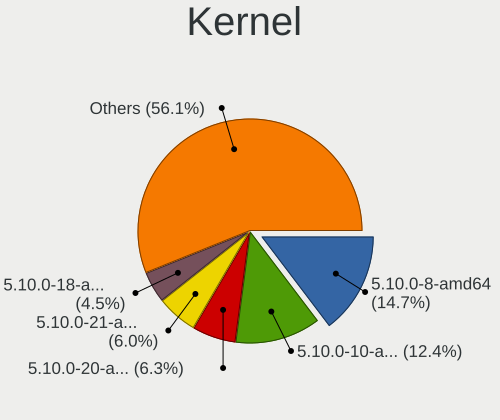

| Version                | Notebooks | Percent |
|------------------------|-----------|---------|
| 5.10.0-8-amd64         | 581       | 14.68%  |
| 5.10.0-10-amd64        | 491       | 12.4%   |
| 5.10.0-20-amd64        | 250       | 6.31%   |
| 5.10.0-21-amd64        | 236       | 5.96%   |
| 5.10.0-18-amd64        | 180       | 4.55%   |
| 5.10.0-9-amd64         | 173       | 4.37%   |
| 5.10.0-7-amd64         | 171       | 4.32%   |
| 5.10.0-16-amd64        | 168       | 4.24%   |
| 5.10.0-19-amd64        | 162       | 4.09%   |
| 5.10.0-13-amd64        | 151       | 3.81%   |
| 5.10.0-23-amd64        | 112       | 2.83%   |
| 5.10.0-11-amd64        | 103       | 2.6%    |
| 5.10.0-14-amd64        | 79        | 2%      |
| 5.10.0-17-amd64        | 73        | 1.84%   |
| 5.10.0-15-amd64        | 62        | 1.57%   |
| 5.10.0-22-amd64        | 44        | 1.11%   |
| 5.10.0-2-amd64         | 43        | 1.09%   |
| 5.10.0-12-amd64        | 39        | 0.99%   |
| 5.10.0-26-amd64        | 35        | 0.88%   |
| 5.10.0-6-amd64         | 28        | 0.71%   |
| 5.10.0-28-amd64        | 28        | 0.71%   |
| 5.18.0-0.deb11.4-amd64 | 27        | 0.68%   |
| 5.10.0-13-686-pae      | 26        | 0.66%   |
| 6.0.0-0.deb11.6-amd64  | 23        | 0.58%   |
| 5.10.0-25-amd64        | 23        | 0.58%   |
| 6.0.0-0.deb11.2-amd64  | 19        | 0.48%   |
| 5.14.0-0.bpo.2-amd64   | 17        | 0.43%   |
| 5.10.0-27-amd64        | 16        | 0.4%    |
| 6.1.0-0.deb11.5-amd64  | 15        | 0.38%   |
| 5.16.0-0.bpo.4-amd64   | 15        | 0.38%   |
| 5.19.0-0.deb11.2-amd64 | 14        | 0.35%   |
| 5.15.0-2-amd64         | 14        | 0.35%   |
| 5.10.0-33-amd64        | 13        | 0.33%   |
| 5.10.0-3-amd64         | 13        | 0.33%   |
| 6.0.0-6mx-amd64        | 10        | 0.25%   |
| 5.18.0-0.bpo.1-amd64   | 9         | 0.23%   |
| 5.10.0-9-686-pae       | 9         | 0.23%   |
| 5.10.0-8-686-pae       | 9         | 0.23%   |
| 5.10.0-35-amd64        | 9         | 0.23%   |
| 5.10.0-34-amd64        | 9         | 0.23%   |

Kernel Family
-------------

Linux kernel without a distro release

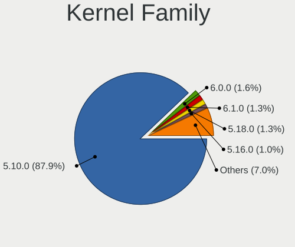

| Version  | Notebooks | Percent |
|----------|-----------|---------|
| 5.10.0   | 3215      | 87.89%  |
| 6.0.0    | 58        | 1.59%   |
| 6.1.0    | 46        | 1.26%   |
| 5.18.0   | 46        | 1.26%   |
| 5.16.0   | 38        | 1.04%   |
| 5.15.0   | 37        | 1.01%   |
| 5.19.0   | 33        | 0.9%    |
| 5.14.0   | 24        | 0.66%   |
| 5.17.0   | 14        | 0.38%   |
| 4.19.0   | 7         | 0.19%   |
| 5.10.60  | 4         | 0.11%   |
| 6.3.5    | 3         | 0.08%   |
| 6.1.15   | 3         | 0.08%   |
| 5.15.107 | 3         | 0.08%   |
| 5.13.19  | 3         | 0.08%   |
| 5.12.0   | 3         | 0.08%   |
| 6.7.0    | 2         | 0.05%   |
| 6.2.8    | 2         | 0.05%   |
| 6.0.2    | 2         | 0.05%   |
| 6.0.12   | 2         | 0.05%   |
| 5.17.5   | 2         | 0.05%   |
| 5.17.11  | 2         | 0.05%   |
| 5.15.90  | 2         | 0.05%   |
| 5.15.35  | 2         | 0.05%   |
| 5.15.11  | 2         | 0.05%   |
| 5.13.8   | 2         | 0.05%   |
| 5.11.0   | 2         | 0.05%   |
| 5.10.92  | 2         | 0.05%   |
| 5.10.109 | 2         | 0.05%   |
| 4.9.0    | 2         | 0.05%   |
| 6.7.4    | 1         | 0.03%   |
| 6.7      | 1         | 0.03%   |
| 6.5.13   | 1         | 0.03%   |
| 6.5.11   | 1         | 0.03%   |
| 6.5.0    | 1         | 0.03%   |
| 6.4.3    | 1         | 0.03%   |
| 6.4.2    | 1         | 0.03%   |
| 6.4.13   | 1         | 0.03%   |
| 6.4.12   | 1         | 0.03%   |
| 6.4.11   | 1         | 0.03%   |

Kernel Major Ver.
-----------------

Linux kernel major version

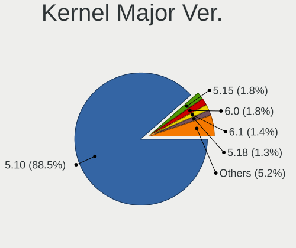

| Version | Notebooks | Percent |
|---------|-----------|---------|
| 5.10    | 3234      | 88.53%  |
| 5.15    | 66        | 1.81%   |
| 6.0     | 64        | 1.75%   |
| 6.1     | 51        | 1.4%    |
| 5.18    | 48        | 1.31%   |
| 5.16    | 40        | 1.09%   |
| 5.19    | 37        | 1.01%   |
| 5.14    | 29        | 0.79%   |
| 5.17    | 20        | 0.55%   |
| 5.13    | 10        | 0.27%   |
| 4.19    | 9         | 0.25%   |
| 6.2     | 6         | 0.16%   |
| 5.12    | 6         | 0.16%   |
| 5.11    | 6         | 0.16%   |
| 6.4     | 5         | 0.14%   |
| 6.3     | 4         | 0.11%   |
| 6.7     | 3         | 0.08%   |
| 6.5     | 3         | 0.08%   |
| 6.12    | 2         | 0.05%   |
| 5.1     | 2         | 0.05%   |
| 4.9     | 2         | 0.05%   |
| 6       | 1         | 0.03%   |
| 5.4     | 1         | 0.03%   |
| 5.15.6  | 1         | 0.03%   |
| 4.14    | 1         | 0.03%   |
| 3.8     | 1         | 0.03%   |
| 3.10    | 1         | 0.03%   |

Arch
----

OS architecture (x86_64, i586, etc.)

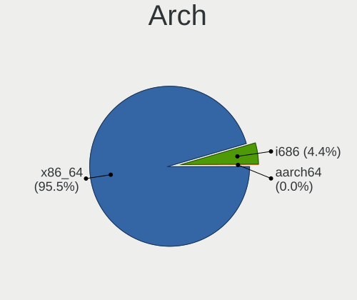

| Name    | Notebooks | Percent |
|---------|-----------|---------|
| x86_64  | 3417      | 95.47%  |
| i686    | 158       | 4.41%   |
| armv7l  | 3         | 0.08%   |
| aarch64 | 1         | 0.03%   |

DE
--

Desktop Environment

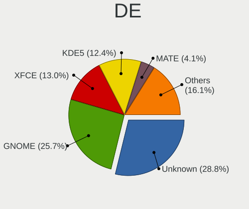

| Name              | Notebooks | Percent |
|-------------------|-----------|---------|
| Unknown           | 1050      | 28.82%  |
| GNOME             | 936       | 25.69%  |
| XFCE              | 472       | 12.96%  |
| KDE5              | 451       | 12.38%  |
| MATE              | 148       | 4.06%   |
| LXDE              | 122       | 3.35%   |
| X-Cinnamon        | 118       | 3.24%   |
| Cinnamon          | 99        | 2.72%   |
| LXQt              | 54        | 1.48%   |
| i3                | 45        | 1.24%   |
| KDE               | 37        | 1.02%   |
| GNOME Flashback   | 29        | 0.8%    |
| Openbox           | 16        | 0.44%   |
| lightdm-xsession  | 15        | 0.41%   |
| GNOME Classic     | 9         | 0.25%   |
| trinity           | 8         | 0.22%   |
| Budgie            | 5         | 0.14%   |
| Dwm               | 3         | 0.08%   |
| Cutefish          | 3         | 0.08%   |
| BunsenLabs        | 3         | 0.08%   |
| x-session-manager | 2         | 0.05%   |
| sway              | 2         | 0.05%   |
| ICEWM             | 2         | 0.05%   |
| Enlightenment     | 2         | 0.05%   |
| awesome           | 2         | 0.05%   |
| xmonad            | 1         | 0.03%   |
| wmaker-common     | 1         | 0.03%   |
| TOS:GNOME         | 1         | 0.03%   |
| mwm               | 1         | 0.03%   |
| matchbox          | 1         | 0.03%   |
| jwm               | 1         | 0.03%   |
| GNUstep           | 1         | 0.03%   |
| fluxbox           | 1         | 0.03%   |
| default           | 1         | 0.03%   |
| Deepin            | 1         | 0.03%   |

Display Server
--------------

X11 or Wayland

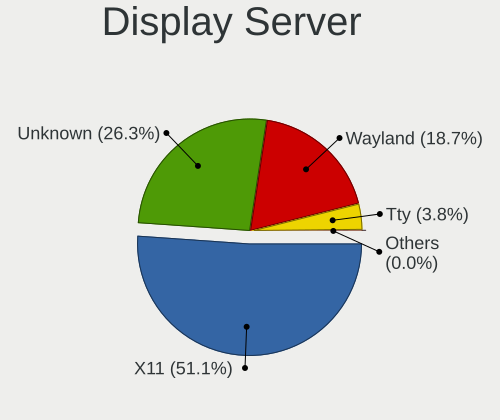

| Name        | Notebooks | Percent |
|-------------|-----------|---------|
| X11         | 1858      | 51.11%  |
| Unknown     | 956       | 26.3%   |
| Wayland     | 678       | 18.65%  |
| Tty         | 137       | 3.77%   |
| Unspecified | 5         | 0.14%   |
| Web         | 1         | 0.03%   |

Display Manager
---------------

SDDM, LightDM, etc.

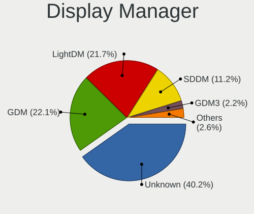

| Name    | Notebooks | Percent |
|---------|-----------|---------|
| Unknown | 1461      | 40.24%  |
| GDM     | 803       | 22.12%  |
| LightDM | 787       | 21.67%  |
| SDDM    | 405       | 11.15%  |
| GDM3    | 80        | 2.2%    |
| TDM     | 70        | 1.93%   |
| XDM     | 9         | 0.25%   |
| LXDM    | 7         | 0.19%   |
| SLiM    | 4         | 0.11%   |
| Ly      | 2         | 0.06%   |
| SU      | 1         | 0.03%   |
| NODM    | 1         | 0.03%   |
| KDM     | 1         | 0.03%   |

OS Lang
-------

Language

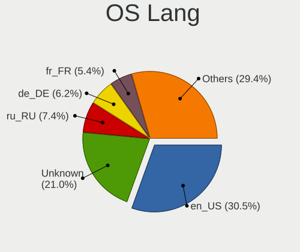

| Lang    | Notebooks | Percent |
|---------|-----------|---------|
| en_US   | 1102      | 30.5%   |
| Unknown | 759       | 21.01%  |
| ru_RU   | 269       | 7.45%   |
| de_DE   | 224       | 6.2%    |
| fr_FR   | 195       | 5.4%    |
| en_GB   | 158       | 4.37%   |
| es_ES   | 111       | 3.07%   |
| pt_BR   | 101       | 2.8%    |
| it_IT   | 99        | 2.74%   |
| pl_PL   | 80        | 2.21%   |
| en_CA   | 38        | 1.05%   |
| es_MX   | 36        | 1%      |
| en_AU   | 33        | 0.91%   |
| es_AR   | 32        | 0.89%   |
| zh_CN   | 25        | 0.69%   |
| en_IN   | 22        | 0.61%   |
| C       | 20        | 0.55%   |
| hu_HU   | 15        | 0.42%   |
| es_VE   | 14        | 0.39%   |
| en_IE   | 14        | 0.39%   |
| fi_FI   | 13        | 0.36%   |
| es_CL   | 12        | 0.33%   |
| de_CH   | 12        | 0.33%   |
| de_AT   | 12        | 0.33%   |
| sv_SE   | 11        | 0.3%    |
| es_CO   | 11        | 0.3%    |
| nl_NL   | 10        | 0.28%   |
| ja_JP   | 10        | 0.28%   |
| pt_PT   | 9         | 0.25%   |
| fr_BE   | 9         | 0.25%   |
| tr_TR   | 8         | 0.22%   |
| nb_NO   | 8         | 0.22%   |
| cs_CZ   | 8         | 0.22%   |
| zh_TW   | 7         | 0.19%   |
| ko_KR   | 7         | 0.19%   |
| en_SG   | 7         | 0.19%   |
| ca_ES   | 6         | 0.17%   |
| sk_SK   | 5         | 0.14%   |
| es_EC   | 5         | 0.14%   |
| en_ZA   | 5         | 0.14%   |

Boot Mode
---------

EFI or BIOS

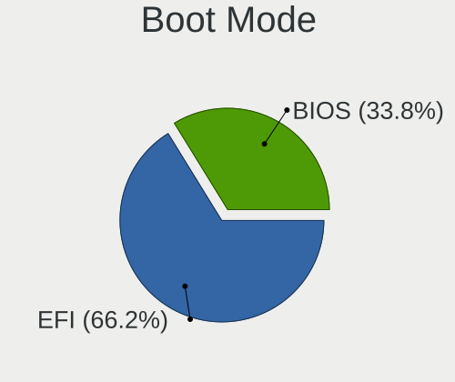

| Mode | Notebooks | Percent |
|------|-----------|---------|
| EFI  | 2388      | 66.2%   |
| BIOS | 1219      | 33.8%   |

Filesystem
----------

Type of filesystem

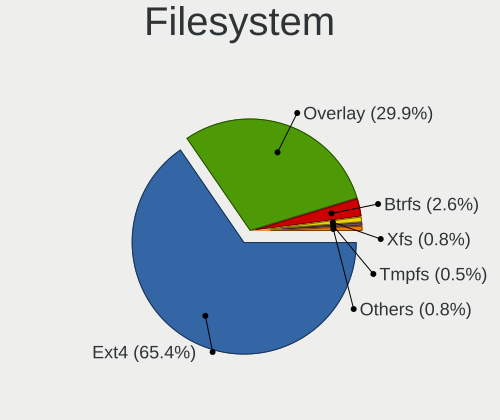

| Type    | Notebooks | Percent |
|---------|-----------|---------|
| Ext4    | 2350      | 65.42%  |
| Overlay | 1073      | 29.87%  |
| Btrfs   | 95        | 2.64%   |
| Xfs     | 29        | 0.81%   |
| Tmpfs   | 18        | 0.5%    |
| Zfs     | 14        | 0.39%   |
| Ext2    | 5         | 0.14%   |
| Ext3    | 3         | 0.08%   |
| Unknown | 3         | 0.08%   |
| Rootfs  | 1         | 0.03%   |
| Aufs    | 1         | 0.03%   |

Part. scheme
------------

Scheme of partitioning

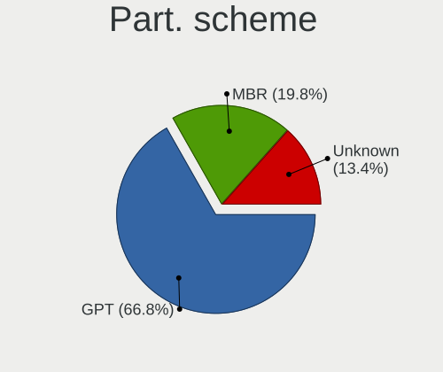

| Type    | Notebooks | Percent |
|---------|-----------|---------|
| GPT     | 2413      | 66.79%  |
| MBR     | 715       | 19.79%  |
| Unknown | 485       | 13.42%  |

Dual Boot with Linux/BSD
------------------------

Hosting more than one Linux/BSD

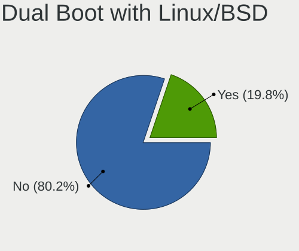

| Dual boot | Notebooks | Percent |
|-----------|-----------|---------|
| No        | 2897      | 80.16%  |
| Yes       | 717       | 19.84%  |

Dual Boot (Win)
---------------

Hosting Linux and Windows

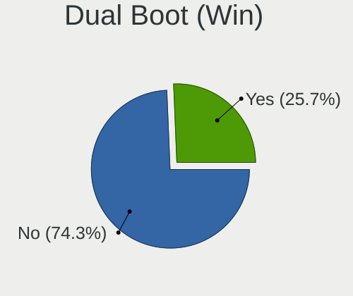

| Dual boot | Notebooks | Percent |
|-----------|-----------|---------|
| No        | 2684      | 74.35%  |
| Yes       | 926       | 25.65%  |

Board
-----

Vendor
------

Motherboard manufacturer

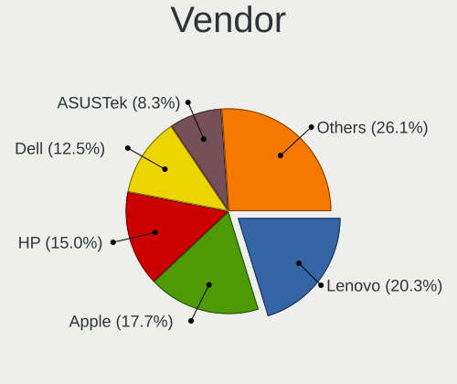

| Name                           | Notebooks | Percent |
|--------------------------------|-----------|---------|
| Lenovo                         | 725       | 20.26%  |
| Apple                          | 634       | 17.72%  |
| Hewlett-Packard                | 538       | 15.04%  |
| Dell                           | 449       | 12.55%  |
| ASUSTek Computer               | 298       | 8.33%   |
| Acer                           | 236       | 6.6%    |
| Google                         | 135       | 3.77%   |
| Toshiba                        | 59        | 1.65%   |
| MSI                            | 57        | 1.59%   |
| Aquarius                       | 44        | 1.23%   |
| Samsung Electronics            | 41        | 1.15%   |
| Unknown                        | 30        | 0.84%   |
| HUAWEI                         | 27        | 0.75%   |
| Fujitsu                        | 23        | 0.64%   |
| Sony                           | 21        | 0.59%   |
| Notebook                       | 19        | 0.53%   |
| Packard Bell                   | 17        | 0.48%   |
| Clevo                          | 11        | 0.31%   |
| Panasonic                      | 10        | 0.28%   |
| TUXEDO                         | 8         | 0.22%   |
| Positivo                       | 8         | 0.22%   |
| Medion                         | 8         | 0.22%   |
| IBM                            | 7         | 0.2%    |
| Timi                           | 6         | 0.17%   |
| SLIMBOOK                       | 6         | 0.17%   |
| Intel                          | 6         | 0.17%   |
| GPU Company                    | 6         | 0.17%   |
| Fujitsu Siemens                | 6         | 0.17%   |
| LG Electronics                 | 5         | 0.14%   |
| Gigabyte Technology            | 5         | 0.14%   |
| Positivo Bahia - VAIO          | 4         | 0.11%   |
| Pegatron                       | 4         | 0.11%   |
| HONOR                          | 4         | 0.11%   |
| AMI                            | 4         | 0.11%   |
| Alienware                      | 4         | 0.11%   |
| System76                       | 3         | 0.08%   |
| SmbiosType1_SystemManufacturer | 3         | 0.08%   |
| PC Specialist                  | 3         | 0.08%   |
| Juana Manso                    | 3         | 0.08%   |
| Insyde                         | 3         | 0.08%   |

Model
-----

Motherboard model

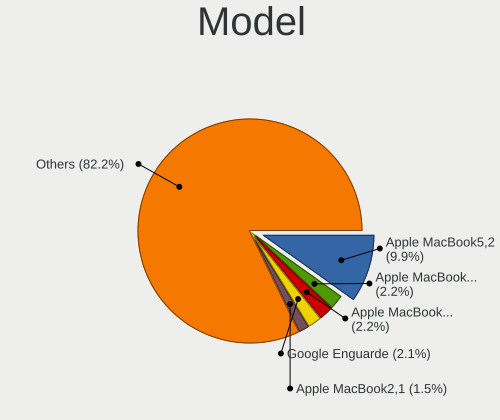

| Name                                  | Notebooks | Percent |
|---------------------------------------|-----------|---------|
| Apple MacBook5,2                      | 353       | 9.87%   |
| Apple MacBookAir7,2                   | 77        | 2.15%   |
| Apple MacBookAir7,1                   | 77        | 2.15%   |
| Google Enguarde                       | 74        | 2.07%   |
| Apple MacBook2,1                      | 55        | 1.54%   |
| Aquarius NS585                        | 44        | 1.23%   |
| Unknown                               | 38        | 1.06%   |
| Lenovo ThinkPad E475 20H40006US       | 24        | 0.67%   |
| Google Terra                          | 23        | 0.64%   |
| Apple MacBook4,1                      | 21        | 0.59%   |
| HP Notebook                           | 19        | 0.53%   |
| Lenovo ThinkPad 13 2nd Gen 20J10046US | 16        | 0.45%   |
| Acer Aspire A315-23                   | 15        | 0.42%   |
| HP Pavilion g6                        | 14        | 0.39%   |
| ASUS 1005HA                           | 14        | 0.39%   |
| Google Reks                           | 13        | 0.36%   |
| HP Laptop 15-db0xxx                   | 10        | 0.28%   |
| HP EliteBook 8460p                    | 9         | 0.25%   |
| Dell Latitude E7440                   | 9         | 0.25%   |
| Dell Latitude 7480                    | 9         | 0.25%   |
| HP Pavilion Gaming Laptop 15-ec2xxx   | 8         | 0.22%   |
| HP EliteBook 840 G3                   | 8         | 0.22%   |
| HP 255 G8 Notebook PC                 | 8         | 0.22%   |
| HP 250 G7 Notebook PC                 | 8         | 0.22%   |
| Samsung 300E4C/300E5C/300E7C          | 7         | 0.2%    |
| HP Laptop 15-db1xxx                   | 7         | 0.2%    |
| HP Laptop 15-bw0xx                    | 7         | 0.2%    |
| HP EliteBook 840 G8 Notebook PC       | 7         | 0.2%    |
| Dell Latitude E6420                   | 7         | 0.2%    |
| Dell Latitude E6330                   | 7         | 0.2%    |
| HP Pavilion Gaming Laptop 15-ec1xxx   | 6         | 0.17%   |
| HP Laptop 15-da0xxx                   | 6         | 0.17%   |
| Dell XPS 13 9310                      | 6         | 0.17%   |
| Dell Latitude E6520                   | 6         | 0.17%   |
| Dell Latitude E5430 non-vPro          | 6         | 0.17%   |
| Dell Latitude D630                    | 6         | 0.17%   |
| Dell Latitude 5420                    | 6         | 0.17%   |
| Dell Inspiron 5100                    | 6         | 0.17%   |
| Dell Inspiron 1525                    | 6         | 0.17%   |
| Apple MacBookPro5,5                   | 6         | 0.17%   |

Model Family
------------

Motherboard model prefix

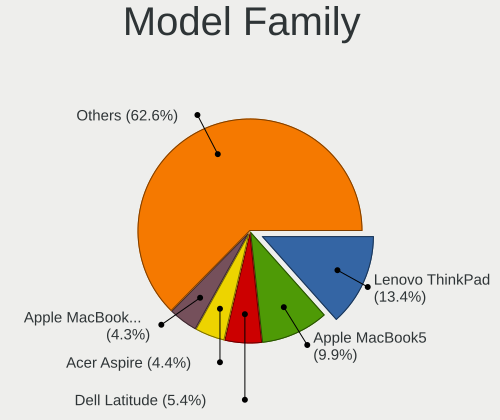

| Name                  | Notebooks | Percent |
|-----------------------|-----------|---------|
| Lenovo ThinkPad       | 480       | 13.42%  |
| Apple MacBook5        | 353       | 9.87%   |
| Dell Latitude         | 193       | 5.39%   |
| Acer Aspire           | 157       | 4.39%   |
| Apple MacBookAir7     | 154       | 4.3%    |
| Dell Inspiron         | 126       | 3.52%   |
| Lenovo IdeaPad        | 121       | 3.38%   |
| HP EliteBook          | 109       | 3.05%   |
| HP Pavilion           | 81        | 2.26%   |
| HP Laptop             | 78        | 2.18%   |
| Google Enguarde       | 74        | 2.07%   |
| HP ProBook            | 64        | 1.79%   |
| Apple MacBook2        | 55        | 1.54%   |
| Toshiba Satellite     | 46        | 1.29%   |
| ASUS VivoBook         | 44        | 1.23%   |
| Aquarius NS585        | 44        | 1.23%   |
| Dell XPS              | 42        | 1.17%   |
| Dell Precision        | 39        | 1.09%   |
| Unknown               | 38        | 1.06%   |
| HP Compaq             | 36        | 1.01%   |
| Dell Vostro           | 30        | 0.84%   |
| HP ZBook              | 25        | 0.7%    |
| ASUS ASUS             | 25        | 0.7%    |
| HP 250                | 24        | 0.67%   |
| Google Terra          | 23        | 0.64%   |
| ASUS ZenBook          | 22        | 0.61%   |
| Acer TravelMate       | 22        | 0.61%   |
| Fujitsu LIFEBOOK      | 21        | 0.59%   |
| Apple MacBook4        | 21        | 0.59%   |
| HP Notebook           | 19        | 0.53%   |
| Lenovo Legion         | 17        | 0.48%   |
| Acer Nitro            | 17        | 0.48%   |
| Lenovo ThinkBook      | 16        | 0.45%   |
| HP ENVY               | 15        | 0.42%   |
| HP 255                | 15        | 0.42%   |
| ASUS ROG              | 15        | 0.42%   |
| Acer Swift            | 15        | 0.42%   |
| Packard Bell EasyNote | 14        | 0.39%   |
| ASUS 1005HA           | 14        | 0.39%   |
| Google Reks           | 13        | 0.36%   |

MFG Year
--------

Motherboard manufacture year

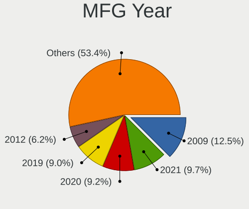

| Year    | Notebooks | Percent |
|---------|-----------|---------|
| 2009    | 447       | 12.49%  |
| 2021    | 348       | 9.73%   |
| 2020    | 328       | 9.17%   |
| 2019    | 321       | 8.97%   |
| 2012    | 223       | 6.23%   |
| 2015    | 208       | 5.81%   |
| 2018    | 200       | 5.59%   |
| 2011    | 191       | 5.34%   |
| 2017    | 186       | 5.2%    |
| 2013    | 177       | 4.95%   |
| 2014    | 155       | 4.33%   |
| 2022    | 150       | 4.19%   |
| 2016    | 140       | 3.91%   |
| 2008    | 120       | 3.35%   |
| 2010    | 115       | 3.21%   |
| 2007    | 109       | 3.05%   |
| 2006    | 108       | 3.02%   |
| 2005    | 20        | 0.56%   |
| 2023    | 12        | 0.34%   |
| 2003    | 10        | 0.28%   |
| 2004    | 6         | 0.17%   |
| Unknown | 3         | 0.08%   |
| 2002    | 1         | 0.03%   |

Form Factor
-----------

Physical design of the computer

| Name     | Notebooks | Percent |
|----------|-----------|---------|
| Notebook | 3578      | 100%    |

Secure Boot
-----------

Enabled or disabled

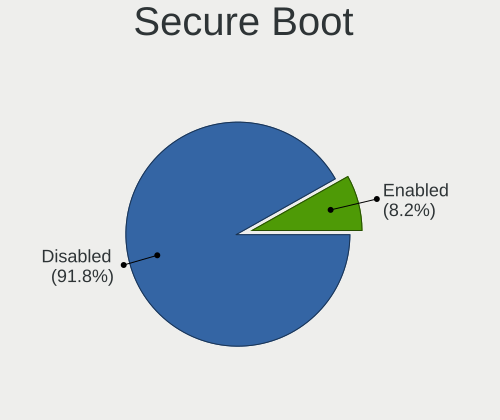

| State    | Notebooks | Percent |
|----------|-----------|---------|
| Disabled | 3299      | 91.84%  |
| Enabled  | 293       | 8.16%   |

Coreboot
--------

Have coreboot on board

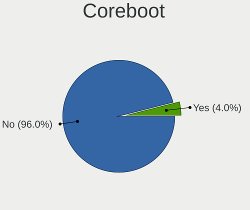

| Used | Notebooks | Percent |
|------|-----------|---------|
| No   | 3437      | 96.03%  |
| Yes  | 142       | 3.97%   |

RAM Size
--------

Total RAM memory

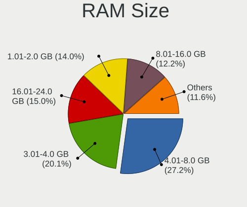

| Size in GB  | Notebooks | Percent |
|-------------|-----------|---------|
| 4.01-8.0    | 978       | 27.15%  |
| 3.01-4.0    | 724       | 20.1%   |
| 16.01-24.0  | 539       | 14.96%  |
| 1.01-2.0    | 503       | 13.96%  |
| 8.01-16.0   | 441       | 12.24%  |
| 32.01-64.0  | 189       | 5.25%   |
| 2.01-3.0    | 84        | 2.33%   |
| 0.51-1.0    | 60        | 1.67%   |
| 64.01-256.0 | 37        | 1.03%   |
| 24.01-32.0  | 35        | 0.97%   |
| 0.01-0.5    | 11        | 0.31%   |
| Unknown     | 1         | 0.03%   |

RAM Used
--------

Used RAM memory

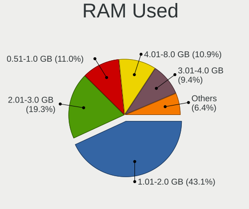

| Used GB    | Notebooks | Percent |
|------------|-----------|---------|
| 1.01-2.0   | 1632      | 43.13%  |
| 2.01-3.0   | 730       | 19.29%  |
| 0.51-1.0   | 415       | 10.97%  |
| 4.01-8.0   | 411       | 10.86%  |
| 3.01-4.0   | 354       | 9.36%   |
| 8.01-16.0  | 119       | 3.14%   |
| 0.01-0.5   | 105       | 2.77%   |
| 16.01-24.0 | 11        | 0.29%   |
| 24.01-32.0 | 3         | 0.08%   |
| 32.01-64.0 | 2         | 0.05%   |
| Unknown    | 2         | 0.05%   |

Total Drives
------------

Number of drives on board

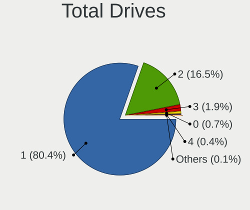

| Drives | Notebooks | Percent |
|--------|-----------|---------|
| 1      | 2913      | 80.36%  |
| 2      | 598       | 16.5%   |
| 3      | 68        | 1.88%   |
| 0      | 27        | 0.74%   |
| 4      | 14        | 0.39%   |
| 5      | 3         | 0.08%   |
| 7      | 1         | 0.03%   |
| 6      | 1         | 0.03%   |

Has CD-ROM
----------

Has CD-ROM on board

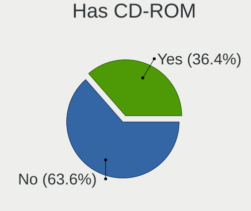

| Presented | Notebooks | Percent |
|-----------|-----------|---------|
| No        | 2279      | 63.55%  |
| Yes       | 1307      | 36.45%  |

Has Ethernet
------------

Has Ethernet on board

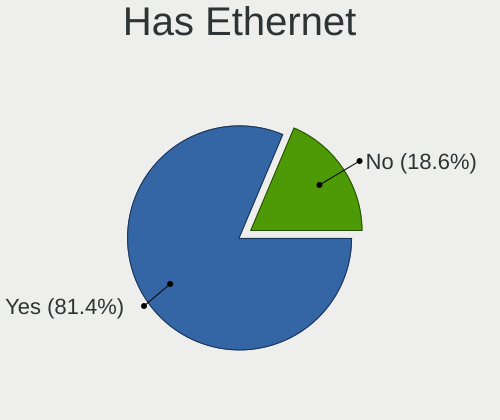

| Presented | Notebooks | Percent |
|-----------|-----------|---------|
| Yes       | 2916      | 81.36%  |
| No        | 668       | 18.64%  |

Has WiFi
--------

Has WiFi module

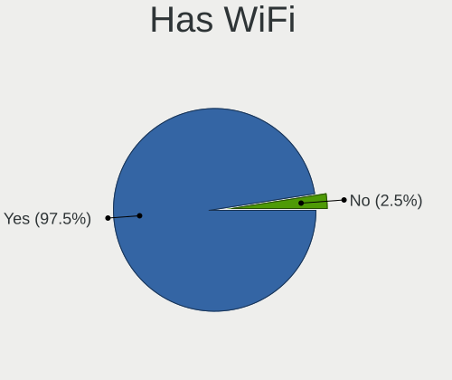

| Presented | Notebooks | Percent |
|-----------|-----------|---------|
| Yes       | 3491      | 97.51%  |
| No        | 89        | 2.49%   |

Has Bluetooth
-------------

Has Bluetooth module

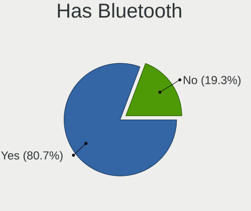

| Presented | Notebooks | Percent |
|-----------|-----------|---------|
| Yes       | 2905      | 80.74%  |
| No        | 693       | 19.26%  |

Location
--------

Country
-------

Geographic location (country)

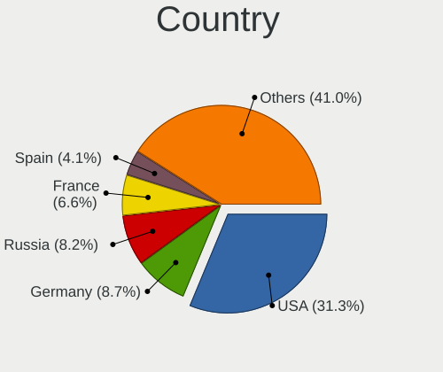

| Country     | Notebooks | Percent |
|-------------|-----------|---------|
| USA         | 1122      | 31.26%  |
| Germany     | 313       | 8.72%   |
| Russia      | 296       | 8.25%   |
| France      | 238       | 6.63%   |
| Spain       | 148       | 4.12%   |
| Brazil      | 133       | 3.71%   |
| Italy       | 126       | 3.51%   |
| Poland      | 104       | 2.9%    |
| UK          | 80        | 2.23%   |
| Canada      | 58        | 1.62%   |
| Netherlands | 57        | 1.59%   |
| Mexico      | 49        | 1.37%   |
| Argentina   | 44        | 1.23%   |
| Switzerland | 39        | 1.09%   |
| Australia   | 39        | 1.09%   |
| China       | 37        | 1.03%   |
| India       | 34        | 0.95%   |
| Sweden      | 32        | 0.89%   |
| Turkey      | 28        | 0.78%   |
| Ukraine     | 27        | 0.75%   |
| Finland     | 27        | 0.75%   |
| Belgium     | 27        | 0.75%   |
| Hungary     | 26        | 0.72%   |
| Austria     | 24        | 0.67%   |
| Norway      | 23        | 0.64%   |
| Portugal    | 21        | 0.59%   |
| Greece      | 21        | 0.59%   |
| Czechia     | 20        | 0.56%   |
| Romania     | 19        | 0.53%   |
| Venezuela   | 17        | 0.47%   |
| Colombia    | 17        | 0.47%   |
| Japan       | 15        | 0.42%   |
| Ireland     | 15        | 0.42%   |
| Chile       | 14        | 0.39%   |
| Bulgaria    | 14        | 0.39%   |
| Indonesia   | 13        | 0.36%   |
| Croatia     | 12        | 0.33%   |
| Thailand    | 11        | 0.31%   |
| Taiwan      | 11        | 0.31%   |
| Denmark     | 10        | 0.28%   |

City
----

Geographic location (city)

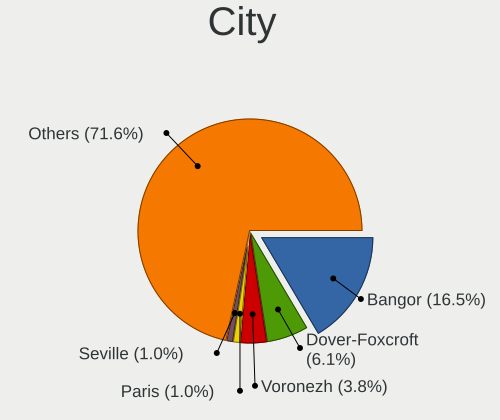

| City              | Notebooks | Percent |
|-------------------|-----------|---------|
| Bangor            | 621       | 16.49%  |
| Dover-Foxcroft    | 229       | 6.08%   |
| Voronezh          | 144       | 3.82%   |
| Paris             | 39        | 1.04%   |
| Seville           | 36        | 0.96%   |
| Moscow            | 32        | 0.85%   |
| Berlin            | 31        | 0.82%   |
| St Petersburg     | 30        | 0.8%    |
| Madrid            | 28        | 0.74%   |
| Warsaw            | 26        | 0.69%   |
| Munich            | 21        | 0.56%   |
| Barcelona         | 19        | 0.5%    |
| Milan             | 18        | 0.48%   |
| Amsterdam         | 18        | 0.48%   |
| Vienna            | 16        | 0.42%   |
| Sao Paulo         | 15        | 0.4%    |
| Hamburg           | 14        | 0.37%   |
| London            | 13        | 0.35%   |
| Istanbul          | 12        | 0.32%   |
| Frankfurt am Main | 12        | 0.32%   |
| Athens            | 12        | 0.32%   |
| Rome              | 11        | 0.29%   |
| Prague            | 11        | 0.29%   |
| Perm              | 11        | 0.29%   |
| Dublin            | 11        | 0.29%   |
| Blizniew          | 11        | 0.29%   |
| Toronto           | 10        | 0.27%   |
| Oslo              | 10        | 0.27%   |
| Helsinki          | 10        | 0.27%   |
| Zagreb            | 9         | 0.24%   |
| Sydney            | 9         | 0.24%   |
| Mexico City       | 9         | 0.24%   |
| Lyon              | 9         | 0.24%   |
| Iasi              | 9         | 0.24%   |
| Chorzele          | 9         | 0.24%   |
| Budapest          | 9         | 0.24%   |
| Brisbane          | 9         | 0.24%   |
| Brasília         | 9         | 0.24%   |
| San Jose          | 8         | 0.21%   |
| Natal             | 8         | 0.21%   |

Drives
------

Drive Vendor
------------

Hard drive vendors

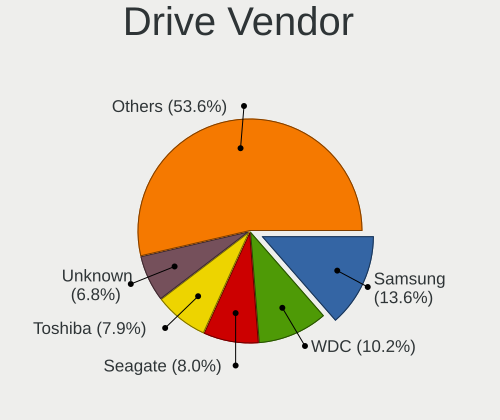

| Vendor                    | Notebooks | Drives | Percent |
|---------------------------|-----------|--------|---------|
| Samsung Electronics       | 572       | 701    | 13.57%  |
| WDC                       | 429       | 524    | 10.18%  |
| Seagate                   | 338       | 402    | 8.02%   |
| Toshiba                   | 331       | 355    | 7.85%   |
| Unknown                   | 285       | 353    | 6.76%   |
| Fujitsu                   | 280       | 286    | 6.64%   |
| Kingston                  | 224       | 276    | 5.31%   |
| SanDisk                   | 192       | 230    | 4.56%   |
| Apple                     | 177       | 211    | 4.2%    |
| Crucial                   | 163       | 189    | 3.87%   |
| SK hynix                  | 151       | 168    | 3.58%   |
| Hitachi                   | 123       | 140    | 2.92%   |
| A-DATA Technology         | 102       | 189    | 2.42%   |
| Intel                     | 99        | 123    | 2.35%   |
| Micron Technology         | 93        | 98     | 2.21%   |
| HGST                      | 73        | 89     | 1.73%   |
| KIOXIA                    | 53        | 58     | 1.26%   |
| China                     | 35        | 36     | 0.83%   |
| Unknown                   | 33        | 37     | 0.78%   |
| LITEON                    | 26        | 30     | 0.62%   |
| Transcend                 | 19        | 25     | 0.45%   |
| PNY                       | 18        | 24     | 0.43%   |
| SABRENT                   | 17        | 18     | 0.4%    |
| Phison                    | 17        | 21     | 0.4%    |
| SPCC                      | 16        | 17     | 0.38%   |
| LITEONIT                  | 16        | 20     | 0.38%   |
| Intenso                   | 16        | 20     | 0.38%   |
| Silicon Motion            | 15        | 18     | 0.36%   |
| Team                      | 13        | 13     | 0.31%   |
| Patriot                   | 12        | 12     | 0.28%   |
| JMicron Technology        | 12        | 12     | 0.28%   |
| GOODRAM                   | 12        | 15     | 0.28%   |
| SSSTC                     | 9         | 9      | 0.21%   |
| Lenovo                    | 9         | 11     | 0.21%   |
| Apacer                    | 9         | 9      | 0.21%   |
| Netac                     | 8         | 9      | 0.19%   |
| UMIS                      | 7         | 12     | 0.17%   |
| Micron/Crucial Technology | 7         | 7      | 0.17%   |
| Corsair                   | 7         | 7      | 0.17%   |
| ASMT                      | 7         | 11     | 0.17%   |

Drive Model
-----------

Hard drive models

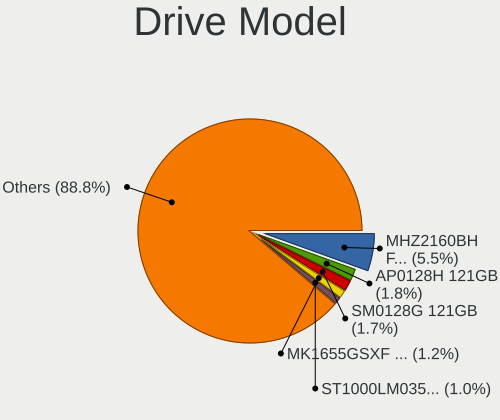

| Model                              | Notebooks | Percent |
|------------------------------------|-----------|---------|
| Fujitsu MHZ2160BH FFS G1 160GB     | 237       | 5.51%   |
| Apple SSD AP0128H 121GB            | 77        | 1.79%   |
| Apple SSD SM0128G 121GB            | 71        | 1.65%   |
| Toshiba MK1655GSXF 160GB           | 52        | 1.21%   |
| Seagate ST1000LM035-1RK172 1TB     | 45        | 1.05%   |
| A-DATA SU800 512GB SSD             | 44        | 1.02%   |
| Toshiba MK1653GSX 160GB            | 43        | 1%      |
| Kingston SA400S37240G 240GB SSD    | 43        | 1%      |
| Unknown AGND3R  16GB               | 39        | 0.91%   |
| Kingston SA400S37120G 120GB SSD    | 39        | 0.91%   |
| Unknown                            | 33        | 0.77%   |
| Toshiba MQ04ABF100 1TB             | 31        | 0.72%   |
| Unknown HAG2e  16GB                | 30        | 0.7%    |
| Seagate ST1000LM024 HN-M101MBB 1TB | 30        | 0.7%    |
| Toshiba MQ01ABF050 500GB           | 29        | 0.67%   |
| Unknown SDW16G  16GB               | 25        | 0.58%   |
| Crucial CT500MX500SSD1 500GB       | 25        | 0.58%   |
| Crucial CT1000MX500SSD1 1TB        | 25        | 0.58%   |
| Toshiba MQ01ABD100 1TB             | 24        | 0.56%   |
| HGST HTS721010A9E630 1TB           | 24        | 0.56%   |
| Unknown MMC Card  32GB             | 23        | 0.53%   |
| Samsung SSD 860 EVO 500GB          | 23        | 0.53%   |
| Samsung SSD 970 EVO Plus 1TB       | 21        | 0.49%   |
| Seagate ST500LT012-1DG142 500GB    | 19        | 0.44%   |
| Samsung SSD 850 EVO 500GB          | 19        | 0.44%   |
| Samsung SSD 850 EVO 250GB          | 17        | 0.4%    |
| SABRENT Disk 4TB                   | 17        | 0.4%    |
| Kingston SV300S37A120G 120GB SSD   | 17        | 0.4%    |
| WDC WD1600BUDT-63DPZY0 160GB       | 16        | 0.37%   |
| Kingston SA400S37480G 480GB SSD    | 16        | 0.37%   |
| HGST HTS541010A9E680 1TB           | 15        | 0.35%   |
| Seagate ST9500325AS 500GB          | 14        | 0.33%   |
| SanDisk SD8SBAT128G1122 128GB SSD  | 14        | 0.33%   |
| Samsung SSD 870 EVO 500GB          | 14        | 0.33%   |
| HGST HTS725050A7E630 500GB         | 14        | 0.33%   |
| Samsung SSD 860 EVO 250GB          | 13        | 0.3%    |
| Crucial CT240BX500SSD1 240GB       | 13        | 0.3%    |
| Samsung SSD 980 1TB                | 12        | 0.28%   |
| Intel SSDPEKNW512G8 512GB          | 12        | 0.28%   |
| Hitachi HTS543216L9SA02 160GB      | 12        | 0.28%   |

HDD Vendor
----------

Hard disk drive vendors

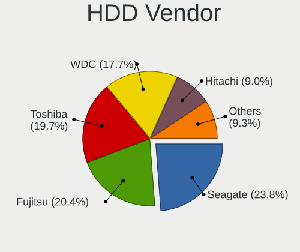

| Vendor              | Notebooks | Drives | Percent |
|---------------------|-----------|--------|---------|
| Seagate             | 326       | 388    | 23.8%   |
| Fujitsu             | 280       | 286    | 20.44%  |
| Toshiba             | 270       | 288    | 19.71%  |
| WDC                 | 243       | 280    | 17.74%  |
| Hitachi             | 123       | 140    | 8.98%   |
| HGST                | 73        | 89     | 5.33%   |
| Samsung Electronics | 16        | 17     | 1.17%   |
| Unknown             | 12        | 15     | 0.88%   |
| JMicron Technology  | 9         | 9      | 0.66%   |
| TO Exter            | 2         | 2      | 0.15%   |
| JetFlash            | 2         | 4      | 0.15%   |
| Intenso             | 2         | 2      | 0.15%   |
| Unknown             | 2         | 2      | 0.15%   |
| USB3.0              | 1         | 1      | 0.07%   |
| Unknown (CF)        | 1         | 1      | 0.07%   |
| Space ke            | 1         | 1      | 0.07%   |
| SILICONMOTION       | 1         | 1      | 0.07%   |
| Maxone              | 1         | 1      | 0.07%   |
| LaCie               | 1         | 1      | 0.07%   |
| IBM/Hitachi         | 1         | 1      | 0.07%   |
| External            | 1         | 1      | 0.07%   |
| ASMT                | 1         | 2      | 0.07%   |
| Apple               | 1         | 2      | 0.07%   |

SSD Vendor
----------

Solid state drive vendors

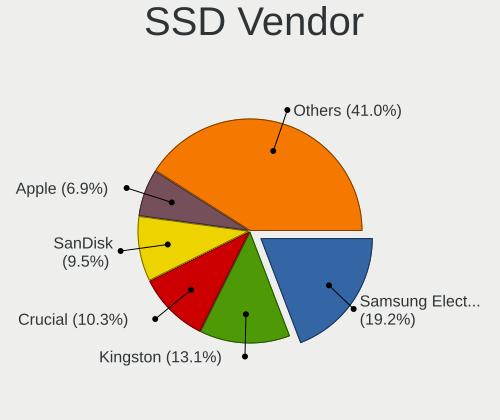

| Vendor              | Notebooks | Drives | Percent |
|---------------------|-----------|--------|---------|
| Samsung Electronics | 260       | 311    | 19.2%   |
| Kingston            | 178       | 227    | 13.15%  |
| Crucial             | 140       | 163    | 10.34%  |
| SanDisk             | 128       | 157    | 9.45%   |
| Apple               | 93        | 103    | 6.87%   |
| A-DATA Technology   | 75        | 149    | 5.54%   |
| WDC                 | 45        | 62     | 3.32%   |
| China               | 35        | 36     | 2.58%   |
| Micron Technology   | 31        | 34     | 2.29%   |
| Intel               | 27        | 29     | 1.99%   |
| SK hynix            | 26        | 31     | 1.92%   |
| LITEON              | 21        | 23     | 1.55%   |
| Transcend           | 17        | 23     | 1.26%   |
| Toshiba             | 17        | 18     | 1.26%   |
| SABRENT             | 17        | 18     | 1.26%   |
| PNY                 | 16        | 22     | 1.18%   |
| LITEONIT            | 16        | 20     | 1.18%   |
| Intenso             | 13        | 17     | 0.96%   |
| Team                | 12        | 12     | 0.89%   |
| SPCC                | 12        | 13     | 0.89%   |
| Patriot             | 12        | 12     | 0.89%   |
| Unknown             | 9         | 9      | 0.66%   |
| Netac               | 8         | 9      | 0.59%   |
| GOODRAM             | 8         | 9      | 0.59%   |
| Apacer              | 8         | 8      | 0.59%   |
| Lexar               | 6         | 7      | 0.44%   |
| ASMT                | 6         | 9      | 0.44%   |
| Seagate             | 4         | 4      | 0.3%    |
| Plextor             | 4         | 4      | 0.3%    |
| KIOXIA-EXCERIA      | 4         | 5      | 0.3%    |
| KingDian            | 4         | 4      | 0.3%    |
| Dogfish             | 4         | 6      | 0.3%    |
| Corsair             | 4         | 4      | 0.3%    |
| ZTC                 | 3         | 4      | 0.22%   |
| Teclast             | 3         | 4      | 0.22%   |
| OCZ                 | 3         | 3      | 0.22%   |
| Lenovo              | 3         | 4      | 0.22%   |
| Hewlett-Packard     | 3         | 5      | 0.22%   |
| FORESEE             | 3         | 3      | 0.22%   |
| Fanxiang            | 3         | 3      | 0.22%   |

Drive Kind
----------

HDD or SSD

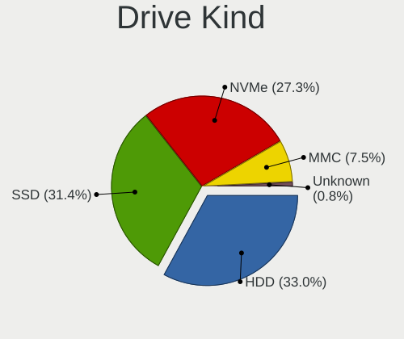

| Kind    | Notebooks | Drives | Percent |
|---------|-----------|--------|---------|
| HDD     | 1337      | 1534   | 32.96%  |
| SSD     | 1275      | 1668   | 31.43%  |
| NVMe    | 1106      | 1386   | 27.26%  |
| MMC     | 306       | 375    | 7.54%   |
| Unknown | 33        | 35     | 0.81%   |

Drive Connector
---------------

SATA, SAS, NVMe, etc.

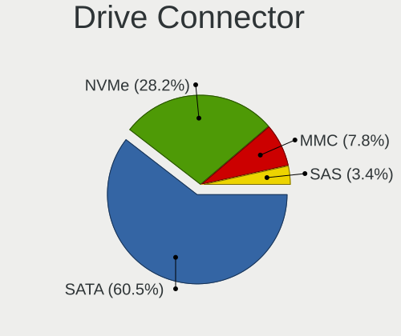

| Type | Notebooks | Drives | Percent |
|------|-----------|--------|---------|
| SATA | 2369      | 3063   | 60.5%   |
| NVMe | 1106      | 1383   | 28.24%  |
| MMC  | 306       | 375    | 7.81%   |
| SAS  | 135       | 177    | 3.45%   |

Drive Size
----------

Size of hard drive

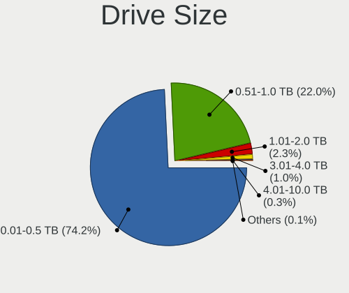

| Size in TB | Notebooks | Drives | Percent |
|------------|-----------|--------|---------|
| 0.01-0.5   | 1911      | 2331   | 74.24%  |
| 0.51-1.0   | 567       | 753    | 22.03%  |
| 1.01-2.0   | 59        | 76     | 2.29%   |
| 3.01-4.0   | 26        | 30     | 1.01%   |
| 4.01-10.0  | 9         | 10     | 0.35%   |
| 2.01-3.0   | 1         | 1      | 0.04%   |
| 0          | 1         | 1      | 0.04%   |

Space Total
-----------

Amount of disk space available on the file system

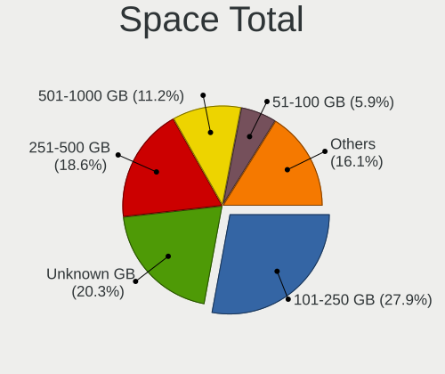

| Size in GB     | Notebooks | Percent |
|----------------|-----------|---------|
| 101-250        | 1028      | 27.9%   |
| Unknown        | 749       | 20.33%  |
| 251-500        | 685       | 18.59%  |
| 501-1000       | 413       | 11.21%  |
| 1-20           | 216       | 5.86%   |
| 51-100         | 216       | 5.86%   |
| 1001-2000      | 168       | 4.56%   |
| 21-50          | 131       | 3.55%   |
| 2001-3000      | 42        | 1.14%   |
| More than 3000 | 37        | 1%      |

Space Used
----------

Amount of used disk space

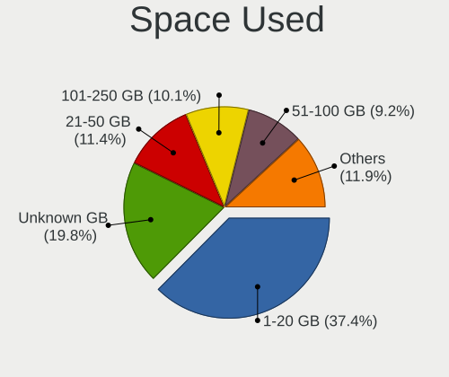

| Used GB        | Notebooks | Percent |
|----------------|-----------|---------|
| 1-20           | 1413      | 37.44%  |
| Unknown        | 749       | 19.85%  |
| 21-50          | 432       | 11.45%  |
| 101-250        | 383       | 10.15%  |
| 51-100         | 349       | 9.25%   |
| 251-500        | 231       | 6.12%   |
| 501-1000       | 135       | 3.58%   |
| 1001-2000      | 49        | 1.3%    |
| More than 3000 | 13        | 0.34%   |
| 2001-3000      | 10        | 0.26%   |
| 0              | 10        | 0.26%   |

Malfunc. Drives
---------------

Drive models with a malfunction

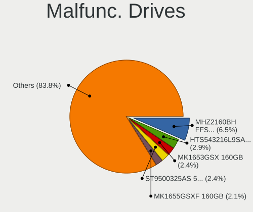

| Model                                 | Notebooks | Drives | Percent |
|---------------------------------------|-----------|--------|---------|
| Fujitsu MHZ2160BH FFS G1 160GB        | 25        | 25     | 6.54%   |
| Hitachi HTS543216L9SA02 160GB         | 11        | 11     | 2.88%   |
| Toshiba MK1653GSX 160GB               | 9         | 9      | 2.36%   |
| Seagate ST9500325AS 500GB             | 9         | 9      | 2.36%   |
| Toshiba MK1655GSXF 160GB              | 8         | 8      | 2.09%   |
| Seagate ST1000LM024 HN-M101MBB 1TB    | 7         | 8      | 1.83%   |
| HGST HTS541010A9E680 1TB              | 7         | 7      | 1.83%   |
| SK hynix PC711 HFS512GDE9X073N 512GB  | 6         | 7      | 1.57%   |
| Seagate ST9500420AS 500GB             | 6         | 7      | 1.57%   |
| Seagate ST500LM021-1KJ152 500GB       | 5         | 5      | 1.31%   |
| Hitachi HTS542512K9SA00 120GB         | 5         | 6      | 1.31%   |
| WDC WD1600BUDT-63DPZY0 160GB          | 4         | 4      | 1.05%   |
| Toshiba MQ01ABF050 500GB              | 4         | 4      | 1.05%   |
| Toshiba MQ01ABD100 1TB                | 4         | 5      | 1.05%   |
| Seagate ST9320325AS 320GB             | 4         | 4      | 1.05%   |
| Seagate ST500LT012-1DG142 500GB       | 4         | 4      | 1.05%   |
| Hitachi HTS547575A9E384 752GB         | 4         | 4      | 1.05%   |
| Hitachi HTS545050B9A300 500GB         | 4         | 4      | 1.05%   |
| HGST HTS725050A7E630 500GB            | 4         | 5      | 1.05%   |
| Toshiba MQ04ABF100 1TB                | 3         | 3      | 0.79%   |
| Seagate ST500LT012-9WS142 500GB       | 3         | 3      | 0.79%   |
| Seagate ST500LM000-SSHD-8GB           | 3         | 3      | 0.79%   |
| Seagate ST1000LM035-1RK172 1TB        | 3         | 3      | 0.79%   |
| Kingston SV300S37A120G 120GB SSD      | 3         | 3      | 0.79%   |
| Hitachi HTS545032B9A300 320GB         | 3         | 5      | 0.79%   |
| Crucial CT275MX300SSD1 275GB          | 3         | 3      | 0.79%   |
| WDC WD5000LPVX-75V0TT0 500GB          | 2         | 2      | 0.52%   |
| WDC WD10SPZX-60Z10T0 1TB              | 2         | 4      | 0.52%   |
| WDC WD10JPVX-22JC3T0 1TB              | 2         | 2      | 0.52%   |
| WDC WD10JPVT-75A1YT0 1TB              | 2         | 2      | 0.52%   |
| Toshiba MQ01ABD050V 500GB             | 2         | 2      | 0.52%   |
| Toshiba MK2552GSX 250GB               | 2         | 2      | 0.52%   |
| SK hynix SH920 mSATA 128GB SSD        | 2         | 2      | 0.52%   |
| SK hynix HFS256G39TND-N210A 256GB SSD | 2         | 2      | 0.52%   |
| SK hynix HFS256G39MND-2300A 256GB SSD | 2         | 2      | 0.52%   |
| SK hynix BC711 HFM256GD3JX013N 256GB  | 2         | 2      | 0.52%   |
| Seagate ST980811AS 80GB               | 2         | 2      | 0.52%   |
| Seagate ST94811A 40GB                 | 2         | 2      | 0.52%   |
| Seagate ST9320423AS 320GB             | 2         | 2      | 0.52%   |
| Seagate ST500LM012 HN-M500MBB 500GB   | 2         | 2      | 0.52%   |

Malfunc. Drive Vendor
---------------------

Vendors of faulty drives

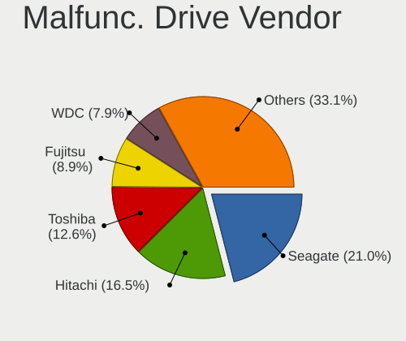

| Vendor              | Notebooks | Drives | Percent |
|---------------------|-----------|--------|---------|
| Seagate             | 80        | 86     | 21%     |
| Hitachi             | 63        | 70     | 16.54%  |
| Toshiba             | 48        | 50     | 12.6%   |
| Fujitsu             | 34        | 36     | 8.92%   |
| WDC                 | 30        | 35     | 7.87%   |
| HGST                | 20        | 23     | 5.25%   |
| SK hynix            | 18        | 19     | 4.72%   |
| Samsung Electronics | 16        | 17     | 4.2%    |
| Kingston            | 13        | 13     | 3.41%   |
| SanDisk             | 10        | 11     | 2.62%   |
| Micron Technology   | 10        | 10     | 2.62%   |
| Intel               | 9         | 10     | 2.36%   |
| Crucial             | 6         | 6      | 1.57%   |
| LITEON              | 4         | 4      | 1.05%   |
| A-DATA Technology   | 4         | 4      | 1.05%   |
| LITEONIT            | 3         | 4      | 0.79%   |
| Unknown             | 2         | 2      | 0.52%   |
| SSSTC               | 1         | 1      | 0.26%   |
| ShiJi               | 1         | 1      | 0.26%   |
| Plextor             | 1         | 1      | 0.26%   |
| Lenovo              | 1         | 1      | 0.26%   |
| KingSpec            | 1         | 1      | 0.26%   |
| IBM/Hitachi         | 1         | 1      | 0.26%   |
| GOODRAM             | 1         | 1      | 0.26%   |
| GLOWAY              | 1         | 1      | 0.26%   |
| Dogfish             | 1         | 1      | 0.26%   |
| DGM                 | 1         | 1      | 0.26%   |
| Apple               | 1         | 2      | 0.26%   |

Malfunc. HDD Vendor
-------------------

Vendors of faulty HDD drives

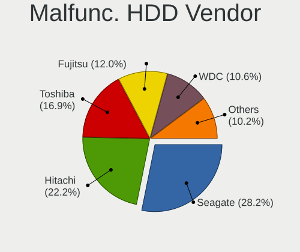

| Vendor              | Notebooks | Drives | Percent |
|---------------------|-----------|--------|---------|
| Seagate             | 80        | 86     | 28.17%  |
| Hitachi             | 63        | 70     | 22.18%  |
| Toshiba             | 48        | 50     | 16.9%   |
| Fujitsu             | 34        | 36     | 11.97%  |
| WDC                 | 30        | 35     | 10.56%  |
| HGST                | 20        | 23     | 7.04%   |
| Samsung Electronics | 7         | 7      | 2.46%   |
| IBM/Hitachi         | 1         | 1      | 0.35%   |
| Apple               | 1         | 2      | 0.35%   |

Malfunc. Drive Kind
-------------------

Kinds of faulty drives

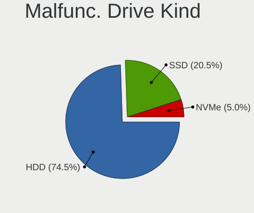

| Kind | Notebooks | Drives | Percent |
|------|-----------|--------|---------|
| HDD  | 283       | 310    | 74.47%  |
| SSD  | 78        | 82     | 20.53%  |
| NVMe | 19        | 20     | 5%      |

Failed Drives
-------------

Failed drive models

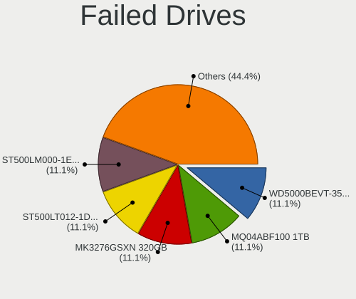

| Model                                           | Notebooks | Drives | Percent |
|-------------------------------------------------|-----------|--------|---------|
| WDC WD5000BEVT-35A0RT0 500GB                    | 1         | 1      | 11.11%  |
| Toshiba MQ04ABF100 1TB                          | 1         | 1      | 11.11%  |
| Toshiba MK3276GSXN 320GB                        | 1         | 1      | 11.11%  |
| Seagate ST500LT012-1DG142 500GB                 | 1         | 1      | 11.11%  |
| Seagate ST500LM000-1EJ162 500GB                 | 1         | 1      | 11.11%  |
| Samsung Electronics MZVLB512HAJQ-000H1 512GB    | 1         | 1      | 11.11%  |
| Samsung Electronics MZMPC032HBCD-000H1 32GB SSD | 1         | 1      | 11.11%  |
| Hitachi HTS545050A7E380 500GB                   | 1         | 2      | 11.11%  |
| Crucial CT500P2SSD8 500GB                       | 1         | 1      | 11.11%  |

Failed Drive Vendor
-------------------

Failed drive vendors

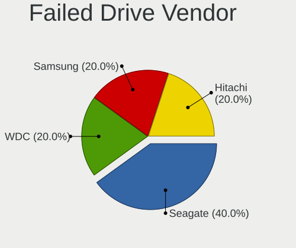

| Vendor              | Notebooks | Drives | Percent |
|---------------------|-----------|--------|---------|
| Toshiba             | 2         | 2      | 22.22%  |
| Seagate             | 2         | 2      | 22.22%  |
| Samsung Electronics | 2         | 2      | 22.22%  |
| WDC                 | 1         | 1      | 11.11%  |
| Hitachi             | 1         | 2      | 11.11%  |
| Crucial             | 1         | 1      | 11.11%  |

Drive Status
------------

Number of failed and malfunc. drives

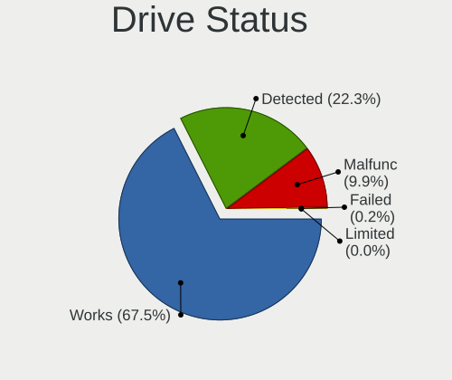

| Status   | Notebooks | Drives | Percent |
|----------|-----------|--------|---------|
| Works    | 2568      | 3314   | 67.54%  |
| Detected | 846       | 1261   | 22.25%  |
| Malfunc  | 378       | 412    | 9.94%   |
| Failed   | 9         | 10     | 0.24%   |
| Limited  | 1         | 1      | 0.03%   |

Storage controller
------------------

Storage Vendor
--------------

Storage controller vendors

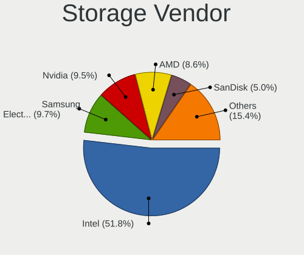

| Vendor                           | Notebooks | Percent |
|----------------------------------|-----------|---------|
| Intel                            | 2051      | 51.83%  |
| Samsung Electronics              | 385       | 9.73%   |
| Nvidia                           | 374       | 9.45%   |
| AMD                              | 342       | 8.64%   |
| SanDisk                          | 196       | 4.95%   |
| SK hynix                         | 120       | 3.03%   |
| Apple                            | 83        | 2.1%    |
| Micron Technology                | 62        | 1.57%   |
| Toshiba America Info Systems     | 53        | 1.34%   |
| Kingston Technology Company      | 50        | 1.26%   |
| KIOXIA                           | 48        | 1.21%   |
| ADATA Technology                 | 32        | 0.81%   |
| Phison Electronics               | 30        | 0.76%   |
| Micron/Crucial Technology        | 28        | 0.71%   |
| Silicon Motion                   | 25        | 0.63%   |
| Solid State Storage Technology   | 17        | 0.43%   |
| Union Memory (Shenzhen)          | 10        | 0.25%   |
| Realtek Semiconductor            | 7         | 0.18%   |
| Silicon Integrated Systems [SiS] | 5         | 0.13%   |
| Shenzhen Longsys Electronics     | 5         | 0.13%   |
| Lite-On Technology               | 5         | 0.13%   |
| Lenovo                           | 5         | 0.13%   |
| VIA Technologies                 | 4         | 0.1%    |
| MAXIO Technology (Hangzhou)      | 4         | 0.1%    |
| ULi Electronics                  | 3         | 0.08%   |
| Marvell Technology Group         | 3         | 0.08%   |
| Jiangsu Huacun Elec.             | 2         | 0.05%   |
| ASMedia Technology               | 2         | 0.05%   |
| Yangtze Memory Technologies      | 1         | 0.03%   |
| Transcend                        | 1         | 0.03%   |
| Silicon Image                    | 1         | 0.03%   |
| JMicron Technology               | 1         | 0.03%   |
| Biwin Storage Technology         | 1         | 0.03%   |
| Unknown                          | 1         | 0.03%   |

Storage Model
-------------

Storage controller models

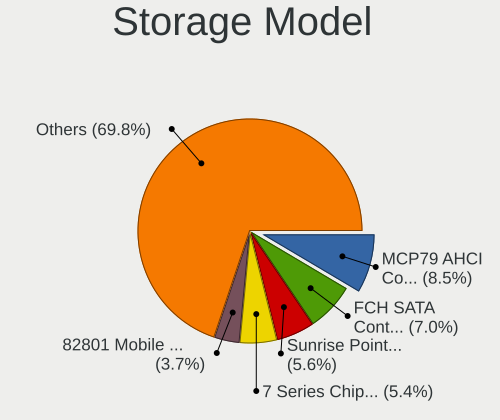

| Model                                                                          | Notebooks | Percent |
|--------------------------------------------------------------------------------|-----------|---------|
| Nvidia MCP79 AHCI Controller                                                   | 362       | 8.52%   |
| AMD FCH SATA Controller [AHCI mode]                                            | 299       | 7.04%   |
| Intel Sunrise Point-LP SATA Controller [AHCI mode]                             | 236       | 5.55%   |
| Intel 7 Series Chipset Family 6-port SATA Controller [AHCI mode]               | 229       | 5.39%   |
| Intel 82801 Mobile SATA Controller [RAID mode]                                 | 156       | 3.67%   |
| Samsung NVMe SSD Controller SM981/PM981/PM983                                  | 146       | 3.44%   |
| Intel 6 Series/C200 Series Chipset Family 6 port Mobile SATA AHCI Controller   | 131       | 3.08%   |
| Intel Volume Management Device NVMe RAID Controller                            | 121       | 2.85%   |
| Intel 82801GBM/GHM (ICH7-M Family) SATA Controller [AHCI mode]                 | 96        | 2.26%   |
| Intel 8 Series SATA Controller 1 [AHCI mode]                                   | 95        | 2.24%   |
| Samsung NVMe SSD Controller 980 (DRAM-less)                                    | 91        | 2.14%   |
| Samsung S4LN058A01[SSUBX] AHCI SSD Controller (Apple slot)                     | 80        | 1.88%   |
| Intel 82801G (ICH7 Family) IDE Controller                                      | 80        | 1.88%   |
| Intel Wildcat Point-LP SATA Controller [AHCI Mode]                             | 79        | 1.86%   |
| Apple S1X NVMe Controller                                                      | 78        | 1.84%   |
| Intel 8 Series/C220 Series Chipset Family 6-port SATA Controller 1 [AHCI mode] | 73        | 1.72%   |
| Intel 82801HM/HEM (ICH8M/ICH8M-E) IDE Controller                               | 67        | 1.58%   |
| Intel 82801HM/HEM (ICH8M/ICH8M-E) SATA Controller [AHCI mode]                  | 63        | 1.48%   |
| Intel Tiger Lake-LP SATA Controller                                            | 60        | 1.41%   |
| SK hynix Gold P31/BC711/PC711 NVMe Solid State Drive                           | 59        | 1.39%   |
| SanDisk Ultra 3D / WD PC SN530, IX SN530, Blue SN550 NVMe SSD (DRAM-less)      | 57        | 1.34%   |
| Intel 82801IBM/IEM (ICH9M/ICH9M-E) 4 port SATA Controller [AHCI mode]          | 56        | 1.32%   |
| SanDisk Extreme Pro / WD Black SN750 / PC SN730 / Red SN700 NVMe SSD           | 53        | 1.25%   |
| Intel 5 Series/3400 Series Chipset 4 port SATA AHCI Controller                 | 53        | 1.25%   |
| Intel Comet Lake SATA AHCI Controller                                          | 49        | 1.15%   |
| Intel Celeron/Pentium Silver Processor SATA Controller                         | 49        | 1.15%   |
| Intel Cannon Lake Mobile PCH SATA AHCI Controller                              | 49        | 1.15%   |
| Intel Cannon Lake PCH SATA AHCI Controller                                     | 44        | 1.04%   |
| KIOXIA NVMe SSD Controller BG4 (DRAM-less)                                     | 40        | 0.94%   |
| Intel SSD 660P Series                                                          | 37        | 0.87%   |
| Intel Cannon Point-LP SATA Controller [AHCI Mode]                              | 35        | 0.82%   |
| Toshiba America Info Systems XG6 NVMe SSD Controller                           | 34        | 0.8%    |
| Intel HM170/QM170 Chipset SATA Controller [AHCI Mode]                          | 34        | 0.8%    |
| Samsung NVMe SSD Controller PM9A1/PM9A3/980PRO                                 | 33        | 0.78%   |
| Intel 5 Series/3400 Series Chipset 6 port SATA AHCI Controller                 | 33        | 0.78%   |
| Intel NM10/ICH7 Family SATA Controller [AHCI mode]                             | 30        | 0.71%   |
| AMD SB7x0/SB8x0/SB9x0 SATA Controller [AHCI mode]                              | 30        | 0.71%   |
| Intel Celeron N3350/Pentium N4200/Atom E3900 Series SATA AHCI Controller       | 27        | 0.64%   |
| Intel 400 Series Chipset Family SATA AHCI Controller                           | 26        | 0.61%   |
| Intel Ice Lake-LP SATA Controller [AHCI mode]                                  | 23        | 0.54%   |

Storage Kind
------------

Kind of storage controller (IDE, SATA, NVMe, SAS, ...)

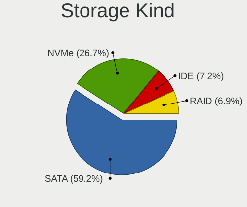

| Kind | Notebooks | Percent |
|------|-----------|---------|
| SATA | 2449      | 59.18%  |
| NVMe | 1105      | 26.7%   |
| IDE  | 299       | 7.23%   |
| RAID | 285       | 6.89%   |

Processor
---------

CPU Vendor
----------

Processor vendors

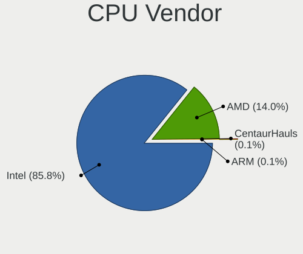

| Vendor       | Notebooks | Percent |
|--------------|-----------|---------|
| Intel        | 3069      | 85.75%  |
| AMD          | 502       | 14.03%  |
| CentaurHauls | 4         | 0.11%   |
| ARM          | 4         | 0.11%   |

CPU Model
---------

Processor models

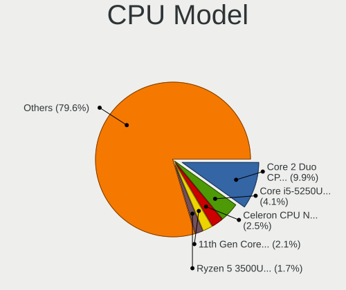

| Model                                         | Notebooks | Percent |
|-----------------------------------------------|-----------|---------|
| Intel Core 2 Duo CPU P7450 @ 2.13GHz          | 355       | 9.91%   |
| Intel Core i5-5250U CPU @ 1.60GHz             | 147       | 4.1%    |
| Intel Celeron CPU N2840 @ 2.16GHz             | 91        | 2.54%   |
| Intel 11th Gen Core i5-1135G7 @ 2.40GHz       | 76        | 2.12%   |
| AMD Ryzen 5 3500U with Radeon Vega Mobile Gfx | 61        | 1.7%    |
| Intel Core 2 CPU T7200 @ 2.00GHz              | 59        | 1.65%   |
| Intel 11th Gen Core i7-1165G7 @ 2.80GHz       | 58        | 1.62%   |
| Intel Core i5-10210U CPU @ 1.60GHz            | 47        | 1.31%   |
| Intel Core i5-8250U CPU @ 1.60GHz             | 45        | 1.26%   |
| Intel Celeron CPU N3060 @ 1.60GHz             | 45        | 1.26%   |
| Intel Core i3-9100 CPU @ 3.60GHz              | 44        | 1.23%   |
| Intel Core i7-8550U CPU @ 1.80GHz             | 39        | 1.09%   |
| Intel Core i5-8265U CPU @ 1.60GHz             | 37        | 1.03%   |
| Intel Core i5-3320M CPU @ 2.60GHz             | 36        | 1.01%   |
| Intel Core i5-7200U CPU @ 2.50GHz             | 34        | 0.95%   |
| Intel Core i7-8565U CPU @ 1.80GHz             | 32        | 0.89%   |
| AMD Ryzen 5 5500U with Radeon Graphics        | 31        | 0.87%   |
| Intel Core i5-3210M CPU @ 2.50GHz             | 30        | 0.84%   |
| Intel Core i7-10510U CPU @ 1.80GHz            | 29        | 0.81%   |
| Intel Core i5-2520M CPU @ 2.50GHz             | 29        | 0.81%   |
| Intel Core i5-6300U CPU @ 2.40GHz             | 28        | 0.78%   |
| Intel Celeron N4020 CPU @ 1.10GHz             | 28        | 0.78%   |
| Intel Core i5-6200U CPU @ 2.30GHz             | 27        | 0.75%   |
| Intel Atom CPU N270 @ 1.60GHz                 | 27        | 0.75%   |
| Intel Core i7-10750H CPU @ 2.60GHz            | 25        | 0.7%    |
| Intel Core i7-9750H CPU @ 2.60GHz             | 24        | 0.67%   |
| Intel Core 2 Duo CPU T8100 @ 2.10GHz          | 24        | 0.67%   |
| AMD PRO A6-9500B R5, 6 COMPUTE CORES 2C+4G    | 24        | 0.67%   |
| Intel Core i7-7500U CPU @ 2.70GHz             | 22        | 0.61%   |
| Intel Core i5-5300U CPU @ 2.30GHz             | 20        | 0.56%   |
| Intel Core i5-1035G1 CPU @ 1.00GHz            | 20        | 0.56%   |
| AMD Ryzen 7 5700U with Radeon Graphics        | 20        | 0.56%   |
| Intel Core i5-5200U CPU @ 2.20GHz             | 19        | 0.53%   |
| Intel Core i5-4300U CPU @ 1.90GHz             | 19        | 0.53%   |
| Intel Core i7-8750H CPU @ 2.20GHz             | 18        | 0.5%    |
| Intel Core i7-7700HQ CPU @ 2.80GHz            | 18        | 0.5%    |
| Intel Core i5-4210U CPU @ 1.70GHz             | 18        | 0.5%    |
| Intel Core i5 CPU M 520 @ 2.40GHz             | 18        | 0.5%    |
| Intel Celeron CPU 3865U @ 1.80GHz             | 18        | 0.5%    |
| Intel Core i7-6700HQ CPU @ 2.60GHz            | 17        | 0.47%   |

CPU Model Family
----------------

Processor model prefix

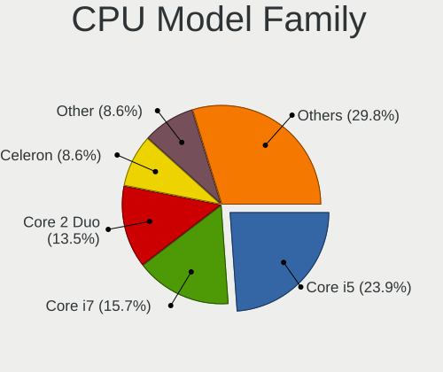

| Model                   | Notebooks | Percent |
|-------------------------|-----------|---------|
| Intel Core i5           | 854       | 23.86%  |
| Intel Core i7           | 563       | 15.73%  |
| Intel Core 2 Duo        | 482       | 13.47%  |
| Intel Celeron           | 308       | 8.61%   |
| Other                   | 307       | 8.58%   |
| Intel Core i3           | 235       | 6.57%   |
| AMD Ryzen 5             | 150       | 4.19%   |
| Intel Atom              | 97        | 2.71%   |
| AMD Ryzen 7             | 77        | 2.15%   |
| Intel Core 2            | 67        | 1.87%   |
| Intel Pentium           | 62        | 1.73%   |
| AMD A6                  | 35        | 0.98%   |
| AMD Ryzen 7 PRO         | 31        | 0.87%   |
| Intel Pentium M         | 23        | 0.64%   |
| Intel Genuine           | 20        | 0.56%   |
| Intel Pentium Dual-Core | 19        | 0.53%   |
| AMD A4                  | 17        | 0.47%   |
| AMD Ryzen 9             | 15        | 0.42%   |
| AMD Ryzen 3             | 15        | 0.42%   |
| AMD Ryzen 5 PRO         | 14        | 0.39%   |
| AMD A8                  | 13        | 0.36%   |
| Intel Pentium Dual      | 12        | 0.34%   |
| Intel Celeron M         | 12        | 0.34%   |
| AMD A10                 | 11        | 0.31%   |
| AMD E1                  | 9         | 0.25%   |
| AMD E2                  | 8         | 0.22%   |
| AMD E                   | 8         | 0.22%   |
| Intel Pentium Silver    | 7         | 0.2%    |
| Intel Pentium 4         | 7         | 0.2%    |
| Intel Core i9           | 6         | 0.17%   |
| Intel Core Duo          | 6         | 0.17%   |
| AMD A12                 | 6         | 0.17%   |
| Intel Xeon              | 5         | 0.14%   |
| AMD Turion 64 X2 Mobile | 5         | 0.14%   |
| AMD PRO A10             | 5         | 0.14%   |
| AMD C-50                | 5         | 0.14%   |
| Intel Pentium Gold      | 4         | 0.11%   |
| Intel Core m7           | 4         | 0.11%   |
| Intel Core m3           | 4         | 0.11%   |
| AMD Turion 64 Mobile    | 4         | 0.11%   |

CPU Cores
---------

Number of processor cores

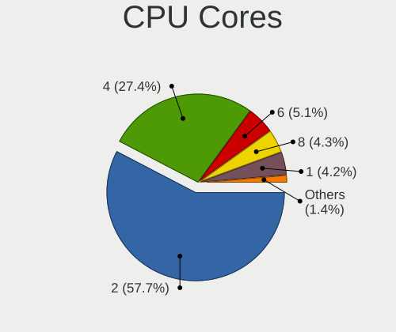

| Number | Notebooks | Percent |
|--------|-----------|---------|
| 2      | 2064      | 57.65%  |
| 4      | 980       | 27.37%  |
| 6      | 181       | 5.06%   |
| 8      | 154       | 4.3%    |
| 1      | 152       | 4.25%   |
| 10     | 25        | 0.7%    |
| 14     | 15        | 0.42%   |
| 12     | 8         | 0.22%   |
| 16     | 1         | 0.03%   |

CPU Sockets
-----------

Number of sockets

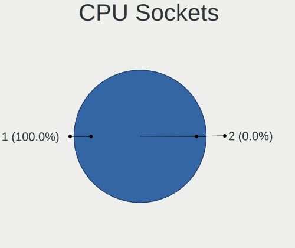

| Number | Notebooks | Percent |
|--------|-----------|---------|
| 1      | 3577      | 99.97%  |
| 2      | 1         | 0.03%   |

CPU Threads
-----------

Threads per core (Hyper-Threading)

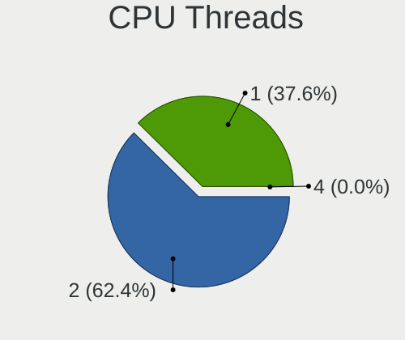

| Number | Notebooks | Percent |
|--------|-----------|---------|
| 2      | 2234      | 62.4%   |
| 1      | 1345      | 37.57%  |
| 4      | 1         | 0.03%   |

CPU Op-Modes
------------

CPU Operation Modes (32-bit, 64-bit)

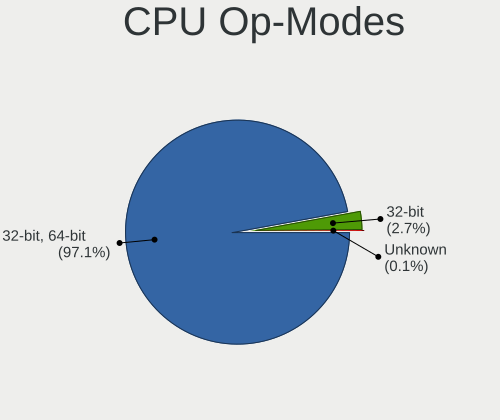

| Op mode        | Notebooks | Percent |
|----------------|-----------|---------|
| 32-bit, 64-bit | 3475      | 97.12%  |
| 32-bit         | 98        | 2.74%   |
| Unknown        | 5         | 0.14%   |

CPU Microcode
-------------

Microcode number

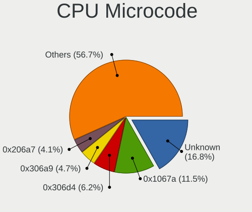

| Number     | Notebooks | Percent |
|------------|-----------|---------|
| Unknown    | 610       | 16.79%  |
| 0x1067a    | 418       | 11.51%  |
| 0x306d4    | 227       | 6.25%   |
| 0x306a9    | 169       | 4.65%   |
| 0x206a7    | 149       | 4.1%    |
| 0x806c1    | 147       | 4.05%   |
| 0x806ec    | 120       | 3.3%    |
| 0x30678    | 104       | 2.86%   |
| 0x806e9    | 99        | 2.73%   |
| 0x406e3    | 86        | 2.37%   |
| 0x40651    | 86        | 2.37%   |
| 0x806ea    | 82        | 2.26%   |
| 0x306c3    | 65        | 1.79%   |
| 0x6f6      | 64        | 1.76%   |
| 0x406c4    | 63        | 1.73%   |
| 0xa0652    | 57        | 1.57%   |
| 0x20655    | 54        | 1.49%   |
| 0x08108109 | 48        | 1.32%   |
| 0x906ea    | 45        | 1.24%   |
| 0x906eb    | 44        | 1.21%   |
| 0x08600106 | 44        | 1.21%   |
| 0x08608103 | 43        | 1.18%   |
| 0x0a50000c | 42        | 1.16%   |
| 0x706e5    | 36        | 0.99%   |
| 0x706a8    | 36        | 0.99%   |
| 0x10676    | 36        | 0.99%   |
| 0x0600611a | 33        | 0.91%   |
| 0x06006705 | 31        | 0.85%   |
| 0x106c2    | 30        | 0.83%   |
| 0x6fd      | 29        | 0.8%    |
| 0x506c9    | 26        | 0.72%   |
| 0x106ca    | 26        | 0.72%   |
| 0x806eb    | 25        | 0.69%   |
| 0x506e3    | 25        | 0.69%   |
| 0x08108102 | 23        | 0.63%   |
| 0x906e9    | 21        | 0.58%   |
| 0x906a4    | 20        | 0.55%   |
| 0x906a3    | 20        | 0.55%   |
| 0x806d1    | 20        | 0.55%   |
| 0x6d8      | 20        | 0.55%   |

CPU Microarch
-------------

Microarchitecture

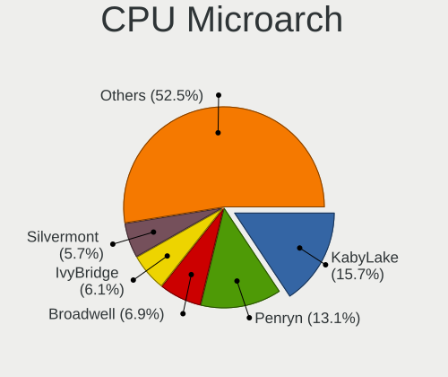

| Name             | Notebooks | Percent |
|------------------|-----------|---------|
| KabyLake         | 561       | 15.66%  |
| Penryn           | 470       | 13.12%  |
| Broadwell        | 247       | 6.89%   |
| IvyBridge        | 220       | 6.14%   |
| Silvermont       | 203       | 5.67%   |
| Haswell          | 196       | 5.47%   |
| SandyBridge      | 194       | 5.41%   |
| TigerLake        | 188       | 5.25%   |
| Skylake          | 145       | 4.05%   |
| Core             | 125       | 3.49%   |
| Unknown          | 108       | 3.01%   |
| Zen+             | 93        | 2.6%    |
| Westmere         | 91        | 2.54%   |
| Excavator        | 82        | 2.29%   |
| Zen 2            | 78        | 2.18%   |
| CometLake        | 72        | 2.01%   |
| Bonnell          | 65        | 1.81%   |
| Zen 3            | 61        | 1.7%    |
| Icelake          | 60        | 1.67%   |
| Goldmont plus    | 60        | 1.67%   |
| P6               | 56        | 1.56%   |
| Goldmont         | 31        | 0.87%   |
| Bobcat           | 25        | 0.7%    |
| Alderlake Hybrid | 23        | 0.64%   |
| Puma             | 21        | 0.59%   |
| Zen              | 18        | 0.5%    |
| Jaguar           | 14        | 0.39%   |
| Tremont          | 13        | 0.36%   |
| K8 Hammer        | 11        | 0.31%   |
| Piledriver       | 10        | 0.28%   |
| NetBurst         | 10        | 0.28%   |
| K10 Llano        | 10        | 0.28%   |
| K10              | 9         | 0.25%   |
| K8 & K10 hybrid  | 7         | 0.2%    |
| Nehalem          | 4         | 0.11%   |
| Steamroller      | 2         | 0.06%   |

Graphics
--------

GPU Vendor
----------

Vendors of graphics cards

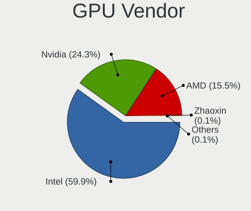

| Vendor                           | Notebooks | Percent |
|----------------------------------|-----------|---------|
| Intel                            | 2540      | 59.92%  |
| Nvidia                           | 1029      | 24.27%  |
| AMD                              | 659       | 15.55%  |
| Silicon Integrated Systems [SiS] | 4         | 0.09%   |
| Zhaoxin                          | 3         | 0.07%   |
| VIA Technologies                 | 3         | 0.07%   |
| S3 Graphics                      | 1         | 0.02%   |

GPU Model
---------

Graphics card models

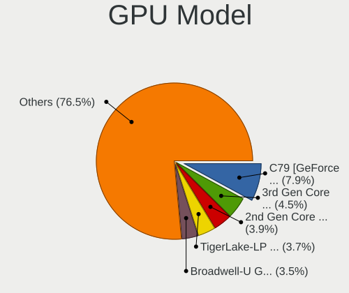

| Model                                                                                    | Notebooks | Percent |
|------------------------------------------------------------------------------------------|-----------|---------|
| Nvidia C79 [GeForce 9400M G]                                                             | 353       | 7.92%   |
| Intel 3rd Gen Core processor Graphics Controller                                         | 202       | 4.53%   |
| Intel 2nd Generation Core Processor Family Integrated Graphics Controller                | 174       | 3.9%    |
| Intel TigerLake-LP GT2 [Iris Xe Graphics]                                                | 166       | 3.72%   |
| Intel Broadwell-U GT3 [HD Graphics 6000]                                                 | 154       | 3.45%   |
| Intel Atom Processor Z36xxx/Z37xxx Series Graphics & Display                             | 121       | 2.71%   |
| Intel Mobile 945GM/GMS/GME, 943/940GML Express Integrated Graphics Controller            | 115       | 2.58%   |
| Intel Kaby Lake-R GT2 [UHD Graphics 620]                                                 | 109       | 2.45%   |
| Intel Haswell-ULT Integrated Graphics Controller                                         | 106       | 2.38%   |
| Intel Skylake-U GT2 [HD Graphics 520]                                                    | 100       | 2.24%   |
| Intel Kaby Lake-U GT2 [HD Graphics 620]                                                  | 96        | 2.15%   |
| AMD Picasso/Raven 2 [Radeon Vega Series / Radeon Vega Mobile Series]                     | 95        | 2.13%   |
| Intel CometLake-U GT2 [UHD Graphics]                                                     | 90        | 2.02%   |
| Intel WhiskeyLake-U GT2 [UHD Graphics 620]                                               | 86        | 1.93%   |
| Intel Broadwell-U GT2 [HD Graphics 5500]                                                 | 84        | 1.88%   |
| Intel Mobile 945GM/GMS, 943/940GML Express Integrated Graphics Controller                | 83        | 1.86%   |
| Intel Atom/Celeron/Pentium Processor x5-E8000/J3xxx/N3xxx Integrated Graphics Controller | 81        | 1.82%   |
| AMD Renoir [Radeon Vega Series / Radeon Vega Mobile Series]                              | 78        | 1.75%   |
| Intel 4th Gen Core Processor Integrated Graphics Controller                              | 75        | 1.68%   |
| Intel Core Processor Integrated Graphics Controller                                      | 73        | 1.64%   |
| Intel CoffeeLake-H GT2 [UHD Graphics 630]                                                | 61        | 1.37%   |
| Intel Mobile GM965/GL960 Integrated Graphics Controller (secondary)                      | 60        | 1.35%   |
| Intel Mobile GM965/GL960 Integrated Graphics Controller (primary)                        | 60        | 1.35%   |
| Intel CometLake-H GT2 [UHD Graphics]                                                     | 58        | 1.3%    |
| AMD Cezanne [Radeon Vega Series / Radeon Vega Mobile Series]                             | 56        | 1.26%   |
| Intel GeminiLake [UHD Graphics 600]                                                      | 55        | 1.23%   |
| AMD Lucienne                                                                             | 55        | 1.23%   |
| Intel Mobile 4 Series Chipset Integrated Graphics Controller                             | 53        | 1.19%   |
| Nvidia TU117M [GeForce GTX 1650 Mobile / Max-Q]                                          | 48        | 1.08%   |
| Intel CoffeeLake-S GT2 [UHD Graphics 630]                                                | 44        | 0.99%   |
| AMD Wani [Radeon R5/R6/R7 Graphics]                                                      | 44        | 0.99%   |
| AMD Stoney [Radeon R2/R3/R4/R5 Graphics]                                                 | 38        | 0.85%   |
| Intel Mobile 945GSE Express Integrated Graphics Controller                               | 32        | 0.72%   |
| Intel Iris Plus Graphics G1 (Ice Lake)                                                   | 31        | 0.7%    |
| AMD Topaz XT [Radeon R7 M260/M265 / M340/M360 / M440/M445 / 530/535 / 620/625 Mobile]    | 30        | 0.67%   |
| Intel TigerLake-H GT1 [UHD Graphics]                                                     | 28        | 0.63%   |
| Intel Kaby Lake-H GT2 [HD Graphics 630]                                                  | 28        | 0.63%   |
| Intel Atom Processor D4xx/D5xx/N4xx/N5xx Integrated Graphics Controller                  | 27        | 0.61%   |
| Intel Skylake-H GT2 [HD Graphics 530]                                                    | 26        | 0.58%   |
| Nvidia GF117M [GeForce 610M/710M/810M/820M / GT 620M/625M/630M/720M]                     | 25        | 0.56%   |

GPU Combo
---------

Combinations of graphics cards

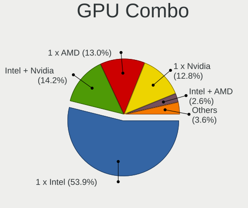

| Name            | Notebooks | Percent |
|-----------------|-----------|---------|
| 1 x Intel       | 1930      | 53.88%  |
| Intel + Nvidia  | 508       | 14.18%  |
| 1 x AMD         | 466       | 13.01%  |
| 1 x Nvidia      | 458       | 12.79%  |
| Intel + AMD     | 92        | 2.57%   |
| AMD + Nvidia    | 63        | 1.76%   |
| 2 x AMD         | 38        | 1.06%   |
| Other           | 14        | 0.39%   |
| 1 x SiS         | 4         | 0.11%   |
| 1 x Zhaoxin     | 3         | 0.08%   |
| 1 x VIA         | 3         | 0.08%   |
| 2 x Nvidia      | 1         | 0.03%   |
| 2 x Intel       | 1         | 0.03%   |
| 1 x S3 Graphics | 1         | 0.03%   |

GPU Driver
----------

Free vs proprietary

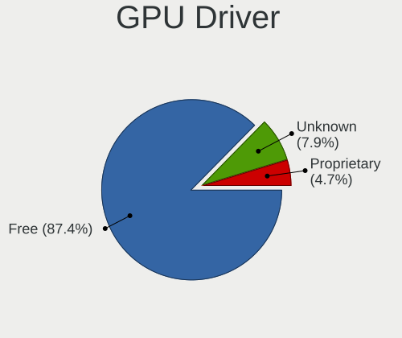

| Driver      | Notebooks | Percent |
|-------------|-----------|---------|
| Free        | 3148      | 87.37%  |
| Unknown     | 286       | 7.94%   |
| Proprietary | 169       | 4.69%   |

GPU Memory
----------

Total video memory

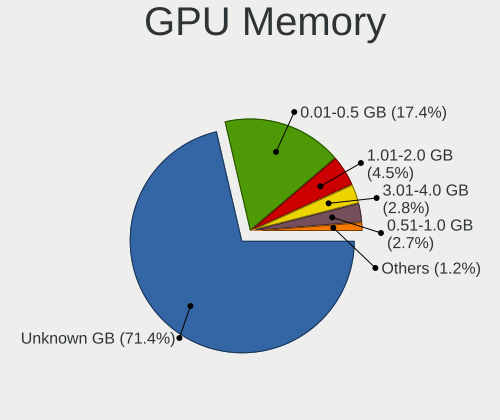

| Size in GB     | Notebooks | Percent |
|----------------|-----------|---------|
| Unknown        | 2577      | 71.37%  |
| 0.01-0.5       | 628       | 17.39%  |
| 1.01-2.0       | 161       | 4.46%   |
| 3.01-4.0       | 101       | 2.8%    |
| 0.51-1.0       | 99        | 2.74%   |
| 5.01-6.0       | 24        | 0.66%   |
| 7.01-8.0       | 12        | 0.33%   |
| 2.01-3.0       | 6         | 0.17%   |
| 8.01-16.0      | 2         | 0.06%   |
| More than 64.0 | 1         | 0.03%   |

Monitor
-------

Monitor Vendor
--------------

Monitor vendors

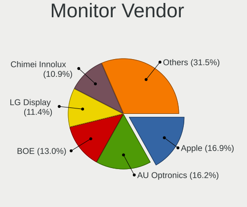

| Vendor                  | Notebooks | Percent |
|-------------------------|-----------|---------|
| Apple                   | 632       | 16.88%  |
| AU Optronics            | 607       | 16.22%  |
| BOE                     | 488       | 13.04%  |
| LG Display              | 428       | 11.43%  |
| Chimei Innolux          | 409       | 10.93%  |
| Samsung Electronics     | 270       | 7.21%   |
| Lenovo                  | 90        | 2.4%    |
| Dell                    | 75        | 2%      |
| Sharp                   | 69        | 1.84%   |
| Chi Mei Optoelectronics | 68        | 1.82%   |
| InfoVision              | 56        | 1.5%    |
| Goldstar                | 55        | 1.47%   |
| BenQ                    | 39        | 1.04%   |
| PANDA                   | 37        | 0.99%   |
| Hewlett-Packard         | 37        | 0.99%   |
| Philips                 | 33        | 0.88%   |
| HannStar                | 29        | 0.77%   |
| LG Philips              | 27        | 0.72%   |
| Unknown                 | 26        | 0.69%   |
| AOC                     | 26        | 0.69%   |
| Ancor Communications    | 21        | 0.56%   |
| Acer                    | 21        | 0.56%   |
| Iiyama                  | 19        | 0.51%   |
| ViewSonic               | 18        | 0.48%   |
| CSO                     | 17        | 0.45%   |
| CPT                     | 8         | 0.21%   |
| Sony                    | 7         | 0.19%   |
| Quanta Display          | 7         | 0.19%   |
| Eizo                    | 7         | 0.19%   |
| Panasonic               | 6         | 0.16%   |
| NEC Computers           | 6         | 0.16%   |
| MSI                     | 6         | 0.16%   |
| Pixio                   | 5         | 0.13%   |
| TMX                     | 4         | 0.11%   |
| ___                     | 3         | 0.08%   |
| Vestel Elektronik       | 3         | 0.08%   |
| Toshiba                 | 3         | 0.08%   |
| SLD                     | 3         | 0.08%   |
| LGD                     | 3         | 0.08%   |
| InnoLux Display         | 3         | 0.08%   |

Monitor Model
-------------

Monitor models

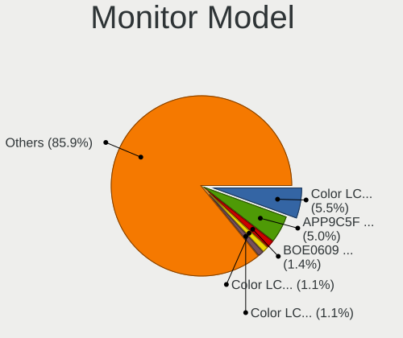

| Model                                                                 | Notebooks | Percent |
|-----------------------------------------------------------------------|-----------|---------|
| Apple Color LCD APP9C5B 1280x800 286x179mm 13.3-inch                  | 209       | 5.53%   |
| Apple LCD Monitor APP9C5F 1280x800 286x179mm 13.3-inch                | 187       | 4.95%   |
| BOE LCD Monitor BOE0609 1366x768 256x144mm 11.6-inch                  | 54        | 1.43%   |
| Apple Color LCD APP9CDF 1440x900 286x179mm 13.3-inch                  | 42        | 1.11%   |
| AU Optronics LCD Monitor AUO235C 1366x768 256x144mm 11.6-inch         | 41        | 1.09%   |
| Apple Color LCD APP9CF3 1366x768 260x140mm 11.6-inch                  | 41        | 1.09%   |
| Apple Color LCD APP9CF2 1366x768 256x144mm 11.6-inch                  | 38        | 1.01%   |
| Apple Color LCD APP9CF0 1440x900 290x180mm 13.4-inch                  | 28        | 0.74%   |
| Chimei Innolux LCD Monitor CMN14D4 1920x1080 309x173mm 13.9-inch      | 26        | 0.69%   |
| AU Optronics LCD Monitor AUO38ED 1920x1080 344x193mm 15.5-inch        | 26        | 0.69%   |
| BOE LCD Monitor BOE06B3 1366x768 309x173mm 13.9-inch                  | 25        | 0.66%   |
| Unknown LCD Monitor FFFF 2288x1287 2550x2550mm 142.0-inch             | 22        | 0.58%   |
| HannStar LCD Monitor HSD03E9 1024x600 220x129mm 10.0-inch             | 22        | 0.58%   |
| Chimei Innolux LCD Monitor CMN15DB 1366x768 344x193mm 15.5-inch       | 22        | 0.58%   |
| Chimei Innolux LCD Monitor CMN1132 1366x768 256x144mm 11.6-inch       | 22        | 0.58%   |
| Apple Color LCD APP9C5C 1280x800 286x179mm 13.3-inch                  | 22        | 0.58%   |
| Chimei Innolux LCD Monitor CMN14C9 1920x1080 309x173mm 13.9-inch      | 20        | 0.53%   |
| AU Optronics LCD Monitor AUO21ED 1920x1080 344x193mm 15.5-inch        | 18        | 0.48%   |
| AU Optronics LCD Monitor AUO106C 1366x768 276x155mm 12.5-inch         | 18        | 0.48%   |
| Chimei Innolux LCD Monitor CMN15F5 1920x1080 344x193mm 15.5-inch      | 16        | 0.42%   |
| AU Optronics LCD Monitor AUO403D 1920x1080 309x174mm 14.0-inch        | 14        | 0.37%   |
| Samsung Electronics LCD Monitor SEC5441 1280x800 331x207mm 15.4-inch  | 13        | 0.34%   |
| AU Optronics LCD Monitor AUO22EC 1366x768 344x193mm 15.5-inch         | 13        | 0.34%   |
| Apple Color LCD APP9C5E 1280x800 286x178mm 13.3-inch                  | 13        | 0.34%   |
| Chimei Innolux LCD Monitor CMN1521 1920x1080 344x193mm 15.5-inch      | 12        | 0.32%   |
| LG Display LCD Monitor LGD0521 1920x1080 309x174mm 14.0-inch          | 11        | 0.29%   |
| Chimei Innolux LCD Monitor CMN14D5 1920x1080 309x173mm 13.9-inch      | 11        | 0.29%   |
| BOE LCD Monitor BOE06CF 1366x768 277x156mm 12.5-inch                  | 11        | 0.29%   |
| Samsung Electronics LCD Monitor SDC4C48 1920x1080 293x165mm 13.2-inch | 10        | 0.26%   |
| LG Display LCD Monitor LGD02D8 1366x768 277x156mm 12.5-inch           | 10        | 0.26%   |
| InfoVision LCD Monitor IVO057D 1920x1080 309x174mm 14.0-inch          | 10        | 0.26%   |
| BOE LCD Monitor BOE0687 1920x1080 344x193mm 15.5-inch                 | 10        | 0.26%   |
| BenQ GW2470 BNQ78E4 1920x1080 527x296mm 23.8-inch                     | 10        | 0.26%   |
| AU Optronics LCD Monitor AUO71EC 1366x768 344x193mm 15.5-inch         | 10        | 0.26%   |
| AU Optronics LCD Monitor AUO2E3C 1366x768 309x173mm 13.9-inch         | 10        | 0.26%   |
| AU Optronics LCD Monitor AUO26EC 1366x768 344x193mm 15.5-inch         | 10        | 0.26%   |
| AU Optronics LCD Monitor AUO213E 1600x900 309x174mm 14.0-inch         | 10        | 0.26%   |
| AU Optronics LCD Monitor AUO123D 1920x1080 309x173mm 13.9-inch        | 10        | 0.26%   |
| LG Display LCD Monitor LGD02DC 1366x768 344x194mm 15.5-inch           | 9         | 0.24%   |
| InfoVision LCD Monitor IVO0533 1366x768 293x164mm 13.2-inch           | 9         | 0.24%   |

Monitor Resolution
------------------

Monitor screen resolution

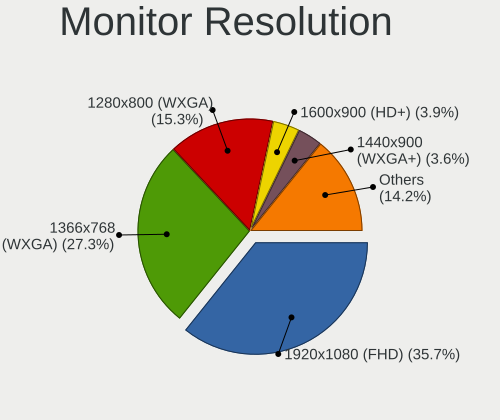

| Resolution         | Notebooks | Percent |
|--------------------|-----------|---------|
| 1920x1080 (FHD)    | 1268      | 35.75%  |
| 1366x768 (WXGA)    | 967       | 27.26%  |
| 1280x800 (WXGA)    | 543       | 15.31%  |
| 1600x900 (HD+)     | 138       | 3.89%   |
| 1440x900 (WXGA+)   | 127       | 3.58%   |
| 3840x2160 (4K)     | 95        | 2.68%   |
| 1920x1200 (WUXGA)  | 71        | 2%      |
| 2560x1440 (QHD)    | 66        | 1.86%   |
| 1024x600           | 55        | 1.55%   |
| 1280x1024 (SXGA)   | 26        | 0.73%   |
| 2288x1287          | 22        | 0.62%   |
| 2560x1600          | 21        | 0.59%   |
| 1680x1050 (WSXGA+) | 17        | 0.48%   |
| 1024x768 (XGA)     | 15        | 0.42%   |
| 3840x2400          | 13        | 0.37%   |
| 1360x768           | 13        | 0.37%   |
| 2560x1080          | 12        | 0.34%   |
| 3440x1440          | 11        | 0.31%   |
| 2880x1800          | 10        | 0.28%   |
| 2160x1440          | 7         | 0.2%    |
| 1400x1050          | 5         | 0.14%   |
| Unknown            | 5         | 0.14%   |
| 3840x1080          | 4         | 0.11%   |
| 3200x1800 (QHD+)   | 3         | 0.08%   |
| 2880x1920          | 3         | 0.08%   |
| 1600x1200          | 3         | 0.08%   |
| 1024x576           | 3         | 0.08%   |
| 3840x1200          | 2         | 0.06%   |
| 3840x1100          | 2         | 0.06%   |
| 3072x1920          | 2         | 0.06%   |
| 2304x1440          | 2         | 0.06%   |
| 2256x1504          | 2         | 0.06%   |
| 1920x540           | 2         | 0.06%   |
| 1920x1280          | 2         | 0.06%   |
| 1280x720 (HD)      | 2         | 0.06%   |
| 5760x2160          | 1         | 0.03%   |
| 3840x1600          | 1         | 0.03%   |
| 3520x1080          | 1         | 0.03%   |
| 2520x1680          | 1         | 0.03%   |
| 2048x1152          | 1         | 0.03%   |

Monitor Diagonal
----------------

Diagonal size in inches

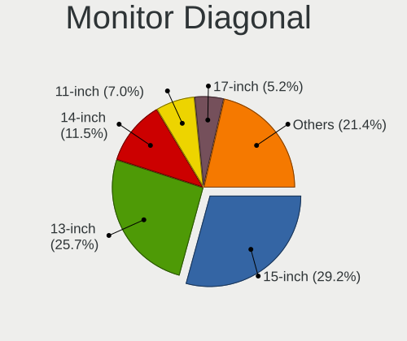

| Inches  | Notebooks | Percent |
|---------|-----------|---------|
| 15      | 1094      | 29.23%  |
| 13      | 963       | 25.73%  |
| 14      | 430       | 11.49%  |
| 11      | 261       | 6.97%   |
| 17      | 194       | 5.18%   |
| 24      | 126       | 3.37%   |
| 12      | 120       | 3.21%   |
| 27      | 88        | 2.35%   |
| 23      | 73        | 1.95%   |
| 21      | 62        | 1.66%   |
| 10      | 56        | 1.5%    |
| 31      | 38        | 1.02%   |
| 18      | 31        | 0.83%   |
| 19      | 25        | 0.67%   |
| Unknown | 25        | 0.67%   |
| 16      | 24        | 0.64%   |
| 142     | 22        | 0.59%   |
| 34      | 17        | 0.45%   |
| 25      | 10        | 0.27%   |
| 32      | 9         | 0.24%   |
| 22      | 9         | 0.24%   |
| 20      | 9         | 0.24%   |
| 84      | 7         | 0.19%   |
| 72      | 6         | 0.16%   |
| 54      | 6         | 0.16%   |
| 40      | 6         | 0.16%   |
| 29      | 5         | 0.13%   |
| 49      | 3         | 0.08%   |
| 46      | 3         | 0.08%   |
| 28      | 3         | 0.08%   |
| 8       | 3         | 0.08%   |
| 52      | 2         | 0.05%   |
| 43      | 2         | 0.05%   |
| 42      | 2         | 0.05%   |
| 26      | 2         | 0.05%   |
| 65      | 1         | 0.03%   |
| 64      | 1         | 0.03%   |
| 63      | 1         | 0.03%   |
| 55      | 1         | 0.03%   |
| 48      | 1         | 0.03%   |

Monitor Width
-------------

Physical width

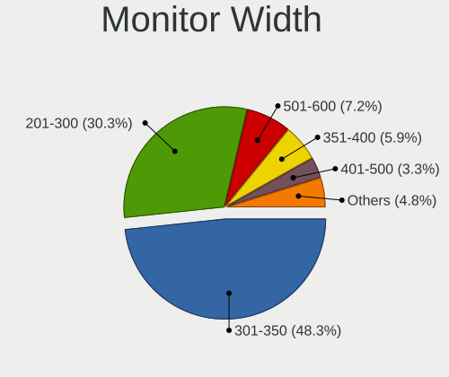

| Width in mm    | Notebooks | Percent |
|----------------|-----------|---------|
| 301-350        | 1795      | 48.32%  |
| 201-300        | 1127      | 30.34%  |
| 501-600        | 269       | 7.24%   |
| 351-400        | 221       | 5.95%   |
| 401-500        | 124       | 3.34%   |
| 601-700        | 59        | 1.59%   |
| 701-800        | 27        | 0.73%   |
| Unknown        | 25        | 0.67%   |
| More than 2000 | 22        | 0.59%   |
| 1001-1500      | 21        | 0.57%   |
| 1501-2000      | 13        | 0.35%   |
| 801-900        | 7         | 0.19%   |
| 101-200        | 3         | 0.08%   |
| 901-1000       | 2         | 0.05%   |

Aspect Ratio
------------

Proportional relationship between the width and the height

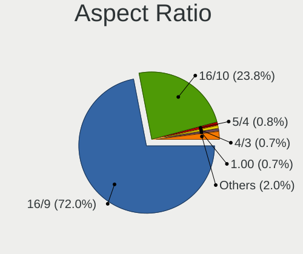

| Ratio   | Notebooks | Percent |
|---------|-----------|---------|
| 16/9    | 2430      | 71.98%  |
| 16/10   | 805       | 23.84%  |
| 5/4     | 26        | 0.77%   |
| 4/3     | 25        | 0.74%   |
| 1.00    | 22        | 0.65%   |
| 3/2     | 21        | 0.62%   |
| 21/9    | 20        | 0.59%   |
| Unknown | 15        | 0.44%   |
| 2.65    | 4         | 0.12%   |
| 32/9    | 2         | 0.06%   |
| 3.40    | 2         | 0.06%   |
| 3.20    | 2         | 0.06%   |
| 3.73    | 1         | 0.03%   |
| 1.96    | 1         | 0.03%   |

Monitor Area
------------

Area in inch²

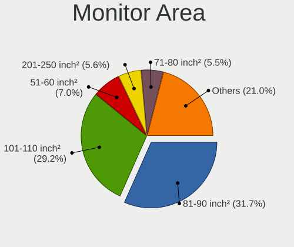

| Area in inch² | Notebooks | Percent |
|----------------|-----------|---------|
| 81-90          | 1183      | 31.66%  |
| 101-110        | 1092      | 29.22%  |
| 51-60          | 263       | 7.04%   |
| 201-250        | 211       | 5.65%   |
| 71-80          | 204       | 5.46%   |
| 121-130        | 156       | 4.17%   |
| 61-70          | 116       | 3.1%    |
| 301-350        | 89        | 2.38%   |
| 351-500        | 69        | 1.85%   |
| 251-300        | 59        | 1.58%   |
| 41-50          | 56        | 1.5%    |
| More than 1000 | 48        | 1.28%   |
| 151-200        | 47        | 1.26%   |
| 141-150        | 43        | 1.15%   |
| 131-140        | 26        | 0.7%    |
| Unknown        | 25        | 0.67%   |
| 111-120        | 20        | 0.54%   |
| 501-1000       | 16        | 0.43%   |
| 91-100         | 11        | 0.29%   |
| 1-40           | 3         | 0.08%   |

Pixel Density
-------------

Pixels per inch

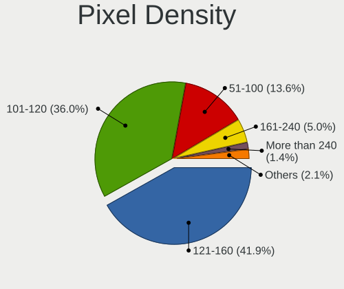

| Density       | Notebooks | Percent |
|---------------|-----------|---------|
| 121-160       | 1537      | 41.88%  |
| 101-120       | 1321      | 35.99%  |
| 51-100        | 499       | 13.6%   |
| 161-240       | 185       | 5.04%   |
| More than 240 | 52        | 1.42%   |
| 1-50          | 51        | 1.39%   |
| Unknown       | 25        | 0.68%   |

Multiple Monitors
-----------------

Total monitors connected

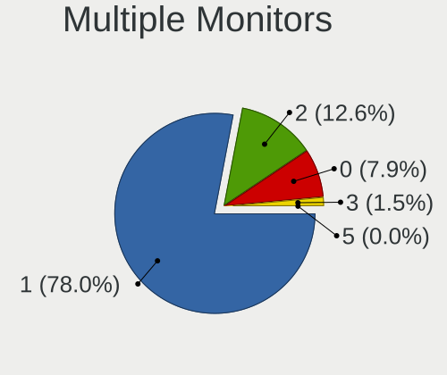

| Total | Notebooks | Percent |
|-------|-----------|---------|
| 1     | 2834      | 77.99%  |
| 2     | 459       | 12.63%  |
| 0     | 287       | 7.9%    |
| 3     | 53        | 1.46%   |
| 5     | 1         | 0.03%   |

Network
-------

Net Controller Vendor
---------------------

Controller vendors

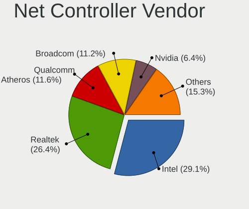

| Vendor                            | Notebooks | Percent |
|-----------------------------------|-----------|---------|
| Intel                             | 1696      | 29.09%  |
| Realtek Semiconductor             | 1541      | 26.43%  |
| Qualcomm Atheros                  | 678       | 11.63%  |
| Broadcom                          | 653       | 11.2%   |
| Nvidia                            | 371       | 6.36%   |
| Broadcom Limited                  | 233       | 4%      |
| Marvell Technology Group          | 115       | 1.97%   |
| MediaTek                          | 64        | 1.1%    |
| ASIX Electronics                  | 42        | 0.72%   |
| Ralink                            | 40        | 0.69%   |
| Dell                              | 30        | 0.51%   |
| Sierra Wireless                   | 28        | 0.48%   |
| Samsung Electronics               | 28        | 0.48%   |
| TP-Link                           | 27        | 0.46%   |
| Xiaomi                            | 23        | 0.39%   |
| Ralink Technology                 | 21        | 0.36%   |
| Qualcomm                          | 19        | 0.33%   |
| Shenzhen Goodix Technology        | 18        | 0.31%   |
| DisplayLink                       | 18        | 0.31%   |
| JMicron Technology                | 15        | 0.26%   |
| Ericsson Business Mobile Networks | 15        | 0.26%   |
| Lenovo                            | 13        | 0.22%   |
| Hewlett-Packard                   | 13        | 0.22%   |
| OPPO Electronics                  | 8         | 0.14%   |
| Huawei Technologies               | 8         | 0.14%   |
| Fibocom                           | 7         | 0.12%   |
| Qualcomm Atheros Communications   | 6         | 0.1%    |
| NetGear                           | 6         | 0.1%    |
| Cypress Semiconductor             | 6         | 0.1%    |
| AMD                               | 6         | 0.1%    |
| Silicon Integrated Systems [SiS]  | 5         | 0.09%   |
| ICS Advent                        | 5         | 0.09%   |
| ASUSTek Computer                  | 5         | 0.09%   |
| Motorola PCS                      | 4         | 0.07%   |
| Microchip Technology              | 4         | 0.07%   |
| Attansic Technology               | 4         | 0.07%   |
| VIA Technologies                  | 3         | 0.05%   |
| ULi Electronics                   | 3         | 0.05%   |
| Edimax Technology                 | 3         | 0.05%   |
| Dresden Elektronik                | 3         | 0.05%   |

Net Controller Model
--------------------

Controller models

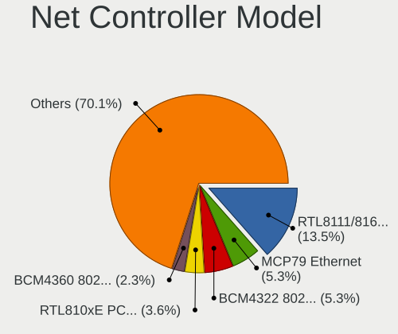

| Model                                                                                 | Notebooks | Percent |
|---------------------------------------------------------------------------------------|-----------|---------|
| Realtek RTL8111/8168/8211/8411 PCI Express Gigabit Ethernet Controller                | 931       | 13.52%  |
| Nvidia MCP79 Ethernet                                                                 | 362       | 5.26%   |
| Broadcom BCM4322 802.11a/b/g/n Wireless LAN Controller                                | 362       | 5.26%   |
| Realtek RTL810xE PCI Express Fast Ethernet controller                                 | 246       | 3.57%   |
| Broadcom Limited BCM4360 802.11ac Dual Band Wireless Network Adapter                  | 160       | 2.32%   |
| Intel Wireless 7260                                                                   | 159       | 2.31%   |
| Qualcomm Atheros QCA9377 802.11ac Wireless Network Adapter                            | 155       | 2.25%   |
| Intel Wireless 8265 / 8275                                                            | 144       | 2.09%   |
| Realtek RTL8153 Gigabit Ethernet Adapter                                              | 138       | 2%      |
| Intel 82579LM Gigabit Network Connection (Lewisville)                                 | 133       | 1.93%   |
| Intel Wi-Fi 6 AX201                                                                   | 129       | 1.87%   |
| Intel Wireless 7265                                                                   | 128       | 1.86%   |
| Intel Wi-Fi 6 AX200                                                                   | 109       | 1.58%   |
| Qualcomm Atheros AR9285 Wireless Network Adapter (PCI-Express)                        | 96        | 1.39%   |
| Realtek RTL8821CE 802.11ac PCIe Wireless Network Adapter                              | 94        | 1.36%   |
| Intel Centrino Advanced-N 6205 [Taylor Peak]                                          | 83        | 1.2%    |
| Intel Comet Lake PCH-LP CNVi WiFi                                                     | 82        | 1.19%   |
| Intel Cannon Lake PCH CNVi WiFi                                                       | 82        | 1.19%   |
| Realtek RTL8822CE 802.11ac PCIe Wireless Network Adapter                              | 79        | 1.15%   |
| Qualcomm Atheros QCA9565 / AR9565 Wireless Network Adapter                            | 78        | 1.13%   |
| Qualcomm Atheros AR9485 Wireless Network Adapter                                      | 78        | 1.13%   |
| Intel Wireless 8260                                                                   | 72        | 1.05%   |
| Intel Comet Lake PCH CNVi WiFi                                                        | 58        | 0.84%   |
| Qualcomm Atheros AR5418 Wireless Network Adapter [AR5008E 802.11(a)bgn] (PCI-Express) | 56        | 0.81%   |
| Marvell Group 88E8053 PCI-E Gigabit Ethernet Controller                               | 56        | 0.81%   |
| Intel Ethernet Connection (4) I219-V                                                  | 51        | 0.74%   |
| Intel Ethernet Connection (4) I219-LM                                                 | 51        | 0.74%   |
| Qualcomm Atheros QCA6174 802.11ac Wireless Network Adapter                            | 50        | 0.73%   |
| Realtek RTL8723BE PCIe Wireless Network Adapter                                       | 48        | 0.7%    |
| MediaTek MT7921 802.11ax PCIe Wireless Network Adapter [Filogic 330]                  | 48        | 0.7%    |
| Intel Cannon Point-LP CNVi [Wireless-AC]                                              | 47        | 0.68%   |
| Broadcom BCM4313 802.11bgn Wireless Network Adapter                                   | 46        | 0.67%   |
| Intel PRO/Wireless 3945ABG [Golan] Network Connection                                 | 42        | 0.61%   |
| Intel Alder Lake-P PCH CNVi WiFi                                                      | 41        | 0.6%    |
| Intel Wireless 3165                                                                   | 39        | 0.57%   |
| Realtek RTL8188CE 802.11b/g/n WiFi Adapter                                            | 38        | 0.55%   |
| Intel Ethernet Connection I219-LM                                                     | 38        | 0.55%   |
| Intel Ethernet Connection I218-LM                                                     | 38        | 0.55%   |
| Intel Ethernet Connection (3) I218-LM                                                 | 38        | 0.55%   |
| Qualcomm Atheros AR9462 Wireless Network Adapter                                      | 36        | 0.52%   |

Wireless Vendor
---------------

Wireless vendors

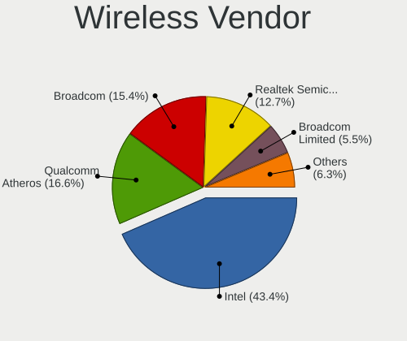

| Vendor                                | Notebooks | Percent |
|---------------------------------------|-----------|---------|
| Intel                                 | 1582      | 43.45%  |
| Qualcomm Atheros                      | 606       | 16.64%  |
| Broadcom                              | 561       | 15.41%  |
| Realtek Semiconductor                 | 462       | 12.69%  |
| Broadcom Limited                      | 201       | 5.52%   |
| MediaTek                              | 58        | 1.59%   |
| Ralink                                | 40        | 1.1%    |
| Sierra Wireless                       | 28        | 0.77%   |
| Ralink Technology                     | 21        | 0.58%   |
| Dell                                  | 19        | 0.52%   |
| TP-Link                               | 13        | 0.36%   |
| Qualcomm                              | 9         | 0.25%   |
| Fibocom                               | 7         | 0.19%   |
| Qualcomm Atheros Communications       | 6         | 0.16%   |
| NetGear                               | 6         | 0.16%   |
| ASUSTek Computer                      | 5         | 0.14%   |
| Edimax Technology                     | 3         | 0.08%   |
| Hewlett-Packard                       | 2         | 0.05%   |
| 802.11g Adapter [Linksys WUSB54GC v3] | 2         | 0.05%   |
| 3Com                                  | 2         | 0.05%   |
| Z-Com                                 | 1         | 0.03%   |
| Winbond Electronics                   | 1         | 0.03%   |
| Wilocity                              | 1         | 0.03%   |
| Ovislink                              | 1         | 0.03%   |
| Fujitsu Siemens Computers             | 1         | 0.03%   |
| D-Link System                         | 1         | 0.03%   |
| D-Link                                | 1         | 0.03%   |
| Belkin Components                     | 1         | 0.03%   |

Wireless Model
--------------

Wireless models

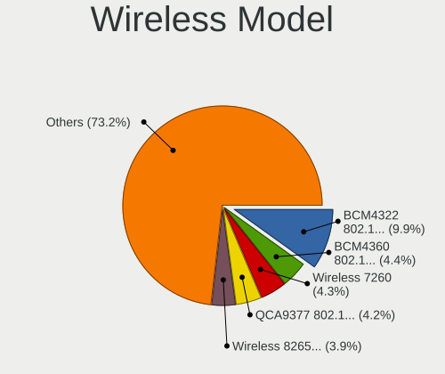

| Model                                                                                 | Notebooks | Percent |
|---------------------------------------------------------------------------------------|-----------|---------|
| Broadcom BCM4322 802.11a/b/g/n Wireless LAN Controller                                | 362       | 9.9%    |
| Broadcom Limited BCM4360 802.11ac Dual Band Wireless Network Adapter                  | 160       | 4.38%   |
| Intel Wireless 7260                                                                   | 159       | 4.35%   |
| Qualcomm Atheros QCA9377 802.11ac Wireless Network Adapter                            | 155       | 4.24%   |
| Intel Wireless 8265 / 8275                                                            | 144       | 3.94%   |
| Intel Wi-Fi 6 AX201                                                                   | 129       | 3.53%   |
| Intel Wireless 7265                                                                   | 128       | 3.5%    |
| Intel Wi-Fi 6 AX200                                                                   | 109       | 2.98%   |
| Qualcomm Atheros AR9285 Wireless Network Adapter (PCI-Express)                        | 96        | 2.63%   |
| Realtek RTL8821CE 802.11ac PCIe Wireless Network Adapter                              | 94        | 2.57%   |
| Intel Centrino Advanced-N 6205 [Taylor Peak]                                          | 83        | 2.27%   |
| Intel Comet Lake PCH-LP CNVi WiFi                                                     | 82        | 2.24%   |
| Intel Cannon Lake PCH CNVi WiFi                                                       | 82        | 2.24%   |
| Realtek RTL8822CE 802.11ac PCIe Wireless Network Adapter                              | 79        | 2.16%   |
| Qualcomm Atheros QCA9565 / AR9565 Wireless Network Adapter                            | 78        | 2.13%   |
| Qualcomm Atheros AR9485 Wireless Network Adapter                                      | 78        | 2.13%   |
| Intel Wireless 8260                                                                   | 72        | 1.97%   |
| Intel Comet Lake PCH CNVi WiFi                                                        | 58        | 1.59%   |
| Qualcomm Atheros AR5418 Wireless Network Adapter [AR5008E 802.11(a)bgn] (PCI-Express) | 56        | 1.53%   |
| Qualcomm Atheros QCA6174 802.11ac Wireless Network Adapter                            | 50        | 1.37%   |
| Realtek RTL8723BE PCIe Wireless Network Adapter                                       | 48        | 1.31%   |
| MediaTek MT7921 802.11ax PCIe Wireless Network Adapter [Filogic 330]                  | 48        | 1.31%   |
| Intel Cannon Point-LP CNVi [Wireless-AC]                                              | 47        | 1.29%   |
| Broadcom BCM4313 802.11bgn Wireless Network Adapter                                   | 46        | 1.26%   |
| Intel PRO/Wireless 3945ABG [Golan] Network Connection                                 | 42        | 1.15%   |
| Intel Wireless 3165                                                                   | 39        | 1.07%   |
| Realtek RTL8188CE 802.11b/g/n WiFi Adapter                                            | 38        | 1.04%   |
| Qualcomm Atheros AR9462 Wireless Network Adapter                                      | 36        | 0.98%   |
| Realtek RTL8852AE 802.11ax PCIe Wireless Network Adapter                              | 35        | 0.96%   |
| Intel Centrino Ultimate-N 6300                                                        | 31        | 0.85%   |
| Broadcom BCM43142 802.11b/g/n                                                         | 31        | 0.85%   |
| Intel Wi-Fi 6E(802.11ax) AX210/AX1675* 2x2 [Typhoon Peak]                             | 28        | 0.77%   |
| Intel Wireless 3160                                                                   | 27        | 0.74%   |
| Intel Centrino Advanced-N 6200                                                        | 26        | 0.71%   |
| Intel Wi-Fi 5(802.11ac) Wireless-AC 9x6x [Thunder Peak]                               | 23        | 0.63%   |
| Broadcom BCM4321 802.11a/b/g/n                                                        | 23        | 0.63%   |
| Realtek RTL8723DE Wireless Network Adapter                                            | 22        | 0.6%    |
| Qualcomm Atheros AR242x / AR542x Wireless Network Adapter (PCI-Express)               | 22        | 0.6%    |
| Intel PRO/Wireless 4965 AG or AGN [Kedron] Network Connection                         | 22        | 0.6%    |
| Broadcom BCM4312 802.11b/g LP-PHY                                                     | 22        | 0.6%    |

Ethernet Vendor
---------------

Ethernet vendors

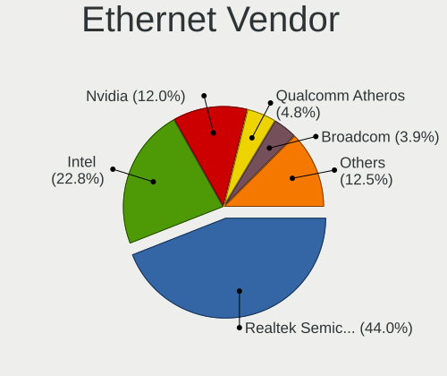

| Vendor                           | Notebooks | Percent |
|----------------------------------|-----------|---------|
| Realtek Semiconductor            | 1358      | 44.05%  |
| Intel                            | 702       | 22.77%  |
| Nvidia                           | 371       | 12.03%  |
| Qualcomm Atheros                 | 147       | 4.77%   |
| Broadcom                         | 120       | 3.89%   |
| Marvell Technology Group         | 115       | 3.73%   |
| ASIX Electronics                 | 42        | 1.36%   |
| Broadcom Limited                 | 35        | 1.14%   |
| Samsung Electronics              | 25        | 0.81%   |
| Xiaomi                           | 23        | 0.75%   |
| DisplayLink                      | 18        | 0.58%   |
| JMicron Technology               | 15        | 0.49%   |
| TP-Link                          | 14        | 0.45%   |
| Lenovo                           | 13        | 0.42%   |
| Qualcomm                         | 10        | 0.32%   |
| OPPO Electronics                 | 8         | 0.26%   |
| MediaTek                         | 6         | 0.19%   |
| Cypress Semiconductor            | 6         | 0.19%   |
| Silicon Integrated Systems [SiS] | 5         | 0.16%   |
| ICS Advent                       | 5         | 0.16%   |
| Huawei Technologies              | 5         | 0.16%   |
| Motorola PCS                     | 4         | 0.13%   |
| Microchip Technology             | 4         | 0.13%   |
| Attansic Technology              | 4         | 0.13%   |
| VIA Technologies                 | 3         | 0.1%    |
| Hewlett-Packard                  | 3         | 0.1%    |
| Apple                            | 3         | 0.1%    |
| Spreadtrum Communications        | 2         | 0.06%   |
| OnePlus Technology (Shenzhen)    | 2         | 0.06%   |
| National Semiconductor           | 2         | 0.06%   |
| Davicom Semiconductor            | 2         | 0.06%   |
| D-Link                           | 2         | 0.06%   |
| ULi Electronics                  | 1         | 0.03%   |
| MosChip Semiconductor            | 1         | 0.03%   |
| Linksys                          | 1         | 0.03%   |
| LG Electronics                   | 1         | 0.03%   |
| LeEco                            | 1         | 0.03%   |
| HMD Global                       | 1         | 0.03%   |
| Google                           | 1         | 0.03%   |
| Digitech Systems                 | 1         | 0.03%   |

Ethernet Model
--------------

Ethernet models

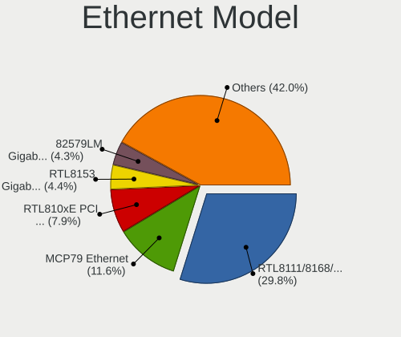

| Model                                                                  | Notebooks | Percent |
|------------------------------------------------------------------------|-----------|---------|
| Realtek RTL8111/8168/8211/8411 PCI Express Gigabit Ethernet Controller | 931       | 29.81%  |
| Nvidia MCP79 Ethernet                                                  | 362       | 11.59%  |
| Realtek RTL810xE PCI Express Fast Ethernet controller                  | 246       | 7.88%   |
| Realtek RTL8153 Gigabit Ethernet Adapter                               | 138       | 4.42%   |
| Intel 82579LM Gigabit Network Connection (Lewisville)                  | 133       | 4.26%   |
| Marvell Group 88E8053 PCI-E Gigabit Ethernet Controller                | 56        | 1.79%   |
| Intel Ethernet Connection (4) I219-V                                   | 51        | 1.63%   |
| Intel Ethernet Connection (4) I219-LM                                  | 51        | 1.63%   |
| Intel Ethernet Connection I219-LM                                      | 38        | 1.22%   |
| Intel Ethernet Connection I218-LM                                      | 38        | 1.22%   |
| Intel Ethernet Connection (3) I218-LM                                  | 38        | 1.22%   |
| ASIX AX88179 Gigabit Ethernet                                          | 35        | 1.12%   |
| Intel 82577LM Gigabit Network Connection                               | 32        | 1.02%   |
| Qualcomm Atheros AR8132 Fast Ethernet                                  | 30        | 0.96%   |
| Intel Ethernet Connection I217-LM                                      | 26        | 0.83%   |
| Intel Ethernet Connection (6) I219-V                                   | 24        | 0.77%   |
| Qualcomm Atheros AR8151 v2.0 Gigabit Ethernet                          | 23        | 0.74%   |
| Intel Ethernet Connection (13) I219-V                                  | 23        | 0.74%   |
| Marvell Group 88E8058 PCI-E Gigabit Ethernet Controller                | 22        | 0.7%    |
| Realtek RTL8152 Fast Ethernet Adapter                                  | 21        | 0.67%   |
| Intel 82567LM Gigabit Network Connection                               | 21        | 0.67%   |
| Intel Ethernet Connection I219-V                                       | 20        | 0.64%   |
| Intel Alder Lake-P PCH CNVi WiFi                                       | 20        | 0.64%   |
| Broadcom NetLink BCM57785 Gigabit Ethernet PCIe                        | 19        | 0.61%   |
| Xiaomi Mi/Redmi series (RNDIS)                                         | 18        | 0.58%   |
| Intel Ethernet Connection (10) I219-V                                  | 18        | 0.58%   |
| Realtek RTL-8100/8101L/8139 PCI Fast Ethernet Adapter                  | 17        | 0.54%   |
| Intel 82579V Gigabit Network Connection                                | 14        | 0.45%   |
| Samsung Galaxy series, misc. (tethering mode)                          | 13        | 0.42%   |
| Realtek Killer E2600 GbE Controller                                    | 13        | 0.42%   |
| Qualcomm Atheros AR8161 Gigabit Ethernet                               | 13        | 0.42%   |
| Samsung GT-I9070 (network tethering, USB debugging enabled)            | 12        | 0.38%   |
| Qualcomm Atheros QCA8171 Gigabit Ethernet                              | 12        | 0.38%   |
| Marvell Group 88E8040 PCI-E Fast Ethernet Controller                   | 12        | 0.38%   |
| JMicron JMC250 PCI Express Gigabit Ethernet Controller                 | 12        | 0.38%   |
| Intel Ethernet Connection (13) I219-LM                                 | 12        | 0.38%   |
| Broadcom NetLink BCM57780 Gigabit Ethernet PCIe                        | 12        | 0.38%   |
| TP-Link UE300 10/100/1000 LAN (ethernet mode) [Realtek RTL8153]        | 11        | 0.35%   |
| Realtek RTL8125 2.5GbE Controller                                      | 11        | 0.35%   |
| Qualcomm Atheros Killer E220x Gigabit Ethernet Controller              | 11        | 0.35%   |

Net Controller Kind
-------------------

Ethernet, WiFi or modem

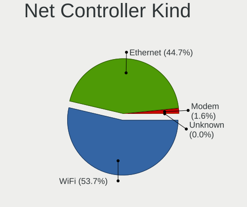

| Kind     | Notebooks | Percent |
|----------|-----------|---------|
| WiFi     | 3494      | 53.65%  |
| Ethernet | 2912      | 44.72%  |
| Modem    | 103       | 1.58%   |
| Unknown  | 3         | 0.05%   |

Used Controller
---------------

Currently used network controller

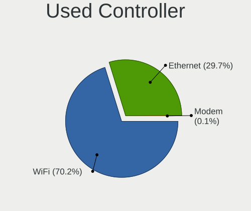

| Kind     | Notebooks | Percent |
|----------|-----------|---------|
| WiFi     | 2634      | 70.22%  |
| Ethernet | 1114      | 29.7%   |
| Modem    | 3         | 0.08%   |

NICs
----

Total network controllers on board

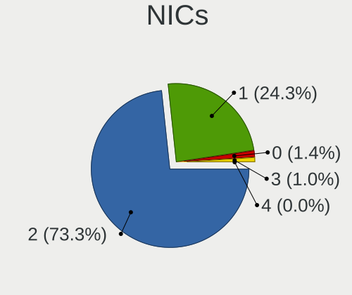

| Total | Notebooks | Percent |
|-------|-----------|---------|
| 2     | 2626      | 73.33%  |
| 1     | 869       | 24.27%  |
| 0     | 49        | 1.37%   |
| 3     | 36        | 1.01%   |
| 4     | 1         | 0.03%   |

IPv6
----

IPv6 vs IPv4

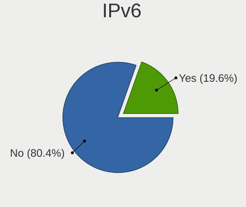

| Used | Notebooks | Percent |
|------|-----------|---------|
| No   | 2900      | 80.42%  |
| Yes  | 706       | 19.58%  |

Bluetooth
---------

Bluetooth Vendor
----------------

Controller vendors

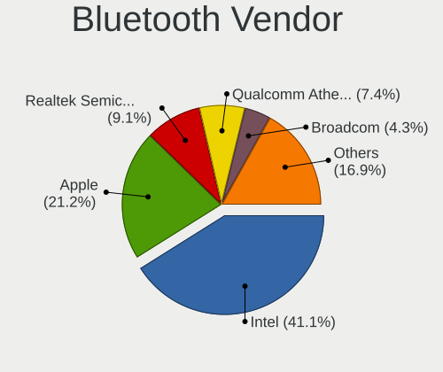

| Vendor                          | Notebooks | Percent |
|---------------------------------|-----------|---------|
| Intel                           | 1202      | 41.08%  |
| Apple                           | 620       | 21.19%  |
| Realtek Semiconductor           | 267       | 9.13%   |
| Qualcomm Atheros Communications | 217       | 7.42%   |
| Broadcom                        | 125       | 4.27%   |
| Lite-On Technology              | 113       | 3.86%   |
| IMC Networks                    | 110       | 3.76%   |
| Foxconn / Hon Hai               | 67        | 2.29%   |
| Dell                            | 43        | 1.47%   |
| Cambridge Silicon Radio         | 36        | 1.23%   |
| Hewlett-Packard                 | 33        | 1.13%   |
| Toshiba                         | 18        | 0.62%   |
| Realtek                         | 15        | 0.51%   |
| ASUSTek Computer                | 14        | 0.48%   |
| Ralink                          | 12        | 0.41%   |
| Ralink Technology               | 6         | 0.21%   |
| Alps Electric                   | 5         | 0.17%   |
| Taiyo Yuden                     | 4         | 0.14%   |
| Foxconn International           | 4         | 0.14%   |
| MediaTek                        | 3         | 0.1%    |
| Fujitsu                         | 3         | 0.1%    |
| USI                             | 2         | 0.07%   |
| Qcom                            | 1         | 0.03%   |
| Edimax Technology               | 1         | 0.03%   |
| Corsair                         | 1         | 0.03%   |
| Chicony Electronics             | 1         | 0.03%   |
| Belkin Components               | 1         | 0.03%   |
| Askey Computer                  | 1         | 0.03%   |
| Unknown                         | 1         | 0.03%   |

Bluetooth Model
---------------

Controller models

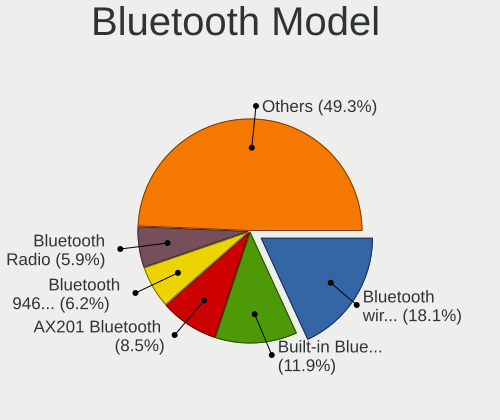

| Model                                               | Notebooks | Percent |
|-----------------------------------------------------|-----------|---------|
| Intel Bluetooth wireless interface                  | 531       | 18.14%  |
| Apple Built-in Bluetooth 2.0+EDR HCI                | 349       | 11.92%  |
| Intel AX201 Bluetooth                               | 248       | 8.47%   |
| Intel Bluetooth 9460/9560 Jefferson Peak (JfP)      | 181       | 6.18%   |
| Realtek Bluetooth Radio                             | 174       | 5.94%   |
| Apple Bluetooth USB Host Controller                 | 159       | 5.43%   |
| Qualcomm Atheros  Bluetooth Device                  | 134       | 4.58%   |
| Intel AX200 Bluetooth                               | 106       | 3.62%   |
| Apple Bluetooth HCI MacBookPro (HID mode)           | 76        | 2.6%    |
| Realtek  Bluetooth 4.2 Adapter                      | 59        | 2.02%   |
| Lite-On Qualcomm Atheros QCA9377 Bluetooth          | 44        | 1.5%    |
| Cambridge Silicon Radio Bluetooth Dongle (HCI mode) | 36        | 1.23%   |
| Apple Bluetooth Host Controller                     | 33        | 1.13%   |
| IMC Networks Bluetooth Radio                        | 31        | 1.06%   |
| Qualcomm Atheros AR3012 Bluetooth 4.0               | 30        | 1.02%   |
| Intel Centrino Bluetooth Wireless Transceiver       | 30        | 1.02%   |
| Broadcom BCM20702 Bluetooth 4.0 [ThinkPad]          | 28        | 0.96%   |
| Intel Bluetooth Device                              | 27        | 0.92%   |
| Lite-On Bluetooth Device                            | 25        | 0.85%   |
| IMC Networks Bluetooth Device                       | 24        | 0.82%   |
| Foxconn / Hon Hai Bluetooth Device                  | 23        | 0.79%   |
| Qualcomm Atheros AR3011 Bluetooth                   | 21        | 0.72%   |
| IMC Networks Wireless_Device                        | 21        | 0.72%   |
| Broadcom BCM2045B (BDC-2.1)                         | 21        | 0.72%   |
| Intel Wireless-AC 3168 Bluetooth                    | 20        | 0.68%   |
| Intel Centrino Advanced-N 6230 Bluetooth adapter    | 20        | 0.68%   |
| Intel AX210 Bluetooth                               | 20        | 0.68%   |
| Intel Wireless-AC 9260 Bluetooth Adapter            | 19        | 0.65%   |
| Qualcomm Atheros QCA61x4 Bluetooth 4.0              | 18        | 0.61%   |
| Realtek RTL8723B Bluetooth                          | 17        | 0.58%   |
| Foxconn / Hon Hai MediaTek Bluetooth Adapter        | 17        | 0.58%   |
| HP Broadcom 2070 Bluetooth Combo                    | 16        | 0.55%   |
| Dell BCM20702A0 Bluetooth Module                    | 16        | 0.55%   |
| Realtek Bluetooth Radio                             | 15        | 0.51%   |
| Lite-On Atheros AR3012 Bluetooth                    | 15        | 0.51%   |
| Ralink RT3290 Bluetooth                             | 12        | 0.41%   |
| Lite-On Wireless_Device                             | 12        | 0.41%   |
| Dell DW375 Bluetooth Module                         | 12        | 0.41%   |
| HP Bluetooth 2.0 Interface [Broadcom BCM2045]       | 11        | 0.38%   |
| IMC Networks Atheros AR3012 Bluetooth 4.0 Adapter   | 10        | 0.34%   |

Sound
-----

Sound Vendor
------------

Sound card vendors

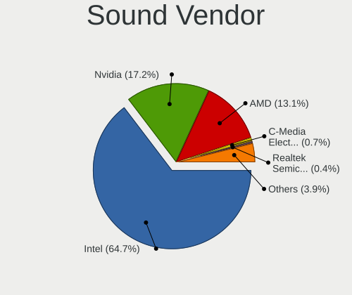

| Vendor                                       | Notebooks | Percent |
|----------------------------------------------|-----------|---------|
| Intel                                        | 2652      | 64.67%  |
| Nvidia                                       | 704       | 17.17%  |
| AMD                                          | 537       | 13.09%  |
| C-Media Electronics                          | 30        | 0.73%   |
| Realtek Semiconductor                        | 18        | 0.44%   |
| Logitech                                     | 16        | 0.39%   |
| Lenovo                                       | 14        | 0.34%   |
| Texas Instruments                            | 10        | 0.24%   |
| Plantronics                                  | 10        | 0.24%   |
| GN Netcom                                    | 10        | 0.24%   |
| Generalplus Technology                       | 10        | 0.24%   |
| Hewlett-Packard                              | 8         | 0.2%    |
| Zoran Co. Personal Media Division (Nogatech) | 6         | 0.15%   |
| Silicon Integrated Systems [SiS]             | 5         | 0.12%   |
| Creative Technology                          | 5         | 0.12%   |
| ASUSTek Computer                             | 5         | 0.12%   |
| VIA Technologies                             | 4         | 0.1%    |
| JMTek                                        | 4         | 0.1%    |
| Zhaoxin                                      | 3         | 0.07%   |
| ULi Electronics                              | 3         | 0.07%   |
| Microsoft                                    | 3         | 0.07%   |
| Kingston Technology                          | 3         | 0.07%   |
| DSEA A/S                                     | 3         | 0.07%   |
| SAVITECH                                     | 2         | 0.05%   |
| RODE Microphones                             | 2         | 0.05%   |
| Razer USA                                    | 2         | 0.05%   |
| M-Audio                                      | 2         | 0.05%   |
| Focusrite-Novation                           | 2         | 0.05%   |
| Dell                                         | 2         | 0.05%   |
| CMX Systems                                  | 2         | 0.05%   |
| XMOS                                         | 1         | 0.02%   |
| Toshiba                                      | 1         | 0.02%   |
| Thomann                                      | 1         | 0.02%   |
| Tenx Technology                              | 1         | 0.02%   |
| Syntek                                       | 1         | 0.02%   |
| SteelSeries ApS                              | 1         | 0.02%   |
| Sony                                         | 1         | 0.02%   |
| Samsung Electronics                          | 1         | 0.02%   |
| Pixart Imaging                               | 1         | 0.02%   |
| Phoenix Audio Technologies                   | 1         | 0.02%   |

Sound Model
-----------

Sound card models

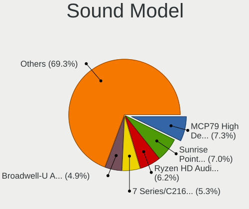

| Model                                                                                             | Notebooks | Percent |
|---------------------------------------------------------------------------------------------------|-----------|---------|
| Nvidia MCP79 High Definition Audio                                                                | 364       | 7.29%   |
| Intel Sunrise Point-LP HD Audio                                                                   | 349       | 6.99%   |
| AMD Ryzen HD Audio Controller                                                                     | 307       | 6.15%   |
| Intel 7 Series/C216 Chipset Family High Definition Audio Controller                               | 265       | 5.31%   |
| Intel Broadwell-U Audio Controller                                                                | 247       | 4.95%   |
| Intel Wildcat Point-LP High Definition Audio Controller                                           | 244       | 4.89%   |
| Intel Tiger Lake-LP Smart Sound Technology Audio Controller                                       | 187       | 3.75%   |
| AMD Renoir/Cezanne HDMI/DP Audio Controller                                                       | 159       | 3.19%   |
| Intel NM10/ICH7 Family High Definition Audio Controller                                           | 156       | 3.13%   |
| Intel 6 Series/C200 Series Chipset Family High Definition Audio Controller                        | 149       | 2.99%   |
| Intel Cannon Lake PCH cAVS                                                                        | 111       | 2.22%   |
| Intel Haswell-ULT HD Audio Controller                                                             | 110       | 2.2%    |
| Intel Atom Processor Z36xxx/Z37xxx Series High Definition Audio Controller                        | 110       | 2.2%    |
| Intel 8 Series HD Audio Controller                                                                | 110       | 2.2%    |
| AMD Raven/Raven2/Fenghuang HDMI/DP Audio Controller                                               | 109       | 2.18%   |
| Intel Comet Lake PCH-LP cAVS                                                                      | 97        | 1.94%   |
| Intel 5 Series/3400 Series Chipset High Definition Audio                                          | 94        | 1.88%   |
| Intel Cannon Point-LP High Definition Audio Controller                                            | 89        | 1.78%   |
| Intel 8 Series/C220 Series Chipset High Definition Audio Controller                               | 85        | 1.7%    |
| AMD Kabini HDMI/DP Audio                                                                          | 79        | 1.58%   |
| AMD Family 15h (Models 60h-6fh) Audio Controller                                                  | 79        | 1.58%   |
| Intel Xeon E3-1200 v3/4th Gen Core Processor HD Audio Controller                                  | 77        | 1.54%   |
| Intel 82801H (ICH8 Family) HD Audio Controller                                                    | 76        | 1.52%   |
| Intel 82801I (ICH9 Family) HD Audio Controller                                                    | 74        | 1.48%   |
| Intel Comet Lake PCH cAVS                                                                         | 67        | 1.34%   |
| AMD FCH Azalia Controller                                                                         | 66        | 1.32%   |
| Intel Atom/Celeron/Pentium Processor x5-E8000/J3xxx/N3xxx Series High Definition Audio Controller | 63        | 1.26%   |
| Intel Celeron/Pentium Silver Processor High Definition Audio                                      | 60        | 1.2%    |
| Nvidia TU107 GeForce GTX 1650 High Definition Audio Controller                                    | 55        | 1.1%    |
| Intel Alder Lake PCH-P High Definition Audio Controller                                           | 46        | 0.92%   |
| Nvidia GF108 High Definition Audio Controller                                                     | 41        | 0.82%   |
| Intel Ice Lake-LP Smart Sound Technology Audio Controller                                         | 40        | 0.8%    |
| AMD High Definition Audio Controller                                                              | 38        | 0.76%   |
| AMD SBx00 Azalia (Intel HDA)                                                                      | 32        | 0.64%   |
| Intel CM238 HD Audio Controller                                                                   | 31        | 0.62%   |
| Intel Celeron N3350/Pentium N4200/Atom E3900 Series Audio Cluster                                 | 31        | 0.62%   |
| Intel 100 Series/C230 Series Chipset Family HD Audio Controller                                   | 31        | 0.62%   |
| Intel Tiger Lake-H HD Audio Controller                                                            | 29        | 0.58%   |
| Nvidia TU106 High Definition Audio Controller                                                     | 28        | 0.56%   |
| Nvidia GK107 HDMI Audio Controller                                                                | 24        | 0.48%   |

Memory
------

Memory Vendor
-------------

Memory module vendors

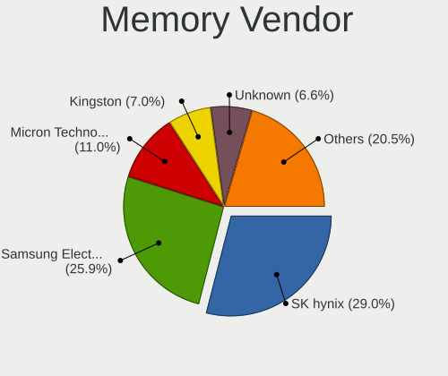

| Vendor              | Notebooks | Percent |
|---------------------|-----------|---------|
| SK hynix            | 1043      | 29%     |
| Samsung Electronics | 931       | 25.88%  |
| Micron Technology   | 396       | 11.01%  |
| Kingston            | 251       | 6.98%   |
| Unknown             | 239       | 6.64%   |
| Crucial             | 185       | 5.14%   |
| Elpida              | 103       | 2.86%   |
| Ramaxel Technology  | 68        | 1.89%   |
| A-DATA Technology   | 65        | 1.81%   |
| Nanya Technology    | 40        | 1.11%   |
| Corsair             | 37        | 1.03%   |
| Unknown (ABCD)      | 28        | 0.78%   |
| Smart               | 24        | 0.67%   |
| GOODRAM             | 24        | 0.67%   |
| Unknown             | 16        | 0.44%   |
| Transcend           | 13        | 0.36%   |
| Team                | 13        | 0.36%   |
| G.Skill             | 12        | 0.33%   |
| Silicon Power       | 8         | 0.22%   |
| Patriot             | 7         | 0.19%   |
| Apacer              | 7         | 0.19%   |
| ASint Technology    | 6         | 0.17%   |
| Timetec             | 4         | 0.11%   |
| AMD                 | 4         | 0.11%   |
| Wilk                | 3         | 0.08%   |
| Teikon              | 3         | 0.08%   |
| Smart Brazil        | 3         | 0.08%   |
| Qimonda             | 3         | 0.08%   |
| PNY                 | 3         | 0.08%   |
| Infineon            | 3         | 0.08%   |
| Goldkey             | 3         | 0.08%   |
| fef5                | 3         | 0.08%   |
| 48spaces            | 3         | 0.08%   |
| Unknown (89F7)      | 2         | 0.06%   |
| Unifosa             | 2         | 0.06%   |
| Shenzhen WODPOSIT   | 2         | 0.06%   |
| SHARETRONIC         | 2         | 0.06%   |
| Neo Forza           | 2         | 0.06%   |
| Kllisre             | 2         | 0.06%   |
| ff                  | 2         | 0.06%   |

Memory Model
------------

Memory module models

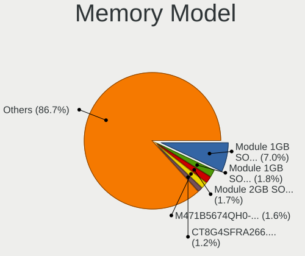

| Model                                                            | Notebooks | Percent |
|------------------------------------------------------------------|-----------|---------|
| SK hynix RAM Module 1GB SODIMM DDR2 800MT/s                      | 264       | 7.03%   |
| SK hynix RAM Module 1GB SODIMM DDR2 667MT/s                      | 68        | 1.81%   |
| Samsung RAM Module 2GB SODIMM DDR3 1600MT/s                      | 63        | 1.68%   |
| Samsung RAM M471B5674QH0-YK0 2GB SODIMM DDR3 3200MT/s            | 60        | 1.6%    |
| Crucial RAM CT8G4SFRA266.C8FD1 8GB SODIMM DDR4 2667MT/s          | 44        | 1.17%   |
| Elpida RAM Module 4GB SODIMM DDR3 1600MT/s                       | 40        | 1.07%   |
| Samsung RAM M471A5244CB0-CTD 4GB SODIMM DDR4 3266MT/s            | 33        | 0.88%   |
| Micron RAM 4ATF51264HZ-3G2J1 4GB SODIMM DDR4 3200MT/s            | 33        | 0.88%   |
| Samsung RAM M471A1G44AB0-CWE 8GiB SODIMM DDR4 3200MT/s           | 32        | 0.85%   |
| SK hynix RAM Module 4GB SODIMM DDR3 1600MT/s                     | 31        | 0.83%   |
| SK hynix RAM HMT351S6CFR8C-PB 4GB SODIMM DDR3 1600MT/s           | 30        | 0.8%    |
| Samsung RAM Module 1GB SODIMM DDR2 800MT/s                       | 29        | 0.77%   |
| Samsung RAM M471B5273DH0-CH9 4GB SODIMM DDR3 1600MT/s            | 29        | 0.77%   |
| Samsung RAM M471B5173DB0-YK0 4GB SODIMM DDR3 1600MT/s            | 29        | 0.77%   |
| SK hynix RAM HMAA1GS6CJR6N-XN 8GB SODIMM DDR4 3200MT/s           | 28        | 0.75%   |
| SK hynix RAM HMA81GS6DJR8N-XN 8GB SODIMM DDR4 3200MT/s           | 28        | 0.75%   |
| Samsung RAM M471B5173QH0-YK0 4GB SODIMM DDR3 1600MT/s            | 28        | 0.75%   |
| Unknown (ABCD) RAM 123456789012345678 2GB SODIMM LPDDR4 2400MT/s | 27        | 0.72%   |
| SK hynix RAM HMT451S6BFR8A-PB 4GB SODIMM DDR3 1600MT/s           | 27        | 0.72%   |
| SK hynix RAM HMA81GS6AFR8N-UH 8GB SODIMM DDR4 2667MT/s           | 27        | 0.72%   |
| Unknown RAM Module 2GB SODIMM DDR2 800MT/s                       | 26        | 0.69%   |
| Crucial RAM CT8G4SFS824A.M8FE 8GB SODIMM DDR4 2667MT/s           | 26        | 0.69%   |
| SK hynix RAM Module 2GB SODIMM DDR2 800MT/s                      | 25        | 0.67%   |
| Samsung RAM M471B5273CH0-CH9 4GB SODIMM DDR3 1334MT/s            | 25        | 0.67%   |
| Samsung RAM Module 4GB SODIMM DDR3 1600MT/s                      | 24        | 0.64%   |
| SK hynix RAM HMT41GS6BFR8A-PB 8GB SODIMM DDR3 2667MT/s           | 21        | 0.56%   |
| Samsung RAM M471A1K43EB1-CWE 8GB SODIMM DDR4 3200MT/s            | 21        | 0.56%   |
| Micron RAM EDF8132A3MA-GD-F 2GB LPDDR3 1600MT/s                  | 21        | 0.56%   |
| Unknown RAM Module 1GB SODIMM SDRAM                              | 19        | 0.51%   |
| SK hynix RAM HMA81GS6CJR8N-VK 8GB SODIMM DDR4 2667MT/s           | 18        | 0.48%   |
| Samsung RAM M471B5173EB0-YK0 4GB SODIMM DDR3 1600MT/s            | 17        | 0.45%   |
| Micron RAM Module 2GB SODIMM DDR2 800MT/s                        | 17        | 0.45%   |
| Samsung RAM M471B1G73QH0-YK0 8GB SODIMM DDR3 1600MT/s            | 16        | 0.43%   |
| Samsung RAM M471A5244CB0-CWE 4GB SODIMM DDR4 3200MT/s            | 16        | 0.43%   |
| Samsung RAM M471A1K43DB1-CWE 8GB SODIMM DDR4 3200MT/s            | 16        | 0.43%   |
| Micron RAM 4KTF25664HZ-1G6E 2GB SODIMM DDR3 1333MT/s             | 16        | 0.43%   |
| Elpida RAM Module 2GB SODIMM DDR3 1600MT/s                       | 16        | 0.43%   |
| Unknown                                                          | 16        | 0.43%   |
| Unknown RAM Module 2GB SODIMM DDR2 667MT/s                       | 15        | 0.4%    |
| Samsung RAM M471B5273DH0-CK0 4GB SODIMM DDR3 2400MT/s            | 15        | 0.4%    |

Memory Kind
-----------

Memory module kinds

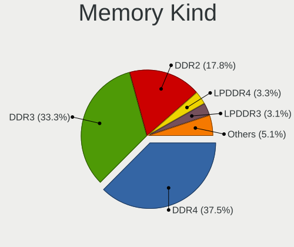

| Kind    | Notebooks | Percent |
|---------|-----------|---------|
| DDR4    | 1181      | 37.47%  |
| DDR3    | 1049      | 33.28%  |
| DDR2    | 561       | 17.8%   |
| LPDDR4  | 103       | 3.27%   |
| LPDDR3  | 97        | 3.08%   |
| SDRAM   | 77        | 2.44%   |
| DDR     | 36        | 1.14%   |
| Unknown | 19        | 0.6%    |
| DDR5    | 11        | 0.35%   |
| DRAM    | 10        | 0.32%   |
| LPDDR5  | 8         | 0.25%   |

Memory Form Factor
------------------

Physical design of the memory module

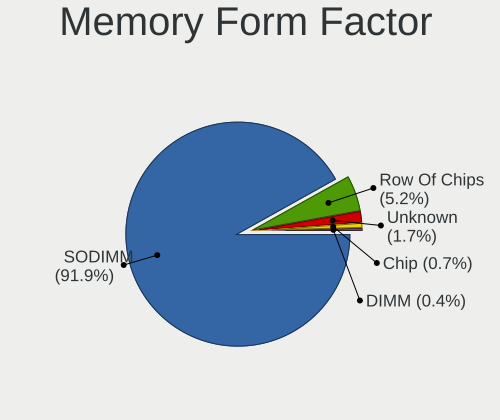

| Name         | Notebooks | Percent |
|--------------|-----------|---------|
| SODIMM       | 2893      | 91.9%   |
| Row Of Chips | 165       | 5.24%   |
| Unknown      | 53        | 1.68%   |
| Chip         | 23        | 0.73%   |
| DIMM         | 14        | 0.44%   |

Memory Size
-----------

Memory module size

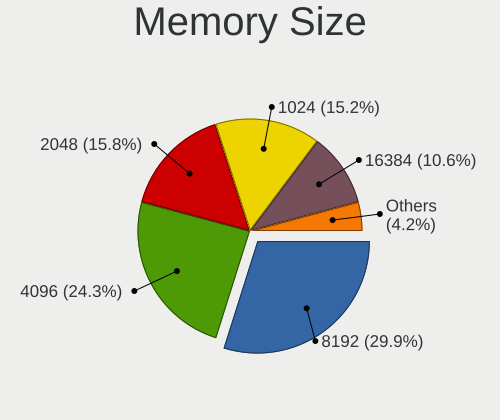

| Size  | Notebooks | Percent |
|-------|-----------|---------|
| 8192  | 1014      | 29.87%  |
| 4096  | 825       | 24.3%   |
| 2048  | 538       | 15.85%  |
| 1024  | 517       | 15.23%  |
| 16384 | 359       | 10.57%  |
| 32768 | 91        | 2.68%   |
| 512   | 38        | 1.12%   |
| 256   | 11        | 0.32%   |
| 8072  | 1         | 0.03%   |
| 384   | 1         | 0.03%   |

Memory Speed
------------

Memory module speed

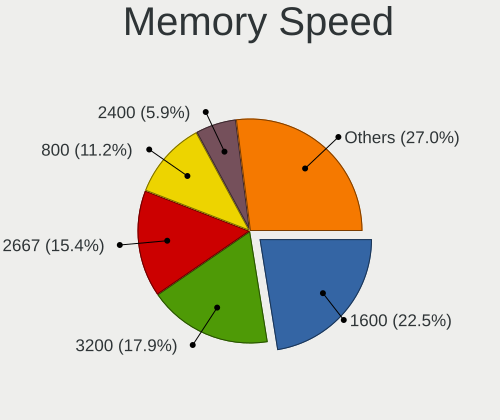

| Speed   | Notebooks | Percent |
|---------|-----------|---------|
| 1600    | 754       | 22.47%  |
| 3200    | 602       | 17.94%  |
| 2667    | 518       | 15.44%  |
| 800     | 377       | 11.24%  |
| 2400    | 198       | 5.9%    |
| 667     | 156       | 4.65%   |
| 2133    | 115       | 3.43%   |
| 1334    | 100       | 2.98%   |
| 1333    | 97        | 2.89%   |
| Unknown | 81        | 2.41%   |
| 1067    | 45        | 1.34%   |
| 1867    | 42        | 1.25%   |
| 4267    | 34        | 1.01%   |
| 3266    | 33        | 0.98%   |
| 4199    | 32        | 0.95%   |
| 8400    | 23        | 0.69%   |
| 1066    | 22        | 0.66%   |
| 533     | 21        | 0.63%   |
| 4800    | 14        | 0.42%   |
| 2048    | 14        | 0.42%   |
| 6400    | 9         | 0.27%   |
| 975     | 9         | 0.27%   |
| 4266    | 8         | 0.24%   |
| 333     | 8         | 0.24%   |
| 3733    | 7         | 0.21%   |
| 266     | 7         | 0.21%   |
| 1866    | 5         | 0.15%   |
| 400     | 5         | 0.15%   |
| 1639    | 4         | 0.12%   |
| 2933    | 3         | 0.09%   |
| 2666    | 3         | 0.09%   |
| 933     | 2         | 0.06%   |
| 5600    | 1         | 0.03%   |
| 3000    | 1         | 0.03%   |
| 1596    | 1         | 0.03%   |
| 200     | 1         | 0.03%   |
| 166     | 1         | 0.03%   |
| 133     | 1         | 0.03%   |
| 100     | 1         | 0.03%   |

Printers & scanners
-------------------

Printer Vendor
--------------

Printer device vendors

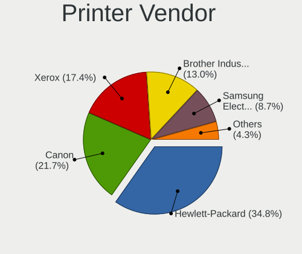

| Vendor              | Notebooks | Percent |
|---------------------|-----------|---------|
| Hewlett-Packard     | 8         | 33.33%  |
| Canon               | 5         | 20.83%  |
| Xerox               | 4         | 16.67%  |
| Brother Industries  | 4         | 16.67%  |
| Samsung Electronics | 2         | 8.33%   |
| Seiko Epson         | 1         | 4.17%   |

Printer Model
-------------

Printer device models

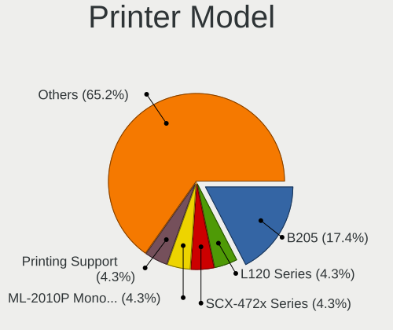

| Model                               | Notebooks | Percent |
|-------------------------------------|-----------|---------|
| Xerox B205                          | 4         | 16.67%  |
| Seiko Epson L120 Series             | 1         | 4.17%   |
| Samsung SCX-472x Series             | 1         | 4.17%   |
| Samsung ML-2010P Mono Laser Printer | 1         | 4.17%   |
| HP Printing Support                 | 1         | 4.17%   |
| HP LaserJet P1005                   | 1         | 4.17%   |
| HP LaserJet 1160 series             | 1         | 4.17%   |
| HP LaserJet 1150                    | 1         | 4.17%   |
| HP LaserJet 1022                    | 1         | 4.17%   |
| HP Ink Tank 110 series              | 1         | 4.17%   |
| HP DeskJet 2600 series              | 1         | 4.17%   |
| HP DeskJet 2130 series              | 1         | 4.17%   |
| Canon PIXMA MX920 Series            | 1         | 4.17%   |
| Canon LiDE 300                      | 1         | 4.17%   |
| Canon LBP3010/LBP3018/LBP3050       | 1         | 4.17%   |
| Canon LBP2900                       | 1         | 4.17%   |
| Canon G3010 series                  | 1         | 4.17%   |
| Brother PT-9500PC                   | 1         | 4.17%   |
| Brother MFC-L2707DW                 | 1         | 4.17%   |
| Brother MFC-J460DW                  | 1         | 4.17%   |
| Brother HL-L2340D series            | 1         | 4.17%   |

Scanner Vendor
--------------

Scanner device vendors

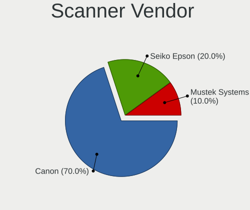

| Vendor         | Notebooks | Percent |
|----------------|-----------|---------|
| Canon          | 7         | 70%     |
| Seiko Epson    | 2         | 20%     |
| Mustek Systems | 1         | 10%     |

Scanner Model
-------------

Scanner device models

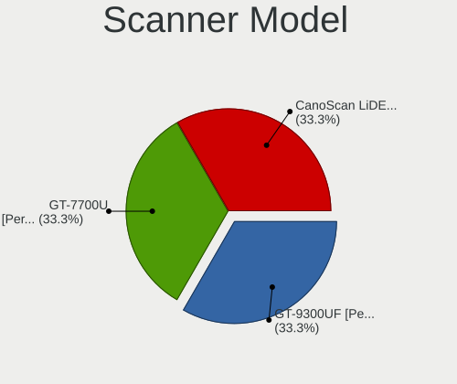

| Model                                         | Notebooks | Percent |
|-----------------------------------------------|-----------|---------|
| Canon CanoScan LiDE 220                       | 3         | 30%     |
| Canon CanoScan LiDE 120                       | 2         | 20%     |
| Seiko Epson GT-9300UF [Perfection 2400 PHOTO] | 1         | 10%     |
| Seiko Epson GT-7700U [Perfection 1240U]       | 1         | 10%     |
| Mustek Systems BearPaw 2400 CU Plus           | 1         | 10%     |
| Canon CanoScan LIDE 25                        | 1         | 10%     |
| Canon CanoScan LiDE 210                       | 1         | 10%     |

Camera
------

Camera Vendor
-------------

Camera device vendors

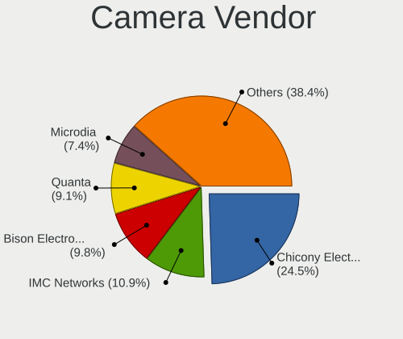

| Vendor                                 | Notebooks | Percent |
|----------------------------------------|-----------|---------|
| Chicony Electronics                    | 645       | 24.49%  |
| IMC Networks                           | 286       | 10.86%  |
| Bison Electronics                      | 257       | 9.76%   |
| Quanta                                 | 240       | 9.11%   |
| Microdia                               | 195       | 7.4%    |
| Realtek Semiconductor                  | 189       | 7.18%   |
| Sunplus Innovation Technology          | 126       | 4.78%   |
| Cheng Uei Precision Industry (Foxlink) | 90        | 3.42%   |
| Suyin                                  | 80        | 3.04%   |
| Lite-On Technology                     | 68        | 2.58%   |
| Luxvisions Innotech Limited            | 60        | 2.28%   |
| Syntek                                 | 57        | 2.16%   |
| Apple                                  | 50        | 1.9%    |
| Logitech                               | 33        | 1.25%   |
| Silicon Motion                         | 28        | 1.06%   |
| Alcor Micro                            | 25        | 0.95%   |
| Lenovo                                 | 23        | 0.87%   |
| Acer                                   | 22        | 0.84%   |
| Sonix Technology                       | 14        | 0.53%   |
| Ricoh                                  | 13        | 0.49%   |
| Z-Star Microelectronics                | 11        | 0.42%   |
| Primax Electronics                     | 11        | 0.42%   |
| Importek                               | 9         | 0.34%   |
| SunplusIT                              | 8         | 0.3%    |
| icSpring                               | 6         | 0.23%   |
| ALi                                    | 6         | 0.23%   |
| Y Media                                | 5         | 0.19%   |
| Samsung Electronics                    | 5         | 0.19%   |
| Intel                                  | 5         | 0.19%   |
| Genesys Logic                          | 5         | 0.19%   |
| Generalplus Technology                 | 5         | 0.19%   |
| Unknown                                | 5         | 0.19%   |
| OmniVision Technologies                | 4         | 0.15%   |
| Motorola PCS                           | 3         | 0.11%   |
| MacroSilicon                           | 3         | 0.11%   |
| Sunplus Technology                     | 2         | 0.08%   |
| Shine-optics                           | 2         | 0.08%   |
| Pixart Imaging                         | 2         | 0.08%   |
| Mimaki Engineering                     | 2         | 0.08%   |
| Microsoft                              | 2         | 0.08%   |

Camera Model
------------

Camera device models

| Model                                               | Notebooks | Percent |
|-----------------------------------------------------|-----------|---------|
| Chicony Integrated Camera                           | 175       | 6.61%   |
| Microdia Integrated_Webcam_HD                       | 102       | 3.85%   |
| IMC Networks Integrated Camera                      | 90        | 3.4%    |
| Quanta Chromebook HD Camera                         | 69        | 2.61%   |
| Realtek Integrated_Webcam_HD                        | 65        | 2.45%   |
| IMC Networks USB2.0 HD UVC WebCam                   | 64        | 2.42%   |
| Bison Integrated Camera                             | 61        | 2.3%    |
| Chicony HD Webcam                                   | 57        | 2.15%   |
| Bison BisonCam, NB Pro                              | 52        | 1.96%   |
| Sunplus Integrated_Webcam_HD                        | 38        | 1.44%   |
| Chicony USB2.0 HD UVC WebCam                        | 37        | 1.4%    |
| Chicony HP HD Camera                                | 37        | 1.4%    |
| Quanta HD User Facing                               | 33        | 1.25%   |
| Quanta HP TrueVision HD Camera                      | 31        | 1.17%   |
| Syntek Integrated Camera                            | 29        | 1.1%    |
| IMC Networks USB2.0 VGA UVC WebCam                  | 27        | 1.02%   |
| Quanta VGA WebCam                                   | 26        | 0.98%   |
| Bison SunplusIT Integrated Camera                   | 24        | 0.91%   |
| Microdia Integrated Webcam                          | 23        | 0.87%   |
| Luxvisions Innotech Limited HP TrueVision HD Camera | 23        | 0.87%   |
| Lite-On Integrated Camera                           | 23        | 0.87%   |
| Lite-On HP HD Camera                                | 22        | 0.83%   |
| Chicony HP TrueVision HD Camera                     | 21        | 0.79%   |
| Quanta HP HD Camera                                 | 20        | 0.76%   |
| Bison Lenovo Integrated Webcam                      | 20        | 0.76%   |
| Bison Lenovo EasyCamera                             | 20        | 0.76%   |
| Realtek USB Camera                                  | 19        | 0.72%   |
| Sunplus HD WebCam                                   | 18        | 0.68%   |
| Chicony Integrated Camera (1280x720@30)             | 18        | 0.68%   |
| Luxvisions Innotech Limited HP HD Camera            | 17        | 0.64%   |
| Chicony HD User Facing                              | 17        | 0.64%   |
| Apple Built-in iSight                               | 17        | 0.64%   |
| Chicony Lenovo EasyCamera                           | 16        | 0.6%    |
| Chicony HP Webcam                                   | 16        | 0.6%    |
| Bison HD Webcam                                     | 16        | 0.6%    |
| Realtek Integrated Webcam                           | 15        | 0.57%   |
| Chicony Chromebook HD Camera                        | 15        | 0.57%   |
| Quanta HP Webcam                                    | 14        | 0.53%   |
| Quanta HD Webcam                                    | 14        | 0.53%   |
| IMC Networks USB 2.0 Camera                         | 14        | 0.53%   |

Security
--------

Fingerprint Vendor
------------------

Fingerprint sensor vendors

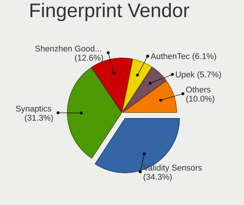

| Vendor                             | Notebooks | Percent |
|------------------------------------|-----------|---------|
| Validity Sensors                   | 185       | 34.26%  |
| Synaptics                          | 169       | 31.3%   |
| Shenzhen Goodix Technology         | 68        | 12.59%  |
| AuthenTec                          | 33        | 6.11%   |
| Upek                               | 31        | 5.74%   |
| Elan Microelectronics              | 23        | 4.26%   |
| LighTuning Technology              | 19        | 3.52%   |
| STMicroelectronics                 | 10        | 1.85%   |
| Realtek USB2.0 Finger Print Bridge | 1         | 0.19%   |
| Focal-systems.Corp                 | 1         | 0.19%   |

Fingerprint Model
-----------------

Fingerprint sensor models

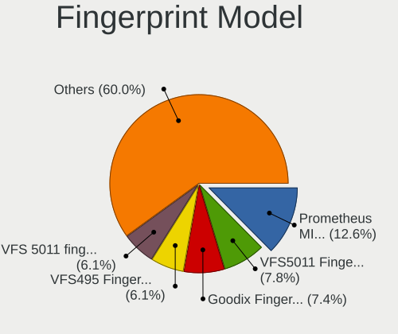

| Model                                                                      | Notebooks | Percent |
|----------------------------------------------------------------------------|-----------|---------|
| Synaptics Prometheus MIS Touch Fingerprint Reader                          | 68        | 12.59%  |
| Validity Sensors VFS5011 Fingerprint Reader                                | 42        | 7.78%   |
| Shenzhen Goodix  Fingerprint Device                                        | 40        | 7.41%   |
| Validity Sensors VFS495 Fingerprint Reader                                 | 33        | 6.11%   |
| Validity Sensors VFS 5011 fingerprint sensor                               | 33        | 6.11%   |
| Synaptics Metallica MIS Touch Fingerprint Reader                           | 29        | 5.37%   |
| Upek Biometric Touchchip/Touchstrip Fingerprint Sensor                     | 28        | 5.19%   |
| Synaptics FS7604 Touch Fingerprint Sensor with PurePrint                   | 18        | 3.33%   |
| Validity Sensors Synaptics WBDI                                            | 17        | 3.15%   |
| Shenzhen Goodix FingerPrint                                                | 15        | 2.78%   |
| Shenzhen Goodix Fingerprint Reader                                         | 13        | 2.41%   |
| Elan ELAN:Fingerprint                                                      | 13        | 2.41%   |
| AuthenTec AES2501 Fingerprint Sensor                                       | 13        | 2.41%   |
| Synaptics  FS7604 Touch Fingerprint Sensor with PurePrint                  | 12        | 2.22%   |
| Validity Sensors VFS491                                                    | 10        | 1.85%   |
| Synaptics Fingerprint reader [HP G6]                                       | 10        | 1.85%   |
| LighTuning EgisTec Touch Fingerprint Sensor                                | 10        | 1.85%   |
| Elan ELAN:ARM-M4                                                           | 10        | 1.85%   |
| Synaptics Prometheus Fingerprint Reader                                    | 8         | 1.48%   |
| STMicroelectronics Fingerprint Reader                                      | 8         | 1.48%   |
| LighTuning ES603 Swipe Fingerprint Sensor                                  | 8         | 1.48%   |
| AuthenTec AES2810                                                          | 8         | 1.48%   |
| Validity Sensors VFS471 Fingerprint Reader                                 | 7         | 1.3%    |
| Validity Sensors Synaptics VFS7552 Touch Fingerprint Sensor with PurePrint | 7         | 1.3%    |
| Validity Sensors Swipe Fingerprint Sensor                                  | 7         | 1.3%    |
| Validity Sensors Fingerprint scanner                                       | 7         | 1.3%    |
| Synaptics Metallica MOH Touch Fingerprint Reader                           | 7         | 1.3%    |
| Validity Sensors VFS7500 Touch Fingerprint Sensor                          | 6         | 1.11%   |
| Validity Sensors VFS451 Fingerprint Reader                                 | 6         | 1.11%   |
| Validity Sensors VFS Fingerprint sensor                                    | 4         | 0.74%   |
| Synaptics UWP WBDI Device                                                  | 4         | 0.74%   |
| AuthenTec AES1660 Fingerprint Sensor                                       | 4         | 0.74%   |
| Upek TCS5B Fingerprint sensor                                              | 3         | 0.56%   |
| Synaptics WBDI                                                             | 3         | 0.56%   |
| Synaptics  WBDI                                                            | 3         | 0.56%   |
| AuthenTec AES2550 Fingerprint Sensor                                       | 3         | 0.56%   |
| AuthenTec AES1600                                                          | 3         | 0.56%   |
| Validity Sensors VFS7552 Touch Fingerprint Sensor                          | 2         | 0.37%   |
| Validity Sensors VFS301 Fingerprint Reader                                 | 2         | 0.37%   |
| Synaptics WBDI Fingerprint Reader USB 086                                  | 2         | 0.37%   |

Chipcard Vendor
---------------

Chipcard module vendors

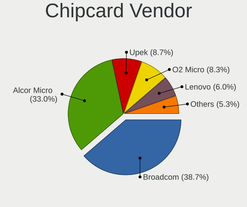

| Vendor                    | Notebooks | Percent |
|---------------------------|-----------|---------|
| Broadcom                  | 116       | 38.67%  |
| Alcor Micro               | 99        | 33%     |
| Upek                      | 26        | 8.67%   |
| O2 Micro                  | 25        | 8.33%   |
| Lenovo                    | 18        | 6%      |
| Gemalto (was Gemplus)     | 4         | 1.33%   |
| Yubico.com                | 2         | 0.67%   |
| SCM Microsystems          | 2         | 0.67%   |
| C3PO                      | 2         | 0.67%   |
| Aladdin Knowledge Systems | 2         | 0.67%   |
| OmniKey                   | 1         | 0.33%   |
| Clay Logic                | 1         | 0.33%   |
| Cherry                    | 1         | 0.33%   |
| Advanced Card Systems     | 1         | 0.33%   |

Chipcard Model
--------------

Chipcard module models

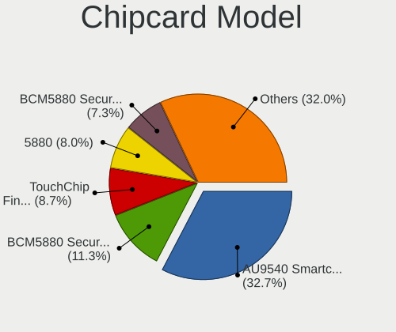

| Model                                                                        | Notebooks | Percent |
|------------------------------------------------------------------------------|-----------|---------|
| Alcor Micro AU9540 Smartcard Reader                                          | 98        | 32.67%  |
| Broadcom BCM5880 Secure Applications Processor                               | 34        | 11.33%  |
| Upek TouchChip Fingerprint Coprocessor (WBF advanced mode)                   | 26        | 8.67%   |
| Broadcom 5880                                                                | 24        | 8%      |
| Broadcom BCM5880 Secure Applications Processor with fingerprint swipe sensor | 22        | 7.33%   |
| Broadcom BCM58200 ControlVault 3 (FingerPrint sensor + Contacted SmartCard)  | 22        | 7.33%   |
| O2 Micro OZ776 CCID Smartcard Reader                                         | 21        | 7%      |
| Lenovo Integrated Smart Card Reader                                          | 18        | 6%      |
| Broadcom 58200                                                               | 12        | 4%      |
| O2 Micro Oz776 SmartCard Reader                                              | 4         | 1.33%   |
| Yubico.com Yubikey 4/5 U2F+CCID                                              | 2         | 0.67%   |
| Gemalto (was Gemplus) GemPC Twin SmartCard Reader                            | 2         | 0.67%   |
| Gemalto (was Gemplus) Compact Smart Card Reader Writer                       | 2         | 0.67%   |
| Broadcom BCM5880 Secure Applications Processor with fingerprint touch sensor | 2         | 0.67%   |
| Aladdin Knowledge Systems Token JC                                           | 2         | 0.67%   |
| SCM Microsystems uTrust FIDO2 Security Key                                   | 1         | 0.33%   |
| SCM Microsystems SCR3340 - ExpressCard54 Smart Card Reader                   | 1         | 0.33%   |
| OmniKey CardMan 4321                                                         | 1         | 0.33%   |
| Clay Logic Nitrokey Pro                                                      | 1         | 0.33%   |
| Cherry SmartCard Reader Keyboard KC 1000 SC                                  | 1         | 0.33%   |
| C3PO LTC31v2                                                                 | 1         | 0.33%   |
| C3PO KBR36                                                                   | 1         | 0.33%   |
| Alcor Micro Watchdata W 1981                                                 | 1         | 0.33%   |
| Advanced Card Systems ACR39U                                                 | 1         | 0.33%   |

Unsupported
-----------

Unsupported Devices
-------------------

Total unsupported devices on board

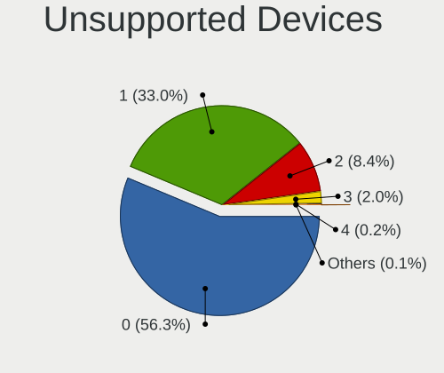

| Total | Notebooks | Percent |
|-------|-----------|---------|
| 0     | 2040      | 56.31%  |
| 1     | 1196      | 33.01%  |
| 2     | 305       | 8.42%   |
| 3     | 72        | 1.99%   |
| 4     | 6         | 0.17%   |
| 5     | 3         | 0.08%   |
| 6     | 1         | 0.03%   |

Unsupported Device Types
------------------------

Types of unsupported devices

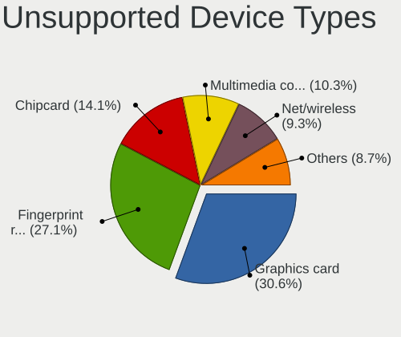

| Type                     | Notebooks | Percent |
|--------------------------|-----------|---------|
| Graphics card            | 608       | 30.6%   |
| Fingerprint reader       | 538       | 27.08%  |
| Chipcard                 | 280       | 14.09%  |
| Multimedia controller    | 204       | 10.27%  |
| Net/wireless             | 185       | 9.31%   |
| Bluetooth                | 35        | 1.76%   |
| Communication controller | 29        | 1.46%   |
| Storage                  | 24        | 1.21%   |
| Card reader              | 22        | 1.11%   |
| Camera                   | 20        | 1.01%   |
| Sound                    | 13        | 0.65%   |
| Net/ethernet             | 10        | 0.5%    |
| Flash memory             | 6         | 0.3%    |
| Network                  | 5         | 0.25%   |
| Modem                    | 4         | 0.2%    |
| Unassigned class         | 2         | 0.1%    |
| Tv card                  | 1         | 0.05%   |
| Firewire controller      | 1         | 0.05%   |

