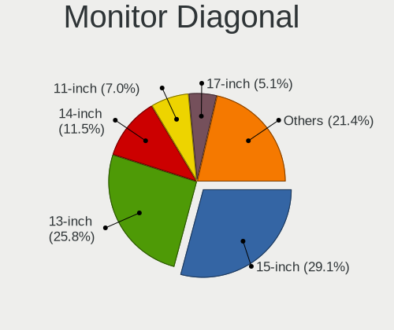
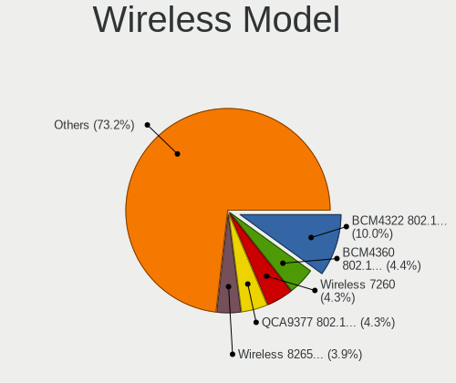

Debian 11 - Tested Hardware & Statistics (Notebooks)
----------------------------------------------------

A project to collect tested hardware configurations for Debian 11 (Beta test).

Anyone can contribute to this report by the [hw-probe](https://github.com/linuxhw/hw-probe) tool:

    sudo -E hw-probe -all -upload

Please submit a probe of your configuration if it's not presented on the page or is rare.

Full-feature report is available here: https://linux-hardware.org/?view=trends&rel=debian-11

Contents
--------

* [ Test Cases ](#test-cases)

* [ System ](#system)
  - [ Kernel                   ](#kernel)
  - [ Kernel Family            ](#kernel-family)
  - [ Kernel Major Ver.        ](#kernel-major-ver)
  - [ Arch                     ](#arch)
  - [ DE                       ](#de)
  - [ Display Server           ](#display-server)
  - [ Display Manager          ](#display-manager)
  - [ OS Lang                  ](#os-lang)
  - [ Boot Mode                ](#boot-mode)
  - [ Filesystem               ](#filesystem)
  - [ Part. scheme             ](#part-scheme)
  - [ Dual Boot with Linux/BSD ](#dual-boot-with-linux-bsd)
  - [ Dual Boot (Win)          ](#dual-boot-win)

* [ Board ](#board)
  - [ Vendor                   ](#vendor)
  - [ Model                    ](#model)
  - [ Model Family             ](#model-family)
  - [ MFG Year                 ](#mfg-year)
  - [ Form Factor              ](#form-factor)
  - [ Secure Boot              ](#secure-boot)
  - [ Coreboot                 ](#coreboot)
  - [ RAM Size                 ](#ram-size)
  - [ RAM Used                 ](#ram-used)
  - [ Total Drives             ](#total-drives)
  - [ Has CD-ROM               ](#has-cd-rom)
  - [ Has Ethernet             ](#has-ethernet)
  - [ Has WiFi                 ](#has-wifi)
  - [ Has Bluetooth            ](#has-bluetooth)

* [ Location ](#location)
  - [ Country                  ](#country)
  - [ City                     ](#city)

* [ Drives ](#drives)
  - [ Drive Vendor             ](#drive-vendor)
  - [ Drive Model              ](#drive-model)
  - [ HDD Vendor               ](#hdd-vendor)
  - [ SSD Vendor               ](#ssd-vendor)
  - [ Drive Kind               ](#drive-kind)
  - [ Drive Connector          ](#drive-connector)
  - [ Drive Size               ](#drive-size)
  - [ Space Total              ](#space-total)
  - [ Space Used               ](#space-used)
  - [ Malfunc. Drives          ](#malfunc-drives)
  - [ Malfunc. Drive Vendor    ](#malfunc-drive-vendor)
  - [ Malfunc. HDD Vendor      ](#malfunc-hdd-vendor)
  - [ Malfunc. Drive Kind      ](#malfunc-drive-kind)
  - [ Failed Drives            ](#failed-drives)
  - [ Failed Drive Vendor      ](#failed-drive-vendor)
  - [ Drive Status             ](#drive-status)

* [ Storage controller ](#storage-controller)
  - [ Storage Vendor           ](#storage-vendor)
  - [ Storage Model            ](#storage-model)
  - [ Storage Kind             ](#storage-kind)

* [ Processor ](#processor)
  - [ CPU Vendor               ](#cpu-vendor)
  - [ CPU Model                ](#cpu-model)
  - [ CPU Model Family         ](#cpu-model-family)
  - [ CPU Cores                ](#cpu-cores)
  - [ CPU Sockets              ](#cpu-sockets)
  - [ CPU Threads              ](#cpu-threads)
  - [ CPU Op-Modes             ](#cpu-op-modes)
  - [ CPU Microcode            ](#cpu-microcode)
  - [ CPU Microarch            ](#cpu-microarch)

* [ Graphics ](#graphics)
  - [ GPU Vendor               ](#gpu-vendor)
  - [ GPU Model                ](#gpu-model)
  - [ GPU Combo                ](#gpu-combo)
  - [ GPU Driver               ](#gpu-driver)
  - [ GPU Memory               ](#gpu-memory)

* [ Monitor ](#monitor)
  - [ Monitor Vendor           ](#monitor-vendor)
  - [ Monitor Model            ](#monitor-model)
  - [ Monitor Resolution       ](#monitor-resolution)
  - [ Monitor Diagonal         ](#monitor-diagonal)
  - [ Monitor Width            ](#monitor-width)
  - [ Aspect Ratio             ](#aspect-ratio)
  - [ Monitor Area             ](#monitor-area)
  - [ Pixel Density            ](#pixel-density)
  - [ Multiple Monitors        ](#multiple-monitors)

* [ Network ](#network)
  - [ Net Controller Vendor    ](#net-controller-vendor)
  - [ Net Controller Model     ](#net-controller-model)
  - [ Wireless Vendor          ](#wireless-vendor)
  - [ Wireless Model           ](#wireless-model)
  - [ Ethernet Vendor          ](#ethernet-vendor)
  - [ Ethernet Model           ](#ethernet-model)
  - [ Net Controller Kind      ](#net-controller-kind)
  - [ Used Controller          ](#used-controller)
  - [ NICs                     ](#nics)
  - [ IPv6                     ](#ipv6)

* [ Bluetooth ](#bluetooth)
  - [ Bluetooth Vendor         ](#bluetooth-vendor)
  - [ Bluetooth Model          ](#bluetooth-model)

* [ Sound ](#sound)
  - [ Sound Vendor             ](#sound-vendor)
  - [ Sound Model              ](#sound-model)

* [ Memory ](#memory)
  - [ Memory Vendor            ](#memory-vendor)
  - [ Memory Model             ](#memory-model)
  - [ Memory Kind              ](#memory-kind)
  - [ Memory Form Factor       ](#memory-form-factor)
  - [ Memory Size              ](#memory-size)
  - [ Memory Speed             ](#memory-speed)

* [ Printers & scanners ](#printers-scanners)
  - [ Printer Vendor           ](#printer-vendor)
  - [ Printer Model            ](#printer-model)
  - [ Scanner Vendor           ](#scanner-vendor)
  - [ Scanner Model            ](#scanner-model)

* [ Camera ](#camera)
  - [ Camera Vendor            ](#camera-vendor)
  - [ Camera Model             ](#camera-model)

* [ Security ](#security)
  - [ Fingerprint Vendor       ](#fingerprint-vendor)
  - [ Fingerprint Model        ](#fingerprint-model)
  - [ Chipcard Vendor          ](#chipcard-vendor)
  - [ Chipcard Model           ](#chipcard-model)

* [ Unsupported ](#unsupported)
  - [ Unsupported Devices      ](#unsupported-devices)
  - [ Unsupported Device Types ](#unsupported-device-types)

Test Cases
----------

| Vendor        | Model                       | Probe                                                      | Date         |
|---------------|-----------------------------|------------------------------------------------------------|--------------|
| Google        | Stout                       | [e4463bb3d4](https://linux-hardware.org/?probe=e4463bb3d4) | Aug 02, 2021 |
| Fujitsu       | LIFEBOOK T5010              | [75a544682e](https://linux-hardware.org/?probe=75a544682e) | Aug 02, 2021 |
| Google        | Enguarde                    | [09406c6908](https://linux-hardware.org/?probe=09406c6908) | Aug 02, 2021 |
| Apple         | MacBookAir7,1               | [01315f2df2](https://linux-hardware.org/?probe=01315f2df2) | Aug 02, 2021 |
| Apple         | MacBookAir7,1               | [e6ca37026c](https://linux-hardware.org/?probe=e6ca37026c) | Aug 02, 2021 |
| Lenovo        | ThinkPad 13 2nd Gen 20J1... | [70647a7f66](https://linux-hardware.org/?probe=70647a7f66) | Aug 02, 2021 |
| Dell          | Inspiron 7391               | [c4ac48e264](https://linux-hardware.org/?probe=c4ac48e264) | Aug 02, 2021 |
| Lenovo        | IdeaPad L340-15API 81LW     | [ace43d8e9f](https://linux-hardware.org/?probe=ace43d8e9f) | Aug 02, 2021 |
| Lenovo        | IdeaPad L340-15API 81LW     | [384ffe1123](https://linux-hardware.org/?probe=384ffe1123) | Aug 02, 2021 |
| Lenovo        | ThinkPad L520 5016NU7       | [101a0ca1b3](https://linux-hardware.org/?probe=101a0ca1b3) | Aug 01, 2021 |
| Lenovo        | IdeaPad Gaming 3 15IMH05... | [9c7fb8e911](https://linux-hardware.org/?probe=9c7fb8e911) | Aug 01, 2021 |
| Lenovo        | ThinkPad L520 5016NU7       | [08fe25ec71](https://linux-hardware.org/?probe=08fe25ec71) | Aug 01, 2021 |
| Lenovo        | ThinkPad Edge E330 3354D... | [9c317f536b](https://linux-hardware.org/?probe=9c317f536b) | Aug 01, 2021 |
| ASUSTek       | ROG Strix G731GT_G731GT     | [f851abbdf5](https://linux-hardware.org/?probe=f851abbdf5) | Aug 01, 2021 |
| Dell          | Inspiron 5570               | [5b89a99ad8](https://linux-hardware.org/?probe=5b89a99ad8) | Jul 31, 2021 |
| Dell          | Vostro 5502                 | [f1e6f11078](https://linux-hardware.org/?probe=f1e6f11078) | Jul 31, 2021 |
| HP            | OMEN by HP Laptop 15-dc0... | [60f065b770](https://linux-hardware.org/?probe=60f065b770) | Jul 31, 2021 |
| Lenovo        | ThinkPad X1 Carbon 5th 2... | [b62fb400bf](https://linux-hardware.org/?probe=b62fb400bf) | Jul 31, 2021 |
| Acer          | Aspire 7720                 | [6472272bf7](https://linux-hardware.org/?probe=6472272bf7) | Jul 30, 2021 |
| Lenovo        | ThinkPad E14 20RA001LMC     | [b16533813f](https://linux-hardware.org/?probe=b16533813f) | Jul 30, 2021 |
| Lenovo        | ThinkPad T470s 20HGS0A60... | [8a3c585de4](https://linux-hardware.org/?probe=8a3c585de4) | Jul 30, 2021 |
| Lenovo        | ThinkPad T450s 20BX004QG... | [a46cb950a4](https://linux-hardware.org/?probe=a46cb950a4) | Jul 29, 2021 |
| Dell          | XPS 13 7390                 | [370cea169d](https://linux-hardware.org/?probe=370cea169d) | Jul 29, 2021 |
| Dell          | XPS 13 7390                 | [a5a9ca4678](https://linux-hardware.org/?probe=a5a9ca4678) | Jul 29, 2021 |
| HUAWEI        | BOHK-WAX9X                  | [55c54d17ad](https://linux-hardware.org/?probe=55c54d17ad) | Jul 29, 2021 |
| HUAWEI        | BOHK-WAX9X                  | [1bb07ffc9f](https://linux-hardware.org/?probe=1bb07ffc9f) | Jul 29, 2021 |
| SLIMBOOK      | PROX14-AMD                  | [16aeb37a86](https://linux-hardware.org/?probe=16aeb37a86) | Jul 29, 2021 |
| Acer          | Nitro AN517-41              | [ccc850c1da](https://linux-hardware.org/?probe=ccc850c1da) | Jul 29, 2021 |
| Lenovo        | ThinkPad T420s 4174PEG      | [e448710e41](https://linux-hardware.org/?probe=e448710e41) | Jul 28, 2021 |
| Lenovo        | IdeaPad 5 14ARE05 81YM      | [89d3c0f09d](https://linux-hardware.org/?probe=89d3c0f09d) | Jul 28, 2021 |
| HP            | OMEN by HP Laptop 17-cb1... | [bee4fd945a](https://linux-hardware.org/?probe=bee4fd945a) | Jul 28, 2021 |
| Lenovo        | ThinkPad T470 20HES1UD00    | [6034f6a417](https://linux-hardware.org/?probe=6034f6a417) | Jul 28, 2021 |
| Lenovo        | ThinkPad X230 2325BQ3       | [79a19ade20](https://linux-hardware.org/?probe=79a19ade20) | Jul 28, 2021 |
| Dell          | Inspiron 8600               | [2f49d18738](https://linux-hardware.org/?probe=2f49d18738) | Jul 28, 2021 |
| Lenovo        | ThinkPad P52 20M9CTO1WW     | [abdeaec5ce](https://linux-hardware.org/?probe=abdeaec5ce) | Jul 28, 2021 |
| Lenovo        | ThinkPad P52 20M9CTO1WW     | [5258847421](https://linux-hardware.org/?probe=5258847421) | Jul 28, 2021 |
| Lenovo        | ThinkPad T490 20RYCTO1WW    | [60c16ed267](https://linux-hardware.org/?probe=60c16ed267) | Jul 28, 2021 |
| Acer          | Swift SF313-52G             | [87add43827](https://linux-hardware.org/?probe=87add43827) | Jul 28, 2021 |
| Casper        | C17B                        | [6f56921ba5](https://linux-hardware.org/?probe=6f56921ba5) | Jul 27, 2021 |
| Lenovo        | ThinkPad X240 20AL008EUK    | [367150f04f](https://linux-hardware.org/?probe=367150f04f) | Jul 27, 2021 |
| HP            | Laptop 17-by0xxx            | [0cb6fde0ef](https://linux-hardware.org/?probe=0cb6fde0ef) | Jul 27, 2021 |
| HP            | ProBook 445 G7              | [bc4f8acaf2](https://linux-hardware.org/?probe=bc4f8acaf2) | Jul 27, 2021 |
| HP            | ProBook 635 Aero G7 Note... | [e6ee486690](https://linux-hardware.org/?probe=e6ee486690) | Jul 27, 2021 |
| HP            | ProBook 450 G8 Notebook ... | [2a645d9cba](https://linux-hardware.org/?probe=2a645d9cba) | Jul 27, 2021 |
| Lenovo        | IdeaPad S540-13ITL 82H1     | [730c33a1b0](https://linux-hardware.org/?probe=730c33a1b0) | Jul 27, 2021 |
| Lenovo        | ThinkPad E14 20RAS13M00     | [b46ca83c19](https://linux-hardware.org/?probe=b46ca83c19) | Jul 27, 2021 |
| Dell          | Latitude 7480               | [0c79ad3dd4](https://linux-hardware.org/?probe=0c79ad3dd4) | Jul 27, 2021 |
| Dell          | Inspiron 7420               | [5b2e06697e](https://linux-hardware.org/?probe=5b2e06697e) | Jul 27, 2021 |
| Dell          | Inspiron 7420               | [567612e805](https://linux-hardware.org/?probe=567612e805) | Jul 27, 2021 |
| Lenovo        | IdeaPad 330-15ARR 81D2      | [0172934285](https://linux-hardware.org/?probe=0172934285) | Jul 27, 2021 |
| HP            | EliteBook 820 G1            | [f3878ff548](https://linux-hardware.org/?probe=f3878ff548) | Jul 27, 2021 |
| Apple         | MacBookPro11,4              | [d58bb90557](https://linux-hardware.org/?probe=d58bb90557) | Jul 26, 2021 |
| Dell          | Inspiron 5558               | [1bbe185e86](https://linux-hardware.org/?probe=1bbe185e86) | Jul 26, 2021 |
| Lenovo        | ThinkPad E14 20RA001HRT     | [f7175e6651](https://linux-hardware.org/?probe=f7175e6651) | Jul 26, 2021 |
| Quanta        | TWC                         | [1ecec0372f](https://linux-hardware.org/?probe=1ecec0372f) | Jul 26, 2021 |
| HP            | Laptop 15s-fq2xxx           | [2f259b4ae2](https://linux-hardware.org/?probe=2f259b4ae2) | Jul 26, 2021 |
| Dell          | Vostro 5471                 | [73c1da1908](https://linux-hardware.org/?probe=73c1da1908) | Jul 26, 2021 |
| Lenovo        | G50-80 80E5                 | [eaedf12907](https://linux-hardware.org/?probe=eaedf12907) | Jul 26, 2021 |
| HP            | EliteBook 8470p             | [8bfc663f48](https://linux-hardware.org/?probe=8bfc663f48) | Jul 26, 2021 |
| HP            | ProBook 470 G3              | [cb1b02b979](https://linux-hardware.org/?probe=cb1b02b979) | Jul 26, 2021 |
| ASUSTek       | 701                         | [db72d4004a](https://linux-hardware.org/?probe=db72d4004a) | Jul 26, 2021 |
| ASUSTek       | 1215B                       | [ce53b40511](https://linux-hardware.org/?probe=ce53b40511) | Jul 26, 2021 |
| Dell          | Latitude E6420              | [01000461fc](https://linux-hardware.org/?probe=01000461fc) | Jul 26, 2021 |
| Dell          | Studio 1555                 | [30b17f2421](https://linux-hardware.org/?probe=30b17f2421) | Jul 26, 2021 |
| Lenovo        | ThinkPad E14 20RA0036RT     | [e4f29039a8](https://linux-hardware.org/?probe=e4f29039a8) | Jul 26, 2021 |
| Apple         | MacBookPro9,2               | [c676ac21ee](https://linux-hardware.org/?probe=c676ac21ee) | Jul 26, 2021 |
| ASUSTek       | 701SD                       | [b7c888a9a7](https://linux-hardware.org/?probe=b7c888a9a7) | Jul 26, 2021 |
| Toshiba       | Satellite S55-A             | [a145aa9a69](https://linux-hardware.org/?probe=a145aa9a69) | Jul 26, 2021 |
| ASUSTek       | X541NC                      | [500a26f588](https://linux-hardware.org/?probe=500a26f588) | Jul 26, 2021 |
| Toshiba       | Satellite S55-A             | [08eec2f3a7](https://linux-hardware.org/?probe=08eec2f3a7) | Jul 25, 2021 |
| HUAWEI        | BOHK-WAX9X                  | [ec1cea0d9d](https://linux-hardware.org/?probe=ec1cea0d9d) | Jul 25, 2021 |
| Dell          | XPS 17 9700                 | [92cd785445](https://linux-hardware.org/?probe=92cd785445) | Jul 25, 2021 |
| Lenovo        | ThinkPad T460 20FMS03600    | [84f380e2a2](https://linux-hardware.org/?probe=84f380e2a2) | Jul 25, 2021 |
| Lenovo        | ThinkPad P14s Gen 1 20Y1... | [4454739a42](https://linux-hardware.org/?probe=4454739a42) | Jul 25, 2021 |
| Lenovo        | ThinkPad T440p 20AWS3UX0... | [abced1dd83](https://linux-hardware.org/?probe=abced1dd83) | Jul 25, 2021 |
| Lenovo        | ThinkPad E480 20KN001NGE    | [e3b2914d19](https://linux-hardware.org/?probe=e3b2914d19) | Jul 25, 2021 |
| Toshiba       | Satellite C45-A             | [0497ab613d](https://linux-hardware.org/?probe=0497ab613d) | Jul 25, 2021 |
| Lenovo        | ThinkPad T420 4236WNU       | [d817abc511](https://linux-hardware.org/?probe=d817abc511) | Jul 25, 2021 |
| HP            | ProBook x360 11 G1 EE       | [90aeea53cc](https://linux-hardware.org/?probe=90aeea53cc) | Jul 25, 2021 |
| HUAWEI        | NBLK-WAX9X                  | [5c61fdfb49](https://linux-hardware.org/?probe=5c61fdfb49) | Jul 25, 2021 |
| Dell          | Latitude E5520              | [0d74f57317](https://linux-hardware.org/?probe=0d74f57317) | Jul 25, 2021 |
| Dell          | Latitude E5520              | [5866765bab](https://linux-hardware.org/?probe=5866765bab) | Jul 25, 2021 |
| HP            | 250 G7 Notebook PC          | [ab8a90e145](https://linux-hardware.org/?probe=ab8a90e145) | Jul 25, 2021 |
| HP            | OMEN by HP Laptop 15-dc0... | [b8a2299d30](https://linux-hardware.org/?probe=b8a2299d30) | Jul 25, 2021 |
| Lenovo        | ThinkPad T14 Gen 1 20UDC... | [0d45d49199](https://linux-hardware.org/?probe=0d45d49199) | Jul 25, 2021 |
| PC Special... | NV4XMB,ME,MZ                | [eb789efe18](https://linux-hardware.org/?probe=eb789efe18) | Jul 25, 2021 |
| Lenovo        | IdeaPad 100-15IBD 80QQ      | [a172262124](https://linux-hardware.org/?probe=a172262124) | Jul 25, 2021 |
| Lenovo        | ThinkPad T410 2522WUZ       | [62cddaceb1](https://linux-hardware.org/?probe=62cddaceb1) | Jul 25, 2021 |
| Lenovo        | ThinkPad T480 20L5S1S000    | [1217d711fb](https://linux-hardware.org/?probe=1217d711fb) | Jul 25, 2021 |
| Lenovo        | ThinkPad T480 20L50063EU    | [c59c2aa27d](https://linux-hardware.org/?probe=c59c2aa27d) | Jul 25, 2021 |
| Lenovo        | ThinkPad X201 3626ES3       | [c18f4c4102](https://linux-hardware.org/?probe=c18f4c4102) | Jul 25, 2021 |
| Lenovo        | ThinkPad T430 2349BW1       | [75c4d5c7a9](https://linux-hardware.org/?probe=75c4d5c7a9) | Jul 25, 2021 |
| Lenovo        | ThinkPad T495 20NKS0PG00    | [59533bd2bf](https://linux-hardware.org/?probe=59533bd2bf) | Jul 25, 2021 |
| Acer          | Aspire 5735                 | [60451d6f55](https://linux-hardware.org/?probe=60451d6f55) | Jul 25, 2021 |
| Fujitsu       | LIFEBOOK AH532/G52          | [4e8d8d9253](https://linux-hardware.org/?probe=4e8d8d9253) | Jul 25, 2021 |
| HP            | ProBook 470 G5              | [a778d78c98](https://linux-hardware.org/?probe=a778d78c98) | Jul 25, 2021 |
| Lenovo        | ThinkPad T420 4236EV9       | [62cc86b330](https://linux-hardware.org/?probe=62cc86b330) | Jul 25, 2021 |
| Lenovo        | ThinkPad E15 Gen 3 20YHS... | [b3dca0cfaa](https://linux-hardware.org/?probe=b3dca0cfaa) | Jul 25, 2021 |
| HP            | 250 G5 Notebook PC          | [53d3003d94](https://linux-hardware.org/?probe=53d3003d94) | Jul 25, 2021 |
| ASUSTek       | ZenBook UX333FA_UX333FA     | [043c5815ee](https://linux-hardware.org/?probe=043c5815ee) | Jul 25, 2021 |
| Lenovo        | ThinkPad T470 W10DG 20JN... | [a30a8b568e](https://linux-hardware.org/?probe=a30a8b568e) | Jul 25, 2021 |
| ASUSTek       | TUF GAMING FX504GD_FX80G... | [686f21af90](https://linux-hardware.org/?probe=686f21af90) | Jul 25, 2021 |
| Dell          | XPS L322X                   | [6b0ab2e22d](https://linux-hardware.org/?probe=6b0ab2e22d) | Jul 25, 2021 |
| Lenovo        | ThinkPad T490 20N2CTO1WW    | [722792ec34](https://linux-hardware.org/?probe=722792ec34) | Jul 25, 2021 |
| Dell          | Inspiron 3505               | [be67f17212](https://linux-hardware.org/?probe=be67f17212) | Jul 25, 2021 |
| Dell          | XPS 13 9300                 | [15012d7630](https://linux-hardware.org/?probe=15012d7630) | Jul 25, 2021 |
| Panasonic     | CF-AX2LDCZMF                | [31feab61fe](https://linux-hardware.org/?probe=31feab61fe) | Jul 25, 2021 |
| Lenovo        | IdeaPad 3 15ITL6 82H8       | [3dae264c17](https://linux-hardware.org/?probe=3dae264c17) | Jul 25, 2021 |
| HP            | Laptop 14-ck0xxx            | [814f91322d](https://linux-hardware.org/?probe=814f91322d) | Jul 25, 2021 |
| Dell          | Inspiron 5423               | [f15c87c33c](https://linux-hardware.org/?probe=f15c87c33c) | Jul 25, 2021 |
| Lenovo        | ThinkPad T480s 20L8S7HF0... | [5417d20b5b](https://linux-hardware.org/?probe=5417d20b5b) | Jul 25, 2021 |
| Lenovo        | ThinkPad T430 2349GCG       | [7275a5dc90](https://linux-hardware.org/?probe=7275a5dc90) | Jul 25, 2021 |
| HUAWEI        | NBLK-WAX9X                  | [8e2d810033](https://linux-hardware.org/?probe=8e2d810033) | Jul 25, 2021 |
| Lenovo        | ThinkPad T450s 20BX004QG... | [079f1c9006](https://linux-hardware.org/?probe=079f1c9006) | Jul 25, 2021 |
| Lenovo        | ThinkPad T14s Gen 1 20UH... | [6f137bd0e5](https://linux-hardware.org/?probe=6f137bd0e5) | Jul 25, 2021 |
| ASUSTek       | VivoBook_ASUS Laptop E21... | [94307be3d8](https://linux-hardware.org/?probe=94307be3d8) | Jul 25, 2021 |
| ASUSTek       | VivoBook_ASUS Laptop E21... | [9e0045da76](https://linux-hardware.org/?probe=9e0045da76) | Jul 25, 2021 |
| MSI           | Modern 15 A11M              | [acfcaa9077](https://linux-hardware.org/?probe=acfcaa9077) | Jul 25, 2021 |
| Lenovo        | IdeaPad 330-15IKB 81DE      | [fb8dc2feb1](https://linux-hardware.org/?probe=fb8dc2feb1) | Jul 25, 2021 |
| HP            | Stream Notebook             | [078c5d40f8](https://linux-hardware.org/?probe=078c5d40f8) | Jul 25, 2021 |
| Lenovo        | IdeaPad 330-15IKB 81DE      | [49198ead06](https://linux-hardware.org/?probe=49198ead06) | Jul 25, 2021 |
| Lenovo        | ThinkPad X260 20F5S0JF00    | [98cbf345d9](https://linux-hardware.org/?probe=98cbf345d9) | Jul 25, 2021 |
| Dell          | Inspiron 5402               | [f54ac49b39](https://linux-hardware.org/?probe=f54ac49b39) | Jul 25, 2021 |
| Lenovo        | ThinkPad T14 Gen 2i 20W0... | [10fb3b6e94](https://linux-hardware.org/?probe=10fb3b6e94) | Jul 25, 2021 |
| Lenovo        | ThinkPad T14 Gen 2i 20W0... | [96fd57ba79](https://linux-hardware.org/?probe=96fd57ba79) | Jul 25, 2021 |
| Lenovo        | ThinkPad X260 20F5S46R00    | [c72e326772](https://linux-hardware.org/?probe=c72e326772) | Jul 25, 2021 |
| Gigabyte      | AERO 15 KB                  | [d66f45fc2e](https://linux-hardware.org/?probe=d66f45fc2e) | Jul 25, 2021 |
| HP            | ProBook 640 G2              | [558f739aab](https://linux-hardware.org/?probe=558f739aab) | Jul 25, 2021 |
| Dell          | XPS 13 9370                 | [2c9c978361](https://linux-hardware.org/?probe=2c9c978361) | Jul 25, 2021 |
| Lenovo        | ThinkPad T420 4236WC3       | [2dbdc931e7](https://linux-hardware.org/?probe=2dbdc931e7) | Jul 25, 2021 |
| Lenovo        | ThinkPad E14 20RB000UBR     | [c25d549bd7](https://linux-hardware.org/?probe=c25d549bd7) | Jul 25, 2021 |
| HP            | Laptop 15-ef1xxx            | [9f0fbc1613](https://linux-hardware.org/?probe=9f0fbc1613) | Jul 25, 2021 |
| Lenovo        | G50-80 80E5                 | [4c5e0baffe](https://linux-hardware.org/?probe=4c5e0baffe) | Jul 25, 2021 |
| HP            | EliteBook 820 G2            | [17b5a12640](https://linux-hardware.org/?probe=17b5a12640) | Jul 25, 2021 |
| Lenovo        | ThinkPad T430 2347FF9       | [cdc7a6e9c8](https://linux-hardware.org/?probe=cdc7a6e9c8) | Jul 25, 2021 |
| HP            | 2000                        | [0187fe7c8a](https://linux-hardware.org/?probe=0187fe7c8a) | Jul 25, 2021 |
| Acer          | Aspire A515-41G             | [a34056020d](https://linux-hardware.org/?probe=a34056020d) | Jul 25, 2021 |
| Dell          | XPS 13 7390                 | [02e6821b40](https://linux-hardware.org/?probe=02e6821b40) | Jul 24, 2021 |
| Lenovo        | IdeaPad S145-14AST 81ST     | [4cf2681a8c](https://linux-hardware.org/?probe=4cf2681a8c) | Jul 24, 2021 |
| Apple         | MacBookPro8,1               | [b0e58bf8de](https://linux-hardware.org/?probe=b0e58bf8de) | Jul 24, 2021 |
| Lenovo        | IdeaPad 700-15ISK 80RU      | [3491bd4228](https://linux-hardware.org/?probe=3491bd4228) | Jul 23, 2021 |
| Lenovo        | ThinkPad E595 20NF0005IX    | [dd220c0bdb](https://linux-hardware.org/?probe=dd220c0bdb) | Jul 23, 2021 |
| Gigabyte      | AERO 17-SA                  | [eaff86e276](https://linux-hardware.org/?probe=eaff86e276) | Jul 23, 2021 |
| Acer          | Aspire A715-72G             | [b436023dda](https://linux-hardware.org/?probe=b436023dda) | Jul 23, 2021 |
| Lenovo        | IdeaPad S145-15IWL 81S9     | [ecd10ec3a7](https://linux-hardware.org/?probe=ecd10ec3a7) | Jul 22, 2021 |
| ASUSTek       | VivoBook_ASUSLaptop X509... | [1abb08da83](https://linux-hardware.org/?probe=1abb08da83) | Jul 21, 2021 |
| HP            | Laptop 15s-fq1xxx           | [4ed280d4c8](https://linux-hardware.org/?probe=4ed280d4c8) | Jul 19, 2021 |
| HP            | EliteBook 830 G7 Noteboo... | [acca72e9c1](https://linux-hardware.org/?probe=acca72e9c1) | Jul 15, 2021 |
| Lenovo        | ThinkPad Edge E540 20C60... | [a5daecad1d](https://linux-hardware.org/?probe=a5daecad1d) | Jul 15, 2021 |
| Dell          | Precision 3540              | [383ebf30aa](https://linux-hardware.org/?probe=383ebf30aa) | Jul 14, 2021 |
| Itautec       | Infoway                     | [06dc7b0fd1](https://linux-hardware.org/?probe=06dc7b0fd1) | Jul 14, 2021 |
| Lenovo        | ThinkPad E15 Gen 2 20TD0... | [71d234aaef](https://linux-hardware.org/?probe=71d234aaef) | Jul 14, 2021 |
| Acer          | Aspire 7741                 | [6ed4934b61](https://linux-hardware.org/?probe=6ed4934b61) | Jul 13, 2021 |
| Acer          | Aspire 7741                 | [ee5a2b2029](https://linux-hardware.org/?probe=ee5a2b2029) | Jul 13, 2021 |
| ASUSTek       | VivoBook_ASUSLaptop X513... | [54bfb26e0f](https://linux-hardware.org/?probe=54bfb26e0f) | Jul 12, 2021 |
| ASUSTek       | ROG Strix G533QS_G533QS     | [98271924ba](https://linux-hardware.org/?probe=98271924ba) | Jul 11, 2021 |
| Lenovo        | ThinkPad T430 2349V4B       | [d39fe8e9d4](https://linux-hardware.org/?probe=d39fe8e9d4) | Jul 11, 2021 |
| HP            | EliteBook 855 G7 Noteboo... | [1cb0058b88](https://linux-hardware.org/?probe=1cb0058b88) | Jul 10, 2021 |
| Acer          | Aspire A315-23G             | [e6aa891005](https://linux-hardware.org/?probe=e6aa891005) | Jul 08, 2021 |
| Dell          | XPS 13 9380                 | [b31688ecfa](https://linux-hardware.org/?probe=b31688ecfa) | Jul 08, 2021 |
| Dell          | Latitude E6330              | [321bec10eb](https://linux-hardware.org/?probe=321bec10eb) | Jul 05, 2021 |
| HP            | Compaq 6830s                | [9c47e76afe](https://linux-hardware.org/?probe=9c47e76afe) | Jul 04, 2021 |
| HP            | Compaq 6830s                | [b524035304](https://linux-hardware.org/?probe=b524035304) | Jul 04, 2021 |
| Dell          | Inspiron 5570               | [b760b0d9cc](https://linux-hardware.org/?probe=b760b0d9cc) | Jul 03, 2021 |
| Acer          | Aspire A515-51              | [f94bb31c5a](https://linux-hardware.org/?probe=f94bb31c5a) | Jul 03, 2021 |
| HP            | ZBook Fury 17 G7 Mobile ... | [c24fcd1454](https://linux-hardware.org/?probe=c24fcd1454) | Jul 02, 2021 |
| Dell          | Inspiron 5570               | [44b96068f2](https://linux-hardware.org/?probe=44b96068f2) | Jul 02, 2021 |
| Acer          | Aspire A315-23G             | [5729444e9b](https://linux-hardware.org/?probe=5729444e9b) | Jul 02, 2021 |
| Acer          | Aspire A315-23G             | [bd3211a03b](https://linux-hardware.org/?probe=bd3211a03b) | Jun 30, 2021 |
| Lenovo        | ThinkPad X1 Extreme Gen ... | [c8cb82f74d](https://linux-hardware.org/?probe=c8cb82f74d) | Jun 30, 2021 |
| Dell          | XPS 13 9310                 | [24a52836b4](https://linux-hardware.org/?probe=24a52836b4) | Jun 30, 2021 |
| HP            | ProBook 640 G3              | [c56b8f3ff1](https://linux-hardware.org/?probe=c56b8f3ff1) | Jun 29, 2021 |
| HP            | ZBook 17 G5                 | [5557a5c23c](https://linux-hardware.org/?probe=5557a5c23c) | Jun 29, 2021 |
| Lenovo        | IdeaPad Z580                | [6a9d31c8ef](https://linux-hardware.org/?probe=6a9d31c8ef) | Jun 29, 2021 |
| Dell          | Inspiron 5570               | [5335641d04](https://linux-hardware.org/?probe=5335641d04) | Jun 28, 2021 |
| Dell          | Inspiron 5570               | [0632a7bf28](https://linux-hardware.org/?probe=0632a7bf28) | Jun 28, 2021 |
| Acer          | Aspire A315-23G             | [834b68e61a](https://linux-hardware.org/?probe=834b68e61a) | Jun 28, 2021 |
| HUAWEI        | BOHK-WAX9X                  | [65c54db09e](https://linux-hardware.org/?probe=65c54db09e) | Jun 27, 2021 |
| HUAWEI        | BOHK-WAX9X                  | [fda3d18cf7](https://linux-hardware.org/?probe=fda3d18cf7) | Jun 27, 2021 |
| HP            | ZBook Fury 17 G7 Mobile ... | [c3d5fd07c1](https://linux-hardware.org/?probe=c3d5fd07c1) | Jun 27, 2021 |
| Acer          | Nitro AN515-51              | [6c4a46b4ec](https://linux-hardware.org/?probe=6c4a46b4ec) | Jun 26, 2021 |
| Dell          | Inspiron 3501               | [d6f07cb592](https://linux-hardware.org/?probe=d6f07cb592) | Jun 23, 2021 |
| MSI           | GF65 Thin 10UE              | [d1e0b6ee58](https://linux-hardware.org/?probe=d1e0b6ee58) | Jun 22, 2021 |
| Lenovo        | ThinkPad T495 20NKS0PG00    | [9e646a384e](https://linux-hardware.org/?probe=9e646a384e) | Jun 22, 2021 |
| Dell          | Precision 3560              | [81efcf647c](https://linux-hardware.org/?probe=81efcf647c) | Jun 21, 2021 |
| Fujitsu       | LIFEBOOK A357               | [75c4ec9e5a](https://linux-hardware.org/?probe=75c4ec9e5a) | Jun 21, 2021 |
| Lenovo        | IdeaPad 700-15ISK 80RU      | [c62a9a5058](https://linux-hardware.org/?probe=c62a9a5058) | Jun 20, 2021 |
| Lenovo        | IdeaPad 700-15ISK 80RU      | [5a39dabe8a](https://linux-hardware.org/?probe=5a39dabe8a) | Jun 20, 2021 |
| Acer          | Aspire A315-23G             | [b37bec27b3](https://linux-hardware.org/?probe=b37bec27b3) | Jun 20, 2021 |
| Dell          | Latitude E7470              | [49cb9ff0b0](https://linux-hardware.org/?probe=49cb9ff0b0) | Jun 20, 2021 |
| Acer          | Aspire 5750G                | [73d6b46b6b](https://linux-hardware.org/?probe=73d6b46b6b) | Jun 19, 2021 |
| ASUSTek       | ZenBook UX431DA_UM431DA     | [a894e25838](https://linux-hardware.org/?probe=a894e25838) | Jun 19, 2021 |
| Acer          | Aspire A315-23G             | [dde7123487](https://linux-hardware.org/?probe=dde7123487) | Jun 19, 2021 |
| Lenovo        | ThinkPad X270 W10DG 20K5... | [842c53b8e2](https://linux-hardware.org/?probe=842c53b8e2) | Jun 18, 2021 |
| Acer          | Aspire A315-23G             | [1a8a3efde5](https://linux-hardware.org/?probe=1a8a3efde5) | Jun 18, 2021 |
| Lenovo        | ThinkPad X230 2325AZ8       | [b5ea5009bf](https://linux-hardware.org/?probe=b5ea5009bf) | Jun 18, 2021 |
| Lenovo        | Yoga 300-11IBR 80M1         | [259fc86278](https://linux-hardware.org/?probe=259fc86278) | Jun 18, 2021 |
| Acer          | Aspire ES1-132              | [c26c0f6e33](https://linux-hardware.org/?probe=c26c0f6e33) | Jun 15, 2021 |
| Acer          | Aspire A315-23G             | [eb77944ea2](https://linux-hardware.org/?probe=eb77944ea2) | Jun 14, 2021 |
| Acer          | Aspire V3-331               | [91f4f7aab6](https://linux-hardware.org/?probe=91f4f7aab6) | Jun 13, 2021 |
| UNOWHY        | Y13G002S4EI                 | [3d25dc9f69](https://linux-hardware.org/?probe=3d25dc9f69) | Jun 13, 2021 |
| ASUSTek       | X550LD                      | [2d1f6364aa](https://linux-hardware.org/?probe=2d1f6364aa) | Jun 13, 2021 |
| Acer          | Aspire V3-331               | [02e288caf9](https://linux-hardware.org/?probe=02e288caf9) | Jun 13, 2021 |
| Lenovo        | ThinkPad X270 W10DG 20K5... | [1b2cda6c08](https://linux-hardware.org/?probe=1b2cda6c08) | Jun 12, 2021 |
| ASUSTek       | VivoBook_ASUSLaptop X512... | [f6ba765876](https://linux-hardware.org/?probe=f6ba765876) | Jun 12, 2021 |
| HUAWEI        | BOHK-WAX9X                  | [57684125de](https://linux-hardware.org/?probe=57684125de) | Jun 12, 2021 |
| Dell          | Latitude E7470              | [51c1f3f1f5](https://linux-hardware.org/?probe=51c1f3f1f5) | Jun 10, 2021 |
| Acer          | Aspire A315-23G             | [377f2e9ec6](https://linux-hardware.org/?probe=377f2e9ec6) | Jun 09, 2021 |
| Dell          | Latitude E6330              | [ba88cd6328](https://linux-hardware.org/?probe=ba88cd6328) | Jun 08, 2021 |
| Lenovo        | ThinkPad T430s 2356A89      | [0195b8564e](https://linux-hardware.org/?probe=0195b8564e) | Jun 08, 2021 |
| Acer          | Aspire ES1-132              | [2db77f0d01](https://linux-hardware.org/?probe=2db77f0d01) | Jun 07, 2021 |
| Acer          | Aspire A315-23G             | [548356ed30](https://linux-hardware.org/?probe=548356ed30) | Jun 06, 2021 |
| Dell          | Inspiron 3793               | [f65812f774](https://linux-hardware.org/?probe=f65812f774) | Jun 06, 2021 |
| ASUSTek       | M3N                         | [ec5f914161](https://linux-hardware.org/?probe=ec5f914161) | Jun 06, 2021 |
| ASUSTek       | M3N                         | [bd89f26d7e](https://linux-hardware.org/?probe=bd89f26d7e) | Jun 05, 2021 |
| Lenovo        | IdeaPad 320-15IKB 80XL      | [5c16d903d3](https://linux-hardware.org/?probe=5c16d903d3) | Jun 05, 2021 |
| HUAWEI        | BOHK-WAX9X                  | [47e9dfd146](https://linux-hardware.org/?probe=47e9dfd146) | Jun 05, 2021 |
| Acer          | Aspire A315-23G             | [90dbe22a68](https://linux-hardware.org/?probe=90dbe22a68) | Jun 05, 2021 |
| HP            | ProBook 640 G8 Notebook ... | [e20b51102d](https://linux-hardware.org/?probe=e20b51102d) | Jun 03, 2021 |
| Lenovo        | ThinkPad T495 20NJCTO1WW    | [b513f2fc77](https://linux-hardware.org/?probe=b513f2fc77) | Jun 03, 2021 |
| Monster       | ABRA A5 V15.2               | [012bfa586d](https://linux-hardware.org/?probe=012bfa586d) | Jun 02, 2021 |
| Pegatron      | A15                         | [dec1b6b43a](https://linux-hardware.org/?probe=dec1b6b43a) | Jun 02, 2021 |
| HUAWEI        | BOHK-WAX9X                  | [ac80feea4f](https://linux-hardware.org/?probe=ac80feea4f) | Jun 01, 2021 |
| Acer          | Aspire A315-23G             | [80cf3dc8e7](https://linux-hardware.org/?probe=80cf3dc8e7) | Jun 01, 2021 |
| HP            | Compaq tc4400 (GE179UP#A... | [eeaee9f1ad](https://linux-hardware.org/?probe=eeaee9f1ad) | Jun 01, 2021 |
| Toshiba       | Satellite U800W             | [ac79b35dfd](https://linux-hardware.org/?probe=ac79b35dfd) | May 30, 2021 |
| MSI           | U90/U100                    | [477251f62e](https://linux-hardware.org/?probe=477251f62e) | May 30, 2021 |
| MSI           | U90/U100                    | [1a0476551b](https://linux-hardware.org/?probe=1a0476551b) | May 30, 2021 |
| Lenovo        | ThinkPad X1 Carbon 6th 2... | [c33e7ced42](https://linux-hardware.org/?probe=c33e7ced42) | May 29, 2021 |
| MSI           | CX700                       | [ef40976753](https://linux-hardware.org/?probe=ef40976753) | May 29, 2021 |
| Dell          | XPS 13 9310                 | [5de2c933c1](https://linux-hardware.org/?probe=5de2c933c1) | May 28, 2021 |
| Lenovo        | ThinkPad T530 24296HG       | [88cee1e822](https://linux-hardware.org/?probe=88cee1e822) | May 28, 2021 |
| Samsung       | 370E4K                      | [125fbb3d15](https://linux-hardware.org/?probe=125fbb3d15) | May 28, 2021 |
| MSI           | CX700                       | [535d0016e2](https://linux-hardware.org/?probe=535d0016e2) | May 27, 2021 |
| Acer          | Aspire A315-23G             | [c091670daa](https://linux-hardware.org/?probe=c091670daa) | May 25, 2021 |
| Acer          | Aspire A315-23G             | [ad6cd7847f](https://linux-hardware.org/?probe=ad6cd7847f) | May 24, 2021 |
| Lenovo        | ThinkPad T14 Gen 1 20UDC... | [f03341d873](https://linux-hardware.org/?probe=f03341d873) | May 23, 2021 |
| HP            | EliteBook 840 G1            | [6573923d55](https://linux-hardware.org/?probe=6573923d55) | May 21, 2021 |
| Acer          | Aspire A315-23G             | [8b7b153998](https://linux-hardware.org/?probe=8b7b153998) | May 20, 2021 |
| Dell          | Latitude 7480               | [0f2477786d](https://linux-hardware.org/?probe=0f2477786d) | May 19, 2021 |
| Lenovo        | ThinkPad T440p 20AWS4PN0... | [f8b2c84bc1](https://linux-hardware.org/?probe=f8b2c84bc1) | May 19, 2021 |
| HUAWEI        | BOHK-WAX9X                  | [b9d0acf0a6](https://linux-hardware.org/?probe=b9d0acf0a6) | May 19, 2021 |
| HUAWEI        | BOHK-WAX9X                  | [97a658e572](https://linux-hardware.org/?probe=97a658e572) | May 19, 2021 |
| Acer          | Aspire A315-23G             | [28bb88d60c](https://linux-hardware.org/?probe=28bb88d60c) | May 17, 2021 |
| HP            | Compaq Presario C700        | [91a939ce16](https://linux-hardware.org/?probe=91a939ce16) | May 16, 2021 |
| Acer          | Aspire A315-23G             | [646b64ccb3](https://linux-hardware.org/?probe=646b64ccb3) | May 15, 2021 |
| HP            | Split 13 x2 PC              | [5834b6321d](https://linux-hardware.org/?probe=5834b6321d) | May 05, 2021 |
| ASUSTek       | ZenBook UX425IA_UM425IA     | [bf3e99374e](https://linux-hardware.org/?probe=bf3e99374e) | Apr 29, 2021 |
| Lenovo        | IdeaPad Z500 20202          | [a06f2bc29e](https://linux-hardware.org/?probe=a06f2bc29e) | Apr 27, 2021 |
| ASUSTek       | ZenBook UX333FN_UX333FN     | [a042fd63c6](https://linux-hardware.org/?probe=a042fd63c6) | Apr 27, 2021 |
| Dell          | Inspiron 3793               | [a4c79ea8c3](https://linux-hardware.org/?probe=a4c79ea8c3) | Apr 26, 2021 |
| HP            | EliteBook 8460p             | [bcea790fba](https://linux-hardware.org/?probe=bcea790fba) | Apr 24, 2021 |
| Lenovo        | ThinkPad T430s 23533KJ      | [39aa120e47](https://linux-hardware.org/?probe=39aa120e47) | Apr 21, 2021 |
| Dell          | Inspiron 5468               | [cfc77b26b5](https://linux-hardware.org/?probe=cfc77b26b5) | Apr 17, 2021 |
| Lenovo        | ThinkPad T530 24296HG       | [4967255e37](https://linux-hardware.org/?probe=4967255e37) | Apr 14, 2021 |
| Lenovo        | ThinkPad T530 24296HG       | [e1a5725060](https://linux-hardware.org/?probe=e1a5725060) | Apr 14, 2021 |

System
------

Kernel
------

Version of the Linux kernel

| Version                    | Notebooks | Percent |
|----------------------------|-----------|---------|
| 5.10.0-8-amd64             | 94        | 45.85%  |
| 5.10.0-7-amd64             | 59        | 28.78%  |
| 5.10.0-6-amd64             | 23        | 11.22%  |
| 5.12.0-19.3-liquorix-amd64 | 2         | 0.98%   |
| 5.10.0-8-686               | 2         | 0.98%   |
| 4.19.0-14-amd64            | 2         | 0.98%   |
| 5.14.0-rc3-prygun          | 1         | 0.49%   |
| 5.13.5-xanmod1             | 1         | 0.49%   |
| 5.13.4-e5520               | 1         | 0.49%   |
| 5.12.10                    | 1         | 0.49%   |
| 5.12.1                     | 1         | 0.49%   |
| 5.12.0-9.2-liquorix-amd64  | 1         | 0.49%   |
| 5.12.0-14.2-liquorix-amd64 | 1         | 0.49%   |
| 5.11.9+                    | 1         | 0.49%   |
| 5.11.22-1-pve              | 1         | 0.49%   |
| 5.11.15-051115-generic     | 1         | 0.49%   |
| 5.11.14                    | 1         | 0.49%   |
| 5.11.0-rc6                 | 1         | 0.49%   |
| 5.10.40-ismynik            | 1         | 0.49%   |
| 5.10.10-64                 | 1         | 0.49%   |
| 5.10.0-io7-amd64           | 1         | 0.49%   |
| 5.10.0-8-686-pae           | 1         | 0.49%   |
| 5.10.0-6-rt-amd64          | 1         | 0.49%   |
| 5.10.0-6-686               | 1         | 0.49%   |
| 5.10.0-5-amd64             | 1         | 0.49%   |
| 5.10.0-4-amd64             | 1         | 0.49%   |
| 4.19.181-z580322           | 1         | 0.49%   |
| 4.19.0-16-amd64            | 1         | 0.49%   |
| 4.19.0-16-686-pae          | 1         | 0.49%   |

Kernel Family
-------------

Linux kernel without a distro release

| Version  | Notebooks | Percent |
|----------|-----------|---------|
| 5.10.0   | 178       | 89.9%   |
| 4.19.0   | 4         | 2.02%   |
| 5.12.0   | 3         | 1.52%   |
| 5.14.0   | 1         | 0.51%   |
| 5.13.5   | 1         | 0.51%   |
| 5.13.4   | 1         | 0.51%   |
| 5.12.10  | 1         | 0.51%   |
| 5.12.1   | 1         | 0.51%   |
| 5.11.9   | 1         | 0.51%   |
| 5.11.22  | 1         | 0.51%   |
| 5.11.15  | 1         | 0.51%   |
| 5.11.14  | 1         | 0.51%   |
| 5.11.0   | 1         | 0.51%   |
| 5.10.40  | 1         | 0.51%   |
| 5.10.10  | 1         | 0.51%   |
| 4.19.181 | 1         | 0.51%   |

Kernel Major Ver.
-----------------

Linux kernel major version

| Version | Notebooks | Percent |
|---------|-----------|---------|
| 5.10    | 180       | 90.91%  |
| 5.12    | 5         | 2.53%   |
| 5.11    | 5         | 2.53%   |
| 4.19    | 5         | 2.53%   |
| 5.13    | 2         | 1.01%   |
| 5.14    | 1         | 0.51%   |

Arch
----

OS architecture (x86_64, i586, etc.)

| Name   | Notebooks | Percent |
|--------|-----------|---------|
| x86_64 | 193       | 97.47%  |
| i686   | 5         | 2.53%   |

DE
--

Desktop Environment

| Name             | Notebooks | Percent |
|------------------|-----------|---------|
| GNOME            | 69        | 34.5%   |
| KDE5             | 46        | 23%     |
| XFCE             | 20        | 10%     |
| Unknown          | 15        | 7.5%    |
| MATE             | 11        | 5.5%    |
| LXQt             | 7         | 3.5%    |
| i3               | 6         | 3%      |
| LXDE             | 5         | 2.5%    |
| X-Cinnamon       | 4         | 2%      |
| KDE              | 4         | 2%      |
| lightdm-xsession | 3         | 1.5%    |
| Cinnamon         | 3         | 1.5%    |
| openbox          | 2         | 1%      |
| GNOME Flashback  | 2         | 1%      |
| sway             | 1         | 0.5%    |
| default          | 1         | 0.5%    |
| awesome          | 1         | 0.5%    |

Display Server
--------------

X11 or Wayland

| Name    | Notebooks | Percent |
|---------|-----------|---------|
| X11     | 123       | 61.5%   |
| Wayland | 57        | 28.5%   |
| Tty     | 12        | 6%      |
| Unknown | 8         | 4%      |

Display Manager
---------------

SDDM, LightDM, etc.

| Name    | Notebooks | Percent |
|---------|-----------|---------|
| GDM     | 67        | 33.67%  |
| SDDM    | 49        | 24.62%  |
| TDM     | 48        | 24.12%  |
| Unknown | 31        | 15.58%  |
| LightDM | 2         | 1.01%   |
| XDM     | 1         | 0.5%    |
| KDM     | 1         | 0.5%    |

OS Lang
-------

Language

| Lang    | Notebooks | Percent |
|---------|-----------|---------|
| en_US   | 78        | 39.39%  |
| en_GB   | 17        | 8.59%   |
| ru_RU   | 15        | 7.58%   |
| de_DE   | 13        | 6.57%   |
| fr_FR   | 10        | 5.05%   |
| en_IN   | 7         | 3.54%   |
| pt_BR   | 6         | 3.03%   |
| es_ES   | 6         | 3.03%   |
| Unknown | 6         | 3.03%   |
| pl_PL   | 4         | 2.02%   |
| it_IT   | 4         | 2.02%   |
| tr_TR   | 3         | 1.52%   |
| pt_PT   | 2         | 1.01%   |
| ja_JP   | 2         | 1.01%   |
| en_SG   | 2         | 1.01%   |
| en_AU   | 2         | 1.01%   |
| de_CH   | 2         | 1.01%   |
| cs_CZ   | 2         | 1.01%   |
| C       | 2         | 1.01%   |
| uk_UA   | 1         | 0.51%   |
| ru_UA   | 1         | 0.51%   |
| ro_RO   | 1         | 0.51%   |
| nl_BE   | 1         | 0.51%   |
| hu_HU   | 1         | 0.51%   |
| hr_HR   | 1         | 0.51%   |
| gl_ES   | 1         | 0.51%   |
| fi_FI   | 1         | 0.51%   |
| es_MX   | 1         | 0.51%   |
| es_EC   | 1         | 0.51%   |
| es_CO   | 1         | 0.51%   |
| en_SI   | 1         | 0.51%   |
| en_HK   | 1         | 0.51%   |
| en_CA   | 1         | 0.51%   |
| ca_ES   | 1         | 0.51%   |

Boot Mode
---------

EFI or BIOS

| Mode | Notebooks | Percent |
|------|-----------|---------|
| EFI  | 139       | 69.85%  |
| BIOS | 60        | 30.15%  |

Filesystem
----------

Type of filesystem

| Type    | Notebooks | Percent |
|---------|-----------|---------|
| Ext4    | 165       | 83.33%  |
| Overlay | 13        | 6.57%   |
| Btrfs   | 13        | 6.57%   |
| Zfs     | 2         | 1.01%   |
| Xfs     | 2         | 1.01%   |
| Unknown | 2         | 1.01%   |
| Rootfs  | 1         | 0.51%   |

Part. scheme
------------

Scheme of partitioning

| Type    | Notebooks | Percent |
|---------|-----------|---------|
| GPT     | 143       | 71.86%  |
| MBR     | 40        | 20.1%   |
| Unknown | 16        | 8.04%   |

Dual Boot with Linux/BSD
------------------------

Hosting more than one Linux/BSD

| Dual boot | Notebooks | Percent |
|-----------|-----------|---------|
| No        | 170       | 85.43%  |
| Yes       | 29        | 14.57%  |

Dual Boot (Win)
---------------

Hosting Linux and Windows

| Dual boot | Notebooks | Percent |
|-----------|-----------|---------|
| No        | 141       | 71.21%  |
| Yes       | 57        | 28.79%  |

Board
-----

Vendor
------

Motherboard manufacturer

| Name                | Notebooks | Percent |
|---------------------|-----------|---------|
| Lenovo              | 70        | 35.35%  |
| Hewlett-Packard     | 33        | 16.67%  |
| Dell                | 33        | 16.67%  |
| ASUSTek Computer    | 18        | 9.09%   |
| Acer                | 13        | 6.57%   |
| MSI                 | 4         | 2.02%   |
| Apple               | 4         | 2.02%   |
| Toshiba             | 3         | 1.52%   |
| HUAWEI              | 3         | 1.52%   |
| Fujitsu             | 3         | 1.52%   |
| Google              | 2         | 1.01%   |
| Gigabyte Technology | 2         | 1.01%   |
| UNOWHY              | 1         | 0.51%   |
| SLIMBOOK            | 1         | 0.51%   |
| Samsung Electronics | 1         | 0.51%   |
| Quanta              | 1         | 0.51%   |
| Pegatron            | 1         | 0.51%   |
| PC Specialist       | 1         | 0.51%   |
| Panasonic           | 1         | 0.51%   |
| Monster             | 1         | 0.51%   |
| Itautec             | 1         | 0.51%   |
| Casper              | 1         | 0.51%   |

Model
-----

Motherboard model

| Name                                        | Notebooks | Percent |
|---------------------------------------------|-----------|---------|
| Lenovo G50-80 80E5                          | 2         | 1.01%   |
| HUAWEI NBLK-WAX9X                           | 2         | 1.01%   |
| Dell XPS 13 9310                            | 2         | 1.01%   |
| Dell XPS 13 7390                            | 2         | 1.01%   |
| Dell Latitude 7480                          | 2         | 1.01%   |
| Dell Inspiron 5570                          | 2         | 1.01%   |
| Dell Inspiron 3793                          | 2         | 1.01%   |
| ASUS VivoBook_ASUS Laptop E210MA_L210MA     | 2         | 1.01%   |
| UNOWHY Y13G002S4EI                          | 1         | 0.51%   |
| Toshiba Satellite U800W                     | 1         | 0.51%   |
| Toshiba Satellite S55-A                     | 1         | 0.51%   |
| Toshiba Satellite C45-A                     | 1         | 0.51%   |
| SLIMBOOK PROX14-AMD                         | 1         | 0.51%   |
| Samsung 370E4K                              | 1         | 0.51%   |
| Quanta TWC                                  | 1         | 0.51%   |
| Pegatron A15                                | 1         | 0.51%   |
| PC Specialist NV4XMB,ME,MZ                  | 1         | 0.51%   |
| Panasonic CF-AX2LDCZMF                      | 1         | 0.51%   |
| MSI U90/U100                                | 1         | 0.51%   |
| MSI Modern 15 A11M                          | 1         | 0.51%   |
| MSI GF65 Thin 10UE                          | 1         | 0.51%   |
| MSI CX700                                   | 1         | 0.51%   |
| Monster ABRA A5 V15.2                       | 1         | 0.51%   |
| Lenovo Yoga 300-11IBR 80M1                  | 1         | 0.51%   |
| Lenovo ThinkPad X270 W10DG 20K5S41E00       | 1         | 0.51%   |
| Lenovo ThinkPad X260 20F5S46R00             | 1         | 0.51%   |
| Lenovo ThinkPad X260 20F5S0JF00             | 1         | 0.51%   |
| Lenovo ThinkPad X240 20AL008EUK             | 1         | 0.51%   |
| Lenovo ThinkPad X230 2325BQ3                | 1         | 0.51%   |
| Lenovo ThinkPad X230 2325AZ8                | 1         | 0.51%   |
| Lenovo ThinkPad X201 3626ES3                | 1         | 0.51%   |
| Lenovo ThinkPad X1 Extreme Gen 3 20TK001GUS | 1         | 0.51%   |
| Lenovo ThinkPad X1 Carbon 6th 20KH006JRT    | 1         | 0.51%   |
| Lenovo ThinkPad X1 Carbon 5th 20HR002RMX    | 1         | 0.51%   |
| Lenovo ThinkPad T530 24296HG                | 1         | 0.51%   |
| Lenovo ThinkPad T495 20NKS0PG00             | 1         | 0.51%   |
| Lenovo ThinkPad T495 20NJCTO1WW             | 1         | 0.51%   |
| Lenovo ThinkPad T490 20RYCTO1WW             | 1         | 0.51%   |
| Lenovo ThinkPad T490 20N2CTO1WW             | 1         | 0.51%   |
| Lenovo ThinkPad T480s 20L8S7HF00            | 1         | 0.51%   |
| Lenovo ThinkPad T480 20L5S1S000             | 1         | 0.51%   |
| Lenovo ThinkPad T480 20L50063EU             | 1         | 0.51%   |
| Lenovo ThinkPad T470s 20HGS0A600            | 1         | 0.51%   |
| Lenovo ThinkPad T470 W10DG 20JNS42314       | 1         | 0.51%   |
| Lenovo ThinkPad T470 20HES1UD00             | 1         | 0.51%   |
| Lenovo ThinkPad T460 20FMS03600             | 1         | 0.51%   |
| Lenovo ThinkPad T450s 20BX004QGE            | 1         | 0.51%   |
| Lenovo ThinkPad T440p 20AWS4PN00            | 1         | 0.51%   |
| Lenovo ThinkPad T430s 2356A89               | 1         | 0.51%   |
| Lenovo ThinkPad T430s 23533KJ               | 1         | 0.51%   |
| Lenovo ThinkPad T430 2349V4B                | 1         | 0.51%   |
| Lenovo ThinkPad T430 2349GCG                | 1         | 0.51%   |
| Lenovo ThinkPad T430 2349BW1                | 1         | 0.51%   |
| Lenovo ThinkPad T430 2347FF9                | 1         | 0.51%   |
| Lenovo ThinkPad T420s 4174PEG               | 1         | 0.51%   |
| Lenovo ThinkPad T420 4236WNU                | 1         | 0.51%   |
| Lenovo ThinkPad T420 4236WC3                | 1         | 0.51%   |
| Lenovo ThinkPad T420 4236EV9                | 1         | 0.51%   |
| Lenovo ThinkPad T410 2522WUZ                | 1         | 0.51%   |
| Lenovo ThinkPad T14s Gen 1 20UH001AGE       | 1         | 0.51%   |

Model Family
------------

Motherboard model prefix

| Name                   | Notebooks | Percent |
|------------------------|-----------|---------|
| Lenovo ThinkPad        | 53        | 26.77%  |
| Lenovo IdeaPad         | 14        | 7.07%   |
| Dell Inspiron          | 13        | 6.57%   |
| Acer Aspire            | 10        | 5.05%   |
| HP ProBook             | 9         | 4.55%   |
| Dell XPS               | 9         | 4.55%   |
| HP EliteBook           | 7         | 3.54%   |
| Dell Latitude          | 6         | 3.03%   |
| HP Laptop              | 5         | 2.53%   |
| ASUS VivoBook          | 5         | 2.53%   |
| ASUS ZenBook           | 4         | 2.02%   |
| Toshiba Satellite      | 3         | 1.52%   |
| HP Compaq              | 3         | 1.52%   |
| Fujitsu LIFEBOOK       | 3         | 1.52%   |
| Lenovo G50-80          | 2         | 1.01%   |
| HUAWEI NBLK-WAX9X      | 2         | 1.01%   |
| HP ZBook               | 2         | 1.01%   |
| HP OMEN                | 2         | 1.01%   |
| HP 250                 | 2         | 1.01%   |
| Gigabyte AERO          | 2         | 1.01%   |
| Dell Vostro            | 2         | 1.01%   |
| Dell Precision         | 2         | 1.01%   |
| ASUS ROG               | 2         | 1.01%   |
| Acer Nitro             | 2         | 1.01%   |
| UNOWHY Y13G002S4EI     | 1         | 0.51%   |
| SLIMBOOK PROX14-AMD    | 1         | 0.51%   |
| Samsung 370E4K         | 1         | 0.51%   |
| Quanta TWC             | 1         | 0.51%   |
| Pegatron A15           | 1         | 0.51%   |
| PC Specialist NV4XMB   | 1         | 0.51%   |
| Panasonic CF-AX2LDCZMF | 1         | 0.51%   |
| MSI U90                | 1         | 0.51%   |
| MSI Modern             | 1         | 0.51%   |
| MSI GF65               | 1         | 0.51%   |
| MSI CX700              | 1         | 0.51%   |
| Monster ABRA           | 1         | 0.51%   |
| Lenovo Yoga            | 1         | 0.51%   |
| Itautec Infoway        | 1         | 0.51%   |
| HUAWEI BOHK-WAX9X      | 1         | 0.51%   |
| HP Stream              | 1         | 0.51%   |
| HP Split               | 1         | 0.51%   |
| HP 2000                | 1         | 0.51%   |
| Google Stout           | 1         | 0.51%   |
| Google Enguarde        | 1         | 0.51%   |
| Dell Studio            | 1         | 0.51%   |
| Casper CASPER          | 1         | 0.51%   |
| ASUS X550LD            | 1         | 0.51%   |
| ASUS X541NC            | 1         | 0.51%   |
| ASUS TUF               | 1         | 0.51%   |
| ASUS M3N               | 1         | 0.51%   |
| ASUS 701SD             | 1         | 0.51%   |
| ASUS 701               | 1         | 0.51%   |
| ASUS 1215B             | 1         | 0.51%   |
| Apple MacBookPro9      | 1         | 0.51%   |
| Apple MacBookPro8      | 1         | 0.51%   |
| Apple MacBookPro11     | 1         | 0.51%   |
| Apple MacBookAir7      | 1         | 0.51%   |
| Acer Swift             | 1         | 0.51%   |

MFG Year
--------

Motherboard manufacture year

| Year | Notebooks | Percent |
|------|-----------|---------|
| 2020 | 48        | 24.24%  |
| 2021 | 45        | 22.73%  |
| 2019 | 30        | 15.15%  |
| 2018 | 14        | 7.07%   |
| 2013 | 11        | 5.56%   |
| 2012 | 10        | 5.05%   |
| 2016 | 8         | 4.04%   |
| 2011 | 7         | 3.54%   |
| 2017 | 5         | 2.53%   |
| 2014 | 5         | 2.53%   |
| 2009 | 4         | 2.02%   |
| 2008 | 4         | 2.02%   |
| 2015 | 3         | 1.52%   |
| 2007 | 2         | 1.01%   |
| 2004 | 2         | 1.01%   |

Form Factor
-----------

Physical design of the computer

| Name     | Notebooks | Percent |
|----------|-----------|---------|
| Notebook | 198       | 100%    |

Secure Boot
-----------

Enabled or disabled

| State    | Notebooks | Percent |
|----------|-----------|---------|
| Disabled | 169       | 84.5%   |
| Enabled  | 31        | 15.5%   |

Coreboot
--------

Have coreboot on board

| Used | Notebooks | Percent |
|------|-----------|---------|
| No   | 196       | 98.99%  |
| Yes  | 2         | 1.01%   |

RAM Size
--------

Total RAM memory

| Size in GB  | Notebooks | Percent |
|-------------|-----------|---------|
| 4.01-8.0    | 56        | 28.28%  |
| 16.01-24.0  | 54        | 27.27%  |
| 8.01-16.0   | 32        | 16.16%  |
| 3.01-4.0    | 26        | 13.13%  |
| 32.01-64.0  | 13        | 6.57%   |
| 1.01-2.0    | 6         | 3.03%   |
| 2.01-3.0    | 3         | 1.52%   |
| 64.01-256.0 | 3         | 1.52%   |
| 0.01-0.5    | 3         | 1.52%   |
| 24.01-32.0  | 2         | 1.01%   |

RAM Used
--------

Used RAM memory

| Used GB    | Notebooks | Percent |
|------------|-----------|---------|
| 2.01-3.0   | 51        | 25.12%  |
| 1.01-2.0   | 49        | 24.14%  |
| 4.01-8.0   | 36        | 17.73%  |
| 3.01-4.0   | 25        | 12.32%  |
| 8.01-16.0  | 18        | 8.87%   |
| 0.51-1.0   | 15        | 7.39%   |
| 0.01-0.5   | 8         | 3.94%   |
| 32.01-64.0 | 1         | 0.49%   |

Total Drives
------------

Number of drives on board

| Drives | Notebooks | Percent |
|--------|-----------|---------|
| 1      | 133       | 67.17%  |
| 2      | 58        | 29.29%  |
| 3      | 3         | 1.52%   |
| 4      | 2         | 1.01%   |
| 0      | 2         | 1.01%   |

Has CD-ROM
----------

Has CD-ROM on board

| Presented | Notebooks | Percent |
|-----------|-----------|---------|
| No        | 155       | 78.28%  |
| Yes       | 43        | 21.72%  |

Has Ethernet
------------

Has Ethernet on board

| Presented | Notebooks | Percent |
|-----------|-----------|---------|
| Yes       | 157       | 79.29%  |
| No        | 41        | 20.71%  |

Has WiFi
--------

Has WiFi module

| Presented | Notebooks | Percent |
|-----------|-----------|---------|
| Yes       | 194       | 97.98%  |
| No        | 4         | 2.02%   |

Has Bluetooth
-------------

Has Bluetooth module

| Presented | Notebooks | Percent |
|-----------|-----------|---------|
| Yes       | 160       | 80.81%  |
| No        | 38        | 19.19%  |

Location
--------

Country
-------

Geographic location (country)

| Country     | Notebooks | Percent |
|-------------|-----------|---------|
| USA         | 26        | 13.13%  |
| Germany     | 21        | 10.61%  |
| Russia      | 17        | 8.59%   |
| France      | 16        | 8.08%   |
| Spain       | 9         | 4.55%   |
| UK          | 8         | 4.04%   |
| Poland      | 8         | 4.04%   |
| Brazil      | 8         | 4.04%   |
| India       | 7         | 3.54%   |
| Ukraine     | 6         | 3.03%   |
| Netherlands | 6         | 3.03%   |
| Greece      | 5         | 2.53%   |
| Turkey      | 4         | 2.02%   |
| Thailand    | 4         | 2.02%   |
| Switzerland | 4         | 2.02%   |
| Portugal    | 4         | 2.02%   |
| Kazakhstan  | 4         | 2.02%   |
| Belarus     | 4         | 2.02%   |
| Italy       | 3         | 1.52%   |
| Czechia     | 3         | 1.52%   |
| Canada      | 3         | 1.52%   |
| Slovenia    | 2         | 1.01%   |
| Mexico      | 2         | 1.01%   |
| Japan       | 2         | 1.01%   |
| Ecuador     | 2         | 1.01%   |
| Croatia     | 2         | 1.01%   |
| Australia   | 2         | 1.01%   |
| Romania     | 1         | 0.51%   |
| Philippines | 1         | 0.51%   |
| Norway      | 1         | 0.51%   |
| Mongolia    | 1         | 0.51%   |
| Malaysia    | 1         | 0.51%   |
| Indonesia   | 1         | 0.51%   |
| Hungary     | 1         | 0.51%   |
| Finland     | 1         | 0.51%   |
| Denmark     | 1         | 0.51%   |
| Colombia    | 1         | 0.51%   |
| China       | 1         | 0.51%   |
| Bulgaria    | 1         | 0.51%   |
| Belgium     | 1         | 0.51%   |
| Bangladesh  | 1         | 0.51%   |
| Austria     | 1         | 0.51%   |
| Argentina   | 1         | 0.51%   |

City
----

Geographic location (city)

| City              | Notebooks | Percent |
|-------------------|-----------|---------|
| St Petersburg     | 8         | 4.02%   |
| Paris             | 7         | 3.52%   |
| Portland          | 5         | 2.51%   |
| Berlin            | 4         | 2.01%   |
| Bengaluru         | 4         | 2.01%   |
| Bangkok           | 4         | 2.01%   |
| Athens            | 3         | 1.51%   |
| Sunnyvale         | 2         | 1.01%   |
| Rio de Janeiro    | 2         | 1.01%   |
| Moscow            | 2         | 1.01%   |
| Mesa              | 2         | 1.01%   |
| Madrid            | 2         | 1.01%   |
| London            | 2         | 1.01%   |
| Kyiv              | 2         | 1.01%   |
| Kalamazoo         | 2         | 1.01%   |
| Istanbul          | 2         | 1.01%   |
| Gorinchem         | 2         | 1.01%   |
| Gloucester        | 2         | 1.01%   |
| Fryazino          | 2         | 1.01%   |
| Ankara            | 2         | 1.01%   |
| Ajdov????ina      | 2         | 1.01%   |
| Zurich            | 1         | 0.5%    |
| Zaragoza          | 1         | 0.5%    |
| Zagreb            | 1         | 0.5%    |
| Wroclaw           | 1         | 0.5%    |
| Waterloo          | 1         | 0.5%    |
| Warsaw            | 1         | 0.5%    |
| Waregem           | 1         | 0.5%    |
| Vitria          | 1         | 0.5%    |
| Vitry-sur-Seine   | 1         | 0.5%    |
| Vienna            | 1         | 0.5%    |
| Valladolid        | 1         | 0.5%    |
| Utrecht           | 1         | 0.5%    |
| Tyumen            | 1         | 0.5%    |
| Turin             | 1         | 0.5%    |
| Toul              | 1         | 0.5%    |
| Toronto           | 1         | 0.5%    |
| Thonex            | 1         | 0.5%    |
| The Hague         | 1         | 0.5%    |
| The Colony        | 1         | 0.5%    |
| Tarn??w           | 1         | 0.5%    |
| Sydney            | 1         | 0.5%    |
| Stepnogorsk       | 1         | 0.5%    |
| Srednyaya Akhtuba | 1         | 0.5%    |
| Sofia             | 1         | 0.5%    |
| Shizuoka          | 1         | 0.5%    |
| Schleswig         | 1         | 0.5%    |
| Saynshand         | 1         | 0.5%    |
| Sarand            | 1         | 0.5%    |
| San Justo         | 1         | 0.5%    |
| Sagunto           | 1         | 0.5%    |
| Runding           | 1         | 0.5%    |
| Rottenburg        | 1         | 0.5%    |
| Rio Vista         | 1         | 0.5%    |
| Richmond          | 1         | 0.5%    |
| Reliquias         | 1         | 0.5%    |
| Regen             | 1         | 0.5%    |
| Ratiskovice       | 1         | 0.5%    |
| Pune              | 1         | 0.5%    |
| Pula              | 1         | 0.5%    |

Drives
------

Drive Vendor
------------

Hard drive vendors

| Vendor              | Notebooks | Drives | Percent |
|---------------------|-----------|--------|---------|
| Samsung Electronics | 49        | 57     | 19.44%  |
| WDC                 | 33        | 39     | 13.1%   |
| Seagate             | 24        | 26     | 9.52%   |
| Toshiba             | 19        | 19     | 7.54%   |
| Kingston            | 16        | 18     | 6.35%   |
| Unknown             | 13        | 15     | 5.16%   |
| Crucial             | 12        | 12     | 4.76%   |
| SK Hynix            | 10        | 10     | 3.97%   |
| Intel               | 10        | 10     | 3.97%   |
| SanDisk             | 6         | 7      | 2.38%   |
| A-DATA Technology   | 6         | 8      | 2.38%   |
| Micron Technology   | 4         | 4      | 1.59%   |
| KIOXIA              | 4         | 4      | 1.59%   |
| Hitachi             | 4         | 4      | 1.59%   |
| China               | 4         | 4      | 1.59%   |
| Union Memory        | 3         | 3      | 1.19%   |
| Transcend           | 3         | 3      | 1.19%   |
| LITEONIT            | 3         | 3      | 1.19%   |
| HGST                | 3         | 3      | 1.19%   |
| Apple               | 3         | 3      | 1.19%   |
| Patriot             | 2         | 2      | 0.79%   |
| LITEON              | 2         | 2      | 0.79%   |
| Lenovo              | 2         | 2      | 0.79%   |
| JMicron             | 2         | 2      | 0.79%   |
| Intenso             | 2         | 2      | 0.79%   |
| ZTC                 | 1         | 1      | 0.4%    |
| XPG                 | 1         | 1      | 0.4%    |
| SILICONMOTION       | 1         | 1      | 0.4%    |
| Silicon Motion      | 1         | 2      | 0.4%    |
| SABRENT             | 1         | 1      | 0.4%    |
| PNY                 | 1         | 1      | 0.4%    |
| Phison              | 1         | 4      | 0.4%    |
| Maxtor              | 1         | 2      | 0.4%    |
| LDLC                | 1         | 1      | 0.4%    |
| Fujitsu             | 1         | 1      | 0.4%    |
| ASUS-PHISON         | 1         | 1      | 0.4%    |
| Apacer              | 1         | 1      | 0.4%    |
| AMD                 | 1         | 1      | 0.4%    |

Drive Model
-----------

Hard drive models

| Model                                   | Notebooks | Percent |
|-----------------------------------------|-----------|---------|
| Seagate ST1000LM035-1RK172 1TB          | 5         | 1.88%   |
| Samsung SSD 970 EVO Plus 1TB            | 4         | 1.5%    |
| WDC WD10SPZX-21Z10T0 1TB                | 3         | 1.13%   |
| Unknown DA4064  64GB                    | 3         | 1.13%   |
| Toshiba MQ04ABF100 1TB                  | 3         | 1.13%   |
| Seagate ST2000LX001-1RG174 2TB          | 3         | 1.13%   |
| Seagate ST1000LM024 HN-M101MBB 1TB      | 3         | 1.13%   |
| Samsung SSD 860 EVO M.2 1TB             | 3         | 1.13%   |
| Samsung SSD 860 EVO 500GB               | 3         | 1.13%   |
| Samsung SSD 850 EVO 500GB               | 3         | 1.13%   |
| Samsung SSD 850 EVO 250GB               | 3         | 1.13%   |
| Kingston SA400S37240G 240GB SSD         | 3         | 1.13%   |
| Crucial CT500MX500SSD1 500GB            | 3         | 1.13%   |
| Crucial CT1000MX500SSD1 1TB             | 3         | 1.13%   |
| WDC WD10JPVX-22JC3T0 1TB                | 2         | 0.75%   |
| WDC PC SN730 SDBPNTY-1T00-1006 1TB      | 2         | 0.75%   |
| Toshiba MQ01ABF050 500GB                | 2         | 0.75%   |
| Toshiba KXG60PNV2T04 NVMe KIOXIA 2048GB | 2         | 0.75%   |
| Seagate ST1000LX015-1U7172 1TB          | 2         | 0.75%   |
| SanDisk SSD PLUS 240GB                  | 2         | 0.75%   |
| Samsung SSD 970 EVO Plus 500GB          | 2         | 0.75%   |
| Samsung SSD 970 EVO 1TB                 | 2         | 0.75%   |
| Samsung SSD 860 EVO 1TB                 | 2         | 0.75%   |
| Samsung SSD 850 EVO M.2 250GB           | 2         | 0.75%   |
| Samsung NVMe SSD Drive 1TB              | 2         | 0.75%   |
| Samsung MZALQ256HAJD-000L1 256GB        | 2         | 0.75%   |
| Kingston OM8PCP3512F-AI1 512GB          | 2         | 0.75%   |
| HGST HTS721010A9E630 1TB                | 2         | 0.75%   |
| Crucial CT1000P1SSD8 1TB                | 2         | 0.75%   |
| ZTC SM201-512G SSD                      | 1         | 0.38%   |
| XPG NVMe SSD Drive 1024GB               | 1         | 0.38%   |
| WDC WDS480G2G0A-00JH30 480GB SSD        | 1         | 0.38%   |
| WDC WDS240G2G0B-00EPW0 240GB SSD        | 1         | 0.38%   |
| WDC WDS240G2G0A-00JH30 240GB SSD        | 1         | 0.38%   |
| WDC WDS100T3X0C-00SJG0 1TB              | 1         | 0.38%   |
| WDC WD5000BPVT-00HXZT3 500GB            | 1         | 0.38%   |
| WDC WD50 00LPCX-24VHA 500GB             | 1         | 0.38%   |
| WDC WD2500BEKT-00PVMT0 250GB            | 1         | 0.38%   |
| WDC WD1200BEVS-60UST0 120GB             | 1         | 0.38%   |
| WDC WD10SPZX-80Z10T2 1TB                | 1         | 0.38%   |
| WDC WD10SPZX-60Z10T0 1TB                | 1         | 0.38%   |
| WDC WD10SPZX-24Z10 1TB                  | 1         | 0.38%   |
| WDC WD10SPZX-22Z10T0 1TB                | 1         | 0.38%   |
| WDC WD10JPVT-75A1YT0 1TB                | 1         | 0.38%   |
| WDC WD10JPVT-00A1YT0 1TB                | 1         | 0.38%   |
| WDC WD-WD3200BVVT-62A26Y080 320GB       | 1         | 0.38%   |
| WDC PC SN730 SDBPNTY-512G-1027 512GB    | 1         | 0.38%   |
| WDC PC SN730 SDBPNTY-256G-1027 256GB    | 1         | 0.38%   |
| WDC PC SN720 SDAQNTW-512G-1001 512GB    | 1         | 0.38%   |
| WDC PC SN720 SDAQNTW-256G-1001 256GB    | 1         | 0.38%   |
| WDC PC SN720 SDAPNTW-1T00-1006 1TB      | 1         | 0.38%   |
| WDC PC SN530 SDBPNPZ-1T00-1006 1TB      | 1         | 0.38%   |
| WDC PC SN530 SDBPMPZ-512G-1101 512GB    | 1         | 0.38%   |
| WDC PC SN530 SDBPMPZ-256G-1001 256GB    | 1         | 0.38%   |
| WDC PC SN520 SDAPNUW-512G-1006 512GB    | 1         | 0.38%   |
| WDC PC SN520 SDAPNUW-256G-1002 256GB    | 1         | 0.38%   |
| WDC PC SN520 SDAPMUW-128G-1101 128GB    | 1         | 0.38%   |
| WDC PC SN520 NVMe 256GB                 | 1         | 0.38%   |
| Unknown SU01G  1GB                      | 1         | 0.38%   |
| Unknown SL16G  16GB                     | 1         | 0.38%   |

HDD Vendor
----------

Hard disk drive vendors

| Vendor              | Notebooks | Drives | Percent |
|---------------------|-----------|--------|---------|
| Seagate             | 20        | 22     | 36.36%  |
| WDC                 | 16        | 17     | 29.09%  |
| Toshiba             | 9         | 9      | 16.36%  |
| Hitachi             | 4         | 4      | 7.27%   |
| HGST                | 3         | 3      | 5.45%   |
| SILICONMOTION       | 1         | 1      | 1.82%   |
| Samsung Electronics | 1         | 1      | 1.82%   |
| Fujitsu             | 1         | 1      | 1.82%   |

SSD Vendor
----------

Solid state drive vendors

| Vendor              | Notebooks | Drives | Percent |
|---------------------|-----------|--------|---------|
| Samsung Electronics | 27        | 32     | 29.03%  |
| Kingston            | 9         | 11     | 9.68%   |
| Crucial             | 8         | 8      | 8.6%    |
| Intel               | 6         | 6      | 6.45%   |
| SanDisk             | 5         | 6      | 5.38%   |
| China               | 4         | 4      | 4.3%    |
| WDC                 | 3         | 5      | 3.23%   |
| Transcend           | 3         | 3      | 3.23%   |
| LITEONIT            | 3         | 3      | 3.23%   |
| Toshiba             | 2         | 2      | 2.15%   |
| SK Hynix            | 2         | 2      | 2.15%   |
| Seagate             | 2         | 2      | 2.15%   |
| Patriot             | 2         | 2      | 2.15%   |
| Intenso             | 2         | 2      | 2.15%   |
| Apple               | 2         | 2      | 2.15%   |
| A-DATA Technology   | 2         | 2      | 2.15%   |
| ZTC                 | 1         | 1      | 1.08%   |
| Union Memory        | 1         | 1      | 1.08%   |
| PNY                 | 1         | 1      | 1.08%   |
| Micron Technology   | 1         | 1      | 1.08%   |
| Maxtor              | 1         | 2      | 1.08%   |
| LITEON              | 1         | 1      | 1.08%   |
| LDLC                | 1         | 1      | 1.08%   |
| JMicron             | 1         | 1      | 1.08%   |
| ASUS-PHISON         | 1         | 1      | 1.08%   |
| Apacer              | 1         | 1      | 1.08%   |
| AMD                 | 1         | 1      | 1.08%   |

Drive Kind
----------

HDD or SSD

| Kind    | Notebooks | Drives | Percent |
|---------|-----------|--------|---------|
| SSD     | 85        | 104    | 35.42%  |
| NVMe    | 84        | 100    | 35%     |
| HDD     | 55        | 58     | 22.92%  |
| MMC     | 12        | 14     | 5%      |
| Unknown | 4         | 4      | 1.67%   |

Drive Connector
---------------

SATA, SAS, NVMe, etc.

| Type | Notebooks | Drives | Percent |
|------|-----------|--------|---------|
| SATA | 120       | 154    | 53.1%   |
| NVMe | 84        | 99     | 37.17%  |
| MMC  | 12        | 14     | 5.31%   |
| SAS  | 10        | 13     | 4.42%   |

Drive Size
----------

Size of hard drive

| Size in TB | Notebooks | Drives | Percent |
|------------|-----------|--------|---------|
| 0.01-0.5   | 85        | 106    | 61.59%  |
| 0.51-1.0   | 46        | 49     | 33.33%  |
| 1.01-2.0   | 5         | 5      | 3.62%   |
| 3.01-4.0   | 1         | 1      | 0.72%   |
| 2.01-3.0   | 1         | 1      | 0.72%   |

Space Total
-----------

Amount of disk space available on the file system

| Size in GB     | Notebooks | Percent |
|----------------|-----------|---------|
| 101-250        | 53        | 26.5%   |
| 251-500        | 45        | 22.5%   |
| 501-1000       | 30        | 15%     |
| 1001-2000      | 22        | 11%     |
| 1-20           | 16        | 8%      |
| 51-100         | 14        | 7%      |
| 21-50          | 9         | 4.5%    |
| More than 3000 | 5         | 2.5%    |
| Unknown        | 5         | 2.5%    |
| 2001-3000      | 1         | 0.5%    |

Space Used
----------

Amount of used disk space

| Used GB   | Notebooks | Percent |
|-----------|-----------|---------|
| 1-20      | 62        | 30.54%  |
| 21-50     | 33        | 16.26%  |
| 101-250   | 29        | 14.29%  |
| 51-100    | 27        | 13.3%   |
| 251-500   | 20        | 9.85%   |
| 501-1000  | 18        | 8.87%   |
| 1001-2000 | 6         | 2.96%   |
| Unknown   | 5         | 2.46%   |
| 0         | 2         | 0.99%   |
| 2001-3000 | 1         | 0.49%   |

Malfunc. Drives
---------------

Drive models with a malfunction

| Model                                        | Notebooks | Drives | Percent |
|----------------------------------------------|-----------|--------|---------|
| WDC WD10JPVX-22JC3T0 1TB                     | 1         | 1      | 5.26%   |
| WDC WD10JPVT-75A1YT0 1TB                     | 1         | 1      | 5.26%   |
| Toshiba MQ04ABF100 1TB                       | 1         | 1      | 5.26%   |
| Toshiba MQ01ABF050 500GB                     | 1         | 1      | 5.26%   |
| Toshiba MQ01ABD100 1TB                       | 1         | 1      | 5.26%   |
| Seagate ST9320325AS 320GB                    | 1         | 1      | 5.26%   |
| Seagate ST9160310AS 160GB                    | 1         | 1      | 5.26%   |
| Seagate ST500LT012-9WS142 500GB              | 1         | 1      | 5.26%   |
| Seagate ST2000LX001-1RG174 2TB               | 1         | 1      | 5.26%   |
| Seagate ST1000LX015-1U7172 1TB               | 1         | 1      | 5.26%   |
| Seagate ST1000LM035-1RK172 1TB               | 1         | 1      | 5.26%   |
| Samsung Electronics SSD 840 PRO Series 256GB | 1         | 2      | 5.26%   |
| LITEONIT LMT-64M6M-HP 64GB SSD               | 1         | 1      | 5.26%   |
| Intel SSDSC2KW120H6 120GB                    | 1         | 1      | 5.26%   |
| Intel SSDSC2BF180A4H 180GB                   | 1         | 1      | 5.26%   |
| Hitachi HTS545050A7E380 500GB                | 1         | 1      | 5.26%   |
| Hitachi HTS543212L9A300 120GB                | 1         | 1      | 5.26%   |
| HGST HTS725050A7E630 500GB                   | 1         | 1      | 5.26%   |
| A-DATA Technology SU630 480GB SSD            | 1         | 1      | 5.26%   |

Malfunc. Drive Vendor
---------------------

Vendors of faulty drives

| Vendor              | Notebooks | Drives | Percent |
|---------------------|-----------|--------|---------|
| Seagate             | 6         | 6      | 31.58%  |
| Toshiba             | 3         | 3      | 15.79%  |
| WDC                 | 2         | 2      | 10.53%  |
| Intel               | 2         | 2      | 10.53%  |
| Hitachi             | 2         | 2      | 10.53%  |
| Samsung Electronics | 1         | 2      | 5.26%   |
| LITEONIT            | 1         | 1      | 5.26%   |
| HGST                | 1         | 1      | 5.26%   |
| A-DATA Technology   | 1         | 1      | 5.26%   |

Malfunc. HDD Vendor
-------------------

Vendors of faulty HDD drives

| Vendor  | Notebooks | Drives | Percent |
|---------|-----------|--------|---------|
| Seagate | 6         | 6      | 42.86%  |
| Toshiba | 3         | 3      | 21.43%  |
| WDC     | 2         | 2      | 14.29%  |
| Hitachi | 2         | 2      | 14.29%  |
| HGST    | 1         | 1      | 7.14%   |

Malfunc. Drive Kind
-------------------

Kinds of faulty drives

| Kind | Notebooks | Drives | Percent |
|------|-----------|--------|---------|
| HDD  | 14        | 14     | 73.68%  |
| SSD  | 5         | 6      | 26.32%  |

Failed Drives
-------------

Failed drive models

Zero info for selected period =(

Failed Drive Vendor
-------------------

Failed drive vendors

Zero info for selected period =(

Drive Status
------------

Number of failed and malfunc. drives

| Status   | Notebooks | Drives | Percent |
|----------|-----------|--------|---------|
| Works    | 162       | 209    | 75.35%  |
| Detected | 34        | 51     | 15.81%  |
| Malfunc  | 19        | 20     | 8.84%   |

Storage controller
------------------

Storage Vendor
--------------

Storage controller vendors

| Vendor                       | Notebooks | Percent |
|------------------------------|-----------|---------|
| Intel                        | 130       | 56.28%  |
| Samsung Electronics          | 24        | 10.39%  |
| Sandisk                      | 16        | 6.93%   |
| AMD                          | 15        | 6.49%   |
| SK Hynix                     | 8         | 3.46%   |
| Toshiba America Info Systems | 7         | 3.03%   |
| Kingston Technology Company  | 7         | 3.03%   |
| KIOXIA                       | 5         | 2.16%   |
| Micron/Crucial Technology    | 4         | 1.73%   |
| ADATA Technology             | 4         | 1.73%   |
| Micron Technology            | 3         | 1.3%    |
| Union Memory (Shenzhen)      | 2         | 0.87%   |
| Lenovo                       | 2         | 0.87%   |
| Silicon Motion               | 1         | 0.43%   |
| Phison Electronics           | 1         | 0.43%   |
| Lite-On Technology           | 1         | 0.43%   |
| Apple                        | 1         | 0.43%   |

Storage Model
-------------

Storage controller models

| Model                                                                            | Notebooks | Percent |
|----------------------------------------------------------------------------------|-----------|---------|
| Intel 7 Series Chipset Family 6-port SATA Controller [AHCI mode]                 | 23        | 9.58%   |
| Intel Sunrise Point-LP SATA Controller [AHCI mode]                               | 18        | 7.5%    |
| Samsung NVMe SSD Controller SM981/PM981/PM983                                    | 17        | 7.08%   |
| Intel 82801 Mobile SATA Controller [RAID mode]                                   | 15        | 6.25%   |
| AMD FCH SATA Controller [AHCI mode]                                              | 14        | 5.83%   |
| Intel 6 Series/C200 Series Chipset Family 6 port Mobile SATA AHCI Controller     | 10        | 4.17%   |
| Intel Wildcat Point-LP SATA Controller [AHCI Mode]                               | 8         | 3.33%   |
| Intel Volume Management Device NVMe RAID Controller                              | 7         | 2.92%   |
| Intel 8 Series SATA Controller 1 [AHCI mode]                                     | 6         | 2.5%    |
| Toshiba America Info Systems XG6 NVMe SSD Controller                             | 5         | 2.08%   |
| Sandisk WD Black SN750 / PC SN730 NVMe SSD                                       | 5         | 2.08%   |
| KIOXIA Non-Volatile memory controller                                            | 5         | 2.08%   |
| Intel Comet Lake SATA AHCI Controller                                            | 5         | 2.08%   |
| Samsung NVMe Controller                                                          | 4         | 1.67%   |
| Intel Celeron N3350/Pentium N4200/Atom E3900 Series SATA AHCI Controller         | 4         | 1.67%   |
| Intel Cannon Lake Mobile PCH SATA AHCI Controller                                | 4         | 1.67%   |
| Intel 8 Series/C220 Series Chipset Family 6-port SATA Controller 1 [AHCI mode]   | 4         | 1.67%   |
| SK Hynix BC501 NVMe Solid State Drive                                            | 3         | 1.25%   |
| Sandisk WD Black 2018/SN750 / PC SN720 NVMe SSD                                  | 3         | 1.25%   |
| Micron/Crucial P1 NVMe PCIe SSD                                                  | 3         | 1.25%   |
| Micron Non-Volatile memory controller                                            | 3         | 1.25%   |
| Kingston Company Company Non-Volatile memory controller                          | 3         | 1.25%   |
| Intel 82801IBM/IEM (ICH9M/ICH9M-E) 4 port SATA Controller [AHCI mode]            | 3         | 1.25%   |
| Intel 82801HM/HEM (ICH8M/ICH8M-E) SATA Controller [AHCI mode]                    | 3         | 1.25%   |
| Intel 82801HM/HEM (ICH8M/ICH8M-E) IDE Controller                                 | 3         | 1.25%   |
| Union Memory (Shenzhen) Non-Volatile memory controller                           | 2         | 0.83%   |
| SK Hynix NVMe SSD Controller                                                     | 2         | 0.83%   |
| SK Hynix BC511                                                                   | 2         | 0.83%   |
| Sandisk WD Blue SN550 NVMe SSD                                                   | 2         | 0.83%   |
| Sandisk WD Blue SN500 / PC SN520 NVMe SSD                                        | 2         | 0.83%   |
| Sandisk PC SN520 NVMe SSD                                                        | 2         | 0.83%   |
| Sandisk Non-Volatile memory controller                                           | 2         | 0.83%   |
| Lenovo Non-Volatile memory controller                                            | 2         | 0.83%   |
| Kingston Company U-SNS8154P3 NVMe SSD                                            | 2         | 0.83%   |
| Intel Tiger Lake-LP SATA Controller [AHCI mode]                                  | 2         | 0.83%   |
| Intel SSD 660P Series                                                            | 2         | 0.83%   |
| Intel HM170/QM170 Chipset SATA Controller [AHCI Mode]                            | 2         | 0.83%   |
| Intel Celeron/Pentium Silver Processor SATA Controller                           | 2         | 0.83%   |
| Intel Cannon Point-LP SATA Controller [AHCI Mode]                                | 2         | 0.83%   |
| Intel 82801GBM/GHM (ICH7-M Family) SATA Controller [AHCI mode]                   | 2         | 0.83%   |
| Intel 82801FBM (ICH6M) SATA Controller                                           | 2         | 0.83%   |
| Intel 82801DBM (ICH4-M) IDE Controller                                           | 2         | 0.83%   |
| Intel 5 Series/3400 Series Chipset 6 port SATA AHCI Controller                   | 2         | 0.83%   |
| ADATA XPG SX8200 Pro PCIe Gen3x4 M.2 2280 Solid State Drive                      | 2         | 0.83%   |
| ADATA Non-Volatile memory controller                                             | 2         | 0.83%   |
| Toshiba America Info Systems Toshiba America Info Non-Volatile memory controller | 1         | 0.42%   |
| Toshiba America Info Systems BG3 NVMe SSD Controller                             | 1         | 0.42%   |
| SK Hynix PC401 NVMe Solid State Drive 256GB                                      | 1         | 0.42%   |
| Silicon Motion SM2263EN/SM2263XT SSD Controller                                  | 1         | 0.42%   |
| Samsung NVMe SSD Controller SM961/PM961/SM963                                    | 1         | 0.42%   |
| Samsung NVMe SSD Controller PM9A1/PM9A3/980PRO                                   | 1         | 0.42%   |
| Samsung Electronics SATA controller                                              | 1         | 0.42%   |
| Phison NVMe Storage Controller                                                   | 1         | 0.42%   |
| Phison E12 NVMe Controller                                                       | 1         | 0.42%   |
| Micron/Crucial P2 NVMe PCIe SSD                                                  | 1         | 0.42%   |
| Lite-On Non-Volatile memory controller                                           | 1         | 0.42%   |
| Kingston Company OM3PDP3 NVMe SSD                                                | 1         | 0.42%   |
| Kingston Company A2000 NVMe SSD                                                  | 1         | 0.42%   |
| Intel SSD 600P Series                                                            | 1         | 0.42%   |
| Intel NVMe Optane Memory Series                                                  | 1         | 0.42%   |

Storage Kind
------------

Kind of storage controller (IDE, SATA, NVMe, SAS, ...)

| Kind | Notebooks | Percent |
|------|-----------|---------|
| SATA | 119       | 50.85%  |
| NVMe | 84        | 35.9%   |
| RAID | 22        | 9.4%    |
| IDE  | 9         | 3.85%   |

Processor
---------

CPU Vendor
----------

Processor vendors

| Vendor | Notebooks | Percent |
|--------|-----------|---------|
| Intel  | 170       | 85.86%  |
| AMD    | 28        | 14.14%  |

CPU Model
---------

Processor models

| Model                                           | Notebooks | Percent |
|-------------------------------------------------|-----------|---------|
| Intel Core i5-3320M CPU @ 2.60GHz               | 8         | 4.04%   |
| Intel 11th Gen Core i5-1135G7 @ 2.40GHz         | 8         | 4.04%   |
| Intel Core i5-8250U CPU @ 1.60GHz               | 7         | 3.54%   |
| AMD Ryzen 5 3500U with Radeon Vega Mobile Gfx   | 7         | 3.54%   |
| Intel Core i7-10510U CPU @ 1.80GHz              | 6         | 3.03%   |
| Intel Core i7-8565U CPU @ 1.80GHz               | 5         | 2.53%   |
| Intel Core i7-8550U CPU @ 1.80GHz               | 5         | 2.53%   |
| Intel Core i5-6300U CPU @ 2.40GHz               | 5         | 2.53%   |
| AMD Ryzen 7 PRO 4750U with Radeon Graphics      | 5         | 2.53%   |
| Intel Core i7-1065G7 CPU @ 1.30GHz              | 4         | 2.02%   |
| Intel Core i5-7200U CPU @ 2.50GHz               | 4         | 2.02%   |
| Intel Core i5-2520M CPU @ 2.50GHz               | 4         | 2.02%   |
| Intel Core i5-10210U CPU @ 1.60GHz              | 4         | 2.02%   |
| Intel Core i3-5005U CPU @ 2.00GHz               | 4         | 2.02%   |
| Intel 11th Gen Core i7-1165G7 @ 2.80GHz         | 4         | 2.02%   |
| AMD Ryzen 7 4700U with Radeon Graphics          | 4         | 2.02%   |
| Intel Pentium CPU N4200 @ 1.10GHz               | 3         | 1.52%   |
| Intel Core i7-9750H CPU @ 2.60GHz               | 3         | 1.52%   |
| Intel Core i7-8750H CPU @ 2.20GHz               | 3         | 1.52%   |
| Intel Core i7-10750H CPU @ 2.60GHz              | 3         | 1.52%   |
| Intel Core i5-6200U CPU @ 2.30GHz               | 3         | 1.52%   |
| Intel Core i5-4300U CPU @ 1.90GHz               | 3         | 1.52%   |
| Intel Core i7-7500U CPU @ 2.70GHz               | 2         | 1.01%   |
| Intel Core i7-5600U CPU @ 2.60GHz               | 2         | 1.01%   |
| Intel Core i7-3612QM CPU @ 2.10GHz              | 2         | 1.01%   |
| Intel Core i7-3537U CPU @ 2.00GHz               | 2         | 1.01%   |
| Intel Core i7-2640M CPU @ 2.80GHz               | 2         | 1.01%   |
| Intel Core i5-8265U CPU @ 1.60GHz               | 2         | 1.01%   |
| Intel Core i5-3210M CPU @ 2.50GHz               | 2         | 1.01%   |
| Intel Core i5-2450M CPU @ 2.50GHz               | 2         | 1.01%   |
| Intel Core i5-10300H CPU @ 2.50GHz              | 2         | 1.01%   |
| Intel Core i3-1005G1 CPU @ 1.20GHz              | 2         | 1.01%   |
| Intel Core 2 Duo CPU T6400 @ 2.00GHz            | 2         | 1.01%   |
| Intel Celeron N4020 CPU @ 1.10GHz               | 2         | 1.01%   |
| Intel Celeron M processor 900MHz                | 2         | 1.01%   |
| AMD Ryzen 7 PRO 3700U w/ Radeon Vega Mobile Gfx | 2         | 1.01%   |
| Intel Xeon E-2176M CPU @ 2.70GHz                | 1         | 0.51%   |
| Intel Pentium M processor 1600MHz               | 1         | 0.51%   |
| Intel Pentium M processor 1500MHz               | 1         | 0.51%   |
| Intel Pentium CPU 4415U @ 2.30GHz               | 1         | 0.51%   |
| Intel Pentium 3556U @ 1.70GHz                   | 1         | 0.51%   |
| Intel Core i7-8650U CPU @ 1.90GHz               | 1         | 0.51%   |
| Intel Core i7-7700HQ CPU @ 2.80GHz              | 1         | 0.51%   |
| Intel Core i7-7600U CPU @ 2.80GHz               | 1         | 0.51%   |
| Intel Core i7-6700HQ CPU @ 2.60GHz              | 1         | 0.51%   |
| Intel Core i7-6600U CPU @ 2.60GHz               | 1         | 0.51%   |
| Intel Core i7-5500U CPU @ 2.40GHz               | 1         | 0.51%   |
| Intel Core i7-4810MQ CPU @ 2.80GHz              | 1         | 0.51%   |
| Intel Core i7-4770HQ CPU @ 2.20GHz              | 1         | 0.51%   |
| Intel Core i7-4710MQ CPU @ 2.50GHz              | 1         | 0.51%   |
| Intel Core i7-4700MQ CPU @ 2.40GHz              | 1         | 0.51%   |
| Intel Core i7-3632QM CPU @ 2.20GHz              | 1         | 0.51%   |
| Intel Core i7-3630QM CPU @ 2.40GHz              | 1         | 0.51%   |
| Intel Core i7-3610QM CPU @ 2.30GHz              | 1         | 0.51%   |
| Intel Core i7-3520M CPU @ 2.90GHz               | 1         | 0.51%   |
| Intel Core i7-2620M CPU @ 2.70GHz               | 1         | 0.51%   |
| Intel Core i7-10875H CPU @ 2.30GHz              | 1         | 0.51%   |
| Intel Core i7-10850H CPU @ 2.70GHz              | 1         | 0.51%   |
| Intel Core i5-8300H CPU @ 2.30GHz               | 1         | 0.51%   |
| Intel Core i5-7300U CPU @ 2.60GHz               | 1         | 0.51%   |

CPU Model Family
----------------

Processor model prefix

| Model            | Notebooks | Percent |
|------------------|-----------|---------|
| Intel Core i5    | 61        | 30.81%  |
| Intel Core i7    | 56        | 28.28%  |
| Other            | 16        | 8.08%   |
| Intel Celeron    | 11        | 5.56%   |
| AMD Ryzen 5      | 10        | 5.05%   |
| Intel Core i3    | 9         | 4.55%   |
| AMD Ryzen 7 PRO  | 7         | 3.54%   |
| Intel Core 2 Duo | 6         | 3.03%   |
| Intel Pentium    | 5         | 2.53%   |
| AMD Ryzen 7      | 5         | 2.53%   |
| Intel Pentium M  | 2         | 1.01%   |
| Intel Celeron M  | 2         | 1.01%   |
| AMD Ryzen 3      | 2         | 1.01%   |
| Intel Xeon       | 1         | 0.51%   |
| Intel Core 2     | 1         | 0.51%   |
| Intel Atom       | 1         | 0.51%   |
| AMD Ryzen 9      | 1         | 0.51%   |
| AMD C-30         | 1         | 0.51%   |
| AMD A12          | 1         | 0.51%   |

CPU Cores
---------

Number of processor cores

| Number | Notebooks | Percent |
|--------|-----------|---------|
| 2      | 88        | 44.44%  |
| 4      | 78        | 39.39%  |
| 6      | 13        | 6.57%   |
| 8      | 12        | 6.06%   |
| 1      | 7         | 3.54%   |

CPU Sockets
-----------

Number of sockets

| Number | Notebooks | Percent |
|--------|-----------|---------|
| 1      | 198       | 100%    |

CPU Threads
-----------

Threads per core (Hyper-Threading)

| Number | Notebooks | Percent |
|--------|-----------|---------|
| 2      | 164       | 82.83%  |
| 1      | 34        | 17.17%  |

CPU Op-Modes
------------

CPU Operation Modes (32-bit, 64-bit)

| Op mode        | Notebooks | Percent |
|----------------|-----------|---------|
| 32-bit, 64-bit | 193       | 97.47%  |
| 32-bit         | 5         | 2.53%   |

CPU Microcode
-------------

Microcode number

| Number     | Notebooks | Percent |
|------------|-----------|---------|
| Unknown    | 33        | 16.5%   |
| 0x306a9    | 21        | 10.5%   |
| 0x806c1    | 13        | 6.5%    |
| 0x206a7    | 13        | 6.5%    |
| 0x806ec    | 10        | 5%      |
| 0x806ea    | 9         | 4.5%    |
| 0x806e9    | 9         | 4.5%    |
| 0x306d4    | 9         | 4.5%    |
| 0x08600106 | 8         | 4%      |
| 0x906ea    | 7         | 3.5%    |
| 0x706e5    | 7         | 3.5%    |
| 0xa0652    | 6         | 3%      |
| 0x406e3    | 6         | 3%      |
| 0x08108109 | 6         | 3%      |
| 0x806eb    | 4         | 2%      |
| 0x506c9    | 4         | 2%      |
| 0x40651    | 4         | 2%      |
| 0x1067a    | 3         | 1.5%    |
| 0x706a8    | 2         | 1%      |
| 0x6d8      | 2         | 1%      |
| 0x695      | 2         | 1%      |
| 0x306c3    | 2         | 1%      |
| 0x20655    | 2         | 1%      |
| 0x08108102 | 2         | 1%      |
| 0x906e9    | 1         | 0.5%    |
| 0x6fa      | 1         | 0.5%    |
| 0x6f6      | 1         | 0.5%    |
| 0x406c4    | 1         | 0.5%    |
| 0x406c3    | 1         | 0.5%    |
| 0x40661    | 1         | 0.5%    |
| 0x30678    | 1         | 0.5%    |
| 0x106c2    | 1         | 0.5%    |
| 0x10661    | 1         | 0.5%    |
| 0x0a50000b | 1         | 0.5%    |
| 0x08608103 | 1         | 0.5%    |
| 0x08600103 | 1         | 0.5%    |
| 0x0810100b | 1         | 0.5%    |
| 0x06006705 | 1         | 0.5%    |
| 0x0600611a | 1         | 0.5%    |
| 0x05000029 | 1         | 0.5%    |

CPU Microarch
-------------

Microarchitecture

| Name          | Notebooks | Percent |
|---------------|-----------|---------|
| KabyLake      | 49        | 24.75%  |
| IvyBridge     | 24        | 12.12%  |
| TigerLake     | 15        | 7.58%   |
| SandyBridge   | 13        | 6.57%   |
| Zen 2         | 11        | 5.56%   |
| Haswell       | 11        | 5.56%   |
| Zen+          | 10        | 5.05%   |
| Skylake       | 10        | 5.05%   |
| Broadwell     | 9         | 4.55%   |
| IceLake       | 7         | 3.54%   |
| CometLake     | 7         | 3.54%   |
| Penryn        | 4         | 2.02%   |
| P6            | 4         | 2.02%   |
| Goldmont      | 4         | 2.02%   |
| Core          | 4         | 2.02%   |
| Westmere      | 3         | 1.52%   |
| Silvermont    | 3         | 1.52%   |
| Zen 3         | 2         | 1.01%   |
| Goldmont plus | 2         | 1.01%   |
| Excavator     | 2         | 1.01%   |
| Zen           | 1         | 0.51%   |
| Bonnell       | 1         | 0.51%   |
| Bobcat        | 1         | 0.51%   |
| Unknown       | 1         | 0.51%   |

Graphics
--------

GPU Vendor
----------

Vendors of graphics cards

| Vendor | Notebooks | Percent |
|--------|-----------|---------|
| Intel  | 162       | 65.06%  |
| Nvidia | 45        | 18.07%  |
| AMD    | 42        | 16.87%  |

GPU Model
---------

Graphics card models

| Model                                                                                    | Notebooks | Percent |
|------------------------------------------------------------------------------------------|-----------|---------|
| Intel 3rd Gen Core processor Graphics Controller                                         | 23        | 9.02%   |
| Intel TigerLake-LP GT2 [Iris Xe Graphics]                                                | 14        | 5.49%   |
| Intel UHD Graphics 620                                                                   | 13        | 5.1%    |
| Intel 2nd Generation Core Processor Family Integrated Graphics Controller                | 13        | 5.1%    |
| AMD Renoir                                                                               | 11        | 4.31%   |
| Intel CometLake-U GT2 [UHD Graphics]                                                     | 10        | 3.92%   |
| AMD Picasso                                                                              | 10        | 3.92%   |
| Intel Skylake GT2 [HD Graphics 520]                                                      | 9         | 3.53%   |
| Intel HD Graphics 620                                                                    | 8         | 3.14%   |
| Intel HD Graphics 5500                                                                   | 8         | 3.14%   |
| Intel WhiskeyLake-U GT2 [UHD Graphics 620]                                               | 7         | 2.75%   |
| Intel CometLake-H GT2 [UHD Graphics]                                                     | 6         | 2.35%   |
| Intel CoffeeLake-H GT2 [UHD Graphics 630]                                                | 6         | 2.35%   |
| AMD Topaz XT [Radeon R7 M260/M265 / M340/M360 / M440/M445 / 530/535 / 620/625 Mobile]    | 6         | 2.35%   |
| Intel Haswell-ULT Integrated Graphics Controller                                         | 5         | 1.96%   |
| Nvidia GK107M [GeForce GT 640M]                                                          | 4         | 1.57%   |
| Intel Iris Plus Graphics G7                                                              | 4         | 1.57%   |
| Intel 4th Gen Core Processor Integrated Graphics Controller                              | 4         | 1.57%   |
| Nvidia TU117M [GeForce GTX 1650 Mobile / Max-Q]                                          | 3         | 1.18%   |
| Nvidia GP107M [GeForce GTX 1050 Mobile]                                                  | 3         | 1.18%   |
| Intel Iris Plus Graphics G1 (Ice Lake)                                                   | 3         | 1.18%   |
| Intel Celeron N3350/Pentium N4200/Atom E3900 Series Integrated Graphics Controller       | 3         | 1.18%   |
| Nvidia GK208M [GeForce GT 740M]                                                          | 2         | 0.78%   |
| Nvidia GF119M [NVS 4200M]                                                                | 2         | 0.78%   |
| Nvidia GF117M [GeForce 610M/710M/810M/820M / GT 620M/625M/630M/720M]                     | 2         | 0.78%   |
| Intel Mobile GM965/GL960 Integrated Graphics Controller (secondary)                      | 2         | 0.78%   |
| Intel Mobile GM965/GL960 Integrated Graphics Controller (primary)                        | 2         | 0.78%   |
| Intel Mobile 945GM/GMS/GME, 943/940GML Express Integrated Graphics Controller            | 2         | 0.78%   |
| Intel Mobile 915GM/GMS/910GML Express Graphics Controller                                | 2         | 0.78%   |
| Intel Mobile 4 Series Chipset Integrated Graphics Controller                             | 2         | 0.78%   |
| Intel Kaby Lake-U GT1 Integrated Graphics Controller                                     | 2         | 0.78%   |
| Intel GeminiLake [UHD Graphics 600]                                                      | 2         | 0.78%   |
| Intel Core Processor Integrated Graphics Controller                                      | 2         | 0.78%   |
| Intel Atom/Celeron/Pentium Processor x5-E8000/J3xxx/N3xxx Integrated Graphics Controller | 2         | 0.78%   |
| AMD Thames [Radeon HD 7550M/7570M/7650M]                                                 | 2         | 0.78%   |
| AMD Lexa PRO [Radeon 540/540X/550/550X / RX 540X/550/550X]                               | 2         | 0.78%   |
| AMD Cezanne                                                                              | 2         | 0.78%   |
| Nvidia TU117M [GeForce GTX 1650 Ti Mobile]                                               | 1         | 0.39%   |
| Nvidia TU117M                                                                            | 1         | 0.39%   |
| Nvidia TU117GLM [Quadro T500 Mobile]                                                     | 1         | 0.39%   |
| Nvidia TU117GLM [Quadro T2000 Mobile / Max-Q]                                            | 1         | 0.39%   |
| Nvidia TU116M [GeForce GTX 1660 Ti Mobile]                                               | 1         | 0.39%   |
| Nvidia TU106M [GeForce RTX 2060 Mobile]                                                  | 1         | 0.39%   |
| Nvidia TU104BM [GeForce RTX 2070 SUPER Mobile / Max-Q]                                   | 1         | 0.39%   |
| Nvidia NV34M [GeForce FX Go5200 64M]                                                     | 1         | 0.39%   |
| Nvidia GP108M [GeForce MX330]                                                            | 1         | 0.39%   |
| Nvidia GP108M [GeForce MX250]                                                            | 1         | 0.39%   |
| Nvidia GP108M [GeForce MX230]                                                            | 1         | 0.39%   |
| Nvidia GP108M [GeForce MX150]                                                            | 1         | 0.39%   |
| Nvidia GP107M [GeForce MX350]                                                            | 1         | 0.39%   |
| Nvidia GP107M [GeForce GTX 1050 Ti Mobile]                                               | 1         | 0.39%   |
| Nvidia GP107GLM [Quadro P1000 Mobile]                                                    | 1         | 0.39%   |
| Nvidia GP104GLM [Quadro P3200 Mobile]                                                    | 1         | 0.39%   |
| Nvidia GM108M [GeForce 940MX]                                                            | 1         | 0.39%   |
| Nvidia GM108M [GeForce 930MX]                                                            | 1         | 0.39%   |
| Nvidia GM107M [GeForce GTX 950M]                                                         | 1         | 0.39%   |
| Nvidia GK208BM [GeForce 920M]                                                            | 1         | 0.39%   |
| Nvidia GK107M [GeForce GT 745M]                                                          | 1         | 0.39%   |
| Nvidia GK107M [GeForce GT 640M LE]                                                       | 1         | 0.39%   |
| Nvidia GK107M [GeForce 810M]                                                             | 1         | 0.39%   |

GPU Combo
---------

Combinations of graphics cards

| Name           | Notebooks | Percent |
|----------------|-----------|---------|
| 1 x Intel      | 113       | 56.5%   |
| Intel + Nvidia | 39        | 19.5%   |
| 1 x AMD        | 28        | 14%     |
| Intel + AMD    | 10        | 5%      |
| 1 x Nvidia     | 5         | 2.5%    |
| 2 x AMD        | 2         | 1%      |
| AMD + Nvidia   | 2         | 1%      |
| Other          | 1         | 0.5%    |

GPU Driver
----------

Free vs proprietary

| Driver      | Notebooks | Percent |
|-------------|-----------|---------|
| Free        | 194       | 97.49%  |
| Proprietary | 3         | 1.51%   |
| Unknown     | 2         | 1.01%   |

GPU Memory
----------

Total video memory

| Size in GB | Notebooks | Percent |
|------------|-----------|---------|
| Unknown    | 152       | 75.62%  |
| 0.01-0.5   | 16        | 7.96%   |
| 1.01-2.0   | 13        | 6.47%   |
| 0.51-1.0   | 12        | 5.97%   |
| 3.01-4.0   | 6         | 2.99%   |
| 7.01-8.0   | 1         | 0.5%    |
| 5.01-6.0   | 1         | 0.5%    |

Monitor
-------

Monitor Vendor
--------------

Monitor vendors

| Vendor                  | Notebooks | Percent |
|-------------------------|-----------|---------|
| AU Optronics            | 47        | 20.26%  |
| Chimei Innolux          | 37        | 15.95%  |
| LG Display              | 34        | 14.66%  |
| BOE                     | 34        | 14.66%  |
| Samsung Electronics     | 16        | 6.9%    |
| Sharp                   | 9         | 3.88%   |
| Dell                    | 8         | 3.45%   |
| Lenovo                  | 4         | 1.72%   |
| Hewlett-Packard         | 4         | 1.72%   |
| BenQ                    | 4         | 1.72%   |
| Apple                   | 4         | 1.72%   |
| Ancor Communications    | 4         | 1.72%   |
| InfoVision              | 3         | 1.29%   |
| ViewSonic               | 2         | 0.86%   |
| Philips                 | 2         | 0.86%   |
| CPT                     | 2         | 0.86%   |
| AOC                     | 2         | 0.86%   |
| ___                     | 1         | 0.43%   |
| Vestel Elektronik       | 1         | 0.43%   |
| Unknown                 | 1         | 0.43%   |
| PANDA                   | 1         | 0.43%   |
| NCS                     | 1         | 0.43%   |
| MSI                     | 1         | 0.43%   |
| LPL                     | 1         | 0.43%   |
| JXG                     | 1         | 0.43%   |
| JRY                     | 1         | 0.43%   |
| IOD                     | 1         | 0.43%   |
| HannStar                | 1         | 0.43%   |
| Goldstar                | 1         | 0.43%   |
| CSO                     | 1         | 0.43%   |
| CMN                     | 1         | 0.43%   |
| Chi Mei Optoelectronics | 1         | 0.43%   |
| ASUSTek Computer        | 1         | 0.43%   |

Monitor Model
-------------

Monitor models

| Model                                                                  | Notebooks | Percent |
|------------------------------------------------------------------------|-----------|---------|
| AU Optronics LCD Monitor AUO213E 1600x900 309x174mm 14.0-inch          | 4         | 1.71%   |
| LG Display LCD Monitor LGD0362 1600x900 309x174mm 14.0-inch            | 3         | 1.28%   |
| Chimei Innolux LCD Monitor CMN14C9 1920x1080 309x173mm 13.9-inch       | 3         | 1.28%   |
| AU Optronics LCD Monitor AUO38ED 1920x1080 340x190mm 15.3-inch         | 3         | 1.28%   |
| AU Optronics LCD Monitor AUO235C 1366x768 260x140mm 11.6-inch          | 3         | 1.28%   |
| Sharp LCD Monitor SHP14F9 1920x1200 288x180mm 13.4-inch                | 2         | 0.85%   |
| Sharp LCD Monitor SHP14AD 3840x2160 294x165mm 13.3-inch                | 2         | 0.85%   |
| LG Display LCD Monitor LGD064C 1920x1080 344x194mm 15.5-inch           | 2         | 0.85%   |
| LG Display LCD Monitor LGD05FA 1920x1080 309x174mm 14.0-inch           | 2         | 0.85%   |
| Hewlett-Packard LA2405 HWP284C 1920x1200 518x324mm 24.1-inch           | 2         | 0.85%   |
| Chimei Innolux LCD Monitor CMN15F5 1920x1080 344x193mm 15.5-inch       | 2         | 0.85%   |
| Chimei Innolux LCD Monitor CMN15E7 1920x1080 344x193mm 15.5-inch       | 2         | 0.85%   |
| Chimei Innolux LCD Monitor CMN14F2 1920x1080 309x173mm 13.9-inch       | 2         | 0.85%   |
| Chimei Innolux LCD Monitor CMN14E5 1920x1080 309x173mm 13.9-inch       | 2         | 0.85%   |
| Chimei Innolux LCD Monitor CMN14D4 1920x1080 309x173mm 13.9-inch       | 2         | 0.85%   |
| BOE LCD Monitor BOE097D 1920x1080 344x194mm 15.5-inch                  | 2         | 0.85%   |
| BOE LCD Monitor BOE0903 1920x1080 344x194mm 15.5-inch                  | 2         | 0.85%   |
| BOE LCD Monitor BOE06CE 1366x768 277x156mm 12.5-inch                   | 2         | 0.85%   |
| BOE LCD Monitor BOE06A9 1920x1080 344x193mm 15.5-inch                  | 2         | 0.85%   |
| AU Optronics LCD Monitor AUO71EC 1366x768 340x190mm 15.3-inch          | 2         | 0.85%   |
| AU Optronics LCD Monitor AUO5C2D 1920x1080 293x165mm 13.2-inch         | 2         | 0.85%   |
| AU Optronics LCD Monitor AUO403D 1920x1080 309x173mm 13.9-inch         | 2         | 0.85%   |
| AU Optronics LCD Monitor AUO223E 1600x900 309x174mm 14.0-inch          | 2         | 0.85%   |
| AU Optronics LCD Monitor AUO21ED 1920x1080 344x194mm 15.5-inch         | 2         | 0.85%   |
| AU Optronics LCD Monitor AUO139D 1920x1080 381x214mm 17.2-inch         | 2         | 0.85%   |
| AU Optronics LCD Monitor AUO133D 1920x1080 309x173mm 13.9-inch         | 2         | 0.85%   |
| AU Optronics LCD Monitor AUO123D 1920x1080 309x173mm 13.9-inch         | 2         | 0.85%   |
| AU Optronics LCD Monitor AUO109D 1920x1080 381x214mm 17.2-inch         | 2         | 0.85%   |
| AU Optronics LCD Monitor AUO106C 1366x768 277x156mm 12.5-inch          | 2         | 0.85%   |
| Ancor Communications ASUS PA238 ACI23B1 1920x1080 509x286mm 23.0-inch  | 2         | 0.85%   |
| ___ LCDTV16 ___0101 1600x1200 1600x900mm 72.3-inch                     | 1         | 0.43%   |
| ViewSonic VX3211-2K VSCF634 2560x1440 698x392mm 31.5-inch              | 1         | 0.43%   |
| ViewSonic LCD Monitor XG2401 SERIES                                    | 1         | 0.43%   |
| Vestel Elektronik 50UHD_LCD_TV VES3700 3840x2160 1872x1053mm 84.6-inch | 1         | 0.43%   |
| Unknown LCDTV16 0101 1920x1080 1600x900mm 72.3-inch                    | 1         | 0.43%   |
| Sharp LQ156M1JW25 SHP152C 1920x1080 344x194mm 15.5-inch                | 1         | 0.43%   |
| Sharp LQ133M1JW08 SHP1425 1920x1080 294x165mm 13.3-inch                | 1         | 0.43%   |
| Sharp LCD Monitor SHP14D7 1920x1200 366x229mm 17.0-inch                | 1         | 0.43%   |
| Sharp LCD Monitor SHP14CC 3840x2400 288x180mm 13.4-inch                | 1         | 0.43%   |
| Sharp LCD Monitor SHP1484 1920x1080 294x165mm 13.3-inch                | 1         | 0.43%   |
| Samsung Electronics SyncMaster SAM0656 1920x1080 510x287mm 23.0-inch   | 1         | 0.43%   |
| Samsung Electronics SyncMaster SAM04D4 1920x1080 531x298mm 24.0-inch   | 1         | 0.43%   |
| Samsung Electronics SyncMaster SAM0304 1680x1050 494x320mm 23.2-inch   | 1         | 0.43%   |
| Samsung Electronics SyncMaster SAM0302 1680x1050 459x296mm 21.5-inch   | 1         | 0.43%   |
| Samsung Electronics SyncMaster SAM0274 1440x900 410x257mm 19.1-inch    | 1         | 0.43%   |
| Samsung Electronics S34J55x SAM0F70 3440x1440 797x333mm 34.0-inch      | 1         | 0.43%   |
| Samsung Electronics LCD Monitor SEC5448 1920x1080 344x194mm 15.5-inch  | 1         | 0.43%   |
| Samsung Electronics LCD Monitor SEC4D45 1280x800 331x207mm 15.4-inch   | 1         | 0.43%   |
| Samsung Electronics LCD Monitor SEC4252 1366x768 344x194mm 15.5-inch   | 1         | 0.43%   |
| Samsung Electronics LCD Monitor SEC324C 1366x768 353x198mm 15.9-inch   | 1         | 0.43%   |
| Samsung Electronics LCD Monitor SEC3152 1366x768 344x194mm 15.5-inch   | 1         | 0.43%   |
| Samsung Electronics LCD Monitor SEC304A 1920x1080 367x230mm 17.1-inch  | 1         | 0.43%   |
| Samsung Electronics LCD Monitor SDC4852 3840x2160 340x190mm 15.3-inch  | 1         | 0.43%   |
| Samsung Electronics LCD Monitor SDC4752 1366x768 340x190mm 15.3-inch   | 1         | 0.43%   |
| Samsung Electronics LCD Monitor SAM0C39 1920x1080 1050x590mm 47.4-inch | 1         | 0.43%   |
| Samsung Electronics LC32G7xT SAM705A 2560x1440 698x393mm 31.5-inch     | 1         | 0.43%   |
| Samsung Electronics Color LCD SDCA029 2160x1440 252x168mm 11.9-inch    | 1         | 0.43%   |
| Philips PHL 243V5 PHLC0D1 1920x1080 521x293mm 23.5-inch                | 1         | 0.43%   |
| Philips 170S PHL082B 1280x1024 338x270mm 17.0-inch                     | 1         | 0.43%   |
| PANDA LCD Monitor NCP0035 1920x1080 309x174mm 14.0-inch                | 1         | 0.43%   |

Monitor Resolution
------------------

Monitor screen resolution

| Resolution         | Notebooks | Percent |
|--------------------|-----------|---------|
| 1920x1080 (FHD)    | 106       | 47.32%  |
| 1366x768 (WXGA)    | 53        | 23.66%  |
| 1600x900 (HD+)     | 15        | 6.7%    |
| 3840x2160 (4K)     | 11        | 4.91%   |
| 2560x1440 (QHD)    | 7         | 3.13%   |
| 1920x1200 (WUXGA)  | 7         | 3.13%   |
| 1280x800 (WXGA)    | 5         | 2.23%   |
| 1440x900 (WXGA+)   | 4         | 1.79%   |
| 1280x1024 (SXGA)   | 3         | 1.34%   |
| 1680x1050 (WSXGA+) | 2         | 0.89%   |
| 3840x2400          | 1         | 0.45%   |
| 3840x1080          | 1         | 0.45%   |
| 3440x1440          | 1         | 0.45%   |
| 2880x1800          | 1         | 0.45%   |
| 2560x1600          | 1         | 0.45%   |
| 2256x1504          | 1         | 0.45%   |
| 1792x768           | 1         | 0.45%   |
| 1600x1200          | 1         | 0.45%   |
| 1024x768 (XGA)     | 1         | 0.45%   |
| 1024x600           | 1         | 0.45%   |
| Unknown            | 1         | 0.45%   |

Monitor Diagonal
----------------

Diagonal size in inches

| Inches  | Notebooks | Percent |
|---------|-----------|---------|
| 15      | 66        | 28.45%  |
| 13      | 50        | 21.55%  |
| 14      | 35        | 15.09%  |
| 17      | 16        | 6.9%    |
| 12      | 12        | 5.17%   |
| 11      | 9         | 3.88%   |
| 24      | 8         | 3.45%   |
| 23      | 8         | 3.45%   |
| 21      | 6         | 2.59%   |
| 27      | 3         | 1.29%   |
| 19      | 3         | 1.29%   |
| 31      | 2         | 0.86%   |
| 25      | 2         | 0.86%   |
| Unknown | 2         | 0.86%   |
| 84      | 1         | 0.43%   |
| 72      | 1         | 0.43%   |
| 47      | 1         | 0.43%   |
| 40      | 1         | 0.43%   |
| 34      | 1         | 0.43%   |
| 33      | 1         | 0.43%   |
| 32      | 1         | 0.43%   |
| 20      | 1         | 0.43%   |
| 18      | 1         | 0.43%   |
| 10      | 1         | 0.43%   |

Monitor Width
-------------

Physical width

| Width in mm | Notebooks | Percent |
|-------------|-----------|---------|
| 301-350     | 129       | 55.84%  |
| 201-300     | 44        | 19.05%  |
| 501-600     | 18        | 7.79%   |
| 351-400     | 16        | 6.93%   |
| 401-500     | 11        | 4.76%   |
| 601-700     | 4         | 1.73%   |
| 701-800     | 3         | 1.3%    |
| 1501-2000   | 2         | 0.87%   |
| Unknown     | 2         | 0.87%   |
| 801-900     | 1         | 0.43%   |
| 1001-1500   | 1         | 0.43%   |

Aspect Ratio
------------

Proportional relationship between the width and the height

| Ratio   | Notebooks | Percent |
|---------|-----------|---------|
| 16/9    | 174       | 84.47%  |
| 16/10   | 18        | 8.74%   |
| 3/2     | 4         | 1.94%   |
| 5/4     | 3         | 1.46%   |
| 4/3     | 3         | 1.46%   |
| 21/9    | 2         | 0.97%   |
| Unknown | 2         | 0.97%   |

Monitor Area
------------

Area in inch

| Area in inch | Notebooks | Percent |
|----------------|-----------|---------|
| 101-110        | 66        | 28.45%  |
| 81-90          | 65        | 28.02%  |
| 71-80          | 21        | 9.05%   |
| 201-250        | 17        | 7.33%   |
| 121-130        | 13        | 5.6%    |
| 61-70          | 11        | 4.74%   |
| 51-60          | 9         | 3.88%   |
| 151-200        | 6         | 2.59%   |
| 351-500        | 5         | 2.16%   |
| 251-300        | 5         | 2.16%   |
| 301-350        | 3         | 1.29%   |
| 141-150        | 3         | 1.29%   |
| More than 1000 | 2         | 0.86%   |
| 501-1000       | 2         | 0.86%   |
| Unknown        | 2         | 0.86%   |
| 41-50          | 1         | 0.43%   |
| 131-140        | 1         | 0.43%   |

Pixel Density
-------------

Pixels per inch

| Density       | Notebooks | Percent |
|---------------|-----------|---------|
| 121-160       | 121       | 53.54%  |
| 101-120       | 45        | 19.91%  |
| 51-100        | 33        | 14.6%   |
| 161-240       | 17        | 7.52%   |
| More than 240 | 6         | 2.65%   |
| 1-50          | 2         | 0.88%   |
| Unknown       | 2         | 0.88%   |

Multiple Monitors
-----------------

Total monitors connected

| Total | Notebooks | Percent |
|-------|-----------|---------|
| 1     | 158       | 79.4%   |
| 2     | 34        | 17.09%  |
| 3     | 4         | 2.01%   |
| 0     | 3         | 1.51%   |

Network
-------

Net Controller Vendor
---------------------

Controller vendors

| Vendor                            | Notebooks | Percent |
|-----------------------------------|-----------|---------|
| Intel                             | 131       | 43.81%  |
| Realtek Semiconductor             | 93        | 31.1%   |
| Qualcomm Atheros                  | 37        | 12.37%  |
| Broadcom                          | 9         | 3.01%   |
| Broadcom Limited                  | 4         | 1.34%   |
| Marvell Technology Group          | 3         | 1%      |
| Ericsson Business Mobile Networks | 3         | 1%      |
| Ralink                            | 2         | 0.67%   |
| DisplayLink                       | 2         | 0.67%   |
| Dell                              | 2         | 0.67%   |
| Cypress Semiconductor             | 2         | 0.67%   |
| Xiaomi                            | 1         | 0.33%   |
| Sierra Wireless                   | 1         | 0.33%   |
| Qualcomm                          | 1         | 0.33%   |
| Microchip Technology              | 1         | 0.33%   |
| MEDIATEK                          | 1         | 0.33%   |
| Huawei Technologies               | 1         | 0.33%   |
| Hewlett-Packard                   | 1         | 0.33%   |
| Fibocom                           | 1         | 0.33%   |
| Edimax Technology                 | 1         | 0.33%   |
| D-Link                            | 1         | 0.33%   |
| Attansic Technology               | 1         | 0.33%   |

Net Controller Model
--------------------

Controller models

| Model                                                                   | Notebooks | Percent |
|-------------------------------------------------------------------------|-----------|---------|
| Realtek RTL8111/8168/8411 PCI Express Gigabit Ethernet Controller       | 60        | 15.96%  |
| Intel 82579LM Gigabit Network Connection (Lewisville)                   | 18        | 4.79%   |
| Intel Wi-Fi 6 AX200                                                     | 17        | 4.52%   |
| Realtek RTL810xE PCI Express Fast Ethernet controller                   | 12        | 3.19%   |
| Intel Wireless 8265 / 8275                                              | 12        | 3.19%   |
| Qualcomm Atheros QCA9377 802.11ac Wireless Network Adapter              | 11        | 2.93%   |
| Intel Centrino Advanced-N 6205 [Taylor Peak]                            | 11        | 2.93%   |
| Intel Wi-Fi 6 AX201                                                     | 9         | 2.39%   |
| Realtek RTL8822CE 802.11ac PCIe Wireless Network Adapter                | 8         | 2.13%   |
| Intel Comet Lake PCH-LP CNVi WiFi                                       | 8         | 2.13%   |
| Intel Wireless 8260                                                     | 7         | 1.86%   |
| Intel Ethernet Connection (4) I219-V                                    | 7         | 1.86%   |
| Realtek RTL8821CE 802.11ac PCIe Wireless Network Adapter                | 6         | 1.6%    |
| Intel Wireless 7260                                                     | 6         | 1.6%    |
| Intel Comet Lake PCH CNVi WiFi                                          | 6         | 1.6%    |
| Intel Cannon Lake PCH CNVi WiFi                                         | 6         | 1.6%    |
| Realtek RTL8153 Gigabit Ethernet Adapter                                | 5         | 1.33%   |
| Qualcomm Atheros QCA9565 / AR9565 Wireless Network Adapter              | 5         | 1.33%   |
| Qualcomm Atheros QCA6174 802.11ac Wireless Network Adapter              | 5         | 1.33%   |
| Intel Wireless 7265                                                     | 5         | 1.33%   |
| Intel Ethernet Connection I219-LM                                       | 5         | 1.33%   |
| Intel Centrino Ultimate-N 6300                                          | 5         | 1.33%   |
| Qualcomm Atheros AR9285 Wireless Network Adapter (PCI-Express)          | 4         | 1.06%   |
| Intel Wireless 3160                                                     | 4         | 1.06%   |
| Intel Ethernet Connection (4) I219-LM                                   | 4         | 1.06%   |
| Intel Dual Band Wireless-AC 3165 Plus Bluetooth                         | 4         | 1.06%   |
| Intel Centrino Wireless-N 2230                                          | 4         | 1.06%   |
| Intel Cannon Point-LP CNVi [Wireless-AC]                                | 4         | 1.06%   |
| Realtek RTL8723BE PCIe Wireless Network Adapter                         | 3         | 0.8%    |
| Realtek Killer E2600 Gigabit Ethernet Controller                        | 3         | 0.8%    |
| Intel Wireless 3165                                                     | 3         | 0.8%    |
| Intel Ice Lake-LP PCH CNVi WiFi                                         | 3         | 0.8%    |
| Intel Ethernet Connection I218-LM                                       | 3         | 0.8%    |
| Intel Ethernet Connection (6) I219-V                                    | 3         | 0.8%    |
| Realtek RTL8188EUS 802.11n Wireless Network Adapter                     | 2         | 0.53%   |
| Qualcomm Atheros AR9485 Wireless Network Adapter                        | 2         | 0.53%   |
| Qualcomm Atheros AR9462 Wireless Network Adapter                        | 2         | 0.53%   |
| Qualcomm Atheros AR8162 Fast Ethernet                                   | 2         | 0.53%   |
| Qualcomm Atheros AR8161 Gigabit Ethernet                                | 2         | 0.53%   |
| Qualcomm Atheros AR242x / AR542x Wireless Network Adapter (PCI-Express) | 2         | 0.53%   |
| Intel Wireless-AC 9260                                                  | 2         | 0.53%   |
| Intel PRO/Wireless 3945ABG [Golan] Network Connection                   | 2         | 0.53%   |
| Intel Ethernet Connection I219-V                                        | 2         | 0.53%   |
| Intel Ethernet Connection (3) I218-LM                                   | 2         | 0.53%   |
| Intel Ethernet Connection (13) I219-V                                   | 2         | 0.53%   |
| Intel 82801DB/DBL/DBM (ICH4/ICH4-L/ICH4-M) AC'97 Modem Controller       | 2         | 0.53%   |
| Intel 82577LM Gigabit Network Connection                                | 2         | 0.53%   |
| Cypress K38231_03                                                       | 2         | 0.53%   |
| Broadcom NetXtreme BCM57765 Gigabit Ethernet PCIe                       | 2         | 0.53%   |
| Broadcom BCM4331 802.11a/b/g/n                                          | 2         | 0.53%   |
| Xiaomi Mi/Redmi series (RNDIS)                                          | 1         | 0.27%   |
| Sierra Wireless EM7455 Qualcomm Snapdragon X7 LTE-A                     | 1         | 0.27%   |
| Realtek RTL88x2bu [AC1200 Techkey]                                      | 1         | 0.27%   |
| Realtek RTL8822BE 802.11a/b/g/n/ac WiFi adapter                         | 1         | 0.27%   |
| Realtek RTL8812AU 802.11a/b/g/n/ac 2T2R DB WLAN Adapter                 | 1         | 0.27%   |
| Realtek RTL8723DE Wireless Network Adapter                              | 1         | 0.27%   |
| Realtek RTL8723AE PCIe Wireless Network Adapter                         | 1         | 0.27%   |
| Realtek RTL8188CE 802.11b/g/n WiFi Adapter                              | 1         | 0.27%   |
| Realtek RTL8187B Wireless 802.11g 54Mbps Network Adapter                | 1         | 0.27%   |
| Realtek RTL-8100/8101L/8139 PCI Fast Ethernet Adapter                   | 1         | 0.27%   |

Wireless Vendor
---------------

Wireless vendors

| Vendor                | Notebooks | Percent |
|-----------------------|-----------|---------|
| Intel                 | 128       | 63.68%  |
| Qualcomm Atheros      | 32        | 15.92%  |
| Realtek Semiconductor | 26        | 12.94%  |
| Broadcom              | 5         | 2.49%   |
| Broadcom Limited      | 3         | 1.49%   |
| Ralink                | 2         | 1%      |
| Sierra Wireless       | 1         | 0.5%    |
| Qualcomm              | 1         | 0.5%    |
| MEDIATEK              | 1         | 0.5%    |
| Fibocom               | 1         | 0.5%    |
| Edimax Technology     | 1         | 0.5%    |

Wireless Model
--------------

Wireless models

| Model                                                                   | Notebooks | Percent |
|-------------------------------------------------------------------------|-----------|---------|
| Intel Wi-Fi 6 AX200                                                     | 17        | 8.42%   |
| Intel Wireless 8265 / 8275                                              | 12        | 5.94%   |
| Qualcomm Atheros QCA9377 802.11ac Wireless Network Adapter              | 11        | 5.45%   |
| Intel Centrino Advanced-N 6205 [Taylor Peak]                            | 11        | 5.45%   |
| Intel Wi-Fi 6 AX201                                                     | 9         | 4.46%   |
| Realtek RTL8822CE 802.11ac PCIe Wireless Network Adapter                | 8         | 3.96%   |
| Intel Comet Lake PCH-LP CNVi WiFi                                       | 8         | 3.96%   |
| Intel Wireless 8260                                                     | 7         | 3.47%   |
| Realtek RTL8821CE 802.11ac PCIe Wireless Network Adapter                | 6         | 2.97%   |
| Intel Wireless 7260                                                     | 6         | 2.97%   |
| Intel Comet Lake PCH CNVi WiFi                                          | 6         | 2.97%   |
| Intel Cannon Lake PCH CNVi WiFi                                         | 6         | 2.97%   |
| Qualcomm Atheros QCA9565 / AR9565 Wireless Network Adapter              | 5         | 2.48%   |
| Qualcomm Atheros QCA6174 802.11ac Wireless Network Adapter              | 5         | 2.48%   |
| Intel Wireless 7265                                                     | 5         | 2.48%   |
| Intel Centrino Ultimate-N 6300                                          | 5         | 2.48%   |
| Qualcomm Atheros AR9285 Wireless Network Adapter (PCI-Express)          | 4         | 1.98%   |
| Intel Wireless 3160                                                     | 4         | 1.98%   |
| Intel Dual Band Wireless-AC 3165 Plus Bluetooth                         | 4         | 1.98%   |
| Intel Centrino Wireless-N 2230                                          | 4         | 1.98%   |
| Intel Cannon Point-LP CNVi [Wireless-AC]                                | 4         | 1.98%   |
| Realtek RTL8723BE PCIe Wireless Network Adapter                         | 3         | 1.49%   |
| Intel Wireless 3165                                                     | 3         | 1.49%   |
| Intel Ice Lake-LP PCH CNVi WiFi                                         | 3         | 1.49%   |
| Realtek RTL8188EUS 802.11n Wireless Network Adapter                     | 2         | 0.99%   |
| Qualcomm Atheros AR9485 Wireless Network Adapter                        | 2         | 0.99%   |
| Qualcomm Atheros AR9462 Wireless Network Adapter                        | 2         | 0.99%   |
| Qualcomm Atheros AR242x / AR542x Wireless Network Adapter (PCI-Express) | 2         | 0.99%   |
| Intel Wireless-AC 9260                                                  | 2         | 0.99%   |
| Intel PRO/Wireless 3945ABG [Golan] Network Connection                   | 2         | 0.99%   |
| Broadcom BCM4331 802.11a/b/g/n                                          | 2         | 0.99%   |
| Sierra Wireless EM7455 Qualcomm Snapdragon X7 LTE-A                     | 1         | 0.5%    |
| Realtek RTL88x2bu [AC1200 Techkey]                                      | 1         | 0.5%    |
| Realtek RTL8822BE 802.11a/b/g/n/ac WiFi adapter                         | 1         | 0.5%    |
| Realtek RTL8812AU 802.11a/b/g/n/ac 2T2R DB WLAN Adapter                 | 1         | 0.5%    |
| Realtek RTL8723DE Wireless Network Adapter                              | 1         | 0.5%    |
| Realtek RTL8723AE PCIe Wireless Network Adapter                         | 1         | 0.5%    |
| Realtek RTL8188CE 802.11b/g/n WiFi Adapter                              | 1         | 0.5%    |
| Realtek RTL8187B Wireless 802.11g 54Mbps Network Adapter                | 1         | 0.5%    |
| Ralink RT3290 Wireless 802.11n 1T/1R PCIe                               | 1         | 0.5%    |
| Ralink RT2790 Wireless 802.11n 1T/2R PCIe                               | 1         | 0.5%    |
| Qualcomm QCA6390 Wireless Network Adapter [AX500-DBS (2x2)]             | 1         | 0.5%    |
| Qualcomm Atheros AR928X Wireless Network Adapter (PCI-Express)          | 1         | 0.5%    |
| MEDIATEK Network controller                                             | 1         | 0.5%    |
| Intel Wireless Gigabit 17265                                            | 1         | 0.5%    |
| Intel WiFi Link 5100                                                    | 1         | 0.5%    |
| Intel Wi-Fi 6 AX210/AX211/AX411 160MHz                                  | 1         | 0.5%    |
| Intel PRO/Wireless LAN 2100 3B Mini PCI Adapter                         | 1         | 0.5%    |
| Intel PRO/Wireless 5100 AGN [Shiloh] Network Connection                 | 1         | 0.5%    |
| Intel PRO/Wireless 2200BG [Calexico2] Network Connection                | 1         | 0.5%    |
| Intel Dual Band Wireless-AC 3168NGW [Stone Peak]                        | 1         | 0.5%    |
| Intel Centrino Wireless-N 2200                                          | 1         | 0.5%    |
| Intel Centrino Wireless-N 130                                           | 1         | 0.5%    |
| Intel Centrino Advanced-N 6235                                          | 1         | 0.5%    |
| Intel Centrino Advanced-N 6200                                          | 1         | 0.5%    |
| Fibocom L830-EB-00 LTE WWAN Modem                                       | 1         | 0.5%    |
| Edimax EW-7811Un 802.11n Wireless Adapter [Realtek RTL8188CUS]          | 1         | 0.5%    |
| Broadcom Limited BCM4360 802.11ac Wireless Network Adapter              | 1         | 0.5%    |
| Broadcom Limited BCM4313 802.11bgn Wireless Network Adapter             | 1         | 0.5%    |
| Broadcom Limited BCM4312 802.11b/g LP-PHY                               | 1         | 0.5%    |

Ethernet Vendor
---------------

Ethernet vendors

| Vendor                   | Notebooks | Percent |
|--------------------------|-----------|---------|
| Realtek Semiconductor    | 80        | 48.48%  |
| Intel                    | 55        | 33.33%  |
| Qualcomm Atheros         | 9         | 5.45%   |
| Broadcom                 | 7         | 4.24%   |
| Marvell Technology Group | 3         | 1.82%   |
| DisplayLink              | 2         | 1.21%   |
| Cypress Semiconductor    | 2         | 1.21%   |
| Broadcom Limited         | 2         | 1.21%   |
| Xiaomi                   | 1         | 0.61%   |
| Microchip Technology     | 1         | 0.61%   |
| Huawei Technologies      | 1         | 0.61%   |
| D-Link                   | 1         | 0.61%   |
| Attansic Technology      | 1         | 0.61%   |

Ethernet Model
--------------

Ethernet models

| Model                                                             | Notebooks | Percent |
|-------------------------------------------------------------------|-----------|---------|
| Realtek RTL8111/8168/8411 PCI Express Gigabit Ethernet Controller | 60        | 36.14%  |
| Intel 82579LM Gigabit Network Connection (Lewisville)             | 18        | 10.84%  |
| Realtek RTL810xE PCI Express Fast Ethernet controller             | 12        | 7.23%   |
| Intel Ethernet Connection (4) I219-V                              | 7         | 4.22%   |
| Realtek RTL8153 Gigabit Ethernet Adapter                          | 5         | 3.01%   |
| Intel Ethernet Connection I219-LM                                 | 5         | 3.01%   |
| Intel Ethernet Connection (4) I219-LM                             | 4         | 2.41%   |
| Realtek Killer E2600 Gigabit Ethernet Controller                  | 3         | 1.81%   |
| Intel Ethernet Connection I218-LM                                 | 3         | 1.81%   |
| Intel Ethernet Connection (6) I219-V                              | 3         | 1.81%   |
| Qualcomm Atheros AR8162 Fast Ethernet                             | 2         | 1.2%    |
| Qualcomm Atheros AR8161 Gigabit Ethernet                          | 2         | 1.2%    |
| Intel Ethernet Connection I219-V                                  | 2         | 1.2%    |
| Intel Ethernet Connection (3) I218-LM                             | 2         | 1.2%    |
| Intel Ethernet Connection (13) I219-V                             | 2         | 1.2%    |
| Intel 82577LM Gigabit Network Connection                          | 2         | 1.2%    |
| Cypress K38231_03                                                 | 2         | 1.2%    |
| Broadcom NetXtreme BCM57765 Gigabit Ethernet PCIe                 | 2         | 1.2%    |
| Xiaomi Mi/Redmi series (RNDIS)                                    | 1         | 0.6%    |
| Realtek RTL-8100/8101L/8139 PCI Fast Ethernet Adapter             | 1         | 0.6%    |
| Qualcomm Atheros QCA8171 Gigabit Ethernet                         | 1         | 0.6%    |
| Qualcomm Atheros Attansic L2 Fast Ethernet                        | 1         | 0.6%    |
| Qualcomm Atheros AR8152 v2.0 Fast Ethernet                        | 1         | 0.6%    |
| Qualcomm Atheros AR8151 v2.0 Gigabit Ethernet                     | 1         | 0.6%    |
| Qualcomm Atheros AR8121/AR8113/AR8114 Gigabit or Fast Ethernet    | 1         | 0.6%    |
| Microchip LAN9512/LAN9514 Ethernet 10/100 Adapter (SAL10)         | 1         | 0.6%    |
| Marvell Group 88E8072 PCI-E Gigabit Ethernet Controller           | 1         | 0.6%    |
| Marvell Group 88E8071 PCI-E Gigabit Ethernet Controller           | 1         | 0.6%    |
| Marvell Group 88E8055 PCI-E Gigabit Ethernet Controller           | 1         | 0.6%    |
| Intel Ethernet Connection I217-LM                                 | 1         | 0.6%    |
| Intel Ethernet Connection (7) I219-V                              | 1         | 0.6%    |
| Intel Ethernet Connection (7) I219-LM                             | 1         | 0.6%    |
| Intel Ethernet Connection (13) I219-LM                            | 1         | 0.6%    |
| Intel Ethernet Connection (10) I219-V                             | 1         | 0.6%    |
| Intel 82801DB PRO/100 VM (MOB) Ethernet Controller                | 1         | 0.6%    |
| Intel 82567LM Gigabit Network Connection                          | 1         | 0.6%    |
| Huawei E353/E3131                                                 | 1         | 0.6%    |
| DisplayLink LAPDOCK                                               | 1         | 0.6%    |
| DisplayLink Dell Universal Dock D6000                             | 1         | 0.6%    |
| D-Link DUB-E100 Fast Ethernet Adapter(rev.C1) [ASIX AX88772]      | 1         | 0.6%    |
| Broadcom NetXtreme BCM5761 Gigabit Ethernet PCIe                  | 1         | 0.6%    |
| Broadcom NetLink BCM5787M Gigabit Ethernet PCI Express            | 1         | 0.6%    |
| Broadcom NetLink BCM57785 Gigabit Ethernet PCIe                   | 1         | 0.6%    |
| Broadcom NetLink BCM57780 Gigabit Ethernet PCIe                   | 1         | 0.6%    |
| Broadcom Limited NetXtreme BCM5753M Gigabit Ethernet PCI Express  | 1         | 0.6%    |
| Broadcom Limited NetLink BCM5784M Gigabit Ethernet PCIe           | 1         | 0.6%    |
| Broadcom BCM4401 100Base-T                                        | 1         | 0.6%    |
| Attansic AR8152 v2.0 Fast Ethernet                                | 1         | 0.6%    |

Net Controller Kind
-------------------

Ethernet, WiFi or modem

| Kind     | Notebooks | Percent |
|----------|-----------|---------|
| WiFi     | 194       | 54.04%  |
| Ethernet | 157       | 43.73%  |
| Modem    | 8         | 2.23%   |

Used Controller
---------------

Currently used network controller

| Kind     | Notebooks | Percent |
|----------|-----------|---------|
| WiFi     | 185       | 62.71%  |
| Ethernet | 109       | 36.95%  |
| Modem    | 1         | 0.34%   |

NICs
----

Total network controllers on board

| Total | Notebooks | Percent |
|-------|-----------|---------|
| 2     | 141       | 71.21%  |
| 1     | 52        | 26.26%  |
| 3     | 5         | 2.53%   |

IPv6
----

IPv6 vs IPv4

| Used | Notebooks | Percent |
|------|-----------|---------|
| No   | 153       | 76.88%  |
| Yes  | 46        | 23.12%  |

Bluetooth
---------

Bluetooth Vendor
----------------

Controller vendors

| Vendor                          | Notebooks | Percent |
|---------------------------------|-----------|---------|
| Intel                           | 93        | 57.76%  |
| Realtek Semiconductor           | 15        | 9.32%   |
| Qualcomm Atheros Communications | 14        | 8.7%    |
| Broadcom                        | 9         | 5.59%   |
| Lite-On Technology              | 7         | 4.35%   |
| IMC Networks                    | 4         | 2.48%   |
| Apple                           | 4         | 2.48%   |
| Realtek                         | 3         | 1.86%   |
| Foxconn / Hon Hai               | 3         | 1.86%   |
| Toshiba                         | 2         | 1.24%   |
| Dell                            | 2         | 1.24%   |
| Cambridge Silicon Radio         | 2         | 1.24%   |
| Taiyo Yuden                     | 1         | 0.62%   |
| Ralink                          | 1         | 0.62%   |
| Hewlett-Packard                 | 1         | 0.62%   |

Bluetooth Model
---------------

Controller models

| Model                                               | Notebooks | Percent |
|-----------------------------------------------------|-----------|---------|
| Intel Bluetooth wireless interface                  | 33        | 20.5%   |
| Intel AX201 Bluetooth                               | 22        | 13.66%  |
| Intel AX200 Bluetooth                               | 17        | 10.56%  |
| Intel Bluetooth 9460/9560 Jefferson Peak (JfP)      | 13        | 8.07%   |
| Realtek Bluetooth Radio                             | 11        | 6.83%   |
| Qualcomm Atheros  Bluetooth Device                  | 10        | 6.21%   |
| Broadcom BCM20702 Bluetooth 4.0 [ThinkPad]          | 5         | 3.11%   |
| Intel Centrino Bluetooth Wireless Transceiver       | 4         | 2.48%   |
| Realtek Bluetooth Radio                             | 3         | 1.86%   |
| Qualcomm Atheros AR3012 Bluetooth 4.0               | 3         | 1.86%   |
| Lite-On Qualcomm Atheros QCA9377 Bluetooth          | 3         | 1.86%   |
| Broadcom BCM2045B (BDC-2.1)                         | 3         | 1.86%   |
| Toshiba Bluetooth Device                            | 2         | 1.24%   |
| Realtek  Bluetooth 4.2 Adapter                      | 2         | 1.24%   |
| Lite-On Bluetooth Device                            | 2         | 1.24%   |
| Intel Wireless-AC 9260 Bluetooth Adapter            | 2         | 1.24%   |
| IMC Networks Bluetooth Radio                        | 2         | 1.24%   |
| Foxconn / Hon Hai Bluetooth Device                  | 2         | 1.24%   |
| Cambridge Silicon Radio Bluetooth Dongle (HCI mode) | 2         | 1.24%   |
| Apple Bluetooth USB Host Controller                 | 2         | 1.24%   |
| Apple Bluetooth Host Controller                     | 2         | 1.24%   |
| Taiyo Yuden Bluetooth Device                        | 1         | 0.62%   |
| Realtek RTL8723B Bluetooth                          | 1         | 0.62%   |
| Realtek CSR BS8510                                  | 1         | 0.62%   |
| Ralink RT3290 Bluetooth                             | 1         | 0.62%   |
| Qualcomm Atheros AR3011 Bluetooth                   | 1         | 0.62%   |
| Lite-On Wireless_Device                             | 1         | 0.62%   |
| Lite-On Atheros AR3012 Bluetooth                    | 1         | 0.62%   |
| Intel Wireless-AC 3168 Bluetooth                    | 1         | 0.62%   |
| Intel Centrino Advanced-N 6230 Bluetooth adapter    | 1         | 0.62%   |
| IMC Networks Bluetooth Device                       | 1         | 0.62%   |
| IMC Networks Bluetooth                              | 1         | 0.62%   |
| HP Bluetooth 2.0 Interface [Broadcom BCM2045]       | 1         | 0.62%   |
| Foxconn / Hon Hai Broadcom BCM20702 Bluetooth       | 1         | 0.62%   |
| Dell DW375 Bluetooth Module                         | 1         | 0.62%   |
| Dell BCM20702A0 Bluetooth Module                    | 1         | 0.62%   |
| Broadcom HP Portable SoftSailing                    | 1         | 0.62%   |

Sound
-----

Sound Vendor
------------

Sound card vendors

| Vendor                 | Notebooks | Percent |
|------------------------|-----------|---------|
| Intel                  | 170       | 71.13%  |
| AMD                    | 31        | 12.97%  |
| Nvidia                 | 23        | 9.62%   |
| Generalplus Technology | 3         | 1.26%   |
| C-Media Electronics    | 3         | 1.26%   |
| Texas Instruments      | 2         | 0.84%   |
| Plantronics            | 2         | 0.84%   |
| Logitech               | 2         | 0.84%   |
| Razer USA              | 1         | 0.42%   |
| GN Netcom              | 1         | 0.42%   |
| Creative Technology    | 1         | 0.42%   |

Sound Model
-----------

Sound card models

| Model                                                                                             | Notebooks | Percent |
|---------------------------------------------------------------------------------------------------|-----------|---------|
| Intel Sunrise Point-LP HD Audio                                                                   | 32        | 11.19%  |
| Intel 7 Series/C216 Chipset Family High Definition Audio Controller                               | 26        | 9.09%   |
| AMD Family 17h (Models 10h-1fh) HD Audio Controller                                               | 25        | 8.74%   |
| Intel Tiger Lake-LP Smart Sound Technology Audio Controller                                       | 15        | 5.24%   |
| AMD Renoir Radeon High Definition Audio Controller                                                | 13        | 4.55%   |
| Intel 6 Series/C200 Series Chipset Family High Definition Audio Controller                        | 11        | 3.85%   |
| AMD Raven/Raven2/Fenghuang HDMI/DP Audio Controller                                               | 11        | 3.85%   |
| Intel Comet Lake PCH-LP cAVS                                                                      | 10        | 3.5%    |
| Intel Wildcat Point-LP High Definition Audio Controller                                           | 9         | 3.15%   |
| Intel Broadwell-U Audio Controller                                                                | 9         | 3.15%   |
| Intel Cannon Lake PCH cAVS                                                                        | 8         | 2.8%    |
| Intel Ice Lake-LP Smart Sound Technology Audio Controller                                         | 7         | 2.45%   |
| Intel Comet Lake PCH cAVS                                                                         | 7         | 2.45%   |
| Intel Cannon Point-LP High Definition Audio Controller                                            | 7         | 2.45%   |
| Nvidia TU107 GeForce GTX 1650 High Definition Audio Controller                                    | 6         | 2.1%    |
| Intel Haswell-ULT HD Audio Controller                                                             | 6         | 2.1%    |
| Intel 8 Series HD Audio Controller                                                                | 6         | 2.1%    |
| Intel 8 Series/C220 Series Chipset High Definition Audio Controller                               | 5         | 1.75%   |
| Nvidia GP107GL High Definition Audio Controller                                                   | 4         | 1.4%    |
| Intel Xeon E3-1200 v3/4th Gen Core Processor HD Audio Controller                                  | 4         | 1.4%    |
| Intel Celeron N3350/Pentium N4200/Atom E3900 Series Audio Cluster                                 | 4         | 1.4%    |
| Intel 82801I (ICH9 Family) HD Audio Controller                                                    | 4         | 1.4%    |
| Nvidia GF119 HDMI Audio Controller                                                                | 3         | 1.05%   |
| Intel 82801H (ICH8 Family) HD Audio Controller                                                    | 3         | 1.05%   |
| Intel 5 Series/3400 Series Chipset High Definition Audio                                          | 3         | 1.05%   |
| Generalplus Technology USB Audio Device                                                           | 3         | 1.05%   |
| Texas Instruments PCM2912A Audio Codec                                                            | 2         | 0.7%    |
| Nvidia GF108 High Definition Audio Controller                                                     | 2         | 0.7%    |
| Intel NM10/ICH7 Family High Definition Audio Controller                                           | 2         | 0.7%    |
| Intel Celeron/Pentium Silver Processor High Definition Audio                                      | 2         | 0.7%    |
| Intel Atom/Celeron/Pentium Processor x5-E8000/J3xxx/N3xxx Series High Definition Audio Controller | 2         | 0.7%    |
| Intel 82801FB/FBM/FR/FW/FRW (ICH6 Family) High Definition Audio Controller                        | 2         | 0.7%    |
| Intel 82801DB/DBL/DBM (ICH4/ICH4-L/ICH4-M) AC'97 Audio Controller                                 | 2         | 0.7%    |
| AMD Family 15h (Models 60h-6fh) Audio Controller                                                  | 2         | 0.7%    |
| Razer USA Razer Thresher 7.1                                                                      | 1         | 0.35%   |
| Plantronics DA40                                                                                  | 1         | 0.35%   |
| Plantronics Blackwire 3225 Series                                                                 | 1         | 0.35%   |
| Nvidia TU116 High Definition Audio Controller                                                     | 1         | 0.35%   |
| Nvidia TU106 High Definition Audio Controller                                                     | 1         | 0.35%   |
| Nvidia TU104 HD Audio Controller                                                                  | 1         | 0.35%   |
| Nvidia GP104 High Definition Audio Controller                                                     | 1         | 0.35%   |
| Nvidia GK208 HDMI/DP Audio Controller                                                             | 1         | 0.35%   |
| Nvidia GK107 HDMI Audio Controller                                                                | 1         | 0.35%   |
| Nvidia GA104 High Definition Audio Controller                                                     | 1         | 0.35%   |
| Nvidia Audio device                                                                               | 1         | 0.35%   |
| Logitech USB Headset                                                                              | 1         | 0.35%   |
| Logitech Headset H340                                                                             | 1         | 0.35%   |
| Intel Crystal Well HD Audio Controller                                                            | 1         | 0.35%   |
| Intel CM238 HD Audio Controller                                                                   | 1         | 0.35%   |
| Intel Atom Processor Z36xxx/Z37xxx Series High Definition Audio Controller                        | 1         | 0.35%   |
| Intel 100 Series/C230 Series Chipset Family HD Audio Controller                                   | 1         | 0.35%   |
| GN Netcom Jabra Link 380                                                                          | 1         | 0.35%   |
| Creative Technology Sound Blaster Play! 3                                                         | 1         | 0.35%   |
| C-Media Electronics CM102-A+/102S+ Audio Controller                                               | 1         | 0.35%   |
| C-Media Electronics Blue Snowball                                                                 | 1         | 0.35%   |
| C-Media Electronics Audio Adapter (Unitek Y-247A)                                                 | 1         | 0.35%   |
| AMD Wrestler HDMI Audio                                                                           | 1         | 0.35%   |
| AMD Turks HDMI Audio [Radeon HD 6500/6600 / 6700M Series]                                         | 1         | 0.35%   |
| AMD SBx00 Azalia (Intel HDA)                                                                      | 1         | 0.35%   |
| AMD RV710/730 HDMI Audio [Radeon HD 4000 series]                                                  | 1         | 0.35%   |

Memory
------

Memory Vendor
-------------

Memory module vendors

| Vendor              | Notebooks | Percent |
|---------------------|-----------|---------|
| SK Hynix            | 57        | 25.79%  |
| Samsung Electronics | 52        | 23.53%  |
| Micron Technology   | 25        | 11.31%  |
| Kingston            | 19        | 8.6%    |
| Crucial             | 17        | 7.69%   |
| Unknown             | 15        | 6.79%   |
| A-DATA Technology   | 9         | 4.07%   |
| Ramaxel Technology  | 7         | 3.17%   |
| Corsair             | 5         | 2.26%   |
| Nanya Technology    | 3         | 1.36%   |
| Elpida              | 3         | 1.36%   |
| Team                | 2         | 0.9%    |
| Unknown (ABCD)      | 1         | 0.45%   |
| Unifosa             | 1         | 0.45%   |
| SMART Brazil        | 1         | 0.45%   |
| Smart               | 1         | 0.45%   |
| PNY                 | 1         | 0.45%   |
| Kllisre             | 1         | 0.45%   |
| GOODRAM             | 1         | 0.45%   |

Memory Model
------------

Memory module models

| Model                                                               | Notebooks | Percent |
|---------------------------------------------------------------------|-----------|---------|
| Samsung RAM M471A5244CB0-CTD 4GB SODIMM DDR4 2667MT/s               | 4         | 1.72%   |
| SK Hynix RAM HMA82GS6CJR8N-VK 16384MB SODIMM DDR4 2667MT/s          | 3         | 1.29%   |
| SK Hynix RAM HMA81GS6AFR8N-UH 8GB SODIMM DDR4 2667MT/s              | 3         | 1.29%   |
| SK Hynix RAM H9CCNNNCLGALAR-NVD 8GB Row Of Chips LPDDR3 2133MT/s    | 3         | 1.29%   |
| Samsung RAM M471B5273DH0-CK0 4GB SODIMM DDR3 1600MT/s               | 3         | 1.29%   |
| Samsung RAM M471B5273DH0-CH9 4GB SODIMM DDR3 1334MT/s               | 3         | 1.29%   |
| Samsung RAM M471B5273CH0-CH9 4096MB SODIMM DDR3 1334MT/s            | 3         | 1.29%   |
| Samsung RAM M471A5244CB0-CRC 4GB SODIMM DDR4 2667MT/s               | 3         | 1.29%   |
| Samsung RAM M471A1G44AB0-CWE 8GB SODIMM DDR4 3200MT/s               | 3         | 1.29%   |
| Crucial RAM CT102464BF160B.M16 8GB SODIMM DDR3 1600MT/s             | 3         | 1.29%   |
| Unknown RAM Module 512MB SODIMM DDR2 400MT/s                        | 2         | 0.86%   |
| Unknown RAM Module 4GB SODIMM DDR4 2400MT/s                         | 2         | 0.86%   |
| SK Hynix RAM Module 4GB SODIMM DDR3 1600MT/s                        | 2         | 0.86%   |
| SK Hynix RAM HMT451S6BFR8A-PB 4096MB SODIMM DDR3 1600MT/s           | 2         | 0.86%   |
| SK Hynix RAM HMT41GS6BFR8A-PB 8GB SODIMM DDR3 1600MT/s              | 2         | 0.86%   |
| SK Hynix RAM HMT351S6EFR8C-PB 4GB SODIMM DDR3 1600MT/s              | 2         | 0.86%   |
| SK Hynix RAM HMT351S6CFR8C-H9 4GB SODIMM DDR3 1333MT/s              | 2         | 0.86%   |
| SK Hynix RAM HMA851S6CJR6N-VK 4GB Row Of Chips DDR4 2667MT/s        | 2         | 0.86%   |
| SK Hynix RAM HMA82GS6AFR8N-UH 16GB SODIMM DDR4 2667MT/s             | 2         | 0.86%   |
| SK Hynix RAM HMA81GS6DJR8N-XN 8GB SODIMM DDR4 3200MT/s              | 2         | 0.86%   |
| SK Hynix RAM HMA41GS6AFR8N-TF 8192MB SODIMM DDR4 2133MT/s           | 2         | 0.86%   |
| Samsung RAM M471B5173QH0-YK0 4GB SODIMM DDR3 1600MT/s               | 2         | 0.86%   |
| Samsung RAM M471B1G73DB0-YK0 8GB SODIMM DDR3 1600MT/s               | 2         | 0.86%   |
| Samsung RAM M471A2K43CB1-CRC 16GB SODIMM DDR4 2667MT/s              | 2         | 0.86%   |
| Samsung RAM M471A1K43DB1-CTD 8GB SODIMM DDR4 2667MT/s               | 2         | 0.86%   |
| Ramaxel RAM RMSA3270ME86H9F-2666 4096MB SODIMM DDR4 2667MT/s        | 2         | 0.86%   |
| Micron RAM MT52L512M32D2PF-09 4GB Row Of Chips LPDDR3 2133MT/s      | 2         | 0.86%   |
| Micron RAM 8ATF1G64HZ-3G2J1 8GB SODIMM DDR4 3200MT/s                | 2         | 0.86%   |
| Micron RAM 4ATF1G64HZ-3G2E2 8GB SODIMM DDR4 3200MT/s                | 2         | 0.86%   |
| Kingston RAM 99U5469-046.A00LF 4GB SODIMM DDR3 1333MT/s             | 2         | 0.86%   |
| Crucial RAM CT8G4SFRA32A.C8FE 8GB SODIMM DDR4 3200MT/s              | 2         | 0.86%   |
| Corsair RAM CMSO8GX3M1C1600C11 8192MB SODIMM DDR3 1600MT/s          | 2         | 0.86%   |
| Unknown SODIMM 2GB SODIMM DDR2 667MT/s                              | 1         | 0.43%   |
| Unknown SODIMM 2GB SODIMM DDR2 533MT/s                              | 1         | 0.43%   |
| Unknown SODIMM 1GB SODIMM DDR2 533MT/s                              | 1         | 0.43%   |
| Unknown RAM Module 4GB SODIMM DDR3 1333MT/s                         | 1         | 0.43%   |
| Unknown RAM Module 4096MB Row Of Chips LPDDR4 4267MT/s              | 1         | 0.43%   |
| Unknown RAM Module 2GB SODIMM DDR2                                  | 1         | 0.43%   |
| Unknown RAM Module 2GB Row Of Chips LPDDR4 4267MT/s                 | 1         | 0.43%   |
| Unknown RAM Module 2GB DDR3 1600MT/s                                | 1         | 0.43%   |
| Unknown RAM Module 256MB SODIMM DDR 333MT/s                         | 1         | 0.43%   |
| Unknown RAM Module 1GB SODIMM SDRAM                                 | 1         | 0.43%   |
| Unknown RAM Module 16GB Row Of Chips LPDDR4 4267MT/s                | 1         | 0.43%   |
| Unknown RAM EE73I1B1674EU 2GB SODIMM DDR3 1334MT/s                  | 1         | 0.43%   |
| Unknown (ABCD) RAM 123456789012345678 1536MB SODIMM LPDDR3 2400MT/s | 1         | 0.43%   |
| Unifosa RAM GU672203EP0200 1GB SODIMM DDR3 1333MT/s                 | 1         | 0.43%   |
| Team RAM TEAMGROUP-SD4-3200 16GB SODIMM DDR4 3200MT/s               | 1         | 0.43%   |
| Team RAM Module 8GB SODIMM DDR4 2133MT/s                            | 1         | 0.43%   |
| Smart RAM SH5641G8FJ8NWRNSQR 8192MB SODIMM DDR3 1600MT/s            | 1         | 0.43%   |
| SMART Brazil RAM SMS4TDC3C0K0446SCG 4GB SODIMM DDR4 2667MT/s        | 1         | 0.43%   |
| SK Hynix RAM Module 8GB SODIMM DDR4 3200MT/s                        | 1         | 0.43%   |
| SK Hynix RAM Module 8GB SODIMM DDR4 2133MT/s                        | 1         | 0.43%   |
| SK Hynix RAM Module 4GB SODIMM DDR3 1333MT/s                        | 1         | 0.43%   |
| SK Hynix RAM Module 32GB SODIMM DDR4 3200MT/s                       | 1         | 0.43%   |
| SK Hynix RAM Module 2GB Row Of Chips DDR3 1600MT/s                  | 1         | 0.43%   |
| SK Hynix RAM Module 16GB SODIMM DDR4 3200MT/s                       | 1         | 0.43%   |
| SK Hynix RAM HYMP512S64CP8-Y5 1GB SODIMM DDR2 667MT/s               | 1         | 0.43%   |
| SK Hynix RAM HYMP125S64CP8-S6 2GB SODIMM DDR2 975MT/s               | 1         | 0.43%   |
| SK Hynix RAM HT5SMRAP 4GB SODIMM DDR3 1600MT/s                      | 1         | 0.43%   |
| SK Hynix RAM HMT451S6MFR8A-PB 4GB SODIMM DDR3 1600MT/s              | 1         | 0.43%   |

Memory Kind
-----------

Memory module kinds

| Kind   | Notebooks | Percent |
|--------|-----------|---------|
| DDR4   | 95        | 51.35%  |
| DDR3   | 62        | 33.51%  |
| LPDDR3 | 9         | 4.86%   |
| DDR2   | 9         | 4.86%   |
| LPDDR4 | 7         | 3.78%   |
| SDRAM  | 2         | 1.08%   |
| DDR    | 1         | 0.54%   |

Memory Form Factor
------------------

Physical design of the memory module

| Name         | Notebooks | Percent |
|--------------|-----------|---------|
| SODIMM       | 164       | 89.13%  |
| Row Of Chips | 19        | 10.33%  |
| Unknown      | 1         | 0.54%   |

Memory Size
-----------

Memory module size

| Size  | Notebooks | Percent |
|-------|-----------|---------|
| 8192  | 70        | 34.83%  |
| 4096  | 63        | 31.34%  |
| 16384 | 31        | 15.42%  |
| 2048  | 20        | 9.95%   |
| 1024  | 8         | 3.98%   |
| 32768 | 6         | 2.99%   |
| 512   | 2         | 1%      |
| 256   | 1         | 0.5%    |

Memory Speed
------------

Memory module speed

| Speed   | Notebooks | Percent |
|---------|-----------|---------|
| 2667    | 47        | 23.38%  |
| 1600    | 47        | 23.38%  |
| 3200    | 33        | 16.42%  |
| 2400    | 18        | 8.96%   |
| 2133    | 15        | 7.46%   |
| 1333    | 12        | 5.97%   |
| 1334    | 11        | 5.47%   |
| 4267    | 3         | 1.49%   |
| 667     | 3         | 1.49%   |
| 533     | 2         | 1%      |
| 400     | 2         | 1%      |
| Unknown | 2         | 1%      |
| 4266    | 1         | 0.5%    |
| 4199    | 1         | 0.5%    |
| 1867    | 1         | 0.5%    |
| 1067    | 1         | 0.5%    |
| 975     | 1         | 0.5%    |
| 333     | 1         | 0.5%    |

Printers & scanners
-------------------

Printer Vendor
--------------

Printer device vendors

Zero info for selected period =(

Printer Model
-------------

Printer device models

Zero info for selected period =(

Scanner Vendor
--------------

Scanner device vendors

| Vendor      | Notebooks | Percent |
|-------------|-----------|---------|
| Seiko Epson | 1         | 100%    |

Scanner Model
-------------

Scanner device models

| Model                                         | Notebooks | Percent |
|-----------------------------------------------|-----------|---------|
| Seiko Epson GT-9300UF [Perfection 2400 PHOTO] | 1         | 100%    |

Camera
------

Camera Vendor
-------------

Camera device vendors

| Vendor                                 | Notebooks | Percent |
|----------------------------------------|-----------|---------|
| Chicony Electronics                    | 38        | 21.97%  |
| IMC Networks                           | 29        | 16.76%  |
| Acer                                   | 22        | 12.72%  |
| Realtek Semiconductor                  | 14        | 8.09%   |
| Microdia                               | 14        | 8.09%   |
| Lite-On Technology                     | 10        | 5.78%   |
| Quanta                                 | 9         | 5.2%    |
| Sunplus Innovation Technology          | 7         | 4.05%   |
| Suyin                                  | 5         | 2.89%   |
| Syntek                                 | 4         | 2.31%   |
| Luxvisions Innotech Limited            | 4         | 2.31%   |
| Logitech                               | 4         | 2.31%   |
| Cheng Uei Precision Industry (Foxlink) | 3         | 1.73%   |
| Apple                                  | 3         | 1.73%   |
| Z-Star Microelectronics                | 1         | 0.58%   |
| Pixart Imaging                         | 1         | 0.58%   |
| Lenovo                                 | 1         | 0.58%   |
| eMPIA Technology                       | 1         | 0.58%   |
| ALi                                    | 1         | 0.58%   |
| Alcor Micro                            | 1         | 0.58%   |
| A4Tech                                 | 1         | 0.58%   |

Camera Model
------------

Camera device models

| Model                                               | Notebooks | Percent |
|-----------------------------------------------------|-----------|---------|
| Chicony Integrated Camera                           | 15        | 8.62%   |
| IMC Networks Integrated Camera                      | 11        | 6.32%   |
| Microdia Integrated_Webcam_HD                       | 9         | 5.17%   |
| Realtek Integrated_Webcam_HD                        | 7         | 4.02%   |
| IMC Networks USB2.0 HD UVC WebCam                   | 7         | 4.02%   |
| Acer Integrated Camera                              | 7         | 4.02%   |
| Chicony HP HD Camera                                | 5         | 2.87%   |
| Chicony HD Webcam                                   | 5         | 2.87%   |
| Acer SunplusIT Integrated Camera                    | 5         | 2.87%   |
| Lite-On Integrated Camera                           | 4         | 2.3%    |
| IMC Networks USB2.0 VGA UVC WebCam                  | 3         | 1.72%   |
| Syntek Integrated Camera                            | 2         | 1.15%   |
| Sunplus Integrated_Webcam_HD                        | 2         | 1.15%   |
| Realtek Integrated Webcam                           | 2         | 1.15%   |
| Quanta HD Webcam                                    | 2         | 1.15%   |
| Microdia Integrated Webcam HD                       | 2         | 1.15%   |
| Luxvisions Innotech Limited HP HD Camera            | 2         | 1.15%   |
| Logitech C505 HD Webcam                             | 2         | 1.15%   |
| Lite-On HP Webcam                                   | 2         | 1.15%   |
| Lite-On HP HD Camera                                | 2         | 1.15%   |
| IMC Networks USB2.0 HD IR UVC WebCam                | 2         | 1.15%   |
| IMC Networks ov9734_azurewave_camera                | 2         | 1.15%   |
| IMC Networks Lenovo EasyCamera                      | 2         | 1.15%   |
| Chicony Lenovo EasyCamera                           | 2         | 1.15%   |
| Chicony HP HD Webcam                                | 2         | 1.15%   |
| Apple FaceTime HD Camera                            | 2         | 1.15%   |
| Acer ThinkPad Integrated Camera                     | 2         | 1.15%   |
| Acer Lenovo Integrated Webcam                       | 2         | 1.15%   |
| Acer EasyCamera                                     | 2         | 1.15%   |
| Z-Star Sirius USB2.0 Camera                         | 1         | 0.57%   |
| Syntek USB 2.0 UVC PC Camera                        | 1         | 0.57%   |
| Syntek Lenovo EasyCamera                            | 1         | 0.57%   |
| Suyin Laptop_Integrated_Webcam_HD                   | 1         | 0.57%   |
| Suyin HP TrueVision HD Integrated Webcam            | 1         | 0.57%   |
| Suyin HP TrueVision Full HD                         | 1         | 0.57%   |
| Suyin Acer/HP Integrated Webcam [CN0314]            | 1         | 0.57%   |
| Suyin Acer CrystalEye Webcam                        | 1         | 0.57%   |
| Sunplus Laptop_Integrated_Webcam_HD                 | 1         | 0.57%   |
| Sunplus Laptop_Integrated_Webcam_FHD                | 1         | 0.57%   |
| Sunplus Laptop Integrated Webcam FHD                | 1         | 0.57%   |
| Sunplus Dell E5570 integrated webcam                | 1         | 0.57%   |
| Sunplus 1.3M HD WebCam                              | 1         | 0.57%   |
| Realtek USB Camera                                  | 1         | 0.57%   |
| Realtek Lenovo EasyCamera                           | 1         | 0.57%   |
| Realtek HD WebCam                                   | 1         | 0.57%   |
| Realtek EasyCamera                                  | 1         | 0.57%   |
| Realtek Acer 640 x 480 laptop camera                | 1         | 0.57%   |
| Quanta VGA WebCam                                   | 1         | 0.57%   |
| Quanta ov9734_techfront_camera                      | 1         | 0.57%   |
| Quanta HP Wide Vision HD Camera                     | 1         | 0.57%   |
| Quanta HP Webcam                                    | 1         | 0.57%   |
| Quanta HP TrueVision HD Camera                      | 1         | 0.57%   |
| Quanta HP HD Camera                                 | 1         | 0.57%   |
| Quanta HD User Facing                               | 1         | 0.57%   |
| Pixart Imaging GE 1.3 MP MiniCam Pro                | 1         | 0.57%   |
| Microdia Laptop_Integrated_Webcam_E4HD              | 1         | 0.57%   |
| Microdia Laptop_Integrated_Webcam_2M                | 1         | 0.57%   |
| Microdia 1.3 MPixel Integrated Webcam               | 1         | 0.57%   |
| Luxvisions Innotech Limited Integrated Camera       | 1         | 0.57%   |
| Luxvisions Innotech Limited HP TrueVision HD Camera | 1         | 0.57%   |

Security
--------

Fingerprint Vendor
------------------

Fingerprint sensor vendors

| Vendor                     | Notebooks | Percent |
|----------------------------|-----------|---------|
| Synaptics                  | 16        | 38.1%   |
| Shenzhen Goodix Technology | 9         | 21.43%  |
| Validity Sensors           | 8         | 19.05%  |
| Upek                       | 3         | 7.14%   |
| Elan Microelectronics      | 3         | 7.14%   |
| AuthenTec                  | 2         | 4.76%   |
| LighTuning Technology      | 1         | 2.38%   |

Fingerprint Model
-----------------

Fingerprint sensor models

| Model                                                                      | Notebooks | Percent |
|----------------------------------------------------------------------------|-----------|---------|
| Synaptics Prometheus MIS Touch Fingerprint Reader                          | 7         | 16.67%  |
| Synaptics Metallica MIS Touch Fingerprint Reader                           | 5         | 11.9%   |
| Shenzhen Goodix  Fingerprint Device                                        | 5         | 11.9%   |
| Shenzhen Goodix FingerPrint                                                | 4         | 9.52%   |
| Validity Sensors VFS495 Fingerprint Reader                                 | 3         | 7.14%   |
| Upek Biometric Touchchip/Touchstrip Fingerprint Sensor                     | 3         | 7.14%   |
| Synaptics  FS7604 Touch Fingerprint Sensor with PurePrint                  | 3         | 7.14%   |
| Elan ELAN:Fingerprint                                                      | 3         | 7.14%   |
| Validity Sensors VFS 5011 fingerprint sensor                               | 2         | 4.76%   |
| Validity Sensors VFS5011 Fingerprint Reader                                | 1         | 2.38%   |
| Validity Sensors Synaptics WBDI                                            | 1         | 2.38%   |
| Validity Sensors Synaptics VFS7552 Touch Fingerprint Sensor with PurePrint | 1         | 2.38%   |
| Synaptics Metallica MOH Touch Fingerprint Reader                           | 1         | 2.38%   |
| LighTuning EgisTec Touch Fingerprint Sensor                                | 1         | 2.38%   |
| AuthenTec AES2550 Fingerprint Sensor                                       | 1         | 2.38%   |
| AuthenTec AES2501 Fingerprint Sensor                                       | 1         | 2.38%   |

Chipcard Vendor
---------------

Chipcard module vendors

| Vendor      | Notebooks | Percent |
|-------------|-----------|---------|
| Alcor Micro | 8         | 36.36%  |
| Broadcom    | 6         | 27.27%  |
| Lenovo      | 4         | 18.18%  |
| Upek        | 3         | 13.64%  |
| O2 Micro    | 1         | 4.55%   |

Chipcard Model
--------------

Chipcard module models

| Model                                                                        | Notebooks | Percent |
|------------------------------------------------------------------------------|-----------|---------|
| Alcor Micro AU9540 Smartcard Reader                                          | 8         | 36.36%  |
| Lenovo Integrated Smart Card Reader                                          | 4         | 18.18%  |
| Upek TouchChip Fingerprint Coprocessor (WBF advanced mode)                   | 3         | 13.64%  |
| Broadcom 5880                                                                | 2         | 9.09%   |
| Broadcom 58200                                                               | 2         | 9.09%   |
| O2 Micro OZ776 CCID Smartcard Reader                                         | 1         | 4.55%   |
| Broadcom BCM5880 Secure Applications Processor with fingerprint swipe sensor | 1         | 4.55%   |
| Broadcom BCM5880 Secure Applications Processor                               | 1         | 4.55%   |

Unsupported
-----------

Unsupported Devices
-------------------

Total unsupported devices on board

| Total | Notebooks | Percent |
|-------|-----------|---------|
| 0     | 132       | 65.67%  |
| 1     | 45        | 22.39%  |
| 2     | 22        | 10.95%  |
| 4     | 1         | 0.5%    |
| 3     | 1         | 0.5%    |

Unsupported Device Types
------------------------

Types of unsupported devices

| Type                     | Notebooks | Percent |
|--------------------------|-----------|---------|
| Fingerprint reader       | 42        | 45.16%  |
| Chipcard                 | 18        | 19.35%  |
| Graphics card            | 12        | 12.9%   |
| Net/wireless             | 6         | 6.45%   |
| Multimedia controller    | 5         | 5.38%   |
| Storage                  | 3         | 3.23%   |
| Communication controller | 3         | 3.23%   |
| Modem                    | 1         | 1.08%   |
| Firewire controller      | 1         | 1.08%   |
| Card reader              | 1         | 1.08%   |
| Bluetooth                | 1         | 1.08%   |

