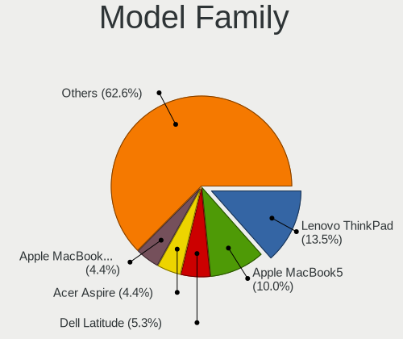
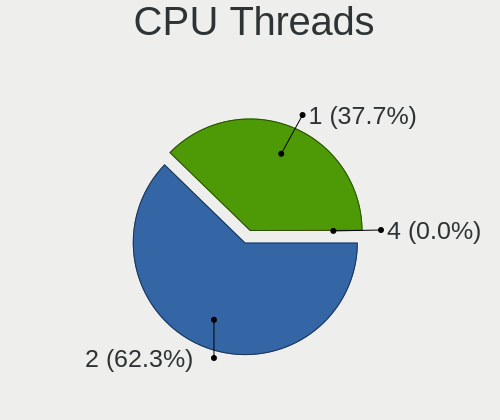
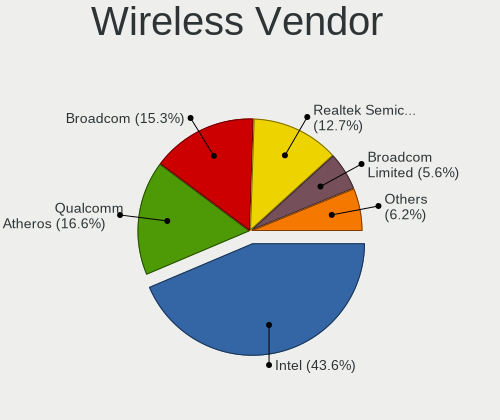
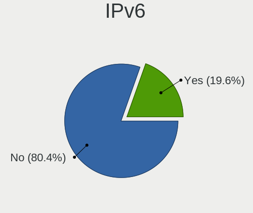
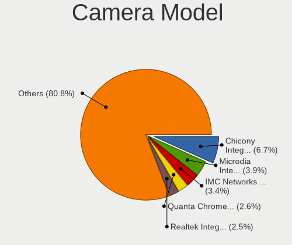

Debian 11 - Tested Hardware & Statistics (Notebooks)
----------------------------------------------------

A project to collect tested hardware configurations for Debian 11.

Anyone can contribute to this report by the [hw-probe](https://github.com/linuxhw/hw-probe) tool:

    sudo -E hw-probe -all -upload

Please contribute! Especially if your hardware is rare.

Contents
--------

* [ Test Cases ](#test-cases)

* [ System ](#system)
  - [ Kernel                   ](#kernel)
  - [ Kernel Family            ](#kernel-family)
  - [ Kernel Major Ver.        ](#kernel-major-ver)
  - [ Arch                     ](#arch)
  - [ DE                       ](#de)
  - [ Display Server           ](#display-server)
  - [ Display Manager          ](#display-manager)
  - [ OS Lang                  ](#os-lang)
  - [ Boot Mode                ](#boot-mode)
  - [ Filesystem               ](#filesystem)
  - [ Part. scheme             ](#part-scheme)
  - [ Dual Boot with Linux/BSD ](#dual-boot-with-linuxbsd)
  - [ Dual Boot (Win)          ](#dual-boot-win)

* [ Board ](#board)
  - [ Vendor                   ](#vendor)
  - [ Model                    ](#model)
  - [ Model Family             ](#model-family)
  - [ MFG Year                 ](#mfg-year)
  - [ Form Factor              ](#form-factor)
  - [ Secure Boot              ](#secure-boot)
  - [ Coreboot                 ](#coreboot)
  - [ RAM Size                 ](#ram-size)
  - [ RAM Used                 ](#ram-used)
  - [ Total Drives             ](#total-drives)
  - [ Has CD-ROM               ](#has-cd-rom)
  - [ Has Ethernet             ](#has-ethernet)
  - [ Has WiFi                 ](#has-wifi)
  - [ Has Bluetooth            ](#has-bluetooth)

* [ Location ](#location)
  - [ Country                  ](#country)
  - [ City                     ](#city)

* [ Drives ](#drives)
  - [ Drive Vendor             ](#drive-vendor)
  - [ Drive Model              ](#drive-model)
  - [ HDD Vendor               ](#hdd-vendor)
  - [ SSD Vendor               ](#ssd-vendor)
  - [ Drive Kind               ](#drive-kind)
  - [ Drive Connector          ](#drive-connector)
  - [ Drive Size               ](#drive-size)
  - [ Space Total              ](#space-total)
  - [ Space Used               ](#space-used)
  - [ Malfunc. Drives          ](#malfunc-drives)
  - [ Malfunc. Drive Vendor    ](#malfunc-drive-vendor)
  - [ Malfunc. HDD Vendor      ](#malfunc-hdd-vendor)
  - [ Malfunc. Drive Kind      ](#malfunc-drive-kind)
  - [ Failed Drives            ](#failed-drives)
  - [ Failed Drive Vendor      ](#failed-drive-vendor)
  - [ Drive Status             ](#drive-status)

* [ Storage controller ](#storage-controller)
  - [ Storage Vendor           ](#storage-vendor)
  - [ Storage Model            ](#storage-model)
  - [ Storage Kind             ](#storage-kind)

* [ Processor ](#processor)
  - [ CPU Vendor               ](#cpu-vendor)
  - [ CPU Model                ](#cpu-model)
  - [ CPU Model Family         ](#cpu-model-family)
  - [ CPU Cores                ](#cpu-cores)
  - [ CPU Sockets              ](#cpu-sockets)
  - [ CPU Threads              ](#cpu-threads)
  - [ CPU Op-Modes             ](#cpu-op-modes)
  - [ CPU Microcode            ](#cpu-microcode)
  - [ CPU Microarch            ](#cpu-microarch)

* [ Graphics ](#graphics)
  - [ GPU Vendor               ](#gpu-vendor)
  - [ GPU Model                ](#gpu-model)
  - [ GPU Combo                ](#gpu-combo)
  - [ GPU Driver               ](#gpu-driver)
  - [ GPU Memory               ](#gpu-memory)

* [ Monitor ](#monitor)
  - [ Monitor Vendor           ](#monitor-vendor)
  - [ Monitor Model            ](#monitor-model)
  - [ Monitor Resolution       ](#monitor-resolution)
  - [ Monitor Diagonal         ](#monitor-diagonal)
  - [ Monitor Width            ](#monitor-width)
  - [ Aspect Ratio             ](#aspect-ratio)
  - [ Monitor Area             ](#monitor-area)
  - [ Pixel Density            ](#pixel-density)
  - [ Multiple Monitors        ](#multiple-monitors)

* [ Network ](#network)
  - [ Net Controller Vendor    ](#net-controller-vendor)
  - [ Net Controller Model     ](#net-controller-model)
  - [ Wireless Vendor          ](#wireless-vendor)
  - [ Wireless Model           ](#wireless-model)
  - [ Ethernet Vendor          ](#ethernet-vendor)
  - [ Ethernet Model           ](#ethernet-model)
  - [ Net Controller Kind      ](#net-controller-kind)
  - [ Used Controller          ](#used-controller)
  - [ NICs                     ](#nics)
  - [ IPv6                     ](#ipv6)

* [ Bluetooth ](#bluetooth)
  - [ Bluetooth Vendor         ](#bluetooth-vendor)
  - [ Bluetooth Model          ](#bluetooth-model)

* [ Sound ](#sound)
  - [ Sound Vendor             ](#sound-vendor)
  - [ Sound Model              ](#sound-model)

* [ Memory ](#memory)
  - [ Memory Vendor            ](#memory-vendor)
  - [ Memory Model             ](#memory-model)
  - [ Memory Kind              ](#memory-kind)
  - [ Memory Form Factor       ](#memory-form-factor)
  - [ Memory Size              ](#memory-size)
  - [ Memory Speed             ](#memory-speed)

* [ Printers & scanners ](#printers--scanners)
  - [ Printer Vendor           ](#printer-vendor)
  - [ Printer Model            ](#printer-model)
  - [ Scanner Vendor           ](#scanner-vendor)
  - [ Scanner Model            ](#scanner-model)

* [ Camera ](#camera)
  - [ Camera Vendor            ](#camera-vendor)
  - [ Camera Model             ](#camera-model)

* [ Security ](#security)
  - [ Fingerprint Vendor       ](#fingerprint-vendor)
  - [ Fingerprint Model        ](#fingerprint-model)
  - [ Chipcard Vendor          ](#chipcard-vendor)
  - [ Chipcard Model           ](#chipcard-model)

* [ Unsupported ](#unsupported)
  - [ Unsupported Devices      ](#unsupported-devices)
  - [ Unsupported Device Types ](#unsupported-device-types)

Test Cases
----------

Total: 3776

| Vendor        | Model                       | Probe                                                      | Date         |
|---------------|-----------------------------|------------------------------------------------------------|--------------|
| Apple         | MacBookAir7,2               | [352c998936](https://linux-hardware.org/?probe=352c998936) | Feb 01, 2023 |
| Toshiba       | Satellite P775              | [c03f7668ac](https://linux-hardware.org/?probe=c03f7668ac) | Feb 01, 2023 |
| HP            | Compaq nx9420 (ES444ET#A... | [ac78478b3b](https://linux-hardware.org/?probe=ac78478b3b) | Feb 01, 2023 |
| HP            | Notebook                    | [3cea0a0519](https://linux-hardware.org/?probe=3cea0a0519) | Jan 31, 2023 |
| Fujitsu       | LIFEBOOK S751               | [35948f3b5e](https://linux-hardware.org/?probe=35948f3b5e) | Jan 31, 2023 |
| HP            | Stream Laptop 14-cb1XX      | [3f17be7a85](https://linux-hardware.org/?probe=3f17be7a85) | Jan 30, 2023 |
| MSI           | GE60 0NC/GE60 0ND           | [a7ef98ea02](https://linux-hardware.org/?probe=a7ef98ea02) | Jan 30, 2023 |
| Acer          | Aspire 5552                 | [f1168775a7](https://linux-hardware.org/?probe=f1168775a7) | Jan 30, 2023 |
| Sony          | PCG-Z1VA(UC)                | [db4f48132e](https://linux-hardware.org/?probe=db4f48132e) | Jan 29, 2023 |
| HUAWEI        | NBLK-WAX9X                  | [933e5a5b96](https://linux-hardware.org/?probe=933e5a5b96) | Jan 29, 2023 |
| Lenovo        | S21e-20 80M4                | [7017fcf775](https://linux-hardware.org/?probe=7017fcf775) | Jan 29, 2023 |
| Lenovo        | S21e-20 80M4                | [9afa780018](https://linux-hardware.org/?probe=9afa780018) | Jan 29, 2023 |
| Lenovo        | ThinkPad X220 42915CG       | [d058eeaad5](https://linux-hardware.org/?probe=d058eeaad5) | Jan 29, 2023 |
| HP            | ZBook 17 G3                 | [a1b5cdf1db](https://linux-hardware.org/?probe=a1b5cdf1db) | Jan 28, 2023 |
| HUAWEI        | NBLK-WAX9X                  | [a88e343a83](https://linux-hardware.org/?probe=a88e343a83) | Jan 28, 2023 |
| ASUSTek       | UX410UAR                    | [e9ac16c8ef](https://linux-hardware.org/?probe=e9ac16c8ef) | Jan 28, 2023 |
| Dell          | Inspiron 3581               | [8c8db10ac2](https://linux-hardware.org/?probe=8c8db10ac2) | Jan 28, 2023 |
| HP            | ProBook 430 G6              | [24fd7df5b6](https://linux-hardware.org/?probe=24fd7df5b6) | Jan 28, 2023 |
| HP            | EliteBook 640 14 inch G9... | [bbdf827cef](https://linux-hardware.org/?probe=bbdf827cef) | Jan 27, 2023 |
| Acer          | Aspire 7750G                | [0b05244a15](https://linux-hardware.org/?probe=0b05244a15) | Jan 27, 2023 |
| Dell          | Latitude E7440              | [9ba078f6ab](https://linux-hardware.org/?probe=9ba078f6ab) | Jan 27, 2023 |
| Dell          | Latitude E5430 non-vPro     | [c83903fdc8](https://linux-hardware.org/?probe=c83903fdc8) | Jan 27, 2023 |
| Lenovo        | B570e HuronRiver Platfor... | [376c580dcb](https://linux-hardware.org/?probe=376c580dcb) | Jan 27, 2023 |
| Lenovo        | ThinkPad E560 20EVCTO1WW    | [d3adeb692c](https://linux-hardware.org/?probe=d3adeb692c) | Jan 27, 2023 |
| Lenovo        | ThinkPad E560 20EVCTO1WW    | [46b1227255](https://linux-hardware.org/?probe=46b1227255) | Jan 27, 2023 |
| MSI           | Creator 17 B11UE            | [fcf56cfe4d](https://linux-hardware.org/?probe=fcf56cfe4d) | Jan 27, 2023 |
| Dell          | Latitude 5420               | [379a2dc9ab](https://linux-hardware.org/?probe=379a2dc9ab) | Jan 26, 2023 |
| Dell          | Latitude 5420               | [eec8ef8ddb](https://linux-hardware.org/?probe=eec8ef8ddb) | Jan 26, 2023 |
| Google        | Careena                     | [75ca1a25dd](https://linux-hardware.org/?probe=75ca1a25dd) | Jan 26, 2023 |
| Apple         | MacBookPro10,1              | [4643f751cf](https://linux-hardware.org/?probe=4643f751cf) | Jan 25, 2023 |
| Dell          | Latitude E5430 non-vPro     | [3b96eac8a9](https://linux-hardware.org/?probe=3b96eac8a9) | Jan 25, 2023 |
| Panasonic     | FZ55-2                      | [dd9ddb12b6](https://linux-hardware.org/?probe=dd9ddb12b6) | Jan 25, 2023 |
| Lenovo        | ThinkPad X220 4291IR6       | [cc41fa5174](https://linux-hardware.org/?probe=cc41fa5174) | Jan 25, 2023 |
| Samsung       | R710                        | [17a3e2ddd9](https://linux-hardware.org/?probe=17a3e2ddd9) | Jan 25, 2023 |
| HP            | ZBook 15 G3                 | [0bde1ca99a](https://linux-hardware.org/?probe=0bde1ca99a) | Jan 24, 2023 |
| Packard Be... | EasyNote MH36               | [07ba548a55](https://linux-hardware.org/?probe=07ba548a55) | Jan 24, 2023 |
| Lenovo        | ThinkPad E15 Gen 3 20YHS... | [fd6d2ec3c2](https://linux-hardware.org/?probe=fd6d2ec3c2) | Jan 23, 2023 |
| Samsung       | 300E4A/300E5A/300E7A        | [c8ec385a88](https://linux-hardware.org/?probe=c8ec385a88) | Jan 23, 2023 |
| Samsung       | 300E4C/300E5C/300E7C        | [5648fbf4a0](https://linux-hardware.org/?probe=5648fbf4a0) | Jan 23, 2023 |
| ASUSTek       | VivoBook_ASUSLaptop X415... | [62ac206f7e](https://linux-hardware.org/?probe=62ac206f7e) | Jan 23, 2023 |
| ASUSTek       | VivoBook_ASUSLaptop E510... | [5c7625e3f8](https://linux-hardware.org/?probe=5c7625e3f8) | Jan 23, 2023 |
| Fujitsu       | LIFEBOOK S751               | [ff727a3560](https://linux-hardware.org/?probe=ff727a3560) | Jan 22, 2023 |
| Fujitsu       | LIFEBOOK S751               | [df0676ac87](https://linux-hardware.org/?probe=df0676ac87) | Jan 22, 2023 |
| Dell          | G3 3579                     | [63298dcee9](https://linux-hardware.org/?probe=63298dcee9) | Jan 22, 2023 |
| Danew         | Dbook 131                   | [08911c133e](https://linux-hardware.org/?probe=08911c133e) | Jan 22, 2023 |
| Clevo         | W150ER                      | [ba5d06437c](https://linux-hardware.org/?probe=ba5d06437c) | Jan 21, 2023 |
| Google        | Phaser                      | [557e69c5f1](https://linux-hardware.org/?probe=557e69c5f1) | Jan 21, 2023 |
| HP            | EliteBook Folio 9480m       | [cf1b67c224](https://linux-hardware.org/?probe=cf1b67c224) | Jan 21, 2023 |
| HP            | EliteBook 840 G3            | [06f6499264](https://linux-hardware.org/?probe=06f6499264) | Jan 21, 2023 |
| Dell          | Latitude 5501               | [d31f972a20](https://linux-hardware.org/?probe=d31f972a20) | Jan 20, 2023 |
| Lenovo        | G505 20240                  | [c591d80181](https://linux-hardware.org/?probe=c591d80181) | Jan 20, 2023 |
| UMAX          | VisionBook 12Wr             | [0707d617f7](https://linux-hardware.org/?probe=0707d617f7) | Jan 20, 2023 |
| Lenovo        | ThinkPad T490s 20NYS3SX0... | [3e08ab25c6](https://linux-hardware.org/?probe=3e08ab25c6) | Jan 20, 2023 |
| ASUSTek       | VivoBook_ASUSLaptop E410... | [80cb1c8239](https://linux-hardware.org/?probe=80cb1c8239) | Jan 19, 2023 |
| Lenovo        | ThinkPad E470 20H1004SMX    | [0d8528f0d2](https://linux-hardware.org/?probe=0d8528f0d2) | Jan 19, 2023 |
| ASUSTek       | VivoBook_ASUSLaptop X512... | [0efa802a32](https://linux-hardware.org/?probe=0efa802a32) | Jan 19, 2023 |
| Dell          | XPS 15 9500                 | [606ba17221](https://linux-hardware.org/?probe=606ba17221) | Jan 19, 2023 |
| Insyde        | Braswell                    | [18526fdbe2](https://linux-hardware.org/?probe=18526fdbe2) | Jan 19, 2023 |
| Lenovo        | IdeaPad 320-15ABR 80XS      | [20749dc72f](https://linux-hardware.org/?probe=20749dc72f) | Jan 19, 2023 |
| HP            | Pavilion Laptop 14-dv1xx... | [db998abdae](https://linux-hardware.org/?probe=db998abdae) | Jan 19, 2023 |
| Lenovo        | IdeaPad 5 14IIL05 81YH      | [368ed9c856](https://linux-hardware.org/?probe=368ed9c856) | Jan 18, 2023 |
| Novatech      | NL40_50CU                   | [395dab7c43](https://linux-hardware.org/?probe=395dab7c43) | Jan 18, 2023 |
| HP            | Compaq 6910p                | [61d820a040](https://linux-hardware.org/?probe=61d820a040) | Jan 18, 2023 |
| Lenovo        | Legion Y540-15IRH 81SX      | [7b62e27d7a](https://linux-hardware.org/?probe=7b62e27d7a) | Jan 18, 2023 |
| Lenovo        | ThinkPad T15 Gen 2i 20W5... | [393e6cd6d2](https://linux-hardware.org/?probe=393e6cd6d2) | Jan 18, 2023 |
| HP            | EliteBook 820 G4            | [430b938694](https://linux-hardware.org/?probe=430b938694) | Jan 18, 2023 |
| HP            | EliteBook 2170p             | [46705d578e](https://linux-hardware.org/?probe=46705d578e) | Jan 18, 2023 |
| HP            | EliteBook 840 G4            | [952c81c314](https://linux-hardware.org/?probe=952c81c314) | Jan 18, 2023 |
| Dell          | Latitude 5500               | [e0ae9cb026](https://linux-hardware.org/?probe=e0ae9cb026) | Jan 17, 2023 |
| Lenovo        | ThinkPad X61 Tablet 7767... | [99e10e5d0f](https://linux-hardware.org/?probe=99e10e5d0f) | Jan 17, 2023 |
| Lenovo        | ThinkPad X61 Tablet 7767... | [624f47d1e3](https://linux-hardware.org/?probe=624f47d1e3) | Jan 17, 2023 |
| HP            | Compaq 6730b (GW687AV)      | [e967b291d5](https://linux-hardware.org/?probe=e967b291d5) | Jan 17, 2023 |
| Dell          | Inspiron 5502               | [43c4f532aa](https://linux-hardware.org/?probe=43c4f532aa) | Jan 17, 2023 |
| Positivo      | CHT14B                      | [ab4518f121](https://linux-hardware.org/?probe=ab4518f121) | Jan 16, 2023 |
| Dell          | Inspiron 15-3567            | [020e19b05d](https://linux-hardware.org/?probe=020e19b05d) | Jan 16, 2023 |
| Lenovo        | ThinkPad T490s 20NX0076M... | [4c896e2c0e](https://linux-hardware.org/?probe=4c896e2c0e) | Jan 16, 2023 |
| Dell          | Inspiron 5502               | [9403074843](https://linux-hardware.org/?probe=9403074843) | Jan 16, 2023 |
| HP            | OMEN by Laptop 16-b0xxx     | [47d090108d](https://linux-hardware.org/?probe=47d090108d) | Jan 16, 2023 |
| HP            | OMEN by Laptop 16-b0xxx     | [219091b4e0](https://linux-hardware.org/?probe=219091b4e0) | Jan 15, 2023 |
| Apple         | MacBookAir5,1               | [f316bddcf2](https://linux-hardware.org/?probe=f316bddcf2) | Jan 15, 2023 |
| Acer          | Swift SF314-510G            | [b929f53536](https://linux-hardware.org/?probe=b929f53536) | Jan 15, 2023 |
| Dell          | Inspiron 15-3567            | [5426686264](https://linux-hardware.org/?probe=5426686264) | Jan 15, 2023 |
| ASUSTek       | ASUS TUF Gaming F17 FX70... | [0ec206a07d](https://linux-hardware.org/?probe=0ec206a07d) | Jan 15, 2023 |
| HP            | EliteBook 8570w             | [53eb92efda](https://linux-hardware.org/?probe=53eb92efda) | Jan 15, 2023 |
| Lenovo        | ThinkPad T470 20HES0MV00    | [7e3b019181](https://linux-hardware.org/?probe=7e3b019181) | Jan 14, 2023 |
| HP            | Pavilion g6                 | [7d44980bca](https://linux-hardware.org/?probe=7d44980bca) | Jan 14, 2023 |
| Lenovo        | ThinkPad W520 4284W2U       | [576a509224](https://linux-hardware.org/?probe=576a509224) | Jan 14, 2023 |
| HP            | Laptop 14s-dk0xxx           | [6efb68b8da](https://linux-hardware.org/?probe=6efb68b8da) | Jan 14, 2023 |
| Lenovo        | IdeaPad 110S-11IBR 80WG     | [0899d995dd](https://linux-hardware.org/?probe=0899d995dd) | Jan 14, 2023 |
| Samsung       | 300E4C/300E5C/300E7C        | [f862a7e702](https://linux-hardware.org/?probe=f862a7e702) | Jan 14, 2023 |
| HP            | Pavilion g6                 | [7672e1178a](https://linux-hardware.org/?probe=7672e1178a) | Jan 14, 2023 |
| Unknown       | Unknown                     | [ce69bfd81b](https://linux-hardware.org/?probe=ce69bfd81b) | Jan 13, 2023 |
| HP            | ProBook 445 G7              | [baf20b6914](https://linux-hardware.org/?probe=baf20b6914) | Jan 13, 2023 |
| ASUSTek       | X450LD                      | [859eb05149](https://linux-hardware.org/?probe=859eb05149) | Jan 13, 2023 |
| HP            | Compaq 6735b                | [01878ee027](https://linux-hardware.org/?probe=01878ee027) | Jan 12, 2023 |
| Dell          | Inspiron 3521               | [694d5be301](https://linux-hardware.org/?probe=694d5be301) | Jan 12, 2023 |
| Lenovo        | ThinkPad T460 20FMA0APAR    | [d4691b9969](https://linux-hardware.org/?probe=d4691b9969) | Jan 12, 2023 |
| Lenovo        | IdeaPad Z570 HuronRiver ... | [2316d5dc8b](https://linux-hardware.org/?probe=2316d5dc8b) | Jan 12, 2023 |
| Lenovo        | ThinkPad T470p 20J7S1JT0... | [856d91c1ca](https://linux-hardware.org/?probe=856d91c1ca) | Jan 12, 2023 |
| Dell          | Precision M4400             | [27da7825fb](https://linux-hardware.org/?probe=27da7825fb) | Jan 12, 2023 |
| Dell          | Inspiron 3421               | [055d61383e](https://linux-hardware.org/?probe=055d61383e) | Jan 12, 2023 |
| Acer          | Swift SF314-56              | [46aebbe972](https://linux-hardware.org/?probe=46aebbe972) | Jan 11, 2023 |
| SLIMBOOK      | PRO                         | [551a4bd378](https://linux-hardware.org/?probe=551a4bd378) | Jan 11, 2023 |
| SmbiosType... | SmbiosType1_SystemProduc... | [6c67fc3995](https://linux-hardware.org/?probe=6c67fc3995) | Jan 11, 2023 |
| Aquarius      | NS585                       | [6fbcdf4d2f](https://linux-hardware.org/?probe=6fbcdf4d2f) | Jan 10, 2023 |
| HP            | Mini 110-1000               | [05c4656700](https://linux-hardware.org/?probe=05c4656700) | Jan 10, 2023 |
| SmbiosType... | SmbiosType1_SystemProduc... | [8367c27d81](https://linux-hardware.org/?probe=8367c27d81) | Jan 10, 2023 |
| HP            | 15                          | [f6b287dae1](https://linux-hardware.org/?probe=f6b287dae1) | Jan 10, 2023 |
| Acer          | Nitro AN517-54              | [8ea20821c8](https://linux-hardware.org/?probe=8ea20821c8) | Jan 10, 2023 |
| HP            | Compaq nx9420 (ES444ET#A... | [8d0b4a504d](https://linux-hardware.org/?probe=8d0b4a504d) | Jan 09, 2023 |
| Acer          | Aspire A515-54G             | [dea6736468](https://linux-hardware.org/?probe=dea6736468) | Jan 09, 2023 |
| Acer          | Aspire one 1-131            | [06c3411258](https://linux-hardware.org/?probe=06c3411258) | Jan 08, 2023 |
| HP            | ZBook 15 G3                 | [648dcae4c6](https://linux-hardware.org/?probe=648dcae4c6) | Jan 08, 2023 |
| ASUSTek       | K53U                        | [63849b1b5a](https://linux-hardware.org/?probe=63849b1b5a) | Jan 08, 2023 |
| Apple         | MacBookAir7,2               | [a4e777ea7d](https://linux-hardware.org/?probe=a4e777ea7d) | Jan 08, 2023 |
| Acer          | Aspire 7745G                | [9119962d1f](https://linux-hardware.org/?probe=9119962d1f) | Jan 07, 2023 |
| Gigabyte      | G5 GE                       | [d6a4584809](https://linux-hardware.org/?probe=d6a4584809) | Jan 07, 2023 |
| Dell          | Latitude 2110               | [9910f8985b](https://linux-hardware.org/?probe=9910f8985b) | Jan 07, 2023 |
| Lenovo        | IdeaPad 130-15IKB 81H7      | [9776545fc4](https://linux-hardware.org/?probe=9776545fc4) | Jan 06, 2023 |
| Toshiba       | Satellite C55Dt-A           | [f3cfb5dbb5](https://linux-hardware.org/?probe=f3cfb5dbb5) | Jan 06, 2023 |
| Lenovo        | IdeaPad 320-15IKB 80YE      | [9b0a8d487e](https://linux-hardware.org/?probe=9b0a8d487e) | Jan 06, 2023 |
| &#er &&       | Aspire 5100                 | [26da9e8ee1](https://linux-hardware.org/?probe=26da9e8ee1) | Jan 06, 2023 |
| Google        | Stout                       | [5ef816b9a6](https://linux-hardware.org/?probe=5ef816b9a6) | Jan 05, 2023 |
| Samsung       | 300E4C/300E5C/300E7C        | [3245d27cb7](https://linux-hardware.org/?probe=3245d27cb7) | Jan 05, 2023 |
| HP            | EliteBook 840 Aero G8 No... | [b9f4ca82d2](https://linux-hardware.org/?probe=b9f4ca82d2) | Jan 05, 2023 |
| Acer          | Extensa 2540                | [4442f2c14a](https://linux-hardware.org/?probe=4442f2c14a) | Jan 05, 2023 |
| Acer          | Extensa 2540                | [ec8b49d7b0](https://linux-hardware.org/?probe=ec8b49d7b0) | Jan 04, 2023 |
| Dell          | Inspiron 15-3567            | [0042419ccb](https://linux-hardware.org/?probe=0042419ccb) | Jan 04, 2023 |
| Dell          | Inspiron 15-3567            | [82e42c0d42](https://linux-hardware.org/?probe=82e42c0d42) | Jan 04, 2023 |
| Lenovo        | ThinkPad T430s 2356BQ5      | [fdf6545b20](https://linux-hardware.org/?probe=fdf6545b20) | Jan 04, 2023 |
| HP            | 255 G8 Notebook PC          | [b876c5797a](https://linux-hardware.org/?probe=b876c5797a) | Jan 03, 2023 |
| Dell          | Inspiron 5566               | [258412ac0a](https://linux-hardware.org/?probe=258412ac0a) | Jan 03, 2023 |
| ASUSTek       | F5SL                        | [67882c0f69](https://linux-hardware.org/?probe=67882c0f69) | Jan 02, 2023 |
| ASUSTek       | F5SL                        | [42ef1fbf40](https://linux-hardware.org/?probe=42ef1fbf40) | Jan 02, 2023 |
| Acer          | Aspire ES1-711              | [735e062168](https://linux-hardware.org/?probe=735e062168) | Jan 02, 2023 |
| HP            | EliteBook 840 G8 Noteboo... | [90603e4ab3](https://linux-hardware.org/?probe=90603e4ab3) | Jan 02, 2023 |
| MSI           | GE75 Raider 8SG             | [b6fa9be350](https://linux-hardware.org/?probe=b6fa9be350) | Jan 02, 2023 |
| ASUSTek       | ASUS TUF Gaming F17 FX70... | [b54f3aab7b](https://linux-hardware.org/?probe=b54f3aab7b) | Jan 02, 2023 |
| Lenovo        | ThinkPad T480 20L6S29E0D    | [a1f966e5e8](https://linux-hardware.org/?probe=a1f966e5e8) | Jan 02, 2023 |
| Lenovo        | IdeaPad 100-15IBD 80QQ      | [08fb8de608](https://linux-hardware.org/?probe=08fb8de608) | Jan 02, 2023 |
| Lenovo        | ThinkPad T430u 33519LC      | [87af3fa7f0](https://linux-hardware.org/?probe=87af3fa7f0) | Jan 02, 2023 |
| ASUSTek       | T100TA                      | [2c33e446d4](https://linux-hardware.org/?probe=2c33e446d4) | Jan 02, 2023 |
| Lenovo        | ThinkPad X260 20F5005NAU    | [3f68b8438c](https://linux-hardware.org/?probe=3f68b8438c) | Jan 02, 2023 |
| Lenovo        | IdeaPad 100-15IBD 80QQ      | [bca75efbe5](https://linux-hardware.org/?probe=bca75efbe5) | Jan 02, 2023 |
| HP            | Stream Laptop 14-cb1xxx     | [2396307897](https://linux-hardware.org/?probe=2396307897) | Jan 02, 2023 |
| ASUSTek       | ROG Strix G513RM_G513RM     | [13df46e700](https://linux-hardware.org/?probe=13df46e700) | Jan 02, 2023 |
| ASUSTek       | TUF Gaming FX505DT_TUF50... | [f9db70d551](https://linux-hardware.org/?probe=f9db70d551) | Jan 01, 2023 |
| Lenovo        | G565 20071                  | [e974b446ae](https://linux-hardware.org/?probe=e974b446ae) | Jan 01, 2023 |
| Panasonic     | CF-54-2                     | [dfe3d2e06b](https://linux-hardware.org/?probe=dfe3d2e06b) | Jan 01, 2023 |
| Lenovo        | IdeaPad 3 15ITL6 82H8       | [7474151c7e](https://linux-hardware.org/?probe=7474151c7e) | Jan 01, 2023 |
| Dell          | Inspiron 5566               | [9eadf42d31](https://linux-hardware.org/?probe=9eadf42d31) | Jan 01, 2023 |
| ASUSTek       | ZenBook UX425UAZ_UM425UA... | [8d33275e7b](https://linux-hardware.org/?probe=8d33275e7b) | Dec 31, 2022 |
| ASUSTek       | VivoBook_ASUSLaptop X509... | [fb22f9430c](https://linux-hardware.org/?probe=fb22f9430c) | Dec 31, 2022 |
| Lenovo        | IdeaPad Y560                | [c9d3a1d0a3](https://linux-hardware.org/?probe=c9d3a1d0a3) | Dec 31, 2022 |
| Acer          | Aspire A514-54              | [5775c77a91](https://linux-hardware.org/?probe=5775c77a91) | Dec 31, 2022 |
| HP            | Compaq 6710b (KE207ES#AB... | [d7d0be3872](https://linux-hardware.org/?probe=d7d0be3872) | Dec 30, 2022 |
| Dell          | Inspiron 5490               | [c8a80649d2](https://linux-hardware.org/?probe=c8a80649d2) | Dec 30, 2022 |
| HP            | 255 G3                      | [89d6bd459c](https://linux-hardware.org/?probe=89d6bd459c) | Dec 30, 2022 |
| Lenovo        | ThinkPad T470p 20J7S1JT0... | [4b7bbb186f](https://linux-hardware.org/?probe=4b7bbb186f) | Dec 29, 2022 |
| Lenovo        | ThinkPad E14 Gen 3 20Y7S... | [5bf3ff5c0e](https://linux-hardware.org/?probe=5bf3ff5c0e) | Dec 29, 2022 |
| Lenovo        | ThinkPad E14 Gen 3 20Y7S... | [4f63c4474c](https://linux-hardware.org/?probe=4f63c4474c) | Dec 29, 2022 |
| HP            | EliteBook Folio 1040 G3     | [6aad572cd5](https://linux-hardware.org/?probe=6aad572cd5) | Dec 29, 2022 |
| HP            | ZBook 15 G6                 | [af1655497e](https://linux-hardware.org/?probe=af1655497e) | Dec 29, 2022 |
| HP            | ProBook 6570b               | [46fd918b7c](https://linux-hardware.org/?probe=46fd918b7c) | Dec 29, 2022 |
| Dell          | Inspiron 5490               | [457c2ae4ae](https://linux-hardware.org/?probe=457c2ae4ae) | Dec 28, 2022 |
| Dell          | Inspiron 5490               | [fdfd0f21c7](https://linux-hardware.org/?probe=fdfd0f21c7) | Dec 28, 2022 |
| Toshiba       | Satellite L455D             | [35c085aa82](https://linux-hardware.org/?probe=35c085aa82) | Dec 28, 2022 |
| Dell          | Vostro 3400                 | [27f58a8ad1](https://linux-hardware.org/?probe=27f58a8ad1) | Dec 28, 2022 |
| Acer          | Aspire ES1-531              | [c29088a63f](https://linux-hardware.org/?probe=c29088a63f) | Dec 28, 2022 |
| HP            | ProBook 6470b               | [055705b3f2](https://linux-hardware.org/?probe=055705b3f2) | Dec 28, 2022 |
| Apple         | MacBookAir7,2               | [10dce91da1](https://linux-hardware.org/?probe=10dce91da1) | Dec 27, 2022 |
| Apple         | MacBookAir7,1               | [d174ffb318](https://linux-hardware.org/?probe=d174ffb318) | Dec 27, 2022 |
| MSI           | GE62 2QC                    | [dbd69d70ac](https://linux-hardware.org/?probe=dbd69d70ac) | Dec 27, 2022 |
| Panasonic     | FZ55-2                      | [1699b7c3b2](https://linux-hardware.org/?probe=1699b7c3b2) | Dec 27, 2022 |
| ASUSTek       | VivoBook_ASUS Laptop E40... | [78c6c15502](https://linux-hardware.org/?probe=78c6c15502) | Dec 27, 2022 |
| Notebook      | L14xMU                      | [7644bc65e2](https://linux-hardware.org/?probe=7644bc65e2) | Dec 27, 2022 |
| Dell          | Inspiron 1012               | [3dd6b8a416](https://linux-hardware.org/?probe=3dd6b8a416) | Dec 26, 2022 |
| Exo           | Smart Serie M               | [942ee3b035](https://linux-hardware.org/?probe=942ee3b035) | Dec 26, 2022 |
| Lenovo        | ThinkPad E560 20EV002FUS    | [3bb1c5cc47](https://linux-hardware.org/?probe=3bb1c5cc47) | Dec 26, 2022 |
| Acer          | Aspire ES1-533              | [3b5fa6d85a](https://linux-hardware.org/?probe=3b5fa6d85a) | Dec 26, 2022 |
| Lenovo        | ThinkPad X250 20CLS1UB00    | [fc8b2899fa](https://linux-hardware.org/?probe=fc8b2899fa) | Dec 25, 2022 |
| SANTECH       | NHx0DB,DE                   | [a0996d42bd](https://linux-hardware.org/?probe=a0996d42bd) | Dec 25, 2022 |
| HP            | 470 G8 Notebook PC          | [6d77c48324](https://linux-hardware.org/?probe=6d77c48324) | Dec 25, 2022 |
| ASUSTek       | G751JT                      | [16e989ff99](https://linux-hardware.org/?probe=16e989ff99) | Dec 25, 2022 |
| Dell          | Latitude E6520              | [33a51c934d](https://linux-hardware.org/?probe=33a51c934d) | Dec 25, 2022 |
| Dell          | Inspiron 5490               | [ea09a6daa8](https://linux-hardware.org/?probe=ea09a6daa8) | Dec 25, 2022 |
| Dell          | Inspiron 5490               | [45737153e4](https://linux-hardware.org/?probe=45737153e4) | Dec 25, 2022 |
| HP            | Laptop 15-bw0xx             | [42221f61fb](https://linux-hardware.org/?probe=42221f61fb) | Dec 25, 2022 |
| Medion        | E122X                       | [6e4e34bcc3](https://linux-hardware.org/?probe=6e4e34bcc3) | Dec 24, 2022 |
| Medion        | E122X                       | [bf41c45a7d](https://linux-hardware.org/?probe=bf41c45a7d) | Dec 24, 2022 |
| Lenovo        | ThinkBook 15 G3 ACL 21A4    | [096d4fc8c2](https://linux-hardware.org/?probe=096d4fc8c2) | Dec 24, 2022 |
| Lenovo        | ThinkPad X1 Carbon 7th 2... | [c5f2f2db53](https://linux-hardware.org/?probe=c5f2f2db53) | Dec 24, 2022 |
| Lenovo        | ThinkPad X270 20HMS16200    | [6ac6e552a8](https://linux-hardware.org/?probe=6ac6e552a8) | Dec 24, 2022 |
| Dell          | Inspiron 5570               | [1c7e7f8dd2](https://linux-hardware.org/?probe=1c7e7f8dd2) | Dec 24, 2022 |
| Dell          | Latitude E7440              | [baae52327d](https://linux-hardware.org/?probe=baae52327d) | Dec 23, 2022 |
| Dell          | Latitude E7440              | [bc5d48b831](https://linux-hardware.org/?probe=bc5d48b831) | Dec 23, 2022 |
| Dell          | Latitude E7440              | [fde483d476](https://linux-hardware.org/?probe=fde483d476) | Dec 23, 2022 |
| Dell          | Latitude E7440              | [a746012ffd](https://linux-hardware.org/?probe=a746012ffd) | Dec 23, 2022 |
| Lenovo        | ThinkPad T16 Gen 1 21BWS... | [9e5c4705fa](https://linux-hardware.org/?probe=9e5c4705fa) | Dec 23, 2022 |
| Dell          | Latitude D630               | [8175d003ce](https://linux-hardware.org/?probe=8175d003ce) | Dec 23, 2022 |
| Google        | Reks                        | [ecee690e6e](https://linux-hardware.org/?probe=ecee690e6e) | Dec 23, 2022 |
| Toshiba       | Satellite L10W-B-101        | [54d5cca493](https://linux-hardware.org/?probe=54d5cca493) | Dec 23, 2022 |
| Google        | Reks                        | [58b1b4cac1](https://linux-hardware.org/?probe=58b1b4cac1) | Dec 23, 2022 |
| Dell          | Inspiron 3501               | [297651d437](https://linux-hardware.org/?probe=297651d437) | Dec 23, 2022 |
| Lenovo        | Legion 5 15ACH6A 82NW       | [79b015dcea](https://linux-hardware.org/?probe=79b015dcea) | Dec 23, 2022 |
| Dell          | Inspiron 3501               | [958ee9d145](https://linux-hardware.org/?probe=958ee9d145) | Dec 23, 2022 |
| Dell          | G3 3590                     | [d75d9e6663](https://linux-hardware.org/?probe=d75d9e6663) | Dec 23, 2022 |
| Lenovo        | ThinkPad X260 20F5005NAU    | [5f75bb423d](https://linux-hardware.org/?probe=5f75bb423d) | Dec 23, 2022 |
| Acer          | Aspire 4750                 | [3256c282db](https://linux-hardware.org/?probe=3256c282db) | Dec 23, 2022 |
| HP            | 255 G7 Notebook PC          | [5bedf1557b](https://linux-hardware.org/?probe=5bedf1557b) | Dec 23, 2022 |
| Dell          | Inspiron 5490               | [1c424b5f55](https://linux-hardware.org/?probe=1c424b5f55) | Dec 23, 2022 |
| Unknown       | Unknown                     | [f9c4fecaf4](https://linux-hardware.org/?probe=f9c4fecaf4) | Dec 23, 2022 |
| Unknown       | Unknown                     | [3832db2827](https://linux-hardware.org/?probe=3832db2827) | Dec 23, 2022 |
| Toshiba       | Satellite C55Dt-A           | [67294324c5](https://linux-hardware.org/?probe=67294324c5) | Dec 22, 2022 |
| Dell          | Latitude E7440              | [c6d28912f0](https://linux-hardware.org/?probe=c6d28912f0) | Dec 22, 2022 |
| Dell          | Latitude E7440              | [1a14f26bd3](https://linux-hardware.org/?probe=1a14f26bd3) | Dec 22, 2022 |
| Dell          | Latitude E7440              | [db77bb7a3f](https://linux-hardware.org/?probe=db77bb7a3f) | Dec 22, 2022 |
| Dell          | Latitude E7440              | [d2278ed94d](https://linux-hardware.org/?probe=d2278ed94d) | Dec 22, 2022 |
| Apple         | MacBookAir7,1               | [09ba8ccf48](https://linux-hardware.org/?probe=09ba8ccf48) | Dec 22, 2022 |
| Dell          | Latitude E7440              | [f4e79df709](https://linux-hardware.org/?probe=f4e79df709) | Dec 22, 2022 |
| Apple         | MacBookAir7,1               | [2c3febf6fa](https://linux-hardware.org/?probe=2c3febf6fa) | Dec 22, 2022 |
| Dell          | Latitude E7440              | [cddffa9123](https://linux-hardware.org/?probe=cddffa9123) | Dec 22, 2022 |
| Dell          | Latitude E7440              | [5f911806c8](https://linux-hardware.org/?probe=5f911806c8) | Dec 22, 2022 |
| Lenovo        | ThinkPad X260 20F5005NAU    | [844f589d20](https://linux-hardware.org/?probe=844f589d20) | Dec 22, 2022 |
| Dell          | Latitude D630               | [e1106d8868](https://linux-hardware.org/?probe=e1106d8868) | Dec 22, 2022 |
| HP            | Stream Notebook PC 13       | [b049c64ff7](https://linux-hardware.org/?probe=b049c64ff7) | Dec 22, 2022 |
| Lenovo        | ThinkPad T14 Gen 1 20S1S... | [5f132c928b](https://linux-hardware.org/?probe=5f132c928b) | Dec 22, 2022 |
| Dell          | G3 3590                     | [8038491eb0](https://linux-hardware.org/?probe=8038491eb0) | Dec 22, 2022 |
| Lenovo        | IdeaPad 5 15IAL7 82SF       | [16cae3015a](https://linux-hardware.org/?probe=16cae3015a) | Dec 21, 2022 |
| Apple         | MacBookAir7,2               | [b4e828bef3](https://linux-hardware.org/?probe=b4e828bef3) | Dec 21, 2022 |
| Dell          | Vostro 3583                 | [cf3c6eb18b](https://linux-hardware.org/?probe=cf3c6eb18b) | Dec 21, 2022 |
| Apple         | MacBookAir7,2               | [056d76bae8](https://linux-hardware.org/?probe=056d76bae8) | Dec 21, 2022 |
| Sony          | SVE1112M1EB                 | [74e100e63b](https://linux-hardware.org/?probe=74e100e63b) | Dec 21, 2022 |
| HP            | ZBook Power 15.6 inch G8... | [6b202d6cc2](https://linux-hardware.org/?probe=6b202d6cc2) | Dec 21, 2022 |
| Lenovo        | Legion 5 15ARH05 82B5       | [9438c80c85](https://linux-hardware.org/?probe=9438c80c85) | Dec 21, 2022 |
| Dell          | Inspiron 3501               | [449e38a14d](https://linux-hardware.org/?probe=449e38a14d) | Dec 21, 2022 |
| Dell          | G3 3590                     | [8272655600](https://linux-hardware.org/?probe=8272655600) | Dec 21, 2022 |
| Lenovo        | ThinkPad 13 2nd Gen 20J1... | [cd4fa20e66](https://linux-hardware.org/?probe=cd4fa20e66) | Dec 20, 2022 |
| Lenovo        | ThinkPad 13 2nd Gen 20J1... | [e676fe186f](https://linux-hardware.org/?probe=e676fe186f) | Dec 20, 2022 |
| HP            | OMEN Laptop 15-en1xxx       | [1e53c20bdd](https://linux-hardware.org/?probe=1e53c20bdd) | Dec 20, 2022 |
| ASUSTek       | T100TA                      | [1dc546e14a](https://linux-hardware.org/?probe=1dc546e14a) | Dec 20, 2022 |
| Lenovo        | ThinkPad T490 20N2CTO1WW    | [2aeb8fd0cd](https://linux-hardware.org/?probe=2aeb8fd0cd) | Dec 19, 2022 |
| ASUSTek       | 900SD                       | [43d2c88062](https://linux-hardware.org/?probe=43d2c88062) | Dec 18, 2022 |
| Dell          | Inspiron 3501               | [956aaecbb9](https://linux-hardware.org/?probe=956aaecbb9) | Dec 18, 2022 |
| Dell          | Inspiron 3501               | [d5ceb48450](https://linux-hardware.org/?probe=d5ceb48450) | Dec 18, 2022 |
| HP            | ENVY Laptop 13-ad1xx        | [756263bf48](https://linux-hardware.org/?probe=756263bf48) | Dec 18, 2022 |
| EUROCOM       | SCORPIUS 3D                 | [4fdf299276](https://linux-hardware.org/?probe=4fdf299276) | Dec 18, 2022 |
| Dell          | Latitude E6530              | [198a9bc936](https://linux-hardware.org/?probe=198a9bc936) | Dec 18, 2022 |
| Lenovo        | ThinkPad T470 20HES3JR02    | [f9e4638f19](https://linux-hardware.org/?probe=f9e4638f19) | Dec 18, 2022 |
| Dell          | Inspiron N5110              | [9e4f7a69c9](https://linux-hardware.org/?probe=9e4f7a69c9) | Dec 18, 2022 |
| Dell          | Latitude E4310              | [ace267f47c](https://linux-hardware.org/?probe=ace267f47c) | Dec 18, 2022 |
| Acer          | Aspire E5-573G              | [937a672cb0](https://linux-hardware.org/?probe=937a672cb0) | Dec 17, 2022 |
| Lenovo        | ThinkPad X1 Carbon Gen 9... | [1e2531fdf1](https://linux-hardware.org/?probe=1e2531fdf1) | Dec 17, 2022 |
| Lenovo        | K14 Gen 1 21CUS02600        | [218654b079](https://linux-hardware.org/?probe=218654b079) | Dec 17, 2022 |
| HP            | Notebook                    | [844d855f78](https://linux-hardware.org/?probe=844d855f78) | Dec 17, 2022 |
| Unknown       | Unknown                     | [208016df07](https://linux-hardware.org/?probe=208016df07) | Dec 17, 2022 |
| Dell          | Inspiron 7590               | [e8fb837cf5](https://linux-hardware.org/?probe=e8fb837cf5) | Dec 16, 2022 |
| Lenovo        | ThinkPad X230 23255NG       | [5cc0ff812b](https://linux-hardware.org/?probe=5cc0ff812b) | Dec 16, 2022 |
| Lenovo        | ThinkPad X230 23255NG       | [062a6ed428](https://linux-hardware.org/?probe=062a6ed428) | Dec 16, 2022 |
| Lenovo        | ThinkPad X1 Carbon Gen 9... | [db670caadd](https://linux-hardware.org/?probe=db670caadd) | Dec 16, 2022 |
| Lenovo        | ThinkPad X1 Extreme Gen ... | [d5cf351351](https://linux-hardware.org/?probe=d5cf351351) | Dec 16, 2022 |
| Lenovo        | ThinkPad X1 Extreme Gen ... | [e2056deb8a](https://linux-hardware.org/?probe=e2056deb8a) | Dec 16, 2022 |
| Intel         | powered classmate PC        | [e0401225a2](https://linux-hardware.org/?probe=e0401225a2) | Dec 15, 2022 |
| Unknown       | T3 MRD                      | [909e1a1604](https://linux-hardware.org/?probe=909e1a1604) | Dec 15, 2022 |
| Google        | Cyan                        | [2b9f20b7da](https://linux-hardware.org/?probe=2b9f20b7da) | Dec 15, 2022 |
| Lenovo        | ThinkPad T430 2349I62       | [f7590c1a07](https://linux-hardware.org/?probe=f7590c1a07) | Dec 15, 2022 |
| Dell          | Latitude 3490               | [af008f69f1](https://linux-hardware.org/?probe=af008f69f1) | Dec 14, 2022 |
| Acer          | Aspire 5738                 | [c0c4581310](https://linux-hardware.org/?probe=c0c4581310) | Dec 14, 2022 |
| Apple         | MacBook6,1                  | [f19d464a26](https://linux-hardware.org/?probe=f19d464a26) | Dec 14, 2022 |
| ASUSTek       | X302LA                      | [8404a0b0c6](https://linux-hardware.org/?probe=8404a0b0c6) | Dec 14, 2022 |
| Lenovo        | ThinkPad E15 Gen 3 20YHS... | [14f87b8695](https://linux-hardware.org/?probe=14f87b8695) | Dec 13, 2022 |
| Dell          | Latitude 5520               | [7e5d86eaaf](https://linux-hardware.org/?probe=7e5d86eaaf) | Dec 13, 2022 |
| ASUSTek       | G75VW                       | [8d2a0ec4e4](https://linux-hardware.org/?probe=8d2a0ec4e4) | Dec 13, 2022 |
| Exo           | Smart Serie M               | [7fcf3d09bb](https://linux-hardware.org/?probe=7fcf3d09bb) | Dec 13, 2022 |
| Google        | Terra                       | [765deab389](https://linux-hardware.org/?probe=765deab389) | Dec 12, 2022 |
| HP            | EliteBook 8460p             | [95dc27194a](https://linux-hardware.org/?probe=95dc27194a) | Dec 12, 2022 |
| Lenovo        | Yoga Slim 7 ProX 14IAH7 ... | [dc916ac78c](https://linux-hardware.org/?probe=dc916ac78c) | Dec 12, 2022 |
| Lenovo        | Yoga Slim 7 ProX 14IAH7 ... | [2bfcc16f6b](https://linux-hardware.org/?probe=2bfcc16f6b) | Dec 12, 2022 |
| Google        | Enguarde                    | [60cce42479](https://linux-hardware.org/?probe=60cce42479) | Dec 12, 2022 |
| Lenovo        | ThinkPad R61e 7650DHU       | [138f60e67c](https://linux-hardware.org/?probe=138f60e67c) | Dec 12, 2022 |
| HP            | EliteBook 8460p             | [99c965b83f](https://linux-hardware.org/?probe=99c965b83f) | Dec 12, 2022 |
| Dell          | Latitude 5411               | [af806502e8](https://linux-hardware.org/?probe=af806502e8) | Dec 12, 2022 |
| Acer          | Nitro AN515-51              | [918c340b04](https://linux-hardware.org/?probe=918c340b04) | Dec 12, 2022 |
| Lenovo        | ThinkPad T470 20HES6HC00    | [ca9d609d9d](https://linux-hardware.org/?probe=ca9d609d9d) | Dec 12, 2022 |
| Lenovo        | ThinkPad X201 Tablet 309... | [cd7399049b](https://linux-hardware.org/?probe=cd7399049b) | Dec 11, 2022 |
| Intel         | Kabylake Platform           | [b5c2316016](https://linux-hardware.org/?probe=b5c2316016) | Dec 11, 2022 |
| Lenovo        | G770 20089                  | [f6f1441538](https://linux-hardware.org/?probe=f6f1441538) | Dec 11, 2022 |
| Lenovo        | G50-45 80E3                 | [754e028997](https://linux-hardware.org/?probe=754e028997) | Dec 11, 2022 |
| Lenovo        | G50-45 80E3                 | [fb2f97325d](https://linux-hardware.org/?probe=fb2f97325d) | Dec 11, 2022 |
| Dell          | Latitude 5480               | [01c96ca524](https://linux-hardware.org/?probe=01c96ca524) | Dec 11, 2022 |
| Dell          | Inspiron 13-5368            | [b4ea41e00f](https://linux-hardware.org/?probe=b4ea41e00f) | Dec 11, 2022 |
| Lenovo        | ThinkPad X270 20HMS16200    | [89e7835b90](https://linux-hardware.org/?probe=89e7835b90) | Dec 11, 2022 |
| Notebook      | NJ50_70CU                   | [f77f39af95](https://linux-hardware.org/?probe=f77f39af95) | Dec 11, 2022 |
| ASUSTek       | ZenBook Pro Duo UX581GV_... | [4686ea3469](https://linux-hardware.org/?probe=4686ea3469) | Dec 11, 2022 |
| HP            | Laptop 15s-du3xxx           | [400a0b555d](https://linux-hardware.org/?probe=400a0b555d) | Dec 10, 2022 |
| Dell          | Latitude E7240              | [e0aca47e1b](https://linux-hardware.org/?probe=e0aca47e1b) | Dec 10, 2022 |
| ASUSTek       | VivoBook S15 X510UF         | [5f72ad2758](https://linux-hardware.org/?probe=5f72ad2758) | Dec 10, 2022 |
| Google        | Peppy                       | [59f9af1c52](https://linux-hardware.org/?probe=59f9af1c52) | Dec 10, 2022 |
| SANTECH       | NHx0DB,DE                   | [89e8d0f23e](https://linux-hardware.org/?probe=89e8d0f23e) | Dec 10, 2022 |
| Lenovo        | ThinkPad 13 20J10046US      | [170accb6cc](https://linux-hardware.org/?probe=170accb6cc) | Dec 09, 2022 |
| HP            | EliteBook 830 G8 Noteboo... | [5d96a0484a](https://linux-hardware.org/?probe=5d96a0484a) | Dec 08, 2022 |
| Toshiba       | Satellite C850-1LJ          | [4af2ab112f](https://linux-hardware.org/?probe=4af2ab112f) | Dec 08, 2022 |
| ASUSTek       | N750JV                      | [e06c6025f3](https://linux-hardware.org/?probe=e06c6025f3) | Dec 08, 2022 |
| Lenovo        | ThinkPad T61 889502U        | [b9d0a07e47](https://linux-hardware.org/?probe=b9d0a07e47) | Dec 08, 2022 |
| Lenovo        | ThinkPad 13 2nd Gen 20J1... | [09de0ec660](https://linux-hardware.org/?probe=09de0ec660) | Dec 08, 2022 |
| Lenovo        | ThinkPad T60 1953PKK        | [fc308e2f1c](https://linux-hardware.org/?probe=fc308e2f1c) | Dec 08, 2022 |
| Lenovo        | ThinkPad X201 Tablet 309... | [e13e889312](https://linux-hardware.org/?probe=e13e889312) | Dec 08, 2022 |
| Lenovo        | ThinkPad T14 Gen 3 21AHC... | [e56fd20ec9](https://linux-hardware.org/?probe=e56fd20ec9) | Dec 08, 2022 |
| Lenovo        | ThinkPad E495 20NES0J800    | [17182155b5](https://linux-hardware.org/?probe=17182155b5) | Dec 07, 2022 |
| Lenovo        | ThinkPad X230 2320CTO       | [b74f2893d0](https://linux-hardware.org/?probe=b74f2893d0) | Dec 07, 2022 |
| Panasonic     | CFMX4-1                     | [c25c16fc1a](https://linux-hardware.org/?probe=c25c16fc1a) | Dec 06, 2022 |
| Dell          | Latitude 5310               | [06d96a49a1](https://linux-hardware.org/?probe=06d96a49a1) | Dec 06, 2022 |
| HP            | EliteBook 8470p             | [e2be1fe149](https://linux-hardware.org/?probe=e2be1fe149) | Dec 06, 2022 |
| Dell          | Latitude 5411               | [62e5941721](https://linux-hardware.org/?probe=62e5941721) | Dec 06, 2022 |
| Dell          | Latitude 5411               | [e0815067bd](https://linux-hardware.org/?probe=e0815067bd) | Dec 06, 2022 |
| Dell          | Latitude 5310               | [f3801600ff](https://linux-hardware.org/?probe=f3801600ff) | Dec 06, 2022 |
| HP            | EliteBook 2570p             | [fc7d866c16](https://linux-hardware.org/?probe=fc7d866c16) | Dec 06, 2022 |
| Lenovo        | ThinkPad X230 2325SDE       | [4dc49eeb10](https://linux-hardware.org/?probe=4dc49eeb10) | Dec 06, 2022 |
| Lenovo        | ThinkPad L470 W10DG 20JV... | [5b72cdbdb8](https://linux-hardware.org/?probe=5b72cdbdb8) | Dec 05, 2022 |
| ASUSTek       | X756UQK                     | [b473216b84](https://linux-hardware.org/?probe=b473216b84) | Dec 05, 2022 |
| MSI           | Creator 15M A9SD            | [f8e6206ba6](https://linux-hardware.org/?probe=f8e6206ba6) | Dec 05, 2022 |
| Acer          | Aspire A315-23G             | [41e6f6a3fa](https://linux-hardware.org/?probe=41e6f6a3fa) | Dec 05, 2022 |
| GMKtec        | NucBox5                     | [cdfbbcc5b2](https://linux-hardware.org/?probe=cdfbbcc5b2) | Dec 04, 2022 |
| ASUSTek       | S500CA                      | [267ffa24d1](https://linux-hardware.org/?probe=267ffa24d1) | Dec 04, 2022 |
| Lenovo        | ThinkPad T470 W10DG 20JN... | [f5be4eb37d](https://linux-hardware.org/?probe=f5be4eb37d) | Dec 04, 2022 |
| Toshiba       | dynabook R63/P              | [f51571b62c](https://linux-hardware.org/?probe=f51571b62c) | Dec 04, 2022 |
| ASUSTek       | ASUS TUF Gaming A15 FA50... | [b475911aaf](https://linux-hardware.org/?probe=b475911aaf) | Dec 03, 2022 |
| Dell          | Inspiron 15-5578            | [61f5950e07](https://linux-hardware.org/?probe=61f5950e07) | Dec 03, 2022 |
| ASUSTek       | S500CA                      | [7145280e9e](https://linux-hardware.org/?probe=7145280e9e) | Dec 03, 2022 |
| Acer          | Aspire A315-21              | [91eb1913d7](https://linux-hardware.org/?probe=91eb1913d7) | Dec 03, 2022 |
| HP            | EliteBook 845 G8 Noteboo... | [28ab0eb248](https://linux-hardware.org/?probe=28ab0eb248) | Dec 03, 2022 |
| Lenovo        | XiaoXinPro 16ACH 2021 82... | [2085f260e1](https://linux-hardware.org/?probe=2085f260e1) | Dec 03, 2022 |
| Lenovo        | ThinkPad X280 20KE0015BR    | [4c65d4e572](https://linux-hardware.org/?probe=4c65d4e572) | Dec 03, 2022 |
| Dell          | Inspiron 5566               | [54e06d37fc](https://linux-hardware.org/?probe=54e06d37fc) | Dec 02, 2022 |
| ASUSTek       | N750JV                      | [0fc50d63c4](https://linux-hardware.org/?probe=0fc50d63c4) | Dec 02, 2022 |
| Dell          | Latitude 5591               | [f5735acca7](https://linux-hardware.org/?probe=f5735acca7) | Dec 02, 2022 |
| HP            | Unknown                     | [741029c3af](https://linux-hardware.org/?probe=741029c3af) | Dec 02, 2022 |
| Aquarius      | NS585                       | [bbd3bd3ca6](https://linux-hardware.org/?probe=bbd3bd3ca6) | Dec 02, 2022 |
| Aquarius      | NS585                       | [50222418e5](https://linux-hardware.org/?probe=50222418e5) | Dec 02, 2022 |
| Aquarius      | NS585                       | [d55d40681f](https://linux-hardware.org/?probe=d55d40681f) | Dec 02, 2022 |
| Aquarius      | NS585                       | [9013a1cce6](https://linux-hardware.org/?probe=9013a1cce6) | Dec 02, 2022 |
| HP            | 620                         | [6be09298b6](https://linux-hardware.org/?probe=6be09298b6) | Dec 01, 2022 |
| Lenovo        | ThinkPad T440p 20AN0079M... | [79261239c1](https://linux-hardware.org/?probe=79261239c1) | Dec 01, 2022 |
| Lenovo        | ThinkPad E15 Gen 4 21EES... | [674157de54](https://linux-hardware.org/?probe=674157de54) | Dec 01, 2022 |
| MSI           | GL65 Leopard 10SDR          | [73c388fb61](https://linux-hardware.org/?probe=73c388fb61) | Dec 01, 2022 |
| MSI           | GL65 Leopard 10SDR          | [6d44ef56c9](https://linux-hardware.org/?probe=6d44ef56c9) | Dec 01, 2022 |
| HP            | Pavilion dv5                | [0fc7017b0c](https://linux-hardware.org/?probe=0fc7017b0c) | Nov 30, 2022 |
| HUAWEI        | NBLK-WAX9X                  | [183243daeb](https://linux-hardware.org/?probe=183243daeb) | Nov 30, 2022 |
| Apple         | MacBookAir6,2               | [e0187bc636](https://linux-hardware.org/?probe=e0187bc636) | Nov 29, 2022 |
| Apple         | MacBookAir6,2               | [99eb1cfce0](https://linux-hardware.org/?probe=99eb1cfce0) | Nov 29, 2022 |
| Dell          | Latitude 7490               | [8934413cf0](https://linux-hardware.org/?probe=8934413cf0) | Nov 29, 2022 |
| Lenovo        | V310-14IKB 80T2             | [b7c976ef9c](https://linux-hardware.org/?probe=b7c976ef9c) | Nov 29, 2022 |
| HP            | Victus by Laptop 16-e0xx... | [9c45563fb6](https://linux-hardware.org/?probe=9c45563fb6) | Nov 29, 2022 |
| Dell          | XPS 15 9500                 | [9c87ab493e](https://linux-hardware.org/?probe=9c87ab493e) | Nov 29, 2022 |
| Lenovo        | ThinkPad X301 2776LEG       | [ebaea0c805](https://linux-hardware.org/?probe=ebaea0c805) | Nov 28, 2022 |
| Dell          | Precision M6400             | [05f69c6917](https://linux-hardware.org/?probe=05f69c6917) | Nov 28, 2022 |
| ASUSTek       | GL752VW                     | [edc0678b85](https://linux-hardware.org/?probe=edc0678b85) | Nov 28, 2022 |
| Dell          | XPS 15 9500                 | [f149afb5d1](https://linux-hardware.org/?probe=f149afb5d1) | Nov 28, 2022 |
| ASUSTek       | N61Vg                       | [b5cc07b253](https://linux-hardware.org/?probe=b5cc07b253) | Nov 27, 2022 |
| Lenovo        | ThinkPad T450 20BUS03J00    | [8423f90db0](https://linux-hardware.org/?probe=8423f90db0) | Nov 27, 2022 |
| Lenovo        | ThinkPad T520 4243F53       | [8f9e96442a](https://linux-hardware.org/?probe=8f9e96442a) | Nov 27, 2022 |
| ASUSTek       | VivoBook S15 X510UF         | [7bd68a8bb1](https://linux-hardware.org/?probe=7bd68a8bb1) | Nov 27, 2022 |
| HP            | Compaq nx9110 (DU432EA#A... | [1b54092e14](https://linux-hardware.org/?probe=1b54092e14) | Nov 27, 2022 |
| ASUSTek       | VivoBook_ASUSLaptop X421... | [32bfa52fc1](https://linux-hardware.org/?probe=32bfa52fc1) | Nov 27, 2022 |
| Lenovo        | ThinkPad T450 20BV0001US    | [3d1b8f282a](https://linux-hardware.org/?probe=3d1b8f282a) | Nov 27, 2022 |
| MSI           | Creator 15M A9SD            | [8b47bbf475](https://linux-hardware.org/?probe=8b47bbf475) | Nov 26, 2022 |
| HP            | Laptop 15-da3xxx            | [335fce26dd](https://linux-hardware.org/?probe=335fce26dd) | Nov 26, 2022 |
| HP            | Laptop 15s-du3xxx           | [2902b75068](https://linux-hardware.org/?probe=2902b75068) | Nov 26, 2022 |
| HP            | Laptop 15s-du3xxx           | [973662f8d5](https://linux-hardware.org/?probe=973662f8d5) | Nov 26, 2022 |
| ASUSTek       | VivoBook_ASUSLaptop X512... | [bede773ce4](https://linux-hardware.org/?probe=bede773ce4) | Nov 26, 2022 |
| ASUSTek       | A6R                         | [68f38deab1](https://linux-hardware.org/?probe=68f38deab1) | Nov 26, 2022 |
| Dell          | Latitude E7240              | [634ebb2a88](https://linux-hardware.org/?probe=634ebb2a88) | Nov 25, 2022 |
| HP            | Pavilion TS Sleekbook 14    | [26440cddbb](https://linux-hardware.org/?probe=26440cddbb) | Nov 25, 2022 |
| MSI           | Creator 15M A9SD            | [a15ef33296](https://linux-hardware.org/?probe=a15ef33296) | Nov 25, 2022 |
| Lenovo        | ThinkPad E14 20RBS3LE00     | [83203a04f2](https://linux-hardware.org/?probe=83203a04f2) | Nov 25, 2022 |
| ASUSTek       | GL752VW                     | [2dfd7f3926](https://linux-hardware.org/?probe=2dfd7f3926) | Nov 25, 2022 |
| Lenovo        | ThinkPad E470 20H2S00700    | [f82ee02c50](https://linux-hardware.org/?probe=f82ee02c50) | Nov 25, 2022 |
| Fujitsu       | LIFEBOOK E756               | [9e69bdbaff](https://linux-hardware.org/?probe=9e69bdbaff) | Nov 25, 2022 |
| Fujitsu       | LIFEBOOK E756               | [16acde36ab](https://linux-hardware.org/?probe=16acde36ab) | Nov 25, 2022 |
| HP            | 255 G7 Notebook PC          | [f5a6bcf0fb](https://linux-hardware.org/?probe=f5a6bcf0fb) | Nov 24, 2022 |
| ASUSTek       | X551CAP                     | [f40e3110d0](https://linux-hardware.org/?probe=f40e3110d0) | Nov 24, 2022 |
| Dell          | Latitude 5310               | [8b4ad51670](https://linux-hardware.org/?probe=8b4ad51670) | Nov 24, 2022 |
| Dell          | Latitude 5310               | [a5265c8a0e](https://linux-hardware.org/?probe=a5265c8a0e) | Nov 24, 2022 |
| Dell          | Latitude E6500              | [73d607f9e1](https://linux-hardware.org/?probe=73d607f9e1) | Nov 24, 2022 |
| Aquarius      | NS585                       | [d54530cbcb](https://linux-hardware.org/?probe=d54530cbcb) | Nov 24, 2022 |
| Aquarius      | NS585                       | [64d9bcbcde](https://linux-hardware.org/?probe=64d9bcbcde) | Nov 24, 2022 |
| Apple         | MacBookAir6,2               | [1f43ba0436](https://linux-hardware.org/?probe=1f43ba0436) | Nov 24, 2022 |
| MSI           | Modern 14 A10M              | [0545f4e38b](https://linux-hardware.org/?probe=0545f4e38b) | Nov 23, 2022 |
| Lenovo        | ThinkPad T495 20NK000UUS    | [0e8c0e6f07](https://linux-hardware.org/?probe=0e8c0e6f07) | Nov 23, 2022 |
| Lenovo        | ThinkPad T490 20N3S8T211    | [97ea649145](https://linux-hardware.org/?probe=97ea649145) | Nov 23, 2022 |
| Dell          | Latitude E6530              | [71623eedf3](https://linux-hardware.org/?probe=71623eedf3) | Nov 23, 2022 |
| ASUSTek       | ZenBook UX431FLC_UX431FL    | [df91e2d404](https://linux-hardware.org/?probe=df91e2d404) | Nov 23, 2022 |
| HP            | Compaq 6720s                | [63a0e0161c](https://linux-hardware.org/?probe=63a0e0161c) | Nov 22, 2022 |
| Lenovo        | ThinkPad 13 2nd Gen 20J1... | [363e0b0149](https://linux-hardware.org/?probe=363e0b0149) | Nov 22, 2022 |
| Unknown       | Unknown                     | [1de34b67e2](https://linux-hardware.org/?probe=1de34b67e2) | Nov 22, 2022 |
| Dell          | Latitude 3420               | [30434de3e9](https://linux-hardware.org/?probe=30434de3e9) | Nov 22, 2022 |
| Unknown       | Wiren Board rev. 7.3.1 (... | [1f9ccab914](https://linux-hardware.org/?probe=1f9ccab914) | Nov 22, 2022 |
| ASUSTek       | VivoBook_ASUSLaptop X515... | [0565ef1a0d](https://linux-hardware.org/?probe=0565ef1a0d) | Nov 22, 2022 |
| HP            | Pavilion Sleekbook 15       | [add4f71bc0](https://linux-hardware.org/?probe=add4f71bc0) | Nov 22, 2022 |
| HP            | ENVY 6                      | [feb348843e](https://linux-hardware.org/?probe=feb348843e) | Nov 22, 2022 |
| Lenovo        | Y520-15IKBA 80WY            | [c1cccb2b2a](https://linux-hardware.org/?probe=c1cccb2b2a) | Nov 22, 2022 |
| ASUSTek       | K53SD                       | [c127a0db71](https://linux-hardware.org/?probe=c127a0db71) | Nov 21, 2022 |
| Lenovo        | ThinkPad E14 20RAS04700     | [63d93d05db](https://linux-hardware.org/?probe=63d93d05db) | Nov 21, 2022 |
| MSI           | Creator 15M A9SD            | [e6d5440b09](https://linux-hardware.org/?probe=e6d5440b09) | Nov 21, 2022 |
| Dell          | Latitude 5310               | [9c19a3de68](https://linux-hardware.org/?probe=9c19a3de68) | Nov 21, 2022 |
| HP            | Laptop 15-db0xxx            | [f634446cde](https://linux-hardware.org/?probe=f634446cde) | Nov 21, 2022 |
| Acer          | Popcorn                     | [6f446a097a](https://linux-hardware.org/?probe=6f446a097a) | Nov 20, 2022 |
| ASUSTek       | X550LB                      | [466592b744](https://linux-hardware.org/?probe=466592b744) | Nov 20, 2022 |
| ASUSTek       | X550LB                      | [3ca5ee2f7a](https://linux-hardware.org/?probe=3ca5ee2f7a) | Nov 20, 2022 |
| HP            | Laptop 15s-du3xxx           | [a90cea62ff](https://linux-hardware.org/?probe=a90cea62ff) | Nov 19, 2022 |
| Dell          | XPS 13 9380                 | [d42bddbd11](https://linux-hardware.org/?probe=d42bddbd11) | Nov 19, 2022 |
| Aquarius      | NS585                       | [a0bc8d3f44](https://linux-hardware.org/?probe=a0bc8d3f44) | Nov 19, 2022 |
| Acer          | Aspire ES1-533              | [8c080caac2](https://linux-hardware.org/?probe=8c080caac2) | Nov 19, 2022 |
| Fujitsu       | FMVNQL7PM                   | [28ee68da79](https://linux-hardware.org/?probe=28ee68da79) | Nov 19, 2022 |
| Dell          | Latitude 7410               | [ce222880fe](https://linux-hardware.org/?probe=ce222880fe) | Nov 18, 2022 |
| Dynabook      | TECRA A50-J                 | [c0ae8746e0](https://linux-hardware.org/?probe=c0ae8746e0) | Nov 18, 2022 |
| HP            | 650                         | [43998a620b](https://linux-hardware.org/?probe=43998a620b) | Nov 18, 2022 |
| Lenovo        | ThinkPad T14 Gen 3 21AJS... | [0278a1f18d](https://linux-hardware.org/?probe=0278a1f18d) | Nov 18, 2022 |
| Apple         | MacBookAir7,2               | [f0fa194e20](https://linux-hardware.org/?probe=f0fa194e20) | Nov 18, 2022 |
| Google        | Terra                       | [9fcc3fb18a](https://linux-hardware.org/?probe=9fcc3fb18a) | Nov 18, 2022 |
| ASUSTek       | T100TA                      | [871be7733f](https://linux-hardware.org/?probe=871be7733f) | Nov 17, 2022 |
| MPMAN         | CONVERTER8                  | [0c8f7446f7](https://linux-hardware.org/?probe=0c8f7446f7) | Nov 17, 2022 |
| Dell          | Latitude 5310               | [8c9625dc17](https://linux-hardware.org/?probe=8c9625dc17) | Nov 17, 2022 |
| Dell          | Latitude 5310               | [958c48cd54](https://linux-hardware.org/?probe=958c48cd54) | Nov 17, 2022 |
| Lenovo        | B475 Sabine                 | [5be5a7cd5f](https://linux-hardware.org/?probe=5be5a7cd5f) | Nov 17, 2022 |
| HP            | EliteBook 745 G5            | [9d7fefd253](https://linux-hardware.org/?probe=9d7fefd253) | Nov 17, 2022 |
| MSI           | Creator 15M A9SD            | [f1fdc384f9](https://linux-hardware.org/?probe=f1fdc384f9) | Nov 17, 2022 |
| ASUSTek       | ASUS TUF Gaming A15 FA50... | [814b5d3d2e](https://linux-hardware.org/?probe=814b5d3d2e) | Nov 17, 2022 |
| HP            | Laptop 15-db0xxx            | [5aa50e7f6c](https://linux-hardware.org/?probe=5aa50e7f6c) | Nov 17, 2022 |
| HP            | OMEN by Laptop 15-dh0xxx    | [523e8a1c6b](https://linux-hardware.org/?probe=523e8a1c6b) | Nov 17, 2022 |
| Dell          | Inspiron 13 5310            | [3c9865d86e](https://linux-hardware.org/?probe=3c9865d86e) | Nov 16, 2022 |
| HP            | Laptop 15-db0xxx            | [f6202bb6fa](https://linux-hardware.org/?probe=f6202bb6fa) | Nov 16, 2022 |
| Lenovo        | ThinkPad 13 2nd Gen 20J1... | [8fe0bcfe69](https://linux-hardware.org/?probe=8fe0bcfe69) | Nov 16, 2022 |
| ASUSTek       | ZenBook UX431FLC_UX431FL    | [5ea39eac4c](https://linux-hardware.org/?probe=5ea39eac4c) | Nov 16, 2022 |
| Lenovo        | Legion 5 15ACH6H 82JU       | [be72c5d9db](https://linux-hardware.org/?probe=be72c5d9db) | Nov 16, 2022 |
| Lenovo        | G470 20078                  | [55f47f2c19](https://linux-hardware.org/?probe=55f47f2c19) | Nov 16, 2022 |
| Unknown       | Unknown                     | [a86465b0f3](https://linux-hardware.org/?probe=a86465b0f3) | Nov 16, 2022 |
| ASUSTek       | VivoBook_ASUSLaptop M760... | [f29e7d7659](https://linux-hardware.org/?probe=f29e7d7659) | Nov 16, 2022 |
| Lenovo        | ThinkPad 13 2nd Gen 20J1... | [867825d906](https://linux-hardware.org/?probe=867825d906) | Nov 15, 2022 |
| Dell          | Inspiron 5558               | [0674cb5916](https://linux-hardware.org/?probe=0674cb5916) | Nov 15, 2022 |
| GPU Compan... | GWTN116-3                   | [f8d8191f69](https://linux-hardware.org/?probe=f8d8191f69) | Nov 15, 2022 |
| ASUSTek       | X550VX                      | [8e55592803](https://linux-hardware.org/?probe=8e55592803) | Nov 15, 2022 |
| Dell          | G7 7700                     | [2440bebe2c](https://linux-hardware.org/?probe=2440bebe2c) | Nov 15, 2022 |
| IBM           | ThinkPad X31 2672JBU        | [ea0c82f4eb](https://linux-hardware.org/?probe=ea0c82f4eb) | Nov 15, 2022 |
| HP            | EliteBook 820 G3            | [fe84036164](https://linux-hardware.org/?probe=fe84036164) | Nov 15, 2022 |
| Lenovo        | ThinkPad T15 Gen 2i 20W4... | [862e9a2c25](https://linux-hardware.org/?probe=862e9a2c25) | Nov 15, 2022 |
| Lenovo        | ThinkPad T15 Gen 2i 20W4... | [a94cf56482](https://linux-hardware.org/?probe=a94cf56482) | Nov 15, 2022 |
| HUAWEI        | BOHK-WAX9X                  | [ee5852d273](https://linux-hardware.org/?probe=ee5852d273) | Nov 15, 2022 |
| Acer          | Aspire A315-23G             | [16e5672a66](https://linux-hardware.org/?probe=16e5672a66) | Nov 15, 2022 |
| HUAWEI        | BOHK-WAX9X                  | [1604955bcb](https://linux-hardware.org/?probe=1604955bcb) | Nov 15, 2022 |
| Samsung       | 300E4C/300E5C/300E7C        | [100714ed23](https://linux-hardware.org/?probe=100714ed23) | Nov 14, 2022 |
| AXDIA Inte... | MYBOOK 14 PRO               | [8267ec6686](https://linux-hardware.org/?probe=8267ec6686) | Nov 14, 2022 |
| Toshiba       | Satellite P50-B-10Q         | [f28064cdad](https://linux-hardware.org/?probe=f28064cdad) | Nov 14, 2022 |
| HP            | 530 Notebook PC(KD092AA#... | [b6c682238c](https://linux-hardware.org/?probe=b6c682238c) | Nov 13, 2022 |
| MSI           | GF63 8RD                    | [0ca4cc20c5](https://linux-hardware.org/?probe=0ca4cc20c5) | Nov 13, 2022 |
| HP            | ENVY Laptop 17-ch1xxx       | [ff0881b6e4](https://linux-hardware.org/?probe=ff0881b6e4) | Nov 13, 2022 |
| HP            | 250 G8 Notebook PC          | [7e9c7562d6](https://linux-hardware.org/?probe=7e9c7562d6) | Nov 13, 2022 |
| HP            | EliteBook 8460p             | [8cb389e68e](https://linux-hardware.org/?probe=8cb389e68e) | Nov 13, 2022 |
| Lenovo        | ThinkPad X1 Carbon Gen 1... | [6677ca6be8](https://linux-hardware.org/?probe=6677ca6be8) | Nov 12, 2022 |
| GPU Compan... | GWTC116-2                   | [978facebde](https://linux-hardware.org/?probe=978facebde) | Nov 12, 2022 |
| Lenovo        | ThinkPad P14s Gen 1 20Y1... | [904b7c0e89](https://linux-hardware.org/?probe=904b7c0e89) | Nov 12, 2022 |
| HP            | Notebook                    | [2419e7d149](https://linux-hardware.org/?probe=2419e7d149) | Nov 12, 2022 |
| HP            | Notebook                    | [97c6c3c412](https://linux-hardware.org/?probe=97c6c3c412) | Nov 12, 2022 |
| GPU Compan... | GWTC116-2                   | [9e0c2df66d](https://linux-hardware.org/?probe=9e0c2df66d) | Nov 12, 2022 |
| IBM           | ThinkPad X31 2672JBU        | [9f627ba3f8](https://linux-hardware.org/?probe=9f627ba3f8) | Nov 12, 2022 |
| HP            | ENVY Laptop 17-ch1xxx       | [22ab694d81](https://linux-hardware.org/?probe=22ab694d81) | Nov 11, 2022 |
| Lenovo        | ThinkPad W700 275236U       | [c79bbe36c5](https://linux-hardware.org/?probe=c79bbe36c5) | Nov 11, 2022 |
| NCA Group     | iRU_Notebook                | [6d22b3942e](https://linux-hardware.org/?probe=6d22b3942e) | Nov 11, 2022 |
| HP            | Spectre x2 Detachable       | [0c480bd74d](https://linux-hardware.org/?probe=0c480bd74d) | Nov 11, 2022 |
| ASUSTek       | K50IE                       | [4bd91fccfa](https://linux-hardware.org/?probe=4bd91fccfa) | Nov 11, 2022 |
| Positivo B... | VJFE53F11X-XXXXXX           | [7e81c7cf85](https://linux-hardware.org/?probe=7e81c7cf85) | Nov 10, 2022 |
| HP            | ENVY 17 Leap Motion SE N... | [ae40e6e5b3](https://linux-hardware.org/?probe=ae40e6e5b3) | Nov 10, 2022 |
| Lenovo        | Legion 5 15IMH05H 81Y6      | [f8cd836199](https://linux-hardware.org/?probe=f8cd836199) | Nov 10, 2022 |
| Lenovo        | IdeaPad 3 15ALC6 82MF       | [8bb3389cc1](https://linux-hardware.org/?probe=8bb3389cc1) | Nov 10, 2022 |
| Lenovo        | G50-30 80G0                 | [1e0c308a85](https://linux-hardware.org/?probe=1e0c308a85) | Nov 10, 2022 |
| ASUSTek       | X550VXK                     | [f752e7959c](https://linux-hardware.org/?probe=f752e7959c) | Nov 10, 2022 |
| ASUSTek       | K50IE                       | [5176f404f1](https://linux-hardware.org/?probe=5176f404f1) | Nov 10, 2022 |
| Lenovo        | ThinkPad P1 Gen 2 20QT00... | [9a69ea4724](https://linux-hardware.org/?probe=9a69ea4724) | Nov 10, 2022 |
| Dell          | Latitude E6530              | [f71e1a930c](https://linux-hardware.org/?probe=f71e1a930c) | Nov 10, 2022 |
| Lenovo        | ThinkPad L14 Gen 1 20U50... | [9d27997bce](https://linux-hardware.org/?probe=9d27997bce) | Nov 09, 2022 |
| Gigabyte      | Sabre 15                    | [1edede0895](https://linux-hardware.org/?probe=1edede0895) | Nov 09, 2022 |
| Lenovo        | ThinkPad P15v Gen 3 21D8... | [098d4ab9ec](https://linux-hardware.org/?probe=098d4ab9ec) | Nov 09, 2022 |
| Lenovo        | ThinkPad E15 Gen 3 20YHS... | [6b1f5f2c2a](https://linux-hardware.org/?probe=6b1f5f2c2a) | Nov 08, 2022 |
| Aquarius      | NS585                       | [9b20fcc4b8](https://linux-hardware.org/?probe=9b20fcc4b8) | Nov 08, 2022 |
| Dell          | Latitude E7470              | [3938dbeadd](https://linux-hardware.org/?probe=3938dbeadd) | Nov 08, 2022 |
| ASUSTek       | ASUS TUF Gaming A15 FA50... | [da41b87b7c](https://linux-hardware.org/?probe=da41b87b7c) | Nov 07, 2022 |
| Lenovo        | ThinkPad E15 Gen 4 21EES... | [f3c625be2d](https://linux-hardware.org/?probe=f3c625be2d) | Nov 07, 2022 |
| Unknown       | Unknown                     | [6af513692f](https://linux-hardware.org/?probe=6af513692f) | Nov 07, 2022 |
| Unknown       | Unknown                     | [b4859caaba](https://linux-hardware.org/?probe=b4859caaba) | Nov 07, 2022 |
| Lenovo        | ThinkPad W700 275236U       | [d3580b26c6](https://linux-hardware.org/?probe=d3580b26c6) | Nov 06, 2022 |
| HP            | Laptop 15-db0xxx            | [32b59c7a7d](https://linux-hardware.org/?probe=32b59c7a7d) | Nov 06, 2022 |
| HP            | Laptop 15-db0xxx            | [f0c8aff40f](https://linux-hardware.org/?probe=f0c8aff40f) | Nov 06, 2022 |
| Dell          | Latitude E6520              | [9593951427](https://linux-hardware.org/?probe=9593951427) | Nov 06, 2022 |
| Samsung       | 300E4A/300E5A/300E7A        | [e872e8551e](https://linux-hardware.org/?probe=e872e8551e) | Nov 06, 2022 |
| Dell          | Latitude E6520              | [53eedbde1f](https://linux-hardware.org/?probe=53eedbde1f) | Nov 06, 2022 |
| ASUSTek       | VivoBook_ASUSLaptop X531... | [55d115647e](https://linux-hardware.org/?probe=55d115647e) | Nov 06, 2022 |
| HP            | EliteBook 845 G8 Noteboo... | [47dda70950](https://linux-hardware.org/?probe=47dda70950) | Nov 06, 2022 |
| HP            | EliteBook 845 G8 Noteboo... | [5a2028bd2d](https://linux-hardware.org/?probe=5a2028bd2d) | Nov 05, 2022 |
| Acer          | Aspire V3-572G              | [77f939bab4](https://linux-hardware.org/?probe=77f939bab4) | Nov 05, 2022 |
| ASUSTek       | X756UWK                     | [2d165dd7b0](https://linux-hardware.org/?probe=2d165dd7b0) | Nov 05, 2022 |
| Lenovo        | ThinkPad L380 20M50013MH    | [80ac51627a](https://linux-hardware.org/?probe=80ac51627a) | Nov 05, 2022 |
| ASUSTek       | X756UWK                     | [b89c7882f3](https://linux-hardware.org/?probe=b89c7882f3) | Nov 05, 2022 |
| Dell          | Inspiron 7570               | [158f7b0bcd](https://linux-hardware.org/?probe=158f7b0bcd) | Nov 05, 2022 |
| Lenovo        | ThinkPad 13 2nd Gen 20J1... | [605e06c6ad](https://linux-hardware.org/?probe=605e06c6ad) | Nov 04, 2022 |
| Google        | Terra                       | [90518f31df](https://linux-hardware.org/?probe=90518f31df) | Nov 04, 2022 |
| Google        | Terra                       | [46ffa8092b](https://linux-hardware.org/?probe=46ffa8092b) | Nov 04, 2022 |
| Google        | Terra                       | [fc3f4b0ba5](https://linux-hardware.org/?probe=fc3f4b0ba5) | Nov 04, 2022 |
| Google        | Terra                       | [41017e02e4](https://linux-hardware.org/?probe=41017e02e4) | Nov 04, 2022 |
| Google        | Terra                       | [7429a311e4](https://linux-hardware.org/?probe=7429a311e4) | Nov 04, 2022 |
| SK hynix      | HyBook                      | [e758cde5ed](https://linux-hardware.org/?probe=e758cde5ed) | Nov 04, 2022 |
| HP            | ProBook 6450b               | [7e595214cb](https://linux-hardware.org/?probe=7e595214cb) | Nov 04, 2022 |
| Acer          | Nitro AN515-55              | [a1cef4e43d](https://linux-hardware.org/?probe=a1cef4e43d) | Nov 04, 2022 |
| Acer          | Nitro AN515-55              | [b58a40d876](https://linux-hardware.org/?probe=b58a40d876) | Nov 04, 2022 |
| Samsung       | 300E4A/300E5A/300E7A        | [391881cdd5](https://linux-hardware.org/?probe=391881cdd5) | Nov 03, 2022 |
| Lenovo        | ThinkPad 13 2nd Gen 20J1... | [67e9f8d2f4](https://linux-hardware.org/?probe=67e9f8d2f4) | Nov 03, 2022 |
| Lenovo        | ThinkPad 13 2nd Gen 20J1... | [ecf54fa708](https://linux-hardware.org/?probe=ecf54fa708) | Nov 03, 2022 |
| Lenovo        | ThinkPad 13 2nd Gen 20J1... | [8681693f03](https://linux-hardware.org/?probe=8681693f03) | Nov 03, 2022 |
| HP            | EliteBook 745 G6            | [d4d0f735d4](https://linux-hardware.org/?probe=d4d0f735d4) | Nov 03, 2022 |
| HP            | EliteBook 745 G6            | [04e15fb2d7](https://linux-hardware.org/?probe=04e15fb2d7) | Nov 03, 2022 |
| Lenovo        | ThinkPad E475 20H40006US    | [c80c7a9048](https://linux-hardware.org/?probe=c80c7a9048) | Nov 03, 2022 |
| Lenovo        | ThinkPad E475 20H40006US    | [e507b9a974](https://linux-hardware.org/?probe=e507b9a974) | Nov 03, 2022 |
| Lenovo        | ThinkPad E15 Gen 3 20YHS... | [7a5f1eaf6c](https://linux-hardware.org/?probe=7a5f1eaf6c) | Nov 03, 2022 |
| SAGER         | D900F                       | [7e0d0de36a](https://linux-hardware.org/?probe=7e0d0de36a) | Nov 03, 2022 |
| Lenovo        | ThinkPad E15 Gen 3 20YHS... | [cecc0cca9d](https://linux-hardware.org/?probe=cecc0cca9d) | Nov 03, 2022 |
| Lenovo        | ThinkPad E475 20H40006US    | [464cc2acc3](https://linux-hardware.org/?probe=464cc2acc3) | Nov 03, 2022 |
| Lenovo        | ThinkPad E475 20H40006US    | [d59bd1e8f1](https://linux-hardware.org/?probe=d59bd1e8f1) | Nov 02, 2022 |
| Lenovo        | ThinkPad E475 20H40006US    | [4342ecb0f9](https://linux-hardware.org/?probe=4342ecb0f9) | Nov 02, 2022 |
| Google        | Terra                       | [46299bf228](https://linux-hardware.org/?probe=46299bf228) | Nov 02, 2022 |
| Lenovo        | ThinkPad E475 20H40006US    | [fd32769391](https://linux-hardware.org/?probe=fd32769391) | Nov 02, 2022 |
| Lenovo        | ThinkPad E475 20H40006US    | [d3c1c92563](https://linux-hardware.org/?probe=d3c1c92563) | Nov 02, 2022 |
| Lenovo        | ThinkPad E475 20H40006US    | [0ffaee423b](https://linux-hardware.org/?probe=0ffaee423b) | Nov 02, 2022 |
| ASUSTek       | 1005HA                      | [1d386943d6](https://linux-hardware.org/?probe=1d386943d6) | Nov 02, 2022 |
| HP            | G42                         | [18c487d99d](https://linux-hardware.org/?probe=18c487d99d) | Nov 02, 2022 |
| Digma         | EVE 11 C422 ES1068EW        | [f5177de131](https://linux-hardware.org/?probe=f5177de131) | Nov 02, 2022 |
| Toshiba       | Satellite L755              | [dc3d60731e](https://linux-hardware.org/?probe=dc3d60731e) | Nov 01, 2022 |
| Acer          | Aspire one                  | [bfb9f97d74](https://linux-hardware.org/?probe=bfb9f97d74) | Oct 31, 2022 |
| Lenovo        | ThinkPad L14 Gen 1 20U50... | [c9e0b81f80](https://linux-hardware.org/?probe=c9e0b81f80) | Oct 31, 2022 |
| HP            | Compaq nc6320 (EV073AV)     | [b73f359ded](https://linux-hardware.org/?probe=b73f359ded) | Oct 31, 2022 |
| ASUSTek       | G75VW                       | [6f1d41a85c](https://linux-hardware.org/?probe=6f1d41a85c) | Oct 31, 2022 |
| Acer          | Aspire one                  | [82b34552f6](https://linux-hardware.org/?probe=82b34552f6) | Oct 31, 2022 |
| Aquarius      | NS585                       | [e4b4e0456d](https://linux-hardware.org/?probe=e4b4e0456d) | Oct 31, 2022 |
| Apple         | MacBookPro5,5               | [00e1f1f754](https://linux-hardware.org/?probe=00e1f1f754) | Oct 31, 2022 |
| HUAWEI        | NBLB-WAX9N                  | [a872c9888a](https://linux-hardware.org/?probe=a872c9888a) | Oct 30, 2022 |
| HUAWEI        | NBLB-WAX9N                  | [45f670d99f](https://linux-hardware.org/?probe=45f670d99f) | Oct 30, 2022 |
| Acer          | Aspire A515-51G             | [12380f78de](https://linux-hardware.org/?probe=12380f78de) | Oct 30, 2022 |
| ASUSTek       | N751JK                      | [eea92055f3](https://linux-hardware.org/?probe=eea92055f3) | Oct 30, 2022 |
| Dell          | Latitude 5501               | [67f979a26d](https://linux-hardware.org/?probe=67f979a26d) | Oct 29, 2022 |
| Notebook      | W230SD                      | [76ae019222](https://linux-hardware.org/?probe=76ae019222) | Oct 29, 2022 |
| Dell          | Latitude 5590               | [c7fa986fbd](https://linux-hardware.org/?probe=c7fa986fbd) | Oct 29, 2022 |
| ASUSTek       | X75VC                       | [9c1ab509ec](https://linux-hardware.org/?probe=9c1ab509ec) | Oct 29, 2022 |
| HP            | Pavilion Laptop 15-eg0xx... | [8cc0e0d828](https://linux-hardware.org/?probe=8cc0e0d828) | Oct 29, 2022 |
| Insyde        | Braswell                    | [d98b2d9661](https://linux-hardware.org/?probe=d98b2d9661) | Oct 29, 2022 |
| Samsung       | 300V3A/300V4A/300V5A        | [4acb2d0863](https://linux-hardware.org/?probe=4acb2d0863) | Oct 29, 2022 |
| Dell          | XPS 17 9720                 | [270b988521](https://linux-hardware.org/?probe=270b988521) | Oct 29, 2022 |
| Dell          | Precision 7520              | [30f6ad7a26](https://linux-hardware.org/?probe=30f6ad7a26) | Oct 29, 2022 |
| Dell          | Precision 7520              | [b81923dbd2](https://linux-hardware.org/?probe=b81923dbd2) | Oct 29, 2022 |
| MSI           | Modern 15 A10RBS            | [ddc3eded89](https://linux-hardware.org/?probe=ddc3eded89) | Oct 28, 2022 |
| Lenovo        | ThinkPad E475 20H40006US    | [60d1db050b](https://linux-hardware.org/?probe=60d1db050b) | Oct 28, 2022 |
| Lenovo        | ThinkPad E475 20H40006US    | [2a9f06c2b4](https://linux-hardware.org/?probe=2a9f06c2b4) | Oct 28, 2022 |
| Lenovo        | ThinkPad E475 20H40006US    | [787904d265](https://linux-hardware.org/?probe=787904d265) | Oct 28, 2022 |
| Lenovo        | IdeaPad 3 15ADA05 81W1      | [0971db18ed](https://linux-hardware.org/?probe=0971db18ed) | Oct 28, 2022 |
| Toshiba       | Satellite L755              | [0fa70f29d4](https://linux-hardware.org/?probe=0fa70f29d4) | Oct 28, 2022 |
| Lenovo        | ThinkPad T530 239242U       | [dbf70338e9](https://linux-hardware.org/?probe=dbf70338e9) | Oct 28, 2022 |
| ASUSTek       | ZenBook UX431FLC_UX431FL    | [e34c4fde2c](https://linux-hardware.org/?probe=e34c4fde2c) | Oct 28, 2022 |
| Dell          | Latitude 5280               | [368f237efe](https://linux-hardware.org/?probe=368f237efe) | Oct 28, 2022 |
| Dell          | XPS 17 9700                 | [81121b7762](https://linux-hardware.org/?probe=81121b7762) | Oct 28, 2022 |
| Toshiba       | Satellite C650D             | [0696abd43c](https://linux-hardware.org/?probe=0696abd43c) | Oct 28, 2022 |
| Toshiba       | Satellite C650D             | [d42867d201](https://linux-hardware.org/?probe=d42867d201) | Oct 28, 2022 |
| ASUSTek       | X555QG                      | [bace747804](https://linux-hardware.org/?probe=bace747804) | Oct 28, 2022 |
| Acer          | Aspire A715-75G             | [78b0c55e62](https://linux-hardware.org/?probe=78b0c55e62) | Oct 28, 2022 |
| HP            | EliteBook 840 G8 Noteboo... | [02c6d1fe1a](https://linux-hardware.org/?probe=02c6d1fe1a) | Oct 28, 2022 |
| Lenovo        | ThinkPad E470 20H2S00700    | [768c6c8357](https://linux-hardware.org/?probe=768c6c8357) | Oct 28, 2022 |
| SANTECH       | NHx0DB,DE                   | [db8c0489f4](https://linux-hardware.org/?probe=db8c0489f4) | Oct 28, 2022 |
| Lenovo        | ThinkPad E475 20H40006US    | [63565608d1](https://linux-hardware.org/?probe=63565608d1) | Oct 28, 2022 |
| Google        | Boten                       | [2ed6baabf0](https://linux-hardware.org/?probe=2ed6baabf0) | Oct 27, 2022 |
| HP            | ZBook 15 G3                 | [2b886c255e](https://linux-hardware.org/?probe=2b886c255e) | Oct 27, 2022 |
| Lenovo        | ThinkPad X1 Carbon Gen 9... | [24da197a3a](https://linux-hardware.org/?probe=24da197a3a) | Oct 27, 2022 |
| Lenovo        | ThinkPad E475 20H40006US    | [3ab1fbc8e8](https://linux-hardware.org/?probe=3ab1fbc8e8) | Oct 27, 2022 |
| Lenovo        | ThinkPad E475 20H40006US    | [faafe16cfb](https://linux-hardware.org/?probe=faafe16cfb) | Oct 27, 2022 |
| THTF          | CR F860-T1                  | [0e20f4f61a](https://linux-hardware.org/?probe=0e20f4f61a) | Oct 27, 2022 |
| ASUSTek       | X541UAK                     | [87ee863ba2](https://linux-hardware.org/?probe=87ee863ba2) | Oct 26, 2022 |
| Lenovo        | ThinkPad E475 20H40006US    | [bfd570bbef](https://linux-hardware.org/?probe=bfd570bbef) | Oct 26, 2022 |
| Lenovo        | ThinkPad E475 20H40006US    | [58820ca517](https://linux-hardware.org/?probe=58820ca517) | Oct 26, 2022 |
| Lenovo        | ThinkPad E475 20H40006US    | [6b9a3ab27e](https://linux-hardware.org/?probe=6b9a3ab27e) | Oct 26, 2022 |
| Lenovo        | ThinkPad E475 20H40006US    | [a5bd8bebc7](https://linux-hardware.org/?probe=a5bd8bebc7) | Oct 26, 2022 |
| Lenovo        | ThinkPad E475 20H40006US    | [bce3a8b1b3](https://linux-hardware.org/?probe=bce3a8b1b3) | Oct 26, 2022 |
| Lenovo        | ThinkPad E475 20H40006US    | [65a1d5242f](https://linux-hardware.org/?probe=65a1d5242f) | Oct 26, 2022 |
| Lenovo        | ThinkBook 15 G2 ITL 20VE    | [a09e3f3669](https://linux-hardware.org/?probe=a09e3f3669) | Oct 26, 2022 |
| ASUSTek       | 1005HA                      | [118fed891f](https://linux-hardware.org/?probe=118fed891f) | Oct 26, 2022 |
| Lenovo        | ThinkPad E475 20H40006US    | [93b8dd8c3e](https://linux-hardware.org/?probe=93b8dd8c3e) | Oct 25, 2022 |
| Lenovo        | ThinkPad E475 20H40006US    | [5e08852d18](https://linux-hardware.org/?probe=5e08852d18) | Oct 25, 2022 |
| Lenovo        | Z50-70 20354                | [08b673e57b](https://linux-hardware.org/?probe=08b673e57b) | Oct 25, 2022 |
| Lenovo        | ThinkPad E475 20H40006US    | [438afb4185](https://linux-hardware.org/?probe=438afb4185) | Oct 25, 2022 |
| Toshiba       | dynabook MX/33KBL           | [7ee9057da2](https://linux-hardware.org/?probe=7ee9057da2) | Oct 25, 2022 |
| Dell          | Vostro 5490                 | [6b4c7d3c8b](https://linux-hardware.org/?probe=6b4c7d3c8b) | Oct 24, 2022 |
| Lenovo        | ThinkPad X230 Tablet 343... | [eae727e6a0](https://linux-hardware.org/?probe=eae727e6a0) | Oct 24, 2022 |
| Packard Be... | DOT S                       | [f280a6ccbc](https://linux-hardware.org/?probe=f280a6ccbc) | Oct 24, 2022 |
| Lenovo        | ThinkPad T470 20HES4VB00    | [f7b39d371a](https://linux-hardware.org/?probe=f7b39d371a) | Oct 24, 2022 |
| Packard Be... | H17HV                       | [2e94cfdd84](https://linux-hardware.org/?probe=2e94cfdd84) | Oct 24, 2022 |
| Alienware     | M11xR3                      | [62bf8b7b02](https://linux-hardware.org/?probe=62bf8b7b02) | Oct 24, 2022 |
| HP            | Pavilion g4                 | [3b6666b5ba](https://linux-hardware.org/?probe=3b6666b5ba) | Oct 24, 2022 |
| Lenovo        | V310-14IKB 80T2             | [73f18a6fbb](https://linux-hardware.org/?probe=73f18a6fbb) | Oct 24, 2022 |
| Dell          | Precision 7750              | [dd51bb7ccd](https://linux-hardware.org/?probe=dd51bb7ccd) | Oct 23, 2022 |
| HP            | Pavilion g4                 | [487a972bda](https://linux-hardware.org/?probe=487a972bda) | Oct 23, 2022 |
| Panasonic     | CF-LX3J-50M3                | [949acb4c3a](https://linux-hardware.org/?probe=949acb4c3a) | Oct 22, 2022 |
| HP            | Pavilion TS 11              | [6437fb22e1](https://linux-hardware.org/?probe=6437fb22e1) | Oct 22, 2022 |
| HP            | Pavilion TS 11              | [a19b5987c6](https://linux-hardware.org/?probe=a19b5987c6) | Oct 22, 2022 |
| Dell          | Latitude E6520              | [88af6c857c](https://linux-hardware.org/?probe=88af6c857c) | Oct 22, 2022 |
| Dell          | Latitude E6520              | [246517ceab](https://linux-hardware.org/?probe=246517ceab) | Oct 22, 2022 |
| ASUSTek       | X756UQK                     | [2570a4e51f](https://linux-hardware.org/?probe=2570a4e51f) | Oct 22, 2022 |
| Toshiba       | Satellite P50-B-103         | [011581fdbf](https://linux-hardware.org/?probe=011581fdbf) | Oct 21, 2022 |
| Apple         | MacBook5,2                  | [165ce75570](https://linux-hardware.org/?probe=165ce75570) | Oct 21, 2022 |
| Acer          | Swift SF314-42              | [2449f6a1b7](https://linux-hardware.org/?probe=2449f6a1b7) | Oct 21, 2022 |
| Aquarius      | NS585                       | [c953c5090c](https://linux-hardware.org/?probe=c953c5090c) | Oct 21, 2022 |
| Lenovo        | IdeaPad Gaming 3 15ACH6 ... | [1e4d67ad76](https://linux-hardware.org/?probe=1e4d67ad76) | Oct 21, 2022 |
| Lenovo        | V310-14IKB 80T2             | [8a0f6b66e6](https://linux-hardware.org/?probe=8a0f6b66e6) | Oct 21, 2022 |
| HP            | Pavilion Gaming Laptop 1... | [7acb5493d7](https://linux-hardware.org/?probe=7acb5493d7) | Oct 21, 2022 |
| Lenovo        | ThinkPad E15 Gen 4 21EES... | [b13dc58884](https://linux-hardware.org/?probe=b13dc58884) | Oct 20, 2022 |
| ASUSTek       | G75VW                       | [194959e65e](https://linux-hardware.org/?probe=194959e65e) | Oct 20, 2022 |
| HP            | EliteBook 745 G3            | [3bfbc8dcac](https://linux-hardware.org/?probe=3bfbc8dcac) | Oct 20, 2022 |
| HP            | Laptop 15-ef2xxx            | [823d998220](https://linux-hardware.org/?probe=823d998220) | Oct 20, 2022 |
| Apple         | MacBook5,2                  | [1e76467975](https://linux-hardware.org/?probe=1e76467975) | Oct 20, 2022 |
| Aquarius      | NS585                       | [a134ed693c](https://linux-hardware.org/?probe=a134ed693c) | Oct 20, 2022 |
| HP            | ENVY Laptop 17-ch1xxx       | [162e7a20b2](https://linux-hardware.org/?probe=162e7a20b2) | Oct 20, 2022 |
| ASUSTek       | ZenBook Pro Duo UX581GV_... | [35d4f4cf0e](https://linux-hardware.org/?probe=35d4f4cf0e) | Oct 20, 2022 |
| HP            | 245 G7                      | [9ec088c343](https://linux-hardware.org/?probe=9ec088c343) | Oct 19, 2022 |
| ASUSTek       | X541NA                      | [5b61fd3a38](https://linux-hardware.org/?probe=5b61fd3a38) | Oct 19, 2022 |
| Dell          | Inspiron 7590               | [43ec5b2df8](https://linux-hardware.org/?probe=43ec5b2df8) | Oct 19, 2022 |
| Lenovo        | ThinkPad P14s Gen 2i 20V... | [67ebd92594](https://linux-hardware.org/?probe=67ebd92594) | Oct 19, 2022 |
| Acer          | Aspire A315-23G             | [93584b3b67](https://linux-hardware.org/?probe=93584b3b67) | Oct 19, 2022 |
| Fujitsu       | LIFEBOOK E753               | [1fbb05ae6b](https://linux-hardware.org/?probe=1fbb05ae6b) | Oct 18, 2022 |
| HP            | EliteBook 745 G3            | [e800d683ef](https://linux-hardware.org/?probe=e800d683ef) | Oct 18, 2022 |
| ASUSTek       | G75VW                       | [5ee12be257](https://linux-hardware.org/?probe=5ee12be257) | Oct 18, 2022 |
| UNOWHY        | Y13G010S4EI                 | [f7f13866aa](https://linux-hardware.org/?probe=f7f13866aa) | Oct 18, 2022 |
| Lenovo        | IdeaPad 5 Pro 16IAH7 82S... | [dfa3140411](https://linux-hardware.org/?probe=dfa3140411) | Oct 17, 2022 |
| Dell          | XPS 17 9700                 | [5368bd3ad6](https://linux-hardware.org/?probe=5368bd3ad6) | Oct 17, 2022 |
| Lenovo        | ThinkPad 13 2nd Gen 20J1... | [e076f9208c](https://linux-hardware.org/?probe=e076f9208c) | Oct 17, 2022 |
| ASUSTek       | G75VW                       | [10bcc184e7](https://linux-hardware.org/?probe=10bcc184e7) | Oct 17, 2022 |
| ASUSTek       | G75VW                       | [a88a291921](https://linux-hardware.org/?probe=a88a291921) | Oct 16, 2022 |
| Lenovo        | Legion Y545 81Q6            | [b6162e2c5e](https://linux-hardware.org/?probe=b6162e2c5e) | Oct 16, 2022 |
| Dell          | Inspiron 1545               | [d9928a4ee9](https://linux-hardware.org/?probe=d9928a4ee9) | Oct 16, 2022 |
| Dell          | Latitude 3320               | [e4645890b8](https://linux-hardware.org/?probe=e4645890b8) | Oct 16, 2022 |
| Dell          | Inspiron N5110              | [ae7d737ee5](https://linux-hardware.org/?probe=ae7d737ee5) | Oct 16, 2022 |
| Dell          | Inspiron N5110              | [5cbc449f36](https://linux-hardware.org/?probe=5cbc449f36) | Oct 16, 2022 |
| HP            | Laptop 15-ef2xxx            | [fb37bc6617](https://linux-hardware.org/?probe=fb37bc6617) | Oct 15, 2022 |
| HP            | EliteBook Folio 1040 G1     | [81df2d786a](https://linux-hardware.org/?probe=81df2d786a) | Oct 15, 2022 |
| Panasonic     | CF-LX3J-50M3                | [95386977de](https://linux-hardware.org/?probe=95386977de) | Oct 14, 2022 |
| Dell          | Vostro 15 5510              | [8cf96a6d0b](https://linux-hardware.org/?probe=8cf96a6d0b) | Oct 14, 2022 |
| Dell          | Vostro 15 5510              | [a68e7df338](https://linux-hardware.org/?probe=a68e7df338) | Oct 14, 2022 |
| Dell          | Latitude E6330              | [1b1f5a27f7](https://linux-hardware.org/?probe=1b1f5a27f7) | Oct 14, 2022 |
| Lenovo        | IdeaPad S340-15IIL 81VW     | [4e29271bab](https://linux-hardware.org/?probe=4e29271bab) | Oct 14, 2022 |
| Dell          | Inspiron 5502               | [41fb5ecf07](https://linux-hardware.org/?probe=41fb5ecf07) | Oct 14, 2022 |
| MSI           | MS-N014                     | [87e6e540be](https://linux-hardware.org/?probe=87e6e540be) | Oct 14, 2022 |
| Google        | Robo                        | [d070697e72](https://linux-hardware.org/?probe=d070697e72) | Oct 13, 2022 |
| Acer          | Swift SF314-57              | [a1b02901a1](https://linux-hardware.org/?probe=a1b02901a1) | Oct 13, 2022 |
| Acer          | Swift SF314-57              | [a0f4cd454d](https://linux-hardware.org/?probe=a0f4cd454d) | Oct 13, 2022 |
| ASUSTek       | ASUS TUF Gaming F15 FX50... | [0ce5415fa5](https://linux-hardware.org/?probe=0ce5415fa5) | Oct 13, 2022 |
| Lenovo        | ThinkPad X1 Carbon 3rd 2... | [dfc5a5f754](https://linux-hardware.org/?probe=dfc5a5f754) | Oct 13, 2022 |
| Lenovo        | ThinkPad T530 23595JU       | [e560a29570](https://linux-hardware.org/?probe=e560a29570) | Oct 12, 2022 |
| Lenovo        | ThinkBook 15 G2 ITL 20VE    | [00d174fcf4](https://linux-hardware.org/?probe=00d174fcf4) | Oct 12, 2022 |
| Lenovo        | ThinkPad L14 Gen 1 20U50... | [ccee0b66d9](https://linux-hardware.org/?probe=ccee0b66d9) | Oct 12, 2022 |
| MSI           | GE72 2QF                    | [22904f1270](https://linux-hardware.org/?probe=22904f1270) | Oct 12, 2022 |
| MSI           | GE72 2QF                    | [ecd8555f97](https://linux-hardware.org/?probe=ecd8555f97) | Oct 12, 2022 |
| Thomson       | N14C4WH64                   | [bfc16b9ded](https://linux-hardware.org/?probe=bfc16b9ded) | Oct 12, 2022 |
| ASUSTek       | N53Jg                       | [0b4302ed6c](https://linux-hardware.org/?probe=0b4302ed6c) | Oct 11, 2022 |
| Apple         | MacBookAir7,2               | [8b4c66e10a](https://linux-hardware.org/?probe=8b4c66e10a) | Oct 11, 2022 |
| Dell          | Precision 7720              | [2252c7bd79](https://linux-hardware.org/?probe=2252c7bd79) | Oct 11, 2022 |
| ASUSTek       | VivoBook_ASUSLaptop X509... | [6ccdbecf19](https://linux-hardware.org/?probe=6ccdbecf19) | Oct 10, 2022 |
| Apple         | MacBook5,2                  | [4687cf8900](https://linux-hardware.org/?probe=4687cf8900) | Oct 10, 2022 |
| Toshiba       | Satellite A100              | [f280857c1c](https://linux-hardware.org/?probe=f280857c1c) | Oct 09, 2022 |
| Dell          | Inspiron 14 5420            | [d9f937a8c4](https://linux-hardware.org/?probe=d9f937a8c4) | Oct 09, 2022 |
| HP            | Pavilion TS 11              | [1a6ea38863](https://linux-hardware.org/?probe=1a6ea38863) | Oct 09, 2022 |
| ASUSTek       | TUF Gaming FX505DY_FX505... | [7785f0ebfb](https://linux-hardware.org/?probe=7785f0ebfb) | Oct 09, 2022 |
| ASUSTek       | ASUS TUF Gaming A15 FA50... | [487fd1959f](https://linux-hardware.org/?probe=487fd1959f) | Oct 08, 2022 |
| MSI           | Prestige 14Evo A11M         | [68137e0e8d](https://linux-hardware.org/?probe=68137e0e8d) | Oct 07, 2022 |
| HP            | Pavilion dv7                | [4564037395](https://linux-hardware.org/?probe=4564037395) | Oct 07, 2022 |
| Lenovo        | ThinkPad P50 20EQS1WW00     | [e6eac5c882](https://linux-hardware.org/?probe=e6eac5c882) | Oct 07, 2022 |
| Lenovo        | ThinkPad L512 44444WG       | [b27c3b70a7](https://linux-hardware.org/?probe=b27c3b70a7) | Oct 07, 2022 |
| Shanghai Z... | ZXE CRB                     | [479f3d24f2](https://linux-hardware.org/?probe=479f3d24f2) | Oct 06, 2022 |
| Shanghai Z... | ZXE CRB                     | [5bacb77f8b](https://linux-hardware.org/?probe=5bacb77f8b) | Oct 06, 2022 |
| HP            | EliteBook 8470p             | [1b09c0a820](https://linux-hardware.org/?probe=1b09c0a820) | Oct 06, 2022 |
| HP            | EliteBook 8470p             | [0fa7893206](https://linux-hardware.org/?probe=0fa7893206) | Oct 06, 2022 |
| Acer          | Predator PH315-53           | [0f3387ce35](https://linux-hardware.org/?probe=0f3387ce35) | Oct 06, 2022 |
| Toshiba       | Satellite L40               | [0f3e9273a6](https://linux-hardware.org/?probe=0f3e9273a6) | Oct 06, 2022 |
| Google        | Akemi                       | [5a165f46bc](https://linux-hardware.org/?probe=5a165f46bc) | Oct 05, 2022 |
| HP            | EliteBook 8570p             | [3079a45a56](https://linux-hardware.org/?probe=3079a45a56) | Oct 05, 2022 |
| Lenovo        | ThinkPad P14s Gen 2a 21A... | [96b4cda722](https://linux-hardware.org/?probe=96b4cda722) | Oct 05, 2022 |
| HP            | EliteBook 8460p             | [02d4090cce](https://linux-hardware.org/?probe=02d4090cce) | Oct 05, 2022 |
| HP            | EliteBook 8460p             | [4f037d4c3d](https://linux-hardware.org/?probe=4f037d4c3d) | Oct 05, 2022 |
| Toshiba       | NB505                       | [9de39780b5](https://linux-hardware.org/?probe=9de39780b5) | Oct 05, 2022 |
| Lenovo        | IdeaPad 3 15ALC6 82MF       | [dea0d04059](https://linux-hardware.org/?probe=dea0d04059) | Oct 05, 2022 |
| Acer          | Aspire A315-23G             | [ab3508b938](https://linux-hardware.org/?probe=ab3508b938) | Oct 05, 2022 |
| Acer          | Aspire E1-571               | [602710e8d3](https://linux-hardware.org/?probe=602710e8d3) | Oct 04, 2022 |
| HP            | EliteBook 8460p             | [8b9d1152e4](https://linux-hardware.org/?probe=8b9d1152e4) | Oct 04, 2022 |
| Lenovo        | ThinkPad 13 2nd Gen 20J1... | [8631c6f717](https://linux-hardware.org/?probe=8631c6f717) | Oct 04, 2022 |
| MSI           | GF65 Thin 10SDR             | [1c2a3b90e2](https://linux-hardware.org/?probe=1c2a3b90e2) | Oct 04, 2022 |
| HP            | EliteBook 735 G6            | [c3f86b0e1a](https://linux-hardware.org/?probe=c3f86b0e1a) | Oct 04, 2022 |
| Dell          | Latitude E5430 non-vPro     | [33b42f3ed1](https://linux-hardware.org/?probe=33b42f3ed1) | Oct 04, 2022 |
| Lenovo        | ThinkPad 13 2nd Gen 20J1... | [5b2fac59ea](https://linux-hardware.org/?probe=5b2fac59ea) | Oct 04, 2022 |
| Shanghai Z... | ZXE CRB                     | [b981993409](https://linux-hardware.org/?probe=b981993409) | Oct 04, 2022 |
| Lenovo        | ThinkPad Twist 20C41A3      | [3da96ac399](https://linux-hardware.org/?probe=3da96ac399) | Oct 04, 2022 |
| Acer          | Aspire A315-56              | [e799907aba](https://linux-hardware.org/?probe=e799907aba) | Oct 04, 2022 |
| Dell          | Precision M4800             | [1099761dca](https://linux-hardware.org/?probe=1099761dca) | Oct 04, 2022 |
| Lenovo        | ThinkPad P14s Gen 2a 21A... | [31fa8b62ff](https://linux-hardware.org/?probe=31fa8b62ff) | Oct 04, 2022 |
| UNOWHY        | Y13G010S4EI                 | [38f5b56e5d](https://linux-hardware.org/?probe=38f5b56e5d) | Oct 04, 2022 |
| Dell          | Inspiron 5590               | [ed3bf1e99b](https://linux-hardware.org/?probe=ed3bf1e99b) | Oct 04, 2022 |
| Dell          | Latitude E7240              | [84ce32d994](https://linux-hardware.org/?probe=84ce32d994) | Oct 03, 2022 |
| Dell          | Latitude E5430 non-vPro     | [81ac41d8b9](https://linux-hardware.org/?probe=81ac41d8b9) | Oct 03, 2022 |
| Dell          | Latitude 2110               | [3fbbac2c8a](https://linux-hardware.org/?probe=3fbbac2c8a) | Oct 03, 2022 |
| ASUSTek       | 1225B                       | [9bb2d54ca7](https://linux-hardware.org/?probe=9bb2d54ca7) | Oct 03, 2022 |
| Lenovo        | ThinkPad E14 20RA001HRT     | [1427143cf0](https://linux-hardware.org/?probe=1427143cf0) | Oct 03, 2022 |
| Lenovo        | ThinkPad T14 Gen 1 20UD0... | [64f2393fde](https://linux-hardware.org/?probe=64f2393fde) | Oct 03, 2022 |
| Toshiba       | Satellite L855              | [66e22581f7](https://linux-hardware.org/?probe=66e22581f7) | Oct 03, 2022 |
| Dell          | Precision 3570              | [f4f047eecf](https://linux-hardware.org/?probe=f4f047eecf) | Oct 03, 2022 |
| Apple         | MacBookAir7,2               | [ae39aea3e9](https://linux-hardware.org/?probe=ae39aea3e9) | Oct 02, 2022 |
| Lenovo        | ThinkPad T460s 20F90060G... | [8d17d38142](https://linux-hardware.org/?probe=8d17d38142) | Oct 02, 2022 |
| ASUSTek       | X71Q                        | [830c8ab6d2](https://linux-hardware.org/?probe=830c8ab6d2) | Oct 02, 2022 |
| Toshiba       | Satellite L45               | [79ff097329](https://linux-hardware.org/?probe=79ff097329) | Oct 02, 2022 |
| Acer          | Aspire A715-41G             | [1a473e9809](https://linux-hardware.org/?probe=1a473e9809) | Oct 01, 2022 |
| Lenovo        | ThinkPad E15 Gen 3 20YHS... | [9cd72ed352](https://linux-hardware.org/?probe=9cd72ed352) | Oct 01, 2022 |
| HP            | Pavilion TS 11              | [5bc67115db](https://linux-hardware.org/?probe=5bc67115db) | Oct 01, 2022 |
| HP            | Pavilion TS 11              | [4758af490a](https://linux-hardware.org/?probe=4758af490a) | Oct 01, 2022 |
| Lenovo        | ThinkPad T440s 20AQCTO1W... | [fbe1e53387](https://linux-hardware.org/?probe=fbe1e53387) | Oct 01, 2022 |
| Lenovo        | ThinkPad L380 20M5SSIN11    | [0cad79b1f7](https://linux-hardware.org/?probe=0cad79b1f7) | Sep 30, 2022 |
| Lenovo        | ThinkPad P50 20EQS1WW00     | [786e0c1f5d](https://linux-hardware.org/?probe=786e0c1f5d) | Sep 30, 2022 |
| HP            | Pavilion Notebook           | [ee72cbd627](https://linux-hardware.org/?probe=ee72cbd627) | Sep 29, 2022 |
| HP            | Compaq nx6325 (EY344EA#A... | [8808f98c62](https://linux-hardware.org/?probe=8808f98c62) | Sep 29, 2022 |
| ASUSTek       | N53SV                       | [6652e85ddd](https://linux-hardware.org/?probe=6652e85ddd) | Sep 29, 2022 |
| Lenovo        | ThinkPad T460 20FMS43J0V    | [0453cd781f](https://linux-hardware.org/?probe=0453cd781f) | Sep 28, 2022 |
| HP            | 250 G7 Notebook PC          | [6ad96a2beb](https://linux-hardware.org/?probe=6ad96a2beb) | Sep 28, 2022 |
| Dell          | Vostro 15 5510              | [973307d03b](https://linux-hardware.org/?probe=973307d03b) | Sep 28, 2022 |
| Acer          | Aspire A315-23G             | [3eaaf54d1b](https://linux-hardware.org/?probe=3eaaf54d1b) | Sep 28, 2022 |
| Lenovo        | ThinkPad T420 4236WS7       | [ca9c7bf57b](https://linux-hardware.org/?probe=ca9c7bf57b) | Sep 28, 2022 |
| Lenovo        | G50-70 20351                | [77c0454f45](https://linux-hardware.org/?probe=77c0454f45) | Sep 26, 2022 |
| Lenovo        | ThinkPad X1 Extreme Gen ... | [df5fcf14f9](https://linux-hardware.org/?probe=df5fcf14f9) | Sep 26, 2022 |
| MSI           | Alpha 15 A4DEK              | [f3c74059d5](https://linux-hardware.org/?probe=f3c74059d5) | Sep 26, 2022 |
| HP            | OMEN Laptop 15-en1xxx       | [ac296ea23b](https://linux-hardware.org/?probe=ac296ea23b) | Sep 26, 2022 |
| HP            | 250 G8 Notebook PC          | [f4ea1372b7](https://linux-hardware.org/?probe=f4ea1372b7) | Sep 26, 2022 |
| Lenovo        | IdeaPad Gaming 3 15ACH6 ... | [dc6d36a0eb](https://linux-hardware.org/?probe=dc6d36a0eb) | Sep 26, 2022 |
| HP            | 250 G8 Notebook PC          | [ae83bec6ad](https://linux-hardware.org/?probe=ae83bec6ad) | Sep 26, 2022 |
| MSI           | Alpha 15 A4DEK              | [d2e3e7736c](https://linux-hardware.org/?probe=d2e3e7736c) | Sep 26, 2022 |
| HP            | OMEN Laptop 15-en1xxx       | [6527be1bb2](https://linux-hardware.org/?probe=6527be1bb2) | Sep 26, 2022 |
| ASUSTek       | VivoBook 14_ASUS Laptop ... | [56e06deea2](https://linux-hardware.org/?probe=56e06deea2) | Sep 26, 2022 |
| MSI           | GF63 8RD                    | [f6ef1dbd07](https://linux-hardware.org/?probe=f6ef1dbd07) | Sep 25, 2022 |
| Lenovo        | ThinkPad P50 20EQS1WW00     | [2d7ce63bce](https://linux-hardware.org/?probe=2d7ce63bce) | Sep 25, 2022 |
| ASUSTek       | TUF Gaming FX504GD_FX80G... | [f844479504](https://linux-hardware.org/?probe=f844479504) | Sep 25, 2022 |
| Dell          | Inspiron 15-3567            | [9ae6efbc0f](https://linux-hardware.org/?probe=9ae6efbc0f) | Sep 25, 2022 |
| HUAWEI        | RLEF-XX                     | [7bab2cbc57](https://linux-hardware.org/?probe=7bab2cbc57) | Sep 25, 2022 |
| MSI           | GF75 Thin 10SC              | [0bda368d15](https://linux-hardware.org/?probe=0bda368d15) | Sep 24, 2022 |
| Dell          | Inspiron 14 5425            | [209be443ac](https://linux-hardware.org/?probe=209be443ac) | Sep 24, 2022 |
| ASUSTek       | G501VW                      | [550d6e5438](https://linux-hardware.org/?probe=550d6e5438) | Sep 24, 2022 |
| Lenovo        | ThinkPad T530 23595JU       | [0adb7bc0b1](https://linux-hardware.org/?probe=0adb7bc0b1) | Sep 24, 2022 |
| VIT           | P2402                       | [0242b6bb07](https://linux-hardware.org/?probe=0242b6bb07) | Sep 24, 2022 |
| Samsung       | 550XBE/350XBE               | [dec88709ee](https://linux-hardware.org/?probe=dec88709ee) | Sep 23, 2022 |
| Google        | Robo                        | [4772493ae3](https://linux-hardware.org/?probe=4772493ae3) | Sep 23, 2022 |
| Samsung       | 550XBE/350XBE               | [e17fb419bd](https://linux-hardware.org/?probe=e17fb419bd) | Sep 23, 2022 |
| MECHREVO      | Jiaolong Series GM5ZG0O     | [077c05c78d](https://linux-hardware.org/?probe=077c05c78d) | Sep 23, 2022 |
| Acer          | Aspire ES1-732              | [d6ccc5301b](https://linux-hardware.org/?probe=d6ccc5301b) | Sep 23, 2022 |
| Lenovo        | ThinkPad T495 20NKS0PG00    | [f77dda559d](https://linux-hardware.org/?probe=f77dda559d) | Sep 23, 2022 |
| Lenovo        | ThinkPad T420 4236WS7       | [412296c83f](https://linux-hardware.org/?probe=412296c83f) | Sep 22, 2022 |
| Lenovo        | ThinkPad P1 Gen 4i 20Y30... | [db6f733994](https://linux-hardware.org/?probe=db6f733994) | Sep 22, 2022 |
| Lenovo        | ThinkPad T420 4236WS7       | [21ba0d8f46](https://linux-hardware.org/?probe=21ba0d8f46) | Sep 22, 2022 |
| Lenovo        | ThinkPad T420 4236WS7       | [0c4627555a](https://linux-hardware.org/?probe=0c4627555a) | Sep 22, 2022 |
| Dell          | Inspiron 5537               | [7e3170527c](https://linux-hardware.org/?probe=7e3170527c) | Sep 22, 2022 |
| HP            | Notebook                    | [18b9221add](https://linux-hardware.org/?probe=18b9221add) | Sep 22, 2022 |
| Toshiba       | Satellite P745              | [963d04c729](https://linux-hardware.org/?probe=963d04c729) | Sep 22, 2022 |
| Dell          | Vostro 15 5510              | [630b3877c4](https://linux-hardware.org/?probe=630b3877c4) | Sep 22, 2022 |
| MSI           | GS60 2PE                    | [1aaaa99706](https://linux-hardware.org/?probe=1aaaa99706) | Sep 22, 2022 |
| HP            | Presario CQ57               | [322f46c499](https://linux-hardware.org/?probe=322f46c499) | Sep 22, 2022 |
| HP            | Stream Notebook PC 13       | [a5dff5d1f6](https://linux-hardware.org/?probe=a5dff5d1f6) | Sep 22, 2022 |
| Lenovo        | ThinkPad T14 Gen 1 20S00... | [5e7597fb17](https://linux-hardware.org/?probe=5e7597fb17) | Sep 22, 2022 |
| Lenovo        | ThinkPad X1 Extreme Gen2... | [87a3d977b1](https://linux-hardware.org/?probe=87a3d977b1) | Sep 22, 2022 |
| Avell High... | B.ON                        | [95c7e35ef3](https://linux-hardware.org/?probe=95c7e35ef3) | Sep 22, 2022 |
| Lenovo        | G50-45 80E3                 | [41af175db4](https://linux-hardware.org/?probe=41af175db4) | Sep 21, 2022 |
| ASUSTek       | ROG Strix G513QM_G513QM     | [080fdb990e](https://linux-hardware.org/?probe=080fdb990e) | Sep 21, 2022 |
| Avell High... | B.ON                        | [aaebcf57bb](https://linux-hardware.org/?probe=aaebcf57bb) | Sep 21, 2022 |
| Acer          | Aspire A515-45              | [6fb7c9c27a](https://linux-hardware.org/?probe=6fb7c9c27a) | Sep 21, 2022 |
| Dell          | Precision 7540              | [fb7472fe87](https://linux-hardware.org/?probe=fb7472fe87) | Sep 21, 2022 |
| Dell          | Inspiron MP061              | [8e6955cbf6](https://linux-hardware.org/?probe=8e6955cbf6) | Sep 21, 2022 |
| AXDIA Inte... | MYBOOK 14 PRO               | [0ada4a5b83](https://linux-hardware.org/?probe=0ada4a5b83) | Sep 20, 2022 |
| Lenovo        | ThinkPad T490 20N2001YUS    | [5861c90514](https://linux-hardware.org/?probe=5861c90514) | Sep 20, 2022 |
| HP            | EliteBook 840 14 inch G9... | [450a86c900](https://linux-hardware.org/?probe=450a86c900) | Sep 20, 2022 |
| ASUSTek       | VivoBook_ASUSLaptop X509... | [f03ae050eb](https://linux-hardware.org/?probe=f03ae050eb) | Sep 20, 2022 |
| Lenovo        | ThinkPad X260 20F5003EMB    | [302eacc4ff](https://linux-hardware.org/?probe=302eacc4ff) | Sep 20, 2022 |
| Lenovo        | ThinkPad L15 Gen 1 20U30... | [317ff73ff5](https://linux-hardware.org/?probe=317ff73ff5) | Sep 20, 2022 |
| Chuwi         | CoreBook X                  | [4c963415cd](https://linux-hardware.org/?probe=4c963415cd) | Sep 20, 2022 |
| Lenovo        | IdeaPad Gaming 3 15ARH05... | [ba7800b231](https://linux-hardware.org/?probe=ba7800b231) | Sep 20, 2022 |
| ASUSTek       | VivoBook 15_ASUS Laptop ... | [0fa5921ddf](https://linux-hardware.org/?probe=0fa5921ddf) | Sep 20, 2022 |
| Lenovo        | IdeaPad S340-15IIL 81VW     | [d14a12b8ca](https://linux-hardware.org/?probe=d14a12b8ca) | Sep 20, 2022 |
| ASUSTek       | ROG Strix G513QM_G513QM     | [04252a0991](https://linux-hardware.org/?probe=04252a0991) | Sep 20, 2022 |
| Acer          | TravelMate P414-51          | [2ebd8f21d3](https://linux-hardware.org/?probe=2ebd8f21d3) | Sep 20, 2022 |
| Lenovo        | ThinkPad SL400 2743AQC      | [beb74c65cc](https://linux-hardware.org/?probe=beb74c65cc) | Sep 19, 2022 |
| ASUSTek       | TUF Gaming FX504GD_FX80G... | [b415f7be91](https://linux-hardware.org/?probe=b415f7be91) | Sep 19, 2022 |
| HUAWEI        | HN-WX9X                     | [4a7bdd8ed1](https://linux-hardware.org/?probe=4a7bdd8ed1) | Sep 19, 2022 |
| HP            | 15                          | [50f64276d5](https://linux-hardware.org/?probe=50f64276d5) | Sep 19, 2022 |
| HUAWEI        | NBLB-WAX9N                  | [0f049ae5d6](https://linux-hardware.org/?probe=0f049ae5d6) | Sep 19, 2022 |
| HP            | 15                          | [d74a694eb8](https://linux-hardware.org/?probe=d74a694eb8) | Sep 19, 2022 |
| HP            | G42                         | [3f584eb1af](https://linux-hardware.org/?probe=3f584eb1af) | Sep 19, 2022 |
| HUAWEI        | HN-WX9X                     | [46e9732572](https://linux-hardware.org/?probe=46e9732572) | Sep 19, 2022 |
| Panasonic     | CF-53JAWZYDE                | [f8b1ca10d1](https://linux-hardware.org/?probe=f8b1ca10d1) | Sep 19, 2022 |
| Acer          | Aspire A315-23G             | [9e3edc5b61](https://linux-hardware.org/?probe=9e3edc5b61) | Sep 18, 2022 |
| Lenovo        | IdeaPad 720s-13ARR 81BR     | [fa45602fc5](https://linux-hardware.org/?probe=fa45602fc5) | Sep 18, 2022 |
| Lenovo        | ThinkPad P50 20EQS1WW00     | [b94564300a](https://linux-hardware.org/?probe=b94564300a) | Sep 18, 2022 |
| Dell          | Latitude E6330              | [bbb0a5f1a1](https://linux-hardware.org/?probe=bbb0a5f1a1) | Sep 18, 2022 |
| Dell          | Latitude 3310               | [4de8502362](https://linux-hardware.org/?probe=4de8502362) | Sep 18, 2022 |
| HP            | ProBook 450 G8 Notebook ... | [87c3b99589](https://linux-hardware.org/?probe=87c3b99589) | Sep 18, 2022 |
| Acer          | Aspire A315-23G             | [3de0a6e725](https://linux-hardware.org/?probe=3de0a6e725) | Sep 17, 2022 |
| HP            | Stream Notebook PC 13       | [589078809b](https://linux-hardware.org/?probe=589078809b) | Sep 17, 2022 |
| ASUSTek       | UX430UAR                    | [a265f6053f](https://linux-hardware.org/?probe=a265f6053f) | Sep 17, 2022 |
| Lenovo        | G50-45 80E3                 | [6c5b0c0659](https://linux-hardware.org/?probe=6c5b0c0659) | Sep 17, 2022 |
| Lenovo        | ThinkPad T450s 20BWS21K0... | [1fa176a244](https://linux-hardware.org/?probe=1fa176a244) | Sep 17, 2022 |
| Lenovo        | G50-45 80E3                 | [8c355ea88e](https://linux-hardware.org/?probe=8c355ea88e) | Sep 17, 2022 |
| HP            | Notebook                    | [9fcfcab16e](https://linux-hardware.org/?probe=9fcfcab16e) | Sep 17, 2022 |
| HP            | Unknown                     | [e87c925eb0](https://linux-hardware.org/?probe=e87c925eb0) | Sep 16, 2022 |
| MSI           | GF63 8RD                    | [197ccf755d](https://linux-hardware.org/?probe=197ccf755d) | Sep 16, 2022 |
| MSI           | GF63 8RD                    | [9e7ef8d86d](https://linux-hardware.org/?probe=9e7ef8d86d) | Sep 16, 2022 |
| HUAWEI        | HN-WX9X                     | [6f29359618](https://linux-hardware.org/?probe=6f29359618) | Sep 16, 2022 |
| Lenovo        | ThinkPad 13 2nd Gen 20J1... | [7e865e8b3f](https://linux-hardware.org/?probe=7e865e8b3f) | Sep 16, 2022 |
| Aquarius      | NS585                       | [84054aaa40](https://linux-hardware.org/?probe=84054aaa40) | Sep 16, 2022 |
| HP            | Stream Laptop 11-y0XX       | [b030fff6bb](https://linux-hardware.org/?probe=b030fff6bb) | Sep 16, 2022 |
| Aquarius      | NS585                       | [c4ad74720a](https://linux-hardware.org/?probe=c4ad74720a) | Sep 16, 2022 |
| Lenovo        | IdeaPad Gaming 3 15ARH05... | [2c97d43674](https://linux-hardware.org/?probe=2c97d43674) | Sep 16, 2022 |
| Chuwi         | CoreBook X                  | [d5a3bc0015](https://linux-hardware.org/?probe=d5a3bc0015) | Sep 16, 2022 |
| Aquarius      | NS585                       | [400485718e](https://linux-hardware.org/?probe=400485718e) | Sep 16, 2022 |
| Lenovo        | G50-45 80E3                 | [59c06bcd6f](https://linux-hardware.org/?probe=59c06bcd6f) | Sep 16, 2022 |
| ASUSTek       | ROG Zephyrus G14 GA402RK... | [382325db11](https://linux-hardware.org/?probe=382325db11) | Sep 16, 2022 |
| Lenovo        | ThinkPad T14 Gen 1 20S00... | [38d90248df](https://linux-hardware.org/?probe=38d90248df) | Sep 16, 2022 |
| Lenovo        | ThinkPad T14s Gen 1 20UJ... | [a1f16914f7](https://linux-hardware.org/?probe=a1f16914f7) | Sep 16, 2022 |
| Aquarius      | NS585                       | [249e3f9a7c](https://linux-hardware.org/?probe=249e3f9a7c) | Sep 16, 2022 |
| Acer          | Aspire A315-23G             | [283a38bb80](https://linux-hardware.org/?probe=283a38bb80) | Sep 16, 2022 |
| Lenovo        | ThinkPad 13 2nd Gen 20J1... | [14cbf91f0c](https://linux-hardware.org/?probe=14cbf91f0c) | Sep 15, 2022 |
| Google        | Stout                       | [82b966b9ad](https://linux-hardware.org/?probe=82b966b9ad) | Sep 15, 2022 |
| Aquarius      | NS585                       | [e86929e9a3](https://linux-hardware.org/?probe=e86929e9a3) | Sep 15, 2022 |
| Aquarius      | NS585                       | [a1568949cd](https://linux-hardware.org/?probe=a1568949cd) | Sep 15, 2022 |
| Aquarius      | NS585                       | [feedc8a0ba](https://linux-hardware.org/?probe=feedc8a0ba) | Sep 15, 2022 |
| Aquarius      | NS585                       | [eb2906fdc5](https://linux-hardware.org/?probe=eb2906fdc5) | Sep 15, 2022 |
| Lenovo        | ThinkPad X1 Carbon 3rd 2... | [3bf32bc004](https://linux-hardware.org/?probe=3bf32bc004) | Sep 15, 2022 |
| Lenovo        | ThinkPad T430 2347G4U       | [aa5d8a2fc6](https://linux-hardware.org/?probe=aa5d8a2fc6) | Sep 15, 2022 |
| Positivo      | Mobile                      | [f0f7335929](https://linux-hardware.org/?probe=f0f7335929) | Sep 15, 2022 |
| INFINITY      | Unknown                     | [37d2d32628](https://linux-hardware.org/?probe=37d2d32628) | Sep 15, 2022 |
| HP            | Pavilion Laptop 15-eg0xx... | [5bdc2b7041](https://linux-hardware.org/?probe=5bdc2b7041) | Sep 14, 2022 |
| Lenovo        | ThinkPad T470p 20J7S0CF0... | [1e9f44a3da](https://linux-hardware.org/?probe=1e9f44a3da) | Sep 14, 2022 |
| Google        | Terra                       | [9dae30736d](https://linux-hardware.org/?probe=9dae30736d) | Sep 14, 2022 |
| Aquarius      | NS585                       | [8fb883495e](https://linux-hardware.org/?probe=8fb883495e) | Sep 14, 2022 |
| Aquarius      | NS585                       | [2c51e9e9c2](https://linux-hardware.org/?probe=2c51e9e9c2) | Sep 14, 2022 |
| Aquarius      | NS585                       | [54a3f9eec9](https://linux-hardware.org/?probe=54a3f9eec9) | Sep 14, 2022 |
| Aquarius      | NS585                       | [3760a35f01](https://linux-hardware.org/?probe=3760a35f01) | Sep 14, 2022 |
| Dell          | Precision 3571              | [72e1a27ea7](https://linux-hardware.org/?probe=72e1a27ea7) | Sep 14, 2022 |
| Aquarius      | NS585                       | [7927c44ef0](https://linux-hardware.org/?probe=7927c44ef0) | Sep 14, 2022 |
| Aquarius      | NS585                       | [eaa0e46c9f](https://linux-hardware.org/?probe=eaa0e46c9f) | Sep 14, 2022 |
| Lenovo        | ThinkPad E15 Gen 2 20T80... | [8935b3f204](https://linux-hardware.org/?probe=8935b3f204) | Sep 14, 2022 |
| Aquarius      | NS585                       | [a904acc9e9](https://linux-hardware.org/?probe=a904acc9e9) | Sep 14, 2022 |
| Aquarius      | NS585                       | [7f883700cf](https://linux-hardware.org/?probe=7f883700cf) | Sep 14, 2022 |
| Aquarius      | NS585                       | [8ef03a6208](https://linux-hardware.org/?probe=8ef03a6208) | Sep 14, 2022 |
| Aquarius      | NS585                       | [c3f844b853](https://linux-hardware.org/?probe=c3f844b853) | Sep 14, 2022 |
| Aquarius      | NS585                       | [0a77a87395](https://linux-hardware.org/?probe=0a77a87395) | Sep 14, 2022 |
| Aquarius      | NS585                       | [344bf802ef](https://linux-hardware.org/?probe=344bf802ef) | Sep 14, 2022 |
| ASUSTek       | K54HR                       | [6be4965b4d](https://linux-hardware.org/?probe=6be4965b4d) | Sep 14, 2022 |
| Aquarius      | NS585                       | [f627c1d051](https://linux-hardware.org/?probe=f627c1d051) | Sep 14, 2022 |
| Aquarius      | NS585                       | [67eca2e394](https://linux-hardware.org/?probe=67eca2e394) | Sep 14, 2022 |
| Aquarius      | NS585                       | [8c8644f284](https://linux-hardware.org/?probe=8c8644f284) | Sep 14, 2022 |
| Aquarius      | NS585                       | [09ca233ab5](https://linux-hardware.org/?probe=09ca233ab5) | Sep 14, 2022 |
| Dell          | Latitude E7250              | [80a2e50cfc](https://linux-hardware.org/?probe=80a2e50cfc) | Sep 14, 2022 |
| Aquarius      | NS585                       | [df1a5c5ca1](https://linux-hardware.org/?probe=df1a5c5ca1) | Sep 14, 2022 |
| Acer          | Extensa 215-32              | [b8665b7aed](https://linux-hardware.org/?probe=b8665b7aed) | Sep 14, 2022 |
| ASUSTek       | K54HR                       | [e65b9d439e](https://linux-hardware.org/?probe=e65b9d439e) | Sep 14, 2022 |
| Acer          | Extensa 215-32              | [22c2adf69b](https://linux-hardware.org/?probe=22c2adf69b) | Sep 14, 2022 |
| Dell          | Inspiron 5585               | [2f391f6793](https://linux-hardware.org/?probe=2f391f6793) | Sep 14, 2022 |
| ASUSTek       | VivoBook S15 X510UF         | [c8994c7912](https://linux-hardware.org/?probe=c8994c7912) | Sep 14, 2022 |
| Dell          | Inspiron 15-7568            | [c3b834caec](https://linux-hardware.org/?probe=c3b834caec) | Sep 14, 2022 |
| Google        | Terra                       | [a7150f06c7](https://linux-hardware.org/?probe=a7150f06c7) | Sep 13, 2022 |
| Lenovo        | ThinkPad T460 20FMA0APAR    | [89339e48f1](https://linux-hardware.org/?probe=89339e48f1) | Sep 13, 2022 |
| Lenovo        | ThinkPad T460 20FMA0APAR    | [d39dcbc8ed](https://linux-hardware.org/?probe=d39dcbc8ed) | Sep 13, 2022 |
| Aquarius      | NS585                       | [f76497447f](https://linux-hardware.org/?probe=f76497447f) | Sep 13, 2022 |
| Aquarius      | NS585                       | [042a81998b](https://linux-hardware.org/?probe=042a81998b) | Sep 13, 2022 |
| Aquarius      | NS585                       | [e5078cd5f4](https://linux-hardware.org/?probe=e5078cd5f4) | Sep 13, 2022 |
| Lenovo        | ThinkPad 13 2nd Gen 20J1... | [7acd0e62aa](https://linux-hardware.org/?probe=7acd0e62aa) | Sep 12, 2022 |
| Google        | Terra                       | [6b591d8c39](https://linux-hardware.org/?probe=6b591d8c39) | Sep 12, 2022 |
| Lenovo        | B570e 521524G               | [c08fe13d14](https://linux-hardware.org/?probe=c08fe13d14) | Sep 12, 2022 |
| ASUSTek       | X455LD                      | [c31dc64978](https://linux-hardware.org/?probe=c31dc64978) | Sep 12, 2022 |
| Google        | Reks                        | [28f0932e1a](https://linux-hardware.org/?probe=28f0932e1a) | Sep 12, 2022 |
| Lenovo        | ThinkPad X240 20AL00ETGE    | [95a3df06c9](https://linux-hardware.org/?probe=95a3df06c9) | Sep 12, 2022 |
| MSI           | Modern 15 A11M              | [bfc50a32ba](https://linux-hardware.org/?probe=bfc50a32ba) | Sep 12, 2022 |
| MSI           | GS60 2PE                    | [0164cbee91](https://linux-hardware.org/?probe=0164cbee91) | Sep 12, 2022 |
| AXDIA Inte... | MYBOOK 14 PRO               | [3a6e62d846](https://linux-hardware.org/?probe=3a6e62d846) | Sep 12, 2022 |
| ASUSTek       | Zenbook UX535QE_UM535QE     | [c18f89b2bb](https://linux-hardware.org/?probe=c18f89b2bb) | Sep 11, 2022 |
| Lenovo        | ThinkPad T470p 20J7S0CF0... | [e916989486](https://linux-hardware.org/?probe=e916989486) | Sep 11, 2022 |
| ASUSTek       | Zenbook UX535QE_UM535QE     | [cd49377ddf](https://linux-hardware.org/?probe=cd49377ddf) | Sep 11, 2022 |
| HP            | G42                         | [092b9e2c38](https://linux-hardware.org/?probe=092b9e2c38) | Sep 11, 2022 |
| HP            | 255 G8 Notebook PC          | [cca78f4488](https://linux-hardware.org/?probe=cca78f4488) | Sep 11, 2022 |
| Lenovo        | ThinkPad L460 20FVS1BC0S    | [e668edf31d](https://linux-hardware.org/?probe=e668edf31d) | Sep 11, 2022 |
| Lenovo        | ThinkPad X1 Carbon 7th 2... | [5a7c8dfacf](https://linux-hardware.org/?probe=5a7c8dfacf) | Sep 10, 2022 |
| Google        | Treeya                      | [d7a00caa63](https://linux-hardware.org/?probe=d7a00caa63) | Sep 10, 2022 |
| Lenovo        | G50-45 80E3                 | [2f4b4e4203](https://linux-hardware.org/?probe=2f4b4e4203) | Sep 10, 2022 |
| ASUSTek       | X200CA                      | [70c2613095](https://linux-hardware.org/?probe=70c2613095) | Sep 09, 2022 |
| Acer          | AO532h                      | [3ea8a4ba38](https://linux-hardware.org/?probe=3ea8a4ba38) | Sep 09, 2022 |
| Toshiba       | Satellite L40               | [ef6556670c](https://linux-hardware.org/?probe=ef6556670c) | Sep 09, 2022 |
| Dell          | Latitude E6330              | [9f2183ce75](https://linux-hardware.org/?probe=9f2183ce75) | Sep 09, 2022 |
| Dell          | Vostro 3500                 | [92ae6811fa](https://linux-hardware.org/?probe=92ae6811fa) | Sep 09, 2022 |
| HP            | Compaq 8510w                | [a720eb1f63](https://linux-hardware.org/?probe=a720eb1f63) | Sep 09, 2022 |
| Dell          | Vostro 3500                 | [d37b0f4483](https://linux-hardware.org/?probe=d37b0f4483) | Sep 08, 2022 |
| HP            | EliteBook 840 G8 Noteboo... | [c8f2e1da45](https://linux-hardware.org/?probe=c8f2e1da45) | Sep 08, 2022 |
| Google        | Reks                        | [a171b11595](https://linux-hardware.org/?probe=a171b11595) | Sep 08, 2022 |
| ASUSTek       | UX430UAR                    | [478d0564a6](https://linux-hardware.org/?probe=478d0564a6) | Sep 08, 2022 |
| HP            | ProBook 440 G7              | [082bf17ff0](https://linux-hardware.org/?probe=082bf17ff0) | Sep 08, 2022 |
| ASUSTek       | X441NA                      | [05b7b3b122](https://linux-hardware.org/?probe=05b7b3b122) | Sep 08, 2022 |
| Acer          | Aspire 5738                 | [141712c674](https://linux-hardware.org/?probe=141712c674) | Sep 07, 2022 |
| Lenovo        | B570e 521524G               | [1926ba3c2f](https://linux-hardware.org/?probe=1926ba3c2f) | Sep 07, 2022 |
| HP            | Laptop 17-ca0xxx            | [c65eb0b5c8](https://linux-hardware.org/?probe=c65eb0b5c8) | Sep 07, 2022 |
| Lenovo        | ThinkPad T16 Gen 1 21BVC... | [044bee5e0c](https://linux-hardware.org/?probe=044bee5e0c) | Sep 07, 2022 |
| Lenovo        | ThinkPad L14 Gen 1 20U6S... | [c0e98bf9e5](https://linux-hardware.org/?probe=c0e98bf9e5) | Sep 06, 2022 |
| Aquarius      | NS585                       | [74e50c07d8](https://linux-hardware.org/?probe=74e50c07d8) | Sep 06, 2022 |
| HP            | ENVY 17                     | [63411dc061](https://linux-hardware.org/?probe=63411dc061) | Sep 06, 2022 |
| Lenovo        | ThinkPad P51s 20HB000URT    | [8214e1ba30](https://linux-hardware.org/?probe=8214e1ba30) | Sep 06, 2022 |
| Lenovo        | ThinkPad T480 20L50004GE    | [fefa3f4935](https://linux-hardware.org/?probe=fefa3f4935) | Sep 06, 2022 |
| HP            | ProBook 640 G4              | [b76e5a62e8](https://linux-hardware.org/?probe=b76e5a62e8) | Sep 06, 2022 |
| Dell          | Latitude 5530               | [4a2fb0c4c2](https://linux-hardware.org/?probe=4a2fb0c4c2) | Sep 06, 2022 |
| Dell          | Latitude 5530               | [a0896a063c](https://linux-hardware.org/?probe=a0896a063c) | Sep 06, 2022 |
| ASUSTek       | X555LAB                     | [b10937286d](https://linux-hardware.org/?probe=b10937286d) | Sep 06, 2022 |
| ASUSTek       | Zenbook UX535QE_UM535QE     | [6bd37547d3](https://linux-hardware.org/?probe=6bd37547d3) | Sep 05, 2022 |
| HP            | ProBook 650 G8 Notebook ... | [4c68e17f1a](https://linux-hardware.org/?probe=4c68e17f1a) | Sep 05, 2022 |
| HP            | ProBook 440 G8 Notebook ... | [e6117fb016](https://linux-hardware.org/?probe=e6117fb016) | Sep 05, 2022 |
| Dell          | Vostro 15 5510              | [beb1aeb4ad](https://linux-hardware.org/?probe=beb1aeb4ad) | Sep 05, 2022 |
| Acer          | Aspire A517-52G             | [c1709e40b7](https://linux-hardware.org/?probe=c1709e40b7) | Sep 05, 2022 |
| Unknown       | Unknown                     | [efb1e9883d](https://linux-hardware.org/?probe=efb1e9883d) | Sep 05, 2022 |
| Unknown       | Unknown                     | [20178af23f](https://linux-hardware.org/?probe=20178af23f) | Sep 05, 2022 |
| Dell          | Latitude E6330              | [e4dcf51a84](https://linux-hardware.org/?probe=e4dcf51a84) | Sep 04, 2022 |
| ASUSTek       | ASUS EXPERTBOOK P2451FA_... | [ea93dfd855](https://linux-hardware.org/?probe=ea93dfd855) | Sep 04, 2022 |
| Lenovo        | ThinkPad X230 232438J       | [dca0e2fa77](https://linux-hardware.org/?probe=dca0e2fa77) | Sep 04, 2022 |
| HP            | Compaq 8510w                | [a49dcb1261](https://linux-hardware.org/?probe=a49dcb1261) | Sep 03, 2022 |
| PC Special... | 14 Fusion IV                | [dd9ed93b55](https://linux-hardware.org/?probe=dd9ed93b55) | Sep 03, 2022 |
| HP            | Compaq 6910p                | [0165c7d3c6](https://linux-hardware.org/?probe=0165c7d3c6) | Sep 03, 2022 |
| Aquarius      | NS585                       | [b11a34556d](https://linux-hardware.org/?probe=b11a34556d) | Sep 03, 2022 |
| Dell          | Latitude E6330              | [626c1e28b1](https://linux-hardware.org/?probe=626c1e28b1) | Sep 03, 2022 |
| Dell          | Latitude E6330              | [6c7adba5b6](https://linux-hardware.org/?probe=6c7adba5b6) | Sep 03, 2022 |
| Acer          | Aspire A315-23G             | [9a2200f8f8](https://linux-hardware.org/?probe=9a2200f8f8) | Sep 03, 2022 |
| HP            | EliteBook 855 G8 Noteboo... | [c8bf09dd8d](https://linux-hardware.org/?probe=c8bf09dd8d) | Sep 02, 2022 |
| Aquarius      | NS585                       | [86de3c4954](https://linux-hardware.org/?probe=86de3c4954) | Sep 02, 2022 |
| Dell          | XPS 13 9350                 | [dc37712dfc](https://linux-hardware.org/?probe=dc37712dfc) | Sep 02, 2022 |
| Google        | Enguarde                    | [50369de0be](https://linux-hardware.org/?probe=50369de0be) | Sep 01, 2022 |
| Dell          | Latitude E6330              | [179123f301](https://linux-hardware.org/?probe=179123f301) | Sep 01, 2022 |
| MSI           | Katana GF66 12UC            | [270a50ac4c](https://linux-hardware.org/?probe=270a50ac4c) | Sep 01, 2022 |
| Google        | Enguarde                    | [b59a9615cd](https://linux-hardware.org/?probe=b59a9615cd) | Sep 01, 2022 |
| Google        | Enguarde                    | [7acc7436b0](https://linux-hardware.org/?probe=7acc7436b0) | Sep 01, 2022 |
| Google        | Enguarde                    | [671a062f6e](https://linux-hardware.org/?probe=671a062f6e) | Sep 01, 2022 |
| Google        | Enguarde                    | [baabafd42b](https://linux-hardware.org/?probe=baabafd42b) | Sep 01, 2022 |
| Google        | Enguarde                    | [4c1595c83e](https://linux-hardware.org/?probe=4c1595c83e) | Sep 01, 2022 |
| Google        | Enguarde                    | [bb6b28b279](https://linux-hardware.org/?probe=bb6b28b279) | Sep 01, 2022 |
| Google        | Terra                       | [b7940ab738](https://linux-hardware.org/?probe=b7940ab738) | Sep 01, 2022 |
| Google        | Enguarde                    | [0cbe57b975](https://linux-hardware.org/?probe=0cbe57b975) | Sep 01, 2022 |
| Google        | Enguarde                    | [9f20842cc5](https://linux-hardware.org/?probe=9f20842cc5) | Sep 01, 2022 |
| Google        | Enguarde                    | [06969489cc](https://linux-hardware.org/?probe=06969489cc) | Sep 01, 2022 |
| Google        | Enguarde                    | [2b4231258e](https://linux-hardware.org/?probe=2b4231258e) | Sep 01, 2022 |
| Google        | Enguarde                    | [1a0596c60d](https://linux-hardware.org/?probe=1a0596c60d) | Sep 01, 2022 |
| Google        | Enguarde                    | [4dfdb5e364](https://linux-hardware.org/?probe=4dfdb5e364) | Sep 01, 2022 |
| Google        | Enguarde                    | [c6db81251c](https://linux-hardware.org/?probe=c6db81251c) | Sep 01, 2022 |
| Google        | Enguarde                    | [05f112ddb7](https://linux-hardware.org/?probe=05f112ddb7) | Sep 01, 2022 |
| Dell          | Vostro 15 5510              | [e14cc69370](https://linux-hardware.org/?probe=e14cc69370) | Sep 01, 2022 |
| ASUSTek       | K50IJ                       | [10dd5d1e15](https://linux-hardware.org/?probe=10dd5d1e15) | Sep 01, 2022 |
| ASUSTek       | X550CC                      | [21f3eb8b1d](https://linux-hardware.org/?probe=21f3eb8b1d) | Sep 01, 2022 |
| ASUSTek       | UX550VD                     | [a43d53b3b7](https://linux-hardware.org/?probe=a43d53b3b7) | Sep 01, 2022 |
| HP            | EliteBook 840 G8 Noteboo... | [7277e72eb4](https://linux-hardware.org/?probe=7277e72eb4) | Aug 31, 2022 |
| Dell          | Latitude E6330              | [b5766d41fa](https://linux-hardware.org/?probe=b5766d41fa) | Aug 31, 2022 |
| HP            | 250 G8 Notebook PC          | [c0a39342c3](https://linux-hardware.org/?probe=c0a39342c3) | Aug 31, 2022 |
| HP            | Compaq 8510w                | [f7e1515654](https://linux-hardware.org/?probe=f7e1515654) | Aug 30, 2022 |
| HP            | Compaq nc6400 (RU626ET#A... | [e94cb8e943](https://linux-hardware.org/?probe=e94cb8e943) | Aug 30, 2022 |
| Google        | Reks                        | [71f6228c3d](https://linux-hardware.org/?probe=71f6228c3d) | Aug 30, 2022 |
| Google        | Reks                        | [48174b01b3](https://linux-hardware.org/?probe=48174b01b3) | Aug 30, 2022 |
| ASUSTek       | X550CC                      | [f9a9be3a35](https://linux-hardware.org/?probe=f9a9be3a35) | Aug 30, 2022 |
| Google        | Terra                       | [25f50ae6d9](https://linux-hardware.org/?probe=25f50ae6d9) | Aug 30, 2022 |
| Google        | Reks                        | [e768a1940e](https://linux-hardware.org/?probe=e768a1940e) | Aug 30, 2022 |
| Lenovo        | ThinkPad L490 20Q5001YPB    | [daae538154](https://linux-hardware.org/?probe=daae538154) | Aug 30, 2022 |
| Lenovo        | ThinkBook 15 G2 ITL 20VE    | [52f02ff7f1](https://linux-hardware.org/?probe=52f02ff7f1) | Aug 29, 2022 |
| Lenovo        | ThinkPad 13 2nd Gen 20J1... | [30b240a3fe](https://linux-hardware.org/?probe=30b240a3fe) | Aug 29, 2022 |
| ASUSTek       | Zenbook UX535QE_UM535QE     | [ddc175428b](https://linux-hardware.org/?probe=ddc175428b) | Aug 29, 2022 |
| Dell          | Latitude 5590               | [e06f40dae9](https://linux-hardware.org/?probe=e06f40dae9) | Aug 29, 2022 |
| Acer          | TravelMate P215-53          | [4ba2e9fbba](https://linux-hardware.org/?probe=4ba2e9fbba) | Aug 29, 2022 |
| ASUSTek       | K55VM                       | [ec5806d544](https://linux-hardware.org/?probe=ec5806d544) | Aug 29, 2022 |
| Lenovo        | ThinkPad T61 7661CV7        | [bc62619f59](https://linux-hardware.org/?probe=bc62619f59) | Aug 28, 2022 |
| Dell          | Latitude 5420               | [0d5e8a9703](https://linux-hardware.org/?probe=0d5e8a9703) | Aug 28, 2022 |
| Notebook      | N2x0WU                      | [c7065dc0c9](https://linux-hardware.org/?probe=c7065dc0c9) | Aug 28, 2022 |
| Packard Be... | EasyNote_MX37-U-017         | [abc3dbdaec](https://linux-hardware.org/?probe=abc3dbdaec) | Aug 28, 2022 |
| Lenovo        | ThinkPad T420s 4173RT4      | [a10cbdb73b](https://linux-hardware.org/?probe=a10cbdb73b) | Aug 27, 2022 |
| Lenovo        | ThinkPad T420s 4173RT4      | [562d827323](https://linux-hardware.org/?probe=562d827323) | Aug 27, 2022 |
| Lenovo        | IdeaPad 3 15ALC6 82MF       | [c155c4b324](https://linux-hardware.org/?probe=c155c4b324) | Aug 27, 2022 |
| Lenovo        | IdeaPad 3 15ALC6 82KU       | [8231da35ed](https://linux-hardware.org/?probe=8231da35ed) | Aug 27, 2022 |
| Lenovo        | ThinkPad T440s 20ARS2KU0... | [6500c142f5](https://linux-hardware.org/?probe=6500c142f5) | Aug 27, 2022 |
| Medion        | Akoya P2213T                | [c8d10c3b3f](https://linux-hardware.org/?probe=c8d10c3b3f) | Aug 27, 2022 |
| Google        | Terra                       | [717b3cc17f](https://linux-hardware.org/?probe=717b3cc17f) | Aug 26, 2022 |
| Google        | Terra                       | [f9856d813e](https://linux-hardware.org/?probe=f9856d813e) | Aug 26, 2022 |
| ASUSTek       | X455LD                      | [5351e31366](https://linux-hardware.org/?probe=5351e31366) | Aug 26, 2022 |
| Lenovo        | ThinkPad T590 20N4001NUS    | [479ef1a89c](https://linux-hardware.org/?probe=479ef1a89c) | Aug 26, 2022 |
| ASUSTek       | M70Vn                       | [2e84d460f5](https://linux-hardware.org/?probe=2e84d460f5) | Aug 26, 2022 |
| SLIMBOOK      | PROX15-AMD                  | [73c598ebe7](https://linux-hardware.org/?probe=73c598ebe7) | Aug 26, 2022 |
| Lenovo        | ThinkPad T400 2768BM2       | [f2d91055c9](https://linux-hardware.org/?probe=f2d91055c9) | Aug 26, 2022 |
| Lenovo        | ThinkPad T440p 20AWS17N0... | [a624a45cda](https://linux-hardware.org/?probe=a624a45cda) | Aug 26, 2022 |
| HP            | ProBook 450 G6              | [def45574de](https://linux-hardware.org/?probe=def45574de) | Aug 26, 2022 |
| Lenovo        | IdeaPad 3 15ALC6 82MF       | [843ee79f1b](https://linux-hardware.org/?probe=843ee79f1b) | Aug 25, 2022 |
| Google        | Terra                       | [72965945d5](https://linux-hardware.org/?probe=72965945d5) | Aug 25, 2022 |
| Google        | Terra                       | [78436fd3bf](https://linux-hardware.org/?probe=78436fd3bf) | Aug 25, 2022 |
| Apple         | MacBookAir7,2               | [b2dc63405c](https://linux-hardware.org/?probe=b2dc63405c) | Aug 25, 2022 |

...

See full list of test cases in the file [Test_Cases.md](</Dist/Debian_11/Notebook/Test_Cases.md>).

System
------

Kernel
------

Version of the Linux kernel

| Version                | Notebooks | Percent |
|------------------------|-----------|---------|
| 5.10.0-8-amd64         | 578       | 18.99%  |
| 5.10.0-10-amd64        | 490       | 16.1%   |
| 5.10.0-7-amd64         | 171       | 5.62%   |
| 5.10.0-9-amd64         | 170       | 5.59%   |
| 5.10.0-18-amd64        | 170       | 5.59%   |
| 5.10.0-16-amd64        | 166       | 5.46%   |
| 5.10.0-19-amd64        | 159       | 5.23%   |
| 5.10.0-13-amd64        | 149       | 4.9%    |
| 5.10.0-20-amd64        | 134       | 4.4%    |
| 5.10.0-11-amd64        | 103       | 3.38%   |
| 5.10.0-14-amd64        | 79        | 2.6%    |
| 5.10.0-17-amd64        | 72        | 2.37%   |
| 5.10.0-15-amd64        | 46        | 1.51%   |
| 5.10.0-12-amd64        | 40        | 1.31%   |
| 5.10.0-2-amd64         | 33        | 1.08%   |
| 5.10.0-6-amd64         | 28        | 0.92%   |
| 5.10.0-13-686-pae      | 26        | 0.85%   |
| 5.18.0-0.deb11.4-amd64 | 20        | 0.66%   |
| 6.0.0-0.deb11.2-amd64  | 19        | 0.62%   |
| 5.14.0-0.bpo.2-amd64   | 17        | 0.56%   |
| 5.15.0-2-amd64         | 14        | 0.46%   |
| 5.16.0-0.bpo.4-amd64   | 13        | 0.43%   |
| 5.10.0-3-amd64         | 13        | 0.43%   |
| 5.10.0-21-amd64        | 10        | 0.33%   |
| 5.19.0-0.deb11.2-amd64 | 9         | 0.3%    |
| 5.10.0-9-686-pae       | 9         | 0.3%    |
| 5.10.0-8-686-pae       | 9         | 0.3%    |
| 5.10.0-13-686          | 9         | 0.3%    |
| 5.18.0-0.bpo.1-amd64   | 8         | 0.26%   |
| 5.15.0-0.bpo.2-amd64   | 8         | 0.26%   |
| 5.19.0-2-amd64         | 7         | 0.23%   |
| 5.10.0-9-686           | 7         | 0.23%   |
| 5.19.0-1-amd64         | 6         | 0.2%    |
| 5.18.0-2-amd64         | 6         | 0.2%    |
| 5.17.0-1-amd64         | 5         | 0.16%   |
| 5.10.0-5-amd64         | 5         | 0.16%   |
| 5.10.0-4-amd64         | 5         | 0.16%   |
| 5.10.0-19-686          | 5         | 0.16%   |
| 5.10.0-18-686-pae      | 5         | 0.16%   |
| 5.10.0-10-686-pae      | 5         | 0.16%   |

Kernel Family
-------------

Linux kernel without a distro release

| Version  | Notebooks | Percent |
|----------|-----------|---------|
| 5.10.0   | 2546      | 89.87%  |
| 5.18.0   | 39        | 1.38%   |
| 5.15.0   | 36        | 1.27%   |
| 5.16.0   | 32        | 1.13%   |
| 5.19.0   | 27        | 0.95%   |
| 6.0.0    | 25        | 0.88%   |
| 5.14.0   | 24        | 0.85%   |
| 5.17.0   | 13        | 0.46%   |
| 4.19.0   | 7         | 0.25%   |
| 5.13.19  | 3         | 0.11%   |
| 5.12.0   | 3         | 0.11%   |
| 5.10.60  | 3         | 0.11%   |
| 6.0.2    | 2         | 0.07%   |
| 5.17.5   | 2         | 0.07%   |
| 5.17.11  | 2         | 0.07%   |
| 5.15.35  | 2         | 0.07%   |
| 5.13.8   | 2         | 0.07%   |
| 5.11.0   | 2         | 0.07%   |
| 5.10.92  | 2         | 0.07%   |
| 5.10.109 | 2         | 0.07%   |
| 4.9.0    | 2         | 0.07%   |
| 6.1.5    | 1         | 0.04%   |
| 6.1.0    | 1         | 0.04%   |
| 6.0.11   | 1         | 0.04%   |
| 5.4.157  | 1         | 0.04%   |
| 5.19.9   | 1         | 0.04%   |
| 5.19.10  | 1         | 0.04%   |
| 5.19.1   | 1         | 0.04%   |
| 5.18.6   | 1         | 0.04%   |
| 5.18.15  | 1         | 0.04%   |
| 5.17.4   | 1         | 0.04%   |
| 5.17.14  | 1         | 0.04%   |
| 5.16.5   | 1         | 0.04%   |
| 5.16.15  | 1         | 0.04%   |
| 5.15.8   | 1         | 0.04%   |
| 5.15.75  | 1         | 0.04%   |
| 5.15.7   | 1         | 0.04%   |
| 5.15.6.1 | 1         | 0.04%   |
| 5.15.54  | 1         | 0.04%   |
| 5.15.39  | 1         | 0.04%   |

Kernel Major Ver.
-----------------

Linux kernel major version

| Version | Notebooks | Percent |
|---------|-----------|---------|
| 5.10    | 2561      | 90.49%  |
| 5.15    | 49        | 1.73%   |
| 5.18    | 41        | 1.45%   |
| 5.16    | 34        | 1.2%    |
| 5.19    | 30        | 1.06%   |
| 5.14    | 29        | 1.02%   |
| 6.0     | 28        | 0.99%   |
| 5.17    | 19        | 0.67%   |
| 5.13    | 9         | 0.32%   |
| 4.19    | 9         | 0.32%   |
| 5.12    | 6         | 0.21%   |
| 5.11    | 6         | 0.21%   |
| 5.1     | 2         | 0.07%   |
| 4.9     | 2         | 0.07%   |
| 6.1     | 1         | 0.04%   |
| 5.4     | 1         | 0.04%   |
| 5.15.6  | 1         | 0.04%   |
| 3.8     | 1         | 0.04%   |
| 3.10    | 1         | 0.04%   |

Arch
----

OS architecture (x86_64, i586, etc.)

| Name   | Notebooks | Percent |
|--------|-----------|---------|
| x86_64 | 2666      | 95.9%   |
| i686   | 111       | 3.99%   |
| armv7l | 3         | 0.11%   |

DE
--

Desktop Environment

| Name              | Notebooks | Percent |
|-------------------|-----------|---------|
| Unknown           | 953       | 33.73%  |
| GNOME             | 702       | 24.85%  |
| KDE5              | 337       | 11.93%  |
| XFCE              | 316       | 11.19%  |
| MATE              | 95        | 3.36%   |
| LXDE              | 85        | 3.01%   |
| X-Cinnamon        | 82        | 2.9%    |
| Cinnamon          | 69        | 2.44%   |
| i3                | 38        | 1.35%   |
| LXQt              | 35        | 1.24%   |
| KDE               | 30        | 1.06%   |
| GNOME Flashback   | 24        | 0.85%   |
| lightdm-xsession  | 13        | 0.46%   |
| openbox           | 10        | 0.35%   |
| Trinity           | 6         | 0.21%   |
| GNOME Classic     | 5         | 0.18%   |
| Cutefish          | 3         | 0.11%   |
| Budgie            | 3         | 0.11%   |
| x-session-manager | 2         | 0.07%   |
| sway              | 2         | 0.07%   |
| ICEWM             | 2         | 0.07%   |
| Enlightenment     | 2         | 0.07%   |
| DWM               | 2         | 0.07%   |
| awesome           | 2         | 0.07%   |
| xmonad            | 1         | 0.04%   |
| wmaker-common     | 1         | 0.04%   |
| matchbox          | 1         | 0.04%   |
| jwm               | 1         | 0.04%   |
| fluxbox           | 1         | 0.04%   |
| default           | 1         | 0.04%   |
| Deepin            | 1         | 0.04%   |

Display Server
--------------

X11 or Wayland

| Name        | Notebooks | Percent |
|-------------|-----------|---------|
| X11         | 1308      | 46.38%  |
| Unknown     | 879       | 31.17%  |
| Wayland     | 529       | 18.76%  |
| Tty         | 101       | 3.58%   |
| Unspecified | 2         | 0.07%   |
| Web         | 1         | 0.04%   |

Display Manager
---------------

SDDM, LightDM, etc.

| Name    | Notebooks | Percent |
|---------|-----------|---------|
| Unknown | 1272      | 45.14%  |
| GDM     | 602       | 21.36%  |
| LightDM | 497       | 17.64%  |
| SDDM    | 312       | 11.07%  |
| TDM     | 70        | 2.48%   |
| GDM3    | 54        | 1.92%   |
| XDM     | 5         | 0.18%   |
| SLiM    | 3         | 0.11%   |
| NODM    | 1         | 0.04%   |
| LXDM    | 1         | 0.04%   |
| KDM     | 1         | 0.04%   |

OS Lang
-------

Language

| Lang    | Notebooks | Percent |
|---------|-----------|---------|
| en_US   | 810       | 28.83%  |
| Unknown | 699       | 24.88%  |
| ru_RU   | 230       | 8.19%   |
| de_DE   | 149       | 5.3%    |
| fr_FR   | 137       | 4.88%   |
| en_GB   | 114       | 4.06%   |
| es_ES   | 94        | 3.35%   |
| it_IT   | 73        | 2.6%    |
| pt_BR   | 65        | 2.31%   |
| pl_PL   | 60        | 2.14%   |
| en_CA   | 29        | 1.03%   |
| es_MX   | 26        | 0.93%   |
| en_AU   | 25        | 0.89%   |
| en_IN   | 19        | 0.68%   |
| zh_CN   | 17        | 0.6%    |
| C       | 16        | 0.57%   |
| es_AR   | 15        | 0.53%   |
| hu_HU   | 13        | 0.46%   |
| es_CL   | 12        | 0.43%   |
| en_IE   | 11        | 0.39%   |
| es_VE   | 10        | 0.36%   |
| nl_NL   | 9         | 0.32%   |
| ja_JP   | 9         | 0.32%   |
| sv_SE   | 8         | 0.28%   |
| fi_FI   | 8         | 0.28%   |
| de_CH   | 8         | 0.28%   |
| de_AT   | 8         | 0.28%   |
| tr_TR   | 7         | 0.25%   |
| pt_PT   | 7         | 0.25%   |
| ko_KR   | 7         | 0.25%   |
| cs_CZ   | 7         | 0.25%   |
| nb_NO   | 6         | 0.21%   |
| es_CO   | 6         | 0.21%   |
| en_SG   | 6         | 0.21%   |
| zh_TW   | 5         | 0.18%   |
| en_ZA   | 5         | 0.18%   |
| en_NZ   | 5         | 0.18%   |
| uk_UA   | 4         | 0.14%   |
| fr_BE   | 4         | 0.14%   |
| es_PE   | 4         | 0.14%   |

Boot Mode
---------

EFI or BIOS

| Mode | Notebooks | Percent |
|------|-----------|---------|
| EFI  | 1905      | 68.08%  |
| BIOS | 893       | 31.92%  |

Filesystem
----------

Type of filesystem

| Type    | Notebooks | Percent |
|---------|-----------|---------|
| Ext4    | 1703      | 61.13%  |
| Overlay | 959       | 34.42%  |
| Btrfs   | 74        | 2.66%   |
| Xfs     | 24        | 0.86%   |
| Zfs     | 10        | 0.36%   |
| Tmpfs   | 6         | 0.22%   |
| Ext2    | 3         | 0.11%   |
| Unknown | 3         | 0.11%   |
| Ext3    | 2         | 0.07%   |
| Rootfs  | 1         | 0.04%   |
| Aufs    | 1         | 0.04%   |

Part. scheme
------------

Scheme of partitioning

| Type    | Notebooks | Percent |
|---------|-----------|---------|
| GPT     | 1922      | 68.42%  |
| MBR     | 500       | 17.8%   |
| Unknown | 387       | 13.78%  |

Dual Boot with Linux/BSD
------------------------

Hosting more than one Linux/BSD

| Dual boot | Notebooks | Percent |
|-----------|-----------|---------|
| No        | 2190      | 78.19%  |
| Yes       | 611       | 21.81%  |

Dual Boot (Win)
---------------

Hosting Linux and Windows

| Dual boot | Notebooks | Percent |
|-----------|-----------|---------|
| No        | 2085      | 74.31%  |
| Yes       | 721       | 25.69%  |

Board
-----

Vendor
------

Motherboard manufacturer

| Name                           | Notebooks | Percent |
|--------------------------------|-----------|---------|
| Apple                          | 567       | 20.4%   |
| Lenovo                         | 564       | 20.3%   |
| Hewlett-Packard                | 386       | 13.89%  |
| Dell                           | 329       | 11.84%  |
| ASUSTek Computer               | 242       | 8.71%   |
| Acer                           | 155       | 5.58%   |
| Google                         | 127       | 4.57%   |
| Aquarius                       | 44        | 1.58%   |
| MSI                            | 43        | 1.55%   |
| Toshiba                        | 37        | 1.33%   |
| Samsung Electronics            | 32        | 1.15%   |
| HUAWEI                         | 25        | 0.9%    |
| Unknown                        | 19        | 0.68%   |
| Sony                           | 18        | 0.65%   |
| Notebook                       | 14        | 0.5%    |
| Fujitsu                        | 12        | 0.43%   |
| Packard Bell                   | 10        | 0.36%   |
| Panasonic                      | 8         | 0.29%   |
| Clevo                          | 7         | 0.25%   |
| GPU Company                    | 6         | 0.22%   |
| Timi                           | 5         | 0.18%   |
| SLIMBOOK                       | 5         | 0.18%   |
| Medion                         | 5         | 0.18%   |
| IBM                            | 5         | 0.18%   |
| Gigabyte Technology            | 5         | 0.18%   |
| TUXEDO                         | 4         | 0.14%   |
| Positivo                       | 4         | 0.14%   |
| LG Electronics                 | 4         | 0.14%   |
| Intel                          | 4         | 0.14%   |
| HONOR                          | 4         | 0.14%   |
| Fujitsu Siemens                | 4         | 0.14%   |
| Alienware                      | 4         | 0.14%   |
| System76                       | 3         | 0.11%   |
| PC Specialist                  | 3         | 0.11%   |
| Avell High Performance         | 3         | 0.11%   |
| Shanghai Zhaoxin Semiconductor | 2         | 0.07%   |
| Razer                          | 2         | 0.07%   |
| Jumper                         | 2         | 0.07%   |
| Insyde                         | 2         | 0.07%   |
| Getac                          | 2         | 0.07%   |

Model
-----

Motherboard model

| Name                                  | Notebooks | Percent |
|---------------------------------------|-----------|---------|
| Apple MacBook5,2                      | 305       | 10.98%  |
| Apple MacBookAir7,1                   | 77        | 2.77%   |
| Apple MacBookAir7,2                   | 75        | 2.7%    |
| Google Enguarde                       | 74        | 2.66%   |
| Apple MacBook2,1                      | 55        | 1.98%   |
| Aquarius NS585                        | 44        | 1.58%   |
| Lenovo ThinkPad E475 20H40006US       | 24        | 0.86%   |
| Unknown                               | 24        | 0.86%   |
| Google Terra                          | 23        | 0.83%   |
| Apple MacBook4,1                      | 21        | 0.76%   |
| Lenovo ThinkPad 13 2nd Gen 20J10046US | 16        | 0.58%   |
| Acer Aspire A315-23                   | 15        | 0.54%   |
| HP Notebook                           | 14        | 0.5%    |
| ASUS 1005HA                           | 14        | 0.5%    |
| HP Pavilion g6                        | 11        | 0.4%    |
| Google Reks                           | 11        | 0.4%    |
| HP EliteBook 8460p                    | 9         | 0.32%   |
| HP Laptop 15-db0xxx                   | 8         | 0.29%   |
| Dell Latitude E7440                   | 8         | 0.29%   |
| Samsung 300E4C/300E5C/300E7C          | 7         | 0.25%   |
| HP Laptop 15-bw0xx                    | 7         | 0.25%   |
| HP Pavilion Gaming Laptop 15-ec1xxx   | 6         | 0.22%   |
| HP Laptop 15-db1xxx                   | 6         | 0.22%   |
| HP 250 G7 Notebook PC                 | 6         | 0.22%   |
| Dell XPS 13 9310                      | 6         | 0.22%   |
| Dell Latitude E6330                   | 6         | 0.22%   |
| Dell Inspiron 5100                    | 6         | 0.22%   |
| Apple MacBook7,1                      | 6         | 0.22%   |
| HUAWEI NBLK-WAX9X                     | 5         | 0.18%   |
| HP Pavilion Gaming Laptop 15-ec2xxx   | 5         | 0.18%   |
| HP EliteBook 840 G8 Notebook PC       | 5         | 0.18%   |
| HP EliteBook 840 G3                   | 5         | 0.18%   |
| HP 255 G8 Notebook PC                 | 5         | 0.18%   |
| Dell Latitude E6520                   | 5         | 0.18%   |
| Dell Latitude E6420                   | 5         | 0.18%   |
| Dell Latitude 7480                    | 5         | 0.18%   |
| Dell Latitude 5420                    | 5         | 0.18%   |
| Acer Aspire A515-56                   | 5         | 0.18%   |
| Lenovo ThinkPad T490 20N2CTO1WW       | 4         | 0.14%   |
| Lenovo IdeaPad S145-15API 81V7        | 4         | 0.14%   |

Model Family
------------

Motherboard model prefix

| Name              | Notebooks | Percent |
|-------------------|-----------|---------|
| Lenovo ThinkPad   | 384       | 13.82%  |
| Apple MacBook5    | 305       | 10.98%  |
| Apple MacBookAir7 | 152       | 5.47%   |
| Dell Latitude     | 128       | 4.61%   |
| Acer Aspire       | 104       | 3.74%   |
| Dell Inspiron     | 102       | 3.67%   |
| Lenovo IdeaPad    | 91        | 3.27%   |
| Google Enguarde   | 74        | 2.66%   |
| HP EliteBook      | 73        | 2.63%   |
| HP Laptop         | 58        | 2.09%   |
| HP Pavilion       | 57        | 2.05%   |
| Apple MacBook2    | 55        | 1.98%   |
| HP ProBook        | 47        | 1.69%   |
| Aquarius NS585    | 44        | 1.58%   |
| Dell XPS          | 38        | 1.37%   |
| ASUS VivoBook     | 38        | 1.37%   |
| Toshiba Satellite | 30        | 1.08%   |
| HP Compaq         | 27        | 0.97%   |
| Dell Vostro       | 26        | 0.94%   |
| Dell Precision    | 24        | 0.86%   |
| Unknown           | 24        | 0.86%   |
| Google Terra      | 23        | 0.83%   |
| Apple MacBook4    | 21        | 0.76%   |
| ASUS ZenBook      | 20        | 0.72%   |
| ASUS ASUS         | 20        | 0.72%   |
| HP ZBook          | 18        | 0.65%   |
| HP 250            | 18        | 0.65%   |
| HP Notebook       | 14        | 0.5%    |
| ASUS 1005HA       | 14        | 0.5%    |
| Acer Swift        | 13        | 0.47%   |
| Lenovo Legion     | 12        | 0.43%   |
| Acer TravelMate   | 12        | 0.43%   |
| Acer Nitro        | 12        | 0.43%   |
| Lenovo ThinkBook  | 11        | 0.4%    |
| HP Stream         | 11        | 0.4%    |
| HP ENVY           | 11        | 0.4%    |
| HP 255            | 11        | 0.4%    |
| Google Reks       | 11        | 0.4%    |
| ASUS ROG          | 11        | 0.4%    |
| Fujitsu LIFEBOOK  | 10        | 0.36%   |

MFG Year
--------

Motherboard manufacture year

| Year    | Notebooks | Percent |
|---------|-----------|---------|
| 2009    | 370       | 13.31%  |
| 2021    | 284       | 10.22%  |
| 2019    | 276       | 9.93%   |
| 2020    | 270       | 9.72%   |
| 2016    | 182       | 6.55%   |
| 2015    | 182       | 6.55%   |
| 2012    | 159       | 5.72%   |
| 2018    | 151       | 5.43%   |
| 2017    | 142       | 5.11%   |
| 2011    | 138       | 4.97%   |
| 2013    | 119       | 4.28%   |
| 2022    | 104       | 3.74%   |
| 2014    | 98        | 3.53%   |
| 2007    | 93        | 3.35%   |
| 2010    | 82        | 2.95%   |
| 2008    | 75        | 2.7%    |
| 2006    | 18        | 0.65%   |
| 2005    | 17        | 0.61%   |
| 2003    | 9         | 0.32%   |
| 2004    | 6         | 0.22%   |
| Unknown | 3         | 0.11%   |
| 2002    | 1         | 0.04%   |

Form Factor
-----------

Physical design of the computer

| Name     | Notebooks | Percent |
|----------|-----------|---------|
| Notebook | 2779      | 100%    |

Secure Boot
-----------

Enabled or disabled

| State    | Notebooks | Percent |
|----------|-----------|---------|
| Disabled | 2564      | 91.93%  |
| Enabled  | 225       | 8.07%   |

Coreboot
--------

Have coreboot on board

| Used | Notebooks | Percent |
|------|-----------|---------|
| No   | 2649      | 95.29%  |
| Yes  | 131       | 4.71%   |

RAM Size
--------

Total RAM memory

| Size in GB  | Notebooks | Percent |
|-------------|-----------|---------|
| 4.01-8.0    | 754       | 27%     |
| 3.01-4.0    | 553       | 19.8%   |
| 1.01-2.0    | 448       | 16.04%  |
| 16.01-24.0  | 393       | 14.07%  |
| 8.01-16.0   | 336       | 12.03%  |
| 32.01-64.0  | 137       | 4.91%   |
| 2.01-3.0    | 58        | 2.08%   |
| 0.51-1.0    | 50        | 1.79%   |
| 64.01-256.0 | 28        | 1%      |
| 24.01-32.0  | 24        | 0.86%   |
| 0.01-0.5    | 11        | 0.39%   |
| Unknown     | 1         | 0.04%   |

RAM Used
--------

Used RAM memory

| Used GB    | Notebooks | Percent |
|------------|-----------|---------|
| 1.01-2.0   | 1311      | 45.07%  |
| 2.01-3.0   | 533       | 18.32%  |
| 0.51-1.0   | 324       | 11.14%  |
| 4.01-8.0   | 302       | 10.38%  |
| 3.01-4.0   | 267       | 9.18%   |
| 8.01-16.0  | 83        | 2.85%   |
| 0.01-0.5   | 78        | 2.68%   |
| 16.01-24.0 | 5         | 0.17%   |
| 32.01-64.0 | 2         | 0.07%   |
| 24.01-32.0 | 2         | 0.07%   |
| Unknown    | 2         | 0.07%   |

Total Drives
------------

Number of drives on board

| Drives | Notebooks | Percent |
|--------|-----------|---------|
| 1      | 2308      | 82.31%  |
| 2      | 425       | 15.16%  |
| 3      | 40        | 1.43%   |
| 0      | 19        | 0.68%   |
| 4      | 9         | 0.32%   |
| 5      | 2         | 0.07%   |
| 7      | 1         | 0.04%   |

Has CD-ROM
----------

Has CD-ROM on board

| Presented | Notebooks | Percent |
|-----------|-----------|---------|
| No        | 1782      | 64.01%  |
| Yes       | 1002      | 35.99%  |

Has Ethernet
------------

Has Ethernet on board

| Presented | Notebooks | Percent |
|-----------|-----------|---------|
| Yes       | 2202      | 79.07%  |
| No        | 583       | 20.93%  |

Has WiFi
--------

Has WiFi module

| Presented | Notebooks | Percent |
|-----------|-----------|---------|
| Yes       | 2735      | 98.35%  |
| No        | 46        | 1.65%   |

Has Bluetooth
-------------

Has Bluetooth module

| Presented | Notebooks | Percent |
|-----------|-----------|---------|
| Yes       | 2304      | 82.55%  |
| No        | 487       | 17.45%  |

Location
--------

Country
-------

Geographic location (country)

| Country     | Notebooks | Percent |
|-------------|-----------|---------|
| USA         | 989       | 35.46%  |
| Russia      | 245       | 8.78%   |
| Germany     | 212       | 7.6%    |
| France      | 167       | 5.99%   |
| Spain       | 118       | 4.23%   |
| Brazil      | 90        | 3.23%   |
| Italy       | 84        | 3.01%   |
| Poland      | 80        | 2.87%   |
| UK          | 60        | 2.15%   |
| Netherlands | 45        | 1.61%   |
| Canada      | 43        | 1.54%   |
| Mexico      | 35        | 1.25%   |
| Switzerland | 29        | 1.04%   |
| China       | 28        | 1%      |
| Australia   | 28        | 1%      |
| Sweden      | 27        | 0.97%   |
| Argentina   | 26        | 0.93%   |
| India       | 25        | 0.9%    |
| Ukraine     | 21        | 0.75%   |
| Turkey      | 21        | 0.75%   |
| Hungary     | 17        | 0.61%   |
| Austria     | 17        | 0.61%   |
| Portugal    | 16        | 0.57%   |
| Norway      | 16        | 0.57%   |
| Czechia     | 16        | 0.57%   |
| Greece      | 14        | 0.5%    |
| Chile       | 14        | 0.5%    |
| Belgium     | 14        | 0.5%    |
| Romania     | 13        | 0.47%   |
| Japan       | 13        | 0.47%   |
| Finland     | 13        | 0.47%   |
| Venezuela   | 12        | 0.43%   |
| Colombia    | 12        | 0.43%   |
| Ireland     | 11        | 0.39%   |
| Indonesia   | 11        | 0.39%   |
| Bulgaria    | 10        | 0.36%   |
| Croatia     | 9         | 0.32%   |
| New Zealand | 8         | 0.29%   |
| Denmark     | 8         | 0.29%   |
| Thailand    | 7         | 0.25%   |

City
----

Geographic location (city)

| City              | Notebooks | Percent |
|-------------------|-----------|---------|
| Bangor            | 565       | 19.46%  |
| Dover-Foxcroft    | 229       | 7.89%   |
| Voronezh          | 136       | 4.68%   |
| Seville           | 34        | 1.17%   |
| Paris             | 28        | 0.96%   |
| St Petersburg     | 27        | 0.93%   |
| Berlin            | 23        | 0.79%   |
| Madrid            | 22        | 0.76%   |
| Moscow            | 19        | 0.65%   |
| Warsaw            | 18        | 0.62%   |
| Munich            | 18        | 0.62%   |
| Amsterdam         | 15        | 0.52%   |
| Barcelona         | 14        | 0.48%   |
| Milan             | 13        | 0.45%   |
| Vienna            | 12        | 0.41%   |
| London            | 12        | 0.41%   |
| Blizniew          | 11        | 0.38%   |
| Sao Paulo         | 10        | 0.34%   |
| Toronto           | 9         | 0.31%   |
| Sydney            | 9         | 0.31%   |
| Perm              | 9         | 0.31%   |
| Athens            | 9         | 0.31%   |
| Zagreb            | 8         | 0.28%   |
| Prague            | 8         | 0.28%   |
| Mesa              | 8         | 0.28%   |
| Lyon              | 8         | 0.28%   |
| Istanbul          | 8         | 0.28%   |
| Frankfurt am Main | 8         | 0.28%   |
| Dublin            | 8         | 0.28%   |
| San Jos         | 7         | 0.24%   |
| Natal             | 7         | 0.24%   |
| Iasi              | 7         | 0.24%   |
| Helsinki          | 7         | 0.24%   |
| Hamburg           | 7         | 0.24%   |
| Brisbane          | 7         | 0.24%   |
| Yekaterinburg     | 6         | 0.21%   |
| Seocho-gu         | 6         | 0.21%   |
| Manchester        | 6         | 0.21%   |
| Caracas           | 6         | 0.21%   |
| Bengaluru         | 6         | 0.21%   |

Drives
------

Drive Vendor
------------

Hard drive vendors

| Vendor                    | Notebooks | Drives | Percent |
|---------------------------|-----------|--------|---------|
| Samsung Electronics       | 422       | 513    | 13.09%  |
| WDC                       | 326       | 387    | 10.11%  |
| Seagate                   | 257       | 301    | 7.97%   |
| Toshiba                   | 250       | 268    | 7.75%   |
| Fujitsu                   | 239       | 243    | 7.41%   |
| Unknown                   | 231       | 287    | 7.17%   |
| Kingston                  | 175       | 214    | 5.43%   |
| Apple                     | 167       | 196    | 5.18%   |
| SanDisk                   | 142       | 172    | 4.4%    |
| Crucial                   | 123       | 142    | 3.82%   |
| SK hynix                  | 120       | 134    | 3.72%   |
| Hitachi                   | 91        | 105    | 2.82%   |
| A-DATA Technology         | 88        | 169    | 2.73%   |
| Intel                     | 76        | 84     | 2.36%   |
| Micron Technology         | 75        | 77     | 2.33%   |
| HGST                      | 50        | 61     | 1.55%   |
| KIOXIA                    | 35        | 39     | 1.09%   |
| China                     | 23        | 23     | 0.71%   |
| Unknown                   | 20        | 20     | 0.62%   |
| LITEON                    | 19        | 22     | 0.59%   |
| SABRENT                   | 16        | 17     | 0.5%    |
| Transcend                 | 15        | 20     | 0.47%   |
| Silicon Motion            | 13        | 14     | 0.4%    |
| Phison                    | 13        | 17     | 0.4%    |
| Intenso                   | 13        | 16     | 0.4%    |
| SPCC                      | 12        | 13     | 0.37%   |
| LITEONIT                  | 12        | 14     | 0.37%   |
| PNY                       | 11        | 11     | 0.34%   |
| GOODRAM                   | 9         | 10     | 0.28%   |
| Patriot                   | 8         | 8      | 0.25%   |
| SSSTC                     | 7         | 7      | 0.22%   |
| Team                      | 6         | 6      | 0.19%   |
| Lenovo                    | 6         | 7      | 0.19%   |
| Netac                     | 5         | 5      | 0.16%   |
| Micron/Crucial Technology | 5         | 5      | 0.16%   |
| KIOXIA-EXCERIA            | 5         | 6      | 0.16%   |
| JMicron Technology        | 5         | 5      | 0.16%   |
| ASMT                      | 5         | 6      | 0.16%   |
| Apacer                    | 5         | 5      | 0.16%   |
| Union Memory              | 4         | 4      | 0.12%   |

Drive Model
-----------

Hard drive models

| Model                              | Notebooks | Percent |
|------------------------------------|-----------|---------|
| Fujitsu MHZ2160BH FFS G1 160GB     | 201       | 6.11%   |
| Apple SSD AP0128H 121GB            | 77        | 2.34%   |
| Apple SSD SM0128G 121GB            | 70        | 2.13%   |
| Toshiba MK1655GSXF 160GB           | 46        | 1.4%    |
| A-DATA SU800 512GB SSD             | 44        | 1.34%   |
| Toshiba MK1653GSX 160GB            | 43        | 1.31%   |
| Unknown AGND3R  16GB               | 39        | 1.19%   |
| Seagate ST1000LM035-1RK172 1TB     | 38        | 1.15%   |
| Kingston SA400S37240G 240GB SSD    | 35        | 1.06%   |
| Kingston SA400S37120G 120GB SSD    | 34        | 1.03%   |
| Unknown HAG2e  16GB                | 30        | 0.91%   |
| Unknown SDW16G  16GB               | 25        | 0.76%   |
| Seagate ST1000LM024 HN-M101MBB 1TB | 25        | 0.76%   |
| Toshiba MQ01ABF050 500GB           | 22        | 0.67%   |
| Toshiba MQ04ABF100 1TB             | 20        | 0.61%   |
| Unknown                            | 20        | 0.61%   |
| HGST HTS721010A9E630 1TB           | 19        | 0.58%   |
| Samsung SSD 860 EVO 500GB          | 18        | 0.55%   |
| Crucial CT500MX500SSD1 500GB       | 18        | 0.55%   |
| WDC WD1600BUDT-63DPZY0 160GB       | 16        | 0.49%   |
| Unknown MMC Card  32GB             | 16        | 0.49%   |
| SABRENT Disk 4TB                   | 16        | 0.49%   |
| Crucial CT1000MX500SSD1 1TB        | 15        | 0.46%   |
| Samsung SSD 970 EVO Plus 1TB       | 14        | 0.43%   |
| Kingston SV300S37A120G 120GB SSD   | 14        | 0.43%   |
| Toshiba MQ01ABD100 1TB             | 13        | 0.4%    |
| Seagate ST500LT012-1DG142 500GB    | 13        | 0.4%    |
| SanDisk SD8SBAT128G1122 128GB SSD  | 13        | 0.4%    |
| Seagate ST980811AS 80GB            | 11        | 0.33%   |
| Samsung SSD 860 EVO 250GB          | 11        | 0.33%   |
| Kingston SA400S37480G 480GB SSD    | 11        | 0.33%   |
| Intel SSDPEKNW512G8 512GB          | 11        | 0.33%   |
| Fujitsu MHY2120BH 120GB            | 11        | 0.33%   |
| WDC WD10SPZX-24Z10 1TB             | 10        | 0.3%    |
| Samsung SSD 850 EVO 500GB          | 10        | 0.3%    |
| Samsung MZVLB512HBJQ-000L7 512GB   | 10        | 0.3%    |
| HGST HTS725050A7E630 500GB         | 10        | 0.3%    |
| Crucial CT120BX500SSD1 120GB       | 10        | 0.3%    |
| Toshiba MK5065GSXF 500GB           | 9         | 0.27%   |
| SanDisk SD8SN8U128G1001 128GB SSD  | 9         | 0.27%   |

HDD Vendor
----------

Hard disk drive vendors

| Vendor              | Notebooks | Drives | Percent |
|---------------------|-----------|--------|---------|
| Seagate             | 248       | 290    | 23.48%  |
| Fujitsu             | 239       | 243    | 22.63%  |
| Toshiba             | 202       | 214    | 19.13%  |
| WDC                 | 178       | 197    | 16.86%  |
| Hitachi             | 91        | 105    | 8.62%   |
| HGST                | 50        | 61     | 4.73%   |
| SABRENT             | 16        | 17     | 1.52%   |
| Samsung Electronics | 11        | 12     | 1.04%   |
| Unknown             | 9         | 12     | 0.85%   |
| ASMT                | 4         | 5      | 0.38%   |
| Intenso             | 2         | 2      | 0.19%   |
| USB3.0              | 1         | 1      | 0.09%   |
| Unknown (CF)        | 1         | 1      | 0.09%   |
| SILICONMOTION       | 1         | 1      | 0.09%   |
| Maxone              | 1         | 1      | 0.09%   |
| IBM/Hitachi         | 1         | 1      | 0.09%   |
| ASMT109x            | 1         | 1      | 0.09%   |

SSD Vendor
----------

Solid state drive vendors

| Vendor              | Notebooks | Drives | Percent |
|---------------------|-----------|--------|---------|
| Samsung Electronics | 196       | 234    | 19.29%  |
| Kingston            | 138       | 175    | 13.58%  |
| Crucial             | 106       | 123    | 10.43%  |
| SanDisk             | 101       | 126    | 9.94%   |
| Apple               | 85        | 92     | 8.37%   |
| A-DATA Technology   | 65        | 134    | 6.4%    |
| WDC                 | 34        | 47     | 3.35%   |
| Micron Technology   | 28        | 29     | 2.76%   |
| China               | 23        | 23     | 2.26%   |
| SK hynix            | 20        | 25     | 1.97%   |
| Intel               | 20        | 22     | 1.97%   |
| LITEON              | 16        | 18     | 1.57%   |
| Transcend           | 14        | 19     | 1.38%   |
| Toshiba             | 14        | 15     | 1.38%   |
| LITEONIT            | 12        | 14     | 1.18%   |
| PNY                 | 10        | 10     | 0.98%   |
| Intenso             | 10        | 13     | 0.98%   |
| SPCC                | 9         | 10     | 0.89%   |
| Patriot             | 8         | 8      | 0.79%   |
| GOODRAM             | 6         | 7      | 0.59%   |
| Team                | 5         | 5      | 0.49%   |
| Netac               | 5         | 5      | 0.49%   |
| Plextor             | 4         | 4      | 0.39%   |
| Lexar               | 4         | 5      | 0.39%   |
| JMicron Technology  | 4         | 4      | 0.39%   |
| Apacer              | 4         | 4      | 0.39%   |
| Unknown             | 4         | 4      | 0.39%   |
| ZTC                 | 3         | 4      | 0.3%    |
| Seagate             | 3         | 3      | 0.3%    |
| OCZ                 | 3         | 3      | 0.3%    |
| KIOXIA-EXCERIA      | 3         | 4      | 0.3%    |
| KingDian            | 3         | 3      | 0.3%    |
| Dogfish             | 3         | 4      | 0.3%    |
| XrayDisk            | 2         | 2      | 0.2%    |
| Unknown             | 2         | 2      | 0.2%    |
| LDLC                | 2         | 2      | 0.2%    |
| Kingchuxing         | 2         | 2      | 0.2%    |
| Fanxiang            | 2         | 2      | 0.2%    |
| Corsair             | 2         | 2      | 0.2%    |
| ASUS-PHISON         | 2         | 2      | 0.2%    |

Drive Kind
----------

HDD or SSD

| Kind    | Notebooks | Drives | Percent |
|---------|-----------|--------|---------|
| HDD     | 1027      | 1164   | 33.07%  |
| SSD     | 959       | 1258   | 30.88%  |
| NVMe    | 848       | 1042   | 27.3%   |
| MMC     | 247       | 300    | 7.95%   |
| Unknown | 25        | 26     | 0.8%    |

Drive Connector
---------------

SATA, SAS, NVMe, etc.

| Type | Notebooks | Drives | Percent |
|------|-----------|--------|---------|
| SATA | 1826      | 2332   | 60.66%  |
| NVMe | 848       | 1041   | 28.17%  |
| MMC  | 247       | 300    | 8.21%   |
| SAS  | 89        | 117    | 2.96%   |

Drive Size
----------

Size of hard drive

| Size in TB | Notebooks | Drives | Percent |
|------------|-----------|--------|---------|
| 0.01-0.5   | 1465      | 1765   | 74.37%  |
| 0.51-1.0   | 442       | 583    | 22.44%  |
| 1.01-2.0   | 33        | 40     | 1.68%   |
| 3.01-4.0   | 18        | 20     | 0.91%   |
| 4.01-10.0  | 11        | 13     | 0.56%   |
| 2.01-3.0   | 1         | 1      | 0.05%   |

Space Total
-----------

Amount of disk space available on the file system

| Size in GB     | Notebooks | Percent |
|----------------|-----------|---------|
| 101-250        | 801       | 28%     |
| Unknown        | 673       | 23.52%  |
| 251-500        | 485       | 16.95%  |
| 501-1000       | 303       | 10.59%  |
| 1-20           | 180       | 6.29%   |
| 51-100         | 162       | 5.66%   |
| 1001-2000      | 117       | 4.09%   |
| 21-50          | 87        | 3.04%   |
| 2001-3000      | 30        | 1.05%   |
| More than 3000 | 23        | 0.8%    |

Space Used
----------

Amount of used disk space

| Used GB        | Notebooks | Percent |
|----------------|-----------|---------|
| 1-20           | 1088      | 37.3%   |
| Unknown        | 673       | 23.07%  |
| 21-50          | 305       | 10.46%  |
| 101-250        | 274       | 9.39%   |
| 51-100         | 266       | 9.12%   |
| 251-500        | 164       | 5.62%   |
| 501-1000       | 93        | 3.19%   |
| 1001-2000      | 31        | 1.06%   |
| 0              | 10        | 0.34%   |
| More than 3000 | 9         | 0.31%   |
| 2001-3000      | 4         | 0.14%   |

Malfunc. Drives
---------------

Drive models with a malfunction

| Model                                               | Notebooks | Drives | Percent |
|-----------------------------------------------------|-----------|--------|---------|
| Fujitsu MHZ2160BH FFS G1 160GB                      | 20        | 20     | 7.27%   |
| Toshiba MK1653GSX 160GB                             | 9         | 9      | 3.27%   |
| Toshiba MK1655GSXF 160GB                            | 7         | 7      | 2.55%   |
| Seagate ST1000LM024 HN-M101MBB 1TB                  | 7         | 8      | 2.55%   |
| Seagate ST9500325AS 500GB                           | 6         | 6      | 2.18%   |
| Hitachi HTS543216L9SA02 160GB                       | 6         | 6      | 2.18%   |
| Hitachi HTS542512K9SA00 120GB                       | 5         | 6      | 1.82%   |
| WDC WD1600BUDT-63DPZY0 160GB                        | 4         | 4      | 1.45%   |
| Seagate ST9500420AS 500GB                           | 4         | 4      | 1.45%   |
| Seagate ST500LM021-1KJ152 500GB                     | 4         | 4      | 1.45%   |
| Hitachi HTS545050B9A300 500GB                       | 4         | 4      | 1.45%   |
| SK hynix PC711 HFS512GDE9X073N 512GB                | 3         | 3      | 1.09%   |
| Seagate ST500LT012-9WS142 500GB                     | 3         | 3      | 1.09%   |
| Seagate ST500LT012-1DG142 500GB                     | 3         | 3      | 1.09%   |
| Seagate ST500LM000-SSHD-8GB                         | 3         | 3      | 1.09%   |
| Hitachi HTS547575A9E384 752GB                       | 3         | 3      | 1.09%   |
| HGST HTS725050A7E630 500GB                          | 3         | 3      | 1.09%   |
| HGST HTS541010A9E680 1TB                            | 3         | 3      | 1.09%   |
| WDC WD5000LPVX-75V0TT0 500GB                        | 2         | 2      | 0.73%   |
| WDC WD10SPZX-60Z10T0 1TB                            | 2         | 3      | 0.73%   |
| WDC WD10JPVX-22JC3T0 1TB                            | 2         | 2      | 0.73%   |
| Toshiba MQ04ABF100 1TB                              | 2         | 2      | 0.73%   |
| Toshiba MQ01ABF050 500GB                            | 2         | 2      | 0.73%   |
| SK hynix SH920 mSATA 128GB SSD                      | 2         | 2      | 0.73%   |
| SK hynix HFS256G39TND-N210A 256GB SSD               | 2         | 2      | 0.73%   |
| SK hynix HFS256G39MND-2300A 256GB SSD               | 2         | 2      | 0.73%   |
| Seagate ST980811AS 80GB                             | 2         | 2      | 0.73%   |
| Seagate ST94811A 40GB                               | 2         | 2      | 0.73%   |
| Seagate ST9320325AS 320GB                           | 2         | 2      | 0.73%   |
| Seagate ST1000LM035-1RK172 1TB                      | 2         | 2      | 0.73%   |
| Micron Technology MTFDDAV256TDL-1AW1ZABHA 256GB SSD | 2         | 2      | 0.73%   |
| Kingston SV300S37A120G 120GB SSD                    | 2         | 2      | 0.73%   |
| Kingston SA400S37240G 240GB SSD                     | 2         | 2      | 0.73%   |
| Hitachi HTS545032B9A300 320GB                       | 2         | 4      | 0.73%   |
| Hitachi HTS543225L9A300 250GB                       | 2         | 2      | 0.73%   |
| Hitachi HTS542516K9SA00 160GB                       | 2         | 2      | 0.73%   |
| Hitachi HTS541060G9AT00 64GB                        | 2         | 3      | 0.73%   |
| Hitachi HTS541010G9SA00 100GB                       | 2         | 2      | 0.73%   |
| HGST HTS721010A9E630 1TB                            | 2         | 3      | 0.73%   |
| Crucial CT275MX300SSD1 275GB                        | 2         | 2      | 0.73%   |

Malfunc. Drive Vendor
---------------------

Vendors of faulty drives

| Vendor              | Notebooks | Drives | Percent |
|---------------------|-----------|--------|---------|
| Seagate             | 58        | 62     | 21.17%  |
| Hitachi             | 44        | 49     | 16.06%  |
| Toshiba             | 29        | 30     | 10.58%  |
| Fujitsu             | 28        | 28     | 10.22%  |
| WDC                 | 24        | 26     | 8.76%   |
| SK hynix            | 14        | 14     | 5.11%   |
| HGST                | 14        | 15     | 5.11%   |
| Samsung Electronics | 11        | 12     | 4.01%   |
| Kingston            | 10        | 10     | 3.65%   |
| Micron Technology   | 9         | 9      | 3.28%   |
| Intel               | 7         | 8      | 2.55%   |
| Crucial             | 5         | 5      | 1.82%   |
| SanDisk             | 4         | 5      | 1.46%   |
| LITEONIT            | 3         | 4      | 1.09%   |
| LITEON              | 3         | 3      | 1.09%   |
| A-DATA Technology   | 3         | 3      | 1.09%   |
| Unknown             | 2         | 2      | 0.73%   |
| ShiJi               | 1         | 1      | 0.36%   |
| Plextor             | 1         | 1      | 0.36%   |
| Lenovo              | 1         | 1      | 0.36%   |
| IBM/Hitachi         | 1         | 1      | 0.36%   |
| GOODRAM             | 1         | 1      | 0.36%   |
| DGM                 | 1         | 1      | 0.36%   |

Malfunc. HDD Vendor
-------------------

Vendors of faulty HDD drives

| Vendor              | Notebooks | Drives | Percent |
|---------------------|-----------|--------|---------|
| Seagate             | 58        | 62     | 28.71%  |
| Hitachi             | 44        | 49     | 21.78%  |
| Toshiba             | 29        | 30     | 14.36%  |
| Fujitsu             | 28        | 28     | 13.86%  |
| WDC                 | 24        | 26     | 11.88%  |
| HGST                | 14        | 15     | 6.93%   |
| Samsung Electronics | 4         | 4      | 1.98%   |
| IBM/Hitachi         | 1         | 1      | 0.5%    |

Malfunc. Drive Kind
-------------------

Kinds of faulty drives

| Kind | Notebooks | Drives | Percent |
|------|-----------|--------|---------|
| HDD  | 202       | 215    | 73.72%  |
| SSD  | 61        | 65     | 22.26%  |
| NVMe | 11        | 11     | 4.01%   |

Failed Drives
-------------

Failed drive models

| Model                                           | Notebooks | Drives | Percent |
|-------------------------------------------------|-----------|--------|---------|
| WDC WD5000BEVT-35A0RT0 500GB                    | 1         | 1      | 16.67%  |
| Seagate ST500LT012-1DG142 500GB                 | 1         | 1      | 16.67%  |
| Seagate ST500LM000-1EJ162 500GB                 | 1         | 1      | 16.67%  |
| Samsung Electronics MZVLB512HAJQ-000H1 512GB    | 1         | 1      | 16.67%  |
| Samsung Electronics MZMPC032HBCD-000H1 32GB SSD | 1         | 1      | 16.67%  |
| Hitachi HTS545050A7E380 500GB                   | 1         | 2      | 16.67%  |

Failed Drive Vendor
-------------------

Failed drive vendors

| Vendor              | Notebooks | Drives | Percent |
|---------------------|-----------|--------|---------|
| Seagate             | 2         | 2      | 33.33%  |
| Samsung Electronics | 2         | 2      | 33.33%  |
| WDC                 | 1         | 1      | 16.67%  |
| Hitachi             | 1         | 2      | 16.67%  |

Drive Status
------------

Number of failed and malfunc. drives

| Status   | Notebooks | Drives | Percent |
|----------|-----------|--------|---------|
| Works    | 2003      | 2550   | 68.18%  |
| Detected | 656       | 941    | 22.33%  |
| Malfunc  | 272       | 291    | 9.26%   |
| Failed   | 6         | 7      | 0.2%    |
| Limited  | 1         | 1      | 0.03%   |

Storage controller
------------------

Storage Vendor
--------------

Storage controller vendors

| Vendor                           | Notebooks | Percent |
|----------------------------------|-----------|---------|
| Intel                            | 1528      | 50.28%  |
| Nvidia                           | 318       | 10.46%  |
| Samsung Electronics              | 301       | 9.9%    |
| AMD                              | 269       | 8.85%   |
| SanDisk                          | 146       | 4.8%    |
| SK hynix                         | 95        | 3.13%   |
| Apple                            | 82        | 2.7%    |
| Micron Technology                | 47        | 1.55%   |
| Toshiba America Info Systems     | 38        | 1.25%   |
| Kingston Technology Company      | 37        | 1.22%   |
| KIOXIA                           | 35        | 1.15%   |
| ADATA Technology                 | 25        | 0.82%   |
| Silicon Motion                   | 22        | 0.72%   |
| Phison Electronics               | 22        | 0.72%   |
| Micron/Crucial Technology        | 21        | 0.69%   |
| Solid State Storage Technology   | 12        | 0.39%   |
| Union Memory (Shenzhen)          | 7         | 0.23%   |
| Shenzhen Longsys Electronics     | 4         | 0.13%   |
| Realtek Semiconductor            | 4         | 0.13%   |
| Lenovo                           | 4         | 0.13%   |
| Silicon Integrated Systems [SiS] | 3         | 0.1%    |
| MAXIO Technology (Hangzhou)      | 3         | 0.1%    |
| Lite-On Technology               | 3         | 0.1%    |
| Unknown                          | 3         | 0.1%    |
| ULi Electronics                  | 2         | 0.07%   |
| Marvell Technology Group         | 2         | 0.07%   |
| ASMedia Technology               | 2         | 0.07%   |
| Yangtze Memory Technologies      | 1         | 0.03%   |
| VIA Technologies                 | 1         | 0.03%   |
| Silicon Image                    | 1         | 0.03%   |
| JMicron Technology               | 1         | 0.03%   |

Storage Model
-------------

Storage controller models

| Model                                                                          | Notebooks | Percent |
|--------------------------------------------------------------------------------|-----------|---------|
| Nvidia MCP79 AHCI Controller                                                   | 310       | 9.47%   |
| AMD FCH SATA Controller [AHCI mode]                                            | 242       | 7.39%   |
| Intel Sunrise Point-LP SATA Controller [AHCI mode]                             | 186       | 5.68%   |
| Intel 7 Series Chipset Family 6-port SATA Controller [AHCI mode]               | 170       | 5.19%   |
| Samsung NVMe SSD Controller SM981/PM981/PM983                                  | 119       | 3.63%   |
| Intel 82801 Mobile SATA Controller [RAID mode]                                 | 108       | 3.3%    |
| Intel Volume Management Device NVMe RAID Controller                            | 98        | 2.99%   |
| Intel 6 Series/C200 Series Chipset Family 6 port Mobile SATA AHCI Controller   | 92        | 2.81%   |
| Intel 82801GBM/GHM (ICH7-M Family) SATA Controller [AHCI mode]                 | 86        | 2.63%   |
| Samsung Electronics SATA controller                                            | 78        | 2.38%   |
| Apple S1X NVMe Controller                                                      | 78        | 2.38%   |
| Intel 82801G (ICH7 Family) IDE Controller                                      | 69        | 2.11%   |
| Samsung NVMe SSD Controller 980                                                | 67        | 2.05%   |
| Intel 8 Series SATA Controller 1 [AHCI mode]                                   | 67        | 2.05%   |
| Intel Wildcat Point-LP SATA Controller [AHCI Mode]                             | 58        | 1.77%   |
| Intel 82801HM/HEM (ICH8M/ICH8M-E) IDE Controller                               | 55        | 1.68%   |
| Intel 82801HM/HEM (ICH8M/ICH8M-E) SATA Controller [AHCI mode]                  | 51        | 1.56%   |
| Intel 8 Series/C220 Series Chipset Family 6-port SATA Controller 1 [AHCI mode] | 50        | 1.53%   |
| SK hynix Gold P31/PC711 NVMe Solid State Drive                                 | 47        | 1.44%   |
| Micron Non-Volatile memory controller                                          | 47        | 1.44%   |
| SanDisk WD Blue SN550 NVMe SSD                                                 | 44        | 1.34%   |
| Intel Tiger Lake-LP SATA Controller                                            | 44        | 1.34%   |
| Intel Cannon Lake PCH SATA AHCI Controller                                     | 44        | 1.34%   |
| SanDisk WD Black SN750 / PC SN730 NVMe SSD                                     | 43        | 1.31%   |
| Intel 82801IBM/IEM (ICH9M/ICH9M-E) 4 port SATA Controller [AHCI mode]          | 40        | 1.22%   |
| Intel Cannon Lake Mobile PCH SATA AHCI Controller                              | 38        | 1.16%   |
| Intel Comet Lake SATA AHCI Controller                                          | 35        | 1.07%   |
| Intel Celeron/Pentium Silver Processor SATA Controller                         | 34        | 1.04%   |
| KIOXIA NVMe SSD Controller BG4                                                 | 31        | 0.95%   |
| Intel SSD 660P Series                                                          | 31        | 0.95%   |
| Intel 5 Series/3400 Series Chipset 4 port SATA AHCI Controller                 | 30        | 0.92%   |
| SanDisk Non-Volatile memory controller                                         | 29        | 0.89%   |
| Toshiba America Info Systems XG6 NVMe SSD Controller                           | 27        | 0.82%   |
| Intel HM170/QM170 Chipset SATA Controller [AHCI Mode]                          | 26        | 0.79%   |
| Intel Cannon Point-LP SATA Controller [AHCI Mode]                              | 26        | 0.79%   |
| Intel 5 Series/3400 Series Chipset 6 port SATA AHCI Controller                 | 24        | 0.73%   |
| Intel Celeron N3350/Pentium N4200/Atom E3900 Series SATA AHCI Controller       | 21        | 0.64%   |
| Samsung NVMe SSD Controller PM9A1/PM9A3/980PRO                                 | 20        | 0.61%   |
| Intel NM10/ICH7 Family SATA Controller [AHCI mode]                             | 19        | 0.58%   |
| Intel Ice Lake-LP SATA Controller [AHCI mode]                                  | 19        | 0.58%   |

Storage Kind
------------

Kind of storage controller (IDE, SATA, NVMe, SAS, ...)

| Kind | Notebooks | Percent |
|------|-----------|---------|
| SATA | 1897      | 59.39%  |
| NVMe | 849       | 26.58%  |
| IDE  | 236       | 7.39%   |
| RAID | 212       | 6.64%   |

Processor
---------

CPU Vendor
----------

Processor vendors

| Vendor       | Notebooks | Percent |
|--------------|-----------|---------|
| Intel        | 2389      | 85.94%  |
| AMD          | 386       | 13.88%  |
| ARM          | 3         | 0.11%   |
| CentaurHauls | 2         | 0.07%   |

CPU Model
---------

Processor models

| Model                                         | Notebooks | Percent |
|-----------------------------------------------|-----------|---------|
| Intel Core 2 Duo CPU P7450 @ 2.13GHz          | 307       | 11.04%  |
| Intel Core i5-5250U CPU @ 1.60GHz             | 145       | 5.21%   |
| Intel Celeron CPU N2840 @ 2.16GHz             | 87        | 3.13%   |
| Intel 11th Gen Core i5-1135G7 @ 2.40GHz       | 60        | 2.16%   |
| Intel Core 2 CPU T7200 @ 2.00GHz              | 58        | 2.08%   |
| Intel 11th Gen Core i7-1165G7 @ 2.80GHz       | 55        | 1.98%   |
| AMD Ryzen 5 3500U with Radeon Vega Mobile Gfx | 52        | 1.87%   |
| Intel Core i3-9100 CPU @ 3.60GHz              | 44        | 1.58%   |
| Intel Celeron CPU N3060 @ 1.60GHz             | 41        | 1.47%   |
| Intel Core i5-10210U CPU @ 1.60GHz            | 35        | 1.26%   |
| Intel Core i5-8250U CPU @ 1.60GHz             | 34        | 1.22%   |
| Intel Core i7-8550U CPU @ 1.80GHz             | 31        | 1.11%   |
| Intel Core i5-8265U CPU @ 1.60GHz             | 30        | 1.08%   |
| Intel Core i5-3320M CPU @ 2.60GHz             | 30        | 1.08%   |
| Intel Core i5-7200U CPU @ 2.50GHz             | 25        | 0.9%    |
| Intel Core i7-8565U CPU @ 1.80GHz             | 24        | 0.86%   |
| Intel Core 2 Duo CPU T8100 @ 2.10GHz          | 24        | 0.86%   |
| AMD Ryzen 5 5500U with Radeon Graphics        | 24        | 0.86%   |
| AMD PRO A6-9500B R5, 6 COMPUTE CORES 2C+4G    | 24        | 0.86%   |
| Intel Core i5-2520M CPU @ 2.50GHz             | 23        | 0.83%   |
| Intel Atom CPU N270 @ 1.60GHz                 | 23        | 0.83%   |
| Intel Core i7-9750H CPU @ 2.60GHz             | 22        | 0.79%   |
| Intel Core i7-10750H CPU @ 2.60GHz            | 22        | 0.79%   |
| Intel Core i5-6200U CPU @ 2.30GHz             | 22        | 0.79%   |
| Intel Core i7-10510U CPU @ 1.80GHz            | 20        | 0.72%   |
| Intel Core i5-3210M CPU @ 2.50GHz             | 20        | 0.72%   |
| Intel Core i7-7500U CPU @ 2.70GHz             | 19        | 0.68%   |
| Intel Celeron N4020 CPU @ 1.10GHz             | 18        | 0.65%   |
| Intel Celeron CPU 3865U @ 1.80GHz             | 18        | 0.65%   |
| Intel Core i5-6300U CPU @ 2.40GHz             | 17        | 0.61%   |
| Intel Core i5-1035G1 CPU @ 1.00GHz            | 17        | 0.61%   |
| Intel Core i5-4300U CPU @ 1.90GHz             | 16        | 0.58%   |
| Intel Core i5-4210U CPU @ 1.70GHz             | 16        | 0.58%   |
| Intel Core i5 CPU M 520 @ 2.40GHz             | 16        | 0.58%   |
| Intel Core i5-5300U CPU @ 2.30GHz             | 15        | 0.54%   |
| AMD Ryzen 7 PRO 4750U with Radeon Graphics    | 15        | 0.54%   |
| Intel Core i7-6600U CPU @ 2.60GHz             | 14        | 0.5%    |
| AMD Ryzen 7 4800H with Radeon Graphics        | 14        | 0.5%    |
| AMD Ryzen 5 4600H with Radeon Graphics        | 14        | 0.5%    |
| Intel Core i7-7700HQ CPU @ 2.80GHz            | 13        | 0.47%   |

CPU Model Family
----------------

Processor model prefix

| Model                          | Notebooks | Percent |
|--------------------------------|-----------|---------|
| Intel Core i5                  | 670       | 24.1%   |
| Intel Core i7                  | 411       | 14.78%  |
| Intel Core 2 Duo               | 407       | 14.64%  |
| Intel Celeron                  | 250       | 8.99%   |
| Other                          | 236       | 8.49%   |
| Intel Core i3                  | 172       | 6.19%   |
| AMD Ryzen 5                    | 126       | 4.53%   |
| Intel Atom                     | 69        | 2.48%   |
| Intel Core 2                   | 62        | 2.23%   |
| AMD Ryzen 7                    | 56        | 2.01%   |
| Intel Pentium                  | 52        | 1.87%   |
| AMD Ryzen 7 PRO                | 27        | 0.97%   |
| AMD A6                         | 23        | 0.83%   |
| Intel Pentium M                | 20        | 0.72%   |
| Intel Genuine                  | 14        | 0.5%    |
| AMD A4                         | 14        | 0.5%    |
| AMD Ryzen 3                    | 13        | 0.47%   |
| AMD Ryzen 9                    | 11        | 0.4%    |
| AMD Ryzen 5 PRO                | 11        | 0.4%    |
| Intel Pentium Dual-Core        | 10        | 0.36%   |
| Intel Celeron M                | 10        | 0.36%   |
| Intel Pentium Dual             | 9         | 0.32%   |
| AMD E1                         | 8         | 0.29%   |
| AMD A8                         | 8         | 0.29%   |
| AMD A10                        | 8         | 0.29%   |
| Intel Pentium 4                | 7         | 0.25%   |
| AMD A12                        | 6         | 0.22%   |
| Intel Pentium Silver           | 5         | 0.18%   |
| Intel Core i9                  | 5         | 0.18%   |
| AMD E2                         | 5         | 0.18%   |
| Intel Xeon                     | 4         | 0.14%   |
| Intel Pentium Gold             | 3         | 0.11%   |
| Intel Mobile Pentium 4         | 3         | 0.11%   |
| Intel Core m3                  | 3         | 0.11%   |
| AMD PRO A10                    | 3         | 0.11%   |
| AMD E                          | 3         | 0.11%   |
| AMD C-60                       | 3         | 0.11%   |
| AMD Athlon                     | 3         | 0.11%   |
| Intel Core 2 Quad              | 2         | 0.07%   |
| AMD Turion X2 Dual-Core Mobile | 2         | 0.07%   |

CPU Cores
---------

Number of processor cores

| Number | Notebooks | Percent |
|--------|-----------|---------|
| 2      | 1614      | 58.06%  |
| 4      | 760       | 27.34%  |
| 6      | 144       | 5.18%   |
| 1      | 128       | 4.6%    |
| 8      | 114       | 4.1%    |
| 12     | 7         | 0.25%   |
| 10     | 7         | 0.25%   |
| 14     | 6         | 0.22%   |

CPU Sockets
-----------

Number of sockets

| Number | Notebooks | Percent |
|--------|-----------|---------|
| 1      | 2779      | 100%    |

CPU Threads
-----------

Threads per core (Hyper-Threading)

| Number | Notebooks | Percent |
|--------|-----------|---------|
| 2      | 1708      | 61.44%  |
| 1      | 1071      | 38.53%  |
| 4      | 1         | 0.04%   |

CPU Op-Modes
------------

CPU Operation Modes (32-bit, 64-bit)

| Op mode        | Notebooks | Percent |
|----------------|-----------|---------|
| 32-bit, 64-bit | 2696      | 97.01%  |
| 32-bit         | 78        | 2.81%   |
| Unknown        | 5         | 0.18%   |

CPU Microcode
-------------

Microcode number

| Number     | Notebooks | Percent |
|------------|-----------|---------|
| Unknown    | 447       | 15.87%  |
| 0x1067a    | 351       | 12.46%  |
| 0x306d4    | 202       | 7.17%   |
| 0x306a9    | 126       | 4.47%   |
| 0x806c1    | 123       | 4.37%   |
| 0x206a7    | 104       | 3.69%   |
| 0x30678    | 97        | 3.44%   |
| 0x806ec    | 87        | 3.09%   |
| 0x806e9    | 77        | 2.73%   |
| 0x6f6      | 62        | 2.2%    |
| 0x406e3    | 62        | 2.2%    |
| 0x40651    | 62        | 2.2%    |
| 0x806ea    | 61        | 2.17%   |
| 0x406c4    | 51        | 1.81%   |
| 0xa0652    | 45        | 1.6%    |
| 0x906eb    | 44        | 1.56%   |
| 0x08108109 | 43        | 1.53%   |
| 0x306c3    | 41        | 1.46%   |
| 0x906ea    | 38        | 1.35%   |
| 0x08600106 | 37        | 1.31%   |
| 0x10676    | 33        | 1.17%   |
| 0x20655    | 32        | 1.14%   |
| 0x08608103 | 32        | 1.14%   |
| 0x0a50000c | 31        | 1.1%    |
| 0x0600611a | 30        | 1.07%   |
| 0x706e5    | 28        | 0.99%   |
| 0x706a8    | 26        | 0.92%   |
| 0x106c2    | 25        | 0.89%   |
| 0x06006705 | 24        | 0.85%   |
| 0x6fd      | 21        | 0.75%   |
| 0x806eb    | 19        | 0.67%   |
| 0x506e3    | 19        | 0.67%   |
| 0x506c9    | 19        | 0.67%   |
| 0x906e9    | 18        | 0.64%   |
| 0x6d8      | 18        | 0.64%   |
| 0x08108102 | 18        | 0.64%   |
| 0x806d1    | 17        | 0.6%    |
| 0x106ca    | 17        | 0.6%    |
| 0x6e8      | 11        | 0.39%   |
| 0xf29      | 10        | 0.36%   |

CPU Microarch
-------------

Microarchitecture

| Name             | Notebooks | Percent |
|------------------|-----------|---------|
| KabyLake         | 436       | 15.67%  |
| Penryn           | 395       | 14.19%  |
| Broadwell        | 218       | 7.83%   |
| Silvermont       | 174       | 6.25%   |
| IvyBridge        | 163       | 5.86%   |
| TigerLake        | 157       | 5.64%   |
| SandyBridge      | 138       | 4.96%   |
| Haswell          | 134       | 4.81%   |
| Skylake          | 107       | 3.84%   |
| Core             | 106       | 3.81%   |
| Zen+             | 81        | 2.91%   |
| Zen 2            | 70        | 2.52%   |
| Excavator        | 69        | 2.48%   |
| Unknown          | 65        | 2.34%   |
| Westmere         | 58        | 2.08%   |
| CometLake        | 57        | 2.05%   |
| IceLake          | 48        | 1.72%   |
| Bonnell          | 48        | 1.72%   |
| Zen 3            | 41        | 1.47%   |
| P6               | 41        | 1.47%   |
| Goldmont plus    | 40        | 1.44%   |
| Goldmont         | 23        | 0.83%   |
| Zen              | 17        | 0.61%   |
| Bobcat           | 15        | 0.54%   |
| Puma             | 13        | 0.47%   |
| NetBurst         | 10        | 0.36%   |
| K10 Llano        | 9         | 0.32%   |
| Jaguar           | 9         | 0.32%   |
| Alderlake Hybrid | 8         | 0.29%   |
| Tremont          | 7         | 0.25%   |
| Piledriver       | 6         | 0.22%   |
| K8 Hammer        | 6         | 0.22%   |
| K10              | 5         | 0.18%   |
| Nehalem          | 4         | 0.14%   |
| K8 & K10 hybrid  | 4         | 0.14%   |
| Steamroller      | 1         | 0.04%   |

Graphics
--------

GPU Vendor
----------

Vendors of graphics cards

| Vendor                           | Notebooks | Percent |
|----------------------------------|-----------|---------|
| Intel                            | 1948      | 59.54%  |
| Nvidia                           | 810       | 24.76%  |
| AMD                              | 508       | 15.53%  |
| Zhaoxin                          | 2         | 0.06%   |
| Silicon Integrated Systems [SiS] | 2         | 0.06%   |
| VIA Technologies                 | 1         | 0.03%   |
| S3 Graphics                      | 1         | 0.03%   |

GPU Model
---------

Graphics card models

| Model                                                                                    | Notebooks | Percent |
|------------------------------------------------------------------------------------------|-----------|---------|
| Nvidia C79 [GeForce 9400M G]                                                             | 305       | 8.84%   |
| Intel HD Graphics 6000                                                                   | 152       | 4.4%    |
| Intel 3rd Gen Core processor Graphics Controller                                         | 148       | 4.29%   |
| Intel TigerLake-LP GT2 [Iris Xe Graphics]                                                | 143       | 4.14%   |
| Intel 2nd Generation Core Processor Family Integrated Graphics Controller                | 122       | 3.54%   |
| Intel Atom Processor Z36xxx/Z37xxx Series Graphics & Display                             | 109       | 3.16%   |
| Intel Mobile 945GM/GMS/GME, 943/940GML Express Integrated Graphics Controller            | 95        | 2.75%   |
| Intel UHD Graphics 620                                                                   | 83        | 2.41%   |
| AMD Picasso/Raven 2 [Radeon Vega Series / Radeon Vega Mobile Series]                     | 83        | 2.41%   |
| Intel Skylake GT2 [HD Graphics 520]                                                      | 76        | 2.2%    |
| Intel Haswell-ULT Integrated Graphics Controller                                         | 76        | 2.2%    |
| Intel HD Graphics 620                                                                    | 74        | 2.14%   |
| AMD Renoir                                                                               | 70        | 2.03%   |
| Intel Mobile 945GM/GMS, 943/940GML Express Integrated Graphics Controller                | 69        | 2%      |
| Intel CometLake-U GT2 [UHD Graphics]                                                     | 65        | 1.88%   |
| Intel WhiskeyLake-U GT2 [UHD Graphics 620]                                               | 64        | 1.85%   |
| Intel Atom/Celeron/Pentium Processor x5-E8000/J3xxx/N3xxx Integrated Graphics Controller | 64        | 1.85%   |
| Intel HD Graphics 5500                                                                   | 59        | 1.71%   |
| Intel Mobile GM965/GL960 Integrated Graphics Controller (secondary)                      | 50        | 1.45%   |
| Intel Mobile GM965/GL960 Integrated Graphics Controller (primary)                        | 50        | 1.45%   |
| Intel 4th Gen Core Processor Integrated Graphics Controller                              | 50        | 1.45%   |
| Intel CoffeeLake-H GT2 [UHD Graphics 630]                                                | 48        | 1.39%   |
| Intel Core Processor Integrated Graphics Controller                                      | 46        | 1.33%   |
| Intel CometLake-H GT2 [UHD Graphics]                                                     | 46        | 1.33%   |
| Intel CoffeeLake-S GT2 [UHD Graphics 630]                                                | 44        | 1.27%   |
| AMD Wani [Radeon R5/R6/R7 Graphics]                                                      | 40        | 1.16%   |
| AMD Cezanne [Radeon Vega Series / Radeon Vega Mobile Series]                             | 38        | 1.1%    |
| AMD Lucienne                                                                             | 37        | 1.07%   |
| Intel Mobile 4 Series Chipset Integrated Graphics Controller                             | 36        | 1.04%   |
| Intel GeminiLake [UHD Graphics 600]                                                      | 36        | 1.04%   |
| AMD Stoney [Radeon R2/R3/R4/R5 Graphics]                                                 | 29        | 0.84%   |
| Intel Mobile 945GSE Express Integrated Graphics Controller                               | 26        | 0.75%   |
| Intel Iris Plus Graphics G1 (Ice Lake)                                                   | 25        | 0.72%   |
| AMD Topaz XT [Radeon R7 M260/M265 / M340/M360 / M440/M445 / 530/535 / 620/625 Mobile]    | 25        | 0.72%   |
| Nvidia GF117M [GeForce 610M/710M/810M/820M / GT 620M/625M/630M/720M]                     | 23        | 0.67%   |
| Intel TigerLake-H GT1 [UHD Graphics]                                                     | 22        | 0.64%   |
| Intel HD Graphics 630                                                                    | 22        | 0.64%   |
| Intel HD Graphics 530                                                                    | 22        | 0.64%   |
| Nvidia TU117M [GeForce GTX 1650 Mobile / Max-Q]                                          | 20        | 0.58%   |
| Intel HD Graphics 610                                                                    | 20        | 0.58%   |

GPU Combo
---------

Combinations of graphics cards

| Name            | Notebooks | Percent |
|-----------------|-----------|---------|
| 1 x Intel       | 1495      | 53.72%  |
| 1 x Nvidia      | 382       | 13.73%  |
| Intel + Nvidia  | 381       | 13.69%  |
| 1 x AMD         | 362       | 13.01%  |
| Intel + AMD     | 66        | 2.37%   |
| AMD + Nvidia    | 49        | 1.76%   |
| 2 x AMD         | 31        | 1.11%   |
| Other           | 10        | 0.36%   |
| 1 x Zhaoxin     | 2         | 0.07%   |
| 1 x SiS         | 2         | 0.07%   |
| 2 x Intel       | 1         | 0.04%   |
| 1 x VIA         | 1         | 0.04%   |
| 1 x S3 Graphics | 1         | 0.04%   |

GPU Driver
----------

Free vs proprietary

| Driver      | Notebooks | Percent |
|-------------|-----------|---------|
| Free        | 2408      | 86.22%  |
| Unknown     | 226       | 8.09%   |
| Proprietary | 159       | 5.69%   |

GPU Memory
----------

Total video memory

| Size in GB     | Notebooks | Percent |
|----------------|-----------|---------|
| Unknown        | 2007      | 71.58%  |
| 0.01-0.5       | 514       | 18.33%  |
| 1.01-2.0       | 111       | 3.96%   |
| 3.01-4.0       | 71        | 2.53%   |
| 0.51-1.0       | 68        | 2.43%   |
| 5.01-6.0       | 16        | 0.57%   |
| 7.01-8.0       | 9         | 0.32%   |
| 2.01-3.0       | 6         | 0.21%   |
| More than 64.0 | 1         | 0.04%   |
| 8.01-16.0      | 1         | 0.04%   |

Monitor
-------

Monitor Vendor
--------------

Monitor vendors

| Vendor                  | Notebooks | Percent |
|-------------------------|-----------|---------|
| Apple                   | 566       | 19.45%  |
| AU Optronics            | 459       | 15.77%  |
| BOE                     | 385       | 13.23%  |
| LG Display              | 316       | 10.86%  |
| Chimei Innolux          | 313       | 10.76%  |
| Samsung Electronics     | 191       | 6.56%   |
| Lenovo                  | 64        | 2.2%    |
| Dell                    | 56        | 1.92%   |
| Sharp                   | 55        | 1.89%   |
| Chi Mei Optoelectronics | 48        | 1.65%   |
| Goldstar                | 47        | 1.62%   |
| InfoVision              | 42        | 1.44%   |
| BenQ                    | 31        | 1.07%   |
| PANDA                   | 30        | 1.03%   |
| Hewlett-Packard         | 30        | 1.03%   |
| HannStar                | 22        | 0.76%   |
| Unknown                 | 21        | 0.72%   |
| Philips                 | 20        | 0.69%   |
| Ancor Communications    | 19        | 0.65%   |
| LG Philips              | 18        | 0.62%   |
| AOC                     | 17        | 0.58%   |
| Iiyama                  | 16        | 0.55%   |
| ViewSonic               | 15        | 0.52%   |
| CSO                     | 14        | 0.48%   |
| Acer                    | 13        | 0.45%   |
| Sony                    | 7         | 0.24%   |
| Eizo                    | 7         | 0.24%   |
| CPT                     | 6         | 0.21%   |
| Quanta Display          | 5         | 0.17%   |
| NEC Computers           | 5         | 0.17%   |
| Pixio                   | 4         | 0.14%   |
| Panasonic               | 4         | 0.14%   |
| Toshiba                 | 3         | 0.1%    |
| TMX                     | 3         | 0.1%    |
| SLD                     | 3         | 0.1%    |
| MSI                     | 3         | 0.1%    |
| AGO                     | 3         | 0.1%    |
| ___                     | 2         | 0.07%   |
| RTK                     | 2         | 0.07%   |
| Mi                      | 2         | 0.07%   |

Monitor Model
-------------

Monitor models

| Model                                                                     | Notebooks | Percent |
|---------------------------------------------------------------------------|-----------|---------|
| Apple Color LCD APP9C5B 1280x800 286x179mm 13.3-inch                      | 199       | 6.78%   |
| Apple LCD Monitor APP9C5F 1280x800 286x179mm 13.3-inch                    | 150       | 5.11%   |
| BOE LCD Monitor BOE0609 1366x768 256x144mm 11.6-inch                      | 52        | 1.77%   |
| Apple Color LCD APP9CF3 1366x768 260x140mm 11.6-inch                      | 41        | 1.4%    |
| Apple Color LCD APP9CDF 1440x900 286x179mm 13.3-inch                      | 41        | 1.4%    |
| AU Optronics LCD Monitor AUO235C 1366x768 256x144mm 11.6-inch             | 39        | 1.33%   |
| Apple Color LCD APP9CF2 1366x768 256x144mm 11.6-inch                      | 37        | 1.26%   |
| Apple Color LCD APP9CF0 1440x900 290x180mm 13.4-inch                      | 26        | 0.89%   |
| BOE LCD Monitor BOE06B3 1366x768 309x173mm 13.9-inch                      | 25        | 0.85%   |
| AU Optronics LCD Monitor AUO38ED 1920x1080 344x193mm 15.5-inch            | 24        | 0.82%   |
| Chimei Innolux LCD Monitor CMN1132 1366x768 256x144mm 11.6-inch           | 21        | 0.72%   |
| Apple Color LCD APP9C5C 1280x800 286x179mm 13.3-inch                      | 21        | 0.72%   |
| Chimei Innolux LCD Monitor CMN14D4 1920x1080 309x173mm 13.9-inch          | 20        | 0.68%   |
| Unknown LCD Monitor FFFF 2288x1287 2550x2550mm 142.0-inch                 | 19        | 0.65%   |
| HannStar HSD100IFW1 HSD03E9 1024x600 220x129mm 10.0-inch                  | 18        | 0.61%   |
| Chimei Innolux LCD Monitor CMN15DB 1366x768 344x193mm 15.5-inch           | 17        | 0.58%   |
| AU Optronics LCD Monitor AUO21ED 1920x1080 344x194mm 15.5-inch            | 17        | 0.58%   |
| AU Optronics LCD Monitor AUO106C 1366x768 276x155mm 12.5-inch             | 15        | 0.51%   |
| Chimei Innolux LCD Monitor CMN15F5 1920x1080 344x193mm 15.5-inch          | 14        | 0.48%   |
| Chimei Innolux LCD Monitor CMN14C9 1920x1080 309x173mm 13.9-inch          | 13        | 0.44%   |
| Apple Color LCD APP9C5E 1280x800 286x178mm 13.3-inch                      | 13        | 0.44%   |
| Samsung Electronics LCD Monitor SEC5441 1366x768 344x194mm 15.5-inch      | 11        | 0.37%   |
| BOE LCD Monitor BOE06CF 1366x768 277x156mm 12.5-inch                      | 11        | 0.37%   |
| InfoVision LCD Monitor IVO0533 1366x768 293x165mm 13.2-inch               | 9         | 0.31%   |
| Chimei Innolux LCD Monitor CMN1521 1920x1080 344x193mm 15.5-inch          | 9         | 0.31%   |
| Chimei Innolux LCD Monitor CMN14D5 1920x1080 309x173mm 13.9-inch          | 9         | 0.31%   |
| Chi Mei Optoelectronics LCD Monitor CMO1720 1920x1080 382x215mm 17.3-inch | 9         | 0.31%   |
| BOE LCD Monitor BOE0718 1920x1080 309x173mm 13.9-inch                     | 9         | 0.31%   |
| AU Optronics LCD Monitor AUO71EC 1366x768 344x193mm 15.5-inch             | 9         | 0.31%   |
| AU Optronics LCD Monitor AUO61ED 1920x1080 344x194mm 15.5-inch            | 9         | 0.31%   |
| AU Optronics LCD Monitor AUO403D 1920x1080 309x173mm 13.9-inch            | 9         | 0.31%   |
| AU Optronics LCD Monitor AUO303E 1600x900 309x174mm 14.0-inch             | 9         | 0.31%   |
| AU Optronics LCD Monitor AUO2E3C 1366x768 309x173mm 13.9-inch             | 9         | 0.31%   |
| AU Optronics LCD Monitor AUO213E 1600x900 309x174mm 14.0-inch             | 9         | 0.31%   |
| Apple Color LCD APPA01B 1440x900 286x179mm 13.3-inch                      | 9         | 0.31%   |
| InfoVision LCD Monitor IVO057D 1920x1080 309x174mm 14.0-inch              | 8         | 0.27%   |
| BOE LCD Monitor BOE0687 1920x1080 344x193mm 15.5-inch                     | 8         | 0.27%   |
| AU Optronics LCD Monitor AUOE48D 1920x1080 344x194mm 15.5-inch            | 8         | 0.27%   |
| LG Display LCD Monitor LGD02DC 1366x768 344x194mm 15.5-inch               | 7         | 0.24%   |
| LG Display LCD Monitor LGD02D8 1366x768 277x156mm 12.5-inch               | 7         | 0.24%   |

Monitor Resolution
------------------

Monitor screen resolution

| Resolution         | Notebooks | Percent |
|--------------------|-----------|---------|
| 1920x1080 (FHD)    | 965       | 34.9%   |
| 1366x768 (WXGA)    | 750       | 27.12%  |
| 1280x800 (WXGA)    | 457       | 16.53%  |
| 1440x900 (WXGA+)   | 109       | 3.94%   |
| 1600x900 (HD+)     | 104       | 3.76%   |
| 3840x2160 (4K)     | 69        | 2.5%    |
| 2560x1440 (QHD)    | 53        | 1.92%   |
| 1920x1200 (WUXGA)  | 51        | 1.84%   |
| 1024x600           | 43        | 1.56%   |
| 2288x1287          | 19        | 0.69%   |
| 1280x1024 (SXGA)   | 18        | 0.65%   |
| 2560x1600          | 16        | 0.58%   |
| 1024x768 (XGA)     | 14        | 0.51%   |
| 1360x768           | 12        | 0.43%   |
| 2560x1080          | 11        | 0.4%    |
| 1680x1050 (WSXGA+) | 11        | 0.4%    |
| 3840x2400          | 10        | 0.36%   |
| 2880x1800          | 9         | 0.33%   |
| 3440x1440          | 7         | 0.25%   |
| 2160x1440          | 6         | 0.22%   |
| 1400x1050          | 4         | 0.14%   |
| 3840x1080          | 3         | 0.11%   |
| Unknown            | 3         | 0.11%   |
| 3840x1100          | 2         | 0.07%   |
| 3200x1800 (QHD+)   | 2         | 0.07%   |
| 2256x1504          | 2         | 0.07%   |
| 1920x1280          | 2         | 0.07%   |
| 1600x1200          | 2         | 0.07%   |
| 1024x576           | 2         | 0.07%   |
| 3840x1600          | 1         | 0.04%   |
| 3840x1200          | 1         | 0.04%   |
| 3072x1920          | 1         | 0.04%   |
| 2880x1920          | 1         | 0.04%   |
| 2520x1680          | 1         | 0.04%   |
| 2304x1440          | 1         | 0.04%   |
| 2048x1152          | 1         | 0.04%   |
| 1920x515           | 1         | 0.04%   |
| 1792x768           | 1         | 0.04%   |

Monitor Diagonal
----------------

Diagonal size in inches

| Inches  | Notebooks | Percent |
|---------|-----------|---------|
| 13      | 812       | 27.92%  |
| 15      | 803       | 27.61%  |
| 14      | 324       | 11.14%  |
| 11      | 239       | 8.22%   |
| 17      | 141       | 4.85%   |
| 12      | 100       | 3.44%   |
| 24      | 90        | 3.09%   |
| 27      | 66        | 2.27%   |
| 23      | 63        | 2.17%   |
| 21      | 48        | 1.65%   |
| 10      | 42        | 1.44%   |
| 18      | 23        | 0.79%   |
| 19      | 20        | 0.69%   |
| 142     | 19        | 0.65%   |
| 31      | 15        | 0.52%   |
| Unknown | 14        | 0.48%   |
| 16      | 13        | 0.45%   |
| 34      | 12        | 0.41%   |
| 25      | 8         | 0.28%   |
| 32      | 7         | 0.24%   |
| 22      | 7         | 0.24%   |
| 72      | 5         | 0.17%   |
| 40      | 5         | 0.17%   |
| 29      | 5         | 0.17%   |
| 20      | 5         | 0.17%   |
| 84      | 3         | 0.1%    |
| 8       | 3         | 0.1%    |
| 54      | 2         | 0.07%   |
| 52      | 2         | 0.07%   |
| 49      | 2         | 0.07%   |
| 46      | 2         | 0.07%   |
| 28      | 2         | 0.07%   |
| 55      | 1         | 0.03%   |
| 47      | 1         | 0.03%   |
| 43      | 1         | 0.03%   |
| 37      | 1         | 0.03%   |
| 33      | 1         | 0.03%   |
| 26      | 1         | 0.03%   |

Monitor Width
-------------

Physical width

| Width in mm    | Notebooks | Percent |
|----------------|-----------|---------|
| 301-350        | 1330      | 46.05%  |
| 201-300        | 982       | 34%     |
| 501-600        | 205       | 7.1%    |
| 351-400        | 162       | 5.61%   |
| 401-500        | 95        | 3.29%   |
| 601-700        | 34        | 1.18%   |
| More than 2000 | 19        | 0.66%   |
| 701-800        | 19        | 0.66%   |
| Unknown        | 14        | 0.48%   |
| 1001-1500      | 11        | 0.38%   |
| 1501-2000      | 8         | 0.28%   |
| 801-900        | 6         | 0.21%   |
| 101-200        | 3         | 0.1%    |

Aspect Ratio
------------

Proportional relationship between the width and the height

| Ratio   | Notebooks | Percent |
|---------|-----------|---------|
| 16/9    | 1859      | 70.5%   |
| 16/10   | 672       | 25.48%  |
| 4/3     | 22        | 0.83%   |
| 1.00    | 19        | 0.72%   |
| 5/4     | 18        | 0.68%   |
| 3/2     | 17        | 0.64%   |
| 21/9    | 15        | 0.57%   |
| Unknown | 6         | 0.23%   |
| 2.65    | 4         | 0.15%   |
| 3.40    | 2         | 0.08%   |
| 32/9    | 1         | 0.04%   |
| 3.73    | 1         | 0.04%   |
| 3.20    | 1         | 0.04%   |

Monitor Area
------------

Area in inch

| Area in inch | Notebooks | Percent |
|----------------|-----------|---------|
| 81-90          | 954       | 32.9%   |
| 101-110        | 807       | 27.83%  |
| 51-60          | 241       | 8.31%   |
| 71-80          | 177       | 6.1%    |
| 201-250        | 161       | 5.55%   |
| 121-130        | 111       | 3.83%   |
| 61-70          | 96        | 3.31%   |
| 301-350        | 66        | 2.28%   |
| 251-300        | 45        | 1.55%   |
| 41-50          | 42        | 1.45%   |
| 351-500        | 37        | 1.28%   |
| 151-200        | 36        | 1.24%   |
| More than 1000 | 33        | 1.14%   |
| 141-150        | 32        | 1.1%    |
| 131-140        | 19        | 0.66%   |
| Unknown        | 14        | 0.48%   |
| 501-1000       | 10        | 0.34%   |
| 91-100         | 10        | 0.34%   |
| 111-120        | 6         | 0.21%   |
| 1-40           | 3         | 0.1%    |

Pixel Density
-------------

Pixels per inch

| Density       | Notebooks | Percent |
|---------------|-----------|---------|
| 121-160       | 1244      | 43.6%   |
| 101-120       | 1002      | 35.12%  |
| 51-100        | 362       | 12.69%  |
| 161-240       | 147       | 5.15%   |
| More than 240 | 47        | 1.65%   |
| 1-50          | 37        | 1.3%    |
| Unknown       | 14        | 0.49%   |

Multiple Monitors
-----------------

Total monitors connected

| Total | Notebooks | Percent |
|-------|-----------|---------|
| 1     | 2208      | 78.46%  |
| 2     | 344       | 12.22%  |
| 0     | 223       | 7.92%   |
| 3     | 38        | 1.35%   |
| 5     | 1         | 0.04%   |

Network
-------

Net Controller Vendor
---------------------

Controller vendors

| Vendor                            | Notebooks | Percent |
|-----------------------------------|-----------|---------|
| Intel                             | 1301      | 29.1%   |
| Realtek Semiconductor             | 1145      | 25.61%  |
| Qualcomm Atheros                  | 524       | 11.72%  |
| Broadcom                          | 510       | 11.41%  |
| Nvidia                            | 316       | 7.07%   |
| Broadcom Limited                  | 210       | 4.7%    |
| Marvell Technology Group          | 103       | 2.3%    |
| MediaTek                          | 41        | 0.92%   |
| Ralink                            | 30        | 0.67%   |
| TP-Link                           | 27        | 0.6%    |
| ASIX Electronics                  | 26        | 0.58%   |
| Dell                              | 21        | 0.47%   |
| Sierra Wireless                   | 19        | 0.42%   |
| Samsung Electronics               | 19        | 0.42%   |
| Qualcomm                          | 15        | 0.34%   |
| DisplayLink                       | 14        | 0.31%   |
| Ralink Technology                 | 13        | 0.29%   |
| Lenovo                            | 11        | 0.25%   |
| Ericsson Business Mobile Networks | 11        | 0.25%   |
| Xiaomi                            | 9         | 0.2%    |
| Hewlett-Packard                   | 9         | 0.2%    |
| JMicron Technology                | 8         | 0.18%   |
| Huawei Technologies               | 6         | 0.13%   |
| Fibocom                           | 6         | 0.13%   |
| Cypress Semiconductor             | 6         | 0.13%   |
| NetGear                           | 5         | 0.11%   |
| ICS Advent                        | 5         | 0.11%   |
| ASUSTek Computer                  | 5         | 0.11%   |
| AMD                               | 5         | 0.11%   |
| Qualcomm Atheros Communications   | 4         | 0.09%   |
| OPPO Electronics                  | 4         | 0.09%   |
| Attansic Technology               | 4         | 0.09%   |
| Silicon Integrated Systems [SiS]  | 3         | 0.07%   |
| Microchip Technology              | 3         | 0.07%   |
| Apple                             | 3         | 0.07%   |
| ULi Electronics                   | 2         | 0.04%   |
| National Semiconductor            | 2         | 0.04%   |
| Motorola PCS                      | 2         | 0.04%   |
| Edimax Technology                 | 2         | 0.04%   |
| Dresden Elektronik                | 2         | 0.04%   |

Net Controller Model
--------------------

Controller models

| Model                                                                                 | Notebooks | Percent |
|---------------------------------------------------------------------------------------|-----------|---------|
| Realtek RTL8111/8168/8411 PCI Express Gigabit Ethernet Controller                     | 708       | 13.51%  |
| Nvidia MCP79 Ethernet                                                                 | 310       | 5.92%   |
| Broadcom BCM4322 802.11a/b/g/n Wireless LAN Controller                                | 308       | 5.88%   |
| Realtek RTL810xE PCI Express Fast Ethernet controller                                 | 179       | 3.42%   |
| Broadcom Limited BCM4360 802.11ac Wireless Network Adapter                            | 156       | 2.98%   |
| Intel Wireless 7260                                                                   | 132       | 2.52%   |
| Qualcomm Atheros QCA9377 802.11ac Wireless Network Adapter                            | 124       | 2.37%   |
| Intel Wireless 8265 / 8275                                                            | 110       | 2.1%    |
| Intel Wi-Fi 6 AX201                                                                   | 109       | 2.08%   |
| Intel 82579LM Gigabit Network Connection (Lewisville)                                 | 101       | 1.93%   |
| Intel Wireless 7265                                                                   | 100       | 1.91%   |
| Realtek RTL8153 Gigabit Ethernet Adapter                                              | 95        | 1.81%   |
| Intel Wi-Fi 6 AX200                                                                   | 93        | 1.78%   |
| Qualcomm Atheros AR9285 Wireless Network Adapter (PCI-Express)                        | 72        | 1.37%   |
| Intel Cannon Lake PCH CNVi WiFi                                                       | 72        | 1.37%   |
| Realtek RTL8821CE 802.11ac PCIe Wireless Network Adapter                              | 68        | 1.3%    |
| Intel Centrino Advanced-N 6205 [Taylor Peak]                                          | 63        | 1.2%    |
| Realtek RTL8822CE 802.11ac PCIe Wireless Network Adapter                              | 62        | 1.18%   |
| Intel Comet Lake PCH-LP CNVi WiFi                                                     | 60        | 1.15%   |
| Qualcomm Atheros AR9485 Wireless Network Adapter                                      | 58        | 1.11%   |
| Qualcomm Atheros AR5418 Wireless Network Adapter [AR5008E 802.11(a)bgn] (PCI-Express) | 56        | 1.07%   |
| Marvell Group 88E8053 PCI-E Gigabit Ethernet Controller                               | 56        | 1.07%   |
| Qualcomm Atheros QCA9565 / AR9565 Wireless Network Adapter                            | 55        | 1.05%   |
| Intel Wireless 8260                                                                   | 55        | 1.05%   |
| Intel Comet Lake PCH CNVi WiFi                                                        | 46        | 0.88%   |
| Qualcomm Atheros QCA6174 802.11ac Wireless Network Adapter                            | 40        | 0.76%   |
| Intel Ethernet Connection (4) I219-V                                                  | 40        | 0.76%   |
| Intel Cannon Point-LP CNVi [Wireless-AC]                                              | 38        | 0.73%   |
| Realtek RTL8723BE PCIe Wireless Network Adapter                                       | 36        | 0.69%   |
| MediaTek MT7921 802.11ax PCI Express Wireless Network Adapter                         | 33        | 0.63%   |
| Intel Ethernet Connection I218-LM                                                     | 32        | 0.61%   |
| Intel Ethernet Connection (4) I219-LM                                                 | 32        | 0.61%   |
| Qualcomm Atheros AR9462 Wireless Network Adapter                                      | 27        | 0.52%   |
| Intel Wireless 3165                                                                   | 27        | 0.52%   |
| Intel PRO/Wireless 3945ABG [Golan] Network Connection                                 | 27        | 0.52%   |
| Intel Ethernet Connection I219-LM                                                     | 26        | 0.5%    |
| Intel Ethernet Connection (3) I218-LM                                                 | 26        | 0.5%    |
| Broadcom BCM43142 802.11b/g/n                                                         | 26        | 0.5%    |
| Qualcomm Atheros AR8132 Fast Ethernet                                                 | 25        | 0.48%   |
| Broadcom BCM4313 802.11bgn Wireless Network Adapter                                   | 25        | 0.48%   |

Wireless Vendor
---------------

Wireless vendors

| Vendor                                | Notebooks | Percent |
|---------------------------------------|-----------|---------|
| Intel                                 | 1235      | 43.44%  |
| Qualcomm Atheros                      | 476       | 16.74%  |
| Broadcom                              | 446       | 15.69%  |
| Realtek Semiconductor                 | 334       | 11.75%  |
| Broadcom Limited                      | 189       | 6.65%   |
| MediaTek                              | 40        | 1.41%   |
| Ralink                                | 30        | 1.06%   |
| Sierra Wireless                       | 19        | 0.67%   |
| TP-Link                               | 13        | 0.46%   |
| Ralink Technology                     | 13        | 0.46%   |
| Dell                                  | 12        | 0.42%   |
| Qualcomm                              | 6         | 0.21%   |
| Fibocom                               | 6         | 0.21%   |
| NetGear                               | 5         | 0.18%   |
| ASUSTek Computer                      | 5         | 0.18%   |
| Qualcomm Atheros Communications       | 4         | 0.14%   |
| Ericsson Business Mobile Networks     | 2         | 0.07%   |
| Edimax Technology                     | 2         | 0.07%   |
| Z-Com                                 | 1         | 0.04%   |
| Wilocity                              | 1         | 0.04%   |
| D-Link System                         | 1         | 0.04%   |
| Belkin Components                     | 1         | 0.04%   |
| 802.11g Adapter [Linksys WUSB54GC v3] | 1         | 0.04%   |
| 3Com                                  | 1         | 0.04%   |

Wireless Model
--------------

Wireless models

| Model                                                                                 | Notebooks | Percent |
|---------------------------------------------------------------------------------------|-----------|---------|
| Broadcom BCM4322 802.11a/b/g/n Wireless LAN Controller                                | 308       | 10.8%   |
| Broadcom Limited BCM4360 802.11ac Wireless Network Adapter                            | 156       | 5.47%   |
| Intel Wireless 7260                                                                   | 132       | 4.63%   |
| Qualcomm Atheros QCA9377 802.11ac Wireless Network Adapter                            | 124       | 4.35%   |
| Intel Wireless 8265 / 8275                                                            | 110       | 3.86%   |
| Intel Wi-Fi 6 AX201                                                                   | 109       | 3.82%   |
| Intel Wireless 7265                                                                   | 100       | 3.51%   |
| Intel Wi-Fi 6 AX200                                                                   | 93        | 3.26%   |
| Qualcomm Atheros AR9285 Wireless Network Adapter (PCI-Express)                        | 72        | 2.52%   |
| Intel Cannon Lake PCH CNVi WiFi                                                       | 72        | 2.52%   |
| Realtek RTL8821CE 802.11ac PCIe Wireless Network Adapter                              | 68        | 2.38%   |
| Intel Centrino Advanced-N 6205 [Taylor Peak]                                          | 63        | 2.21%   |
| Realtek RTL8822CE 802.11ac PCIe Wireless Network Adapter                              | 62        | 2.17%   |
| Intel Comet Lake PCH-LP CNVi WiFi                                                     | 60        | 2.1%    |
| Qualcomm Atheros AR9485 Wireless Network Adapter                                      | 58        | 2.03%   |
| Qualcomm Atheros AR5418 Wireless Network Adapter [AR5008E 802.11(a)bgn] (PCI-Express) | 56        | 1.96%   |
| Qualcomm Atheros QCA9565 / AR9565 Wireless Network Adapter                            | 55        | 1.93%   |
| Intel Wireless 8260                                                                   | 55        | 1.93%   |
| Intel Comet Lake PCH CNVi WiFi                                                        | 46        | 1.61%   |
| Qualcomm Atheros QCA6174 802.11ac Wireless Network Adapter                            | 40        | 1.4%    |
| Intel Cannon Point-LP CNVi [Wireless-AC]                                              | 38        | 1.33%   |
| Realtek RTL8723BE PCIe Wireless Network Adapter                                       | 36        | 1.26%   |
| MediaTek MT7921 802.11ax PCI Express Wireless Network Adapter                         | 33        | 1.16%   |
| Qualcomm Atheros AR9462 Wireless Network Adapter                                      | 27        | 0.95%   |
| Intel Wireless 3165                                                                   | 27        | 0.95%   |
| Intel PRO/Wireless 3945ABG [Golan] Network Connection                                 | 27        | 0.95%   |
| Broadcom BCM43142 802.11b/g/n                                                         | 26        | 0.91%   |
| Broadcom BCM4313 802.11bgn Wireless Network Adapter                                   | 25        | 0.88%   |
| Realtek RTL8852AE 802.11ax PCIe Wireless Network Adapter                              | 24        | 0.84%   |
| Realtek RTL8188CE 802.11b/g/n WiFi Adapter                                            | 24        | 0.84%   |
| Broadcom BCM4321 802.11a/b/g/n                                                        | 23        | 0.81%   |
| Intel Wi-Fi 6 AX210/AX211/AX411 160MHz                                                | 22        | 0.77%   |
| Intel Wireless 3160                                                                   | 21        | 0.74%   |
| Intel Centrino Ultimate-N 6300                                                        | 21        | 0.74%   |
| Intel PRO/Wireless 4965 AG or AGN [Kedron] Network Connection                         | 20        | 0.7%    |
| Intel Centrino Advanced-N 6200                                                        | 20        | 0.7%    |
| Qualcomm Atheros AR242x / AR542x Wireless Network Adapter (PCI-Express)               | 19        | 0.67%   |
| Intel Alder Lake-P PCH CNVi WiFi                                                      | 19        | 0.67%   |
| Realtek RTL8723DE Wireless Network Adapter                                            | 17        | 0.6%    |
| Intel Dual Band Wireless-AC 3165 Plus Bluetooth                                       | 17        | 0.6%    |

Ethernet Vendor
---------------

Ethernet vendors

| Vendor                           | Notebooks | Percent |
|----------------------------------|-----------|---------|
| Realtek Semiconductor            | 1013      | 44.06%  |
| Intel                            | 500       | 21.75%  |
| Nvidia                           | 316       | 13.75%  |
| Qualcomm Atheros                 | 103       | 4.48%   |
| Marvell Technology Group         | 103       | 4.48%   |
| Broadcom                         | 80        | 3.48%   |
| ASIX Electronics                 | 26        | 1.13%   |
| Broadcom Limited                 | 24        | 1.04%   |
| Samsung Electronics              | 19        | 0.83%   |
| TP-Link                          | 14        | 0.61%   |
| DisplayLink                      | 14        | 0.61%   |
| Lenovo                           | 11        | 0.48%   |
| Xiaomi                           | 9         | 0.39%   |
| Qualcomm                         | 9         | 0.39%   |
| JMicron Technology               | 8         | 0.35%   |
| Cypress Semiconductor            | 6         | 0.26%   |
| ICS Advent                       | 5         | 0.22%   |
| OPPO Electronics                 | 4         | 0.17%   |
| Huawei Technologies              | 4         | 0.17%   |
| Attansic Technology              | 4         | 0.17%   |
| Silicon Integrated Systems [SiS] | 3         | 0.13%   |
| Microchip Technology             | 3         | 0.13%   |
| Apple                            | 3         | 0.13%   |
| National Semiconductor           | 2         | 0.09%   |
| Motorola PCS                     | 2         | 0.09%   |
| Hewlett-Packard                  | 2         | 0.09%   |
| D-Link                           | 2         | 0.09%   |
| VIA Technologies                 | 1         | 0.04%   |
| Spreadtrum Communications        | 1         | 0.04%   |
| OnePlus Technology (Shenzhen)    | 1         | 0.04%   |
| MosChip Semiconductor            | 1         | 0.04%   |
| MediaTek                         | 1         | 0.04%   |
| Linksys                          | 1         | 0.04%   |
| LG Electronics                   | 1         | 0.04%   |
| Google                           | 1         | 0.04%   |
| Digitech Systems                 | 1         | 0.04%   |
| Davicom Semiconductor            | 1         | 0.04%   |

Ethernet Model
--------------

Ethernet models

| Model                                                             | Notebooks | Percent |
|-------------------------------------------------------------------|-----------|---------|
| Realtek RTL8111/8168/8411 PCI Express Gigabit Ethernet Controller | 708       | 30.52%  |
| Nvidia MCP79 Ethernet                                             | 310       | 13.36%  |
| Realtek RTL810xE PCI Express Fast Ethernet controller             | 179       | 7.72%   |
| Intel 82579LM Gigabit Network Connection (Lewisville)             | 101       | 4.35%   |
| Realtek RTL8153 Gigabit Ethernet Adapter                          | 95        | 4.09%   |
| Marvell Group 88E8053 PCI-E Gigabit Ethernet Controller           | 56        | 2.41%   |
| Intel Ethernet Connection (4) I219-V                              | 40        | 1.72%   |
| Intel Ethernet Connection I218-LM                                 | 32        | 1.38%   |
| Intel Ethernet Connection (4) I219-LM                             | 32        | 1.38%   |
| Intel Ethernet Connection I219-LM                                 | 26        | 1.12%   |
| Intel Ethernet Connection (3) I218-LM                             | 26        | 1.12%   |
| Qualcomm Atheros AR8132 Fast Ethernet                             | 25        | 1.08%   |
| Marvell Group 88E8058 PCI-E Gigabit Ethernet Controller           | 22        | 0.95%   |
| Intel 82577LM Gigabit Network Connection                          | 22        | 0.95%   |
| Intel Ethernet Connection (6) I219-V                              | 20        | 0.86%   |
| Intel Ethernet Connection (13) I219-V                             | 20        | 0.86%   |
| ASIX AX88179 Gigabit Ethernet                                     | 20        | 0.86%   |
| Qualcomm Atheros AR8151 v2.0 Gigabit Ethernet                     | 18        | 0.78%   |
| Intel Ethernet Connection I219-V                                  | 18        | 0.78%   |
| Intel Ethernet Connection (10) I219-V                             | 15        | 0.65%   |
| Intel 82567LM Gigabit Network Connection                          | 15        | 0.65%   |
| Intel Ethernet Connection I217-LM                                 | 14        | 0.6%    |
| Realtek RTL-8100/8101L/8139 PCI Fast Ethernet Adapter             | 13        | 0.56%   |
| Broadcom NetLink BCM57785 Gigabit Ethernet PCIe                   | 12        | 0.52%   |
| TP-Link UE300 10/100/1000 LAN (ethernet mode) [Realtek RTL8153]   | 11        | 0.47%   |
| Samsung Galaxy series, misc. (tethering mode)                     | 11        | 0.47%   |
| Realtek RTL8152 Fast Ethernet Adapter                             | 11        | 0.47%   |
| Realtek Killer E2600 Gigabit Ethernet Controller                  | 11        | 0.47%   |
| Qualcomm Atheros Killer E220x Gigabit Ethernet Controller         | 10        | 0.43%   |
| Intel 82566MM Gigabit Network Connection                          | 10        | 0.43%   |
| Qualcomm Atheros AR8161 Gigabit Ethernet                          | 9         | 0.39%   |
| Intel Ethernet Connection (13) I219-LM                            | 9         | 0.39%   |
| Xiaomi Mi/Redmi series (RNDIS)                                    | 8         | 0.34%   |
| Realtek RTL8125 2.5GbE Controller                                 | 8         | 0.34%   |
| Marvell Group 88E8055 PCI-E Gigabit Ethernet Controller           | 8         | 0.34%   |
| Intel Ethernet Connection (7) I219-LM                             | 8         | 0.34%   |
| Intel Ethernet Connection (2) I219-LM                             | 8         | 0.34%   |
| Intel Ethernet Connection (11) I219-LM                            | 8         | 0.34%   |
| Broadcom BCM4401-B0 100Base-TX                                    | 8         | 0.34%   |
| Intel 82579V Gigabit Network Connection                           | 7         | 0.3%    |

Net Controller Kind
-------------------

Ethernet, WiFi or modem

| Kind     | Notebooks | Percent |
|----------|-----------|---------|
| WiFi     | 2737      | 54.7%   |
| Ethernet | 2200      | 43.96%  |
| Modem    | 64        | 1.28%   |
| Unknown  | 3         | 0.06%   |

Used Controller
---------------

Currently used network controller

| Kind     | Notebooks | Percent |
|----------|-----------|---------|
| WiFi     | 2120      | 72.73%  |
| Ethernet | 795       | 27.27%  |

NICs
----

Total network controllers on board

| Total | Notebooks | Percent |
|-------|-----------|---------|
| 2     | 2000      | 71.89%  |
| 1     | 715       | 25.7%   |
| 0     | 38        | 1.37%   |
| 3     | 28        | 1.01%   |
| 4     | 1         | 0.04%   |

IPv6
----

IPv6 vs IPv4

| Used | Notebooks | Percent |
|------|-----------|---------|
| No   | 2324      | 83.03%  |
| Yes  | 475       | 16.97%  |

Bluetooth
---------

Bluetooth Vendor
----------------

Controller vendors

| Vendor                          | Notebooks | Percent |
|---------------------------------|-----------|---------|
| Intel                           | 941       | 40.56%  |
| Apple                           | 557       | 24.01%  |
| Realtek Semiconductor           | 189       | 8.15%   |
| Qualcomm Atheros Communications | 176       | 7.59%   |
| Broadcom                        | 95        | 4.09%   |
| IMC Networks                    | 84        | 3.62%   |
| Lite-On Technology              | 81        | 3.49%   |
| Foxconn / Hon Hai               | 51        | 2.2%    |
| Dell                            | 31        | 1.34%   |
| Cambridge Silicon Radio         | 27        | 1.16%   |
| Hewlett-Packard                 | 22        | 0.95%   |
| Realtek                         | 14        | 0.6%    |
| Ralink                          | 11        | 0.47%   |
| Toshiba                         | 10        | 0.43%   |
| ASUSTek Computer                | 10        | 0.43%   |
| Ralink Technology               | 4         | 0.17%   |
| Foxconn International           | 4         | 0.17%   |
| Taiyo Yuden                     | 3         | 0.13%   |
| MediaTek                        | 3         | 0.13%   |
| Alps Electric                   | 3         | 0.13%   |
| Fujitsu                         | 2         | 0.09%   |
| Qcom                            | 1         | 0.04%   |
| Edimax Technology               | 1         | 0.04%   |

Bluetooth Model
---------------

Controller models

| Model                                               | Notebooks | Percent |
|-----------------------------------------------------|-----------|---------|
| Intel Bluetooth wireless interface                  | 418       | 18.02%  |
| Apple Built-in Bluetooth 2.0+EDR HCI                | 301       | 12.97%  |
| Intel Bluetooth Device                              | 204       | 8.79%   |
| Apple Bluetooth USB Host Controller                 | 155       | 6.68%   |
| Intel Bluetooth 9460/9560 Jefferson Peak (JfP)      | 150       | 6.47%   |
| Realtek Bluetooth Radio                             | 120       | 5.17%   |
| Qualcomm Atheros  Bluetooth Device                  | 109       | 4.7%    |
| Intel AX200 Bluetooth                               | 91        | 3.92%   |
| Apple Bluetooth HCI MacBookPro (HID mode)           | 76        | 3.28%   |
| Lite-On Bluetooth Device                            | 54        | 2.33%   |
| Realtek  Bluetooth 4.2 Adapter                      | 47        | 2.03%   |
| IMC Networks Bluetooth Radio                        | 27        | 1.16%   |
| Cambridge Silicon Radio Bluetooth Dongle (HCI mode) | 27        | 1.16%   |
| Qualcomm Atheros AR3012 Bluetooth 4.0               | 26        | 1.12%   |
| Apple Bluetooth Host Controller                     | 22        | 0.95%   |
| Broadcom BCM20702 Bluetooth 4.0 [ThinkPad]          | 21        | 0.91%   |
| Intel Centrino Bluetooth Wireless Transceiver       | 20        | 0.86%   |
| Broadcom BCM2045B (BDC-2.1)                         | 19        | 0.82%   |
| Foxconn / Hon Hai Bluetooth Device                  | 18        | 0.78%   |
| Intel AX210 Bluetooth                               | 16        | 0.69%   |
| IMC Networks Wireless_Device                        | 16        | 0.69%   |
| IMC Networks Bluetooth Device                       | 16        | 0.69%   |
| Intel Centrino Advanced-N 6230 Bluetooth adapter    | 15        | 0.65%   |
| Realtek Bluetooth Radio                             | 14        | 0.6%    |
| Qualcomm Atheros QCA61x4 Bluetooth 4.0              | 14        | 0.6%    |
| Qualcomm Atheros AR3011 Bluetooth                   | 14        | 0.6%    |
| Intel Wireless-AC 3168 Bluetooth                    | 14        | 0.6%    |
| Intel Wireless-AC 9260 Bluetooth Adapter            | 13        | 0.56%   |
| Foxconn / Hon Hai Wireless_Device                   | 12        | 0.52%   |
| Realtek RTL8723B Bluetooth                          | 11        | 0.47%   |
| Ralink RT3290 Bluetooth                             | 11        | 0.47%   |
| Dell BCM20702A0 Bluetooth Module                    | 11        | 0.47%   |
| HP Broadcom 2070 Bluetooth Combo                    | 10        | 0.43%   |
| Dell DW375 Bluetooth Module                         | 9         | 0.39%   |
| Lite-On Wireless_Device                             | 8         | 0.34%   |
| Lite-On Atheros AR3012 Bluetooth                    | 8         | 0.34%   |
| IMC Networks Atheros AR3012 Bluetooth 4.0 Adapter   | 8         | 0.34%   |
| Broadcom HP Portable SoftSailing                    | 8         | 0.34%   |
| Lite-On Broadcom BCM43142A0 Bluetooth Device        | 7         | 0.3%    |
| HP Bluetooth 2.0 Interface [Broadcom BCM2045]       | 7         | 0.3%    |

Sound
-----

Sound Vendor
------------

Sound card vendors

| Vendor                                       | Notebooks | Percent |
|----------------------------------------------|-----------|---------|
| Intel                                        | 2041      | 64.55%  |
| Nvidia                                       | 559       | 17.68%  |
| AMD                                          | 417       | 13.19%  |
| C-Media Electronics                          | 19        | 0.6%    |
| Logitech                                     | 14        | 0.44%   |
| Realtek Semiconductor                        | 12        | 0.38%   |
| Lenovo                                       | 9         | 0.28%   |
| Generalplus Technology                       | 9         | 0.28%   |
| Texas Instruments                            | 8         | 0.25%   |
| Plantronics                                  | 7         | 0.22%   |
| Hewlett-Packard                              | 7         | 0.22%   |
| GN Netcom                                    | 6         | 0.19%   |
| Creative Technology                          | 5         | 0.16%   |
| ASUSTek Computer                             | 4         | 0.13%   |
| Silicon Integrated Systems [SiS]             | 3         | 0.09%   |
| Zhaoxin                                      | 2         | 0.06%   |
| ULi Electronics                              | 2         | 0.06%   |
| Sennheiser Communications                    | 2         | 0.06%   |
| SAVITECH                                     | 2         | 0.06%   |
| RODE Microphones                             | 2         | 0.06%   |
| Microsoft                                    | 2         | 0.06%   |
| Kingston Technology                          | 2         | 0.06%   |
| JMTek                                        | 2         | 0.06%   |
| CMX Systems                                  | 2         | 0.06%   |
| Zoran Co. Personal Media Division (Nogatech) | 1         | 0.03%   |
| XMOS                                         | 1         | 0.03%   |
| VIA Technologies                             | 1         | 0.03%   |
| Toshiba                                      | 1         | 0.03%   |
| Thomann                                      | 1         | 0.03%   |
| Tenx Technology                              | 1         | 0.03%   |
| Syntek                                       | 1         | 0.03%   |
| SteelSeries ApS                              | 1         | 0.03%   |
| Samsung Electronics                          | 1         | 0.03%   |
| Razer USA                                    | 1         | 0.03%   |
| Pixart Imaging                               | 1         | 0.03%   |
| OnePlus Technology (Shenzhen)                | 1         | 0.03%   |
| Microdia                                     | 1         | 0.03%   |
| M-Audio                                      | 1         | 0.03%   |
| Focusrite-Novation                           | 1         | 0.03%   |
| ESS Technology                               | 1         | 0.03%   |

Sound Model
-----------

Sound card models

| Model                                                                                             | Notebooks | Percent |
|---------------------------------------------------------------------------------------------------|-----------|---------|
| Nvidia MCP79 High Definition Audio                                                                | 312       | 8.09%   |
| Intel Sunrise Point-LP HD Audio                                                                   | 263       | 6.82%   |
| AMD Family 17h/19h HD Audio Controller                                                            | 245       | 6.35%   |
| Intel Broadwell-U Audio Controller                                                                | 218       | 5.65%   |
| Intel Wildcat Point-LP High Definition Audio Controller                                           | 215       | 5.57%   |
| Intel 7 Series/C216 Chipset Family High Definition Audio Controller                               | 196       | 5.08%   |
| Intel Tiger Lake-LP Smart Sound Technology Audio Controller                                       | 156       | 4.04%   |
| Intel NM10/ICH7 Family High Definition Audio Controller                                           | 122       | 3.16%   |
| AMD Renoir Radeon High Definition Audio Controller                                                | 120       | 3.11%   |
| Intel 6 Series/C200 Series Chipset Family High Definition Audio Controller                        | 105       | 2.72%   |
| Intel Atom Processor Z36xxx/Z37xxx Series High Definition Audio Controller                        | 99        | 2.57%   |
| Intel Cannon Lake PCH cAVS                                                                        | 97        | 2.51%   |
| AMD Raven/Raven2/Fenghuang HDMI/DP Audio Controller                                               | 96        | 2.49%   |
| Intel Haswell-ULT HD Audio Controller                                                             | 78        | 2.02%   |
| Intel 8 Series HD Audio Controller                                                                | 78        | 2.02%   |
| Intel Comet Lake PCH-LP cAVS                                                                      | 71        | 1.84%   |
| Intel Cannon Point-LP High Definition Audio Controller                                            | 67        | 1.74%   |
| AMD Family 15h (Models 60h-6fh) Audio Controller                                                  | 67        | 1.74%   |
| Intel 82801H (ICH8 Family) HD Audio Controller                                                    | 63        | 1.63%   |
| AMD Kabini HDMI/DP Audio                                                                          | 62        | 1.61%   |
| Intel 5 Series/3400 Series Chipset High Definition Audio                                          | 61        | 1.58%   |
| Intel Atom/Celeron/Pentium Processor x5-E8000/J3xxx/N3xxx Series High Definition Audio Controller | 56        | 1.45%   |
| Intel 8 Series/C220 Series Chipset High Definition Audio Controller                               | 56        | 1.45%   |
| Intel 82801I (ICH9 Family) HD Audio Controller                                                    | 54        | 1.4%    |
| Intel Comet Lake PCH cAVS                                                                         | 53        | 1.37%   |
| Intel Xeon E3-1200 v3/4th Gen Core Processor HD Audio Controller                                  | 52        | 1.35%   |
| Nvidia TU107 GeForce GTX 1650 High Definition Audio Controller                                    | 46        | 1.19%   |
| AMD FCH Azalia Controller                                                                         | 45        | 1.17%   |
| Intel Celeron/Pentium Silver Processor High Definition Audio                                      | 40        | 1.04%   |
| Intel Ice Lake-LP Smart Sound Technology Audio Controller                                         | 32        | 0.83%   |
| AMD High Definition Audio Controller                                                              | 29        | 0.75%   |
| Nvidia GF108 High Definition Audio Controller                                                     | 28        | 0.73%   |
| Intel CM238 HD Audio Controller                                                                   | 24        | 0.62%   |
| Intel Tiger Lake-H HD Audio Controller                                                            | 23        | 0.6%    |
| Intel Celeron N3350/Pentium N4200/Atom E3900 Series Audio Cluster                                 | 23        | 0.6%    |
| Intel 100 Series/C230 Series Chipset Family HD Audio Controller                                   | 23        | 0.6%    |
| Nvidia TU106 High Definition Audio Controller                                                     | 22        | 0.57%   |
| Nvidia GP107GL High Definition Audio Controller                                                   | 20        | 0.52%   |
| Intel Alder Lake PCH-P High Definition Audio Controller                                           | 19        | 0.49%   |
| AMD SBx00 Azalia (Intel HDA)                                                                      | 18        | 0.47%   |

Memory
------

Memory Vendor
-------------

Memory module vendors

| Vendor                     | Notebooks | Percent |
|----------------------------|-----------|---------|
| SK hynix                   | 859       | 30.88%  |
| Samsung Electronics        | 728       | 26.17%  |
| Micron Technology          | 267       | 9.6%    |
| Kingston                   | 175       | 6.29%   |
| Unknown                    | 162       | 5.82%   |
| Crucial                    | 152       | 5.46%   |
| Elpida                     | 87        | 3.13%   |
| A-DATA Technology          | 55        | 1.98%   |
| Ramaxel Technology         | 45        | 1.62%   |
| Nanya Technology           | 33        | 1.19%   |
| Unknown                    | 33        | 1.19%   |
| Corsair                    | 29        | 1.04%   |
| Unknown (ABCD)             | 21        | 0.75%   |
| Goodram                    | 19        | 0.68%   |
| Smart                      | 15        | 0.54%   |
| Team                       | 12        | 0.43%   |
| Transcend                  | 11        | 0.4%    |
| G.Skill                    | 9         | 0.32%   |
| Patriot                    | 6         | 0.22%   |
| ASint Technology           | 4         | 0.14%   |
| Apacer                     | 4         | 0.14%   |
| Wilk                       | 3         | 0.11%   |
| Smart Brazil               | 3         | 0.11%   |
| Silicon Power              | 3         | 0.11%   |
| Qimonda                    | 3         | 0.11%   |
| PNY                        | 3         | 0.11%   |
| AMD                        | 3         | 0.11%   |
| Unknown (89F7)             | 2         | 0.07%   |
| Unifosa                    | 2         | 0.07%   |
| Teikon                     | 2         | 0.07%   |
| Shenzhen WODPOSIT          | 2         | 0.07%   |
| Neo Forza                  | 2         | 0.07%   |
| Kllisre                    | 2         | 0.07%   |
| Infineon                   | 2         | 0.07%   |
| Goldkey                    | 2         | 0.07%   |
| Avant                      | 2         | 0.07%   |
| 48spaces                   | 2         | 0.07%   |
| Unknown (D386)             | 1         | 0.04%   |
| Unknown (7F7F7F7F7F7F7F25) | 1         | 0.04%   |
| Unknown (0x0C97)           | 1         | 0.04%   |

Memory Model
------------

Memory module models

| Model                                                            | Notebooks | Percent |
|------------------------------------------------------------------|-----------|---------|
| SK hynix RAM Module 1GB SODIMM DDR2 800MT/s                      | 257       | 8.88%   |
| SK hynix RAM Module 1GB SODIMM DDR2 667MT/s                      | 68        | 2.35%   |
| Samsung RAM Module 2GB SODIMM DDR3 1600MT/s                      | 63        | 2.18%   |
| Samsung RAM M471B5674QH0-YK0 2GB SODIMM DDR3 1600MT/s            | 60        | 2.07%   |
| Crucial RAM CT8G4SFRA266.C8FD1 8GB SODIMM DDR4 2667MT/s          | 44        | 1.52%   |
| Elpida RAM Module 4GB SODIMM DDR3 1600MT/s                       | 37        | 1.28%   |
| Unknown                                                          | 33        | 1.14%   |
| Samsung RAM Module 1GB SODIMM DDR2 800MT/s                       | 29        | 1%      |
| Samsung RAM M471A1G44AB0-CWE 8GB SODIMM DDR4 3200MT/s            | 29        | 1%      |
| Micron RAM 4ATF51264HZ-3G2J1 4GB SODIMM DDR4 3200MT/s            | 29        | 1%      |
| Samsung RAM M471A5244CB0-CTD 4GB SODIMM DDR4 3266MT/s            | 27        | 0.93%   |
| SK hynix RAM HMT351S6CFR8C-PB 4GB SODIMM DDR3 1600MT/s           | 25        | 0.86%   |
| Crucial RAM CT8G4SFS824A.M8FE 8GB SODIMM DDR4 2667MT/s           | 25        | 0.86%   |
| SK hynix RAM Module 4GB SODIMM DDR3 1600MT/s                     | 24        | 0.83%   |
| SK hynix RAM Module 2GB SODIMM DDR2 800MT/s                      | 24        | 0.83%   |
| SK hynix RAM HMAA1GS6CJR6N-XN 8GB SODIMM DDR4 3200MT/s           | 23        | 0.79%   |
| SK hynix RAM HMA81GS6AFR8N-UH 8192MB SODIMM DDR4 2667MT/s        | 23        | 0.79%   |
| Samsung RAM Module 4GB SODIMM DDR3 1600MT/s                      | 22        | 0.76%   |
| Samsung RAM M471B5173DB0-YK0 4GB SODIMM DDR3 1600MT/s            | 22        | 0.76%   |
| Unknown (ABCD) RAM 123456789012345678 2GB SODIMM LPDDR4 2400MT/s | 20        | 0.69%   |
| SK hynix RAM HMA81GS6DJR8N-XN 8GB SODIMM DDR4 3200MT/s           | 20        | 0.69%   |
| Samsung RAM M471B5273CH0-CH9 4GB SODIMM DDR3 1334MT/s            | 20        | 0.69%   |
| SK hynix RAM HMT41GS6BFR8A-PB 8GB SODIMM DDR3 1600MT/s           | 18        | 0.62%   |
| Samsung RAM M471B5273DH0-CH9 4GB SODIMM DDR3 1334MT/s            | 18        | 0.62%   |
| Samsung RAM M471B5173QH0-YK0 4GB SODIMM DDR3 1600MT/s            | 18        | 0.62%   |
| Unknown RAM Module 1GB SODIMM SDRAM                              | 17        | 0.59%   |
| SK hynix RAM HMT451S6BFR8A-PB 4096MB SODIMM DDR3 1600MT/s        | 16        | 0.55%   |
| Micron RAM 4KTF25664HZ-1G6E 2GB SODIMM DDR3 1333MT/s             | 16        | 0.55%   |
| SK hynix RAM HMA81GS6CJR8N-VK 8GB SODIMM DDR4 2667MT/s           | 15        | 0.52%   |
| Elpida RAM Module 2GB SODIMM DDR3 1600MT/s                       | 15        | 0.52%   |
| Unknown RAM Module 2GB SODIMM DDR2 667MT/s                       | 14        | 0.48%   |
| Samsung RAM M471A5143SB1-CRC 4GB SODIMM DDR4 2400MT/s            | 14        | 0.48%   |
| Samsung RAM M471A1K43DB1-CTD 8GB SODIMM DDR4 2667MT/s            | 14        | 0.48%   |
| Samsung RAM M471B5173EB0-YK0 4GB SODIMM DDR3 1600MT/s            | 13        | 0.45%   |
| Samsung RAM M471A5244CB0-CRC 4GB SODIMM DDR4 2667MT/s            | 13        | 0.45%   |
| SK hynix RAM HMT351S6EFR8A-PB 4GB SODIMM DDR3 1600MT/s           | 12        | 0.41%   |
| Samsung RAM M471A2K43DB1-CWE 16GB SODIMM DDR4 3200MT/s           | 12        | 0.41%   |
| Samsung RAM M471A2K43CB1-CRC 16GB SODIMM DDR4 2667MT/s           | 12        | 0.41%   |
| Samsung RAM M471A1K43EB1-CWE 8GB SODIMM DDR4 3200MT/s            | 12        | 0.41%   |
| Micron RAM 4ATF1G64HZ-3G2E1 8GB SODIMM DDR4 3200MT/s             | 12        | 0.41%   |

Memory Kind
-----------

Memory module kinds

| Kind    | Notebooks | Percent |
|---------|-----------|---------|
| DDR4    | 902       | 36.89%  |
| DDR3    | 807       | 33.01%  |
| DDR2    | 466       | 19.06%  |
| LPDDR3  | 81        | 3.31%   |
| LPDDR4  | 78        | 3.19%   |
| SDRAM   | 56        | 2.29%   |
| DDR     | 30        | 1.23%   |
| Unknown | 12        | 0.49%   |
| DRAM    | 5         | 0.2%    |
| DDR5    | 5         | 0.2%    |
| LPDDR5  | 3         | 0.12%   |

Memory Form Factor
------------------

Physical design of the memory module

| Name         | Notebooks | Percent |
|--------------|-----------|---------|
| SODIMM       | 2252      | 91.73%  |
| Row Of Chips | 129       | 5.25%   |
| Unknown      | 43        | 1.75%   |
| Chip         | 23        | 0.94%   |
| DIMM         | 8         | 0.33%   |

Memory Size
-----------

Memory module size

| Size  | Notebooks | Percent |
|-------|-----------|---------|
| 8192  | 725       | 27.69%  |
| 4096  | 666       | 25.44%  |
| 1024  | 466       | 17.8%   |
| 2048  | 425       | 16.23%  |
| 16384 | 244       | 9.32%   |
| 32768 | 51        | 1.95%   |
| 512   | 30        | 1.15%   |
| 256   | 11        | 0.42%   |

Memory Speed
------------

Memory module speed

| Speed   | Notebooks | Percent |
|---------|-----------|---------|
| 1600    | 635       | 24.45%  |
| 2667    | 422       | 16.25%  |
| 3200    | 379       | 14.59%  |
| 800     | 315       | 12.13%  |
| 2400    | 141       | 5.43%   |
| 667     | 132       | 5.08%   |
| 1334    | 95        | 3.66%   |
| 2133    | 86        | 3.31%   |
| 1333    | 79        | 3.04%   |
| Unknown | 60        | 2.31%   |
| 1067    | 33        | 1.27%   |
| 4267    | 32        | 1.23%   |
| 1867    | 32        | 1.23%   |
| 3266    | 27        | 1.04%   |
| 4199    | 19        | 0.73%   |
| 533     | 14        | 0.54%   |
| 1066    | 12        | 0.46%   |
| 2048    | 11        | 0.42%   |
| 975     | 9         | 0.35%   |
| 8400    | 8         | 0.31%   |
| 333     | 8         | 0.31%   |
| 266     | 7         | 0.27%   |
| 4800    | 6         | 0.23%   |
| 4266    | 6         | 0.23%   |
| 400     | 5         | 0.19%   |
| 6400    | 4         | 0.15%   |
| 1866    | 4         | 0.15%   |
| 3733    | 3         | 0.12%   |
| 2933    | 2         | 0.08%   |
| 2666    | 2         | 0.08%   |
| 1639    | 2         | 0.08%   |
| 933     | 2         | 0.08%   |
| 3000    | 1         | 0.04%   |
| 1596    | 1         | 0.04%   |
| 200     | 1         | 0.04%   |
| 133     | 1         | 0.04%   |
| 100     | 1         | 0.04%   |

Printers & scanners
-------------------

Printer Vendor
--------------

Printer device vendors

| Vendor              | Notebooks | Percent |
|---------------------|-----------|---------|
| Hewlett-Packard     | 5         | 31.25%  |
| Xerox               | 4         | 25%     |
| Canon               | 3         | 18.75%  |
| Brother Industries  | 3         | 18.75%  |
| Samsung Electronics | 1         | 6.25%   |

Printer Model
-------------

Printer device models

| Model                               | Notebooks | Percent |
|-------------------------------------|-----------|---------|
| Xerox B205                          | 4         | 25%     |
| Samsung ML-2010P Mono Laser Printer | 1         | 6.25%   |
| HP LaserJet 1160 series             | 1         | 6.25%   |
| HP LaserJet 1022                    | 1         | 6.25%   |
| HP Ink Tank 110 series              | 1         | 6.25%   |
| HP DeskJet 2600 series              | 1         | 6.25%   |
| HP DeskJet 2130 series              | 1         | 6.25%   |
| Canon PIXMA MX920 Series            | 1         | 6.25%   |
| Canon LBP3010/LBP3018/LBP3050       | 1         | 6.25%   |
| Canon G3010 series                  | 1         | 6.25%   |
| Brother PT-9500PC                   | 1         | 6.25%   |
| Brother MFC-L2707DW                 | 1         | 6.25%   |
| Brother HL-L2340D series            | 1         | 6.25%   |

Scanner Vendor
--------------

Scanner device vendors

| Vendor      | Notebooks | Percent |
|-------------|-----------|---------|
| Canon       | 4         | 66.67%  |
| Seiko Epson | 2         | 33.33%  |

Scanner Model
-------------

Scanner device models

| Model                                         | Notebooks | Percent |
|-----------------------------------------------|-----------|---------|
| Canon CanoScan LiDE 120                       | 2         | 33.33%  |
| Seiko Epson GT-9300UF [Perfection 2400 PHOTO] | 1         | 16.67%  |
| Seiko Epson GT-7700U [Perfection 1240U]       | 1         | 16.67%  |
| Canon CanoScan LIDE 25                        | 1         | 16.67%  |
| Canon CanoScan LiDE 220                       | 1         | 16.67%  |

Camera
------

Camera Vendor
-------------

Camera device vendors

| Vendor                                 | Notebooks | Percent |
|----------------------------------------|-----------|---------|
| Chicony Electronics                    | 473       | 23.8%   |
| IMC Networks                           | 238       | 11.98%  |
| Acer                                   | 211       | 10.62%  |
| Quanta                                 | 196       | 9.86%   |
| Microdia                               | 153       | 7.7%    |
| Realtek Semiconductor                  | 150       | 7.55%   |
| Sunplus Innovation Technology          | 80        | 4.03%   |
| Cheng Uei Precision Industry (Foxlink) | 66        | 3.32%   |
| Suyin                                  | 58        | 2.92%   |
| Lite-On Technology                     | 49        | 2.47%   |
| Syntek                                 | 44        | 2.21%   |
| Luxvisions Innotech Limited            | 43        | 2.16%   |
| Apple                                  | 33        | 1.66%   |
| Logitech                               | 24        | 1.21%   |
| Silicon Motion                         | 20        | 1.01%   |
| Alcor Micro                            | 20        | 1.01%   |
| Lenovo                                 | 18        | 0.91%   |
| Ricoh                                  | 12        | 0.6%    |
| Sonix Technology                       | 11        | 0.55%   |
| Z-Star Microelectronics                | 9         | 0.45%   |
| Primax Electronics                     | 9         | 0.45%   |
| Importek                               | 7         | 0.35%   |
| Intel                                  | 5         | 0.25%   |
| Genesys Logic                          | 5         | 0.25%   |
| ALi                                    | 5         | 0.25%   |
| SunplusIT                              | 4         | 0.2%    |
| Samsung Electronics                    | 4         | 0.2%    |
| icSpring                               | 4         | 0.2%    |
| Y Media                                | 3         | 0.15%   |
| Sunplus Technology                     | 2         | 0.1%    |
| Pixart Imaging                         | 2         | 0.1%    |
| OmniVision Technologies                | 2         | 0.1%    |
| Mimaki Engineering                     | 2         | 0.1%    |
| Microsoft                              | 2         | 0.1%    |
| ARC International                      | 2         | 0.1%    |
| USB Camera CS                          | 1         | 0.05%   |
| Unknown                                | 1         | 0.05%   |
| U0AS01A-0                              | 1         | 0.05%   |
| Trust                                  | 1         | 0.05%   |
| ShineTech                              | 1         | 0.05%   |

Camera Model
------------

Camera device models

| Model                                               | Notebooks | Percent |
|-----------------------------------------------------|-----------|---------|
| Chicony Integrated Camera                           | 144       | 7.2%    |
| Microdia Integrated_Webcam_HD                       | 78        | 3.9%    |
| IMC Networks Integrated Camera                      | 74        | 3.7%    |
| Quanta Chromebook HD Camera                         | 67        | 3.35%   |
| Acer Integrated Camera                              | 59        | 2.95%   |
| IMC Networks USB2.0 HD UVC WebCam                   | 54        | 2.7%    |
| Acer BisonCam, NB Pro                               | 54        | 2.7%    |
| Realtek Integrated_Webcam_HD                        | 52        | 2.6%    |
| Chicony HD WebCam                                   | 43        | 2.15%   |
| Chicony USB2.0 HD UVC WebCam                        | 31        | 1.55%   |
| Sunplus Integrated_Webcam_HD                        | 28        | 1.4%    |
| Chicony HP HD Camera                                | 26        | 1.3%    |
| IMC Networks USB2.0 VGA UVC WebCam                  | 25        | 1.25%   |
| Syntek Integrated Camera                            | 24        | 1.2%    |
| Quanta HP TrueVision HD Camera                      | 23        | 1.15%   |
| Quanta VGA WebCam                                   | 21        | 1.05%   |
| Quanta HD User Facing                               | 21        | 1.05%   |
| Realtek USB Camera                                  | 18        | 0.9%    |
| Microdia Integrated Webcam                          | 18        | 0.9%    |
| Luxvisions Innotech Limited HP TrueVision HD Camera | 18        | 0.9%    |
| Lite-On Integrated Camera                           | 18        | 0.9%    |
| Acer SunplusIT Integrated Camera                    | 18        | 0.9%    |
| Acer Lenovo EasyCamera                              | 16        | 0.8%    |
| Chicony HP TrueVision HD Camera                     | 15        | 0.75%   |
| Chicony Chromebook HD Camera                        | 15        | 0.75%   |
| Quanta HP HD Camera                                 | 14        | 0.7%    |
| Luxvisions Innotech Limited HP HD Camera            | 14        | 0.7%    |
| Lite-On HP HD Camera                                | 14        | 0.7%    |
| Chicony HD User Facing                              | 14        | 0.7%    |
| IMC Networks USB 2.0 Camera                         | 13        | 0.65%   |
| Chicony Integrated Camera (1280x720@30)             | 13        | 0.65%   |
| Chicony Lenovo EasyCamera                           | 12        | 0.6%    |
| Chicony HP Webcam                                   | 12        | 0.6%    |
| Chicony HP TrueVision HD                            | 12        | 0.6%    |
| Suyin HP TrueVision HD                              | 11        | 0.55%   |
| Quanta HD Webcam                                    | 11        | 0.55%   |
| IMC Networks HD Camera                              | 11        | 0.55%   |
| Chicony EasyCamera                                  | 11        | 0.55%   |
| Apple iPhone 5/5C/5S/6/SE                           | 11        | 0.55%   |
| Apple Built-in iSight                               | 11        | 0.55%   |

Security
--------

Fingerprint Vendor
------------------

Fingerprint sensor vendors

| Vendor                             | Notebooks | Percent |
|------------------------------------|-----------|---------|
| Validity Sensors                   | 149       | 35.48%  |
| Synaptics                          | 126       | 30%     |
| Shenzhen Goodix Technology         | 61        | 14.52%  |
| Upek                               | 23        | 5.48%   |
| AuthenTec                          | 21        | 5%      |
| Elan Microelectronics              | 16        | 3.81%   |
| LighTuning Technology              | 14        | 3.33%   |
| STMicroelectronics                 | 9         | 2.14%   |
| Realtek USB2.0 Finger Print Bridge | 1         | 0.24%   |

Fingerprint Model
-----------------

Fingerprint sensor models

| Model                                                                      | Notebooks | Percent |
|----------------------------------------------------------------------------|-----------|---------|
| Synaptics Prometheus MIS Touch Fingerprint Reader                          | 57        | 13.57%  |
| Validity Sensors VFS5011 Fingerprint Reader                                | 39        | 9.29%   |
| Shenzhen Goodix  Fingerprint Device                                        | 33        | 7.86%   |
| Validity Sensors VFS 5011 fingerprint sensor                               | 28        | 6.67%   |
| Validity Sensors VFS495 Fingerprint Reader                                 | 27        | 6.43%   |
| Unknown                                                                    | 25        | 5.95%   |
| Upek Biometric Touchchip/Touchstrip Fingerprint Sensor                     | 21        | 5%      |
| Synaptics Metallica MIS Touch Fingerprint Reader                           | 20        | 4.76%   |
| Shenzhen Goodix FingerPrint                                                | 15        | 3.57%   |
| Shenzhen Goodix Fingerprint Reader                                         | 13        | 3.1%    |
| Validity Sensors Synaptics WBDI                                            | 12        | 2.86%   |
| AuthenTec AES2501 Fingerprint Sensor                                       | 11        | 2.62%   |
| Elan ELAN:Fingerprint                                                      | 10        | 2.38%   |
| Synaptics  FS7604 Touch Fingerprint Sensor with PurePrint                  | 9         | 2.14%   |
| LighTuning EgisTec Touch Fingerprint Sensor                                | 8         | 1.9%    |
| Validity Sensors VFS491                                                    | 7         | 1.67%   |
| STMicroelectronics Fingerprint Reader                                      | 7         | 1.67%   |
| Validity Sensors VFS7500 Touch Fingerprint Sensor                          | 6         | 1.43%   |
| Validity Sensors VFS471 Fingerprint Reader                                 | 6         | 1.43%   |
| Validity Sensors Synaptics VFS7552 Touch Fingerprint Sensor with PurePrint | 6         | 1.43%   |
| Synaptics  VFS7552 Touch Fingerprint Sensor with PurePrint                 | 6         | 1.43%   |
| Synaptics Metallica MOH Touch Fingerprint Reader                           | 6         | 1.43%   |
| Elan ELAN:ARM-M4                                                           | 6         | 1.43%   |
| Validity Sensors Swipe Fingerprint Sensor                                  | 5         | 1.19%   |
| LighTuning ES603 Swipe Fingerprint Sensor                                  | 5         | 1.19%   |
| AuthenTec AES2810                                                          | 4         | 0.95%   |
| Validity Sensors VFS451 Fingerprint Reader                                 | 3         | 0.71%   |
| Validity Sensors VFS Fingerprint sensor                                    | 3         | 0.71%   |
| Synaptics  WBDI                                                            | 3         | 0.71%   |
| Validity Sensors VFS7552 Touch Fingerprint Sensor                          | 2         | 0.48%   |
| Validity Sensors VFS301 Fingerprint Reader                                 | 2         | 0.48%   |
| Validity Sensors Fingerprint scanner                                       | 2         | 0.48%   |
| Upek TCS5B Fingerprint sensor                                              | 2         | 0.48%   |
| STMicroelectronics TouchChip Fingerprint Reader                          | 2         | 0.48%   |
| AuthenTec AES2550 Fingerprint Sensor                                       | 2         | 0.48%   |
| AuthenTec AES1660 Fingerprint Sensor                                       | 2         | 0.48%   |
| Validity Sensors VFS101 Fingerprint Reader                                 | 1         | 0.24%   |
| Realtek USB2.0 Finger Print Bridge FocalTech Fingerprint Device            | 1         | 0.24%   |
| LighTuning Fingerprint Reader                                              | 1         | 0.24%   |
| AuthenTec Fingerprint Sensor                                               | 1         | 0.24%   |

Chipcard Vendor
---------------

Chipcard module vendors

| Vendor                    | Notebooks | Percent |
|---------------------------|-----------|---------|
| Alcor Micro               | 75        | 36.06%  |
| Broadcom                  | 72        | 34.62%  |
| Upek                      | 19        | 9.13%   |
| O2 Micro                  | 16        | 7.69%   |
| Lenovo                    | 14        | 6.73%   |
| Gemalto (was Gemplus)     | 3         | 1.44%   |
| Yubico.com                | 2         | 0.96%   |
| Aladdin Knowledge Systems | 2         | 0.96%   |
| SCM Microsystems          | 1         | 0.48%   |
| OmniKey                   | 1         | 0.48%   |
| Clay Logic                | 1         | 0.48%   |
| Cherry                    | 1         | 0.48%   |
| C3PO                      | 1         | 0.48%   |

Chipcard Model
--------------

Chipcard module models

| Model                                                                        | Notebooks | Percent |
|------------------------------------------------------------------------------|-----------|---------|
| Alcor Micro AU9540 Smartcard Reader                                          | 74        | 35.58%  |
| Broadcom 58200                                                               | 23        | 11.06%  |
| Broadcom BCM5880 Secure Applications Processor                               | 22        | 10.58%  |
| Upek TouchChip Fingerprint Coprocessor (WBF advanced mode)                   | 19        | 9.13%   |
| Broadcom 5880                                                                | 16        | 7.69%   |
| O2 Micro OZ776 CCID Smartcard Reader                                         | 14        | 6.73%   |
| Lenovo Integrated Smart Card Reader                                          | 14        | 6.73%   |
| Broadcom BCM5880 Secure Applications Processor with fingerprint swipe sensor | 9         | 4.33%   |
| Yubico.com Yubikey 4/5 U2F+CCID                                              | 2         | 0.96%   |
| O2 Micro Oz776 SmartCard Reader                                              | 2         | 0.96%   |
| Gemalto (was Gemplus) GemPC Twin SmartCard Reader                            | 2         | 0.96%   |
| Broadcom BCM5880 Secure Applications Processor with fingerprint touch sensor | 2         | 0.96%   |
| Aladdin Knowledge Systems Token JC                                           | 2         | 0.96%   |
| SCM Microsystems uTrust FIDO2 Security Key                                   | 1         | 0.48%   |
| OmniKey CardMan 4321                                                         | 1         | 0.48%   |
| Gemalto (was Gemplus) Compact Smart Card Reader Writer                       | 1         | 0.48%   |
| Clay Logic Nitrokey Pro                                                      | 1         | 0.48%   |
| Cherry SmartCard Reader Keyboard KC 1000 SC                                  | 1         | 0.48%   |
| C3PO LTC31v2                                                                 | 1         | 0.48%   |
| Alcor Micro Watchdata W 1981                                                 | 1         | 0.48%   |

Unsupported
-----------

Unsupported Devices
-------------------

Total unsupported devices on board

| Total | Notebooks | Percent |
|-------|-----------|---------|
| 0     | 1649      | 58.77%  |
| 1     | 887       | 31.61%  |
| 2     | 214       | 7.63%   |
| 3     | 49        | 1.75%   |
| 4     | 4         | 0.14%   |
| 5     | 2         | 0.07%   |
| 6     | 1         | 0.04%   |

Unsupported Device Types
------------------------

Types of unsupported devices

| Type                     | Notebooks | Percent |
|--------------------------|-----------|---------|
| Fingerprint reader       | 418       | 29.13%  |
| Graphics card            | 385       | 26.83%  |
| Multimedia controller    | 193       | 13.45%  |
| Chipcard                 | 191       | 13.31%  |
| Net/wireless             | 128       | 8.92%   |
| Bluetooth                | 28        | 1.95%   |
| Communication controller | 20        | 1.39%   |
| Storage                  | 19        | 1.32%   |
| Card reader              | 16        | 1.11%   |
| Camera                   | 11        | 0.77%   |
| Sound                    | 6         | 0.42%   |
| Net/ethernet             | 6         | 0.42%   |
| Network                  | 4         | 0.28%   |
| Modem                    | 3         | 0.21%   |
| Flash memory             | 3         | 0.21%   |
| Unassigned class         | 2         | 0.14%   |
| Tv card                  | 1         | 0.07%   |
| Firewire controller      | 1         | 0.07%   |

