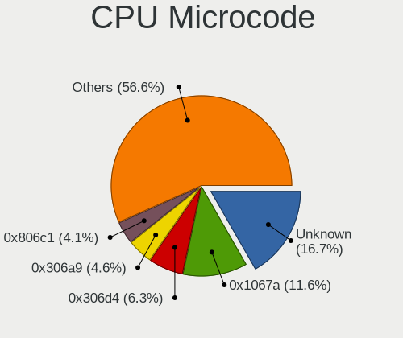
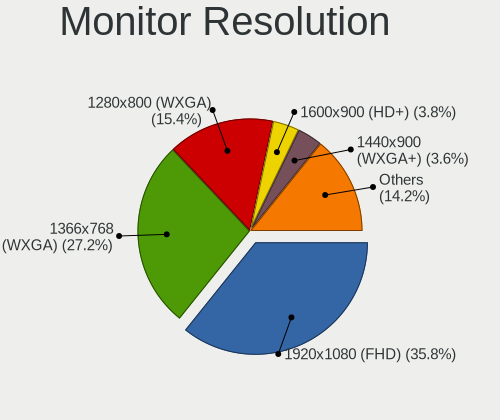
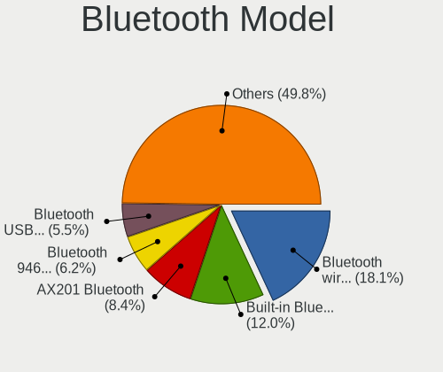

Debian 11 - Tested Hardware & Statistics (Notebooks)
----------------------------------------------------

A project to collect tested hardware configurations for Debian 11.

Anyone can contribute to this report by the [hw-probe](https://github.com/linuxhw/hw-probe) tool:

    sudo -E hw-probe -all -upload

Please submit a probe of your configuration if it's not presented on the page or is rare.

Full-feature report is available here: https://linux-hardware.org/?view=trends

Contents
--------

* [ Test Cases ](#test-cases)

* [ System ](#system)
  - [ Kernel                   ](#kernel)
  - [ Kernel Family            ](#kernel-family)
  - [ Kernel Major Ver.        ](#kernel-major-ver)
  - [ Arch                     ](#arch)
  - [ DE                       ](#de)
  - [ Display Server           ](#display-server)
  - [ Display Manager          ](#display-manager)
  - [ OS Lang                  ](#os-lang)
  - [ Boot Mode                ](#boot-mode)
  - [ Filesystem               ](#filesystem)
  - [ Part. scheme             ](#part-scheme)
  - [ Dual Boot with Linux/BSD ](#dual-boot-with-linuxbsd)
  - [ Dual Boot (Win)          ](#dual-boot-win)

* [ Board ](#board)
  - [ Vendor                   ](#vendor)
  - [ Model                    ](#model)
  - [ Model Family             ](#model-family)
  - [ MFG Year                 ](#mfg-year)
  - [ Form Factor              ](#form-factor)
  - [ Secure Boot              ](#secure-boot)
  - [ Coreboot                 ](#coreboot)
  - [ RAM Size                 ](#ram-size)
  - [ RAM Used                 ](#ram-used)
  - [ Total Drives             ](#total-drives)
  - [ Has CD-ROM               ](#has-cd-rom)
  - [ Has Ethernet             ](#has-ethernet)
  - [ Has WiFi                 ](#has-wifi)
  - [ Has Bluetooth            ](#has-bluetooth)

* [ Location ](#location)
  - [ Country                  ](#country)
  - [ City                     ](#city)

* [ Drives ](#drives)
  - [ Drive Vendor             ](#drive-vendor)
  - [ Drive Model              ](#drive-model)
  - [ HDD Vendor               ](#hdd-vendor)
  - [ SSD Vendor               ](#ssd-vendor)
  - [ Drive Kind               ](#drive-kind)
  - [ Drive Connector          ](#drive-connector)
  - [ Drive Size               ](#drive-size)
  - [ Space Total              ](#space-total)
  - [ Space Used               ](#space-used)
  - [ Malfunc. Drives          ](#malfunc-drives)
  - [ Malfunc. Drive Vendor    ](#malfunc-drive-vendor)
  - [ Malfunc. HDD Vendor      ](#malfunc-hdd-vendor)
  - [ Malfunc. Drive Kind      ](#malfunc-drive-kind)
  - [ Failed Drives            ](#failed-drives)
  - [ Failed Drive Vendor      ](#failed-drive-vendor)
  - [ Drive Status             ](#drive-status)

* [ Storage controller ](#storage-controller)
  - [ Storage Vendor           ](#storage-vendor)
  - [ Storage Model            ](#storage-model)
  - [ Storage Kind             ](#storage-kind)

* [ Processor ](#processor)
  - [ CPU Vendor               ](#cpu-vendor)
  - [ CPU Model                ](#cpu-model)
  - [ CPU Model Family         ](#cpu-model-family)
  - [ CPU Cores                ](#cpu-cores)
  - [ CPU Sockets              ](#cpu-sockets)
  - [ CPU Threads              ](#cpu-threads)
  - [ CPU Op-Modes             ](#cpu-op-modes)
  - [ CPU Microcode            ](#cpu-microcode)
  - [ CPU Microarch            ](#cpu-microarch)

* [ Graphics ](#graphics)
  - [ GPU Vendor               ](#gpu-vendor)
  - [ GPU Model                ](#gpu-model)
  - [ GPU Combo                ](#gpu-combo)
  - [ GPU Driver               ](#gpu-driver)
  - [ GPU Memory               ](#gpu-memory)

* [ Monitor ](#monitor)
  - [ Monitor Vendor           ](#monitor-vendor)
  - [ Monitor Model            ](#monitor-model)
  - [ Monitor Resolution       ](#monitor-resolution)
  - [ Monitor Diagonal         ](#monitor-diagonal)
  - [ Monitor Width            ](#monitor-width)
  - [ Aspect Ratio             ](#aspect-ratio)
  - [ Monitor Area             ](#monitor-area)
  - [ Pixel Density            ](#pixel-density)
  - [ Multiple Monitors        ](#multiple-monitors)

* [ Network ](#network)
  - [ Net Controller Vendor    ](#net-controller-vendor)
  - [ Net Controller Model     ](#net-controller-model)
  - [ Wireless Vendor          ](#wireless-vendor)
  - [ Wireless Model           ](#wireless-model)
  - [ Ethernet Vendor          ](#ethernet-vendor)
  - [ Ethernet Model           ](#ethernet-model)
  - [ Net Controller Kind      ](#net-controller-kind)
  - [ Used Controller          ](#used-controller)
  - [ NICs                     ](#nics)
  - [ IPv6                     ](#ipv6)

* [ Bluetooth ](#bluetooth)
  - [ Bluetooth Vendor         ](#bluetooth-vendor)
  - [ Bluetooth Model          ](#bluetooth-model)

* [ Sound ](#sound)
  - [ Sound Vendor             ](#sound-vendor)
  - [ Sound Model              ](#sound-model)

* [ Memory ](#memory)
  - [ Memory Vendor            ](#memory-vendor)
  - [ Memory Model             ](#memory-model)
  - [ Memory Kind              ](#memory-kind)
  - [ Memory Form Factor       ](#memory-form-factor)
  - [ Memory Size              ](#memory-size)
  - [ Memory Speed             ](#memory-speed)

* [ Printers & scanners ](#printers--scanners)
  - [ Printer Vendor           ](#printer-vendor)
  - [ Printer Model            ](#printer-model)
  - [ Scanner Vendor           ](#scanner-vendor)
  - [ Scanner Model            ](#scanner-model)

* [ Camera ](#camera)
  - [ Camera Vendor            ](#camera-vendor)
  - [ Camera Model             ](#camera-model)

* [ Security ](#security)
  - [ Fingerprint Vendor       ](#fingerprint-vendor)
  - [ Fingerprint Model        ](#fingerprint-model)
  - [ Chipcard Vendor          ](#chipcard-vendor)
  - [ Chipcard Model           ](#chipcard-model)

* [ Unsupported ](#unsupported)
  - [ Unsupported Devices      ](#unsupported-devices)
  - [ Unsupported Device Types ](#unsupported-device-types)

Test Cases
----------

| Vendor        | Model                       | Probe                                                      | Date         |
|---------------|-----------------------------|------------------------------------------------------------|--------------|
| Dell          | Latitude E6400              | [b8e56749b8](https://linux-hardware.org/?probe=b8e56749b8) | Dec 03, 2021 |
| HP            | Laptop 15-db0xxx            | [b7a0fe35eb](https://linux-hardware.org/?probe=b7a0fe35eb) | Dec 03, 2021 |
| Lenovo        | ThinkPad T430 2349S9E       | [0da495ab3b](https://linux-hardware.org/?probe=0da495ab3b) | Dec 02, 2021 |
| Lenovo        | B50-70 20384                | [d75361564f](https://linux-hardware.org/?probe=d75361564f) | Dec 02, 2021 |
| Lenovo        | ThinkPad T450s 20BWS2US0... | [0e099c0bdd](https://linux-hardware.org/?probe=0e099c0bdd) | Dec 02, 2021 |
| Lenovo        | ThinkPad 13 2nd Gen 20J1... | [f102e6537d](https://linux-hardware.org/?probe=f102e6537d) | Dec 02, 2021 |
| Lenovo        | ThinkPad 13 2nd Gen 20J1... | [92c4d0059f](https://linux-hardware.org/?probe=92c4d0059f) | Dec 02, 2021 |
| HP            | Pavilion Gaming Laptop 1... | [42575594c3](https://linux-hardware.org/?probe=42575594c3) | Dec 02, 2021 |
| HP            | Pavilion Gaming Laptop 1... | [4459608572](https://linux-hardware.org/?probe=4459608572) | Dec 02, 2021 |
| ASUSTek       | ASUS EXPERTBOOK B1400CEA... | [37d28d8425](https://linux-hardware.org/?probe=37d28d8425) | Dec 02, 2021 |
| Dell          | Inspiron 3793               | [bdd0f25735](https://linux-hardware.org/?probe=bdd0f25735) | Dec 01, 2021 |
| ASUSTek       | ZenBook UX325EA_UX325EA     | [933ffd0145](https://linux-hardware.org/?probe=933ffd0145) | Dec 01, 2021 |
| Lenovo        | ThinkPad T410 2522Y15       | [c57f5d2453](https://linux-hardware.org/?probe=c57f5d2453) | Nov 30, 2021 |
| ASUSTek       | N56VM                       | [4ae50a5146](https://linux-hardware.org/?probe=4ae50a5146) | Nov 30, 2021 |
| Tablet        | 8                           | [36164d26c8](https://linux-hardware.org/?probe=36164d26c8) | Nov 30, 2021 |
| Celestica     | D4040                       | [109f886f1d](https://linux-hardware.org/?probe=109f886f1d) | Nov 30, 2021 |
| Dell          | XPS 15 7590                 | [22d048c93d](https://linux-hardware.org/?probe=22d048c93d) | Nov 30, 2021 |
| AXDIA Inte... | MYBOOK 14 PRO               | [1bc2e1056c](https://linux-hardware.org/?probe=1bc2e1056c) | Nov 30, 2021 |
| HP            | EliteBook 840 G2            | [81e0d1f84c](https://linux-hardware.org/?probe=81e0d1f84c) | Nov 30, 2021 |
| Acer          | Swift SF314-56              | [6c60445d08](https://linux-hardware.org/?probe=6c60445d08) | Nov 29, 2021 |
| Panasonic     | CF-54-1                     | [8f2224d84d](https://linux-hardware.org/?probe=8f2224d84d) | Nov 29, 2021 |
| HP            | Pavilion Gaming Laptop 1... | [12b910d10b](https://linux-hardware.org/?probe=12b910d10b) | Nov 29, 2021 |
| Lenovo        | ThinkPad T490 20N2CTO1WW    | [cca6a99387](https://linux-hardware.org/?probe=cca6a99387) | Nov 29, 2021 |
| MSI           | MS-N014                     | [f98cf89699](https://linux-hardware.org/?probe=f98cf89699) | Nov 29, 2021 |
| MSI           | MS-N014                     | [a90d5979be](https://linux-hardware.org/?probe=a90d5979be) | Nov 29, 2021 |
| ASUSTek       | ZenBook Pro Duo UX581GV_... | [2360f50367](https://linux-hardware.org/?probe=2360f50367) | Nov 29, 2021 |
| IBM           | ThinkPad T43 2668BU7        | [594b3488d6](https://linux-hardware.org/?probe=594b3488d6) | Nov 29, 2021 |
| Acer          | Aspire E5-521               | [48d70742bb](https://linux-hardware.org/?probe=48d70742bb) | Nov 28, 2021 |
| Acer          | Aspire 5610                 | [853aee060d](https://linux-hardware.org/?probe=853aee060d) | Nov 28, 2021 |
| Lenovo        | ThinkPad T14 Gen 1 20S00... | [4fa0a94620](https://linux-hardware.org/?probe=4fa0a94620) | Nov 28, 2021 |
| ASUSTek       | ZenBook Pro Duo UX581GV_... | [6e1ecfa79e](https://linux-hardware.org/?probe=6e1ecfa79e) | Nov 28, 2021 |
| Dell          | Vostro 3400                 | [d8946eaf3c](https://linux-hardware.org/?probe=d8946eaf3c) | Nov 28, 2021 |
| Toshiba       | Satellite L40               | [d031ddee30](https://linux-hardware.org/?probe=d031ddee30) | Nov 28, 2021 |
| Acer          | TravelMate P214-52          | [bea2d6c254](https://linux-hardware.org/?probe=bea2d6c254) | Nov 27, 2021 |
| HP            | ZBook Studio G4             | [eb3da87330](https://linux-hardware.org/?probe=eb3da87330) | Nov 27, 2021 |
| HP            | Pavilion dv6                | [e81d5a7298](https://linux-hardware.org/?probe=e81d5a7298) | Nov 27, 2021 |
| HP            | Pavilion dv6                | [02376f3101](https://linux-hardware.org/?probe=02376f3101) | Nov 27, 2021 |
| HUAWEI        | HVY-WXX9                    | [c6289480ca](https://linux-hardware.org/?probe=c6289480ca) | Nov 27, 2021 |
| Acer          | Aspire E5-521               | [7984741863](https://linux-hardware.org/?probe=7984741863) | Nov 27, 2021 |
| Samsung       | 300E4C/300E5C/300E7C        | [16be623c84](https://linux-hardware.org/?probe=16be623c84) | Nov 27, 2021 |
| Lenovo        | ThinkPad T14 Gen 1 20S00... | [f08b8241b0](https://linux-hardware.org/?probe=f08b8241b0) | Nov 26, 2021 |
| HP            | ProBook 635 Aero G7 Note... | [bef33ffa93](https://linux-hardware.org/?probe=bef33ffa93) | Nov 26, 2021 |
| Dell          | XPS 13 9310                 | [ec7596ddfa](https://linux-hardware.org/?probe=ec7596ddfa) | Nov 26, 2021 |
| Lenovo        | B50-10 80QR                 | [5e57df0c06](https://linux-hardware.org/?probe=5e57df0c06) | Nov 26, 2021 |
| HUAWEI        | HVY-WXX9                    | [7569ef6338](https://linux-hardware.org/?probe=7569ef6338) | Nov 26, 2021 |
| AXDIA Inte... | Wintab 10                   | [9db3481488](https://linux-hardware.org/?probe=9db3481488) | Nov 25, 2021 |
| Lenovo        | ThinkPad E15 Gen 3 20YGC... | [5f3cfbdd91](https://linux-hardware.org/?probe=5f3cfbdd91) | Nov 25, 2021 |
| HP            | Presario CQ56               | [a9203b72bb](https://linux-hardware.org/?probe=a9203b72bb) | Nov 25, 2021 |
| Compal        | QAL51                       | [d7e7cedc5c](https://linux-hardware.org/?probe=d7e7cedc5c) | Nov 25, 2021 |
| AXDIA Inte... | Wintab 10                   | [04f77c36b0](https://linux-hardware.org/?probe=04f77c36b0) | Nov 24, 2021 |
| Lenovo        | ThinkPad W540 20BG0042FR    | [02b8528d76](https://linux-hardware.org/?probe=02b8528d76) | Nov 24, 2021 |
| HP            | Laptop 15-bw0xx             | [9b0bfd9c19](https://linux-hardware.org/?probe=9b0bfd9c19) | Nov 24, 2021 |
| Dell          | Latitude 7480               | [75937fb177](https://linux-hardware.org/?probe=75937fb177) | Nov 24, 2021 |
| Dell          | Latitude 7480               | [019d4a4604](https://linux-hardware.org/?probe=019d4a4604) | Nov 24, 2021 |
| HP            | Presario CQ56               | [b50968704d](https://linux-hardware.org/?probe=b50968704d) | Nov 24, 2021 |
| Lenovo        | V330-15IKB 81AX             | [6d61fe8c06](https://linux-hardware.org/?probe=6d61fe8c06) | Nov 24, 2021 |
| Dell          | XPS 15 9560                 | [d13563df7f](https://linux-hardware.org/?probe=d13563df7f) | Nov 24, 2021 |
| Acer          | Aspire 5610                 | [8fa3c5f33c](https://linux-hardware.org/?probe=8fa3c5f33c) | Nov 23, 2021 |
| Dell          | Inspiron 11-3168            | [b7b3b8ef38](https://linux-hardware.org/?probe=b7b3b8ef38) | Nov 23, 2021 |
| Samsung       | RV420/RV520/RV720/E3530/... | [d279b3f946](https://linux-hardware.org/?probe=d279b3f946) | Nov 22, 2021 |
| Lenovo        | ThinkPad X250 20CM004UGE    | [26bd0cd883](https://linux-hardware.org/?probe=26bd0cd883) | Nov 22, 2021 |
| ASUSTek       | VivoBook 15_ASUS Laptop ... | [d5a663555f](https://linux-hardware.org/?probe=d5a663555f) | Nov 21, 2021 |
| ASUSTek       | VivoBook 15_ASUS Laptop ... | [2b69fd787e](https://linux-hardware.org/?probe=2b69fd787e) | Nov 21, 2021 |
| ASUSTek       | ZenBook UX482EG_UX482EG     | [2e109e9059](https://linux-hardware.org/?probe=2e109e9059) | Nov 21, 2021 |
| Dell          | Latitude E6330              | [843131a308](https://linux-hardware.org/?probe=843131a308) | Nov 21, 2021 |
| HP            | ENVY m7                     | [97fae6afa0](https://linux-hardware.org/?probe=97fae6afa0) | Nov 21, 2021 |
| Lenovo        | ThinkPad T480s 20L8S31E0... | [5015d88753](https://linux-hardware.org/?probe=5015d88753) | Nov 21, 2021 |
| Lenovo        | ThinkPad T460 20FMS66R00    | [f66705283e](https://linux-hardware.org/?probe=f66705283e) | Nov 21, 2021 |
| HP            | ProBook 650 G1              | [9a66408c2e](https://linux-hardware.org/?probe=9a66408c2e) | Nov 21, 2021 |
| IBM           | ThinkPad T43 2668BU7        | [12017f88c5](https://linux-hardware.org/?probe=12017f88c5) | Nov 21, 2021 |
| Sony          | VGN-NS30E_S                 | [a36535818d](https://linux-hardware.org/?probe=a36535818d) | Nov 20, 2021 |
| IBM           | ThinkPad T43 26686ZG        | [837bd8895e](https://linux-hardware.org/?probe=837bd8895e) | Nov 20, 2021 |
| Lenovo        | ThinkPad T440s 20AR003RM... | [2c0279ade5](https://linux-hardware.org/?probe=2c0279ade5) | Nov 20, 2021 |
| Dell          | Precision 5520              | [0ca00fe3e9](https://linux-hardware.org/?probe=0ca00fe3e9) | Nov 20, 2021 |
| IBM           | ThinkPad T43 26688AG        | [f0e357cf85](https://linux-hardware.org/?probe=f0e357cf85) | Nov 20, 2021 |
| IBM           | ThinkPad T43 26688AG        | [26b7c2dab9](https://linux-hardware.org/?probe=26b7c2dab9) | Nov 20, 2021 |
| ASUSTek       | ZenBook Pro Duo UX581LV_... | [065770fe24](https://linux-hardware.org/?probe=065770fe24) | Nov 19, 2021 |
| Lenovo        | ThinkPad T430 2349S9E       | [d68e11bb6f](https://linux-hardware.org/?probe=d68e11bb6f) | Nov 19, 2021 |
| Acer          | TravelMate 4220             | [154009efd2](https://linux-hardware.org/?probe=154009efd2) | Nov 19, 2021 |
| Acer          | TravelMate 4220             | [b437a6cdee](https://linux-hardware.org/?probe=b437a6cdee) | Nov 19, 2021 |
| HP            | ProBook 4530s               | [de11d1bb53](https://linux-hardware.org/?probe=de11d1bb53) | Nov 19, 2021 |
| Compal        | QAL51                       | [9922147938](https://linux-hardware.org/?probe=9922147938) | Nov 19, 2021 |
| ASUSTek       | ZenBook Pro Duo UX581GV_... | [15916ce478](https://linux-hardware.org/?probe=15916ce478) | Nov 19, 2021 |
| Apple         | MacBookAir7,2               | [4a24670ff6](https://linux-hardware.org/?probe=4a24670ff6) | Nov 19, 2021 |
| Lenovo        | G50-30 80G0                 | [1604bcdd0d](https://linux-hardware.org/?probe=1604bcdd0d) | Nov 19, 2021 |
| HP            | EliteBook 840 G2            | [736657999a](https://linux-hardware.org/?probe=736657999a) | Nov 18, 2021 |
| Lenovo        | V14-IIL 82C4                | [7f0992aae9](https://linux-hardware.org/?probe=7f0992aae9) | Nov 18, 2021 |
| Lenovo        | ThinkPad T14 Gen 2i 20W0... | [6da7601574](https://linux-hardware.org/?probe=6da7601574) | Nov 18, 2021 |
| Dell          | Inspiron 3793               | [bc9da19934](https://linux-hardware.org/?probe=bc9da19934) | Nov 18, 2021 |
| Google        | Stout                       | [2201cceced](https://linux-hardware.org/?probe=2201cceced) | Nov 17, 2021 |
| Lenovo        | ThinkPad 20J10046US         | [1597db42c1](https://linux-hardware.org/?probe=1597db42c1) | Nov 17, 2021 |
| Dell          | Inspiron 3793               | [a1c2626420](https://linux-hardware.org/?probe=a1c2626420) | Nov 17, 2021 |
| Lenovo        | ThinkPad 13 2nd Gen 20J1... | [3025843274](https://linux-hardware.org/?probe=3025843274) | Nov 17, 2021 |
| Sony          | SVE1712E1RB                 | [4be9dde00d](https://linux-hardware.org/?probe=4be9dde00d) | Nov 17, 2021 |
| Dell          | System XPS L502X            | [8d247d71f2](https://linux-hardware.org/?probe=8d247d71f2) | Nov 17, 2021 |
| HP            | Pavilion Laptop 15-eh1xx... | [66fd774069](https://linux-hardware.org/?probe=66fd774069) | Nov 17, 2021 |
| Sony          | SVE1712E1RB                 | [2416868324](https://linux-hardware.org/?probe=2416868324) | Nov 17, 2021 |
| ASUSTek       | 1015PE                      | [9735619dd6](https://linux-hardware.org/?probe=9735619dd6) | Nov 17, 2021 |
| Lenovo        | ThinkPad T430 2349S9E       | [72ac73a219](https://linux-hardware.org/?probe=72ac73a219) | Nov 16, 2021 |
| Apple         | MacBookPro5,5               | [706587b8f3](https://linux-hardware.org/?probe=706587b8f3) | Nov 16, 2021 |
| Lenovo        | ThinkPad T430 2347G61       | [12ee1cee2b](https://linux-hardware.org/?probe=12ee1cee2b) | Nov 16, 2021 |
| ASUSTek       | ZenBook Pro Duo UX581GV_... | [f65310e00b](https://linux-hardware.org/?probe=f65310e00b) | Nov 16, 2021 |
| Acer          | TravelMate 8371             | [312ed52708](https://linux-hardware.org/?probe=312ed52708) | Nov 16, 2021 |
| Acer          | TravelMate 8371             | [78b196a98c](https://linux-hardware.org/?probe=78b196a98c) | Nov 16, 2021 |
| MSI           | GE60 2PL                    | [7287f7a1ae](https://linux-hardware.org/?probe=7287f7a1ae) | Nov 15, 2021 |
| HP            | EliteBook 2560p             | [fc04d52b16](https://linux-hardware.org/?probe=fc04d52b16) | Nov 15, 2021 |
| ASUSTek       | VivoBook_ASUSLaptop X512... | [74ce7d98c6](https://linux-hardware.org/?probe=74ce7d98c6) | Nov 15, 2021 |
| Acer          | Aspire A715-72G             | [2a2d9fc8f1](https://linux-hardware.org/?probe=2a2d9fc8f1) | Nov 15, 2021 |
| ASUSTek       | VivoBook_ASUSLaptop X512... | [180bbba91c](https://linux-hardware.org/?probe=180bbba91c) | Nov 15, 2021 |
| Acer          | Aspire A517-51G             | [a580b8a73f](https://linux-hardware.org/?probe=a580b8a73f) | Nov 15, 2021 |
| ASUSTek       | ZenBook Pro Duo UX581GV_... | [52eef25506](https://linux-hardware.org/?probe=52eef25506) | Nov 15, 2021 |
| ASUSTek       | ZenBook Pro Duo UX581GV_... | [7252f23e5f](https://linux-hardware.org/?probe=7252f23e5f) | Nov 15, 2021 |
| Lenovo        | ThinkPad T14 Gen 2i 20W0... | [8c23aaf339](https://linux-hardware.org/?probe=8c23aaf339) | Nov 15, 2021 |
| ASUSTek       | ZenBook Pro Duo UX581GV_... | [1a20afde4b](https://linux-hardware.org/?probe=1a20afde4b) | Nov 15, 2021 |
| Lenovo        | ThinkPad E450 20DCS01J00    | [ce5eb49ae7](https://linux-hardware.org/?probe=ce5eb49ae7) | Nov 14, 2021 |
| HP            | EliteBook 2560p             | [5574978db2](https://linux-hardware.org/?probe=5574978db2) | Nov 14, 2021 |
| HP            | EliteBook 2740p             | [8406ced05c](https://linux-hardware.org/?probe=8406ced05c) | Nov 14, 2021 |
| HP            | EliteBook 2740p             | [f035cd561e](https://linux-hardware.org/?probe=f035cd561e) | Nov 14, 2021 |
| MSI           | GE60 2OC\2OD\2OE            | [4d129ac049](https://linux-hardware.org/?probe=4d129ac049) | Nov 14, 2021 |
| Dell          | Latitude E6330              | [a03858cc87](https://linux-hardware.org/?probe=a03858cc87) | Nov 13, 2021 |
| MSI           | Prestige 15 A10SC           | [b362dd3f20](https://linux-hardware.org/?probe=b362dd3f20) | Nov 13, 2021 |
| ASUSTek       | ASUS EXPERTBOOK B1500CEA... | [c1a976d644](https://linux-hardware.org/?probe=c1a976d644) | Nov 13, 2021 |
| Lenovo        | ThinkPad X201 3626GG3       | [78619d2639](https://linux-hardware.org/?probe=78619d2639) | Nov 12, 2021 |
| Compal        | QAL51                       | [431d587da7](https://linux-hardware.org/?probe=431d587da7) | Nov 12, 2021 |
| Acer          | Aspire F5-573G              | [768c187f40](https://linux-hardware.org/?probe=768c187f40) | Nov 12, 2021 |
| HP            | ProBook 450 G8 Notebook ... | [924d961707](https://linux-hardware.org/?probe=924d961707) | Nov 12, 2021 |
| Lenovo        | ThinkPad L15 Gen 1 20U70... | [79e78d0c90](https://linux-hardware.org/?probe=79e78d0c90) | Nov 11, 2021 |
| Lenovo        | ThinkPad T480 20L6SCYP00    | [edb83bd184](https://linux-hardware.org/?probe=edb83bd184) | Nov 11, 2021 |
| Lenovo        | ThinkPad T14 Gen 2i 20W0... | [00e34bc46e](https://linux-hardware.org/?probe=00e34bc46e) | Nov 11, 2021 |
| ASUSTek       | T100TA                      | [867e0388ae](https://linux-hardware.org/?probe=867e0388ae) | Nov 11, 2021 |
| HP            | EliteBook 8440p             | [1bdbee29eb](https://linux-hardware.org/?probe=1bdbee29eb) | Nov 10, 2021 |
| HP            | EliteBook 8440p             | [e4961a7cfc](https://linux-hardware.org/?probe=e4961a7cfc) | Nov 10, 2021 |
| Lenovo        | ThinkPad T440p 20AWS18U0... | [f9f140b132](https://linux-hardware.org/?probe=f9f140b132) | Nov 10, 2021 |
| Lenovo        | ThinkPad T440p 20AWS18U0... | [258574fc87](https://linux-hardware.org/?probe=258574fc87) | Nov 10, 2021 |
| ASUSTek       | 1011PX                      | [2d96503388](https://linux-hardware.org/?probe=2d96503388) | Nov 10, 2021 |
| Lenovo        | ThinkPad E15 Gen 2 20TES... | [6e415a1506](https://linux-hardware.org/?probe=6e415a1506) | Nov 10, 2021 |
| Dell          | Inspiron 7472               | [2508fadf63](https://linux-hardware.org/?probe=2508fadf63) | Nov 10, 2021 |
| Samsung       | 300E4C/300E5C/300E7C        | [606263f5e9](https://linux-hardware.org/?probe=606263f5e9) | Nov 10, 2021 |
| MSI           | GS65 Stealth 9SE            | [bef876576b](https://linux-hardware.org/?probe=bef876576b) | Nov 09, 2021 |
| Lenovo        | 14w 81MQ00AHAR              | [17785cda04](https://linux-hardware.org/?probe=17785cda04) | Nov 09, 2021 |
| Apple         | MacBookAir7,1               | [107c6e9840](https://linux-hardware.org/?probe=107c6e9840) | Nov 09, 2021 |
| Apple         | MacBookAir7,1               | [006454048e](https://linux-hardware.org/?probe=006454048e) | Nov 09, 2021 |
| Apple         | MacBookAir7,1               | [466c86045e](https://linux-hardware.org/?probe=466c86045e) | Nov 09, 2021 |
| Apple         | MacBookAir7,1               | [e9818fe37e](https://linux-hardware.org/?probe=e9818fe37e) | Nov 09, 2021 |
| Apple         | MacBookAir7,1               | [eeb1d38579](https://linux-hardware.org/?probe=eeb1d38579) | Nov 09, 2021 |
| Apple         | MacBookAir7,1               | [deab410735](https://linux-hardware.org/?probe=deab410735) | Nov 09, 2021 |
| Apple         | MacBookAir7,1               | [1ab4a1aebc](https://linux-hardware.org/?probe=1ab4a1aebc) | Nov 09, 2021 |
| Apple         | MacBookAir7,1               | [6d39af3a58](https://linux-hardware.org/?probe=6d39af3a58) | Nov 09, 2021 |
| Apple         | MacBookAir7,1               | [e8bbdb29d1](https://linux-hardware.org/?probe=e8bbdb29d1) | Nov 09, 2021 |
| Apple         | MacBookAir7,1               | [ccd62944b4](https://linux-hardware.org/?probe=ccd62944b4) | Nov 09, 2021 |
| Apple         | MacBookAir7,1               | [125724b6a0](https://linux-hardware.org/?probe=125724b6a0) | Nov 09, 2021 |
| HP            | ProBook 645 G2              | [beada5c26b](https://linux-hardware.org/?probe=beada5c26b) | Nov 09, 2021 |
| HP            | Pavilion Laptop 15-eh0xx... | [9dc24197f3](https://linux-hardware.org/?probe=9dc24197f3) | Nov 09, 2021 |
| HP            | ProBook 645 G2              | [64b38adff8](https://linux-hardware.org/?probe=64b38adff8) | Nov 09, 2021 |
| Dell          | Latitude E5570              | [b2398623fc](https://linux-hardware.org/?probe=b2398623fc) | Nov 09, 2021 |
| Dell          | Vostro 5568                 | [8efc2ed27a](https://linux-hardware.org/?probe=8efc2ed27a) | Nov 08, 2021 |
| Lenovo        | ThinkPad E450 20DCS01J00    | [ee83aa5751](https://linux-hardware.org/?probe=ee83aa5751) | Nov 08, 2021 |
| Dell          | Vostro 5568                 | [b247ac9f61](https://linux-hardware.org/?probe=b247ac9f61) | Nov 08, 2021 |
| Fujitsu Si... | AMILO Si 2636               | [ca32959cf7](https://linux-hardware.org/?probe=ca32959cf7) | Nov 08, 2021 |
| Dell          | Precision M4800             | [30a32fb8df](https://linux-hardware.org/?probe=30a32fb8df) | Nov 08, 2021 |
| Acer          | Nitro AN515-52              | [4b834a3bff](https://linux-hardware.org/?probe=4b834a3bff) | Nov 07, 2021 |
| Acer          | Nitro AN515-52              | [8c6816916c](https://linux-hardware.org/?probe=8c6816916c) | Nov 07, 2021 |
| Dell          | Inspiron 15-3567            | [9c14e4d461](https://linux-hardware.org/?probe=9c14e4d461) | Nov 06, 2021 |
| Dell          | Latitude E6330              | [cafb5e6e80](https://linux-hardware.org/?probe=cafb5e6e80) | Nov 05, 2021 |
| ASUSTek       | VivoBook_ASUSLaptop X515... | [31f91364c1](https://linux-hardware.org/?probe=31f91364c1) | Nov 04, 2021 |
| HP            | Laptop 14-ck0xxx            | [8d24d56a03](https://linux-hardware.org/?probe=8d24d56a03) | Nov 04, 2021 |
| HP            | EliteBook 840 G2            | [cd9efb14b2](https://linux-hardware.org/?probe=cd9efb14b2) | Nov 04, 2021 |
| Aquarius      | NS585                       | [8d7faba1cb](https://linux-hardware.org/?probe=8d7faba1cb) | Nov 04, 2021 |
| Aquarius      | NS585                       | [99b57214d1](https://linux-hardware.org/?probe=99b57214d1) | Nov 04, 2021 |
| Dell          | Latitude 5511               | [6dca737664](https://linux-hardware.org/?probe=6dca737664) | Nov 04, 2021 |
| Dell          | Latitude 5511               | [f2ef4f8e35](https://linux-hardware.org/?probe=f2ef4f8e35) | Nov 04, 2021 |
| Lenovo        | ThinkPad T460s 20FACTO1W... | [1d6e8a6521](https://linux-hardware.org/?probe=1d6e8a6521) | Nov 04, 2021 |
| HP            | Pavilion dv4                | [7e9733638c](https://linux-hardware.org/?probe=7e9733638c) | Nov 04, 2021 |
| Lenovo        | IdeaPad 330S-15ARR 81FB     | [a7629cdfd1](https://linux-hardware.org/?probe=a7629cdfd1) | Nov 03, 2021 |
| Lenovo        | ThinkPad T480 20L50009MX    | [349faf5242](https://linux-hardware.org/?probe=349faf5242) | Nov 03, 2021 |
| HP            | EliteBook 840 G2            | [2e08c10fec](https://linux-hardware.org/?probe=2e08c10fec) | Nov 02, 2021 |
| Dell          | Vostro 3500                 | [6eb01124a7](https://linux-hardware.org/?probe=6eb01124a7) | Nov 02, 2021 |
| HP            | Laptop 15-bw0xx             | [1869db225e](https://linux-hardware.org/?probe=1869db225e) | Nov 02, 2021 |
| ASUSTek       | VivoBook_ASUSLaptop X515... | [8b2a91de37](https://linux-hardware.org/?probe=8b2a91de37) | Nov 01, 2021 |
| ASUSTek       | X555LD                      | [5de4d7d11a](https://linux-hardware.org/?probe=5de4d7d11a) | Nov 01, 2021 |
| ASUSTek       | ASUS TUF Gaming F15 FX50... | [3040be6e81](https://linux-hardware.org/?probe=3040be6e81) | Nov 01, 2021 |
| Dell          | Vostro 5471                 | [8182230d1d](https://linux-hardware.org/?probe=8182230d1d) | Nov 01, 2021 |
| Lenovo        | ThinkPad W530 244743G       | [69a252ccd6](https://linux-hardware.org/?probe=69a252ccd6) | Oct 31, 2021 |
| Dell          | Inspiron 5502               | [e58d33df6b](https://linux-hardware.org/?probe=e58d33df6b) | Oct 31, 2021 |
| Unknown       | MT8117                      | [b579146661](https://linux-hardware.org/?probe=b579146661) | Oct 31, 2021 |
| Dell          | Inspiron 1525               | [38b4ba227c](https://linux-hardware.org/?probe=38b4ba227c) | Oct 30, 2021 |
| Dell          | Inspiron 1525               | [b6302b710d](https://linux-hardware.org/?probe=b6302b710d) | Oct 30, 2021 |
| Dell          | Vostro 3500                 | [60f4ac8cc5](https://linux-hardware.org/?probe=60f4ac8cc5) | Oct 30, 2021 |
| Apple         | MacBookAir7,2               | [5be083edab](https://linux-hardware.org/?probe=5be083edab) | Oct 29, 2021 |
| Dell          | Latitude E7240              | [dbf0fd04c3](https://linux-hardware.org/?probe=dbf0fd04c3) | Oct 28, 2021 |
| Compal        | QAL51                       | [ffffaf4799](https://linux-hardware.org/?probe=ffffaf4799) | Oct 28, 2021 |
| ASUSTek       | Strix 17 GL703GE            | [085ef9e58d](https://linux-hardware.org/?probe=085ef9e58d) | Oct 28, 2021 |
| Acer          | Nitro AN515-54              | [d85a5ada85](https://linux-hardware.org/?probe=d85a5ada85) | Oct 28, 2021 |
| HP            | EliteBook 840 G2            | [a7cc3183f2](https://linux-hardware.org/?probe=a7cc3183f2) | Oct 28, 2021 |
| HP            | Notebook                    | [0ba26ccc72](https://linux-hardware.org/?probe=0ba26ccc72) | Oct 28, 2021 |
| HP            | EliteBook 8460p             | [b6ac4539d1](https://linux-hardware.org/?probe=b6ac4539d1) | Oct 28, 2021 |
| HP            | EliteBook 8460p             | [8264430178](https://linux-hardware.org/?probe=8264430178) | Oct 28, 2021 |
| HP            | Laptop 17-by1xxx            | [e6406f34f8](https://linux-hardware.org/?probe=e6406f34f8) | Oct 27, 2021 |
| Dell          | Latitude E6330              | [872cfff7da](https://linux-hardware.org/?probe=872cfff7da) | Oct 26, 2021 |
| Lenovo        | ThinkPad T540p 20BFS05B0... | [5026826dbe](https://linux-hardware.org/?probe=5026826dbe) | Oct 26, 2021 |
| Lenovo        | ThinkPad T540p 20BFS05B0... | [f644310091](https://linux-hardware.org/?probe=f644310091) | Oct 26, 2021 |
| Dell          | Latitude E6330              | [c3e7f97c42](https://linux-hardware.org/?probe=c3e7f97c42) | Oct 25, 2021 |
| Dell          | Latitude E6330              | [0e88df3ae7](https://linux-hardware.org/?probe=0e88df3ae7) | Oct 25, 2021 |
| HP            | Pavilion g6                 | [2c2d7620f9](https://linux-hardware.org/?probe=2c2d7620f9) | Oct 25, 2021 |
| Acer          | AOA150                      | [1380638bb1](https://linux-hardware.org/?probe=1380638bb1) | Oct 25, 2021 |
| Dell          | Latitude E6540              | [df9262f810](https://linux-hardware.org/?probe=df9262f810) | Oct 25, 2021 |
| Acer          | Swift SF314-59              | [1e4856a770](https://linux-hardware.org/?probe=1e4856a770) | Oct 24, 2021 |
| Lenovo        | ThinkPad E15 Gen 2 20TES... | [be67e01a7d](https://linux-hardware.org/?probe=be67e01a7d) | Oct 24, 2021 |
| Acer          | Aspire A315-23G             | [09f6196e70](https://linux-hardware.org/?probe=09f6196e70) | Oct 23, 2021 |
| Dell          | Latitude E6330              | [e7a19ad923](https://linux-hardware.org/?probe=e7a19ad923) | Oct 23, 2021 |
| HP            | ProBook 430 G5              | [6954277377](https://linux-hardware.org/?probe=6954277377) | Oct 23, 2021 |
| HUAWEI        | BOHK-WAX9X                  | [7aac95cd60](https://linux-hardware.org/?probe=7aac95cd60) | Oct 23, 2021 |
| ASUSTek       | ZenBook UX425QA_UM425QA     | [c8f19e95d8](https://linux-hardware.org/?probe=c8f19e95d8) | Oct 23, 2021 |
| Dell          | Inspiron 11 - 3147          | [7354eacfc5](https://linux-hardware.org/?probe=7354eacfc5) | Oct 23, 2021 |
| Jumper        | EZbook                      | [557738cd7d](https://linux-hardware.org/?probe=557738cd7d) | Oct 23, 2021 |
| HP            | EliteBook 840 Aero G8 No... | [713c29aa23](https://linux-hardware.org/?probe=713c29aa23) | Oct 22, 2021 |
| Lenovo        | ThinkPad E15 Gen 2 20TES... | [bcc008e381](https://linux-hardware.org/?probe=bcc008e381) | Oct 22, 2021 |
| ASUSTek       | ZenBook UX425QA_UM425QA     | [55dcb690c5](https://linux-hardware.org/?probe=55dcb690c5) | Oct 22, 2021 |
| Dell          | Inspiron N4050              | [85a514f622](https://linux-hardware.org/?probe=85a514f622) | Oct 22, 2021 |
| LG Electro... | X120-L.C7L1A9               | [42b7007a7e](https://linux-hardware.org/?probe=42b7007a7e) | Oct 21, 2021 |
| HP            | ZHAN 66 Pro A 14 G3         | [2815629b34](https://linux-hardware.org/?probe=2815629b34) | Oct 21, 2021 |
| ASUSTek       | ROG Strix G512LI_G512LI     | [fe4c73ce24](https://linux-hardware.org/?probe=fe4c73ce24) | Oct 21, 2021 |
| HP            | 250 G1                      | [b34fa14c55](https://linux-hardware.org/?probe=b34fa14c55) | Oct 21, 2021 |
| Dell          | Inspiron 11 - 3147          | [7039c3e31f](https://linux-hardware.org/?probe=7039c3e31f) | Oct 20, 2021 |
| Acer          | Aspire A315-23              | [e8b00fa29b](https://linux-hardware.org/?probe=e8b00fa29b) | Oct 20, 2021 |
| HP            | Laptop 15-db0xxx            | [cd4a22e83b](https://linux-hardware.org/?probe=cd4a22e83b) | Oct 20, 2021 |
| HP            | Pavilion Gaming Laptop 1... | [2c5f518cc8](https://linux-hardware.org/?probe=2c5f518cc8) | Oct 20, 2021 |
| Lenovo        | ThinkPad L15 Gen 2 20X4S... | [0290c2ca6d](https://linux-hardware.org/?probe=0290c2ca6d) | Oct 19, 2021 |
| Lenovo        | ThinkPad 20J10046US         | [cad3a5eb69](https://linux-hardware.org/?probe=cad3a5eb69) | Oct 18, 2021 |
| Lenovo        | ThinkPad T480 20L5000AMC    | [ea23d24f90](https://linux-hardware.org/?probe=ea23d24f90) | Oct 18, 2021 |
| Aquarius      | NS585                       | [ea22908ff7](https://linux-hardware.org/?probe=ea22908ff7) | Oct 18, 2021 |
| Aquarius      | NS585                       | [daf0f8d357](https://linux-hardware.org/?probe=daf0f8d357) | Oct 18, 2021 |
| MSI           | GF75 Thin 9SC               | [1f4a66b99a](https://linux-hardware.org/?probe=1f4a66b99a) | Oct 18, 2021 |
| Aquarius      | NS585                       | [0f5ea2eb9a](https://linux-hardware.org/?probe=0f5ea2eb9a) | Oct 18, 2021 |
| Aquarius      | NS585                       | [08f117fdcb](https://linux-hardware.org/?probe=08f117fdcb) | Oct 18, 2021 |
| Aquarius      | NS585                       | [3921dda159](https://linux-hardware.org/?probe=3921dda159) | Oct 18, 2021 |
| Aquarius      | NS585                       | [22c808750d](https://linux-hardware.org/?probe=22c808750d) | Oct 18, 2021 |
| Acer          | Aspire A315-23G             | [66d1015de7](https://linux-hardware.org/?probe=66d1015de7) | Oct 17, 2021 |
| Acer          | Aspire A515-51G             | [43bfef3bcd](https://linux-hardware.org/?probe=43bfef3bcd) | Oct 17, 2021 |
| Lenovo        | S10-3                       | [1f4f861804](https://linux-hardware.org/?probe=1f4f861804) | Oct 17, 2021 |
| Dell          | XPS 13 9305                 | [d13426531e](https://linux-hardware.org/?probe=d13426531e) | Oct 17, 2021 |
| HP            | Pavilion x2 Detachable      | [c17c589af5](https://linux-hardware.org/?probe=c17c589af5) | Oct 17, 2021 |
| Toshiba       | Satellite A205              | [68ac15eeda](https://linux-hardware.org/?probe=68ac15eeda) | Oct 16, 2021 |
| HP            | Pavilion Gaming Laptop 1... | [69fc64df8b](https://linux-hardware.org/?probe=69fc64df8b) | Oct 16, 2021 |
| Lenovo        | S10-3                       | [acb07e4c72](https://linux-hardware.org/?probe=acb07e4c72) | Oct 16, 2021 |
| Lenovo        | G50-45 80E3                 | [5e79417ff5](https://linux-hardware.org/?probe=5e79417ff5) | Oct 16, 2021 |
| Apple         | MacBook3,1                  | [34fc60e37e](https://linux-hardware.org/?probe=34fc60e37e) | Oct 16, 2021 |
| Acer          | TravelMate P215-53          | [3d398d4b58](https://linux-hardware.org/?probe=3d398d4b58) | Oct 16, 2021 |
| Lenovo        | ThinkPad X60 17068GG        | [2f3b34aac4](https://linux-hardware.org/?probe=2f3b34aac4) | Oct 15, 2021 |
| Apple         | MacBookPro14,1              | [dc7e454319](https://linux-hardware.org/?probe=dc7e454319) | Oct 15, 2021 |
| Apple         | MacBookPro14,1              | [bf9482b190](https://linux-hardware.org/?probe=bf9482b190) | Oct 15, 2021 |
| Lenovo        | Y520-15IKBN 80WK            | [a7045defdf](https://linux-hardware.org/?probe=a7045defdf) | Oct 15, 2021 |
| Dell          | XPS 15 7590                 | [ff55772306](https://linux-hardware.org/?probe=ff55772306) | Oct 15, 2021 |
| Lenovo        | ThinkPad E15 Gen 3 20YGC... | [9005e4d86d](https://linux-hardware.org/?probe=9005e4d86d) | Oct 15, 2021 |
| Lenovo        | ThinkPad 20J10046US         | [2d46a44cca](https://linux-hardware.org/?probe=2d46a44cca) | Oct 14, 2021 |
| Apple         | MacBookAir7,2               | [f78b91b7de](https://linux-hardware.org/?probe=f78b91b7de) | Oct 14, 2021 |
| Acer          | Aspire A315-23G             | [f8f343d12b](https://linux-hardware.org/?probe=f8f343d12b) | Oct 14, 2021 |
| HP            | EliteBook 840 G7 Noteboo... | [c3cdfe0336](https://linux-hardware.org/?probe=c3cdfe0336) | Oct 14, 2021 |
| Aquarius      | NS585                       | [7345eddec4](https://linux-hardware.org/?probe=7345eddec4) | Oct 14, 2021 |
| Apple         | MacBookAir7,1               | [22a831db3d](https://linux-hardware.org/?probe=22a831db3d) | Oct 14, 2021 |
| Aquarius      | NS585                       | [d42e0a77d4](https://linux-hardware.org/?probe=d42e0a77d4) | Oct 14, 2021 |
| Aquarius      | NS585                       | [7b0dd9fe28](https://linux-hardware.org/?probe=7b0dd9fe28) | Oct 14, 2021 |
| Aquarius      | NS585                       | [ea53e809fd](https://linux-hardware.org/?probe=ea53e809fd) | Oct 14, 2021 |
| Acer          | Aspire A515-51G             | [7555392d34](https://linux-hardware.org/?probe=7555392d34) | Oct 14, 2021 |
| Aquarius      | NS585                       | [aaca557699](https://linux-hardware.org/?probe=aaca557699) | Oct 14, 2021 |
| Sony          | VAIO                        | [22a4b460cc](https://linux-hardware.org/?probe=22a4b460cc) | Oct 14, 2021 |
| Lenovo        | ThinkPad T400 2768WGB       | [2ae81cd94f](https://linux-hardware.org/?probe=2ae81cd94f) | Oct 13, 2021 |
| Lenovo        | V330-15IKB 81AX             | [000ac750e0](https://linux-hardware.org/?probe=000ac750e0) | Oct 13, 2021 |
| Lenovo        | V330-15IKB 81AX             | [69b1046c6e](https://linux-hardware.org/?probe=69b1046c6e) | Oct 13, 2021 |
| Lenovo        | ThinkPad 13 2nd Gen 20J1... | [cdb34ca184](https://linux-hardware.org/?probe=cdb34ca184) | Oct 13, 2021 |
| Samsung       | 350V5C/350V5X/350V4C/350... | [923479d039](https://linux-hardware.org/?probe=923479d039) | Oct 13, 2021 |
| ASUSTek       | TP201SA                     | [504956d2e9](https://linux-hardware.org/?probe=504956d2e9) | Oct 13, 2021 |
| ASUSTek       | UX303LAB                    | [97b9f51735](https://linux-hardware.org/?probe=97b9f51735) | Oct 13, 2021 |
| MSI           | GF75 Thin 9SC               | [db0ef927e0](https://linux-hardware.org/?probe=db0ef927e0) | Oct 13, 2021 |
| MSI           | GF75 Thin 9SC               | [be82875929](https://linux-hardware.org/?probe=be82875929) | Oct 13, 2021 |
| ASUSTek       | ROG Zephyrus G15 GA503QR... | [f2690f5ec4](https://linux-hardware.org/?probe=f2690f5ec4) | Oct 13, 2021 |
| HP            | G62                         | [7873481ecb](https://linux-hardware.org/?probe=7873481ecb) | Oct 12, 2021 |
| Samsung       | 300E4Z/300E5Z/300E7Z        | [b01543c6b8](https://linux-hardware.org/?probe=b01543c6b8) | Oct 12, 2021 |
| Acer          | Aspire ES1-531              | [2a96c0566a](https://linux-hardware.org/?probe=2a96c0566a) | Oct 12, 2021 |
| Dell          | XPS 15 9560                 | [69938c221e](https://linux-hardware.org/?probe=69938c221e) | Oct 12, 2021 |
| Dell          | Vostro 3500                 | [4e86b85a4d](https://linux-hardware.org/?probe=4e86b85a4d) | Oct 12, 2021 |
| Acer          | Aspire A315-23G             | [6476999787](https://linux-hardware.org/?probe=6476999787) | Oct 12, 2021 |
| Lenovo        | ThinkPad T520 4242W9B       | [3947636b4d](https://linux-hardware.org/?probe=3947636b4d) | Oct 12, 2021 |
| Dell          | Inspiron 5567               | [e551d622a8](https://linux-hardware.org/?probe=e551d622a8) | Oct 11, 2021 |
| Lenovo        | ThinkPad E15 Gen 3 20YGC... | [dce9cc60d3](https://linux-hardware.org/?probe=dce9cc60d3) | Oct 11, 2021 |
| HP            | EliteBook 8460p             | [8430d409b5](https://linux-hardware.org/?probe=8430d409b5) | Oct 11, 2021 |
| Acer          | Aspire A315-23G             | [c97f94ce2f](https://linux-hardware.org/?probe=c97f94ce2f) | Oct 10, 2021 |
| Lenovo        | Y520-15IKBN 80WK            | [598d90e6b6](https://linux-hardware.org/?probe=598d90e6b6) | Oct 10, 2021 |
| HP            | TouchSmart tm2              | [4a04d297c6](https://linux-hardware.org/?probe=4a04d297c6) | Oct 09, 2021 |
| Apple         | MacBookAir7,2               | [31ae42bc51](https://linux-hardware.org/?probe=31ae42bc51) | Oct 09, 2021 |
| Apple         | MacBookAir7,2               | [5b47e8efcb](https://linux-hardware.org/?probe=5b47e8efcb) | Oct 09, 2021 |
| Dell          | Inspiron 5559               | [3ab285ffb2](https://linux-hardware.org/?probe=3ab285ffb2) | Oct 09, 2021 |
| ASUSTek       | GL553VE                     | [cbbb88337f](https://linux-hardware.org/?probe=cbbb88337f) | Oct 09, 2021 |
| Lenovo        | IdeaPad Slim 1-11AST-05 ... | [00a9d32484](https://linux-hardware.org/?probe=00a9d32484) | Oct 08, 2021 |
| ASUSTek       | N501VW                      | [40231fbffa](https://linux-hardware.org/?probe=40231fbffa) | Oct 08, 2021 |
| Dell          | Latitude 7480               | [e4d0ecb120](https://linux-hardware.org/?probe=e4d0ecb120) | Oct 07, 2021 |
| Lenovo        | ThinkPad T490 20N2000KGE    | [cb7f37874e](https://linux-hardware.org/?probe=cb7f37874e) | Oct 07, 2021 |
| Lenovo        | ThinkPad X1 Carbon Gen 9... | [d76a0d7ff1](https://linux-hardware.org/?probe=d76a0d7ff1) | Oct 07, 2021 |
| Dell          | Latitude E6520              | [18591f972c](https://linux-hardware.org/?probe=18591f972c) | Oct 07, 2021 |
| Lenovo        | IdeaPad S145-15API 81V7     | [9ed170f601](https://linux-hardware.org/?probe=9ed170f601) | Oct 07, 2021 |
| Lenovo        | IdeaPad S145-15API 81V7     | [97f69ae3fa](https://linux-hardware.org/?probe=97f69ae3fa) | Oct 07, 2021 |
| Dell          | Vostro A860                 | [02a4dade57](https://linux-hardware.org/?probe=02a4dade57) | Oct 07, 2021 |
| Dell          | Vostro A860                 | [67da5c585b](https://linux-hardware.org/?probe=67da5c585b) | Oct 07, 2021 |
| Lenovo        | ThinkPad T14 Gen 2i 20W0... | [cbb2ea622b](https://linux-hardware.org/?probe=cbb2ea622b) | Oct 07, 2021 |
| MSI           | GF63 8RD                    | [42dfecd0fb](https://linux-hardware.org/?probe=42dfecd0fb) | Oct 06, 2021 |
| ASUSTek       | 1015PE                      | [1a2d7bc306](https://linux-hardware.org/?probe=1a2d7bc306) | Oct 06, 2021 |
| MSI           | GF63 8RD                    | [1c72d1e5d7](https://linux-hardware.org/?probe=1c72d1e5d7) | Oct 06, 2021 |
| Lenovo        | IdeaPad 3 14ADA05 81W0      | [41ff21e8e8](https://linux-hardware.org/?probe=41ff21e8e8) | Oct 06, 2021 |
| Dell          | Latitude 7480               | [89d642f54a](https://linux-hardware.org/?probe=89d642f54a) | Oct 06, 2021 |
| Samsung       | 300E4C/300E5C/300E7C        | [eb4d94004c](https://linux-hardware.org/?probe=eb4d94004c) | Oct 06, 2021 |
| Apple         | MacBook3,1                  | [1e7ca025e2](https://linux-hardware.org/?probe=1e7ca025e2) | Oct 06, 2021 |
| HP            | EliteBook 2170p             | [b5e3aaff19](https://linux-hardware.org/?probe=b5e3aaff19) | Oct 06, 2021 |
| MSI           | Bravo 15 A4DDR              | [3c8835ecc1](https://linux-hardware.org/?probe=3c8835ecc1) | Oct 05, 2021 |
| HP            | 650                         | [bbe8e793b8](https://linux-hardware.org/?probe=bbe8e793b8) | Oct 05, 2021 |
| HP            | Laptop 15s-eq2xxx           | [555befb01f](https://linux-hardware.org/?probe=555befb01f) | Oct 05, 2021 |
| Apple         | MacBookAir7,2               | [9a8833b9c4](https://linux-hardware.org/?probe=9a8833b9c4) | Oct 04, 2021 |
| Dell          | Latitude 7480               | [e8c50a7dbb](https://linux-hardware.org/?probe=e8c50a7dbb) | Oct 04, 2021 |
| Dell          | Latitude E6520              | [b9f0ad8ced](https://linux-hardware.org/?probe=b9f0ad8ced) | Oct 04, 2021 |
| Lenovo        | ThinkPad X1 Carbon 7th 2... | [572e073021](https://linux-hardware.org/?probe=572e073021) | Oct 04, 2021 |
| Lenovo        | IdeaPad 3 14ADA05 81W0      | [bcdf58bee3](https://linux-hardware.org/?probe=bcdf58bee3) | Oct 04, 2021 |
| Lenovo        | IdeaPad 3 14ADA05 81W0      | [6654adaf99](https://linux-hardware.org/?probe=6654adaf99) | Oct 04, 2021 |
| Acer          | Aspire A315-23G             | [9622936906](https://linux-hardware.org/?probe=9622936906) | Oct 04, 2021 |
| HP            | EliteBook 830 G6            | [ccc383c91f](https://linux-hardware.org/?probe=ccc383c91f) | Oct 03, 2021 |
| HP            | EliteBook 830 G6            | [8a9c0fa053](https://linux-hardware.org/?probe=8a9c0fa053) | Oct 03, 2021 |
| Acer          | TMP645-M                    | [c3daab516f](https://linux-hardware.org/?probe=c3daab516f) | Oct 03, 2021 |
| ASUSTek       | ZenBook UX425UG_Q408UG      | [52d91383da](https://linux-hardware.org/?probe=52d91383da) | Oct 03, 2021 |
| Acer          | Aspire A114-32              | [153c60004b](https://linux-hardware.org/?probe=153c60004b) | Oct 03, 2021 |
| Acer          | Aspire A114-32              | [0c7f8d9bc1](https://linux-hardware.org/?probe=0c7f8d9bc1) | Oct 03, 2021 |
| HP            | Laptop 15-ra0xx             | [f053eed9e5](https://linux-hardware.org/?probe=f053eed9e5) | Oct 02, 2021 |
| ASUSTek       | 1005HA                      | [5dff50e4bf](https://linux-hardware.org/?probe=5dff50e4bf) | Oct 02, 2021 |
| ASUSTek       | 1005HA                      | [eae46e3544](https://linux-hardware.org/?probe=eae46e3544) | Oct 02, 2021 |
| Dell          | Inspiron 3421               | [8169f29a6a](https://linux-hardware.org/?probe=8169f29a6a) | Oct 02, 2021 |
| Lenovo        | IdeaPad Yoga 13 20175       | [f5565dfb2a](https://linux-hardware.org/?probe=f5565dfb2a) | Oct 01, 2021 |
| HP            | ProBook 430 G6              | [f248667e17](https://linux-hardware.org/?probe=f248667e17) | Oct 01, 2021 |
| HP            | Pavilion g6                 | [ca85ba36e3](https://linux-hardware.org/?probe=ca85ba36e3) | Oct 01, 2021 |
| Lenovo        | B50-30 20382                | [85242c59b6](https://linux-hardware.org/?probe=85242c59b6) | Oct 01, 2021 |
| Lenovo        | IdeaPad Yoga 13 20175       | [090eee57b7](https://linux-hardware.org/?probe=090eee57b7) | Oct 01, 2021 |
| TrekStor      | Surfbook A13                | [e393d9bc10](https://linux-hardware.org/?probe=e393d9bc10) | Oct 01, 2021 |
| MSI           | GF75 Thin 9SC               | [b62cc852e9](https://linux-hardware.org/?probe=b62cc852e9) | Oct 01, 2021 |
| Apple         | MacBookAir7,2               | [8fa4158350](https://linux-hardware.org/?probe=8fa4158350) | Sep 30, 2021 |
| Dell          | Latitude 7480               | [edecedab9c](https://linux-hardware.org/?probe=edecedab9c) | Sep 30, 2021 |
| Acer          | Aspire A315-23G             | [b8b2183bc1](https://linux-hardware.org/?probe=b8b2183bc1) | Sep 30, 2021 |
| Intel Clie... | LAPBC710                    | [f2535939a1](https://linux-hardware.org/?probe=f2535939a1) | Sep 29, 2021 |
| Timi          | TM1613                      | [f6bb688e77](https://linux-hardware.org/?probe=f6bb688e77) | Sep 29, 2021 |
| Dell          | Precision 3561              | [59bbb944c2](https://linux-hardware.org/?probe=59bbb944c2) | Sep 29, 2021 |
| ASUSTek       | ASUS TUF Gaming F15 FX50... | [885bbac853](https://linux-hardware.org/?probe=885bbac853) | Sep 29, 2021 |
| ASUSTek       | ASUS TUF Gaming F15 FX50... | [b8e7519557](https://linux-hardware.org/?probe=b8e7519557) | Sep 29, 2021 |
| Lenovo        | ThinkPad T480 20L5CTO1WW    | [d277db28c5](https://linux-hardware.org/?probe=d277db28c5) | Sep 29, 2021 |
| Acer          | Aspire A315-23G             | [f7a5bd6c04](https://linux-hardware.org/?probe=f7a5bd6c04) | Sep 29, 2021 |
| Dell          | Latitude D630               | [5e7edac95e](https://linux-hardware.org/?probe=5e7edac95e) | Sep 29, 2021 |
| Apple         | MacBookPro14,1              | [01ccd7b321](https://linux-hardware.org/?probe=01ccd7b321) | Sep 28, 2021 |
| Google        | Enguarde                    | [36df7d61be](https://linux-hardware.org/?probe=36df7d61be) | Sep 28, 2021 |
| Google        | Enguarde                    | [4514b06137](https://linux-hardware.org/?probe=4514b06137) | Sep 28, 2021 |
| Google        | Enguarde                    | [ac6c9be38a](https://linux-hardware.org/?probe=ac6c9be38a) | Sep 28, 2021 |
| Google        | Enguarde                    | [36532b595e](https://linux-hardware.org/?probe=36532b595e) | Sep 28, 2021 |
| HP            | Pavilion g6                 | [a349ae4420](https://linux-hardware.org/?probe=a349ae4420) | Sep 28, 2021 |
| Google        | Enguarde                    | [b4273a32be](https://linux-hardware.org/?probe=b4273a32be) | Sep 28, 2021 |
| Google        | Enguarde                    | [0b6cac4bce](https://linux-hardware.org/?probe=0b6cac4bce) | Sep 28, 2021 |
| Google        | Enguarde                    | [3ebd210998](https://linux-hardware.org/?probe=3ebd210998) | Sep 28, 2021 |
| Google        | Enguarde                    | [8ad08b2012](https://linux-hardware.org/?probe=8ad08b2012) | Sep 28, 2021 |
| Apple         | MacBookAir7,1               | [b8706044ce](https://linux-hardware.org/?probe=b8706044ce) | Sep 28, 2021 |
| ASUSTek       | N550JV                      | [5369aca258](https://linux-hardware.org/?probe=5369aca258) | Sep 28, 2021 |
| ASUSTek       | X556UAK                     | [6cd310a2c4](https://linux-hardware.org/?probe=6cd310a2c4) | Sep 27, 2021 |
| Lenovo        | ThinkPad T430 2349N7G       | [d82d96a0ce](https://linux-hardware.org/?probe=d82d96a0ce) | Sep 27, 2021 |
| HP            | Pavilion Gaming Laptop 1... | [61fb50bdf0](https://linux-hardware.org/?probe=61fb50bdf0) | Sep 27, 2021 |
| Lenovo        | G50-45 80E3                 | [a01dd88bfb](https://linux-hardware.org/?probe=a01dd88bfb) | Sep 27, 2021 |
| Lenovo        | IdeaPad U510 4941           | [f0f189cfc9](https://linux-hardware.org/?probe=f0f189cfc9) | Sep 27, 2021 |
| HP            | G61                         | [348bab0a1b](https://linux-hardware.org/?probe=348bab0a1b) | Sep 27, 2021 |
| ASUSTek       | X550CA                      | [721c266b6b](https://linux-hardware.org/?probe=721c266b6b) | Sep 27, 2021 |
| ASUSTek       | X550CA                      | [00d9651c96](https://linux-hardware.org/?probe=00d9651c96) | Sep 27, 2021 |
| Dell          | Inspiron 3421               | [f290c9b80f](https://linux-hardware.org/?probe=f290c9b80f) | Sep 27, 2021 |
| Dell          | Inspiron 3421               | [82bd2ec7eb](https://linux-hardware.org/?probe=82bd2ec7eb) | Sep 27, 2021 |
| MSI           | Bravo 15 A4DDR              | [5236361305](https://linux-hardware.org/?probe=5236361305) | Sep 26, 2021 |
| HP            | Pavilion Gaming Laptop 1... | [8f8f724934](https://linux-hardware.org/?probe=8f8f724934) | Sep 26, 2021 |
| HP            | Pavilion Gaming Laptop 1... | [3b68a00361](https://linux-hardware.org/?probe=3b68a00361) | Sep 26, 2021 |
| Packard Be... | EasyNote TS11HR             | [abf2c60d3f](https://linux-hardware.org/?probe=abf2c60d3f) | Sep 26, 2021 |
| Acer          | Aspire F5-573G              | [97a2a90138](https://linux-hardware.org/?probe=97a2a90138) | Sep 26, 2021 |
| Toshiba       | Satellite C655D             | [7742f4cfe0](https://linux-hardware.org/?probe=7742f4cfe0) | Sep 26, 2021 |
| Lenovo        | IdeaPad 3 15IML05 81WR      | [1f56f02f1d](https://linux-hardware.org/?probe=1f56f02f1d) | Sep 26, 2021 |
| Acer          | TravelMate 2490             | [b09a0d7779](https://linux-hardware.org/?probe=b09a0d7779) | Sep 25, 2021 |
| ASUSTek       | TUF Gaming FX505GE_FX505... | [0c67accead](https://linux-hardware.org/?probe=0c67accead) | Sep 25, 2021 |
| Lenovo        | V510-15IKB 80WQ             | [3b61d0a304](https://linux-hardware.org/?probe=3b61d0a304) | Sep 25, 2021 |
| Lenovo        | Y520-15IKBN 80WK            | [2762c5237d](https://linux-hardware.org/?probe=2762c5237d) | Sep 25, 2021 |
| Lenovo        | Y520-15IKBN 80WK            | [7a1202630f](https://linux-hardware.org/?probe=7a1202630f) | Sep 25, 2021 |
| Apple         | MacBookPro12,1              | [4d798633db](https://linux-hardware.org/?probe=4d798633db) | Sep 25, 2021 |
| HP            | Pavilion dv6                | [a97e17fc48](https://linux-hardware.org/?probe=a97e17fc48) | Sep 25, 2021 |
| Dell          | G3 3590                     | [519cea3f38](https://linux-hardware.org/?probe=519cea3f38) | Sep 25, 2021 |
| Dell          | G3 3590                     | [bb25c895cf](https://linux-hardware.org/?probe=bb25c895cf) | Sep 25, 2021 |
| ASUSTek       | TUF Gaming FX705DT_FX705... | [11ebd06d5f](https://linux-hardware.org/?probe=11ebd06d5f) | Sep 25, 2021 |
| HP            | ProBook 4530s               | [0fc1845cd7](https://linux-hardware.org/?probe=0fc1845cd7) | Sep 24, 2021 |
| Lenovo        | ThinkPad 13 2nd Gen 20J1... | [e9d692e16d](https://linux-hardware.org/?probe=e9d692e16d) | Sep 24, 2021 |
| Lenovo        | V510-15IKB 80WQ             | [c654d6756a](https://linux-hardware.org/?probe=c654d6756a) | Sep 24, 2021 |
| Dell          | Inspiron 5515               | [64af4c4882](https://linux-hardware.org/?probe=64af4c4882) | Sep 24, 2021 |
| Lenovo        | ThinkPad E14 20RA0036MX     | [b2183edddf](https://linux-hardware.org/?probe=b2183edddf) | Sep 24, 2021 |
| Dell          | Precision M4800             | [1d4a25cfec](https://linux-hardware.org/?probe=1d4a25cfec) | Sep 24, 2021 |
| Toshiba       | PORTEGE R830                | [fbe6b1147d](https://linux-hardware.org/?probe=fbe6b1147d) | Sep 24, 2021 |
| Acer          | TravelMate P273             | [125707a56f](https://linux-hardware.org/?probe=125707a56f) | Sep 24, 2021 |
| MSI           | GE70 2QE                    | [b1cbbbd78f](https://linux-hardware.org/?probe=b1cbbbd78f) | Sep 23, 2021 |
| ASUSTek       | 1015BXO                     | [0f2bd07e92](https://linux-hardware.org/?probe=0f2bd07e92) | Sep 23, 2021 |
| Dell          | Inspiron 5593               | [5ddd391946](https://linux-hardware.org/?probe=5ddd391946) | Sep 23, 2021 |
| HP            | 15                          | [0aec7fa603](https://linux-hardware.org/?probe=0aec7fa603) | Sep 22, 2021 |
| Apple         | MacBookAir7,1               | [e36127ceb6](https://linux-hardware.org/?probe=e36127ceb6) | Sep 22, 2021 |
| HP            | Pavilion dv6                | [72f179ec58](https://linux-hardware.org/?probe=72f179ec58) | Sep 22, 2021 |
| Lenovo        | Mixx-700-12ISK 80QL         | [090e25b77c](https://linux-hardware.org/?probe=090e25b77c) | Sep 22, 2021 |
| HUAWEI        | NBLK-WAX9X                  | [1e8858844a](https://linux-hardware.org/?probe=1e8858844a) | Sep 22, 2021 |
| Dell          | Latitude E7240              | [7048aa6e8b](https://linux-hardware.org/?probe=7048aa6e8b) | Sep 22, 2021 |
| HUAWEI        | NBLK-WAX9X                  | [ff5e9a45c3](https://linux-hardware.org/?probe=ff5e9a45c3) | Sep 21, 2021 |
| ASUSTek       | ASUS TUF Gaming A15 FA50... | [64b5e6acaf](https://linux-hardware.org/?probe=64b5e6acaf) | Sep 21, 2021 |
| Lenovo        | ThinkPad T14 Gen 2i 20W0... | [5e6cd3a827](https://linux-hardware.org/?probe=5e6cd3a827) | Sep 21, 2021 |
| Dell          | Vostro 5471                 | [4ce9cddd8f](https://linux-hardware.org/?probe=4ce9cddd8f) | Sep 21, 2021 |
| Lenovo        | ThinkPad E590 20NB0029GE    | [65802f1a29](https://linux-hardware.org/?probe=65802f1a29) | Sep 21, 2021 |
| Lenovo        | Y520-15IKBN 80WK            | [14ea1aaa38](https://linux-hardware.org/?probe=14ea1aaa38) | Sep 21, 2021 |
| Lenovo        | ThinkPad T480S 20L7002HC... | [18b74e9f12](https://linux-hardware.org/?probe=18b74e9f12) | Sep 21, 2021 |
| HP            | Compaq CQ58                 | [ab40e7b1de](https://linux-hardware.org/?probe=ab40e7b1de) | Sep 21, 2021 |
| HP            | Compaq CQ58                 | [13687ea608](https://linux-hardware.org/?probe=13687ea608) | Sep 21, 2021 |
| ASUSTek       | K50IN                       | [7cdaef32aa](https://linux-hardware.org/?probe=7cdaef32aa) | Sep 20, 2021 |
| Lenovo        | V510-15IKB 80WQ             | [203ccd91be](https://linux-hardware.org/?probe=203ccd91be) | Sep 20, 2021 |
| HUAWEI        | HN-WX9X                     | [e8748906aa](https://linux-hardware.org/?probe=e8748906aa) | Sep 20, 2021 |
| MSI           | GE70 2QE                    | [a8b9147ea7](https://linux-hardware.org/?probe=a8b9147ea7) | Sep 20, 2021 |
| Apple         | MacBookPro5,5               | [22262e98a5](https://linux-hardware.org/?probe=22262e98a5) | Sep 20, 2021 |
| Apple         | MacBookPro5,5               | [c266841471](https://linux-hardware.org/?probe=c266841471) | Sep 20, 2021 |
| HUAWEI        | HN-WX9X                     | [81802596f8](https://linux-hardware.org/?probe=81802596f8) | Sep 20, 2021 |
| HP            | Pavilion g6                 | [d7ce22ebcb](https://linux-hardware.org/?probe=d7ce22ebcb) | Sep 20, 2021 |
| HP            | Pavilion g6                 | [3c060f3910](https://linux-hardware.org/?probe=3c060f3910) | Sep 20, 2021 |
| Lenovo        | ThinkPad T460s 20FAS0UM0... | [bcb44edae6](https://linux-hardware.org/?probe=bcb44edae6) | Sep 20, 2021 |
| Lenovo        | ThinkPad T460s 20FAS0UM0... | [d623d8381b](https://linux-hardware.org/?probe=d623d8381b) | Sep 20, 2021 |
| Lenovo        | IdeaPad 330-15ARR 81D2      | [39921c4f34](https://linux-hardware.org/?probe=39921c4f34) | Sep 20, 2021 |
| Lenovo        | ThinkPad P53 20QQA004CD     | [50b6533131](https://linux-hardware.org/?probe=50b6533131) | Sep 20, 2021 |
| Lenovo        | IdeaPad 500-15ISK 80NT      | [72c81ecb73](https://linux-hardware.org/?probe=72c81ecb73) | Sep 19, 2021 |
| MSI           | U270 series                 | [6b98f78732](https://linux-hardware.org/?probe=6b98f78732) | Sep 19, 2021 |
| Acer          | AOA110                      | [a54c248743](https://linux-hardware.org/?probe=a54c248743) | Sep 19, 2021 |
| HP            | Pavilion dv6                | [b4d25f6f3a](https://linux-hardware.org/?probe=b4d25f6f3a) | Sep 19, 2021 |
| Sony          | VGN-CR21Z_N                 | [6fc19f4c67](https://linux-hardware.org/?probe=6fc19f4c67) | Sep 19, 2021 |
| Lenovo        | ThinkPad P14s Gen 1 20Y1... | [5dabdbd945](https://linux-hardware.org/?probe=5dabdbd945) | Sep 19, 2021 |
| Lenovo        | ThinkPad E14 Gen 2 20TA0... | [61fd64b037](https://linux-hardware.org/?probe=61fd64b037) | Sep 19, 2021 |
| MSI           | U270 series                 | [725e0a6a36](https://linux-hardware.org/?probe=725e0a6a36) | Sep 18, 2021 |
| Acer          | Aspire 5560                 | [f35af81d19](https://linux-hardware.org/?probe=f35af81d19) | Sep 18, 2021 |
| Dell          | Latitude E7450              | [f5963dc359](https://linux-hardware.org/?probe=f5963dc359) | Sep 18, 2021 |
| Lenovo        | G70-35 80Q5                 | [6ce6f8e7f7](https://linux-hardware.org/?probe=6ce6f8e7f7) | Sep 17, 2021 |
| Lenovo        | IdeaPad U510 4941           | [f5774645c1](https://linux-hardware.org/?probe=f5774645c1) | Sep 17, 2021 |
| HP            | 255 G7 Notebook PC          | [0f6db66354](https://linux-hardware.org/?probe=0f6db66354) | Sep 17, 2021 |
| HUAWEI        | HN-WX9X                     | [2179e59b37](https://linux-hardware.org/?probe=2179e59b37) | Sep 17, 2021 |
| HP            | 255 G7 Notebook PC          | [84394a400e](https://linux-hardware.org/?probe=84394a400e) | Sep 17, 2021 |
| Lenovo        | V510-15IKB 80WQ             | [726f5ed51f](https://linux-hardware.org/?probe=726f5ed51f) | Sep 17, 2021 |
| Lenovo        | IdeaPad 500-15ISK 80NT      | [e0307085f3](https://linux-hardware.org/?probe=e0307085f3) | Sep 17, 2021 |
| MSI           | GE70 2QE                    | [e7b42c85f1](https://linux-hardware.org/?probe=e7b42c85f1) | Sep 17, 2021 |
| HUAWEI        | NBLK-WAX9X                  | [abd7f0d0a1](https://linux-hardware.org/?probe=abd7f0d0a1) | Sep 17, 2021 |
| Lenovo        | Y520-15IKBN 80WK            | [c8208bc767](https://linux-hardware.org/?probe=c8208bc767) | Sep 17, 2021 |
| MSI           | GF75 Thin 9SC               | [47a6cd4031](https://linux-hardware.org/?probe=47a6cd4031) | Sep 17, 2021 |
| MSI           | GE70 2QE                    | [8d4eff5ca2](https://linux-hardware.org/?probe=8d4eff5ca2) | Sep 17, 2021 |
| Lenovo        | V510-15IKB 80WQ             | [f226485da3](https://linux-hardware.org/?probe=f226485da3) | Sep 17, 2021 |
| Lenovo        | Y520-15IKBN 80WK            | [643fafdceb](https://linux-hardware.org/?probe=643fafdceb) | Sep 17, 2021 |
| HUAWEI        | HN-WX9X                     | [e801613095](https://linux-hardware.org/?probe=e801613095) | Sep 17, 2021 |
| ASUSTek       | TUF GAMING FX504GD_FX80G... | [fb0c3317e3](https://linux-hardware.org/?probe=fb0c3317e3) | Sep 17, 2021 |
| Lenovo        | IdeaPad 500-15ISK 80NT      | [5282f852aa](https://linux-hardware.org/?probe=5282f852aa) | Sep 17, 2021 |
| Lenovo        | IdeaPad 330-15IKB 81DE      | [dd5496fa35](https://linux-hardware.org/?probe=dd5496fa35) | Sep 17, 2021 |
| Timi          | TM1801                      | [d0919977cb](https://linux-hardware.org/?probe=d0919977cb) | Sep 17, 2021 |
| MSI           | Bravo 15 A4DDR              | [722f184570](https://linux-hardware.org/?probe=722f184570) | Sep 17, 2021 |
| Lenovo        | ThinkPad P14s Gen 1 20Y1... | [10c9991f0b](https://linux-hardware.org/?probe=10c9991f0b) | Sep 16, 2021 |
| ASUSTek       | X751LD                      | [df29a592fb](https://linux-hardware.org/?probe=df29a592fb) | Sep 16, 2021 |
| Lenovo        | IdeaPad 3 14ADA05 81W0      | [6b7410fa5c](https://linux-hardware.org/?probe=6b7410fa5c) | Sep 16, 2021 |
| Lenovo        | ThinkPad X1 Carbon Gen 9... | [ee258307b1](https://linux-hardware.org/?probe=ee258307b1) | Sep 15, 2021 |
| PC Special... | Standard                    | [1454a60100](https://linux-hardware.org/?probe=1454a60100) | Sep 15, 2021 |
| Lenovo        | ThinkPad E460 20EUA00AAC    | [c7d8dc11ca](https://linux-hardware.org/?probe=c7d8dc11ca) | Sep 15, 2021 |
| ASUSTek       | X555LD                      | [576b90b734](https://linux-hardware.org/?probe=576b90b734) | Sep 15, 2021 |
| ASUSTek       | X555LD                      | [e9c177240a](https://linux-hardware.org/?probe=e9c177240a) | Sep 15, 2021 |
| Acer          | AO725                       | [68eeff0c2f](https://linux-hardware.org/?probe=68eeff0c2f) | Sep 15, 2021 |
| Lenovo        | ThinkBook 14-IIL 20SL       | [730c0eebf9](https://linux-hardware.org/?probe=730c0eebf9) | Sep 14, 2021 |
| Lenovo        | V330-15IKB 81AX             | [a062985645](https://linux-hardware.org/?probe=a062985645) | Sep 14, 2021 |
| Dell          | Inspiron 15-3567            | [7e486cd179](https://linux-hardware.org/?probe=7e486cd179) | Sep 14, 2021 |
| Aquarius      | NS585                       | [7f88a77812](https://linux-hardware.org/?probe=7f88a77812) | Sep 14, 2021 |
| Lenovo        | IdeaPad 3 14ADA05 81W0      | [e606ccc75f](https://linux-hardware.org/?probe=e606ccc75f) | Sep 14, 2021 |
| Aquarius      | NS585                       | [f2363c7d5e](https://linux-hardware.org/?probe=f2363c7d5e) | Sep 14, 2021 |
| Acer          | Aspire A315-23              | [01008b3cfd](https://linux-hardware.org/?probe=01008b3cfd) | Sep 13, 2021 |
| Apple         | MacBookAir7,1               | [cd3844f542](https://linux-hardware.org/?probe=cd3844f542) | Sep 13, 2021 |
| HP            | Pavilion Gaming Laptop 1... | [eb55a1f000](https://linux-hardware.org/?probe=eb55a1f000) | Sep 13, 2021 |
| HP            | Notebook                    | [17f4133e28](https://linux-hardware.org/?probe=17f4133e28) | Sep 13, 2021 |
| Lenovo        | G50-45 80E3                 | [51cf32f87c](https://linux-hardware.org/?probe=51cf32f87c) | Sep 12, 2021 |
| Lenovo        | ThinkPad E14 20RB0028BR     | [8b1b3a98ba](https://linux-hardware.org/?probe=8b1b3a98ba) | Sep 12, 2021 |
| ASUSTek       | M3N                         | [28a5b48a05](https://linux-hardware.org/?probe=28a5b48a05) | Sep 12, 2021 |
| ASUSTek       | M3N                         | [04307947ae](https://linux-hardware.org/?probe=04307947ae) | Sep 12, 2021 |
| Lenovo        | V15-IIL 82C5                | [64a2841581](https://linux-hardware.org/?probe=64a2841581) | Sep 11, 2021 |
| Apple         | MacBookAir7,1               | [795f6bba58](https://linux-hardware.org/?probe=795f6bba58) | Sep 10, 2021 |
| Schenker      | XMG NEO (TGL/M21)           | [de8f619f3c](https://linux-hardware.org/?probe=de8f619f3c) | Sep 10, 2021 |
| Lenovo        | IdeaPad S340-15IWL 81N8     | [10c0154577](https://linux-hardware.org/?probe=10c0154577) | Sep 10, 2021 |
| Lenovo        | IdeaPad 330-15ARR 81D2      | [b95c1b013e](https://linux-hardware.org/?probe=b95c1b013e) | Sep 10, 2021 |
| ASUSTek       | ZenBook UX431DA_UM431DA     | [2377281799](https://linux-hardware.org/?probe=2377281799) | Sep 09, 2021 |
| HUAWEI        | BOHK-WAX9X                  | [13d65a1a4e](https://linux-hardware.org/?probe=13d65a1a4e) | Sep 09, 2021 |
| ASUSTek       | X540NA                      | [f14257cc20](https://linux-hardware.org/?probe=f14257cc20) | Sep 09, 2021 |
| Lenovo        | IdeaPad L340-15API 81LW     | [8433dfbbb9](https://linux-hardware.org/?probe=8433dfbbb9) | Sep 09, 2021 |
| Apple         | MacBookPro10,1              | [1ff67401db](https://linux-hardware.org/?probe=1ff67401db) | Sep 09, 2021 |
| LG Electro... | A410-K.BE43P1               | [7add887914](https://linux-hardware.org/?probe=7add887914) | Sep 08, 2021 |
| Apple         | MacBookAir7,2               | [5c6f3696b2](https://linux-hardware.org/?probe=5c6f3696b2) | Sep 08, 2021 |
| Lenovo        | IdeaPad 5 15ARE05 81YQ      | [d21daec9ea](https://linux-hardware.org/?probe=d21daec9ea) | Sep 08, 2021 |
| Lenovo        | ThinkPad T430 2349D10       | [11ab5d413d](https://linux-hardware.org/?probe=11ab5d413d) | Sep 08, 2021 |
| Lenovo        | ThinkPad X230 2325B12       | [a55f42da78](https://linux-hardware.org/?probe=a55f42da78) | Sep 08, 2021 |
| ASUSTek       | K52F                        | [b1f04036d8](https://linux-hardware.org/?probe=b1f04036d8) | Sep 07, 2021 |
| MSI           | GF63 8RD                    | [19cfc85441](https://linux-hardware.org/?probe=19cfc85441) | Sep 07, 2021 |
| Lenovo        | ThinkPad P50 20EN0006MS     | [55f595b53f](https://linux-hardware.org/?probe=55f595b53f) | Sep 07, 2021 |
| ASUSTek       | K52F                        | [0d72cf73ac](https://linux-hardware.org/?probe=0d72cf73ac) | Sep 07, 2021 |
| MSI           | GF63 8RD                    | [498dd20152](https://linux-hardware.org/?probe=498dd20152) | Sep 07, 2021 |
| HP            | Pavilion Gaming Laptop 1... | [6fc35e97d8](https://linux-hardware.org/?probe=6fc35e97d8) | Sep 07, 2021 |
| Dell          | Latitude 7480               | [844ab8df38](https://linux-hardware.org/?probe=844ab8df38) | Sep 06, 2021 |
| HP            | Laptop 15s-eq1xxx           | [9256f3fece](https://linux-hardware.org/?probe=9256f3fece) | Sep 06, 2021 |
| Acer          | Aspire A315-23              | [7f6c0d6337](https://linux-hardware.org/?probe=7f6c0d6337) | Sep 06, 2021 |
| Acer          | Aspire A315-23              | [e6ea97df06](https://linux-hardware.org/?probe=e6ea97df06) | Sep 06, 2021 |
| Acer          | Aspire A315-23              | [3aedb68952](https://linux-hardware.org/?probe=3aedb68952) | Sep 06, 2021 |
| Samsung       | NC10                        | [98ba59d155](https://linux-hardware.org/?probe=98ba59d155) | Sep 06, 2021 |
| Lenovo        | ThinkPad E14 Gen 2 20T60... | [e42726b566](https://linux-hardware.org/?probe=e42726b566) | Sep 06, 2021 |
| Dell          | Vostro 5490                 | [b6e28c84c8](https://linux-hardware.org/?probe=b6e28c84c8) | Sep 06, 2021 |
| Lenovo        | ThinkPad X1 Carbon 5th 2... | [2a4adea555](https://linux-hardware.org/?probe=2a4adea555) | Sep 05, 2021 |
| Toshiba       | Satellite C55-B             | [fe8833475a](https://linux-hardware.org/?probe=fe8833475a) | Sep 05, 2021 |
| HP            | EliteBook 820 G1            | [0a1850f760](https://linux-hardware.org/?probe=0a1850f760) | Sep 05, 2021 |
| HP            | EliteBook 820 G1            | [4ba7363e9e](https://linux-hardware.org/?probe=4ba7363e9e) | Sep 05, 2021 |
| Lenovo        | ThinkBook 15-IML 20RW       | [18fe596fba](https://linux-hardware.org/?probe=18fe596fba) | Sep 04, 2021 |
| HP            | Presario CQ62               | [4cdec89015](https://linux-hardware.org/?probe=4cdec89015) | Sep 04, 2021 |
| Lenovo        | IdeaPad 700-15ISK 80RU      | [9e235c4228](https://linux-hardware.org/?probe=9e235c4228) | Sep 04, 2021 |
| Dell          | Inspiron 1525               | [0e32e6945b](https://linux-hardware.org/?probe=0e32e6945b) | Sep 03, 2021 |
| Apple         | MacBookAir7,2               | [db35296aa1](https://linux-hardware.org/?probe=db35296aa1) | Sep 03, 2021 |
| Acer          | Aspire A315-23              | [fafd031d1f](https://linux-hardware.org/?probe=fafd031d1f) | Sep 03, 2021 |
| Apple         | MacBookAir7,2               | [1449c0a9cd](https://linux-hardware.org/?probe=1449c0a9cd) | Sep 02, 2021 |
| ASUSTek       | UX303LNB                    | [e0756d7ae6](https://linux-hardware.org/?probe=e0756d7ae6) | Sep 02, 2021 |
| Lenovo        | ThinkPad E15 Gen 2 20T80... | [5d183d4587](https://linux-hardware.org/?probe=5d183d4587) | Sep 02, 2021 |
| Lenovo        | ThinkPad 13 2nd Gen 20J1... | [666c4fef08](https://linux-hardware.org/?probe=666c4fef08) | Sep 02, 2021 |
| Lenovo        | ThinkPad 13 2nd Gen 20J1... | [d6ee033eb7](https://linux-hardware.org/?probe=d6ee033eb7) | Sep 02, 2021 |
| Apple         | MacBookAir7,1               | [28fbb3d82d](https://linux-hardware.org/?probe=28fbb3d82d) | Sep 02, 2021 |
| Apple         | MacBookAir7,1               | [27c2ebc917](https://linux-hardware.org/?probe=27c2ebc917) | Sep 02, 2021 |
| Acer          | Aspire A315-23              | [1d9e3a7503](https://linux-hardware.org/?probe=1d9e3a7503) | Sep 02, 2021 |
| Acer          | Aspire A315-23              | [97c9e2dc1f](https://linux-hardware.org/?probe=97c9e2dc1f) | Sep 02, 2021 |
| HP            | EliteBook Folio 1040 G3     | [6bf33dd2cb](https://linux-hardware.org/?probe=6bf33dd2cb) | Sep 01, 2021 |
| Lenovo        | ThinkPad X250 20CLS2DK00    | [f1cad98694](https://linux-hardware.org/?probe=f1cad98694) | Sep 01, 2021 |
| Lenovo        | ThinkPad E475 20H40006US    | [d542a6b8f9](https://linux-hardware.org/?probe=d542a6b8f9) | Sep 01, 2021 |
| Acer          | Aspire A315-23              | [12a5a0f9c5](https://linux-hardware.org/?probe=12a5a0f9c5) | Sep 01, 2021 |
| ASUSTek       | ZenBook UX431DA_UM431DA     | [3267eec643](https://linux-hardware.org/?probe=3267eec643) | Sep 01, 2021 |
| Timi          | TM1613                      | [f25eeca060](https://linux-hardware.org/?probe=f25eeca060) | Sep 01, 2021 |
| Lenovo        | ThinkPad T430 2349S9E       | [bc224fb15f](https://linux-hardware.org/?probe=bc224fb15f) | Aug 31, 2021 |
| Lenovo        | ThinkPad 13 2nd Gen 20J1... | [9510c18df6](https://linux-hardware.org/?probe=9510c18df6) | Aug 31, 2021 |
| HP            | Laptop 15s-eq1xxx           | [783955d696](https://linux-hardware.org/?probe=783955d696) | Aug 31, 2021 |
| Lenovo        | ThinkPad X250 20CLS2DK00    | [db94fcaf10](https://linux-hardware.org/?probe=db94fcaf10) | Aug 31, 2021 |
| Apple         | MacBookAir7,2               | [baf38e8736](https://linux-hardware.org/?probe=baf38e8736) | Aug 31, 2021 |
| Lenovo        | ThinkPad T430 2349V4B       | [33a45018fc](https://linux-hardware.org/?probe=33a45018fc) | Aug 31, 2021 |
| Fujitsu Si... | LIFEBOOK S6420              | [b26e82328a](https://linux-hardware.org/?probe=b26e82328a) | Aug 31, 2021 |
| Apple         | MacBookAir7,2               | [70835c3aa7](https://linux-hardware.org/?probe=70835c3aa7) | Aug 30, 2021 |
| HP            | EliteBook 8460p             | [3e22f55c7b](https://linux-hardware.org/?probe=3e22f55c7b) | Aug 30, 2021 |
| Apple         | MacBookAir7,2               | [b73b366bb6](https://linux-hardware.org/?probe=b73b366bb6) | Aug 30, 2021 |
| Toshiba       | Satellite C55-B             | [e1b2dc4810](https://linux-hardware.org/?probe=e1b2dc4810) | Aug 30, 2021 |
| Apple         | MacBookAir7,1               | [e94ab065a3](https://linux-hardware.org/?probe=e94ab065a3) | Aug 30, 2021 |
| HP            | EliteBook 8460p             | [b1425fa900](https://linux-hardware.org/?probe=b1425fa900) | Aug 30, 2021 |
| Apple         | MacBookAir7,2               | [b5a84f215b](https://linux-hardware.org/?probe=b5a84f215b) | Aug 30, 2021 |
| Dell          | Latitude E6330              | [95d65375e2](https://linux-hardware.org/?probe=95d65375e2) | Aug 30, 2021 |
| Lenovo        | ThinkPad T61 7661BF3        | [69b6d76471](https://linux-hardware.org/?probe=69b6d76471) | Aug 30, 2021 |
| ASUSTek       | K56CB                       | [1a44fc7e8f](https://linux-hardware.org/?probe=1a44fc7e8f) | Aug 29, 2021 |
| Lenovo        | IdeaPad 330-15ICH 81FK      | [6fcfbde79d](https://linux-hardware.org/?probe=6fcfbde79d) | Aug 29, 2021 |
| HP            | Pavilion Gaming Laptop 1... | [17ae4593ea](https://linux-hardware.org/?probe=17ae4593ea) | Aug 28, 2021 |
| HP            | EliteBook 840 G3            | [8625d6f2f1](https://linux-hardware.org/?probe=8625d6f2f1) | Aug 28, 2021 |
| Apple         | MacBookAir7,2               | [d215521170](https://linux-hardware.org/?probe=d215521170) | Aug 27, 2021 |
| Lenovo        | ThinkPad 13 2nd Gen 20J1... | [2c85ec0205](https://linux-hardware.org/?probe=2c85ec0205) | Aug 27, 2021 |
| Lenovo        | ThinkPad T440p 20AN006GU... | [bca7704bb0](https://linux-hardware.org/?probe=bca7704bb0) | Aug 27, 2021 |
| Apple         | MacBookAir7,2               | [14747d88b3](https://linux-hardware.org/?probe=14747d88b3) | Aug 26, 2021 |
| Lenovo        | IdeaPad 320-15ABR 80XS      | [87904cbe92](https://linux-hardware.org/?probe=87904cbe92) | Aug 26, 2021 |
| Apple         | MacBookAir7,2               | [1c2e910793](https://linux-hardware.org/?probe=1c2e910793) | Aug 26, 2021 |
| Apple         | MacBookAir7,1               | [4a69118897](https://linux-hardware.org/?probe=4a69118897) | Aug 26, 2021 |
| Apple         | MacBookAir7,1               | [474216fba9](https://linux-hardware.org/?probe=474216fba9) | Aug 26, 2021 |
| Apple         | MacBookAir7,2               | [76d9383f33](https://linux-hardware.org/?probe=76d9383f33) | Aug 26, 2021 |
| Apple         | MacBookAir7,2               | [213d3f817b](https://linux-hardware.org/?probe=213d3f817b) | Aug 26, 2021 |
| YJKC          | vBOOK Plus RVP7             | [8c051a0ce9](https://linux-hardware.org/?probe=8c051a0ce9) | Aug 26, 2021 |
| Gigabyte      | AORUS 15G KB                | [6afefe68d7](https://linux-hardware.org/?probe=6afefe68d7) | Aug 26, 2021 |
| HP            | ProBook 4530s               | [2b4cab4d7c](https://linux-hardware.org/?probe=2b4cab4d7c) | Aug 25, 2021 |
| Dell          | Inspiron 3537               | [7bab6dd9db](https://linux-hardware.org/?probe=7bab6dd9db) | Aug 25, 2021 |
| HP            | ProBook 450 G7              | [a2f161dee0](https://linux-hardware.org/?probe=a2f161dee0) | Aug 25, 2021 |
| HUAWEI        | WRT-WX9                     | [e1e5a14c77](https://linux-hardware.org/?probe=e1e5a14c77) | Aug 25, 2021 |
| Dell          | Inspiron 15 7000 Gaming     | [3da8591ac6](https://linux-hardware.org/?probe=3da8591ac6) | Aug 25, 2021 |
| HP            | 630                         | [004d2b364d](https://linux-hardware.org/?probe=004d2b364d) | Aug 25, 2021 |
| Dell          | Latitude 7490               | [23ad45f1fd](https://linux-hardware.org/?probe=23ad45f1fd) | Aug 25, 2021 |
| Apple         | MacBookAir7,2               | [65d82bc8e7](https://linux-hardware.org/?probe=65d82bc8e7) | Aug 24, 2021 |
| Lenovo        | ThinkPad 13 2nd Gen 20J1... | [e1bd0ec7fd](https://linux-hardware.org/?probe=e1bd0ec7fd) | Aug 24, 2021 |
| Apple         | MacBookAir7,2               | [8a72f87e7b](https://linux-hardware.org/?probe=8a72f87e7b) | Aug 24, 2021 |
| Apple         | MacBookAir7,1               | [1f257714a9](https://linux-hardware.org/?probe=1f257714a9) | Aug 24, 2021 |
| Dell          | Inspiron 15 7000 Gaming     | [102aea0211](https://linux-hardware.org/?probe=102aea0211) | Aug 24, 2021 |
| HP            | Laptop 15s-fq2xxx           | [f755838fd8](https://linux-hardware.org/?probe=f755838fd8) | Aug 24, 2021 |
| Apple         | MacBookAir7,2               | [5cc74103a8](https://linux-hardware.org/?probe=5cc74103a8) | Aug 24, 2021 |
| HP            | 250 G4                      | [5d47aa9804](https://linux-hardware.org/?probe=5d47aa9804) | Aug 24, 2021 |
| ASUSTek       | UX430UAR                    | [77ce457de4](https://linux-hardware.org/?probe=77ce457de4) | Aug 24, 2021 |
| HP            | Laptop 14-cm0xxx            | [df0fa8e968](https://linux-hardware.org/?probe=df0fa8e968) | Aug 24, 2021 |
| Sony          | VPCF115FM                   | [9f9abf79b2](https://linux-hardware.org/?probe=9f9abf79b2) | Aug 23, 2021 |
| Apple         | MacBookAir7,2               | [8a88eabb1c](https://linux-hardware.org/?probe=8a88eabb1c) | Aug 23, 2021 |
| Apple         | MacBookAir7,2               | [c4ecd51a21](https://linux-hardware.org/?probe=c4ecd51a21) | Aug 23, 2021 |
| HP            | Laptop 15s-eq1xxx           | [1c9d3bb8b4](https://linux-hardware.org/?probe=1c9d3bb8b4) | Aug 23, 2021 |
| HP            | ProBook 450 G8 Notebook ... | [45ec27282a](https://linux-hardware.org/?probe=45ec27282a) | Aug 23, 2021 |
| Lenovo        | ThinkBook 15-IML 20RW       | [14af647cc5](https://linux-hardware.org/?probe=14af647cc5) | Aug 23, 2021 |
| Apple         | MacBookAir7,2               | [5bc9372587](https://linux-hardware.org/?probe=5bc9372587) | Aug 23, 2021 |
| Apple         | MacBookAir7,2               | [8bcb9e62e1](https://linux-hardware.org/?probe=8bcb9e62e1) | Aug 23, 2021 |
| Apple         | MacBookAir7,2               | [6c44c4f7e3](https://linux-hardware.org/?probe=6c44c4f7e3) | Aug 23, 2021 |
| Google        | Enguarde                    | [12a2003770](https://linux-hardware.org/?probe=12a2003770) | Aug 23, 2021 |
| Apple         | MacBookAir7,1               | [7f190e4ed2](https://linux-hardware.org/?probe=7f190e4ed2) | Aug 23, 2021 |
| Apple         | MacBookAir7,1               | [2db5cafda3](https://linux-hardware.org/?probe=2db5cafda3) | Aug 23, 2021 |
| Apple         | MacBookAir7,1               | [abcab36e0c](https://linux-hardware.org/?probe=abcab36e0c) | Aug 23, 2021 |
| Apple         | MacBookAir7,1               | [f3ccb91568](https://linux-hardware.org/?probe=f3ccb91568) | Aug 23, 2021 |
| Apple         | MacBookAir7,1               | [0d8fa16f47](https://linux-hardware.org/?probe=0d8fa16f47) | Aug 23, 2021 |
| Apple         | MacBookAir7,1               | [680e8106ec](https://linux-hardware.org/?probe=680e8106ec) | Aug 23, 2021 |
| Apple         | MacBookAir7,1               | [c18b0215e9](https://linux-hardware.org/?probe=c18b0215e9) | Aug 23, 2021 |
| Apple         | MacBookAir7,1               | [fcc821b941](https://linux-hardware.org/?probe=fcc821b941) | Aug 23, 2021 |
| Apple         | MacBookAir7,1               | [59f760dbb9](https://linux-hardware.org/?probe=59f760dbb9) | Aug 23, 2021 |
| Apple         | MacBookAir7,1               | [e22a8e2ea4](https://linux-hardware.org/?probe=e22a8e2ea4) | Aug 23, 2021 |
| Apple         | MacBookAir7,1               | [4fc69342da](https://linux-hardware.org/?probe=4fc69342da) | Aug 23, 2021 |
| Apple         | MacBookAir7,1               | [f2fcae5696](https://linux-hardware.org/?probe=f2fcae5696) | Aug 23, 2021 |
| Apple         | MacBookAir7,1               | [2f823b2f52](https://linux-hardware.org/?probe=2f823b2f52) | Aug 23, 2021 |
| Apple         | MacBookAir7,1               | [adf5b71331](https://linux-hardware.org/?probe=adf5b71331) | Aug 23, 2021 |
| Apple         | MacBookAir7,1               | [618c1c7838](https://linux-hardware.org/?probe=618c1c7838) | Aug 23, 2021 |
| Apple         | MacBookAir7,1               | [0dff1056d5](https://linux-hardware.org/?probe=0dff1056d5) | Aug 23, 2021 |
| Apple         | MacBookAir7,1               | [fb0cf0a7a3](https://linux-hardware.org/?probe=fb0cf0a7a3) | Aug 23, 2021 |
| Apple         | MacBookAir7,1               | [6b9f550210](https://linux-hardware.org/?probe=6b9f550210) | Aug 23, 2021 |
| Apple         | MacBookAir7,1               | [4b22440e91](https://linux-hardware.org/?probe=4b22440e91) | Aug 23, 2021 |
| Apple         | MacBookAir7,1               | [6bab7cdc7c](https://linux-hardware.org/?probe=6bab7cdc7c) | Aug 23, 2021 |
| Apple         | MacBookAir7,1               | [d2a08022bd](https://linux-hardware.org/?probe=d2a08022bd) | Aug 23, 2021 |
| Apple         | MacBookAir7,1               | [f39d94cf1b](https://linux-hardware.org/?probe=f39d94cf1b) | Aug 23, 2021 |
| Apple         | MacBookAir7,1               | [e35bbfda2d](https://linux-hardware.org/?probe=e35bbfda2d) | Aug 23, 2021 |
| Apple         | MacBookAir7,1               | [60170675ca](https://linux-hardware.org/?probe=60170675ca) | Aug 23, 2021 |
| Apple         | MacBookAir7,1               | [64a6aa27db](https://linux-hardware.org/?probe=64a6aa27db) | Aug 23, 2021 |
| Apple         | MacBookAir7,1               | [06b1dab7a0](https://linux-hardware.org/?probe=06b1dab7a0) | Aug 23, 2021 |
| Apple         | MacBookAir7,1               | [cec5c36945](https://linux-hardware.org/?probe=cec5c36945) | Aug 23, 2021 |
| Apple         | MacBookAir7,1               | [6f38e35f9a](https://linux-hardware.org/?probe=6f38e35f9a) | Aug 23, 2021 |
| HP            | EliteBook 840 G4            | [ebe40b3244](https://linux-hardware.org/?probe=ebe40b3244) | Aug 22, 2021 |
| Lenovo        | IdeaPad 320-15ABR 80XS      | [d98bdb0d1c](https://linux-hardware.org/?probe=d98bdb0d1c) | Aug 22, 2021 |
| Dell          | Inspiron 15 7000 Gaming     | [d688bffa01](https://linux-hardware.org/?probe=d688bffa01) | Aug 22, 2021 |
| Dell          | Inspiron 15 7000 Gaming     | [3d52884b6e](https://linux-hardware.org/?probe=3d52884b6e) | Aug 22, 2021 |
| ASUSTek       | G771JM                      | [57b847b12c](https://linux-hardware.org/?probe=57b847b12c) | Aug 22, 2021 |
| ASUSTek       | G771JM                      | [db4b9878fa](https://linux-hardware.org/?probe=db4b9878fa) | Aug 22, 2021 |
| Dell          | Inspiron 6000               | [67c6b36361](https://linux-hardware.org/?probe=67c6b36361) | Aug 22, 2021 |
| Dell          | Inspiron 3593               | [dfed5d8b7a](https://linux-hardware.org/?probe=dfed5d8b7a) | Aug 21, 2021 |
| Dell          | Latitude E7470              | [e954672cb2](https://linux-hardware.org/?probe=e954672cb2) | Aug 21, 2021 |
| Lenovo        | IdeaPad Y500 20193          | [5b2d90a434](https://linux-hardware.org/?probe=5b2d90a434) | Aug 21, 2021 |
| HP            | 14s-dq2003nw                | [f4dcd70da5](https://linux-hardware.org/?probe=f4dcd70da5) | Aug 21, 2021 |
| Lenovo        | ThinkPad E570 20H500B4GE    | [be964b556b](https://linux-hardware.org/?probe=be964b556b) | Aug 21, 2021 |
| ASUSTek       | ROG Zephyrus G14 GA401QM... | [5ecdc39ac1](https://linux-hardware.org/?probe=5ecdc39ac1) | Aug 21, 2021 |
| Dell          | Precision 7520              | [372d627a69](https://linux-hardware.org/?probe=372d627a69) | Aug 21, 2021 |
| Apple         | MacBookAir7,1               | [daa01f79aa](https://linux-hardware.org/?probe=daa01f79aa) | Aug 20, 2021 |
| Apple         | MacBookAir7,1               | [a96a7ada4f](https://linux-hardware.org/?probe=a96a7ada4f) | Aug 20, 2021 |
| Apple         | MacBookAir7,1               | [c8305c0d4c](https://linux-hardware.org/?probe=c8305c0d4c) | Aug 20, 2021 |
| Apple         | MacBookAir7,1               | [77359352d0](https://linux-hardware.org/?probe=77359352d0) | Aug 20, 2021 |
| Apple         | MacBookAir7,2               | [5312257240](https://linux-hardware.org/?probe=5312257240) | Aug 20, 2021 |
| Apple         | MacBookAir7,1               | [75e262ddba](https://linux-hardware.org/?probe=75e262ddba) | Aug 20, 2021 |
| Apple         | MacBookAir7,1               | [bd216572a3](https://linux-hardware.org/?probe=bd216572a3) | Aug 20, 2021 |
| Apple         | MacBookAir7,1               | [e57aeadfef](https://linux-hardware.org/?probe=e57aeadfef) | Aug 20, 2021 |
| Apple         | MacBookAir7,1               | [7211565d4a](https://linux-hardware.org/?probe=7211565d4a) | Aug 20, 2021 |
| Apple         | MacBookAir7,1               | [1c490522df](https://linux-hardware.org/?probe=1c490522df) | Aug 20, 2021 |
| Apple         | MacBookAir7,1               | [16f0b9c14a](https://linux-hardware.org/?probe=16f0b9c14a) | Aug 20, 2021 |
| Apple         | MacBookAir7,1               | [691bb379e5](https://linux-hardware.org/?probe=691bb379e5) | Aug 20, 2021 |
| Apple         | MacBookAir7,1               | [fe880ac0c8](https://linux-hardware.org/?probe=fe880ac0c8) | Aug 20, 2021 |
| Lenovo        | ThinkPad 13 2nd Gen 20J1... | [a5a146e42a](https://linux-hardware.org/?probe=a5a146e42a) | Aug 20, 2021 |
| Apple         | MacBookAir7,2               | [c60ef3fa1e](https://linux-hardware.org/?probe=c60ef3fa1e) | Aug 20, 2021 |
| Timi          | TM1612                      | [485caf5846](https://linux-hardware.org/?probe=485caf5846) | Aug 20, 2021 |
| Lenovo        | V510-15IKB 80WQ             | [2a61705899](https://linux-hardware.org/?probe=2a61705899) | Aug 20, 2021 |
| SLIMBOOK      | TITAN                       | [a2abd981d1](https://linux-hardware.org/?probe=a2abd981d1) | Aug 19, 2021 |
| Apple         | MacBookAir7,2               | [1ce6738560](https://linux-hardware.org/?probe=1ce6738560) | Aug 19, 2021 |
| Apple         | MacBookAir7,2               | [e134a1f7c3](https://linux-hardware.org/?probe=e134a1f7c3) | Aug 19, 2021 |
| Apple         | MacBookAir7,2               | [87fa430aab](https://linux-hardware.org/?probe=87fa430aab) | Aug 19, 2021 |
| Apple         | MacBookAir7,2               | [c989eac16b](https://linux-hardware.org/?probe=c989eac16b) | Aug 18, 2021 |
| Apple         | MacBookAir7,2               | [3169e477dd](https://linux-hardware.org/?probe=3169e477dd) | Aug 18, 2021 |
| Apple         | MacBookAir7,2               | [5fcb7fdb26](https://linux-hardware.org/?probe=5fcb7fdb26) | Aug 18, 2021 |
| Apple         | MacBookAir7,2               | [7afbba35b0](https://linux-hardware.org/?probe=7afbba35b0) | Aug 18, 2021 |
| Apple         | MacBookAir7,2               | [f1d159bbd1](https://linux-hardware.org/?probe=f1d159bbd1) | Aug 18, 2021 |
| Apple         | MacBookAir7,2               | [38e8211556](https://linux-hardware.org/?probe=38e8211556) | Aug 18, 2021 |
| Apple         | MacBookAir7,2               | [bd587e5998](https://linux-hardware.org/?probe=bd587e5998) | Aug 18, 2021 |
| Apple         | MacBookAir7,2               | [3fa54711ec](https://linux-hardware.org/?probe=3fa54711ec) | Aug 18, 2021 |
| Apple         | MacBookAir7,2               | [4a7f287161](https://linux-hardware.org/?probe=4a7f287161) | Aug 18, 2021 |
| Apple         | MacBookAir7,2               | [fed5f28778](https://linux-hardware.org/?probe=fed5f28778) | Aug 18, 2021 |
| Apple         | MacBookAir7,2               | [0ba8599928](https://linux-hardware.org/?probe=0ba8599928) | Aug 18, 2021 |
| Apple         | MacBookAir7,2               | [e31d43b39d](https://linux-hardware.org/?probe=e31d43b39d) | Aug 18, 2021 |
| Apple         | MacBookAir7,2               | [703cdcf766](https://linux-hardware.org/?probe=703cdcf766) | Aug 18, 2021 |
| Apple         | MacBookAir7,2               | [9b8ce55c3d](https://linux-hardware.org/?probe=9b8ce55c3d) | Aug 18, 2021 |
| Apple         | MacBookAir7,2               | [2b4af51f46](https://linux-hardware.org/?probe=2b4af51f46) | Aug 18, 2021 |
| Apple         | MacBookAir7,2               | [b802b4a25b](https://linux-hardware.org/?probe=b802b4a25b) | Aug 18, 2021 |
| Google        | Enguarde                    | [cb421b796b](https://linux-hardware.org/?probe=cb421b796b) | Aug 18, 2021 |
| Apple         | MacBookAir7,2               | [f6c7230675](https://linux-hardware.org/?probe=f6c7230675) | Aug 18, 2021 |
| Google        | Enguarde                    | [7116839a4b](https://linux-hardware.org/?probe=7116839a4b) | Aug 18, 2021 |
| Google        | Enguarde                    | [04817bfb7f](https://linux-hardware.org/?probe=04817bfb7f) | Aug 18, 2021 |
| Google        | Enguarde                    | [92b401a705](https://linux-hardware.org/?probe=92b401a705) | Aug 18, 2021 |
| Google        | Enguarde                    | [f2a438a9be](https://linux-hardware.org/?probe=f2a438a9be) | Aug 18, 2021 |
| Apple         | MacBookAir7,2               | [c9239b499b](https://linux-hardware.org/?probe=c9239b499b) | Aug 18, 2021 |
| Apple         | MacBookAir7,2               | [b708a97ef1](https://linux-hardware.org/?probe=b708a97ef1) | Aug 18, 2021 |
| Apple         | MacBookAir7,2               | [31dc792a8b](https://linux-hardware.org/?probe=31dc792a8b) | Aug 18, 2021 |
| Apple         | MacBookAir7,2               | [76a48b344d](https://linux-hardware.org/?probe=76a48b344d) | Aug 18, 2021 |
| Apple         | MacBookAir7,2               | [244aba47d4](https://linux-hardware.org/?probe=244aba47d4) | Aug 18, 2021 |
| Google        | Enguarde                    | [b2391216c6](https://linux-hardware.org/?probe=b2391216c6) | Aug 18, 2021 |
| Google        | Enguarde                    | [53b311c24c](https://linux-hardware.org/?probe=53b311c24c) | Aug 18, 2021 |
| Google        | Enguarde                    | [61de56951c](https://linux-hardware.org/?probe=61de56951c) | Aug 18, 2021 |
| Google        | Enguarde                    | [7fd7f1ea77](https://linux-hardware.org/?probe=7fd7f1ea77) | Aug 18, 2021 |
| Google        | Enguarde                    | [2a090f8b2a](https://linux-hardware.org/?probe=2a090f8b2a) | Aug 18, 2021 |
| Google        | Enguarde                    | [62e4ff915a](https://linux-hardware.org/?probe=62e4ff915a) | Aug 18, 2021 |
| Google        | Enguarde                    | [eada085a33](https://linux-hardware.org/?probe=eada085a33) | Aug 18, 2021 |
| Google        | Enguarde                    | [474e20b9f2](https://linux-hardware.org/?probe=474e20b9f2) | Aug 18, 2021 |
| ASUSTek       | UX305CA                     | [6ab6beca67](https://linux-hardware.org/?probe=6ab6beca67) | Aug 18, 2021 |
| HP            | EliteBook 820 G1            | [c7155dfa07](https://linux-hardware.org/?probe=c7155dfa07) | Aug 18, 2021 |
| Apple         | MacBookAir7,2               | [451fe761a6](https://linux-hardware.org/?probe=451fe761a6) | Aug 18, 2021 |
| Google        | Enguarde                    | [dd0de8b832](https://linux-hardware.org/?probe=dd0de8b832) | Aug 17, 2021 |
| Google        | Enguarde                    | [a6ac2782a6](https://linux-hardware.org/?probe=a6ac2782a6) | Aug 17, 2021 |
| Google        | Enguarde                    | [d32e974941](https://linux-hardware.org/?probe=d32e974941) | Aug 17, 2021 |
| Google        | Enguarde                    | [fe90c1da98](https://linux-hardware.org/?probe=fe90c1da98) | Aug 17, 2021 |
| Apple         | MacBookAir7,1               | [c3d98780bf](https://linux-hardware.org/?probe=c3d98780bf) | Aug 17, 2021 |
| Lenovo        | IdeaPad 5 14ALC05 82LM      | [4b38b9e598](https://linux-hardware.org/?probe=4b38b9e598) | Aug 17, 2021 |
| Apple         | MacBookAir7,1               | [2c30321150](https://linux-hardware.org/?probe=2c30321150) | Aug 17, 2021 |
| Apple         | MacBookAir7,1               | [2f6317ebc5](https://linux-hardware.org/?probe=2f6317ebc5) | Aug 17, 2021 |
| Apple         | MacBookAir7,1               | [707606ff5e](https://linux-hardware.org/?probe=707606ff5e) | Aug 17, 2021 |
| Apple         | MacBookAir7,1               | [0c43bb89c0](https://linux-hardware.org/?probe=0c43bb89c0) | Aug 17, 2021 |
| Apple         | MacBookAir7,1               | [fcb540b848](https://linux-hardware.org/?probe=fcb540b848) | Aug 17, 2021 |
| Lenovo        | ThinkPad 13 2nd Gen 20J1... | [46240d5ef9](https://linux-hardware.org/?probe=46240d5ef9) | Aug 17, 2021 |
| Apple         | MacBookAir7,1               | [6e85db6058](https://linux-hardware.org/?probe=6e85db6058) | Aug 17, 2021 |
| Apple         | MacBookAir7,1               | [2e26440865](https://linux-hardware.org/?probe=2e26440865) | Aug 17, 2021 |
| Apple         | MacBook7,1                  | [5ad65197ad](https://linux-hardware.org/?probe=5ad65197ad) | Aug 17, 2021 |
| Apple         | MacBookAir7,1               | [c185e120f1](https://linux-hardware.org/?probe=c185e120f1) | Aug 17, 2021 |
| Apple         | MacBookAir7,1               | [ee22c0dcc0](https://linux-hardware.org/?probe=ee22c0dcc0) | Aug 17, 2021 |
| Apple         | MacBookAir7,1               | [b3fd5bee39](https://linux-hardware.org/?probe=b3fd5bee39) | Aug 17, 2021 |
| Apple         | MacBookAir7,1               | [d68e571cd0](https://linux-hardware.org/?probe=d68e571cd0) | Aug 17, 2021 |
| Dell          | Latitude 7480               | [49272ed382](https://linux-hardware.org/?probe=49272ed382) | Aug 17, 2021 |
| Apple         | MacBookAir7,1               | [28c2f85e9c](https://linux-hardware.org/?probe=28c2f85e9c) | Aug 17, 2021 |
| Apple         | MacBookAir7,1               | [1f8c3f9487](https://linux-hardware.org/?probe=1f8c3f9487) | Aug 17, 2021 |
| Apple         | MacBookAir7,1               | [9f6a737d07](https://linux-hardware.org/?probe=9f6a737d07) | Aug 17, 2021 |
| Apple         | MacBookAir7,1               | [4eb4afec6b](https://linux-hardware.org/?probe=4eb4afec6b) | Aug 17, 2021 |
| Apple         | MacBookAir7,1               | [5949002919](https://linux-hardware.org/?probe=5949002919) | Aug 17, 2021 |
| Apple         | MacBookAir7,1               | [b0d4ba09f6](https://linux-hardware.org/?probe=b0d4ba09f6) | Aug 17, 2021 |
| Apple         | MacBookAir7,1               | [12377bdf65](https://linux-hardware.org/?probe=12377bdf65) | Aug 17, 2021 |
| Apple         | MacBookAir7,1               | [f345284082](https://linux-hardware.org/?probe=f345284082) | Aug 17, 2021 |
| Apple         | MacBookAir7,1               | [6229638b59](https://linux-hardware.org/?probe=6229638b59) | Aug 17, 2021 |
| Apple         | MacBookAir7,1               | [b95e1787ff](https://linux-hardware.org/?probe=b95e1787ff) | Aug 17, 2021 |
| Apple         | MacBookAir7,1               | [f1d344625b](https://linux-hardware.org/?probe=f1d344625b) | Aug 17, 2021 |
| Google        | Enguarde                    | [4d7eaa38ba](https://linux-hardware.org/?probe=4d7eaa38ba) | Aug 17, 2021 |
| Google        | Enguarde                    | [8be28c3080](https://linux-hardware.org/?probe=8be28c3080) | Aug 17, 2021 |
| Lenovo        | ThinkPad X230 2325AT6       | [9e66245080](https://linux-hardware.org/?probe=9e66245080) | Aug 17, 2021 |
| Google        | Enguarde                    | [cfdf77fbd9](https://linux-hardware.org/?probe=cfdf77fbd9) | Aug 17, 2021 |
| Google        | Enguarde                    | [6e84dfb541](https://linux-hardware.org/?probe=6e84dfb541) | Aug 17, 2021 |
| Google        | Enguarde                    | [2549683d9f](https://linux-hardware.org/?probe=2549683d9f) | Aug 17, 2021 |
| Dell          | Latitude 7410               | [f7f6e5a4d5](https://linux-hardware.org/?probe=f7f6e5a4d5) | Aug 17, 2021 |
| ASUSTek       | 1225B                       | [1dd6877b22](https://linux-hardware.org/?probe=1dd6877b22) | Aug 17, 2021 |
| Google        | Enguarde                    | [0bdebdb178](https://linux-hardware.org/?probe=0bdebdb178) | Aug 16, 2021 |
| ASUSTek       | ZenBook UX425EA_UX425EA     | [3a489f9498](https://linux-hardware.org/?probe=3a489f9498) | Aug 16, 2021 |
| Lenovo        | ThinkPad 13 2nd Gen 20J1... | [635d3ab3e5](https://linux-hardware.org/?probe=635d3ab3e5) | Aug 16, 2021 |
| Apple         | MacBookAir7,1               | [2e04ae93d1](https://linux-hardware.org/?probe=2e04ae93d1) | Aug 16, 2021 |
| Apple         | MacBookAir7,1               | [dffcb4d4f6](https://linux-hardware.org/?probe=dffcb4d4f6) | Aug 16, 2021 |
| Apple         | MacBookAir7,1               | [e3816a3d3a](https://linux-hardware.org/?probe=e3816a3d3a) | Aug 16, 2021 |
| Apple         | MacBookAir7,2               | [d76cf98938](https://linux-hardware.org/?probe=d76cf98938) | Aug 16, 2021 |
| Apple         | MacBookAir7,2               | [fc7b752ce3](https://linux-hardware.org/?probe=fc7b752ce3) | Aug 16, 2021 |
| Apple         | MacBookAir7,1               | [346d3ca919](https://linux-hardware.org/?probe=346d3ca919) | Aug 16, 2021 |
| Apple         | MacBookAir7,1               | [eb7cdde4b5](https://linux-hardware.org/?probe=eb7cdde4b5) | Aug 16, 2021 |
| Lenovo        | ThinkPad 13 2nd Gen 20J1... | [ae1b239645](https://linux-hardware.org/?probe=ae1b239645) | Aug 16, 2021 |
| Apple         | MacBookAir7,2               | [d7e9112089](https://linux-hardware.org/?probe=d7e9112089) | Aug 16, 2021 |
| Apple         | MacBookAir7,2               | [35ab4c3075](https://linux-hardware.org/?probe=35ab4c3075) | Aug 16, 2021 |
| Lenovo        | ThinkPad E490 20N8001EUS    | [40796d62c2](https://linux-hardware.org/?probe=40796d62c2) | Aug 16, 2021 |
| Apple         | MacBookAir7,2               | [1fa30fb77a](https://linux-hardware.org/?probe=1fa30fb77a) | Aug 16, 2021 |
| Apple         | MacBookAir7,2               | [81f2a65461](https://linux-hardware.org/?probe=81f2a65461) | Aug 16, 2021 |
| Apple         | MacBookAir7,1               | [a54d2e496c](https://linux-hardware.org/?probe=a54d2e496c) | Aug 16, 2021 |
| Apple         | MacBookAir7,2               | [d0581c16e9](https://linux-hardware.org/?probe=d0581c16e9) | Aug 16, 2021 |
| Lenovo        | ThinkPad 13 2nd Gen 20J1... | [4704dd7dc2](https://linux-hardware.org/?probe=4704dd7dc2) | Aug 16, 2021 |
| Apple         | MacBookAir7,1               | [2d48e28c72](https://linux-hardware.org/?probe=2d48e28c72) | Aug 16, 2021 |
| Apple         | MacBookAir7,1               | [dcded26792](https://linux-hardware.org/?probe=dcded26792) | Aug 16, 2021 |
| Lenovo        | ThinkPad 13 2nd Gen 20J1... | [de06f0cb03](https://linux-hardware.org/?probe=de06f0cb03) | Aug 16, 2021 |
| Apple         | MacBookAir7,2               | [3171a06ab2](https://linux-hardware.org/?probe=3171a06ab2) | Aug 16, 2021 |
| Apple         | MacBookAir7,1               | [154d3f4aac](https://linux-hardware.org/?probe=154d3f4aac) | Aug 16, 2021 |
| Lenovo        | ThinkPad 13 20J10046US      | [6943b835e5](https://linux-hardware.org/?probe=6943b835e5) | Aug 16, 2021 |
| Apple         | MacBookAir7,2               | [56e2f75dab](https://linux-hardware.org/?probe=56e2f75dab) | Aug 16, 2021 |
| Lenovo        | ThinkPad 13 2nd Gen 20J1... | [7e070c3cee](https://linux-hardware.org/?probe=7e070c3cee) | Aug 16, 2021 |
| Apple         | MacBookAir7,2               | [be42bbb09a](https://linux-hardware.org/?probe=be42bbb09a) | Aug 16, 2021 |
| Apple         | MacBookAir7,1               | [42a5d4fb48](https://linux-hardware.org/?probe=42a5d4fb48) | Aug 16, 2021 |
| Lenovo        | ThinkPad 13 2nd Gen 20J1... | [845219864e](https://linux-hardware.org/?probe=845219864e) | Aug 16, 2021 |
| Apple         | MacBookAir7,2               | [99531c5564](https://linux-hardware.org/?probe=99531c5564) | Aug 16, 2021 |
| Apple         | MacBookAir7,2               | [7e2e8d1364](https://linux-hardware.org/?probe=7e2e8d1364) | Aug 16, 2021 |
| Lenovo        | ThinkPad 13 2nd Gen 20J1... | [c9b0773c42](https://linux-hardware.org/?probe=c9b0773c42) | Aug 16, 2021 |
| Apple         | MacBookAir7,2               | [947e3524e3](https://linux-hardware.org/?probe=947e3524e3) | Aug 16, 2021 |
| Apple         | MacBookAir7,2               | [a30c87c3fe](https://linux-hardware.org/?probe=a30c87c3fe) | Aug 16, 2021 |
| Lenovo        | ThinkPad 13 2nd Gen 20J1... | [edaac7af9f](https://linux-hardware.org/?probe=edaac7af9f) | Aug 16, 2021 |
| Apple         | MacBookAir7,2               | [94047a5fdc](https://linux-hardware.org/?probe=94047a5fdc) | Aug 16, 2021 |
| Apple         | MacBookAir7,2               | [ccd9ef4a72](https://linux-hardware.org/?probe=ccd9ef4a72) | Aug 16, 2021 |
| Apple         | MacBookAir7,2               | [97aab17694](https://linux-hardware.org/?probe=97aab17694) | Aug 16, 2021 |
| Apple         | MacBookAir7,2               | [3112135337](https://linux-hardware.org/?probe=3112135337) | Aug 16, 2021 |
| Apple         | MacBookAir7,2               | [8da303b571](https://linux-hardware.org/?probe=8da303b571) | Aug 16, 2021 |
| Lenovo        | ThinkPad 13 2nd Gen 20J1... | [449ea4adf6](https://linux-hardware.org/?probe=449ea4adf6) | Aug 16, 2021 |
| Apple         | MacBookAir7,2               | [5bd9662328](https://linux-hardware.org/?probe=5bd9662328) | Aug 16, 2021 |
| Apple         | MacBookAir7,1               | [079ef9affe](https://linux-hardware.org/?probe=079ef9affe) | Aug 16, 2021 |
| Lenovo        | ThinkPad T450s 20BXCTO1W... | [9e81b88eb8](https://linux-hardware.org/?probe=9e81b88eb8) | Aug 16, 2021 |
| Lenovo        | ThinkPad T450s 20BXCTO1W... | [7b614dd679](https://linux-hardware.org/?probe=7b614dd679) | Aug 16, 2021 |
| Acer          | Swift SF114-33              | [2cd1a890fa](https://linux-hardware.org/?probe=2cd1a890fa) | Aug 16, 2021 |
| Dell          | G3 3590                     | [05e11ad38d](https://linux-hardware.org/?probe=05e11ad38d) | Aug 16, 2021 |
| HP            | 630                         | [a57ed15001](https://linux-hardware.org/?probe=a57ed15001) | Aug 15, 2021 |
| HP            | Laptop 15s-eq1xxx           | [31fcb375f4](https://linux-hardware.org/?probe=31fcb375f4) | Aug 15, 2021 |
| Lenovo        | ThinkPad S1 Yoga 20C0S0X... | [e3fd79d228](https://linux-hardware.org/?probe=e3fd79d228) | Aug 15, 2021 |
| Apple         | MacBookPro11,3              | [daf1b7a963](https://linux-hardware.org/?probe=daf1b7a963) | Aug 15, 2021 |
| HUAWEI        | BOHK-WAX9X                  | [0b7f4b2da5](https://linux-hardware.org/?probe=0b7f4b2da5) | Aug 15, 2021 |
| Apple         | MacBookPro11,3              | [f6b6388040](https://linux-hardware.org/?probe=f6b6388040) | Aug 14, 2021 |
| HP            | Compaq nc6320 (EV073AV)     | [bf6050f750](https://linux-hardware.org/?probe=bf6050f750) | Aug 14, 2021 |
| Lenovo        | ThinkPad T495 20NJCTO1WW    | [f3506aaa1c](https://linux-hardware.org/?probe=f3506aaa1c) | Aug 14, 2021 |
| Dell          | Latitude 7490               | [6ca174eba8](https://linux-hardware.org/?probe=6ca174eba8) | Aug 14, 2021 |
| Dell          | Latitude 7490               | [85cacfa170](https://linux-hardware.org/?probe=85cacfa170) | Aug 13, 2021 |
| Google        | Enguarde                    | [cac72ff077](https://linux-hardware.org/?probe=cac72ff077) | Aug 13, 2021 |
| Google        | Enguarde                    | [8c489e2c59](https://linux-hardware.org/?probe=8c489e2c59) | Aug 13, 2021 |
| Google        | Enguarde                    | [d79905590c](https://linux-hardware.org/?probe=d79905590c) | Aug 13, 2021 |
| Google        | Enguarde                    | [7efce8d06b](https://linux-hardware.org/?probe=7efce8d06b) | Aug 13, 2021 |
| Google        | Enguarde                    | [c53a0803e7](https://linux-hardware.org/?probe=c53a0803e7) | Aug 13, 2021 |
| Google        | Enguarde                    | [410a4b2e26](https://linux-hardware.org/?probe=410a4b2e26) | Aug 13, 2021 |
| Google        | Enguarde                    | [cbc9f75923](https://linux-hardware.org/?probe=cbc9f75923) | Aug 13, 2021 |
| Google        | Enguarde                    | [4ca322af56](https://linux-hardware.org/?probe=4ca322af56) | Aug 13, 2021 |
| Google        | Enguarde                    | [2af4090c36](https://linux-hardware.org/?probe=2af4090c36) | Aug 13, 2021 |
| Google        | Enguarde                    | [43919a91f3](https://linux-hardware.org/?probe=43919a91f3) | Aug 12, 2021 |
| Google        | Enguarde                    | [c93dcd9531](https://linux-hardware.org/?probe=c93dcd9531) | Aug 12, 2021 |
| Google        | Enguarde                    | [8e7147d832](https://linux-hardware.org/?probe=8e7147d832) | Aug 12, 2021 |
| Apple         | MacBookAir7,1               | [65a4eb9f2c](https://linux-hardware.org/?probe=65a4eb9f2c) | Aug 12, 2021 |
| Google        | Enguarde                    | [e9f95dc0ed](https://linux-hardware.org/?probe=e9f95dc0ed) | Aug 12, 2021 |
| Google        | Enguarde                    | [3b5b9d1698](https://linux-hardware.org/?probe=3b5b9d1698) | Aug 12, 2021 |
| Google        | Enguarde                    | [e423d1eee6](https://linux-hardware.org/?probe=e423d1eee6) | Aug 12, 2021 |
| Google        | Enguarde                    | [1f00600e9b](https://linux-hardware.org/?probe=1f00600e9b) | Aug 12, 2021 |
| Google        | Enguarde                    | [88adc88ccd](https://linux-hardware.org/?probe=88adc88ccd) | Aug 12, 2021 |
| Notebook      | NL4x_NL5xLU                 | [82a8b9c657](https://linux-hardware.org/?probe=82a8b9c657) | Aug 12, 2021 |
| Google        | Enguarde                    | [2434eac448](https://linux-hardware.org/?probe=2434eac448) | Aug 12, 2021 |
| Google        | Enguarde                    | [d766910df0](https://linux-hardware.org/?probe=d766910df0) | Aug 12, 2021 |
| Google        | Enguarde                    | [c0516ce965](https://linux-hardware.org/?probe=c0516ce965) | Aug 12, 2021 |
| Google        | Enguarde                    | [728007c621](https://linux-hardware.org/?probe=728007c621) | Aug 12, 2021 |
| Google        | Enguarde                    | [b808ac5856](https://linux-hardware.org/?probe=b808ac5856) | Aug 12, 2021 |
| Google        | Enguarde                    | [326cc3aae3](https://linux-hardware.org/?probe=326cc3aae3) | Aug 12, 2021 |
| Google        | Enguarde                    | [1fddcb2525](https://linux-hardware.org/?probe=1fddcb2525) | Aug 12, 2021 |
| Lenovo        | ThinkPad T440s 20AR0011M... | [df7a1d9358](https://linux-hardware.org/?probe=df7a1d9358) | Aug 12, 2021 |
| Dell          | G7 7790                     | [99dd172940](https://linux-hardware.org/?probe=99dd172940) | Aug 12, 2021 |
| Lenovo        | V14 G2 ITL 82KA             | [2bc14051d8](https://linux-hardware.org/?probe=2bc14051d8) | Aug 12, 2021 |
| Lenovo        | ThinkPad X250 20CM001RMS    | [d0dfc1011e](https://linux-hardware.org/?probe=d0dfc1011e) | Aug 12, 2021 |
| Dell          | Inspiron 15 7000 Gaming     | [cbe8c5170f](https://linux-hardware.org/?probe=cbe8c5170f) | Aug 12, 2021 |
| HP            | ProBook 4530s               | [14a78c65a1](https://linux-hardware.org/?probe=14a78c65a1) | Aug 12, 2021 |
| Lenovo        | ThinkPad X250 20CLS4WV08    | [2c09cdd5bd](https://linux-hardware.org/?probe=2c09cdd5bd) | Aug 12, 2021 |
| Samsung       | 300E5M/300E5L               | [4139a3a855](https://linux-hardware.org/?probe=4139a3a855) | Aug 11, 2021 |
| Notebook      | N13_N140ZU                  | [cbaecf1d3e](https://linux-hardware.org/?probe=cbaecf1d3e) | Aug 11, 2021 |
| Samsung       | 300E5M/300E5L               | [48573ed425](https://linux-hardware.org/?probe=48573ed425) | Aug 11, 2021 |
| HP            | ENVY Laptop 13-ad1xx        | [4d023d9be2](https://linux-hardware.org/?probe=4d023d9be2) | Aug 11, 2021 |
| HP            | ENVY Laptop 13-ad1xx        | [927a3673b9](https://linux-hardware.org/?probe=927a3673b9) | Aug 11, 2021 |
| Lenovo        | ThinkBook 14 G2 ARE 20VF    | [cabe0ebbc8](https://linux-hardware.org/?probe=cabe0ebbc8) | Aug 10, 2021 |
| Apple         | MacBookAir7,2               | [1dcbf85471](https://linux-hardware.org/?probe=1dcbf85471) | Aug 10, 2021 |
| Apple         | MacBookAir7,2               | [0c67490330](https://linux-hardware.org/?probe=0c67490330) | Aug 10, 2021 |
| Dell          | Precision 3551              | [da8459ac73](https://linux-hardware.org/?probe=da8459ac73) | Aug 10, 2021 |
| HP            | 250 G4                      | [5640b0689d](https://linux-hardware.org/?probe=5640b0689d) | Aug 10, 2021 |
| Dell          | Inspiron 15 7000 Gaming     | [d650ff0c3e](https://linux-hardware.org/?probe=d650ff0c3e) | Aug 10, 2021 |
| HP            | Laptop 15s-eq1xxx           | [4ce98656a4](https://linux-hardware.org/?probe=4ce98656a4) | Aug 10, 2021 |
| Dell          | Inspiron ME051              | [5ca4e6101b](https://linux-hardware.org/?probe=5ca4e6101b) | Aug 10, 2021 |
| Lenovo        | B51-35 80LH                 | [5f87168a65](https://linux-hardware.org/?probe=5f87168a65) | Aug 10, 2021 |
| Apple         | MacBookAir7,1               | [6ab68482c0](https://linux-hardware.org/?probe=6ab68482c0) | Aug 09, 2021 |
| Lenovo        | ThinkPad T470s 20HGS3R80... | [fbc29e2063](https://linux-hardware.org/?probe=fbc29e2063) | Aug 09, 2021 |
| Lenovo        | ThinkPad T450s 20BXCTO1W... | [e4ce236efd](https://linux-hardware.org/?probe=e4ce236efd) | Aug 09, 2021 |
| Lenovo        | ThinkPad T450s 20BXCTO1W... | [1c26f935e6](https://linux-hardware.org/?probe=1c26f935e6) | Aug 09, 2021 |
| HP            | Pavilion Laptop 15-cw0xx... | [538a15f3cc](https://linux-hardware.org/?probe=538a15f3cc) | Aug 09, 2021 |
| HP            | 2000                        | [73e2b73533](https://linux-hardware.org/?probe=73e2b73533) | Aug 09, 2021 |
| Lenovo        | ThinkPad T580 20L9001AUS    | [65e201224c](https://linux-hardware.org/?probe=65e201224c) | Aug 09, 2021 |
| MSI           | GP60 2PE                    | [516f3cd4e5](https://linux-hardware.org/?probe=516f3cd4e5) | Aug 09, 2021 |
| ASUSTek       | ROG Strix G733QS_G733QS     | [64784dd9c7](https://linux-hardware.org/?probe=64784dd9c7) | Aug 09, 2021 |
| Lenovo        | ThinkPad T410 2537E49       | [ea10aead92](https://linux-hardware.org/?probe=ea10aead92) | Aug 08, 2021 |
| Dell          | XPS 13 9370                 | [575a84d010](https://linux-hardware.org/?probe=575a84d010) | Aug 08, 2021 |
| Clevo         | W55xEU                      | [ee96e1ca32](https://linux-hardware.org/?probe=ee96e1ca32) | Aug 08, 2021 |
| Lenovo        | ThinkPad W500 406152G       | [b400f1bc46](https://linux-hardware.org/?probe=b400f1bc46) | Aug 08, 2021 |
| Acer          | TravelMate 5720             | [43aae04fa6](https://linux-hardware.org/?probe=43aae04fa6) | Aug 08, 2021 |
| Lenovo        | ThinkPad X230 23252FG       | [1c7914d660](https://linux-hardware.org/?probe=1c7914d660) | Aug 08, 2021 |
| HP            | Laptop 15s-fq2xxx           | [c5ef006a35](https://linux-hardware.org/?probe=c5ef006a35) | Aug 08, 2021 |
| Acer          | Swift SF314-51              | [88fa728376](https://linux-hardware.org/?probe=88fa728376) | Aug 07, 2021 |
| Lenovo        | ThinkBook 14 G2 ARE 20VF    | [e18202a558](https://linux-hardware.org/?probe=e18202a558) | Aug 07, 2021 |
| HP            | Laptop 15s-fq2xxx           | [a89cdf06f5](https://linux-hardware.org/?probe=a89cdf06f5) | Aug 07, 2021 |
| Samsung       | 900X3C/900X3D/900X3E/900... | [18d1628875](https://linux-hardware.org/?probe=18d1628875) | Aug 07, 2021 |
| Clevo         | P170EM                      | [f101b2b318](https://linux-hardware.org/?probe=f101b2b318) | Aug 07, 2021 |
| Acer          | Aspire E5-575               | [3caca4f238](https://linux-hardware.org/?probe=3caca4f238) | Aug 07, 2021 |
| Acer          | Aspire E5-571P              | [1dbaeef7d2](https://linux-hardware.org/?probe=1dbaeef7d2) | Aug 07, 2021 |
| Google        | Parrot                      | [2efb04c61c](https://linux-hardware.org/?probe=2efb04c61c) | Aug 07, 2021 |
| Lenovo        | ThinkPad T61 7661BK7        | [bbabc03a27](https://linux-hardware.org/?probe=bbabc03a27) | Aug 07, 2021 |
| Sony          | VPCF21AFX                   | [40aa5144f7](https://linux-hardware.org/?probe=40aa5144f7) | Aug 07, 2021 |
| Lenovo        | ThinkPad T450 20BUS16700    | [8123256638](https://linux-hardware.org/?probe=8123256638) | Aug 07, 2021 |
| Dell          | XPS 13 9350                 | [e82d4c3561](https://linux-hardware.org/?probe=e82d4c3561) | Aug 07, 2021 |
| HP            | Pavilion 15                 | [73f50567a1](https://linux-hardware.org/?probe=73f50567a1) | Aug 07, 2021 |
| Lenovo        | ThinkPad X1 Carbon 5th 2... | [412f800d01](https://linux-hardware.org/?probe=412f800d01) | Aug 07, 2021 |
| Lenovo        | ThinkPad T550 20CK0002MZ    | [701a99b60f](https://linux-hardware.org/?probe=701a99b60f) | Aug 07, 2021 |
| Lenovo        | ThinkPad X220 Tablet 429... | [69696c0e3a](https://linux-hardware.org/?probe=69696c0e3a) | Aug 07, 2021 |
| Lenovo        | ThinkPad X200 7458B64       | [110a19b1b7](https://linux-hardware.org/?probe=110a19b1b7) | Aug 07, 2021 |
| Lenovo        | ThinkPad X240 20AMS0BU0T    | [f22b591a0a](https://linux-hardware.org/?probe=f22b591a0a) | Aug 07, 2021 |
| Lenovo        | ThinkPad T440s 20ARA1DJM... | [3d02d8b67f](https://linux-hardware.org/?probe=3d02d8b67f) | Aug 07, 2021 |
| HP            | 630                         | [b2d03b8717](https://linux-hardware.org/?probe=b2d03b8717) | Aug 07, 2021 |
| Dell          | Inspiron 15 7000 Gaming     | [368abe4066](https://linux-hardware.org/?probe=368abe4066) | Aug 07, 2021 |
| HP            | 630                         | [428ee9672e](https://linux-hardware.org/?probe=428ee9672e) | Aug 07, 2021 |
| Lenovo        | ThinkPad P17 Gen 1 20SNZ... | [669874ee19](https://linux-hardware.org/?probe=669874ee19) | Aug 07, 2021 |
| MSI           | GP60 2PE                    | [ad24cf2899](https://linux-hardware.org/?probe=ad24cf2899) | Aug 07, 2021 |
| MSI           | GP60 2PE                    | [9f994fc086](https://linux-hardware.org/?probe=9f994fc086) | Aug 07, 2021 |
| Apple         | MacBookAir7,1               | [e2b8c558f7](https://linux-hardware.org/?probe=e2b8c558f7) | Aug 06, 2021 |
| HP            | Compaq nx6125 (PZ849UA#A... | [8cc604abc2](https://linux-hardware.org/?probe=8cc604abc2) | Aug 06, 2021 |
| Apple         | MacBookAir7,2               | [c9c4b53460](https://linux-hardware.org/?probe=c9c4b53460) | Aug 06, 2021 |
| HP            | Compaq nx6110 (PZ065UA#A... | [f54c45ab89](https://linux-hardware.org/?probe=f54c45ab89) | Aug 06, 2021 |
| Apple         | MacBookAir7,2               | [81fef8f548](https://linux-hardware.org/?probe=81fef8f548) | Aug 06, 2021 |
| HP            | Compaq nx6125 (PZ849UA#A... | [4e000b3710](https://linux-hardware.org/?probe=4e000b3710) | Aug 06, 2021 |
| HP            | Compaq nx6110 (PZ065UA#A... | [493e2762bc](https://linux-hardware.org/?probe=493e2762bc) | Aug 06, 2021 |
| Apple         | MacBookAir7,2               | [2eb3a16b53](https://linux-hardware.org/?probe=2eb3a16b53) | Aug 06, 2021 |
| Dell          | Precision 3540              | [1b8206cd29](https://linux-hardware.org/?probe=1b8206cd29) | Aug 06, 2021 |
| Lenovo        | ThinkPad E475 20H40006US    | [10811e8109](https://linux-hardware.org/?probe=10811e8109) | Aug 06, 2021 |
| Apple         | MacBookAir7,2               | [bba0c0a13c](https://linux-hardware.org/?probe=bba0c0a13c) | Aug 06, 2021 |
| Apple         | MacBookAir7,1               | [25f1a5ecdf](https://linux-hardware.org/?probe=25f1a5ecdf) | Aug 06, 2021 |
| HP            | EliteBook 8460p             | [a7114078e2](https://linux-hardware.org/?probe=a7114078e2) | Aug 06, 2021 |
| Lenovo        | ThinkPad W520 4284CY1       | [5e1c9e9e30](https://linux-hardware.org/?probe=5e1c9e9e30) | Aug 06, 2021 |
| Apple         | MacBookAir7,1               | [639bb0ca17](https://linux-hardware.org/?probe=639bb0ca17) | Aug 06, 2021 |
| Dell          | G3 3579                     | [5a268dbc14](https://linux-hardware.org/?probe=5a268dbc14) | Aug 06, 2021 |
| Dell          | G3 3579                     | [6aae1a533f](https://linux-hardware.org/?probe=6aae1a533f) | Aug 06, 2021 |
| Apple         | MacBookAir7,1               | [41d352c625](https://linux-hardware.org/?probe=41d352c625) | Aug 06, 2021 |
| Acer          | Aspire 5315                 | [3256d646b0](https://linux-hardware.org/?probe=3256d646b0) | Aug 06, 2021 |
| Lenovo        | ThinkPad E14 Gen 2 20TBS... | [f7718b0dfe](https://linux-hardware.org/?probe=f7718b0dfe) | Aug 06, 2021 |
| Dell          | Latitude E7240              | [4dd840f3dd](https://linux-hardware.org/?probe=4dd840f3dd) | Aug 06, 2021 |
| Acer          | Aspire 5315                 | [64b6992b74](https://linux-hardware.org/?probe=64b6992b74) | Aug 06, 2021 |
| Lenovo        | ThinkPad T490 20N2CTO1WW    | [f8727e28db](https://linux-hardware.org/?probe=f8727e28db) | Aug 05, 2021 |
| Acer          | Aspire 5315                 | [249a58dd07](https://linux-hardware.org/?probe=249a58dd07) | Aug 05, 2021 |
| Apple         | MacBookAir7,2               | [fa1f3da353](https://linux-hardware.org/?probe=fa1f3da353) | Aug 05, 2021 |
| Acer          | Aspire 5315                 | [812e20e37e](https://linux-hardware.org/?probe=812e20e37e) | Aug 05, 2021 |
| Lenovo        | ThinkPad 13 2nd Gen 20J1... | [b90c18f9a0](https://linux-hardware.org/?probe=b90c18f9a0) | Aug 05, 2021 |
| ASUSTek       | ASUS TUF Gaming A15 FA50... | [393c8e4faa](https://linux-hardware.org/?probe=393c8e4faa) | Aug 05, 2021 |
| Apple         | MacBook2,1                  | [103dba0476](https://linux-hardware.org/?probe=103dba0476) | Aug 05, 2021 |
| HP            | ProBook 6450b               | [ec02a5333b](https://linux-hardware.org/?probe=ec02a5333b) | Aug 05, 2021 |
| HP            | 3085B                       | [6be769f55c](https://linux-hardware.org/?probe=6be769f55c) | Aug 05, 2021 |
| Apple         | MacBook5,2                  | [0a79f49420](https://linux-hardware.org/?probe=0a79f49420) | Aug 05, 2021 |
| HP            | Pavilion dm4                | [7ba854b03e](https://linux-hardware.org/?probe=7ba854b03e) | Aug 05, 2021 |
| Clevo         | W240HU/W250HUQ              | [f71032cd7f](https://linux-hardware.org/?probe=f71032cd7f) | Aug 05, 2021 |
| TUXEDO        | Pulse 15 Gen1               | [5ba990c425](https://linux-hardware.org/?probe=5ba990c425) | Aug 04, 2021 |
| Apple         | MacBook7,1                  | [a0e7632e28](https://linux-hardware.org/?probe=a0e7632e28) | Aug 04, 2021 |
| Apple         | MacBook5,2                  | [803a6be591](https://linux-hardware.org/?probe=803a6be591) | Aug 04, 2021 |
| Lenovo        | ThinkPad E475 20H40006US    | [cca5aa2900](https://linux-hardware.org/?probe=cca5aa2900) | Aug 04, 2021 |
| Apple         | MacBookAir7,2               | [2c8c33becf](https://linux-hardware.org/?probe=2c8c33becf) | Aug 04, 2021 |
| Apple         | MacBookAir7,2               | [97f8f86784](https://linux-hardware.org/?probe=97f8f86784) | Aug 04, 2021 |
| Notebook      | NJ50_70CU                   | [a9b3790d07](https://linux-hardware.org/?probe=a9b3790d07) | Aug 04, 2021 |
| Apple         | MacBookAir7,2               | [2d764714a4](https://linux-hardware.org/?probe=2d764714a4) | Aug 04, 2021 |
| Lenovo        | IdeaPad 3 17IIL05 81WF      | [a3914442ca](https://linux-hardware.org/?probe=a3914442ca) | Aug 04, 2021 |
| Acer          | Aspire E5-571G              | [b2a62f65d6](https://linux-hardware.org/?probe=b2a62f65d6) | Aug 04, 2021 |
| HP            | EliteBook 8460p             | [09a6257403](https://linux-hardware.org/?probe=09a6257403) | Aug 04, 2021 |
| Apple         | MacBookAir7,2               | [eafaf5ece3](https://linux-hardware.org/?probe=eafaf5ece3) | Aug 04, 2021 |
| ASUSTek       | N53Ta                       | [896a02b57b](https://linux-hardware.org/?probe=896a02b57b) | Aug 04, 2021 |
| Apple         | MacBookAir7,2               | [c0bf2b7b10](https://linux-hardware.org/?probe=c0bf2b7b10) | Aug 03, 2021 |
| Lenovo        | ThinkPad E475 20H40006US    | [3d29b58c58](https://linux-hardware.org/?probe=3d29b58c58) | Aug 03, 2021 |
| Lenovo        | ThinkPad E475 20H40006US    | [8b35a81ed6](https://linux-hardware.org/?probe=8b35a81ed6) | Aug 03, 2021 |
| Apple         | MacBookAir7,2               | [87bca8ecbc](https://linux-hardware.org/?probe=87bca8ecbc) | Aug 03, 2021 |
| Apple         | MacBook7,1                  | [fbbd748072](https://linux-hardware.org/?probe=fbbd748072) | Aug 03, 2021 |
| Apple         | MacBook4,1                  | [71738ebf7e](https://linux-hardware.org/?probe=71738ebf7e) | Aug 03, 2021 |
| Apple         | MacBook7,1                  | [06d86172a1](https://linux-hardware.org/?probe=06d86172a1) | Aug 03, 2021 |
| HP            | EliteBook 8460p             | [aa415746d6](https://linux-hardware.org/?probe=aa415746d6) | Aug 03, 2021 |
| Apple         | MacBookAir7,1               | [c8674581d0](https://linux-hardware.org/?probe=c8674581d0) | Aug 03, 2021 |
| Dell          | Latitude E4310              | [75a9aa20f2](https://linux-hardware.org/?probe=75a9aa20f2) | Aug 03, 2021 |
| Google        | Enguarde                    | [c758164470](https://linux-hardware.org/?probe=c758164470) | Aug 03, 2021 |
| Lenovo        | ThinkPad R61e 7650DHU       | [82f2f3a1a7](https://linux-hardware.org/?probe=82f2f3a1a7) | Aug 03, 2021 |
| ASUSTek       | 1005HA                      | [1f83d95a2a](https://linux-hardware.org/?probe=1f83d95a2a) | Aug 03, 2021 |
| Lenovo        | ThinkPad T410 2537W2L       | [c14dd630ed](https://linux-hardware.org/?probe=c14dd630ed) | Aug 03, 2021 |
| Apple         | MacBookAir7,2               | [99ccdd5455](https://linux-hardware.org/?probe=99ccdd5455) | Aug 02, 2021 |
| Apple         | MacBook5,2                  | [aa5aaf6fd0](https://linux-hardware.org/?probe=aa5aaf6fd0) | Aug 02, 2021 |
| Google        | Stout                       | [e4463bb3d4](https://linux-hardware.org/?probe=e4463bb3d4) | Aug 02, 2021 |
| Fujitsu       | LIFEBOOK T5010              | [75a544682e](https://linux-hardware.org/?probe=75a544682e) | Aug 02, 2021 |
| Google        | Enguarde                    | [09406c6908](https://linux-hardware.org/?probe=09406c6908) | Aug 02, 2021 |
| Apple         | MacBookAir7,1               | [01315f2df2](https://linux-hardware.org/?probe=01315f2df2) | Aug 02, 2021 |
| Apple         | MacBookAir7,1               | [e6ca37026c](https://linux-hardware.org/?probe=e6ca37026c) | Aug 02, 2021 |
| Lenovo        | ThinkPad 13 2nd Gen 20J1... | [70647a7f66](https://linux-hardware.org/?probe=70647a7f66) | Aug 02, 2021 |
| Dell          | Inspiron 7391               | [c4ac48e264](https://linux-hardware.org/?probe=c4ac48e264) | Aug 02, 2021 |
| Lenovo        | IdeaPad L340-15API 81LW     | [ace43d8e9f](https://linux-hardware.org/?probe=ace43d8e9f) | Aug 02, 2021 |
| Lenovo        | IdeaPad L340-15API 81LW     | [384ffe1123](https://linux-hardware.org/?probe=384ffe1123) | Aug 02, 2021 |
| Lenovo        | ThinkPad L520 5016NU7       | [101a0ca1b3](https://linux-hardware.org/?probe=101a0ca1b3) | Aug 01, 2021 |
| Lenovo        | IdeaPad Gaming 3 15IMH05... | [9c7fb8e911](https://linux-hardware.org/?probe=9c7fb8e911) | Aug 01, 2021 |
| Lenovo        | ThinkPad L520 5016NU7       | [08fe25ec71](https://linux-hardware.org/?probe=08fe25ec71) | Aug 01, 2021 |
| Lenovo        | ThinkPad Edge E330 3354D... | [9c317f536b](https://linux-hardware.org/?probe=9c317f536b) | Aug 01, 2021 |
| ASUSTek       | ROG Strix G731GT_G731GT     | [f851abbdf5](https://linux-hardware.org/?probe=f851abbdf5) | Aug 01, 2021 |
| Dell          | Inspiron 5570               | [5b89a99ad8](https://linux-hardware.org/?probe=5b89a99ad8) | Jul 31, 2021 |
| Dell          | Vostro 5502                 | [f1e6f11078](https://linux-hardware.org/?probe=f1e6f11078) | Jul 31, 2021 |
| HP            | OMEN by Laptop 15-dc0xxx    | [60f065b770](https://linux-hardware.org/?probe=60f065b770) | Jul 31, 2021 |
| Lenovo        | ThinkPad X1 Carbon 5th 2... | [b62fb400bf](https://linux-hardware.org/?probe=b62fb400bf) | Jul 31, 2021 |
| Acer          | Aspire 7720                 | [6472272bf7](https://linux-hardware.org/?probe=6472272bf7) | Jul 30, 2021 |
| Lenovo        | ThinkPad E14 20RA001LMC     | [b16533813f](https://linux-hardware.org/?probe=b16533813f) | Jul 30, 2021 |
| Lenovo        | ThinkPad T470s 20HGS0A60... | [8a3c585de4](https://linux-hardware.org/?probe=8a3c585de4) | Jul 30, 2021 |
| Lenovo        | ThinkPad T450s 20BX004QG... | [a46cb950a4](https://linux-hardware.org/?probe=a46cb950a4) | Jul 29, 2021 |
| Acer          | Aspire A315-23              | [acff56e8e3](https://linux-hardware.org/?probe=acff56e8e3) | Jul 29, 2021 |
| Acer          | Aspire A315-23              | [704ead0e75](https://linux-hardware.org/?probe=704ead0e75) | Jul 29, 2021 |
| Dell          | XPS 13 7390                 | [370cea169d](https://linux-hardware.org/?probe=370cea169d) | Jul 29, 2021 |
| Dell          | XPS 13 7390                 | [a5a9ca4678](https://linux-hardware.org/?probe=a5a9ca4678) | Jul 29, 2021 |
| HUAWEI        | BOHK-WAX9X                  | [55c54d17ad](https://linux-hardware.org/?probe=55c54d17ad) | Jul 29, 2021 |
| HUAWEI        | BOHK-WAX9X                  | [1bb07ffc9f](https://linux-hardware.org/?probe=1bb07ffc9f) | Jul 29, 2021 |
| SLIMBOOK      | PROX14-AMD                  | [16aeb37a86](https://linux-hardware.org/?probe=16aeb37a86) | Jul 29, 2021 |
| Acer          | Nitro AN517-41              | [ccc850c1da](https://linux-hardware.org/?probe=ccc850c1da) | Jul 29, 2021 |
| Lenovo        | ThinkPad T420s 4174PEG      | [e448710e41](https://linux-hardware.org/?probe=e448710e41) | Jul 28, 2021 |
| Lenovo        | IdeaPad 5 14ARE05 81YM      | [89d3c0f09d](https://linux-hardware.org/?probe=89d3c0f09d) | Jul 28, 2021 |
| HP            | OMEN by HP Laptop 17-cb1... | [bee4fd945a](https://linux-hardware.org/?probe=bee4fd945a) | Jul 28, 2021 |
| Lenovo        | ThinkPad T470 20HES1UD00    | [6034f6a417](https://linux-hardware.org/?probe=6034f6a417) | Jul 28, 2021 |
| Lenovo        | ThinkPad X230 2325BQ3       | [79a19ade20](https://linux-hardware.org/?probe=79a19ade20) | Jul 28, 2021 |
| Dell          | Inspiron 8600               | [2f49d18738](https://linux-hardware.org/?probe=2f49d18738) | Jul 28, 2021 |
| Lenovo        | ThinkPad P52 20M9CTO1WW     | [abdeaec5ce](https://linux-hardware.org/?probe=abdeaec5ce) | Jul 28, 2021 |
| Lenovo        | ThinkPad P52 20M9CTO1WW     | [5258847421](https://linux-hardware.org/?probe=5258847421) | Jul 28, 2021 |
| Lenovo        | ThinkPad T490 20RYCTO1WW    | [60c16ed267](https://linux-hardware.org/?probe=60c16ed267) | Jul 28, 2021 |
| Acer          | Swift SF313-52G             | [87add43827](https://linux-hardware.org/?probe=87add43827) | Jul 28, 2021 |
| Casper        | C17B                        | [6f56921ba5](https://linux-hardware.org/?probe=6f56921ba5) | Jul 27, 2021 |
| Lenovo        | ThinkPad X240 20AL008EUK    | [367150f04f](https://linux-hardware.org/?probe=367150f04f) | Jul 27, 2021 |
| HP            | Laptop 17-by0xxx            | [0cb6fde0ef](https://linux-hardware.org/?probe=0cb6fde0ef) | Jul 27, 2021 |
| HP            | ProBook 445 G7              | [bc4f8acaf2](https://linux-hardware.org/?probe=bc4f8acaf2) | Jul 27, 2021 |
| HP            | ProBook 635 Aero G7 Note... | [e6ee486690](https://linux-hardware.org/?probe=e6ee486690) | Jul 27, 2021 |
| HP            | ProBook 450 G8 Notebook ... | [2a645d9cba](https://linux-hardware.org/?probe=2a645d9cba) | Jul 27, 2021 |
| Lenovo        | IdeaPad S540-13ITL 82H1     | [730c33a1b0](https://linux-hardware.org/?probe=730c33a1b0) | Jul 27, 2021 |
| Lenovo        | ThinkPad E14 20RAS13M00     | [b46ca83c19](https://linux-hardware.org/?probe=b46ca83c19) | Jul 27, 2021 |
| Dell          | Latitude 7480               | [0c79ad3dd4](https://linux-hardware.org/?probe=0c79ad3dd4) | Jul 27, 2021 |
| Dell          | Inspiron 7420               | [5b2e06697e](https://linux-hardware.org/?probe=5b2e06697e) | Jul 27, 2021 |
| Dell          | Inspiron 7420               | [567612e805](https://linux-hardware.org/?probe=567612e805) | Jul 27, 2021 |
| Lenovo        | IdeaPad 330-15ARR 81D2      | [0172934285](https://linux-hardware.org/?probe=0172934285) | Jul 27, 2021 |
| HP            | EliteBook 820 G1            | [f3878ff548](https://linux-hardware.org/?probe=f3878ff548) | Jul 27, 2021 |
| Apple         | MacBookPro11,4              | [d58bb90557](https://linux-hardware.org/?probe=d58bb90557) | Jul 26, 2021 |
| Dell          | Inspiron 5558               | [1bbe185e86](https://linux-hardware.org/?probe=1bbe185e86) | Jul 26, 2021 |
| Lenovo        | ThinkPad E14 20RA001HRT     | [f7175e6651](https://linux-hardware.org/?probe=f7175e6651) | Jul 26, 2021 |
| Quanta        | TWC                         | [1ecec0372f](https://linux-hardware.org/?probe=1ecec0372f) | Jul 26, 2021 |
| HP            | Laptop 15s-fq2xxx           | [2f259b4ae2](https://linux-hardware.org/?probe=2f259b4ae2) | Jul 26, 2021 |
| Dell          | Vostro 5471                 | [73c1da1908](https://linux-hardware.org/?probe=73c1da1908) | Jul 26, 2021 |
| Lenovo        | G50-80 80E5                 | [eaedf12907](https://linux-hardware.org/?probe=eaedf12907) | Jul 26, 2021 |
| HP            | EliteBook 8470p             | [8bfc663f48](https://linux-hardware.org/?probe=8bfc663f48) | Jul 26, 2021 |
| HP            | ProBook 470 G3              | [cb1b02b979](https://linux-hardware.org/?probe=cb1b02b979) | Jul 26, 2021 |
| ASUSTek       | 701                         | [db72d4004a](https://linux-hardware.org/?probe=db72d4004a) | Jul 26, 2021 |
| ASUSTek       | 1215B                       | [ce53b40511](https://linux-hardware.org/?probe=ce53b40511) | Jul 26, 2021 |
| Dell          | Latitude E6420              | [01000461fc](https://linux-hardware.org/?probe=01000461fc) | Jul 26, 2021 |
| Dell          | Studio 1555                 | [30b17f2421](https://linux-hardware.org/?probe=30b17f2421) | Jul 26, 2021 |
| Lenovo        | ThinkPad E14 20RA0036RT     | [e4f29039a8](https://linux-hardware.org/?probe=e4f29039a8) | Jul 26, 2021 |
| Apple         | MacBookPro9,2               | [c676ac21ee](https://linux-hardware.org/?probe=c676ac21ee) | Jul 26, 2021 |
| ASUSTek       | 701SD                       | [b7c888a9a7](https://linux-hardware.org/?probe=b7c888a9a7) | Jul 26, 2021 |
| Toshiba       | Satellite S55-A             | [a145aa9a69](https://linux-hardware.org/?probe=a145aa9a69) | Jul 26, 2021 |
| ASUSTek       | X541NC                      | [500a26f588](https://linux-hardware.org/?probe=500a26f588) | Jul 26, 2021 |
| Toshiba       | Satellite S55-A             | [08eec2f3a7](https://linux-hardware.org/?probe=08eec2f3a7) | Jul 25, 2021 |
| HUAWEI        | BOHK-WAX9X                  | [ec1cea0d9d](https://linux-hardware.org/?probe=ec1cea0d9d) | Jul 25, 2021 |
| Dell          | XPS 17 9700                 | [92cd785445](https://linux-hardware.org/?probe=92cd785445) | Jul 25, 2021 |
| Lenovo        | ThinkPad T460 20FMS03600    | [84f380e2a2](https://linux-hardware.org/?probe=84f380e2a2) | Jul 25, 2021 |
| Lenovo        | ThinkPad P14s Gen 1 20Y1... | [4454739a42](https://linux-hardware.org/?probe=4454739a42) | Jul 25, 2021 |
| Lenovo        | ThinkPad T440p 20AWS3UX0... | [abced1dd83](https://linux-hardware.org/?probe=abced1dd83) | Jul 25, 2021 |
| Lenovo        | ThinkPad E480 20KN001NGE    | [e3b2914d19](https://linux-hardware.org/?probe=e3b2914d19) | Jul 25, 2021 |
| Toshiba       | Satellite C45-A             | [0497ab613d](https://linux-hardware.org/?probe=0497ab613d) | Jul 25, 2021 |
| Lenovo        | ThinkPad T420 4236WNU       | [d817abc511](https://linux-hardware.org/?probe=d817abc511) | Jul 25, 2021 |
| HP            | ProBook x360 11 G1 EE       | [90aeea53cc](https://linux-hardware.org/?probe=90aeea53cc) | Jul 25, 2021 |
| HUAWEI        | NBLK-WAX9X                  | [5c61fdfb49](https://linux-hardware.org/?probe=5c61fdfb49) | Jul 25, 2021 |
| Dell          | Latitude E5520              | [0d74f57317](https://linux-hardware.org/?probe=0d74f57317) | Jul 25, 2021 |
| Dell          | Latitude E5520              | [5866765bab](https://linux-hardware.org/?probe=5866765bab) | Jul 25, 2021 |
| HP            | 250 G7 Notebook PC          | [ab8a90e145](https://linux-hardware.org/?probe=ab8a90e145) | Jul 25, 2021 |
| HP            | OMEN by Laptop 15-dc0xxx    | [b8a2299d30](https://linux-hardware.org/?probe=b8a2299d30) | Jul 25, 2021 |
| Lenovo        | ThinkPad T14 Gen 1 20UDC... | [0d45d49199](https://linux-hardware.org/?probe=0d45d49199) | Jul 25, 2021 |
| PC Special... | NV4XMB,ME,MZ                | [eb789efe18](https://linux-hardware.org/?probe=eb789efe18) | Jul 25, 2021 |
| Lenovo        | IdeaPad 100-15IBD 80QQ      | [a172262124](https://linux-hardware.org/?probe=a172262124) | Jul 25, 2021 |
| Lenovo        | ThinkPad T410 2522WUZ       | [62cddaceb1](https://linux-hardware.org/?probe=62cddaceb1) | Jul 25, 2021 |
| Lenovo        | ThinkPad T480 20L5S1S000    | [1217d711fb](https://linux-hardware.org/?probe=1217d711fb) | Jul 25, 2021 |
| Lenovo        | ThinkPad T480 20L50063EU    | [c59c2aa27d](https://linux-hardware.org/?probe=c59c2aa27d) | Jul 25, 2021 |
| Lenovo        | ThinkPad X201 3626ES3       | [c18f4c4102](https://linux-hardware.org/?probe=c18f4c4102) | Jul 25, 2021 |
| Lenovo        | ThinkPad T430 2349BW1       | [75c4d5c7a9](https://linux-hardware.org/?probe=75c4d5c7a9) | Jul 25, 2021 |
| Lenovo        | ThinkPad T495 20NKS0PG00    | [59533bd2bf](https://linux-hardware.org/?probe=59533bd2bf) | Jul 25, 2021 |
| Acer          | Aspire 5735                 | [60451d6f55](https://linux-hardware.org/?probe=60451d6f55) | Jul 25, 2021 |
| Fujitsu       | LIFEBOOK AH532/G52          | [4e8d8d9253](https://linux-hardware.org/?probe=4e8d8d9253) | Jul 25, 2021 |
| HP            | ProBook 470 G5              | [a778d78c98](https://linux-hardware.org/?probe=a778d78c98) | Jul 25, 2021 |
| Lenovo        | ThinkPad T420 4236EV9       | [62cc86b330](https://linux-hardware.org/?probe=62cc86b330) | Jul 25, 2021 |
| Lenovo        | ThinkPad E15 Gen 3 20YHS... | [b3dca0cfaa](https://linux-hardware.org/?probe=b3dca0cfaa) | Jul 25, 2021 |
| HP            | 250 G5 Notebook PC          | [53d3003d94](https://linux-hardware.org/?probe=53d3003d94) | Jul 25, 2021 |
| ASUSTek       | ZenBook UX333FA_UX333FA     | [043c5815ee](https://linux-hardware.org/?probe=043c5815ee) | Jul 25, 2021 |
| Lenovo        | ThinkPad T470 W10DG 20JN... | [a30a8b568e](https://linux-hardware.org/?probe=a30a8b568e) | Jul 25, 2021 |
| ASUSTek       | TUF GAMING FX504GD_FX80G... | [686f21af90](https://linux-hardware.org/?probe=686f21af90) | Jul 25, 2021 |
| Dell          | XPS L322X                   | [6b0ab2e22d](https://linux-hardware.org/?probe=6b0ab2e22d) | Jul 25, 2021 |
| Lenovo        | ThinkPad T490 20N2CTO1WW    | [722792ec34](https://linux-hardware.org/?probe=722792ec34) | Jul 25, 2021 |
| Dell          | Inspiron 3505               | [be67f17212](https://linux-hardware.org/?probe=be67f17212) | Jul 25, 2021 |
| Dell          | XPS 13 9300                 | [15012d7630](https://linux-hardware.org/?probe=15012d7630) | Jul 25, 2021 |
| Panasonic     | CF-AX2LDCZMF                | [31feab61fe](https://linux-hardware.org/?probe=31feab61fe) | Jul 25, 2021 |
| Lenovo        | IdeaPad 3 15ITL6 82H8       | [3dae264c17](https://linux-hardware.org/?probe=3dae264c17) | Jul 25, 2021 |
| HP            | Laptop 14-ck0xxx            | [814f91322d](https://linux-hardware.org/?probe=814f91322d) | Jul 25, 2021 |
| Dell          | Inspiron 5423               | [f15c87c33c](https://linux-hardware.org/?probe=f15c87c33c) | Jul 25, 2021 |
| Lenovo        | ThinkPad T480s 20L8S7HF0... | [5417d20b5b](https://linux-hardware.org/?probe=5417d20b5b) | Jul 25, 2021 |
| Lenovo        | ThinkPad T430 2349GCG       | [7275a5dc90](https://linux-hardware.org/?probe=7275a5dc90) | Jul 25, 2021 |
| HUAWEI        | NBLK-WAX9X                  | [8e2d810033](https://linux-hardware.org/?probe=8e2d810033) | Jul 25, 2021 |
| Lenovo        | ThinkPad T450s 20BX004QG... | [079f1c9006](https://linux-hardware.org/?probe=079f1c9006) | Jul 25, 2021 |
| Lenovo        | ThinkPad T14s Gen 1 20UH... | [6f137bd0e5](https://linux-hardware.org/?probe=6f137bd0e5) | Jul 25, 2021 |
| ASUSTek       | VivoBook_ASUS Laptop E21... | [94307be3d8](https://linux-hardware.org/?probe=94307be3d8) | Jul 25, 2021 |
| ASUSTek       | VivoBook_ASUS Laptop E21... | [9e0045da76](https://linux-hardware.org/?probe=9e0045da76) | Jul 25, 2021 |
| MSI           | Modern 15 A11M              | [acfcaa9077](https://linux-hardware.org/?probe=acfcaa9077) | Jul 25, 2021 |
| Lenovo        | IdeaPad 330-15IKB 81DE      | [fb8dc2feb1](https://linux-hardware.org/?probe=fb8dc2feb1) | Jul 25, 2021 |
| HP            | Stream Notebook             | [078c5d40f8](https://linux-hardware.org/?probe=078c5d40f8) | Jul 25, 2021 |
| Lenovo        | IdeaPad 330-15IKB 81DE      | [49198ead06](https://linux-hardware.org/?probe=49198ead06) | Jul 25, 2021 |
| Lenovo        | ThinkPad X260 20F5S0JF00    | [98cbf345d9](https://linux-hardware.org/?probe=98cbf345d9) | Jul 25, 2021 |
| Dell          | Inspiron 5402               | [f54ac49b39](https://linux-hardware.org/?probe=f54ac49b39) | Jul 25, 2021 |
| Lenovo        | ThinkPad T14 Gen 2i 20W0... | [10fb3b6e94](https://linux-hardware.org/?probe=10fb3b6e94) | Jul 25, 2021 |
| Lenovo        | ThinkPad T14 Gen 2i 20W0... | [96fd57ba79](https://linux-hardware.org/?probe=96fd57ba79) | Jul 25, 2021 |
| Lenovo        | ThinkPad X260 20F5S46R00    | [c72e326772](https://linux-hardware.org/?probe=c72e326772) | Jul 25, 2021 |
| Gigabyte      | AERO 15 KB                  | [d66f45fc2e](https://linux-hardware.org/?probe=d66f45fc2e) | Jul 25, 2021 |
| HP            | ProBook 640 G2              | [558f739aab](https://linux-hardware.org/?probe=558f739aab) | Jul 25, 2021 |
| Dell          | XPS 13 9370                 | [2c9c978361](https://linux-hardware.org/?probe=2c9c978361) | Jul 25, 2021 |
| Lenovo        | ThinkPad T420 4236WC3       | [2dbdc931e7](https://linux-hardware.org/?probe=2dbdc931e7) | Jul 25, 2021 |
| Lenovo        | ThinkPad E14 20RB000UBR     | [c25d549bd7](https://linux-hardware.org/?probe=c25d549bd7) | Jul 25, 2021 |
| HP            | Laptop 15-ef1xxx            | [9f0fbc1613](https://linux-hardware.org/?probe=9f0fbc1613) | Jul 25, 2021 |
| Lenovo        | G50-80 80E5                 | [4c5e0baffe](https://linux-hardware.org/?probe=4c5e0baffe) | Jul 25, 2021 |
| HP            | EliteBook 820 G2            | [17b5a12640](https://linux-hardware.org/?probe=17b5a12640) | Jul 25, 2021 |
| Lenovo        | ThinkPad T430 2347FF9       | [cdc7a6e9c8](https://linux-hardware.org/?probe=cdc7a6e9c8) | Jul 25, 2021 |
| HP            | 2000                        | [0187fe7c8a](https://linux-hardware.org/?probe=0187fe7c8a) | Jul 25, 2021 |
| Acer          | Aspire A515-41G             | [a34056020d](https://linux-hardware.org/?probe=a34056020d) | Jul 25, 2021 |
| Dell          | XPS 13 7390                 | [02e6821b40](https://linux-hardware.org/?probe=02e6821b40) | Jul 24, 2021 |
| Lenovo        | IdeaPad S145-14AST 81ST     | [4cf2681a8c](https://linux-hardware.org/?probe=4cf2681a8c) | Jul 24, 2021 |
| Apple         | MacBookPro8,1               | [b0e58bf8de](https://linux-hardware.org/?probe=b0e58bf8de) | Jul 24, 2021 |
| Lenovo        | IdeaPad 700-15ISK 80RU      | [3491bd4228](https://linux-hardware.org/?probe=3491bd4228) | Jul 23, 2021 |
| Lenovo        | ThinkPad E595 20NF0005IX    | [dd220c0bdb](https://linux-hardware.org/?probe=dd220c0bdb) | Jul 23, 2021 |
| Gigabyte      | AERO 17-SA                  | [eaff86e276](https://linux-hardware.org/?probe=eaff86e276) | Jul 23, 2021 |
| Acer          | Aspire A715-72G             | [b436023dda](https://linux-hardware.org/?probe=b436023dda) | Jul 23, 2021 |
| Lenovo        | IdeaPad S145-15IWL 81S9     | [ecd10ec3a7](https://linux-hardware.org/?probe=ecd10ec3a7) | Jul 22, 2021 |
| ASUSTek       | VivoBook_ASUSLaptop X509... | [1abb08da83](https://linux-hardware.org/?probe=1abb08da83) | Jul 21, 2021 |
| HP            | Laptop 15s-fq1xxx           | [4ed280d4c8](https://linux-hardware.org/?probe=4ed280d4c8) | Jul 19, 2021 |
| HP            | EliteBook 830 G7 Noteboo... | [acca72e9c1](https://linux-hardware.org/?probe=acca72e9c1) | Jul 15, 2021 |
| Lenovo        | ThinkPad Edge E540 20C60... | [a5daecad1d](https://linux-hardware.org/?probe=a5daecad1d) | Jul 15, 2021 |
| Dell          | Precision 3540              | [383ebf30aa](https://linux-hardware.org/?probe=383ebf30aa) | Jul 14, 2021 |
| Intel         | W7645                       | [06dc7b0fd1](https://linux-hardware.org/?probe=06dc7b0fd1) | Jul 14, 2021 |
| Lenovo        | ThinkPad E15 Gen 2 20TD0... | [71d234aaef](https://linux-hardware.org/?probe=71d234aaef) | Jul 14, 2021 |
| Acer          | Aspire 7741                 | [6ed4934b61](https://linux-hardware.org/?probe=6ed4934b61) | Jul 13, 2021 |
| Acer          | Aspire 7741                 | [ee5a2b2029](https://linux-hardware.org/?probe=ee5a2b2029) | Jul 13, 2021 |
| Lenovo        | IdeaPad L340-15API 81LW     | [d7722f9bbf](https://linux-hardware.org/?probe=d7722f9bbf) | Jul 12, 2021 |
| Lenovo        | IdeaPad L340-15API 81LW     | [3eceba473e](https://linux-hardware.org/?probe=3eceba473e) | Jul 12, 2021 |
| ASUSTek       | VivoBook_ASUSLaptop X513... | [54bfb26e0f](https://linux-hardware.org/?probe=54bfb26e0f) | Jul 12, 2021 |
| ASUSTek       | ROG Strix G533QS_G533QS     | [98271924ba](https://linux-hardware.org/?probe=98271924ba) | Jul 11, 2021 |
| Lenovo        | ThinkPad T430 2349V4B       | [d39fe8e9d4](https://linux-hardware.org/?probe=d39fe8e9d4) | Jul 11, 2021 |
| HP            | EliteBook 855 G7 Noteboo... | [1cb0058b88](https://linux-hardware.org/?probe=1cb0058b88) | Jul 10, 2021 |
| HP            | Pavilion Laptop 15-cs0xx... | [85da1219ad](https://linux-hardware.org/?probe=85da1219ad) | Jul 09, 2021 |
| Acer          | Aspire A315-23G             | [e6aa891005](https://linux-hardware.org/?probe=e6aa891005) | Jul 08, 2021 |
| Acer          | Aspire A315-23              | [bccfe7e145](https://linux-hardware.org/?probe=bccfe7e145) | Jul 08, 2021 |
| Acer          | Aspire A315-23              | [73a418aad6](https://linux-hardware.org/?probe=73a418aad6) | Jul 08, 2021 |
| Dell          | XPS 13 9380                 | [b31688ecfa](https://linux-hardware.org/?probe=b31688ecfa) | Jul 08, 2021 |
| Acer          | Aspire E5-573               | [d946214a58](https://linux-hardware.org/?probe=d946214a58) | Jul 06, 2021 |
| Dell          | Latitude E6330              | [321bec10eb](https://linux-hardware.org/?probe=321bec10eb) | Jul 05, 2021 |
| HP            | Compaq 6830s                | [9c47e76afe](https://linux-hardware.org/?probe=9c47e76afe) | Jul 04, 2021 |
| HP            | Compaq 6830s                | [b524035304](https://linux-hardware.org/?probe=b524035304) | Jul 04, 2021 |
| Dell          | Inspiron 5570               | [b760b0d9cc](https://linux-hardware.org/?probe=b760b0d9cc) | Jul 03, 2021 |
| Acer          | Aspire A515-51              | [f94bb31c5a](https://linux-hardware.org/?probe=f94bb31c5a) | Jul 03, 2021 |
| HP            | ZBook Fury 17 G7 Mobile ... | [c24fcd1454](https://linux-hardware.org/?probe=c24fcd1454) | Jul 02, 2021 |
| Dell          | Inspiron 5570               | [44b96068f2](https://linux-hardware.org/?probe=44b96068f2) | Jul 02, 2021 |
| Acer          | Aspire A315-23G             | [5729444e9b](https://linux-hardware.org/?probe=5729444e9b) | Jul 02, 2021 |
| Acer          | Aspire A315-23G             | [bd3211a03b](https://linux-hardware.org/?probe=bd3211a03b) | Jun 30, 2021 |
| Lenovo        | ThinkPad X1 Extreme Gen ... | [c8cb82f74d](https://linux-hardware.org/?probe=c8cb82f74d) | Jun 30, 2021 |
| ASUSTek       | K42Jv                       | [88ee690bb2](https://linux-hardware.org/?probe=88ee690bb2) | Jun 30, 2021 |
| Sony          | SVE1512G1RB                 | [41dd93f0c7](https://linux-hardware.org/?probe=41dd93f0c7) | Jun 30, 2021 |
| Dell          | XPS 13 9310                 | [24a52836b4](https://linux-hardware.org/?probe=24a52836b4) | Jun 30, 2021 |
| HP            | ProBook 640 G3              | [c56b8f3ff1](https://linux-hardware.org/?probe=c56b8f3ff1) | Jun 29, 2021 |
| HP            | ZBook 17 G5                 | [5557a5c23c](https://linux-hardware.org/?probe=5557a5c23c) | Jun 29, 2021 |
| Lenovo        | IdeaPad Z580                | [6a9d31c8ef](https://linux-hardware.org/?probe=6a9d31c8ef) | Jun 29, 2021 |
| Dell          | Inspiron 5570               | [5335641d04](https://linux-hardware.org/?probe=5335641d04) | Jun 28, 2021 |
| Dell          | Inspiron 5570               | [0632a7bf28](https://linux-hardware.org/?probe=0632a7bf28) | Jun 28, 2021 |
| Acer          | Aspire A315-23G             | [834b68e61a](https://linux-hardware.org/?probe=834b68e61a) | Jun 28, 2021 |
| HUAWEI        | BOHK-WAX9X                  | [65c54db09e](https://linux-hardware.org/?probe=65c54db09e) | Jun 27, 2021 |
| HUAWEI        | BOHK-WAX9X                  | [fda3d18cf7](https://linux-hardware.org/?probe=fda3d18cf7) | Jun 27, 2021 |
| HP            | ZBook Fury 17 G7 Mobile ... | [c3d5fd07c1](https://linux-hardware.org/?probe=c3d5fd07c1) | Jun 27, 2021 |
| Acer          | Nitro AN515-51              | [6c4a46b4ec](https://linux-hardware.org/?probe=6c4a46b4ec) | Jun 26, 2021 |
| Dell          | Inspiron 3501               | [d6f07cb592](https://linux-hardware.org/?probe=d6f07cb592) | Jun 23, 2021 |
| MSI           | GF65 Thin 10UE              | [d1e0b6ee58](https://linux-hardware.org/?probe=d1e0b6ee58) | Jun 22, 2021 |
| Lenovo        | ThinkPad T495 20NKS0PG00    | [9e646a384e](https://linux-hardware.org/?probe=9e646a384e) | Jun 22, 2021 |
| Dell          | Precision 3560              | [81efcf647c](https://linux-hardware.org/?probe=81efcf647c) | Jun 21, 2021 |
| Fujitsu       | LIFEBOOK A357               | [75c4ec9e5a](https://linux-hardware.org/?probe=75c4ec9e5a) | Jun 21, 2021 |
| Lenovo        | IdeaPad 700-15ISK 80RU      | [c62a9a5058](https://linux-hardware.org/?probe=c62a9a5058) | Jun 20, 2021 |
| Lenovo        | IdeaPad 700-15ISK 80RU      | [5a39dabe8a](https://linux-hardware.org/?probe=5a39dabe8a) | Jun 20, 2021 |
| Acer          | Aspire A315-23G             | [b37bec27b3](https://linux-hardware.org/?probe=b37bec27b3) | Jun 20, 2021 |
| Dell          | Latitude E7470              | [49cb9ff0b0](https://linux-hardware.org/?probe=49cb9ff0b0) | Jun 20, 2021 |
| Acer          | Aspire 5750G                | [73d6b46b6b](https://linux-hardware.org/?probe=73d6b46b6b) | Jun 19, 2021 |
| ASUSTek       | ZenBook UX431DA_UM431DA     | [a894e25838](https://linux-hardware.org/?probe=a894e25838) | Jun 19, 2021 |
| Acer          | Aspire A315-23G             | [dde7123487](https://linux-hardware.org/?probe=dde7123487) | Jun 19, 2021 |
| Lenovo        | ThinkPad X270 W10DG 20K5... | [842c53b8e2](https://linux-hardware.org/?probe=842c53b8e2) | Jun 18, 2021 |
| Acer          | Aspire A315-23G             | [1a8a3efde5](https://linux-hardware.org/?probe=1a8a3efde5) | Jun 18, 2021 |
| HP            | ProBook 455 G1              | [c334d50b1f](https://linux-hardware.org/?probe=c334d50b1f) | Jun 18, 2021 |
| Lenovo        | ThinkPad X230 2325AZ8       | [b5ea5009bf](https://linux-hardware.org/?probe=b5ea5009bf) | Jun 18, 2021 |
| Lenovo        | Yoga 300-11IBR 80M1         | [259fc86278](https://linux-hardware.org/?probe=259fc86278) | Jun 18, 2021 |
| Acer          | Aspire ES1-132              | [c26c0f6e33](https://linux-hardware.org/?probe=c26c0f6e33) | Jun 15, 2021 |
| Acer          | Aspire A315-23G             | [eb77944ea2](https://linux-hardware.org/?probe=eb77944ea2) | Jun 14, 2021 |
| Acer          | Aspire V3-331               | [91f4f7aab6](https://linux-hardware.org/?probe=91f4f7aab6) | Jun 13, 2021 |
| UNOWHY        | Y13G002S4EI                 | [3d25dc9f69](https://linux-hardware.org/?probe=3d25dc9f69) | Jun 13, 2021 |
| ASUSTek       | X550LD                      | [2d1f6364aa](https://linux-hardware.org/?probe=2d1f6364aa) | Jun 13, 2021 |
| Acer          | Aspire V3-331               | [02e288caf9](https://linux-hardware.org/?probe=02e288caf9) | Jun 13, 2021 |
| Lenovo        | ThinkPad X270 W10DG 20K5... | [1b2cda6c08](https://linux-hardware.org/?probe=1b2cda6c08) | Jun 12, 2021 |
| ASUSTek       | VivoBook_ASUSLaptop X512... | [f6ba765876](https://linux-hardware.org/?probe=f6ba765876) | Jun 12, 2021 |
| HUAWEI        | BOHK-WAX9X                  | [57684125de](https://linux-hardware.org/?probe=57684125de) | Jun 12, 2021 |
| Acer          | Aspire A315-23              | [0de49e4ceb](https://linux-hardware.org/?probe=0de49e4ceb) | Jun 11, 2021 |
| Dell          | Latitude E7470              | [51c1f3f1f5](https://linux-hardware.org/?probe=51c1f3f1f5) | Jun 10, 2021 |
| Clevo         | W250ENQ / W270ENQ           | [95fe5984c2](https://linux-hardware.org/?probe=95fe5984c2) | Jun 09, 2021 |
| Clevo         | W250ENQ / W270ENQ           | [b992eee8b5](https://linux-hardware.org/?probe=b992eee8b5) | Jun 09, 2021 |
| Acer          | Aspire A315-23G             | [377f2e9ec6](https://linux-hardware.org/?probe=377f2e9ec6) | Jun 09, 2021 |
| Dell          | Latitude E6330              | [ba88cd6328](https://linux-hardware.org/?probe=ba88cd6328) | Jun 08, 2021 |
| Lenovo        | ThinkPad T430s 2356A89      | [0195b8564e](https://linux-hardware.org/?probe=0195b8564e) | Jun 08, 2021 |
| Acer          | Aspire ES1-132              | [2db77f0d01](https://linux-hardware.org/?probe=2db77f0d01) | Jun 07, 2021 |
| Acer          | Aspire A315-23G             | [548356ed30](https://linux-hardware.org/?probe=548356ed30) | Jun 06, 2021 |
| Dell          | Inspiron 3793               | [f65812f774](https://linux-hardware.org/?probe=f65812f774) | Jun 06, 2021 |
| ASUSTek       | M3N                         | [ec5f914161](https://linux-hardware.org/?probe=ec5f914161) | Jun 06, 2021 |
| ASUSTek       | M3N                         | [bd89f26d7e](https://linux-hardware.org/?probe=bd89f26d7e) | Jun 05, 2021 |
| Lenovo        | IdeaPad 320-15IKB 80XL      | [5c16d903d3](https://linux-hardware.org/?probe=5c16d903d3) | Jun 05, 2021 |
| HUAWEI        | BOHK-WAX9X                  | [47e9dfd146](https://linux-hardware.org/?probe=47e9dfd146) | Jun 05, 2021 |
| Acer          | Aspire A315-23G             | [90dbe22a68](https://linux-hardware.org/?probe=90dbe22a68) | Jun 05, 2021 |
| HP            | ProBook 640 G8 Notebook ... | [e20b51102d](https://linux-hardware.org/?probe=e20b51102d) | Jun 03, 2021 |
| Lenovo        | ThinkPad T495 20NJCTO1WW    | [b513f2fc77](https://linux-hardware.org/?probe=b513f2fc77) | Jun 03, 2021 |
| Monster       | ABRA A5 V15.2               | [012bfa586d](https://linux-hardware.org/?probe=012bfa586d) | Jun 02, 2021 |
| Pegatron      | A15                         | [dec1b6b43a](https://linux-hardware.org/?probe=dec1b6b43a) | Jun 02, 2021 |
| HUAWEI        | BOHK-WAX9X                  | [ac80feea4f](https://linux-hardware.org/?probe=ac80feea4f) | Jun 01, 2021 |
| Lenovo        | IdeaPad Gaming 3 15IMH05... | [d71fba3e59](https://linux-hardware.org/?probe=d71fba3e59) | Jun 01, 2021 |
| Acer          | Aspire A315-23G             | [80cf3dc8e7](https://linux-hardware.org/?probe=80cf3dc8e7) | Jun 01, 2021 |
| HP            | Compaq tc4400 (GE179UP#A... | [eeaee9f1ad](https://linux-hardware.org/?probe=eeaee9f1ad) | Jun 01, 2021 |
| Acer          | Aspire A315-23              | [31547cbbcf](https://linux-hardware.org/?probe=31547cbbcf) | May 31, 2021 |
| Acer          | Aspire A315-23              | [4392e54288](https://linux-hardware.org/?probe=4392e54288) | May 31, 2021 |
| Acer          | Aspire A315-23              | [2fda3b392d](https://linux-hardware.org/?probe=2fda3b392d) | May 31, 2021 |
| Acer          | Aspire A315-23              | [41c4d75b72](https://linux-hardware.org/?probe=41c4d75b72) | May 31, 2021 |
| Acer          | Aspire A315-23              | [8b834e3fc0](https://linux-hardware.org/?probe=8b834e3fc0) | May 31, 2021 |
| Acer          | Aspire A315-23              | [8932eef460](https://linux-hardware.org/?probe=8932eef460) | May 31, 2021 |
| Toshiba       | Satellite U800W             | [ac79b35dfd](https://linux-hardware.org/?probe=ac79b35dfd) | May 30, 2021 |
| MSI           | U90/U100                    | [477251f62e](https://linux-hardware.org/?probe=477251f62e) | May 30, 2021 |
| MSI           | U90/U100                    | [1a0476551b](https://linux-hardware.org/?probe=1a0476551b) | May 30, 2021 |
| Lenovo        | ThinkPad X1 Carbon 6th 2... | [c33e7ced42](https://linux-hardware.org/?probe=c33e7ced42) | May 29, 2021 |
| MSI           | CX700                       | [ef40976753](https://linux-hardware.org/?probe=ef40976753) | May 29, 2021 |
| Dell          | XPS 13 9310                 | [5de2c933c1](https://linux-hardware.org/?probe=5de2c933c1) | May 28, 2021 |
| Lenovo        | ThinkPad T530 24296HG       | [88cee1e822](https://linux-hardware.org/?probe=88cee1e822) | May 28, 2021 |
| Samsung       | 370E4K                      | [125fbb3d15](https://linux-hardware.org/?probe=125fbb3d15) | May 28, 2021 |
| MSI           | CX700                       | [535d0016e2](https://linux-hardware.org/?probe=535d0016e2) | May 27, 2021 |
| Lenovo        | Z710 20250                  | [76d72eb45f](https://linux-hardware.org/?probe=76d72eb45f) | May 27, 2021 |
| Aquarius      | NS585                       | [e2035017ff](https://linux-hardware.org/?probe=e2035017ff) | May 26, 2021 |
| Aquarius      | NS585                       | [d2b5b53798](https://linux-hardware.org/?probe=d2b5b53798) | May 26, 2021 |
| Aquarius      | NS585                       | [1c84a98f48](https://linux-hardware.org/?probe=1c84a98f48) | May 26, 2021 |
| Acer          | Aspire A315-23G             | [c091670daa](https://linux-hardware.org/?probe=c091670daa) | May 25, 2021 |
| Acer          | Aspire A315-23              | [834e2e7b7e](https://linux-hardware.org/?probe=834e2e7b7e) | May 24, 2021 |
| Acer          | Aspire A315-23G             | [ad6cd7847f](https://linux-hardware.org/?probe=ad6cd7847f) | May 24, 2021 |
| Lenovo        | ThinkPad T14 Gen 1 20UDC... | [f03341d873](https://linux-hardware.org/?probe=f03341d873) | May 23, 2021 |
| Acer          | Aspire A315-23              | [71c9c1e86f](https://linux-hardware.org/?probe=71c9c1e86f) | May 21, 2021 |
| HP            | EliteBook 840 G1            | [6573923d55](https://linux-hardware.org/?probe=6573923d55) | May 21, 2021 |
| Acer          | Aspire A315-23G             | [8b7b153998](https://linux-hardware.org/?probe=8b7b153998) | May 20, 2021 |
| Dell          | Latitude 7480               | [0f2477786d](https://linux-hardware.org/?probe=0f2477786d) | May 19, 2021 |
| Lenovo        | ThinkPad T440p 20AWS4PN0... | [f8b2c84bc1](https://linux-hardware.org/?probe=f8b2c84bc1) | May 19, 2021 |
| HUAWEI        | BOHK-WAX9X                  | [b9d0acf0a6](https://linux-hardware.org/?probe=b9d0acf0a6) | May 19, 2021 |
| HUAWEI        | BOHK-WAX9X                  | [97a658e572](https://linux-hardware.org/?probe=97a658e572) | May 19, 2021 |
| Acer          | Aspire A315-23G             | [28bb88d60c](https://linux-hardware.org/?probe=28bb88d60c) | May 17, 2021 |
| HP            | Compaq Presario C700        | [91a939ce16](https://linux-hardware.org/?probe=91a939ce16) | May 16, 2021 |
| Acer          | Aspire A315-23G             | [646b64ccb3](https://linux-hardware.org/?probe=646b64ccb3) | May 15, 2021 |
| ASUSTek       | T100TAS                     | [0b8e360f8a](https://linux-hardware.org/?probe=0b8e360f8a) | May 07, 2021 |
| HP            | Split 13 x2 PC              | [5834b6321d](https://linux-hardware.org/?probe=5834b6321d) | May 05, 2021 |
| ASUSTek       | ZenBook UX425IA_UM425IA     | [bf3e99374e](https://linux-hardware.org/?probe=bf3e99374e) | Apr 29, 2021 |
| MSI           | Bravo 15 A4DDR              | [372d11517d](https://linux-hardware.org/?probe=372d11517d) | Apr 28, 2021 |
| Lenovo        | G550 20023                  | [69b57eec89](https://linux-hardware.org/?probe=69b57eec89) | Apr 27, 2021 |
| Lenovo        | IdeaPad Z500 20202          | [a06f2bc29e](https://linux-hardware.org/?probe=a06f2bc29e) | Apr 27, 2021 |
| ASUSTek       | ZenBook UX333FN_UX333FN     | [a042fd63c6](https://linux-hardware.org/?probe=a042fd63c6) | Apr 27, 2021 |
| Dell          | Inspiron 3793               | [a4c79ea8c3](https://linux-hardware.org/?probe=a4c79ea8c3) | Apr 26, 2021 |
| Acer          | Aspire 5560                 | [853337664f](https://linux-hardware.org/?probe=853337664f) | Apr 26, 2021 |
| HP            | EliteBook 8460p             | [bcea790fba](https://linux-hardware.org/?probe=bcea790fba) | Apr 24, 2021 |
| Dell          | Latitude E6330              | [d2a06d1cde](https://linux-hardware.org/?probe=d2a06d1cde) | Apr 22, 2021 |
| MSI           | Bravo 15 A4DDR              | [60eb0d02a7](https://linux-hardware.org/?probe=60eb0d02a7) | Apr 21, 2021 |
| Lenovo        | ThinkPad T430s 23533KJ      | [39aa120e47](https://linux-hardware.org/?probe=39aa120e47) | Apr 21, 2021 |
| Dell          | Inspiron 3442               | [921cfbf363](https://linux-hardware.org/?probe=921cfbf363) | Apr 18, 2021 |
| Dell          | Inspiron 5468               | [cfc77b26b5](https://linux-hardware.org/?probe=cfc77b26b5) | Apr 17, 2021 |
| Lenovo        | ThinkPad T450s 20BXCTO1W... | [92866f8994](https://linux-hardware.org/?probe=92866f8994) | Apr 17, 2021 |
| HP            | Pavilion g6                 | [7a88de99e8](https://linux-hardware.org/?probe=7a88de99e8) | Apr 16, 2021 |
| HP            | Pavilion g6                 | [8f9f4e211d](https://linux-hardware.org/?probe=8f9f4e211d) | Apr 15, 2021 |
| Lenovo        | ThinkPad T530 24296HG       | [4967255e37](https://linux-hardware.org/?probe=4967255e37) | Apr 14, 2021 |
| HP            | Pavilion g6                 | [d3e2f03de0](https://linux-hardware.org/?probe=d3e2f03de0) | Apr 14, 2021 |
| Lenovo        | ThinkPad T530 24296HG       | [e1a5725060](https://linux-hardware.org/?probe=e1a5725060) | Apr 14, 2021 |
| HP            | Pavilion 17                 | [9bd4ef879a](https://linux-hardware.org/?probe=9bd4ef879a) | Apr 12, 2021 |
| Sony          | VPCEJ3S1R                   | [a57c607409](https://linux-hardware.org/?probe=a57c607409) | Apr 12, 2021 |
| Dell          | Inspiron 5721               | [d90f3a34d1](https://linux-hardware.org/?probe=d90f3a34d1) | Apr 08, 2021 |
| Dell          | Inspiron 5721               | [a0bb6867cd](https://linux-hardware.org/?probe=a0bb6867cd) | Apr 07, 2021 |
| Dell          | Latitude E6330              | [46855c6116](https://linux-hardware.org/?probe=46855c6116) | Apr 07, 2021 |
| Notebook      | N650DU                      | [34efc4fdfe](https://linux-hardware.org/?probe=34efc4fdfe) | Apr 02, 2021 |
| Lenovo        | ThinkPad X1 Carbon 20HRC... | [354cd6e94e](https://linux-hardware.org/?probe=354cd6e94e) | Apr 02, 2021 |
| Acer          | TravelMate P259-MG          | [9acbd94cd7](https://linux-hardware.org/?probe=9acbd94cd7) | Apr 01, 2021 |
| Dell          | Inspiron 5721               | [b93f919e23](https://linux-hardware.org/?probe=b93f919e23) | Mar 31, 2021 |
| Dell          | Inspiron 5721               | [2e925f1ee2](https://linux-hardware.org/?probe=2e925f1ee2) | Mar 30, 2021 |
| HUAWEI        | BOHK-WAX9X                  | [8d09fd5fad](https://linux-hardware.org/?probe=8d09fd5fad) | Mar 29, 2021 |
| Dell          | Inspiron 5721               | [d22bc80177](https://linux-hardware.org/?probe=d22bc80177) | Mar 29, 2021 |
| Micro Elec... | MG-VCTR002-2060             | [3724755eea](https://linux-hardware.org/?probe=3724755eea) | Mar 28, 2021 |
| HP            | ProBook 4520s               | [7577a208f6](https://linux-hardware.org/?probe=7577a208f6) | Mar 22, 2021 |
| Lenovo        | B50-30 20382                | [2d50a5e736](https://linux-hardware.org/?probe=2d50a5e736) | Mar 21, 2021 |
| Dell          | Inspiron 5548               | [f20eacbf5c](https://linux-hardware.org/?probe=f20eacbf5c) | Mar 18, 2021 |
| Dell          | Inspiron 5548               | [e3d85d4006](https://linux-hardware.org/?probe=e3d85d4006) | Mar 15, 2021 |
| Dell          | Inspiron 5548               | [3c8f0ff2d4](https://linux-hardware.org/?probe=3c8f0ff2d4) | Mar 15, 2021 |
| HUAWEI        | BOHK-WAX9X                  | [bcdd60dc85](https://linux-hardware.org/?probe=bcdd60dc85) | Mar 14, 2021 |
| Lenovo        | Legion Y530-15ICH 81FV      | [bd5d97f7e7](https://linux-hardware.org/?probe=bd5d97f7e7) | Mar 07, 2021 |
| Acer          | Aspire E5-521               | [d2ee782761](https://linux-hardware.org/?probe=d2ee782761) | Mar 07, 2021 |
| ASUSTek       | K53E                        | [f84c0f2b1b](https://linux-hardware.org/?probe=f84c0f2b1b) | Mar 05, 2021 |
| Micro Elec... | MG-VCTR002-2060             | [f86910b3b3](https://linux-hardware.org/?probe=f86910b3b3) | Mar 05, 2021 |
| ASUSTek       | K53E                        | [8a98e99c2f](https://linux-hardware.org/?probe=8a98e99c2f) | Mar 05, 2021 |
| Lenovo        | ThinkPad T450s 20BXCTO1W... | [db2b8a39be](https://linux-hardware.org/?probe=db2b8a39be) | Mar 03, 2021 |
| Lenovo        | ThinkPad T430 2349PS9       | [4f805206d4](https://linux-hardware.org/?probe=4f805206d4) | Mar 03, 2021 |
| Dell          | XPS 13 9310                 | [d8b4e607e1](https://linux-hardware.org/?probe=d8b4e607e1) | Mar 02, 2021 |
| Dell          | XPS 13 9310                 | [eca0e7f55f](https://linux-hardware.org/?probe=eca0e7f55f) | Mar 02, 2021 |
| HP            | Pavilion Notebook           | [88c5aee182](https://linux-hardware.org/?probe=88c5aee182) | Mar 02, 2021 |
| Lenovo        | V570 HuronRiver Platform    | [d93b0955fa](https://linux-hardware.org/?probe=d93b0955fa) | Feb 27, 2021 |
| MSI           | CR70 2M/CX70 2OC/CX70 2O... | [744852fa69](https://linux-hardware.org/?probe=744852fa69) | Feb 25, 2021 |
| MSI           | CR70 2M/CX70 2OC/CX70 2O... | [720734ca06](https://linux-hardware.org/?probe=720734ca06) | Feb 25, 2021 |
| Dell          | Inspiron 5759               | [3710e0320f](https://linux-hardware.org/?probe=3710e0320f) | Feb 24, 2021 |
| HP            | Laptop 15-da0xxx            | [3bb9f3d0f3](https://linux-hardware.org/?probe=3bb9f3d0f3) | Feb 23, 2021 |
| Lenovo        | Legion Y530-15ICH 81FV      | [88bab7f6e7](https://linux-hardware.org/?probe=88bab7f6e7) | Feb 22, 2021 |
| HP            | ENVY Notebook               | [e4cc508565](https://linux-hardware.org/?probe=e4cc508565) | Feb 21, 2021 |
| Lenovo        | B50-30 20382                | [6642872403](https://linux-hardware.org/?probe=6642872403) | Feb 19, 2021 |
| LG Electro... | A410-K.BE43P1               | [da5067a065](https://linux-hardware.org/?probe=da5067a065) | Feb 18, 2021 |
| Dell          | Latitude E6440              | [ce086f8df0](https://linux-hardware.org/?probe=ce086f8df0) | Feb 18, 2021 |
| Lenovo        | IdeaPad 700-15ISK 80RU      | [77da992403](https://linux-hardware.org/?probe=77da992403) | Feb 14, 2021 |
| Lenovo        | ThinkPad T450s 20BXCTO1W... | [2e19efe5b1](https://linux-hardware.org/?probe=2e19efe5b1) | Feb 12, 2021 |
| Dell          | Inspiron 5759               | [e7c528c9be](https://linux-hardware.org/?probe=e7c528c9be) | Feb 11, 2021 |
| Dell          | XPS 13 9310                 | [97e14d7021](https://linux-hardware.org/?probe=97e14d7021) | Feb 10, 2021 |
| Lenovo        | B50-30 20382                | [954514a52a](https://linux-hardware.org/?probe=954514a52a) | Feb 10, 2021 |
| Lenovo        | B50-30 20382                | [67f2a70d2a](https://linux-hardware.org/?probe=67f2a70d2a) | Feb 09, 2021 |
| Dell          | Inspiron 5759               | [cd72d5cd68](https://linux-hardware.org/?probe=cd72d5cd68) | Feb 09, 2021 |
| Dell          | Latitude 7400               | [32c7787bcb](https://linux-hardware.org/?probe=32c7787bcb) | Feb 04, 2021 |
| Lenovo        | IdeaPad 700-15ISK 80RU      | [9b82b49d40](https://linux-hardware.org/?probe=9b82b49d40) | Feb 04, 2021 |
| Unknown       | Unknown                     | [6acba7c545](https://linux-hardware.org/?probe=6acba7c545) | Feb 03, 2021 |
| Unknown       | Unknown                     | [ad10dd6be0](https://linux-hardware.org/?probe=ad10dd6be0) | Feb 03, 2021 |
| Lenovo        | IdeaPad 700-15ISK 80RU      | [67cfeeb58a](https://linux-hardware.org/?probe=67cfeeb58a) | Jan 31, 2021 |
| Unknown       | Unknown                     | [ea0d120a2b](https://linux-hardware.org/?probe=ea0d120a2b) | Jan 31, 2021 |
| Lenovo        | IdeaPad 700-15ISK 80RU      | [288a08d946](https://linux-hardware.org/?probe=288a08d946) | Jan 26, 2021 |
| Positivo      | C14CR21                     | [0807ce46f1](https://linux-hardware.org/?probe=0807ce46f1) | Jan 19, 2021 |
| Lenovo        | IdeaPad 700-15ISK 80RU      | [4bdbb16f3d](https://linux-hardware.org/?probe=4bdbb16f3d) | Jan 17, 2021 |
| Acer          | Aspire 5750Z                | [14ca9bb504](https://linux-hardware.org/?probe=14ca9bb504) | Jan 16, 2021 |
| Lenovo        | ThinkPad T450s 20BXCTO1W... | [286214a4e2](https://linux-hardware.org/?probe=286214a4e2) | Jan 15, 2021 |
| Lenovo        | ThinkPad T450s 20BXCTO1W... | [1ec8c1ccd1](https://linux-hardware.org/?probe=1ec8c1ccd1) | Jan 13, 2021 |
| Dell          | Vostro 5490                 | [6afcc11fef](https://linux-hardware.org/?probe=6afcc11fef) | Jan 08, 2021 |
| Dell          | Vostro 5490                 | [1708c28c7b](https://linux-hardware.org/?probe=1708c28c7b) | Jan 08, 2021 |
| Dell          | Latitude E6330              | [1d09a49510](https://linux-hardware.org/?probe=1d09a49510) | Jan 04, 2021 |
| Lenovo        | ThinkPad E480 20KN001NMX    | [4f055c0cf5](https://linux-hardware.org/?probe=4f055c0cf5) | Oct 08, 2019 |
| Dell          | Inspiron 11-3168            | [3831423c95](https://linux-hardware.org/?probe=3831423c95) | Jun 30, 2019 |
| Dell          | Inspiron 11-3168            | [4343600da2](https://linux-hardware.org/?probe=4343600da2) | Jun 30, 2019 |
| Dell          | Inspiron 11-3168            | [a1f5874ef6](https://linux-hardware.org/?probe=a1f5874ef6) | Jun 30, 2019 |

System
------

Kernel
------

Version of the Linux kernel

| Version                     | Notebooks | Percent |
|-----------------------------|-----------|---------|
| 5.10.0-8-amd64              | 554       | 58.19%  |
| 5.10.0-9-amd64              | 129       | 13.55%  |
| 5.10.0-7-amd64              | 98        | 10.29%  |
| 5.10.0-2-amd64              | 29        | 3.05%   |
| 5.10.0-6-amd64              | 26        | 2.73%   |
| 5.10.0-3-amd64              | 12        | 1.26%   |
| 5.10.0-8-686-pae            | 9         | 0.95%   |
| 5.10.0-9-686-pae            | 8         | 0.84%   |
| 5.10.0-9-686                | 6         | 0.63%   |
| 5.10.0-5-amd64              | 6         | 0.63%   |
| 5.10.0-4-amd64              | 5         | 0.53%   |
| 5.10.0-1-amd64              | 5         | 0.53%   |
| 5.10.0-8-686                | 4         | 0.42%   |
| 5.14.0-0.bpo.2-amd64        | 3         | 0.32%   |
| 5.12.0-19.3-liquorix-amd64  | 3         | 0.32%   |
| 5.15.0-1-amd64              | 2         | 0.21%   |
| 4.19.0-14-amd64             | 2         | 0.21%   |
| 5.15.3-edge                 | 1         | 0.11%   |
| 5.14.9-xanmod1-cacule       | 1         | 0.11%   |
| 5.14.6-ndmnet-sid-1         | 1         | 0.11%   |
| 5.14.12.1-sleek-amd64       | 1         | 0.11%   |
| 5.14.0-rc3-prygun           | 1         | 0.11%   |
| 5.14.0-4-amd64              | 1         | 0.11%   |
| 5.14.0-3-amd64              | 1         | 0.11%   |
| 5.14.0-2mx-amd64            | 1         | 0.11%   |
| 5.14.0-2-amd64              | 1         | 0.11%   |
| 5.14.0-16.4-liquorix-amd64  | 1         | 0.11%   |
| 5.14.0-14.1-liquorix-amd64  | 1         | 0.11%   |
| 5.14.0+                     | 1         | 0.11%   |
| 5.13.8-xanmod1              | 1         | 0.11%   |
| 5.13.8                      | 1         | 0.11%   |
| 5.13.5-xanmod1              | 1         | 0.11%   |
| 5.13.4-e5520                | 1         | 0.11%   |
| 5.13.3                      | 1         | 0.11%   |
| 5.13.19-1-pve               | 1         | 0.11%   |
| 5.13.15-xanmod1             | 1         | 0.11%   |
| 5.13.0-13.1-liquorix-amd64  | 1         | 0.11%   |
| 5.12.14-amd64-desktop       | 1         | 0.11%   |
| 5.12.10                     | 1         | 0.11%   |
| 5.12.1                      | 1         | 0.11%   |
| 5.12.0-9.2-liquorix-amd64   | 1         | 0.11%   |
| 5.12.0-14.2-liquorix-amd64  | 1         | 0.11%   |
| 5.11.9+                     | 1         | 0.11%   |
| 5.11.22-1-pve               | 1         | 0.11%   |
| 5.11.15-051115-generic      | 1         | 0.11%   |
| 5.11.14                     | 1         | 0.11%   |
| 5.11.0-rc6                  | 1         | 0.11%   |
| 5.11.0-11.1-liquorix-amd64  | 1         | 0.11%   |
| 5.10.78-ndmnet-stableconf-1 | 1         | 0.11%   |
| 5.10.40-ismynik             | 1         | 0.11%   |
| 5.10.18-xanmod1             | 1         | 0.11%   |
| 5.10.10-64                  | 1         | 0.11%   |
| 5.10.0-kali3-amd64          | 1         | 0.11%   |
| 5.10.0-io7-amd64            | 1         | 0.11%   |
| 5.10.0-8-2-amd64            | 1         | 0.11%   |
| 5.10.0-6-rt-amd64           | 1         | 0.11%   |
| 5.10.0-6-686                | 1         | 0.11%   |
| 5.10.0-5mx-amd64            | 1         | 0.11%   |
| 5.10.0-0.bpo.5-amd64        | 1         | 0.11%   |
| 5.1.12-xanmod8              | 1         | 0.11%   |

Kernel Family
-------------

Linux kernel without a distro release

| Version   | Notebooks | Percent |
|-----------|-----------|---------|
| 5.10.0    | 863       | 94.42%  |
| 5.14.0    | 10        | 1.09%   |
| 4.19.0    | 6         | 0.66%   |
| 5.12.0    | 4         | 0.44%   |
| 5.15.0    | 2         | 0.22%   |
| 5.13.8    | 2         | 0.22%   |
| 5.11.0    | 2         | 0.22%   |
| 5.15.3    | 1         | 0.11%   |
| 5.14.9    | 1         | 0.11%   |
| 5.14.6    | 1         | 0.11%   |
| 5.14.12.1 | 1         | 0.11%   |
| 5.13.5    | 1         | 0.11%   |
| 5.13.4    | 1         | 0.11%   |
| 5.13.3    | 1         | 0.11%   |
| 5.13.19   | 1         | 0.11%   |
| 5.13.15   | 1         | 0.11%   |
| 5.13.0    | 1         | 0.11%   |
| 5.12.14   | 1         | 0.11%   |
| 5.12.10   | 1         | 0.11%   |
| 5.12.1    | 1         | 0.11%   |
| 5.11.9    | 1         | 0.11%   |
| 5.11.22   | 1         | 0.11%   |
| 5.11.15   | 1         | 0.11%   |
| 5.11.14   | 1         | 0.11%   |
| 5.10.78   | 1         | 0.11%   |
| 5.10.40   | 1         | 0.11%   |
| 5.10.18   | 1         | 0.11%   |
| 5.10.10   | 1         | 0.11%   |
| 5.1.12    | 1         | 0.11%   |
| 5.1.0     | 1         | 0.11%   |
| 4.19.181  | 1         | 0.11%   |
| 3.10.54   | 1         | 0.11%   |

Kernel Major Ver.
-----------------

Linux kernel major version

| Version | Notebooks | Percent |
|---------|-----------|---------|
| 5.10    | 867       | 94.96%  |
| 5.14    | 12        | 1.31%   |
| 5.13    | 7         | 0.77%   |
| 5.12    | 7         | 0.77%   |
| 4.19    | 7         | 0.77%   |
| 5.11    | 6         | 0.66%   |
| 5.15    | 3         | 0.33%   |
| 5.1     | 2         | 0.22%   |
| 5.14.12 | 1         | 0.11%   |
| 3.10    | 1         | 0.11%   |

Arch
----

OS architecture (x86_64, i586, etc.)

| Name   | Notebooks | Percent |
|--------|-----------|---------|
| x86_64 | 876       | 96.69%  |
| i686   | 29        | 3.2%    |
| armv7l | 1         | 0.11%   |

DE
--

Desktop Environment

| Name             | Notebooks | Percent |
|------------------|-----------|---------|
| Unknown          | 324       | 35.41%  |
| GNOME            | 225       | 24.59%  |
| KDE5             | 127       | 13.88%  |
| XFCE             | 83        | 9.07%   |
| MATE             | 29        | 3.17%   |
| LXDE             | 19        | 2.08%   |
| KDE              | 17        | 1.86%   |
| i3               | 16        | 1.75%   |
| Cinnamon         | 15        | 1.64%   |
| X-Cinnamon       | 14        | 1.53%   |
| LXQt             | 11        | 1.2%    |
| lightdm-xsession | 9         | 0.98%   |
| GNOME Flashback  | 7         | 0.77%   |
| Openbox          | 4         | 0.44%   |
| GNOME Classic    | 4         | 0.44%   |
| trinity          | 2         | 0.22%   |
| Enlightenment    | 2         | 0.22%   |
| DWM              | 2         | 0.22%   |
| sway             | 1         | 0.11%   |
| ICEWM            | 1         | 0.11%   |
| default          | 1         | 0.11%   |
| Deepin           | 1         | 0.11%   |
| awesome          | 1         | 0.11%   |

Display Server
--------------

X11 or Wayland

| Name    | Notebooks | Percent |
|---------|-----------|---------|
| X11     | 412       | 44.88%  |
| Unknown | 296       | 32.24%  |
| Wayland | 179       | 19.5%   |
| Tty     | 31        | 3.38%   |

Display Manager
---------------

SDDM, LightDM, etc.

| Name    | Notebooks | Percent |
|---------|-----------|---------|
| Unknown | 423       | 46.28%  |
| GDM     | 197       | 21.55%  |
| SDDM    | 129       | 14.11%  |
| LightDM | 84        | 9.19%   |
| TDM     | 70        | 7.66%   |
| GDM3    | 8         | 0.88%   |
| XDM     | 2         | 0.22%   |
| KDM     | 1         | 0.11%   |

OS Lang
-------

Language

| Lang    | Notebooks | Percent |
|---------|-----------|---------|
| en_US   | 252       | 27.69%  |
| Unknown | 226       | 24.84%  |
| ru_RU   | 97        | 10.66%  |
| en_GB   | 39        | 4.29%   |
| es_ES   | 37        | 4.07%   |
| de_DE   | 36        | 3.96%   |
| fr_FR   | 35        | 3.85%   |
| pt_BR   | 22        | 2.42%   |
| it_IT   | 19        | 2.09%   |
| pl_PL   | 18        | 1.98%   |
| zh_CN   | 7         | 0.77%   |
| es_MX   | 7         | 0.77%   |
| en_IN   | 7         | 0.77%   |
| en_CA   | 7         | 0.77%   |
| tr_TR   | 6         | 0.66%   |
| sv_SE   | 6         | 0.66%   |
| en_AU   | 5         | 0.55%   |
| de_AT   | 5         | 0.55%   |
| C       | 5         | 0.55%   |
| uk_UA   | 4         | 0.44%   |
| pt_PT   | 4         | 0.44%   |
| ja_JP   | 4         | 0.44%   |
| fi_FI   | 4         | 0.44%   |
| de_CH   | 4         | 0.44%   |
| cs_CZ   | 4         | 0.44%   |
| nn_NO   | 3         | 0.33%   |
| es_CO   | 3         | 0.33%   |
| es_AR   | 3         | 0.33%   |
| en_ZA   | 3         | 0.33%   |
| en_IE   | 3         | 0.33%   |
| en_DK   | 3         | 0.33%   |
| zh_TW   | 2         | 0.22%   |
| ru_UA   | 2         | 0.22%   |
| nl_NL   | 2         | 0.22%   |
| hu_HU   | 2         | 0.22%   |
| en_SG   | 2         | 0.22%   |
| en_HK   | 2         | 0.22%   |
| bg_BG   | 2         | 0.22%   |
| sk_SK   | 1         | 0.11%   |
| ro_RO   | 1         | 0.11%   |
| nl_BE   | 1         | 0.11%   |
| nb_NO   | 1         | 0.11%   |
| hr_HR   | 1         | 0.11%   |
| gl_ES   | 1         | 0.11%   |
| fr_BE   | 1         | 0.11%   |
| et_EE   | 1         | 0.11%   |
| es_UY   | 1         | 0.11%   |
| es_GT   | 1         | 0.11%   |
| es_EC   | 1         | 0.11%   |
| es_CR   | 1         | 0.11%   |
| es_CL   | 1         | 0.11%   |
| eo      | 1         | 0.11%   |
| en_ZM   | 1         | 0.11%   |
| en_SI   | 1         | 0.11%   |
| en_NZ   | 1         | 0.11%   |
| ca_ES   | 1         | 0.11%   |

Boot Mode
---------

EFI or BIOS

| Mode | Notebooks | Percent |
|------|-----------|---------|
| EFI  | 609       | 66.85%  |
| BIOS | 302       | 33.15%  |

Filesystem
----------

Type of filesystem

| Type    | Notebooks | Percent |
|---------|-----------|---------|
| Ext4    | 547       | 60.31%  |
| Overlay | 314       | 34.62%  |
| Btrfs   | 31        | 3.42%   |
| Xfs     | 7         | 0.77%   |
| Zfs     | 3         | 0.33%   |
| Unknown | 2         | 0.22%   |
| Tmpfs   | 1         | 0.11%   |
| Rootfs  | 1         | 0.11%   |
| Ext3    | 1         | 0.11%   |

Part. scheme
------------

Scheme of partitioning

| Type    | Notebooks | Percent |
|---------|-----------|---------|
| GPT     | 631       | 69.42%  |
| MBR     | 166       | 18.26%  |
| Unknown | 112       | 12.32%  |

Dual Boot with Linux/BSD
------------------------

Hosting more than one Linux/BSD

| Dual boot | Notebooks | Percent |
|-----------|-----------|---------|
| No        | 843       | 92.64%  |
| Yes       | 67        | 7.36%   |

Dual Boot (Win)
---------------

Hosting Linux and Windows

| Dual boot | Notebooks | Percent |
|-----------|-----------|---------|
| No        | 682       | 74.78%  |
| Yes       | 230       | 25.22%  |

Board
-----

Vendor
------

Motherboard manufacturer

| Name                 | Notebooks | Percent |
|----------------------|-----------|---------|
| Lenovo               | 223       | 24.61%  |
| Apple                | 160       | 17.66%  |
| Hewlett-Packard      | 120       | 13.25%  |
| Dell                 | 104       | 11.48%  |
| ASUSTek Computer     | 70        | 7.73%   |
| Acer                 | 64        | 7.06%   |
| Google               | 50        | 5.52%   |
| MSI                  | 17        | 1.88%   |
| Aquarius             | 12        | 1.32%   |
| Samsung Electronics  | 10        | 1.1%    |
| Toshiba              | 8         | 0.88%   |
| Sony                 | 8         | 0.88%   |
| HUAWEI               | 7         | 0.77%   |
| Timi                 | 4         | 0.44%   |
| Notebook             | 4         | 0.44%   |
| Clevo                | 4         | 0.44%   |
| IBM                  | 3         | 0.33%   |
| Gigabyte Technology  | 3         | 0.33%   |
| Fujitsu              | 3         | 0.33%   |
| SLIMBOOK             | 2         | 0.22%   |
| PC Specialist        | 2         | 0.22%   |
| Panasonic            | 2         | 0.22%   |
| LG Electronics       | 2         | 0.22%   |
| Fujitsu Siemens      | 2         | 0.22%   |
| AXDIA International  | 2         | 0.22%   |
| Unknown              | 2         | 0.22%   |
| YJKC                 | 1         | 0.11%   |
| UNOWHY               | 1         | 0.11%   |
| TUXEDO               | 1         | 0.11%   |
| TrekStor             | 1         | 0.11%   |
| Tablet               | 1         | 0.11%   |
| Schenker             | 1         | 0.11%   |
| Quanta               | 1         | 0.11%   |
| Positivo             | 1         | 0.11%   |
| Pegatron             | 1         | 0.11%   |
| Packard Bell         | 1         | 0.11%   |
| Monster              | 1         | 0.11%   |
| Micro Electronics    | 1         | 0.11%   |
| Jumper               | 1         | 0.11%   |
| Intel Client Systems | 1         | 0.11%   |
| Intel                | 1         | 0.11%   |
| Compal               | 1         | 0.11%   |
| Celestica            | 1         | 0.11%   |
| Casper               | 1         | 0.11%   |

Model
-----

Motherboard model

| Name                                     | Notebooks | Percent |
|------------------------------------------|-----------|---------|
| Apple MacBookAir7,1                      | 75        | 8.28%   |
| Apple MacBookAir7,2                      | 68        | 7.51%   |
| Google Enguarde                          | 47        | 5.19%   |
| Lenovo ThinkPad 13 2nd Gen 20J10046US    | 16        | 1.77%   |
| Acer Aspire A315-23                      | 15        | 1.66%   |
| Aquarius NS585                           | 12        | 1.32%   |
| HP EliteBook 8460p                       | 5         | 0.55%   |
| Dell XPS 13 9310                         | 5         | 0.55%   |
| Dell Latitude 7480                       | 5         | 0.55%   |
| HP Pavilion Gaming Laptop 15-ec1xxx      | 4         | 0.44%   |
| Samsung 300E4C/300E5C/300E7C             | 3         | 0.33%   |
| Lenovo ThinkPad T490 20N2CTO1WW          | 3         | 0.33%   |
| Lenovo ThinkPad E475 20H40006US          | 3         | 0.33%   |
| Lenovo IdeaPad L340-15API 81LW           | 3         | 0.33%   |
| HUAWEI NBLK-WAX9X                        | 3         | 0.33%   |
| HP ProBook 4530s                         | 3         | 0.33%   |
| HP Pavilion Gaming Laptop 15-ec2xxx      | 3         | 0.33%   |
| HP Pavilion g6                           | 3         | 0.33%   |
| Dell Vostro 5471                         | 3         | 0.33%   |
| Timi TM1613                              | 2         | 0.22%   |
| MSI Bravo 15 A4DDR                       | 2         | 0.22%   |
| Lenovo V510-15IKB 80WQ                   | 2         | 0.22%   |
| Lenovo V330-15IKB 81AX                   | 2         | 0.22%   |
| Lenovo ThinkBook 14 G2 ARE 20VF          | 2         | 0.22%   |
| Lenovo IdeaPad 700-15ISK 80RU            | 2         | 0.22%   |
| Lenovo IdeaPad 330-15IKB 81DE            | 2         | 0.22%   |
| Lenovo IdeaPad 330-15ARR 81D2            | 2         | 0.22%   |
| Lenovo IdeaPad 3 14ADA05 81W0            | 2         | 0.22%   |
| Lenovo G50-80 80E5                       | 2         | 0.22%   |
| Lenovo B50-30 20382                      | 2         | 0.22%   |
| HP ProBook 635 Aero G7 Notebook PC       | 2         | 0.22%   |
| HP Pavilion dv6                          | 2         | 0.22%   |
| HP Notebook                              | 2         | 0.22%   |
| HP Laptop 15s-fq2xxx                     | 2         | 0.22%   |
| HP Laptop 15s-eq1xxx                     | 2         | 0.22%   |
| HP Laptop 15-db0xxx                      | 2         | 0.22%   |
| HP Laptop 15-bw0xx                       | 2         | 0.22%   |
| HP Compaq nx6125 (PZ849UA#ABA)           | 2         | 0.22%   |
| HP Compaq nx6110 (PZ065UA#ABA)           | 2         | 0.22%   |
| Google Stout                             | 2         | 0.22%   |
| Dell XPS 15 9560                         | 2         | 0.22%   |
| Dell XPS 15 7590                         | 2         | 0.22%   |
| Dell XPS 13 9370                         | 2         | 0.22%   |
| Dell XPS 13 7390                         | 2         | 0.22%   |
| Dell Vostro 5490                         | 2         | 0.22%   |
| Dell Precision 3540                      | 2         | 0.22%   |
| Dell Latitude E7470                      | 2         | 0.22%   |
| Dell Latitude E7240                      | 2         | 0.22%   |
| Dell Latitude E6330                      | 2         | 0.22%   |
| Dell Inspiron 5570                       | 2         | 0.22%   |
| Dell Inspiron 3793                       | 2         | 0.22%   |
| Dell Inspiron 1525                       | 2         | 0.22%   |
| Dell Inspiron 15-3567                    | 2         | 0.22%   |
| Dell Inspiron 15 7000 Gaming             | 2         | 0.22%   |
| Dell Inspiron 11-3168                    | 2         | 0.22%   |
| Dell G3 3590                             | 2         | 0.22%   |
| ASUS X555LD                              | 2         | 0.22%   |
| ASUS VivoBook_ASUS Laptop E210MA_L210MA  | 2         | 0.22%   |
| ASUS TUF GAMING FX504GD_FX80GD           | 2         | 0.22%   |
| ASUS ASUS TUF Gaming F15 FX506LH_FX506LH | 2         | 0.22%   |

Model Family
------------

Motherboard model prefix

| Name               | Notebooks | Percent |
|--------------------|-----------|---------|
| Lenovo ThinkPad    | 158       | 17.44%  |
| Apple MacBookAir7  | 143       | 15.78%  |
| Google Enguarde    | 47        | 5.19%   |
| Acer Aspire        | 43        | 4.75%   |
| Dell Inspiron      | 37        | 4.08%   |
| Lenovo IdeaPad     | 35        | 3.86%   |
| Dell Latitude      | 24        | 2.65%   |
| HP Pavilion        | 22        | 2.43%   |
| HP EliteBook       | 22        | 2.43%   |
| HP ProBook         | 21        | 2.32%   |
| Dell XPS           | 19        | 2.1%    |
| HP Laptop          | 17        | 1.88%   |
| Aquarius NS585     | 12        | 1.32%   |
| Dell Vostro        | 10        | 1.1%    |
| ASUS ZenBook       | 10        | 1.1%    |
| HP Compaq          | 9         | 0.99%   |
| Dell Precision     | 8         | 0.88%   |
| ASUS VivoBook      | 8         | 0.88%   |
| Acer TravelMate    | 8         | 0.88%   |
| Toshiba Satellite  | 7         | 0.77%   |
| ASUS ROG           | 6         | 0.66%   |
| ASUS ASUS          | 6         | 0.66%   |
| Acer Swift         | 5         | 0.55%   |
| Lenovo ThinkBook   | 4         | 0.44%   |
| HP 250             | 4         | 0.44%   |
| ASUS TUF           | 4         | 0.44%   |
| Acer Nitro         | 4         | 0.44%   |
| Samsung 300E4C     | 3         | 0.33%   |
| IBM ThinkPad       | 3         | 0.33%   |
| HUAWEI NBLK-WAX9X  | 3         | 0.33%   |
| HP ZBook           | 3         | 0.33%   |
| HP Presario        | 3         | 0.33%   |
| HP ENVY            | 3         | 0.33%   |
| Fujitsu LIFEBOOK   | 3         | 0.33%   |
| Dell G3            | 3         | 0.33%   |
| Timi TM1613        | 2         | 0.22%   |
| MSI GE60           | 2         | 0.22%   |
| MSI Bravo          | 2         | 0.22%   |
| Lenovo V510-15IKB  | 2         | 0.22%   |
| Lenovo V330-15IKB  | 2         | 0.22%   |
| Lenovo G50-80      | 2         | 0.22%   |
| Lenovo B50-30      | 2         | 0.22%   |
| HP OMEN            | 2         | 0.22%   |
| HP Notebook        | 2         | 0.22%   |
| Google Stout       | 2         | 0.22%   |
| Gigabyte AERO      | 2         | 0.22%   |
| ASUS X555LD        | 2         | 0.22%   |
| ASUS 1005HA        | 2         | 0.22%   |
| Apple MacBookPro14 | 2         | 0.22%   |
| Apple MacBookPro11 | 2         | 0.22%   |
| Apple MacBook7     | 2         | 0.22%   |
| Apple MacBook5     | 2         | 0.22%   |
| Apple MacBook3     | 2         | 0.22%   |
| Unknown            | 2         | 0.22%   |
| YJKC vBOOK         | 1         | 0.11%   |
| UNOWHY Y13G002S4EI | 1         | 0.11%   |
| TUXEDO Pulse       | 1         | 0.11%   |
| TrekStor Surfbook  | 1         | 0.11%   |
| Toshiba PORTEGE    | 1         | 0.11%   |
| Timi TM1801        | 1         | 0.11%   |

MFG Year
--------

Motherboard manufacture year

| Year    | Notebooks | Percent |
|---------|-----------|---------|
| 2020    | 220       | 24.28%  |
| 2021    | 210       | 23.18%  |
| 2019    | 143       | 15.78%  |
| 2018    | 55        | 6.07%   |
| 2013    | 36        | 3.97%   |
| 2012    | 35        | 3.86%   |
| 2011    | 33        | 3.64%   |
| 2014    | 28        | 3.09%   |
| 2015    | 26        | 2.87%   |
| 2008    | 26        | 2.87%   |
| 2016    | 25        | 2.76%   |
| 2017    | 18        | 1.99%   |
| 2009    | 18        | 1.99%   |
| 2010    | 16        | 1.77%   |
| 2006    | 8         | 0.88%   |
| 2007    | 3         | 0.33%   |
| 2005    | 3         | 0.33%   |
| 2004    | 2         | 0.22%   |
| Unknown | 1         | 0.11%   |

Form Factor
-----------

Physical design of the computer

| Name     | Notebooks | Percent |
|----------|-----------|---------|
| Notebook | 906       | 100%    |

Secure Boot
-----------

Enabled or disabled

| State    | Notebooks | Percent |
|----------|-----------|---------|
| Disabled | 836       | 92.07%  |
| Enabled  | 72        | 7.93%   |

Coreboot
--------

Have coreboot on board

| Used | Notebooks | Percent |
|------|-----------|---------|
| No   | 856       | 94.48%  |
| Yes  | 50        | 5.52%   |

RAM Size
--------

Total RAM memory

| Size in GB  | Notebooks | Percent |
|-------------|-----------|---------|
| 4.01-8.0    | 296       | 32.56%  |
| 3.01-4.0    | 223       | 24.53%  |
| 16.01-24.0  | 150       | 16.5%   |
| 8.01-16.0   | 117       | 12.87%  |
| 32.01-64.0  | 49        | 5.39%   |
| 1.01-2.0    | 36        | 3.96%   |
| 2.01-3.0    | 16        | 1.76%   |
| 0.51-1.0    | 10        | 1.1%    |
| 64.01-256.0 | 6         | 0.66%   |
| 0.01-0.5    | 4         | 0.44%   |
| 24.01-32.0  | 2         | 0.22%   |

RAM Used
--------

Used RAM memory

| Used GB    | Notebooks | Percent |
|------------|-----------|---------|
| 1.01-2.0   | 406       | 43.42%  |
| 2.01-3.0   | 166       | 17.75%  |
| 4.01-8.0   | 115       | 12.3%   |
| 0.51-1.0   | 111       | 11.87%  |
| 3.01-4.0   | 75        | 8.02%   |
| 8.01-16.0  | 31        | 3.32%   |
| 0.01-0.5   | 28        | 2.99%   |
| 32.01-64.0 | 1         | 0.11%   |
| 24.01-32.0 | 1         | 0.11%   |
| 16.01-24.0 | 1         | 0.11%   |

Total Drives
------------

Number of drives on board

| Drives | Notebooks | Percent |
|--------|-----------|---------|
| 1      | 735       | 80.77%  |
| 2      | 156       | 17.14%  |
| 3      | 12        | 1.32%   |
| 4      | 4         | 0.44%   |
| 0      | 2         | 0.22%   |
| 5      | 1         | 0.11%   |

Has CD-ROM
----------

Has CD-ROM on board

| Presented | Notebooks | Percent |
|-----------|-----------|---------|
| No        | 695       | 76.71%  |
| Yes       | 211       | 23.29%  |

Has Ethernet
------------

Has Ethernet on board

| Presented | Notebooks | Percent |
|-----------|-----------|---------|
| Yes       | 607       | 67%     |
| No        | 299       | 33%     |

Has WiFi
--------

Has WiFi module

| Presented | Notebooks | Percent |
|-----------|-----------|---------|
| Yes       | 892       | 98.45%  |
| No        | 14        | 1.55%   |

Has Bluetooth
-------------

Has Bluetooth module

| Presented | Notebooks | Percent |
|-----------|-----------|---------|
| Yes       | 763       | 83.94%  |
| No        | 146       | 16.06%  |

Location
--------

Country
-------

Geographic location (country)

| Country      | Notebooks | Percent |
|--------------|-----------|---------|
| USA          | 319       | 35.13%  |
| Russia       | 94        | 10.35%  |
| Germany      | 54        | 5.95%   |
| France       | 48        | 5.29%   |
| Spain        | 43        | 4.74%   |
| Brazil       | 29        | 3.19%   |
| Poland       | 27        | 2.97%   |
| UK           | 22        | 2.42%   |
| Ukraine      | 20        | 2.2%    |
| Netherlands  | 14        | 1.54%   |
| Italy        | 14        | 1.54%   |
| Sweden       | 13        | 1.43%   |
| China        | 13        | 1.43%   |
| Switzerland  | 11        | 1.21%   |
| Canada       | 11        | 1.21%   |
| Mexico       | 10        | 1.1%    |
| Turkey       | 9         | 0.99%   |
| Portugal     | 8         | 0.88%   |
| India        | 8         | 0.88%   |
| Austria      | 8         | 0.88%   |
| Finland      | 7         | 0.77%   |
| Czechia      | 7         | 0.77%   |
| Argentina    | 7         | 0.77%   |
| Greece       | 6         | 0.66%   |
| Thailand     | 5         | 0.55%   |
| Norway       | 5         | 0.55%   |
| Croatia      | 5         | 0.55%   |
| Belgium      | 5         | 0.55%   |
| Belarus      | 5         | 0.55%   |
| Australia    | 5         | 0.55%   |
| Romania      | 4         | 0.44%   |
| Kazakhstan   | 4         | 0.44%   |
| Japan        | 4         | 0.44%   |
| Colombia     | 4         | 0.44%   |
| South Africa | 3         | 0.33%   |
| Philippines  | 3         | 0.33%   |
| Ireland      | 3         | 0.33%   |
| Indonesia    | 3         | 0.33%   |
| Hungary      | 3         | 0.33%   |
| Ecuador      | 3         | 0.33%   |
| Denmark      | 3         | 0.33%   |
| Bulgaria     | 3         | 0.33%   |
| Taiwan       | 2         | 0.22%   |
| Slovenia     | 2         | 0.22%   |
| Latvia       | 2         | 0.22%   |
| Guatemala    | 2         | 0.22%   |
| Chile        | 2         | 0.22%   |
| Zambia       | 1         | 0.11%   |
| Vietnam      | 1         | 0.11%   |
| Uruguay      | 1         | 0.11%   |
| UAE          | 1         | 0.11%   |
| South Sudan  | 1         | 0.11%   |
| Slovakia     | 1         | 0.11%   |
| Singapore    | 1         | 0.11%   |
| Pakistan     | 1         | 0.11%   |
| New Zealand  | 1         | 0.11%   |
| Morocco      | 1         | 0.11%   |
| Mongolia     | 1         | 0.11%   |
| Moldova      | 1         | 0.11%   |
| Malaysia     | 1         | 0.11%   |

City
----

Geographic location (city)

| City                   | Notebooks | Percent |
|------------------------|-----------|---------|
| Portland               | 226       | 24.04%  |
| Voronezh               | 55        | 5.85%   |
| St Petersburg          | 18        | 1.91%   |
| Eliot                  | 17        | 1.81%   |
| M??laga                | 14        | 1.49%   |
| Paris                  | 13        | 1.38%   |
| Hampden                | 7         | 0.74%   |
| Warsaw                 | 6         | 0.64%   |
| Lyon                   | 6         | 0.64%   |
| London                 | 6         | 0.64%   |
| Vienna                 | 5         | 0.53%   |
| S??o Paulo             | 5         | 0.53%   |
| Moscow                 | 5         | 0.53%   |
| Madrid                 | 5         | 0.53%   |
| Berlin                 | 5         | 0.53%   |
| Bangkok                | 5         | 0.53%   |
| Zurich                 | 4         | 0.43%   |
| Zagreb                 | 4         | 0.43%   |
| Helsinki               | 4         | 0.43%   |
| Bengaluru              | 4         | 0.43%   |
| Athens                 | 4         | 0.43%   |
| Amsterdam              | 4         | 0.43%   |
| Toronto                | 3         | 0.32%   |
| Thermopolis            | 3         | 0.32%   |
| Sunnyvale              | 3         | 0.32%   |
| Sevastopol             | 3         | 0.32%   |
| Milan                  | 3         | 0.32%   |
| Mesa                   | 3         | 0.32%   |
| Manchester             | 3         | 0.32%   |
| Kyiv                   | 3         | 0.32%   |
| Istanbul               | 3         | 0.32%   |
| Iasi                   | 3         | 0.32%   |
| Halstead               | 3         | 0.32%   |
| Frankfort              | 3         | 0.32%   |
| Dublin                 | 3         | 0.32%   |
| Ankara                 | 3         | 0.32%   |
| Zerkow                 | 2         | 0.21%   |
| Yevpatoriya            | 2         | 0.21%   |
| Yekaterinburg          | 2         | 0.21%   |
| Wroclaw                | 2         | 0.21%   |
| Valencia               | 2         | 0.21%   |
| Tyreso Strand          | 2         | 0.21%   |
| Ternopil               | 2         | 0.21%   |
| Sydney                 | 2         | 0.21%   |
| Stockholm              | 2         | 0.21%   |
| Sofia                  | 2         | 0.21%   |
| Shanghai               | 2         | 0.21%   |
| San Miguel de Tucum??n | 2         | 0.21%   |
| San Jose               | 2         | 0.21%   |
| Roseville              | 2         | 0.21%   |
| Rio de Janeiro         | 2         | 0.21%   |
| Riga                   | 2         | 0.21%   |
| Prague                 | 2         | 0.21%   |
| Poznan                 | 2         | 0.21%   |
| Plano                  | 2         | 0.21%   |
| Perm                   | 2         | 0.21%   |
| Osnabr??ck             | 2         | 0.21%   |
| Offenburg              | 2         | 0.21%   |
| Munich                 | 2         | 0.21%   |
| Molde                  | 2         | 0.21%   |

Drives
------

Drive Vendor
------------

Hard drive vendors

| Vendor                    | Notebooks | Drives | Percent |
|---------------------------|-----------|--------|---------|
| Samsung Electronics       | 156       | 187    | 14.53%  |
| Apple                     | 149       | 171    | 13.87%  |
| WDC                       | 120       | 147    | 11.17%  |
| Unknown                   | 82        | 98     | 7.64%   |
| Seagate                   | 78        | 91     | 7.26%   |
| Kingston                  | 57        | 63     | 5.31%   |
| Toshiba                   | 54        | 56     | 5.03%   |
| SanDisk                   | 40        | 46     | 3.72%   |
| Crucial                   | 38        | 45     | 3.54%   |
| SK Hynix                  | 35        | 38     | 3.26%   |
| Hitachi                   | 31        | 31     | 2.89%   |
| Intel                     | 28        | 28     | 2.61%   |
| A-DATA Technology         | 27        | 34     | 2.51%   |
| Micron Technology         | 23        | 23     | 2.14%   |
| SABRENT                   | 16        | 17     | 1.49%   |
| HGST                      | 15        | 16     | 1.4%    |
| KIOXIA                    | 11        | 13     | 1.02%   |
| LITEON                    | 9         | 9      | 0.84%   |
| Fujitsu                   | 9         | 10     | 0.84%   |
| Transcend                 | 8         | 8      | 0.74%   |
| China                     | 8         | 8      | 0.74%   |
| Intenso                   | 5         | 5      | 0.47%   |
| Union Memory              | 4         | 4      | 0.37%   |
| Silicon Motion            | 4         | 5      | 0.37%   |
| PNY                       | 4         | 4      | 0.37%   |
| Lenovo                    | 4         | 4      | 0.37%   |
| LITEONIT                  | 3         | 3      | 0.28%   |
| Lexar                     | 3         | 4      | 0.28%   |
| JMicron                   | 3         | 3      | 0.28%   |
| Corsair                   | 3         | 3      | 0.28%   |
| Apacer                    | 3         | 3      | 0.28%   |
| ZTC                       | 2         | 4      | 0.19%   |
| XPG                       | 2         | 2      | 0.19%   |
| Team                      | 2         | 2      | 0.19%   |
| SPCC                      | 2         | 2      | 0.19%   |
| Solid State Storage       | 2         | 2      | 0.19%   |
| Phison                    | 2         | 5      | 0.19%   |
| Patriot                   | 2         | 2      | 0.19%   |
| Micron/Crucial Technology | 2         | 2      | 0.19%   |
| Mass                      | 2         | 2      | 0.19%   |
| GOODRAM                   | 2         | 2      | 0.19%   |
| FORESEE                   | 2         | 2      | 0.19%   |
| YMTC                      | 1         | 1      | 0.09%   |
| USB3.0                    | 1         | 1      | 0.09%   |
| TrekStor                  | 1         | 1      | 0.09%   |
| SILICONMOTION             | 1         | 1      | 0.09%   |
| RDM-II                    | 1         | 1      | 0.09%   |
| RAVPOWER                  | 1         | 1      | 0.09%   |
| PLEXTOR                   | 1         | 1      | 0.09%   |
| Phison Electronics        | 1         | 1      | 0.09%   |
| MyDigitalSSD              | 1         | 1      | 0.09%   |
| Mushkin                   | 1         | 1      | 0.09%   |
| MAXTOR                    | 1         | 4      | 0.09%   |
| LDLC                      | 1         | 1      | 0.09%   |
| KIOXIA-EXCERIA            | 1         | 1      | 0.09%   |
| KingSpec                  | 1         | 1      | 0.09%   |
| InnoDisk                  | 1         | 1      | 0.09%   |
| IBM/Hitachi               | 1         | 1      | 0.09%   |
| EMTEC                     | 1         | 1      | 0.09%   |
| BIWIN                     | 1         | 1      | 0.09%   |

Drive Model
-----------

Hard drive models

| Model                                | Notebooks | Percent |
|--------------------------------------|-----------|---------|
| Apple SSD AP0128H 121GB              | 75        | 6.82%   |
| Apple SSD SM0128G 121GB              | 67        | 6.1%    |
| Unknown AGND3R  16GB                 | 25        | 2.27%   |
| Seagate ST1000LM035-1RK172 1TB       | 22        | 2%      |
| Unknown HAG2e  16GB                  | 19        | 1.73%   |
| SABRENT Disk 120GB                   | 16        | 1.46%   |
| A-DATA SU800 512GB SSD               | 12        | 1.09%   |
| Toshiba MQ04ABF100 1TB               | 10        | 0.91%   |
| SanDisk SD8SN8U128G1001 128GB SSD    | 9         | 0.82%   |
| Samsung MZNTY128HDHP-000L1 128GB SSD | 9         | 0.82%   |
| Toshiba MQ01ABF050 500GB             | 8         | 0.73%   |
| Kingston SV300S37A120G 120GB SSD     | 8         | 0.73%   |
| Samsung SSD 860 EVO 500GB            | 7         | 0.64%   |
| Kingston SA400S37240G 240GB SSD      | 7         | 0.64%   |
| Kingston SA400S37120G 120GB SSD      | 7         | 0.64%   |
| HGST HTS721010A9E630 1TB             | 7         | 0.64%   |
| Seagate ST1000LM024 HN-M101MBB 1TB   | 6         | 0.55%   |
| Samsung SSD 870 EVO 500GB            | 6         | 0.55%   |
| Samsung SSD 860 EVO 250GB            | 6         | 0.55%   |
| Crucial CT500MX500SSD1 500GB         | 6         | 0.55%   |
| Crucial CT1000MX500SSD1 1TB          | 6         | 0.55%   |
| SanDisk SSD PLUS 240GB               | 5         | 0.45%   |
| Samsung SSD 970 EVO Plus 500GB       | 5         | 0.45%   |
| Samsung SSD 970 EVO Plus 1TB         | 5         | 0.45%   |
| Samsung SSD 970 EVO 1TB              | 5         | 0.45%   |
| Samsung SSD 850 EVO 500GB            | 5         | 0.45%   |
| Intel SSDPEKNW512G8 512GB            | 5         | 0.45%   |
| WDC WD10SPZX-24Z10 1TB               | 4         | 0.36%   |
| WDC WD10SPZX-21Z10T0 1TB             | 4         | 0.36%   |
| Unknown MMC Card  32GB               | 4         | 0.36%   |
| Samsung SSD 860 EVO 1TB              | 4         | 0.36%   |
| Samsung SSD 850 PRO 1TB              | 4         | 0.36%   |
| Samsung MZALQ256HAJD-000L1 256GB     | 4         | 0.36%   |
| Kingston SA400S37480G 480GB SSD      | 4         | 0.36%   |
| Intel SSDPEKNW512G8H 512GB           | 4         | 0.36%   |
| Hitachi HTS543216L9A300 160GB        | 4         | 0.36%   |
| Crucial CT1000P1SSD8 1TB             | 4         | 0.36%   |
| WDC WD10SPZX-60Z10T0 1TB             | 3         | 0.27%   |
| WDC WD10JPVX-22JC3T0 1TB             | 3         | 0.27%   |
| WDC PC SN730 SDBQNTY-512G-1001 512GB | 3         | 0.27%   |
| WDC PC SN530 NVMe 256GB              | 3         | 0.27%   |
| Unknown SDW16G  16GB                 | 3         | 0.27%   |
| Unknown MMC Card  128GB              | 3         | 0.27%   |
| Unknown DA4064  64GB                 | 3         | 0.27%   |
| Toshiba MQ04ABD200 2TB               | 3         | 0.27%   |
| SK Hynix HFM001TD3JX013N 1TB         | 3         | 0.27%   |
| Seagate ST9320325AS 320GB            | 3         | 0.27%   |
| Seagate ST500LT012-9WS142 500GB      | 3         | 0.27%   |
| Seagate ST500LT012-1DG142 500GB      | 3         | 0.27%   |
| Seagate ST320LM001 HN-M320MBB 320GB  | 3         | 0.27%   |
| Seagate ST2000LX001-1RG174 2TB       | 3         | 0.27%   |
| Samsung SSD 980 1TB                  | 3         | 0.27%   |
| Samsung SSD 860 EVO M.2 1TB          | 3         | 0.27%   |
| Samsung SSD 850 EVO 250GB            | 3         | 0.27%   |
| Samsung NVMe SSD Drive 512GB         | 3         | 0.27%   |
| Samsung MZVLB1T0HALR-00000 1TB       | 3         | 0.27%   |
| Micron 2300 NVMe 512GB               | 3         | 0.27%   |
| Micron 2210_MTFDHBA512QFD 512GB      | 3         | 0.27%   |
| Lexar 512GB SSD                      | 3         | 0.27%   |
| HGST HTS725050A7E630 500GB           | 3         | 0.27%   |

HDD Vendor
----------

Hard disk drive vendors

| Vendor              | Notebooks | Drives | Percent |
|---------------------|-----------|--------|---------|
| Seagate             | 73        | 86     | 30.8%   |
| WDC                 | 68        | 75     | 28.69%  |
| Toshiba             | 33        | 34     | 13.92%  |
| Hitachi             | 31        | 31     | 13.08%  |
| HGST                | 15        | 16     | 6.33%   |
| Fujitsu             | 9         | 10     | 3.8%    |
| Samsung Electronics | 3         | 3      | 1.27%   |
| USB3.0              | 1         | 1      | 0.42%   |
| Unknown             | 1         | 1      | 0.42%   |
| SILICONMOTION       | 1         | 1      | 0.42%   |
| IBM/Hitachi         | 1         | 1      | 0.42%   |
| ASMT                | 1         | 2      | 0.42%   |

SSD Vendor
----------

Solid state drive vendors

| Vendor              | Notebooks | Drives | Percent |
|---------------------|-----------|--------|---------|
| Samsung Electronics | 85        | 104    | 21.57%  |
| Apple               | 72        | 76     | 18.27%  |
| Kingston            | 42        | 48     | 10.66%  |
| SanDisk             | 31        | 35     | 7.87%   |
| Crucial             | 30        | 36     | 7.61%   |
| A-DATA Technology   | 18        | 21     | 4.57%   |
| WDC                 | 13        | 19     | 3.3%    |
| Intel               | 10        | 10     | 2.54%   |
| Micron Technology   | 9         | 9      | 2.28%   |
| Transcend           | 8         | 8      | 2.03%   |
| SK Hynix            | 8         | 9      | 2.03%   |
| China               | 8         | 8      | 2.03%   |
| LITEON              | 7         | 7      | 1.78%   |
| Toshiba             | 5         | 5      | 1.27%   |
| Intenso             | 5         | 5      | 1.27%   |
| PNY                 | 4         | 4      | 1.02%   |
| LITEONIT            | 3         | 3      | 0.76%   |
| Lexar               | 3         | 4      | 0.76%   |
| ZTC                 | 2         | 4      | 0.51%   |
| Team                | 2         | 2      | 0.51%   |
| SPCC                | 2         | 2      | 0.51%   |
| Seagate             | 2         | 2      | 0.51%   |
| Patriot             | 2         | 2      | 0.51%   |
| JMicron             | 2         | 2      | 0.51%   |
| GOODRAM             | 2         | 2      | 0.51%   |
| Corsair             | 2         | 2      | 0.51%   |
| Apacer              | 2         | 2      | 0.51%   |
| Unknown             | 1         | 1      | 0.25%   |
| Union Memory        | 1         | 1      | 0.25%   |
| TrekStor            | 1         | 1      | 0.25%   |
| RDM-II              | 1         | 1      | 0.25%   |
| PLEXTOR             | 1         | 1      | 0.25%   |
| MyDigitalSSD        | 1         | 1      | 0.25%   |
| Mushkin             | 1         | 1      | 0.25%   |
| MAXTOR              | 1         | 4      | 0.25%   |
| LDLC                | 1         | 1      | 0.25%   |
| KingSpec            | 1         | 1      | 0.25%   |
| InnoDisk            | 1         | 1      | 0.25%   |
| FORESEE             | 1         | 1      | 0.25%   |
| EMTEC               | 1         | 1      | 0.25%   |
| ASUS-PHISON         | 1         | 1      | 0.25%   |
| AMD                 | 1         | 2      | 0.25%   |

Drive Kind
----------

HDD or SSD

| Kind    | Notebooks | Drives | Percent |
|---------|-----------|--------|---------|
| SSD     | 373       | 450    | 35.97%  |
| NVMe    | 340       | 414    | 32.79%  |
| HDD     | 235       | 261    | 22.66%  |
| MMC     | 80        | 96     | 7.71%   |
| Unknown | 9         | 10     | 0.87%   |

Drive Connector
---------------

SATA, SAS, NVMe, etc.

| Type | Notebooks | Drives | Percent |
|------|-----------|--------|---------|
| SATA | 554       | 689    | 55.34%  |
| NVMe | 328       | 397    | 32.77%  |
| MMC  | 80        | 96     | 7.99%   |
| SAS  | 39        | 49     | 3.9%    |

Drive Size
----------

Size of hard drive

| Size in TB | Notebooks | Drives | Percent |
|------------|-----------|--------|---------|
| 0.01-0.5   | 420       | 497    | 69.42%  |
| 0.51-1.0   | 163       | 188    | 26.94%  |
| 1.01-2.0   | 16        | 19     | 2.64%   |
| 3.01-4.0   | 3         | 3      | 0.5%    |
| 4.01-10.0  | 2         | 3      | 0.33%   |
| 2.01-3.0   | 1         | 1      | 0.17%   |

Space Total
-----------

Amount of disk space available on the file system

| Size in GB     | Notebooks | Percent |
|----------------|-----------|---------|
| 101-250        | 371       | 40.37%  |
| 251-500        | 166       | 18.06%  |
| 501-1000       | 90        | 9.79%   |
| 1-20           | 84        | 9.14%   |
| Unknown        | 74        | 8.05%   |
| 1001-2000      | 49        | 5.33%   |
| 51-100         | 41        | 4.46%   |
| 21-50          | 24        | 2.61%   |
| More than 3000 | 14        | 1.52%   |
| 2001-3000      | 6         | 0.65%   |

Space Used
----------

Amount of used disk space

| Used GB        | Notebooks | Percent |
|----------------|-----------|---------|
| 1-20           | 457       | 48.88%  |
| 21-50          | 104       | 11.12%  |
| 101-250        | 95        | 10.16%  |
| 51-100         | 88        | 9.41%   |
| Unknown        | 74        | 7.91%   |
| 251-500        | 55        | 5.88%   |
| 501-1000       | 40        | 4.28%   |
| 1001-2000      | 14        | 1.5%    |
| 0              | 4         | 0.43%   |
| More than 3000 | 3         | 0.32%   |
| 2001-3000      | 1         | 0.11%   |

Malfunc. Drives
---------------

Drive models with a malfunction

| Model                                          | Notebooks | Drives | Percent |
|------------------------------------------------|-----------|--------|---------|
| WDC WD10JPVX-22JC3T0 1TB                       | 2         | 2      | 2.6%    |
| Toshiba MQ01ABF050 500GB                       | 2         | 2      | 2.6%    |
| Seagate ST500LT012-9WS142 500GB                | 2         | 2      | 2.6%    |
| Hitachi HTS547575A9E384 752GB                  | 2         | 2      | 2.6%    |
| Hitachi HTS542516K9SA00 160GB                  | 2         | 2      | 2.6%    |
| Hitachi HTS541060G9AT00 64GB                   | 2         | 2      | 2.6%    |
| Crucial CT275MX300SSD1 275GB                   | 2         | 2      | 2.6%    |
| WDC WD7500BPVX-22JC3T0 752GB                   | 1         | 1      | 1.3%    |
| WDC WD7500BPVT-80HXZT3 752GB                   | 1         | 1      | 1.3%    |
| WDC WD1600BJKT-75F4T0 160GB                    | 1         | 1      | 1.3%    |
| WDC WD10SPZX-24Z10 1TB                         | 1         | 1      | 1.3%    |
| WDC WD10JPVT-75A1YT0 1TB                       | 1         | 1      | 1.3%    |
| Toshiba MQ04ABF100 1TB                         | 1         | 1      | 1.3%    |
| Toshiba MQ01ABD100 1TB                         | 1         | 1      | 1.3%    |
| Toshiba MQ01ABD050 500GB                       | 1         | 1      | 1.3%    |
| Toshiba MK2555GSX 250GB                        | 1         | 1      | 1.3%    |
| Toshiba MK1633GSG 160GB                        | 1         | 1      | 1.3%    |
| SK Hynix SH920 mSATA 128GB SSD                 | 1         | 1      | 1.3%    |
| SK Hynix HFS256G39TND-N210A 256GB SSD          | 1         | 1      | 1.3%    |
| SK Hynix HFS256G39MND-2300A 256GB SSD          | 1         | 1      | 1.3%    |
| SK Hynix HFS128G39TND-N210A 128GB SSD          | 1         | 1      | 1.3%    |
| Seagate ST960822A 64GB                         | 1         | 1      | 1.3%    |
| Seagate ST9500420AS 500GB                      | 1         | 1      | 1.3%    |
| Seagate ST9320325AS 320GB                      | 1         | 1      | 1.3%    |
| Seagate ST9250315AS 250GB                      | 1         | 2      | 1.3%    |
| Seagate ST9160310AS 160GB                      | 1         | 1      | 1.3%    |
| Seagate ST500LM021-1KJ152 500GB                | 1         | 1      | 1.3%    |
| Seagate ST500LM000-SSHD-8GB                    | 1         | 1      | 1.3%    |
| Seagate ST500LM000-1EJ162 500GB                | 1         | 1      | 1.3%    |
| Seagate ST2000LX001-1RG174 2TB                 | 1         | 1      | 1.3%    |
| Seagate ST1000LX015-1U7172 1TB                 | 1         | 1      | 1.3%    |
| Seagate ST1000LM035-1RK172 1TB                 | 1         | 1      | 1.3%    |
| SanDisk SD7SB3Q128G1002 128GB SSD              | 1         | 1      | 1.3%    |
| Samsung Electronics SSD 870 EVO 500GB          | 1         | 1      | 1.3%    |
| Samsung Electronics SSD 850 EVO 1TB            | 1         | 1      | 1.3%    |
| Samsung Electronics SSD 840 PRO Series 256GB   | 1         | 2      | 1.3%    |
| Samsung Electronics HM321HI 320GB              | 1         | 1      | 1.3%    |
| Micron Technology 2300 NVMe 512GB              | 1         | 1      | 1.3%    |
| Micron Technology 1100_MTFDDAV256TBN 256GB SSD | 1         | 1      | 1.3%    |
| Micron Technology 1100_MTFDDAK256TBN 256GB SSD | 1         | 1      | 1.3%    |
| Micron Technology 1100 SATA 256GB SSD          | 1         | 1      | 1.3%    |
| LITEONIT LMT-64M6M-HP 64GB SSD                 | 1         | 1      | 1.3%    |
| LITEON IT SCS-256L9S 256GB SSD                 | 1         | 1      | 1.3%    |
| Kingston SV300S37A120G 120GB SSD               | 1         | 1      | 1.3%    |
| Kingston SA400S37120G 120GB SSD                | 1         | 1      | 1.3%    |
| Intel SSDSC2KW120H6 120GB                      | 1         | 1      | 1.3%    |
| Intel SSDSC2BF180A4H 180GB                     | 1         | 1      | 1.3%    |
| Intel SSDSA2M160G2HP 160GB                     | 1         | 1      | 1.3%    |
| Intel SSDPEKKF256G7H 256GB                     | 1         | 1      | 1.3%    |
| IBM/Hitachi IC25N060ATMR04-0 64GB              | 1         | 1      | 1.3%    |
| Hitachi HTS725050A9A364 500GB                  | 1         | 1      | 1.3%    |
| Hitachi HTS547550A9E384 500GB                  | 1         | 1      | 1.3%    |
| Hitachi HTS545050B9A300 500GB                  | 1         | 1      | 1.3%    |
| Hitachi HTS545050A7E380 500GB                  | 1         | 1      | 1.3%    |
| Hitachi HTS543225L9A300 250GB                  | 1         | 1      | 1.3%    |
| Hitachi HTS543216L9A300 160GB                  | 1         | 1      | 1.3%    |
| Hitachi HTS543212L9A300 120GB                  | 1         | 1      | 1.3%    |
| Hitachi HTS542512K9SA00 120GB                  | 1         | 1      | 1.3%    |
| Hitachi HTS541660J9AT00 64GB                   | 1         | 1      | 1.3%    |
| Hitachi HTS541075A9E680 752GB                  | 1         | 1      | 1.3%    |

Malfunc. Drive Vendor
---------------------

Vendors of faulty drives

| Vendor              | Notebooks | Drives | Percent |
|---------------------|-----------|--------|---------|
| Hitachi             | 18        | 18     | 23.38%  |
| Seagate             | 13        | 14     | 16.88%  |
| WDC                 | 7         | 7      | 9.09%   |
| Toshiba             | 7         | 7      | 9.09%   |
| SK Hynix            | 4         | 4      | 5.19%   |
| Samsung Electronics | 4         | 5      | 5.19%   |
| Micron Technology   | 4         | 4      | 5.19%   |
| Intel               | 4         | 4      | 5.19%   |
| HGST                | 4         | 4      | 5.19%   |
| Crucial             | 4         | 4      | 5.19%   |
| Kingston            | 2         | 2      | 2.6%    |
| SanDisk             | 1         | 1      | 1.3%    |
| LITEONIT            | 1         | 1      | 1.3%    |
| LITEON              | 1         | 1      | 1.3%    |
| IBM/Hitachi         | 1         | 1      | 1.3%    |
| Fujitsu             | 1         | 1      | 1.3%    |
| A-DATA Technology   | 1         | 1      | 1.3%    |

Malfunc. HDD Vendor
-------------------

Vendors of faulty HDD drives

| Vendor              | Notebooks | Drives | Percent |
|---------------------|-----------|--------|---------|
| Hitachi             | 18        | 18     | 34.62%  |
| Seagate             | 13        | 14     | 25%     |
| WDC                 | 7         | 7      | 13.46%  |
| Toshiba             | 7         | 7      | 13.46%  |
| HGST                | 4         | 4      | 7.69%   |
| Samsung Electronics | 1         | 1      | 1.92%   |
| IBM/Hitachi         | 1         | 1      | 1.92%   |
| Fujitsu             | 1         | 1      | 1.92%   |

Malfunc. Drive Kind
-------------------

Kinds of faulty drives

| Kind | Notebooks | Drives | Percent |
|------|-----------|--------|---------|
| HDD  | 52        | 53     | 67.53%  |
| SSD  | 22        | 23     | 28.57%  |
| NVMe | 3         | 3      | 3.9%    |

Failed Drives
-------------

Failed drive models

| Model                        | Notebooks | Drives | Percent |
|------------------------------|-----------|--------|---------|
| WDC WD5000BEVT-35A0RT0 500GB | 1         | 1      | 100%    |

Failed Drive Vendor
-------------------

Failed drive vendors

| Vendor | Notebooks | Drives | Percent |
|--------|-----------|--------|---------|
| WDC    | 1         | 1      | 100%    |

Drive Status
------------

Number of failed and malfunc. drives

| Status   | Notebooks | Drives | Percent |
|----------|-----------|--------|---------|
| Works    | 677       | 850    | 70.01%  |
| Detected | 212       | 301    | 21.92%  |
| Malfunc  | 77        | 79     | 7.96%   |
| Failed   | 1         | 1      | 0.1%    |

Storage controller
------------------

Storage Vendor
--------------

Storage controller vendors

| Vendor                         | Notebooks | Percent |
|--------------------------------|-----------|---------|
| Intel                          | 499       | 50.61%  |
| Samsung Electronics            | 142       | 14.4%   |
| AMD                            | 86        | 8.72%   |
| Apple                          | 77        | 7.81%   |
| Sandisk                        | 49        | 4.97%   |
| SK Hynix                       | 26        | 2.64%   |
| Toshiba America Info Systems   | 15        | 1.52%   |
| Kingston Technology Company    | 15        | 1.52%   |
| Micron Technology              | 14        | 1.42%   |
| KIOXIA                         | 13        | 1.32%   |
| Micron/Crucial Technology      | 10        | 1.01%   |
| ADATA Technology               | 9         | 0.91%   |
| Silicon Motion                 | 7         | 0.71%   |
| Nvidia                         | 6         | 0.61%   |
| Phison Electronics             | 4         | 0.41%   |
| Union Memory (Shenzhen)        | 3         | 0.3%    |
| Lenovo                         | 3         | 0.3%    |
| Solid State Storage Technology | 2         | 0.2%    |
| Lite-On Technology             | 2         | 0.2%    |
| Yangtze Memory Technologies    | 1         | 0.1%    |
| Silicon Image                  | 1         | 0.1%    |
| Shenzhen Longsys Electronics   | 1         | 0.1%    |
| Realtek Semiconductor          | 1         | 0.1%    |

Storage Model
-------------

Storage controller models

| Model                                                                            | Notebooks | Percent |
|----------------------------------------------------------------------------------|-----------|---------|
| AMD FCH SATA Controller [AHCI mode]                                              | 78        | 7.53%   |
| Intel Sunrise Point-LP SATA Controller [AHCI mode]                               | 77        | 7.43%   |
| Apple S1X NVMe Controller                                                        | 75        | 7.24%   |
| Samsung Electronics SATA controller                                              | 70        | 6.76%   |
| Intel 7 Series Chipset Family 6-port SATA Controller [AHCI mode]                 | 61        | 5.89%   |
| Samsung NVMe SSD Controller SM981/PM981/PM983                                    | 41        | 3.96%   |
| Intel 6 Series/C200 Series Chipset Family 6 port Mobile SATA AHCI Controller     | 35        | 3.38%   |
| Intel Wildcat Point-LP SATA Controller [AHCI Mode]                               | 26        | 2.51%   |
| Intel 82801 Mobile SATA Controller [RAID mode]                                   | 26        | 2.51%   |
| Intel Volume Management Device NVMe RAID Controller                              | 22        | 2.12%   |
| Intel Cannon Lake Mobile PCH SATA AHCI Controller                                | 22        | 2.12%   |
| Intel 8 Series SATA Controller 1 [AHCI mode]                                     | 22        | 2.12%   |
| Samsung NVMe SSD Controller 980                                                  | 20        | 1.93%   |
| Intel 8 Series/C220 Series Chipset Family 6-port SATA Controller 1 [AHCI mode]   | 20        | 1.93%   |
| Intel 82801HM/HEM (ICH8M/ICH8M-E) IDE Controller                                 | 17        | 1.64%   |
| Sandisk WD Black SN750 / PC SN730 NVMe SSD                                       | 16        | 1.54%   |
| Intel 82801HM/HEM (ICH8M/ICH8M-E) SATA Controller [AHCI mode]                    | 16        | 1.54%   |
| Micron Non-Volatile memory controller                                            | 14        | 1.35%   |
| Intel Comet Lake SATA AHCI Controller                                            | 14        | 1.35%   |
| Intel 82801IBM/IEM (ICH9M/ICH9M-E) 4 port SATA Controller [AHCI mode]            | 14        | 1.35%   |
| KIOXIA Non-Volatile memory controller                                            | 13        | 1.25%   |
| Intel Cannon Lake PCH SATA AHCI Controller                                       | 12        | 1.16%   |
| Toshiba America Info Systems XG6 NVMe SSD Controller                             | 11        | 1.06%   |
| Intel SSD 660P Series                                                            | 11        | 1.06%   |
| Intel HM170/QM170 Chipset SATA Controller [AHCI Mode]                            | 11        | 1.06%   |
| Intel 5 Series/3400 Series Chipset 6 port SATA AHCI Controller                   | 11        | 1.06%   |
| Sandisk WD Blue SN550 NVMe SSD                                                   | 10        | 0.97%   |
| Intel Ice Lake-LP SATA Controller [AHCI mode]                                    | 9         | 0.87%   |
| Intel Celeron N3350/Pentium N4200/Atom E3900 Series SATA AHCI Controller         | 9         | 0.87%   |
| SK Hynix Gold P31 SSD                                                            | 8         | 0.77%   |
| Intel Tiger Lake-LP SATA Controller [AHCI mode]                                  | 8         | 0.77%   |
| Intel 82801GBM/GHM (ICH7-M Family) SATA Controller [AHCI mode]                   | 8         | 0.77%   |
| SK Hynix BC511                                                                   | 7         | 0.68%   |
| SK Hynix BC501 NVMe Solid State Drive                                            | 7         | 0.68%   |
| Silicon Motion SM2263EN/SM2263XT SSD Controller                                  | 7         | 0.68%   |
| Sandisk WD Black 2018/SN750 / PC SN720 NVMe SSD                                  | 7         | 0.68%   |
| Sandisk Non-Volatile memory controller                                           | 7         | 0.68%   |
| Intel Cannon Point-LP SATA Controller [AHCI Mode]                                | 7         | 0.68%   |
| Intel 5 Series/3400 Series Chipset 4 port SATA AHCI Controller                   | 7         | 0.68%   |
| Samsung NVMe SSD Controller SM961/PM961/SM963                                    | 6         | 0.58%   |
| Intel Q170/Q150/B150/H170/H110/Z170/CM236 Chipset SATA Controller [AHCI Mode]    | 6         | 0.58%   |
| Intel Atom/Celeron/Pentium Processor x5-E8000/J3xxx/N3xxx Series SATA Controller | 6         | 0.58%   |
| Intel 82801G (ICH7 Family) IDE Controller                                        | 6         | 0.58%   |
| Intel 82801FBM (ICH6M) SATA Controller                                           | 6         | 0.58%   |
| Intel 400 Series Chipset Family SATA AHCI Controller                             | 6         | 0.58%   |
| ADATA XPG SX8200 Pro PCIe Gen3x4 M.2 2280 Solid State Drive                      | 6         | 0.58%   |
| Sandisk PC SN520 NVMe SSD                                                        | 5         | 0.48%   |
| Kingston Company U-SNS8154P3 NVMe SSD                                            | 5         | 0.48%   |
| AMD SB7x0/SB8x0/SB9x0 SATA Controller [AHCI mode]                                | 5         | 0.48%   |
| Sandisk WD Blue SN500 / PC SN520 NVMe SSD                                        | 4         | 0.39%   |
| Samsung NVMe SSD Controller PM9A1/PM9A3/980PRO                                   | 4         | 0.39%   |
| Micron/Crucial P1 NVMe PCIe SSD                                                  | 4         | 0.39%   |
| Kingston Company Company Non-Volatile memory controller                          | 4         | 0.39%   |
| Kingston Company A2000 NVMe SSD                                                  | 4         | 0.39%   |
| Intel NM10/ICH7 Family SATA Controller [AHCI mode]                               | 4         | 0.39%   |
| Intel Celeron/Pentium Silver Processor SATA Controller                           | 4         | 0.39%   |
| Intel Atom Processor E3800 Series SATA AHCI Controller                           | 4         | 0.39%   |
| Intel 82801HM/HEM (ICH8M/ICH8M-E) SATA Controller [IDE mode]                     | 4         | 0.39%   |
| Intel 82801GBM/GHM (ICH7-M Family) SATA Controller [IDE mode]                    | 4         | 0.39%   |
| Union Memory (Shenzhen) Non-Volatile memory controller                           | 3         | 0.29%   |

Storage Kind
------------

Kind of storage controller (IDE, SATA, NVMe, SAS, ...)

| Kind | Notebooks | Percent |
|------|-----------|---------|
| SATA | 582       | 57.51%  |
| NVMe | 328       | 32.41%  |
| IDE  | 54        | 5.34%   |
| RAID | 48        | 4.74%   |

Processor
---------

CPU Vendor
----------

Processor vendors

| Vendor | Notebooks | Percent |
|--------|-----------|---------|
| Intel  | 785       | 86.64%  |
| AMD    | 120       | 13.25%  |
| ARM    | 1         | 0.11%   |

CPU Model
---------

Processor models

| Model                                         | Notebooks | Percent |
|-----------------------------------------------|-----------|---------|
| Intel Core i5-5250U CPU @ 1.60GHz             | 141       | 15.56%  |
| Intel Celeron CPU N2840 @ 2.16GHz             | 50        | 5.52%   |
| AMD Ryzen 5 3500U with Radeon Vega Mobile Gfx | 28        | 3.09%   |
| Intel Celeron CPU 3865U @ 1.80GHz             | 18        | 1.99%   |
| Intel 11th Gen Core i7-1165G7 @ 2.80GHz       | 18        | 1.99%   |
| Intel 11th Gen Core i5-1135G7 @ 2.40GHz       | 18        | 1.99%   |
| Intel Core i5-8250U CPU @ 1.60GHz             | 15        | 1.66%   |
| Intel Core i5-3320M CPU @ 2.60GHz             | 14        | 1.55%   |
| Intel Core i7-8550U CPU @ 1.80GHz             | 13        | 1.43%   |
| Intel Core i3-9100 CPU @ 3.60GHz              | 12        | 1.32%   |
| Intel Core i7-8565U CPU @ 1.80GHz             | 11        | 1.21%   |
| Intel Core i5-7200U CPU @ 2.50GHz             | 11        | 1.21%   |
| Intel Core i5-2520M CPU @ 2.50GHz             | 11        | 1.21%   |
| Intel Core i7-9750H CPU @ 2.60GHz             | 10        | 1.1%    |
| Intel Core i7-10510U CPU @ 1.80GHz            | 9         | 0.99%   |
| Intel Core i5-10210U CPU @ 1.60GHz            | 9         | 0.99%   |
| Intel Core i7-8750H CPU @ 2.20GHz             | 8         | 0.88%   |
| Intel Core i7-6600U CPU @ 2.60GHz             | 8         | 0.88%   |
| Intel Core i5 CPU M 520 @ 2.40GHz             | 8         | 0.88%   |
| Intel Core i7-7500U CPU @ 2.70GHz             | 7         | 0.77%   |
| Intel Core i7-10750H CPU @ 2.60GHz            | 7         | 0.77%   |
| Intel Core i5-8265U CPU @ 1.60GHz             | 7         | 0.77%   |
| Intel Core i5-6300U CPU @ 2.40GHz             | 7         | 0.77%   |
| Intel Core i5-6200U CPU @ 2.30GHz             | 7         | 0.77%   |
| Intel Core i5-3210M CPU @ 2.50GHz             | 7         | 0.77%   |
| Intel Core i5-2450M CPU @ 2.50GHz             | 7         | 0.77%   |
| Intel Core i3-5005U CPU @ 2.00GHz             | 7         | 0.77%   |
| AMD Ryzen 7 PRO 4750U with Radeon Graphics    | 7         | 0.77%   |
| AMD Ryzen 7 4700U with Radeon Graphics        | 7         | 0.77%   |
| Intel Core i5-8300H CPU @ 2.30GHz             | 6         | 0.66%   |
| Intel Core i5-5300U CPU @ 2.30GHz             | 6         | 0.66%   |
| Intel Atom CPU N270 @ 1.60GHz                 | 6         | 0.66%   |
| AMD Ryzen 5 4600H with Radeon Graphics        | 6         | 0.66%   |
| Intel Pentium CPU N4200 @ 1.10GHz             | 5         | 0.55%   |
| Intel Core i7-7700HQ CPU @ 2.80GHz            | 5         | 0.55%   |
| Intel Core i7-5600U CPU @ 2.60GHz             | 5         | 0.55%   |
| Intel Core i7-1065G7 CPU @ 1.30GHz            | 5         | 0.55%   |
| Intel Core i5-4300U CPU @ 1.90GHz             | 5         | 0.55%   |
| Intel Core i5-4210U CPU @ 1.70GHz             | 5         | 0.55%   |
| Intel Core i3-1005G1 CPU @ 1.20GHz            | 5         | 0.55%   |
| AMD Ryzen 7 4800H with Radeon Graphics        | 5         | 0.55%   |
| AMD Ryzen 5 4500U with Radeon Graphics        | 5         | 0.55%   |
| AMD Ryzen 5 2500U with Radeon Vega Mobile Gfx | 5         | 0.55%   |
| Intel Pentium CPU N3710 @ 1.60GHz             | 4         | 0.44%   |
| Intel Core i7-8650U CPU @ 1.90GHz             | 4         | 0.44%   |
| Intel Core i7-7600U CPU @ 2.80GHz             | 4         | 0.44%   |
| Intel Core i7-6500U CPU @ 2.50GHz             | 4         | 0.44%   |
| Intel Core i7-5500U CPU @ 2.40GHz             | 4         | 0.44%   |
| Intel Core i7-3630QM CPU @ 2.40GHz            | 4         | 0.44%   |
| Intel Core i7-10850H CPU @ 2.70GHz            | 4         | 0.44%   |
| Intel Core i5-5200U CPU @ 2.20GHz             | 4         | 0.44%   |
| Intel Core i5-3317U CPU @ 1.70GHz             | 4         | 0.44%   |
| Intel Core i5-1035G1 CPU @ 1.00GHz            | 4         | 0.44%   |
| Intel Core i5-10300H CPU @ 2.50GHz            | 4         | 0.44%   |
| Intel Core 2 Duo CPU P8600 @ 2.40GHz          | 4         | 0.44%   |
| Intel Celeron CPU B800 @ 1.50GHz              | 4         | 0.44%   |
| AMD Ryzen 5 5500U with Radeon Graphics        | 4         | 0.44%   |
| Intel Pentium M processor 1.86GHz             | 3         | 0.33%   |
| Intel Core i7-6700HQ CPU @ 2.60GHz            | 3         | 0.33%   |
| Intel Core i7-4700MQ CPU @ 2.40GHz            | 3         | 0.33%   |

CPU Model Family
----------------

Processor model prefix

| Model                   | Notebooks | Percent |
|-------------------------|-----------|---------|
| Intel Core i5           | 325       | 35.87%  |
| Intel Core i7           | 161       | 17.77%  |
| Intel Celeron           | 94        | 10.38%  |
| Intel Core i3           | 56        | 6.18%   |
| AMD Ryzen 5             | 51        | 5.63%   |
| Other                   | 49        | 5.41%   |
| Intel Core 2 Duo        | 31        | 3.42%   |
| Intel Pentium           | 20        | 2.21%   |
| Intel Atom              | 17        | 1.88%   |
| AMD Ryzen 7             | 17        | 1.88%   |
| AMD Ryzen 7 PRO         | 9         | 0.99%   |
| Intel Pentium M         | 8         | 0.88%   |
| Intel Genuine           | 7         | 0.77%   |
| AMD Ryzen 9             | 5         | 0.55%   |
| AMD A6                  | 5         | 0.55%   |
| Intel Celeron M         | 4         | 0.44%   |
| AMD Ryzen 3             | 4         | 0.44%   |
| AMD A8                  | 4         | 0.44%   |
| AMD A4                  | 4         | 0.44%   |
| Intel Pentium Dual      | 3         | 0.33%   |
| Intel Core 2            | 3         | 0.33%   |
| AMD A12                 | 3         | 0.33%   |
| Intel Xeon              | 2         | 0.22%   |
| Intel Pentium Dual-Core | 2         | 0.22%   |
| Intel Core m3           | 2         | 0.22%   |
| Intel Core i9           | 2         | 0.22%   |
| AMD Turion 64 Mobile    | 2         | 0.22%   |
| AMD E                   | 2         | 0.22%   |
| AMD C-60                | 2         | 0.22%   |
| Intel Pentium Silver    | 1         | 0.11%   |
| Intel Pentium Gold      | 1         | 0.11%   |
| Intel Core m7           | 1         | 0.11%   |
| ARM ARMv7               | 1         | 0.11%   |
| AMD Ryzen 5 PRO         | 1         | 0.11%   |
| AMD PRO A8              | 1         | 0.11%   |
| AMD E1                  | 1         | 0.11%   |
| AMD C-50                | 1         | 0.11%   |
| AMD C-30                | 1         | 0.11%   |
| AMD Athlon 64           | 1         | 0.11%   |
| AMD Athlon              | 1         | 0.11%   |
| AMD A10                 | 1         | 0.11%   |

CPU Cores
---------

Number of processor cores

| Number | Notebooks | Percent |
|--------|-----------|---------|
| 2      | 531       | 58.61%  |
| 4      | 261       | 28.81%  |
| 6      | 50        | 5.52%   |
| 8      | 32        | 3.53%   |
| 1      | 32        | 3.53%   |

CPU Sockets
-----------

Number of sockets

| Number | Notebooks | Percent |
|--------|-----------|---------|
| 1      | 906       | 100%    |

CPU Threads
-----------

Threads per core (Hyper-Threading)

| Number | Notebooks | Percent |
|--------|-----------|---------|
| 2      | 672       | 74.17%  |
| 1      | 234       | 25.83%  |

CPU Op-Modes
------------

CPU Operation Modes (32-bit, 64-bit)

| Op mode        | Notebooks | Percent |
|----------------|-----------|---------|
| 32-bit, 64-bit | 882       | 97.35%  |
| 32-bit         | 22        | 2.43%   |
| Unknown        | 2         | 0.22%   |

CPU Microcode
-------------

Microcode number

| Number     | Notebooks | Percent |
|------------|-----------|---------|
| 0x306d4    | 166       | 18.1%   |
| Unknown    | 152       | 16.58%  |
| 0x30678    | 53        | 5.78%   |
| 0x806e9    | 44        | 4.8%    |
| 0x206a7    | 43        | 4.69%   |
| 0x306a9    | 40        | 4.36%   |
| 0x806c1    | 35        | 3.82%   |
| 0x806ec    | 28        | 3.05%   |
| 0x806ea    | 27        | 2.94%   |
| 0x08108109 | 25        | 2.73%   |
| 0x406e3    | 23        | 2.51%   |
| 0x1067a    | 19        | 2.07%   |
| 0x906ea    | 18        | 1.96%   |
| 0xa0652    | 16        | 1.74%   |
| 0x40651    | 16        | 1.74%   |
| 0x306c3    | 15        | 1.64%   |
| 0x08600106 | 14        | 1.53%   |
| 0x706e5    | 13        | 1.42%   |
| 0x906eb    | 12        | 1.31%   |
| 0x6fd      | 9         | 0.98%   |
| 0x6d8      | 9         | 0.98%   |
| 0x20655    | 9         | 0.98%   |
| 0x906e9    | 8         | 0.87%   |
| 0x806eb    | 8         | 0.87%   |
| 0x506c9    | 7         | 0.76%   |
| 0x106c2    | 7         | 0.76%   |
| 0x08600104 | 6         | 0.65%   |
| 0x0a50000c | 5         | 0.55%   |
| 0x08608103 | 5         | 0.55%   |
| 0x08108102 | 5         | 0.55%   |
| 0x06006705 | 5         | 0.55%   |
| 0x406c4    | 4         | 0.44%   |
| 0x106ca    | 4         | 0.44%   |
| 0x0a50000b | 4         | 0.44%   |
| 0x08600103 | 4         | 0.44%   |
| 0x0600611a | 4         | 0.44%   |
| 0x906ed    | 3         | 0.33%   |
| 0x706a8    | 3         | 0.33%   |
| 0x6fb      | 3         | 0.33%   |
| 0x6f6      | 3         | 0.33%   |
| 0x6e8      | 3         | 0.33%   |
| 0x506e3    | 3         | 0.33%   |
| 0x406c3    | 3         | 0.33%   |
| 0x10676    | 3         | 0.33%   |
| 0x0810100b | 3         | 0.33%   |
| 0x806d1    | 2         | 0.22%   |
| 0x6fa      | 2         | 0.22%   |
| 0x695      | 2         | 0.22%   |
| 0x40661    | 2         | 0.22%   |
| 0x07030105 | 2         | 0.22%   |
| 0x03000027 | 2         | 0.22%   |
| 0xa0660    | 1         | 0.11%   |
| 0x706a1    | 1         | 0.11%   |
| 0x406d8    | 1         | 0.11%   |
| 0x30673    | 1         | 0.11%   |
| 0x20652    | 1         | 0.11%   |
| 0x106e5    | 1         | 0.11%   |
| 0x10661    | 1         | 0.11%   |
| 0x08608102 | 1         | 0.11%   |
| 0x07030106 | 1         | 0.11%   |

CPU Microarch
-------------

Microarchitecture

| Name          | Notebooks | Percent |
|---------------|-----------|---------|
| KabyLake      | 179       | 19.76%  |
| Broadwell     | 170       | 18.76%  |
| Silvermont    | 66        | 7.28%   |
| SandyBridge   | 53        | 5.85%   |
| IvyBridge     | 53        | 5.85%   |
| Haswell       | 46        | 5.08%   |
| TigerLake     | 44        | 4.86%   |
| Skylake       | 36        | 3.97%   |
| Zen+          | 34        | 3.75%   |
| Zen 2         | 32        | 3.53%   |
| Penryn        | 24        | 2.65%   |
| Core          | 21        | 2.32%   |
| Westmere      | 18        | 1.99%   |
| CometLake     | 18        | 1.99%   |
| IceLake       | 17        | 1.88%   |
| P6            | 15        | 1.66%   |
| Excavator     | 13        | 1.43%   |
| Bonnell       | 11        | 1.21%   |
| Zen 3         | 10        | 1.1%    |
| Goldmont      | 9         | 0.99%   |
| Unknown       | 7         | 0.77%   |
| Zen           | 6         | 0.66%   |
| Bobcat        | 6         | 0.66%   |
| Puma          | 5         | 0.55%   |
| Goldmont plus | 4         | 0.44%   |
| K8 Hammer     | 3         | 0.33%   |
| K10 Llano     | 3         | 0.33%   |
| Piledriver    | 1         | 0.11%   |
| Nehalem       | 1         | 0.11%   |
| Jaguar        | 1         | 0.11%   |

Graphics
--------

GPU Vendor
----------

Vendors of graphics cards

| Vendor | Notebooks | Percent |
|--------|-----------|---------|
| Intel  | 747       | 69.36%  |
| Nvidia | 169       | 15.69%  |
| AMD    | 161       | 14.95%  |

GPU Model
---------

Graphics card models

| Model                                                                                    | Notebooks | Percent |
|------------------------------------------------------------------------------------------|-----------|---------|
| Intel HD Graphics 6000                                                                   | 143       | 12.79%  |
| Intel Atom Processor Z36xxx/Z37xxx Series Graphics & Display                             | 56        | 5.01%   |
| Intel 3rd Gen Core processor Graphics Controller                                         | 50        | 4.47%   |
| Intel 2nd Generation Core Processor Family Integrated Graphics Controller                | 46        | 4.11%   |
| Intel TigerLake-LP GT2 [Iris Xe Graphics]                                                | 41        | 3.67%   |
| AMD Picasso/Raven 2 [Radeon Vega Series / Radeon Vega Mobile Series]                     | 35        | 3.13%   |
| Intel UHD Graphics 620                                                                   | 34        | 3.04%   |
| AMD Renoir                                                                               | 32        | 2.86%   |
| Intel Skylake GT2 [HD Graphics 520]                                                      | 26        | 2.33%   |
| Intel HD Graphics 620                                                                    | 26        | 2.33%   |
| Intel HD Graphics 5500                                                                   | 26        | 2.33%   |
| Intel CoffeeLake-H GT2 [UHD Graphics 630]                                                | 26        | 2.33%   |
| Intel WhiskeyLake-U GT2 [UHD Graphics 620]                                               | 23        | 2.06%   |
| Intel Haswell-ULT Integrated Graphics Controller                                         | 22        | 1.97%   |
| Intel CometLake-U GT2 [UHD Graphics]                                                     | 21        | 1.88%   |
| Intel 4th Gen Core Processor Integrated Graphics Controller                              | 21        | 1.88%   |
| Intel Kaby Lake-U GT1 Integrated Graphics Controller                                     | 19        | 1.7%    |
| Intel Mobile GM965/GL960 Integrated Graphics Controller (secondary)                      | 18        | 1.61%   |
| Intel Mobile GM965/GL960 Integrated Graphics Controller (primary)                        | 18        | 1.61%   |
| Intel Core Processor Integrated Graphics Controller                                      | 16        | 1.43%   |
| Intel CometLake-H GT2 [UHD Graphics]                                                     | 16        | 1.43%   |
| Nvidia GP107M [GeForce GTX 1050 Mobile]                                                  | 13        | 1.16%   |
| Intel Mobile 945GM/GMS/GME, 943/940GML Express Integrated Graphics Controller            | 13        | 1.16%   |
| AMD Topaz XT [Radeon R7 M260/M265 / M340/M360 / M440/M445 / 530/535 / 620/625 Mobile]    | 13        | 1.16%   |
| Intel CoffeeLake-S GT2 [UHD Graphics 630]                                                | 12        | 1.07%   |
| Intel Iris Plus Graphics G1 (Ice Lake)                                                   | 10        | 0.89%   |
| Nvidia TU117M [GeForce GTX 1650 Mobile / Max-Q]                                          | 9         | 0.81%   |
| Intel Mobile 4 Series Chipset Integrated Graphics Controller                             | 9         | 0.81%   |
| Intel HD Graphics 630                                                                    | 9         | 0.81%   |
| Intel Atom/Celeron/Pentium Processor x5-E8000/J3xxx/N3xxx Integrated Graphics Controller | 9         | 0.81%   |
| AMD Cezanne                                                                              | 9         | 0.81%   |
| Nvidia TU106M [GeForce RTX 2060 Mobile]                                                  | 8         | 0.72%   |
| Nvidia GF117M [GeForce 610M/710M/810M/820M / GT 620M/625M/630M/720M]                     | 8         | 0.72%   |
| AMD Wani [Radeon R5/R6/R7 Graphics]                                                      | 8         | 0.72%   |
| Nvidia TU117M                                                                            | 7         | 0.63%   |
| Intel Mobile 945GSE Express Integrated Graphics Controller                               | 7         | 0.63%   |
| Intel HD Graphics 530                                                                    | 7         | 0.63%   |
| Nvidia TU117M [GeForce GTX 1650 Ti Mobile]                                               | 6         | 0.54%   |
| Intel Mobile 945GM/GMS, 943/940GML Express Integrated Graphics Controller                | 6         | 0.54%   |
| Intel Mobile 915GM/GMS/910GML Express Graphics Controller                                | 6         | 0.54%   |
| AMD Seymour [Radeon HD 6400M/7400M Series]                                               | 6         | 0.54%   |
| AMD Raven Ridge [Radeon Vega Series / Radeon Vega Mobile Series]                         | 6         | 0.54%   |
| AMD Lucienne                                                                             | 6         | 0.54%   |
| Nvidia GP107M [GeForce GTX 1050 Ti Mobile]                                               | 5         | 0.45%   |
| Nvidia GM108M [GeForce 840M]                                                             | 5         | 0.45%   |
| Nvidia GM107M [GeForce GTX 950M]                                                         | 5         | 0.45%   |
| Nvidia GK107M [GeForce GT 640M]                                                          | 5         | 0.45%   |
| Intel Iris Plus Graphics G7                                                              | 5         | 0.45%   |
| Intel Celeron N3350/Pentium N4200/Atom E3900 Series Integrated Graphics Controller       | 5         | 0.45%   |
| AMD Stoney [Radeon R2/R3/R4/R5 Graphics]                                                 | 5         | 0.45%   |
| AMD Lexa PRO [Radeon 540/540X/550/550X / RX 540X/550/550X]                               | 5         | 0.45%   |
| Nvidia GP108M [GeForce MX230]                                                            | 4         | 0.36%   |
| Nvidia GP108M [GeForce MX150]                                                            | 4         | 0.36%   |
| Nvidia GM108M [GeForce 940MX]                                                            | 4         | 0.36%   |
| Intel HD Graphics 500                                                                    | 4         | 0.36%   |
| Intel Atom Processor D4xx/D5xx/N4xx/N5xx Integrated Graphics Controller                  | 4         | 0.36%   |
| Nvidia TU117M [GeForce MX450]                                                            | 3         | 0.27%   |
| Nvidia GK208M [GeForce GT 740M]                                                          | 3         | 0.27%   |
| Nvidia GF119M [NVS 4200M]                                                                | 3         | 0.27%   |
| Nvidia GA104M [GeForce RTX 3070 Mobile / Max-Q]                                          | 3         | 0.27%   |

GPU Combo
---------

Combinations of graphics cards

| Name           | Notebooks | Percent |
|----------------|-----------|---------|
| 1 x Intel      | 589       | 64.87%  |
| Intel + Nvidia | 129       | 14.21%  |
| 1 x AMD        | 108       | 11.89%  |
| Intel + AMD    | 29        | 3.19%   |
| 1 x Nvidia     | 26        | 2.86%   |
| AMD + Nvidia   | 15        | 1.65%   |
| 2 x AMD        | 9         | 0.99%   |
| Other          | 3         | 0.33%   |

GPU Driver
----------

Free vs proprietary

| Driver      | Notebooks | Percent |
|-------------|-----------|---------|
| Free        | 779       | 85.6%   |
| Proprietary | 66        | 7.25%   |
| Unknown     | 65        | 7.14%   |

GPU Memory
----------

Total video memory

| Size in GB | Notebooks | Percent |
|------------|-----------|---------|
| Unknown    | 760       | 83.24%  |
| 0.01-0.5   | 63        | 6.9%    |
| 1.01-2.0   | 32        | 3.5%    |
| 3.01-4.0   | 31        | 3.4%    |
| 0.51-1.0   | 22        | 2.41%   |
| 7.01-8.0   | 3         | 0.33%   |
| 5.01-6.0   | 2         | 0.22%   |

Monitor
-------

Monitor Vendor
--------------

Monitor vendors

| Vendor                  | Notebooks | Percent |
|-------------------------|-----------|---------|
| Apple                   | 160       | 16.84%  |
| AU Optronics            | 148       | 15.58%  |
| BOE                     | 143       | 15.05%  |
| Chimei Innolux          | 110       | 11.58%  |
| LG Display              | 105       | 11.05%  |
| Samsung Electronics     | 62        | 6.53%   |
| Sharp                   | 29        | 3.05%   |
| Lenovo                  | 21        | 2.21%   |
| Dell                    | 20        | 2.11%   |
| InfoVision              | 16        | 1.68%   |
| PANDA                   | 14        | 1.47%   |
| Chi Mei Optoelectronics | 12        | 1.26%   |
| Goldstar                | 11        | 1.16%   |
| Hewlett-Packard         | 9         | 0.95%   |
| Philips                 | 8         | 0.84%   |
| BenQ                    | 8         | 0.84%   |
| LG Philips              | 7         | 0.74%   |
| Ancor Communications    | 7         | 0.74%   |
| Unknown                 | 6         | 0.63%   |
| HannStar                | 6         | 0.63%   |
| ViewSonic               | 4         | 0.42%   |
| AOC                     | 4         | 0.42%   |
| NEC Computers           | 3         | 0.32%   |
| CSO                     | 3         | 0.32%   |
| CPT                     | 3         | 0.32%   |
| Acer                    | 3         | 0.32%   |
| ___                     | 2         | 0.21%   |
| Sony                    | 2         | 0.21%   |
| Quanta Display          | 2         | 0.21%   |
| Panasonic               | 2         | 0.21%   |
| Iiyama                  | 2         | 0.21%   |
| ASUSTek Computer        | 2         | 0.21%   |
| Vestel Elektronik       | 1         | 0.11%   |
| Toshiba                 | 1         | 0.11%   |
| RX_                     | 1         | 0.11%   |
| REG                     | 1         | 0.11%   |
| Olevia                  | 1         | 0.11%   |
| NCS                     | 1         | 0.11%   |
| MSI                     | 1         | 0.11%   |
| LPL                     | 1         | 0.11%   |
| JXG                     | 1         | 0.11%   |
| JRY                     | 1         | 0.11%   |
| IOD                     | 1         | 0.11%   |
| Eizo                    | 1         | 0.11%   |
| Denver                  | 1         | 0.11%   |
| Compaq Computer         | 1         | 0.11%   |
| CMN                     | 1         | 0.11%   |
| BOE Technology Group    | 1         | 0.11%   |

Monitor Model
-------------

Monitor models

| Model                                                                     | Notebooks | Percent |
|---------------------------------------------------------------------------|-----------|---------|
| Apple Color LCD APP9CF3 1366x768 260x140mm 11.6-inch                      | 40        | 4.17%   |
| Apple Color LCD APP9CDF 1440x900 286x179mm 13.3-inch                      | 40        | 4.17%   |
| Apple Color LCD APP9CF2 1366x768 260x140mm 11.6-inch                      | 35        | 3.65%   |
| BOE LCD Monitor BOE0609 1366x768 256x144mm 11.6-inch                      | 30        | 3.13%   |
| Apple Color LCD APP9CF0 1440x900 290x180mm 13.4-inch                      | 23        | 2.4%    |
| AU Optronics LCD Monitor AUO38ED 1920x1080 340x190mm 15.3-inch            | 13        | 1.36%   |
| BOE LCD Monitor BOE06CF 1366x768 277x156mm 12.5-inch                      | 11        | 1.15%   |
| Chimei Innolux LCD Monitor CMN1132 1366x768 260x140mm 11.6-inch           | 10        | 1.04%   |
| AU Optronics LCD Monitor AUO235C 1366x768 260x140mm 11.6-inch             | 10        | 1.04%   |
| Chimei Innolux LCD Monitor CMN14D4 1920x1080 309x173mm 13.9-inch          | 8         | 0.83%   |
| Chimei Innolux LCD Monitor CMN14C9 1920x1080 309x173mm 13.9-inch          | 8         | 0.83%   |
| InfoVision LCD Monitor IVO0533 1366x768 293x164mm 13.2-inch               | 7         | 0.73%   |
| Chimei Innolux LCD Monitor CMN15DB 1366x768 344x193mm 15.5-inch           | 7         | 0.73%   |
| AU Optronics LCD Monitor AUO403D 1920x1080 309x173mm 13.9-inch            | 6         | 0.63%   |
| LG Display LCD Monitor LGD0362 1600x900 309x174mm 14.0-inch               | 5         | 0.52%   |
| Chimei Innolux LCD Monitor CMN15F5 1920x1080 344x193mm 15.5-inch          | 5         | 0.52%   |
| AU Optronics LCD Monitor AUO61ED 1920x1080 340x190mm 15.3-inch            | 5         | 0.52%   |
| AU Optronics LCD Monitor AUO213E 1600x900 309x174mm 14.0-inch             | 5         | 0.52%   |
| AU Optronics LCD Monitor AUO133D 1920x1080 309x173mm 13.9-inch            | 5         | 0.52%   |
| Apple Color LCD APPA01B 1440x900 286x179mm 13.3-inch                      | 5         | 0.52%   |
| Unknown LCD Monitor FFFF 2288x1287 2550x2550mm 142.0-inch                 | 4         | 0.42%   |
| Sharp LCD Monitor SHP14F9 1920x1200 288x180mm 13.4-inch                   | 4         | 0.42%   |
| Philips PHL 243V7 PHLC155 1920x1080 530x300mm 24.0-inch                   | 4         | 0.42%   |
| LG Display LCD Monitor LGD02DC 1366x768 344x194mm 15.5-inch               | 4         | 0.42%   |
| Lenovo LCD Monitor LEN4036 1440x900 304x190mm 14.1-inch                   | 4         | 0.42%   |
| HannStar LCD Monitor HSD03E9 1024x600 220x129mm 10.0-inch                 | 4         | 0.42%   |
| Chimei Innolux LCD Monitor CMN15E8 1920x1080 344x193mm 15.5-inch          | 4         | 0.42%   |
| Chimei Innolux LCD Monitor CMN14D5 1920x1080 309x173mm 13.9-inch          | 4         | 0.42%   |
| BOE LCD Monitor BOE097D 1920x1080 344x194mm 15.5-inch                     | 4         | 0.42%   |
| BOE LCD Monitor BOE06B3 1366x768 309x173mm 13.9-inch                      | 4         | 0.42%   |
| AU Optronics LCD Monitor AUO71EC 1366x768 340x190mm 15.3-inch             | 4         | 0.42%   |
| AU Optronics LCD Monitor AUO21ED 1920x1080 344x194mm 15.5-inch            | 4         | 0.42%   |
| AU Optronics LCD Monitor AUO106C 1366x768 277x156mm 12.5-inch             | 4         | 0.42%   |
| Samsung Electronics LCD Monitor SEC5441 1366x768 344x194mm 15.5-inch      | 3         | 0.31%   |
| Samsung Electronics Color LCD SDCA029 2160x1440 252x168mm 11.9-inch       | 3         | 0.31%   |
| PANDA LCD Monitor NCP004D 1920x1080 344x194mm 15.5-inch                   | 3         | 0.31%   |
| LG Display LCD Monitor LGD0608 1920x1080 309x174mm 14.0-inch              | 3         | 0.31%   |
| LG Display LCD Monitor LGD05FA 1920x1080 309x174mm 14.0-inch              | 3         | 0.31%   |
| LG Display LCD Monitor LGD045E 1366x768 309x174mm 14.0-inch               | 3         | 0.31%   |
| LG Display LCD Monitor LGD0437 1920x1080 276x156mm 12.5-inch              | 3         | 0.31%   |
| Lenovo LCD Monitor LEN40B2 1920x1080 344x193mm 15.5-inch                  | 3         | 0.31%   |
| Goldstar FULL HD GSM5B55 1920x1080 480x270mm 21.7-inch                    | 3         | 0.31%   |
| Chimei Innolux LCD Monitor CMN15C4 1920x1080 344x193mm 15.5-inch          | 3         | 0.31%   |
| Chimei Innolux LCD Monitor CMN1521 1920x1080 344x193mm 15.5-inch          | 3         | 0.31%   |
| Chimei Innolux LCD Monitor CMN1515 1920x1080 344x193mm 15.5-inch          | 3         | 0.31%   |
| Chimei Innolux LCD Monitor CMN14F2 1920x1080 309x173mm 13.9-inch          | 3         | 0.31%   |
| Chi Mei Optoelectronics LCD Monitor CMO1720 1920x1080 382x215mm 17.3-inch | 3         | 0.31%   |
| Chi Mei Optoelectronics LCD Monitor CMO1467 1366x768 309x174mm 14.0-inch  | 3         | 0.31%   |
| BOE LCD Monitor BOE06A9 1920x1080 344x193mm 15.5-inch                     | 3         | 0.31%   |
| AU Optronics LCD Monitor AUO313C 1366x768 310x170mm 13.9-inch             | 3         | 0.31%   |
| AU Optronics LCD Monitor AUO303E 1600x900 309x174mm 14.0-inch             | 3         | 0.31%   |
| AU Optronics LCD Monitor AUO22EC 1366x768 344x193mm 15.5-inch             | 3         | 0.31%   |
| AU Optronics LCD Monitor AUO123D 1920x1080 309x173mm 13.9-inch            | 3         | 0.31%   |
| Sharp LQ156M1JW03 SHP14C5 1920x1080 344x194mm 15.5-inch                   | 2         | 0.21%   |
| Sharp LCD Monitor SHP14BA 1920x1080 344x194mm 15.5-inch                   | 2         | 0.21%   |
| Sharp LCD Monitor SHP14AD 3840x2160 294x165mm 13.3-inch                   | 2         | 0.21%   |
| Sharp LCD Monitor SHP1484 1920x1080 294x165mm 13.3-inch                   | 2         | 0.21%   |
| Sharp LCD Monitor SHP1476 3840x2160 346x194mm 15.6-inch                   | 2         | 0.21%   |
| Sharp LCD Monitor SHP1447 1920x1080 290x170mm 13.2-inch                   | 2         | 0.21%   |
| Samsung Electronics SyncMaster SAM011F 1280x1024 376x301mm 19.0-inch      | 2         | 0.21%   |

Monitor Resolution
------------------

Monitor screen resolution

| Resolution         | Notebooks | Percent |
|--------------------|-----------|---------|
| 1920x1080 (FHD)    | 339       | 37.17%  |
| 1366x768 (WXGA)    | 304       | 33.33%  |
| 1440x900 (WXGA+)   | 80        | 8.77%   |
| 1280x800 (WXGA)    | 35        | 3.84%   |
| 1600x900 (HD+)     | 29        | 3.18%   |
| 3840x2160 (4K)     | 26        | 2.85%   |
| 2560x1440 (QHD)    | 19        | 2.08%   |
| 1920x1200 (WUXGA)  | 19        | 2.08%   |
| 1024x600           | 12        | 1.32%   |
| 1280x1024 (SXGA)   | 9         | 0.99%   |
| 2880x1800          | 6         | 0.66%   |
| 1024x768 (XGA)     | 5         | 0.55%   |
| 2288x1287          | 4         | 0.44%   |
| 2160x1440          | 3         | 0.33%   |
| 1680x1050 (WSXGA+) | 3         | 0.33%   |
| 3840x2400          | 2         | 0.22%   |
| 3840x1100          | 2         | 0.22%   |
| 3840x1080          | 2         | 0.22%   |
| 3440x1440          | 2         | 0.22%   |
| 3200x1800 (QHD+)   | 2         | 0.22%   |
| 2560x1600          | 2         | 0.22%   |
| 3840x1200          | 1         | 0.11%   |
| 2880x1920          | 1         | 0.11%   |
| 2256x1504          | 1         | 0.11%   |
| 1920x515           | 1         | 0.11%   |
| 1792x768           | 1         | 0.11%   |
| 1600x1200          | 1         | 0.11%   |
| Unknown            | 1         | 0.11%   |

Monitor Diagonal
----------------

Diagonal size in inches

| Inches  | Notebooks | Percent |
|---------|-----------|---------|
| 15      | 259       | 27.32%  |
| 13      | 211       | 22.26%  |
| 11      | 138       | 14.56%  |
| 14      | 110       | 11.6%   |
| 12      | 42        | 4.43%   |
| 17      | 39        | 4.11%   |
| 24      | 32        | 3.38%   |
| 23      | 21        | 2.22%   |
| 21      | 17        | 1.79%   |
| 27      | 15        | 1.58%   |
| 10      | 10        | 1.05%   |
| 25      | 6         | 0.63%   |
| 19      | 6         | 0.63%   |
| Unknown | 6         | 0.63%   |
| 31      | 5         | 0.53%   |
| 18      | 5         | 0.53%   |
| 142     | 4         | 0.42%   |
| 16      | 3         | 0.32%   |
| 84      | 2         | 0.21%   |
| 72      | 2         | 0.21%   |
| 40      | 2         | 0.21%   |
| 34      | 2         | 0.21%   |
| 32      | 2         | 0.21%   |
| 8       | 2         | 0.21%   |
| 49      | 1         | 0.11%   |
| 47      | 1         | 0.11%   |
| 46      | 1         | 0.11%   |
| 43      | 1         | 0.11%   |
| 33      | 1         | 0.11%   |
| 22      | 1         | 0.11%   |
| 20      | 1         | 0.11%   |

Monitor Width
-------------

Physical width

| Width in mm    | Notebooks | Percent |
|----------------|-----------|---------|
| 301-350        | 444       | 47.08%  |
| 201-300        | 324       | 34.36%  |
| 501-600        | 67        | 7.1%    |
| 351-400        | 45        | 4.77%   |
| 401-500        | 27        | 2.86%   |
| 601-700        | 9         | 0.95%   |
| Unknown        | 6         | 0.64%   |
| 701-800        | 5         | 0.53%   |
| More than 2000 | 4         | 0.42%   |
| 1501-2000      | 4         | 0.42%   |
| 1001-1500      | 4         | 0.42%   |
| 801-900        | 2         | 0.21%   |
| 101-200        | 2         | 0.21%   |

Aspect Ratio
------------

Proportional relationship between the width and the height

| Ratio   | Notebooks | Percent |
|---------|-----------|---------|
| 16/9    | 684       | 78.98%  |
| 16/10   | 142       | 16.4%   |
| 5/4     | 9         | 1.04%   |
| 3/2     | 8         | 0.92%   |
| 4/3     | 7         | 0.81%   |
| 1.00    | 4         | 0.46%   |
| Unknown | 4         | 0.46%   |
| 21/9    | 3         | 0.35%   |
| 3.40    | 2         | 0.23%   |
| 32/9    | 1         | 0.12%   |
| 3.73    | 1         | 0.12%   |
| 3.20    | 1         | 0.12%   |

Monitor Area
------------

Area in inch

| Area in inch | Notebooks | Percent |
|----------------|-----------|---------|
| 101-110        | 262       | 27.61%  |
| 81-90          | 225       | 23.71%  |
| 51-60          | 140       | 14.75%  |
| 71-80          | 95        | 10.01%  |
| 201-250        | 58        | 6.11%   |
| 61-70          | 40        | 4.21%   |
| 121-130        | 33        | 3.48%   |
| 301-350        | 15        | 1.58%   |
| 251-300        | 15        | 1.58%   |
| 151-200        | 11        | 1.16%   |
| 351-500        | 10        | 1.05%   |
| 41-50          | 10        | 1.05%   |
| 141-150        | 10        | 1.05%   |
| More than 1000 | 8         | 0.84%   |
| 501-1000       | 6         | 0.63%   |
| Unknown        | 6         | 0.63%   |
| 1-40           | 2         | 0.21%   |
| 91-100         | 2         | 0.21%   |
| 131-140        | 1         | 0.11%   |

Pixel Density
-------------

Pixels per inch

| Density       | Notebooks | Percent |
|---------------|-----------|---------|
| 121-160       | 545       | 58.54%  |
| 101-120       | 184       | 19.76%  |
| 51-100        | 115       | 12.35%  |
| 161-240       | 50        | 5.37%   |
| More than 240 | 20        | 2.15%   |
| 1-50          | 11        | 1.18%   |
| Unknown       | 6         | 0.64%   |

Multiple Monitors
-----------------

Total monitors connected

| Total | Notebooks | Percent |
|-------|-----------|---------|
| 1     | 721       | 78.97%  |
| 2     | 111       | 12.16%  |
| 0     | 69        | 7.56%   |
| 3     | 11        | 1.2%    |
| 5     | 1         | 0.11%   |

Network
-------

Net Controller Vendor
---------------------

Controller vendors

| Vendor                            | Notebooks | Percent |
|-----------------------------------|-----------|---------|
| Intel                             | 463       | 34.66%  |
| Realtek Semiconductor             | 374       | 27.99%  |
| Qualcomm Atheros                  | 167       | 12.5%   |
| Broadcom Limited                  | 161       | 12.05%  |
| Broadcom                          | 61        | 4.57%   |
| Marvell Technology Group          | 15        | 1.12%   |
| Ralink                            | 11        | 0.82%   |
| TP-Link                           | 7         | 0.52%   |
| Sierra Wireless                   | 7         | 0.52%   |
| MEDIATEK                          | 7         | 0.52%   |
| Dell                              | 6         | 0.45%   |
| Nvidia                            | 5         | 0.37%   |
| DisplayLink                       | 5         | 0.37%   |
| JMicron Technology                | 4         | 0.3%    |
| Ericsson Business Mobile Networks | 4         | 0.3%    |
| Hewlett-Packard                   | 3         | 0.22%   |
| Fibocom                           | 3         | 0.22%   |
| Attansic Technology               | 3         | 0.22%   |
| ASIX Electronics                  | 3         | 0.22%   |
| AMD                               | 3         | 0.22%   |
| Ralink Technology                 | 2         | 0.15%   |
| Qualcomm Atheros Communications   | 2         | 0.15%   |
| Qualcomm                          | 2         | 0.15%   |
| Lenovo                            | 2         | 0.15%   |
| D-Link                            | 2         | 0.15%   |
| Cypress Semiconductor             | 2         | 0.15%   |
| ASUSTek Computer                  | 2         | 0.15%   |
| Xiaomi                            | 1         | 0.07%   |
| Winbond Electronics               | 1         | 0.07%   |
| Samsung Electronics               | 1         | 0.07%   |
| NetGear                           | 1         | 0.07%   |
| Microchip Technology              | 1         | 0.07%   |
| ICS Advent                        | 1         | 0.07%   |
| Huawei Technologies               | 1         | 0.07%   |
| Google                            | 1         | 0.07%   |
| Edimax Technology                 | 1         | 0.07%   |
| Belkin Components                 | 1         | 0.07%   |

Net Controller Model
--------------------

Controller models

| Model                                                                   | Notebooks | Percent |
|-------------------------------------------------------------------------|-----------|---------|
| Realtek RTL8111/8168/8411 PCI Express Gigabit Ethernet Controller       | 251       | 15.84%  |
| Broadcom Limited BCM4360 802.11ac Wireless Network Adapter              | 143       | 9.02%   |
| Intel Wireless 7260                                                     | 66        | 4.16%   |
| Qualcomm Atheros QCA9377 802.11ac Wireless Network Adapter              | 55        | 3.47%   |
| Intel Wireless 8265 / 8275                                              | 52        | 3.28%   |
| Realtek RTL810xE PCI Express Fast Ethernet controller                   | 50        | 3.15%   |
| Intel Wi-Fi 6 AX200                                                     | 44        | 2.78%   |
| Intel 82579LM Gigabit Network Connection (Lewisville)                   | 38        | 2.4%    |
| Intel Ethernet Connection (4) I219-V                                    | 29        | 1.83%   |
| Realtek RTL8822CE 802.11ac PCIe Wireless Network Adapter                | 27        | 1.7%    |
| Intel Cannon Lake PCH CNVi WiFi                                         | 27        | 1.7%    |
| Intel Wireless 7265                                                     | 26        | 1.64%   |
| Intel Wi-Fi 6 AX201                                                     | 25        | 1.58%   |
| Intel Centrino Advanced-N 6205 [Taylor Peak]                            | 25        | 1.58%   |
| Realtek RTL8153 Gigabit Ethernet Adapter                                | 23        | 1.45%   |
| Qualcomm Atheros QCA9565 / AR9565 Wireless Network Adapter              | 21        | 1.32%   |
| Qualcomm Atheros AR9285 Wireless Network Adapter (PCI-Express)          | 21        | 1.32%   |
| Intel Wireless 8260                                                     | 21        | 1.32%   |
| Realtek RTL8821CE 802.11ac PCIe Wireless Network Adapter                | 19        | 1.2%    |
| Intel Comet Lake PCH-LP CNVi WiFi                                       | 18        | 1.14%   |
| Qualcomm Atheros AR9485 Wireless Network Adapter                        | 16        | 1.01%   |
| Qualcomm Atheros QCA6174 802.11ac Wireless Network Adapter              | 15        | 0.95%   |
| Intel Ethernet Connection (4) I219-LM                                   | 14        | 0.88%   |
| Intel Cannon Point-LP CNVi [Wireless-AC]                                | 14        | 0.88%   |
| Intel Ethernet Connection (3) I218-LM                                   | 12        | 0.76%   |
| Intel Comet Lake PCH CNVi WiFi                                          | 12        | 0.76%   |
| Intel Wireless 3165                                                     | 11        | 0.69%   |
| Realtek RTL8723BE PCIe Wireless Network Adapter                         | 10        | 0.63%   |
| Intel Ethernet Connection I219-LM                                       | 10        | 0.63%   |
| Intel Ethernet Connection I218-LM                                       | 10        | 0.63%   |
| Intel Dual Band Wireless-AC 3165 Plus Bluetooth                         | 10        | 0.63%   |
| Intel PRO/Wireless 3945ABG [Golan] Network Connection                   | 9         | 0.57%   |
| Intel Centrino Wireless-N 2230                                          | 9         | 0.57%   |
| Intel Centrino Ultimate-N 6300                                          | 9         | 0.57%   |
| Intel 82577LM Gigabit Network Connection                                | 9         | 0.57%   |
| Intel Wireless 3160                                                     | 8         | 0.5%    |
| Intel Ethernet Connection (6) I219-V                                    | 8         | 0.5%    |
| Intel Ethernet Connection (13) I219-V                                   | 8         | 0.5%    |
| Realtek RTL8188CE 802.11b/g/n WiFi Adapter                              | 7         | 0.44%   |
| Qualcomm Atheros AR242x / AR542x Wireless Network Adapter (PCI-Express) | 7         | 0.44%   |
| Intel PRO/Wireless 4965 AG or AGN [Kedron] Network Connection           | 7         | 0.44%   |
| Intel Ice Lake-LP PCH CNVi WiFi                                         | 7         | 0.44%   |
| Intel Ethernet Connection I217-LM                                       | 7         | 0.44%   |
| Broadcom BCM43142 802.11b/g/n                                           | 7         | 0.44%   |
| Ralink RT3290 Wireless 802.11n 1T/1R PCIe                               | 6         | 0.38%   |
| Qualcomm Atheros AR9462 Wireless Network Adapter                        | 6         | 0.38%   |
| MEDIATEK Network controller                                             | 6         | 0.38%   |
| Intel Wireless-AC 9260                                                  | 6         | 0.38%   |
| Intel Centrino Advanced-N 6200                                          | 6         | 0.38%   |
| Intel 82801FB/FBM/FR/FW/FRW (ICH6 Family) AC'97 Modem Controller        | 6         | 0.38%   |
| Sierra Wireless EM7345 4G LTE                                           | 5         | 0.32%   |
| Realtek RTL8723DE Wireless Network Adapter                              | 5         | 0.32%   |
| Realtek RTL8152 Fast Ethernet Adapter                                   | 5         | 0.32%   |
| Qualcomm Atheros AR8161 Gigabit Ethernet                                | 5         | 0.32%   |
| Qualcomm Atheros AR8151 v2.0 Gigabit Ethernet                           | 5         | 0.32%   |
| Broadcom BCM4313 802.11bgn Wireless Network Adapter                     | 5         | 0.32%   |
| Realtek RTL8852AE 802.11ax PCIe Wireless Network Adapter                | 4         | 0.25%   |
| Realtek RTL8723AE PCIe Wireless Network Adapter                         | 4         | 0.25%   |
| Realtek RTL-8100/8101L/8139 PCI Fast Ethernet Adapter                   | 4         | 0.25%   |
| Realtek Killer E2600 Gigabit Ethernet Controller                        | 4         | 0.25%   |

Wireless Vendor
---------------

Wireless vendors

| Vendor                          | Notebooks | Percent |
|---------------------------------|-----------|---------|
| Intel                           | 444       | 47.95%  |
| Broadcom Limited                | 155       | 16.74%  |
| Qualcomm Atheros                | 150       | 16.2%   |
| Realtek Semiconductor           | 92        | 9.94%   |
| Broadcom                        | 39        | 4.21%   |
| Ralink                          | 11        | 1.19%   |
| Sierra Wireless                 | 7         | 0.76%   |
| MEDIATEK                        | 6         | 0.65%   |
| TP-Link                         | 4         | 0.43%   |
| Dell                            | 4         | 0.43%   |
| Fibocom                         | 3         | 0.32%   |
| Ralink Technology               | 2         | 0.22%   |
| Qualcomm Atheros Communications | 2         | 0.22%   |
| Qualcomm                        | 2         | 0.22%   |
| ASUSTek Computer                | 2         | 0.22%   |
| NetGear                         | 1         | 0.11%   |
| Edimax Technology               | 1         | 0.11%   |
| Belkin Components               | 1         | 0.11%   |

Wireless Model
--------------

Wireless models

| Model                                                                   | Notebooks | Percent |
|-------------------------------------------------------------------------|-----------|---------|
| Broadcom Limited BCM4360 802.11ac Wireless Network Adapter              | 143       | 15.38%  |
| Intel Wireless 7260                                                     | 66        | 7.1%    |
| Qualcomm Atheros QCA9377 802.11ac Wireless Network Adapter              | 55        | 5.91%   |
| Intel Wireless 8265 / 8275                                              | 52        | 5.59%   |
| Intel Wi-Fi 6 AX200                                                     | 44        | 4.73%   |
| Realtek RTL8822CE 802.11ac PCIe Wireless Network Adapter                | 27        | 2.9%    |
| Intel Cannon Lake PCH CNVi WiFi                                         | 27        | 2.9%    |
| Intel Wireless 7265                                                     | 26        | 2.8%    |
| Intel Wi-Fi 6 AX201                                                     | 25        | 2.69%   |
| Intel Centrino Advanced-N 6205 [Taylor Peak]                            | 25        | 2.69%   |
| Qualcomm Atheros QCA9565 / AR9565 Wireless Network Adapter              | 21        | 2.26%   |
| Qualcomm Atheros AR9285 Wireless Network Adapter (PCI-Express)          | 21        | 2.26%   |
| Intel Wireless 8260                                                     | 21        | 2.26%   |
| Realtek RTL8821CE 802.11ac PCIe Wireless Network Adapter                | 19        | 2.04%   |
| Intel Comet Lake PCH-LP CNVi WiFi                                       | 18        | 1.94%   |
| Qualcomm Atheros AR9485 Wireless Network Adapter                        | 16        | 1.72%   |
| Qualcomm Atheros QCA6174 802.11ac Wireless Network Adapter              | 15        | 1.61%   |
| Intel Cannon Point-LP CNVi [Wireless-AC]                                | 14        | 1.51%   |
| Intel Comet Lake PCH CNVi WiFi                                          | 12        | 1.29%   |
| Intel Wireless 3165                                                     | 11        | 1.18%   |
| Realtek RTL8723BE PCIe Wireless Network Adapter                         | 10        | 1.08%   |
| Intel Dual Band Wireless-AC 3165 Plus Bluetooth                         | 10        | 1.08%   |
| Intel PRO/Wireless 3945ABG [Golan] Network Connection                   | 9         | 0.97%   |
| Intel Centrino Wireless-N 2230                                          | 9         | 0.97%   |
| Intel Centrino Ultimate-N 6300                                          | 9         | 0.97%   |
| Intel Wireless 3160                                                     | 8         | 0.86%   |
| Realtek RTL8188CE 802.11b/g/n WiFi Adapter                              | 7         | 0.75%   |
| Qualcomm Atheros AR242x / AR542x Wireless Network Adapter (PCI-Express) | 7         | 0.75%   |
| Intel PRO/Wireless 4965 AG or AGN [Kedron] Network Connection           | 7         | 0.75%   |
| Intel Ice Lake-LP PCH CNVi WiFi                                         | 7         | 0.75%   |
| Broadcom BCM43142 802.11b/g/n                                           | 7         | 0.75%   |
| Ralink RT3290 Wireless 802.11n 1T/1R PCIe                               | 6         | 0.65%   |
| Qualcomm Atheros AR9462 Wireless Network Adapter                        | 6         | 0.65%   |
| MEDIATEK Network controller                                             | 6         | 0.65%   |
| Intel Wireless-AC 9260                                                  | 6         | 0.65%   |
| Intel Centrino Advanced-N 6200                                          | 6         | 0.65%   |
| Sierra Wireless EM7345 4G LTE                                           | 5         | 0.54%   |
| Realtek RTL8723DE Wireless Network Adapter                              | 5         | 0.54%   |
| Broadcom BCM4313 802.11bgn Wireless Network Adapter                     | 5         | 0.54%   |
| Realtek RTL8852AE 802.11ax PCIe Wireless Network Adapter                | 4         | 0.43%   |
| Realtek RTL8723AE PCIe Wireless Network Adapter                         | 4         | 0.43%   |
| Qualcomm Atheros AR9287 Wireless Network Adapter (PCI-Express)          | 4         | 0.43%   |
| Intel Wi-Fi 6 AX210/AX211/AX411 160MHz                                  | 4         | 0.43%   |
| Broadcom BCM4312 802.11b/g LP-PHY                                       | 4         | 0.43%   |
| Realtek RTL8188EUS 802.11n Wireless Network Adapter                     | 3         | 0.32%   |
| Qualcomm Atheros AR928X Wireless Network Adapter (PCI-Express)          | 3         | 0.32%   |
| Intel WiFi Link 5100                                                    | 3         | 0.32%   |
| Intel Ultimate N WiFi Link 5300                                         | 3         | 0.32%   |
| Intel PRO/Wireless 2915ABG [Calexico2] Network Connection               | 3         | 0.32%   |
| Intel PRO/Wireless 2200BG [Calexico2] Network Connection                | 3         | 0.32%   |
| Fibocom L830-EB-00 LTE WWAN Modem                                       | 3         | 0.32%   |
| Broadcom BCM43227 802.11b/g/n                                           | 3         | 0.32%   |
| Broadcom BCM43224 802.11a/b/g/n                                         | 3         | 0.32%   |
| Broadcom BCM4321 802.11a/b/g/n                                          | 3         | 0.32%   |
| Broadcom BCM4318 [AirForce One 54g] 802.11g Wireless LAN Controller     | 3         | 0.32%   |
| Sierra Wireless EM7455                                                  | 2         | 0.22%   |
| Realtek RTL8822BE 802.11a/b/g/n/ac WiFi adapter                         | 2         | 0.22%   |
| Realtek RTL8812AU 802.11a/b/g/n/ac 2T2R DB WLAN Adapter                 | 2         | 0.22%   |
| Realtek RTL8191SEvA Wireless LAN Controller                             | 2         | 0.22%   |
| Ralink RT5370 Wireless Adapter                                          | 2         | 0.22%   |

Ethernet Vendor
---------------

Ethernet vendors

| Vendor                   | Notebooks | Percent |
|--------------------------|-----------|---------|
| Realtek Semiconductor    | 336       | 53.59%  |
| Intel                    | 179       | 28.55%  |
| Qualcomm Atheros         | 27        | 4.31%   |
| Broadcom                 | 27        | 4.31%   |
| Marvell Technology Group | 15        | 2.39%   |
| Broadcom Limited         | 7         | 1.12%   |
| Nvidia                   | 5         | 0.8%    |
| DisplayLink              | 5         | 0.8%    |
| JMicron Technology       | 4         | 0.64%   |
| TP-Link                  | 3         | 0.48%   |
| Attansic Technology      | 3         | 0.48%   |
| ASIX Electronics         | 3         | 0.48%   |
| Lenovo                   | 2         | 0.32%   |
| D-Link                   | 2         | 0.32%   |
| Cypress Semiconductor    | 2         | 0.32%   |
| Xiaomi                   | 1         | 0.16%   |
| Samsung Electronics      | 1         | 0.16%   |
| Microchip Technology     | 1         | 0.16%   |
| MediaTek                 | 1         | 0.16%   |
| ICS Advent               | 1         | 0.16%   |
| Huawei Technologies      | 1         | 0.16%   |
| Google                   | 1         | 0.16%   |

Ethernet Model
--------------

Ethernet models

| Model                                                             | Notebooks | Percent |
|-------------------------------------------------------------------|-----------|---------|
| Realtek RTL8111/8168/8411 PCI Express Gigabit Ethernet Controller | 251       | 39.65%  |
| Realtek RTL810xE PCI Express Fast Ethernet controller             | 50        | 7.9%    |
| Intel 82579LM Gigabit Network Connection (Lewisville)             | 38        | 6%      |
| Intel Ethernet Connection (4) I219-V                              | 29        | 4.58%   |
| Realtek RTL8153 Gigabit Ethernet Adapter                          | 23        | 3.63%   |
| Intel Ethernet Connection (4) I219-LM                             | 14        | 2.21%   |
| Intel Ethernet Connection (3) I218-LM                             | 12        | 1.9%    |
| Intel Ethernet Connection I219-LM                                 | 10        | 1.58%   |
| Intel Ethernet Connection I218-LM                                 | 10        | 1.58%   |
| Intel 82577LM Gigabit Network Connection                          | 9         | 1.42%   |
| Intel Ethernet Connection (6) I219-V                              | 8         | 1.26%   |
| Intel Ethernet Connection (13) I219-V                             | 8         | 1.26%   |
| Intel Ethernet Connection I217-LM                                 | 7         | 1.11%   |
| Realtek RTL8152 Fast Ethernet Adapter                             | 5         | 0.79%   |
| Qualcomm Atheros AR8161 Gigabit Ethernet                          | 5         | 0.79%   |
| Qualcomm Atheros AR8151 v2.0 Gigabit Ethernet                     | 5         | 0.79%   |
| Realtek RTL-8100/8101L/8139 PCI Fast Ethernet Adapter             | 4         | 0.63%   |
| Realtek Killer E2600 Gigabit Ethernet Controller                  | 4         | 0.63%   |
| Qualcomm Atheros Killer E220x Gigabit Ethernet Controller         | 4         | 0.63%   |
| Marvell Group 88E8055 PCI-E Gigabit Ethernet Controller           | 4         | 0.63%   |
| JMicron JMC250 PCI Express Gigabit Ethernet Controller            | 4         | 0.63%   |
| Intel Ethernet Connection I219-V                                  | 4         | 0.63%   |
| Intel 82567LM Gigabit Network Connection                          | 4         | 0.63%   |
| Broadcom NetLink BCM57785 Gigabit Ethernet PCIe                   | 4         | 0.63%   |
| Broadcom BCM4401-B0 100Base-TX                                    | 4         | 0.63%   |
| Qualcomm Atheros QCA8171 Gigabit Ethernet                         | 3         | 0.47%   |
| Qualcomm Atheros AR8132 Fast Ethernet                             | 3         | 0.47%   |
| Nvidia MCP79 Ethernet                                             | 3         | 0.47%   |
| Marvell Group 88E8058 PCI-E Gigabit Ethernet Controller           | 3         | 0.47%   |
| Marvell Group 88E8040 PCI-E Fast Ethernet Controller              | 3         | 0.47%   |
| Intel Ethernet Connection (2) I219-LM                             | 3         | 0.47%   |
| Intel Ethernet Connection (11) I219-LM                            | 3         | 0.47%   |
| Broadcom NetXtreme BCM5751M Gigabit Ethernet PCI Express          | 3         | 0.47%   |
| Broadcom NetLink BCM5906M Fast Ethernet PCI Express               | 3         | 0.47%   |
| Broadcom NetLink BCM5787M Gigabit Ethernet PCI Express            | 3         | 0.47%   |
| Attansic AR8152 v2.0 Fast Ethernet                                | 3         | 0.47%   |
| TP-Link UE300 10/100/1000 LAN (ethernet mode) [Realtek RTL8153]   | 2         | 0.32%   |
| Realtek RTL8125 2.5GbE Controller                                 | 2         | 0.32%   |
| Qualcomm Atheros AR8162 Fast Ethernet                             | 2         | 0.32%   |
| Nvidia MCP89 Ethernet                                             | 2         | 0.32%   |
| Lenovo ThinkPad Dock Ethernet [Realtek RTL8153B]                  | 2         | 0.32%   |
| Intel Ethernet Connection (7) I219-V                              | 2         | 0.32%   |
| Intel Ethernet Connection (3) I218-V                              | 2         | 0.32%   |
| Intel Ethernet Connection (10) I219-V                             | 2         | 0.32%   |
| Intel 82566MM Gigabit Network Connection                          | 2         | 0.32%   |
| Cypress K38231_03                                                 | 2         | 0.32%   |
| Broadcom NetXtreme BCM5788 Gigabit Ethernet                       | 2         | 0.32%   |
| Broadcom NetXtreme BCM57765 Gigabit Ethernet PCIe                 | 2         | 0.32%   |
| Broadcom Limited NetLink BCM57785 Gigabit Ethernet PCIe           | 2         | 0.32%   |
| Broadcom Limited BCM4401-B0 100Base-TX                            | 2         | 0.32%   |
| ASIX AX88179 Gigabit Ethernet                                     | 2         | 0.32%   |
| Xiaomi Mi/Redmi series (RNDIS)                                    | 1         | 0.16%   |
| TP-Link USB 10/100 LAN                                            | 1         | 0.16%   |
| Samsung Galaxy series, misc. (tethering mode)                     | 1         | 0.16%   |
| Realtek Realtek Ethernet controller                               | 1         | 0.16%   |
| Realtek Killer E2500 Gigabit Ethernet Controller                  | 1         | 0.16%   |
| Qualcomm Atheros Killer E2500 Gigabit Ethernet Controller         | 1         | 0.16%   |
| Qualcomm Atheros Attansic L2 Fast Ethernet                        | 1         | 0.16%   |
| Qualcomm Atheros AR8152 v2.0 Fast Ethernet                        | 1         | 0.16%   |
| Qualcomm Atheros AR8152 v1.1 Fast Ethernet                        | 1         | 0.16%   |

Net Controller Kind
-------------------

Ethernet, WiFi or modem

| Kind     | Notebooks | Percent |
|----------|-----------|---------|
| WiFi     | 892       | 58.68%  |
| Ethernet | 606       | 39.87%  |
| Modem    | 21        | 1.38%   |
| Unknown  | 1         | 0.07%   |

Used Controller
---------------

Currently used network controller

| Kind     | Notebooks | Percent |
|----------|-----------|---------|
| WiFi     | 791       | 62.58%  |
| Ethernet | 471       | 37.26%  |
| Modem    | 2         | 0.16%   |

NICs
----

Total network controllers on board

| Total | Notebooks | Percent |
|-------|-----------|---------|
| 2     | 560       | 61.81%  |
| 1     | 331       | 36.53%  |
| 3     | 7         | 0.77%   |
| 0     | 7         | 0.77%   |
| 4     | 1         | 0.11%   |

IPv6
----

IPv6 vs IPv4

| Used | Notebooks | Percent |
|------|-----------|---------|
| No   | 781       | 85.64%  |
| Yes  | 131       | 14.36%  |

Bluetooth
---------

Bluetooth Vendor
----------------

Controller vendors

| Vendor                          | Notebooks | Percent |
|---------------------------------|-----------|---------|
| Intel                           | 342       | 44.76%  |
| Apple                           | 157       | 20.55%  |
| Qualcomm Atheros Communications | 66        | 8.64%   |
| Realtek Semiconductor           | 56        | 7.33%   |
| Lite-On Technology              | 35        | 4.58%   |
| Broadcom                        | 30        | 3.93%   |
| IMC Networks                    | 23        | 3.01%   |
| Foxconn / Hon Hai               | 13        | 1.7%    |
| Hewlett-Packard                 | 8         | 1.05%   |
| Cambridge Silicon Radio         | 8         | 1.05%   |
| Ralink                          | 6         | 0.79%   |
| Dell                            | 6         | 0.79%   |
| Realtek                         | 5         | 0.65%   |
| Toshiba                         | 3         | 0.39%   |
| Taiyo Yuden                     | 2         | 0.26%   |
| ASUSTek Computer                | 2         | 0.26%   |
| Qcom                            | 1         | 0.13%   |
| Alps Electric                   | 1         | 0.13%   |

Bluetooth Model
---------------

Controller models

| Model                                               | Notebooks | Percent |
|-----------------------------------------------------|-----------|---------|
| Intel Bluetooth wireless interface                  | 175       | 22.88%  |
| Apple Bluetooth USB Host Controller                 | 143       | 18.69%  |
| Intel Bluetooth Device                              | 59        | 7.71%   |
| Intel Bluetooth 9460/9560 Jefferson Peak (JfP)      | 49        | 6.41%   |
| Intel AX200 Bluetooth                               | 45        | 5.88%   |
| Qualcomm Atheros  Bluetooth Device                  | 42        | 5.49%   |
| Realtek Bluetooth Radio                             | 35        | 4.58%   |
| Lite-On Qualcomm Atheros QCA9377 Bluetooth          | 22        | 2.88%   |
| Qualcomm Atheros AR3012 Bluetooth 4.0               | 12        | 1.57%   |
| Realtek  Bluetooth 4.2 Adapter                      | 9         | 1.18%   |
| Cambridge Silicon Radio Bluetooth Dongle (HCI mode) | 8         | 1.05%   |
| Broadcom BCM20702 Bluetooth 4.0 [ThinkPad]          | 8         | 1.05%   |
| Broadcom BCM2045B (BDC-2.1)                         | 8         | 1.05%   |
| Apple Bluetooth Host Controller                     | 8         | 1.05%   |
| Qualcomm Atheros AR3011 Bluetooth                   | 7         | 0.92%   |
| IMC Networks Bluetooth Radio                        | 7         | 0.92%   |
| Ralink RT3290 Bluetooth                             | 6         | 0.78%   |
| Intel Wireless-AC 9260 Bluetooth Adapter            | 6         | 0.78%   |
| Foxconn / Hon Hai Bluetooth Device                  | 6         | 0.78%   |
| Realtek 802.11n WLAN Adapter                        | 5         | 0.65%   |
| Realtek Bluetooth Radio                             | 5         | 0.65%   |
| Lite-On Bluetooth Device                            | 5         | 0.65%   |
| Intel Centrino Advanced-N 6230 Bluetooth adapter    | 5         | 0.65%   |
| IMC Networks Bluetooth Device                       | 5         | 0.65%   |
| HP Broadcom 2070 Bluetooth Combo                    | 5         | 0.65%   |
| Realtek RTL8723B Bluetooth                          | 4         | 0.52%   |
| IMC Networks Wireless_Device                        | 4         | 0.52%   |
| Toshiba Bluetooth Device                            | 3         | 0.39%   |
| Qualcomm Atheros QCA61x4 Bluetooth 4.0              | 3         | 0.39%   |
| Lite-On Atheros AR3012 Bluetooth                    | 3         | 0.39%   |
| IMC Networks Bluetooth                              | 3         | 0.39%   |
| Foxconn / Hon Hai Bluetooth USB Host Controller     | 3         | 0.39%   |
| Broadcom BCM43142A0 Bluetooth 4.0                   | 3         | 0.39%   |
| Realtek RTL8822BE Bluetooth 4.2 Adapter             | 2         | 0.26%   |
| Lite-On BCM43142A0                                  | 2         | 0.26%   |
| Intel Wireless-AC 3168 Bluetooth                    | 2         | 0.26%   |
| IMC Networks Bluetooth module                       | 2         | 0.26%   |
| HP Atheros AR9285 Malbec Bluetooth Adapter          | 2         | 0.26%   |
| Dell DW375 Bluetooth Module                         | 2         | 0.26%   |
| Broadcom BCM43142 Bluetooth 4.0                     | 2         | 0.26%   |
| Broadcom BCM2045B (BDC-2) [Bluetooth Controller]    | 2         | 0.26%   |
| Broadcom BCM2045 Bluetooth                          | 2         | 0.26%   |
| Apple Built-in Bluetooth 2.0+EDR HCI                | 2         | 0.26%   |
| Apple Bluetooth HCI MacBookPro (HID mode)           | 2         | 0.26%   |
| Apple Bluetooth HCI                                 | 2         | 0.26%   |
| Taiyo Yuden Bluetooth Device (V2.1+EDR)             | 1         | 0.13%   |
| Taiyo Yuden Bluetooth Device                        | 1         | 0.13%   |
| Realtek RTL8723A Bluetooth                          | 1         | 0.13%   |
| Realtek CSR BS8510                                  | 1         | 0.13%   |
| Qualcomm Atheros Bluetooth USB Host Controller      | 1         | 0.13%   |
| Qualcomm Atheros Bluetooth                          | 1         | 0.13%   |
| Qcom Broadcom Bluetooth USB                         | 1         | 0.13%   |
| Lite-On Wireless_Device                             | 1         | 0.13%   |
| Lite-On Broadcom BCM43142A0 Bluetooth Device        | 1         | 0.13%   |
| Lite-On Bluetooth Radio                             | 1         | 0.13%   |
| Intel AX210 Bluetooth                               | 1         | 0.13%   |
| IMC Networks Bluetooth USB Host Controller          | 1         | 0.13%   |
| IMC Networks Atheros AR3012 Bluetooth 4.0 Adapter   | 1         | 0.13%   |
| HP Bluetooth 2.0 Interface [Broadcom BCM2045]       | 1         | 0.13%   |
| Foxconn / Hon Hai Wireless_Device                   | 1         | 0.13%   |

Sound
-----

Sound Vendor
------------

Sound card vendors

| Vendor                 | Notebooks | Percent |
|------------------------|-----------|---------|
| Intel                  | 773       | 75.05%  |
| AMD                    | 126       | 12.23%  |
| Nvidia                 | 88        | 8.54%   |
| Generalplus Technology | 7         | 0.68%   |
| C-Media Electronics    | 5         | 0.49%   |
| Realtek Semiconductor  | 4         | 0.39%   |
| Logitech               | 4         | 0.39%   |
| Creative Technology    | 4         | 0.39%   |
| Plantronics            | 3         | 0.29%   |
| GN Netcom              | 3         | 0.29%   |
| Texas Instruments      | 2         | 0.19%   |
| Lenovo                 | 2         | 0.19%   |
| JMTek                  | 2         | 0.19%   |
| SteelSeries ApS        | 1         | 0.1%    |
| SAVITECH               | 1         | 0.1%    |
| Samsung Electronics    | 1         | 0.1%    |
| Razer USA              | 1         | 0.1%    |
| Microsoft              | 1         | 0.1%    |
| Microdia               | 1         | 0.1%    |
| CMX Systems            | 1         | 0.1%    |

Sound Model
-----------

Sound card models

| Model                                                                                             | Notebooks | Percent |
|---------------------------------------------------------------------------------------------------|-----------|---------|
| Intel Broadwell-U Audio Controller                                                                | 170       | 12.58%  |
| Intel Wildcat Point-LP High Definition Audio Controller                                           | 169       | 12.51%  |
| Intel Sunrise Point-LP HD Audio                                                                   | 113       | 8.36%   |
| AMD Family 17h (Models 10h-1fh) HD Audio Controller                                               | 87        | 6.44%   |
| Intel 7 Series/C216 Chipset Family High Definition Audio Controller                               | 67        | 4.96%   |
| Intel Atom Processor Z36xxx/Z37xxx Series High Definition Audio Controller                        | 52        | 3.85%   |
| Intel Tiger Lake-LP Smart Sound Technology Audio Controller                                       | 44        | 3.26%   |
| Intel Cannon Lake PCH cAVS                                                                        | 40        | 2.96%   |
| AMD Raven/Raven2/Fenghuang HDMI/DP Audio Controller                                               | 40        | 2.96%   |
| Intel 6 Series/C200 Series Chipset Family High Definition Audio Controller                        | 39        | 2.89%   |
| AMD Renoir Radeon High Definition Audio Controller                                                | 37        | 2.74%   |
| Intel Haswell-ULT HD Audio Controller                                                             | 23        | 1.7%    |
| Intel Comet Lake PCH-LP cAVS                                                                      | 23        | 1.7%    |
| Intel Cannon Point-LP High Definition Audio Controller                                            | 23        | 1.7%    |
| Intel 8 Series/C220 Series Chipset High Definition Audio Controller                               | 23        | 1.7%    |
| Intel 8 Series HD Audio Controller                                                                | 23        | 1.7%    |
| Nvidia TU107 GeForce GTX 1650 High Definition Audio Controller                                    | 21        | 1.55%   |
| Intel Xeon E3-1200 v3/4th Gen Core Processor HD Audio Controller                                  | 21        | 1.55%   |
| Intel 82801H (ICH8 Family) HD Audio Controller                                                    | 20        | 1.48%   |
| Intel 5 Series/3400 Series Chipset High Definition Audio                                          | 19        | 1.41%   |
| Intel NM10/ICH7 Family High Definition Audio Controller                                           | 18        | 1.33%   |
| Intel Comet Lake PCH cAVS                                                                         | 17        | 1.26%   |
| Intel 82801I (ICH9 Family) HD Audio Controller                                                    | 16        | 1.18%   |
| Intel Ice Lake-LP Smart Sound Technology Audio Controller                                         | 15        | 1.11%   |
| AMD Kabini HDMI/DP Audio                                                                          | 14        | 1.04%   |
| AMD Family 15h (Models 60h-6fh) Audio Controller                                                  | 13        | 0.96%   |
| Nvidia GP107GL High Definition Audio Controller                                                   | 12        | 0.89%   |
| AMD FCH Azalia Controller                                                                         | 11        | 0.81%   |
| Intel CM238 HD Audio Controller                                                                   | 10        | 0.74%   |
| Intel Celeron N3350/Pentium N4200/Atom E3900 Series Audio Cluster                                 | 9         | 0.67%   |
| Nvidia TU106 High Definition Audio Controller                                                     | 8         | 0.59%   |
| Nvidia GK107 HDMI Audio Controller                                                                | 8         | 0.59%   |
| Intel Atom/Celeron/Pentium Processor x5-E8000/J3xxx/N3xxx Series High Definition Audio Controller | 8         | 0.59%   |
| Nvidia GF119 HDMI Audio Controller                                                                | 7         | 0.52%   |
| Nvidia GF108 High Definition Audio Controller                                                     | 7         | 0.52%   |
| Intel 100 Series/C230 Series Chipset Family HD Audio Controller                                   | 7         | 0.52%   |
| Generalplus Technology USB Audio Device                                                           | 7         | 0.52%   |
| Intel 82801FB/FBM/FR/FW/FRW (ICH6 Family) AC'97 Audio Controller                                  | 6         | 0.44%   |
| Nvidia GA104 High Definition Audio Controller                                                     | 5         | 0.37%   |
| AMD Wrestler HDMI Audio                                                                           | 5         | 0.37%   |
| AMD SBx00 Azalia (Intel HDA)                                                                      | 5         | 0.37%   |
| AMD High Definition Audio Controller                                                              | 5         | 0.37%   |
| Realtek Semiconductor USB Audio                                                                   | 4         | 0.3%    |
| Nvidia MCP79 High Definition Audio                                                                | 4         | 0.3%    |
| Intel Celeron/Pentium Silver Processor High Definition Audio                                      | 4         | 0.3%    |
| Nvidia Audio device                                                                               | 3         | 0.22%   |
| Intel 82801FB/FBM/FR/FW/FRW (ICH6 Family) High Definition Audio Controller                        | 3         | 0.22%   |
| AMD IXP SB400 AC'97 Audio Controller                                                              | 3         | 0.22%   |
| AMD Caicos HDMI Audio [Radeon HD 6450 / 7450/8450/8490 OEM / R5 230/235/235X OEM]                 | 3         | 0.22%   |
| AMD BeaverCreek HDMI Audio [Radeon HD 6500D and 6400G-6600G series]                               | 3         | 0.22%   |
| Texas Instruments PCM2912A Audio Codec                                                            | 2         | 0.15%   |
| Nvidia TU116 High Definition Audio Controller                                                     | 2         | 0.15%   |
| Nvidia MCP89 High Definition Audio                                                                | 2         | 0.15%   |
| Nvidia High Definition Audio Controller                                                           | 2         | 0.15%   |
| Logitech USB Headset                                                                              | 2         | 0.15%   |
| Lenovo ThinkPad Dock Audio                                                                        | 2         | 0.15%   |
| JMTek USB PnP Audio Device                                                                        | 2         | 0.15%   |
| Intel Tiger Lake-H HD Audio Controller                                                            | 2         | 0.15%   |
| Intel 82801DB/DBL/DBM (ICH4/ICH4-L/ICH4-M) AC'97 Audio Controller                                 | 2         | 0.15%   |
| C-Media Electronics Audio Adapter (Unitek Y-247A)                                                 | 2         | 0.15%   |

Memory
------

Memory Vendor
-------------

Memory module vendors

| Vendor              | Notebooks | Percent |
|---------------------|-----------|---------|
| Samsung Electronics | 286       | 31.09%  |
| SK Hynix            | 181       | 19.67%  |
| Micron Technology   | 103       | 11.2%   |
| Crucial             | 70        | 7.61%   |
| Kingston            | 61        | 6.63%   |
| Unknown             | 57        | 6.2%    |
| Elpida              | 55        | 5.98%   |
| Ramaxel Technology  | 20        | 2.17%   |
| A-DATA Technology   | 16        | 1.74%   |
| Corsair             | 14        | 1.52%   |
| Nanya Technology    | 12        | 1.3%    |
| GOODRAM             | 7         | 0.76%   |
| Team                | 6         | 0.65%   |
| Smart               | 6         | 0.65%   |
| Unknown (ABCD)      | 2         | 0.22%   |
| Transcend           | 2         | 0.22%   |
| PNY                 | 2         | 0.22%   |
| Patriot             | 2         | 0.22%   |
| Avant               | 2         | 0.22%   |
| ASint Technology    | 2         | 0.22%   |
| AMD                 | 2         | 0.22%   |
| Wilk                | 1         | 0.11%   |
| Unifosa             | 1         | 0.11%   |
| Teikon              | 1         | 0.11%   |
| SMART Brazil        | 1         | 0.11%   |
| Silicon Power       | 1         | 0.11%   |
| Sesame              | 1         | 0.11%   |
| Novatech            | 1         | 0.11%   |
| Kllisre             | 1         | 0.11%   |
| Infineon            | 1         | 0.11%   |
| Goldkey             | 1         | 0.11%   |
| G.Skill             | 1         | 0.11%   |
| A-TECH              | 1         | 0.11%   |

Memory Model
------------

Memory module models

| Model                                                            | Notebooks | Percent |
|------------------------------------------------------------------|-----------|---------|
| Samsung RAM Module 2GB SODIMM DDR3 1600MT/s                      | 61        | 6.37%   |
| Samsung RAM M471B5674QH0-YK0 2GB SODIMM DDR3 1600MT/s            | 38        | 3.97%   |
| Elpida RAM Module 4GB SODIMM DDR3 1600MT/s                       | 31        | 3.24%   |
| Samsung RAM Module 4GB SODIMM DDR3 1600MT/s                      | 20        | 2.09%   |
| Micron RAM 4ATF51264HZ-3G2J1 4GB SODIMM DDR4 3200MT/s            | 20        | 2.09%   |
| Crucial RAM CT8G4SFS824A.M8FE 8GB SODIMM DDR4 2667MT/s           | 20        | 2.09%   |
| SK Hynix RAM Module 4GB SODIMM DDR3 1600MT/s                     | 19        | 1.98%   |
| Elpida RAM Module 2GB SODIMM DDR3 1600MT/s                       | 15        | 1.57%   |
| Samsung RAM M471A5244CB0-CTD 4GB SODIMM DDR4 3266MT/s            | 12        | 1.25%   |
| Crucial RAM CT8G4SFRA266.C8FD1 8GB SODIMM DDR4 2667MT/s          | 12        | 1.25%   |
| Samsung RAM M471A1G44AB0-CWE 8192MB SODIMM DDR4 3200MT/s         | 11        | 1.15%   |
| SK Hynix RAM HMA81GS6AFR8N-UH 8192MB SODIMM DDR4 2667MT/s        | 10        | 1.04%   |
| Micron RAM 4KTF25664HZ-1G6E 2GB SODIMM DDR3 1333MT/s             | 10        | 1.04%   |
| SK Hynix RAM HMAB2GS6AMR6N-XN 16GB SODIMM DDR4 3200MT/s          | 8         | 0.84%   |
| Samsung RAM M471B5273DH0-CH9 4096MB SODIMM DDR3 1334MT/s         | 8         | 0.84%   |
| Samsung RAM M471B5273CH0-CH9 4096MB SODIMM DDR3 1334MT/s         | 8         | 0.84%   |
| Samsung RAM M471B5173DB0-YK0 4GB SODIMM DDR3 1600MT/s            | 8         | 0.84%   |
| SK Hynix RAM HMT41GS6BFR8A-PB 8GB SODIMM DDR3 1600MT/s           | 7         | 0.73%   |
| SK Hynix RAM HMT351S6CFR8C-PB 4GB SODIMM DDR3 1600MT/s           | 7         | 0.73%   |
| Samsung RAM M471B5173QH0-YK0 4096MB SODIMM DDR3 1600MT/s         | 7         | 0.73%   |
| Samsung RAM M471A5244CB0-CRC 4GB SODIMM DDR4 2667MT/s            | 7         | 0.73%   |
| Micron RAM 8ATF1G64HZ-3G2J1 8GB SODIMM DDR4 3200MT/s             | 7         | 0.73%   |
| SK Hynix RAM HMT451S6BFR8A-PB 4GB SODIMM DDR3 1600MT/s           | 6         | 0.63%   |
| SK Hynix RAM HMA81GS6CJR8N-VK 8192MB SODIMM DDR4 2667MT/s        | 6         | 0.63%   |
| Samsung RAM M471B5273DH0-CK0 4GB SODIMM DDR3 1600MT/s            | 6         | 0.63%   |
| Micron RAM 4ATF1G64HZ-3G2E2 8192MB SODIMM DDR4 3200MT/s          | 6         | 0.63%   |
| Unknown RAM Module 2GB SODIMM DDR2 667MT/s                       | 5         | 0.52%   |
| SK Hynix RAM HMT351S6EFR8C-PB 4GB SODIMM DDR3 1600MT/s           | 5         | 0.52%   |
| SK Hynix RAM HMA41GS6AFR8N-TF 8192MB SODIMM DDR4 2667MT/s        | 5         | 0.52%   |
| Samsung RAM M471B5173EB0-YK0 4096MB SODIMM DDR3 1600MT/s         | 5         | 0.52%   |
| Samsung RAM M471B1G73DB0-YK0 8GB SODIMM DDR3 1600MT/s            | 5         | 0.52%   |
| Samsung RAM M471A4G43MB1-CTD 32GB SODIMM DDR4 2667MT/s           | 5         | 0.52%   |
| Samsung RAM M471A1K43BB1-CRC 8GB SODIMM DDR4 2667MT/s            | 5         | 0.52%   |
| Micron RAM 4ATF51264HZ-3G2J1 4GB Row Of Chips DDR4 3200MT/s      | 5         | 0.52%   |
| Unknown RAM Module 1GB SODIMM DDR2                               | 4         | 0.42%   |
| SK Hynix RAM HMA851S6AFR6N-UH 4096MB SODIMM DDR4 2667MT/s        | 4         | 0.42%   |
| SK Hynix RAM HMA81GS6DJR8N-XN 8GB SODIMM DDR4 3200MT/s           | 4         | 0.42%   |
| Samsung RAM M471A2K43CB1-CRC 16GB SODIMM DDR4 2667MT/s           | 4         | 0.42%   |
| Samsung RAM M471A1K43DB1-CTD 8GB SODIMM DDR4 2667MT/s            | 4         | 0.42%   |
| Micron RAM 4ATF51264HZ-2G3B1 4GB SODIMM DDR4 2400MT/s            | 4         | 0.42%   |
| Micron RAM 4ATF1G64HZ-3G2E1 8GB SODIMM DDR4 3200MT/s             | 4         | 0.42%   |
| Crucial RAM CT102464BF160B.M16 8GB SODIMM DDR3 1600MT/s          | 4         | 0.42%   |
| Unknown RAM Module 1GB SODIMM SDRAM                              | 3         | 0.31%   |
| Unknown RAM Module 1GB SODIMM DDR2 667MT/s                       | 3         | 0.31%   |
| Unknown RAM Module 1GB SODIMM DDR2 533MT/s                       | 3         | 0.31%   |
| Unknown RAM Module 1GB SODIMM DDR                                | 3         | 0.31%   |
| SK Hynix RAM HYMP125S64CP8-S6 2048MB SODIMM DDR 975MT/s          | 3         | 0.31%   |
| SK Hynix RAM HMT325S6BFR8C-H9 2GB SODIMM DDR3 1600MT/s           | 3         | 0.31%   |
| SK Hynix RAM HMA851S6DJR6N-XN 4GB SODIMM DDR4 3200MT/s           | 3         | 0.31%   |
| SK Hynix RAM HMA82GS6CJR8N-VK 16GB SODIMM DDR4 2667MT/s          | 3         | 0.31%   |
| SK Hynix RAM HMA82GS6AFR8N-UH 16GB SODIMM DDR4 2667MT/s          | 3         | 0.31%   |
| SK Hynix RAM HMA81GS6JJR8N-VK 8GB SODIMM DDR4 2667MT/s           | 3         | 0.31%   |
| SK Hynix RAM HMA81GS6DJR8N-VK 8192MB SODIMM DDR4 2667MT/s        | 3         | 0.31%   |
| SK Hynix RAM H9CCNNNCLGALAR-NVD 8GB Row Of Chips LPDDR3 2133MT/s | 3         | 0.31%   |
| Samsung RAM Module 1GB SODIMM DDR2 533MT/s                       | 3         | 0.31%   |
| Samsung RAM M471B5773CHS-CH9 2048MB SODIMM DDR3 4199MT/s         | 3         | 0.31%   |
| Samsung RAM M471A5244CB0-CWE 4GB SODIMM DDR4 3200MT/s            | 3         | 0.31%   |
| Samsung RAM M471A2K43DB1-CWE 16GB SODIMM DDR4 3200MT/s           | 3         | 0.31%   |
| Samsung RAM M471A2K43CB1-CTD 16384MB SODIMM DDR4 2667MT/s        | 3         | 0.31%   |
| Samsung RAM M471A1K43CB1-CTD 8192MB SODIMM DDR4 2667MT/s         | 3         | 0.31%   |

Memory Kind
-----------

Memory module kinds

| Kind    | Notebooks | Percent |
|---------|-----------|---------|
| DDR3    | 388       | 48.08%  |
| DDR4    | 310       | 38.41%  |
| DDR2    | 37        | 4.58%   |
| LPDDR4  | 22        | 2.73%   |
| LPDDR3  | 22        | 2.73%   |
| DDR     | 12        | 1.49%   |
| SDRAM   | 11        | 1.36%   |
| Unknown | 4         | 0.5%    |
| DRAM    | 1         | 0.12%   |

Memory Form Factor
------------------

Physical design of the memory module

| Name         | Notebooks | Percent |
|--------------|-----------|---------|
| SODIMM       | 754       | 93.2%   |
| Row Of Chips | 45        | 5.56%   |
| Chip         | 7         | 0.87%   |
| Unknown      | 2         | 0.25%   |
| DIMM         | 1         | 0.12%   |

Memory Size
-----------

Memory module size

| Size  | Notebooks | Percent |
|-------|-----------|---------|
| 4096  | 288       | 33.26%  |
| 8192  | 231       | 26.67%  |
| 2048  | 197       | 22.75%  |
| 16384 | 81        | 9.35%   |
| 1024  | 41        | 4.73%   |
| 32768 | 17        | 1.96%   |
| 512   | 9         | 1.04%   |
| 256   | 2         | 0.23%   |

Memory Speed
------------

Memory module speed

| Speed   | Notebooks | Percent |
|---------|-----------|---------|
| 1600    | 318       | 36.93%  |
| 2667    | 156       | 18.12%  |
| 3200    | 111       | 12.89%  |
| 2400    | 49        | 5.69%   |
| 1333    | 38        | 4.41%   |
| 2133    | 34        | 3.95%   |
| 1334    | 34        | 3.95%   |
| 667     | 20        | 2.32%   |
| Unknown | 20        | 2.32%   |
| 4267    | 12        | 1.39%   |
| 3266    | 12        | 1.39%   |
| 1867    | 10        | 1.16%   |
| 1067    | 10        | 1.16%   |
| 533     | 9         | 1.05%   |
| 4199    | 5         | 0.58%   |
| 975     | 5         | 0.58%   |
| 333     | 4         | 0.46%   |
| 1866    | 3         | 0.35%   |
| 800     | 3         | 0.35%   |
| 400     | 3         | 0.35%   |
| 4266    | 2         | 0.23%   |
| 2048    | 2         | 0.23%   |
| 3000    | 1         | 0.12%   |

Printers & scanners
-------------------

Printer Vendor
--------------

Printer device vendors

| Vendor              | Notebooks | Percent |
|---------------------|-----------|---------|
| Samsung Electronics | 1         | 25%     |
| Hewlett-Packard     | 1         | 25%     |
| Canon               | 1         | 25%     |
| Brother Industries  | 1         | 25%     |

Printer Model
-------------

Printer device models

| Model                               | Notebooks | Percent |
|-------------------------------------|-----------|---------|
| Samsung ML-2010P Mono Laser Printer | 1         | 25%     |
| HP DeskJet 2130 series              | 1         | 25%     |
| Canon PIXMA MX920 Series            | 1         | 25%     |
| Brother MFC-L2707DW                 | 1         | 25%     |

Scanner Vendor
--------------

Scanner device vendors

| Vendor      | Notebooks | Percent |
|-------------|-----------|---------|
| Seiko Epson | 2         | 66.67%  |
| Canon       | 1         | 33.33%  |

Scanner Model
-------------

Scanner device models

| Model                                         | Notebooks | Percent |
|-----------------------------------------------|-----------|---------|
| Seiko Epson GT-9300UF [Perfection 2400 PHOTO] | 1         | 33.33%  |
| Seiko Epson GT-7700U [Perfection 1240U]       | 1         | 33.33%  |
| Canon CanoScan LiDE 120                       | 1         | 33.33%  |

Camera
------

Camera Vendor
-------------

Camera device vendors

| Vendor                                 | Notebooks | Percent |
|----------------------------------------|-----------|---------|
| Chicony Electronics                    | 156       | 23.46%  |
| IMC Networks                           | 83        | 12.48%  |
| Quanta                                 | 82        | 12.33%  |
| Acer                                   | 74        | 11.13%  |
| Realtek Semiconductor                  | 50        | 7.52%   |
| Microdia                               | 44        | 6.62%   |
| Sunplus Innovation Technology          | 24        | 3.61%   |
| Cheng Uei Precision Industry (Foxlink) | 21        | 3.16%   |
| Suyin                                  | 20        | 3.01%   |
| Lite-On Technology                     | 18        | 2.71%   |
| Syntek                                 | 12        | 1.8%    |
| Apple                                  | 11        | 1.65%   |
| Logitech                               | 9         | 1.35%   |
| Silicon Motion                         | 8         | 1.2%    |
| Luxvisions Innotech Limited            | 8         | 1.2%    |
| Lenovo                                 | 8         | 1.2%    |
| Alcor Micro                            | 5         | 0.75%   |
| Z-Star Microelectronics                | 4         | 0.6%    |
| Primax Electronics                     | 4         | 0.6%    |
| Ricoh                                  | 3         | 0.45%   |
| DLEQNA14PF8SVW                         | 3         | 0.45%   |
| Sonix Technology                       | 2         | 0.3%    |
| Intel                                  | 2         | 0.3%    |
| Importek                               | 2         | 0.3%    |
| ALi                                    | 2         | 0.3%    |
| Sunplus Technology                     | 1         | 0.15%   |
| SHENZHEN Fullhan                       | 1         | 0.15%   |
| Pixart Imaging                         | 1         | 0.15%   |
| OmniVision Technologies                | 1         | 0.15%   |
| Mimaki Engineering                     | 1         | 0.15%   |
| KYE Systems (Mouse Systems)            | 1         | 0.15%   |
| Holitech                               | 1         | 0.15%   |
| Generalplus Technology                 | 1         | 0.15%   |
| eMPIA Technology                       | 1         | 0.15%   |
| A4Tech                                 | 1         | 0.15%   |

Camera Model
------------

Camera device models

| Model                                                        | Notebooks | Percent |
|--------------------------------------------------------------|-----------|---------|
| Chicony Integrated Camera                                    | 59        | 8.82%   |
| Quanta Chromebook HD Camera                                  | 37        | 5.53%   |
| Acer Integrated Camera                                       | 34        | 5.08%   |
| Microdia Integrated_Webcam_HD                                | 27        | 4.04%   |
| IMC Networks Integrated Camera                               | 26        | 3.89%   |
| IMC Networks USB2.0 HD UVC WebCam                            | 21        | 3.14%   |
| Chicony HD WebCam                                            | 20        | 2.99%   |
| Realtek Integrated_Webcam_HD                                 | 19        | 2.84%   |
| Quanta VGA WebCam                                            | 19        | 2.84%   |
| Acer BisonCam, NB Pro                                        | 15        | 2.24%   |
| Chicony HP HD Camera                                         | 10        | 1.49%   |
| Chicony Chromebook HD Camera                                 | 10        | 1.49%   |
| Sunplus Integrated_Webcam_HD                                 | 8         | 1.2%    |
| Lite-On Integrated Camera                                    | 8         | 1.2%    |
| Chicony Integrated Camera (1280x720@30)                      | 7         | 1.05%   |
| Syntek Integrated Camera                                     | 6         | 0.9%    |
| Realtek Integrated Webcam                                    | 6         | 0.9%    |
| Quanta HP TrueVision HD Camera                               | 6         | 0.9%    |
| Lenovo Integrated Webcam                                     | 6         | 0.9%    |
| IMC Networks USB2.0 VGA UVC WebCam                           | 6         | 0.9%    |
| Acer Lenovo EasyCamera                                       | 6         | 0.9%    |
| Quanta HD Webcam                                             | 5         | 0.75%   |
| Lite-On HP HD Camera                                         | 5         | 0.75%   |
| Chicony Lenovo EasyCamera                                    | 5         | 0.75%   |
| Quanta HD User Facing                                        | 4         | 0.6%    |
| Microdia Integrated Webcam                                   | 4         | 0.6%    |
| IMC Networks HP TrueVision HD Camera                         | 4         | 0.6%    |
| Chicony USB2.0 Camera                                        | 4         | 0.6%    |
| Cheng Uei Precision Industry (Foxlink) HP Truevision HD      | 4         | 0.6%    |
| Acer HD Webcam                                               | 4         | 0.6%    |
| Acer EasyCamera                                              | 4         | 0.6%    |
| Syntek Lenovo EasyCamera                                     | 3         | 0.45%   |
| Suyin Acer CrystalEye Webcam                                 | 3         | 0.45%   |
| Realtek Lenovo EasyCamera                                    | 3         | 0.45%   |
| Realtek Integrated Webcam HD                                 | 3         | 0.45%   |
| Realtek HD WebCam                                            | 3         | 0.45%   |
| Quanta HP Webcam                                             | 3         | 0.45%   |
| Quanta HP HD Camera                                          | 3         | 0.45%   |
| Microdia Integrated Webcam HD                                | 3         | 0.45%   |
| Luxvisions Innotech Limited Integrated Camera                | 3         | 0.45%   |
| IMC Networks UVC VGA Webcam                                  | 3         | 0.45%   |
| IMC Networks USB2.0 HD IR UVC WebCam                         | 3         | 0.45%   |
| IMC Networks ov9734_azurewave_camera                         | 3         | 0.45%   |
| DLEQNA14PF8SVW HP TrueVision HD Camera                       | 3         | 0.45%   |
| Chicony ThinkPad T490 Webcam                                 | 3         | 0.45%   |
| Chicony Integrated HP HD Webcam                              | 3         | 0.45%   |
| Chicony HP Webcam                                            | 3         | 0.45%   |
| Chicony HP TrueVision HD Camera                              | 3         | 0.45%   |
| Chicony HP Truevision HD                                     | 3         | 0.45%   |
| Chicony EasyCamera                                           | 3         | 0.45%   |
| Cheng Uei Precision Industry (Foxlink) XiaoMi USB 2.0 Webcam | 3         | 0.45%   |
| Cheng Uei Precision Industry (Foxlink) HP HD Camera          | 3         | 0.45%   |
| Apple iPhone 5/5C/5S/6/SE                                    | 3         | 0.45%   |
| Apple Built-in iSight                                        | 3         | 0.45%   |
| Alcor Micro USB 2.0 Camera                                   | 3         | 0.45%   |
| Acer ThinkPad Integrated Camera                              | 3         | 0.45%   |
| Acer SunplusIT INC. Integrated Camera                        | 3         | 0.45%   |
| Z-Star WebCam SC-03FFL11739P                                 | 2         | 0.3%    |
| Suyin Integrated_Webcam_HD                                   | 2         | 0.3%    |
| Suyin HP TrueVision HD Integrated Webcam                     | 2         | 0.3%    |

Security
--------

Fingerprint Vendor
------------------

Fingerprint sensor vendors

| Vendor                     | Notebooks | Percent |
|----------------------------|-----------|---------|
| Validity Sensors           | 61        | 39.1%   |
| Synaptics                  | 43        | 27.56%  |
| Shenzhen Goodix Technology | 23        | 14.74%  |
| Upek                       | 8         | 5.13%   |
| AuthenTec                  | 7         | 4.49%   |
| LighTuning Technology      | 6         | 3.85%   |
| Elan Microelectronics      | 5         | 3.21%   |
| STMicroelectronics         | 3         | 1.92%   |

Fingerprint Model
-----------------

Fingerprint sensor models

| Model                                                                      | Notebooks | Percent |
|----------------------------------------------------------------------------|-----------|---------|
| Validity Sensors VFS5011 Fingerprint Reader                                | 24        | 15.38%  |
| Synaptics Prometheus MIS Touch Fingerprint Reader                          | 20        | 12.82%  |
| Shenzhen Goodix  Fingerprint Device                                        | 13        | 8.33%   |
| Validity Sensors VFS 5011 fingerprint sensor                               | 11        | 7.05%   |
| Synaptics Metallica MIS Touch Fingerprint Reader                           | 11        | 7.05%   |
| Upek Biometric Touchchip/Touchstrip Fingerprint Sensor                     | 8         | 5.13%   |
| Shenzhen Goodix FingerPrint                                                | 7         | 4.49%   |
| Validity Sensors VFS495 Fingerprint Reader                                 | 6         | 3.85%   |
| Synaptics  FS7604 Touch Fingerprint Sensor with PurePrint                  | 5         | 3.21%   |
| Elan ELAN:Fingerprint                                                      | 5         | 3.21%   |
| AuthenTec AES2501 Fingerprint Sensor                                       | 5         | 3.21%   |
| Validity Sensors VFS471 Fingerprint Reader                                 | 4         | 2.56%   |
| Validity Sensors Synaptics WBDI                                            | 4         | 2.56%   |
| Synaptics Metallica MOH Touch Fingerprint Reader                           | 3         | 1.92%   |
| STMicroelectronics Fingerprint Reader                                      | 3         | 1.92%   |
| Shenzhen Goodix Fingerprint Reader                                         | 3         | 1.92%   |
| LighTuning EgisTec Touch Fingerprint Sensor                                | 3         | 1.92%   |
| Validity Sensors VFS7552 Touch Fingerprint Sensor                          | 2         | 1.28%   |
| Validity Sensors VFS7500 Touch Fingerprint Sensor                          | 2         | 1.28%   |
| Validity Sensors VFS301 Fingerprint Reader                                 | 2         | 1.28%   |
| Validity Sensors Synaptics VFS7552 Touch Fingerprint Sensor with PurePrint | 2         | 1.28%   |
| Synaptics  WBDI                                                            | 2         | 1.28%   |
| LighTuning ES603 Swipe Fingerprint Sensor                                  | 2         | 1.28%   |
| Unknown                                                                    | 2         | 1.28%   |
| Validity Sensors VFS491                                                    | 1         | 0.64%   |
| Validity Sensors VFS451 Fingerprint Reader                                 | 1         | 0.64%   |
| Validity Sensors Swipe Fingerprint Sensor                                  | 1         | 0.64%   |
| Validity Sensors Fingerprint scanner                                       | 1         | 0.64%   |
| LighTuning Fingerprint Reader                                              | 1         | 0.64%   |
| AuthenTec AES2550 Fingerprint Sensor                                       | 1         | 0.64%   |
| AuthenTec AES1660 Fingerprint Sensor                                       | 1         | 0.64%   |

Chipcard Vendor
---------------

Chipcard module vendors

| Vendor                | Notebooks | Percent |
|-----------------------|-----------|---------|
| Alcor Micro           | 27        | 39.13%  |
| Broadcom              | 23        | 33.33%  |
| Upek                  | 7         | 10.14%  |
| Lenovo                | 7         | 10.14%  |
| O2 Micro              | 2         | 2.9%    |
| OmniKey               | 1         | 1.45%   |
| Gemalto (was Gemplus) | 1         | 1.45%   |
| Cherry                | 1         | 1.45%   |

Chipcard Model
--------------

Chipcard module models

| Model                                                                        | Notebooks | Percent |
|------------------------------------------------------------------------------|-----------|---------|
| Alcor Micro AU9540 Smartcard Reader                                          | 27        | 39.13%  |
| Broadcom 5880                                                                | 8         | 11.59%  |
| Upek TouchChip Fingerprint Coprocessor (WBF advanced mode)                   | 7         | 10.14%  |
| Lenovo Integrated Smart Card Reader                                          | 7         | 10.14%  |
| Broadcom BCM5880 Secure Applications Processor with fingerprint swipe sensor | 6         | 8.7%    |
| Broadcom 58200                                                               | 6         | 8.7%    |
| O2 Micro OZ776 CCID Smartcard Reader                                         | 2         | 2.9%    |
| Broadcom BCM5880 Secure Applications Processor                               | 2         | 2.9%    |
| OmniKey CardMan 4321                                                         | 1         | 1.45%   |
| Gemalto (was Gemplus) Compact Smart Card Reader Writer                       | 1         | 1.45%   |
| Cherry SmartCard Reader Keyboard KC 1000 SC                                  | 1         | 1.45%   |
| Broadcom BCM5880 Secure Applications Processor with fingerprint touch sensor | 1         | 1.45%   |

Unsupported
-----------

Unsupported Devices
-------------------

Total unsupported devices on board

| Total | Notebooks | Percent |
|-------|-----------|---------|
| 0     | 447       | 48.96%  |
| 1     | 384       | 42.06%  |
| 2     | 69        | 7.56%   |
| 3     | 12        | 1.31%   |
| 4     | 1         | 0.11%   |

Unsupported Device Types
------------------------

Types of unsupported devices

| Type                     | Notebooks | Percent |
|--------------------------|-----------|---------|
| Multimedia controller    | 160       | 29.63%  |
| Fingerprint reader       | 155       | 28.7%   |
| Graphics card            | 104       | 19.26%  |
| Chipcard                 | 59        | 10.93%  |
| Net/wireless             | 26        | 4.81%   |
| Bluetooth                | 11        | 2.04%   |
| Communication controller | 7         | 1.3%    |
| Storage                  | 5         | 0.93%   |
| Card reader              | 3         | 0.56%   |
| Network                  | 2         | 0.37%   |
| Flash memory             | 2         | 0.37%   |
| Tv card                  | 1         | 0.19%   |
| Sound                    | 1         | 0.19%   |
| Net/ethernet             | 1         | 0.19%   |
| Modem                    | 1         | 0.19%   |
| Firewire controller      | 1         | 0.19%   |
| Camera                   | 1         | 0.19%   |

