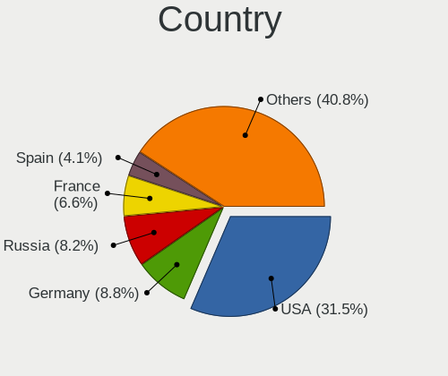
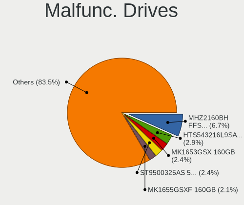
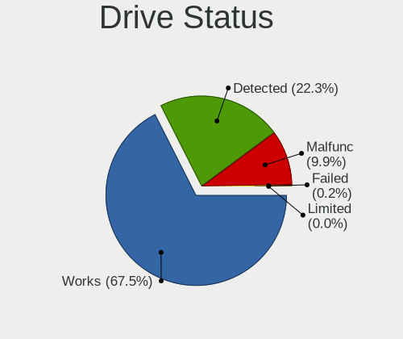
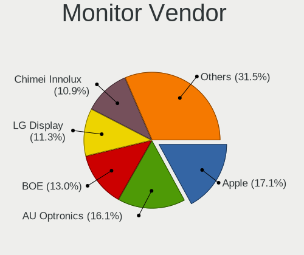

Debian 11 - Tested Hardware & Statistics (Notebooks)
----------------------------------------------------

A project to collect tested hardware configurations for Debian 11.

Anyone can contribute to this report by the [hw-probe](https://github.com/linuxhw/hw-probe) tool:

    sudo -E hw-probe -all -upload

Please submit a probe of your configuration if it's not presented on the page or is rare.

Full-feature report is available here: https://linux-hardware.org/?view=trends&formfactor=notebook

Contents
--------

* [ Test Cases ](#test-cases)

* [ System ](#system)
  - [ Kernel                   ](#kernel)
  - [ Kernel Family            ](#kernel-family)
  - [ Kernel Major Ver.        ](#kernel-major-ver)
  - [ Arch                     ](#arch)
  - [ DE                       ](#de)
  - [ Display Server           ](#display-server)
  - [ Display Manager          ](#display-manager)
  - [ OS Lang                  ](#os-lang)
  - [ Boot Mode                ](#boot-mode)
  - [ Filesystem               ](#filesystem)
  - [ Part. scheme             ](#part-scheme)
  - [ Dual Boot with Linux/BSD ](#dual-boot-with-linux-bsd)
  - [ Dual Boot (Win)          ](#dual-boot-win)

* [ Board ](#board)
  - [ Vendor                   ](#vendor)
  - [ Model                    ](#model)
  - [ Model Family             ](#model-family)
  - [ MFG Year                 ](#mfg-year)
  - [ Form Factor              ](#form-factor)
  - [ Secure Boot              ](#secure-boot)
  - [ Coreboot                 ](#coreboot)
  - [ RAM Size                 ](#ram-size)
  - [ RAM Used                 ](#ram-used)
  - [ Total Drives             ](#total-drives)
  - [ Has CD-ROM               ](#has-cd-rom)
  - [ Has Ethernet             ](#has-ethernet)
  - [ Has WiFi                 ](#has-wifi)
  - [ Has Bluetooth            ](#has-bluetooth)

* [ Location ](#location)
  - [ Country                  ](#country)
  - [ City                     ](#city)

* [ Drives ](#drives)
  - [ Drive Vendor             ](#drive-vendor)
  - [ Drive Model              ](#drive-model)
  - [ HDD Vendor               ](#hdd-vendor)
  - [ SSD Vendor               ](#ssd-vendor)
  - [ Drive Kind               ](#drive-kind)
  - [ Drive Connector          ](#drive-connector)
  - [ Drive Size               ](#drive-size)
  - [ Space Total              ](#space-total)
  - [ Space Used               ](#space-used)
  - [ Malfunc. Drives          ](#malfunc-drives)
  - [ Malfunc. Drive Vendor    ](#malfunc-drive-vendor)
  - [ Malfunc. HDD Vendor      ](#malfunc-hdd-vendor)
  - [ Malfunc. Drive Kind      ](#malfunc-drive-kind)
  - [ Failed Drives            ](#failed-drives)
  - [ Failed Drive Vendor      ](#failed-drive-vendor)
  - [ Drive Status             ](#drive-status)

* [ Storage controller ](#storage-controller)
  - [ Storage Vendor           ](#storage-vendor)
  - [ Storage Model            ](#storage-model)
  - [ Storage Kind             ](#storage-kind)

* [ Processor ](#processor)
  - [ CPU Vendor               ](#cpu-vendor)
  - [ CPU Model                ](#cpu-model)
  - [ CPU Model Family         ](#cpu-model-family)
  - [ CPU Cores                ](#cpu-cores)
  - [ CPU Sockets              ](#cpu-sockets)
  - [ CPU Threads              ](#cpu-threads)
  - [ CPU Op-Modes             ](#cpu-op-modes)
  - [ CPU Microcode            ](#cpu-microcode)
  - [ CPU Microarch            ](#cpu-microarch)

* [ Graphics ](#graphics)
  - [ GPU Vendor               ](#gpu-vendor)
  - [ GPU Model                ](#gpu-model)
  - [ GPU Combo                ](#gpu-combo)
  - [ GPU Driver               ](#gpu-driver)
  - [ GPU Memory               ](#gpu-memory)

* [ Monitor ](#monitor)
  - [ Monitor Vendor           ](#monitor-vendor)
  - [ Monitor Model            ](#monitor-model)
  - [ Monitor Resolution       ](#monitor-resolution)
  - [ Monitor Diagonal         ](#monitor-diagonal)
  - [ Monitor Width            ](#monitor-width)
  - [ Aspect Ratio             ](#aspect-ratio)
  - [ Monitor Area             ](#monitor-area)
  - [ Pixel Density            ](#pixel-density)
  - [ Multiple Monitors        ](#multiple-monitors)

* [ Network ](#network)
  - [ Net Controller Vendor    ](#net-controller-vendor)
  - [ Net Controller Model     ](#net-controller-model)
  - [ Wireless Vendor          ](#wireless-vendor)
  - [ Wireless Model           ](#wireless-model)
  - [ Ethernet Vendor          ](#ethernet-vendor)
  - [ Ethernet Model           ](#ethernet-model)
  - [ Net Controller Kind      ](#net-controller-kind)
  - [ Used Controller          ](#used-controller)
  - [ NICs                     ](#nics)
  - [ IPv6                     ](#ipv6)

* [ Bluetooth ](#bluetooth)
  - [ Bluetooth Vendor         ](#bluetooth-vendor)
  - [ Bluetooth Model          ](#bluetooth-model)

* [ Sound ](#sound)
  - [ Sound Vendor             ](#sound-vendor)
  - [ Sound Model              ](#sound-model)

* [ Memory ](#memory)
  - [ Memory Vendor            ](#memory-vendor)
  - [ Memory Model             ](#memory-model)
  - [ Memory Kind              ](#memory-kind)
  - [ Memory Form Factor       ](#memory-form-factor)
  - [ Memory Size              ](#memory-size)
  - [ Memory Speed             ](#memory-speed)

* [ Printers & scanners ](#printers-scanners)
  - [ Printer Vendor           ](#printer-vendor)
  - [ Printer Model            ](#printer-model)
  - [ Scanner Vendor           ](#scanner-vendor)
  - [ Scanner Model            ](#scanner-model)

* [ Camera ](#camera)
  - [ Camera Vendor            ](#camera-vendor)
  - [ Camera Model             ](#camera-model)

* [ Security ](#security)
  - [ Fingerprint Vendor       ](#fingerprint-vendor)
  - [ Fingerprint Model        ](#fingerprint-model)
  - [ Chipcard Vendor          ](#chipcard-vendor)
  - [ Chipcard Model           ](#chipcard-model)

* [ Unsupported ](#unsupported)
  - [ Unsupported Devices      ](#unsupported-devices)
  - [ Unsupported Device Types ](#unsupported-device-types)

Test Cases
----------

| Vendor   | Model                       | Probe                                                      | Date         |
|----------|-----------------------------|------------------------------------------------------------|--------------|
| Apple    | MacBookPro8,1               | [b0e58bf8de](https://linux-hardware.org/?probe=b0e58bf8de) | Jul 24, 2021 |
| Lenovo   | IdeaPad 700-15ISK 80RU      | [3491bd4228](https://linux-hardware.org/?probe=3491bd4228) | Jul 23, 2021 |
| Lenovo   | ThinkPad E595 20NF0005IX    | [dd220c0bdb](https://linux-hardware.org/?probe=dd220c0bdb) | Jul 23, 2021 |
| Gigabyte | AERO 17-SA                  | [eaff86e276](https://linux-hardware.org/?probe=eaff86e276) | Jul 23, 2021 |
| Acer     | Aspire A715-72G             | [b436023dda](https://linux-hardware.org/?probe=b436023dda) | Jul 23, 2021 |
| Lenovo   | IdeaPad S145-15IWL 81S9     | [ecd10ec3a7](https://linux-hardware.org/?probe=ecd10ec3a7) | Jul 22, 2021 |
| ASUSTek  | VivoBook_ASUSLaptop X509... | [1abb08da83](https://linux-hardware.org/?probe=1abb08da83) | Jul 21, 2021 |
| HP       | Laptop 15s-fq1xxx           | [4ed280d4c8](https://linux-hardware.org/?probe=4ed280d4c8) | Jul 19, 2021 |
| HP       | EliteBook 830 G7 Noteboo... | [acca72e9c1](https://linux-hardware.org/?probe=acca72e9c1) | Jul 15, 2021 |
| Lenovo   | ThinkPad Edge E540 20C60... | [a5daecad1d](https://linux-hardware.org/?probe=a5daecad1d) | Jul 15, 2021 |
| Dell     | Precision 3540              | [383ebf30aa](https://linux-hardware.org/?probe=383ebf30aa) | Jul 14, 2021 |
| Itautec  | Infoway                     | [06dc7b0fd1](https://linux-hardware.org/?probe=06dc7b0fd1) | Jul 14, 2021 |
| Lenovo   | ThinkPad E15 Gen 2 20TD0... | [71d234aaef](https://linux-hardware.org/?probe=71d234aaef) | Jul 14, 2021 |
| Acer     | Aspire 7741                 | [6ed4934b61](https://linux-hardware.org/?probe=6ed4934b61) | Jul 13, 2021 |
| Acer     | Aspire 7741                 | [ee5a2b2029](https://linux-hardware.org/?probe=ee5a2b2029) | Jul 13, 2021 |
| ASUSTek  | VivoBook_ASUSLaptop X513... | [54bfb26e0f](https://linux-hardware.org/?probe=54bfb26e0f) | Jul 12, 2021 |
| ASUSTek  | ROG Strix G533QS_G533QS     | [98271924ba](https://linux-hardware.org/?probe=98271924ba) | Jul 11, 2021 |
| Lenovo   | ThinkPad T430 2349V4B       | [d39fe8e9d4](https://linux-hardware.org/?probe=d39fe8e9d4) | Jul 11, 2021 |
| HP       | EliteBook 855 G7 Noteboo... | [1cb0058b88](https://linux-hardware.org/?probe=1cb0058b88) | Jul 10, 2021 |
| Acer     | Aspire A315-23G             | [e6aa891005](https://linux-hardware.org/?probe=e6aa891005) | Jul 08, 2021 |
| Dell     | XPS 13 9380                 | [b31688ecfa](https://linux-hardware.org/?probe=b31688ecfa) | Jul 08, 2021 |
| Dell     | Latitude E6330              | [321bec10eb](https://linux-hardware.org/?probe=321bec10eb) | Jul 05, 2021 |
| HP       | Compaq 6830s                | [9c47e76afe](https://linux-hardware.org/?probe=9c47e76afe) | Jul 04, 2021 |
| HP       | Compaq 6830s                | [b524035304](https://linux-hardware.org/?probe=b524035304) | Jul 04, 2021 |
| Dell     | Inspiron 5570               | [b760b0d9cc](https://linux-hardware.org/?probe=b760b0d9cc) | Jul 03, 2021 |
| Acer     | Aspire A515-51              | [f94bb31c5a](https://linux-hardware.org/?probe=f94bb31c5a) | Jul 03, 2021 |
| HP       | ZBook Fury 17 G7 Mobile ... | [c24fcd1454](https://linux-hardware.org/?probe=c24fcd1454) | Jul 02, 2021 |
| Dell     | Inspiron 5570               | [44b96068f2](https://linux-hardware.org/?probe=44b96068f2) | Jul 02, 2021 |
| Acer     | Aspire A315-23G             | [5729444e9b](https://linux-hardware.org/?probe=5729444e9b) | Jul 02, 2021 |
| Acer     | Aspire A315-23G             | [bd3211a03b](https://linux-hardware.org/?probe=bd3211a03b) | Jun 30, 2021 |
| Lenovo   | ThinkPad X1 Extreme Gen ... | [c8cb82f74d](https://linux-hardware.org/?probe=c8cb82f74d) | Jun 30, 2021 |
| Dell     | XPS 13 9310                 | [24a52836b4](https://linux-hardware.org/?probe=24a52836b4) | Jun 30, 2021 |
| HP       | ProBook 640 G3              | [c56b8f3ff1](https://linux-hardware.org/?probe=c56b8f3ff1) | Jun 29, 2021 |
| HP       | ZBook 17 G5                 | [5557a5c23c](https://linux-hardware.org/?probe=5557a5c23c) | Jun 29, 2021 |
| Lenovo   | IdeaPad Z580                | [6a9d31c8ef](https://linux-hardware.org/?probe=6a9d31c8ef) | Jun 29, 2021 |
| Dell     | Inspiron 5570               | [5335641d04](https://linux-hardware.org/?probe=5335641d04) | Jun 28, 2021 |
| Dell     | Inspiron 5570               | [0632a7bf28](https://linux-hardware.org/?probe=0632a7bf28) | Jun 28, 2021 |
| Acer     | Aspire A315-23G             | [834b68e61a](https://linux-hardware.org/?probe=834b68e61a) | Jun 28, 2021 |
| HUAWEI   | BOHK-WAX9X                  | [65c54db09e](https://linux-hardware.org/?probe=65c54db09e) | Jun 27, 2021 |
| HUAWEI   | BOHK-WAX9X                  | [fda3d18cf7](https://linux-hardware.org/?probe=fda3d18cf7) | Jun 27, 2021 |
| HP       | ZBook Fury 17 G7 Mobile ... | [c3d5fd07c1](https://linux-hardware.org/?probe=c3d5fd07c1) | Jun 27, 2021 |
| Acer     | Nitro AN515-51              | [6c4a46b4ec](https://linux-hardware.org/?probe=6c4a46b4ec) | Jun 26, 2021 |
| Dell     | Inspiron 3501               | [d6f07cb592](https://linux-hardware.org/?probe=d6f07cb592) | Jun 23, 2021 |
| MSI      | GF65 Thin 10UE              | [d1e0b6ee58](https://linux-hardware.org/?probe=d1e0b6ee58) | Jun 22, 2021 |
| Lenovo   | ThinkPad T495 20NKS0PG00    | [9e646a384e](https://linux-hardware.org/?probe=9e646a384e) | Jun 22, 2021 |
| Dell     | Precision 3560              | [81efcf647c](https://linux-hardware.org/?probe=81efcf647c) | Jun 21, 2021 |
| Fujitsu  | LIFEBOOK A357               | [75c4ec9e5a](https://linux-hardware.org/?probe=75c4ec9e5a) | Jun 21, 2021 |
| Lenovo   | IdeaPad 700-15ISK 80RU      | [c62a9a5058](https://linux-hardware.org/?probe=c62a9a5058) | Jun 20, 2021 |
| Lenovo   | IdeaPad 700-15ISK 80RU      | [5a39dabe8a](https://linux-hardware.org/?probe=5a39dabe8a) | Jun 20, 2021 |
| Acer     | Aspire A315-23G             | [b37bec27b3](https://linux-hardware.org/?probe=b37bec27b3) | Jun 20, 2021 |
| Dell     | Latitude E7470              | [49cb9ff0b0](https://linux-hardware.org/?probe=49cb9ff0b0) | Jun 20, 2021 |
| Acer     | Aspire 5750G                | [73d6b46b6b](https://linux-hardware.org/?probe=73d6b46b6b) | Jun 19, 2021 |
| ASUSTek  | ZenBook UX431DA_UM431DA     | [a894e25838](https://linux-hardware.org/?probe=a894e25838) | Jun 19, 2021 |
| Acer     | Aspire A315-23G             | [dde7123487](https://linux-hardware.org/?probe=dde7123487) | Jun 19, 2021 |
| Lenovo   | ThinkPad X270 W10DG 20K5... | [842c53b8e2](https://linux-hardware.org/?probe=842c53b8e2) | Jun 18, 2021 |
| Acer     | Aspire A315-23G             | [1a8a3efde5](https://linux-hardware.org/?probe=1a8a3efde5) | Jun 18, 2021 |
| Lenovo   | ThinkPad X230 2325AZ8       | [b5ea5009bf](https://linux-hardware.org/?probe=b5ea5009bf) | Jun 18, 2021 |
| Lenovo   | Yoga 300-11IBR 80M1         | [259fc86278](https://linux-hardware.org/?probe=259fc86278) | Jun 18, 2021 |
| Acer     | Aspire ES1-132              | [c26c0f6e33](https://linux-hardware.org/?probe=c26c0f6e33) | Jun 15, 2021 |
| Acer     | Aspire A315-23G             | [eb77944ea2](https://linux-hardware.org/?probe=eb77944ea2) | Jun 14, 2021 |
| Acer     | Aspire V3-331               | [91f4f7aab6](https://linux-hardware.org/?probe=91f4f7aab6) | Jun 13, 2021 |
| UNOWHY   | Y13G002S4EI                 | [3d25dc9f69](https://linux-hardware.org/?probe=3d25dc9f69) | Jun 13, 2021 |
| ASUSTek  | X550LD                      | [2d1f6364aa](https://linux-hardware.org/?probe=2d1f6364aa) | Jun 13, 2021 |
| Acer     | Aspire V3-331               | [02e288caf9](https://linux-hardware.org/?probe=02e288caf9) | Jun 13, 2021 |
| Lenovo   | ThinkPad X270 W10DG 20K5... | [1b2cda6c08](https://linux-hardware.org/?probe=1b2cda6c08) | Jun 12, 2021 |
| ASUSTek  | VivoBook_ASUSLaptop X512... | [f6ba765876](https://linux-hardware.org/?probe=f6ba765876) | Jun 12, 2021 |
| HUAWEI   | BOHK-WAX9X                  | [57684125de](https://linux-hardware.org/?probe=57684125de) | Jun 12, 2021 |
| Dell     | Latitude E7470              | [51c1f3f1f5](https://linux-hardware.org/?probe=51c1f3f1f5) | Jun 10, 2021 |
| Acer     | Aspire A315-23G             | [377f2e9ec6](https://linux-hardware.org/?probe=377f2e9ec6) | Jun 09, 2021 |
| Dell     | Latitude E6330              | [ba88cd6328](https://linux-hardware.org/?probe=ba88cd6328) | Jun 08, 2021 |
| Lenovo   | ThinkPad T430s 2356A89      | [0195b8564e](https://linux-hardware.org/?probe=0195b8564e) | Jun 08, 2021 |
| Acer     | Aspire ES1-132              | [2db77f0d01](https://linux-hardware.org/?probe=2db77f0d01) | Jun 07, 2021 |
| Acer     | Aspire A315-23G             | [548356ed30](https://linux-hardware.org/?probe=548356ed30) | Jun 06, 2021 |
| Dell     | Inspiron 3793               | [f65812f774](https://linux-hardware.org/?probe=f65812f774) | Jun 06, 2021 |
| ASUSTek  | M3N                         | [ec5f914161](https://linux-hardware.org/?probe=ec5f914161) | Jun 06, 2021 |
| ASUSTek  | M3N                         | [bd89f26d7e](https://linux-hardware.org/?probe=bd89f26d7e) | Jun 05, 2021 |
| Lenovo   | IdeaPad 320-15IKB 80XL      | [5c16d903d3](https://linux-hardware.org/?probe=5c16d903d3) | Jun 05, 2021 |
| HUAWEI   | BOHK-WAX9X                  | [47e9dfd146](https://linux-hardware.org/?probe=47e9dfd146) | Jun 05, 2021 |
| Acer     | Aspire A315-23G             | [90dbe22a68](https://linux-hardware.org/?probe=90dbe22a68) | Jun 05, 2021 |
| HP       | ProBook 640 G8 Notebook ... | [e20b51102d](https://linux-hardware.org/?probe=e20b51102d) | Jun 03, 2021 |
| Lenovo   | ThinkPad T495 20NJCTO1WW    | [b513f2fc77](https://linux-hardware.org/?probe=b513f2fc77) | Jun 03, 2021 |
| Monster  | ABRA A5 V15.2               | [012bfa586d](https://linux-hardware.org/?probe=012bfa586d) | Jun 02, 2021 |
| Pegatron | A15                         | [dec1b6b43a](https://linux-hardware.org/?probe=dec1b6b43a) | Jun 02, 2021 |
| HUAWEI   | BOHK-WAX9X                  | [ac80feea4f](https://linux-hardware.org/?probe=ac80feea4f) | Jun 01, 2021 |
| Acer     | Aspire A315-23G             | [80cf3dc8e7](https://linux-hardware.org/?probe=80cf3dc8e7) | Jun 01, 2021 |
| HP       | Compaq tc4400 (GE179UP#A... | [eeaee9f1ad](https://linux-hardware.org/?probe=eeaee9f1ad) | Jun 01, 2021 |
| Toshiba  | Satellite U800W             | [ac79b35dfd](https://linux-hardware.org/?probe=ac79b35dfd) | May 30, 2021 |
| MSI      | U90/U100                    | [477251f62e](https://linux-hardware.org/?probe=477251f62e) | May 30, 2021 |
| MSI      | U90/U100                    | [1a0476551b](https://linux-hardware.org/?probe=1a0476551b) | May 30, 2021 |
| Lenovo   | ThinkPad X1 Carbon 6th 2... | [c33e7ced42](https://linux-hardware.org/?probe=c33e7ced42) | May 29, 2021 |
| MSI      | CX700                       | [ef40976753](https://linux-hardware.org/?probe=ef40976753) | May 29, 2021 |
| Dell     | XPS 13 9310                 | [5de2c933c1](https://linux-hardware.org/?probe=5de2c933c1) | May 28, 2021 |
| Lenovo   | ThinkPad T530 24296HG       | [88cee1e822](https://linux-hardware.org/?probe=88cee1e822) | May 28, 2021 |
| Samsung  | 370E4K                      | [125fbb3d15](https://linux-hardware.org/?probe=125fbb3d15) | May 28, 2021 |
| MSI      | CX700                       | [535d0016e2](https://linux-hardware.org/?probe=535d0016e2) | May 27, 2021 |
| Acer     | Aspire A315-23G             | [c091670daa](https://linux-hardware.org/?probe=c091670daa) | May 25, 2021 |
| Acer     | Aspire A315-23G             | [ad6cd7847f](https://linux-hardware.org/?probe=ad6cd7847f) | May 24, 2021 |
| Lenovo   | ThinkPad T14 Gen 1 20UDC... | [f03341d873](https://linux-hardware.org/?probe=f03341d873) | May 23, 2021 |
| HP       | EliteBook 840 G1            | [6573923d55](https://linux-hardware.org/?probe=6573923d55) | May 21, 2021 |
| Acer     | Aspire A315-23G             | [8b7b153998](https://linux-hardware.org/?probe=8b7b153998) | May 20, 2021 |
| Dell     | Latitude 7480               | [0f2477786d](https://linux-hardware.org/?probe=0f2477786d) | May 19, 2021 |
| Lenovo   | ThinkPad T440p 20AWS4PN0... | [f8b2c84bc1](https://linux-hardware.org/?probe=f8b2c84bc1) | May 19, 2021 |
| HUAWEI   | BOHK-WAX9X                  | [b9d0acf0a6](https://linux-hardware.org/?probe=b9d0acf0a6) | May 19, 2021 |
| HUAWEI   | BOHK-WAX9X                  | [97a658e572](https://linux-hardware.org/?probe=97a658e572) | May 19, 2021 |
| Acer     | Aspire A315-23G             | [28bb88d60c](https://linux-hardware.org/?probe=28bb88d60c) | May 17, 2021 |
| HP       | Compaq Presario C700        | [91a939ce16](https://linux-hardware.org/?probe=91a939ce16) | May 16, 2021 |
| Acer     | Aspire A315-23G             | [646b64ccb3](https://linux-hardware.org/?probe=646b64ccb3) | May 15, 2021 |
| HP       | Split 13 x2 PC              | [5834b6321d](https://linux-hardware.org/?probe=5834b6321d) | May 05, 2021 |
| ASUSTek  | ZenBook UX425IA_UM425IA     | [bf3e99374e](https://linux-hardware.org/?probe=bf3e99374e) | Apr 29, 2021 |
| Lenovo   | IdeaPad Z500 20202          | [a06f2bc29e](https://linux-hardware.org/?probe=a06f2bc29e) | Apr 27, 2021 |
| ASUSTek  | ZenBook UX333FN_UX333FN     | [a042fd63c6](https://linux-hardware.org/?probe=a042fd63c6) | Apr 27, 2021 |
| Dell     | Inspiron 3793               | [a4c79ea8c3](https://linux-hardware.org/?probe=a4c79ea8c3) | Apr 26, 2021 |
| HP       | EliteBook 8460p             | [bcea790fba](https://linux-hardware.org/?probe=bcea790fba) | Apr 24, 2021 |
| Lenovo   | ThinkPad T430s 23533KJ      | [39aa120e47](https://linux-hardware.org/?probe=39aa120e47) | Apr 21, 2021 |
| Dell     | Inspiron 5468               | [cfc77b26b5](https://linux-hardware.org/?probe=cfc77b26b5) | Apr 17, 2021 |
| Lenovo   | ThinkPad T530 24296HG       | [4967255e37](https://linux-hardware.org/?probe=4967255e37) | Apr 14, 2021 |
| Lenovo   | ThinkPad T530 24296HG       | [e1a5725060](https://linux-hardware.org/?probe=e1a5725060) | Apr 14, 2021 |

System
------

Kernel
------

Version of the Linux kernel

| Version                    | Notebooks | Percent |
|----------------------------|-----------|---------|
| 5.10.0-7-amd64             | 37        | 45.68%  |
| 5.10.0-6-amd64             | 21        | 25.93%  |
| 5.10.0-8-amd64             | 6         | 7.41%   |
| 5.12.10                    | 1         | 1.23%   |
| 5.12.1                     | 1         | 1.23%   |
| 5.12.0-9.2-liquorix-amd64  | 1         | 1.23%   |
| 5.12.0-14.2-liquorix-amd64 | 1         | 1.23%   |
| 5.11.9+                    | 1         | 1.23%   |
| 5.11.22-1-pve              | 1         | 1.23%   |
| 5.11.15-051115-generic     | 1         | 1.23%   |
| 5.11.14                    | 1         | 1.23%   |
| 5.11.0-rc6                 | 1         | 1.23%   |
| 5.10.0-io7-amd64           | 1         | 1.23%   |
| 5.10.0-6-rt-amd64          | 1         | 1.23%   |
| 5.10.0-6-686               | 1         | 1.23%   |
| 5.10.0-5-amd64             | 1         | 1.23%   |
| 4.19.181-z580322           | 1         | 1.23%   |
| 4.19.0-16-amd64            | 1         | 1.23%   |
| 4.19.0-16-686-pae          | 1         | 1.23%   |
| 4.19.0-14-amd64            | 1         | 1.23%   |

Kernel Family
-------------

Linux kernel without a distro release

| Version  | Notebooks | Percent |
|----------|-----------|---------|
| 5.10.0   | 65        | 84.42%  |
| 4.19.0   | 3         | 3.9%    |
| 5.12.10  | 1         | 1.3%    |
| 5.12.1   | 1         | 1.3%    |
| 5.12.0   | 1         | 1.3%    |
| 5.11.9   | 1         | 1.3%    |
| 5.11.22  | 1         | 1.3%    |
| 5.11.15  | 1         | 1.3%    |
| 5.11.14  | 1         | 1.3%    |
| 5.11.0   | 1         | 1.3%    |
| 4.19.181 | 1         | 1.3%    |

Kernel Major Ver.
-----------------

Linux kernel major version

| Version | Notebooks | Percent |
|---------|-----------|---------|
| 5.10    | 65        | 84.42%  |
| 5.11    | 5         | 6.49%   |
| 4.19    | 4         | 5.19%   |
| 5.12    | 3         | 3.9%    |

Arch
----

OS architecture (x86_64, i586, etc.)

| Name   | Notebooks | Percent |
|--------|-----------|---------|
| x86_64 | 75        | 97.4%   |
| i686   | 2         | 2.6%    |

DE
--

Desktop Environment

| Name             | Notebooks | Percent |
|------------------|-----------|---------|
| GNOME            | 20        | 25.97%  |
| KDE5             | 15        | 19.48%  |
| XFCE             | 7         | 9.09%   |
| MATE             | 5         | 6.49%   |
| Unknown          | 5         | 6.49%   |
| LXQt             | 4         | 5.19%   |
| i3               | 4         | 5.19%   |
| KDE              | 3         | 3.9%    |
| Cinnamon         | 3         | 3.9%    |
| X-Cinnamon       | 2         | 2.6%    |
| openbox          | 2         | 2.6%    |
| lightdm-xsession | 2         | 2.6%    |
| GNOME Flashback  | 2         | 2.6%    |
| LXDE             | 1         | 1.3%    |
| default          | 1         | 1.3%    |
| awesome          | 1         | 1.3%    |

Display Server
--------------

X11 or Wayland

| Name    | Notebooks | Percent |
|---------|-----------|---------|
| X11     | 57        | 72.15%  |
| Wayland | 15        | 18.99%  |
| Tty     | 5         | 6.33%   |
| Unknown | 2         | 2.53%   |

Display Manager
---------------

SDDM, LightDM, etc.

| Name    | Notebooks | Percent |
|---------|-----------|---------|
| TDM     | 23        | 29.87%  |
| GDM     | 20        | 25.97%  |
| SDDM    | 17        | 22.08%  |
| Unknown | 15        | 19.48%  |
| XDM     | 1         | 1.3%    |
| LightDM | 1         | 1.3%    |

OS Lang
-------

Language

| Lang    | Notebooks | Percent |
|---------|-----------|---------|
| en_US   | 22        | 28.57%  |
| ru_RU   | 6         | 7.79%   |
| fr_FR   | 6         | 7.79%   |
| de_DE   | 6         | 7.79%   |
| pt_BR   | 5         | 6.49%   |
| es_ES   | 5         | 6.49%   |
| tr_TR   | 3         | 3.9%    |
| pl_PL   | 3         | 3.9%    |
| it_IT   | 3         | 3.9%    |
| en_GB   | 3         | 3.9%    |
| pt_PT   | 2         | 2.6%    |
| de_CH   | 2         | 2.6%    |
| ru_UA   | 1         | 1.3%    |
| ro_RO   | 1         | 1.3%    |
| nl_BE   | 1         | 1.3%    |
| ja_JP   | 1         | 1.3%    |
| hu_HU   | 1         | 1.3%    |
| en_IN   | 1         | 1.3%    |
| en_HK   | 1         | 1.3%    |
| cs_CZ   | 1         | 1.3%    |
| ca_ES   | 1         | 1.3%    |
| C       | 1         | 1.3%    |
| Unknown | 1         | 1.3%    |

Boot Mode
---------

EFI or BIOS

| Mode | Notebooks | Percent |
|------|-----------|---------|
| EFI  | 51        | 66.23%  |
| BIOS | 26        | 33.77%  |

Filesystem
----------

Type of filesystem

| Type    | Notebooks | Percent |
|---------|-----------|---------|
| Ext4    | 66        | 85.71%  |
| Btrfs   | 5         | 6.49%   |
| Overlay | 3         | 3.9%    |
| Zfs     | 1         | 1.3%    |
| Xfs     | 1         | 1.3%    |
| Unknown | 1         | 1.3%    |

Part. scheme
------------

Scheme of partitioning

| Type    | Notebooks | Percent |
|---------|-----------|---------|
| GPT     | 52        | 67.53%  |
| MBR     | 14        | 18.18%  |
| Unknown | 11        | 14.29%  |

Dual Boot with Linux/BSD
------------------------

Hosting more than one Linux/BSD

| Dual boot | Notebooks | Percent |
|-----------|-----------|---------|
| No        | 65        | 84.42%  |
| Yes       | 12        | 15.58%  |

Dual Boot (Win)
---------------

Hosting Linux and Windows

| Dual boot | Notebooks | Percent |
|-----------|-----------|---------|
| No        | 52        | 67.53%  |
| Yes       | 25        | 32.47%  |

Board
-----

Vendor
------

Motherboard manufacturer

| Name                | Notebooks | Percent |
|---------------------|-----------|---------|
| Lenovo              | 21        | 27.27%  |
| Hewlett-Packard     | 13        | 16.88%  |
| Dell                | 13        | 16.88%  |
| ASUSTek Computer    | 9         | 11.69%  |
| Acer                | 8         | 10.39%  |
| MSI                 | 3         | 3.9%    |
| UNOWHY              | 1         | 1.3%    |
| Toshiba             | 1         | 1.3%    |
| Samsung Electronics | 1         | 1.3%    |
| Pegatron            | 1         | 1.3%    |
| Monster             | 1         | 1.3%    |
| Itautec             | 1         | 1.3%    |
| HUAWEI              | 1         | 1.3%    |
| Gigabyte Technology | 1         | 1.3%    |
| Fujitsu             | 1         | 1.3%    |
| Apple               | 1         | 1.3%    |

Model
-----

Motherboard model

| Name                                        | Notebooks | Percent |
|---------------------------------------------|-----------|---------|
| Dell XPS 13 9310                            | 2         | 2.6%    |
| Dell Inspiron 3793                          | 2         | 2.6%    |
| UNOWHY Y13G002S4EI                          | 1         | 1.3%    |
| Toshiba Satellite U800W                     | 1         | 1.3%    |
| Samsung 370E4K                              | 1         | 1.3%    |
| Pegatron A15                                | 1         | 1.3%    |
| MSI U90/U100                                | 1         | 1.3%    |
| MSI GF65 Thin 10UE                          | 1         | 1.3%    |
| MSI CX700                                   | 1         | 1.3%    |
| Monster ABRA A5 V15.2                       | 1         | 1.3%    |
| Lenovo Yoga 300-11IBR 80M1                  | 1         | 1.3%    |
| Lenovo ThinkPad X270 W10DG 20K5S41E00       | 1         | 1.3%    |
| Lenovo ThinkPad X230 2325AZ8                | 1         | 1.3%    |
| Lenovo ThinkPad X1 Extreme Gen 3 20TK001GUS | 1         | 1.3%    |
| Lenovo ThinkPad X1 Carbon 6th 20KH006JRT    | 1         | 1.3%    |
| Lenovo ThinkPad T530 24296HG                | 1         | 1.3%    |
| Lenovo ThinkPad T495 20NKS0PG00             | 1         | 1.3%    |
| Lenovo ThinkPad T495 20NJCTO1WW             | 1         | 1.3%    |
| Lenovo ThinkPad T440p 20AWS4PN00            | 1         | 1.3%    |
| Lenovo ThinkPad T430s 2356A89               | 1         | 1.3%    |
| Lenovo ThinkPad T430s 23533KJ               | 1         | 1.3%    |
| Lenovo ThinkPad T430 2349V4B                | 1         | 1.3%    |
| Lenovo ThinkPad T14 Gen 1 20UDCTO1WW        | 1         | 1.3%    |
| Lenovo ThinkPad Edge E540 20C600KCJP        | 1         | 1.3%    |
| Lenovo ThinkPad E595 20NF0005IX             | 1         | 1.3%    |
| Lenovo ThinkPad E15 Gen 2 20TD003MRT        | 1         | 1.3%    |
| Lenovo IdeaPad Z580                         | 1         | 1.3%    |
| Lenovo IdeaPad Z500 20202                   | 1         | 1.3%    |
| Lenovo IdeaPad S145-15IWL 81S9              | 1         | 1.3%    |
| Lenovo IdeaPad 700-15ISK 80RU               | 1         | 1.3%    |
| Lenovo IdeaPad 320-15IKB 80XL               | 1         | 1.3%    |
| Itautec Infoway                             | 1         | 1.3%    |
| HUAWEI BOHK-WAX9X                           | 1         | 1.3%    |
| HP ZBook Fury 17 G7 Mobile Workstation      | 1         | 1.3%    |
| HP ZBook 17 G5                              | 1         | 1.3%    |
| HP Split 13 x2 PC                           | 1         | 1.3%    |
| HP ProBook 640 G8 Notebook PC               | 1         | 1.3%    |
| HP ProBook 640 G3                           | 1         | 1.3%    |
| HP Laptop 15s-fq1xxx                        | 1         | 1.3%    |
| HP EliteBook 855 G7 Notebook PC             | 1         | 1.3%    |
| HP EliteBook 8460p                          | 1         | 1.3%    |
| HP EliteBook 840 G1                         | 1         | 1.3%    |
| HP EliteBook 830 G7 Notebook PC             | 1         | 1.3%    |
| HP Compaq tc4400 (GE179UP#ABA)              | 1         | 1.3%    |
| HP Compaq Presario C700                     | 1         | 1.3%    |
| HP Compaq 6830s                             | 1         | 1.3%    |
| Gigabyte AERO 17-SA                         | 1         | 1.3%    |
| Fujitsu LIFEBOOK A357                       | 1         | 1.3%    |
| Dell XPS 13 9380                            | 1         | 1.3%    |
| Dell Precision 3560                         | 1         | 1.3%    |
| Dell Precision 3540                         | 1         | 1.3%    |
| Dell Latitude E7470                         | 1         | 1.3%    |
| Dell Latitude E6330                         | 1         | 1.3%    |
| Dell Latitude 7480                          | 1         | 1.3%    |
| Dell Inspiron 5570                          | 1         | 1.3%    |
| Dell Inspiron 5468                          | 1         | 1.3%    |
| Dell Inspiron 3501                          | 1         | 1.3%    |
| ASUS ZenBook UX431DA_UM431DA                | 1         | 1.3%    |
| ASUS ZenBook UX425IA_UM425IA                | 1         | 1.3%    |
| ASUS ZenBook UX333FN_UX333FN                | 1         | 1.3%    |

Model Family
------------

Motherboard model prefix

| Name               | Notebooks | Percent |
|--------------------|-----------|---------|
| Lenovo ThinkPad    | 15        | 19.48%  |
| Acer Aspire        | 7         | 9.09%   |
| Lenovo IdeaPad     | 5         | 6.49%   |
| Dell Inspiron      | 5         | 6.49%   |
| HP EliteBook       | 4         | 5.19%   |
| HP Compaq          | 3         | 3.9%    |
| Dell XPS           | 3         | 3.9%    |
| Dell Latitude      | 3         | 3.9%    |
| ASUS ZenBook       | 3         | 3.9%    |
| ASUS VivoBook      | 3         | 3.9%    |
| HP ZBook           | 2         | 2.6%    |
| HP ProBook         | 2         | 2.6%    |
| Dell Precision     | 2         | 2.6%    |
| UNOWHY Y13G002S4EI | 1         | 1.3%    |
| Toshiba Satellite  | 1         | 1.3%    |
| Samsung 370E4K     | 1         | 1.3%    |
| Pegatron A15       | 1         | 1.3%    |
| MSI U90            | 1         | 1.3%    |
| MSI GF65           | 1         | 1.3%    |
| MSI CX700          | 1         | 1.3%    |
| Monster ABRA       | 1         | 1.3%    |
| Lenovo Yoga        | 1         | 1.3%    |
| Itautec Infoway    | 1         | 1.3%    |
| HUAWEI BOHK-WAX9X  | 1         | 1.3%    |
| HP Split           | 1         | 1.3%    |
| HP Laptop          | 1         | 1.3%    |
| Gigabyte AERO      | 1         | 1.3%    |
| Fujitsu LIFEBOOK   | 1         | 1.3%    |
| ASUS X550LD        | 1         | 1.3%    |
| ASUS ROG           | 1         | 1.3%    |
| ASUS M3N           | 1         | 1.3%    |
| Apple MacBookPro8  | 1         | 1.3%    |
| Acer Nitro         | 1         | 1.3%    |

MFG Year
--------

Motherboard manufacture year

| Year | Notebooks | Percent |
|------|-----------|---------|
| 2020 | 20        | 25.97%  |
| 2019 | 14        | 18.18%  |
| 2021 | 13        | 16.88%  |
| 2018 | 6         | 7.79%   |
| 2012 | 6         | 7.79%   |
| 2016 | 4         | 5.19%   |
| 2014 | 3         | 3.9%    |
| 2011 | 2         | 2.6%    |
| 2009 | 2         | 2.6%    |
| 2008 | 2         | 2.6%    |
| 2017 | 1         | 1.3%    |
| 2015 | 1         | 1.3%    |
| 2013 | 1         | 1.3%    |
| 2007 | 1         | 1.3%    |
| 2004 | 1         | 1.3%    |

Form Factor
-----------

Physical design of the computer

| Name     | Notebooks | Percent |
|----------|-----------|---------|
| Notebook | 77        | 100%    |

Secure Boot
-----------

Enabled or disabled

| State    | Notebooks | Percent |
|----------|-----------|---------|
| Disabled | 65        | 83.33%  |
| Enabled  | 13        | 16.67%  |

Coreboot
--------

Have coreboot on board

| Used | Notebooks | Percent |
|------|-----------|---------|
| No   | 77        | 100%    |

RAM Size
--------

Total RAM memory

| Size in GB  | Notebooks | Percent |
|-------------|-----------|---------|
| 4.01-8.0    | 20        | 25.97%  |
| 16.01-24.0  | 19        | 24.68%  |
| 8.01-16.0   | 17        | 22.08%  |
| 32.01-64.0  | 5         | 6.49%   |
| 3.01-4.0    | 5         | 6.49%   |
| 1.01-2.0    | 5         | 6.49%   |
| 64.01-256.0 | 3         | 3.9%    |
| 2.01-3.0    | 2         | 2.6%    |
| 24.01-32.0  | 1         | 1.3%    |

RAM Used
--------

Used RAM memory

| Used GB    | Notebooks | Percent |
|------------|-----------|---------|
| 2.01-3.0   | 21        | 25.93%  |
| 1.01-2.0   | 17        | 20.99%  |
| 4.01-8.0   | 15        | 18.52%  |
| 3.01-4.0   | 11        | 13.58%  |
| 8.01-16.0  | 7         | 8.64%   |
| 0.51-1.0   | 7         | 8.64%   |
| 0.01-0.5   | 2         | 2.47%   |
| 32.01-64.0 | 1         | 1.23%   |

Total Drives
------------

Number of drives on board

| Drives | Notebooks | Percent |
|--------|-----------|---------|
| 1      | 49        | 63.64%  |
| 2      | 24        | 31.17%  |
| 3      | 2         | 2.6%    |
| 0      | 2         | 2.6%    |

Has CD-ROM
----------

Has CD-ROM on board

| Presented | Notebooks | Percent |
|-----------|-----------|---------|
| No        | 60        | 77.92%  |
| Yes       | 17        | 22.08%  |

Has Ethernet
------------

Has Ethernet on board

| Presented | Notebooks | Percent |
|-----------|-----------|---------|
| Yes       | 61        | 79.22%  |
| No        | 16        | 20.78%  |

Has WiFi
--------

Has WiFi module

| Presented | Notebooks | Percent |
|-----------|-----------|---------|
| Yes       | 76        | 98.7%   |
| No        | 1         | 1.3%    |

Has Bluetooth
-------------

Has Bluetooth module

| Presented | Notebooks | Percent |
|-----------|-----------|---------|
| Yes       | 60        | 77.92%  |
| No        | 17        | 22.08%  |

Location
--------

Country
-------

Geographic location (country)

| Country     | Notebooks | Percent |
|-------------|-----------|---------|
| Russia      | 10        | 12.99%  |
| Germany     | 8         | 10.39%  |
| France      | 7         | 9.09%   |
| Brazil      | 6         | 7.79%   |
| USA         | 5         | 6.49%   |
| Spain       | 5         | 6.49%   |
| Poland      | 5         | 6.49%   |
| Ukraine     | 3         | 3.9%    |
| Turkey      | 3         | 3.9%    |
| Portugal    | 3         | 3.9%    |
| Italy       | 3         | 3.9%    |
| Switzerland | 2         | 2.6%    |
| Canada      | 2         | 2.6%    |
| Thailand    | 1         | 1.3%    |
| Romania     | 1         | 1.3%    |
| Philippines | 1         | 1.3%    |
| Netherlands | 1         | 1.3%    |
| Kazakhstan  | 1         | 1.3%    |
| Japan       | 1         | 1.3%    |
| India       | 1         | 1.3%    |
| Hungary     | 1         | 1.3%    |
| Greece      | 1         | 1.3%    |
| Denmark     | 1         | 1.3%    |
| Czechia     | 1         | 1.3%    |
| China       | 1         | 1.3%    |
| Belgium     | 1         | 1.3%    |
| Belarus     | 1         | 1.3%    |
| Argentina   | 1         | 1.3%    |

City
----

Geographic location (city)

| City                   | Notebooks | Percent |
|------------------------|-----------|---------|
| St Petersburg          | 5         | 6.41%   |
| Paris                  | 3         | 3.85%   |
| Rio de Janeiro         | 2         | 2.56%   |
| Mesa                   | 2         | 2.56%   |
| Kyiv                   | 2         | 2.56%   |
| Ankara                 | 2         | 2.56%   |
| Zaragoza               | 1         | 1.28%   |
| Warsaw                 | 1         | 1.28%   |
| Waregem                | 1         | 1.28%   |
| Vitória               | 1         | 1.28%   |
| Utrecht                | 1         | 1.28%   |
| Turin                  | 1         | 1.28%   |
| Toul                   | 1         | 1.28%   |
| Sunnyvale              | 1         | 1.28%   |
| Srednyaya Akhtuba      | 1         | 1.28%   |
| Shizuoka               | 1         | 1.28%   |
| Schleswig              | 1         | 1.28%   |
| Sarand                 | 1         | 1.28%   |
| San Justo              | 1         | 1.28%   |
| Sagunto                | 1         | 1.28%   |
| Rottenburg             | 1         | 1.28%   |
| Reliquias              | 1         | 1.28%   |
| Regen                  | 1         | 1.28%   |
| Ratiskovice            | 1         | 1.28%   |
| Perm                   | 1         | 1.28%   |
| Paderno Franciacorta   | 1         | 1.28%   |
| Odessa                 | 1         | 1.28%   |
| Nur-Sultan             | 1         | 1.28%   |
| Novo Hamburgo          | 1         | 1.28%   |
| Nova Porteirinha       | 1         | 1.28%   |
| New Westminster        | 1         | 1.28%   |
| Navalcarnero           | 1         | 1.28%   |
| Munich                 | 1         | 1.28%   |
| Moscow                 | 1         | 1.28%   |
| Minneapolis            | 1         | 1.28%   |
| Meitingen              | 1         | 1.28%   |
| Mataró                | 1         | 1.28%   |
| Madrid                 | 1         | 1.28%   |
| Lucon                  | 1         | 1.28%   |
| Loziska                | 1         | 1.28%   |
| Lodz                   | 1         | 1.28%   |
| Lisbon                 | 1         | 1.28%   |
| Les Mees               | 1         | 1.28%   |
| Krakow                 | 1         | 1.28%   |
| Katowice               | 1         | 1.28%   |
| Kassel                 | 1         | 1.28%   |
| Ivanteyevka            | 1         | 1.28%   |
| Istanbul               | 1         | 1.28%   |
| Hrodna                 | 1         | 1.28%   |
| Hombrechtikon          | 1         | 1.28%   |
| Hochstadt an der Aisch | 1         | 1.28%   |
| Guangzhou              | 1         | 1.28%   |
| Gelsenkirchen          | 1         | 1.28%   |
| Fougerolles            | 1         | 1.28%   |
| Fira                   | 1         | 1.28%   |
| Fayetteville           | 1         | 1.28%   |
| Copenhagen             | 1         | 1.28%   |
| Chelyabinsk            | 1         | 1.28%   |
| Campestre              | 1         | 1.28%   |
| Caloocan City          | 1         | 1.28%   |

Drives
------

Drive Vendor
------------

Hard drive vendors

| Vendor              | Notebooks | Drives | Percent |
|---------------------|-----------|--------|---------|
| Samsung Electronics | 16        | 19     | 16.67%  |
| WDC                 | 13        | 18     | 13.54%  |
| Seagate             | 9         | 11     | 9.38%   |
| Toshiba             | 8         | 8      | 8.33%   |
| Kingston            | 7         | 9      | 7.29%   |
| Intel               | 5         | 5      | 5.21%   |
| SK Hynix            | 4         | 4      | 4.17%   |
| Unknown             | 3         | 3      | 3.13%   |
| Crucial             | 3         | 3      | 3.13%   |
| A-DATA Technology   | 3         | 5      | 3.13%   |
| Micron Technology   | 2         | 2      | 2.08%   |
| LITEONIT            | 2         | 2      | 2.08%   |
| LITEON              | 2         | 2      | 2.08%   |
| JMicron             | 2         | 2      | 2.08%   |
| Intenso             | 2         | 2      | 2.08%   |
| Hitachi             | 2         | 2      | 2.08%   |
| HGST                | 2         | 2      | 2.08%   |
| XPG                 | 1         | 1      | 1.04%   |
| Transcend           | 1         | 1      | 1.04%   |
| Silicon Motion      | 1         | 1      | 1.04%   |
| SanDisk             | 1         | 1      | 1.04%   |
| Phison              | 1         | 2      | 1.04%   |
| Patriot             | 1         | 1      | 1.04%   |
| Maxtor              | 1         | 1      | 1.04%   |
| KIOXIA              | 1         | 1      | 1.04%   |
| Fujitsu             | 1         | 1      | 1.04%   |
| China               | 1         | 1      | 1.04%   |
| Apple               | 1         | 1      | 1.04%   |

Drive Model
-----------

Hard drive models

| Model                                   | Notebooks | Percent |
|-----------------------------------------|-----------|---------|
| Samsung SSD 970 EVO Plus 1TB            | 3         | 2.97%   |
| WDC WD10SPZX-21Z10T0 1TB                | 2         | 1.98%   |
| Seagate ST2000LX001-1RG174 2TB          | 2         | 1.98%   |
| Seagate ST1000LM024 HN-M101MBB 1TB      | 2         | 1.98%   |
| Kingston SA400S37240G 240GB SSD         | 2         | 1.98%   |
| XPG NVMe SSD Drive 1024GB               | 1         | 0.99%   |
| WDC WDS240G2G0A-00JH30 240GB SSD        | 1         | 0.99%   |
| WDC WDS100T3X0C-00SJG0 1TB              | 1         | 0.99%   |
| WDC WD5000BPVT-00HXZT3 500GB            | 1         | 0.99%   |
| WDC WD50 00LPCX-24VHA 500GB             | 1         | 0.99%   |
| WDC WD1200BEVS-60UST0 120GB             | 1         | 0.99%   |
| WDC WD10SPZX-80Z10T2 1TB                | 1         | 0.99%   |
| WDC WD10SPZX-22Z10T0 1TB                | 1         | 0.99%   |
| WDC WD-WD3200BVVT-62A26Y080 320GB       | 1         | 0.99%   |
| WDC PC SN730 SDBPNTY-256G-1027 256GB    | 1         | 0.99%   |
| WDC PC SN730 SDBPNTY-1T00-1006 1TB      | 1         | 0.99%   |
| WDC PC SN520 SDAPNUW-512G-1006 512GB    | 1         | 0.99%   |
| WDC PC SN520 SDAPNUW-256G-1002 256GB    | 1         | 0.99%   |
| Unknown DA4064  64GB                    | 1         | 0.99%   |
| Unknown BGND3R  32GB                    | 1         | 0.99%   |
| Unknown APPSD  272GB                    | 1         | 0.99%   |
| Transcend TS128GMSA370 128GB SSD        | 1         | 0.99%   |
| Toshiba MQ04ABD200 2TB                  | 1         | 0.99%   |
| Toshiba MQ01ACF032 320GB                | 1         | 0.99%   |
| Toshiba MQ01ABF050 500GB                | 1         | 0.99%   |
| Toshiba MQ01ABD100V 1TB                 | 1         | 0.99%   |
| Toshiba KXG6AZNV1T02 1TB                | 1         | 0.99%   |
| Toshiba KXG60ZNV512G NVMe KIOXIA 512GB  | 1         | 0.99%   |
| Toshiba KXG60PNV2T04 NVMe KIOXIA 2048GB | 1         | 0.99%   |
| Toshiba KXG50ZNV512G NVMe 512GB         | 1         | 0.99%   |
| SK Hynix HFM512GDJTNG-8310A 512GB       | 1         | 0.99%   |
| SK Hynix HFM512GDHTNG-8710B 512GB       | 1         | 0.99%   |
| SK Hynix HFM256GDJTNG-8310A 256GB       | 1         | 0.99%   |
| SK Hynix HFM001TD3JX013N 1TB            | 1         | 0.99%   |
| Silicon Motion NVMe SSD Drive 512GB     | 1         | 0.99%   |
| Seagate USB 250GB                       | 1         | 0.99%   |
| Seagate ST9320325AS 320GB               | 1         | 0.99%   |
| Seagate ST1000LM049-2GH172 1TB          | 1         | 0.99%   |
| Seagate ST1000LM035-1RK172 1TB          | 1         | 0.99%   |
| Seagate BUP Portable 4TB                | 1         | 0.99%   |
| Seagate BarraCuda SSD ZA1000CM10002 1TB | 1         | 0.99%   |
| SanDisk SSD PLUS 240GB                  | 1         | 0.99%   |
| Samsung SSD SM841 2.5 7mm 128GB         | 1         | 0.99%   |
| Samsung SSD 970 EVO Plus 250GB          | 1         | 0.99%   |
| Samsung SSD 860 EVO 500GB               | 1         | 0.99%   |
| Samsung SSD 850 EVO M.2 250GB           | 1         | 0.99%   |
| Samsung SSD 850 EVO 500GB               | 1         | 0.99%   |
| Samsung SSD 840 PRO Series 256GB        | 1         | 0.99%   |
| Samsung PM9A1 NVMe 512GB                | 1         | 0.99%   |
| Samsung PM991a NVMe 512GB               | 1         | 0.99%   |
| Samsung PM981 NVMe 512GB                | 1         | 0.99%   |
| Samsung NVMe SSD Drive 512GB            | 1         | 0.99%   |
| Samsung MZVLB512HBJQ-000H7 512GB        | 1         | 0.99%   |
| Samsung MZMPC032HBCD-00000 32GB SSD     | 1         | 0.99%   |
| Samsung MZALQ256HAJD-000L1 256GB        | 1         | 0.99%   |
| Samsung MZ7PD256HCGM-000H7 256GB SSD    | 1         | 0.99%   |
| Phison NVMe SSD Drive 240GB             | 1         | 0.99%   |
| Phison NVMe SSD Drive 1024GB            | 1         | 0.99%   |
| Patriot Burst 480GB SSD                 | 1         | 0.99%   |
| Micron 2300 NVMe 512GB                  | 1         | 0.99%   |

HDD Vendor
----------

Hard disk drive vendors

| Vendor  | Notebooks | Drives | Percent |
|---------|-----------|--------|---------|
| WDC     | 8         | 9      | 33.33%  |
| Seagate | 7         | 9      | 29.17%  |
| Toshiba | 4         | 4      | 16.67%  |
| Hitachi | 2         | 2      | 8.33%   |
| HGST    | 2         | 2      | 8.33%   |
| Fujitsu | 1         | 1      | 4.17%   |

SSD Vendor
----------

Solid state drive vendors

| Vendor              | Notebooks | Drives | Percent |
|---------------------|-----------|--------|---------|
| Samsung Electronics | 6         | 9      | 18.75%  |
| Kingston            | 4         | 6      | 12.5%   |
| Intel               | 3         | 3      | 9.38%   |
| Crucial             | 3         | 3      | 9.38%   |
| LITEONIT            | 2         | 2      | 6.25%   |
| Intenso             | 2         | 2      | 6.25%   |
| WDC                 | 1         | 3      | 3.13%   |
| Transcend           | 1         | 1      | 3.13%   |
| Seagate             | 1         | 1      | 3.13%   |
| SanDisk             | 1         | 1      | 3.13%   |
| Patriot             | 1         | 1      | 3.13%   |
| Micron Technology   | 1         | 1      | 3.13%   |
| Maxtor              | 1         | 1      | 3.13%   |
| LITEON              | 1         | 1      | 3.13%   |
| JMicron             | 1         | 1      | 3.13%   |
| China               | 1         | 1      | 3.13%   |
| Apple               | 1         | 1      | 3.13%   |
| A-DATA Technology   | 1         | 1      | 3.13%   |

Drive Kind
----------

HDD or SSD

| Kind    | Notebooks | Drives | Percent |
|---------|-----------|--------|---------|
| NVMe    | 32        | 40     | 35.16%  |
| SSD     | 30        | 39     | 32.97%  |
| HDD     | 24        | 27     | 26.37%  |
| MMC     | 3         | 3      | 3.3%    |
| Unknown | 2         | 2      | 2.2%    |

Drive Connector
---------------

SATA, SAS, NVMe, etc.

| Type | Notebooks | Drives | Percent |
|------|-----------|--------|---------|
| SATA | 45        | 61     | 52.33%  |
| NVMe | 32        | 40     | 37.21%  |
| SAS  | 6         | 7      | 6.98%   |
| MMC  | 3         | 3      | 3.49%   |

Drive Size
----------

Size of hard drive

| Size in TB | Notebooks | Drives | Percent |
|------------|-----------|--------|---------|
| 0.01-0.5   | 33        | 48     | 66%     |
| 0.51-1.0   | 13        | 14     | 26%     |
| 1.01-2.0   | 3         | 3      | 6%      |
| 3.01-4.0   | 1         | 1      | 2%      |

Space Total
-----------

Amount of disk space available on the file system

| Size in GB     | Notebooks | Percent |
|----------------|-----------|---------|
| 251-500        | 21        | 26.92%  |
| 101-250        | 17        | 21.79%  |
| 501-1000       | 12        | 15.38%  |
| 1001-2000      | 11        | 14.1%   |
| 51-100         | 6         | 7.69%   |
| 21-50          | 4         | 5.13%   |
| 1-20           | 4         | 5.13%   |
| Unknown        | 2         | 2.56%   |
| More than 3000 | 1         | 1.28%   |

Space Used
----------

Amount of used disk space

| Used GB   | Notebooks | Percent |
|-----------|-----------|---------|
| 1-20      | 22        | 27.85%  |
| 101-250   | 15        | 18.99%  |
| 21-50     | 13        | 16.46%  |
| 51-100    | 10        | 12.66%  |
| 251-500   | 9         | 11.39%  |
| 501-1000  | 6         | 7.59%   |
| 1001-2000 | 2         | 2.53%   |
| Unknown   | 2         | 2.53%   |

Malfunc. Drives
---------------

Drive models with a malfunction

| Model                                        | Notebooks | Drives | Percent |
|----------------------------------------------|-----------|--------|---------|
| Seagate ST9320325AS 320GB                    | 1         | 1      | 10%     |
| Seagate ST2000LX001-1RG174 2TB               | 1         | 1      | 10%     |
| Samsung Electronics SSD 840 PRO Series 256GB | 1         | 2      | 10%     |
| LITEONIT LMT-64M6M-HP 64GB SSD               | 1         | 1      | 10%     |
| Intel SSDSC2KW120H6 120GB                    | 1         | 1      | 10%     |
| Intel SSDSC2BF180A4H 180GB                   | 1         | 1      | 10%     |
| Hitachi HTS545050A7E380 500GB                | 1         | 1      | 10%     |
| Hitachi HTS543212L9A300 120GB                | 1         | 1      | 10%     |
| HGST HTS725050A7E630 500GB                   | 1         | 1      | 10%     |
| A-DATA Technology SU630 480GB SSD            | 1         | 1      | 10%     |

Malfunc. Drive Vendor
---------------------

Vendors of faulty drives

| Vendor              | Notebooks | Drives | Percent |
|---------------------|-----------|--------|---------|
| Seagate             | 2         | 2      | 20%     |
| Intel               | 2         | 2      | 20%     |
| Hitachi             | 2         | 2      | 20%     |
| Samsung Electronics | 1         | 2      | 10%     |
| LITEONIT            | 1         | 1      | 10%     |
| HGST                | 1         | 1      | 10%     |
| A-DATA Technology   | 1         | 1      | 10%     |

Malfunc. HDD Vendor
-------------------

Vendors of faulty HDD drives

| Vendor  | Notebooks | Drives | Percent |
|---------|-----------|--------|---------|
| Seagate | 2         | 2      | 40%     |
| Hitachi | 2         | 2      | 40%     |
| HGST    | 1         | 1      | 20%     |

Malfunc. Drive Kind
-------------------

Kinds of faulty drives

| Kind | Notebooks | Drives | Percent |
|------|-----------|--------|---------|
| SSD  | 5         | 6      | 50%     |
| HDD  | 5         | 5      | 50%     |

Failed Drives
-------------

Failed drive models

Zero info for selected period =(

Failed Drive Vendor
-------------------

Failed drive vendors

Zero info for selected period =(

Drive Status
------------

Number of failed and malfunc. drives

| Status   | Notebooks | Drives | Percent |
|----------|-----------|--------|---------|
| Works    | 56        | 76     | 69.14%  |
| Detected | 15        | 24     | 18.52%  |
| Malfunc  | 10        | 11     | 12.35%  |

Storage controller
------------------

Storage Vendor
--------------

Storage controller vendors

| Vendor                       | Notebooks | Percent |
|------------------------------|-----------|---------|
| Intel                        | 52        | 57.14%  |
| Samsung Electronics          | 10        | 10.99%  |
| Sandisk                      | 5         | 5.49%   |
| AMD                          | 5         | 5.49%   |
| Toshiba America Info Systems | 4         | 4.4%    |
| SK Hynix                     | 4         | 4.4%    |
| Kingston Technology Company  | 3         | 3.3%    |
| ADATA Technology             | 3         | 3.3%    |
| Silicon Motion               | 1         | 1.1%    |
| Phison Electronics           | 1         | 1.1%    |
| Micron Technology            | 1         | 1.1%    |
| Lite-On Technology           | 1         | 1.1%    |
| KIOXIA                       | 1         | 1.1%    |

Storage Model
-------------

Storage controller models

| Model                                                                            | Notebooks | Percent |
|----------------------------------------------------------------------------------|-----------|---------|
| Intel 82801 Mobile SATA Controller [RAID mode]                                   | 8         | 8.25%   |
| Intel 7 Series Chipset Family 6-port SATA Controller [AHCI mode]                 | 8         | 8.25%   |
| Samsung NVMe SSD Controller SM981/PM981/PM983                                    | 7         | 7.22%   |
| Intel Sunrise Point-LP SATA Controller [AHCI mode]                               | 5         | 5.15%   |
| AMD FCH SATA Controller [AHCI mode]                                              | 5         | 5.15%   |
| Intel 8 Series SATA Controller 1 [AHCI mode]                                     | 4         | 4.12%   |
| Intel 6 Series/C200 Series Chipset Family 6 port Mobile SATA AHCI Controller     | 4         | 4.12%   |
| Toshiba America Info Systems XG6 NVMe SSD Controller                             | 3         | 3.09%   |
| SK Hynix BC501 NVMe Solid State Drive                                            | 3         | 3.09%   |
| Sandisk WD Black SN750 / PC SN730 NVMe SSD                                       | 3         | 3.09%   |
| Intel Volume Management Device NVMe RAID Controller                              | 3         | 3.09%   |
| Sandisk WD Blue SN500 / PC SN520 NVMe SSD                                        | 2         | 2.06%   |
| Samsung NVMe Controller                                                          | 2         | 2.06%   |
| Kingston Company Company Non-Volatile memory controller                          | 2         | 2.06%   |
| Intel HM170/QM170 Chipset SATA Controller [AHCI Mode]                            | 2         | 2.06%   |
| Intel Celeron N3350/Pentium N4200/Atom E3900 Series SATA AHCI Controller         | 2         | 2.06%   |
| Intel Cannon Point-LP SATA Controller [AHCI Mode]                                | 2         | 2.06%   |
| Intel Cannon Lake Mobile PCH SATA AHCI Controller                                | 2         | 2.06%   |
| Intel 82801HM/HEM (ICH8M/ICH8M-E) SATA Controller [AHCI mode]                    | 2         | 2.06%   |
| Intel 82801HM/HEM (ICH8M/ICH8M-E) IDE Controller                                 | 2         | 2.06%   |
| Intel 82801GBM/GHM (ICH7-M Family) SATA Controller [AHCI mode]                   | 2         | 2.06%   |
| Intel 8 Series/C220 Series Chipset Family 6-port SATA Controller 1 [AHCI mode]   | 2         | 2.06%   |
| ADATA Non-Volatile memory controller                                             | 2         | 2.06%   |
| Toshiba America Info Systems Toshiba America Info Non-Volatile memory controller | 1         | 1.03%   |
| SK Hynix NVMe SSD Controller                                                     | 1         | 1.03%   |
| Silicon Motion SM2263EN/SM2263XT SSD Controller                                  | 1         | 1.03%   |
| Samsung NVMe SSD Controller PM9A1/PM9A3/980PRO                                   | 1         | 1.03%   |
| Phison NVMe Storage Controller                                                   | 1         | 1.03%   |
| Phison E12 NVMe Controller                                                       | 1         | 1.03%   |
| Micron Non-Volatile memory controller                                            | 1         | 1.03%   |
| Lite-On Non-Volatile memory controller                                           | 1         | 1.03%   |
| KIOXIA Non-Volatile memory controller                                            | 1         | 1.03%   |
| Kingston Company A2000 NVMe SSD                                                  | 1         | 1.03%   |
| Intel Wildcat Point-LP SATA Controller [AHCI Mode]                               | 1         | 1.03%   |
| Intel Tiger Lake-LP SATA Controller [AHCI mode]                                  | 1         | 1.03%   |
| Intel SSD 660P Series                                                            | 1         | 1.03%   |
| Intel SSD 600P Series                                                            | 1         | 1.03%   |
| Intel Ice Lake-LP SATA Controller [AHCI mode]                                    | 1         | 1.03%   |
| Intel 82801IBM/IEM (ICH9M/ICH9M-E) 4 port SATA Controller [AHCI mode]            | 1         | 1.03%   |
| Intel 82801G (ICH7 Family) IDE Controller                                        | 1         | 1.03%   |
| Intel 82801DBM (ICH4-M) IDE Controller                                           | 1         | 1.03%   |
| Intel 5 Series/3400 Series Chipset 4 port SATA AHCI Controller                   | 1         | 1.03%   |
| ADATA XPG SX8200 Pro PCIe Gen3x4 M.2 2280 Solid State Drive                      | 1         | 1.03%   |

Storage Kind
------------

Kind of storage controller (IDE, SATA, NVMe, SAS, ...)

| Kind | Notebooks | Percent |
|------|-----------|---------|
| SATA | 45        | 48.91%  |
| NVMe | 32        | 34.78%  |
| RAID | 11        | 11.96%  |
| IDE  | 4         | 4.35%   |

Processor
---------

CPU Vendor
----------

Processor vendors

| Vendor | Notebooks | Percent |
|--------|-----------|---------|
| Intel  | 66        | 85.71%  |
| AMD    | 11        | 14.29%  |

CPU Model
---------

Processor models

| Model                                           | Notebooks | Percent |
|-------------------------------------------------|-----------|---------|
| Intel Core i5-3320M CPU @ 2.60GHz               | 5         | 6.49%   |
| Intel Core i5-7200U CPU @ 2.50GHz               | 4         | 5.19%   |
| AMD Ryzen 5 3500U with Radeon Vega Mobile Gfx   | 4         | 5.19%   |
| Intel Core i7-8565U CPU @ 1.80GHz               | 3         | 3.9%    |
| Intel Core i7-9750H CPU @ 2.60GHz               | 2         | 2.6%    |
| Intel Core i7-10750H CPU @ 2.60GHz              | 2         | 2.6%    |
| Intel Core i7-1065G7 CPU @ 1.30GHz              | 2         | 2.6%    |
| Intel Core i5-8265U CPU @ 1.60GHz               | 2         | 2.6%    |
| Intel 11th Gen Core i7-1165G7 @ 2.80GHz         | 2         | 2.6%    |
| Intel 11th Gen Core i5-1135G7 @ 2.40GHz         | 2         | 2.6%    |
| AMD Ryzen 7 PRO 4750U with Radeon Graphics      | 2         | 2.6%    |
| AMD Ryzen 7 PRO 3700U w/ Radeon Vega Mobile Gfx | 2         | 2.6%    |
| Intel Xeon E-2176M CPU @ 2.70GHz                | 1         | 1.3%    |
| Intel Pentium M processor 1600MHz               | 1         | 1.3%    |
| Intel Pentium CPU N4200 @ 1.10GHz               | 1         | 1.3%    |
| Intel Pentium CPU 4415U @ 2.30GHz               | 1         | 1.3%    |
| Intel Pentium 3556U @ 1.70GHz                   | 1         | 1.3%    |
| Intel Core i7-8550U CPU @ 1.80GHz               | 1         | 1.3%    |
| Intel Core i7-7700HQ CPU @ 2.80GHz              | 1         | 1.3%    |
| Intel Core i7-7600U CPU @ 2.80GHz               | 1         | 1.3%    |
| Intel Core i7-6700HQ CPU @ 2.60GHz              | 1         | 1.3%    |
| Intel Core i7-6600U CPU @ 2.60GHz               | 1         | 1.3%    |
| Intel Core i7-4810MQ CPU @ 2.80GHz              | 1         | 1.3%    |
| Intel Core i7-4710MQ CPU @ 2.50GHz              | 1         | 1.3%    |
| Intel Core i7-3630QM CPU @ 2.40GHz              | 1         | 1.3%    |
| Intel Core i7-3612QM CPU @ 2.10GHz              | 1         | 1.3%    |
| Intel Core i7-3610QM CPU @ 2.30GHz              | 1         | 1.3%    |
| Intel Core i7-2620M CPU @ 2.70GHz               | 1         | 1.3%    |
| Intel Core i7-10850H CPU @ 2.70GHz              | 1         | 1.3%    |
| Intel Core i7-10510U CPU @ 1.80GHz              | 1         | 1.3%    |
| Intel Core i5-8300H CPU @ 2.30GHz               | 1         | 1.3%    |
| Intel Core i5-8250U CPU @ 1.60GHz               | 1         | 1.3%    |
| Intel Core i5-6300U CPU @ 2.40GHz               | 1         | 1.3%    |
| Intel Core i5-5200U CPU @ 2.20GHz               | 1         | 1.3%    |
| Intel Core i5-4300U CPU @ 1.90GHz               | 1         | 1.3%    |
| Intel Core i5-4200Y CPU @ 1.40GHz               | 1         | 1.3%    |
| Intel Core i5-4200U CPU @ 1.60GHz               | 1         | 1.3%    |
| Intel Core i5-3317U CPU @ 1.70GHz               | 1         | 1.3%    |
| Intel Core i5-2540M CPU @ 2.60GHz               | 1         | 1.3%    |
| Intel Core i5-2450M CPU @ 2.50GHz               | 1         | 1.3%    |
| Intel Core i5-1035G1 CPU @ 1.00GHz              | 1         | 1.3%    |
| Intel Core i5 CPU M 460 @ 2.53GHz               | 1         | 1.3%    |
| Intel Core i3-2370M CPU @ 2.40GHz               | 1         | 1.3%    |
| Intel Core i3-1005G1 CPU @ 1.20GHz              | 1         | 1.3%    |
| Intel Core 2 Duo CPU T6400 @ 2.00GHz            | 1         | 1.3%    |
| Intel Core 2 Duo CPU T5870 @ 2.00GHz            | 1         | 1.3%    |
| Intel Core 2 CPU T7200 @ 2.00GHz                | 1         | 1.3%    |
| Intel Celeron CPU N3450 @ 1.10GHz               | 1         | 1.3%    |
| Intel Celeron CPU N3060 @ 1.60GHz               | 1         | 1.3%    |
| Intel Celeron CPU B800 @ 1.50GHz                | 1         | 1.3%    |
| Intel Celeron CPU 560 @ 2.13GHz                 | 1         | 1.3%    |
| Intel Atom CPU N270 @ 1.60GHz                   | 1         | 1.3%    |
| Intel 11th Gen Core i7-1185G7 @ 3.00GHz         | 1         | 1.3%    |
| Intel 11th Gen Core i3-1115G4 @ 3.00GHz         | 1         | 1.3%    |
| AMD Ryzen 9 5900HX with Radeon Graphics         | 1         | 1.3%    |
| AMD Ryzen 7 4700U with Radeon Graphics          | 1         | 1.3%    |
| AMD Ryzen 5 4500U with Radeon Graphics          | 1         | 1.3%    |

CPU Model Family
----------------

Processor model prefix

| Model            | Notebooks | Percent |
|------------------|-----------|---------|
| Intel Core i5    | 23        | 29.87%  |
| Intel Core i7    | 22        | 28.57%  |
| Other            | 6         | 7.79%   |
| AMD Ryzen 5      | 5         | 6.49%   |
| Intel Celeron    | 4         | 5.19%   |
| AMD Ryzen 7 PRO  | 4         | 5.19%   |
| Intel Pentium    | 3         | 3.9%    |
| Intel Core i3    | 2         | 2.6%    |
| Intel Core 2 Duo | 2         | 2.6%    |
| Intel Xeon       | 1         | 1.3%    |
| Intel Pentium M  | 1         | 1.3%    |
| Intel Core 2     | 1         | 1.3%    |
| Intel Atom       | 1         | 1.3%    |
| AMD Ryzen 9      | 1         | 1.3%    |
| AMD Ryzen 7      | 1         | 1.3%    |

CPU Cores
---------

Number of processor cores

| Number | Notebooks | Percent |
|--------|-----------|---------|
| 4      | 32        | 41.56%  |
| 2      | 31        | 40.26%  |
| 6      | 7         | 9.09%   |
| 8      | 4         | 5.19%   |
| 1      | 3         | 3.9%    |

CPU Sockets
-----------

Number of sockets

| Number | Notebooks | Percent |
|--------|-----------|---------|
| 1      | 77        | 100%    |

CPU Threads
-----------

Threads per core (Hyper-Threading)

| Number | Notebooks | Percent |
|--------|-----------|---------|
| 2      | 64        | 83.12%  |
| 1      | 13        | 16.88%  |

CPU Op-Modes
------------

CPU Operation Modes (32-bit, 64-bit)

| Op mode        | Notebooks | Percent |
|----------------|-----------|---------|
| 32-bit, 64-bit | 75        | 97.4%   |
| 32-bit         | 2         | 2.6%    |

CPU Microcode
-------------

Microcode number

| Number     | Notebooks | Percent |
|------------|-----------|---------|
| Unknown    | 17        | 21.79%  |
| 0x806c1    | 6         | 7.69%   |
| 0x306a9    | 6         | 7.69%   |
| 0x806e9    | 5         | 6.41%   |
| 0x206a7    | 5         | 6.41%   |
| 0x906ea    | 4         | 5.13%   |
| 0x706e5    | 4         | 5.13%   |
| 0x40651    | 3         | 3.85%   |
| 0x08108109 | 3         | 3.85%   |
| 0xa0652    | 2         | 2.56%   |
| 0x806ec    | 2         | 2.56%   |
| 0x806eb    | 2         | 2.56%   |
| 0x806ea    | 2         | 2.56%   |
| 0x506c9    | 2         | 2.56%   |
| 0x08600106 | 2         | 2.56%   |
| 0x906e9    | 1         | 1.28%   |
| 0x6f6      | 1         | 1.28%   |
| 0x695      | 1         | 1.28%   |
| 0x406e3    | 1         | 1.28%   |
| 0x406c4    | 1         | 1.28%   |
| 0x306d4    | 1         | 1.28%   |
| 0x306c3    | 1         | 1.28%   |
| 0x20655    | 1         | 1.28%   |
| 0x106c2    | 1         | 1.28%   |
| 0x1067a    | 1         | 1.28%   |
| 0x10661    | 1         | 1.28%   |
| 0x0a50000b | 1         | 1.28%   |
| 0x08108102 | 1         | 1.28%   |

CPU Microarch
-------------

Microarchitecture

| Name        | Notebooks | Percent |
|-------------|-----------|---------|
| KabyLake    | 19        | 24.68%  |
| IvyBridge   | 9         | 11.69%  |
| Zen+        | 6         | 7.79%   |
| TigerLake   | 6         | 7.79%   |
| Haswell     | 6         | 7.79%   |
| SandyBridge | 5         | 6.49%   |
| Zen 2       | 4         | 5.19%   |
| IceLake     | 4         | 5.19%   |
| Skylake     | 3         | 3.9%    |
| Core        | 3         | 3.9%    |
| CometLake   | 3         | 3.9%    |
| Goldmont    | 2         | 2.6%    |
| Zen 3       | 1         | 1.3%    |
| Westmere    | 1         | 1.3%    |
| Silvermont  | 1         | 1.3%    |
| Penryn      | 1         | 1.3%    |
| P6          | 1         | 1.3%    |
| Broadwell   | 1         | 1.3%    |
| Bonnell     | 1         | 1.3%    |

Graphics
--------

GPU Vendor
----------

Vendors of graphics cards

| Vendor | Notebooks | Percent |
|--------|-----------|---------|
| Intel  | 64        | 63.37%  |
| Nvidia | 22        | 21.78%  |
| AMD    | 15        | 14.85%  |

GPU Model
---------

Graphics card models

| Model                                                                                    | Notebooks | Percent |
|------------------------------------------------------------------------------------------|-----------|---------|
| Intel 3rd Gen Core processor Graphics Controller                                         | 9         | 8.49%   |
| AMD Picasso                                                                              | 6         | 5.66%   |
| Intel WhiskeyLake-U GT2 [UHD Graphics 620]                                               | 5         | 4.72%   |
| Intel TigerLake-LP GT2 [Iris Xe Graphics]                                                | 5         | 4.72%   |
| Intel HD Graphics 620                                                                    | 5         | 4.72%   |
| Intel 2nd Generation Core Processor Family Integrated Graphics Controller                | 5         | 4.72%   |
| AMD Renoir                                                                               | 4         | 3.77%   |
| Intel Haswell-ULT Integrated Graphics Controller                                         | 3         | 2.83%   |
| Intel CometLake-H GT2 [UHD Graphics]                                                     | 3         | 2.83%   |
| Intel CoffeeLake-H GT2 [UHD Graphics 630]                                                | 3         | 2.83%   |
| Nvidia GP107M [GeForce GTX 1050 Mobile]                                                  | 2         | 1.89%   |
| Nvidia GK107M [GeForce GT 640M]                                                          | 2         | 1.89%   |
| Nvidia GF117M [GeForce 610M/710M/810M/820M / GT 620M/625M/630M/720M]                     | 2         | 1.89%   |
| Intel UHD Graphics 620                                                                   | 2         | 1.89%   |
| Intel Skylake GT2 [HD Graphics 520]                                                      | 2         | 1.89%   |
| Intel Mobile GM965/GL960 Integrated Graphics Controller (secondary)                      | 2         | 1.89%   |
| Intel Mobile GM965/GL960 Integrated Graphics Controller (primary)                        | 2         | 1.89%   |
| Intel Mobile 945GM/GMS/GME, 943/940GML Express Integrated Graphics Controller            | 2         | 1.89%   |
| Intel Iris Plus Graphics G7                                                              | 2         | 1.89%   |
| Intel Iris Plus Graphics G1 (Ice Lake)                                                   | 2         | 1.89%   |
| Intel 4th Gen Core Processor Integrated Graphics Controller                              | 2         | 1.89%   |
| AMD Topaz XT [Radeon R7 M260/M265 / M340/M360 / M440/M445 / 530/535 / 620/625 Mobile]    | 2         | 1.89%   |
| Nvidia TU117M [GeForce GTX 1650 Ti Mobile]                                               | 1         | 0.94%   |
| Nvidia TU117M [GeForce GTX 1650 Mobile / Max-Q]                                          | 1         | 0.94%   |
| Nvidia TU117GLM [Quadro T500 Mobile]                                                     | 1         | 0.94%   |
| Nvidia TU117GLM [Quadro T2000 Mobile / Max-Q]                                            | 1         | 0.94%   |
| Nvidia TU116M [GeForce GTX 1660 Ti Mobile]                                               | 1         | 0.94%   |
| Nvidia GP108M [GeForce MX250]                                                            | 1         | 0.94%   |
| Nvidia GP108M [GeForce MX230]                                                            | 1         | 0.94%   |
| Nvidia GP108M [GeForce MX150]                                                            | 1         | 0.94%   |
| Nvidia GP104GLM [Quadro P3200 Mobile]                                                    | 1         | 0.94%   |
| Nvidia GM108M [GeForce 940MX]                                                            | 1         | 0.94%   |
| Nvidia GM107M [GeForce GTX 950M]                                                         | 1         | 0.94%   |
| Nvidia GK208M [GeForce GT 740M]                                                          | 1         | 0.94%   |
| Nvidia GF108M [NVS 5400M]                                                                | 1         | 0.94%   |
| Nvidia GF108M [GeForce GT 620M/630M/635M/640M LE]                                        | 1         | 0.94%   |
| Nvidia GA106M [GeForce RTX 3060 Mobile / Max-Q]                                          | 1         | 0.94%   |
| Nvidia GA104M [GeForce RTX 3080 Mobile / Max-Q 8GB/16GB]                                 | 1         | 0.94%   |
| Intel Tiger Lake UHD Graphics                                                            | 1         | 0.94%   |
| Intel Mobile 945GSE Express Integrated Graphics Controller                               | 1         | 0.94%   |
| Intel Mobile 945GM/GMS, 943/940GML Express Integrated Graphics Controller                | 1         | 0.94%   |
| Intel Kaby Lake-U GT1 Integrated Graphics Controller                                     | 1         | 0.94%   |
| Intel HD Graphics 630                                                                    | 1         | 0.94%   |
| Intel HD Graphics 5500                                                                   | 1         | 0.94%   |
| Intel HD Graphics 530                                                                    | 1         | 0.94%   |
| Intel HD Graphics 500                                                                    | 1         | 0.94%   |
| Intel Haswell-ULT High Definition Audio Controller [HD Graphics]                         | 1         | 0.94%   |
| Intel CometLake-U GT2 [UHD Graphics]                                                     | 1         | 0.94%   |
| Intel Coffee Lake UHD Graphics P630                                                      | 1         | 0.94%   |
| Intel Celeron N3350/Pentium N4200/Atom E3900 Series Integrated Graphics Controller       | 1         | 0.94%   |
| Intel Atom/Celeron/Pentium Processor x5-E8000/J3xxx/N3xxx Integrated Graphics Controller | 1         | 0.94%   |
| Intel 82852/855GM Integrated Graphics Device                                             | 1         | 0.94%   |
| AMD RV620/M82 [Mobility Radeon HD 3410/3430]                                             | 1         | 0.94%   |
| AMD Madison [Mobility Radeon HD 5650/5750 / 6530M/6550M]                                 | 1         | 0.94%   |
| AMD Lexa XT [Radeon PRO WX 3100]                                                         | 1         | 0.94%   |
| AMD Cezanne                                                                              | 1         | 0.94%   |

GPU Combo
---------

Combinations of graphics cards

| Name           | Notebooks | Percent |
|----------------|-----------|---------|
| 1 x Intel      | 41        | 51.9%   |
| Intel + Nvidia | 21        | 26.58%  |
| 1 x AMD        | 11        | 13.92%  |
| Intel + AMD    | 2         | 2.53%   |
| Other          | 1         | 1.27%   |
| 2 x AMD        | 1         | 1.27%   |
| 1 x Nvidia     | 1         | 1.27%   |
| AMD + Nvidia   | 1         | 1.27%   |

GPU Driver
----------

Free vs proprietary

| Driver  | Notebooks | Percent |
|---------|-----------|---------|
| Free    | 76        | 97.44%  |
| Unknown | 2         | 2.56%   |

GPU Memory
----------

Total video memory

| Size in GB | Notebooks | Percent |
|------------|-----------|---------|
| Unknown    | 67        | 85.9%   |
| 1.01-2.0   | 4         | 5.13%   |
| 0.01-0.5   | 3         | 3.85%   |
| 0.51-1.0   | 2         | 2.56%   |
| 5.01-6.0   | 1         | 1.28%   |
| 3.01-4.0   | 1         | 1.28%   |

Monitor
-------

Monitor Vendor
--------------

Monitor vendors

| Vendor              | Notebooks | Percent |
|---------------------|-----------|---------|
| AU Optronics        | 20        | 21.98%  |
| BOE                 | 16        | 17.58%  |
| LG Display          | 12        | 13.19%  |
| Chimei Innolux      | 10        | 10.99%  |
| Samsung Electronics | 9         | 9.89%   |
| Sharp               | 5         | 5.49%   |
| Dell                | 3         | 3.3%    |
| Philips             | 2         | 2.2%    |
| Lenovo              | 2         | 2.2%    |
| Hewlett-Packard     | 2         | 2.2%    |
| CPT                 | 2         | 2.2%    |
| ___                 | 1         | 1.1%    |
| Unknown             | 1         | 1.1%    |
| PANDA               | 1         | 1.1%    |
| NCS                 | 1         | 1.1%    |
| JXG                 | 1         | 1.1%    |
| CSO                 | 1         | 1.1%    |
| Apple               | 1         | 1.1%    |
| AOC                 | 1         | 1.1%    |

Monitor Model
-------------

Monitor models

| Model                                                                  | Notebooks | Percent |
|------------------------------------------------------------------------|-----------|---------|
| Sharp LCD Monitor SHP14F9 1920x1200 288x180mm 13.4-inch                | 2         | 2.17%   |
| Hewlett-Packard LA2405 HWP284C 1920x1200 518x324mm 24.1-inch           | 2         | 2.17%   |
| BOE LCD Monitor BOE0903 1920x1080 344x194mm 15.5-inch                  | 2         | 2.17%   |
| AU Optronics LCD Monitor AUO213E 1600x900 309x174mm 14.0-inch          | 2         | 2.17%   |
| AU Optronics LCD Monitor AUO139D 1920x1080 381x214mm 17.2-inch         | 2         | 2.17%   |
| ___ LCDTV16 ___0101 1600x1200 1600x900mm 72.3-inch                     | 1         | 1.09%   |
| Unknown LCDTV16 0101 1920x1080 1600x900mm 72.3-inch                    | 1         | 1.09%   |
| Sharp LQ156M1JW25 SHP152C 1920x1080 344x194mm 15.5-inch                | 1         | 1.09%   |
| Sharp LQ133M1JW08 SHP1425 1920x1080 294x165mm 13.3-inch                | 1         | 1.09%   |
| Sharp LCD Monitor SHP14AD 3840x2160 294x165mm 13.3-inch                | 1         | 1.09%   |
| Samsung Electronics SyncMaster SAM0656 1920x1080 510x287mm 23.0-inch   | 1         | 1.09%   |
| Samsung Electronics SyncMaster SAM04D4 1920x1080 531x298mm 24.0-inch   | 1         | 1.09%   |
| Samsung Electronics SyncMaster SAM0304 1680x1050 494x320mm 23.2-inch   | 1         | 1.09%   |
| Samsung Electronics SyncMaster SAM0302 1680x1050 459x296mm 21.5-inch   | 1         | 1.09%   |
| Samsung Electronics SyncMaster SAM0274 1440x900 410x257mm 19.1-inch    | 1         | 1.09%   |
| Samsung Electronics LCD Monitor SEC4D45 1280x800 331x207mm 15.4-inch   | 1         | 1.09%   |
| Samsung Electronics LCD Monitor SEC4252 1366x768 344x194mm 15.5-inch   | 1         | 1.09%   |
| Samsung Electronics LCD Monitor SDC4752 1366x768 340x190mm 15.3-inch   | 1         | 1.09%   |
| Samsung Electronics LCD Monitor SAM0C39 1920x1080 1050x590mm 47.4-inch | 1         | 1.09%   |
| Samsung Electronics LC32G7xT SAM705A 2560x1440 698x393mm 31.5-inch     | 1         | 1.09%   |
| Philips PHL 243V5 PHLC0D1 1920x1080 521x293mm 23.5-inch                | 1         | 1.09%   |
| Philips 170S PHL082B 1280x1024 338x270mm 17.0-inch                     | 1         | 1.09%   |
| PANDA LCD Monitor NCP0035 1920x1080 309x174mm 14.0-inch                | 1         | 1.09%   |
| NCS LCD Monitor NCS2275 1920x1080 256x192mm 12.6-inch                  | 1         | 1.09%   |
| LG Display LCD Monitor LGD064C 1920x1080 344x194mm 15.5-inch           | 1         | 1.09%   |
| LG Display LCD Monitor LGD0608 1920x1080 309x174mm 14.0-inch           | 1         | 1.09%   |
| LG Display LCD Monitor LGD05E5 1920x1080 344x194mm 15.5-inch           | 1         | 1.09%   |
| LG Display LCD Monitor LGD0590 1920x1080 344x194mm 15.5-inch           | 1         | 1.09%   |
| LG Display LCD Monitor LGD0543 2560x1440 310x174mm 14.0-inch           | 1         | 1.09%   |
| LG Display LCD Monitor LGD04A7 1920x1080 340x190mm 15.3-inch           | 1         | 1.09%   |
| LG Display LCD Monitor LGD040B 1366x768 293x165mm 13.2-inch            | 1         | 1.09%   |
| LG Display LCD Monitor LGD03DB 1366x768 345x194mm 15.6-inch            | 1         | 1.09%   |
| LG Display LCD Monitor LGD03C4 1366x768 345x194mm 15.6-inch            | 1         | 1.09%   |
| LG Display LCD Monitor LGD0362 1600x900 309x174mm 14.0-inch            | 1         | 1.09%   |
| LG Display LCD Monitor LGD034C 1366x768 293x165mm 13.2-inch            | 1         | 1.09%   |
| LG Display LCD Monitor LGD02DC 1366x768 344x194mm 15.5-inch            | 1         | 1.09%   |
| Lenovo LCD Monitor LEN40BA 1920x1080 344x194mm 15.5-inch               | 1         | 1.09%   |
| Lenovo LCD Monitor LEN40B2 1920x1080 344x193mm 15.5-inch               | 1         | 1.09%   |
| JXG NV156 JXG3840 3840x2160 880x510mm 40.0-inch                        | 1         | 1.09%   |
| Dell U2515H DELD070 2560x1440 553x311mm 25.0-inch                      | 1         | 1.09%   |
| Dell P2419HC DELA11C 1920x1080 527x296mm 23.8-inch                     | 1         | 1.09%   |
| Dell 1909W DELA03D 1440x900 408x255mm 18.9-inch                        | 1         | 1.09%   |
| CSO LCD Monitor CSO1500 3840x2160 344x194mm 15.5-inch                  | 1         | 1.09%   |
| CPT LCD Monitor CPT1415 1280x800 331x207mm 15.4-inch                   | 1         | 1.09%   |
| CPT LCD Monitor CPT04C4 1024x600 222x130mm 10.1-inch                   | 1         | 1.09%   |
| Chimei Innolux LCD Monitor CMN176C 1920x1080 381x214mm 17.2-inch       | 1         | 1.09%   |
| Chimei Innolux LCD Monitor CMN15F5 1920x1080 344x193mm 15.5-inch       | 1         | 1.09%   |
| Chimei Innolux LCD Monitor CMN15DC 1366x768 344x193mm 15.5-inch        | 1         | 1.09%   |
| Chimei Innolux LCD Monitor CMN15BD 1366x768 344x194mm 15.5-inch        | 1         | 1.09%   |
| Chimei Innolux LCD Monitor CMN1521 1920x1080 344x193mm 15.5-inch       | 1         | 1.09%   |
| Chimei Innolux LCD Monitor CMN14F2 1920x1080 309x173mm 13.9-inch       | 1         | 1.09%   |
| Chimei Innolux LCD Monitor CMN14A3 1600x900 309x174mm 14.0-inch        | 1         | 1.09%   |
| Chimei Innolux LCD Monitor CMN1490 1366x768 309x173mm 13.9-inch        | 1         | 1.09%   |
| Chimei Innolux LCD Monitor CMN1482 1600x900 309x174mm 14.0-inch        | 1         | 1.09%   |
| Chimei Innolux LCD Monitor CMN1123 1792x768 330x140mm 14.1-inch        | 1         | 1.09%   |
| BOE LCD Monitor BOE08CD 1366x768 344x194mm 15.5-inch                   | 1         | 1.09%   |
| BOE LCD Monitor BOE0899 1024x768 245x184mm 12.1-inch                   | 1         | 1.09%   |
| BOE LCD Monitor BOE0872 1920x1080 344x194mm 15.5-inch                  | 1         | 1.09%   |
| BOE LCD Monitor BOE081A 1920x1080 344x194mm 15.5-inch                  | 1         | 1.09%   |
| BOE LCD Monitor BOE0757 1366x768 344x194mm 15.5-inch                   | 1         | 1.09%   |

Monitor Resolution
------------------

Monitor screen resolution

| Resolution         | Notebooks | Percent |
|--------------------|-----------|---------|
| 1920x1080 (FHD)    | 39        | 44.32%  |
| 1366x768 (WXGA)    | 20        | 22.73%  |
| 1600x900 (HD+)     | 6         | 6.82%   |
| 3840x2160 (4K)     | 4         | 4.55%   |
| 2560x1440 (QHD)    | 4         | 4.55%   |
| 1920x1200 (WUXGA)  | 4         | 4.55%   |
| 1280x800 (WXGA)    | 3         | 3.41%   |
| 1680x1050 (WSXGA+) | 2         | 2.27%   |
| 1440x900 (WXGA+)   | 2         | 2.27%   |
| 1792x768           | 1         | 1.14%   |
| 1280x1024 (SXGA)   | 1         | 1.14%   |
| 1024x768 (XGA)     | 1         | 1.14%   |
| 1024x600           | 1         | 1.14%   |

Monitor Diagonal
----------------

Diagonal size in inches

| Inches | Notebooks | Percent |
|--------|-----------|---------|
| 15     | 34        | 36.96%  |
| 13     | 15        | 16.3%   |
| 14     | 13        | 14.13%  |
| 17     | 6         | 6.52%   |
| 24     | 4         | 4.35%   |
| 12     | 4         | 4.35%   |
| 23     | 3         | 3.26%   |
| 21     | 2         | 2.17%   |
| 19     | 2         | 2.17%   |
| 11     | 2         | 2.17%   |
| 72     | 1         | 1.09%   |
| 47     | 1         | 1.09%   |
| 40     | 1         | 1.09%   |
| 33     | 1         | 1.09%   |
| 31     | 1         | 1.09%   |
| 25     | 1         | 1.09%   |
| 10     | 1         | 1.09%   |

Monitor Width
-------------

Physical width

| Width in mm | Notebooks | Percent |
|-------------|-----------|---------|
| 301-350     | 52        | 57.14%  |
| 201-300     | 17        | 18.68%  |
| 501-600     | 7         | 7.69%   |
| 401-500     | 5         | 5.49%   |
| 351-400     | 5         | 5.49%   |
| 801-900     | 1         | 1.1%    |
| 701-800     | 1         | 1.1%    |
| 601-700     | 1         | 1.1%    |
| 1501-2000   | 1         | 1.1%    |
| 1001-1500   | 1         | 1.1%    |

Aspect Ratio
------------

Proportional relationship between the width and the height

| Ratio | Notebooks | Percent |
|-------|-----------|---------|
| 16/9  | 67        | 81.71%  |
| 16/10 | 9         | 10.98%  |
| 4/3   | 2         | 2.44%   |
| 3/2   | 2         | 2.44%   |
| 5/4   | 1         | 1.22%   |
| 21/9  | 1         | 1.22%   |

Monitor Area
------------

Area in inch²

| Area in inch² | Notebooks | Percent |
|----------------|-----------|---------|
| 101-110        | 34        | 36.96%  |
| 81-90          | 18        | 19.57%  |
| 71-80          | 11        | 11.96%  |
| 201-250        | 7         | 7.61%   |
| 121-130        | 5         | 5.43%   |
| 61-70          | 3         | 3.26%   |
| 251-300        | 3         | 3.26%   |
| 51-60          | 2         | 2.17%   |
| 351-500        | 2         | 2.17%   |
| 151-200        | 2         | 2.17%   |
| 501-1000       | 2         | 2.17%   |
| More than 1000 | 1         | 1.09%   |
| 41-50          | 1         | 1.09%   |
| 141-150        | 1         | 1.09%   |

Pixel Density
-------------

Pixels per inch

| Density       | Notebooks | Percent |
|---------------|-----------|---------|
| 121-160       | 43        | 47.25%  |
| 101-120       | 20        | 21.98%  |
| 51-100        | 16        | 17.58%  |
| 161-240       | 7         | 7.69%   |
| More than 240 | 3         | 3.3%    |
| 1-50          | 2         | 2.2%    |

Multiple Monitors
-----------------

Total monitors connected

| Total | Notebooks | Percent |
|-------|-----------|---------|
| 1     | 58        | 74.36%  |
| 2     | 17        | 21.79%  |
| 0     | 2         | 2.56%   |
| 3     | 1         | 1.28%   |

Network
-------

Net Controller Vendor
---------------------

Controller vendors

| Vendor                   | Notebooks | Percent |
|--------------------------|-----------|---------|
| Intel                    | 47        | 38.84%  |
| Realtek Semiconductor    | 36        | 29.75%  |
| Qualcomm Atheros         | 19        | 15.7%   |
| Broadcom                 | 4         | 3.31%   |
| Ralink                   | 2         | 1.65%   |
| Marvell Technology Group | 2         | 1.65%   |
| Cypress Semiconductor    | 2         | 1.65%   |
| Broadcom Limited         | 2         | 1.65%   |
| Xiaomi                   | 1         | 0.83%   |
| Qualcomm                 | 1         | 0.83%   |
| Microchip Technology     | 1         | 0.83%   |
| Huawei Technologies      | 1         | 0.83%   |
| Edimax Technology        | 1         | 0.83%   |
| DisplayLink              | 1         | 0.83%   |
| Dell                     | 1         | 0.83%   |

Net Controller Model
--------------------

Controller models

| Model                                                                   | Notebooks | Percent |
|-------------------------------------------------------------------------|-----------|---------|
| Realtek RTL8111/8168/8411 PCI Express Gigabit Ethernet Controller       | 22        | 14.47%  |
| Realtek RTL810xE PCI Express Fast Ethernet controller                   | 7         | 4.61%   |
| Qualcomm Atheros QCA9377 802.11ac Wireless Network Adapter              | 7         | 4.61%   |
| Intel Wi-Fi 6 AX200                                                     | 7         | 4.61%   |
| Intel 82579LM Gigabit Network Connection (Lewisville)                   | 7         | 4.61%   |
| Intel Wi-Fi 6 AX201                                                     | 5         | 3.29%   |
| Realtek RTL8153 Gigabit Ethernet Adapter                                | 4         | 2.63%   |
| Qualcomm Atheros QCA6174 802.11ac Wireless Network Adapter              | 3         | 1.97%   |
| Intel Wireless 8265 / 8275                                              | 3         | 1.97%   |
| Intel Wireless 7260                                                     | 3         | 1.97%   |
| Intel Comet Lake PCH CNVi WiFi                                          | 3         | 1.97%   |
| Intel Centrino Advanced-N 6205 [Taylor Peak]                            | 3         | 1.97%   |
| Realtek RTL8822CE 802.11ac PCIe Wireless Network Adapter                | 2         | 1.32%   |
| Qualcomm Atheros QCA9565 / AR9565 Wireless Network Adapter              | 2         | 1.32%   |
| Qualcomm Atheros AR9485 Wireless Network Adapter                        | 2         | 1.32%   |
| Qualcomm Atheros AR9285 Wireless Network Adapter (PCI-Express)          | 2         | 1.32%   |
| Intel Wireless 8260                                                     | 2         | 1.32%   |
| Intel Wireless 7265                                                     | 2         | 1.32%   |
| Intel Ethernet Connection I219-LM                                       | 2         | 1.32%   |
| Intel Ethernet Connection (4) I219-V                                    | 2         | 1.32%   |
| Intel Ethernet Connection (13) I219-V                                   | 2         | 1.32%   |
| Intel Dual Band Wireless-AC 3165 Plus Bluetooth                         | 2         | 1.32%   |
| Intel Centrino Ultimate-N 6300                                          | 2         | 1.32%   |
| Intel Cannon Point-LP CNVi [Wireless-AC]                                | 2         | 1.32%   |
| Intel Cannon Lake PCH CNVi WiFi                                         | 2         | 1.32%   |
| Cypress K38231_03                                                       | 2         | 1.32%   |
| Xiaomi Mi/Redmi series (RNDIS)                                          | 1         | 0.66%   |
| Realtek RTL88x2bu [AC1200 Techkey]                                      | 1         | 0.66%   |
| Realtek RTL8822BE 802.11a/b/g/n/ac WiFi adapter                         | 1         | 0.66%   |
| Realtek RTL8812AU 802.11a/b/g/n/ac 2T2R DB WLAN Adapter                 | 1         | 0.66%   |
| Realtek RTL8723BE PCIe Wireless Network Adapter                         | 1         | 0.66%   |
| Realtek RTL8188EUS 802.11n Wireless Network Adapter                     | 1         | 0.66%   |
| Realtek RTL8187B Wireless 802.11g 54Mbps Network Adapter                | 1         | 0.66%   |
| Realtek RTL-8100/8101L/8139 PCI Fast Ethernet Adapter                   | 1         | 0.66%   |
| Realtek Killer E2600 Gigabit Ethernet Controller                        | 1         | 0.66%   |
| Ralink RT3290 Wireless 802.11n 1T/1R PCIe                               | 1         | 0.66%   |
| Ralink RT2790 Wireless 802.11n 1T/2R PCIe                               | 1         | 0.66%   |
| Qualcomm QCA6390 Wireless Network Adapter [AX500-DBS (2x2)]             | 1         | 0.66%   |
| Qualcomm Atheros AR9462 Wireless Network Adapter                        | 1         | 0.66%   |
| Qualcomm Atheros AR8152 v2.0 Fast Ethernet                              | 1         | 0.66%   |
| Qualcomm Atheros AR8151 v2.0 Gigabit Ethernet                           | 1         | 0.66%   |
| Qualcomm Atheros AR242x / AR542x Wireless Network Adapter (PCI-Express) | 1         | 0.66%   |
| Microchip LAN9512/LAN9514 Ethernet 10/100 Adapter (SAL10)               | 1         | 0.66%   |
| Marvell Group 88E8072 PCI-E Gigabit Ethernet Controller                 | 1         | 0.66%   |
| Marvell Group 88E8055 PCI-E Gigabit Ethernet Controller                 | 1         | 0.66%   |
| Intel Wireless-AC 9260                                                  | 1         | 0.66%   |
| Intel Wireless Gigabit 17265                                            | 1         | 0.66%   |
| Intel Wireless 3165                                                     | 1         | 0.66%   |
| Intel Wireless 3160                                                     | 1         | 0.66%   |
| Intel PRO/Wireless LAN 2100 3B Mini PCI Adapter                         | 1         | 0.66%   |
| Intel PRO/Wireless 5100 AGN [Shiloh] Network Connection                 | 1         | 0.66%   |
| Intel PRO/Wireless 3945ABG [Golan] Network Connection                   | 1         | 0.66%   |
| Intel Ice Lake-LP PCH CNVi WiFi                                         | 1         | 0.66%   |
| Intel Ethernet Connection I218-LM                                       | 1         | 0.66%   |
| Intel Ethernet Connection I217-LM                                       | 1         | 0.66%   |
| Intel Ethernet Connection (7) I219-LM                                   | 1         | 0.66%   |
| Intel Ethernet Connection (6) I219-V                                    | 1         | 0.66%   |
| Intel Ethernet Connection (4) I219-LM                                   | 1         | 0.66%   |
| Intel Ethernet Connection (10) I219-V                                   | 1         | 0.66%   |
| Intel Dual Band Wireless-AC 3168NGW [Stone Peak]                        | 1         | 0.66%   |

Wireless Vendor
---------------

Wireless vendors

| Vendor                | Notebooks | Percent |
|-----------------------|-----------|---------|
| Intel                 | 46        | 57.5%   |
| Qualcomm Atheros      | 18        | 22.5%   |
| Realtek Semiconductor | 8         | 10%     |
| Broadcom              | 3         | 3.75%   |
| Ralink                | 2         | 2.5%    |
| Qualcomm              | 1         | 1.25%   |
| Edimax Technology     | 1         | 1.25%   |
| Broadcom Limited      | 1         | 1.25%   |

Wireless Model
--------------

Wireless models

| Model                                                                   | Notebooks | Percent |
|-------------------------------------------------------------------------|-----------|---------|
| Qualcomm Atheros QCA9377 802.11ac Wireless Network Adapter              | 7         | 8.64%   |
| Intel Wi-Fi 6 AX200                                                     | 7         | 8.64%   |
| Intel Wi-Fi 6 AX201                                                     | 5         | 6.17%   |
| Qualcomm Atheros QCA6174 802.11ac Wireless Network Adapter              | 3         | 3.7%    |
| Intel Wireless 8265 / 8275                                              | 3         | 3.7%    |
| Intel Wireless 7260                                                     | 3         | 3.7%    |
| Intel Comet Lake PCH CNVi WiFi                                          | 3         | 3.7%    |
| Intel Centrino Advanced-N 6205 [Taylor Peak]                            | 3         | 3.7%    |
| Realtek RTL8822CE 802.11ac PCIe Wireless Network Adapter                | 2         | 2.47%   |
| Qualcomm Atheros QCA9565 / AR9565 Wireless Network Adapter              | 2         | 2.47%   |
| Qualcomm Atheros AR9485 Wireless Network Adapter                        | 2         | 2.47%   |
| Qualcomm Atheros AR9285 Wireless Network Adapter (PCI-Express)          | 2         | 2.47%   |
| Intel Wireless 8260                                                     | 2         | 2.47%   |
| Intel Wireless 7265                                                     | 2         | 2.47%   |
| Intel Dual Band Wireless-AC 3165 Plus Bluetooth                         | 2         | 2.47%   |
| Intel Centrino Ultimate-N 6300                                          | 2         | 2.47%   |
| Intel Cannon Point-LP CNVi [Wireless-AC]                                | 2         | 2.47%   |
| Intel Cannon Lake PCH CNVi WiFi                                         | 2         | 2.47%   |
| Realtek RTL88x2bu [AC1200 Techkey]                                      | 1         | 1.23%   |
| Realtek RTL8822BE 802.11a/b/g/n/ac WiFi adapter                         | 1         | 1.23%   |
| Realtek RTL8812AU 802.11a/b/g/n/ac 2T2R DB WLAN Adapter                 | 1         | 1.23%   |
| Realtek RTL8723BE PCIe Wireless Network Adapter                         | 1         | 1.23%   |
| Realtek RTL8188EUS 802.11n Wireless Network Adapter                     | 1         | 1.23%   |
| Realtek RTL8187B Wireless 802.11g 54Mbps Network Adapter                | 1         | 1.23%   |
| Ralink RT3290 Wireless 802.11n 1T/1R PCIe                               | 1         | 1.23%   |
| Ralink RT2790 Wireless 802.11n 1T/2R PCIe                               | 1         | 1.23%   |
| Qualcomm QCA6390 Wireless Network Adapter [AX500-DBS (2x2)]             | 1         | 1.23%   |
| Qualcomm Atheros AR9462 Wireless Network Adapter                        | 1         | 1.23%   |
| Qualcomm Atheros AR242x / AR542x Wireless Network Adapter (PCI-Express) | 1         | 1.23%   |
| Intel Wireless-AC 9260                                                  | 1         | 1.23%   |
| Intel Wireless Gigabit 17265                                            | 1         | 1.23%   |
| Intel Wireless 3165                                                     | 1         | 1.23%   |
| Intel Wireless 3160                                                     | 1         | 1.23%   |
| Intel PRO/Wireless LAN 2100 3B Mini PCI Adapter                         | 1         | 1.23%   |
| Intel PRO/Wireless 5100 AGN [Shiloh] Network Connection                 | 1         | 1.23%   |
| Intel PRO/Wireless 3945ABG [Golan] Network Connection                   | 1         | 1.23%   |
| Intel Ice Lake-LP PCH CNVi WiFi                                         | 1         | 1.23%   |
| Intel Dual Band Wireless-AC 3168NGW [Stone Peak]                        | 1         | 1.23%   |
| Intel Comet Lake PCH-LP CNVi WiFi                                       | 1         | 1.23%   |
| Intel Centrino Wireless-N 2200                                          | 1         | 1.23%   |
| Edimax EW-7811Un 802.11n Wireless Adapter [Realtek RTL8188CUS]          | 1         | 1.23%   |
| Broadcom Limited BCM4313 802.11bgn Wireless Network Adapter             | 1         | 1.23%   |
| Broadcom BCM4331 802.11a/b/g/n                                          | 1         | 1.23%   |
| Broadcom BCM43227 802.11b/g/n                                           | 1         | 1.23%   |
| Broadcom BCM43224 802.11a/b/g/n                                         | 1         | 1.23%   |

Ethernet Vendor
---------------

Ethernet vendors

| Vendor                   | Notebooks | Percent |
|--------------------------|-----------|---------|
| Realtek Semiconductor    | 34        | 50%     |
| Intel                    | 20        | 29.41%  |
| Broadcom                 | 3         | 4.41%   |
| Qualcomm Atheros         | 2         | 2.94%   |
| Marvell Technology Group | 2         | 2.94%   |
| Cypress Semiconductor    | 2         | 2.94%   |
| Xiaomi                   | 1         | 1.47%   |
| Microchip Technology     | 1         | 1.47%   |
| Huawei Technologies      | 1         | 1.47%   |
| DisplayLink              | 1         | 1.47%   |
| Broadcom Limited         | 1         | 1.47%   |

Ethernet Model
--------------

Ethernet models

| Model                                                             | Notebooks | Percent |
|-------------------------------------------------------------------|-----------|---------|
| Realtek RTL8111/8168/8411 PCI Express Gigabit Ethernet Controller | 22        | 31.88%  |
| Realtek RTL810xE PCI Express Fast Ethernet controller             | 7         | 10.14%  |
| Intel 82579LM Gigabit Network Connection (Lewisville)             | 7         | 10.14%  |
| Realtek RTL8153 Gigabit Ethernet Adapter                          | 4         | 5.8%    |
| Intel Ethernet Connection I219-LM                                 | 2         | 2.9%    |
| Intel Ethernet Connection (4) I219-V                              | 2         | 2.9%    |
| Intel Ethernet Connection (13) I219-V                             | 2         | 2.9%    |
| Cypress K38231_03                                                 | 2         | 2.9%    |
| Xiaomi Mi/Redmi series (RNDIS)                                    | 1         | 1.45%   |
| Realtek RTL-8100/8101L/8139 PCI Fast Ethernet Adapter             | 1         | 1.45%   |
| Realtek Killer E2600 Gigabit Ethernet Controller                  | 1         | 1.45%   |
| Qualcomm Atheros AR8152 v2.0 Fast Ethernet                        | 1         | 1.45%   |
| Qualcomm Atheros AR8151 v2.0 Gigabit Ethernet                     | 1         | 1.45%   |
| Microchip LAN9512/LAN9514 Ethernet 10/100 Adapter (SAL10)         | 1         | 1.45%   |
| Marvell Group 88E8072 PCI-E Gigabit Ethernet Controller           | 1         | 1.45%   |
| Marvell Group 88E8055 PCI-E Gigabit Ethernet Controller           | 1         | 1.45%   |
| Intel Ethernet Connection I218-LM                                 | 1         | 1.45%   |
| Intel Ethernet Connection I217-LM                                 | 1         | 1.45%   |
| Intel Ethernet Connection (7) I219-LM                             | 1         | 1.45%   |
| Intel Ethernet Connection (6) I219-V                              | 1         | 1.45%   |
| Intel Ethernet Connection (4) I219-LM                             | 1         | 1.45%   |
| Intel Ethernet Connection (10) I219-V                             | 1         | 1.45%   |
| Intel 82801DB PRO/100 VM (MOB) Ethernet Controller                | 1         | 1.45%   |
| Huawei E353/E3131                                                 | 1         | 1.45%   |
| DisplayLink LAPDOCK                                               | 1         | 1.45%   |
| Broadcom NetXtreme BCM57765 Gigabit Ethernet PCIe                 | 1         | 1.45%   |
| Broadcom NetLink BCM57785 Gigabit Ethernet PCIe                   | 1         | 1.45%   |
| Broadcom NetLink BCM57780 Gigabit Ethernet PCIe                   | 1         | 1.45%   |
| Broadcom Limited NetXtreme BCM5753M Gigabit Ethernet PCI Express  | 1         | 1.45%   |

Net Controller Kind
-------------------

Ethernet, WiFi or modem

| Kind     | Notebooks | Percent |
|----------|-----------|---------|
| WiFi     | 76        | 54.68%  |
| Ethernet | 61        | 43.88%  |
| Modem    | 2         | 1.44%   |

Used Controller
---------------

Currently used network controller

| Kind     | Notebooks | Percent |
|----------|-----------|---------|
| WiFi     | 71        | 64.55%  |
| Ethernet | 39        | 35.45%  |

NICs
----

Total network controllers on board

| Total | Notebooks | Percent |
|-------|-----------|---------|
| 2     | 51        | 66.23%  |
| 1     | 22        | 28.57%  |
| 3     | 4         | 5.19%   |

IPv6
----

IPv6 vs IPv4

| Used | Notebooks | Percent |
|------|-----------|---------|
| No   | 60        | 76.92%  |
| Yes  | 18        | 23.08%  |

Bluetooth
---------

Bluetooth Vendor
----------------

Controller vendors

| Vendor                          | Notebooks | Percent |
|---------------------------------|-----------|---------|
| Intel                           | 33        | 54.1%   |
| Qualcomm Atheros Communications | 7         | 11.48%  |
| Lite-On Technology              | 5         | 8.2%    |
| Realtek Semiconductor           | 3         | 4.92%   |
| Broadcom                        | 3         | 4.92%   |
| Foxconn / Hon Hai               | 2         | 3.28%   |
| Cambridge Silicon Radio         | 2         | 3.28%   |
| Realtek                         | 1         | 1.64%   |
| Ralink                          | 1         | 1.64%   |
| IMC Networks                    | 1         | 1.64%   |
| Hewlett-Packard                 | 1         | 1.64%   |
| Dell                            | 1         | 1.64%   |
| Apple                           | 1         | 1.64%   |

Bluetooth Model
---------------

Controller models

| Model                                               | Notebooks | Percent |
|-----------------------------------------------------|-----------|---------|
| Intel Bluetooth wireless interface                  | 11        | 18.03%  |
| Intel AX201 Bluetooth                               | 7         | 11.48%  |
| Intel AX200 Bluetooth                               | 7         | 11.48%  |
| Intel Bluetooth 9460/9560 Jefferson Peak (JfP)      | 6         | 9.84%   |
| Qualcomm Atheros  Bluetooth Device                  | 5         | 8.2%    |
| Broadcom BCM20702 Bluetooth 4.0 [ThinkPad]          | 3         | 4.92%   |
| Realtek Bluetooth Radio                             | 2         | 3.28%   |
| Qualcomm Atheros AR3012 Bluetooth 4.0               | 2         | 3.28%   |
| Lite-On Qualcomm Atheros QCA9377 Bluetooth          | 2         | 3.28%   |
| Lite-On Bluetooth Device                            | 2         | 3.28%   |
| Cambridge Silicon Radio Bluetooth Dongle (HCI mode) | 2         | 3.28%   |
| Realtek RTL8723B Bluetooth                          | 1         | 1.64%   |
| Realtek Bluetooth Radio                             | 1         | 1.64%   |
| Ralink RT3290 Bluetooth                             | 1         | 1.64%   |
| Lite-On Atheros AR3012 Bluetooth                    | 1         | 1.64%   |
| Intel Wireless-AC 9260 Bluetooth Adapter            | 1         | 1.64%   |
| Intel Wireless-AC 3168 Bluetooth                    | 1         | 1.64%   |
| IMC Networks Bluetooth Device                       | 1         | 1.64%   |
| HP Bluetooth 2.0 Interface [Broadcom BCM2045]       | 1         | 1.64%   |
| Foxconn / Hon Hai Broadcom BCM20702 Bluetooth       | 1         | 1.64%   |
| Foxconn / Hon Hai Bluetooth Device                  | 1         | 1.64%   |
| Dell BCM20702A0                                     | 1         | 1.64%   |
| Apple Bluetooth Host Controller                     | 1         | 1.64%   |

Sound
-----

Sound Vendor
------------

Sound card vendors

| Vendor                 | Notebooks | Percent |
|------------------------|-----------|---------|
| Intel                  | 66        | 68.04%  |
| AMD                    | 12        | 12.37%  |
| Nvidia                 | 11        | 11.34%  |
| Texas Instruments      | 2         | 2.06%   |
| C-Media Electronics    | 2         | 2.06%   |
| Razer USA              | 1         | 1.03%   |
| Logitech               | 1         | 1.03%   |
| Generalplus Technology | 1         | 1.03%   |
| Creative Technology    | 1         | 1.03%   |

Sound Model
-----------

Sound card models

| Model                                                                                             | Notebooks | Percent |
|---------------------------------------------------------------------------------------------------|-----------|---------|
| AMD Family 17h (Models 10h-1fh) HD Audio Controller                                               | 11        | 9.57%   |
| Intel Sunrise Point-LP HD Audio                                                                   | 10        | 8.7%    |
| Intel 7 Series/C216 Chipset Family High Definition Audio Controller                               | 10        | 8.7%    |
| Intel Tiger Lake-LP Smart Sound Technology Audio Controller                                       | 6         | 5.22%   |
| AMD Raven/Raven2/Fenghuang HDMI/DP Audio Controller                                               | 6         | 5.22%   |
| Intel Cannon Point-LP High Definition Audio Controller                                            | 5         | 4.35%   |
| AMD Renoir Radeon High Definition Audio Controller                                                | 5         | 4.35%   |
| Intel Ice Lake-LP Smart Sound Technology Audio Controller                                         | 4         | 3.48%   |
| Intel Haswell-ULT HD Audio Controller                                                             | 4         | 3.48%   |
| Intel Cannon Lake PCH cAVS                                                                        | 4         | 3.48%   |
| Intel 8 Series HD Audio Controller                                                                | 4         | 3.48%   |
| Intel 6 Series/C200 Series Chipset Family High Definition Audio Controller                        | 4         | 3.48%   |
| Nvidia TU107 GeForce GTX 1650 High Definition Audio Controller                                    | 3         | 2.61%   |
| Intel Comet Lake PCH cAVS                                                                         | 3         | 2.61%   |
| Texas Instruments PCM2912A Audio Codec                                                            | 2         | 1.74%   |
| Nvidia GP107GL High Definition Audio Controller                                                   | 2         | 1.74%   |
| Nvidia GF108 High Definition Audio Controller                                                     | 2         | 1.74%   |
| Intel Xeon E3-1200 v3/4th Gen Core Processor HD Audio Controller                                  | 2         | 1.74%   |
| Intel NM10/ICH7 Family High Definition Audio Controller                                           | 2         | 1.74%   |
| Intel Celeron N3350/Pentium N4200/Atom E3900 Series Audio Cluster                                 | 2         | 1.74%   |
| Intel 82801H (ICH8 Family) HD Audio Controller                                                    | 2         | 1.74%   |
| Intel 8 Series/C220 Series Chipset High Definition Audio Controller                               | 2         | 1.74%   |
| Razer USA Razer Thresher 7.1                                                                      | 1         | 0.87%   |
| Nvidia TU116 High Definition Audio Controller                                                     | 1         | 0.87%   |
| Nvidia GP104 High Definition Audio Controller                                                     | 1         | 0.87%   |
| Nvidia GA104 High Definition Audio Controller                                                     | 1         | 0.87%   |
| Nvidia Audio device                                                                               | 1         | 0.87%   |
| Logitech USB Headset                                                                              | 1         | 0.87%   |
| Intel Wildcat Point-LP High Definition Audio Controller                                           | 1         | 0.87%   |
| Intel Comet Lake PCH-LP cAVS                                                                      | 1         | 0.87%   |
| Intel CM238 HD Audio Controller                                                                   | 1         | 0.87%   |
| Intel Broadwell-U Audio Controller                                                                | 1         | 0.87%   |
| Intel Atom/Celeron/Pentium Processor x5-E8000/J3xxx/N3xxx Series High Definition Audio Controller | 1         | 0.87%   |
| Intel 82801I (ICH9 Family) HD Audio Controller                                                    | 1         | 0.87%   |
| Intel 82801DB/DBL/DBM (ICH4/ICH4-L/ICH4-M) AC'97 Audio Controller                                 | 1         | 0.87%   |
| Intel 5 Series/3400 Series Chipset High Definition Audio                                          | 1         | 0.87%   |
| Intel 100 Series/C230 Series Chipset Family HD Audio Controller                                   | 1         | 0.87%   |
| Generalplus Technology USB Audio Device                                                           | 1         | 0.87%   |
| Creative Technology Sound Blaster Play! 3                                                         | 1         | 0.87%   |
| C-Media Electronics CM102-A+/102S+ Audio Controller                                               | 1         | 0.87%   |
| C-Media Electronics Audio Adapter (Unitek Y-247A)                                                 | 1         | 0.87%   |
| AMD Redwood HDMI Audio [Radeon HD 5000 Series]                                                    | 1         | 0.87%   |

Memory
------

Memory Vendor
-------------

Memory module vendors

| Vendor              | Notebooks | Percent |
|---------------------|-----------|---------|
| SK Hynix            | 19        | 23.46%  |
| Samsung Electronics | 17        | 20.99%  |
| Micron Technology   | 9         | 11.11%  |
| Kingston            | 7         | 8.64%   |
| Crucial             | 6         | 7.41%   |
| A-DATA Technology   | 6         | 7.41%   |
| Unknown             | 5         | 6.17%   |
| Elpida              | 3         | 3.7%    |
| Nanya Technology    | 2         | 2.47%   |
| Unknown (ABCD)      | 1         | 1.23%   |
| SMART Brazil        | 1         | 1.23%   |
| Smart               | 1         | 1.23%   |
| Ramaxel Technology  | 1         | 1.23%   |
| PNY                 | 1         | 1.23%   |
| Kllisre             | 1         | 1.23%   |
| GOODRAM             | 1         | 1.23%   |

Memory Model
------------

Memory module models

| Model                                                            | Notebooks | Percent |
|------------------------------------------------------------------|-----------|---------|
| Samsung RAM M471B5273DH0-CK0 4096MB SODIMM DDR3 1600MT/s         | 2         | 2.33%   |
| Samsung RAM M471A5244CB0-CRC 4096MB SODIMM DDR4 2667MT/s         | 2         | 2.33%   |
| Crucial RAM CT102464BF160B.M16 8GB SODIMM DDR3 1600MT/s          | 2         | 2.33%   |
| Unknown SODIMM 2GB SODIMM DDR2 533MT/s                           | 1         | 1.16%   |
| Unknown SODIMM 1GB SODIMM DDR2 533MT/s                           | 1         | 1.16%   |
| Unknown RAM Module 4096MB Row Of Chips LPDDR4 4267MT/s           | 1         | 1.16%   |
| Unknown RAM Module 2GB SODIMM DDR2                               | 1         | 1.16%   |
| Unknown RAM Module 2GB Row Of Chips LPDDR4 4267MT/s              | 1         | 1.16%   |
| Unknown RAM Module 1GB SODIMM SDRAM                              | 1         | 1.16%   |
| Unknown (ABCD) RAM 123456789012345678 2GB SODIMM DDR4 2400MT/s   | 1         | 1.16%   |
| Smart RAM SH5641G8FJ8NWRNSQR 8GB SODIMM DDR3 1600MT/s            | 1         | 1.16%   |
| SMART Brazil RAM SMS4TDC3C0K0446SCG 4GB SODIMM DDR4 2667MT/s     | 1         | 1.16%   |
| SK Hynix RAM Module 8GB SODIMM DDR4 3200MT/s                     | 1         | 1.16%   |
| SK Hynix RAM Module 8GB SODIMM DDR4 2133MT/s                     | 1         | 1.16%   |
| SK Hynix RAM Module 4GB SODIMM DDR3 1333MT/s                     | 1         | 1.16%   |
| SK Hynix RAM Module 32GB SODIMM DDR4 3200MT/s                    | 1         | 1.16%   |
| SK Hynix RAM HYMP512S64CP8-Y5 1GB SODIMM DDR2 667MT/s            | 1         | 1.16%   |
| SK Hynix RAM HMT425S6AFR6A-PB 2GB SODIMM DDR3 1600MT/s           | 1         | 1.16%   |
| SK Hynix RAM HMT41GS6BFR8A-PB 8192MB SODIMM DDR3 1600MT/s        | 1         | 1.16%   |
| SK Hynix RAM HMT351S6CFR8C-PB 4096MB SODIMM DDR3 1600MT/s        | 1         | 1.16%   |
| SK Hynix RAM HMT351S6CFR8C-H9 4GB SODIMM DDR3 1334MT/s           | 1         | 1.16%   |
| SK Hynix RAM HMT325S6CFR8C-PB 2048MB SODIMM DDR3 1600MT/s        | 1         | 1.16%   |
| SK Hynix RAM HMAA4GS6AJR8N-XN 32GB SODIMM DDR4 3200MT/s          | 1         | 1.16%   |
| SK Hynix RAM HMAA2GS6AJR8N-XN 16384MB SODIMM DDR4 3200MT/s       | 1         | 1.16%   |
| SK Hynix RAM HMA851S6CJR6N-VK 4GB Row Of Chips DDR4 2667MT/s     | 1         | 1.16%   |
| SK Hynix RAM HMA851S6CJR6N-UH 4GB SODIMM DDR4 2400MT/s           | 1         | 1.16%   |
| SK Hynix RAM HMA851S6AFR6N-UH 4GB SODIMM DDR4 2667MT/s           | 1         | 1.16%   |
| SK Hynix RAM HMA82GS6DJR8N-VK 16GB SODIMM DDR4 2667MT/s          | 1         | 1.16%   |
| SK Hynix RAM HMA82GS6AFR8N-UH 16384MB SODIMM DDR4 2667MT/s       | 1         | 1.16%   |
| SK Hynix RAM HMA81GS6AFR8N-UH 8GB SODIMM DDR4 2667MT/s           | 1         | 1.16%   |
| SK Hynix RAM HMA41GS6AFR8N-TF 8GB SODIMM DDR4 2133MT/s           | 1         | 1.16%   |
| SK Hynix RAM H9CCNNNCLGALAR-NVD 8GB Row Of Chips LPDDR3 2133MT/s | 1         | 1.16%   |
| Samsung RAM Module 32GB SODIMM DDR4 3200MT/s                     | 1         | 1.16%   |
| Samsung RAM Module 1GB SODIMM DDR2 533MT/s                       | 1         | 1.16%   |
| Samsung RAM Module 16GB SODIMM DDR4 2667MT/s                     | 1         | 1.16%   |
| Samsung RAM M471B5273DH0-CH9 4GB SODIMM DDR3 1334MT/s            | 1         | 1.16%   |
| Samsung RAM M471B5273CH0-CH9 4GB SODIMM DDR3 1334MT/s            | 1         | 1.16%   |
| Samsung RAM M471B5173DB0-YK0 4096MB SODIMM DDR3 1600MT/s         | 1         | 1.16%   |
| Samsung RAM M471B5173BH0-YK0 4GB SODIMM DDR3 1600MT/s            | 1         | 1.16%   |
| Samsung RAM M471B1G73BH0-CK0 8GB SODIMM DDR3 1600MT/s            | 1         | 1.16%   |
| Samsung RAM M471A5244CB0-CWE 4GB SODIMM DDR4 3200MT/s            | 1         | 1.16%   |
| Samsung RAM M471A5244CB0-CTD 4GB SODIMM DDR4 2667MT/s            | 1         | 1.16%   |
| Samsung RAM M471A2K43CB1-CRC 16GB SODIMM DDR4 2667MT/s           | 1         | 1.16%   |
| Samsung RAM M471A1K43EB1-CWE 8GB SODIMM DDR4 3200MT/s            | 1         | 1.16%   |
| Samsung RAM M471A1K43DB1-CTD 8GB SODIMM DDR4 2667MT/s            | 1         | 1.16%   |
| Samsung RAM M471A1K43CB1-CTD 8192MB SODIMM DDR4 2667MT/s         | 1         | 1.16%   |
| Samsung RAM K4UBE3D4AA-MGCL 8GB SODIMM LPDDR4 4266MT/s           | 1         | 1.16%   |
| Ramaxel RAM RMSA3270ME86H9F-2666 4GB SODIMM DDR4 2667MT/s        | 1         | 1.16%   |
| PNY RAM Module 8GB SODIMM DDR3 1600MT/s                          | 1         | 1.16%   |
| Nanya RAM NT1GT64U8HB0BN-3C 1GB SODIMM DDR2 667MT/s              | 1         | 1.16%   |
| Nanya RAM M2S2G64CB88B5N-CG 2GB SODIMM DDR3 1333MT/s             | 1         | 1.16%   |
| Micron RAM MT52L512M32D2PF-09 4GB Row Of Chips LPDDR3 2133MT/s   | 1         | 1.16%   |
| Micron RAM MT52L1G32D4PG-093 8GB Row Of Chips LPDDR3 2133MT/s    | 1         | 1.16%   |
| Micron RAM Module 8GB SODIMM DDR4 2133MT/s                       | 1         | 1.16%   |
| Micron RAM Module 16GB SODIMM DDR4 3200MT/s                      | 1         | 1.16%   |
| Micron RAM 8KTF51264HZ-1G6E1 4096MB SODIMM DDR3 1600MT/s         | 1         | 1.16%   |
| Micron RAM 8ATF1G64HZ-2G6E1 8GB SODIMM DDR4 2667MT/s             | 1         | 1.16%   |
| Micron RAM 4ATF51264HZ-2G6E1 4GB SODIMM DDR4 2667MT/s            | 1         | 1.16%   |
| Micron RAM 4ATF1G64HZ-3G2B1 8GB SODIMM DDR4 3200MT/s             | 1         | 1.16%   |
| Micron RAM 16ATF2G64HZ-2G3H1 16GB SODIMM DDR4 2400MT/s           | 1         | 1.16%   |

Memory Kind
-----------

Memory module kinds

| Kind   | Notebooks | Percent |
|--------|-----------|---------|
| DDR4   | 35        | 52.24%  |
| DDR3   | 19        | 28.36%  |
| LPDDR4 | 5         | 7.46%   |
| DDR2   | 4         | 5.97%   |
| LPDDR3 | 3         | 4.48%   |
| SDRAM  | 1         | 1.49%   |

Memory Form Factor
------------------

Physical design of the memory module

| Name         | Notebooks | Percent |
|--------------|-----------|---------|
| SODIMM       | 60        | 90.91%  |
| Row Of Chips | 6         | 9.09%   |

Memory Size
-----------

Memory module size

| Size  | Notebooks | Percent |
|-------|-----------|---------|
| 8192  | 24        | 32.43%  |
| 4096  | 24        | 32.43%  |
| 16384 | 9         | 12.16%  |
| 2048  | 8         | 10.81%  |
| 1024  | 5         | 6.76%   |
| 32768 | 4         | 5.41%   |

Memory Speed
------------

Memory module speed

| Speed   | Notebooks | Percent |
|---------|-----------|---------|
| 2667    | 18        | 25.35%  |
| 1600    | 13        | 18.31%  |
| 3200    | 10        | 14.08%  |
| 2400    | 8         | 11.27%  |
| 2133    | 7         | 9.86%   |
| 1334    | 4         | 5.63%   |
| 1333    | 3         | 4.23%   |
| 4267    | 2         | 2.82%   |
| 533     | 2         | 2.82%   |
| Unknown | 2         | 2.82%   |
| 4266    | 1         | 1.41%   |
| 667     | 1         | 1.41%   |

Printers & scanners
-------------------

Printer Vendor
--------------

Printer device vendors

Zero info for selected period =(

Printer Model
-------------

Printer device models

Zero info for selected period =(

Scanner Vendor
--------------

Scanner device vendors

| Vendor      | Notebooks | Percent |
|-------------|-----------|---------|
| Seiko Epson | 1         | 100%    |

Scanner Model
-------------

Scanner device models

| Model                                         | Notebooks | Percent |
|-----------------------------------------------|-----------|---------|
| Seiko Epson GT-9300UF [Perfection 2400 PHOTO] | 1         | 100%    |

Camera
------

Camera Vendor
-------------

Camera device vendors

| Vendor                                 | Notebooks | Percent |
|----------------------------------------|-----------|---------|
| Chicony Electronics                    | 17        | 25.76%  |
| IMC Networks                           | 12        | 18.18%  |
| Microdia                               | 7         | 10.61%  |
| Acer                                   | 6         | 9.09%   |
| Realtek Semiconductor                  | 5         | 7.58%   |
| Quanta                                 | 4         | 6.06%   |
| Sunplus Innovation Technology          | 3         | 4.55%   |
| Logitech                               | 3         | 4.55%   |
| Syntek                                 | 2         | 3.03%   |
| Suyin                                  | 1         | 1.52%   |
| Lite-On Technology                     | 1         | 1.52%   |
| DJKCVA19IE3NE8                         | 1         | 1.52%   |
| Cheng Uei Precision Industry (Foxlink) | 1         | 1.52%   |
| Apple                                  | 1         | 1.52%   |
| ALi                                    | 1         | 1.52%   |
| Alcor Micro                            | 1         | 1.52%   |

Camera Model
------------

Camera device models

| Model                                                         | Notebooks | Percent |
|---------------------------------------------------------------|-----------|---------|
| Microdia Integrated_Webcam_HD                                 | 6         | 9.09%   |
| Chicony Integrated Camera                                     | 6         | 9.09%   |
| IMC Networks USB2.0 HD UVC WebCam                             | 5         | 7.58%   |
| IMC Networks Integrated Camera                                | 4         | 6.06%   |
| Chicony HP HD Camera                                          | 4         | 6.06%   |
| Acer Integrated Camera                                        | 3         | 4.55%   |
| Realtek Integrated_Webcam_HD                                  | 2         | 3.03%   |
| Quanta HD Webcam                                              | 2         | 3.03%   |
| Logitech C505 HD Webcam                                       | 2         | 3.03%   |
| Chicony Lenovo EasyCamera                                     | 2         | 3.03%   |
| Chicony HD WebCam                                             | 2         | 3.03%   |
| Syntek USB 2.0 UVC PC Camera                                  | 1         | 1.52%   |
| Syntek Lenovo EasyCamera                                      | 1         | 1.52%   |
| Suyin HP TrueVision Full HD                                   | 1         | 1.52%   |
| Sunplus Integrated_Webcam_HD                                  | 1         | 1.52%   |
| Sunplus Dell E5570 integrated webcam                          | 1         | 1.52%   |
| Sunplus 1.3M HD WebCam                                        | 1         | 1.52%   |
| Realtek Integrated Webcam                                     | 1         | 1.52%   |
| Realtek HD WebCam                                             | 1         | 1.52%   |
| Realtek Acer 640 x 480 laptop camera                          | 1         | 1.52%   |
| Quanta VGA WebCam                                             | 1         | 1.52%   |
| Quanta HP HD Camera                                           | 1         | 1.52%   |
| Microdia Laptop_Integrated_Webcam_E4HD                        | 1         | 1.52%   |
| Logitech Webcam C930e                                         | 1         | 1.52%   |
| Lite-On Integrated Camera                                     | 1         | 1.52%   |
| IMC Networks USB2.0 VGA UVC WebCam                            | 1         | 1.52%   |
| IMC Networks USB2.0 HD IR UVC WebCam                          | 1         | 1.52%   |
| IMC Networks ov9734_azurewave_camera                          | 1         | 1.52%   |
| DJKCVA19IE3NE8 HP TrueVision HD Camera                        | 1         | 1.52%   |
| Chicony USB2.0 HD UVC WebCam                                  | 1         | 1.52%   |
| Chicony HP HD Webcam                                          | 1         | 1.52%   |
| Chicony FJ Camera                                             | 1         | 1.52%   |
| Cheng Uei Precision Industry (Foxlink) USB2.0 UVC 1.3M Webcam | 1         | 1.52%   |
| Apple FaceTime HD Camera                                      | 1         | 1.52%   |
| ALi Gateway Webcam                                            | 1         | 1.52%   |
| Alcor Micro USB 2.0 Camera                                    | 1         | 1.52%   |
| Acer ThinkPad Integrated Camera                               | 1         | 1.52%   |
| Acer Lenovo EasyCamera                                        | 1         | 1.52%   |
| Acer EasyCamera                                               | 1         | 1.52%   |

Security
--------

Fingerprint Vendor
------------------

Fingerprint sensor vendors

| Vendor                     | Notebooks | Percent |
|----------------------------|-----------|---------|
| Synaptics                  | 6         | 35.29%  |
| Shenzhen Goodix Technology | 4         | 23.53%  |
| Validity Sensors           | 3         | 17.65%  |
| Elan Microelectronics      | 3         | 17.65%  |
| AuthenTec                  | 1         | 5.88%   |

Fingerprint Model
-----------------

Fingerprint sensor models

| Model                                                                      | Notebooks | Percent |
|----------------------------------------------------------------------------|-----------|---------|
| Synaptics Prometheus MIS Touch Fingerprint Reader                          | 3         | 17.65%  |
| Elan ELAN:Fingerprint                                                      | 3         | 17.65%  |
| Synaptics  FS7604 Touch Fingerprint Sensor with PurePrint                  | 2         | 11.76%  |
| Shenzhen Goodix  FingerPrint Device                                        | 2         | 11.76%  |
| Shenzhen Goodix FingerPrint                                                | 2         | 11.76%  |
| Validity Sensors VFS495 Fingerprint Reader                                 | 1         | 5.88%   |
| Validity Sensors VFS 5011 fingerprint sensor                               | 1         | 5.88%   |
| Validity Sensors Synaptics VFS7552 Touch Fingerprint Sensor with PurePrint | 1         | 5.88%   |
| Synaptics Metallica MIS Touch Fingerprint Reader                           | 1         | 5.88%   |
| AuthenTec AES2501 Fingerprint Sensor                                       | 1         | 5.88%   |

Chipcard Vendor
---------------

Chipcard module vendors

| Vendor      | Notebooks | Percent |
|-------------|-----------|---------|
| Broadcom    | 4         | 36.36%  |
| Alcor Micro | 3         | 27.27%  |
| Upek        | 2         | 18.18%  |
| Lenovo      | 2         | 18.18%  |

Chipcard Model
--------------

Chipcard module models

| Model                                                                        | Notebooks | Percent |
|------------------------------------------------------------------------------|-----------|---------|
| Alcor Micro AU9540 Smartcard Reader                                          | 3         | 27.27%  |
| Upek TouchChip Fingerprint Coprocessor (WBF advanced mode)                   | 2         | 18.18%  |
| Lenovo Integrated Smart Card Reader                                          | 2         | 18.18%  |
| Broadcom 58200                                                               | 2         | 18.18%  |
| Broadcom BCM5880 Secure Applications Processor with fingerprint swipe sensor | 1         | 9.09%   |
| Broadcom 5880                                                                | 1         | 9.09%   |

Unsupported
-----------

Unsupported Devices
-------------------

Total unsupported devices on board

| Total | Notebooks | Percent |
|-------|-----------|---------|
| 0     | 45        | 56.96%  |
| 1     | 22        | 27.85%  |
| 2     | 11        | 13.92%  |
| 4     | 1         | 1.27%   |

Unsupported Device Types
------------------------

Types of unsupported devices

| Type                     | Notebooks | Percent |
|--------------------------|-----------|---------|
| Fingerprint reader       | 17        | 36.96%  |
| Graphics card            | 10        | 21.74%  |
| Chipcard                 | 8         | 17.39%  |
| Net/wireless             | 4         | 8.7%    |
| Multimedia controller    | 3         | 6.52%   |
| Communication controller | 2         | 4.35%   |
| Card reader              | 1         | 2.17%   |
| Bluetooth                | 1         | 2.17%   |

