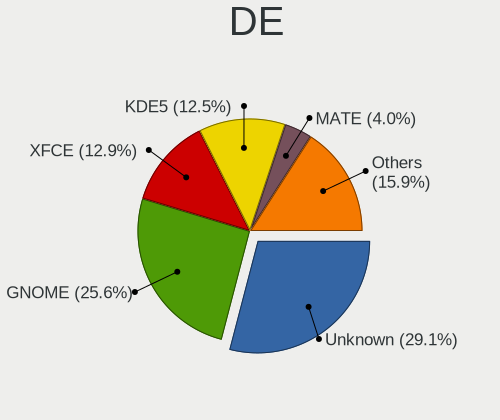
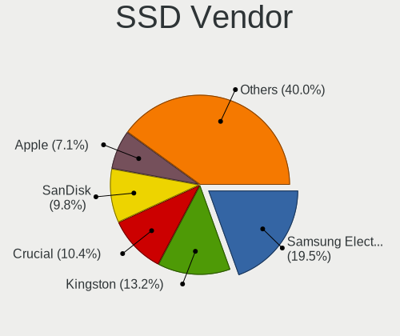
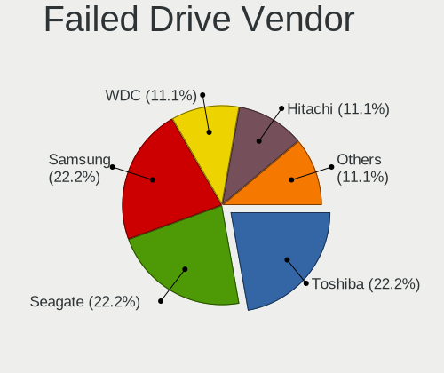
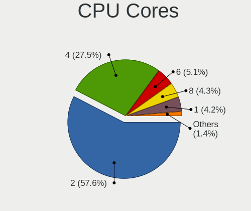
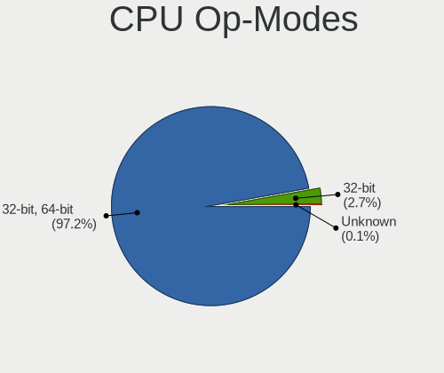
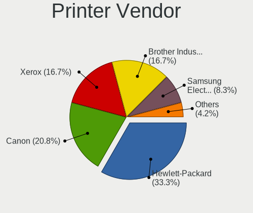

Debian 11 - Tested Hardware & Statistics (Notebooks)
----------------------------------------------------

A project to collect tested hardware configurations for Debian 11.

Anyone can contribute to this report by the [hw-probe](https://github.com/linuxhw/hw-probe) tool:

    sudo -E hw-probe -all -upload

Please contribute! Especially if your hardware is rare.

Contents
--------

* [ Test Cases ](#test-cases)

* [ System ](#system)
  - [ Kernel                   ](#kernel)
  - [ Kernel Family            ](#kernel-family)
  - [ Kernel Major Ver.        ](#kernel-major-ver)
  - [ Arch                     ](#arch)
  - [ DE                       ](#de)
  - [ Display Server           ](#display-server)
  - [ Display Manager          ](#display-manager)
  - [ OS Lang                  ](#os-lang)
  - [ Boot Mode                ](#boot-mode)
  - [ Filesystem               ](#filesystem)
  - [ Part. scheme             ](#part-scheme)
  - [ Dual Boot with Linux/BSD ](#dual-boot-with-linuxbsd)
  - [ Dual Boot (Win)          ](#dual-boot-win)

* [ Board ](#board)
  - [ Vendor                   ](#vendor)
  - [ Model                    ](#model)
  - [ Model Family             ](#model-family)
  - [ MFG Year                 ](#mfg-year)
  - [ Form Factor              ](#form-factor)
  - [ Secure Boot              ](#secure-boot)
  - [ Coreboot                 ](#coreboot)
  - [ RAM Size                 ](#ram-size)
  - [ RAM Used                 ](#ram-used)
  - [ Total Drives             ](#total-drives)
  - [ Has CD-ROM               ](#has-cd-rom)
  - [ Has Ethernet             ](#has-ethernet)
  - [ Has WiFi                 ](#has-wifi)
  - [ Has Bluetooth            ](#has-bluetooth)

* [ Location ](#location)
  - [ Country                  ](#country)
  - [ City                     ](#city)

* [ Drives ](#drives)
  - [ Drive Vendor             ](#drive-vendor)
  - [ Drive Model              ](#drive-model)
  - [ HDD Vendor               ](#hdd-vendor)
  - [ SSD Vendor               ](#ssd-vendor)
  - [ Drive Kind               ](#drive-kind)
  - [ Drive Connector          ](#drive-connector)
  - [ Drive Size               ](#drive-size)
  - [ Space Total              ](#space-total)
  - [ Space Used               ](#space-used)
  - [ Malfunc. Drives          ](#malfunc-drives)
  - [ Malfunc. Drive Vendor    ](#malfunc-drive-vendor)
  - [ Malfunc. HDD Vendor      ](#malfunc-hdd-vendor)
  - [ Malfunc. Drive Kind      ](#malfunc-drive-kind)
  - [ Failed Drives            ](#failed-drives)
  - [ Failed Drive Vendor      ](#failed-drive-vendor)
  - [ Drive Status             ](#drive-status)

* [ Storage controller ](#storage-controller)
  - [ Storage Vendor           ](#storage-vendor)
  - [ Storage Model            ](#storage-model)
  - [ Storage Kind             ](#storage-kind)

* [ Processor ](#processor)
  - [ CPU Vendor               ](#cpu-vendor)
  - [ CPU Model                ](#cpu-model)
  - [ CPU Model Family         ](#cpu-model-family)
  - [ CPU Cores                ](#cpu-cores)
  - [ CPU Sockets              ](#cpu-sockets)
  - [ CPU Threads              ](#cpu-threads)
  - [ CPU Op-Modes             ](#cpu-op-modes)
  - [ CPU Microcode            ](#cpu-microcode)
  - [ CPU Microarch            ](#cpu-microarch)

* [ Graphics ](#graphics)
  - [ GPU Vendor               ](#gpu-vendor)
  - [ GPU Model                ](#gpu-model)
  - [ GPU Combo                ](#gpu-combo)
  - [ GPU Driver               ](#gpu-driver)
  - [ GPU Memory               ](#gpu-memory)

* [ Monitor ](#monitor)
  - [ Monitor Vendor           ](#monitor-vendor)
  - [ Monitor Model            ](#monitor-model)
  - [ Monitor Resolution       ](#monitor-resolution)
  - [ Monitor Diagonal         ](#monitor-diagonal)
  - [ Monitor Width            ](#monitor-width)
  - [ Aspect Ratio             ](#aspect-ratio)
  - [ Monitor Area             ](#monitor-area)
  - [ Pixel Density            ](#pixel-density)
  - [ Multiple Monitors        ](#multiple-monitors)

* [ Network ](#network)
  - [ Net Controller Vendor    ](#net-controller-vendor)
  - [ Net Controller Model     ](#net-controller-model)
  - [ Wireless Vendor          ](#wireless-vendor)
  - [ Wireless Model           ](#wireless-model)
  - [ Ethernet Vendor          ](#ethernet-vendor)
  - [ Ethernet Model           ](#ethernet-model)
  - [ Net Controller Kind      ](#net-controller-kind)
  - [ Used Controller          ](#used-controller)
  - [ NICs                     ](#nics)
  - [ IPv6                     ](#ipv6)

* [ Bluetooth ](#bluetooth)
  - [ Bluetooth Vendor         ](#bluetooth-vendor)
  - [ Bluetooth Model          ](#bluetooth-model)

* [ Sound ](#sound)
  - [ Sound Vendor             ](#sound-vendor)
  - [ Sound Model              ](#sound-model)

* [ Memory ](#memory)
  - [ Memory Vendor            ](#memory-vendor)
  - [ Memory Model             ](#memory-model)
  - [ Memory Kind              ](#memory-kind)
  - [ Memory Form Factor       ](#memory-form-factor)
  - [ Memory Size              ](#memory-size)
  - [ Memory Speed             ](#memory-speed)

* [ Printers & scanners ](#printers--scanners)
  - [ Printer Vendor           ](#printer-vendor)
  - [ Printer Model            ](#printer-model)
  - [ Scanner Vendor           ](#scanner-vendor)
  - [ Scanner Model            ](#scanner-model)

* [ Camera ](#camera)
  - [ Camera Vendor            ](#camera-vendor)
  - [ Camera Model             ](#camera-model)

* [ Security ](#security)
  - [ Fingerprint Vendor       ](#fingerprint-vendor)
  - [ Fingerprint Model        ](#fingerprint-model)
  - [ Chipcard Vendor          ](#chipcard-vendor)
  - [ Chipcard Model           ](#chipcard-model)

* [ Unsupported ](#unsupported)
  - [ Unsupported Devices      ](#unsupported-devices)
  - [ Unsupported Device Types ](#unsupported-device-types)

Test Cases
----------

Total: 4176

| Vendor        | Model                       | Probe                                                      | Date         |
|---------------|-----------------------------|------------------------------------------------------------|--------------|
| MSI           | Vector GP66 12UGS           | [4787e68a9c](https://linux-hardware.org/?probe=4787e68a9c) | Apr 01, 2023 |
| MSI           | Vector GP66 12UGS           | [12e105f6da](https://linux-hardware.org/?probe=12e105f6da) | Apr 01, 2023 |
| Lenovo        | G50-45 80E3                 | [f75af97954](https://linux-hardware.org/?probe=f75af97954) | Apr 01, 2023 |
| HP            | Pavilion dv7                | [00bbec023a](https://linux-hardware.org/?probe=00bbec023a) | Apr 01, 2023 |
| ASUSTek       | X202E                       | [cdcccb09e7](https://linux-hardware.org/?probe=cdcccb09e7) | Mar 31, 2023 |
| ASUSTek       | X202E                       | [ac12ec53a3](https://linux-hardware.org/?probe=ac12ec53a3) | Mar 31, 2023 |
| Lenovo        | Yoga 3 11 80J8              | [fce7483fa0](https://linux-hardware.org/?probe=fce7483fa0) | Mar 31, 2023 |
| Dell          | Latitude E6330              | [ae7a7254b8](https://linux-hardware.org/?probe=ae7a7254b8) | Mar 31, 2023 |
| Dell          | Latitude E6330              | [2239e12384](https://linux-hardware.org/?probe=2239e12384) | Mar 31, 2023 |
| Lenovo        | IdeaPad 100-15IBY 80MJ      | [3399c2f210](https://linux-hardware.org/?probe=3399c2f210) | Mar 31, 2023 |
| Dell          | Precision M4700             | [7c93bc178e](https://linux-hardware.org/?probe=7c93bc178e) | Mar 31, 2023 |
| Lenovo        | ThinkPad T460 20FMA0APAR    | [2ca1607b80](https://linux-hardware.org/?probe=2ca1607b80) | Mar 30, 2023 |
| Dell          | XPS 13 7390                 | [990f324256](https://linux-hardware.org/?probe=990f324256) | Mar 30, 2023 |
| Dell          | XPS 13 7390                 | [b6226ae481](https://linux-hardware.org/?probe=b6226ae481) | Mar 30, 2023 |
| Fujitsu       | LIFEBOOK S752               | [bf3d484605](https://linux-hardware.org/?probe=bf3d484605) | Mar 30, 2023 |
| Fujitsu       | LIFEBOOK S752               | [3e4d9fac89](https://linux-hardware.org/?probe=3e4d9fac89) | Mar 30, 2023 |
| ASUSTek       | VivoBook_ASUSLaptop X515... | [e85544a3d7](https://linux-hardware.org/?probe=e85544a3d7) | Mar 30, 2023 |
| Dell          | Precision M4800             | [ebd0442adc](https://linux-hardware.org/?probe=ebd0442adc) | Mar 30, 2023 |
| Lenovo        | ThinkPad T60 195143U        | [4de196550b](https://linux-hardware.org/?probe=4de196550b) | Mar 30, 2023 |
| OEGStone      | W54_55SU1,SUW               | [a771622660](https://linux-hardware.org/?probe=a771622660) | Mar 29, 2023 |
| OEGStone      | W54_55SU1,SUW               | [1e0c5a90c9](https://linux-hardware.org/?probe=1e0c5a90c9) | Mar 29, 2023 |
| Unknown       | Unknown                     | [7d3374d52b](https://linux-hardware.org/?probe=7d3374d52b) | Mar 29, 2023 |
| Lenovo        | IdeaPad 100-15IBY 80MJ      | [77e01c9b12](https://linux-hardware.org/?probe=77e01c9b12) | Mar 29, 2023 |
| Acer          | Aspire A315-23G             | [5c6734f5e6](https://linux-hardware.org/?probe=5c6734f5e6) | Mar 29, 2023 |
| Medion        | P7641 MD99856               | [7347a28d53](https://linux-hardware.org/?probe=7347a28d53) | Mar 28, 2023 |
| HP            | Pavilion dv5000 (EW771EA... | [db28f35ce0](https://linux-hardware.org/?probe=db28f35ce0) | Mar 28, 2023 |
| ASUSTek       | X541SA                      | [f281edd494](https://linux-hardware.org/?probe=f281edd494) | Mar 28, 2023 |
| HP            | EliteBook 840 G3            | [58d5e99cd1](https://linux-hardware.org/?probe=58d5e99cd1) | Mar 27, 2023 |
| ASUSTek       | VivoBook_ASUSLaptop X403... | [9fd0ee0183](https://linux-hardware.org/?probe=9fd0ee0183) | Mar 27, 2023 |
| ASUSTek       | VivoBook_ASUSLaptop X403... | [d0f84e1bd4](https://linux-hardware.org/?probe=d0f84e1bd4) | Mar 27, 2023 |
| HP            | ZBook Fury 16 G9 Mobile ... | [dd84425bc7](https://linux-hardware.org/?probe=dd84425bc7) | Mar 27, 2023 |
| Lenovo        | G50-45 80E3                 | [279d3659a9](https://linux-hardware.org/?probe=279d3659a9) | Mar 26, 2023 |
| Dell          | Venue 11 Pro 7130 vPro      | [d1f406ffe7](https://linux-hardware.org/?probe=d1f406ffe7) | Mar 26, 2023 |
| Acer          | Nitro AN515-52              | [d2f95decbe](https://linux-hardware.org/?probe=d2f95decbe) | Mar 26, 2023 |
| Acer          | Nitro AN515-52              | [1377a2ea15](https://linux-hardware.org/?probe=1377a2ea15) | Mar 26, 2023 |
| Lenovo        | ThinkPad T480s 20L8S0C40... | [39b2a59543](https://linux-hardware.org/?probe=39b2a59543) | Mar 25, 2023 |
| HUAWEI        | NBD-WXX9                    | [7eb3d40bd8](https://linux-hardware.org/?probe=7eb3d40bd8) | Mar 25, 2023 |
| Packard Be... | H17HV                       | [c4bddccbd8](https://linux-hardware.org/?probe=c4bddccbd8) | Mar 24, 2023 |
| Lenovo        | Z50-75 80EC                 | [d6783c57a6](https://linux-hardware.org/?probe=d6783c57a6) | Mar 24, 2023 |
| Lenovo        | Z50-75 80EC                 | [353666c217](https://linux-hardware.org/?probe=353666c217) | Mar 24, 2023 |
| Dell          | Inspiron 7348               | [4011322039](https://linux-hardware.org/?probe=4011322039) | Mar 24, 2023 |
| HP            | EliteBook 850 G5            | [cde421908c](https://linux-hardware.org/?probe=cde421908c) | Mar 24, 2023 |
| ASUSTek       | N56VJ                       | [da2c5d6ff1](https://linux-hardware.org/?probe=da2c5d6ff1) | Mar 24, 2023 |
| Dell          | Inspiron 15 3511            | [7aa41dd248](https://linux-hardware.org/?probe=7aa41dd248) | Mar 23, 2023 |
| HP            | Pavilion Laptop 15-eh1xx... | [32a4fc1880](https://linux-hardware.org/?probe=32a4fc1880) | Mar 23, 2023 |
| Lenovo        | ThinkPad X270 20HMS10600    | [5e97d4fdf3](https://linux-hardware.org/?probe=5e97d4fdf3) | Mar 22, 2023 |
| Apple         | MacBookPro11,2              | [92208949d5](https://linux-hardware.org/?probe=92208949d5) | Mar 22, 2023 |
| Apple         | MacBookPro11,2              | [aa71c25dba](https://linux-hardware.org/?probe=aa71c25dba) | Mar 22, 2023 |
| Unknown       | Unknown                     | [ef5bf53c45](https://linux-hardware.org/?probe=ef5bf53c45) | Mar 22, 2023 |
| Dell          | G3 3579                     | [b6f8dd5ffe](https://linux-hardware.org/?probe=b6f8dd5ffe) | Mar 22, 2023 |
| Unknown       | Unknown                     | [b96104604a](https://linux-hardware.org/?probe=b96104604a) | Mar 22, 2023 |
| Apple         | MacBookPro5,5               | [849f9d23c7](https://linux-hardware.org/?probe=849f9d23c7) | Mar 21, 2023 |
| Lenovo        | ThinkPad X230s 20AHS0070... | [9d86eaf558](https://linux-hardware.org/?probe=9d86eaf558) | Mar 21, 2023 |
| Lenovo        | ThinkPad T14 Gen 2a 20XL... | [4c7add7cd1](https://linux-hardware.org/?probe=4c7add7cd1) | Mar 21, 2023 |
| Dell          | Inspiron 5570               | [e311e9a53a](https://linux-hardware.org/?probe=e311e9a53a) | Mar 21, 2023 |
| HP            | EliteBook 850 G5            | [5ca3a1b044](https://linux-hardware.org/?probe=5ca3a1b044) | Mar 21, 2023 |
| Lenovo        | G570 20079                  | [8657b8d645](https://linux-hardware.org/?probe=8657b8d645) | Mar 21, 2023 |
| ASUSTek       | S551LB                      | [da9a9373a6](https://linux-hardware.org/?probe=da9a9373a6) | Mar 20, 2023 |
| Dell          | Latitude E6420              | [e564f25125](https://linux-hardware.org/?probe=e564f25125) | Mar 20, 2023 |
| Lenovo        | ThinkPad E15 Gen 4 21E60... | [7bc035af43](https://linux-hardware.org/?probe=7bc035af43) | Mar 20, 2023 |
| Fujitsu       | LIFEBOOK E734               | [0c4119f8b3](https://linux-hardware.org/?probe=0c4119f8b3) | Mar 20, 2023 |
| Samsung       | RF511/RF411/RF711           | [bff0b1d8a4](https://linux-hardware.org/?probe=bff0b1d8a4) | Mar 20, 2023 |
| Dell          | Latitude 7480               | [00d8228ec6](https://linux-hardware.org/?probe=00d8228ec6) | Mar 20, 2023 |
| TUXEDO        | N13xWU                      | [e9614af654](https://linux-hardware.org/?probe=e9614af654) | Mar 19, 2023 |
| Dell          | Latitude 7480               | [bbdb75bdce](https://linux-hardware.org/?probe=bbdb75bdce) | Mar 19, 2023 |
| HP            | Pavilion g7                 | [e591ea2173](https://linux-hardware.org/?probe=e591ea2173) | Mar 19, 2023 |
| Lenovo        | ThinkPad T540p 20BE00B8M... | [4cb81db618](https://linux-hardware.org/?probe=4cb81db618) | Mar 19, 2023 |
| Acer          | Aspire V5-552PG             | [d895f0f391](https://linux-hardware.org/?probe=d895f0f391) | Mar 19, 2023 |
| Toshiba       | Satellite C655              | [229dcc2cb0](https://linux-hardware.org/?probe=229dcc2cb0) | Mar 19, 2023 |
| Toshiba       | Satellite C655              | [5037090da8](https://linux-hardware.org/?probe=5037090da8) | Mar 19, 2023 |
| Lenovo        | V15 G2 ITL 82KB             | [eea214ee38](https://linux-hardware.org/?probe=eea214ee38) | Mar 18, 2023 |
| HP            | Laptop 14-cm0xxx            | [b939c61b5a](https://linux-hardware.org/?probe=b939c61b5a) | Mar 18, 2023 |
| Samsung       | RF511/RF411/RF711           | [f3a832587b](https://linux-hardware.org/?probe=f3a832587b) | Mar 18, 2023 |
| HP            | ProBook 470 G3              | [3cdb0bbdf6](https://linux-hardware.org/?probe=3cdb0bbdf6) | Mar 17, 2023 |
| Apple         | MacBook5,2                  | [2020cf3584](https://linux-hardware.org/?probe=2020cf3584) | Mar 17, 2023 |
| Apple         | MacBook5,2                  | [e7ebc0ec0e](https://linux-hardware.org/?probe=e7ebc0ec0e) | Mar 17, 2023 |
| Apple         | MacBook5,2                  | [c343e79a84](https://linux-hardware.org/?probe=c343e79a84) | Mar 17, 2023 |
| Apple         | MacBook5,2                  | [5391c84cf4](https://linux-hardware.org/?probe=5391c84cf4) | Mar 17, 2023 |
| Apple         | MacBook5,2                  | [8fcb466fab](https://linux-hardware.org/?probe=8fcb466fab) | Mar 17, 2023 |
| Apple         | MacBook5,2                  | [7aa3efb2fd](https://linux-hardware.org/?probe=7aa3efb2fd) | Mar 17, 2023 |
| Apple         | MacBook5,2                  | [8319fcb9da](https://linux-hardware.org/?probe=8319fcb9da) | Mar 17, 2023 |
| Apple         | MacBook5,2                  | [6bf9694348](https://linux-hardware.org/?probe=6bf9694348) | Mar 17, 2023 |
| Apple         | MacBook5,2                  | [c3c0ef4a31](https://linux-hardware.org/?probe=c3c0ef4a31) | Mar 17, 2023 |
| HP            | 255 G3                      | [3e5f860704](https://linux-hardware.org/?probe=3e5f860704) | Mar 17, 2023 |
| Samsung       | RF511/RF411/RF711           | [ecb08b3c5e](https://linux-hardware.org/?probe=ecb08b3c5e) | Mar 17, 2023 |
| Dell          | Latitude 7480               | [ee6015f962](https://linux-hardware.org/?probe=ee6015f962) | Mar 17, 2023 |
| MSI           | GF72 8RE                    | [4610dffdcc](https://linux-hardware.org/?probe=4610dffdcc) | Mar 17, 2023 |
| HP            | Notebook                    | [e901631805](https://linux-hardware.org/?probe=e901631805) | Mar 17, 2023 |
| Dell          | Precision M6800             | [db62a370ed](https://linux-hardware.org/?probe=db62a370ed) | Mar 16, 2023 |
| HP            | EliteBook 8460p             | [e8d00684ac](https://linux-hardware.org/?probe=e8d00684ac) | Mar 16, 2023 |
| PC Special... | P65_67RSRP                  | [71a45943c1](https://linux-hardware.org/?probe=71a45943c1) | Mar 16, 2023 |
| HP            | EliteBook 840 G6            | [57f2de5da4](https://linux-hardware.org/?probe=57f2de5da4) | Mar 16, 2023 |
| HP            | EliteBook 840 G6            | [2a316e6d03](https://linux-hardware.org/?probe=2a316e6d03) | Mar 16, 2023 |
| Dell          | Latitude 7480               | [72069037ca](https://linux-hardware.org/?probe=72069037ca) | Mar 16, 2023 |
| Samsung       | 550XBE/350XBE               | [3f7d27d637](https://linux-hardware.org/?probe=3f7d27d637) | Mar 16, 2023 |
| HP            | Laptop 14-cf3xxx            | [bdb510861b](https://linux-hardware.org/?probe=bdb510861b) | Mar 16, 2023 |
| HP            | Laptop 14-cf3xxx            | [75a93c0ac6](https://linux-hardware.org/?probe=75a93c0ac6) | Mar 16, 2023 |
| Samsung       | 550XBE/350XBE               | [e670ea3583](https://linux-hardware.org/?probe=e670ea3583) | Mar 16, 2023 |
| Acer          | Aspire ES1-521              | [b78130eae1](https://linux-hardware.org/?probe=b78130eae1) | Mar 16, 2023 |
| Acer          | Aspire ES1-521              | [8ea6223dc5](https://linux-hardware.org/?probe=8ea6223dc5) | Mar 16, 2023 |
| Acer          | AO756                       | [21ba8b2996](https://linux-hardware.org/?probe=21ba8b2996) | Mar 15, 2023 |
| Apple         | MacBook5,2                  | [c8c6ab5fce](https://linux-hardware.org/?probe=c8c6ab5fce) | Mar 15, 2023 |
| Acer          | Aspire 7720                 | [0f040d8292](https://linux-hardware.org/?probe=0f040d8292) | Mar 15, 2023 |
| HP            | Mini 210-1000               | [cccfcdba22](https://linux-hardware.org/?probe=cccfcdba22) | Mar 15, 2023 |
| Apple         | MacBook5,2                  | [634ae1ae2b](https://linux-hardware.org/?probe=634ae1ae2b) | Mar 14, 2023 |
| ASUSTek       | ZenBook UX534FAC_UX533FA... | [83351958e6](https://linux-hardware.org/?probe=83351958e6) | Mar 14, 2023 |
| Apple         | MacBook5,2                  | [a897cf713a](https://linux-hardware.org/?probe=a897cf713a) | Mar 14, 2023 |
| Apple         | MacBook5,2                  | [63cbbd1f57](https://linux-hardware.org/?probe=63cbbd1f57) | Mar 14, 2023 |
| TUXEDO        | InfinityBook Pro 14 v4      | [f5cbc232d7](https://linux-hardware.org/?probe=f5cbc232d7) | Mar 14, 2023 |
| Apple         | MacBook5,2                  | [aeb56fbebc](https://linux-hardware.org/?probe=aeb56fbebc) | Mar 14, 2023 |
| Apple         | MacBook5,2                  | [ee034131c0](https://linux-hardware.org/?probe=ee034131c0) | Mar 14, 2023 |
| Apple         | MacBook5,2                  | [438caf3588](https://linux-hardware.org/?probe=438caf3588) | Mar 14, 2023 |
| Apple         | MacBook5,2                  | [57d173995a](https://linux-hardware.org/?probe=57d173995a) | Mar 14, 2023 |
| Acer          | Aspire 7739G                | [aeff2df11c](https://linux-hardware.org/?probe=aeff2df11c) | Mar 14, 2023 |
| Lenovo        | Flex 2-14 20404             | [812104dae3](https://linux-hardware.org/?probe=812104dae3) | Mar 14, 2023 |
| Apple         | MacBook5,2                  | [27c3c24dfc](https://linux-hardware.org/?probe=27c3c24dfc) | Mar 14, 2023 |
| Apple         | MacBook5,2                  | [714f8e1321](https://linux-hardware.org/?probe=714f8e1321) | Mar 14, 2023 |
| Acer          | Aspire 7720                 | [b80fa5f7ff](https://linux-hardware.org/?probe=b80fa5f7ff) | Mar 14, 2023 |
| Apple         | MacBook5,2                  | [500bee4bb7](https://linux-hardware.org/?probe=500bee4bb7) | Mar 14, 2023 |
| Apple         | MacBook5,2                  | [189b1a8ec7](https://linux-hardware.org/?probe=189b1a8ec7) | Mar 14, 2023 |
| Apple         | MacBook5,2                  | [9be2c9ee2b](https://linux-hardware.org/?probe=9be2c9ee2b) | Mar 14, 2023 |
| Lenovo        | ThinkPad T14 Gen 2a 20XL... | [054bb62a67](https://linux-hardware.org/?probe=054bb62a67) | Mar 14, 2023 |
| Lenovo        | Z710 20250                  | [3a99fb6400](https://linux-hardware.org/?probe=3a99fb6400) | Mar 14, 2023 |
| Apple         | MacBook5,2                  | [5c4b7a9754](https://linux-hardware.org/?probe=5c4b7a9754) | Mar 13, 2023 |
| Samsung       | 300E4A/300E5A/300E7A        | [6c76af84cb](https://linux-hardware.org/?probe=6c76af84cb) | Mar 13, 2023 |
| Apple         | MacBook5,2                  | [481073d13f](https://linux-hardware.org/?probe=481073d13f) | Mar 13, 2023 |
| Apple         | MacBook5,2                  | [497a7bdef5](https://linux-hardware.org/?probe=497a7bdef5) | Mar 13, 2023 |
| Apple         | MacBook5,2                  | [07ceb1e102](https://linux-hardware.org/?probe=07ceb1e102) | Mar 13, 2023 |
| ASUSTek       | GL753VE                     | [8100c63113](https://linux-hardware.org/?probe=8100c63113) | Mar 13, 2023 |
| Apple         | MacBook5,2                  | [79fdcb1951](https://linux-hardware.org/?probe=79fdcb1951) | Mar 13, 2023 |
| Apple         | MacBook5,2                  | [73e4261a63](https://linux-hardware.org/?probe=73e4261a63) | Mar 13, 2023 |
| Apple         | MacBook5,2                  | [44784531d4](https://linux-hardware.org/?probe=44784531d4) | Mar 13, 2023 |
| Acer          | Aspire E5-511               | [5343f73c67](https://linux-hardware.org/?probe=5343f73c67) | Mar 13, 2023 |
| Apple         | MacBook5,2                  | [e58e88f5fd](https://linux-hardware.org/?probe=e58e88f5fd) | Mar 13, 2023 |
| Apple         | MacBook5,2                  | [267c6693a0](https://linux-hardware.org/?probe=267c6693a0) | Mar 13, 2023 |
| Apple         | MacBook5,2                  | [bdb4c28449](https://linux-hardware.org/?probe=bdb4c28449) | Mar 13, 2023 |
| Apple         | MacBook5,2                  | [d9226f0ad6](https://linux-hardware.org/?probe=d9226f0ad6) | Mar 13, 2023 |
| Apple         | MacBook5,2                  | [906f70a5e9](https://linux-hardware.org/?probe=906f70a5e9) | Mar 13, 2023 |
| Acer          | Aspire 5738                 | [bd231fbff6](https://linux-hardware.org/?probe=bd231fbff6) | Mar 12, 2023 |
| ASUSTek       | ZenBook UX431FLC_UX431FL    | [fc75288cce](https://linux-hardware.org/?probe=fc75288cce) | Mar 12, 2023 |
| HP            | ZBook 17 G3                 | [f69ef4ff89](https://linux-hardware.org/?probe=f69ef4ff89) | Mar 12, 2023 |
| Lenovo        | ThinkPad X131e 3367AG9      | [0ff86711d1](https://linux-hardware.org/?probe=0ff86711d1) | Mar 12, 2023 |
| Dell          | Latitude 3510               | [13ed29770d](https://linux-hardware.org/?probe=13ed29770d) | Mar 12, 2023 |
| Dell          | Inspiron 5593               | [631b554e46](https://linux-hardware.org/?probe=631b554e46) | Mar 12, 2023 |
| HP            | ProBook 4415s               | [8b974a2717](https://linux-hardware.org/?probe=8b974a2717) | Mar 12, 2023 |
| HP            | Compaq nx9420 (ES444ET#A... | [f066472937](https://linux-hardware.org/?probe=f066472937) | Mar 11, 2023 |
| Dell          | Latitude E6430              | [080ad6aa2a](https://linux-hardware.org/?probe=080ad6aa2a) | Mar 11, 2023 |
| Acer          | Swift SF314-43              | [dc1a94966b](https://linux-hardware.org/?probe=dc1a94966b) | Mar 11, 2023 |
| Apple         | MacBook5,2                  | [ffb66872c2](https://linux-hardware.org/?probe=ffb66872c2) | Mar 10, 2023 |
| Apple         | MacBook5,2                  | [9736a383d7](https://linux-hardware.org/?probe=9736a383d7) | Mar 10, 2023 |
| Apple         | MacBook5,2                  | [f9bd57cf06](https://linux-hardware.org/?probe=f9bd57cf06) | Mar 10, 2023 |
| Apple         | MacBook5,2                  | [a71d5d0d96](https://linux-hardware.org/?probe=a71d5d0d96) | Mar 10, 2023 |
| ASUSTek       | Zenbook UX535QE_UM535QE     | [87aa621d6a](https://linux-hardware.org/?probe=87aa621d6a) | Mar 10, 2023 |
| Dell          | Latitude 7285               | [dfc4961010](https://linux-hardware.org/?probe=dfc4961010) | Mar 09, 2023 |
| Apple         | MacBook5,2                  | [91985ffa00](https://linux-hardware.org/?probe=91985ffa00) | Mar 09, 2023 |
| Apple         | MacBook5,2                  | [40499e56d1](https://linux-hardware.org/?probe=40499e56d1) | Mar 09, 2023 |
| Apple         | MacBook5,2                  | [3abbf961d5](https://linux-hardware.org/?probe=3abbf961d5) | Mar 09, 2023 |
| Apple         | MacBook5,2                  | [734afe2673](https://linux-hardware.org/?probe=734afe2673) | Mar 09, 2023 |
| Apple         | MacBook5,2                  | [364b9159c4](https://linux-hardware.org/?probe=364b9159c4) | Mar 09, 2023 |
| Lenovo        | ThinkPad X1 Carbon Gen 1... | [3daf833362](https://linux-hardware.org/?probe=3daf833362) | Mar 09, 2023 |
| HP            | Compaq nx9420 (ES446EA#A... | [b876c92a6e](https://linux-hardware.org/?probe=b876c92a6e) | Mar 09, 2023 |
| Fujitsu       | LIFEBOOK U7312              | [74bbf2c865](https://linux-hardware.org/?probe=74bbf2c865) | Mar 09, 2023 |
| Lenovo        | ThinkPad X1 Carbon Gen 1... | [7f3075e65e](https://linux-hardware.org/?probe=7f3075e65e) | Mar 08, 2023 |
| Medion        | E122X                       | [dad02f1ac7](https://linux-hardware.org/?probe=dad02f1ac7) | Mar 08, 2023 |
| Lenovo        | ThinkPad 13 2nd Gen 20J1... | [07f425d57f](https://linux-hardware.org/?probe=07f425d57f) | Mar 08, 2023 |
| Lenovo        | ThinkPad 13 2nd Gen 20J1... | [f62ef69dcc](https://linux-hardware.org/?probe=f62ef69dcc) | Mar 08, 2023 |
| HP            | ZBook Studio G3             | [d059dad473](https://linux-hardware.org/?probe=d059dad473) | Mar 08, 2023 |
| Apple         | MacBook5,2                  | [e6cbad4861](https://linux-hardware.org/?probe=e6cbad4861) | Mar 07, 2023 |
| Apple         | MacBook5,2                  | [6fa1bc8547](https://linux-hardware.org/?probe=6fa1bc8547) | Mar 07, 2023 |
| Apple         | MacBook5,2                  | [ce9ba5580b](https://linux-hardware.org/?probe=ce9ba5580b) | Mar 07, 2023 |
| Apple         | MacBook5,2                  | [9a8f396913](https://linux-hardware.org/?probe=9a8f396913) | Mar 07, 2023 |
| Apple         | MacBook5,2                  | [07709f5f79](https://linux-hardware.org/?probe=07709f5f79) | Mar 07, 2023 |
| Apple         | MacBook5,2                  | [8bbc04cb55](https://linux-hardware.org/?probe=8bbc04cb55) | Mar 07, 2023 |
| Lenovo        | IdeaPad S340-15API 81NC     | [a3682a5cb6](https://linux-hardware.org/?probe=a3682a5cb6) | Mar 07, 2023 |
| Apple         | MacBook5,2                  | [7b1918ab47](https://linux-hardware.org/?probe=7b1918ab47) | Mar 07, 2023 |
| Apple         | MacBook5,2                  | [0d996d4041](https://linux-hardware.org/?probe=0d996d4041) | Mar 07, 2023 |
| Apple         | MacBook5,2                  | [eb4c28b498](https://linux-hardware.org/?probe=eb4c28b498) | Mar 07, 2023 |
| Lenovo        | ThinkBook 14 G4 IAP 21DH    | [124045e654](https://linux-hardware.org/?probe=124045e654) | Mar 07, 2023 |
| HP            | ZBook 15 G3                 | [b00f87c99b](https://linux-hardware.org/?probe=b00f87c99b) | Mar 06, 2023 |
| Lenovo        | IdeaPad 520-15IKB 81BF      | [119a07048d](https://linux-hardware.org/?probe=119a07048d) | Mar 06, 2023 |
| Samsung       | 300V3A/300V4A/300V5A/200... | [91db409270](https://linux-hardware.org/?probe=91db409270) | Mar 06, 2023 |
| Acer          | Aspire E1-571               | [2194ce4568](https://linux-hardware.org/?probe=2194ce4568) | Mar 06, 2023 |
| MSI           | PS42 8RB                    | [57231416e1](https://linux-hardware.org/?probe=57231416e1) | Mar 06, 2023 |
| Lenovo        | Yoga 300-11IBR 80M1         | [fc381c78e7](https://linux-hardware.org/?probe=fc381c78e7) | Mar 05, 2023 |
| Apple         | MacBookPro6,2               | [308b516329](https://linux-hardware.org/?probe=308b516329) | Mar 05, 2023 |
| Toshiba       | Satellite A200              | [b9677c823b](https://linux-hardware.org/?probe=b9677c823b) | Mar 05, 2023 |
| ASUSTek       | ASUS EXPERTBOOK B9450FA_... | [ca566e314e](https://linux-hardware.org/?probe=ca566e314e) | Mar 05, 2023 |
| Acer          | Aspire A315-54              | [cadbbe841e](https://linux-hardware.org/?probe=cadbbe841e) | Mar 05, 2023 |
| Dell          | G5 5500                     | [7da5494dea](https://linux-hardware.org/?probe=7da5494dea) | Mar 05, 2023 |
| HP            | G42                         | [7dee433139](https://linux-hardware.org/?probe=7dee433139) | Mar 05, 2023 |
| Toshiba       | Satellite A200              | [47f08e4094](https://linux-hardware.org/?probe=47f08e4094) | Mar 04, 2023 |
| HP            | EliteBook 840 G3            | [14211fd55f](https://linux-hardware.org/?probe=14211fd55f) | Mar 04, 2023 |
| Dell          | Latitude E5450              | [2f16482775](https://linux-hardware.org/?probe=2f16482775) | Mar 04, 2023 |
| Intel         | powered classmate PC        | [bfd724fd2f](https://linux-hardware.org/?probe=bfd724fd2f) | Mar 04, 2023 |
| SANTECH       | NHx0DB,DE                   | [9ebc94ec48](https://linux-hardware.org/?probe=9ebc94ec48) | Mar 04, 2023 |
| HP            | EliteBook 830 G5            | [82acbe37f7](https://linux-hardware.org/?probe=82acbe37f7) | Mar 04, 2023 |
| Dell          | Inspiron 3593               | [4e2f59d17e](https://linux-hardware.org/?probe=4e2f59d17e) | Mar 04, 2023 |
| Dell          | Vostro 3350                 | [1bfad93a1e](https://linux-hardware.org/?probe=1bfad93a1e) | Mar 04, 2023 |
| Dell          | Vostro 3350                 | [f782f8e288](https://linux-hardware.org/?probe=f782f8e288) | Mar 04, 2023 |
| HP            | Laptop 14s-dq1xxx           | [29fa7c0b23](https://linux-hardware.org/?probe=29fa7c0b23) | Mar 04, 2023 |
| HP            | 255 G8 Notebook PC          | [7dc484b236](https://linux-hardware.org/?probe=7dc484b236) | Mar 03, 2023 |
| HP            | 255 G8 Notebook PC          | [b7e4822b00](https://linux-hardware.org/?probe=b7e4822b00) | Mar 03, 2023 |
| HUAWEI        | BOHB-WAX9                   | [cdaf43afa8](https://linux-hardware.org/?probe=cdaf43afa8) | Mar 03, 2023 |
| Acer          | Aspire E1-522               | [f102669f1f](https://linux-hardware.org/?probe=f102669f1f) | Mar 03, 2023 |
| Unknown       | Unknown                     | [7afe06d070](https://linux-hardware.org/?probe=7afe06d070) | Mar 03, 2023 |
| HP            | EliteBook 855 G7 Noteboo... | [54a92cd736](https://linux-hardware.org/?probe=54a92cd736) | Mar 03, 2023 |
| HP            | EliteBook 855 G7 Noteboo... | [916405bd1c](https://linux-hardware.org/?probe=916405bd1c) | Mar 03, 2023 |
| HP            | 635                         | [108b9443ea](https://linux-hardware.org/?probe=108b9443ea) | Mar 03, 2023 |
| Dell          | Latitude E7440              | [36439d1a64](https://linux-hardware.org/?probe=36439d1a64) | Mar 03, 2023 |
| Lenovo        | Legion 5 15ACH6 82JW        | [180f5c9379](https://linux-hardware.org/?probe=180f5c9379) | Mar 03, 2023 |
| Dell          | Vostro1710                  | [c24eab7e3d](https://linux-hardware.org/?probe=c24eab7e3d) | Mar 02, 2023 |
| Acer          | Aspire 1640Z                | [915a8900d0](https://linux-hardware.org/?probe=915a8900d0) | Mar 02, 2023 |
| Dell          | Latitude E7440              | [b84f760e8e](https://linux-hardware.org/?probe=b84f760e8e) | Mar 02, 2023 |
| ASUSTek       | X556UR                      | [70c4807d21](https://linux-hardware.org/?probe=70c4807d21) | Mar 02, 2023 |
| MSI           | Creator 15M A9SD            | [b19d8d936c](https://linux-hardware.org/?probe=b19d8d936c) | Mar 02, 2023 |
| Dell          | Latitude 3510               | [0bad8d504d](https://linux-hardware.org/?probe=0bad8d504d) | Mar 02, 2023 |
| PC Special... | 14 Fusion IV                | [e465178d82](https://linux-hardware.org/?probe=e465178d82) | Mar 02, 2023 |
| Dell          | XPS 15 9520                 | [2894a5929b](https://linux-hardware.org/?probe=2894a5929b) | Mar 02, 2023 |
| HUAWEI        | NBD-WXX9                    | [9036fa2ef1](https://linux-hardware.org/?probe=9036fa2ef1) | Mar 02, 2023 |
| GMKtec        | NucBox5                     | [fc11280fe6](https://linux-hardware.org/?probe=fc11280fe6) | Mar 02, 2023 |
| Acer          | TravelMate 5720             | [2e0c5ff8f1](https://linux-hardware.org/?probe=2e0c5ff8f1) | Mar 01, 2023 |
| Lenovo        | ThinkPad X270 20HMS10600    | [da2fc6826a](https://linux-hardware.org/?probe=da2fc6826a) | Mar 01, 2023 |
| Lenovo        | IdeaPad 5 15ARE05 81YQ      | [52ecc1a9fb](https://linux-hardware.org/?probe=52ecc1a9fb) | Mar 01, 2023 |
| HP            | ProBook 4415s               | [4e909ec0ad](https://linux-hardware.org/?probe=4e909ec0ad) | Mar 01, 2023 |
| Lenovo        | IdeaPad 5 15ARE05 81YQ      | [1165717061](https://linux-hardware.org/?probe=1165717061) | Feb 28, 2023 |
| TUXEDO        | Aura 15 Gen2                | [26a7db2ed8](https://linux-hardware.org/?probe=26a7db2ed8) | Feb 28, 2023 |
| Lenovo        | ThinkPad X270 20HMS10600    | [3fa4d926e0](https://linux-hardware.org/?probe=3fa4d926e0) | Feb 28, 2023 |
| HUAWEI        | BOHB-WAX9                   | [b4bfab8974](https://linux-hardware.org/?probe=b4bfab8974) | Feb 28, 2023 |
| HP            | ProBook 6570b               | [3692011e3f](https://linux-hardware.org/?probe=3692011e3f) | Feb 28, 2023 |
| ASUSTek       | ASUS TUF Gaming F15 FX50... | [83a611b1ab](https://linux-hardware.org/?probe=83a611b1ab) | Feb 27, 2023 |
| SmbiosType... | SmbiosType1_SystemProduc... | [ccac327e17](https://linux-hardware.org/?probe=ccac327e17) | Feb 27, 2023 |
| Dell          | Latitude 5400               | [b788c61c95](https://linux-hardware.org/?probe=b788c61c95) | Feb 27, 2023 |
| Dell          | Latitude 3510               | [de938c4962](https://linux-hardware.org/?probe=de938c4962) | Feb 27, 2023 |
| ASUSTek       | K52F                        | [fa30ea101a](https://linux-hardware.org/?probe=fa30ea101a) | Feb 27, 2023 |
| HP            | Pavilion g6                 | [41e4ef16e4](https://linux-hardware.org/?probe=41e4ef16e4) | Feb 26, 2023 |
| Panasonic     | CF-31WEUEEBE                | [40782ba0a7](https://linux-hardware.org/?probe=40782ba0a7) | Feb 26, 2023 |
| Lenovo        | ThinkPad T430 2349GUU       | [95cc420bd5](https://linux-hardware.org/?probe=95cc420bd5) | Feb 26, 2023 |
| Medion        | BEAST X25                   | [3263e2862a](https://linux-hardware.org/?probe=3263e2862a) | Feb 26, 2023 |
| HP            | 250 G7 Notebook PC          | [9e587033a4](https://linux-hardware.org/?probe=9e587033a4) | Feb 26, 2023 |
| HP            | Compaq 6730b (FU594ES#AB... | [810cdb1ad1](https://linux-hardware.org/?probe=810cdb1ad1) | Feb 26, 2023 |
| HP            | EliteBook 2530p             | [28bb1541b4](https://linux-hardware.org/?probe=28bb1541b4) | Feb 26, 2023 |
| HP            | EliteBook 2530p             | [8906540d72](https://linux-hardware.org/?probe=8906540d72) | Feb 26, 2023 |
| Lenovo        | ThinkPad X13s Gen 1 21BX... | [633fb08804](https://linux-hardware.org/?probe=633fb08804) | Feb 26, 2023 |
| Lenovo        | IdeaPad 5 15IAL7 82SF       | [3b2a19c835](https://linux-hardware.org/?probe=3b2a19c835) | Feb 26, 2023 |
| HP            | ProBook 445 G7              | [f2671a0f62](https://linux-hardware.org/?probe=f2671a0f62) | Feb 25, 2023 |
| ASUSTek       | X551CA                      | [c8ead0e580](https://linux-hardware.org/?probe=c8ead0e580) | Feb 25, 2023 |
| Unknown       | T3 MRD                      | [ae88920ea5](https://linux-hardware.org/?probe=ae88920ea5) | Feb 25, 2023 |
| Acer          | Nitro AN517-55              | [76e7c1c236](https://linux-hardware.org/?probe=76e7c1c236) | Feb 25, 2023 |
| HUAWEI        | WRT-WX9                     | [d49316c5e8](https://linux-hardware.org/?probe=d49316c5e8) | Feb 25, 2023 |
| Dell          | Latitude E5430 non-vPro     | [67e31f8e42](https://linux-hardware.org/?probe=67e31f8e42) | Feb 25, 2023 |
| Dell          | Latitude E5430 non-vPro     | [2bb4e30118](https://linux-hardware.org/?probe=2bb4e30118) | Feb 25, 2023 |
| HP            | ProBook 450 15.6 inch G9... | [f1db9ad466](https://linux-hardware.org/?probe=f1db9ad466) | Feb 25, 2023 |
| Acer          | Aspire A315-54              | [ff08a846b0](https://linux-hardware.org/?probe=ff08a846b0) | Feb 25, 2023 |
| Unknown       | Unknown                     | [2c5d6ab621](https://linux-hardware.org/?probe=2c5d6ab621) | Feb 25, 2023 |
| HP            | Pavilion g6                 | [5cde621e0a](https://linux-hardware.org/?probe=5cde621e0a) | Feb 24, 2023 |
| Acer          | AO756                       | [ca83ee78ec](https://linux-hardware.org/?probe=ca83ee78ec) | Feb 24, 2023 |
| Lenovo        | KaiTian N70z G1d            | [cbc8e4e008](https://linux-hardware.org/?probe=cbc8e4e008) | Feb 24, 2023 |
| ASUSTek       | X551CA                      | [62b46afbb8](https://linux-hardware.org/?probe=62b46afbb8) | Feb 24, 2023 |
| Toshiba       | IS 1412                     | [c2ca1fb2f3](https://linux-hardware.org/?probe=c2ca1fb2f3) | Feb 24, 2023 |
| HP            | Presario CQ57               | [b41de6d094](https://linux-hardware.org/?probe=b41de6d094) | Feb 24, 2023 |
| Lenovo        | G50-80 80E5                 | [3f28f459bf](https://linux-hardware.org/?probe=3f28f459bf) | Feb 24, 2023 |
| Lenovo        | G50-80 80E5                 | [8ed4158090](https://linux-hardware.org/?probe=8ed4158090) | Feb 24, 2023 |
| Dell          | Latitude D620               | [fba80b099d](https://linux-hardware.org/?probe=fba80b099d) | Feb 24, 2023 |
| HP            | Pavilion g6                 | [5da2f709bb](https://linux-hardware.org/?probe=5da2f709bb) | Feb 24, 2023 |
| HP            | Pavilion g6                 | [bf32299a30](https://linux-hardware.org/?probe=bf32299a30) | Feb 24, 2023 |
| HP            | Pavilion g6                 | [54279e4e30](https://linux-hardware.org/?probe=54279e4e30) | Feb 24, 2023 |
| HP            | EliteBook Folio 9480m       | [788e0929de](https://linux-hardware.org/?probe=788e0929de) | Feb 24, 2023 |
| Samsung       | N150P                       | [662488621d](https://linux-hardware.org/?probe=662488621d) | Feb 24, 2023 |
| HP            | ZBook Firefly 16 inch G9... | [885478dd47](https://linux-hardware.org/?probe=885478dd47) | Feb 23, 2023 |
| HP            | ZBook Firefly 16 inch G9... | [53eb80a44b](https://linux-hardware.org/?probe=53eb80a44b) | Feb 23, 2023 |
| Lenovo        | ThinkPad T410 2537CS0       | [8d4b399341](https://linux-hardware.org/?probe=8d4b399341) | Feb 23, 2023 |
| ASUSTek       | ZenBook UX431FLC_UX431FL    | [53d46c67f9](https://linux-hardware.org/?probe=53d46c67f9) | Feb 23, 2023 |
| LincPlus      | P2                          | [5d4e528621](https://linux-hardware.org/?probe=5d4e528621) | Feb 23, 2023 |
| Lenovo        | ThinkPad E14 20RA0036HV     | [eef601ff61](https://linux-hardware.org/?probe=eef601ff61) | Feb 23, 2023 |
| HP            | ZBook Fury 15 G7 Mobile ... | [09070f52bb](https://linux-hardware.org/?probe=09070f52bb) | Feb 23, 2023 |
| Dell          | Inspiron 5566               | [0233d7525d](https://linux-hardware.org/?probe=0233d7525d) | Feb 22, 2023 |
| Fujitsu       | LIFEBOOK E753               | [8fa3315cca](https://linux-hardware.org/?probe=8fa3315cca) | Feb 22, 2023 |
| Lenovo        | ThinkPad L14 Gen 1 20U50... | [8227fec538](https://linux-hardware.org/?probe=8227fec538) | Feb 22, 2023 |
| Acer          | Aspire A315-54              | [7cf8754a48](https://linux-hardware.org/?probe=7cf8754a48) | Feb 22, 2023 |
| Acer          | AO756                       | [58f52941c7](https://linux-hardware.org/?probe=58f52941c7) | Feb 22, 2023 |
| ASUSTek       | X556UQ                      | [8f645fa6fc](https://linux-hardware.org/?probe=8f645fa6fc) | Feb 21, 2023 |
| Lenovo        | ThinkPad T470 20HDS1DL03    | [25e1a3f801](https://linux-hardware.org/?probe=25e1a3f801) | Feb 21, 2023 |
| Dell          | Latitude E6430              | [80c9785ef0](https://linux-hardware.org/?probe=80c9785ef0) | Feb 21, 2023 |
| HP            | EliteBook 640 14 inch G9... | [1c0772ccd7](https://linux-hardware.org/?probe=1c0772ccd7) | Feb 21, 2023 |
| Lenovo        | ThinkPad P1 Gen 4i 20Y4S... | [6ab7953740](https://linux-hardware.org/?probe=6ab7953740) | Feb 20, 2023 |
| Notebook      | PB50_70RF,RD,RC             | [b24f005b1d](https://linux-hardware.org/?probe=b24f005b1d) | Feb 20, 2023 |
| HP            | EliteBook 735 G5            | [19d29283ed](https://linux-hardware.org/?probe=19d29283ed) | Feb 20, 2023 |
| HP            | EliteBook 735 G5            | [8d1bb46519](https://linux-hardware.org/?probe=8d1bb46519) | Feb 20, 2023 |
| Acer          | Extensa 2520G               | [823c5829a9](https://linux-hardware.org/?probe=823c5829a9) | Feb 20, 2023 |
| Lenovo        | ThinkPad T430 2349PZG       | [7bd3c5a555](https://linux-hardware.org/?probe=7bd3c5a555) | Feb 20, 2023 |
| Acer          | Aspire V5-573G              | [376b35f5b6](https://linux-hardware.org/?probe=376b35f5b6) | Feb 20, 2023 |
| Dell          | Latitude E7270              | [4eb17c846c](https://linux-hardware.org/?probe=4eb17c846c) | Feb 20, 2023 |
| Acer          | Aspire E1-572               | [234358d23e](https://linux-hardware.org/?probe=234358d23e) | Feb 20, 2023 |
| Acer          | Aspire E1-572               | [1b75d34b95](https://linux-hardware.org/?probe=1b75d34b95) | Feb 20, 2023 |
| Notebook      | W54_55SU1,SUW               | [5a296bed7f](https://linux-hardware.org/?probe=5a296bed7f) | Feb 19, 2023 |
| Acer          | Nitro AN515-55              | [3158f1e0d5](https://linux-hardware.org/?probe=3158f1e0d5) | Feb 18, 2023 |
| SmbiosType... | SmbiosType1_SystemProduc... | [8907f179e9](https://linux-hardware.org/?probe=8907f179e9) | Feb 18, 2023 |
| Lenovo        | ThinkPad E480 20KN001QGE    | [008f40a707](https://linux-hardware.org/?probe=008f40a707) | Feb 18, 2023 |
| Dell          | Latitude E5450              | [56827b29dc](https://linux-hardware.org/?probe=56827b29dc) | Feb 18, 2023 |
| Lenovo        | ThinkPad X1 Yoga 3rd 20L... | [32f5d5e200](https://linux-hardware.org/?probe=32f5d5e200) | Feb 17, 2023 |
| Lenovo        | ThinkPad T61p 6457UN2       | [4bf1ccfe74](https://linux-hardware.org/?probe=4bf1ccfe74) | Feb 17, 2023 |
| Apple         | MacBookPro9,1               | [4ab4c99cab](https://linux-hardware.org/?probe=4ab4c99cab) | Feb 17, 2023 |
| Dell          | System XPS L702X            | [81f9738975](https://linux-hardware.org/?probe=81f9738975) | Feb 16, 2023 |
| Apple         | MacBookAir6,2               | [46aafc59c4](https://linux-hardware.org/?probe=46aafc59c4) | Feb 16, 2023 |
| Lenovo        | ThinkPad T480 20L5000UUS    | [a4fd7cdaa8](https://linux-hardware.org/?probe=a4fd7cdaa8) | Feb 16, 2023 |
| HP            | EliteBook 2530p             | [5398361b68](https://linux-hardware.org/?probe=5398361b68) | Feb 16, 2023 |
| ASUSTek       | ZenBook UX425EA_UX425EA     | [73787e9141](https://linux-hardware.org/?probe=73787e9141) | Feb 16, 2023 |
| Google        | Grunt                       | [89c633c2c1](https://linux-hardware.org/?probe=89c633c2c1) | Feb 15, 2023 |
| ASUSTek       | K53U                        | [e9a6a69e01](https://linux-hardware.org/?probe=e9a6a69e01) | Feb 15, 2023 |
| Unknown       | T3 MRD                      | [df134a8199](https://linux-hardware.org/?probe=df134a8199) | Feb 14, 2023 |
| Lenovo        | ThinkPad S1 Yoga 12 20DL... | [e9faf4ce80](https://linux-hardware.org/?probe=e9faf4ce80) | Feb 14, 2023 |
| Acer          | Aspire V5-572G              | [7f360258ff](https://linux-hardware.org/?probe=7f360258ff) | Feb 14, 2023 |
| ASUSTek       | ROG Strix G731GU_G731GU     | [977650806e](https://linux-hardware.org/?probe=977650806e) | Feb 14, 2023 |
| Lenovo        | ThinkPad T14 Gen 1 20UD0... | [f6bcdb7c6b](https://linux-hardware.org/?probe=f6bcdb7c6b) | Feb 14, 2023 |
| Lenovo        | ThinkPad T14 Gen 1 20UD0... | [345021f7f6](https://linux-hardware.org/?probe=345021f7f6) | Feb 14, 2023 |
| Lenovo        | ThinkPad P51 20HJS0AR16     | [ad0f22fe34](https://linux-hardware.org/?probe=ad0f22fe34) | Feb 14, 2023 |
| HP            | Laptop 15s-du3xxx           | [4750f3ad3a](https://linux-hardware.org/?probe=4750f3ad3a) | Feb 13, 2023 |
| Dell          | Latitude D630               | [04c083db36](https://linux-hardware.org/?probe=04c083db36) | Feb 13, 2023 |
| Dell          | Inspiron 15-3567            | [6fe738fa6d](https://linux-hardware.org/?probe=6fe738fa6d) | Feb 13, 2023 |
| Dell          | Inspiron 15-3567            | [122eded37e](https://linux-hardware.org/?probe=122eded37e) | Feb 13, 2023 |
| Google        | Droid                       | [435ab67598](https://linux-hardware.org/?probe=435ab67598) | Feb 12, 2023 |
| Lenovo        | ThinkBook 13s G3 ACN 20Y... | [89c31e6f8c](https://linux-hardware.org/?probe=89c31e6f8c) | Feb 12, 2023 |
| Unknown       | Unknown                     | [72ce8d1929](https://linux-hardware.org/?probe=72ce8d1929) | Feb 12, 2023 |
| HP            | EliteBook 850 G1            | [54e092f58f](https://linux-hardware.org/?probe=54e092f58f) | Feb 12, 2023 |
| HUAWEI        | CREM-WXX9                   | [09266b8b06](https://linux-hardware.org/?probe=09266b8b06) | Feb 12, 2023 |
| Medion        | E1239T MD60139              | [a541cb52eb](https://linux-hardware.org/?probe=a541cb52eb) | Feb 12, 2023 |
| Medion        | E1239T MD60139              | [35563886e8](https://linux-hardware.org/?probe=35563886e8) | Feb 12, 2023 |
| Lenovo        | IdeaPad 5 Pro 16ACH6 82L... | [b54b603772](https://linux-hardware.org/?probe=b54b603772) | Feb 12, 2023 |
| Apple         | MacBookPro10,2              | [4a6ea9bd99](https://linux-hardware.org/?probe=4a6ea9bd99) | Feb 12, 2023 |
| Apple         | MacBookPro10,2              | [063d6eb482](https://linux-hardware.org/?probe=063d6eb482) | Feb 12, 2023 |
| Lenovo        | Z50-70 20354                | [3932889971](https://linux-hardware.org/?probe=3932889971) | Feb 11, 2023 |
| Notebook      | MAM2120                     | [300a622d96](https://linux-hardware.org/?probe=300a622d96) | Feb 11, 2023 |
| Lenovo        | Z710 20250                  | [94ee6da4d3](https://linux-hardware.org/?probe=94ee6da4d3) | Feb 11, 2023 |
| HP            | Pavilion g6                 | [27323a90bb](https://linux-hardware.org/?probe=27323a90bb) | Feb 11, 2023 |
| Acer          | Predator G9-793             | [8c11736bf0](https://linux-hardware.org/?probe=8c11736bf0) | Feb 11, 2023 |
| Lenovo        | IdeaPad 5 15ITL05 82FG      | [20a75bea61](https://linux-hardware.org/?probe=20a75bea61) | Feb 11, 2023 |
| HP            | Pavilion g6                 | [35b93693a5](https://linux-hardware.org/?probe=35b93693a5) | Feb 10, 2023 |
| Dell          | Latitude 7370               | [30c62c9e44](https://linux-hardware.org/?probe=30c62c9e44) | Feb 10, 2023 |
| Dell          | Latitude 7370               | [b4e7a5cb63](https://linux-hardware.org/?probe=b4e7a5cb63) | Feb 10, 2023 |
| ASUSTek       | N751JX                      | [fd591a3e67](https://linux-hardware.org/?probe=fd591a3e67) | Feb 10, 2023 |
| Novatech      | NL40_50CU                   | [cca307c7db](https://linux-hardware.org/?probe=cca307c7db) | Feb 10, 2023 |
| HP            | OMEN Laptop 15-en1xxx       | [7ac6f508b2](https://linux-hardware.org/?probe=7ac6f508b2) | Feb 10, 2023 |
| ASUSTek       | VivoBook_ASUSLaptop X403... | [8239d80ae0](https://linux-hardware.org/?probe=8239d80ae0) | Feb 10, 2023 |
| IBM           | ThinkPad T43 18714AG        | [0730c9228d](https://linux-hardware.org/?probe=0730c9228d) | Feb 10, 2023 |
| Acer          | Aspire ES1-111M             | [82eea49fcd](https://linux-hardware.org/?probe=82eea49fcd) | Feb 09, 2023 |
| Acer          | Aspire ES1-111M             | [accbac47d5](https://linux-hardware.org/?probe=accbac47d5) | Feb 09, 2023 |
| Lenovo        | ThinkPad E15 Gen 4 21ED0... | [02adcb8587](https://linux-hardware.org/?probe=02adcb8587) | Feb 09, 2023 |
| Acer          | Aspire E1-571               | [fe1dac78bb](https://linux-hardware.org/?probe=fe1dac78bb) | Feb 09, 2023 |
| Dell          | Latitude E7250              | [e3c1b1e038](https://linux-hardware.org/?probe=e3c1b1e038) | Feb 09, 2023 |
| Lenovo        | Legion Y520-15IKBN 80WK     | [ec17af9e06](https://linux-hardware.org/?probe=ec17af9e06) | Feb 09, 2023 |
| AMI           | Cherry Trail CR             | [e7eab93323](https://linux-hardware.org/?probe=e7eab93323) | Feb 09, 2023 |
| Dell          | Latitude E6330              | [291e0fd64f](https://linux-hardware.org/?probe=291e0fd64f) | Feb 08, 2023 |
| HUAWEI        | CREM-WXX9                   | [965758f3ea](https://linux-hardware.org/?probe=965758f3ea) | Feb 08, 2023 |
| Acer          | Aspire A515-52G             | [e521c55b1a](https://linux-hardware.org/?probe=e521c55b1a) | Feb 08, 2023 |
| ASUSTek       | ZenBook UX325EA_UX325EA     | [cc897fe72d](https://linux-hardware.org/?probe=cc897fe72d) | Feb 08, 2023 |
| Intel         | Calistoga & ICH7M Chipse... | [9f6079baf2](https://linux-hardware.org/?probe=9f6079baf2) | Feb 08, 2023 |
| Dell          | Inspiron 5555               | [f5aeb173ba](https://linux-hardware.org/?probe=f5aeb173ba) | Feb 08, 2023 |
| Lenovo        | ThinkPad E15 Gen 4 21E60... | [def4679f84](https://linux-hardware.org/?probe=def4679f84) | Feb 07, 2023 |
| Intel         | Calistoga & ICH7M Chipse... | [db2f72084a](https://linux-hardware.org/?probe=db2f72084a) | Feb 07, 2023 |
| Panasonic     | CF-54-1                     | [32a2acc07e](https://linux-hardware.org/?probe=32a2acc07e) | Feb 07, 2023 |
| Samsung       | R530/R730                   | [f212e58647](https://linux-hardware.org/?probe=f212e58647) | Feb 07, 2023 |
| Samsung       | R530/R730                   | [9ccb976ccd](https://linux-hardware.org/?probe=9ccb976ccd) | Feb 07, 2023 |
| Dell          | Latitude E7250              | [b4a7701aa4](https://linux-hardware.org/?probe=b4a7701aa4) | Feb 07, 2023 |
| Dell          | Precision 5570              | [d279e97c00](https://linux-hardware.org/?probe=d279e97c00) | Feb 07, 2023 |
| Toshiba       | Satellite C655              | [a0c2eb7db1](https://linux-hardware.org/?probe=a0c2eb7db1) | Feb 07, 2023 |
| Google        | Terra                       | [edfe00266c](https://linux-hardware.org/?probe=edfe00266c) | Feb 06, 2023 |
| SLIMBOOK      | Essential15L                | [e2af97d5d3](https://linux-hardware.org/?probe=e2af97d5d3) | Feb 06, 2023 |
| ASUSTek       | X71Q                        | [c89b078e8f](https://linux-hardware.org/?probe=c89b078e8f) | Feb 06, 2023 |
| Aquarius      | NS585                       | [e9deef3f9e](https://linux-hardware.org/?probe=e9deef3f9e) | Feb 06, 2023 |
| Lenovo        | ThinkPad X250 20CLS2TQ22    | [112a65a03e](https://linux-hardware.org/?probe=112a65a03e) | Feb 06, 2023 |
| Lenovo        | ThinkPad E15 Gen 3 20YHS... | [413341361a](https://linux-hardware.org/?probe=413341361a) | Feb 05, 2023 |
| Toshiba       | Satellite C660              | [b2247eafed](https://linux-hardware.org/?probe=b2247eafed) | Feb 05, 2023 |
| Acer          | Aspire A317-53              | [2f56f41681](https://linux-hardware.org/?probe=2f56f41681) | Feb 05, 2023 |
| Google        | Ampton                      | [74d5b6aa4d](https://linux-hardware.org/?probe=74d5b6aa4d) | Feb 05, 2023 |
| Google        | Ampton                      | [2785bde3f9](https://linux-hardware.org/?probe=2785bde3f9) | Feb 05, 2023 |
| HP            | 255 G3                      | [dfa2e96880](https://linux-hardware.org/?probe=dfa2e96880) | Feb 05, 2023 |
| Apple         | MacBookAir7,2               | [29d133e858](https://linux-hardware.org/?probe=29d133e858) | Feb 05, 2023 |
| Acer          | Aspire E1-772               | [147ad71a27](https://linux-hardware.org/?probe=147ad71a27) | Feb 05, 2023 |
| Notebook      | W65_67SJ                    | [870af12011](https://linux-hardware.org/?probe=870af12011) | Feb 05, 2023 |
| Lenovo        | G50-45 80E3                 | [229050fbe5](https://linux-hardware.org/?probe=229050fbe5) | Feb 05, 2023 |
| ASUSTek       | F5SL                        | [1e5bb7661e](https://linux-hardware.org/?probe=1e5bb7661e) | Feb 04, 2023 |
| Lenovo        | G50-45 80E3                 | [885ad2ae95](https://linux-hardware.org/?probe=885ad2ae95) | Feb 04, 2023 |
| Toshiba       | Satellite P775              | [df8aa8c06a](https://linux-hardware.org/?probe=df8aa8c06a) | Feb 04, 2023 |
| Lenovo        | ThinkPad T440p 20ANS09W0... | [17f9df8f2c](https://linux-hardware.org/?probe=17f9df8f2c) | Feb 03, 2023 |
| Lenovo        | V310-15IKB 80T3             | [a39fb673c7](https://linux-hardware.org/?probe=a39fb673c7) | Feb 03, 2023 |
| HP            | Pavilion 15                 | [5909dd08e7](https://linux-hardware.org/?probe=5909dd08e7) | Feb 03, 2023 |
| Aquarius      | NS585                       | [7e944d88b3](https://linux-hardware.org/?probe=7e944d88b3) | Feb 03, 2023 |
| HP            | ProBook 450 G7              | [ae290fa64e](https://linux-hardware.org/?probe=ae290fa64e) | Feb 03, 2023 |
| HP            | ProBook 450 G7              | [7820377760](https://linux-hardware.org/?probe=7820377760) | Feb 03, 2023 |
| HUAWEI        | NBLB-WAX9N                  | [2f2c8adb0c](https://linux-hardware.org/?probe=2f2c8adb0c) | Feb 02, 2023 |
| Apple         | MacBook5,2                  | [6d7a27b213](https://linux-hardware.org/?probe=6d7a27b213) | Feb 02, 2023 |
| Google        | Babymega                    | [2a8b81c6f4](https://linux-hardware.org/?probe=2a8b81c6f4) | Feb 02, 2023 |
| Dell          | Vostro 3580                 | [7efc294bac](https://linux-hardware.org/?probe=7efc294bac) | Feb 02, 2023 |
| Lenovo        | ThinkPad E495 20NE001GMX    | [29660bbd04](https://linux-hardware.org/?probe=29660bbd04) | Feb 02, 2023 |
| Dell          | Latitude 7480               | [8a7e0b16d5](https://linux-hardware.org/?probe=8a7e0b16d5) | Feb 02, 2023 |
| Dell          | Latitude E6520              | [548b13cd43](https://linux-hardware.org/?probe=548b13cd43) | Feb 02, 2023 |
| Timi          | Mi Laptop Pro 15            | [9deaff7467](https://linux-hardware.org/?probe=9deaff7467) | Feb 02, 2023 |
| Lenovo        | ThinkPad 13 20J10046US      | [85b9d54087](https://linux-hardware.org/?probe=85b9d54087) | Feb 02, 2023 |
| Apple         | MacBook5,2                  | [b8c8ed32e5](https://linux-hardware.org/?probe=b8c8ed32e5) | Feb 01, 2023 |
| Samsung       | 600B4B/600B5B               | [d3cf4446d5](https://linux-hardware.org/?probe=d3cf4446d5) | Feb 01, 2023 |
| Apple         | MacBookAir7,2               | [352c998936](https://linux-hardware.org/?probe=352c998936) | Feb 01, 2023 |
| Toshiba       | Satellite P775              | [c03f7668ac](https://linux-hardware.org/?probe=c03f7668ac) | Feb 01, 2023 |
| HP            | Compaq nx9420 (ES444ET#A... | [ac78478b3b](https://linux-hardware.org/?probe=ac78478b3b) | Feb 01, 2023 |
| HP            | Notebook                    | [3cea0a0519](https://linux-hardware.org/?probe=3cea0a0519) | Jan 31, 2023 |
| Fujitsu       | LIFEBOOK S751               | [35948f3b5e](https://linux-hardware.org/?probe=35948f3b5e) | Jan 31, 2023 |
| HP            | Stream Laptop 14-cb1XX      | [3f17be7a85](https://linux-hardware.org/?probe=3f17be7a85) | Jan 30, 2023 |
| MSI           | GE60 0NC/GE60 0ND           | [a7ef98ea02](https://linux-hardware.org/?probe=a7ef98ea02) | Jan 30, 2023 |
| Acer          | Aspire 5552                 | [f1168775a7](https://linux-hardware.org/?probe=f1168775a7) | Jan 30, 2023 |
| Sony          | PCG-Z1VA(UC)                | [db4f48132e](https://linux-hardware.org/?probe=db4f48132e) | Jan 29, 2023 |
| HUAWEI        | NBLK-WAX9X                  | [933e5a5b96](https://linux-hardware.org/?probe=933e5a5b96) | Jan 29, 2023 |
| Lenovo        | S21e-20 80M4                | [7017fcf775](https://linux-hardware.org/?probe=7017fcf775) | Jan 29, 2023 |
| Lenovo        | S21e-20 80M4                | [9afa780018](https://linux-hardware.org/?probe=9afa780018) | Jan 29, 2023 |
| Lenovo        | ThinkPad X220 42915CG       | [d058eeaad5](https://linux-hardware.org/?probe=d058eeaad5) | Jan 29, 2023 |
| HP            | ZBook 17 G3                 | [a1b5cdf1db](https://linux-hardware.org/?probe=a1b5cdf1db) | Jan 28, 2023 |
| HUAWEI        | NBLK-WAX9X                  | [a88e343a83](https://linux-hardware.org/?probe=a88e343a83) | Jan 28, 2023 |
| ASUSTek       | UX410UAR                    | [e9ac16c8ef](https://linux-hardware.org/?probe=e9ac16c8ef) | Jan 28, 2023 |
| Dell          | Inspiron 3581               | [8c8db10ac2](https://linux-hardware.org/?probe=8c8db10ac2) | Jan 28, 2023 |
| HP            | ProBook 430 G6              | [24fd7df5b6](https://linux-hardware.org/?probe=24fd7df5b6) | Jan 28, 2023 |
| HP            | EliteBook 640 14 inch G9... | [bbdf827cef](https://linux-hardware.org/?probe=bbdf827cef) | Jan 27, 2023 |
| Acer          | Aspire 7750G                | [0b05244a15](https://linux-hardware.org/?probe=0b05244a15) | Jan 27, 2023 |
| Dell          | Latitude E7440              | [9ba078f6ab](https://linux-hardware.org/?probe=9ba078f6ab) | Jan 27, 2023 |
| Dell          | Latitude E5430 non-vPro     | [c83903fdc8](https://linux-hardware.org/?probe=c83903fdc8) | Jan 27, 2023 |
| Lenovo        | B570e HuronRiver Platfor... | [376c580dcb](https://linux-hardware.org/?probe=376c580dcb) | Jan 27, 2023 |
| Lenovo        | ThinkPad E560 20EVCTO1WW    | [d3adeb692c](https://linux-hardware.org/?probe=d3adeb692c) | Jan 27, 2023 |
| Lenovo        | ThinkPad E560 20EVCTO1WW    | [46b1227255](https://linux-hardware.org/?probe=46b1227255) | Jan 27, 2023 |
| MSI           | Creator 17 B11UE            | [fcf56cfe4d](https://linux-hardware.org/?probe=fcf56cfe4d) | Jan 27, 2023 |
| Dell          | Latitude 5420               | [379a2dc9ab](https://linux-hardware.org/?probe=379a2dc9ab) | Jan 26, 2023 |
| Dell          | Latitude 5420               | [eec8ef8ddb](https://linux-hardware.org/?probe=eec8ef8ddb) | Jan 26, 2023 |
| Google        | Careena                     | [75ca1a25dd](https://linux-hardware.org/?probe=75ca1a25dd) | Jan 26, 2023 |
| Apple         | MacBookPro10,1              | [4643f751cf](https://linux-hardware.org/?probe=4643f751cf) | Jan 25, 2023 |
| Dell          | Latitude E5430 non-vPro     | [3b96eac8a9](https://linux-hardware.org/?probe=3b96eac8a9) | Jan 25, 2023 |
| Panasonic     | FZ55-2                      | [dd9ddb12b6](https://linux-hardware.org/?probe=dd9ddb12b6) | Jan 25, 2023 |
| Lenovo        | ThinkPad X220 4291IR6       | [cc41fa5174](https://linux-hardware.org/?probe=cc41fa5174) | Jan 25, 2023 |
| Samsung       | R710                        | [17a3e2ddd9](https://linux-hardware.org/?probe=17a3e2ddd9) | Jan 25, 2023 |
| HP            | ZBook 15 G3                 | [0bde1ca99a](https://linux-hardware.org/?probe=0bde1ca99a) | Jan 24, 2023 |
| Packard Be... | EasyNote MH36               | [07ba548a55](https://linux-hardware.org/?probe=07ba548a55) | Jan 24, 2023 |
| Lenovo        | ThinkPad E15 Gen 3 20YHS... | [fd6d2ec3c2](https://linux-hardware.org/?probe=fd6d2ec3c2) | Jan 23, 2023 |
| Samsung       | 300E4A/300E5A/300E7A        | [c8ec385a88](https://linux-hardware.org/?probe=c8ec385a88) | Jan 23, 2023 |
| Samsung       | 300E4C/300E5C/300E7C        | [5648fbf4a0](https://linux-hardware.org/?probe=5648fbf4a0) | Jan 23, 2023 |
| ASUSTek       | VivoBook_ASUSLaptop X415... | [62ac206f7e](https://linux-hardware.org/?probe=62ac206f7e) | Jan 23, 2023 |
| ASUSTek       | VivoBook_ASUSLaptop E510... | [5c7625e3f8](https://linux-hardware.org/?probe=5c7625e3f8) | Jan 23, 2023 |
| Fujitsu       | LIFEBOOK S751               | [ff727a3560](https://linux-hardware.org/?probe=ff727a3560) | Jan 22, 2023 |
| Fujitsu       | LIFEBOOK S751               | [df0676ac87](https://linux-hardware.org/?probe=df0676ac87) | Jan 22, 2023 |
| Dell          | G3 3579                     | [63298dcee9](https://linux-hardware.org/?probe=63298dcee9) | Jan 22, 2023 |
| Danew         | Dbook 131                   | [08911c133e](https://linux-hardware.org/?probe=08911c133e) | Jan 22, 2023 |
| Clevo         | W150ER                      | [ba5d06437c](https://linux-hardware.org/?probe=ba5d06437c) | Jan 21, 2023 |
| Google        | Phaser                      | [557e69c5f1](https://linux-hardware.org/?probe=557e69c5f1) | Jan 21, 2023 |
| HP            | EliteBook Folio 9480m       | [cf1b67c224](https://linux-hardware.org/?probe=cf1b67c224) | Jan 21, 2023 |
| HP            | EliteBook 840 G3            | [06f6499264](https://linux-hardware.org/?probe=06f6499264) | Jan 21, 2023 |
| Dell          | Latitude 5501               | [d31f972a20](https://linux-hardware.org/?probe=d31f972a20) | Jan 20, 2023 |
| Lenovo        | G505 20240                  | [c591d80181](https://linux-hardware.org/?probe=c591d80181) | Jan 20, 2023 |
| UMAX          | VisionBook 12Wr             | [0707d617f7](https://linux-hardware.org/?probe=0707d617f7) | Jan 20, 2023 |
| Lenovo        | ThinkPad T490s 20NYS3SX0... | [3e08ab25c6](https://linux-hardware.org/?probe=3e08ab25c6) | Jan 20, 2023 |
| ASUSTek       | VivoBook_ASUSLaptop E410... | [80cb1c8239](https://linux-hardware.org/?probe=80cb1c8239) | Jan 19, 2023 |
| Lenovo        | ThinkPad E470 20H1004SMX    | [0d8528f0d2](https://linux-hardware.org/?probe=0d8528f0d2) | Jan 19, 2023 |
| ASUSTek       | VivoBook_ASUSLaptop X512... | [0efa802a32](https://linux-hardware.org/?probe=0efa802a32) | Jan 19, 2023 |
| Dell          | XPS 15 9500                 | [606ba17221](https://linux-hardware.org/?probe=606ba17221) | Jan 19, 2023 |
| Insyde        | Braswell                    | [18526fdbe2](https://linux-hardware.org/?probe=18526fdbe2) | Jan 19, 2023 |
| Lenovo        | IdeaPad 320-15ABR 80XS      | [20749dc72f](https://linux-hardware.org/?probe=20749dc72f) | Jan 19, 2023 |
| HP            | Pavilion Laptop 14-dv1xx... | [db998abdae](https://linux-hardware.org/?probe=db998abdae) | Jan 19, 2023 |
| Lenovo        | IdeaPad 5 14IIL05 81YH      | [368ed9c856](https://linux-hardware.org/?probe=368ed9c856) | Jan 18, 2023 |
| Novatech      | NL40_50CU                   | [395dab7c43](https://linux-hardware.org/?probe=395dab7c43) | Jan 18, 2023 |
| HP            | Compaq 6910p                | [61d820a040](https://linux-hardware.org/?probe=61d820a040) | Jan 18, 2023 |
| Lenovo        | Legion Y540-15IRH 81SX      | [7b62e27d7a](https://linux-hardware.org/?probe=7b62e27d7a) | Jan 18, 2023 |
| Lenovo        | ThinkPad T15 Gen 2i 20W5... | [393e6cd6d2](https://linux-hardware.org/?probe=393e6cd6d2) | Jan 18, 2023 |
| HP            | EliteBook 820 G4            | [430b938694](https://linux-hardware.org/?probe=430b938694) | Jan 18, 2023 |
| HP            | EliteBook 2170p             | [46705d578e](https://linux-hardware.org/?probe=46705d578e) | Jan 18, 2023 |
| HP            | EliteBook 840 G4            | [952c81c314](https://linux-hardware.org/?probe=952c81c314) | Jan 18, 2023 |
| Dell          | Latitude 5500               | [e0ae9cb026](https://linux-hardware.org/?probe=e0ae9cb026) | Jan 17, 2023 |
| Lenovo        | ThinkPad X61 Tablet 7767... | [99e10e5d0f](https://linux-hardware.org/?probe=99e10e5d0f) | Jan 17, 2023 |
| Lenovo        | ThinkPad X61 Tablet 7767... | [624f47d1e3](https://linux-hardware.org/?probe=624f47d1e3) | Jan 17, 2023 |
| HP            | Compaq 6730b (GW687AV)      | [e967b291d5](https://linux-hardware.org/?probe=e967b291d5) | Jan 17, 2023 |
| Dell          | Inspiron 5502               | [43c4f532aa](https://linux-hardware.org/?probe=43c4f532aa) | Jan 17, 2023 |
| Positivo      | CHT14B                      | [ab4518f121](https://linux-hardware.org/?probe=ab4518f121) | Jan 16, 2023 |
| Dell          | Inspiron 15-3567            | [020e19b05d](https://linux-hardware.org/?probe=020e19b05d) | Jan 16, 2023 |
| Lenovo        | ThinkPad T490s 20NX0076M... | [4c896e2c0e](https://linux-hardware.org/?probe=4c896e2c0e) | Jan 16, 2023 |
| Dell          | Inspiron 5502               | [9403074843](https://linux-hardware.org/?probe=9403074843) | Jan 16, 2023 |
| HP            | OMEN by Laptop 16-b0xxx     | [47d090108d](https://linux-hardware.org/?probe=47d090108d) | Jan 16, 2023 |
| HP            | OMEN by Laptop 16-b0xxx     | [219091b4e0](https://linux-hardware.org/?probe=219091b4e0) | Jan 15, 2023 |
| Apple         | MacBookAir5,1               | [f316bddcf2](https://linux-hardware.org/?probe=f316bddcf2) | Jan 15, 2023 |
| Acer          | Swift SF314-510G            | [b929f53536](https://linux-hardware.org/?probe=b929f53536) | Jan 15, 2023 |
| Dell          | Inspiron 15-3567            | [5426686264](https://linux-hardware.org/?probe=5426686264) | Jan 15, 2023 |
| ASUSTek       | ASUS TUF Gaming F17 FX70... | [0ec206a07d](https://linux-hardware.org/?probe=0ec206a07d) | Jan 15, 2023 |
| HP            | EliteBook 8570w             | [53eb92efda](https://linux-hardware.org/?probe=53eb92efda) | Jan 15, 2023 |
| Lenovo        | ThinkPad T470 20HES0MV00    | [7e3b019181](https://linux-hardware.org/?probe=7e3b019181) | Jan 14, 2023 |
| HP            | Pavilion g6                 | [7d44980bca](https://linux-hardware.org/?probe=7d44980bca) | Jan 14, 2023 |
| Lenovo        | ThinkPad W520 4284W2U       | [576a509224](https://linux-hardware.org/?probe=576a509224) | Jan 14, 2023 |
| HP            | Laptop 14s-dk0xxx           | [6efb68b8da](https://linux-hardware.org/?probe=6efb68b8da) | Jan 14, 2023 |
| Lenovo        | IdeaPad 110S-11IBR 80WG     | [0899d995dd](https://linux-hardware.org/?probe=0899d995dd) | Jan 14, 2023 |
| Samsung       | 300E4C/300E5C/300E7C        | [f862a7e702](https://linux-hardware.org/?probe=f862a7e702) | Jan 14, 2023 |
| HP            | Pavilion g6                 | [7672e1178a](https://linux-hardware.org/?probe=7672e1178a) | Jan 14, 2023 |
| Unknown       | Unknown                     | [ce69bfd81b](https://linux-hardware.org/?probe=ce69bfd81b) | Jan 13, 2023 |
| HP            | ProBook 445 G7              | [baf20b6914](https://linux-hardware.org/?probe=baf20b6914) | Jan 13, 2023 |
| ASUSTek       | X450LD                      | [859eb05149](https://linux-hardware.org/?probe=859eb05149) | Jan 13, 2023 |
| HP            | Compaq 6735b                | [01878ee027](https://linux-hardware.org/?probe=01878ee027) | Jan 12, 2023 |
| Dell          | Inspiron 3521               | [694d5be301](https://linux-hardware.org/?probe=694d5be301) | Jan 12, 2023 |
| Lenovo        | ThinkPad T460 20FMA0APAR    | [d4691b9969](https://linux-hardware.org/?probe=d4691b9969) | Jan 12, 2023 |
| Lenovo        | IdeaPad Z570 HuronRiver ... | [2316d5dc8b](https://linux-hardware.org/?probe=2316d5dc8b) | Jan 12, 2023 |
| Lenovo        | ThinkPad T470p 20J7S1JT0... | [856d91c1ca](https://linux-hardware.org/?probe=856d91c1ca) | Jan 12, 2023 |
| Dell          | Precision M4400             | [27da7825fb](https://linux-hardware.org/?probe=27da7825fb) | Jan 12, 2023 |
| Dell          | Inspiron 3421               | [055d61383e](https://linux-hardware.org/?probe=055d61383e) | Jan 12, 2023 |
| Acer          | Swift SF314-56              | [46aebbe972](https://linux-hardware.org/?probe=46aebbe972) | Jan 11, 2023 |
| SLIMBOOK      | PRO                         | [551a4bd378](https://linux-hardware.org/?probe=551a4bd378) | Jan 11, 2023 |
| SmbiosType... | SmbiosType1_SystemProduc... | [6c67fc3995](https://linux-hardware.org/?probe=6c67fc3995) | Jan 11, 2023 |
| Aquarius      | NS585                       | [6fbcdf4d2f](https://linux-hardware.org/?probe=6fbcdf4d2f) | Jan 10, 2023 |
| HP            | Mini 110-1000               | [05c4656700](https://linux-hardware.org/?probe=05c4656700) | Jan 10, 2023 |
| SmbiosType... | SmbiosType1_SystemProduc... | [8367c27d81](https://linux-hardware.org/?probe=8367c27d81) | Jan 10, 2023 |
| HP            | 15                          | [f6b287dae1](https://linux-hardware.org/?probe=f6b287dae1) | Jan 10, 2023 |
| Acer          | Nitro AN517-54              | [8ea20821c8](https://linux-hardware.org/?probe=8ea20821c8) | Jan 10, 2023 |
| HP            | Compaq nx9420 (ES444ET#A... | [8d0b4a504d](https://linux-hardware.org/?probe=8d0b4a504d) | Jan 09, 2023 |
| Acer          | Aspire A515-54G             | [dea6736468](https://linux-hardware.org/?probe=dea6736468) | Jan 09, 2023 |
| Acer          | Aspire one 1-131            | [06c3411258](https://linux-hardware.org/?probe=06c3411258) | Jan 08, 2023 |
| HP            | ZBook 15 G3                 | [648dcae4c6](https://linux-hardware.org/?probe=648dcae4c6) | Jan 08, 2023 |
| ASUSTek       | K53U                        | [63849b1b5a](https://linux-hardware.org/?probe=63849b1b5a) | Jan 08, 2023 |
| Apple         | MacBookAir7,2               | [a4e777ea7d](https://linux-hardware.org/?probe=a4e777ea7d) | Jan 08, 2023 |
| Acer          | Aspire 7745G                | [9119962d1f](https://linux-hardware.org/?probe=9119962d1f) | Jan 07, 2023 |
| Gigabyte      | G5 GE                       | [d6a4584809](https://linux-hardware.org/?probe=d6a4584809) | Jan 07, 2023 |
| Dell          | Latitude 2110               | [9910f8985b](https://linux-hardware.org/?probe=9910f8985b) | Jan 07, 2023 |
| Lenovo        | IdeaPad 130-15IKB 81H7      | [9776545fc4](https://linux-hardware.org/?probe=9776545fc4) | Jan 06, 2023 |
| Toshiba       | Satellite C55Dt-A           | [f3cfb5dbb5](https://linux-hardware.org/?probe=f3cfb5dbb5) | Jan 06, 2023 |
| Lenovo        | IdeaPad 320-15IKB 80YE      | [9b0a8d487e](https://linux-hardware.org/?probe=9b0a8d487e) | Jan 06, 2023 |
| &#er &&       | Aspire 5100                 | [26da9e8ee1](https://linux-hardware.org/?probe=26da9e8ee1) | Jan 06, 2023 |
| Google        | Stout                       | [5ef816b9a6](https://linux-hardware.org/?probe=5ef816b9a6) | Jan 05, 2023 |
| Samsung       | 300E4C/300E5C/300E7C        | [3245d27cb7](https://linux-hardware.org/?probe=3245d27cb7) | Jan 05, 2023 |
| HP            | EliteBook 840 Aero G8 No... | [b9f4ca82d2](https://linux-hardware.org/?probe=b9f4ca82d2) | Jan 05, 2023 |
| Acer          | Extensa 2540                | [4442f2c14a](https://linux-hardware.org/?probe=4442f2c14a) | Jan 05, 2023 |
| Acer          | Extensa 2540                | [ec8b49d7b0](https://linux-hardware.org/?probe=ec8b49d7b0) | Jan 04, 2023 |
| Dell          | Inspiron 15-3567            | [0042419ccb](https://linux-hardware.org/?probe=0042419ccb) | Jan 04, 2023 |
| Dell          | Inspiron 15-3567            | [82e42c0d42](https://linux-hardware.org/?probe=82e42c0d42) | Jan 04, 2023 |
| Lenovo        | ThinkPad T430s 2356BQ5      | [fdf6545b20](https://linux-hardware.org/?probe=fdf6545b20) | Jan 04, 2023 |
| HP            | 255 G8 Notebook PC          | [b876c5797a](https://linux-hardware.org/?probe=b876c5797a) | Jan 03, 2023 |
| Dell          | Inspiron 5566               | [258412ac0a](https://linux-hardware.org/?probe=258412ac0a) | Jan 03, 2023 |
| ASUSTek       | F5SL                        | [67882c0f69](https://linux-hardware.org/?probe=67882c0f69) | Jan 02, 2023 |
| ASUSTek       | F5SL                        | [42ef1fbf40](https://linux-hardware.org/?probe=42ef1fbf40) | Jan 02, 2023 |
| Acer          | Aspire ES1-711              | [735e062168](https://linux-hardware.org/?probe=735e062168) | Jan 02, 2023 |
| HP            | EliteBook 840 G8 Noteboo... | [90603e4ab3](https://linux-hardware.org/?probe=90603e4ab3) | Jan 02, 2023 |
| MSI           | GE75 Raider 8SG             | [b6fa9be350](https://linux-hardware.org/?probe=b6fa9be350) | Jan 02, 2023 |
| ASUSTek       | ASUS TUF Gaming F17 FX70... | [b54f3aab7b](https://linux-hardware.org/?probe=b54f3aab7b) | Jan 02, 2023 |
| Lenovo        | ThinkPad T480 20L6S29E0D    | [a1f966e5e8](https://linux-hardware.org/?probe=a1f966e5e8) | Jan 02, 2023 |
| Lenovo        | IdeaPad 100-15IBD 80QQ      | [08fb8de608](https://linux-hardware.org/?probe=08fb8de608) | Jan 02, 2023 |
| Lenovo        | ThinkPad T430u 33519LC      | [87af3fa7f0](https://linux-hardware.org/?probe=87af3fa7f0) | Jan 02, 2023 |
| ASUSTek       | T100TA                      | [2c33e446d4](https://linux-hardware.org/?probe=2c33e446d4) | Jan 02, 2023 |
| Lenovo        | ThinkPad X260 20F5005NAU    | [3f68b8438c](https://linux-hardware.org/?probe=3f68b8438c) | Jan 02, 2023 |
| Lenovo        | IdeaPad 100-15IBD 80QQ      | [bca75efbe5](https://linux-hardware.org/?probe=bca75efbe5) | Jan 02, 2023 |
| HP            | Stream Laptop 14-cb1xxx     | [2396307897](https://linux-hardware.org/?probe=2396307897) | Jan 02, 2023 |
| ASUSTek       | ROG Strix G513RM_G513RM     | [13df46e700](https://linux-hardware.org/?probe=13df46e700) | Jan 02, 2023 |
| ASUSTek       | TUF Gaming FX505DT_TUF50... | [f9db70d551](https://linux-hardware.org/?probe=f9db70d551) | Jan 01, 2023 |
| Lenovo        | G565 20071                  | [e974b446ae](https://linux-hardware.org/?probe=e974b446ae) | Jan 01, 2023 |
| Panasonic     | CF-54-2                     | [dfe3d2e06b](https://linux-hardware.org/?probe=dfe3d2e06b) | Jan 01, 2023 |
| Lenovo        | IdeaPad 3 15ITL6 82H8       | [7474151c7e](https://linux-hardware.org/?probe=7474151c7e) | Jan 01, 2023 |
| Dell          | Inspiron 5566               | [9eadf42d31](https://linux-hardware.org/?probe=9eadf42d31) | Jan 01, 2023 |
| Samsung       | 940XFG                      | [8d33275e7b](https://linux-hardware.org/?probe=8d33275e7b) | Dec 31, 2022 |
| ASUSTek       | VivoBook_ASUSLaptop X509... | [fb22f9430c](https://linux-hardware.org/?probe=fb22f9430c) | Dec 31, 2022 |
| Lenovo        | IdeaPad Y560                | [c9d3a1d0a3](https://linux-hardware.org/?probe=c9d3a1d0a3) | Dec 31, 2022 |
| Acer          | Aspire A514-54              | [5775c77a91](https://linux-hardware.org/?probe=5775c77a91) | Dec 31, 2022 |
| HP            | Compaq 6710b (KE207ES#AB... | [d7d0be3872](https://linux-hardware.org/?probe=d7d0be3872) | Dec 30, 2022 |
| Dell          | Inspiron 5490               | [c8a80649d2](https://linux-hardware.org/?probe=c8a80649d2) | Dec 30, 2022 |
| HP            | 255 G3                      | [89d6bd459c](https://linux-hardware.org/?probe=89d6bd459c) | Dec 30, 2022 |
| Lenovo        | ThinkPad T470p 20J7S1JT0... | [4b7bbb186f](https://linux-hardware.org/?probe=4b7bbb186f) | Dec 29, 2022 |
| Lenovo        | ThinkPad E14 Gen 3 20Y7S... | [5bf3ff5c0e](https://linux-hardware.org/?probe=5bf3ff5c0e) | Dec 29, 2022 |
| Lenovo        | ThinkPad E14 Gen 3 20Y7S... | [4f63c4474c](https://linux-hardware.org/?probe=4f63c4474c) | Dec 29, 2022 |
| HP            | EliteBook Folio 1040 G3     | [6aad572cd5](https://linux-hardware.org/?probe=6aad572cd5) | Dec 29, 2022 |
| HP            | ZBook 15 G6                 | [af1655497e](https://linux-hardware.org/?probe=af1655497e) | Dec 29, 2022 |
| HP            | ProBook 6570b               | [46fd918b7c](https://linux-hardware.org/?probe=46fd918b7c) | Dec 29, 2022 |
| Dell          | Inspiron 5490               | [457c2ae4ae](https://linux-hardware.org/?probe=457c2ae4ae) | Dec 28, 2022 |
| Dell          | Inspiron 5490               | [fdfd0f21c7](https://linux-hardware.org/?probe=fdfd0f21c7) | Dec 28, 2022 |
| Toshiba       | Satellite L455D             | [35c085aa82](https://linux-hardware.org/?probe=35c085aa82) | Dec 28, 2022 |
| Dell          | Vostro 3400                 | [27f58a8ad1](https://linux-hardware.org/?probe=27f58a8ad1) | Dec 28, 2022 |
| Acer          | Aspire ES1-531              | [c29088a63f](https://linux-hardware.org/?probe=c29088a63f) | Dec 28, 2022 |
| HP            | ProBook 6470b               | [055705b3f2](https://linux-hardware.org/?probe=055705b3f2) | Dec 28, 2022 |
| Apple         | MacBookAir7,2               | [10dce91da1](https://linux-hardware.org/?probe=10dce91da1) | Dec 27, 2022 |
| Apple         | MacBookAir7,1               | [d174ffb318](https://linux-hardware.org/?probe=d174ffb318) | Dec 27, 2022 |
| MSI           | GE62 2QC                    | [dbd69d70ac](https://linux-hardware.org/?probe=dbd69d70ac) | Dec 27, 2022 |
| Panasonic     | FZ55-2                      | [1699b7c3b2](https://linux-hardware.org/?probe=1699b7c3b2) | Dec 27, 2022 |
| ASUSTek       | VivoBook_ASUS Laptop E40... | [78c6c15502](https://linux-hardware.org/?probe=78c6c15502) | Dec 27, 2022 |
| Notebook      | L14xMU                      | [7644bc65e2](https://linux-hardware.org/?probe=7644bc65e2) | Dec 27, 2022 |
| Dell          | Inspiron 1012               | [3dd6b8a416](https://linux-hardware.org/?probe=3dd6b8a416) | Dec 26, 2022 |
| Exo           | Smart Serie M               | [942ee3b035](https://linux-hardware.org/?probe=942ee3b035) | Dec 26, 2022 |
| Lenovo        | ThinkPad E560 20EV002FUS    | [3bb1c5cc47](https://linux-hardware.org/?probe=3bb1c5cc47) | Dec 26, 2022 |
| Acer          | Aspire ES1-533              | [3b5fa6d85a](https://linux-hardware.org/?probe=3b5fa6d85a) | Dec 26, 2022 |
| Lenovo        | ThinkPad X250 20CLS1UB00    | [fc8b2899fa](https://linux-hardware.org/?probe=fc8b2899fa) | Dec 25, 2022 |
| SANTECH       | NHx0DB,DE                   | [a0996d42bd](https://linux-hardware.org/?probe=a0996d42bd) | Dec 25, 2022 |
| HP            | 470 G8 Notebook PC          | [6d77c48324](https://linux-hardware.org/?probe=6d77c48324) | Dec 25, 2022 |
| ASUSTek       | G751JT                      | [16e989ff99](https://linux-hardware.org/?probe=16e989ff99) | Dec 25, 2022 |
| Dell          | Latitude E6520              | [33a51c934d](https://linux-hardware.org/?probe=33a51c934d) | Dec 25, 2022 |
| Dell          | Inspiron 5490               | [ea09a6daa8](https://linux-hardware.org/?probe=ea09a6daa8) | Dec 25, 2022 |
| Dell          | Inspiron 5490               | [45737153e4](https://linux-hardware.org/?probe=45737153e4) | Dec 25, 2022 |
| HP            | Laptop 15-bw0xx             | [42221f61fb](https://linux-hardware.org/?probe=42221f61fb) | Dec 25, 2022 |
| Medion        | E122X                       | [6e4e34bcc3](https://linux-hardware.org/?probe=6e4e34bcc3) | Dec 24, 2022 |
| Medion        | E122X                       | [bf41c45a7d](https://linux-hardware.org/?probe=bf41c45a7d) | Dec 24, 2022 |
| Lenovo        | ThinkBook 15 G3 ACL 21A4    | [096d4fc8c2](https://linux-hardware.org/?probe=096d4fc8c2) | Dec 24, 2022 |
| Lenovo        | ThinkPad X1 Carbon 7th 2... | [c5f2f2db53](https://linux-hardware.org/?probe=c5f2f2db53) | Dec 24, 2022 |
| Lenovo        | ThinkPad X270 20HMS16200    | [6ac6e552a8](https://linux-hardware.org/?probe=6ac6e552a8) | Dec 24, 2022 |
| Dell          | Inspiron 5570               | [1c7e7f8dd2](https://linux-hardware.org/?probe=1c7e7f8dd2) | Dec 24, 2022 |
| Dell          | Latitude E7440              | [baae52327d](https://linux-hardware.org/?probe=baae52327d) | Dec 23, 2022 |
| Dell          | Latitude E7440              | [bc5d48b831](https://linux-hardware.org/?probe=bc5d48b831) | Dec 23, 2022 |
| Dell          | Latitude E7440              | [fde483d476](https://linux-hardware.org/?probe=fde483d476) | Dec 23, 2022 |
| Dell          | Latitude E7440              | [a746012ffd](https://linux-hardware.org/?probe=a746012ffd) | Dec 23, 2022 |
| Lenovo        | ThinkPad T16 Gen 1 21BWS... | [9e5c4705fa](https://linux-hardware.org/?probe=9e5c4705fa) | Dec 23, 2022 |
| Dell          | Latitude D630               | [8175d003ce](https://linux-hardware.org/?probe=8175d003ce) | Dec 23, 2022 |
| Google        | Reks                        | [ecee690e6e](https://linux-hardware.org/?probe=ecee690e6e) | Dec 23, 2022 |
| Toshiba       | Satellite L10W-B-101        | [54d5cca493](https://linux-hardware.org/?probe=54d5cca493) | Dec 23, 2022 |
| Google        | Reks                        | [58b1b4cac1](https://linux-hardware.org/?probe=58b1b4cac1) | Dec 23, 2022 |
| Dell          | Inspiron 3501               | [297651d437](https://linux-hardware.org/?probe=297651d437) | Dec 23, 2022 |
| Lenovo        | Legion 5 15ACH6A 82NW       | [79b015dcea](https://linux-hardware.org/?probe=79b015dcea) | Dec 23, 2022 |
| Dell          | Inspiron 3501               | [958ee9d145](https://linux-hardware.org/?probe=958ee9d145) | Dec 23, 2022 |
| Dell          | G3 3590                     | [d75d9e6663](https://linux-hardware.org/?probe=d75d9e6663) | Dec 23, 2022 |
| Lenovo        | ThinkPad X260 20F5005NAU    | [5f75bb423d](https://linux-hardware.org/?probe=5f75bb423d) | Dec 23, 2022 |
| Acer          | Aspire 4750                 | [3256c282db](https://linux-hardware.org/?probe=3256c282db) | Dec 23, 2022 |
| HP            | 255 G7 Notebook PC          | [5bedf1557b](https://linux-hardware.org/?probe=5bedf1557b) | Dec 23, 2022 |
| Dell          | Inspiron 5490               | [1c424b5f55](https://linux-hardware.org/?probe=1c424b5f55) | Dec 23, 2022 |
| Unknown       | Unknown                     | [f9c4fecaf4](https://linux-hardware.org/?probe=f9c4fecaf4) | Dec 23, 2022 |
| Unknown       | Unknown                     | [3832db2827](https://linux-hardware.org/?probe=3832db2827) | Dec 23, 2022 |
| Toshiba       | Satellite C55Dt-A           | [67294324c5](https://linux-hardware.org/?probe=67294324c5) | Dec 22, 2022 |
| Dell          | Latitude E7440              | [c6d28912f0](https://linux-hardware.org/?probe=c6d28912f0) | Dec 22, 2022 |
| Dell          | Latitude E7440              | [1a14f26bd3](https://linux-hardware.org/?probe=1a14f26bd3) | Dec 22, 2022 |
| Dell          | Latitude E7440              | [db77bb7a3f](https://linux-hardware.org/?probe=db77bb7a3f) | Dec 22, 2022 |
| Dell          | Latitude E7440              | [d2278ed94d](https://linux-hardware.org/?probe=d2278ed94d) | Dec 22, 2022 |
| Apple         | MacBookAir7,1               | [09ba8ccf48](https://linux-hardware.org/?probe=09ba8ccf48) | Dec 22, 2022 |
| Dell          | Latitude E7440              | [f4e79df709](https://linux-hardware.org/?probe=f4e79df709) | Dec 22, 2022 |
| Apple         | MacBookAir7,1               | [2c3febf6fa](https://linux-hardware.org/?probe=2c3febf6fa) | Dec 22, 2022 |
| Dell          | Latitude E7440              | [cddffa9123](https://linux-hardware.org/?probe=cddffa9123) | Dec 22, 2022 |
| Dell          | Latitude E7440              | [5f911806c8](https://linux-hardware.org/?probe=5f911806c8) | Dec 22, 2022 |
| Lenovo        | ThinkPad X260 20F5005NAU    | [844f589d20](https://linux-hardware.org/?probe=844f589d20) | Dec 22, 2022 |
| Dell          | Latitude D630               | [e1106d8868](https://linux-hardware.org/?probe=e1106d8868) | Dec 22, 2022 |
| HP            | Stream Notebook PC 13       | [b049c64ff7](https://linux-hardware.org/?probe=b049c64ff7) | Dec 22, 2022 |
| Lenovo        | ThinkPad T14 Gen 1 20S1S... | [5f132c928b](https://linux-hardware.org/?probe=5f132c928b) | Dec 22, 2022 |
| Dell          | G3 3590                     | [8038491eb0](https://linux-hardware.org/?probe=8038491eb0) | Dec 22, 2022 |
| Lenovo        | IdeaPad 5 15IAL7 82SF       | [16cae3015a](https://linux-hardware.org/?probe=16cae3015a) | Dec 21, 2022 |
| Apple         | MacBookAir7,2               | [b4e828bef3](https://linux-hardware.org/?probe=b4e828bef3) | Dec 21, 2022 |
| Dell          | Vostro 3583                 | [cf3c6eb18b](https://linux-hardware.org/?probe=cf3c6eb18b) | Dec 21, 2022 |
| Apple         | MacBookAir7,2               | [056d76bae8](https://linux-hardware.org/?probe=056d76bae8) | Dec 21, 2022 |
| Sony          | SVE1112M1EB                 | [74e100e63b](https://linux-hardware.org/?probe=74e100e63b) | Dec 21, 2022 |
| HP            | ZBook Power 15.6 inch G8... | [6b202d6cc2](https://linux-hardware.org/?probe=6b202d6cc2) | Dec 21, 2022 |
| Lenovo        | Legion 5 15ARH05 82B5       | [9438c80c85](https://linux-hardware.org/?probe=9438c80c85) | Dec 21, 2022 |
| Dell          | Inspiron 3501               | [449e38a14d](https://linux-hardware.org/?probe=449e38a14d) | Dec 21, 2022 |
| Dell          | G3 3590                     | [8272655600](https://linux-hardware.org/?probe=8272655600) | Dec 21, 2022 |
| Lenovo        | ThinkPad 13 2nd Gen 20J1... | [cd4fa20e66](https://linux-hardware.org/?probe=cd4fa20e66) | Dec 20, 2022 |
| Lenovo        | ThinkPad 13 2nd Gen 20J1... | [e676fe186f](https://linux-hardware.org/?probe=e676fe186f) | Dec 20, 2022 |
| HP            | OMEN Laptop 15-en1xxx       | [1e53c20bdd](https://linux-hardware.org/?probe=1e53c20bdd) | Dec 20, 2022 |
| ASUSTek       | T100TA                      | [1dc546e14a](https://linux-hardware.org/?probe=1dc546e14a) | Dec 20, 2022 |
| Lenovo        | ThinkPad T490 20N2CTO1WW    | [2aeb8fd0cd](https://linux-hardware.org/?probe=2aeb8fd0cd) | Dec 19, 2022 |
| ASUSTek       | 900SD                       | [43d2c88062](https://linux-hardware.org/?probe=43d2c88062) | Dec 18, 2022 |
| Dell          | Inspiron 3501               | [956aaecbb9](https://linux-hardware.org/?probe=956aaecbb9) | Dec 18, 2022 |
| Dell          | Inspiron 3501               | [d5ceb48450](https://linux-hardware.org/?probe=d5ceb48450) | Dec 18, 2022 |
| HP            | ENVY Laptop 13-ad1xx        | [756263bf48](https://linux-hardware.org/?probe=756263bf48) | Dec 18, 2022 |
| EUROCOM       | SCORPIUS 3D                 | [4fdf299276](https://linux-hardware.org/?probe=4fdf299276) | Dec 18, 2022 |
| Dell          | Latitude E6530              | [198a9bc936](https://linux-hardware.org/?probe=198a9bc936) | Dec 18, 2022 |
| Lenovo        | ThinkPad T470 20HES3JR02    | [f9e4638f19](https://linux-hardware.org/?probe=f9e4638f19) | Dec 18, 2022 |
| Dell          | Inspiron N5110              | [9e4f7a69c9](https://linux-hardware.org/?probe=9e4f7a69c9) | Dec 18, 2022 |
| Dell          | Latitude E4310              | [ace267f47c](https://linux-hardware.org/?probe=ace267f47c) | Dec 18, 2022 |
| Acer          | Aspire E5-573G              | [937a672cb0](https://linux-hardware.org/?probe=937a672cb0) | Dec 17, 2022 |
| Lenovo        | ThinkPad X1 Carbon Gen 9... | [1e2531fdf1](https://linux-hardware.org/?probe=1e2531fdf1) | Dec 17, 2022 |
| Lenovo        | K14 Gen 1 21CUS02600        | [218654b079](https://linux-hardware.org/?probe=218654b079) | Dec 17, 2022 |
| HP            | Notebook                    | [844d855f78](https://linux-hardware.org/?probe=844d855f78) | Dec 17, 2022 |
| Unknown       | Unknown                     | [208016df07](https://linux-hardware.org/?probe=208016df07) | Dec 17, 2022 |
| Dell          | Inspiron 7590               | [e8fb837cf5](https://linux-hardware.org/?probe=e8fb837cf5) | Dec 16, 2022 |
| Lenovo        | ThinkPad X230 23255NG       | [5cc0ff812b](https://linux-hardware.org/?probe=5cc0ff812b) | Dec 16, 2022 |
| Lenovo        | ThinkPad X230 23255NG       | [062a6ed428](https://linux-hardware.org/?probe=062a6ed428) | Dec 16, 2022 |
| Lenovo        | ThinkPad X1 Carbon Gen 9... | [db670caadd](https://linux-hardware.org/?probe=db670caadd) | Dec 16, 2022 |
| Lenovo        | ThinkPad X1 Extreme Gen ... | [d5cf351351](https://linux-hardware.org/?probe=d5cf351351) | Dec 16, 2022 |
| Lenovo        | ThinkPad X1 Extreme Gen ... | [e2056deb8a](https://linux-hardware.org/?probe=e2056deb8a) | Dec 16, 2022 |
| Intel         | powered classmate PC        | [e0401225a2](https://linux-hardware.org/?probe=e0401225a2) | Dec 15, 2022 |
| Unknown       | T3 MRD                      | [909e1a1604](https://linux-hardware.org/?probe=909e1a1604) | Dec 15, 2022 |
| Google        | Cyan                        | [2b9f20b7da](https://linux-hardware.org/?probe=2b9f20b7da) | Dec 15, 2022 |
| Lenovo        | ThinkPad T430 2349I62       | [f7590c1a07](https://linux-hardware.org/?probe=f7590c1a07) | Dec 15, 2022 |
| Dell          | Latitude 3490               | [af008f69f1](https://linux-hardware.org/?probe=af008f69f1) | Dec 14, 2022 |
| Acer          | Aspire 5738                 | [c0c4581310](https://linux-hardware.org/?probe=c0c4581310) | Dec 14, 2022 |
| Apple         | MacBook6,1                  | [f19d464a26](https://linux-hardware.org/?probe=f19d464a26) | Dec 14, 2022 |
| ASUSTek       | X302LA                      | [8404a0b0c6](https://linux-hardware.org/?probe=8404a0b0c6) | Dec 14, 2022 |
| Lenovo        | ThinkPad E15 Gen 3 20YHS... | [14f87b8695](https://linux-hardware.org/?probe=14f87b8695) | Dec 13, 2022 |
| Dell          | Latitude 5520               | [7e5d86eaaf](https://linux-hardware.org/?probe=7e5d86eaaf) | Dec 13, 2022 |
| ASUSTek       | G75VW                       | [8d2a0ec4e4](https://linux-hardware.org/?probe=8d2a0ec4e4) | Dec 13, 2022 |
| Exo           | Smart Serie M               | [7fcf3d09bb](https://linux-hardware.org/?probe=7fcf3d09bb) | Dec 13, 2022 |
| Google        | Terra                       | [765deab389](https://linux-hardware.org/?probe=765deab389) | Dec 12, 2022 |
| HP            | EliteBook 8460p             | [95dc27194a](https://linux-hardware.org/?probe=95dc27194a) | Dec 12, 2022 |
| Lenovo        | Yoga Slim 7 ProX 14IAH7 ... | [dc916ac78c](https://linux-hardware.org/?probe=dc916ac78c) | Dec 12, 2022 |
| Lenovo        | Yoga Slim 7 ProX 14IAH7 ... | [2bfcc16f6b](https://linux-hardware.org/?probe=2bfcc16f6b) | Dec 12, 2022 |
| Google        | Enguarde                    | [60cce42479](https://linux-hardware.org/?probe=60cce42479) | Dec 12, 2022 |
| Lenovo        | ThinkPad R61e 7650DHU       | [138f60e67c](https://linux-hardware.org/?probe=138f60e67c) | Dec 12, 2022 |
| HP            | EliteBook 8460p             | [99c965b83f](https://linux-hardware.org/?probe=99c965b83f) | Dec 12, 2022 |
| Dell          | Latitude 5411               | [af806502e8](https://linux-hardware.org/?probe=af806502e8) | Dec 12, 2022 |
| Acer          | Nitro AN515-51              | [918c340b04](https://linux-hardware.org/?probe=918c340b04) | Dec 12, 2022 |
| Lenovo        | ThinkPad T470 20HES6HC00    | [ca9d609d9d](https://linux-hardware.org/?probe=ca9d609d9d) | Dec 12, 2022 |
| Lenovo        | ThinkPad X201 Tablet 309... | [cd7399049b](https://linux-hardware.org/?probe=cd7399049b) | Dec 11, 2022 |
| Intel         | Kabylake Platform           | [b5c2316016](https://linux-hardware.org/?probe=b5c2316016) | Dec 11, 2022 |
| Lenovo        | G770 20089                  | [f6f1441538](https://linux-hardware.org/?probe=f6f1441538) | Dec 11, 2022 |
| Lenovo        | G50-45 80E3                 | [754e028997](https://linux-hardware.org/?probe=754e028997) | Dec 11, 2022 |
| Lenovo        | G50-45 80E3                 | [fb2f97325d](https://linux-hardware.org/?probe=fb2f97325d) | Dec 11, 2022 |
| Dell          | Latitude 5480               | [01c96ca524](https://linux-hardware.org/?probe=01c96ca524) | Dec 11, 2022 |
| Dell          | Inspiron 13-5368            | [b4ea41e00f](https://linux-hardware.org/?probe=b4ea41e00f) | Dec 11, 2022 |
| Lenovo        | ThinkPad X270 20HMS16200    | [89e7835b90](https://linux-hardware.org/?probe=89e7835b90) | Dec 11, 2022 |
| Notebook      | NJ50_70CU                   | [f77f39af95](https://linux-hardware.org/?probe=f77f39af95) | Dec 11, 2022 |
| ASUSTek       | ZenBook Pro Duo UX581GV_... | [4686ea3469](https://linux-hardware.org/?probe=4686ea3469) | Dec 11, 2022 |
| HP            | Laptop 15s-du3xxx           | [400a0b555d](https://linux-hardware.org/?probe=400a0b555d) | Dec 10, 2022 |
| Dell          | Latitude E7240              | [e0aca47e1b](https://linux-hardware.org/?probe=e0aca47e1b) | Dec 10, 2022 |
| ASUSTek       | VivoBook S15 X510UF         | [5f72ad2758](https://linux-hardware.org/?probe=5f72ad2758) | Dec 10, 2022 |
| Google        | Peppy                       | [59f9af1c52](https://linux-hardware.org/?probe=59f9af1c52) | Dec 10, 2022 |
| SANTECH       | NHx0DB,DE                   | [89e8d0f23e](https://linux-hardware.org/?probe=89e8d0f23e) | Dec 10, 2022 |
| Lenovo        | ThinkPad 13 20J10046US      | [170accb6cc](https://linux-hardware.org/?probe=170accb6cc) | Dec 09, 2022 |
| HP            | EliteBook 830 G8 Noteboo... | [5d96a0484a](https://linux-hardware.org/?probe=5d96a0484a) | Dec 08, 2022 |
| Toshiba       | Satellite C850-1LJ          | [4af2ab112f](https://linux-hardware.org/?probe=4af2ab112f) | Dec 08, 2022 |
| ASUSTek       | N750JV                      | [e06c6025f3](https://linux-hardware.org/?probe=e06c6025f3) | Dec 08, 2022 |
| Lenovo        | ThinkPad T61 889502U        | [b9d0a07e47](https://linux-hardware.org/?probe=b9d0a07e47) | Dec 08, 2022 |
| Lenovo        | ThinkPad 13 2nd Gen 20J1... | [09de0ec660](https://linux-hardware.org/?probe=09de0ec660) | Dec 08, 2022 |
| Lenovo        | ThinkPad T60 1953PKK        | [fc308e2f1c](https://linux-hardware.org/?probe=fc308e2f1c) | Dec 08, 2022 |
| Lenovo        | ThinkPad X201 Tablet 309... | [e13e889312](https://linux-hardware.org/?probe=e13e889312) | Dec 08, 2022 |
| Lenovo        | ThinkPad T14 Gen 3 21AHC... | [e56fd20ec9](https://linux-hardware.org/?probe=e56fd20ec9) | Dec 08, 2022 |
| Lenovo        | ThinkPad E495 20NES0J800    | [17182155b5](https://linux-hardware.org/?probe=17182155b5) | Dec 07, 2022 |
| Lenovo        | ThinkPad X230 2320CTO       | [b74f2893d0](https://linux-hardware.org/?probe=b74f2893d0) | Dec 07, 2022 |
| Panasonic     | CFMX4-1                     | [c25c16fc1a](https://linux-hardware.org/?probe=c25c16fc1a) | Dec 06, 2022 |
| Dell          | Latitude 5310               | [06d96a49a1](https://linux-hardware.org/?probe=06d96a49a1) | Dec 06, 2022 |
| HP            | EliteBook 8470p             | [e2be1fe149](https://linux-hardware.org/?probe=e2be1fe149) | Dec 06, 2022 |
| Dell          | Latitude 5411               | [62e5941721](https://linux-hardware.org/?probe=62e5941721) | Dec 06, 2022 |
| Dell          | Latitude 5411               | [e0815067bd](https://linux-hardware.org/?probe=e0815067bd) | Dec 06, 2022 |
| Dell          | Latitude 5310               | [f3801600ff](https://linux-hardware.org/?probe=f3801600ff) | Dec 06, 2022 |
| HP            | EliteBook 2570p             | [fc7d866c16](https://linux-hardware.org/?probe=fc7d866c16) | Dec 06, 2022 |
| Lenovo        | ThinkPad X230 2325SDE       | [4dc49eeb10](https://linux-hardware.org/?probe=4dc49eeb10) | Dec 06, 2022 |
| Lenovo        | ThinkPad L470 W10DG 20JV... | [5b72cdbdb8](https://linux-hardware.org/?probe=5b72cdbdb8) | Dec 05, 2022 |
| ASUSTek       | X756UQK                     | [b473216b84](https://linux-hardware.org/?probe=b473216b84) | Dec 05, 2022 |
| MSI           | Creator 15M A9SD            | [f8e6206ba6](https://linux-hardware.org/?probe=f8e6206ba6) | Dec 05, 2022 |
| Acer          | Aspire A315-23G             | [41e6f6a3fa](https://linux-hardware.org/?probe=41e6f6a3fa) | Dec 05, 2022 |
| GMKtec        | NucBox5                     | [cdfbbcc5b2](https://linux-hardware.org/?probe=cdfbbcc5b2) | Dec 04, 2022 |
| ASUSTek       | S500CA                      | [267ffa24d1](https://linux-hardware.org/?probe=267ffa24d1) | Dec 04, 2022 |
| Lenovo        | ThinkPad T470 W10DG 20JN... | [f5be4eb37d](https://linux-hardware.org/?probe=f5be4eb37d) | Dec 04, 2022 |
| Toshiba       | dynabook R63/P              | [f51571b62c](https://linux-hardware.org/?probe=f51571b62c) | Dec 04, 2022 |
| ASUSTek       | ASUS TUF Gaming A15 FA50... | [b475911aaf](https://linux-hardware.org/?probe=b475911aaf) | Dec 03, 2022 |
| Dell          | Inspiron 15-5578            | [61f5950e07](https://linux-hardware.org/?probe=61f5950e07) | Dec 03, 2022 |
| ASUSTek       | S500CA                      | [7145280e9e](https://linux-hardware.org/?probe=7145280e9e) | Dec 03, 2022 |
| Acer          | Aspire A315-21              | [91eb1913d7](https://linux-hardware.org/?probe=91eb1913d7) | Dec 03, 2022 |
| HP            | EliteBook 845 G8 Noteboo... | [28ab0eb248](https://linux-hardware.org/?probe=28ab0eb248) | Dec 03, 2022 |
| Lenovo        | XiaoXinPro 16ACH 2021 82... | [2085f260e1](https://linux-hardware.org/?probe=2085f260e1) | Dec 03, 2022 |
| Lenovo        | ThinkPad X280 20KE0015BR    | [4c65d4e572](https://linux-hardware.org/?probe=4c65d4e572) | Dec 03, 2022 |
| Dell          | Inspiron 5566               | [54e06d37fc](https://linux-hardware.org/?probe=54e06d37fc) | Dec 02, 2022 |
| ASUSTek       | N750JV                      | [0fc50d63c4](https://linux-hardware.org/?probe=0fc50d63c4) | Dec 02, 2022 |
| Dell          | Latitude 5591               | [f5735acca7](https://linux-hardware.org/?probe=f5735acca7) | Dec 02, 2022 |
| HP            | Unknown                     | [741029c3af](https://linux-hardware.org/?probe=741029c3af) | Dec 02, 2022 |
| Aquarius      | NS585                       | [bbd3bd3ca6](https://linux-hardware.org/?probe=bbd3bd3ca6) | Dec 02, 2022 |
| Aquarius      | NS585                       | [50222418e5](https://linux-hardware.org/?probe=50222418e5) | Dec 02, 2022 |
| Aquarius      | NS585                       | [d55d40681f](https://linux-hardware.org/?probe=d55d40681f) | Dec 02, 2022 |
| Aquarius      | NS585                       | [9013a1cce6](https://linux-hardware.org/?probe=9013a1cce6) | Dec 02, 2022 |
| HP            | 620                         | [6be09298b6](https://linux-hardware.org/?probe=6be09298b6) | Dec 01, 2022 |
| Lenovo        | ThinkPad T440p 20AN0079M... | [79261239c1](https://linux-hardware.org/?probe=79261239c1) | Dec 01, 2022 |
| Lenovo        | ThinkPad E15 Gen 4 21EES... | [674157de54](https://linux-hardware.org/?probe=674157de54) | Dec 01, 2022 |
| MSI           | GL65 Leopard 10SDR          | [73c388fb61](https://linux-hardware.org/?probe=73c388fb61) | Dec 01, 2022 |
| MSI           | GL65 Leopard 10SDR          | [6d44ef56c9](https://linux-hardware.org/?probe=6d44ef56c9) | Dec 01, 2022 |
| HP            | Pavilion dv5                | [0fc7017b0c](https://linux-hardware.org/?probe=0fc7017b0c) | Nov 30, 2022 |
| HUAWEI        | NBLK-WAX9X                  | [183243daeb](https://linux-hardware.org/?probe=183243daeb) | Nov 30, 2022 |
| Apple         | MacBookAir6,2               | [e0187bc636](https://linux-hardware.org/?probe=e0187bc636) | Nov 29, 2022 |
| Apple         | MacBookAir6,2               | [99eb1cfce0](https://linux-hardware.org/?probe=99eb1cfce0) | Nov 29, 2022 |
| Dell          | Latitude 7490               | [8934413cf0](https://linux-hardware.org/?probe=8934413cf0) | Nov 29, 2022 |
| Lenovo        | V310-14IKB 80T2             | [b7c976ef9c](https://linux-hardware.org/?probe=b7c976ef9c) | Nov 29, 2022 |
| HP            | Victus by Laptop 16-e0xx... | [9c45563fb6](https://linux-hardware.org/?probe=9c45563fb6) | Nov 29, 2022 |
| Dell          | XPS 15 9500                 | [9c87ab493e](https://linux-hardware.org/?probe=9c87ab493e) | Nov 29, 2022 |
| Lenovo        | ThinkPad X301 2776LEG       | [ebaea0c805](https://linux-hardware.org/?probe=ebaea0c805) | Nov 28, 2022 |
| Dell          | Precision M6400             | [05f69c6917](https://linux-hardware.org/?probe=05f69c6917) | Nov 28, 2022 |
| ASUSTek       | GL752VW                     | [edc0678b85](https://linux-hardware.org/?probe=edc0678b85) | Nov 28, 2022 |
| Dell          | XPS 15 9500                 | [f149afb5d1](https://linux-hardware.org/?probe=f149afb5d1) | Nov 28, 2022 |
| ASUSTek       | N61Vg                       | [b5cc07b253](https://linux-hardware.org/?probe=b5cc07b253) | Nov 27, 2022 |
| Lenovo        | ThinkPad T450 20BUS03J00    | [8423f90db0](https://linux-hardware.org/?probe=8423f90db0) | Nov 27, 2022 |
| Lenovo        | ThinkPad T520 4243F53       | [8f9e96442a](https://linux-hardware.org/?probe=8f9e96442a) | Nov 27, 2022 |
| ASUSTek       | VivoBook S15 X510UF         | [7bd68a8bb1](https://linux-hardware.org/?probe=7bd68a8bb1) | Nov 27, 2022 |
| HP            | Compaq nx9110 (DU432EA#A... | [1b54092e14](https://linux-hardware.org/?probe=1b54092e14) | Nov 27, 2022 |
| ASUSTek       | VivoBook_ASUSLaptop X421... | [32bfa52fc1](https://linux-hardware.org/?probe=32bfa52fc1) | Nov 27, 2022 |
| Lenovo        | ThinkPad T450 20BV0001US    | [3d1b8f282a](https://linux-hardware.org/?probe=3d1b8f282a) | Nov 27, 2022 |
| MSI           | Creator 15M A9SD            | [8b47bbf475](https://linux-hardware.org/?probe=8b47bbf475) | Nov 26, 2022 |
| HP            | Laptop 15-da3xxx            | [335fce26dd](https://linux-hardware.org/?probe=335fce26dd) | Nov 26, 2022 |
| HP            | Laptop 15s-du3xxx           | [2902b75068](https://linux-hardware.org/?probe=2902b75068) | Nov 26, 2022 |
| HP            | Laptop 15s-du3xxx           | [973662f8d5](https://linux-hardware.org/?probe=973662f8d5) | Nov 26, 2022 |
| ASUSTek       | VivoBook_ASUSLaptop X512... | [bede773ce4](https://linux-hardware.org/?probe=bede773ce4) | Nov 26, 2022 |
| ASUSTek       | A6R                         | [68f38deab1](https://linux-hardware.org/?probe=68f38deab1) | Nov 26, 2022 |
| Dell          | Latitude E7240              | [634ebb2a88](https://linux-hardware.org/?probe=634ebb2a88) | Nov 25, 2022 |
| HP            | Pavilion TS Sleekbook 14    | [26440cddbb](https://linux-hardware.org/?probe=26440cddbb) | Nov 25, 2022 |
| MSI           | Creator 15M A9SD            | [a15ef33296](https://linux-hardware.org/?probe=a15ef33296) | Nov 25, 2022 |
| Lenovo        | ThinkPad E14 20RBS3LE00     | [83203a04f2](https://linux-hardware.org/?probe=83203a04f2) | Nov 25, 2022 |
| ASUSTek       | GL752VW                     | [2dfd7f3926](https://linux-hardware.org/?probe=2dfd7f3926) | Nov 25, 2022 |
| Lenovo        | ThinkPad E470 20H2S00700    | [f82ee02c50](https://linux-hardware.org/?probe=f82ee02c50) | Nov 25, 2022 |
| Fujitsu       | LIFEBOOK E756               | [9e69bdbaff](https://linux-hardware.org/?probe=9e69bdbaff) | Nov 25, 2022 |
| Fujitsu       | LIFEBOOK E756               | [16acde36ab](https://linux-hardware.org/?probe=16acde36ab) | Nov 25, 2022 |
| HP            | 255 G7 Notebook PC          | [f5a6bcf0fb](https://linux-hardware.org/?probe=f5a6bcf0fb) | Nov 24, 2022 |
| ASUSTek       | X551CAP                     | [f40e3110d0](https://linux-hardware.org/?probe=f40e3110d0) | Nov 24, 2022 |
| Dell          | Latitude 5310               | [8b4ad51670](https://linux-hardware.org/?probe=8b4ad51670) | Nov 24, 2022 |
| Dell          | Latitude 5310               | [a5265c8a0e](https://linux-hardware.org/?probe=a5265c8a0e) | Nov 24, 2022 |
| Dell          | Latitude E6500              | [73d607f9e1](https://linux-hardware.org/?probe=73d607f9e1) | Nov 24, 2022 |
| Aquarius      | NS585                       | [d54530cbcb](https://linux-hardware.org/?probe=d54530cbcb) | Nov 24, 2022 |
| Aquarius      | NS585                       | [64d9bcbcde](https://linux-hardware.org/?probe=64d9bcbcde) | Nov 24, 2022 |
| Apple         | MacBookAir6,2               | [1f43ba0436](https://linux-hardware.org/?probe=1f43ba0436) | Nov 24, 2022 |
| MSI           | Modern 14 A10M              | [0545f4e38b](https://linux-hardware.org/?probe=0545f4e38b) | Nov 23, 2022 |
| Lenovo        | ThinkPad T495 20NK000UUS    | [0e8c0e6f07](https://linux-hardware.org/?probe=0e8c0e6f07) | Nov 23, 2022 |
| Lenovo        | ThinkPad T490 20N3S8T211    | [97ea649145](https://linux-hardware.org/?probe=97ea649145) | Nov 23, 2022 |
| Dell          | Latitude E6530              | [71623eedf3](https://linux-hardware.org/?probe=71623eedf3) | Nov 23, 2022 |
| ASUSTek       | ZenBook UX431FLC_UX431FL    | [df91e2d404](https://linux-hardware.org/?probe=df91e2d404) | Nov 23, 2022 |
| HP            | Compaq 6720s                | [63a0e0161c](https://linux-hardware.org/?probe=63a0e0161c) | Nov 22, 2022 |
| Lenovo        | ThinkPad 13 2nd Gen 20J1... | [363e0b0149](https://linux-hardware.org/?probe=363e0b0149) | Nov 22, 2022 |
| Unknown       | Unknown                     | [1de34b67e2](https://linux-hardware.org/?probe=1de34b67e2) | Nov 22, 2022 |
| Dell          | Latitude 3420               | [30434de3e9](https://linux-hardware.org/?probe=30434de3e9) | Nov 22, 2022 |
| Unknown       | Wiren Board rev. 7.3.1 (... | [1f9ccab914](https://linux-hardware.org/?probe=1f9ccab914) | Nov 22, 2022 |
| ASUSTek       | VivoBook_ASUSLaptop X515... | [0565ef1a0d](https://linux-hardware.org/?probe=0565ef1a0d) | Nov 22, 2022 |
| HP            | Pavilion Sleekbook 15       | [add4f71bc0](https://linux-hardware.org/?probe=add4f71bc0) | Nov 22, 2022 |
| HP            | ENVY 6                      | [feb348843e](https://linux-hardware.org/?probe=feb348843e) | Nov 22, 2022 |
| Lenovo        | Y520-15IKBA 80WY            | [c1cccb2b2a](https://linux-hardware.org/?probe=c1cccb2b2a) | Nov 22, 2022 |
| ASUSTek       | K53SD                       | [c127a0db71](https://linux-hardware.org/?probe=c127a0db71) | Nov 21, 2022 |
| Lenovo        | ThinkPad E14 20RAS04700     | [63d93d05db](https://linux-hardware.org/?probe=63d93d05db) | Nov 21, 2022 |
| MSI           | Creator 15M A9SD            | [e6d5440b09](https://linux-hardware.org/?probe=e6d5440b09) | Nov 21, 2022 |
| Dell          | Latitude 5310               | [9c19a3de68](https://linux-hardware.org/?probe=9c19a3de68) | Nov 21, 2022 |
| HP            | Laptop 15-db0xxx            | [f634446cde](https://linux-hardware.org/?probe=f634446cde) | Nov 21, 2022 |
| Acer          | Popcorn                     | [6f446a097a](https://linux-hardware.org/?probe=6f446a097a) | Nov 20, 2022 |
| ASUSTek       | X550LB                      | [466592b744](https://linux-hardware.org/?probe=466592b744) | Nov 20, 2022 |
| ASUSTek       | X550LB                      | [3ca5ee2f7a](https://linux-hardware.org/?probe=3ca5ee2f7a) | Nov 20, 2022 |
| HP            | Laptop 15s-du3xxx           | [a90cea62ff](https://linux-hardware.org/?probe=a90cea62ff) | Nov 19, 2022 |
| Dell          | XPS 13 9380                 | [d42bddbd11](https://linux-hardware.org/?probe=d42bddbd11) | Nov 19, 2022 |
| Aquarius      | NS585                       | [a0bc8d3f44](https://linux-hardware.org/?probe=a0bc8d3f44) | Nov 19, 2022 |
| Acer          | Aspire ES1-533              | [8c080caac2](https://linux-hardware.org/?probe=8c080caac2) | Nov 19, 2022 |
| Fujitsu       | FMVNQL7PM                   | [28ee68da79](https://linux-hardware.org/?probe=28ee68da79) | Nov 19, 2022 |
| Dell          | Latitude 7410               | [ce222880fe](https://linux-hardware.org/?probe=ce222880fe) | Nov 18, 2022 |
| Dynabook      | TECRA A50-J                 | [c0ae8746e0](https://linux-hardware.org/?probe=c0ae8746e0) | Nov 18, 2022 |
| HP            | 650                         | [43998a620b](https://linux-hardware.org/?probe=43998a620b) | Nov 18, 2022 |
| Lenovo        | ThinkPad T14 Gen 3 21AJS... | [0278a1f18d](https://linux-hardware.org/?probe=0278a1f18d) | Nov 18, 2022 |
| Apple         | MacBookAir7,2               | [f0fa194e20](https://linux-hardware.org/?probe=f0fa194e20) | Nov 18, 2022 |
| Google        | Terra                       | [9fcc3fb18a](https://linux-hardware.org/?probe=9fcc3fb18a) | Nov 18, 2022 |
| ASUSTek       | T100TA                      | [871be7733f](https://linux-hardware.org/?probe=871be7733f) | Nov 17, 2022 |
| MPMAN         | CONVERTER8                  | [0c8f7446f7](https://linux-hardware.org/?probe=0c8f7446f7) | Nov 17, 2022 |
| Dell          | Latitude 5310               | [8c9625dc17](https://linux-hardware.org/?probe=8c9625dc17) | Nov 17, 2022 |
| Dell          | Latitude 5310               | [958c48cd54](https://linux-hardware.org/?probe=958c48cd54) | Nov 17, 2022 |
| Lenovo        | B475 Sabine                 | [5be5a7cd5f](https://linux-hardware.org/?probe=5be5a7cd5f) | Nov 17, 2022 |
| HP            | EliteBook 745 G5            | [9d7fefd253](https://linux-hardware.org/?probe=9d7fefd253) | Nov 17, 2022 |
| MSI           | Creator 15M A9SD            | [f1fdc384f9](https://linux-hardware.org/?probe=f1fdc384f9) | Nov 17, 2022 |
| ASUSTek       | ASUS TUF Gaming A15 FA50... | [814b5d3d2e](https://linux-hardware.org/?probe=814b5d3d2e) | Nov 17, 2022 |
| HP            | Laptop 15-db0xxx            | [5aa50e7f6c](https://linux-hardware.org/?probe=5aa50e7f6c) | Nov 17, 2022 |
| HP            | OMEN by Laptop 15-dh0xxx    | [523e8a1c6b](https://linux-hardware.org/?probe=523e8a1c6b) | Nov 17, 2022 |
| Dell          | Inspiron 13 5310            | [3c9865d86e](https://linux-hardware.org/?probe=3c9865d86e) | Nov 16, 2022 |
| HP            | Laptop 15-db0xxx            | [f6202bb6fa](https://linux-hardware.org/?probe=f6202bb6fa) | Nov 16, 2022 |
| Lenovo        | ThinkPad 13 2nd Gen 20J1... | [8fe0bcfe69](https://linux-hardware.org/?probe=8fe0bcfe69) | Nov 16, 2022 |
| ASUSTek       | ZenBook UX431FLC_UX431FL    | [5ea39eac4c](https://linux-hardware.org/?probe=5ea39eac4c) | Nov 16, 2022 |
| Lenovo        | Legion 5 15ACH6H 82JU       | [be72c5d9db](https://linux-hardware.org/?probe=be72c5d9db) | Nov 16, 2022 |
| Lenovo        | G470 20078                  | [55f47f2c19](https://linux-hardware.org/?probe=55f47f2c19) | Nov 16, 2022 |
| Unknown       | Unknown                     | [a86465b0f3](https://linux-hardware.org/?probe=a86465b0f3) | Nov 16, 2022 |
| ASUSTek       | VivoBook_ASUSLaptop M760... | [f29e7d7659](https://linux-hardware.org/?probe=f29e7d7659) | Nov 16, 2022 |
| Lenovo        | ThinkPad 13 2nd Gen 20J1... | [867825d906](https://linux-hardware.org/?probe=867825d906) | Nov 15, 2022 |
| Dell          | Inspiron 5558               | [0674cb5916](https://linux-hardware.org/?probe=0674cb5916) | Nov 15, 2022 |
| GPU Compan... | GWTN116-3                   | [f8d8191f69](https://linux-hardware.org/?probe=f8d8191f69) | Nov 15, 2022 |
| ASUSTek       | X550VX                      | [8e55592803](https://linux-hardware.org/?probe=8e55592803) | Nov 15, 2022 |
| Dell          | G7 7700                     | [2440bebe2c](https://linux-hardware.org/?probe=2440bebe2c) | Nov 15, 2022 |
| IBM           | ThinkPad X31 2672JBU        | [ea0c82f4eb](https://linux-hardware.org/?probe=ea0c82f4eb) | Nov 15, 2022 |
| HP            | EliteBook 820 G3            | [fe84036164](https://linux-hardware.org/?probe=fe84036164) | Nov 15, 2022 |
| Lenovo        | ThinkPad T15 Gen 2i 20W4... | [862e9a2c25](https://linux-hardware.org/?probe=862e9a2c25) | Nov 15, 2022 |
| Lenovo        | ThinkPad T15 Gen 2i 20W4... | [a94cf56482](https://linux-hardware.org/?probe=a94cf56482) | Nov 15, 2022 |
| HUAWEI        | BOHK-WAX9X                  | [ee5852d273](https://linux-hardware.org/?probe=ee5852d273) | Nov 15, 2022 |
| Acer          | Aspire A315-23G             | [16e5672a66](https://linux-hardware.org/?probe=16e5672a66) | Nov 15, 2022 |
| HUAWEI        | BOHK-WAX9X                  | [1604955bcb](https://linux-hardware.org/?probe=1604955bcb) | Nov 15, 2022 |
| Samsung       | 300E4C/300E5C/300E7C        | [100714ed23](https://linux-hardware.org/?probe=100714ed23) | Nov 14, 2022 |
| AXDIA Inte... | MYBOOK 14 PRO               | [8267ec6686](https://linux-hardware.org/?probe=8267ec6686) | Nov 14, 2022 |
| Toshiba       | Satellite P50-B-10Q         | [f28064cdad](https://linux-hardware.org/?probe=f28064cdad) | Nov 14, 2022 |
| HP            | 530 Notebook PC(KD092AA#... | [b6c682238c](https://linux-hardware.org/?probe=b6c682238c) | Nov 13, 2022 |
| MSI           | GF63 8RD                    | [0ca4cc20c5](https://linux-hardware.org/?probe=0ca4cc20c5) | Nov 13, 2022 |
| HP            | ENVY Laptop 17-ch1xxx       | [ff0881b6e4](https://linux-hardware.org/?probe=ff0881b6e4) | Nov 13, 2022 |
| HP            | 250 G8 Notebook PC          | [7e9c7562d6](https://linux-hardware.org/?probe=7e9c7562d6) | Nov 13, 2022 |
| HP            | EliteBook 8460p             | [8cb389e68e](https://linux-hardware.org/?probe=8cb389e68e) | Nov 13, 2022 |
| Lenovo        | ThinkPad X1 Carbon Gen 1... | [6677ca6be8](https://linux-hardware.org/?probe=6677ca6be8) | Nov 12, 2022 |
| GPU Compan... | GWTC116-2                   | [978facebde](https://linux-hardware.org/?probe=978facebde) | Nov 12, 2022 |
| Lenovo        | ThinkPad P14s Gen 1 20Y1... | [904b7c0e89](https://linux-hardware.org/?probe=904b7c0e89) | Nov 12, 2022 |
| HP            | Notebook                    | [2419e7d149](https://linux-hardware.org/?probe=2419e7d149) | Nov 12, 2022 |
| HP            | Notebook                    | [97c6c3c412](https://linux-hardware.org/?probe=97c6c3c412) | Nov 12, 2022 |
| GPU Compan... | GWTC116-2                   | [9e0c2df66d](https://linux-hardware.org/?probe=9e0c2df66d) | Nov 12, 2022 |
| IBM           | ThinkPad X31 2672JBU        | [9f627ba3f8](https://linux-hardware.org/?probe=9f627ba3f8) | Nov 12, 2022 |
| HP            | ENVY Laptop 17-ch1xxx       | [22ab694d81](https://linux-hardware.org/?probe=22ab694d81) | Nov 11, 2022 |
| Lenovo        | ThinkPad W700 275236U       | [c79bbe36c5](https://linux-hardware.org/?probe=c79bbe36c5) | Nov 11, 2022 |
| NCA Group     | iRU_Notebook                | [6d22b3942e](https://linux-hardware.org/?probe=6d22b3942e) | Nov 11, 2022 |
| HP            | Spectre x2 Detachable       | [0c480bd74d](https://linux-hardware.org/?probe=0c480bd74d) | Nov 11, 2022 |
| ASUSTek       | K50IE                       | [4bd91fccfa](https://linux-hardware.org/?probe=4bd91fccfa) | Nov 11, 2022 |
| Positivo B... | VJFE53F11X-XXXXXX           | [7e81c7cf85](https://linux-hardware.org/?probe=7e81c7cf85) | Nov 10, 2022 |
| HP            | ENVY 17 Leap Motion SE N... | [ae40e6e5b3](https://linux-hardware.org/?probe=ae40e6e5b3) | Nov 10, 2022 |
| Lenovo        | Legion 5 15IMH05H 81Y6      | [f8cd836199](https://linux-hardware.org/?probe=f8cd836199) | Nov 10, 2022 |
| Lenovo        | IdeaPad 3 15ALC6 82MF       | [8bb3389cc1](https://linux-hardware.org/?probe=8bb3389cc1) | Nov 10, 2022 |
| Lenovo        | G50-30 80G0                 | [1e0c308a85](https://linux-hardware.org/?probe=1e0c308a85) | Nov 10, 2022 |
| ASUSTek       | X550VXK                     | [f752e7959c](https://linux-hardware.org/?probe=f752e7959c) | Nov 10, 2022 |
| ASUSTek       | K50IE                       | [5176f404f1](https://linux-hardware.org/?probe=5176f404f1) | Nov 10, 2022 |
| Lenovo        | ThinkPad P1 Gen 2 20QT00... | [9a69ea4724](https://linux-hardware.org/?probe=9a69ea4724) | Nov 10, 2022 |
| Dell          | Latitude E6530              | [f71e1a930c](https://linux-hardware.org/?probe=f71e1a930c) | Nov 10, 2022 |
| Lenovo        | ThinkPad L14 Gen 1 20U50... | [9d27997bce](https://linux-hardware.org/?probe=9d27997bce) | Nov 09, 2022 |
| Gigabyte      | Sabre 15                    | [1edede0895](https://linux-hardware.org/?probe=1edede0895) | Nov 09, 2022 |
| Lenovo        | ThinkPad P15v Gen 3 21D8... | [098d4ab9ec](https://linux-hardware.org/?probe=098d4ab9ec) | Nov 09, 2022 |
| Lenovo        | ThinkPad E15 Gen 3 20YHS... | [6b1f5f2c2a](https://linux-hardware.org/?probe=6b1f5f2c2a) | Nov 08, 2022 |
| Aquarius      | NS585                       | [9b20fcc4b8](https://linux-hardware.org/?probe=9b20fcc4b8) | Nov 08, 2022 |
| Dell          | Latitude E7470              | [3938dbeadd](https://linux-hardware.org/?probe=3938dbeadd) | Nov 08, 2022 |
| ASUSTek       | ASUS TUF Gaming A15 FA50... | [da41b87b7c](https://linux-hardware.org/?probe=da41b87b7c) | Nov 07, 2022 |
| Lenovo        | ThinkPad E15 Gen 4 21EES... | [f3c625be2d](https://linux-hardware.org/?probe=f3c625be2d) | Nov 07, 2022 |
| Unknown       | Unknown                     | [6af513692f](https://linux-hardware.org/?probe=6af513692f) | Nov 07, 2022 |
| Unknown       | Unknown                     | [b4859caaba](https://linux-hardware.org/?probe=b4859caaba) | Nov 07, 2022 |
| Lenovo        | ThinkPad W700 275236U       | [d3580b26c6](https://linux-hardware.org/?probe=d3580b26c6) | Nov 06, 2022 |
| HP            | Laptop 15-db0xxx            | [32b59c7a7d](https://linux-hardware.org/?probe=32b59c7a7d) | Nov 06, 2022 |
| HP            | Laptop 15-db0xxx            | [f0c8aff40f](https://linux-hardware.org/?probe=f0c8aff40f) | Nov 06, 2022 |
| Dell          | Latitude E6520              | [9593951427](https://linux-hardware.org/?probe=9593951427) | Nov 06, 2022 |
| Samsung       | 300E4A/300E5A/300E7A        | [e872e8551e](https://linux-hardware.org/?probe=e872e8551e) | Nov 06, 2022 |
| Dell          | Latitude E6520              | [53eedbde1f](https://linux-hardware.org/?probe=53eedbde1f) | Nov 06, 2022 |
| ASUSTek       | VivoBook_ASUSLaptop X531... | [55d115647e](https://linux-hardware.org/?probe=55d115647e) | Nov 06, 2022 |
| HP            | EliteBook 845 G8 Noteboo... | [47dda70950](https://linux-hardware.org/?probe=47dda70950) | Nov 06, 2022 |
| HP            | EliteBook 845 G8 Noteboo... | [5a2028bd2d](https://linux-hardware.org/?probe=5a2028bd2d) | Nov 05, 2022 |
| Acer          | Aspire V3-572G              | [77f939bab4](https://linux-hardware.org/?probe=77f939bab4) | Nov 05, 2022 |
| ASUSTek       | X756UWK                     | [2d165dd7b0](https://linux-hardware.org/?probe=2d165dd7b0) | Nov 05, 2022 |
| Lenovo        | ThinkPad L380 20M50013MH    | [80ac51627a](https://linux-hardware.org/?probe=80ac51627a) | Nov 05, 2022 |
| ASUSTek       | X756UWK                     | [b89c7882f3](https://linux-hardware.org/?probe=b89c7882f3) | Nov 05, 2022 |
| Dell          | Inspiron 7570               | [158f7b0bcd](https://linux-hardware.org/?probe=158f7b0bcd) | Nov 05, 2022 |
| Lenovo        | ThinkPad 13 2nd Gen 20J1... | [605e06c6ad](https://linux-hardware.org/?probe=605e06c6ad) | Nov 04, 2022 |
| Google        | Terra                       | [90518f31df](https://linux-hardware.org/?probe=90518f31df) | Nov 04, 2022 |
| Google        | Terra                       | [46ffa8092b](https://linux-hardware.org/?probe=46ffa8092b) | Nov 04, 2022 |
| Google        | Terra                       | [fc3f4b0ba5](https://linux-hardware.org/?probe=fc3f4b0ba5) | Nov 04, 2022 |
| Google        | Terra                       | [41017e02e4](https://linux-hardware.org/?probe=41017e02e4) | Nov 04, 2022 |
| Google        | Terra                       | [7429a311e4](https://linux-hardware.org/?probe=7429a311e4) | Nov 04, 2022 |
| SK hynix      | HyBook                      | [e758cde5ed](https://linux-hardware.org/?probe=e758cde5ed) | Nov 04, 2022 |
| HP            | ProBook 6450b               | [7e595214cb](https://linux-hardware.org/?probe=7e595214cb) | Nov 04, 2022 |
| Acer          | Nitro AN515-55              | [a1cef4e43d](https://linux-hardware.org/?probe=a1cef4e43d) | Nov 04, 2022 |
| Acer          | Nitro AN515-55              | [b58a40d876](https://linux-hardware.org/?probe=b58a40d876) | Nov 04, 2022 |
| Samsung       | 300E4A/300E5A/300E7A        | [391881cdd5](https://linux-hardware.org/?probe=391881cdd5) | Nov 03, 2022 |
| Lenovo        | ThinkPad 13 2nd Gen 20J1... | [67e9f8d2f4](https://linux-hardware.org/?probe=67e9f8d2f4) | Nov 03, 2022 |
| Lenovo        | ThinkPad 13 2nd Gen 20J1... | [ecf54fa708](https://linux-hardware.org/?probe=ecf54fa708) | Nov 03, 2022 |
| Lenovo        | ThinkPad 13 2nd Gen 20J1... | [8681693f03](https://linux-hardware.org/?probe=8681693f03) | Nov 03, 2022 |
| HP            | EliteBook 745 G6            | [d4d0f735d4](https://linux-hardware.org/?probe=d4d0f735d4) | Nov 03, 2022 |
| HP            | EliteBook 745 G6            | [04e15fb2d7](https://linux-hardware.org/?probe=04e15fb2d7) | Nov 03, 2022 |
| Lenovo        | ThinkPad E475 20H40006US    | [c80c7a9048](https://linux-hardware.org/?probe=c80c7a9048) | Nov 03, 2022 |
| Lenovo        | ThinkPad E475 20H40006US    | [e507b9a974](https://linux-hardware.org/?probe=e507b9a974) | Nov 03, 2022 |
| Lenovo        | ThinkPad E15 Gen 3 20YHS... | [7a5f1eaf6c](https://linux-hardware.org/?probe=7a5f1eaf6c) | Nov 03, 2022 |
| SAGER         | D900F                       | [7e0d0de36a](https://linux-hardware.org/?probe=7e0d0de36a) | Nov 03, 2022 |
| Lenovo        | ThinkPad E15 Gen 3 20YHS... | [cecc0cca9d](https://linux-hardware.org/?probe=cecc0cca9d) | Nov 03, 2022 |
| Lenovo        | ThinkPad E475 20H40006US    | [464cc2acc3](https://linux-hardware.org/?probe=464cc2acc3) | Nov 03, 2022 |
| Lenovo        | ThinkPad E475 20H40006US    | [d59bd1e8f1](https://linux-hardware.org/?probe=d59bd1e8f1) | Nov 02, 2022 |
| Lenovo        | ThinkPad E475 20H40006US    | [4342ecb0f9](https://linux-hardware.org/?probe=4342ecb0f9) | Nov 02, 2022 |
| Google        | Terra                       | [46299bf228](https://linux-hardware.org/?probe=46299bf228) | Nov 02, 2022 |
| Lenovo        | ThinkPad E475 20H40006US    | [fd32769391](https://linux-hardware.org/?probe=fd32769391) | Nov 02, 2022 |
| Lenovo        | ThinkPad E475 20H40006US    | [d3c1c92563](https://linux-hardware.org/?probe=d3c1c92563) | Nov 02, 2022 |
| Lenovo        | ThinkPad E475 20H40006US    | [0ffaee423b](https://linux-hardware.org/?probe=0ffaee423b) | Nov 02, 2022 |
| ASUSTek       | 1005HA                      | [1d386943d6](https://linux-hardware.org/?probe=1d386943d6) | Nov 02, 2022 |
| HP            | G42                         | [18c487d99d](https://linux-hardware.org/?probe=18c487d99d) | Nov 02, 2022 |
| Digma         | EVE 11 C422 ES1068EW        | [f5177de131](https://linux-hardware.org/?probe=f5177de131) | Nov 02, 2022 |
| Toshiba       | Satellite L755              | [dc3d60731e](https://linux-hardware.org/?probe=dc3d60731e) | Nov 01, 2022 |
| Acer          | Aspire one                  | [bfb9f97d74](https://linux-hardware.org/?probe=bfb9f97d74) | Oct 31, 2022 |
| Lenovo        | ThinkPad L14 Gen 1 20U50... | [c9e0b81f80](https://linux-hardware.org/?probe=c9e0b81f80) | Oct 31, 2022 |
| HP            | Compaq nc6320 (EV073AV)     | [b73f359ded](https://linux-hardware.org/?probe=b73f359ded) | Oct 31, 2022 |
| ASUSTek       | G75VW                       | [6f1d41a85c](https://linux-hardware.org/?probe=6f1d41a85c) | Oct 31, 2022 |
| Acer          | Aspire one                  | [82b34552f6](https://linux-hardware.org/?probe=82b34552f6) | Oct 31, 2022 |
| Aquarius      | NS585                       | [e4b4e0456d](https://linux-hardware.org/?probe=e4b4e0456d) | Oct 31, 2022 |
| Apple         | MacBookPro5,5               | [00e1f1f754](https://linux-hardware.org/?probe=00e1f1f754) | Oct 31, 2022 |
| HUAWEI        | NBLB-WAX9N                  | [a872c9888a](https://linux-hardware.org/?probe=a872c9888a) | Oct 30, 2022 |
| HUAWEI        | NBLB-WAX9N                  | [45f670d99f](https://linux-hardware.org/?probe=45f670d99f) | Oct 30, 2022 |
| Acer          | Aspire A515-51G             | [12380f78de](https://linux-hardware.org/?probe=12380f78de) | Oct 30, 2022 |
| ASUSTek       | N751JK                      | [eea92055f3](https://linux-hardware.org/?probe=eea92055f3) | Oct 30, 2022 |
| Dell          | Latitude 5501               | [67f979a26d](https://linux-hardware.org/?probe=67f979a26d) | Oct 29, 2022 |
| Notebook      | W230SD                      | [76ae019222](https://linux-hardware.org/?probe=76ae019222) | Oct 29, 2022 |
| Dell          | Latitude 5590               | [c7fa986fbd](https://linux-hardware.org/?probe=c7fa986fbd) | Oct 29, 2022 |
| ASUSTek       | X75VC                       | [9c1ab509ec](https://linux-hardware.org/?probe=9c1ab509ec) | Oct 29, 2022 |
| HP            | Pavilion Laptop 15-eg0xx... | [8cc0e0d828](https://linux-hardware.org/?probe=8cc0e0d828) | Oct 29, 2022 |
| Insyde        | Braswell                    | [d98b2d9661](https://linux-hardware.org/?probe=d98b2d9661) | Oct 29, 2022 |
| Samsung       | 300V3A/300V4A/300V5A        | [4acb2d0863](https://linux-hardware.org/?probe=4acb2d0863) | Oct 29, 2022 |
| Dell          | XPS 17 9720                 | [270b988521](https://linux-hardware.org/?probe=270b988521) | Oct 29, 2022 |
| Dell          | Precision 7520              | [30f6ad7a26](https://linux-hardware.org/?probe=30f6ad7a26) | Oct 29, 2022 |
| Dell          | Precision 7520              | [b81923dbd2](https://linux-hardware.org/?probe=b81923dbd2) | Oct 29, 2022 |
| MSI           | Modern 15 A10RBS            | [ddc3eded89](https://linux-hardware.org/?probe=ddc3eded89) | Oct 28, 2022 |
| Lenovo        | ThinkPad E475 20H40006US    | [60d1db050b](https://linux-hardware.org/?probe=60d1db050b) | Oct 28, 2022 |
| Lenovo        | ThinkPad E475 20H40006US    | [2a9f06c2b4](https://linux-hardware.org/?probe=2a9f06c2b4) | Oct 28, 2022 |
| Lenovo        | ThinkPad E475 20H40006US    | [787904d265](https://linux-hardware.org/?probe=787904d265) | Oct 28, 2022 |
| Lenovo        | IdeaPad 3 15ADA05 81W1      | [0971db18ed](https://linux-hardware.org/?probe=0971db18ed) | Oct 28, 2022 |
| Toshiba       | Satellite L755              | [0fa70f29d4](https://linux-hardware.org/?probe=0fa70f29d4) | Oct 28, 2022 |
| Lenovo        | ThinkPad T530 239242U       | [dbf70338e9](https://linux-hardware.org/?probe=dbf70338e9) | Oct 28, 2022 |
| ASUSTek       | ZenBook UX431FLC_UX431FL    | [e34c4fde2c](https://linux-hardware.org/?probe=e34c4fde2c) | Oct 28, 2022 |
| Dell          | Latitude 5280               | [368f237efe](https://linux-hardware.org/?probe=368f237efe) | Oct 28, 2022 |
| Dell          | XPS 17 9700                 | [81121b7762](https://linux-hardware.org/?probe=81121b7762) | Oct 28, 2022 |
| Toshiba       | Satellite C650D             | [0696abd43c](https://linux-hardware.org/?probe=0696abd43c) | Oct 28, 2022 |
| Toshiba       | Satellite C650D             | [d42867d201](https://linux-hardware.org/?probe=d42867d201) | Oct 28, 2022 |
| ASUSTek       | X555QG                      | [bace747804](https://linux-hardware.org/?probe=bace747804) | Oct 28, 2022 |
| Acer          | Aspire A715-75G             | [78b0c55e62](https://linux-hardware.org/?probe=78b0c55e62) | Oct 28, 2022 |
| HP            | EliteBook 840 G8 Noteboo... | [02c6d1fe1a](https://linux-hardware.org/?probe=02c6d1fe1a) | Oct 28, 2022 |
| Lenovo        | ThinkPad E470 20H2S00700    | [768c6c8357](https://linux-hardware.org/?probe=768c6c8357) | Oct 28, 2022 |
| SANTECH       | NHx0DB,DE                   | [db8c0489f4](https://linux-hardware.org/?probe=db8c0489f4) | Oct 28, 2022 |
| Lenovo        | ThinkPad E475 20H40006US    | [63565608d1](https://linux-hardware.org/?probe=63565608d1) | Oct 28, 2022 |
| Google        | Boten                       | [2ed6baabf0](https://linux-hardware.org/?probe=2ed6baabf0) | Oct 27, 2022 |
| HP            | ZBook 15 G3                 | [2b886c255e](https://linux-hardware.org/?probe=2b886c255e) | Oct 27, 2022 |
| Lenovo        | ThinkPad X1 Carbon Gen 9... | [24da197a3a](https://linux-hardware.org/?probe=24da197a3a) | Oct 27, 2022 |
| Lenovo        | ThinkPad E475 20H40006US    | [3ab1fbc8e8](https://linux-hardware.org/?probe=3ab1fbc8e8) | Oct 27, 2022 |
| Lenovo        | ThinkPad E475 20H40006US    | [faafe16cfb](https://linux-hardware.org/?probe=faafe16cfb) | Oct 27, 2022 |
| THTF          | CR F860-T1                  | [0e20f4f61a](https://linux-hardware.org/?probe=0e20f4f61a) | Oct 27, 2022 |
| ASUSTek       | X541UAK                     | [87ee863ba2](https://linux-hardware.org/?probe=87ee863ba2) | Oct 26, 2022 |
| Lenovo        | ThinkPad E475 20H40006US    | [bfd570bbef](https://linux-hardware.org/?probe=bfd570bbef) | Oct 26, 2022 |
| Lenovo        | ThinkPad E475 20H40006US    | [58820ca517](https://linux-hardware.org/?probe=58820ca517) | Oct 26, 2022 |
| Lenovo        | ThinkPad E475 20H40006US    | [6b9a3ab27e](https://linux-hardware.org/?probe=6b9a3ab27e) | Oct 26, 2022 |
| Lenovo        | ThinkPad E475 20H40006US    | [a5bd8bebc7](https://linux-hardware.org/?probe=a5bd8bebc7) | Oct 26, 2022 |
| Lenovo        | ThinkPad E475 20H40006US    | [bce3a8b1b3](https://linux-hardware.org/?probe=bce3a8b1b3) | Oct 26, 2022 |
| Lenovo        | ThinkPad E475 20H40006US    | [65a1d5242f](https://linux-hardware.org/?probe=65a1d5242f) | Oct 26, 2022 |
| Lenovo        | ThinkBook 15 G2 ITL 20VE    | [a09e3f3669](https://linux-hardware.org/?probe=a09e3f3669) | Oct 26, 2022 |
| ASUSTek       | 1005HA                      | [118fed891f](https://linux-hardware.org/?probe=118fed891f) | Oct 26, 2022 |
| Lenovo        | ThinkPad E475 20H40006US    | [93b8dd8c3e](https://linux-hardware.org/?probe=93b8dd8c3e) | Oct 25, 2022 |
| Lenovo        | ThinkPad E475 20H40006US    | [5e08852d18](https://linux-hardware.org/?probe=5e08852d18) | Oct 25, 2022 |
| Lenovo        | Z50-70 20354                | [08b673e57b](https://linux-hardware.org/?probe=08b673e57b) | Oct 25, 2022 |
| Lenovo        | ThinkPad E475 20H40006US    | [438afb4185](https://linux-hardware.org/?probe=438afb4185) | Oct 25, 2022 |
| Toshiba       | dynabook MX/33KBL           | [7ee9057da2](https://linux-hardware.org/?probe=7ee9057da2) | Oct 25, 2022 |
| Dell          | Vostro 5490                 | [6b4c7d3c8b](https://linux-hardware.org/?probe=6b4c7d3c8b) | Oct 24, 2022 |
| Lenovo        | ThinkPad X230 Tablet 343... | [eae727e6a0](https://linux-hardware.org/?probe=eae727e6a0) | Oct 24, 2022 |
| Packard Be... | DOT S                       | [f280a6ccbc](https://linux-hardware.org/?probe=f280a6ccbc) | Oct 24, 2022 |
| Lenovo        | ThinkPad T470 20HES4VB00    | [f7b39d371a](https://linux-hardware.org/?probe=f7b39d371a) | Oct 24, 2022 |
| Packard Be... | H17HV                       | [2e94cfdd84](https://linux-hardware.org/?probe=2e94cfdd84) | Oct 24, 2022 |
| Alienware     | M11xR3                      | [62bf8b7b02](https://linux-hardware.org/?probe=62bf8b7b02) | Oct 24, 2022 |
| HP            | Pavilion g4                 | [3b6666b5ba](https://linux-hardware.org/?probe=3b6666b5ba) | Oct 24, 2022 |

...

See full list of test cases in the file [Test_Cases.md](</Dist/Debian_11/Notebook/Test_Cases.md>).

System
------

Kernel
------

Version of the Linux kernel

| Version                | Notebooks | Percent |
|------------------------|-----------|---------|
| 5.10.0-8-amd64         | 578       | 17.23%  |
| 5.10.0-10-amd64        | 490       | 14.61%  |
| 5.10.0-20-amd64        | 213       | 6.35%   |
| 5.10.0-18-amd64        | 174       | 5.19%   |
| 5.10.0-9-amd64         | 171       | 5.1%    |
| 5.10.0-7-amd64         | 171       | 5.1%    |
| 5.10.0-21-amd64        | 171       | 5.1%    |
| 5.10.0-16-amd64        | 166       | 4.95%   |
| 5.10.0-19-amd64        | 161       | 4.8%    |
| 5.10.0-13-amd64        | 149       | 4.44%   |
| 5.10.0-11-amd64        | 103       | 3.07%   |
| 5.10.0-14-amd64        | 79        | 2.36%   |
| 5.10.0-17-amd64        | 73        | 2.18%   |
| 5.10.0-15-amd64        | 48        | 1.43%   |
| 5.10.0-2-amd64         | 42        | 1.25%   |
| 5.10.0-12-amd64        | 40        | 1.19%   |
| 5.10.0-6-amd64         | 28        | 0.83%   |
| 5.10.0-13-686-pae      | 26        | 0.78%   |
| 5.18.0-0.deb11.4-amd64 | 22        | 0.66%   |
| 6.0.0-0.deb11.6-amd64  | 19        | 0.57%   |
| 6.0.0-0.deb11.2-amd64  | 19        | 0.57%   |
| 5.14.0-0.bpo.2-amd64   | 17        | 0.51%   |
| 5.16.0-0.bpo.4-amd64   | 15        | 0.45%   |
| 5.15.0-2-amd64         | 14        | 0.42%   |
| 5.10.0-3-amd64         | 13        | 0.39%   |
| 5.19.0-0.deb11.2-amd64 | 12        | 0.36%   |
| 5.10.0-9-686-pae       | 9         | 0.27%   |
| 5.10.0-8-686-pae       | 9         | 0.27%   |
| 5.10.0-13-686          | 9         | 0.27%   |
| 5.18.0-0.bpo.1-amd64   | 8         | 0.24%   |
| 5.15.0-0.bpo.2-amd64   | 8         | 0.24%   |
| 5.19.0-2-amd64         | 7         | 0.21%   |
| 5.10.0-9-686           | 7         | 0.21%   |
| 5.19.0-1-amd64         | 6         | 0.18%   |
| 5.18.0-2-amd64         | 6         | 0.18%   |
| 5.17.0-1-amd64         | 5         | 0.15%   |
| 5.10.0-5-amd64         | 5         | 0.15%   |
| 5.10.0-4-amd64         | 5         | 0.15%   |
| 5.10.0-21-686-pae      | 5         | 0.15%   |
| 5.10.0-20-686          | 5         | 0.15%   |

Kernel Family
-------------

Linux kernel without a distro release

| Version  | Notebooks | Percent |
|----------|-----------|---------|
| 5.10.0   | 2782      | 89.45%  |
| 6.0.0    | 44        | 1.41%   |
| 5.18.0   | 41        | 1.32%   |
| 5.15.0   | 36        | 1.16%   |
| 5.16.0   | 34        | 1.09%   |
| 5.19.0   | 30        | 0.96%   |
| 5.14.0   | 24        | 0.77%   |
| 5.17.0   | 13        | 0.42%   |
| 4.19.0   | 8         | 0.26%   |
| 6.1.0    | 4         | 0.13%   |
| 5.13.19  | 3         | 0.1%    |
| 5.12.0   | 3         | 0.1%    |
| 5.10.60  | 3         | 0.1%    |
| 6.0.2    | 2         | 0.06%   |
| 5.17.5   | 2         | 0.06%   |
| 5.17.11  | 2         | 0.06%   |
| 5.15.35  | 2         | 0.06%   |
| 5.13.8   | 2         | 0.06%   |
| 5.11.0   | 2         | 0.06%   |
| 5.10.92  | 2         | 0.06%   |
| 5.10.109 | 2         | 0.06%   |
| 4.9.0    | 2         | 0.06%   |
| 6.2.6    | 1         | 0.03%   |
| 6.1.9    | 1         | 0.03%   |
| 6.1.5    | 1         | 0.03%   |
| 6.1.15   | 1         | 0.03%   |
| 6.1.12   | 1         | 0.03%   |
| 6.0.11   | 1         | 0.03%   |
| 5.4.157  | 1         | 0.03%   |
| 5.19.9   | 1         | 0.03%   |
| 5.19.17  | 1         | 0.03%   |
| 5.19.10  | 1         | 0.03%   |
| 5.19.1   | 1         | 0.03%   |
| 5.18.6   | 1         | 0.03%   |
| 5.18.15  | 1         | 0.03%   |
| 5.17.4   | 1         | 0.03%   |
| 5.17.14  | 1         | 0.03%   |
| 5.16.5   | 1         | 0.03%   |
| 5.16.15  | 1         | 0.03%   |
| 5.15.96  | 1         | 0.03%   |

Kernel Major Ver.
-----------------

Linux kernel major version

| Version | Notebooks | Percent |
|---------|-----------|---------|
| 5.10    | 2798      | 90.08%  |
| 5.15    | 53        | 1.71%   |
| 6.0     | 47        | 1.51%   |
| 5.18    | 43        | 1.38%   |
| 5.16    | 36        | 1.16%   |
| 5.19    | 34        | 1.09%   |
| 5.14    | 29        | 0.93%   |
| 5.17    | 19        | 0.61%   |
| 4.19    | 10        | 0.32%   |
| 5.13    | 9         | 0.29%   |
| 6.1     | 6         | 0.19%   |
| 5.12    | 6         | 0.19%   |
| 5.11    | 6         | 0.19%   |
| 5.1     | 2         | 0.06%   |
| 4.9     | 2         | 0.06%   |
| 6.2     | 1         | 0.03%   |
| 5.4     | 1         | 0.03%   |
| 5.15.6  | 1         | 0.03%   |
| 4.14    | 1         | 0.03%   |
| 3.8     | 1         | 0.03%   |
| 3.10    | 1         | 0.03%   |

Arch
----

OS architecture (x86_64, i586, etc.)

| Name    | Notebooks | Percent |
|---------|-----------|---------|
| x86_64  | 2929      | 95.91%  |
| i686    | 121       | 3.96%   |
| armv7l  | 3         | 0.1%    |
| aarch64 | 1         | 0.03%   |

DE
--

Desktop Environment

| Name              | Notebooks | Percent |
|-------------------|-----------|---------|
| Unknown           | 1016      | 32.76%  |
| GNOME             | 777       | 25.06%  |
| KDE5              | 371       | 11.96%  |
| XFCE              | 354       | 11.42%  |
| MATE              | 108       | 3.48%   |
| X-Cinnamon        | 96        | 3.1%    |
| LXDE              | 94        | 3.03%   |
| Cinnamon          | 82        | 2.64%   |
| LXQt              | 41        | 1.32%   |
| i3                | 40        | 1.29%   |
| KDE               | 32        | 1.03%   |
| GNOME Flashback   | 26        | 0.84%   |
| lightdm-xsession  | 14        | 0.45%   |
| Openbox           | 11        | 0.35%   |
| trinity           | 7         | 0.23%   |
| GNOME Classic     | 6         | 0.19%   |
| Cutefish          | 3         | 0.1%    |
| Budgie            | 3         | 0.1%    |
| x-session-manager | 2         | 0.06%   |
| sway              | 2         | 0.06%   |
| ICEWM             | 2         | 0.06%   |
| Enlightenment     | 2         | 0.06%   |
| DWM               | 2         | 0.06%   |
| awesome           | 2         | 0.06%   |
| xmonad            | 1         | 0.03%   |
| wmaker-common     | 1         | 0.03%   |
| matchbox          | 1         | 0.03%   |
| jwm               | 1         | 0.03%   |
| fluxbox           | 1         | 0.03%   |
| default           | 1         | 0.03%   |
| Deepin            | 1         | 0.03%   |
| BunsenLabs        | 1         | 0.03%   |

Display Server
--------------

X11 or Wayland

| Name        | Notebooks | Percent |
|-------------|-----------|---------|
| X11         | 1465      | 47.3%   |
| Unknown     | 939       | 30.32%  |
| Wayland     | 582       | 18.79%  |
| Tty         | 108       | 3.49%   |
| Unspecified | 2         | 0.06%   |
| Web         | 1         | 0.03%   |

Display Manager
---------------

SDDM, LightDM, etc.

| Name    | Notebooks | Percent |
|---------|-----------|---------|
| Unknown | 1353      | 43.72%  |
| GDM     | 671       | 21.68%  |
| LightDM | 583       | 18.84%  |
| SDDM    | 342       | 11.05%  |
| TDM     | 70        | 2.26%   |
| GDM3    | 61        | 1.97%   |
| XDM     | 5         | 0.16%   |
| SLiM    | 3         | 0.1%    |
| LXDM    | 3         | 0.1%    |
| Ly      | 2         | 0.06%   |
| NODM    | 1         | 0.03%   |
| KDM     | 1         | 0.03%   |

OS Lang
-------

Language

| Lang    | Notebooks | Percent |
|---------|-----------|---------|
| en_US   | 903       | 29.26%  |
| Unknown | 750       | 24.3%   |
| ru_RU   | 251       | 8.13%   |
| de_DE   | 176       | 5.7%    |
| fr_FR   | 149       | 4.83%   |
| en_GB   | 127       | 4.12%   |
| es_ES   | 99        | 3.21%   |
| it_IT   | 80        | 2.59%   |
| pt_BR   | 70        | 2.27%   |
| pl_PL   | 65        | 2.11%   |
| en_CA   | 31        | 1%      |
| es_MX   | 30        | 0.97%   |
| en_AU   | 26        | 0.84%   |
| zh_CN   | 19        | 0.62%   |
| es_AR   | 19        | 0.62%   |
| en_IN   | 19        | 0.62%   |
| C       | 19        | 0.62%   |
| hu_HU   | 14        | 0.45%   |
| es_CL   | 12        | 0.39%   |
| fi_FI   | 11        | 0.36%   |
| en_IE   | 11        | 0.36%   |
| es_VE   | 10        | 0.32%   |
| de_CH   | 10        | 0.32%   |
| sv_SE   | 9         | 0.29%   |
| pt_PT   | 9         | 0.29%   |
| nl_NL   | 9         | 0.29%   |
| ja_JP   | 9         | 0.29%   |
| de_AT   | 9         | 0.29%   |
| tr_TR   | 7         | 0.23%   |
| ko_KR   | 7         | 0.23%   |
| es_CO   | 7         | 0.23%   |
| en_SG   | 7         | 0.23%   |
| cs_CZ   | 7         | 0.23%   |
| nb_NO   | 6         | 0.19%   |
| fr_BE   | 6         | 0.19%   |
| zh_TW   | 5         | 0.16%   |
| uk_UA   | 5         | 0.16%   |
| en_ZA   | 5         | 0.16%   |
| en_NZ   | 5         | 0.16%   |
| es_PE   | 4         | 0.13%   |

Boot Mode
---------

EFI or BIOS

| Mode | Notebooks | Percent |
|------|-----------|---------|
| EFI  | 2098      | 68.21%  |
| BIOS | 978       | 31.79%  |

Filesystem
----------

Type of filesystem

| Type    | Notebooks | Percent |
|---------|-----------|---------|
| Ext4    | 1898      | 61.99%  |
| Overlay | 1029      | 33.61%  |
| Btrfs   | 80        | 2.61%   |
| Xfs     | 26        | 0.85%   |
| Zfs     | 11        | 0.36%   |
| Tmpfs   | 8         | 0.26%   |
| Ext2    | 3         | 0.1%    |
| Unknown | 3         | 0.1%    |
| Ext3    | 2         | 0.07%   |
| Rootfs  | 1         | 0.03%   |
| Aufs    | 1         | 0.03%   |

Part. scheme
------------

Scheme of partitioning

| Type    | Notebooks | Percent |
|---------|-----------|---------|
| GPT     | 2116      | 68.61%  |
| MBR     | 564       | 18.29%  |
| Unknown | 404       | 13.1%   |

Dual Boot with Linux/BSD
------------------------

Hosting more than one Linux/BSD

| Dual boot | Notebooks | Percent |
|-----------|-----------|---------|
| No        | 2432      | 79.04%  |
| Yes       | 645       | 20.96%  |

Dual Boot (Win)
---------------

Hosting Linux and Windows

| Dual boot | Notebooks | Percent |
|-----------|-----------|---------|
| No        | 2293      | 74.42%  |
| Yes       | 788       | 25.58%  |

Board
-----

Vendor
------

Motherboard manufacturer

| Name                           | Notebooks | Percent |
|--------------------------------|-----------|---------|
| Apple                          | 622       | 20.37%  |
| Lenovo                         | 612       | 20.05%  |
| Hewlett-Packard                | 426       | 13.95%  |
| Dell                           | 369       | 12.09%  |
| ASUSTek Computer               | 259       | 8.48%   |
| Acer                           | 180       | 5.9%    |
| Google                         | 131       | 4.29%   |
| MSI                            | 46        | 1.51%   |
| Aquarius                       | 44        | 1.44%   |
| Toshiba                        | 41        | 1.34%   |
| Samsung Electronics            | 39        | 1.28%   |
| HUAWEI                         | 26        | 0.85%   |
| Unknown                        | 26        | 0.85%   |
| Sony                           | 18        | 0.59%   |
| Notebook                       | 17        | 0.56%   |
| Fujitsu                        | 16        | 0.52%   |
| Packard Bell                   | 10        | 0.33%   |
| Panasonic                      | 9         | 0.29%   |
| TUXEDO                         | 7         | 0.23%   |
| Medion                         | 7         | 0.23%   |
| Clevo                          | 7         | 0.23%   |
| Timi                           | 6         | 0.2%    |
| IBM                            | 6         | 0.2%    |
| GPU Company                    | 6         | 0.2%    |
| SLIMBOOK                       | 5         | 0.16%   |
| Intel                          | 5         | 0.16%   |
| Gigabyte Technology            | 5         | 0.16%   |
| Positivo                       | 4         | 0.13%   |
| LG Electronics                 | 4         | 0.13%   |
| HONOR                          | 4         | 0.13%   |
| Fujitsu Siemens                | 4         | 0.13%   |
| Alienware                      | 4         | 0.13%   |
| System76                       | 3         | 0.1%    |
| SmbiosType1_SystemManufacturer | 3         | 0.1%    |
| PC Specialist                  | 3         | 0.1%    |
| Avell High Performance         | 3         | 0.1%    |
| Shanghai Zhaoxin Semiconductor | 2         | 0.07%   |
| Razer                          | 2         | 0.07%   |
| Jumper                         | 2         | 0.07%   |
| Insyde                         | 2         | 0.07%   |

Model
-----

Motherboard model

| Name                                  | Notebooks | Percent |
|---------------------------------------|-----------|---------|
| Apple MacBook5,2                      | 353       | 11.56%  |
| Apple MacBookAir7,1                   | 77        | 2.52%   |
| Apple MacBookAir7,2                   | 76        | 2.49%   |
| Google Enguarde                       | 74        | 2.42%   |
| Apple MacBook2,1                      | 55        | 1.8%    |
| Aquarius NS585                        | 44        | 1.44%   |
| Unknown                               | 31        | 1.02%   |
| Lenovo ThinkPad E475 20H40006US       | 24        | 0.79%   |
| Google Terra                          | 23        | 0.75%   |
| Apple MacBook4,1                      | 21        | 0.69%   |
| Lenovo ThinkPad 13 2nd Gen 20J10046US | 16        | 0.52%   |
| HP Notebook                           | 15        | 0.49%   |
| Acer Aspire A315-23                   | 15        | 0.49%   |
| ASUS 1005HA                           | 14        | 0.46%   |
| HP Pavilion g6                        | 12        | 0.39%   |
| Google Reks                           | 11        | 0.36%   |
| HP EliteBook 8460p                    | 9         | 0.29%   |
| Dell Latitude E7440                   | 9         | 0.29%   |
| HP Laptop 15-db0xxx                   | 8         | 0.26%   |
| Samsung 300E4C/300E5C/300E7C          | 7         | 0.23%   |
| HP Laptop 15-bw0xx                    | 7         | 0.23%   |
| HP EliteBook 840 G3                   | 7         | 0.23%   |
| Dell Latitude E6330                   | 7         | 0.23%   |
| Dell Latitude 7480                    | 7         | 0.23%   |
| HP Pavilion Gaming Laptop 15-ec1xxx   | 6         | 0.2%    |
| HP Laptop 15-db1xxx                   | 6         | 0.2%    |
| HP 255 G8 Notebook PC                 | 6         | 0.2%    |
| HP 250 G7 Notebook PC                 | 6         | 0.2%    |
| Dell XPS 13 9310                      | 6         | 0.2%    |
| Dell Latitude E6420                   | 6         | 0.2%    |
| Dell Inspiron 5100                    | 6         | 0.2%    |
| Apple MacBook7,1                      | 6         | 0.2%    |
| HUAWEI NBLK-WAX9X                     | 5         | 0.16%   |
| HP Pavilion Gaming Laptop 15-ec2xxx   | 5         | 0.16%   |
| HP EliteBook 840 G8 Notebook PC       | 5         | 0.16%   |
| Dell Latitude E6520                   | 5         | 0.16%   |
| Dell Latitude 5420                    | 5         | 0.16%   |
| Dell Inspiron 15-3567                 | 5         | 0.16%   |
| Acer Aspire A515-56                   | 5         | 0.16%   |
| Lenovo ThinkPad T490 20N2CTO1WW       | 4         | 0.13%   |

Model Family
------------

Motherboard model prefix

| Name              | Notebooks | Percent |
|-------------------|-----------|---------|
| Lenovo ThinkPad   | 410       | 13.43%  |
| Apple MacBook5    | 353       | 11.56%  |
| Apple MacBookAir7 | 153       | 5.01%   |
| Dell Latitude     | 148       | 4.85%   |
| Acer Aspire       | 121       | 3.96%   |
| Dell Inspiron     | 109       | 3.57%   |
| Lenovo IdeaPad    | 98        | 3.21%   |
| HP EliteBook      | 84        | 2.75%   |
| Google Enguarde   | 74        | 2.42%   |
| HP Pavilion       | 63        | 2.06%   |
| HP Laptop         | 61        | 2%      |
| Apple MacBook2    | 55        | 1.8%    |
| HP ProBook        | 53        | 1.74%   |
| Aquarius NS585    | 44        | 1.44%   |
| Dell XPS          | 40        | 1.31%   |
| ASUS VivoBook     | 40        | 1.31%   |
| Toshiba Satellite | 34        | 1.11%   |
| Unknown           | 31        | 1.02%   |
| HP Compaq         | 29        | 0.95%   |
| Dell Vostro       | 28        | 0.92%   |
| Dell Precision    | 28        | 0.92%   |
| HP ZBook          | 23        | 0.75%   |
| Google Terra      | 23        | 0.75%   |
| ASUS ZenBook      | 22        | 0.72%   |
| ASUS ASUS         | 21        | 0.69%   |
| Apple MacBook4    | 21        | 0.69%   |
| HP 250            | 18        | 0.59%   |
| HP Notebook       | 15        | 0.49%   |
| Acer Nitro        | 15        | 0.49%   |
| Lenovo Legion     | 14        | 0.46%   |
| Fujitsu LIFEBOOK  | 14        | 0.46%   |
| ASUS 1005HA       | 14        | 0.46%   |
| Acer Swift        | 14        | 0.46%   |
| Lenovo ThinkBook  | 13        | 0.43%   |
| Acer TravelMate   | 13        | 0.43%   |
| HP 255            | 12        | 0.39%   |
| ASUS ROG          | 12        | 0.39%   |
| HP Stream         | 11        | 0.36%   |
| HP ENVY           | 11        | 0.36%   |
| Google Reks       | 11        | 0.36%   |

MFG Year
--------

Motherboard manufacture year

| Year    | Notebooks | Percent |
|---------|-----------|---------|
| 2009    | 424       | 13.89%  |
| 2021    | 306       | 10.02%  |
| 2019    | 297       | 9.73%   |
| 2020    | 287       | 9.4%    |
| 2016    | 196       | 6.42%   |
| 2015    | 191       | 6.26%   |
| 2012    | 176       | 5.76%   |
| 2018    | 166       | 5.44%   |
| 2017    | 154       | 5.04%   |
| 2011    | 153       | 5.01%   |
| 2013    | 137       | 4.49%   |
| 2022    | 126       | 4.13%   |
| 2014    | 115       | 3.77%   |
| 2007    | 98        | 3.21%   |
| 2010    | 88        | 2.88%   |
| 2008    | 77        | 2.52%   |
| 2006    | 24        | 0.79%   |
| 2005    | 18        | 0.59%   |
| 2003    | 9         | 0.29%   |
| 2004    | 6         | 0.2%    |
| Unknown | 3         | 0.1%    |
| 2023    | 1         | 0.03%   |
| 2002    | 1         | 0.03%   |

Form Factor
-----------

Physical design of the computer

| Name     | Notebooks | Percent |
|----------|-----------|---------|
| Notebook | 3053      | 100%    |

Secure Boot
-----------

Enabled or disabled

| State    | Notebooks | Percent |
|----------|-----------|---------|
| Disabled | 2813      | 91.81%  |
| Enabled  | 251       | 8.19%   |

Coreboot
--------

Have coreboot on board

| Used | Notebooks | Percent |
|------|-----------|---------|
| No   | 2918      | 95.55%  |
| Yes  | 136       | 4.45%   |

RAM Size
--------

Total RAM memory

| Size in GB  | Notebooks | Percent |
|-------------|-----------|---------|
| 4.01-8.0    | 820       | 26.7%   |
| 3.01-4.0    | 628       | 20.45%  |
| 1.01-2.0    | 466       | 15.17%  |
| 16.01-24.0  | 442       | 14.39%  |
| 8.01-16.0   | 371       | 12.08%  |
| 32.01-64.0  | 150       | 4.88%   |
| 2.01-3.0    | 66        | 2.15%   |
| 0.51-1.0    | 54        | 1.76%   |
| 64.01-256.0 | 32        | 1.04%   |
| 24.01-32.0  | 30        | 0.98%   |
| 0.01-0.5    | 11        | 0.36%   |
| Unknown     | 1         | 0.03%   |

RAM Used
--------

Used RAM memory

| Used GB    | Notebooks | Percent |
|------------|-----------|---------|
| 1.01-2.0   | 1438      | 44.85%  |
| 2.01-3.0   | 602       | 18.78%  |
| 0.51-1.0   | 352       | 10.98%  |
| 4.01-8.0   | 332       | 10.36%  |
| 3.01-4.0   | 290       | 9.05%   |
| 8.01-16.0  | 92        | 2.87%   |
| 0.01-0.5   | 88        | 2.74%   |
| 16.01-24.0 | 6         | 0.19%   |
| 32.01-64.0 | 2         | 0.06%   |
| 24.01-32.0 | 2         | 0.06%   |
| Unknown    | 2         | 0.06%   |

Total Drives
------------

Number of drives on board

| Drives | Notebooks | Percent |
|--------|-----------|---------|
| 1      | 2515      | 81.63%  |
| 2      | 484       | 15.71%  |
| 3      | 47        | 1.53%   |
| 0      | 21        | 0.68%   |
| 4      | 11        | 0.36%   |
| 5      | 2         | 0.06%   |
| 7      | 1         | 0.03%   |

Has CD-ROM
----------

Has CD-ROM on board

| Presented | Notebooks | Percent |
|-----------|-----------|---------|
| No        | 1939      | 63.39%  |
| Yes       | 1120      | 36.61%  |

Has Ethernet
------------

Has Ethernet on board

| Presented | Notebooks | Percent |
|-----------|-----------|---------|
| Yes       | 2447      | 79.99%  |
| No        | 612       | 20.01%  |

Has WiFi
--------

Has WiFi module

| Presented | Notebooks | Percent |
|-----------|-----------|---------|
| Yes       | 3003      | 98.3%   |
| No        | 52        | 1.7%    |

Has Bluetooth
-------------

Has Bluetooth module

| Presented | Notebooks | Percent |
|-----------|-----------|---------|
| Yes       | 2527      | 82.39%  |
| No        | 540       | 17.61%  |

Location
--------

Country
-------

Geographic location (country)

| Country     | Notebooks | Percent |
|-------------|-----------|---------|
| USA         | 1070      | 34.93%  |
| Russia      | 264       | 8.62%   |
| Germany     | 246       | 8.03%   |
| France      | 181       | 5.91%   |
| Spain       | 126       | 4.11%   |
| Brazil      | 97        | 3.17%   |
| Italy       | 96        | 3.13%   |
| Poland      | 86        | 2.81%   |
| UK          | 66        | 2.15%   |
| Netherlands | 48        | 1.57%   |
| Canada      | 45        | 1.47%   |
| Mexico      | 41        | 1.34%   |
| Switzerland | 32        | 1.04%   |
| China       | 31        | 1.01%   |
| Argentina   | 31        | 1.01%   |
| Sweden      | 30        | 0.98%   |
| Australia   | 29        | 0.95%   |
| India       | 26        | 0.85%   |
| Turkey      | 25        | 0.82%   |
| Ukraine     | 24        | 0.78%   |
| Hungary     | 23        | 0.75%   |
| Belgium     | 21        | 0.69%   |
| Finland     | 20        | 0.65%   |
| Portugal    | 19        | 0.62%   |
| Austria     | 19        | 0.62%   |
| Norway      | 18        | 0.59%   |
| Czechia     | 17        | 0.56%   |
| Greece      | 16        | 0.52%   |
| Romania     | 15        | 0.49%   |
| Chile       | 14        | 0.46%   |
| Japan       | 13        | 0.42%   |
| Colombia    | 13        | 0.42%   |
| Venezuela   | 12        | 0.39%   |
| Indonesia   | 12        | 0.39%   |
| Ireland     | 11        | 0.36%   |
| Croatia     | 11        | 0.36%   |
| Bulgaria    | 11        | 0.36%   |
| Morocco     | 9         | 0.29%   |
| Thailand    | 8         | 0.26%   |
| Taiwan      | 8         | 0.26%   |

City
----

Geographic location (city)

| City              | Notebooks | Percent |
|-------------------|-----------|---------|
| Bangor            | 616       | 19.25%  |
| Dover-Foxcroft    | 229       | 7.16%   |
| Voronezh          | 143       | 4.47%   |
| Seville           | 35        | 1.09%   |
| Paris             | 31        | 0.97%   |
| St Petersburg     | 30        | 0.94%   |
| Berlin            | 25        | 0.78%   |
| Madrid            | 24        | 0.75%   |
| Warsaw            | 20        | 0.63%   |
| Moscow            | 20        | 0.63%   |
| Munich            | 19        | 0.59%   |
| Barcelona         | 16        | 0.5%    |
| Amsterdam         | 15        | 0.47%   |
| Vienna            | 14        | 0.44%   |
| Milan             | 14        | 0.44%   |
| London            | 13        | 0.41%   |
| Sao Paulo         | 11        | 0.34%   |
| Helsinki          | 11        | 0.34%   |
| Blizniew          | 11        | 0.34%   |
| Zagreb            | 10        | 0.31%   |
| Istanbul          | 10        | 0.31%   |
| Frankfurt am Main | 10        | 0.31%   |
| Athens            | 10        | 0.31%   |
| Toronto           | 9         | 0.28%   |
| Sydney            | 9         | 0.28%   |
| Prague            | 9         | 0.28%   |
| Perm              | 9         | 0.28%   |
| Mexico City       | 9         | 0.28%   |
| Hamburg           | 9         | 0.28%   |
| Mesa              | 8         | 0.25%   |
| Lyon              | 8         | 0.25%   |
| Dublin            | 8         | 0.25%   |
| San Jose          | 7         | 0.22%   |
| Natal             | 7         | 0.22%   |
| Iasi              | 7         | 0.22%   |
| Buenos Aires      | 7         | 0.22%   |
| Budapest          | 7         | 0.22%   |
| Brisbane          | 7         | 0.22%   |
| Yekaterinburg     | 6         | 0.19%   |
| Seocho-gu         | 6         | 0.19%   |

Drives
------

Drive Vendor
------------

Hard drive vendors

| Vendor                    | Notebooks | Drives | Percent |
|---------------------------|-----------|--------|---------|
| Samsung Electronics       | 478       | 582    | 13.4%   |
| WDC                       | 353       | 426    | 9.89%   |
| Seagate                   | 287       | 336    | 8.04%   |
| Toshiba                   | 277       | 296    | 7.76%   |
| Fujitsu                   | 276       | 280    | 7.74%   |
| Unknown                   | 246       | 308    | 6.89%   |
| Kingston                  | 191       | 233    | 5.35%   |
| Apple                     | 171       | 200    | 4.79%   |
| SanDisk                   | 160       | 192    | 4.48%   |
| Crucial                   | 137       | 157    | 3.84%   |
| SK hynix                  | 128       | 142    | 3.59%   |
| Hitachi                   | 104       | 118    | 2.91%   |
| A-DATA Technology         | 94        | 179    | 2.63%   |
| Intel                     | 82        | 95     | 2.3%    |
| Micron Technology         | 79        | 83     | 2.21%   |
| HGST                      | 54        | 68     | 1.51%   |
| KIOXIA                    | 38        | 42     | 1.07%   |
| China                     | 26        | 27     | 0.73%   |
| LITEON                    | 24        | 28     | 0.67%   |
| Unknown                   | 24        | 24     | 0.67%   |
| SABRENT                   | 17        | 18     | 0.48%   |
| Transcend                 | 16        | 22     | 0.45%   |
| Phison                    | 16        | 20     | 0.45%   |
| SPCC                      | 14        | 15     | 0.39%   |
| PNY                       | 14        | 15     | 0.39%   |
| Silicon Motion            | 13        | 15     | 0.36%   |
| LITEONIT                  | 13        | 15     | 0.36%   |
| Intenso                   | 13        | 17     | 0.36%   |
| GOODRAM                   | 11        | 12     | 0.31%   |
| Team                      | 9         | 9      | 0.25%   |
| Patriot                   | 9         | 9      | 0.25%   |
| JMicron Technology        | 8         | 8      | 0.22%   |
| SSSTC                     | 7         | 7      | 0.2%    |
| Netac                     | 6         | 7      | 0.17%   |
| Lenovo                    | 6         | 7      | 0.17%   |
| ASMT                      | 6         | 7      | 0.17%   |
| Apacer                    | 6         | 6      | 0.17%   |
| UMIS                      | 5         | 9      | 0.14%   |
| Phison Electronics        | 5         | 5      | 0.14%   |
| Micron/Crucial Technology | 5         | 5      | 0.14%   |

Drive Model
-----------

Hard drive models

| Model                              | Notebooks | Percent |
|------------------------------------|-----------|---------|
| Fujitsu MHZ2160BH FFS G1 160GB     | 237       | 6.51%   |
| Apple SSD AP0128H 121GB            | 77        | 2.11%   |
| Apple SSD SM0128G 121GB            | 70        | 1.92%   |
| Toshiba MK1655GSXF 160GB           | 52        | 1.43%   |
| A-DATA SU800 512GB SSD             | 44        | 1.21%   |
| Toshiba MK1653GSX 160GB            | 43        | 1.18%   |
| Seagate ST1000LM035-1RK172 1TB     | 42        | 1.15%   |
| Unknown AGND3R  16GB               | 39        | 1.07%   |
| Kingston SA400S37240G 240GB SSD    | 39        | 1.07%   |
| Kingston SA400S37120G 120GB SSD    | 36        | 0.99%   |
| Unknown HAG2e  16GB                | 30        | 0.82%   |
| Seagate ST1000LM024 HN-M101MBB 1TB | 28        | 0.77%   |
| Unknown SDW16G  16GB               | 25        | 0.69%   |
| Unknown                            | 24        | 0.66%   |
| Toshiba MQ01ABF050 500GB           | 23        | 0.63%   |
| Toshiba MQ04ABF100 1TB             | 21        | 0.58%   |
| Samsung SSD 860 EVO 500GB          | 20        | 0.55%   |
| HGST HTS721010A9E630 1TB           | 20        | 0.55%   |
| Crucial CT500MX500SSD1 500GB       | 20        | 0.55%   |
| Toshiba MQ01ABD100 1TB             | 19        | 0.52%   |
| Crucial CT1000MX500SSD1 1TB        | 19        | 0.52%   |
| Samsung SSD 970 EVO Plus 1TB       | 18        | 0.49%   |
| Unknown MMC Card  32GB             | 17        | 0.47%   |
| SABRENT Disk 160GB                 | 17        | 0.47%   |
| Kingston SV300S37A120G 120GB SSD   | 17        | 0.47%   |
| WDC WD1600BUDT-63DPZY0 160GB       | 16        | 0.44%   |
| Seagate ST500LT012-1DG142 500GB    | 16        | 0.44%   |
| SanDisk SD8SBAT128G1122 128GB SSD  | 14        | 0.38%   |
| Samsung SSD 860 EVO 250GB          | 12        | 0.33%   |
| Samsung SSD 850 EVO 250GB          | 12        | 0.33%   |
| Intel SSDPEKNW512G8 512GB          | 12        | 0.33%   |
| Hitachi HTS543216L9SA02 160GB      | 12        | 0.33%   |
| Seagate ST980811AS 80GB            | 11        | 0.3%    |
| Samsung SSD 980 1TB                | 11        | 0.3%    |
| Kingston SA400S37480G 480GB SSD    | 11        | 0.3%    |
| Fujitsu MHY2120BH 120GB            | 11        | 0.3%    |
| Crucial CT240BX500SSD1 240GB       | 11        | 0.3%    |
| WDC WD10SPZX-24Z10 1TB             | 10        | 0.27%   |
| Samsung SSD 850 EVO 500GB          | 10        | 0.27%   |
| Samsung MZVLB512HBJQ-000L7 512GB   | 10        | 0.27%   |

HDD Vendor
----------

Hard disk drive vendors

| Vendor              | Notebooks | Drives | Percent |
|---------------------|-----------|--------|---------|
| Seagate             | 276       | 322    | 23.43%  |
| Fujitsu             | 276       | 280    | 23.43%  |
| Toshiba             | 222       | 235    | 18.85%  |
| WDC                 | 192       | 218    | 16.3%   |
| Hitachi             | 104       | 118    | 8.83%   |
| HGST                | 54        | 68     | 4.58%   |
| SABRENT             | 17        | 18     | 1.44%   |
| Samsung Electronics | 14        | 15     | 1.19%   |
| Unknown             | 10        | 13     | 0.85%   |
| ASMT                | 5         | 6      | 0.42%   |
| Intenso             | 2         | 2      | 0.17%   |
| USB3.0              | 1         | 1      | 0.08%   |
| Unknown (CF)        | 1         | 1      | 0.08%   |
| SILICONMOTION       | 1         | 1      | 0.08%   |
| Maxone              | 1         | 1      | 0.08%   |
| IBM/Hitachi         | 1         | 1      | 0.08%   |
| ASMT109x            | 1         | 1      | 0.08%   |

SSD Vendor
----------

Solid state drive vendors

| Vendor              | Notebooks | Drives | Percent |
|---------------------|-----------|--------|---------|
| Samsung Electronics | 214       | 254    | 19.14%  |
| Kingston            | 149       | 189    | 13.33%  |
| Crucial             | 118       | 135    | 10.55%  |
| SanDisk             | 110       | 136    | 9.84%   |
| Apple               | 89        | 96     | 7.96%   |
| A-DATA Technology   | 69        | 141    | 6.17%   |
| WDC                 | 37        | 52     | 3.31%   |
| Micron Technology   | 28        | 30     | 2.5%    |
| China               | 26        | 27     | 2.33%   |
| Intel               | 23        | 25     | 2.06%   |
| SK hynix            | 21        | 26     | 1.88%   |
| LITEON              | 20        | 22     | 1.79%   |
| Transcend           | 15        | 21     | 1.34%   |
| Toshiba             | 15        | 16     | 1.34%   |
| PNY                 | 13        | 14     | 1.16%   |
| LITEONIT            | 13        | 15     | 1.16%   |
| SPCC                | 10        | 11     | 0.89%   |
| Intenso             | 10        | 14     | 0.89%   |
| Patriot             | 9         | 9      | 0.81%   |
| Team                | 8         | 8      | 0.72%   |
| GOODRAM             | 8         | 9      | 0.72%   |
| Netac               | 6         | 7      | 0.54%   |
| JMicron Technology  | 6         | 6      | 0.54%   |
| Apacer              | 5         | 5      | 0.45%   |
| Unknown             | 5         | 5      | 0.45%   |
| Plextor             | 4         | 4      | 0.36%   |
| Lexar               | 4         | 5      | 0.36%   |
| ZTC                 | 3         | 4      | 0.27%   |
| Seagate             | 3         | 3      | 0.27%   |
| OCZ                 | 3         | 3      | 0.27%   |
| KIOXIA-EXCERIA      | 3         | 4      | 0.27%   |
| KingDian            | 3         | 3      | 0.27%   |
| Dogfish             | 3         | 5      | 0.27%   |
| Corsair             | 3         | 3      | 0.27%   |
| XrayDisk            | 2         | 2      | 0.18%   |
| Unknown             | 2         | 2      | 0.18%   |
| LDLC                | 2         | 2      | 0.18%   |
| Kingchuxing         | 2         | 2      | 0.18%   |
| INNOVATION IT       | 2         | 2      | 0.18%   |
| FORESEE             | 2         | 2      | 0.18%   |

Drive Kind
----------

HDD or SSD

| Kind    | Notebooks | Drives | Percent |
|---------|-----------|--------|---------|
| HDD     | 1146      | 1301   | 33.39%  |
| SSD     | 1053      | 1379   | 30.68%  |
| NVMe    | 936       | 1162   | 27.27%  |
| MMC     | 265       | 324    | 7.72%   |
| Unknown | 32        | 34     | 0.93%   |

Drive Connector
---------------

SATA, SAS, NVMe, etc.

| Type | Notebooks | Drives | Percent |
|------|-----------|--------|---------|
| SATA | 2018      | 2579   | 60.67%  |
| NVMe | 935       | 1160   | 28.11%  |
| MMC  | 265       | 324    | 7.97%   |
| SAS  | 108       | 137    | 3.25%   |

Drive Size
----------

Size of hard drive

| Size in TB | Notebooks | Drives | Percent |
|------------|-----------|--------|---------|
| 0.01-0.5   | 1635      | 1982   | 75.35%  |
| 0.51-1.0   | 480       | 630    | 22.12%  |
| 1.01-2.0   | 39        | 49     | 1.8%    |
| 4.01-10.0  | 10        | 12     | 0.46%   |
| 3.01-4.0   | 3         | 4      | 0.14%   |
| 2.01-3.0   | 3         | 3      | 0.14%   |

Space Total
-----------

Amount of disk space available on the file system

| Size in GB     | Notebooks | Percent |
|----------------|-----------|---------|
| 101-250        | 870       | 27.68%  |
| Unknown        | 732       | 23.29%  |
| 251-500        | 535       | 17.02%  |
| 501-1000       | 330       | 10.5%   |
| 1-20           | 190       | 6.05%   |
| 51-100         | 181       | 5.76%   |
| 1001-2000      | 141       | 4.49%   |
| 21-50          | 102       | 3.25%   |
| 2001-3000      | 34        | 1.08%   |
| More than 3000 | 28        | 0.89%   |

Space Used
----------

Amount of used disk space

| Used GB        | Notebooks | Percent |
|----------------|-----------|---------|
| 1-20           | 1195      | 37.2%   |
| Unknown        | 732       | 22.79%  |
| 21-50          | 338       | 10.52%  |
| 101-250        | 309       | 9.62%   |
| 51-100         | 286       | 8.9%    |
| 251-500        | 178       | 5.54%   |
| 501-1000       | 111       | 3.46%   |
| 1001-2000      | 37        | 1.15%   |
| More than 3000 | 10        | 0.31%   |
| 0              | 10        | 0.31%   |
| 2001-3000      | 6         | 0.19%   |

Malfunc. Drives
---------------

Drive models with a malfunction

| Model                                               | Notebooks | Drives | Percent |
|-----------------------------------------------------|-----------|--------|---------|
| Fujitsu MHZ2160BH FFS G1 160GB                      | 25        | 25     | 7.99%   |
| Hitachi HTS543216L9SA02 160GB                       | 11        | 11     | 3.51%   |
| Toshiba MK1653GSX 160GB                             | 9         | 9      | 2.88%   |
| Toshiba MK1655GSXF 160GB                            | 8         | 8      | 2.56%   |
| Seagate ST9500325AS 500GB                           | 7         | 7      | 2.24%   |
| Seagate ST1000LM024 HN-M101MBB 1TB                  | 7         | 8      | 2.24%   |
| Seagate ST9500420AS 500GB                           | 5         | 5      | 1.6%    |
| Seagate ST500LM021-1KJ152 500GB                     | 5         | 5      | 1.6%    |
| Hitachi HTS542512K9SA00 120GB                       | 5         | 6      | 1.6%    |
| WDC WD1600BUDT-63DPZY0 160GB                        | 4         | 4      | 1.28%   |
| Toshiba MQ01ABD100 1TB                              | 4         | 4      | 1.28%   |
| Hitachi HTS545050B9A300 500GB                       | 4         | 4      | 1.28%   |
| HGST HTS541010A9E680 1TB                            | 4         | 4      | 1.28%   |
| SK hynix PC711 HFS512GDE9X073N 512GB                | 3         | 3      | 0.96%   |
| Seagate ST500LT012-9WS142 500GB                     | 3         | 3      | 0.96%   |
| Seagate ST500LT012-1DG142 500GB                     | 3         | 3      | 0.96%   |
| Seagate ST500LM000-SSHD-8GB                         | 3         | 3      | 0.96%   |
| Seagate ST1000LM035-1RK172 1TB                      | 3         | 3      | 0.96%   |
| Kingston SV300S37A120G 120GB SSD                    | 3         | 3      | 0.96%   |
| Hitachi HTS547575A9E384 752GB                       | 3         | 3      | 0.96%   |
| HGST HTS725050A7E630 500GB                          | 3         | 4      | 0.96%   |
| WDC WD5000LPVX-75V0TT0 500GB                        | 2         | 2      | 0.64%   |
| WDC WD10SPZX-60Z10T0 1TB                            | 2         | 4      | 0.64%   |
| WDC WD10JPVX-22JC3T0 1TB                            | 2         | 2      | 0.64%   |
| Toshiba MQ04ABF100 1TB                              | 2         | 2      | 0.64%   |
| Toshiba MQ01ABF050 500GB                            | 2         | 2      | 0.64%   |
| SK hynix SH920 mSATA 128GB SSD                      | 2         | 2      | 0.64%   |
| SK hynix HFS256G39TND-N210A 256GB SSD               | 2         | 2      | 0.64%   |
| SK hynix HFS256G39MND-2300A 256GB SSD               | 2         | 2      | 0.64%   |
| Seagate ST980811AS 80GB                             | 2         | 2      | 0.64%   |
| Seagate ST94811A 40GB                               | 2         | 2      | 0.64%   |
| Seagate ST9320423AS 320GB                           | 2         | 2      | 0.64%   |
| Seagate ST9320325AS 320GB                           | 2         | 2      | 0.64%   |
| Seagate ST500LM012 HN-M500MBB 500GB                 | 2         | 2      | 0.64%   |
| Seagate ST1000LM049-2GH172 1TB                      | 2         | 2      | 0.64%   |
| SanDisk SD9TN8W-256G-1006 256GB SSD                 | 2         | 2      | 0.64%   |
| Samsung Electronics HM100JC 100GB                   | 2         | 2      | 0.64%   |
| Micron Technology MTFDDAV256TDL-1AW1ZABHA 256GB SSD | 2         | 2      | 0.64%   |
| Kingston SA400S37240G 240GB SSD                     | 2         | 2      | 0.64%   |
| Kingston SA400S37120G 120GB SSD                     | 2         | 2      | 0.64%   |

Malfunc. Drive Vendor
---------------------

Vendors of faulty drives

| Vendor              | Notebooks | Drives | Percent |
|---------------------|-----------|--------|---------|
| Seagate             | 66        | 70     | 21.15%  |
| Hitachi             | 52        | 57     | 16.67%  |
| Toshiba             | 35        | 36     | 11.22%  |
| Fujitsu             | 33        | 33     | 10.58%  |
| WDC                 | 24        | 27     | 7.69%   |
| Samsung Electronics | 15        | 16     | 4.81%   |
| HGST                | 15        | 17     | 4.81%   |
| SK hynix            | 14        | 14     | 4.49%   |
| Kingston            | 12        | 12     | 3.85%   |
| Micron Technology   | 9         | 9      | 2.88%   |
| Intel               | 8         | 9      | 2.56%   |
| SanDisk             | 6         | 7      | 1.92%   |
| Crucial             | 5         | 5      | 1.6%    |
| A-DATA Technology   | 4         | 4      | 1.28%   |
| LITEONIT            | 3         | 4      | 0.96%   |
| LITEON              | 3         | 3      | 0.96%   |
| Unknown             | 2         | 2      | 0.64%   |
| ShiJi               | 1         | 1      | 0.32%   |
| Plextor             | 1         | 1      | 0.32%   |
| Lenovo              | 1         | 1      | 0.32%   |
| IBM/Hitachi         | 1         | 1      | 0.32%   |
| GOODRAM             | 1         | 1      | 0.32%   |
| DGM                 | 1         | 1      | 0.32%   |

Malfunc. HDD Vendor
-------------------

Vendors of faulty HDD drives

| Vendor              | Notebooks | Drives | Percent |
|---------------------|-----------|--------|---------|
| Seagate             | 66        | 70     | 28.45%  |
| Hitachi             | 52        | 57     | 22.41%  |
| Toshiba             | 35        | 36     | 15.09%  |
| Fujitsu             | 33        | 33     | 14.22%  |
| WDC                 | 24        | 27     | 10.34%  |
| HGST                | 15        | 17     | 6.47%   |
| Samsung Electronics | 6         | 6      | 2.59%   |
| IBM/Hitachi         | 1         | 1      | 0.43%   |

Malfunc. Drive Kind
-------------------

Kinds of faulty drives

| Kind | Notebooks | Drives | Percent |
|------|-----------|--------|---------|
| HDD  | 232       | 247    | 74.36%  |
| SSD  | 67        | 71     | 21.47%  |
| NVMe | 13        | 13     | 4.17%   |

Failed Drives
-------------

Failed drive models

| Model                                           | Notebooks | Drives | Percent |
|-------------------------------------------------|-----------|--------|---------|
| WDC WD5000BEVT-35A0RT0 500GB                    | 1         | 1      | 16.67%  |
| Seagate ST500LT012-1DG142 500GB                 | 1         | 1      | 16.67%  |
| Seagate ST500LM000-1EJ162 500GB                 | 1         | 1      | 16.67%  |
| Samsung Electronics MZVLB512HAJQ-000H1 512GB    | 1         | 1      | 16.67%  |
| Samsung Electronics MZMPC032HBCD-000H1 32GB SSD | 1         | 1      | 16.67%  |
| Hitachi HTS545050A7E380 500GB                   | 1         | 2      | 16.67%  |

Failed Drive Vendor
-------------------

Failed drive vendors

| Vendor              | Notebooks | Drives | Percent |
|---------------------|-----------|--------|---------|
| Seagate             | 2         | 2      | 33.33%  |
| Samsung Electronics | 2         | 2      | 33.33%  |
| WDC                 | 1         | 1      | 16.67%  |
| Hitachi             | 1         | 2      | 16.67%  |

Drive Status
------------

Number of failed and malfunc. drives

| Status   | Notebooks | Drives | Percent |
|----------|-----------|--------|---------|
| Works    | 2217      | 2834   | 68.38%  |
| Detected | 708       | 1027   | 21.84%  |
| Malfunc  | 310       | 331    | 9.56%   |
| Failed   | 6         | 7      | 0.19%   |
| Limited  | 1         | 1      | 0.03%   |

Storage controller
------------------

Storage Vendor
--------------

Storage controller vendors

| Vendor                           | Notebooks | Percent |
|----------------------------------|-----------|---------|
| Intel                            | 1679      | 50.04%  |
| Nvidia                           | 367       | 10.94%  |
| Samsung Electronics              | 338       | 10.07%  |
| AMD                              | 290       | 8.64%   |
| SanDisk                          | 165       | 4.92%   |
| SK hynix                         | 102       | 3.04%   |
| Apple                            | 82        | 2.44%   |
| Micron Technology                | 51        | 1.52%   |
| Toshiba America Info Systems     | 43        | 1.28%   |
| Kingston Technology Company      | 42        | 1.25%   |
| KIOXIA                           | 39        | 1.16%   |
| ADATA Technology                 | 28        | 0.83%   |
| Phison Electronics               | 24        | 0.72%   |
| Micron/Crucial Technology        | 23        | 0.69%   |
| Silicon Motion                   | 22        | 0.66%   |
| Solid State Storage Technology   | 12        | 0.36%   |
| Union Memory (Shenzhen)          | 8         | 0.24%   |
| Realtek Semiconductor            | 5         | 0.15%   |
| Shenzhen Longsys Electronics     | 4         | 0.12%   |
| MAXIO Technology (Hangzhou)      | 4         | 0.12%   |
| Lite-On Technology               | 4         | 0.12%   |
| Lenovo                           | 4         | 0.12%   |
| ULi Electronics                  | 3         | 0.09%   |
| Silicon Integrated Systems [SiS] | 3         | 0.09%   |
| Marvell Technology Group         | 2         | 0.06%   |
| Jiangsu Huacun Elec.             | 2         | 0.06%   |
| ASMedia Technology               | 2         | 0.06%   |
| Yangtze Memory Technologies      | 1         | 0.03%   |
| VIA Technologies                 | 1         | 0.03%   |
| Silicon Image                    | 1         | 0.03%   |
| JMicron Technology               | 1         | 0.03%   |
| INNOGRIT                         | 1         | 0.03%   |
| Biwin Storage Technology         | 1         | 0.03%   |
| Unknown                          | 1         | 0.03%   |

Storage Model
-------------

Storage controller models

| Model                                                                          | Notebooks | Percent |
|--------------------------------------------------------------------------------|-----------|---------|
| Nvidia MCP79 AHCI Controller                                                   | 359       | 9.96%   |
| AMD FCH SATA Controller [AHCI mode]                                            | 259       | 7.18%   |
| Intel Sunrise Point-LP SATA Controller [AHCI mode]                             | 201       | 5.58%   |
| Intel 7 Series Chipset Family 6-port SATA Controller [AHCI mode]               | 191       | 5.3%    |
| Samsung NVMe SSD Controller SM981/PM981/PM983                                  | 132       | 3.66%   |
| Intel 82801 Mobile SATA Controller [RAID mode]                                 | 122       | 3.38%   |
| Intel Volume Management Device NVMe RAID Controller                            | 102       | 2.83%   |
| Intel 6 Series/C200 Series Chipset Family 6 port Mobile SATA AHCI Controller   | 100       | 2.77%   |
| Intel 82801GBM/GHM (ICH7-M Family) SATA Controller [AHCI mode]                 | 89        | 2.47%   |
| Samsung Electronics SATA controller                                            | 79        | 2.19%   |
| Apple S1X NVMe Controller                                                      | 78        | 2.16%   |
| Intel 8 Series SATA Controller 1 [AHCI mode]                                   | 76        | 2.11%   |
| Samsung NVMe SSD Controller 980                                                | 75        | 2.08%   |
| Intel 82801G (ICH7 Family) IDE Controller                                      | 73        | 2.02%   |
| Intel Wildcat Point-LP SATA Controller [AHCI Mode]                             | 65        | 1.8%    |
| Intel 82801HM/HEM (ICH8M/ICH8M-E) IDE Controller                               | 60        | 1.66%   |
| Intel 8 Series/C220 Series Chipset Family 6-port SATA Controller 1 [AHCI mode] | 58        | 1.61%   |
| Intel 82801HM/HEM (ICH8M/ICH8M-E) SATA Controller [AHCI mode]                  | 56        | 1.55%   |
| Micron NVMe Storage Controller                                                 | 51        | 1.41%   |
| SK hynix Gold P31/PC711 NVMe Solid State Drive                                 | 50        | 1.39%   |
| SanDisk WD Blue SN550 NVMe SSD                                                 | 49        | 1.36%   |
| Intel Tiger Lake-LP SATA Controller                                            | 48        | 1.33%   |
| SanDisk WD Black SN750 / PC SN730 NVMe SSD                                     | 46        | 1.28%   |
| Intel Cannon Lake PCH SATA AHCI Controller                                     | 44        | 1.22%   |
| Intel Cannon Lake Mobile PCH SATA AHCI Controller                              | 42        | 1.17%   |
| Intel Comet Lake SATA AHCI Controller                                          | 41        | 1.14%   |
| Intel 82801IBM/IEM (ICH9M/ICH9M-E) 4 port SATA Controller [AHCI mode]          | 41        | 1.14%   |
| Intel 5 Series/3400 Series Chipset 4 port SATA AHCI Controller                 | 37        | 1.03%   |
| Intel Celeron/Pentium Silver Processor SATA Controller                         | 35        | 0.97%   |
| KIOXIA NVMe SSD Controller BG4                                                 | 33        | 0.92%   |
| Intel SSD 660P Series                                                          | 33        | 0.92%   |
| Intel Cannon Point-LP SATA Controller [AHCI Mode]                              | 31        | 0.86%   |
| Toshiba America Info Systems XG6 NVMe SSD Controller                           | 28        | 0.78%   |
| Samsung NVMe SSD Controller PM9A1/PM9A3/980PRO                                 | 27        | 0.75%   |
| Intel HM170/QM170 Chipset SATA Controller [AHCI Mode]                          | 27        | 0.75%   |
| Intel 5 Series/3400 Series Chipset 6 port SATA AHCI Controller                 | 25        | 0.69%   |
| Intel Celeron N3350/Pentium N4200/Atom E3900 Series SATA AHCI Controller       | 23        | 0.64%   |
| Intel 400 Series Chipset Family SATA AHCI Controller                           | 22        | 0.61%   |
| Intel NM10/ICH7 Family SATA Controller [AHCI mode]                             | 21        | 0.58%   |
| Intel Ice Lake-LP SATA Controller [AHCI mode]                                  | 21        | 0.58%   |

Storage Kind
------------

Kind of storage controller (IDE, SATA, NVMe, SAS, ...)

| Kind | Notebooks | Percent |
|------|-----------|---------|
| SATA | 2097      | 59.66%  |
| NVMe | 935       | 26.6%   |
| IDE  | 254       | 7.23%   |
| RAID | 229       | 6.51%   |

Processor
---------

CPU Vendor
----------

Processor vendors

| Vendor       | Notebooks | Percent |
|--------------|-----------|---------|
| Intel        | 2627      | 86.02%  |
| AMD          | 420       | 13.75%  |
| ARM          | 4         | 0.13%   |
| CentaurHauls | 3         | 0.1%    |

CPU Model
---------

Processor models

| Model                                         | Notebooks | Percent |
|-----------------------------------------------|-----------|---------|
| Intel Core 2 Duo CPU P7450 @ 2.13GHz          | 355       | 11.62%  |
| Intel Core i5-5250U CPU @ 1.60GHz             | 146       | 4.78%   |
| Intel Celeron CPU N2840 @ 2.16GHz             | 89        | 2.91%   |
| Intel 11th Gen Core i5-1135G7 @ 2.40GHz       | 62        | 2.03%   |
| Intel Core 2 CPU T7200 @ 2.00GHz              | 59        | 1.93%   |
| Intel 11th Gen Core i7-1165G7 @ 2.80GHz       | 56        | 1.83%   |
| AMD Ryzen 5 3500U with Radeon Vega Mobile Gfx | 54        | 1.77%   |
| Intel Core i3-9100 CPU @ 3.60GHz              | 44        | 1.44%   |
| Intel Celeron CPU N3060 @ 1.60GHz             | 42        | 1.37%   |
| Intel Core i5-10210U CPU @ 1.60GHz            | 41        | 1.34%   |
| Intel Core i5-8250U CPU @ 1.60GHz             | 38        | 1.24%   |
| Intel Core i7-8550U CPU @ 1.80GHz             | 35        | 1.15%   |
| Intel Core i5-8265U CPU @ 1.60GHz             | 33        | 1.08%   |
| Intel Core i5-3320M CPU @ 2.60GHz             | 33        | 1.08%   |
| Intel Core i7-8565U CPU @ 1.80GHz             | 27        | 0.88%   |
| Intel Core i5-7200U CPU @ 2.50GHz             | 26        | 0.85%   |
| Intel Core i5-2520M CPU @ 2.50GHz             | 25        | 0.82%   |
| Intel Core i5-6200U CPU @ 2.30GHz             | 24        | 0.79%   |
| Intel Core 2 Duo CPU T8100 @ 2.10GHz          | 24        | 0.79%   |
| Intel Atom CPU N270 @ 1.60GHz                 | 24        | 0.79%   |
| AMD Ryzen 5 5500U with Radeon Graphics        | 24        | 0.79%   |
| AMD PRO A6-9500B R5, 6 COMPUTE CORES 2C+4G    | 24        | 0.79%   |
| Intel Core i7-9750H CPU @ 2.60GHz             | 23        | 0.75%   |
| Intel Core i7-10750H CPU @ 2.60GHz            | 23        | 0.75%   |
| Intel Core i7-10510U CPU @ 1.80GHz            | 23        | 0.75%   |
| Intel Core i5-3210M CPU @ 2.50GHz             | 23        | 0.75%   |
| Intel Core i7-7500U CPU @ 2.70GHz             | 20        | 0.65%   |
| Intel Celeron N4020 CPU @ 1.10GHz             | 20        | 0.65%   |
| Intel Core i5-6300U CPU @ 2.40GHz             | 19        | 0.62%   |
| Intel Core i5-1035G1 CPU @ 1.00GHz            | 19        | 0.62%   |
| Intel Core i5-5300U CPU @ 2.30GHz             | 18        | 0.59%   |
| Intel Celeron CPU 3865U @ 1.80GHz             | 18        | 0.59%   |
| Intel Core i5-4300U CPU @ 1.90GHz             | 16        | 0.52%   |
| Intel Core i5-4210U CPU @ 1.70GHz             | 16        | 0.52%   |
| Intel Core i5 CPU M 520 @ 2.40GHz             | 16        | 0.52%   |
| AMD Ryzen 7 PRO 4750U with Radeon Graphics    | 16        | 0.52%   |
| Intel Core i7-8750H CPU @ 2.20GHz             | 15        | 0.49%   |
| Intel Core i7-7700HQ CPU @ 2.80GHz            | 14        | 0.46%   |
| Intel Core i7-6700HQ CPU @ 2.60GHz            | 14        | 0.46%   |
| Intel Core i7-6600U CPU @ 2.60GHz             | 14        | 0.46%   |

CPU Model Family
----------------

Processor model prefix

| Model                   | Notebooks | Percent |
|-------------------------|-----------|---------|
| Intel Core i5           | 724       | 23.71%  |
| Intel Core i7           | 465       | 15.23%  |
| Intel Core 2 Duo        | 462       | 15.13%  |
| Intel Celeron           | 265       | 8.68%   |
| Other                   | 257       | 8.42%   |
| Intel Core i3           | 192       | 6.29%   |
| AMD Ryzen 5             | 130       | 4.26%   |
| Intel Atom              | 76        | 2.49%   |
| AMD Ryzen 7             | 65        | 2.13%   |
| Intel Core 2            | 63        | 2.06%   |
| Intel Pentium           | 54        | 1.77%   |
| AMD Ryzen 7 PRO         | 29        | 0.95%   |
| AMD A6                  | 24        | 0.79%   |
| Intel Pentium M         | 22        | 0.72%   |
| Intel Genuine           | 16        | 0.52%   |
| AMD A4                  | 16        | 0.52%   |
| AMD Ryzen 9             | 13        | 0.43%   |
| AMD Ryzen 3             | 13        | 0.43%   |
| Intel Pentium Dual-Core | 12        | 0.39%   |
| AMD Ryzen 5 PRO         | 12        | 0.39%   |
| AMD A10                 | 11        | 0.36%   |
| Intel Celeron M         | 10        | 0.33%   |
| AMD A8                  | 10        | 0.33%   |
| Intel Pentium Dual      | 9         | 0.29%   |
| AMD E1                  | 8         | 0.26%   |
| Intel Pentium 4         | 7         | 0.23%   |
| Intel Core i9           | 7         | 0.23%   |
| AMD A12                 | 6         | 0.2%    |
| Intel Pentium Silver    | 5         | 0.16%   |
| AMD E2                  | 5         | 0.16%   |
| Intel Xeon              | 4         | 0.13%   |
| AMD E                   | 4         | 0.13%   |
| AMD C-50                | 4         | 0.13%   |
| Intel Pentium Gold      | 3         | 0.1%    |
| Intel Mobile Pentium 4  | 3         | 0.1%    |
| Intel Core m3           | 3         | 0.1%    |
| AMD Turion 64 Mobile    | 3         | 0.1%    |
| AMD PRO A10             | 3         | 0.1%    |
| AMD C-60                | 3         | 0.1%    |
| AMD Athlon              | 3         | 0.1%    |

CPU Cores
---------

Number of processor cores

| Number | Notebooks | Percent |
|--------|-----------|---------|
| 2      | 1770      | 57.96%  |
| 4      | 833       | 27.28%  |
| 6      | 153       | 5.01%   |
| 1      | 134       | 4.39%   |
| 8      | 131       | 4.29%   |
| 10     | 15        | 0.49%   |
| 14     | 10        | 0.33%   |
| 12     | 7         | 0.23%   |
| 16     | 1         | 0.03%   |

CPU Sockets
-----------

Number of sockets

| Number | Notebooks | Percent |
|--------|-----------|---------|
| 1      | 3053      | 100%    |

CPU Threads
-----------

Threads per core (Hyper-Threading)

| Number | Notebooks | Percent |
|--------|-----------|---------|
| 2      | 1868      | 61.17%  |
| 1      | 1185      | 38.8%   |
| 4      | 1         | 0.03%   |

CPU Op-Modes
------------

CPU Operation Modes (32-bit, 64-bit)

| Op mode        | Notebooks | Percent |
|----------------|-----------|---------|
| 32-bit, 64-bit | 2964      | 97.08%  |
| 32-bit         | 84        | 2.75%   |
| Unknown        | 5         | 0.16%   |

CPU Microcode
-------------

Microcode number

| Number     | Notebooks | Percent |
|------------|-----------|---------|
| Unknown    | 482       | 15.58%  |
| 0x1067a    | 402       | 13%     |
| 0x306d4    | 209       | 6.76%   |
| 0x306a9    | 144       | 4.66%   |
| 0x806c1    | 127       | 4.11%   |
| 0x206a7    | 115       | 3.72%   |
| 0x806ec    | 100       | 3.23%   |
| 0x30678    | 100       | 3.23%   |
| 0x806e9    | 81        | 2.62%   |
| 0x40651    | 72        | 2.33%   |
| 0x406e3    | 70        | 2.26%   |
| 0x806ea    | 69        | 2.23%   |
| 0x6f6      | 63        | 2.04%   |
| 0x406c4    | 56        | 1.81%   |
| 0xa0652    | 50        | 1.62%   |
| 0x306c3    | 50        | 1.62%   |
| 0x906eb    | 44        | 1.42%   |
| 0x08108109 | 43        | 1.39%   |
| 0x08600106 | 40        | 1.29%   |
| 0x906ea    | 39        | 1.26%   |
| 0x20655    | 38        | 1.23%   |
| 0x0a50000c | 36        | 1.16%   |
| 0x08608103 | 35        | 1.13%   |
| 0x10676    | 34        | 1.1%    |
| 0x706e5    | 33        | 1.07%   |
| 0x0600611a | 31        | 1%      |
| 0x706a8    | 27        | 0.87%   |
| 0x106c2    | 26        | 0.84%   |
| 0x06006705 | 25        | 0.81%   |
| 0x6fd      | 24        | 0.78%   |
| 0x506e3    | 22        | 0.71%   |
| 0x806eb    | 21        | 0.68%   |
| 0x506c9    | 21        | 0.68%   |
| 0x6d8      | 20        | 0.65%   |
| 0x08108102 | 20        | 0.65%   |
| 0x906e9    | 19        | 0.61%   |
| 0x106ca    | 19        | 0.61%   |
| 0x806d1    | 18        | 0.58%   |
| 0x906a4    | 15        | 0.48%   |
| 0x906a3    | 13        | 0.42%   |

CPU Microarch
-------------

Microarchitecture

| Name             | Notebooks | Percent |
|------------------|-----------|---------|
| KabyLake         | 478       | 15.64%  |
| Penryn           | 448       | 14.65%  |
| Broadwell        | 226       | 7.39%   |
| Silvermont       | 183       | 5.99%   |
| IvyBridge        | 182       | 5.95%   |
| TigerLake        | 162       | 5.3%    |
| Haswell          | 156       | 5.1%    |
| SandyBridge      | 151       | 4.94%   |
| Skylake          | 120       | 3.93%   |
| Core             | 111       | 3.63%   |
| Zen+             | 83        | 2.72%   |
| Unknown          | 78        | 2.55%   |
| Zen 2            | 74        | 2.42%   |
| Excavator        | 72        | 2.36%   |
| Westmere         | 66        | 2.16%   |
| CometLake        | 62        | 2.03%   |
| Icelake          | 54        | 1.77%   |
| Bonnell          | 51        | 1.67%   |
| Zen 3            | 50        | 1.64%   |
| P6               | 46        | 1.5%    |
| Goldmont plus    | 43        | 1.41%   |
| Goldmont         | 26        | 0.85%   |
| Zen              | 18        | 0.59%   |
| Bobcat           | 18        | 0.59%   |
| Puma             | 15        | 0.49%   |
| Alderlake Hybrid | 14        | 0.46%   |
| Tremont          | 10        | 0.33%   |
| NetBurst         | 10        | 0.33%   |
| Jaguar           | 10        | 0.33%   |
| K10 Llano        | 9         | 0.29%   |
| Piledriver       | 8         | 0.26%   |
| K8 Hammer        | 7         | 0.23%   |
| K10              | 6         | 0.2%    |
| Nehalem          | 4         | 0.13%   |
| K8 & K10 hybrid  | 4         | 0.13%   |
| Steamroller      | 2         | 0.07%   |

Graphics
--------

GPU Vendor
----------

Vendors of graphics cards

| Vendor                           | Notebooks | Percent |
|----------------------------------|-----------|---------|
| Intel                            | 2128      | 59%     |
| Nvidia                           | 920       | 25.51%  |
| AMD                              | 552       | 15.3%   |
| Zhaoxin                          | 3         | 0.08%   |
| Silicon Integrated Systems [SiS] | 2         | 0.06%   |
| VIA Technologies                 | 1         | 0.03%   |
| S3 Graphics                      | 1         | 0.03%   |

GPU Model
---------

Graphics card models

| Model                                                                                    | Notebooks | Percent |
|------------------------------------------------------------------------------------------|-----------|---------|
| Nvidia C79 [GeForce 9400M G]                                                             | 353       | 9.31%   |
| Intel 3rd Gen Core processor Graphics Controller                                         | 167       | 4.4%    |
| Intel HD Graphics 6000                                                                   | 153       | 4.03%   |
| Intel TigerLake-LP GT2 [Iris Xe Graphics]                                                | 146       | 3.85%   |
| Intel 2nd Generation Core Processor Family Integrated Graphics Controller                | 135       | 3.56%   |
| Intel Atom Processor Z36xxx/Z37xxx Series Graphics & Display                             | 112       | 2.95%   |
| Intel Mobile 945GM/GMS/GME, 943/940GML Express Integrated Graphics Controller            | 98        | 2.58%   |
| Intel UHD Graphics 620                                                                   | 93        | 2.45%   |
| Intel Haswell-ULT Integrated Graphics Controller                                         | 86        | 2.27%   |
| Intel Skylake GT2 [HD Graphics 520]                                                      | 85        | 2.24%   |
| AMD Picasso/Raven 2 [Radeon Vega Series / Radeon Vega Mobile Series]                     | 85        | 2.24%   |
| Intel HD Graphics 620                                                                    | 79        | 2.08%   |
| Intel CometLake-U GT2 [UHD Graphics]                                                     | 74        | 1.95%   |
| AMD Renoir                                                                               | 74        | 1.95%   |
| Intel WhiskeyLake-U GT2 [UHD Graphics 620]                                               | 73        | 1.92%   |
| Intel Mobile 945GM/GMS, 943/940GML Express Integrated Graphics Controller                | 71        | 1.87%   |
| Intel Atom/Celeron/Pentium Processor x5-E8000/J3xxx/N3xxx Integrated Graphics Controller | 70        | 1.85%   |
| Intel HD Graphics 5500                                                                   | 65        | 1.71%   |
| Intel 4th Gen Core Processor Integrated Graphics Controller                              | 58        | 1.53%   |
| Intel Mobile GM965/GL960 Integrated Graphics Controller (secondary)                      | 53        | 1.4%    |
| Intel Mobile GM965/GL960 Integrated Graphics Controller (primary)                        | 53        | 1.4%    |
| Intel Core Processor Integrated Graphics Controller                                      | 53        | 1.4%    |
| Intel CoffeeLake-H GT2 [UHD Graphics 630]                                                | 53        | 1.4%    |
| Intel CometLake-H GT2 [UHD Graphics]                                                     | 50        | 1.32%   |
| AMD Cezanne [Radeon Vega Series / Radeon Vega Mobile Series]                             | 46        | 1.21%   |
| Intel CoffeeLake-S GT2 [UHD Graphics 630]                                                | 44        | 1.16%   |
| AMD Wani [Radeon R5/R6/R7 Graphics]                                                      | 41        | 1.08%   |
| AMD Lucienne                                                                             | 41        | 1.08%   |
| Intel GeminiLake [UHD Graphics 600]                                                      | 39        | 1.03%   |
| Intel Mobile 4 Series Chipset Integrated Graphics Controller                             | 38        | 1%      |
| AMD Stoney [Radeon R2/R3/R4/R5 Graphics]                                                 | 31        | 0.82%   |
| Intel Iris Plus Graphics G1 (Ice Lake)                                                   | 29        | 0.76%   |
| Intel Mobile 945GSE Express Integrated Graphics Controller                               | 27        | 0.71%   |
| AMD Topaz XT [Radeon R7 M260/M265 / M340/M360 / M440/M445 / 530/535 / 620/625 Mobile]    | 27        | 0.71%   |
| Intel HD Graphics 630                                                                    | 25        | 0.66%   |
| Intel HD Graphics 530                                                                    | 24        | 0.63%   |
| Nvidia GF117M [GeForce 610M/710M/810M/820M / GT 620M/625M/630M/720M]                     | 23        | 0.61%   |
| Intel TigerLake-H GT1 [UHD Graphics]                                                     | 23        | 0.61%   |
| Nvidia TU117M [GeForce GTX 1650 Mobile / Max-Q]                                          | 20        | 0.53%   |
| Intel HD Graphics 610                                                                    | 20        | 0.53%   |

GPU Combo
---------

Combinations of graphics cards

| Name            | Notebooks | Percent |
|-----------------|-----------|---------|
| 1 x Intel       | 1615      | 52.83%  |
| 1 x Nvidia      | 437       | 14.3%   |
| Intel + Nvidia  | 431       | 14.1%   |
| 1 x AMD         | 393       | 12.86%  |
| Intel + AMD     | 73        | 2.39%   |
| AMD + Nvidia    | 54        | 1.77%   |
| 2 x AMD         | 32        | 1.05%   |
| Other           | 13        | 0.43%   |
| 1 x Zhaoxin     | 3         | 0.1%    |
| 2 x Intel       | 2         | 0.07%   |
| 1 x SiS         | 2         | 0.07%   |
| 1 x VIA         | 1         | 0.03%   |
| 1 x S3 Graphics | 1         | 0.03%   |

GPU Driver
----------

Free vs proprietary

| Driver      | Notebooks | Percent |
|-------------|-----------|---------|
| Free        | 2645      | 86.16%  |
| Unknown     | 252       | 8.21%   |
| Proprietary | 173       | 5.64%   |

GPU Memory
----------

Total video memory

| Size in GB     | Notebooks | Percent |
|----------------|-----------|---------|
| Unknown        | 2179      | 70.79%  |
| 0.01-0.5       | 582       | 18.91%  |
| 1.01-2.0       | 123       | 4%      |
| 3.01-4.0       | 82        | 2.66%   |
| 0.51-1.0       | 76        | 2.47%   |
| 5.01-6.0       | 19        | 0.62%   |
| 7.01-8.0       | 9         | 0.29%   |
| 2.01-3.0       | 6         | 0.19%   |
| More than 64.0 | 1         | 0.03%   |
| 8.01-16.0      | 1         | 0.03%   |

Monitor
-------

Monitor Vendor
--------------

Monitor vendors

| Vendor                  | Notebooks | Percent |
|-------------------------|-----------|---------|
| Apple                   | 621       | 19.56%  |
| AU Optronics            | 494       | 15.56%  |
| BOE                     | 417       | 13.13%  |
| LG Display              | 347       | 10.93%  |
| Chimei Innolux          | 340       | 10.71%  |
| Samsung Electronics     | 213       | 6.71%   |
| Lenovo                  | 67        | 2.11%   |
| Sharp                   | 60        | 1.89%   |
| Dell                    | 60        | 1.89%   |
| Chi Mei Optoelectronics | 58        | 1.83%   |
| Goldstar                | 47        | 1.48%   |
| InfoVision              | 44        | 1.39%   |
| Hewlett-Packard         | 33        | 1.04%   |
| PANDA                   | 32        | 1.01%   |
| BenQ                    | 31        | 0.98%   |
| Philips                 | 24        | 0.76%   |
| HannStar                | 24        | 0.76%   |
| Unknown                 | 22        | 0.69%   |
| LG Philips              | 20        | 0.63%   |
| AOC                     | 19        | 0.6%    |
| Ancor Communications    | 19        | 0.6%    |
| Iiyama                  | 18        | 0.57%   |
| ViewSonic               | 17        | 0.54%   |
| Acer                    | 15        | 0.47%   |
| CSO                     | 14        | 0.44%   |
| Sony                    | 7         | 0.22%   |
| Eizo                    | 7         | 0.22%   |
| CPT                     | 7         | 0.22%   |
| Quanta Display          | 6         | 0.19%   |
| Panasonic               | 6         | 0.19%   |
| NEC Computers           | 6         | 0.19%   |
| Pixio                   | 5         | 0.16%   |
| MSI                     | 5         | 0.16%   |
| Toshiba                 | 3         | 0.09%   |
| TMX                     | 3         | 0.09%   |
| SLD                     | 3         | 0.09%   |
| LGD                     | 3         | 0.09%   |
| AGO                     | 3         | 0.09%   |
| ___                     | 2         | 0.06%   |
| Vestel Elektronik       | 2         | 0.06%   |

Monitor Model
-------------

Monitor models

| Model                                                                     | Notebooks | Percent |
|---------------------------------------------------------------------------|-----------|---------|
| Apple Color LCD APP9C5B 1280x800 286x179mm 13.3-inch                      | 209       | 6.53%   |
| Apple LCD Monitor APP9C5F 1280x800 286x179mm 13.3-inch                    | 187       | 5.84%   |
| BOE LCD Monitor BOE0609 1366x768 256x144mm 11.6-inch                      | 52        | 1.62%   |
| Apple Color LCD APP9CDF 1440x900 286x179mm 13.3-inch                      | 42        | 1.31%   |
| Apple Color LCD APP9CF3 1366x768 260x140mm 11.6-inch                      | 41        | 1.28%   |
| AU Optronics LCD Monitor AUO235C 1366x768 256x144mm 11.6-inch             | 39        | 1.22%   |
| Apple Color LCD APP9CF2 1366x768 256x144mm 11.6-inch                      | 37        | 1.16%   |
| Apple Color LCD APP9CF0 1440x900 290x180mm 13.4-inch                      | 27        | 0.84%   |
| BOE LCD Monitor BOE06B3 1366x768 309x173mm 13.9-inch                      | 25        | 0.78%   |
| AU Optronics LCD Monitor AUO38ED 1920x1080 344x193mm 15.5-inch            | 25        | 0.78%   |
| Chimei Innolux LCD Monitor CMN14D4 1920x1080 309x173mm 13.9-inch          | 22        | 0.69%   |
| Apple Color LCD APP9C5C 1280x800 286x179mm 13.3-inch                      | 22        | 0.69%   |
| Chimei Innolux LCD Monitor CMN1132 1366x768 256x144mm 11.6-inch           | 21        | 0.66%   |
| Unknown LCD Monitor FFFF 2288x1287 2550x2550mm 142.0-inch                 | 20        | 0.62%   |
| HannStar LCD Monitor HSD03E9 1024x600 220x129mm 10.0-inch                 | 19        | 0.59%   |
| Chimei Innolux LCD Monitor CMN15DB 1366x768 344x193mm 15.5-inch           | 18        | 0.56%   |
| AU Optronics LCD Monitor AUO21ED 1920x1080 344x194mm 15.5-inch            | 17        | 0.53%   |
| Chimei Innolux LCD Monitor CMN14C9 1920x1080 309x173mm 13.9-inch          | 15        | 0.47%   |
| AU Optronics LCD Monitor AUO106C 1366x768 276x155mm 12.5-inch             | 15        | 0.47%   |
| Chimei Innolux LCD Monitor CMN15F5 1920x1080 344x193mm 15.5-inch          | 14        | 0.44%   |
| Apple Color LCD APP9C5E 1280x800 286x178mm 13.3-inch                      | 13        | 0.41%   |
| Samsung Electronics LCD Monitor SEC5441 1366x768 344x194mm 15.5-inch      | 11        | 0.34%   |
| Chimei Innolux LCD Monitor CMN14D5 1920x1080 309x173mm 13.9-inch          | 11        | 0.34%   |
| BOE LCD Monitor BOE06CF 1366x768 277x156mm 12.5-inch                      | 11        | 0.34%   |
| Chimei Innolux LCD Monitor CMN1521 1920x1080 344x193mm 15.5-inch          | 10        | 0.31%   |
| AU Optronics LCD Monitor AUO71EC 1366x768 344x193mm 15.5-inch             | 10        | 0.31%   |
| AU Optronics LCD Monitor AUO403D 1920x1080 309x173mm 13.9-inch            | 10        | 0.31%   |
| InfoVision LCD Monitor IVO057D 1920x1080 309x174mm 14.0-inch              | 9         | 0.28%   |
| InfoVision LCD Monitor IVO0533 1366x768 293x165mm 13.2-inch               | 9         | 0.28%   |
| Chi Mei Optoelectronics LCD Monitor CMO1720 1920x1080 382x215mm 17.3-inch | 9         | 0.28%   |
| BOE LCD Monitor BOE0718 1920x1080 309x173mm 13.9-inch                     | 9         | 0.28%   |
| BOE LCD Monitor BOE0687 1920x1080 344x193mm 15.5-inch                     | 9         | 0.28%   |
| AU Optronics LCD Monitor AUOE48D 1920x1080 344x194mm 15.5-inch            | 9         | 0.28%   |
| AU Optronics LCD Monitor AUO303E 1600x900 309x174mm 14.0-inch             | 9         | 0.28%   |
| AU Optronics LCD Monitor AUO2E3C 1366x768 309x173mm 13.9-inch             | 9         | 0.28%   |
| AU Optronics LCD Monitor AUO213E 1600x900 309x174mm 14.0-inch             | 9         | 0.28%   |
| Apple Color LCD APPA01B 1440x900 286x179mm 13.3-inch                      | 9         | 0.28%   |
| LG Display LCD Monitor LGD02DC 1366x768 344x194mm 15.5-inch               | 8         | 0.25%   |
| AU Optronics LCD Monitor AUO26EC 1366x768 344x193mm 15.5-inch             | 8         | 0.25%   |
| Samsung Electronics LCD Monitor SDC4C48 1920x1080 309x174mm 14.0-inch     | 7         | 0.22%   |

Monitor Resolution
------------------

Monitor screen resolution

| Resolution         | Notebooks | Percent |
|--------------------|-----------|---------|
| 1920x1080 (FHD)    | 1055      | 34.95%  |
| 1366x768 (WXGA)    | 809       | 26.8%   |
| 1280x800 (WXGA)    | 512       | 16.96%  |
| 1440x900 (WXGA+)   | 116       | 3.84%   |
| 1600x900 (HD+)     | 109       | 3.61%   |
| 3840x2160 (4K)     | 75        | 2.48%   |
| 2560x1440 (QHD)    | 58        | 1.92%   |
| 1920x1200 (WUXGA)  | 54        | 1.79%   |
| 1024x600           | 45        | 1.49%   |
| 2288x1287          | 20        | 0.66%   |
| 1280x1024 (SXGA)   | 19        | 0.63%   |
| 2560x1600          | 18        | 0.6%    |
| 1680x1050 (WSXGA+) | 15        | 0.5%    |
| 1024x768 (XGA)     | 15        | 0.5%    |
| 3840x2400          | 13        | 0.43%   |
| 2560x1080          | 12        | 0.4%    |
| 1360x768           | 12        | 0.4%    |
| 2880x1800          | 10        | 0.33%   |
| 3440x1440          | 7         | 0.23%   |
| 2160x1440          | 7         | 0.23%   |
| 1400x1050          | 4         | 0.13%   |
| 3840x1080          | 3         | 0.1%    |
| 3200x1800 (QHD+)   | 3         | 0.1%    |
| 1024x576           | 3         | 0.1%    |
| Unknown            | 3         | 0.1%    |
| 3840x1200          | 2         | 0.07%   |
| 3840x1100          | 2         | 0.07%   |
| 2880x1920          | 2         | 0.07%   |
| 2256x1504          | 2         | 0.07%   |
| 1920x1280          | 2         | 0.07%   |
| 1600x1200          | 2         | 0.07%   |
| 1280x720 (HD)      | 2         | 0.07%   |
| 3840x1600          | 1         | 0.03%   |
| 3072x1920          | 1         | 0.03%   |
| 2520x1680          | 1         | 0.03%   |
| 2304x1440          | 1         | 0.03%   |
| 2048x1152          | 1         | 0.03%   |
| 1920x540           | 1         | 0.03%   |
| 1920x515           | 1         | 0.03%   |
| 1792x768           | 1         | 0.03%   |

Monitor Diagonal
----------------

Diagonal size in inches

| Inches  | Notebooks | Percent |
|---------|-----------|---------|
| 13      | 897       | 28.23%  |
| 15      | 875       | 27.53%  |
| 14      | 354       | 11.14%  |
| 11      | 246       | 7.74%   |
| 17      | 160       | 5.03%   |
| 12      | 105       | 3.3%    |
| 24      | 99        | 3.12%   |
| 23      | 71        | 2.23%   |
| 27      | 70        | 2.2%    |
| 21      | 50        | 1.57%   |
| 10      | 46        | 1.45%   |
| 18      | 24        | 0.76%   |
| 142     | 20        | 0.63%   |
| 31      | 20        | 0.63%   |
| 19      | 20        | 0.63%   |
| 16      | 18        | 0.57%   |
| Unknown | 17        | 0.53%   |
| 34      | 13        | 0.41%   |
| 32      | 9         | 0.28%   |
| 25      | 9         | 0.28%   |
| 22      | 8         | 0.25%   |
| 40      | 6         | 0.19%   |
| 72      | 5         | 0.16%   |
| 29      | 5         | 0.16%   |
| 20      | 5         | 0.16%   |
| 84      | 4         | 0.13%   |
| 54      | 4         | 0.13%   |
| 8       | 3         | 0.09%   |
| 52      | 2         | 0.06%   |
| 49      | 2         | 0.06%   |
| 46      | 2         | 0.06%   |
| 43      | 2         | 0.06%   |
| 28      | 2         | 0.06%   |
| 55      | 1         | 0.03%   |
| 47      | 1         | 0.03%   |
| 37      | 1         | 0.03%   |
| 33      | 1         | 0.03%   |
| 26      | 1         | 0.03%   |

Monitor Width
-------------

Physical width

| Width in mm    | Notebooks | Percent |
|----------------|-----------|---------|
| 301-350        | 1457      | 46.2%   |
| 201-300        | 1062      | 33.67%  |
| 501-600        | 221       | 7.01%   |
| 351-400        | 182       | 5.77%   |
| 401-500        | 100       | 3.17%   |
| 601-700        | 40        | 1.27%   |
| 701-800        | 22        | 0.7%    |
| More than 2000 | 20        | 0.63%   |
| Unknown        | 17        | 0.54%   |
| 1001-1500      | 14        | 0.44%   |
| 1501-2000      | 9         | 0.29%   |
| 801-900        | 7         | 0.22%   |
| 101-200        | 3         | 0.1%    |

Aspect Ratio
------------

Proportional relationship between the width and the height

| Ratio   | Notebooks | Percent |
|---------|-----------|---------|
| 16/9    | 2015      | 69.97%  |
| 16/10   | 749       | 26.01%  |
| 4/3     | 23        | 0.8%    |
| 1.00    | 20        | 0.69%   |
| 5/4     | 19        | 0.66%   |
| 3/2     | 19        | 0.66%   |
| 21/9    | 16        | 0.56%   |
| Unknown | 9         | 0.31%   |
| 2.65    | 4         | 0.14%   |
| 3.40    | 2         | 0.07%   |
| 3.20    | 2         | 0.07%   |
| 32/9    | 1         | 0.03%   |
| 3.73    | 1         | 0.03%   |

Monitor Area
------------

Area in inch

| Area in inch | Notebooks | Percent |
|----------------|-----------|---------|
| 81-90          | 1054      | 33.26%  |
| 101-110        | 879       | 27.74%  |
| 51-60          | 248       | 7.83%   |
| 71-80          | 191       | 6.03%   |
| 201-250        | 176       | 5.55%   |
| 121-130        | 126       | 3.98%   |
| 61-70          | 101       | 3.19%   |
| 301-350        | 70        | 2.21%   |
| 251-300        | 50        | 1.58%   |
| 41-50          | 46        | 1.45%   |
| 351-500        | 45        | 1.42%   |
| More than 1000 | 37        | 1.17%   |
| 151-200        | 36        | 1.14%   |
| 141-150        | 34        | 1.07%   |
| 131-140        | 22        | 0.69%   |
| Unknown        | 17        | 0.54%   |
| 501-1000       | 12        | 0.38%   |
| 111-120        | 11        | 0.35%   |
| 91-100         | 11        | 0.35%   |
| 1-40           | 3         | 0.09%   |

Pixel Density
-------------

Pixels per inch

| Density       | Notebooks | Percent |
|---------------|-----------|---------|
| 121-160       | 1328      | 42.63%  |
| 101-120       | 1115      | 35.79%  |
| 51-100        | 399       | 12.81%  |
| 161-240       | 162       | 5.2%    |
| More than 240 | 53        | 1.7%    |
| 1-50          | 41        | 1.32%   |
| Unknown       | 17        | 0.55%   |

Multiple Monitors
-----------------

Total monitors connected

| Total | Notebooks | Percent |
|-------|-----------|---------|
| 1     | 2421      | 78.3%   |
| 2     | 378       | 12.23%  |
| 0     | 251       | 8.12%   |
| 3     | 41        | 1.33%   |
| 5     | 1         | 0.03%   |

Network
-------

Net Controller Vendor
---------------------

Controller vendors

| Vendor                            | Notebooks | Percent |
|-----------------------------------|-----------|---------|
| Intel                             | 1433      | 28.98%  |
| Realtek Semiconductor             | 1257      | 25.42%  |
| Broadcom                          | 582       | 11.77%  |
| Qualcomm Atheros                  | 568       | 11.49%  |
| Nvidia                            | 365       | 7.38%   |
| Broadcom Limited                  | 217       | 4.39%   |
| Marvell Technology Group          | 106       | 2.14%   |
| MediaTek                          | 50        | 1.01%   |
| ASIX Electronics                  | 32        | 0.65%   |
| Ralink                            | 31        | 0.63%   |
| TP-Link                           | 27        | 0.55%   |
| Dell                              | 24        | 0.49%   |
| Samsung Electronics               | 23        | 0.47%   |
| Sierra Wireless                   | 22        | 0.44%   |
| Ralink Technology                 | 17        | 0.34%   |
| Qualcomm                          | 16        | 0.32%   |
| DisplayLink                       | 15        | 0.3%    |
| Xiaomi                            | 14        | 0.28%   |
| Ericsson Business Mobile Networks | 12        | 0.24%   |
| Lenovo                            | 11        | 0.22%   |
| JMicron Technology                | 9         | 0.18%   |
| Hewlett-Packard                   | 9         | 0.18%   |
| Huawei Technologies               | 8         | 0.16%   |
| NetGear                           | 6         | 0.12%   |
| Fibocom                           | 6         | 0.12%   |
| Cypress Semiconductor             | 6         | 0.12%   |
| Qualcomm Atheros Communications   | 5         | 0.1%    |
| OPPO Electronics                  | 5         | 0.1%    |
| ICS Advent                        | 5         | 0.1%    |
| ASUSTek Computer                  | 5         | 0.1%    |
| AMD                               | 5         | 0.1%    |
| Microchip Technology              | 4         | 0.08%   |
| Attansic Technology               | 4         | 0.08%   |
| ULi Electronics                   | 3         | 0.06%   |
| Silicon Integrated Systems [SiS]  | 3         | 0.06%   |
| Motorola PCS                      | 3         | 0.06%   |
| D-Link                            | 3         | 0.06%   |
| Apple                             | 3         | 0.06%   |
| Winbond Electronics               | 2         | 0.04%   |
| Spreadtrum Communications         | 2         | 0.04%   |

Net Controller Model
--------------------

Controller models

| Model                                                                                 | Notebooks | Percent |
|---------------------------------------------------------------------------------------|-----------|---------|
| Realtek RTL8111/8168/8411 PCI Express Gigabit Ethernet Controller                     | 775       | 13.37%  |
| Nvidia MCP79 Ethernet                                                                 | 359       | 6.19%   |
| Broadcom BCM4322 802.11a/b/g/n Wireless LAN Controller                                | 357       | 6.16%   |
| Realtek RTL810xE PCI Express Fast Ethernet controller                                 | 199       | 3.43%   |
| Broadcom Limited BCM4360 802.11ac Wireless Network Adapter                            | 158       | 2.73%   |
| Intel Wireless 7260                                                                   | 142       | 2.45%   |
| Qualcomm Atheros QCA9377 802.11ac Wireless Network Adapter                            | 134       | 2.31%   |
| Intel Wireless 8265 / 8275                                                            | 122       | 2.1%    |
| Intel Wi-Fi 6 AX201                                                                   | 112       | 1.93%   |
| Intel 82579LM Gigabit Network Connection (Lewisville)                                 | 111       | 1.92%   |
| Intel Wireless 7265                                                                   | 110       | 1.9%    |
| Realtek RTL8153 Gigabit Ethernet Adapter                                              | 107       | 1.85%   |
| Intel Wi-Fi 6 AX200                                                                   | 101       | 1.74%   |
| Qualcomm Atheros AR9285 Wireless Network Adapter (PCI-Express)                        | 79        | 1.36%   |
| Intel Cannon Lake PCH CNVi WiFi                                                       | 77        | 1.33%   |
| Realtek RTL8821CE 802.11ac PCIe Wireless Network Adapter                              | 72        | 1.24%   |
| Qualcomm Atheros AR9485 Wireless Network Adapter                                      | 68        | 1.17%   |
| Intel Comet Lake PCH-LP CNVi WiFi                                                     | 67        | 1.16%   |
| Intel Centrino Advanced-N 6205 [Taylor Peak]                                          | 67        | 1.16%   |
| Realtek RTL8822CE 802.11ac PCIe Wireless Network Adapter                              | 63        | 1.09%   |
| Qualcomm Atheros QCA9565 / AR9565 Wireless Network Adapter                            | 63        | 1.09%   |
| Intel Wireless 8260                                                                   | 61        | 1.05%   |
| Qualcomm Atheros AR5418 Wireless Network Adapter [AR5008E 802.11(a)bgn] (PCI-Express) | 56        | 0.97%   |
| Marvell Group 88E8053 PCI-E Gigabit Ethernet Controller                               | 56        | 0.97%   |
| Intel Comet Lake PCH CNVi WiFi                                                        | 49        | 0.85%   |
| Intel Ethernet Connection (4) I219-V                                                  | 45        | 0.78%   |
| Qualcomm Atheros QCA6174 802.11ac Wireless Network Adapter                            | 43        | 0.74%   |
| Intel Cannon Point-LP CNVi [Wireless-AC]                                              | 43        | 0.74%   |
| Realtek RTL8723BE PCIe Wireless Network Adapter                                       | 41        | 0.71%   |
| MediaTek MT7921 802.11ax PCI Express Wireless Network Adapter                         | 38        | 0.66%   |
| Intel Ethernet Connection (4) I219-LM                                                 | 36        | 0.62%   |
| Intel Ethernet Connection I218-LM                                                     | 35        | 0.6%    |
| Intel PRO/Wireless 3945ABG [Golan] Network Connection                                 | 34        | 0.59%   |
| Intel Wireless 3165                                                                   | 32        | 0.55%   |
| Intel Alder Lake-P PCH CNVi WiFi                                                      | 31        | 0.53%   |
| Qualcomm Atheros AR9462 Wireless Network Adapter                                      | 30        | 0.52%   |
| Realtek RTL8852AE 802.11ax PCIe Wireless Network Adapter                              | 29        | 0.5%    |
| Intel Ethernet Connection (3) I218-LM                                                 | 29        | 0.5%    |
| Broadcom BCM4313 802.11bgn Wireless Network Adapter                                   | 29        | 0.5%    |
| Intel Ethernet Connection I219-LM                                                     | 28        | 0.48%   |

Wireless Vendor
---------------

Wireless vendors

| Vendor                                | Notebooks | Percent |
|---------------------------------------|-----------|---------|
| Intel                                 | 1359      | 43.53%  |
| Qualcomm Atheros                      | 518       | 16.59%  |
| Broadcom                              | 507       | 16.24%  |
| Realtek Semiconductor                 | 361       | 11.56%  |
| Broadcom Limited                      | 194       | 6.21%   |
| MediaTek                              | 46        | 1.47%   |
| Ralink                                | 31        | 0.99%   |
| Sierra Wireless                       | 22        | 0.7%    |
| Ralink Technology                     | 17        | 0.54%   |
| Dell                                  | 15        | 0.48%   |
| TP-Link                               | 13        | 0.42%   |
| Qualcomm                              | 7         | 0.22%   |
| NetGear                               | 6         | 0.19%   |
| FIBOCOM                               | 6         | 0.19%   |
| Qualcomm Atheros Communications       | 5         | 0.16%   |
| ASUSTek Computer                      | 5         | 0.16%   |
| Edimax Technology                     | 2         | 0.06%   |
| Z-Com                                 | 1         | 0.03%   |
| Winbond Electronics                   | 1         | 0.03%   |
| Wilocity                              | 1         | 0.03%   |
| D-Link System                         | 1         | 0.03%   |
| D-Link                                | 1         | 0.03%   |
| Belkin Components                     | 1         | 0.03%   |
| 802.11g Adapter [Linksys WUSB54GC v3] | 1         | 0.03%   |
| 3Com                                  | 1         | 0.03%   |

Wireless Model
--------------

Wireless models

| Model                                                                                 | Notebooks | Percent |
|---------------------------------------------------------------------------------------|-----------|---------|
| Broadcom BCM4322 802.11a/b/g/n Wireless LAN Controller                                | 357       | 11.39%  |
| Broadcom Limited BCM4360 802.11ac Wireless Network Adapter                            | 158       | 5.04%   |
| Intel Wireless 7260                                                                   | 142       | 4.53%   |
| Qualcomm Atheros QCA9377 802.11ac Wireless Network Adapter                            | 134       | 4.28%   |
| Intel Wireless 8265 / 8275                                                            | 122       | 3.89%   |
| Intel Wi-Fi 6 AX201                                                                   | 112       | 3.57%   |
| Intel Wireless 7265                                                                   | 110       | 3.51%   |
| Intel Wi-Fi 6 AX200                                                                   | 101       | 3.22%   |
| Qualcomm Atheros AR9285 Wireless Network Adapter (PCI-Express)                        | 79        | 2.52%   |
| Intel Cannon Lake PCH CNVi WiFi                                                       | 77        | 2.46%   |
| Realtek RTL8821CE 802.11ac PCIe Wireless Network Adapter                              | 72        | 2.3%    |
| Qualcomm Atheros AR9485 Wireless Network Adapter                                      | 68        | 2.17%   |
| Intel Comet Lake PCH-LP CNVi WiFi                                                     | 67        | 2.14%   |
| Intel Centrino Advanced-N 6205 [Taylor Peak]                                          | 67        | 2.14%   |
| Realtek RTL8822CE 802.11ac PCIe Wireless Network Adapter                              | 63        | 2.01%   |
| Qualcomm Atheros QCA9565 / AR9565 Wireless Network Adapter                            | 63        | 2.01%   |
| Intel Wireless 8260                                                                   | 61        | 1.95%   |
| Qualcomm Atheros AR5418 Wireless Network Adapter [AR5008E 802.11(a)bgn] (PCI-Express) | 56        | 1.79%   |
| Intel Comet Lake PCH CNVi WiFi                                                        | 49        | 1.56%   |
| Qualcomm Atheros QCA6174 802.11ac Wireless Network Adapter                            | 43        | 1.37%   |
| Intel Cannon Point-LP CNVi [Wireless-AC]                                              | 43        | 1.37%   |
| Realtek RTL8723BE PCIe Wireless Network Adapter                                       | 41        | 1.31%   |
| MediaTek MT7921 802.11ax PCI Express Wireless Network Adapter                         | 38        | 1.21%   |
| Intel PRO/Wireless 3945ABG [Golan] Network Connection                                 | 34        | 1.09%   |
| Intel Wireless 3165                                                                   | 32        | 1.02%   |
| Intel Alder Lake-P PCH CNVi WiFi                                                      | 31        | 0.99%   |
| Qualcomm Atheros AR9462 Wireless Network Adapter                                      | 30        | 0.96%   |
| Realtek RTL8852AE 802.11ax PCIe Wireless Network Adapter                              | 29        | 0.93%   |
| Broadcom BCM4313 802.11bgn Wireless Network Adapter                                   | 29        | 0.93%   |
| Realtek RTL8188CE 802.11b/g/n WiFi Adapter                                            | 26        | 0.83%   |
| Broadcom BCM43142 802.11b/g/n                                                         | 26        | 0.83%   |
| Intel Wi-Fi 6 AX210/AX211/AX411 160MHz                                                | 25        | 0.8%    |
| Intel Wireless 3160                                                                   | 24        | 0.77%   |
| Intel Centrino Ultimate-N 6300                                                        | 23        | 0.73%   |
| Broadcom BCM4321 802.11a/b/g/n                                                        | 23        | 0.73%   |
| Intel Centrino Advanced-N 6200                                                        | 21        | 0.67%   |
| Intel PRO/Wireless 4965 AG or AGN [Kedron] Network Connection                         | 20        | 0.64%   |
| Realtek RTL8723DE Wireless Network Adapter                                            | 19        | 0.61%   |
| Qualcomm Atheros AR242x / AR542x Wireless Network Adapter (PCI-Express)               | 19        | 0.61%   |
| Intel Wireless-AC 9260                                                                | 19        | 0.61%   |

Ethernet Vendor
---------------

Ethernet vendors

| Vendor                           | Notebooks | Percent |
|----------------------------------|-----------|---------|
| Realtek Semiconductor            | 1117      | 43.55%  |
| Intel                            | 553       | 21.56%  |
| Nvidia                           | 365       | 14.23%  |
| Qualcomm Atheros                 | 114       | 4.44%   |
| Marvell Technology Group         | 106       | 4.13%   |
| Broadcom                         | 95        | 3.7%    |
| ASIX Electronics                 | 32        | 1.25%   |
| Broadcom Limited                 | 26        | 1.01%   |
| Samsung Electronics              | 23        | 0.9%    |
| DisplayLink                      | 15        | 0.58%   |
| Xiaomi                           | 14        | 0.55%   |
| TP-Link                          | 14        | 0.55%   |
| Lenovo                           | 11        | 0.43%   |
| Qualcomm                         | 9         | 0.35%   |
| JMicron Technology               | 9         | 0.35%   |
| Cypress Semiconductor            | 6         | 0.23%   |
| OPPO Electronics                 | 5         | 0.19%   |
| ICS Advent                       | 5         | 0.19%   |
| Huawei Technologies              | 5         | 0.19%   |
| Microchip Technology             | 4         | 0.16%   |
| MediaTek                         | 4         | 0.16%   |
| Attansic Technology              | 4         | 0.16%   |
| Silicon Integrated Systems [SiS] | 3         | 0.12%   |
| Motorola PCS                     | 3         | 0.12%   |
| Apple                            | 3         | 0.12%   |
| Spreadtrum Communications        | 2         | 0.08%   |
| OnePlus Technology (Shenzhen)    | 2         | 0.08%   |
| National Semiconductor           | 2         | 0.08%   |
| Hewlett-Packard                  | 2         | 0.08%   |
| D-Link                           | 2         | 0.08%   |
| ZTE WCDMA Technologies MSM       | 1         | 0.04%   |
| VIA Technologies                 | 1         | 0.04%   |
| ULi Electronics                  | 1         | 0.04%   |
| MosChip Semiconductor            | 1         | 0.04%   |
| Linksys                          | 1         | 0.04%   |
| LG Electronics                   | 1         | 0.04%   |
| Google                           | 1         | 0.04%   |
| Digitech Systems                 | 1         | 0.04%   |
| Davicom Semiconductor            | 1         | 0.04%   |
| 3DSP                             | 1         | 0.04%   |

Ethernet Model
--------------

Ethernet models

| Model                                                             | Notebooks | Percent |
|-------------------------------------------------------------------|-----------|---------|
| Realtek RTL8111/8168/8411 PCI Express Gigabit Ethernet Controller | 775       | 29.92%  |
| Nvidia MCP79 Ethernet                                             | 359       | 13.86%  |
| Realtek RTL810xE PCI Express Fast Ethernet controller             | 199       | 7.68%   |
| Intel 82579LM Gigabit Network Connection (Lewisville)             | 111       | 4.29%   |
| Realtek RTL8153 Gigabit Ethernet Adapter                          | 107       | 4.13%   |
| Marvell Group 88E8053 PCI-E Gigabit Ethernet Controller           | 56        | 2.16%   |
| Intel Ethernet Connection (4) I219-V                              | 45        | 1.74%   |
| Intel Ethernet Connection (4) I219-LM                             | 36        | 1.39%   |
| Intel Ethernet Connection I218-LM                                 | 35        | 1.35%   |
| Intel Ethernet Connection (3) I218-LM                             | 29        | 1.12%   |
| Intel Ethernet Connection I219-LM                                 | 28        | 1.08%   |
| ASIX AX88179 Gigabit Ethernet                                     | 26        | 1%      |
| Qualcomm Atheros AR8132 Fast Ethernet                             | 25        | 0.97%   |
| Intel 82577LM Gigabit Network Connection                          | 23        | 0.89%   |
| Marvell Group 88E8058 PCI-E Gigabit Ethernet Controller           | 22        | 0.85%   |
| Intel Ethernet Connection (6) I219-V                              | 20        | 0.77%   |
| Intel Ethernet Connection (13) I219-V                             | 20        | 0.77%   |
| Qualcomm Atheros AR8151 v2.0 Gigabit Ethernet                     | 18        | 0.69%   |
| Intel Ethernet Connection I219-V                                  | 18        | 0.69%   |
| Intel Ethernet Connection I217-LM                                 | 18        | 0.69%   |
| Intel Ethernet Connection (10) I219-V                             | 15        | 0.58%   |
| Intel 82567LM Gigabit Network Connection                          | 15        | 0.58%   |
| Broadcom NetLink BCM57785 Gigabit Ethernet PCIe                   | 15        | 0.58%   |
| Realtek RTL8152 Fast Ethernet Adapter                             | 14        | 0.54%   |
| Realtek RTL-8100/8101L/8139 PCI Fast Ethernet Adapter             | 14        | 0.54%   |
| Realtek Killer E2600 Gigabit Ethernet Controller                  | 13        | 0.5%    |
| Samsung Galaxy series, misc. (tethering mode)                     | 12        | 0.46%   |
| Xiaomi Mi/Redmi series (RNDIS)                                    | 11        | 0.42%   |
| TP-Link UE300 10/100/1000 LAN (ethernet mode) [Realtek RTL8153]   | 11        | 0.42%   |
| Realtek RTL8125 2.5GbE Controller                                 | 10        | 0.39%   |
| Qualcomm Atheros Killer E220x Gigabit Ethernet Controller         | 10        | 0.39%   |
| Qualcomm Atheros AR8161 Gigabit Ethernet                          | 10        | 0.39%   |
| Intel Ethernet Connection (2) I219-LM                             | 10        | 0.39%   |
| Intel 82579V Gigabit Network Connection                           | 10        | 0.39%   |
| Intel 82566MM Gigabit Network Connection                          | 10        | 0.39%   |
| Intel Ethernet Connection (13) I219-LM                            | 9         | 0.35%   |
| Samsung GT-I9070 (network tethering, USB debugging enabled)       | 8         | 0.31%   |
| Qualcomm Atheros QCA8171 Gigabit Ethernet                         | 8         | 0.31%   |
| Marvell Group 88E8055 PCI-E Gigabit Ethernet Controller           | 8         | 0.31%   |
| Intel Ethernet Connection (7) I219-LM                             | 8         | 0.31%   |

Net Controller Kind
-------------------

Ethernet, WiFi or modem

| Kind     | Notebooks | Percent |
|----------|-----------|---------|
| WiFi     | 3006      | 54.43%  |
| Ethernet | 2444      | 44.25%  |
| Modem    | 70        | 1.27%   |
| Unknown  | 3         | 0.05%   |

Used Controller
---------------

Currently used network controller

| Kind     | Notebooks | Percent |
|----------|-----------|---------|
| WiFi     | 2305      | 71.92%  |
| Ethernet | 900       | 28.08%  |

NICs
----

Total network controllers on board

| Total | Notebooks | Percent |
|-------|-----------|---------|
| 2     | 2217      | 72.55%  |
| 1     | 764       | 25%     |
| 0     | 41        | 1.34%   |
| 3     | 33        | 1.08%   |
| 4     | 1         | 0.03%   |

IPv6
----

IPv6 vs IPv4

| Used | Notebooks | Percent |
|------|-----------|---------|
| No   | 2530      | 82.28%  |
| Yes  | 545       | 17.72%  |

Bluetooth
---------

Bluetooth Vendor
----------------

Controller vendors

| Vendor                          | Notebooks | Percent |
|---------------------------------|-----------|---------|
| Intel                           | 1041      | 40.9%   |
| Apple                           | 612       | 24.05%  |
| Realtek Semiconductor           | 205       | 8.06%   |
| Qualcomm Atheros Communications | 191       | 7.5%    |
| Broadcom                        | 100       | 3.93%   |
| Lite-On Technology              | 91        | 3.58%   |
| IMC Networks                    | 88        | 3.46%   |
| Foxconn / Hon Hai               | 56        | 2.2%    |
| Dell                            | 36        | 1.41%   |
| Cambridge Silicon Radio         | 31        | 1.22%   |
| Hewlett-Packard                 | 25        | 0.98%   |
| Realtek                         | 14        | 0.55%   |
| Ralink                          | 11        | 0.43%   |
| ASUSTek Computer                | 11        | 0.43%   |
| Toshiba                         | 10        | 0.39%   |
| Ralink Technology               | 4         | 0.16%   |
| Foxconn International           | 4         | 0.16%   |
| Taiyo Yuden                     | 3         | 0.12%   |
| MediaTek                        | 3         | 0.12%   |
| Alps Electric                   | 3         | 0.12%   |
| Fujitsu                         | 2         | 0.08%   |
| Qcom                            | 1         | 0.04%   |
| Edimax Technology               | 1         | 0.04%   |
| Chicony Electronics             | 1         | 0.04%   |
| Unknown                         | 1         | 0.04%   |

Bluetooth Model
---------------

Controller models

| Model                                               | Notebooks | Percent |
|-----------------------------------------------------|-----------|---------|
| Intel Bluetooth wireless interface                  | 460       | 18.07%  |
| Apple Built-in Bluetooth 2.0+EDR HCI                | 349       | 13.71%  |
| Intel AX201 Bluetooth                               | 206       | 8.09%   |
| Intel Bluetooth 9460/9560 Jefferson Peak (JfP)      | 166       | 6.52%   |
| Apple Bluetooth USB Host Controller                 | 157       | 6.17%   |
| Realtek Bluetooth Radio                             | 128       | 5.03%   |
| Qualcomm Atheros  Bluetooth Device                  | 120       | 4.71%   |
| Intel AX200 Bluetooth                               | 99        | 3.89%   |
| Apple Bluetooth HCI MacBookPro (HID mode)           | 76        | 2.99%   |
| Realtek  Bluetooth 4.2 Adapter                      | 50        | 1.96%   |
| Lite-On Qualcomm Atheros QCA9377 Bluetooth          | 34        | 1.34%   |
| Cambridge Silicon Radio Bluetooth Dongle (HCI mode) | 31        | 1.22%   |
| Qualcomm Atheros AR3012 Bluetooth 4.0               | 27        | 1.06%   |
| IMC Networks Bluetooth Radio                        | 27        | 1.06%   |
| Apple Bluetooth Host Controller                     | 27        | 1.06%   |
| Lite-On Bluetooth Device                            | 23        | 0.9%    |
| Intel Centrino Bluetooth Wireless Transceiver       | 22        | 0.86%   |
| Broadcom BCM20702 Bluetooth 4.0 [ThinkPad]          | 22        | 0.86%   |
| Intel Bluetooth Device                              | 21        | 0.82%   |
| Foxconn / Hon Hai Bluetooth Device                  | 19        | 0.75%   |
| Broadcom BCM2045B (BDC-2.1)                         | 19        | 0.75%   |
| Intel Centrino Advanced-N 6230 Bluetooth adapter    | 18        | 0.71%   |
| Intel AX210 Bluetooth                               | 18        | 0.71%   |
| IMC Networks Wireless_Device                        | 17        | 0.67%   |
| IMC Networks Bluetooth Device                       | 17        | 0.67%   |
| Qualcomm Atheros QCA61x4 Bluetooth 4.0              | 16        | 0.63%   |
| Intel Wireless-AC 9260 Bluetooth Adapter            | 16        | 0.63%   |
| Qualcomm Atheros AR3011 Bluetooth                   | 15        | 0.59%   |
| Intel Wireless-AC 3168 Bluetooth                    | 15        | 0.59%   |
| Foxconn / Hon Hai Wireless_Device                   | 15        | 0.59%   |
| Realtek RTL8723B Bluetooth                          | 14        | 0.55%   |
| Realtek Bluetooth Radio                             | 14        | 0.55%   |
| Dell BCM20702A0 Bluetooth Module                    | 14        | 0.55%   |
| HP Broadcom 2070 Bluetooth Combo                    | 12        | 0.47%   |
| Ralink RT3290 Bluetooth                             | 11        | 0.43%   |
| Lite-On Atheros AR3012 Bluetooth                    | 11        | 0.43%   |
| Lite-On Wireless_Device                             | 10        | 0.39%   |
| IMC Networks Atheros AR3012 Bluetooth 4.0 Adapter   | 9         | 0.35%   |
| Dell DW375 Bluetooth Module                         | 9         | 0.35%   |
| Broadcom HP Portable SoftSailing                    | 9         | 0.35%   |

Sound
-----

Sound Vendor
------------

Sound card vendors

| Vendor                                       | Notebooks | Percent |
|----------------------------------------------|-----------|---------|
| Intel                                        | 2226      | 63.87%  |
| Nvidia                                       | 641       | 18.39%  |
| AMD                                          | 450       | 12.91%  |
| C-Media Electronics                          | 22        | 0.63%   |
| Logitech                                     | 14        | 0.4%    |
| Realtek Semiconductor                        | 13        | 0.37%   |
| Lenovo                                       | 11        | 0.32%   |
| Generalplus Technology                       | 10        | 0.29%   |
| Texas Instruments                            | 9         | 0.26%   |
| Plantronics                                  | 8         | 0.23%   |
| GN Netcom                                    | 8         | 0.23%   |
| Hewlett-Packard                              | 7         | 0.2%    |
| Zoran Co. Personal Media Division (Nogatech) | 5         | 0.14%   |
| Creative Technology                          | 5         | 0.14%   |
| JMTek                                        | 4         | 0.11%   |
| ASUSTek Computer                             | 4         | 0.11%   |
| Zhaoxin                                      | 3         | 0.09%   |
| ULi Electronics                              | 3         | 0.09%   |
| Silicon Integrated Systems [SiS]             | 3         | 0.09%   |
| Sennheiser Communications                    | 2         | 0.06%   |
| SAVITECH                                     | 2         | 0.06%   |
| RODE Microphones                             | 2         | 0.06%   |
| Microsoft                                    | 2         | 0.06%   |
| Kingston Technology                          | 2         | 0.06%   |
| CMX Systems                                  | 2         | 0.06%   |
| XMOS                                         | 1         | 0.03%   |
| VIA Technologies                             | 1         | 0.03%   |
| Toshiba                                      | 1         | 0.03%   |
| Thomann                                      | 1         | 0.03%   |
| Tenx Technology                              | 1         | 0.03%   |
| Syntek                                       | 1         | 0.03%   |
| SteelSeries ApS                              | 1         | 0.03%   |
| Samsung Electronics                          | 1         | 0.03%   |
| Razer USA                                    | 1         | 0.03%   |
| Pixart Imaging                               | 1         | 0.03%   |
| Phoenix Audio Technologies                   | 1         | 0.03%   |
| OnePlus Technology (Shenzhen)                | 1         | 0.03%   |
| Microdia                                     | 1         | 0.03%   |
| M-Audio                                      | 1         | 0.03%   |
| Focusrite-Novation                           | 1         | 0.03%   |

Sound Model
-----------

Sound card models

| Model                                                                                             | Notebooks | Percent |
|---------------------------------------------------------------------------------------------------|-----------|---------|
| Nvidia MCP79 High Definition Audio                                                                | 361       | 8.51%   |
| Intel Sunrise Point-LP HD Audio                                                                   | 289       | 6.82%   |
| AMD Family 17h/19h HD Audio Controller                                                            | 265       | 6.25%   |
| Intel Broadwell-U Audio Controller                                                                | 226       | 5.33%   |
| Intel Wildcat Point-LP High Definition Audio Controller                                           | 223       | 5.26%   |
| Intel 7 Series/C216 Chipset Family High Definition Audio Controller                               | 219       | 5.17%   |
| Intel Tiger Lake-LP Smart Sound Technology Audio Controller                                       | 161       | 3.8%    |
| AMD Renoir Radeon High Definition Audio Controller                                                | 134       | 3.16%   |
| Intel NM10/ICH7 Family High Definition Audio Controller                                           | 129       | 3.04%   |
| Intel 6 Series/C200 Series Chipset Family High Definition Audio Controller                        | 114       | 2.69%   |
| Intel Cannon Lake PCH cAVS                                                                        | 102       | 2.41%   |
| Intel Atom Processor Z36xxx/Z37xxx Series High Definition Audio Controller                        | 102       | 2.41%   |
| AMD Raven/Raven2/Fenghuang HDMI/DP Audio Controller                                               | 99        | 2.33%   |
| Intel Haswell-ULT HD Audio Controller                                                             | 89        | 2.1%    |
| Intel 8 Series HD Audio Controller                                                                | 89        | 2.1%    |
| Intel Comet Lake PCH-LP cAVS                                                                      | 80        | 1.89%   |
| Intel Cannon Point-LP High Definition Audio Controller                                            | 76        | 1.79%   |
| Intel 5 Series/3400 Series Chipset High Definition Audio                                          | 69        | 1.63%   |
| AMD Family 15h (Models 60h-6fh) Audio Controller                                                  | 69        | 1.63%   |
| Intel 82801H (ICH8 Family) HD Audio Controller                                                    | 68        | 1.6%    |
| Intel 8 Series/C220 Series Chipset High Definition Audio Controller                               | 67        | 1.58%   |
| AMD Kabini HDMI/DP Audio                                                                          | 66        | 1.56%   |
| Intel Xeon E3-1200 v3/4th Gen Core Processor HD Audio Controller                                  | 60        | 1.42%   |
| Intel Comet Lake PCH cAVS                                                                         | 58        | 1.37%   |
| Intel Atom/Celeron/Pentium Processor x5-E8000/J3xxx/N3xxx Series High Definition Audio Controller | 58        | 1.37%   |
| Intel 82801I (ICH9 Family) HD Audio Controller                                                    | 57        | 1.34%   |
| AMD FCH Azalia Controller                                                                         | 51        | 1.2%    |
| Nvidia TU107 GeForce GTX 1650 High Definition Audio Controller                                    | 48        | 1.13%   |
| Intel Celeron/Pentium Silver Processor High Definition Audio                                      | 43        | 1.01%   |
| Intel Ice Lake-LP Smart Sound Technology Audio Controller                                         | 37        | 0.87%   |
| Nvidia GF108 High Definition Audio Controller                                                     | 33        | 0.78%   |
| Intel Alder Lake PCH-P High Definition Audio Controller                                           | 31        | 0.73%   |
| AMD High Definition Audio Controller                                                              | 31        | 0.73%   |
| Intel CM238 HD Audio Controller                                                                   | 27        | 0.64%   |
| Intel Celeron N3350/Pentium N4200/Atom E3900 Series Audio Cluster                                 | 26        | 0.61%   |
| Intel 100 Series/C230 Series Chipset Family HD Audio Controller                                   | 26        | 0.61%   |
| Nvidia TU106 High Definition Audio Controller                                                     | 25        | 0.59%   |
| Intel Tiger Lake-H HD Audio Controller                                                            | 24        | 0.57%   |
| AMD SBx00 Azalia (Intel HDA)                                                                      | 22        | 0.52%   |
| Nvidia GP107GL High Definition Audio Controller                                                   | 20        | 0.47%   |

Memory
------

Memory Vendor
-------------

Memory module vendors

| Vendor              | Notebooks | Percent |
|---------------------|-----------|---------|
| SK hynix            | 935       | 30.73%  |
| Samsung Electronics | 787       | 25.86%  |
| Micron Technology   | 314       | 10.32%  |
| Unknown             | 197       | 6.47%   |
| Kingston            | 194       | 6.38%   |
| Crucial             | 161       | 5.29%   |
| Elpida              | 95        | 3.12%   |
| A-DATA Technology   | 59        | 1.94%   |
| Ramaxel Technology  | 51        | 1.68%   |
| Nanya Technology    | 35        | 1.15%   |
| Corsair             | 29        | 0.95%   |
| Unknown (ABCD)      | 23        | 0.76%   |
| GOODRAM             | 19        | 0.62%   |
| Smart               | 18        | 0.59%   |
| Transcend           | 12        | 0.39%   |
| Team                | 12        | 0.39%   |
| Unknown             | 11        | 0.36%   |
| G.Skill             | 10        | 0.33%   |
| Patriot             | 6         | 0.2%    |
| ASint Technology    | 5         | 0.16%   |
| Apacer              | 5         | 0.16%   |
| Silicon Power       | 4         | 0.13%   |
| Wilk                | 3         | 0.1%    |
| Smart Brazil        | 3         | 0.1%    |
| Qimonda             | 3         | 0.1%    |
| PNY                 | 3         | 0.1%    |
| Infineon            | 3         | 0.1%    |
| AMD                 | 3         | 0.1%    |
| 48spaces            | 3         | 0.1%    |
| Unknown (89F7)      | 2         | 0.07%   |
| Unifosa             | 2         | 0.07%   |
| Timetec             | 2         | 0.07%   |
| Teikon              | 2         | 0.07%   |
| Shenzhen WODPOSIT   | 2         | 0.07%   |
| SHARETRONIC         | 2         | 0.07%   |
| Neo Forza           | 2         | 0.07%   |
| Kllisre             | 2         | 0.07%   |
| Goldkey             | 2         | 0.07%   |
| ff                  | 2         | 0.07%   |
| fef5                | 2         | 0.07%   |

Memory Model
------------

Memory module models

| Model                                                            | Notebooks | Percent |
|------------------------------------------------------------------|-----------|---------|
| SK hynix RAM Module 1GB SODIMM DDR2 800MT/s                      | 264       | 8.31%   |
| SK hynix RAM Module 1GB SODIMM DDR2 667MT/s                      | 68        | 2.14%   |
| Samsung RAM Module 2GB SODIMM DDR3 1600MT/s                      | 63        | 1.98%   |
| Samsung RAM M471B5674QH0-YK0 2GB SODIMM DDR3 1600MT/s            | 60        | 1.89%   |
| Crucial RAM CT8G4SFRA266.C8FD1 8GB SODIMM DDR4 2667MT/s          | 44        | 1.39%   |
| Elpida RAM Module 4GB SODIMM DDR3 1600MT/s                       | 39        | 1.23%   |
| Micron RAM 4ATF51264HZ-3G2J1 4GB SODIMM DDR4 3200MT/s            | 30        | 0.94%   |
| Samsung RAM Module 1GB SODIMM DDR2 800MT/s                       | 29        | 0.91%   |
| Samsung RAM M471A1G44AB0-CWE 8GB SODIMM DDR4 3200MT/s            | 29        | 0.91%   |
| SK hynix RAM Module 4GB SODIMM DDR3 1600MT/s                     | 28        | 0.88%   |
| SK hynix RAM HMT351S6CFR8C-PB 4GB SODIMM DDR3 1600MT/s           | 28        | 0.88%   |
| Samsung RAM M471A5244CB0-CTD 4GB SODIMM DDR4 3266MT/s            | 28        | 0.88%   |
| Unknown RAM Module 2GB SODIMM DDR2 800MT/s                       | 25        | 0.79%   |
| SK hynix RAM Module 2GB SODIMM DDR2 800MT/s                      | 25        | 0.79%   |
| Crucial RAM CT8G4SFS824A.M8FE 8GB SODIMM DDR4 2667MT/s           | 25        | 0.79%   |
| SK hynix RAM HMAA1GS6CJR6N-XN 8GB SODIMM DDR4 3200MT/s           | 24        | 0.76%   |
| SK hynix RAM HMA81GS6DJR8N-XN 8GB SODIMM DDR4 3200MT/s           | 24        | 0.76%   |
| SK hynix RAM HMA81GS6AFR8N-UH 8GB SODIMM DDR4 2667MT/s           | 24        | 0.76%   |
| Samsung RAM M471B5173DB0-YK0 4GB SODIMM DDR3 1600MT/s            | 24        | 0.76%   |
| Unknown (ABCD) RAM 123456789012345678 2GB SODIMM LPDDR4 2400MT/s | 22        | 0.69%   |
| SK hynix RAM HMT451S6BFR8A-PB 4GB SODIMM DDR3 1600MT/s           | 22        | 0.69%   |
| SK hynix RAM HMT41GS6BFR8A-PB 8GB SODIMM DDR3 1600MT/s           | 22        | 0.69%   |
| Samsung RAM Module 4GB SODIMM DDR3 1600MT/s                      | 22        | 0.69%   |
| Samsung RAM M471B5273CH0-CH9 4GB SODIMM DDR3 1334MT/s            | 22        | 0.69%   |
| Samsung RAM M471B5173QH0-YK0 4GB SODIMM DDR3 1600MT/s            | 22        | 0.69%   |
| Samsung RAM M471B5273DH0-CH9 4GB SODIMM DDR3 1334MT/s            | 21        | 0.66%   |
| Unknown RAM Module 1GB SODIMM SDRAM                              | 17        | 0.54%   |
| SK hynix RAM HMA81GS6CJR8N-VK 8GB SODIMM DDR4 2667MT/s           | 17        | 0.54%   |
| Micron RAM Module 2GB SODIMM DDR2 800MT/s                        | 17        | 0.54%   |
| Micron RAM 4KTF25664HZ-1G6E 2GB SODIMM DDR3 1333MT/s             | 16        | 0.5%    |
| Samsung RAM M471B5173EB0-YK0 4GB SODIMM DDR3 1600MT/s            | 15        | 0.47%   |
| Elpida RAM Module 2GB SODIMM DDR3 1600MT/s                       | 15        | 0.47%   |
| Unknown RAM Module 2GB SODIMM DDR2 667MT/s                       | 14        | 0.44%   |
| Samsung RAM M471A5143SB1-CRC 4GB SODIMM DDR4 2400MT/s            | 14        | 0.44%   |
| Samsung RAM M471A1K43DB1-CTD 8GB SODIMM DDR4 2667MT/s            | 14        | 0.44%   |
| Samsung RAM M471B1G73DB0-YK0 8GB SODIMM DDR3 1600MT/s            | 13        | 0.41%   |
| Samsung RAM M471A5244CB0-CRC 4GB SODIMM DDR4 2667MT/s            | 13        | 0.41%   |
| Samsung RAM M471A2K43CB1-CRC 16GB SODIMM DDR4 2667MT/s           | 13        | 0.41%   |
| Samsung RAM M471A1K43EB1-CWE 8GB SODIMM DDR4 3200MT/s            | 13        | 0.41%   |
| SK hynix RAM HMT351S6EFR8A-PB 4GB SODIMM DDR3 1600MT/s           | 12        | 0.38%   |

Memory Kind
-----------

Memory module kinds

| Kind    | Notebooks | Percent |
|---------|-----------|---------|
| DDR4    | 982       | 36.71%  |
| DDR3    | 886       | 33.12%  |
| DDR2    | 528       | 19.74%  |
| LPDDR4  | 91        | 3.4%    |
| LPDDR3  | 66        | 2.47%   |
| SDRAM   | 59        | 2.21%   |
| DDR     | 32        | 1.2%    |
| Unknown | 14        | 0.52%   |
| DDR5    | 7         | 0.26%   |
| LPDDR5  | 5         | 0.19%   |
| DRAM    | 5         | 0.19%   |

Memory Form Factor
------------------

Physical design of the memory module

| Name         | Notebooks | Percent |
|--------------|-----------|---------|
| SODIMM       | 2476      | 92.28%  |
| Row Of Chips | 147       | 5.48%   |
| Unknown      | 25        | 0.93%   |
| Chip         | 23        | 0.86%   |
| DIMM         | 12        | 0.45%   |

Memory Size
-----------

Memory module size

| Size  | Notebooks | Percent |
|-------|-----------|---------|
| 8192  | 806       | 28.15%  |
| 4096  | 725       | 25.32%  |
| 1024  | 490       | 17.11%  |
| 2048  | 470       | 16.42%  |
| 16384 | 272       | 9.5%    |
| 32768 | 56        | 1.96%   |
| 512   | 32        | 1.12%   |
| 256   | 11        | 0.38%   |
| 384   | 1         | 0.03%   |

Memory Speed
------------

Memory module speed

| Speed   | Notebooks | Percent |
|---------|-----------|---------|
| 1600    | 679       | 23.92%  |
| 2667    | 450       | 15.85%  |
| 3200    | 419       | 14.76%  |
| 800     | 367       | 12.93%  |
| 2400    | 159       | 5.6%    |
| 667     | 140       | 4.93%   |
| 1334    | 103       | 3.63%   |
| 2133    | 98        | 3.45%   |
| 1333    | 81        | 2.85%   |
| Unknown | 64        | 2.25%   |
| 1067    | 36        | 1.27%   |
| 4267    | 34        | 1.2%    |
| 1867    | 33        | 1.16%   |
| 3266    | 28        | 0.99%   |
| 4199    | 22        | 0.77%   |
| 1066    | 15        | 0.53%   |
| 533     | 14        | 0.49%   |
| 2048    | 11        | 0.39%   |
| 4800    | 10        | 0.35%   |
| 8400    | 9         | 0.32%   |
| 975     | 9         | 0.32%   |
| 4266    | 8         | 0.28%   |
| 333     | 8         | 0.28%   |
| 266     | 7         | 0.25%   |
| 3733    | 6         | 0.21%   |
| 6400    | 5         | 0.18%   |
| 400     | 5         | 0.18%   |
| 1866    | 4         | 0.14%   |
| 933     | 3         | 0.11%   |
| 2933    | 2         | 0.07%   |
| 2666    | 2         | 0.07%   |
| 1639    | 2         | 0.07%   |
| 3000    | 1         | 0.04%   |
| 1596    | 1         | 0.04%   |
| 200     | 1         | 0.04%   |
| 166     | 1         | 0.04%   |
| 133     | 1         | 0.04%   |
| 100     | 1         | 0.04%   |

Printers & scanners
-------------------

Printer Vendor
--------------

Printer device vendors

| Vendor              | Notebooks | Percent |
|---------------------|-----------|---------|
| Hewlett-Packard     | 6         | 35.29%  |
| Xerox               | 4         | 23.53%  |
| Canon               | 3         | 17.65%  |
| Brother Industries  | 3         | 17.65%  |
| Samsung Electronics | 1         | 5.88%   |

Printer Model
-------------

Printer device models

| Model                               | Notebooks | Percent |
|-------------------------------------|-----------|---------|
| Xerox B205                          | 4         | 23.53%  |
| Samsung ML-2010P Mono Laser Printer | 1         | 5.88%   |
| HP LaserJet 1160 series             | 1         | 5.88%   |
| HP LaserJet 1150                    | 1         | 5.88%   |
| HP LaserJet 1022                    | 1         | 5.88%   |
| HP Ink Tank 110 series              | 1         | 5.88%   |
| HP DeskJet 2600 series              | 1         | 5.88%   |
| HP DeskJet 2130 series              | 1         | 5.88%   |
| Canon PIXMA MX920 Series            | 1         | 5.88%   |
| Canon LBP3010/LBP3018/LBP3050       | 1         | 5.88%   |
| Canon G3010 series                  | 1         | 5.88%   |
| Brother PT-9500PC                   | 1         | 5.88%   |
| Brother MFC-L2707DW                 | 1         | 5.88%   |
| Brother HL-L2340D series            | 1         | 5.88%   |

Scanner Vendor
--------------

Scanner device vendors

| Vendor      | Notebooks | Percent |
|-------------|-----------|---------|
| Canon       | 4         | 66.67%  |
| Seiko Epson | 2         | 33.33%  |

Scanner Model
-------------

Scanner device models

| Model                                         | Notebooks | Percent |
|-----------------------------------------------|-----------|---------|
| Canon CanoScan LiDE 120                       | 2         | 33.33%  |
| Seiko Epson GT-9300UF [Perfection 2400 PHOTO] | 1         | 16.67%  |
| Seiko Epson GT-7700U [Perfection 1240U]       | 1         | 16.67%  |
| Canon CanoScan LIDE 25                        | 1         | 16.67%  |
| Canon CanoScan LiDE 220                       | 1         | 16.67%  |

Camera
------

Camera Vendor
-------------

Camera device vendors

| Vendor                                 | Notebooks | Percent |
|----------------------------------------|-----------|---------|
| Chicony Electronics                    | 521       | 23.89%  |
| IMC Networks                           | 251       | 11.51%  |
| Quanta                                 | 209       | 9.58%   |
| Acer                                   | 191       | 8.76%   |
| Microdia                               | 169       | 7.75%   |
| Realtek Semiconductor                  | 162       | 7.43%   |
| Sunplus Innovation Technology          | 94        | 4.31%   |
| Cheng Uei Precision Industry (Foxlink) | 70        | 3.21%   |
| Suyin                                  | 63        | 2.89%   |
| Lite-On Technology                     | 53        | 2.43%   |
| Luxvisions Innotech Limited            | 50        | 2.29%   |
| Syntek                                 | 48        | 2.2%    |
| Apple                                  | 44        | 2.02%   |
| Bison Electronics                      | 39        | 1.79%   |
| Logitech                               | 28        | 1.28%   |
| Silicon Motion                         | 25        | 1.15%   |
| Alcor Micro                            | 21        | 0.96%   |
| Lenovo                                 | 19        | 0.87%   |
| Sonix Technology                       | 12        | 0.55%   |
| Ricoh                                  | 12        | 0.55%   |
| Z-Star Microelectronics                | 10        | 0.46%   |
| Primax Electronics                     | 10        | 0.46%   |
| Importek                               | 8         | 0.37%   |
| SunplusIT                              | 5         | 0.23%   |
| Intel                                  | 5         | 0.23%   |
| Genesys Logic                          | 5         | 0.23%   |
| ALi                                    | 5         | 0.23%   |
| Y Media                                | 4         | 0.18%   |
| USB Camera                             | 4         | 0.18%   |
| Samsung Electronics                    | 4         | 0.18%   |
| Sunplus Technology                     | 2         | 0.09%   |
| Pixart Imaging                         | 2         | 0.09%   |
| OmniVision Technologies                | 2         | 0.09%   |
| Mimaki Engineering                     | 2         | 0.09%   |
| Microsoft                              | 2         | 0.09%   |
| MacroSilicon                           | 2         | 0.09%   |
| Huawei Technologies                    | 2         | 0.09%   |
| ARC International                      | 2         | 0.09%   |
| webcam                                 | 1         | 0.05%   |
| USB Camera CS                          | 1         | 0.05%   |

Camera Model
------------

Camera device models

| Model                                               | Notebooks | Percent |
|-----------------------------------------------------|-----------|---------|
| Chicony Integrated Camera                           | 160       | 7.3%    |
| Microdia Integrated_Webcam_HD                       | 87        | 3.97%   |
| IMC Networks Integrated Camera                      | 77        | 3.51%   |
| Quanta Lenovo EasyCamera                            | 68        | 3.1%    |
| IMC Networks USB2.0 HD UVC WebCam                   | 60        | 2.74%   |
| Realtek Integrated_Webcam_HD                        | 58        | 2.64%   |
| Acer BisonCam, NB Pro                               | 53        | 2.42%   |
| Chicony HD WebCam                                   | 45        | 2.05%   |
| Sunplus Integrated_Webcam_HD                        | 36        | 1.64%   |
| Chicony USB2.0 HD UVC WebCam                        | 33        | 1.5%    |
| Bison Integrated Camera                             | 31        | 1.41%   |
| Acer Integrated Camera                              | 31        | 1.41%   |
| Chicony HP HD Camera                                | 30        | 1.37%   |
| IMC Networks USB2.0 VGA UVC WebCam                  | 26        | 1.19%   |
| Syntek Integrated Camera                            | 25        | 1.14%   |
| Quanta HD User Facing                               | 25        | 1.14%   |
| Quanta VGA WebCam                                   | 24        | 1.09%   |
| Quanta HP TrueVision HD Camera                      | 24        | 1.09%   |
| Acer SunplusIT Integrated Camera                    | 20        | 0.91%   |
| Microdia Integrated Webcam                          | 19        | 0.87%   |
| Luxvisions Innotech Limited HP TrueVision HD Camera | 19        | 0.87%   |
| Lite-On Integrated Camera                           | 18        | 0.82%   |
| Realtek USB Camera                                  | 17        | 0.78%   |
| Quanta HP HD Camera                                 | 17        | 0.78%   |
| Lite-On HP HD Camera                                | 17        | 0.78%   |
| Chicony HP TrueVision HD Camera                     | 16        | 0.73%   |
| Acer Lenovo EasyCamera                              | 16        | 0.73%   |
| Luxvisions Innotech Limited HP HD Camera            | 15        | 0.68%   |
| Chicony HD User Facing                              | 15        | 0.68%   |
| Chicony Chromebook HD Camera                        | 15        | 0.68%   |
| Acer Lenovo Integrated Webcam                       | 15        | 0.68%   |
| Chicony Integrated Camera (1280x720@30)             | 14        | 0.64%   |
| IMC Networks USB 2.0 Camera                         | 13        | 0.59%   |
| Chicony Lenovo EasyCamera                           | 13        | 0.59%   |
| Chicony HP TrueVision HD                            | 13        | 0.59%   |
| Apple Built-in iSight                               | 13        | 0.59%   |
| Acer HD Webcam                                      | 13        | 0.59%   |
| Sunplus HD WebCam                                   | 12        | 0.55%   |
| Realtek Integrated Webcam                           | 12        | 0.55%   |
| Chicony HP Webcam                                   | 12        | 0.55%   |

Security
--------

Fingerprint Vendor
------------------

Fingerprint sensor vendors

| Vendor                             | Notebooks | Percent |
|------------------------------------|-----------|---------|
| Validity Sensors                   | 158       | 35.19%  |
| Synaptics                          | 139       | 30.96%  |
| Shenzhen Goodix Technology         | 65        | 14.48%  |
| Upek                               | 24        | 5.35%   |
| AuthenTec                          | 21        | 4.68%   |
| Elan Microelectronics              | 18        | 4.01%   |
| LighTuning Technology              | 14        | 3.12%   |
| STMicroelectronics                 | 9         | 2%      |
| Realtek USB2.0 Finger Print Bridge | 1         | 0.22%   |

Fingerprint Model
-----------------

Fingerprint sensor models

| Model                                                                      | Notebooks | Percent |
|----------------------------------------------------------------------------|-----------|---------|
| Synaptics Prometheus MIS Touch Fingerprint Reader                          | 60        | 13.36%  |
| Validity Sensors VFS5011 Fingerprint Reader                                | 39        | 8.69%   |
| Shenzhen Goodix  Fingerprint Device                                        | 37        | 8.24%   |
| Validity Sensors VFS 5011 fingerprint sensor                               | 30        | 6.68%   |
| Validity Sensors VFS495 Fingerprint Reader                                 | 29        | 6.46%   |
| Upek Biometric Touchchip/Touchstrip Fingerprint Sensor                     | 22        | 4.9%    |
| Synaptics Metallica MIS Touch Fingerprint Reader                           | 21        | 4.68%   |
| Synaptics FS7604 Touch Fingerprint Sensor with PurePrint                   | 17        | 3.79%   |
| Shenzhen Goodix FingerPrint                                                | 15        | 3.34%   |
| Validity Sensors Synaptics WBDI                                            | 14        | 3.12%   |
| Shenzhen Goodix Fingerprint Reader                                         | 13        | 2.9%    |
| Elan ELAN:Fingerprint                                                      | 12        | 2.67%   |
| Synaptics  FS7604 Touch Fingerprint Sensor with PurePrint                  | 11        | 2.45%   |
| AuthenTec AES2501 Fingerprint Sensor                                       | 11        | 2.45%   |
| Validity Sensors VFS491                                                    | 8         | 1.78%   |
| LighTuning EgisTec Touch Fingerprint Sensor                                | 8         | 1.78%   |
| Synaptics  VFS7552 Touch Fingerprint Sensor with PurePrint                 | 7         | 1.56%   |
| Synaptics Metallica MOH Touch Fingerprint Reader                           | 7         | 1.56%   |
| STMicroelectronics Fingerprint Reader                                      | 7         | 1.56%   |
| Validity Sensors VFS7500 Touch Fingerprint Sensor                          | 6         | 1.34%   |
| Validity Sensors VFS471 Fingerprint Reader                                 | 6         | 1.34%   |
| Validity Sensors Synaptics VFS7552 Touch Fingerprint Sensor with PurePrint | 6         | 1.34%   |
| Validity Sensors Swipe Fingerprint Sensor                                  | 6         | 1.34%   |
| Elan ELAN:ARM-M4                                                           | 6         | 1.34%   |
| LighTuning ES603 Swipe Fingerprint Sensor                                  | 5         | 1.11%   |
| Synaptics UWP WBDI Device                                                  | 4         | 0.89%   |
| AuthenTec AES2810                                                          | 4         | 0.89%   |
| Validity Sensors VFS451 Fingerprint Reader                                 | 3         | 0.67%   |
| Validity Sensors VFS Fingerprint sensor                                    | 3         | 0.67%   |
| Validity Sensors Fingerprint scanner                                       | 3         | 0.67%   |
| Synaptics WBDI                                                             | 3         | 0.67%   |
| Synaptics UWP WBDI                                                         | 3         | 0.67%   |
| Synaptics  WBDI                                                            | 3         | 0.67%   |
| Validity Sensors VFS7552 Touch Fingerprint Sensor                          | 2         | 0.45%   |
| Validity Sensors VFS301 Fingerprint Reader                                 | 2         | 0.45%   |
| Upek TCS5B Fingerprint sensor                                              | 2         | 0.45%   |
| Synaptics WBDI Fingerprint Reader USB 086                                  | 2         | 0.45%   |
| STMicroelectronics TouchChip Fingerprint Reader                          | 2         | 0.45%   |
| AuthenTec AES2550 Fingerprint Sensor                                       | 2         | 0.45%   |
| AuthenTec AES1660 Fingerprint Sensor                                       | 2         | 0.45%   |

Chipcard Vendor
---------------

Chipcard module vendors

| Vendor                    | Notebooks | Percent |
|---------------------------|-----------|---------|
| Broadcom                  | 84        | 35.9%   |
| Alcor Micro               | 82        | 35.04%  |
| Upek                      | 20        | 8.55%   |
| O2 Micro                  | 20        | 8.55%   |
| Lenovo                    | 14        | 5.98%   |
| Gemalto (was Gemplus)     | 3         | 1.28%   |
| Yubico.com                | 2         | 0.85%   |
| SCM Microsystems          | 2         | 0.85%   |
| Aladdin Knowledge Systems | 2         | 0.85%   |
| OmniKey                   | 1         | 0.43%   |
| Clay Logic                | 1         | 0.43%   |
| Cherry                    | 1         | 0.43%   |
| C3PO                      | 1         | 0.43%   |
| Advanced Card Systems     | 1         | 0.43%   |

Chipcard Model
--------------

Chipcard module models

| Model                                                                        | Notebooks | Percent |
|------------------------------------------------------------------------------|-----------|---------|
| Alcor Micro AU9540 Smartcard Reader                                          | 81        | 34.62%  |
| Broadcom BCM5880 Secure Applications Processor                               | 26        | 11.11%  |
| Broadcom 58200                                                               | 24        | 10.26%  |
| Upek TouchChip Fingerprint Coprocessor (WBF advanced mode)                   | 20        | 8.55%   |
| Broadcom 5880                                                                | 19        | 8.12%   |
| O2 Micro OZ776 CCID Smartcard Reader                                         | 17        | 7.26%   |
| Lenovo Integrated Smart Card Reader                                          | 14        | 5.98%   |
| Broadcom BCM5880 Secure Applications Processor with fingerprint swipe sensor | 13        | 5.56%   |
| O2 Micro Oz776 SmartCard Reader                                              | 3         | 1.28%   |
| Yubico.com Yubikey 4/5 U2F+CCID                                              | 2         | 0.85%   |
| Gemalto (was Gemplus) GemPC Twin SmartCard Reader                            | 2         | 0.85%   |
| Broadcom BCM5880 Secure Applications Processor with fingerprint touch sensor | 2         | 0.85%   |
| Aladdin Knowledge Systems Token JC                                           | 2         | 0.85%   |
| SCM Microsystems uTrust FIDO2 Security Key                                   | 1         | 0.43%   |
| SCM Microsystems SCR3340 - ExpressCard54 Smart Card Reader                   | 1         | 0.43%   |
| OmniKey CardMan 4321                                                         | 1         | 0.43%   |
| Gemalto (was Gemplus) Compact Smart Card Reader Writer                       | 1         | 0.43%   |
| Clay Logic Nitrokey Pro                                                      | 1         | 0.43%   |
| Cherry SmartCard Reader Keyboard KC 1000 SC                                  | 1         | 0.43%   |
| C3PO LTC31v2                                                                 | 1         | 0.43%   |
| Alcor Micro Watchdata W 1981                                                 | 1         | 0.43%   |
| Advanced Card Systems ACR39U                                                 | 1         | 0.43%   |

Unsupported
-----------

Unsupported Devices
-------------------

Total unsupported devices on board

| Total | Notebooks | Percent |
|-------|-----------|---------|
| 0     | 1812      | 58.75%  |
| 1     | 976       | 31.65%  |
| 2     | 231       | 7.49%   |
| 3     | 57        | 1.85%   |
| 4     | 4         | 0.13%   |
| 5     | 3         | 0.1%    |
| 6     | 1         | 0.03%   |

Unsupported Device Types
------------------------

Types of unsupported devices

| Type                     | Notebooks | Percent |
|--------------------------|-----------|---------|
| Fingerprint reader       | 447       | 28.31%  |
| Graphics card            | 440       | 27.87%  |
| Chipcard                 | 217       | 13.74%  |
| Multimedia controller    | 197       | 12.48%  |
| Net/wireless             | 145       | 9.18%   |
| Bluetooth                | 28        | 1.77%   |
| Communication controller | 23        | 1.46%   |
| Storage                  | 21        | 1.33%   |
| Card reader              | 17        | 1.08%   |
| Camera                   | 12        | 0.76%   |
| Sound                    | 9         | 0.57%   |
| Net/ethernet             | 8         | 0.51%   |
| Network                  | 4         | 0.25%   |
| Modem                    | 4         | 0.25%   |
| Flash memory             | 3         | 0.19%   |
| Unassigned class         | 2         | 0.13%   |
| Tv card                  | 1         | 0.06%   |
| Firewire controller      | 1         | 0.06%   |

