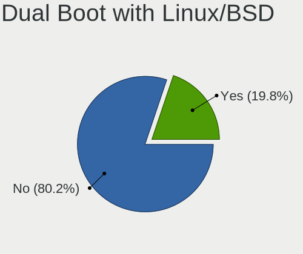
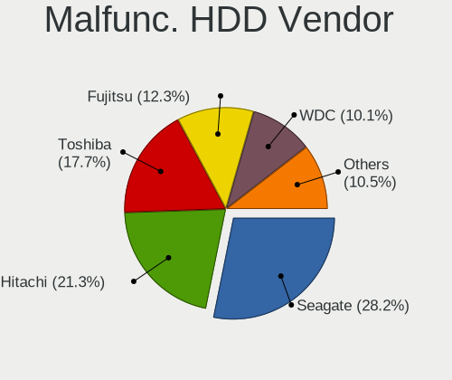
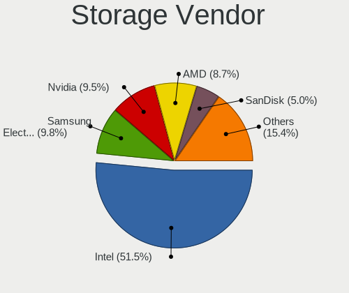
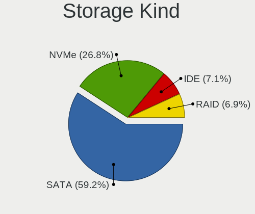
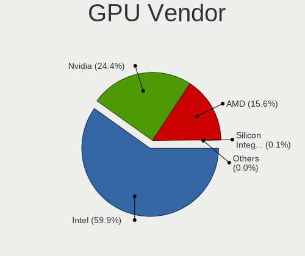
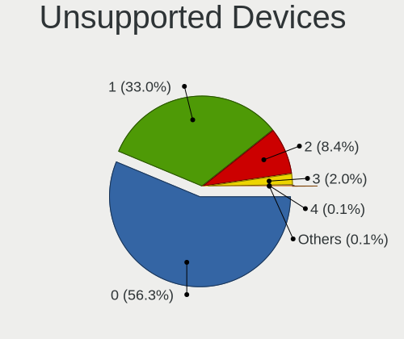

Debian 11 - Tested Hardware & Statistics (Notebooks)
----------------------------------------------------

A project to collect tested hardware configurations for Debian 11.

Anyone can contribute to this report by the [hw-probe](https://github.com/linuxhw/hw-probe) tool:

    sudo -E hw-probe -all -upload

Please submit a probe of your configuration if it's not presented on the page or is rare.

Full-feature report is available here: https://linux-hardware.org/?view=trends&rel=debian-11

Contents
--------

* [ Test Cases ](#test-cases)

* [ System ](#system)
  - [ Kernel                   ](#kernel)
  - [ Kernel Family            ](#kernel-family)
  - [ Kernel Major Ver.        ](#kernel-major-ver)
  - [ Arch                     ](#arch)
  - [ DE                       ](#de)
  - [ Display Server           ](#display-server)
  - [ Display Manager          ](#display-manager)
  - [ OS Lang                  ](#os-lang)
  - [ Boot Mode                ](#boot-mode)
  - [ Filesystem               ](#filesystem)
  - [ Part. scheme             ](#part-scheme)
  - [ Dual Boot with Linux/BSD ](#dual-boot-with-linuxbsd)
  - [ Dual Boot (Win)          ](#dual-boot-win)

* [ Board ](#board)
  - [ Vendor                   ](#vendor)
  - [ Model                    ](#model)
  - [ Model Family             ](#model-family)
  - [ MFG Year                 ](#mfg-year)
  - [ Form Factor              ](#form-factor)
  - [ Secure Boot              ](#secure-boot)
  - [ Coreboot                 ](#coreboot)
  - [ RAM Size                 ](#ram-size)
  - [ RAM Used                 ](#ram-used)
  - [ Total Drives             ](#total-drives)
  - [ Has CD-ROM               ](#has-cd-rom)
  - [ Has Ethernet             ](#has-ethernet)
  - [ Has WiFi                 ](#has-wifi)
  - [ Has Bluetooth            ](#has-bluetooth)

* [ Location ](#location)
  - [ Country                  ](#country)
  - [ City                     ](#city)

* [ Drives ](#drives)
  - [ Drive Vendor             ](#drive-vendor)
  - [ Drive Model              ](#drive-model)
  - [ HDD Vendor               ](#hdd-vendor)
  - [ SSD Vendor               ](#ssd-vendor)
  - [ Drive Kind               ](#drive-kind)
  - [ Drive Connector          ](#drive-connector)
  - [ Drive Size               ](#drive-size)
  - [ Space Total              ](#space-total)
  - [ Space Used               ](#space-used)
  - [ Malfunc. Drives          ](#malfunc-drives)
  - [ Malfunc. Drive Vendor    ](#malfunc-drive-vendor)
  - [ Malfunc. HDD Vendor      ](#malfunc-hdd-vendor)
  - [ Malfunc. Drive Kind      ](#malfunc-drive-kind)
  - [ Failed Drives            ](#failed-drives)
  - [ Failed Drive Vendor      ](#failed-drive-vendor)
  - [ Drive Status             ](#drive-status)

* [ Storage controller ](#storage-controller)
  - [ Storage Vendor           ](#storage-vendor)
  - [ Storage Model            ](#storage-model)
  - [ Storage Kind             ](#storage-kind)

* [ Processor ](#processor)
  - [ CPU Vendor               ](#cpu-vendor)
  - [ CPU Model                ](#cpu-model)
  - [ CPU Model Family         ](#cpu-model-family)
  - [ CPU Cores                ](#cpu-cores)
  - [ CPU Sockets              ](#cpu-sockets)
  - [ CPU Threads              ](#cpu-threads)
  - [ CPU Op-Modes             ](#cpu-op-modes)
  - [ CPU Microcode            ](#cpu-microcode)
  - [ CPU Microarch            ](#cpu-microarch)

* [ Graphics ](#graphics)
  - [ GPU Vendor               ](#gpu-vendor)
  - [ GPU Model                ](#gpu-model)
  - [ GPU Combo                ](#gpu-combo)
  - [ GPU Driver               ](#gpu-driver)
  - [ GPU Memory               ](#gpu-memory)

* [ Monitor ](#monitor)
  - [ Monitor Vendor           ](#monitor-vendor)
  - [ Monitor Model            ](#monitor-model)
  - [ Monitor Resolution       ](#monitor-resolution)
  - [ Monitor Diagonal         ](#monitor-diagonal)
  - [ Monitor Width            ](#monitor-width)
  - [ Aspect Ratio             ](#aspect-ratio)
  - [ Monitor Area             ](#monitor-area)
  - [ Pixel Density            ](#pixel-density)
  - [ Multiple Monitors        ](#multiple-monitors)

* [ Network ](#network)
  - [ Net Controller Vendor    ](#net-controller-vendor)
  - [ Net Controller Model     ](#net-controller-model)
  - [ Wireless Vendor          ](#wireless-vendor)
  - [ Wireless Model           ](#wireless-model)
  - [ Ethernet Vendor          ](#ethernet-vendor)
  - [ Ethernet Model           ](#ethernet-model)
  - [ Net Controller Kind      ](#net-controller-kind)
  - [ Used Controller          ](#used-controller)
  - [ NICs                     ](#nics)
  - [ IPv6                     ](#ipv6)

* [ Bluetooth ](#bluetooth)
  - [ Bluetooth Vendor         ](#bluetooth-vendor)
  - [ Bluetooth Model          ](#bluetooth-model)

* [ Sound ](#sound)
  - [ Sound Vendor             ](#sound-vendor)
  - [ Sound Model              ](#sound-model)

* [ Memory ](#memory)
  - [ Memory Vendor            ](#memory-vendor)
  - [ Memory Model             ](#memory-model)
  - [ Memory Kind              ](#memory-kind)
  - [ Memory Form Factor       ](#memory-form-factor)
  - [ Memory Size              ](#memory-size)
  - [ Memory Speed             ](#memory-speed)

* [ Printers & scanners ](#printers--scanners)
  - [ Printer Vendor           ](#printer-vendor)
  - [ Printer Model            ](#printer-model)
  - [ Scanner Vendor           ](#scanner-vendor)
  - [ Scanner Model            ](#scanner-model)

* [ Camera ](#camera)
  - [ Camera Vendor            ](#camera-vendor)
  - [ Camera Model             ](#camera-model)

* [ Security ](#security)
  - [ Fingerprint Vendor       ](#fingerprint-vendor)
  - [ Fingerprint Model        ](#fingerprint-model)
  - [ Chipcard Vendor          ](#chipcard-vendor)
  - [ Chipcard Model           ](#chipcard-model)

* [ Unsupported ](#unsupported)
  - [ Unsupported Devices      ](#unsupported-devices)
  - [ Unsupported Device Types ](#unsupported-device-types)

Test Cases
----------

| Vendor        | Model                       | Probe                                                      | Date         |
|---------------|-----------------------------|------------------------------------------------------------|--------------|
| Apple         | MacBookPro10,1              | [1ff67401db](https://linux-hardware.org/?probe=1ff67401db) | Sep 09, 2021 |
| LG Electro... | A410-K.BE43P1               | [7add887914](https://linux-hardware.org/?probe=7add887914) | Sep 08, 2021 |
| Apple         | MacBookAir7,2               | [5c6f3696b2](https://linux-hardware.org/?probe=5c6f3696b2) | Sep 08, 2021 |
| Lenovo        | IdeaPad 5 15ARE05 81YQ      | [d21daec9ea](https://linux-hardware.org/?probe=d21daec9ea) | Sep 08, 2021 |
| Lenovo        | ThinkPad T430 2349D10       | [11ab5d413d](https://linux-hardware.org/?probe=11ab5d413d) | Sep 08, 2021 |
| Lenovo        | ThinkPad X230 2325B12       | [a55f42da78](https://linux-hardware.org/?probe=a55f42da78) | Sep 08, 2021 |
| ASUSTek       | K52F                        | [b1f04036d8](https://linux-hardware.org/?probe=b1f04036d8) | Sep 07, 2021 |
| MSI           | GF63 8RD                    | [19cfc85441](https://linux-hardware.org/?probe=19cfc85441) | Sep 07, 2021 |
| Lenovo        | ThinkPad P50 20EN0006MS     | [55f595b53f](https://linux-hardware.org/?probe=55f595b53f) | Sep 07, 2021 |
| ASUSTek       | K52F                        | [0d72cf73ac](https://linux-hardware.org/?probe=0d72cf73ac) | Sep 07, 2021 |
| MSI           | GF63 8RD                    | [498dd20152](https://linux-hardware.org/?probe=498dd20152) | Sep 07, 2021 |
| HP            | Pavilion Gaming Laptop 1... | [6fc35e97d8](https://linux-hardware.org/?probe=6fc35e97d8) | Sep 07, 2021 |
| Dell          | Latitude 7480               | [844ab8df38](https://linux-hardware.org/?probe=844ab8df38) | Sep 06, 2021 |
| HP            | Laptop 15s-eq1xxx           | [9256f3fece](https://linux-hardware.org/?probe=9256f3fece) | Sep 06, 2021 |
| Acer          | Aspire A315-23              | [7f6c0d6337](https://linux-hardware.org/?probe=7f6c0d6337) | Sep 06, 2021 |
| Acer          | Aspire A315-23              | [e6ea97df06](https://linux-hardware.org/?probe=e6ea97df06) | Sep 06, 2021 |
| Acer          | Aspire A315-23              | [3aedb68952](https://linux-hardware.org/?probe=3aedb68952) | Sep 06, 2021 |
| Samsung       | NC10                        | [98ba59d155](https://linux-hardware.org/?probe=98ba59d155) | Sep 06, 2021 |
| Lenovo        | ThinkPad E14 Gen 2 20T60... | [e42726b566](https://linux-hardware.org/?probe=e42726b566) | Sep 06, 2021 |
| Dell          | Vostro 5490                 | [b6e28c84c8](https://linux-hardware.org/?probe=b6e28c84c8) | Sep 06, 2021 |
| Lenovo        | ThinkPad X1 Carbon 5th 2... | [2a4adea555](https://linux-hardware.org/?probe=2a4adea555) | Sep 05, 2021 |
| Toshiba       | Satellite C55-B             | [fe8833475a](https://linux-hardware.org/?probe=fe8833475a) | Sep 05, 2021 |
| HP            | EliteBook 820 G1            | [0a1850f760](https://linux-hardware.org/?probe=0a1850f760) | Sep 05, 2021 |
| HP            | EliteBook 820 G1            | [4ba7363e9e](https://linux-hardware.org/?probe=4ba7363e9e) | Sep 05, 2021 |
| Lenovo        | ThinkBook 15-IML 20RW       | [18fe596fba](https://linux-hardware.org/?probe=18fe596fba) | Sep 04, 2021 |
| HP            | Presario CQ62               | [4cdec89015](https://linux-hardware.org/?probe=4cdec89015) | Sep 04, 2021 |
| Lenovo        | IdeaPad 700-15ISK 80RU      | [9e235c4228](https://linux-hardware.org/?probe=9e235c4228) | Sep 04, 2021 |
| Dell          | Inspiron 1525               | [0e32e6945b](https://linux-hardware.org/?probe=0e32e6945b) | Sep 03, 2021 |
| Apple         | MacBookAir7,2               | [db35296aa1](https://linux-hardware.org/?probe=db35296aa1) | Sep 03, 2021 |
| Acer          | Aspire A315-23              | [fafd031d1f](https://linux-hardware.org/?probe=fafd031d1f) | Sep 03, 2021 |
| Apple         | MacBookAir7,2               | [1449c0a9cd](https://linux-hardware.org/?probe=1449c0a9cd) | Sep 02, 2021 |
| ASUSTek       | UX303LNB                    | [e0756d7ae6](https://linux-hardware.org/?probe=e0756d7ae6) | Sep 02, 2021 |
| Lenovo        | ThinkPad E15 Gen 2 20T80... | [5d183d4587](https://linux-hardware.org/?probe=5d183d4587) | Sep 02, 2021 |
| Lenovo        | ThinkPad 13 2nd Gen 20J1... | [666c4fef08](https://linux-hardware.org/?probe=666c4fef08) | Sep 02, 2021 |
| Lenovo        | ThinkPad 13 2nd Gen 20J1... | [d6ee033eb7](https://linux-hardware.org/?probe=d6ee033eb7) | Sep 02, 2021 |
| Apple         | MacBookAir7,1               | [28fbb3d82d](https://linux-hardware.org/?probe=28fbb3d82d) | Sep 02, 2021 |
| Apple         | MacBookAir7,1               | [27c2ebc917](https://linux-hardware.org/?probe=27c2ebc917) | Sep 02, 2021 |
| Acer          | Aspire A315-23              | [1d9e3a7503](https://linux-hardware.org/?probe=1d9e3a7503) | Sep 02, 2021 |
| Acer          | Aspire A315-23              | [97c9e2dc1f](https://linux-hardware.org/?probe=97c9e2dc1f) | Sep 02, 2021 |
| HP            | EliteBook Folio 1040 G3     | [6bf33dd2cb](https://linux-hardware.org/?probe=6bf33dd2cb) | Sep 01, 2021 |
| Lenovo        | ThinkPad X250 20CLS2DK00    | [f1cad98694](https://linux-hardware.org/?probe=f1cad98694) | Sep 01, 2021 |
| Lenovo        | ThinkPad E475 20H40006US    | [d542a6b8f9](https://linux-hardware.org/?probe=d542a6b8f9) | Sep 01, 2021 |
| Acer          | Aspire A315-23              | [12a5a0f9c5](https://linux-hardware.org/?probe=12a5a0f9c5) | Sep 01, 2021 |
| ASUSTek       | ZenBook UX431DA_UM431DA     | [3267eec643](https://linux-hardware.org/?probe=3267eec643) | Sep 01, 2021 |
| Timi          | TM1613                      | [f25eeca060](https://linux-hardware.org/?probe=f25eeca060) | Sep 01, 2021 |
| Lenovo        | ThinkPad T430 2349S9E       | [bc224fb15f](https://linux-hardware.org/?probe=bc224fb15f) | Aug 31, 2021 |
| Lenovo        | ThinkPad 13 2nd Gen 20J1... | [9510c18df6](https://linux-hardware.org/?probe=9510c18df6) | Aug 31, 2021 |
| HP            | Laptop 15s-eq1xxx           | [783955d696](https://linux-hardware.org/?probe=783955d696) | Aug 31, 2021 |
| Lenovo        | ThinkPad X250 20CLS2DK00    | [db94fcaf10](https://linux-hardware.org/?probe=db94fcaf10) | Aug 31, 2021 |
| Apple         | MacBookAir7,2               | [baf38e8736](https://linux-hardware.org/?probe=baf38e8736) | Aug 31, 2021 |
| Lenovo        | ThinkPad T430 2349V4B       | [33a45018fc](https://linux-hardware.org/?probe=33a45018fc) | Aug 31, 2021 |
| Fujitsu Si... | LIFEBOOK S6420              | [b26e82328a](https://linux-hardware.org/?probe=b26e82328a) | Aug 31, 2021 |
| Apple         | MacBookAir7,2               | [70835c3aa7](https://linux-hardware.org/?probe=70835c3aa7) | Aug 30, 2021 |
| HP            | EliteBook 8460p             | [3e22f55c7b](https://linux-hardware.org/?probe=3e22f55c7b) | Aug 30, 2021 |
| Apple         | MacBookAir7,2               | [b73b366bb6](https://linux-hardware.org/?probe=b73b366bb6) | Aug 30, 2021 |
| Toshiba       | Satellite C55-B             | [e1b2dc4810](https://linux-hardware.org/?probe=e1b2dc4810) | Aug 30, 2021 |
| Apple         | MacBookAir7,1               | [e94ab065a3](https://linux-hardware.org/?probe=e94ab065a3) | Aug 30, 2021 |
| HP            | EliteBook 8460p             | [b1425fa900](https://linux-hardware.org/?probe=b1425fa900) | Aug 30, 2021 |
| Apple         | MacBookAir7,2               | [b5a84f215b](https://linux-hardware.org/?probe=b5a84f215b) | Aug 30, 2021 |
| Dell          | Latitude E6330              | [95d65375e2](https://linux-hardware.org/?probe=95d65375e2) | Aug 30, 2021 |
| Lenovo        | ThinkPad T61 7661BF3        | [69b6d76471](https://linux-hardware.org/?probe=69b6d76471) | Aug 30, 2021 |
| ASUSTek       | K56CB                       | [1a44fc7e8f](https://linux-hardware.org/?probe=1a44fc7e8f) | Aug 29, 2021 |
| Lenovo        | IdeaPad 330-15ICH 81FK      | [6fcfbde79d](https://linux-hardware.org/?probe=6fcfbde79d) | Aug 29, 2021 |
| HP            | Pavilion Gaming Laptop 1... | [17ae4593ea](https://linux-hardware.org/?probe=17ae4593ea) | Aug 28, 2021 |
| HP            | EliteBook 840 G3            | [8625d6f2f1](https://linux-hardware.org/?probe=8625d6f2f1) | Aug 28, 2021 |
| Apple         | MacBookAir7,2               | [d215521170](https://linux-hardware.org/?probe=d215521170) | Aug 27, 2021 |
| Lenovo        | ThinkPad 13 2nd Gen 20J1... | [2c85ec0205](https://linux-hardware.org/?probe=2c85ec0205) | Aug 27, 2021 |
| Lenovo        | ThinkPad T440p 20AN006GU... | [bca7704bb0](https://linux-hardware.org/?probe=bca7704bb0) | Aug 27, 2021 |
| Apple         | MacBookAir7,2               | [14747d88b3](https://linux-hardware.org/?probe=14747d88b3) | Aug 26, 2021 |
| Lenovo        | IdeaPad 320-15ABR 80XS      | [87904cbe92](https://linux-hardware.org/?probe=87904cbe92) | Aug 26, 2021 |
| Apple         | MacBookAir7,2               | [1c2e910793](https://linux-hardware.org/?probe=1c2e910793) | Aug 26, 2021 |
| Apple         | MacBookAir7,1               | [4a69118897](https://linux-hardware.org/?probe=4a69118897) | Aug 26, 2021 |
| Apple         | MacBookAir7,1               | [474216fba9](https://linux-hardware.org/?probe=474216fba9) | Aug 26, 2021 |
| Apple         | MacBookAir7,2               | [76d9383f33](https://linux-hardware.org/?probe=76d9383f33) | Aug 26, 2021 |
| Apple         | MacBookAir7,2               | [213d3f817b](https://linux-hardware.org/?probe=213d3f817b) | Aug 26, 2021 |
| YJKC          | vBOOK Plus RVP7             | [8c051a0ce9](https://linux-hardware.org/?probe=8c051a0ce9) | Aug 26, 2021 |
| Gigabyte      | AORUS 15G KB                | [6afefe68d7](https://linux-hardware.org/?probe=6afefe68d7) | Aug 26, 2021 |
| HP            | ProBook 4530s               | [2b4cab4d7c](https://linux-hardware.org/?probe=2b4cab4d7c) | Aug 25, 2021 |
| Dell          | Inspiron 3537               | [7bab6dd9db](https://linux-hardware.org/?probe=7bab6dd9db) | Aug 25, 2021 |
| HP            | ProBook 450 G7              | [a2f161dee0](https://linux-hardware.org/?probe=a2f161dee0) | Aug 25, 2021 |
| HUAWEI        | WRT-WX9                     | [e1e5a14c77](https://linux-hardware.org/?probe=e1e5a14c77) | Aug 25, 2021 |
| Dell          | Inspiron 15 7000 Gaming     | [3da8591ac6](https://linux-hardware.org/?probe=3da8591ac6) | Aug 25, 2021 |
| HP            | 630                         | [004d2b364d](https://linux-hardware.org/?probe=004d2b364d) | Aug 25, 2021 |
| Dell          | Latitude 7490               | [23ad45f1fd](https://linux-hardware.org/?probe=23ad45f1fd) | Aug 25, 2021 |
| Apple         | MacBookAir7,2               | [65d82bc8e7](https://linux-hardware.org/?probe=65d82bc8e7) | Aug 24, 2021 |
| Lenovo        | ThinkPad 13 2nd Gen 20J1... | [e1bd0ec7fd](https://linux-hardware.org/?probe=e1bd0ec7fd) | Aug 24, 2021 |
| Apple         | MacBookAir7,2               | [8a72f87e7b](https://linux-hardware.org/?probe=8a72f87e7b) | Aug 24, 2021 |
| Apple         | MacBookAir7,1               | [1f257714a9](https://linux-hardware.org/?probe=1f257714a9) | Aug 24, 2021 |
| Dell          | Inspiron 15 7000 Gaming     | [102aea0211](https://linux-hardware.org/?probe=102aea0211) | Aug 24, 2021 |
| HP            | Laptop 15s-fq2xxx           | [f755838fd8](https://linux-hardware.org/?probe=f755838fd8) | Aug 24, 2021 |
| Apple         | MacBookAir7,2               | [5cc74103a8](https://linux-hardware.org/?probe=5cc74103a8) | Aug 24, 2021 |
| HP            | 250 G4                      | [5d47aa9804](https://linux-hardware.org/?probe=5d47aa9804) | Aug 24, 2021 |
| ASUSTek       | UX430UAR                    | [77ce457de4](https://linux-hardware.org/?probe=77ce457de4) | Aug 24, 2021 |
| HP            | Laptop 14-cm0xxx            | [df0fa8e968](https://linux-hardware.org/?probe=df0fa8e968) | Aug 24, 2021 |
| Sony          | VPCF115FM                   | [9f9abf79b2](https://linux-hardware.org/?probe=9f9abf79b2) | Aug 23, 2021 |
| Apple         | MacBookAir7,2               | [8a88eabb1c](https://linux-hardware.org/?probe=8a88eabb1c) | Aug 23, 2021 |
| Apple         | MacBookAir7,2               | [c4ecd51a21](https://linux-hardware.org/?probe=c4ecd51a21) | Aug 23, 2021 |
| HP            | Laptop 15s-eq1xxx           | [1c9d3bb8b4](https://linux-hardware.org/?probe=1c9d3bb8b4) | Aug 23, 2021 |
| HP            | ProBook 450 G8 Notebook ... | [45ec27282a](https://linux-hardware.org/?probe=45ec27282a) | Aug 23, 2021 |
| Lenovo        | ThinkBook 15-IML 20RW       | [14af647cc5](https://linux-hardware.org/?probe=14af647cc5) | Aug 23, 2021 |
| Apple         | MacBookAir7,2               | [5bc9372587](https://linux-hardware.org/?probe=5bc9372587) | Aug 23, 2021 |
| Apple         | MacBookAir7,2               | [8bcb9e62e1](https://linux-hardware.org/?probe=8bcb9e62e1) | Aug 23, 2021 |
| Apple         | MacBookAir7,2               | [6c44c4f7e3](https://linux-hardware.org/?probe=6c44c4f7e3) | Aug 23, 2021 |
| Google        | Enguarde                    | [12a2003770](https://linux-hardware.org/?probe=12a2003770) | Aug 23, 2021 |
| Apple         | MacBookAir7,1               | [7f190e4ed2](https://linux-hardware.org/?probe=7f190e4ed2) | Aug 23, 2021 |
| Apple         | MacBookAir7,1               | [2db5cafda3](https://linux-hardware.org/?probe=2db5cafda3) | Aug 23, 2021 |
| Apple         | MacBookAir7,1               | [abcab36e0c](https://linux-hardware.org/?probe=abcab36e0c) | Aug 23, 2021 |
| Apple         | MacBookAir7,1               | [f3ccb91568](https://linux-hardware.org/?probe=f3ccb91568) | Aug 23, 2021 |
| Apple         | MacBookAir7,1               | [0d8fa16f47](https://linux-hardware.org/?probe=0d8fa16f47) | Aug 23, 2021 |
| Apple         | MacBookAir7,1               | [680e8106ec](https://linux-hardware.org/?probe=680e8106ec) | Aug 23, 2021 |
| Apple         | MacBookAir7,1               | [c18b0215e9](https://linux-hardware.org/?probe=c18b0215e9) | Aug 23, 2021 |
| Apple         | MacBookAir7,1               | [fcc821b941](https://linux-hardware.org/?probe=fcc821b941) | Aug 23, 2021 |
| Apple         | MacBookAir7,1               | [59f760dbb9](https://linux-hardware.org/?probe=59f760dbb9) | Aug 23, 2021 |
| Apple         | MacBookAir7,1               | [e22a8e2ea4](https://linux-hardware.org/?probe=e22a8e2ea4) | Aug 23, 2021 |
| Apple         | MacBookAir7,1               | [4fc69342da](https://linux-hardware.org/?probe=4fc69342da) | Aug 23, 2021 |
| Apple         | MacBookAir7,1               | [f2fcae5696](https://linux-hardware.org/?probe=f2fcae5696) | Aug 23, 2021 |
| Apple         | MacBookAir7,1               | [2f823b2f52](https://linux-hardware.org/?probe=2f823b2f52) | Aug 23, 2021 |
| Apple         | MacBookAir7,1               | [adf5b71331](https://linux-hardware.org/?probe=adf5b71331) | Aug 23, 2021 |
| Apple         | MacBookAir7,1               | [618c1c7838](https://linux-hardware.org/?probe=618c1c7838) | Aug 23, 2021 |
| Apple         | MacBookAir7,1               | [0dff1056d5](https://linux-hardware.org/?probe=0dff1056d5) | Aug 23, 2021 |
| Apple         | MacBookAir7,1               | [fb0cf0a7a3](https://linux-hardware.org/?probe=fb0cf0a7a3) | Aug 23, 2021 |
| Apple         | MacBookAir7,1               | [6b9f550210](https://linux-hardware.org/?probe=6b9f550210) | Aug 23, 2021 |
| Apple         | MacBookAir7,1               | [4b22440e91](https://linux-hardware.org/?probe=4b22440e91) | Aug 23, 2021 |
| Apple         | MacBookAir7,1               | [6bab7cdc7c](https://linux-hardware.org/?probe=6bab7cdc7c) | Aug 23, 2021 |
| Apple         | MacBookAir7,1               | [d2a08022bd](https://linux-hardware.org/?probe=d2a08022bd) | Aug 23, 2021 |
| Apple         | MacBookAir7,1               | [f39d94cf1b](https://linux-hardware.org/?probe=f39d94cf1b) | Aug 23, 2021 |
| Apple         | MacBookAir7,1               | [e35bbfda2d](https://linux-hardware.org/?probe=e35bbfda2d) | Aug 23, 2021 |
| Apple         | MacBookAir7,1               | [60170675ca](https://linux-hardware.org/?probe=60170675ca) | Aug 23, 2021 |
| Apple         | MacBookAir7,1               | [64a6aa27db](https://linux-hardware.org/?probe=64a6aa27db) | Aug 23, 2021 |
| Apple         | MacBookAir7,1               | [06b1dab7a0](https://linux-hardware.org/?probe=06b1dab7a0) | Aug 23, 2021 |
| Apple         | MacBookAir7,1               | [cec5c36945](https://linux-hardware.org/?probe=cec5c36945) | Aug 23, 2021 |
| Apple         | MacBookAir7,1               | [6f38e35f9a](https://linux-hardware.org/?probe=6f38e35f9a) | Aug 23, 2021 |
| HP            | EliteBook 840 G4            | [ebe40b3244](https://linux-hardware.org/?probe=ebe40b3244) | Aug 22, 2021 |
| Lenovo        | IdeaPad 320-15ABR 80XS      | [d98bdb0d1c](https://linux-hardware.org/?probe=d98bdb0d1c) | Aug 22, 2021 |
| Dell          | Inspiron 15 7000 Gaming     | [d688bffa01](https://linux-hardware.org/?probe=d688bffa01) | Aug 22, 2021 |
| Dell          | Inspiron 15 7000 Gaming     | [3d52884b6e](https://linux-hardware.org/?probe=3d52884b6e) | Aug 22, 2021 |
| ASUSTek       | G771JM                      | [57b847b12c](https://linux-hardware.org/?probe=57b847b12c) | Aug 22, 2021 |
| ASUSTek       | G771JM                      | [db4b9878fa](https://linux-hardware.org/?probe=db4b9878fa) | Aug 22, 2021 |
| Dell          | Inspiron 6000               | [67c6b36361](https://linux-hardware.org/?probe=67c6b36361) | Aug 22, 2021 |
| Dell          | Inspiron 3593               | [dfed5d8b7a](https://linux-hardware.org/?probe=dfed5d8b7a) | Aug 21, 2021 |
| Dell          | Latitude E7470              | [e954672cb2](https://linux-hardware.org/?probe=e954672cb2) | Aug 21, 2021 |
| Lenovo        | IdeaPad Y500 20193          | [5b2d90a434](https://linux-hardware.org/?probe=5b2d90a434) | Aug 21, 2021 |
| HP            | 14s-dq2003nw                | [f4dcd70da5](https://linux-hardware.org/?probe=f4dcd70da5) | Aug 21, 2021 |
| Lenovo        | ThinkPad E570 20H500B4GE    | [be964b556b](https://linux-hardware.org/?probe=be964b556b) | Aug 21, 2021 |
| ASUSTek       | ROG Zephyrus G14 GA401QM... | [5ecdc39ac1](https://linux-hardware.org/?probe=5ecdc39ac1) | Aug 21, 2021 |
| Dell          | Precision 7520              | [372d627a69](https://linux-hardware.org/?probe=372d627a69) | Aug 21, 2021 |
| Apple         | MacBookAir7,1               | [daa01f79aa](https://linux-hardware.org/?probe=daa01f79aa) | Aug 20, 2021 |
| Apple         | MacBookAir7,1               | [a96a7ada4f](https://linux-hardware.org/?probe=a96a7ada4f) | Aug 20, 2021 |
| Apple         | MacBookAir7,1               | [c8305c0d4c](https://linux-hardware.org/?probe=c8305c0d4c) | Aug 20, 2021 |
| Apple         | MacBookAir7,1               | [77359352d0](https://linux-hardware.org/?probe=77359352d0) | Aug 20, 2021 |
| Apple         | MacBookAir7,2               | [5312257240](https://linux-hardware.org/?probe=5312257240) | Aug 20, 2021 |
| Apple         | MacBookAir7,1               | [75e262ddba](https://linux-hardware.org/?probe=75e262ddba) | Aug 20, 2021 |
| Apple         | MacBookAir7,1               | [bd216572a3](https://linux-hardware.org/?probe=bd216572a3) | Aug 20, 2021 |
| Apple         | MacBookAir7,1               | [e57aeadfef](https://linux-hardware.org/?probe=e57aeadfef) | Aug 20, 2021 |
| Apple         | MacBookAir7,1               | [7211565d4a](https://linux-hardware.org/?probe=7211565d4a) | Aug 20, 2021 |
| Apple         | MacBookAir7,1               | [1c490522df](https://linux-hardware.org/?probe=1c490522df) | Aug 20, 2021 |
| Apple         | MacBookAir7,1               | [16f0b9c14a](https://linux-hardware.org/?probe=16f0b9c14a) | Aug 20, 2021 |
| Apple         | MacBookAir7,1               | [691bb379e5](https://linux-hardware.org/?probe=691bb379e5) | Aug 20, 2021 |
| Apple         | MacBookAir7,1               | [fe880ac0c8](https://linux-hardware.org/?probe=fe880ac0c8) | Aug 20, 2021 |
| Lenovo        | ThinkPad 13 2nd Gen 20J1... | [a5a146e42a](https://linux-hardware.org/?probe=a5a146e42a) | Aug 20, 2021 |
| Apple         | MacBookAir7,2               | [c60ef3fa1e](https://linux-hardware.org/?probe=c60ef3fa1e) | Aug 20, 2021 |
| Timi          | TM1612                      | [485caf5846](https://linux-hardware.org/?probe=485caf5846) | Aug 20, 2021 |
| Lenovo        | V510-15IKB 80WQ             | [2a61705899](https://linux-hardware.org/?probe=2a61705899) | Aug 20, 2021 |
| SLIMBOOK      | TITAN                       | [a2abd981d1](https://linux-hardware.org/?probe=a2abd981d1) | Aug 19, 2021 |
| Apple         | MacBookAir7,2               | [1ce6738560](https://linux-hardware.org/?probe=1ce6738560) | Aug 19, 2021 |
| Apple         | MacBookAir7,2               | [e134a1f7c3](https://linux-hardware.org/?probe=e134a1f7c3) | Aug 19, 2021 |
| Apple         | MacBookAir7,2               | [87fa430aab](https://linux-hardware.org/?probe=87fa430aab) | Aug 19, 2021 |
| Apple         | MacBookAir7,2               | [c989eac16b](https://linux-hardware.org/?probe=c989eac16b) | Aug 18, 2021 |
| Apple         | MacBookAir7,2               | [3169e477dd](https://linux-hardware.org/?probe=3169e477dd) | Aug 18, 2021 |
| Apple         | MacBookAir7,2               | [5fcb7fdb26](https://linux-hardware.org/?probe=5fcb7fdb26) | Aug 18, 2021 |
| Apple         | MacBookAir7,2               | [7afbba35b0](https://linux-hardware.org/?probe=7afbba35b0) | Aug 18, 2021 |
| Apple         | MacBookAir7,2               | [f1d159bbd1](https://linux-hardware.org/?probe=f1d159bbd1) | Aug 18, 2021 |
| Apple         | MacBookAir7,2               | [38e8211556](https://linux-hardware.org/?probe=38e8211556) | Aug 18, 2021 |
| Apple         | MacBookAir7,2               | [bd587e5998](https://linux-hardware.org/?probe=bd587e5998) | Aug 18, 2021 |
| Apple         | MacBookAir7,2               | [3fa54711ec](https://linux-hardware.org/?probe=3fa54711ec) | Aug 18, 2021 |
| Apple         | MacBookAir7,2               | [4a7f287161](https://linux-hardware.org/?probe=4a7f287161) | Aug 18, 2021 |
| Apple         | MacBookAir7,2               | [fed5f28778](https://linux-hardware.org/?probe=fed5f28778) | Aug 18, 2021 |
| Apple         | MacBookAir7,2               | [0ba8599928](https://linux-hardware.org/?probe=0ba8599928) | Aug 18, 2021 |
| Apple         | MacBookAir7,2               | [e31d43b39d](https://linux-hardware.org/?probe=e31d43b39d) | Aug 18, 2021 |
| Apple         | MacBookAir7,2               | [703cdcf766](https://linux-hardware.org/?probe=703cdcf766) | Aug 18, 2021 |
| Apple         | MacBookAir7,2               | [9b8ce55c3d](https://linux-hardware.org/?probe=9b8ce55c3d) | Aug 18, 2021 |
| Apple         | MacBookAir7,2               | [2b4af51f46](https://linux-hardware.org/?probe=2b4af51f46) | Aug 18, 2021 |
| Apple         | MacBookAir7,2               | [b802b4a25b](https://linux-hardware.org/?probe=b802b4a25b) | Aug 18, 2021 |
| Google        | Enguarde                    | [cb421b796b](https://linux-hardware.org/?probe=cb421b796b) | Aug 18, 2021 |
| Apple         | MacBookAir7,2               | [f6c7230675](https://linux-hardware.org/?probe=f6c7230675) | Aug 18, 2021 |
| Google        | Enguarde                    | [7116839a4b](https://linux-hardware.org/?probe=7116839a4b) | Aug 18, 2021 |
| Google        | Enguarde                    | [04817bfb7f](https://linux-hardware.org/?probe=04817bfb7f) | Aug 18, 2021 |
| Google        | Enguarde                    | [92b401a705](https://linux-hardware.org/?probe=92b401a705) | Aug 18, 2021 |
| Google        | Enguarde                    | [f2a438a9be](https://linux-hardware.org/?probe=f2a438a9be) | Aug 18, 2021 |
| Apple         | MacBookAir7,2               | [c9239b499b](https://linux-hardware.org/?probe=c9239b499b) | Aug 18, 2021 |
| Apple         | MacBookAir7,2               | [b708a97ef1](https://linux-hardware.org/?probe=b708a97ef1) | Aug 18, 2021 |
| Apple         | MacBookAir7,2               | [31dc792a8b](https://linux-hardware.org/?probe=31dc792a8b) | Aug 18, 2021 |
| Apple         | MacBookAir7,2               | [76a48b344d](https://linux-hardware.org/?probe=76a48b344d) | Aug 18, 2021 |
| Apple         | MacBookAir7,2               | [244aba47d4](https://linux-hardware.org/?probe=244aba47d4) | Aug 18, 2021 |
| Google        | Enguarde                    | [b2391216c6](https://linux-hardware.org/?probe=b2391216c6) | Aug 18, 2021 |
| Google        | Enguarde                    | [53b311c24c](https://linux-hardware.org/?probe=53b311c24c) | Aug 18, 2021 |
| Google        | Enguarde                    | [61de56951c](https://linux-hardware.org/?probe=61de56951c) | Aug 18, 2021 |
| Google        | Enguarde                    | [7fd7f1ea77](https://linux-hardware.org/?probe=7fd7f1ea77) | Aug 18, 2021 |
| Google        | Enguarde                    | [2a090f8b2a](https://linux-hardware.org/?probe=2a090f8b2a) | Aug 18, 2021 |
| Google        | Enguarde                    | [62e4ff915a](https://linux-hardware.org/?probe=62e4ff915a) | Aug 18, 2021 |
| Google        | Enguarde                    | [eada085a33](https://linux-hardware.org/?probe=eada085a33) | Aug 18, 2021 |
| Google        | Enguarde                    | [474e20b9f2](https://linux-hardware.org/?probe=474e20b9f2) | Aug 18, 2021 |
| ASUSTek       | UX305CA                     | [6ab6beca67](https://linux-hardware.org/?probe=6ab6beca67) | Aug 18, 2021 |
| HP            | EliteBook 820 G1            | [c7155dfa07](https://linux-hardware.org/?probe=c7155dfa07) | Aug 18, 2021 |
| Apple         | MacBookAir7,2               | [451fe761a6](https://linux-hardware.org/?probe=451fe761a6) | Aug 18, 2021 |
| Google        | Enguarde                    | [dd0de8b832](https://linux-hardware.org/?probe=dd0de8b832) | Aug 17, 2021 |
| Google        | Enguarde                    | [a6ac2782a6](https://linux-hardware.org/?probe=a6ac2782a6) | Aug 17, 2021 |
| Google        | Enguarde                    | [d32e974941](https://linux-hardware.org/?probe=d32e974941) | Aug 17, 2021 |
| Google        | Enguarde                    | [fe90c1da98](https://linux-hardware.org/?probe=fe90c1da98) | Aug 17, 2021 |
| Apple         | MacBookAir7,1               | [c3d98780bf](https://linux-hardware.org/?probe=c3d98780bf) | Aug 17, 2021 |
| Lenovo        | IdeaPad 5 14ALC05 82LM      | [4b38b9e598](https://linux-hardware.org/?probe=4b38b9e598) | Aug 17, 2021 |
| Apple         | MacBookAir7,1               | [2c30321150](https://linux-hardware.org/?probe=2c30321150) | Aug 17, 2021 |
| Apple         | MacBookAir7,1               | [2f6317ebc5](https://linux-hardware.org/?probe=2f6317ebc5) | Aug 17, 2021 |
| Apple         | MacBookAir7,1               | [707606ff5e](https://linux-hardware.org/?probe=707606ff5e) | Aug 17, 2021 |
| Apple         | MacBookAir7,1               | [0c43bb89c0](https://linux-hardware.org/?probe=0c43bb89c0) | Aug 17, 2021 |
| Apple         | MacBookAir7,1               | [fcb540b848](https://linux-hardware.org/?probe=fcb540b848) | Aug 17, 2021 |
| Lenovo        | ThinkPad 13 2nd Gen 20J1... | [46240d5ef9](https://linux-hardware.org/?probe=46240d5ef9) | Aug 17, 2021 |
| Apple         | MacBookAir7,1               | [6e85db6058](https://linux-hardware.org/?probe=6e85db6058) | Aug 17, 2021 |
| Apple         | MacBookAir7,1               | [2e26440865](https://linux-hardware.org/?probe=2e26440865) | Aug 17, 2021 |
| Apple         | MacBook7,1                  | [5ad65197ad](https://linux-hardware.org/?probe=5ad65197ad) | Aug 17, 2021 |
| Apple         | MacBookAir7,1               | [c185e120f1](https://linux-hardware.org/?probe=c185e120f1) | Aug 17, 2021 |
| Apple         | MacBookAir7,1               | [ee22c0dcc0](https://linux-hardware.org/?probe=ee22c0dcc0) | Aug 17, 2021 |
| Apple         | MacBookAir7,1               | [b3fd5bee39](https://linux-hardware.org/?probe=b3fd5bee39) | Aug 17, 2021 |
| Apple         | MacBookAir7,1               | [d68e571cd0](https://linux-hardware.org/?probe=d68e571cd0) | Aug 17, 2021 |
| Dell          | Latitude 7480               | [49272ed382](https://linux-hardware.org/?probe=49272ed382) | Aug 17, 2021 |
| Apple         | MacBookAir7,1               | [28c2f85e9c](https://linux-hardware.org/?probe=28c2f85e9c) | Aug 17, 2021 |
| Apple         | MacBookAir7,1               | [1f8c3f9487](https://linux-hardware.org/?probe=1f8c3f9487) | Aug 17, 2021 |
| Apple         | MacBookAir7,1               | [9f6a737d07](https://linux-hardware.org/?probe=9f6a737d07) | Aug 17, 2021 |
| Apple         | MacBookAir7,1               | [4eb4afec6b](https://linux-hardware.org/?probe=4eb4afec6b) | Aug 17, 2021 |
| Apple         | MacBookAir7,1               | [5949002919](https://linux-hardware.org/?probe=5949002919) | Aug 17, 2021 |
| Apple         | MacBookAir7,1               | [b0d4ba09f6](https://linux-hardware.org/?probe=b0d4ba09f6) | Aug 17, 2021 |
| Apple         | MacBookAir7,1               | [12377bdf65](https://linux-hardware.org/?probe=12377bdf65) | Aug 17, 2021 |
| Apple         | MacBookAir7,1               | [f345284082](https://linux-hardware.org/?probe=f345284082) | Aug 17, 2021 |
| Apple         | MacBookAir7,1               | [6229638b59](https://linux-hardware.org/?probe=6229638b59) | Aug 17, 2021 |
| Apple         | MacBookAir7,1               | [b95e1787ff](https://linux-hardware.org/?probe=b95e1787ff) | Aug 17, 2021 |
| Apple         | MacBookAir7,1               | [f1d344625b](https://linux-hardware.org/?probe=f1d344625b) | Aug 17, 2021 |
| Google        | Enguarde                    | [4d7eaa38ba](https://linux-hardware.org/?probe=4d7eaa38ba) | Aug 17, 2021 |
| Google        | Enguarde                    | [8be28c3080](https://linux-hardware.org/?probe=8be28c3080) | Aug 17, 2021 |
| Lenovo        | ThinkPad X230 2325AT6       | [9e66245080](https://linux-hardware.org/?probe=9e66245080) | Aug 17, 2021 |
| Google        | Enguarde                    | [cfdf77fbd9](https://linux-hardware.org/?probe=cfdf77fbd9) | Aug 17, 2021 |
| Google        | Enguarde                    | [6e84dfb541](https://linux-hardware.org/?probe=6e84dfb541) | Aug 17, 2021 |
| Google        | Enguarde                    | [2549683d9f](https://linux-hardware.org/?probe=2549683d9f) | Aug 17, 2021 |
| Dell          | Latitude 7410               | [f7f6e5a4d5](https://linux-hardware.org/?probe=f7f6e5a4d5) | Aug 17, 2021 |
| ASUSTek       | 1225B                       | [1dd6877b22](https://linux-hardware.org/?probe=1dd6877b22) | Aug 17, 2021 |
| Google        | Enguarde                    | [0bdebdb178](https://linux-hardware.org/?probe=0bdebdb178) | Aug 16, 2021 |
| ASUSTek       | ZenBook UX425EA_UX425EA     | [3a489f9498](https://linux-hardware.org/?probe=3a489f9498) | Aug 16, 2021 |
| Lenovo        | ThinkPad 13 2nd Gen 20J1... | [635d3ab3e5](https://linux-hardware.org/?probe=635d3ab3e5) | Aug 16, 2021 |
| Apple         | MacBookAir7,1               | [2e04ae93d1](https://linux-hardware.org/?probe=2e04ae93d1) | Aug 16, 2021 |
| Apple         | MacBookAir7,1               | [dffcb4d4f6](https://linux-hardware.org/?probe=dffcb4d4f6) | Aug 16, 2021 |
| Apple         | MacBookAir7,1               | [e3816a3d3a](https://linux-hardware.org/?probe=e3816a3d3a) | Aug 16, 2021 |
| Apple         | MacBookAir7,2               | [d76cf98938](https://linux-hardware.org/?probe=d76cf98938) | Aug 16, 2021 |
| Apple         | MacBookAir7,2               | [fc7b752ce3](https://linux-hardware.org/?probe=fc7b752ce3) | Aug 16, 2021 |
| Apple         | MacBookAir7,1               | [346d3ca919](https://linux-hardware.org/?probe=346d3ca919) | Aug 16, 2021 |
| Apple         | MacBookAir7,1               | [eb7cdde4b5](https://linux-hardware.org/?probe=eb7cdde4b5) | Aug 16, 2021 |
| Lenovo        | ThinkPad 13 2nd Gen 20J1... | [ae1b239645](https://linux-hardware.org/?probe=ae1b239645) | Aug 16, 2021 |
| Apple         | MacBookAir7,2               | [d7e9112089](https://linux-hardware.org/?probe=d7e9112089) | Aug 16, 2021 |
| Apple         | MacBookAir7,2               | [35ab4c3075](https://linux-hardware.org/?probe=35ab4c3075) | Aug 16, 2021 |
| Lenovo        | ThinkPad E490 20N8001EUS    | [40796d62c2](https://linux-hardware.org/?probe=40796d62c2) | Aug 16, 2021 |
| Apple         | MacBookAir7,2               | [1fa30fb77a](https://linux-hardware.org/?probe=1fa30fb77a) | Aug 16, 2021 |
| Apple         | MacBookAir7,2               | [81f2a65461](https://linux-hardware.org/?probe=81f2a65461) | Aug 16, 2021 |
| Apple         | MacBookAir7,1               | [a54d2e496c](https://linux-hardware.org/?probe=a54d2e496c) | Aug 16, 2021 |
| Apple         | MacBookAir7,2               | [d0581c16e9](https://linux-hardware.org/?probe=d0581c16e9) | Aug 16, 2021 |
| Lenovo        | ThinkPad 13 2nd Gen 20J1... | [4704dd7dc2](https://linux-hardware.org/?probe=4704dd7dc2) | Aug 16, 2021 |
| Apple         | MacBookAir7,1               | [2d48e28c72](https://linux-hardware.org/?probe=2d48e28c72) | Aug 16, 2021 |
| Apple         | MacBookAir7,1               | [dcded26792](https://linux-hardware.org/?probe=dcded26792) | Aug 16, 2021 |
| Lenovo        | ThinkPad 13 2nd Gen 20J1... | [de06f0cb03](https://linux-hardware.org/?probe=de06f0cb03) | Aug 16, 2021 |
| Apple         | MacBookAir7,2               | [3171a06ab2](https://linux-hardware.org/?probe=3171a06ab2) | Aug 16, 2021 |
| Apple         | MacBookAir7,1               | [154d3f4aac](https://linux-hardware.org/?probe=154d3f4aac) | Aug 16, 2021 |
| Lenovo        | ThinkPad 13 20J10046US      | [6943b835e5](https://linux-hardware.org/?probe=6943b835e5) | Aug 16, 2021 |
| Apple         | MacBookAir7,2               | [56e2f75dab](https://linux-hardware.org/?probe=56e2f75dab) | Aug 16, 2021 |
| Lenovo        | ThinkPad 13 2nd Gen 20J1... | [7e070c3cee](https://linux-hardware.org/?probe=7e070c3cee) | Aug 16, 2021 |
| Apple         | MacBookAir7,2               | [be42bbb09a](https://linux-hardware.org/?probe=be42bbb09a) | Aug 16, 2021 |
| Apple         | MacBookAir7,1               | [42a5d4fb48](https://linux-hardware.org/?probe=42a5d4fb48) | Aug 16, 2021 |
| Lenovo        | ThinkPad 13 2nd Gen 20J1... | [845219864e](https://linux-hardware.org/?probe=845219864e) | Aug 16, 2021 |
| Apple         | MacBookAir7,2               | [99531c5564](https://linux-hardware.org/?probe=99531c5564) | Aug 16, 2021 |
| Apple         | MacBookAir7,2               | [7e2e8d1364](https://linux-hardware.org/?probe=7e2e8d1364) | Aug 16, 2021 |
| Lenovo        | ThinkPad 13 2nd Gen 20J1... | [c9b0773c42](https://linux-hardware.org/?probe=c9b0773c42) | Aug 16, 2021 |
| Apple         | MacBookAir7,2               | [947e3524e3](https://linux-hardware.org/?probe=947e3524e3) | Aug 16, 2021 |
| Apple         | MacBookAir7,2               | [a30c87c3fe](https://linux-hardware.org/?probe=a30c87c3fe) | Aug 16, 2021 |
| Lenovo        | ThinkPad 13 2nd Gen 20J1... | [edaac7af9f](https://linux-hardware.org/?probe=edaac7af9f) | Aug 16, 2021 |
| Apple         | MacBookAir7,2               | [94047a5fdc](https://linux-hardware.org/?probe=94047a5fdc) | Aug 16, 2021 |
| Apple         | MacBookAir7,2               | [ccd9ef4a72](https://linux-hardware.org/?probe=ccd9ef4a72) | Aug 16, 2021 |
| Apple         | MacBookAir7,2               | [97aab17694](https://linux-hardware.org/?probe=97aab17694) | Aug 16, 2021 |
| Apple         | MacBookAir7,2               | [3112135337](https://linux-hardware.org/?probe=3112135337) | Aug 16, 2021 |
| Apple         | MacBookAir7,2               | [8da303b571](https://linux-hardware.org/?probe=8da303b571) | Aug 16, 2021 |
| Lenovo        | ThinkPad 13 2nd Gen 20J1... | [449ea4adf6](https://linux-hardware.org/?probe=449ea4adf6) | Aug 16, 2021 |
| Apple         | MacBookAir7,2               | [5bd9662328](https://linux-hardware.org/?probe=5bd9662328) | Aug 16, 2021 |
| Apple         | MacBookAir7,1               | [079ef9affe](https://linux-hardware.org/?probe=079ef9affe) | Aug 16, 2021 |
| Lenovo        | ThinkPad T450s 20BXCTO1W... | [9e81b88eb8](https://linux-hardware.org/?probe=9e81b88eb8) | Aug 16, 2021 |
| Lenovo        | ThinkPad T450s 20BXCTO1W... | [7b614dd679](https://linux-hardware.org/?probe=7b614dd679) | Aug 16, 2021 |
| Acer          | Swift SF114-33              | [2cd1a890fa](https://linux-hardware.org/?probe=2cd1a890fa) | Aug 16, 2021 |
| Dell          | G3 3590                     | [05e11ad38d](https://linux-hardware.org/?probe=05e11ad38d) | Aug 16, 2021 |
| HP            | 630                         | [a57ed15001](https://linux-hardware.org/?probe=a57ed15001) | Aug 15, 2021 |
| HP            | Laptop 15s-eq1xxx           | [31fcb375f4](https://linux-hardware.org/?probe=31fcb375f4) | Aug 15, 2021 |
| Lenovo        | ThinkPad S1 Yoga 20C0S0X... | [e3fd79d228](https://linux-hardware.org/?probe=e3fd79d228) | Aug 15, 2021 |
| Apple         | MacBookPro11,3              | [daf1b7a963](https://linux-hardware.org/?probe=daf1b7a963) | Aug 15, 2021 |
| HUAWEI        | BOHK-WAX9X                  | [0b7f4b2da5](https://linux-hardware.org/?probe=0b7f4b2da5) | Aug 15, 2021 |
| Apple         | MacBookPro11,3              | [f6b6388040](https://linux-hardware.org/?probe=f6b6388040) | Aug 14, 2021 |
| HP            | Compaq nc6320 (EV073AV)     | [bf6050f750](https://linux-hardware.org/?probe=bf6050f750) | Aug 14, 2021 |
| Lenovo        | ThinkPad T495 20NJCTO1WW    | [f3506aaa1c](https://linux-hardware.org/?probe=f3506aaa1c) | Aug 14, 2021 |
| Dell          | Latitude 7490               | [6ca174eba8](https://linux-hardware.org/?probe=6ca174eba8) | Aug 14, 2021 |
| Dell          | Latitude 7490               | [85cacfa170](https://linux-hardware.org/?probe=85cacfa170) | Aug 13, 2021 |
| Google        | Enguarde                    | [cac72ff077](https://linux-hardware.org/?probe=cac72ff077) | Aug 13, 2021 |
| Google        | Enguarde                    | [8c489e2c59](https://linux-hardware.org/?probe=8c489e2c59) | Aug 13, 2021 |
| Google        | Enguarde                    | [d79905590c](https://linux-hardware.org/?probe=d79905590c) | Aug 13, 2021 |
| Google        | Enguarde                    | [7efce8d06b](https://linux-hardware.org/?probe=7efce8d06b) | Aug 13, 2021 |
| Google        | Enguarde                    | [c53a0803e7](https://linux-hardware.org/?probe=c53a0803e7) | Aug 13, 2021 |
| Google        | Enguarde                    | [410a4b2e26](https://linux-hardware.org/?probe=410a4b2e26) | Aug 13, 2021 |
| Google        | Enguarde                    | [cbc9f75923](https://linux-hardware.org/?probe=cbc9f75923) | Aug 13, 2021 |
| Google        | Enguarde                    | [4ca322af56](https://linux-hardware.org/?probe=4ca322af56) | Aug 13, 2021 |
| Google        | Enguarde                    | [2af4090c36](https://linux-hardware.org/?probe=2af4090c36) | Aug 13, 2021 |
| Google        | Enguarde                    | [43919a91f3](https://linux-hardware.org/?probe=43919a91f3) | Aug 12, 2021 |
| Google        | Enguarde                    | [c93dcd9531](https://linux-hardware.org/?probe=c93dcd9531) | Aug 12, 2021 |
| Google        | Enguarde                    | [8e7147d832](https://linux-hardware.org/?probe=8e7147d832) | Aug 12, 2021 |
| Apple         | MacBookAir7,1               | [65a4eb9f2c](https://linux-hardware.org/?probe=65a4eb9f2c) | Aug 12, 2021 |
| Google        | Enguarde                    | [e9f95dc0ed](https://linux-hardware.org/?probe=e9f95dc0ed) | Aug 12, 2021 |
| Google        | Enguarde                    | [3b5b9d1698](https://linux-hardware.org/?probe=3b5b9d1698) | Aug 12, 2021 |
| Google        | Enguarde                    | [e423d1eee6](https://linux-hardware.org/?probe=e423d1eee6) | Aug 12, 2021 |
| Google        | Enguarde                    | [1f00600e9b](https://linux-hardware.org/?probe=1f00600e9b) | Aug 12, 2021 |
| Google        | Enguarde                    | [88adc88ccd](https://linux-hardware.org/?probe=88adc88ccd) | Aug 12, 2021 |
| Notebook      | NL4x_NL5xLU                 | [82a8b9c657](https://linux-hardware.org/?probe=82a8b9c657) | Aug 12, 2021 |
| Google        | Enguarde                    | [2434eac448](https://linux-hardware.org/?probe=2434eac448) | Aug 12, 2021 |
| Google        | Enguarde                    | [d766910df0](https://linux-hardware.org/?probe=d766910df0) | Aug 12, 2021 |
| Google        | Enguarde                    | [c0516ce965](https://linux-hardware.org/?probe=c0516ce965) | Aug 12, 2021 |
| Google        | Enguarde                    | [728007c621](https://linux-hardware.org/?probe=728007c621) | Aug 12, 2021 |
| Google        | Enguarde                    | [b808ac5856](https://linux-hardware.org/?probe=b808ac5856) | Aug 12, 2021 |
| Google        | Enguarde                    | [326cc3aae3](https://linux-hardware.org/?probe=326cc3aae3) | Aug 12, 2021 |
| Google        | Enguarde                    | [1fddcb2525](https://linux-hardware.org/?probe=1fddcb2525) | Aug 12, 2021 |
| Lenovo        | ThinkPad T440s 20AR0011M... | [df7a1d9358](https://linux-hardware.org/?probe=df7a1d9358) | Aug 12, 2021 |
| Dell          | G7 7790                     | [99dd172940](https://linux-hardware.org/?probe=99dd172940) | Aug 12, 2021 |
| Lenovo        | V14 G2 ITL 82KA             | [2bc14051d8](https://linux-hardware.org/?probe=2bc14051d8) | Aug 12, 2021 |
| Lenovo        | ThinkPad X250 20CM001RMS    | [d0dfc1011e](https://linux-hardware.org/?probe=d0dfc1011e) | Aug 12, 2021 |
| Dell          | Inspiron 15 7000 Gaming     | [cbe8c5170f](https://linux-hardware.org/?probe=cbe8c5170f) | Aug 12, 2021 |
| HP            | ProBook 4530s               | [14a78c65a1](https://linux-hardware.org/?probe=14a78c65a1) | Aug 12, 2021 |
| Lenovo        | ThinkPad X250 20CLS4WV08    | [2c09cdd5bd](https://linux-hardware.org/?probe=2c09cdd5bd) | Aug 12, 2021 |
| Samsung       | 300E5M/300E5L               | [4139a3a855](https://linux-hardware.org/?probe=4139a3a855) | Aug 11, 2021 |
| Notebook      | N13_N140ZU                  | [cbaecf1d3e](https://linux-hardware.org/?probe=cbaecf1d3e) | Aug 11, 2021 |
| Samsung       | 300E5M/300E5L               | [48573ed425](https://linux-hardware.org/?probe=48573ed425) | Aug 11, 2021 |
| HP            | ENVY Laptop 13-ad1xx        | [4d023d9be2](https://linux-hardware.org/?probe=4d023d9be2) | Aug 11, 2021 |
| HP            | ENVY Laptop 13-ad1xx        | [927a3673b9](https://linux-hardware.org/?probe=927a3673b9) | Aug 11, 2021 |
| Lenovo        | ThinkBook 14 G2 ARE 20VF    | [cabe0ebbc8](https://linux-hardware.org/?probe=cabe0ebbc8) | Aug 10, 2021 |
| Apple         | MacBookAir7,2               | [1dcbf85471](https://linux-hardware.org/?probe=1dcbf85471) | Aug 10, 2021 |
| Apple         | MacBookAir7,2               | [0c67490330](https://linux-hardware.org/?probe=0c67490330) | Aug 10, 2021 |
| Dell          | Precision 3551              | [da8459ac73](https://linux-hardware.org/?probe=da8459ac73) | Aug 10, 2021 |
| HP            | 250 G4                      | [5640b0689d](https://linux-hardware.org/?probe=5640b0689d) | Aug 10, 2021 |
| Dell          | Inspiron 15 7000 Gaming     | [d650ff0c3e](https://linux-hardware.org/?probe=d650ff0c3e) | Aug 10, 2021 |
| HP            | Laptop 15s-eq1xxx           | [4ce98656a4](https://linux-hardware.org/?probe=4ce98656a4) | Aug 10, 2021 |
| Dell          | Inspiron ME051              | [5ca4e6101b](https://linux-hardware.org/?probe=5ca4e6101b) | Aug 10, 2021 |
| Lenovo        | B51-35 80LH                 | [5f87168a65](https://linux-hardware.org/?probe=5f87168a65) | Aug 10, 2021 |
| Apple         | MacBookAir7,1               | [6ab68482c0](https://linux-hardware.org/?probe=6ab68482c0) | Aug 09, 2021 |
| Lenovo        | ThinkPad T470s 20HGS3R80... | [fbc29e2063](https://linux-hardware.org/?probe=fbc29e2063) | Aug 09, 2021 |
| Lenovo        | ThinkPad T450s 20BXCTO1W... | [e4ce236efd](https://linux-hardware.org/?probe=e4ce236efd) | Aug 09, 2021 |
| Lenovo        | ThinkPad T450s 20BXCTO1W... | [1c26f935e6](https://linux-hardware.org/?probe=1c26f935e6) | Aug 09, 2021 |
| HP            | Pavilion Laptop 15-cw0xx... | [538a15f3cc](https://linux-hardware.org/?probe=538a15f3cc) | Aug 09, 2021 |
| HP            | 2000                        | [73e2b73533](https://linux-hardware.org/?probe=73e2b73533) | Aug 09, 2021 |
| Lenovo        | ThinkPad T580 20L9001AUS    | [65e201224c](https://linux-hardware.org/?probe=65e201224c) | Aug 09, 2021 |
| MSI           | GP60 2PE                    | [516f3cd4e5](https://linux-hardware.org/?probe=516f3cd4e5) | Aug 09, 2021 |
| ASUSTek       | ROG Strix G733QS_G733QS     | [64784dd9c7](https://linux-hardware.org/?probe=64784dd9c7) | Aug 09, 2021 |
| Lenovo        | ThinkPad T410 2537E49       | [ea10aead92](https://linux-hardware.org/?probe=ea10aead92) | Aug 08, 2021 |
| Dell          | XPS 13 9370                 | [575a84d010](https://linux-hardware.org/?probe=575a84d010) | Aug 08, 2021 |
| Clevo         | W55xEU                      | [ee96e1ca32](https://linux-hardware.org/?probe=ee96e1ca32) | Aug 08, 2021 |
| Lenovo        | ThinkPad W500 406152G       | [b400f1bc46](https://linux-hardware.org/?probe=b400f1bc46) | Aug 08, 2021 |
| Acer          | TravelMate 5720             | [43aae04fa6](https://linux-hardware.org/?probe=43aae04fa6) | Aug 08, 2021 |
| Lenovo        | ThinkPad X230 23252FG       | [1c7914d660](https://linux-hardware.org/?probe=1c7914d660) | Aug 08, 2021 |
| HP            | Laptop 15s-fq2xxx           | [c5ef006a35](https://linux-hardware.org/?probe=c5ef006a35) | Aug 08, 2021 |
| Acer          | Swift SF314-51              | [88fa728376](https://linux-hardware.org/?probe=88fa728376) | Aug 07, 2021 |
| Lenovo        | ThinkBook 14 G2 ARE 20VF    | [e18202a558](https://linux-hardware.org/?probe=e18202a558) | Aug 07, 2021 |
| HP            | Laptop 15s-fq2xxx           | [a89cdf06f5](https://linux-hardware.org/?probe=a89cdf06f5) | Aug 07, 2021 |
| Samsung       | 900X3C/900X3D/900X3E/900... | [18d1628875](https://linux-hardware.org/?probe=18d1628875) | Aug 07, 2021 |
| Clevo         | P170EM                      | [f101b2b318](https://linux-hardware.org/?probe=f101b2b318) | Aug 07, 2021 |
| Acer          | Aspire E5-575               | [3caca4f238](https://linux-hardware.org/?probe=3caca4f238) | Aug 07, 2021 |
| Acer          | Aspire E5-571P              | [1dbaeef7d2](https://linux-hardware.org/?probe=1dbaeef7d2) | Aug 07, 2021 |
| Google        | Parrot                      | [2efb04c61c](https://linux-hardware.org/?probe=2efb04c61c) | Aug 07, 2021 |
| Lenovo        | ThinkPad T61 7661BK7        | [bbabc03a27](https://linux-hardware.org/?probe=bbabc03a27) | Aug 07, 2021 |
| Sony          | VPCF21AFX                   | [40aa5144f7](https://linux-hardware.org/?probe=40aa5144f7) | Aug 07, 2021 |
| Lenovo        | ThinkPad T450 20BUS16700    | [8123256638](https://linux-hardware.org/?probe=8123256638) | Aug 07, 2021 |
| Dell          | XPS 13 9350                 | [e82d4c3561](https://linux-hardware.org/?probe=e82d4c3561) | Aug 07, 2021 |
| HP            | Pavilion 15                 | [73f50567a1](https://linux-hardware.org/?probe=73f50567a1) | Aug 07, 2021 |
| Lenovo        | ThinkPad X1 Carbon 5th 2... | [412f800d01](https://linux-hardware.org/?probe=412f800d01) | Aug 07, 2021 |
| Lenovo        | ThinkPad T550 20CK0002MZ    | [701a99b60f](https://linux-hardware.org/?probe=701a99b60f) | Aug 07, 2021 |
| Lenovo        | ThinkPad X220 Tablet 429... | [69696c0e3a](https://linux-hardware.org/?probe=69696c0e3a) | Aug 07, 2021 |
| Lenovo        | ThinkPad X200 7458B64       | [110a19b1b7](https://linux-hardware.org/?probe=110a19b1b7) | Aug 07, 2021 |
| Lenovo        | ThinkPad X240 20AMS0BU0T    | [f22b591a0a](https://linux-hardware.org/?probe=f22b591a0a) | Aug 07, 2021 |
| Lenovo        | ThinkPad T440s 20ARA1DJM... | [3d02d8b67f](https://linux-hardware.org/?probe=3d02d8b67f) | Aug 07, 2021 |
| HP            | 630                         | [b2d03b8717](https://linux-hardware.org/?probe=b2d03b8717) | Aug 07, 2021 |
| Dell          | Inspiron 15 7000 Gaming     | [368abe4066](https://linux-hardware.org/?probe=368abe4066) | Aug 07, 2021 |
| HP            | 630                         | [428ee9672e](https://linux-hardware.org/?probe=428ee9672e) | Aug 07, 2021 |
| Lenovo        | ThinkPad P17 Gen 1 20SNZ... | [669874ee19](https://linux-hardware.org/?probe=669874ee19) | Aug 07, 2021 |
| MSI           | GP60 2PE                    | [ad24cf2899](https://linux-hardware.org/?probe=ad24cf2899) | Aug 07, 2021 |
| MSI           | GP60 2PE                    | [9f994fc086](https://linux-hardware.org/?probe=9f994fc086) | Aug 07, 2021 |
| Apple         | MacBookAir7,1               | [e2b8c558f7](https://linux-hardware.org/?probe=e2b8c558f7) | Aug 06, 2021 |
| HP            | Compaq nx6125 (PZ849UA#A... | [8cc604abc2](https://linux-hardware.org/?probe=8cc604abc2) | Aug 06, 2021 |
| Apple         | MacBookAir7,2               | [c9c4b53460](https://linux-hardware.org/?probe=c9c4b53460) | Aug 06, 2021 |
| HP            | Compaq nx6110 (PZ065UA#A... | [f54c45ab89](https://linux-hardware.org/?probe=f54c45ab89) | Aug 06, 2021 |
| Apple         | MacBookAir7,2               | [81fef8f548](https://linux-hardware.org/?probe=81fef8f548) | Aug 06, 2021 |
| HP            | Compaq nx6125 (PZ849UA#A... | [4e000b3710](https://linux-hardware.org/?probe=4e000b3710) | Aug 06, 2021 |
| HP            | Compaq nx6110 (PZ065UA#A... | [493e2762bc](https://linux-hardware.org/?probe=493e2762bc) | Aug 06, 2021 |
| Apple         | MacBookAir7,2               | [2eb3a16b53](https://linux-hardware.org/?probe=2eb3a16b53) | Aug 06, 2021 |
| Dell          | Precision 3540              | [1b8206cd29](https://linux-hardware.org/?probe=1b8206cd29) | Aug 06, 2021 |
| Lenovo        | ThinkPad E475 20H40006US    | [10811e8109](https://linux-hardware.org/?probe=10811e8109) | Aug 06, 2021 |
| Apple         | MacBookAir7,2               | [bba0c0a13c](https://linux-hardware.org/?probe=bba0c0a13c) | Aug 06, 2021 |
| Apple         | MacBookAir7,1               | [25f1a5ecdf](https://linux-hardware.org/?probe=25f1a5ecdf) | Aug 06, 2021 |
| HP            | EliteBook 8460p             | [a7114078e2](https://linux-hardware.org/?probe=a7114078e2) | Aug 06, 2021 |
| Lenovo        | ThinkPad W520 4284CY1       | [5e1c9e9e30](https://linux-hardware.org/?probe=5e1c9e9e30) | Aug 06, 2021 |
| Apple         | MacBookAir7,1               | [639bb0ca17](https://linux-hardware.org/?probe=639bb0ca17) | Aug 06, 2021 |
| Dell          | G3 3579                     | [5a268dbc14](https://linux-hardware.org/?probe=5a268dbc14) | Aug 06, 2021 |
| Dell          | G3 3579                     | [6aae1a533f](https://linux-hardware.org/?probe=6aae1a533f) | Aug 06, 2021 |
| Apple         | MacBookAir7,1               | [41d352c625](https://linux-hardware.org/?probe=41d352c625) | Aug 06, 2021 |
| Acer          | Aspire 5315                 | [3256d646b0](https://linux-hardware.org/?probe=3256d646b0) | Aug 06, 2021 |
| Lenovo        | ThinkPad E14 Gen 2 20TBS... | [f7718b0dfe](https://linux-hardware.org/?probe=f7718b0dfe) | Aug 06, 2021 |
| Dell          | Latitude E7240              | [4dd840f3dd](https://linux-hardware.org/?probe=4dd840f3dd) | Aug 06, 2021 |
| Acer          | Aspire 5315                 | [64b6992b74](https://linux-hardware.org/?probe=64b6992b74) | Aug 06, 2021 |
| Lenovo        | ThinkPad T490 20N2CTO1WW    | [f8727e28db](https://linux-hardware.org/?probe=f8727e28db) | Aug 05, 2021 |
| Acer          | Aspire 5315                 | [249a58dd07](https://linux-hardware.org/?probe=249a58dd07) | Aug 05, 2021 |
| Apple         | MacBookAir7,2               | [fa1f3da353](https://linux-hardware.org/?probe=fa1f3da353) | Aug 05, 2021 |
| Acer          | Aspire 5315                 | [812e20e37e](https://linux-hardware.org/?probe=812e20e37e) | Aug 05, 2021 |
| Lenovo        | ThinkPad 13 2nd Gen 20J1... | [b90c18f9a0](https://linux-hardware.org/?probe=b90c18f9a0) | Aug 05, 2021 |
| ASUSTek       | ASUS TUF Gaming A15 FA50... | [393c8e4faa](https://linux-hardware.org/?probe=393c8e4faa) | Aug 05, 2021 |
| Apple         | MacBook2,1                  | [103dba0476](https://linux-hardware.org/?probe=103dba0476) | Aug 05, 2021 |
| HP            | ProBook 6450b               | [ec02a5333b](https://linux-hardware.org/?probe=ec02a5333b) | Aug 05, 2021 |
| HP            | 3085B                       | [6be769f55c](https://linux-hardware.org/?probe=6be769f55c) | Aug 05, 2021 |
| Apple         | MacBook5,2                  | [0a79f49420](https://linux-hardware.org/?probe=0a79f49420) | Aug 05, 2021 |
| HP            | Pavilion dm4                | [7ba854b03e](https://linux-hardware.org/?probe=7ba854b03e) | Aug 05, 2021 |
| Clevo         | W240HU/W250HUQ              | [f71032cd7f](https://linux-hardware.org/?probe=f71032cd7f) | Aug 05, 2021 |
| TUXEDO        | Pulse 15 Gen1               | [5ba990c425](https://linux-hardware.org/?probe=5ba990c425) | Aug 04, 2021 |
| Apple         | MacBook7,1                  | [a0e7632e28](https://linux-hardware.org/?probe=a0e7632e28) | Aug 04, 2021 |
| Apple         | MacBook5,2                  | [803a6be591](https://linux-hardware.org/?probe=803a6be591) | Aug 04, 2021 |
| Lenovo        | ThinkPad E475 20H40006US    | [cca5aa2900](https://linux-hardware.org/?probe=cca5aa2900) | Aug 04, 2021 |
| Apple         | MacBookAir7,2               | [2c8c33becf](https://linux-hardware.org/?probe=2c8c33becf) | Aug 04, 2021 |
| Apple         | MacBookAir7,2               | [97f8f86784](https://linux-hardware.org/?probe=97f8f86784) | Aug 04, 2021 |
| Notebook      | NJ50_70CU                   | [a9b3790d07](https://linux-hardware.org/?probe=a9b3790d07) | Aug 04, 2021 |
| Apple         | MacBookAir7,2               | [2d764714a4](https://linux-hardware.org/?probe=2d764714a4) | Aug 04, 2021 |
| Lenovo        | IdeaPad 3 17IIL05 81WF      | [a3914442ca](https://linux-hardware.org/?probe=a3914442ca) | Aug 04, 2021 |
| Acer          | Aspire E5-571G              | [b2a62f65d6](https://linux-hardware.org/?probe=b2a62f65d6) | Aug 04, 2021 |
| HP            | EliteBook 8460p             | [09a6257403](https://linux-hardware.org/?probe=09a6257403) | Aug 04, 2021 |
| Apple         | MacBookAir7,2               | [eafaf5ece3](https://linux-hardware.org/?probe=eafaf5ece3) | Aug 04, 2021 |
| ASUSTek       | N53Ta                       | [896a02b57b](https://linux-hardware.org/?probe=896a02b57b) | Aug 04, 2021 |
| Apple         | MacBookAir7,2               | [c0bf2b7b10](https://linux-hardware.org/?probe=c0bf2b7b10) | Aug 03, 2021 |
| Lenovo        | ThinkPad E475 20H40006US    | [3d29b58c58](https://linux-hardware.org/?probe=3d29b58c58) | Aug 03, 2021 |
| Lenovo        | ThinkPad E475 20H40006US    | [8b35a81ed6](https://linux-hardware.org/?probe=8b35a81ed6) | Aug 03, 2021 |
| Apple         | MacBookAir7,2               | [87bca8ecbc](https://linux-hardware.org/?probe=87bca8ecbc) | Aug 03, 2021 |
| Apple         | MacBook7,1                  | [fbbd748072](https://linux-hardware.org/?probe=fbbd748072) | Aug 03, 2021 |
| Apple         | MacBook4,1                  | [71738ebf7e](https://linux-hardware.org/?probe=71738ebf7e) | Aug 03, 2021 |
| Apple         | MacBook7,1                  | [06d86172a1](https://linux-hardware.org/?probe=06d86172a1) | Aug 03, 2021 |
| HP            | EliteBook 8460p             | [aa415746d6](https://linux-hardware.org/?probe=aa415746d6) | Aug 03, 2021 |
| Apple         | MacBookAir7,1               | [c8674581d0](https://linux-hardware.org/?probe=c8674581d0) | Aug 03, 2021 |
| Dell          | Latitude E4310              | [75a9aa20f2](https://linux-hardware.org/?probe=75a9aa20f2) | Aug 03, 2021 |
| Google        | Enguarde                    | [c758164470](https://linux-hardware.org/?probe=c758164470) | Aug 03, 2021 |
| Lenovo        | ThinkPad R61e 7650DHU       | [82f2f3a1a7](https://linux-hardware.org/?probe=82f2f3a1a7) | Aug 03, 2021 |
| ASUSTek       | 1005HA                      | [1f83d95a2a](https://linux-hardware.org/?probe=1f83d95a2a) | Aug 03, 2021 |
| Lenovo        | ThinkPad T410 2537W2L       | [c14dd630ed](https://linux-hardware.org/?probe=c14dd630ed) | Aug 03, 2021 |
| Apple         | MacBookAir7,2               | [99ccdd5455](https://linux-hardware.org/?probe=99ccdd5455) | Aug 02, 2021 |
| Apple         | MacBook5,2                  | [aa5aaf6fd0](https://linux-hardware.org/?probe=aa5aaf6fd0) | Aug 02, 2021 |
| Google        | Stout                       | [e4463bb3d4](https://linux-hardware.org/?probe=e4463bb3d4) | Aug 02, 2021 |
| Fujitsu       | LIFEBOOK T5010              | [75a544682e](https://linux-hardware.org/?probe=75a544682e) | Aug 02, 2021 |
| Google        | Enguarde                    | [09406c6908](https://linux-hardware.org/?probe=09406c6908) | Aug 02, 2021 |
| Apple         | MacBookAir7,1               | [01315f2df2](https://linux-hardware.org/?probe=01315f2df2) | Aug 02, 2021 |
| Apple         | MacBookAir7,1               | [e6ca37026c](https://linux-hardware.org/?probe=e6ca37026c) | Aug 02, 2021 |
| Lenovo        | ThinkPad 13 2nd Gen 20J1... | [70647a7f66](https://linux-hardware.org/?probe=70647a7f66) | Aug 02, 2021 |
| Dell          | Inspiron 7391               | [c4ac48e264](https://linux-hardware.org/?probe=c4ac48e264) | Aug 02, 2021 |
| Lenovo        | IdeaPad L340-15API 81LW     | [ace43d8e9f](https://linux-hardware.org/?probe=ace43d8e9f) | Aug 02, 2021 |
| Lenovo        | IdeaPad L340-15API 81LW     | [384ffe1123](https://linux-hardware.org/?probe=384ffe1123) | Aug 02, 2021 |
| Lenovo        | ThinkPad L520 5016NU7       | [101a0ca1b3](https://linux-hardware.org/?probe=101a0ca1b3) | Aug 01, 2021 |
| Lenovo        | IdeaPad Gaming 3 15IMH05... | [9c7fb8e911](https://linux-hardware.org/?probe=9c7fb8e911) | Aug 01, 2021 |
| Lenovo        | ThinkPad L520 5016NU7       | [08fe25ec71](https://linux-hardware.org/?probe=08fe25ec71) | Aug 01, 2021 |
| Lenovo        | ThinkPad Edge E330 3354D... | [9c317f536b](https://linux-hardware.org/?probe=9c317f536b) | Aug 01, 2021 |
| ASUSTek       | ROG Strix G731GT_G731GT     | [f851abbdf5](https://linux-hardware.org/?probe=f851abbdf5) | Aug 01, 2021 |
| Dell          | Inspiron 5570               | [5b89a99ad8](https://linux-hardware.org/?probe=5b89a99ad8) | Jul 31, 2021 |
| Dell          | Vostro 5502                 | [f1e6f11078](https://linux-hardware.org/?probe=f1e6f11078) | Jul 31, 2021 |
| HP            | OMEN by HP Laptop 15-dc0... | [60f065b770](https://linux-hardware.org/?probe=60f065b770) | Jul 31, 2021 |
| Lenovo        | ThinkPad X1 Carbon 5th 2... | [b62fb400bf](https://linux-hardware.org/?probe=b62fb400bf) | Jul 31, 2021 |
| Acer          | Aspire 7720                 | [6472272bf7](https://linux-hardware.org/?probe=6472272bf7) | Jul 30, 2021 |
| Lenovo        | ThinkPad E14 20RA001LMC     | [b16533813f](https://linux-hardware.org/?probe=b16533813f) | Jul 30, 2021 |
| Lenovo        | ThinkPad T470s 20HGS0A60... | [8a3c585de4](https://linux-hardware.org/?probe=8a3c585de4) | Jul 30, 2021 |
| Lenovo        | ThinkPad T450s 20BX004QG... | [a46cb950a4](https://linux-hardware.org/?probe=a46cb950a4) | Jul 29, 2021 |
| Acer          | Aspire A315-23              | [acff56e8e3](https://linux-hardware.org/?probe=acff56e8e3) | Jul 29, 2021 |
| Acer          | Aspire A315-23              | [704ead0e75](https://linux-hardware.org/?probe=704ead0e75) | Jul 29, 2021 |
| Dell          | XPS 13 7390                 | [370cea169d](https://linux-hardware.org/?probe=370cea169d) | Jul 29, 2021 |
| Dell          | XPS 13 7390                 | [a5a9ca4678](https://linux-hardware.org/?probe=a5a9ca4678) | Jul 29, 2021 |
| HUAWEI        | BOHK-WAX9X                  | [55c54d17ad](https://linux-hardware.org/?probe=55c54d17ad) | Jul 29, 2021 |
| HUAWEI        | BOHK-WAX9X                  | [1bb07ffc9f](https://linux-hardware.org/?probe=1bb07ffc9f) | Jul 29, 2021 |
| SLIMBOOK      | PROX14-AMD                  | [16aeb37a86](https://linux-hardware.org/?probe=16aeb37a86) | Jul 29, 2021 |
| Acer          | Nitro AN517-41              | [ccc850c1da](https://linux-hardware.org/?probe=ccc850c1da) | Jul 29, 2021 |
| Lenovo        | ThinkPad T420s 4174PEG      | [e448710e41](https://linux-hardware.org/?probe=e448710e41) | Jul 28, 2021 |
| Lenovo        | IdeaPad 5 14ARE05 81YM      | [89d3c0f09d](https://linux-hardware.org/?probe=89d3c0f09d) | Jul 28, 2021 |
| HP            | OMEN by HP Laptop 17-cb1... | [bee4fd945a](https://linux-hardware.org/?probe=bee4fd945a) | Jul 28, 2021 |
| Lenovo        | ThinkPad T470 20HES1UD00    | [6034f6a417](https://linux-hardware.org/?probe=6034f6a417) | Jul 28, 2021 |
| Lenovo        | ThinkPad X230 2325BQ3       | [79a19ade20](https://linux-hardware.org/?probe=79a19ade20) | Jul 28, 2021 |
| Dell          | Inspiron 8600               | [2f49d18738](https://linux-hardware.org/?probe=2f49d18738) | Jul 28, 2021 |
| Lenovo        | ThinkPad P52 20M9CTO1WW     | [abdeaec5ce](https://linux-hardware.org/?probe=abdeaec5ce) | Jul 28, 2021 |
| Lenovo        | ThinkPad P52 20M9CTO1WW     | [5258847421](https://linux-hardware.org/?probe=5258847421) | Jul 28, 2021 |
| Lenovo        | ThinkPad T490 20RYCTO1WW    | [60c16ed267](https://linux-hardware.org/?probe=60c16ed267) | Jul 28, 2021 |
| Acer          | Swift SF313-52G             | [87add43827](https://linux-hardware.org/?probe=87add43827) | Jul 28, 2021 |
| Casper        | C17B                        | [6f56921ba5](https://linux-hardware.org/?probe=6f56921ba5) | Jul 27, 2021 |
| Lenovo        | ThinkPad X240 20AL008EUK    | [367150f04f](https://linux-hardware.org/?probe=367150f04f) | Jul 27, 2021 |
| HP            | Laptop 17-by0xxx            | [0cb6fde0ef](https://linux-hardware.org/?probe=0cb6fde0ef) | Jul 27, 2021 |
| HP            | ProBook 445 G7              | [bc4f8acaf2](https://linux-hardware.org/?probe=bc4f8acaf2) | Jul 27, 2021 |
| HP            | ProBook 635 Aero G7 Note... | [e6ee486690](https://linux-hardware.org/?probe=e6ee486690) | Jul 27, 2021 |
| HP            | ProBook 450 G8 Notebook ... | [2a645d9cba](https://linux-hardware.org/?probe=2a645d9cba) | Jul 27, 2021 |
| Lenovo        | IdeaPad S540-13ITL 82H1     | [730c33a1b0](https://linux-hardware.org/?probe=730c33a1b0) | Jul 27, 2021 |
| Lenovo        | ThinkPad E14 20RAS13M00     | [b46ca83c19](https://linux-hardware.org/?probe=b46ca83c19) | Jul 27, 2021 |
| Dell          | Latitude 7480               | [0c79ad3dd4](https://linux-hardware.org/?probe=0c79ad3dd4) | Jul 27, 2021 |
| Dell          | Inspiron 7420               | [5b2e06697e](https://linux-hardware.org/?probe=5b2e06697e) | Jul 27, 2021 |
| Dell          | Inspiron 7420               | [567612e805](https://linux-hardware.org/?probe=567612e805) | Jul 27, 2021 |
| Lenovo        | IdeaPad 330-15ARR 81D2      | [0172934285](https://linux-hardware.org/?probe=0172934285) | Jul 27, 2021 |
| HP            | EliteBook 820 G1            | [f3878ff548](https://linux-hardware.org/?probe=f3878ff548) | Jul 27, 2021 |
| Apple         | MacBookPro11,4              | [d58bb90557](https://linux-hardware.org/?probe=d58bb90557) | Jul 26, 2021 |
| Dell          | Inspiron 5558               | [1bbe185e86](https://linux-hardware.org/?probe=1bbe185e86) | Jul 26, 2021 |
| Lenovo        | ThinkPad E14 20RA001HRT     | [f7175e6651](https://linux-hardware.org/?probe=f7175e6651) | Jul 26, 2021 |
| Quanta        | TWC                         | [1ecec0372f](https://linux-hardware.org/?probe=1ecec0372f) | Jul 26, 2021 |
| HP            | Laptop 15s-fq2xxx           | [2f259b4ae2](https://linux-hardware.org/?probe=2f259b4ae2) | Jul 26, 2021 |
| Dell          | Vostro 5471                 | [73c1da1908](https://linux-hardware.org/?probe=73c1da1908) | Jul 26, 2021 |
| Lenovo        | G50-80 80E5                 | [eaedf12907](https://linux-hardware.org/?probe=eaedf12907) | Jul 26, 2021 |
| HP            | EliteBook 8470p             | [8bfc663f48](https://linux-hardware.org/?probe=8bfc663f48) | Jul 26, 2021 |
| HP            | ProBook 470 G3              | [cb1b02b979](https://linux-hardware.org/?probe=cb1b02b979) | Jul 26, 2021 |
| ASUSTek       | 701                         | [db72d4004a](https://linux-hardware.org/?probe=db72d4004a) | Jul 26, 2021 |
| ASUSTek       | 1215B                       | [ce53b40511](https://linux-hardware.org/?probe=ce53b40511) | Jul 26, 2021 |
| Dell          | Latitude E6420              | [01000461fc](https://linux-hardware.org/?probe=01000461fc) | Jul 26, 2021 |
| Dell          | Studio 1555                 | [30b17f2421](https://linux-hardware.org/?probe=30b17f2421) | Jul 26, 2021 |
| Lenovo        | ThinkPad E14 20RA0036RT     | [e4f29039a8](https://linux-hardware.org/?probe=e4f29039a8) | Jul 26, 2021 |
| Apple         | MacBookPro9,2               | [c676ac21ee](https://linux-hardware.org/?probe=c676ac21ee) | Jul 26, 2021 |
| ASUSTek       | 701SD                       | [b7c888a9a7](https://linux-hardware.org/?probe=b7c888a9a7) | Jul 26, 2021 |
| Toshiba       | Satellite S55-A             | [a145aa9a69](https://linux-hardware.org/?probe=a145aa9a69) | Jul 26, 2021 |
| ASUSTek       | X541NC                      | [500a26f588](https://linux-hardware.org/?probe=500a26f588) | Jul 26, 2021 |
| Toshiba       | Satellite S55-A             | [08eec2f3a7](https://linux-hardware.org/?probe=08eec2f3a7) | Jul 25, 2021 |
| HUAWEI        | BOHK-WAX9X                  | [ec1cea0d9d](https://linux-hardware.org/?probe=ec1cea0d9d) | Jul 25, 2021 |
| Dell          | XPS 17 9700                 | [92cd785445](https://linux-hardware.org/?probe=92cd785445) | Jul 25, 2021 |
| Lenovo        | ThinkPad T460 20FMS03600    | [84f380e2a2](https://linux-hardware.org/?probe=84f380e2a2) | Jul 25, 2021 |
| Lenovo        | ThinkPad P14s Gen 1 20Y1... | [4454739a42](https://linux-hardware.org/?probe=4454739a42) | Jul 25, 2021 |
| Lenovo        | ThinkPad T440p 20AWS3UX0... | [abced1dd83](https://linux-hardware.org/?probe=abced1dd83) | Jul 25, 2021 |
| Lenovo        | ThinkPad E480 20KN001NGE    | [e3b2914d19](https://linux-hardware.org/?probe=e3b2914d19) | Jul 25, 2021 |
| Toshiba       | Satellite C45-A             | [0497ab613d](https://linux-hardware.org/?probe=0497ab613d) | Jul 25, 2021 |
| Lenovo        | ThinkPad T420 4236WNU       | [d817abc511](https://linux-hardware.org/?probe=d817abc511) | Jul 25, 2021 |
| HP            | ProBook x360 11 G1 EE       | [90aeea53cc](https://linux-hardware.org/?probe=90aeea53cc) | Jul 25, 2021 |
| HUAWEI        | NBLK-WAX9X                  | [5c61fdfb49](https://linux-hardware.org/?probe=5c61fdfb49) | Jul 25, 2021 |
| Dell          | Latitude E5520              | [0d74f57317](https://linux-hardware.org/?probe=0d74f57317) | Jul 25, 2021 |
| Dell          | Latitude E5520              | [5866765bab](https://linux-hardware.org/?probe=5866765bab) | Jul 25, 2021 |
| HP            | 250 G7 Notebook PC          | [ab8a90e145](https://linux-hardware.org/?probe=ab8a90e145) | Jul 25, 2021 |
| HP            | OMEN by HP Laptop 15-dc0... | [b8a2299d30](https://linux-hardware.org/?probe=b8a2299d30) | Jul 25, 2021 |
| Lenovo        | ThinkPad T14 Gen 1 20UDC... | [0d45d49199](https://linux-hardware.org/?probe=0d45d49199) | Jul 25, 2021 |
| PC Special... | NV4XMB,ME,MZ                | [eb789efe18](https://linux-hardware.org/?probe=eb789efe18) | Jul 25, 2021 |
| Lenovo        | IdeaPad 100-15IBD 80QQ      | [a172262124](https://linux-hardware.org/?probe=a172262124) | Jul 25, 2021 |
| Lenovo        | ThinkPad T410 2522WUZ       | [62cddaceb1](https://linux-hardware.org/?probe=62cddaceb1) | Jul 25, 2021 |
| Lenovo        | ThinkPad T480 20L5S1S000    | [1217d711fb](https://linux-hardware.org/?probe=1217d711fb) | Jul 25, 2021 |
| Lenovo        | ThinkPad T480 20L50063EU    | [c59c2aa27d](https://linux-hardware.org/?probe=c59c2aa27d) | Jul 25, 2021 |
| Lenovo        | ThinkPad X201 3626ES3       | [c18f4c4102](https://linux-hardware.org/?probe=c18f4c4102) | Jul 25, 2021 |
| Lenovo        | ThinkPad T430 2349BW1       | [75c4d5c7a9](https://linux-hardware.org/?probe=75c4d5c7a9) | Jul 25, 2021 |
| Lenovo        | ThinkPad T495 20NKS0PG00    | [59533bd2bf](https://linux-hardware.org/?probe=59533bd2bf) | Jul 25, 2021 |
| Acer          | Aspire 5735                 | [60451d6f55](https://linux-hardware.org/?probe=60451d6f55) | Jul 25, 2021 |
| Fujitsu       | LIFEBOOK AH532/G52          | [4e8d8d9253](https://linux-hardware.org/?probe=4e8d8d9253) | Jul 25, 2021 |
| HP            | ProBook 470 G5              | [a778d78c98](https://linux-hardware.org/?probe=a778d78c98) | Jul 25, 2021 |
| Lenovo        | ThinkPad T420 4236EV9       | [62cc86b330](https://linux-hardware.org/?probe=62cc86b330) | Jul 25, 2021 |
| Lenovo        | ThinkPad E15 Gen 3 20YHS... | [b3dca0cfaa](https://linux-hardware.org/?probe=b3dca0cfaa) | Jul 25, 2021 |
| HP            | 250 G5 Notebook PC          | [53d3003d94](https://linux-hardware.org/?probe=53d3003d94) | Jul 25, 2021 |
| ASUSTek       | ZenBook UX333FA_UX333FA     | [043c5815ee](https://linux-hardware.org/?probe=043c5815ee) | Jul 25, 2021 |
| Lenovo        | ThinkPad T470 W10DG 20JN... | [a30a8b568e](https://linux-hardware.org/?probe=a30a8b568e) | Jul 25, 2021 |
| ASUSTek       | TUF GAMING FX504GD_FX80G... | [686f21af90](https://linux-hardware.org/?probe=686f21af90) | Jul 25, 2021 |
| Dell          | XPS L322X                   | [6b0ab2e22d](https://linux-hardware.org/?probe=6b0ab2e22d) | Jul 25, 2021 |
| Lenovo        | ThinkPad T490 20N2CTO1WW    | [722792ec34](https://linux-hardware.org/?probe=722792ec34) | Jul 25, 2021 |
| Dell          | Inspiron 3505               | [be67f17212](https://linux-hardware.org/?probe=be67f17212) | Jul 25, 2021 |
| Dell          | XPS 13 9300                 | [15012d7630](https://linux-hardware.org/?probe=15012d7630) | Jul 25, 2021 |
| Panasonic     | CF-AX2LDCZMF                | [31feab61fe](https://linux-hardware.org/?probe=31feab61fe) | Jul 25, 2021 |
| Lenovo        | IdeaPad 3 15ITL6 82H8       | [3dae264c17](https://linux-hardware.org/?probe=3dae264c17) | Jul 25, 2021 |
| HP            | Laptop 14-ck0xxx            | [814f91322d](https://linux-hardware.org/?probe=814f91322d) | Jul 25, 2021 |
| Dell          | Inspiron 5423               | [f15c87c33c](https://linux-hardware.org/?probe=f15c87c33c) | Jul 25, 2021 |
| Lenovo        | ThinkPad T480s 20L8S7HF0... | [5417d20b5b](https://linux-hardware.org/?probe=5417d20b5b) | Jul 25, 2021 |
| Lenovo        | ThinkPad T430 2349GCG       | [7275a5dc90](https://linux-hardware.org/?probe=7275a5dc90) | Jul 25, 2021 |
| HUAWEI        | NBLK-WAX9X                  | [8e2d810033](https://linux-hardware.org/?probe=8e2d810033) | Jul 25, 2021 |
| Lenovo        | ThinkPad T450s 20BX004QG... | [079f1c9006](https://linux-hardware.org/?probe=079f1c9006) | Jul 25, 2021 |
| Lenovo        | ThinkPad T14s Gen 1 20UH... | [6f137bd0e5](https://linux-hardware.org/?probe=6f137bd0e5) | Jul 25, 2021 |
| ASUSTek       | VivoBook_ASUS Laptop E21... | [94307be3d8](https://linux-hardware.org/?probe=94307be3d8) | Jul 25, 2021 |
| ASUSTek       | VivoBook_ASUS Laptop E21... | [9e0045da76](https://linux-hardware.org/?probe=9e0045da76) | Jul 25, 2021 |
| MSI           | Modern 15 A11M              | [acfcaa9077](https://linux-hardware.org/?probe=acfcaa9077) | Jul 25, 2021 |
| Lenovo        | IdeaPad 330-15IKB 81DE      | [fb8dc2feb1](https://linux-hardware.org/?probe=fb8dc2feb1) | Jul 25, 2021 |
| HP            | Stream Notebook             | [078c5d40f8](https://linux-hardware.org/?probe=078c5d40f8) | Jul 25, 2021 |
| Lenovo        | IdeaPad 330-15IKB 81DE      | [49198ead06](https://linux-hardware.org/?probe=49198ead06) | Jul 25, 2021 |
| Lenovo        | ThinkPad X260 20F5S0JF00    | [98cbf345d9](https://linux-hardware.org/?probe=98cbf345d9) | Jul 25, 2021 |
| Dell          | Inspiron 5402               | [f54ac49b39](https://linux-hardware.org/?probe=f54ac49b39) | Jul 25, 2021 |
| Lenovo        | ThinkPad T14 Gen 2i 20W0... | [10fb3b6e94](https://linux-hardware.org/?probe=10fb3b6e94) | Jul 25, 2021 |
| Lenovo        | ThinkPad T14 Gen 2i 20W0... | [96fd57ba79](https://linux-hardware.org/?probe=96fd57ba79) | Jul 25, 2021 |
| Lenovo        | ThinkPad X260 20F5S46R00    | [c72e326772](https://linux-hardware.org/?probe=c72e326772) | Jul 25, 2021 |
| Gigabyte      | AERO 15 KB                  | [d66f45fc2e](https://linux-hardware.org/?probe=d66f45fc2e) | Jul 25, 2021 |
| HP            | ProBook 640 G2              | [558f739aab](https://linux-hardware.org/?probe=558f739aab) | Jul 25, 2021 |
| Dell          | XPS 13 9370                 | [2c9c978361](https://linux-hardware.org/?probe=2c9c978361) | Jul 25, 2021 |
| Lenovo        | ThinkPad T420 4236WC3       | [2dbdc931e7](https://linux-hardware.org/?probe=2dbdc931e7) | Jul 25, 2021 |
| Lenovo        | ThinkPad E14 20RB000UBR     | [c25d549bd7](https://linux-hardware.org/?probe=c25d549bd7) | Jul 25, 2021 |
| HP            | Laptop 15-ef1xxx            | [9f0fbc1613](https://linux-hardware.org/?probe=9f0fbc1613) | Jul 25, 2021 |
| Lenovo        | G50-80 80E5                 | [4c5e0baffe](https://linux-hardware.org/?probe=4c5e0baffe) | Jul 25, 2021 |
| HP            | EliteBook 820 G2            | [17b5a12640](https://linux-hardware.org/?probe=17b5a12640) | Jul 25, 2021 |
| Lenovo        | ThinkPad T430 2347FF9       | [cdc7a6e9c8](https://linux-hardware.org/?probe=cdc7a6e9c8) | Jul 25, 2021 |
| HP            | 2000                        | [0187fe7c8a](https://linux-hardware.org/?probe=0187fe7c8a) | Jul 25, 2021 |
| Acer          | Aspire A515-41G             | [a34056020d](https://linux-hardware.org/?probe=a34056020d) | Jul 25, 2021 |
| Dell          | XPS 13 7390                 | [02e6821b40](https://linux-hardware.org/?probe=02e6821b40) | Jul 24, 2021 |
| Lenovo        | IdeaPad S145-14AST 81ST     | [4cf2681a8c](https://linux-hardware.org/?probe=4cf2681a8c) | Jul 24, 2021 |
| Apple         | MacBookPro8,1               | [b0e58bf8de](https://linux-hardware.org/?probe=b0e58bf8de) | Jul 24, 2021 |
| Lenovo        | IdeaPad 700-15ISK 80RU      | [3491bd4228](https://linux-hardware.org/?probe=3491bd4228) | Jul 23, 2021 |
| Lenovo        | ThinkPad E595 20NF0005IX    | [dd220c0bdb](https://linux-hardware.org/?probe=dd220c0bdb) | Jul 23, 2021 |
| Gigabyte      | AERO 17-SA                  | [eaff86e276](https://linux-hardware.org/?probe=eaff86e276) | Jul 23, 2021 |
| Acer          | Aspire A715-72G             | [b436023dda](https://linux-hardware.org/?probe=b436023dda) | Jul 23, 2021 |
| Lenovo        | IdeaPad S145-15IWL 81S9     | [ecd10ec3a7](https://linux-hardware.org/?probe=ecd10ec3a7) | Jul 22, 2021 |
| ASUSTek       | VivoBook_ASUSLaptop X509... | [1abb08da83](https://linux-hardware.org/?probe=1abb08da83) | Jul 21, 2021 |
| HP            | Laptop 15s-fq1xxx           | [4ed280d4c8](https://linux-hardware.org/?probe=4ed280d4c8) | Jul 19, 2021 |
| HP            | EliteBook 830 G7 Noteboo... | [acca72e9c1](https://linux-hardware.org/?probe=acca72e9c1) | Jul 15, 2021 |
| Lenovo        | ThinkPad Edge E540 20C60... | [a5daecad1d](https://linux-hardware.org/?probe=a5daecad1d) | Jul 15, 2021 |
| Dell          | Precision 3540              | [383ebf30aa](https://linux-hardware.org/?probe=383ebf30aa) | Jul 14, 2021 |
| Itautec       | Infoway                     | [06dc7b0fd1](https://linux-hardware.org/?probe=06dc7b0fd1) | Jul 14, 2021 |
| Lenovo        | ThinkPad E15 Gen 2 20TD0... | [71d234aaef](https://linux-hardware.org/?probe=71d234aaef) | Jul 14, 2021 |
| Acer          | Aspire 7741                 | [6ed4934b61](https://linux-hardware.org/?probe=6ed4934b61) | Jul 13, 2021 |
| Acer          | Aspire 7741                 | [ee5a2b2029](https://linux-hardware.org/?probe=ee5a2b2029) | Jul 13, 2021 |
| Lenovo        | IdeaPad L340-15API 81LW     | [d7722f9bbf](https://linux-hardware.org/?probe=d7722f9bbf) | Jul 12, 2021 |
| Lenovo        | IdeaPad L340-15API 81LW     | [3eceba473e](https://linux-hardware.org/?probe=3eceba473e) | Jul 12, 2021 |
| ASUSTek       | VivoBook_ASUSLaptop X513... | [54bfb26e0f](https://linux-hardware.org/?probe=54bfb26e0f) | Jul 12, 2021 |
| ASUSTek       | ROG Strix G533QS_G533QS     | [98271924ba](https://linux-hardware.org/?probe=98271924ba) | Jul 11, 2021 |
| Lenovo        | ThinkPad T430 2349V4B       | [d39fe8e9d4](https://linux-hardware.org/?probe=d39fe8e9d4) | Jul 11, 2021 |
| HP            | EliteBook 855 G7 Noteboo... | [1cb0058b88](https://linux-hardware.org/?probe=1cb0058b88) | Jul 10, 2021 |
| HP            | Pavilion Laptop 15-cs0xx... | [85da1219ad](https://linux-hardware.org/?probe=85da1219ad) | Jul 09, 2021 |
| Acer          | Aspire A315-23G             | [e6aa891005](https://linux-hardware.org/?probe=e6aa891005) | Jul 08, 2021 |
| Acer          | Aspire A315-23              | [bccfe7e145](https://linux-hardware.org/?probe=bccfe7e145) | Jul 08, 2021 |
| Acer          | Aspire A315-23              | [73a418aad6](https://linux-hardware.org/?probe=73a418aad6) | Jul 08, 2021 |
| Dell          | XPS 13 9380                 | [b31688ecfa](https://linux-hardware.org/?probe=b31688ecfa) | Jul 08, 2021 |
| Acer          | Aspire E5-573               | [d946214a58](https://linux-hardware.org/?probe=d946214a58) | Jul 06, 2021 |
| Dell          | Latitude E6330              | [321bec10eb](https://linux-hardware.org/?probe=321bec10eb) | Jul 05, 2021 |
| HP            | Compaq 6830s                | [9c47e76afe](https://linux-hardware.org/?probe=9c47e76afe) | Jul 04, 2021 |
| HP            | Compaq 6830s                | [b524035304](https://linux-hardware.org/?probe=b524035304) | Jul 04, 2021 |
| Dell          | Inspiron 5570               | [b760b0d9cc](https://linux-hardware.org/?probe=b760b0d9cc) | Jul 03, 2021 |
| Acer          | Aspire A515-51              | [f94bb31c5a](https://linux-hardware.org/?probe=f94bb31c5a) | Jul 03, 2021 |
| HP            | ZBook Fury 17 G7 Mobile ... | [c24fcd1454](https://linux-hardware.org/?probe=c24fcd1454) | Jul 02, 2021 |
| Dell          | Inspiron 5570               | [44b96068f2](https://linux-hardware.org/?probe=44b96068f2) | Jul 02, 2021 |
| Acer          | Aspire A315-23G             | [5729444e9b](https://linux-hardware.org/?probe=5729444e9b) | Jul 02, 2021 |
| Acer          | Aspire A315-23G             | [bd3211a03b](https://linux-hardware.org/?probe=bd3211a03b) | Jun 30, 2021 |
| Lenovo        | ThinkPad X1 Extreme Gen ... | [c8cb82f74d](https://linux-hardware.org/?probe=c8cb82f74d) | Jun 30, 2021 |
| ASUSTek       | K42Jv                       | [88ee690bb2](https://linux-hardware.org/?probe=88ee690bb2) | Jun 30, 2021 |
| Sony          | SVE1512G1RB                 | [41dd93f0c7](https://linux-hardware.org/?probe=41dd93f0c7) | Jun 30, 2021 |
| Dell          | XPS 13 9310                 | [24a52836b4](https://linux-hardware.org/?probe=24a52836b4) | Jun 30, 2021 |
| HP            | ProBook 640 G3              | [c56b8f3ff1](https://linux-hardware.org/?probe=c56b8f3ff1) | Jun 29, 2021 |
| HP            | ZBook 17 G5                 | [5557a5c23c](https://linux-hardware.org/?probe=5557a5c23c) | Jun 29, 2021 |
| Lenovo        | IdeaPad Z580                | [6a9d31c8ef](https://linux-hardware.org/?probe=6a9d31c8ef) | Jun 29, 2021 |
| Dell          | Inspiron 5570               | [5335641d04](https://linux-hardware.org/?probe=5335641d04) | Jun 28, 2021 |
| Dell          | Inspiron 5570               | [0632a7bf28](https://linux-hardware.org/?probe=0632a7bf28) | Jun 28, 2021 |
| Acer          | Aspire A315-23G             | [834b68e61a](https://linux-hardware.org/?probe=834b68e61a) | Jun 28, 2021 |
| HUAWEI        | BOHK-WAX9X                  | [65c54db09e](https://linux-hardware.org/?probe=65c54db09e) | Jun 27, 2021 |
| HUAWEI        | BOHK-WAX9X                  | [fda3d18cf7](https://linux-hardware.org/?probe=fda3d18cf7) | Jun 27, 2021 |
| HP            | ZBook Fury 17 G7 Mobile ... | [c3d5fd07c1](https://linux-hardware.org/?probe=c3d5fd07c1) | Jun 27, 2021 |
| Acer          | Nitro AN515-51              | [6c4a46b4ec](https://linux-hardware.org/?probe=6c4a46b4ec) | Jun 26, 2021 |
| Dell          | Inspiron 3501               | [d6f07cb592](https://linux-hardware.org/?probe=d6f07cb592) | Jun 23, 2021 |
| MSI           | GF65 Thin 10UE              | [d1e0b6ee58](https://linux-hardware.org/?probe=d1e0b6ee58) | Jun 22, 2021 |
| Lenovo        | ThinkPad T495 20NKS0PG00    | [9e646a384e](https://linux-hardware.org/?probe=9e646a384e) | Jun 22, 2021 |
| Dell          | Precision 3560              | [81efcf647c](https://linux-hardware.org/?probe=81efcf647c) | Jun 21, 2021 |
| Fujitsu       | LIFEBOOK A357               | [75c4ec9e5a](https://linux-hardware.org/?probe=75c4ec9e5a) | Jun 21, 2021 |
| Lenovo        | IdeaPad 700-15ISK 80RU      | [c62a9a5058](https://linux-hardware.org/?probe=c62a9a5058) | Jun 20, 2021 |
| Lenovo        | IdeaPad 700-15ISK 80RU      | [5a39dabe8a](https://linux-hardware.org/?probe=5a39dabe8a) | Jun 20, 2021 |
| Acer          | Aspire A315-23G             | [b37bec27b3](https://linux-hardware.org/?probe=b37bec27b3) | Jun 20, 2021 |
| Dell          | Latitude E7470              | [49cb9ff0b0](https://linux-hardware.org/?probe=49cb9ff0b0) | Jun 20, 2021 |
| Acer          | Aspire 5750G                | [73d6b46b6b](https://linux-hardware.org/?probe=73d6b46b6b) | Jun 19, 2021 |
| ASUSTek       | ZenBook UX431DA_UM431DA     | [a894e25838](https://linux-hardware.org/?probe=a894e25838) | Jun 19, 2021 |
| Acer          | Aspire A315-23G             | [dde7123487](https://linux-hardware.org/?probe=dde7123487) | Jun 19, 2021 |
| Lenovo        | ThinkPad X270 W10DG 20K5... | [842c53b8e2](https://linux-hardware.org/?probe=842c53b8e2) | Jun 18, 2021 |
| Acer          | Aspire A315-23G             | [1a8a3efde5](https://linux-hardware.org/?probe=1a8a3efde5) | Jun 18, 2021 |
| HP            | ProBook 455 G1              | [c334d50b1f](https://linux-hardware.org/?probe=c334d50b1f) | Jun 18, 2021 |
| Lenovo        | ThinkPad X230 2325AZ8       | [b5ea5009bf](https://linux-hardware.org/?probe=b5ea5009bf) | Jun 18, 2021 |
| Lenovo        | Yoga 300-11IBR 80M1         | [259fc86278](https://linux-hardware.org/?probe=259fc86278) | Jun 18, 2021 |
| Acer          | Aspire ES1-132              | [c26c0f6e33](https://linux-hardware.org/?probe=c26c0f6e33) | Jun 15, 2021 |
| Acer          | Aspire A315-23G             | [eb77944ea2](https://linux-hardware.org/?probe=eb77944ea2) | Jun 14, 2021 |
| Acer          | Aspire V3-331               | [91f4f7aab6](https://linux-hardware.org/?probe=91f4f7aab6) | Jun 13, 2021 |
| UNOWHY        | Y13G002S4EI                 | [3d25dc9f69](https://linux-hardware.org/?probe=3d25dc9f69) | Jun 13, 2021 |
| ASUSTek       | X550LD                      | [2d1f6364aa](https://linux-hardware.org/?probe=2d1f6364aa) | Jun 13, 2021 |
| Acer          | Aspire V3-331               | [02e288caf9](https://linux-hardware.org/?probe=02e288caf9) | Jun 13, 2021 |
| Lenovo        | ThinkPad X270 W10DG 20K5... | [1b2cda6c08](https://linux-hardware.org/?probe=1b2cda6c08) | Jun 12, 2021 |
| ASUSTek       | VivoBook_ASUSLaptop X512... | [f6ba765876](https://linux-hardware.org/?probe=f6ba765876) | Jun 12, 2021 |
| HUAWEI        | BOHK-WAX9X                  | [57684125de](https://linux-hardware.org/?probe=57684125de) | Jun 12, 2021 |
| Acer          | Aspire A315-23              | [0de49e4ceb](https://linux-hardware.org/?probe=0de49e4ceb) | Jun 11, 2021 |
| Dell          | Latitude E7470              | [51c1f3f1f5](https://linux-hardware.org/?probe=51c1f3f1f5) | Jun 10, 2021 |
| Clevo         | W250ENQ / W270ENQ           | [95fe5984c2](https://linux-hardware.org/?probe=95fe5984c2) | Jun 09, 2021 |
| Clevo         | W250ENQ / W270ENQ           | [b992eee8b5](https://linux-hardware.org/?probe=b992eee8b5) | Jun 09, 2021 |
| Acer          | Aspire A315-23G             | [377f2e9ec6](https://linux-hardware.org/?probe=377f2e9ec6) | Jun 09, 2021 |
| Dell          | Latitude E6330              | [ba88cd6328](https://linux-hardware.org/?probe=ba88cd6328) | Jun 08, 2021 |
| Lenovo        | ThinkPad T430s 2356A89      | [0195b8564e](https://linux-hardware.org/?probe=0195b8564e) | Jun 08, 2021 |
| Acer          | Aspire ES1-132              | [2db77f0d01](https://linux-hardware.org/?probe=2db77f0d01) | Jun 07, 2021 |
| Acer          | Aspire A315-23G             | [548356ed30](https://linux-hardware.org/?probe=548356ed30) | Jun 06, 2021 |
| Dell          | Inspiron 3793               | [f65812f774](https://linux-hardware.org/?probe=f65812f774) | Jun 06, 2021 |
| ASUSTek       | M3N                         | [ec5f914161](https://linux-hardware.org/?probe=ec5f914161) | Jun 06, 2021 |
| ASUSTek       | M3N                         | [bd89f26d7e](https://linux-hardware.org/?probe=bd89f26d7e) | Jun 05, 2021 |
| Lenovo        | IdeaPad 320-15IKB 80XL      | [5c16d903d3](https://linux-hardware.org/?probe=5c16d903d3) | Jun 05, 2021 |
| HUAWEI        | BOHK-WAX9X                  | [47e9dfd146](https://linux-hardware.org/?probe=47e9dfd146) | Jun 05, 2021 |
| Acer          | Aspire A315-23G             | [90dbe22a68](https://linux-hardware.org/?probe=90dbe22a68) | Jun 05, 2021 |
| HP            | ProBook 640 G8 Notebook ... | [e20b51102d](https://linux-hardware.org/?probe=e20b51102d) | Jun 03, 2021 |
| Lenovo        | ThinkPad T495 20NJCTO1WW    | [b513f2fc77](https://linux-hardware.org/?probe=b513f2fc77) | Jun 03, 2021 |
| Monster       | ABRA A5 V15.2               | [012bfa586d](https://linux-hardware.org/?probe=012bfa586d) | Jun 02, 2021 |
| Pegatron      | A15                         | [dec1b6b43a](https://linux-hardware.org/?probe=dec1b6b43a) | Jun 02, 2021 |
| HUAWEI        | BOHK-WAX9X                  | [ac80feea4f](https://linux-hardware.org/?probe=ac80feea4f) | Jun 01, 2021 |
| Lenovo        | IdeaPad Gaming 3 15IMH05... | [d71fba3e59](https://linux-hardware.org/?probe=d71fba3e59) | Jun 01, 2021 |
| Acer          | Aspire A315-23G             | [80cf3dc8e7](https://linux-hardware.org/?probe=80cf3dc8e7) | Jun 01, 2021 |
| HP            | Compaq tc4400 (GE179UP#A... | [eeaee9f1ad](https://linux-hardware.org/?probe=eeaee9f1ad) | Jun 01, 2021 |
| Acer          | Aspire A315-23              | [31547cbbcf](https://linux-hardware.org/?probe=31547cbbcf) | May 31, 2021 |
| Acer          | Aspire A315-23              | [4392e54288](https://linux-hardware.org/?probe=4392e54288) | May 31, 2021 |
| Acer          | Aspire A315-23              | [2fda3b392d](https://linux-hardware.org/?probe=2fda3b392d) | May 31, 2021 |
| Acer          | Aspire A315-23              | [41c4d75b72](https://linux-hardware.org/?probe=41c4d75b72) | May 31, 2021 |
| Acer          | Aspire A315-23              | [8b834e3fc0](https://linux-hardware.org/?probe=8b834e3fc0) | May 31, 2021 |
| Acer          | Aspire A315-23              | [8932eef460](https://linux-hardware.org/?probe=8932eef460) | May 31, 2021 |
| Toshiba       | Satellite U800W             | [ac79b35dfd](https://linux-hardware.org/?probe=ac79b35dfd) | May 30, 2021 |
| MSI           | U90/U100                    | [477251f62e](https://linux-hardware.org/?probe=477251f62e) | May 30, 2021 |
| MSI           | U90/U100                    | [1a0476551b](https://linux-hardware.org/?probe=1a0476551b) | May 30, 2021 |
| Lenovo        | ThinkPad X1 Carbon 6th 2... | [c33e7ced42](https://linux-hardware.org/?probe=c33e7ced42) | May 29, 2021 |
| MSI           | CX700                       | [ef40976753](https://linux-hardware.org/?probe=ef40976753) | May 29, 2021 |
| Dell          | XPS 13 9310                 | [5de2c933c1](https://linux-hardware.org/?probe=5de2c933c1) | May 28, 2021 |
| Lenovo        | ThinkPad T530 24296HG       | [88cee1e822](https://linux-hardware.org/?probe=88cee1e822) | May 28, 2021 |
| Samsung       | 370E4K                      | [125fbb3d15](https://linux-hardware.org/?probe=125fbb3d15) | May 28, 2021 |
| MSI           | CX700                       | [535d0016e2](https://linux-hardware.org/?probe=535d0016e2) | May 27, 2021 |
| Lenovo        | Z710 20250                  | [76d72eb45f](https://linux-hardware.org/?probe=76d72eb45f) | May 27, 2021 |
| Aquarius      | NS585                       | [e2035017ff](https://linux-hardware.org/?probe=e2035017ff) | May 26, 2021 |
| Aquarius      | NS585                       | [d2b5b53798](https://linux-hardware.org/?probe=d2b5b53798) | May 26, 2021 |
| Aquarius      | NS585                       | [1c84a98f48](https://linux-hardware.org/?probe=1c84a98f48) | May 26, 2021 |
| Acer          | Aspire A315-23G             | [c091670daa](https://linux-hardware.org/?probe=c091670daa) | May 25, 2021 |
| Acer          | Aspire A315-23              | [834e2e7b7e](https://linux-hardware.org/?probe=834e2e7b7e) | May 24, 2021 |
| Acer          | Aspire A315-23G             | [ad6cd7847f](https://linux-hardware.org/?probe=ad6cd7847f) | May 24, 2021 |
| Lenovo        | ThinkPad T14 Gen 1 20UDC... | [f03341d873](https://linux-hardware.org/?probe=f03341d873) | May 23, 2021 |
| Acer          | Aspire A315-23              | [71c9c1e86f](https://linux-hardware.org/?probe=71c9c1e86f) | May 21, 2021 |
| HP            | EliteBook 840 G1            | [6573923d55](https://linux-hardware.org/?probe=6573923d55) | May 21, 2021 |
| Acer          | Aspire A315-23G             | [8b7b153998](https://linux-hardware.org/?probe=8b7b153998) | May 20, 2021 |
| Dell          | Latitude 7480               | [0f2477786d](https://linux-hardware.org/?probe=0f2477786d) | May 19, 2021 |
| Lenovo        | ThinkPad T440p 20AWS4PN0... | [f8b2c84bc1](https://linux-hardware.org/?probe=f8b2c84bc1) | May 19, 2021 |
| HUAWEI        | BOHK-WAX9X                  | [b9d0acf0a6](https://linux-hardware.org/?probe=b9d0acf0a6) | May 19, 2021 |
| HUAWEI        | BOHK-WAX9X                  | [97a658e572](https://linux-hardware.org/?probe=97a658e572) | May 19, 2021 |
| Acer          | Aspire A315-23G             | [28bb88d60c](https://linux-hardware.org/?probe=28bb88d60c) | May 17, 2021 |
| HP            | Compaq Presario C700        | [91a939ce16](https://linux-hardware.org/?probe=91a939ce16) | May 16, 2021 |
| Acer          | Aspire A315-23G             | [646b64ccb3](https://linux-hardware.org/?probe=646b64ccb3) | May 15, 2021 |
| ASUSTek       | T100TAS                     | [0b8e360f8a](https://linux-hardware.org/?probe=0b8e360f8a) | May 07, 2021 |
| HP            | Split 13 x2 PC              | [5834b6321d](https://linux-hardware.org/?probe=5834b6321d) | May 05, 2021 |
| ASUSTek       | ZenBook UX425IA_UM425IA     | [bf3e99374e](https://linux-hardware.org/?probe=bf3e99374e) | Apr 29, 2021 |
| MSI           | Bravo 15 A4DDR              | [372d11517d](https://linux-hardware.org/?probe=372d11517d) | Apr 28, 2021 |
| Lenovo        | G550 20023                  | [69b57eec89](https://linux-hardware.org/?probe=69b57eec89) | Apr 27, 2021 |
| Lenovo        | IdeaPad Z500 20202          | [a06f2bc29e](https://linux-hardware.org/?probe=a06f2bc29e) | Apr 27, 2021 |
| ASUSTek       | ZenBook UX333FN_UX333FN     | [a042fd63c6](https://linux-hardware.org/?probe=a042fd63c6) | Apr 27, 2021 |
| Dell          | Inspiron 3793               | [a4c79ea8c3](https://linux-hardware.org/?probe=a4c79ea8c3) | Apr 26, 2021 |
| Acer          | Aspire 5560                 | [853337664f](https://linux-hardware.org/?probe=853337664f) | Apr 26, 2021 |
| HP            | EliteBook 8460p             | [bcea790fba](https://linux-hardware.org/?probe=bcea790fba) | Apr 24, 2021 |
| Dell          | Latitude E6330              | [d2a06d1cde](https://linux-hardware.org/?probe=d2a06d1cde) | Apr 22, 2021 |
| MSI           | Bravo 15 A4DDR              | [60eb0d02a7](https://linux-hardware.org/?probe=60eb0d02a7) | Apr 21, 2021 |
| Lenovo        | ThinkPad T430s 23533KJ      | [39aa120e47](https://linux-hardware.org/?probe=39aa120e47) | Apr 21, 2021 |
| Dell          | Inspiron 3442               | [921cfbf363](https://linux-hardware.org/?probe=921cfbf363) | Apr 18, 2021 |
| Dell          | Inspiron 5468               | [cfc77b26b5](https://linux-hardware.org/?probe=cfc77b26b5) | Apr 17, 2021 |
| Lenovo        | ThinkPad T450s 20BXCTO1W... | [92866f8994](https://linux-hardware.org/?probe=92866f8994) | Apr 17, 2021 |
| HP            | Pavilion g6                 | [7a88de99e8](https://linux-hardware.org/?probe=7a88de99e8) | Apr 16, 2021 |
| HP            | Pavilion g6                 | [8f9f4e211d](https://linux-hardware.org/?probe=8f9f4e211d) | Apr 15, 2021 |
| Lenovo        | ThinkPad T530 24296HG       | [4967255e37](https://linux-hardware.org/?probe=4967255e37) | Apr 14, 2021 |
| HP            | Pavilion g6                 | [d3e2f03de0](https://linux-hardware.org/?probe=d3e2f03de0) | Apr 14, 2021 |
| Lenovo        | ThinkPad T530 24296HG       | [e1a5725060](https://linux-hardware.org/?probe=e1a5725060) | Apr 14, 2021 |
| HP            | Pavilion 17                 | [9bd4ef879a](https://linux-hardware.org/?probe=9bd4ef879a) | Apr 12, 2021 |
| Sony          | VPCEJ3S1R                   | [a57c607409](https://linux-hardware.org/?probe=a57c607409) | Apr 12, 2021 |
| Dell          | Inspiron 5721               | [d90f3a34d1](https://linux-hardware.org/?probe=d90f3a34d1) | Apr 08, 2021 |
| Dell          | Inspiron 5721               | [a0bb6867cd](https://linux-hardware.org/?probe=a0bb6867cd) | Apr 07, 2021 |
| Dell          | Latitude E6330              | [46855c6116](https://linux-hardware.org/?probe=46855c6116) | Apr 07, 2021 |
| Notebook      | N650DU                      | [34efc4fdfe](https://linux-hardware.org/?probe=34efc4fdfe) | Apr 02, 2021 |
| Lenovo        | ThinkPad X1 Carbon 20HRC... | [354cd6e94e](https://linux-hardware.org/?probe=354cd6e94e) | Apr 02, 2021 |
| Acer          | TravelMate P259-MG          | [9acbd94cd7](https://linux-hardware.org/?probe=9acbd94cd7) | Apr 01, 2021 |
| Dell          | Inspiron 5721               | [b93f919e23](https://linux-hardware.org/?probe=b93f919e23) | Mar 31, 2021 |
| Dell          | Inspiron 5721               | [2e925f1ee2](https://linux-hardware.org/?probe=2e925f1ee2) | Mar 30, 2021 |
| HUAWEI        | BOHK-WAX9X                  | [8d09fd5fad](https://linux-hardware.org/?probe=8d09fd5fad) | Mar 29, 2021 |
| Dell          | Inspiron 5721               | [d22bc80177](https://linux-hardware.org/?probe=d22bc80177) | Mar 29, 2021 |
| Micro Elec... | MG-VCTR002-2060             | [3724755eea](https://linux-hardware.org/?probe=3724755eea) | Mar 28, 2021 |
| HP            | ProBook 4520s               | [7577a208f6](https://linux-hardware.org/?probe=7577a208f6) | Mar 22, 2021 |
| Lenovo        | B50-30 20382                | [2d50a5e736](https://linux-hardware.org/?probe=2d50a5e736) | Mar 21, 2021 |
| Dell          | Inspiron 5548               | [f20eacbf5c](https://linux-hardware.org/?probe=f20eacbf5c) | Mar 18, 2021 |
| Dell          | Inspiron 5548               | [e3d85d4006](https://linux-hardware.org/?probe=e3d85d4006) | Mar 15, 2021 |
| Dell          | Inspiron 5548               | [3c8f0ff2d4](https://linux-hardware.org/?probe=3c8f0ff2d4) | Mar 15, 2021 |
| HUAWEI        | BOHK-WAX9X                  | [bcdd60dc85](https://linux-hardware.org/?probe=bcdd60dc85) | Mar 14, 2021 |
| Lenovo        | Legion Y530-15ICH 81FV      | [bd5d97f7e7](https://linux-hardware.org/?probe=bd5d97f7e7) | Mar 07, 2021 |
| Acer          | Aspire E5-521               | [d2ee782761](https://linux-hardware.org/?probe=d2ee782761) | Mar 07, 2021 |
| ASUSTek       | K53E                        | [f84c0f2b1b](https://linux-hardware.org/?probe=f84c0f2b1b) | Mar 05, 2021 |
| Micro Elec... | MG-VCTR002-2060             | [f86910b3b3](https://linux-hardware.org/?probe=f86910b3b3) | Mar 05, 2021 |
| ASUSTek       | K53E                        | [8a98e99c2f](https://linux-hardware.org/?probe=8a98e99c2f) | Mar 05, 2021 |
| Lenovo        | ThinkPad T450s 20BXCTO1W... | [db2b8a39be](https://linux-hardware.org/?probe=db2b8a39be) | Mar 03, 2021 |
| Lenovo        | ThinkPad T430 2349PS9       | [4f805206d4](https://linux-hardware.org/?probe=4f805206d4) | Mar 03, 2021 |
| Dell          | XPS 13 9310                 | [d8b4e607e1](https://linux-hardware.org/?probe=d8b4e607e1) | Mar 02, 2021 |
| Dell          | XPS 13 9310                 | [eca0e7f55f](https://linux-hardware.org/?probe=eca0e7f55f) | Mar 02, 2021 |
| HP            | Pavilion Notebook           | [88c5aee182](https://linux-hardware.org/?probe=88c5aee182) | Mar 02, 2021 |
| Lenovo        | V570 HuronRiver Platform    | [d93b0955fa](https://linux-hardware.org/?probe=d93b0955fa) | Feb 27, 2021 |
| MSI           | CR70 2M/CX70 2OC/CX70 2O... | [744852fa69](https://linux-hardware.org/?probe=744852fa69) | Feb 25, 2021 |
| MSI           | CR70 2M/CX70 2OC/CX70 2O... | [720734ca06](https://linux-hardware.org/?probe=720734ca06) | Feb 25, 2021 |
| Dell          | Inspiron 5759               | [3710e0320f](https://linux-hardware.org/?probe=3710e0320f) | Feb 24, 2021 |
| HP            | Laptop 15-da0xxx            | [3bb9f3d0f3](https://linux-hardware.org/?probe=3bb9f3d0f3) | Feb 23, 2021 |
| Lenovo        | Legion Y530-15ICH 81FV      | [88bab7f6e7](https://linux-hardware.org/?probe=88bab7f6e7) | Feb 22, 2021 |
| HP            | ENVY Notebook               | [e4cc508565](https://linux-hardware.org/?probe=e4cc508565) | Feb 21, 2021 |
| Lenovo        | B50-30 20382                | [6642872403](https://linux-hardware.org/?probe=6642872403) | Feb 19, 2021 |
| LG Electro... | A410-K.BE43P1               | [da5067a065](https://linux-hardware.org/?probe=da5067a065) | Feb 18, 2021 |
| Dell          | Latitude E6440              | [ce086f8df0](https://linux-hardware.org/?probe=ce086f8df0) | Feb 18, 2021 |
| Lenovo        | IdeaPad 700-15ISK 80RU      | [77da992403](https://linux-hardware.org/?probe=77da992403) | Feb 14, 2021 |
| Lenovo        | ThinkPad T450s 20BXCTO1W... | [2e19efe5b1](https://linux-hardware.org/?probe=2e19efe5b1) | Feb 12, 2021 |
| Dell          | Inspiron 5759               | [e7c528c9be](https://linux-hardware.org/?probe=e7c528c9be) | Feb 11, 2021 |
| Dell          | XPS 13 9310                 | [97e14d7021](https://linux-hardware.org/?probe=97e14d7021) | Feb 10, 2021 |
| Lenovo        | B50-30 20382                | [954514a52a](https://linux-hardware.org/?probe=954514a52a) | Feb 10, 2021 |
| Lenovo        | B50-30 20382                | [67f2a70d2a](https://linux-hardware.org/?probe=67f2a70d2a) | Feb 09, 2021 |
| Dell          | Inspiron 5759               | [cd72d5cd68](https://linux-hardware.org/?probe=cd72d5cd68) | Feb 09, 2021 |
| Dell          | Latitude 7400               | [32c7787bcb](https://linux-hardware.org/?probe=32c7787bcb) | Feb 04, 2021 |
| Lenovo        | IdeaPad 700-15ISK 80RU      | [9b82b49d40](https://linux-hardware.org/?probe=9b82b49d40) | Feb 04, 2021 |
| Unknown       | Unknown                     | [6acba7c545](https://linux-hardware.org/?probe=6acba7c545) | Feb 03, 2021 |
| Unknown       | Unknown                     | [ad10dd6be0](https://linux-hardware.org/?probe=ad10dd6be0) | Feb 03, 2021 |
| Lenovo        | IdeaPad 700-15ISK 80RU      | [67cfeeb58a](https://linux-hardware.org/?probe=67cfeeb58a) | Jan 31, 2021 |
| Unknown       | Unknown                     | [ea0d120a2b](https://linux-hardware.org/?probe=ea0d120a2b) | Jan 31, 2021 |
| Lenovo        | IdeaPad 700-15ISK 80RU      | [288a08d946](https://linux-hardware.org/?probe=288a08d946) | Jan 26, 2021 |
| Positivo      | C14CR21                     | [0807ce46f1](https://linux-hardware.org/?probe=0807ce46f1) | Jan 19, 2021 |
| Lenovo        | IdeaPad 700-15ISK 80RU      | [4bdbb16f3d](https://linux-hardware.org/?probe=4bdbb16f3d) | Jan 17, 2021 |
| Acer          | Aspire 5750Z                | [14ca9bb504](https://linux-hardware.org/?probe=14ca9bb504) | Jan 16, 2021 |
| Lenovo        | ThinkPad T450s 20BXCTO1W... | [286214a4e2](https://linux-hardware.org/?probe=286214a4e2) | Jan 15, 2021 |
| Lenovo        | ThinkPad T450s 20BXCTO1W... | [1ec8c1ccd1](https://linux-hardware.org/?probe=1ec8c1ccd1) | Jan 13, 2021 |
| Dell          | Vostro 5490                 | [6afcc11fef](https://linux-hardware.org/?probe=6afcc11fef) | Jan 08, 2021 |
| Dell          | Vostro 5490                 | [1708c28c7b](https://linux-hardware.org/?probe=1708c28c7b) | Jan 08, 2021 |
| Dell          | Latitude E6330              | [1d09a49510](https://linux-hardware.org/?probe=1d09a49510) | Jan 04, 2021 |
| Lenovo        | ThinkPad E480 20KN001NMX    | [4f055c0cf5](https://linux-hardware.org/?probe=4f055c0cf5) | Oct 08, 2019 |
| Dell          | Inspiron 11-3168            | [3831423c95](https://linux-hardware.org/?probe=3831423c95) | Jun 30, 2019 |
| Dell          | Inspiron 11-3168            | [4343600da2](https://linux-hardware.org/?probe=4343600da2) | Jun 30, 2019 |
| Dell          | Inspiron 11-3168            | [a1f5874ef6](https://linux-hardware.org/?probe=a1f5874ef6) | Jun 30, 2019 |

System
------

Kernel
------

Version of the Linux kernel

| Version                    | Notebooks | Percent |
|----------------------------|-----------|---------|
| 5.10.0-8-amd64             | 434       | 68.35%  |
| 5.10.0-7-amd64             | 73        | 11.5%   |
| 5.10.0-2-amd64             | 29        | 4.57%   |
| 5.10.0-6-amd64             | 26        | 4.09%   |
| 5.10.0-3-amd64             | 12        | 1.89%   |
| 5.10.0-8-686-pae           | 6         | 0.94%   |
| 5.10.0-5-amd64             | 6         | 0.94%   |
| 5.10.0-4-amd64             | 5         | 0.79%   |
| 5.10.0-1-amd64             | 5         | 0.79%   |
| 5.10.0-8-686               | 4         | 0.63%   |
| 5.12.0-19.3-liquorix-amd64 | 3         | 0.47%   |
| 4.19.0-14-amd64            | 2         | 0.31%   |
| 5.14.0-rc3-prygun          | 1         | 0.16%   |
| 5.14.0+                    | 1         | 0.16%   |
| 5.13.8-xanmod1             | 1         | 0.16%   |
| 5.13.8                     | 1         | 0.16%   |
| 5.13.5-xanmod1             | 1         | 0.16%   |
| 5.13.4-e5520               | 1         | 0.16%   |
| 5.13.0-13.1-liquorix-amd64 | 1         | 0.16%   |
| 5.12.14-amd64-desktop      | 1         | 0.16%   |
| 5.12.10                    | 1         | 0.16%   |
| 5.12.1                     | 1         | 0.16%   |
| 5.12.0-9.2-liquorix-amd64  | 1         | 0.16%   |
| 5.12.0-14.2-liquorix-amd64 | 1         | 0.16%   |
| 5.11.9+                    | 1         | 0.16%   |
| 5.11.22-1-pve              | 1         | 0.16%   |
| 5.11.15-051115-generic     | 1         | 0.16%   |
| 5.11.14                    | 1         | 0.16%   |
| 5.11.0-rc6                 | 1         | 0.16%   |
| 5.11.0-11.1-liquorix-amd64 | 1         | 0.16%   |
| 5.10.40-ismynik            | 1         | 0.16%   |
| 5.10.18-xanmod1            | 1         | 0.16%   |
| 5.10.10-64                 | 1         | 0.16%   |
| 5.10.0-kali3-amd64         | 1         | 0.16%   |
| 5.10.0-io7-amd64           | 1         | 0.16%   |
| 5.10.0-6-rt-amd64          | 1         | 0.16%   |
| 5.10.0-6-686               | 1         | 0.16%   |
| 5.1.12-xanmod8             | 1         | 0.16%   |
| 5.1.0                      | 1         | 0.16%   |
| 4.19.181-z580322           | 1         | 0.16%   |
| 4.19.0-16-amd64            | 1         | 0.16%   |
| 4.19.0-16-686-pae          | 1         | 0.16%   |

Kernel Family
-------------

Linux kernel without a distro release

| Version  | Notebooks | Percent |
|----------|-----------|---------|
| 5.10.0   | 587       | 95.14%  |
| 5.12.0   | 4         | 0.65%   |
| 4.19.0   | 4         | 0.65%   |
| 5.14.0   | 2         | 0.32%   |
| 5.13.8   | 2         | 0.32%   |
| 5.11.0   | 2         | 0.32%   |
| 5.13.5   | 1         | 0.16%   |
| 5.13.4   | 1         | 0.16%   |
| 5.13.0   | 1         | 0.16%   |
| 5.12.14  | 1         | 0.16%   |
| 5.12.10  | 1         | 0.16%   |
| 5.12.1   | 1         | 0.16%   |
| 5.11.9   | 1         | 0.16%   |
| 5.11.22  | 1         | 0.16%   |
| 5.11.15  | 1         | 0.16%   |
| 5.11.14  | 1         | 0.16%   |
| 5.10.40  | 1         | 0.16%   |
| 5.10.18  | 1         | 0.16%   |
| 5.10.10  | 1         | 0.16%   |
| 5.1.12   | 1         | 0.16%   |
| 5.1.0    | 1         | 0.16%   |
| 4.19.181 | 1         | 0.16%   |

Kernel Major Ver.
-----------------

Linux kernel major version

| Version | Notebooks | Percent |
|---------|-----------|---------|
| 5.10    | 590       | 95.62%  |
| 5.12    | 7         | 1.13%   |
| 5.11    | 6         | 0.97%   |
| 5.13    | 5         | 0.81%   |
| 4.19    | 5         | 0.81%   |
| 5.14    | 2         | 0.32%   |
| 5.1     | 2         | 0.32%   |

Arch
----

OS architecture (x86_64, i586, etc.)

| Name   | Notebooks | Percent |
|--------|-----------|---------|
| x86_64 | 602       | 98.05%  |
| i686   | 12        | 1.95%   |

DE
--

Desktop Environment

| Name             | Notebooks | Percent |
|------------------|-----------|---------|
| Unknown          | 281       | 45.4%   |
| GNOME            | 126       | 20.36%  |
| KDE5             | 76        | 12.28%  |
| XFCE             | 46        | 7.43%   |
| MATE             | 18        | 2.91%   |
| KDE              | 15        | 2.42%   |
| i3               | 11        | 1.78%   |
| X-Cinnamon       | 8         | 1.29%   |
| LXQt             | 8         | 1.29%   |
| LXDE             | 7         | 1.13%   |
| Cinnamon         | 6         | 0.97%   |
| lightdm-xsession | 5         | 0.81%   |
| GNOME Flashback  | 3         | 0.48%   |
| openbox          | 2         | 0.32%   |
| Enlightenment    | 2         | 0.32%   |
| sway             | 1         | 0.16%   |
| ICEWM            | 1         | 0.16%   |
| default          | 1         | 0.16%   |
| Deepin           | 1         | 0.16%   |
| awesome          | 1         | 0.16%   |

Display Server
--------------

X11 or Wayland

| Name    | Notebooks | Percent |
|---------|-----------|---------|
| Unknown | 264       | 42.58%  |
| X11     | 237       | 38.23%  |
| Wayland | 100       | 16.13%  |
| Tty     | 19        | 3.06%   |

Display Manager
---------------

SDDM, LightDM, etc.

| Name    | Notebooks | Percent |
|---------|-----------|---------|
| Unknown | 334       | 53.87%  |
| GDM     | 112       | 18.06%  |
| SDDM    | 81        | 13.06%  |
| TDM     | 72        | 11.61%  |
| LightDM | 19        | 3.06%   |
| XDM     | 1         | 0.16%   |
| KDM     | 1         | 0.16%   |

OS Lang
-------

Language

| Lang    | Notebooks | Percent |
|---------|-----------|---------|
| Unknown | 218       | 35.39%  |
| en_US   | 155       | 25.16%  |
| ru_RU   | 61        | 9.9%    |
| en_GB   | 26        | 4.22%   |
| fr_FR   | 17        | 2.76%   |
| de_DE   | 17        | 2.76%   |
| es_ES   | 15        | 2.44%   |
| pt_BR   | 12        | 1.95%   |
| pl_PL   | 9         | 1.46%   |
| en_IN   | 7         | 1.14%   |
| tr_TR   | 5         | 0.81%   |
| sv_SE   | 5         | 0.81%   |
| it_IT   | 4         | 0.65%   |
| es_MX   | 4         | 0.65%   |
| en_CA   | 4         | 0.65%   |
| de_CH   | 4         | 0.65%   |
| C       | 4         | 0.65%   |
| zh_CN   | 3         | 0.49%   |
| pt_PT   | 3         | 0.49%   |
| nn_NO   | 3         | 0.49%   |
| fi_FI   | 3         | 0.49%   |
| en_AU   | 3         | 0.49%   |
| nl_NL   | 2         | 0.32%   |
| ja_JP   | 2         | 0.32%   |
| es_CO   | 2         | 0.32%   |
| en_ZA   | 2         | 0.32%   |
| en_SG   | 2         | 0.32%   |
| en_IE   | 2         | 0.32%   |
| de_AT   | 2         | 0.32%   |
| cs_CZ   | 2         | 0.32%   |
| uk_UA   | 1         | 0.16%   |
| sk_SK   | 1         | 0.16%   |
| ru_UA   | 1         | 0.16%   |
| ro_RO   | 1         | 0.16%   |
| nl_BE   | 1         | 0.16%   |
| hu_HU   | 1         | 0.16%   |
| hr_HR   | 1         | 0.16%   |
| gl_ES   | 1         | 0.16%   |
| es_UY   | 1         | 0.16%   |
| es_GT   | 1         | 0.16%   |
| es_EC   | 1         | 0.16%   |
| eo      | 1         | 0.16%   |
| en_SI   | 1         | 0.16%   |
| en_NZ   | 1         | 0.16%   |
| en_HK   | 1         | 0.16%   |
| en_DK   | 1         | 0.16%   |
| ca_ES   | 1         | 0.16%   |
| bg_BG   | 1         | 0.16%   |

Boot Mode
---------

EFI or BIOS

| Mode | Notebooks | Percent |
|------|-----------|---------|
| EFI  | 447       | 72.33%  |
| BIOS | 171       | 27.67%  |

Filesystem
----------

Type of filesystem

| Type    | Notebooks | Percent |
|---------|-----------|---------|
| Ext4    | 308       | 50.16%  |
| Overlay | 276       | 44.95%  |
| Btrfs   | 22        | 3.58%   |
| Zfs     | 2         | 0.33%   |
| Xfs     | 2         | 0.33%   |
| Unknown | 2         | 0.33%   |
| Tmpfs   | 1         | 0.16%   |
| Rootfs  | 1         | 0.16%   |

Part. scheme
------------

Scheme of partitioning

| Type    | Notebooks | Percent |
|---------|-----------|---------|
| GPT     | 463       | 75.16%  |
| MBR     | 97        | 15.75%  |
| Unknown | 56        | 9.09%   |

Dual Boot with Linux/BSD
------------------------

Hosting more than one Linux/BSD

| Dual boot | Notebooks | Percent |
|-----------|-----------|---------|
| No        | 576       | 93.66%  |
| Yes       | 39        | 6.34%   |

Dual Boot (Win)
---------------

Hosting Linux and Windows

| Dual boot | Notebooks | Percent |
|-----------|-----------|---------|
| No        | 492       | 79.87%  |
| Yes       | 124       | 20.13%  |

Board
-----

Vendor
------

Motherboard manufacturer

| Name                | Notebooks | Percent |
|---------------------|-----------|---------|
| Apple               | 151       | 24.59%  |
| Lenovo              | 146       | 23.78%  |
| Hewlett-Packard     | 69        | 11.24%  |
| Dell                | 65        | 10.59%  |
| Google              | 49        | 7.98%   |
| Acer                | 41        | 6.68%   |
| ASUSTek Computer    | 34        | 5.54%   |
| MSI                 | 8         | 1.3%    |
| Toshiba             | 4         | 0.65%   |
| Sony                | 4         | 0.65%   |
| Samsung Electronics | 4         | 0.65%   |
| Notebook            | 4         | 0.65%   |
| HUAWEI              | 4         | 0.65%   |
| Clevo               | 4         | 0.65%   |
| Gigabyte Technology | 3         | 0.49%   |
| Fujitsu             | 3         | 0.49%   |
| Timi                | 2         | 0.33%   |
| SLIMBOOK            | 2         | 0.33%   |
| Aquarius            | 2         | 0.33%   |
| YJKC                | 1         | 0.16%   |
| UNOWHY              | 1         | 0.16%   |
| TUXEDO              | 1         | 0.16%   |
| Quanta              | 1         | 0.16%   |
| Positivo            | 1         | 0.16%   |
| Pegatron            | 1         | 0.16%   |
| PC Specialist       | 1         | 0.16%   |
| Panasonic           | 1         | 0.16%   |
| Monster             | 1         | 0.16%   |
| Micro Electronics   | 1         | 0.16%   |
| LG Electronics      | 1         | 0.16%   |
| Itautec             | 1         | 0.16%   |
| Fujitsu Siemens     | 1         | 0.16%   |
| Casper              | 1         | 0.16%   |
| Unknown             | 1         | 0.16%   |

Model
-----

Motherboard model

| Name                                       | Notebooks | Percent |
|--------------------------------------------|-----------|---------|
| Apple MacBookAir7,1                        | 74        | 12.05%  |
| Apple MacBookAir7,2                        | 66        | 10.75%  |
| Google Enguarde                            | 47        | 7.65%   |
| Acer Aspire A315-23                        | 15        | 2.44%   |
| Lenovo ThinkPad 13 2nd Gen 20J10046US      | 14        | 2.28%   |
| Dell XPS 13 9310                           | 4         | 0.65%   |
| Dell Latitude 7480                         | 4         | 0.65%   |
| Lenovo ThinkPad E475 20H40006US            | 3         | 0.49%   |
| HP EliteBook 8460p                         | 3         | 0.49%   |
| Lenovo ThinkPad T490 20N2CTO1WW            | 2         | 0.33%   |
| Lenovo ThinkBook 14 G2 ARE 20VF            | 2         | 0.33%   |
| Lenovo IdeaPad L340-15API 81LW             | 2         | 0.33%   |
| Lenovo IdeaPad 700-15ISK 80RU              | 2         | 0.33%   |
| Lenovo G50-80 80E5                         | 2         | 0.33%   |
| HUAWEI NBLK-WAX9X                          | 2         | 0.33%   |
| HP Pavilion Gaming Laptop 15-ec2xxx        | 2         | 0.33%   |
| HP Laptop 15s-fq2xxx                       | 2         | 0.33%   |
| HP Laptop 15s-eq1xxx                       | 2         | 0.33%   |
| HP Compaq nx6125 (PZ849UA#ABA)             | 2         | 0.33%   |
| HP Compaq nx6110 (PZ065UA#ABA)             | 2         | 0.33%   |
| Dell XPS 13 9370                           | 2         | 0.33%   |
| Dell XPS 13 7390                           | 2         | 0.33%   |
| Dell Vostro 5490                           | 2         | 0.33%   |
| Dell Precision 3540                        | 2         | 0.33%   |
| Dell Latitude E7470                        | 2         | 0.33%   |
| Dell Latitude E6330                        | 2         | 0.33%   |
| Dell Inspiron 5570                         | 2         | 0.33%   |
| Dell Inspiron 3793                         | 2         | 0.33%   |
| Dell Inspiron 15 7000 Gaming               | 2         | 0.33%   |
| ASUS VivoBook_ASUS Laptop E210MA_L210MA    | 2         | 0.33%   |
| Aquarius NS585                             | 2         | 0.33%   |
| Apple MacBook7,1                           | 2         | 0.33%   |
| Apple MacBook5,2                           | 2         | 0.33%   |
| Acer Aspire 5315                           | 2         | 0.33%   |
| YJKC vBOOK Plus                            | 1         | 0.16%   |
| UNOWHY Y13G002S4EI                         | 1         | 0.16%   |
| TUXEDO Pulse 15 Gen1                       | 1         | 0.16%   |
| Toshiba Satellite U800W                    | 1         | 0.16%   |
| Toshiba Satellite S55-A                    | 1         | 0.16%   |
| Toshiba Satellite C55-B                    | 1         | 0.16%   |
| Toshiba Satellite C45-A                    | 1         | 0.16%   |
| Timi TM1613                                | 1         | 0.16%   |
| Timi TM1612                                | 1         | 0.16%   |
| Sony VPCF21AFX                             | 1         | 0.16%   |
| Sony VPCF115FM                             | 1         | 0.16%   |
| Sony VPCEJ3S1R                             | 1         | 0.16%   |
| Sony SVE1512G1RB                           | 1         | 0.16%   |
| SLIMBOOK TITAN                             | 1         | 0.16%   |
| SLIMBOOK PROX14-AMD                        | 1         | 0.16%   |
| Samsung NC10                               | 1         | 0.16%   |
| Samsung 900X3C/900X3D/900X3E/900X4C/900X4D | 1         | 0.16%   |
| Samsung 370E4K                             | 1         | 0.16%   |
| Samsung 300E5M/300E5L                      | 1         | 0.16%   |
| Quanta TWC                                 | 1         | 0.16%   |
| Positivo C14CR21                           | 1         | 0.16%   |
| Pegatron A15                               | 1         | 0.16%   |
| PC Specialist NV4XMB,ME,MZ                 | 1         | 0.16%   |
| Panasonic CF-AX2LDCZMF                     | 1         | 0.16%   |
| Notebook NL4x_NL5xLU                       | 1         | 0.16%   |
| Notebook NJ50_70CU                         | 1         | 0.16%   |

Model Family
------------

Motherboard model prefix

| Name                   | Notebooks | Percent |
|------------------------|-----------|---------|
| Apple MacBookAir7      | 140       | 22.8%   |
| Lenovo ThinkPad        | 110       | 17.92%  |
| Google Enguarde        | 47        | 7.65%   |
| Acer Aspire            | 34        | 5.54%   |
| Dell Inspiron          | 24        | 3.91%   |
| Lenovo IdeaPad         | 22        | 3.58%   |
| Dell Latitude          | 15        | 2.44%   |
| HP ProBook             | 14        | 2.28%   |
| Dell XPS               | 13        | 2.12%   |
| HP EliteBook           | 12        | 1.95%   |
| HP Laptop              | 10        | 1.63%   |
| HP Pavilion            | 9         | 1.47%   |
| HP Compaq              | 8         | 1.3%    |
| Dell Precision         | 5         | 0.81%   |
| ASUS ZenBook           | 5         | 0.81%   |
| ASUS VivoBook          | 5         | 0.81%   |
| Toshiba Satellite      | 4         | 0.65%   |
| Dell Vostro            | 4         | 0.65%   |
| ASUS ROG               | 4         | 0.65%   |
| Lenovo ThinkBook       | 3         | 0.49%   |
| HP 250                 | 3         | 0.49%   |
| Fujitsu LIFEBOOK       | 3         | 0.49%   |
| Acer Swift             | 3         | 0.49%   |
| Lenovo G50-80          | 2         | 0.33%   |
| HUAWEI NBLK-WAX9X      | 2         | 0.33%   |
| HP ZBook               | 2         | 0.33%   |
| HP Presario            | 2         | 0.33%   |
| HP OMEN                | 2         | 0.33%   |
| HP ENVY                | 2         | 0.33%   |
| Gigabyte AERO          | 2         | 0.33%   |
| Dell G3                | 2         | 0.33%   |
| Aquarius NS585         | 2         | 0.33%   |
| Apple MacBookPro11     | 2         | 0.33%   |
| Apple MacBook7         | 2         | 0.33%   |
| Apple MacBook5         | 2         | 0.33%   |
| Acer TravelMate        | 2         | 0.33%   |
| Acer Nitro             | 2         | 0.33%   |
| YJKC vBOOK             | 1         | 0.16%   |
| UNOWHY Y13G002S4EI     | 1         | 0.16%   |
| TUXEDO Pulse           | 1         | 0.16%   |
| Timi TM1613            | 1         | 0.16%   |
| Timi TM1612            | 1         | 0.16%   |
| Sony VPCF21AFX         | 1         | 0.16%   |
| Sony VPCF115FM         | 1         | 0.16%   |
| Sony VPCEJ3S1R         | 1         | 0.16%   |
| Sony SVE1512G1RB       | 1         | 0.16%   |
| SLIMBOOK TITAN         | 1         | 0.16%   |
| SLIMBOOK PROX14-AMD    | 1         | 0.16%   |
| Samsung NC10           | 1         | 0.16%   |
| Samsung 900X3C         | 1         | 0.16%   |
| Samsung 370E4K         | 1         | 0.16%   |
| Samsung 300E5M         | 1         | 0.16%   |
| Quanta TWC             | 1         | 0.16%   |
| Positivo C14CR21       | 1         | 0.16%   |
| Pegatron A15           | 1         | 0.16%   |
| PC Specialist NV4XMB   | 1         | 0.16%   |
| Panasonic CF-AX2LDCZMF | 1         | 0.16%   |
| Notebook NL4x          | 1         | 0.16%   |
| Notebook NJ50          | 1         | 0.16%   |
| Notebook N650DU        | 1         | 0.16%   |

MFG Year
--------

Motherboard manufacture year

| Year | Notebooks | Percent |
|------|-----------|---------|
| 2020 | 178       | 28.99%  |
| 2021 | 134       | 21.82%  |
| 2019 | 110       | 17.92%  |
| 2018 | 32        | 5.21%   |
| 2012 | 21        | 3.42%   |
| 2011 | 20        | 3.26%   |
| 2013 | 19        | 3.09%   |
| 2016 | 16        | 2.61%   |
| 2014 | 15        | 2.44%   |
| 2008 | 15        | 2.44%   |
| 2017 | 13        | 2.12%   |
| 2015 | 13        | 2.12%   |
| 2009 | 11        | 1.79%   |
| 2010 | 7         | 1.14%   |
| 2007 | 3         | 0.49%   |
| 2005 | 3         | 0.49%   |
| 2006 | 2         | 0.33%   |
| 2004 | 2         | 0.33%   |

Form Factor
-----------

Physical design of the computer

| Name     | Notebooks | Percent |
|----------|-----------|---------|
| Notebook | 614       | 100%    |

Secure Boot
-----------

Enabled or disabled

| State    | Notebooks | Percent |
|----------|-----------|---------|
| Disabled | 568       | 92.21%  |
| Enabled  | 48        | 7.79%   |

Coreboot
--------

Have coreboot on board

| Used | Notebooks | Percent |
|------|-----------|---------|
| No   | 565       | 92.02%  |
| Yes  | 49        | 7.98%   |

RAM Size
--------

Total RAM memory

| Size in GB  | Notebooks | Percent |
|-------------|-----------|---------|
| 4.01-8.0    | 206       | 33.5%   |
| 3.01-4.0    | 171       | 27.8%   |
| 16.01-24.0  | 102       | 16.59%  |
| 8.01-16.0   | 70        | 11.38%  |
| 32.01-64.0  | 24        | 3.9%    |
| 1.01-2.0    | 19        | 3.09%   |
| 2.01-3.0    | 8         | 1.3%    |
| 0.51-1.0    | 5         | 0.81%   |
| 64.01-256.0 | 4         | 0.65%   |
| 0.01-0.5    | 4         | 0.65%   |
| 24.01-32.0  | 2         | 0.33%   |

RAM Used
--------

Used RAM memory

| Used GB    | Notebooks | Percent |
|------------|-----------|---------|
| 1.01-2.0   | 305       | 48.34%  |
| 2.01-3.0   | 103       | 16.32%  |
| 0.51-1.0   | 71        | 11.25%  |
| 4.01-8.0   | 65        | 10.3%   |
| 3.01-4.0   | 44        | 6.97%   |
| 8.01-16.0  | 26        | 4.12%   |
| 0.01-0.5   | 16        | 2.54%   |
| 32.01-64.0 | 1         | 0.16%   |

Total Drives
------------

Number of drives on board

| Drives | Notebooks | Percent |
|--------|-----------|---------|
| 1      | 495       | 80.23%  |
| 2      | 111       | 17.99%  |
| 3      | 7         | 1.13%   |
| 4      | 2         | 0.32%   |
| 0      | 2         | 0.32%   |

Has CD-ROM
----------

Has CD-ROM on board

| Presented | Notebooks | Percent |
|-----------|-----------|---------|
| No        | 495       | 80.62%  |
| Yes       | 119       | 19.38%  |

Has Ethernet
------------

Has Ethernet on board

| Presented | Notebooks | Percent |
|-----------|-----------|---------|
| Yes       | 365       | 59.45%  |
| No        | 249       | 40.55%  |

Has WiFi
--------

Has WiFi module

| Presented | Notebooks | Percent |
|-----------|-----------|---------|
| Yes       | 607       | 98.86%  |
| No        | 7         | 1.14%   |

Has Bluetooth
-------------

Has Bluetooth module

| Presented | Notebooks | Percent |
|-----------|-----------|---------|
| Yes       | 532       | 86.5%   |
| No        | 83        | 13.5%   |

Location
--------

Country
-------

Geographic location (country)

| Country      | Notebooks | Percent |
|--------------|-----------|---------|
| USA          | 277       | 44.97%  |
| Russia       | 60        | 9.74%   |
| Germany      | 28        | 4.55%   |
| France       | 28        | 4.55%   |
| Spain        | 21        | 3.41%   |
| Poland       | 16        | 2.6%    |
| UK           | 15        | 2.44%   |
| Brazil       | 15        | 2.44%   |
| Ukraine      | 12        | 1.95%   |
| Switzerland  | 8         | 1.3%    |
| Netherlands  | 8         | 1.3%    |
| India        | 8         | 1.3%    |
| Turkey       | 7         | 1.14%   |
| Canada       | 7         | 1.14%   |
| Sweden       | 6         | 0.97%   |
| Portugal     | 6         | 0.97%   |
| China        | 6         | 0.97%   |
| Mexico       | 5         | 0.81%   |
| Greece       | 5         | 0.81%   |
| Thailand     | 4         | 0.65%   |
| Norway       | 4         | 0.65%   |
| Kazakhstan   | 4         | 0.65%   |
| Italy        | 4         | 0.65%   |
| Belarus      | 4         | 0.65%   |
| Austria      | 4         | 0.65%   |
| Australia    | 4         | 0.65%   |
| Finland      | 3         | 0.49%   |
| Ecuador      | 3         | 0.49%   |
| Czechia      | 3         | 0.49%   |
| South Africa | 2         | 0.32%   |
| Slovenia     | 2         | 0.32%   |
| Philippines  | 2         | 0.32%   |
| Japan        | 2         | 0.32%   |
| Indonesia    | 2         | 0.32%   |
| Denmark      | 2         | 0.32%   |
| Croatia      | 2         | 0.32%   |
| Colombia     | 2         | 0.32%   |
| Bulgaria     | 2         | 0.32%   |
| Belgium      | 2         | 0.32%   |
| Argentina    | 2         | 0.32%   |
| Uruguay      | 1         | 0.16%   |
| South Sudan  | 1         | 0.16%   |
| Slovakia     | 1         | 0.16%   |
| Singapore    | 1         | 0.16%   |
| Romania      | 1         | 0.16%   |
| New Zealand  | 1         | 0.16%   |
| Morocco      | 1         | 0.16%   |
| Mongolia     | 1         | 0.16%   |
| Moldova      | 1         | 0.16%   |
| Malaysia     | 1         | 0.16%   |
| Lebanon      | 1         | 0.16%   |
| Ireland      | 1         | 0.16%   |
| Iceland      | 1         | 0.16%   |
| Hungary      | 1         | 0.16%   |
| Guatemala    | 1         | 0.16%   |
| Chile        | 1         | 0.16%   |
| Bangladesh   | 1         | 0.16%   |
| Azerbaijan   | 1         | 0.16%   |
| Aruba        | 1         | 0.16%   |

City
----

Geographic location (city)

| City            | Notebooks | Percent |
|-----------------|-----------|---------|
| Portland        | 219       | 35.15%  |
| Voronezh        | 34        | 5.46%   |
| St Petersburg   | 13        | 2.09%   |
| Paris           | 9         | 1.44%   |
| Hampden         | 7         | 1.12%   |
| Vienna          | 4         | 0.64%   |
| Madrid          | 4         | 0.64%   |
| Lyon            | 4         | 0.64%   |
| London          | 4         | 0.64%   |
| Berlin          | 4         | 0.64%   |
| Bengaluru       | 4         | 0.64%   |
| Bangkok         | 4         | 0.64%   |
| Zurich          | 3         | 0.48%   |
| Sevastopol      | 3         | 0.48%   |
| Mesa            | 3         | 0.48%   |
| Halstead        | 3         | 0.48%   |
| Frankfort       | 3         | 0.48%   |
| Athens          | 3         | 0.48%   |
| Ankara          | 3         | 0.48%   |
| Yevpatoriya     | 2         | 0.32%   |
| Warsaw          | 2         | 0.32%   |
| Valencia        | 2         | 0.32%   |
| Tyreso Strand   | 2         | 0.32%   |
| Toronto         | 2         | 0.32%   |
| Thermopolis     | 2         | 0.32%   |
| Sydney          | 2         | 0.32%   |
| Sunnyvale       | 2         | 0.32%   |
| S??o Paulo      | 2         | 0.32%   |
| Roseville       | 2         | 0.32%   |
| Rio de Janeiro  | 2         | 0.32%   |
| Plano           | 2         | 0.32%   |
| Perm            | 2         | 0.32%   |
| Offenburg       | 2         | 0.32%   |
| Moscow          | 2         | 0.32%   |
| Molde           | 2         | 0.32%   |
| Manchester      | 2         | 0.32%   |
| Loziska         | 2         | 0.32%   |
| Kyiv            | 2         | 0.32%   |
| Krakow          | 2         | 0.32%   |
| Katowice        | 2         | 0.32%   |
| Kalamazoo       | 2         | 0.32%   |
| Istanbul        | 2         | 0.32%   |
| Helsinki        | 2         | 0.32%   |
| Halifax         | 2         | 0.32%   |
| Gorinchem       | 2         | 0.32%   |
| Gloucester      | 2         | 0.32%   |
| Fryazino        | 2         | 0.32%   |
| Denpasar        | 2         | 0.32%   |
| Amsterdam       | 2         | 0.32%   |
| Ajdov????ina    | 2         | 0.32%   |
| Zhuhai          | 1         | 0.16%   |
| Zaragoza        | 1         | 0.16%   |
| Zagreb          | 1         | 0.16%   |
| Xalapa          | 1         | 0.16%   |
| Wroclaw         | 1         | 0.16%   |
| Waterloo        | 1         | 0.16%   |
| Waregem         | 1         | 0.16%   |
| Vladivostok     | 1         | 0.16%   |
| Vitria        | 1         | 0.16%   |
| Vitry-sur-Seine | 1         | 0.16%   |

Drives
------

Drive Vendor
------------

Hard drive vendors

| Vendor                    | Notebooks | Drives | Percent |
|---------------------------|-----------|--------|---------|
| Apple                     | 143       | 144    | 19.75%  |
| Samsung Electronics       | 114       | 132    | 15.75%  |
| Unknown                   | 66        | 74     | 9.12%   |
| WDC                       | 63        | 74     | 8.7%    |
| Seagate                   | 55        | 64     | 7.6%    |
| Toshiba                   | 36        | 37     | 4.97%   |
| Kingston                  | 33        | 38     | 4.56%   |
| SanDisk                   | 25        | 27     | 3.45%   |
| Crucial                   | 22        | 25     | 3.04%   |
| SK Hynix                  | 16        | 18     | 2.21%   |
| Intel                     | 16        | 16     | 2.21%   |
| Hitachi                   | 14        | 14     | 1.93%   |
| SABRENT                   | 13        | 13     | 1.8%    |
| A-DATA Technology         | 12        | 14     | 1.66%   |
| Micron Technology         | 11        | 11     | 1.52%   |
| HGST                      | 7         | 8      | 0.97%   |
| China                     | 7         | 7      | 0.97%   |
| Transcend                 | 6         | 6      | 0.83%   |
| LITEON                    | 6         | 6      | 0.83%   |
| Fujitsu                   | 6         | 6      | 0.83%   |
| Union Memory              | 4         | 4      | 0.55%   |
| KIOXIA                    | 4         | 5      | 0.55%   |
| Silicon Motion            | 3         | 4      | 0.41%   |
| LITEONIT                  | 3         | 3      | 0.41%   |
| Lenovo                    | 3         | 3      | 0.41%   |
| JMicron                   | 3         | 3      | 0.41%   |
| Intenso                   | 3         | 3      | 0.41%   |
| ZTC                       | 2         | 4      | 0.28%   |
| XPG                       | 2         | 2      | 0.28%   |
| Team                      | 2         | 2      | 0.28%   |
| PNY                       | 2         | 2      | 0.28%   |
| Phison                    | 2         | 5      | 0.28%   |
| Patriot                   | 2         | 2      | 0.28%   |
| Mass                      | 2         | 2      | 0.28%   |
| Lexar                     | 2         | 3      | 0.28%   |
| SPCC                      | 1         | 1      | 0.14%   |
| SILICONMOTION             | 1         | 1      | 0.14%   |
| Phison Electronics        | 1         | 1      | 0.14%   |
| MyDigitalSSD              | 1         | 1      | 0.14%   |
| Micron/Crucial Technology | 1         | 1      | 0.14%   |
| Maxtor                    | 1         | 3      | 0.14%   |
| LDLC                      | 1         | 1      | 0.14%   |
| KIOXIA-EXCERIA            | 1         | 1      | 0.14%   |
| GOODRAM                   | 1         | 1      | 0.14%   |
| FORESEE                   | 1         | 1      | 0.14%   |
| Corsair                   | 1         | 1      | 0.14%   |
| ASUS-PHISON               | 1         | 1      | 0.14%   |
| Apacer                    | 1         | 1      | 0.14%   |
| AMD                       | 1         | 2      | 0.14%   |

Drive Model
-----------

Hard drive models

| Model                                   | Notebooks | Percent |
|-----------------------------------------|-----------|---------|
| Apple SSD AP0128H 121GB                 | 74        | 9.95%   |
| Apple SSD SM0128G 121GB                 | 65        | 8.74%   |
| Unknown AGND3R  16GB                    | 25        | 3.36%   |
| Unknown HAG2e  16GB                     | 19        | 2.55%   |
| Seagate ST1000LM035-1RK172 1TB          | 19        | 2.55%   |
| SABRENT Disk 1TB                        | 13        | 1.75%   |
| Toshiba MQ04ABF100 1TB                  | 9         | 1.21%   |
| SanDisk SD8SN8U128G1001 128GB SSD       | 8         | 1.08%   |
| Samsung MZNTY128HDHP-000L1 128GB SSD    | 7         | 0.94%   |
| Kingston SA400S37120G 120GB SSD         | 6         | 0.81%   |
| Samsung SSD 970 EVO Plus 500GB          | 5         | 0.67%   |
| Samsung SSD 970 EVO Plus 1TB            | 5         | 0.67%   |
| Seagate ST1000LM024 HN-M101MBB 1TB      | 4         | 0.54%   |
| Samsung SSD 870 EVO 500GB               | 4         | 0.54%   |
| Samsung SSD 860 EVO 500GB               | 4         | 0.54%   |
| Samsung SSD 860 EVO 250GB               | 4         | 0.54%   |
| Samsung SSD 850 PRO 1TB                 | 4         | 0.54%   |
| Samsung SSD 850 EVO 500GB               | 4         | 0.54%   |
| Kingston SA400S37480G 480GB SSD         | 4         | 0.54%   |
| Kingston SA400S37240G 240GB SSD         | 4         | 0.54%   |
| HGST HTS721010A9E630 1TB                | 4         | 0.54%   |
| Crucial CT500MX500SSD1 500GB            | 4         | 0.54%   |
| WDC WD10SPZX-21Z10T0 1TB                | 3         | 0.4%    |
| WDC WD10JPVX-22JC3T0 1TB                | 3         | 0.4%    |
| Unknown SDW16G  16GB                    | 3         | 0.4%    |
| Unknown DA4064  64GB                    | 3         | 0.4%    |
| Seagate ST9320325AS 320GB               | 3         | 0.4%    |
| Seagate ST2000LX001-1RG174 2TB          | 3         | 0.4%    |
| Samsung SSD 970 EVO 1TB                 | 3         | 0.4%    |
| Samsung SSD 860 EVO M.2 1TB             | 3         | 0.4%    |
| Samsung SSD 860 EVO 1TB                 | 3         | 0.4%    |
| Samsung SSD 850 EVO 250GB               | 3         | 0.4%    |
| Samsung MZALQ256HAJD-000L1 256GB        | 3         | 0.4%    |
| Kingston SV300S37A120G 120GB SSD        | 3         | 0.4%    |
| Hitachi HTS543216L9A300 160GB           | 3         | 0.4%    |
| Crucial CT250MX500SSD1 250GB            | 3         | 0.4%    |
| Crucial CT1000MX500SSD1 1TB             | 3         | 0.4%    |
| ZTC SM201-512G                          | 2         | 0.27%   |
| XPG NVMe SSD Drive 1024GB               | 2         | 0.27%   |
| WDC WD7500BPVX-22JC3T0 752GB            | 2         | 0.27%   |
| WDC WD50 00LPCX-24VHA 500GB             | 2         | 0.27%   |
| WDC WD10SPZX-24Z10 1TB                  | 2         | 0.27%   |
| WDC PC SN730 SDBPNTY-512G-1006 512GB    | 2         | 0.27%   |
| WDC PC SN730 SDBPNTY-1T00-1006 1TB      | 2         | 0.27%   |
| WDC PC SN530 SDBPMPZ-512G-1101 512GB    | 2         | 0.27%   |
| Unknown SD32G  32GB                     | 2         | 0.27%   |
| Union Memory UMIS RPJTJ256MEE1OWX 256GB | 2         | 0.27%   |
| Toshiba MQ04ABD200 2TB                  | 2         | 0.27%   |
| Toshiba MQ01ABF050 500GB                | 2         | 0.27%   |
| Toshiba MQ01ABD100 1TB                  | 2         | 0.27%   |
| Toshiba KXG60PNV2T04 NVMe KIOXIA 2048GB | 2         | 0.27%   |
| Toshiba KXG50ZNV512G NVMe 512GB         | 2         | 0.27%   |
| Team T253LE120G 120GB SSD               | 2         | 0.27%   |
| SK Hynix HFM001TD3JX013N 1TB            | 2         | 0.27%   |
| Silicon Motion NVMe SSD Drive 512GB     | 2         | 0.27%   |
| Seagate ST500LT012-9WS142 500GB         | 2         | 0.27%   |
| Seagate ST1000LX015-1U7172 1TB          | 2         | 0.27%   |
| SanDisk SSD PLUS 240GB                  | 2         | 0.27%   |
| SanDisk SD8SBAT128G1122 128GB SSD       | 2         | 0.27%   |
| Samsung SSD 980 1TB                     | 2         | 0.27%   |

HDD Vendor
----------

Hard disk drive vendors

| Vendor              | Notebooks | Drives | Percent |
|---------------------|-----------|--------|---------|
| Seagate             | 51        | 60     | 37.23%  |
| WDC                 | 34        | 38     | 24.82%  |
| Toshiba             | 21        | 21     | 15.33%  |
| Hitachi             | 14        | 14     | 10.22%  |
| HGST                | 7         | 8      | 5.11%   |
| Fujitsu             | 6         | 6      | 4.38%   |
| Samsung Electronics | 3         | 3      | 2.19%   |
| SILICONMOTION       | 1         | 1      | 0.73%   |

SSD Vendor
----------

Solid state drive vendors

| Vendor              | Notebooks | Drives | Percent |
|---------------------|-----------|--------|---------|
| Apple               | 69        | 69     | 23.96%  |
| Samsung Electronics | 67        | 77     | 23.26%  |
| Kingston            | 25        | 30     | 8.68%   |
| SanDisk             | 20        | 22     | 6.94%   |
| Crucial             | 16        | 19     | 5.56%   |
| SABRENT             | 13        | 13     | 4.51%   |
| Intel               | 8         | 8      | 2.78%   |
| China               | 7         | 7      | 2.43%   |
| WDC                 | 6         | 8      | 2.08%   |
| Transcend           | 6         | 6      | 2.08%   |
| LITEON              | 5         | 5      | 1.74%   |
| A-DATA Technology   | 5         | 5      | 1.74%   |
| Toshiba             | 4         | 4      | 1.39%   |
| SK Hynix            | 4         | 4      | 1.39%   |
| Micron Technology   | 3         | 3      | 1.04%   |
| LITEONIT            | 3         | 3      | 1.04%   |
| Intenso             | 3         | 3      | 1.04%   |
| ZTC                 | 2         | 4      | 0.69%   |
| Team                | 2         | 2      | 0.69%   |
| Seagate             | 2         | 2      | 0.69%   |
| PNY                 | 2         | 2      | 0.69%   |
| Patriot             | 2         | 2      | 0.69%   |
| Lexar               | 2         | 3      | 0.69%   |
| JMicron             | 2         | 2      | 0.69%   |
| Union Memory        | 1         | 1      | 0.35%   |
| SPCC                | 1         | 1      | 0.35%   |
| MyDigitalSSD        | 1         | 1      | 0.35%   |
| Maxtor              | 1         | 3      | 0.35%   |
| LDLC                | 1         | 1      | 0.35%   |
| GOODRAM             | 1         | 1      | 0.35%   |
| FORESEE             | 1         | 1      | 0.35%   |
| ASUS-PHISON         | 1         | 1      | 0.35%   |
| Apacer              | 1         | 1      | 0.35%   |
| AMD                 | 1         | 2      | 0.35%   |

Drive Kind
----------

HDD or SSD

| Kind    | Notebooks | Drives | Percent |
|---------|-----------|--------|---------|
| SSD     | 271       | 316    | 38.77%  |
| NVMe    | 221       | 252    | 31.62%  |
| HDD     | 136       | 151    | 19.46%  |
| MMC     | 65        | 73     | 9.3%    |
| Unknown | 6         | 6      | 0.86%   |

Drive Connector
---------------

SATA, SAS, NVMe, etc.

| Type | Notebooks | Drives | Percent |
|------|-----------|--------|---------|
| SATA | 364       | 440    | 53.77%  |
| NVMe | 221       | 252    | 32.64%  |
| MMC  | 65        | 73     | 9.6%    |
| SAS  | 27        | 33     | 3.99%   |

Drive Size
----------

Size of hard drive

| Size in TB | Notebooks | Drives | Percent |
|------------|-----------|--------|---------|
| 0.01-0.5   | 281       | 323    | 68.37%  |
| 0.51-1.0   | 114       | 125    | 27.74%  |
| 1.01-2.0   | 12        | 15     | 2.92%   |
| 4.01-10.0  | 2         | 2      | 0.49%   |
| 3.01-4.0   | 1         | 1      | 0.24%   |
| 2.01-3.0   | 1         | 1      | 0.24%   |

Space Total
-----------

Amount of disk space available on the file system

| Size in GB     | Notebooks | Percent |
|----------------|-----------|---------|
| 101-250        | 279       | 44.93%  |
| 251-500        | 92        | 14.81%  |
| 1-20           | 73        | 11.76%  |
| 501-1000       | 52        | 8.37%   |
| Unknown        | 47        | 7.57%   |
| 1001-2000      | 33        | 5.31%   |
| 51-100         | 20        | 3.22%   |
| 21-50          | 14        | 2.25%   |
| More than 3000 | 9         | 1.45%   |
| 2001-3000      | 2         | 0.32%   |

Space Used
----------

Amount of used disk space

| Used GB   | Notebooks | Percent |
|-----------|-----------|---------|
| 1-20      | 330       | 52.63%  |
| 101-250   | 67        | 10.69%  |
| 21-50     | 58        | 9.25%   |
| 51-100    | 52        | 8.29%   |
| Unknown   | 47        | 7.5%    |
| 251-500   | 36        | 5.74%   |
| 501-1000  | 23        | 3.67%   |
| 1001-2000 | 9         | 1.44%   |
| 0         | 4         | 0.64%   |
| 2001-3000 | 1         | 0.16%   |

Malfunc. Drives
---------------

Drive models with a malfunction

| Model                                          | Notebooks | Drives | Percent |
|------------------------------------------------|-----------|--------|---------|
| WDC WD10JPVX-22JC3T0 1TB                       | 2         | 2      | 4.76%   |
| WDC WD7500BPVX-22JC3T0 752GB                   | 1         | 1      | 2.38%   |
| WDC WD7500BPVT-80HXZT3 752GB                   | 1         | 1      | 2.38%   |
| WDC WD10JPVT-75A1YT0 1TB                       | 1         | 1      | 2.38%   |
| Toshiba MQ04ABF100 1TB                         | 1         | 1      | 2.38%   |
| Toshiba MQ01ABF050 500GB                       | 1         | 1      | 2.38%   |
| Toshiba MQ01ABD100 1TB                         | 1         | 1      | 2.38%   |
| SK Hynix HFS256G39TND-N210A 256GB SSD          | 1         | 1      | 2.38%   |
| Seagate ST960822A 64GB                         | 1         | 1      | 2.38%   |
| Seagate ST9320325AS 320GB                      | 1         | 1      | 2.38%   |
| Seagate ST9160310AS 160GB                      | 1         | 1      | 2.38%   |
| Seagate ST500LT012-9WS142 500GB                | 1         | 1      | 2.38%   |
| Seagate ST500LM021-1KJ152 500GB                | 1         | 1      | 2.38%   |
| Seagate ST500LM000-SSHD-8GB                    | 1         | 1      | 2.38%   |
| Seagate ST2000LX001-1RG174 2TB                 | 1         | 1      | 2.38%   |
| Seagate ST1000LX015-1U7172 1TB                 | 1         | 1      | 2.38%   |
| Seagate ST1000LM035-1RK172 1TB                 | 1         | 1      | 2.38%   |
| SanDisk SD7SB3Q128G1002 128GB SSD              | 1         | 1      | 2.38%   |
| Samsung Electronics SSD 870 EVO 500GB          | 1         | 1      | 2.38%   |
| Samsung Electronics SSD 850 EVO 1TB            | 1         | 1      | 2.38%   |
| Samsung Electronics SSD 840 PRO Series 256GB   | 1         | 2      | 2.38%   |
| Samsung Electronics HM321HI 320GB              | 1         | 1      | 2.38%   |
| Micron Technology 1100_MTFDDAV256TBN 256GB SSD | 1         | 1      | 2.38%   |
| LITEONIT LMT-64M6M-HP 64GB SSD                 | 1         | 1      | 2.38%   |
| LITEON IT SCS-256L9S 256GB SSD                 | 1         | 1      | 2.38%   |
| Kingston SV300S37A120G 120GB SSD               | 1         | 1      | 2.38%   |
| Kingston SA400S37120G 120GB SSD                | 1         | 1      | 2.38%   |
| Intel SSDSC2KW120H6 120GB                      | 1         | 1      | 2.38%   |
| Intel SSDSC2BF180A4H 180GB                     | 1         | 1      | 2.38%   |
| Intel SSDSA2M160G2HP 160GB                     | 1         | 1      | 2.38%   |
| Intel SSDPEKKF256G7H 256GB                     | 1         | 1      | 2.38%   |
| Hitachi HTS725050A9A364 500GB                  | 1         | 1      | 2.38%   |
| Hitachi HTS545050B9A300 500GB                  | 1         | 1      | 2.38%   |
| Hitachi HTS545050A7E380 500GB                  | 1         | 1      | 2.38%   |
| Hitachi HTS543225L9A300 250GB                  | 1         | 1      | 2.38%   |
| Hitachi HTS543212L9A300 120GB                  | 1         | 1      | 2.38%   |
| Hitachi HTS542516K9SA00 160GB                  | 1         | 1      | 2.38%   |
| Hitachi HTS542512K9SA00 120GB                  | 1         | 1      | 2.38%   |
| Hitachi HTS541040G9AT00 40GB                   | 1         | 1      | 2.38%   |
| HGST HTS725050A7E630 500GB                     | 1         | 1      | 2.38%   |
| A-DATA Technology SU630 480GB SSD              | 1         | 1      | 2.38%   |

Malfunc. Drive Vendor
---------------------

Vendors of faulty drives

| Vendor              | Notebooks | Drives | Percent |
|---------------------|-----------|--------|---------|
| Seagate             | 9         | 9      | 21.43%  |
| Hitachi             | 8         | 8      | 19.05%  |
| WDC                 | 5         | 5      | 11.9%   |
| Samsung Electronics | 4         | 5      | 9.52%   |
| Intel               | 4         | 4      | 9.52%   |
| Toshiba             | 3         | 3      | 7.14%   |
| Kingston            | 2         | 2      | 4.76%   |
| SK Hynix            | 1         | 1      | 2.38%   |
| SanDisk             | 1         | 1      | 2.38%   |
| Micron Technology   | 1         | 1      | 2.38%   |
| LITEONIT            | 1         | 1      | 2.38%   |
| LITEON              | 1         | 1      | 2.38%   |
| HGST                | 1         | 1      | 2.38%   |
| A-DATA Technology   | 1         | 1      | 2.38%   |

Malfunc. HDD Vendor
-------------------

Vendors of faulty HDD drives

| Vendor              | Notebooks | Drives | Percent |
|---------------------|-----------|--------|---------|
| Seagate             | 9         | 9      | 33.33%  |
| Hitachi             | 8         | 8      | 29.63%  |
| WDC                 | 5         | 5      | 18.52%  |
| Toshiba             | 3         | 3      | 11.11%  |
| Samsung Electronics | 1         | 1      | 3.7%    |
| HGST                | 1         | 1      | 3.7%    |

Malfunc. Drive Kind
-------------------

Kinds of faulty drives

| Kind | Notebooks | Drives | Percent |
|------|-----------|--------|---------|
| HDD  | 27        | 27     | 64.29%  |
| SSD  | 14        | 15     | 33.33%  |
| NVMe | 1         | 1      | 2.38%   |

Failed Drives
-------------

Failed drive models

Zero info for selected period =(

Failed Drive Vendor
-------------------

Failed drive vendors

Zero info for selected period =(

Drive Status
------------

Number of failed and malfunc. drives

| Status   | Notebooks | Drives | Percent |
|----------|-----------|--------|---------|
| Works    | 472       | 560    | 72.39%  |
| Detected | 138       | 195    | 21.17%  |
| Malfunc  | 42        | 43     | 6.44%   |

Storage controller
------------------

Storage Vendor
--------------

Storage controller vendors

| Vendor                       | Notebooks | Percent |
|------------------------------|-----------|---------|
| Intel                        | 289       | 45.16%  |
| Samsung Electronics          | 115       | 17.97%  |
| Apple                        | 74        | 11.56%  |
| AMD                          | 56        | 8.75%   |
| Sandisk                      | 29        | 4.53%   |
| SK Hynix                     | 12        | 1.88%   |
| Toshiba America Info Systems | 10        | 1.56%   |
| Micron Technology            | 8         | 1.25%   |
| Kingston Technology Company  | 8         | 1.25%   |
| ADATA Technology             | 8         | 1.25%   |
| Micron/Crucial Technology    | 7         | 1.09%   |
| KIOXIA                       | 6         | 0.94%   |
| Phison Electronics           | 4         | 0.63%   |
| Nvidia                       | 4         | 0.63%   |
| Union Memory (Shenzhen)      | 3         | 0.47%   |
| Silicon Motion               | 3         | 0.47%   |
| Lenovo                       | 3         | 0.47%   |
| Lite-On Technology           | 1         | 0.16%   |

Storage Model
-------------

Storage controller models

| Model                                                                            | Notebooks | Percent |
|----------------------------------------------------------------------------------|-----------|---------|
| Apple S1X NVMe Controller                                                        | 74        | 11.09%  |
| Samsung Electronics SATA controller                                              | 67        | 10.04%  |
| Intel Sunrise Point-LP SATA Controller [AHCI mode]                               | 51        | 7.65%   |
| AMD FCH SATA Controller [AHCI mode]                                              | 51        | 7.65%   |
| Intel 7 Series Chipset Family 6-port SATA Controller [AHCI mode]                 | 40        | 6%      |
| Samsung NVMe SSD Controller SM981/PM981/PM983                                    | 29        | 4.35%   |
| Intel 6 Series/C200 Series Chipset Family 6 port Mobile SATA AHCI Controller     | 22        | 3.3%    |
| Intel 82801 Mobile SATA Controller [RAID mode]                                   | 21        | 3.15%   |
| Intel Wildcat Point-LP SATA Controller [AHCI Mode]                               | 17        | 2.55%   |
| Intel 8 Series SATA Controller 1 [AHCI mode]                                     | 16        | 2.4%    |
| Samsung NVMe Controller                                                          | 12        | 1.8%    |
| Intel Volume Management Device NVMe RAID Controller                              | 11        | 1.65%   |
| Intel Comet Lake SATA AHCI Controller                                            | 10        | 1.5%    |
| Intel Cannon Lake Mobile PCH SATA AHCI Controller                                | 10        | 1.5%    |
| Intel 82801HM/HEM (ICH8M/ICH8M-E) SATA Controller [AHCI mode]                    | 10        | 1.5%    |
| Intel 82801HM/HEM (ICH8M/ICH8M-E) IDE Controller                                 | 10        | 1.5%    |
| Intel 8 Series/C220 Series Chipset Family 6-port SATA Controller 1 [AHCI mode]   | 10        | 1.5%    |
| Sandisk WD Black SN750 / PC SN730 NVMe SSD                                       | 9         | 1.35%   |
| Micron Non-Volatile memory controller                                            | 8         | 1.2%    |
| Toshiba America Info Systems XG6 NVMe SSD Controller                             | 7         | 1.05%   |
| Intel 82801IBM/IEM (ICH9M/ICH9M-E) 4 port SATA Controller [AHCI mode]            | 7         | 1.05%   |
| Intel 5 Series/3400 Series Chipset 6 port SATA AHCI Controller                   | 7         | 1.05%   |
| KIOXIA Non-Volatile memory controller                                            | 6         | 0.9%    |
| Intel HM170/QM170 Chipset SATA Controller [AHCI Mode]                            | 6         | 0.9%    |
| Intel 5 Series/3400 Series Chipset 4 port SATA AHCI Controller                   | 6         | 0.9%    |
| Sandisk WD Blue SN550 NVMe SSD                                                   | 5         | 0.75%   |
| Intel Celeron N3350/Pentium N4200/Atom E3900 Series SATA AHCI Controller         | 5         | 0.75%   |
| Intel 82801GBM/GHM (ICH7-M Family) SATA Controller [AHCI mode]                   | 5         | 0.75%   |
| ADATA XPG SX8200 Pro PCIe Gen3x4 M.2 2280 Solid State Drive                      | 5         | 0.75%   |
| SK Hynix BC511                                                                   | 4         | 0.6%    |
| SK Hynix BC501 NVMe Solid State Drive                                            | 4         | 0.6%    |
| Sandisk WD Black 2018/SN750 / PC SN720 NVMe SSD                                  | 4         | 0.6%    |
| Sandisk PC SN520 NVMe SSD                                                        | 4         | 0.6%    |
| Sandisk Non-Volatile memory controller                                           | 4         | 0.6%    |
| Samsung NVMe SSD Controller SM961/PM961/SM963                                    | 4         | 0.6%    |
| Micron/Crucial P1 NVMe PCIe SSD                                                  | 4         | 0.6%    |
| Intel SSD 660P Series                                                            | 4         | 0.6%    |
| Intel Ice Lake-LP SATA Controller [AHCI mode]                                    | 4         | 0.6%    |
| Union Memory (Shenzhen) Non-Volatile memory controller                           | 3         | 0.45%   |
| SK Hynix NVMe SSD Controller                                                     | 3         | 0.45%   |
| Silicon Motion SM2263EN/SM2263XT SSD Controller                                  | 3         | 0.45%   |
| Sandisk WD Blue SN500 / PC SN520 NVMe SSD                                        | 3         | 0.45%   |
| Phison E12 NVMe Controller                                                       | 3         | 0.45%   |
| Lenovo Non-Volatile memory controller                                            | 3         | 0.45%   |
| Kingston Company Company Non-Volatile memory controller                          | 3         | 0.45%   |
| Intel Tiger Lake-LP SATA Controller [AHCI mode]                                  | 3         | 0.45%   |
| Intel SSD 600P Series                                                            | 3         | 0.45%   |
| Intel Q170/Q150/B150/H170/H110/Z170/CM236 Chipset SATA Controller [AHCI Mode]    | 3         | 0.45%   |
| Intel Celeron/Pentium Silver Processor SATA Controller                           | 3         | 0.45%   |
| Intel Cannon Point-LP SATA Controller [AHCI Mode]                                | 3         | 0.45%   |
| Intel 82801G (ICH7 Family) IDE Controller                                        | 3         | 0.45%   |
| Intel 82801FBM (ICH6M) SATA Controller                                           | 3         | 0.45%   |
| Intel 82801FB/FBM/FR/FW/FRW (ICH6 Family) IDE Controller                         | 3         | 0.45%   |
| Intel 400 Series Chipset Family SATA AHCI Controller                             | 3         | 0.45%   |
| AMD IXP SB4x0 IDE Controller                                                     | 3         | 0.45%   |
| ADATA Non-Volatile memory controller                                             | 3         | 0.45%   |
| Toshiba America Info Systems Toshiba America Info Non-Volatile memory controller | 2         | 0.3%    |
| Samsung NVMe SSD Controller PM9A1/PM9A3/980PRO                                   | 2         | 0.3%    |
| Nvidia MCP89 SATA Controller (AHCI mode)                                         | 2         | 0.3%    |
| Nvidia MCP79 AHCI Controller                                                     | 2         | 0.3%    |

Storage Kind
------------

Kind of storage controller (IDE, SATA, NVMe, SAS, ...)

| Kind | Notebooks | Percent |
|------|-----------|---------|
| SATA | 371       | 56.9%   |
| NVMe | 221       | 33.9%   |
| RAID | 31        | 4.75%   |
| IDE  | 29        | 4.45%   |

Processor
---------

CPU Vendor
----------

Processor vendors

| Vendor | Notebooks | Percent |
|--------|-----------|---------|
| Intel  | 538       | 87.62%  |
| AMD    | 76        | 12.38%  |

CPU Model
---------

Processor models

| Model                                         | Notebooks | Percent |
|-----------------------------------------------|-----------|---------|
| Intel Core i5-5250U CPU @ 1.60GHz             | 139       | 22.64%  |
| Intel Celeron CPU N2840 @ 2.16GHz             | 47        | 7.65%   |
| AMD Ryzen 5 3500U with Radeon Vega Mobile Gfx | 23        | 3.75%   |
| Intel Celeron CPU 3865U @ 1.80GHz             | 15        | 2.44%   |
| Intel Core i5-3320M CPU @ 2.60GHz             | 13        | 2.12%   |
| Intel 11th Gen Core i5-1135G7 @ 2.40GHz       | 11        | 1.79%   |
| Intel Core i5-8250U CPU @ 1.60GHz             | 9         | 1.47%   |
| Intel Core i7-10510U CPU @ 1.80GHz            | 8         | 1.3%    |
| Intel Core i7-8550U CPU @ 1.80GHz             | 7         | 1.14%   |
| Intel Core i5-7200U CPU @ 2.50GHz             | 7         | 1.14%   |
| Intel Core i5-2520M CPU @ 2.50GHz             | 7         | 1.14%   |
| Intel Core i7-8565U CPU @ 1.80GHz             | 6         | 0.98%   |
| Intel Core i5-6300U CPU @ 2.40GHz             | 6         | 0.98%   |
| Intel Core i5-10210U CPU @ 1.60GHz            | 6         | 0.98%   |
| Intel Core i3-5005U CPU @ 2.00GHz             | 6         | 0.98%   |
| Intel 11th Gen Core i7-1165G7 @ 2.80GHz       | 6         | 0.98%   |
| AMD Ryzen 7 4700U with Radeon Graphics        | 6         | 0.98%   |
| Intel Core i7-9750H CPU @ 2.60GHz             | 5         | 0.81%   |
| Intel Core i7-8750H CPU @ 2.20GHz             | 5         | 0.81%   |
| Intel Core i7-7500U CPU @ 2.70GHz             | 5         | 0.81%   |
| Intel Core i7-6600U CPU @ 2.60GHz             | 5         | 0.81%   |
| Intel Core i7-10750H CPU @ 2.60GHz            | 5         | 0.81%   |
| Intel Core i7-1065G7 CPU @ 1.30GHz            | 5         | 0.81%   |
| Intel Core i5-6200U CPU @ 2.30GHz             | 5         | 0.81%   |
| Intel Core i5-4210U CPU @ 1.70GHz             | 5         | 0.81%   |
| Intel Core i5-3210M CPU @ 2.50GHz             | 5         | 0.81%   |
| AMD Ryzen 7 PRO 4750U with Radeon Graphics    | 5         | 0.81%   |
| Intel Core i7-7600U CPU @ 2.80GHz             | 4         | 0.65%   |
| Intel Core i7-5600U CPU @ 2.60GHz             | 4         | 0.65%   |
| Intel Core i5-8265U CPU @ 1.60GHz             | 4         | 0.65%   |
| Intel Core i5-5200U CPU @ 2.20GHz             | 4         | 0.65%   |
| Intel Core i5-4300U CPU @ 1.90GHz             | 4         | 0.65%   |
| Intel Core i5 CPU M 520 @ 2.40GHz             | 4         | 0.65%   |
| AMD Ryzen 7 4800H with Radeon Graphics        | 4         | 0.65%   |
| AMD Ryzen 5 4500U with Radeon Graphics        | 4         | 0.65%   |
| Intel Pentium CPU N4200 @ 1.10GHz             | 3         | 0.49%   |
| Intel Core i7-3630QM CPU @ 2.40GHz            | 3         | 0.49%   |
| Intel Core i7-3537U CPU @ 2.00GHz             | 3         | 0.49%   |
| Intel Core i7-10850H CPU @ 2.70GHz            | 3         | 0.49%   |
| Intel Core i5-8300H CPU @ 2.30GHz             | 3         | 0.49%   |
| Intel Core i5-7300U CPU @ 2.60GHz             | 3         | 0.49%   |
| Intel Core i5-2450M CPU @ 2.50GHz             | 3         | 0.49%   |
| Intel Core i3-1005G1 CPU @ 1.20GHz            | 3         | 0.49%   |
| Intel Core 2 Duo CPU T7300 @ 2.00GHz          | 3         | 0.49%   |
| Intel Core 2 Duo CPU P8600 @ 2.40GHz          | 3         | 0.49%   |
| Intel Celeron CPU B800 @ 1.50GHz              | 3         | 0.49%   |
| Intel Atom CPU N270 @ 1.60GHz                 | 3         | 0.49%   |
| AMD Ryzen 9 5900HX with Radeon Graphics       | 3         | 0.49%   |
| AMD PRO A6-9500B R5, 6 COMPUTE CORES 2C+4G    | 3         | 0.49%   |
| Intel Pentium M processor 1.73GHz             | 2         | 0.33%   |
| Intel Genuine CPU T1400 @ 1.73GHz             | 2         | 0.33%   |
| Intel Core i7-8650U CPU @ 1.90GHz             | 2         | 0.33%   |
| Intel Core i7-7700HQ CPU @ 2.80GHz            | 2         | 0.33%   |
| Intel Core i7-6700HQ CPU @ 2.60GHz            | 2         | 0.33%   |
| Intel Core i7-6500U CPU @ 2.50GHz             | 2         | 0.33%   |
| Intel Core i7-4710HQ CPU @ 2.50GHz            | 2         | 0.33%   |
| Intel Core i7-4600U CPU @ 2.10GHz             | 2         | 0.33%   |
| Intel Core i7-3612QM CPU @ 2.10GHz            | 2         | 0.33%   |
| Intel Core i7-2640M CPU @ 2.80GHz             | 2         | 0.33%   |
| Intel Core i7-2620M CPU @ 2.70GHz             | 2         | 0.33%   |

CPU Model Family
----------------

Processor model prefix

| Model                   | Notebooks | Percent |
|-------------------------|-----------|---------|
| Intel Core i5           | 257       | 41.86%  |
| Intel Core i7           | 106       | 17.26%  |
| Intel Celeron           | 77        | 12.54%  |
| AMD Ryzen 5             | 32        | 5.21%   |
| Other                   | 25        | 4.07%   |
| Intel Core i3           | 25        | 4.07%   |
| Intel Core 2 Duo        | 17        | 2.77%   |
| AMD Ryzen 7             | 12        | 1.95%   |
| Intel Pentium           | 10        | 1.63%   |
| AMD Ryzen 7 PRO         | 7         | 1.14%   |
| Intel Pentium M         | 5         | 0.81%   |
| Intel Atom              | 4         | 0.65%   |
| AMD Ryzen 9             | 4         | 0.65%   |
| AMD A8                  | 4         | 0.65%   |
| Intel Core 2            | 3         | 0.49%   |
| Intel Celeron M         | 3         | 0.49%   |
| Intel Pentium Dual      | 2         | 0.33%   |
| Intel Genuine           | 2         | 0.33%   |
| AMD Turion 64 Mobile    | 2         | 0.33%   |
| AMD Ryzen 3             | 2         | 0.33%   |
| AMD A4                  | 2         | 0.33%   |
| AMD A12                 | 2         | 0.33%   |
| Intel Xeon              | 1         | 0.16%   |
| Intel Pentium Silver    | 1         | 0.16%   |
| Intel Pentium Gold      | 1         | 0.16%   |
| Intel Pentium Dual-Core | 1         | 0.16%   |
| Intel Core m7           | 1         | 0.16%   |
| Intel Core m3           | 1         | 0.16%   |
| AMD E                   | 1         | 0.16%   |
| AMD C-30                | 1         | 0.16%   |
| AMD Athlon 64           | 1         | 0.16%   |
| AMD Athlon              | 1         | 0.16%   |
| AMD A6                  | 1         | 0.16%   |

CPU Cores
---------

Number of processor cores

| Number | Notebooks | Percent |
|--------|-----------|---------|
| 2      | 399       | 64.98%  |
| 4      | 147       | 23.94%  |
| 6      | 26        | 4.23%   |
| 8      | 22        | 3.58%   |
| 1      | 20        | 3.26%   |

CPU Sockets
-----------

Number of sockets

| Number | Notebooks | Percent |
|--------|-----------|---------|
| 1      | 614       | 100%    |

CPU Threads
-----------

Threads per core (Hyper-Threading)

| Number | Notebooks | Percent |
|--------|-----------|---------|
| 2      | 465       | 75.73%  |
| 1      | 149       | 24.27%  |

CPU Op-Modes
------------

CPU Operation Modes (32-bit, 64-bit)

| Op mode        | Notebooks | Percent |
|----------------|-----------|---------|
| 32-bit, 64-bit | 602       | 98.05%  |
| 32-bit         | 11        | 1.79%   |
| Unknown        | 1         | 0.16%   |

CPU Microcode
-------------

Microcode number

| Number     | Notebooks | Percent |
|------------|-----------|---------|
| 0x306d4    | 156       | 25.16%  |
| Unknown    | 89        | 14.35%  |
| 0x30678    | 48        | 7.74%   |
| 0x806e9    | 31        | 5%      |
| 0x306a9    | 30        | 4.84%   |
| 0x206a7    | 25        | 4.03%   |
| 0x08108109 | 22        | 3.55%   |
| 0x806c1    | 18        | 2.9%    |
| 0x806ec    | 15        | 2.42%   |
| 0x806ea    | 15        | 2.42%   |
| 0x406e3    | 15        | 2.42%   |
| 0x40651    | 11        | 1.77%   |
| 0xa0652    | 10        | 1.61%   |
| 0x906ea    | 10        | 1.61%   |
| 0x1067a    | 10        | 1.61%   |
| 0x706e5    | 8         | 1.29%   |
| 0x306c3    | 8         | 1.29%   |
| 0x08600106 | 8         | 1.29%   |
| 0x806eb    | 7         | 1.13%   |
| 0x6d8      | 6         | 0.97%   |
| 0x20655    | 6         | 0.97%   |
| 0x6fd      | 5         | 0.81%   |
| 0x506c9    | 4         | 0.65%   |
| 0x0a50000b | 4         | 0.65%   |
| 0x08600103 | 4         | 0.65%   |
| 0x0600611a | 4         | 0.65%   |
| 0x906e9    | 3         | 0.48%   |
| 0x706a8    | 3         | 0.48%   |
| 0x6f6      | 3         | 0.48%   |
| 0x106c2    | 3         | 0.48%   |
| 0x08608103 | 3         | 0.48%   |
| 0x08600104 | 3         | 0.48%   |
| 0x08108102 | 3         | 0.48%   |
| 0x906eb    | 2         | 0.32%   |
| 0x6fa      | 2         | 0.32%   |
| 0x695      | 2         | 0.32%   |
| 0x506e3    | 2         | 0.32%   |
| 0x40661    | 2         | 0.32%   |
| 0x10676    | 2         | 0.32%   |
| 0x0a50000c | 2         | 0.32%   |
| 0x06006705 | 2         | 0.32%   |
| 0x6fb      | 1         | 0.16%   |
| 0x406c4    | 1         | 0.16%   |
| 0x406c3    | 1         | 0.16%   |
| 0x20652    | 1         | 0.16%   |
| 0x106e5    | 1         | 0.16%   |
| 0x10661    | 1         | 0.16%   |
| 0x0810100b | 1         | 0.16%   |
| 0x07030106 | 1         | 0.16%   |
| 0x07030105 | 1         | 0.16%   |
| 0x06001119 | 1         | 0.16%   |
| 0x05000101 | 1         | 0.16%   |
| 0x05000029 | 1         | 0.16%   |
| 0x03000027 | 1         | 0.16%   |
| 0x03000014 | 1         | 0.16%   |

CPU Microarch
-------------

Microarchitecture

| Name          | Notebooks | Percent |
|---------------|-----------|---------|
| Broadwell     | 157       | 25.57%  |
| KabyLake      | 105       | 17.1%   |
| Silvermont    | 52        | 8.47%   |
| IvyBridge     | 39        | 6.35%   |
| SandyBridge   | 29        | 4.72%   |
| Haswell       | 29        | 4.72%   |
| Zen+          | 27        | 4.4%    |
| Skylake       | 25        | 4.07%   |
| TigerLake     | 22        | 3.58%   |
| Zen 2         | 19        | 3.09%   |
| Westmere      | 13        | 2.12%   |
| Penryn        | 13        | 2.12%   |
| Core          | 13        | 2.12%   |
| CometLake     | 11        | 1.79%   |
| IceLake       | 10        | 1.63%   |
| P6            | 8         | 1.3%    |
| Zen 3         | 7         | 1.14%   |
| Excavator     | 7         | 1.14%   |
| Goldmont      | 5         | 0.81%   |
| Puma          | 3         | 0.49%   |
| K8 Hammer     | 3         | 0.49%   |
| Goldmont plus | 3         | 0.49%   |
| Bonnell       | 3         | 0.49%   |
| Unknown       | 3         | 0.49%   |
| Zen           | 2         | 0.33%   |
| K10 Llano     | 2         | 0.33%   |
| Bobcat        | 2         | 0.33%   |
| Piledriver    | 1         | 0.16%   |
| Nehalem       | 1         | 0.16%   |

Graphics
--------

GPU Vendor
----------

Vendors of graphics cards

| Vendor | Notebooks | Percent |
|--------|-----------|---------|
| Intel  | 517       | 73.02%  |
| AMD    | 96        | 13.56%  |
| Nvidia | 95        | 13.42%  |

GPU Model
---------

Graphics card models

| Model                                                                                    | Notebooks | Percent |
|------------------------------------------------------------------------------------------|-----------|---------|
| Intel HD Graphics 6000                                                                   | 140       | 19.18%  |
| Intel Atom Processor Z36xxx/Z37xxx Series Graphics & Display                             | 49        | 6.71%   |
| Intel 3rd Gen Core processor Graphics Controller                                         | 37        | 5.07%   |
| AMD Picasso                                                                              | 28        | 3.84%   |
| Intel 2nd Generation Core Processor Family Integrated Graphics Controller                | 25        | 3.42%   |
| Intel UHD Graphics 620                                                                   | 20        | 2.74%   |
| Intel HD Graphics 620                                                                    | 20        | 2.74%   |
| Intel TigerLake-LP GT2 [Iris Xe Graphics]                                                | 19        | 2.6%    |
| AMD Renoir                                                                               | 19        | 2.6%    |
| Intel Skylake GT2 [HD Graphics 520]                                                      | 18        | 2.47%   |
| Intel HD Graphics 5500                                                                   | 17        | 2.33%   |
| Intel Kaby Lake-U GT1 Integrated Graphics Controller                                     | 16        | 2.19%   |
| Intel Haswell-ULT Integrated Graphics Controller                                         | 16        | 2.19%   |
| Intel CometLake-U GT2 [UHD Graphics]                                                     | 16        | 2.19%   |
| Intel WhiskeyLake-U GT2 [UHD Graphics 620]                                               | 13        | 1.78%   |
| Intel CoffeeLake-H GT2 [UHD Graphics 630]                                                | 12        | 1.64%   |
| Intel Core Processor Integrated Graphics Controller                                      | 11        | 1.51%   |
| Intel Mobile GM965/GL960 Integrated Graphics Controller (secondary)                      | 10        | 1.37%   |
| Intel Mobile GM965/GL960 Integrated Graphics Controller (primary)                        | 10        | 1.37%   |
| Intel CometLake-H GT2 [UHD Graphics]                                                     | 10        | 1.37%   |
| Intel 4th Gen Core Processor Integrated Graphics Controller                              | 10        | 1.37%   |
| Nvidia GP107M [GeForce GTX 1050 Mobile]                                                  | 7         | 0.96%   |
| Intel Mobile 945GM/GMS/GME, 943/940GML Express Integrated Graphics Controller            | 6         | 0.82%   |
| Intel Mobile 915GM/GMS/910GML Express Graphics Controller                                | 6         | 0.82%   |
| AMD Topaz XT [Radeon R7 M260/M265 / M340/M360 / M440/M445 / 530/535 / 620/625 Mobile]    | 6         | 0.82%   |
| AMD Cezanne                                                                              | 6         | 0.82%   |
| Nvidia TU106M [GeForce RTX 2060 Mobile]                                                  | 5         | 0.68%   |
| Nvidia GK107M [GeForce GT 640M]                                                          | 5         | 0.68%   |
| Intel Mobile 4 Series Chipset Integrated Graphics Controller                             | 5         | 0.68%   |
| Intel Iris Plus Graphics G7                                                              | 5         | 0.68%   |
| Intel Iris Plus Graphics G1 (Ice Lake)                                                   | 5         | 0.68%   |
| Intel HD Graphics 530                                                                    | 5         | 0.68%   |
| AMD Wani [Radeon R5/R6/R7 Graphics]                                                      | 5         | 0.68%   |
| Nvidia GM108M [GeForce 840M]                                                             | 4         | 0.55%   |
| Nvidia GM107M [GeForce GTX 950M]                                                         | 4         | 0.55%   |
| Intel HD Graphics 630                                                                    | 4         | 0.55%   |
| AMD Seymour [Radeon HD 6400M/7400M Series]                                               | 4         | 0.55%   |
| Nvidia TU117M [GeForce GTX 1650 Mobile / Max-Q]                                          | 3         | 0.41%   |
| Nvidia GP108M [GeForce MX230]                                                            | 3         | 0.41%   |
| Nvidia GM108M [GeForce 940MX]                                                            | 3         | 0.41%   |
| Nvidia GK208M [GeForce GT 740M]                                                          | 3         | 0.41%   |
| Intel Tiger Lake UHD Graphics                                                            | 3         | 0.41%   |
| Intel Mobile 945GSE Express Integrated Graphics Controller                               | 3         | 0.41%   |
| Intel Mobile 945GM/GMS, 943/940GML Express Integrated Graphics Controller                | 3         | 0.41%   |
| Intel Celeron N3350/Pentium N4200/Atom E3900 Series Integrated Graphics Controller       | 3         | 0.41%   |
| Intel Atom/Celeron/Pentium Processor x5-E8000/J3xxx/N3xxx Integrated Graphics Controller | 3         | 0.41%   |
| AMD RS480M [Mobility Radeon Xpress 200]                                                  | 3         | 0.41%   |
| AMD Lucienne                                                                             | 3         | 0.41%   |
| AMD Lexa PRO [Radeon 540/540X/550/550X / RX 540X/550/550X]                               | 3         | 0.41%   |
| Nvidia TU117M                                                                            | 2         | 0.27%   |
| Nvidia TU117GLM [Quadro T2000 Mobile / Max-Q]                                            | 2         | 0.27%   |
| Nvidia TU116M [GeForce GTX 1660 Ti Mobile]                                               | 2         | 0.27%   |
| Nvidia MCP89 [GeForce 320M]                                                              | 2         | 0.27%   |
| Nvidia GP108M [GeForce MX250]                                                            | 2         | 0.27%   |
| Nvidia GP107M [GeForce GTX 1050 Ti Mobile]                                               | 2         | 0.27%   |
| Nvidia GK107M [GeForce GT 745M]                                                          | 2         | 0.27%   |
| Nvidia GF119M [NVS 4200M]                                                                | 2         | 0.27%   |
| Nvidia GF117M [GeForce 610M/710M/810M/820M / GT 620M/625M/630M/720M]                     | 2         | 0.27%   |
| Nvidia GA106M [GeForce RTX 3060 Mobile / Max-Q]                                          | 2         | 0.27%   |
| Nvidia GA104M [GeForce RTX 3080 Mobile / Max-Q 8GB/16GB]                                 | 2         | 0.27%   |

GPU Combo
---------

Combinations of graphics cards

| Name           | Notebooks | Percent |
|----------------|-----------|---------|
| 1 x Intel      | 430       | 69.81%  |
| Intel + Nvidia | 73        | 11.85%  |
| 1 x AMD        | 70        | 11.36%  |
| 1 x Nvidia     | 16        | 2.6%    |
| Intel + AMD    | 14        | 2.27%   |
| AMD + Nvidia   | 7         | 1.14%   |
| 2 x AMD        | 5         | 0.81%   |
| Other          | 1         | 0.16%   |

GPU Driver
----------

Free vs proprietary

| Driver      | Notebooks | Percent |
|-------------|-----------|---------|
| Free        | 541       | 87.97%  |
| Proprietary | 38        | 6.18%   |
| Unknown     | 36        | 5.85%   |

GPU Memory
----------

Total video memory

| Size in GB | Notebooks | Percent |
|------------|-----------|---------|
| Unknown    | 524       | 84.79%  |
| 0.01-0.5   | 39        | 6.31%   |
| 1.01-2.0   | 21        | 3.4%    |
| 0.51-1.0   | 18        | 2.91%   |
| 3.01-4.0   | 13        | 2.1%    |
| 5.01-6.0   | 2         | 0.32%   |
| 7.01-8.0   | 1         | 0.16%   |

Monitor
-------

Monitor Vendor
--------------

Monitor vendors

| Vendor                  | Notebooks | Percent |
|-------------------------|-----------|---------|
| Apple                   | 151       | 23.37%  |
| BOE                     | 106       | 16.41%  |
| AU Optronics            | 96        | 14.86%  |
| Chimei Innolux          | 68        | 10.53%  |
| LG Display              | 63        | 9.75%   |
| Samsung Electronics     | 33        | 5.11%   |
| Sharp                   | 19        | 2.94%   |
| Lenovo                  | 15        | 2.32%   |
| Dell                    | 12        | 1.86%   |
| InfoVision              | 9         | 1.39%   |
| Philips                 | 7         | 1.08%   |
| Hewlett-Packard         | 6         | 0.93%   |
| Goldstar                | 6         | 0.93%   |
| Chi Mei Optoelectronics | 6         | 0.93%   |
| Ancor Communications    | 6         | 0.93%   |
| ViewSonic               | 4         | 0.62%   |
| BenQ                    | 4         | 0.62%   |
| Unknown                 | 3         | 0.46%   |
| PANDA                   | 3         | 0.46%   |
| NEC Computers           | 3         | 0.46%   |
| LG Philips              | 3         | 0.46%   |
| CPT                     | 3         | 0.46%   |
| HannStar                | 2         | 0.31%   |
| AOC                     | 2         | 0.31%   |
| Acer                    | 2         | 0.31%   |
| ___                     | 1         | 0.15%   |
| Vestel Elektronik       | 1         | 0.15%   |
| Sony                    | 1         | 0.15%   |
| Quanta Display          | 1         | 0.15%   |
| NCS                     | 1         | 0.15%   |
| MSI                     | 1         | 0.15%   |
| LPL                     | 1         | 0.15%   |
| JXG                     | 1         | 0.15%   |
| JRY                     | 1         | 0.15%   |
| IOD                     | 1         | 0.15%   |
| CSO                     | 1         | 0.15%   |
| Compaq Computer         | 1         | 0.15%   |
| CMN                     | 1         | 0.15%   |
| ASUSTek Computer        | 1         | 0.15%   |

Monitor Model
-------------

Monitor models

| Model                                                                     | Notebooks | Percent |
|---------------------------------------------------------------------------|-----------|---------|
| Apple Color LCD APP9CF3 1366x768 260x140mm 11.6-inch                      | 40        | 6.13%   |
| Apple Color LCD APP9CDF 1440x900 286x179mm 13.3-inch                      | 39        | 5.98%   |
| Apple Color LCD APP9CF2 1366x768 260x140mm 11.6-inch                      | 34        | 5.21%   |
| BOE LCD Monitor BOE0609 1366x768 256x144mm 11.6-inch                      | 30        | 4.6%    |
| Apple Color LCD APP9CF0 1440x900 290x180mm 13.4-inch                      | 23        | 3.53%   |
| Chimei Innolux LCD Monitor CMN1132 1366x768 260x140mm 11.6-inch           | 10        | 1.53%   |
| AU Optronics LCD Monitor AUO235C 1366x768 260x140mm 11.6-inch             | 10        | 1.53%   |
| BOE LCD Monitor BOE06CF 1366x768 277x156mm 12.5-inch                      | 9         | 1.38%   |
| InfoVision LCD Monitor IVO0533 1366x768 293x164mm 13.2-inch               | 6         | 0.92%   |
| AU Optronics LCD Monitor AUO38ED 1920x1080 340x190mm 15.3-inch            | 6         | 0.92%   |
| Chimei Innolux LCD Monitor CMN14D4 1920x1080 309x173mm 13.9-inch          | 5         | 0.77%   |
| AU Optronics LCD Monitor AUO213E 1600x900 309x174mm 14.0-inch             | 5         | 0.77%   |
| Sharp LCD Monitor SHP14F9 1920x1200 288x180mm 13.4-inch                   | 4         | 0.61%   |
| Philips PHL 243V7 PHLC155 1920x1080 530x300mm 24.0-inch                   | 4         | 0.61%   |
| LG Display LCD Monitor LGD0362 1600x900 309x174mm 14.0-inch               | 4         | 0.61%   |
| Chimei Innolux LCD Monitor CMN14C9 1920x1080 309x173mm 13.9-inch          | 4         | 0.61%   |
| BOE LCD Monitor BOE06B3 1366x768 309x173mm 13.9-inch                      | 4         | 0.61%   |
| AU Optronics LCD Monitor AUO61ED 1920x1080 340x190mm 15.3-inch            | 4         | 0.61%   |
| AU Optronics LCD Monitor AUO403D 1920x1080 309x173mm 13.9-inch            | 4         | 0.61%   |
| AU Optronics LCD Monitor AUO133D 1920x1080 309x173mm 13.9-inch            | 4         | 0.61%   |
| AU Optronics LCD Monitor AUO106C 1366x768 277x156mm 12.5-inch             | 4         | 0.61%   |
| Apple Color LCD APPA01B 1440x900 286x179mm 13.3-inch                      | 4         | 0.61%   |
| LG Display LCD Monitor LGD05FA 1920x1080 309x174mm 14.0-inch              | 3         | 0.46%   |
| LG Display LCD Monitor LGD02DC 1366x768 344x194mm 15.5-inch               | 3         | 0.46%   |
| Chimei Innolux LCD Monitor CMN15E8 1920x1080 344x193mm 15.5-inch          | 3         | 0.46%   |
| Chimei Innolux LCD Monitor CMN15DB 1366x768 344x193mm 15.5-inch           | 3         | 0.46%   |
| Chimei Innolux LCD Monitor CMN14D5 1920x1080 309x173mm 13.9-inch          | 3         | 0.46%   |
| Chi Mei Optoelectronics LCD Monitor CMO1720 1920x1080 382x215mm 17.3-inch | 3         | 0.46%   |
| AU Optronics LCD Monitor AUO21ED 1920x1080 344x194mm 15.5-inch            | 3         | 0.46%   |
| AU Optronics LCD Monitor AUO123D 1920x1080 309x173mm 13.9-inch            | 3         | 0.46%   |
| Unknown LCD Monitor FFFF 2288x1287 2550x2550mm 142.0-inch                 | 2         | 0.31%   |
| Sharp LCD Monitor SHP14AD 3840x2160 294x165mm 13.3-inch                   | 2         | 0.31%   |
| Sharp LCD Monitor SHP1484 1920x1080 294x165mm 13.3-inch                   | 2         | 0.31%   |
| Samsung Electronics LCD Monitor SEC5441 1366x768 344x194mm 15.5-inch      | 2         | 0.31%   |
| Samsung Electronics LCD Monitor SEC4351 1366x768 344x194mm 15.5-inch      | 2         | 0.31%   |
| NEC Computers EA244WMi NEC68D7 1920x1080 520x320mm 24.0-inch              | 2         | 0.31%   |
| NEC Computers EA244WMi NEC68D5 1920x1200 520x320mm 24.0-inch              | 2         | 0.31%   |
| LG Philips LCD Monitor LPL1151 1024x768 304x228mm 15.0-inch               | 2         | 0.31%   |
| LG Display LCD Monitor LGD064C 1920x1080 344x194mm 15.5-inch              | 2         | 0.31%   |
| LG Display LCD Monitor LGD062E 1920x1080 344x194mm 15.5-inch              | 2         | 0.31%   |
| LG Display LCD Monitor LGD05E5 1920x1080 344x194mm 15.5-inch              | 2         | 0.31%   |
| LG Display LCD Monitor LGD0437 1920x1080 276x156mm 12.5-inch              | 2         | 0.31%   |
| LG Display LCD Monitor LGD03A3 1366x768 277x156mm 12.5-inch               | 2         | 0.31%   |
| LG Display LCD Monitor LGD034C 1366x768 293x165mm 13.2-inch               | 2         | 0.31%   |
| Lenovo LCD Monitor LEN40B2 1920x1080 344x193mm 15.5-inch                  | 2         | 0.31%   |
| Lenovo LCD Monitor LEN4036 1440x900 304x190mm 14.1-inch                   | 2         | 0.31%   |
| Hewlett-Packard LA2405 HWP284C 1920x1200 518x324mm 24.1-inch              | 2         | 0.31%   |
| Goldstar FULL HD GSM5B54 1920x1080 480x270mm 21.7-inch                    | 2         | 0.31%   |
| CPT LCD Monitor CPT04C4 1024x600 222x130mm 10.1-inch                      | 2         | 0.31%   |
| Chimei Innolux LCD Monitor CMN15F5 1920x1080 344x193mm 15.5-inch          | 2         | 0.31%   |
| Chimei Innolux LCD Monitor CMN15E7 1920x1080 344x193mm 15.5-inch          | 2         | 0.31%   |
| Chimei Innolux LCD Monitor CMN15D5 1920x1080 340x190mm 15.3-inch          | 2         | 0.31%   |
| Chimei Innolux LCD Monitor CMN1515 1920x1080 344x193mm 15.5-inch          | 2         | 0.31%   |
| Chimei Innolux LCD Monitor CMN14F2 1920x1080 309x173mm 13.9-inch          | 2         | 0.31%   |
| Chimei Innolux LCD Monitor CMN14E5 1920x1080 309x173mm 13.9-inch          | 2         | 0.31%   |
| Chi Mei Optoelectronics LCD Monitor CMO1467 1366x768 309x174mm 14.0-inch  | 2         | 0.31%   |
| BOE LCD Monitor BOE097D 1920x1080 344x194mm 15.5-inch                     | 2         | 0.31%   |
| BOE LCD Monitor BOE0903 1920x1080 344x194mm 15.5-inch                     | 2         | 0.31%   |
| BOE LCD Monitor BOE0868 1920x1080 309x174mm 14.0-inch                     | 2         | 0.31%   |
| BOE LCD Monitor BOE082E 1920x1080 309x174mm 14.0-inch                     | 2         | 0.31%   |

Monitor Resolution
------------------

Monitor screen resolution

| Resolution         | Notebooks | Percent |
|--------------------|-----------|---------|
| 1366x768 (WXGA)    | 231       | 37.08%  |
| 1920x1080 (FHD)    | 205       | 32.91%  |
| 1440x900 (WXGA+)   | 72        | 11.56%  |
| 1600x900 (HD+)     | 21        | 3.37%   |
| 1280x800 (WXGA)    | 21        | 3.37%   |
| 1920x1200 (WUXGA)  | 14        | 2.25%   |
| 3840x2160 (4K)     | 12        | 1.93%   |
| 2560x1440 (QHD)    | 11        | 1.77%   |
| 1280x1024 (SXGA)   | 6         | 0.96%   |
| 1024x768 (XGA)     | 5         | 0.8%    |
| 2880x1800          | 3         | 0.48%   |
| 1680x1050 (WSXGA+) | 3         | 0.48%   |
| 1024x600           | 3         | 0.48%   |
| 3840x1080          | 2         | 0.32%   |
| 3440x1440          | 2         | 0.32%   |
| 3200x1800 (QHD+)   | 2         | 0.32%   |
| 2288x1287          | 2         | 0.32%   |
| 3840x2400          | 1         | 0.16%   |
| 2880x1920          | 1         | 0.16%   |
| 2560x1600          | 1         | 0.16%   |
| 2256x1504          | 1         | 0.16%   |
| 2160x1440          | 1         | 0.16%   |
| 1792x768           | 1         | 0.16%   |
| 1600x1200          | 1         | 0.16%   |
| Unknown            | 1         | 0.16%   |

Monitor Diagonal
----------------

Diagonal size in inches

| Inches  | Notebooks | Percent |
|---------|-----------|---------|
| 13      | 161       | 25.08%  |
| 15      | 141       | 21.96%  |
| 11      | 131       | 20.4%   |
| 14      | 65        | 10.12%  |
| 12      | 33        | 5.14%   |
| 17      | 27        | 4.21%   |
| 24      | 22        | 3.43%   |
| 21      | 13        | 2.02%   |
| 23      | 9         | 1.4%    |
| 27      | 6         | 0.93%   |
| 25      | 4         | 0.62%   |
| 19      | 4         | 0.62%   |
| 10      | 3         | 0.47%   |
| Unknown | 3         | 0.47%   |
| 142     | 2         | 0.31%   |
| 40      | 2         | 0.31%   |
| 34      | 2         | 0.31%   |
| 32      | 2         | 0.31%   |
| 31      | 2         | 0.31%   |
| 84      | 1         | 0.16%   |
| 72      | 1         | 0.16%   |
| 48      | 1         | 0.16%   |
| 47      | 1         | 0.16%   |
| 46      | 1         | 0.16%   |
| 33      | 1         | 0.16%   |
| 22      | 1         | 0.16%   |
| 20      | 1         | 0.16%   |
| 18      | 1         | 0.16%   |
| 16      | 1         | 0.16%   |

Monitor Width
-------------

Physical width

| Width in mm    | Notebooks | Percent |
|----------------|-----------|---------|
| 201-300        | 277       | 43.21%  |
| 301-350        | 257       | 40.09%  |
| 501-600        | 37        | 5.77%   |
| 351-400        | 30        | 4.68%   |
| 401-500        | 19        | 2.96%   |
| 701-800        | 5         | 0.78%   |
| 601-700        | 4         | 0.62%   |
| 1001-1500      | 3         | 0.47%   |
| Unknown        | 3         | 0.47%   |
| More than 2000 | 2         | 0.31%   |
| 801-900        | 2         | 0.31%   |
| 1501-2000      | 2         | 0.31%   |

Aspect Ratio
------------

Proportional relationship between the width and the height

| Ratio   | Notebooks | Percent |
|---------|-----------|---------|
| 16/9    | 458       | 76.85%  |
| 16/10   | 111       | 18.62%  |
| 4/3     | 7         | 1.17%   |
| 5/4     | 6         | 1.01%   |
| 3/2     | 5         | 0.84%   |
| 21/9    | 3         | 0.5%    |
| Unknown | 3         | 0.5%    |
| 1.00    | 2         | 0.34%   |
| 32/9    | 1         | 0.17%   |

Monitor Area
------------

Area in inch

| Area in inch | Notebooks | Percent |
|----------------|-----------|---------|
| 81-90          | 151       | 23.45%  |
| 101-110        | 142       | 22.05%  |
| 51-60          | 131       | 20.34%  |
| 71-80          | 76        | 11.8%   |
| 201-250        | 35        | 5.43%   |
| 61-70          | 31        | 4.81%   |
| 121-130        | 23        | 3.57%   |
| 251-300        | 11        | 1.71%   |
| 151-200        | 8         | 1.24%   |
| 351-500        | 7         | 1.09%   |
| 301-350        | 6         | 0.93%   |
| 141-150        | 5         | 0.78%   |
| 501-1000       | 5         | 0.78%   |
| More than 1000 | 4         | 0.62%   |
| 41-50          | 3         | 0.47%   |
| Unknown        | 3         | 0.47%   |
| 91-100         | 2         | 0.31%   |
| 131-140        | 1         | 0.16%   |

Pixel Density
-------------

Pixels per inch

| Density       | Notebooks | Percent |
|---------------|-----------|---------|
| 121-160       | 414       | 65.2%   |
| 101-120       | 102       | 16.06%  |
| 51-100        | 70        | 11.02%  |
| 161-240       | 31        | 4.88%   |
| More than 240 | 9         | 1.42%   |
| 1-50          | 6         | 0.94%   |
| Unknown       | 3         | 0.47%   |

Multiple Monitors
-----------------

Total monitors connected

| Total | Notebooks | Percent |
|-------|-----------|---------|
| 1     | 503       | 81.52%  |
| 2     | 68        | 11.02%  |
| 0     | 39        | 6.32%   |
| 3     | 7         | 1.13%   |

Network
-------

Net Controller Vendor
---------------------

Controller vendors

| Vendor                            | Notebooks | Percent |
|-----------------------------------|-----------|---------|
| Intel                             | 304       | 35.27%  |
| Realtek Semiconductor             | 210       | 24.36%  |
| Broadcom Limited                  | 153       | 17.75%  |
| Qualcomm Atheros                  | 94        | 10.9%   |
| Broadcom                          | 39        | 4.52%   |
| Marvell Technology Group          | 9         | 1.04%   |
| Sierra Wireless                   | 5         | 0.58%   |
| Ralink                            | 5         | 0.58%   |
| Nvidia                            | 4         | 0.46%   |
| JMicron Technology                | 4         | 0.46%   |
| Ericsson Business Mobile Networks | 4         | 0.46%   |
| Dell                              | 4         | 0.46%   |
| DisplayLink                       | 3         | 0.35%   |
| AMD                               | 3         | 0.35%   |
| TP-Link                           | 2         | 0.23%   |
| MEDIATEK                          | 2         | 0.23%   |
| Lenovo                            | 2         | 0.23%   |
| Cypress Semiconductor             | 2         | 0.23%   |
| Xiaomi                            | 1         | 0.12%   |
| Ralink Technology                 | 1         | 0.12%   |
| Qualcomm Atheros Communications   | 1         | 0.12%   |
| Qualcomm                          | 1         | 0.12%   |
| Microchip Technology              | 1         | 0.12%   |
| Huawei Technologies               | 1         | 0.12%   |
| Hewlett-Packard                   | 1         | 0.12%   |
| Google                            | 1         | 0.12%   |
| Fibocom                           | 1         | 0.12%   |
| Edimax Technology                 | 1         | 0.12%   |
| D-Link                            | 1         | 0.12%   |
| Attansic Technology               | 1         | 0.12%   |
| ASUSTek Computer                  | 1         | 0.12%   |

Net Controller Model
--------------------

Controller models

| Model                                                                   | Notebooks | Percent |
|-------------------------------------------------------------------------|-----------|---------|
| Realtek RTL8111/8168/8411 PCI Express Gigabit Ethernet Controller       | 145       | 14.15%  |
| Broadcom Limited BCM4360 802.11ac Wireless Network Adapter              | 140       | 13.66%  |
| Intel Wireless 7260                                                     | 60        | 5.85%   |
| Qualcomm Atheros QCA9377 802.11ac Wireless Network Adapter              | 38        | 3.71%   |
| Intel Wireless 8265 / 8275                                              | 38        | 3.71%   |
| Intel 82579LM Gigabit Network Connection (Lewisville)                   | 29        | 2.83%   |
| Intel Wi-Fi 6 AX200                                                     | 28        | 2.73%   |
| Realtek RTL810xE PCI Express Fast Ethernet controller                   | 24        | 2.34%   |
| Intel Ethernet Connection (4) I219-V                                    | 22        | 2.15%   |
| Intel Centrino Advanced-N 6205 [Taylor Peak]                            | 18        | 1.76%   |
| Intel Wireless 7265                                                     | 17        | 1.66%   |
| Realtek RTL8822CE 802.11ac PCIe Wireless Network Adapter                | 16        | 1.56%   |
| Intel Wireless 8260                                                     | 15        | 1.46%   |
| Intel Wi-Fi 6 AX201                                                     | 13        | 1.27%   |
| Intel Ethernet Connection (4) I219-LM                                   | 12        | 1.17%   |
| Intel Comet Lake PCH-LP CNVi WiFi                                       | 12        | 1.17%   |
| Realtek RTL8821CE 802.11ac PCIe Wireless Network Adapter                | 11        | 1.07%   |
| Qualcomm Atheros AR9285 Wireless Network Adapter (PCI-Express)          | 11        | 1.07%   |
| Qualcomm Atheros QCA9565 / AR9565 Wireless Network Adapter              | 10        | 0.98%   |
| Intel Cannon Lake PCH CNVi WiFi                                         | 10        | 0.98%   |
| Realtek RTL8153 Gigabit Ethernet Adapter                                | 9         | 0.88%   |
| Intel Comet Lake PCH CNVi WiFi                                          | 9         | 0.88%   |
| Qualcomm Atheros QCA6174 802.11ac Wireless Network Adapter              | 7         | 0.68%   |
| Intel Wireless 3165                                                     | 7         | 0.68%   |
| Intel Ethernet Connection I219-LM                                       | 7         | 0.68%   |
| Intel Ethernet Connection I218-LM                                       | 7         | 0.68%   |
| Intel Ethernet Connection (3) I218-LM                                   | 7         | 0.68%   |
| Intel Centrino Wireless-N 2230                                          | 7         | 0.68%   |
| Intel Cannon Point-LP CNVi [Wireless-AC]                                | 7         | 0.68%   |
| Intel Wireless 3160                                                     | 6         | 0.59%   |
| Intel Dual Band Wireless-AC 3165 Plus Bluetooth                         | 6         | 0.59%   |
| Intel Centrino Ultimate-N 6300                                          | 6         | 0.59%   |
| Realtek RTL8723BE PCIe Wireless Network Adapter                         | 5         | 0.49%   |
| Realtek RTL8188CE 802.11b/g/n WiFi Adapter                              | 5         | 0.49%   |
| Intel Wireless-AC 9260                                                  | 5         | 0.49%   |
| Intel PRO/Wireless 3945ABG [Golan] Network Connection                   | 5         | 0.49%   |
| Intel 82577LM Gigabit Network Connection                                | 5         | 0.49%   |
| Broadcom BCM43142 802.11b/g/n                                           | 5         | 0.49%   |
| Sierra Wireless EM7345 4G LTE                                           | 4         | 0.39%   |
| Realtek Killer E2600 Gigabit Ethernet Controller                        | 4         | 0.39%   |
| Qualcomm Atheros AR9485 Wireless Network Adapter                        | 4         | 0.39%   |
| Qualcomm Atheros AR8161 Gigabit Ethernet                                | 4         | 0.39%   |
| Qualcomm Atheros AR242x / AR542x Wireless Network Adapter (PCI-Express) | 4         | 0.39%   |
| JMicron JMC250 PCI Express Gigabit Ethernet Controller                  | 4         | 0.39%   |
| Intel PRO/Wireless 4965 AG or AGN [Kedron] Network Connection           | 4         | 0.39%   |
| Intel Ice Lake-LP PCH CNVi WiFi                                         | 4         | 0.39%   |
| Intel Ethernet Connection (6) I219-V                                    | 4         | 0.39%   |
| Realtek RTL8723AE PCIe Wireless Network Adapter                         | 3         | 0.29%   |
| Realtek RTL8188EUS 802.11n Wireless Network Adapter                     | 3         | 0.29%   |
| Realtek RTL8152 Fast Ethernet Adapter                                   | 3         | 0.29%   |
| Ralink RT3290 Wireless 802.11n 1T/1R PCIe                               | 3         | 0.29%   |
| Qualcomm Atheros QCA8171 Gigabit Ethernet                               | 3         | 0.29%   |
| Qualcomm Atheros AR9462 Wireless Network Adapter                        | 3         | 0.29%   |
| Qualcomm Atheros AR9287 Wireless Network Adapter (PCI-Express)          | 3         | 0.29%   |
| Qualcomm Atheros AR8151 v2.0 Gigabit Ethernet                           | 3         | 0.29%   |
| Intel Ultimate N WiFi Link 5300                                         | 3         | 0.29%   |
| Intel Ethernet Connection I219-V                                        | 3         | 0.29%   |
| Intel Centrino Advanced-N 6200                                          | 3         | 0.29%   |
| Intel 82801FB/FBM/FR/FW/FRW (ICH6 Family) AC'97 Modem Controller        | 3         | 0.29%   |
| Broadcom NetLink BCM5906M Fast Ethernet PCI Express                     | 3         | 0.29%   |

Wireless Vendor
---------------

Wireless vendors

| Vendor                          | Notebooks | Percent |
|---------------------------------|-----------|---------|
| Intel                           | 297       | 47.75%  |
| Broadcom Limited                | 148       | 23.79%  |
| Qualcomm Atheros                | 83        | 13.34%  |
| Realtek Semiconductor           | 53        | 8.52%   |
| Broadcom                        | 24        | 3.86%   |
| Ralink                          | 5         | 0.8%    |
| MEDIATEK                        | 2         | 0.32%   |
| Dell                            | 2         | 0.32%   |
| TP-Link                         | 1         | 0.16%   |
| Sierra Wireless                 | 1         | 0.16%   |
| Ralink Technology               | 1         | 0.16%   |
| Qualcomm Atheros Communications | 1         | 0.16%   |
| Qualcomm                        | 1         | 0.16%   |
| Fibocom                         | 1         | 0.16%   |
| Edimax Technology               | 1         | 0.16%   |
| ASUSTek Computer                | 1         | 0.16%   |

Wireless Model
--------------

Wireless models

| Model                                                                       | Notebooks | Percent |
|-----------------------------------------------------------------------------|-----------|---------|
| Broadcom Limited BCM4360 802.11ac Wireless Network Adapter                  | 140       | 22.4%   |
| Intel Wireless 7260                                                         | 60        | 9.6%    |
| Qualcomm Atheros QCA9377 802.11ac Wireless Network Adapter                  | 38        | 6.08%   |
| Intel Wireless 8265 / 8275                                                  | 38        | 6.08%   |
| Intel Wi-Fi 6 AX200                                                         | 28        | 4.48%   |
| Intel Centrino Advanced-N 6205 [Taylor Peak]                                | 18        | 2.88%   |
| Intel Wireless 7265                                                         | 17        | 2.72%   |
| Realtek RTL8822CE 802.11ac PCIe Wireless Network Adapter                    | 16        | 2.56%   |
| Intel Wireless 8260                                                         | 15        | 2.4%    |
| Intel Wi-Fi 6 AX201                                                         | 13        | 2.08%   |
| Intel Comet Lake PCH-LP CNVi WiFi                                           | 12        | 1.92%   |
| Realtek RTL8821CE 802.11ac PCIe Wireless Network Adapter                    | 11        | 1.76%   |
| Qualcomm Atheros AR9285 Wireless Network Adapter (PCI-Express)              | 11        | 1.76%   |
| Qualcomm Atheros QCA9565 / AR9565 Wireless Network Adapter                  | 10        | 1.6%    |
| Intel Cannon Lake PCH CNVi WiFi                                             | 10        | 1.6%    |
| Intel Comet Lake PCH CNVi WiFi                                              | 9         | 1.44%   |
| Qualcomm Atheros QCA6174 802.11ac Wireless Network Adapter                  | 7         | 1.12%   |
| Intel Wireless 3165                                                         | 7         | 1.12%   |
| Intel Centrino Wireless-N 2230                                              | 7         | 1.12%   |
| Intel Cannon Point-LP CNVi [Wireless-AC]                                    | 7         | 1.12%   |
| Intel Wireless 3160                                                         | 6         | 0.96%   |
| Intel Dual Band Wireless-AC 3165 Plus Bluetooth                             | 6         | 0.96%   |
| Intel Centrino Ultimate-N 6300                                              | 6         | 0.96%   |
| Realtek RTL8723BE PCIe Wireless Network Adapter                             | 5         | 0.8%    |
| Realtek RTL8188CE 802.11b/g/n WiFi Adapter                                  | 5         | 0.8%    |
| Intel Wireless-AC 9260                                                      | 5         | 0.8%    |
| Intel PRO/Wireless 3945ABG [Golan] Network Connection                       | 5         | 0.8%    |
| Broadcom BCM43142 802.11b/g/n                                               | 5         | 0.8%    |
| Qualcomm Atheros AR9485 Wireless Network Adapter                            | 4         | 0.64%   |
| Qualcomm Atheros AR242x / AR542x Wireless Network Adapter (PCI-Express)     | 4         | 0.64%   |
| Intel PRO/Wireless 4965 AG or AGN [Kedron] Network Connection               | 4         | 0.64%   |
| Intel Ice Lake-LP PCH CNVi WiFi                                             | 4         | 0.64%   |
| Realtek RTL8723AE PCIe Wireless Network Adapter                             | 3         | 0.48%   |
| Realtek RTL8188EUS 802.11n Wireless Network Adapter                         | 3         | 0.48%   |
| Ralink RT3290 Wireless 802.11n 1T/1R PCIe                                   | 3         | 0.48%   |
| Qualcomm Atheros AR9462 Wireless Network Adapter                            | 3         | 0.48%   |
| Qualcomm Atheros AR9287 Wireless Network Adapter (PCI-Express)              | 3         | 0.48%   |
| Intel Ultimate N WiFi Link 5300                                             | 3         | 0.48%   |
| Intel Centrino Advanced-N 6200                                              | 3         | 0.48%   |
| Broadcom BCM43224 802.11a/b/g/n                                             | 3         | 0.48%   |
| Realtek RTL8852AE 802.11ax PCIe Wireless Network Adapter                    | 2         | 0.32%   |
| Realtek RTL8822BE 802.11a/b/g/n/ac WiFi adapter                             | 2         | 0.32%   |
| Realtek RTL8723DE Wireless Network Adapter                                  | 2         | 0.32%   |
| MEDIATEK Network controller                                                 | 2         | 0.32%   |
| Intel PRO/Wireless 2915ABG [Calexico2] Network Connection                   | 2         | 0.32%   |
| Intel PRO/Wireless 2200BG [Calexico2] Network Connection                    | 2         | 0.32%   |
| Intel Centrino Advanced-N 6235                                              | 2         | 0.32%   |
| Broadcom Limited BCM43224 802.11a/b/g/n                                     | 2         | 0.32%   |
| Broadcom Limited BCM4318 [AirForce 54g] 802.11a/b/g PCI Express Transceiver | 2         | 0.32%   |
| Broadcom BCM4331 802.11a/b/g/n                                              | 2         | 0.32%   |
| Broadcom BCM43227 802.11b/g/n                                               | 2         | 0.32%   |
| Broadcom BCM4322 802.11a/b/g/n Wireless LAN Controller                      | 2         | 0.32%   |
| Broadcom BCM4318 [AirForce One 54g] 802.11g Wireless LAN Controller         | 2         | 0.32%   |
| Broadcom BCM4313 802.11bgn Wireless Network Adapter                         | 2         | 0.32%   |
| Broadcom BCM4312 802.11b/g LP-PHY                                           | 2         | 0.32%   |
| TP-Link AC600 wireless Realtek RTL8811AU [Archer T2U Nano]                  | 1         | 0.16%   |
| Sierra Wireless EM7455                                                      | 1         | 0.16%   |
| Realtek RTL88x2bu [AC1200 Techkey]                                          | 1         | 0.16%   |
| Realtek RTL8812AU 802.11a/b/g/n/ac 2T2R DB WLAN Adapter                     | 1         | 0.16%   |
| Realtek RTL8191SEvA Wireless LAN Controller                                 | 1         | 0.16%   |

Ethernet Vendor
---------------

Ethernet vendors

| Vendor                   | Notebooks | Percent |
|--------------------------|-----------|---------|
| Realtek Semiconductor    | 186       | 48.82%  |
| Intel                    | 117       | 30.71%  |
| Broadcom                 | 20        | 5.25%   |
| Qualcomm Atheros         | 17        | 4.46%   |
| Marvell Technology Group | 9         | 2.36%   |
| Broadcom Limited         | 6         | 1.57%   |
| Sierra Wireless          | 4         | 1.05%   |
| Nvidia                   | 4         | 1.05%   |
| JMicron Technology       | 4         | 1.05%   |
| DisplayLink              | 3         | 0.79%   |
| Lenovo                   | 2         | 0.52%   |
| Cypress Semiconductor    | 2         | 0.52%   |
| Xiaomi                   | 1         | 0.26%   |
| TP-Link                  | 1         | 0.26%   |
| Microchip Technology     | 1         | 0.26%   |
| Huawei Technologies      | 1         | 0.26%   |
| Google                   | 1         | 0.26%   |
| D-Link                   | 1         | 0.26%   |
| Attansic Technology      | 1         | 0.26%   |

Ethernet Model
--------------

Ethernet models

| Model                                                             | Notebooks | Percent |
|-------------------------------------------------------------------|-----------|---------|
| Realtek RTL8111/8168/8411 PCI Express Gigabit Ethernet Controller | 145       | 37.66%  |
| Intel 82579LM Gigabit Network Connection (Lewisville)             | 29        | 7.53%   |
| Realtek RTL810xE PCI Express Fast Ethernet controller             | 24        | 6.23%   |
| Intel Ethernet Connection (4) I219-V                              | 22        | 5.71%   |
| Intel Ethernet Connection (4) I219-LM                             | 12        | 3.12%   |
| Realtek RTL8153 Gigabit Ethernet Adapter                          | 9         | 2.34%   |
| Intel Ethernet Connection I219-LM                                 | 7         | 1.82%   |
| Intel Ethernet Connection I218-LM                                 | 7         | 1.82%   |
| Intel Ethernet Connection (3) I218-LM                             | 7         | 1.82%   |
| Intel 82577LM Gigabit Network Connection                          | 5         | 1.3%    |
| Sierra Wireless EM7345 4G LTE                                     | 4         | 1.04%   |
| Realtek Killer E2600 Gigabit Ethernet Controller                  | 4         | 1.04%   |
| Qualcomm Atheros AR8161 Gigabit Ethernet                          | 4         | 1.04%   |
| JMicron JMC250 PCI Express Gigabit Ethernet Controller            | 4         | 1.04%   |
| Intel Ethernet Connection (6) I219-V                              | 4         | 1.04%   |
| Realtek RTL8152 Fast Ethernet Adapter                             | 3         | 0.78%   |
| Qualcomm Atheros QCA8171 Gigabit Ethernet                         | 3         | 0.78%   |
| Qualcomm Atheros AR8151 v2.0 Gigabit Ethernet                     | 3         | 0.78%   |
| Intel Ethernet Connection I219-V                                  | 3         | 0.78%   |
| Broadcom NetLink BCM5906M Fast Ethernet PCI Express               | 3         | 0.78%   |
| Broadcom NetLink BCM5787M Gigabit Ethernet PCI Express            | 3         | 0.78%   |
| Broadcom NetLink BCM57785 Gigabit Ethernet PCIe                   | 3         | 0.78%   |
| Realtek RTL-8100/8101L/8139 PCI Fast Ethernet Adapter             | 2         | 0.52%   |
| Qualcomm Atheros AR8162 Fast Ethernet                             | 2         | 0.52%   |
| Nvidia MCP89 Ethernet                                             | 2         | 0.52%   |
| Nvidia MCP79 Ethernet                                             | 2         | 0.52%   |
| Marvell Group 88E8055 PCI-E Gigabit Ethernet Controller           | 2         | 0.52%   |
| Marvell Group 88E8040 PCI-E Fast Ethernet Controller              | 2         | 0.52%   |
| Lenovo ThinkPad Dock Ethernet [Realtek RTL8153B]                  | 2         | 0.52%   |
| Intel Ethernet Connection I217-LM                                 | 2         | 0.52%   |
| Intel Ethernet Connection (13) I219-V                             | 2         | 0.52%   |
| Intel Ethernet Connection (11) I219-LM                            | 2         | 0.52%   |
| Intel 82567LM Gigabit Network Connection                          | 2         | 0.52%   |
| Intel 82566MM Gigabit Network Connection                          | 2         | 0.52%   |
| Cypress K38231_03                                                 | 2         | 0.52%   |
| Broadcom NetXtreme BCM5788 Gigabit Ethernet                       | 2         | 0.52%   |
| Broadcom NetXtreme BCM57765 Gigabit Ethernet PCIe                 | 2         | 0.52%   |
| Broadcom Limited BCM4401-B0 100Base-TX                            | 2         | 0.52%   |
| Broadcom BCM4401-B0 100Base-TX                                    | 2         | 0.52%   |
| Xiaomi Mi/Redmi series (RNDIS)                                    | 1         | 0.26%   |
| TP-Link UE300 10/100/1000 LAN (ethernet mode) [Realtek RTL8153]   | 1         | 0.26%   |
| Realtek RTL8125 2.5GbE Controller                                 | 1         | 0.26%   |
| Realtek Killer E2500 Gigabit Ethernet Controller                  | 1         | 0.26%   |
| Qualcomm Atheros Killer E220x Gigabit Ethernet Controller         | 1         | 0.26%   |
| Qualcomm Atheros Attansic L2 Fast Ethernet                        | 1         | 0.26%   |
| Qualcomm Atheros AR8152 v2.0 Fast Ethernet                        | 1         | 0.26%   |
| Qualcomm Atheros AR8132 Fast Ethernet                             | 1         | 0.26%   |
| Qualcomm Atheros AR8121/AR8113/AR8114 Gigabit or Fast Ethernet    | 1         | 0.26%   |
| Microchip LAN9512/LAN9514 Ethernet 10/100 Adapter (SAL10)         | 1         | 0.26%   |
| Marvell Group 88E8072 PCI-E Gigabit Ethernet Controller           | 1         | 0.26%   |
| Marvell Group 88E8071 PCI-E Gigabit Ethernet Controller           | 1         | 0.26%   |
| Marvell Group 88E8058 PCI-E Gigabit Ethernet Controller           | 1         | 0.26%   |
| Marvell Group 88E8057 PCI-E Gigabit Ethernet Controller           | 1         | 0.26%   |
| Marvell Group 88E8053 PCI-E Gigabit Ethernet Controller           | 1         | 0.26%   |
| Intel Ethernet Connection (7) I219-V                              | 1         | 0.26%   |
| Intel Ethernet Connection (7) I219-LM                             | 1         | 0.26%   |
| Intel Ethernet Connection (6) I219-LM                             | 1         | 0.26%   |
| Intel Ethernet Connection (5) I219-LM                             | 1         | 0.26%   |
| Intel Ethernet Connection (3) I218-V                              | 1         | 0.26%   |
| Intel Ethernet Connection (2) I219-LM                             | 1         | 0.26%   |

Net Controller Kind
-------------------

Ethernet, WiFi or modem

| Kind     | Notebooks | Percent |
|----------|-----------|---------|
| WiFi     | 607       | 61.5%   |
| Ethernet | 365       | 36.98%  |
| Modem    | 15        | 1.52%   |

Used Controller
---------------

Currently used network controller

| Kind     | Notebooks | Percent |
|----------|-----------|---------|
| WiFi     | 554       | 67.23%  |
| Ethernet | 268       | 32.52%  |
| Modem    | 2         | 0.24%   |

NICs
----

Total network controllers on board

| Total | Notebooks | Percent |
|-------|-----------|---------|
| 2     | 341       | 55.54%  |
| 1     | 267       | 43.49%  |
| 3     | 5         | 0.81%   |
| 0     | 1         | 0.16%   |

IPv6
----

IPv6 vs IPv4

| Used | Notebooks | Percent |
|------|-----------|---------|
| No   | 542       | 87.99%  |
| Yes  | 74        | 12.01%  |

Bluetooth
---------

Bluetooth Vendor
----------------

Controller vendors

| Vendor                          | Notebooks | Percent |
|---------------------------------|-----------|---------|
| Intel                           | 229       | 42.96%  |
| Apple                           | 150       | 28.14%  |
| Realtek Semiconductor           | 33        | 6.19%   |
| Qualcomm Atheros Communications | 29        | 5.44%   |
| Lite-On Technology              | 27        | 5.07%   |
| Broadcom                        | 21        | 3.94%   |
| IMC Networks                    | 10        | 1.88%   |
| Foxconn / Hon Hai               | 9         | 1.69%   |
| Hewlett-Packard                 | 5         | 0.94%   |
| Cambridge Silicon Radio         | 5         | 0.94%   |
| Toshiba                         | 3         | 0.56%   |
| Realtek                         | 3         | 0.56%   |
| Ralink                          | 3         | 0.56%   |
| Dell                            | 3         | 0.56%   |
| Taiyo Yuden                     | 2         | 0.38%   |
| ASUSTek Computer                | 1         | 0.19%   |

Bluetooth Model
---------------

Controller models

| Model                                                                               | Notebooks | Percent |
|-------------------------------------------------------------------------------------|-----------|---------|
| Apple Bluetooth USB Host Controller                                                 | 140       | 26.22%  |
| Intel Bluetooth Device                                                              | 131       | 24.53%  |
| Intel Bluetooth wireless interface                                                  | 61        | 11.42%  |
| Intel Bluetooth 9460/9560 Jefferson Peak (JfP)                                      | 23        | 4.31%   |
| Qualcomm Atheros  Bluetooth Device                                                  | 22        | 4.12%   |
| Realtek Bluetooth Radio                                                             | 21        | 3.93%   |
| Lite-On Qualcomm Atheros QCA9377 Bluetooth                                          | 19        | 3.56%   |
| Realtek  Bluetooth 4.2 Adapter                                                      | 7         | 1.31%   |
| Intel Centrino Bluetooth Wireless Transceiver                                       | 7         | 1.31%   |
| Broadcom BCM20702 Bluetooth 4.0 [ThinkPad]                                          | 7         | 1.31%   |
| Broadcom BCM2045B (BDC-2.1)                                                         | 6         | 1.12%   |
| Apple Bluetooth Host Controller                                                     | 6         | 1.12%   |
| Intel Wireless-AC 9260 Bluetooth Adapter                                            | 5         | 0.94%   |
| Foxconn / Hon Hai Bluetooth Device                                                  | 5         | 0.94%   |
| Cambridge Silicon Radio Bluetooth Dongle (HCI mode)                                 | 5         | 0.94%   |
| Qualcomm Atheros AR3011 Bluetooth                                                   | 4         | 0.75%   |
| HP Broadcom 2070 Bluetooth Combo                                                    | 4         | 0.75%   |
| Toshiba Bluetooth Device                                                            | 3         | 0.56%   |
| Realtek Bluetooth Radio                                                             | 3         | 0.56%   |
| Ralink RT3290 Bluetooth                                                             | 3         | 0.56%   |
| Qualcomm Atheros AR3012 Bluetooth 4.0                                               | 3         | 0.56%   |
| Lite-On Bluetooth Device                                                            | 3         | 0.56%   |
| IMC Networks Bluetooth Radio                                                        | 3         | 0.56%   |
| Realtek RTL8822BE Bluetooth 4.2 Adapter                                             | 2         | 0.37%   |
| Realtek RTL8723B Bluetooth                                                          | 2         | 0.37%   |
| Lite-On BCM43142A0                                                                  | 2         | 0.37%   |
| Lite-On Atheros AR3012 Bluetooth                                                    | 2         | 0.37%   |
| IMC Networks Bluetooth Device                                                       | 2         | 0.37%   |
| IMC Networks Bluetooth                                                              | 2         | 0.37%   |
| Broadcom BCM43142 Bluetooth 4.0                                                     | 2         | 0.37%   |
| Broadcom BCM2045B (BDC-2) [Bluetooth Controller]                                    | 2         | 0.37%   |
| Apple Built-in Bluetooth 2.0+EDR HCI                                                | 2         | 0.37%   |
| Apple Bluetooth HCI MacBookPro (HID mode)                                           | 2         | 0.37%   |
| Taiyo Yuden Bluetooth Device (V2.1+EDR)                                             | 1         | 0.19%   |
| Taiyo Yuden Bluetooth Device                                                        | 1         | 0.19%   |
| Realtek RTL8723A Bluetooth                                                          | 1         | 0.19%   |
| Realtek CSR BS8510                                                                  | 1         | 0.19%   |
| Lite-On Wireless_Device                                                             | 1         | 0.19%   |
| Intel Wireless-AC 3168 Bluetooth                                                    | 1         | 0.19%   |
| Intel Centrino Advanced-N 6230 Bluetooth adapter                                    | 1         | 0.19%   |
| IMC Networks Wireless_Device                                                        | 1         | 0.19%   |
| IMC Networks Bluetooth module                                                       | 1         | 0.19%   |
| IMC Networks Atheros AR3012 Bluetooth 4.0 Adapter                                   | 1         | 0.19%   |
| HP Bluetooth 2.0 Interface [Broadcom BCM2045]                                       | 1         | 0.19%   |
| Foxconn / Hon Hai Foxconn T77H114 BCM2070 [Single-Chip Bluetooth 2.1 + EDR Adapter] | 1         | 0.19%   |
| Foxconn / Hon Hai Broadcom Bluetooth 2.1 Device                                     | 1         | 0.19%   |
| Foxconn / Hon Hai Broadcom BCM20702 Bluetooth                                       | 1         | 0.19%   |
| Foxconn / Hon Hai Bluetooth USB Host Controller                                     | 1         | 0.19%   |
| Dell Wireless 355 Bluetooth                                                         | 1         | 0.19%   |
| Dell DW375 Bluetooth Module                                                         | 1         | 0.19%   |
| Dell BCM20702A0 Bluetooth Module                                                    | 1         | 0.19%   |
| Broadcom HP Portable SoftSailing                                                    | 1         | 0.19%   |
| Broadcom BCM43142A0 Bluetooth 4.0                                                   | 1         | 0.19%   |
| Broadcom BCM2045B (BDC-2.1) [Bluetooth Controller]                                  | 1         | 0.19%   |
| Broadcom BCM2045 Bluetooth                                                          | 1         | 0.19%   |
| ASUS BT-270 Bluetooth Adapter                                                       | 1         | 0.19%   |

Sound
-----

Sound Vendor
------------

Sound card vendors

| Vendor                 | Notebooks | Percent |
|------------------------|-----------|---------|
| Intel                  | 533       | 76.36%  |
| AMD                    | 81        | 11.6%   |
| Nvidia                 | 54        | 7.74%   |
| Generalplus Technology | 5         | 0.72%   |
| C-Media Electronics    | 5         | 0.72%   |
| Plantronics            | 3         | 0.43%   |
| Logitech               | 3         | 0.43%   |
| GN Netcom              | 3         | 0.43%   |
| Texas Instruments      | 2         | 0.29%   |
| Lenovo                 | 2         | 0.29%   |
| Creative Technology    | 2         | 0.29%   |
| SAVITECH               | 1         | 0.14%   |
| Razer USA              | 1         | 0.14%   |
| Microsoft              | 1         | 0.14%   |
| JMTek                  | 1         | 0.14%   |
| C&T12L5V               | 1         | 0.14%   |

Sound Model
-----------

Sound card models

| Model                                                                                             | Notebooks | Percent |
|---------------------------------------------------------------------------------------------------|-----------|---------|
| Intel Wildcat Point-LP High Definition Audio Controller                                           | 157       | 16.47%  |
| Intel Broadwell-U Audio Controller                                                                | 157       | 16.47%  |
| Intel Sunrise Point-LP HD Audio                                                                   | 76        | 7.97%   |
| AMD Family 17h (Models 10h-1fh) HD Audio Controller                                               | 58        | 6.09%   |
| Intel Atom Processor Z36xxx/Z37xxx Series High Definition Audio Controller                        | 48        | 5.04%   |
| Intel 7 Series/C216 Chipset Family High Definition Audio Controller                               | 45        | 4.72%   |
| AMD Raven/Raven2/Fenghuang HDMI/DP Audio Controller                                               | 30        | 3.15%   |
| AMD Renoir Radeon High Definition Audio Controller                                                | 24        | 2.52%   |
| Intel 6 Series/C200 Series Chipset Family High Definition Audio Controller                        | 23        | 2.41%   |
| Intel Tiger Lake-LP Smart Sound Technology Audio Controller                                       | 22        | 2.31%   |
| Intel Haswell-ULT HD Audio Controller                                                             | 17        | 1.78%   |
| Intel 8 Series HD Audio Controller                                                                | 17        | 1.78%   |
| Intel Comet Lake PCH-LP cAVS                                                                      | 16        | 1.68%   |
| Intel Cannon Lake PCH cAVS                                                                        | 16        | 1.68%   |
| Intel 5 Series/3400 Series Chipset High Definition Audio                                          | 14        | 1.47%   |
| Intel Cannon Point-LP High Definition Audio Controller                                            | 13        | 1.36%   |
| Intel 8 Series/C220 Series Chipset High Definition Audio Controller                               | 12        | 1.26%   |
| Intel Comet Lake PCH cAVS                                                                         | 11        | 1.15%   |
| Intel 82801H (ICH8 Family) HD Audio Controller                                                    | 11        | 1.15%   |
| Intel Xeon E3-1200 v3/4th Gen Core Processor HD Audio Controller                                  | 10        | 1.05%   |
| Intel Ice Lake-LP Smart Sound Technology Audio Controller                                         | 10        | 1.05%   |
| Nvidia TU107 GeForce GTX 1650 High Definition Audio Controller                                    | 8         | 0.84%   |
| Nvidia GP107GL High Definition Audio Controller                                                   | 8         | 0.84%   |
| Intel 82801I (ICH9 Family) HD Audio Controller                                                    | 8         | 0.84%   |
| AMD Kabini HDMI/DP Audio                                                                          | 8         | 0.84%   |
| AMD Family 15h (Models 60h-6fh) Audio Controller                                                  | 7         | 0.73%   |
| Intel NM10/ICH7 Family High Definition Audio Controller                                           | 6         | 0.63%   |
| AMD FCH Azalia Controller                                                                         | 6         | 0.63%   |
| Nvidia TU106 High Definition Audio Controller                                                     | 5         | 0.52%   |
| Nvidia GK107 HDMI Audio Controller                                                                | 5         | 0.52%   |
| Nvidia GF108 High Definition Audio Controller                                                     | 5         | 0.52%   |
| Intel Celeron N3350/Pentium N4200/Atom E3900 Series Audio Cluster                                 | 5         | 0.52%   |
| Intel 100 Series/C230 Series Chipset Family HD Audio Controller                                   | 5         | 0.52%   |
| Generalplus Technology USB Audio Device                                                           | 5         | 0.52%   |
| Nvidia GF119 HDMI Audio Controller                                                                | 4         | 0.42%   |
| Intel CM238 HD Audio Controller                                                                   | 4         | 0.42%   |
| Nvidia GA104 High Definition Audio Controller                                                     | 3         | 0.31%   |
| Nvidia Audio device                                                                               | 3         | 0.31%   |
| Intel Celeron/Pentium Silver Processor High Definition Audio                                      | 3         | 0.31%   |
| Intel Atom/Celeron/Pentium Processor x5-E8000/J3xxx/N3xxx Series High Definition Audio Controller | 3         | 0.31%   |
| Intel 82801FB/FBM/FR/FW/FRW (ICH6 Family) High Definition Audio Controller                        | 3         | 0.31%   |
| Intel 82801FB/FBM/FR/FW/FRW (ICH6 Family) AC'97 Audio Controller                                  | 3         | 0.31%   |
| AMD IXP SB400 AC'97 Audio Controller                                                              | 3         | 0.31%   |
| Texas Instruments PCM2912A Audio Codec                                                            | 2         | 0.21%   |
| Nvidia TU116 High Definition Audio Controller                                                     | 2         | 0.21%   |
| Nvidia MCP89 High Definition Audio                                                                | 2         | 0.21%   |
| Nvidia MCP79 High Definition Audio                                                                | 2         | 0.21%   |
| Nvidia High Definition Audio Controller                                                           | 2         | 0.21%   |
| Lenovo ThinkPad Dock Audio                                                                        | 2         | 0.21%   |
| Intel 82801DB/DBL/DBM (ICH4/ICH4-L/ICH4-M) AC'97 Audio Controller                                 | 2         | 0.21%   |
| C-Media Electronics Audio Adapter (Unitek Y-247A)                                                 | 2         | 0.21%   |
| AMD Wrestler HDMI Audio                                                                           | 2         | 0.21%   |
| AMD SBx00 Azalia (Intel HDA)                                                                      | 2         | 0.21%   |
| AMD High Definition Audio Controller                                                              | 2         | 0.21%   |
| AMD Caicos HDMI Audio [Radeon HD 6450 / 7450/8450/8490 OEM / R5 230/235/235X OEM]                 | 2         | 0.21%   |
| AMD BeaverCreek HDMI Audio [Radeon HD 6500D and 6400G-6600G series]                               | 2         | 0.21%   |
| SAVITECH SA9023 audio controller                                                                  | 1         | 0.1%    |
| Razer USA Razer Thresher 7.1                                                                      | 1         | 0.1%    |
| Plantronics DA40                                                                                  | 1         | 0.1%    |
| Plantronics Blackwire 3225 Series                                                                 | 1         | 0.1%    |

Memory
------

Memory Vendor
-------------

Memory module vendors

| Vendor                 | Notebooks | Percent |
|------------------------|-----------|---------|
| Samsung Electronics    | 220       | 34.81%  |
| SK Hynix               | 123       | 19.46%  |
| Micron Technology      | 67        | 10.6%   |
| Elpida                 | 52        | 8.23%   |
| Crucial                | 42        | 6.65%   |
| Kingston               | 37        | 5.85%   |
| Unknown                | 30        | 4.75%   |
| A-DATA Technology      | 11        | 1.74%   |
| Ramaxel Technology     | 10        | 1.58%   |
| Corsair                | 8         | 1.27%   |
| Nanya Technology       | 7         | 1.11%   |
| Team                   | 3         | 0.47%   |
| Smart                  | 2         | 0.32%   |
| PNY                    | 2         | 0.32%   |
| GOODRAM                | 2         | 0.32%   |
| ASint Technology       | 2         | 0.32%   |
| AMD                    | 2         | 0.32%   |
| Wilk                   | 1         | 0.16%   |
| Unknown (ABCD)         | 1         | 0.16%   |
| Unknown (0080000080AD) | 1         | 0.16%   |
| Unifosa                | 1         | 0.16%   |
| SMART Brazil           | 1         | 0.16%   |
| Silicon Power          | 1         | 0.16%   |
| Sesame                 | 1         | 0.16%   |
| Novatech               | 1         | 0.16%   |
| Kllisre                | 1         | 0.16%   |
| Infineon               | 1         | 0.16%   |
| Goldkey                | 1         | 0.16%   |
| G.Skill                | 1         | 0.16%   |

Memory Model
------------

Memory module models

| Model                                                               | Notebooks | Percent |
|---------------------------------------------------------------------|-----------|---------|
| Samsung RAM Module 2GB SODIMM DDR3 1600MT/s                         | 59        | 9.01%   |
| Samsung RAM M471B5674QH0-YK0 2GB SODIMM DDR3 1600MT/s               | 38        | 5.8%    |
| Elpida RAM Module 4GB SODIMM DDR3 1600MT/s                          | 30        | 4.58%   |
| SK Hynix RAM Module 4GB SODIMM DDR3 1600MT/s                        | 19        | 2.9%    |
| Samsung RAM Module 4GB SODIMM DDR3 1600MT/s                         | 19        | 2.9%    |
| Micron RAM 4ATF51264HZ-3G2J1 4096MB SODIMM DDR4 3200MT/s            | 18        | 2.75%   |
| Crucial RAM CT8G4SFS824A.M8FE 8GB SODIMM DDR4 2667MT/s              | 17        | 2.6%    |
| Elpida RAM Module 2GB SODIMM DDR3 1600MT/s                          | 15        | 2.29%   |
| Micron RAM 4KTF25664HZ-1G6E 2GB SODIMM DDR3 1333MT/s                | 10        | 1.53%   |
| SK Hynix RAM HMA81GS6AFR8N-UH 8GB SODIMM DDR4 2667MT/s              | 8         | 1.22%   |
| Samsung RAM M471A1G44AB0-CWE 8192MB SODIMM DDR4 3200MT/s            | 8         | 1.22%   |
| Samsung RAM M471B5273DH0-CH9 4096MB SODIMM DDR3 1334MT/s            | 6         | 0.92%   |
| Samsung RAM M471B5273CH0-CH9 4096MB SODIMM DDR3 1334MT/s            | 6         | 0.92%   |
| Samsung RAM M471A5244CB0-CTD 4096MB SODIMM DDR4 2667MT/s            | 6         | 0.92%   |
| SK Hynix RAM HMT41GS6BFR8A-PB 8GB SODIMM DDR3 1600MT/s              | 5         | 0.76%   |
| SK Hynix RAM HMT351S6EFR8C-PB 4GB SODIMM DDR3 1600MT/s              | 5         | 0.76%   |
| SK Hynix RAM HMT351S6CFR8C-PB 4GB SODIMM DDR3 1600MT/s              | 5         | 0.76%   |
| Samsung RAM M471B5173QH0-YK0 4096MB SODIMM DDR3 1600MT/s            | 5         | 0.76%   |
| Samsung RAM M471B1G73DB0-YK0 8GB SODIMM DDR3 1600MT/s               | 5         | 0.76%   |
| SK Hynix RAM HMT451S6BFR8A-PB 4GB SODIMM DDR3 1600MT/s              | 4         | 0.61%   |
| SK Hynix RAM HMA41GS6AFR8N-TF 8GB SODIMM DDR4 2667MT/s              | 4         | 0.61%   |
| Samsung RAM M471B5273DH0-CK0 4GB SODIMM DDR3 1600MT/s               | 4         | 0.61%   |
| Samsung RAM M471B5173DB0-YK0 4GB SODIMM DDR3 1600MT/s               | 4         | 0.61%   |
| Samsung RAM M471A5244CB0-CRC 4096MB SODIMM DDR4 2667MT/s            | 4         | 0.61%   |
| Samsung RAM M471A1K43BB1-CRC 8GB SODIMM DDR4 2667MT/s               | 4         | 0.61%   |
| Micron RAM 4ATF1G64HZ-3G2E1 8GB SODIMM DDR4 3200MT/s                | 4         | 0.61%   |
| SK Hynix RAM HMA82GS6CJR8N-VK 16GB SODIMM DDR4 2667MT/s             | 3         | 0.46%   |
| SK Hynix RAM HMA81GS6CJR8N-VK 8GB SODIMM DDR4 2667MT/s              | 3         | 0.46%   |
| SK Hynix RAM H9CCNNNCLGALAR-NVD 8192MB Row Of Chips LPDDR3 2133MT/s | 3         | 0.46%   |
| Samsung RAM Module 1GB SODIMM DDR2 533MT/s                          | 3         | 0.46%   |
| Samsung RAM M471A2K43DB1-CWE 16GB SODIMM DDR4 3200MT/s              | 3         | 0.46%   |
| Micron RAM 8ATF1G64HZ-3G2J1 8GB SODIMM DDR4 3200MT/s                | 3         | 0.46%   |
| Micron RAM 4ATF51264HZ-3G2J1 4GB Row Of Chips DDR4 3200MT/s         | 3         | 0.46%   |
| Micron RAM 4ATF1G64HZ-3G2E2 8GB SODIMM DDR4 3200MT/s                | 3         | 0.46%   |
| Kingston RAM 99U5469-046.A00LF 4096MB SODIMM DDR3 1333MT/s          | 3         | 0.46%   |
| Crucial RAM CT102464BF160B.M16 8192MB SODIMM DDR3 1600MT/s          | 3         | 0.46%   |
| Unknown SODIMM 1GB SODIMM DDR2 533MT/s                              | 2         | 0.31%   |
| Unknown RAM Module 512MB SODIMM DDR2 400MT/s                        | 2         | 0.31%   |
| Unknown RAM Module 4GB SODIMM DDR4 2400MT/s                         | 2         | 0.31%   |
| Unknown RAM Module 4GB SODIMM DDR3 1333MT/s                         | 2         | 0.31%   |
| Unknown RAM Module 4GB SODIMM DDR3                                  | 2         | 0.31%   |
| Unknown RAM Module 4096MB SODIMM DDR3                               | 2         | 0.31%   |
| Unknown RAM Module 2GB SODIMM DDR2 667MT/s                          | 2         | 0.31%   |
| Unknown RAM Module 1GB SODIMM SDRAM                                 | 2         | 0.31%   |
| SK Hynix RAM Module 8GB SODIMM DDR4 2133MT/s                        | 2         | 0.31%   |
| SK Hynix RAM Module 1GB SODIMM DDR2 800MT/s                         | 2         | 0.31%   |
| SK Hynix RAM Module 1GB SODIMM DDR2 667MT/s                         | 2         | 0.31%   |
| SK Hynix RAM HYMP125S64CP8-S6 2GB SODIMM DDR 975MT/s                | 2         | 0.31%   |
| SK Hynix RAM HMT425S6AFR6A-PB 2GB SODIMM DDR3 1600MT/s              | 2         | 0.31%   |
| SK Hynix RAM HMT351S6CFR8C-H9 4GB SODIMM DDR3 1333MT/s              | 2         | 0.31%   |
| SK Hynix RAM HMT325S6CFR8C-PB 2048MB SODIMM DDR3 1600MT/s           | 2         | 0.31%   |
| SK Hynix RAM HMT325S6BFR8C-H9 2GB SODIMM DDR3 1600MT/s              | 2         | 0.31%   |
| SK Hynix RAM HMA851S6CJR6N-VK 4096MB Row Of Chips DDR4 2667MT/s     | 2         | 0.31%   |
| SK Hynix RAM HMA82GS6JJR8N-VK 16384MB SODIMM DDR4 2667MT/s          | 2         | 0.31%   |
| SK Hynix RAM HMA82GS6AFR8N-UH 16384MB SODIMM DDR4 2667MT/s          | 2         | 0.31%   |
| SK Hynix RAM HMA81GS6JJR8N-VK 8GB SODIMM DDR4 2667MT/s              | 2         | 0.31%   |
| SK Hynix RAM HMA81GS6DJR8N-VK 8GB SODIMM DDR4 2667MT/s              | 2         | 0.31%   |
| Samsung RAM M471B5773CHS-CH9 2GB SODIMM DDR3 4199MT/s               | 2         | 0.31%   |
| Samsung RAM M471B5273CH0-CK0 4096MB SODIMM DDR3 1600MT/s            | 2         | 0.31%   |
| Samsung RAM M471A5244CB0-CWE 4096MB SODIMM DDR4 3200MT/s            | 2         | 0.31%   |

Memory Kind
-----------

Memory module kinds

| Kind    | Notebooks | Percent |
|---------|-----------|---------|
| DDR3    | 313       | 55.4%   |
| DDR4    | 189       | 33.45%  |
| DDR2    | 22        | 3.89%   |
| LPDDR3  | 18        | 3.19%   |
| LPDDR4  | 9         | 1.59%   |
| DDR     | 7         | 1.24%   |
| SDRAM   | 5         | 0.88%   |
| DRAM    | 1         | 0.18%   |
| Unknown | 1         | 0.18%   |

Memory Form Factor
------------------

Physical design of the memory module

| Name         | Notebooks | Percent |
|--------------|-----------|---------|
| SODIMM       | 530       | 93.81%  |
| Row Of Chips | 30        | 5.31%   |
| Chip         | 4         | 0.71%   |
| Unknown      | 1         | 0.18%   |

Memory Size
-----------

Memory module size

| Size  | Notebooks | Percent |
|-------|-----------|---------|
| 4096  | 209       | 34.78%  |
| 2048  | 160       | 26.62%  |
| 8192  | 143       | 23.79%  |
| 16384 | 48        | 7.99%   |
| 1024  | 25        | 4.16%   |
| 32768 | 8         | 1.33%   |
| 512   | 6         | 1%      |
| 256   | 2         | 0.33%   |

Memory Speed
------------

Memory module speed

| Speed   | Notebooks | Percent |
|---------|-----------|---------|
| 1600    | 263       | 44.35%  |
| 2667    | 98        | 16.53%  |
| 3200    | 69        | 11.64%  |
| 1333    | 29        | 4.89%   |
| 2400    | 28        | 4.72%   |
| 1334    | 23        | 3.88%   |
| 2133    | 22        | 3.71%   |
| 667     | 11        | 1.85%   |
| 1867    | 9         | 1.52%   |
| Unknown | 8         | 1.35%   |
| 533     | 7         | 1.18%   |
| 1067    | 6         | 1.01%   |
| 4267    | 4         | 0.67%   |
| 333     | 4         | 0.67%   |
| 4199    | 3         | 0.51%   |
| 400     | 3         | 0.51%   |
| 975     | 2         | 0.34%   |
| 800     | 2         | 0.34%   |
| 4266    | 1         | 0.17%   |
| 1866    | 1         | 0.17%   |

Printers & scanners
-------------------

Printer Vendor
--------------

Printer device vendors

| Vendor              | Notebooks | Percent |
|---------------------|-----------|---------|
| Samsung Electronics | 1         | 50%     |
| Brother Industries  | 1         | 50%     |

Printer Model
-------------

Printer device models

| Model                               | Notebooks | Percent |
|-------------------------------------|-----------|---------|
| Samsung ML-2010P Mono Laser Printer | 1         | 50%     |
| Brother MFC-L2707DW                 | 1         | 50%     |

Scanner Vendor
--------------

Scanner device vendors

| Vendor      | Notebooks | Percent |
|-------------|-----------|---------|
| Seiko Epson | 2         | 100%    |

Scanner Model
-------------

Scanner device models

| Model                                         | Notebooks | Percent |
|-----------------------------------------------|-----------|---------|
| Seiko Epson GT-9300UF [Perfection 2400 PHOTO] | 1         | 50%     |
| Seiko Epson GT-7700U [Perfection 1240U]       | 1         | 50%     |

Camera
------

Camera Vendor
-------------

Camera device vendors

| Vendor                                 | Notebooks | Percent |
|----------------------------------------|-----------|---------|
| Chicony Electronics                    | 104       | 25%     |
| Quanta                                 | 68        | 16.35%  |
| IMC Networks                           | 48        | 11.54%  |
| Acer                                   | 42        | 10.1%   |
| Realtek Semiconductor                  | 33        | 7.93%   |
| Microdia                               | 27        | 6.49%   |
| Suyin                                  | 16        | 3.85%   |
| Lite-On Technology                     | 12        | 2.88%   |
| Sunplus Innovation Technology          | 11        | 2.64%   |
| Cheng Uei Precision Industry (Foxlink) | 9         | 2.16%   |
| Logitech                               | 7         | 1.68%   |
| Apple                                  | 7         | 1.68%   |
| Syntek                                 | 6         | 1.44%   |
| Luxvisions Innotech Limited            | 6         | 1.44%   |
| Lenovo                                 | 5         | 1.2%    |
| Primax Electronics                     | 3         | 0.72%   |
| Z-Star Microelectronics                | 2         | 0.48%   |
| Silicon Motion                         | 2         | 0.48%   |
| Ricoh                                  | 1         | 0.24%   |
| Pixart Imaging                         | 1         | 0.24%   |
| KYE Systems (Mouse Systems)            | 1         | 0.24%   |
| eMPIA Technology                       | 1         | 0.24%   |
| ALi                                    | 1         | 0.24%   |
| Alcor Micro                            | 1         | 0.24%   |
| A4Tech                                 | 1         | 0.24%   |
| 8SSC20F27114V1SR11K1SE2                | 1         | 0.24%   |

Camera Model
------------

Camera device models

| Model                                                                      | Notebooks | Percent |
|----------------------------------------------------------------------------|-----------|---------|
| Chicony Integrated Camera                                                  | 40        | 9.57%   |
| Quanta Chromebook HD Camera                                                | 37        | 8.85%   |
| Acer Integrated Camera                                                     | 20        | 4.78%   |
| Quanta VGA WebCam                                                          | 18        | 4.31%   |
| Microdia Integrated_Webcam_HD                                              | 16        | 3.83%   |
| IMC Networks Integrated Camera                                             | 16        | 3.83%   |
| Realtek Integrated_Webcam_HD                                               | 15        | 3.59%   |
| Chicony HD Webcam                                                          | 14        | 3.35%   |
| IMC Networks USB2.0 HD UVC WebCam                                          | 10        | 2.39%   |
| Chicony Chromebook HD Camera                                               | 10        | 2.39%   |
| Chicony HP HD Camera                                                       | 7         | 1.67%   |
| Lite-On Integrated Camera                                                  | 5         | 1.2%    |
| Sunplus Integrated_Webcam_HD                                               | 4         | 0.96%   |
| Lenovo Integrated Webcam                                                   | 4         | 0.96%   |
| Chicony USB2.0 Camera                                                      | 4         | 0.96%   |
| Chicony Integrated Camera (1280x720@30)                                    | 4         | 0.96%   |
| Acer Lenovo EasyCamera                                                     | 4         | 0.96%   |
| Acer BisonCam, NB Pro                                                      | 4         | 0.96%   |
| Syntek Integrated Camera                                                   | 3         | 0.72%   |
| Realtek Integrated Webcam                                                  | 3         | 0.72%   |
| Quanta HP TrueVision HD Camera                                             | 3         | 0.72%   |
| Microdia Integrated Webcam HD                                              | 3         | 0.72%   |
| Luxvisions Innotech Limited HP TrueVision HD Camera                        | 3         | 0.72%   |
| Lite-On HP HD Camera                                                       | 3         | 0.72%   |
| IMC Networks UVC VGA Webcam                                                | 3         | 0.72%   |
| IMC Networks USB2.0 VGA UVC WebCam                                         | 3         | 0.72%   |
| IMC Networks HP TrueVision HD Camera                                       | 3         | 0.72%   |
| Chicony Lenovo EasyCamera                                                  | 3         | 0.72%   |
| Acer ThinkPad Integrated Camera                                            | 3         | 0.72%   |
| Acer EasyCamera                                                            | 3         | 0.72%   |
| Syntek Lenovo EasyCamera                                                   | 2         | 0.48%   |
| Suyin Integrated_Webcam_HD                                                 | 2         | 0.48%   |
| Suyin Acer/HP Integrated Webcam [CN0314]                                   | 2         | 0.48%   |
| Suyin 1.3M HD WebCam                                                       | 2         | 0.48%   |
| Sunplus HP Universal Camera                                                | 2         | 0.48%   |
| Realtek USB Camera                                                         | 2         | 0.48%   |
| Realtek Integrated Webcam_HD                                               | 2         | 0.48%   |
| Realtek Integrated Webcam HD                                               | 2         | 0.48%   |
| Quanta HP Wide Vision HD Camera                                            | 2         | 0.48%   |
| Quanta HP Webcam                                                           | 2         | 0.48%   |
| Quanta HD Webcam                                                           | 2         | 0.48%   |
| Luxvisions Innotech Limited HP HD Camera                                   | 2         | 0.48%   |
| Logitech Webcam C270                                                       | 2         | 0.48%   |
| Logitech C505 HD Webcam                                                    | 2         | 0.48%   |
| Lite-On HP Webcam                                                          | 2         | 0.48%   |
| IMC Networks USB2.0 HD IR UVC WebCam                                       | 2         | 0.48%   |
| IMC Networks SunplusIT Integrated Camera                                   | 2         | 0.48%   |
| IMC Networks ov9734_azurewave_camera                                       | 2         | 0.48%   |
| IMC Networks Lenovo EasyCamera                                             | 2         | 0.48%   |
| IMC Networks Integrated Webcam                                             | 2         | 0.48%   |
| Chicony ThinkPad T490 Webcam                                               | 2         | 0.48%   |
| Chicony Thinkpad T430 camera                                               | 2         | 0.48%   |
| Chicony HP Truevision HD                                                   | 2         | 0.48%   |
| Chicony HP HD Webcam                                                       | 2         | 0.48%   |
| Chicony EasyCamera                                                         | 2         | 0.48%   |
| Cheng Uei Precision Industry (Foxlink) HP Wide Vision HD Integrated Webcam | 2         | 0.48%   |
| Apple FaceTime HD Camera                                                   | 2         | 0.48%   |
| Apple Built-in iSight                                                      | 2         | 0.48%   |
| Acer SunplusIT INC. Integrated Camera                                      | 2         | 0.48%   |
| Acer HD Webcam                                                             | 2         | 0.48%   |

Security
--------

Fingerprint Vendor
------------------

Fingerprint sensor vendors

| Vendor                     | Notebooks | Percent |
|----------------------------|-----------|---------|
| Validity Sensors           | 40        | 41.24%  |
| Synaptics                  | 20        | 20.62%  |
| Shenzhen Goodix Technology | 16        | 16.49%  |
| Upek                       | 7         | 7.22%   |
| AuthenTec                  | 6         | 6.19%   |
| Elan Microelectronics      | 4         | 4.12%   |
| LighTuning Technology      | 3         | 3.09%   |
| STMicroelectronics         | 1         | 1.03%   |

Fingerprint Model
-----------------

Fingerprint sensor models

| Model                                                                      | Notebooks | Percent |
|----------------------------------------------------------------------------|-----------|---------|
| Validity Sensors VFS5011 Fingerprint Reader                                | 17        | 17.53%  |
| Synaptics Prometheus MIS Touch Fingerprint Reader                          | 9         | 9.28%   |
| Validity Sensors VFS 5011 fingerprint sensor                               | 8         | 8.25%   |
| Shenzhen Goodix  FingerPrint Device                                        | 8         | 8.25%   |
| Upek Biometric Touchchip/Touchstrip Fingerprint Sensor                     | 7         | 7.22%   |
| Synaptics Metallica MIS Touch Fingerprint Reader                           | 6         | 6.19%   |
| Shenzhen Goodix FingerPrint                                                | 6         | 6.19%   |
| Validity Sensors VFS495 Fingerprint Reader                                 | 5         | 5.15%   |
| AuthenTec AES2501 Fingerprint Sensor                                       | 5         | 5.15%   |
| Validity Sensors Synaptics WBDI                                            | 4         | 4.12%   |
| Elan ELAN:Fingerprint                                                      | 4         | 4.12%   |
| Synaptics  FS7604 Touch Fingerprint Sensor with PurePrint                  | 3         | 3.09%   |
| Validity Sensors VFS471 Fingerprint Reader                                 | 2         | 2.06%   |
| Synaptics Metallica MOH Touch Fingerprint Reader                           | 2         | 2.06%   |
| Shenzhen Goodix Fingerprint Reader                                         | 2         | 2.06%   |
| LighTuning EgisTec Touch Fingerprint Sensor                                | 2         | 2.06%   |
| Validity Sensors VFS7500 Touch Fingerprint Sensor                          | 1         | 1.03%   |
| Validity Sensors VFS301 Fingerprint Reader                                 | 1         | 1.03%   |
| Validity Sensors Synaptics VFS7552 Touch Fingerprint Sensor with PurePrint | 1         | 1.03%   |
| Validity Sensors Swipe Fingerprint Sensor                                  | 1         | 1.03%   |
| STMicroelectronics Fingerprint Reader                                      | 1         | 1.03%   |
| LighTuning ES603 Swipe Fingerprint Sensor                                  | 1         | 1.03%   |
| AuthenTec AES2550 Fingerprint Sensor                                       | 1         | 1.03%   |

Chipcard Vendor
---------------

Chipcard module vendors

| Vendor      | Notebooks | Percent |
|-------------|-----------|---------|
| Broadcom    | 14        | 33.33%  |
| Alcor Micro | 14        | 33.33%  |
| Lenovo      | 6         | 14.29%  |
| Upek        | 5         | 11.9%   |
| OmniKey     | 1         | 2.38%   |
| O2 Micro    | 1         | 2.38%   |
| Cherry      | 1         | 2.38%   |

Chipcard Model
--------------

Chipcard module models

| Model                                                                        | Notebooks | Percent |
|------------------------------------------------------------------------------|-----------|---------|
| Alcor Micro AU9540 Smartcard Reader                                          | 14        | 33.33%  |
| Lenovo Integrated Smart Card Reader                                          | 6         | 14.29%  |
| Broadcom 5880                                                                | 6         | 14.29%  |
| Upek TouchChip Fingerprint Coprocessor (WBF advanced mode)                   | 5         | 11.9%   |
| Broadcom 58200                                                               | 4         | 9.52%   |
| Broadcom BCM5880 Secure Applications Processor with fingerprint swipe sensor | 2         | 4.76%   |
| Broadcom BCM5880 Secure Applications Processor                               | 2         | 4.76%   |
| OmniKey CardMan 4321                                                         | 1         | 2.38%   |
| O2 Micro OZ776 CCID Smartcard Reader                                         | 1         | 2.38%   |
| Cherry SmartCard Reader Keyboard KC 1000 SC                                  | 1         | 2.38%   |

Unsupported
-----------

Unsupported Devices
-------------------

Total unsupported devices on board

| Total | Notebooks | Percent |
|-------|-----------|---------|
| 0     | 289       | 46.61%  |
| 1     | 282       | 45.48%  |
| 2     | 45        | 7.26%   |
| 3     | 3         | 0.48%   |
| 4     | 1         | 0.16%   |

Unsupported Device Types
------------------------

Types of unsupported devices

| Type                     | Notebooks | Percent |
|--------------------------|-----------|---------|
| Multimedia controller    | 149       | 40.16%  |
| Fingerprint reader       | 97        | 26.15%  |
| Graphics card            | 57        | 15.36%  |
| Chipcard                 | 35        | 9.43%   |
| Net/wireless             | 12        | 3.23%   |
| Communication controller | 6         | 1.62%   |
| Storage                  | 4         | 1.08%   |
| Bluetooth                | 4         | 1.08%   |
| Network                  | 2         | 0.54%   |
| Card reader              | 2         | 0.54%   |
| Net/ethernet             | 1         | 0.27%   |
| Modem                    | 1         | 0.27%   |
| Firewire controller      | 1         | 0.27%   |

