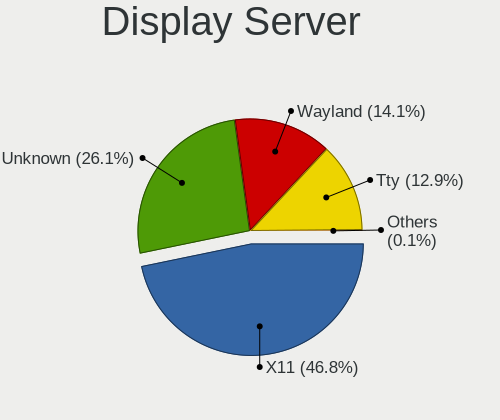
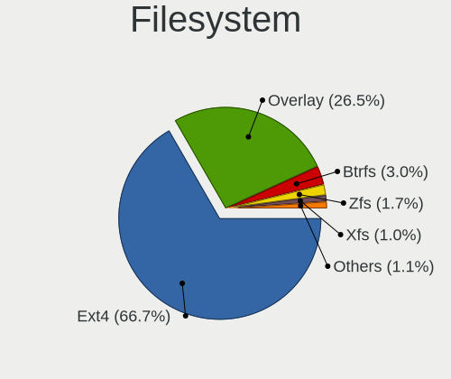
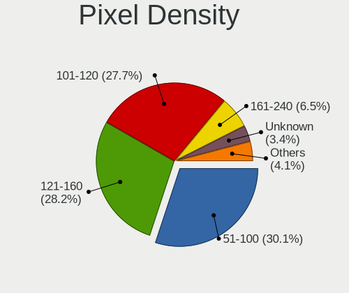
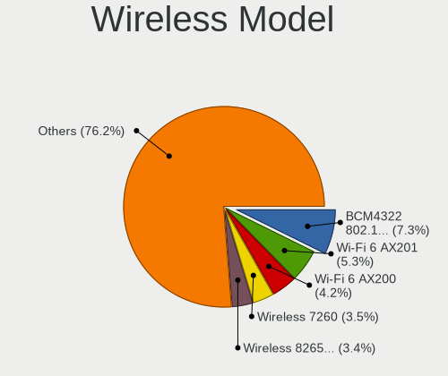

Debian 11 - Tested Hardware & Statistics
----------------------------------------

A project to collect tested hardware configurations for Debian 11 (Beta test).

Anyone can contribute to this report by the [hw-probe](https://github.com/linuxhw/hw-probe) tool:

    sudo -E hw-probe -all -upload

Please submit a probe of your configuration if it's not presented on the page or is rare.

This is a report for all computer types. See also reports for [desktops](/Dist/Debian_11/Desktop/README.md) and [notebooks](/Dist/Debian_11/Notebook/README.md).

Full-feature report is available here: https://linux-hardware.org/?view=trends&rel=debian-11

Contents
--------

* [ Test Cases ](#test-cases)

* [ System ](#system)
  - [ Kernel                   ](#kernel)
  - [ Kernel Family            ](#kernel-family)
  - [ Kernel Major Ver.        ](#kernel-major-ver)
  - [ Arch                     ](#arch)
  - [ DE                       ](#de)
  - [ Display Server           ](#display-server)
  - [ Display Manager          ](#display-manager)
  - [ OS Lang                  ](#os-lang)
  - [ Boot Mode                ](#boot-mode)
  - [ Filesystem               ](#filesystem)
  - [ Part. scheme             ](#part-scheme)
  - [ Dual Boot with Linux/BSD ](#dual-boot-with-linux-bsd)
  - [ Dual Boot (Win)          ](#dual-boot-win)

* [ Board ](#board)
  - [ Vendor                   ](#vendor)
  - [ Model                    ](#model)
  - [ Model Family             ](#model-family)
  - [ MFG Year                 ](#mfg-year)
  - [ Form Factor              ](#form-factor)
  - [ Secure Boot              ](#secure-boot)
  - [ Coreboot                 ](#coreboot)
  - [ RAM Size                 ](#ram-size)
  - [ RAM Used                 ](#ram-used)
  - [ Total Drives             ](#total-drives)
  - [ Has CD-ROM               ](#has-cd-rom)
  - [ Has Ethernet             ](#has-ethernet)
  - [ Has WiFi                 ](#has-wifi)
  - [ Has Bluetooth            ](#has-bluetooth)

* [ Location ](#location)
  - [ Country                  ](#country)
  - [ City                     ](#city)

* [ Drives ](#drives)
  - [ Drive Vendor             ](#drive-vendor)
  - [ Drive Model              ](#drive-model)
  - [ HDD Vendor               ](#hdd-vendor)
  - [ SSD Vendor               ](#ssd-vendor)
  - [ Drive Kind               ](#drive-kind)
  - [ Drive Connector          ](#drive-connector)
  - [ Drive Size               ](#drive-size)
  - [ Space Total              ](#space-total)
  - [ Space Used               ](#space-used)
  - [ Malfunc. Drives          ](#malfunc-drives)
  - [ Malfunc. Drive Vendor    ](#malfunc-drive-vendor)
  - [ Malfunc. HDD Vendor      ](#malfunc-hdd-vendor)
  - [ Malfunc. Drive Kind      ](#malfunc-drive-kind)
  - [ Failed Drives            ](#failed-drives)
  - [ Failed Drive Vendor      ](#failed-drive-vendor)
  - [ Drive Status             ](#drive-status)

* [ Storage controller ](#storage-controller)
  - [ Storage Vendor           ](#storage-vendor)
  - [ Storage Model            ](#storage-model)
  - [ Storage Kind             ](#storage-kind)

* [ Processor ](#processor)
  - [ CPU Vendor               ](#cpu-vendor)
  - [ CPU Model                ](#cpu-model)
  - [ CPU Model Family         ](#cpu-model-family)
  - [ CPU Cores                ](#cpu-cores)
  - [ CPU Sockets              ](#cpu-sockets)
  - [ CPU Threads              ](#cpu-threads)
  - [ CPU Op-Modes             ](#cpu-op-modes)
  - [ CPU Microcode            ](#cpu-microcode)
  - [ CPU Microarch            ](#cpu-microarch)

* [ Graphics ](#graphics)
  - [ GPU Vendor               ](#gpu-vendor)
  - [ GPU Model                ](#gpu-model)
  - [ GPU Combo                ](#gpu-combo)
  - [ GPU Driver               ](#gpu-driver)
  - [ GPU Memory               ](#gpu-memory)

* [ Monitor ](#monitor)
  - [ Monitor Vendor           ](#monitor-vendor)
  - [ Monitor Model            ](#monitor-model)
  - [ Monitor Resolution       ](#monitor-resolution)
  - [ Monitor Diagonal         ](#monitor-diagonal)
  - [ Monitor Width            ](#monitor-width)
  - [ Aspect Ratio             ](#aspect-ratio)
  - [ Monitor Area             ](#monitor-area)
  - [ Pixel Density            ](#pixel-density)
  - [ Multiple Monitors        ](#multiple-monitors)

* [ Network ](#network)
  - [ Net Controller Vendor    ](#net-controller-vendor)
  - [ Net Controller Model     ](#net-controller-model)
  - [ Wireless Vendor          ](#wireless-vendor)
  - [ Wireless Model           ](#wireless-model)
  - [ Ethernet Vendor          ](#ethernet-vendor)
  - [ Ethernet Model           ](#ethernet-model)
  - [ Net Controller Kind      ](#net-controller-kind)
  - [ Used Controller          ](#used-controller)
  - [ NICs                     ](#nics)
  - [ IPv6                     ](#ipv6)

* [ Bluetooth ](#bluetooth)
  - [ Bluetooth Vendor         ](#bluetooth-vendor)
  - [ Bluetooth Model          ](#bluetooth-model)

* [ Sound ](#sound)
  - [ Sound Vendor             ](#sound-vendor)
  - [ Sound Model              ](#sound-model)

* [ Memory ](#memory)
  - [ Memory Vendor            ](#memory-vendor)
  - [ Memory Model             ](#memory-model)
  - [ Memory Kind              ](#memory-kind)
  - [ Memory Form Factor       ](#memory-form-factor)
  - [ Memory Size              ](#memory-size)
  - [ Memory Speed             ](#memory-speed)

* [ Printers & scanners ](#printers-scanners)
  - [ Printer Vendor           ](#printer-vendor)
  - [ Printer Model            ](#printer-model)
  - [ Scanner Vendor           ](#scanner-vendor)
  - [ Scanner Model            ](#scanner-model)

* [ Camera ](#camera)
  - [ Camera Vendor            ](#camera-vendor)
  - [ Camera Model             ](#camera-model)

* [ Security ](#security)
  - [ Fingerprint Vendor       ](#fingerprint-vendor)
  - [ Fingerprint Model        ](#fingerprint-model)
  - [ Chipcard Vendor          ](#chipcard-vendor)
  - [ Chipcard Model           ](#chipcard-model)

* [ Unsupported ](#unsupported)
  - [ Unsupported Devices      ](#unsupported-devices)
  - [ Unsupported Device Types ](#unsupported-device-types)

Test Cases
----------

| Vendor        | Model                       | Form-Factor | Probe                                                      | Date         |
|---------------|-----------------------------|-------------|------------------------------------------------------------|--------------|
| HP            | EliteBook 8560p             | Notebook    | [2cfd8e0dd1](https://linux-hardware.org/?probe=2cfd8e0dd1) | Jul 28, 2021 |
| ASUSTek       | PRIME X570-PRO              | Desktop     | [df0a4b1a0f](https://linux-hardware.org/?probe=df0a4b1a0f) | Jul 27, 2021 |
| Casper        | C17B                        | Notebook    | [6f56921ba5](https://linux-hardware.org/?probe=6f56921ba5) | Jul 27, 2021 |
| HP            | EliteBook 8560p             | Notebook    | [d79ebae077](https://linux-hardware.org/?probe=d79ebae077) | Jul 27, 2021 |
| ASRockRack    | X570D4U-2L2T                | Desktop     | [7bb34c9dec](https://linux-hardware.org/?probe=7bb34c9dec) | Jul 27, 2021 |
| Lenovo        | ThinkPad X240 20AL008EUK    | Notebook    | [367150f04f](https://linux-hardware.org/?probe=367150f04f) | Jul 27, 2021 |
| HP            | Laptop 17-by0xxx            | Notebook    | [0cb6fde0ef](https://linux-hardware.org/?probe=0cb6fde0ef) | Jul 27, 2021 |
| HP            | ProBook 445 G7              | Notebook    | [bc4f8acaf2](https://linux-hardware.org/?probe=bc4f8acaf2) | Jul 27, 2021 |
| ASUSTek       | A88X-PLUS/USB               | Desktop     | [57b54cc925](https://linux-hardware.org/?probe=57b54cc925) | Jul 27, 2021 |
| ASRock        | N68C-GS FX                  | Desktop     | [660f13d25d](https://linux-hardware.org/?probe=660f13d25d) | Jul 27, 2021 |
| ASUSTek       | PRIME Z490-P                | Desktop     | [2e0f5417fc](https://linux-hardware.org/?probe=2e0f5417fc) | Jul 27, 2021 |
| Dell          | 0X8DXD A00                  | Desktop     | [7821dfc370](https://linux-hardware.org/?probe=7821dfc370) | Jul 27, 2021 |
| ASUSTek       | M4A785D-M PRO               | Desktop     | [467d107518](https://linux-hardware.org/?probe=467d107518) | Jul 27, 2021 |
| Foxconn       | 915MH Series                | Desktop     | [6a3ae85dfc](https://linux-hardware.org/?probe=6a3ae85dfc) | Jul 27, 2021 |
| HP            | ProBook 635 Aero G7 Note... | Notebook    | [e6ee486690](https://linux-hardware.org/?probe=e6ee486690) | Jul 27, 2021 |
| ASUSTek       | PRIME H310M-R R2.0          | Desktop     | [dc4a709a3b](https://linux-hardware.org/?probe=dc4a709a3b) | Jul 27, 2021 |
| Dell          | 0WMJ54 A01                  | Desktop     | [b24fc8e5f2](https://linux-hardware.org/?probe=b24fc8e5f2) | Jul 27, 2021 |
| HP            | ProBook 450 G8 Notebook ... | Notebook    | [2a645d9cba](https://linux-hardware.org/?probe=2a645d9cba) | Jul 27, 2021 |
| ASUSTek       | PRIME H310M-K R2.0          | Desktop     | [1e69873301](https://linux-hardware.org/?probe=1e69873301) | Jul 27, 2021 |
| Lenovo        | IdeaPad S540-13ITL 82H1     | Notebook    | [730c33a1b0](https://linux-hardware.org/?probe=730c33a1b0) | Jul 27, 2021 |
| Lenovo        | ThinkPad E14 20RAS13M00     | Notebook    | [b46ca83c19](https://linux-hardware.org/?probe=b46ca83c19) | Jul 27, 2021 |
| Dell          | Latitude 7480               | Notebook    | [0c79ad3dd4](https://linux-hardware.org/?probe=0c79ad3dd4) | Jul 27, 2021 |
| Dell          | Inspiron 7420               | Notebook    | [5b2e06697e](https://linux-hardware.org/?probe=5b2e06697e) | Jul 27, 2021 |
| Dell          | 0M863N A00                  | Desktop     | [e94bee6137](https://linux-hardware.org/?probe=e94bee6137) | Jul 27, 2021 |
| Dell          | Inspiron 7420               | Notebook    | [567612e805](https://linux-hardware.org/?probe=567612e805) | Jul 27, 2021 |
| Lenovo        | IdeaPad 330-15ARR 81D2      | Notebook    | [0172934285](https://linux-hardware.org/?probe=0172934285) | Jul 27, 2021 |
| Gigabyte      | P35C-DS3R                   | Desktop     | [e8ffe8991b](https://linux-hardware.org/?probe=e8ffe8991b) | Jul 27, 2021 |
| MSI           | X399 GAMING PRO CARBON A... | Desktop     | [3c6898fcd8](https://linux-hardware.org/?probe=3c6898fcd8) | Jul 27, 2021 |
| HP            | EliteBook 820 G1            | Notebook    | [f3878ff548](https://linux-hardware.org/?probe=f3878ff548) | Jul 27, 2021 |
| MSI           | MEG X570 UNIFY              | Desktop     | [9d0528280a](https://linux-hardware.org/?probe=9d0528280a) | Jul 26, 2021 |
| Apple         | MacBookPro11,4              | Notebook    | [d58bb90557](https://linux-hardware.org/?probe=d58bb90557) | Jul 26, 2021 |
| Dell          | Inspiron 5558               | Notebook    | [1bbe185e86](https://linux-hardware.org/?probe=1bbe185e86) | Jul 26, 2021 |
| Lenovo        | ThinkPad E14 20RA001HRT     | Notebook    | [f7175e6651](https://linux-hardware.org/?probe=f7175e6651) | Jul 26, 2021 |
| Quanta        | TWC                         | Notebook    | [1ecec0372f](https://linux-hardware.org/?probe=1ecec0372f) | Jul 26, 2021 |
| HP            | Laptop 15s-fq2xxx           | Notebook    | [2f259b4ae2](https://linux-hardware.org/?probe=2f259b4ae2) | Jul 26, 2021 |
| ASRock        | Z97 Pro3                    | Desktop     | [8cd14c1874](https://linux-hardware.org/?probe=8cd14c1874) | Jul 26, 2021 |
| Dell          | Vostro 5471                 | Notebook    | [73c1da1908](https://linux-hardware.org/?probe=73c1da1908) | Jul 26, 2021 |
| ASUSTek       | ZenBook Q536FD_Q536FD       | Convertible | [52e5d3e16d](https://linux-hardware.org/?probe=52e5d3e16d) | Jul 26, 2021 |
| MSI           | Z370 SLI PLUS               | Desktop     | [04d84e38b8](https://linux-hardware.org/?probe=04d84e38b8) | Jul 26, 2021 |
| Intel         | NUC6i7KYB H90766-402        | Mini pc     | [e7aeecff98](https://linux-hardware.org/?probe=e7aeecff98) | Jul 26, 2021 |
| Lenovo        | G50-80 80E5                 | Notebook    | [eaedf12907](https://linux-hardware.org/?probe=eaedf12907) | Jul 26, 2021 |
| HP            | EliteBook 8470p             | Notebook    | [8bfc663f48](https://linux-hardware.org/?probe=8bfc663f48) | Jul 26, 2021 |
| HP            | ProBook 470 G3              | Notebook    | [cb1b02b979](https://linux-hardware.org/?probe=cb1b02b979) | Jul 26, 2021 |
| ASUSTek       | 701                         | Notebook    | [db72d4004a](https://linux-hardware.org/?probe=db72d4004a) | Jul 26, 2021 |
| ASUSTek       | PRIME X370-PRO              | Desktop     | [eb6369aac9](https://linux-hardware.org/?probe=eb6369aac9) | Jul 26, 2021 |
| ASRock        | B450 Pro4                   | Desktop     | [0de4a63af4](https://linux-hardware.org/?probe=0de4a63af4) | Jul 26, 2021 |
| HP            | 2B38                        | Desktop     | [be24f3f652](https://linux-hardware.org/?probe=be24f3f652) | Jul 26, 2021 |
| HP            | 2B38                        | Desktop     | [c1198b90f6](https://linux-hardware.org/?probe=c1198b90f6) | Jul 26, 2021 |
| ASRock        | 970 Pro3 R2.0               | Desktop     | [9fd8d25e24](https://linux-hardware.org/?probe=9fd8d25e24) | Jul 26, 2021 |
| ASUSTek       | PRIME B550-PLUS             | Desktop     | [8b0f398a93](https://linux-hardware.org/?probe=8b0f398a93) | Jul 26, 2021 |
| ASUSTek       | PRIME B550-PLUS             | Desktop     | [cd62d88495](https://linux-hardware.org/?probe=cd62d88495) | Jul 26, 2021 |
| ASUSTek       | 1215B                       | Notebook    | [ce53b40511](https://linux-hardware.org/?probe=ce53b40511) | Jul 26, 2021 |
| Dell          | Latitude E6420              | Notebook    | [01000461fc](https://linux-hardware.org/?probe=01000461fc) | Jul 26, 2021 |
| ASRock        | X570 Steel Legend           | Desktop     | [b040663b7c](https://linux-hardware.org/?probe=b040663b7c) | Jul 26, 2021 |
| ASUSTek       | PRIME B350-PLUS             | Desktop     | [36caa67715](https://linux-hardware.org/?probe=36caa67715) | Jul 26, 2021 |
| Dell          | Studio 1555                 | Notebook    | [30b17f2421](https://linux-hardware.org/?probe=30b17f2421) | Jul 26, 2021 |
| Gigabyte      | AB350-Gaming 3-CF           | Desktop     | [e9ddc17233](https://linux-hardware.org/?probe=e9ddc17233) | Jul 26, 2021 |
| Lenovo        | ThinkPad E14 20RA0036RT     | Notebook    | [e4f29039a8](https://linux-hardware.org/?probe=e4f29039a8) | Jul 26, 2021 |
| Gigabyte      | AB350-Gaming 3-CF           | Desktop     | [6623f96b90](https://linux-hardware.org/?probe=6623f96b90) | Jul 26, 2021 |
| ASUSTek       | M5A78L-M LX3                | Desktop     | [2c05790c36](https://linux-hardware.org/?probe=2c05790c36) | Jul 26, 2021 |
| Apple         | MacBookPro9,2               | Notebook    | [c676ac21ee](https://linux-hardware.org/?probe=c676ac21ee) | Jul 26, 2021 |
| ASUSTek       | 701SD                       | Notebook    | [b7c888a9a7](https://linux-hardware.org/?probe=b7c888a9a7) | Jul 26, 2021 |
| Gigabyte      | B450M DS3H-CF               | Desktop     | [64b4d84778](https://linux-hardware.org/?probe=64b4d84778) | Jul 26, 2021 |
| ASUSTek       | B85-PRO GAMER               | Desktop     | [fffec5c87f](https://linux-hardware.org/?probe=fffec5c87f) | Jul 26, 2021 |
| ASUSTek       | M5A78L-M LX3                | Desktop     | [0b35b55294](https://linux-hardware.org/?probe=0b35b55294) | Jul 26, 2021 |
| Dell          | 0D28YY A02                  | Desktop     | [71b0f194a3](https://linux-hardware.org/?probe=71b0f194a3) | Jul 26, 2021 |
| ASRock        | H470M-ITX/ac                | Desktop     | [8a3b6cb663](https://linux-hardware.org/?probe=8a3b6cb663) | Jul 26, 2021 |
| Toshiba       | Satellite S55-A             | Notebook    | [a145aa9a69](https://linux-hardware.org/?probe=a145aa9a69) | Jul 26, 2021 |
| ASUSTek       | M5A78L-M LX3                | Desktop     | [fcd103f100](https://linux-hardware.org/?probe=fcd103f100) | Jul 26, 2021 |
| ASUSTek       | PRIME B450M-A               | Desktop     | [00d53058e7](https://linux-hardware.org/?probe=00d53058e7) | Jul 26, 2021 |
| ASUSTek       | X541NC                      | Notebook    | [500a26f588](https://linux-hardware.org/?probe=500a26f588) | Jul 26, 2021 |
| Toshiba       | Satellite S55-A             | Notebook    | [08eec2f3a7](https://linux-hardware.org/?probe=08eec2f3a7) | Jul 25, 2021 |
| HUAWEI        | BOHK-WAX9X                  | Notebook    | [ec1cea0d9d](https://linux-hardware.org/?probe=ec1cea0d9d) | Jul 25, 2021 |
| Dell          | XPS 17 9700                 | Notebook    | [92cd785445](https://linux-hardware.org/?probe=92cd785445) | Jul 25, 2021 |
| MSI           | B450 TOMAHAWK MAX II        | Desktop     | [d09fdc110f](https://linux-hardware.org/?probe=d09fdc110f) | Jul 25, 2021 |
| Lenovo        | ThinkPad T460 20FMS03600    | Notebook    | [84f380e2a2](https://linux-hardware.org/?probe=84f380e2a2) | Jul 25, 2021 |
| Lenovo        | ThinkPad P14s Gen 1 20Y1... | Notebook    | [4454739a42](https://linux-hardware.org/?probe=4454739a42) | Jul 25, 2021 |
| Lenovo        | ThinkPad T440p 20AWS3UX0... | Notebook    | [abced1dd83](https://linux-hardware.org/?probe=abced1dd83) | Jul 25, 2021 |
| Lenovo        | ThinkPad E480 20KN001NGE    | Notebook    | [e3b2914d19](https://linux-hardware.org/?probe=e3b2914d19) | Jul 25, 2021 |
| HP            | Pavilion x360 Convertibl... | Convertible | [1e2b68b7d8](https://linux-hardware.org/?probe=1e2b68b7d8) | Jul 25, 2021 |
| Toshiba       | Satellite C45-A             | Notebook    | [0497ab613d](https://linux-hardware.org/?probe=0497ab613d) | Jul 25, 2021 |
| Lenovo        | ThinkPad T420 4236WNU       | Notebook    | [d817abc511](https://linux-hardware.org/?probe=d817abc511) | Jul 25, 2021 |
| Gigabyte      | H110M-S2H-CF                | Desktop     | [11c5d6c6d0](https://linux-hardware.org/?probe=11c5d6c6d0) | Jul 25, 2021 |
| Dell          | 0PTTT9 A00                  | Desktop     | [113235448d](https://linux-hardware.org/?probe=113235448d) | Jul 25, 2021 |
| Dell          | 0X8DXD A00                  | Desktop     | [54b46bdd5d](https://linux-hardware.org/?probe=54b46bdd5d) | Jul 25, 2021 |
| HP            | ProBook x360 11 G1 EE       | Notebook    | [90aeea53cc](https://linux-hardware.org/?probe=90aeea53cc) | Jul 25, 2021 |
| ASUSTek       | PRIME H270M-PLUS            | Desktop     | [21b43b8718](https://linux-hardware.org/?probe=21b43b8718) | Jul 25, 2021 |
| Gigabyte      | Z170M-D3H-CF                | Desktop     | [9301420a7b](https://linux-hardware.org/?probe=9301420a7b) | Jul 25, 2021 |
| HUAWEI        | NBLK-WAX9X                  | Notebook    | [5c61fdfb49](https://linux-hardware.org/?probe=5c61fdfb49) | Jul 25, 2021 |
| ASRock        | P67 Pro3                    | Desktop     | [ce711e5011](https://linux-hardware.org/?probe=ce711e5011) | Jul 25, 2021 |
| Supermicro    | A1SA2-2750FA                | Desktop     | [de408d6408](https://linux-hardware.org/?probe=de408d6408) | Jul 25, 2021 |
| Gigabyte      | H87-HD3                     | Desktop     | [a102014ef0](https://linux-hardware.org/?probe=a102014ef0) | Jul 25, 2021 |
| Dell          | Latitude E5520              | Notebook    | [0d74f57317](https://linux-hardware.org/?probe=0d74f57317) | Jul 25, 2021 |
| Dell          | Latitude E5520              | Notebook    | [5866765bab](https://linux-hardware.org/?probe=5866765bab) | Jul 25, 2021 |
| ASUSTek       | ROG STRIX B450-I GAMING     | Desktop     | [dcff1a4a95](https://linux-hardware.org/?probe=dcff1a4a95) | Jul 25, 2021 |
| Gigabyte      | AB350M-DS3H V2-CF           | Desktop     | [8b1c4f962a](https://linux-hardware.org/?probe=8b1c4f962a) | Jul 25, 2021 |
| HP            | 250 G7 Notebook PC          | Notebook    | [ab8a90e145](https://linux-hardware.org/?probe=ab8a90e145) | Jul 25, 2021 |
| IBM           | I/O Port                    | Server      | [8538814cd6](https://linux-hardware.org/?probe=8538814cd6) | Jul 25, 2021 |
| Dell          | 0Y1057                      | Desktop     | [ac342b01e2](https://linux-hardware.org/?probe=ac342b01e2) | Jul 25, 2021 |
| HP            | OMEN by HP Laptop 15-dc0... | Notebook    | [b8a2299d30](https://linux-hardware.org/?probe=b8a2299d30) | Jul 25, 2021 |
| HP            | ProLiant MicroServer Gen... | Desktop     | [2bcfda70b5](https://linux-hardware.org/?probe=2bcfda70b5) | Jul 25, 2021 |
| ASRock        | B450M Pro4                  | Desktop     | [514f64cef0](https://linux-hardware.org/?probe=514f64cef0) | Jul 25, 2021 |
| Lenovo        | ThinkPad T14 Gen 1 20UDC... | Notebook    | [0d45d49199](https://linux-hardware.org/?probe=0d45d49199) | Jul 25, 2021 |
| PC Special... | NV4XMB,ME,MZ                | Notebook    | [eb789efe18](https://linux-hardware.org/?probe=eb789efe18) | Jul 25, 2021 |
| ASRock        | Z97 Extreme6                | Desktop     | [84730f7819](https://linux-hardware.org/?probe=84730f7819) | Jul 25, 2021 |
| Lenovo        | IdeaPad 100-15IBD 80QQ      | Notebook    | [a172262124](https://linux-hardware.org/?probe=a172262124) | Jul 25, 2021 |
| Lenovo        | ThinkPad T410 2522WUZ       | Notebook    | [62cddaceb1](https://linux-hardware.org/?probe=62cddaceb1) | Jul 25, 2021 |
| Lenovo        | 3098 0B98401 PRO            | Desktop     | [a5bb2fb53c](https://linux-hardware.org/?probe=a5bb2fb53c) | Jul 25, 2021 |
| HP            | 1495                        | Desktop     | [5d01240605](https://linux-hardware.org/?probe=5d01240605) | Jul 25, 2021 |
| Lenovo        | ThinkPad T480 20L5S1S000    | Notebook    | [1217d711fb](https://linux-hardware.org/?probe=1217d711fb) | Jul 25, 2021 |
| Lenovo        | ThinkPad T480 20L50063EU    | Notebook    | [c59c2aa27d](https://linux-hardware.org/?probe=c59c2aa27d) | Jul 25, 2021 |
| Lenovo        | ThinkPad X201 3626ES3       | Notebook    | [c18f4c4102](https://linux-hardware.org/?probe=c18f4c4102) | Jul 25, 2021 |
| HP            | 158A                        | Desktop     | [219b010ebb](https://linux-hardware.org/?probe=219b010ebb) | Jul 25, 2021 |
| Lenovo        | ThinkPad T430 2349BW1       | Notebook    | [75c4d5c7a9](https://linux-hardware.org/?probe=75c4d5c7a9) | Jul 25, 2021 |
| HP            | 158A                        | Desktop     | [da4016cb27](https://linux-hardware.org/?probe=da4016cb27) | Jul 25, 2021 |
| Lenovo        | ThinkPad T495 20NKS0PG00    | Notebook    | [59533bd2bf](https://linux-hardware.org/?probe=59533bd2bf) | Jul 25, 2021 |
| Acer          | Aspire 5735                 | Notebook    | [60451d6f55](https://linux-hardware.org/?probe=60451d6f55) | Jul 25, 2021 |
| Fujitsu       | LIFEBOOK AH532/G52          | Notebook    | [4e8d8d9253](https://linux-hardware.org/?probe=4e8d8d9253) | Jul 25, 2021 |
| ASUSTek       | H110M-A/M.2                 | Desktop     | [a98eb4deab](https://linux-hardware.org/?probe=a98eb4deab) | Jul 25, 2021 |
| HP            | ProBook 470 G5              | Notebook    | [a778d78c98](https://linux-hardware.org/?probe=a778d78c98) | Jul 25, 2021 |
| Gigabyte      | H110N-CF                    | Desktop     | [2a85c9961c](https://linux-hardware.org/?probe=2a85c9961c) | Jul 25, 2021 |
| Lenovo        | ThinkPad T420 4236EV9       | Notebook    | [62cc86b330](https://linux-hardware.org/?probe=62cc86b330) | Jul 25, 2021 |
| MSI           | MAG B550M MORTAR            | Desktop     | [b5e7cb3f3d](https://linux-hardware.org/?probe=b5e7cb3f3d) | Jul 25, 2021 |
| Dell          | 0X8DXD A00                  | Desktop     | [dd60e87813](https://linux-hardware.org/?probe=dd60e87813) | Jul 25, 2021 |
| HP            | 2129                        | Desktop     | [8de5bae655](https://linux-hardware.org/?probe=8de5bae655) | Jul 25, 2021 |
| Lenovo        | ThinkPad E15 Gen 3 20YHS... | Notebook    | [b3dca0cfaa](https://linux-hardware.org/?probe=b3dca0cfaa) | Jul 25, 2021 |
| Raspberry ... | Raspberry Pi 2 Model B R... | Soc         | [f8ad21d44a](https://linux-hardware.org/?probe=f8ad21d44a) | Jul 25, 2021 |
| HP            | 250 G5 Notebook PC          | Notebook    | [53d3003d94](https://linux-hardware.org/?probe=53d3003d94) | Jul 25, 2021 |
| ASUSTek       | ZenBook UX333FA_UX333FA     | Notebook    | [043c5815ee](https://linux-hardware.org/?probe=043c5815ee) | Jul 25, 2021 |
| Lenovo        | ThinkPad T470 W10DG 20JN... | Notebook    | [a30a8b568e](https://linux-hardware.org/?probe=a30a8b568e) | Jul 25, 2021 |
| ASUSTek       | TUF GAMING FX504GD_FX80G... | Notebook    | [686f21af90](https://linux-hardware.org/?probe=686f21af90) | Jul 25, 2021 |
| Dell          | XPS L322X                   | Notebook    | [6b0ab2e22d](https://linux-hardware.org/?probe=6b0ab2e22d) | Jul 25, 2021 |
| Intel         | DP55WG AAE57269-407         | Desktop     | [fa1be73a3f](https://linux-hardware.org/?probe=fa1be73a3f) | Jul 25, 2021 |
| ASRock        | B85 Anniversary             | Desktop     | [b9bdc402ce](https://linux-hardware.org/?probe=b9bdc402ce) | Jul 25, 2021 |
| Gigabyte      | B550I AORUS PRO AX          | Desktop     | [db0c50510b](https://linux-hardware.org/?probe=db0c50510b) | Jul 25, 2021 |
| Gigabyte      | B550I AORUS PRO AX          | Desktop     | [c873d77069](https://linux-hardware.org/?probe=c873d77069) | Jul 25, 2021 |
| Lenovo        | ThinkPad T490 20N2CTO1WW    | Notebook    | [722792ec34](https://linux-hardware.org/?probe=722792ec34) | Jul 25, 2021 |
| Gigabyte      | Z97X-UD3H-CF                | Desktop     | [6630c7ef27](https://linux-hardware.org/?probe=6630c7ef27) | Jul 25, 2021 |
| Lenovo        | 3110 SDK0J40697 WIN 3305... | All in one  | [84b6274afe](https://linux-hardware.org/?probe=84b6274afe) | Jul 25, 2021 |
| Lenovo        | Yoga 530-14IKB 81EK         | Convertible | [e1db015807](https://linux-hardware.org/?probe=e1db015807) | Jul 25, 2021 |
| ASUSTek       | PRIME B250M-A               | Desktop     | [b0f56654dc](https://linux-hardware.org/?probe=b0f56654dc) | Jul 25, 2021 |
| Dell          | Inspiron 3505               | Notebook    | [be67f17212](https://linux-hardware.org/?probe=be67f17212) | Jul 25, 2021 |
| ASRock        | B450M Pro4                  | Desktop     | [cd13d1596f](https://linux-hardware.org/?probe=cd13d1596f) | Jul 25, 2021 |
| Dell          | XPS 13 9300                 | Notebook    | [15012d7630](https://linux-hardware.org/?probe=15012d7630) | Jul 25, 2021 |
| ASRock        | B450M Pro4                  | Desktop     | [beec8a1c7d](https://linux-hardware.org/?probe=beec8a1c7d) | Jul 25, 2021 |
| Panasonic     | CF-AX2LDCZMF                | Notebook    | [31feab61fe](https://linux-hardware.org/?probe=31feab61fe) | Jul 25, 2021 |
| Lenovo        | IdeaPad 3 15ITL6 82H8       | Notebook    | [3dae264c17](https://linux-hardware.org/?probe=3dae264c17) | Jul 25, 2021 |
| HP            | Laptop 14-ck0xxx            | Notebook    | [814f91322d](https://linux-hardware.org/?probe=814f91322d) | Jul 25, 2021 |
| Dell          | Inspiron 5423               | Notebook    | [f15c87c33c](https://linux-hardware.org/?probe=f15c87c33c) | Jul 25, 2021 |
| Lenovo        | ThinkPad T480s 20L8S7HF0... | Notebook    | [5417d20b5b](https://linux-hardware.org/?probe=5417d20b5b) | Jul 25, 2021 |
| Lenovo        | ThinkPad T430 2349GCG       | Notebook    | [7275a5dc90](https://linux-hardware.org/?probe=7275a5dc90) | Jul 25, 2021 |
| HUAWEI        | NBLK-WAX9X                  | Notebook    | [8e2d810033](https://linux-hardware.org/?probe=8e2d810033) | Jul 25, 2021 |
| Lenovo        | ThinkPad T450s 20BX004QG... | Notebook    | [079f1c9006](https://linux-hardware.org/?probe=079f1c9006) | Jul 25, 2021 |
| Lenovo        | ThinkPad T14s Gen 1 20UH... | Notebook    | [6f137bd0e5](https://linux-hardware.org/?probe=6f137bd0e5) | Jul 25, 2021 |
| ASUSTek       | VivoBook_ASUS Laptop E21... | Notebook    | [94307be3d8](https://linux-hardware.org/?probe=94307be3d8) | Jul 25, 2021 |
| ASUSTek       | VivoBook_ASUS Laptop E21... | Notebook    | [9e0045da76](https://linux-hardware.org/?probe=9e0045da76) | Jul 25, 2021 |
| MSI           | Modern 15 A11M              | Notebook    | [acfcaa9077](https://linux-hardware.org/?probe=acfcaa9077) | Jul 25, 2021 |
| Lenovo        | IdeaPad 330-15IKB 81DE      | Notebook    | [fb8dc2feb1](https://linux-hardware.org/?probe=fb8dc2feb1) | Jul 25, 2021 |
| HP            | Stream Notebook             | Notebook    | [078c5d40f8](https://linux-hardware.org/?probe=078c5d40f8) | Jul 25, 2021 |
| Lenovo        | IdeaPad 330-15IKB 81DE      | Notebook    | [49198ead06](https://linux-hardware.org/?probe=49198ead06) | Jul 25, 2021 |
| Compulab      | fitlet2                     | Mini pc     | [9d1571afa4](https://linux-hardware.org/?probe=9d1571afa4) | Jul 25, 2021 |
| Gigabyte      | H61MS                       | Desktop     | [742ede3c3e](https://linux-hardware.org/?probe=742ede3c3e) | Jul 25, 2021 |
| Lenovo        | ThinkPad X260 20F5S0JF00    | Notebook    | [98cbf345d9](https://linux-hardware.org/?probe=98cbf345d9) | Jul 25, 2021 |
| Gigabyte      | H81M-S2H GSM                | Desktop     | [f49c35b208](https://linux-hardware.org/?probe=f49c35b208) | Jul 25, 2021 |
| Dell          | 09KPNV A01                  | Desktop     | [fb6ec7188c](https://linux-hardware.org/?probe=fb6ec7188c) | Jul 25, 2021 |
| Dell          | Inspiron 5402               | Notebook    | [f54ac49b39](https://linux-hardware.org/?probe=f54ac49b39) | Jul 25, 2021 |
| ASUSTek       | PRIME A320I-K               | Desktop     | [fca7acc5ee](https://linux-hardware.org/?probe=fca7acc5ee) | Jul 25, 2021 |
| Lenovo        | ThinkPad T14 Gen 2i 20W0... | Notebook    | [10fb3b6e94](https://linux-hardware.org/?probe=10fb3b6e94) | Jul 25, 2021 |
| Lenovo        | ThinkPad T14 Gen 2i 20W0... | Notebook    | [96fd57ba79](https://linux-hardware.org/?probe=96fd57ba79) | Jul 25, 2021 |
| Lenovo        | ThinkPad X260 20F5S46R00    | Notebook    | [c72e326772](https://linux-hardware.org/?probe=c72e326772) | Jul 25, 2021 |
| ASUSTek       | H61M-K                      | Desktop     | [1cf0bdeec4](https://linux-hardware.org/?probe=1cf0bdeec4) | Jul 25, 2021 |
| Dell          | 0NK5PH A00                  | Desktop     | [d6444ebf26](https://linux-hardware.org/?probe=d6444ebf26) | Jul 25, 2021 |
| Gigabyte      | AERO 15 KB                  | Notebook    | [d66f45fc2e](https://linux-hardware.org/?probe=d66f45fc2e) | Jul 25, 2021 |
| Gigabyte      | Z77-D3H                     | Desktop     | [522d784ace](https://linux-hardware.org/?probe=522d784ace) | Jul 25, 2021 |
| HP            | ProBook 640 G2              | Notebook    | [558f739aab](https://linux-hardware.org/?probe=558f739aab) | Jul 25, 2021 |
| Intel         | DP55WB AAE64798-206         | Desktop     | [9c9e82f80f](https://linux-hardware.org/?probe=9c9e82f80f) | Jul 25, 2021 |
| Dell          | XPS 13 9370                 | Notebook    | [2c9c978361](https://linux-hardware.org/?probe=2c9c978361) | Jul 25, 2021 |
| Lenovo        | ThinkPad T420 4236WC3       | Notebook    | [2dbdc931e7](https://linux-hardware.org/?probe=2dbdc931e7) | Jul 25, 2021 |
| Lenovo        | ThinkPad E14 20RB000UBR     | Notebook    | [c25d549bd7](https://linux-hardware.org/?probe=c25d549bd7) | Jul 25, 2021 |
| HP            | Laptop 15-ef1xxx            | Notebook    | [9f0fbc1613](https://linux-hardware.org/?probe=9f0fbc1613) | Jul 25, 2021 |
| Protectli     | FW6                         | Desktop     | [0efef10e76](https://linux-hardware.org/?probe=0efef10e76) | Jul 25, 2021 |
| ASUSTek       | ROG STRIX Z390-F GAMING     | Desktop     | [dd3347639f](https://linux-hardware.org/?probe=dd3347639f) | Jul 25, 2021 |
| Gigabyte      | X570 I AORUS PRO WIFI       | Desktop     | [f7c4474b4d](https://linux-hardware.org/?probe=f7c4474b4d) | Jul 25, 2021 |
| ASUSTek       | Z170-DELUXE                 | Desktop     | [df5c29f984](https://linux-hardware.org/?probe=df5c29f984) | Jul 25, 2021 |
| Gigabyte      | 970A-D3P                    | Desktop     | [c564faffdb](https://linux-hardware.org/?probe=c564faffdb) | Jul 25, 2021 |
| Lenovo        | Yoga 710-11ISK 80TX         | Convertible | [c34bcc095c](https://linux-hardware.org/?probe=c34bcc095c) | Jul 25, 2021 |
| Dell          | 0D441T A03                  | Desktop     | [41283af596](https://linux-hardware.org/?probe=41283af596) | Jul 25, 2021 |
| Lenovo        | G50-80 80E5                 | Notebook    | [4c5e0baffe](https://linux-hardware.org/?probe=4c5e0baffe) | Jul 25, 2021 |
| HP            | EliteBook 820 G2            | Notebook    | [17b5a12640](https://linux-hardware.org/?probe=17b5a12640) | Jul 25, 2021 |
| MSI           | H110I PRO AC                | Desktop     | [08094a9121](https://linux-hardware.org/?probe=08094a9121) | Jul 25, 2021 |
| ASUSTek       | PRIME Z370-A                | Desktop     | [c7cf1f5978](https://linux-hardware.org/?probe=c7cf1f5978) | Jul 25, 2021 |
| ASUSTek       | H87-PRO                     | Desktop     | [293b556234](https://linux-hardware.org/?probe=293b556234) | Jul 25, 2021 |
| MSI           | Z77MA-G45                   | Desktop     | [bbc6d96681](https://linux-hardware.org/?probe=bbc6d96681) | Jul 25, 2021 |
| Lenovo        | ThinkPad T430 2347FF9       | Notebook    | [cdc7a6e9c8](https://linux-hardware.org/?probe=cdc7a6e9c8) | Jul 25, 2021 |
| HP            | 2000                        | Notebook    | [0187fe7c8a](https://linux-hardware.org/?probe=0187fe7c8a) | Jul 25, 2021 |
| Acer          | Aspire A515-41G             | Notebook    | [a34056020d](https://linux-hardware.org/?probe=a34056020d) | Jul 25, 2021 |
| ASRock        | FM2A68M-DG3+                | Desktop     | [884f8f2850](https://linux-hardware.org/?probe=884f8f2850) | Jul 25, 2021 |
| Dell          | XPS 13 7390                 | Notebook    | [02e6821b40](https://linux-hardware.org/?probe=02e6821b40) | Jul 24, 2021 |
| ASUSTek       | ROG STRIX B450-F GAMING     | Desktop     | [1e8f9a7189](https://linux-hardware.org/?probe=1e8f9a7189) | Jul 24, 2021 |
| Lenovo        | IdeaPad S145-14AST 81ST     | Notebook    | [4cf2681a8c](https://linux-hardware.org/?probe=4cf2681a8c) | Jul 24, 2021 |
| HP            | EliteBook x360 1030 G3      | Convertible | [0c49a20e7c](https://linux-hardware.org/?probe=0c49a20e7c) | Jul 24, 2021 |
| Apple         | MacBookPro8,1               | Notebook    | [b0e58bf8de](https://linux-hardware.org/?probe=b0e58bf8de) | Jul 24, 2021 |
| Gigabyte      | B560M D3H                   | Desktop     | [1456f9bf8e](https://linux-hardware.org/?probe=1456f9bf8e) | Jul 23, 2021 |
| Lenovo        | IdeaPad 700-15ISK 80RU      | Notebook    | [3491bd4228](https://linux-hardware.org/?probe=3491bd4228) | Jul 23, 2021 |
| Lenovo        | ThinkPad E595 20NF0005IX    | Notebook    | [dd220c0bdb](https://linux-hardware.org/?probe=dd220c0bdb) | Jul 23, 2021 |
| Gigabyte      | AERO 17-SA                  | Notebook    | [eaff86e276](https://linux-hardware.org/?probe=eaff86e276) | Jul 23, 2021 |
| Acer          | Aspire A715-72G             | Notebook    | [b436023dda](https://linux-hardware.org/?probe=b436023dda) | Jul 23, 2021 |
| Lenovo        | IdeaPad S145-15IWL 81S9     | Notebook    | [ecd10ec3a7](https://linux-hardware.org/?probe=ecd10ec3a7) | Jul 22, 2021 |
| ASUSTek       | VivoBook_ASUSLaptop X509... | Notebook    | [1abb08da83](https://linux-hardware.org/?probe=1abb08da83) | Jul 21, 2021 |
| Supermicro    | X11DDW-L                    | Server      | [6fab4e3135](https://linux-hardware.org/?probe=6fab4e3135) | Jul 20, 2021 |
| HP            | Laptop 15s-fq1xxx           | Notebook    | [4ed280d4c8](https://linux-hardware.org/?probe=4ed280d4c8) | Jul 19, 2021 |
| ASUSTek       | ROG STRIX Z370-H GAMING     | Desktop     | [8af9716200](https://linux-hardware.org/?probe=8af9716200) | Jul 19, 2021 |
| ASUSTek       | P8Z68-V                     | Desktop     | [1a60e02aa9](https://linux-hardware.org/?probe=1a60e02aa9) | Jul 19, 2021 |
| Dell          | 0H5J4J A01                  | Server      | [fbdf83f7ff](https://linux-hardware.org/?probe=fbdf83f7ff) | Jul 17, 2021 |
| HP            | ProLiant MicroServer        | Desktop     | [ca7c4b4967](https://linux-hardware.org/?probe=ca7c4b4967) | Jul 16, 2021 |
| HP            | EliteBook 830 G7 Noteboo... | Notebook    | [acca72e9c1](https://linux-hardware.org/?probe=acca72e9c1) | Jul 15, 2021 |
| Lenovo        | ThinkPad Edge E540 20C60... | Notebook    | [a5daecad1d](https://linux-hardware.org/?probe=a5daecad1d) | Jul 15, 2021 |
| Dell          | Precision 3540              | Notebook    | [383ebf30aa](https://linux-hardware.org/?probe=383ebf30aa) | Jul 14, 2021 |
| Itautec       | Infoway                     | Notebook    | [06dc7b0fd1](https://linux-hardware.org/?probe=06dc7b0fd1) | Jul 14, 2021 |
| Lenovo        | ThinkPad E15 Gen 2 20TD0... | Notebook    | [71d234aaef](https://linux-hardware.org/?probe=71d234aaef) | Jul 14, 2021 |
| MSI           | A68HM-E33 V2                | Desktop     | [983bc90bc7](https://linux-hardware.org/?probe=983bc90bc7) | Jul 14, 2021 |
| Acer          | Aspire 7741                 | Notebook    | [6ed4934b61](https://linux-hardware.org/?probe=6ed4934b61) | Jul 13, 2021 |
| Acer          | Aspire 7741                 | Notebook    | [ee5a2b2029](https://linux-hardware.org/?probe=ee5a2b2029) | Jul 13, 2021 |
| ASUSTek       | VivoBook_ASUSLaptop X513... | Notebook    | [54bfb26e0f](https://linux-hardware.org/?probe=54bfb26e0f) | Jul 12, 2021 |
| ASUSTek       | ROG Strix G533QS_G533QS     | Notebook    | [98271924ba](https://linux-hardware.org/?probe=98271924ba) | Jul 11, 2021 |
| Lenovo        | ThinkPad T430 2349V4B       | Notebook    | [d39fe8e9d4](https://linux-hardware.org/?probe=d39fe8e9d4) | Jul 11, 2021 |
| HP            | EliteBook 855 G7 Noteboo... | Notebook    | [1cb0058b88](https://linux-hardware.org/?probe=1cb0058b88) | Jul 10, 2021 |
| Huanan        | X99-F8 V2.0                 | Desktop     | [776f848ccd](https://linux-hardware.org/?probe=776f848ccd) | Jul 09, 2021 |
| Dell          | 0M863N A00                  | Desktop     | [574671bbb9](https://linux-hardware.org/?probe=574671bbb9) | Jul 09, 2021 |
| Acer          | Aspire A315-23G             | Notebook    | [e6aa891005](https://linux-hardware.org/?probe=e6aa891005) | Jul 08, 2021 |
| MSI           | MPG B550 GAMING PLUS        | Desktop     | [c79b71d033](https://linux-hardware.org/?probe=c79b71d033) | Jul 08, 2021 |
| ASUSTek       | H81M-E                      | Desktop     | [02c3ce63e7](https://linux-hardware.org/?probe=02c3ce63e7) | Jul 08, 2021 |
| HP            | 2215                        | Desktop     | [b0b56138b2](https://linux-hardware.org/?probe=b0b56138b2) | Jul 08, 2021 |
| Dell          | XPS 13 9380                 | Notebook    | [b31688ecfa](https://linux-hardware.org/?probe=b31688ecfa) | Jul 08, 2021 |
| HP            | 2215                        | Desktop     | [cdf48de6b2](https://linux-hardware.org/?probe=cdf48de6b2) | Jul 07, 2021 |
| Dell          | Latitude E6330              | Notebook    | [321bec10eb](https://linux-hardware.org/?probe=321bec10eb) | Jul 05, 2021 |
| HP            | Compaq 6830s                | Notebook    | [9c47e76afe](https://linux-hardware.org/?probe=9c47e76afe) | Jul 04, 2021 |
| MSI           | MS-6712                     | Desktop     | [ced0409e55](https://linux-hardware.org/?probe=ced0409e55) | Jul 04, 2021 |
| HP            | Compaq 6830s                | Notebook    | [b524035304](https://linux-hardware.org/?probe=b524035304) | Jul 04, 2021 |
| Dell          | Inspiron 5570               | Notebook    | [b760b0d9cc](https://linux-hardware.org/?probe=b760b0d9cc) | Jul 03, 2021 |
| Acer          | Aspire A515-51              | Notebook    | [f94bb31c5a](https://linux-hardware.org/?probe=f94bb31c5a) | Jul 03, 2021 |
| HP            | ZBook Fury 17 G7 Mobile ... | Notebook    | [c24fcd1454](https://linux-hardware.org/?probe=c24fcd1454) | Jul 02, 2021 |
| Dell          | Latitude 7410               | Convertible | [457f309f39](https://linux-hardware.org/?probe=457f309f39) | Jul 02, 2021 |
| Dell          | Latitude 7410               | Convertible | [945a4600c4](https://linux-hardware.org/?probe=945a4600c4) | Jul 02, 2021 |
| ASRock        | H77 Pro4-M                  | Desktop     | [8ba58cff9a](https://linux-hardware.org/?probe=8ba58cff9a) | Jul 02, 2021 |
| Gigabyte      | B550I AORUS PRO AX          | Desktop     | [cb62272a68](https://linux-hardware.org/?probe=cb62272a68) | Jul 02, 2021 |
| Dell          | Inspiron 5570               | Notebook    | [44b96068f2](https://linux-hardware.org/?probe=44b96068f2) | Jul 02, 2021 |
| Acer          | Aspire A315-23G             | Notebook    | [5729444e9b](https://linux-hardware.org/?probe=5729444e9b) | Jul 02, 2021 |
| Acer          | Aspire A315-23G             | Notebook    | [bd3211a03b](https://linux-hardware.org/?probe=bd3211a03b) | Jun 30, 2021 |
| Lenovo        | ThinkPad X1 Extreme Gen ... | Notebook    | [c8cb82f74d](https://linux-hardware.org/?probe=c8cb82f74d) | Jun 30, 2021 |
| Gigabyte      | AX370-Gaming K7             | Desktop     | [e325df530d](https://linux-hardware.org/?probe=e325df530d) | Jun 30, 2021 |
| Dell          | XPS 13 9310                 | Notebook    | [24a52836b4](https://linux-hardware.org/?probe=24a52836b4) | Jun 30, 2021 |
| HP            | ProBook 640 G3              | Notebook    | [c56b8f3ff1](https://linux-hardware.org/?probe=c56b8f3ff1) | Jun 29, 2021 |
| MSI           | B85M-G43                    | Desktop     | [4598afdf7e](https://linux-hardware.org/?probe=4598afdf7e) | Jun 29, 2021 |
| HP            | ZBook 17 G5                 | Notebook    | [5557a5c23c](https://linux-hardware.org/?probe=5557a5c23c) | Jun 29, 2021 |
| Lenovo        | IdeaPad Z580                | Notebook    | [6a9d31c8ef](https://linux-hardware.org/?probe=6a9d31c8ef) | Jun 29, 2021 |
| Dell          | Inspiron 5570               | Notebook    | [5335641d04](https://linux-hardware.org/?probe=5335641d04) | Jun 28, 2021 |
| Dell          | Inspiron 5570               | Notebook    | [0632a7bf28](https://linux-hardware.org/?probe=0632a7bf28) | Jun 28, 2021 |
| Acer          | Aspire A315-23G             | Notebook    | [834b68e61a](https://linux-hardware.org/?probe=834b68e61a) | Jun 28, 2021 |
| HUAWEI        | BOHK-WAX9X                  | Notebook    | [65c54db09e](https://linux-hardware.org/?probe=65c54db09e) | Jun 27, 2021 |
| HUAWEI        | BOHK-WAX9X                  | Notebook    | [fda3d18cf7](https://linux-hardware.org/?probe=fda3d18cf7) | Jun 27, 2021 |
| Huanan        | X99-8M-F V1.1               | Desktop     | [8ecfcffbaf](https://linux-hardware.org/?probe=8ecfcffbaf) | Jun 27, 2021 |
| HP            | ZBook Fury 17 G7 Mobile ... | Notebook    | [c3d5fd07c1](https://linux-hardware.org/?probe=c3d5fd07c1) | Jun 27, 2021 |
| ASRock        | FM2A68M-HD+                 | Desktop     | [f435417b41](https://linux-hardware.org/?probe=f435417b41) | Jun 26, 2021 |
| Acer          | Nitro AN515-51              | Notebook    | [6c4a46b4ec](https://linux-hardware.org/?probe=6c4a46b4ec) | Jun 26, 2021 |
| Pine Micro... | Pine64 PinePhone (1.2) (... | Phone       | [6805b89f3d](https://linux-hardware.org/?probe=6805b89f3d) | Jun 25, 2021 |
| Gigabyte      | Z370 AORUS Gaming 5-CF      | Desktop     | [807a4ba37d](https://linux-hardware.org/?probe=807a4ba37d) | Jun 23, 2021 |
| Gigabyte      | Z370 AORUS Gaming 5-CF      | Desktop     | [bc7246038e](https://linux-hardware.org/?probe=bc7246038e) | Jun 23, 2021 |
| ASRock        | B550 Pro4                   | Desktop     | [ef1b7bfb77](https://linux-hardware.org/?probe=ef1b7bfb77) | Jun 23, 2021 |
| ASRock        | X399 Taichi                 | Desktop     | [a664e4cf99](https://linux-hardware.org/?probe=a664e4cf99) | Jun 23, 2021 |
| HARDKERNEL    | ODROID-H2                   | Desktop     | [c9fed56a36](https://linux-hardware.org/?probe=c9fed56a36) | Jun 23, 2021 |
| Dell          | Inspiron 3501               | Notebook    | [d6f07cb592](https://linux-hardware.org/?probe=d6f07cb592) | Jun 23, 2021 |
| Dell          | 04WYPY A04                  | Server      | [20fa770830](https://linux-hardware.org/?probe=20fa770830) | Jun 22, 2021 |
| MSI           | GF65 Thin 10UE              | Notebook    | [d1e0b6ee58](https://linux-hardware.org/?probe=d1e0b6ee58) | Jun 22, 2021 |
| Lenovo        | ThinkPad T495 20NKS0PG00    | Notebook    | [9e646a384e](https://linux-hardware.org/?probe=9e646a384e) | Jun 22, 2021 |
| ASUSTek       | ROG STRIX B450-F GAMING ... | Desktop     | [b3a5333d2a](https://linux-hardware.org/?probe=b3a5333d2a) | Jun 21, 2021 |
| Dell          | Precision 3560              | Notebook    | [81efcf647c](https://linux-hardware.org/?probe=81efcf647c) | Jun 21, 2021 |
| Fujitsu       | LIFEBOOK A357               | Notebook    | [75c4ec9e5a](https://linux-hardware.org/?probe=75c4ec9e5a) | Jun 21, 2021 |
| Gigabyte      | AB350M-Gaming 3-CF          | Desktop     | [08fc06c75e](https://linux-hardware.org/?probe=08fc06c75e) | Jun 20, 2021 |
| Lenovo        | IdeaPad 700-15ISK 80RU      | Notebook    | [c62a9a5058](https://linux-hardware.org/?probe=c62a9a5058) | Jun 20, 2021 |
| Lenovo        | IdeaPad 700-15ISK 80RU      | Notebook    | [5a39dabe8a](https://linux-hardware.org/?probe=5a39dabe8a) | Jun 20, 2021 |
| Acer          | Aspire A315-23G             | Notebook    | [b37bec27b3](https://linux-hardware.org/?probe=b37bec27b3) | Jun 20, 2021 |
| Dell          | Latitude E7470              | Notebook    | [49cb9ff0b0](https://linux-hardware.org/?probe=49cb9ff0b0) | Jun 20, 2021 |
| Acer          | Aspire 5750G                | Notebook    | [73d6b46b6b](https://linux-hardware.org/?probe=73d6b46b6b) | Jun 19, 2021 |
| ASUSTek       | ZenBook UX431DA_UM431DA     | Notebook    | [a894e25838](https://linux-hardware.org/?probe=a894e25838) | Jun 19, 2021 |
| Acer          | Aspire A315-23G             | Notebook    | [dde7123487](https://linux-hardware.org/?probe=dde7123487) | Jun 19, 2021 |
| MSI           | B450M MORTAR MAX            | Desktop     | [33ffb80782](https://linux-hardware.org/?probe=33ffb80782) | Jun 19, 2021 |
| Lenovo        | ThinkPad X270 W10DG 20K5... | Notebook    | [842c53b8e2](https://linux-hardware.org/?probe=842c53b8e2) | Jun 18, 2021 |
| Acer          | Aspire A315-23G             | Notebook    | [1a8a3efde5](https://linux-hardware.org/?probe=1a8a3efde5) | Jun 18, 2021 |
| Lenovo        | ThinkPad X230 2325AZ8       | Notebook    | [b5ea5009bf](https://linux-hardware.org/?probe=b5ea5009bf) | Jun 18, 2021 |
| Lenovo        | Yoga 300-11IBR 80M1         | Notebook    | [259fc86278](https://linux-hardware.org/?probe=259fc86278) | Jun 18, 2021 |
| ASUSTek       | ROG STRIX B450-F GAMING ... | Desktop     | [9e3e72ec72](https://linux-hardware.org/?probe=9e3e72ec72) | Jun 17, 2021 |
| Acer          | Aspire ES1-132              | Notebook    | [c26c0f6e33](https://linux-hardware.org/?probe=c26c0f6e33) | Jun 15, 2021 |
| ASUSTek       | PRIME B450M-A               | Desktop     | [0ccc446224](https://linux-hardware.org/?probe=0ccc446224) | Jun 14, 2021 |
| Acer          | Aspire A315-23G             | Notebook    | [eb77944ea2](https://linux-hardware.org/?probe=eb77944ea2) | Jun 14, 2021 |
| Gigabyte      | MCMLUAB-00                  | Desktop     | [99780e8ba8](https://linux-hardware.org/?probe=99780e8ba8) | Jun 13, 2021 |
| Acer          | Aspire V3-331               | Notebook    | [91f4f7aab6](https://linux-hardware.org/?probe=91f4f7aab6) | Jun 13, 2021 |
| UNOWHY        | Y13G002S4EI                 | Notebook    | [3d25dc9f69](https://linux-hardware.org/?probe=3d25dc9f69) | Jun 13, 2021 |
| ASUSTek       | X550LD                      | Notebook    | [2d1f6364aa](https://linux-hardware.org/?probe=2d1f6364aa) | Jun 13, 2021 |
| Acer          | Aspire V3-331               | Notebook    | [02e288caf9](https://linux-hardware.org/?probe=02e288caf9) | Jun 13, 2021 |
| Lenovo        | ThinkPad X270 W10DG 20K5... | Notebook    | [1b2cda6c08](https://linux-hardware.org/?probe=1b2cda6c08) | Jun 12, 2021 |
| ASUSTek       | PRIME A320M-K               | Desktop     | [f2770a810e](https://linux-hardware.org/?probe=f2770a810e) | Jun 12, 2021 |
| ASUSTek       | VivoBook_ASUSLaptop X512... | Notebook    | [f6ba765876](https://linux-hardware.org/?probe=f6ba765876) | Jun 12, 2021 |
| HUAWEI        | BOHK-WAX9X                  | Notebook    | [57684125de](https://linux-hardware.org/?probe=57684125de) | Jun 12, 2021 |
| Unknown       | Helios64                    | Soc         | [33c6248333](https://linux-hardware.org/?probe=33c6248333) | Jun 11, 2021 |
| Dell          | 0Y7WYT A00                  | Desktop     | [8e424773e5](https://linux-hardware.org/?probe=8e424773e5) | Jun 10, 2021 |
| Dell          | Latitude E7470              | Notebook    | [51c1f3f1f5](https://linux-hardware.org/?probe=51c1f3f1f5) | Jun 10, 2021 |
| ASUSTek       | Z97-AR                      | Desktop     | [709a74c713](https://linux-hardware.org/?probe=709a74c713) | Jun 09, 2021 |
| Acer          | Aspire A315-23G             | Notebook    | [377f2e9ec6](https://linux-hardware.org/?probe=377f2e9ec6) | Jun 09, 2021 |
| Dell          | Latitude E6330              | Notebook    | [ba88cd6328](https://linux-hardware.org/?probe=ba88cd6328) | Jun 08, 2021 |
| Lenovo        | ThinkPad T430s 2356A89      | Notebook    | [0195b8564e](https://linux-hardware.org/?probe=0195b8564e) | Jun 08, 2021 |
| ASRock        | B450M Pro4                  | Desktop     | [ee4dfdfde3](https://linux-hardware.org/?probe=ee4dfdfde3) | Jun 08, 2021 |
| Acer          | Aspire ES1-132              | Notebook    | [2db77f0d01](https://linux-hardware.org/?probe=2db77f0d01) | Jun 07, 2021 |
| ASUSTek       | PRIME A320M-K               | Desktop     | [69dd9fbe20](https://linux-hardware.org/?probe=69dd9fbe20) | Jun 07, 2021 |
| Acer          | Aspire A315-23G             | Notebook    | [548356ed30](https://linux-hardware.org/?probe=548356ed30) | Jun 06, 2021 |
| Dell          | Inspiron 3793               | Notebook    | [f65812f774](https://linux-hardware.org/?probe=f65812f774) | Jun 06, 2021 |
| ASUSTek       | M3N                         | Notebook    | [ec5f914161](https://linux-hardware.org/?probe=ec5f914161) | Jun 06, 2021 |
| ASUSTek       | M3N                         | Notebook    | [bd89f26d7e](https://linux-hardware.org/?probe=bd89f26d7e) | Jun 05, 2021 |
| ASRock        | B450M Pro4                  | Desktop     | [0fd993c4dd](https://linux-hardware.org/?probe=0fd993c4dd) | Jun 05, 2021 |
| Lenovo        | IdeaPad 320-15IKB 80XL      | Notebook    | [5c16d903d3](https://linux-hardware.org/?probe=5c16d903d3) | Jun 05, 2021 |
| HUAWEI        | BOHK-WAX9X                  | Notebook    | [47e9dfd146](https://linux-hardware.org/?probe=47e9dfd146) | Jun 05, 2021 |
| Acer          | Aspire A315-23G             | Notebook    | [90dbe22a68](https://linux-hardware.org/?probe=90dbe22a68) | Jun 05, 2021 |
| HP            | ProBook 640 G8 Notebook ... | Notebook    | [e20b51102d](https://linux-hardware.org/?probe=e20b51102d) | Jun 03, 2021 |
| Lenovo        | ThinkPad T495 20NJCTO1WW    | Notebook    | [b513f2fc77](https://linux-hardware.org/?probe=b513f2fc77) | Jun 03, 2021 |
| ASUSTek       | M4A88T-M/USB3               | Desktop     | [7483847993](https://linux-hardware.org/?probe=7483847993) | Jun 03, 2021 |
| Monster       | ABRA A5 V15.2               | Notebook    | [012bfa586d](https://linux-hardware.org/?probe=012bfa586d) | Jun 02, 2021 |
| Pegatron      | A15                         | Notebook    | [dec1b6b43a](https://linux-hardware.org/?probe=dec1b6b43a) | Jun 02, 2021 |
| Dell          | 0YXT71 A02                  | Desktop     | [a45729e01a](https://linux-hardware.org/?probe=a45729e01a) | Jun 01, 2021 |
| HUAWEI        | BOHK-WAX9X                  | Notebook    | [ac80feea4f](https://linux-hardware.org/?probe=ac80feea4f) | Jun 01, 2021 |
| ASUSTek       | PRIME B550-PLUS             | Desktop     | [21574f62a5](https://linux-hardware.org/?probe=21574f62a5) | Jun 01, 2021 |
| Acer          | Aspire A315-23G             | Notebook    | [80cf3dc8e7](https://linux-hardware.org/?probe=80cf3dc8e7) | Jun 01, 2021 |
| HP            | Compaq tc4400 (GE179UP#A... | Notebook    | [eeaee9f1ad](https://linux-hardware.org/?probe=eeaee9f1ad) | Jun 01, 2021 |
| HP            | ENVY x360 Convertible 13... | Convertible | [f77e2ebb10](https://linux-hardware.org/?probe=f77e2ebb10) | May 31, 2021 |
| ASUSTek       | P5B-Deluxe                  | Desktop     | [926229be87](https://linux-hardware.org/?probe=926229be87) | May 31, 2021 |
| Toshiba       | Satellite U800W             | Notebook    | [ac79b35dfd](https://linux-hardware.org/?probe=ac79b35dfd) | May 30, 2021 |
| MSI           | U90/U100                    | Notebook    | [477251f62e](https://linux-hardware.org/?probe=477251f62e) | May 30, 2021 |
| MSI           | U90/U100                    | Notebook    | [1a0476551b](https://linux-hardware.org/?probe=1a0476551b) | May 30, 2021 |
| Apple         | Mac-63001698E7A34814 iMa... | All in one  | [eb3d04e089](https://linux-hardware.org/?probe=eb3d04e089) | May 29, 2021 |
| Intel         | NUC10i7FNB K61360-302       | Mini pc     | [92aa2017b9](https://linux-hardware.org/?probe=92aa2017b9) | May 29, 2021 |
| Lenovo        | ThinkPad X1 Carbon 6th 2... | Notebook    | [c33e7ced42](https://linux-hardware.org/?probe=c33e7ced42) | May 29, 2021 |
| Gigabyte      | B450 AORUS PRO WIFI-CF      | Desktop     | [24d2e85009](https://linux-hardware.org/?probe=24d2e85009) | May 29, 2021 |
| MSI           | CX700                       | Notebook    | [ef40976753](https://linux-hardware.org/?probe=ef40976753) | May 29, 2021 |
| Intel         | NUC8BEB J72692-308          | Mini pc     | [7ca350189c](https://linux-hardware.org/?probe=7ca350189c) | May 29, 2021 |
| Dell          | XPS 13 9310                 | Notebook    | [5de2c933c1](https://linux-hardware.org/?probe=5de2c933c1) | May 28, 2021 |
| Lenovo        | ThinkPad T530 24296HG       | Notebook    | [88cee1e822](https://linux-hardware.org/?probe=88cee1e822) | May 28, 2021 |
| Samsung       | 370E4K                      | Notebook    | [125fbb3d15](https://linux-hardware.org/?probe=125fbb3d15) | May 28, 2021 |
| MSI           | CX700                       | Notebook    | [535d0016e2](https://linux-hardware.org/?probe=535d0016e2) | May 27, 2021 |
| MSI           | B250M BAZOOKA               | Desktop     | [fb2eef67f2](https://linux-hardware.org/?probe=fb2eef67f2) | May 26, 2021 |
| Acer          | Aspire A315-23G             | Notebook    | [c091670daa](https://linux-hardware.org/?probe=c091670daa) | May 25, 2021 |
| Acer          | Aspire A315-23G             | Notebook    | [ad6cd7847f](https://linux-hardware.org/?probe=ad6cd7847f) | May 24, 2021 |
| MSI           | B450I GAMING PLUS AC        | Desktop     | [2c698534c6](https://linux-hardware.org/?probe=2c698534c6) | May 23, 2021 |
| Lenovo        | ThinkPad T14 Gen 1 20UDC... | Notebook    | [f03341d873](https://linux-hardware.org/?probe=f03341d873) | May 23, 2021 |
| Gigabyte      | AB350M-D3H-CF               | Desktop     | [1ad175fddc](https://linux-hardware.org/?probe=1ad175fddc) | May 23, 2021 |
| Dell          | Latitude 7410               | Convertible | [bc7c58f248](https://linux-hardware.org/?probe=bc7c58f248) | May 21, 2021 |
| HP            | EliteBook 840 G1            | Notebook    | [6573923d55](https://linux-hardware.org/?probe=6573923d55) | May 21, 2021 |
| Lenovo        | ThinkPad X1 Tablet 20GGS... | Tablet      | [1c271464f4](https://linux-hardware.org/?probe=1c271464f4) | May 21, 2021 |
| Acer          | Aspire A315-23G             | Notebook    | [8b7b153998](https://linux-hardware.org/?probe=8b7b153998) | May 20, 2021 |
| Dell          | Latitude 7410               | Convertible | [cbd8832f44](https://linux-hardware.org/?probe=cbd8832f44) | May 19, 2021 |
| Dell          | Latitude 7480               | Notebook    | [0f2477786d](https://linux-hardware.org/?probe=0f2477786d) | May 19, 2021 |
| Lenovo        | ThinkPad T440p 20AWS4PN0... | Notebook    | [f8b2c84bc1](https://linux-hardware.org/?probe=f8b2c84bc1) | May 19, 2021 |
| sunxi         | Unknown                     | Soc         | [d54c3a2a33](https://linux-hardware.org/?probe=d54c3a2a33) | May 19, 2021 |
| HUAWEI        | BOHK-WAX9X                  | Notebook    | [b9d0acf0a6](https://linux-hardware.org/?probe=b9d0acf0a6) | May 19, 2021 |
| HUAWEI        | BOHK-WAX9X                  | Notebook    | [97a658e572](https://linux-hardware.org/?probe=97a658e572) | May 19, 2021 |
| Gigabyte      | Z170X-GamingG1              | Desktop     | [361469c7d5](https://linux-hardware.org/?probe=361469c7d5) | May 18, 2021 |
| Acer          | Aspire A315-23G             | Notebook    | [28bb88d60c](https://linux-hardware.org/?probe=28bb88d60c) | May 17, 2021 |
| Lenovo        | ThinkPad Yoga 260 20FEA0... | Convertible | [2a0eca4670](https://linux-hardware.org/?probe=2a0eca4670) | May 17, 2021 |
| HP            | Compaq Presario C700        | Notebook    | [91a939ce16](https://linux-hardware.org/?probe=91a939ce16) | May 16, 2021 |
| Acer          | Aspire A315-23G             | Notebook    | [646b64ccb3](https://linux-hardware.org/?probe=646b64ccb3) | May 15, 2021 |
| Gigabyte      | Z77-D3H                     | Desktop     | [71f4ed3e35](https://linux-hardware.org/?probe=71f4ed3e35) | May 11, 2021 |
| Lenovo        | MAHOBAY                     | Desktop     | [c0b8e99e35](https://linux-hardware.org/?probe=c0b8e99e35) | May 06, 2021 |
| HP            | Split 13 x2 PC              | Notebook    | [5834b6321d](https://linux-hardware.org/?probe=5834b6321d) | May 05, 2021 |
| ASUSTek       | ZenBook UX425IA_UM425IA     | Notebook    | [bf3e99374e](https://linux-hardware.org/?probe=bf3e99374e) | Apr 29, 2021 |
| Lenovo        | IdeaPad Z500 20202          | Notebook    | [a06f2bc29e](https://linux-hardware.org/?probe=a06f2bc29e) | Apr 27, 2021 |
| Biostar       | B450MH                      | Desktop     | [f0a1151d81](https://linux-hardware.org/?probe=f0a1151d81) | Apr 27, 2021 |
| ASUSTek       | ZenBook UX333FN_UX333FN     | Notebook    | [a042fd63c6](https://linux-hardware.org/?probe=a042fd63c6) | Apr 27, 2021 |
| Dell          | Inspiron 3793               | Notebook    | [a4c79ea8c3](https://linux-hardware.org/?probe=a4c79ea8c3) | Apr 26, 2021 |
| Chuwi         | Hi10 pro tablet             | Tablet      | [446238dd0c](https://linux-hardware.org/?probe=446238dd0c) | Apr 25, 2021 |
| Chuwi         | Hi10 pro tablet             | Tablet      | [bb76391a12](https://linux-hardware.org/?probe=bb76391a12) | Apr 25, 2021 |
| HP            | EliteBook 8460p             | Notebook    | [bcea790fba](https://linux-hardware.org/?probe=bcea790fba) | Apr 24, 2021 |
| Lenovo        | ThinkPad T430s 23533KJ      | Notebook    | [39aa120e47](https://linux-hardware.org/?probe=39aa120e47) | Apr 21, 2021 |
| Dell          | Inspiron 5468               | Notebook    | [cfc77b26b5](https://linux-hardware.org/?probe=cfc77b26b5) | Apr 17, 2021 |
| Gigabyte      | EG41MF-US2H                 | Desktop     | [a2aa6eaec8](https://linux-hardware.org/?probe=a2aa6eaec8) | Apr 16, 2021 |
| Lenovo        | ThinkPad T530 24296HG       | Notebook    | [4967255e37](https://linux-hardware.org/?probe=4967255e37) | Apr 14, 2021 |
| Lenovo        | ThinkPad T530 24296HG       | Notebook    | [e1a5725060](https://linux-hardware.org/?probe=e1a5725060) | Apr 14, 2021 |
| sunxi         | Banana Pi BPI-M2-Ultra      | Soc         | [c0536c5433](https://linux-hardware.org/?probe=c0536c5433) | Apr 13, 2021 |
| sunxi         | Banana Pi BPI-M2-Ultra      | Soc         | [935ccffcd5](https://linux-hardware.org/?probe=935ccffcd5) | Feb 01, 2021 |
| Unknown       | Shenzhen Amediatech Tech... | Soc         | [2fed627592](https://linux-hardware.org/?probe=2fed627592) | Jan 18, 2021 |
| sunxi         | Unknown                     | Soc         | [604dd9d393](https://linux-hardware.org/?probe=604dd9d393) | Feb 25, 2020 |

System
------

Kernel
------

Version of the Linux kernel

| Version                        | Computers | Percent |
|--------------------------------|-----------|---------|
| 5.10.0-8-amd64                 | 137       | 41.64%  |
| 5.10.0-7-amd64                 | 98        | 29.79%  |
| 5.10.0-6-amd64                 | 37        | 11.25%  |
| 5.11.22-1-pve                  | 4         | 1.22%   |
| 5.12.0-19.3-liquorix-amd64     | 2         | 0.61%   |
| 5.11.22-2-pve                  | 2         | 0.61%   |
| 5.10.0-8-686-pae               | 2         | 0.61%   |
| 5.10.0-8-686                   | 2         | 0.61%   |
| 5.10-sunxi64                   | 2         | 0.61%   |
| 4.19.0-14-amd64                | 2         | 0.61%   |
| 5.9.0-arm-64                   | 1         | 0.3%    |
| 5.8.0-3-amd64                  | 1         | 0.3%    |
| 5.4.18-sunxi64                 | 1         | 0.3%    |
| 5.4.0-73-generic               | 1         | 0.3%    |
| 5.14.0-rc3-prygun              | 1         | 0.3%    |
| 5.13.5-xanmod1                 | 1         | 0.3%    |
| 5.13.4-e5520                   | 1         | 0.3%    |
| 5.13.4                         | 1         | 0.3%    |
| 5.13.1a                        | 1         | 0.3%    |
| 5.13.0-rc7-00024-g0418ae8de752 | 1         | 0.3%    |
| 5.12.4                         | 1         | 0.3%    |
| 5.12.10                        | 1         | 0.3%    |
| 5.12.1                         | 1         | 0.3%    |
| 5.12.0-9.2-liquorix-amd64      | 1         | 0.3%    |
| 5.12.0-14.2-liquorix-amd64     | 1         | 0.3%    |
| 5.11.9+                        | 1         | 0.3%    |
| 5.11.15-terranz                | 1         | 0.3%    |
| 5.11.15-051115-generic         | 1         | 0.3%    |
| 5.11.14                        | 1         | 0.3%    |
| 5.11.0-rc6                     | 1         | 0.3%    |
| 5.11.0-21.1-liquorix-amd64     | 1         | 0.3%    |
| 5.11.0-16.1-liquorix-amd64     | 1         | 0.3%    |
| 5.10.46custom                  | 1         | 0.3%    |
| 5.10.40-ismynik                | 1         | 0.3%    |
| 5.10.38-falcot                 | 1         | 0.3%    |
| 5.10.35-rockchip64             | 1         | 0.3%    |
| 5.10.21-sunxi                  | 1         | 0.3%    |
| 5.10.12-sunxi                  | 1         | 0.3%    |
| 5.10.0-io7-amd64               | 1         | 0.3%    |
| 5.10.0-8-rt-amd64              | 1         | 0.3%    |
| 5.10.0-8-armmp                 | 1         | 0.3%    |
| 5.10.0-7-686-pae               | 1         | 0.3%    |
| 5.10.0-6-rt-amd64              | 1         | 0.3%    |
| 5.10.0-6-686                   | 1         | 0.3%    |
| 5.10.0-5-amd64                 | 1         | 0.3%    |
| 5.10.0-4-amd64                 | 1         | 0.3%    |
| 5.10.0-3-amd64                 | 1         | 0.3%    |
| 5.10.0-2-amd64                 | 1         | 0.3%    |
| 4.19.181-z580322               | 1         | 0.3%    |
| 4.19.0-16-amd64                | 1         | 0.3%    |
| 4.19.0-16-686-pae              | 1         | 0.3%    |

Kernel Family
-------------

Linux kernel without a distro release

| Version  | Computers | Percent |
|----------|-----------|---------|
| 5.10.0   | 278       | 86.88%  |
| 5.11.22  | 6         | 1.88%   |
| 4.19.0   | 4         | 1.25%   |
| 5.12.0   | 3         | 0.94%   |
| 5.11.0   | 3         | 0.94%   |
| 5.13.4   | 2         | 0.63%   |
| 5.11.15  | 2         | 0.63%   |
| 5.10     | 2         | 0.63%   |
| 5.9.0    | 1         | 0.31%   |
| 5.8.0    | 1         | 0.31%   |
| 5.4.18   | 1         | 0.31%   |
| 5.4.0    | 1         | 0.31%   |
| 5.14.0   | 1         | 0.31%   |
| 5.13.5   | 1         | 0.31%   |
| 5.13.1   | 1         | 0.31%   |
| 5.13.0   | 1         | 0.31%   |
| 5.12.4   | 1         | 0.31%   |
| 5.12.10  | 1         | 0.31%   |
| 5.12.1   | 1         | 0.31%   |
| 5.11.9   | 1         | 0.31%   |
| 5.11.14  | 1         | 0.31%   |
| 5.10.46  | 1         | 0.31%   |
| 5.10.40  | 1         | 0.31%   |
| 5.10.38  | 1         | 0.31%   |
| 5.10.35  | 1         | 0.31%   |
| 5.10.21  | 1         | 0.31%   |
| 5.10.12  | 1         | 0.31%   |
| 4.19.181 | 1         | 0.31%   |

Kernel Major Ver.
-----------------

Linux kernel major version

| Version | Computers | Percent |
|---------|-----------|---------|
| 5.10    | 283       | 88.71%  |
| 5.11    | 13        | 4.08%   |
| 5.12    | 6         | 1.88%   |
| 5.13    | 5         | 1.57%   |
| 4.19    | 5         | 1.57%   |
| 5.4     | 2         | 0.63%   |
| 5       | 2         | 0.63%   |
| 5.9     | 1         | 0.31%   |
| 5.8     | 1         | 0.31%   |
| 5.14    | 1         | 0.31%   |

Arch
----

OS architecture (x86_64, i586, etc.)

| Name    | Computers | Percent |
|---------|-----------|---------|
| x86_64  | 305       | 95.61%  |
| i686    | 7         | 2.19%   |
| aarch64 | 5         | 1.57%   |
| armv7l  | 2         | 0.63%   |

DE
--

Desktop Environment

| Name             | Computers | Percent |
|------------------|-----------|---------|
| GNOME            | 94        | 29.19%  |
| KDE5             | 67        | 20.81%  |
| XFCE             | 36        | 11.18%  |
| MATE             | 27        | 8.39%   |
| Unknown          | 27        | 8.39%   |
| i3               | 11        | 3.42%   |
| LXQt             | 10        | 3.11%   |
| KDE              | 10        | 3.11%   |
| Cinnamon         | 9         | 2.8%    |
| LXDE             | 8         | 2.48%   |
| X-Cinnamon       | 6         | 1.86%   |
| lightdm-xsession | 4         | 1.24%   |
| GNOME Flashback  | 4         | 1.24%   |
| sway             | 2         | 0.62%   |
| openbox          | 2         | 0.62%   |
| Trinity          | 1         | 0.31%   |
| GNUstep          | 1         | 0.31%   |
| default          | 1         | 0.31%   |
| Budgie           | 1         | 0.31%   |
| awesome          | 1         | 0.31%   |

Display Server
--------------

X11 or Wayland

| Name    | Computers | Percent |
|---------|-----------|---------|
| X11     | 206       | 64.17%  |
| Wayland | 76        | 23.68%  |
| Tty     | 28        | 8.72%   |
| Unknown | 11        | 3.43%   |

Display Manager
---------------

SDDM, LightDM, etc.

| Name    | Computers | Percent |
|---------|-----------|---------|
| TDM     | 92        | 28.66%  |
| GDM     | 90        | 28.04%  |
| SDDM    | 69        | 21.5%   |
| Unknown | 58        | 18.07%  |
| LightDM | 8         | 2.49%   |
| XDM     | 2         | 0.62%   |
| SLiM    | 2         | 0.62%   |

OS Lang
-------

Language

| Lang    | Computers | Percent |
|---------|-----------|---------|
| en_US   | 136       | 42.5%   |
| ru_RU   | 25        | 7.81%   |
| en_GB   | 24        | 7.5%    |
| fr_FR   | 20        | 6.25%   |
| de_DE   | 17        | 5.31%   |
| es_ES   | 11        | 3.44%   |
| pt_BR   | 8         | 2.5%    |
| pl_PL   | 8         | 2.5%    |
| en_IN   | 8         | 2.5%    |
| C       | 8         | 2.5%    |
| Unknown | 5         | 1.56%   |
| it_IT   | 4         | 1.25%   |
| en_CA   | 4         | 1.25%   |
| en_AU   | 4         | 1.25%   |
| tr_TR   | 3         | 0.94%   |
| nl_BE   | 3         | 0.94%   |
| hu_HU   | 3         | 0.94%   |
| de_CH   | 3         | 0.94%   |
| uk_UA   | 2         | 0.63%   |
| ru_UA   | 2         | 0.63%   |
| ro_RO   | 2         | 0.63%   |
| pt_PT   | 2         | 0.63%   |
| ja_JP   | 2         | 0.63%   |
| en_SG   | 2         | 0.63%   |
| en_HK   | 2         | 0.63%   |
| sv_SE   | 1         | 0.31%   |
| sr_RS   | 1         | 0.31%   |
| sk_SK   | 1         | 0.31%   |
| hr_HR   | 1         | 0.31%   |
| fi_FI   | 1         | 0.31%   |
| es_MX   | 1         | 0.31%   |
| es_EC   | 1         | 0.31%   |
| es_CO   | 1         | 0.31%   |
| es_AR   | 1         | 0.31%   |
| en_PH   | 1         | 0.31%   |
| cs_CZ   | 1         | 0.31%   |
| ca_ES   | 1         | 0.31%   |

Boot Mode
---------

EFI or BIOS

| Mode | Computers | Percent |
|------|-----------|---------|
| EFI  | 199       | 61.99%  |
| BIOS | 122       | 38.01%  |

Filesystem
----------

Type of filesystem

| Type    | Computers | Percent |
|---------|-----------|---------|
| Ext4    | 260       | 81.5%   |
| Btrfs   | 25        | 7.84%   |
| Overlay | 15        | 4.7%    |
| Zfs     | 7         | 2.19%   |
| Xfs     | 4         | 1.25%   |
| Ext3    | 4         | 1.25%   |
| Unknown | 4         | 1.25%   |

Part. scheme
------------

Scheme of partitioning

| Type    | Computers | Percent |
|---------|-----------|---------|
| GPT     | 215       | 66.98%  |
| MBR     | 72        | 22.43%  |
| Unknown | 34        | 10.59%  |

Dual Boot with Linux/BSD
------------------------

Hosting more than one Linux/BSD

| Dual boot | Computers | Percent |
|-----------|-----------|---------|
| No        | 259       | 80.94%  |
| Yes       | 61        | 19.06%  |

Dual Boot (Win)
---------------

Hosting Linux and Windows

| Dual boot | Computers | Percent |
|-----------|-----------|---------|
| No        | 227       | 70.94%  |
| Yes       | 93        | 29.06%  |

Board
-----

Vendor
------

Motherboard manufacturer

| Name                    | Computers | Percent |
|-------------------------|-----------|---------|
| Lenovo                  | 63        | 19.75%  |
| ASUSTek Computer        | 50        | 15.67%  |
| Hewlett-Packard         | 44        | 13.79%  |
| Dell                    | 43        | 13.48%  |
| Gigabyte Technology     | 30        | 9.4%    |
| MSI                     | 17        | 5.33%   |
| ASRock                  | 17        | 5.33%   |
| Acer                    | 10        | 3.13%   |
| Intel                   | 5         | 1.57%   |
| Apple                   | 4         | 1.25%   |
| Toshiba                 | 3         | 0.94%   |
| sunxi                   | 3         | 0.94%   |
| HUAWEI                  | 3         | 0.94%   |
| Supermicro              | 2         | 0.63%   |
| Huanan                  | 2         | 0.63%   |
| Fujitsu                 | 2         | 0.63%   |
| Unknown                 | 2         | 0.63%   |
| UNOWHY                  | 1         | 0.31%   |
| Samsung Electronics     | 1         | 0.31%   |
| Raspberry Pi Foundation | 1         | 0.31%   |
| Quanta                  | 1         | 0.31%   |
| Protectli               | 1         | 0.31%   |
| Pine Microsystems       | 1         | 0.31%   |
| Pegatron                | 1         | 0.31%   |
| PC Specialist           | 1         | 0.31%   |
| Panasonic               | 1         | 0.31%   |
| Monster                 | 1         | 0.31%   |
| Itautec                 | 1         | 0.31%   |
| IBM                     | 1         | 0.31%   |
| HARDKERNEL              | 1         | 0.31%   |
| Foxconn                 | 1         | 0.31%   |
| Compulab                | 1         | 0.31%   |
| Chuwi                   | 1         | 0.31%   |
| Casper                  | 1         | 0.31%   |
| Biostar                 | 1         | 0.31%   |
| ASRockRack              | 1         | 0.31%   |

Model
-----

Motherboard model

| Name                                          | Computers | Percent |
|-----------------------------------------------|-----------|---------|
| ASUS All Series                               | 4         | 1.25%   |
| Unknown                                       | 4         | 1.25%   |
| Gigabyte B550I AORUS PRO AX                   | 3         | 0.94%   |
| ASRock B450M Pro4                             | 3         | 0.94%   |
| Lenovo G50-80 80E5                            | 2         | 0.63%   |
| HUAWEI NBLK-WAX9X                             | 2         | 0.63%   |
| HP Z620 Workstation                           | 2         | 0.63%   |
| Gigabyte Z77-D3H                              | 2         | 0.63%   |
| Gigabyte Z370 AORUS Gaming 5                  | 2         | 0.63%   |
| Dell XPS 13 9310                              | 2         | 0.63%   |
| Dell OptiPlex 760                             | 2         | 0.63%   |
| Dell Latitude 7480                            | 2         | 0.63%   |
| Dell Inspiron 3793                            | 2         | 0.63%   |
| ASUS VivoBook_ASUS Laptop E210MA_L210MA       | 2         | 0.63%   |
| ASUS PRIME B550-PLUS                          | 2         | 0.63%   |
| ASUS PRIME B450M-A                            | 2         | 0.63%   |
| UNOWHY Y13G002S4EI                            | 1         | 0.31%   |
| Toshiba Satellite U800W                       | 1         | 0.31%   |
| Toshiba Satellite S55-A                       | 1         | 0.31%   |
| Toshiba Satellite C45-A                       | 1         | 0.31%   |
| Supermicro SYS-6019P-WT                       | 1         | 0.31%   |
| Supermicro SYS-5038MA-H24TRF                  | 1         | 0.31%   |
| sunxi Banana Pi BPI-M2-Ultra                  | 1         | 0.31%   |
| Samsung 370E4K                                | 1         | 0.31%   |
| RPi Raspberry Pi 2 Model B Rev 1.1            | 1         | 0.31%   |
| Quanta TWC                                    | 1         | 0.31%   |
| Protectli FW6                                 | 1         | 0.31%   |
| Pine Microsystems Pine64 PinePhone (1.2) (DT) | 1         | 0.31%   |
| Pegatron A15                                  | 1         | 0.31%   |
| PC Specialist NV4XMB,ME,MZ                    | 1         | 0.31%   |
| Panasonic CF-AX2LDCZMF                        | 1         | 0.31%   |
| MSI U90/U100                                  | 1         | 0.31%   |
| MSI MS-7C94                                   | 1         | 0.31%   |
| MSI MS-7C56                                   | 1         | 0.31%   |
| MSI MS-7C35                                   | 1         | 0.31%   |
| MSI MS-7B89                                   | 1         | 0.31%   |
| MSI MS-7B46                                   | 1         | 0.31%   |
| MSI MS-7B09                                   | 1         | 0.31%   |
| MSI MS-7A70                                   | 1         | 0.31%   |
| MSI MS-7A40                                   | 1         | 0.31%   |
| MSI MS-7995                                   | 1         | 0.31%   |
| MSI MS-7823                                   | 1         | 0.31%   |
| MSI MS-7759                                   | 1         | 0.31%   |
| MSI MS-7721                                   | 1         | 0.31%   |
| MSI MS-6712                                   | 1         | 0.31%   |
| MSI Modern 15 A11M                            | 1         | 0.31%   |
| MSI GF65 Thin 10UE                            | 1         | 0.31%   |
| MSI CX700                                     | 1         | 0.31%   |
| Monster ABRA A5 V15.2                         | 1         | 0.31%   |
| Lenovo Yoga 710-11ISK 80TX                    | 1         | 0.31%   |
| Lenovo Yoga 530-14IKB 81EK                    | 1         | 0.31%   |
| Lenovo Yoga 300-11IBR 80M1                    | 1         | 0.31%   |
| Lenovo ThinkPad Yoga 260 20FEA02WJP           | 1         | 0.31%   |
| Lenovo ThinkPad X270 W10DG 20K5S41E00         | 1         | 0.31%   |
| Lenovo ThinkPad X260 20F5S46R00               | 1         | 0.31%   |
| Lenovo ThinkPad X260 20F5S0JF00               | 1         | 0.31%   |
| Lenovo ThinkPad X240 20AL008EUK               | 1         | 0.31%   |
| Lenovo ThinkPad X230 2325AZ8                  | 1         | 0.31%   |
| Lenovo ThinkPad X201 3626ES3                  | 1         | 0.31%   |
| Lenovo ThinkPad X1 Tablet 20GGS02600          | 1         | 0.31%   |

Model Family
------------

Motherboard model prefix

| Name                         | Computers | Percent |
|------------------------------|-----------|---------|
| Lenovo ThinkPad              | 44        | 13.79%  |
| ASUS PRIME                   | 14        | 4.39%   |
| Lenovo IdeaPad               | 11        | 3.45%   |
| Dell Inspiron                | 10        | 3.13%   |
| HP ProBook                   | 9         | 2.82%   |
| HP EliteBook                 | 9         | 2.82%   |
| Acer Aspire                  | 9         | 2.82%   |
| Dell XPS                     | 8         | 2.51%   |
| Dell OptiPlex                | 8         | 2.51%   |
| Dell Latitude                | 7         | 2.19%   |
| Dell Precision               | 6         | 1.88%   |
| ASUS ROG                     | 6         | 1.88%   |
| HP Laptop                    | 5         | 1.57%   |
| ASUS ZenBook                 | 5         | 1.57%   |
| ASUS VivoBook                | 5         | 1.57%   |
| HP Compaq                    | 4         | 1.25%   |
| ASUS All                     | 4         | 1.25%   |
| Unknown                      | 4         | 1.25%   |
| Toshiba Satellite            | 3         | 0.94%   |
| Lenovo Yoga                  | 3         | 0.94%   |
| Lenovo ThinkCentre           | 3         | 0.94%   |
| Gigabyte B550I               | 3         | 0.94%   |
| ASRock B450M                 | 3         | 0.94%   |
| Lenovo G50-80                | 2         | 0.63%   |
| HUAWEI NBLK-WAX9X            | 2         | 0.63%   |
| HP ZBook                     | 2         | 0.63%   |
| HP Z620                      | 2         | 0.63%   |
| HP ProLiant                  | 2         | 0.63%   |
| HP 250                       | 2         | 0.63%   |
| Gigabyte Z77-D3H             | 2         | 0.63%   |
| Gigabyte Z370                | 2         | 0.63%   |
| Gigabyte AERO                | 2         | 0.63%   |
| Fujitsu LIFEBOOK             | 2         | 0.63%   |
| Dell PowerEdge               | 2         | 0.63%   |
| ASRock Z97                   | 2         | 0.63%   |
| UNOWHY Y13G002S4EI           | 1         | 0.31%   |
| Supermicro SYS-6019P-WT      | 1         | 0.31%   |
| Supermicro SYS-5038MA-H24TRF | 1         | 0.31%   |
| sunxi Banana                 | 1         | 0.31%   |
| Samsung 370E4K               | 1         | 0.31%   |
| RPi Raspberry                | 1         | 0.31%   |
| Quanta TWC                   | 1         | 0.31%   |
| Protectli FW6                | 1         | 0.31%   |
| Pine Microsystems Pine64     | 1         | 0.31%   |
| Pegatron A15                 | 1         | 0.31%   |
| PC Specialist NV4XMB         | 1         | 0.31%   |
| Panasonic CF-AX2LDCZMF       | 1         | 0.31%   |
| MSI U90                      | 1         | 0.31%   |
| MSI MS-7C94                  | 1         | 0.31%   |
| MSI MS-7C56                  | 1         | 0.31%   |
| MSI MS-7C35                  | 1         | 0.31%   |
| MSI MS-7B89                  | 1         | 0.31%   |
| MSI MS-7B46                  | 1         | 0.31%   |
| MSI MS-7B09                  | 1         | 0.31%   |
| MSI MS-7A70                  | 1         | 0.31%   |
| MSI MS-7A40                  | 1         | 0.31%   |
| MSI MS-7995                  | 1         | 0.31%   |
| MSI MS-7823                  | 1         | 0.31%   |
| MSI MS-7759                  | 1         | 0.31%   |
| MSI MS-7721                  | 1         | 0.31%   |

MFG Year
--------

Motherboard manufacture year

| Year    | Computers | Percent |
|---------|-----------|---------|
| 2020    | 75        | 23.51%  |
| 2021    | 53        | 16.61%  |
| 2019    | 44        | 13.79%  |
| 2018    | 33        | 10.34%  |
| 2012    | 18        | 5.64%   |
| 2016    | 17        | 5.33%   |
| 2014    | 14        | 4.39%   |
| 2013    | 14        | 4.39%   |
| 2015    | 8         | 2.51%   |
| 2011    | 8         | 2.51%   |
| 2017    | 7         | 2.19%   |
| Unknown | 7         | 2.19%   |
| 2009    | 6         | 1.88%   |
| 2010    | 5         | 1.57%   |
| 2008    | 4         | 1.25%   |
| 2007    | 2         | 0.63%   |
| 2006    | 2         | 0.63%   |
| 2004    | 1         | 0.31%   |
| 2001    | 1         | 0.31%   |

Form Factor
-----------

Physical design of the computer

| Name           | Computers | Percent |
|----------------|-----------|---------|
| Notebook       | 170       | 53.29%  |
| Desktop        | 122       | 38.24%  |
| Convertible    | 8         | 2.51%   |
| System on chip | 6         | 1.88%   |
| Mini pc        | 4         | 1.25%   |
| Server         | 4         | 1.25%   |
| Tablet         | 2         | 0.63%   |
| All in one     | 2         | 0.63%   |
| Phone          | 1         | 0.31%   |

Secure Boot
-----------

Enabled or disabled

| State    | Computers | Percent |
|----------|-----------|---------|
| Disabled | 286       | 89.1%   |
| Enabled  | 35        | 10.9%   |

Coreboot
--------

Have coreboot on board

| Used | Computers | Percent |
|------|-----------|---------|
| No   | 318       | 99.69%  |
| Yes  | 1         | 0.31%   |

RAM Size
--------

Total RAM memory

| Size in GB      | Computers | Percent |
|-----------------|-----------|---------|
| 16.01-24.0      | 92        | 28.84%  |
| 4.01-8.0        | 61        | 19.12%  |
| 8.01-16.0       | 53        | 16.61%  |
| 32.01-64.0      | 36        | 11.29%  |
| 3.01-4.0        | 31        | 9.72%   |
| 64.01-256.0     | 21        | 6.58%   |
| 1.01-2.0        | 10        | 3.13%   |
| 2.01-3.0        | 8         | 2.51%   |
| 24.01-32.0      | 3         | 0.94%   |
| 0.01-0.5        | 2         | 0.63%   |
| More than 256.0 | 1         | 0.31%   |
| 0.51-1.0        | 1         | 0.31%   |

RAM Used
--------

Used RAM memory

| Used GB     | Computers | Percent |
|-------------|-----------|---------|
| 2.01-3.0    | 73        | 22.53%  |
| 1.01-2.0    | 61        | 18.83%  |
| 4.01-8.0    | 59        | 18.21%  |
| 3.01-4.0    | 49        | 15.12%  |
| 8.01-16.0   | 30        | 9.26%   |
| 0.51-1.0    | 27        | 8.33%   |
| 0.01-0.5    | 14        | 4.32%   |
| 16.01-24.0  | 4         | 1.23%   |
| 32.01-64.0  | 3         | 0.93%   |
| 24.01-32.0  | 3         | 0.93%   |
| 64.01-256.0 | 1         | 0.31%   |

Total Drives
------------

Number of drives on board

| Drives | Computers | Percent |
|--------|-----------|---------|
| 1      | 157       | 49.22%  |
| 2      | 96        | 30.09%  |
| 3      | 27        | 8.46%   |
| 4      | 17        | 5.33%   |
| 5      | 10        | 3.13%   |
| 8      | 5         | 1.57%   |
| 9      | 3         | 0.94%   |
| 6      | 2         | 0.63%   |
| 0      | 2         | 0.63%   |

Has CD-ROM
----------

Has CD-ROM on board

| Presented | Computers | Percent |
|-----------|-----------|---------|
| No        | 217       | 68.03%  |
| Yes       | 102       | 31.97%  |

Has Ethernet
------------

Has Ethernet on board

| Presented | Computers | Percent |
|-----------|-----------|---------|
| Yes       | 269       | 84.33%  |
| No        | 50        | 15.67%  |

Has WiFi
--------

Has WiFi module

| Presented | Computers | Percent |
|-----------|-----------|---------|
| Yes       | 222       | 69.59%  |
| No        | 97        | 30.41%  |

Has Bluetooth
-------------

Has Bluetooth module

| Presented | Computers | Percent |
|-----------|-----------|---------|
| Yes       | 181       | 56.74%  |
| No        | 138       | 43.26%  |

Location
--------

Country
-------

Geographic location (country)

| Country       | Computers | Percent |
|---------------|-----------|---------|
| USA           | 48        | 15.05%  |
| France        | 30        | 9.4%    |
| Russia        | 29        | 9.09%   |
| Germany       | 27        | 8.46%   |
| UK            | 15        | 4.7%    |
| Spain         | 15        | 4.7%    |
| Ukraine       | 13        | 4.08%   |
| Poland        | 13        | 4.08%   |
| Brazil        | 10        | 3.13%   |
| India         | 8         | 2.51%   |
| Netherlands   | 7         | 2.19%   |
| Canada        | 7         | 2.19%   |
| Switzerland   | 5         | 1.57%   |
| Mexico        | 5         | 1.57%   |
| Italy         | 5         | 1.57%   |
| Hungary       | 5         | 1.57%   |
| Greece        | 5         | 1.57%   |
| Australia     | 5         | 1.57%   |
| Turkey        | 4         | 1.25%   |
| Thailand      | 4         | 1.25%   |
| Kazakhstan    | 4         | 1.25%   |
| Czechia       | 4         | 1.25%   |
| Bulgaria      | 4         | 1.25%   |
| Belarus       | 4         | 1.25%   |
| Portugal      | 3         | 0.94%   |
| Finland       | 3         | 0.94%   |
| Ecuador       | 3         | 0.94%   |
| Belgium       | 3         | 0.94%   |
| Austria       | 3         | 0.94%   |
| Argentina     | 3         | 0.94%   |
| Sweden        | 2         | 0.63%   |
| Norway        | 2         | 0.63%   |
| Japan         | 2         | 0.63%   |
| Croatia       | 2         | 0.63%   |
| Vietnam       | 1         | 0.31%   |
| Syria         | 1         | 0.31%   |
| Slovenia      | 1         | 0.31%   |
| Singapore     | 1         | 0.31%   |
| Serbia        | 1         | 0.31%   |
| Romania       | 1         | 0.31%   |
| Philippines   | 1         | 0.31%   |
| New Caledonia | 1         | 0.31%   |
| Mongolia      | 1         | 0.31%   |
| Malaysia      | 1         | 0.31%   |
| Madagascar    | 1         | 0.31%   |
| Indonesia     | 1         | 0.31%   |
| Hong Kong     | 1         | 0.31%   |
| Denmark       | 1         | 0.31%   |
| Colombia      | 1         | 0.31%   |
| China         | 1         | 0.31%   |
| Bangladesh    | 1         | 0.31%   |

City
----

Geographic location (city)

| City            | Computers | Percent |
|-----------------|-----------|---------|
| Paris           | 8         | 2.5%    |
| St Petersburg   | 7         | 2.19%   |
| Lyon            | 5         | 1.56%   |
| Sofia           | 4         | 1.25%   |
| London          | 4         | 1.25%   |
| Kyiv            | 4         | 1.25%   |
| Ensenada        | 4         | 1.25%   |
| Bengaluru       | 4         | 1.25%   |
| Bangkok         | 4         | 1.25%   |
| Athens          | 4         | 1.25%   |
| Warsaw          | 3         | 0.94%   |
| Vienna          | 3         | 0.94%   |
| Mesa            | 3         | 0.94%   |
| Madrid          | 3         | 0.94%   |
| Kalamazoo       | 3         | 0.94%   |
| Gloucester      | 3         | 0.94%   |
| Waregem         | 2         | 0.63%   |
| Sunnyvale       | 2         | 0.63%   |
| Shizuoka        | 2         | 0.63%   |
| Saint-Denis     | 2         | 0.63%   |
| Rio de Janeiro  | 2         | 0.63%   |
| Prague          | 2         | 0.63%   |
| Perm            | 2         | 0.63%   |
| Oleksandrivka   | 2         | 0.63%   |
| Noblesville     | 2         | 0.63%   |
| New York        | 2         | 0.63%   |
| Lublin          | 2         | 0.63%   |
| Las Vegas       | 2         | 0.63%   |
| Kharkiv         | 2         | 0.63%   |
| Istanbul        | 2         | 0.63%   |
| Hanover         | 2         | 0.63%   |
| Gorinchem       | 2         | 0.63%   |
| Fryazino        | 2         | 0.63%   |
| Donetsk         | 2         | 0.63%   |
| Cuenca          | 2         | 0.63%   |
| Burnaby         | 2         | 0.63%   |
| Berlin          | 2         | 0.63%   |
| Ankara          | 2         | 0.63%   |
| rd            | 1         | 0.31%   |
| Zurich          | 1         | 0.31%   |
| Zaragoza        | 1         | 0.31%   |
| Zagreb          | 1         | 0.31%   |
| Woolloongabba   | 1         | 0.31%   |
| Woodstock       | 1         | 0.31%   |
| Wenatchee       | 1         | 0.31%   |
| Waterloo        | 1         | 0.31%   |
| Vladivostok     | 1         | 0.31%   |
| Vladimir        | 1         | 0.31%   |
| Vitria        | 1         | 0.31%   |
| Vitry-sur-Seine | 1         | 0.31%   |
| Vancouver       | 1         | 0.31%   |
| Valladolid      | 1         | 0.31%   |
| Valencia        | 1         | 0.31%   |
| Vaasa           | 1         | 0.31%   |
| Utrecht         | 1         | 0.31%   |
| Ulyanovsk       | 1         | 0.31%   |
| Ufa             | 1         | 0.31%   |
| Tyumen          | 1         | 0.31%   |
| Turku           | 1         | 0.31%   |
| Turin           | 1         | 0.31%   |

Drives
------

Drive Vendor
------------

Hard drive vendors

| Vendor              | Computers | Drives | Percent |
|---------------------|-----------|--------|---------|
| Samsung Electronics | 84        | 116    | 17.39%  |
| WDC                 | 80        | 117    | 16.56%  |
| Seagate             | 69        | 102    | 14.29%  |
| Toshiba             | 34        | 48     | 7.04%   |
| Kingston            | 25        | 29     | 5.18%   |
| Crucial             | 25        | 27     | 5.18%   |
| Unknown             | 23        | 33     | 4.76%   |
| Intel               | 17        | 24     | 3.52%   |
| SanDisk             | 14        | 17     | 2.9%    |
| SK Hynix            | 11        | 13     | 2.28%   |
| Hitachi             | 11        | 12     | 2.28%   |
| A-DATA Technology   | 10        | 14     | 2.07%   |
| HGST                | 8         | 10     | 1.66%   |
| Micron Technology   | 5         | 5      | 1.04%   |
| Transcend           | 4         | 5      | 0.83%   |
| KIOXIA              | 4         | 4      | 0.83%   |
| China               | 4         | 4      | 0.83%   |
| PNY                 | 3         | 3      | 0.62%   |
| Phison              | 3         | 6      | 0.62%   |
| Patriot             | 3         | 3      | 0.62%   |
| LITEONIT            | 3         | 3      | 0.62%   |
| Intenso             | 3         | 3      | 0.62%   |
| Gigabyte Technology | 3         | 3      | 0.62%   |
| Apple               | 3         | 3      | 0.62%   |
| Union Memory        | 2         | 2      | 0.41%   |
| SPCC                | 2         | 2      | 0.41%   |
| Phison Electronics  | 2         | 2      | 0.41%   |
| LITEON              | 2         | 2      | 0.41%   |
| Lenovo              | 2         | 2      | 0.41%   |
| JMicron             | 2         | 2      | 0.41%   |
| Corsair             | 2         | 2      | 0.41%   |
| ZTC                 | 1         | 1      | 0.21%   |
| XPG                 | 1         | 1      | 0.21%   |
| TrueNAS             | 1         | 1      | 0.21%   |
| Team                | 1         | 1      | 0.21%   |
| SILICONMOTION       | 1         | 1      | 0.21%   |
| Silicon Motion      | 1         | 2      | 0.21%   |
| SABRENT             | 1         | 1      | 0.21%   |
| OCZ                 | 1         | 1      | 0.21%   |
| Maxtor              | 1         | 2      | 0.21%   |
| Maximus             | 1         | 1      | 0.21%   |
| MaxDigital          | 1         | 2      | 0.21%   |
| Lexar               | 1         | 1      | 0.21%   |
| LDLC                | 1         | 1      | 0.21%   |
| KingDian            | 1         | 1      | 0.21%   |
| IBM-ESXS            | 1         | 2      | 0.21%   |
| Fujitsu             | 1         | 1      | 0.21%   |
| DOGFISH             | 1         | 1      | 0.21%   |
| ASUS-PHISON         | 1         | 1      | 0.21%   |
| Apacer              | 1         | 1      | 0.21%   |
| AMD                 | 1         | 1      | 0.21%   |

Drive Model
-----------

Hard drive models

| Model                                        | Computers | Percent |
|----------------------------------------------|-----------|---------|
| Samsung SSD 860 EVO 1TB                      | 10        | 1.78%   |
| Samsung SSD 970 EVO Plus 1TB                 | 9         | 1.6%    |
| Samsung SSD 850 EVO 250GB                    | 7         | 1.25%   |
| Samsung SSD 970 EVO Plus 500GB               | 6         | 1.07%   |
| Samsung SSD 850 EVO 500GB                    | 6         | 1.07%   |
| Toshiba HDWD110 1TB                          | 4         | 0.71%   |
| Seagate ST1000LM035-1RK172 1TB               | 4         | 0.71%   |
| Seagate ST1000LM024 HN-M101MBB 1TB           | 4         | 0.71%   |
| Samsung SSD 860 EVO 500GB                    | 4         | 0.71%   |
| Samsung SSD 860 EVO 250GB                    | 4         | 0.71%   |
| Kingston SV300S37A240G 240GB SSD             | 4         | 0.71%   |
| Kingston SA400S37240G 240GB SSD              | 4         | 0.71%   |
| Crucial CT500MX500SSD1 500GB                 | 4         | 0.71%   |
| Crucial CT1000MX500SSD1 1TB                  | 4         | 0.71%   |
| WDC WDS500G3X0C-00SJG0 500GB                 | 3         | 0.53%   |
| WDC WDS500G2B0A-00SM50 500GB SSD             | 3         | 0.53%   |
| WDC WDS120G2G0A-00JH30 120GB SSD             | 3         | 0.53%   |
| WDC WD10SPZX-21Z10T0 1TB                     | 3         | 0.53%   |
| Unknown DA4064  64GB                         | 3         | 0.53%   |
| Toshiba MQ04ABF100 1TB                       | 3         | 0.53%   |
| Toshiba DT01ACA200 2TB                       | 3         | 0.53%   |
| Seagate ST500DM002-1BD142 500GB              | 3         | 0.53%   |
| Seagate ST4000DM004-2CV104 4TB               | 3         | 0.53%   |
| Seagate ST2000LX001-1RG174 2TB               | 3         | 0.53%   |
| Seagate ST1000DM010-2EP102 1TB               | 3         | 0.53%   |
| SanDisk SSD PLUS 240GB                       | 3         | 0.53%   |
| Samsung SSD 840 PRO Series 256GB             | 3         | 0.53%   |
| Hitachi HUS724040ALE641 4TB                  | 3         | 0.53%   |
| HGST HTS721010A9E630 1TB                     | 3         | 0.53%   |
| Crucial CT500P1SSD8 500GB                    | 3         | 0.53%   |
| Crucial CT1000P1SSD8 1TB                     | 3         | 0.53%   |
| WDC WDS500G2B0C-00PXH0 500GB                 | 2         | 0.36%   |
| WDC WD20EFRX-68EUZN0 2TB                     | 2         | 0.36%   |
| WDC WD20EARX-00PASB0 2TB                     | 2         | 0.36%   |
| WDC WD10JPVX-22JC3T0 1TB                     | 2         | 0.36%   |
| WDC WD10EZEX-08WN4A0 1TB                     | 2         | 0.36%   |
| WDC WD10EFRX-68FYTN0 1TB                     | 2         | 0.36%   |
| WDC WD1003FZEX-00MK2A0 1TB                   | 2         | 0.36%   |
| WDC PC SN730 SDBPNTY-1T00-1006 1TB           | 2         | 0.36%   |
| Unknown SL16G  16GB                          | 2         | 0.36%   |
| Unknown MMC Card  64GB                       | 2         | 0.36%   |
| Unknown MMC Card  32GB                       | 2         | 0.36%   |
| Toshiba MQ01ACF032 320GB                     | 2         | 0.36%   |
| Toshiba MQ01ABF050 500GB                     | 2         | 0.36%   |
| Toshiba KXG60PNV2T04 NVMe KIOXIA 2048GB      | 2         | 0.36%   |
| Toshiba DT01ACA300 3TB                       | 2         | 0.36%   |
| Seagate ST3000DM001-1CH166 3TB               | 2         | 0.36%   |
| Seagate ST2000DM008-2FR102 2TB               | 2         | 0.36%   |
| Seagate ST2000DM006-2DM164 2TB               | 2         | 0.36%   |
| Seagate ST2000DM001-1ER164 2TB               | 2         | 0.36%   |
| Seagate ST1000DM003-1CH162 1TB               | 2         | 0.36%   |
| Seagate BUP Slim BL 2TB                      | 2         | 0.36%   |
| Seagate BarraCuda 120 SSD ZA250CM10003 250GB | 2         | 0.36%   |
| Seagate Backup+ Hub BK 4TB                   | 2         | 0.36%   |
| SanDisk Ultra 3D NVMe 1TB                    | 2         | 0.36%   |
| Sandisk NVMe SSD Drive 1TB                   | 2         | 0.36%   |
| Samsung SSD 970 EVO Plus 250GB               | 2         | 0.36%   |
| Samsung SSD 970 EVO 500GB                    | 2         | 0.36%   |
| Samsung SSD 970 EVO 1TB                      | 2         | 0.36%   |
| Samsung SSD 860 EVO 2TB                      | 2         | 0.36%   |

HDD Vendor
----------

Hard disk drive vendors

| Vendor              | Computers | Drives | Percent |
|---------------------|-----------|--------|---------|
| Seagate             | 63        | 87     | 36.84%  |
| WDC                 | 56        | 83     | 32.75%  |
| Toshiba             | 22        | 35     | 12.87%  |
| Hitachi             | 11        | 12     | 6.43%   |
| HGST                | 8         | 10     | 4.68%   |
| Samsung Electronics | 7         | 8      | 4.09%   |
| SILICONMOTION       | 1         | 1      | 0.58%   |
| MaxDigital          | 1         | 2      | 0.58%   |
| IBM-ESXS            | 1         | 2      | 0.58%   |
| Fujitsu             | 1         | 1      | 0.58%   |

SSD Vendor
----------

Solid state drive vendors

| Vendor              | Computers | Drives | Percent |
|---------------------|-----------|--------|---------|
| Samsung Electronics | 48        | 67     | 28.74%  |
| Kingston            | 20        | 24     | 11.98%  |
| Crucial             | 18        | 19     | 10.78%  |
| WDC                 | 11        | 14     | 6.59%   |
| SanDisk             | 9         | 11     | 5.39%   |
| A-DATA Technology   | 6         | 7      | 3.59%   |
| Intel               | 5         | 5      | 2.99%   |
| Transcend           | 4         | 5      | 2.4%    |
| Toshiba             | 4         | 5      | 2.4%    |
| China               | 4         | 4      | 2.4%    |
| Seagate             | 3         | 3      | 1.8%    |
| Patriot             | 3         | 3      | 1.8%    |
| LITEONIT            | 3         | 3      | 1.8%    |
| SK Hynix            | 2         | 2      | 1.2%    |
| PNY                 | 2         | 2      | 1.2%    |
| Micron Technology   | 2         | 2      | 1.2%    |
| Intenso             | 2         | 2      | 1.2%    |
| Apple               | 2         | 2      | 1.2%    |
| ZTC                 | 1         | 1      | 0.6%    |
| Unknown             | 1         | 1      | 0.6%    |
| Union Memory        | 1         | 1      | 0.6%    |
| TrueNAS             | 1         | 1      | 0.6%    |
| Team                | 1         | 1      | 0.6%    |
| SPCC                | 1         | 1      | 0.6%    |
| OCZ                 | 1         | 1      | 0.6%    |
| Maxtor              | 1         | 2      | 0.6%    |
| Maximus             | 1         | 1      | 0.6%    |
| LITEON              | 1         | 1      | 0.6%    |
| Lexar               | 1         | 1      | 0.6%    |
| LDLC                | 1         | 1      | 0.6%    |
| KingDian            | 1         | 1      | 0.6%    |
| JMicron             | 1         | 1      | 0.6%    |
| Gigabyte Technology | 1         | 1      | 0.6%    |
| DOGFISH             | 1         | 1      | 0.6%    |
| ASUS-PHISON         | 1         | 1      | 0.6%    |
| Apacer              | 1         | 1      | 0.6%    |
| AMD                 | 1         | 1      | 0.6%    |

Drive Kind
----------

HDD or SSD

| Kind    | Computers | Drives | Percent |
|---------|-----------|--------|---------|
| SSD     | 154       | 200    | 33.92%  |
| HDD     | 147       | 241    | 32.38%  |
| NVMe    | 124       | 154    | 27.31%  |
| MMC     | 21        | 32     | 4.63%   |
| Unknown | 8         | 15     | 1.76%   |

Drive Connector
---------------

SATA, SAS, NVMe, etc.

| Type | Computers | Drives | Percent |
|------|-----------|--------|---------|
| SATA | 226       | 426    | 57.95%  |
| NVMe | 123       | 153    | 31.54%  |
| MMC  | 21        | 32     | 5.38%   |
| SAS  | 20        | 31     | 5.13%   |

Drive Size
----------

Size of hard drive

| Size in TB | Computers | Drives | Percent |
|------------|-----------|--------|---------|
| 0.01-0.5   | 156       | 219    | 49.84%  |
| 0.51-1.0   | 94        | 117    | 30.03%  |
| 1.01-2.0   | 34        | 42     | 10.86%  |
| 3.01-4.0   | 12        | 25     | 3.83%   |
| 2.01-3.0   | 8         | 13     | 2.56%   |
| 4.01-10.0  | 6         | 17     | 1.92%   |
| 10.01-20.0 | 3         | 8      | 0.96%   |

Space Total
-----------

Amount of disk space available on the file system

| Size in GB     | Computers | Percent |
|----------------|-----------|---------|
| 251-500        | 73        | 22.74%  |
| 101-250        | 57        | 17.76%  |
| 501-1000       | 43        | 13.4%   |
| 1001-2000      | 41        | 12.77%  |
| More than 3000 | 31        | 9.66%   |
| 1-20           | 24        | 7.48%   |
| 51-100         | 19        | 5.92%   |
| 21-50          | 14        | 4.36%   |
| Unknown        | 11        | 3.43%   |
| 2001-3000      | 8         | 2.49%   |

Space Used
----------

Amount of used disk space

| Used GB        | Computers | Percent |
|----------------|-----------|---------|
| 1-20           | 89        | 27.38%  |
| 101-250        | 48        | 14.77%  |
| 21-50          | 41        | 12.62%  |
| 251-500        | 34        | 10.46%  |
| 51-100         | 34        | 10.46%  |
| 501-1000       | 28        | 8.62%   |
| 1001-2000      | 18        | 5.54%   |
| More than 3000 | 12        | 3.69%   |
| Unknown        | 11        | 3.38%   |
| 2001-3000      | 7         | 2.15%   |
| 0              | 3         | 0.92%   |

Malfunc. Drives
---------------

Drive models with a malfunction

| Model                                        | Computers | Drives | Percent |
|----------------------------------------------|-----------|--------|---------|
| Seagate ST500DM002-1BD142 500GB              | 2         | 2      | 3.7%    |
| WDC WD5003ABYX-18WERA0 500GB                 | 1         | 2      | 1.85%   |
| WDC WD5000AAKX-00ERMA0 500GB                 | 1         | 1      | 1.85%   |
| WDC WD5000AAKS-22V1A0 500GB                  | 1         | 1      | 1.85%   |
| WDC WD5000AAJS-22A8B0 500GB                  | 1         | 1      | 1.85%   |
| WDC WD400BB-00DEA0 40GB                      | 1         | 1      | 1.85%   |
| WDC WD20EFRX-68EUZN0 2TB                     | 1         | 2      | 1.85%   |
| WDC WD20EARX-00PASB0 2TB                     | 1         | 1      | 1.85%   |
| WDC WD20EARS-00MVWB0 2TB                     | 1         | 1      | 1.85%   |
| WDC WD1600AAJS-00L7A0 160GB                  | 1         | 1      | 1.85%   |
| WDC WD10JPVX-60JC3T0 1TB                     | 1         | 1      | 1.85%   |
| WDC WD10JPVX-22JC3T0 1TB                     | 1         | 1      | 1.85%   |
| WDC WD10JPVT-75A1YT0 1TB                     | 1         | 1      | 1.85%   |
| WDC WD10EZEX-08WN4A0 1TB                     | 1         | 1      | 1.85%   |
| WDC WD10EZEX-00BN5A0 1TB                     | 1         | 1      | 1.85%   |
| WDC WD1001FALS-75J7B0 1TB                    | 1         | 1      | 1.85%   |
| Toshiba MQ04ABF100 1TB                       | 1         | 1      | 1.85%   |
| Toshiba MQ01ABF050 500GB                     | 1         | 1      | 1.85%   |
| Toshiba MQ01ABD100 1TB                       | 1         | 1      | 1.85%   |
| Toshiba MK2565GSX 250GB                      | 1         | 1      | 1.85%   |
| Toshiba DT01ACA050 500GB                     | 1         | 1      | 1.85%   |
| SK Hynix PC401 NVMe 512GB                    | 1         | 2      | 1.85%   |
| Seagate ST9320325AS 320GB                    | 1         | 1      | 1.85%   |
| Seagate ST9160310AS 160GB                    | 1         | 1      | 1.85%   |
| Seagate ST500LT012-9WS142 500GB              | 1         | 1      | 1.85%   |
| Seagate ST3200827AS 200GB                    | 1         | 1      | 1.85%   |
| Seagate ST32000542AS 2TB                     | 1         | 1      | 1.85%   |
| Seagate ST31500341AS 1TB                     | 1         | 1      | 1.85%   |
| Seagate ST3120827AS 120GB                    | 1         | 1      | 1.85%   |
| Seagate ST31000333AS 1TB                     | 1         | 1      | 1.85%   |
| Seagate ST3000DM001-9YN166 3TB               | 1         | 1      | 1.85%   |
| Seagate ST250DM000-1BD141 250GB              | 1         | 1      | 1.85%   |
| Seagate ST2000LX001-1RG174 2TB               | 1         | 1      | 1.85%   |
| Seagate ST1000LM035-1RK172 1TB               | 1         | 1      | 1.85%   |
| Seagate ST1000LM024 HN-M101MBB 1TB           | 1         | 1      | 1.85%   |
| Seagate ST1000DM003-1CH162 1TB               | 1         | 1      | 1.85%   |
| SanDisk SSD PLUS 120 GB                      | 1         | 1      | 1.85%   |
| Samsung Electronics SSD 970 EVO 250GB        | 1         | 1      | 1.85%   |
| Samsung Electronics SSD 840 PRO Series 256GB | 1         | 2      | 1.85%   |
| Samsung Electronics HD161GJ 160GB            | 1         | 1      | 1.85%   |
| LITEONIT LMT-64M6M-HP 64GB SSD               | 1         | 1      | 1.85%   |
| Kingston SV300S37A120G 120GB SSD             | 1         | 1      | 1.85%   |
| KingDian S280 240GB                          | 1         | 1      | 1.85%   |
| Intel SSDSC2KW120H6 120GB                    | 1         | 1      | 1.85%   |
| Intel SSDSC2BF180A4H 180GB                   | 1         | 1      | 1.85%   |
| Intel SSDPEKKW010T7 1TB                      | 1         | 2      | 1.85%   |
| Hitachi HTS545050A7E380 500GB                | 1         | 1      | 1.85%   |
| Hitachi HTS543212L9A300 120GB                | 1         | 1      | 1.85%   |
| Hitachi HDS722525VLAT80 250GB                | 1         | 1      | 1.85%   |
| HGST HTS725050A7E630 500GB                   | 1         | 1      | 1.85%   |
| A-DATA Technology SU800 256GB SSD            | 1         | 2      | 1.85%   |
| A-DATA Technology SU630 480GB SSD            | 1         | 1      | 1.85%   |
| A-DATA Technology SSD DP900 128GB-DL3        | 1         | 1      | 1.85%   |

Malfunc. Drive Vendor
---------------------

Vendors of faulty drives

| Vendor              | Computers | Drives | Percent |
|---------------------|-----------|--------|---------|
| WDC                 | 15        | 17     | 28.3%   |
| Seagate             | 15        | 16     | 28.3%   |
| Toshiba             | 5         | 5      | 9.43%   |
| Samsung Electronics | 3         | 4      | 5.66%   |
| Intel               | 3         | 4      | 5.66%   |
| Hitachi             | 3         | 3      | 5.66%   |
| A-DATA Technology   | 3         | 4      | 5.66%   |
| SK Hynix            | 1         | 2      | 1.89%   |
| SanDisk             | 1         | 1      | 1.89%   |
| LITEONIT            | 1         | 1      | 1.89%   |
| Kingston            | 1         | 1      | 1.89%   |
| KingDian            | 1         | 1      | 1.89%   |
| HGST                | 1         | 1      | 1.89%   |

Malfunc. HDD Vendor
-------------------

Vendors of faulty HDD drives

| Vendor              | Computers | Drives | Percent |
|---------------------|-----------|--------|---------|
| WDC                 | 15        | 17     | 37.5%   |
| Seagate             | 15        | 16     | 37.5%   |
| Toshiba             | 5         | 5      | 12.5%   |
| Hitachi             | 3         | 3      | 7.5%    |
| Samsung Electronics | 1         | 1      | 2.5%    |
| HGST                | 1         | 1      | 2.5%    |

Malfunc. Drive Kind
-------------------

Kinds of faulty drives

| Kind | Computers | Drives | Percent |
|------|-----------|--------|---------|
| HDD  | 39        | 43     | 75%     |
| SSD  | 10        | 12     | 19.23%  |
| NVMe | 3         | 5      | 5.77%   |

Failed Drives
-------------

Failed drive models

| Model                     | Computers | Drives | Percent |
|---------------------------|-----------|--------|---------|
| Seagate ST3500830AS 500GB | 1         | 1      | 100%    |

Failed Drive Vendor
-------------------

Failed drive vendors

| Vendor  | Computers | Drives | Percent |
|---------|-----------|--------|---------|
| Seagate | 1         | 1      | 100%    |

Drive Status
------------

Number of failed and malfunc. drives

| Status   | Computers | Drives | Percent |
|----------|-----------|--------|---------|
| Works    | 258       | 468    | 69.73%  |
| Detected | 61        | 113    | 16.49%  |
| Malfunc  | 50        | 60     | 13.51%  |
| Failed   | 1         | 1      | 0.27%   |

Storage controller
------------------

Storage Vendor
--------------

Storage controller vendors

| Vendor                       | Computers | Percent |
|------------------------------|-----------|---------|
| Intel                        | 202       | 50.25%  |
| AMD                          | 59        | 14.68%  |
| Samsung Electronics          | 42        | 10.45%  |
| Sandisk                      | 21        | 5.22%   |
| Phison Electronics           | 10        | 2.49%   |
| SK Hynix                     | 9         | 2.24%   |
| Micron/Crucial Technology    | 8         | 1.99%   |
| Toshiba America Info Systems | 7         | 1.74%   |
| ASMedia Technology           | 6         | 1.49%   |
| KIOXIA                       | 5         | 1.24%   |
| Kingston Technology Company  | 5         | 1.24%   |
| ADATA Technology             | 5         | 1.24%   |
| Marvell Technology Group     | 4         | 1%      |
| Broadcom / LSI               | 4         | 1%      |
| Micron Technology            | 3         | 0.75%   |
| JMicron Technology           | 3         | 0.75%   |
| Lenovo                       | 2         | 0.5%    |
| VIA Technologies             | 1         | 0.25%   |
| Union Memory (Shenzhen)      | 1         | 0.25%   |
| Silicon Motion               | 1         | 0.25%   |
| Seagate Technology           | 1         | 0.25%   |
| Nvidia                       | 1         | 0.25%   |
| Lite-On Technology           | 1         | 0.25%   |
| Adaptec                      | 1         | 0.25%   |

Storage Model
-------------

Storage controller models

| Model                                                                          | Computers | Percent |
|--------------------------------------------------------------------------------|-----------|---------|
| AMD FCH SATA Controller [AHCI mode]                                            | 43        | 9.19%   |
| Samsung NVMe SSD Controller SM981/PM981/PM983                                  | 29        | 6.2%    |
| Intel 7 Series Chipset Family 6-port SATA Controller [AHCI mode]               | 20        | 4.27%   |
| Intel Sunrise Point-LP SATA Controller [AHCI mode]                             | 17        | 3.63%   |
| Intel 82801 Mobile SATA Controller [RAID mode]                                 | 15        | 3.21%   |
| Intel 8 Series/C220 Series Chipset Family 6-port SATA Controller 1 [AHCI mode] | 15        | 3.21%   |
| AMD 400 Series Chipset SATA Controller                                         | 14        | 2.99%   |
| Intel 200 Series PCH SATA controller [AHCI mode]                               | 11        | 2.35%   |
| Sandisk WD Black SN750 / PC SN730 NVMe SSD                                     | 8         | 1.71%   |
| Intel Wildcat Point-LP SATA Controller [AHCI Mode]                             | 8         | 1.71%   |
| Intel Volume Management Device NVMe RAID Controller                            | 8         | 1.71%   |
| Intel Q170/Q150/B150/H170/H110/Z170/CM236 Chipset SATA Controller [AHCI Mode]  | 8         | 1.71%   |
| Intel Comet Lake SATA AHCI Controller                                          | 8         | 1.71%   |
| Intel 6 Series/C200 Series Chipset Family 6 port Mobile SATA AHCI Controller   | 8         | 1.71%   |
| AMD Starship/Matisse Chipset SATA Controller [AHCI mode]                       | 8         | 1.71%   |
| Phison E12 NVMe Controller                                                     | 7         | 1.5%    |
| Intel 8 Series SATA Controller 1 [AHCI mode]                                   | 7         | 1.5%    |
| Sandisk WD Blue SN550 NVMe SSD                                                 | 6         | 1.28%   |
| Samsung NVMe SSD Controller SM961/PM961/SM963                                  | 6         | 1.28%   |
| Micron/Crucial P1 NVMe PCIe SSD                                                | 6         | 1.28%   |
| Toshiba America Info Systems XG6 NVMe SSD Controller                           | 5         | 1.07%   |
| Samsung NVMe Controller                                                        | 5         | 1.07%   |
| KIOXIA Non-Volatile memory controller                                          | 5         | 1.07%   |
| Intel Celeron N3350/Pentium N4200/Atom E3900 Series SATA AHCI Controller       | 5         | 1.07%   |
| Intel 7 Series/C210 Series Chipset Family 6-port SATA Controller [AHCI mode]   | 5         | 1.07%   |
| ASMedia ASM1062 Serial ATA Controller                                          | 5         | 1.07%   |
| AMD SB7x0/SB8x0/SB9x0 SATA Controller [AHCI mode]                              | 5         | 1.07%   |
| AMD SB7x0/SB8x0/SB9x0 IDE Controller                                           | 5         | 1.07%   |
| AMD 300 Series Chipset SATA Controller                                         | 5         | 1.07%   |
| Intel SATA Controller [RAID mode]                                              | 4         | 0.85%   |
| Intel Cannon Point-LP SATA Controller [AHCI Mode]                              | 4         | 0.85%   |
| Intel 9 Series Chipset Family SATA Controller [AHCI Mode]                      | 4         | 0.85%   |
| Intel 6 Series/C200 Series Chipset Family 6 port Desktop SATA AHCI Controller  | 4         | 0.85%   |
| SK Hynix NVMe SSD Controller                                                   | 3         | 0.64%   |
| SK Hynix BC501 NVMe Solid State Drive                                          | 3         | 0.64%   |
| Sandisk WD Blue SN500 / PC SN520 NVMe SSD                                      | 3         | 0.64%   |
| Micron Non-Volatile memory controller                                          | 3         | 0.64%   |
| Kingston Company Company Non-Volatile memory controller                        | 3         | 0.64%   |
| Intel SSD 660P Series                                                          | 3         | 0.64%   |
| Intel SSD 600P Series                                                          | 3         | 0.64%   |
| Intel NVMe Optane Memory Series                                                | 3         | 0.64%   |
| Intel HM170/QM170 Chipset SATA Controller [AHCI Mode]                          | 3         | 0.64%   |
| Intel Celeron/Pentium Silver Processor SATA Controller                         | 3         | 0.64%   |
| Intel Cannon Lake Mobile PCH SATA AHCI Controller                              | 3         | 0.64%   |
| Intel C600/X79 series chipset SATA RAID Controller                             | 3         | 0.64%   |
| Intel 5 Series/3400 Series Chipset 6 port SATA AHCI Controller                 | 3         | 0.64%   |
| ADATA XPG SX8200 Pro PCIe Gen3x4 M.2 2280 Solid State Drive                    | 3         | 0.64%   |
| SK Hynix PC401 NVMe Solid State Drive 256GB                                    | 2         | 0.43%   |
| Sandisk WD Black 2018/SN750 / PC SN720 NVMe SSD                                | 2         | 0.43%   |
| Sandisk Non-Volatile memory controller                                         | 2         | 0.43%   |
| Micron/Crucial P2 NVMe PCIe SSD                                                | 2         | 0.43%   |
| Marvell Group 88SE9215 PCIe 2.0 x1 4-port SATA 6 Gb/s Controller               | 2         | 0.43%   |
| Lenovo Non-Volatile memory controller                                          | 2         | 0.43%   |
| Intel Tiger Lake-LP SATA Controller [AHCI mode]                                | 2         | 0.43%   |
| Intel Non-Volatile memory controller                                           | 2         | 0.43%   |
| Intel Cannon Lake PCH SATA AHCI Controller                                     | 2         | 0.43%   |
| Intel C610/X99 series chipset 6-Port SATA Controller [AHCI mode]               | 2         | 0.43%   |
| Intel C602 chipset 4-Port SATA Storage Control Unit                            | 2         | 0.43%   |
| Intel C600/X79 series chipset IDE-r Controller                                 | 2         | 0.43%   |
| Intel C600/X79 series chipset 6-Port SATA AHCI Controller                      | 2         | 0.43%   |

Storage Kind
------------

Kind of storage controller (IDE, SATA, NVMe, SAS, ...)

| Kind | Computers | Percent |
|------|-----------|---------|
| SATA | 219       | 53.41%  |
| NVMe | 123       | 30%     |
| RAID | 32        | 7.8%    |
| IDE  | 30        | 7.32%   |
| SAS  | 6         | 1.46%   |

Processor
---------

CPU Vendor
----------

Processor vendors

| Vendor | Computers | Percent |
|--------|-----------|---------|
| Intel  | 237       | 74.29%  |
| AMD    | 75        | 23.51%  |
| ARM    | 7         | 2.19%   |

CPU Model
---------

Processor models

| Model                                           | Computers | Percent |
|-------------------------------------------------|-----------|---------|
| AMD Ryzen 5 3600 6-Core Processor               | 9         | 2.82%   |
| Intel 11th Gen Core i5-1135G7 @ 2.40GHz         | 8         | 2.51%   |
| Intel Core i5-8250U CPU @ 1.60GHz               | 7         | 2.19%   |
| Intel Core i5-3320M CPU @ 2.60GHz               | 7         | 2.19%   |
| Intel Core i7-8565U CPU @ 1.80GHz               | 6         | 1.88%   |
| AMD Ryzen 5 3500U with Radeon Vega Mobile Gfx   | 6         | 1.88%   |
| Intel Core i7-8550U CPU @ 1.80GHz               | 5         | 1.57%   |
| Intel Core i5-7200U CPU @ 2.50GHz               | 5         | 1.57%   |
| Intel Core i5-6300U CPU @ 2.40GHz               | 5         | 1.57%   |
| AMD Ryzen 7 PRO 4750U with Radeon Graphics      | 5         | 1.57%   |
| Intel Core i5-6200U CPU @ 2.30GHz               | 4         | 1.25%   |
| Intel Core i5-2520M CPU @ 2.50GHz               | 4         | 1.25%   |
| Intel Core i3-5005U CPU @ 2.00GHz               | 4         | 1.25%   |
| ARM Processor                                   | 4         | 1.25%   |
| AMD Ryzen 7 4700U with Radeon Graphics          | 4         | 1.25%   |
| AMD Ryzen 7 3700X 8-Core Processor              | 4         | 1.25%   |
| Intel Pentium CPU N4200 @ 1.10GHz               | 3         | 0.94%   |
| Intel Core i7-7700 CPU @ 3.60GHz                | 3         | 0.94%   |
| Intel Core i7-1065G7 CPU @ 1.30GHz              | 3         | 0.94%   |
| Intel Core i7-10510U CPU @ 1.80GHz              | 3         | 0.94%   |
| Intel Core i5-4570 CPU @ 3.20GHz                | 3         | 0.94%   |
| Intel Core i5-4300U CPU @ 1.90GHz               | 3         | 0.94%   |
| Intel Core i5-10210U CPU @ 1.60GHz              | 3         | 0.94%   |
| Intel 11th Gen Core i7-1165G7 @ 2.80GHz         | 3         | 0.94%   |
| AMD Ryzen 9 3900X 12-Core Processor             | 3         | 0.94%   |
| Intel Pentium Gold G5420 CPU @ 3.80GHz          | 2         | 0.63%   |
| Intel Core i7-9750H CPU @ 2.60GHz               | 2         | 0.63%   |
| Intel Core i7-8750H CPU @ 2.20GHz               | 2         | 0.63%   |
| Intel Core i7-8700K CPU @ 3.70GHz               | 2         | 0.63%   |
| Intel Core i7-8700 CPU @ 3.20GHz                | 2         | 0.63%   |
| Intel Core i7-5600U CPU @ 2.60GHz               | 2         | 0.63%   |
| Intel Core i7-3612QM CPU @ 2.10GHz              | 2         | 0.63%   |
| Intel Core i7-3537U CPU @ 2.00GHz               | 2         | 0.63%   |
| Intel Core i7-10750H CPU @ 2.60GHz              | 2         | 0.63%   |
| Intel Core i7-10710U CPU @ 1.10GHz              | 2         | 0.63%   |
| Intel Core i5-8265U CPU @ 1.60GHz               | 2         | 0.63%   |
| Intel Core i5-7500 CPU @ 3.40GHz                | 2         | 0.63%   |
| Intel Core i5-6600 CPU @ 3.30GHz                | 2         | 0.63%   |
| Intel Core i5-6500 CPU @ 3.20GHz                | 2         | 0.63%   |
| Intel Core i5-4460 CPU @ 3.20GHz                | 2         | 0.63%   |
| Intel Core i5-3210M CPU @ 2.50GHz               | 2         | 0.63%   |
| Intel Core i5-2540M CPU @ 2.60GHz               | 2         | 0.63%   |
| Intel Core i5-2500K CPU @ 3.30GHz               | 2         | 0.63%   |
| Intel Core i5-1035G1 CPU @ 1.00GHz              | 2         | 0.63%   |
| Intel Core i5 CPU 650 @ 3.20GHz                 | 2         | 0.63%   |
| Intel Core i3-1005G1 CPU @ 1.20GHz              | 2         | 0.63%   |
| Intel Core 2 Quad CPU Q6600 @ 2.40GHz           | 2         | 0.63%   |
| Intel Core 2 Duo CPU T6400 @ 2.00GHz            | 2         | 0.63%   |
| Intel Core 2 Duo CPU E8400 @ 3.00GHz            | 2         | 0.63%   |
| Intel Celeron N4020 CPU @ 1.10GHz               | 2         | 0.63%   |
| Intel Celeron M processor 900MHz                | 2         | 0.63%   |
| AMD Ryzen 7 PRO 3700U w/ Radeon Vega Mobile Gfx | 2         | 0.63%   |
| AMD Ryzen 7 5800X 8-Core Processor              | 2         | 0.63%   |
| AMD Ryzen 7 2700X Eight-Core Processor          | 2         | 0.63%   |
| AMD Ryzen 5 5600X 6-Core Processor              | 2         | 0.63%   |
| AMD Ryzen 5 3600X 6-Core Processor              | 2         | 0.63%   |
| AMD Phenom II X4 965 Processor                  | 2         | 0.63%   |
| Intel Xeon W-2145 CPU @ 3.70GHz                 | 1         | 0.31%   |
| Intel Xeon Silver 4215R CPU @ 3.20GHz           | 1         | 0.31%   |
| Intel Xeon E-2176M CPU @ 2.70GHz                | 1         | 0.31%   |

CPU Model Family
----------------

Processor model prefix

| Model                  | Computers | Percent |
|------------------------|-----------|---------|
| Intel Core i5          | 88        | 27.59%  |
| Intel Core i7          | 66        | 20.69%  |
| AMD Ryzen 5            | 25        | 7.84%   |
| Other                  | 20        | 6.27%   |
| AMD Ryzen 7            | 16        | 5.02%   |
| Intel Core i3          | 13        | 4.08%   |
| Intel Celeron          | 13        | 4.08%   |
| Intel Xeon             | 12        | 3.76%   |
| Intel Pentium          | 8         | 2.51%   |
| Intel Core 2 Duo       | 7         | 2.19%   |
| AMD Ryzen 7 PRO        | 7         | 2.19%   |
| AMD Ryzen 9            | 5         | 1.57%   |
| AMD Ryzen 3            | 4         | 1.25%   |
| Intel Atom             | 3         | 0.94%   |
| AMD Phenom II X4       | 3         | 0.94%   |
| Intel Pentium Gold     | 2         | 0.63%   |
| Intel Core 2 Quad      | 2         | 0.63%   |
| Intel Celeron M        | 2         | 0.63%   |
| AMD Ryzen Threadripper | 2         | 0.63%   |
| AMD FX                 | 2         | 0.63%   |
| AMD Athlon X4          | 2         | 0.63%   |
| Intel Xeon Silver      | 1         | 0.31%   |
| Intel Pentium M        | 1         | 0.31%   |
| Intel Pentium 4        | 1         | 0.31%   |
| Intel Core m7          | 1         | 0.31%   |
| Intel Core i9          | 1         | 0.31%   |
| Intel Core 2           | 1         | 0.31%   |
| ARM BCM                | 1         | 0.31%   |
| ARM Allwinner          | 1         | 0.31%   |
| ARM AArch64            | 1         | 0.31%   |
| AMD C-30               | 1         | 0.31%   |
| AMD Athlon XP          | 1         | 0.31%   |
| AMD Athlon II Neo      | 1         | 0.31%   |
| AMD Athlon Dual Core   | 1         | 0.31%   |
| AMD A8                 | 1         | 0.31%   |
| AMD A6                 | 1         | 0.31%   |
| AMD A12                | 1         | 0.31%   |
| AMD A10                | 1         | 0.31%   |

CPU Cores
---------

Number of processor cores

| Number | Computers | Percent |
|--------|-----------|---------|
| 4      | 128       | 40.13%  |
| 2      | 102       | 31.97%  |
| 6      | 39        | 12.23%  |
| 8      | 28        | 8.78%   |
| 1      | 10        | 3.13%   |
| 12     | 6         | 1.88%   |
| 16     | 3         | 0.94%   |
| 44     | 1         | 0.31%   |
| 32     | 1         | 0.31%   |
| 28     | 1         | 0.31%   |

CPU Sockets
-----------

Number of sockets

| Number | Computers | Percent |
|--------|-----------|---------|
| 1      | 313       | 98.12%  |
| 2      | 6         | 1.88%   |

CPU Threads
-----------

Threads per core (Hyper-Threading)

| Number | Computers | Percent |
|--------|-----------|---------|
| 2      | 233       | 73.04%  |
| 1      | 86        | 26.96%  |

CPU Op-Modes
------------

CPU Operation Modes (32-bit, 64-bit)

| Op mode        | Computers | Percent |
|----------------|-----------|---------|
| 32-bit, 64-bit | 309       | 96.87%  |
| 32-bit         | 6         | 1.88%   |
| 64-bit         | 2         | 0.63%   |
| Unknown        | 2         | 0.63%   |

CPU Microcode
-------------

Microcode number

| Number     | Computers | Percent |
|------------|-----------|---------|
| Unknown    | 67        | 20.81%  |
| 0x306a9    | 24        | 7.45%   |
| 0x206a7    | 17        | 5.28%   |
| 0x306c3    | 14        | 4.35%   |
| 0x08701021 | 14        | 4.35%   |
| 0x806c1    | 12        | 3.73%   |
| 0x906ea    | 9         | 2.8%    |
| 0x806ea    | 9         | 2.8%    |
| 0x406e3    | 9         | 2.8%    |
| 0x806ec    | 8         | 2.48%   |
| 0x306d4    | 8         | 2.48%   |
| 0x706e5    | 7         | 2.17%   |
| 0x08600106 | 7         | 2.17%   |
| 0x906e9    | 6         | 1.86%   |
| 0x806e9    | 6         | 1.86%   |
| 0x506e3    | 6         | 1.86%   |
| 0x08108109 | 6         | 1.86%   |
| 0x806eb    | 5         | 1.55%   |
| 0x506c9    | 5         | 1.55%   |
| 0x40651    | 5         | 1.55%   |
| 0x206d7    | 5         | 1.55%   |
| 0xa0652    | 4         | 1.24%   |
| 0x06003106 | 4         | 1.24%   |
| 0x306f2    | 3         | 0.93%   |
| 0x20655    | 3         | 0.93%   |
| 0x1067a    | 3         | 0.93%   |
| 0x0a201009 | 3         | 0.93%   |
| 0x0800820d | 3         | 0.93%   |
| 0x08001138 | 3         | 0.93%   |
| 0xa0660    | 2         | 0.62%   |
| 0x706a8    | 2         | 0.62%   |
| 0x6fb      | 2         | 0.62%   |
| 0x6d8      | 2         | 0.62%   |
| 0x406c4    | 2         | 0.62%   |
| 0x08701013 | 2         | 0.62%   |
| 0x010000c8 | 2         | 0.62%   |
| 0xf41      | 1         | 0.31%   |
| 0xf29      | 1         | 0.31%   |
| 0xa0671    | 1         | 0.31%   |
| 0xa0655    | 1         | 0.31%   |
| 0xa0653    | 1         | 0.31%   |
| 0x906ed    | 1         | 0.31%   |
| 0x906ec    | 1         | 0.31%   |
| 0x706a1    | 1         | 0.31%   |
| 0x6f6      | 1         | 0.31%   |
| 0x695      | 1         | 0.31%   |
| 0x50657    | 1         | 0.31%   |
| 0x50654    | 1         | 0.31%   |
| 0x406f1    | 1         | 0.31%   |
| 0x406d8    | 1         | 0.31%   |
| 0x406c3    | 1         | 0.31%   |
| 0x40661    | 1         | 0.31%   |
| 0x106e5    | 1         | 0.31%   |
| 0x106c2    | 1         | 0.31%   |
| 0x106a5    | 1         | 0.31%   |
| 0x10661    | 1         | 0.31%   |
| 0x0a50000b | 1         | 0.31%   |
| 0x0a201016 | 1         | 0.31%   |
| 0x08608103 | 1         | 0.31%   |
| 0x08600104 | 1         | 0.31%   |

CPU Microarch
-------------

Microarchitecture

| Name          | Computers | Percent |
|---------------|-----------|---------|
| KabyLake      | 58        | 18.18%  |
| Zen 2         | 31        | 9.72%   |
| IvyBridge     | 29        | 9.09%   |
| Haswell       | 29        | 9.09%   |
| Skylake       | 23        | 7.21%   |
| SandyBridge   | 22        | 6.9%    |
| Zen+          | 16        | 5.02%   |
| TigerLake     | 14        | 4.39%   |
| CometLake     | 9         | 2.82%   |
| Broadwell     | 9         | 2.82%   |
| Unknown       | 9         | 2.82%   |
| IceLake       | 7         | 2.19%   |
| Zen 3         | 6         | 1.88%   |
| Core          | 6         | 1.88%   |
| Zen           | 5         | 1.57%   |
| Westmere      | 5         | 1.57%   |
| Steamroller   | 5         | 1.57%   |
| Penryn        | 5         | 1.57%   |
| Goldmont      | 5         | 1.57%   |
| Silvermont    | 4         | 1.25%   |
| K10           | 4         | 1.25%   |
| P6            | 3         | 0.94%   |
| Goldmont plus | 3         | 0.94%   |
| NetBurst      | 2         | 0.63%   |
| Nehalem       | 2         | 0.63%   |
| Excavator     | 2         | 0.63%   |
| Piledriver    | 1         | 0.31%   |
| K8 Hammer     | 1         | 0.31%   |
| K6            | 1         | 0.31%   |
| Bulldozer     | 1         | 0.31%   |
| Bonnell       | 1         | 0.31%   |
| Bobcat        | 1         | 0.31%   |

Graphics
--------

GPU Vendor
----------

Vendors of graphics cards

| Vendor                     | Computers | Percent |
|----------------------------|-----------|---------|
| Intel                      | 189       | 52.35%  |
| Nvidia                     | 91        | 25.21%  |
| AMD                        | 75        | 20.78%  |
| Matrox Electronics Systems | 3         | 0.83%   |
| ASPEED Technology          | 3         | 0.83%   |

GPU Model
---------

Graphics card models

| Model                                                                                    | Computers | Percent |
|------------------------------------------------------------------------------------------|-----------|---------|
| Intel 3rd Gen Core processor Graphics Controller                                         | 20        | 5.43%   |
| Intel UHD Graphics 620                                                                   | 14        | 3.8%    |
| Intel 2nd Generation Core Processor Family Integrated Graphics Controller                | 14        | 3.8%    |
| Intel TigerLake-LP GT2 [Iris Xe Graphics]                                                | 13        | 3.53%   |
| AMD Ellesmere [Radeon RX 470/480/570/570X/580/580X/590]                                  | 13        | 3.53%   |
| Intel Skylake GT2 [HD Graphics 520]                                                      | 10        | 2.72%   |
| AMD Renoir                                                                               | 10        | 2.72%   |
| AMD Picasso                                                                              | 9         | 2.45%   |
| Intel WhiskeyLake-U GT2 [UHD Graphics 620]                                               | 8         | 2.17%   |
| Intel HD Graphics 5500                                                                   | 8         | 2.17%   |
| Intel CometLake-U GT2 [UHD Graphics]                                                     | 7         | 1.9%    |
| Intel HD Graphics 620                                                                    | 6         | 1.63%   |
| Intel Haswell-ULT Integrated Graphics Controller                                         | 6         | 1.63%   |
| AMD Lexa PRO [Radeon 540/540X/550/550X / RX 540X/550/550X]                               | 6         | 1.63%   |
| Nvidia GP107 [GeForce GTX 1050 Ti]                                                       | 5         | 1.36%   |
| Nvidia GK208B [GeForce GT 710]                                                           | 5         | 1.36%   |
| Intel Xeon E3-1200 v3/4th Gen Core Processor Integrated Graphics Controller              | 5         | 1.36%   |
| Intel CometLake-H GT2 [UHD Graphics]                                                     | 5         | 1.36%   |
| Intel CoffeeLake-H GT2 [UHD Graphics 630]                                                | 5         | 1.36%   |
| AMD Topaz XT [Radeon R7 M260/M265 / M340/M360 / M440/M445 / 530/535 / 620/625 Mobile]    | 5         | 1.36%   |
| Nvidia GP107M [GeForce GTX 1050 Mobile]                                                  | 4         | 1.09%   |
| Nvidia GP104 [GeForce GTX 1080]                                                          | 4         | 1.09%   |
| Nvidia GK107M [GeForce GT 640M]                                                          | 4         | 1.09%   |
| Intel Xeon E3-1200 v2/3rd Gen Core processor Graphics Controller                         | 4         | 1.09%   |
| Intel Iris Plus Graphics G1 (Ice Lake)                                                   | 4         | 1.09%   |
| Intel HD Graphics 530                                                                    | 4         | 1.09%   |
| Intel CometLake-S GT2 [UHD Graphics 630]                                                 | 4         | 1.09%   |
| Intel 4th Gen Core Processor Integrated Graphics Controller                              | 4         | 1.09%   |
| AMD Navi 10 [Radeon RX 5600 OEM/5600 XT / 5700/5700 XT]                                  | 4         | 1.09%   |
| Intel Iris Plus Graphics G7                                                              | 3         | 0.82%   |
| Intel HD Graphics 630                                                                    | 3         | 0.82%   |
| Intel GeminiLake [UHD Graphics 600]                                                      | 3         | 0.82%   |
| Intel Core Processor Integrated Graphics Controller                                      | 3         | 0.82%   |
| Intel Celeron N3350/Pentium N4200/Atom E3900 Series Integrated Graphics Controller       | 3         | 0.82%   |
| Intel Atom/Celeron/Pentium Processor x5-E8000/J3xxx/N3xxx Integrated Graphics Controller | 3         | 0.82%   |
| ASPEED Technology ASPEED Graphics Family                                                 | 3         | 0.82%   |
| Nvidia GP108 [GeForce GT 1030]                                                           | 2         | 0.54%   |
| Nvidia GP107 [GeForce GTX 1050]                                                          | 2         | 0.54%   |
| Nvidia GM204 [GeForce GTX 970]                                                           | 2         | 0.54%   |
| Nvidia GM107 [GeForce GTX 750 Ti]                                                        | 2         | 0.54%   |
| Nvidia GK208M [GeForce GT 740M]                                                          | 2         | 0.54%   |
| Nvidia GK104 [GeForce GTX 670]                                                           | 2         | 0.54%   |
| Nvidia GF117M [GeForce 610M/710M/810M/820M / GT 620M/625M/630M/720M]                     | 2         | 0.54%   |
| Nvidia GF104 [GeForce GTX 460]                                                           | 2         | 0.54%   |
| Nvidia G98 [Quadro NVS 295]                                                              | 2         | 0.54%   |
| Matrox Electronics Systems G200eR2                                                       | 2         | 0.54%   |
| Intel Mobile GM965/GL960 Integrated Graphics Controller (secondary)                      | 2         | 0.54%   |
| Intel Mobile GM965/GL960 Integrated Graphics Controller (primary)                        | 2         | 0.54%   |
| Intel Mobile 945GM/GMS/GME, 943/940GML Express Integrated Graphics Controller            | 2         | 0.54%   |
| Intel Mobile 915GM/GMS/910GML Express Graphics Controller                                | 2         | 0.54%   |
| Intel HD Graphics 515                                                                    | 2         | 0.54%   |
| Intel HD Graphics 500                                                                    | 2         | 0.54%   |
| Intel Comet Lake UHD Graphics                                                            | 2         | 0.54%   |
| Intel CoffeeLake-S GT1 [UHD Graphics 610]                                                | 2         | 0.54%   |
| Intel 4th Generation Core Processor Family Integrated Graphics Controller                | 2         | 0.54%   |
| Intel 4 Series Chipset Integrated Graphics Controller                                    | 2         | 0.54%   |
| AMD Vega 10 XL/XT [Radeon RX Vega 56/64]                                                 | 2         | 0.54%   |
| AMD Thames [Radeon HD 7550M/7570M/7650M]                                                 | 2         | 0.54%   |
| AMD Seymour [Radeon HD 6400M/7400M Series]                                               | 2         | 0.54%   |
| AMD Navi 14 [Radeon RX 5500/5500M / Pro 5500M]                                           | 2         | 0.54%   |

GPU Combo
---------

Combinations of graphics cards

| Name            | Computers | Percent |
|-----------------|-----------|---------|
| 1 x Intel       | 143       | 44.55%  |
| 1 x AMD         | 61        | 19%     |
| 1 x Nvidia      | 52        | 16.2%   |
| Intel + Nvidia  | 37        | 11.53%  |
| Intel + AMD     | 9         | 2.8%    |
| Other           | 8         | 2.49%   |
| 2 x AMD         | 3         | 0.93%   |
| 1 x ASPEED      | 3         | 0.93%   |
| 1 x Matrox      | 2         | 0.62%   |
| AMD + Nvidia    | 2         | 0.62%   |
| Nvidia + Matrox | 1         | 0.31%   |

GPU Driver
----------

Free vs proprietary

| Driver      | Computers | Percent |
|-------------|-----------|---------|
| Free        | 272       | 85%     |
| Proprietary | 36        | 11.25%  |
| Unknown     | 12        | 3.75%   |

GPU Memory
----------

Total video memory

| Size in GB | Computers | Percent |
|------------|-----------|---------|
| Unknown    | 212       | 65.63%  |
| 1.01-2.0   | 27        | 8.36%   |
| 0.01-0.5   | 20        | 6.19%   |
| 0.51-1.0   | 19        | 5.88%   |
| 7.01-8.0   | 18        | 5.57%   |
| 3.01-4.0   | 15        | 4.64%   |
| 5.01-6.0   | 7         | 2.17%   |
| 2.01-3.0   | 2         | 0.62%   |
| 24.01-32.0 | 1         | 0.31%   |
| 16.01-24.0 | 1         | 0.31%   |
| 8.01-16.0  | 1         | 0.31%   |

Monitor
-------

Monitor Vendor
--------------

Monitor vendors

| Vendor                  | Computers | Percent |
|-------------------------|-----------|---------|
| AU Optronics            | 47        | 13.13%  |
| Samsung Electronics     | 37        | 10.34%  |
| Chimei Innolux          | 33        | 9.22%   |
| BOE                     | 31        | 8.66%   |
| LG Display              | 29        | 8.1%    |
| Dell                    | 26        | 7.26%   |
| Goldstar                | 23        | 6.42%   |
| Ancor Communications    | 15        | 4.19%   |
| Acer                    | 14        | 3.91%   |
| Hewlett-Packard         | 13        | 3.63%   |
| BenQ                    | 12        | 3.35%   |
| Philips                 | 10        | 2.79%   |
| Sharp                   | 9         | 2.51%   |
| Lenovo                  | 6         | 1.68%   |
| AOC                     | 6         | 1.68%   |
| ASUSTek Computer        | 4         | 1.12%   |
| Apple                   | 4         | 1.12%   |
| ViewSonic               | 3         | 0.84%   |
| Unknown                 | 3         | 0.84%   |
| Iiyama                  | 3         | 0.84%   |
| LG Electronics          | 2         | 0.56%   |
| InfoVision              | 2         | 0.56%   |
| CPT                     | 2         | 0.56%   |
| ___                     | 1         | 0.28%   |
| Vestel Elektronik       | 1         | 0.28%   |
| TEO                     | 1         | 0.28%   |
| Sony                    | 1         | 0.28%   |
| Prestigio               | 1         | 0.28%   |
| PANDA                   | 1         | 0.28%   |
| ODH                     | 1         | 0.28%   |
| NCS                     | 1         | 0.28%   |
| MSI                     | 1         | 0.28%   |
| MIT                     | 1         | 0.28%   |
| Mi                      | 1         | 0.28%   |
| Medion                  | 1         | 0.28%   |
| JXG                     | 1         | 0.28%   |
| JVC                     | 1         | 0.28%   |
| JRY                     | 1         | 0.28%   |
| INFOTRONIC              | 1         | 0.28%   |
| Idek Iiyama             | 1         | 0.28%   |
| Hitachi                 | 1         | 0.28%   |
| HannStar                | 1         | 0.28%   |
| Eizo                    | 1         | 0.28%   |
| CSO                     | 1         | 0.28%   |
| COBY                    | 1         | 0.28%   |
| Chi Mei Optoelectronics | 1         | 0.28%   |
| Belinea                 | 1         | 0.28%   |

Monitor Model
-------------

Monitor models

| Model                                                                  | Computers | Percent |
|------------------------------------------------------------------------|-----------|---------|
| AU Optronics LCD Monitor AUO213E 1600x900 309x174mm 14.0-inch          | 4         | 1.08%   |
| LG Display LCD Monitor LGD0362 1600x900 309x174mm 14.0-inch            | 3         | 0.81%   |
| Dell E176FP DELA014 1280x1024 340x270mm 17.1-inch                      | 3         | 0.81%   |
| Chimei Innolux LCD Monitor CMN14C9 1920x1080 309x173mm 13.9-inch       | 3         | 0.81%   |
| AU Optronics LCD Monitor AUO38ED 1920x1080 340x190mm 15.3-inch         | 3         | 0.81%   |
| AU Optronics LCD Monitor AUO235C 1366x768 260x140mm 11.6-inch          | 3         | 0.81%   |
| ASUSTek Computer MZ279 AUS27CA 1920x1080 598x336mm 27.0-inch           | 3         | 0.81%   |
| ViewSonic VX3211-2K VSCF634 2560x1440 698x392mm 31.5-inch              | 2         | 0.54%   |
| Unknown LCD Monitor FFFF 2288x1287 2550x2550mm 142.0-inch              | 2         | 0.54%   |
| Sharp LCD Monitor SHP14F9 1920x1200 288x180mm 13.4-inch                | 2         | 0.54%   |
| Samsung Electronics SyncMaster SAM0656 1920x1080 510x287mm 23.0-inch   | 2         | 0.54%   |
| Samsung Electronics LCD Monitor SAM0C39 1920x1080 1050x590mm 47.4-inch | 2         | 0.54%   |
| Philips PHL 243V5 PHLC0D1 1920x1080 521x293mm 23.5-inch                | 2         | 0.54%   |
| LG Display LCD Monitor LGD064C 1920x1080 344x194mm 15.5-inch           | 2         | 0.54%   |
| Hewlett-Packard ZR30w HWP286C 2560x1600 641x400mm 29.7-inch            | 2         | 0.54%   |
| Hewlett-Packard Z23i HWP308F 1920x1080 509x286mm 23.0-inch             | 2         | 0.54%   |
| Hewlett-Packard LA2405 HWP284C 1920x1200 518x324mm 24.1-inch           | 2         | 0.54%   |
| Goldstar Ultra HD GSM5B09 3840x2160 600x340mm 27.2-inch                | 2         | 0.54%   |
| Goldstar LG ULTRAWIDE GSM59F1 1920x1080 580x240mm 24.7-inch            | 2         | 0.54%   |
| Goldstar HDR 4K GSM7706 3840x2160 600x340mm 27.2-inch                  | 2         | 0.54%   |
| Goldstar FULL HD GSM5B55 1920x1080 480x270mm 21.7-inch                 | 2         | 0.54%   |
| Goldstar 27GL850 GSM5B7F 2560x1440 597x336mm 27.0-inch                 | 2         | 0.54%   |
| Dell U2412M DELA07A 1920x1200 518x324mm 24.1-inch                      | 2         | 0.54%   |
| Dell P2419H DELD0D9 1920x1080 527x296mm 23.8-inch                      | 2         | 0.54%   |
| Dell LCD Monitor U2312HM 1920x1080                                     | 2         | 0.54%   |
| Chimei Innolux LCD Monitor CMN15F5 1920x1080 344x193mm 15.5-inch       | 2         | 0.54%   |
| Chimei Innolux LCD Monitor CMN14F2 1920x1080 309x173mm 13.9-inch       | 2         | 0.54%   |
| Chimei Innolux LCD Monitor CMN14E5 1920x1080 309x173mm 13.9-inch       | 2         | 0.54%   |
| Chimei Innolux LCD Monitor CMN14D4 1920x1080 309x173mm 13.9-inch       | 2         | 0.54%   |
| BOE LCD Monitor BOE0903 1920x1080 344x194mm 15.5-inch                  | 2         | 0.54%   |
| BOE LCD Monitor BOE0868 1920x1080 309x174mm 14.0-inch                  | 2         | 0.54%   |
| BOE LCD Monitor BOE06CE 1366x768 277x156mm 12.5-inch                   | 2         | 0.54%   |
| BenQ LCD BNQ801B 2560x1440 527x296mm 23.8-inch                         | 2         | 0.54%   |
| AU Optronics LCD Monitor AUO71EC 1366x768 340x190mm 15.3-inch          | 2         | 0.54%   |
| AU Optronics LCD Monitor AUO5C2D 1920x1080 293x165mm 13.2-inch         | 2         | 0.54%   |
| AU Optronics LCD Monitor AUO403D 1920x1080 309x173mm 13.9-inch         | 2         | 0.54%   |
| AU Optronics LCD Monitor AUO223E 1600x900 309x174mm 14.0-inch          | 2         | 0.54%   |
| AU Optronics LCD Monitor AUO21ED 1920x1080 344x194mm 15.5-inch         | 2         | 0.54%   |
| AU Optronics LCD Monitor AUO139D 1920x1080 381x214mm 17.2-inch         | 2         | 0.54%   |
| AU Optronics LCD Monitor AUO133D 1920x1080 309x173mm 13.9-inch         | 2         | 0.54%   |
| AU Optronics LCD Monitor AUO123D 1920x1080 309x173mm 13.9-inch         | 2         | 0.54%   |
| AU Optronics LCD Monitor AUO109D 1920x1080 381x214mm 17.2-inch         | 2         | 0.54%   |
| AU Optronics LCD Monitor AUO106C 1366x768 277x156mm 12.5-inch          | 2         | 0.54%   |
| Ancor Communications ASUS VH236H ACI23F2 1920x1080 520x290mm 23.4-inch | 2         | 0.54%   |
| Ancor Communications ASUS PA238 ACI23B1 1920x1080 509x286mm 23.0-inch  | 2         | 0.54%   |
| Acer G246HL ACR02FF 1920x1080 531x299mm 24.0-inch                      | 2         | 0.54%   |
| ___ LCDTV16 ___0101 1600x1200 1600x900mm 72.3-inch                     | 1         | 0.27%   |
| ViewSonic VA926 Series VSC7D20 1280x1024 376x301mm 19.0-inch           | 1         | 0.27%   |
| Vestel Elektronik 50UHD_LCD_TV VES3700 3840x2160 1872x1053mm 84.6-inch | 1         | 0.27%   |
| Unknown LCDTV16 0101 1920x1080 1600x900mm 72.3-inch                    | 1         | 0.27%   |
| TEO TL565 TEO5550 1024x768 304x228mm 15.0-inch                         | 1         | 0.27%   |
| Sony TV *00 SNY3F05 3840x2160 952x535mm 43.0-inch                      | 1         | 0.27%   |
| Sharp LQ156M1JW25 SHP152C 1920x1080 344x194mm 15.5-inch                | 1         | 0.27%   |
| Sharp LQ133M1JW08 SHP1425 1920x1080 294x165mm 13.3-inch                | 1         | 0.27%   |
| Sharp LCD Monitor SHP14E2 1920x1080 309x174mm 14.0-inch                | 1         | 0.27%   |
| Sharp LCD Monitor SHP14D7 1920x1200 366x229mm 17.0-inch                | 1         | 0.27%   |
| Sharp LCD Monitor SHP14CC 3840x2400 288x180mm 13.4-inch                | 1         | 0.27%   |
| Sharp LCD Monitor SHP14AD 3840x2160 294x165mm 13.3-inch                | 1         | 0.27%   |
| Sharp LCD Monitor SHP1484 1920x1080 294x165mm 13.3-inch                | 1         | 0.27%   |
| Samsung Electronics U28E590 SAM0C4D 3840x2160 607x345mm 27.5-inch      | 1         | 0.27%   |

Monitor Resolution
------------------

Monitor screen resolution

| Resolution         | Computers | Percent |
|--------------------|-----------|---------|
| 1920x1080 (FHD)    | 151       | 43.64%  |
| 1366x768 (WXGA)    | 52        | 15.03%  |
| 3840x2160 (4K)     | 25        | 7.23%   |
| 2560x1440 (QHD)    | 23        | 6.65%   |
| 1600x900 (HD+)     | 19        | 5.49%   |
| 1920x1200 (WUXGA)  | 13        | 3.76%   |
| 1280x1024 (SXGA)   | 13        | 3.76%   |
| 1680x1050 (WSXGA+) | 9         | 2.6%    |
| 1440x900 (WXGA+)   | 6         | 1.73%   |
| 1280x800 (WXGA)    | 5         | 1.45%   |
| 1024x768 (XGA)     | 4         | 1.16%   |
| Unknown            | 4         | 1.16%   |
| 2560x1600          | 3         | 0.87%   |
| 2560x1080          | 3         | 0.87%   |
| 3440x1440          | 2         | 0.58%   |
| 2288x1287          | 2         | 0.58%   |
| 1600x1200          | 2         | 0.58%   |
| 7680x4320          | 1         | 0.29%   |
| 5760x1080          | 1         | 0.29%   |
| 4480x1440          | 1         | 0.29%   |
| 3840x2400          | 1         | 0.29%   |
| 3360x1080          | 1         | 0.29%   |
| 2880x1800          | 1         | 0.29%   |
| 2160x1440          | 1         | 0.29%   |
| 1920x540           | 1         | 0.29%   |
| 1792x768           | 1         | 0.29%   |
| 1024x600           | 1         | 0.29%   |

Monitor Diagonal
----------------

Diagonal size in inches

| Inches  | Computers | Percent |
|---------|-----------|---------|
| 15      | 64        | 17.93%  |
| 13      | 47        | 13.17%  |
| 24      | 35        | 9.8%    |
| 14      | 32        | 8.96%   |
| 23      | 29        | 8.12%   |
| 27      | 27        | 7.56%   |
| 17      | 18        | 5.04%   |
| 21      | 15        | 4.2%    |
| 12      | 13        | 3.64%   |
| Unknown | 11        | 3.08%   |
| 31      | 10        | 2.8%    |
| 19      | 9         | 2.52%   |
| 18      | 7         | 1.96%   |
| 11      | 7         | 1.96%   |
| 34      | 5         | 1.4%    |
| 20      | 4         | 1.12%   |
| 25      | 3         | 0.84%   |
| 22      | 3         | 0.84%   |
| 142     | 2         | 0.56%   |
| 84      | 2         | 0.56%   |
| 47      | 2         | 0.56%   |
| 29      | 2         | 0.56%   |
| 28      | 2         | 0.56%   |
| 72      | 1         | 0.28%   |
| 55      | 1         | 0.28%   |
| 48      | 1         | 0.28%   |
| 40      | 1         | 0.28%   |
| 33      | 1         | 0.28%   |
| 32      | 1         | 0.28%   |
| 16      | 1         | 0.28%   |
| 10      | 1         | 0.28%   |

Monitor Width
-------------

Physical width

| Width in mm    | Computers | Percent |
|----------------|-----------|---------|
| 301-350        | 131       | 37.54%  |
| 501-600        | 81        | 23.21%  |
| 201-300        | 41        | 11.75%  |
| 401-500        | 35        | 10.03%  |
| 601-700        | 18        | 5.16%   |
| 351-400        | 15        | 4.3%    |
| Unknown        | 11        | 3.15%   |
| 701-800        | 7         | 2.01%   |
| 1001-1500      | 4         | 1.15%   |
| 1501-2000      | 3         | 0.86%   |
| More than 2000 | 2         | 0.57%   |
| 801-900        | 1         | 0.29%   |

Aspect Ratio
------------

Proportional relationship between the width and the height

| Ratio   | Computers | Percent |
|---------|-----------|---------|
| 16/9    | 245       | 75.85%  |
| 16/10   | 32        | 9.91%   |
| 5/4     | 12        | 3.72%   |
| Unknown | 10        | 3.1%    |
| 4/3     | 8         | 2.48%   |
| 3/2     | 6         | 1.86%   |
| 21/9    | 6         | 1.86%   |
| 1.00    | 2         | 0.62%   |
| 6/5     | 1         | 0.31%   |
| 1.96    | 1         | 0.31%   |

Monitor Area
------------

Area in inch

| Area in inch | Computers | Percent |
|----------------|-----------|---------|
| 101-110        | 64        | 18.23%  |
| 201-250        | 61        | 17.38%  |
| 81-90          | 60        | 17.09%  |
| 301-350        | 27        | 7.69%   |
| 351-500        | 21        | 5.98%   |
| 71-80          | 20        | 5.7%    |
| 151-200        | 19        | 5.41%   |
| 251-300        | 14        | 3.99%   |
| 61-70          | 12        | 3.42%   |
| 141-150        | 12        | 3.42%   |
| Unknown        | 11        | 3.13%   |
| 121-130        | 10        | 2.85%   |
| 51-60          | 7         | 1.99%   |
| More than 1000 | 6         | 1.71%   |
| 501-1000       | 4         | 1.14%   |
| 131-140        | 2         | 0.57%   |
| 41-50          | 1         | 0.28%   |

Pixel Density
-------------

Pixels per inch

| Density       | Computers | Percent |
|---------------|-----------|---------|
| 121-160       | 115       | 33.92%  |
| 51-100        | 113       | 33.33%  |
| 101-120       | 63        | 18.58%  |
| 161-240       | 25        | 7.37%   |
| Unknown       | 11        | 3.24%   |
| More than 240 | 6         | 1.77%   |
| 1-50          | 6         | 1.77%   |

Multiple Monitors
-----------------

Total monitors connected

| Total | Computers | Percent |
|-------|-----------|---------|
| 1     | 236       | 73.52%  |
| 2     | 57        | 17.76%  |
| 0     | 18        | 5.61%   |
| 3     | 9         | 2.8%    |
| 4     | 1         | 0.31%   |

Network
-------

Net Controller Vendor
---------------------

Controller vendors

| Vendor                            | Computers | Percent |
|-----------------------------------|-----------|---------|
| Intel                             | 184       | 42.01%  |
| Realtek Semiconductor             | 154       | 35.16%  |
| Qualcomm Atheros                  | 41        | 9.36%   |
| Broadcom                          | 17        | 3.88%   |
| Marvell Technology Group          | 4         | 0.91%   |
| Broadcom Limited                  | 4         | 0.91%   |
| Ralink Technology                 | 3         | 0.68%   |
| Ralink                            | 3         | 0.68%   |
| Ericsson Business Mobile Networks | 3         | 0.68%   |
| Microchip Technology              | 2         | 0.46%   |
| Edimax Technology                 | 2         | 0.46%   |
| Dell                              | 2         | 0.46%   |
| D-Link                            | 2         | 0.46%   |
| Cypress Semiconductor             | 2         | 0.46%   |
| ZTE WCDMA Technologies MSM        | 1         | 0.23%   |
| Xiaomi                            | 1         | 0.23%   |
| TP-Link                           | 1         | 0.23%   |
| Sierra Wireless                   | 1         | 0.23%   |
| Qualcomm                          | 1         | 0.23%   |
| Nvidia                            | 1         | 0.23%   |
| Microsoft                         | 1         | 0.23%   |
| Mellanox Technologies             | 1         | 0.23%   |
| IBM                               | 1         | 0.23%   |
| Huawei Technologies               | 1         | 0.23%   |
| Hewlett-Packard                   | 1         | 0.23%   |
| Fibocom                           | 1         | 0.23%   |
| DisplayLink                       | 1         | 0.23%   |
| Attansic Technology               | 1         | 0.23%   |
| American Megatrends               | 1         | 0.23%   |

Net Controller Model
--------------------

Controller models

| Model                                                                   | Computers | Percent |
|-------------------------------------------------------------------------|-----------|---------|
| Realtek RTL8111/8168/8411 PCI Express Gigabit Ethernet Controller       | 107       | 20.04%  |
| Intel 82579LM Gigabit Network Connection (Lewisville)                   | 24        | 4.49%   |
| Intel Wi-Fi 6 AX200                                                     | 20        | 3.75%   |
| Intel Wireless 8260                                                     | 13        | 2.43%   |
| Intel I211 Gigabit Network Connection                                   | 12        | 2.25%   |
| Realtek RTL810xE PCI Express Fast Ethernet controller                   | 11        | 2.06%   |
| Intel Centrino Advanced-N 6205 [Taylor Peak]                            | 11        | 2.06%   |
| Qualcomm Atheros QCA9377 802.11ac Wireless Network Adapter              | 10        | 1.87%   |
| Intel Wireless 8265 / 8275                                              | 9         | 1.69%   |
| Intel Wi-Fi 6 AX201                                                     | 9         | 1.69%   |
| Intel Ethernet Connection (2) I219-V                                    | 9         | 1.69%   |
| Realtek RTL8822CE 802.11ac PCIe Wireless Network Adapter                | 8         | 1.5%    |
| Realtek RTL8153 Gigabit Ethernet Adapter                                | 7         | 1.31%   |
| Realtek RTL8125 2.5GbE Controller                                       | 7         | 1.31%   |
| Intel Comet Lake PCH-LP CNVi WiFi                                       | 7         | 1.31%   |
| Realtek RTL8821CE 802.11ac PCIe Wireless Network Adapter                | 6         | 1.12%   |
| Intel Wireless 7260                                                     | 6         | 1.12%   |
| Intel Dual Band Wireless-AC 3168NGW [Stone Peak]                        | 6         | 1.12%   |
| Intel Cannon Point-LP CNVi [Wireless-AC]                                | 6         | 1.12%   |
| Qualcomm Atheros QCA9565 / AR9565 Wireless Network Adapter              | 5         | 0.94%   |
| Qualcomm Atheros QCA6174 802.11ac Wireless Network Adapter              | 5         | 0.94%   |
| Intel Wireless 7265                                                     | 5         | 0.94%   |
| Intel Wireless 3165                                                     | 5         | 0.94%   |
| Intel Ethernet Connection I219-LM                                       | 5         | 0.94%   |
| Intel Dual Band Wireless-AC 3165 Plus Bluetooth                         | 5         | 0.94%   |
| Qualcomm Atheros AR9285 Wireless Network Adapter (PCI-Express)          | 4         | 0.75%   |
| Intel Wireless 3160                                                     | 4         | 0.75%   |
| Intel Ethernet Connection (6) I219-V                                    | 4         | 0.75%   |
| Intel Ethernet Connection (4) I219-V                                    | 4         | 0.75%   |
| Intel Comet Lake PCH CNVi WiFi                                          | 4         | 0.75%   |
| Intel Centrino Ultimate-N 6300                                          | 4         | 0.75%   |
| Intel Cannon Lake PCH CNVi WiFi                                         | 4         | 0.75%   |
| Realtek RTL8822BE 802.11a/b/g/n/ac WiFi adapter                         | 3         | 0.56%   |
| Realtek RTL8812AU 802.11a/b/g/n/ac 2T2R DB WLAN Adapter                 | 3         | 0.56%   |
| Realtek RTL8723BE PCIe Wireless Network Adapter                         | 3         | 0.56%   |
| Qualcomm Atheros AR9485 Wireless Network Adapter                        | 3         | 0.56%   |
| Qualcomm Atheros AR8161 Gigabit Ethernet                                | 3         | 0.56%   |
| Intel Wireless-AC 9260                                                  | 3         | 0.56%   |
| Intel Ice Lake-LP PCH CNVi WiFi                                         | 3         | 0.56%   |
| Intel I210 Gigabit Network Connection                                   | 3         | 0.56%   |
| Intel Ethernet Connection I219-V                                        | 3         | 0.56%   |
| Intel Ethernet Connection I218-LM                                       | 3         | 0.56%   |
| Intel Ethernet Connection (4) I219-LM                                   | 3         | 0.56%   |
| Intel Ethernet Connection (2) I218-V                                    | 3         | 0.56%   |
| Intel Centrino Wireless-N 2230                                          | 3         | 0.56%   |
| Realtek RTL-8100/8101L/8139 PCI Fast Ethernet Adapter                   | 2         | 0.37%   |
| Realtek Killer E2600 Gigabit Ethernet Controller                        | 2         | 0.37%   |
| Qualcomm Atheros QCA8171 Gigabit Ethernet                               | 2         | 0.37%   |
| Qualcomm Atheros AR8162 Fast Ethernet                                   | 2         | 0.37%   |
| Qualcomm Atheros AR8151 v2.0 Gigabit Ethernet                           | 2         | 0.37%   |
| Qualcomm Atheros AR242x / AR542x Wireless Network Adapter (PCI-Express) | 2         | 0.37%   |
| Intel Wi-Fi 6 AX210/AX211/AX411 160MHz                                  | 2         | 0.37%   |
| Intel Ethernet Connection I217-V                                        | 2         | 0.37%   |
| Intel Ethernet Connection (5) I219-LM                                   | 2         | 0.37%   |
| Intel Ethernet Connection (3) I218-LM                                   | 2         | 0.37%   |
| Intel Ethernet Connection (2) I219-LM                                   | 2         | 0.37%   |
| Intel Ethernet Connection (13) I219-V                                   | 2         | 0.37%   |
| Intel Ethernet Connection (10) I219-V                                   | 2         | 0.37%   |
| Intel 82577LM Gigabit Network Connection                                | 2         | 0.37%   |
| Intel 82574L Gigabit Network Connection                                 | 2         | 0.37%   |

Wireless Vendor
---------------

Wireless vendors

| Vendor                | Computers | Percent |
|-----------------------|-----------|---------|
| Intel                 | 137       | 60.35%  |
| Realtek Semiconductor | 33        | 14.54%  |
| Qualcomm Atheros      | 32        | 14.1%   |
| Broadcom              | 9         | 3.96%   |
| Ralink Technology     | 3         | 1.32%   |
| Ralink                | 3         | 1.32%   |
| Edimax Technology     | 2         | 0.88%   |
| Broadcom Limited      | 2         | 0.88%   |
| TP-Link               | 1         | 0.44%   |
| Sierra Wireless       | 1         | 0.44%   |
| Qualcomm              | 1         | 0.44%   |
| Microsoft             | 1         | 0.44%   |
| Fibocom               | 1         | 0.44%   |
| D-Link                | 1         | 0.44%   |

Wireless Model
--------------

Wireless models

| Model                                                                   | Computers | Percent |
|-------------------------------------------------------------------------|-----------|---------|
| Intel Wi-Fi 6 AX200                                                     | 20        | 8.77%   |
| Intel Wireless 8260                                                     | 13        | 5.7%    |
| Intel Centrino Advanced-N 6205 [Taylor Peak]                            | 11        | 4.82%   |
| Qualcomm Atheros QCA9377 802.11ac Wireless Network Adapter              | 10        | 4.39%   |
| Intel Wireless 8265 / 8275                                              | 9         | 3.95%   |
| Intel Wi-Fi 6 AX201                                                     | 9         | 3.95%   |
| Realtek RTL8822CE 802.11ac PCIe Wireless Network Adapter                | 8         | 3.51%   |
| Intel Comet Lake PCH-LP CNVi WiFi                                       | 7         | 3.07%   |
| Realtek RTL8821CE 802.11ac PCIe Wireless Network Adapter                | 6         | 2.63%   |
| Intel Wireless 7260                                                     | 6         | 2.63%   |
| Intel Dual Band Wireless-AC 3168NGW [Stone Peak]                        | 6         | 2.63%   |
| Intel Cannon Point-LP CNVi [Wireless-AC]                                | 6         | 2.63%   |
| Qualcomm Atheros QCA9565 / AR9565 Wireless Network Adapter              | 5         | 2.19%   |
| Qualcomm Atheros QCA6174 802.11ac Wireless Network Adapter              | 5         | 2.19%   |
| Intel Wireless 7265                                                     | 5         | 2.19%   |
| Intel Wireless 3165                                                     | 5         | 2.19%   |
| Intel Dual Band Wireless-AC 3165 Plus Bluetooth                         | 5         | 2.19%   |
| Qualcomm Atheros AR9285 Wireless Network Adapter (PCI-Express)          | 4         | 1.75%   |
| Intel Wireless 3160                                                     | 4         | 1.75%   |
| Intel Comet Lake PCH CNVi WiFi                                          | 4         | 1.75%   |
| Intel Centrino Ultimate-N 6300                                          | 4         | 1.75%   |
| Intel Cannon Lake PCH CNVi WiFi                                         | 4         | 1.75%   |
| Realtek RTL8822BE 802.11a/b/g/n/ac WiFi adapter                         | 3         | 1.32%   |
| Realtek RTL8812AU 802.11a/b/g/n/ac 2T2R DB WLAN Adapter                 | 3         | 1.32%   |
| Realtek RTL8723BE PCIe Wireless Network Adapter                         | 3         | 1.32%   |
| Qualcomm Atheros AR9485 Wireless Network Adapter                        | 3         | 1.32%   |
| Intel Wireless-AC 9260                                                  | 3         | 1.32%   |
| Intel Ice Lake-LP PCH CNVi WiFi                                         | 3         | 1.32%   |
| Intel Centrino Wireless-N 2230                                          | 3         | 1.32%   |
| Qualcomm Atheros AR242x / AR542x Wireless Network Adapter (PCI-Express) | 2         | 0.88%   |
| Intel Wi-Fi 6 AX210/AX211/AX411 160MHz                                  | 2         | 0.88%   |
| Edimax EW-7811Un 802.11n Wireless Adapter [Realtek RTL8188CUS]          | 2         | 0.88%   |
| Broadcom BCM4331 802.11a/b/g/n                                          | 2         | 0.88%   |
| TP-Link Archer T4U ver.3                                                | 1         | 0.44%   |
| Sierra Wireless EM7455 Qualcomm Snapdragon X7 LTE-A                     | 1         | 0.44%   |
| Realtek RTL88x2bu [AC1200 Techkey]                                      | 1         | 0.44%   |
| Realtek RTL8812AE 802.11ac PCIe Wireless Network Adapter                | 1         | 0.44%   |
| Realtek RTL8723DE Wireless Network Adapter                              | 1         | 0.44%   |
| Realtek RTL8723AE PCIe Wireless Network Adapter                         | 1         | 0.44%   |
| Realtek RTL8192EE PCIe Wireless Network Adapter                         | 1         | 0.44%   |
| Realtek RTL8192CU 802.11n WLAN Adapter                                  | 1         | 0.44%   |
| Realtek RTL8188EUS 802.11n Wireless Network Adapter                     | 1         | 0.44%   |
| Realtek RTL8188CE 802.11b/g/n WiFi Adapter                              | 1         | 0.44%   |
| Realtek RTL8187B Wireless 802.11g 54Mbps Network Adapter                | 1         | 0.44%   |
| Realtek 802.11ac NIC                                                    | 1         | 0.44%   |
| Ralink RT5372 Wireless Adapter                                          | 1         | 0.44%   |
| Ralink RT5370 Wireless Adapter                                          | 1         | 0.44%   |
| Ralink MT7601U Wireless Adapter                                         | 1         | 0.44%   |
| Ralink RT5392 PCIe Wireless Network Adapter                             | 1         | 0.44%   |
| Ralink RT3290 Wireless 802.11n 1T/1R PCIe                               | 1         | 0.44%   |
| Ralink RT2790 Wireless 802.11n 1T/2R PCIe                               | 1         | 0.44%   |
| Qualcomm QCA6390 Wireless Network Adapter [AX500-DBS (2x2)]             | 1         | 0.44%   |
| Qualcomm Atheros AR9462 Wireless Network Adapter                        | 1         | 0.44%   |
| Qualcomm Atheros AR5212/5213/2414 Wireless Network Adapter              | 1         | 0.44%   |
| Qualcomm Atheros AR2417 Wireless Network Adapter [AR5007G 802.11bg]     | 1         | 0.44%   |
| Microsoft Xbox 360 Wireless Adapter                                     | 1         | 0.44%   |
| Intel Wireless Gigabit 17265                                            | 1         | 0.44%   |
| Intel WiFi Link 5100                                                    | 1         | 0.44%   |
| Intel PRO/Wireless LAN 2100 3B Mini PCI Adapter                         | 1         | 0.44%   |
| Intel PRO/Wireless 5100 AGN [Shiloh] Network Connection                 | 1         | 0.44%   |

Ethernet Vendor
---------------

Ethernet vendors

| Vendor                   | Computers | Percent |
|--------------------------|-----------|---------|
| Realtek Semiconductor    | 137       | 47.57%  |
| Intel                    | 105       | 36.46%  |
| Qualcomm Atheros         | 14        | 4.86%   |
| Broadcom                 | 12        | 4.17%   |
| Marvell Technology Group | 4         | 1.39%   |
| Broadcom Limited         | 3         | 1.04%   |
| Microchip Technology     | 2         | 0.69%   |
| Cypress Semiconductor    | 2         | 0.69%   |
| Xiaomi                   | 1         | 0.35%   |
| Nvidia                   | 1         | 0.35%   |
| Mellanox Technologies    | 1         | 0.35%   |
| IBM                      | 1         | 0.35%   |
| Huawei Technologies      | 1         | 0.35%   |
| DisplayLink              | 1         | 0.35%   |
| D-Link                   | 1         | 0.35%   |
| Attansic Technology      | 1         | 0.35%   |
| American Megatrends      | 1         | 0.35%   |

Ethernet Model
--------------

Ethernet models

| Model                                                             | Computers | Percent |
|-------------------------------------------------------------------|-----------|---------|
| Realtek RTL8111/8168/8411 PCI Express Gigabit Ethernet Controller | 107       | 35.91%  |
| Intel 82579LM Gigabit Network Connection (Lewisville)             | 24        | 8.05%   |
| Intel I211 Gigabit Network Connection                             | 12        | 4.03%   |
| Realtek RTL810xE PCI Express Fast Ethernet controller             | 11        | 3.69%   |
| Intel Ethernet Connection (2) I219-V                              | 9         | 3.02%   |
| Realtek RTL8153 Gigabit Ethernet Adapter                          | 7         | 2.35%   |
| Realtek RTL8125 2.5GbE Controller                                 | 7         | 2.35%   |
| Intel Ethernet Connection I219-LM                                 | 5         | 1.68%   |
| Intel Ethernet Connection (6) I219-V                              | 4         | 1.34%   |
| Intel Ethernet Connection (4) I219-V                              | 4         | 1.34%   |
| Qualcomm Atheros AR8161 Gigabit Ethernet                          | 3         | 1.01%   |
| Intel I210 Gigabit Network Connection                             | 3         | 1.01%   |
| Intel Ethernet Connection I219-V                                  | 3         | 1.01%   |
| Intel Ethernet Connection I218-LM                                 | 3         | 1.01%   |
| Intel Ethernet Connection (4) I219-LM                             | 3         | 1.01%   |
| Intel Ethernet Connection (2) I218-V                              | 3         | 1.01%   |
| Realtek RTL-8100/8101L/8139 PCI Fast Ethernet Adapter             | 2         | 0.67%   |
| Realtek Killer E2600 Gigabit Ethernet Controller                  | 2         | 0.67%   |
| Qualcomm Atheros QCA8171 Gigabit Ethernet                         | 2         | 0.67%   |
| Qualcomm Atheros AR8162 Fast Ethernet                             | 2         | 0.67%   |
| Qualcomm Atheros AR8151 v2.0 Gigabit Ethernet                     | 2         | 0.67%   |
| Intel Ethernet Connection I217-V                                  | 2         | 0.67%   |
| Intel Ethernet Connection (5) I219-LM                             | 2         | 0.67%   |
| Intel Ethernet Connection (3) I218-LM                             | 2         | 0.67%   |
| Intel Ethernet Connection (2) I219-LM                             | 2         | 0.67%   |
| Intel Ethernet Connection (13) I219-V                             | 2         | 0.67%   |
| Intel Ethernet Connection (10) I219-V                             | 2         | 0.67%   |
| Intel 82577LM Gigabit Network Connection                          | 2         | 0.67%   |
| Intel 82574L Gigabit Network Connection                           | 2         | 0.67%   |
| Intel 82567LM-3 Gigabit Network Connection                        | 2         | 0.67%   |
| Cypress K38231_03                                                 | 2         | 0.67%   |
| Broadcom NetXtreme BCM57765 Gigabit Ethernet PCIe                 | 2         | 0.67%   |
| Broadcom NetXtreme BCM5761 Gigabit Ethernet PCIe                  | 2         | 0.67%   |
| Broadcom NetXtreme BCM5720 Gigabit Ethernet PCIe                  | 2         | 0.67%   |
| Xiaomi Mi/Redmi series (RNDIS)                                    | 1         | 0.34%   |
| Realtek USB 10/100/1G/2.5G LAN                                    | 1         | 0.34%   |
| Realtek RTL8169 PCI Gigabit Ethernet Controller                   | 1         | 0.34%   |
| Qualcomm Atheros Killer E2500 Gigabit Ethernet Controller         | 1         | 0.34%   |
| Qualcomm Atheros Killer E2400 Gigabit Ethernet Controller         | 1         | 0.34%   |
| Qualcomm Atheros Attansic L2 Fast Ethernet                        | 1         | 0.34%   |
| Qualcomm Atheros AR8152 v2.0 Fast Ethernet                        | 1         | 0.34%   |
| Qualcomm Atheros AR8121/AR8113/AR8114 Gigabit or Fast Ethernet    | 1         | 0.34%   |
| Nvidia MCP61 Ethernet                                             | 1         | 0.34%   |
| Microchip SMSC9512/9514 Fast Ethernet Adapter                     | 1         | 0.34%   |
| Microchip LAN9512/LAN9514 Ethernet 10/100 Adapter (SAL10)         | 1         | 0.34%   |
| Mellanox MT27500 Family [ConnectX-3]                              | 1         | 0.34%   |
| Marvell Group 88E8072 PCI-E Gigabit Ethernet Controller           | 1         | 0.34%   |
| Marvell Group 88E8071 PCI-E Gigabit Ethernet Controller           | 1         | 0.34%   |
| Marvell Group 88E8056 PCI-E Gigabit Ethernet Controller           | 1         | 0.34%   |
| Marvell Group 88E8055 PCI-E Gigabit Ethernet Controller           | 1         | 0.34%   |
| Marvell Group 88E8001 Gigabit Ethernet Controller                 | 1         | 0.34%   |
| Intel I350 Gigabit Network Connection                             | 1         | 0.34%   |
| Intel Ethernet Virtual Function 700 Series                        | 1         | 0.34%   |
| Intel Ethernet Controller XXV710 for 25GbE SFP28                  | 1         | 0.34%   |
| Intel Ethernet Controller 10G X550T                               | 1         | 0.34%   |
| Intel Ethernet Controller 10-Gigabit X540-AT2                     | 1         | 0.34%   |
| Intel Ethernet Connection X722 for 1GbE                           | 1         | 0.34%   |
| Intel Ethernet Connection I354                                    | 1         | 0.34%   |
| Intel Ethernet Connection I217-LM                                 | 1         | 0.34%   |
| Intel Ethernet Connection (7) I219-V                              | 1         | 0.34%   |

Net Controller Kind
-------------------

Ethernet, WiFi or modem

| Kind     | Computers | Percent |
|----------|-----------|---------|
| Ethernet | 269       | 54.02%  |
| WiFi     | 221       | 44.38%  |
| Modem    | 8         | 1.61%   |

Used Controller
---------------

Currently used network controller

| Kind     | Computers | Percent |
|----------|-----------|---------|
| Ethernet | 213       | 52.08%  |
| WiFi     | 195       | 47.68%  |
| Modem    | 1         | 0.24%   |

NICs
----

Total network controllers on board

| Total | Computers | Percent |
|-------|-----------|---------|
| 2     | 168       | 52.66%  |
| 1     | 126       | 39.5%   |
| 3     | 11        | 3.45%   |
| 0     | 9         | 2.82%   |
| 4     | 2         | 0.63%   |
| 13    | 1         | 0.31%   |
| 6     | 1         | 0.31%   |
| 5     | 1         | 0.31%   |

IPv6
----

IPv6 vs IPv4

| Used | Computers | Percent |
|------|-----------|---------|
| No   | 249       | 77.81%  |
| Yes  | 71        | 22.19%  |

Bluetooth
---------

Bluetooth Vendor
----------------

Controller vendors

| Vendor                          | Computers | Percent |
|---------------------------------|-----------|---------|
| Intel                           | 105       | 57.38%  |
| Realtek Semiconductor           | 16        | 8.74%   |
| Qualcomm Atheros Communications | 12        | 6.56%   |
| Cambridge Silicon Radio         | 10        | 5.46%   |
| Broadcom                        | 10        | 5.46%   |
| Lite-On Technology              | 6         | 3.28%   |
| IMC Networks                    | 4         | 2.19%   |
| ASUSTek Computer                | 4         | 2.19%   |
| Realtek                         | 3         | 1.64%   |
| Foxconn / Hon Hai               | 3         | 1.64%   |
| Apple                           | 3         | 1.64%   |
| Toshiba                         | 2         | 1.09%   |
| Hewlett-Packard                 | 2         | 1.09%   |
| Dell                            | 2         | 1.09%   |
| Ralink                          | 1         | 0.55%   |

Bluetooth Model
---------------

Controller models

| Model                                               | Computers | Percent |
|-----------------------------------------------------|-----------|---------|
| Intel Bluetooth wireless interface                  | 38        | 20.77%  |
| Intel AX201 Bluetooth                               | 20        | 10.93%  |
| Intel AX200 Bluetooth                               | 20        | 10.93%  |
| Intel Bluetooth Device                              | 13        | 7.1%    |
| Realtek Bluetooth Radio                             | 10        | 5.46%   |
| Cambridge Silicon Radio Bluetooth Dongle (HCI mode) | 10        | 5.46%   |
| Qualcomm Atheros  Bluetooth Device                  | 8         | 4.37%   |
| Intel Wireless-AC 3168 Bluetooth                    | 6         | 3.28%   |
| Intel Centrino Bluetooth Wireless Transceiver       | 4         | 2.19%   |
| Broadcom BCM20702 Bluetooth 4.0 [ThinkPad]          | 4         | 2.19%   |
| Realtek Bluetooth Radio                             | 3         | 1.64%   |
| Lite-On Qualcomm Atheros QCA9377 Bluetooth          | 3         | 1.64%   |
| Intel Wireless-AC 9260 Bluetooth Adapter            | 3         | 1.64%   |
| Broadcom BCM2045B (BDC-2.1)                         | 3         | 1.64%   |
| Toshiba Bluetooth Device                            | 2         | 1.09%   |
| Realtek  Bluetooth 4.2 Adapter                      | 2         | 1.09%   |
| Realtek 802.11ac WLAN Adapter                       | 2         | 1.09%   |
| Qualcomm Atheros AR3012 Bluetooth 4.0               | 2         | 1.09%   |
| Lite-On Bluetooth Device                            | 2         | 1.09%   |
| IMC Networks Bluetooth Radio                        | 2         | 1.09%   |
| Foxconn / Hon Hai Bluetooth Device                  | 2         | 1.09%   |
| ASUS Broadcom BCM20702A0 Bluetooth                  | 2         | 1.09%   |
| Apple Bluetooth Host Controller                     | 2         | 1.09%   |
| Realtek RTL8723B Bluetooth                          | 1         | 0.55%   |
| Realtek CSR BS8510                                  | 1         | 0.55%   |
| Ralink RT3290 Bluetooth                             | 1         | 0.55%   |
| Qualcomm Atheros QCA61x4 Bluetooth 4.0              | 1         | 0.55%   |
| Qualcomm Atheros AR3011 Bluetooth                   | 1         | 0.55%   |
| Lite-On Atheros AR3012 Bluetooth                    | 1         | 0.55%   |
| Intel Centrino Advanced-N 6230 Bluetooth adapter    | 1         | 0.55%   |
| IMC Networks Bluetooth Device                       | 1         | 0.55%   |
| IMC Networks Bluetooth                              | 1         | 0.55%   |
| HP Broadcom 2070 Bluetooth Combo                    | 1         | 0.55%   |
| HP Bluetooth 2.0 Interface [Broadcom BCM2045]       | 1         | 0.55%   |
| Foxconn / Hon Hai Broadcom BCM20702 Bluetooth       | 1         | 0.55%   |
| Dell DW375 Bluetooth Module                         | 1         | 0.55%   |
| Dell BCM20702A0                                     | 1         | 0.55%   |
| Broadcom HP Portable SoftSailing                    | 1         | 0.55%   |
| Broadcom BCM43142A0 Bluetooth 4.0                   | 1         | 0.55%   |
| Broadcom BCM2035 Bluetooth dongle                   | 1         | 0.55%   |
| ASUS Bluetooth Radio                                | 1         | 0.55%   |
| ASUS Bluetooth Adapter                              | 1         | 0.55%   |
| Apple Bluetooth USB Host Controller                 | 1         | 0.55%   |

Sound
-----

Sound Vendor
------------

Sound card vendors

| Vendor                     | Computers | Percent |
|----------------------------|-----------|---------|
| Intel                      | 228       | 52.17%  |
| AMD                        | 85        | 19.45%  |
| Nvidia                     | 69        | 15.79%  |
| C-Media Electronics        | 13        | 2.97%   |
| Generalplus Technology     | 6         | 1.37%   |
| Logitech                   | 5         | 1.14%   |
| GYROCOM C&C                | 4         | 0.92%   |
| Creative Labs              | 4         | 0.92%   |
| Texas Instruments          | 3         | 0.69%   |
| GN Netcom                  | 3         | 0.69%   |
| Samson Technologies        | 2         | 0.46%   |
| BEHRINGER International    | 2         | 0.46%   |
| XMOS                       | 1         | 0.23%   |
| VIA Technologies           | 1         | 0.23%   |
| RODE Microphones           | 1         | 0.23%   |
| ROCCAT                     | 1         | 0.23%   |
| Razer USA                  | 1         | 0.23%   |
| PreSonus Audio Electronics | 1         | 0.23%   |
| Plantronics                | 1         | 0.23%   |
| Hewlett-Packard            | 1         | 0.23%   |
| Hangzhou Worlde            | 1         | 0.23%   |
| Creative Technology        | 1         | 0.23%   |
| Blue Microphones           | 1         | 0.23%   |
| AXELVOX                    | 1         | 0.23%   |
| Alesis                     | 1         | 0.23%   |

Sound Model
-----------

Sound card models

| Model                                                                                             | Computers | Percent |
|---------------------------------------------------------------------------------------------------|-----------|---------|
| Intel Sunrise Point-LP HD Audio                                                                   | 32        | 6.27%   |
| Intel 7 Series/C216 Chipset Family High Definition Audio Controller                               | 29        | 5.69%   |
| AMD Starship/Matisse HD Audio Controller                                                          | 24        | 4.71%   |
| AMD Family 17h (Models 10h-1fh) HD Audio Controller                                               | 22        | 4.31%   |
| Intel 6 Series/C200 Series Chipset Family High Definition Audio Controller                        | 16        | 3.14%   |
| Intel Tiger Lake-LP Smart Sound Technology Audio Controller                                       | 14        | 2.75%   |
| Intel 8 Series/C220 Series Chipset High Definition Audio Controller                               | 14        | 2.75%   |
| AMD Ellesmere HDMI Audio [Radeon RX 470/480 / 570/580/590]                                        | 13        | 2.55%   |
| Intel 200 Series PCH HD Audio                                                                     | 12        | 2.35%   |
| AMD Renoir Radeon High Definition Audio Controller                                                | 12        | 2.35%   |
| Intel Xeon E3-1200 v3/4th Gen Core Processor HD Audio Controller                                  | 11        | 2.16%   |
| Nvidia GP107GL High Definition Audio Controller                                                   | 10        | 1.96%   |
| Intel 100 Series/C230 Series Chipset Family HD Audio Controller                                   | 10        | 1.96%   |
| AMD Raven/Raven2/Fenghuang HDMI/DP Audio Controller                                               | 10        | 1.96%   |
| AMD Family 17h (Models 00h-0fh) HD Audio Controller                                               | 10        | 1.96%   |
| Intel Comet Lake PCH-LP cAVS                                                                      | 9         | 1.76%   |
| Intel Cannon Point-LP High Definition Audio Controller                                            | 9         | 1.76%   |
| Intel Wildcat Point-LP High Definition Audio Controller                                           | 8         | 1.57%   |
| Intel Cannon Lake PCH cAVS                                                                        | 8         | 1.57%   |
| Intel Broadwell-U Audio Controller                                                                | 8         | 1.57%   |
| Nvidia GP104 High Definition Audio Controller                                                     | 7         | 1.37%   |
| Intel Ice Lake-LP Smart Sound Technology Audio Controller                                         | 7         | 1.37%   |
| Intel Haswell-ULT HD Audio Controller                                                             | 7         | 1.37%   |
| Intel Comet Lake PCH cAVS                                                                         | 7         | 1.37%   |
| Intel 8 Series HD Audio Controller                                                                | 7         | 1.37%   |
| Nvidia GK208 HDMI/DP Audio Controller                                                             | 6         | 1.18%   |
| Intel 5 Series/3400 Series Chipset High Definition Audio                                          | 6         | 1.18%   |
| Generalplus Technology USB Audio Device                                                           | 6         | 1.18%   |
| AMD SBx00 Azalia (Intel HDA)                                                                      | 6         | 1.18%   |
| AMD Navi 10 HDMI Audio                                                                            | 6         | 1.18%   |
| Intel Celeron N3350/Pentium N4200/Atom E3900 Series Audio Cluster                                 | 5         | 0.98%   |
| AMD FCH Azalia Controller                                                                         | 5         | 0.98%   |
| Nvidia TU107 GeForce GTX 1650 High Definition Audio Controller                                    | 4         | 0.78%   |
| Intel 9 Series Chipset Family HD Audio Controller                                                 | 4         | 0.78%   |
| Intel 82801I (ICH9 Family) HD Audio Controller                                                    | 4         | 0.78%   |
| AMD Baffin HDMI/DP Audio [Radeon RX 550 640SP / RX 560/560X]                                      | 4         | 0.78%   |
| Nvidia TU116 High Definition Audio Controller                                                     | 3         | 0.59%   |
| Nvidia TU106 High Definition Audio Controller                                                     | 3         | 0.59%   |
| Nvidia GK107 HDMI Audio Controller                                                                | 3         | 0.59%   |
| Nvidia GF119 HDMI Audio Controller                                                                | 3         | 0.59%   |
| Nvidia GF108 High Definition Audio Controller                                                     | 3         | 0.59%   |
| Intel NM10/ICH7 Family High Definition Audio Controller                                           | 3         | 0.59%   |
| Intel Celeron/Pentium Silver Processor High Definition Audio                                      | 3         | 0.59%   |
| Intel C610/X99 series chipset HD Audio Controller                                                 | 3         | 0.59%   |
| Intel C600/X79 series chipset High Definition Audio Controller                                    | 3         | 0.59%   |
| Intel 82801H (ICH8 Family) HD Audio Controller                                                    | 3         | 0.59%   |
| GYROCOM C&C Fiio E10                                                                              | 3         | 0.59%   |
| C-Media Electronics CMI8788 [Oxygen HD Audio]                                                     | 3         | 0.59%   |
| AMD Kaveri HDMI/DP Audio Controller                                                               | 3         | 0.59%   |
| Texas Instruments PCM2912A Audio Codec                                                            | 2         | 0.39%   |
| Nvidia TU104 HD Audio Controller                                                                  | 2         | 0.39%   |
| Nvidia GP108 High Definition Audio Controller                                                     | 2         | 0.39%   |
| Nvidia GM204 High Definition Audio Controller                                                     | 2         | 0.39%   |
| Nvidia GM107 High Definition Audio Controller [GeForce 940MX]                                     | 2         | 0.39%   |
| Nvidia GK106 HDMI Audio Controller                                                                | 2         | 0.39%   |
| Nvidia GK104 HDMI Audio Controller                                                                | 2         | 0.39%   |
| Nvidia GF104 High Definition Audio Controller                                                     | 2         | 0.39%   |
| Logitech G430 Surround Sound Gaming Headset                                                       | 2         | 0.39%   |
| Intel Atom/Celeron/Pentium Processor x5-E8000/J3xxx/N3xxx Series High Definition Audio Controller | 2         | 0.39%   |
| Intel 82801JD/DO (ICH10 Family) HD Audio Controller                                               | 2         | 0.39%   |

Memory
------

Memory Vendor
-------------

Memory module vendors

| Vendor              | Computers | Percent |
|---------------------|-----------|---------|
| SK Hynix            | 66        | 19.53%  |
| Samsung Electronics | 61        | 18.05%  |
| Kingston            | 46        | 13.61%  |
| Crucial             | 30        | 8.88%   |
| Unknown             | 29        | 8.58%   |
| Micron Technology   | 27        | 7.99%   |
| Corsair             | 22        | 6.51%   |
| G.Skill             | 12        | 3.55%   |
| A-DATA Technology   | 12        | 3.55%   |
| Ramaxel Technology  | 6         | 1.78%   |
| ELPIDA              | 5         | 1.48%   |
| Team                | 4         | 1.18%   |
| Kllisre             | 3         | 0.89%   |
| Unknown (ABCD)      | 2         | 0.59%   |
| Patriot             | 2         | 0.59%   |
| Nanya Technology    | 2         | 0.59%   |
| GOODRAM             | 2         | 0.59%   |
| V-Color             | 1         | 0.3%    |
| Unifosa             | 1         | 0.3%    |
| SMART Brazil        | 1         | 0.3%    |
| Smart               | 1         | 0.3%    |
| PNY                 | 1         | 0.3%    |
| Kingmax             | 1         | 0.3%    |
| GeIL                | 1         | 0.3%    |

Memory Model
------------

Memory module models

| Model                                                               | Computers | Percent |
|---------------------------------------------------------------------|-----------|---------|
| Samsung RAM M471A5244CB0-CTD 4GB SODIMM DDR4 2667MT/s               | 4         | 1.1%    |
| Unknown RAM Module 4GB DIMM 1333MT/s                                | 3         | 0.82%   |
| SK Hynix RAM HMA81GS6AFR8N-UH 8GB SODIMM DDR4 2667MT/s              | 3         | 0.82%   |
| Samsung RAM M471B5273DH0-CK0 4GB SODIMM DDR3 1600MT/s               | 3         | 0.82%   |
| Samsung RAM M471B5273DH0-CH9 4GB SODIMM DDR3 1334MT/s               | 3         | 0.82%   |
| Samsung RAM M471B5273CH0-CH9 4GB SODIMM DDR3 1334MT/s               | 3         | 0.82%   |
| Samsung RAM M471A5244CB0-CRC 4096MB SODIMM DDR4 2667MT/s            | 3         | 0.82%   |
| Kingston RAM KHX3200C16D4/32GX 32GB DIMM DDR4 3200MT/s              | 3         | 0.82%   |
| G.Skill RAM F4-3000C16-8GISB 8GB DIMM DDR4 3200MT/s                 | 3         | 0.82%   |
| Crucial RAM CT102464BF160B.M16 8GB SODIMM DDR3 1600MT/s             | 3         | 0.82%   |
| Corsair RAM CMK16GX4M2B3000C15 8GB DIMM DDR4 3466MT/s               | 3         | 0.82%   |
| Unknown RAM Module 512MB SODIMM DDR2 400MT/s                        | 2         | 0.55%   |
| Unknown RAM Module 4GB SODIMM DDR4 2400MT/s                         | 2         | 0.55%   |
| SK Hynix RAM Module 4GB SODIMM DDR3 1600MT/s                        | 2         | 0.55%   |
| SK Hynix RAM HMT451S6BFR8A-PB 4096MB SODIMM DDR3 1600MT/s           | 2         | 0.55%   |
| SK Hynix RAM HMT41GS6BFR8A-PB 8GB SODIMM DDR3 1600MT/s              | 2         | 0.55%   |
| SK Hynix RAM HMT351S6CFR8C-H9 4GB SODIMM DDR3 1333MT/s              | 2         | 0.55%   |
| SK Hynix RAM HMT351S6CFR8A-PB 4GB SODIMM DDR3 1600MT/s              | 2         | 0.55%   |
| SK Hynix RAM HMA851S6CJR6N-VK 4GB Row Of Chips DDR4 2667MT/s        | 2         | 0.55%   |
| SK Hynix RAM HMA82GS6CJR8N-VK 16GB SODIMM DDR4 2667MT/s             | 2         | 0.55%   |
| SK Hynix RAM HMA82GS6AFR8N-UH 16GB SODIMM DDR4 2667MT/s             | 2         | 0.55%   |
| SK Hynix RAM HMA81GS6DJR8N-XN 8GB SODIMM DDR4 3200MT/s              | 2         | 0.55%   |
| SK Hynix RAM HMA81GS6CJR8N-VK 8192MB SODIMM DDR4 2667MT/s           | 2         | 0.55%   |
| SK Hynix RAM HMA41GS6AFR8N-TF 8GB SODIMM DDR4 2133MT/s              | 2         | 0.55%   |
| SK Hynix RAM H9CCNNNCLGALAR-NVD 8192MB Row Of Chips LPDDR3 2133MT/s | 2         | 0.55%   |
| Samsung RAM M471B5173QH0-YK0 4GB SODIMM DDR3 1600MT/s               | 2         | 0.55%   |
| Samsung RAM M471B1G73DB0-YK0 8GB SODIMM DDR3 1600MT/s               | 2         | 0.55%   |
| Samsung RAM M471A4G43MB1-CTD 32GB SODIMM DDR4 2667MT/s              | 2         | 0.55%   |
| Samsung RAM M471A1K43DB1-CTD 8GB SODIMM DDR4 2667MT/s               | 2         | 0.55%   |
| Samsung RAM M471A1G44AB0-CWE 8GB SODIMM DDR4 3200MT/s               | 2         | 0.55%   |
| Ramaxel RAM RMSA3270ME86H9F-2666 4GB SODIMM DDR4 2667MT/s           | 2         | 0.55%   |
| Micron RAM MT52L512M32D2PF-09 4GB Row Of Chips LPDDR3 2133MT/s      | 2         | 0.55%   |
| Micron RAM 4ATF1G64HZ-3G2E2 8GB SODIMM DDR4 3200MT/s                | 2         | 0.55%   |
| Kllisre RAM KRE-D3U1600M/8G 8GB DIMM DDR3 1600MT/s                  | 2         | 0.55%   |
| Kingston RAM KHX2666C16/8G 8GB DIMM DDR4 3200MT/s                   | 2         | 0.55%   |
| Kingston RAM KHX2400C15/8G 8GB DIMM DDR4 2933MT/s                   | 2         | 0.55%   |
| Kingston RAM KHX2133C14D4/8G 8GB DIMM DDR4 2667MT/s                 | 2         | 0.55%   |
| Kingston RAM KHX1600C10D3/8G 8GB DIMM DDR3 1867MT/s                 | 2         | 0.55%   |
| Kingston RAM KHX1600C10D3/4G 4GB DIMM DDR3 1866MT/s                 | 2         | 0.55%   |
| G.Skill RAM F4-3600C16-16GTZNC 16GB DIMM DDR4 3600MT/s              | 2         | 0.55%   |
| G.Skill RAM F4-3200C16-16GTZSK 16GB DIMM DDR4 3200MT/s              | 2         | 0.55%   |
| Crucial RAM CT8G4SFRA32A.C8FE 8GB SODIMM DDR4 3200MT/s              | 2         | 0.55%   |
| Crucial RAM CT102464BD160B.C16 8GB DIMM DDR3 1600MT/s               | 2         | 0.55%   |
| Corsair RAM CMSO8GX3M1C1600C11 8GB SODIMM DDR3 1600MT/s             | 2         | 0.55%   |
| Corsair RAM CMK16GX4M2D3600C18 8GB DIMM DDR4 3600MT/s               | 2         | 0.55%   |
| V-Color RAM TD4G16C11-H11 4GB DIMM DDR3 1333MT/s                    | 1         | 0.27%   |
| Unknown SODIMM 2GB SODIMM DDR2 667MT/s                              | 1         | 0.27%   |
| Unknown SODIMM 2GB SODIMM DDR2 533MT/s                              | 1         | 0.27%   |
| Unknown SODIMM 1GB SODIMM DDR2 533MT/s                              | 1         | 0.27%   |
| Unknown RAM V02D4LF8GB5285282400 8192MB DIMM DDR4 2400MT/s          | 1         | 0.27%   |
| Unknown RAM Module 8GB DIMM DDR3 1600MT/s                           | 1         | 0.27%   |
| Unknown RAM Module 8GB DIMM DDR3 1333MT/s                           | 1         | 0.27%   |
| Unknown RAM Module 512MB DIMM SDRAM 400MT/s                         | 1         | 0.27%   |
| Unknown RAM Module 4GB SODIMM DDR3 1333MT/s                         | 1         | 0.27%   |
| Unknown RAM Module 4GB DIMM DDR3 1600MT/s                           | 1         | 0.27%   |
| Unknown RAM Module 4GB DIMM 800MT/s                                 | 1         | 0.27%   |
| Unknown RAM Module 4096MB Row Of Chips LPDDR4 4267MT/s              | 1         | 0.27%   |
| Unknown RAM Module 32GB DIMM DDR4 3200MT/s                          | 1         | 0.27%   |
| Unknown RAM Module 2GB SODIMM DDR2                                  | 1         | 0.27%   |
| Unknown RAM Module 2GB Row Of Chips LPDDR4 4267MT/s                 | 1         | 0.27%   |

Memory Kind
-----------

Memory module kinds

| Kind    | Computers | Percent |
|---------|-----------|---------|
| DDR4    | 152       | 53.33%  |
| DDR3    | 97        | 34.04%  |
| DDR2    | 11        | 3.86%   |
| LPDDR3  | 8         | 2.81%   |
| LPDDR4  | 7         | 2.46%   |
| SDRAM   | 5         | 1.75%   |
| Unknown | 5         | 1.75%   |

Memory Form Factor
------------------

Physical design of the memory module

| Name         | Computers | Percent |
|--------------|-----------|---------|
| SODIMM       | 154       | 54.23%  |
| DIMM         | 110       | 38.73%  |
| Row Of Chips | 17        | 5.99%   |
| Chip         | 2         | 0.7%    |
| RIMM         | 1         | 0.35%   |

Memory Size
-----------

Memory module size

| Size  | Computers | Percent |
|-------|-----------|---------|
| 8192  | 122       | 39.48%  |
| 4096  | 85        | 27.51%  |
| 16384 | 47        | 15.21%  |
| 2048  | 24        | 7.77%   |
| 32768 | 15        | 4.85%   |
| 1024  | 11        | 3.56%   |
| 512   | 3         | 0.97%   |
| 65536 | 1         | 0.32%   |
| 256   | 1         | 0.32%   |

Memory Speed
------------

Memory module speed

| Speed   | Computers | Percent |
|---------|-----------|---------|
| 1600    | 71        | 22.19%  |
| 2667    | 56        | 17.5%   |
| 3200    | 44        | 13.75%  |
| 2400    | 30        | 9.38%   |
| 1333    | 26        | 8.13%   |
| 2133    | 20        | 6.25%   |
| 1334    | 10        | 3.13%   |
| 3600    | 9         | 2.81%   |
| 1867    | 6         | 1.88%   |
| 2933    | 5         | 1.56%   |
| 800     | 5         | 1.56%   |
| 400     | 4         | 1.25%   |
| 4267    | 3         | 0.94%   |
| 3466    | 3         | 0.94%   |
| 2666    | 3         | 0.94%   |
| 1866    | 3         | 0.94%   |
| Unknown | 3         | 0.94%   |
| 3000    | 2         | 0.63%   |
| 1067    | 2         | 0.63%   |
| 667     | 2         | 0.63%   |
| 533     | 2         | 0.63%   |
| 4266    | 1         | 0.31%   |
| 4199    | 1         | 0.31%   |
| 3533    | 1         | 0.31%   |
| 3500    | 1         | 0.31%   |
| 3400    | 1         | 0.31%   |
| 3066    | 1         | 0.31%   |
| 2465    | 1         | 0.31%   |
| 2000    | 1         | 0.31%   |
| 1800    | 1         | 0.31%   |
| 1066    | 1         | 0.31%   |
| 975     | 1         | 0.31%   |

Printers & scanners
-------------------

Printer Vendor
--------------

Printer device vendors

| Vendor              | Computers | Percent |
|---------------------|-----------|---------|
| Hewlett-Packard     | 4         | 57.14%  |
| Canon               | 2         | 28.57%  |
| Samsung Electronics | 1         | 14.29%  |

Printer Model
-------------

Printer device models

| Model                  | Computers | Percent |
|------------------------|-----------|---------|
| Samsung ML-1660 Series | 1         | 14.29%  |
| HP LaserJet P1006      | 1         | 14.29%  |
| HP LaserJet M101-M106  | 1         | 14.29%  |
| HP LaserJet 1200       | 1         | 14.29%  |
| HP ENVY 4520 series    | 1         | 14.29%  |
| Canon LiDE 400         | 1         | 14.29%  |
| Canon iP2700 series    | 1         | 14.29%  |

Scanner Vendor
--------------

Scanner device vendors

| Vendor      | Computers | Percent |
|-------------|-----------|---------|
| Seiko Epson | 1         | 50%     |
| Canon       | 1         | 50%     |

Scanner Model
-------------

Scanner device models

| Model                                         | Computers | Percent |
|-----------------------------------------------|-----------|---------|
| Seiko Epson GT-9300UF [Perfection 2400 PHOTO] | 1         | 50%     |
| Canon CanoScan N670U/N676U/LiDE 20            | 1         | 50%     |

Camera
------

Camera Vendor
-------------

Camera device vendors

| Vendor                                 | Computers | Percent |
|----------------------------------------|-----------|---------|
| IMC Networks                           | 30        | 15.96%  |
| Chicony Electronics                    | 30        | 15.96%  |
| Acer                                   | 20        | 10.64%  |
| Microdia                               | 19        | 10.11%  |
| Realtek Semiconductor                  | 13        | 6.91%   |
| Logitech                               | 13        | 6.91%   |
| Lite-On Technology                     | 11        | 5.85%   |
| Sunplus Innovation Technology          | 8         | 4.26%   |
| Quanta                                 | 7         | 3.72%   |
| Apple                                  | 5         | 2.66%   |
| Suyin                                  | 4         | 2.13%   |
| Cheng Uei Precision Industry (Foxlink) | 4         | 2.13%   |
| Syntek                                 | 2         | 1.06%   |
| Samsung Electronics                    | 2         | 1.06%   |
| Luxvisions Innotech Limited            | 2         | 1.06%   |
| Generalplus Technology                 | 2         | 1.06%   |
| eMPIA Technology                       | 2         | 1.06%   |
| Z-Star Microelectronics                | 1         | 0.53%   |
| Xiongmai                               | 1         | 0.53%   |
| Razer USA                              | 1         | 0.53%   |
| Pixart Imaging                         | 1         | 0.53%   |
| Lenovo                                 | 1         | 0.53%   |
| Huawei Technologies                    | 1         | 0.53%   |
| Hewlett-Packard                        | 1         | 0.53%   |
| Genesys Logic                          | 1         | 0.53%   |
| DJKCVA19IE3NE8                         | 1         | 0.53%   |
| AVerMedia Technologies                 | 1         | 0.53%   |
| ARC International                      | 1         | 0.53%   |
| ALi                                    | 1         | 0.53%   |
| Alcor Micro                            | 1         | 0.53%   |
| A4Tech                                 | 1         | 0.53%   |

Camera Model
------------

Camera device models

| Model                                    | Computers | Percent |
|------------------------------------------|-----------|---------|
| IMC Networks Integrated Camera           | 11        | 5.85%   |
| Chicony integrated camera                | 9         | 4.79%   |
| Microdia Integrated_Webcam_HD            | 8         | 4.26%   |
| Acer Integrated Camera                   | 8         | 4.26%   |
| IMC Networks USB2.0 HD UVC WebCam        | 7         | 3.72%   |
| Realtek Integrated_Webcam_HD             | 6         | 3.19%   |
| Chicony HP HD Camera                     | 5         | 2.66%   |
| Acer SunplusIT Integrated Camera         | 5         | 2.66%   |
| Lite-On Integrated Camera                | 4         | 2.13%   |
| Microdia Webcam Vitade AF                | 3         | 1.6%    |
| IMC Networks USB2.0 VGA UVC WebCam       | 3         | 1.6%    |
| IMC Networks USB2.0 HD IR UVC WebCam     | 3         | 1.6%    |
| Chicony HD WebCam                        | 3         | 1.6%    |
| Sunplus Integrated_Webcam_HD             | 2         | 1.06%   |
| Samsung Galaxy (MTP)                     | 2         | 1.06%   |
| Realtek EasyCamera                       | 2         | 1.06%   |
| Quanta HD Webcam                         | 2         | 1.06%   |
| Microdia USB Live camera                 | 2         | 1.06%   |
| Microdia Integrated Webcam HD            | 2         | 1.06%   |
| Luxvisions Innotech Limited HP HD Camera | 2         | 1.06%   |
| Logitech HD Webcam C615                  | 2         | 1.06%   |
| Logitech HD Pro Webcam C920              | 2         | 1.06%   |
| Logitech C505 HD Webcam                  | 2         | 1.06%   |
| Lite-On HP Webcam                        | 2         | 1.06%   |
| Lite-On HP HD Camera                     | 2         | 1.06%   |
| IMC Networks ov9734_azurewave_camera     | 2         | 1.06%   |
| IMC Networks Lenovo EasyCamera           | 2         | 1.06%   |
| Chicony Lenovo EasyCamera                | 2         | 1.06%   |
| Chicony HP HD Webcam                     | 2         | 1.06%   |
| Apple iPhone 5/5C/5S/6/SE                | 2         | 1.06%   |
| Apple FaceTime HD Camera                 | 2         | 1.06%   |
| Acer EasyCamera                          | 2         | 1.06%   |
| Z-Star Venus USB2.0 Camera               | 1         | 0.53%   |
| Xiongmai web camera                      | 1         | 0.53%   |
| Syntek USB 2.0 UVC PC Camera             | 1         | 0.53%   |
| Syntek Lenovo EasyCamera                 | 1         | 0.53%   |
| Suyin Laptop_Integrated_Webcam_HD        | 1         | 0.53%   |
| Suyin HP TrueVision HD Integrated Webcam | 1         | 0.53%   |
| Suyin HP TrueVision Full HD              | 1         | 0.53%   |
| Suyin Acer/HP Integrated Webcam [CN0314] | 1         | 0.53%   |
| Sunplus Laptop_Integrated_Webcam_HD      | 1         | 0.53%   |
| Sunplus Laptop_Integrated_Webcam_FHD     | 1         | 0.53%   |
| Sunplus Laptop Integrated Webcam FHD     | 1         | 0.53%   |
| Sunplus HP HD Webcam [Fixed]             | 1         | 0.53%   |
| Sunplus Dell E5570 integrated webcam     | 1         | 0.53%   |
| Sunplus 1.3M HD WebCam                   | 1         | 0.53%   |
| Realtek USB Camera                       | 1         | 0.53%   |
| Realtek Lenovo EasyCamera                | 1         | 0.53%   |
| Realtek Integrated Webcam                | 1         | 0.53%   |
| Realtek HD WebCam                        | 1         | 0.53%   |
| Realtek Acer 640 x 480 laptop camera     | 1         | 0.53%   |
| Razer USA Razer Kiyo                     | 1         | 0.53%   |
| Quanta VGA WebCam                        | 1         | 0.53%   |
| Quanta ov9734_techfront_camera           | 1         | 0.53%   |
| Quanta HP Webcam                         | 1         | 0.53%   |
| Quanta HP TrueVision HD Camera           | 1         | 0.53%   |
| Quanta HP HD Camera                      | 1         | 0.53%   |
| Pixart Imaging GE 1.3 MP MiniCam Pro     | 1         | 0.53%   |
| Microdia Laptop_Integrated_Webcam_E4HD   | 1         | 0.53%   |
| Microdia Laptop_Integrated_Webcam_2M     | 1         | 0.53%   |

Security
--------

Fingerprint Vendor
------------------

Fingerprint sensor vendors

| Vendor                     | Computers | Percent |
|----------------------------|-----------|---------|
| Synaptics                  | 16        | 42.11%  |
| Shenzhen Goodix Technology | 9         | 23.68%  |
| Validity Sensors           | 7         | 18.42%  |
| Elan Microelectronics      | 3         | 7.89%   |
| Upek                       | 2         | 5.26%   |
| AuthenTec                  | 1         | 2.63%   |

Fingerprint Model
-----------------

Fingerprint sensor models

| Model                                                                      | Computers | Percent |
|----------------------------------------------------------------------------|-----------|---------|
| Synaptics Prometheus MIS Touch Fingerprint Reader                          | 6         | 15.79%  |
| Shenzhen Goodix  Fingerprint Device                                        | 5         | 13.16%  |
| Synaptics Metallica MIS Touch Fingerprint Reader                           | 4         | 10.53%  |
| Shenzhen Goodix FingerPrint                                                | 4         | 10.53%  |
| Validity Sensors VFS495 Fingerprint Reader                                 | 3         | 7.89%   |
| Synaptics  FS7604 Touch Fingerprint Sensor with PurePrint                  | 3         | 7.89%   |
| Elan ELAN:Fingerprint                                                      | 3         | 7.89%   |
| Validity Sensors VFS 5011 fingerprint sensor                               | 2         | 5.26%   |
| Validity Sensors Synaptics VFS7552 Touch Fingerprint Sensor with PurePrint | 2         | 5.26%   |
| Upek Biometric Touchchip/Touchstrip Fingerprint Sensor                     | 2         | 5.26%   |
| Synaptics  WBDI                                                            | 1         | 2.63%   |
| Synaptics Metallica MOH Touch Fingerprint Reader                           | 1         | 2.63%   |
| AuthenTec AES2501 Fingerprint Sensor                                       | 1         | 2.63%   |
| Unknown                                                                    | 1         | 2.63%   |

Chipcard Vendor
---------------

Chipcard module vendors

| Vendor                | Computers | Percent |
|-----------------------|-----------|---------|
| Broadcom              | 7         | 30.43%  |
| Alcor Micro           | 7         | 30.43%  |
| Lenovo                | 4         | 17.39%  |
| Upek                  | 3         | 13.04%  |
| O2 Micro              | 1         | 4.35%   |
| Gemalto (was Gemplus) | 1         | 4.35%   |

Chipcard Model
--------------

Chipcard module models

| Model                                                                        | Computers | Percent |
|------------------------------------------------------------------------------|-----------|---------|
| Alcor Micro AU9540 Smartcard Reader                                          | 7         | 30.43%  |
| Lenovo Integrated Smart Card Reader                                          | 4         | 17.39%  |
| Upek TouchChip Fingerprint Coprocessor (WBF advanced mode)                   | 3         | 13.04%  |
| Broadcom 58200                                                               | 3         | 13.04%  |
| Broadcom 5880                                                                | 2         | 8.7%    |
| O2 Micro OZ776 CCID Smartcard Reader                                         | 1         | 4.35%   |
| Gemalto (was Gemplus) GemPC Twin SmartCard Reader                            | 1         | 4.35%   |
| Broadcom BCM5880 Secure Applications Processor with fingerprint swipe sensor | 1         | 4.35%   |
| Broadcom BCM5880 Secure Applications Processor                               | 1         | 4.35%   |

Unsupported
-----------

Unsupported Devices
-------------------

Total unsupported devices on board

| Total | Computers | Percent |
|-------|-----------|---------|
| 0     | 243       | 75.47%  |
| 1     | 53        | 16.46%  |
| 2     | 22        | 6.83%   |
| 5     | 2         | 0.62%   |
| 4     | 1         | 0.31%   |
| 3     | 1         | 0.31%   |

Unsupported Device Types
------------------------

Types of unsupported devices

| Type                     | Computers | Percent |
|--------------------------|-----------|---------|
| Fingerprint reader       | 38        | 36.89%  |
| Graphics card            | 18        | 17.48%  |
| Chipcard                 | 18        | 17.48%  |
| Multimedia controller    | 7         | 6.8%    |
| Net/wireless             | 6         | 5.83%   |
| Communication controller | 5         | 4.85%   |
| Unassigned class         | 4         | 3.88%   |
| Storage                  | 2         | 1.94%   |
| Sound                    | 1         | 0.97%   |
| Modem                    | 1         | 0.97%   |
| Firewire controller      | 1         | 0.97%   |
| Card reader              | 1         | 0.97%   |
| Bluetooth                | 1         | 0.97%   |

