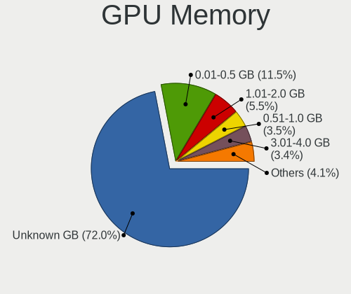

Debian 11 - Tested Hardware & Statistics
----------------------------------------

A project to collect tested hardware configurations for Debian 11.

Anyone can contribute to this report by the [hw-probe](https://github.com/linuxhw/hw-probe) tool:

    sudo -E hw-probe -all -upload

Please submit a probe of your configuration if it's not presented on the page or is rare.

This is a report for all computer types. See also reports for [desktops](/Dist/Debian_11/Desktop/README.md) and [notebooks](/Dist/Debian_11/Notebook/README.md).

Full-feature report is available here: https://linux-hardware.org/?view=trends

Contents
--------

* [ Test Cases ](#test-cases)

* [ System ](#system)
  - [ Kernel                   ](#kernel)
  - [ Kernel Family            ](#kernel-family)
  - [ Kernel Major Ver.        ](#kernel-major-ver)
  - [ Arch                     ](#arch)
  - [ DE                       ](#de)
  - [ Display Server           ](#display-server)
  - [ Display Manager          ](#display-manager)
  - [ OS Lang                  ](#os-lang)
  - [ Boot Mode                ](#boot-mode)
  - [ Filesystem               ](#filesystem)
  - [ Part. scheme             ](#part-scheme)
  - [ Dual Boot with Linux/BSD ](#dual-boot-with-linuxbsd)
  - [ Dual Boot (Win)          ](#dual-boot-win)

* [ Board ](#board)
  - [ Vendor                   ](#vendor)
  - [ Model                    ](#model)
  - [ Model Family             ](#model-family)
  - [ MFG Year                 ](#mfg-year)
  - [ Form Factor              ](#form-factor)
  - [ Secure Boot              ](#secure-boot)
  - [ Coreboot                 ](#coreboot)
  - [ RAM Size                 ](#ram-size)
  - [ RAM Used                 ](#ram-used)
  - [ Total Drives             ](#total-drives)
  - [ Has CD-ROM               ](#has-cd-rom)
  - [ Has Ethernet             ](#has-ethernet)
  - [ Has WiFi                 ](#has-wifi)
  - [ Has Bluetooth            ](#has-bluetooth)

* [ Location ](#location)
  - [ Country                  ](#country)
  - [ City                     ](#city)

* [ Drives ](#drives)
  - [ Drive Vendor             ](#drive-vendor)
  - [ Drive Model              ](#drive-model)
  - [ HDD Vendor               ](#hdd-vendor)
  - [ SSD Vendor               ](#ssd-vendor)
  - [ Drive Kind               ](#drive-kind)
  - [ Drive Connector          ](#drive-connector)
  - [ Drive Size               ](#drive-size)
  - [ Space Total              ](#space-total)
  - [ Space Used               ](#space-used)
  - [ Malfunc. Drives          ](#malfunc-drives)
  - [ Malfunc. Drive Vendor    ](#malfunc-drive-vendor)
  - [ Malfunc. HDD Vendor      ](#malfunc-hdd-vendor)
  - [ Malfunc. Drive Kind      ](#malfunc-drive-kind)
  - [ Failed Drives            ](#failed-drives)
  - [ Failed Drive Vendor      ](#failed-drive-vendor)
  - [ Drive Status             ](#drive-status)

* [ Storage controller ](#storage-controller)
  - [ Storage Vendor           ](#storage-vendor)
  - [ Storage Model            ](#storage-model)
  - [ Storage Kind             ](#storage-kind)

* [ Processor ](#processor)
  - [ CPU Vendor               ](#cpu-vendor)
  - [ CPU Model                ](#cpu-model)
  - [ CPU Model Family         ](#cpu-model-family)
  - [ CPU Cores                ](#cpu-cores)
  - [ CPU Sockets              ](#cpu-sockets)
  - [ CPU Threads              ](#cpu-threads)
  - [ CPU Op-Modes             ](#cpu-op-modes)
  - [ CPU Microcode            ](#cpu-microcode)
  - [ CPU Microarch            ](#cpu-microarch)

* [ Graphics ](#graphics)
  - [ GPU Vendor               ](#gpu-vendor)
  - [ GPU Model                ](#gpu-model)
  - [ GPU Combo                ](#gpu-combo)
  - [ GPU Driver               ](#gpu-driver)
  - [ GPU Memory               ](#gpu-memory)

* [ Monitor ](#monitor)
  - [ Monitor Vendor           ](#monitor-vendor)
  - [ Monitor Model            ](#monitor-model)
  - [ Monitor Resolution       ](#monitor-resolution)
  - [ Monitor Diagonal         ](#monitor-diagonal)
  - [ Monitor Width            ](#monitor-width)
  - [ Aspect Ratio             ](#aspect-ratio)
  - [ Monitor Area             ](#monitor-area)
  - [ Pixel Density            ](#pixel-density)
  - [ Multiple Monitors        ](#multiple-monitors)

* [ Network ](#network)
  - [ Net Controller Vendor    ](#net-controller-vendor)
  - [ Net Controller Model     ](#net-controller-model)
  - [ Wireless Vendor          ](#wireless-vendor)
  - [ Wireless Model           ](#wireless-model)
  - [ Ethernet Vendor          ](#ethernet-vendor)
  - [ Ethernet Model           ](#ethernet-model)
  - [ Net Controller Kind      ](#net-controller-kind)
  - [ Used Controller          ](#used-controller)
  - [ NICs                     ](#nics)
  - [ IPv6                     ](#ipv6)

* [ Bluetooth ](#bluetooth)
  - [ Bluetooth Vendor         ](#bluetooth-vendor)
  - [ Bluetooth Model          ](#bluetooth-model)

* [ Sound ](#sound)
  - [ Sound Vendor             ](#sound-vendor)
  - [ Sound Model              ](#sound-model)

* [ Memory ](#memory)
  - [ Memory Vendor            ](#memory-vendor)
  - [ Memory Model             ](#memory-model)
  - [ Memory Kind              ](#memory-kind)
  - [ Memory Form Factor       ](#memory-form-factor)
  - [ Memory Size              ](#memory-size)
  - [ Memory Speed             ](#memory-speed)

* [ Printers & scanners ](#printers--scanners)
  - [ Printer Vendor           ](#printer-vendor)
  - [ Printer Model            ](#printer-model)
  - [ Scanner Vendor           ](#scanner-vendor)
  - [ Scanner Model            ](#scanner-model)

* [ Camera ](#camera)
  - [ Camera Vendor            ](#camera-vendor)
  - [ Camera Model             ](#camera-model)

* [ Security ](#security)
  - [ Fingerprint Vendor       ](#fingerprint-vendor)
  - [ Fingerprint Model        ](#fingerprint-model)
  - [ Chipcard Vendor          ](#chipcard-vendor)
  - [ Chipcard Model           ](#chipcard-model)

* [ Unsupported ](#unsupported)
  - [ Unsupported Devices      ](#unsupported-devices)
  - [ Unsupported Device Types ](#unsupported-device-types)

Test Cases
----------

| Vendor        | Model                       | Form-Factor | Probe                                                      | Date         |
|---------------|-----------------------------|-------------|------------------------------------------------------------|--------------|
| Dell          | 0RW203                      | Desktop     | [7d16607324](https://linux-hardware.org/?probe=7d16607324) | Dec 31, 2021 |
| Intel         | NUC11PABi7 K90104-302       | Mini pc     | [66aea34547](https://linux-hardware.org/?probe=66aea34547) | Dec 31, 2021 |
| Intel         | NUC11PABi7 K90104-302       | Mini pc     | [d88a39fa09](https://linux-hardware.org/?probe=d88a39fa09) | Dec 31, 2021 |
| Lenovo        | ThinkPad T480s 20L7CTO1W... | Notebook    | [563f0e150e](https://linux-hardware.org/?probe=563f0e150e) | Dec 31, 2021 |
| HP            | Presario CQ56               | Notebook    | [aacf56218d](https://linux-hardware.org/?probe=aacf56218d) | Dec 31, 2021 |
| HP            | ProBook 650 G5              | Notebook    | [668c6a4644](https://linux-hardware.org/?probe=668c6a4644) | Dec 31, 2021 |
| Lenovo        | ThinkPad T580 20L9CTO1WW    | Notebook    | [4302dae812](https://linux-hardware.org/?probe=4302dae812) | Dec 31, 2021 |
| Dell          | Inspiron 7520               | Notebook    | [28e0273758](https://linux-hardware.org/?probe=28e0273758) | Dec 31, 2021 |
| Lenovo        | ThinkPad L13 Yoga Gen 2 ... | Convertible | [b46dd6fe7c](https://linux-hardware.org/?probe=b46dd6fe7c) | Dec 30, 2021 |
| Lenovo        | ThinkPad L13 Yoga Gen 2 ... | Convertible | [ce459e852d](https://linux-hardware.org/?probe=ce459e852d) | Dec 30, 2021 |
| Lenovo        | ThinkPad L13 Yoga Gen 2 ... | Convertible | [5c67e4e3bd](https://linux-hardware.org/?probe=5c67e4e3bd) | Dec 30, 2021 |
| Lenovo        | ThinkPad L13 Yoga Gen 2 ... | Convertible | [a2bd289576](https://linux-hardware.org/?probe=a2bd289576) | Dec 30, 2021 |
| Lenovo        | ThinkPad L13 Yoga Gen 2 ... | Convertible | [492b0e06e2](https://linux-hardware.org/?probe=492b0e06e2) | Dec 30, 2021 |
| Lenovo        | ThinkPad L13 Yoga Gen 2 ... | Convertible | [06ae302e2c](https://linux-hardware.org/?probe=06ae302e2c) | Dec 30, 2021 |
| Lenovo        | ThinkPad L13 Yoga Gen 2 ... | Convertible | [16ac2d8530](https://linux-hardware.org/?probe=16ac2d8530) | Dec 30, 2021 |
| Lenovo        | ThinkPad L13 Yoga Gen 2 ... | Convertible | [9c80ecde0d](https://linux-hardware.org/?probe=9c80ecde0d) | Dec 30, 2021 |
| Lenovo        | ThinkPad L13 Yoga Gen 2 ... | Convertible | [08b6f7de90](https://linux-hardware.org/?probe=08b6f7de90) | Dec 30, 2021 |
| Lenovo        | ThinkPad L13 Yoga Gen 2 ... | Convertible | [c27c575717](https://linux-hardware.org/?probe=c27c575717) | Dec 30, 2021 |
| Lenovo        | ThinkPad L13 Yoga Gen 2 ... | Convertible | [2af6ebb15f](https://linux-hardware.org/?probe=2af6ebb15f) | Dec 30, 2021 |
| Lenovo        | ThinkPad L13 Yoga Gen 2 ... | Convertible | [ac341e402f](https://linux-hardware.org/?probe=ac341e402f) | Dec 30, 2021 |
| Lenovo        | ThinkPad L13 Yoga Gen 2 ... | Convertible | [d2e6dd499a](https://linux-hardware.org/?probe=d2e6dd499a) | Dec 30, 2021 |
| Lenovo        | ThinkPad L13 Yoga Gen 2 ... | Convertible | [1a5ee2fdfa](https://linux-hardware.org/?probe=1a5ee2fdfa) | Dec 30, 2021 |
| Lenovo        | ThinkPad L13 Yoga Gen 2 ... | Convertible | [834af2e153](https://linux-hardware.org/?probe=834af2e153) | Dec 30, 2021 |
| Lenovo        | ThinkPad L13 Yoga Gen 2 ... | Convertible | [5ef10ade6e](https://linux-hardware.org/?probe=5ef10ade6e) | Dec 30, 2021 |
| Lenovo        | ThinkPad L13 Yoga Gen 2 ... | Convertible | [3289475362](https://linux-hardware.org/?probe=3289475362) | Dec 30, 2021 |
| Lenovo        | ThinkPad L13 Yoga Gen 2 ... | Convertible | [86e5ed0024](https://linux-hardware.org/?probe=86e5ed0024) | Dec 30, 2021 |
| Lenovo        | ThinkPad L13 Yoga Gen 2 ... | Convertible | [db70be245e](https://linux-hardware.org/?probe=db70be245e) | Dec 30, 2021 |
| Lenovo        | ThinkPad L13 Yoga Gen 2 ... | Convertible | [ea5bb3ee0a](https://linux-hardware.org/?probe=ea5bb3ee0a) | Dec 30, 2021 |
| Lenovo        | ThinkPad L13 Yoga Gen 2 ... | Convertible | [68f7492a1f](https://linux-hardware.org/?probe=68f7492a1f) | Dec 30, 2021 |
| Lenovo        | ThinkPad L13 Yoga Gen 2 ... | Convertible | [7812a54aab](https://linux-hardware.org/?probe=7812a54aab) | Dec 30, 2021 |
| Lenovo        | ThinkPad L13 Yoga Gen 2 ... | Convertible | [55150c95b1](https://linux-hardware.org/?probe=55150c95b1) | Dec 30, 2021 |
| Lenovo        | ThinkPad L13 Yoga Gen 2 ... | Convertible | [6a086f8303](https://linux-hardware.org/?probe=6a086f8303) | Dec 30, 2021 |
| Lenovo        | ThinkPad L13 Yoga Gen 2 ... | Convertible | [d8b54e410d](https://linux-hardware.org/?probe=d8b54e410d) | Dec 30, 2021 |
| Lenovo        | ThinkPad L13 Yoga Gen 2 ... | Convertible | [443df520f1](https://linux-hardware.org/?probe=443df520f1) | Dec 30, 2021 |
| Lenovo        | ThinkPad L13 Yoga Gen 2 ... | Convertible | [705872a6fc](https://linux-hardware.org/?probe=705872a6fc) | Dec 30, 2021 |
| Lenovo        | ThinkPad L13 Yoga Gen 2 ... | Convertible | [ecb3e93176](https://linux-hardware.org/?probe=ecb3e93176) | Dec 30, 2021 |
| Lenovo        | ThinkPad L13 Yoga Gen 2 ... | Convertible | [883dce039c](https://linux-hardware.org/?probe=883dce039c) | Dec 30, 2021 |
| Lenovo        | ThinkPad L13 Yoga Gen 2 ... | Convertible | [77ab95cab9](https://linux-hardware.org/?probe=77ab95cab9) | Dec 30, 2021 |
| Lenovo        | ThinkPad L13 Yoga Gen 2 ... | Convertible | [1678263e8a](https://linux-hardware.org/?probe=1678263e8a) | Dec 30, 2021 |
| Lenovo        | ThinkPad L13 Yoga Gen 2 ... | Convertible | [5ff3ac789a](https://linux-hardware.org/?probe=5ff3ac789a) | Dec 30, 2021 |
| Lenovo        | ThinkPad L13 Yoga Gen 2 ... | Convertible | [f3704e4853](https://linux-hardware.org/?probe=f3704e4853) | Dec 30, 2021 |
| Lenovo        | ThinkPad L13 Yoga Gen 2 ... | Convertible | [81168d8409](https://linux-hardware.org/?probe=81168d8409) | Dec 30, 2021 |
| Lenovo        | ThinkPad L13 Yoga Gen 2 ... | Convertible | [ab418c0482](https://linux-hardware.org/?probe=ab418c0482) | Dec 30, 2021 |
| Lenovo        | ThinkPad L13 Yoga Gen 2 ... | Convertible | [666990bc32](https://linux-hardware.org/?probe=666990bc32) | Dec 30, 2021 |
| Lenovo        | ThinkPad L13 Yoga Gen 2 ... | Convertible | [fcd57877d1](https://linux-hardware.org/?probe=fcd57877d1) | Dec 30, 2021 |
| Lenovo        | ThinkPad L13 Yoga Gen 2 ... | Convertible | [39c4bc12bd](https://linux-hardware.org/?probe=39c4bc12bd) | Dec 30, 2021 |
| Lenovo        | ThinkPad L13 Yoga Gen 2 ... | Convertible | [d65d38e313](https://linux-hardware.org/?probe=d65d38e313) | Dec 30, 2021 |
| Lenovo        | ThinkPad L13 Yoga Gen 2 ... | Convertible | [db59f8af69](https://linux-hardware.org/?probe=db59f8af69) | Dec 30, 2021 |
| Lenovo        | ThinkPad L13 Yoga Gen 2 ... | Convertible | [86678b10ea](https://linux-hardware.org/?probe=86678b10ea) | Dec 30, 2021 |
| Lenovo        | ThinkPad L13 Yoga Gen 2 ... | Convertible | [9a706fad29](https://linux-hardware.org/?probe=9a706fad29) | Dec 30, 2021 |
| Lenovo        | ThinkPad L13 Yoga Gen 2 ... | Convertible | [56dc48a07b](https://linux-hardware.org/?probe=56dc48a07b) | Dec 30, 2021 |
| Lenovo        | ThinkPad L13 Yoga Gen 2 ... | Convertible | [d3056d4f3d](https://linux-hardware.org/?probe=d3056d4f3d) | Dec 30, 2021 |
| Lenovo        | ThinkPad L13 Yoga Gen 2 ... | Convertible | [13809c5b01](https://linux-hardware.org/?probe=13809c5b01) | Dec 30, 2021 |
| Lenovo        | ThinkPad L13 Yoga Gen 2 ... | Convertible | [f555d2cfac](https://linux-hardware.org/?probe=f555d2cfac) | Dec 30, 2021 |
| Lenovo        | ThinkPad L13 Yoga Gen 2 ... | Convertible | [db46172aea](https://linux-hardware.org/?probe=db46172aea) | Dec 30, 2021 |
| Lenovo        | ThinkPad L13 Yoga Gen 2 ... | Convertible | [f8462800a6](https://linux-hardware.org/?probe=f8462800a6) | Dec 30, 2021 |
| Lenovo        | ThinkPad L13 Yoga Gen 2 ... | Convertible | [9d09a311fd](https://linux-hardware.org/?probe=9d09a311fd) | Dec 30, 2021 |
| Lenovo        | ThinkPad L13 Yoga Gen 2 ... | Convertible | [579801daae](https://linux-hardware.org/?probe=579801daae) | Dec 30, 2021 |
| Lenovo        | ThinkPad X1 Carbon 3460A... | Notebook    | [c08374a615](https://linux-hardware.org/?probe=c08374a615) | Dec 30, 2021 |
| Unknown       | Unknown                     | Desktop     | [cbe80d8c24](https://linux-hardware.org/?probe=cbe80d8c24) | Dec 30, 2021 |
| Dell          | Latitude E5420              | Notebook    | [dc28d41913](https://linux-hardware.org/?probe=dc28d41913) | Dec 30, 2021 |
| Lenovo        | ThinkPad E475 20H40006US    | Notebook    | [8a1a113e52](https://linux-hardware.org/?probe=8a1a113e52) | Dec 30, 2021 |
| Lenovo        | ThinkPad E475 20H40006US    | Notebook    | [a38b433d5e](https://linux-hardware.org/?probe=a38b433d5e) | Dec 30, 2021 |
| HP            | 8906 SMVB                   | Desktop     | [be19f6df45](https://linux-hardware.org/?probe=be19f6df45) | Dec 29, 2021 |
| Lenovo        | ThinkPad E475 20H40006US    | Notebook    | [9d363caf9e](https://linux-hardware.org/?probe=9d363caf9e) | Dec 29, 2021 |
| Lenovo        | ThinkPad E475 20H40006US    | Notebook    | [a7f26d9823](https://linux-hardware.org/?probe=a7f26d9823) | Dec 29, 2021 |
| ASUSTek       | ROG STRIX Z390-H GAMING     | Desktop     | [02f8579bf3](https://linux-hardware.org/?probe=02f8579bf3) | Dec 29, 2021 |
| ASUSTek       | Pro H510M-C                 | Desktop     | [d2544fc8dc](https://linux-hardware.org/?probe=d2544fc8dc) | Dec 29, 2021 |
| Lenovo        | ThinkPad A485 20MU000CMH    | Notebook    | [ec36ac81a4](https://linux-hardware.org/?probe=ec36ac81a4) | Dec 29, 2021 |
| ASUSTek       | UX303LAB                    | Notebook    | [196ff1f41f](https://linux-hardware.org/?probe=196ff1f41f) | Dec 29, 2021 |
| ASUSTek       | ZenBook UX325EA_UX325EA     | Notebook    | [51d4addbb3](https://linux-hardware.org/?probe=51d4addbb3) | Dec 29, 2021 |
| MSI           | B460M-A PRO                 | Desktop     | [209e15690e](https://linux-hardware.org/?probe=209e15690e) | Dec 29, 2021 |
| Lenovo        | ThinkPad E475 20H40006US    | Notebook    | [b44ab55a4d](https://linux-hardware.org/?probe=b44ab55a4d) | Dec 28, 2021 |
| Lenovo        | ThinkPad E475 20H40006US    | Notebook    | [9679415e5e](https://linux-hardware.org/?probe=9679415e5e) | Dec 28, 2021 |
| ASRock        | J4105M                      | Desktop     | [37f37bbbfd](https://linux-hardware.org/?probe=37f37bbbfd) | Dec 28, 2021 |
| Lenovo        | ThinkPad E475 20H40006US    | Notebook    | [10ec2e2912](https://linux-hardware.org/?probe=10ec2e2912) | Dec 28, 2021 |
| Lenovo        | ThinkPad E475 20H40006US    | Notebook    | [47497df950](https://linux-hardware.org/?probe=47497df950) | Dec 28, 2021 |
| Lenovo        | B50-30 20382                | Notebook    | [896ea31fe5](https://linux-hardware.org/?probe=896ea31fe5) | Dec 28, 2021 |
| Intel         | DZ77SL-50K AAG55115-300     | Desktop     | [d644ed8f37](https://linux-hardware.org/?probe=d644ed8f37) | Dec 28, 2021 |
| Lenovo        | ThinkPad E475 20H40006US    | Notebook    | [98bccb86b2](https://linux-hardware.org/?probe=98bccb86b2) | Dec 28, 2021 |
| Lenovo        | ThinkPad E475 20H40006US    | Notebook    | [f0d7556c6b](https://linux-hardware.org/?probe=f0d7556c6b) | Dec 28, 2021 |
| ASUSTek       | A7V                         | Notebook    | [33b743a9bc](https://linux-hardware.org/?probe=33b743a9bc) | Dec 28, 2021 |
| Fujitsu Si... | D2584-A1 S26361-D2584-A1    | Desktop     | [01df3a24cd](https://linux-hardware.org/?probe=01df3a24cd) | Dec 28, 2021 |
| Gigabyte      | B85M-D3H                    | Desktop     | [4a40c7a706](https://linux-hardware.org/?probe=4a40c7a706) | Dec 28, 2021 |
| ASRock        | X370 Pro4                   | Desktop     | [701f9ae732](https://linux-hardware.org/?probe=701f9ae732) | Dec 28, 2021 |
| ASRock        | X370 Pro4                   | Desktop     | [d6585bd061](https://linux-hardware.org/?probe=d6585bd061) | Dec 28, 2021 |
| Lenovo        | ThinkPad 13 2nd Gen 20J1... | Notebook    | [34bc7aa429](https://linux-hardware.org/?probe=34bc7aa429) | Dec 27, 2021 |
| Lenovo        | ThinkPad E475 20H40006US    | Notebook    | [8fdd3d78c9](https://linux-hardware.org/?probe=8fdd3d78c9) | Dec 27, 2021 |
| Lenovo        | ThinkPad E475 20H40006US    | Notebook    | [a2eed27aed](https://linux-hardware.org/?probe=a2eed27aed) | Dec 27, 2021 |
| Lenovo        | ThinkPad E475 20H40006US    | Notebook    | [f022aa3706](https://linux-hardware.org/?probe=f022aa3706) | Dec 27, 2021 |
| ASUSTek       | H61M-K                      | Desktop     | [d02d1bb775](https://linux-hardware.org/?probe=d02d1bb775) | Dec 27, 2021 |
| Lenovo        | ThinkPad E475 20H40006US    | Notebook    | [252503762f](https://linux-hardware.org/?probe=252503762f) | Dec 27, 2021 |
| Lenovo        | ThinkPad E475 20H40006US    | Notebook    | [5be0d36fa8](https://linux-hardware.org/?probe=5be0d36fa8) | Dec 27, 2021 |
| Acer          | Aspire A315-23G             | Notebook    | [8262ba8f4a](https://linux-hardware.org/?probe=8262ba8f4a) | Dec 27, 2021 |
| Intel         | NUC10i7FNB K61360-302       | Mini pc     | [a940c31cf7](https://linux-hardware.org/?probe=a940c31cf7) | Dec 27, 2021 |
| Acer          | Aspire E5-511               | Notebook    | [86bd37c584](https://linux-hardware.org/?probe=86bd37c584) | Dec 27, 2021 |
| Gigabyte      | H81M-S2V                    | Desktop     | [eb08ea9851](https://linux-hardware.org/?probe=eb08ea9851) | Dec 27, 2021 |
| Acer          | Aspire A515-56              | Notebook    | [359493a8bf](https://linux-hardware.org/?probe=359493a8bf) | Dec 27, 2021 |
| ASRock        | X300M-STX                   | Desktop     | [64e387d031](https://linux-hardware.org/?probe=64e387d031) | Dec 27, 2021 |
| Lenovo        | ThinkPad X220 4291W99       | Notebook    | [ead56def80](https://linux-hardware.org/?probe=ead56def80) | Dec 26, 2021 |
| Lenovo        | ThinkPad T450 20BUS09X01    | Notebook    | [acce80e775](https://linux-hardware.org/?probe=acce80e775) | Dec 26, 2021 |
| MSI           | B450-A PRO MAX              | Desktop     | [2151771a0d](https://linux-hardware.org/?probe=2151771a0d) | Dec 26, 2021 |
| Lenovo        | IdeaPad S540-13API 81XC     | Notebook    | [e3a3030886](https://linux-hardware.org/?probe=e3a3030886) | Dec 26, 2021 |
| Lenovo        | IdeaPad S540-13API 81XC     | Notebook    | [c7612aac66](https://linux-hardware.org/?probe=c7612aac66) | Dec 26, 2021 |
| HUAWEI        | HVY-WXX9                    | Notebook    | [2c33c2931e](https://linux-hardware.org/?probe=2c33c2931e) | Dec 26, 2021 |
| Toshiba       | Satellite L775D             | Notebook    | [1ad6310748](https://linux-hardware.org/?probe=1ad6310748) | Dec 26, 2021 |
| AXDIA Inte... | MYBOOK 14 PRO               | Notebook    | [73d605f4e5](https://linux-hardware.org/?probe=73d605f4e5) | Dec 26, 2021 |
| MSI           | B450-A PRO MAX              | Desktop     | [0477f867f5](https://linux-hardware.org/?probe=0477f867f5) | Dec 25, 2021 |
| JGINYUE       | X99-D8 Server V1.0          | Desktop     | [d1548e5cd1](https://linux-hardware.org/?probe=d1548e5cd1) | Dec 25, 2021 |
| Dell          | Vostro 3560                 | Notebook    | [7bd51b12d6](https://linux-hardware.org/?probe=7bd51b12d6) | Dec 25, 2021 |
| Dell          | Vostro 3560                 | Notebook    | [0929a4f988](https://linux-hardware.org/?probe=0929a4f988) | Dec 25, 2021 |
| Dell          | 07T4MC A09                  | Desktop     | [68af9c7556](https://linux-hardware.org/?probe=68af9c7556) | Dec 25, 2021 |
| HUAWEI        | HKD-WXX                     | Notebook    | [9e77c08b95](https://linux-hardware.org/?probe=9e77c08b95) | Dec 24, 2021 |
| ASUSTek       | X542UA                      | Notebook    | [c103fc5e33](https://linux-hardware.org/?probe=c103fc5e33) | Dec 24, 2021 |
| ASUSTek       | P5G41T-M LX2/GB             | Desktop     | [7d0eeda884](https://linux-hardware.org/?probe=7d0eeda884) | Dec 24, 2021 |
| Acer          | Aspire 5733Z                | Notebook    | [ea7511ce8d](https://linux-hardware.org/?probe=ea7511ce8d) | Dec 24, 2021 |
| Toshiba       | Satellite E205              | Notebook    | [92431da366](https://linux-hardware.org/?probe=92431da366) | Dec 24, 2021 |
| Lenovo        | SHARKBAY 31900058 STD       | Desktop     | [fa1d026542](https://linux-hardware.org/?probe=fa1d026542) | Dec 23, 2021 |
| AZW           | Gemini X45                  | Desktop     | [84dd0d27a1](https://linux-hardware.org/?probe=84dd0d27a1) | Dec 23, 2021 |
| Gigabyte      | Z77X-D3H                    | Desktop     | [1dbb28ea7e](https://linux-hardware.org/?probe=1dbb28ea7e) | Dec 23, 2021 |
| ASRock        | 970M Pro3                   | Desktop     | [d14dc298c0](https://linux-hardware.org/?probe=d14dc298c0) | Dec 23, 2021 |
| MSI           | 870S-C45                    | Desktop     | [ac4454681e](https://linux-hardware.org/?probe=ac4454681e) | Dec 23, 2021 |
| HP            | ENVY x360 Convertible 15... | Convertible | [3c497749b6](https://linux-hardware.org/?probe=3c497749b6) | Dec 23, 2021 |
| Gigabyte      | B550I AORUS PRO AX          | Desktop     | [b097a62c18](https://linux-hardware.org/?probe=b097a62c18) | Dec 22, 2021 |
| Framework     | Laptop                      | Notebook    | [eac24b722b](https://linux-hardware.org/?probe=eac24b722b) | Dec 22, 2021 |
| Intel         | DH67BL AAG10189-213         | Desktop     | [5fa9087a0f](https://linux-hardware.org/?probe=5fa9087a0f) | Dec 22, 2021 |
| HP            | G61                         | Notebook    | [d3f48fd2b2](https://linux-hardware.org/?probe=d3f48fd2b2) | Dec 22, 2021 |
| MSI           | X299 RAIDER                 | Desktop     | [305fffd6f2](https://linux-hardware.org/?probe=305fffd6f2) | Dec 22, 2021 |
| Lenovo        | ThinkPad T14s Gen 1 20UH... | Notebook    | [302a05ab29](https://linux-hardware.org/?probe=302a05ab29) | Dec 22, 2021 |
| HP            | Elite x2 1012 G2            | Tablet      | [1fe380a7d3](https://linux-hardware.org/?probe=1fe380a7d3) | Dec 22, 2021 |
| HP            | Elite x2 1012 G2            | Tablet      | [ba81e8114e](https://linux-hardware.org/?probe=ba81e8114e) | Dec 22, 2021 |
| Huanan        | X99-8M-F V1.1               | Desktop     | [c56f06be0f](https://linux-hardware.org/?probe=c56f06be0f) | Dec 22, 2021 |
| Huanan        | X99-8M-F V1.1               | Desktop     | [11c6b9c8f3](https://linux-hardware.org/?probe=11c6b9c8f3) | Dec 22, 2021 |
| Advent        | Tacto Purple                | Notebook    | [ac9fd78933](https://linux-hardware.org/?probe=ac9fd78933) | Dec 22, 2021 |
| ASUSTek       | M5A97 LE R2.0               | Desktop     | [60dacbeece](https://linux-hardware.org/?probe=60dacbeece) | Dec 22, 2021 |
| ASUSTek       | M5A78L-M/USB3               | Desktop     | [72ba2d0d17](https://linux-hardware.org/?probe=72ba2d0d17) | Dec 22, 2021 |
| Lenovo        | ThinkPad E475 20H40006US    | Notebook    | [0a0df8aeb4](https://linux-hardware.org/?probe=0a0df8aeb4) | Dec 22, 2021 |
| Lenovo        | ThinkPad E475 20H40006US    | Notebook    | [d57782238c](https://linux-hardware.org/?probe=d57782238c) | Dec 22, 2021 |
| Lenovo        | ThinkPad E475 20H40006US    | Notebook    | [00603cca0e](https://linux-hardware.org/?probe=00603cca0e) | Dec 22, 2021 |
| Lenovo        | ThinkPad E475 20H40006US    | Notebook    | [6f933f3515](https://linux-hardware.org/?probe=6f933f3515) | Dec 21, 2021 |
| Lenovo        | ThinkPad E475 20H40006US    | Notebook    | [0f65d7798c](https://linux-hardware.org/?probe=0f65d7798c) | Dec 21, 2021 |
| Lenovo        | ThinkPad E475 20H40006US    | Notebook    | [d2e57452db](https://linux-hardware.org/?probe=d2e57452db) | Dec 21, 2021 |
| Acer          | Switch SW312-31             | Tablet      | [af71cff698](https://linux-hardware.org/?probe=af71cff698) | Dec 21, 2021 |
| SeeedStudi... | ODYSSEY-X86J41X5 SD-BS-C... | Desktop     | [e6d6c1a347](https://linux-hardware.org/?probe=e6d6c1a347) | Dec 21, 2021 |
| Google        | Barla                       | Notebook    | [cfdb4935cd](https://linux-hardware.org/?probe=cfdb4935cd) | Dec 21, 2021 |
| Lenovo        | V130-15IGM 81HL             | Notebook    | [541618076f](https://linux-hardware.org/?probe=541618076f) | Dec 21, 2021 |
| Google        | Barla                       | Notebook    | [0629410759](https://linux-hardware.org/?probe=0629410759) | Dec 21, 2021 |
| ASUSTek       | M5A97 LE R2.0               | Desktop     | [4bc10ff46d](https://linux-hardware.org/?probe=4bc10ff46d) | Dec 21, 2021 |
| Gigabyte      | B550 AORUS PRO AC           | Desktop     | [fcd4727186](https://linux-hardware.org/?probe=fcd4727186) | Dec 21, 2021 |
| Dell          | 0F6X5P A00                  | Desktop     | [4c0f81d1b6](https://linux-hardware.org/?probe=4c0f81d1b6) | Dec 21, 2021 |
| ASRock        | H470M-HVS                   | Desktop     | [a48a676fb3](https://linux-hardware.org/?probe=a48a676fb3) | Dec 20, 2021 |
| ASRock        | H470M-HVS                   | Desktop     | [655f1beaae](https://linux-hardware.org/?probe=655f1beaae) | Dec 20, 2021 |
| ASRock        | H470M-HVS                   | Desktop     | [ba03646dce](https://linux-hardware.org/?probe=ba03646dce) | Dec 20, 2021 |
| ASRock        | H470M-HVS                   | Desktop     | [18425a0c0d](https://linux-hardware.org/?probe=18425a0c0d) | Dec 20, 2021 |
| ASRock        | H470M-HVS                   | Desktop     | [19ffe60b26](https://linux-hardware.org/?probe=19ffe60b26) | Dec 20, 2021 |
| HP            | Laptop 15-db0xxx            | Notebook    | [450425f52d](https://linux-hardware.org/?probe=450425f52d) | Dec 20, 2021 |
| HP            | Laptop 15-db0xxx            | Notebook    | [95261c40a2](https://linux-hardware.org/?probe=95261c40a2) | Dec 20, 2021 |
| HP            | Pavilion Gaming Laptop 1... | Notebook    | [18fbcba790](https://linux-hardware.org/?probe=18fbcba790) | Dec 20, 2021 |
| Acer          | Aspire A515-56              | Notebook    | [54cb3818f3](https://linux-hardware.org/?probe=54cb3818f3) | Dec 20, 2021 |
| ASUSTek       | P8Z68-V PRO                 | Desktop     | [ce7e7de4b4](https://linux-hardware.org/?probe=ce7e7de4b4) | Dec 20, 2021 |
| Lenovo        | IdeaPad Yoga 11S 20246      | Notebook    | [619d113667](https://linux-hardware.org/?probe=619d113667) | Dec 20, 2021 |
| Lenovo        | IdeaPad Yoga 11S 20246      | Notebook    | [8032915451](https://linux-hardware.org/?probe=8032915451) | Dec 20, 2021 |
| ASUSTek       | 1015CX                      | Notebook    | [e146dc65ee](https://linux-hardware.org/?probe=e146dc65ee) | Dec 19, 2021 |
| Gigabyte      | Z390 GAMING X-CF            | Desktop     | [8962cfd1c6](https://linux-hardware.org/?probe=8962cfd1c6) | Dec 19, 2021 |
| Toshiba       | Satellite L755D             | Notebook    | [1f2f21825c](https://linux-hardware.org/?probe=1f2f21825c) | Dec 19, 2021 |
| Dell          | Inspiron N4050              | Notebook    | [069b0b5d94](https://linux-hardware.org/?probe=069b0b5d94) | Dec 19, 2021 |
| Dell          | 0KC9NP A01                  | Desktop     | [aa65cbb14e](https://linux-hardware.org/?probe=aa65cbb14e) | Dec 19, 2021 |
| ASRock        | A300M-STX                   | Desktop     | [e94f13d236](https://linux-hardware.org/?probe=e94f13d236) | Dec 19, 2021 |
| MSI           | MAG X570 TOMAHAWK WIFI      | Desktop     | [398e67d90d](https://linux-hardware.org/?probe=398e67d90d) | Dec 19, 2021 |
| CompuLab      | fitlet2                     | Mini pc     | [1c6c1f4c45](https://linux-hardware.org/?probe=1c6c1f4c45) | Dec 19, 2021 |
| ASUSTek       | ASUS EXPERTBOOK B9450FA_... | Notebook    | [ded54cb08c](https://linux-hardware.org/?probe=ded54cb08c) | Dec 19, 2021 |
| HP            | 0B4Ch D                     | Desktop     | [627db696e0](https://linux-hardware.org/?probe=627db696e0) | Dec 18, 2021 |
| Apple         | Mac-F2268DC8                | All in one  | [dd7447cb0e](https://linux-hardware.org/?probe=dd7447cb0e) | Dec 18, 2021 |
| TYAN Compu... | S7002                       | Server      | [7636863c25](https://linux-hardware.org/?probe=7636863c25) | Dec 18, 2021 |
| TYAN Compu... | S7002                       | Server      | [8cf4b6b014](https://linux-hardware.org/?probe=8cf4b6b014) | Dec 18, 2021 |
| Lenovo        | ThinkPad T450 20BV000EUS    | Notebook    | [cb3d066fe3](https://linux-hardware.org/?probe=cb3d066fe3) | Dec 17, 2021 |
| Acer          | EG43M                       | Desktop     | [6f5d9e50df](https://linux-hardware.org/?probe=6f5d9e50df) | Dec 17, 2021 |
| ASUSTek       | Pro H510M-C                 | Desktop     | [1e938fa2cb](https://linux-hardware.org/?probe=1e938fa2cb) | Dec 17, 2021 |
| HP            | Laptop 15-db0xxx            | Notebook    | [52f6aa4a91](https://linux-hardware.org/?probe=52f6aa4a91) | Dec 17, 2021 |
| ASRock        | H310CM-DVS                  | Desktop     | [17e733167d](https://linux-hardware.org/?probe=17e733167d) | Dec 17, 2021 |
| ASUSTek       | Pro H510M-C                 | Desktop     | [28d02842a6](https://linux-hardware.org/?probe=28d02842a6) | Dec 17, 2021 |
| Foxconn       | H61MXV/H67MXV               | Desktop     | [dd2a38b869](https://linux-hardware.org/?probe=dd2a38b869) | Dec 17, 2021 |
| Foxconn       | H61MXV/H67MXV               | Desktop     | [218235b0b1](https://linux-hardware.org/?probe=218235b0b1) | Dec 17, 2021 |
| ASRock        | H470M-HVS                   | Desktop     | [080e441056](https://linux-hardware.org/?probe=080e441056) | Dec 17, 2021 |
| ASRock        | H470M-HVS                   | Desktop     | [0470e28c02](https://linux-hardware.org/?probe=0470e28c02) | Dec 17, 2021 |
| Dell          | Inspiron 7306 2n1           | Convertible | [7fdeb45dde](https://linux-hardware.org/?probe=7fdeb45dde) | Dec 17, 2021 |
| ASUSTek       | H81M-K                      | Desktop     | [8ba18843cb](https://linux-hardware.org/?probe=8ba18843cb) | Dec 17, 2021 |
| ASUSTek       | ROG STRIX B550-F GAMING     | Desktop     | [526e490544](https://linux-hardware.org/?probe=526e490544) | Dec 17, 2021 |
| HP            | ZBook 15u G6                | Notebook    | [78134b6880](https://linux-hardware.org/?probe=78134b6880) | Dec 17, 2021 |
| HP            | ZBook 15u G6                | Notebook    | [5a2146eb12](https://linux-hardware.org/?probe=5a2146eb12) | Dec 17, 2021 |
| Dell          | 07T4MC A05                  | Desktop     | [c54a28e0a8](https://linux-hardware.org/?probe=c54a28e0a8) | Dec 16, 2021 |
| Lenovo        | ThinkPad T590 20N4001NUS    | Notebook    | [7328745d31](https://linux-hardware.org/?probe=7328745d31) | Dec 16, 2021 |
| Xunlong       | Orange Pi PC                | Soc         | [e112a02e93](https://linux-hardware.org/?probe=e112a02e93) | Dec 16, 2021 |
| MSI           | MPG Z490 GAMING PLUS        | Desktop     | [e498196491](https://linux-hardware.org/?probe=e498196491) | Dec 16, 2021 |
| Lenovo        | ThinkPad T14s Gen 2i 20W... | Notebook    | [a77249c08b](https://linux-hardware.org/?probe=a77249c08b) | Dec 16, 2021 |
| Gigabyte      | H410M S2H V3                | Desktop     | [afff6656ae](https://linux-hardware.org/?probe=afff6656ae) | Dec 16, 2021 |
| Gigabyte      | H81M-S2V                    | Desktop     | [0a7ab91f41](https://linux-hardware.org/?probe=0a7ab91f41) | Dec 16, 2021 |
| Fujitsu       | D3221-A1 S26361-D3221-A1    | Desktop     | [ab117d0139](https://linux-hardware.org/?probe=ab117d0139) | Dec 16, 2021 |
| Maibenben     | E5100                       | Notebook    | [862244e859](https://linux-hardware.org/?probe=862244e859) | Dec 16, 2021 |
| Maibenben     | E5100                       | Notebook    | [cb5e47da58](https://linux-hardware.org/?probe=cb5e47da58) | Dec 16, 2021 |
| HP            | Laptop 15s-eq2xxx           | Notebook    | [7d95335599](https://linux-hardware.org/?probe=7d95335599) | Dec 16, 2021 |
| HP            | Laptop 15s-eq2xxx           | Notebook    | [81c5e26bcf](https://linux-hardware.org/?probe=81c5e26bcf) | Dec 16, 2021 |
| Apple         | Mac-F2268DC8                | All in one  | [811e5bd5fb](https://linux-hardware.org/?probe=811e5bd5fb) | Dec 15, 2021 |
| Toshiba       | Satellite L775D             | Notebook    | [6f85a331cc](https://linux-hardware.org/?probe=6f85a331cc) | Dec 15, 2021 |
| HP            | 18E7                        | Desktop     | [c600f1f2bb](https://linux-hardware.org/?probe=c600f1f2bb) | Dec 15, 2021 |
| HP            | Notebook                    | Notebook    | [28a73cd53a](https://linux-hardware.org/?probe=28a73cd53a) | Dec 15, 2021 |
| Fujitsu       | D3221-A1 S26361-D3221-A1    | Desktop     | [14467dd4b9](https://linux-hardware.org/?probe=14467dd4b9) | Dec 15, 2021 |
| Fujitsu       | D3221-A1 S26361-D3221-A1    | Desktop     | [8b1901d7dc](https://linux-hardware.org/?probe=8b1901d7dc) | Dec 15, 2021 |
| ASUSTek       | Q170M2                      | Desktop     | [83811b886e](https://linux-hardware.org/?probe=83811b886e) | Dec 15, 2021 |
| ASUSTek       | P5G41T-M LX                 | Desktop     | [466da9344c](https://linux-hardware.org/?probe=466da9344c) | Dec 15, 2021 |
| Dell          | XPS 13 9310                 | Notebook    | [86eb1ce765](https://linux-hardware.org/?probe=86eb1ce765) | Dec 15, 2021 |
| Pegatron      | 2A73h                       | Desktop     | [603a6f5087](https://linux-hardware.org/?probe=603a6f5087) | Dec 15, 2021 |
| Unknown       | CN700-8237                  | Desktop     | [c55be123a1](https://linux-hardware.org/?probe=c55be123a1) | Dec 15, 2021 |
| HONOR         | HLYL-WXX9                   | Notebook    | [0b6a9394b4](https://linux-hardware.org/?probe=0b6a9394b4) | Dec 15, 2021 |
| CSL-Comput... | R Evolve C14i               | Notebook    | [63c7f1d48e](https://linux-hardware.org/?probe=63c7f1d48e) | Dec 14, 2021 |
| HP            | EliteBook 8560p             | Notebook    | [6a1aefdd40](https://linux-hardware.org/?probe=6a1aefdd40) | Dec 14, 2021 |
| ASUSTek       | H110M-R                     | Desktop     | [4f0b004478](https://linux-hardware.org/?probe=4f0b004478) | Dec 14, 2021 |
| ASUSTek       | X756UQ                      | Notebook    | [04d25be08d](https://linux-hardware.org/?probe=04d25be08d) | Dec 13, 2021 |
| ASUSTek       | X756UQ                      | Notebook    | [21aac3ed33](https://linux-hardware.org/?probe=21aac3ed33) | Dec 13, 2021 |
| Intel         | Eaglelake Fab D             | Desktop     | [354a223fbd](https://linux-hardware.org/?probe=354a223fbd) | Dec 13, 2021 |
| HP            | ProBook 440 G6              | Notebook    | [bf19b30902](https://linux-hardware.org/?probe=bf19b30902) | Dec 13, 2021 |
| ASRock        | X399 Taichi                 | Desktop     | [1a1ad9435a](https://linux-hardware.org/?probe=1a1ad9435a) | Dec 13, 2021 |
| HP            | 09F8h                       | Desktop     | [c70b669376](https://linux-hardware.org/?probe=c70b669376) | Dec 13, 2021 |
| AXDIA Inte... | MYBOOK 14 PRO               | Notebook    | [73ba7a03d3](https://linux-hardware.org/?probe=73ba7a03d3) | Dec 13, 2021 |
| ASUSTek       | X542UA                      | Notebook    | [920ca90cbe](https://linux-hardware.org/?probe=920ca90cbe) | Dec 13, 2021 |
| Huanan        | X58 V1.0                    | Desktop     | [6cb5c8da29](https://linux-hardware.org/?probe=6cb5c8da29) | Dec 12, 2021 |
| MSI           | MAG B365M MORTAR            | Desktop     | [bd72de2067](https://linux-hardware.org/?probe=bd72de2067) | Dec 12, 2021 |
| ASUSTek       | PRIME B250-PRO              | Desktop     | [51dfe24c10](https://linux-hardware.org/?probe=51dfe24c10) | Dec 12, 2021 |
| Dell          | Precision M6500             | Notebook    | [5b825d4133](https://linux-hardware.org/?probe=5b825d4133) | Dec 11, 2021 |
| Lenovo        | Z51-70 80K6                 | Notebook    | [3faa0a2aad](https://linux-hardware.org/?probe=3faa0a2aad) | Dec 11, 2021 |
| Dell          | XPS 17 9700                 | Notebook    | [d5ec843ea7](https://linux-hardware.org/?probe=d5ec843ea7) | Dec 11, 2021 |
| Gigabyte      | Z490 AORUS PRO AX           | Desktop     | [03ba9fdf17](https://linux-hardware.org/?probe=03ba9fdf17) | Dec 11, 2021 |
| HP            | ZBook Firefly 15 inch G8... | Notebook    | [f2bfaaf185](https://linux-hardware.org/?probe=f2bfaaf185) | Dec 11, 2021 |
| HP            | ProBook 440 G6              | Notebook    | [8c952bfc3d](https://linux-hardware.org/?probe=8c952bfc3d) | Dec 11, 2021 |
| AXDIA Inte... | MYBOOK 14 PRO               | Notebook    | [7d2780ae1a](https://linux-hardware.org/?probe=7d2780ae1a) | Dec 11, 2021 |
| HP            | EliteBook 2540p (VB841AV... | Notebook    | [c0406366e7](https://linux-hardware.org/?probe=c0406366e7) | Dec 10, 2021 |
| HP            | 09F8h                       | Desktop     | [b01b09b7a4](https://linux-hardware.org/?probe=b01b09b7a4) | Dec 10, 2021 |
| Lenovo        | ThinkPad P51s 20HB000URT    | Notebook    | [e4f3353735](https://linux-hardware.org/?probe=e4f3353735) | Dec 10, 2021 |
| ASUSTek       | X542UA                      | Notebook    | [e463e37acd](https://linux-hardware.org/?probe=e463e37acd) | Dec 10, 2021 |
| MSI           | X470 GAMING PLUS            | Desktop     | [7319c92561](https://linux-hardware.org/?probe=7319c92561) | Dec 10, 2021 |
| Lenovo        | ThinkPad X230 232578G       | Notebook    | [f53267338f](https://linux-hardware.org/?probe=f53267338f) | Dec 10, 2021 |
| Packard Be... | EasyNote TM85               | Notebook    | [6a064fb13c](https://linux-hardware.org/?probe=6a064fb13c) | Dec 10, 2021 |
| ASRock        | FM2A68M-HD+                 | Desktop     | [a46a3aab04](https://linux-hardware.org/?probe=a46a3aab04) | Dec 10, 2021 |
| Lenovo        | ThinkPad X230 232578G       | Notebook    | [3b7e64aebf](https://linux-hardware.org/?probe=3b7e64aebf) | Dec 10, 2021 |
| ASUSTek       | H61M-K                      | Desktop     | [3cd23b929b](https://linux-hardware.org/?probe=3cd23b929b) | Dec 10, 2021 |
| Dell          | Precision M6500             | Notebook    | [eff4bd68bc](https://linux-hardware.org/?probe=eff4bd68bc) | Dec 10, 2021 |
| IBM           | ThinkPad T43 2668BU7        | Notebook    | [30bc16722a](https://linux-hardware.org/?probe=30bc16722a) | Dec 10, 2021 |
| Gigabyte      | X570 GAMING X               | Desktop     | [d0f4c6c32f](https://linux-hardware.org/?probe=d0f4c6c32f) | Dec 09, 2021 |
| Gigabyte      | X570 GAMING X               | Desktop     | [c7c63c686c](https://linux-hardware.org/?probe=c7c63c686c) | Dec 09, 2021 |
| ASRock        | B450M Pro4-F                | Desktop     | [877095541e](https://linux-hardware.org/?probe=877095541e) | Dec 09, 2021 |
| Lenovo        | ThinkPad L13 Yoga Gen 2 ... | Convertible | [b38577891e](https://linux-hardware.org/?probe=b38577891e) | Dec 09, 2021 |
| Lenovo        | G585 2181                   | Notebook    | [392cee4b42](https://linux-hardware.org/?probe=392cee4b42) | Dec 09, 2021 |
| Gigabyte      | H81M-S2V                    | Desktop     | [d1d8529d39](https://linux-hardware.org/?probe=d1d8529d39) | Dec 09, 2021 |
| ASUSTek       | PRIME A320M-K               | Desktop     | [f9ada169fd](https://linux-hardware.org/?probe=f9ada169fd) | Dec 09, 2021 |
| HP            | 3048h                       | Desktop     | [b583a7dd31](https://linux-hardware.org/?probe=b583a7dd31) | Dec 09, 2021 |
| ASUSTek       | PRIME A320M-K               | Desktop     | [7d39826b60](https://linux-hardware.org/?probe=7d39826b60) | Dec 09, 2021 |
| Dell          | 081N4V A02                  | Server      | [b689a1c943](https://linux-hardware.org/?probe=b689a1c943) | Dec 09, 2021 |
| Dell          | Latitude 5500               | Notebook    | [d293fa8753](https://linux-hardware.org/?probe=d293fa8753) | Dec 09, 2021 |
| Dell          | Latitude 5500               | Notebook    | [a2b09ae92d](https://linux-hardware.org/?probe=a2b09ae92d) | Dec 09, 2021 |
| MSI           | B550-A PRO                  | Desktop     | [1cea605cac](https://linux-hardware.org/?probe=1cea605cac) | Dec 08, 2021 |
| Dell          | 0WG864                      | Desktop     | [59d9c69b35](https://linux-hardware.org/?probe=59d9c69b35) | Dec 08, 2021 |
| ASRock        | B450M Pro4-F                | Desktop     | [6eab211fad](https://linux-hardware.org/?probe=6eab211fad) | Dec 08, 2021 |
| ECS           | G31T-M9                     | Desktop     | [ec3bb13ae2](https://linux-hardware.org/?probe=ec3bb13ae2) | Dec 08, 2021 |
| HP            | 09F8h                       | Desktop     | [fe41d0247b](https://linux-hardware.org/?probe=fe41d0247b) | Dec 08, 2021 |
| Lenovo        | ThinkPad W520 4284D47       | Notebook    | [a48239fba8](https://linux-hardware.org/?probe=a48239fba8) | Dec 08, 2021 |
| ASRock        | B550M Pro4                  | Desktop     | [c72fc0c384](https://linux-hardware.org/?probe=c72fc0c384) | Dec 08, 2021 |
| HP            | EliteBook 840 G2            | Notebook    | [fbc33ca9af](https://linux-hardware.org/?probe=fbc33ca9af) | Dec 08, 2021 |
| ASUSTek       | ZenBook UX325EA_UX325EA     | Notebook    | [610d56a10a](https://linux-hardware.org/?probe=610d56a10a) | Dec 08, 2021 |
| Apple         | MacBookAir7,1               | Notebook    | [0a1d0c4e9b](https://linux-hardware.org/?probe=0a1d0c4e9b) | Dec 07, 2021 |
| Google        | Enguarde                    | Notebook    | [75bc922bae](https://linux-hardware.org/?probe=75bc922bae) | Dec 07, 2021 |
| Raspberry ... | Raspberry Pi                | Soc         | [dde283bed5](https://linux-hardware.org/?probe=dde283bed5) | Dec 07, 2021 |
| Lenovo        | G585 2181                   | Notebook    | [9f1eb2ede7](https://linux-hardware.org/?probe=9f1eb2ede7) | Dec 07, 2021 |
| Gigabyte      | B75M-D2V                    | Desktop     | [4f0e1458f2](https://linux-hardware.org/?probe=4f0e1458f2) | Dec 07, 2021 |
| Dell          | Latitude 7490               | Notebook    | [187ce36374](https://linux-hardware.org/?probe=187ce36374) | Dec 07, 2021 |
| Lenovo        | G585 2181                   | Notebook    | [c03b3fab75](https://linux-hardware.org/?probe=c03b3fab75) | Dec 07, 2021 |
| HP            | Pavilion Gaming Laptop 1... | Notebook    | [4173a9406a](https://linux-hardware.org/?probe=4173a9406a) | Dec 07, 2021 |
| HP            | Laptop 15-db1xxx            | Notebook    | [45c6fce683](https://linux-hardware.org/?probe=45c6fce683) | Dec 07, 2021 |
| HP            | Laptop 15-db1xxx            | Notebook    | [b630c2b983](https://linux-hardware.org/?probe=b630c2b983) | Dec 07, 2021 |
| HP            | Laptop 15                   | Notebook    | [da76eec83a](https://linux-hardware.org/?probe=da76eec83a) | Dec 07, 2021 |
| HP            | Laptop 15-db1xxx            | Notebook    | [0a6e6fb2e6](https://linux-hardware.org/?probe=0a6e6fb2e6) | Dec 07, 2021 |
| HP            | Laptop 15-db1xxx            | Notebook    | [f2a731f5bc](https://linux-hardware.org/?probe=f2a731f5bc) | Dec 07, 2021 |
| HP            | Laptop 15-db0xxx            | Notebook    | [c2e3c75ed0](https://linux-hardware.org/?probe=c2e3c75ed0) | Dec 07, 2021 |
| ASUSTek       | H81M-K                      | Desktop     | [d7c59ade1e](https://linux-hardware.org/?probe=d7c59ade1e) | Dec 07, 2021 |
| HP            | Laptop 15-db1xxx            | Notebook    | [438e75161a](https://linux-hardware.org/?probe=438e75161a) | Dec 07, 2021 |
| HP            | Laptop 15-db1xxx            | Notebook    | [8e20af97d9](https://linux-hardware.org/?probe=8e20af97d9) | Dec 07, 2021 |
| Lenovo        | ThinkPad L14 Gen 2 20X10... | Notebook    | [830882c4e6](https://linux-hardware.org/?probe=830882c4e6) | Dec 07, 2021 |
| HP            | Laptop 15-db0xxx            | Notebook    | [2df4a34321](https://linux-hardware.org/?probe=2df4a34321) | Dec 07, 2021 |
| Lenovo        | Yoga 9 14ITL5 82BG          | Convertible | [c448dd4b0b](https://linux-hardware.org/?probe=c448dd4b0b) | Dec 07, 2021 |
| Acer          | Aspire 5741G                | Notebook    | [885dd449b6](https://linux-hardware.org/?probe=885dd449b6) | Dec 07, 2021 |
| Google        | Enguarde                    | Notebook    | [310a80f4c5](https://linux-hardware.org/?probe=310a80f4c5) | Dec 06, 2021 |
| HP            | EliteBook x360 1030 G8 N... | Convertible | [7ffe6f1ac8](https://linux-hardware.org/?probe=7ffe6f1ac8) | Dec 06, 2021 |
| Lenovo        | ThinkPad L15 Gen 1 20U70... | Notebook    | [caaaef312c](https://linux-hardware.org/?probe=caaaef312c) | Dec 06, 2021 |
| HUAWEI        | BOHB-WAX9                   | Notebook    | [b3f7681477](https://linux-hardware.org/?probe=b3f7681477) | Dec 06, 2021 |
| Unknown       | Unknown                     | Tablet      | [8bc0024182](https://linux-hardware.org/?probe=8bc0024182) | Dec 06, 2021 |
| Apple         | MacBookAir7,1               | Notebook    | [ee3ed8982f](https://linux-hardware.org/?probe=ee3ed8982f) | Dec 06, 2021 |
| ASUSTek       | H61M-K                      | Desktop     | [0f3fd91a00](https://linux-hardware.org/?probe=0f3fd91a00) | Dec 06, 2021 |
| MSI           | Z390-A PRO                  | Desktop     | [f67e3e407c](https://linux-hardware.org/?probe=f67e3e407c) | Dec 06, 2021 |
| HP            | Pavilion Gaming Laptop 1... | Notebook    | [be3e1f65e6](https://linux-hardware.org/?probe=be3e1f65e6) | Dec 06, 2021 |
| MSI           | X470 GAMING PLUS            | Desktop     | [8a01b0cd81](https://linux-hardware.org/?probe=8a01b0cd81) | Dec 06, 2021 |
| Gigabyte      | P55-USB3                    | Desktop     | [6cbec7b450](https://linux-hardware.org/?probe=6cbec7b450) | Dec 06, 2021 |
| Supermicro    | X10DRL-i                    | Server      | [e7819a0518](https://linux-hardware.org/?probe=e7819a0518) | Dec 06, 2021 |
| Dell          | Inspiron 5580               | Notebook    | [29d56d5a5e](https://linux-hardware.org/?probe=29d56d5a5e) | Dec 06, 2021 |
| Supermicro    | X10SDV-4C-TLN2F             | Server      | [8287f923da](https://linux-hardware.org/?probe=8287f923da) | Dec 06, 2021 |
| Dell          | 0427JK A00                  | Desktop     | [7f5adb4cb3](https://linux-hardware.org/?probe=7f5adb4cb3) | Dec 06, 2021 |
| Fujitsu       | D3446-S1 S26361-D3446-S1    | Desktop     | [077673c895](https://linux-hardware.org/?probe=077673c895) | Dec 05, 2021 |
| HP            | EliteBook 840 G7 Noteboo... | Notebook    | [d78c027940](https://linux-hardware.org/?probe=d78c027940) | Dec 05, 2021 |
| Lenovo        | ThinkPad E14 20RA001LMC     | Notebook    | [2694c27280](https://linux-hardware.org/?probe=2694c27280) | Dec 05, 2021 |
| Lenovo        | ThinkPad E14 20RA001LMC     | Notebook    | [4a20a593d0](https://linux-hardware.org/?probe=4a20a593d0) | Dec 05, 2021 |
| sunxi         | FriendlyARM NanoPi NEO      | Soc         | [031d844c3a](https://linux-hardware.org/?probe=031d844c3a) | Dec 05, 2021 |
| HP            | Compaq CQ58                 | Notebook    | [a859413f86](https://linux-hardware.org/?probe=a859413f86) | Dec 05, 2021 |
| Apple         | MacBookPro12,1              | Notebook    | [a6e257304d](https://linux-hardware.org/?probe=a6e257304d) | Dec 05, 2021 |
| ASRockRack    | C3558D4I-4L                 | Desktop     | [d563eb82ae](https://linux-hardware.org/?probe=d563eb82ae) | Dec 04, 2021 |
| Lenovo        | ThinkPad T450 20BUS46900    | Notebook    | [980d2b1409](https://linux-hardware.org/?probe=980d2b1409) | Dec 04, 2021 |
| HP            | EliteBook 8460p             | Notebook    | [97aec623b3](https://linux-hardware.org/?probe=97aec623b3) | Dec 04, 2021 |
| Microsoft     | Surface Pro 7               | Tablet      | [25ca2e2c75](https://linux-hardware.org/?probe=25ca2e2c75) | Dec 04, 2021 |
| Lenovo        | ThinkStation D30 4223CC9    | Desktop     | [0784c5596b](https://linux-hardware.org/?probe=0784c5596b) | Dec 04, 2021 |
| ASUSTek       | ZenBook Pro Duo UX581GV_... | Notebook    | [5f7a6857d1](https://linux-hardware.org/?probe=5f7a6857d1) | Dec 04, 2021 |
| ASUSTek       | M5A99FX PRO R2.0            | Desktop     | [cdd02a2ffa](https://linux-hardware.org/?probe=cdd02a2ffa) | Dec 04, 2021 |
| Lenovo        | ThinkCentre A58e 0841A2U    | Desktop     | [d8d9d0cf7a](https://linux-hardware.org/?probe=d8d9d0cf7a) | Dec 04, 2021 |
| Dell          | 0VHRW1 A03                  | Desktop     | [ebfaaee6ef](https://linux-hardware.org/?probe=ebfaaee6ef) | Dec 04, 2021 |
| Lenovo        | ThinkPad T410 2522Y15       | Notebook    | [8b9bc362b3](https://linux-hardware.org/?probe=8b9bc362b3) | Dec 04, 2021 |
| Lenovo        | ThinkPad T480s 20L7CTO1W... | Notebook    | [d1843d03ba](https://linux-hardware.org/?probe=d1843d03ba) | Dec 04, 2021 |
| ASUSTek       | PRIME B450M-K               | Desktop     | [a94e228ed4](https://linux-hardware.org/?probe=a94e228ed4) | Dec 03, 2021 |
| Notebook      | NV4XMB,ME,MZ                | Notebook    | [ec05196354](https://linux-hardware.org/?probe=ec05196354) | Dec 03, 2021 |
| Intel         | NUC8BEB J72693-308          | Mini pc     | [d6c8bae58f](https://linux-hardware.org/?probe=d6c8bae58f) | Dec 03, 2021 |
| Gigabyte      | B450M S2H                   | Desktop     | [4029822099](https://linux-hardware.org/?probe=4029822099) | Dec 03, 2021 |
| HP            | Pavilion Gaming Laptop 1... | Notebook    | [1adcfe3e5e](https://linux-hardware.org/?probe=1adcfe3e5e) | Dec 03, 2021 |
| AXDIA Inte... | MYBOOK 14 PRO               | Notebook    | [0ae648efae](https://linux-hardware.org/?probe=0ae648efae) | Dec 03, 2021 |
| Dell          | Latitude E6400              | Notebook    | [b8e56749b8](https://linux-hardware.org/?probe=b8e56749b8) | Dec 03, 2021 |
| HP            | Laptop 15-db0xxx            | Notebook    | [b7a0fe35eb](https://linux-hardware.org/?probe=b7a0fe35eb) | Dec 03, 2021 |
| Lenovo        | ThinkPad T430 2349S9E       | Notebook    | [0da495ab3b](https://linux-hardware.org/?probe=0da495ab3b) | Dec 02, 2021 |
| Lenovo        | B50-70 20384                | Notebook    | [d75361564f](https://linux-hardware.org/?probe=d75361564f) | Dec 02, 2021 |
| Lenovo        | ThinkPad T450s 20BWS2US0... | Notebook    | [0e099c0bdd](https://linux-hardware.org/?probe=0e099c0bdd) | Dec 02, 2021 |
| Lenovo        | ThinkPad 13 2nd Gen 20J1... | Notebook    | [f102e6537d](https://linux-hardware.org/?probe=f102e6537d) | Dec 02, 2021 |
| Huanan        | X99-F8 V2.0                 | Desktop     | [039bbca776](https://linux-hardware.org/?probe=039bbca776) | Dec 02, 2021 |
| Lenovo        | ThinkPad 13 2nd Gen 20J1... | Notebook    | [92c4d0059f](https://linux-hardware.org/?probe=92c4d0059f) | Dec 02, 2021 |
| HP            | Pavilion Gaming Laptop 1... | Notebook    | [42575594c3](https://linux-hardware.org/?probe=42575594c3) | Dec 02, 2021 |
| HP            | Pavilion Gaming Laptop 1... | Notebook    | [4459608572](https://linux-hardware.org/?probe=4459608572) | Dec 02, 2021 |
| ASUSTek       | PRIME H510M-E               | Desktop     | [6432830846](https://linux-hardware.org/?probe=6432830846) | Dec 02, 2021 |
| ASUSTek       | ASUS EXPERTBOOK B1400CEA... | Notebook    | [37d28d8425](https://linux-hardware.org/?probe=37d28d8425) | Dec 02, 2021 |
| HP            | ENVY x360 Convertible 15... | Convertible | [31b2f0fc9a](https://linux-hardware.org/?probe=31b2f0fc9a) | Dec 02, 2021 |
| Lenovo        | ThinkStation D30 4223CC9    | Desktop     | [50a026d588](https://linux-hardware.org/?probe=50a026d588) | Dec 02, 2021 |
| Lenovo        | MAHOBAY                     | Desktop     | [e6f6525ecd](https://linux-hardware.org/?probe=e6f6525ecd) | Dec 01, 2021 |
| ASRock        | G31M-VS2                    | Desktop     | [477e2949fe](https://linux-hardware.org/?probe=477e2949fe) | Dec 01, 2021 |
| Dell          | Inspiron 3793               | Notebook    | [bdd0f25735](https://linux-hardware.org/?probe=bdd0f25735) | Dec 01, 2021 |
| ASRock        | B450M Pro4-F                | Desktop     | [a193d7ccae](https://linux-hardware.org/?probe=a193d7ccae) | Dec 01, 2021 |
| ASUSTek       | ZenBook UX325EA_UX325EA     | Notebook    | [933ffd0145](https://linux-hardware.org/?probe=933ffd0145) | Dec 01, 2021 |
| ASUSTek       | B85M-G                      | Desktop     | [8289b6f249](https://linux-hardware.org/?probe=8289b6f249) | Dec 01, 2021 |
| Gigabyte      | G31M-S2L                    | Desktop     | [b12e3b7ad0](https://linux-hardware.org/?probe=b12e3b7ad0) | Dec 01, 2021 |
| Lenovo        | ThinkPad T410 2522Y15       | Notebook    | [c57f5d2453](https://linux-hardware.org/?probe=c57f5d2453) | Nov 30, 2021 |
| ASUSTek       | N56VM                       | Notebook    | [4ae50a5146](https://linux-hardware.org/?probe=4ae50a5146) | Nov 30, 2021 |
| Tablet        | 8                           | Notebook    | [36164d26c8](https://linux-hardware.org/?probe=36164d26c8) | Nov 30, 2021 |
| Lenovo        | ThinkPad L13 Yoga Gen 2 ... | Convertible | [f547e66aff](https://linux-hardware.org/?probe=f547e66aff) | Nov 30, 2021 |
| MSI           | H110M PRO-VD                | Desktop     | [915ab51632](https://linux-hardware.org/?probe=915ab51632) | Nov 30, 2021 |
| Celestica     | D4040                       | Notebook    | [109f886f1d](https://linux-hardware.org/?probe=109f886f1d) | Nov 30, 2021 |
| ECS           | G31T-M9                     | Desktop     | [54a394adb1](https://linux-hardware.org/?probe=54a394adb1) | Nov 30, 2021 |
| Dell          | XPS 15 7590                 | Notebook    | [22d048c93d](https://linux-hardware.org/?probe=22d048c93d) | Nov 30, 2021 |
| ASRock        | H470M-HVS                   | Desktop     | [3395298923](https://linux-hardware.org/?probe=3395298923) | Nov 30, 2021 |
| ASRock        | H470M-HVS                   | Desktop     | [427480c39a](https://linux-hardware.org/?probe=427480c39a) | Nov 30, 2021 |
| ASRock        | H470M-HVS                   | Desktop     | [f92e797aea](https://linux-hardware.org/?probe=f92e797aea) | Nov 30, 2021 |
| ASRock        | H470M-HVS                   | Desktop     | [bfe63a9c60](https://linux-hardware.org/?probe=bfe63a9c60) | Nov 30, 2021 |
| ASRock        | H470M-HVS                   | Desktop     | [dc21f1680a](https://linux-hardware.org/?probe=dc21f1680a) | Nov 30, 2021 |
| AXDIA Inte... | MYBOOK 14 PRO               | Notebook    | [1bc2e1056c](https://linux-hardware.org/?probe=1bc2e1056c) | Nov 30, 2021 |
| HP            | EliteBook 840 G2            | Notebook    | [81e0d1f84c](https://linux-hardware.org/?probe=81e0d1f84c) | Nov 30, 2021 |
| ECS           | B85H3-M4R                   | Desktop     | [fb85d32462](https://linux-hardware.org/?probe=fb85d32462) | Nov 30, 2021 |
| Supermicro    | X11SCL-F                    | Server      | [34b9b698cd](https://linux-hardware.org/?probe=34b9b698cd) | Nov 30, 2021 |
| Dell          | 0VHRW1 A03                  | Desktop     | [19fd4c2057](https://linux-hardware.org/?probe=19fd4c2057) | Nov 30, 2021 |
| Acer          | Swift SF314-56              | Notebook    | [6c60445d08](https://linux-hardware.org/?probe=6c60445d08) | Nov 29, 2021 |
| Panasonic     | CF-54-1                     | Notebook    | [8f2224d84d](https://linux-hardware.org/?probe=8f2224d84d) | Nov 29, 2021 |
| Lenovo        | ThinkStation D30 4223CC9    | Desktop     | [7493408721](https://linux-hardware.org/?probe=7493408721) | Nov 29, 2021 |
| Dell          | 0VHRW1 A03                  | Desktop     | [637bba1c58](https://linux-hardware.org/?probe=637bba1c58) | Nov 29, 2021 |
| Intel         | NUC5i5RYB H40999-504        | Mini pc     | [a07a68ba43](https://linux-hardware.org/?probe=a07a68ba43) | Nov 29, 2021 |
| ASRock        | FM2A68M-HD+                 | Desktop     | [e643c12a79](https://linux-hardware.org/?probe=e643c12a79) | Nov 29, 2021 |
| Foxconn       | H61MXL-K                    | Desktop     | [271670f758](https://linux-hardware.org/?probe=271670f758) | Nov 29, 2021 |
| HP            | Pavilion Gaming Laptop 1... | Notebook    | [12b910d10b](https://linux-hardware.org/?probe=12b910d10b) | Nov 29, 2021 |
| ASUSTek       | P8H61-M LX3 R2.0            | Desktop     | [592b77242d](https://linux-hardware.org/?probe=592b77242d) | Nov 29, 2021 |
| ASUSTek       | P8H61-M LX3 R2.0            | Desktop     | [d5aae23742](https://linux-hardware.org/?probe=d5aae23742) | Nov 29, 2021 |
| ASUSTek       | P8H61-M LX3 R2.0            | Desktop     | [593d86b4d2](https://linux-hardware.org/?probe=593d86b4d2) | Nov 29, 2021 |
| ASUSTek       | P8H61-M LX3 R2.0            | Desktop     | [70954353f3](https://linux-hardware.org/?probe=70954353f3) | Nov 29, 2021 |
| Lenovo        | ThinkPad T490 20N2CTO1WW    | Notebook    | [cca6a99387](https://linux-hardware.org/?probe=cca6a99387) | Nov 29, 2021 |
| MSI           | MS-N014                     | Notebook    | [f98cf89699](https://linux-hardware.org/?probe=f98cf89699) | Nov 29, 2021 |
| MSI           | MS-N014                     | Notebook    | [a90d5979be](https://linux-hardware.org/?probe=a90d5979be) | Nov 29, 2021 |
| Gigabyte      | H81M-S2V                    | Desktop     | [4f34b82346](https://linux-hardware.org/?probe=4f34b82346) | Nov 29, 2021 |
| Lenovo        | ThinkCentre A58e 0841A2U    | Desktop     | [123b071e52](https://linux-hardware.org/?probe=123b071e52) | Nov 29, 2021 |
| ASUSTek       | ZenBook Pro Duo UX581GV_... | Notebook    | [2360f50367](https://linux-hardware.org/?probe=2360f50367) | Nov 29, 2021 |
| IBM           | ThinkPad T43 2668BU7        | Notebook    | [594b3488d6](https://linux-hardware.org/?probe=594b3488d6) | Nov 29, 2021 |
| ASRock        | G31M-S                      | Desktop     | [48ad510e26](https://linux-hardware.org/?probe=48ad510e26) | Nov 29, 2021 |
| Acer          | Aspire E5-521               | Notebook    | [48d70742bb](https://linux-hardware.org/?probe=48d70742bb) | Nov 28, 2021 |
| ASRock        | G31M-S                      | Desktop     | [5f87bf3b90](https://linux-hardware.org/?probe=5f87bf3b90) | Nov 28, 2021 |
| Lenovo        | ThinkCentre M58p 6137BG5    | Desktop     | [f5f0997eca](https://linux-hardware.org/?probe=f5f0997eca) | Nov 28, 2021 |
| Acer          | Aspire 5610                 | Notebook    | [853aee060d](https://linux-hardware.org/?probe=853aee060d) | Nov 28, 2021 |
| HP            | ProLiant MicroServer        | Desktop     | [af5f461e74](https://linux-hardware.org/?probe=af5f461e74) | Nov 28, 2021 |
| Lenovo        | ThinkPad T14 Gen 1 20S00... | Notebook    | [4fa0a94620](https://linux-hardware.org/?probe=4fa0a94620) | Nov 28, 2021 |
| ASUSTek       | ZenBook Pro Duo UX581GV_... | Notebook    | [6e1ecfa79e](https://linux-hardware.org/?probe=6e1ecfa79e) | Nov 28, 2021 |
| Intel         | X79G V2.x                   | Desktop     | [a04ccc0b10](https://linux-hardware.org/?probe=a04ccc0b10) | Nov 28, 2021 |
| Dell          | Vostro 3400                 | Notebook    | [d8946eaf3c](https://linux-hardware.org/?probe=d8946eaf3c) | Nov 28, 2021 |
| Toshiba       | Satellite L40               | Notebook    | [d031ddee30](https://linux-hardware.org/?probe=d031ddee30) | Nov 28, 2021 |
| Dell          | 06FW8P A02                  | Desktop     | [555032936f](https://linux-hardware.org/?probe=555032936f) | Nov 28, 2021 |
| Acer          | TravelMate P214-52          | Notebook    | [bea2d6c254](https://linux-hardware.org/?probe=bea2d6c254) | Nov 27, 2021 |
| Unknown       | Unknown                     | Desktop     | [3b55838cb6](https://linux-hardware.org/?probe=3b55838cb6) | Nov 27, 2021 |
| HP            | ZBook Studio G4             | Notebook    | [eb3da87330](https://linux-hardware.org/?probe=eb3da87330) | Nov 27, 2021 |
| HP            | Pavilion dv6                | Notebook    | [e81d5a7298](https://linux-hardware.org/?probe=e81d5a7298) | Nov 27, 2021 |
| HP            | Pavilion dv6                | Notebook    | [02376f3101](https://linux-hardware.org/?probe=02376f3101) | Nov 27, 2021 |
| MSI           | B350M MORTAR ARCTIC         | Desktop     | [50608748f0](https://linux-hardware.org/?probe=50608748f0) | Nov 27, 2021 |
| HUAWEI        | HVY-WXX9                    | Notebook    | [c6289480ca](https://linux-hardware.org/?probe=c6289480ca) | Nov 27, 2021 |
| Acer          | Aspire E5-521               | Notebook    | [7984741863](https://linux-hardware.org/?probe=7984741863) | Nov 27, 2021 |
| MSI           | MPG Z490 GAMING PLUS        | Desktop     | [46a63cf369](https://linux-hardware.org/?probe=46a63cf369) | Nov 27, 2021 |
| MSI           | MPG Z490 GAMING PLUS        | Desktop     | [d8109a1195](https://linux-hardware.org/?probe=d8109a1195) | Nov 27, 2021 |
| Samsung       | 300E4C/300E5C/300E7C        | Notebook    | [16be623c84](https://linux-hardware.org/?probe=16be623c84) | Nov 27, 2021 |
| Lenovo        | ThinkPad T14 Gen 1 20S00... | Notebook    | [f08b8241b0](https://linux-hardware.org/?probe=f08b8241b0) | Nov 26, 2021 |
| HP            | ProBook 635 Aero G7 Note... | Notebook    | [bef33ffa93](https://linux-hardware.org/?probe=bef33ffa93) | Nov 26, 2021 |
| PCWare        | IPMH61R3                    | Desktop     | [9d69282e7a](https://linux-hardware.org/?probe=9d69282e7a) | Nov 26, 2021 |
| Dell          | XPS 13 9310                 | Notebook    | [ec7596ddfa](https://linux-hardware.org/?probe=ec7596ddfa) | Nov 26, 2021 |
| ASRock        | H470M-HVS                   | Desktop     | [921493c5de](https://linux-hardware.org/?probe=921493c5de) | Nov 26, 2021 |
| ASRock        | H470M-HVS                   | Desktop     | [372ecff863](https://linux-hardware.org/?probe=372ecff863) | Nov 26, 2021 |
| ASRock        | H470M-HVS                   | Desktop     | [c2e9888262](https://linux-hardware.org/?probe=c2e9888262) | Nov 26, 2021 |
| ASRock        | H470M-HVS                   | Desktop     | [3210708d2b](https://linux-hardware.org/?probe=3210708d2b) | Nov 26, 2021 |
| ASRock        | H470M-HVS                   | Desktop     | [af6a185f57](https://linux-hardware.org/?probe=af6a185f57) | Nov 26, 2021 |
| ASRock        | H470M-HVS                   | Desktop     | [e993ed0b0f](https://linux-hardware.org/?probe=e993ed0b0f) | Nov 26, 2021 |
| ASRock        | H470M-HVS                   | Desktop     | [47f77bc2b9](https://linux-hardware.org/?probe=47f77bc2b9) | Nov 26, 2021 |
| ASRock        | H470M-HVS                   | Desktop     | [d6812643cf](https://linux-hardware.org/?probe=d6812643cf) | Nov 26, 2021 |
| ASRock        | H470M-HVS                   | Desktop     | [96558bdade](https://linux-hardware.org/?probe=96558bdade) | Nov 26, 2021 |
| ASRock        | H470M-HVS                   | Desktop     | [535b83e569](https://linux-hardware.org/?probe=535b83e569) | Nov 26, 2021 |
| ASRock        | H470M-HVS                   | Desktop     | [699315cb63](https://linux-hardware.org/?probe=699315cb63) | Nov 26, 2021 |
| ASRock        | H470M-HVS                   | Desktop     | [d792605965](https://linux-hardware.org/?probe=d792605965) | Nov 26, 2021 |
| ASRock        | H470M-HVS                   | Desktop     | [30a358041c](https://linux-hardware.org/?probe=30a358041c) | Nov 26, 2021 |
| ASRock        | H470M-HVS                   | Desktop     | [64dcda1fa3](https://linux-hardware.org/?probe=64dcda1fa3) | Nov 26, 2021 |
| ASRock        | H470M-HVS                   | Desktop     | [e2b310a3f2](https://linux-hardware.org/?probe=e2b310a3f2) | Nov 26, 2021 |
| ASRock        | H470M-HVS                   | Desktop     | [f5d837e417](https://linux-hardware.org/?probe=f5d837e417) | Nov 26, 2021 |
| ASRock        | H470M-HVS                   | Desktop     | [c525b3d17b](https://linux-hardware.org/?probe=c525b3d17b) | Nov 26, 2021 |
| ASRock        | H470M-HVS                   | Desktop     | [d500b1e29f](https://linux-hardware.org/?probe=d500b1e29f) | Nov 26, 2021 |
| Foxconn       | 2AB1                        | Desktop     | [04c11c5b5f](https://linux-hardware.org/?probe=04c11c5b5f) | Nov 26, 2021 |
| Lenovo        | B50-10 80QR                 | Notebook    | [5e57df0c06](https://linux-hardware.org/?probe=5e57df0c06) | Nov 26, 2021 |
| ASRock        | H470M-HVS                   | Desktop     | [474255a405](https://linux-hardware.org/?probe=474255a405) | Nov 26, 2021 |
| HUAWEI        | HVY-WXX9                    | Notebook    | [7569ef6338](https://linux-hardware.org/?probe=7569ef6338) | Nov 26, 2021 |
| ASUSTek       | M5A97                       | Desktop     | [00f73ea6c2](https://linux-hardware.org/?probe=00f73ea6c2) | Nov 26, 2021 |
| Intel         | S1200SP H57532-210          | Server      | [9ca6bb3f17](https://linux-hardware.org/?probe=9ca6bb3f17) | Nov 26, 2021 |
| Intel         | S1200SP H57532-210          | Server      | [b15baad163](https://linux-hardware.org/?probe=b15baad163) | Nov 26, 2021 |
| Gigabyte      | B450M S2H V2                | Desktop     | [caf3c5f8f2](https://linux-hardware.org/?probe=caf3c5f8f2) | Nov 25, 2021 |
| AXDIA Inte... | Wintab 10                   | Notebook    | [9db3481488](https://linux-hardware.org/?probe=9db3481488) | Nov 25, 2021 |
| Lenovo        | ThinkPad E15 Gen 3 20YGC... | Notebook    | [5f3cfbdd91](https://linux-hardware.org/?probe=5f3cfbdd91) | Nov 25, 2021 |
| ASRock        | H470M-HVS                   | Desktop     | [88af62cd43](https://linux-hardware.org/?probe=88af62cd43) | Nov 25, 2021 |
| HP            | Presario CQ56               | Notebook    | [a9203b72bb](https://linux-hardware.org/?probe=a9203b72bb) | Nov 25, 2021 |
| ASRock        | H470M-HVS                   | Desktop     | [8fad7fe107](https://linux-hardware.org/?probe=8fad7fe107) | Nov 25, 2021 |
| Intel         | DG41RQ AAE54511-205         | Desktop     | [cd148d2d45](https://linux-hardware.org/?probe=cd148d2d45) | Nov 25, 2021 |
| Compal        | QAL51                       | Notebook    | [d7e7cedc5c](https://linux-hardware.org/?probe=d7e7cedc5c) | Nov 25, 2021 |
| Acer          | EG43M                       | Desktop     | [328e16606e](https://linux-hardware.org/?probe=328e16606e) | Nov 25, 2021 |
| Gigabyte      | B450M S2H V2                | Desktop     | [ea4dbbbf15](https://linux-hardware.org/?probe=ea4dbbbf15) | Nov 25, 2021 |
| A10 Networ... | TH4435                      | Desktop     | [46267dfe86](https://linux-hardware.org/?probe=46267dfe86) | Nov 25, 2021 |
| ASUSTek       | PRIME H310M-K               | Desktop     | [90d994abcd](https://linux-hardware.org/?probe=90d994abcd) | Nov 24, 2021 |
| AXDIA Inte... | Wintab 10                   | Notebook    | [04f77c36b0](https://linux-hardware.org/?probe=04f77c36b0) | Nov 24, 2021 |
| Lenovo        | ThinkPad W540 20BG0042FR    | Notebook    | [02b8528d76](https://linux-hardware.org/?probe=02b8528d76) | Nov 24, 2021 |
| ASRock        | B450 Gaming-ITX/ac          | Desktop     | [b9c8e3ec8f](https://linux-hardware.org/?probe=b9c8e3ec8f) | Nov 24, 2021 |
| Intel         | DG41RQ AAE54511-205         | Desktop     | [31c566f4ac](https://linux-hardware.org/?probe=31c566f4ac) | Nov 24, 2021 |
| HP            | Laptop 15-bw0xx             | Notebook    | [9b0bfd9c19](https://linux-hardware.org/?probe=9b0bfd9c19) | Nov 24, 2021 |
| ASRock        | H470M-HVS                   | Desktop     | [8e627fb473](https://linux-hardware.org/?probe=8e627fb473) | Nov 24, 2021 |
| ASUSTek       | PRIME H310M-R R2.0          | Desktop     | [ef54a544fc](https://linux-hardware.org/?probe=ef54a544fc) | Nov 24, 2021 |
| Dell          | Latitude 7480               | Notebook    | [75937fb177](https://linux-hardware.org/?probe=75937fb177) | Nov 24, 2021 |
| Dell          | Latitude 7480               | Notebook    | [019d4a4604](https://linux-hardware.org/?probe=019d4a4604) | Nov 24, 2021 |
| HP            | Presario CQ56               | Notebook    | [b50968704d](https://linux-hardware.org/?probe=b50968704d) | Nov 24, 2021 |
| Lenovo        | V330-15IKB 81AX             | Notebook    | [6d61fe8c06](https://linux-hardware.org/?probe=6d61fe8c06) | Nov 24, 2021 |
| Dell          | XPS 15 9560                 | Notebook    | [d13563df7f](https://linux-hardware.org/?probe=d13563df7f) | Nov 24, 2021 |
| ASUSTek       | P8H61-M LE                  | Desktop     | [4e07143fc9](https://linux-hardware.org/?probe=4e07143fc9) | Nov 23, 2021 |
| Acer          | Aspire 5610                 | Notebook    | [8fa3c5f33c](https://linux-hardware.org/?probe=8fa3c5f33c) | Nov 23, 2021 |
| MSI           | MS-7030                     | Desktop     | [dc2b0207b3](https://linux-hardware.org/?probe=dc2b0207b3) | Nov 23, 2021 |
| Dell          | Inspiron 11-3168            | Notebook    | [b7b3b8ef38](https://linux-hardware.org/?probe=b7b3b8ef38) | Nov 23, 2021 |
| ASUSTek       | B85M-G                      | Desktop     | [b01da81848](https://linux-hardware.org/?probe=b01da81848) | Nov 23, 2021 |
| HPE           | ProLiant MicroServer Gen... | Desktop     | [bbb91b2f5f](https://linux-hardware.org/?probe=bbb91b2f5f) | Nov 23, 2021 |
| Lenovo        | 36EB SDK0R32862 WIN 3258... | Desktop     | [ab35c5c468](https://linux-hardware.org/?probe=ab35c5c468) | Nov 23, 2021 |
| ASUSTek       | P5K/EPU                     | Desktop     | [4b0e227f6f](https://linux-hardware.org/?probe=4b0e227f6f) | Nov 22, 2021 |
| ASUSTek       | P5K/EPU                     | Desktop     | [44ed7fe92e](https://linux-hardware.org/?probe=44ed7fe92e) | Nov 22, 2021 |
| Samsung       | RV420/RV520/RV720/E3530/... | Notebook    | [d279b3f946](https://linux-hardware.org/?probe=d279b3f946) | Nov 22, 2021 |
| ASUSTek       | B85M-G                      | Desktop     | [4f0dc5afbf](https://linux-hardware.org/?probe=4f0dc5afbf) | Nov 22, 2021 |
| Raspberry ... | Raspberry Pi                | Soc         | [6c9a78f854](https://linux-hardware.org/?probe=6c9a78f854) | Nov 22, 2021 |
| Lenovo        | ThinkPad X250 20CM004UGE    | Notebook    | [26bd0cd883](https://linux-hardware.org/?probe=26bd0cd883) | Nov 22, 2021 |
| Packard Be... | FMP55                       | Desktop     | [13e6b9ef4c](https://linux-hardware.org/?probe=13e6b9ef4c) | Nov 21, 2021 |
| ASUSTek       | VivoBook 15_ASUS Laptop ... | Notebook    | [d5a663555f](https://linux-hardware.org/?probe=d5a663555f) | Nov 21, 2021 |
| ASUSTek       | VivoBook 15_ASUS Laptop ... | Notebook    | [2b69fd787e](https://linux-hardware.org/?probe=2b69fd787e) | Nov 21, 2021 |
| ASUSTek       | ZenBook UX482EG_UX482EG     | Notebook    | [2e109e9059](https://linux-hardware.org/?probe=2e109e9059) | Nov 21, 2021 |
| Shuttle       | FS35V4                      | Desktop     | [dc4a084ef6](https://linux-hardware.org/?probe=dc4a084ef6) | Nov 21, 2021 |
| Dell          | Latitude E6330              | Notebook    | [843131a308](https://linux-hardware.org/?probe=843131a308) | Nov 21, 2021 |
| Gigabyte      | P55-UD3                     | Desktop     | [6fbfc34971](https://linux-hardware.org/?probe=6fbfc34971) | Nov 21, 2021 |
| ZOTAC         | Unknown                     | Desktop     | [b151b05476](https://linux-hardware.org/?probe=b151b05476) | Nov 21, 2021 |
| Intel         | powered classmate PC        | Tablet      | [aea7e0243a](https://linux-hardware.org/?probe=aea7e0243a) | Nov 21, 2021 |
| HP            | ENVY m7                     | Notebook    | [97fae6afa0](https://linux-hardware.org/?probe=97fae6afa0) | Nov 21, 2021 |
| Intel         | powered classmate PC        | Tablet      | [444812feb3](https://linux-hardware.org/?probe=444812feb3) | Nov 21, 2021 |
| Lenovo        | ThinkPad T480s 20L8S31E0... | Notebook    | [5015d88753](https://linux-hardware.org/?probe=5015d88753) | Nov 21, 2021 |
| Lenovo        | ThinkPad T460 20FMS66R00    | Notebook    | [f66705283e](https://linux-hardware.org/?probe=f66705283e) | Nov 21, 2021 |
| HP            | ProBook 650 G1              | Notebook    | [9a66408c2e](https://linux-hardware.org/?probe=9a66408c2e) | Nov 21, 2021 |
| IBM           | ThinkPad T43 2668BU7        | Notebook    | [12017f88c5](https://linux-hardware.org/?probe=12017f88c5) | Nov 21, 2021 |
| ASUSTek       | ROG STRIX X470-F GAMING     | Desktop     | [c357da262c](https://linux-hardware.org/?probe=c357da262c) | Nov 20, 2021 |
| ASRock        | N68-VS3 UCC                 | Desktop     | [09039121c2](https://linux-hardware.org/?probe=09039121c2) | Nov 20, 2021 |
| Sony          | VGN-NS30E_S                 | Notebook    | [a36535818d](https://linux-hardware.org/?probe=a36535818d) | Nov 20, 2021 |
| IBM           | ThinkPad T43 26686ZG        | Notebook    | [837bd8895e](https://linux-hardware.org/?probe=837bd8895e) | Nov 20, 2021 |
| Lenovo        | ThinkPad T440s 20AR003RM... | Notebook    | [2c0279ade5](https://linux-hardware.org/?probe=2c0279ade5) | Nov 20, 2021 |
| Dell          | Precision 5520              | Notebook    | [0ca00fe3e9](https://linux-hardware.org/?probe=0ca00fe3e9) | Nov 20, 2021 |
| IBM           | ThinkPad T43 26688AG        | Notebook    | [f0e357cf85](https://linux-hardware.org/?probe=f0e357cf85) | Nov 20, 2021 |
| IBM           | ThinkPad T43 26688AG        | Notebook    | [26b7c2dab9](https://linux-hardware.org/?probe=26b7c2dab9) | Nov 20, 2021 |
| MSI           | MEG Z490I UNIFY             | Desktop     | [d8f2089df2](https://linux-hardware.org/?probe=d8f2089df2) | Nov 20, 2021 |
| ASUSTek       | P8H61-I                     | Desktop     | [bb8c25b299](https://linux-hardware.org/?probe=bb8c25b299) | Nov 20, 2021 |
| ASUSTek       | ZenBook Pro Duo UX581LV_... | Notebook    | [065770fe24](https://linux-hardware.org/?probe=065770fe24) | Nov 19, 2021 |
| Intel         | NUC10i5FNB K61361-303       | Mini pc     | [016b9e8521](https://linux-hardware.org/?probe=016b9e8521) | Nov 19, 2021 |
| HP            | Pavilion x360 Convertibl... | Convertible | [32a54aa260](https://linux-hardware.org/?probe=32a54aa260) | Nov 19, 2021 |
| Lenovo        | ThinkPad T430 2349S9E       | Notebook    | [d68e11bb6f](https://linux-hardware.org/?probe=d68e11bb6f) | Nov 19, 2021 |
| Acer          | TravelMate 4220             | Notebook    | [154009efd2](https://linux-hardware.org/?probe=154009efd2) | Nov 19, 2021 |
| Acer          | TravelMate 4220             | Notebook    | [b437a6cdee](https://linux-hardware.org/?probe=b437a6cdee) | Nov 19, 2021 |
| HP            | ProBook 4530s               | Notebook    | [de11d1bb53](https://linux-hardware.org/?probe=de11d1bb53) | Nov 19, 2021 |
| Compal        | QAL51                       | Notebook    | [9922147938](https://linux-hardware.org/?probe=9922147938) | Nov 19, 2021 |
| Dell          | 0KRC95 A00                  | Desktop     | [fa7d35906a](https://linux-hardware.org/?probe=fa7d35906a) | Nov 19, 2021 |
| ECS           | H81H3-M3                    | Desktop     | [019a8bc90a](https://linux-hardware.org/?probe=019a8bc90a) | Nov 19, 2021 |
| Shuttle       | FS81                        | Desktop     | [ac6138c9d7](https://linux-hardware.org/?probe=ac6138c9d7) | Nov 19, 2021 |
| ASUSTek       | ZenBook Pro Duo UX581GV_... | Notebook    | [15916ce478](https://linux-hardware.org/?probe=15916ce478) | Nov 19, 2021 |
| Datto         | SSD                         | Desktop     | [ab058b04af](https://linux-hardware.org/?probe=ab058b04af) | Nov 19, 2021 |
| Apple         | MacBookAir7,2               | Notebook    | [4a24670ff6](https://linux-hardware.org/?probe=4a24670ff6) | Nov 19, 2021 |
| Unknown       | Unknown                     | Desktop     | [86767db090](https://linux-hardware.org/?probe=86767db090) | Nov 19, 2021 |
| Lenovo        | G50-30 80G0                 | Notebook    | [1604bcdd0d](https://linux-hardware.org/?probe=1604bcdd0d) | Nov 19, 2021 |
| Shuttle       | FS81                        | Desktop     | [d889090212](https://linux-hardware.org/?probe=d889090212) | Nov 18, 2021 |
| Gigabyte      | H110M-S2H-CF                | Desktop     | [b97a7f7688](https://linux-hardware.org/?probe=b97a7f7688) | Nov 18, 2021 |
| ASUSTek       | PRIME X399-A                | Desktop     | [5edbaed472](https://linux-hardware.org/?probe=5edbaed472) | Nov 18, 2021 |
| ASUSTek       | PRIME H310M-R R2.0          | Desktop     | [f3bd0e1fa6](https://linux-hardware.org/?probe=f3bd0e1fa6) | Nov 18, 2021 |
| Gigabyte      | H110M-S2H-CF                | Desktop     | [2b3ac03929](https://linux-hardware.org/?probe=2b3ac03929) | Nov 18, 2021 |
| HP            | EliteBook 840 G2            | Notebook    | [736657999a](https://linux-hardware.org/?probe=736657999a) | Nov 18, 2021 |
| Lenovo        | V14-IIL 82C4                | Notebook    | [7f0992aae9](https://linux-hardware.org/?probe=7f0992aae9) | Nov 18, 2021 |
| Lenovo        | ThinkPad T14 Gen 2i 20W0... | Notebook    | [6da7601574](https://linux-hardware.org/?probe=6da7601574) | Nov 18, 2021 |
| Gigabyte      | Q270M-D3H                   | Desktop     | [11abeb4513](https://linux-hardware.org/?probe=11abeb4513) | Nov 18, 2021 |
| ASRock        | X570 PG Velocita            | Desktop     | [98a028263b](https://linux-hardware.org/?probe=98a028263b) | Nov 18, 2021 |
| ASUSTek       | H81M-A                      | Desktop     | [c7762271da](https://linux-hardware.org/?probe=c7762271da) | Nov 18, 2021 |
| Dell          | Inspiron 3793               | Notebook    | [bc9da19934](https://linux-hardware.org/?probe=bc9da19934) | Nov 18, 2021 |
| Google        | Stout                       | Notebook    | [2201cceced](https://linux-hardware.org/?probe=2201cceced) | Nov 17, 2021 |
| Lenovo        | ThinkPad 20J10046US         | Notebook    | [1597db42c1](https://linux-hardware.org/?probe=1597db42c1) | Nov 17, 2021 |
| Dell          | Inspiron 3793               | Notebook    | [a1c2626420](https://linux-hardware.org/?probe=a1c2626420) | Nov 17, 2021 |
| Lenovo        | ThinkPad 13 2nd Gen 20J1... | Notebook    | [3025843274](https://linux-hardware.org/?probe=3025843274) | Nov 17, 2021 |
| Sony          | SVE1712E1RB                 | Notebook    | [4be9dde00d](https://linux-hardware.org/?probe=4be9dde00d) | Nov 17, 2021 |
| Gigabyte      | B550M S2H                   | Desktop     | [b242137617](https://linux-hardware.org/?probe=b242137617) | Nov 17, 2021 |
| Dell          | System XPS L502X            | Notebook    | [8d247d71f2](https://linux-hardware.org/?probe=8d247d71f2) | Nov 17, 2021 |
| HP            | Pavilion Laptop 15-eh1xx... | Notebook    | [66fd774069](https://linux-hardware.org/?probe=66fd774069) | Nov 17, 2021 |
| Gigabyte      | Z170M-D3H DDR3-CF           | Desktop     | [729de8e04c](https://linux-hardware.org/?probe=729de8e04c) | Nov 17, 2021 |
| Sony          | SVE1712E1RB                 | Notebook    | [2416868324](https://linux-hardware.org/?probe=2416868324) | Nov 17, 2021 |
| Unknown       | Unknown                     | Desktop     | [c0cb61a9fc](https://linux-hardware.org/?probe=c0cb61a9fc) | Nov 17, 2021 |
| Microsoft     | Surface Pro 3               | Tablet      | [52a4eecaa3](https://linux-hardware.org/?probe=52a4eecaa3) | Nov 17, 2021 |
| ASUSTek       | 1015PE                      | Notebook    | [9735619dd6](https://linux-hardware.org/?probe=9735619dd6) | Nov 17, 2021 |
| ASUSTek       | P8H67-M LE                  | Desktop     | [e8f5452c3a](https://linux-hardware.org/?probe=e8f5452c3a) | Nov 16, 2021 |
| Lenovo        | ThinkPad T430 2349S9E       | Notebook    | [72ac73a219](https://linux-hardware.org/?probe=72ac73a219) | Nov 16, 2021 |
| Apple         | MacBookPro5,5               | Notebook    | [706587b8f3](https://linux-hardware.org/?probe=706587b8f3) | Nov 16, 2021 |
| ASUSTek       | P8H67-M LE                  | Desktop     | [4288c7ddbf](https://linux-hardware.org/?probe=4288c7ddbf) | Nov 16, 2021 |
| Lenovo        | ThinkPad T430 2347G61       | Notebook    | [12ee1cee2b](https://linux-hardware.org/?probe=12ee1cee2b) | Nov 16, 2021 |
| ASUSTek       | ZenBook Pro Duo UX581GV_... | Notebook    | [f65310e00b](https://linux-hardware.org/?probe=f65310e00b) | Nov 16, 2021 |
| Acer          | TravelMate 8371             | Notebook    | [312ed52708](https://linux-hardware.org/?probe=312ed52708) | Nov 16, 2021 |
| Acer          | TravelMate 8371             | Notebook    | [78b196a98c](https://linux-hardware.org/?probe=78b196a98c) | Nov 16, 2021 |
| Raspberry ... | Raspberry Pi                | Soc         | [6051ccd1cc](https://linux-hardware.org/?probe=6051ccd1cc) | Nov 16, 2021 |
| Lenovo        | 3168 NOK                    | Desktop     | [28a3c13b73](https://linux-hardware.org/?probe=28a3c13b73) | Nov 16, 2021 |
| HP            | 3397                        | Desktop     | [be170ea3c0](https://linux-hardware.org/?probe=be170ea3c0) | Nov 15, 2021 |
| HP            | 3397                        | Desktop     | [33500b1506](https://linux-hardware.org/?probe=33500b1506) | Nov 15, 2021 |
| MSI           | GE60 2PL                    | Notebook    | [7287f7a1ae](https://linux-hardware.org/?probe=7287f7a1ae) | Nov 15, 2021 |
| HP            | EliteBook 2560p             | Notebook    | [fc04d52b16](https://linux-hardware.org/?probe=fc04d52b16) | Nov 15, 2021 |
| ASUSTek       | VivoBook_ASUSLaptop X512... | Notebook    | [74ce7d98c6](https://linux-hardware.org/?probe=74ce7d98c6) | Nov 15, 2021 |
| Acer          | Aspire A715-72G             | Notebook    | [2a2d9fc8f1](https://linux-hardware.org/?probe=2a2d9fc8f1) | Nov 15, 2021 |
| ASUSTek       | VivoBook_ASUSLaptop X512... | Notebook    | [180bbba91c](https://linux-hardware.org/?probe=180bbba91c) | Nov 15, 2021 |
| Acer          | Aspire A517-51G             | Notebook    | [a580b8a73f](https://linux-hardware.org/?probe=a580b8a73f) | Nov 15, 2021 |
| ASUSTek       | ZenBook Pro Duo UX581GV_... | Notebook    | [52eef25506](https://linux-hardware.org/?probe=52eef25506) | Nov 15, 2021 |
| ASUSTek       | ZenBook Pro Duo UX581GV_... | Notebook    | [7252f23e5f](https://linux-hardware.org/?probe=7252f23e5f) | Nov 15, 2021 |
| Lenovo        | ThinkPad T14 Gen 2i 20W0... | Notebook    | [8c23aaf339](https://linux-hardware.org/?probe=8c23aaf339) | Nov 15, 2021 |
| ASUSTek       | ZenBook Pro Duo UX581GV_... | Notebook    | [1a20afde4b](https://linux-hardware.org/?probe=1a20afde4b) | Nov 15, 2021 |
| Intel         | DH77EB AAG39073-304         | Desktop     | [d1e04ead11](https://linux-hardware.org/?probe=d1e04ead11) | Nov 15, 2021 |
| Gigabyte      | B450M S2H                   | Desktop     | [67a90a8265](https://linux-hardware.org/?probe=67a90a8265) | Nov 14, 2021 |
| Lenovo        | ThinkPad E450 20DCS01J00    | Notebook    | [ce5eb49ae7](https://linux-hardware.org/?probe=ce5eb49ae7) | Nov 14, 2021 |
| HPE           | ProLiant MicroServer Gen... | Desktop     | [1c302d3d99](https://linux-hardware.org/?probe=1c302d3d99) | Nov 14, 2021 |
| HP            | EliteBook 2560p             | Notebook    | [5574978db2](https://linux-hardware.org/?probe=5574978db2) | Nov 14, 2021 |
| HP            | EliteBook 2740p             | Notebook    | [8406ced05c](https://linux-hardware.org/?probe=8406ced05c) | Nov 14, 2021 |
| HP            | EliteBook 2740p             | Notebook    | [f035cd561e](https://linux-hardware.org/?probe=f035cd561e) | Nov 14, 2021 |
| MSI           | GE60 2OC\2OD\2OE            | Notebook    | [4d129ac049](https://linux-hardware.org/?probe=4d129ac049) | Nov 14, 2021 |
| Gigabyte      | H87N-WIFI                   | Desktop     | [b19a68b774](https://linux-hardware.org/?probe=b19a68b774) | Nov 13, 2021 |
| Dell          | Latitude E6330              | Notebook    | [a03858cc87](https://linux-hardware.org/?probe=a03858cc87) | Nov 13, 2021 |
| MSI           | Prestige 15 A10SC           | Notebook    | [b362dd3f20](https://linux-hardware.org/?probe=b362dd3f20) | Nov 13, 2021 |
| ASUSTek       | ASUS EXPERTBOOK B1500CEA... | Notebook    | [c1a976d644](https://linux-hardware.org/?probe=c1a976d644) | Nov 13, 2021 |
| ASUSTek       | PRIME H570M-PLUS            | Desktop     | [6c1708134f](https://linux-hardware.org/?probe=6c1708134f) | Nov 13, 2021 |
| Datto         | SSD                         | Desktop     | [49001aa936](https://linux-hardware.org/?probe=49001aa936) | Nov 13, 2021 |
| Lenovo        | ThinkPad X201 3626GG3       | Notebook    | [78619d2639](https://linux-hardware.org/?probe=78619d2639) | Nov 12, 2021 |
| Compal        | QAL51                       | Notebook    | [431d587da7](https://linux-hardware.org/?probe=431d587da7) | Nov 12, 2021 |
| HP            | 821D                        | Desktop     | [4227f76ab4](https://linux-hardware.org/?probe=4227f76ab4) | Nov 12, 2021 |
| Gigabyte      | B550M DS3H                  | Desktop     | [56dd47d979](https://linux-hardware.org/?probe=56dd47d979) | Nov 12, 2021 |
| Acer          | Aspire F5-573G              | Notebook    | [768c187f40](https://linux-hardware.org/?probe=768c187f40) | Nov 12, 2021 |
| Gigabyte      | B450M DS3H V2               | Desktop     | [2574fae667](https://linux-hardware.org/?probe=2574fae667) | Nov 12, 2021 |
| HP            | ProBook 450 G8 Notebook ... | Notebook    | [924d961707](https://linux-hardware.org/?probe=924d961707) | Nov 12, 2021 |
| Gigabyte      | B85M-D3H                    | Desktop     | [be11374c4b](https://linux-hardware.org/?probe=be11374c4b) | Nov 12, 2021 |
| Intel         | ChiefRiver                  | Desktop     | [4490bddeed](https://linux-hardware.org/?probe=4490bddeed) | Nov 12, 2021 |
| Lenovo        | ThinkPad L13 Yoga 20R500... | Convertible | [7bf691f7c7](https://linux-hardware.org/?probe=7bf691f7c7) | Nov 12, 2021 |
| ASUSTek       | TUF GAMING X570-PRO         | Desktop     | [a119684a3e](https://linux-hardware.org/?probe=a119684a3e) | Nov 11, 2021 |
| Microsoft     | Surface Pro 3               | Tablet      | [3215112be3](https://linux-hardware.org/?probe=3215112be3) | Nov 11, 2021 |
| Lenovo        | ThinkPad L15 Gen 1 20U70... | Notebook    | [79e78d0c90](https://linux-hardware.org/?probe=79e78d0c90) | Nov 11, 2021 |
| MSI           | G41M-P28                    | Desktop     | [2586b84980](https://linux-hardware.org/?probe=2586b84980) | Nov 11, 2021 |
| Lenovo        | ThinkPad T480 20L6SCYP00    | Notebook    | [edb83bd184](https://linux-hardware.org/?probe=edb83bd184) | Nov 11, 2021 |
| Lenovo        | ThinkPad T14 Gen 2i 20W0... | Notebook    | [00e34bc46e](https://linux-hardware.org/?probe=00e34bc46e) | Nov 11, 2021 |
| Intel         | NUC8BEB J72693-304          | Mini pc     | [55b02178a3](https://linux-hardware.org/?probe=55b02178a3) | Nov 11, 2021 |
| ASUSTek       | T100TA                      | Notebook    | [867e0388ae](https://linux-hardware.org/?probe=867e0388ae) | Nov 11, 2021 |
| Intel         | H55                         | Desktop     | [7fc34476de](https://linux-hardware.org/?probe=7fc34476de) | Nov 10, 2021 |
| Intel         | H55                         | Desktop     | [0364a82ed9](https://linux-hardware.org/?probe=0364a82ed9) | Nov 10, 2021 |
| HP            | EliteBook 8440p             | Notebook    | [1bdbee29eb](https://linux-hardware.org/?probe=1bdbee29eb) | Nov 10, 2021 |
| HP            | EliteBook 8440p             | Notebook    | [e4961a7cfc](https://linux-hardware.org/?probe=e4961a7cfc) | Nov 10, 2021 |
| Dell          | 0KC9NP A01                  | Desktop     | [20898da2a5](https://linux-hardware.org/?probe=20898da2a5) | Nov 10, 2021 |
| Gigabyte      | Q170TN-T20                  | Desktop     | [28a80f5aa9](https://linux-hardware.org/?probe=28a80f5aa9) | Nov 10, 2021 |
| ASUSTek       | PRIME H310M-R R2.0          | Desktop     | [e41c568cf3](https://linux-hardware.org/?probe=e41c568cf3) | Nov 10, 2021 |
| Lenovo        | ThinkPad T440p 20AWS18U0... | Notebook    | [f9f140b132](https://linux-hardware.org/?probe=f9f140b132) | Nov 10, 2021 |
| Gigabyte      | Q170TN-T20                  | Desktop     | [8fce727047](https://linux-hardware.org/?probe=8fce727047) | Nov 10, 2021 |
| Lenovo        | ThinkPad T440p 20AWS18U0... | Notebook    | [258574fc87](https://linux-hardware.org/?probe=258574fc87) | Nov 10, 2021 |
| ASUSTek       | 1011PX                      | Notebook    | [2d96503388](https://linux-hardware.org/?probe=2d96503388) | Nov 10, 2021 |
| ASUSTek       | P8H61-M LX3 R2.0            | Desktop     | [689a981891](https://linux-hardware.org/?probe=689a981891) | Nov 10, 2021 |
| ASUSTek       | P8H61-M LX3 R2.0            | Desktop     | [d7635d487f](https://linux-hardware.org/?probe=d7635d487f) | Nov 10, 2021 |
| ASUSTek       | P8H61-M LX3 R2.0            | Desktop     | [2acec5d06c](https://linux-hardware.org/?probe=2acec5d06c) | Nov 10, 2021 |
| Lenovo        | ThinkPad E15 Gen 2 20TES... | Notebook    | [6e415a1506](https://linux-hardware.org/?probe=6e415a1506) | Nov 10, 2021 |
| ASUSTek       | PRIME H310M-R R2.0          | Desktop     | [e67fcb38c6](https://linux-hardware.org/?probe=e67fcb38c6) | Nov 10, 2021 |
| ASUSTek       | PRIME H310M-R R2.0          | Desktop     | [ed50a31f1a](https://linux-hardware.org/?probe=ed50a31f1a) | Nov 10, 2021 |
| ASUSTek       | M5A97 LE R2.0               | Desktop     | [188d241df7](https://linux-hardware.org/?probe=188d241df7) | Nov 10, 2021 |
| Dell          | Inspiron 7472               | Notebook    | [2508fadf63](https://linux-hardware.org/?probe=2508fadf63) | Nov 10, 2021 |
| Huanan        | X99-F8 V2.0                 | Desktop     | [7463b38c9c](https://linux-hardware.org/?probe=7463b38c9c) | Nov 10, 2021 |
| ASUSTek       | Z97M-PLUS/BR                | Desktop     | [4427467cb5](https://linux-hardware.org/?probe=4427467cb5) | Nov 10, 2021 |
| Huanan        | X99-F8 V2.0                 | Desktop     | [5b3b6a8e90](https://linux-hardware.org/?probe=5b3b6a8e90) | Nov 10, 2021 |
| Samsung       | 300E4C/300E5C/300E7C        | Notebook    | [606263f5e9](https://linux-hardware.org/?probe=606263f5e9) | Nov 10, 2021 |
| MSI           | GS65 Stealth 9SE            | Notebook    | [bef876576b](https://linux-hardware.org/?probe=bef876576b) | Nov 09, 2021 |
| ASRockRack    | EPYCD8-2T                   | Desktop     | [0f80e3768e](https://linux-hardware.org/?probe=0f80e3768e) | Nov 09, 2021 |
| Lenovo        | 14w 81MQ00AHAR              | Notebook    | [17785cda04](https://linux-hardware.org/?probe=17785cda04) | Nov 09, 2021 |
| Apple         | MacBookAir7,1               | Notebook    | [107c6e9840](https://linux-hardware.org/?probe=107c6e9840) | Nov 09, 2021 |
| Apple         | MacBookAir7,1               | Notebook    | [006454048e](https://linux-hardware.org/?probe=006454048e) | Nov 09, 2021 |
| Apple         | MacBookAir7,1               | Notebook    | [466c86045e](https://linux-hardware.org/?probe=466c86045e) | Nov 09, 2021 |
| MSI           | MAG B560 TOMAHAWK WIFI      | Desktop     | [9b7fba5c1a](https://linux-hardware.org/?probe=9b7fba5c1a) | Nov 09, 2021 |
| Apple         | MacBookAir7,1               | Notebook    | [e9818fe37e](https://linux-hardware.org/?probe=e9818fe37e) | Nov 09, 2021 |
| Apple         | MacBookAir7,1               | Notebook    | [eeb1d38579](https://linux-hardware.org/?probe=eeb1d38579) | Nov 09, 2021 |
| Apple         | MacBookAir7,1               | Notebook    | [deab410735](https://linux-hardware.org/?probe=deab410735) | Nov 09, 2021 |
| Apple         | MacBookAir7,1               | Notebook    | [1ab4a1aebc](https://linux-hardware.org/?probe=1ab4a1aebc) | Nov 09, 2021 |
| Apple         | MacBookAir7,1               | Notebook    | [6d39af3a58](https://linux-hardware.org/?probe=6d39af3a58) | Nov 09, 2021 |
| Apple         | MacBookAir7,1               | Notebook    | [e8bbdb29d1](https://linux-hardware.org/?probe=e8bbdb29d1) | Nov 09, 2021 |
| Gigabyte      | B360HD3PLM-CF               | Desktop     | [71a272c9a3](https://linux-hardware.org/?probe=71a272c9a3) | Nov 09, 2021 |
| Apple         | MacBookAir7,1               | Notebook    | [ccd62944b4](https://linux-hardware.org/?probe=ccd62944b4) | Nov 09, 2021 |
| Apple         | MacBookAir7,1               | Notebook    | [125724b6a0](https://linux-hardware.org/?probe=125724b6a0) | Nov 09, 2021 |
| MSI           | H81M-P33                    | Desktop     | [091f7e066b](https://linux-hardware.org/?probe=091f7e066b) | Nov 09, 2021 |
| HP            | 8433 11                     | Desktop     | [737e98b3e9](https://linux-hardware.org/?probe=737e98b3e9) | Nov 09, 2021 |
| Apple         | Mac-F4208DC8 PVT            | Desktop     | [8378557eb5](https://linux-hardware.org/?probe=8378557eb5) | Nov 09, 2021 |
| HP            | 8433 11                     | Desktop     | [ad7a603e07](https://linux-hardware.org/?probe=ad7a603e07) | Nov 09, 2021 |
| ASUSTek       | H97-PLUS                    | Desktop     | [f27ce2e38a](https://linux-hardware.org/?probe=f27ce2e38a) | Nov 09, 2021 |
| Lenovo        | 3102 SDK0J40700 WIN 3258... | Desktop     | [a7ba011636](https://linux-hardware.org/?probe=a7ba011636) | Nov 09, 2021 |
| ASUSTek       | P8H67-M PRO                 | Desktop     | [66654fe284](https://linux-hardware.org/?probe=66654fe284) | Nov 09, 2021 |
| HP            | ProBook 645 G2              | Notebook    | [beada5c26b](https://linux-hardware.org/?probe=beada5c26b) | Nov 09, 2021 |
| HP            | Pavilion Laptop 15-eh0xx... | Notebook    | [9dc24197f3](https://linux-hardware.org/?probe=9dc24197f3) | Nov 09, 2021 |
| HP            | ProBook 645 G2              | Notebook    | [64b38adff8](https://linux-hardware.org/?probe=64b38adff8) | Nov 09, 2021 |
| Dell          | 06FW8P A02                  | Desktop     | [72f1028535](https://linux-hardware.org/?probe=72f1028535) | Nov 09, 2021 |
| Apple         | Mac-F4208DC8 PVT            | Desktop     | [2e75320963](https://linux-hardware.org/?probe=2e75320963) | Nov 09, 2021 |
| Dell          | 06FW8P A02                  | Desktop     | [e43d36b3cf](https://linux-hardware.org/?probe=e43d36b3cf) | Nov 09, 2021 |
| Fujitsu       | D3120-A1 S26361-D3120-A1    | Desktop     | [31ffcb5018](https://linux-hardware.org/?probe=31ffcb5018) | Nov 09, 2021 |
| Acer          | Spin SP313-51N              | Convertible | [3e9090f557](https://linux-hardware.org/?probe=3e9090f557) | Nov 09, 2021 |
| Gigabyte      | GA-78LMT-USB3               | Desktop     | [f59ff36e50](https://linux-hardware.org/?probe=f59ff36e50) | Nov 09, 2021 |
| Dell          | Latitude E5570              | Notebook    | [b2398623fc](https://linux-hardware.org/?probe=b2398623fc) | Nov 09, 2021 |
| Dell          | Vostro 5568                 | Notebook    | [8efc2ed27a](https://linux-hardware.org/?probe=8efc2ed27a) | Nov 08, 2021 |
| Lenovo        | ThinkPad E450 20DCS01J00    | Notebook    | [ee83aa5751](https://linux-hardware.org/?probe=ee83aa5751) | Nov 08, 2021 |
| Dell          | Vostro 5568                 | Notebook    | [b247ac9f61](https://linux-hardware.org/?probe=b247ac9f61) | Nov 08, 2021 |
| Fujitsu Si... | AMILO Si 2636               | Notebook    | [ca32959cf7](https://linux-hardware.org/?probe=ca32959cf7) | Nov 08, 2021 |
| MSI           | 990XA-GD55                  | Desktop     | [461ac78561](https://linux-hardware.org/?probe=461ac78561) | Nov 08, 2021 |
| MSI           | MS-7369                     | Desktop     | [670cc450d8](https://linux-hardware.org/?probe=670cc450d8) | Nov 08, 2021 |
| ASUSTek       | PRIME Z490-P                | Desktop     | [c25ef7b482](https://linux-hardware.org/?probe=c25ef7b482) | Nov 08, 2021 |
| Apple         | Mac-F22C86C8                | Mini pc     | [c7342485d4](https://linux-hardware.org/?probe=c7342485d4) | Nov 08, 2021 |
| Apple         | Mac-F22C86C8                | Mini pc     | [a2e80395f1](https://linux-hardware.org/?probe=a2e80395f1) | Nov 08, 2021 |
| ASUSTek       | B85M-G                      | Desktop     | [142203c854](https://linux-hardware.org/?probe=142203c854) | Nov 08, 2021 |
| Dell          | Precision M4800             | Notebook    | [30a32fb8df](https://linux-hardware.org/?probe=30a32fb8df) | Nov 08, 2021 |
| ASUSTek       | B85M-G                      | Desktop     | [e34b11f673](https://linux-hardware.org/?probe=e34b11f673) | Nov 08, 2021 |
| ASUSTek       | B85M-G                      | Desktop     | [87e5aa3c2c](https://linux-hardware.org/?probe=87e5aa3c2c) | Nov 08, 2021 |
| ASUSTek       | B85M-G                      | Desktop     | [58f187feb7](https://linux-hardware.org/?probe=58f187feb7) | Nov 08, 2021 |
| ASUSTek       | B85M-G                      | Desktop     | [2229fe93fb](https://linux-hardware.org/?probe=2229fe93fb) | Nov 08, 2021 |
| Minix         | NEO Z83-4 V1.1              | Desktop     | [c7b52e35cf](https://linux-hardware.org/?probe=c7b52e35cf) | Nov 08, 2021 |
| Acer          | Nitro AN515-52              | Notebook    | [4b834a3bff](https://linux-hardware.org/?probe=4b834a3bff) | Nov 07, 2021 |
| Acer          | Nitro AN515-52              | Notebook    | [8c6816916c](https://linux-hardware.org/?probe=8c6816916c) | Nov 07, 2021 |
| HP            | 3031h                       | Desktop     | [66af9f5944](https://linux-hardware.org/?probe=66af9f5944) | Nov 07, 2021 |
| Samsung       | 950QCG                      | Convertible | [1e901e419e](https://linux-hardware.org/?probe=1e901e419e) | Nov 07, 2021 |
| Unknown       | Amlogic Meson GXL (S905X... | Soc         | [c12f791f17](https://linux-hardware.org/?probe=c12f791f17) | Nov 07, 2021 |
| Dell          | 0WWJRX A01                  | Desktop     | [4fa10e9d4b](https://linux-hardware.org/?probe=4fa10e9d4b) | Nov 06, 2021 |
| Dell          | Inspiron 15-3567            | Notebook    | [9c14e4d461](https://linux-hardware.org/?probe=9c14e4d461) | Nov 06, 2021 |
| Dell          | Latitude E6330              | Notebook    | [cafb5e6e80](https://linux-hardware.org/?probe=cafb5e6e80) | Nov 05, 2021 |
| MSI           | A320M-A PRO MAX             | Desktop     | [bfe89af8ab](https://linux-hardware.org/?probe=bfe89af8ab) | Nov 04, 2021 |
| ASUSTek       | TUF GAMING B550-PLUS        | Desktop     | [28366fcde0](https://linux-hardware.org/?probe=28366fcde0) | Nov 04, 2021 |
| ASUSTek       | VivoBook_ASUSLaptop X515... | Notebook    | [31f91364c1](https://linux-hardware.org/?probe=31f91364c1) | Nov 04, 2021 |
| HP            | Laptop 14-ck0xxx            | Notebook    | [8d24d56a03](https://linux-hardware.org/?probe=8d24d56a03) | Nov 04, 2021 |
| HP            | EliteBook 840 G2            | Notebook    | [cd9efb14b2](https://linux-hardware.org/?probe=cd9efb14b2) | Nov 04, 2021 |
| Aquarius      | NS585                       | Notebook    | [8d7faba1cb](https://linux-hardware.org/?probe=8d7faba1cb) | Nov 04, 2021 |
| Aquarius      | NS585                       | Notebook    | [99b57214d1](https://linux-hardware.org/?probe=99b57214d1) | Nov 04, 2021 |
| Dell          | Latitude 5511               | Notebook    | [6dca737664](https://linux-hardware.org/?probe=6dca737664) | Nov 04, 2021 |
| Dell          | Latitude 5511               | Notebook    | [f2ef4f8e35](https://linux-hardware.org/?probe=f2ef4f8e35) | Nov 04, 2021 |
| Lenovo        | ThinkPad T460s 20FACTO1W... | Notebook    | [1d6e8a6521](https://linux-hardware.org/?probe=1d6e8a6521) | Nov 04, 2021 |
| HP            | Pavilion dv4                | Notebook    | [7e9733638c](https://linux-hardware.org/?probe=7e9733638c) | Nov 04, 2021 |
| Lenovo        | IdeaPad 330S-15ARR 81FB     | Notebook    | [a7629cdfd1](https://linux-hardware.org/?probe=a7629cdfd1) | Nov 03, 2021 |
| Lenovo        | ThinkPad T480 20L50009MX    | Notebook    | [349faf5242](https://linux-hardware.org/?probe=349faf5242) | Nov 03, 2021 |
| HP            | EliteBook 840 G2            | Notebook    | [2e08c10fec](https://linux-hardware.org/?probe=2e08c10fec) | Nov 02, 2021 |
| Dell          | Vostro 3500                 | Notebook    | [6eb01124a7](https://linux-hardware.org/?probe=6eb01124a7) | Nov 02, 2021 |
| HP            | Laptop 15-bw0xx             | Notebook    | [1869db225e](https://linux-hardware.org/?probe=1869db225e) | Nov 02, 2021 |
| ASUSTek       | VivoBook_ASUSLaptop X515... | Notebook    | [8b2a91de37](https://linux-hardware.org/?probe=8b2a91de37) | Nov 01, 2021 |
| ASUSTek       | X555LD                      | Notebook    | [5de4d7d11a](https://linux-hardware.org/?probe=5de4d7d11a) | Nov 01, 2021 |
| ASUSTek       | ASUS TUF Gaming F15 FX50... | Notebook    | [3040be6e81](https://linux-hardware.org/?probe=3040be6e81) | Nov 01, 2021 |
| Dell          | 0WWJRX A01                  | Desktop     | [a03dcb58fb](https://linux-hardware.org/?probe=a03dcb58fb) | Nov 01, 2021 |
| ASUSTek       | TUF GAMING X570-PLUS        | Desktop     | [a3fe4bd135](https://linux-hardware.org/?probe=a3fe4bd135) | Nov 01, 2021 |
| ASUSTek       | ROG STRIX B550-F GAMING     | Desktop     | [d68eea1b12](https://linux-hardware.org/?probe=d68eea1b12) | Nov 01, 2021 |
| Dell          | Vostro 5471                 | Notebook    | [8182230d1d](https://linux-hardware.org/?probe=8182230d1d) | Nov 01, 2021 |
| Unknown       | Ugoos UT2                   | Other       | [3d5e473688](https://linux-hardware.org/?probe=3d5e473688) | Oct 31, 2021 |
| Rockchip      | Unknown                     | Soc         | [342ccd2ecf](https://linux-hardware.org/?probe=342ccd2ecf) | Oct 31, 2021 |
| Lenovo        | ThinkPad W530 244743G       | Notebook    | [69a252ccd6](https://linux-hardware.org/?probe=69a252ccd6) | Oct 31, 2021 |
| Dell          | Inspiron 5502               | Notebook    | [e58d33df6b](https://linux-hardware.org/?probe=e58d33df6b) | Oct 31, 2021 |
| ASRock        | X399 Taichi                 | Desktop     | [70d528a8fc](https://linux-hardware.org/?probe=70d528a8fc) | Oct 31, 2021 |
| Unknown       | MT8117                      | Notebook    | [b579146661](https://linux-hardware.org/?probe=b579146661) | Oct 31, 2021 |
| Lenovo        | 30BE SDK0J40705 WIN 3425... | Desktop     | [5adc857043](https://linux-hardware.org/?probe=5adc857043) | Oct 31, 2021 |
| Dell          | Inspiron 1525               | Notebook    | [38b4ba227c](https://linux-hardware.org/?probe=38b4ba227c) | Oct 30, 2021 |
| Dell          | Inspiron 1525               | Notebook    | [b6302b710d](https://linux-hardware.org/?probe=b6302b710d) | Oct 30, 2021 |
| Dell          | Vostro 3500                 | Notebook    | [60f4ac8cc5](https://linux-hardware.org/?probe=60f4ac8cc5) | Oct 30, 2021 |
| Chuwi         | Hi8 Air                     | Tablet      | [a2b23f7796](https://linux-hardware.org/?probe=a2b23f7796) | Oct 30, 2021 |
| Apple         | MacBookAir7,2               | Notebook    | [5be083edab](https://linux-hardware.org/?probe=5be083edab) | Oct 29, 2021 |
| Gigabyte      | B460M DS3H V2               | Desktop     | [83857e3215](https://linux-hardware.org/?probe=83857e3215) | Oct 29, 2021 |
| Gigabyte      | P55M-UD2                    | Desktop     | [b14c0e8dd2](https://linux-hardware.org/?probe=b14c0e8dd2) | Oct 29, 2021 |
| HP            | 1998                        | Desktop     | [b9e492678d](https://linux-hardware.org/?probe=b9e492678d) | Oct 29, 2021 |
| ASUSTek       | P5Q-EM                      | Desktop     | [ce2c332b33](https://linux-hardware.org/?probe=ce2c332b33) | Oct 29, 2021 |
| Acer          | Aspire XC600 v1.0           | Desktop     | [58dfae44e0](https://linux-hardware.org/?probe=58dfae44e0) | Oct 29, 2021 |
| ASUSTek       | M5A97                       | Desktop     | [83a2d81e1c](https://linux-hardware.org/?probe=83a2d81e1c) | Oct 29, 2021 |
| Dell          | Latitude E7240              | Notebook    | [dbf0fd04c3](https://linux-hardware.org/?probe=dbf0fd04c3) | Oct 28, 2021 |
| AZW           | SEi                         | Mini pc     | [1155d58828](https://linux-hardware.org/?probe=1155d58828) | Oct 28, 2021 |
| Compal        | QAL51                       | Notebook    | [ffffaf4799](https://linux-hardware.org/?probe=ffffaf4799) | Oct 28, 2021 |
| ASUSTek       | Strix 17 GL703GE            | Notebook    | [085ef9e58d](https://linux-hardware.org/?probe=085ef9e58d) | Oct 28, 2021 |
| HP            | 0AECh D                     | Desktop     | [15a01d5e13](https://linux-hardware.org/?probe=15a01d5e13) | Oct 28, 2021 |
| HP            | 3047h                       | Desktop     | [eedab3769c](https://linux-hardware.org/?probe=eedab3769c) | Oct 28, 2021 |
| Acer          | Nitro AN515-54              | Notebook    | [d85a5ada85](https://linux-hardware.org/?probe=d85a5ada85) | Oct 28, 2021 |
| HP            | EliteBook 840 G2            | Notebook    | [a7cc3183f2](https://linux-hardware.org/?probe=a7cc3183f2) | Oct 28, 2021 |
| HP            | Notebook                    | Notebook    | [0ba26ccc72](https://linux-hardware.org/?probe=0ba26ccc72) | Oct 28, 2021 |
| Gigabyte      | Q270M-D3H                   | Desktop     | [6ad4929a33](https://linux-hardware.org/?probe=6ad4929a33) | Oct 28, 2021 |
| HP            | EliteBook 8460p             | Notebook    | [b6ac4539d1](https://linux-hardware.org/?probe=b6ac4539d1) | Oct 28, 2021 |
| Intel         | D945GCCR AAD78647-300       | Desktop     | [d41d75c998](https://linux-hardware.org/?probe=d41d75c998) | Oct 28, 2021 |
| Gigabyte      | G31M-ES2L                   | Desktop     | [369b39d1be](https://linux-hardware.org/?probe=369b39d1be) | Oct 28, 2021 |
| Gigabyte      | G31M-ES2L                   | Desktop     | [5b7faf1cc6](https://linux-hardware.org/?probe=5b7faf1cc6) | Oct 28, 2021 |
| HP            | EliteBook 8460p             | Notebook    | [8264430178](https://linux-hardware.org/?probe=8264430178) | Oct 28, 2021 |
| MSI           | MEG X570 UNIFY              | Desktop     | [7c73c4e6f0](https://linux-hardware.org/?probe=7c73c4e6f0) | Oct 27, 2021 |
| ASUSTek       | M4A77T                      | Desktop     | [07942589ae](https://linux-hardware.org/?probe=07942589ae) | Oct 27, 2021 |
| Intel         | H55                         | Desktop     | [b32e64a698](https://linux-hardware.org/?probe=b32e64a698) | Oct 27, 2021 |
| HP            | Laptop 17-by1xxx            | Notebook    | [e6406f34f8](https://linux-hardware.org/?probe=e6406f34f8) | Oct 27, 2021 |
| Dell          | Latitude E6330              | Notebook    | [872cfff7da](https://linux-hardware.org/?probe=872cfff7da) | Oct 26, 2021 |
| Lenovo        | ThinkPad T540p 20BFS05B0... | Notebook    | [5026826dbe](https://linux-hardware.org/?probe=5026826dbe) | Oct 26, 2021 |
| Lenovo        | ThinkPad T540p 20BFS05B0... | Notebook    | [f644310091](https://linux-hardware.org/?probe=f644310091) | Oct 26, 2021 |
| Dell          | 06FW8P A02                  | Desktop     | [2f188b606a](https://linux-hardware.org/?probe=2f188b606a) | Oct 25, 2021 |
| ASUSTek       | M5A78L-M/USB3               | Desktop     | [b47e0921b6](https://linux-hardware.org/?probe=b47e0921b6) | Oct 25, 2021 |
| Dell          | Latitude E6330              | Notebook    | [c3e7f97c42](https://linux-hardware.org/?probe=c3e7f97c42) | Oct 25, 2021 |
| Dell          | Latitude E6330              | Notebook    | [0e88df3ae7](https://linux-hardware.org/?probe=0e88df3ae7) | Oct 25, 2021 |
| HP            | Pavilion g6                 | Notebook    | [2c2d7620f9](https://linux-hardware.org/?probe=2c2d7620f9) | Oct 25, 2021 |
| Dell          | 06FW8P A02                  | Desktop     | [3e6b56c5f9](https://linux-hardware.org/?probe=3e6b56c5f9) | Oct 25, 2021 |
| Acer          | AOA150                      | Notebook    | [1380638bb1](https://linux-hardware.org/?probe=1380638bb1) | Oct 25, 2021 |
| ASRock        | X399 Taichi                 | Desktop     | [88030b7fcb](https://linux-hardware.org/?probe=88030b7fcb) | Oct 25, 2021 |
| ASRock        | X399 Taichi                 | Desktop     | [ae0cd83502](https://linux-hardware.org/?probe=ae0cd83502) | Oct 25, 2021 |
| Dell          | Latitude E6540              | Notebook    | [df9262f810](https://linux-hardware.org/?probe=df9262f810) | Oct 25, 2021 |
| MSI           | MPG Z490 GAMING PLUS        | Desktop     | [487d0f0e12](https://linux-hardware.org/?probe=487d0f0e12) | Oct 24, 2021 |
| ASUSTek       | PRIME H310M-K               | Desktop     | [fd2f79c5fc](https://linux-hardware.org/?probe=fd2f79c5fc) | Oct 24, 2021 |
| Acer          | Swift SF314-59              | Notebook    | [1e4856a770](https://linux-hardware.org/?probe=1e4856a770) | Oct 24, 2021 |
| Lenovo        | ThinkPad E15 Gen 2 20TES... | Notebook    | [be67e01a7d](https://linux-hardware.org/?probe=be67e01a7d) | Oct 24, 2021 |
| Dell          | 0MD99X A07                  | Server      | [246f93c093](https://linux-hardware.org/?probe=246f93c093) | Oct 24, 2021 |
| Acer          | Aspire A315-23G             | Notebook    | [09f6196e70](https://linux-hardware.org/?probe=09f6196e70) | Oct 23, 2021 |
| Dell          | Latitude E6330              | Notebook    | [e7a19ad923](https://linux-hardware.org/?probe=e7a19ad923) | Oct 23, 2021 |
| HP            | ProBook 430 G5              | Notebook    | [6954277377](https://linux-hardware.org/?probe=6954277377) | Oct 23, 2021 |
| HUAWEI        | BOHK-WAX9X                  | Notebook    | [7aac95cd60](https://linux-hardware.org/?probe=7aac95cd60) | Oct 23, 2021 |
| ASUSTek       | ZenBook UX425QA_UM425QA     | Notebook    | [c8f19e95d8](https://linux-hardware.org/?probe=c8f19e95d8) | Oct 23, 2021 |
| Dell          | Inspiron 11 - 3147          | Notebook    | [7354eacfc5](https://linux-hardware.org/?probe=7354eacfc5) | Oct 23, 2021 |
| Dell          | 0KRC95 A00                  | Desktop     | [117223995c](https://linux-hardware.org/?probe=117223995c) | Oct 23, 2021 |
| Dell          | 0KRC95 A00                  | Desktop     | [e97646cc2e](https://linux-hardware.org/?probe=e97646cc2e) | Oct 23, 2021 |
| Jumper        | EZbook                      | Notebook    | [557738cd7d](https://linux-hardware.org/?probe=557738cd7d) | Oct 23, 2021 |
| HP            | EliteBook 840 Aero G8 No... | Notebook    | [713c29aa23](https://linux-hardware.org/?probe=713c29aa23) | Oct 22, 2021 |
| Lenovo        | ThinkPad E15 Gen 2 20TES... | Notebook    | [bcc008e381](https://linux-hardware.org/?probe=bcc008e381) | Oct 22, 2021 |
| ASUSTek       | ZenBook UX425QA_UM425QA     | Notebook    | [55dcb690c5](https://linux-hardware.org/?probe=55dcb690c5) | Oct 22, 2021 |
| MSI           | FM2-A55M-E33                | Desktop     | [08a5e38790](https://linux-hardware.org/?probe=08a5e38790) | Oct 22, 2021 |
| Dell          | Inspiron N4050              | Notebook    | [85a514f622](https://linux-hardware.org/?probe=85a514f622) | Oct 22, 2021 |
| LG Electro... | X120-L.C7L1A9               | Notebook    | [42b7007a7e](https://linux-hardware.org/?probe=42b7007a7e) | Oct 21, 2021 |
| ASUSTek       | H81M-A                      | Desktop     | [c7a2305704](https://linux-hardware.org/?probe=c7a2305704) | Oct 21, 2021 |
| ASRock        | G31M-VS2                    | Desktop     | [c36147b6a6](https://linux-hardware.org/?probe=c36147b6a6) | Oct 21, 2021 |
| HP            | ZHAN 66 Pro A 14 G3         | Notebook    | [2815629b34](https://linux-hardware.org/?probe=2815629b34) | Oct 21, 2021 |
| ASUSTek       | H81M-A                      | Desktop     | [8d1ec3a3b6](https://linux-hardware.org/?probe=8d1ec3a3b6) | Oct 21, 2021 |
| ASRock        | G31M-VS2                    | Desktop     | [0c016119e3](https://linux-hardware.org/?probe=0c016119e3) | Oct 21, 2021 |
| ASUSTek       | PRIME B460M-A               | Desktop     | [3cdf9d520e](https://linux-hardware.org/?probe=3cdf9d520e) | Oct 21, 2021 |
| ASUSTek       | ROG Strix G512LI_G512LI     | Notebook    | [fe4c73ce24](https://linux-hardware.org/?probe=fe4c73ce24) | Oct 21, 2021 |
| Dell          | 02YRK5 A01                  | Desktop     | [d7c89a5f6a](https://linux-hardware.org/?probe=d7c89a5f6a) | Oct 21, 2021 |
| HP            | 250 G1                      | Notebook    | [b34fa14c55](https://linux-hardware.org/?probe=b34fa14c55) | Oct 21, 2021 |
| ASRock        | B365M Pro4                  | Desktop     | [ec939fb289](https://linux-hardware.org/?probe=ec939fb289) | Oct 20, 2021 |
| Dell          | Inspiron 11 - 3147          | Notebook    | [7039c3e31f](https://linux-hardware.org/?probe=7039c3e31f) | Oct 20, 2021 |
| American M... | K7S41GX                     | Desktop     | [b5f8d33cc4](https://linux-hardware.org/?probe=b5f8d33cc4) | Oct 20, 2021 |
| American M... | K7S41GX                     | Desktop     | [920a47f107](https://linux-hardware.org/?probe=920a47f107) | Oct 20, 2021 |
| Acer          | Aspire A315-23              | Notebook    | [e8b00fa29b](https://linux-hardware.org/?probe=e8b00fa29b) | Oct 20, 2021 |
| HP            | Laptop 15-db0xxx            | Notebook    | [cd4a22e83b](https://linux-hardware.org/?probe=cd4a22e83b) | Oct 20, 2021 |
| HP            | Pavilion Gaming Laptop 1... | Notebook    | [2c5f518cc8](https://linux-hardware.org/?probe=2c5f518cc8) | Oct 20, 2021 |
| ASUSTek       | PRIME B460M-A               | Desktop     | [4899fa0cab](https://linux-hardware.org/?probe=4899fa0cab) | Oct 19, 2021 |
| Digiboard     | MPxx                        | Desktop     | [138c2ef6fb](https://linux-hardware.org/?probe=138c2ef6fb) | Oct 19, 2021 |
| Lenovo        | ThinkPad L15 Gen 2 20X4S... | Notebook    | [0290c2ca6d](https://linux-hardware.org/?probe=0290c2ca6d) | Oct 19, 2021 |
| Lenovo        | ThinkPad 20J10046US         | Notebook    | [cad3a5eb69](https://linux-hardware.org/?probe=cad3a5eb69) | Oct 18, 2021 |
| Lenovo        | ThinkPad T480 20L5000AMC    | Notebook    | [ea23d24f90](https://linux-hardware.org/?probe=ea23d24f90) | Oct 18, 2021 |
| Aquarius      | NS585                       | Notebook    | [ea22908ff7](https://linux-hardware.org/?probe=ea22908ff7) | Oct 18, 2021 |
| Aquarius      | NS585                       | Notebook    | [daf0f8d357](https://linux-hardware.org/?probe=daf0f8d357) | Oct 18, 2021 |
| MSI           | GF75 Thin 9SC               | Notebook    | [1f4a66b99a](https://linux-hardware.org/?probe=1f4a66b99a) | Oct 18, 2021 |
| Aquarius      | NS585                       | Notebook    | [0f5ea2eb9a](https://linux-hardware.org/?probe=0f5ea2eb9a) | Oct 18, 2021 |
| Aquarius      | NS585                       | Notebook    | [08f117fdcb](https://linux-hardware.org/?probe=08f117fdcb) | Oct 18, 2021 |
| Aquarius      | NS585                       | Notebook    | [3921dda159](https://linux-hardware.org/?probe=3921dda159) | Oct 18, 2021 |
| Aquarius      | NS585                       | Notebook    | [22c808750d](https://linux-hardware.org/?probe=22c808750d) | Oct 18, 2021 |
| HP            | ProLiant DL360 Gen9         | Server      | [cfffe6aa63](https://linux-hardware.org/?probe=cfffe6aa63) | Oct 18, 2021 |
| ASRock        | B450 Pro4                   | Desktop     | [b5f275b4c4](https://linux-hardware.org/?probe=b5f275b4c4) | Oct 17, 2021 |
| ASUSTek       | TUF B450-PLUS GAMING        | Desktop     | [5c4edf2e8d](https://linux-hardware.org/?probe=5c4edf2e8d) | Oct 17, 2021 |
| Acer          | Aspire A315-23G             | Notebook    | [66d1015de7](https://linux-hardware.org/?probe=66d1015de7) | Oct 17, 2021 |
| Acer          | Aspire A515-51G             | Notebook    | [43bfef3bcd](https://linux-hardware.org/?probe=43bfef3bcd) | Oct 17, 2021 |
| Lenovo        | S10-3                       | Notebook    | [1f4f861804](https://linux-hardware.org/?probe=1f4f861804) | Oct 17, 2021 |
| Dell          | XPS 13 9305                 | Notebook    | [d13426531e](https://linux-hardware.org/?probe=d13426531e) | Oct 17, 2021 |
| HP            | Pavilion x2 Detachable      | Notebook    | [c17c589af5](https://linux-hardware.org/?probe=c17c589af5) | Oct 17, 2021 |
| Supermicro    | M11SDV-8CT-LN4F             | Server      | [10f1608197](https://linux-hardware.org/?probe=10f1608197) | Oct 17, 2021 |
| Toshiba       | Satellite A205              | Notebook    | [68ac15eeda](https://linux-hardware.org/?probe=68ac15eeda) | Oct 16, 2021 |
| HP            | Pavilion Gaming Laptop 1... | Notebook    | [69fc64df8b](https://linux-hardware.org/?probe=69fc64df8b) | Oct 16, 2021 |
| Lenovo        | S10-3                       | Notebook    | [acb07e4c72](https://linux-hardware.org/?probe=acb07e4c72) | Oct 16, 2021 |
| Lenovo        | G50-45 80E3                 | Notebook    | [5e79417ff5](https://linux-hardware.org/?probe=5e79417ff5) | Oct 16, 2021 |
| HPE           | ProLiant MicroServer Gen... | Server      | [7735f49c62](https://linux-hardware.org/?probe=7735f49c62) | Oct 16, 2021 |
| Apple         | MacBook3,1                  | Notebook    | [34fc60e37e](https://linux-hardware.org/?probe=34fc60e37e) | Oct 16, 2021 |
| Dell          | 0D6H9T A01                  | Desktop     | [795b03a6f8](https://linux-hardware.org/?probe=795b03a6f8) | Oct 16, 2021 |
| Pegatron      | 2AC2A                       | Desktop     | [b59ab42003](https://linux-hardware.org/?probe=b59ab42003) | Oct 16, 2021 |
| Acer          | TravelMate P215-53          | Notebook    | [3d398d4b58](https://linux-hardware.org/?probe=3d398d4b58) | Oct 16, 2021 |
| Dell          | Latitude 7410               | Convertible | [20fa4b73d7](https://linux-hardware.org/?probe=20fa4b73d7) | Oct 15, 2021 |
| Lenovo        | ThinkPad X60 17068GG        | Notebook    | [2f3b34aac4](https://linux-hardware.org/?probe=2f3b34aac4) | Oct 15, 2021 |
| Apple         | MacBookPro14,1              | Notebook    | [dc7e454319](https://linux-hardware.org/?probe=dc7e454319) | Oct 15, 2021 |
| Apple         | MacBookPro14,1              | Notebook    | [bf9482b190](https://linux-hardware.org/?probe=bf9482b190) | Oct 15, 2021 |
| Lenovo        | Y520-15IKBN 80WK            | Notebook    | [a7045defdf](https://linux-hardware.org/?probe=a7045defdf) | Oct 15, 2021 |
| Dell          | XPS 15 7590                 | Notebook    | [ff55772306](https://linux-hardware.org/?probe=ff55772306) | Oct 15, 2021 |
| Gigabyte      | H61M-S2PV                   | Desktop     | [d54d095b0d](https://linux-hardware.org/?probe=d54d095b0d) | Oct 15, 2021 |
| Lenovo        | ThinkPad E15 Gen 3 20YGC... | Notebook    | [9005e4d86d](https://linux-hardware.org/?probe=9005e4d86d) | Oct 15, 2021 |
| HP            | 84FD 10                     | Desktop     | [fb32fc7215](https://linux-hardware.org/?probe=fb32fc7215) | Oct 14, 2021 |
| ASRock        | H510M-HDV/M.2               | Desktop     | [3d41f5d139](https://linux-hardware.org/?probe=3d41f5d139) | Oct 14, 2021 |
| Lenovo        | ThinkPad 20J10046US         | Notebook    | [2d46a44cca](https://linux-hardware.org/?probe=2d46a44cca) | Oct 14, 2021 |
| Apple         | MacBookAir7,2               | Notebook    | [f78b91b7de](https://linux-hardware.org/?probe=f78b91b7de) | Oct 14, 2021 |
| Acer          | Aspire A315-23G             | Notebook    | [f8f343d12b](https://linux-hardware.org/?probe=f8f343d12b) | Oct 14, 2021 |
| HP            | EliteBook 840 G7 Noteboo... | Notebook    | [c3cdfe0336](https://linux-hardware.org/?probe=c3cdfe0336) | Oct 14, 2021 |
| Aquarius      | NS585                       | Notebook    | [7345eddec4](https://linux-hardware.org/?probe=7345eddec4) | Oct 14, 2021 |
| Apple         | MacBookAir7,1               | Notebook    | [22a831db3d](https://linux-hardware.org/?probe=22a831db3d) | Oct 14, 2021 |
| Intel         | DP43BF AAE78171-301         | Desktop     | [42df25414b](https://linux-hardware.org/?probe=42df25414b) | Oct 14, 2021 |
| Aquarius      | NS585                       | Notebook    | [d42e0a77d4](https://linux-hardware.org/?probe=d42e0a77d4) | Oct 14, 2021 |
| Intel         | DP43BF AAE78171-301         | Desktop     | [b08c85ef1a](https://linux-hardware.org/?probe=b08c85ef1a) | Oct 14, 2021 |
| Aquarius      | NS585                       | Notebook    | [7b0dd9fe28](https://linux-hardware.org/?probe=7b0dd9fe28) | Oct 14, 2021 |
| Aquarius      | NS585                       | Notebook    | [ea53e809fd](https://linux-hardware.org/?probe=ea53e809fd) | Oct 14, 2021 |
| Acer          | Aspire A515-51G             | Notebook    | [7555392d34](https://linux-hardware.org/?probe=7555392d34) | Oct 14, 2021 |
| ASUSTek       | B85M-G                      | Desktop     | [7facc39e0e](https://linux-hardware.org/?probe=7facc39e0e) | Oct 14, 2021 |
| ASUSTek       | B85M-G                      | Desktop     | [65477965f4](https://linux-hardware.org/?probe=65477965f4) | Oct 14, 2021 |
| Aquarius      | NS585                       | Notebook    | [aaca557699](https://linux-hardware.org/?probe=aaca557699) | Oct 14, 2021 |
| ASRock        | B550M Pro4                  | Desktop     | [6847e8306e](https://linux-hardware.org/?probe=6847e8306e) | Oct 14, 2021 |
| Gigabyte      | AB350M-DS3H V2-CF           | Desktop     | [6bd5cc2d9b](https://linux-hardware.org/?probe=6bd5cc2d9b) | Oct 14, 2021 |
| Sony          | VAIO                        | Notebook    | [22a4b460cc](https://linux-hardware.org/?probe=22a4b460cc) | Oct 14, 2021 |
| Unknown       | Generic RK322x TV Box       | Mini pc     | [b1424d1c42](https://linux-hardware.org/?probe=b1424d1c42) | Oct 14, 2021 |
| Dell          | 0773VG A02                  | Desktop     | [ecd9b7c720](https://linux-hardware.org/?probe=ecd9b7c720) | Oct 14, 2021 |
| Lenovo        | ThinkPad T400 2768WGB       | Notebook    | [2ae81cd94f](https://linux-hardware.org/?probe=2ae81cd94f) | Oct 13, 2021 |
| Lenovo        | V330-15IKB 81AX             | Notebook    | [000ac750e0](https://linux-hardware.org/?probe=000ac750e0) | Oct 13, 2021 |
| Lenovo        | V330-15IKB 81AX             | Notebook    | [69b1046c6e](https://linux-hardware.org/?probe=69b1046c6e) | Oct 13, 2021 |
| Dell          | 0C2KJT A00                  | Desktop     | [0175c5181a](https://linux-hardware.org/?probe=0175c5181a) | Oct 13, 2021 |
| Lenovo        | ThinkPad 13 2nd Gen 20J1... | Notebook    | [cdb34ca184](https://linux-hardware.org/?probe=cdb34ca184) | Oct 13, 2021 |
| Samsung       | 350V5C/350V5X/350V4C/350... | Notebook    | [923479d039](https://linux-hardware.org/?probe=923479d039) | Oct 13, 2021 |
| ASUSTek       | PRIME A320M-K               | Desktop     | [82de48bc60](https://linux-hardware.org/?probe=82de48bc60) | Oct 13, 2021 |
| Pegatron      | IPXCR-VN1                   | Desktop     | [695f542c6c](https://linux-hardware.org/?probe=695f542c6c) | Oct 13, 2021 |
| ASUSTek       | PRIME A320M-K               | Desktop     | [e3a92a65f5](https://linux-hardware.org/?probe=e3a92a65f5) | Oct 13, 2021 |
| Unknown       | LakePort                    | Desktop     | [24159c8d9e](https://linux-hardware.org/?probe=24159c8d9e) | Oct 13, 2021 |
| ASUSTek       | TP201SA                     | Notebook    | [504956d2e9](https://linux-hardware.org/?probe=504956d2e9) | Oct 13, 2021 |
| ASUSTek       | UX303LAB                    | Notebook    | [97b9f51735](https://linux-hardware.org/?probe=97b9f51735) | Oct 13, 2021 |
| MSI           | GF75 Thin 9SC               | Notebook    | [db0ef927e0](https://linux-hardware.org/?probe=db0ef927e0) | Oct 13, 2021 |
| MSI           | GF75 Thin 9SC               | Notebook    | [be82875929](https://linux-hardware.org/?probe=be82875929) | Oct 13, 2021 |
| ASUSTek       | ROG Zephyrus G15 GA503QR... | Notebook    | [f2690f5ec4](https://linux-hardware.org/?probe=f2690f5ec4) | Oct 13, 2021 |
| Lenovo        | SHARKBAY 0B98405 STD        | Desktop     | [6d09c42ade](https://linux-hardware.org/?probe=6d09c42ade) | Oct 12, 2021 |
| Gigabyte      | Z590 UD AC                  | Desktop     | [ec7ba8e11a](https://linux-hardware.org/?probe=ec7ba8e11a) | Oct 12, 2021 |
| ASUSTek       | TUF GAMING X570-PRO         | Desktop     | [34774c0428](https://linux-hardware.org/?probe=34774c0428) | Oct 12, 2021 |
| HP            | G62                         | Notebook    | [7873481ecb](https://linux-hardware.org/?probe=7873481ecb) | Oct 12, 2021 |
| Samsung       | 300E4Z/300E5Z/300E7Z        | Notebook    | [b01543c6b8](https://linux-hardware.org/?probe=b01543c6b8) | Oct 12, 2021 |
| ASUSTek       | B85M-G                      | Desktop     | [34fe4b38c7](https://linux-hardware.org/?probe=34fe4b38c7) | Oct 12, 2021 |
| MSI           | P43 Neo-F                   | Desktop     | [d79f0f85c1](https://linux-hardware.org/?probe=d79f0f85c1) | Oct 12, 2021 |
| Acer          | Aspire ES1-531              | Notebook    | [2a96c0566a](https://linux-hardware.org/?probe=2a96c0566a) | Oct 12, 2021 |
| Dell          | XPS 15 9560                 | Notebook    | [69938c221e](https://linux-hardware.org/?probe=69938c221e) | Oct 12, 2021 |
| Dell          | Vostro 3500                 | Notebook    | [4e86b85a4d](https://linux-hardware.org/?probe=4e86b85a4d) | Oct 12, 2021 |
| MSI           | MPG Z490 GAMING PLUS        | Desktop     | [59f755658e](https://linux-hardware.org/?probe=59f755658e) | Oct 12, 2021 |
| Acer          | Aspire A315-23G             | Notebook    | [6476999787](https://linux-hardware.org/?probe=6476999787) | Oct 12, 2021 |
| ASUSTek       | Pro WS X570-ACE             | Desktop     | [3638982195](https://linux-hardware.org/?probe=3638982195) | Oct 12, 2021 |
| Lenovo        | ThinkPad T520 4242W9B       | Notebook    | [3947636b4d](https://linux-hardware.org/?probe=3947636b4d) | Oct 12, 2021 |
| Dell          | Inspiron 5567               | Notebook    | [e551d622a8](https://linux-hardware.org/?probe=e551d622a8) | Oct 11, 2021 |
| ASUSTek       | H81M-E                      | Desktop     | [8ab9e5cc4b](https://linux-hardware.org/?probe=8ab9e5cc4b) | Oct 11, 2021 |
| Lenovo        | ThinkPad E15 Gen 3 20YGC... | Notebook    | [dce9cc60d3](https://linux-hardware.org/?probe=dce9cc60d3) | Oct 11, 2021 |
| Acer          | Veriton Z4710G              | All in one  | [d5825127bf](https://linux-hardware.org/?probe=d5825127bf) | Oct 11, 2021 |
| Sun Micros... | Ultra 27 52                 | Desktop     | [144b473603](https://linux-hardware.org/?probe=144b473603) | Oct 11, 2021 |
| HP            | EliteBook 8460p             | Notebook    | [8430d409b5](https://linux-hardware.org/?probe=8430d409b5) | Oct 11, 2021 |
| ASUSTek       | CROSSHAIR V FORMULA-Z       | Desktop     | [e776648230](https://linux-hardware.org/?probe=e776648230) | Oct 11, 2021 |
| MSI           | MPG Z490 GAMING PLUS        | Desktop     | [46f9cbae92](https://linux-hardware.org/?probe=46f9cbae92) | Oct 11, 2021 |
| Acer          | Aspire A315-23G             | Notebook    | [c97f94ce2f](https://linux-hardware.org/?probe=c97f94ce2f) | Oct 10, 2021 |
| HP            | 1589                        | Desktop     | [bb8d8d60cf](https://linux-hardware.org/?probe=bb8d8d60cf) | Oct 10, 2021 |
| Lenovo        | Y520-15IKBN 80WK            | Notebook    | [598d90e6b6](https://linux-hardware.org/?probe=598d90e6b6) | Oct 10, 2021 |
| ASUSTek       | TUF GAMING B550M-PLUS       | Desktop     | [2a83508f22](https://linux-hardware.org/?probe=2a83508f22) | Oct 10, 2021 |
| ASRock        | FM2A88X-ITX+                | Desktop     | [f6a1aece80](https://linux-hardware.org/?probe=f6a1aece80) | Oct 10, 2021 |
| MSI           | B150M Night Elf             | Desktop     | [ed3f4e9937](https://linux-hardware.org/?probe=ed3f4e9937) | Oct 09, 2021 |
| HP            | TouchSmart tm2              | Notebook    | [4a04d297c6](https://linux-hardware.org/?probe=4a04d297c6) | Oct 09, 2021 |
| ASRock        | H110M-ITX/ac                | Desktop     | [261f3477ea](https://linux-hardware.org/?probe=261f3477ea) | Oct 09, 2021 |
| Apple         | MacBookAir7,2               | Notebook    | [31ae42bc51](https://linux-hardware.org/?probe=31ae42bc51) | Oct 09, 2021 |
| Apple         | MacBookAir7,2               | Notebook    | [5b47e8efcb](https://linux-hardware.org/?probe=5b47e8efcb) | Oct 09, 2021 |
| ASRock        | B75 Pro3-M                  | Desktop     | [62522e187a](https://linux-hardware.org/?probe=62522e187a) | Oct 09, 2021 |
| Gigabyte      | B450 AORUS M                | Desktop     | [e709e42b6e](https://linux-hardware.org/?probe=e709e42b6e) | Oct 09, 2021 |
| Dell          | Inspiron 5559               | Notebook    | [3ab285ffb2](https://linux-hardware.org/?probe=3ab285ffb2) | Oct 09, 2021 |
| ASUSTek       | GL553VE                     | Notebook    | [cbbb88337f](https://linux-hardware.org/?probe=cbbb88337f) | Oct 09, 2021 |
| Dell          | 0RW199                      | Desktop     | [265977f345](https://linux-hardware.org/?probe=265977f345) | Oct 08, 2021 |
| Foxconn       | H61MXL/H61MXL-K             | Desktop     | [d6391c098d](https://linux-hardware.org/?probe=d6391c098d) | Oct 08, 2021 |
| Lenovo        | IdeaPad Slim 1-11AST-05 ... | Notebook    | [00a9d32484](https://linux-hardware.org/?probe=00a9d32484) | Oct 08, 2021 |
| ASUSTek       | N501VW                      | Notebook    | [40231fbffa](https://linux-hardware.org/?probe=40231fbffa) | Oct 08, 2021 |
| MSI           | B550-A PRO                  | Desktop     | [3c5d005ffb](https://linux-hardware.org/?probe=3c5d005ffb) | Oct 08, 2021 |
| ASUSTek       | TUF GAMING X570-PRO         | Desktop     | [f180e5db7d](https://linux-hardware.org/?probe=f180e5db7d) | Oct 07, 2021 |
| Dell          | Latitude 7480               | Notebook    | [e4d0ecb120](https://linux-hardware.org/?probe=e4d0ecb120) | Oct 07, 2021 |
| Lenovo        | ThinkPad T490 20N2000KGE    | Notebook    | [cb7f37874e](https://linux-hardware.org/?probe=cb7f37874e) | Oct 07, 2021 |
| Lenovo        | ThinkPad X1 Carbon Gen 9... | Notebook    | [d76a0d7ff1](https://linux-hardware.org/?probe=d76a0d7ff1) | Oct 07, 2021 |
| Dell          | Latitude E6520              | Notebook    | [18591f972c](https://linux-hardware.org/?probe=18591f972c) | Oct 07, 2021 |
| Lenovo        | IdeaPad Flex 5 14ARE05 8... | Convertible | [7f07c3d457](https://linux-hardware.org/?probe=7f07c3d457) | Oct 07, 2021 |
| Lenovo        | 3132 SDK0R32862 WIN 3258... | Desktop     | [b8531e8039](https://linux-hardware.org/?probe=b8531e8039) | Oct 07, 2021 |
| Lenovo        | IdeaPad S145-15API 81V7     | Notebook    | [9ed170f601](https://linux-hardware.org/?probe=9ed170f601) | Oct 07, 2021 |
| Lenovo        | IdeaPad S145-15API 81V7     | Notebook    | [97f69ae3fa](https://linux-hardware.org/?probe=97f69ae3fa) | Oct 07, 2021 |
| HP            | 1998                        | Desktop     | [1a06c2831b](https://linux-hardware.org/?probe=1a06c2831b) | Oct 07, 2021 |
| HP            | 1998                        | Desktop     | [152a505ffd](https://linux-hardware.org/?probe=152a505ffd) | Oct 07, 2021 |
| HP            | 1998                        | Desktop     | [639a06485d](https://linux-hardware.org/?probe=639a06485d) | Oct 07, 2021 |
| Dell          | Vostro A860                 | Notebook    | [02a4dade57](https://linux-hardware.org/?probe=02a4dade57) | Oct 07, 2021 |
| Dell          | Vostro A860                 | Notebook    | [67da5c585b](https://linux-hardware.org/?probe=67da5c585b) | Oct 07, 2021 |
| Lenovo        | ThinkPad T14 Gen 2i 20W0... | Notebook    | [cbb2ea622b](https://linux-hardware.org/?probe=cbb2ea622b) | Oct 07, 2021 |
| Dell          | 06FW8P A02                  | Desktop     | [06efedbf24](https://linux-hardware.org/?probe=06efedbf24) | Oct 07, 2021 |
| Pegatron      | 2A99                        | Desktop     | [10f364b4ef](https://linux-hardware.org/?probe=10f364b4ef) | Oct 07, 2021 |
| MSI           | GF63 8RD                    | Notebook    | [42dfecd0fb](https://linux-hardware.org/?probe=42dfecd0fb) | Oct 06, 2021 |
| ASUSTek       | 1015PE                      | Notebook    | [1a2d7bc306](https://linux-hardware.org/?probe=1a2d7bc306) | Oct 06, 2021 |
| MSI           | GF63 8RD                    | Notebook    | [1c72d1e5d7](https://linux-hardware.org/?probe=1c72d1e5d7) | Oct 06, 2021 |
| ASUSTek       | P5G41T-M LE                 | Desktop     | [9578e01f5b](https://linux-hardware.org/?probe=9578e01f5b) | Oct 06, 2021 |
| ASRock        | AM1B-ITX                    | Desktop     | [417050a11e](https://linux-hardware.org/?probe=417050a11e) | Oct 06, 2021 |
| Lenovo        | IdeaPad 3 14ADA05 81W0      | Notebook    | [41ff21e8e8](https://linux-hardware.org/?probe=41ff21e8e8) | Oct 06, 2021 |
| Dell          | Latitude 7480               | Notebook    | [89d642f54a](https://linux-hardware.org/?probe=89d642f54a) | Oct 06, 2021 |
| Samsung       | 300E4C/300E5C/300E7C        | Notebook    | [eb4d94004c](https://linux-hardware.org/?probe=eb4d94004c) | Oct 06, 2021 |
| Apple         | MacBook3,1                  | Notebook    | [1e7ca025e2](https://linux-hardware.org/?probe=1e7ca025e2) | Oct 06, 2021 |
| HP            | EliteBook 2170p             | Notebook    | [b5e3aaff19](https://linux-hardware.org/?probe=b5e3aaff19) | Oct 06, 2021 |
| MSI           | Bravo 15 A4DDR              | Notebook    | [3c8835ecc1](https://linux-hardware.org/?probe=3c8835ecc1) | Oct 05, 2021 |
| HP            | 650                         | Notebook    | [bbe8e793b8](https://linux-hardware.org/?probe=bbe8e793b8) | Oct 05, 2021 |
| HP            | Laptop 15s-eq2xxx           | Notebook    | [555befb01f](https://linux-hardware.org/?probe=555befb01f) | Oct 05, 2021 |
| Gigabyte      | B75M-D2V                    | Desktop     | [dca9b0f592](https://linux-hardware.org/?probe=dca9b0f592) | Oct 05, 2021 |
| Apple         | MacBookAir7,2               | Notebook    | [9a8833b9c4](https://linux-hardware.org/?probe=9a8833b9c4) | Oct 04, 2021 |
| ASUSTek       | H110M-R                     | Desktop     | [95f6633ea0](https://linux-hardware.org/?probe=95f6633ea0) | Oct 04, 2021 |
| Dell          | Latitude 7480               | Notebook    | [e8c50a7dbb](https://linux-hardware.org/?probe=e8c50a7dbb) | Oct 04, 2021 |
| Dell          | Latitude E6520              | Notebook    | [b9f0ad8ced](https://linux-hardware.org/?probe=b9f0ad8ced) | Oct 04, 2021 |
| MSI           | H81M-P33                    | Desktop     | [a0fffdb381](https://linux-hardware.org/?probe=a0fffdb381) | Oct 04, 2021 |
| Lenovo        | ThinkPad X1 Carbon 7th 2... | Notebook    | [572e073021](https://linux-hardware.org/?probe=572e073021) | Oct 04, 2021 |
| ASUSTek       | P8H61-M LX2                 | Desktop     | [69ac6e6156](https://linux-hardware.org/?probe=69ac6e6156) | Oct 04, 2021 |
| Lenovo        | IdeaPad 3 14ADA05 81W0      | Notebook    | [bcdf58bee3](https://linux-hardware.org/?probe=bcdf58bee3) | Oct 04, 2021 |
| Lenovo        | IdeaPad 3 14ADA05 81W0      | Notebook    | [6654adaf99](https://linux-hardware.org/?probe=6654adaf99) | Oct 04, 2021 |
| Acer          | Aspire A315-23G             | Notebook    | [9622936906](https://linux-hardware.org/?probe=9622936906) | Oct 04, 2021 |
| HP            | EliteBook 830 G6            | Notebook    | [ccc383c91f](https://linux-hardware.org/?probe=ccc383c91f) | Oct 03, 2021 |
| HP            | EliteBook 830 G6            | Notebook    | [8a9c0fa053](https://linux-hardware.org/?probe=8a9c0fa053) | Oct 03, 2021 |
| Acer          | TMP645-M                    | Notebook    | [c3daab516f](https://linux-hardware.org/?probe=c3daab516f) | Oct 03, 2021 |
| ASUSTek       | ZenBook UX425UG_Q408UG      | Notebook    | [52d91383da](https://linux-hardware.org/?probe=52d91383da) | Oct 03, 2021 |
| Acer          | Aspire A114-32              | Notebook    | [153c60004b](https://linux-hardware.org/?probe=153c60004b) | Oct 03, 2021 |
| Acer          | Aspire A114-32              | Notebook    | [0c7f8d9bc1](https://linux-hardware.org/?probe=0c7f8d9bc1) | Oct 03, 2021 |
| HP            | Laptop 15-ra0xx             | Notebook    | [f053eed9e5](https://linux-hardware.org/?probe=f053eed9e5) | Oct 02, 2021 |
| ASUSTek       | 1005HA                      | Notebook    | [5dff50e4bf](https://linux-hardware.org/?probe=5dff50e4bf) | Oct 02, 2021 |
| ASUSTek       | 1005HA                      | Notebook    | [eae46e3544](https://linux-hardware.org/?probe=eae46e3544) | Oct 02, 2021 |
| Dell          | Inspiron 3421               | Notebook    | [8169f29a6a](https://linux-hardware.org/?probe=8169f29a6a) | Oct 02, 2021 |
| Gigabyte      | MZBAYAB-00                  | Desktop     | [3040e45974](https://linux-hardware.org/?probe=3040e45974) | Oct 02, 2021 |
| Lenovo        | IdeaPad Yoga 13 20175       | Notebook    | [f5565dfb2a](https://linux-hardware.org/?probe=f5565dfb2a) | Oct 01, 2021 |
| HP            | ProBook 430 G6              | Notebook    | [f248667e17](https://linux-hardware.org/?probe=f248667e17) | Oct 01, 2021 |
| HP            | Pavilion g6                 | Notebook    | [ca85ba36e3](https://linux-hardware.org/?probe=ca85ba36e3) | Oct 01, 2021 |
| Lenovo        | B50-30 20382                | Notebook    | [85242c59b6](https://linux-hardware.org/?probe=85242c59b6) | Oct 01, 2021 |
| Lenovo        | IdeaPad Yoga 13 20175       | Notebook    | [090eee57b7](https://linux-hardware.org/?probe=090eee57b7) | Oct 01, 2021 |
| TrekStor      | Surfbook A13                | Notebook    | [e393d9bc10](https://linux-hardware.org/?probe=e393d9bc10) | Oct 01, 2021 |
| ASUSTek       | PRIME B450M-K               | Desktop     | [666c41eb03](https://linux-hardware.org/?probe=666c41eb03) | Oct 01, 2021 |
| MSI           | GF75 Thin 9SC               | Notebook    | [b62cc852e9](https://linux-hardware.org/?probe=b62cc852e9) | Oct 01, 2021 |
| ASUSTek       | B85M-G                      | Desktop     | [0228744a56](https://linux-hardware.org/?probe=0228744a56) | Oct 01, 2021 |
| ASRock        | FM2A88X+ Killer             | Desktop     | [689bc2e25f](https://linux-hardware.org/?probe=689bc2e25f) | Oct 01, 2021 |
| ASUSTek       | B85M-E/BR                   | Desktop     | [29ae8992b5](https://linux-hardware.org/?probe=29ae8992b5) | Sep 30, 2021 |
| Foxconn       | 2ABF                        | Desktop     | [de498adb08](https://linux-hardware.org/?probe=de498adb08) | Sep 30, 2021 |
| HP            | 3047h                       | Desktop     | [89b3f0a1ad](https://linux-hardware.org/?probe=89b3f0a1ad) | Sep 30, 2021 |
| Raspberry ... | Raspberry Pi 4 Model B R... | Soc         | [e68e81c986](https://linux-hardware.org/?probe=e68e81c986) | Sep 30, 2021 |
| Raspberry ... | Raspberry Pi 4 Model B R... | Soc         | [f273082d09](https://linux-hardware.org/?probe=f273082d09) | Sep 30, 2021 |
| Apple         | MacBookAir7,2               | Notebook    | [8fa4158350](https://linux-hardware.org/?probe=8fa4158350) | Sep 30, 2021 |
| ASUSTek       | P8H61-M LX3 PLUS R2.0       | Desktop     | [201d45c8e0](https://linux-hardware.org/?probe=201d45c8e0) | Sep 30, 2021 |
| ASUSTek       | P8H61-M LX3 PLUS R2.0       | Desktop     | [508593e110](https://linux-hardware.org/?probe=508593e110) | Sep 30, 2021 |
| ASUSTek       | P8H61-M LX3 PLUS R2.0       | Desktop     | [0a0b3ced3f](https://linux-hardware.org/?probe=0a0b3ced3f) | Sep 30, 2021 |
| ASUSTek       | P8H61-M LX3 PLUS R2.0       | Desktop     | [b083b87cc1](https://linux-hardware.org/?probe=b083b87cc1) | Sep 30, 2021 |
| ASUSTek       | P8H61-M LX3 PLUS R2.0       | Desktop     | [6bf4c617bf](https://linux-hardware.org/?probe=6bf4c617bf) | Sep 30, 2021 |
| ASUSTek       | P8H61-M LX3 PLUS R2.0       | Desktop     | [2891a2fc4e](https://linux-hardware.org/?probe=2891a2fc4e) | Sep 30, 2021 |
| ASUSTek       | P8H61-M LX3 PLUS R2.0       | Desktop     | [1969de09f1](https://linux-hardware.org/?probe=1969de09f1) | Sep 30, 2021 |
| Dell          | Latitude 7480               | Notebook    | [edecedab9c](https://linux-hardware.org/?probe=edecedab9c) | Sep 30, 2021 |
| Acer          | Aspire A315-23G             | Notebook    | [b8b2183bc1](https://linux-hardware.org/?probe=b8b2183bc1) | Sep 30, 2021 |
| Intel Clie... | LAPBC710                    | Notebook    | [f2535939a1](https://linux-hardware.org/?probe=f2535939a1) | Sep 29, 2021 |
| Intel         | DN2820FYK H24582-201        | Desktop     | [75eb93bbe0](https://linux-hardware.org/?probe=75eb93bbe0) | Sep 29, 2021 |
| MSI           | H81M-P33                    | Desktop     | [c7540ecd61](https://linux-hardware.org/?probe=c7540ecd61) | Sep 29, 2021 |
| Timi          | TM1613                      | Notebook    | [f6bb688e77](https://linux-hardware.org/?probe=f6bb688e77) | Sep 29, 2021 |
| Dell          | Precision 3561              | Notebook    | [59bbb944c2](https://linux-hardware.org/?probe=59bbb944c2) | Sep 29, 2021 |
| ASUSTek       | ASUS TUF Gaming F15 FX50... | Notebook    | [885bbac853](https://linux-hardware.org/?probe=885bbac853) | Sep 29, 2021 |
| ASUSTek       | ASUS TUF Gaming F15 FX50... | Notebook    | [b8e7519557](https://linux-hardware.org/?probe=b8e7519557) | Sep 29, 2021 |
| Dell          | 07PXPY A02                  | Server      | [9320e12a9a](https://linux-hardware.org/?probe=9320e12a9a) | Sep 29, 2021 |
| Dell          | 07PXPY A02                  | Server      | [5093f7c3c8](https://linux-hardware.org/?probe=5093f7c3c8) | Sep 29, 2021 |
| Lenovo        | ThinkPad T480 20L5CTO1WW    | Notebook    | [d277db28c5](https://linux-hardware.org/?probe=d277db28c5) | Sep 29, 2021 |
| Acer          | Aspire A315-23G             | Notebook    | [f7a5bd6c04](https://linux-hardware.org/?probe=f7a5bd6c04) | Sep 29, 2021 |
| Dell          | Latitude D630               | Notebook    | [5e7edac95e](https://linux-hardware.org/?probe=5e7edac95e) | Sep 29, 2021 |
| Apple         | MacBookPro14,1              | Notebook    | [01ccd7b321](https://linux-hardware.org/?probe=01ccd7b321) | Sep 28, 2021 |
| Intel         | NUC6CAYB J23203-409         | Mini pc     | [748880a78e](https://linux-hardware.org/?probe=748880a78e) | Sep 28, 2021 |
| Google        | Enguarde                    | Notebook    | [36df7d61be](https://linux-hardware.org/?probe=36df7d61be) | Sep 28, 2021 |
| Google        | Enguarde                    | Notebook    | [4514b06137](https://linux-hardware.org/?probe=4514b06137) | Sep 28, 2021 |
| Google        | Enguarde                    | Notebook    | [ac6c9be38a](https://linux-hardware.org/?probe=ac6c9be38a) | Sep 28, 2021 |
| Google        | Enguarde                    | Notebook    | [36532b595e](https://linux-hardware.org/?probe=36532b595e) | Sep 28, 2021 |
| HP            | Pavilion g6                 | Notebook    | [a349ae4420](https://linux-hardware.org/?probe=a349ae4420) | Sep 28, 2021 |
| Google        | Enguarde                    | Notebook    | [b4273a32be](https://linux-hardware.org/?probe=b4273a32be) | Sep 28, 2021 |
| Google        | Enguarde                    | Notebook    | [0b6cac4bce](https://linux-hardware.org/?probe=0b6cac4bce) | Sep 28, 2021 |
| Google        | Enguarde                    | Notebook    | [3ebd210998](https://linux-hardware.org/?probe=3ebd210998) | Sep 28, 2021 |
| Google        | Enguarde                    | Notebook    | [8ad08b2012](https://linux-hardware.org/?probe=8ad08b2012) | Sep 28, 2021 |
| Apple         | MacBookAir7,1               | Notebook    | [b8706044ce](https://linux-hardware.org/?probe=b8706044ce) | Sep 28, 2021 |
| Digiboard     | MPxx                        | Desktop     | [bad4baa7aa](https://linux-hardware.org/?probe=bad4baa7aa) | Sep 28, 2021 |
| ASRock        | B450M Pro4-F                | Desktop     | [997cfe39d2](https://linux-hardware.org/?probe=997cfe39d2) | Sep 28, 2021 |
| ASUSTek       | N550JV                      | Notebook    | [5369aca258](https://linux-hardware.org/?probe=5369aca258) | Sep 28, 2021 |
| ASUSTek       | P8H61-M LE R2.0             | Desktop     | [b633c9e1d1](https://linux-hardware.org/?probe=b633c9e1d1) | Sep 28, 2021 |
| ASUSTek       | Pro WS 565-ACE              | Desktop     | [55315b68ec](https://linux-hardware.org/?probe=55315b68ec) | Sep 28, 2021 |
| ASUSTek       | Pro WS 565-ACE              | Desktop     | [5849e72724](https://linux-hardware.org/?probe=5849e72724) | Sep 28, 2021 |
| Microsoft     | Surface Pro 4               | Tablet      | [05ad040f44](https://linux-hardware.org/?probe=05ad040f44) | Sep 27, 2021 |
| ASUSTek       | X556UAK                     | Notebook    | [6cd310a2c4](https://linux-hardware.org/?probe=6cd310a2c4) | Sep 27, 2021 |
| Lenovo        | Yoga 530-14ARR 81H9         | Convertible | [6af7a7f851](https://linux-hardware.org/?probe=6af7a7f851) | Sep 27, 2021 |
| Lenovo        | Yoga 530-14ARR 81H9         | Convertible | [eca410ddc4](https://linux-hardware.org/?probe=eca410ddc4) | Sep 27, 2021 |
| Lenovo        | ThinkPad T430 2349N7G       | Notebook    | [d82d96a0ce](https://linux-hardware.org/?probe=d82d96a0ce) | Sep 27, 2021 |
| MSI           | B350 PC MATE                | Desktop     | [b8427dd0a9](https://linux-hardware.org/?probe=b8427dd0a9) | Sep 27, 2021 |
| HP            | Pavilion Gaming Laptop 1... | Notebook    | [61fb50bdf0](https://linux-hardware.org/?probe=61fb50bdf0) | Sep 27, 2021 |
| Dell          | 06FW8P A02                  | Desktop     | [029b85826d](https://linux-hardware.org/?probe=029b85826d) | Sep 27, 2021 |
| Raspberry ... | Raspberry Pi 3 Model B R... | Soc         | [af3fbbd82c](https://linux-hardware.org/?probe=af3fbbd82c) | Sep 27, 2021 |
| Raspberry ... | Raspberry Pi 4 Model B R... | Soc         | [28c82e6c3c](https://linux-hardware.org/?probe=28c82e6c3c) | Sep 27, 2021 |
| Raspberry ... | Raspberry Pi 3 Model B R... | Soc         | [7a75c1404b](https://linux-hardware.org/?probe=7a75c1404b) | Sep 27, 2021 |
| Raspberry ... | Raspberry Pi 3 Model B R... | Soc         | [79aa111080](https://linux-hardware.org/?probe=79aa111080) | Sep 27, 2021 |
| Raspberry ... | Raspberry Pi 3 Model B R... | Soc         | [99b52f5b1a](https://linux-hardware.org/?probe=99b52f5b1a) | Sep 27, 2021 |
| Raspberry ... | Raspberry Pi 3 Model B R... | Soc         | [7e50f2bf77](https://linux-hardware.org/?probe=7e50f2bf77) | Sep 27, 2021 |
| Raspberry ... | Raspberry Pi 4 Model B R... | Soc         | [d516cbbc97](https://linux-hardware.org/?probe=d516cbbc97) | Sep 27, 2021 |
| Raspberry ... | Raspberry Pi 4 Model B R... | Soc         | [825770fd12](https://linux-hardware.org/?probe=825770fd12) | Sep 27, 2021 |
| Raspberry ... | Raspberry Pi 4 Model B R... | Soc         | [8e6770f9bd](https://linux-hardware.org/?probe=8e6770f9bd) | Sep 27, 2021 |
| Raspberry ... | Raspberry Pi 3 Model B R... | Soc         | [a022c3ec02](https://linux-hardware.org/?probe=a022c3ec02) | Sep 27, 2021 |
| Raspberry ... | Raspberry Pi 4 Model B R... | Soc         | [991e447de1](https://linux-hardware.org/?probe=991e447de1) | Sep 27, 2021 |
| Raspberry ... | Raspberry Pi 4 Model B R... | Soc         | [3470189758](https://linux-hardware.org/?probe=3470189758) | Sep 27, 2021 |
| Raspberry ... | Raspberry Pi 4 Model B R... | Soc         | [8a23b4112f](https://linux-hardware.org/?probe=8a23b4112f) | Sep 27, 2021 |
| Raspberry ... | Raspberry Pi 4 Model B R... | Soc         | [1843bfdb65](https://linux-hardware.org/?probe=1843bfdb65) | Sep 27, 2021 |
| Raspberry ... | Raspberry Pi 4 Model B R... | Soc         | [bc4d5fd16b](https://linux-hardware.org/?probe=bc4d5fd16b) | Sep 27, 2021 |
| Lenovo        | G50-45 80E3                 | Notebook    | [a01dd88bfb](https://linux-hardware.org/?probe=a01dd88bfb) | Sep 27, 2021 |
| ASRockRack    | ROMED8-2T                   | Desktop     | [c0104aa33d](https://linux-hardware.org/?probe=c0104aa33d) | Sep 27, 2021 |
| Lenovo        | IdeaPad U510 4941           | Notebook    | [f0f189cfc9](https://linux-hardware.org/?probe=f0f189cfc9) | Sep 27, 2021 |
| Dell          | 0X8DXD A00                  | Desktop     | [9870240430](https://linux-hardware.org/?probe=9870240430) | Sep 27, 2021 |
| ASUSTek       | PRIME X470-PRO              | Desktop     | [85925128ef](https://linux-hardware.org/?probe=85925128ef) | Sep 27, 2021 |
| HP            | G61                         | Notebook    | [348bab0a1b](https://linux-hardware.org/?probe=348bab0a1b) | Sep 27, 2021 |
| ASUSTek       | P5KPL-AM-CKD-VISUM-SI       | Desktop     | [ee4f0f6f02](https://linux-hardware.org/?probe=ee4f0f6f02) | Sep 27, 2021 |
| ASUSTek       | X550CA                      | Notebook    | [721c266b6b](https://linux-hardware.org/?probe=721c266b6b) | Sep 27, 2021 |
| ASUSTek       | X550CA                      | Notebook    | [00d9651c96](https://linux-hardware.org/?probe=00d9651c96) | Sep 27, 2021 |
| Dell          | Inspiron 3421               | Notebook    | [f290c9b80f](https://linux-hardware.org/?probe=f290c9b80f) | Sep 27, 2021 |
| Dell          | Inspiron 3421               | Notebook    | [82bd2ec7eb](https://linux-hardware.org/?probe=82bd2ec7eb) | Sep 27, 2021 |
| ASUSTek       | T102HA                      | Tablet      | [f11ad64d60](https://linux-hardware.org/?probe=f11ad64d60) | Sep 26, 2021 |
| MSI           | Bravo 15 A4DDR              | Notebook    | [5236361305](https://linux-hardware.org/?probe=5236361305) | Sep 26, 2021 |
| HP            | Pavilion Gaming Laptop 1... | Notebook    | [8f8f724934](https://linux-hardware.org/?probe=8f8f724934) | Sep 26, 2021 |
| HP            | Pavilion Gaming Laptop 1... | Notebook    | [3b68a00361](https://linux-hardware.org/?probe=3b68a00361) | Sep 26, 2021 |
| MSI           | B350 PC MATE                | Desktop     | [6500bed04d](https://linux-hardware.org/?probe=6500bed04d) | Sep 26, 2021 |
| Packard Be... | EasyNote TS11HR             | Notebook    | [abf2c60d3f](https://linux-hardware.org/?probe=abf2c60d3f) | Sep 26, 2021 |
| Acer          | Aspire F5-573G              | Notebook    | [97a2a90138](https://linux-hardware.org/?probe=97a2a90138) | Sep 26, 2021 |
| ASUSTek       | TUF GAMING H570-PRO         | Desktop     | [97c090583f](https://linux-hardware.org/?probe=97c090583f) | Sep 26, 2021 |
| Gigabyte      | B450 I AORUS PRO WIFI-CF    | Desktop     | [26897714a0](https://linux-hardware.org/?probe=26897714a0) | Sep 26, 2021 |
| Dell          | 018D1Y A00                  | Desktop     | [7ffbeea841](https://linux-hardware.org/?probe=7ffbeea841) | Sep 26, 2021 |
| Apple         | Mac-77EB7D7DAF985301 iMa... | All in one  | [4949f4edef](https://linux-hardware.org/?probe=4949f4edef) | Sep 26, 2021 |
| Toshiba       | Satellite C655D             | Notebook    | [7742f4cfe0](https://linux-hardware.org/?probe=7742f4cfe0) | Sep 26, 2021 |
| Lenovo        | IdeaPad 3 15IML05 81WR      | Notebook    | [1f56f02f1d](https://linux-hardware.org/?probe=1f56f02f1d) | Sep 26, 2021 |
| Acer          | TravelMate 2490             | Notebook    | [b09a0d7779](https://linux-hardware.org/?probe=b09a0d7779) | Sep 25, 2021 |
| ECS           | G31T-M9                     | Desktop     | [e0cdbe10a3](https://linux-hardware.org/?probe=e0cdbe10a3) | Sep 25, 2021 |
| ASUSTek       | TUF Gaming FX505GE_FX505... | Notebook    | [0c67accead](https://linux-hardware.org/?probe=0c67accead) | Sep 25, 2021 |
| Gigabyte      | B450M DS3H-CF               | Desktop     | [10ce8f4e5e](https://linux-hardware.org/?probe=10ce8f4e5e) | Sep 25, 2021 |
| Gigabyte      | B450M DS3H-CF               | Desktop     | [b62637ba85](https://linux-hardware.org/?probe=b62637ba85) | Sep 25, 2021 |
| Lenovo        | V510-15IKB 80WQ             | Notebook    | [3b61d0a304](https://linux-hardware.org/?probe=3b61d0a304) | Sep 25, 2021 |
| Lenovo        | Y520-15IKBN 80WK            | Notebook    | [2762c5237d](https://linux-hardware.org/?probe=2762c5237d) | Sep 25, 2021 |
| Lenovo        | Y520-15IKBN 80WK            | Notebook    | [7a1202630f](https://linux-hardware.org/?probe=7a1202630f) | Sep 25, 2021 |
| Apple         | MacBookPro12,1              | Notebook    | [4d798633db](https://linux-hardware.org/?probe=4d798633db) | Sep 25, 2021 |
| HP            | Pavilion dv6                | Notebook    | [a97e17fc48](https://linux-hardware.org/?probe=a97e17fc48) | Sep 25, 2021 |
| Dell          | G3 3590                     | Notebook    | [519cea3f38](https://linux-hardware.org/?probe=519cea3f38) | Sep 25, 2021 |
| Dell          | G3 3590                     | Notebook    | [bb25c895cf](https://linux-hardware.org/?probe=bb25c895cf) | Sep 25, 2021 |
| ASUSTek       | TUF Gaming FX705DT_FX705... | Notebook    | [11ebd06d5f](https://linux-hardware.org/?probe=11ebd06d5f) | Sep 25, 2021 |
| HP            | ProBook 4530s               | Notebook    | [0fc1845cd7](https://linux-hardware.org/?probe=0fc1845cd7) | Sep 24, 2021 |
| Lenovo        | ThinkPad 13 2nd Gen 20J1... | Notebook    | [e9d692e16d](https://linux-hardware.org/?probe=e9d692e16d) | Sep 24, 2021 |
| ASUSTek       | P8H77-V LE                  | Desktop     | [76445d703b](https://linux-hardware.org/?probe=76445d703b) | Sep 24, 2021 |
| Lenovo        | V510-15IKB 80WQ             | Notebook    | [c654d6756a](https://linux-hardware.org/?probe=c654d6756a) | Sep 24, 2021 |
| Dell          | 0DFRFW A01                  | Desktop     | [22132026c3](https://linux-hardware.org/?probe=22132026c3) | Sep 24, 2021 |
| Dell          | Inspiron 5515               | Notebook    | [64af4c4882](https://linux-hardware.org/?probe=64af4c4882) | Sep 24, 2021 |
| Intel         | S1200RP G62251-405          | Server      | [20bb0a8951](https://linux-hardware.org/?probe=20bb0a8951) | Sep 24, 2021 |
| Intel         | DH67CL AAG10212-205         | Desktop     | [652a4e63cd](https://linux-hardware.org/?probe=652a4e63cd) | Sep 24, 2021 |
| Lenovo        | ThinkPad E14 20RA0036MX     | Notebook    | [b2183edddf](https://linux-hardware.org/?probe=b2183edddf) | Sep 24, 2021 |
| Dell          | Precision M4800             | Notebook    | [1d4a25cfec](https://linux-hardware.org/?probe=1d4a25cfec) | Sep 24, 2021 |
| Acer          | Revo 70                     | Desktop     | [beb207e679](https://linux-hardware.org/?probe=beb207e679) | Sep 24, 2021 |
| Intel         | DH67CL AAG10212-210         | Desktop     | [5e1a7fc6bc](https://linux-hardware.org/?probe=5e1a7fc6bc) | Sep 24, 2021 |
| ASRock        | AM1B-ITX                    | Desktop     | [5ffe158a0b](https://linux-hardware.org/?probe=5ffe158a0b) | Sep 24, 2021 |
| Dell          | 0DFRFW A01                  | Desktop     | [166930508c](https://linux-hardware.org/?probe=166930508c) | Sep 24, 2021 |
| Toshiba       | PORTEGE R830                | Notebook    | [fbe6b1147d](https://linux-hardware.org/?probe=fbe6b1147d) | Sep 24, 2021 |
| Acer          | TravelMate P273             | Notebook    | [125707a56f](https://linux-hardware.org/?probe=125707a56f) | Sep 24, 2021 |
| Lenovo        | ThinkStation S20 4105L1U    | Desktop     | [593eda37d7](https://linux-hardware.org/?probe=593eda37d7) | Sep 23, 2021 |
| Intel         | NUC10i5FNB M38063-307       | Mini pc     | [daab62b41a](https://linux-hardware.org/?probe=daab62b41a) | Sep 23, 2021 |
| Lenovo        | ThinkPad L13 Yoga Gen 2 ... | Convertible | [11cfe1c6c6](https://linux-hardware.org/?probe=11cfe1c6c6) | Sep 23, 2021 |
| Lenovo        | ThinkPad L13 Yoga Gen 2 ... | Convertible | [a9d4d9e61b](https://linux-hardware.org/?probe=a9d4d9e61b) | Sep 23, 2021 |
| Acer          | Revo 70                     | Desktop     | [138db946a6](https://linux-hardware.org/?probe=138db946a6) | Sep 23, 2021 |
| MSI           | GE70 2QE                    | Notebook    | [b1cbbbd78f](https://linux-hardware.org/?probe=b1cbbbd78f) | Sep 23, 2021 |
| ASUSTek       | 1015BXO                     | Notebook    | [0f2bd07e92](https://linux-hardware.org/?probe=0f2bd07e92) | Sep 23, 2021 |
| Dell          | Inspiron 5593               | Notebook    | [5ddd391946](https://linux-hardware.org/?probe=5ddd391946) | Sep 23, 2021 |
| Acer          | Aspire Z3771                | All in one  | [b31e4d7238](https://linux-hardware.org/?probe=b31e4d7238) | Sep 23, 2021 |
| ASUSTek       | P8H67-M                     | Desktop     | [b77c25619c](https://linux-hardware.org/?probe=b77c25619c) | Sep 23, 2021 |
| ASUSTek       | P8H67-M                     | Desktop     | [8d162e55d8](https://linux-hardware.org/?probe=8d162e55d8) | Sep 23, 2021 |
| Acer          | Aspire Z3771                | All in one  | [b5fc5f1ee1](https://linux-hardware.org/?probe=b5fc5f1ee1) | Sep 23, 2021 |
| ASRock        | 760GM-HD                    | Desktop     | [3e95020892](https://linux-hardware.org/?probe=3e95020892) | Sep 23, 2021 |
| ASRock        | 760GM-HD                    | Desktop     | [f43227bf66](https://linux-hardware.org/?probe=f43227bf66) | Sep 23, 2021 |
| ASRock        | AM1B-ITX                    | Desktop     | [5896638049](https://linux-hardware.org/?probe=5896638049) | Sep 22, 2021 |
| Gigabyte      | H81M-H                      | Desktop     | [f214b7efbe](https://linux-hardware.org/?probe=f214b7efbe) | Sep 22, 2021 |
| HP            | 15                          | Notebook    | [0aec7fa603](https://linux-hardware.org/?probe=0aec7fa603) | Sep 22, 2021 |
| Lenovo        | ThinkPad L13 Yoga Gen 2 ... | Convertible | [b1fd2fc90a](https://linux-hardware.org/?probe=b1fd2fc90a) | Sep 22, 2021 |
| Apple         | MacBookAir7,1               | Notebook    | [e36127ceb6](https://linux-hardware.org/?probe=e36127ceb6) | Sep 22, 2021 |
| Lenovo        | ThinkPad L13 Yoga Gen 2 ... | Convertible | [beea39044c](https://linux-hardware.org/?probe=beea39044c) | Sep 22, 2021 |
| Lenovo        | ThinkPad L13 Yoga Gen 2 ... | Convertible | [48b0ac8f13](https://linux-hardware.org/?probe=48b0ac8f13) | Sep 22, 2021 |
| Lenovo        | ThinkPad L13 Yoga Gen 2 ... | Convertible | [e7e1e964b7](https://linux-hardware.org/?probe=e7e1e964b7) | Sep 22, 2021 |
| Lenovo        | ThinkPad L13 Yoga Gen 2 ... | Convertible | [74924ea2e4](https://linux-hardware.org/?probe=74924ea2e4) | Sep 22, 2021 |
| Lenovo        | ThinkPad L13 Yoga Gen 2 ... | Convertible | [5ff0a78d73](https://linux-hardware.org/?probe=5ff0a78d73) | Sep 22, 2021 |
| Lenovo        | ThinkPad L13 Yoga Gen 2 ... | Convertible | [daf72e6a78](https://linux-hardware.org/?probe=daf72e6a78) | Sep 22, 2021 |
| Lenovo        | ThinkPad L13 Yoga Gen 2 ... | Convertible | [b6b9dd27e1](https://linux-hardware.org/?probe=b6b9dd27e1) | Sep 22, 2021 |
| Lenovo        | ThinkPad L13 Yoga Gen 2 ... | Convertible | [359496edc0](https://linux-hardware.org/?probe=359496edc0) | Sep 22, 2021 |
| Lenovo        | ThinkPad L13 Yoga Gen 2 ... | Convertible | [da848bd94a](https://linux-hardware.org/?probe=da848bd94a) | Sep 22, 2021 |
| Lenovo        | ThinkPad L13 Yoga Gen 2 ... | Convertible | [b49beb821b](https://linux-hardware.org/?probe=b49beb821b) | Sep 22, 2021 |
| Lenovo        | ThinkPad L13 Yoga Gen 2 ... | Convertible | [9d5d7d92f2](https://linux-hardware.org/?probe=9d5d7d92f2) | Sep 22, 2021 |
| Lenovo        | ThinkPad L13 Yoga Gen 2 ... | Convertible | [24924d259f](https://linux-hardware.org/?probe=24924d259f) | Sep 22, 2021 |
| Lenovo        | ThinkPad L13 Yoga Gen 2 ... | Convertible | [cabfc0b798](https://linux-hardware.org/?probe=cabfc0b798) | Sep 22, 2021 |
| Lenovo        | ThinkPad L13 Yoga Gen 2 ... | Convertible | [7bd83fb3a6](https://linux-hardware.org/?probe=7bd83fb3a6) | Sep 22, 2021 |
| Lenovo        | ThinkPad L13 Yoga Gen 2 ... | Convertible | [d3c7607377](https://linux-hardware.org/?probe=d3c7607377) | Sep 22, 2021 |
| Lenovo        | ThinkPad L13 Yoga Gen 2 ... | Convertible | [a14febce4c](https://linux-hardware.org/?probe=a14febce4c) | Sep 22, 2021 |
| Lenovo        | ThinkPad L13 Yoga Gen 2 ... | Convertible | [0ceb88188b](https://linux-hardware.org/?probe=0ceb88188b) | Sep 22, 2021 |
| Lenovo        | ThinkPad L13 Yoga Gen 2 ... | Convertible | [04cecd0992](https://linux-hardware.org/?probe=04cecd0992) | Sep 22, 2021 |
| ASUSTek       | P8H67-M                     | Desktop     | [259707c0a4](https://linux-hardware.org/?probe=259707c0a4) | Sep 22, 2021 |
| Lenovo        | ThinkPad L13 Yoga Gen 2 ... | Convertible | [366475c03d](https://linux-hardware.org/?probe=366475c03d) | Sep 22, 2021 |
| HP            | Pavilion dv6                | Notebook    | [72f179ec58](https://linux-hardware.org/?probe=72f179ec58) | Sep 22, 2021 |
| Lenovo        | ThinkPad L13 Yoga Gen 2 ... | Convertible | [95ba69ad89](https://linux-hardware.org/?probe=95ba69ad89) | Sep 22, 2021 |
| Lenovo        | ThinkPad L13 Yoga Gen 2 ... | Convertible | [972685a299](https://linux-hardware.org/?probe=972685a299) | Sep 22, 2021 |
| Lenovo        | ThinkPad L13 Yoga Gen 2 ... | Convertible | [48dc96e8fa](https://linux-hardware.org/?probe=48dc96e8fa) | Sep 22, 2021 |
| Lenovo        | ThinkPad L13 Yoga Gen 2 ... | Convertible | [4dab5d9a57](https://linux-hardware.org/?probe=4dab5d9a57) | Sep 22, 2021 |
| ASUSTek       | P8H67-M                     | Desktop     | [50f1e050a8](https://linux-hardware.org/?probe=50f1e050a8) | Sep 22, 2021 |
| ASUSTek       | P8H67-M                     | Desktop     | [37c5e8334c](https://linux-hardware.org/?probe=37c5e8334c) | Sep 22, 2021 |
| ASUSTek       | P8H67-M                     | Desktop     | [581dba008c](https://linux-hardware.org/?probe=581dba008c) | Sep 22, 2021 |
| ASUSTek       | P8H67-M                     | Desktop     | [635bf47b02](https://linux-hardware.org/?probe=635bf47b02) | Sep 22, 2021 |
| ASUSTek       | P8H67-M                     | Desktop     | [8a38fba20f](https://linux-hardware.org/?probe=8a38fba20f) | Sep 22, 2021 |
| ASUSTek       | P8B75-V                     | Desktop     | [84fc3eb5f2](https://linux-hardware.org/?probe=84fc3eb5f2) | Sep 22, 2021 |
| Lenovo        | Mixx-700-12ISK 80QL         | Notebook    | [090e25b77c](https://linux-hardware.org/?probe=090e25b77c) | Sep 22, 2021 |
| HP            | 8298                        | Desktop     | [5517c4780d](https://linux-hardware.org/?probe=5517c4780d) | Sep 22, 2021 |
| ASUSTek       | H110M-R                     | Desktop     | [09083b7dad](https://linux-hardware.org/?probe=09083b7dad) | Sep 22, 2021 |
| ASUSTek       | P8B75-V                     | Desktop     | [cf5436e8a1](https://linux-hardware.org/?probe=cf5436e8a1) | Sep 22, 2021 |
| ECS           | G31T-M9                     | Desktop     | [92ecc52d2f](https://linux-hardware.org/?probe=92ecc52d2f) | Sep 22, 2021 |
| HUAWEI        | NBLK-WAX9X                  | Notebook    | [1e8858844a](https://linux-hardware.org/?probe=1e8858844a) | Sep 22, 2021 |
| Dell          | Latitude E7240              | Notebook    | [7048aa6e8b](https://linux-hardware.org/?probe=7048aa6e8b) | Sep 22, 2021 |
| HUAWEI        | NBLK-WAX9X                  | Notebook    | [ff5e9a45c3](https://linux-hardware.org/?probe=ff5e9a45c3) | Sep 21, 2021 |
| Lenovo        | ThinkPad L13 Yoga Gen 2 ... | Convertible | [0f855cbebc](https://linux-hardware.org/?probe=0f855cbebc) | Sep 21, 2021 |
| Lenovo        | ThinkPad L13 Yoga Gen 2 ... | Convertible | [57b1733974](https://linux-hardware.org/?probe=57b1733974) | Sep 21, 2021 |
| Lenovo        | ThinkPad L13 Yoga Gen 2 ... | Convertible | [b27cdffcdf](https://linux-hardware.org/?probe=b27cdffcdf) | Sep 21, 2021 |
| Lenovo        | ThinkPad L13 Yoga Gen 2 ... | Convertible | [4fe24a3a03](https://linux-hardware.org/?probe=4fe24a3a03) | Sep 21, 2021 |
| Lenovo        | ThinkPad L13 Yoga Gen 2 ... | Convertible | [b662e38e3e](https://linux-hardware.org/?probe=b662e38e3e) | Sep 21, 2021 |
| Lenovo        | ThinkPad L13 Yoga Gen 2 ... | Convertible | [19bd58d8fd](https://linux-hardware.org/?probe=19bd58d8fd) | Sep 21, 2021 |
| ASUSTek       | ASUS TUF Gaming A15 FA50... | Notebook    | [64b5e6acaf](https://linux-hardware.org/?probe=64b5e6acaf) | Sep 21, 2021 |
| Lenovo        | ThinkPad L13 Yoga Gen 2 ... | Convertible | [57c15e2ce4](https://linux-hardware.org/?probe=57c15e2ce4) | Sep 21, 2021 |
| Lenovo        | ThinkPad L13 Yoga Gen 2 ... | Convertible | [2376be9dc6](https://linux-hardware.org/?probe=2376be9dc6) | Sep 21, 2021 |
| Lenovo        | ThinkPad L13 Yoga Gen 2 ... | Convertible | [58bdb95875](https://linux-hardware.org/?probe=58bdb95875) | Sep 21, 2021 |
| Lenovo        | ThinkPad L13 Yoga Gen 2 ... | Convertible | [a578c1a29a](https://linux-hardware.org/?probe=a578c1a29a) | Sep 21, 2021 |
| Lenovo        | ThinkPad L13 Yoga Gen 2 ... | Convertible | [1d02729da0](https://linux-hardware.org/?probe=1d02729da0) | Sep 21, 2021 |
| Lenovo        | ThinkPad T14 Gen 2i 20W0... | Notebook    | [5e6cd3a827](https://linux-hardware.org/?probe=5e6cd3a827) | Sep 21, 2021 |
| Lenovo        | ThinkPad L13 Yoga Gen 2 ... | Convertible | [d95d7f2e13](https://linux-hardware.org/?probe=d95d7f2e13) | Sep 21, 2021 |
| Lenovo        | ThinkPad L13 Yoga Gen 2 ... | Convertible | [7b0e4f28fa](https://linux-hardware.org/?probe=7b0e4f28fa) | Sep 21, 2021 |
| Lenovo        | ThinkPad L13 Yoga Gen 2 ... | Convertible | [ac53f68bab](https://linux-hardware.org/?probe=ac53f68bab) | Sep 21, 2021 |
| Lenovo        | ThinkPad L13 Yoga Gen 2 ... | Convertible | [4f1ab6ca31](https://linux-hardware.org/?probe=4f1ab6ca31) | Sep 21, 2021 |
| Gigabyte      | Z97X-Gaming 3               | Desktop     | [0dcd3691cd](https://linux-hardware.org/?probe=0dcd3691cd) | Sep 21, 2021 |
| Lenovo        | ThinkPad L13 Yoga Gen 2 ... | Convertible | [00785cdd23](https://linux-hardware.org/?probe=00785cdd23) | Sep 21, 2021 |
| Lenovo        | ThinkPad L13 Yoga Gen 2 ... | Convertible | [0a46f82c2e](https://linux-hardware.org/?probe=0a46f82c2e) | Sep 21, 2021 |
| Lenovo        | ThinkPad L13 Yoga Gen 2 ... | Convertible | [11a2d1bf7a](https://linux-hardware.org/?probe=11a2d1bf7a) | Sep 21, 2021 |
| Lenovo        | ThinkPad L13 Yoga Gen 2 ... | Convertible | [83c6fbb8a4](https://linux-hardware.org/?probe=83c6fbb8a4) | Sep 21, 2021 |
| Lenovo        | ThinkPad L13 Yoga Gen 2 ... | Convertible | [aa05fd9839](https://linux-hardware.org/?probe=aa05fd9839) | Sep 21, 2021 |
| Lenovo        | ThinkPad L13 Yoga Gen 2 ... | Convertible | [b58a27a7e6](https://linux-hardware.org/?probe=b58a27a7e6) | Sep 21, 2021 |
| Lenovo        | ThinkPad L13 Yoga Gen 2 ... | Convertible | [47aabdfd32](https://linux-hardware.org/?probe=47aabdfd32) | Sep 21, 2021 |
| Lenovo        | ThinkPad L13 Yoga Gen 2 ... | Convertible | [f49d1d8152](https://linux-hardware.org/?probe=f49d1d8152) | Sep 21, 2021 |
| Lenovo        | ThinkPad L13 Yoga Gen 2 ... | Convertible | [242501bd61](https://linux-hardware.org/?probe=242501bd61) | Sep 21, 2021 |
| Lenovo        | ThinkPad L13 Yoga Gen 2 ... | Convertible | [67a23aca3c](https://linux-hardware.org/?probe=67a23aca3c) | Sep 21, 2021 |
| Lenovo        | ThinkPad L13 Yoga Gen 2 ... | Convertible | [569ef69c19](https://linux-hardware.org/?probe=569ef69c19) | Sep 21, 2021 |
| Lenovo        | ThinkPad L13 Yoga Gen 2 ... | Convertible | [906d6fd6f3](https://linux-hardware.org/?probe=906d6fd6f3) | Sep 21, 2021 |
| Lenovo        | ThinkPad L13 Yoga Gen 2 ... | Convertible | [a9789fc53b](https://linux-hardware.org/?probe=a9789fc53b) | Sep 21, 2021 |
| Dell          | Vostro 5471                 | Notebook    | [4ce9cddd8f](https://linux-hardware.org/?probe=4ce9cddd8f) | Sep 21, 2021 |
| ASRock        | FM2A68M-HD+                 | Desktop     | [c2a3074723](https://linux-hardware.org/?probe=c2a3074723) | Sep 21, 2021 |
| ASUSTek       | TUF X470-PLUS GAMING        | Desktop     | [8d112d9531](https://linux-hardware.org/?probe=8d112d9531) | Sep 21, 2021 |
| Lenovo        | ThinkPad E590 20NB0029GE    | Notebook    | [65802f1a29](https://linux-hardware.org/?probe=65802f1a29) | Sep 21, 2021 |
| Dell          | 040DDP A01                  | Desktop     | [f2e1fbb30c](https://linux-hardware.org/?probe=f2e1fbb30c) | Sep 21, 2021 |
| ASRock        | B550M Pro4                  | Desktop     | [d6e37b9488](https://linux-hardware.org/?probe=d6e37b9488) | Sep 21, 2021 |
| Lenovo        | Y520-15IKBN 80WK            | Notebook    | [14ea1aaa38](https://linux-hardware.org/?probe=14ea1aaa38) | Sep 21, 2021 |
| ASUSTek       | TUF X470-PLUS GAMING        | Desktop     | [b767020eb6](https://linux-hardware.org/?probe=b767020eb6) | Sep 21, 2021 |
| Intel         | DQ35JO AAD82085-800         | Desktop     | [3751d2399e](https://linux-hardware.org/?probe=3751d2399e) | Sep 21, 2021 |
| Lenovo        | ThinkPad T480S 20L7002HC... | Notebook    | [18b74e9f12](https://linux-hardware.org/?probe=18b74e9f12) | Sep 21, 2021 |
| HP            | Compaq CQ58                 | Notebook    | [ab40e7b1de](https://linux-hardware.org/?probe=ab40e7b1de) | Sep 21, 2021 |
| HP            | Compaq CQ58                 | Notebook    | [13687ea608](https://linux-hardware.org/?probe=13687ea608) | Sep 21, 2021 |
| ASUSTek       | K50IN                       | Notebook    | [7cdaef32aa](https://linux-hardware.org/?probe=7cdaef32aa) | Sep 20, 2021 |
| Lenovo        | V510-15IKB 80WQ             | Notebook    | [203ccd91be](https://linux-hardware.org/?probe=203ccd91be) | Sep 20, 2021 |
| HUAWEI        | HN-WX9X                     | Notebook    | [e8748906aa](https://linux-hardware.org/?probe=e8748906aa) | Sep 20, 2021 |
| MSI           | GE70 2QE                    | Notebook    | [a8b9147ea7](https://linux-hardware.org/?probe=a8b9147ea7) | Sep 20, 2021 |
| Apple         | MacBookPro5,5               | Notebook    | [22262e98a5](https://linux-hardware.org/?probe=22262e98a5) | Sep 20, 2021 |
| Apple         | MacBookPro5,5               | Notebook    | [c266841471](https://linux-hardware.org/?probe=c266841471) | Sep 20, 2021 |
| HUAWEI        | HN-WX9X                     | Notebook    | [81802596f8](https://linux-hardware.org/?probe=81802596f8) | Sep 20, 2021 |
| HP            | Pavilion g6                 | Notebook    | [d7ce22ebcb](https://linux-hardware.org/?probe=d7ce22ebcb) | Sep 20, 2021 |
| HP            | Pavilion g6                 | Notebook    | [3c060f3910](https://linux-hardware.org/?probe=3c060f3910) | Sep 20, 2021 |
| Lenovo        | ThinkPad T460s 20FAS0UM0... | Notebook    | [bcb44edae6](https://linux-hardware.org/?probe=bcb44edae6) | Sep 20, 2021 |
| Gigabyte      | Z390 AORUS ELITE-CF         | Desktop     | [7e46c0bea0](https://linux-hardware.org/?probe=7e46c0bea0) | Sep 20, 2021 |
| Lenovo        | ThinkPad T460s 20FAS0UM0... | Notebook    | [d623d8381b](https://linux-hardware.org/?probe=d623d8381b) | Sep 20, 2021 |
| Lenovo        | IdeaPad 330-15ARR 81D2      | Notebook    | [39921c4f34](https://linux-hardware.org/?probe=39921c4f34) | Sep 20, 2021 |
| Lenovo        | ThinkPad P53 20QQA004CD     | Notebook    | [50b6533131](https://linux-hardware.org/?probe=50b6533131) | Sep 20, 2021 |
| ASUSTek       | PRIME H410M-E               | Desktop     | [d5776c4fd0](https://linux-hardware.org/?probe=d5776c4fd0) | Sep 20, 2021 |
| ASUSTek       | PRIME H410M-E               | Desktop     | [7be63eda40](https://linux-hardware.org/?probe=7be63eda40) | Sep 20, 2021 |
| Lenovo        | IdeaPad 500-15ISK 80NT      | Notebook    | [72c81ecb73](https://linux-hardware.org/?probe=72c81ecb73) | Sep 19, 2021 |
| HP            | 8433 11                     | Desktop     | [5c7a7c98e8](https://linux-hardware.org/?probe=5c7a7c98e8) | Sep 19, 2021 |
| HP            | 225E                        | Desktop     | [eadad0eb90](https://linux-hardware.org/?probe=eadad0eb90) | Sep 19, 2021 |
| MSI           | U270 series                 | Notebook    | [6b98f78732](https://linux-hardware.org/?probe=6b98f78732) | Sep 19, 2021 |
| Acer          | AOA110                      | Notebook    | [a54c248743](https://linux-hardware.org/?probe=a54c248743) | Sep 19, 2021 |
| HP            | Pavilion dv6                | Notebook    | [b4d25f6f3a](https://linux-hardware.org/?probe=b4d25f6f3a) | Sep 19, 2021 |
| Sony          | VGN-CR21Z_N                 | Notebook    | [6fc19f4c67](https://linux-hardware.org/?probe=6fc19f4c67) | Sep 19, 2021 |
| Lenovo        | ThinkPad P14s Gen 1 20Y1... | Notebook    | [5dabdbd945](https://linux-hardware.org/?probe=5dabdbd945) | Sep 19, 2021 |
| Gigabyte      | GB-BLCE-4105R               | Desktop     | [3a1284b530](https://linux-hardware.org/?probe=3a1284b530) | Sep 19, 2021 |
| Lenovo        | ThinkPad E14 Gen 2 20TA0... | Notebook    | [61fd64b037](https://linux-hardware.org/?probe=61fd64b037) | Sep 19, 2021 |
| ASUSTek       | H81M-PLUS                   | Desktop     | [7a0ce4b17e](https://linux-hardware.org/?probe=7a0ce4b17e) | Sep 19, 2021 |
| AMI           | Aptio CRB                   | Mini pc     | [10c1838b9d](https://linux-hardware.org/?probe=10c1838b9d) | Sep 19, 2021 |
| MSI           | U270 series                 | Notebook    | [725e0a6a36](https://linux-hardware.org/?probe=725e0a6a36) | Sep 18, 2021 |
| Acer          | Aspire 5560                 | Notebook    | [f35af81d19](https://linux-hardware.org/?probe=f35af81d19) | Sep 18, 2021 |
| ASUSTek       | PN62S                       | Mini pc     | [7a01c63401](https://linux-hardware.org/?probe=7a01c63401) | Sep 18, 2021 |
| Gigabyte      | P35-DS3                     | Desktop     | [32413546ce](https://linux-hardware.org/?probe=32413546ce) | Sep 18, 2021 |
| Dell          | Latitude E7450              | Notebook    | [f5963dc359](https://linux-hardware.org/?probe=f5963dc359) | Sep 18, 2021 |
| Apple         | Mac-F65AE981FFA204ED Mac... | Mini pc     | [6dcb59c0e5](https://linux-hardware.org/?probe=6dcb59c0e5) | Sep 18, 2021 |
| Lenovo        | G70-35 80Q5                 | Notebook    | [6ce6f8e7f7](https://linux-hardware.org/?probe=6ce6f8e7f7) | Sep 17, 2021 |
| Lenovo        | ThinkPad L13 Yoga Gen 2 ... | Convertible | [1ca8880edb](https://linux-hardware.org/?probe=1ca8880edb) | Sep 17, 2021 |
| ECS           | H61H2-M13                   | Desktop     | [ebc7aac8d2](https://linux-hardware.org/?probe=ebc7aac8d2) | Sep 17, 2021 |
| ECS           | H61H2-M13                   | Desktop     | [cc91d3d293](https://linux-hardware.org/?probe=cc91d3d293) | Sep 17, 2021 |
| ECS           | H61H2-M13                   | Desktop     | [cf7b743325](https://linux-hardware.org/?probe=cf7b743325) | Sep 17, 2021 |
| ECS           | H61H2-M13                   | Desktop     | [58efd773fc](https://linux-hardware.org/?probe=58efd773fc) | Sep 17, 2021 |
| ECS           | H61H2-M13                   | Desktop     | [6f61a4bed1](https://linux-hardware.org/?probe=6f61a4bed1) | Sep 17, 2021 |
| ECS           | H61H2-M13                   | Desktop     | [2847b27014](https://linux-hardware.org/?probe=2847b27014) | Sep 17, 2021 |
| Foxconn       | H61MXL/H61MXL-K             | Desktop     | [f6cde497b4](https://linux-hardware.org/?probe=f6cde497b4) | Sep 17, 2021 |
| ECS           | H61H2-M13                   | Desktop     | [ca5062256b](https://linux-hardware.org/?probe=ca5062256b) | Sep 17, 2021 |
| ECS           | H61H2-M13                   | Desktop     | [8b0908956f](https://linux-hardware.org/?probe=8b0908956f) | Sep 17, 2021 |
| ECS           | H61H2-M13                   | Desktop     | [35b84b3b23](https://linux-hardware.org/?probe=35b84b3b23) | Sep 17, 2021 |
| ECS           | H61H2-M13                   | Desktop     | [fd3abf36d9](https://linux-hardware.org/?probe=fd3abf36d9) | Sep 17, 2021 |
| ECS           | H61H2-M13                   | Desktop     | [49001d8064](https://linux-hardware.org/?probe=49001d8064) | Sep 17, 2021 |
| Lenovo        | IdeaPad U510 4941           | Notebook    | [f5774645c1](https://linux-hardware.org/?probe=f5774645c1) | Sep 17, 2021 |
| HP            | 255 G7 Notebook PC          | Notebook    | [0f6db66354](https://linux-hardware.org/?probe=0f6db66354) | Sep 17, 2021 |
| Gigabyte      | H61M-DS2                    | Desktop     | [3fde672bb3](https://linux-hardware.org/?probe=3fde672bb3) | Sep 17, 2021 |
| HUAWEI        | HN-WX9X                     | Notebook    | [2179e59b37](https://linux-hardware.org/?probe=2179e59b37) | Sep 17, 2021 |
| HP            | 255 G7 Notebook PC          | Notebook    | [84394a400e](https://linux-hardware.org/?probe=84394a400e) | Sep 17, 2021 |
| Lenovo        | V510-15IKB 80WQ             | Notebook    | [726f5ed51f](https://linux-hardware.org/?probe=726f5ed51f) | Sep 17, 2021 |
| Lenovo        | IdeaPad 500-15ISK 80NT      | Notebook    | [e0307085f3](https://linux-hardware.org/?probe=e0307085f3) | Sep 17, 2021 |
| MSI           | GE70 2QE                    | Notebook    | [e7b42c85f1](https://linux-hardware.org/?probe=e7b42c85f1) | Sep 17, 2021 |
| HUAWEI        | NBLK-WAX9X                  | Notebook    | [abd7f0d0a1](https://linux-hardware.org/?probe=abd7f0d0a1) | Sep 17, 2021 |
| Lenovo        | Y520-15IKBN 80WK            | Notebook    | [c8208bc767](https://linux-hardware.org/?probe=c8208bc767) | Sep 17, 2021 |
| MSI           | GF75 Thin 9SC               | Notebook    | [47a6cd4031](https://linux-hardware.org/?probe=47a6cd4031) | Sep 17, 2021 |
| MSI           | GE70 2QE                    | Notebook    | [8d4eff5ca2](https://linux-hardware.org/?probe=8d4eff5ca2) | Sep 17, 2021 |
| Lenovo        | V510-15IKB 80WQ             | Notebook    | [f226485da3](https://linux-hardware.org/?probe=f226485da3) | Sep 17, 2021 |
| Lenovo        | Y520-15IKBN 80WK            | Notebook    | [643fafdceb](https://linux-hardware.org/?probe=643fafdceb) | Sep 17, 2021 |
| Lenovo        | Yoga 530-14ARR 81H9         | Convertible | [381f6460b0](https://linux-hardware.org/?probe=381f6460b0) | Sep 17, 2021 |
| Gigabyte      | H61M-DS2                    | Desktop     | [77f32a8e42](https://linux-hardware.org/?probe=77f32a8e42) | Sep 17, 2021 |
| HUAWEI        | HN-WX9X                     | Notebook    | [e801613095](https://linux-hardware.org/?probe=e801613095) | Sep 17, 2021 |
| ASUSTek       | TUF GAMING FX504GD_FX80G... | Notebook    | [fb0c3317e3](https://linux-hardware.org/?probe=fb0c3317e3) | Sep 17, 2021 |
| MSI           | Z370 PC PRO                 | Desktop     | [c79178e6db](https://linux-hardware.org/?probe=c79178e6db) | Sep 17, 2021 |
| Lenovo        | IdeaPad 500-15ISK 80NT      | Notebook    | [5282f852aa](https://linux-hardware.org/?probe=5282f852aa) | Sep 17, 2021 |
| Lenovo        | IdeaPad 330-15IKB 81DE      | Notebook    | [dd5496fa35](https://linux-hardware.org/?probe=dd5496fa35) | Sep 17, 2021 |
| Timi          | TM1801                      | Notebook    | [d0919977cb](https://linux-hardware.org/?probe=d0919977cb) | Sep 17, 2021 |
| MSI           | Bravo 15 A4DDR              | Notebook    | [722f184570](https://linux-hardware.org/?probe=722f184570) | Sep 17, 2021 |
| Dell          | 0X8DXD A00                  | Desktop     | [1fe7a4c597](https://linux-hardware.org/?probe=1fe7a4c597) | Sep 17, 2021 |
| Dell          | 0X8DXD A00                  | Desktop     | [cbe5d18ac2](https://linux-hardware.org/?probe=cbe5d18ac2) | Sep 17, 2021 |
| Libretrend    | LT1000                      | Desktop     | [781fa86fea](https://linux-hardware.org/?probe=781fa86fea) | Sep 17, 2021 |
| Lenovo        | ThinkPad L13 Yoga Gen 2 ... | Convertible | [fb9a8ab054](https://linux-hardware.org/?probe=fb9a8ab054) | Sep 16, 2021 |
| ECS           | G31T-M9                     | Desktop     | [ba4a294b69](https://linux-hardware.org/?probe=ba4a294b69) | Sep 16, 2021 |
| ASUSTek       | H81M-PLUS                   | Desktop     | [d1a7e38fc8](https://linux-hardware.org/?probe=d1a7e38fc8) | Sep 16, 2021 |
| Lenovo        | ThinkPad P14s Gen 1 20Y1... | Notebook    | [10c9991f0b](https://linux-hardware.org/?probe=10c9991f0b) | Sep 16, 2021 |
| ASUSTek       | PRIME X570-P                | Desktop     | [3ef71721e0](https://linux-hardware.org/?probe=3ef71721e0) | Sep 16, 2021 |
| ASUSTek       | X751LD                      | Notebook    | [df29a592fb](https://linux-hardware.org/?probe=df29a592fb) | Sep 16, 2021 |
| ASUSTek       | H81M-PLUS                   | Desktop     | [e8ac4691b0](https://linux-hardware.org/?probe=e8ac4691b0) | Sep 16, 2021 |
| Lenovo        | IdeaPad 3 14ADA05 81W0      | Notebook    | [6b7410fa5c](https://linux-hardware.org/?probe=6b7410fa5c) | Sep 16, 2021 |
| ASUSTek       | B75M-PLUS                   | Desktop     | [6056c96428](https://linux-hardware.org/?probe=6056c96428) | Sep 16, 2021 |
| ASUSTek       | PRIME B450M-A               | Desktop     | [4bb2af8998](https://linux-hardware.org/?probe=4bb2af8998) | Sep 16, 2021 |
| HP            | 83EB                        | All in one  | [cc989948af](https://linux-hardware.org/?probe=cc989948af) | Sep 16, 2021 |
| ASRock        | H470M-HVS                   | Desktop     | [233ad54ef9](https://linux-hardware.org/?probe=233ad54ef9) | Sep 16, 2021 |
| ASRock        | H470M-HVS                   | Desktop     | [d4e804931a](https://linux-hardware.org/?probe=d4e804931a) | Sep 15, 2021 |
| Lenovo        | ThinkPad X1 Carbon Gen 9... | Notebook    | [ee258307b1](https://linux-hardware.org/?probe=ee258307b1) | Sep 15, 2021 |
| Lenovo        | ThinkPad L13 Yoga Gen 2 ... | Convertible | [bec4c36c67](https://linux-hardware.org/?probe=bec4c36c67) | Sep 15, 2021 |
| PC Special... | Standard                    | Notebook    | [1454a60100](https://linux-hardware.org/?probe=1454a60100) | Sep 15, 2021 |
| Lenovo        | ThinkPad L13 Yoga Gen 2 ... | Convertible | [af6b84e00b](https://linux-hardware.org/?probe=af6b84e00b) | Sep 15, 2021 |
| Lenovo        | ThinkPad E460 20EUA00AAC    | Notebook    | [c7d8dc11ca](https://linux-hardware.org/?probe=c7d8dc11ca) | Sep 15, 2021 |
| ASUSTek       | X555LD                      | Notebook    | [576b90b734](https://linux-hardware.org/?probe=576b90b734) | Sep 15, 2021 |
| ASUSTek       | X555LD                      | Notebook    | [e9c177240a](https://linux-hardware.org/?probe=e9c177240a) | Sep 15, 2021 |
| Acer          | AO725                       | Notebook    | [68eeff0c2f](https://linux-hardware.org/?probe=68eeff0c2f) | Sep 15, 2021 |
| Lenovo        | ThinkBook 14-IIL 20SL       | Notebook    | [730c0eebf9](https://linux-hardware.org/?probe=730c0eebf9) | Sep 14, 2021 |
| Lenovo        | V330-15IKB 81AX             | Notebook    | [a062985645](https://linux-hardware.org/?probe=a062985645) | Sep 14, 2021 |
| HP            | 8446                        | All in one  | [7744251d76](https://linux-hardware.org/?probe=7744251d76) | Sep 14, 2021 |
| Dell          | Inspiron 15-3567            | Notebook    | [7e486cd179](https://linux-hardware.org/?probe=7e486cd179) | Sep 14, 2021 |
| Aquarius      | NS585                       | Notebook    | [7f88a77812](https://linux-hardware.org/?probe=7f88a77812) | Sep 14, 2021 |
| Lenovo        | IdeaPad 3 14ADA05 81W0      | Notebook    | [e606ccc75f](https://linux-hardware.org/?probe=e606ccc75f) | Sep 14, 2021 |
| Lenovo        | ThinkPad L13 Yoga Gen 2 ... | Convertible | [8622681e00](https://linux-hardware.org/?probe=8622681e00) | Sep 14, 2021 |
| Aquarius      | NS585                       | Notebook    | [f2363c7d5e](https://linux-hardware.org/?probe=f2363c7d5e) | Sep 14, 2021 |
| Lenovo        | ThinkPad L13 Yoga Gen 2 ... | Convertible | [db3a48e82e](https://linux-hardware.org/?probe=db3a48e82e) | Sep 14, 2021 |
| ASUSTek       | PRIME A320M-K               | Desktop     | [f6f26d4c8e](https://linux-hardware.org/?probe=f6f26d4c8e) | Sep 14, 2021 |
| ASUSTek       | PRIME A320M-K               | Desktop     | [54e89a0f5a](https://linux-hardware.org/?probe=54e89a0f5a) | Sep 14, 2021 |
| Positivo      | POS-PIQ77CL                 | Desktop     | [87ec217aed](https://linux-hardware.org/?probe=87ec217aed) | Sep 14, 2021 |
| ASUSTek       | P5Q-EM                      | Desktop     | [7f6f4bedd3](https://linux-hardware.org/?probe=7f6f4bedd3) | Sep 14, 2021 |
| Lenovo        | ThinkPad L13 Yoga Gen 2 ... | Convertible | [0561b8a369](https://linux-hardware.org/?probe=0561b8a369) | Sep 13, 2021 |
| Acer          | Aspire A315-23              | Notebook    | [01008b3cfd](https://linux-hardware.org/?probe=01008b3cfd) | Sep 13, 2021 |
| Apple         | MacBookAir7,1               | Notebook    | [cd3844f542](https://linux-hardware.org/?probe=cd3844f542) | Sep 13, 2021 |
| MSI           | H81M-P33                    | Desktop     | [b5b64471de](https://linux-hardware.org/?probe=b5b64471de) | Sep 13, 2021 |
| HP            | Pavilion Gaming Laptop 1... | Notebook    | [eb55a1f000](https://linux-hardware.org/?probe=eb55a1f000) | Sep 13, 2021 |
| Dell          | 0KC9NP A01                  | Desktop     | [3be45aba31](https://linux-hardware.org/?probe=3be45aba31) | Sep 13, 2021 |
| ASRock        | AM1B-ITX                    | Desktop     | [b15ebc1577](https://linux-hardware.org/?probe=b15ebc1577) | Sep 13, 2021 |
| HP            | Notebook                    | Notebook    | [17f4133e28](https://linux-hardware.org/?probe=17f4133e28) | Sep 13, 2021 |
| Supermicro    | X8DTN                       | Server      | [535e5f1d58](https://linux-hardware.org/?probe=535e5f1d58) | Sep 13, 2021 |
| Supermicro    | X8DTN                       | Server      | [39ace40ad6](https://linux-hardware.org/?probe=39ace40ad6) | Sep 13, 2021 |
| Lenovo        | G50-45 80E3                 | Notebook    | [51cf32f87c](https://linux-hardware.org/?probe=51cf32f87c) | Sep 12, 2021 |
| MSI           | Z170-A PRO                  | Desktop     | [5b702a6c05](https://linux-hardware.org/?probe=5b702a6c05) | Sep 12, 2021 |
| Gigabyte      | H81M-S                      | Desktop     | [8109d84e42](https://linux-hardware.org/?probe=8109d84e42) | Sep 12, 2021 |
| Lenovo        | ThinkPad E14 20RB0028BR     | Notebook    | [8b1b3a98ba](https://linux-hardware.org/?probe=8b1b3a98ba) | Sep 12, 2021 |
| ASUSTek       | M32CD_A_F_K20CD_K31CD       | Desktop     | [cf7cbe9ec0](https://linux-hardware.org/?probe=cf7cbe9ec0) | Sep 12, 2021 |
| MSI           | A68HM-E33 V2                | Desktop     | [1fc1622a64](https://linux-hardware.org/?probe=1fc1622a64) | Sep 12, 2021 |
| ASUSTek       | M3N                         | Notebook    | [28a5b48a05](https://linux-hardware.org/?probe=28a5b48a05) | Sep 12, 2021 |
| ASUSTek       | M3N                         | Notebook    | [04307947ae](https://linux-hardware.org/?probe=04307947ae) | Sep 12, 2021 |
| Lenovo        | V15-IIL 82C5                | Notebook    | [64a2841581](https://linux-hardware.org/?probe=64a2841581) | Sep 11, 2021 |
| Lenovo        | 0x30F617AA SDK0J40697 WI... | Desktop     | [f81450ac96](https://linux-hardware.org/?probe=f81450ac96) | Sep 11, 2021 |
| ASUSTek       | PRIME X570-PRO              | Desktop     | [c9bcb0db96](https://linux-hardware.org/?probe=c9bcb0db96) | Sep 11, 2021 |
| Fujitsu Si... | D2608-A1 S26361-D2608-A1    | Desktop     | [0e9729a88b](https://linux-hardware.org/?probe=0e9729a88b) | Sep 11, 2021 |
| Lenovo        | ThinkPad L13 Yoga Gen 2 ... | Convertible | [b6d09ad044](https://linux-hardware.org/?probe=b6d09ad044) | Sep 10, 2021 |
| Lenovo        | ThinkPad L13 Yoga Gen 2 ... | Convertible | [035ee1f7ec](https://linux-hardware.org/?probe=035ee1f7ec) | Sep 10, 2021 |
| Lenovo        | ThinkPad L13 Yoga Gen 2 ... | Convertible | [2136b1f58c](https://linux-hardware.org/?probe=2136b1f58c) | Sep 10, 2021 |
| Lenovo        | ThinkPad L13 Yoga Gen 2 ... | Convertible | [da3f4572d1](https://linux-hardware.org/?probe=da3f4572d1) | Sep 10, 2021 |
| Lenovo        | ThinkPad L13 Yoga Gen 2 ... | Convertible | [5598608780](https://linux-hardware.org/?probe=5598608780) | Sep 10, 2021 |
| Apple         | MacBookAir7,1               | Notebook    | [795f6bba58](https://linux-hardware.org/?probe=795f6bba58) | Sep 10, 2021 |
| Schenker      | XMG NEO (TGL/M21)           | Notebook    | [de8f619f3c](https://linux-hardware.org/?probe=de8f619f3c) | Sep 10, 2021 |
| Acer          | Aspire M3420                | Desktop     | [dfd381db06](https://linux-hardware.org/?probe=dfd381db06) | Sep 10, 2021 |
| Acer          | Aspire M3420                | Desktop     | [7a4ab56f68](https://linux-hardware.org/?probe=7a4ab56f68) | Sep 10, 2021 |
| Lenovo        | IdeaPad S340-15IWL 81N8     | Notebook    | [10c0154577](https://linux-hardware.org/?probe=10c0154577) | Sep 10, 2021 |
| Lenovo        | IdeaPad 330-15ARR 81D2      | Notebook    | [b95c1b013e](https://linux-hardware.org/?probe=b95c1b013e) | Sep 10, 2021 |
| Dell          | Inspiron 7405 2n1           | Convertible | [bbdd0a3b8c](https://linux-hardware.org/?probe=bbdd0a3b8c) | Sep 10, 2021 |
| ASUSTek       | ZenBook UX431DA_UM431DA     | Notebook    | [2377281799](https://linux-hardware.org/?probe=2377281799) | Sep 09, 2021 |
| HUAWEI        | BOHK-WAX9X                  | Notebook    | [13d65a1a4e](https://linux-hardware.org/?probe=13d65a1a4e) | Sep 09, 2021 |
| Gigabyte      | H61M-DS2                    | Desktop     | [c2b2ebce62](https://linux-hardware.org/?probe=c2b2ebce62) | Sep 09, 2021 |
| ASUSTek       | X540NA                      | Notebook    | [f14257cc20](https://linux-hardware.org/?probe=f14257cc20) | Sep 09, 2021 |
| Lenovo        | IdeaPad L340-15API 81LW     | Notebook    | [8433dfbbb9](https://linux-hardware.org/?probe=8433dfbbb9) | Sep 09, 2021 |
| ASUSTek       | P6T DELUXE V2               | Desktop     | [3fa68fe391](https://linux-hardware.org/?probe=3fa68fe391) | Sep 09, 2021 |
| Gigabyte      | H61M-DS2                    | Desktop     | [8bc230f7dc](https://linux-hardware.org/?probe=8bc230f7dc) | Sep 09, 2021 |
| Dell          | 0WMJ54 A01                  | Desktop     | [fb3d977ed2](https://linux-hardware.org/?probe=fb3d977ed2) | Sep 09, 2021 |
| ASUSTek       | P6T DELUXE V2               | Desktop     | [488fd18d85](https://linux-hardware.org/?probe=488fd18d85) | Sep 09, 2021 |
| Dell          | 040DDP A01                  | Desktop     | [19d6905d9a](https://linux-hardware.org/?probe=19d6905d9a) | Sep 09, 2021 |
| Apple         | MacBookPro10,1              | Notebook    | [1ff67401db](https://linux-hardware.org/?probe=1ff67401db) | Sep 09, 2021 |
| LG Electro... | A410-K.BE43P1               | Notebook    | [7add887914](https://linux-hardware.org/?probe=7add887914) | Sep 08, 2021 |
| Apple         | MacBookAir7,2               | Notebook    | [5c6f3696b2](https://linux-hardware.org/?probe=5c6f3696b2) | Sep 08, 2021 |
| Gigabyte      | M61PME-S2P                  | Desktop     | [0baa540bf5](https://linux-hardware.org/?probe=0baa540bf5) | Sep 08, 2021 |
| Lenovo        | IdeaPad 5 15ARE05 81YQ      | Notebook    | [d21daec9ea](https://linux-hardware.org/?probe=d21daec9ea) | Sep 08, 2021 |
| Lenovo        | ThinkPad T430 2349D10       | Notebook    | [11ab5d413d](https://linux-hardware.org/?probe=11ab5d413d) | Sep 08, 2021 |
| Foxconn       | nT-A3000 series FAB         | Desktop     | [9e22d6dc70](https://linux-hardware.org/?probe=9e22d6dc70) | Sep 08, 2021 |
| ASUSTek       | P6T DELUXE V2               | Desktop     | [f8aae7ade2](https://linux-hardware.org/?probe=f8aae7ade2) | Sep 08, 2021 |
| ASUSTek       | B85M-G                      | Desktop     | [a826f2f4c9](https://linux-hardware.org/?probe=a826f2f4c9) | Sep 08, 2021 |
| Gigabyte      | H61M-DS2                    | Desktop     | [5aa6e46608](https://linux-hardware.org/?probe=5aa6e46608) | Sep 08, 2021 |
| Lenovo        | ThinkPad X230 2325B12       | Notebook    | [a55f42da78](https://linux-hardware.org/?probe=a55f42da78) | Sep 08, 2021 |
| Gigabyte      | M61PME-S2P                  | Desktop     | [2626e29c5f](https://linux-hardware.org/?probe=2626e29c5f) | Sep 08, 2021 |
| ASUSTek       | Z87-A                       | Desktop     | [04ecb299d9](https://linux-hardware.org/?probe=04ecb299d9) | Sep 08, 2021 |
| ASUSTek       | B85M-G                      | Desktop     | [b521805956](https://linux-hardware.org/?probe=b521805956) | Sep 08, 2021 |
| ASUSTek       | B85M-G                      | Desktop     | [c4f6c7da11](https://linux-hardware.org/?probe=c4f6c7da11) | Sep 08, 2021 |
| ASUSTek       | B85M-G                      | Desktop     | [a4acb4b4d7](https://linux-hardware.org/?probe=a4acb4b4d7) | Sep 08, 2021 |
| ASUSTek       | B85M-G                      | Desktop     | [33ae3adcc6](https://linux-hardware.org/?probe=33ae3adcc6) | Sep 08, 2021 |
| Gigabyte      | H81M-S2V                    | Desktop     | [cb2158566c](https://linux-hardware.org/?probe=cb2158566c) | Sep 08, 2021 |
| Dell          | 0X8DXD A00                  | Desktop     | [65e545345d](https://linux-hardware.org/?probe=65e545345d) | Sep 07, 2021 |
| ASUSTek       | K52F                        | Notebook    | [b1f04036d8](https://linux-hardware.org/?probe=b1f04036d8) | Sep 07, 2021 |
| MSI           | GF63 8RD                    | Notebook    | [19cfc85441](https://linux-hardware.org/?probe=19cfc85441) | Sep 07, 2021 |
| Lenovo        | ThinkPad P50 20EN0006MS     | Notebook    | [55f595b53f](https://linux-hardware.org/?probe=55f595b53f) | Sep 07, 2021 |
| Gigabyte      | M61PME-S2P                  | Desktop     | [41ab6b2f21](https://linux-hardware.org/?probe=41ab6b2f21) | Sep 07, 2021 |
| ASUSTek       | K52F                        | Notebook    | [0d72cf73ac](https://linux-hardware.org/?probe=0d72cf73ac) | Sep 07, 2021 |
| MSI           | GF63 8RD                    | Notebook    | [498dd20152](https://linux-hardware.org/?probe=498dd20152) | Sep 07, 2021 |
| HP            | Pavilion Gaming Laptop 1... | Notebook    | [6fc35e97d8](https://linux-hardware.org/?probe=6fc35e97d8) | Sep 07, 2021 |
| ASUSTek       | B85M-G                      | Desktop     | [5acaf42867](https://linux-hardware.org/?probe=5acaf42867) | Sep 07, 2021 |
| ASUSTek       | B85M-G                      | Desktop     | [4d6ad821df](https://linux-hardware.org/?probe=4d6ad821df) | Sep 07, 2021 |
| ASUSTek       | B85M-G                      | Desktop     | [511d2e120b](https://linux-hardware.org/?probe=511d2e120b) | Sep 07, 2021 |
| Gigabyte      | H81M-S2V                    | Desktop     | [13256468d1](https://linux-hardware.org/?probe=13256468d1) | Sep 07, 2021 |
| ASUSTek       | P5Q3                        | Desktop     | [3f08e7bf37](https://linux-hardware.org/?probe=3f08e7bf37) | Sep 07, 2021 |
| ASUSTek       | B85M-G                      | Desktop     | [bcd1f7553d](https://linux-hardware.org/?probe=bcd1f7553d) | Sep 07, 2021 |
| ASUSTek       | B85M-G                      | Desktop     | [0c0ccb21d8](https://linux-hardware.org/?probe=0c0ccb21d8) | Sep 07, 2021 |
| ASUSTek       | H81M-C                      | Desktop     | [cf59508b79](https://linux-hardware.org/?probe=cf59508b79) | Sep 07, 2021 |
| ASUSTek       | B85M-G                      | Desktop     | [1c85c31f57](https://linux-hardware.org/?probe=1c85c31f57) | Sep 07, 2021 |
| Apple         | Mac-F2238AC8                | All in one  | [0183fb8d78](https://linux-hardware.org/?probe=0183fb8d78) | Sep 07, 2021 |
| ASUSTek       | B85M-G                      | Desktop     | [6cf8ebc24c](https://linux-hardware.org/?probe=6cf8ebc24c) | Sep 07, 2021 |
| ASUSTek       | B85M-G                      | Desktop     | [bf328adcb8](https://linux-hardware.org/?probe=bf328adcb8) | Sep 07, 2021 |
| ASUSTek       | B85M-G                      | Desktop     | [09e28c958c](https://linux-hardware.org/?probe=09e28c958c) | Sep 07, 2021 |
| HP            | 212A                        | Desktop     | [7f51e384f7](https://linux-hardware.org/?probe=7f51e384f7) | Sep 07, 2021 |
| HP            | 212A                        | Desktop     | [c89a2196ab](https://linux-hardware.org/?probe=c89a2196ab) | Sep 07, 2021 |
| Dell          | Latitude 7480               | Notebook    | [844ab8df38](https://linux-hardware.org/?probe=844ab8df38) | Sep 06, 2021 |
| HP            | Laptop 15s-eq1xxx           | Notebook    | [9256f3fece](https://linux-hardware.org/?probe=9256f3fece) | Sep 06, 2021 |
| ASUSTek       | STRIX B250H GAMING          | Desktop     | [265822ee2e](https://linux-hardware.org/?probe=265822ee2e) | Sep 06, 2021 |
| Acer          | Aspire A315-23              | Notebook    | [7f6c0d6337](https://linux-hardware.org/?probe=7f6c0d6337) | Sep 06, 2021 |
| Acer          | Aspire A315-23              | Notebook    | [e6ea97df06](https://linux-hardware.org/?probe=e6ea97df06) | Sep 06, 2021 |
| ASUSTek       | P5Q-PRO                     | Desktop     | [a0d1d9b2e6](https://linux-hardware.org/?probe=a0d1d9b2e6) | Sep 06, 2021 |
| ECS           | H61H2-M13                   | Desktop     | [4aec08beef](https://linux-hardware.org/?probe=4aec08beef) | Sep 06, 2021 |
| Acer          | Aspire A315-23              | Notebook    | [3aedb68952](https://linux-hardware.org/?probe=3aedb68952) | Sep 06, 2021 |
| Samsung       | NC10                        | Notebook    | [98ba59d155](https://linux-hardware.org/?probe=98ba59d155) | Sep 06, 2021 |
| Lenovo        | ThinkPad E14 Gen 2 20T60... | Notebook    | [e42726b566](https://linux-hardware.org/?probe=e42726b566) | Sep 06, 2021 |
| Dell          | Vostro 5490                 | Notebook    | [b6e28c84c8](https://linux-hardware.org/?probe=b6e28c84c8) | Sep 06, 2021 |
| Lenovo        | ThinkPad X1 Carbon 5th 2... | Notebook    | [2a4adea555](https://linux-hardware.org/?probe=2a4adea555) | Sep 05, 2021 |
| Dell          | 0X8DXD A00                  | Desktop     | [28c59930e4](https://linux-hardware.org/?probe=28c59930e4) | Sep 05, 2021 |
| Gigabyte      | Z77X-UP5 TH-CF              | Desktop     | [20f947223f](https://linux-hardware.org/?probe=20f947223f) | Sep 05, 2021 |
| Toshiba       | Satellite C55-B             | Notebook    | [fe8833475a](https://linux-hardware.org/?probe=fe8833475a) | Sep 05, 2021 |
| HP            | EliteBook 820 G1            | Notebook    | [0a1850f760](https://linux-hardware.org/?probe=0a1850f760) | Sep 05, 2021 |
| HP            | EliteBook 820 G1            | Notebook    | [4ba7363e9e](https://linux-hardware.org/?probe=4ba7363e9e) | Sep 05, 2021 |
| Lenovo        | ThinkBook 15-IML 20RW       | Notebook    | [18fe596fba](https://linux-hardware.org/?probe=18fe596fba) | Sep 04, 2021 |
| HP            | Presario CQ62               | Notebook    | [4cdec89015](https://linux-hardware.org/?probe=4cdec89015) | Sep 04, 2021 |
| ASUSTek       | PRIME H410M-E               | Desktop     | [af5a140c2e](https://linux-hardware.org/?probe=af5a140c2e) | Sep 04, 2021 |
| Lenovo        | IdeaPad 700-15ISK 80RU      | Notebook    | [9e235c4228](https://linux-hardware.org/?probe=9e235c4228) | Sep 04, 2021 |
| Dell          | Inspiron 1525               | Notebook    | [0e32e6945b](https://linux-hardware.org/?probe=0e32e6945b) | Sep 03, 2021 |
| ASRock        | TRX40 Creator               | Desktop     | [0734c9bbd0](https://linux-hardware.org/?probe=0734c9bbd0) | Sep 03, 2021 |
| Apple         | MacBookAir7,2               | Notebook    | [db35296aa1](https://linux-hardware.org/?probe=db35296aa1) | Sep 03, 2021 |
| Acer          | Aspire A315-23              | Notebook    | [fafd031d1f](https://linux-hardware.org/?probe=fafd031d1f) | Sep 03, 2021 |
| ASRock        | 960GM/U3S3 FX               | Desktop     | [ced0e47579](https://linux-hardware.org/?probe=ced0e47579) | Sep 02, 2021 |
| Apple         | MacBookAir7,2               | Notebook    | [1449c0a9cd](https://linux-hardware.org/?probe=1449c0a9cd) | Sep 02, 2021 |
| ASUSTek       | UX303LNB                    | Notebook    | [e0756d7ae6](https://linux-hardware.org/?probe=e0756d7ae6) | Sep 02, 2021 |
| Lenovo        | ThinkPad E15 Gen 2 20T80... | Notebook    | [5d183d4587](https://linux-hardware.org/?probe=5d183d4587) | Sep 02, 2021 |
| Lenovo        | ThinkPad 13 2nd Gen 20J1... | Notebook    | [666c4fef08](https://linux-hardware.org/?probe=666c4fef08) | Sep 02, 2021 |
| Lenovo        | ThinkPad 13 2nd Gen 20J1... | Notebook    | [d6ee033eb7](https://linux-hardware.org/?probe=d6ee033eb7) | Sep 02, 2021 |
| Apple         | MacBookAir7,1               | Notebook    | [28fbb3d82d](https://linux-hardware.org/?probe=28fbb3d82d) | Sep 02, 2021 |
| ECS           | G31T-M9                     | Desktop     | [0757de543d](https://linux-hardware.org/?probe=0757de543d) | Sep 02, 2021 |
| Apple         | MacBookAir7,1               | Notebook    | [27c2ebc917](https://linux-hardware.org/?probe=27c2ebc917) | Sep 02, 2021 |
| Gigabyte      | 8I945P-G                    | Desktop     | [a1eb33a5f1](https://linux-hardware.org/?probe=a1eb33a5f1) | Sep 02, 2021 |
| Acer          | Aspire A315-23              | Notebook    | [1d9e3a7503](https://linux-hardware.org/?probe=1d9e3a7503) | Sep 02, 2021 |
| Acer          | Aspire A315-23              | Notebook    | [97c9e2dc1f](https://linux-hardware.org/?probe=97c9e2dc1f) | Sep 02, 2021 |
| ASUSTek       | ROG STRIX Z390-E GAMING     | Desktop     | [d4c78cc3c4](https://linux-hardware.org/?probe=d4c78cc3c4) | Sep 02, 2021 |
| HP            | EliteBook Folio 1040 G3     | Notebook    | [6bf33dd2cb](https://linux-hardware.org/?probe=6bf33dd2cb) | Sep 01, 2021 |
| Fujitsu       | D3041-A1 S26361-D3041-A1    | Desktop     | [ca0e00bc0f](https://linux-hardware.org/?probe=ca0e00bc0f) | Sep 01, 2021 |
| Lenovo        | ThinkPad X250 20CLS2DK00    | Notebook    | [f1cad98694](https://linux-hardware.org/?probe=f1cad98694) | Sep 01, 2021 |
| ECS           | H61H2-M13                   | Desktop     | [e96ab5fb39](https://linux-hardware.org/?probe=e96ab5fb39) | Sep 01, 2021 |
| MSI           | H110M PRO-VD                | Desktop     | [78fafc3314](https://linux-hardware.org/?probe=78fafc3314) | Sep 01, 2021 |
| Lenovo        | ThinkPad E475 20H40006US    | Notebook    | [d542a6b8f9](https://linux-hardware.org/?probe=d542a6b8f9) | Sep 01, 2021 |
| Dell          | 0M863N A00                  | Desktop     | [d8083308fc](https://linux-hardware.org/?probe=d8083308fc) | Sep 01, 2021 |
| Acer          | Aspire A315-23              | Notebook    | [12a5a0f9c5](https://linux-hardware.org/?probe=12a5a0f9c5) | Sep 01, 2021 |
| ASRock        | N68-VS3 FX                  | Desktop     | [450ffd830c](https://linux-hardware.org/?probe=450ffd830c) | Sep 01, 2021 |
| Intel         | DH77KC AAG39641-400         | Desktop     | [dadb397ef1](https://linux-hardware.org/?probe=dadb397ef1) | Sep 01, 2021 |
| ASUSTek       | ZenBook UX431DA_UM431DA     | Notebook    | [3267eec643](https://linux-hardware.org/?probe=3267eec643) | Sep 01, 2021 |
| Pegatron      | TRUCKEE                     | Desktop     | [68f16e9542](https://linux-hardware.org/?probe=68f16e9542) | Sep 01, 2021 |
| Dell          | 094MXG A00                  | All in one  | [7fe3c46d72](https://linux-hardware.org/?probe=7fe3c46d72) | Sep 01, 2021 |
| Timi          | TM1613                      | Notebook    | [f25eeca060](https://linux-hardware.org/?probe=f25eeca060) | Sep 01, 2021 |
| Lenovo        | ThinkPad T430 2349S9E       | Notebook    | [bc224fb15f](https://linux-hardware.org/?probe=bc224fb15f) | Aug 31, 2021 |
| Lenovo        | ThinkPad 13 2nd Gen 20J1... | Notebook    | [9510c18df6](https://linux-hardware.org/?probe=9510c18df6) | Aug 31, 2021 |
| ASRock        | H61M-VG4                    | Desktop     | [6521e0d6be](https://linux-hardware.org/?probe=6521e0d6be) | Aug 31, 2021 |
| HP            | Laptop 15s-eq1xxx           | Notebook    | [783955d696](https://linux-hardware.org/?probe=783955d696) | Aug 31, 2021 |
| Lenovo        | ThinkPad X250 20CLS2DK00    | Notebook    | [db94fcaf10](https://linux-hardware.org/?probe=db94fcaf10) | Aug 31, 2021 |
| ASRock        | H470M-HVS                   | Desktop     | [9c31643811](https://linux-hardware.org/?probe=9c31643811) | Aug 31, 2021 |
| ASUSTek       | P7P55D-E                    | Desktop     | [4c05b36e94](https://linux-hardware.org/?probe=4c05b36e94) | Aug 31, 2021 |
| Apple         | MacBookAir7,2               | Notebook    | [baf38e8736](https://linux-hardware.org/?probe=baf38e8736) | Aug 31, 2021 |
| Lenovo        | ThinkPad T430 2349V4B       | Notebook    | [33a45018fc](https://linux-hardware.org/?probe=33a45018fc) | Aug 31, 2021 |
| Pine Micro... | Pine64+                     | Soc         | [433d54a30d](https://linux-hardware.org/?probe=433d54a30d) | Aug 31, 2021 |
| ASRock        | H470M-HVS                   | Desktop     | [37c3e457bc](https://linux-hardware.org/?probe=37c3e457bc) | Aug 31, 2021 |
| ASRock        | H470M-HVS                   | Desktop     | [0d38048f46](https://linux-hardware.org/?probe=0d38048f46) | Aug 31, 2021 |
| Intel         | DH77KC AAG39641-400         | Desktop     | [d7eaf975a0](https://linux-hardware.org/?probe=d7eaf975a0) | Aug 31, 2021 |
| ASRock        | H470M-HVS                   | Desktop     | [df9b303eec](https://linux-hardware.org/?probe=df9b303eec) | Aug 31, 2021 |
| ASRock        | H470M-HVS                   | Desktop     | [d9af23fb86](https://linux-hardware.org/?probe=d9af23fb86) | Aug 31, 2021 |
| AOpen         | D1001 C26361-D1001          | Desktop     | [e27239d870](https://linux-hardware.org/?probe=e27239d870) | Aug 31, 2021 |
| ASUSTek       | B85M-G                      | Desktop     | [1470c8cc7f](https://linux-hardware.org/?probe=1470c8cc7f) | Aug 31, 2021 |
| ASRock        | H470M-HVS                   | Desktop     | [ba7144c0dc](https://linux-hardware.org/?probe=ba7144c0dc) | Aug 31, 2021 |
| ASRock        | H470M-HVS                   | Desktop     | [7204a77b38](https://linux-hardware.org/?probe=7204a77b38) | Aug 31, 2021 |
| Fujitsu Si... | LIFEBOOK S6420              | Notebook    | [b26e82328a](https://linux-hardware.org/?probe=b26e82328a) | Aug 31, 2021 |
| Apple         | MacBookAir7,2               | Notebook    | [70835c3aa7](https://linux-hardware.org/?probe=70835c3aa7) | Aug 30, 2021 |
| HP            | EliteBook 8460p             | Notebook    | [3e22f55c7b](https://linux-hardware.org/?probe=3e22f55c7b) | Aug 30, 2021 |
| Apple         | MacBookAir7,2               | Notebook    | [b73b366bb6](https://linux-hardware.org/?probe=b73b366bb6) | Aug 30, 2021 |
| ASRock        | H470M-HVS                   | Desktop     | [c6a754129a](https://linux-hardware.org/?probe=c6a754129a) | Aug 30, 2021 |
| Toshiba       | Satellite C55-B             | Notebook    | [e1b2dc4810](https://linux-hardware.org/?probe=e1b2dc4810) | Aug 30, 2021 |
| Apple         | MacBookAir7,1               | Notebook    | [e94ab065a3](https://linux-hardware.org/?probe=e94ab065a3) | Aug 30, 2021 |
| ASRock        | H470M-HVS                   | Desktop     | [a251dca266](https://linux-hardware.org/?probe=a251dca266) | Aug 30, 2021 |
| HP            | EliteBook 8460p             | Notebook    | [b1425fa900](https://linux-hardware.org/?probe=b1425fa900) | Aug 30, 2021 |
| Apple         | MacBookAir7,2               | Notebook    | [b5a84f215b](https://linux-hardware.org/?probe=b5a84f215b) | Aug 30, 2021 |
| Apple         | Mac-F2238AC8                | All in one  | [f2dbdea931](https://linux-hardware.org/?probe=f2dbdea931) | Aug 30, 2021 |
| Intel         | DH67BL AAG10189-206         | Desktop     | [b7b3f489f2](https://linux-hardware.org/?probe=b7b3f489f2) | Aug 30, 2021 |
| Apple         | Mac-F2238AC8                | All in one  | [ca46b71791](https://linux-hardware.org/?probe=ca46b71791) | Aug 30, 2021 |
| Gigabyte      | H81M-S2V                    | Desktop     | [d255f48a39](https://linux-hardware.org/?probe=d255f48a39) | Aug 30, 2021 |
| ASRock        | H61M-VG4                    | Desktop     | [dc0abe4fcd](https://linux-hardware.org/?probe=dc0abe4fcd) | Aug 30, 2021 |
| ASRock        | H61M-VG4                    | Desktop     | [fc61c24624](https://linux-hardware.org/?probe=fc61c24624) | Aug 30, 2021 |
| Dell          | Latitude E6330              | Notebook    | [95d65375e2](https://linux-hardware.org/?probe=95d65375e2) | Aug 30, 2021 |
| Gigabyte      | H81M-S2V                    | Desktop     | [9d1b86643e](https://linux-hardware.org/?probe=9d1b86643e) | Aug 30, 2021 |
| Lenovo        | ThinkPad T61 7661BF3        | Notebook    | [69b6d76471](https://linux-hardware.org/?probe=69b6d76471) | Aug 30, 2021 |
| Lenovo        | 312D SDK0J40697 WIN 3305... | Mini pc     | [acbb96ba48](https://linux-hardware.org/?probe=acbb96ba48) | Aug 29, 2021 |
| ASUSTek       | K56CB                       | Notebook    | [1a44fc7e8f](https://linux-hardware.org/?probe=1a44fc7e8f) | Aug 29, 2021 |
| Lenovo        | IdeaPad 330-15ICH 81FK      | Notebook    | [6fcfbde79d](https://linux-hardware.org/?probe=6fcfbde79d) | Aug 29, 2021 |
| HP            | Pavilion Gaming Laptop 1... | Notebook    | [17ae4593ea](https://linux-hardware.org/?probe=17ae4593ea) | Aug 28, 2021 |
| ASUSTek       | PRIME B550-PLUS             | Desktop     | [b9595196ea](https://linux-hardware.org/?probe=b9595196ea) | Aug 28, 2021 |
| HP            | EliteBook 840 G3            | Notebook    | [8625d6f2f1](https://linux-hardware.org/?probe=8625d6f2f1) | Aug 28, 2021 |
| Jetway        | 1.0                         | Desktop     | [9c4b8ad466](https://linux-hardware.org/?probe=9c4b8ad466) | Aug 28, 2021 |
| HP            | 0B50 Rev.A                  | All in one  | [4701ae6e71](https://linux-hardware.org/?probe=4701ae6e71) | Aug 27, 2021 |
| MSI           | B150A GAMING PRO            | Desktop     | [06de6cd826](https://linux-hardware.org/?probe=06de6cd826) | Aug 27, 2021 |
| ASRock        | H470M-HVS                   | Desktop     | [46eacf8d5c](https://linux-hardware.org/?probe=46eacf8d5c) | Aug 27, 2021 |
| Apple         | Mac-F2238AC8                | All in one  | [202fe67100](https://linux-hardware.org/?probe=202fe67100) | Aug 27, 2021 |
| Apple         | Mac-F2238AC8                | All in one  | [321f53f711](https://linux-hardware.org/?probe=321f53f711) | Aug 27, 2021 |
| Intel         | DN2820FYK H24582-201        | Desktop     | [06f4334a82](https://linux-hardware.org/?probe=06f4334a82) | Aug 27, 2021 |
| Apple         | MacBookAir7,2               | Notebook    | [d215521170](https://linux-hardware.org/?probe=d215521170) | Aug 27, 2021 |
| Lenovo        | ThinkPad 13 2nd Gen 20J1... | Notebook    | [2c85ec0205](https://linux-hardware.org/?probe=2c85ec0205) | Aug 27, 2021 |
| ASUSTek       | WS X299 SAGE                | Desktop     | [7f3a68dd2a](https://linux-hardware.org/?probe=7f3a68dd2a) | Aug 27, 2021 |
| ASRock        | H470M-HVS                   | Desktop     | [2737cfb67d](https://linux-hardware.org/?probe=2737cfb67d) | Aug 27, 2021 |
| ASRock        | H470M-HVS                   | Desktop     | [dc9428d8b4](https://linux-hardware.org/?probe=dc9428d8b4) | Aug 27, 2021 |
| Lenovo        | ThinkPad T440p 20AN006GU... | Notebook    | [bca7704bb0](https://linux-hardware.org/?probe=bca7704bb0) | Aug 27, 2021 |
| Apple         | MacBookAir7,2               | Notebook    | [14747d88b3](https://linux-hardware.org/?probe=14747d88b3) | Aug 26, 2021 |
| Lenovo        | IdeaPad 320-15ABR 80XS      | Notebook    | [87904cbe92](https://linux-hardware.org/?probe=87904cbe92) | Aug 26, 2021 |
| Apple         | MacBookAir7,2               | Notebook    | [1c2e910793](https://linux-hardware.org/?probe=1c2e910793) | Aug 26, 2021 |
| Apple         | MacBookAir7,1               | Notebook    | [4a69118897](https://linux-hardware.org/?probe=4a69118897) | Aug 26, 2021 |
| Apple         | MacBookAir7,1               | Notebook    | [474216fba9](https://linux-hardware.org/?probe=474216fba9) | Aug 26, 2021 |
| Apple         | MacBookAir7,2               | Notebook    | [76d9383f33](https://linux-hardware.org/?probe=76d9383f33) | Aug 26, 2021 |
| Apple         | MacBookAir7,2               | Notebook    | [213d3f817b](https://linux-hardware.org/?probe=213d3f817b) | Aug 26, 2021 |
| HP            | 0B0Ch                       | Desktop     | [b5933fde35](https://linux-hardware.org/?probe=b5933fde35) | Aug 26, 2021 |
| YJKC          | vBOOK Plus RVP7             | Notebook    | [8c051a0ce9](https://linux-hardware.org/?probe=8c051a0ce9) | Aug 26, 2021 |
| Fujitsu       | D3219-A1 S26361-D3219-A1    | Desktop     | [f26ade88cd](https://linux-hardware.org/?probe=f26ade88cd) | Aug 26, 2021 |
| Dell          | 0WR7PY A00                  | Desktop     | [cb25b1811b](https://linux-hardware.org/?probe=cb25b1811b) | Aug 26, 2021 |
| Gigabyte      | AORUS 15G KB                | Notebook    | [6afefe68d7](https://linux-hardware.org/?probe=6afefe68d7) | Aug 26, 2021 |
| Dell          | 0X8DXD A00                  | Desktop     | [8dd8862b4b](https://linux-hardware.org/?probe=8dd8862b4b) | Aug 26, 2021 |
| HP            | ProBook 4530s               | Notebook    | [2b4cab4d7c](https://linux-hardware.org/?probe=2b4cab4d7c) | Aug 25, 2021 |
| Dell          | Inspiron 3537               | Notebook    | [7bab6dd9db](https://linux-hardware.org/?probe=7bab6dd9db) | Aug 25, 2021 |
| HP            | ProBook 450 G7              | Notebook    | [a2f161dee0](https://linux-hardware.org/?probe=a2f161dee0) | Aug 25, 2021 |
| HUAWEI        | WRT-WX9                     | Notebook    | [e1e5a14c77](https://linux-hardware.org/?probe=e1e5a14c77) | Aug 25, 2021 |
| HP            | Spectre x360 Convertible... | Convertible | [16f399259c](https://linux-hardware.org/?probe=16f399259c) | Aug 25, 2021 |
| ASRock        | H470M-HVS                   | Desktop     | [d37f13917f](https://linux-hardware.org/?probe=d37f13917f) | Aug 25, 2021 |
| ASRock        | C2750D4I                    | Desktop     | [6daa3c26bf](https://linux-hardware.org/?probe=6daa3c26bf) | Aug 25, 2021 |
| Gigabyte      | X570 I AORUS PRO WIFI       | Desktop     | [0a79171c9e](https://linux-hardware.org/?probe=0a79171c9e) | Aug 25, 2021 |
| ASUSTek       | P5KPL-CM                    | Desktop     | [feed9e2921](https://linux-hardware.org/?probe=feed9e2921) | Aug 25, 2021 |
| Dell          | Inspiron 15 7000 Gaming     | Notebook    | [3da8591ac6](https://linux-hardware.org/?probe=3da8591ac6) | Aug 25, 2021 |
| HP            | 630                         | Notebook    | [004d2b364d](https://linux-hardware.org/?probe=004d2b364d) | Aug 25, 2021 |
| Biostar       | Hi-Fi A85W                  | Desktop     | [ffb66dafd4](https://linux-hardware.org/?probe=ffb66dafd4) | Aug 25, 2021 |
| AAEON         | MF-001 V1.0                 | Desktop     | [b06c4079a7](https://linux-hardware.org/?probe=b06c4079a7) | Aug 25, 2021 |
| Dell          | Latitude 7490               | Notebook    | [23ad45f1fd](https://linux-hardware.org/?probe=23ad45f1fd) | Aug 25, 2021 |
| AMI           | Aptio CRB                   | Mini pc     | [2882cf9963](https://linux-hardware.org/?probe=2882cf9963) | Aug 25, 2021 |
| Dell          | 040DDP A01                  | Desktop     | [557d74beb9](https://linux-hardware.org/?probe=557d74beb9) | Aug 25, 2021 |
| Apple         | MacBookAir7,2               | Notebook    | [65d82bc8e7](https://linux-hardware.org/?probe=65d82bc8e7) | Aug 24, 2021 |
| Lenovo        | ThinkPad 13 2nd Gen 20J1... | Notebook    | [e1bd0ec7fd](https://linux-hardware.org/?probe=e1bd0ec7fd) | Aug 24, 2021 |
| ASRock        | H470M-HVS                   | Desktop     | [e5c92fe4ad](https://linux-hardware.org/?probe=e5c92fe4ad) | Aug 24, 2021 |
| Apple         | MacBookAir7,2               | Notebook    | [8a72f87e7b](https://linux-hardware.org/?probe=8a72f87e7b) | Aug 24, 2021 |
| ASRock        | H470M-HVS                   | Desktop     | [441b8b892e](https://linux-hardware.org/?probe=441b8b892e) | Aug 24, 2021 |
| ASRock        | P4i65G                      | Desktop     | [43ce3e711f](https://linux-hardware.org/?probe=43ce3e711f) | Aug 24, 2021 |
| ASRock        | H77 Pro4/MVP                | Desktop     | [c2179206a9](https://linux-hardware.org/?probe=c2179206a9) | Aug 24, 2021 |
| Apple         | MacBookAir7,1               | Notebook    | [1f257714a9](https://linux-hardware.org/?probe=1f257714a9) | Aug 24, 2021 |
| Dell          | Inspiron 15 7000 Gaming     | Notebook    | [102aea0211](https://linux-hardware.org/?probe=102aea0211) | Aug 24, 2021 |
| Unknown       | 1.0                         | Desktop     | [5e638360a8](https://linux-hardware.org/?probe=5e638360a8) | Aug 24, 2021 |
| HP            | Laptop 15s-fq2xxx           | Notebook    | [f755838fd8](https://linux-hardware.org/?probe=f755838fd8) | Aug 24, 2021 |
| Apple         | MacBookAir7,2               | Notebook    | [5cc74103a8](https://linux-hardware.org/?probe=5cc74103a8) | Aug 24, 2021 |
| HP            | 250 G4                      | Notebook    | [5d47aa9804](https://linux-hardware.org/?probe=5d47aa9804) | Aug 24, 2021 |
| ASUSTek       | UX430UAR                    | Notebook    | [77ce457de4](https://linux-hardware.org/?probe=77ce457de4) | Aug 24, 2021 |
| HP            | Laptop 14-cm0xxx            | Notebook    | [df0fa8e968](https://linux-hardware.org/?probe=df0fa8e968) | Aug 24, 2021 |
| ASUSTek       | GA35DX                      | Desktop     | [3843ea048e](https://linux-hardware.org/?probe=3843ea048e) | Aug 24, 2021 |
| Sony          | VPCF115FM                   | Notebook    | [9f9abf79b2](https://linux-hardware.org/?probe=9f9abf79b2) | Aug 23, 2021 |
| Apple         | MacBookAir7,2               | Notebook    | [8a88eabb1c](https://linux-hardware.org/?probe=8a88eabb1c) | Aug 23, 2021 |
| Apple         | MacBookAir7,2               | Notebook    | [c4ecd51a21](https://linux-hardware.org/?probe=c4ecd51a21) | Aug 23, 2021 |
| HP            | Laptop 15s-eq1xxx           | Notebook    | [1c9d3bb8b4](https://linux-hardware.org/?probe=1c9d3bb8b4) | Aug 23, 2021 |
| HP            | ProBook 450 G8 Notebook ... | Notebook    | [45ec27282a](https://linux-hardware.org/?probe=45ec27282a) | Aug 23, 2021 |
| ASRock        | H470M-HVS                   | Desktop     | [e92004f46a](https://linux-hardware.org/?probe=e92004f46a) | Aug 23, 2021 |
| Lenovo        | ThinkBook 15-IML 20RW       | Notebook    | [14af647cc5](https://linux-hardware.org/?probe=14af647cc5) | Aug 23, 2021 |
| ASRock        | H470M-HVS                   | Desktop     | [06c9a1ed3a](https://linux-hardware.org/?probe=06c9a1ed3a) | Aug 23, 2021 |
| Apple         | MacBookAir7,2               | Notebook    | [5bc9372587](https://linux-hardware.org/?probe=5bc9372587) | Aug 23, 2021 |
| Apple         | MacBookAir7,2               | Notebook    | [8bcb9e62e1](https://linux-hardware.org/?probe=8bcb9e62e1) | Aug 23, 2021 |
| Apple         | MacBookAir7,2               | Notebook    | [6c44c4f7e3](https://linux-hardware.org/?probe=6c44c4f7e3) | Aug 23, 2021 |
| Google        | Enguarde                    | Notebook    | [12a2003770](https://linux-hardware.org/?probe=12a2003770) | Aug 23, 2021 |
| Apple         | MacBookAir7,1               | Notebook    | [7f190e4ed2](https://linux-hardware.org/?probe=7f190e4ed2) | Aug 23, 2021 |
| Apple         | MacBookAir7,1               | Notebook    | [2db5cafda3](https://linux-hardware.org/?probe=2db5cafda3) | Aug 23, 2021 |
| Apple         | MacBookAir7,1               | Notebook    | [abcab36e0c](https://linux-hardware.org/?probe=abcab36e0c) | Aug 23, 2021 |
| Apple         | MacBookAir7,1               | Notebook    | [f3ccb91568](https://linux-hardware.org/?probe=f3ccb91568) | Aug 23, 2021 |
| Apple         | MacBookAir7,1               | Notebook    | [0d8fa16f47](https://linux-hardware.org/?probe=0d8fa16f47) | Aug 23, 2021 |
| Apple         | MacBookAir7,1               | Notebook    | [680e8106ec](https://linux-hardware.org/?probe=680e8106ec) | Aug 23, 2021 |
| Apple         | MacBookAir7,1               | Notebook    | [c18b0215e9](https://linux-hardware.org/?probe=c18b0215e9) | Aug 23, 2021 |
| Apple         | MacBookAir7,1               | Notebook    | [fcc821b941](https://linux-hardware.org/?probe=fcc821b941) | Aug 23, 2021 |
| Apple         | MacBookAir7,1               | Notebook    | [59f760dbb9](https://linux-hardware.org/?probe=59f760dbb9) | Aug 23, 2021 |
| Apple         | MacBookAir7,1               | Notebook    | [e22a8e2ea4](https://linux-hardware.org/?probe=e22a8e2ea4) | Aug 23, 2021 |
| Apple         | MacBookAir7,1               | Notebook    | [4fc69342da](https://linux-hardware.org/?probe=4fc69342da) | Aug 23, 2021 |
| Apple         | MacBookAir7,1               | Notebook    | [f2fcae5696](https://linux-hardware.org/?probe=f2fcae5696) | Aug 23, 2021 |
| Apple         | MacBookAir7,1               | Notebook    | [2f823b2f52](https://linux-hardware.org/?probe=2f823b2f52) | Aug 23, 2021 |
| Apple         | MacBookAir7,1               | Notebook    | [adf5b71331](https://linux-hardware.org/?probe=adf5b71331) | Aug 23, 2021 |
| Apple         | MacBookAir7,1               | Notebook    | [618c1c7838](https://linux-hardware.org/?probe=618c1c7838) | Aug 23, 2021 |
| Apple         | MacBookAir7,1               | Notebook    | [0dff1056d5](https://linux-hardware.org/?probe=0dff1056d5) | Aug 23, 2021 |
| Apple         | MacBookAir7,1               | Notebook    | [fb0cf0a7a3](https://linux-hardware.org/?probe=fb0cf0a7a3) | Aug 23, 2021 |
| Apple         | MacBookAir7,1               | Notebook    | [6b9f550210](https://linux-hardware.org/?probe=6b9f550210) | Aug 23, 2021 |
| Apple         | MacBookAir7,1               | Notebook    | [4b22440e91](https://linux-hardware.org/?probe=4b22440e91) | Aug 23, 2021 |
| Apple         | MacBookAir7,1               | Notebook    | [6bab7cdc7c](https://linux-hardware.org/?probe=6bab7cdc7c) | Aug 23, 2021 |
| Apple         | MacBookAir7,1               | Notebook    | [d2a08022bd](https://linux-hardware.org/?probe=d2a08022bd) | Aug 23, 2021 |
| Apple         | MacBookAir7,1               | Notebook    | [f39d94cf1b](https://linux-hardware.org/?probe=f39d94cf1b) | Aug 23, 2021 |
| Apple         | MacBookAir7,1               | Notebook    | [e35bbfda2d](https://linux-hardware.org/?probe=e35bbfda2d) | Aug 23, 2021 |
| Apple         | MacBookAir7,1               | Notebook    | [60170675ca](https://linux-hardware.org/?probe=60170675ca) | Aug 23, 2021 |
| Apple         | MacBookAir7,1               | Notebook    | [64a6aa27db](https://linux-hardware.org/?probe=64a6aa27db) | Aug 23, 2021 |
| Apple         | MacBookAir7,1               | Notebook    | [06b1dab7a0](https://linux-hardware.org/?probe=06b1dab7a0) | Aug 23, 2021 |
| Apple         | MacBookAir7,1               | Notebook    | [cec5c36945](https://linux-hardware.org/?probe=cec5c36945) | Aug 23, 2021 |
| Apple         | MacBookAir7,1               | Notebook    | [6f38e35f9a](https://linux-hardware.org/?probe=6f38e35f9a) | Aug 23, 2021 |
| ASUSTek       | P5KPL-CM                    | Desktop     | [06234ebe05](https://linux-hardware.org/?probe=06234ebe05) | Aug 23, 2021 |
| Lenovo        | ThinkPad X390 Yoga 20NQS... | Convertible | [3c03ce796f](https://linux-hardware.org/?probe=3c03ce796f) | Aug 23, 2021 |
| MSI           | Z270-A PRO                  | Desktop     | [73b14ecca0](https://linux-hardware.org/?probe=73b14ecca0) | Aug 23, 2021 |
| Lenovo        | IdeaPad Flex 5 14ARE05 8... | Convertible | [4a647bfabc](https://linux-hardware.org/?probe=4a647bfabc) | Aug 23, 2021 |
| AMI           | Aptio CRB                   | Mini pc     | [e70b15e489](https://linux-hardware.org/?probe=e70b15e489) | Aug 22, 2021 |
| HP            | EliteBook 840 G4            | Notebook    | [ebe40b3244](https://linux-hardware.org/?probe=ebe40b3244) | Aug 22, 2021 |
| Lenovo        | IdeaPad 320-15ABR 80XS      | Notebook    | [d98bdb0d1c](https://linux-hardware.org/?probe=d98bdb0d1c) | Aug 22, 2021 |
| Dell          | Inspiron 15 7000 Gaming     | Notebook    | [d688bffa01](https://linux-hardware.org/?probe=d688bffa01) | Aug 22, 2021 |
| Dell          | Inspiron 15 7000 Gaming     | Notebook    | [3d52884b6e](https://linux-hardware.org/?probe=3d52884b6e) | Aug 22, 2021 |
| ASUSTek       | G771JM                      | Notebook    | [57b847b12c](https://linux-hardware.org/?probe=57b847b12c) | Aug 22, 2021 |
| ASUSTek       | G771JM                      | Notebook    | [db4b9878fa](https://linux-hardware.org/?probe=db4b9878fa) | Aug 22, 2021 |
| Dell          | Inspiron 6000               | Notebook    | [67c6b36361](https://linux-hardware.org/?probe=67c6b36361) | Aug 22, 2021 |
| ASUSTek       | TUF GAMING X570-PRO         | Desktop     | [eea45758b7](https://linux-hardware.org/?probe=eea45758b7) | Aug 22, 2021 |
| Dell          | Inspiron 3593               | Notebook    | [dfed5d8b7a](https://linux-hardware.org/?probe=dfed5d8b7a) | Aug 21, 2021 |
| HP            | 085Ch                       | Desktop     | [2e649d07a0](https://linux-hardware.org/?probe=2e649d07a0) | Aug 21, 2021 |
| Dell          | Latitude E7470              | Notebook    | [e954672cb2](https://linux-hardware.org/?probe=e954672cb2) | Aug 21, 2021 |
| HP            | 085Ch                       | Desktop     | [c5b36c5187](https://linux-hardware.org/?probe=c5b36c5187) | Aug 21, 2021 |
| Microsoft     | Surface Go                  | Tablet      | [4d43bca615](https://linux-hardware.org/?probe=4d43bca615) | Aug 21, 2021 |
| Lenovo        | IdeaPad Y500 20193          | Notebook    | [5b2d90a434](https://linux-hardware.org/?probe=5b2d90a434) | Aug 21, 2021 |
| ASRock        | Z97 Pro3                    | Desktop     | [0f9abf9c63](https://linux-hardware.org/?probe=0f9abf9c63) | Aug 21, 2021 |
| ASUSTek       | TUF GAMING X570-PRO         | Desktop     | [7f83e1b3c8](https://linux-hardware.org/?probe=7f83e1b3c8) | Aug 21, 2021 |
| HP            | 14s-dq2003nw                | Notebook    | [f4dcd70da5](https://linux-hardware.org/?probe=f4dcd70da5) | Aug 21, 2021 |
| Lenovo        | ThinkPad E570 20H500B4GE    | Notebook    | [be964b556b](https://linux-hardware.org/?probe=be964b556b) | Aug 21, 2021 |
| ASUSTek       | ROG Zephyrus G14 GA401QM... | Notebook    | [5ecdc39ac1](https://linux-hardware.org/?probe=5ecdc39ac1) | Aug 21, 2021 |
| ASUSTek       | P5B SE                      | Desktop     | [81634fcb22](https://linux-hardware.org/?probe=81634fcb22) | Aug 21, 2021 |
| Dell          | Precision 7520              | Notebook    | [372d627a69](https://linux-hardware.org/?probe=372d627a69) | Aug 21, 2021 |
| MSI           | Z270-A PRO                  | Desktop     | [e59c9482f6](https://linux-hardware.org/?probe=e59c9482f6) | Aug 21, 2021 |
| Apple         | MacBookAir7,1               | Notebook    | [daa01f79aa](https://linux-hardware.org/?probe=daa01f79aa) | Aug 20, 2021 |
| Apple         | MacBookAir7,1               | Notebook    | [a96a7ada4f](https://linux-hardware.org/?probe=a96a7ada4f) | Aug 20, 2021 |
| Apple         | MacBookAir7,1               | Notebook    | [c8305c0d4c](https://linux-hardware.org/?probe=c8305c0d4c) | Aug 20, 2021 |
| Apple         | MacBookAir7,1               | Notebook    | [77359352d0](https://linux-hardware.org/?probe=77359352d0) | Aug 20, 2021 |
| Apple         | MacBookAir7,2               | Notebook    | [5312257240](https://linux-hardware.org/?probe=5312257240) | Aug 20, 2021 |
| Apple         | MacBookAir7,1               | Notebook    | [75e262ddba](https://linux-hardware.org/?probe=75e262ddba) | Aug 20, 2021 |
| Apple         | MacBookAir7,1               | Notebook    | [bd216572a3](https://linux-hardware.org/?probe=bd216572a3) | Aug 20, 2021 |
| Apple         | MacBookAir7,1               | Notebook    | [e57aeadfef](https://linux-hardware.org/?probe=e57aeadfef) | Aug 20, 2021 |
| Apple         | MacBookAir7,1               | Notebook    | [7211565d4a](https://linux-hardware.org/?probe=7211565d4a) | Aug 20, 2021 |
| Apple         | MacBookAir7,1               | Notebook    | [1c490522df](https://linux-hardware.org/?probe=1c490522df) | Aug 20, 2021 |
| Apple         | MacBookAir7,1               | Notebook    | [16f0b9c14a](https://linux-hardware.org/?probe=16f0b9c14a) | Aug 20, 2021 |
| Apple         | MacBookAir7,1               | Notebook    | [691bb379e5](https://linux-hardware.org/?probe=691bb379e5) | Aug 20, 2021 |
| Apple         | MacBookAir7,1               | Notebook    | [fe880ac0c8](https://linux-hardware.org/?probe=fe880ac0c8) | Aug 20, 2021 |
| Supermicro    | X10SLM-F                    | Server      | [801ee74858](https://linux-hardware.org/?probe=801ee74858) | Aug 20, 2021 |
| Lenovo        | ThinkPad 13 2nd Gen 20J1... | Notebook    | [a5a146e42a](https://linux-hardware.org/?probe=a5a146e42a) | Aug 20, 2021 |
| HP            | ProLiant DL360 G7           | Server      | [580838bf3c](https://linux-hardware.org/?probe=580838bf3c) | Aug 20, 2021 |
| ASRock        | H470M-HVS                   | Desktop     | [cba7d82942](https://linux-hardware.org/?probe=cba7d82942) | Aug 20, 2021 |
| ASRock        | H470M-HVS                   | Desktop     | [62068f391f](https://linux-hardware.org/?probe=62068f391f) | Aug 20, 2021 |
| Apple         | MacBookAir7,2               | Notebook    | [c60ef3fa1e](https://linux-hardware.org/?probe=c60ef3fa1e) | Aug 20, 2021 |
| Supermicro    | X10DRW-iT                   | Server      | [aaeee85be7](https://linux-hardware.org/?probe=aaeee85be7) | Aug 20, 2021 |
| Timi          | TM1612                      | Notebook    | [485caf5846](https://linux-hardware.org/?probe=485caf5846) | Aug 20, 2021 |
| ASRock        | H470M-HVS                   | Desktop     | [c980f2d201](https://linux-hardware.org/?probe=c980f2d201) | Aug 20, 2021 |
| Lenovo        | V510-15IKB 80WQ             | Notebook    | [2a61705899](https://linux-hardware.org/?probe=2a61705899) | Aug 20, 2021 |
| Dell          | 0Y2K8N A01                  | Desktop     | [6b0fd02c91](https://linux-hardware.org/?probe=6b0fd02c91) | Aug 20, 2021 |
| Intel         | DG33BU AAD79951-407         | Desktop     | [17c70c7886](https://linux-hardware.org/?probe=17c70c7886) | Aug 19, 2021 |
| SLIMBOOK      | TITAN                       | Notebook    | [a2abd981d1](https://linux-hardware.org/?probe=a2abd981d1) | Aug 19, 2021 |
| Apple         | MacBookAir7,2               | Notebook    | [1ce6738560](https://linux-hardware.org/?probe=1ce6738560) | Aug 19, 2021 |
| Apple         | MacBookAir7,2               | Notebook    | [e134a1f7c3](https://linux-hardware.org/?probe=e134a1f7c3) | Aug 19, 2021 |
| HP            | 339A                        | Desktop     | [57d5bbd1e4](https://linux-hardware.org/?probe=57d5bbd1e4) | Aug 19, 2021 |
| RuggedPC      | Caterpillar T20             | Tablet      | [1bf2275be4](https://linux-hardware.org/?probe=1bf2275be4) | Aug 19, 2021 |
| Apple         | MacBookAir7,2               | Notebook    | [87fa430aab](https://linux-hardware.org/?probe=87fa430aab) | Aug 19, 2021 |
| Gigabyte      | A320M-S2H-CF                | Desktop     | [2151b5cdae](https://linux-hardware.org/?probe=2151b5cdae) | Aug 19, 2021 |
| HP            | 1587h                       | Desktop     | [3ddbdb3101](https://linux-hardware.org/?probe=3ddbdb3101) | Aug 19, 2021 |
| ASRock        | H470M-HVS                   | Desktop     | [0489699bc4](https://linux-hardware.org/?probe=0489699bc4) | Aug 19, 2021 |
| MSI           | B450M PRO-M2 MAX            | Desktop     | [cc54b8955c](https://linux-hardware.org/?probe=cc54b8955c) | Aug 19, 2021 |
| ASRock        | H470M-HVS                   | Desktop     | [757e261c56](https://linux-hardware.org/?probe=757e261c56) | Aug 19, 2021 |
| Lenovo        | MAHOBAY                     | Desktop     | [df15656fce](https://linux-hardware.org/?probe=df15656fce) | Aug 19, 2021 |
| Apple         | MacBookAir7,2               | Notebook    | [c989eac16b](https://linux-hardware.org/?probe=c989eac16b) | Aug 18, 2021 |
| Apple         | MacBookAir7,2               | Notebook    | [3169e477dd](https://linux-hardware.org/?probe=3169e477dd) | Aug 18, 2021 |
| Apple         | MacBookAir7,2               | Notebook    | [5fcb7fdb26](https://linux-hardware.org/?probe=5fcb7fdb26) | Aug 18, 2021 |
| Apple         | MacBookAir7,2               | Notebook    | [7afbba35b0](https://linux-hardware.org/?probe=7afbba35b0) | Aug 18, 2021 |
| Apple         | MacBookAir7,2               | Notebook    | [f1d159bbd1](https://linux-hardware.org/?probe=f1d159bbd1) | Aug 18, 2021 |
| Apple         | MacBookAir7,2               | Notebook    | [38e8211556](https://linux-hardware.org/?probe=38e8211556) | Aug 18, 2021 |
| Apple         | MacBookAir7,2               | Notebook    | [bd587e5998](https://linux-hardware.org/?probe=bd587e5998) | Aug 18, 2021 |
| Apple         | MacBookAir7,2               | Notebook    | [3fa54711ec](https://linux-hardware.org/?probe=3fa54711ec) | Aug 18, 2021 |
| Apple         | MacBookAir7,2               | Notebook    | [4a7f287161](https://linux-hardware.org/?probe=4a7f287161) | Aug 18, 2021 |
| ASUSTek       | ROG STRIX B450-F GAMING     | Desktop     | [6f5485edfc](https://linux-hardware.org/?probe=6f5485edfc) | Aug 18, 2021 |
| Apple         | MacBookAir7,2               | Notebook    | [fed5f28778](https://linux-hardware.org/?probe=fed5f28778) | Aug 18, 2021 |
| Apple         | MacBookAir7,2               | Notebook    | [0ba8599928](https://linux-hardware.org/?probe=0ba8599928) | Aug 18, 2021 |
| Apple         | MacBookAir7,2               | Notebook    | [e31d43b39d](https://linux-hardware.org/?probe=e31d43b39d) | Aug 18, 2021 |
| Apple         | MacBookAir7,2               | Notebook    | [703cdcf766](https://linux-hardware.org/?probe=703cdcf766) | Aug 18, 2021 |
| Apple         | MacBookAir7,2               | Notebook    | [9b8ce55c3d](https://linux-hardware.org/?probe=9b8ce55c3d) | Aug 18, 2021 |
| Apple         | MacBookAir7,2               | Notebook    | [2b4af51f46](https://linux-hardware.org/?probe=2b4af51f46) | Aug 18, 2021 |
| Apple         | MacBookAir7,2               | Notebook    | [b802b4a25b](https://linux-hardware.org/?probe=b802b4a25b) | Aug 18, 2021 |
| Google        | Enguarde                    | Notebook    | [cb421b796b](https://linux-hardware.org/?probe=cb421b796b) | Aug 18, 2021 |
| Apple         | MacBookAir7,2               | Notebook    | [f6c7230675](https://linux-hardware.org/?probe=f6c7230675) | Aug 18, 2021 |
| Google        | Enguarde                    | Notebook    | [7116839a4b](https://linux-hardware.org/?probe=7116839a4b) | Aug 18, 2021 |
| Google        | Enguarde                    | Notebook    | [04817bfb7f](https://linux-hardware.org/?probe=04817bfb7f) | Aug 18, 2021 |
| ASUSTek       | ROG STRIX B550-E GAMING     | Desktop     | [1fce0ab0e8](https://linux-hardware.org/?probe=1fce0ab0e8) | Aug 18, 2021 |
| Google        | Enguarde                    | Notebook    | [92b401a705](https://linux-hardware.org/?probe=92b401a705) | Aug 18, 2021 |
| Google        | Enguarde                    | Notebook    | [f2a438a9be](https://linux-hardware.org/?probe=f2a438a9be) | Aug 18, 2021 |
| Apple         | MacBookAir7,2               | Notebook    | [c9239b499b](https://linux-hardware.org/?probe=c9239b499b) | Aug 18, 2021 |
| Apple         | MacBookAir7,2               | Notebook    | [b708a97ef1](https://linux-hardware.org/?probe=b708a97ef1) | Aug 18, 2021 |
| Lenovo        | Board                       | Desktop     | [3de8569fe7](https://linux-hardware.org/?probe=3de8569fe7) | Aug 18, 2021 |
| Apple         | MacBookAir7,2               | Notebook    | [31dc792a8b](https://linux-hardware.org/?probe=31dc792a8b) | Aug 18, 2021 |
| Apple         | MacBookAir7,2               | Notebook    | [76a48b344d](https://linux-hardware.org/?probe=76a48b344d) | Aug 18, 2021 |
| Apple         | MacBookAir7,2               | Notebook    | [244aba47d4](https://linux-hardware.org/?probe=244aba47d4) | Aug 18, 2021 |
| ASUSTek       | H81M-R                      | Desktop     | [8598ad2248](https://linux-hardware.org/?probe=8598ad2248) | Aug 18, 2021 |
| Google        | Enguarde                    | Notebook    | [b2391216c6](https://linux-hardware.org/?probe=b2391216c6) | Aug 18, 2021 |
| Google        | Enguarde                    | Notebook    | [53b311c24c](https://linux-hardware.org/?probe=53b311c24c) | Aug 18, 2021 |
| Google        | Enguarde                    | Notebook    | [61de56951c](https://linux-hardware.org/?probe=61de56951c) | Aug 18, 2021 |
| Google        | Enguarde                    | Notebook    | [7fd7f1ea77](https://linux-hardware.org/?probe=7fd7f1ea77) | Aug 18, 2021 |
| Google        | Enguarde                    | Notebook    | [2a090f8b2a](https://linux-hardware.org/?probe=2a090f8b2a) | Aug 18, 2021 |
| Google        | Enguarde                    | Notebook    | [62e4ff915a](https://linux-hardware.org/?probe=62e4ff915a) | Aug 18, 2021 |
| Google        | Enguarde                    | Notebook    | [eada085a33](https://linux-hardware.org/?probe=eada085a33) | Aug 18, 2021 |
| Google        | Enguarde                    | Notebook    | [474e20b9f2](https://linux-hardware.org/?probe=474e20b9f2) | Aug 18, 2021 |
| Intel         | NUC10i3FNB K61362-302       | Mini pc     | [61b641914c](https://linux-hardware.org/?probe=61b641914c) | Aug 18, 2021 |
| ASUSTek       | B150M-K                     | Desktop     | [3f706a2a69](https://linux-hardware.org/?probe=3f706a2a69) | Aug 18, 2021 |
| ASUSTek       | P7H55-M SI                  | Desktop     | [9f3381d34c](https://linux-hardware.org/?probe=9f3381d34c) | Aug 18, 2021 |
| ASRock        | B460 Phantom Gaming 4       | Desktop     | [85cfabd795](https://linux-hardware.org/?probe=85cfabd795) | Aug 18, 2021 |
| ASUSTek       | P7H55-M SI                  | Desktop     | [765f5d340e](https://linux-hardware.org/?probe=765f5d340e) | Aug 18, 2021 |
| ASRock        | J4205-ITX                   | Desktop     | [30de75d2c8](https://linux-hardware.org/?probe=30de75d2c8) | Aug 18, 2021 |
| ASUSTek       | UX305CA                     | Notebook    | [6ab6beca67](https://linux-hardware.org/?probe=6ab6beca67) | Aug 18, 2021 |
| HP            | EliteBook 820 G1            | Notebook    | [c7155dfa07](https://linux-hardware.org/?probe=c7155dfa07) | Aug 18, 2021 |
| Apple         | MacBookAir7,2               | Notebook    | [451fe761a6](https://linux-hardware.org/?probe=451fe761a6) | Aug 18, 2021 |
| ASUSTek       | A68HM-PLUS                  | Desktop     | [b2ed4bc6fe](https://linux-hardware.org/?probe=b2ed4bc6fe) | Aug 18, 2021 |
| Google        | Enguarde                    | Notebook    | [dd0de8b832](https://linux-hardware.org/?probe=dd0de8b832) | Aug 17, 2021 |
| Google        | Enguarde                    | Notebook    | [a6ac2782a6](https://linux-hardware.org/?probe=a6ac2782a6) | Aug 17, 2021 |
| Google        | Enguarde                    | Notebook    | [d32e974941](https://linux-hardware.org/?probe=d32e974941) | Aug 17, 2021 |
| Google        | Enguarde                    | Notebook    | [fe90c1da98](https://linux-hardware.org/?probe=fe90c1da98) | Aug 17, 2021 |
| Apple         | MacBookAir7,1               | Notebook    | [c3d98780bf](https://linux-hardware.org/?probe=c3d98780bf) | Aug 17, 2021 |
| Lenovo        | IdeaPad 5 14ALC05 82LM      | Notebook    | [4b38b9e598](https://linux-hardware.org/?probe=4b38b9e598) | Aug 17, 2021 |
| Apple         | MacBookAir7,1               | Notebook    | [2c30321150](https://linux-hardware.org/?probe=2c30321150) | Aug 17, 2021 |
| Apple         | MacBookAir7,1               | Notebook    | [2f6317ebc5](https://linux-hardware.org/?probe=2f6317ebc5) | Aug 17, 2021 |
| Apple         | MacBookAir7,1               | Notebook    | [707606ff5e](https://linux-hardware.org/?probe=707606ff5e) | Aug 17, 2021 |
| Apple         | MacBookAir7,1               | Notebook    | [0c43bb89c0](https://linux-hardware.org/?probe=0c43bb89c0) | Aug 17, 2021 |
| Apple         | MacBookAir7,1               | Notebook    | [fcb540b848](https://linux-hardware.org/?probe=fcb540b848) | Aug 17, 2021 |
| Lenovo        | ThinkPad 13 2nd Gen 20J1... | Notebook    | [46240d5ef9](https://linux-hardware.org/?probe=46240d5ef9) | Aug 17, 2021 |
| Apple         | MacBookAir7,1               | Notebook    | [6e85db6058](https://linux-hardware.org/?probe=6e85db6058) | Aug 17, 2021 |
| Apple         | MacBookAir7,1               | Notebook    | [2e26440865](https://linux-hardware.org/?probe=2e26440865) | Aug 17, 2021 |
| Apple         | MacBook7,1                  | Notebook    | [5ad65197ad](https://linux-hardware.org/?probe=5ad65197ad) | Aug 17, 2021 |
| Apple         | MacBookAir7,1               | Notebook    | [c185e120f1](https://linux-hardware.org/?probe=c185e120f1) | Aug 17, 2021 |
| Apple         | MacBookAir7,1               | Notebook    | [ee22c0dcc0](https://linux-hardware.org/?probe=ee22c0dcc0) | Aug 17, 2021 |
| Apple         | MacBookAir7,1               | Notebook    | [b3fd5bee39](https://linux-hardware.org/?probe=b3fd5bee39) | Aug 17, 2021 |
| Apple         | MacBookAir7,1               | Notebook    | [d68e571cd0](https://linux-hardware.org/?probe=d68e571cd0) | Aug 17, 2021 |
| Dell          | Latitude 7480               | Notebook    | [49272ed382](https://linux-hardware.org/?probe=49272ed382) | Aug 17, 2021 |
| Gigabyte      | Z97N-WIFI                   | Desktop     | [be9383850e](https://linux-hardware.org/?probe=be9383850e) | Aug 17, 2021 |
| Apple         | MacBookAir7,1               | Notebook    | [28c2f85e9c](https://linux-hardware.org/?probe=28c2f85e9c) | Aug 17, 2021 |
| Apple         | MacBookAir7,1               | Notebook    | [1f8c3f9487](https://linux-hardware.org/?probe=1f8c3f9487) | Aug 17, 2021 |
| Apple         | MacBookAir7,1               | Notebook    | [9f6a737d07](https://linux-hardware.org/?probe=9f6a737d07) | Aug 17, 2021 |
| Apple         | MacBookAir7,1               | Notebook    | [4eb4afec6b](https://linux-hardware.org/?probe=4eb4afec6b) | Aug 17, 2021 |
| Apple         | MacBookAir7,1               | Notebook    | [5949002919](https://linux-hardware.org/?probe=5949002919) | Aug 17, 2021 |
| Apple         | MacBookAir7,1               | Notebook    | [b0d4ba09f6](https://linux-hardware.org/?probe=b0d4ba09f6) | Aug 17, 2021 |
| Apple         | MacBookAir7,1               | Notebook    | [12377bdf65](https://linux-hardware.org/?probe=12377bdf65) | Aug 17, 2021 |
| Apple         | MacBookAir7,1               | Notebook    | [f345284082](https://linux-hardware.org/?probe=f345284082) | Aug 17, 2021 |
| Apple         | MacBookAir7,1               | Notebook    | [6229638b59](https://linux-hardware.org/?probe=6229638b59) | Aug 17, 2021 |
| Apple         | MacBookAir7,1               | Notebook    | [b95e1787ff](https://linux-hardware.org/?probe=b95e1787ff) | Aug 17, 2021 |
| Apple         | MacBookAir7,1               | Notebook    | [f1d344625b](https://linux-hardware.org/?probe=f1d344625b) | Aug 17, 2021 |
| Google        | Enguarde                    | Notebook    | [4d7eaa38ba](https://linux-hardware.org/?probe=4d7eaa38ba) | Aug 17, 2021 |
| Google        | Enguarde                    | Notebook    | [8be28c3080](https://linux-hardware.org/?probe=8be28c3080) | Aug 17, 2021 |
| Lenovo        | ThinkPad X230 2325AT6       | Notebook    | [9e66245080](https://linux-hardware.org/?probe=9e66245080) | Aug 17, 2021 |
| Intel         | NUC7i3BNB J22859-313        | Mini pc     | [d8f20bc651](https://linux-hardware.org/?probe=d8f20bc651) | Aug 17, 2021 |
| Fujitsu Si... | D2840-A1 S26361-D2840-A1    | Desktop     | [7911fbd6a6](https://linux-hardware.org/?probe=7911fbd6a6) | Aug 17, 2021 |
| Google        | Enguarde                    | Notebook    | [cfdf77fbd9](https://linux-hardware.org/?probe=cfdf77fbd9) | Aug 17, 2021 |
| Google        | Enguarde                    | Notebook    | [6e84dfb541](https://linux-hardware.org/?probe=6e84dfb541) | Aug 17, 2021 |
| Google        | Enguarde                    | Notebook    | [2549683d9f](https://linux-hardware.org/?probe=2549683d9f) | Aug 17, 2021 |
| Dell          | Latitude 7410               | Notebook    | [f7f6e5a4d5](https://linux-hardware.org/?probe=f7f6e5a4d5) | Aug 17, 2021 |
| ASUSTek       | 1225B                       | Notebook    | [1dd6877b22](https://linux-hardware.org/?probe=1dd6877b22) | Aug 17, 2021 |
| MSI           | FM2-A55M-E33                | Desktop     | [6972c43e80](https://linux-hardware.org/?probe=6972c43e80) | Aug 17, 2021 |
| ASUSTek       | P5KC                        | Desktop     | [5e2f61d652](https://linux-hardware.org/?probe=5e2f61d652) | Aug 16, 2021 |
| Google        | Enguarde                    | Notebook    | [0bdebdb178](https://linux-hardware.org/?probe=0bdebdb178) | Aug 16, 2021 |
| Intel         | DN2820FYK H24582-201        | Desktop     | [86cf4755a0](https://linux-hardware.org/?probe=86cf4755a0) | Aug 16, 2021 |
| ASUSTek       | ZenBook UX425EA_UX425EA     | Notebook    | [3a489f9498](https://linux-hardware.org/?probe=3a489f9498) | Aug 16, 2021 |
| Lenovo        | ThinkPad 13 2nd Gen 20J1... | Notebook    | [635d3ab3e5](https://linux-hardware.org/?probe=635d3ab3e5) | Aug 16, 2021 |
| Apple         | MacBookAir7,1               | Notebook    | [2e04ae93d1](https://linux-hardware.org/?probe=2e04ae93d1) | Aug 16, 2021 |
| Apple         | MacBookAir7,1               | Notebook    | [dffcb4d4f6](https://linux-hardware.org/?probe=dffcb4d4f6) | Aug 16, 2021 |
| Apple         | MacBookAir7,1               | Notebook    | [e3816a3d3a](https://linux-hardware.org/?probe=e3816a3d3a) | Aug 16, 2021 |
| Apple         | MacBookAir7,2               | Notebook    | [d76cf98938](https://linux-hardware.org/?probe=d76cf98938) | Aug 16, 2021 |
| Apple         | MacBookAir7,2               | Notebook    | [fc7b752ce3](https://linux-hardware.org/?probe=fc7b752ce3) | Aug 16, 2021 |
| Apple         | MacBookAir7,1               | Notebook    | [346d3ca919](https://linux-hardware.org/?probe=346d3ca919) | Aug 16, 2021 |
| Apple         | MacBookAir7,1               | Notebook    | [eb7cdde4b5](https://linux-hardware.org/?probe=eb7cdde4b5) | Aug 16, 2021 |
| Lenovo        | ThinkPad 13 2nd Gen 20J1... | Notebook    | [ae1b239645](https://linux-hardware.org/?probe=ae1b239645) | Aug 16, 2021 |
| Apple         | MacBookAir7,2               | Notebook    | [d7e9112089](https://linux-hardware.org/?probe=d7e9112089) | Aug 16, 2021 |
| Apple         | MacBookAir7,2               | Notebook    | [35ab4c3075](https://linux-hardware.org/?probe=35ab4c3075) | Aug 16, 2021 |
| Lenovo        | ThinkPad E490 20N8001EUS    | Notebook    | [40796d62c2](https://linux-hardware.org/?probe=40796d62c2) | Aug 16, 2021 |
| Apple         | MacBookAir7,2               | Notebook    | [1fa30fb77a](https://linux-hardware.org/?probe=1fa30fb77a) | Aug 16, 2021 |
| Apple         | MacBookAir7,2               | Notebook    | [81f2a65461](https://linux-hardware.org/?probe=81f2a65461) | Aug 16, 2021 |
| Apple         | MacBookAir7,1               | Notebook    | [a54d2e496c](https://linux-hardware.org/?probe=a54d2e496c) | Aug 16, 2021 |
| Apple         | MacBookAir7,2               | Notebook    | [d0581c16e9](https://linux-hardware.org/?probe=d0581c16e9) | Aug 16, 2021 |
| Lenovo        | ThinkPad 13 2nd Gen 20J1... | Notebook    | [4704dd7dc2](https://linux-hardware.org/?probe=4704dd7dc2) | Aug 16, 2021 |
| Apple         | MacBookAir7,1               | Notebook    | [2d48e28c72](https://linux-hardware.org/?probe=2d48e28c72) | Aug 16, 2021 |
| Apple         | MacBookAir7,1               | Notebook    | [dcded26792](https://linux-hardware.org/?probe=dcded26792) | Aug 16, 2021 |
| Lenovo        | ThinkPad 13 2nd Gen 20J1... | Notebook    | [de06f0cb03](https://linux-hardware.org/?probe=de06f0cb03) | Aug 16, 2021 |
| Apple         | MacBookAir7,2               | Notebook    | [3171a06ab2](https://linux-hardware.org/?probe=3171a06ab2) | Aug 16, 2021 |
| Apple         | MacBookAir7,1               | Notebook    | [154d3f4aac](https://linux-hardware.org/?probe=154d3f4aac) | Aug 16, 2021 |
| Lenovo        | ThinkPad 13 20J10046US      | Notebook    | [6943b835e5](https://linux-hardware.org/?probe=6943b835e5) | Aug 16, 2021 |
| Apple         | MacBookAir7,2               | Notebook    | [56e2f75dab](https://linux-hardware.org/?probe=56e2f75dab) | Aug 16, 2021 |
| Lenovo        | ThinkPad 13 2nd Gen 20J1... | Notebook    | [7e070c3cee](https://linux-hardware.org/?probe=7e070c3cee) | Aug 16, 2021 |
| Apple         | MacBookAir7,2               | Notebook    | [be42bbb09a](https://linux-hardware.org/?probe=be42bbb09a) | Aug 16, 2021 |
| Apple         | MacBookAir7,1               | Notebook    | [42a5d4fb48](https://linux-hardware.org/?probe=42a5d4fb48) | Aug 16, 2021 |
| Lenovo        | ThinkPad 13 2nd Gen 20J1... | Notebook    | [845219864e](https://linux-hardware.org/?probe=845219864e) | Aug 16, 2021 |
| Apple         | MacBookAir7,2               | Notebook    | [99531c5564](https://linux-hardware.org/?probe=99531c5564) | Aug 16, 2021 |
| Apple         | MacBookAir7,2               | Notebook    | [7e2e8d1364](https://linux-hardware.org/?probe=7e2e8d1364) | Aug 16, 2021 |
| Lenovo        | ThinkPad 13 2nd Gen 20J1... | Notebook    | [c9b0773c42](https://linux-hardware.org/?probe=c9b0773c42) | Aug 16, 2021 |
| Apple         | MacBookAir7,2               | Notebook    | [947e3524e3](https://linux-hardware.org/?probe=947e3524e3) | Aug 16, 2021 |
| Apple         | MacBookAir7,2               | Notebook    | [a30c87c3fe](https://linux-hardware.org/?probe=a30c87c3fe) | Aug 16, 2021 |
| Lenovo        | ThinkPad 13 2nd Gen 20J1... | Notebook    | [edaac7af9f](https://linux-hardware.org/?probe=edaac7af9f) | Aug 16, 2021 |
| Apple         | MacBookAir7,2               | Notebook    | [94047a5fdc](https://linux-hardware.org/?probe=94047a5fdc) | Aug 16, 2021 |
| Apple         | MacBookAir7,2               | Notebook    | [ccd9ef4a72](https://linux-hardware.org/?probe=ccd9ef4a72) | Aug 16, 2021 |
| Apple         | MacBookAir7,2               | Notebook    | [97aab17694](https://linux-hardware.org/?probe=97aab17694) | Aug 16, 2021 |
| Apple         | MacBookAir7,2               | Notebook    | [3112135337](https://linux-hardware.org/?probe=3112135337) | Aug 16, 2021 |
| Apple         | MacBookAir7,2               | Notebook    | [8da303b571](https://linux-hardware.org/?probe=8da303b571) | Aug 16, 2021 |
| Lenovo        | ThinkPad 13 2nd Gen 20J1... | Notebook    | [449ea4adf6](https://linux-hardware.org/?probe=449ea4adf6) | Aug 16, 2021 |
| Apple         | MacBookAir7,2               | Notebook    | [5bd9662328](https://linux-hardware.org/?probe=5bd9662328) | Aug 16, 2021 |
| Apple         | MacBookAir7,1               | Notebook    | [079ef9affe](https://linux-hardware.org/?probe=079ef9affe) | Aug 16, 2021 |
| Apple         | Mac-F65AE981FFA204ED Mac... | Mini pc     | [3d63a976ed](https://linux-hardware.org/?probe=3d63a976ed) | Aug 16, 2021 |
| Lenovo        | ThinkPad X1 Yoga 2nd 20J... | Convertible | [c847e8acf2](https://linux-hardware.org/?probe=c847e8acf2) | Aug 16, 2021 |
| Apple         | Mac-F2238AC8                | All in one  | [ec9367ff70](https://linux-hardware.org/?probe=ec9367ff70) | Aug 16, 2021 |
| Lenovo        | IdeaPad Flex 5 14ARE05 8... | Convertible | [ea9196699a](https://linux-hardware.org/?probe=ea9196699a) | Aug 16, 2021 |
| Lenovo        | ThinkPad T450s 20BXCTO1W... | Notebook    | [9e81b88eb8](https://linux-hardware.org/?probe=9e81b88eb8) | Aug 16, 2021 |
| Lenovo        | ThinkPad T450s 20BXCTO1W... | Notebook    | [7b614dd679](https://linux-hardware.org/?probe=7b614dd679) | Aug 16, 2021 |
| Acer          | Swift SF114-33              | Notebook    | [2cd1a890fa](https://linux-hardware.org/?probe=2cd1a890fa) | Aug 16, 2021 |
| Dell          | G3 3590                     | Notebook    | [05e11ad38d](https://linux-hardware.org/?probe=05e11ad38d) | Aug 16, 2021 |
| HP            | 630                         | Notebook    | [a57ed15001](https://linux-hardware.org/?probe=a57ed15001) | Aug 15, 2021 |
| ASRock        | B460 Phantom Gaming 4       | Desktop     | [51f9388874](https://linux-hardware.org/?probe=51f9388874) | Aug 15, 2021 |
| ASUSTek       | STRIX B250H GAMING          | Desktop     | [88160f850f](https://linux-hardware.org/?probe=88160f850f) | Aug 15, 2021 |
| HP            | Laptop 15s-eq1xxx           | Notebook    | [31fcb375f4](https://linux-hardware.org/?probe=31fcb375f4) | Aug 15, 2021 |
| ASUSTek       | M5A99X EVO                  | Desktop     | [53aff8d681](https://linux-hardware.org/?probe=53aff8d681) | Aug 15, 2021 |
| Lenovo        | ThinkPad S1 Yoga 20C0S0X... | Notebook    | [e3fd79d228](https://linux-hardware.org/?probe=e3fd79d228) | Aug 15, 2021 |
| ECS           | KBN-I                       | Desktop     | [bbfe1ba1a2](https://linux-hardware.org/?probe=bbfe1ba1a2) | Aug 15, 2021 |
| Apple         | MacBookPro11,3              | Notebook    | [daf1b7a963](https://linux-hardware.org/?probe=daf1b7a963) | Aug 15, 2021 |
| AMI           | Intel                       | Convertible | [c96146f531](https://linux-hardware.org/?probe=c96146f531) | Aug 15, 2021 |
| ASUSTek       | Pro WS X570-ACE             | Desktop     | [987ab1f3bf](https://linux-hardware.org/?probe=987ab1f3bf) | Aug 15, 2021 |
| Hardkernel    | Odroid XU4                  | Soc         | [dbc542cf3e](https://linux-hardware.org/?probe=dbc542cf3e) | Aug 15, 2021 |
| Hardkernel    | Odroid XU4                  | Soc         | [130a903db8](https://linux-hardware.org/?probe=130a903db8) | Aug 15, 2021 |
| Hardkernel    | Odroid XU4                  | Soc         | [7cfc2e8121](https://linux-hardware.org/?probe=7cfc2e8121) | Aug 15, 2021 |
| HUAWEI        | BOHK-WAX9X                  | Notebook    | [0b7f4b2da5](https://linux-hardware.org/?probe=0b7f4b2da5) | Aug 15, 2021 |
| ASUSTek       | ROG STRIX TRX40-XE GAMIN... | Desktop     | [a6e0859eac](https://linux-hardware.org/?probe=a6e0859eac) | Aug 14, 2021 |
| Apple         | MacBookPro11,3              | Notebook    | [f6b6388040](https://linux-hardware.org/?probe=f6b6388040) | Aug 14, 2021 |
| ASUSTek       | ROG STRIX TRX40-XE GAMIN... | Desktop     | [5ce5d800d3](https://linux-hardware.org/?probe=5ce5d800d3) | Aug 14, 2021 |
| ASUSTek       | PRIME Z390-P                | Desktop     | [dfe51161fe](https://linux-hardware.org/?probe=dfe51161fe) | Aug 14, 2021 |
| HP            | Compaq nc6320 (EV073AV)     | Notebook    | [bf6050f750](https://linux-hardware.org/?probe=bf6050f750) | Aug 14, 2021 |
| ASRock        | Z97 Pro3                    | Desktop     | [0e5746a060](https://linux-hardware.org/?probe=0e5746a060) | Aug 14, 2021 |
| Lenovo        | ThinkPad T495 20NJCTO1WW    | Notebook    | [f3506aaa1c](https://linux-hardware.org/?probe=f3506aaa1c) | Aug 14, 2021 |
| Dell          | 0X9M3X A01                  | Desktop     | [b5b9c80c53](https://linux-hardware.org/?probe=b5b9c80c53) | Aug 14, 2021 |
| Dell          | Latitude 7490               | Notebook    | [6ca174eba8](https://linux-hardware.org/?probe=6ca174eba8) | Aug 14, 2021 |
| HP            | 3397                        | Desktop     | [a3425b956c](https://linux-hardware.org/?probe=a3425b956c) | Aug 14, 2021 |
| Dell          | Latitude 7490               | Notebook    | [85cacfa170](https://linux-hardware.org/?probe=85cacfa170) | Aug 13, 2021 |
| Google        | Enguarde                    | Notebook    | [cac72ff077](https://linux-hardware.org/?probe=cac72ff077) | Aug 13, 2021 |
| Google        | Enguarde                    | Notebook    | [8c489e2c59](https://linux-hardware.org/?probe=8c489e2c59) | Aug 13, 2021 |
| Google        | Enguarde                    | Notebook    | [d79905590c](https://linux-hardware.org/?probe=d79905590c) | Aug 13, 2021 |
| Google        | Enguarde                    | Notebook    | [7efce8d06b](https://linux-hardware.org/?probe=7efce8d06b) | Aug 13, 2021 |
| Google        | Enguarde                    | Notebook    | [c53a0803e7](https://linux-hardware.org/?probe=c53a0803e7) | Aug 13, 2021 |
| Google        | Enguarde                    | Notebook    | [410a4b2e26](https://linux-hardware.org/?probe=410a4b2e26) | Aug 13, 2021 |
| Google        | Enguarde                    | Notebook    | [cbc9f75923](https://linux-hardware.org/?probe=cbc9f75923) | Aug 13, 2021 |
| Gigabyte      | A320M-S2H V2-CF             | Desktop     | [62faddbfaa](https://linux-hardware.org/?probe=62faddbfaa) | Aug 13, 2021 |
| Google        | Enguarde                    | Notebook    | [4ca322af56](https://linux-hardware.org/?probe=4ca322af56) | Aug 13, 2021 |
| Google        | Enguarde                    | Notebook    | [2af4090c36](https://linux-hardware.org/?probe=2af4090c36) | Aug 13, 2021 |
| ASUSTek       | X99-DELUXE                  | Desktop     | [f59179a579](https://linux-hardware.org/?probe=f59179a579) | Aug 13, 2021 |
| Intel         | NUC10i7FNB K61360-302       | Mini pc     | [0fb5cb1e91](https://linux-hardware.org/?probe=0fb5cb1e91) | Aug 13, 2021 |
| ASUSTek       | Z170-PRO                    | Desktop     | [7f9b5606a5](https://linux-hardware.org/?probe=7f9b5606a5) | Aug 13, 2021 |
| Google        | Enguarde                    | Notebook    | [43919a91f3](https://linux-hardware.org/?probe=43919a91f3) | Aug 12, 2021 |
| Google        | Enguarde                    | Notebook    | [c93dcd9531](https://linux-hardware.org/?probe=c93dcd9531) | Aug 12, 2021 |
| Google        | Enguarde                    | Notebook    | [8e7147d832](https://linux-hardware.org/?probe=8e7147d832) | Aug 12, 2021 |
| Apple         | MacBookAir7,1               | Notebook    | [65a4eb9f2c](https://linux-hardware.org/?probe=65a4eb9f2c) | Aug 12, 2021 |
| Google        | Enguarde                    | Notebook    | [e9f95dc0ed](https://linux-hardware.org/?probe=e9f95dc0ed) | Aug 12, 2021 |
| Google        | Enguarde                    | Notebook    | [3b5b9d1698](https://linux-hardware.org/?probe=3b5b9d1698) | Aug 12, 2021 |
| Google        | Enguarde                    | Notebook    | [e423d1eee6](https://linux-hardware.org/?probe=e423d1eee6) | Aug 12, 2021 |
| Google        | Enguarde                    | Notebook    | [1f00600e9b](https://linux-hardware.org/?probe=1f00600e9b) | Aug 12, 2021 |
| Google        | Enguarde                    | Notebook    | [88adc88ccd](https://linux-hardware.org/?probe=88adc88ccd) | Aug 12, 2021 |
| Notebook      | NL4x_NL5xLU                 | Notebook    | [82a8b9c657](https://linux-hardware.org/?probe=82a8b9c657) | Aug 12, 2021 |
| Google        | Enguarde                    | Notebook    | [2434eac448](https://linux-hardware.org/?probe=2434eac448) | Aug 12, 2021 |
| Google        | Enguarde                    | Notebook    | [d766910df0](https://linux-hardware.org/?probe=d766910df0) | Aug 12, 2021 |
| Google        | Enguarde                    | Notebook    | [c0516ce965](https://linux-hardware.org/?probe=c0516ce965) | Aug 12, 2021 |
| Google        | Enguarde                    | Notebook    | [728007c621](https://linux-hardware.org/?probe=728007c621) | Aug 12, 2021 |
| Google        | Enguarde                    | Notebook    | [b808ac5856](https://linux-hardware.org/?probe=b808ac5856) | Aug 12, 2021 |
| Google        | Enguarde                    | Notebook    | [326cc3aae3](https://linux-hardware.org/?probe=326cc3aae3) | Aug 12, 2021 |
| Google        | Enguarde                    | Notebook    | [1fddcb2525](https://linux-hardware.org/?probe=1fddcb2525) | Aug 12, 2021 |
| Lenovo        | ThinkPad T440s 20AR0011M... | Notebook    | [df7a1d9358](https://linux-hardware.org/?probe=df7a1d9358) | Aug 12, 2021 |
| Dell          | G7 7790                     | Notebook    | [99dd172940](https://linux-hardware.org/?probe=99dd172940) | Aug 12, 2021 |
| Lenovo        | V14 G2 ITL 82KA             | Notebook    | [2bc14051d8](https://linux-hardware.org/?probe=2bc14051d8) | Aug 12, 2021 |
| Lenovo        | ThinkPad X250 20CM001RMS    | Notebook    | [d0dfc1011e](https://linux-hardware.org/?probe=d0dfc1011e) | Aug 12, 2021 |
| Apple         | Mac-F2238BAE iMac11,3       | All in one  | [c0bae6c52e](https://linux-hardware.org/?probe=c0bae6c52e) | Aug 12, 2021 |
| Dell          | Inspiron 15 7000 Gaming     | Notebook    | [cbe8c5170f](https://linux-hardware.org/?probe=cbe8c5170f) | Aug 12, 2021 |
| HP            | ProBook 4530s               | Notebook    | [14a78c65a1](https://linux-hardware.org/?probe=14a78c65a1) | Aug 12, 2021 |
| Lenovo        | ThinkPad X250 20CLS4WV08    | Notebook    | [2c09cdd5bd](https://linux-hardware.org/?probe=2c09cdd5bd) | Aug 12, 2021 |
| HP            | 3048h                       | Desktop     | [894950911f](https://linux-hardware.org/?probe=894950911f) | Aug 11, 2021 |
| Intel         | NUC7i3BNB J22859-303        | Mini pc     | [7e6788485b](https://linux-hardware.org/?probe=7e6788485b) | Aug 11, 2021 |
| Samsung       | 300E5M/300E5L               | Notebook    | [4139a3a855](https://linux-hardware.org/?probe=4139a3a855) | Aug 11, 2021 |
| Notebook      | N13_N140ZU                  | Notebook    | [cbaecf1d3e](https://linux-hardware.org/?probe=cbaecf1d3e) | Aug 11, 2021 |
| Samsung       | 300E5M/300E5L               | Notebook    | [48573ed425](https://linux-hardware.org/?probe=48573ed425) | Aug 11, 2021 |
| Gigabyte      | 970A-DS3P                   | Desktop     | [9b62457757](https://linux-hardware.org/?probe=9b62457757) | Aug 11, 2021 |
| ASUSTek       | PRIME A320M-K               | Desktop     | [40d1d24c90](https://linux-hardware.org/?probe=40d1d24c90) | Aug 11, 2021 |
| HP            | ENVY Laptop 13-ad1xx        | Notebook    | [4d023d9be2](https://linux-hardware.org/?probe=4d023d9be2) | Aug 11, 2021 |
| HP            | ENVY Laptop 13-ad1xx        | Notebook    | [927a3673b9](https://linux-hardware.org/?probe=927a3673b9) | Aug 11, 2021 |
| Raspberry ... | Raspberry Pi 4 Model B R... | Soc         | [f174ea79a1](https://linux-hardware.org/?probe=f174ea79a1) | Aug 11, 2021 |
| Raspberry ... | Raspberry Pi 4 Model B R... | Soc         | [a5a2ea2cda](https://linux-hardware.org/?probe=a5a2ea2cda) | Aug 11, 2021 |
| Lenovo        | ThinkBook 14 G2 ARE 20VF    | Notebook    | [cabe0ebbc8](https://linux-hardware.org/?probe=cabe0ebbc8) | Aug 10, 2021 |
| Apple         | MacBookAir7,2               | Notebook    | [1dcbf85471](https://linux-hardware.org/?probe=1dcbf85471) | Aug 10, 2021 |
| Apple         | MacBookAir7,2               | Notebook    | [0c67490330](https://linux-hardware.org/?probe=0c67490330) | Aug 10, 2021 |
| HP            | 2AF7                        | Desktop     | [649ed7df8e](https://linux-hardware.org/?probe=649ed7df8e) | Aug 10, 2021 |
| Dell          | Precision 3551              | Notebook    | [da8459ac73](https://linux-hardware.org/?probe=da8459ac73) | Aug 10, 2021 |
| Intel         | DQ45CB AAE30148-207         | Desktop     | [56a573eeed](https://linux-hardware.org/?probe=56a573eeed) | Aug 10, 2021 |
| ASUSTek       | P7H55-M/USB3                | Desktop     | [6f4ad31000](https://linux-hardware.org/?probe=6f4ad31000) | Aug 10, 2021 |
| ASUSTek       | STRIX B250H GAMING          | Desktop     | [78223998b6](https://linux-hardware.org/?probe=78223998b6) | Aug 10, 2021 |
| HP            | 250 G4                      | Notebook    | [5640b0689d](https://linux-hardware.org/?probe=5640b0689d) | Aug 10, 2021 |
| MSI           | B250M PRO-VDH               | Desktop     | [d6be998202](https://linux-hardware.org/?probe=d6be998202) | Aug 10, 2021 |
| Dell          | Inspiron 15 7000 Gaming     | Notebook    | [d650ff0c3e](https://linux-hardware.org/?probe=d650ff0c3e) | Aug 10, 2021 |
| HP            | Laptop 15s-eq1xxx           | Notebook    | [4ce98656a4](https://linux-hardware.org/?probe=4ce98656a4) | Aug 10, 2021 |
| Dell          | Inspiron ME051              | Notebook    | [5ca4e6101b](https://linux-hardware.org/?probe=5ca4e6101b) | Aug 10, 2021 |
| ASUSTek       | PRIME A320M-K               | Desktop     | [7cc269740d](https://linux-hardware.org/?probe=7cc269740d) | Aug 10, 2021 |
| Lenovo        | B51-35 80LH                 | Notebook    | [5f87168a65](https://linux-hardware.org/?probe=5f87168a65) | Aug 10, 2021 |
| Dell          | 04MFRM A01                  | Desktop     | [c0094def97](https://linux-hardware.org/?probe=c0094def97) | Aug 09, 2021 |
| Apple         | MacBookAir7,1               | Notebook    | [6ab68482c0](https://linux-hardware.org/?probe=6ab68482c0) | Aug 09, 2021 |
| MSI           | B450 TOMAHAWK               | Desktop     | [58b4f52cc0](https://linux-hardware.org/?probe=58b4f52cc0) | Aug 09, 2021 |
| Lenovo        | ThinkPad T470s 20HGS3R80... | Notebook    | [fbc29e2063](https://linux-hardware.org/?probe=fbc29e2063) | Aug 09, 2021 |
| Lenovo        | ThinkPad T450s 20BXCTO1W... | Notebook    | [e4ce236efd](https://linux-hardware.org/?probe=e4ce236efd) | Aug 09, 2021 |
| ASUSTek       | P7H55-M/USB3                | Desktop     | [7ca1257064](https://linux-hardware.org/?probe=7ca1257064) | Aug 09, 2021 |
| Lenovo        | ThinkPad T450s 20BXCTO1W... | Notebook    | [1c26f935e6](https://linux-hardware.org/?probe=1c26f935e6) | Aug 09, 2021 |
| HP            | Pavilion Laptop 15-cw0xx... | Notebook    | [538a15f3cc](https://linux-hardware.org/?probe=538a15f3cc) | Aug 09, 2021 |
| HP            | 2000                        | Notebook    | [73e2b73533](https://linux-hardware.org/?probe=73e2b73533) | Aug 09, 2021 |
| Gigabyte      | A320M-S2H V2-CF             | Desktop     | [fffaf4c700](https://linux-hardware.org/?probe=fffaf4c700) | Aug 09, 2021 |
| Lenovo        | ThinkPad T580 20L9001AUS    | Notebook    | [65e201224c](https://linux-hardware.org/?probe=65e201224c) | Aug 09, 2021 |
| MSI           | GP60 2PE                    | Notebook    | [516f3cd4e5](https://linux-hardware.org/?probe=516f3cd4e5) | Aug 09, 2021 |
| Gigabyte      | H470M DS3H                  | Desktop     | [29de4693d8](https://linux-hardware.org/?probe=29de4693d8) | Aug 09, 2021 |
| Apple         | Mac-031AEE4D24BFF0B1 Mac... | Mini pc     | [1a19648b3b](https://linux-hardware.org/?probe=1a19648b3b) | Aug 09, 2021 |
| ASUSTek       | ROG Strix G733QS_G733QS     | Notebook    | [64784dd9c7](https://linux-hardware.org/?probe=64784dd9c7) | Aug 09, 2021 |
| ASRock        | 970A-G                      | Desktop     | [f1e9959894](https://linux-hardware.org/?probe=f1e9959894) | Aug 09, 2021 |
| Lenovo        | ThinkPad T410 2537E49       | Notebook    | [ea10aead92](https://linux-hardware.org/?probe=ea10aead92) | Aug 08, 2021 |
| Toshiba       | STI 910090 STIJ             | Desktop     | [389ebd7675](https://linux-hardware.org/?probe=389ebd7675) | Aug 08, 2021 |
| Dell          | XPS 13 9370                 | Notebook    | [575a84d010](https://linux-hardware.org/?probe=575a84d010) | Aug 08, 2021 |
| Clevo         | W55xEU                      | Notebook    | [ee96e1ca32](https://linux-hardware.org/?probe=ee96e1ca32) | Aug 08, 2021 |
| ASRock        | X370 Killer SLI             | Desktop     | [8a0885afb6](https://linux-hardware.org/?probe=8a0885afb6) | Aug 08, 2021 |
| Lenovo        | ThinkPad W500 406152G       | Notebook    | [b400f1bc46](https://linux-hardware.org/?probe=b400f1bc46) | Aug 08, 2021 |
| MSI           | Z490-A PRO                  | Desktop     | [eac37d633f](https://linux-hardware.org/?probe=eac37d633f) | Aug 08, 2021 |
| Acer          | TravelMate 5720             | Notebook    | [43aae04fa6](https://linux-hardware.org/?probe=43aae04fa6) | Aug 08, 2021 |
| Lenovo        | Yoga C640-13IML 81UE        | Convertible | [b1f5babbfb](https://linux-hardware.org/?probe=b1f5babbfb) | Aug 08, 2021 |
| Lenovo        | ThinkPad X230 23252FG       | Notebook    | [1c7914d660](https://linux-hardware.org/?probe=1c7914d660) | Aug 08, 2021 |
| ASRock        | Z97 Pro4                    | Desktop     | [090d12a96f](https://linux-hardware.org/?probe=090d12a96f) | Aug 08, 2021 |
| ASUSTek       | ROG STRIX B350-F GAMING     | Desktop     | [39eb5a1578](https://linux-hardware.org/?probe=39eb5a1578) | Aug 08, 2021 |
| HP            | Laptop 15s-fq2xxx           | Notebook    | [c5ef006a35](https://linux-hardware.org/?probe=c5ef006a35) | Aug 08, 2021 |
| Toshiba       | STI 005038 G31T-M7          | Desktop     | [faa8f15725](https://linux-hardware.org/?probe=faa8f15725) | Aug 08, 2021 |
| Acer          | Swift SF314-51              | Notebook    | [88fa728376](https://linux-hardware.org/?probe=88fa728376) | Aug 07, 2021 |
| Lenovo        | ThinkBook 14 G2 ARE 20VF    | Notebook    | [e18202a558](https://linux-hardware.org/?probe=e18202a558) | Aug 07, 2021 |
| HP            | Laptop 15s-fq2xxx           | Notebook    | [a89cdf06f5](https://linux-hardware.org/?probe=a89cdf06f5) | Aug 07, 2021 |
| Samsung       | 900X3C/900X3D/900X3E/900... | Notebook    | [18d1628875](https://linux-hardware.org/?probe=18d1628875) | Aug 07, 2021 |
| Clevo         | P170EM                      | Notebook    | [f101b2b318](https://linux-hardware.org/?probe=f101b2b318) | Aug 07, 2021 |
| Acer          | Aspire E5-575               | Notebook    | [3caca4f238](https://linux-hardware.org/?probe=3caca4f238) | Aug 07, 2021 |
| Acer          | Aspire E5-571P              | Notebook    | [1dbaeef7d2](https://linux-hardware.org/?probe=1dbaeef7d2) | Aug 07, 2021 |
| Gigabyte      | Z77-D3H                     | Desktop     | [9dafe47483](https://linux-hardware.org/?probe=9dafe47483) | Aug 07, 2021 |
| Google        | Parrot                      | Notebook    | [2efb04c61c](https://linux-hardware.org/?probe=2efb04c61c) | Aug 07, 2021 |
| Lenovo        | ThinkPad T61 7661BK7        | Notebook    | [bbabc03a27](https://linux-hardware.org/?probe=bbabc03a27) | Aug 07, 2021 |
| MSI           | X470 GAMING PLUS MAX        | Desktop     | [da833ac33e](https://linux-hardware.org/?probe=da833ac33e) | Aug 07, 2021 |
| ASUSTek       | TUF Z370-PLUS GAMING        | Desktop     | [80c7711147](https://linux-hardware.org/?probe=80c7711147) | Aug 07, 2021 |
| Sony          | VPCF21AFX                   | Notebook    | [40aa5144f7](https://linux-hardware.org/?probe=40aa5144f7) | Aug 07, 2021 |
| Lenovo        | ThinkPad T450 20BUS16700    | Notebook    | [8123256638](https://linux-hardware.org/?probe=8123256638) | Aug 07, 2021 |
| Dell          | XPS 13 9350                 | Notebook    | [e82d4c3561](https://linux-hardware.org/?probe=e82d4c3561) | Aug 07, 2021 |
| HP            | Pavilion 15                 | Notebook    | [73f50567a1](https://linux-hardware.org/?probe=73f50567a1) | Aug 07, 2021 |
| Gigabyte      | Z77-D3H                     | Desktop     | [4ff5966d22](https://linux-hardware.org/?probe=4ff5966d22) | Aug 07, 2021 |
| ASUSTek       | PRIME X470-PRO              | Desktop     | [5839492cd8](https://linux-hardware.org/?probe=5839492cd8) | Aug 07, 2021 |
| Lenovo        | ThinkPad X1 Carbon 5th 2... | Notebook    | [412f800d01](https://linux-hardware.org/?probe=412f800d01) | Aug 07, 2021 |
| ASUSTek       | PRIME B460-PLUS             | Desktop     | [733a3e325c](https://linux-hardware.org/?probe=733a3e325c) | Aug 07, 2021 |
| Dell          | 08WKV3 A01                  | Desktop     | [8ab0ff9442](https://linux-hardware.org/?probe=8ab0ff9442) | Aug 07, 2021 |
| Lenovo        | ThinkPad T550 20CK0002MZ    | Notebook    | [701a99b60f](https://linux-hardware.org/?probe=701a99b60f) | Aug 07, 2021 |
| Lenovo        | ThinkPad X220 Tablet 429... | Notebook    | [69696c0e3a](https://linux-hardware.org/?probe=69696c0e3a) | Aug 07, 2021 |
| Lenovo        | ThinkPad X200 7458B64       | Notebook    | [110a19b1b7](https://linux-hardware.org/?probe=110a19b1b7) | Aug 07, 2021 |
| MSI           | MEG X399 CREATION           | Desktop     | [7cada9aaed](https://linux-hardware.org/?probe=7cada9aaed) | Aug 07, 2021 |
| Lenovo        | ThinkPad X240 20AMS0BU0T    | Notebook    | [f22b591a0a](https://linux-hardware.org/?probe=f22b591a0a) | Aug 07, 2021 |
| Lenovo        | ThinkPad T440s 20ARA1DJM... | Notebook    | [3d02d8b67f](https://linux-hardware.org/?probe=3d02d8b67f) | Aug 07, 2021 |
| HP            | 630                         | Notebook    | [b2d03b8717](https://linux-hardware.org/?probe=b2d03b8717) | Aug 07, 2021 |
| Dell          | Inspiron 15 7000 Gaming     | Notebook    | [368abe4066](https://linux-hardware.org/?probe=368abe4066) | Aug 07, 2021 |
| MSI           | B250M PRO-VDH               | Desktop     | [187e4dd872](https://linux-hardware.org/?probe=187e4dd872) | Aug 07, 2021 |
| HP            | 630                         | Notebook    | [428ee9672e](https://linux-hardware.org/?probe=428ee9672e) | Aug 07, 2021 |
| Lenovo        | ThinkPad P17 Gen 1 20SNZ... | Notebook    | [669874ee19](https://linux-hardware.org/?probe=669874ee19) | Aug 07, 2021 |
| MSI           | GP60 2PE                    | Notebook    | [ad24cf2899](https://linux-hardware.org/?probe=ad24cf2899) | Aug 07, 2021 |
| MSI           | GP60 2PE                    | Notebook    | [9f994fc086](https://linux-hardware.org/?probe=9f994fc086) | Aug 07, 2021 |
| Apple         | MacBookAir7,1               | Notebook    | [e2b8c558f7](https://linux-hardware.org/?probe=e2b8c558f7) | Aug 06, 2021 |
| HP            | Compaq nx6125 (PZ849UA#A... | Notebook    | [8cc604abc2](https://linux-hardware.org/?probe=8cc604abc2) | Aug 06, 2021 |
| Apple         | MacBookAir7,2               | Notebook    | [c9c4b53460](https://linux-hardware.org/?probe=c9c4b53460) | Aug 06, 2021 |
| HP            | Compaq nx6110 (PZ065UA#A... | Notebook    | [f54c45ab89](https://linux-hardware.org/?probe=f54c45ab89) | Aug 06, 2021 |
| Apple         | MacBookAir7,2               | Notebook    | [81fef8f548](https://linux-hardware.org/?probe=81fef8f548) | Aug 06, 2021 |
| HP            | Compaq nx6125 (PZ849UA#A... | Notebook    | [4e000b3710](https://linux-hardware.org/?probe=4e000b3710) | Aug 06, 2021 |
| HP            | Compaq nx6110 (PZ065UA#A... | Notebook    | [493e2762bc](https://linux-hardware.org/?probe=493e2762bc) | Aug 06, 2021 |
| Apple         | MacBookAir7,2               | Notebook    | [2eb3a16b53](https://linux-hardware.org/?probe=2eb3a16b53) | Aug 06, 2021 |
| Dell          | Precision 3540              | Notebook    | [1b8206cd29](https://linux-hardware.org/?probe=1b8206cd29) | Aug 06, 2021 |
| Lenovo        | ThinkPad E475 20H40006US    | Notebook    | [10811e8109](https://linux-hardware.org/?probe=10811e8109) | Aug 06, 2021 |
| Apple         | MacBookAir7,2               | Notebook    | [bba0c0a13c](https://linux-hardware.org/?probe=bba0c0a13c) | Aug 06, 2021 |
| Apple         | MacBookAir7,1               | Notebook    | [25f1a5ecdf](https://linux-hardware.org/?probe=25f1a5ecdf) | Aug 06, 2021 |
| HP            | EliteBook 8460p             | Notebook    | [a7114078e2](https://linux-hardware.org/?probe=a7114078e2) | Aug 06, 2021 |
| Lenovo        | ThinkPad W520 4284CY1       | Notebook    | [5e1c9e9e30](https://linux-hardware.org/?probe=5e1c9e9e30) | Aug 06, 2021 |
| Apple         | MacBookAir7,1               | Notebook    | [639bb0ca17](https://linux-hardware.org/?probe=639bb0ca17) | Aug 06, 2021 |
| Dell          | G3 3579                     | Notebook    | [5a268dbc14](https://linux-hardware.org/?probe=5a268dbc14) | Aug 06, 2021 |
| Dell          | G3 3579                     | Notebook    | [6aae1a533f](https://linux-hardware.org/?probe=6aae1a533f) | Aug 06, 2021 |
| ASRock        | H470M-HVS                   | Desktop     | [545f7195ab](https://linux-hardware.org/?probe=545f7195ab) | Aug 06, 2021 |
| Apple         | MacBookAir7,1               | Notebook    | [41d352c625](https://linux-hardware.org/?probe=41d352c625) | Aug 06, 2021 |
| Acer          | Aspire 5315                 | Notebook    | [3256d646b0](https://linux-hardware.org/?probe=3256d646b0) | Aug 06, 2021 |
| Lenovo        | ThinkPad E14 Gen 2 20TBS... | Notebook    | [f7718b0dfe](https://linux-hardware.org/?probe=f7718b0dfe) | Aug 06, 2021 |
| Gigabyte      | H81M-S2V                    | Desktop     | [9ec5eaeaf9](https://linux-hardware.org/?probe=9ec5eaeaf9) | Aug 06, 2021 |
| HP            | 2AF7                        | Desktop     | [1737071720](https://linux-hardware.org/?probe=1737071720) | Aug 06, 2021 |
| HP            | 2AF7                        | Desktop     | [c504247f44](https://linux-hardware.org/?probe=c504247f44) | Aug 06, 2021 |
| Gigabyte      | GA-78LMT-USB3               | Desktop     | [31d159af99](https://linux-hardware.org/?probe=31d159af99) | Aug 06, 2021 |
| Dell          | Latitude E7240              | Notebook    | [4dd840f3dd](https://linux-hardware.org/?probe=4dd840f3dd) | Aug 06, 2021 |
| Acer          | Aspire 5315                 | Notebook    | [64b6992b74](https://linux-hardware.org/?probe=64b6992b74) | Aug 06, 2021 |
| Lenovo        | ThinkPad T490 20N2CTO1WW    | Notebook    | [f8727e28db](https://linux-hardware.org/?probe=f8727e28db) | Aug 05, 2021 |
| Acer          | Aspire 5315                 | Notebook    | [249a58dd07](https://linux-hardware.org/?probe=249a58dd07) | Aug 05, 2021 |
| Apple         | MacBookAir7,2               | Notebook    | [fa1f3da353](https://linux-hardware.org/?probe=fa1f3da353) | Aug 05, 2021 |
| Acer          | Aspire 5315                 | Notebook    | [812e20e37e](https://linux-hardware.org/?probe=812e20e37e) | Aug 05, 2021 |
| Lenovo        | ThinkPad 13 2nd Gen 20J1... | Notebook    | [b90c18f9a0](https://linux-hardware.org/?probe=b90c18f9a0) | Aug 05, 2021 |
| ASUSTek       | ASUS TUF Gaming A15 FA50... | Notebook    | [393c8e4faa](https://linux-hardware.org/?probe=393c8e4faa) | Aug 05, 2021 |
| Lenovo        | Board                       | Desktop     | [18138486db](https://linux-hardware.org/?probe=18138486db) | Aug 05, 2021 |
| Intel         | DN2820FYK H24582-201        | Desktop     | [7caf949908](https://linux-hardware.org/?probe=7caf949908) | Aug 05, 2021 |
| Apple         | MacBook2,1                  | Notebook    | [103dba0476](https://linux-hardware.org/?probe=103dba0476) | Aug 05, 2021 |
| HP            | ProBook 6450b               | Notebook    | [ec02a5333b](https://linux-hardware.org/?probe=ec02a5333b) | Aug 05, 2021 |
| HP            | 3085B                       | Notebook    | [6be769f55c](https://linux-hardware.org/?probe=6be769f55c) | Aug 05, 2021 |
| Apple         | MacBook5,2                  | Notebook    | [0a79f49420](https://linux-hardware.org/?probe=0a79f49420) | Aug 05, 2021 |
| HP            | Pavilion dm4                | Notebook    | [7ba854b03e](https://linux-hardware.org/?probe=7ba854b03e) | Aug 05, 2021 |
| Clevo         | W240HU/W250HUQ              | Notebook    | [f71032cd7f](https://linux-hardware.org/?probe=f71032cd7f) | Aug 05, 2021 |
| Unknown       | Intel X79                   | Desktop     | [fc0dedbb3c](https://linux-hardware.org/?probe=fc0dedbb3c) | Aug 05, 2021 |
| Gigabyte      | H81M-S2V                    | Desktop     | [10e9ef3d45](https://linux-hardware.org/?probe=10e9ef3d45) | Aug 05, 2021 |
| TUXEDO        | Pulse 15 Gen1               | Notebook    | [5ba990c425](https://linux-hardware.org/?probe=5ba990c425) | Aug 04, 2021 |
| HP            | ProLiant DL360 G7           | Server      | [4882999fd5](https://linux-hardware.org/?probe=4882999fd5) | Aug 04, 2021 |
| Apple         | MacBook7,1                  | Notebook    | [a0e7632e28](https://linux-hardware.org/?probe=a0e7632e28) | Aug 04, 2021 |
| Apple         | MacBook5,2                  | Notebook    | [803a6be591](https://linux-hardware.org/?probe=803a6be591) | Aug 04, 2021 |
| ASUSTek       | P8H61-M LX3 R2.0            | Desktop     | [8a70054744](https://linux-hardware.org/?probe=8a70054744) | Aug 04, 2021 |
| Lenovo        | ThinkPad E475 20H40006US    | Notebook    | [cca5aa2900](https://linux-hardware.org/?probe=cca5aa2900) | Aug 04, 2021 |
| Apple         | MacBookAir7,2               | Notebook    | [2c8c33becf](https://linux-hardware.org/?probe=2c8c33becf) | Aug 04, 2021 |
| Apple         | MacBookAir7,2               | Notebook    | [97f8f86784](https://linux-hardware.org/?probe=97f8f86784) | Aug 04, 2021 |
| Notebook      | NJ50_70CU                   | Notebook    | [a9b3790d07](https://linux-hardware.org/?probe=a9b3790d07) | Aug 04, 2021 |
| Apple         | MacBookAir7,2               | Notebook    | [2d764714a4](https://linux-hardware.org/?probe=2d764714a4) | Aug 04, 2021 |
| Lenovo        | IdeaPad 3 17IIL05 81WF      | Notebook    | [a3914442ca](https://linux-hardware.org/?probe=a3914442ca) | Aug 04, 2021 |
| Acer          | Aspire E5-571G              | Notebook    | [b2a62f65d6](https://linux-hardware.org/?probe=b2a62f65d6) | Aug 04, 2021 |
| Gigabyte      | 970A-D3                     | Desktop     | [91825066e0](https://linux-hardware.org/?probe=91825066e0) | Aug 04, 2021 |
| HP            | EliteBook 8460p             | Notebook    | [09a6257403](https://linux-hardware.org/?probe=09a6257403) | Aug 04, 2021 |
| Apple         | MacBookAir7,2               | Notebook    | [eafaf5ece3](https://linux-hardware.org/?probe=eafaf5ece3) | Aug 04, 2021 |
| ASUSTek       | N53Ta                       | Notebook    | [896a02b57b](https://linux-hardware.org/?probe=896a02b57b) | Aug 04, 2021 |
| Apple         | MacBookAir7,2               | Notebook    | [c0bf2b7b10](https://linux-hardware.org/?probe=c0bf2b7b10) | Aug 03, 2021 |
| HP            | 3047h                       | Desktop     | [6294617672](https://linux-hardware.org/?probe=6294617672) | Aug 03, 2021 |
| Lenovo        | ThinkPad E475 20H40006US    | Notebook    | [3d29b58c58](https://linux-hardware.org/?probe=3d29b58c58) | Aug 03, 2021 |
| Lenovo        | ThinkPad E475 20H40006US    | Notebook    | [8b35a81ed6](https://linux-hardware.org/?probe=8b35a81ed6) | Aug 03, 2021 |
| Apple         | MacBookAir7,2               | Notebook    | [87bca8ecbc](https://linux-hardware.org/?probe=87bca8ecbc) | Aug 03, 2021 |
| Apple         | MacBook7,1                  | Notebook    | [fbbd748072](https://linux-hardware.org/?probe=fbbd748072) | Aug 03, 2021 |
| ASRock        | FM2A68M-HD+                 | Desktop     | [a7bdbd8ebe](https://linux-hardware.org/?probe=a7bdbd8ebe) | Aug 03, 2021 |
| ASUSTek       | PRIME B450-PLUS             | Desktop     | [55cd593df1](https://linux-hardware.org/?probe=55cd593df1) | Aug 03, 2021 |
| Apple         | MacBook4,1                  | Notebook    | [71738ebf7e](https://linux-hardware.org/?probe=71738ebf7e) | Aug 03, 2021 |
| Apple         | MacBook7,1                  | Notebook    | [06d86172a1](https://linux-hardware.org/?probe=06d86172a1) | Aug 03, 2021 |
| HP            | EliteBook 8460p             | Notebook    | [aa415746d6](https://linux-hardware.org/?probe=aa415746d6) | Aug 03, 2021 |
| Apple         | MacBookAir7,1               | Notebook    | [c8674581d0](https://linux-hardware.org/?probe=c8674581d0) | Aug 03, 2021 |
| Dell          | Latitude E4310              | Notebook    | [75a9aa20f2](https://linux-hardware.org/?probe=75a9aa20f2) | Aug 03, 2021 |
| Google        | Enguarde                    | Notebook    | [c758164470](https://linux-hardware.org/?probe=c758164470) | Aug 03, 2021 |
| Lenovo        | ThinkPad R61e 7650DHU       | Notebook    | [82f2f3a1a7](https://linux-hardware.org/?probe=82f2f3a1a7) | Aug 03, 2021 |
| ASUSTek       | 1005HA                      | Notebook    | [1f83d95a2a](https://linux-hardware.org/?probe=1f83d95a2a) | Aug 03, 2021 |
| Lenovo        | ThinkPad T410 2537W2L       | Notebook    | [c14dd630ed](https://linux-hardware.org/?probe=c14dd630ed) | Aug 03, 2021 |
| Gigabyte      | X399 AORUS XTREME-CF        | Desktop     | [3a2fd430f6](https://linux-hardware.org/?probe=3a2fd430f6) | Aug 03, 2021 |
| MSI           | 760GM-P23                   | Desktop     | [93b6f212af](https://linux-hardware.org/?probe=93b6f212af) | Aug 02, 2021 |
| Apple         | MacBookAir7,2               | Notebook    | [99ccdd5455](https://linux-hardware.org/?probe=99ccdd5455) | Aug 02, 2021 |
| Supermicro    | X11SSH-F                    | Desktop     | [641e4fd8ce](https://linux-hardware.org/?probe=641e4fd8ce) | Aug 02, 2021 |
| Lenovo        | Reno                        | Server      | [91a367ab6d](https://linux-hardware.org/?probe=91a367ab6d) | Aug 02, 2021 |
| Apple         | MacBook5,2                  | Notebook    | [aa5aaf6fd0](https://linux-hardware.org/?probe=aa5aaf6fd0) | Aug 02, 2021 |
| SimpliVity    | 04N3DF A03                  | Server      | [c5705e6436](https://linux-hardware.org/?probe=c5705e6436) | Aug 02, 2021 |
| Google        | Stout                       | Notebook    | [e4463bb3d4](https://linux-hardware.org/?probe=e4463bb3d4) | Aug 02, 2021 |
| Fujitsu       | LIFEBOOK T5010              | Notebook    | [75a544682e](https://linux-hardware.org/?probe=75a544682e) | Aug 02, 2021 |
| Google        | Enguarde                    | Notebook    | [09406c6908](https://linux-hardware.org/?probe=09406c6908) | Aug 02, 2021 |
| Apple         | MacBookAir7,1               | Notebook    | [01315f2df2](https://linux-hardware.org/?probe=01315f2df2) | Aug 02, 2021 |
| Apple         | MacBookAir7,1               | Notebook    | [e6ca37026c](https://linux-hardware.org/?probe=e6ca37026c) | Aug 02, 2021 |
| Lenovo        | ThinkPad 13 2nd Gen 20J1... | Notebook    | [70647a7f66](https://linux-hardware.org/?probe=70647a7f66) | Aug 02, 2021 |
| ASRock        | H310CM-DVS                  | Desktop     | [f84e5eba5a](https://linux-hardware.org/?probe=f84e5eba5a) | Aug 02, 2021 |
| ASUSTek       | M4A785TD-M EVO              | Desktop     | [e90a873ad0](https://linux-hardware.org/?probe=e90a873ad0) | Aug 02, 2021 |
| ASUSTek       | P5QL-E                      | Desktop     | [2894e88095](https://linux-hardware.org/?probe=2894e88095) | Aug 02, 2021 |
| Dell          | Inspiron 7391               | Notebook    | [c4ac48e264](https://linux-hardware.org/?probe=c4ac48e264) | Aug 02, 2021 |
| Lenovo        | IdeaPad L340-15API 81LW     | Notebook    | [ace43d8e9f](https://linux-hardware.org/?probe=ace43d8e9f) | Aug 02, 2021 |
| Lenovo        | IdeaPad L340-15API 81LW     | Notebook    | [384ffe1123](https://linux-hardware.org/?probe=384ffe1123) | Aug 02, 2021 |
| ASUSTek       | A88X-PRO                    | Desktop     | [ed95430eec](https://linux-hardware.org/?probe=ed95430eec) | Aug 02, 2021 |
| HP            | 2187 A01                    | Desktop     | [16bfdd86e3](https://linux-hardware.org/?probe=16bfdd86e3) | Aug 02, 2021 |
| Lenovo        | ThinkPad L520 5016NU7       | Notebook    | [101a0ca1b3](https://linux-hardware.org/?probe=101a0ca1b3) | Aug 01, 2021 |
| Gigabyte      | 970A-DS3P                   | Desktop     | [61886d812f](https://linux-hardware.org/?probe=61886d812f) | Aug 01, 2021 |
| Lenovo        | IdeaPad Gaming 3 15IMH05... | Notebook    | [9c7fb8e911](https://linux-hardware.org/?probe=9c7fb8e911) | Aug 01, 2021 |
| Lenovo        | ThinkPad L520 5016NU7       | Notebook    | [08fe25ec71](https://linux-hardware.org/?probe=08fe25ec71) | Aug 01, 2021 |
| Lenovo        | Yoga 910-13IKB 80VF         | Convertible | [8f40021fde](https://linux-hardware.org/?probe=8f40021fde) | Aug 01, 2021 |
| ASRock        | J1900D2Y                    | Desktop     | [0dc4afc8c4](https://linux-hardware.org/?probe=0dc4afc8c4) | Aug 01, 2021 |
| Lenovo        | ThinkPad Edge E330 3354D... | Notebook    | [9c317f536b](https://linux-hardware.org/?probe=9c317f536b) | Aug 01, 2021 |
| ASUSTek       | ROG Strix G731GT_G731GT     | Notebook    | [f851abbdf5](https://linux-hardware.org/?probe=f851abbdf5) | Aug 01, 2021 |
| ASRock        | N68C-S UCC                  | Desktop     | [3da0d57fd5](https://linux-hardware.org/?probe=3da0d57fd5) | Aug 01, 2021 |
| Dell          | 0WVYMC A00                  | Desktop     | [4d2aa42e3c](https://linux-hardware.org/?probe=4d2aa42e3c) | Jul 31, 2021 |
| Dell          | Inspiron 5570               | Notebook    | [5b89a99ad8](https://linux-hardware.org/?probe=5b89a99ad8) | Jul 31, 2021 |
| Dell          | Vostro 5502                 | Notebook    | [f1e6f11078](https://linux-hardware.org/?probe=f1e6f11078) | Jul 31, 2021 |
| ASUSTek       | Pro WS WRX80E-SAGE SE WI... | Desktop     | [159ff0ba7f](https://linux-hardware.org/?probe=159ff0ba7f) | Jul 31, 2021 |
| HP            | OMEN by Laptop 15-dc0xxx    | Notebook    | [60f065b770](https://linux-hardware.org/?probe=60f065b770) | Jul 31, 2021 |
| ASRock        | Z370M-ITX/ac                | Desktop     | [30511d93c4](https://linux-hardware.org/?probe=30511d93c4) | Jul 31, 2021 |
| Lenovo        | ThinkPad X1 Carbon 5th 2... | Notebook    | [b62fb400bf](https://linux-hardware.org/?probe=b62fb400bf) | Jul 31, 2021 |
| Acer          | Aspire 7720                 | Notebook    | [6472272bf7](https://linux-hardware.org/?probe=6472272bf7) | Jul 30, 2021 |
| Lenovo        | ThinkPad E14 20RA001LMC     | Notebook    | [b16533813f](https://linux-hardware.org/?probe=b16533813f) | Jul 30, 2021 |
| ASUSTek       | Pro WS WRX80E-SAGE SE WI... | Desktop     | [3f0c3901f6](https://linux-hardware.org/?probe=3f0c3901f6) | Jul 30, 2021 |
| Lenovo        | ThinkPad T470s 20HGS0A60... | Notebook    | [8a3c585de4](https://linux-hardware.org/?probe=8a3c585de4) | Jul 30, 2021 |
| Lenovo        | ThinkPad T450s 20BX004QG... | Notebook    | [a46cb950a4](https://linux-hardware.org/?probe=a46cb950a4) | Jul 29, 2021 |
| MSI           | Z490-A PRO                  | Desktop     | [b882a9cf0d](https://linux-hardware.org/?probe=b882a9cf0d) | Jul 29, 2021 |
| Acer          | Aspire A315-23              | Notebook    | [acff56e8e3](https://linux-hardware.org/?probe=acff56e8e3) | Jul 29, 2021 |
| Acer          | Aspire A315-23              | Notebook    | [704ead0e75](https://linux-hardware.org/?probe=704ead0e75) | Jul 29, 2021 |
| Dell          | XPS 13 7390                 | Notebook    | [370cea169d](https://linux-hardware.org/?probe=370cea169d) | Jul 29, 2021 |
| Dell          | XPS 13 7390                 | Notebook    | [a5a9ca4678](https://linux-hardware.org/?probe=a5a9ca4678) | Jul 29, 2021 |
| MSI           | Q45MDO                      | Desktop     | [ab547f0047](https://linux-hardware.org/?probe=ab547f0047) | Jul 29, 2021 |
| HUAWEI        | BOHK-WAX9X                  | Notebook    | [55c54d17ad](https://linux-hardware.org/?probe=55c54d17ad) | Jul 29, 2021 |
| MSI           | Q45MDO                      | Desktop     | [6b5aaa6969](https://linux-hardware.org/?probe=6b5aaa6969) | Jul 29, 2021 |
| HUAWEI        | BOHK-WAX9X                  | Notebook    | [1bb07ffc9f](https://linux-hardware.org/?probe=1bb07ffc9f) | Jul 29, 2021 |
| Dell          | 0TY915                      | Desktop     | [9cb5aed659](https://linux-hardware.org/?probe=9cb5aed659) | Jul 29, 2021 |
| Gigabyte      | B550M AORUS PRO-P           | Desktop     | [ed7394c65a](https://linux-hardware.org/?probe=ed7394c65a) | Jul 29, 2021 |
| ASUSTek       | LEONITE                     | Desktop     | [3bf9048839](https://linux-hardware.org/?probe=3bf9048839) | Jul 29, 2021 |
| Foxconn       | 2AA9                        | Desktop     | [920a813aaf](https://linux-hardware.org/?probe=920a813aaf) | Jul 29, 2021 |
| SLIMBOOK      | PROX14-AMD                  | Notebook    | [16aeb37a86](https://linux-hardware.org/?probe=16aeb37a86) | Jul 29, 2021 |
| ASRock        | B85M Pro4                   | Desktop     | [32e615b538](https://linux-hardware.org/?probe=32e615b538) | Jul 29, 2021 |
| Acer          | Nitro AN517-41              | Notebook    | [ccc850c1da](https://linux-hardware.org/?probe=ccc850c1da) | Jul 29, 2021 |
| ASRock        | FM2A88X Extreme6+           | Desktop     | [f449b8ce85](https://linux-hardware.org/?probe=f449b8ce85) | Jul 29, 2021 |
| Lenovo        | ThinkPad T420s 4174PEG      | Notebook    | [e448710e41](https://linux-hardware.org/?probe=e448710e41) | Jul 28, 2021 |
| ECS           | H61H2-M12                   | Desktop     | [42050ab984](https://linux-hardware.org/?probe=42050ab984) | Jul 28, 2021 |
| Lenovo        | IdeaPad 5 14ARE05 81YM      | Notebook    | [89d3c0f09d](https://linux-hardware.org/?probe=89d3c0f09d) | Jul 28, 2021 |
| MSI           | B450M PRO-VDH PLUS          | Desktop     | [cccaebb483](https://linux-hardware.org/?probe=cccaebb483) | Jul 28, 2021 |
| HP            | OMEN by HP Laptop 17-cb1... | Notebook    | [bee4fd945a](https://linux-hardware.org/?probe=bee4fd945a) | Jul 28, 2021 |
| Gigabyte      | H61M-DS2                    | Desktop     | [21c6bb9dde](https://linux-hardware.org/?probe=21c6bb9dde) | Jul 28, 2021 |
| Gigabyte      | GA-990FX-GAMING             | Desktop     | [4206886abb](https://linux-hardware.org/?probe=4206886abb) | Jul 28, 2021 |
| Gigabyte      | GA-990FX-GAMING             | Desktop     | [d244dc6763](https://linux-hardware.org/?probe=d244dc6763) | Jul 28, 2021 |
| MSI           | MAG X570 TOMAHAWK WIFI      | Desktop     | [f96bcc3ab2](https://linux-hardware.org/?probe=f96bcc3ab2) | Jul 28, 2021 |
| ZOTAC         | ZBOX-EN1070/1060,EN1070K... | Mini pc     | [cc099348c2](https://linux-hardware.org/?probe=cc099348c2) | Jul 28, 2021 |
| Lenovo        | ThinkPad T470 20HES1UD00    | Notebook    | [6034f6a417](https://linux-hardware.org/?probe=6034f6a417) | Jul 28, 2021 |
| Lenovo        | ThinkPad X230 2325BQ3       | Notebook    | [79a19ade20](https://linux-hardware.org/?probe=79a19ade20) | Jul 28, 2021 |
| Dell          | Inspiron 8600               | Notebook    | [2f49d18738](https://linux-hardware.org/?probe=2f49d18738) | Jul 28, 2021 |
| Lenovo        | ThinkPad P52 20M9CTO1WW     | Notebook    | [abdeaec5ce](https://linux-hardware.org/?probe=abdeaec5ce) | Jul 28, 2021 |
| Lenovo        | ThinkPad P52 20M9CTO1WW     | Notebook    | [5258847421](https://linux-hardware.org/?probe=5258847421) | Jul 28, 2021 |
| Lenovo        | ThinkPad T490 20RYCTO1WW    | Notebook    | [60c16ed267](https://linux-hardware.org/?probe=60c16ed267) | Jul 28, 2021 |
| Shuttle       | FX79R                       | Desktop     | [6ceba6fc67](https://linux-hardware.org/?probe=6ceba6fc67) | Jul 28, 2021 |
| Acer          | Swift SF313-52G             | Notebook    | [87add43827](https://linux-hardware.org/?probe=87add43827) | Jul 28, 2021 |
| ASUSTek       | PRIME X570-PRO              | Desktop     | [df0a4b1a0f](https://linux-hardware.org/?probe=df0a4b1a0f) | Jul 27, 2021 |
| Casper        | C17B                        | Notebook    | [6f56921ba5](https://linux-hardware.org/?probe=6f56921ba5) | Jul 27, 2021 |
| ASRockRack    | X570D4U-2L2T                | Desktop     | [7bb34c9dec](https://linux-hardware.org/?probe=7bb34c9dec) | Jul 27, 2021 |
| Lenovo        | ThinkPad X240 20AL008EUK    | Notebook    | [367150f04f](https://linux-hardware.org/?probe=367150f04f) | Jul 27, 2021 |
| HP            | Laptop 17-by0xxx            | Notebook    | [0cb6fde0ef](https://linux-hardware.org/?probe=0cb6fde0ef) | Jul 27, 2021 |
| HP            | ProBook 445 G7              | Notebook    | [bc4f8acaf2](https://linux-hardware.org/?probe=bc4f8acaf2) | Jul 27, 2021 |
| ASRock        | B450M-HDV R4.0              | Desktop     | [72032bc046](https://linux-hardware.org/?probe=72032bc046) | Jul 27, 2021 |
| ASUSTek       | A88X-PLUS/USB               | Desktop     | [57b54cc925](https://linux-hardware.org/?probe=57b54cc925) | Jul 27, 2021 |
| ASRock        | N68C-GS FX                  | Desktop     | [660f13d25d](https://linux-hardware.org/?probe=660f13d25d) | Jul 27, 2021 |
| ASUSTek       | PRIME Z490-P                | Desktop     | [2e0f5417fc](https://linux-hardware.org/?probe=2e0f5417fc) | Jul 27, 2021 |
| Dell          | 0X8DXD A00                  | Desktop     | [7821dfc370](https://linux-hardware.org/?probe=7821dfc370) | Jul 27, 2021 |
| ASUSTek       | M4A785D-M PRO               | Desktop     | [467d107518](https://linux-hardware.org/?probe=467d107518) | Jul 27, 2021 |
| Foxconn       | 915MH Series                | Desktop     | [6a3ae85dfc](https://linux-hardware.org/?probe=6a3ae85dfc) | Jul 27, 2021 |
| HP            | ProBook 635 Aero G7 Note... | Notebook    | [e6ee486690](https://linux-hardware.org/?probe=e6ee486690) | Jul 27, 2021 |
| ASUSTek       | PRIME H310M-R R2.0          | Desktop     | [dc4a709a3b](https://linux-hardware.org/?probe=dc4a709a3b) | Jul 27, 2021 |
| Dell          | 0WMJ54 A01                  | Desktop     | [b24fc8e5f2](https://linux-hardware.org/?probe=b24fc8e5f2) | Jul 27, 2021 |
| HP            | ProBook 450 G8 Notebook ... | Notebook    | [2a645d9cba](https://linux-hardware.org/?probe=2a645d9cba) | Jul 27, 2021 |
| ASUSTek       | PRIME H310M-K R2.0          | Desktop     | [1e69873301](https://linux-hardware.org/?probe=1e69873301) | Jul 27, 2021 |
| Lenovo        | IdeaPad S540-13ITL 82H1     | Notebook    | [730c33a1b0](https://linux-hardware.org/?probe=730c33a1b0) | Jul 27, 2021 |
| Lenovo        | ThinkPad E14 20RAS13M00     | Notebook    | [b46ca83c19](https://linux-hardware.org/?probe=b46ca83c19) | Jul 27, 2021 |
| Dell          | Latitude 7480               | Notebook    | [0c79ad3dd4](https://linux-hardware.org/?probe=0c79ad3dd4) | Jul 27, 2021 |
| Dell          | Inspiron 7420               | Notebook    | [5b2e06697e](https://linux-hardware.org/?probe=5b2e06697e) | Jul 27, 2021 |
| Dell          | 0M863N A00                  | Desktop     | [e94bee6137](https://linux-hardware.org/?probe=e94bee6137) | Jul 27, 2021 |
| Dell          | Inspiron 7420               | Notebook    | [567612e805](https://linux-hardware.org/?probe=567612e805) | Jul 27, 2021 |
| Lenovo        | IdeaPad 330-15ARR 81D2      | Notebook    | [0172934285](https://linux-hardware.org/?probe=0172934285) | Jul 27, 2021 |
| Gigabyte      | P35C-DS3R                   | Desktop     | [e8ffe8991b](https://linux-hardware.org/?probe=e8ffe8991b) | Jul 27, 2021 |
| MSI           | X399 GAMING PRO CARBON A... | Desktop     | [3c6898fcd8](https://linux-hardware.org/?probe=3c6898fcd8) | Jul 27, 2021 |
| HP            | EliteBook 820 G1            | Notebook    | [f3878ff548](https://linux-hardware.org/?probe=f3878ff548) | Jul 27, 2021 |
| MSI           | MEG X570 UNIFY              | Desktop     | [9d0528280a](https://linux-hardware.org/?probe=9d0528280a) | Jul 26, 2021 |
| Apple         | MacBookPro11,4              | Notebook    | [d58bb90557](https://linux-hardware.org/?probe=d58bb90557) | Jul 26, 2021 |
| Dell          | Inspiron 5558               | Notebook    | [1bbe185e86](https://linux-hardware.org/?probe=1bbe185e86) | Jul 26, 2021 |
| Lenovo        | ThinkPad E14 20RA001HRT     | Notebook    | [f7175e6651](https://linux-hardware.org/?probe=f7175e6651) | Jul 26, 2021 |
| Quanta        | TWC                         | Notebook    | [1ecec0372f](https://linux-hardware.org/?probe=1ecec0372f) | Jul 26, 2021 |
| HP            | Laptop 15s-fq2xxx           | Notebook    | [2f259b4ae2](https://linux-hardware.org/?probe=2f259b4ae2) | Jul 26, 2021 |
| ASRock        | Z97 Pro3                    | Desktop     | [8cd14c1874](https://linux-hardware.org/?probe=8cd14c1874) | Jul 26, 2021 |
| Dell          | Vostro 5471                 | Notebook    | [73c1da1908](https://linux-hardware.org/?probe=73c1da1908) | Jul 26, 2021 |
| ASUSTek       | ZenBook Q536FD_Q536FD       | Convertible | [52e5d3e16d](https://linux-hardware.org/?probe=52e5d3e16d) | Jul 26, 2021 |
| MSI           | Z370 SLI PLUS               | Desktop     | [04d84e38b8](https://linux-hardware.org/?probe=04d84e38b8) | Jul 26, 2021 |
| Intel         | NUC6i7KYB H90766-402        | Mini pc     | [e7aeecff98](https://linux-hardware.org/?probe=e7aeecff98) | Jul 26, 2021 |
| Lenovo        | G50-80 80E5                 | Notebook    | [eaedf12907](https://linux-hardware.org/?probe=eaedf12907) | Jul 26, 2021 |
| HP            | EliteBook 8470p             | Notebook    | [8bfc663f48](https://linux-hardware.org/?probe=8bfc663f48) | Jul 26, 2021 |
| HP            | ProBook 470 G3              | Notebook    | [cb1b02b979](https://linux-hardware.org/?probe=cb1b02b979) | Jul 26, 2021 |
| ASUSTek       | 701                         | Notebook    | [db72d4004a](https://linux-hardware.org/?probe=db72d4004a) | Jul 26, 2021 |
| ASUSTek       | PRIME X370-PRO              | Desktop     | [eb6369aac9](https://linux-hardware.org/?probe=eb6369aac9) | Jul 26, 2021 |
| ASRock        | B450 Pro4                   | Desktop     | [0de4a63af4](https://linux-hardware.org/?probe=0de4a63af4) | Jul 26, 2021 |
| HP            | 2B38                        | Desktop     | [be24f3f652](https://linux-hardware.org/?probe=be24f3f652) | Jul 26, 2021 |
| HP            | 2B38                        | Desktop     | [c1198b90f6](https://linux-hardware.org/?probe=c1198b90f6) | Jul 26, 2021 |
| ASRock        | 970 Pro3 R2.0               | Desktop     | [9fd8d25e24](https://linux-hardware.org/?probe=9fd8d25e24) | Jul 26, 2021 |
| ASUSTek       | PRIME B550-PLUS             | Desktop     | [8b0f398a93](https://linux-hardware.org/?probe=8b0f398a93) | Jul 26, 2021 |
| ASUSTek       | PRIME B550-PLUS             | Desktop     | [cd62d88495](https://linux-hardware.org/?probe=cd62d88495) | Jul 26, 2021 |
| ASUSTek       | 1215B                       | Notebook    | [ce53b40511](https://linux-hardware.org/?probe=ce53b40511) | Jul 26, 2021 |
| Dell          | Latitude E6420              | Notebook    | [01000461fc](https://linux-hardware.org/?probe=01000461fc) | Jul 26, 2021 |
| ASRock        | X570 Steel Legend           | Desktop     | [b040663b7c](https://linux-hardware.org/?probe=b040663b7c) | Jul 26, 2021 |
| ASUSTek       | PRIME B350-PLUS             | Desktop     | [36caa67715](https://linux-hardware.org/?probe=36caa67715) | Jul 26, 2021 |
| Dell          | Studio 1555                 | Notebook    | [30b17f2421](https://linux-hardware.org/?probe=30b17f2421) | Jul 26, 2021 |
| Gigabyte      | AB350-Gaming 3-CF           | Desktop     | [e9ddc17233](https://linux-hardware.org/?probe=e9ddc17233) | Jul 26, 2021 |
| Lenovo        | ThinkPad E14 20RA0036RT     | Notebook    | [e4f29039a8](https://linux-hardware.org/?probe=e4f29039a8) | Jul 26, 2021 |
| Gigabyte      | AB350-Gaming 3-CF           | Desktop     | [6623f96b90](https://linux-hardware.org/?probe=6623f96b90) | Jul 26, 2021 |
| ASUSTek       | M5A78L-M LX3                | Desktop     | [2c05790c36](https://linux-hardware.org/?probe=2c05790c36) | Jul 26, 2021 |
| Apple         | MacBookPro9,2               | Notebook    | [c676ac21ee](https://linux-hardware.org/?probe=c676ac21ee) | Jul 26, 2021 |
| ASUSTek       | 701SD                       | Notebook    | [b7c888a9a7](https://linux-hardware.org/?probe=b7c888a9a7) | Jul 26, 2021 |
| Gigabyte      | B450M DS3H-CF               | Desktop     | [64b4d84778](https://linux-hardware.org/?probe=64b4d84778) | Jul 26, 2021 |
| ASUSTek       | B85-PRO GAMER               | Desktop     | [fffec5c87f](https://linux-hardware.org/?probe=fffec5c87f) | Jul 26, 2021 |
| ASUSTek       | M5A78L-M LX3                | Desktop     | [0b35b55294](https://linux-hardware.org/?probe=0b35b55294) | Jul 26, 2021 |
| Dell          | 0D28YY A02                  | Desktop     | [71b0f194a3](https://linux-hardware.org/?probe=71b0f194a3) | Jul 26, 2021 |
| ASRock        | H470M-ITX/ac                | Desktop     | [8a3b6cb663](https://linux-hardware.org/?probe=8a3b6cb663) | Jul 26, 2021 |
| Toshiba       | Satellite S55-A             | Notebook    | [a145aa9a69](https://linux-hardware.org/?probe=a145aa9a69) | Jul 26, 2021 |
| ASUSTek       | M5A78L-M LX3                | Desktop     | [fcd103f100](https://linux-hardware.org/?probe=fcd103f100) | Jul 26, 2021 |
| ASUSTek       | PRIME B450M-A               | Desktop     | [00d53058e7](https://linux-hardware.org/?probe=00d53058e7) | Jul 26, 2021 |
| ASUSTek       | X541NC                      | Notebook    | [500a26f588](https://linux-hardware.org/?probe=500a26f588) | Jul 26, 2021 |
| Toshiba       | Satellite S55-A             | Notebook    | [08eec2f3a7](https://linux-hardware.org/?probe=08eec2f3a7) | Jul 25, 2021 |
| HUAWEI        | BOHK-WAX9X                  | Notebook    | [ec1cea0d9d](https://linux-hardware.org/?probe=ec1cea0d9d) | Jul 25, 2021 |
| Dell          | XPS 17 9700                 | Notebook    | [92cd785445](https://linux-hardware.org/?probe=92cd785445) | Jul 25, 2021 |
| MSI           | B450 TOMAHAWK MAX II        | Desktop     | [d09fdc110f](https://linux-hardware.org/?probe=d09fdc110f) | Jul 25, 2021 |
| Lenovo        | ThinkPad T460 20FMS03600    | Notebook    | [84f380e2a2](https://linux-hardware.org/?probe=84f380e2a2) | Jul 25, 2021 |
| Lenovo        | ThinkPad P14s Gen 1 20Y1... | Notebook    | [4454739a42](https://linux-hardware.org/?probe=4454739a42) | Jul 25, 2021 |
| Lenovo        | ThinkPad T440p 20AWS3UX0... | Notebook    | [abced1dd83](https://linux-hardware.org/?probe=abced1dd83) | Jul 25, 2021 |
| Lenovo        | ThinkPad E480 20KN001NGE    | Notebook    | [e3b2914d19](https://linux-hardware.org/?probe=e3b2914d19) | Jul 25, 2021 |
| HP            | Pavilion x360 Convertibl... | Convertible | [1e2b68b7d8](https://linux-hardware.org/?probe=1e2b68b7d8) | Jul 25, 2021 |
| Toshiba       | Satellite C45-A             | Notebook    | [0497ab613d](https://linux-hardware.org/?probe=0497ab613d) | Jul 25, 2021 |
| Lenovo        | ThinkPad T420 4236WNU       | Notebook    | [d817abc511](https://linux-hardware.org/?probe=d817abc511) | Jul 25, 2021 |
| Gigabyte      | H110M-S2H-CF                | Desktop     | [11c5d6c6d0](https://linux-hardware.org/?probe=11c5d6c6d0) | Jul 25, 2021 |
| Dell          | 0PTTT9 A00                  | Desktop     | [113235448d](https://linux-hardware.org/?probe=113235448d) | Jul 25, 2021 |
| Dell          | 0X8DXD A00                  | Desktop     | [54b46bdd5d](https://linux-hardware.org/?probe=54b46bdd5d) | Jul 25, 2021 |
| HP            | ProBook x360 11 G1 EE       | Notebook    | [90aeea53cc](https://linux-hardware.org/?probe=90aeea53cc) | Jul 25, 2021 |
| ASUSTek       | PRIME H270M-PLUS            | Desktop     | [21b43b8718](https://linux-hardware.org/?probe=21b43b8718) | Jul 25, 2021 |
| Gigabyte      | Z170M-D3H-CF                | Desktop     | [9301420a7b](https://linux-hardware.org/?probe=9301420a7b) | Jul 25, 2021 |
| HUAWEI        | NBLK-WAX9X                  | Notebook    | [5c61fdfb49](https://linux-hardware.org/?probe=5c61fdfb49) | Jul 25, 2021 |
| ASRock        | P67 Pro3                    | Desktop     | [ce711e5011](https://linux-hardware.org/?probe=ce711e5011) | Jul 25, 2021 |
| Supermicro    | A1SA2-2750FA                | Desktop     | [de408d6408](https://linux-hardware.org/?probe=de408d6408) | Jul 25, 2021 |
| Gigabyte      | H87-HD3                     | Desktop     | [a102014ef0](https://linux-hardware.org/?probe=a102014ef0) | Jul 25, 2021 |
| Dell          | Latitude E5520              | Notebook    | [0d74f57317](https://linux-hardware.org/?probe=0d74f57317) | Jul 25, 2021 |
| Dell          | Latitude E5520              | Notebook    | [5866765bab](https://linux-hardware.org/?probe=5866765bab) | Jul 25, 2021 |
| ASUSTek       | ROG STRIX B450-I GAMING     | Desktop     | [dcff1a4a95](https://linux-hardware.org/?probe=dcff1a4a95) | Jul 25, 2021 |
| Gigabyte      | AB350M-DS3H V2-CF           | Desktop     | [8b1c4f962a](https://linux-hardware.org/?probe=8b1c4f962a) | Jul 25, 2021 |
| HP            | 250 G7 Notebook PC          | Notebook    | [ab8a90e145](https://linux-hardware.org/?probe=ab8a90e145) | Jul 25, 2021 |
| IBM           | I/O Port                    | Server      | [8538814cd6](https://linux-hardware.org/?probe=8538814cd6) | Jul 25, 2021 |
| Dell          | 0Y1057                      | Desktop     | [ac342b01e2](https://linux-hardware.org/?probe=ac342b01e2) | Jul 25, 2021 |
| HP            | OMEN by Laptop 15-dc0xxx    | Notebook    | [b8a2299d30](https://linux-hardware.org/?probe=b8a2299d30) | Jul 25, 2021 |
| HP            | ProLiant MicroServer Gen... | Desktop     | [2bcfda70b5](https://linux-hardware.org/?probe=2bcfda70b5) | Jul 25, 2021 |
| ASRock        | B450M Pro4                  | Desktop     | [514f64cef0](https://linux-hardware.org/?probe=514f64cef0) | Jul 25, 2021 |
| Lenovo        | ThinkPad T14 Gen 1 20UDC... | Notebook    | [0d45d49199](https://linux-hardware.org/?probe=0d45d49199) | Jul 25, 2021 |
| PC Special... | NV4XMB,ME,MZ                | Notebook    | [eb789efe18](https://linux-hardware.org/?probe=eb789efe18) | Jul 25, 2021 |
| ASRock        | Z97 Extreme6                | Desktop     | [84730f7819](https://linux-hardware.org/?probe=84730f7819) | Jul 25, 2021 |
| Lenovo        | IdeaPad 100-15IBD 80QQ      | Notebook    | [a172262124](https://linux-hardware.org/?probe=a172262124) | Jul 25, 2021 |
| Lenovo        | ThinkPad T410 2522WUZ       | Notebook    | [62cddaceb1](https://linux-hardware.org/?probe=62cddaceb1) | Jul 25, 2021 |
| Lenovo        | 3098 0B98401 PRO            | Desktop     | [a5bb2fb53c](https://linux-hardware.org/?probe=a5bb2fb53c) | Jul 25, 2021 |
| HP            | 1495                        | Desktop     | [5d01240605](https://linux-hardware.org/?probe=5d01240605) | Jul 25, 2021 |
| Lenovo        | ThinkPad T480 20L5S1S000    | Notebook    | [1217d711fb](https://linux-hardware.org/?probe=1217d711fb) | Jul 25, 2021 |
| Lenovo        | ThinkPad T480 20L50063EU    | Notebook    | [c59c2aa27d](https://linux-hardware.org/?probe=c59c2aa27d) | Jul 25, 2021 |
| Lenovo        | ThinkPad X201 3626ES3       | Notebook    | [c18f4c4102](https://linux-hardware.org/?probe=c18f4c4102) | Jul 25, 2021 |
| HP            | 158A                        | Desktop     | [219b010ebb](https://linux-hardware.org/?probe=219b010ebb) | Jul 25, 2021 |
| Lenovo        | ThinkPad T430 2349BW1       | Notebook    | [75c4d5c7a9](https://linux-hardware.org/?probe=75c4d5c7a9) | Jul 25, 2021 |
| HP            | 158A                        | Desktop     | [da4016cb27](https://linux-hardware.org/?probe=da4016cb27) | Jul 25, 2021 |
| Lenovo        | ThinkPad T495 20NKS0PG00    | Notebook    | [59533bd2bf](https://linux-hardware.org/?probe=59533bd2bf) | Jul 25, 2021 |
| Acer          | Aspire 5735                 | Notebook    | [60451d6f55](https://linux-hardware.org/?probe=60451d6f55) | Jul 25, 2021 |
| Fujitsu       | LIFEBOOK AH532/G52          | Notebook    | [4e8d8d9253](https://linux-hardware.org/?probe=4e8d8d9253) | Jul 25, 2021 |
| ASUSTek       | H110M-A/M.2                 | Desktop     | [a98eb4deab](https://linux-hardware.org/?probe=a98eb4deab) | Jul 25, 2021 |
| HP            | ProBook 470 G5              | Notebook    | [a778d78c98](https://linux-hardware.org/?probe=a778d78c98) | Jul 25, 2021 |
| Gigabyte      | H110N-CF                    | Desktop     | [2a85c9961c](https://linux-hardware.org/?probe=2a85c9961c) | Jul 25, 2021 |
| Lenovo        | ThinkPad T420 4236EV9       | Notebook    | [62cc86b330](https://linux-hardware.org/?probe=62cc86b330) | Jul 25, 2021 |
| MSI           | MAG B550M MORTAR            | Desktop     | [b5e7cb3f3d](https://linux-hardware.org/?probe=b5e7cb3f3d) | Jul 25, 2021 |
| Dell          | 0X8DXD A00                  | Desktop     | [dd60e87813](https://linux-hardware.org/?probe=dd60e87813) | Jul 25, 2021 |
| HP            | 2129                        | Desktop     | [8de5bae655](https://linux-hardware.org/?probe=8de5bae655) | Jul 25, 2021 |
| Lenovo        | ThinkPad E15 Gen 3 20YHS... | Notebook    | [b3dca0cfaa](https://linux-hardware.org/?probe=b3dca0cfaa) | Jul 25, 2021 |
| Raspberry ... | Raspberry Pi 2 Model B R... | Soc         | [f8ad21d44a](https://linux-hardware.org/?probe=f8ad21d44a) | Jul 25, 2021 |
| HP            | 250 G5 Notebook PC          | Notebook    | [53d3003d94](https://linux-hardware.org/?probe=53d3003d94) | Jul 25, 2021 |
| ASUSTek       | ZenBook UX333FA_UX333FA     | Notebook    | [043c5815ee](https://linux-hardware.org/?probe=043c5815ee) | Jul 25, 2021 |
| Lenovo        | ThinkPad T470 W10DG 20JN... | Notebook    | [a30a8b568e](https://linux-hardware.org/?probe=a30a8b568e) | Jul 25, 2021 |
| ASUSTek       | TUF GAMING FX504GD_FX80G... | Notebook    | [686f21af90](https://linux-hardware.org/?probe=686f21af90) | Jul 25, 2021 |
| Dell          | XPS L322X                   | Notebook    | [6b0ab2e22d](https://linux-hardware.org/?probe=6b0ab2e22d) | Jul 25, 2021 |
| Intel         | DP55WG AAE57269-407         | Desktop     | [fa1be73a3f](https://linux-hardware.org/?probe=fa1be73a3f) | Jul 25, 2021 |
| ASRock        | B85 Anniversary             | Desktop     | [b9bdc402ce](https://linux-hardware.org/?probe=b9bdc402ce) | Jul 25, 2021 |
| Gigabyte      | B550I AORUS PRO AX          | Desktop     | [db0c50510b](https://linux-hardware.org/?probe=db0c50510b) | Jul 25, 2021 |
| Gigabyte      | B550I AORUS PRO AX          | Desktop     | [c873d77069](https://linux-hardware.org/?probe=c873d77069) | Jul 25, 2021 |
| Lenovo        | ThinkPad T490 20N2CTO1WW    | Notebook    | [722792ec34](https://linux-hardware.org/?probe=722792ec34) | Jul 25, 2021 |
| Gigabyte      | Z97X-UD3H-CF                | Desktop     | [6630c7ef27](https://linux-hardware.org/?probe=6630c7ef27) | Jul 25, 2021 |
| Lenovo        | 3110 SDK0J40697 WIN 3305... | All in one  | [84b6274afe](https://linux-hardware.org/?probe=84b6274afe) | Jul 25, 2021 |
| Lenovo        | Yoga 530-14IKB 81EK         | Convertible | [e1db015807](https://linux-hardware.org/?probe=e1db015807) | Jul 25, 2021 |
| ASUSTek       | PRIME B250M-A               | Desktop     | [b0f56654dc](https://linux-hardware.org/?probe=b0f56654dc) | Jul 25, 2021 |
| Dell          | Inspiron 3505               | Notebook    | [be67f17212](https://linux-hardware.org/?probe=be67f17212) | Jul 25, 2021 |
| ASRock        | B450M Pro4                  | Desktop     | [cd13d1596f](https://linux-hardware.org/?probe=cd13d1596f) | Jul 25, 2021 |
| Dell          | XPS 13 9300                 | Notebook    | [15012d7630](https://linux-hardware.org/?probe=15012d7630) | Jul 25, 2021 |
| ASRock        | B450M Pro4                  | Desktop     | [beec8a1c7d](https://linux-hardware.org/?probe=beec8a1c7d) | Jul 25, 2021 |
| Panasonic     | CF-AX2LDCZMF                | Notebook    | [31feab61fe](https://linux-hardware.org/?probe=31feab61fe) | Jul 25, 2021 |
| Lenovo        | IdeaPad 3 15ITL6 82H8       | Notebook    | [3dae264c17](https://linux-hardware.org/?probe=3dae264c17) | Jul 25, 2021 |
| HP            | Laptop 14-ck0xxx            | Notebook    | [814f91322d](https://linux-hardware.org/?probe=814f91322d) | Jul 25, 2021 |
| Dell          | Inspiron 5423               | Notebook    | [f15c87c33c](https://linux-hardware.org/?probe=f15c87c33c) | Jul 25, 2021 |
| Lenovo        | ThinkPad T480s 20L8S7HF0... | Notebook    | [5417d20b5b](https://linux-hardware.org/?probe=5417d20b5b) | Jul 25, 2021 |
| Lenovo        | ThinkPad T430 2349GCG       | Notebook    | [7275a5dc90](https://linux-hardware.org/?probe=7275a5dc90) | Jul 25, 2021 |
| HUAWEI        | NBLK-WAX9X                  | Notebook    | [8e2d810033](https://linux-hardware.org/?probe=8e2d810033) | Jul 25, 2021 |
| Lenovo        | ThinkPad T450s 20BX004QG... | Notebook    | [079f1c9006](https://linux-hardware.org/?probe=079f1c9006) | Jul 25, 2021 |
| Lenovo        | ThinkPad T14s Gen 1 20UH... | Notebook    | [6f137bd0e5](https://linux-hardware.org/?probe=6f137bd0e5) | Jul 25, 2021 |
| ASUSTek       | VivoBook_ASUS Laptop E21... | Notebook    | [94307be3d8](https://linux-hardware.org/?probe=94307be3d8) | Jul 25, 2021 |
| ASUSTek       | VivoBook_ASUS Laptop E21... | Notebook    | [9e0045da76](https://linux-hardware.org/?probe=9e0045da76) | Jul 25, 2021 |
| MSI           | Modern 15 A11M              | Notebook    | [acfcaa9077](https://linux-hardware.org/?probe=acfcaa9077) | Jul 25, 2021 |
| Lenovo        | IdeaPad 330-15IKB 81DE      | Notebook    | [fb8dc2feb1](https://linux-hardware.org/?probe=fb8dc2feb1) | Jul 25, 2021 |
| HP            | Stream Notebook             | Notebook    | [078c5d40f8](https://linux-hardware.org/?probe=078c5d40f8) | Jul 25, 2021 |
| Lenovo        | IdeaPad 330-15IKB 81DE      | Notebook    | [49198ead06](https://linux-hardware.org/?probe=49198ead06) | Jul 25, 2021 |
| CompuLab      | fitlet2                     | Mini pc     | [9d1571afa4](https://linux-hardware.org/?probe=9d1571afa4) | Jul 25, 2021 |
| Gigabyte      | H61MS                       | Desktop     | [742ede3c3e](https://linux-hardware.org/?probe=742ede3c3e) | Jul 25, 2021 |
| Lenovo        | ThinkPad X260 20F5S0JF00    | Notebook    | [98cbf345d9](https://linux-hardware.org/?probe=98cbf345d9) | Jul 25, 2021 |
| Gigabyte      | H81M-S2H GSM                | Desktop     | [f49c35b208](https://linux-hardware.org/?probe=f49c35b208) | Jul 25, 2021 |
| Dell          | 09KPNV A01                  | Desktop     | [fb6ec7188c](https://linux-hardware.org/?probe=fb6ec7188c) | Jul 25, 2021 |
| Dell          | Inspiron 5402               | Notebook    | [f54ac49b39](https://linux-hardware.org/?probe=f54ac49b39) | Jul 25, 2021 |
| ASUSTek       | PRIME A320I-K               | Desktop     | [fca7acc5ee](https://linux-hardware.org/?probe=fca7acc5ee) | Jul 25, 2021 |
| Lenovo        | ThinkPad T14 Gen 2i 20W0... | Notebook    | [10fb3b6e94](https://linux-hardware.org/?probe=10fb3b6e94) | Jul 25, 2021 |
| Lenovo        | ThinkPad T14 Gen 2i 20W0... | Notebook    | [96fd57ba79](https://linux-hardware.org/?probe=96fd57ba79) | Jul 25, 2021 |
| Lenovo        | ThinkPad X260 20F5S46R00    | Notebook    | [c72e326772](https://linux-hardware.org/?probe=c72e326772) | Jul 25, 2021 |
| ASUSTek       | H61M-K                      | Desktop     | [1cf0bdeec4](https://linux-hardware.org/?probe=1cf0bdeec4) | Jul 25, 2021 |
| Dell          | 0NK5PH A00                  | Desktop     | [d6444ebf26](https://linux-hardware.org/?probe=d6444ebf26) | Jul 25, 2021 |
| Gigabyte      | AERO 15 KB                  | Notebook    | [d66f45fc2e](https://linux-hardware.org/?probe=d66f45fc2e) | Jul 25, 2021 |
| Gigabyte      | Z77-D3H                     | Desktop     | [522d784ace](https://linux-hardware.org/?probe=522d784ace) | Jul 25, 2021 |
| HP            | ProBook 640 G2              | Notebook    | [558f739aab](https://linux-hardware.org/?probe=558f739aab) | Jul 25, 2021 |
| Intel         | DP55WB AAE64798-206         | Desktop     | [9c9e82f80f](https://linux-hardware.org/?probe=9c9e82f80f) | Jul 25, 2021 |
| Dell          | XPS 13 9370                 | Notebook    | [2c9c978361](https://linux-hardware.org/?probe=2c9c978361) | Jul 25, 2021 |
| Lenovo        | ThinkPad T420 4236WC3       | Notebook    | [2dbdc931e7](https://linux-hardware.org/?probe=2dbdc931e7) | Jul 25, 2021 |
| Lenovo        | ThinkPad E14 20RB000UBR     | Notebook    | [c25d549bd7](https://linux-hardware.org/?probe=c25d549bd7) | Jul 25, 2021 |
| HP            | Laptop 15-ef1xxx            | Notebook    | [9f0fbc1613](https://linux-hardware.org/?probe=9f0fbc1613) | Jul 25, 2021 |
| Protectli     | FW6                         | Desktop     | [0efef10e76](https://linux-hardware.org/?probe=0efef10e76) | Jul 25, 2021 |
| ASUSTek       | ROG STRIX Z390-F GAMING     | Desktop     | [dd3347639f](https://linux-hardware.org/?probe=dd3347639f) | Jul 25, 2021 |
| Gigabyte      | X570 I AORUS PRO WIFI       | Desktop     | [f7c4474b4d](https://linux-hardware.org/?probe=f7c4474b4d) | Jul 25, 2021 |
| ASUSTek       | Z170-DELUXE                 | Desktop     | [df5c29f984](https://linux-hardware.org/?probe=df5c29f984) | Jul 25, 2021 |
| Gigabyte      | 970A-D3P                    | Desktop     | [c564faffdb](https://linux-hardware.org/?probe=c564faffdb) | Jul 25, 2021 |
| Lenovo        | Yoga 710-11ISK 80TX         | Convertible | [c34bcc095c](https://linux-hardware.org/?probe=c34bcc095c) | Jul 25, 2021 |
| Dell          | 0D441T A03                  | Desktop     | [41283af596](https://linux-hardware.org/?probe=41283af596) | Jul 25, 2021 |
| Lenovo        | G50-80 80E5                 | Notebook    | [4c5e0baffe](https://linux-hardware.org/?probe=4c5e0baffe) | Jul 25, 2021 |
| HP            | EliteBook 820 G2            | Notebook    | [17b5a12640](https://linux-hardware.org/?probe=17b5a12640) | Jul 25, 2021 |
| MSI           | H110I PRO AC                | Desktop     | [08094a9121](https://linux-hardware.org/?probe=08094a9121) | Jul 25, 2021 |
| ASUSTek       | PRIME Z370-A                | Desktop     | [c7cf1f5978](https://linux-hardware.org/?probe=c7cf1f5978) | Jul 25, 2021 |
| ASUSTek       | H87-PRO                     | Desktop     | [293b556234](https://linux-hardware.org/?probe=293b556234) | Jul 25, 2021 |
| MSI           | Z77MA-G45                   | Desktop     | [bbc6d96681](https://linux-hardware.org/?probe=bbc6d96681) | Jul 25, 2021 |
| Lenovo        | ThinkPad T430 2347FF9       | Notebook    | [cdc7a6e9c8](https://linux-hardware.org/?probe=cdc7a6e9c8) | Jul 25, 2021 |
| HP            | 2000                        | Notebook    | [0187fe7c8a](https://linux-hardware.org/?probe=0187fe7c8a) | Jul 25, 2021 |
| Acer          | Aspire A515-41G             | Notebook    | [a34056020d](https://linux-hardware.org/?probe=a34056020d) | Jul 25, 2021 |
| ASRock        | FM2A68M-DG3+                | Desktop     | [884f8f2850](https://linux-hardware.org/?probe=884f8f2850) | Jul 25, 2021 |
| Dell          | XPS 13 7390                 | Notebook    | [02e6821b40](https://linux-hardware.org/?probe=02e6821b40) | Jul 24, 2021 |
| ASUSTek       | ROG STRIX B450-F GAMING     | Desktop     | [1e8f9a7189](https://linux-hardware.org/?probe=1e8f9a7189) | Jul 24, 2021 |
| Lenovo        | IdeaPad S145-14AST 81ST     | Notebook    | [4cf2681a8c](https://linux-hardware.org/?probe=4cf2681a8c) | Jul 24, 2021 |
| HP            | EliteBook x360 1030 G3      | Convertible | [0c49a20e7c](https://linux-hardware.org/?probe=0c49a20e7c) | Jul 24, 2021 |
| Apple         | MacBookPro8,1               | Notebook    | [b0e58bf8de](https://linux-hardware.org/?probe=b0e58bf8de) | Jul 24, 2021 |
| Gigabyte      | B560M D3H                   | Desktop     | [1456f9bf8e](https://linux-hardware.org/?probe=1456f9bf8e) | Jul 23, 2021 |
| Lenovo        | IdeaPad 700-15ISK 80RU      | Notebook    | [3491bd4228](https://linux-hardware.org/?probe=3491bd4228) | Jul 23, 2021 |
| Lenovo        | ThinkPad E595 20NF0005IX    | Notebook    | [dd220c0bdb](https://linux-hardware.org/?probe=dd220c0bdb) | Jul 23, 2021 |
| Gigabyte      | AERO 17-SA                  | Notebook    | [eaff86e276](https://linux-hardware.org/?probe=eaff86e276) | Jul 23, 2021 |
| Acer          | Aspire A715-72G             | Notebook    | [b436023dda](https://linux-hardware.org/?probe=b436023dda) | Jul 23, 2021 |
| Fujitsu       | D3221-A1 S26361-D3221-A1    | Desktop     | [d3a887bf62](https://linux-hardware.org/?probe=d3a887bf62) | Jul 22, 2021 |
| Fujitsu       | D3221-A1 S26361-D3221-A1    | Desktop     | [c3aac7e847](https://linux-hardware.org/?probe=c3aac7e847) | Jul 22, 2021 |
| Fujitsu       | D3221-A1 S26361-D3221-A1    | Desktop     | [eeb04ca8d9](https://linux-hardware.org/?probe=eeb04ca8d9) | Jul 22, 2021 |
| Lenovo        | IdeaPad S145-15IWL 81S9     | Notebook    | [ecd10ec3a7](https://linux-hardware.org/?probe=ecd10ec3a7) | Jul 22, 2021 |
| Gigabyte      | B450M S2H V2                | Desktop     | [650e0a4954](https://linux-hardware.org/?probe=650e0a4954) | Jul 21, 2021 |
| ASUSTek       | VivoBook_ASUSLaptop X509... | Notebook    | [1abb08da83](https://linux-hardware.org/?probe=1abb08da83) | Jul 21, 2021 |
| Supermicro    | X11DDW-L                    | Server      | [6fab4e3135](https://linux-hardware.org/?probe=6fab4e3135) | Jul 20, 2021 |
| HP            | Laptop 15s-fq1xxx           | Notebook    | [4ed280d4c8](https://linux-hardware.org/?probe=4ed280d4c8) | Jul 19, 2021 |
| ASUSTek       | ROG STRIX Z370-H GAMING     | Desktop     | [8af9716200](https://linux-hardware.org/?probe=8af9716200) | Jul 19, 2021 |
| ASUSTek       | P8Z68-V                     | Desktop     | [1a60e02aa9](https://linux-hardware.org/?probe=1a60e02aa9) | Jul 19, 2021 |
| Dell          | 0H5J4J A01                  | Server      | [fbdf83f7ff](https://linux-hardware.org/?probe=fbdf83f7ff) | Jul 17, 2021 |
| HP            | ProLiant MicroServer        | Desktop     | [ca7c4b4967](https://linux-hardware.org/?probe=ca7c4b4967) | Jul 16, 2021 |
| HP            | EliteBook 830 G7 Noteboo... | Notebook    | [acca72e9c1](https://linux-hardware.org/?probe=acca72e9c1) | Jul 15, 2021 |
| Lenovo        | ThinkPad Edge E540 20C60... | Notebook    | [a5daecad1d](https://linux-hardware.org/?probe=a5daecad1d) | Jul 15, 2021 |
| Dell          | Precision 3540              | Notebook    | [383ebf30aa](https://linux-hardware.org/?probe=383ebf30aa) | Jul 14, 2021 |
| Gigabyte      | H61M-DS2                    | Desktop     | [be4679a65b](https://linux-hardware.org/?probe=be4679a65b) | Jul 14, 2021 |
| Intel         | W7645                       | Notebook    | [06dc7b0fd1](https://linux-hardware.org/?probe=06dc7b0fd1) | Jul 14, 2021 |
| Lenovo        | ThinkPad E15 Gen 2 20TD0... | Notebook    | [71d234aaef](https://linux-hardware.org/?probe=71d234aaef) | Jul 14, 2021 |
| MSI           | A68HM-E33 V2                | Desktop     | [983bc90bc7](https://linux-hardware.org/?probe=983bc90bc7) | Jul 14, 2021 |
| Acer          | Aspire 7741                 | Notebook    | [6ed4934b61](https://linux-hardware.org/?probe=6ed4934b61) | Jul 13, 2021 |
| Acer          | Aspire 7741                 | Notebook    | [ee5a2b2029](https://linux-hardware.org/?probe=ee5a2b2029) | Jul 13, 2021 |
| ASUSTek       | PRIME B450M-K               | Desktop     | [8691cb3cb9](https://linux-hardware.org/?probe=8691cb3cb9) | Jul 12, 2021 |
| Lenovo        | IdeaPad L340-15API 81LW     | Notebook    | [d7722f9bbf](https://linux-hardware.org/?probe=d7722f9bbf) | Jul 12, 2021 |
| Lenovo        | IdeaPad L340-15API 81LW     | Notebook    | [3eceba473e](https://linux-hardware.org/?probe=3eceba473e) | Jul 12, 2021 |
| ASUSTek       | VivoBook_ASUSLaptop X513... | Notebook    | [54bfb26e0f](https://linux-hardware.org/?probe=54bfb26e0f) | Jul 12, 2021 |
| ASUSTek       | ROG Strix G533QS_G533QS     | Notebook    | [98271924ba](https://linux-hardware.org/?probe=98271924ba) | Jul 11, 2021 |
| Lenovo        | ThinkPad T430 2349V4B       | Notebook    | [d39fe8e9d4](https://linux-hardware.org/?probe=d39fe8e9d4) | Jul 11, 2021 |
| HP            | EliteBook 855 G7 Noteboo... | Notebook    | [1cb0058b88](https://linux-hardware.org/?probe=1cb0058b88) | Jul 10, 2021 |
| Huanan        | X99-F8 V2.0                 | Desktop     | [776f848ccd](https://linux-hardware.org/?probe=776f848ccd) | Jul 09, 2021 |
| HP            | Pavilion Laptop 15-cs0xx... | Notebook    | [85da1219ad](https://linux-hardware.org/?probe=85da1219ad) | Jul 09, 2021 |
| Dell          | 0M863N A00                  | Desktop     | [574671bbb9](https://linux-hardware.org/?probe=574671bbb9) | Jul 09, 2021 |
| ASRock        | H470M-HVS                   | Desktop     | [145ca872cf](https://linux-hardware.org/?probe=145ca872cf) | Jul 09, 2021 |
| Acer          | Aspire A315-23G             | Notebook    | [e6aa891005](https://linux-hardware.org/?probe=e6aa891005) | Jul 08, 2021 |
| MSI           | MPG B550 GAMING PLUS        | Desktop     | [c79b71d033](https://linux-hardware.org/?probe=c79b71d033) | Jul 08, 2021 |
| ASUSTek       | H81M-E                      | Desktop     | [02c3ce63e7](https://linux-hardware.org/?probe=02c3ce63e7) | Jul 08, 2021 |
| HP            | 2215                        | Desktop     | [b0b56138b2](https://linux-hardware.org/?probe=b0b56138b2) | Jul 08, 2021 |
| ASRock        | H470M-HVS                   | Desktop     | [5ab6c73674](https://linux-hardware.org/?probe=5ab6c73674) | Jul 08, 2021 |
| Acer          | Aspire A315-23              | Notebook    | [bccfe7e145](https://linux-hardware.org/?probe=bccfe7e145) | Jul 08, 2021 |
| Acer          | Aspire A315-23              | Notebook    | [73a418aad6](https://linux-hardware.org/?probe=73a418aad6) | Jul 08, 2021 |
| Dell          | XPS 13 9380                 | Notebook    | [b31688ecfa](https://linux-hardware.org/?probe=b31688ecfa) | Jul 08, 2021 |
| HP            | 2215                        | Desktop     | [cdf48de6b2](https://linux-hardware.org/?probe=cdf48de6b2) | Jul 07, 2021 |
| Acer          | Aspire E5-573               | Notebook    | [d946214a58](https://linux-hardware.org/?probe=d946214a58) | Jul 06, 2021 |
| Dell          | Latitude E6330              | Notebook    | [321bec10eb](https://linux-hardware.org/?probe=321bec10eb) | Jul 05, 2021 |
| Gigabyte      | H61M-DS2                    | Desktop     | [c80bd2ff96](https://linux-hardware.org/?probe=c80bd2ff96) | Jul 05, 2021 |
| Gigabyte      | B85M-D3H                    | Desktop     | [e8da9b3b84](https://linux-hardware.org/?probe=e8da9b3b84) | Jul 05, 2021 |
| HP            | Compaq 6830s                | Notebook    | [9c47e76afe](https://linux-hardware.org/?probe=9c47e76afe) | Jul 04, 2021 |
| MSI           | MS-6712                     | Desktop     | [ced0409e55](https://linux-hardware.org/?probe=ced0409e55) | Jul 04, 2021 |
| HP            | Compaq 6830s                | Notebook    | [b524035304](https://linux-hardware.org/?probe=b524035304) | Jul 04, 2021 |
| Dell          | Inspiron 5570               | Notebook    | [b760b0d9cc](https://linux-hardware.org/?probe=b760b0d9cc) | Jul 03, 2021 |
| Acer          | Aspire A515-51              | Notebook    | [f94bb31c5a](https://linux-hardware.org/?probe=f94bb31c5a) | Jul 03, 2021 |
| HP            | ZBook Fury 17 G7 Mobile ... | Notebook    | [c24fcd1454](https://linux-hardware.org/?probe=c24fcd1454) | Jul 02, 2021 |
| Dell          | Latitude 7410               | Convertible | [457f309f39](https://linux-hardware.org/?probe=457f309f39) | Jul 02, 2021 |
| Dell          | Latitude 7410               | Convertible | [945a4600c4](https://linux-hardware.org/?probe=945a4600c4) | Jul 02, 2021 |
| ASRock        | H77 Pro4-M                  | Desktop     | [8ba58cff9a](https://linux-hardware.org/?probe=8ba58cff9a) | Jul 02, 2021 |
| Gigabyte      | B550I AORUS PRO AX          | Desktop     | [cb62272a68](https://linux-hardware.org/?probe=cb62272a68) | Jul 02, 2021 |
| ASUSTek       | H81M-PLUS                   | Desktop     | [4ff716ad3a](https://linux-hardware.org/?probe=4ff716ad3a) | Jul 02, 2021 |
| Dell          | Inspiron 5570               | Notebook    | [44b96068f2](https://linux-hardware.org/?probe=44b96068f2) | Jul 02, 2021 |
| Acer          | Aspire A315-23G             | Notebook    | [5729444e9b](https://linux-hardware.org/?probe=5729444e9b) | Jul 02, 2021 |
| Acer          | Aspire A315-23G             | Notebook    | [bd3211a03b](https://linux-hardware.org/?probe=bd3211a03b) | Jun 30, 2021 |
| Lenovo        | ThinkPad X1 Extreme Gen ... | Notebook    | [c8cb82f74d](https://linux-hardware.org/?probe=c8cb82f74d) | Jun 30, 2021 |
| Gigabyte      | AX370-Gaming K7             | Desktop     | [e325df530d](https://linux-hardware.org/?probe=e325df530d) | Jun 30, 2021 |
| ASUSTek       | K42Jv                       | Notebook    | [88ee690bb2](https://linux-hardware.org/?probe=88ee690bb2) | Jun 30, 2021 |
| Sony          | SVE1512G1RB                 | Notebook    | [41dd93f0c7](https://linux-hardware.org/?probe=41dd93f0c7) | Jun 30, 2021 |
| Dell          | XPS 13 9310                 | Notebook    | [24a52836b4](https://linux-hardware.org/?probe=24a52836b4) | Jun 30, 2021 |
| HP            | ProBook 640 G3              | Notebook    | [c56b8f3ff1](https://linux-hardware.org/?probe=c56b8f3ff1) | Jun 29, 2021 |
| Intel         | DG41RQ AAE54511-205         | Desktop     | [51edb744b9](https://linux-hardware.org/?probe=51edb744b9) | Jun 29, 2021 |
| MSI           | B85M-G43                    | Desktop     | [4598afdf7e](https://linux-hardware.org/?probe=4598afdf7e) | Jun 29, 2021 |
| HP            | ZBook 17 G5                 | Notebook    | [5557a5c23c](https://linux-hardware.org/?probe=5557a5c23c) | Jun 29, 2021 |
| Lenovo        | IdeaPad Z580                | Notebook    | [6a9d31c8ef](https://linux-hardware.org/?probe=6a9d31c8ef) | Jun 29, 2021 |
| Dell          | Inspiron 5570               | Notebook    | [5335641d04](https://linux-hardware.org/?probe=5335641d04) | Jun 28, 2021 |
| Dell          | Inspiron 5570               | Notebook    | [0632a7bf28](https://linux-hardware.org/?probe=0632a7bf28) | Jun 28, 2021 |
| Acer          | Aspire A315-23G             | Notebook    | [834b68e61a](https://linux-hardware.org/?probe=834b68e61a) | Jun 28, 2021 |
| HUAWEI        | BOHK-WAX9X                  | Notebook    | [65c54db09e](https://linux-hardware.org/?probe=65c54db09e) | Jun 27, 2021 |
| HUAWEI        | BOHK-WAX9X                  | Notebook    | [fda3d18cf7](https://linux-hardware.org/?probe=fda3d18cf7) | Jun 27, 2021 |
| Huanan        | X99-8M-F V1.1               | Desktop     | [8ecfcffbaf](https://linux-hardware.org/?probe=8ecfcffbaf) | Jun 27, 2021 |
| HP            | ZBook Fury 17 G7 Mobile ... | Notebook    | [c3d5fd07c1](https://linux-hardware.org/?probe=c3d5fd07c1) | Jun 27, 2021 |
| ASRock        | FM2A68M-HD+                 | Desktop     | [f435417b41](https://linux-hardware.org/?probe=f435417b41) | Jun 26, 2021 |
| Acer          | Nitro AN515-51              | Notebook    | [6c4a46b4ec](https://linux-hardware.org/?probe=6c4a46b4ec) | Jun 26, 2021 |
| Pine Micro... | Pine64 PinePhone (1.2) (... | Phone       | [6805b89f3d](https://linux-hardware.org/?probe=6805b89f3d) | Jun 25, 2021 |
| Gigabyte      | H61M-DS2                    | Desktop     | [25956c35fb](https://linux-hardware.org/?probe=25956c35fb) | Jun 24, 2021 |
| Gigabyte      | Z370 AORUS Gaming 5-CF      | Desktop     | [807a4ba37d](https://linux-hardware.org/?probe=807a4ba37d) | Jun 23, 2021 |
| Gigabyte      | Z370 AORUS Gaming 5-CF      | Desktop     | [bc7246038e](https://linux-hardware.org/?probe=bc7246038e) | Jun 23, 2021 |
| ASRock        | B550 Pro4                   | Desktop     | [ef1b7bfb77](https://linux-hardware.org/?probe=ef1b7bfb77) | Jun 23, 2021 |
| ASRock        | X399 Taichi                 | Desktop     | [a664e4cf99](https://linux-hardware.org/?probe=a664e4cf99) | Jun 23, 2021 |
| HARDKERNEL    | ODROID-H2                   | Desktop     | [c9fed56a36](https://linux-hardware.org/?probe=c9fed56a36) | Jun 23, 2021 |
| ASUSTek       | H110M-R                     | Desktop     | [f952173995](https://linux-hardware.org/?probe=f952173995) | Jun 23, 2021 |
| Dell          | Inspiron 3501               | Notebook    | [d6f07cb592](https://linux-hardware.org/?probe=d6f07cb592) | Jun 23, 2021 |
| Gigabyte      | B85M-D2V                    | Desktop     | [25f911e59c](https://linux-hardware.org/?probe=25f911e59c) | Jun 23, 2021 |
| Dell          | 04WYPY A04                  | Server      | [20fa770830](https://linux-hardware.org/?probe=20fa770830) | Jun 22, 2021 |
| Gigabyte      | B360M H                     | Desktop     | [fcddb198ec](https://linux-hardware.org/?probe=fcddb198ec) | Jun 22, 2021 |
| MSI           | GF65 Thin 10UE              | Notebook    | [d1e0b6ee58](https://linux-hardware.org/?probe=d1e0b6ee58) | Jun 22, 2021 |
| Gigabyte      | B85M-D2V                    | Desktop     | [a719f039de](https://linux-hardware.org/?probe=a719f039de) | Jun 22, 2021 |
| Lenovo        | ThinkPad T495 20NKS0PG00    | Notebook    | [9e646a384e](https://linux-hardware.org/?probe=9e646a384e) | Jun 22, 2021 |
| ASUSTek       | ROG STRIX B450-F GAMING ... | Desktop     | [b3a5333d2a](https://linux-hardware.org/?probe=b3a5333d2a) | Jun 21, 2021 |
| ASUSTek       | P8H61-M LX3 R2.0            | Desktop     | [16cf7bfb30](https://linux-hardware.org/?probe=16cf7bfb30) | Jun 21, 2021 |
| Dell          | Precision 3560              | Notebook    | [81efcf647c](https://linux-hardware.org/?probe=81efcf647c) | Jun 21, 2021 |
| Fujitsu       | LIFEBOOK A357               | Notebook    | [75c4ec9e5a](https://linux-hardware.org/?probe=75c4ec9e5a) | Jun 21, 2021 |
| Gigabyte      | AB350M-Gaming 3-CF          | Desktop     | [08fc06c75e](https://linux-hardware.org/?probe=08fc06c75e) | Jun 20, 2021 |
| Lenovo        | IdeaPad 700-15ISK 80RU      | Notebook    | [c62a9a5058](https://linux-hardware.org/?probe=c62a9a5058) | Jun 20, 2021 |
| Lenovo        | IdeaPad 700-15ISK 80RU      | Notebook    | [5a39dabe8a](https://linux-hardware.org/?probe=5a39dabe8a) | Jun 20, 2021 |
| Acer          | Aspire A315-23G             | Notebook    | [b37bec27b3](https://linux-hardware.org/?probe=b37bec27b3) | Jun 20, 2021 |
| Dell          | Latitude E7470              | Notebook    | [49cb9ff0b0](https://linux-hardware.org/?probe=49cb9ff0b0) | Jun 20, 2021 |
| Acer          | Aspire 5750G                | Notebook    | [73d6b46b6b](https://linux-hardware.org/?probe=73d6b46b6b) | Jun 19, 2021 |
| ASUSTek       | ZenBook UX431DA_UM431DA     | Notebook    | [a894e25838](https://linux-hardware.org/?probe=a894e25838) | Jun 19, 2021 |
| Acer          | Aspire A315-23G             | Notebook    | [dde7123487](https://linux-hardware.org/?probe=dde7123487) | Jun 19, 2021 |
| MSI           | B450M MORTAR MAX            | Desktop     | [33ffb80782](https://linux-hardware.org/?probe=33ffb80782) | Jun 19, 2021 |
| Lenovo        | ThinkPad X270 W10DG 20K5... | Notebook    | [842c53b8e2](https://linux-hardware.org/?probe=842c53b8e2) | Jun 18, 2021 |
| Acer          | Aspire A315-23G             | Notebook    | [1a8a3efde5](https://linux-hardware.org/?probe=1a8a3efde5) | Jun 18, 2021 |
| Acer          | H11H4-AI V:1.0              | Desktop     | [19fb8aa218](https://linux-hardware.org/?probe=19fb8aa218) | Jun 18, 2021 |
| HP            | ProBook 455 G1              | Notebook    | [c334d50b1f](https://linux-hardware.org/?probe=c334d50b1f) | Jun 18, 2021 |
| Acer          | H11H4-AI V:1.0              | Desktop     | [a1f50d7038](https://linux-hardware.org/?probe=a1f50d7038) | Jun 18, 2021 |
| Lenovo        | ThinkPad X230 2325AZ8       | Notebook    | [b5ea5009bf](https://linux-hardware.org/?probe=b5ea5009bf) | Jun 18, 2021 |
| Lenovo        | Yoga 300-11IBR 80M1         | Notebook    | [259fc86278](https://linux-hardware.org/?probe=259fc86278) | Jun 18, 2021 |
| ASUSTek       | P5KPL-AM IN/ROEM/SI         | Desktop     | [1dc449cb66](https://linux-hardware.org/?probe=1dc449cb66) | Jun 17, 2021 |
| ASUSTek       | ROG STRIX B450-F GAMING ... | Desktop     | [9e3e72ec72](https://linux-hardware.org/?probe=9e3e72ec72) | Jun 17, 2021 |
| ASUSTek       | P8H61-M LX3 R2.0            | Desktop     | [6511e56d8f](https://linux-hardware.org/?probe=6511e56d8f) | Jun 16, 2021 |
| Gigabyte      | B360M H                     | Desktop     | [44fd3744da](https://linux-hardware.org/?probe=44fd3744da) | Jun 16, 2021 |
| Acer          | Aspire ES1-132              | Notebook    | [c26c0f6e33](https://linux-hardware.org/?probe=c26c0f6e33) | Jun 15, 2021 |
| ASUSTek       | P7H55                       | Desktop     | [c8abc22ac7](https://linux-hardware.org/?probe=c8abc22ac7) | Jun 15, 2021 |
| ASUSTek       | PRIME B450M-A               | Desktop     | [0ccc446224](https://linux-hardware.org/?probe=0ccc446224) | Jun 14, 2021 |
| Acer          | Aspire A315-23G             | Notebook    | [eb77944ea2](https://linux-hardware.org/?probe=eb77944ea2) | Jun 14, 2021 |
| Gigabyte      | MCMLUAB-00                  | Desktop     | [99780e8ba8](https://linux-hardware.org/?probe=99780e8ba8) | Jun 13, 2021 |
| Acer          | Aspire V3-331               | Notebook    | [91f4f7aab6](https://linux-hardware.org/?probe=91f4f7aab6) | Jun 13, 2021 |
| UNOWHY        | Y13G002S4EI                 | Notebook    | [3d25dc9f69](https://linux-hardware.org/?probe=3d25dc9f69) | Jun 13, 2021 |
| ASUSTek       | X550LD                      | Notebook    | [2d1f6364aa](https://linux-hardware.org/?probe=2d1f6364aa) | Jun 13, 2021 |
| Acer          | Aspire V3-331               | Notebook    | [02e288caf9](https://linux-hardware.org/?probe=02e288caf9) | Jun 13, 2021 |
| Lenovo        | ThinkPad X270 W10DG 20K5... | Notebook    | [1b2cda6c08](https://linux-hardware.org/?probe=1b2cda6c08) | Jun 12, 2021 |
| ASUSTek       | PRIME A320M-K               | Desktop     | [f2770a810e](https://linux-hardware.org/?probe=f2770a810e) | Jun 12, 2021 |
| ASUSTek       | VivoBook_ASUSLaptop X512... | Notebook    | [f6ba765876](https://linux-hardware.org/?probe=f6ba765876) | Jun 12, 2021 |
| HUAWEI        | BOHK-WAX9X                  | Notebook    | [57684125de](https://linux-hardware.org/?probe=57684125de) | Jun 12, 2021 |
| ASUSTek       | P9X79                       | Desktop     | [dc6ae81a40](https://linux-hardware.org/?probe=dc6ae81a40) | Jun 11, 2021 |
| ASUSTek       | P9X79                       | Desktop     | [359862901e](https://linux-hardware.org/?probe=359862901e) | Jun 11, 2021 |
| QIYIDA        | X99-H9 V2.0                 | Desktop     | [b081ed3973](https://linux-hardware.org/?probe=b081ed3973) | Jun 11, 2021 |
| Acer          | Aspire A315-23              | Notebook    | [0de49e4ceb](https://linux-hardware.org/?probe=0de49e4ceb) | Jun 11, 2021 |
| Kobol         | Helios64                    | Soc         | [33c6248333](https://linux-hardware.org/?probe=33c6248333) | Jun 11, 2021 |
| Dell          | 0Y7WYT A00                  | Desktop     | [8e424773e5](https://linux-hardware.org/?probe=8e424773e5) | Jun 10, 2021 |
| Dell          | Latitude E7470              | Notebook    | [51c1f3f1f5](https://linux-hardware.org/?probe=51c1f3f1f5) | Jun 10, 2021 |
| ASUSTek       | Z97-AR                      | Desktop     | [709a74c713](https://linux-hardware.org/?probe=709a74c713) | Jun 09, 2021 |
| Clevo         | W250ENQ / W270ENQ           | Notebook    | [95fe5984c2](https://linux-hardware.org/?probe=95fe5984c2) | Jun 09, 2021 |
| Gigabyte      | H61M-S2PV                   | Desktop     | [50a33d0c01](https://linux-hardware.org/?probe=50a33d0c01) | Jun 09, 2021 |
| Clevo         | W250ENQ / W270ENQ           | Notebook    | [b992eee8b5](https://linux-hardware.org/?probe=b992eee8b5) | Jun 09, 2021 |
| ASUSTek       | P5QL-CM                     | Desktop     | [2eb12a165a](https://linux-hardware.org/?probe=2eb12a165a) | Jun 09, 2021 |
| Acer          | Aspire A315-23G             | Notebook    | [377f2e9ec6](https://linux-hardware.org/?probe=377f2e9ec6) | Jun 09, 2021 |
| Dell          | Latitude E6330              | Notebook    | [ba88cd6328](https://linux-hardware.org/?probe=ba88cd6328) | Jun 08, 2021 |
| Lenovo        | ThinkPad T430s 2356A89      | Notebook    | [0195b8564e](https://linux-hardware.org/?probe=0195b8564e) | Jun 08, 2021 |
| ASRock        | B450M Pro4                  | Desktop     | [ee4dfdfde3](https://linux-hardware.org/?probe=ee4dfdfde3) | Jun 08, 2021 |
| Acer          | Aspire ES1-132              | Notebook    | [2db77f0d01](https://linux-hardware.org/?probe=2db77f0d01) | Jun 07, 2021 |
| Gigabyte      | P43-ES3G                    | Desktop     | [86c3abf0e6](https://linux-hardware.org/?probe=86c3abf0e6) | Jun 07, 2021 |
| ASUSTek       | B85M-G                      | Desktop     | [15fdd98402](https://linux-hardware.org/?probe=15fdd98402) | Jun 07, 2021 |
| ASUSTek       | PRIME A320M-K               | Desktop     | [69dd9fbe20](https://linux-hardware.org/?probe=69dd9fbe20) | Jun 07, 2021 |
| Acer          | Aspire A315-23G             | Notebook    | [548356ed30](https://linux-hardware.org/?probe=548356ed30) | Jun 06, 2021 |
| Dell          | Inspiron 3793               | Notebook    | [f65812f774](https://linux-hardware.org/?probe=f65812f774) | Jun 06, 2021 |
| ASUSTek       | M3N                         | Notebook    | [ec5f914161](https://linux-hardware.org/?probe=ec5f914161) | Jun 06, 2021 |
| ASUSTek       | M3N                         | Notebook    | [bd89f26d7e](https://linux-hardware.org/?probe=bd89f26d7e) | Jun 05, 2021 |
| ASRock        | B450M Pro4                  | Desktop     | [0fd993c4dd](https://linux-hardware.org/?probe=0fd993c4dd) | Jun 05, 2021 |
| Lenovo        | IdeaPad 320-15IKB 80XL      | Notebook    | [5c16d903d3](https://linux-hardware.org/?probe=5c16d903d3) | Jun 05, 2021 |
| HUAWEI        | BOHK-WAX9X                  | Notebook    | [47e9dfd146](https://linux-hardware.org/?probe=47e9dfd146) | Jun 05, 2021 |
| Acer          | Aspire A315-23G             | Notebook    | [90dbe22a68](https://linux-hardware.org/?probe=90dbe22a68) | Jun 05, 2021 |
| HP            | ProBook 640 G8 Notebook ... | Notebook    | [e20b51102d](https://linux-hardware.org/?probe=e20b51102d) | Jun 03, 2021 |
| Lenovo        | ThinkPad T495 20NJCTO1WW    | Notebook    | [b513f2fc77](https://linux-hardware.org/?probe=b513f2fc77) | Jun 03, 2021 |
| ASUSTek       | M4A88T-M/USB3               | Desktop     | [7483847993](https://linux-hardware.org/?probe=7483847993) | Jun 03, 2021 |
| Monster       | ABRA A5 V15.2               | Notebook    | [012bfa586d](https://linux-hardware.org/?probe=012bfa586d) | Jun 02, 2021 |
| Gigabyte      | H61M-DS2                    | Desktop     | [f543bd7919](https://linux-hardware.org/?probe=f543bd7919) | Jun 02, 2021 |
| Pegatron      | A15                         | Notebook    | [dec1b6b43a](https://linux-hardware.org/?probe=dec1b6b43a) | Jun 02, 2021 |
| Dell          | 0YXT71 A02                  | Desktop     | [a45729e01a](https://linux-hardware.org/?probe=a45729e01a) | Jun 01, 2021 |
| HUAWEI        | BOHK-WAX9X                  | Notebook    | [ac80feea4f](https://linux-hardware.org/?probe=ac80feea4f) | Jun 01, 2021 |
| Intel         | DP965LT AAD41694-209        | Desktop     | [64b76f3b3d](https://linux-hardware.org/?probe=64b76f3b3d) | Jun 01, 2021 |
| ASUSTek       | PRIME B550-PLUS             | Desktop     | [21574f62a5](https://linux-hardware.org/?probe=21574f62a5) | Jun 01, 2021 |
| Gigabyte      | H61M-DS2                    | Desktop     | [446457dc79](https://linux-hardware.org/?probe=446457dc79) | Jun 01, 2021 |
| Lenovo        | IdeaPad Gaming 3 15IMH05... | Notebook    | [d71fba3e59](https://linux-hardware.org/?probe=d71fba3e59) | Jun 01, 2021 |
| ASUSTek       | P5QL-CM                     | Desktop     | [53e36afc53](https://linux-hardware.org/?probe=53e36afc53) | Jun 01, 2021 |
| Intel         | DG965RY AAD41691-206        | Desktop     | [1b04d7a76f](https://linux-hardware.org/?probe=1b04d7a76f) | Jun 01, 2021 |
| Acer          | Aspire A315-23G             | Notebook    | [80cf3dc8e7](https://linux-hardware.org/?probe=80cf3dc8e7) | Jun 01, 2021 |
| HP            | Compaq tc4400 (GE179UP#A... | Notebook    | [eeaee9f1ad](https://linux-hardware.org/?probe=eeaee9f1ad) | Jun 01, 2021 |
| HP            | ENVY x360 Convertible 13... | Convertible | [f77e2ebb10](https://linux-hardware.org/?probe=f77e2ebb10) | May 31, 2021 |
| Acer          | Aspire A315-23              | Notebook    | [31547cbbcf](https://linux-hardware.org/?probe=31547cbbcf) | May 31, 2021 |
| Acer          | Aspire A315-23              | Notebook    | [4392e54288](https://linux-hardware.org/?probe=4392e54288) | May 31, 2021 |
| Acer          | Aspire A315-23              | Notebook    | [2fda3b392d](https://linux-hardware.org/?probe=2fda3b392d) | May 31, 2021 |
| Medion        | MS-7616                     | Desktop     | [c3730db7dd](https://linux-hardware.org/?probe=c3730db7dd) | May 31, 2021 |
| ASUSTek       | P7H55                       | Desktop     | [ac572ef424](https://linux-hardware.org/?probe=ac572ef424) | May 31, 2021 |
| Acer          | Aspire A315-23              | Notebook    | [41c4d75b72](https://linux-hardware.org/?probe=41c4d75b72) | May 31, 2021 |
| Acer          | Aspire A315-23              | Notebook    | [8b834e3fc0](https://linux-hardware.org/?probe=8b834e3fc0) | May 31, 2021 |
| Acer          | Aspire A315-23              | Notebook    | [8932eef460](https://linux-hardware.org/?probe=8932eef460) | May 31, 2021 |
| ASUSTek       | P5B-Deluxe                  | Desktop     | [926229be87](https://linux-hardware.org/?probe=926229be87) | May 31, 2021 |
| Toshiba       | Satellite U800W             | Notebook    | [ac79b35dfd](https://linux-hardware.org/?probe=ac79b35dfd) | May 30, 2021 |
| MSI           | U90/U100                    | Notebook    | [477251f62e](https://linux-hardware.org/?probe=477251f62e) | May 30, 2021 |
| MSI           | U90/U100                    | Notebook    | [1a0476551b](https://linux-hardware.org/?probe=1a0476551b) | May 30, 2021 |
| Apple         | Mac-63001698E7A34814 iMa... | All in one  | [eb3d04e089](https://linux-hardware.org/?probe=eb3d04e089) | May 29, 2021 |
| Intel         | NUC10i7FNB K61360-302       | Mini pc     | [92aa2017b9](https://linux-hardware.org/?probe=92aa2017b9) | May 29, 2021 |
| Lenovo        | ThinkPad X1 Carbon 6th 2... | Notebook    | [c33e7ced42](https://linux-hardware.org/?probe=c33e7ced42) | May 29, 2021 |
| Gigabyte      | B450 AORUS PRO WIFI-CF      | Desktop     | [24d2e85009](https://linux-hardware.org/?probe=24d2e85009) | May 29, 2021 |
| MSI           | CX700                       | Notebook    | [ef40976753](https://linux-hardware.org/?probe=ef40976753) | May 29, 2021 |
| Intel         | NUC8BEB J72692-308          | Mini pc     | [7ca350189c](https://linux-hardware.org/?probe=7ca350189c) | May 29, 2021 |
| Dell          | XPS 13 9310                 | Notebook    | [5de2c933c1](https://linux-hardware.org/?probe=5de2c933c1) | May 28, 2021 |
| Lenovo        | ThinkPad T530 24296HG       | Notebook    | [88cee1e822](https://linux-hardware.org/?probe=88cee1e822) | May 28, 2021 |
| Samsung       | 370E4K                      | Notebook    | [125fbb3d15](https://linux-hardware.org/?probe=125fbb3d15) | May 28, 2021 |
| MSI           | CX700                       | Notebook    | [535d0016e2](https://linux-hardware.org/?probe=535d0016e2) | May 27, 2021 |
| Gigabyte      | H81M-S2V                    | Desktop     | [e00920532d](https://linux-hardware.org/?probe=e00920532d) | May 27, 2021 |
| Lenovo        | Z710 20250                  | Notebook    | [76d72eb45f](https://linux-hardware.org/?probe=76d72eb45f) | May 27, 2021 |
| Aquarius      | NS585                       | Notebook    | [e2035017ff](https://linux-hardware.org/?probe=e2035017ff) | May 26, 2021 |
| Aquarius      | NS585                       | Notebook    | [d2b5b53798](https://linux-hardware.org/?probe=d2b5b53798) | May 26, 2021 |
| Aquarius      | NS585                       | Notebook    | [1c84a98f48](https://linux-hardware.org/?probe=1c84a98f48) | May 26, 2021 |
| MSI           | B250M BAZOOKA               | Desktop     | [fb2eef67f2](https://linux-hardware.org/?probe=fb2eef67f2) | May 26, 2021 |
| Acer          | Aspire A315-23G             | Notebook    | [c091670daa](https://linux-hardware.org/?probe=c091670daa) | May 25, 2021 |
| Gigabyte      | H81M-S1                     | Desktop     | [07fcf530f1](https://linux-hardware.org/?probe=07fcf530f1) | May 24, 2021 |
| Acer          | Aspire A315-23              | Notebook    | [834e2e7b7e](https://linux-hardware.org/?probe=834e2e7b7e) | May 24, 2021 |
| Acer          | Aspire A315-23G             | Notebook    | [ad6cd7847f](https://linux-hardware.org/?probe=ad6cd7847f) | May 24, 2021 |
| MSI           | B450I GAMING PLUS AC        | Desktop     | [2c698534c6](https://linux-hardware.org/?probe=2c698534c6) | May 23, 2021 |
| Lenovo        | ThinkPad T14 Gen 1 20UDC... | Notebook    | [f03341d873](https://linux-hardware.org/?probe=f03341d873) | May 23, 2021 |
| Gigabyte      | AB350M-D3H-CF               | Desktop     | [1ad175fddc](https://linux-hardware.org/?probe=1ad175fddc) | May 23, 2021 |
| Acer          | Aspire A315-23              | Notebook    | [71c9c1e86f](https://linux-hardware.org/?probe=71c9c1e86f) | May 21, 2021 |
| Dell          | Latitude 7410               | Convertible | [bc7c58f248](https://linux-hardware.org/?probe=bc7c58f248) | May 21, 2021 |
| HP            | EliteBook 840 G1            | Notebook    | [6573923d55](https://linux-hardware.org/?probe=6573923d55) | May 21, 2021 |
| ASRock        | A320M-HDV R3.0              | Desktop     | [8947349c20](https://linux-hardware.org/?probe=8947349c20) | May 21, 2021 |
| Lenovo        | ThinkPad X1 Tablet 20GGS... | Tablet      | [1c271464f4](https://linux-hardware.org/?probe=1c271464f4) | May 21, 2021 |
| Gigabyte      | H81M-S2V                    | Desktop     | [95f4bad7b5](https://linux-hardware.org/?probe=95f4bad7b5) | May 20, 2021 |
| Acer          | Aspire A315-23G             | Notebook    | [8b7b153998](https://linux-hardware.org/?probe=8b7b153998) | May 20, 2021 |
| Dell          | Latitude 7410               | Convertible | [cbd8832f44](https://linux-hardware.org/?probe=cbd8832f44) | May 19, 2021 |
| Dell          | Latitude 7480               | Notebook    | [0f2477786d](https://linux-hardware.org/?probe=0f2477786d) | May 19, 2021 |
| Lenovo        | ThinkPad T440p 20AWS4PN0... | Notebook    | [f8b2c84bc1](https://linux-hardware.org/?probe=f8b2c84bc1) | May 19, 2021 |
| sunxi         | Unknown                     | Soc         | [d54c3a2a33](https://linux-hardware.org/?probe=d54c3a2a33) | May 19, 2021 |
| HUAWEI        | BOHK-WAX9X                  | Notebook    | [b9d0acf0a6](https://linux-hardware.org/?probe=b9d0acf0a6) | May 19, 2021 |
| HUAWEI        | BOHK-WAX9X                  | Notebook    | [97a658e572](https://linux-hardware.org/?probe=97a658e572) | May 19, 2021 |
| Gigabyte      | Z170X-GamingG1              | Desktop     | [361469c7d5](https://linux-hardware.org/?probe=361469c7d5) | May 18, 2021 |
| ASRock        | H61M-VG4                    | Desktop     | [f2d7c64e1c](https://linux-hardware.org/?probe=f2d7c64e1c) | May 18, 2021 |
| ASUSTek       | P5KPL-AM IN/ROEM/SI         | Desktop     | [b471b7cf95](https://linux-hardware.org/?probe=b471b7cf95) | May 18, 2021 |
| Acer          | Aspire A315-23G             | Notebook    | [28bb88d60c](https://linux-hardware.org/?probe=28bb88d60c) | May 17, 2021 |
| Lenovo        | ThinkPad Yoga 260 20FEA0... | Convertible | [2a0eca4670](https://linux-hardware.org/?probe=2a0eca4670) | May 17, 2021 |
| HP            | Compaq Presario C700        | Notebook    | [91a939ce16](https://linux-hardware.org/?probe=91a939ce16) | May 16, 2021 |
| Acer          | Aspire A315-23G             | Notebook    | [646b64ccb3](https://linux-hardware.org/?probe=646b64ccb3) | May 15, 2021 |
| ASRock        | H61M-VG4                    | Desktop     | [1699c8eab5](https://linux-hardware.org/?probe=1699c8eab5) | May 14, 2021 |
| ASRock        | H61M-VG4                    | Desktop     | [bd2a3417a0](https://linux-hardware.org/?probe=bd2a3417a0) | May 14, 2021 |
| ASRock        | H61M-VG4                    | Desktop     | [3a27d20178](https://linux-hardware.org/?probe=3a27d20178) | May 14, 2021 |
| ASRock        | H61M-VG4                    | Desktop     | [17ff2add7a](https://linux-hardware.org/?probe=17ff2add7a) | May 14, 2021 |
| Gigabyte      | A320M-S2H-CF                | Desktop     | [07ea2a4b8e](https://linux-hardware.org/?probe=07ea2a4b8e) | May 14, 2021 |
| ASRock        | H61M-VG4                    | Desktop     | [823bbbb4ed](https://linux-hardware.org/?probe=823bbbb4ed) | May 12, 2021 |
| ASRock        | G31M-VS2                    | Desktop     | [af6e17ac8c](https://linux-hardware.org/?probe=af6e17ac8c) | May 12, 2021 |
| ASRock        | B450M Pro4-F                | Desktop     | [f6d2299c81](https://linux-hardware.org/?probe=f6d2299c81) | May 12, 2021 |
| Gigabyte      | H61M-DS2                    | Desktop     | [380bf2eacc](https://linux-hardware.org/?probe=380bf2eacc) | May 11, 2021 |
| Gigabyte      | Z77-D3H                     | Desktop     | [71f4ed3e35](https://linux-hardware.org/?probe=71f4ed3e35) | May 11, 2021 |
| Gigabyte      | H81M-DS2                    | Desktop     | [589d53b7ce](https://linux-hardware.org/?probe=589d53b7ce) | May 11, 2021 |
| ASUSTek       | T100TAS                     | Notebook    | [0b8e360f8a](https://linux-hardware.org/?probe=0b8e360f8a) | May 07, 2021 |
| Lenovo        | MAHOBAY                     | Desktop     | [c0b8e99e35](https://linux-hardware.org/?probe=c0b8e99e35) | May 06, 2021 |
| HP            | Split 13 x2 PC              | Notebook    | [5834b6321d](https://linux-hardware.org/?probe=5834b6321d) | May 05, 2021 |
| ASUSTek       | ZenBook UX425IA_UM425IA     | Notebook    | [bf3e99374e](https://linux-hardware.org/?probe=bf3e99374e) | Apr 29, 2021 |
| Foxconn       | H61MXL/H61MXL-K             | Desktop     | [0c87980ed4](https://linux-hardware.org/?probe=0c87980ed4) | Apr 29, 2021 |
| MSI           | Bravo 15 A4DDR              | Notebook    | [372d11517d](https://linux-hardware.org/?probe=372d11517d) | Apr 28, 2021 |
| Pegatron      | C15B                        | Desktop     | [54d1d5cde0](https://linux-hardware.org/?probe=54d1d5cde0) | Apr 27, 2021 |
| Lenovo        | G550 20023                  | Notebook    | [69b57eec89](https://linux-hardware.org/?probe=69b57eec89) | Apr 27, 2021 |
| Lenovo        | IdeaPad Z500 20202          | Notebook    | [a06f2bc29e](https://linux-hardware.org/?probe=a06f2bc29e) | Apr 27, 2021 |
| Biostar       | B450MH                      | Desktop     | [f0a1151d81](https://linux-hardware.org/?probe=f0a1151d81) | Apr 27, 2021 |
| ASUSTek       | ZenBook UX333FN_UX333FN     | Notebook    | [a042fd63c6](https://linux-hardware.org/?probe=a042fd63c6) | Apr 27, 2021 |
| Dell          | Inspiron 3793               | Notebook    | [a4c79ea8c3](https://linux-hardware.org/?probe=a4c79ea8c3) | Apr 26, 2021 |
| ASRock        | 970M Pro3                   | Desktop     | [89d9898d88](https://linux-hardware.org/?probe=89d9898d88) | Apr 26, 2021 |
| HP            | 3399                        | Desktop     | [4085344b20](https://linux-hardware.org/?probe=4085344b20) | Apr 26, 2021 |
| ASUSTek       | P8Z77-M                     | Desktop     | [8495ecf36e](https://linux-hardware.org/?probe=8495ecf36e) | Apr 26, 2021 |
| Acer          | Aspire 5560                 | Notebook    | [853337664f](https://linux-hardware.org/?probe=853337664f) | Apr 26, 2021 |
| Chuwi         | Hi10 pro tablet             | Tablet      | [446238dd0c](https://linux-hardware.org/?probe=446238dd0c) | Apr 25, 2021 |
| Chuwi         | Hi10 pro tablet             | Tablet      | [bb76391a12](https://linux-hardware.org/?probe=bb76391a12) | Apr 25, 2021 |
| HP            | EliteBook 8460p             | Notebook    | [bcea790fba](https://linux-hardware.org/?probe=bcea790fba) | Apr 24, 2021 |
| ASUSTek       | PRIME A320M-K               | Desktop     | [1c397e42c6](https://linux-hardware.org/?probe=1c397e42c6) | Apr 23, 2021 |
| ASUSTek       | PRIME B450M-K               | Desktop     | [fc24c1c56f](https://linux-hardware.org/?probe=fc24c1c56f) | Apr 23, 2021 |
| Dell          | Latitude E6330              | Notebook    | [d2a06d1cde](https://linux-hardware.org/?probe=d2a06d1cde) | Apr 22, 2021 |
| HP            | 3399                        | Desktop     | [a265b73c37](https://linux-hardware.org/?probe=a265b73c37) | Apr 22, 2021 |
| Gigabyte      | H410M S2H                   | Desktop     | [88f270d1d0](https://linux-hardware.org/?probe=88f270d1d0) | Apr 22, 2021 |
| MSI           | Bravo 15 A4DDR              | Notebook    | [60eb0d02a7](https://linux-hardware.org/?probe=60eb0d02a7) | Apr 21, 2021 |
| Lenovo        | ThinkPad T430s 23533KJ      | Notebook    | [39aa120e47](https://linux-hardware.org/?probe=39aa120e47) | Apr 21, 2021 |
| Gigabyte      | A320M-S2H-CF                | Desktop     | [6cdd8afad1](https://linux-hardware.org/?probe=6cdd8afad1) | Apr 19, 2021 |
| ECS           | G31T-M7                     | Desktop     | [4e1e8d1c1a](https://linux-hardware.org/?probe=4e1e8d1c1a) | Apr 19, 2021 |
| ECS           | G31T-M7                     | Desktop     | [2ffcd0d78d](https://linux-hardware.org/?probe=2ffcd0d78d) | Apr 19, 2021 |
| Dell          | Inspiron 3442               | Notebook    | [921cfbf363](https://linux-hardware.org/?probe=921cfbf363) | Apr 18, 2021 |
| Dell          | Inspiron 5468               | Notebook    | [cfc77b26b5](https://linux-hardware.org/?probe=cfc77b26b5) | Apr 17, 2021 |
| Lenovo        | ThinkPad T450s 20BXCTO1W... | Notebook    | [92866f8994](https://linux-hardware.org/?probe=92866f8994) | Apr 17, 2021 |
| Gigabyte      | EG41MF-US2H                 | Desktop     | [a2aa6eaec8](https://linux-hardware.org/?probe=a2aa6eaec8) | Apr 16, 2021 |
| HP            | 3399                        | Desktop     | [ae0ed46819](https://linux-hardware.org/?probe=ae0ed46819) | Apr 16, 2021 |
| MSI           | G41M-P28                    | Desktop     | [0b714b1814](https://linux-hardware.org/?probe=0b714b1814) | Apr 16, 2021 |
| HP            | Pavilion g6                 | Notebook    | [7a88de99e8](https://linux-hardware.org/?probe=7a88de99e8) | Apr 16, 2021 |
| Intel         | DQ45CB AAE30148-206         | Desktop     | [6a9f891230](https://linux-hardware.org/?probe=6a9f891230) | Apr 15, 2021 |
| HP            | Pavilion g6                 | Notebook    | [8f9f4e211d](https://linux-hardware.org/?probe=8f9f4e211d) | Apr 15, 2021 |
| Lenovo        | ThinkPad T530 24296HG       | Notebook    | [4967255e37](https://linux-hardware.org/?probe=4967255e37) | Apr 14, 2021 |
| ASUSTek       | P8H61-M LX3 R2.0            | Desktop     | [7a1d829bbb](https://linux-hardware.org/?probe=7a1d829bbb) | Apr 14, 2021 |
| HP            | Pavilion g6                 | Notebook    | [d3e2f03de0](https://linux-hardware.org/?probe=d3e2f03de0) | Apr 14, 2021 |
| Lenovo        | ThinkPad T530 24296HG       | Notebook    | [e1a5725060](https://linux-hardware.org/?probe=e1a5725060) | Apr 14, 2021 |
| Gigabyte      | H81M-S2V                    | Desktop     | [97a320e9df](https://linux-hardware.org/?probe=97a320e9df) | Apr 14, 2021 |
| sunxi         | Banana Pi BPI-M2-Ultra      | Soc         | [c0536c5433](https://linux-hardware.org/?probe=c0536c5433) | Apr 13, 2021 |
| HP            | Pavilion 17                 | Notebook    | [9bd4ef879a](https://linux-hardware.org/?probe=9bd4ef879a) | Apr 12, 2021 |
| Sony          | VPCEJ3S1R                   | Notebook    | [a57c607409](https://linux-hardware.org/?probe=a57c607409) | Apr 12, 2021 |
| MSI           | H110M PRO-D                 | Desktop     | [9f79d5f548](https://linux-hardware.org/?probe=9f79d5f548) | Apr 09, 2021 |
| Dell          | Inspiron 5721               | Notebook    | [d90f3a34d1](https://linux-hardware.org/?probe=d90f3a34d1) | Apr 08, 2021 |
| ASUSTek       | TUF GAMING X570-PLUS        | Desktop     | [2f2f027581](https://linux-hardware.org/?probe=2f2f027581) | Apr 07, 2021 |
| Dell          | Inspiron 5721               | Notebook    | [a0bb6867cd](https://linux-hardware.org/?probe=a0bb6867cd) | Apr 07, 2021 |
| ASUSTek       | P5B                         | Desktop     | [e6f18312ca](https://linux-hardware.org/?probe=e6f18312ca) | Apr 07, 2021 |
| Dell          | Latitude E6330              | Notebook    | [46855c6116](https://linux-hardware.org/?probe=46855c6116) | Apr 07, 2021 |
| Gigabyte      | G41M-ES2L                   | Desktop     | [1ae4d948e8](https://linux-hardware.org/?probe=1ae4d948e8) | Apr 06, 2021 |
| Pine Micro... | Pine64 PinePhone (1.2)      | Phone       | [b8439c6414](https://linux-hardware.org/?probe=b8439c6414) | Apr 04, 2021 |
| Notebook      | N650DU                      | Notebook    | [34efc4fdfe](https://linux-hardware.org/?probe=34efc4fdfe) | Apr 02, 2021 |
| ECS           | G31T-M9                     | Desktop     | [769cb653f7](https://linux-hardware.org/?probe=769cb653f7) | Apr 02, 2021 |
| Lenovo        | ThinkPad X1 Carbon 20HRC... | Notebook    | [354cd6e94e](https://linux-hardware.org/?probe=354cd6e94e) | Apr 02, 2021 |
| MSI           | H110M PRO-VD                | Desktop     | [6ba14141a6](https://linux-hardware.org/?probe=6ba14141a6) | Apr 01, 2021 |
| Acer          | TravelMate P259-MG          | Notebook    | [9acbd94cd7](https://linux-hardware.org/?probe=9acbd94cd7) | Apr 01, 2021 |
| MSI           | H110M PRO-VD                | Desktop     | [f2e276c03d](https://linux-hardware.org/?probe=f2e276c03d) | Apr 01, 2021 |
| Dell          | Inspiron 5721               | Notebook    | [b93f919e23](https://linux-hardware.org/?probe=b93f919e23) | Mar 31, 2021 |
| Intel         | DG33FB AAD81072-303         | Desktop     | [df4527f66c](https://linux-hardware.org/?probe=df4527f66c) | Mar 31, 2021 |
| Dell          | Inspiron 5721               | Notebook    | [2e925f1ee2](https://linux-hardware.org/?probe=2e925f1ee2) | Mar 30, 2021 |
| ASUSTek       | P5K-VM                      | Desktop     | [4c297474dc](https://linux-hardware.org/?probe=4c297474dc) | Mar 30, 2021 |
| HUAWEI        | BOHK-WAX9X                  | Notebook    | [8d09fd5fad](https://linux-hardware.org/?probe=8d09fd5fad) | Mar 29, 2021 |
| Dell          | Inspiron 5721               | Notebook    | [d22bc80177](https://linux-hardware.org/?probe=d22bc80177) | Mar 29, 2021 |
| Micro Elec... | MG-VCTR002-2060             | Notebook    | [3724755eea](https://linux-hardware.org/?probe=3724755eea) | Mar 28, 2021 |
| HP            | ProBook 4520s               | Notebook    | [7577a208f6](https://linux-hardware.org/?probe=7577a208f6) | Mar 22, 2021 |
| ASUSTek       | Z87I-DELUXE                 | Desktop     | [34a8087893](https://linux-hardware.org/?probe=34a8087893) | Mar 22, 2021 |
| Lenovo        | 3706 SDK0J40700 WIN 3258... | Desktop     | [3876e9ed84](https://linux-hardware.org/?probe=3876e9ed84) | Mar 21, 2021 |
| Lenovo        | B50-30 20382                | Notebook    | [2d50a5e736](https://linux-hardware.org/?probe=2d50a5e736) | Mar 21, 2021 |
| Acer          | One S1003                   | Tablet      | [5e5544872a](https://linux-hardware.org/?probe=5e5544872a) | Mar 20, 2021 |
| ASUSTek       | H81M-K                      | Desktop     | [be20eafb4f](https://linux-hardware.org/?probe=be20eafb4f) | Mar 20, 2021 |
| ASUSTek       | H81M-K                      | Desktop     | [0dd442a763](https://linux-hardware.org/?probe=0dd442a763) | Mar 19, 2021 |
| Lenovo        | ThinkPad X1 Yoga 1st 20F... | Convertible | [f4050ccf53](https://linux-hardware.org/?probe=f4050ccf53) | Mar 18, 2021 |
| Dell          | Inspiron 5548               | Notebook    | [f20eacbf5c](https://linux-hardware.org/?probe=f20eacbf5c) | Mar 18, 2021 |
| Dell          | Inspiron 5548               | Notebook    | [e3d85d4006](https://linux-hardware.org/?probe=e3d85d4006) | Mar 15, 2021 |
| Dell          | Inspiron 5548               | Notebook    | [3c8f0ff2d4](https://linux-hardware.org/?probe=3c8f0ff2d4) | Mar 15, 2021 |
| HUAWEI        | BOHK-WAX9X                  | Notebook    | [bcdd60dc85](https://linux-hardware.org/?probe=bcdd60dc85) | Mar 14, 2021 |
| HPE           | ProLiant MicroServer Gen... | Desktop     | [2f3f591fd0](https://linux-hardware.org/?probe=2f3f591fd0) | Mar 10, 2021 |
| Lenovo        | Legion Y530-15ICH 81FV      | Notebook    | [bd5d97f7e7](https://linux-hardware.org/?probe=bd5d97f7e7) | Mar 07, 2021 |
| Acer          | Aspire E5-521               | Notebook    | [d2ee782761](https://linux-hardware.org/?probe=d2ee782761) | Mar 07, 2021 |
| ASUSTek       | K53E                        | Notebook    | [f84c0f2b1b](https://linux-hardware.org/?probe=f84c0f2b1b) | Mar 05, 2021 |
| Micro Elec... | MG-VCTR002-2060             | Notebook    | [f86910b3b3](https://linux-hardware.org/?probe=f86910b3b3) | Mar 05, 2021 |
| ASUSTek       | K53E                        | Notebook    | [8a98e99c2f](https://linux-hardware.org/?probe=8a98e99c2f) | Mar 05, 2021 |
| Intel         | DG31PR AAD97573-301         | Desktop     | [09e15a8c00](https://linux-hardware.org/?probe=09e15a8c00) | Mar 04, 2021 |
| Lenovo        | ThinkPad T450s 20BXCTO1W... | Notebook    | [db2b8a39be](https://linux-hardware.org/?probe=db2b8a39be) | Mar 03, 2021 |
| Lenovo        | ThinkPad T430 2349PS9       | Notebook    | [4f805206d4](https://linux-hardware.org/?probe=4f805206d4) | Mar 03, 2021 |
| Dell          | XPS 13 9310                 | Notebook    | [d8b4e607e1](https://linux-hardware.org/?probe=d8b4e607e1) | Mar 02, 2021 |
| Dell          | XPS 13 9310                 | Notebook    | [eca0e7f55f](https://linux-hardware.org/?probe=eca0e7f55f) | Mar 02, 2021 |
| HP            | Pavilion Notebook           | Notebook    | [88c5aee182](https://linux-hardware.org/?probe=88c5aee182) | Mar 02, 2021 |
| Lenovo        | V570 HuronRiver Platform    | Notebook    | [d93b0955fa](https://linux-hardware.org/?probe=d93b0955fa) | Feb 27, 2021 |
| MSI           | CR70 2M/CX70 2OC/CX70 2O... | Notebook    | [744852fa69](https://linux-hardware.org/?probe=744852fa69) | Feb 25, 2021 |
| MSI           | CR70 2M/CX70 2OC/CX70 2O... | Notebook    | [720734ca06](https://linux-hardware.org/?probe=720734ca06) | Feb 25, 2021 |
| Dell          | Inspiron 5759               | Notebook    | [3710e0320f](https://linux-hardware.org/?probe=3710e0320f) | Feb 24, 2021 |
| HP            | Laptop 15-da0xxx            | Notebook    | [3bb9f3d0f3](https://linux-hardware.org/?probe=3bb9f3d0f3) | Feb 23, 2021 |
| Lenovo        | Legion Y530-15ICH 81FV      | Notebook    | [88bab7f6e7](https://linux-hardware.org/?probe=88bab7f6e7) | Feb 22, 2021 |
| HP            | ENVY Notebook               | Notebook    | [e4cc508565](https://linux-hardware.org/?probe=e4cc508565) | Feb 21, 2021 |
| Lenovo        | B50-30 20382                | Notebook    | [6642872403](https://linux-hardware.org/?probe=6642872403) | Feb 19, 2021 |
| LG Electro... | A410-K.BE43P1               | Notebook    | [da5067a065](https://linux-hardware.org/?probe=da5067a065) | Feb 18, 2021 |
| Dell          | Latitude E6440              | Notebook    | [ce086f8df0](https://linux-hardware.org/?probe=ce086f8df0) | Feb 18, 2021 |
| Lenovo        | IdeaPad 700-15ISK 80RU      | Notebook    | [77da992403](https://linux-hardware.org/?probe=77da992403) | Feb 14, 2021 |
| Lenovo        | ThinkPad T450s 20BXCTO1W... | Notebook    | [2e19efe5b1](https://linux-hardware.org/?probe=2e19efe5b1) | Feb 12, 2021 |
| Dell          | Inspiron 5759               | Notebook    | [e7c528c9be](https://linux-hardware.org/?probe=e7c528c9be) | Feb 11, 2021 |
| Dell          | XPS 13 9310                 | Notebook    | [97e14d7021](https://linux-hardware.org/?probe=97e14d7021) | Feb 10, 2021 |
| Lenovo        | B50-30 20382                | Notebook    | [954514a52a](https://linux-hardware.org/?probe=954514a52a) | Feb 10, 2021 |
| Lenovo        | B50-30 20382                | Notebook    | [67f2a70d2a](https://linux-hardware.org/?probe=67f2a70d2a) | Feb 09, 2021 |
| Dell          | Inspiron 5759               | Notebook    | [cd72d5cd68](https://linux-hardware.org/?probe=cd72d5cd68) | Feb 09, 2021 |
| Dell          | Latitude 7400               | Notebook    | [32c7787bcb](https://linux-hardware.org/?probe=32c7787bcb) | Feb 04, 2021 |
| MSI           | MS-7329                     | Desktop     | [d67a4df7d0](https://linux-hardware.org/?probe=d67a4df7d0) | Feb 04, 2021 |
| Lenovo        | IdeaPad 700-15ISK 80RU      | Notebook    | [9b82b49d40](https://linux-hardware.org/?probe=9b82b49d40) | Feb 04, 2021 |
| Unknown       | Unknown                     | Notebook    | [6acba7c545](https://linux-hardware.org/?probe=6acba7c545) | Feb 03, 2021 |
| Unknown       | Unknown                     | Notebook    | [ad10dd6be0](https://linux-hardware.org/?probe=ad10dd6be0) | Feb 03, 2021 |
| sunxi         | Banana Pi BPI-M2-Ultra      | Soc         | [935ccffcd5](https://linux-hardware.org/?probe=935ccffcd5) | Feb 01, 2021 |
| ASRock        | X570 Taichi                 | Desktop     | [96d6904297](https://linux-hardware.org/?probe=96d6904297) | Feb 01, 2021 |
| Lenovo        | IdeaPad 700-15ISK 80RU      | Notebook    | [67cfeeb58a](https://linux-hardware.org/?probe=67cfeeb58a) | Jan 31, 2021 |
| Dell          | 0KWVT8 A02                  | Desktop     | [4bff426962](https://linux-hardware.org/?probe=4bff426962) | Jan 31, 2021 |
| Unknown       | Unknown                     | Notebook    | [ea0d120a2b](https://linux-hardware.org/?probe=ea0d120a2b) | Jan 31, 2021 |
| Lenovo        | IdeaPad 700-15ISK 80RU      | Notebook    | [288a08d946](https://linux-hardware.org/?probe=288a08d946) | Jan 26, 2021 |
| ASUSTek       | ROG ZENITH EXTREME          | Desktop     | [5d23694899](https://linux-hardware.org/?probe=5d23694899) | Jan 24, 2021 |
| Positivo      | C14CR21                     | Notebook    | [0807ce46f1](https://linux-hardware.org/?probe=0807ce46f1) | Jan 19, 2021 |
| Shenzhen A... | X96 Max                     | Soc         | [2fed627592](https://linux-hardware.org/?probe=2fed627592) | Jan 18, 2021 |
| Lenovo        | IdeaPad 700-15ISK 80RU      | Notebook    | [4bdbb16f3d](https://linux-hardware.org/?probe=4bdbb16f3d) | Jan 17, 2021 |
| Acer          | Aspire 5750Z                | Notebook    | [14ca9bb504](https://linux-hardware.org/?probe=14ca9bb504) | Jan 16, 2021 |
| Lenovo        | ThinkPad T450s 20BXCTO1W... | Notebook    | [286214a4e2](https://linux-hardware.org/?probe=286214a4e2) | Jan 15, 2021 |
| ASRock        | B450 Gaming-ITX/ac          | Desktop     | [04b6596686](https://linux-hardware.org/?probe=04b6596686) | Jan 13, 2021 |
| Lenovo        | ThinkPad T450s 20BXCTO1W... | Notebook    | [1ec8c1ccd1](https://linux-hardware.org/?probe=1ec8c1ccd1) | Jan 13, 2021 |
| Dell          | Vostro 5490                 | Notebook    | [6afcc11fef](https://linux-hardware.org/?probe=6afcc11fef) | Jan 08, 2021 |
| Dell          | Vostro 5490                 | Notebook    | [1708c28c7b](https://linux-hardware.org/?probe=1708c28c7b) | Jan 08, 2021 |
| Pine Micro... | Pine64 PinePhone (1.2)      | Phone       | [3653c47477](https://linux-hardware.org/?probe=3653c47477) | Jan 07, 2021 |
| Dell          | 0K83V0 A00                  | Desktop     | [54858a0cb0](https://linux-hardware.org/?probe=54858a0cb0) | Jan 06, 2021 |
| Dell          | Latitude E6330              | Notebook    | [1d09a49510](https://linux-hardware.org/?probe=1d09a49510) | Jan 04, 2021 |
| sunxi         | Unknown                     | Soc         | [604dd9d393](https://linux-hardware.org/?probe=604dd9d393) | Feb 25, 2020 |
| Lenovo        | ThinkPad E480 20KN001NMX    | Notebook    | [4f055c0cf5](https://linux-hardware.org/?probe=4f055c0cf5) | Oct 08, 2019 |
| Gigabyte      | GA-MA78GM-S2H               | Desktop     | [8d9dbecbba](https://linux-hardware.org/?probe=8d9dbecbba) | Aug 11, 2019 |
| Dell          | Inspiron 11-3168            | Notebook    | [3831423c95](https://linux-hardware.org/?probe=3831423c95) | Jun 30, 2019 |
| Dell          | Inspiron 11-3168            | Notebook    | [4343600da2](https://linux-hardware.org/?probe=4343600da2) | Jun 30, 2019 |
| Dell          | Inspiron 11-3168            | Notebook    | [a1f5874ef6](https://linux-hardware.org/?probe=a1f5874ef6) | Jun 30, 2019 |

System
------

Kernel
------

Version of the Linux kernel

| Version                    | Computers | Percent |
|----------------------------|-----------|---------|
| 5.10.0-8-amd64             | 952       | 46.26%  |
| 5.10.0-7-amd64             | 324       | 15.74%  |
| 5.10.0-9-amd64             | 295       | 14.33%  |
| 5.10.0-2-amd64             | 106       | 5.15%   |
| 5.10.0-6-amd64             | 44        | 2.14%   |
| 5.10.0-10-amd64            | 44        | 2.14%   |
| 5.14.0-0.bpo.2-amd64       | 20        | 0.97%   |
| 5.10.0-8-arm64             | 18        | 0.87%   |
| 5.10.0-8-686-pae           | 14        | 0.68%   |
| 5.10.0-3-amd64             | 14        | 0.68%   |
| 5.10.0-9-686-pae           | 11        | 0.53%   |
| 5.15.0-2-amd64             | 10        | 0.49%   |
| 5.10.0-4-amd64             | 10        | 0.49%   |
| 5.10.0-9-686               | 9         | 0.44%   |
| 5.11.22-4-pve              | 8         | 0.39%   |
| 5.10.0-5-amd64             | 8         | 0.39%   |
| 5.10.0-8-686               | 7         | 0.34%   |
| 5.10.0-1-amd64             | 6         | 0.29%   |
| 5.15.0-1-amd64             | 5         | 0.24%   |
| 5.13.19-1-pve              | 5         | 0.24%   |
| 5.11.22-5-pve              | 5         | 0.24%   |
| 5.11.22-1-pve              | 5         | 0.24%   |
| 5.13.19-2-pve              | 4         | 0.19%   |
| 5.10-sunxi64               | 4         | 0.19%   |
| 5.13.0-13.1-liquorix-amd64 | 3         | 0.15%   |
| 5.12.0-19.3-liquorix-amd64 | 3         | 0.15%   |
| 5.11.22-2-pve              | 3         | 0.15%   |
| 5.10.63-v8+                | 3         | 0.15%   |
| 5.10.0-8-rt-amd64          | 3         | 0.15%   |
| 5.10.0-8-armmp-lpae        | 3         | 0.15%   |
| 5.9.0-arm-64               | 2         | 0.1%    |
| 5.14.0-3mx-amd64           | 2         | 0.1%    |
| 5.14.0-2-amd64             | 2         | 0.1%    |
| 5.11.22-7-pve              | 2         | 0.1%    |
| 5.11.22-3-pve              | 2         | 0.1%    |
| 5.10.60-sunxi              | 2         | 0.1%    |
| 5.10.42+truenas            | 2         | 0.1%    |
| 4.19.0-14-amd64            | 2         | 0.1%    |
| 5.8.0-3-amd64              | 1         | 0.05%   |
| 5.4.18-sunxi64             | 1         | 0.05%   |
| 5.4.148                    | 1         | 0.05%   |
| 5.4.0-73-generic           | 1         | 0.05%   |
| 5.16.0-rc6-amd64           | 1         | 0.05%   |
| 5.15.8-edge                | 1         | 0.05%   |
| 5.15.7-xanmod1             | 1         | 0.05%   |
| 5.15.3-edge                | 1         | 0.05%   |
| 5.15.0-rc5-recomp          | 1         | 0.05%   |
| 5.15.0-11.1-liquorix-amd64 | 1         | 0.05%   |
| 5.14.9-xanmod1-cacule      | 1         | 0.05%   |
| 5.14.7-ct                  | 1         | 0.05%   |
| 5.14.6-ndmnet-sid-1        | 1         | 0.05%   |
| 5.14.6                     | 1         | 0.05%   |
| 5.14.12.1-sleek-amd64      | 1         | 0.05%   |
| 5.14.0-trunk-amd64         | 1         | 0.05%   |
| 5.14.0-rc3-prygun          | 1         | 0.05%   |
| 5.14.0-4mx-amd64           | 1         | 0.05%   |
| 5.14.0-4-amd64             | 1         | 0.05%   |
| 5.14.0-3-amd64             | 1         | 0.05%   |
| 5.14.0-2mx-amd64           | 1         | 0.05%   |
| 5.14.0-16.4-liquorix-amd64 | 1         | 0.05%   |

Kernel Family
-------------

Linux kernel without a distro release

| Version   | Computers | Percent |
|-----------|-----------|---------|
| 5.10.0    | 1812      | 91.24%  |
| 5.14.0    | 32        | 1.61%   |
| 5.11.22   | 25        | 1.26%   |
| 5.15.0    | 16        | 0.81%   |
| 5.13.19   | 9         | 0.45%   |
| 4.19.0    | 9         | 0.45%   |
| 5.13.0    | 6         | 0.3%    |
| 5.12.0    | 4         | 0.2%    |
| 5.11.0    | 4         | 0.2%    |
| 5.10.63   | 4         | 0.2%    |
| 5.10      | 4         | 0.2%    |
| 5.13.8    | 3         | 0.15%   |
| 5.9.0     | 2         | 0.1%    |
| 5.14.6    | 2         | 0.1%    |
| 5.13.4    | 2         | 0.1%    |
| 5.13.13   | 2         | 0.1%    |
| 5.11.15   | 2         | 0.1%    |
| 5.10.60   | 2         | 0.1%    |
| 5.10.42   | 2         | 0.1%    |
| 5.10.10   | 2         | 0.1%    |
| 5.1.0     | 2         | 0.1%    |
| 5.8.0     | 1         | 0.05%   |
| 5.4.18    | 1         | 0.05%   |
| 5.4.148   | 1         | 0.05%   |
| 5.4.0     | 1         | 0.05%   |
| 5.16.0    | 1         | 0.05%   |
| 5.15.8    | 1         | 0.05%   |
| 5.15.7    | 1         | 0.05%   |
| 5.15.3    | 1         | 0.05%   |
| 5.14.9    | 1         | 0.05%   |
| 5.14.7    | 1         | 0.05%   |
| 5.14.12.1 | 1         | 0.05%   |
| 5.13.5    | 1         | 0.05%   |
| 5.13.3    | 1         | 0.05%   |
| 5.13.18   | 1         | 0.05%   |
| 5.13.15   | 1         | 0.05%   |
| 5.13.1    | 1         | 0.05%   |
| 5.12.4    | 1         | 0.05%   |
| 5.12.18   | 1         | 0.05%   |
| 5.12.14   | 1         | 0.05%   |
| 5.12.10   | 1         | 0.05%   |
| 5.12.1    | 1         | 0.05%   |
| 5.11.9    | 1         | 0.05%   |
| 5.11.14   | 1         | 0.05%   |
| 5.10.81   | 1         | 0.05%   |
| 5.10.78   | 1         | 0.05%   |
| 5.10.70   | 1         | 0.05%   |
| 5.10.65   | 1         | 0.05%   |
| 5.10.52   | 1         | 0.05%   |
| 5.10.46   | 1         | 0.05%   |
| 5.10.40   | 1         | 0.05%   |
| 5.10.38   | 1         | 0.05%   |
| 5.10.35   | 1         | 0.05%   |
| 5.10.21   | 1         | 0.05%   |
| 5.10.18   | 1         | 0.05%   |
| 5.10.12   | 1         | 0.05%   |
| 5.1.12    | 1         | 0.05%   |
| 4.4.194   | 1         | 0.05%   |
| 4.4.190   | 1         | 0.05%   |
| 4.19.181  | 1         | 0.05%   |

Kernel Major Ver.
-----------------

Linux kernel major version

| Version | Computers | Percent |
|---------|-----------|---------|
| 5.10    | 1833      | 92.44%  |
| 5.14    | 36        | 1.82%   |
| 5.11    | 33        | 1.66%   |
| 5.13    | 26        | 1.31%   |
| 5.15    | 18        | 0.91%   |
| 4.19    | 10        | 0.5%    |
| 5.12    | 9         | 0.45%   |
| 5       | 4         | 0.2%    |
| 5.4     | 3         | 0.15%   |
| 5.1     | 3         | 0.15%   |
| 5.9     | 2         | 0.1%    |
| 4.4     | 2         | 0.1%    |
| 5.8     | 1         | 0.05%   |
| 5.16    | 1         | 0.05%   |
| 5.14.12 | 1         | 0.05%   |
| 3.10    | 1         | 0.05%   |

Arch
----

OS architecture (x86_64, i586, etc.)

| Name    | Computers | Percent |
|---------|-----------|---------|
| x86_64  | 1886      | 95.59%  |
| i686    | 46        | 2.33%   |
| aarch64 | 31        | 1.57%   |
| armv7l  | 10        | 0.51%   |

DE
--

Desktop Environment

| Name             | Computers | Percent |
|------------------|-----------|---------|
| Unknown          | 828       | 41.55%  |
| GNOME            | 414       | 20.77%  |
| KDE5             | 231       | 11.59%  |
| XFCE             | 173       | 8.68%   |
| MATE             | 72        | 3.61%   |
| LXDE             | 52        | 2.61%   |
| X-Cinnamon       | 40        | 2.01%   |
| Cinnamon         | 40        | 2.01%   |
| KDE              | 28        | 1.4%    |
| i3               | 28        | 1.4%    |
| LXQt             | 20        | 1%      |
| lightdm-xsession | 16        | 0.8%    |
| trinity          | 10        | 0.5%    |
| Openbox          | 9         | 0.45%   |
| GNOME Flashback  | 9         | 0.45%   |
| GNOME Classic    | 5         | 0.25%   |
| Budgie           | 3         | 0.15%   |
| awesome          | 3         | 0.15%   |
| sway             | 2         | 0.1%    |
| Enlightenment    | 2         | 0.1%    |
| DWM              | 2         | 0.1%    |
| wmaker-common    | 1         | 0.05%   |
| UKUI             | 1         | 0.05%   |
| ICEWM            | 1         | 0.05%   |
| GNUstep          | 1         | 0.05%   |
| default          | 1         | 0.05%   |
| Deepin           | 1         | 0.05%   |

Display Server
--------------

X11 or Wayland

| Name    | Computers | Percent |
|---------|-----------|---------|
| X11     | 852       | 42.81%  |
| Unknown | 702       | 35.28%  |
| Wayland | 292       | 14.67%  |
| Tty     | 144       | 7.24%   |

Display Manager
---------------

SDDM, LightDM, etc.

| Name    | Computers | Percent |
|---------|-----------|---------|
| Unknown | 1027      | 51.69%  |
| GDM     | 340       | 17.11%  |
| SDDM    | 232       | 11.68%  |
| LightDM | 211       | 10.62%  |
| TDM     | 153       | 7.7%    |
| GDM3    | 14        | 0.7%    |
| XDM     | 4         | 0.2%    |
| SLiM    | 3         | 0.15%   |
| NODM    | 2         | 0.1%    |
| KDM     | 1         | 0.05%   |

OS Lang
-------

Language

| Lang        | Computers | Percent |
|-------------|-----------|---------|
| en_US       | 564       | 28.47%  |
| Unknown     | 378       | 19.08%  |
| ru_RU       | 369       | 18.63%  |
| en_GB       | 86        | 4.34%   |
| de_DE       | 74        | 3.74%   |
| fr_FR       | 73        | 3.69%   |
| es_ES       | 63        | 3.18%   |
| pt_BR       | 44        | 2.22%   |
| pl_PL       | 43        | 2.17%   |
| it_IT       | 32        | 1.62%   |
| en_CA       | 21        | 1.06%   |
| en_AU       | 20        | 1.01%   |
| C           | 14        | 0.71%   |
| es_MX       | 12        | 0.61%   |
| ja_JP       | 10        | 0.5%    |
| sv_SE       | 9         | 0.45%   |
| es_AR       | 9         | 0.45%   |
| en_IN       | 9         | 0.45%   |
| zh_CN       | 8         | 0.4%    |
| pt_PT       | 8         | 0.4%    |
| de_AT       | 8         | 0.4%    |
| uk_UA       | 7         | 0.35%   |
| tr_TR       | 7         | 0.35%   |
| de_CH       | 7         | 0.35%   |
| ru_UA       | 6         | 0.3%    |
| nl_BE       | 6         | 0.3%    |
| hu_HU       | 6         | 0.3%    |
| nl_NL       | 5         | 0.25%   |
| en_ZA       | 5         | 0.25%   |
| en_IE       | 5         | 0.25%   |
| cs_CZ       | 5         | 0.25%   |
| fi_FI       | 4         | 0.2%    |
| es_VE       | 4         | 0.2%    |
| es_CO       | 4         | 0.2%    |
| bg_BG       | 4         | 0.2%    |
| nn_NO       | 3         | 0.15%   |
| es_EC       | 3         | 0.15%   |
| en_NZ       | 3         | 0.15%   |
| en_HK       | 3         | 0.15%   |
| en_DK       | 3         | 0.15%   |
| zh_TW       | 2         | 0.1%    |
| sk_SK       | 2         | 0.1%    |
| ro_RO       | 2         | 0.1%    |
| nb_NO       | 2         | 0.1%    |
| hr_HR       | 2         | 0.1%    |
| fr_CH       | 2         | 0.1%    |
| es_US       | 2         | 0.1%    |
| es_CL       | 2         | 0.1%    |
| en_SG       | 2         | 0.1%    |
| ca_ES       | 2         | 0.1%    |
| sr_RS       | 1         | 0.05%   |
| ja_JP.utf-8 | 1         | 0.05%   |
| gl_ES       | 1         | 0.05%   |
| fr_CA       | 1         | 0.05%   |
| fr_BE       | 1         | 0.05%   |
| et_EE       | 1         | 0.05%   |
| es_UY       | 1         | 0.05%   |
| es_PE       | 1         | 0.05%   |
| es_GT       | 1         | 0.05%   |
| es_CR       | 1         | 0.05%   |

Boot Mode
---------

EFI or BIOS

| Mode | Computers | Percent |
|------|-----------|---------|
| EFI  | 1120      | 56%     |
| BIOS | 880       | 44%     |

Filesystem
----------

Type of filesystem

| Type    | Computers | Percent |
|---------|-----------|---------|
| Ext4    | 1122      | 56.81%  |
| Overlay | 727       | 36.81%  |
| Btrfs   | 70        | 3.54%   |
| Zfs     | 23        | 1.16%   |
| Xfs     | 17        | 0.86%   |
| Ext3    | 7         | 0.35%   |
| Unknown | 4         | 0.2%    |
| Tmpfs   | 2         | 0.1%    |
| Rootfs  | 2         | 0.1%    |
| Ext2    | 1         | 0.05%   |

Part. scheme
------------

Scheme of partitioning

| Type    | Computers | Percent |
|---------|-----------|---------|
| GPT     | 1181      | 59.08%  |
| MBR     | 572       | 28.61%  |
| Unknown | 246       | 12.31%  |

Dual Boot with Linux/BSD
------------------------

Hosting more than one Linux/BSD

| Dual boot | Computers | Percent |
|-----------|-----------|---------|
| No        | 1784      | 90.06%  |
| Yes       | 197       | 9.94%   |

Dual Boot (Win)
---------------

Hosting Linux and Windows

| Dual boot | Computers | Percent |
|-----------|-----------|---------|
| No        | 1328      | 66.83%  |
| Yes       | 659       | 33.17%  |

Board
-----

Vendor
------

Motherboard manufacturer

| Name                           | Computers | Percent |
|--------------------------------|-----------|---------|
| Lenovo                         | 405       | 20.53%  |
| ASUSTek Computer               | 295       | 14.95%  |
| Hewlett-Packard                | 196       | 9.93%   |
| Apple                          | 173       | 8.77%   |
| Dell                           | 165       | 8.36%   |
| Gigabyte Technology            | 119       | 6.03%   |
| ASRock                         | 93        | 4.71%   |
| MSI                            | 80        | 4.05%   |
| Acer                           | 78        | 3.95%   |
| Google                         | 51        | 2.58%   |
| Intel                          | 43        | 2.18%   |
| ECS                            | 24        | 1.22%   |
| Raspberry Pi Foundation        | 22        | 1.12%   |
| Fujitsu                        | 13        | 0.66%   |
| Unknown                        | 13        | 0.66%   |
| Aquarius                       | 12        | 0.61%   |
| Toshiba                        | 11        | 0.56%   |
| Samsung Electronics            | 11        | 0.56%   |
| Foxconn                        | 11        | 0.56%   |
| Supermicro                     | 10        | 0.51%   |
| HUAWEI                         | 10        | 0.51%   |
| Sony                           | 8         | 0.41%   |
| Pegatron                       | 7         | 0.35%   |
| Notebook                       | 5         | 0.25%   |
| Fujitsu Siemens                | 5         | 0.25%   |
| Timi                           | 4         | 0.2%    |
| sunxi                          | 4         | 0.2%    |
| Pine Microsystems              | 4         | 0.2%    |
| IBM                            | 4         | 0.2%    |
| Hardkernel                     | 4         | 0.2%    |
| Clevo                          | 4         | 0.2%    |
| ASRockRack                     | 4         | 0.2%    |
| AMI                            | 4         | 0.2%    |
| Shuttle                        | 3         | 0.15%   |
| Packard Bell                   | 3         | 0.15%   |
| Microsoft                      | 3         | 0.15%   |
| Huanan                         | 3         | 0.15%   |
| HPE                            | 3         | 0.15%   |
| ZOTAC                          | 2         | 0.1%    |
| SLIMBOOK                       | 2         | 0.1%    |
| Semp Toshiba                   | 2         | 0.1%    |
| Positivo                       | 2         | 0.1%    |
| PC Specialist                  | 2         | 0.1%    |
| Panasonic                      | 2         | 0.1%    |
| LG Electronics                 | 2         | 0.1%    |
| CompuLab                       | 2         | 0.1%    |
| Chuwi                          | 2         | 0.1%    |
| Biostar                        | 2         | 0.1%    |
| AZW                            | 2         | 0.1%    |
| AXDIA International            | 2         | 0.1%    |
| YJKC                           | 1         | 0.05%   |
| Xunlong                        | 1         | 0.05%   |
| UNOWHY                         | 1         | 0.05%   |
| TYAN Computer                  | 1         | 0.05%   |
| TUXEDO                         | 1         | 0.05%   |
| TrekStor                       | 1         | 0.05%   |
| Tablet                         | 1         | 0.05%   |
| Sun Microsystems               | 1         | 0.05%   |
| SimpliVity                     | 1         | 0.05%   |
| Shenzhen Amediatech Technology | 1         | 0.05%   |

Model
-----

Motherboard model

| Name                                      | Computers | Percent |
|-------------------------------------------|-----------|---------|
| Lenovo ThinkPad L13 Yoga Gen 2 20VK0019US | 107       | 5.42%   |
| Apple MacBookAir7,1                       | 75        | 3.8%    |
| Apple MacBookAir7,2                       | 68        | 3.45%   |
| Google Enguarde                           | 47        | 2.38%   |
| ASUS All Series                           | 44        | 2.23%   |
| Lenovo ThinkPad E475 20H40006US           | 21        | 1.06%   |
| ASRock H470M-HVS                          | 20        | 1.01%   |
| Unknown                                   | 17        | 0.86%   |
| Lenovo ThinkPad 13 2nd Gen 20J10046US     | 16        | 0.81%   |
| Acer Aspire A315-23                       | 15        | 0.76%   |
| ECS H61H2-M13                             | 13        | 0.66%   |
| Aquarius NS585                            | 12        | 0.61%   |
| ASUS P8H61-M LX3 R2.0                     | 11        | 0.56%   |
| Gigabyte H81M-S2V                         | 9         | 0.46%   |
| RPi Raspberry Pi 4 Model B Rev 1.2        | 8         | 0.41%   |
| ASUS P8H67-M                              | 7         | 0.35%   |
| ASUS P8H61-M LX3 PLUS R2.0                | 7         | 0.35%   |
| RPi Raspberry Pi 3 Model B Rev 1.2        | 6         | 0.3%    |
| HP Pavilion Gaming Laptop 15-ec1xxx       | 6         | 0.3%    |
| HP EliteBook 8460p                        | 6         | 0.3%    |
| Fujitsu ESPRIMO P720                      | 6         | 0.3%    |
| ECS G31T-M9                               | 6         | 0.3%    |
| ASUS PRIME A320M-K                        | 6         | 0.3%    |
| ASRock H61M-VG4                           | 6         | 0.3%    |
| HP Laptop 15-db1xxx                       | 5         | 0.25%   |
| Dell XPS 13 9310                          | 5         | 0.25%   |
| Dell Latitude 7480                        | 5         | 0.25%   |
| Supermicro Super Server                   | 4         | 0.2%    |
| MSI MS-7996                               | 4         | 0.2%    |
| MSI MS-7817                               | 4         | 0.2%    |
| MSI MS-7721                               | 4         | 0.2%    |
| HP Laptop 15-db0xxx                       | 4         | 0.2%    |
| Gigabyte H61M-DS2 REV 1.2                 | 4         | 0.2%    |
| Gigabyte B550I AORUS PRO AX               | 4         | 0.2%    |
| Dell OptiPlex 7010                        | 4         | 0.2%    |
| ASUS S20 K29                              | 4         | 0.2%    |
| ASUS H110M-R                              | 4         | 0.2%    |
| ASRock G31M-VS2                           | 4         | 0.2%    |
| Samsung 300E4C/300E5C/300E7C              | 3         | 0.15%   |
| RPi Raspberry Pi 4 Model B Rev 1.1        | 3         | 0.15%   |
| RPi Raspberry Pi                          | 3         | 0.15%   |
| MSI MS-7C56                               | 3         | 0.15%   |
| Lenovo ThinkPad T490 20N2CTO1WW           | 3         | 0.15%   |
| Lenovo IdeaPad L340-15API 81LW            | 3         | 0.15%   |
| Lenovo B50-30 20382                       | 3         | 0.15%   |
| Intel Pro, Std, Elt Series                | 3         | 0.15%   |
| Intel DN2820FYK H24582-201                | 3         | 0.15%   |
| HUAWEI NBLK-WAX9X                         | 3         | 0.15%   |
| HP ProBook 4530s                          | 3         | 0.15%   |
| HP Pavilion Gaming Laptop 15-ec2xxx       | 3         | 0.15%   |
| HP Pavilion g6                            | 3         | 0.15%   |
| HP Notebook                               | 3         | 0.15%   |
| Hardkernel Odroid XU4                     | 3         | 0.15%   |
| Gigabyte Z77-D3H                          | 3         | 0.15%   |
| Gigabyte B85M-D3H                         | 3         | 0.15%   |
| Gigabyte A320M-S2H                        | 3         | 0.15%   |
| Foxconn H61MXL/H61MXL-K                   | 3         | 0.15%   |
| Dell Vostro 5471                          | 3         | 0.15%   |
| Dell Precision WorkStation T7500          | 3         | 0.15%   |
| Dell OptiPlex 3020                        | 3         | 0.15%   |

Model Family
------------

Motherboard model prefix

| Name               | Computers | Percent |
|--------------------|-----------|---------|
| Lenovo ThinkPad    | 304       | 15.41%  |
| Apple MacBookAir7  | 143       | 7.25%   |
| Acer Aspire        | 52        | 2.64%   |
| Google Enguarde    | 47        | 2.38%   |
| Dell Inspiron      | 47        | 2.38%   |
| ASUS All           | 44        | 2.23%   |
| Lenovo IdeaPad     | 39        | 1.98%   |
| ASUS PRIME         | 37        | 1.88%   |
| HP Pavilion        | 29        | 1.47%   |
| HP EliteBook       | 29        | 1.47%   |
| Dell Latitude      | 28        | 1.42%   |
| HP Laptop          | 26        | 1.32%   |
| HP ProBook         | 23        | 1.17%   |
| RPi Raspberry      | 22        | 1.12%   |
| HP Compaq          | 22        | 1.12%   |
| Dell XPS           | 22        | 1.12%   |
| Dell OptiPlex      | 22        | 1.12%   |
| Dell Precision     | 21        | 1.06%   |
| ASUS ROG           | 21        | 1.06%   |
| ASUS P8H61-M       | 21        | 1.06%   |
| ASRock H470M-HVS   | 20        | 1.01%   |
| Unknown            | 17        | 0.86%   |
| ASUS TUF           | 14        | 0.71%   |
| ECS H61H2-M13      | 13        | 0.66%   |
| ASUS ZenBook       | 13        | 0.66%   |
| Lenovo ThinkCentre | 12        | 0.61%   |
| Aquarius NS585     | 12        | 0.61%   |
| Dell Vostro        | 11        | 0.56%   |
| Toshiba Satellite  | 10        | 0.51%   |
| Gigabyte H81M-S2V  | 9         | 0.46%   |
| ASUS P8H67-M       | 9         | 0.46%   |
| Lenovo Yoga        | 8         | 0.41%   |
| Fujitsu ESPRIMO    | 8         | 0.41%   |
| ASUS VivoBook      | 8         | 0.41%   |
| Acer TravelMate    | 8         | 0.41%   |
| Gigabyte B450M     | 7         | 0.35%   |
| Dell PowerEdge     | 7         | 0.35%   |
| ASUS Pro           | 7         | 0.35%   |
| ASUS ASUS          | 7         | 0.35%   |
| HP EliteDesk       | 6         | 0.3%    |
| Gigabyte H61M-DS2  | 6         | 0.3%    |
| ECS G31T-M9        | 6         | 0.3%    |
| ASRock H61M-VG4    | 6         | 0.3%    |
| ASRock B450M       | 6         | 0.3%    |
| HP ZBook           | 5         | 0.25%   |
| HP ProLiant        | 5         | 0.25%   |
| HP ENVY            | 5         | 0.25%   |
| Acer Swift         | 5         | 0.25%   |
| Supermicro Super   | 4         | 0.2%    |
| MSI MS-7996        | 4         | 0.2%    |
| MSI MS-7817        | 4         | 0.2%    |
| MSI MS-7721        | 4         | 0.2%    |
| Lenovo ThinkBook   | 4         | 0.2%    |
| HP Presario        | 4         | 0.2%    |
| HP 250             | 4         | 0.2%    |
| Gigabyte X570      | 4         | 0.2%    |
| Gigabyte B550I     | 4         | 0.2%    |
| Gigabyte A320M-S2H | 4         | 0.2%    |
| ASUS S20           | 4         | 0.2%    |
| ASUS H110M-R       | 4         | 0.2%    |

MFG Year
--------

Motherboard manufacture year

| Year    | Computers | Percent |
|---------|-----------|---------|
| 2021    | 467       | 23.67%  |
| 2020    | 347       | 17.59%  |
| 2019    | 235       | 11.91%  |
| 2018    | 139       | 7.05%   |
| 2014    | 101       | 5.12%   |
| 2012    | 96        | 4.87%   |
| 2013    | 91        | 4.61%   |
| 2011    | 91        | 4.61%   |
| 2015    | 79        | 4%      |
| 2016    | 58        | 2.94%   |
| 2009    | 58        | 2.94%   |
| 2010    | 56        | 2.84%   |
| 2008    | 42        | 2.13%   |
| Unknown | 41        | 2.08%   |
| 2017    | 38        | 1.93%   |
| 2007    | 12        | 0.61%   |
| 2006    | 12        | 0.61%   |
| 2005    | 6         | 0.3%    |
| 2004    | 3         | 0.15%   |
| 2001    | 1         | 0.05%   |

Form Factor
-----------

Physical design of the computer

| Name           | Computers | Percent |
|----------------|-----------|---------|
| Notebook       | 1004      | 50.89%  |
| Desktop        | 722       | 36.59%  |
| Convertible    | 134       | 6.79%   |
| System on chip | 35        | 1.77%   |
| Mini pc        | 26        | 1.32%   |
| Server         | 22        | 1.12%   |
| All in one     | 14        | 0.71%   |
| Tablet         | 12        | 0.61%   |
| Phone          | 3         | 0.15%   |
| Other          | 1         | 0.05%   |

Secure Boot
-----------

Enabled or disabled

| State    | Computers | Percent |
|----------|-----------|---------|
| Disabled | 1857      | 93.98%  |
| Enabled  | 119       | 6.02%   |

Coreboot
--------

Have coreboot on board

| Used | Computers | Percent |
|------|-----------|---------|
| No   | 1920      | 97.31%  |
| Yes  | 53        | 2.69%   |

RAM Size
--------

Total RAM memory

| Size in GB      | Computers | Percent |
|-----------------|-----------|---------|
| 4.01-8.0        | 476       | 24.08%  |
| 16.01-24.0      | 439       | 22.21%  |
| 3.01-4.0        | 391       | 19.78%  |
| 8.01-16.0       | 267       | 13.51%  |
| 32.01-64.0      | 160       | 8.09%   |
| 1.01-2.0        | 83        | 4.2%    |
| 64.01-256.0     | 63        | 3.19%   |
| 2.01-3.0        | 35        | 1.77%   |
| 0.51-1.0        | 27        | 1.37%   |
| 24.01-32.0      | 24        | 1.21%   |
| More than 256.0 | 6         | 0.3%    |
| 0.01-0.5        | 6         | 0.3%    |

RAM Used
--------

Used RAM memory

| Used GB     | Computers | Percent |
|-------------|-----------|---------|
| 1.01-2.0    | 719       | 35.42%  |
| 0.51-1.0    | 412       | 20.3%   |
| 2.01-3.0    | 302       | 14.88%  |
| 4.01-8.0    | 227       | 11.18%  |
| 3.01-4.0    | 177       | 8.72%   |
| 0.01-0.5    | 82        | 4.04%   |
| 8.01-16.0   | 71        | 3.5%    |
| 16.01-24.0  | 21        | 1.03%   |
| 32.01-64.0  | 8         | 0.39%   |
| 24.01-32.0  | 8         | 0.39%   |
| 64.01-256.0 | 3         | 0.15%   |

Total Drives
------------

Number of drives on board

| Drives | Computers | Percent |
|--------|-----------|---------|
| 1      | 1386      | 69.82%  |
| 2      | 360       | 18.14%  |
| 3      | 92        | 4.63%   |
| 4      | 62        | 3.12%   |
| 5      | 31        | 1.56%   |
| 8      | 12        | 0.6%    |
| 7      | 10        | 0.5%    |
| 6      | 10        | 0.5%    |
| 0      | 9         | 0.45%   |
| 10     | 4         | 0.2%    |
| 9      | 3         | 0.15%   |
| 13     | 2         | 0.1%    |
| 11     | 2         | 0.1%    |
| 28     | 1         | 0.05%   |
| 12     | 1         | 0.05%   |

Has CD-ROM
----------

Has CD-ROM on board

| Presented | Computers | Percent |
|-----------|-----------|---------|
| No        | 1482      | 75.08%  |
| Yes       | 492       | 24.92%  |

Has Ethernet
------------

Has Ethernet on board

| Presented | Computers | Percent |
|-----------|-----------|---------|
| Yes       | 1599      | 81.04%  |
| No        | 374       | 18.96%  |

Has WiFi
--------

Has WiFi module

| Presented | Computers | Percent |
|-----------|-----------|---------|
| Yes       | 1341      | 67.97%  |
| No        | 632       | 32.03%  |

Has Bluetooth
-------------

Has Bluetooth module

| Presented | Computers | Percent |
|-----------|-----------|---------|
| Yes       | 1160      | 58.62%  |
| No        | 819       | 41.38%  |

Location
--------

Country
-------

Geographic location (country)

| Country            | Computers | Percent |
|--------------------|-----------|---------|
| USA                | 589       | 29.81%  |
| Russia             | 372       | 18.83%  |
| Germany            | 116       | 5.87%   |
| France             | 98        | 4.96%   |
| Spain              | 77        | 3.9%    |
| Poland             | 58        | 2.94%   |
| UK                 | 54        | 2.73%   |
| Brazil             | 53        | 2.68%   |
| Ukraine            | 40        | 2.02%   |
| Switzerland        | 38        | 1.92%   |
| Italy              | 33        | 1.67%   |
| Canada             | 31        | 1.57%   |
| Sweden             | 24        | 1.21%   |
| Netherlands        | 24        | 1.21%   |
| Australia          | 23        | 1.16%   |
| Mexico             | 20        | 1.01%   |
| Austria            | 19        | 0.96%   |
| Argentina          | 19        | 0.96%   |
| Portugal           | 16        | 0.81%   |
| China              | 16        | 0.81%   |
| Czechia            | 14        | 0.71%   |
| Belgium            | 14        | 0.71%   |
| Turkey             | 13        | 0.66%   |
| Japan              | 13        | 0.66%   |
| Norway             | 11        | 0.56%   |
| Hungary            | 11        | 0.56%   |
| India              | 10        | 0.51%   |
| Finland            | 9         | 0.46%   |
| Bulgaria           | 9         | 0.46%   |
| Greece             | 8         | 0.4%    |
| Pakistan           | 7         | 0.35%   |
| Belarus            | 7         | 0.35%   |
| Romania            | 6         | 0.3%    |
| Ecuador            | 6         | 0.3%    |
| Croatia            | 6         | 0.3%    |
| Colombia           | 6         | 0.3%    |
| Venezuela          | 5         | 0.25%   |
| Thailand           | 5         | 0.25%   |
| South Africa       | 5         | 0.25%   |
| Kazakhstan         | 5         | 0.25%   |
| Ireland            | 5         | 0.25%   |
| Singapore          | 4         | 0.2%    |
| New Zealand        | 4         | 0.2%    |
| Morocco            | 4         | 0.2%    |
| Indonesia          | 4         | 0.2%    |
| Vietnam            | 3         | 0.15%   |
| Taiwan             | 3         | 0.15%   |
| Saudi Arabia       | 3         | 0.15%   |
| Philippines        | 3         | 0.15%   |
| Latvia             | 3         | 0.15%   |
| Denmark            | 3         | 0.15%   |
| Chile              | 3         | 0.15%   |
| Bangladesh         | 3         | 0.15%   |
| Slovenia           | 2         | 0.1%    |
| Israel             | 2         | 0.1%    |
| Guatemala          | 2         | 0.1%    |
| Dominican Republic | 2         | 0.1%    |
| Cuba               | 2         | 0.1%    |
| Costa Rica         | 2         | 0.1%    |
| Zambia             | 1         | 0.05%   |

City
----

Geographic location (city)

| City          | Computers | Percent |
|---------------|-----------|---------|
| Portland      | 297       | 14.67%  |
| Voronezh      | 290       | 14.32%  |
| Bangor        | 69        | 3.41%   |
| Eliot         | 27        | 1.33%   |
| Warsaw        | 25        | 1.23%   |
| St Petersburg | 23        | 1.14%   |
| M??laga       | 21        | 1.04%   |
| Zurich        | 20        | 0.99%   |
| Paris         | 18        | 0.89%   |
| London        | 14        | 0.69%   |
| Moscow        | 13        | 0.64%   |
| Vienna        | 12        | 0.59%   |
| Lyon          | 12        | 0.59%   |
| Berlin        | 11        | 0.54%   |
| Kyiv          | 10        | 0.49%   |
| Frankfort     | 10        | 0.49%   |
| S??o Paulo    | 9         | 0.44%   |
| Hampden       | 9         | 0.44%   |
| Valencia      | 7         | 0.35%   |
| Sofia         | 7         | 0.35%   |
| Prague        | 7         | 0.35%   |
| Milan         | 7         | 0.35%   |
| Madrid        | 7         | 0.35%   |
| Barcelona     | 7         | 0.35%   |
| Amsterdam     | 7         | 0.35%   |
| Stockholm     | 6         | 0.3%    |
| Ocala         | 6         | 0.3%    |
| Leimen        | 6         | 0.3%    |
| Athens        | 6         | 0.3%    |
| Zagreb        | 5         | 0.25%   |
| Toronto       | 5         | 0.25%   |
| Perm          | 5         | 0.25%   |
| Munich        | 5         | 0.25%   |
| Lahore        | 5         | 0.25%   |
| Kalamazoo     | 5         | 0.25%   |
| Istanbul      | 5         | 0.25%   |
| Iasi          | 5         | 0.25%   |
| Hamburg       | 5         | 0.25%   |
| Bangkok       | 5         | 0.25%   |
| Sydney        | 4         | 0.2%    |
| Sunnyvale     | 4         | 0.2%    |
| Sevastopol    | 4         | 0.2%    |
| San Jose      | 4         | 0.2%    |
| New York      | 4         | 0.2%    |
| Mesa          | 4         | 0.2%    |
| Melbourne     | 4         | 0.2%    |
| Manchester    | 4         | 0.2%    |
| Kharkiv       | 4         | 0.2%    |
| Helsinki      | 4         | 0.2%    |
| Hamilton      | 4         | 0.2%    |
| Gloucester    | 4         | 0.2%    |
| Ensenada      | 4         | 0.2%    |
| Dublin        | 4         | 0.2%    |
| Dallas        | 4         | 0.2%    |
| Cambridge     | 4         | 0.2%    |
| Bengaluru     | 4         | 0.2%    |
| Yekaterinburg | 3         | 0.15%   |
| Wroclaw       | 3         | 0.15%   |
| Vladivostok   | 3         | 0.15%   |
| Tucson        | 3         | 0.15%   |

Drives
------

Drive Vendor
------------

Hard drive vendors

| Vendor                    | Computers | Drives | Percent |
|---------------------------|-----------|--------|---------|
| Samsung Electronics       | 489       | 609    | 18.47%  |
| WDC                       | 361       | 551    | 13.63%  |
| Seagate                   | 337       | 499    | 12.73%  |
| Kingston                  | 162       | 183    | 6.12%   |
| Toshiba                   | 155       | 229    | 5.85%   |
| Apple                     | 155       | 179    | 5.85%   |
| Unknown                   | 147       | 186    | 5.55%   |
| Crucial                   | 102       | 121    | 3.85%   |
| Hitachi                   | 82        | 92     | 3.1%    |
| SanDisk                   | 79        | 94     | 2.98%   |
| Intel                     | 67        | 78     | 2.53%   |
| SK Hynix                  | 49        | 60     | 1.85%   |
| A-DATA Technology         | 45        | 58     | 1.7%    |
| HGST                      | 36        | 49     | 1.36%   |
| Micron Technology         | 30        | 30     | 1.13%   |
| SABRENT                   | 23        | 24     | 0.87%   |
| Netac                     | 20        | 50     | 0.76%   |
| China                     | 18        | 19     | 0.68%   |
| Transcend                 | 15        | 16     | 0.57%   |
| KIOXIA                    | 15        | 17     | 0.57%   |
| PNY                       | 13        | 14     | 0.49%   |
| SPCC                      | 12        | 12     | 0.45%   |
| LITEON                    | 12        | 13     | 0.45%   |
| Fujitsu                   | 12        | 16     | 0.45%   |
| Silicon Motion            | 10        | 11     | 0.38%   |
| JMicron                   | 10        | 10     | 0.38%   |
| Corsair                   | 10        | 12     | 0.38%   |
| Phison                    | 9         | 13     | 0.34%   |
| Intenso                   | 9         | 15     | 0.34%   |
| Hewlett-Packard           | 9         | 18     | 0.34%   |
| Patriot                   | 8         | 8      | 0.3%    |
| MAXTOR                    | 7         | 10     | 0.26%   |
| OCZ                       | 6         | 8      | 0.23%   |
| LITEONIT                  | 6         | 7      | 0.23%   |
| GOODRAM                   | 6         | 11     | 0.23%   |
| Gigabyte Technology       | 6         | 7      | 0.23%   |
| XPG                       | 5         | 6      | 0.19%   |
| Lexar                     | 5         | 7      | 0.19%   |
| Lenovo                    | 5         | 5      | 0.19%   |
| Apacer                    | 5         | 5      | 0.19%   |
| Unknown                   | 5         | 5      | 0.19%   |
| Xinhaike                  | 4         | 4      | 0.15%   |
| Union Memory              | 4         | 4      | 0.15%   |
| Team                      | 4         | 4      | 0.15%   |
| Mushkin                   | 4         | 4      | 0.15%   |
| Hajaan                    | 4         | 5      | 0.15%   |
| PLEXTOR                   | 3         | 5      | 0.11%   |
| Phison Electronics        | 3         | 4      | 0.11%   |
| FOXLINE                   | 3         | 3      | 0.11%   |
| ZTC                       | 2         | 4      | 0.08%   |
| Solid State Storage       | 2         | 2      | 0.08%   |
| Pioneer                   | 2         | 2      | 0.08%   |
| Micron/Crucial Technology | 2         | 2      | 0.08%   |
| Mass                      | 2         | 2      | 0.08%   |
| KingSpec                  | 2         | 2      | 0.08%   |
| IBM-ESXS                  | 2         | 4      | 0.08%   |
| FORESEE                   | 2         | 2      | 0.08%   |
| YMTC                      | 1         | 1      | 0.04%   |
| WDC WUH                   | 1         | 1      | 0.04%   |
| WDC WDS                   | 1         | 1      | 0.04%   |

Drive Model
-----------

Hard drive models

| Model                                | Computers | Percent |
|--------------------------------------|-----------|---------|
| Samsung MZVLB512HBJQ-000L7 512GB     | 109       | 3.77%   |
| Apple SSD AP0128H 121GB              | 75        | 2.59%   |
| Apple SSD SM0128G 121GB              | 67        | 2.31%   |
| Kingston SA400S37120G 120GB SSD      | 37        | 1.28%   |
| Seagate ST500DM002-1BD142 500GB      | 30        | 1.04%   |
| Kingston SA400S37240G 240GB SSD      | 30        | 1.04%   |
| Samsung SSD 860 EVO 250GB            | 27        | 0.93%   |
| WDC WD5000AAKX-60U6AA0 500GB         | 26        | 0.9%    |
| Unknown AGND3R  16GB                 | 25        | 0.86%   |
| Seagate ST1000LM035-1RK172 1TB       | 25        | 0.86%   |
| Toshiba HDWD110 1TB                  | 23        | 0.79%   |
| SABRENT Disk 500GB                   | 23        | 0.79%   |
| Samsung SSD 860 EVO 500GB            | 20        | 0.69%   |
| Samsung SSD 860 EVO 1TB              | 20        | 0.69%   |
| Netac SSD 240GB                      | 20        | 0.69%   |
| Unknown HAG2e  16GB                  | 19        | 0.66%   |
| Kingston SV300S37A120G 120GB SSD     | 19        | 0.66%   |
| Samsung SSD 970 EVO Plus 1TB         | 18        | 0.62%   |
| Samsung SSD 970 EVO Plus 500GB       | 17        | 0.59%   |
| Samsung SSD 870 EVO 500GB            | 16        | 0.55%   |
| Toshiba DT01ACA050 500GB             | 15        | 0.52%   |
| Samsung SSD 850 EVO 500GB            | 15        | 0.52%   |
| Samsung SSD 850 EVO 250GB            | 15        | 0.52%   |
| Seagate ST1000DM010-2EP102 1TB       | 14        | 0.48%   |
| Seagate ST1000DM003-1ER162 1TB       | 14        | 0.48%   |
| Crucial CT500MX500SSD1 500GB         | 14        | 0.48%   |
| Crucial CT1000MX500SSD1 1TB          | 14        | 0.48%   |
| A-DATA SU800 512GB SSD               | 13        | 0.45%   |
| Toshiba DT01ACA100 1TB               | 12        | 0.41%   |
| Unknown MMC Card  32GB               | 11        | 0.38%   |
| WDC WD10EZEX-08WN4A0 1TB             | 10        | 0.35%   |
| Toshiba MQ04ABF100 1TB               | 10        | 0.35%   |
| Seagate ST250DM000-1BD141 250GB      | 10        | 0.35%   |
| Seagate ST2000DM008-2FR102 2TB       | 10        | 0.35%   |
| Seagate ST1000DM003-9YN162 1TB       | 10        | 0.35%   |
| Hitachi HDS721050DLE630 500GB        | 10        | 0.35%   |
| Hitachi HDS721050CLA362 500GB        | 10        | 0.35%   |
| WDC WD2500AAKX-00ERMA0 250GB         | 9         | 0.31%   |
| Toshiba MQ01ABF050 500GB             | 9         | 0.31%   |
| Seagate ST1000LM024 HN-M101MBB 1TB   | 9         | 0.31%   |
| SanDisk SD8SN8U128G1001 128GB SSD    | 9         | 0.31%   |
| Samsung MZNTY128HDHP-000L1 128GB SSD | 9         | 0.31%   |
| HGST HTS721010A9E630 1TB             | 9         | 0.31%   |
| Crucial CT480BX500SSD1 480GB         | 9         | 0.31%   |
| WDC WD40EFRX-68N32N0 4TB             | 8         | 0.28%   |
| Unknown Y032V  32GB                  | 8         | 0.28%   |
| Toshiba DT01ACA200 2TB               | 8         | 0.28%   |
| Seagate ST1000DM003-1CH162 1TB       | 8         | 0.28%   |
| SanDisk SSD PLUS 240GB               | 8         | 0.28%   |
| SanDisk SD8SBAT128G1122 128GB SSD    | 8         | 0.28%   |
| Samsung SSD 970 EVO 1TB              | 8         | 0.28%   |
| Samsung NVMe SSD Drive 1TB           | 8         | 0.28%   |
| Kingston SUV400S37120G 120GB SSD     | 8         | 0.28%   |
| Crucial CT250MX500SSD1 250GB         | 8         | 0.28%   |
| Crucial CT240BX500SSD1 240GB         | 8         | 0.28%   |
| Unknown SD16G  16GB                  | 7         | 0.24%   |
| Unknown MMC Card  128GB              | 7         | 0.24%   |
| Seagate ST4000DM004-2CV104 4TB       | 7         | 0.24%   |
| Seagate ST2000DM001-1ER164 2TB       | 7         | 0.24%   |
| Samsung SSD 970 EVO 500GB            | 7         | 0.24%   |

HDD Vendor
----------

Hard disk drive vendors

| Vendor              | Computers | Drives | Percent |
|---------------------|-----------|--------|---------|
| Seagate             | 326       | 475    | 35.05%  |
| WDC                 | 272       | 424    | 29.25%  |
| Toshiba             | 123       | 193    | 13.23%  |
| Hitachi             | 82        | 92     | 8.82%   |
| HGST                | 36        | 49     | 3.87%   |
| Samsung Electronics | 23        | 27     | 2.47%   |
| SABRENT             | 23        | 24     | 2.47%   |
| Fujitsu             | 12        | 16     | 1.29%   |
| Unknown             | 6         | 7      | 0.65%   |
| MAXTOR              | 6         | 6      | 0.65%   |
| Hewlett-Packard     | 5         | 12     | 0.54%   |
| JMicron             | 3         | 3      | 0.32%   |
| Apple               | 3         | 3      | 0.32%   |
| USB3.0              | 1         | 1      | 0.11%   |
| SILICONMOTION       | 1         | 1      | 0.11%   |
| NAS                 | 1         | 5      | 0.11%   |
| Maxone              | 1         | 1      | 0.11%   |
| MaxDigital          | 1         | 2      | 0.11%   |
| MARSHAL             | 1         | 1      | 0.11%   |
| IBM/Hitachi         | 1         | 1      | 0.11%   |
| IBM-ESXS            | 1         | 2      | 0.11%   |
| ASMT                | 1         | 2      | 0.11%   |
| 128MB               | 1         | 1      | 0.11%   |

SSD Vendor
----------

Solid state drive vendors

| Vendor              | Computers | Drives | Percent |
|---------------------|-----------|--------|---------|
| Samsung Electronics | 221       | 282    | 24.23%  |
| Kingston            | 141       | 161    | 15.46%  |
| Crucial             | 87        | 102    | 9.54%   |
| Apple               | 74        | 78     | 8.11%   |
| SanDisk             | 61        | 73     | 6.69%   |
| A-DATA Technology   | 34        | 40     | 3.73%   |
| WDC                 | 33        | 42     | 3.62%   |
| Intel               | 22        | 24     | 2.41%   |
| Netac               | 20        | 50     | 2.19%   |
| China               | 17        | 18     | 1.86%   |
| Transcend           | 14        | 15     | 1.54%   |
| SK Hynix            | 13        | 15     | 1.43%   |
| Micron Technology   | 13        | 13     | 1.43%   |
| Toshiba             | 11        | 13     | 1.21%   |
| PNY                 | 11        | 12     | 1.21%   |
| SPCC                | 10        | 10     | 1.1%    |
| LITEON              | 9         | 10     | 0.99%   |
| Patriot             | 8         | 8      | 0.88%   |
| Intenso             | 7         | 9      | 0.77%   |
| OCZ                 | 6         | 8      | 0.66%   |
| LITEONIT            | 6         | 7      | 0.66%   |
| Unknown             | 5         | 7      | 0.55%   |
| Lexar               | 5         | 7      | 0.55%   |
| GOODRAM             | 5         | 6      | 0.55%   |
| Xinhaike            | 4         | 4      | 0.44%   |
| Team                | 4         | 4      | 0.44%   |
| Seagate             | 4         | 4      | 0.44%   |
| Mushkin             | 4         | 4      | 0.44%   |
| Hajaan              | 4         | 5      | 0.44%   |
| Corsair             | 4         | 5      | 0.44%   |
| Apacer              | 4         | 4      | 0.44%   |
| PLEXTOR             | 3         | 5      | 0.33%   |
| JMicron             | 3         | 3      | 0.33%   |
| Gigabyte Technology | 3         | 3      | 0.33%   |
| FOXLINE             | 3         | 3      | 0.33%   |
| Unknown             | 3         | 3      | 0.33%   |
| ZTC                 | 2         | 4      | 0.22%   |
| Pioneer             | 2         | 2      | 0.22%   |
| KingSpec            | 2         | 2      | 0.22%   |
| WDC WDS             | 1         | 1      | 0.11%   |
| walram              | 1         | 1      | 0.11%   |
| Vaseky              | 1         | 1      | 0.11%   |
| Union Memory        | 1         | 1      | 0.11%   |
| TrueNAS             | 1         | 1      | 0.11%   |
| TrekStor            | 1         | 1      | 0.11%   |
| Teclast             | 1         | 1      | 0.11%   |
| T-FORCE             | 1         | 1      | 0.11%   |
| Smartbuy            | 1         | 1      | 0.11%   |
| RDM-II              | 1         | 1      | 0.11%   |
| PNY USB             | 1         | 1      | 0.11%   |
| MyDigitalSSD        | 1         | 1      | 0.11%   |
| MAXTOR              | 1         | 4      | 0.11%   |
| Maximus             | 1         | 1      | 0.11%   |
| Lenovo              | 1         | 1      | 0.11%   |
| LDLC                | 1         | 1      | 0.11%   |
| KingDian            | 1         | 1      | 0.11%   |
| KING                | 1         | 1      | 0.11%   |
| JAMESDONKEY         | 1         | 1      | 0.11%   |
| InnoDisk            | 1         | 1      | 0.11%   |
| Hikvision           | 1         | 1      | 0.11%   |

Drive Kind
----------

HDD or SSD

| Kind    | Computers | Drives | Percent |
|---------|-----------|--------|---------|
| SSD     | 828       | 1099   | 33.78%  |
| HDD     | 801       | 1348   | 32.68%  |
| NVMe    | 656       | 797    | 26.76%  |
| MMC     | 137       | 175    | 5.59%   |
| Unknown | 29        | 48     | 1.18%   |

Drive Connector
---------------

SATA, SAS, NVMe, etc.

| Type | Computers | Drives | Percent |
|------|-----------|--------|---------|
| SATA | 1337      | 2350   | 59.98%  |
| NVMe | 656       | 797    | 29.43%  |
| MMC  | 137       | 175    | 6.15%   |
| SAS  | 99        | 145    | 4.44%   |

Drive Size
----------

Size of hard drive

| Size in TB  | Computers | Drives | Percent |
|-------------|-----------|--------|---------|
| 0.01-0.5    | 1044      | 1431   | 61.38%  |
| 0.51-1.0    | 425       | 562    | 24.99%  |
| 1.01-2.0    | 119       | 179    | 7%      |
| 3.01-4.0    | 51        | 109    | 3%      |
| 4.01-10.0   | 27        | 72     | 1.59%   |
| 2.01-3.0    | 25        | 45     | 1.47%   |
| 10.01-20.0  | 9         | 45     | 0.53%   |
| 50.01-100.0 | 1         | 4      | 0.06%   |

Space Total
-----------

Amount of disk space available on the file system

| Size in GB     | Computers | Percent |
|----------------|-----------|---------|
| 101-250        | 516       | 25.83%  |
| 251-500        | 389       | 19.47%  |
| Unknown        | 367       | 18.37%  |
| 501-1000       | 186       | 9.31%   |
| 1-20           | 145       | 7.26%   |
| 1001-2000      | 113       | 5.66%   |
| More than 3000 | 97        | 4.85%   |
| 51-100         | 93        | 4.65%   |
| 21-50          | 59        | 2.95%   |
| 2001-3000      | 33        | 1.65%   |

Space Used
----------

Amount of used disk space

| Used GB        | Computers | Percent |
|----------------|-----------|---------|
| 1-20           | 823       | 40.76%  |
| Unknown        | 367       | 18.18%  |
| 101-250        | 185       | 9.16%   |
| 21-50          | 176       | 8.72%   |
| 51-100         | 154       | 7.63%   |
| 251-500        | 113       | 5.6%    |
| 501-1000       | 83        | 4.11%   |
| More than 3000 | 45        | 2.23%   |
| 1001-2000      | 44        | 2.18%   |
| 2001-3000      | 18        | 0.89%   |
| 0              | 11        | 0.54%   |

Malfunc. Drives
---------------

Drive models with a malfunction

| Model                            | Computers | Drives | Percent |
|----------------------------------|-----------|--------|---------|
| WDC WD5000AAKX-60U6AA0 500GB     | 16        | 17     | 6.11%   |
| Seagate ST500DM002-1BD142 500GB  | 8         | 8      | 3.05%   |
| Seagate ST250DM000-1BD141 250GB  | 5         | 5      | 1.91%   |
| Hitachi HDS721050DLE630 500GB    | 5         | 5      | 1.91%   |
| Seagate ST1000DM003-9YN162 1TB   | 4         | 4      | 1.53%   |
| Kingston SV300S37A120G 120GB SSD | 4         | 4      | 1.53%   |
| Hitachi HDS721050CLA362 500GB    | 4         | 4      | 1.53%   |
| WDC WD20EARS-00MVWB0 2TB         | 3         | 3      | 1.15%   |
| Seagate ST31500341AS 1TB         | 3         | 3      | 1.15%   |
| Seagate ST31000528AS 1TB         | 3         | 3      | 1.15%   |
| Hitachi HTS547575A9E384 752GB    | 3         | 3      | 1.15%   |
| WDC WD5000AAKX-00ERMA0 500GB     | 2         | 2      | 0.76%   |
| WDC WD3200AAJS-08L7A0 320GB      | 2         | 2      | 0.76%   |
| WDC WD10JPVX-22JC3T0 1TB         | 2         | 2      | 0.76%   |
| WDC WD10EZEX-08WN4A0 1TB         | 2         | 2      | 0.76%   |
| Toshiba MQ01ABF050 500GB         | 2         | 2      | 0.76%   |
| Seagate ST500LT012-9WS142 500GB  | 2         | 2      | 0.76%   |
| Seagate ST3500418AS 500GB        | 2         | 2      | 0.76%   |
| Seagate ST3320613AS 320GB        | 2         | 2      | 0.76%   |
| Seagate ST3250310AS 250GB        | 2         | 2      | 0.76%   |
| Seagate ST3160813AS 160GB        | 2         | 2      | 0.76%   |
| Seagate ST1000LM035-1RK172 1TB   | 2         | 2      | 0.76%   |
| Intel SSDSC2KW120H6 120GB        | 2         | 2      | 0.76%   |
| Intel SSDPEKKW128G7 128GB        | 2         | 3      | 0.76%   |
| Hitachi HTS545050B9A300 500GB    | 2         | 2      | 0.76%   |
| Hitachi HTS545032B9A300 320GB    | 2         | 2      | 0.76%   |
| Hitachi HTS542516K9SA00 160GB    | 2         | 2      | 0.76%   |
| Hitachi HTS541060G9AT00 64GB     | 2         | 3      | 0.76%   |
| HGST HTS545050A7E680 500GB       | 2         | 2      | 0.76%   |
| Crucial CT275MX300SSD1 275GB     | 2         | 2      | 0.76%   |
| WDC WD7500BPVX-22JC3T0 752GB     | 1         | 1      | 0.38%   |
| WDC WD7500BPVT-80HXZT3 752GB     | 1         | 1      | 0.38%   |
| WDC WD6400BPVT-22HXZT3 640GB     | 1         | 1      | 0.38%   |
| WDC WD6400AAKS-22A7B0 640GB      | 1         | 1      | 0.38%   |
| WDC WD5003ABYX-18WERA0 500GB     | 1         | 6      | 0.38%   |
| WDC WD5002AALX-00J37A0 500GB     | 1         | 1      | 0.38%   |
| WDC WD5000AAKX-08U6AA0 500GB     | 1         | 1      | 0.38%   |
| WDC WD5000AAKX-00U6AA0 500GB     | 1         | 1      | 0.38%   |
| WDC WD5000AAKX-001CA0 500GB      | 1         | 1      | 0.38%   |
| WDC WD5000AAKS-22V1A0 500GB      | 1         | 1      | 0.38%   |
| WDC WD5000AAJS-22A8B0 500GB      | 1         | 1      | 0.38%   |
| WDC WD40EFZX-68AWUN0 4TB         | 1         | 6      | 0.38%   |
| WDC WD40EFRX-68N32N0 4TB         | 1         | 1      | 0.38%   |
| WDC WD40EFAX-68JH4N1 4TB         | 1         | 2      | 0.38%   |
| WDC WD400BB-00DEA0 40GB          | 1         | 1      | 0.38%   |
| WDC WD3200BEKT-75PVMT1 320GB     | 1         | 1      | 0.38%   |
| WDC WD3200AAJS-60M0A0 320GB      | 1         | 1      | 0.38%   |
| WDC WD3200AAJS-22B4A0 320GB      | 1         | 1      | 0.38%   |
| WDC WD3200AAJS-00L7A0 320GB      | 1         | 1      | 0.38%   |
| WDC WD30EZRX-00AZ6B0 3TB         | 1         | 1      | 0.38%   |
| WDC WD2500AAKX-00ERMA0 250GB     | 1         | 1      | 0.38%   |
| WDC WD20EFRX-68EUZN0 2TB         | 1         | 2      | 0.38%   |
| WDC WD20EFRX-68AX9N0 2TB         | 1         | 1      | 0.38%   |
| WDC WD20EARX-00ZUDB0 2TB         | 1         | 1      | 0.38%   |
| WDC WD20EARX-00PASB0 2TB         | 1         | 1      | 0.38%   |
| WDC WD1600BJKT-75F4T0 160GB      | 1         | 1      | 0.38%   |
| WDC WD1600AAJS-00L7A0 160GB      | 1         | 1      | 0.38%   |
| WDC WD10SPZX-60Z10T0 1TB         | 1         | 1      | 0.38%   |
| WDC WD10SPZX-24Z10 1TB           | 1         | 1      | 0.38%   |
| WDC WD10JPVX-60JC3T0 1TB         | 1         | 1      | 0.38%   |

Malfunc. Drive Vendor
---------------------

Vendors of faulty drives

| Vendor              | Computers | Drives | Percent |
|---------------------|-----------|--------|---------|
| Seagate             | 66        | 77     | 25.68%  |
| WDC                 | 65        | 78     | 25.29%  |
| Hitachi             | 40        | 44     | 15.56%  |
| Intel               | 14        | 17     | 5.45%   |
| Toshiba             | 12        | 12     | 4.67%   |
| Samsung Electronics | 12        | 13     | 4.67%   |
| Kingston            | 7         | 7      | 2.72%   |
| A-DATA Technology   | 7         | 8      | 2.72%   |
| SK Hynix            | 5         | 10     | 1.95%   |
| HGST                | 5         | 5      | 1.95%   |
| Crucial             | 5         | 5      | 1.95%   |
| Micron Technology   | 4         | 4      | 1.56%   |
| SanDisk             | 3         | 3      | 1.17%   |
| MAXTOR              | 2         | 2      | 0.78%   |
| Fujitsu             | 2         | 2      | 0.78%   |
| PNY                 | 1         | 1      | 0.39%   |
| LITEONIT            | 1         | 1      | 0.39%   |
| LITEON              | 1         | 1      | 0.39%   |
| KingDian            | 1         | 1      | 0.39%   |
| JMicron             | 1         | 1      | 0.39%   |
| IBM/Hitachi         | 1         | 1      | 0.39%   |
| Hewlett-Packard     | 1         | 2      | 0.39%   |
| China               | 1         | 1      | 0.39%   |

Malfunc. HDD Vendor
-------------------

Vendors of faulty HDD drives

| Vendor              | Computers | Drives | Percent |
|---------------------|-----------|--------|---------|
| Seagate             | 66        | 77     | 32.67%  |
| WDC                 | 65        | 78     | 32.18%  |
| Hitachi             | 40        | 44     | 19.8%   |
| Toshiba             | 12        | 12     | 5.94%   |
| Samsung Electronics | 7         | 7      | 3.47%   |
| HGST                | 5         | 5      | 2.48%   |
| MAXTOR              | 2         | 2      | 0.99%   |
| Fujitsu             | 2         | 2      | 0.99%   |
| JMicron             | 1         | 1      | 0.5%    |
| IBM/Hitachi         | 1         | 1      | 0.5%    |
| Hewlett-Packard     | 1         | 2      | 0.5%    |

Malfunc. Drive Kind
-------------------

Kinds of faulty drives

| Kind | Computers | Drives | Percent |
|------|-----------|--------|---------|
| HDD  | 191       | 231    | 77.64%  |
| SSD  | 45        | 48     | 18.29%  |
| NVMe | 10        | 17     | 4.07%   |

Failed Drives
-------------

Failed drive models

| Model                            | Computers | Drives | Percent |
|----------------------------------|-----------|--------|---------|
| WDC WD5000BEVT-35A0RT0 500GB     | 1         | 1      | 25%     |
| Seagate ST500DM005 HD502HJ 500GB | 1         | 1      | 25%     |
| Seagate ST3500830AS 500GB        | 1         | 1      | 25%     |
| HGST HDN724040ALE640 4TB         | 1         | 1      | 25%     |

Failed Drive Vendor
-------------------

Failed drive vendors

| Vendor  | Computers | Drives | Percent |
|---------|-----------|--------|---------|
| Seagate | 2         | 2      | 50%     |
| WDC     | 1         | 1      | 25%     |
| HGST    | 1         | 1      | 25%     |

Drive Status
------------

Number of failed and malfunc. drives

| Status   | Computers | Drives | Percent |
|----------|-----------|--------|---------|
| Works    | 1481      | 2395   | 68.88%  |
| Detected | 424       | 771    | 19.72%  |
| Malfunc  | 240       | 296    | 11.16%  |
| Failed   | 4         | 4      | 0.19%   |
| Limited  | 1         | 1      | 0.05%   |

Storage controller
------------------

Storage Vendor
--------------

Storage controller vendors

| Vendor                           | Computers | Percent |
|----------------------------------|-----------|---------|
| Intel                            | 1133      | 49.58%  |
| Samsung Electronics              | 345       | 15.1%   |
| AMD                              | 309       | 13.52%  |
| Sandisk                          | 82        | 3.59%   |
| Apple                            | 77        | 3.37%   |
| SK Hynix                         | 35        | 1.53%   |
| Marvell Technology Group         | 31        | 1.36%   |
| Phison Electronics               | 24        | 1.05%   |
| JMicron Technology               | 23        | 1.01%   |
| ASMedia Technology               | 23        | 1.01%   |
| Kingston Technology Company      | 22        | 0.96%   |
| Toshiba America Info Systems     | 19        | 0.83%   |
| Silicon Motion                   | 18        | 0.79%   |
| Micron/Crucial Technology        | 18        | 0.79%   |
| Nvidia                           | 17        | 0.74%   |
| Micron Technology                | 17        | 0.74%   |
| KIOXIA                           | 17        | 0.74%   |
| ADATA Technology                 | 14        | 0.61%   |
| VIA Technologies                 | 13        | 0.57%   |
| LSI Logic / Symbios Logic        | 12        | 0.53%   |
| Broadcom / LSI                   | 8         | 0.35%   |
| Union Memory (Shenzhen)          | 3         | 0.13%   |
| Lite-On Technology               | 3         | 0.13%   |
| Lenovo                           | 3         | 0.13%   |
| Adaptec                          | 3         | 0.13%   |
| Solid State Storage Technology   | 2         | 0.09%   |
| Silicon Image                    | 2         | 0.09%   |
| Seagate Technology               | 2         | 0.09%   |
| Realtek Semiconductor            | 2         | 0.09%   |
| Yangtze Memory Technologies      | 1         | 0.04%   |
| Silicon Integrated Systems [SiS] | 1         | 0.04%   |
| Shenzhen Longsys Electronics     | 1         | 0.04%   |
| OCZ Technology Group             | 1         | 0.04%   |
| Integrated Technology Express    | 1         | 0.04%   |
| Hewlett-Packard                  | 1         | 0.04%   |
| Biwin Storage Technology         | 1         | 0.04%   |
| Unknown                          | 1         | 0.04%   |

Storage Model
-------------

Storage controller models

| Model                                                                                   | Computers | Percent |
|-----------------------------------------------------------------------------------------|-----------|---------|
| AMD FCH SATA Controller [AHCI mode]                                                     | 228       | 8.73%   |
| Samsung NVMe SSD Controller SM981/PM981/PM983                                           | 209       | 8%      |
| Intel 8 Series/C220 Series Chipset Family 6-port SATA Controller 1 [AHCI mode]          | 113       | 4.33%   |
| Intel Sunrise Point-LP SATA Controller [AHCI mode]                                      | 91        | 3.49%   |
| Apple S1X NVMe Controller                                                               | 75        | 2.87%   |
| Samsung Electronics SATA controller                                                     | 72        | 2.76%   |
| Intel 7 Series Chipset Family 6-port SATA Controller [AHCI mode]                        | 70        | 2.68%   |
| Intel 6 Series/C200 Series Chipset Family 6 port Desktop SATA AHCI Controller           | 52        | 1.99%   |
| Intel Comet Lake SATA AHCI Controller                                                   | 51        | 1.95%   |
| AMD 400 Series Chipset SATA Controller                                                  | 46        | 1.76%   |
| Intel 6 Series/C200 Series Chipset Family 6 port Mobile SATA AHCI Controller            | 41        | 1.57%   |
| Intel Q170/Q150/B150/H170/H110/Z170/CM236 Chipset SATA Controller [AHCI Mode]           | 39        | 1.49%   |
| Intel NM10/ICH7 Family SATA Controller [IDE mode]                                       | 34        | 1.3%    |
| Intel 6 Series/C200 Series Chipset Family Desktop SATA Controller (IDE mode, ports 4-5) | 34        | 1.3%    |
| Intel 6 Series/C200 Series Chipset Family Desktop SATA Controller (IDE mode, ports 0-3) | 34        | 1.3%    |
| Intel Wildcat Point-LP SATA Controller [AHCI Mode]                                      | 33        | 1.26%   |
| Intel 82801G (ICH7 Family) IDE Controller                                               | 33        | 1.26%   |
| Intel Volume Management Device NVMe RAID Controller                                     | 32        | 1.23%   |
| AMD SB7x0/SB8x0/SB9x0 SATA Controller [AHCI mode]                                       | 32        | 1.23%   |
| Intel Cannon Lake PCH SATA AHCI Controller                                              | 31        | 1.19%   |
| Intel 200 Series PCH SATA controller [AHCI mode]                                        | 30        | 1.15%   |
| Samsung NVMe SSD Controller 980                                                         | 29        | 1.11%   |
| Intel 82801 Mobile SATA Controller [RAID mode]                                          | 29        | 1.11%   |
| Intel 5 Series/3400 Series Chipset 6 port SATA AHCI Controller                          | 27        | 1.03%   |
| Sandisk WD Black SN750 / PC SN730 NVMe SSD                                              | 24        | 0.92%   |
| Intel 8 Series SATA Controller 1 [AHCI mode]                                            | 24        | 0.92%   |
| Intel 7 Series/C210 Series Chipset Family 6-port SATA Controller [AHCI mode]            | 24        | 0.92%   |
| AMD SB7x0/SB8x0/SB9x0 IDE Controller                                                    | 24        | 0.92%   |
| Intel SATA Controller [RAID mode]                                                       | 23        | 0.88%   |
| AMD Starship/Matisse Chipset SATA Controller [AHCI mode]                                | 23        | 0.88%   |
| Samsung NVMe SSD Controller SM961/PM961/SM963                                           | 22        | 0.84%   |
| Intel Cannon Lake Mobile PCH SATA AHCI Controller                                       | 22        | 0.84%   |
| Sandisk WD Blue SN550 NVMe SSD                                                          | 21        | 0.8%    |
| Intel SSD 660P Series                                                                   | 21        | 0.8%    |
| Intel 82801JI (ICH10 Family) SATA AHCI Controller                                       | 20        | 0.77%   |
| ASMedia ASM1062 Serial ATA Controller                                                   | 19        | 0.73%   |
| Micron Non-Volatile memory controller                                                   | 17        | 0.65%   |
| KIOXIA Non-Volatile memory controller                                                   | 17        | 0.65%   |
| Intel 82801HM/HEM (ICH8M/ICH8M-E) IDE Controller                                        | 17        | 0.65%   |
| Intel 82801IBM/IEM (ICH9M/ICH9M-E) 4 port SATA Controller [AHCI mode]                   | 16        | 0.61%   |
| Intel 82801HM/HEM (ICH8M/ICH8M-E) SATA Controller [AHCI mode]                           | 16        | 0.61%   |
| Intel Atom Processor E3800 Series SATA AHCI Controller                                  | 15        | 0.57%   |
| Toshiba America Info Systems XG6 NVMe SSD Controller                                    | 14        | 0.54%   |
| Intel Celeron N3350/Pentium N4200/Atom E3900 Series SATA AHCI Controller                | 14        | 0.54%   |
| Samsung NVMe SSD Controller PM9A1/PM9A3/980PRO                                          | 13        | 0.5%    |
| Phison E12 NVMe Controller                                                              | 13        | 0.5%    |
| Intel Celeron/Pentium Silver Processor SATA Controller                                  | 13        | 0.5%    |
| Intel Cannon Point-LP SATA Controller [AHCI Mode]                                       | 13        | 0.5%    |
| Silicon Motion SM2263EN/SM2263XT SSD Controller                                         | 12        | 0.46%   |
| Intel SSD 600P Series                                                                   | 12        | 0.46%   |
| Intel HM170/QM170 Chipset SATA Controller [AHCI Mode]                                   | 12        | 0.46%   |
| Intel 8 Series/C220 Series Chipset Family 4-port SATA Controller 1 [IDE mode]           | 12        | 0.46%   |
| Intel 500 Series Chipset Family SATA AHCI Controller                                    | 12        | 0.46%   |
| AMD FCH SATA Controller D                                                               | 12        | 0.46%   |
| AMD 300 Series Chipset SATA Controller                                                  | 12        | 0.46%   |
| SK Hynix BC511                                                                          | 11        | 0.42%   |
| Sandisk WD Black 2018/SN750 / PC SN720 NVMe SSD                                         | 11        | 0.42%   |
| JMicron JMB363 SATA/IDE Controller                                                      | 11        | 0.42%   |
| Intel C600/X79 series chipset 6-Port SATA AHCI Controller                               | 11        | 0.42%   |
| Intel 400 Series Chipset Family SATA AHCI Controller                                    | 11        | 0.42%   |

Storage Kind
------------

Kind of storage controller (IDE, SATA, NVMe, SAS, ...)

| Kind | Computers | Percent |
|------|-----------|---------|
| SATA | 1286      | 55.34%  |
| NVMe | 656       | 28.23%  |
| IDE  | 253       | 10.89%  |
| RAID | 107       | 4.6%    |
| SAS  | 16        | 0.69%   |
| SCSI | 6         | 0.26%   |

Processor
---------

CPU Vendor
----------

Processor vendors

| Vendor       | Computers | Percent |
|--------------|-----------|---------|
| Intel        | 1559      | 79.02%  |
| AMD          | 371       | 18.8%   |
| ARM          | 41        | 2.08%   |
| CentaurHauls | 2         | 0.1%    |

CPU Model
---------

Processor models

| Model                                         | Computers | Percent |
|-----------------------------------------------|-----------|---------|
| Intel Core i5-5250U CPU @ 1.60GHz             | 142       | 7.2%    |
| Intel 11th Gen Core i7-1165G7 @ 2.80GHz       | 131       | 6.64%   |
| Intel Celeron CPU N2840 @ 2.16GHz             | 51        | 2.58%   |
| AMD Ryzen 5 3500U with Radeon Vega Mobile Gfx | 34        | 1.72%   |
| ARM Processor                                 | 30        | 1.52%   |
| Intel Pentium CPU G3420 @ 3.20GHz             | 28        | 1.42%   |
| Intel Core i7-10700 CPU @ 2.90GHz             | 22        | 1.12%   |
| Intel 11th Gen Core i5-1135G7 @ 2.40GHz       | 22        | 1.12%   |
| AMD PRO A6-9500B R5, 6 COMPUTE CORES 2C+4G    | 21        | 1.06%   |
| Intel Celeron CPU 3865U @ 1.80GHz             | 18        | 0.91%   |
| Intel Core i5-8250U CPU @ 1.60GHz             | 17        | 0.86%   |
| Intel Core i3-4130 CPU @ 3.40GHz              | 16        | 0.81%   |
| Intel Core i7-8565U CPU @ 1.80GHz             | 15        | 0.76%   |
| Intel Core i5-10210U CPU @ 1.60GHz            | 15        | 0.76%   |
| Intel Pentium CPU G630 @ 2.70GHz              | 14        | 0.71%   |
| Intel Core i7-8550U CPU @ 1.80GHz             | 14        | 0.71%   |
| Intel Core i5-7200U CPU @ 2.50GHz             | 14        | 0.71%   |
| Intel Core i5-3320M CPU @ 2.60GHz             | 14        | 0.71%   |
| AMD Ryzen 5 3600 6-Core Processor             | 14        | 0.71%   |
| Intel Core i5-2520M CPU @ 2.50GHz             | 13        | 0.66%   |
| Intel Core i3-9100 CPU @ 3.60GHz              | 12        | 0.61%   |
| Intel Core i3-2120 CPU @ 3.30GHz              | 12        | 0.61%   |
| Intel Core i7-7500U CPU @ 2.70GHz             | 11        | 0.56%   |
| Intel Core i7-10510U CPU @ 1.80GHz            | 11        | 0.56%   |
| Intel Core i7-9750H CPU @ 2.60GHz             | 10        | 0.51%   |
| AMD Ryzen 7 5800X 8-Core Processor            | 10        | 0.51%   |
| AMD Ryzen 7 4700U with Radeon Graphics        | 10        | 0.51%   |
| AMD Ryzen 5 4600H with Radeon Graphics        | 10        | 0.51%   |
| Intel Core i5-8265U CPU @ 1.60GHz             | 9         | 0.46%   |
| Intel Core i5-6300U CPU @ 2.40GHz             | 9         | 0.46%   |
| Intel Core i5-6200U CPU @ 2.30GHz             | 9         | 0.46%   |
| Intel Core i5-3210M CPU @ 2.50GHz             | 9         | 0.46%   |
| Intel Core i5 CPU M 520 @ 2.40GHz             | 9         | 0.46%   |
| Intel Core i3-3240 CPU @ 3.40GHz              | 9         | 0.46%   |
| Intel Core 2 Duo CPU E8400 @ 3.00GHz          | 9         | 0.46%   |
| AMD Ryzen 5 2500U with Radeon Vega Mobile Gfx | 9         | 0.46%   |
| Intel Pentium Dual-Core CPU E6500 @ 2.93GHz   | 8         | 0.41%   |
| Intel Core i7-8750H CPU @ 2.20GHz             | 8         | 0.41%   |
| Intel Core i7-6600U CPU @ 2.60GHz             | 8         | 0.41%   |
| Intel Core i5-5300U CPU @ 2.30GHz             | 8         | 0.41%   |
| Intel Core i5-2300 CPU @ 2.80GHz              | 8         | 0.41%   |
| Intel Core i3-3220 CPU @ 3.30GHz              | 8         | 0.41%   |
| AMD Ryzen 7 PRO 4750U with Radeon Graphics    | 8         | 0.41%   |
| Intel Core i7-4790 CPU @ 3.60GHz              | 7         | 0.35%   |
| Intel Core i7-10750H CPU @ 2.60GHz            | 7         | 0.35%   |
| Intel Core i5-4570 CPU @ 3.20GHz              | 7         | 0.35%   |
| Intel Core i5-2450M CPU @ 2.50GHz             | 7         | 0.35%   |
| Intel Core i3-5005U CPU @ 2.00GHz             | 7         | 0.35%   |
| Intel Core i3-3210 CPU @ 3.20GHz              | 7         | 0.35%   |
| Intel Atom x5-Z8350 CPU @ 1.44GHz             | 7         | 0.35%   |
| AMD Ryzen 5 5600X 6-Core Processor            | 7         | 0.35%   |
| Intel Core i7-8650U CPU @ 1.90GHz             | 6         | 0.3%    |
| Intel Core i7-1065G7 CPU @ 1.30GHz            | 6         | 0.3%    |
| Intel Core i5-8300H CPU @ 2.30GHz             | 6         | 0.3%    |
| Intel Core i5-6500 CPU @ 3.20GHz              | 6         | 0.3%    |
| Intel Core i5-6400 CPU @ 2.70GHz              | 6         | 0.3%    |
| Intel Core i5-5200U CPU @ 2.20GHz             | 6         | 0.3%    |
| Intel Core i3-10100 CPU @ 3.60GHz             | 6         | 0.3%    |
| Intel Core 2 Duo CPU E7500 @ 2.93GHz          | 6         | 0.3%    |
| Intel Core 2 Duo CPU E7400 @ 2.80GHz          | 6         | 0.3%    |

CPU Model Family
----------------

Processor model prefix

| Model                   | Computers | Percent |
|-------------------------|-----------|---------|
| Intel Core i5           | 485       | 24.58%  |
| Intel Core i7           | 269       | 13.63%  |
| Other                   | 232       | 11.76%  |
| Intel Core i3           | 151       | 7.65%   |
| Intel Celeron           | 135       | 6.84%   |
| AMD Ryzen 5             | 113       | 5.73%   |
| Intel Pentium           | 95        | 4.82%   |
| Intel Core 2 Duo        | 68        | 3.45%   |
| Intel Xeon              | 57        | 2.89%   |
| AMD Ryzen 7             | 53        | 2.69%   |
| Intel Atom              | 31        | 1.57%   |
| AMD Ryzen 9             | 21        | 1.06%   |
| AMD FX                  | 20        | 1.01%   |
| Intel Pentium Dual-Core | 19        | 0.96%   |
| AMD Ryzen 3             | 18        | 0.91%   |
| Intel Core 2 Quad       | 15        | 0.76%   |
| AMD Ryzen Threadripper  | 11        | 0.56%   |
| AMD Ryzen 7 PRO         | 11        | 0.56%   |
| AMD Athlon              | 11        | 0.56%   |
| Intel Pentium M         | 9         | 0.46%   |
| Intel Core i9           | 9         | 0.46%   |
| Intel Core 2            | 9         | 0.46%   |
| AMD A6                  | 9         | 0.46%   |
| AMD Phenom II X4        | 8         | 0.41%   |
| AMD A8                  | 8         | 0.41%   |
| AMD A10                 | 8         | 0.41%   |
| Intel Genuine           | 7         | 0.35%   |
| AMD A4                  | 6         | 0.3%    |
| Intel Pentium Gold      | 5         | 0.25%   |
| Intel Pentium Dual      | 5         | 0.25%   |
| Intel Pentium 4         | 5         | 0.25%   |
| AMD E                   | 5         | 0.25%   |
| Intel Celeron M         | 4         | 0.2%    |
| AMD E1                  | 4         | 0.2%    |
| AMD Athlon II X2        | 4         | 0.2%    |
| ARM Allwinner           | 3         | 0.15%   |
| AMD Ryzen 5 PRO         | 3         | 0.15%   |
| AMD EPYC                | 3         | 0.15%   |
| AMD Athlon X4           | 3         | 0.15%   |
| AMD Athlon 64 X2        | 3         | 0.15%   |
| AMD A12                 | 3         | 0.15%   |
| Intel Core m7           | 2         | 0.1%    |
| Intel Core m3           | 2         | 0.1%    |
| AMD Turion 64 Mobile    | 2         | 0.1%    |
| AMD Sempron             | 2         | 0.1%    |
| AMD PRO A8              | 2         | 0.1%    |
| AMD Phenom II X3        | 2         | 0.1%    |
| AMD Opteron             | 2         | 0.1%    |
| AMD C-60                | 2         | 0.1%    |
| AMD Athlon XP           | 2         | 0.1%    |
| Intel Xeon Silver       | 1         | 0.05%   |
| Intel Pentium Silver    | 1         | 0.05%   |
| Intel Pentium D         | 1         | 0.05%   |
| CentaurHauls VIA Eden   | 1         | 0.05%   |
| CentaurHauls VIA C7     | 1         | 0.05%   |
| ARM BCM                 | 1         | 0.05%   |
| ARM ARMv7               | 1         | 0.05%   |
| ARM AArch64             | 1         | 0.05%   |
| AMD Turion II Neo       | 1         | 0.05%   |
| AMD Phenom II X6        | 1         | 0.05%   |

CPU Cores
---------

Number of processor cores

| Number  | Computers | Percent |
|---------|-----------|---------|
| 2       | 875       | 44.35%  |
| 4       | 713       | 36.14%  |
| 6       | 141       | 7.15%   |
| 8       | 121       | 6.13%   |
| 1       | 67        | 3.4%    |
| 16      | 19        | 0.96%   |
| 12      | 16        | 0.81%   |
| 3       | 6         | 0.3%    |
| 24      | 4         | 0.2%    |
| 32      | 3         | 0.15%   |
| 10      | 2         | 0.1%    |
| Unknown | 2         | 0.1%    |
| 44      | 1         | 0.05%   |
| 28      | 1         | 0.05%   |
| 20      | 1         | 0.05%   |
| 14      | 1         | 0.05%   |

CPU Sockets
-----------

Number of sockets

| Number  | Computers | Percent |
|---------|-----------|---------|
| 1       | 1947      | 98.68%  |
| 2       | 24        | 1.22%   |
| Unknown | 2         | 0.1%    |

CPU Threads
-----------

Threads per core (Hyper-Threading)

| Number  | Computers | Percent |
|---------|-----------|---------|
| 2       | 1309      | 66.35%  |
| 1       | 662       | 33.55%  |
| Unknown | 2         | 0.1%    |

CPU Op-Modes
------------

CPU Operation Modes (32-bit, 64-bit)

| Op mode        | Computers | Percent |
|----------------|-----------|---------|
| 32-bit, 64-bit | 1924      | 97.52%  |
| 32-bit         | 30        | 1.52%   |
| Unknown        | 12        | 0.61%   |
| 64-bit         | 7         | 0.35%   |

CPU Microcode
-------------

Microcode number

| Number     | Computers | Percent |
|------------|-----------|---------|
| Unknown    | 348       | 17.5%   |
| 0x306d4    | 173       | 8.7%    |
| 0x806c1    | 152       | 7.64%   |
| 0x206a7    | 111       | 5.58%   |
| 0x306c3    | 110       | 5.53%   |
| 0x306a9    | 88        | 4.42%   |
| 0x1067a    | 62        | 3.12%   |
| 0x30678    | 60        | 3.02%   |
| 0x806e9    | 55        | 2.77%   |
| 0x806ec    | 42        | 2.11%   |
| 0x08108109 | 39        | 1.96%   |
| 0x906ea    | 38        | 1.91%   |
| 0x806ea    | 31        | 1.56%   |
| 0x506e3    | 31        | 1.56%   |
| 0x406e3    | 30        | 1.51%   |
| 0x08701021 | 28        | 1.41%   |
| 0xa0655    | 27        | 1.36%   |
| 0x906e9    | 25        | 1.26%   |
| 0x0600611a | 24        | 1.21%   |
| 0x20655    | 19        | 0.96%   |
| 0x08600106 | 19        | 0.96%   |
| 0x40651    | 18        | 0.9%    |
| 0xa0652    | 17        | 0.85%   |
| 0x6fd      | 17        | 0.85%   |
| 0x906eb    | 16        | 0.8%    |
| 0x706e5    | 16        | 0.8%    |
| 0xa0653    | 12        | 0.6%    |
| 0x506c9    | 12        | 0.6%    |
| 0x406c4    | 12        | 0.6%    |
| 0x206d7    | 12        | 0.6%    |
| 0x0800820d | 12        | 0.6%    |
| 0x806eb    | 10        | 0.5%    |
| 0x6d8      | 10        | 0.5%    |
| 0x08600104 | 10        | 0.5%    |
| 0x906ed    | 9         | 0.45%   |
| 0x6fb      | 9         | 0.45%   |
| 0x0a201016 | 9         | 0.45%   |
| 0x0a201009 | 9         | 0.45%   |
| 0x010000c8 | 9         | 0.45%   |
| 0x306f2    | 8         | 0.4%    |
| 0x106c2    | 8         | 0.4%    |
| 0x06003106 | 8         | 0.4%    |
| 0xa0671    | 7         | 0.35%   |
| 0x706a8    | 7         | 0.35%   |
| 0x10676    | 7         | 0.35%   |
| 0x0a50000c | 7         | 0.35%   |
| 0x08108102 | 7         | 0.35%   |
| 0x08101016 | 7         | 0.35%   |
| 0x0810100b | 7         | 0.35%   |
| 0x6f6      | 6         | 0.3%    |
| 0x406c3    | 6         | 0.3%    |
| 0x206c2    | 6         | 0.3%    |
| 0x106e5    | 6         | 0.3%    |
| 0x08608103 | 6         | 0.3%    |
| 0x30673    | 5         | 0.25%   |
| 0x20652    | 5         | 0.25%   |
| 0x106a5    | 5         | 0.25%   |
| 0x08001138 | 5         | 0.25%   |
| 0x06006705 | 5         | 0.25%   |
| 0x06000852 | 5         | 0.25%   |

CPU Microarch
-------------

Microarchitecture

| Name          | Computers | Percent |
|---------------|-----------|---------|
| KabyLake      | 277       | 14.04%  |
| Broadwell     | 183       | 9.28%   |
| Haswell       | 168       | 8.51%   |
| TigerLake     | 166       | 8.41%   |
| SandyBridge   | 140       | 7.1%    |
| IvyBridge     | 114       | 5.78%   |
| Silvermont    | 91        | 4.61%   |
| Penryn        | 84        | 4.26%   |
| Zen 2         | 83        | 4.21%   |
| Zen+          | 79        | 4%      |
| Skylake       | 79        | 4%      |
| CometLake     | 61        | 3.09%   |
| Unknown       | 59        | 2.99%   |
| Core          | 45        | 2.28%   |
| Westmere      | 44        | 2.23%   |
| Zen 3         | 38        | 1.93%   |
| Excavator     | 37        | 1.88%   |
| Zen           | 36        | 1.82%   |
| IceLake       | 20        | 1.01%   |
| K10           | 19        | 0.96%   |
| Piledriver    | 18        | 0.91%   |
| P6            | 16        | 0.81%   |
| Nehalem       | 16        | 0.81%   |
| Goldmont      | 15        | 0.76%   |
| Goldmont plus | 13        | 0.66%   |
| Bonnell       | 13        | 0.66%   |
| Steamroller   | 11        | 0.56%   |
| Bobcat        | 10        | 0.51%   |
| K8 Hammer     | 8         | 0.41%   |
| NetBurst      | 7         | 0.35%   |
| Bulldozer     | 7         | 0.35%   |
| Puma          | 5         | 0.25%   |
| K10 Llano     | 5         | 0.25%   |
| Jaguar        | 4         | 0.2%    |
| K6            | 2         | 0.1%    |

Graphics
--------

GPU Vendor
----------

Vendors of graphics cards

| Vendor                           | Computers | Percent |
|----------------------------------|-----------|---------|
| Intel                            | 1264      | 58.03%  |
| Nvidia                           | 481       | 22.08%  |
| AMD                              | 399       | 18.32%  |
| ASPEED Technology                | 18        | 0.83%   |
| Matrox Electronics Systems       | 11        | 0.51%   |
| VIA Technologies                 | 3         | 0.14%   |
| Silicon Integrated Systems [SiS] | 1         | 0.05%   |
| ATI Technologies                 | 1         | 0.05%   |

GPU Model
---------

Graphics card models

| Model                                                                                    | Computers | Percent |
|------------------------------------------------------------------------------------------|-----------|---------|
| Intel TigerLake-LP GT2 [Iris Xe Graphics]                                                | 162       | 7.26%   |
| Intel HD Graphics 6000                                                                   | 144       | 6.45%   |
| Intel 2nd Generation Core Processor Family Integrated Graphics Controller                | 89        | 3.99%   |
| Intel Atom Processor Z36xxx/Z37xxx Series Graphics & Display                             | 68        | 3.05%   |
| Intel 3rd Gen Core processor Graphics Controller                                         | 59        | 2.64%   |
| AMD Picasso/Raven 2 [Radeon Vega Series / Radeon Vega Mobile Series]                     | 59        | 2.64%   |
| Intel Xeon E3-1200 v3/4th Gen Core Processor Integrated Graphics Controller              | 56        | 2.51%   |
| AMD Renoir                                                                               | 43        | 1.93%   |
| Intel UHD Graphics 620                                                                   | 40        | 1.79%   |
| Intel HD Graphics 620                                                                    | 36        | 1.61%   |
| Intel HD Graphics 5500                                                                   | 33        | 1.48%   |
| Intel Skylake GT2 [HD Graphics 520]                                                      | 32        | 1.43%   |
| Intel CometLake-U GT2 [UHD Graphics]                                                     | 32        | 1.43%   |
| Intel WhiskeyLake-U GT2 [UHD Graphics 620]                                               | 31        | 1.39%   |
| AMD Ellesmere [Radeon RX 470/480/570/570X/580/580X/590]                                  | 31        | 1.39%   |
| Intel CoffeeLake-S GT2 [UHD Graphics 630]                                                | 30        | 1.34%   |
| AMD Wani [Radeon R5/R6/R7 Graphics]                                                      | 30        | 1.34%   |
| Intel Xeon E3-1200 v2/3rd Gen Core processor Graphics Controller                         | 29        | 1.3%    |
| Intel CoffeeLake-H GT2 [UHD Graphics 630]                                                | 26        | 1.16%   |
| Nvidia TU106 [GeForce RTX 2060 Rev. A]                                                   | 23        | 1.03%   |
| Nvidia GF108 [GeForce GT 730]                                                            | 23        | 1.03%   |
| Intel Haswell-ULT Integrated Graphics Controller                                         | 23        | 1.03%   |
| Intel Core Processor Integrated Graphics Controller                                      | 23        | 1.03%   |
| Intel 4th Gen Core Processor Integrated Graphics Controller                              | 22        | 0.99%   |
| Nvidia GP107 [GeForce GTX 1050 Ti]                                                       | 20        | 0.9%    |
| Intel HD Graphics 630                                                                    | 20        | 0.9%    |
| Intel Atom/Celeron/Pentium Processor x5-E8000/J3xxx/N3xxx Integrated Graphics Controller | 20        | 0.9%    |
| Intel 82G33/G31 Express Integrated Graphics Controller                                   | 20        | 0.9%    |
| Intel 4th Generation Core Processor Family Integrated Graphics Controller                | 20        | 0.9%    |
| Intel Kaby Lake-U GT1 Integrated Graphics Controller                                     | 19        | 0.85%   |
| Intel HD Graphics 530                                                                    | 19        | 0.85%   |
| AMD Raven Ridge [Radeon Vega Series / Radeon Vega Mobile Series]                         | 19        | 0.85%   |
| Intel Mobile GM965/GL960 Integrated Graphics Controller (secondary)                      | 18        | 0.81%   |
| Intel Mobile GM965/GL960 Integrated Graphics Controller (primary)                        | 18        | 0.81%   |
| ASPEED Technology ASPEED Graphics Family                                                 | 18        | 0.81%   |
| Intel CometLake-S GT2 [UHD Graphics 630]                                                 | 17        | 0.76%   |
| Intel CometLake-H GT2 [UHD Graphics]                                                     | 17        | 0.76%   |
| Intel 4 Series Chipset Integrated Graphics Controller                                    | 17        | 0.76%   |
| Nvidia GK208B [GeForce GT 710]                                                           | 16        | 0.72%   |
| Nvidia GP107M [GeForce GTX 1050 Mobile]                                                  | 14        | 0.63%   |
| Nvidia GF108 [GeForce GT 630]                                                            | 14        | 0.63%   |
| AMD Topaz XT [Radeon R7 M260/M265 / M340/M360 / M440/M445 / 530/535 / 620/625 Mobile]    | 14        | 0.63%   |
| Intel Mobile 945GM/GMS/GME, 943/940GML Express Integrated Graphics Controller            | 13        | 0.58%   |
| Nvidia GP108 [GeForce GT 1030]                                                           | 12        | 0.54%   |
| Intel GeminiLake [UHD Graphics 600]                                                      | 12        | 0.54%   |
| AMD Cezanne                                                                              | 12        | 0.54%   |
| Intel Mobile 4 Series Chipset Integrated Graphics Controller                             | 11        | 0.49%   |
| Intel Iris Plus Graphics G1 (Ice Lake)                                                   | 11        | 0.49%   |
| AMD Lexa PRO [Radeon 540/540X/550/550X / RX 540X/550/550X]                               | 11        | 0.49%   |
| Nvidia GF108 [GeForce GT 430]                                                            | 10        | 0.45%   |
| AMD Navi 10 [Radeon RX 5600 OEM/5600 XT / 5700/5700 XT]                                  | 10        | 0.45%   |
| Nvidia TU117M [GeForce GTX 1650 Mobile / Max-Q]                                          | 9         | 0.4%    |
| Nvidia GT218 [GeForce 210]                                                               | 9         | 0.4%    |
| Nvidia TU117M [GeForce GTX 1650 Ti Mobile]                                               | 8         | 0.36%   |
| Nvidia TU106M [GeForce RTX 2060 Mobile]                                                  | 8         | 0.36%   |
| Nvidia GF117M [GeForce 610M/710M/810M/820M / GT 620M/625M/630M/720M]                     | 8         | 0.36%   |
| Nvidia TU117M                                                                            | 7         | 0.31%   |
| Intel Mobile 945GSE Express Integrated Graphics Controller                               | 7         | 0.31%   |
| Intel HD Graphics 500                                                                    | 7         | 0.31%   |
| Intel Celeron N3350/Pentium N4200/Atom E3900 Series Integrated Graphics Controller       | 7         | 0.31%   |

GPU Combo
---------

Combinations of graphics cards

| Name                              | Computers | Percent |
|-----------------------------------|-----------|---------|
| 1 x Intel                         | 1047      | 52.91%  |
| 1 x AMD                           | 325       | 16.42%  |
| 1 x Nvidia                        | 296       | 14.96%  |
| Intel + Nvidia                    | 158       | 7.98%   |
| Other                             | 45        | 2.27%   |
| Intel + AMD                       | 35        | 1.77%   |
| AMD + Nvidia                      | 21        | 1.06%   |
| 2 x AMD                           | 15        | 0.76%   |
| 1 x ASPEED                        | 15        | 0.76%   |
| 1 x Matrox                        | 10        | 0.51%   |
| 1 x VIA                           | 3         | 0.15%   |
| 2 x Nvidia                        | 2         | 0.1%    |
| Intel + 2 x Nvidia                | 2         | 0.1%    |
| AMD + ASPEED                      | 2         | 0.1%    |
| 2 x AMD + 1 x Nvidia + 1 x ASPEED | 1         | 0.05%   |
| 1 x SiS                           | 1         | 0.05%   |
| Nvidia + Matrox                   | 1         | 0.05%   |

GPU Driver
----------

Free vs proprietary

| Driver      | Computers | Percent |
|-------------|-----------|---------|
| Free        | 1411      | 71.23%  |
| Unknown     | 382       | 19.28%  |
| Proprietary | 188       | 9.49%   |

GPU Memory
----------

Total video memory

| Size in GB | Computers | Percent |
|------------|-----------|---------|
| Unknown    | 1530      | 77.16%  |
| 0.01-0.5   | 138       | 6.96%   |
| 1.01-2.0   | 89        | 4.49%   |
| 3.01-4.0   | 78        | 3.93%   |
| 0.51-1.0   | 67        | 3.38%   |
| 7.01-8.0   | 42        | 2.12%   |
| 5.01-6.0   | 24        | 1.21%   |
| 2.01-3.0   | 6         | 0.3%    |
| 8.01-16.0  | 6         | 0.3%    |
| 16.01-24.0 | 2         | 0.1%    |
| 24.01-32.0 | 1         | 0.05%   |

Monitor
-------

Monitor Vendor
--------------

Monitor vendors

| Vendor                  | Computers | Percent |
|-------------------------|-----------|---------|
| AU Optronics            | 284       | 15.86%  |
| BOE                     | 187       | 10.44%  |
| Apple                   | 169       | 9.44%   |
| Samsung Electronics     | 165       | 9.21%   |
| Chimei Innolux          | 127       | 7.09%   |
| LG Display              | 119       | 6.64%   |
| Dell                    | 90        | 5.03%   |
| Goldstar                | 67        | 3.74%   |
| Ancor Communications    | 46        | 2.57%   |
| BenQ                    | 43        | 2.4%    |
| Acer                    | 43        | 2.4%    |
| Hewlett-Packard         | 41        | 2.29%   |
| Lenovo                  | 40        | 2.23%   |
| Sharp                   | 32        | 1.79%   |
| Philips                 | 32        | 1.79%   |
| AOC                     | 32        | 1.79%   |
| Unknown                 | 23        | 1.28%   |
| InfoVision              | 22        | 1.23%   |
| ViewSonic               | 19        | 1.06%   |
| NEC Computers           | 16        | 0.89%   |
| PANDA                   | 15        | 0.84%   |
| Chi Mei Optoelectronics | 15        | 0.84%   |
| Eizo                    | 14        | 0.78%   |
| Iiyama                  | 12        | 0.67%   |
| ASUSTek Computer        | 12        | 0.67%   |
| Sony                    | 9         | 0.5%    |
| HannStar                | 8         | 0.45%   |
| LG Philips              | 7         | 0.39%   |
| LG Electronics          | 5         | 0.28%   |
| Vestel Elektronik       | 4         | 0.22%   |
| CSO                     | 4         | 0.22%   |
| Vizio                   | 3         | 0.17%   |
| MSI                     | 3         | 0.17%   |
| IOD                     | 3         | 0.17%   |
| Fujitsu Siemens         | 3         | 0.17%   |
| CPT                     | 3         | 0.17%   |
| Unknown                 | 3         | 0.17%   |
| ___                     | 2         | 0.11%   |
| Toshiba                 | 2         | 0.11%   |
| Quanta Display          | 2         | 0.11%   |
| Panasonic               | 2         | 0.11%   |
| ONN                     | 2         | 0.11%   |
| MStar                   | 2         | 0.11%   |
| ITL                     | 2         | 0.11%   |
| Idek Iiyama             | 2         | 0.11%   |
| Hitachi                 | 2         | 0.11%   |
| Compaq Computer         | 2         | 0.11%   |
| WTC                     | 1         | 0.06%   |
| VMO                     | 1         | 0.06%   |
| UGD                     | 1         | 0.06%   |
| TXD                     | 1         | 0.06%   |
| TPU                     | 1         | 0.06%   |
| TMX                     | 1         | 0.06%   |
| TEO                     | 1         | 0.06%   |
| TCL                     | 1         | 0.06%   |
| SGT                     | 1         | 0.06%   |
| Sceptre Tech            | 1         | 0.06%   |
| Sangyo                  | 1         | 0.06%   |
| RX_                     | 1         | 0.06%   |
| RIC                     | 1         | 0.06%   |

Monitor Model
-------------

Monitor models

| Model                                                                    | Computers | Percent |
|--------------------------------------------------------------------------|-----------|---------|
| AU Optronics LCD Monitor AUO592D 1920x1080 293x165mm 13.2-inch           | 108       | 5.89%   |
| Apple Color LCD APP9CF3 1366x768 260x140mm 11.6-inch                     | 40        | 2.18%   |
| Apple Color LCD APP9CDF 1440x900 286x179mm 13.3-inch                     | 40        | 2.18%   |
| Apple Color LCD APP9CF2 1366x768 260x140mm 11.6-inch                     | 35        | 1.91%   |
| BOE LCD Monitor BOE0609 1366x768 256x144mm 11.6-inch                     | 30        | 1.64%   |
| Apple Color LCD APP9CF0 1440x900 290x180mm 13.4-inch                     | 23        | 1.25%   |
| BOE LCD Monitor BOE06B3 1366x768 309x173mm 13.9-inch                     | 22        | 1.2%    |
| Unknown LCD Monitor FFFF 2288x1287 2550x2550mm 142.0-inch                | 16        | 0.87%   |
| AU Optronics LCD Monitor AUO38ED 1920x1080 340x190mm 15.3-inch           | 15        | 0.82%   |
| BOE LCD Monitor BOE06CF 1366x768 277x156mm 12.5-inch                     | 11        | 0.6%    |
| AU Optronics LCD Monitor AUO235C 1366x768 260x140mm 11.6-inch            | 11        | 0.6%    |
| Chimei Innolux LCD Monitor CMN14D4 1920x1080 309x173mm 13.9-inch         | 10        | 0.55%   |
| Chimei Innolux LCD Monitor CMN1132 1366x768 260x140mm 11.6-inch          | 10        | 0.55%   |
| ViewSonic VG730m VSC951E 1280x1024 338x270mm 17.0-inch                   | 8         | 0.44%   |
| Chimei Innolux LCD Monitor CMN15DB 1366x768 344x193mm 15.5-inch          | 8         | 0.44%   |
| Chimei Innolux LCD Monitor CMN14C9 1920x1080 309x173mm 13.9-inch         | 8         | 0.44%   |
| AU Optronics LCD Monitor AUO403D 1920x1080 309x173mm 13.9-inch           | 8         | 0.44%   |
| InfoVision LCD Monitor IVO0533 1366x768 293x164mm 13.2-inch              | 7         | 0.38%   |
| Goldstar FULL HD GSM5B55 1920x1080 480x270mm 21.7-inch                   | 7         | 0.38%   |
| BOE LCD Monitor BOE0687 1920x1080 344x193mm 15.5-inch                    | 6         | 0.33%   |
| BenQ GW2470 BNQ78E4 1920x1080 527x296mm 23.8-inch                        | 6         | 0.33%   |
| AU Optronics LCD Monitor AUO61ED 1920x1080 340x190mm 15.3-inch           | 6         | 0.33%   |
| AU Optronics LCD Monitor AUO21ED 1920x1080 344x194mm 15.5-inch           | 6         | 0.33%   |
| Philips PHL 243V7 PHLC155 1920x1080 530x300mm 24.0-inch                  | 5         | 0.27%   |
| LG Display LCD Monitor LGD0362 1600x900 309x174mm 14.0-inch              | 5         | 0.27%   |
| Dell U2412M DELA07A 1920x1200 518x324mm 24.1-inch                        | 5         | 0.27%   |
| Chimei Innolux LCD Monitor CMN15F5 1920x1080 344x193mm 15.5-inch         | 5         | 0.27%   |
| Chimei Innolux LCD Monitor CMN1521 1920x1080 344x193mm 15.5-inch         | 5         | 0.27%   |
| AU Optronics LCD Monitor AUO213E 1600x900 309x174mm 14.0-inch            | 5         | 0.27%   |
| AU Optronics LCD Monitor AUO133D 1920x1080 309x173mm 13.9-inch           | 5         | 0.27%   |
| Apple Color LCD APPA01B 1440x900 286x179mm 13.3-inch                     | 5         | 0.27%   |
| Vestel Elektronik 50UHD_LCD_TV VES3700 3840x2160 1872x1053mm 84.6-inch   | 4         | 0.22%   |
| Sharp LCD Monitor SHP14F9 1920x1200 288x180mm 13.4-inch                  | 4         | 0.22%   |
| Samsung Electronics LCD Monitor SEC5441 1366x768 344x194mm 15.5-inch     | 4         | 0.22%   |
| Philips PHL 243V5 PHLC0D1 1920x1080 521x293mm 23.5-inch                  | 4         | 0.22%   |
| NEC Computers LCD1550V NEC65C6 1024x768 304x228mm 15.0-inch              | 4         | 0.22%   |
| LG Display LCD Monitor LGD02DC 1366x768 344x194mm 15.5-inch              | 4         | 0.22%   |
| Lenovo LCD Monitor LEN4036 1440x900 304x190mm 14.1-inch                  | 4         | 0.22%   |
| HannStar LCD Monitor HSD03E9 1024x600 220x129mm 10.0-inch                | 4         | 0.22%   |
| Goldstar Ultra HD GSM5B09 3840x2160 600x340mm 27.2-inch                  | 4         | 0.22%   |
| Goldstar LG ULTRAWIDE GSM59F1 1920x1080 580x240mm 24.7-inch              | 4         | 0.22%   |
| Dell E176FP DELA014 1280x1024 340x270mm 17.1-inch                        | 4         | 0.22%   |
| Chimei Innolux LCD Monitor CMN15E8 1920x1080 344x193mm 15.5-inch         | 4         | 0.22%   |
| Chimei Innolux LCD Monitor CMN15C4 1920x1080 344x193mm 15.5-inch         | 4         | 0.22%   |
| Chimei Innolux LCD Monitor CMN1515 1920x1080 344x193mm 15.5-inch         | 4         | 0.22%   |
| Chimei Innolux LCD Monitor CMN14D5 1920x1080 309x173mm 13.9-inch         | 4         | 0.22%   |
| Chi Mei Optoelectronics LCD Monitor CMO1467 1366x768 309x174mm 14.0-inch | 4         | 0.22%   |
| BOE LCD Monitor BOE097D 1920x1080 344x194mm 15.5-inch                    | 4         | 0.22%   |
| BOE LCD Monitor BOE0718 1920x1080 309x173mm 13.9-inch                    | 4         | 0.22%   |
| AU Optronics LCD Monitor AUO71EC 1366x768 340x190mm 15.3-inch            | 4         | 0.22%   |
| AU Optronics LCD Monitor AUO106C 1366x768 277x156mm 12.5-inch            | 4         | 0.22%   |
| Ancor Communications ASUS VS247 ACI249A 1920x1080 521x293mm 23.5-inch    | 4         | 0.22%   |
| Ancor Communications ASUS VH236H ACI23F2 1920x1080 520x290mm 23.4-inch   | 4         | 0.22%   |
| Samsung Electronics U28E590 SAM0C4D 3840x2160 607x345mm 27.5-inch        | 3         | 0.16%   |
| Samsung Electronics LCD Monitor SEC5448 1920x1080 344x194mm 15.5-inch    | 3         | 0.16%   |
| Samsung Electronics LCD Monitor SEC4351 1366x768 344x194mm 15.5-inch     | 3         | 0.16%   |
| Samsung Electronics Color LCD SDCA029 2160x1440 252x168mm 11.9-inch      | 3         | 0.16%   |
| Philips 220WS PHL0851 1680x1050 474x296mm 22.0-inch                      | 3         | 0.16%   |
| PANDA LCD Monitor NCP004D 1920x1080 344x194mm 15.5-inch                  | 3         | 0.16%   |
| LG Display LCD Monitor LGD0608 1920x1080 309x174mm 14.0-inch             | 3         | 0.16%   |

Monitor Resolution
------------------

Monitor screen resolution

| Resolution         | Computers | Percent |
|--------------------|-----------|---------|
| 1920x1080 (FHD)    | 765       | 43.99%  |
| 1366x768 (WXGA)    | 347       | 19.95%  |
| 1440x900 (WXGA+)   | 96        | 5.52%   |
| 3840x2160 (4K)     | 87        | 5%      |
| 2560x1440 (QHD)    | 67        | 3.85%   |
| 1280x1024 (SXGA)   | 64        | 3.68%   |
| 1600x900 (HD+)     | 49        | 2.82%   |
| 1920x1200 (WUXGA)  | 39        | 2.24%   |
| 1280x800 (WXGA)    | 36        | 2.07%   |
| 1680x1050 (WSXGA+) | 34        | 1.96%   |
| Unknown            | 19        | 1.09%   |
| 2288x1287          | 16        | 0.92%   |
| 1024x768 (XGA)     | 16        | 0.92%   |
| 1024x600           | 14        | 0.81%   |
| 2560x1600          | 8         | 0.46%   |
| 2560x1080          | 8         | 0.46%   |
| 3840x1080          | 7         | 0.4%    |
| 3440x1440          | 7         | 0.4%    |
| 2880x1800          | 6         | 0.35%   |
| 1920x540           | 6         | 0.35%   |
| 1600x1200          | 6         | 0.35%   |
| 1360x768           | 5         | 0.29%   |
| 2160x1440          | 4         | 0.23%   |
| 4480x1440          | 3         | 0.17%   |
| 3840x2400          | 3         | 0.17%   |
| 2736x1824          | 3         | 0.17%   |
| 3840x1100          | 2         | 0.12%   |
| 3200x1800 (QHD+)   | 2         | 0.12%   |
| 2256x1504          | 2         | 0.12%   |
| 7680x4320          | 1         | 0.06%   |
| 6400x2160          | 1         | 0.06%   |
| 5760x1080          | 1         | 0.06%   |
| 5360x1440          | 1         | 0.06%   |
| 5120x2160          | 1         | 0.06%   |
| 5120x1080          | 1         | 0.06%   |
| 3840x1200          | 1         | 0.06%   |
| 3360x1080          | 1         | 0.06%   |
| 3360x1050          | 1         | 0.06%   |
| 2880x1920          | 1         | 0.06%   |
| 2560x1024          | 1         | 0.06%   |
| 2520x1680          | 1         | 0.06%   |
| 2048x1536          | 1         | 0.06%   |
| 2048x1152          | 1         | 0.06%   |
| 1920x515           | 1         | 0.06%   |
| 1800x1200          | 1         | 0.06%   |
| 1792x768           | 1         | 0.06%   |
| 1280x960           | 1         | 0.06%   |

Monitor Diagonal
----------------

Diagonal size in inches

| Inches  | Computers | Percent |
|---------|-----------|---------|
| 13      | 367       | 20.65%  |
| 15      | 322       | 18.12%  |
| 11      | 143       | 8.05%   |
| 14      | 127       | 7.15%   |
| 24      | 121       | 6.81%   |
| 23      | 93        | 5.23%   |
| 27      | 92        | 5.18%   |
| 21      | 75        | 4.22%   |
| 17      | 73        | 4.11%   |
| Unknown | 53        | 2.98%   |
| 12      | 50        | 2.81%   |
| 19      | 40        | 2.25%   |
| 18      | 32        | 1.8%    |
| 22      | 26        | 1.46%   |
| 31      | 23        | 1.29%   |
| 142     | 16        | 0.9%    |
| 20      | 16        | 0.9%    |
| 10      | 14        | 0.79%   |
| 34      | 12        | 0.68%   |
| 25      | 10        | 0.56%   |
| 84      | 9         | 0.51%   |
| 72      | 9         | 0.51%   |
| 16      | 7         | 0.39%   |
| 32      | 6         | 0.34%   |
| 28      | 5         | 0.28%   |
| 52      | 4         | 0.23%   |
| 40      | 4         | 0.23%   |
| 33      | 4         | 0.23%   |
| 54      | 3         | 0.17%   |
| 65      | 2         | 0.11%   |
| 55      | 2         | 0.11%   |
| 49      | 2         | 0.11%   |
| 48      | 2         | 0.11%   |
| 47      | 2         | 0.11%   |
| 29      | 2         | 0.11%   |
| 8       | 2         | 0.11%   |
| 74      | 1         | 0.06%   |
| 50      | 1         | 0.06%   |
| 46      | 1         | 0.06%   |
| 43      | 1         | 0.06%   |
| 38      | 1         | 0.06%   |
| 35      | 1         | 0.06%   |
| 26      | 1         | 0.06%   |

Monitor Width
-------------

Physical width

| Width in mm    | Computers | Percent |
|----------------|-----------|---------|
| 301-350        | 584       | 33.33%  |
| 201-300        | 465       | 26.54%  |
| 501-600        | 286       | 16.32%  |
| 401-500        | 155       | 8.85%   |
| 351-400        | 80        | 4.57%   |
| Unknown        | 53        | 3.03%   |
| 601-700        | 45        | 2.57%   |
| 701-800        | 21        | 1.2%    |
| 1001-1500      | 20        | 1.14%   |
| 1501-2000      | 19        | 1.08%   |
| More than 2000 | 16        | 0.91%   |
| 801-900        | 6         | 0.34%   |
| 101-200        | 2         | 0.11%   |

Aspect Ratio
------------

Proportional relationship between the width and the height

| Ratio   | Computers | Percent |
|---------|-----------|---------|
| 16/9    | 1230      | 74.82%  |
| 16/10   | 217       | 13.2%   |
| 5/4     | 60        | 3.65%   |
| Unknown | 47        | 2.86%   |
| 4/3     | 29        | 1.76%   |
| 3/2     | 19        | 1.16%   |
| 1.00    | 17        | 1.03%   |
| 21/9    | 16        | 0.97%   |
| 6/5     | 3         | 0.18%   |
| 3.40    | 2         | 0.12%   |
| 32/9    | 1         | 0.06%   |
| 3.73    | 1         | 0.06%   |
| 3.20    | 1         | 0.06%   |
| 1.96    | 1         | 0.06%   |

Monitor Area
------------

Area in inch

| Area in inch | Computers | Percent |
|----------------|-----------|---------|
| 101-110        | 323       | 18.31%  |
| 81-90          | 276       | 15.65%  |
| 201-250        | 249       | 14.12%  |
| 71-80          | 217       | 12.3%   |
| 51-60          | 145       | 8.22%   |
| 301-350        | 92        | 5.22%   |
| 151-200        | 85        | 4.82%   |
| 141-150        | 54        | 3.06%   |
| Unknown        | 53        | 3%      |
| 351-500        | 51        | 2.89%   |
| More than 1000 | 48        | 2.72%   |
| 61-70          | 47        | 2.66%   |
| 251-300        | 47        | 2.66%   |
| 121-130        | 37        | 2.1%    |
| 41-50          | 14        | 0.79%   |
| 501-1000       | 11        | 0.62%   |
| 131-140        | 6         | 0.34%   |
| 111-120        | 4         | 0.23%   |
| 91-100         | 3         | 0.17%   |
| 1-40           | 2         | 0.11%   |

Pixel Density
-------------

Pixels per inch

| Density       | Computers | Percent |
|---------------|-----------|---------|
| 121-160       | 630       | 36.42%  |
| 51-100        | 461       | 26.65%  |
| 101-120       | 317       | 18.32%  |
| 161-240       | 197       | 11.39%  |
| Unknown       | 53        | 3.06%   |
| 1-50          | 46        | 2.66%   |
| More than 240 | 26        | 1.5%    |

Multiple Monitors
-----------------

Total monitors connected

| Total | Computers | Percent |
|-------|-----------|---------|
| 1     | 1341      | 67.42%  |
| 0     | 392       | 19.71%  |
| 2     | 232       | 11.66%  |
| 3     | 21        | 1.06%   |
| 4     | 2         | 0.1%    |
| 5     | 1         | 0.05%   |

Network
-------

Net Controller Vendor
---------------------

Controller vendors

| Vendor                            | Computers | Percent |
|-----------------------------------|-----------|---------|
| Realtek Semiconductor             | 936       | 35.54%  |
| Intel                             | 920       | 34.93%  |
| Qualcomm Atheros                  | 262       | 9.95%   |
| Broadcom Limited                  | 174       | 6.61%   |
| Broadcom                          | 113       | 4.29%   |
| Marvell Technology Group          | 22        | 0.84%   |
| Ralink                            | 17        | 0.65%   |
| Ralink Technology                 | 14        | 0.53%   |
| Nvidia                            | 14        | 0.53%   |
| TP-Link                           | 13        | 0.49%   |
| Sierra Wireless                   | 9         | 0.34%   |
| Microsoft                         | 9         | 0.34%   |
| MEDIATEK                          | 9         | 0.34%   |
| Microchip Technology              | 8         | 0.3%    |
| D-Link                            | 8         | 0.3%    |
| Dell                              | 7         | 0.27%   |
| DisplayLink                       | 6         | 0.23%   |
| Qualcomm Atheros Communications   | 5         | 0.19%   |
| Lenovo                            | 5         | 0.19%   |
| Ericsson Business Mobile Networks | 5         | 0.19%   |
| ASIX Electronics                  | 5         | 0.19%   |
| NetGear                           | 4         | 0.15%   |
| JMicron Technology                | 4         | 0.15%   |
| Hewlett-Packard                   | 4         | 0.15%   |
| Attansic Technology               | 4         | 0.15%   |
| Mellanox Technologies             | 3         | 0.11%   |
| FIBOCOM                           | 3         | 0.11%   |
| Belkin Components                 | 3         | 0.11%   |
| ASUSTek Computer                  | 3         | 0.11%   |
| AMD                               | 3         | 0.11%   |
| Xiaomi                            | 2         | 0.08%   |
| VIA Technologies                  | 2         | 0.08%   |
| Samsung Electronics               | 2         | 0.08%   |
| Qualcomm                          | 2         | 0.08%   |
| Huawei Technologies               | 2         | 0.08%   |
| Google                            | 2         | 0.08%   |
| Edimax Technology                 | 2         | 0.08%   |
| D-Link System                     | 2         | 0.08%   |
| Cypress Semiconductor             | 2         | 0.08%   |
| Aquantia                          | 2         | 0.08%   |
| ZTE WCDMA Technologies MSM        | 1         | 0.04%   |
| Winbond Electronics               | 1         | 0.04%   |
| Wilocity                          | 1         | 0.04%   |
| U-Blox                            | 1         | 0.04%   |
| Sundance Technology Inc / IC Plus | 1         | 0.04%   |
| STMicroelectronics                | 1         | 0.04%   |
| Sitecom Europe                    | 1         | 0.04%   |
| Silicon Integrated Systems [SiS]  | 1         | 0.04%   |
| Seeed Technology                  | 1         | 0.04%   |
| QLogic                            | 1         | 0.04%   |
| OPPO Electronics                  | 1         | 0.04%   |
| Micro Star International          | 1         | 0.04%   |
| IMC Networks                      | 1         | 0.04%   |
| ICS Advent                        | 1         | 0.04%   |
| IBM                               | 1         | 0.04%   |
| HMD Global                        | 1         | 0.04%   |
| Gemtek                            | 1         | 0.04%   |
| Dresden Elektronik                | 1         | 0.04%   |
| AVM                               | 1         | 0.04%   |
| American Megatrends               | 1         | 0.04%   |

Net Controller Model
--------------------

Controller models

| Model                                                             | Computers | Percent |
|-------------------------------------------------------------------|-----------|---------|
| Realtek RTL8111/8168/8411 PCI Express Gigabit Ethernet Controller | 690       | 21.95%  |
| Broadcom Limited BCM4360 802.11ac Wireless Network Adapter        | 144       | 4.58%   |
| Intel Wi-Fi 6 AX201                                               | 142       | 4.52%   |
| Intel Ethernet Connection (13) I219-V                             | 115       | 3.66%   |
| Realtek RTL810xE PCI Express Fast Ethernet controller             | 89        | 2.83%   |
| Qualcomm Atheros QCA9377 802.11ac Wireless Network Adapter        | 77        | 2.45%   |
| Intel Wireless 7260                                               | 72        | 2.29%   |
| Intel Wi-Fi 6 AX200                                               | 72        | 2.29%   |
| Intel Wireless 8265 / 8275                                        | 66        | 2.1%    |
| Intel 82579LM Gigabit Network Connection (Lewisville)             | 65        | 2.07%   |
| Realtek RTL8153 Gigabit Ethernet Adapter                          | 42        | 1.34%   |
| Realtek RTL8822CE 802.11ac PCIe Wireless Network Adapter          | 37        | 1.18%   |
| Intel I211 Gigabit Network Connection                             | 37        | 1.18%   |
| Intel Wireless 7265                                               | 33        | 1.05%   |
| Intel Ethernet Connection (4) I219-V                              | 33        | 1.05%   |
| Intel Cannon Lake PCH CNVi WiFi                                   | 31        | 0.99%   |
| Intel Centrino Advanced-N 6205 [Taylor Peak]                      | 30        | 0.95%   |
| Intel Comet Lake PCH-LP CNVi WiFi                                 | 29        | 0.92%   |
| Realtek RTL8821CE 802.11ac PCIe Wireless Network Adapter          | 28        | 0.89%   |
| Qualcomm Atheros AR9285 Wireless Network Adapter (PCI-Express)    | 28        | 0.89%   |
| Intel Wireless 8260                                               | 28        | 0.89%   |
| Realtek RTL8125 2.5GbE Controller                                 | 24        | 0.76%   |
| Qualcomm Atheros QCA9565 / AR9565 Wireless Network Adapter        | 24        | 0.76%   |
| Qualcomm Atheros QCA6174 802.11ac Wireless Network Adapter        | 21        | 0.67%   |
| Qualcomm Atheros AR9485 Wireless Network Adapter                  | 21        | 0.67%   |
| Intel Ethernet Connection (2) I219-V                              | 21        | 0.67%   |
| Intel I210 Gigabit Network Connection                             | 20        | 0.64%   |
| Intel Cannon Point-LP CNVi [Wireless-AC]                          | 20        | 0.64%   |
| Intel Ethernet Connection I217-LM                                 | 19        | 0.6%    |
| Intel Wireless 3165                                               | 18        | 0.57%   |
| Realtek RTL-8100/8101L/8139 PCI Fast Ethernet Adapter             | 16        | 0.51%   |
| Intel Ethernet Connection (4) I219-LM                             | 16        | 0.51%   |
| Intel Comet Lake PCH CNVi WiFi                                    | 16        | 0.51%   |
| Intel Ethernet Connection (3) I218-LM                             | 15        | 0.48%   |
| Realtek RTL8723BE PCIe Wireless Network Adapter                   | 14        | 0.45%   |
| Intel Ethernet Connection (6) I219-V                              | 14        | 0.45%   |
| Intel Dual Band Wireless-AC 3168NGW [Stone Peak]                  | 13        | 0.41%   |
| Intel 82579V Gigabit Network Connection                           | 13        | 0.41%   |
| Qualcomm Atheros AR928X Wireless Network Adapter (PCI-Express)    | 12        | 0.38%   |
| Qualcomm Atheros AR8151 v2.0 Gigabit Ethernet                     | 12        | 0.38%   |
| Intel Wireless-AC 9260                                            | 12        | 0.38%   |
| Intel Ethernet Connection I219-LM                                 | 12        | 0.38%   |
| Intel Ethernet Connection I217-V                                  | 12        | 0.38%   |
| Intel Ethernet Connection (2) I219-LM                             | 12        | 0.38%   |
| Intel Dual Band Wireless-AC 3165 Plus Bluetooth                   | 12        | 0.38%   |
| Intel Centrino Wireless-N 2230                                    | 12        | 0.38%   |
| Realtek RTL8822BE 802.11a/b/g/n/ac WiFi adapter                   | 11        | 0.35%   |
| Intel Wireless 3160                                               | 11        | 0.35%   |
| Intel 82574L Gigabit Network Connection                           | 11        | 0.35%   |
| Realtek RTL8188CE 802.11b/g/n WiFi Adapter                        | 10        | 0.32%   |
| Qualcomm Atheros AR9462 Wireless Network Adapter                  | 10        | 0.32%   |
| Qualcomm Atheros AR8161 Gigabit Ethernet                          | 10        | 0.32%   |
| Intel Ice Lake-LP PCH CNVi WiFi                                   | 10        | 0.32%   |
| Intel Ethernet Connection I218-LM                                 | 10        | 0.32%   |
| Intel Ethernet Connection (7) I219-V                              | 10        | 0.32%   |
| Intel Centrino Ultimate-N 6300                                    | 10        | 0.32%   |
| Intel 82577LM Gigabit Network Connection                          | 10        | 0.32%   |
| Intel Wi-Fi 6 AX210/AX211/AX411 160MHz                            | 9         | 0.29%   |
| Intel PRO/Wireless 3945ABG [Golan] Network Connection             | 9         | 0.29%   |
| Intel Ethernet Connection (10) I219-V                             | 9         | 0.29%   |

Wireless Vendor
---------------

Wireless vendors

| Vendor                          | Computers | Percent |
|---------------------------------|-----------|---------|
| Intel                           | 700       | 50.72%  |
| Qualcomm Atheros                | 213       | 15.43%  |
| Realtek Semiconductor           | 159       | 11.52%  |
| Broadcom Limited                | 157       | 11.38%  |
| Broadcom                        | 55        | 3.99%   |
| Ralink                          | 17        | 1.23%   |
| Ralink Technology               | 14        | 1.01%   |
| TP-Link                         | 10        | 0.72%   |
| MEDIATEK                        | 7         | 0.51%   |
| Microsoft                       | 6         | 0.43%   |
| D-Link                          | 6         | 0.43%   |
| Qualcomm Atheros Communications | 5         | 0.36%   |
| NetGear                         | 4         | 0.29%   |
| Dell                            | 4         | 0.29%   |
| Sierra Wireless                 | 3         | 0.22%   |
| FIBOCOM                         | 3         | 0.22%   |
| Belkin Components               | 3         | 0.22%   |
| ASUSTek Computer                | 3         | 0.22%   |
| Qualcomm                        | 2         | 0.14%   |
| Edimax Technology               | 2         | 0.14%   |
| Wilocity                        | 1         | 0.07%   |
| Sitecom Europe                  | 1         | 0.07%   |
| Micro Star International        | 1         | 0.07%   |
| Marvell Technology Group        | 1         | 0.07%   |
| IMC Networks                    | 1         | 0.07%   |
| D-Link System                   | 1         | 0.07%   |
| AVM                             | 1         | 0.07%   |

Wireless Model
--------------

Wireless models

| Model                                                                   | Computers | Percent |
|-------------------------------------------------------------------------|-----------|---------|
| Broadcom Limited BCM4360 802.11ac Wireless Network Adapter              | 144       | 10.38%  |
| Intel Wi-Fi 6 AX201                                                     | 142       | 10.24%  |
| Qualcomm Atheros QCA9377 802.11ac Wireless Network Adapter              | 77        | 5.55%   |
| Intel Wireless 7260                                                     | 72        | 5.19%   |
| Intel Wi-Fi 6 AX200                                                     | 72        | 5.19%   |
| Intel Wireless 8265 / 8275                                              | 66        | 4.76%   |
| Realtek RTL8822CE 802.11ac PCIe Wireless Network Adapter                | 37        | 2.67%   |
| Intel Wireless 7265                                                     | 33        | 2.38%   |
| Intel Cannon Lake PCH CNVi WiFi                                         | 31        | 2.24%   |
| Intel Centrino Advanced-N 6205 [Taylor Peak]                            | 30        | 2.16%   |
| Intel Comet Lake PCH-LP CNVi WiFi                                       | 29        | 2.09%   |
| Realtek RTL8821CE 802.11ac PCIe Wireless Network Adapter                | 28        | 2.02%   |
| Qualcomm Atheros AR9285 Wireless Network Adapter (PCI-Express)          | 28        | 2.02%   |
| Intel Wireless 8260                                                     | 28        | 2.02%   |
| Qualcomm Atheros QCA9565 / AR9565 Wireless Network Adapter              | 24        | 1.73%   |
| Qualcomm Atheros QCA6174 802.11ac Wireless Network Adapter              | 21        | 1.51%   |
| Qualcomm Atheros AR9485 Wireless Network Adapter                        | 21        | 1.51%   |
| Intel Cannon Point-LP CNVi [Wireless-AC]                                | 20        | 1.44%   |
| Intel Wireless 3165                                                     | 18        | 1.3%    |
| Intel Comet Lake PCH CNVi WiFi                                          | 16        | 1.15%   |
| Realtek RTL8723BE PCIe Wireless Network Adapter                         | 14        | 1.01%   |
| Intel Dual Band Wireless-AC 3168NGW [Stone Peak]                        | 13        | 0.94%   |
| Qualcomm Atheros AR928X Wireless Network Adapter (PCI-Express)          | 12        | 0.87%   |
| Intel Wireless-AC 9260                                                  | 12        | 0.87%   |
| Intel Dual Band Wireless-AC 3165 Plus Bluetooth                         | 12        | 0.87%   |
| Intel Centrino Wireless-N 2230                                          | 12        | 0.87%   |
| Realtek RTL8822BE 802.11a/b/g/n/ac WiFi adapter                         | 11        | 0.79%   |
| Intel Wireless 3160                                                     | 11        | 0.79%   |
| Realtek RTL8188CE 802.11b/g/n WiFi Adapter                              | 10        | 0.72%   |
| Qualcomm Atheros AR9462 Wireless Network Adapter                        | 10        | 0.72%   |
| Intel Ice Lake-LP PCH CNVi WiFi                                         | 10        | 0.72%   |
| Intel Centrino Ultimate-N 6300                                          | 10        | 0.72%   |
| Intel Wi-Fi 6 AX210/AX211/AX411 160MHz                                  | 9         | 0.65%   |
| Intel PRO/Wireless 3945ABG [Golan] Network Connection                   | 9         | 0.65%   |
| Broadcom BCM43142 802.11b/g/n                                           | 9         | 0.65%   |
| Realtek RTL8192EE PCIe Wireless Network Adapter                         | 8         | 0.58%   |
| Qualcomm Atheros AR242x / AR542x Wireless Network Adapter (PCI-Express) | 8         | 0.58%   |
| MEDIATEK Network controller                                             | 7         | 0.5%    |
| Intel PRO/Wireless 4965 AG or AGN [Kedron] Network Connection           | 7         | 0.5%    |
| Intel Centrino Advanced-N 6200                                          | 7         | 0.5%    |
| Realtek RTL88x2bu [AC1200 Techkey]                                      | 6         | 0.43%   |
| Realtek RTL8188EUS 802.11n Wireless Network Adapter                     | 6         | 0.43%   |
| Ralink MT7601U Wireless Adapter                                         | 6         | 0.43%   |
| Ralink RT3290 Wireless 802.11n 1T/1R PCIe                               | 6         | 0.43%   |
| Realtek RTL8723DE Wireless Network Adapter                              | 5         | 0.36%   |
| Realtek RTL8723AE PCIe Wireless Network Adapter                         | 5         | 0.36%   |
| Realtek 802.11ac NIC                                                    | 5         | 0.36%   |
| Ralink RT5370 Wireless Adapter                                          | 5         | 0.36%   |
| Ralink RT3090 Wireless 802.11n 1T/1R PCIe                               | 5         | 0.36%   |
| Qualcomm Atheros AR9271 802.11n                                         | 5         | 0.36%   |
| Qualcomm Atheros AR9287 Wireless Network Adapter (PCI-Express)          | 5         | 0.36%   |
| Broadcom BCM4331 802.11a/b/g/n                                          | 5         | 0.36%   |
| Broadcom BCM4313 802.11bgn Wireless Network Adapter                     | 5         | 0.36%   |
| Broadcom BCM4312 802.11b/g LP-PHY                                       | 5         | 0.36%   |
| Realtek RTL8852AE 802.11ax PCIe Wireless Network Adapter                | 4         | 0.29%   |
| Realtek RTL8812AU 802.11a/b/g/n/ac 2T2R DB WLAN Adapter                 | 4         | 0.29%   |
| Microsoft Xbox 360 Wireless Adapter                                     | 4         | 0.29%   |
| Intel PRO/Wireless 2200BG [Calexico2] Network Connection                | 4         | 0.29%   |
| Broadcom BCM4360 802.11ac Wireless Network Adapter                      | 4         | 0.29%   |
| Sierra Wireless EM7455                                                  | 3         | 0.22%   |

Ethernet Vendor
---------------

Ethernet vendors

| Vendor                            | Computers | Percent |
|-----------------------------------|-----------|---------|
| Realtek Semiconductor             | 869       | 51.57%  |
| Intel                             | 557       | 33.06%  |
| Broadcom                          | 69        | 4.09%   |
| Qualcomm Atheros                  | 61        | 3.62%   |
| Marvell Technology Group          | 21        | 1.25%   |
| Broadcom Limited                  | 18        | 1.07%   |
| Nvidia                            | 14        | 0.83%   |
| Microchip Technology              | 8         | 0.47%   |
| Sierra Wireless                   | 6         | 0.36%   |
| DisplayLink                       | 6         | 0.36%   |
| Lenovo                            | 5         | 0.3%    |
| ASIX Electronics                  | 5         | 0.3%    |
| JMicron Technology                | 4         | 0.24%   |
| Attansic Technology               | 4         | 0.24%   |
| TP-Link                           | 3         | 0.18%   |
| Microsoft                         | 3         | 0.18%   |
| Mellanox Technologies             | 3         | 0.18%   |
| Xiaomi                            | 2         | 0.12%   |
| VIA Technologies                  | 2         | 0.12%   |
| Samsung Electronics               | 2         | 0.12%   |
| D-Link                            | 2         | 0.12%   |
| Cypress Semiconductor             | 2         | 0.12%   |
| Aquantia                          | 2         | 0.12%   |
| ZTE WCDMA Technologies MSM        | 1         | 0.06%   |
| Sundance Technology Inc / IC Plus | 1         | 0.06%   |
| Silicon Integrated Systems [SiS]  | 1         | 0.06%   |
| QLogic                            | 1         | 0.06%   |
| OPPO Electronics                  | 1         | 0.06%   |
| MediaTek                          | 1         | 0.06%   |
| ICS Advent                        | 1         | 0.06%   |
| IBM                               | 1         | 0.06%   |
| Huawei Technologies               | 1         | 0.06%   |
| HMD Global                        | 1         | 0.06%   |
| Hewlett-Packard                   | 1         | 0.06%   |
| Google                            | 1         | 0.06%   |
| Gemtek                            | 1         | 0.06%   |
| D-Link System                     | 1         | 0.06%   |
| American Megatrends               | 1         | 0.06%   |
| ADMtek                            | 1         | 0.06%   |
| 3Com                              | 1         | 0.06%   |

Ethernet Model
--------------

Ethernet models

| Model                                                             | Computers | Percent |
|-------------------------------------------------------------------|-----------|---------|
| Realtek RTL8111/8168/8411 PCI Express Gigabit Ethernet Controller | 690       | 39.98%  |
| Intel Ethernet Connection (13) I219-V                             | 115       | 6.66%   |
| Realtek RTL810xE PCI Express Fast Ethernet controller             | 89        | 5.16%   |
| Intel 82579LM Gigabit Network Connection (Lewisville)             | 65        | 3.77%   |
| Realtek RTL8153 Gigabit Ethernet Adapter                          | 42        | 2.43%   |
| Intel I211 Gigabit Network Connection                             | 37        | 2.14%   |
| Intel Ethernet Connection (4) I219-V                              | 33        | 1.91%   |
| Realtek RTL8125 2.5GbE Controller                                 | 24        | 1.39%   |
| Intel Ethernet Connection (2) I219-V                              | 21        | 1.22%   |
| Intel I210 Gigabit Network Connection                             | 20        | 1.16%   |
| Intel Ethernet Connection I217-LM                                 | 19        | 1.1%    |
| Realtek RTL-8100/8101L/8139 PCI Fast Ethernet Adapter             | 16        | 0.93%   |
| Intel Ethernet Connection (4) I219-LM                             | 16        | 0.93%   |
| Intel Ethernet Connection (3) I218-LM                             | 15        | 0.87%   |
| Intel Ethernet Connection (6) I219-V                              | 14        | 0.81%   |
| Intel 82579V Gigabit Network Connection                           | 13        | 0.75%   |
| Qualcomm Atheros AR8151 v2.0 Gigabit Ethernet                     | 12        | 0.7%    |
| Intel Ethernet Connection I219-LM                                 | 12        | 0.7%    |
| Intel Ethernet Connection I217-V                                  | 12        | 0.7%    |
| Intel Ethernet Connection (2) I219-LM                             | 12        | 0.7%    |
| Intel 82574L Gigabit Network Connection                           | 11        | 0.64%   |
| Qualcomm Atheros AR8161 Gigabit Ethernet                          | 10        | 0.58%   |
| Intel Ethernet Connection I218-LM                                 | 10        | 0.58%   |
| Intel Ethernet Connection (7) I219-V                              | 10        | 0.58%   |
| Intel 82577LM Gigabit Network Connection                          | 10        | 0.58%   |
| Intel Ethernet Connection (10) I219-V                             | 9         | 0.52%   |
| Intel 82567LM-3 Gigabit Network Connection                        | 9         | 0.52%   |
| Broadcom NetXtreme BCM5761 Gigabit Ethernet PCIe                  | 8         | 0.46%   |
| Realtek RTL8152 Fast Ethernet Adapter                             | 7         | 0.41%   |
| Microchip SMSC9512/9514 Fast Ethernet Adapter                     | 7         | 0.41%   |
| Intel Ethernet Controller I225-V                                  | 7         | 0.41%   |
| Intel Ethernet Connection (14) I219-V                             | 7         | 0.41%   |
| Sierra Wireless EM7345 4G LTE                                     | 6         | 0.35%   |
| Qualcomm Atheros QCA8171 Gigabit Ethernet                         | 6         | 0.35%   |
| Qualcomm Atheros Killer E220x Gigabit Ethernet Controller         | 6         | 0.35%   |
| Nvidia MCP61 Ethernet                                             | 6         | 0.35%   |
| Intel Ethernet Connection (7) I219-LM                             | 6         | 0.35%   |
| Intel Ethernet Connection (2) I218-V                              | 6         | 0.35%   |
| Intel 82599ES 10-Gigabit SFI/SFP+ Network Connection              | 6         | 0.35%   |
| Broadcom NetXtreme BCM5764M Gigabit Ethernet PCIe                 | 6         | 0.35%   |
| Realtek Killer E2600 Gigabit Ethernet Controller                  | 5         | 0.29%   |
| Qualcomm Atheros AR8121/AR8113/AR8114 Gigabit or Fast Ethernet    | 5         | 0.29%   |
| Nvidia MCP79 Ethernet                                             | 5         | 0.29%   |
| Marvell Group 88E8056 PCI-E Gigabit Ethernet Controller           | 5         | 0.29%   |
| Intel I350 Gigabit Network Connection                             | 5         | 0.29%   |
| Intel Ethernet Connection I219-V                                  | 5         | 0.29%   |
| Broadcom NetXtreme BCM57766 Gigabit Ethernet PCIe                 | 5         | 0.29%   |
| Broadcom NetXtreme BCM5720 Gigabit Ethernet PCIe                  | 5         | 0.29%   |
| Qualcomm Atheros AR8131 Gigabit Ethernet                          | 4         | 0.23%   |
| Marvell Group 88E8055 PCI-E Gigabit Ethernet Controller           | 4         | 0.23%   |
| JMicron JMC250 PCI Express Gigabit Ethernet Controller            | 4         | 0.23%   |
| Intel Ethernet Controller 10G X550T                               | 4         | 0.23%   |
| Intel Ethernet Connection (5) I219-LM                             | 4         | 0.23%   |
| Intel Ethernet Connection (3) I218-V                              | 4         | 0.23%   |
| Intel Ethernet Connection (11) I219-V                             | 4         | 0.23%   |
| Intel 82567V-2 Gigabit Network Connection                         | 4         | 0.23%   |
| Intel 82567LM Gigabit Network Connection                          | 4         | 0.23%   |
| Broadcom NetLink BCM57785 Gigabit Ethernet PCIe                   | 4         | 0.23%   |
| Broadcom NetLink BCM57780 Gigabit Ethernet PCIe                   | 4         | 0.23%   |
| Broadcom BCM4401-B0 100Base-TX                                    | 4         | 0.23%   |

Net Controller Kind
-------------------

Ethernet, WiFi or modem

| Kind     | Computers | Percent |
|----------|-----------|---------|
| Ethernet | 1598      | 53.88%  |
| WiFi     | 1337      | 45.08%  |
| Modem    | 30        | 1.01%   |
| Unknown  | 1         | 0.03%   |

Used Controller
---------------

Currently used network controller

| Kind     | Computers | Percent |
|----------|-----------|---------|
| Ethernet | 1401      | 54.68%  |
| WiFi     | 1158      | 45.2%   |
| Modem    | 3         | 0.12%   |

NICs
----

Total network controllers on board

| Total | Computers | Percent |
|-------|-----------|---------|
| 2     | 939       | 47.57%  |
| 1     | 917       | 46.45%  |
| 0     | 56        | 2.84%   |
| 3     | 34        | 1.72%   |
| 4     | 18        | 0.91%   |
| 6     | 5         | 0.25%   |
| 5     | 3         | 0.15%   |
| 13    | 1         | 0.05%   |
| 8     | 1         | 0.05%   |

IPv6
----

IPv6 vs IPv4

| Used | Computers | Percent |
|------|-----------|---------|
| No   | 1695      | 85.61%  |
| Yes  | 285       | 14.39%  |

Bluetooth
---------

Bluetooth Vendor
----------------

Controller vendors

| Vendor                          | Computers | Percent |
|---------------------------------|-----------|---------|
| Intel                           | 586       | 50.13%  |
| Apple                           | 169       | 14.46%  |
| Qualcomm Atheros Communications | 95        | 8.13%   |
| Realtek Semiconductor           | 90        | 7.7%    |
| Broadcom                        | 47        | 4.02%   |
| Cambridge Silicon Radio         | 43        | 3.68%   |
| Lite-On Technology              | 38        | 3.25%   |
| IMC Networks                    | 31        | 2.65%   |
| Foxconn / Hon Hai               | 14        | 1.2%    |
| ASUSTek Computer                | 12        | 1.03%   |
| Hewlett-Packard                 | 8         | 0.68%   |
| Dell                            | 8         | 0.68%   |
| Realtek                         | 7         | 0.6%    |
| Ralink                          | 6         | 0.51%   |
| Toshiba                         | 4         | 0.34%   |
| Taiyo Yuden                     | 2         | 0.17%   |
| Belkin Components               | 2         | 0.17%   |
| USI                             | 1         | 0.09%   |
| Sitecom Europe                  | 1         | 0.09%   |
| Ralink Technology               | 1         | 0.09%   |
| Qcom                            | 1         | 0.09%   |
| Micro Star International        | 1         | 0.09%   |
| Edimax Technology               | 1         | 0.09%   |
| Alps Electric                   | 1         | 0.09%   |

Bluetooth Model
---------------

Controller models

| Model                                                     | Computers | Percent |
|-----------------------------------------------------------|-----------|---------|
| Intel Bluetooth Device                                    | 339       | 28.95%  |
| Apple Bluetooth USB Host Controller                       | 149       | 12.72%  |
| Intel Bluetooth wireless interface                        | 132       | 11.27%  |
| Intel AX200 Bluetooth                                     | 74        | 6.32%   |
| Qualcomm Atheros  Bluetooth Device                        | 69        | 5.89%   |
| Realtek Bluetooth Radio                                   | 55        | 4.7%    |
| Cambridge Silicon Radio Bluetooth Dongle (HCI mode)       | 43        | 3.67%   |
| Realtek  Bluetooth 4.2 Adapter                            | 26        | 2.22%   |
| Lite-On Qualcomm Atheros QCA9377 Bluetooth                | 22        | 1.88%   |
| Qualcomm Atheros AR3012 Bluetooth 4.0                     | 14        | 1.2%    |
| Intel Wireless-AC 9260 Bluetooth Adapter                  | 12        | 1.02%   |
| Intel Wireless-AC 3168 Bluetooth                          | 12        | 1.02%   |
| Intel Centrino Bluetooth Wireless Transceiver             | 12        | 1.02%   |
| Broadcom BCM2045B (BDC-2.1)                               | 10        | 0.85%   |
| IMC Networks Bluetooth Radio                              | 9         | 0.77%   |
| IMC Networks Bluetooth Device                             | 9         | 0.77%   |
| Broadcom BCM20702 Bluetooth 4.0 [ThinkPad]                | 9         | 0.77%   |
| Apple Bluetooth Host Controller                           | 9         | 0.77%   |
| Qualcomm Atheros AR3011 Bluetooth                         | 8         | 0.68%   |
| Realtek Bluetooth Radio                                   | 7         | 0.6%    |
| Broadcom BCM20702A0 Bluetooth 4.0                         | 7         | 0.6%    |
| Apple Built-in Bluetooth 2.0+EDR HCI                      | 7         | 0.6%    |
| Ralink RT3290 Bluetooth                                   | 6         | 0.51%   |
| Lite-On Bluetooth Device                                  | 6         | 0.51%   |
| Intel Centrino Advanced-N 6230 Bluetooth adapter          | 6         | 0.51%   |
| Foxconn / Hon Hai Bluetooth Device                        | 6         | 0.51%   |
| HP Broadcom 2070 Bluetooth Combo                          | 5         | 0.43%   |
| Realtek RTL8822BE Bluetooth 4.2 Adapter                   | 4         | 0.34%   |
| Realtek RTL8723B Bluetooth                                | 4         | 0.34%   |
| Lite-On Atheros AR3012 Bluetooth                          | 4         | 0.34%   |
| IMC Networks Wireless_Device                              | 4         | 0.34%   |
| IMC Networks Bluetooth                                    | 4         | 0.34%   |
| Broadcom BCM43142A0 Bluetooth 4.0                         | 4         | 0.34%   |
| ASUS Broadcom BCM20702A0 Bluetooth                        | 4         | 0.34%   |
| Toshiba Bluetooth Device                                  | 3         | 0.26%   |
| Foxconn / Hon Hai Bluetooth USB Host Controller           | 3         | 0.26%   |
| Dell DW375 Bluetooth Module                               | 3         | 0.26%   |
| Broadcom BCM43142 Bluetooth 4.0                           | 3         | 0.26%   |
| Broadcom BCM2045 Bluetooth                                | 3         | 0.26%   |
| Qualcomm Atheros Bluetooth USB Host Controller            | 2         | 0.17%   |
| Lite-On Wireless_Device                                   | 2         | 0.17%   |
| Lite-On BCM43142A0                                        | 2         | 0.17%   |
| IMC Networks Bluetooth module                             | 2         | 0.17%   |
| IMC Networks Atheros AR3012 Bluetooth 4.0 Adapter         | 2         | 0.17%   |
| HP Atheros AR9285 Malbec Bluetooth Adapter                | 2         | 0.17%   |
| Broadcom HP Portable Bumble Bee                           | 2         | 0.17%   |
| Broadcom BCM2045B (BDC-2) [Bluetooth Controller]          | 2         | 0.17%   |
| Apple Bluetooth HCI MacBookPro (HID mode)                 | 2         | 0.17%   |
| Apple Bluetooth HCI                                       | 2         | 0.17%   |
| USI Bluetooth Module BCM92070                             | 1         | 0.09%   |
| Toshiba Atheros AR3012 Bluetooth                          | 1         | 0.09%   |
| Taiyo Yuden Bluetooth Device (V2.1+EDR)                   | 1         | 0.09%   |
| Taiyo Yuden Bluetooth Device                              | 1         | 0.09%   |
| Sitecom Europe Sitecom bluetooth2.0 class 1 dongle CN-521 | 1         | 0.09%   |
| Realtek RTL8723A Bluetooth                                | 1         | 0.09%   |
| Realtek CSR BS8510                                        | 1         | 0.09%   |
| Ralink Motorola BC4 Bluetooth 3.0+HS Adapter              | 1         | 0.09%   |
| Qualcomm Atheros Bluetooth                                | 1         | 0.09%   |
| Qualcomm Atheros AR9462 Bluetooth                         | 1         | 0.09%   |
| Qcom Broadcom Bluetooth USB                               | 1         | 0.09%   |

Sound
-----

Sound Vendor
------------

Sound card vendors

| Vendor                           | Computers | Percent |
|----------------------------------|-----------|---------|
| Intel                            | 1497      | 61.05%  |
| AMD                              | 414       | 16.88%  |
| Nvidia                           | 368       | 15.01%  |
| C-Media Electronics              | 22        | 0.9%    |
| Generalplus Technology           | 15        | 0.61%   |
| Logitech                         | 14        | 0.57%   |
| Creative Labs                    | 9         | 0.37%   |
| GN Netcom                        | 7         | 0.29%   |
| Texas Instruments                | 6         | 0.24%   |
| Plantronics                      | 6         | 0.24%   |
| Lenovo                           | 6         | 0.24%   |
| VIA Technologies                 | 5         | 0.2%    |
| RODE Microphones                 | 5         | 0.2%    |
| GYROCOM C&C                      | 5         | 0.2%    |
| Creative Technology              | 5         | 0.2%    |
| SteelSeries ApS                  | 4         | 0.16%   |
| Realtek Semiconductor            | 4         | 0.16%   |
| JMTek                            | 4         | 0.16%   |
| Unknown                          | 3         | 0.12%   |
| Sennheiser Communications        | 3         | 0.12%   |
| Focusrite-Novation               | 3         | 0.12%   |
| Cambridge Silicon Radio          | 3         | 0.12%   |
| Yamaha                           | 2         | 0.08%   |
| XMOS                             | 2         | 0.08%   |
| Samson Technologies              | 2         | 0.08%   |
| Razer USA                        | 2         | 0.08%   |
| Microsoft                        | 2         | 0.08%   |
| Kingston Technology              | 2         | 0.08%   |
| Hewlett-Packard                  | 2         | 0.08%   |
| BEHRINGER International          | 2         | 0.08%   |
| ASUSTek Computer                 | 2         | 0.08%   |
| TerraTec Electronic              | 1         | 0.04%   |
| TEAC                             | 1         | 0.04%   |
| Silicon Integrated Systems [SiS] | 1         | 0.04%   |
| SAVITECH                         | 1         | 0.04%   |
| Samsung Electronics              | 1         | 0.04%   |
| ROCCAT                           | 1         | 0.04%   |
| PreSonus Audio Electronics       | 1         | 0.04%   |
| Pixart Imaging                   | 1         | 0.04%   |
| Musical Fidelity                 | 1         | 0.04%   |
| Micronas                         | 1         | 0.04%   |
| Microdia                         | 1         | 0.04%   |
| Mackie Designs                   | 1         | 0.04%   |
| M-Audio                          | 1         | 0.04%   |
| Hangzhou Worlde                  | 1         | 0.04%   |
| ESS Technology                   | 1         | 0.04%   |
| DisplayLink                      | 1         | 0.04%   |
| Dell                             | 1         | 0.04%   |
| CMX Systems                      | 1         | 0.04%   |
| Blue Microphones                 | 1         | 0.04%   |
| B & W Group                      | 1         | 0.04%   |
| AXELVOX                          | 1         | 0.04%   |
| AVID Technology                  | 1         | 0.04%   |
| Audioengine                      | 1         | 0.04%   |
| ATI Technologies                 | 1         | 0.04%   |
| Apple                            | 1         | 0.04%   |
| Alesis                           | 1         | 0.04%   |

Sound Model
-----------

Sound card models

| Model                                                                                             | Computers | Percent |
|---------------------------------------------------------------------------------------------------|-----------|---------|
| Intel Broadwell-U Audio Controller                                                                | 179       | 5.97%   |
| Intel Wildcat Point-LP High Definition Audio Controller                                           | 177       | 5.9%    |
| Intel Tiger Lake-LP Smart Sound Technology Audio Controller                                       | 166       | 5.53%   |
| AMD Family 17h (Models 10h-1fh) HD Audio Controller                                               | 140       | 4.67%   |
| Intel Sunrise Point-LP HD Audio                                                                   | 137       | 4.57%   |
| Intel 6 Series/C200 Series Chipset Family High Definition Audio Controller                        | 133       | 4.43%   |
| Intel 8 Series/C220 Series Chipset High Definition Audio Controller                               | 118       | 3.93%   |
| Intel 7 Series/C216 Chipset Family High Definition Audio Controller                               | 104       | 3.47%   |
| Intel Xeon E3-1200 v3/4th Gen Core Processor HD Audio Controller                                  | 90        | 3%      |
| AMD Raven/Raven2/Fenghuang HDMI/DP Audio Controller                                               | 76        | 2.53%   |
| Intel Atom Processor Z36xxx/Z37xxx Series High Definition Audio Controller                        | 63        | 2.1%    |
| AMD Starship/Matisse HD Audio Controller                                                          | 60        | 2%      |
| Intel Cannon Lake PCH cAVS                                                                        | 59        | 1.97%   |
| Nvidia GF108 High Definition Audio Controller                                                     | 58        | 1.93%   |
| Intel NM10/ICH7 Family High Definition Audio Controller                                           | 53        | 1.77%   |
| AMD Renoir Radeon High Definition Audio Controller                                                | 50        | 1.67%   |
| Intel Comet Lake PCH cAVS                                                                         | 48        | 1.6%    |
| Intel 5 Series/3400 Series Chipset High Definition Audio                                          | 44        | 1.47%   |
| Nvidia GP107GL High Definition Audio Controller                                                   | 41        | 1.37%   |
| Intel 100 Series/C230 Series Chipset Family HD Audio Controller                                   | 41        | 1.37%   |
| AMD SBx00 Azalia (Intel HDA)                                                                      | 40        | 1.33%   |
| AMD Kabini HDMI/DP Audio                                                                          | 38        | 1.27%   |
| Intel Comet Lake PCH-LP cAVS                                                                      | 37        | 1.23%   |
| AMD FCH Azalia Controller                                                                         | 35        | 1.17%   |
| Nvidia TU106 High Definition Audio Controller                                                     | 33        | 1.1%    |
| AMD Family 15h (Models 60h-6fh) Audio Controller                                                  | 33        | 1.1%    |
| AMD Ellesmere HDMI Audio [Radeon RX 470/480 / 570/580/590]                                        | 33        | 1.1%    |
| Intel Cannon Point-LP High Definition Audio Controller                                            | 32        | 1.07%   |
| Intel 200 Series PCH HD Audio                                                                     | 32        | 1.07%   |
| AMD Family 17h (Models 00h-0fh) HD Audio Controller                                               | 31        | 1.03%   |
| Intel 82801I (ICH9 Family) HD Audio Controller                                                    | 28        | 0.93%   |
| Intel 82801H (ICH8 Family) HD Audio Controller                                                    | 28        | 0.93%   |
| Intel 82801JI (ICH10 Family) HD Audio Controller                                                  | 27        | 0.9%    |
| Nvidia TU107 GeForce GTX 1650 High Definition Audio Controller                                    | 25        | 0.83%   |
| Intel Haswell-ULT HD Audio Controller                                                             | 25        | 0.83%   |
| Intel 8 Series HD Audio Controller                                                                | 25        | 0.83%   |
| Nvidia GK208 HDMI/DP Audio Controller                                                             | 20        | 0.67%   |
| Nvidia High Definition Audio Controller                                                           | 18        | 0.6%    |
| Intel Ice Lake-LP Smart Sound Technology Audio Controller                                         | 18        | 0.6%    |
| Nvidia GF119 HDMI Audio Controller                                                                | 17        | 0.57%   |
| Nvidia TU116 High Definition Audio Controller                                                     | 16        | 0.53%   |
| Nvidia GP104 High Definition Audio Controller                                                     | 15        | 0.5%    |
| Generalplus Technology USB Audio Device                                                           | 15        | 0.5%    |
| AMD Navi 10 HDMI Audio                                                                            | 15        | 0.5%    |
| Intel Celeron N3350/Pentium N4200/Atom E3900 Series Audio Cluster                                 | 14        | 0.47%   |
| Nvidia GP106 High Definition Audio Controller                                                     | 13        | 0.43%   |
| Nvidia GK107 HDMI Audio Controller                                                                | 13        | 0.43%   |
| Intel Celeron/Pentium Silver Processor High Definition Audio                                      | 13        | 0.43%   |
| Nvidia GP108 High Definition Audio Controller                                                     | 12        | 0.4%    |
| Intel Atom/Celeron/Pentium Processor x5-E8000/J3xxx/N3xxx Series High Definition Audio Controller | 12        | 0.4%    |
| AMD Baffin HDMI/DP Audio [Radeon RX 550 640SP / RX 560/560X]                                      | 12        | 0.4%    |
| AMD Oland/Hainan/Cape Verde/Pitcairn HDMI Audio [Radeon HD 7000 Series]                           | 11        | 0.37%   |
| Intel CM238 HD Audio Controller                                                                   | 10        | 0.33%   |
| Intel C600/X79 series chipset High Definition Audio Controller                                    | 10        | 0.33%   |
| Intel 82801JD/DO (ICH10 Family) HD Audio Controller                                               | 10        | 0.33%   |
| Nvidia GM107 High Definition Audio Controller [GeForce 940MX]                                     | 9         | 0.3%    |
| Nvidia GA104 High Definition Audio Controller                                                     | 9         | 0.3%    |
| Intel 9 Series Chipset Family HD Audio Controller                                                 | 9         | 0.3%    |
| Intel Tiger Lake-H HD Audio Controller                                                            | 8         | 0.27%   |
| AMD Wrestler HDMI Audio                                                                           | 8         | 0.27%   |

Memory
------

Memory Vendor
-------------

Memory module vendors

| Vendor              | Computers | Percent |
|---------------------|-----------|---------|
| Samsung Electronics | 526       | 27.16%  |
| SK Hynix            | 277       | 14.3%   |
| Kingston            | 230       | 11.87%  |
| Unknown             | 166       | 8.57%   |
| Crucial             | 160       | 8.26%   |
| Micron Technology   | 143       | 7.38%   |
| Corsair             | 72        | 3.72%   |
| Elpida              | 62        | 3.2%    |
| G.Skill             | 46        | 2.37%   |
| Patriot             | 45        | 2.32%   |
| Ramaxel Technology  | 28        | 1.45%   |
| A-DATA Technology   | 26        | 1.34%   |
| Hikvision           | 20        | 1.03%   |
| Nanya Technology    | 17        | 0.88%   |
| GOODRAM             | 15        | 0.77%   |
| Team                | 12        | 0.62%   |
| Smart               | 10        | 0.52%   |
| Transcend           | 8         | 0.41%   |
| AMD                 | 8         | 0.41%   |
| Unknown (ABCD)      | 6         | 0.31%   |
| Unifosa             | 3         | 0.15%   |
| Kllisre             | 3         | 0.15%   |
| Unknown             | 3         | 0.15%   |
| Wilk                | 2         | 0.1%    |
| Unknown (0x07D5)    | 2         | 0.1%    |
| Toshiba             | 2         | 0.1%    |
| TIMETEC             | 2         | 0.1%    |
| Silicon Power       | 2         | 0.1%    |
| Qimonda             | 2         | 0.1%    |
| PNY                 | 2         | 0.1%    |
| Kingmax             | 2         | 0.1%    |
| Infineon            | 2         | 0.1%    |
| Hewlett-Packard     | 2         | 0.1%    |
| Goldkey             | 2         | 0.1%    |
| GEIL                | 2         | 0.1%    |
| Avant               | 2         | 0.1%    |
| ASint Technology    | 2         | 0.1%    |
| Apacer              | 2         | 0.1%    |
| 48spaces            | 2         | 0.1%    |
| Wilk Elektronik     | 1         | 0.05%   |
| V-Color             | 1         | 0.05%   |
| Unknown (836D)      | 1         | 0.05%   |
| TwinMOS             | 1         | 0.05%   |
| Teikon              | 1         | 0.05%   |
| SMART Brazil        | 1         | 0.05%   |
| Sesame              | 1         | 0.05%   |
| SemsoTai            | 1         | 0.05%   |
| OCZ                 | 1         | 0.05%   |
| Novatech            | 1         | 0.05%   |
| Neo Forza           | 1         | 0.05%   |
| KETECH              | 1         | 0.05%   |
| Hyundai lnc         | 1         | 0.05%   |
| HPE                 | 1         | 0.05%   |
| Exceleram           | 1         | 0.05%   |
| AXIOM               | 1         | 0.05%   |
| ATP                 | 1         | 0.05%   |
| A-TECH              | 1         | 0.05%   |
| A-DA                | 1         | 0.05%   |

Memory Model
------------

Memory module models

| Model                                                       | Computers | Percent |
|-------------------------------------------------------------|-----------|---------|
| Samsung RAM M471A1G44AB0-CWE 8GB SODIMM DDR4 3200MT/s       | 117       | 5.64%   |
| Samsung RAM Module 2GB SODIMM DDR3 1600MT/s                 | 61        | 2.94%   |
| Samsung RAM M471B5674QH0-YK0 2GB SODIMM DDR3 1600MT/s       | 39        | 1.88%   |
| Elpida RAM Module 4GB SODIMM DDR3 1600MT/s                  | 31        | 1.49%   |
| Kingston RAM 99U5584-010.A00LF 4GB DIMM DDR3 1600MT/s       | 27        | 1.3%    |
| Crucial RAM CT8G4SFS824A.M8FE 8GB SODIMM DDR4 2667MT/s      | 23        | 1.11%   |
| SK Hynix RAM Module 4GB SODIMM DDR3 1600MT/s                | 22        | 1.06%   |
| Samsung RAM Module 4GB SODIMM DDR3 1600MT/s                 | 20        | 0.96%   |
| Micron RAM 4ATF51264HZ-3G2J1 4096MB SODIMM DDR4 3200MT/s    | 20        | 0.96%   |
| Hikvision RAM HKED4161DAA1D0MA1 16GB DIMM DDR4 2667MT/s     | 20        | 0.96%   |
| Patriot RAM PSD34G160081 4GB DIMM DDR3 1600MT/s             | 15        | 0.72%   |
| Elpida RAM Module 2GB SODIMM DDR3 1600MT/s                  | 15        | 0.72%   |
| Samsung RAM M471A5244CB0-CTD 4GB SODIMM DDR4 3266MT/s       | 13        | 0.63%   |
| Crucial RAM CT8G4SFRA266.C8FD1 8GB SODIMM DDR4 2667MT/s     | 12        | 0.58%   |
| SK Hynix RAM HMT351S6CFR8C-PB 4GB SODIMM DDR3 1600MT/s      | 11        | 0.53%   |
| SK Hynix RAM HMA81GS6AFR8N-UH 8GB SODIMM DDR4 2667MT/s      | 11        | 0.53%   |
| Samsung RAM M471A5143SB1-CRC 4GB SODIMM DDR4 2400MT/s       | 10        | 0.48%   |
| Patriot RAM PSD32G13332 2GB DIMM DDR3 1333MT/s              | 10        | 0.48%   |
| Micron RAM 4KTF25664HZ-1G6E 2GB SODIMM DDR3 1333MT/s        | 10        | 0.48%   |
| Unknown RAM Module 2GB DIMM SDRAM                           | 9         | 0.43%   |
| SK Hynix RAM HMT41GS6BFR8A-PB 8192MB SODIMM DDR3 1600MT/s   | 9         | 0.43%   |
| Samsung RAM M471B5173QH0-YK0 4GB SODIMM DDR3 1600MT/s       | 9         | 0.43%   |
| SK Hynix RAM HMAB2GS6AMR6N-XN 16GB SODIMM DDR4 3200MT/s     | 8         | 0.39%   |
| SK Hynix RAM HMA81GS6CJR8N-VK 8GB SODIMM DDR4 2667MT/s      | 8         | 0.39%   |
| Samsung RAM M471B5273DH0-CK0 4096MB SODIMM DDR3 1600MT/s    | 8         | 0.39%   |
| Samsung RAM M471B5273DH0-CH9 4096MB SODIMM DDR3 1334MT/s    | 8         | 0.39%   |
| Samsung RAM M471B5273CH0-CH9 4GB SODIMM DDR3 1334MT/s       | 8         | 0.39%   |
| Samsung RAM M471B5173DB0-YK0 4096MB SODIMM DDR3 1600MT/s    | 8         | 0.39%   |
| Samsung RAM M471A5244BB0-CRC 4GB SODIMM DDR4 2667MT/s       | 8         | 0.39%   |
| SK Hynix RAM HMT451S6BFR8A-PB 4GB SODIMM DDR3 1600MT/s      | 7         | 0.34%   |
| Samsung RAM M471B5173EB0-YK0 4GB SODIMM DDR3 1600MT/s       | 7         | 0.34%   |
| Samsung RAM M471A5244CB0-CRC 4096MB SODIMM DDR4 2667MT/s    | 7         | 0.34%   |
| Micron RAM 8ATF1G64HZ-3G2J1 8GB SODIMM DDR4 3200MT/s        | 7         | 0.34%   |
| Micron RAM 4ATF1G64HZ-3G2E1 8GB SODIMM DDR4 3200MT/s        | 7         | 0.34%   |
| Kingston RAM 99U5474-025.A00LF 2GB DIMM DDR3 1333MT/s       | 7         | 0.34%   |
| Kingston RAM 99U5474-013.A00LF 2GB DIMM DDR3 1600MT/s       | 7         | 0.34%   |
| Kingston RAM 9905474-012.A00LF 2048MB DIMM DDR3 1333MT/s    | 7         | 0.34%   |
| Corsair RAM CMK16GX4M2B3200C16 8GB DIMM DDR4 3600MT/s       | 7         | 0.34%   |
| Unknown RAM Module 4GB DIMM 1333MT/s                        | 6         | 0.29%   |
| Unknown RAM Module 2GB DIMM 1333MT/s                        | 6         | 0.29%   |
| Unknown RAM Module 1GB DIMM SDRAM                           | 6         | 0.29%   |
| SK Hynix RAM HMA81GS6DJR8N-XN 8192MB SODIMM DDR4 3200MT/s   | 6         | 0.29%   |
| Samsung RAM M471A4G43MB1-CTD 32GB SODIMM DDR4 2667MT/s      | 6         | 0.29%   |
| Samsung RAM M471A2K43CB1-CRC 16GB SODIMM DDR4 2667MT/s      | 6         | 0.29%   |
| Samsung RAM M471A1K43BB1-CRC 8GB SODIMM DDR4 2667MT/s       | 6         | 0.29%   |
| Patriot RAM PSD32G133381 2GB DIMM DDR3 1333MT/s             | 6         | 0.29%   |
| Micron RAM 53E1G32D2NP-046 2GB Row Of Chips LPDDR4 4267MT/s | 6         | 0.29%   |
| Micron RAM 4ATF51264HZ-3G2J1 4GB Row Of Chips DDR4 3200MT/s | 6         | 0.29%   |
| Micron RAM 4ATF1G64HZ-3G2E2 8192MB SODIMM DDR4 3200MT/s     | 6         | 0.29%   |
| Kingston RAM KHX3200C16D4/32GX 32GB DIMM DDR4 3200MT/s      | 6         | 0.29%   |
| Kingston RAM KHX2400C14S4/16G 16GB SODIMM DDR4 2667MT/s     | 6         | 0.29%   |
| Crucial RAM CT25664BA160B.D8FE 2GB DIMM DDR3 1600MT/s       | 6         | 0.29%   |
| Corsair RAM CMK16GX4M2B3000C15 8GB DIMM DDR4 3466MT/s       | 6         | 0.29%   |
| Unknown RAM Module 2GB SODIMM DDR2 667MT/s                  | 5         | 0.24%   |
| Unknown RAM Module 2GB DIMM DDR2 800MT/s                    | 5         | 0.24%   |
| Unknown RAM Module 2048MB DIMM DDR2 800MT/s                 | 5         | 0.24%   |
| SK Hynix RAM HMT351S6EFR8C-PB 4GB SODIMM DDR3 1600MT/s      | 5         | 0.24%   |
| SK Hynix RAM HMA81GS6DJR8N-VK 8GB SODIMM DDR4 2667MT/s      | 5         | 0.24%   |
| SK Hynix RAM HMA41GS6AFR8N-TF 8GB SODIMM DDR4 2667MT/s      | 5         | 0.24%   |
| Samsung RAM M471B1G73DB0-YK0 8192MB SODIMM DDR3 1600MT/s    | 5         | 0.24%   |

Memory Kind
-----------

Memory module kinds

| Kind    | Computers | Percent |
|---------|-----------|---------|
| DDR4    | 761       | 44.35%  |
| DDR3    | 707       | 41.2%   |
| DDR2    | 77        | 4.49%   |
| Unknown | 44        | 2.56%   |
| SDRAM   | 43        | 2.51%   |
| LPDDR4  | 35        | 2.04%   |
| LPDDR3  | 30        | 1.75%   |
| DDR     | 18        | 1.05%   |
| DRAM    | 1         | 0.06%   |

Memory Form Factor
------------------

Physical design of the memory module

| Name         | Computers | Percent |
|--------------|-----------|---------|
| SODIMM       | 1005      | 58.6%   |
| DIMM         | 627       | 36.56%  |
| Row Of Chips | 66        | 3.85%   |
| Chip         | 12        | 0.7%    |
| FB-DIMM      | 2         | 0.12%   |
| Unknown      | 2         | 0.12%   |
| RIMM         | 1         | 0.06%   |

Memory Size
-----------

Memory module size

| Size  | Computers | Percent |
|-------|-----------|---------|
| 8192  | 613       | 33.24%  |
| 4096  | 520       | 28.2%   |
| 2048  | 342       | 18.55%  |
| 16384 | 210       | 11.39%  |
| 1024  | 84        | 4.56%   |
| 32768 | 50        | 2.71%   |
| 512   | 17        | 0.92%   |
| 256   | 5         | 0.27%   |
| 65536 | 3         | 0.16%   |

Memory Speed
------------

Memory module speed

| Speed   | Computers | Percent |
|---------|-----------|---------|
| 1600    | 517       | 28.17%  |
| 3200    | 286       | 15.59%  |
| 2667    | 259       | 14.11%  |
| 1333    | 147       | 8.01%   |
| 2400    | 107       | 5.83%   |
| 2133    | 66        | 3.6%    |
| Unknown | 50        | 2.72%   |
| 1334    | 41        | 2.23%   |
| 667     | 38        | 2.07%   |
| 800     | 36        | 1.96%   |
| 3600    | 30        | 1.63%   |
| 1867    | 27        | 1.47%   |
| 1067    | 24        | 1.31%   |
| 4267    | 20        | 1.09%   |
| 2666    | 19        | 1.04%   |
| 3266    | 13        | 0.71%   |
| 3000    | 13        | 0.71%   |
| 1866    | 13        | 0.71%   |
| 1066    | 13        | 0.71%   |
| 2933    | 11        | 0.6%    |
| 533     | 10        | 0.54%   |
| 3400    | 9         | 0.49%   |
| 1800    | 7         | 0.38%   |
| 400     | 7         | 0.38%   |
| 4199    | 6         | 0.33%   |
| 3466    | 6         | 0.33%   |
| 333     | 6         | 0.33%   |
| 3733    | 5         | 0.27%   |
| 3066    | 5         | 0.27%   |
| 975     | 5         | 0.27%   |
| 4333    | 3         | 0.16%   |
| 3100    | 3         | 0.16%   |
| 2048    | 3         | 0.16%   |
| 1400    | 3         | 0.16%   |
| 4266    | 2         | 0.11%   |
| 3800    | 2         | 0.11%   |
| 3533    | 2         | 0.11%   |
| 3500    | 2         | 0.11%   |
| 3334    | 2         | 0.11%   |
| 3333    | 2         | 0.11%   |
| 2465    | 2         | 0.11%   |
| 2000    | 2         | 0.11%   |
| 3866    | 1         | 0.05%   |
| 2866    | 1         | 0.05%   |
| 2733    | 1         | 0.05%   |
| 2267    | 1         | 0.05%   |
| 2187    | 1         | 0.05%   |
| 2134    | 1         | 0.05%   |
| 1777    | 1         | 0.05%   |
| 1367    | 1         | 0.05%   |
| 1033    | 1         | 0.05%   |
| 933     | 1         | 0.05%   |
| 66      | 1         | 0.05%   |

Printers & scanners
-------------------

Printer Vendor
--------------

Printer device vendors

| Vendor              | Computers | Percent |
|---------------------|-----------|---------|
| Hewlett-Packard     | 18        | 50%     |
| Samsung Electronics | 5         | 13.89%  |
| Brother Industries  | 5         | 13.89%  |
| Canon               | 3         | 8.33%   |
| Zebra               | 1         | 2.78%   |
| Seiko Epson         | 1         | 2.78%   |
| Prolific Technology | 1         | 2.78%   |
| Konica Minolta      | 1         | 2.78%   |
| Dymo-CoStar         | 1         | 2.78%   |

Printer Model
-------------

Printer device models

| Model                               | Computers | Percent |
|-------------------------------------|-----------|---------|
| HP LaserJet M101-M106               | 3         | 8.33%   |
| HP LaserJet 1200                    | 2         | 5.56%   |
| HP ENVY 4520 series                 | 2         | 5.56%   |
| Zebra ZTC ZP 500 (ZPL)              | 1         | 2.78%   |
| Seiko Epson L4150 Series            | 1         | 2.78%   |
| Samsung SCX-4650 4x21S Series       | 1         | 2.78%   |
| Samsung SCX-3200 Series             | 1         | 2.78%   |
| Samsung ML-2010P Mono Laser Printer | 1         | 2.78%   |
| Samsung ML-1660 Series              | 1         | 2.78%   |
| Samsung ML-1520 Laser Printer       | 1         | 2.78%   |
| Prolific PL2305 Parallel Port       | 1         | 2.78%   |
| Konica Minolta bizhub 4402P         | 1         | 2.78%   |
| HP Officejet J4500 series           | 1         | 2.78%   |
| HP Officejet 7110 series            | 1         | 2.78%   |
| HP LaserJet P1006                   | 1         | 2.78%   |
| HP LaserJet 400 M401n               | 1         | 2.78%   |
| HP LaserJet 1150                    | 1         | 2.78%   |
| HP LaserJet 1020                    | 1         | 2.78%   |
| HP ENVY Photo 6200 series           | 1         | 2.78%   |
| HP ENVY 5000 series                 | 1         | 2.78%   |
| HP DeskJet Plus 4100 series         | 1         | 2.78%   |
| HP DeskJet 2620 All-in-One Printer  | 1         | 2.78%   |
| HP DeskJet 2130 series              | 1         | 2.78%   |
| Dymo-CoStar LabelWriter 450         | 1         | 2.78%   |
| Canon PIXMA MX920 Series            | 1         | 2.78%   |
| Canon LiDE 400                      | 1         | 2.78%   |
| Canon iP2700 series                 | 1         | 2.78%   |
| Brother Printer                     | 1         | 2.78%   |
| Brother MFC-L2710DW series          | 1         | 2.78%   |
| Brother MFC-L2707DW                 | 1         | 2.78%   |
| Brother HL-2240 series              | 1         | 2.78%   |
| Brother FAX-2940                    | 1         | 2.78%   |

Scanner Vendor
--------------

Scanner device vendors

| Vendor          | Computers | Percent |
|-----------------|-----------|---------|
| Seiko Epson     | 5         | 55.56%  |
| Canon           | 3         | 33.33%  |
| Hewlett-Packard | 1         | 11.11%  |

Scanner Model
-------------

Scanner device models

| Model                                                    | Computers | Percent |
|----------------------------------------------------------|-----------|---------|
| Canon CanoScan N670U/N676U/LiDE 20                       | 2         | 22.22%  |
| Seiko Epson GT-F650 [GT-S600/Perfection V10/V100]        | 1         | 11.11%  |
| Seiko Epson GT-F500/GT-F550 [Perfection 2480/2580 PHOTO] | 1         | 11.11%  |
| Seiko Epson GT-9300UF [Perfection 2400 PHOTO]            | 1         | 11.11%  |
| Seiko Epson GT-8300UF [Perfection 1660 PHOTO]            | 1         | 11.11%  |
| Seiko Epson GT-7700U [Perfection 1240U]                  | 1         | 11.11%  |
| HP ScanJet 3970c                                         | 1         | 11.11%  |
| Canon CanoScan LiDE 120                                  | 1         | 11.11%  |

Camera
------

Camera Vendor
-------------

Camera device vendors

| Vendor                                 | Computers | Percent |
|----------------------------------------|-----------|---------|
| Chicony Electronics                    | 286       | 26.05%  |
| Acer                                   | 195       | 17.76%  |
| IMC Networks                           | 96        | 8.74%   |
| Quanta                                 | 88        | 8.01%   |
| Microdia                               | 66        | 6.01%   |
| Logitech                               | 56        | 5.1%    |
| Realtek Semiconductor                  | 53        | 4.83%   |
| Cheng Uei Precision Industry (Foxlink) | 31        | 2.82%   |
| Sunplus Innovation Technology          | 29        | 2.64%   |
| Suyin                                  | 24        | 2.19%   |
| Apple                                  | 24        | 2.19%   |
| Lite-On Technology                     | 21        | 1.91%   |
| Syntek                                 | 14        | 1.28%   |
| Luxvisions Innotech Limited            | 11        | 1%      |
| Silicon Motion                         | 9         | 0.82%   |
| Lenovo                                 | 9         | 0.82%   |
| Z-Star Microelectronics                | 8         | 0.73%   |
| Generalplus Technology                 | 6         | 0.55%   |
| Alcor Micro                            | 6         | 0.55%   |
| Samsung Electronics                    | 5         | 0.46%   |
| Microsoft                              | 5         | 0.46%   |
| Ricoh                                  | 4         | 0.36%   |
| Primax Electronics                     | 4         | 0.36%   |
| DLEQNA1G4FA2WJ                         | 4         | 0.36%   |
| Intel                                  | 3         | 0.27%   |
| Importek                               | 3         | 0.27%   |
| Genesys Logic                          | 3         | 0.27%   |
| Xiongmai                               | 2         | 0.18%   |
| Unknown                                | 2         | 0.18%   |
| Sonix Technology                       | 2         | 0.18%   |
| Mimaki Engineering                     | 2         | 0.18%   |
| eMPIA Technology                       | 2         | 0.18%   |
| Creative Technology                    | 2         | 0.18%   |
| ARC International                      | 2         | 0.18%   |
| ALi                                    | 2         | 0.18%   |
| Xiaomi                                 | 1         | 0.09%   |
| Sunplus Technology                     | 1         | 0.09%   |
| SiGma Micro                            | 1         | 0.09%   |
| Razer USA                              | 1         | 0.09%   |
| Pixart Imaging                         | 1         | 0.09%   |
| Philips (or NXP)                       | 1         | 0.09%   |
| OmniVision Technologies                | 1         | 0.09%   |
| Novatek Microelectronics               | 1         | 0.09%   |
| Nintendo                               | 1         | 0.09%   |
| KYE Systems (Mouse Systems)            | 1         | 0.09%   |
| Jieli Technology                       | 1         | 0.09%   |
| Huawei Technologies                    | 1         | 0.09%   |
| Holitech                               | 1         | 0.09%   |
| Hewlett-Packard                        | 1         | 0.09%   |
| HD WEBCAM                              | 1         | 0.09%   |
| DJJHNA29IE9J88                         | 1         | 0.09%   |
| AVerMedia Technologies                 | 1         | 0.09%   |
| A4Tech                                 | 1         | 0.09%   |
| 8SSC20F27114V1SR0CV12SG                | 1         | 0.09%   |

Camera Model
------------

Camera device models

| Model                                                                      | Computers | Percent |
|----------------------------------------------------------------------------|-----------|---------|
| Chicony Integrated Camera                                                  | 121       | 10.73%  |
| Acer Integrated Camera                                                     | 102       | 9.04%   |
| Acer Integrated 5M Camera                                                  | 65        | 5.76%   |
| Chicony Integrated 5M Camera                                               | 43        | 3.81%   |
| Quanta Chromebook HD Camera                                                | 37        | 3.28%   |
| IMC Networks Integrated Camera                                             | 34        | 3.01%   |
| Microdia Integrated_Webcam_HD                                              | 31        | 2.75%   |
| IMC Networks USB2.0 HD UVC WebCam                                          | 23        | 2.04%   |
| Chicony HD WebCam                                                          | 22        | 1.95%   |
| Realtek Integrated_Webcam_HD                                               | 20        | 1.77%   |
| Quanta VGA WebCam                                                          | 19        | 1.68%   |
| Logitech Webcam C270                                                       | 15        | 1.33%   |
| Acer BisonCam, NB Pro                                                      | 15        | 1.33%   |
| Acer SunplusIT Integrated Camera                                           | 12        | 1.06%   |
| Chicony HP HD Camera                                                       | 11        | 0.98%   |
| Quanta HP TrueVision HD Camera                                             | 10        | 0.89%   |
| Chicony Chromebook HD Camera                                               | 10        | 0.89%   |
| Lite-On Integrated Camera                                                  | 9         | 0.8%    |
| Sunplus Integrated_Webcam_HD                                               | 8         | 0.71%   |
| Logitech HD Pro Webcam C920                                                | 8         | 0.71%   |
| Chicony Integrated Camera (1280x720@30)                                    | 8         | 0.71%   |
| Apple iPhone 5/5C/5S/6/SE                                                  | 8         | 0.71%   |
| Apple Built-in iSight                                                      | 8         | 0.71%   |
| Syntek Integrated Camera                                                   | 7         | 0.62%   |
| Microdia USB 2.0 Camera                                                    | 7         | 0.62%   |
| Logitech C922 Pro Stream Webcam                                            | 7         | 0.62%   |
| IMC Networks USB2.0 VGA UVC WebCam                                         | 7         | 0.62%   |
| Cheng Uei Precision Industry (Foxlink) HP TrueVision HD Camera             | 7         | 0.62%   |
| Acer Lenovo EasyCamera                                                     | 7         | 0.62%   |
| Realtek Integrated Webcam                                                  | 6         | 0.53%   |
| Lite-On HP HD Camera                                                       | 6         | 0.53%   |
| Lenovo Integrated Webcam                                                   | 6         | 0.53%   |
| Samsung Galaxy A5 (MTP)                                                    | 5         | 0.44%   |
| Quanta HD Webcam                                                           | 5         | 0.44%   |
| Microdia Webcam Vitade AF                                                  | 5         | 0.44%   |
| Microdia Integrated Webcam                                                 | 5         | 0.44%   |
| Luxvisions Innotech Limited HP TrueVision HD Camera                        | 5         | 0.44%   |
| IMC Networks USB2.0 HD IR UVC WebCam                                       | 5         | 0.44%   |
| Chicony Lenovo EasyCamera                                                  | 5         | 0.44%   |
| Cheng Uei Precision Industry (Foxlink) HP TrueVision HD                    | 5         | 0.44%   |
| Realtek Lenovo EasyCamera                                                  | 4         | 0.35%   |
| Quanta HP HD Camera                                                        | 4         | 0.35%   |
| Quanta HD User Facing                                                      | 4         | 0.35%   |
| Logitech HD Webcam C615                                                    | 4         | 0.35%   |
| IMC Networks HP TrueVision HD Camera                                       | 4         | 0.35%   |
| IMC Networks HD Camera                                                     | 4         | 0.35%   |
| Generalplus GENERAL WEBCAM                                                 | 4         | 0.35%   |
| DLEQNA1G4FA2WJ HP TrueVision HD Camera                                     | 4         | 0.35%   |
| Chicony USB2.0 Camera                                                      | 4         | 0.35%   |
| Chicony Lenovo Integrated Camera (0.3MP)                                   | 4         | 0.35%   |
| Chicony Integrated HP HD Webcam                                            | 4         | 0.35%   |
| Chicony HP Truevision HD                                                   | 4         | 0.35%   |
| Chicony EasyCamera                                                         | 4         | 0.35%   |
| Cheng Uei Precision Industry (Foxlink) HP Wide Vision HD Integrated Webcam | 4         | 0.35%   |
| Acer HD Webcam                                                             | 4         | 0.35%   |
| Acer EasyCamera                                                            | 4         | 0.35%   |
| Z-Star Venus USB2.0 Camera                                                 | 3         | 0.27%   |
| Syntek Lenovo EasyCamera                                                   | 3         | 0.27%   |
| Suyin Asus Integrated Webcam                                               | 3         | 0.27%   |
| Suyin Acer CrystalEye Webcam                                               | 3         | 0.27%   |

Security
--------

Fingerprint Vendor
------------------

Fingerprint sensor vendors

| Vendor                     | Computers | Percent |
|----------------------------|-----------|---------|
| Synaptics                  | 167       | 55.85%  |
| Validity Sensors           | 71        | 23.75%  |
| Shenzhen Goodix Technology | 29        | 9.7%    |
| Upek                       | 9         | 3.01%   |
| AuthenTec                  | 7         | 2.34%   |
| LighTuning Technology      | 6         | 2.01%   |
| Elan Microelectronics      | 6         | 2.01%   |
| STMicroelectronics         | 3         | 1%      |
| Samsung Electronics        | 1         | 0.33%   |

Fingerprint Model
-----------------

Fingerprint sensor models

| Model                                                                      | Computers | Percent |
|----------------------------------------------------------------------------|-----------|---------|
| Synaptics Prometheus MIS Touch Fingerprint Reader                          | 130       | 43.48%  |
| Validity Sensors VFS5011 Fingerprint Reader                                | 25        | 8.36%   |
| Shenzhen Goodix  Fingerprint Device                                        | 15        | 5.02%   |
| Validity Sensors VFS 5011 fingerprint sensor                               | 14        | 4.68%   |
| Synaptics Metallica MIS Touch Fingerprint Reader                           | 14        | 4.68%   |
| Upek Biometric Touchchip/Touchstrip Fingerprint Sensor                     | 9         | 3.01%   |
| Shenzhen Goodix FingerPrint                                                | 8         | 2.68%   |
| Unknown                                                                    | 8         | 2.68%   |
| Validity Sensors VFS495 Fingerprint Reader                                 | 7         | 2.34%   |
| Synaptics  FS7604 Touch Fingerprint Sensor with PurePrint                  | 7         | 2.34%   |
| Validity Sensors Synaptics WBDI                                            | 6         | 2.01%   |
| Shenzhen Goodix Fingerprint Reader                                         | 6         | 2.01%   |
| Elan ELAN:Fingerprint                                                      | 6         | 2.01%   |
| AuthenTec AES2501 Fingerprint Sensor                                       | 5         | 1.67%   |
| Validity Sensors VFS471 Fingerprint Reader                                 | 4         | 1.34%   |
| Validity Sensors Synaptics VFS7552 Touch Fingerprint Sensor with PurePrint | 4         | 1.34%   |
| Synaptics  WBDI                                                            | 4         | 1.34%   |
| Validity Sensors VFS7500 Touch Fingerprint Sensor                          | 3         | 1%      |
| Synaptics Metallica MOH Touch Fingerprint Reader                           | 3         | 1%      |
| STMicroelectronics Fingerprint Reader                                      | 3         | 1%      |
| LighTuning EgisTec Touch Fingerprint Sensor                                | 3         | 1%      |
| Validity Sensors VFS7552 Touch Fingerprint Sensor                          | 2         | 0.67%   |
| Validity Sensors VFS301 Fingerprint Reader                                 | 2         | 0.67%   |
| LighTuning ES603 Swipe Fingerprint Sensor                                  | 2         | 0.67%   |
| Validity Sensors VFS491                                                    | 1         | 0.33%   |
| Validity Sensors VFS451 Fingerprint Reader                                 | 1         | 0.33%   |
| Validity Sensors Swipe Fingerprint Sensor                                  | 1         | 0.33%   |
| Validity Sensors Fingerprint scanner                                       | 1         | 0.33%   |
| Synaptics  VFS7552 Touch Fingerprint Sensor with PurePrint                 | 1         | 0.33%   |
| Samsung Fingerprint Sensor Device - 730B                                   | 1         | 0.33%   |
| LighTuning Fingerprint Reader                                              | 1         | 0.33%   |
| AuthenTec AES2550 Fingerprint Sensor                                       | 1         | 0.33%   |
| AuthenTec AES1660 Fingerprint Sensor                                       | 1         | 0.33%   |

Chipcard Vendor
---------------

Chipcard module vendors

| Vendor                | Computers | Percent |
|-----------------------|-----------|---------|
| Alcor Micro           | 36        | 41.38%  |
| Broadcom              | 26        | 29.89%  |
| Upek                  | 9         | 10.34%  |
| Lenovo                | 8         | 9.2%    |
| O2 Micro              | 2         | 2.3%    |
| Gemalto (was Gemplus) | 2         | 2.3%    |
| Yubico.com            | 1         | 1.15%   |
| OmniKey               | 1         | 1.15%   |
| Chicony Electronics   | 1         | 1.15%   |
| Cherry                | 1         | 1.15%   |

Chipcard Model
--------------

Chipcard module models

| Model                                                                        | Computers | Percent |
|------------------------------------------------------------------------------|-----------|---------|
| Alcor Micro AU9540 Smartcard Reader                                          | 36        | 41.38%  |
| Upek TouchChip Fingerprint Coprocessor (WBF advanced mode)                   | 9         | 10.34%  |
| Lenovo Integrated Smart Card Reader                                          | 8         | 9.2%    |
| Broadcom 5880                                                                | 8         | 9.2%    |
| Broadcom 58200                                                               | 8         | 9.2%    |
| Broadcom BCM5880 Secure Applications Processor with fingerprint swipe sensor | 6         | 6.9%    |
| Broadcom BCM5880 Secure Applications Processor                               | 3         | 3.45%   |
| O2 Micro OZ776 CCID Smartcard Reader                                         | 2         | 2.3%    |
| Yubico.com Yubikey 4 CCID                                                    | 1         | 1.15%   |
| OmniKey CardMan 4321                                                         | 1         | 1.15%   |
| Gemalto (was Gemplus) GemPC Twin SmartCard Reader                            | 1         | 1.15%   |
| Gemalto (was Gemplus) Compact Smart Card Reader Writer                       | 1         | 1.15%   |
| Chicony Electronics HP Skylab USB Smartcard Keyboard                         | 1         | 1.15%   |
| Cherry SmartCard Reader Keyboard KC 1000 SC                                  | 1         | 1.15%   |
| Broadcom BCM5880 Secure Applications Processor with fingerprint touch sensor | 1         | 1.15%   |

Unsupported
-----------

Unsupported Devices
-------------------

Total unsupported devices on board

| Total | Computers | Percent |
|-------|-----------|---------|
| 0     | 1015      | 51.16%  |
| 1     | 827       | 41.68%  |
| 2     | 115       | 5.8%    |
| 3     | 21        | 1.06%   |
| 4     | 4         | 0.2%    |
| 5     | 2         | 0.1%    |

Unsupported Device Types
------------------------

Types of unsupported devices

| Type                     | Computers | Percent |
|--------------------------|-----------|---------|
| Graphics card            | 399       | 36.91%  |
| Fingerprint reader       | 298       | 27.57%  |
| Multimedia controller    | 171       | 15.82%  |
| Chipcard                 | 74        | 6.85%   |
| Net/wireless             | 46        | 4.26%   |
| Communication controller | 25        | 2.31%   |
| Bluetooth                | 17        | 1.57%   |
| Unassigned class         | 13        | 1.2%    |
| Sound                    | 9         | 0.83%   |
| Card reader              | 7         | 0.65%   |
| Storage                  | 6         | 0.56%   |
| Network                  | 3         | 0.28%   |
| Camera                   | 3         | 0.28%   |
| Net/ethernet             | 2         | 0.19%   |
| Flash memory             | 2         | 0.19%   |
| Dvb card                 | 2         | 0.19%   |
| Tv card                  | 1         | 0.09%   |
| Storage/ide              | 1         | 0.09%   |
| Modem                    | 1         | 0.09%   |
| Firewire controller      | 1         | 0.09%   |

