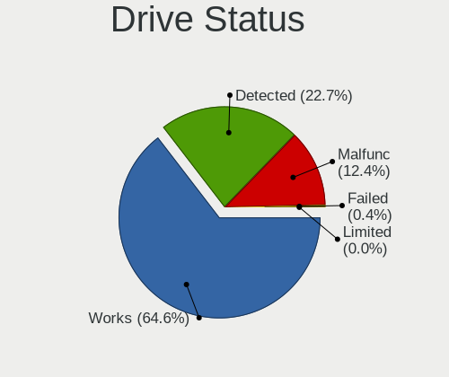

Debian 11 - Tested Hardware & Statistics
----------------------------------------

A project to collect tested hardware configurations for Debian 11 (Beta test).

Anyone can contribute to this report by the [hw-probe](https://github.com/linuxhw/hw-probe) tool:

    sudo -E hw-probe -all -upload

Please submit a probe of your configuration if it's not presented on the page or is rare.

This is a report for all computer types. See also reports for [desktops](/Dist/Debian_11/Desktop/README.md) and [notebooks](/Dist/Debian_11/Notebook/README.md).

Full-feature report is available here: https://linux-hardware.org/?view=trends&rel=debian-11

Contents
--------

* [ Test Cases ](#test-cases)

* [ System ](#system)
  - [ Kernel                   ](#kernel)
  - [ Kernel Family            ](#kernel-family)
  - [ Kernel Major Ver.        ](#kernel-major-ver)
  - [ Arch                     ](#arch)
  - [ DE                       ](#de)
  - [ Display Server           ](#display-server)
  - [ Display Manager          ](#display-manager)
  - [ OS Lang                  ](#os-lang)
  - [ Boot Mode                ](#boot-mode)
  - [ Filesystem               ](#filesystem)
  - [ Part. scheme             ](#part-scheme)
  - [ Dual Boot with Linux/BSD ](#dual-boot-with-linuxbsd)
  - [ Dual Boot (Win)          ](#dual-boot-win)

* [ Board ](#board)
  - [ Vendor                   ](#vendor)
  - [ Model                    ](#model)
  - [ Model Family             ](#model-family)
  - [ MFG Year                 ](#mfg-year)
  - [ Form Factor              ](#form-factor)
  - [ Secure Boot              ](#secure-boot)
  - [ Coreboot                 ](#coreboot)
  - [ RAM Size                 ](#ram-size)
  - [ RAM Used                 ](#ram-used)
  - [ Total Drives             ](#total-drives)
  - [ Has CD-ROM               ](#has-cd-rom)
  - [ Has Ethernet             ](#has-ethernet)
  - [ Has WiFi                 ](#has-wifi)
  - [ Has Bluetooth            ](#has-bluetooth)

* [ Location ](#location)
  - [ Country                  ](#country)
  - [ City                     ](#city)

* [ Drives ](#drives)
  - [ Drive Vendor             ](#drive-vendor)
  - [ Drive Model              ](#drive-model)
  - [ HDD Vendor               ](#hdd-vendor)
  - [ SSD Vendor               ](#ssd-vendor)
  - [ Drive Kind               ](#drive-kind)
  - [ Drive Connector          ](#drive-connector)
  - [ Drive Size               ](#drive-size)
  - [ Space Total              ](#space-total)
  - [ Space Used               ](#space-used)
  - [ Malfunc. Drives          ](#malfunc-drives)
  - [ Malfunc. Drive Vendor    ](#malfunc-drive-vendor)
  - [ Malfunc. HDD Vendor      ](#malfunc-hdd-vendor)
  - [ Malfunc. Drive Kind      ](#malfunc-drive-kind)
  - [ Failed Drives            ](#failed-drives)
  - [ Failed Drive Vendor      ](#failed-drive-vendor)
  - [ Drive Status             ](#drive-status)

* [ Storage controller ](#storage-controller)
  - [ Storage Vendor           ](#storage-vendor)
  - [ Storage Model            ](#storage-model)
  - [ Storage Kind             ](#storage-kind)

* [ Processor ](#processor)
  - [ CPU Vendor               ](#cpu-vendor)
  - [ CPU Model                ](#cpu-model)
  - [ CPU Model Family         ](#cpu-model-family)
  - [ CPU Cores                ](#cpu-cores)
  - [ CPU Sockets              ](#cpu-sockets)
  - [ CPU Threads              ](#cpu-threads)
  - [ CPU Op-Modes             ](#cpu-op-modes)
  - [ CPU Microcode            ](#cpu-microcode)
  - [ CPU Microarch            ](#cpu-microarch)

* [ Graphics ](#graphics)
  - [ GPU Vendor               ](#gpu-vendor)
  - [ GPU Model                ](#gpu-model)
  - [ GPU Combo                ](#gpu-combo)
  - [ GPU Driver               ](#gpu-driver)
  - [ GPU Memory               ](#gpu-memory)

* [ Monitor ](#monitor)
  - [ Monitor Vendor           ](#monitor-vendor)
  - [ Monitor Model            ](#monitor-model)
  - [ Monitor Resolution       ](#monitor-resolution)
  - [ Monitor Diagonal         ](#monitor-diagonal)
  - [ Monitor Width            ](#monitor-width)
  - [ Aspect Ratio             ](#aspect-ratio)
  - [ Monitor Area             ](#monitor-area)
  - [ Pixel Density            ](#pixel-density)
  - [ Multiple Monitors        ](#multiple-monitors)

* [ Network ](#network)
  - [ Net Controller Vendor    ](#net-controller-vendor)
  - [ Net Controller Model     ](#net-controller-model)
  - [ Wireless Vendor          ](#wireless-vendor)
  - [ Wireless Model           ](#wireless-model)
  - [ Ethernet Vendor          ](#ethernet-vendor)
  - [ Ethernet Model           ](#ethernet-model)
  - [ Net Controller Kind      ](#net-controller-kind)
  - [ Used Controller          ](#used-controller)
  - [ NICs                     ](#nics)
  - [ IPv6                     ](#ipv6)

* [ Bluetooth ](#bluetooth)
  - [ Bluetooth Vendor         ](#bluetooth-vendor)
  - [ Bluetooth Model          ](#bluetooth-model)

* [ Sound ](#sound)
  - [ Sound Vendor             ](#sound-vendor)
  - [ Sound Model              ](#sound-model)

* [ Memory ](#memory)
  - [ Memory Vendor            ](#memory-vendor)
  - [ Memory Model             ](#memory-model)
  - [ Memory Kind              ](#memory-kind)
  - [ Memory Form Factor       ](#memory-form-factor)
  - [ Memory Size              ](#memory-size)
  - [ Memory Speed             ](#memory-speed)

* [ Printers & scanners ](#printers--scanners)
  - [ Printer Vendor           ](#printer-vendor)
  - [ Printer Model            ](#printer-model)
  - [ Scanner Vendor           ](#scanner-vendor)
  - [ Scanner Model            ](#scanner-model)

* [ Camera ](#camera)
  - [ Camera Vendor            ](#camera-vendor)
  - [ Camera Model             ](#camera-model)

* [ Security ](#security)
  - [ Fingerprint Vendor       ](#fingerprint-vendor)
  - [ Fingerprint Model        ](#fingerprint-model)
  - [ Chipcard Vendor          ](#chipcard-vendor)
  - [ Chipcard Model           ](#chipcard-model)

* [ Unsupported ](#unsupported)
  - [ Unsupported Devices      ](#unsupported-devices)
  - [ Unsupported Device Types ](#unsupported-device-types)

Test Cases
----------

| Vendor        | Model                       | Form-Factor | Probe                                                      | Date         |
|---------------|-----------------------------|-------------|------------------------------------------------------------|--------------|
| Pegatron      | TRUCKEE                     | Desktop     | [68f16e9542](https://linux-hardware.org/?probe=68f16e9542) | Sep 01, 2021 |
| Dell          | 094MXG A00                  | All in one  | [7fe3c46d72](https://linux-hardware.org/?probe=7fe3c46d72) | Sep 01, 2021 |
| Timi          | TM1613                      | Notebook    | [f25eeca060](https://linux-hardware.org/?probe=f25eeca060) | Sep 01, 2021 |
| Lenovo        | ThinkPad T430 2349S9E       | Notebook    | [bc224fb15f](https://linux-hardware.org/?probe=bc224fb15f) | Aug 31, 2021 |
| Lenovo        | ThinkPad 13 2nd Gen 20J1... | Notebook    | [9510c18df6](https://linux-hardware.org/?probe=9510c18df6) | Aug 31, 2021 |
| ASRock        | H61M-VG4                    | Desktop     | [6521e0d6be](https://linux-hardware.org/?probe=6521e0d6be) | Aug 31, 2021 |
| HP            | Laptop 15s-eq1xxx           | Notebook    | [783955d696](https://linux-hardware.org/?probe=783955d696) | Aug 31, 2021 |
| Lenovo        | ThinkPad X250 20CLS2DK00    | Notebook    | [db94fcaf10](https://linux-hardware.org/?probe=db94fcaf10) | Aug 31, 2021 |
| ASRock        | H470M-HVS                   | Desktop     | [9c31643811](https://linux-hardware.org/?probe=9c31643811) | Aug 31, 2021 |
| Apple         | MacBookAir7,2               | Notebook    | [baf38e8736](https://linux-hardware.org/?probe=baf38e8736) | Aug 31, 2021 |
| Lenovo        | ThinkPad T430 2349V4B       | Notebook    | [33a45018fc](https://linux-hardware.org/?probe=33a45018fc) | Aug 31, 2021 |
| Pine Micro... | Pine64+                     | Soc         | [433d54a30d](https://linux-hardware.org/?probe=433d54a30d) | Aug 31, 2021 |
| ASRock        | H470M-HVS                   | Desktop     | [37c3e457bc](https://linux-hardware.org/?probe=37c3e457bc) | Aug 31, 2021 |
| ASRock        | H470M-HVS                   | Desktop     | [0d38048f46](https://linux-hardware.org/?probe=0d38048f46) | Aug 31, 2021 |
| Intel         | DH77KC AAG39641-400         | Desktop     | [d7eaf975a0](https://linux-hardware.org/?probe=d7eaf975a0) | Aug 31, 2021 |
| ASRock        | H470M-HVS                   | Desktop     | [df9b303eec](https://linux-hardware.org/?probe=df9b303eec) | Aug 31, 2021 |
| ASRock        | H470M-HVS                   | Desktop     | [d9af23fb86](https://linux-hardware.org/?probe=d9af23fb86) | Aug 31, 2021 |
| AOpen         | D1001 C26361-D1001          | Desktop     | [e27239d870](https://linux-hardware.org/?probe=e27239d870) | Aug 31, 2021 |
| ASUSTek       | B85M-G                      | Desktop     | [1470c8cc7f](https://linux-hardware.org/?probe=1470c8cc7f) | Aug 31, 2021 |
| ASRock        | H470M-HVS                   | Desktop     | [ba7144c0dc](https://linux-hardware.org/?probe=ba7144c0dc) | Aug 31, 2021 |
| ASRock        | H470M-HVS                   | Desktop     | [7204a77b38](https://linux-hardware.org/?probe=7204a77b38) | Aug 31, 2021 |
| Fujitsu Si... | LIFEBOOK S6420              | Notebook    | [b26e82328a](https://linux-hardware.org/?probe=b26e82328a) | Aug 31, 2021 |
| Apple         | MacBookAir7,2               | Notebook    | [70835c3aa7](https://linux-hardware.org/?probe=70835c3aa7) | Aug 30, 2021 |
| HP            | EliteBook 8460p             | Notebook    | [3e22f55c7b](https://linux-hardware.org/?probe=3e22f55c7b) | Aug 30, 2021 |
| Apple         | MacBookAir7,2               | Notebook    | [b73b366bb6](https://linux-hardware.org/?probe=b73b366bb6) | Aug 30, 2021 |
| ASRock        | H470M-HVS                   | Desktop     | [c6a754129a](https://linux-hardware.org/?probe=c6a754129a) | Aug 30, 2021 |
| Toshiba       | Satellite C55-B             | Notebook    | [e1b2dc4810](https://linux-hardware.org/?probe=e1b2dc4810) | Aug 30, 2021 |
| Apple         | MacBookAir7,1               | Notebook    | [e94ab065a3](https://linux-hardware.org/?probe=e94ab065a3) | Aug 30, 2021 |
| ASRock        | H470M-HVS                   | Desktop     | [a251dca266](https://linux-hardware.org/?probe=a251dca266) | Aug 30, 2021 |
| HP            | EliteBook 8460p             | Notebook    | [b1425fa900](https://linux-hardware.org/?probe=b1425fa900) | Aug 30, 2021 |
| Apple         | MacBookAir7,2               | Notebook    | [b5a84f215b](https://linux-hardware.org/?probe=b5a84f215b) | Aug 30, 2021 |
| Apple         | Mac-F2238AC8                | All in one  | [f2dbdea931](https://linux-hardware.org/?probe=f2dbdea931) | Aug 30, 2021 |
| Intel         | DH67BL AAG10189-206         | Desktop     | [b7b3f489f2](https://linux-hardware.org/?probe=b7b3f489f2) | Aug 30, 2021 |
| Apple         | Mac-F2238AC8                | All in one  | [ca46b71791](https://linux-hardware.org/?probe=ca46b71791) | Aug 30, 2021 |
| Gigabyte      | H81M-S2V                    | Desktop     | [d255f48a39](https://linux-hardware.org/?probe=d255f48a39) | Aug 30, 2021 |
| ASRock        | H61M-VG4                    | Desktop     | [dc0abe4fcd](https://linux-hardware.org/?probe=dc0abe4fcd) | Aug 30, 2021 |
| ASRock        | H61M-VG4                    | Desktop     | [fc61c24624](https://linux-hardware.org/?probe=fc61c24624) | Aug 30, 2021 |
| Gigabyte      | H81M-S2V                    | Desktop     | [9d1b86643e](https://linux-hardware.org/?probe=9d1b86643e) | Aug 30, 2021 |
| Lenovo        | ThinkPad T61 7661BF3        | Notebook    | [69b6d76471](https://linux-hardware.org/?probe=69b6d76471) | Aug 30, 2021 |
| Lenovo        | 312D SDK0J40697 WIN 3305... | Mini pc     | [acbb96ba48](https://linux-hardware.org/?probe=acbb96ba48) | Aug 29, 2021 |
| ASUSTek       | K56CB                       | Notebook    | [1a44fc7e8f](https://linux-hardware.org/?probe=1a44fc7e8f) | Aug 29, 2021 |
| Lenovo        | IdeaPad 330-15ICH 81FK      | Notebook    | [6fcfbde79d](https://linux-hardware.org/?probe=6fcfbde79d) | Aug 29, 2021 |
| HP            | Pavilion Gaming Laptop 1... | Notebook    | [17ae4593ea](https://linux-hardware.org/?probe=17ae4593ea) | Aug 28, 2021 |
| ASUSTek       | PRIME B550-PLUS             | Desktop     | [b9595196ea](https://linux-hardware.org/?probe=b9595196ea) | Aug 28, 2021 |
| HP            | EliteBook 840 G3            | Notebook    | [8625d6f2f1](https://linux-hardware.org/?probe=8625d6f2f1) | Aug 28, 2021 |
| NC9VL         | 1.0                         | Desktop     | [9c4b8ad466](https://linux-hardware.org/?probe=9c4b8ad466) | Aug 28, 2021 |
| HP            | 0B50 Rev.A                  | All in one  | [4701ae6e71](https://linux-hardware.org/?probe=4701ae6e71) | Aug 27, 2021 |
| MSI           | B150A GAMING PRO            | Desktop     | [06de6cd826](https://linux-hardware.org/?probe=06de6cd826) | Aug 27, 2021 |
| ASRock        | H470M-HVS                   | Desktop     | [46eacf8d5c](https://linux-hardware.org/?probe=46eacf8d5c) | Aug 27, 2021 |
| Apple         | Mac-F2238AC8                | All in one  | [202fe67100](https://linux-hardware.org/?probe=202fe67100) | Aug 27, 2021 |
| Apple         | Mac-F2238AC8                | All in one  | [321f53f711](https://linux-hardware.org/?probe=321f53f711) | Aug 27, 2021 |
| Intel         | DN2820FYK H24582-201        | Desktop     | [06f4334a82](https://linux-hardware.org/?probe=06f4334a82) | Aug 27, 2021 |
| Apple         | MacBookAir7,2               | Notebook    | [d215521170](https://linux-hardware.org/?probe=d215521170) | Aug 27, 2021 |
| Lenovo        | ThinkPad 13 2nd Gen 20J1... | Notebook    | [2c85ec0205](https://linux-hardware.org/?probe=2c85ec0205) | Aug 27, 2021 |
| ASUSTek       | WS X299 SAGE                | Desktop     | [7f3a68dd2a](https://linux-hardware.org/?probe=7f3a68dd2a) | Aug 27, 2021 |
| ASRock        | H470M-HVS                   | Desktop     | [2737cfb67d](https://linux-hardware.org/?probe=2737cfb67d) | Aug 27, 2021 |
| ASRock        | H470M-HVS                   | Desktop     | [dc9428d8b4](https://linux-hardware.org/?probe=dc9428d8b4) | Aug 27, 2021 |
| Lenovo        | ThinkPad T440p 20AN006GU... | Notebook    | [bca7704bb0](https://linux-hardware.org/?probe=bca7704bb0) | Aug 27, 2021 |
| Apple         | MacBookAir7,2               | Notebook    | [14747d88b3](https://linux-hardware.org/?probe=14747d88b3) | Aug 26, 2021 |
| Lenovo        | IdeaPad 320-15ABR 80XS      | Notebook    | [87904cbe92](https://linux-hardware.org/?probe=87904cbe92) | Aug 26, 2021 |
| Apple         | MacBookAir7,2               | Notebook    | [1c2e910793](https://linux-hardware.org/?probe=1c2e910793) | Aug 26, 2021 |
| Apple         | MacBookAir7,1               | Notebook    | [4a69118897](https://linux-hardware.org/?probe=4a69118897) | Aug 26, 2021 |
| Apple         | MacBookAir7,1               | Notebook    | [474216fba9](https://linux-hardware.org/?probe=474216fba9) | Aug 26, 2021 |
| Apple         | MacBookAir7,2               | Notebook    | [76d9383f33](https://linux-hardware.org/?probe=76d9383f33) | Aug 26, 2021 |
| Apple         | MacBookAir7,2               | Notebook    | [213d3f817b](https://linux-hardware.org/?probe=213d3f817b) | Aug 26, 2021 |
| HP            | 0B0Ch                       | Desktop     | [b5933fde35](https://linux-hardware.org/?probe=b5933fde35) | Aug 26, 2021 |
| YJKC          | vBOOK Plus RVP7             | Notebook    | [8c051a0ce9](https://linux-hardware.org/?probe=8c051a0ce9) | Aug 26, 2021 |
| Fujitsu       | D3219-A1 S26361-D3219-A1    | Desktop     | [f26ade88cd](https://linux-hardware.org/?probe=f26ade88cd) | Aug 26, 2021 |
| Dell          | 0WR7PY A00                  | Desktop     | [cb25b1811b](https://linux-hardware.org/?probe=cb25b1811b) | Aug 26, 2021 |
| Gigabyte      | AORUS 15G KB                | Notebook    | [6afefe68d7](https://linux-hardware.org/?probe=6afefe68d7) | Aug 26, 2021 |
| Dell          | 0X8DXD A00                  | Desktop     | [8dd8862b4b](https://linux-hardware.org/?probe=8dd8862b4b) | Aug 26, 2021 |
| HP            | ProBook 4530s               | Notebook    | [2b4cab4d7c](https://linux-hardware.org/?probe=2b4cab4d7c) | Aug 25, 2021 |
| Dell          | Inspiron 3537               | Notebook    | [7bab6dd9db](https://linux-hardware.org/?probe=7bab6dd9db) | Aug 25, 2021 |
| HP            | ProBook 450 G7              | Notebook    | [a2f161dee0](https://linux-hardware.org/?probe=a2f161dee0) | Aug 25, 2021 |
| HUAWEI        | WRT-WX9                     | Notebook    | [e1e5a14c77](https://linux-hardware.org/?probe=e1e5a14c77) | Aug 25, 2021 |
| HP            | Spectre x360 Convertible... | Convertible | [16f399259c](https://linux-hardware.org/?probe=16f399259c) | Aug 25, 2021 |
| ASRock        | H470M-HVS                   | Desktop     | [d37f13917f](https://linux-hardware.org/?probe=d37f13917f) | Aug 25, 2021 |
| ASRock        | C2750D4I                    | Desktop     | [6daa3c26bf](https://linux-hardware.org/?probe=6daa3c26bf) | Aug 25, 2021 |
| Gigabyte      | X570 I AORUS PRO WIFI       | Desktop     | [0a79171c9e](https://linux-hardware.org/?probe=0a79171c9e) | Aug 25, 2021 |
| ASUSTek       | P5KPL-CM                    | Desktop     | [feed9e2921](https://linux-hardware.org/?probe=feed9e2921) | Aug 25, 2021 |
| Dell          | Inspiron 15 7000 Gaming     | Notebook    | [3da8591ac6](https://linux-hardware.org/?probe=3da8591ac6) | Aug 25, 2021 |
| HP            | 630                         | Notebook    | [004d2b364d](https://linux-hardware.org/?probe=004d2b364d) | Aug 25, 2021 |
| Biostar       | Hi-Fi A85W                  | Desktop     | [ffb66dafd4](https://linux-hardware.org/?probe=ffb66dafd4) | Aug 25, 2021 |
| AAEON         | MF-001 V1.0                 | Desktop     | [b06c4079a7](https://linux-hardware.org/?probe=b06c4079a7) | Aug 25, 2021 |
| Dell          | Latitude 7490               | Notebook    | [23ad45f1fd](https://linux-hardware.org/?probe=23ad45f1fd) | Aug 25, 2021 |
| AMI           | Aptio CRB                   | Mini pc     | [2882cf9963](https://linux-hardware.org/?probe=2882cf9963) | Aug 25, 2021 |
| Dell          | 040DDP A01                  | Desktop     | [557d74beb9](https://linux-hardware.org/?probe=557d74beb9) | Aug 25, 2021 |
| Apple         | MacBookAir7,2               | Notebook    | [65d82bc8e7](https://linux-hardware.org/?probe=65d82bc8e7) | Aug 24, 2021 |
| Lenovo        | ThinkPad 13 2nd Gen 20J1... | Notebook    | [e1bd0ec7fd](https://linux-hardware.org/?probe=e1bd0ec7fd) | Aug 24, 2021 |
| ASRock        | H470M-HVS                   | Desktop     | [e5c92fe4ad](https://linux-hardware.org/?probe=e5c92fe4ad) | Aug 24, 2021 |
| Apple         | MacBookAir7,2               | Notebook    | [8a72f87e7b](https://linux-hardware.org/?probe=8a72f87e7b) | Aug 24, 2021 |
| ASRock        | H470M-HVS                   | Desktop     | [441b8b892e](https://linux-hardware.org/?probe=441b8b892e) | Aug 24, 2021 |
| ASRock        | P4i65G                      | Desktop     | [43ce3e711f](https://linux-hardware.org/?probe=43ce3e711f) | Aug 24, 2021 |
| ASRock        | H77 Pro4/MVP                | Desktop     | [c2179206a9](https://linux-hardware.org/?probe=c2179206a9) | Aug 24, 2021 |
| Apple         | MacBookAir7,1               | Notebook    | [1f257714a9](https://linux-hardware.org/?probe=1f257714a9) | Aug 24, 2021 |
| Dell          | Inspiron 15 7000 Gaming     | Notebook    | [102aea0211](https://linux-hardware.org/?probe=102aea0211) | Aug 24, 2021 |
| Unknown       | 1.0                         | Desktop     | [5e638360a8](https://linux-hardware.org/?probe=5e638360a8) | Aug 24, 2021 |
| HP            | Laptop 15s-fq2xxx           | Notebook    | [f755838fd8](https://linux-hardware.org/?probe=f755838fd8) | Aug 24, 2021 |
| Apple         | MacBookAir7,2               | Notebook    | [5cc74103a8](https://linux-hardware.org/?probe=5cc74103a8) | Aug 24, 2021 |
| HP            | 250 G4                      | Notebook    | [5d47aa9804](https://linux-hardware.org/?probe=5d47aa9804) | Aug 24, 2021 |
| ASUSTek       | UX430UAR                    | Notebook    | [77ce457de4](https://linux-hardware.org/?probe=77ce457de4) | Aug 24, 2021 |
| HP            | Laptop 14-cm0xxx            | Notebook    | [df0fa8e968](https://linux-hardware.org/?probe=df0fa8e968) | Aug 24, 2021 |
| ASUSTek       | GA35DX                      | Desktop     | [3843ea048e](https://linux-hardware.org/?probe=3843ea048e) | Aug 24, 2021 |
| Sony          | VPCF115FM                   | Notebook    | [9f9abf79b2](https://linux-hardware.org/?probe=9f9abf79b2) | Aug 23, 2021 |
| Apple         | MacBookAir7,2               | Notebook    | [8a88eabb1c](https://linux-hardware.org/?probe=8a88eabb1c) | Aug 23, 2021 |
| Apple         | MacBookAir7,2               | Notebook    | [c4ecd51a21](https://linux-hardware.org/?probe=c4ecd51a21) | Aug 23, 2021 |
| HP            | Laptop 15s-eq1xxx           | Notebook    | [1c9d3bb8b4](https://linux-hardware.org/?probe=1c9d3bb8b4) | Aug 23, 2021 |
| HP            | ProBook 450 G8 Notebook ... | Notebook    | [45ec27282a](https://linux-hardware.org/?probe=45ec27282a) | Aug 23, 2021 |
| ASRock        | H470M-HVS                   | Desktop     | [e92004f46a](https://linux-hardware.org/?probe=e92004f46a) | Aug 23, 2021 |
| Lenovo        | ThinkBook 15-IML 20RW       | Notebook    | [14af647cc5](https://linux-hardware.org/?probe=14af647cc5) | Aug 23, 2021 |
| ASRock        | H470M-HVS                   | Desktop     | [06c9a1ed3a](https://linux-hardware.org/?probe=06c9a1ed3a) | Aug 23, 2021 |
| Apple         | MacBookAir7,2               | Notebook    | [5bc9372587](https://linux-hardware.org/?probe=5bc9372587) | Aug 23, 2021 |
| Apple         | MacBookAir7,2               | Notebook    | [8bcb9e62e1](https://linux-hardware.org/?probe=8bcb9e62e1) | Aug 23, 2021 |
| Apple         | MacBookAir7,2               | Notebook    | [6c44c4f7e3](https://linux-hardware.org/?probe=6c44c4f7e3) | Aug 23, 2021 |
| Google        | Enguarde                    | Notebook    | [12a2003770](https://linux-hardware.org/?probe=12a2003770) | Aug 23, 2021 |
| Apple         | MacBookAir7,1               | Notebook    | [7f190e4ed2](https://linux-hardware.org/?probe=7f190e4ed2) | Aug 23, 2021 |
| Apple         | MacBookAir7,1               | Notebook    | [2db5cafda3](https://linux-hardware.org/?probe=2db5cafda3) | Aug 23, 2021 |
| Apple         | MacBookAir7,1               | Notebook    | [abcab36e0c](https://linux-hardware.org/?probe=abcab36e0c) | Aug 23, 2021 |
| Apple         | MacBookAir7,1               | Notebook    | [f3ccb91568](https://linux-hardware.org/?probe=f3ccb91568) | Aug 23, 2021 |
| Apple         | MacBookAir7,1               | Notebook    | [0d8fa16f47](https://linux-hardware.org/?probe=0d8fa16f47) | Aug 23, 2021 |
| Apple         | MacBookAir7,1               | Notebook    | [680e8106ec](https://linux-hardware.org/?probe=680e8106ec) | Aug 23, 2021 |
| Apple         | MacBookAir7,1               | Notebook    | [c18b0215e9](https://linux-hardware.org/?probe=c18b0215e9) | Aug 23, 2021 |
| Apple         | MacBookAir7,1               | Notebook    | [fcc821b941](https://linux-hardware.org/?probe=fcc821b941) | Aug 23, 2021 |
| Apple         | MacBookAir7,1               | Notebook    | [59f760dbb9](https://linux-hardware.org/?probe=59f760dbb9) | Aug 23, 2021 |
| Apple         | MacBookAir7,1               | Notebook    | [e22a8e2ea4](https://linux-hardware.org/?probe=e22a8e2ea4) | Aug 23, 2021 |
| Apple         | MacBookAir7,1               | Notebook    | [4fc69342da](https://linux-hardware.org/?probe=4fc69342da) | Aug 23, 2021 |
| Apple         | MacBookAir7,1               | Notebook    | [f2fcae5696](https://linux-hardware.org/?probe=f2fcae5696) | Aug 23, 2021 |
| Apple         | MacBookAir7,1               | Notebook    | [2f823b2f52](https://linux-hardware.org/?probe=2f823b2f52) | Aug 23, 2021 |
| Apple         | MacBookAir7,1               | Notebook    | [adf5b71331](https://linux-hardware.org/?probe=adf5b71331) | Aug 23, 2021 |
| Apple         | MacBookAir7,1               | Notebook    | [618c1c7838](https://linux-hardware.org/?probe=618c1c7838) | Aug 23, 2021 |
| Apple         | MacBookAir7,1               | Notebook    | [0dff1056d5](https://linux-hardware.org/?probe=0dff1056d5) | Aug 23, 2021 |
| Apple         | MacBookAir7,1               | Notebook    | [fb0cf0a7a3](https://linux-hardware.org/?probe=fb0cf0a7a3) | Aug 23, 2021 |
| Apple         | MacBookAir7,1               | Notebook    | [6b9f550210](https://linux-hardware.org/?probe=6b9f550210) | Aug 23, 2021 |
| Apple         | MacBookAir7,1               | Notebook    | [4b22440e91](https://linux-hardware.org/?probe=4b22440e91) | Aug 23, 2021 |
| Apple         | MacBookAir7,1               | Notebook    | [6bab7cdc7c](https://linux-hardware.org/?probe=6bab7cdc7c) | Aug 23, 2021 |
| Apple         | MacBookAir7,1               | Notebook    | [d2a08022bd](https://linux-hardware.org/?probe=d2a08022bd) | Aug 23, 2021 |
| Apple         | MacBookAir7,1               | Notebook    | [f39d94cf1b](https://linux-hardware.org/?probe=f39d94cf1b) | Aug 23, 2021 |
| Apple         | MacBookAir7,1               | Notebook    | [e35bbfda2d](https://linux-hardware.org/?probe=e35bbfda2d) | Aug 23, 2021 |
| Apple         | MacBookAir7,1               | Notebook    | [60170675ca](https://linux-hardware.org/?probe=60170675ca) | Aug 23, 2021 |
| Apple         | MacBookAir7,1               | Notebook    | [64a6aa27db](https://linux-hardware.org/?probe=64a6aa27db) | Aug 23, 2021 |
| Apple         | MacBookAir7,1               | Notebook    | [06b1dab7a0](https://linux-hardware.org/?probe=06b1dab7a0) | Aug 23, 2021 |
| Apple         | MacBookAir7,1               | Notebook    | [cec5c36945](https://linux-hardware.org/?probe=cec5c36945) | Aug 23, 2021 |
| Apple         | MacBookAir7,1               | Notebook    | [6f38e35f9a](https://linux-hardware.org/?probe=6f38e35f9a) | Aug 23, 2021 |
| ASUSTek       | P5KPL-CM                    | Desktop     | [06234ebe05](https://linux-hardware.org/?probe=06234ebe05) | Aug 23, 2021 |
| Lenovo        | ThinkPad X390 Yoga 20NQS... | Convertible | [3c03ce796f](https://linux-hardware.org/?probe=3c03ce796f) | Aug 23, 2021 |
| MSI           | Z270-A PRO                  | Desktop     | [73b14ecca0](https://linux-hardware.org/?probe=73b14ecca0) | Aug 23, 2021 |
| Lenovo        | IdeaPad Flex 5 14ARE05 8... | Convertible | [4a647bfabc](https://linux-hardware.org/?probe=4a647bfabc) | Aug 23, 2021 |
| AMI           | Aptio CRB                   | Mini pc     | [e70b15e489](https://linux-hardware.org/?probe=e70b15e489) | Aug 22, 2021 |
| HP            | EliteBook 840 G4            | Notebook    | [ebe40b3244](https://linux-hardware.org/?probe=ebe40b3244) | Aug 22, 2021 |
| Lenovo        | IdeaPad 320-15ABR 80XS      | Notebook    | [d98bdb0d1c](https://linux-hardware.org/?probe=d98bdb0d1c) | Aug 22, 2021 |
| Dell          | Inspiron 15 7000 Gaming     | Notebook    | [d688bffa01](https://linux-hardware.org/?probe=d688bffa01) | Aug 22, 2021 |
| Dell          | Inspiron 15 7000 Gaming     | Notebook    | [3d52884b6e](https://linux-hardware.org/?probe=3d52884b6e) | Aug 22, 2021 |
| ASUSTek       | G771JM                      | Notebook    | [57b847b12c](https://linux-hardware.org/?probe=57b847b12c) | Aug 22, 2021 |
| ASUSTek       | G771JM                      | Notebook    | [db4b9878fa](https://linux-hardware.org/?probe=db4b9878fa) | Aug 22, 2021 |
| Dell          | Inspiron 6000               | Notebook    | [67c6b36361](https://linux-hardware.org/?probe=67c6b36361) | Aug 22, 2021 |
| ASUSTek       | TUF GAMING X570-PRO         | Desktop     | [eea45758b7](https://linux-hardware.org/?probe=eea45758b7) | Aug 22, 2021 |
| Dell          | Inspiron 3593               | Notebook    | [dfed5d8b7a](https://linux-hardware.org/?probe=dfed5d8b7a) | Aug 21, 2021 |
| HP            | 085Ch                       | Desktop     | [2e649d07a0](https://linux-hardware.org/?probe=2e649d07a0) | Aug 21, 2021 |
| Dell          | Latitude E7470              | Notebook    | [e954672cb2](https://linux-hardware.org/?probe=e954672cb2) | Aug 21, 2021 |
| HP            | 085Ch                       | Desktop     | [c5b36c5187](https://linux-hardware.org/?probe=c5b36c5187) | Aug 21, 2021 |
| Microsoft     | Surface Go                  | Tablet      | [4d43bca615](https://linux-hardware.org/?probe=4d43bca615) | Aug 21, 2021 |
| Lenovo        | IdeaPad Y500 20193          | Notebook    | [5b2d90a434](https://linux-hardware.org/?probe=5b2d90a434) | Aug 21, 2021 |
| ASRock        | Z97 Pro3                    | Desktop     | [0f9abf9c63](https://linux-hardware.org/?probe=0f9abf9c63) | Aug 21, 2021 |
| ASUSTek       | TUF GAMING X570-PRO         | Desktop     | [7f83e1b3c8](https://linux-hardware.org/?probe=7f83e1b3c8) | Aug 21, 2021 |
| HP            | 14s-dq2003nw                | Notebook    | [f4dcd70da5](https://linux-hardware.org/?probe=f4dcd70da5) | Aug 21, 2021 |
| Lenovo        | ThinkPad E570 20H500B4GE    | Notebook    | [be964b556b](https://linux-hardware.org/?probe=be964b556b) | Aug 21, 2021 |
| ASUSTek       | ROG Zephyrus G14 GA401QM... | Notebook    | [5ecdc39ac1](https://linux-hardware.org/?probe=5ecdc39ac1) | Aug 21, 2021 |
| ASUSTek       | P5B SE                      | Desktop     | [81634fcb22](https://linux-hardware.org/?probe=81634fcb22) | Aug 21, 2021 |
| Dell          | Precision 7520              | Notebook    | [372d627a69](https://linux-hardware.org/?probe=372d627a69) | Aug 21, 2021 |
| MSI           | Z270-A PRO                  | Desktop     | [e59c9482f6](https://linux-hardware.org/?probe=e59c9482f6) | Aug 21, 2021 |
| Apple         | MacBookAir7,1               | Notebook    | [daa01f79aa](https://linux-hardware.org/?probe=daa01f79aa) | Aug 20, 2021 |
| Apple         | MacBookAir7,1               | Notebook    | [a96a7ada4f](https://linux-hardware.org/?probe=a96a7ada4f) | Aug 20, 2021 |
| Apple         | MacBookAir7,1               | Notebook    | [c8305c0d4c](https://linux-hardware.org/?probe=c8305c0d4c) | Aug 20, 2021 |
| Apple         | MacBookAir7,1               | Notebook    | [77359352d0](https://linux-hardware.org/?probe=77359352d0) | Aug 20, 2021 |
| Apple         | MacBookAir7,2               | Notebook    | [5312257240](https://linux-hardware.org/?probe=5312257240) | Aug 20, 2021 |
| Apple         | MacBookAir7,1               | Notebook    | [75e262ddba](https://linux-hardware.org/?probe=75e262ddba) | Aug 20, 2021 |
| Apple         | MacBookAir7,1               | Notebook    | [bd216572a3](https://linux-hardware.org/?probe=bd216572a3) | Aug 20, 2021 |
| Apple         | MacBookAir7,1               | Notebook    | [e57aeadfef](https://linux-hardware.org/?probe=e57aeadfef) | Aug 20, 2021 |
| Apple         | MacBookAir7,1               | Notebook    | [7211565d4a](https://linux-hardware.org/?probe=7211565d4a) | Aug 20, 2021 |
| Apple         | MacBookAir7,1               | Notebook    | [1c490522df](https://linux-hardware.org/?probe=1c490522df) | Aug 20, 2021 |
| Apple         | MacBookAir7,1               | Notebook    | [16f0b9c14a](https://linux-hardware.org/?probe=16f0b9c14a) | Aug 20, 2021 |
| Apple         | MacBookAir7,1               | Notebook    | [691bb379e5](https://linux-hardware.org/?probe=691bb379e5) | Aug 20, 2021 |
| Apple         | MacBookAir7,1               | Notebook    | [fe880ac0c8](https://linux-hardware.org/?probe=fe880ac0c8) | Aug 20, 2021 |
| Supermicro    | X10SLM-F                    | Server      | [801ee74858](https://linux-hardware.org/?probe=801ee74858) | Aug 20, 2021 |
| Lenovo        | ThinkPad 13 2nd Gen 20J1... | Notebook    | [a5a146e42a](https://linux-hardware.org/?probe=a5a146e42a) | Aug 20, 2021 |
| HP            | ProLiant DL360 G7           | Server      | [580838bf3c](https://linux-hardware.org/?probe=580838bf3c) | Aug 20, 2021 |
| ASRock        | H470M-HVS                   | Desktop     | [cba7d82942](https://linux-hardware.org/?probe=cba7d82942) | Aug 20, 2021 |
| ASRock        | H470M-HVS                   | Desktop     | [62068f391f](https://linux-hardware.org/?probe=62068f391f) | Aug 20, 2021 |
| Apple         | MacBookAir7,2               | Notebook    | [c60ef3fa1e](https://linux-hardware.org/?probe=c60ef3fa1e) | Aug 20, 2021 |
| Supermicro    | X10DRW-iT                   | Server      | [aaeee85be7](https://linux-hardware.org/?probe=aaeee85be7) | Aug 20, 2021 |
| Timi          | TM1612                      | Notebook    | [485caf5846](https://linux-hardware.org/?probe=485caf5846) | Aug 20, 2021 |
| ASRock        | H470M-HVS                   | Desktop     | [c980f2d201](https://linux-hardware.org/?probe=c980f2d201) | Aug 20, 2021 |
| Lenovo        | V510-15IKB 80WQ             | Notebook    | [2a61705899](https://linux-hardware.org/?probe=2a61705899) | Aug 20, 2021 |
| Dell          | 0Y2K8N A01                  | Desktop     | [6b0fd02c91](https://linux-hardware.org/?probe=6b0fd02c91) | Aug 20, 2021 |
| Intel         | DG33BU AAD79951-407         | Desktop     | [17c70c7886](https://linux-hardware.org/?probe=17c70c7886) | Aug 19, 2021 |
| SLIMBOOK      | TITAN                       | Notebook    | [a2abd981d1](https://linux-hardware.org/?probe=a2abd981d1) | Aug 19, 2021 |
| Apple         | MacBookAir7,2               | Notebook    | [1ce6738560](https://linux-hardware.org/?probe=1ce6738560) | Aug 19, 2021 |
| Apple         | MacBookAir7,2               | Notebook    | [e134a1f7c3](https://linux-hardware.org/?probe=e134a1f7c3) | Aug 19, 2021 |
| HP            | 339A                        | Desktop     | [57d5bbd1e4](https://linux-hardware.org/?probe=57d5bbd1e4) | Aug 19, 2021 |
| RuggedPC      | Caterpillar T20             | Tablet      | [1bf2275be4](https://linux-hardware.org/?probe=1bf2275be4) | Aug 19, 2021 |
| Apple         | MacBookAir7,2               | Notebook    | [87fa430aab](https://linux-hardware.org/?probe=87fa430aab) | Aug 19, 2021 |
| Gigabyte      | A320M-S2H-CF                | Desktop     | [2151b5cdae](https://linux-hardware.org/?probe=2151b5cdae) | Aug 19, 2021 |
| HP            | 1587h                       | Desktop     | [3ddbdb3101](https://linux-hardware.org/?probe=3ddbdb3101) | Aug 19, 2021 |
| ASRock        | H470M-HVS                   | Desktop     | [0489699bc4](https://linux-hardware.org/?probe=0489699bc4) | Aug 19, 2021 |
| MSI           | B450M PRO-M2 MAX            | Desktop     | [cc54b8955c](https://linux-hardware.org/?probe=cc54b8955c) | Aug 19, 2021 |
| ASRock        | H470M-HVS                   | Desktop     | [757e261c56](https://linux-hardware.org/?probe=757e261c56) | Aug 19, 2021 |
| Lenovo        | MAHOBAY                     | Desktop     | [df15656fce](https://linux-hardware.org/?probe=df15656fce) | Aug 19, 2021 |
| Apple         | MacBookAir7,2               | Notebook    | [c989eac16b](https://linux-hardware.org/?probe=c989eac16b) | Aug 18, 2021 |
| Apple         | MacBookAir7,2               | Notebook    | [3169e477dd](https://linux-hardware.org/?probe=3169e477dd) | Aug 18, 2021 |
| Apple         | MacBookAir7,2               | Notebook    | [5fcb7fdb26](https://linux-hardware.org/?probe=5fcb7fdb26) | Aug 18, 2021 |
| Apple         | MacBookAir7,2               | Notebook    | [7afbba35b0](https://linux-hardware.org/?probe=7afbba35b0) | Aug 18, 2021 |
| Apple         | MacBookAir7,2               | Notebook    | [f1d159bbd1](https://linux-hardware.org/?probe=f1d159bbd1) | Aug 18, 2021 |
| Apple         | MacBookAir7,2               | Notebook    | [38e8211556](https://linux-hardware.org/?probe=38e8211556) | Aug 18, 2021 |
| Apple         | MacBookAir7,2               | Notebook    | [bd587e5998](https://linux-hardware.org/?probe=bd587e5998) | Aug 18, 2021 |
| Apple         | MacBookAir7,2               | Notebook    | [3fa54711ec](https://linux-hardware.org/?probe=3fa54711ec) | Aug 18, 2021 |
| Apple         | MacBookAir7,2               | Notebook    | [4a7f287161](https://linux-hardware.org/?probe=4a7f287161) | Aug 18, 2021 |
| ASUSTek       | ROG STRIX B450-F GAMING     | Desktop     | [6f5485edfc](https://linux-hardware.org/?probe=6f5485edfc) | Aug 18, 2021 |
| Apple         | MacBookAir7,2               | Notebook    | [fed5f28778](https://linux-hardware.org/?probe=fed5f28778) | Aug 18, 2021 |
| Apple         | MacBookAir7,2               | Notebook    | [0ba8599928](https://linux-hardware.org/?probe=0ba8599928) | Aug 18, 2021 |
| Apple         | MacBookAir7,2               | Notebook    | [e31d43b39d](https://linux-hardware.org/?probe=e31d43b39d) | Aug 18, 2021 |
| Apple         | MacBookAir7,2               | Notebook    | [703cdcf766](https://linux-hardware.org/?probe=703cdcf766) | Aug 18, 2021 |
| Apple         | MacBookAir7,2               | Notebook    | [9b8ce55c3d](https://linux-hardware.org/?probe=9b8ce55c3d) | Aug 18, 2021 |
| Apple         | MacBookAir7,2               | Notebook    | [2b4af51f46](https://linux-hardware.org/?probe=2b4af51f46) | Aug 18, 2021 |
| Apple         | MacBookAir7,2               | Notebook    | [b802b4a25b](https://linux-hardware.org/?probe=b802b4a25b) | Aug 18, 2021 |
| Google        | Enguarde                    | Notebook    | [cb421b796b](https://linux-hardware.org/?probe=cb421b796b) | Aug 18, 2021 |
| Apple         | MacBookAir7,2               | Notebook    | [f6c7230675](https://linux-hardware.org/?probe=f6c7230675) | Aug 18, 2021 |
| Google        | Enguarde                    | Notebook    | [7116839a4b](https://linux-hardware.org/?probe=7116839a4b) | Aug 18, 2021 |
| Google        | Enguarde                    | Notebook    | [04817bfb7f](https://linux-hardware.org/?probe=04817bfb7f) | Aug 18, 2021 |
| ASUSTek       | ROG STRIX B550-E GAMING     | Desktop     | [1fce0ab0e8](https://linux-hardware.org/?probe=1fce0ab0e8) | Aug 18, 2021 |
| Google        | Enguarde                    | Notebook    | [92b401a705](https://linux-hardware.org/?probe=92b401a705) | Aug 18, 2021 |
| Google        | Enguarde                    | Notebook    | [f2a438a9be](https://linux-hardware.org/?probe=f2a438a9be) | Aug 18, 2021 |
| Apple         | MacBookAir7,2               | Notebook    | [c9239b499b](https://linux-hardware.org/?probe=c9239b499b) | Aug 18, 2021 |
| Apple         | MacBookAir7,2               | Notebook    | [b708a97ef1](https://linux-hardware.org/?probe=b708a97ef1) | Aug 18, 2021 |
| Lenovo        | Board                       | Desktop     | [3de8569fe7](https://linux-hardware.org/?probe=3de8569fe7) | Aug 18, 2021 |
| Apple         | MacBookAir7,2               | Notebook    | [31dc792a8b](https://linux-hardware.org/?probe=31dc792a8b) | Aug 18, 2021 |
| Apple         | MacBookAir7,2               | Notebook    | [76a48b344d](https://linux-hardware.org/?probe=76a48b344d) | Aug 18, 2021 |
| Apple         | MacBookAir7,2               | Notebook    | [244aba47d4](https://linux-hardware.org/?probe=244aba47d4) | Aug 18, 2021 |
| ASUSTek       | H81M-R                      | Desktop     | [8598ad2248](https://linux-hardware.org/?probe=8598ad2248) | Aug 18, 2021 |
| Google        | Enguarde                    | Notebook    | [b2391216c6](https://linux-hardware.org/?probe=b2391216c6) | Aug 18, 2021 |
| Google        | Enguarde                    | Notebook    | [53b311c24c](https://linux-hardware.org/?probe=53b311c24c) | Aug 18, 2021 |
| Google        | Enguarde                    | Notebook    | [61de56951c](https://linux-hardware.org/?probe=61de56951c) | Aug 18, 2021 |
| Google        | Enguarde                    | Notebook    | [7fd7f1ea77](https://linux-hardware.org/?probe=7fd7f1ea77) | Aug 18, 2021 |
| Google        | Enguarde                    | Notebook    | [2a090f8b2a](https://linux-hardware.org/?probe=2a090f8b2a) | Aug 18, 2021 |
| Google        | Enguarde                    | Notebook    | [62e4ff915a](https://linux-hardware.org/?probe=62e4ff915a) | Aug 18, 2021 |
| Google        | Enguarde                    | Notebook    | [eada085a33](https://linux-hardware.org/?probe=eada085a33) | Aug 18, 2021 |
| Google        | Enguarde                    | Notebook    | [474e20b9f2](https://linux-hardware.org/?probe=474e20b9f2) | Aug 18, 2021 |
| Intel         | NUC10i3FNB K61362-302       | Mini pc     | [61b641914c](https://linux-hardware.org/?probe=61b641914c) | Aug 18, 2021 |
| ASUSTek       | B150M-K                     | Desktop     | [3f706a2a69](https://linux-hardware.org/?probe=3f706a2a69) | Aug 18, 2021 |
| ASUSTek       | P7H55-M SI                  | Desktop     | [9f3381d34c](https://linux-hardware.org/?probe=9f3381d34c) | Aug 18, 2021 |
| ASRock        | B460 Phantom Gaming 4       | Desktop     | [85cfabd795](https://linux-hardware.org/?probe=85cfabd795) | Aug 18, 2021 |
| ASUSTek       | P7H55-M SI                  | Desktop     | [765f5d340e](https://linux-hardware.org/?probe=765f5d340e) | Aug 18, 2021 |
| ASRock        | J4205-ITX                   | Desktop     | [30de75d2c8](https://linux-hardware.org/?probe=30de75d2c8) | Aug 18, 2021 |
| ASUSTek       | UX305CA                     | Notebook    | [6ab6beca67](https://linux-hardware.org/?probe=6ab6beca67) | Aug 18, 2021 |
| HP            | EliteBook 820 G1            | Notebook    | [c7155dfa07](https://linux-hardware.org/?probe=c7155dfa07) | Aug 18, 2021 |
| ASUSTek       | A68HM-PLUS                  | Desktop     | [b2ed4bc6fe](https://linux-hardware.org/?probe=b2ed4bc6fe) | Aug 18, 2021 |
| Google        | Enguarde                    | Notebook    | [dd0de8b832](https://linux-hardware.org/?probe=dd0de8b832) | Aug 17, 2021 |
| Google        | Enguarde                    | Notebook    | [a6ac2782a6](https://linux-hardware.org/?probe=a6ac2782a6) | Aug 17, 2021 |
| Google        | Enguarde                    | Notebook    | [d32e974941](https://linux-hardware.org/?probe=d32e974941) | Aug 17, 2021 |
| Google        | Enguarde                    | Notebook    | [fe90c1da98](https://linux-hardware.org/?probe=fe90c1da98) | Aug 17, 2021 |
| Apple         | MacBookAir7,1               | Notebook    | [c3d98780bf](https://linux-hardware.org/?probe=c3d98780bf) | Aug 17, 2021 |
| Lenovo        | IdeaPad 5 14ALC05 82LM      | Notebook    | [4b38b9e598](https://linux-hardware.org/?probe=4b38b9e598) | Aug 17, 2021 |
| Apple         | MacBookAir7,1               | Notebook    | [2c30321150](https://linux-hardware.org/?probe=2c30321150) | Aug 17, 2021 |
| Apple         | MacBookAir7,1               | Notebook    | [2f6317ebc5](https://linux-hardware.org/?probe=2f6317ebc5) | Aug 17, 2021 |
| Apple         | MacBookAir7,1               | Notebook    | [707606ff5e](https://linux-hardware.org/?probe=707606ff5e) | Aug 17, 2021 |
| Apple         | MacBookAir7,1               | Notebook    | [0c43bb89c0](https://linux-hardware.org/?probe=0c43bb89c0) | Aug 17, 2021 |
| Apple         | MacBookAir7,1               | Notebook    | [fcb540b848](https://linux-hardware.org/?probe=fcb540b848) | Aug 17, 2021 |
| Lenovo        | ThinkPad 13 2nd Gen 20J1... | Notebook    | [46240d5ef9](https://linux-hardware.org/?probe=46240d5ef9) | Aug 17, 2021 |
| Apple         | MacBookAir7,1               | Notebook    | [6e85db6058](https://linux-hardware.org/?probe=6e85db6058) | Aug 17, 2021 |
| Apple         | MacBookAir7,1               | Notebook    | [2e26440865](https://linux-hardware.org/?probe=2e26440865) | Aug 17, 2021 |
| Apple         | MacBook7,1                  | Notebook    | [5ad65197ad](https://linux-hardware.org/?probe=5ad65197ad) | Aug 17, 2021 |
| Apple         | MacBookAir7,1               | Notebook    | [c185e120f1](https://linux-hardware.org/?probe=c185e120f1) | Aug 17, 2021 |
| Apple         | MacBookAir7,1               | Notebook    | [ee22c0dcc0](https://linux-hardware.org/?probe=ee22c0dcc0) | Aug 17, 2021 |
| Apple         | MacBookAir7,1               | Notebook    | [b3fd5bee39](https://linux-hardware.org/?probe=b3fd5bee39) | Aug 17, 2021 |
| Apple         | MacBookAir7,1               | Notebook    | [d68e571cd0](https://linux-hardware.org/?probe=d68e571cd0) | Aug 17, 2021 |
| Dell          | Latitude 7480               | Notebook    | [49272ed382](https://linux-hardware.org/?probe=49272ed382) | Aug 17, 2021 |
| Gigabyte      | Z97N-WIFI                   | Desktop     | [be9383850e](https://linux-hardware.org/?probe=be9383850e) | Aug 17, 2021 |
| Apple         | MacBookAir7,1               | Notebook    | [28c2f85e9c](https://linux-hardware.org/?probe=28c2f85e9c) | Aug 17, 2021 |
| Apple         | MacBookAir7,1               | Notebook    | [1f8c3f9487](https://linux-hardware.org/?probe=1f8c3f9487) | Aug 17, 2021 |
| Apple         | MacBookAir7,1               | Notebook    | [9f6a737d07](https://linux-hardware.org/?probe=9f6a737d07) | Aug 17, 2021 |
| Apple         | MacBookAir7,1               | Notebook    | [4eb4afec6b](https://linux-hardware.org/?probe=4eb4afec6b) | Aug 17, 2021 |
| Apple         | MacBookAir7,1               | Notebook    | [5949002919](https://linux-hardware.org/?probe=5949002919) | Aug 17, 2021 |
| Apple         | MacBookAir7,1               | Notebook    | [b0d4ba09f6](https://linux-hardware.org/?probe=b0d4ba09f6) | Aug 17, 2021 |
| Apple         | MacBookAir7,1               | Notebook    | [12377bdf65](https://linux-hardware.org/?probe=12377bdf65) | Aug 17, 2021 |
| Apple         | MacBookAir7,1               | Notebook    | [f345284082](https://linux-hardware.org/?probe=f345284082) | Aug 17, 2021 |
| Apple         | MacBookAir7,1               | Notebook    | [6229638b59](https://linux-hardware.org/?probe=6229638b59) | Aug 17, 2021 |
| Apple         | MacBookAir7,1               | Notebook    | [b95e1787ff](https://linux-hardware.org/?probe=b95e1787ff) | Aug 17, 2021 |
| Apple         | MacBookAir7,1               | Notebook    | [f1d344625b](https://linux-hardware.org/?probe=f1d344625b) | Aug 17, 2021 |
| Google        | Enguarde                    | Notebook    | [4d7eaa38ba](https://linux-hardware.org/?probe=4d7eaa38ba) | Aug 17, 2021 |
| Google        | Enguarde                    | Notebook    | [8be28c3080](https://linux-hardware.org/?probe=8be28c3080) | Aug 17, 2021 |
| Lenovo        | ThinkPad X230 2325AT6       | Notebook    | [9e66245080](https://linux-hardware.org/?probe=9e66245080) | Aug 17, 2021 |
| Intel         | NUC7i3BNB J22859-313        | Mini pc     | [d8f20bc651](https://linux-hardware.org/?probe=d8f20bc651) | Aug 17, 2021 |
| Fujitsu Si... | D2840-A1 S26361-D2840-A1    | Desktop     | [7911fbd6a6](https://linux-hardware.org/?probe=7911fbd6a6) | Aug 17, 2021 |
| Google        | Enguarde                    | Notebook    | [cfdf77fbd9](https://linux-hardware.org/?probe=cfdf77fbd9) | Aug 17, 2021 |
| Google        | Enguarde                    | Notebook    | [6e84dfb541](https://linux-hardware.org/?probe=6e84dfb541) | Aug 17, 2021 |
| Google        | Enguarde                    | Notebook    | [2549683d9f](https://linux-hardware.org/?probe=2549683d9f) | Aug 17, 2021 |
| Dell          | Latitude 7410               | Notebook    | [f7f6e5a4d5](https://linux-hardware.org/?probe=f7f6e5a4d5) | Aug 17, 2021 |
| ASUSTek       | 1225B                       | Notebook    | [1dd6877b22](https://linux-hardware.org/?probe=1dd6877b22) | Aug 17, 2021 |
| MSI           | FM2-A55M-E33                | Desktop     | [6972c43e80](https://linux-hardware.org/?probe=6972c43e80) | Aug 17, 2021 |
| ASUSTek       | P5KC                        | Desktop     | [5e2f61d652](https://linux-hardware.org/?probe=5e2f61d652) | Aug 16, 2021 |
| Google        | Enguarde                    | Notebook    | [0bdebdb178](https://linux-hardware.org/?probe=0bdebdb178) | Aug 16, 2021 |
| Intel         | DN2820FYK H24582-201        | Desktop     | [86cf4755a0](https://linux-hardware.org/?probe=86cf4755a0) | Aug 16, 2021 |
| ASUSTek       | ZenBook UX425EA_UX425EA     | Notebook    | [3a489f9498](https://linux-hardware.org/?probe=3a489f9498) | Aug 16, 2021 |
| Lenovo        | ThinkPad 13 2nd Gen 20J1... | Notebook    | [635d3ab3e5](https://linux-hardware.org/?probe=635d3ab3e5) | Aug 16, 2021 |
| Apple         | MacBookAir7,1               | Notebook    | [2e04ae93d1](https://linux-hardware.org/?probe=2e04ae93d1) | Aug 16, 2021 |
| Apple         | MacBookAir7,1               | Notebook    | [dffcb4d4f6](https://linux-hardware.org/?probe=dffcb4d4f6) | Aug 16, 2021 |
| Apple         | MacBookAir7,1               | Notebook    | [e3816a3d3a](https://linux-hardware.org/?probe=e3816a3d3a) | Aug 16, 2021 |
| Apple         | MacBookAir7,2               | Notebook    | [d76cf98938](https://linux-hardware.org/?probe=d76cf98938) | Aug 16, 2021 |
| Apple         | MacBookAir7,2               | Notebook    | [fc7b752ce3](https://linux-hardware.org/?probe=fc7b752ce3) | Aug 16, 2021 |
| Apple         | MacBookAir7,1               | Notebook    | [346d3ca919](https://linux-hardware.org/?probe=346d3ca919) | Aug 16, 2021 |
| Apple         | MacBookAir7,1               | Notebook    | [eb7cdde4b5](https://linux-hardware.org/?probe=eb7cdde4b5) | Aug 16, 2021 |
| Lenovo        | ThinkPad 13 2nd Gen 20J1... | Notebook    | [ae1b239645](https://linux-hardware.org/?probe=ae1b239645) | Aug 16, 2021 |
| Apple         | MacBookAir7,2               | Notebook    | [d7e9112089](https://linux-hardware.org/?probe=d7e9112089) | Aug 16, 2021 |
| Apple         | MacBookAir7,2               | Notebook    | [35ab4c3075](https://linux-hardware.org/?probe=35ab4c3075) | Aug 16, 2021 |
| Lenovo        | ThinkPad E490 20N8001EUS    | Notebook    | [40796d62c2](https://linux-hardware.org/?probe=40796d62c2) | Aug 16, 2021 |
| Apple         | MacBookAir7,2               | Notebook    | [1fa30fb77a](https://linux-hardware.org/?probe=1fa30fb77a) | Aug 16, 2021 |
| Apple         | MacBookAir7,2               | Notebook    | [81f2a65461](https://linux-hardware.org/?probe=81f2a65461) | Aug 16, 2021 |
| Apple         | MacBookAir7,1               | Notebook    | [a54d2e496c](https://linux-hardware.org/?probe=a54d2e496c) | Aug 16, 2021 |
| Apple         | MacBookAir7,2               | Notebook    | [d0581c16e9](https://linux-hardware.org/?probe=d0581c16e9) | Aug 16, 2021 |
| Lenovo        | ThinkPad 13 2nd Gen 20J1... | Notebook    | [4704dd7dc2](https://linux-hardware.org/?probe=4704dd7dc2) | Aug 16, 2021 |
| Apple         | MacBookAir7,1               | Notebook    | [2d48e28c72](https://linux-hardware.org/?probe=2d48e28c72) | Aug 16, 2021 |
| Apple         | MacBookAir7,1               | Notebook    | [dcded26792](https://linux-hardware.org/?probe=dcded26792) | Aug 16, 2021 |
| Lenovo        | ThinkPad 13 2nd Gen 20J1... | Notebook    | [de06f0cb03](https://linux-hardware.org/?probe=de06f0cb03) | Aug 16, 2021 |
| Apple         | MacBookAir7,2               | Notebook    | [3171a06ab2](https://linux-hardware.org/?probe=3171a06ab2) | Aug 16, 2021 |
| Apple         | MacBookAir7,1               | Notebook    | [154d3f4aac](https://linux-hardware.org/?probe=154d3f4aac) | Aug 16, 2021 |
| Lenovo        | ThinkPad 13 20J10046US      | Notebook    | [6943b835e5](https://linux-hardware.org/?probe=6943b835e5) | Aug 16, 2021 |
| Apple         | MacBookAir7,2               | Notebook    | [56e2f75dab](https://linux-hardware.org/?probe=56e2f75dab) | Aug 16, 2021 |
| Lenovo        | ThinkPad 13 2nd Gen 20J1... | Notebook    | [7e070c3cee](https://linux-hardware.org/?probe=7e070c3cee) | Aug 16, 2021 |
| Apple         | MacBookAir7,2               | Notebook    | [be42bbb09a](https://linux-hardware.org/?probe=be42bbb09a) | Aug 16, 2021 |
| Apple         | MacBookAir7,1               | Notebook    | [42a5d4fb48](https://linux-hardware.org/?probe=42a5d4fb48) | Aug 16, 2021 |
| Lenovo        | ThinkPad 13 2nd Gen 20J1... | Notebook    | [845219864e](https://linux-hardware.org/?probe=845219864e) | Aug 16, 2021 |
| Apple         | MacBookAir7,2               | Notebook    | [99531c5564](https://linux-hardware.org/?probe=99531c5564) | Aug 16, 2021 |
| Apple         | MacBookAir7,2               | Notebook    | [7e2e8d1364](https://linux-hardware.org/?probe=7e2e8d1364) | Aug 16, 2021 |
| Lenovo        | ThinkPad 13 2nd Gen 20J1... | Notebook    | [c9b0773c42](https://linux-hardware.org/?probe=c9b0773c42) | Aug 16, 2021 |
| Apple         | MacBookAir7,2               | Notebook    | [947e3524e3](https://linux-hardware.org/?probe=947e3524e3) | Aug 16, 2021 |
| Apple         | MacBookAir7,2               | Notebook    | [a30c87c3fe](https://linux-hardware.org/?probe=a30c87c3fe) | Aug 16, 2021 |
| Lenovo        | ThinkPad 13 2nd Gen 20J1... | Notebook    | [edaac7af9f](https://linux-hardware.org/?probe=edaac7af9f) | Aug 16, 2021 |
| Apple         | MacBookAir7,2               | Notebook    | [94047a5fdc](https://linux-hardware.org/?probe=94047a5fdc) | Aug 16, 2021 |
| Apple         | MacBookAir7,2               | Notebook    | [ccd9ef4a72](https://linux-hardware.org/?probe=ccd9ef4a72) | Aug 16, 2021 |
| Apple         | MacBookAir7,2               | Notebook    | [97aab17694](https://linux-hardware.org/?probe=97aab17694) | Aug 16, 2021 |
| Apple         | MacBookAir7,2               | Notebook    | [3112135337](https://linux-hardware.org/?probe=3112135337) | Aug 16, 2021 |
| Apple         | MacBookAir7,2               | Notebook    | [8da303b571](https://linux-hardware.org/?probe=8da303b571) | Aug 16, 2021 |
| Lenovo        | ThinkPad 13 2nd Gen 20J1... | Notebook    | [449ea4adf6](https://linux-hardware.org/?probe=449ea4adf6) | Aug 16, 2021 |
| Apple         | MacBookAir7,2               | Notebook    | [5bd9662328](https://linux-hardware.org/?probe=5bd9662328) | Aug 16, 2021 |
| Apple         | MacBookAir7,1               | Notebook    | [079ef9affe](https://linux-hardware.org/?probe=079ef9affe) | Aug 16, 2021 |
| Apple         | Mac-F65AE981FFA204ED Mac... | Mini pc     | [3d63a976ed](https://linux-hardware.org/?probe=3d63a976ed) | Aug 16, 2021 |
| Lenovo        | ThinkPad X1 Yoga 2nd 20J... | Convertible | [c847e8acf2](https://linux-hardware.org/?probe=c847e8acf2) | Aug 16, 2021 |
| Apple         | Mac-F2238AC8                | All in one  | [ec9367ff70](https://linux-hardware.org/?probe=ec9367ff70) | Aug 16, 2021 |
| Lenovo        | IdeaPad Flex 5 14ARE05 8... | Convertible | [ea9196699a](https://linux-hardware.org/?probe=ea9196699a) | Aug 16, 2021 |
| Lenovo        | ThinkPad T450s 20BXCTO1W... | Notebook    | [9e81b88eb8](https://linux-hardware.org/?probe=9e81b88eb8) | Aug 16, 2021 |
| Lenovo        | ThinkPad T450s 20BXCTO1W... | Notebook    | [7b614dd679](https://linux-hardware.org/?probe=7b614dd679) | Aug 16, 2021 |
| Acer          | Swift SF114-33              | Notebook    | [2cd1a890fa](https://linux-hardware.org/?probe=2cd1a890fa) | Aug 16, 2021 |
| Dell          | G3 3590                     | Notebook    | [05e11ad38d](https://linux-hardware.org/?probe=05e11ad38d) | Aug 16, 2021 |
| HP            | 630                         | Notebook    | [a57ed15001](https://linux-hardware.org/?probe=a57ed15001) | Aug 15, 2021 |
| ASRock        | B460 Phantom Gaming 4       | Desktop     | [51f9388874](https://linux-hardware.org/?probe=51f9388874) | Aug 15, 2021 |
| ASUSTek       | STRIX B250H GAMING          | Desktop     | [88160f850f](https://linux-hardware.org/?probe=88160f850f) | Aug 15, 2021 |
| HP            | Laptop 15s-eq1xxx           | Notebook    | [31fcb375f4](https://linux-hardware.org/?probe=31fcb375f4) | Aug 15, 2021 |
| ASUSTek       | M5A99X EVO                  | Desktop     | [53aff8d681](https://linux-hardware.org/?probe=53aff8d681) | Aug 15, 2021 |
| Lenovo        | ThinkPad S1 Yoga 20C0S0X... | Notebook    | [e3fd79d228](https://linux-hardware.org/?probe=e3fd79d228) | Aug 15, 2021 |
| ECS           | KBN-I                       | Desktop     | [bbfe1ba1a2](https://linux-hardware.org/?probe=bbfe1ba1a2) | Aug 15, 2021 |
| Apple         | MacBookPro11,3              | Notebook    | [daf1b7a963](https://linux-hardware.org/?probe=daf1b7a963) | Aug 15, 2021 |
| AMI           | Intel                       | Convertible | [c96146f531](https://linux-hardware.org/?probe=c96146f531) | Aug 15, 2021 |
| ASUSTek       | Pro WS X570-ACE             | Desktop     | [987ab1f3bf](https://linux-hardware.org/?probe=987ab1f3bf) | Aug 15, 2021 |
| Hardkernel    | Odroid XU4                  | Soc         | [dbc542cf3e](https://linux-hardware.org/?probe=dbc542cf3e) | Aug 15, 2021 |
| Hardkernel    | Odroid XU4                  | Soc         | [130a903db8](https://linux-hardware.org/?probe=130a903db8) | Aug 15, 2021 |
| Hardkernel    | Odroid XU4                  | Soc         | [7cfc2e8121](https://linux-hardware.org/?probe=7cfc2e8121) | Aug 15, 2021 |
| HUAWEI        | BOHK-WAX9X                  | Notebook    | [0b7f4b2da5](https://linux-hardware.org/?probe=0b7f4b2da5) | Aug 15, 2021 |
| ASUSTek       | ROG STRIX TRX40-XE GAMIN... | Desktop     | [a6e0859eac](https://linux-hardware.org/?probe=a6e0859eac) | Aug 14, 2021 |
| Apple         | MacBookPro11,3              | Notebook    | [f6b6388040](https://linux-hardware.org/?probe=f6b6388040) | Aug 14, 2021 |
| ASUSTek       | ROG STRIX TRX40-XE GAMIN... | Desktop     | [5ce5d800d3](https://linux-hardware.org/?probe=5ce5d800d3) | Aug 14, 2021 |
| ASUSTek       | PRIME Z390-P                | Desktop     | [dfe51161fe](https://linux-hardware.org/?probe=dfe51161fe) | Aug 14, 2021 |
| HP            | Compaq nc6320 (EV073AV)     | Notebook    | [bf6050f750](https://linux-hardware.org/?probe=bf6050f750) | Aug 14, 2021 |
| ASRock        | Z97 Pro3                    | Desktop     | [0e5746a060](https://linux-hardware.org/?probe=0e5746a060) | Aug 14, 2021 |
| Lenovo        | ThinkPad T495 20NJCTO1WW    | Notebook    | [f3506aaa1c](https://linux-hardware.org/?probe=f3506aaa1c) | Aug 14, 2021 |
| Dell          | 0X9M3X A01                  | Desktop     | [b5b9c80c53](https://linux-hardware.org/?probe=b5b9c80c53) | Aug 14, 2021 |
| Dell          | Latitude 7490               | Notebook    | [6ca174eba8](https://linux-hardware.org/?probe=6ca174eba8) | Aug 14, 2021 |
| HP            | 3397                        | Desktop     | [a3425b956c](https://linux-hardware.org/?probe=a3425b956c) | Aug 14, 2021 |
| Dell          | Latitude 7490               | Notebook    | [85cacfa170](https://linux-hardware.org/?probe=85cacfa170) | Aug 13, 2021 |
| Google        | Enguarde                    | Notebook    | [cac72ff077](https://linux-hardware.org/?probe=cac72ff077) | Aug 13, 2021 |
| Google        | Enguarde                    | Notebook    | [8c489e2c59](https://linux-hardware.org/?probe=8c489e2c59) | Aug 13, 2021 |
| Google        | Enguarde                    | Notebook    | [d79905590c](https://linux-hardware.org/?probe=d79905590c) | Aug 13, 2021 |
| Google        | Enguarde                    | Notebook    | [7efce8d06b](https://linux-hardware.org/?probe=7efce8d06b) | Aug 13, 2021 |
| Google        | Enguarde                    | Notebook    | [c53a0803e7](https://linux-hardware.org/?probe=c53a0803e7) | Aug 13, 2021 |
| Google        | Enguarde                    | Notebook    | [410a4b2e26](https://linux-hardware.org/?probe=410a4b2e26) | Aug 13, 2021 |
| Google        | Enguarde                    | Notebook    | [cbc9f75923](https://linux-hardware.org/?probe=cbc9f75923) | Aug 13, 2021 |
| Google        | Enguarde                    | Notebook    | [4ca322af56](https://linux-hardware.org/?probe=4ca322af56) | Aug 13, 2021 |
| Google        | Enguarde                    | Notebook    | [2af4090c36](https://linux-hardware.org/?probe=2af4090c36) | Aug 13, 2021 |
| ASUSTek       | X99-DELUXE                  | Desktop     | [f59179a579](https://linux-hardware.org/?probe=f59179a579) | Aug 13, 2021 |
| Intel         | NUC10i7FNB K61360-302       | Mini pc     | [0fb5cb1e91](https://linux-hardware.org/?probe=0fb5cb1e91) | Aug 13, 2021 |
| ASUSTek       | Z170-PRO                    | Desktop     | [7f9b5606a5](https://linux-hardware.org/?probe=7f9b5606a5) | Aug 13, 2021 |
| Google        | Enguarde                    | Notebook    | [43919a91f3](https://linux-hardware.org/?probe=43919a91f3) | Aug 12, 2021 |
| Google        | Enguarde                    | Notebook    | [c93dcd9531](https://linux-hardware.org/?probe=c93dcd9531) | Aug 12, 2021 |
| Google        | Enguarde                    | Notebook    | [8e7147d832](https://linux-hardware.org/?probe=8e7147d832) | Aug 12, 2021 |
| Apple         | MacBookAir7,1               | Notebook    | [65a4eb9f2c](https://linux-hardware.org/?probe=65a4eb9f2c) | Aug 12, 2021 |
| Google        | Enguarde                    | Notebook    | [e9f95dc0ed](https://linux-hardware.org/?probe=e9f95dc0ed) | Aug 12, 2021 |
| Google        | Enguarde                    | Notebook    | [3b5b9d1698](https://linux-hardware.org/?probe=3b5b9d1698) | Aug 12, 2021 |
| Google        | Enguarde                    | Notebook    | [e423d1eee6](https://linux-hardware.org/?probe=e423d1eee6) | Aug 12, 2021 |
| Google        | Enguarde                    | Notebook    | [1f00600e9b](https://linux-hardware.org/?probe=1f00600e9b) | Aug 12, 2021 |
| Google        | Enguarde                    | Notebook    | [88adc88ccd](https://linux-hardware.org/?probe=88adc88ccd) | Aug 12, 2021 |
| Notebook      | NL4x_NL5xLU                 | Notebook    | [82a8b9c657](https://linux-hardware.org/?probe=82a8b9c657) | Aug 12, 2021 |
| Google        | Enguarde                    | Notebook    | [2434eac448](https://linux-hardware.org/?probe=2434eac448) | Aug 12, 2021 |
| Google        | Enguarde                    | Notebook    | [d766910df0](https://linux-hardware.org/?probe=d766910df0) | Aug 12, 2021 |
| Google        | Enguarde                    | Notebook    | [c0516ce965](https://linux-hardware.org/?probe=c0516ce965) | Aug 12, 2021 |
| Google        | Enguarde                    | Notebook    | [728007c621](https://linux-hardware.org/?probe=728007c621) | Aug 12, 2021 |
| Google        | Enguarde                    | Notebook    | [b808ac5856](https://linux-hardware.org/?probe=b808ac5856) | Aug 12, 2021 |
| Google        | Enguarde                    | Notebook    | [326cc3aae3](https://linux-hardware.org/?probe=326cc3aae3) | Aug 12, 2021 |
| Google        | Enguarde                    | Notebook    | [1fddcb2525](https://linux-hardware.org/?probe=1fddcb2525) | Aug 12, 2021 |
| Lenovo        | ThinkPad T440s 20AR0011M... | Notebook    | [df7a1d9358](https://linux-hardware.org/?probe=df7a1d9358) | Aug 12, 2021 |
| Lenovo        | V14 G2 ITL 82KA             | Notebook    | [2bc14051d8](https://linux-hardware.org/?probe=2bc14051d8) | Aug 12, 2021 |
| Lenovo        | ThinkPad X250 20CM001RMS    | Notebook    | [d0dfc1011e](https://linux-hardware.org/?probe=d0dfc1011e) | Aug 12, 2021 |
| Apple         | Mac-F2238BAE iMac11,3       | All in one  | [c0bae6c52e](https://linux-hardware.org/?probe=c0bae6c52e) | Aug 12, 2021 |
| Dell          | Inspiron 15 7000 Gaming     | Notebook    | [cbe8c5170f](https://linux-hardware.org/?probe=cbe8c5170f) | Aug 12, 2021 |
| HP            | ProBook 4530s               | Notebook    | [14a78c65a1](https://linux-hardware.org/?probe=14a78c65a1) | Aug 12, 2021 |
| Lenovo        | ThinkPad X250 20CLS4WV08    | Notebook    | [2c09cdd5bd](https://linux-hardware.org/?probe=2c09cdd5bd) | Aug 12, 2021 |
| HP            | 3048h                       | Desktop     | [894950911f](https://linux-hardware.org/?probe=894950911f) | Aug 11, 2021 |
| Intel         | NUC7i3BNB J22859-303        | Mini pc     | [7e6788485b](https://linux-hardware.org/?probe=7e6788485b) | Aug 11, 2021 |
| Samsung       | 300E5M/300E5L               | Notebook    | [4139a3a855](https://linux-hardware.org/?probe=4139a3a855) | Aug 11, 2021 |
| Notebook      | N13_N140ZU                  | Notebook    | [cbaecf1d3e](https://linux-hardware.org/?probe=cbaecf1d3e) | Aug 11, 2021 |
| Samsung       | 300E5M/300E5L               | Notebook    | [48573ed425](https://linux-hardware.org/?probe=48573ed425) | Aug 11, 2021 |
| Gigabyte      | 970A-DS3P                   | Desktop     | [9b62457757](https://linux-hardware.org/?probe=9b62457757) | Aug 11, 2021 |
| ASUSTek       | PRIME A320M-K               | Desktop     | [40d1d24c90](https://linux-hardware.org/?probe=40d1d24c90) | Aug 11, 2021 |
| HP            | ENVY Laptop 13-ad1xx        | Notebook    | [4d023d9be2](https://linux-hardware.org/?probe=4d023d9be2) | Aug 11, 2021 |
| HP            | ENVY Laptop 13-ad1xx        | Notebook    | [927a3673b9](https://linux-hardware.org/?probe=927a3673b9) | Aug 11, 2021 |
| Raspberry ... | Raspberry Pi 4 Model B R... | Soc         | [f174ea79a1](https://linux-hardware.org/?probe=f174ea79a1) | Aug 11, 2021 |
| Raspberry ... | Raspberry Pi 4 Model B R... | Soc         | [a5a2ea2cda](https://linux-hardware.org/?probe=a5a2ea2cda) | Aug 11, 2021 |
| Lenovo        | ThinkBook 14 G2 ARE 20VF    | Notebook    | [cabe0ebbc8](https://linux-hardware.org/?probe=cabe0ebbc8) | Aug 10, 2021 |
| Apple         | MacBookAir7,2               | Notebook    | [1dcbf85471](https://linux-hardware.org/?probe=1dcbf85471) | Aug 10, 2021 |
| Apple         | MacBookAir7,2               | Notebook    | [0c67490330](https://linux-hardware.org/?probe=0c67490330) | Aug 10, 2021 |
| Dell          | Precision 3551              | Notebook    | [da8459ac73](https://linux-hardware.org/?probe=da8459ac73) | Aug 10, 2021 |
| ASUSTek       | STRIX B250H GAMING          | Desktop     | [78223998b6](https://linux-hardware.org/?probe=78223998b6) | Aug 10, 2021 |
| HP            | 250 G4                      | Notebook    | [5640b0689d](https://linux-hardware.org/?probe=5640b0689d) | Aug 10, 2021 |
| MSI           | B250M PRO-VDH               | Desktop     | [d6be998202](https://linux-hardware.org/?probe=d6be998202) | Aug 10, 2021 |
| Dell          | Inspiron 15 7000 Gaming     | Notebook    | [d650ff0c3e](https://linux-hardware.org/?probe=d650ff0c3e) | Aug 10, 2021 |
| HP            | Laptop 15s-eq1xxx           | Notebook    | [4ce98656a4](https://linux-hardware.org/?probe=4ce98656a4) | Aug 10, 2021 |
| Dell          | Inspiron ME051              | Notebook    | [5ca4e6101b](https://linux-hardware.org/?probe=5ca4e6101b) | Aug 10, 2021 |
| ASUSTek       | PRIME A320M-K               | Desktop     | [7cc269740d](https://linux-hardware.org/?probe=7cc269740d) | Aug 10, 2021 |
| Lenovo        | B51-35 80LH                 | Notebook    | [5f87168a65](https://linux-hardware.org/?probe=5f87168a65) | Aug 10, 2021 |
| Dell          | 04MFRM A01                  | Desktop     | [c0094def97](https://linux-hardware.org/?probe=c0094def97) | Aug 09, 2021 |
| Apple         | MacBookAir7,1               | Notebook    | [6ab68482c0](https://linux-hardware.org/?probe=6ab68482c0) | Aug 09, 2021 |
| MSI           | B450 TOMAHAWK               | Desktop     | [58b4f52cc0](https://linux-hardware.org/?probe=58b4f52cc0) | Aug 09, 2021 |
| Lenovo        | ThinkPad T470s 20HGS3R80... | Notebook    | [fbc29e2063](https://linux-hardware.org/?probe=fbc29e2063) | Aug 09, 2021 |
| Lenovo        | ThinkPad T450s 20BXCTO1W... | Notebook    | [e4ce236efd](https://linux-hardware.org/?probe=e4ce236efd) | Aug 09, 2021 |
| Lenovo        | ThinkPad T450s 20BXCTO1W... | Notebook    | [1c26f935e6](https://linux-hardware.org/?probe=1c26f935e6) | Aug 09, 2021 |
| HP            | Pavilion Laptop 15-cw0xx... | Notebook    | [538a15f3cc](https://linux-hardware.org/?probe=538a15f3cc) | Aug 09, 2021 |
| HP            | 2000                        | Notebook    | [73e2b73533](https://linux-hardware.org/?probe=73e2b73533) | Aug 09, 2021 |
| Lenovo        | ThinkPad T580 20L9001AUS    | Notebook    | [65e201224c](https://linux-hardware.org/?probe=65e201224c) | Aug 09, 2021 |
| MSI           | GP60 2PE                    | Notebook    | [516f3cd4e5](https://linux-hardware.org/?probe=516f3cd4e5) | Aug 09, 2021 |
| Gigabyte      | H470M DS3H                  | Desktop     | [29de4693d8](https://linux-hardware.org/?probe=29de4693d8) | Aug 09, 2021 |
| Apple         | Mac-031AEE4D24BFF0B1 Mac... | Mini pc     | [1a19648b3b](https://linux-hardware.org/?probe=1a19648b3b) | Aug 09, 2021 |
| ASUSTek       | ROG Strix G733QS_G733QS     | Notebook    | [64784dd9c7](https://linux-hardware.org/?probe=64784dd9c7) | Aug 09, 2021 |
| ASRock        | 970A-G                      | Desktop     | [f1e9959894](https://linux-hardware.org/?probe=f1e9959894) | Aug 09, 2021 |
| Lenovo        | ThinkPad T410 2537E49       | Notebook    | [ea10aead92](https://linux-hardware.org/?probe=ea10aead92) | Aug 08, 2021 |
| Toshiba       | STI 910090 STIJ             | Desktop     | [389ebd7675](https://linux-hardware.org/?probe=389ebd7675) | Aug 08, 2021 |
| Dell          | XPS 13 9370                 | Notebook    | [575a84d010](https://linux-hardware.org/?probe=575a84d010) | Aug 08, 2021 |
| Clevo         | W55xEU                      | Notebook    | [ee96e1ca32](https://linux-hardware.org/?probe=ee96e1ca32) | Aug 08, 2021 |
| ASRock        | X370 Killer SLI             | Desktop     | [8a0885afb6](https://linux-hardware.org/?probe=8a0885afb6) | Aug 08, 2021 |
| Lenovo        | ThinkPad W500 406152G       | Notebook    | [b400f1bc46](https://linux-hardware.org/?probe=b400f1bc46) | Aug 08, 2021 |
| MSI           | Z490-A PRO                  | Desktop     | [eac37d633f](https://linux-hardware.org/?probe=eac37d633f) | Aug 08, 2021 |
| Acer          | TravelMate 5720             | Notebook    | [43aae04fa6](https://linux-hardware.org/?probe=43aae04fa6) | Aug 08, 2021 |
| Lenovo        | Yoga C640-13IML 81UE        | Convertible | [b1f5babbfb](https://linux-hardware.org/?probe=b1f5babbfb) | Aug 08, 2021 |
| Lenovo        | ThinkPad X230 23252FG       | Notebook    | [1c7914d660](https://linux-hardware.org/?probe=1c7914d660) | Aug 08, 2021 |
| ASRock        | Z97 Pro4                    | Desktop     | [090d12a96f](https://linux-hardware.org/?probe=090d12a96f) | Aug 08, 2021 |
| ASUSTek       | ROG STRIX B350-F GAMING     | Desktop     | [39eb5a1578](https://linux-hardware.org/?probe=39eb5a1578) | Aug 08, 2021 |
| HP            | Laptop 15s-fq2xxx           | Notebook    | [c5ef006a35](https://linux-hardware.org/?probe=c5ef006a35) | Aug 08, 2021 |
| Toshiba       | STI 005038 G31T-M7          | Desktop     | [faa8f15725](https://linux-hardware.org/?probe=faa8f15725) | Aug 08, 2021 |
| Acer          | Swift SF314-51              | Notebook    | [88fa728376](https://linux-hardware.org/?probe=88fa728376) | Aug 07, 2021 |
| Lenovo        | ThinkBook 14 G2 ARE 20VF    | Notebook    | [e18202a558](https://linux-hardware.org/?probe=e18202a558) | Aug 07, 2021 |
| HP            | Laptop 15s-fq2xxx           | Notebook    | [a89cdf06f5](https://linux-hardware.org/?probe=a89cdf06f5) | Aug 07, 2021 |
| Samsung       | 900X3C/900X3D/900X3E/900... | Notebook    | [18d1628875](https://linux-hardware.org/?probe=18d1628875) | Aug 07, 2021 |
| Clevo         | P170EM                      | Notebook    | [f101b2b318](https://linux-hardware.org/?probe=f101b2b318) | Aug 07, 2021 |
| Acer          | Aspire E5-575               | Notebook    | [3caca4f238](https://linux-hardware.org/?probe=3caca4f238) | Aug 07, 2021 |
| Acer          | Aspire E5-571P              | Notebook    | [1dbaeef7d2](https://linux-hardware.org/?probe=1dbaeef7d2) | Aug 07, 2021 |
| Gigabyte      | Z77-D3H                     | Desktop     | [9dafe47483](https://linux-hardware.org/?probe=9dafe47483) | Aug 07, 2021 |
| Google        | Parrot                      | Notebook    | [2efb04c61c](https://linux-hardware.org/?probe=2efb04c61c) | Aug 07, 2021 |
| Lenovo        | ThinkPad T61 7661BK7        | Notebook    | [bbabc03a27](https://linux-hardware.org/?probe=bbabc03a27) | Aug 07, 2021 |
| MSI           | X470 GAMING PLUS MAX        | Desktop     | [da833ac33e](https://linux-hardware.org/?probe=da833ac33e) | Aug 07, 2021 |
| ASUSTek       | TUF Z370-PLUS GAMING        | Desktop     | [80c7711147](https://linux-hardware.org/?probe=80c7711147) | Aug 07, 2021 |
| Sony          | VPCF21AFX                   | Notebook    | [40aa5144f7](https://linux-hardware.org/?probe=40aa5144f7) | Aug 07, 2021 |
| Lenovo        | ThinkPad T450 20BUS16700    | Notebook    | [8123256638](https://linux-hardware.org/?probe=8123256638) | Aug 07, 2021 |
| Dell          | XPS 13 9350                 | Notebook    | [e82d4c3561](https://linux-hardware.org/?probe=e82d4c3561) | Aug 07, 2021 |
| HP            | Pavilion 15                 | Notebook    | [73f50567a1](https://linux-hardware.org/?probe=73f50567a1) | Aug 07, 2021 |
| Gigabyte      | Z77-D3H                     | Desktop     | [4ff5966d22](https://linux-hardware.org/?probe=4ff5966d22) | Aug 07, 2021 |
| ASUSTek       | PRIME X470-PRO              | Desktop     | [5839492cd8](https://linux-hardware.org/?probe=5839492cd8) | Aug 07, 2021 |
| Lenovo        | ThinkPad X1 Carbon 5th 2... | Notebook    | [412f800d01](https://linux-hardware.org/?probe=412f800d01) | Aug 07, 2021 |
| ASUSTek       | PRIME B460-PLUS             | Desktop     | [733a3e325c](https://linux-hardware.org/?probe=733a3e325c) | Aug 07, 2021 |
| Dell          | 08WKV3 A01                  | Desktop     | [8ab0ff9442](https://linux-hardware.org/?probe=8ab0ff9442) | Aug 07, 2021 |
| Lenovo        | ThinkPad T550 20CK0002MZ    | Notebook    | [701a99b60f](https://linux-hardware.org/?probe=701a99b60f) | Aug 07, 2021 |
| Lenovo        | ThinkPad X220 Tablet 429... | Notebook    | [69696c0e3a](https://linux-hardware.org/?probe=69696c0e3a) | Aug 07, 2021 |
| Lenovo        | ThinkPad X200 7458B64       | Notebook    | [110a19b1b7](https://linux-hardware.org/?probe=110a19b1b7) | Aug 07, 2021 |
| MSI           | MEG X399 CREATION           | Desktop     | [7cada9aaed](https://linux-hardware.org/?probe=7cada9aaed) | Aug 07, 2021 |
| Lenovo        | ThinkPad X240 20AMS0BU0T    | Notebook    | [f22b591a0a](https://linux-hardware.org/?probe=f22b591a0a) | Aug 07, 2021 |
| Lenovo        | ThinkPad T440s 20ARA1DJM... | Notebook    | [3d02d8b67f](https://linux-hardware.org/?probe=3d02d8b67f) | Aug 07, 2021 |
| HP            | 630                         | Notebook    | [b2d03b8717](https://linux-hardware.org/?probe=b2d03b8717) | Aug 07, 2021 |
| Dell          | Inspiron 15 7000 Gaming     | Notebook    | [368abe4066](https://linux-hardware.org/?probe=368abe4066) | Aug 07, 2021 |
| MSI           | B250M PRO-VDH               | Desktop     | [187e4dd872](https://linux-hardware.org/?probe=187e4dd872) | Aug 07, 2021 |
| HP            | 630                         | Notebook    | [428ee9672e](https://linux-hardware.org/?probe=428ee9672e) | Aug 07, 2021 |
| Lenovo        | ThinkPad P17 Gen 1 20SNZ... | Notebook    | [669874ee19](https://linux-hardware.org/?probe=669874ee19) | Aug 07, 2021 |
| MSI           | GP60 2PE                    | Notebook    | [ad24cf2899](https://linux-hardware.org/?probe=ad24cf2899) | Aug 07, 2021 |
| MSI           | GP60 2PE                    | Notebook    | [9f994fc086](https://linux-hardware.org/?probe=9f994fc086) | Aug 07, 2021 |
| Apple         | MacBookAir7,1               | Notebook    | [e2b8c558f7](https://linux-hardware.org/?probe=e2b8c558f7) | Aug 06, 2021 |
| HP            | Compaq nx6125 (PZ849UA#A... | Notebook    | [8cc604abc2](https://linux-hardware.org/?probe=8cc604abc2) | Aug 06, 2021 |
| Apple         | MacBookAir7,2               | Notebook    | [c9c4b53460](https://linux-hardware.org/?probe=c9c4b53460) | Aug 06, 2021 |
| HP            | Compaq nx6110 (PZ065UA#A... | Notebook    | [f54c45ab89](https://linux-hardware.org/?probe=f54c45ab89) | Aug 06, 2021 |
| Apple         | MacBookAir7,2               | Notebook    | [81fef8f548](https://linux-hardware.org/?probe=81fef8f548) | Aug 06, 2021 |
| HP            | Compaq nx6125 (PZ849UA#A... | Notebook    | [4e000b3710](https://linux-hardware.org/?probe=4e000b3710) | Aug 06, 2021 |
| HP            | Compaq nx6110 (PZ065UA#A... | Notebook    | [493e2762bc](https://linux-hardware.org/?probe=493e2762bc) | Aug 06, 2021 |
| Apple         | MacBookAir7,2               | Notebook    | [2eb3a16b53](https://linux-hardware.org/?probe=2eb3a16b53) | Aug 06, 2021 |
| Dell          | Precision 3540              | Notebook    | [1b8206cd29](https://linux-hardware.org/?probe=1b8206cd29) | Aug 06, 2021 |
| Lenovo        | ThinkPad E475 20H40006US    | Notebook    | [10811e8109](https://linux-hardware.org/?probe=10811e8109) | Aug 06, 2021 |
| Apple         | MacBookAir7,2               | Notebook    | [bba0c0a13c](https://linux-hardware.org/?probe=bba0c0a13c) | Aug 06, 2021 |
| Apple         | MacBookAir7,1               | Notebook    | [25f1a5ecdf](https://linux-hardware.org/?probe=25f1a5ecdf) | Aug 06, 2021 |
| HP            | EliteBook 8460p             | Notebook    | [a7114078e2](https://linux-hardware.org/?probe=a7114078e2) | Aug 06, 2021 |
| Lenovo        | ThinkPad W520 4284CY1       | Notebook    | [5e1c9e9e30](https://linux-hardware.org/?probe=5e1c9e9e30) | Aug 06, 2021 |
| Apple         | MacBookAir7,1               | Notebook    | [639bb0ca17](https://linux-hardware.org/?probe=639bb0ca17) | Aug 06, 2021 |
| Dell          | G3 3579                     | Notebook    | [5a268dbc14](https://linux-hardware.org/?probe=5a268dbc14) | Aug 06, 2021 |
| Dell          | G3 3579                     | Notebook    | [6aae1a533f](https://linux-hardware.org/?probe=6aae1a533f) | Aug 06, 2021 |
| Apple         | MacBookAir7,1               | Notebook    | [41d352c625](https://linux-hardware.org/?probe=41d352c625) | Aug 06, 2021 |
| Acer          | Aspire 5315                 | Notebook    | [3256d646b0](https://linux-hardware.org/?probe=3256d646b0) | Aug 06, 2021 |
| Lenovo        | ThinkPad E14 Gen 2 20TBS... | Notebook    | [f7718b0dfe](https://linux-hardware.org/?probe=f7718b0dfe) | Aug 06, 2021 |
| Gigabyte      | GA-78LMT-USB3               | Desktop     | [31d159af99](https://linux-hardware.org/?probe=31d159af99) | Aug 06, 2021 |
| Dell          | Latitude E7240              | Notebook    | [4dd840f3dd](https://linux-hardware.org/?probe=4dd840f3dd) | Aug 06, 2021 |
| Acer          | Aspire 5315                 | Notebook    | [64b6992b74](https://linux-hardware.org/?probe=64b6992b74) | Aug 06, 2021 |
| Lenovo        | ThinkPad T490 20N2CTO1WW    | Notebook    | [f8727e28db](https://linux-hardware.org/?probe=f8727e28db) | Aug 05, 2021 |
| Acer          | Aspire 5315                 | Notebook    | [249a58dd07](https://linux-hardware.org/?probe=249a58dd07) | Aug 05, 2021 |
| Apple         | MacBookAir7,2               | Notebook    | [fa1f3da353](https://linux-hardware.org/?probe=fa1f3da353) | Aug 05, 2021 |
| Acer          | Aspire 5315                 | Notebook    | [812e20e37e](https://linux-hardware.org/?probe=812e20e37e) | Aug 05, 2021 |
| Lenovo        | ThinkPad 13 2nd Gen 20J1... | Notebook    | [b90c18f9a0](https://linux-hardware.org/?probe=b90c18f9a0) | Aug 05, 2021 |
| ASUSTek       | ASUS TUF Gaming A15 FA50... | Notebook    | [393c8e4faa](https://linux-hardware.org/?probe=393c8e4faa) | Aug 05, 2021 |
| Lenovo        | Board                       | Desktop     | [18138486db](https://linux-hardware.org/?probe=18138486db) | Aug 05, 2021 |
| Intel         | DN2820FYK H24582-201        | Desktop     | [7caf949908](https://linux-hardware.org/?probe=7caf949908) | Aug 05, 2021 |
| Apple         | MacBook2,1                  | Notebook    | [103dba0476](https://linux-hardware.org/?probe=103dba0476) | Aug 05, 2021 |
| HP            | ProBook 6450b               | Notebook    | [ec02a5333b](https://linux-hardware.org/?probe=ec02a5333b) | Aug 05, 2021 |
| HP            | 3085B                       | Notebook    | [6be769f55c](https://linux-hardware.org/?probe=6be769f55c) | Aug 05, 2021 |
| Apple         | MacBook5,2                  | Notebook    | [0a79f49420](https://linux-hardware.org/?probe=0a79f49420) | Aug 05, 2021 |
| HP            | Pavilion dm4                | Notebook    | [7ba854b03e](https://linux-hardware.org/?probe=7ba854b03e) | Aug 05, 2021 |
| Clevo         | W240HU/W250HUQ              | Notebook    | [f71032cd7f](https://linux-hardware.org/?probe=f71032cd7f) | Aug 05, 2021 |
| Unknown       | Intel X79                   | Desktop     | [fc0dedbb3c](https://linux-hardware.org/?probe=fc0dedbb3c) | Aug 05, 2021 |
| TUXEDO        | Pulse 15 Gen1               | Notebook    | [5ba990c425](https://linux-hardware.org/?probe=5ba990c425) | Aug 04, 2021 |
| HP            | ProLiant DL360 G7           | Server      | [4882999fd5](https://linux-hardware.org/?probe=4882999fd5) | Aug 04, 2021 |
| Apple         | MacBook7,1                  | Notebook    | [a0e7632e28](https://linux-hardware.org/?probe=a0e7632e28) | Aug 04, 2021 |
| Apple         | MacBook5,2                  | Notebook    | [803a6be591](https://linux-hardware.org/?probe=803a6be591) | Aug 04, 2021 |
| Lenovo        | ThinkPad E475 20H40006US    | Notebook    | [cca5aa2900](https://linux-hardware.org/?probe=cca5aa2900) | Aug 04, 2021 |
| Apple         | MacBookAir7,2               | Notebook    | [2c8c33becf](https://linux-hardware.org/?probe=2c8c33becf) | Aug 04, 2021 |
| Apple         | MacBookAir7,2               | Notebook    | [97f8f86784](https://linux-hardware.org/?probe=97f8f86784) | Aug 04, 2021 |
| Notebook      | NJ50_70CU                   | Notebook    | [a9b3790d07](https://linux-hardware.org/?probe=a9b3790d07) | Aug 04, 2021 |
| Apple         | MacBookAir7,2               | Notebook    | [2d764714a4](https://linux-hardware.org/?probe=2d764714a4) | Aug 04, 2021 |
| Acer          | Aspire E5-571G              | Notebook    | [b2a62f65d6](https://linux-hardware.org/?probe=b2a62f65d6) | Aug 04, 2021 |
| AMD           | 970A-D3                     | Desktop     | [91825066e0](https://linux-hardware.org/?probe=91825066e0) | Aug 04, 2021 |
| HP            | EliteBook 8460p             | Notebook    | [09a6257403](https://linux-hardware.org/?probe=09a6257403) | Aug 04, 2021 |
| Apple         | MacBookAir7,2               | Notebook    | [eafaf5ece3](https://linux-hardware.org/?probe=eafaf5ece3) | Aug 04, 2021 |
| ASUSTek       | N53Ta                       | Notebook    | [896a02b57b](https://linux-hardware.org/?probe=896a02b57b) | Aug 04, 2021 |
| Apple         | MacBookAir7,2               | Notebook    | [c0bf2b7b10](https://linux-hardware.org/?probe=c0bf2b7b10) | Aug 03, 2021 |
| HP            | 3047h                       | Desktop     | [6294617672](https://linux-hardware.org/?probe=6294617672) | Aug 03, 2021 |
| Lenovo        | ThinkPad E475 20H40006US    | Notebook    | [3d29b58c58](https://linux-hardware.org/?probe=3d29b58c58) | Aug 03, 2021 |
| Lenovo        | ThinkPad E475 20H40006US    | Notebook    | [8b35a81ed6](https://linux-hardware.org/?probe=8b35a81ed6) | Aug 03, 2021 |
| Apple         | MacBookAir7,2               | Notebook    | [87bca8ecbc](https://linux-hardware.org/?probe=87bca8ecbc) | Aug 03, 2021 |
| Apple         | MacBook7,1                  | Notebook    | [fbbd748072](https://linux-hardware.org/?probe=fbbd748072) | Aug 03, 2021 |
| ASRock        | FM2A68M-HD+                 | Desktop     | [a7bdbd8ebe](https://linux-hardware.org/?probe=a7bdbd8ebe) | Aug 03, 2021 |
| ASUSTek       | PRIME B450-PLUS             | Desktop     | [55cd593df1](https://linux-hardware.org/?probe=55cd593df1) | Aug 03, 2021 |
| Apple         | MacBook4,1                  | Notebook    | [71738ebf7e](https://linux-hardware.org/?probe=71738ebf7e) | Aug 03, 2021 |
| Apple         | MacBook7,1                  | Notebook    | [06d86172a1](https://linux-hardware.org/?probe=06d86172a1) | Aug 03, 2021 |
| HP            | EliteBook 8460p             | Notebook    | [aa415746d6](https://linux-hardware.org/?probe=aa415746d6) | Aug 03, 2021 |
| Apple         | MacBookAir7,1               | Notebook    | [c8674581d0](https://linux-hardware.org/?probe=c8674581d0) | Aug 03, 2021 |
| Dell          | Latitude E4310              | Notebook    | [75a9aa20f2](https://linux-hardware.org/?probe=75a9aa20f2) | Aug 03, 2021 |
| Google        | Enguarde                    | Notebook    | [c758164470](https://linux-hardware.org/?probe=c758164470) | Aug 03, 2021 |
| Lenovo        | ThinkPad R61e 7650DHU       | Notebook    | [82f2f3a1a7](https://linux-hardware.org/?probe=82f2f3a1a7) | Aug 03, 2021 |
| ASUSTek       | 1005HA                      | Notebook    | [1f83d95a2a](https://linux-hardware.org/?probe=1f83d95a2a) | Aug 03, 2021 |
| Lenovo        | ThinkPad T410 2537W2L       | Notebook    | [c14dd630ed](https://linux-hardware.org/?probe=c14dd630ed) | Aug 03, 2021 |
| Gigabyte      | X399 AORUS XTREME-CF        | Desktop     | [3a2fd430f6](https://linux-hardware.org/?probe=3a2fd430f6) | Aug 03, 2021 |
| MSI           | 760GM-P23                   | Desktop     | [93b6f212af](https://linux-hardware.org/?probe=93b6f212af) | Aug 02, 2021 |
| Apple         | MacBookAir7,2               | Notebook    | [99ccdd5455](https://linux-hardware.org/?probe=99ccdd5455) | Aug 02, 2021 |
| Supermicro    | X11SSH-F                    | Desktop     | [641e4fd8ce](https://linux-hardware.org/?probe=641e4fd8ce) | Aug 02, 2021 |
| Lenovo        | Reno                        | Server      | [91a367ab6d](https://linux-hardware.org/?probe=91a367ab6d) | Aug 02, 2021 |
| Apple         | MacBook5,2                  | Notebook    | [aa5aaf6fd0](https://linux-hardware.org/?probe=aa5aaf6fd0) | Aug 02, 2021 |
| SimpliVity    | 04N3DF A03                  | Server      | [c5705e6436](https://linux-hardware.org/?probe=c5705e6436) | Aug 02, 2021 |
| Google        | Stout                       | Notebook    | [e4463bb3d4](https://linux-hardware.org/?probe=e4463bb3d4) | Aug 02, 2021 |
| Fujitsu       | LIFEBOOK T5010              | Notebook    | [75a544682e](https://linux-hardware.org/?probe=75a544682e) | Aug 02, 2021 |
| Google        | Enguarde                    | Notebook    | [09406c6908](https://linux-hardware.org/?probe=09406c6908) | Aug 02, 2021 |
| Apple         | MacBookAir7,1               | Notebook    | [01315f2df2](https://linux-hardware.org/?probe=01315f2df2) | Aug 02, 2021 |
| Apple         | MacBookAir7,1               | Notebook    | [e6ca37026c](https://linux-hardware.org/?probe=e6ca37026c) | Aug 02, 2021 |
| Lenovo        | ThinkPad 13 2nd Gen 20J1... | Notebook    | [70647a7f66](https://linux-hardware.org/?probe=70647a7f66) | Aug 02, 2021 |
| ASRock        | H310CM-DVS                  | Desktop     | [f84e5eba5a](https://linux-hardware.org/?probe=f84e5eba5a) | Aug 02, 2021 |
| ASUSTek       | M4A785TD-M EVO              | Desktop     | [e90a873ad0](https://linux-hardware.org/?probe=e90a873ad0) | Aug 02, 2021 |
| ASUSTek       | P5QL-E                      | Desktop     | [2894e88095](https://linux-hardware.org/?probe=2894e88095) | Aug 02, 2021 |
| Dell          | Inspiron 7391               | Notebook    | [c4ac48e264](https://linux-hardware.org/?probe=c4ac48e264) | Aug 02, 2021 |
| Lenovo        | IdeaPad L340-15API 81LW     | Notebook    | [ace43d8e9f](https://linux-hardware.org/?probe=ace43d8e9f) | Aug 02, 2021 |
| Lenovo        | IdeaPad L340-15API 81LW     | Notebook    | [384ffe1123](https://linux-hardware.org/?probe=384ffe1123) | Aug 02, 2021 |
| ASUSTek       | A88X-PRO                    | Desktop     | [ed95430eec](https://linux-hardware.org/?probe=ed95430eec) | Aug 02, 2021 |
| HP            | 2187 A01                    | Desktop     | [16bfdd86e3](https://linux-hardware.org/?probe=16bfdd86e3) | Aug 02, 2021 |
| Lenovo        | ThinkPad L520 5016NU7       | Notebook    | [101a0ca1b3](https://linux-hardware.org/?probe=101a0ca1b3) | Aug 01, 2021 |
| Gigabyte      | 970A-DS3P                   | Desktop     | [61886d812f](https://linux-hardware.org/?probe=61886d812f) | Aug 01, 2021 |
| Lenovo        | IdeaPad Gaming 3 15IMH05... | Notebook    | [9c7fb8e911](https://linux-hardware.org/?probe=9c7fb8e911) | Aug 01, 2021 |
| Lenovo        | ThinkPad L520 5016NU7       | Notebook    | [08fe25ec71](https://linux-hardware.org/?probe=08fe25ec71) | Aug 01, 2021 |
| Lenovo        | Yoga 910-13IKB 80VF         | Convertible | [8f40021fde](https://linux-hardware.org/?probe=8f40021fde) | Aug 01, 2021 |
| ASRock        | J1900D2Y                    | Desktop     | [0dc4afc8c4](https://linux-hardware.org/?probe=0dc4afc8c4) | Aug 01, 2021 |
| Lenovo        | ThinkPad Edge E330 3354D... | Notebook    | [9c317f536b](https://linux-hardware.org/?probe=9c317f536b) | Aug 01, 2021 |
| ASUSTek       | ROG Strix G731GT_G731GT     | Notebook    | [f851abbdf5](https://linux-hardware.org/?probe=f851abbdf5) | Aug 01, 2021 |
| ASRock        | N68C-S UCC                  | Desktop     | [3da0d57fd5](https://linux-hardware.org/?probe=3da0d57fd5) | Aug 01, 2021 |
| Dell          | 0WVYMC A00                  | Desktop     | [4d2aa42e3c](https://linux-hardware.org/?probe=4d2aa42e3c) | Jul 31, 2021 |
| Dell          | Inspiron 5570               | Notebook    | [5b89a99ad8](https://linux-hardware.org/?probe=5b89a99ad8) | Jul 31, 2021 |
| Dell          | Vostro 5502                 | Notebook    | [f1e6f11078](https://linux-hardware.org/?probe=f1e6f11078) | Jul 31, 2021 |
| ASUSTek       | Pro WS WRX80E-SAGE SE WI... | Desktop     | [159ff0ba7f](https://linux-hardware.org/?probe=159ff0ba7f) | Jul 31, 2021 |
| HP            | OMEN by HP Laptop 15-dc0... | Notebook    | [60f065b770](https://linux-hardware.org/?probe=60f065b770) | Jul 31, 2021 |
| ASRock        | Z370M-ITX/ac                | Desktop     | [30511d93c4](https://linux-hardware.org/?probe=30511d93c4) | Jul 31, 2021 |
| Lenovo        | ThinkPad X1 Carbon 5th 2... | Notebook    | [b62fb400bf](https://linux-hardware.org/?probe=b62fb400bf) | Jul 31, 2021 |
| Acer          | Aspire 7720                 | Notebook    | [6472272bf7](https://linux-hardware.org/?probe=6472272bf7) | Jul 30, 2021 |
| Lenovo        | ThinkPad E14 20RA001LMC     | Notebook    | [b16533813f](https://linux-hardware.org/?probe=b16533813f) | Jul 30, 2021 |
| ASUSTek       | Pro WS WRX80E-SAGE SE WI... | Desktop     | [3f0c3901f6](https://linux-hardware.org/?probe=3f0c3901f6) | Jul 30, 2021 |
| Lenovo        | ThinkPad T470s 20HGS0A60... | Notebook    | [8a3c585de4](https://linux-hardware.org/?probe=8a3c585de4) | Jul 30, 2021 |
| Lenovo        | ThinkPad T450s 20BX004QG... | Notebook    | [a46cb950a4](https://linux-hardware.org/?probe=a46cb950a4) | Jul 29, 2021 |
| MSI           | Z490-A PRO                  | Desktop     | [b882a9cf0d](https://linux-hardware.org/?probe=b882a9cf0d) | Jul 29, 2021 |
| Dell          | XPS 13 7390                 | Notebook    | [370cea169d](https://linux-hardware.org/?probe=370cea169d) | Jul 29, 2021 |
| Dell          | XPS 13 7390                 | Notebook    | [a5a9ca4678](https://linux-hardware.org/?probe=a5a9ca4678) | Jul 29, 2021 |
| MSI           | Q45MDO                      | Desktop     | [ab547f0047](https://linux-hardware.org/?probe=ab547f0047) | Jul 29, 2021 |
| HUAWEI        | BOHK-WAX9X                  | Notebook    | [55c54d17ad](https://linux-hardware.org/?probe=55c54d17ad) | Jul 29, 2021 |
| MSI           | Q45MDO                      | Desktop     | [6b5aaa6969](https://linux-hardware.org/?probe=6b5aaa6969) | Jul 29, 2021 |
| HUAWEI        | BOHK-WAX9X                  | Notebook    | [1bb07ffc9f](https://linux-hardware.org/?probe=1bb07ffc9f) | Jul 29, 2021 |
| Dell          | 0TY915                      | Desktop     | [9cb5aed659](https://linux-hardware.org/?probe=9cb5aed659) | Jul 29, 2021 |
| Gigabyte      | B550M AORUS PRO-P           | Desktop     | [ed7394c65a](https://linux-hardware.org/?probe=ed7394c65a) | Jul 29, 2021 |
| ASUSTek       | LEONITE                     | Desktop     | [3bf9048839](https://linux-hardware.org/?probe=3bf9048839) | Jul 29, 2021 |
| Foxconn       | 2AA9                        | Desktop     | [920a813aaf](https://linux-hardware.org/?probe=920a813aaf) | Jul 29, 2021 |
| SLIMBOOK      | PROX14-AMD                  | Notebook    | [16aeb37a86](https://linux-hardware.org/?probe=16aeb37a86) | Jul 29, 2021 |
| ASRock        | B85M Pro4                   | Desktop     | [32e615b538](https://linux-hardware.org/?probe=32e615b538) | Jul 29, 2021 |
| Acer          | Nitro AN517-41              | Notebook    | [ccc850c1da](https://linux-hardware.org/?probe=ccc850c1da) | Jul 29, 2021 |
| ASRock        | FM2A88X Extreme6+           | Desktop     | [f449b8ce85](https://linux-hardware.org/?probe=f449b8ce85) | Jul 29, 2021 |
| Lenovo        | ThinkPad T420s 4174PEG      | Notebook    | [e448710e41](https://linux-hardware.org/?probe=e448710e41) | Jul 28, 2021 |
| ECS           | H61H2-M12                   | Desktop     | [42050ab984](https://linux-hardware.org/?probe=42050ab984) | Jul 28, 2021 |
| Lenovo        | IdeaPad 5 14ARE05 81YM      | Notebook    | [89d3c0f09d](https://linux-hardware.org/?probe=89d3c0f09d) | Jul 28, 2021 |
| MSI           | B450M PRO-VDH PLUS          | Desktop     | [cccaebb483](https://linux-hardware.org/?probe=cccaebb483) | Jul 28, 2021 |
| HP            | OMEN by HP Laptop 17-cb1... | Notebook    | [bee4fd945a](https://linux-hardware.org/?probe=bee4fd945a) | Jul 28, 2021 |
| Gigabyte      | GA-990FX-GAMING             | Desktop     | [4206886abb](https://linux-hardware.org/?probe=4206886abb) | Jul 28, 2021 |
| Gigabyte      | GA-990FX-GAMING             | Desktop     | [d244dc6763](https://linux-hardware.org/?probe=d244dc6763) | Jul 28, 2021 |
| MSI           | MAG X570 TOMAHAWK WIFI      | Desktop     | [f96bcc3ab2](https://linux-hardware.org/?probe=f96bcc3ab2) | Jul 28, 2021 |
| ZOTAC         | ZBOX-EN1070/1060,EN1070K... | Mini pc     | [cc099348c2](https://linux-hardware.org/?probe=cc099348c2) | Jul 28, 2021 |
| Lenovo        | ThinkPad T470 20HES1UD00    | Notebook    | [6034f6a417](https://linux-hardware.org/?probe=6034f6a417) | Jul 28, 2021 |
| Lenovo        | ThinkPad X230 2325BQ3       | Notebook    | [79a19ade20](https://linux-hardware.org/?probe=79a19ade20) | Jul 28, 2021 |
| Dell          | Inspiron 8600               | Notebook    | [2f49d18738](https://linux-hardware.org/?probe=2f49d18738) | Jul 28, 2021 |
| Lenovo        | ThinkPad P52 20M9CTO1WW     | Notebook    | [abdeaec5ce](https://linux-hardware.org/?probe=abdeaec5ce) | Jul 28, 2021 |
| Lenovo        | ThinkPad P52 20M9CTO1WW     | Notebook    | [5258847421](https://linux-hardware.org/?probe=5258847421) | Jul 28, 2021 |
| Lenovo        | ThinkPad T490 20RYCTO1WW    | Notebook    | [60c16ed267](https://linux-hardware.org/?probe=60c16ed267) | Jul 28, 2021 |
| Shuttle       | FX79R                       | Desktop     | [6ceba6fc67](https://linux-hardware.org/?probe=6ceba6fc67) | Jul 28, 2021 |
| Acer          | Swift SF313-52G             | Notebook    | [87add43827](https://linux-hardware.org/?probe=87add43827) | Jul 28, 2021 |
| ASUSTek       | PRIME X570-PRO              | Desktop     | [df0a4b1a0f](https://linux-hardware.org/?probe=df0a4b1a0f) | Jul 27, 2021 |
| Casper        | C17B                        | Notebook    | [6f56921ba5](https://linux-hardware.org/?probe=6f56921ba5) | Jul 27, 2021 |
| ASRockRack    | X570D4U-2L2T                | Desktop     | [7bb34c9dec](https://linux-hardware.org/?probe=7bb34c9dec) | Jul 27, 2021 |
| Lenovo        | ThinkPad X240 20AL008EUK    | Notebook    | [367150f04f](https://linux-hardware.org/?probe=367150f04f) | Jul 27, 2021 |
| HP            | Laptop 17-by0xxx            | Notebook    | [0cb6fde0ef](https://linux-hardware.org/?probe=0cb6fde0ef) | Jul 27, 2021 |
| HP            | ProBook 445 G7              | Notebook    | [bc4f8acaf2](https://linux-hardware.org/?probe=bc4f8acaf2) | Jul 27, 2021 |
| ASUSTek       | A88X-PLUS/USB               | Desktop     | [57b54cc925](https://linux-hardware.org/?probe=57b54cc925) | Jul 27, 2021 |
| ASRock        | N68C-GS FX                  | Desktop     | [660f13d25d](https://linux-hardware.org/?probe=660f13d25d) | Jul 27, 2021 |
| ASUSTek       | PRIME Z490-P                | Desktop     | [2e0f5417fc](https://linux-hardware.org/?probe=2e0f5417fc) | Jul 27, 2021 |
| Dell          | 0X8DXD A00                  | Desktop     | [7821dfc370](https://linux-hardware.org/?probe=7821dfc370) | Jul 27, 2021 |
| ASUSTek       | M4A785D-M PRO               | Desktop     | [467d107518](https://linux-hardware.org/?probe=467d107518) | Jul 27, 2021 |
| Foxconn       | 915MH Series                | Desktop     | [6a3ae85dfc](https://linux-hardware.org/?probe=6a3ae85dfc) | Jul 27, 2021 |
| HP            | ProBook 635 Aero G7 Note... | Notebook    | [e6ee486690](https://linux-hardware.org/?probe=e6ee486690) | Jul 27, 2021 |
| ASUSTek       | PRIME H310M-R R2.0          | Desktop     | [dc4a709a3b](https://linux-hardware.org/?probe=dc4a709a3b) | Jul 27, 2021 |
| Dell          | 0WMJ54 A01                  | Desktop     | [b24fc8e5f2](https://linux-hardware.org/?probe=b24fc8e5f2) | Jul 27, 2021 |
| HP            | ProBook 450 G8 Notebook ... | Notebook    | [2a645d9cba](https://linux-hardware.org/?probe=2a645d9cba) | Jul 27, 2021 |
| ASUSTek       | PRIME H310M-K R2.0          | Desktop     | [1e69873301](https://linux-hardware.org/?probe=1e69873301) | Jul 27, 2021 |
| Lenovo        | IdeaPad S540-13ITL 82H1     | Notebook    | [730c33a1b0](https://linux-hardware.org/?probe=730c33a1b0) | Jul 27, 2021 |
| Lenovo        | ThinkPad E14 20RAS13M00     | Notebook    | [b46ca83c19](https://linux-hardware.org/?probe=b46ca83c19) | Jul 27, 2021 |
| Dell          | Latitude 7480               | Notebook    | [0c79ad3dd4](https://linux-hardware.org/?probe=0c79ad3dd4) | Jul 27, 2021 |
| Dell          | Inspiron 7420               | Notebook    | [5b2e06697e](https://linux-hardware.org/?probe=5b2e06697e) | Jul 27, 2021 |
| Dell          | 0M863N A00                  | Desktop     | [e94bee6137](https://linux-hardware.org/?probe=e94bee6137) | Jul 27, 2021 |
| Dell          | Inspiron 7420               | Notebook    | [567612e805](https://linux-hardware.org/?probe=567612e805) | Jul 27, 2021 |
| Lenovo        | IdeaPad 330-15ARR 81D2      | Notebook    | [0172934285](https://linux-hardware.org/?probe=0172934285) | Jul 27, 2021 |
| Gigabyte      | P35C-DS3R                   | Desktop     | [e8ffe8991b](https://linux-hardware.org/?probe=e8ffe8991b) | Jul 27, 2021 |
| MSI           | X399 GAMING PRO CARBON A... | Desktop     | [3c6898fcd8](https://linux-hardware.org/?probe=3c6898fcd8) | Jul 27, 2021 |
| HP            | EliteBook 820 G1            | Notebook    | [f3878ff548](https://linux-hardware.org/?probe=f3878ff548) | Jul 27, 2021 |
| MSI           | MEG X570 UNIFY              | Desktop     | [9d0528280a](https://linux-hardware.org/?probe=9d0528280a) | Jul 26, 2021 |
| Apple         | MacBookPro11,4              | Notebook    | [d58bb90557](https://linux-hardware.org/?probe=d58bb90557) | Jul 26, 2021 |
| Dell          | Inspiron 5558               | Notebook    | [1bbe185e86](https://linux-hardware.org/?probe=1bbe185e86) | Jul 26, 2021 |
| Lenovo        | ThinkPad E14 20RA001HRT     | Notebook    | [f7175e6651](https://linux-hardware.org/?probe=f7175e6651) | Jul 26, 2021 |
| Quanta        | TWC                         | Notebook    | [1ecec0372f](https://linux-hardware.org/?probe=1ecec0372f) | Jul 26, 2021 |
| HP            | Laptop 15s-fq2xxx           | Notebook    | [2f259b4ae2](https://linux-hardware.org/?probe=2f259b4ae2) | Jul 26, 2021 |
| ASRock        | Z97 Pro3                    | Desktop     | [8cd14c1874](https://linux-hardware.org/?probe=8cd14c1874) | Jul 26, 2021 |
| Dell          | Vostro 5471                 | Notebook    | [73c1da1908](https://linux-hardware.org/?probe=73c1da1908) | Jul 26, 2021 |
| ASUSTek       | ZenBook Q536FD_Q536FD       | Convertible | [52e5d3e16d](https://linux-hardware.org/?probe=52e5d3e16d) | Jul 26, 2021 |
| MSI           | Z370 SLI PLUS               | Desktop     | [04d84e38b8](https://linux-hardware.org/?probe=04d84e38b8) | Jul 26, 2021 |
| Intel         | NUC6i7KYB H90766-402        | Mini pc     | [e7aeecff98](https://linux-hardware.org/?probe=e7aeecff98) | Jul 26, 2021 |
| Lenovo        | G50-80 80E5                 | Notebook    | [eaedf12907](https://linux-hardware.org/?probe=eaedf12907) | Jul 26, 2021 |
| HP            | EliteBook 8470p             | Notebook    | [8bfc663f48](https://linux-hardware.org/?probe=8bfc663f48) | Jul 26, 2021 |
| HP            | ProBook 470 G3              | Notebook    | [cb1b02b979](https://linux-hardware.org/?probe=cb1b02b979) | Jul 26, 2021 |
| ASUSTek       | 701                         | Notebook    | [db72d4004a](https://linux-hardware.org/?probe=db72d4004a) | Jul 26, 2021 |
| ASUSTek       | PRIME X370-PRO              | Desktop     | [eb6369aac9](https://linux-hardware.org/?probe=eb6369aac9) | Jul 26, 2021 |
| ASRock        | B450 Pro4                   | Desktop     | [0de4a63af4](https://linux-hardware.org/?probe=0de4a63af4) | Jul 26, 2021 |
| HP            | 2B38                        | Desktop     | [be24f3f652](https://linux-hardware.org/?probe=be24f3f652) | Jul 26, 2021 |
| HP            | 2B38                        | Desktop     | [c1198b90f6](https://linux-hardware.org/?probe=c1198b90f6) | Jul 26, 2021 |
| ASRock        | 970 Pro3 R2.0               | Desktop     | [9fd8d25e24](https://linux-hardware.org/?probe=9fd8d25e24) | Jul 26, 2021 |
| ASUSTek       | PRIME B550-PLUS             | Desktop     | [8b0f398a93](https://linux-hardware.org/?probe=8b0f398a93) | Jul 26, 2021 |
| ASUSTek       | PRIME B550-PLUS             | Desktop     | [cd62d88495](https://linux-hardware.org/?probe=cd62d88495) | Jul 26, 2021 |
| ASUSTek       | 1215B                       | Notebook    | [ce53b40511](https://linux-hardware.org/?probe=ce53b40511) | Jul 26, 2021 |
| Dell          | Latitude E6420              | Notebook    | [01000461fc](https://linux-hardware.org/?probe=01000461fc) | Jul 26, 2021 |
| ASRock        | X570 Steel Legend           | Desktop     | [b040663b7c](https://linux-hardware.org/?probe=b040663b7c) | Jul 26, 2021 |
| ASUSTek       | PRIME B350-PLUS             | Desktop     | [36caa67715](https://linux-hardware.org/?probe=36caa67715) | Jul 26, 2021 |
| Dell          | Studio 1555                 | Notebook    | [30b17f2421](https://linux-hardware.org/?probe=30b17f2421) | Jul 26, 2021 |
| Gigabyte      | AB350-Gaming 3-CF           | Desktop     | [e9ddc17233](https://linux-hardware.org/?probe=e9ddc17233) | Jul 26, 2021 |
| Lenovo        | ThinkPad E14 20RA0036RT     | Notebook    | [e4f29039a8](https://linux-hardware.org/?probe=e4f29039a8) | Jul 26, 2021 |
| Gigabyte      | AB350-Gaming 3-CF           | Desktop     | [6623f96b90](https://linux-hardware.org/?probe=6623f96b90) | Jul 26, 2021 |
| ASUSTek       | M5A78L-M LX3                | Desktop     | [2c05790c36](https://linux-hardware.org/?probe=2c05790c36) | Jul 26, 2021 |
| Apple         | MacBookPro9,2               | Notebook    | [c676ac21ee](https://linux-hardware.org/?probe=c676ac21ee) | Jul 26, 2021 |
| ASUSTek       | 701SD                       | Notebook    | [b7c888a9a7](https://linux-hardware.org/?probe=b7c888a9a7) | Jul 26, 2021 |
| Gigabyte      | B450M DS3H-CF               | Desktop     | [64b4d84778](https://linux-hardware.org/?probe=64b4d84778) | Jul 26, 2021 |
| ASUSTek       | B85-PRO GAMER               | Desktop     | [fffec5c87f](https://linux-hardware.org/?probe=fffec5c87f) | Jul 26, 2021 |
| ASUSTek       | M5A78L-M LX3                | Desktop     | [0b35b55294](https://linux-hardware.org/?probe=0b35b55294) | Jul 26, 2021 |
| Dell          | 0D28YY A02                  | Desktop     | [71b0f194a3](https://linux-hardware.org/?probe=71b0f194a3) | Jul 26, 2021 |
| ASRock        | H470M-ITX/ac                | Desktop     | [8a3b6cb663](https://linux-hardware.org/?probe=8a3b6cb663) | Jul 26, 2021 |
| Toshiba       | Satellite S55-A             | Notebook    | [a145aa9a69](https://linux-hardware.org/?probe=a145aa9a69) | Jul 26, 2021 |
| ASUSTek       | M5A78L-M LX3                | Desktop     | [fcd103f100](https://linux-hardware.org/?probe=fcd103f100) | Jul 26, 2021 |
| ASUSTek       | PRIME B450M-A               | Desktop     | [00d53058e7](https://linux-hardware.org/?probe=00d53058e7) | Jul 26, 2021 |
| ASUSTek       | X541NC                      | Notebook    | [500a26f588](https://linux-hardware.org/?probe=500a26f588) | Jul 26, 2021 |
| Toshiba       | Satellite S55-A             | Notebook    | [08eec2f3a7](https://linux-hardware.org/?probe=08eec2f3a7) | Jul 25, 2021 |
| HUAWEI        | BOHK-WAX9X                  | Notebook    | [ec1cea0d9d](https://linux-hardware.org/?probe=ec1cea0d9d) | Jul 25, 2021 |
| Dell          | XPS 17 9700                 | Notebook    | [92cd785445](https://linux-hardware.org/?probe=92cd785445) | Jul 25, 2021 |
| MSI           | B450 TOMAHAWK MAX II        | Desktop     | [d09fdc110f](https://linux-hardware.org/?probe=d09fdc110f) | Jul 25, 2021 |
| Lenovo        | ThinkPad T460 20FMS03600    | Notebook    | [84f380e2a2](https://linux-hardware.org/?probe=84f380e2a2) | Jul 25, 2021 |
| Lenovo        | ThinkPad P14s Gen 1 20Y1... | Notebook    | [4454739a42](https://linux-hardware.org/?probe=4454739a42) | Jul 25, 2021 |
| Lenovo        | ThinkPad T440p 20AWS3UX0... | Notebook    | [abced1dd83](https://linux-hardware.org/?probe=abced1dd83) | Jul 25, 2021 |
| Lenovo        | ThinkPad E480 20KN001NGE    | Notebook    | [e3b2914d19](https://linux-hardware.org/?probe=e3b2914d19) | Jul 25, 2021 |
| HP            | Pavilion x360 Convertibl... | Convertible | [1e2b68b7d8](https://linux-hardware.org/?probe=1e2b68b7d8) | Jul 25, 2021 |
| Toshiba       | Satellite C45-A             | Notebook    | [0497ab613d](https://linux-hardware.org/?probe=0497ab613d) | Jul 25, 2021 |
| Lenovo        | ThinkPad T420 4236WNU       | Notebook    | [d817abc511](https://linux-hardware.org/?probe=d817abc511) | Jul 25, 2021 |
| Gigabyte      | H110M-S2H-CF                | Desktop     | [11c5d6c6d0](https://linux-hardware.org/?probe=11c5d6c6d0) | Jul 25, 2021 |
| Dell          | 0PTTT9 A00                  | Desktop     | [113235448d](https://linux-hardware.org/?probe=113235448d) | Jul 25, 2021 |
| Dell          | 0X8DXD A00                  | Desktop     | [54b46bdd5d](https://linux-hardware.org/?probe=54b46bdd5d) | Jul 25, 2021 |
| HP            | ProBook x360 11 G1 EE       | Notebook    | [90aeea53cc](https://linux-hardware.org/?probe=90aeea53cc) | Jul 25, 2021 |
| ASUSTek       | PRIME H270M-PLUS            | Desktop     | [21b43b8718](https://linux-hardware.org/?probe=21b43b8718) | Jul 25, 2021 |
| Gigabyte      | Z170M-D3H-CF                | Desktop     | [9301420a7b](https://linux-hardware.org/?probe=9301420a7b) | Jul 25, 2021 |
| HUAWEI        | NBLK-WAX9X                  | Notebook    | [5c61fdfb49](https://linux-hardware.org/?probe=5c61fdfb49) | Jul 25, 2021 |
| ASRock        | P67 Pro3                    | Desktop     | [ce711e5011](https://linux-hardware.org/?probe=ce711e5011) | Jul 25, 2021 |
| Supermicro    | A1SA2-2750FA                | Desktop     | [de408d6408](https://linux-hardware.org/?probe=de408d6408) | Jul 25, 2021 |
| Gigabyte      | H87-HD3                     | Desktop     | [a102014ef0](https://linux-hardware.org/?probe=a102014ef0) | Jul 25, 2021 |
| Dell          | Latitude E5520              | Notebook    | [0d74f57317](https://linux-hardware.org/?probe=0d74f57317) | Jul 25, 2021 |
| Dell          | Latitude E5520              | Notebook    | [5866765bab](https://linux-hardware.org/?probe=5866765bab) | Jul 25, 2021 |
| ASUSTek       | ROG STRIX B450-I GAMING     | Desktop     | [dcff1a4a95](https://linux-hardware.org/?probe=dcff1a4a95) | Jul 25, 2021 |
| Gigabyte      | AB350M-DS3H V2-CF           | Desktop     | [8b1c4f962a](https://linux-hardware.org/?probe=8b1c4f962a) | Jul 25, 2021 |
| HP            | 250 G7 Notebook PC          | Notebook    | [ab8a90e145](https://linux-hardware.org/?probe=ab8a90e145) | Jul 25, 2021 |
| IBM           | I/O Port                    | Server      | [8538814cd6](https://linux-hardware.org/?probe=8538814cd6) | Jul 25, 2021 |
| Dell          | 0Y1057                      | Desktop     | [ac342b01e2](https://linux-hardware.org/?probe=ac342b01e2) | Jul 25, 2021 |
| HP            | OMEN by HP Laptop 15-dc0... | Notebook    | [b8a2299d30](https://linux-hardware.org/?probe=b8a2299d30) | Jul 25, 2021 |
| HP            | ProLiant MicroServer Gen... | Desktop     | [2bcfda70b5](https://linux-hardware.org/?probe=2bcfda70b5) | Jul 25, 2021 |
| ASRock        | B450M Pro4                  | Desktop     | [514f64cef0](https://linux-hardware.org/?probe=514f64cef0) | Jul 25, 2021 |
| Lenovo        | ThinkPad T14 Gen 1 20UDC... | Notebook    | [0d45d49199](https://linux-hardware.org/?probe=0d45d49199) | Jul 25, 2021 |
| PC Special... | NV4XMB,ME,MZ                | Notebook    | [eb789efe18](https://linux-hardware.org/?probe=eb789efe18) | Jul 25, 2021 |
| ASRock        | Z97 Extreme6                | Desktop     | [84730f7819](https://linux-hardware.org/?probe=84730f7819) | Jul 25, 2021 |
| Lenovo        | IdeaPad 100-15IBD 80QQ      | Notebook    | [a172262124](https://linux-hardware.org/?probe=a172262124) | Jul 25, 2021 |
| Lenovo        | ThinkPad T410 2522WUZ       | Notebook    | [62cddaceb1](https://linux-hardware.org/?probe=62cddaceb1) | Jul 25, 2021 |
| Lenovo        | 3098 0B98401 PRO            | Desktop     | [a5bb2fb53c](https://linux-hardware.org/?probe=a5bb2fb53c) | Jul 25, 2021 |
| HP            | 1495                        | Desktop     | [5d01240605](https://linux-hardware.org/?probe=5d01240605) | Jul 25, 2021 |
| Lenovo        | ThinkPad T480 20L5S1S000    | Notebook    | [1217d711fb](https://linux-hardware.org/?probe=1217d711fb) | Jul 25, 2021 |
| Lenovo        | ThinkPad T480 20L50063EU    | Notebook    | [c59c2aa27d](https://linux-hardware.org/?probe=c59c2aa27d) | Jul 25, 2021 |
| Lenovo        | ThinkPad X201 3626ES3       | Notebook    | [c18f4c4102](https://linux-hardware.org/?probe=c18f4c4102) | Jul 25, 2021 |
| HP            | 158A                        | Desktop     | [219b010ebb](https://linux-hardware.org/?probe=219b010ebb) | Jul 25, 2021 |
| Lenovo        | ThinkPad T430 2349BW1       | Notebook    | [75c4d5c7a9](https://linux-hardware.org/?probe=75c4d5c7a9) | Jul 25, 2021 |
| HP            | 158A                        | Desktop     | [da4016cb27](https://linux-hardware.org/?probe=da4016cb27) | Jul 25, 2021 |
| Lenovo        | ThinkPad T495 20NKS0PG00    | Notebook    | [59533bd2bf](https://linux-hardware.org/?probe=59533bd2bf) | Jul 25, 2021 |
| Acer          | Aspire 5735                 | Notebook    | [60451d6f55](https://linux-hardware.org/?probe=60451d6f55) | Jul 25, 2021 |
| Fujitsu       | LIFEBOOK AH532/G52          | Notebook    | [4e8d8d9253](https://linux-hardware.org/?probe=4e8d8d9253) | Jul 25, 2021 |
| ASUSTek       | H110M-A/M.2                 | Desktop     | [a98eb4deab](https://linux-hardware.org/?probe=a98eb4deab) | Jul 25, 2021 |
| HP            | ProBook 470 G5              | Notebook    | [a778d78c98](https://linux-hardware.org/?probe=a778d78c98) | Jul 25, 2021 |
| Gigabyte      | H110N-CF                    | Desktop     | [2a85c9961c](https://linux-hardware.org/?probe=2a85c9961c) | Jul 25, 2021 |
| Lenovo        | ThinkPad T420 4236EV9       | Notebook    | [62cc86b330](https://linux-hardware.org/?probe=62cc86b330) | Jul 25, 2021 |
| MSI           | MAG B550M MORTAR            | Desktop     | [b5e7cb3f3d](https://linux-hardware.org/?probe=b5e7cb3f3d) | Jul 25, 2021 |
| Dell          | 0X8DXD A00                  | Desktop     | [dd60e87813](https://linux-hardware.org/?probe=dd60e87813) | Jul 25, 2021 |
| HP            | 2129                        | Desktop     | [8de5bae655](https://linux-hardware.org/?probe=8de5bae655) | Jul 25, 2021 |
| Lenovo        | ThinkPad E15 Gen 3 20YHS... | Notebook    | [b3dca0cfaa](https://linux-hardware.org/?probe=b3dca0cfaa) | Jul 25, 2021 |
| Raspberry ... | Raspberry Pi 2 Model B R... | Soc         | [f8ad21d44a](https://linux-hardware.org/?probe=f8ad21d44a) | Jul 25, 2021 |
| HP            | 250 G5 Notebook PC          | Notebook    | [53d3003d94](https://linux-hardware.org/?probe=53d3003d94) | Jul 25, 2021 |
| ASUSTek       | ZenBook UX333FA_UX333FA     | Notebook    | [043c5815ee](https://linux-hardware.org/?probe=043c5815ee) | Jul 25, 2021 |
| Lenovo        | ThinkPad T470 W10DG 20JN... | Notebook    | [a30a8b568e](https://linux-hardware.org/?probe=a30a8b568e) | Jul 25, 2021 |
| ASUSTek       | TUF GAMING FX504GD_FX80G... | Notebook    | [686f21af90](https://linux-hardware.org/?probe=686f21af90) | Jul 25, 2021 |
| Dell          | XPS L322X                   | Notebook    | [6b0ab2e22d](https://linux-hardware.org/?probe=6b0ab2e22d) | Jul 25, 2021 |
| Intel         | DP55WG AAE57269-407         | Desktop     | [fa1be73a3f](https://linux-hardware.org/?probe=fa1be73a3f) | Jul 25, 2021 |
| ASRock        | B85 Anniversary             | Desktop     | [b9bdc402ce](https://linux-hardware.org/?probe=b9bdc402ce) | Jul 25, 2021 |
| Gigabyte      | B550I AORUS PRO AX          | Desktop     | [db0c50510b](https://linux-hardware.org/?probe=db0c50510b) | Jul 25, 2021 |
| Gigabyte      | B550I AORUS PRO AX          | Desktop     | [c873d77069](https://linux-hardware.org/?probe=c873d77069) | Jul 25, 2021 |
| Lenovo        | ThinkPad T490 20N2CTO1WW    | Notebook    | [722792ec34](https://linux-hardware.org/?probe=722792ec34) | Jul 25, 2021 |
| Gigabyte      | Z97X-UD3H-CF                | Desktop     | [6630c7ef27](https://linux-hardware.org/?probe=6630c7ef27) | Jul 25, 2021 |
| Lenovo        | 3110 SDK0J40697 WIN 3305... | All in one  | [84b6274afe](https://linux-hardware.org/?probe=84b6274afe) | Jul 25, 2021 |
| Lenovo        | Yoga 530-14IKB 81EK         | Convertible | [e1db015807](https://linux-hardware.org/?probe=e1db015807) | Jul 25, 2021 |
| ASUSTek       | PRIME B250M-A               | Desktop     | [b0f56654dc](https://linux-hardware.org/?probe=b0f56654dc) | Jul 25, 2021 |
| Dell          | Inspiron 3505               | Notebook    | [be67f17212](https://linux-hardware.org/?probe=be67f17212) | Jul 25, 2021 |
| ASRock        | B450M Pro4                  | Desktop     | [cd13d1596f](https://linux-hardware.org/?probe=cd13d1596f) | Jul 25, 2021 |
| Dell          | XPS 13 9300                 | Notebook    | [15012d7630](https://linux-hardware.org/?probe=15012d7630) | Jul 25, 2021 |
| ASRock        | B450M Pro4                  | Desktop     | [beec8a1c7d](https://linux-hardware.org/?probe=beec8a1c7d) | Jul 25, 2021 |
| Panasonic     | CF-AX2LDCZMF                | Notebook    | [31feab61fe](https://linux-hardware.org/?probe=31feab61fe) | Jul 25, 2021 |
| Lenovo        | IdeaPad 3 15ITL6 82H8       | Notebook    | [3dae264c17](https://linux-hardware.org/?probe=3dae264c17) | Jul 25, 2021 |
| HP            | Laptop 14-ck0xxx            | Notebook    | [814f91322d](https://linux-hardware.org/?probe=814f91322d) | Jul 25, 2021 |
| Dell          | Inspiron 5423               | Notebook    | [f15c87c33c](https://linux-hardware.org/?probe=f15c87c33c) | Jul 25, 2021 |
| Lenovo        | ThinkPad T480s 20L8S7HF0... | Notebook    | [5417d20b5b](https://linux-hardware.org/?probe=5417d20b5b) | Jul 25, 2021 |
| Lenovo        | ThinkPad T430 2349GCG       | Notebook    | [7275a5dc90](https://linux-hardware.org/?probe=7275a5dc90) | Jul 25, 2021 |
| HUAWEI        | NBLK-WAX9X                  | Notebook    | [8e2d810033](https://linux-hardware.org/?probe=8e2d810033) | Jul 25, 2021 |
| Lenovo        | ThinkPad T450s 20BX004QG... | Notebook    | [079f1c9006](https://linux-hardware.org/?probe=079f1c9006) | Jul 25, 2021 |
| Lenovo        | ThinkPad T14s Gen 1 20UH... | Notebook    | [6f137bd0e5](https://linux-hardware.org/?probe=6f137bd0e5) | Jul 25, 2021 |
| ASUSTek       | VivoBook_ASUS Laptop E21... | Notebook    | [94307be3d8](https://linux-hardware.org/?probe=94307be3d8) | Jul 25, 2021 |
| ASUSTek       | VivoBook_ASUS Laptop E21... | Notebook    | [9e0045da76](https://linux-hardware.org/?probe=9e0045da76) | Jul 25, 2021 |
| MSI           | Modern 15 A11M              | Notebook    | [acfcaa9077](https://linux-hardware.org/?probe=acfcaa9077) | Jul 25, 2021 |
| Lenovo        | IdeaPad 330-15IKB 81DE      | Notebook    | [fb8dc2feb1](https://linux-hardware.org/?probe=fb8dc2feb1) | Jul 25, 2021 |
| HP            | Stream Notebook             | Notebook    | [078c5d40f8](https://linux-hardware.org/?probe=078c5d40f8) | Jul 25, 2021 |
| Lenovo        | IdeaPad 330-15IKB 81DE      | Notebook    | [49198ead06](https://linux-hardware.org/?probe=49198ead06) | Jul 25, 2021 |
| Compulab      | fitlet2                     | Mini pc     | [9d1571afa4](https://linux-hardware.org/?probe=9d1571afa4) | Jul 25, 2021 |
| Gigabyte      | H61MS                       | Desktop     | [742ede3c3e](https://linux-hardware.org/?probe=742ede3c3e) | Jul 25, 2021 |
| Lenovo        | ThinkPad X260 20F5S0JF00    | Notebook    | [98cbf345d9](https://linux-hardware.org/?probe=98cbf345d9) | Jul 25, 2021 |
| Gigabyte      | H81M-S2H GSM                | Desktop     | [f49c35b208](https://linux-hardware.org/?probe=f49c35b208) | Jul 25, 2021 |
| Dell          | 09KPNV A01                  | Desktop     | [fb6ec7188c](https://linux-hardware.org/?probe=fb6ec7188c) | Jul 25, 2021 |
| Dell          | Inspiron 5402               | Notebook    | [f54ac49b39](https://linux-hardware.org/?probe=f54ac49b39) | Jul 25, 2021 |
| ASUSTek       | PRIME A320I-K               | Desktop     | [fca7acc5ee](https://linux-hardware.org/?probe=fca7acc5ee) | Jul 25, 2021 |
| Lenovo        | ThinkPad T14 Gen 2i 20W0... | Notebook    | [10fb3b6e94](https://linux-hardware.org/?probe=10fb3b6e94) | Jul 25, 2021 |
| Lenovo        | ThinkPad T14 Gen 2i 20W0... | Notebook    | [96fd57ba79](https://linux-hardware.org/?probe=96fd57ba79) | Jul 25, 2021 |
| Lenovo        | ThinkPad X260 20F5S46R00    | Notebook    | [c72e326772](https://linux-hardware.org/?probe=c72e326772) | Jul 25, 2021 |
| ASUSTek       | H61M-K                      | Desktop     | [1cf0bdeec4](https://linux-hardware.org/?probe=1cf0bdeec4) | Jul 25, 2021 |
| Dell          | 0NK5PH A00                  | Desktop     | [d6444ebf26](https://linux-hardware.org/?probe=d6444ebf26) | Jul 25, 2021 |
| Gigabyte      | AERO 15 KB                  | Notebook    | [d66f45fc2e](https://linux-hardware.org/?probe=d66f45fc2e) | Jul 25, 2021 |
| Gigabyte      | Z77-D3H                     | Desktop     | [522d784ace](https://linux-hardware.org/?probe=522d784ace) | Jul 25, 2021 |
| HP            | ProBook 640 G2              | Notebook    | [558f739aab](https://linux-hardware.org/?probe=558f739aab) | Jul 25, 2021 |
| Intel         | DP55WB AAE64798-206         | Desktop     | [9c9e82f80f](https://linux-hardware.org/?probe=9c9e82f80f) | Jul 25, 2021 |
| Dell          | XPS 13 9370                 | Notebook    | [2c9c978361](https://linux-hardware.org/?probe=2c9c978361) | Jul 25, 2021 |
| Lenovo        | ThinkPad T420 4236WC3       | Notebook    | [2dbdc931e7](https://linux-hardware.org/?probe=2dbdc931e7) | Jul 25, 2021 |
| Lenovo        | ThinkPad E14 20RB000UBR     | Notebook    | [c25d549bd7](https://linux-hardware.org/?probe=c25d549bd7) | Jul 25, 2021 |
| HP            | Laptop 15-ef1xxx            | Notebook    | [9f0fbc1613](https://linux-hardware.org/?probe=9f0fbc1613) | Jul 25, 2021 |
| Protectli     | FW6                         | Desktop     | [0efef10e76](https://linux-hardware.org/?probe=0efef10e76) | Jul 25, 2021 |
| ASUSTek       | ROG STRIX Z390-F GAMING     | Desktop     | [dd3347639f](https://linux-hardware.org/?probe=dd3347639f) | Jul 25, 2021 |
| Gigabyte      | X570 I AORUS PRO WIFI       | Desktop     | [f7c4474b4d](https://linux-hardware.org/?probe=f7c4474b4d) | Jul 25, 2021 |
| ASUSTek       | Z170-DELUXE                 | Desktop     | [df5c29f984](https://linux-hardware.org/?probe=df5c29f984) | Jul 25, 2021 |
| Gigabyte      | 970A-D3P                    | Desktop     | [c564faffdb](https://linux-hardware.org/?probe=c564faffdb) | Jul 25, 2021 |
| Lenovo        | Yoga 710-11ISK 80TX         | Convertible | [c34bcc095c](https://linux-hardware.org/?probe=c34bcc095c) | Jul 25, 2021 |
| Dell          | 0D441T A03                  | Desktop     | [41283af596](https://linux-hardware.org/?probe=41283af596) | Jul 25, 2021 |
| Lenovo        | G50-80 80E5                 | Notebook    | [4c5e0baffe](https://linux-hardware.org/?probe=4c5e0baffe) | Jul 25, 2021 |
| HP            | EliteBook 820 G2            | Notebook    | [17b5a12640](https://linux-hardware.org/?probe=17b5a12640) | Jul 25, 2021 |
| MSI           | H110I PRO AC                | Desktop     | [08094a9121](https://linux-hardware.org/?probe=08094a9121) | Jul 25, 2021 |
| ASUSTek       | PRIME Z370-A                | Desktop     | [c7cf1f5978](https://linux-hardware.org/?probe=c7cf1f5978) | Jul 25, 2021 |
| ASUSTek       | H87-PRO                     | Desktop     | [293b556234](https://linux-hardware.org/?probe=293b556234) | Jul 25, 2021 |
| MSI           | Z77MA-G45                   | Desktop     | [bbc6d96681](https://linux-hardware.org/?probe=bbc6d96681) | Jul 25, 2021 |
| Lenovo        | ThinkPad T430 2347FF9       | Notebook    | [cdc7a6e9c8](https://linux-hardware.org/?probe=cdc7a6e9c8) | Jul 25, 2021 |
| HP            | 2000                        | Notebook    | [0187fe7c8a](https://linux-hardware.org/?probe=0187fe7c8a) | Jul 25, 2021 |
| Acer          | Aspire A515-41G             | Notebook    | [a34056020d](https://linux-hardware.org/?probe=a34056020d) | Jul 25, 2021 |
| ASRock        | FM2A68M-DG3+                | Desktop     | [884f8f2850](https://linux-hardware.org/?probe=884f8f2850) | Jul 25, 2021 |
| Dell          | XPS 13 7390                 | Notebook    | [02e6821b40](https://linux-hardware.org/?probe=02e6821b40) | Jul 24, 2021 |
| ASUSTek       | ROG STRIX B450-F GAMING     | Desktop     | [1e8f9a7189](https://linux-hardware.org/?probe=1e8f9a7189) | Jul 24, 2021 |
| Lenovo        | IdeaPad S145-14AST 81ST     | Notebook    | [4cf2681a8c](https://linux-hardware.org/?probe=4cf2681a8c) | Jul 24, 2021 |
| HP            | EliteBook x360 1030 G3      | Convertible | [0c49a20e7c](https://linux-hardware.org/?probe=0c49a20e7c) | Jul 24, 2021 |
| Apple         | MacBookPro8,1               | Notebook    | [b0e58bf8de](https://linux-hardware.org/?probe=b0e58bf8de) | Jul 24, 2021 |
| Gigabyte      | B560M D3H                   | Desktop     | [1456f9bf8e](https://linux-hardware.org/?probe=1456f9bf8e) | Jul 23, 2021 |
| Lenovo        | IdeaPad 700-15ISK 80RU      | Notebook    | [3491bd4228](https://linux-hardware.org/?probe=3491bd4228) | Jul 23, 2021 |
| Lenovo        | ThinkPad E595 20NF0005IX    | Notebook    | [dd220c0bdb](https://linux-hardware.org/?probe=dd220c0bdb) | Jul 23, 2021 |
| Gigabyte      | AERO 17-SA                  | Notebook    | [eaff86e276](https://linux-hardware.org/?probe=eaff86e276) | Jul 23, 2021 |
| Acer          | Aspire A715-72G             | Notebook    | [b436023dda](https://linux-hardware.org/?probe=b436023dda) | Jul 23, 2021 |
| Lenovo        | IdeaPad S145-15IWL 81S9     | Notebook    | [ecd10ec3a7](https://linux-hardware.org/?probe=ecd10ec3a7) | Jul 22, 2021 |
| ASUSTek       | VivoBook_ASUSLaptop X509... | Notebook    | [1abb08da83](https://linux-hardware.org/?probe=1abb08da83) | Jul 21, 2021 |
| Supermicro    | X11DDW-L                    | Server      | [6fab4e3135](https://linux-hardware.org/?probe=6fab4e3135) | Jul 20, 2021 |
| HP            | Laptop 15s-fq1xxx           | Notebook    | [4ed280d4c8](https://linux-hardware.org/?probe=4ed280d4c8) | Jul 19, 2021 |
| ASUSTek       | ROG STRIX Z370-H GAMING     | Desktop     | [8af9716200](https://linux-hardware.org/?probe=8af9716200) | Jul 19, 2021 |
| ASUSTek       | P8Z68-V                     | Desktop     | [1a60e02aa9](https://linux-hardware.org/?probe=1a60e02aa9) | Jul 19, 2021 |
| Dell          | 0H5J4J A01                  | Server      | [fbdf83f7ff](https://linux-hardware.org/?probe=fbdf83f7ff) | Jul 17, 2021 |
| HP            | ProLiant MicroServer        | Desktop     | [ca7c4b4967](https://linux-hardware.org/?probe=ca7c4b4967) | Jul 16, 2021 |
| HP            | EliteBook 830 G7 Noteboo... | Notebook    | [acca72e9c1](https://linux-hardware.org/?probe=acca72e9c1) | Jul 15, 2021 |
| Lenovo        | ThinkPad Edge E540 20C60... | Notebook    | [a5daecad1d](https://linux-hardware.org/?probe=a5daecad1d) | Jul 15, 2021 |
| Dell          | Precision 3540              | Notebook    | [383ebf30aa](https://linux-hardware.org/?probe=383ebf30aa) | Jul 14, 2021 |
| Itautec       | Infoway                     | Notebook    | [06dc7b0fd1](https://linux-hardware.org/?probe=06dc7b0fd1) | Jul 14, 2021 |
| Lenovo        | ThinkPad E15 Gen 2 20TD0... | Notebook    | [71d234aaef](https://linux-hardware.org/?probe=71d234aaef) | Jul 14, 2021 |
| MSI           | A68HM-E33 V2                | Desktop     | [983bc90bc7](https://linux-hardware.org/?probe=983bc90bc7) | Jul 14, 2021 |
| Acer          | Aspire 7741                 | Notebook    | [6ed4934b61](https://linux-hardware.org/?probe=6ed4934b61) | Jul 13, 2021 |
| Acer          | Aspire 7741                 | Notebook    | [ee5a2b2029](https://linux-hardware.org/?probe=ee5a2b2029) | Jul 13, 2021 |
| ASUSTek       | VivoBook_ASUSLaptop X513... | Notebook    | [54bfb26e0f](https://linux-hardware.org/?probe=54bfb26e0f) | Jul 12, 2021 |
| ASUSTek       | ROG Strix G533QS_G533QS     | Notebook    | [98271924ba](https://linux-hardware.org/?probe=98271924ba) | Jul 11, 2021 |
| Lenovo        | ThinkPad T430 2349V4B       | Notebook    | [d39fe8e9d4](https://linux-hardware.org/?probe=d39fe8e9d4) | Jul 11, 2021 |
| HP            | EliteBook 855 G7 Noteboo... | Notebook    | [1cb0058b88](https://linux-hardware.org/?probe=1cb0058b88) | Jul 10, 2021 |
| Huanan        | X99-F8 V2.0                 | Desktop     | [776f848ccd](https://linux-hardware.org/?probe=776f848ccd) | Jul 09, 2021 |
| Dell          | 0M863N A00                  | Desktop     | [574671bbb9](https://linux-hardware.org/?probe=574671bbb9) | Jul 09, 2021 |
| Acer          | Aspire A315-23G             | Notebook    | [e6aa891005](https://linux-hardware.org/?probe=e6aa891005) | Jul 08, 2021 |
| MSI           | MPG B550 GAMING PLUS        | Desktop     | [c79b71d033](https://linux-hardware.org/?probe=c79b71d033) | Jul 08, 2021 |
| ASUSTek       | H81M-E                      | Desktop     | [02c3ce63e7](https://linux-hardware.org/?probe=02c3ce63e7) | Jul 08, 2021 |
| HP            | 2215                        | Desktop     | [b0b56138b2](https://linux-hardware.org/?probe=b0b56138b2) | Jul 08, 2021 |
| Dell          | XPS 13 9380                 | Notebook    | [b31688ecfa](https://linux-hardware.org/?probe=b31688ecfa) | Jul 08, 2021 |
| HP            | 2215                        | Desktop     | [cdf48de6b2](https://linux-hardware.org/?probe=cdf48de6b2) | Jul 07, 2021 |
| Dell          | Latitude E6330              | Notebook    | [321bec10eb](https://linux-hardware.org/?probe=321bec10eb) | Jul 05, 2021 |
| HP            | Compaq 6830s                | Notebook    | [9c47e76afe](https://linux-hardware.org/?probe=9c47e76afe) | Jul 04, 2021 |
| MSI           | MS-6712                     | Desktop     | [ced0409e55](https://linux-hardware.org/?probe=ced0409e55) | Jul 04, 2021 |
| HP            | Compaq 6830s                | Notebook    | [b524035304](https://linux-hardware.org/?probe=b524035304) | Jul 04, 2021 |
| Dell          | Inspiron 5570               | Notebook    | [b760b0d9cc](https://linux-hardware.org/?probe=b760b0d9cc) | Jul 03, 2021 |
| Acer          | Aspire A515-51              | Notebook    | [f94bb31c5a](https://linux-hardware.org/?probe=f94bb31c5a) | Jul 03, 2021 |
| HP            | ZBook Fury 17 G7 Mobile ... | Notebook    | [c24fcd1454](https://linux-hardware.org/?probe=c24fcd1454) | Jul 02, 2021 |
| Dell          | Latitude 7410               | Convertible | [457f309f39](https://linux-hardware.org/?probe=457f309f39) | Jul 02, 2021 |
| Dell          | Latitude 7410               | Convertible | [945a4600c4](https://linux-hardware.org/?probe=945a4600c4) | Jul 02, 2021 |
| ASRock        | H77 Pro4-M                  | Desktop     | [8ba58cff9a](https://linux-hardware.org/?probe=8ba58cff9a) | Jul 02, 2021 |
| Gigabyte      | B550I AORUS PRO AX          | Desktop     | [cb62272a68](https://linux-hardware.org/?probe=cb62272a68) | Jul 02, 2021 |
| Dell          | Inspiron 5570               | Notebook    | [44b96068f2](https://linux-hardware.org/?probe=44b96068f2) | Jul 02, 2021 |
| Acer          | Aspire A315-23G             | Notebook    | [5729444e9b](https://linux-hardware.org/?probe=5729444e9b) | Jul 02, 2021 |
| Acer          | Aspire A315-23G             | Notebook    | [bd3211a03b](https://linux-hardware.org/?probe=bd3211a03b) | Jun 30, 2021 |
| Lenovo        | ThinkPad X1 Extreme Gen ... | Notebook    | [c8cb82f74d](https://linux-hardware.org/?probe=c8cb82f74d) | Jun 30, 2021 |
| Gigabyte      | AX370-Gaming K7             | Desktop     | [e325df530d](https://linux-hardware.org/?probe=e325df530d) | Jun 30, 2021 |
| Dell          | XPS 13 9310                 | Notebook    | [24a52836b4](https://linux-hardware.org/?probe=24a52836b4) | Jun 30, 2021 |
| HP            | ProBook 640 G3              | Notebook    | [c56b8f3ff1](https://linux-hardware.org/?probe=c56b8f3ff1) | Jun 29, 2021 |
| MSI           | B85M-G43                    | Desktop     | [4598afdf7e](https://linux-hardware.org/?probe=4598afdf7e) | Jun 29, 2021 |
| HP            | ZBook 17 G5                 | Notebook    | [5557a5c23c](https://linux-hardware.org/?probe=5557a5c23c) | Jun 29, 2021 |
| Lenovo        | IdeaPad Z580                | Notebook    | [6a9d31c8ef](https://linux-hardware.org/?probe=6a9d31c8ef) | Jun 29, 2021 |
| Dell          | Inspiron 5570               | Notebook    | [5335641d04](https://linux-hardware.org/?probe=5335641d04) | Jun 28, 2021 |
| Dell          | Inspiron 5570               | Notebook    | [0632a7bf28](https://linux-hardware.org/?probe=0632a7bf28) | Jun 28, 2021 |
| Acer          | Aspire A315-23G             | Notebook    | [834b68e61a](https://linux-hardware.org/?probe=834b68e61a) | Jun 28, 2021 |
| HUAWEI        | BOHK-WAX9X                  | Notebook    | [65c54db09e](https://linux-hardware.org/?probe=65c54db09e) | Jun 27, 2021 |
| HUAWEI        | BOHK-WAX9X                  | Notebook    | [fda3d18cf7](https://linux-hardware.org/?probe=fda3d18cf7) | Jun 27, 2021 |
| Huanan        | X99-8M-F V1.1               | Desktop     | [8ecfcffbaf](https://linux-hardware.org/?probe=8ecfcffbaf) | Jun 27, 2021 |
| HP            | ZBook Fury 17 G7 Mobile ... | Notebook    | [c3d5fd07c1](https://linux-hardware.org/?probe=c3d5fd07c1) | Jun 27, 2021 |
| ASRock        | FM2A68M-HD+                 | Desktop     | [f435417b41](https://linux-hardware.org/?probe=f435417b41) | Jun 26, 2021 |
| Acer          | Nitro AN515-51              | Notebook    | [6c4a46b4ec](https://linux-hardware.org/?probe=6c4a46b4ec) | Jun 26, 2021 |
| Pine Micro... | Pine64 PinePhone (1.2) (... | Phone       | [6805b89f3d](https://linux-hardware.org/?probe=6805b89f3d) | Jun 25, 2021 |
| Gigabyte      | Z370 AORUS Gaming 5-CF      | Desktop     | [807a4ba37d](https://linux-hardware.org/?probe=807a4ba37d) | Jun 23, 2021 |
| Gigabyte      | Z370 AORUS Gaming 5-CF      | Desktop     | [bc7246038e](https://linux-hardware.org/?probe=bc7246038e) | Jun 23, 2021 |
| ASRock        | B550 Pro4                   | Desktop     | [ef1b7bfb77](https://linux-hardware.org/?probe=ef1b7bfb77) | Jun 23, 2021 |
| ASRock        | X399 Taichi                 | Desktop     | [a664e4cf99](https://linux-hardware.org/?probe=a664e4cf99) | Jun 23, 2021 |
| HARDKERNEL    | ODROID-H2                   | Desktop     | [c9fed56a36](https://linux-hardware.org/?probe=c9fed56a36) | Jun 23, 2021 |
| Dell          | Inspiron 3501               | Notebook    | [d6f07cb592](https://linux-hardware.org/?probe=d6f07cb592) | Jun 23, 2021 |
| Dell          | 04WYPY A04                  | Server      | [20fa770830](https://linux-hardware.org/?probe=20fa770830) | Jun 22, 2021 |
| MSI           | GF65 Thin 10UE              | Notebook    | [d1e0b6ee58](https://linux-hardware.org/?probe=d1e0b6ee58) | Jun 22, 2021 |
| Lenovo        | ThinkPad T495 20NKS0PG00    | Notebook    | [9e646a384e](https://linux-hardware.org/?probe=9e646a384e) | Jun 22, 2021 |
| ASUSTek       | ROG STRIX B450-F GAMING ... | Desktop     | [b3a5333d2a](https://linux-hardware.org/?probe=b3a5333d2a) | Jun 21, 2021 |
| Dell          | Precision 3560              | Notebook    | [81efcf647c](https://linux-hardware.org/?probe=81efcf647c) | Jun 21, 2021 |
| Fujitsu       | LIFEBOOK A357               | Notebook    | [75c4ec9e5a](https://linux-hardware.org/?probe=75c4ec9e5a) | Jun 21, 2021 |
| Gigabyte      | AB350M-Gaming 3-CF          | Desktop     | [08fc06c75e](https://linux-hardware.org/?probe=08fc06c75e) | Jun 20, 2021 |
| Lenovo        | IdeaPad 700-15ISK 80RU      | Notebook    | [c62a9a5058](https://linux-hardware.org/?probe=c62a9a5058) | Jun 20, 2021 |
| Lenovo        | IdeaPad 700-15ISK 80RU      | Notebook    | [5a39dabe8a](https://linux-hardware.org/?probe=5a39dabe8a) | Jun 20, 2021 |
| Acer          | Aspire A315-23G             | Notebook    | [b37bec27b3](https://linux-hardware.org/?probe=b37bec27b3) | Jun 20, 2021 |
| Dell          | Latitude E7470              | Notebook    | [49cb9ff0b0](https://linux-hardware.org/?probe=49cb9ff0b0) | Jun 20, 2021 |
| Acer          | Aspire 5750G                | Notebook    | [73d6b46b6b](https://linux-hardware.org/?probe=73d6b46b6b) | Jun 19, 2021 |
| ASUSTek       | ZenBook UX431DA_UM431DA     | Notebook    | [a894e25838](https://linux-hardware.org/?probe=a894e25838) | Jun 19, 2021 |
| Acer          | Aspire A315-23G             | Notebook    | [dde7123487](https://linux-hardware.org/?probe=dde7123487) | Jun 19, 2021 |
| MSI           | B450M MORTAR MAX            | Desktop     | [33ffb80782](https://linux-hardware.org/?probe=33ffb80782) | Jun 19, 2021 |
| Lenovo        | ThinkPad X270 W10DG 20K5... | Notebook    | [842c53b8e2](https://linux-hardware.org/?probe=842c53b8e2) | Jun 18, 2021 |
| Acer          | Aspire A315-23G             | Notebook    | [1a8a3efde5](https://linux-hardware.org/?probe=1a8a3efde5) | Jun 18, 2021 |
| Lenovo        | ThinkPad X230 2325AZ8       | Notebook    | [b5ea5009bf](https://linux-hardware.org/?probe=b5ea5009bf) | Jun 18, 2021 |
| Lenovo        | Yoga 300-11IBR 80M1         | Notebook    | [259fc86278](https://linux-hardware.org/?probe=259fc86278) | Jun 18, 2021 |
| ASUSTek       | ROG STRIX B450-F GAMING ... | Desktop     | [9e3e72ec72](https://linux-hardware.org/?probe=9e3e72ec72) | Jun 17, 2021 |
| Acer          | Aspire ES1-132              | Notebook    | [c26c0f6e33](https://linux-hardware.org/?probe=c26c0f6e33) | Jun 15, 2021 |
| ASUSTek       | PRIME B450M-A               | Desktop     | [0ccc446224](https://linux-hardware.org/?probe=0ccc446224) | Jun 14, 2021 |
| Acer          | Aspire A315-23G             | Notebook    | [eb77944ea2](https://linux-hardware.org/?probe=eb77944ea2) | Jun 14, 2021 |
| Gigabyte      | MCMLUAB-00                  | Desktop     | [99780e8ba8](https://linux-hardware.org/?probe=99780e8ba8) | Jun 13, 2021 |
| Acer          | Aspire V3-331               | Notebook    | [91f4f7aab6](https://linux-hardware.org/?probe=91f4f7aab6) | Jun 13, 2021 |
| UNOWHY        | Y13G002S4EI                 | Notebook    | [3d25dc9f69](https://linux-hardware.org/?probe=3d25dc9f69) | Jun 13, 2021 |
| ASUSTek       | X550LD                      | Notebook    | [2d1f6364aa](https://linux-hardware.org/?probe=2d1f6364aa) | Jun 13, 2021 |
| Acer          | Aspire V3-331               | Notebook    | [02e288caf9](https://linux-hardware.org/?probe=02e288caf9) | Jun 13, 2021 |
| Lenovo        | ThinkPad X270 W10DG 20K5... | Notebook    | [1b2cda6c08](https://linux-hardware.org/?probe=1b2cda6c08) | Jun 12, 2021 |
| ASUSTek       | PRIME A320M-K               | Desktop     | [f2770a810e](https://linux-hardware.org/?probe=f2770a810e) | Jun 12, 2021 |
| ASUSTek       | VivoBook_ASUSLaptop X512... | Notebook    | [f6ba765876](https://linux-hardware.org/?probe=f6ba765876) | Jun 12, 2021 |
| HUAWEI        | BOHK-WAX9X                  | Notebook    | [57684125de](https://linux-hardware.org/?probe=57684125de) | Jun 12, 2021 |
| Unknown       | Helios64                    | Soc         | [33c6248333](https://linux-hardware.org/?probe=33c6248333) | Jun 11, 2021 |
| Dell          | 0Y7WYT A00                  | Desktop     | [8e424773e5](https://linux-hardware.org/?probe=8e424773e5) | Jun 10, 2021 |
| Dell          | Latitude E7470              | Notebook    | [51c1f3f1f5](https://linux-hardware.org/?probe=51c1f3f1f5) | Jun 10, 2021 |
| ASUSTek       | Z97-AR                      | Desktop     | [709a74c713](https://linux-hardware.org/?probe=709a74c713) | Jun 09, 2021 |
| Acer          | Aspire A315-23G             | Notebook    | [377f2e9ec6](https://linux-hardware.org/?probe=377f2e9ec6) | Jun 09, 2021 |
| Dell          | Latitude E6330              | Notebook    | [ba88cd6328](https://linux-hardware.org/?probe=ba88cd6328) | Jun 08, 2021 |
| Lenovo        | ThinkPad T430s 2356A89      | Notebook    | [0195b8564e](https://linux-hardware.org/?probe=0195b8564e) | Jun 08, 2021 |
| ASRock        | B450M Pro4                  | Desktop     | [ee4dfdfde3](https://linux-hardware.org/?probe=ee4dfdfde3) | Jun 08, 2021 |
| Acer          | Aspire ES1-132              | Notebook    | [2db77f0d01](https://linux-hardware.org/?probe=2db77f0d01) | Jun 07, 2021 |
| ASUSTek       | PRIME A320M-K               | Desktop     | [69dd9fbe20](https://linux-hardware.org/?probe=69dd9fbe20) | Jun 07, 2021 |
| Acer          | Aspire A315-23G             | Notebook    | [548356ed30](https://linux-hardware.org/?probe=548356ed30) | Jun 06, 2021 |
| Dell          | Inspiron 3793               | Notebook    | [f65812f774](https://linux-hardware.org/?probe=f65812f774) | Jun 06, 2021 |
| ASUSTek       | M3N                         | Notebook    | [ec5f914161](https://linux-hardware.org/?probe=ec5f914161) | Jun 06, 2021 |
| ASUSTek       | M3N                         | Notebook    | [bd89f26d7e](https://linux-hardware.org/?probe=bd89f26d7e) | Jun 05, 2021 |
| ASRock        | B450M Pro4                  | Desktop     | [0fd993c4dd](https://linux-hardware.org/?probe=0fd993c4dd) | Jun 05, 2021 |
| Lenovo        | IdeaPad 320-15IKB 80XL      | Notebook    | [5c16d903d3](https://linux-hardware.org/?probe=5c16d903d3) | Jun 05, 2021 |
| HUAWEI        | BOHK-WAX9X                  | Notebook    | [47e9dfd146](https://linux-hardware.org/?probe=47e9dfd146) | Jun 05, 2021 |
| Acer          | Aspire A315-23G             | Notebook    | [90dbe22a68](https://linux-hardware.org/?probe=90dbe22a68) | Jun 05, 2021 |
| HP            | ProBook 640 G8 Notebook ... | Notebook    | [e20b51102d](https://linux-hardware.org/?probe=e20b51102d) | Jun 03, 2021 |
| Lenovo        | ThinkPad T495 20NJCTO1WW    | Notebook    | [b513f2fc77](https://linux-hardware.org/?probe=b513f2fc77) | Jun 03, 2021 |
| ASUSTek       | M4A88T-M/USB3               | Desktop     | [7483847993](https://linux-hardware.org/?probe=7483847993) | Jun 03, 2021 |
| Monster       | ABRA A5 V15.2               | Notebook    | [012bfa586d](https://linux-hardware.org/?probe=012bfa586d) | Jun 02, 2021 |
| Pegatron      | A15                         | Notebook    | [dec1b6b43a](https://linux-hardware.org/?probe=dec1b6b43a) | Jun 02, 2021 |
| Dell          | 0YXT71 A02                  | Desktop     | [a45729e01a](https://linux-hardware.org/?probe=a45729e01a) | Jun 01, 2021 |
| HUAWEI        | BOHK-WAX9X                  | Notebook    | [ac80feea4f](https://linux-hardware.org/?probe=ac80feea4f) | Jun 01, 2021 |
| ASUSTek       | PRIME B550-PLUS             | Desktop     | [21574f62a5](https://linux-hardware.org/?probe=21574f62a5) | Jun 01, 2021 |
| Acer          | Aspire A315-23G             | Notebook    | [80cf3dc8e7](https://linux-hardware.org/?probe=80cf3dc8e7) | Jun 01, 2021 |
| HP            | Compaq tc4400 (GE179UP#A... | Notebook    | [eeaee9f1ad](https://linux-hardware.org/?probe=eeaee9f1ad) | Jun 01, 2021 |
| HP            | ENVY x360 Convertible 13... | Convertible | [f77e2ebb10](https://linux-hardware.org/?probe=f77e2ebb10) | May 31, 2021 |
| ASUSTek       | P5B-Deluxe                  | Desktop     | [926229be87](https://linux-hardware.org/?probe=926229be87) | May 31, 2021 |
| Toshiba       | Satellite U800W             | Notebook    | [ac79b35dfd](https://linux-hardware.org/?probe=ac79b35dfd) | May 30, 2021 |
| MSI           | U90/U100                    | Notebook    | [477251f62e](https://linux-hardware.org/?probe=477251f62e) | May 30, 2021 |
| MSI           | U90/U100                    | Notebook    | [1a0476551b](https://linux-hardware.org/?probe=1a0476551b) | May 30, 2021 |
| Apple         | Mac-63001698E7A34814 iMa... | All in one  | [eb3d04e089](https://linux-hardware.org/?probe=eb3d04e089) | May 29, 2021 |
| Intel         | NUC10i7FNB K61360-302       | Mini pc     | [92aa2017b9](https://linux-hardware.org/?probe=92aa2017b9) | May 29, 2021 |
| Lenovo        | ThinkPad X1 Carbon 6th 2... | Notebook    | [c33e7ced42](https://linux-hardware.org/?probe=c33e7ced42) | May 29, 2021 |
| Gigabyte      | B450 AORUS PRO WIFI-CF      | Desktop     | [24d2e85009](https://linux-hardware.org/?probe=24d2e85009) | May 29, 2021 |
| MSI           | CX700                       | Notebook    | [ef40976753](https://linux-hardware.org/?probe=ef40976753) | May 29, 2021 |
| Intel         | NUC8BEB J72692-308          | Mini pc     | [7ca350189c](https://linux-hardware.org/?probe=7ca350189c) | May 29, 2021 |
| Dell          | XPS 13 9310                 | Notebook    | [5de2c933c1](https://linux-hardware.org/?probe=5de2c933c1) | May 28, 2021 |
| Lenovo        | ThinkPad T530 24296HG       | Notebook    | [88cee1e822](https://linux-hardware.org/?probe=88cee1e822) | May 28, 2021 |
| Samsung       | 370E4K                      | Notebook    | [125fbb3d15](https://linux-hardware.org/?probe=125fbb3d15) | May 28, 2021 |
| MSI           | CX700                       | Notebook    | [535d0016e2](https://linux-hardware.org/?probe=535d0016e2) | May 27, 2021 |
| MSI           | B250M BAZOOKA               | Desktop     | [fb2eef67f2](https://linux-hardware.org/?probe=fb2eef67f2) | May 26, 2021 |
| Acer          | Aspire A315-23G             | Notebook    | [c091670daa](https://linux-hardware.org/?probe=c091670daa) | May 25, 2021 |
| Acer          | Aspire A315-23G             | Notebook    | [ad6cd7847f](https://linux-hardware.org/?probe=ad6cd7847f) | May 24, 2021 |
| MSI           | B450I GAMING PLUS AC        | Desktop     | [2c698534c6](https://linux-hardware.org/?probe=2c698534c6) | May 23, 2021 |
| Lenovo        | ThinkPad T14 Gen 1 20UDC... | Notebook    | [f03341d873](https://linux-hardware.org/?probe=f03341d873) | May 23, 2021 |
| Gigabyte      | AB350M-D3H-CF               | Desktop     | [1ad175fddc](https://linux-hardware.org/?probe=1ad175fddc) | May 23, 2021 |
| Dell          | Latitude 7410               | Convertible | [bc7c58f248](https://linux-hardware.org/?probe=bc7c58f248) | May 21, 2021 |
| HP            | EliteBook 840 G1            | Notebook    | [6573923d55](https://linux-hardware.org/?probe=6573923d55) | May 21, 2021 |
| Lenovo        | ThinkPad X1 Tablet 20GGS... | Tablet      | [1c271464f4](https://linux-hardware.org/?probe=1c271464f4) | May 21, 2021 |
| Acer          | Aspire A315-23G             | Notebook    | [8b7b153998](https://linux-hardware.org/?probe=8b7b153998) | May 20, 2021 |
| Dell          | Latitude 7410               | Convertible | [cbd8832f44](https://linux-hardware.org/?probe=cbd8832f44) | May 19, 2021 |
| Dell          | Latitude 7480               | Notebook    | [0f2477786d](https://linux-hardware.org/?probe=0f2477786d) | May 19, 2021 |
| Lenovo        | ThinkPad T440p 20AWS4PN0... | Notebook    | [f8b2c84bc1](https://linux-hardware.org/?probe=f8b2c84bc1) | May 19, 2021 |
| sunxi         | Unknown                     | Soc         | [d54c3a2a33](https://linux-hardware.org/?probe=d54c3a2a33) | May 19, 2021 |
| HUAWEI        | BOHK-WAX9X                  | Notebook    | [b9d0acf0a6](https://linux-hardware.org/?probe=b9d0acf0a6) | May 19, 2021 |
| HUAWEI        | BOHK-WAX9X                  | Notebook    | [97a658e572](https://linux-hardware.org/?probe=97a658e572) | May 19, 2021 |
| Gigabyte      | Z170X-GamingG1              | Desktop     | [361469c7d5](https://linux-hardware.org/?probe=361469c7d5) | May 18, 2021 |
| Acer          | Aspire A315-23G             | Notebook    | [28bb88d60c](https://linux-hardware.org/?probe=28bb88d60c) | May 17, 2021 |
| Lenovo        | ThinkPad Yoga 260 20FEA0... | Convertible | [2a0eca4670](https://linux-hardware.org/?probe=2a0eca4670) | May 17, 2021 |
| HP            | Compaq Presario C700        | Notebook    | [91a939ce16](https://linux-hardware.org/?probe=91a939ce16) | May 16, 2021 |
| Acer          | Aspire A315-23G             | Notebook    | [646b64ccb3](https://linux-hardware.org/?probe=646b64ccb3) | May 15, 2021 |
| Gigabyte      | Z77-D3H                     | Desktop     | [71f4ed3e35](https://linux-hardware.org/?probe=71f4ed3e35) | May 11, 2021 |
| Lenovo        | MAHOBAY                     | Desktop     | [c0b8e99e35](https://linux-hardware.org/?probe=c0b8e99e35) | May 06, 2021 |
| HP            | Split 13 x2 PC              | Notebook    | [5834b6321d](https://linux-hardware.org/?probe=5834b6321d) | May 05, 2021 |
| ASUSTek       | ZenBook UX425IA_UM425IA     | Notebook    | [bf3e99374e](https://linux-hardware.org/?probe=bf3e99374e) | Apr 29, 2021 |
| Lenovo        | IdeaPad Z500 20202          | Notebook    | [a06f2bc29e](https://linux-hardware.org/?probe=a06f2bc29e) | Apr 27, 2021 |
| Biostar       | B450MH                      | Desktop     | [f0a1151d81](https://linux-hardware.org/?probe=f0a1151d81) | Apr 27, 2021 |
| ASUSTek       | ZenBook UX333FN_UX333FN     | Notebook    | [a042fd63c6](https://linux-hardware.org/?probe=a042fd63c6) | Apr 27, 2021 |
| Dell          | Inspiron 3793               | Notebook    | [a4c79ea8c3](https://linux-hardware.org/?probe=a4c79ea8c3) | Apr 26, 2021 |
| Chuwi         | Hi10 pro tablet             | Tablet      | [446238dd0c](https://linux-hardware.org/?probe=446238dd0c) | Apr 25, 2021 |
| Chuwi         | Hi10 pro tablet             | Tablet      | [bb76391a12](https://linux-hardware.org/?probe=bb76391a12) | Apr 25, 2021 |
| HP            | EliteBook 8460p             | Notebook    | [bcea790fba](https://linux-hardware.org/?probe=bcea790fba) | Apr 24, 2021 |
| Lenovo        | ThinkPad T430s 23533KJ      | Notebook    | [39aa120e47](https://linux-hardware.org/?probe=39aa120e47) | Apr 21, 2021 |
| Dell          | Inspiron 5468               | Notebook    | [cfc77b26b5](https://linux-hardware.org/?probe=cfc77b26b5) | Apr 17, 2021 |
| Gigabyte      | EG41MF-US2H                 | Desktop     | [a2aa6eaec8](https://linux-hardware.org/?probe=a2aa6eaec8) | Apr 16, 2021 |
| Lenovo        | ThinkPad T530 24296HG       | Notebook    | [4967255e37](https://linux-hardware.org/?probe=4967255e37) | Apr 14, 2021 |
| Lenovo        | ThinkPad T530 24296HG       | Notebook    | [e1a5725060](https://linux-hardware.org/?probe=e1a5725060) | Apr 14, 2021 |
| sunxi         | Banana Pi BPI-M2-Ultra      | Soc         | [c0536c5433](https://linux-hardware.org/?probe=c0536c5433) | Apr 13, 2021 |
| sunxi         | Banana Pi BPI-M2-Ultra      | Soc         | [935ccffcd5](https://linux-hardware.org/?probe=935ccffcd5) | Feb 01, 2021 |
| Unknown       | Shenzhen Amediatech Tech... | Soc         | [2fed627592](https://linux-hardware.org/?probe=2fed627592) | Jan 18, 2021 |
| sunxi         | Unknown                     | Soc         | [604dd9d393](https://linux-hardware.org/?probe=604dd9d393) | Feb 25, 2020 |

System
------

Kernel
------

Version of the Linux kernel

| Version                        | Computers | Percent |
|--------------------------------|-----------|---------|
| 5.10.0-8-amd64                 | 587       | 68.34%  |
| 5.10.0-7-amd64                 | 145       | 16.88%  |
| 5.10.0-6-amd64                 | 37        | 4.31%   |
| 5.10.0-8-686-pae               | 9         | 1.05%   |
| 5.10.0-8-686                   | 7         | 0.81%   |
| 5.11.22-1-pve                  | 5         | 0.58%   |
| 5.11.22-2-pve                  | 3         | 0.35%   |
| 5.10.0-8-armmp-lpae            | 3         | 0.35%   |
| 5.12.0-19.3-liquorix-amd64     | 2         | 0.23%   |
| 5.11.22-3-pve                  | 2         | 0.23%   |
| 5.10.42+truenas                | 2         | 0.23%   |
| 5.10.0-8-rt-amd64              | 2         | 0.23%   |
| 5.10.0-5-amd64                 | 2         | 0.23%   |
| 5.10-sunxi64                   | 2         | 0.23%   |
| 4.19.0-14-amd64                | 2         | 0.23%   |
| 5.9.0-arm-64                   | 1         | 0.12%   |
| 5.8.0-3-amd64                  | 1         | 0.12%   |
| 5.4.18-sunxi64                 | 1         | 0.12%   |
| 5.4.0-73-generic               | 1         | 0.12%   |
| 5.14.0-rc3-prygun              | 1         | 0.12%   |
| 5.13.8-xanmod1                 | 1         | 0.12%   |
| 5.13.8-gnu                     | 1         | 0.12%   |
| 5.13.8                         | 1         | 0.12%   |
| 5.13.5-xanmod1                 | 1         | 0.12%   |
| 5.13.4-e5520                   | 1         | 0.12%   |
| 5.13.4                         | 1         | 0.12%   |
| 5.13.1a                        | 1         | 0.12%   |
| 5.13.0-rc7-00024-g0418ae8de752 | 1         | 0.12%   |
| 5.13.0-13.1-liquorix-amd64     | 1         | 0.12%   |
| 5.13.0-10.3-liquorix-amd64     | 1         | 0.12%   |
| 5.12.4                         | 1         | 0.12%   |
| 5.12.10                        | 1         | 0.12%   |
| 5.12.1                         | 1         | 0.12%   |
| 5.12.0-9.2-liquorix-amd64      | 1         | 0.12%   |
| 5.12.0-14.2-liquorix-amd64     | 1         | 0.12%   |
| 5.11.9+                        | 1         | 0.12%   |
| 5.11.15-terranz                | 1         | 0.12%   |
| 5.11.15-051115-generic         | 1         | 0.12%   |
| 5.11.14                        | 1         | 0.12%   |
| 5.11.0-rc6                     | 1         | 0.12%   |
| 5.11.0-21.1-liquorix-amd64     | 1         | 0.12%   |
| 5.11.0-16.1-liquorix-amd64     | 1         | 0.12%   |
| 5.10.52-v8+                    | 1         | 0.12%   |
| 5.10.46custom                  | 1         | 0.12%   |
| 5.10.40-ismynik                | 1         | 0.12%   |
| 5.10.38-falcot                 | 1         | 0.12%   |
| 5.10.35-rockchip64             | 1         | 0.12%   |
| 5.10.21-sunxi                  | 1         | 0.12%   |
| 5.10.12-sunxi                  | 1         | 0.12%   |
| 5.10.10-64                     | 1         | 0.12%   |
| 5.10.0-io7-amd64               | 1         | 0.12%   |
| 5.10.0-8-armmp                 | 1         | 0.12%   |
| 5.10.0-8-arm64                 | 1         | 0.12%   |
| 5.10.0-7-686-pae               | 1         | 0.12%   |
| 5.10.0-6-rt-amd64              | 1         | 0.12%   |
| 5.10.0-6-686                   | 1         | 0.12%   |
| 5.10.0-4-amd64                 | 1         | 0.12%   |
| 5.10.0-3-amd64                 | 1         | 0.12%   |
| 5.10.0-2-amd64                 | 1         | 0.12%   |
| 4.19.181-z580322               | 1         | 0.12%   |

Kernel Family
-------------

Linux kernel without a distro release

| Version  | Computers | Percent |
|----------|-----------|---------|
| 5.10.0   | 786       | 93.24%  |
| 5.11.22  | 10        | 1.19%   |
| 4.19.0   | 6         | 0.71%   |
| 5.13.8   | 3         | 0.36%   |
| 5.13.0   | 3         | 0.36%   |
| 5.12.0   | 3         | 0.36%   |
| 5.11.0   | 3         | 0.36%   |
| 5.13.4   | 2         | 0.24%   |
| 5.11.15  | 2         | 0.24%   |
| 5.10.42  | 2         | 0.24%   |
| 5.10     | 2         | 0.24%   |
| 5.9.0    | 1         | 0.12%   |
| 5.8.0    | 1         | 0.12%   |
| 5.4.18   | 1         | 0.12%   |
| 5.4.0    | 1         | 0.12%   |
| 5.14.0   | 1         | 0.12%   |
| 5.13.5   | 1         | 0.12%   |
| 5.13.1   | 1         | 0.12%   |
| 5.12.4   | 1         | 0.12%   |
| 5.12.10  | 1         | 0.12%   |
| 5.12.1   | 1         | 0.12%   |
| 5.11.9   | 1         | 0.12%   |
| 5.11.14  | 1         | 0.12%   |
| 5.10.52  | 1         | 0.12%   |
| 5.10.46  | 1         | 0.12%   |
| 5.10.40  | 1         | 0.12%   |
| 5.10.38  | 1         | 0.12%   |
| 5.10.35  | 1         | 0.12%   |
| 5.10.21  | 1         | 0.12%   |
| 5.10.12  | 1         | 0.12%   |
| 5.10.10  | 1         | 0.12%   |
| 4.19.181 | 1         | 0.12%   |

Kernel Major Ver.
-----------------

Linux kernel major version

| Version | Computers | Percent |
|---------|-----------|---------|
| 5.10    | 795       | 94.42%  |
| 5.11    | 17        | 2.02%   |
| 5.13    | 10        | 1.19%   |
| 4.19    | 7         | 0.83%   |
| 5.12    | 6         | 0.71%   |
| 5.4     | 2         | 0.24%   |
| 5       | 2         | 0.24%   |
| 5.9     | 1         | 0.12%   |
| 5.8     | 1         | 0.12%   |
| 5.14    | 1         | 0.12%   |

Arch
----

OS architecture (x86_64, i586, etc.)

| Name    | Computers | Percent |
|---------|-----------|---------|
| x86_64  | 809       | 96.2%   |
| i686    | 20        | 2.38%   |
| aarch64 | 7         | 0.83%   |
| armv7l  | 5         | 0.59%   |

DE
--

Desktop Environment

| Name             | Computers | Percent |
|------------------|-----------|---------|
| Unknown          | 325       | 38.42%  |
| GNOME            | 177       | 20.92%  |
| KDE5             | 118       | 13.95%  |
| XFCE             | 72        | 8.51%   |
| MATE             | 40        | 4.73%   |
| i3               | 17        | 2.01%   |
| Cinnamon         | 17        | 2.01%   |
| LXQt             | 14        | 1.65%   |
| X-Cinnamon       | 13        | 1.54%   |
| KDE              | 13        | 1.54%   |
| LXDE             | 12        | 1.42%   |
| Trinity          | 6         | 0.71%   |
| lightdm-xsession | 6         | 0.71%   |
| GNOME Flashback  | 4         | 0.47%   |
| openbox          | 3         | 0.35%   |
| sway             | 2         | 0.24%   |
| Enlightenment    | 2         | 0.24%   |
| ICEWM            | 1         | 0.12%   |
| GNUstep          | 1         | 0.12%   |
| default          | 1         | 0.12%   |
| Budgie           | 1         | 0.12%   |
| awesome          | 1         | 0.12%   |

Display Server
--------------

X11 or Wayland

| Name    | Computers | Percent |
|---------|-----------|---------|
| X11     | 380       | 44.92%  |
| Unknown | 284       | 33.57%  |
| Wayland | 127       | 15.01%  |
| Tty     | 55        | 6.5%    |

Display Manager
---------------

SDDM, LightDM, etc.

| Name    | Computers | Percent |
|---------|-----------|---------|
| Unknown | 373       | 44.25%  |
| GDM     | 159       | 18.86%  |
| TDM     | 155       | 18.39%  |
| SDDM    | 122       | 14.47%  |
| LightDM | 27        | 3.2%    |
| SLiM    | 3         | 0.36%   |
| XDM     | 2         | 0.24%   |
| KDM     | 1         | 0.12%   |
| GDM3    | 1         | 0.12%   |

OS Lang
-------

Language

| Lang    | Computers | Percent |
|---------|-----------|---------|
| en_US   | 266       | 31.55%  |
| Unknown | 225       | 26.69%  |
| ru_RU   | 75        | 8.9%    |
| en_GB   | 42        | 4.98%   |
| fr_FR   | 33        | 3.91%   |
| de_DE   | 29        | 3.44%   |
| es_ES   | 20        | 2.37%   |
| pt_BR   | 15        | 1.78%   |
| pl_PL   | 13        | 1.54%   |
| C       | 9         | 1.07%   |
| en_IN   | 8         | 0.95%   |
| it_IT   | 7         | 0.83%   |
| en_CA   | 7         | 0.83%   |
| en_AU   | 7         | 0.83%   |
| sv_SE   | 6         | 0.71%   |
| es_MX   | 6         | 0.71%   |
| de_CH   | 6         | 0.71%   |
| tr_TR   | 5         | 0.59%   |
| ja_JP   | 5         | 0.59%   |
| nl_BE   | 4         | 0.47%   |
| nn_NO   | 3         | 0.36%   |
| hu_HU   | 3         | 0.36%   |
| es_VE   | 3         | 0.36%   |
| cs_CZ   | 3         | 0.36%   |
| zh_CN   | 2         | 0.24%   |
| uk_UA   | 2         | 0.24%   |
| sk_SK   | 2         | 0.24%   |
| ru_UA   | 2         | 0.24%   |
| ro_RO   | 2         | 0.24%   |
| pt_PT   | 2         | 0.24%   |
| nl_NL   | 2         | 0.24%   |
| hr_HR   | 2         | 0.24%   |
| fi_FI   | 2         | 0.24%   |
| es_CO   | 2         | 0.24%   |
| es_AR   | 2         | 0.24%   |
| en_SG   | 2         | 0.24%   |
| en_NZ   | 2         | 0.24%   |
| en_IE   | 2         | 0.24%   |
| en_HK   | 2         | 0.24%   |
| de_AT   | 2         | 0.24%   |
| bg_BG   | 2         | 0.24%   |
| sr_RS   | 1         | 0.12%   |
| gl_ES   | 1         | 0.12%   |
| es_UY   | 1         | 0.12%   |
| es_US   | 1         | 0.12%   |
| es_GT   | 1         | 0.12%   |
| es_EC   | 1         | 0.12%   |
| en_SI   | 1         | 0.12%   |
| en_PH   | 1         | 0.12%   |
| ca_ES   | 1         | 0.12%   |

Boot Mode
---------

EFI or BIOS

| Mode | Computers | Percent |
|------|-----------|---------|
| EFI  | 590       | 69.99%  |
| BIOS | 253       | 30.01%  |

Filesystem
----------

Type of filesystem

| Type    | Computers | Percent |
|---------|-----------|---------|
| Ext4    | 469       | 55.77%  |
| Overlay | 299       | 35.55%  |
| Btrfs   | 45        | 5.35%   |
| Zfs     | 11        | 1.31%   |
| Xfs     | 7         | 0.83%   |
| Ext3    | 5         | 0.59%   |
| Unknown | 4         | 0.48%   |
| Rootfs  | 1         | 0.12%   |

Part. scheme
------------

Scheme of partitioning

| Type    | Computers | Percent |
|---------|-----------|---------|
| GPT     | 629       | 74.61%  |
| MBR     | 157       | 18.62%  |
| Unknown | 57        | 6.76%   |

Dual Boot with Linux/BSD
------------------------

Hosting more than one Linux/BSD

| Dual boot | Computers | Percent |
|-----------|-----------|---------|
| No        | 736       | 87.41%  |
| Yes       | 106       | 12.59%  |

Dual Boot (Win)
---------------

Hosting Linux and Windows

| Dual boot | Computers | Percent |
|-----------|-----------|---------|
| No        | 645       | 76.6%   |
| Yes       | 197       | 23.4%   |

Board
-----

Vendor
------

Motherboard manufacturer

| Name                    | Computers | Percent |
|-------------------------|-----------|---------|
| Apple                   | 153       | 18.19%  |
| Lenovo                  | 142       | 16.88%  |
| ASUSTek Computer        | 95        | 11.3%   |
| Hewlett-Packard         | 80        | 9.51%   |
| Dell                    | 76        | 9.04%   |
| ASRock                  | 51        | 6.06%   |
| Google                  | 49        | 5.83%   |
| Gigabyte Technology     | 43        | 5.11%   |
| MSI                     | 32        | 3.8%    |
| Acer                    | 21        | 2.5%    |
| Intel                   | 13        | 1.55%   |
| Supermicro              | 5         | 0.59%   |
| Toshiba                 | 4         | 0.48%   |
| HUAWEI                  | 4         | 0.48%   |
| HARDKERNEL              | 4         | 0.48%   |
| Fujitsu                 | 4         | 0.48%   |
| Unknown                 | 4         | 0.48%   |
| sunxi                   | 3         | 0.36%   |
| Samsung Electronics     | 3         | 0.36%   |
| Notebook                | 3         | 0.36%   |
| Clevo                   | 3         | 0.36%   |
| AMI                     | 3         | 0.36%   |
| Timi                    | 2         | 0.24%   |
| Sony                    | 2         | 0.24%   |
| SLIMBOOK                | 2         | 0.24%   |
| Semp Toshiba            | 2         | 0.24%   |
| Raspberry Pi Foundation | 2         | 0.24%   |
| Pine Microsystems       | 2         | 0.24%   |
| Pegatron                | 2         | 0.24%   |
| Huanan                  | 2         | 0.24%   |
| Fujitsu Siemens         | 2         | 0.24%   |
| Foxconn                 | 2         | 0.24%   |
| ECS                     | 2         | 0.24%   |
| Biostar                 | 2         | 0.24%   |
| ZOTAC                   | 1         | 0.12%   |
| YJKC                    | 1         | 0.12%   |
| UNOWHY                  | 1         | 0.12%   |
| TUXEDO                  | 1         | 0.12%   |
| SimpliVity              | 1         | 0.12%   |
| Shuttle                 | 1         | 0.12%   |
| RuggedPC                | 1         | 0.12%   |
| Quanta                  | 1         | 0.12%   |
| Protectli               | 1         | 0.12%   |
| PC Specialist           | 1         | 0.12%   |
| Panasonic               | 1         | 0.12%   |
| NC9VL                   | 1         | 0.12%   |
| Monster                 | 1         | 0.12%   |
| Microsoft               | 1         | 0.12%   |
| Itautec                 | 1         | 0.12%   |
| IBM                     | 1         | 0.12%   |
| Compulab                | 1         | 0.12%   |
| Chuwi                   | 1         | 0.12%   |
| Casper                  | 1         | 0.12%   |
| ASRockRack              | 1         | 0.12%   |
| AOpen                   | 1         | 0.12%   |
| AAEON                   | 1         | 0.12%   |

Model
-----

Motherboard model

| Name                                    | Computers | Percent |
|-----------------------------------------|-----------|---------|
| Apple MacBookAir7,1                     | 74        | 8.8%    |
| Apple MacBookAir7,2                     | 62        | 7.37%   |
| Google Enguarde                         | 47        | 5.59%   |
| ASRock H470M-HVS                        | 19        | 2.26%   |
| Lenovo ThinkPad 13 2nd Gen 20J10046US   | 13        | 1.55%   |
| ASUS All Series                         | 7         | 0.83%   |
| Unknown                                 | 6         | 0.71%   |
| HP EliteBook 8460p                      | 3         | 0.36%   |
| Hardkernel Odroid XU4                   | 3         | 0.36%   |
| Gigabyte Z77-D3H                        | 3         | 0.36%   |
| Gigabyte B550I AORUS PRO AX             | 3         | 0.36%   |
| Dell Latitude 7480                      | 3         | 0.36%   |
| ASRock B450M Pro4                       | 3         | 0.36%   |
| Apple iMac11,2                          | 3         | 0.36%   |
| Semp Toshiba STI                        | 2         | 0.24%   |
| MSI MS-7A71                             | 2         | 0.24%   |
| MSI MS-7A70                             | 2         | 0.24%   |
| MSI MS-7721                             | 2         | 0.24%   |
| Lenovo ThinkPad T490 20N2CTO1WW         | 2         | 0.24%   |
| Lenovo ThinkPad E475 20H40006US         | 2         | 0.24%   |
| Lenovo ThinkBook 14 G2 ARE 20VF         | 2         | 0.24%   |
| Lenovo G50-80 80E5                      | 2         | 0.24%   |
| Intel DN2820FYK H24582-201              | 2         | 0.24%   |
| HUAWEI NBLK-WAX9X                       | 2         | 0.24%   |
| HP Z620 Workstation                     | 2         | 0.24%   |
| HP Laptop 15s-fq2xxx                    | 2         | 0.24%   |
| HP Laptop 15s-eq1xxx                    | 2         | 0.24%   |
| HP Compaq nx6125 (PZ849UA#ABA)          | 2         | 0.24%   |
| HP Compaq nx6110 (PZ065UA#ABA)          | 2         | 0.24%   |
| Gigabyte Z370 AORUS Gaming 5            | 2         | 0.24%   |
| Gigabyte X570 I AORUS PRO WIFI          | 2         | 0.24%   |
| Gigabyte 970A-DS3P                      | 2         | 0.24%   |
| Dell XPS 13 9370                        | 2         | 0.24%   |
| Dell XPS 13 9310                        | 2         | 0.24%   |
| Dell XPS 13 7390                        | 2         | 0.24%   |
| Dell Precision 3540                     | 2         | 0.24%   |
| Dell OptiPlex 760                       | 2         | 0.24%   |
| Dell OptiPlex 7010                      | 2         | 0.24%   |
| Dell OptiPlex 3020                      | 2         | 0.24%   |
| Dell Latitude E7470                     | 2         | 0.24%   |
| Dell Latitude 7410                      | 2         | 0.24%   |
| Dell Inspiron 5570                      | 2         | 0.24%   |
| Dell Inspiron 3793                      | 2         | 0.24%   |
| Dell Inspiron 15 7000 Gaming            | 2         | 0.24%   |
| ASUS VivoBook_ASUS Laptop E210MA_L210MA | 2         | 0.24%   |
| ASUS TUF GAMING X570-PRO                | 2         | 0.24%   |
| ASUS ROG STRIX B450-F GAMING            | 2         | 0.24%   |
| ASUS PRIME B550-PLUS                    | 2         | 0.24%   |
| ASUS PRIME B450M-A                      | 2         | 0.24%   |
| ASUS PRIME A320M-K                      | 2         | 0.24%   |
| ASUS P5KPL-CM                           | 2         | 0.24%   |
| ASRock H61M-VG4                         | 2         | 0.24%   |
| Apple MacBook7,1                        | 2         | 0.24%   |
| Apple MacBook5,2                        | 2         | 0.24%   |
| Acer Aspire 5315                        | 2         | 0.24%   |
| ZOTAC ZBOX-EN1070/1060,EN1070K/1060K    | 1         | 0.12%   |
| YJKC vBOOK Plus                         | 1         | 0.12%   |
| UNOWHY Y13G002S4EI                      | 1         | 0.12%   |
| TUXEDO Pulse 15 Gen1                    | 1         | 0.12%   |
| Toshiba Satellite U800W                 | 1         | 0.12%   |

Model Family
------------

Motherboard model prefix

| Name               | Computers | Percent |
|--------------------|-----------|---------|
| Apple MacBookAir7  | 136       | 16.17%  |
| Lenovo ThinkPad    | 103       | 12.25%  |
| Google Enguarde    | 47        | 5.59%   |
| Dell Inspiron      | 21        | 2.5%    |
| Lenovo IdeaPad     | 19        | 2.26%   |
| ASRock H470M-HVS   | 19        | 2.26%   |
| ASUS PRIME         | 18        | 2.14%   |
| Acer Aspire        | 15        | 1.78%   |
| ASUS ROG           | 14        | 1.66%   |
| HP Compaq          | 13        | 1.55%   |
| Dell OptiPlex      | 13        | 1.55%   |
| Dell Latitude      | 13        | 1.55%   |
| HP ProBook         | 12        | 1.43%   |
| HP EliteBook       | 12        | 1.43%   |
| Dell XPS           | 11        | 1.31%   |
| Dell Precision     | 11        | 1.31%   |
| HP Laptop          | 9         | 1.07%   |
| ASUS All           | 7         | 0.83%   |
| ASUS ZenBook       | 6         | 0.71%   |
| Unknown            | 6         | 0.71%   |
| Lenovo Yoga        | 5         | 0.59%   |
| Lenovo ThinkCentre | 5         | 0.59%   |
| HP Pavilion        | 5         | 0.59%   |
| ASUS VivoBook      | 5         | 0.59%   |
| Toshiba Satellite  | 4         | 0.48%   |
| ASUS TUF           | 4         | 0.48%   |
| Apple iMac11       | 4         | 0.48%   |
| Lenovo ThinkBook   | 3         | 0.36%   |
| HP ProLiant        | 3         | 0.36%   |
| HP 250             | 3         | 0.36%   |
| Hardkernel Odroid  | 3         | 0.36%   |
| Gigabyte Z77-D3H   | 3         | 0.36%   |
| Gigabyte B550I     | 3         | 0.36%   |
| Fujitsu LIFEBOOK   | 3         | 0.36%   |
| ASRock Z97         | 3         | 0.36%   |
| ASRock B450M       | 3         | 0.36%   |
| Acer Swift         | 3         | 0.36%   |
| Semp Toshiba STI   | 2         | 0.24%   |
| RPi Raspberry      | 2         | 0.24%   |
| MSI MS-7A71        | 2         | 0.24%   |
| MSI MS-7A70        | 2         | 0.24%   |
| MSI MS-7721        | 2         | 0.24%   |
| Lenovo G50-80      | 2         | 0.24%   |
| Intel DN2820FYK    | 2         | 0.24%   |
| HUAWEI NBLK-WAX9X  | 2         | 0.24%   |
| HP ZBook           | 2         | 0.24%   |
| HP Z620            | 2         | 0.24%   |
| HP OMEN            | 2         | 0.24%   |
| HP ENVY            | 2         | 0.24%   |
| Gigabyte Z370      | 2         | 0.24%   |
| Gigabyte X570      | 2         | 0.24%   |
| Gigabyte AERO      | 2         | 0.24%   |
| Gigabyte 970A-DS3P | 2         | 0.24%   |
| Dell Vostro        | 2         | 0.24%   |
| Dell PowerEdge     | 2         | 0.24%   |
| Dell G3            | 2         | 0.24%   |
| ASUS Pro           | 2         | 0.24%   |
| ASUS P5KPL-CM      | 2         | 0.24%   |
| ASRock H77         | 2         | 0.24%   |
| ASRock H61M-VG4    | 2         | 0.24%   |

MFG Year
--------

Motherboard manufacture year

| Year    | Computers | Percent |
|---------|-----------|---------|
| 2020    | 189       | 22.47%  |
| 2021    | 181       | 21.52%  |
| 2019    | 145       | 17.24%  |
| 2018    | 66        | 7.85%   |
| 2015    | 30        | 3.57%   |
| 2013    | 30        | 3.57%   |
| 2016    | 27        | 3.21%   |
| 2012    | 27        | 3.21%   |
| 2014    | 23        | 2.73%   |
| 2011    | 21        | 2.5%    |
| 2017    | 20        | 2.38%   |
| 2009    | 19        | 2.26%   |
| 2008    | 18        | 2.14%   |
| 2010    | 15        | 1.78%   |
| Unknown | 12        | 1.43%   |
| 2007    | 6         | 0.71%   |
| 2006    | 5         | 0.59%   |
| 2005    | 3         | 0.36%   |
| 2004    | 3         | 0.36%   |
| 2001    | 1         | 0.12%   |

Form Factor
-----------

Physical design of the computer

| Name           | Computers | Percent |
|----------------|-----------|---------|
| Notebook       | 526       | 62.54%  |
| Desktop        | 254       | 30.2%   |
| Convertible    | 15        | 1.78%   |
| Mini pc        | 13        | 1.55%   |
| System on chip | 11        | 1.31%   |
| Server         | 9         | 1.07%   |
| All in one     | 8         | 0.95%   |
| Tablet         | 4         | 0.48%   |
| Phone          | 1         | 0.12%   |

Secure Boot
-----------

Enabled or disabled

| State    | Computers | Percent |
|----------|-----------|---------|
| Disabled | 787       | 93.36%  |
| Enabled  | 56        | 6.64%   |

Coreboot
--------

Have coreboot on board

| Used | Computers | Percent |
|------|-----------|---------|
| No   | 791       | 94.05%  |
| Yes  | 50        | 5.95%   |

RAM Size
--------

Total RAM memory

| Size in GB      | Computers | Percent |
|-----------------|-----------|---------|
| 4.01-8.0        | 195       | 23.19%  |
| 3.01-4.0        | 184       | 21.88%  |
| 16.01-24.0      | 169       | 20.1%   |
| 8.01-16.0       | 110       | 13.08%  |
| 32.01-64.0      | 86        | 10.23%  |
| 1.01-2.0        | 33        | 3.92%   |
| 64.01-256.0     | 31        | 3.69%   |
| 2.01-3.0        | 11        | 1.31%   |
| 0.51-1.0        | 8         | 0.95%   |
| 24.01-32.0      | 7         | 0.83%   |
| 0.01-0.5        | 5         | 0.59%   |
| More than 256.0 | 2         | 0.24%   |

RAM Used
--------

Used RAM memory

| Used GB     | Computers | Percent |
|-------------|-----------|---------|
| 1.01-2.0    | 345       | 40.45%  |
| 2.01-3.0    | 137       | 16.06%  |
| 4.01-8.0    | 98        | 11.49%  |
| 0.51-1.0    | 94        | 11.02%  |
| 3.01-4.0    | 80        | 9.38%   |
| 8.01-16.0   | 42        | 4.92%   |
| 0.01-0.5    | 37        | 4.34%   |
| 16.01-24.0  | 9         | 1.06%   |
| 32.01-64.0  | 4         | 0.47%   |
| 24.01-32.0  | 4         | 0.47%   |
| 64.01-256.0 | 3         | 0.35%   |

Total Drives
------------

Number of drives on board

| Drives | Computers | Percent |
|--------|-----------|---------|
| 1      | 535       | 63.61%  |
| 2      | 195       | 23.19%  |
| 3      | 45        | 5.35%   |
| 4      | 27        | 3.21%   |
| 5      | 14        | 1.66%   |
| 8      | 7         | 0.83%   |
| 6      | 5         | 0.59%   |
| 0      | 4         | 0.48%   |
| 10     | 3         | 0.36%   |
| 9      | 3         | 0.36%   |
| 28     | 1         | 0.12%   |
| 13     | 1         | 0.12%   |
| 12     | 1         | 0.12%   |

Has CD-ROM
----------

Has CD-ROM on board

| Presented | Computers | Percent |
|-----------|-----------|---------|
| No        | 634       | 75.39%  |
| Yes       | 207       | 24.61%  |

Has Ethernet
------------

Has Ethernet on board

| Presented | Computers | Percent |
|-----------|-----------|---------|
| Yes       | 582       | 69.2%   |
| No        | 259       | 30.8%   |

Has WiFi
--------

Has WiFi module

| Presented | Computers | Percent |
|-----------|-----------|---------|
| Yes       | 626       | 74.44%  |
| No        | 215       | 25.56%  |

Has Bluetooth
-------------

Has Bluetooth module

| Presented | Computers | Percent |
|-----------|-----------|---------|
| Yes       | 555       | 65.99%  |
| No        | 286       | 34.01%  |

Location
--------

Country
-------

Geographic location (country)

| Country                | Computers | Percent |
|------------------------|-----------|---------|
| USA                    | 339       | 40.31%  |
| Russia                 | 75        | 8.92%   |
| France                 | 46        | 5.47%   |
| Germany                | 45        | 5.35%   |
| UK                     | 29        | 3.45%   |
| Spain                  | 29        | 3.45%   |
| Ukraine                | 23        | 2.73%   |
| Poland                 | 23        | 2.73%   |
| Brazil                 | 17        | 2.02%   |
| Netherlands            | 12        | 1.43%   |
| Canada                 | 12        | 1.43%   |
| Switzerland            | 11        | 1.31%   |
| Mexico                 | 10        | 1.19%   |
| Sweden                 | 9         | 1.07%   |
| Italy                  | 9         | 1.07%   |
| Turkey                 | 8         | 0.95%   |
| India                  | 8         | 0.95%   |
| Czechia                | 8         | 0.95%   |
| Australia              | 8         | 0.95%   |
| Norway                 | 7         | 0.83%   |
| Belgium                | 7         | 0.83%   |
| Austria                | 7         | 0.83%   |
| Portugal               | 6         | 0.71%   |
| Greece                 | 6         | 0.71%   |
| Bulgaria               | 6         | 0.71%   |
| Argentina              | 6         | 0.71%   |
| Japan                  | 5         | 0.59%   |
| Hungary                | 5         | 0.59%   |
| China                  | 5         | 0.59%   |
| Venezuela              | 4         | 0.48%   |
| Thailand               | 4         | 0.48%   |
| Kazakhstan             | 4         | 0.48%   |
| Finland                | 4         | 0.48%   |
| Belarus                | 4         | 0.48%   |
| Romania                | 3         | 0.36%   |
| Ecuador                | 3         | 0.36%   |
| Croatia                | 3         | 0.36%   |
| Slovenia               | 2         | 0.24%   |
| New Zealand            | 2         | 0.24%   |
| Ireland                | 2         | 0.24%   |
| Indonesia              | 2         | 0.24%   |
| Colombia               | 2         | 0.24%   |
| Vietnam                | 1         | 0.12%   |
| Uruguay                | 1         | 0.12%   |
| Syria                  | 1         | 0.12%   |
| South Sudan            | 1         | 0.12%   |
| Slovakia               | 1         | 0.12%   |
| Singapore              | 1         | 0.12%   |
| Serbia                 | 1         | 0.12%   |
| Philippines            | 1         | 0.12%   |
| New Caledonia          | 1         | 0.12%   |
| Morocco                | 1         | 0.12%   |
| Mongolia               | 1         | 0.12%   |
| Malaysia               | 1         | 0.12%   |
| Madagascar             | 1         | 0.12%   |
| Lebanon                | 1         | 0.12%   |
| Hong Kong              | 1         | 0.12%   |
| Guatemala              | 1         | 0.12%   |
| Denmark                | 1         | 0.12%   |
| Bosnia and Herzegovina | 1         | 0.12%   |

City
----

Geographic location (city)

| City           | Computers | Percent |
|----------------|-----------|---------|
| Portland       | 231       | 27.27%  |
| Voronezh       | 31        | 3.66%   |
| St Petersburg  | 14        | 1.65%   |
| Paris          | 11        | 1.3%    |
| London         | 10        | 1.18%   |
| Frankfort      | 9         | 1.06%   |
| Lyon           | 8         | 0.94%   |
| Kyiv           | 8         | 0.94%   |
| Vienna         | 7         | 0.83%   |
| Warsaw         | 6         | 0.71%   |
| Ocala          | 6         | 0.71%   |
| Hampden        | 6         | 0.71%   |
| Valencia       | 5         | 0.59%   |
| Sofia          | 5         | 0.59%   |
| Moscow         | 5         | 0.59%   |
| Kalamazoo      | 5         | 0.59%   |
| Berlin         | 5         | 0.59%   |
| Athens         | 5         | 0.59%   |
| Sevastopol     | 4         | 0.47%   |
| S??o Paulo     | 4         | 0.47%   |
| Ensenada       | 4         | 0.47%   |
| Bengaluru      | 4         | 0.47%   |
| Bangkok        | 4         | 0.47%   |
| Amsterdam      | 4         | 0.47%   |
| Zurich         | 3         | 0.35%   |
| Sunnyvale      | 3         | 0.35%   |
| Stockholm      | 3         | 0.35%   |
| San Jose       | 3         | 0.35%   |
| Rio de Janeiro | 3         | 0.35%   |
| Perm           | 3         | 0.35%   |
| Mesa           | 3         | 0.35%   |
| Madrid         | 3         | 0.35%   |
| Istanbul       | 3         | 0.35%   |
| Gloucester     | 3         | 0.35%   |
| Clitheroe      | 3         | 0.35%   |
| Zagreb         | 2         | 0.24%   |
| Yevpatoriya    | 2         | 0.24%   |
| Wroclaw        | 2         | 0.24%   |
| Waregem        | 2         | 0.24%   |
| Vladivostok    | 2         | 0.24%   |
| Valladolid     | 2         | 0.24%   |
| Tyreso Strand  | 2         | 0.24%   |
| Toronto        | 2         | 0.24%   |
| Thermopolis    | 2         | 0.24%   |
| Sydney         | 2         | 0.24%   |
| Springfield    | 2         | 0.24%   |
| Shizuoka       | 2         | 0.24%   |
| Saratov        | 2         | 0.24%   |
| Saint-Denis    | 2         | 0.24%   |
| Riegelwood     | 2         | 0.24%   |
| Prague         | 2         | 0.24%   |
| Oleksandrivka  | 2         | 0.24%   |
| Offenburg      | 2         | 0.24%   |
| Noblesville    | 2         | 0.24%   |
| New York       | 2         | 0.24%   |
| Munich         | 2         | 0.24%   |
| Molde          | 2         | 0.24%   |
| Manchester     | 2         | 0.24%   |
| Mainz          | 2         | 0.24%   |
| Madison        | 2         | 0.24%   |

Drives
------

Drive Vendor
------------

Hard drive vendors

| Vendor                    | Computers | Drives | Percent |
|---------------------------|-----------|--------|---------|
| Samsung Electronics       | 182       | 235    | 15.5%   |
| Apple                     | 140       | 140    | 11.93%  |
| Seagate                   | 138       | 206    | 11.75%  |
| WDC                       | 134       | 225    | 11.41%  |
| Unknown                   | 88        | 100    | 7.5%    |
| Toshiba                   | 71        | 91     | 6.05%   |
| Kingston                  | 59        | 67     | 5.03%   |
| Crucial                   | 46        | 53     | 3.92%   |
| SanDisk                   | 39        | 45     | 3.32%   |
| Intel                     | 32        | 41     | 2.73%   |
| Hitachi                   | 29        | 30     | 2.47%   |
| SK Hynix                  | 20        | 24     | 1.7%    |
| SABRENT                   | 19        | 19     | 1.62%   |
| Netac                     | 19        | 19     | 1.62%   |
| A-DATA Technology         | 15        | 20     | 1.28%   |
| Micron Technology         | 13        | 13     | 1.11%   |
| HGST                      | 13        | 16     | 1.11%   |
| PNY                       | 8         | 8      | 0.68%   |
| China                     | 8         | 8      | 0.68%   |
| Transcend                 | 6         | 7      | 0.51%   |
| SPCC                      | 6         | 6      | 0.51%   |
| JMicron                   | 6         | 6      | 0.51%   |
| Fujitsu                   | 6         | 6      | 0.51%   |
| LITEON                    | 5         | 5      | 0.43%   |
| KIOXIA                    | 5         | 6      | 0.43%   |
| Union Memory              | 4         | 4      | 0.34%   |
| Phison                    | 3         | 6      | 0.26%   |
| Patriot                   | 3         | 3      | 0.26%   |
| OCZ                       | 3         | 3      | 0.26%   |
| MAXTOR                    | 3         | 5      | 0.26%   |
| LITEONIT                  | 3         | 3      | 0.26%   |
| Intenso                   | 3         | 4      | 0.26%   |
| Gigabyte Technology       | 3         | 3      | 0.26%   |
| Corsair                   | 3         | 3      | 0.26%   |
| ZTC                       | 2         | 2      | 0.17%   |
| XPG                       | 2         | 2      | 0.17%   |
| Silicon Motion            | 2         | 3      | 0.17%   |
| Phison Electronics        | 2         | 2      | 0.17%   |
| Lexar                     | 2         | 2      | 0.17%   |
| Lenovo                    | 2         | 2      | 0.17%   |
| Hewlett-Packard           | 2         | 3      | 0.17%   |
| GOODRAM                   | 2         | 2      | 0.17%   |
| TrueNAS                   | 1         | 1      | 0.09%   |
| Team                      | 1         | 1      | 0.09%   |
| T-FORCE                   | 1         | 1      | 0.09%   |
| SILICONMOTION             | 1         | 1      | 0.09%   |
| PNY USB                   | 1         | 1      | 0.09%   |
| PLEXTOR                   | 1         | 2      | 0.09%   |
| NAS                       | 1         | 5      | 0.09%   |
| MyDigitalSSD              | 1         | 1      | 0.09%   |
| Mushkin                   | 1         | 1      | 0.09%   |
| Micron/Crucial Technology | 1         | 1      | 0.09%   |
| Maximus                   | 1         | 1      | 0.09%   |
| MaxDigital                | 1         | 2      | 0.09%   |
| LDLC                      | 1         | 1      | 0.09%   |
| KIOXIA-EXCERIA            | 1         | 1      | 0.09%   |
| KingDian                  | 1         | 1      | 0.09%   |
| IBM-ESXS                  | 1         | 2      | 0.09%   |
| Hikvision                 | 1         | 1      | 0.09%   |
| FORESEE                   | 1         | 1      | 0.09%   |

Drive Model
-----------

Hard drive models

| Model                                        | Computers | Percent |
|----------------------------------------------|-----------|---------|
| Apple SSD AP0128H 121GB                      | 74        | 5.72%   |
| Apple SSD SM0128G 121GB                      | 61        | 4.71%   |
| Unknown AGND3R  16GB                         | 25        | 1.93%   |
| Toshiba HDWD110 1TB                          | 22        | 1.7%    |
| Unknown HAG2e  16GB                          | 19        | 1.47%   |
| SABRENT Disk 1TB                             | 19        | 1.47%   |
| Netac SSD 240GB                              | 19        | 1.47%   |
| Samsung SSD 860 EVO 1TB                      | 13        | 1%      |
| Samsung SSD 970 EVO Plus 1TB                 | 12        | 0.93%   |
| Kingston SA400S37120G 120GB SSD              | 12        | 0.93%   |
| Samsung SSD 970 EVO Plus 500GB               | 10        | 0.77%   |
| Samsung SSD 850 EVO 250GB                    | 10        | 0.77%   |
| Samsung SSD 850 EVO 500GB                    | 9         | 0.7%    |
| Kingston SA400S37240G 240GB SSD              | 9         | 0.7%    |
| Crucial CT500MX500SSD1 500GB                 | 9         | 0.7%    |
| Seagate ST1000LM035-1RK172 1TB               | 8         | 0.62%   |
| Seagate ST1000DM010-2EP102 1TB               | 8         | 0.62%   |
| SanDisk SD8SN8U128G1001 128GB SSD            | 8         | 0.62%   |
| Kingston SV300S37A120G 120GB SSD             | 8         | 0.62%   |
| Seagate ST500DM002-1BD142 500GB              | 7         | 0.54%   |
| Samsung SSD 860 EVO 500GB                    | 7         | 0.54%   |
| Samsung SSD 860 EVO 250GB                    | 7         | 0.54%   |
| Seagate ST1000LM024 HN-M101MBB 1TB           | 6         | 0.46%   |
| SanDisk SD8SBAT128G1122 128GB SSD            | 6         | 0.46%   |
| Samsung MZNTY128HDHP-000L1 128GB SSD         | 6         | 0.46%   |
| Crucial CT1000MX500SSD1 1TB                  | 6         | 0.46%   |
| WDC WDS500G3X0C-00SJG0 500GB                 | 5         | 0.39%   |
| Seagate ST4000DM004-2CV104 4TB               | 5         | 0.39%   |
| Seagate ST2000DM001-1ER164 2TB               | 5         | 0.39%   |
| Samsung SSD 970 EVO 500GB                    | 5         | 0.39%   |
| WDC WDS500G2B0A-00SM50 500GB SSD             | 4         | 0.31%   |
| Toshiba DT01ACA300 3TB                       | 4         | 0.31%   |
| Toshiba DT01ACA200 2TB                       | 4         | 0.31%   |
| Seagate ST2000DM008-2FR102 2TB               | 4         | 0.31%   |
| Seagate Backup+ Hub BK 10TB                  | 4         | 0.31%   |
| SanDisk SSD PLUS 240GB                       | 4         | 0.31%   |
| Samsung SSD 980 PRO 1TB                      | 4         | 0.31%   |
| Samsung SSD 850 PRO 1TB                      | 4         | 0.31%   |
| Samsung SSD 840 EVO 250GB                    | 4         | 0.31%   |
| Kingston SV300S37A240G 240GB SSD             | 4         | 0.31%   |
| HGST HTS721010A9E630 1TB                     | 4         | 0.31%   |
| Crucial CT500P1SSD8 500GB                    | 4         | 0.31%   |
| Crucial CT240BX500SSD1 240GB                 | 4         | 0.31%   |
| Crucial CT1000P1SSD8 1TB                     | 4         | 0.31%   |
| WDC WDS500G2B0C-00PXH0 500GB                 | 3         | 0.23%   |
| WDC WDS120G2G0A-00JH30 120GB SSD             | 3         | 0.23%   |
| WDC WD40EFRX-68N32N0 4TB                     | 3         | 0.23%   |
| WDC WD10SPZX-21Z10T0 1TB                     | 3         | 0.23%   |
| WDC WD10JPVX-22JC3T0 1TB                     | 3         | 0.23%   |
| WDC WD10EZEX-08WN4A0 1TB                     | 3         | 0.23%   |
| WDC WD10EZEX-00BN5A0 1TB                     | 3         | 0.23%   |
| Unknown SDW16G  16GB                         | 3         | 0.23%   |
| Unknown DA4064  64GB                         | 3         | 0.23%   |
| Toshiba MQ04ABF100 1TB                       | 3         | 0.23%   |
| Seagate ST3000DM001-1CH166 3TB               | 3         | 0.23%   |
| Seagate ST2000LX001-1RG174 2TB               | 3         | 0.23%   |
| Seagate BarraCuda 120 SSD ZA250CM10003 250GB | 3         | 0.23%   |
| Samsung SSD 980 1TB                          | 3         | 0.23%   |
| Samsung SSD 960 EVO 250GB                    | 3         | 0.23%   |
| Samsung SSD 860 EVO M.2 1TB                  | 3         | 0.23%   |

HDD Vendor
----------

Hard disk drive vendors

| Vendor              | Computers | Drives | Percent |
|---------------------|-----------|--------|---------|
| Seagate             | 130       | 186    | 37.46%  |
| WDC                 | 94        | 170    | 27.09%  |
| Toshiba             | 53        | 70     | 15.27%  |
| Hitachi             | 29        | 30     | 8.36%   |
| HGST                | 13        | 16     | 3.75%   |
| Samsung Electronics | 12        | 13     | 3.46%   |
| Fujitsu             | 6         | 6      | 1.73%   |
| JMicron             | 3         | 3      | 0.86%   |
| MAXTOR              | 2         | 2      | 0.58%   |
| SILICONMOTION       | 1         | 1      | 0.29%   |
| NAS                 | 1         | 5      | 0.29%   |
| MaxDigital          | 1         | 2      | 0.29%   |
| IBM-ESXS            | 1         | 2      | 0.29%   |
| 128MB               | 1         | 1      | 0.29%   |

SSD Vendor
----------

Solid state drive vendors

| Vendor              | Computers | Drives | Percent |
|---------------------|-----------|--------|---------|
| Samsung Electronics | 103       | 131    | 22.99%  |
| Apple               | 65        | 65     | 14.51%  |
| Kingston            | 50        | 57     | 11.16%  |
| Crucial             | 35        | 39     | 7.81%   |
| SanDisk             | 33        | 38     | 7.37%   |
| SABRENT             | 19        | 19     | 4.24%   |
| Netac               | 19        | 19     | 4.24%   |
| WDC                 | 15        | 18     | 3.35%   |
| Intel               | 9         | 10     | 2.01%   |
| A-DATA Technology   | 9         | 11     | 2.01%   |
| China               | 8         | 8      | 1.79%   |
| SK Hynix            | 7         | 7      | 1.56%   |
| Transcend           | 6         | 7      | 1.34%   |
| Toshiba             | 6         | 8      | 1.34%   |
| PNY                 | 6         | 6      | 1.34%   |
| SPCC                | 5         | 5      | 1.12%   |
| Micron Technology   | 5         | 5      | 1.12%   |
| Seagate             | 4         | 4      | 0.89%   |
| Unknown             | 3         | 3      | 0.67%   |
| Patriot             | 3         | 3      | 0.67%   |
| OCZ                 | 3         | 3      | 0.67%   |
| LITEONIT            | 3         | 3      | 0.67%   |
| LITEON              | 3         | 3      | 0.67%   |
| ZTC                 | 2         | 2      | 0.45%   |
| Lexar               | 2         | 2      | 0.45%   |
| JMicron             | 2         | 2      | 0.45%   |
| Intenso             | 2         | 2      | 0.45%   |
| GOODRAM             | 2         | 2      | 0.45%   |
| Union Memory        | 1         | 1      | 0.22%   |
| TrueNAS             | 1         | 1      | 0.22%   |
| Team                | 1         | 1      | 0.22%   |
| T-FORCE             | 1         | 1      | 0.22%   |
| PNY USB             | 1         | 1      | 0.22%   |
| PLEXTOR             | 1         | 2      | 0.22%   |
| MyDigitalSSD        | 1         | 1      | 0.22%   |
| Mushkin             | 1         | 1      | 0.22%   |
| Maxtor              | 1         | 3      | 0.22%   |
| Maximus             | 1         | 1      | 0.22%   |
| LDLC                | 1         | 1      | 0.22%   |
| KingDian            | 1         | 1      | 0.22%   |
| Hikvision           | 1         | 1      | 0.22%   |
| Gigabyte Technology | 1         | 1      | 0.22%   |
| FORESEE             | 1         | 1      | 0.22%   |
| DOGFISH             | 1         | 1      | 0.22%   |
| ASUS-PHISON         | 1         | 1      | 0.22%   |
| Apacer              | 1         | 1      | 0.22%   |
| AMD                 | 1         | 2      | 0.22%   |

Drive Kind
----------

HDD or SSD

| Kind    | Computers | Drives | Percent |
|---------|-----------|--------|---------|
| SSD     | 412       | 505    | 37.59%  |
| NVMe    | 295       | 349    | 26.92%  |
| HDD     | 294       | 507    | 26.82%  |
| MMC     | 83        | 97     | 7.57%   |
| Unknown | 12        | 21     | 1.09%   |

Drive Connector
---------------

SATA, SAS, NVMe, etc.

| Type | Computers | Drives | Percent |
|------|-----------|--------|---------|
| SATA | 551       | 962    | 56.22%  |
| NVMe | 295       | 349    | 30.1%   |
| MMC  | 83        | 97     | 8.47%   |
| SAS  | 51        | 71     | 5.2%    |

Drive Size
----------

Size of hard drive

| Size in TB | Computers | Drives | Percent |
|------------|-----------|--------|---------|
| 0.01-0.5   | 433       | 572    | 58.28%  |
| 0.51-1.0   | 198       | 234    | 26.65%  |
| 1.01-2.0   | 54        | 73     | 7.27%   |
| 3.01-4.0   | 24        | 54     | 3.23%   |
| 4.01-10.0  | 16        | 38     | 2.15%   |
| 2.01-3.0   | 13        | 20     | 1.75%   |
| 10.01-20.0 | 5         | 21     | 0.67%   |

Space Total
-----------

Amount of disk space available on the file system

| Size in GB     | Computers | Percent |
|----------------|-----------|---------|
| 101-250        | 306       | 36.26%  |
| 251-500        | 118       | 13.98%  |
| 1-20           | 100       | 11.85%  |
| 501-1000       | 76        | 9%      |
| Unknown        | 59        | 6.99%   |
| 1001-2000      | 55        | 6.52%   |
| More than 3000 | 50        | 5.92%   |
| 51-100         | 40        | 4.74%   |
| 21-50          | 24        | 2.84%   |
| 2001-3000      | 16        | 1.9%    |

Space Used
----------

Amount of used disk space

| Used GB        | Computers | Percent |
|----------------|-----------|---------|
| 1-20           | 397       | 46.76%  |
| 101-250        | 90        | 10.6%   |
| 21-50          | 76        | 8.95%   |
| 51-100         | 65        | 7.66%   |
| Unknown        | 59        | 6.95%   |
| 251-500        | 54        | 6.36%   |
| 501-1000       | 47        | 5.54%   |
| 1001-2000      | 27        | 3.18%   |
| More than 3000 | 21        | 2.47%   |
| 2001-3000      | 8         | 0.94%   |
| 0              | 5         | 0.59%   |

Malfunc. Drives
---------------

Drive models with a malfunction

| Model                                 | Computers | Drives | Percent |
|---------------------------------------|-----------|--------|---------|
| Kingston SV300S37A120G 120GB SSD      | 3         | 3      | 2.86%   |
| WDC WD20EARS-00MVWB0 2TB              | 2         | 2      | 1.9%    |
| WDC WD10JPVX-22JC3T0 1TB              | 2         | 2      | 1.9%    |
| Seagate ST500DM002-1BD142 500GB       | 2         | 2      | 1.9%    |
| Seagate ST3160813AS 160GB             | 2         | 2      | 1.9%    |
| Intel SSDPEKKW128G7 128GB             | 2         | 3      | 1.9%    |
| WDC WD6400AAKS-22A7B0 640GB           | 1         | 1      | 0.95%   |
| WDC WD5003ABYX-18WERA0 500GB          | 1         | 2      | 0.95%   |
| WDC WD5000AAKX-00U6AA0 500GB          | 1         | 1      | 0.95%   |
| WDC WD5000AAKX-00ERMA0 500GB          | 1         | 1      | 0.95%   |
| WDC WD5000AAKS-22V1A0 500GB           | 1         | 1      | 0.95%   |
| WDC WD5000AAJS-22A8B0 500GB           | 1         | 1      | 0.95%   |
| WDC WD40EFZX-68AWUN0 4TB              | 1         | 6      | 0.95%   |
| WDC WD400BB-00DEA0 40GB               | 1         | 1      | 0.95%   |
| WDC WD30EZRX-00AZ6B0 3TB              | 1         | 1      | 0.95%   |
| WDC WD20EFRX-68EUZN0 2TB              | 1         | 2      | 0.95%   |
| WDC WD20EARX-00PASB0 2TB              | 1         | 1      | 0.95%   |
| WDC WD1600AAJS-00L7A0 160GB           | 1         | 1      | 0.95%   |
| WDC WD10JPVX-60JC3T0 1TB              | 1         | 1      | 0.95%   |
| WDC WD10JPVT-75A1YT0 1TB              | 1         | 1      | 0.95%   |
| WDC WD10EZEX-08WN4A0 1TB              | 1         | 1      | 0.95%   |
| WDC WD10EZEX-00BN5A0 1TB              | 1         | 1      | 0.95%   |
| WDC WD1001FALS-75J7B0 1TB             | 1         | 1      | 0.95%   |
| Toshiba MQ04ABF100 1TB                | 1         | 1      | 0.95%   |
| Toshiba MQ01ABF050 500GB              | 1         | 1      | 0.95%   |
| Toshiba MQ01ABD100 1TB                | 1         | 1      | 0.95%   |
| Toshiba MK2565GSX 250GB               | 1         | 1      | 0.95%   |
| Toshiba DT01ACA050 500GB              | 1         | 1      | 0.95%   |
| SK Hynix PC401 NVMe 512GB             | 1         | 4      | 0.95%   |
| SK Hynix HFS256G39TND-N210A 256GB SSD | 1         | 1      | 0.95%   |
| Seagate ST960822A 64GB                | 1         | 1      | 0.95%   |
| Seagate ST9500325AS 500GB             | 1         | 2      | 0.95%   |
| Seagate ST9320325AS 320GB             | 1         | 1      | 0.95%   |
| Seagate ST9160310AS 160GB             | 1         | 1      | 0.95%   |
| Seagate ST500LT012-9WS142 500GB       | 1         | 1      | 0.95%   |
| Seagate ST500LM021-1KJ152 500GB       | 1         | 1      | 0.95%   |
| Seagate ST340014A 40GB                | 1         | 1      | 0.95%   |
| Seagate ST3320620A 320GB              | 1         | 1      | 0.95%   |
| Seagate ST3200827AS 200GB             | 1         | 2      | 0.95%   |
| Seagate ST32000542AS 2TB              | 1         | 1      | 0.95%   |
| Seagate ST31500341AS 1TB              | 1         | 1      | 0.95%   |
| Seagate ST3120827AS 120GB             | 1         | 2      | 0.95%   |
| Seagate ST3120811AS 120GB             | 1         | 1      | 0.95%   |
| Seagate ST31000528AS 1TB              | 1         | 1      | 0.95%   |
| Seagate ST31000333AS 1TB              | 1         | 1      | 0.95%   |
| Seagate ST3000DM001-9YN166 320GB      | 1         | 1      | 0.95%   |
| Seagate ST250DM000-1BD141 250GB       | 1         | 1      | 0.95%   |
| Seagate ST2000LX001-1RG174 2TB        | 1         | 1      | 0.95%   |
| Seagate ST2000DM001-1ER164 2TB        | 1         | 1      | 0.95%   |
| Seagate ST1000LX015-1U7172 1TB        | 1         | 1      | 0.95%   |
| Seagate ST1000LM035-1RK172 1TB        | 1         | 1      | 0.95%   |
| Seagate ST1000LM024 HN-M101MBB 1TB    | 1         | 1      | 0.95%   |
| Seagate ST1000DM003-9YN162 1TB        | 1         | 1      | 0.95%   |
| Seagate ST1000DM003-1CH162 1TB        | 1         | 1      | 0.95%   |
| Seagate ST10000NE0004-1ZF101 10TB     | 1         | 1      | 0.95%   |
| SanDisk SSD PLUS 120 GB               | 1         | 1      | 0.95%   |
| SanDisk SD7SB3Q128G1002 128GB SSD     | 1         | 1      | 0.95%   |
| Samsung Electronics SSD 970 EVO 250GB | 1         | 1      | 0.95%   |
| Samsung Electronics SSD 870 EVO 500GB | 1         | 1      | 0.95%   |
| Samsung Electronics SSD 850 EVO 1TB   | 1         | 1      | 0.95%   |

Malfunc. Drive Vendor
---------------------

Vendors of faulty drives

| Vendor              | Computers | Drives | Percent |
|---------------------|-----------|--------|---------|
| Seagate             | 27        | 32     | 26.21%  |
| WDC                 | 21        | 28     | 20.39%  |
| Hitachi             | 12        | 12     | 11.65%  |
| Samsung Electronics | 8         | 9      | 7.77%   |
| Intel               | 8         | 11     | 7.77%   |
| Toshiba             | 5         | 5      | 4.85%   |
| Kingston            | 5         | 5      | 4.85%   |
| A-DATA Technology   | 4         | 5      | 3.88%   |
| SK Hynix            | 2         | 5      | 1.94%   |
| SanDisk             | 2         | 2      | 1.94%   |
| PNY                 | 1         | 1      | 0.97%   |
| Micron Technology   | 1         | 1      | 0.97%   |
| Maxtor              | 1         | 1      | 0.97%   |
| LITEONIT            | 1         | 1      | 0.97%   |
| KingDian            | 1         | 1      | 0.97%   |
| JMicron             | 1         | 1      | 0.97%   |
| HGST                | 1         | 1      | 0.97%   |
| Crucial             | 1         | 1      | 0.97%   |
| China               | 1         | 1      | 0.97%   |

Malfunc. HDD Vendor
-------------------

Vendors of faulty HDD drives

| Vendor              | Computers | Drives | Percent |
|---------------------|-----------|--------|---------|
| Seagate             | 27        | 32     | 37.5%   |
| WDC                 | 21        | 28     | 29.17%  |
| Hitachi             | 12        | 12     | 16.67%  |
| Toshiba             | 5         | 5      | 6.94%   |
| Samsung Electronics | 4         | 4      | 5.56%   |
| Maxtor              | 1         | 1      | 1.39%   |
| JMicron             | 1         | 1      | 1.39%   |
| HGST                | 1         | 1      | 1.39%   |

Malfunc. Drive Kind
-------------------

Kinds of faulty drives

| Kind | Computers | Drives | Percent |
|------|-----------|--------|---------|
| HDD  | 67        | 84     | 68.37%  |
| SSD  | 25        | 28     | 25.51%  |
| NVMe | 6         | 11     | 6.12%   |

Failed Drives
-------------

Failed drive models

| Model                            | Computers | Drives | Percent |
|----------------------------------|-----------|--------|---------|
| Seagate ST500DM005 HD502HJ 500GB | 1         | 1      | 50%     |
| Seagate ST3500830AS 500GB        | 1         | 1      | 50%     |

Failed Drive Vendor
-------------------

Failed drive vendors

| Vendor  | Computers | Drives | Percent |
|---------|-----------|--------|---------|
| Seagate | 2         | 2      | 100%    |

Drive Status
------------

Number of failed and malfunc. drives

| Status   | Computers | Drives | Percent |
|----------|-----------|--------|---------|
| Works    | 678       | 1096   | 72.05%  |
| Detected | 168       | 258    | 17.85%  |
| Malfunc  | 93        | 123    | 9.88%   |
| Failed   | 2         | 2      | 0.21%   |

Storage controller
------------------

Storage Vendor
--------------

Storage controller vendors

| Vendor                       | Computers | Percent |
|------------------------------|-----------|---------|
| Intel                        | 433       | 45.29%  |
| Samsung Electronics          | 148       | 15.48%  |
| AMD                          | 121       | 12.66%  |
| Apple                        | 74        | 7.74%   |
| Sandisk                      | 35        | 3.66%   |
| SK Hynix                     | 13        | 1.36%   |
| Micron/Crucial Technology    | 13        | 1.36%   |
| Phison Electronics           | 12        | 1.26%   |
| Marvell Technology Group     | 12        | 1.26%   |
| ASMedia Technology           | 11        | 1.15%   |
| Kingston Technology Company  | 10        | 1.05%   |
| Toshiba America Info Systems | 9         | 0.94%   |
| JMicron Technology           | 9         | 0.94%   |
| Micron Technology            | 8         | 0.84%   |
| KIOXIA                       | 8         | 0.84%   |
| ADATA Technology             | 8         | 0.84%   |
| Nvidia                       | 6         | 0.63%   |
| Broadcom / LSI               | 5         | 0.52%   |
| Silicon Motion               | 4         | 0.42%   |
| VIA Technologies             | 3         | 0.31%   |
| Union Memory (Shenzhen)      | 3         | 0.31%   |
| LSI Logic / Symbios Logic    | 2         | 0.21%   |
| Lite-On Technology           | 2         | 0.21%   |
| Lenovo                       | 2         | 0.21%   |
| Silicon Image                | 1         | 0.1%    |
| Seagate Technology           | 1         | 0.1%    |
| OCZ Technology Group         | 1         | 0.1%    |
| Hewlett-Packard              | 1         | 0.1%    |
| Adaptec                      | 1         | 0.1%    |

Storage Model
-------------

Storage controller models

| Model                                                                          | Computers | Percent |
|--------------------------------------------------------------------------------|-----------|---------|
| AMD FCH SATA Controller [AHCI mode]                                            | 86        | 7.99%   |
| Apple S1X NVMe Controller                                                      | 74        | 6.87%   |
| Samsung Electronics SATA controller                                            | 63        | 5.85%   |
| Intel Sunrise Point-LP SATA Controller [AHCI mode]                             | 52        | 4.83%   |
| Samsung NVMe SSD Controller SM981/PM981/PM983                                  | 51        | 4.74%   |
| Intel Comet Lake SATA AHCI Controller                                          | 34        | 3.16%   |
| Intel 7 Series Chipset Family 6-port SATA Controller [AHCI mode]               | 34        | 3.16%   |
| Intel 8 Series/C220 Series Chipset Family 6-port SATA Controller 1 [AHCI mode] | 27        | 2.51%   |
| AMD 400 Series Chipset SATA Controller                                         | 21        | 1.95%   |
| Intel 82801 Mobile SATA Controller [RAID mode]                                 | 20        | 1.86%   |
| Intel 6 Series/C200 Series Chipset Family 6 port Mobile SATA AHCI Controller   | 18        | 1.67%   |
| Intel 200 Series PCH SATA controller [AHCI mode]                               | 17        | 1.58%   |
| Intel 8 Series SATA Controller 1 [AHCI mode]                                   | 16        | 1.49%   |
| Intel Wildcat Point-LP SATA Controller [AHCI Mode]                             | 15        | 1.39%   |
| Intel Q170/Q150/B150/H170/H110/Z170/CM236 Chipset SATA Controller [AHCI Mode]  | 14        | 1.3%    |
| AMD SB7x0/SB8x0/SB9x0 SATA Controller [AHCI mode]                              | 14        | 1.3%    |
| Samsung NVMe SSD Controller SM961/PM961/SM963                                  | 13        | 1.21%   |
| Samsung NVMe Controller                                                        | 12        | 1.11%   |
| Intel Volume Management Device NVMe RAID Controller                            | 12        | 1.11%   |
| Intel 7 Series/C210 Series Chipset Family 6-port SATA Controller [AHCI mode]   | 11        | 1.02%   |
| Intel 5 Series/3400 Series Chipset 6 port SATA AHCI Controller                 | 11        | 1.02%   |
| Sandisk WD Black SN750 / PC SN730 NVMe SSD                                     | 10        | 0.93%   |
| ASMedia ASM1062 Serial ATA Controller                                          | 10        | 0.93%   |
| AMD Starship/Matisse Chipset SATA Controller [AHCI mode]                       | 10        | 0.93%   |
| Micron/Crucial P1 NVMe PCIe SSD                                                | 9         | 0.84%   |
| Intel SSD 600P Series                                                          | 9         | 0.84%   |
| Intel SATA Controller [RAID mode]                                              | 9         | 0.84%   |
| Intel 82801HM/HEM (ICH8M/ICH8M-E) SATA Controller [AHCI mode]                  | 9         | 0.84%   |
| Intel 82801HM/HEM (ICH8M/ICH8M-E) IDE Controller                               | 9         | 0.84%   |
| AMD SB7x0/SB8x0/SB9x0 IDE Controller                                           | 9         | 0.84%   |
| Sandisk WD Blue SN550 NVMe SSD                                                 | 8         | 0.74%   |
| Micron Non-Volatile memory controller                                          | 8         | 0.74%   |
| KIOXIA Non-Volatile memory controller                                          | 8         | 0.74%   |
| Intel 6 Series/C200 Series Chipset Family 6 port Desktop SATA AHCI Controller  | 8         | 0.74%   |
| Samsung NVMe SSD Controller PM9A1/PM9A3/980PRO                                 | 7         | 0.65%   |
| Phison E12 NVMe Controller                                                     | 7         | 0.65%   |
| Intel Cannon Lake Mobile PCH SATA AHCI Controller                              | 7         | 0.65%   |
| Intel 82801IBM/IEM (ICH9M/ICH9M-E) 4 port SATA Controller [AHCI mode]          | 7         | 0.65%   |
| Toshiba America Info Systems XG6 NVMe SSD Controller                           | 6         | 0.56%   |
| Sandisk WD Black 2018/SN750 / PC SN720 NVMe SSD                                | 6         | 0.56%   |
| Intel SSD 660P Series                                                          | 6         | 0.56%   |
| Intel Celeron N3350/Pentium N4200/Atom E3900 Series SATA AHCI Controller       | 6         | 0.56%   |
| Intel 9 Series Chipset Family SATA Controller [AHCI Mode]                      | 6         | 0.56%   |
| Intel 82801G (ICH7 Family) IDE Controller                                      | 6         | 0.56%   |
| AMD 300 Series Chipset SATA Controller                                         | 6         | 0.56%   |
| ADATA XPG SX8200 Pro PCIe Gen3x4 M.2 2280 Solid State Drive                    | 6         | 0.56%   |
| JMicron JMB363 SATA/IDE Controller                                             | 5         | 0.46%   |
| Intel NM10/ICH7 Family SATA Controller [IDE mode]                              | 5         | 0.46%   |
| Intel HM170/QM170 Chipset SATA Controller [AHCI Mode]                          | 5         | 0.46%   |
| Intel Celeron/Pentium Silver Processor SATA Controller                         | 5         | 0.46%   |
| Intel Cannon Point-LP SATA Controller [AHCI Mode]                              | 5         | 0.46%   |
| Intel Cannon Lake PCH SATA AHCI Controller                                     | 5         | 0.46%   |
| Intel C600/X79 series chipset 6-Port SATA AHCI Controller                      | 5         | 0.46%   |
| Intel 82801GBM/GHM (ICH7-M Family) SATA Controller [AHCI mode]                 | 5         | 0.46%   |
| SK Hynix NVMe SSD Controller                                                   | 4         | 0.37%   |
| SK Hynix BC501 NVMe Solid State Drive                                          | 4         | 0.37%   |
| Sandisk Non-Volatile memory controller                                         | 4         | 0.37%   |
| Micron/Crucial P2 NVMe PCIe SSD                                                | 4         | 0.37%   |
| Marvell Group 88SE9215 PCIe 2.0 x1 4-port SATA 6 Gb/s Controller               | 4         | 0.37%   |
| Kingston Company A2000 NVMe SSD                                                | 4         | 0.37%   |

Storage Kind
------------

Kind of storage controller (IDE, SATA, NVMe, SAS, ...)

| Kind | Computers | Percent |
|------|-----------|---------|
| SATA | 543       | 55.92%  |
| NVMe | 295       | 30.38%  |
| IDE  | 75        | 7.72%   |
| RAID | 50        | 5.15%   |
| SAS  | 8         | 0.82%   |

Processor
---------

CPU Vendor
----------

Processor vendors

| Vendor       | Computers | Percent |
|--------------|-----------|---------|
| Intel        | 685       | 81.45%  |
| AMD          | 143       | 17%     |
| ARM          | 12        | 1.43%   |
| CentaurHauls | 1         | 0.12%   |

CPU Model
---------

Processor models

| Model                                                | Computers | Percent |
|------------------------------------------------------|-----------|---------|
| Intel Core i5-5250U CPU @ 1.60GHz                    | 135       | 16.05%  |
| Intel Celeron CPU N2840 @ 2.16GHz                    | 48        | 5.71%   |
| Intel Core i7-10700 CPU @ 2.90GHz                    | 21        | 2.5%    |
| Intel Celeron CPU 3865U @ 1.80GHz                    | 14        | 1.66%   |
| Intel 11th Gen Core i5-1135G7 @ 2.40GHz              | 11        | 1.31%   |
| Intel Core i5-8250U CPU @ 1.60GHz                    | 10        | 1.19%   |
| Intel Core i5-3320M CPU @ 2.60GHz                    | 10        | 1.19%   |
| AMD Ryzen 5 3600 6-Core Processor                    | 10        | 1.19%   |
| Intel Core i5-7200U CPU @ 2.50GHz                    | 8         | 0.95%   |
| Intel Core i7-8565U CPU @ 1.80GHz                    | 7         | 0.83%   |
| Intel Core i7-8550U CPU @ 1.80GHz                    | 7         | 0.83%   |
| Intel Core i5-2520M CPU @ 2.50GHz                    | 7         | 0.83%   |
| Intel Core i5-10210U CPU @ 1.60GHz                   | 7         | 0.83%   |
| AMD Ryzen 7 4700U with Radeon Graphics               | 7         | 0.83%   |
| AMD Ryzen 5 3500U with Radeon Vega Mobile Gfx        | 7         | 0.83%   |
| Intel Core i7-7500U CPU @ 2.70GHz                    | 6         | 0.71%   |
| Intel Core i7-10510U CPU @ 1.80GHz                   | 6         | 0.71%   |
| Intel Core i5-6300U CPU @ 2.40GHz                    | 6         | 0.71%   |
| ARM Processor                                        | 6         | 0.71%   |
| Intel Core i7-1065G7 CPU @ 1.30GHz                   | 5         | 0.59%   |
| Intel Core i5-6200U CPU @ 2.30GHz                    | 5         | 0.59%   |
| Intel Core i5-3210M CPU @ 2.50GHz                    | 5         | 0.59%   |
| Intel Core i3-5005U CPU @ 2.00GHz                    | 5         | 0.59%   |
| AMD Ryzen 7 PRO 4750U with Radeon Graphics           | 5         | 0.59%   |
| AMD Ryzen 7 3700X 8-Core Processor                   | 5         | 0.59%   |
| Intel Core i7-9750H CPU @ 2.60GHz                    | 4         | 0.48%   |
| Intel Core i7-8750H CPU @ 2.20GHz                    | 4         | 0.48%   |
| Intel Core i7-5600U CPU @ 2.60GHz                    | 4         | 0.48%   |
| Intel Core i7-10750H CPU @ 2.60GHz                   | 4         | 0.48%   |
| Intel Core i5-8265U CPU @ 1.60GHz                    | 4         | 0.48%   |
| Intel Core i5-7500 CPU @ 3.40GHz                     | 4         | 0.48%   |
| Intel Core i5-4300U CPU @ 1.90GHz                    | 4         | 0.48%   |
| Intel Core i5-4210U CPU @ 1.70GHz                    | 4         | 0.48%   |
| Intel Core i5 CPU M 520 @ 2.40GHz                    | 4         | 0.48%   |
| Intel Core i3-7100U CPU @ 2.40GHz                    | 4         | 0.48%   |
| Intel Core 2 Duo CPU E8400 @ 3.00GHz                 | 4         | 0.48%   |
| Intel 11th Gen Core i7-1165G7 @ 2.80GHz              | 4         | 0.48%   |
| AMD Ryzen 7 5800X 8-Core Processor                   | 4         | 0.48%   |
| Intel Pentium CPU N4200 @ 1.10GHz                    | 3         | 0.36%   |
| Intel Core i7-7700 CPU @ 3.60GHz                     | 3         | 0.36%   |
| Intel Core i7-6600U CPU @ 2.60GHz                    | 3         | 0.36%   |
| Intel Core i7-4790 CPU @ 3.60GHz                     | 3         | 0.36%   |
| Intel Core i7-3770 CPU @ 3.40GHz                     | 3         | 0.36%   |
| Intel Core i7-3630QM CPU @ 2.40GHz                   | 3         | 0.36%   |
| Intel Core i7-10850H CPU @ 2.70GHz                   | 3         | 0.36%   |
| Intel Core i5-7300U CPU @ 2.60GHz                    | 3         | 0.36%   |
| Intel Core i5-6400 CPU @ 2.70GHz                     | 3         | 0.36%   |
| Intel Core i5-5200U CPU @ 2.20GHz                    | 3         | 0.36%   |
| Intel Core i5-4570 CPU @ 3.20GHz                     | 3         | 0.36%   |
| Intel Core i3-1005G1 CPU @ 1.20GHz                   | 3         | 0.36%   |
| Intel Core 2 Duo CPU T7300 @ 2.00GHz                 | 3         | 0.36%   |
| Intel Core 2 Duo CPU P8600 @ 2.40GHz                 | 3         | 0.36%   |
| Intel Atom x5-Z8350 CPU @ 1.44GHz                    | 3         | 0.36%   |
| ARM Samsung Exynos (Flattened Device Tree) Processor | 3         | 0.36%   |
| AMD Ryzen 9 5900HX with Radeon Graphics              | 3         | 0.36%   |
| AMD Ryzen 9 3900X 12-Core Processor                  | 3         | 0.36%   |
| AMD Ryzen 7 4800H with Radeon Graphics               | 3         | 0.36%   |
| AMD Ryzen 7 2700X Eight-Core Processor               | 3         | 0.36%   |
| AMD Ryzen 5 5600X 6-Core Processor                   | 3         | 0.36%   |
| AMD Ryzen 5 1600 Six-Core Processor                  | 3         | 0.36%   |

CPU Model Family
----------------

Processor model prefix

| Model                   | Computers | Percent |
|-------------------------|-----------|---------|
| Intel Core i5           | 288       | 34.24%  |
| Intel Core i7           | 146       | 17.36%  |
| Intel Celeron           | 84        | 9.99%   |
| AMD Ryzen 5             | 39        | 4.64%   |
| Intel Core i3           | 37        | 4.4%    |
| Other                   | 32        | 3.8%    |
| AMD Ryzen 7             | 29        | 3.45%   |
| Intel Core 2 Duo        | 28        | 3.33%   |
| Intel Xeon              | 20        | 2.38%   |
| Intel Pentium           | 17        | 2.02%   |
| AMD Ryzen 9             | 10        | 1.19%   |
| AMD FX                  | 9         | 1.07%   |
| Intel Atom              | 8         | 0.95%   |
| AMD Ryzen 7 PRO         | 7         | 0.83%   |
| AMD Ryzen 3             | 7         | 0.83%   |
| AMD Ryzen Threadripper  | 6         | 0.71%   |
| Intel Pentium M         | 5         | 0.59%   |
| Intel Core 2            | 5         | 0.59%   |
| Intel Pentium 4         | 4         | 0.48%   |
| AMD Phenom II X4        | 4         | 0.48%   |
| AMD A8                  | 4         | 0.48%   |
| Intel Pentium Gold      | 3         | 0.36%   |
| Intel Pentium Dual-Core | 3         | 0.36%   |
| Intel Core i9           | 3         | 0.36%   |
| Intel Core 2 Quad       | 3         | 0.36%   |
| Intel Celeron M         | 3         | 0.36%   |
| AMD A10                 | 3         | 0.36%   |
| Intel Genuine           | 2         | 0.24%   |
| Intel Core m7           | 2         | 0.24%   |
| AMD Turion 64 Mobile    | 2         | 0.24%   |
| AMD Athlon X4           | 2         | 0.24%   |
| AMD A6                  | 2         | 0.24%   |
| AMD A12                 | 2         | 0.24%   |
| Intel Xeon Silver       | 1         | 0.12%   |
| Intel Pentium Silver    | 1         | 0.12%   |
| Intel Pentium Dual      | 1         | 0.12%   |
| Intel Core m3           | 1         | 0.12%   |
| CentaurHauls VIA Eden   | 1         | 0.12%   |
| ARM BCM                 | 1         | 0.12%   |
| ARM Allwinner           | 1         | 0.12%   |
| ARM AArch64             | 1         | 0.12%   |
| AMD Sempron             | 1         | 0.12%   |
| AMD PRO A8              | 1         | 0.12%   |
| AMD Phenom II X3        | 1         | 0.12%   |
| AMD GX                  | 1         | 0.12%   |
| AMD E1                  | 1         | 0.12%   |
| AMD E                   | 1         | 0.12%   |
| AMD C-30                | 1         | 0.12%   |
| AMD Athlon XP           | 1         | 0.12%   |
| AMD Athlon II X2        | 1         | 0.12%   |
| AMD Athlon II Neo       | 1         | 0.12%   |
| AMD Athlon Dual Core    | 1         | 0.12%   |
| AMD Athlon 64           | 1         | 0.12%   |
| AMD Athlon              | 1         | 0.12%   |
| AMD A4                  | 1         | 0.12%   |

CPU Cores
---------

Number of processor cores

| Number | Computers | Percent |
|--------|-----------|---------|
| 2      | 437       | 51.96%  |
| 4      | 221       | 26.28%  |
| 8      | 74        | 8.8%    |
| 6      | 60        | 7.13%   |
| 1      | 27        | 3.21%   |
| 16     | 8         | 0.95%   |
| 12     | 8         | 0.95%   |
| 44     | 1         | 0.12%   |
| 32     | 1         | 0.12%   |
| 28     | 1         | 0.12%   |
| 24     | 1         | 0.12%   |
| 14     | 1         | 0.12%   |
| 3      | 1         | 0.12%   |

CPU Sockets
-----------

Number of sockets

| Number | Computers | Percent |
|--------|-----------|---------|
| 1      | 828       | 98.45%  |
| 2      | 13        | 1.55%   |

CPU Threads
-----------

Threads per core (Hyper-Threading)

| Number | Computers | Percent |
|--------|-----------|---------|
| 2      | 585       | 69.56%  |
| 1      | 256       | 30.44%  |

CPU Op-Modes
------------

CPU Operation Modes (32-bit, 64-bit)

| Op mode        | Computers | Percent |
|----------------|-----------|---------|
| 32-bit, 64-bit | 819       | 97.38%  |
| 32-bit         | 15        | 1.78%   |
| Unknown        | 5         | 0.59%   |
| 64-bit         | 2         | 0.24%   |

CPU Microcode
-------------

Microcode number

| Number     | Computers | Percent |
|------------|-----------|---------|
| 0x306d4    | 150       | 17.75%  |
| Unknown    | 115       | 13.61%  |
| 0x30678    | 50        | 5.92%   |
| 0x306a9    | 42        | 4.97%   |
| 0x806e9    | 37        | 4.38%   |
| 0x206a7    | 31        | 3.67%   |
| 0x306c3    | 26        | 3.08%   |
| 0xa0655    | 22        | 2.6%    |
| 0x1067a    | 19        | 2.25%   |
| 0x806ec    | 18        | 2.13%   |
| 0x806c1    | 18        | 2.13%   |
| 0x08701021 | 17        | 2.01%   |
| 0x406e3    | 16        | 1.89%   |
| 0x906ea    | 15        | 1.78%   |
| 0x806ea    | 14        | 1.66%   |
| 0x906e9    | 13        | 1.54%   |
| 0x40651    | 12        | 1.42%   |
| 0x506e3    | 10        | 1.18%   |
| 0x08108109 | 10        | 1.18%   |
| 0xa0652    | 9         | 1.07%   |
| 0x706e5    | 9         | 1.07%   |
| 0x806eb    | 8         | 0.95%   |
| 0x08600106 | 8         | 0.95%   |
| 0x206d7    | 7         | 0.83%   |
| 0x20655    | 7         | 0.83%   |
| 0x6fd      | 6         | 0.71%   |
| 0x6d8      | 6         | 0.71%   |
| 0x506c9    | 6         | 0.71%   |
| 0x0800820d | 6         | 0.71%   |
| 0x06003106 | 6         | 0.71%   |
| 0x0a201009 | 5         | 0.59%   |
| 0x706a8    | 4         | 0.47%   |
| 0x6f6      | 4         | 0.47%   |
| 0x406c4    | 4         | 0.47%   |
| 0x306f2    | 4         | 0.47%   |
| 0x0a50000b | 4         | 0.47%   |
| 0x0a201016 | 4         | 0.47%   |
| 0x08600104 | 4         | 0.47%   |
| 0x0600611a | 4         | 0.47%   |
| 0x06000852 | 4         | 0.47%   |
| 0xf29      | 3         | 0.36%   |
| 0x906ed    | 3         | 0.36%   |
| 0x6fb      | 3         | 0.36%   |
| 0x106e5    | 3         | 0.36%   |
| 0x10676    | 3         | 0.36%   |
| 0x08608103 | 3         | 0.36%   |
| 0x08001138 | 3         | 0.36%   |
| 0x010000c8 | 3         | 0.36%   |
| 0x010000b6 | 3         | 0.36%   |
| 0xa0660    | 2         | 0.24%   |
| 0xa0653    | 2         | 0.24%   |
| 0x6fa      | 2         | 0.24%   |
| 0x695      | 2         | 0.24%   |
| 0x50654    | 2         | 0.24%   |
| 0x406f1    | 2         | 0.24%   |
| 0x406c3    | 2         | 0.24%   |
| 0x40661    | 2         | 0.24%   |
| 0x30673    | 2         | 0.24%   |
| 0x106c2    | 2         | 0.24%   |
| 0x08701013 | 2         | 0.24%   |

CPU Microarch
-------------

Microarchitecture

| Name          | Computers | Percent |
|---------------|-----------|---------|
| Broadwell     | 153       | 18.19%  |
| KabyLake      | 133       | 15.81%  |
| Silvermont    | 60        | 7.13%   |
| Haswell       | 56        | 6.66%   |
| IvyBridge     | 51        | 6.06%   |
| Zen 2         | 44        | 5.23%   |
| SandyBridge   | 39        | 4.64%   |
| Skylake       | 36        | 4.28%   |
| CometLake     | 36        | 4.28%   |
| Zen+          | 26        | 3.09%   |
| Penryn        | 25        | 2.97%   |
| TigerLake     | 20        | 2.38%   |
| Core          | 19        | 2.26%   |
| Unknown       | 17        | 2.02%   |
| Zen 3         | 16        | 1.9%    |
| Westmere      | 15        | 1.78%   |
| Zen           | 10        | 1.19%   |
| IceLake       | 10        | 1.19%   |
| Piledriver    | 8         | 0.95%   |
| P6            | 8         | 0.95%   |
| K10           | 8         | 0.95%   |
| Steamroller   | 7         | 0.83%   |
| Excavator     | 7         | 0.83%   |
| Goldmont      | 6         | 0.71%   |
| NetBurst      | 5         | 0.59%   |
| Nehalem       | 5         | 0.59%   |
| Goldmont plus | 5         | 0.59%   |
| K8 Hammer     | 4         | 0.48%   |
| Bulldozer     | 3         | 0.36%   |
| Jaguar        | 2         | 0.24%   |
| Bonnell       | 2         | 0.24%   |
| Bobcat        | 2         | 0.24%   |
| Puma          | 1         | 0.12%   |
| K6            | 1         | 0.12%   |
| K10 Llano     | 1         | 0.12%   |

Graphics
--------

GPU Vendor
----------

Vendors of graphics cards

| Vendor                     | Computers | Percent |
|----------------------------|-----------|---------|
| Intel                      | 564       | 61.37%  |
| Nvidia                     | 195       | 21.22%  |
| AMD                        | 144       | 15.67%  |
| ASPEED Technology          | 10        | 1.09%   |
| Matrox Electronics Systems | 4         | 0.44%   |
| VIA Technologies           | 2         | 0.22%   |

GPU Model
---------

Graphics card models

| Model                                                                                    | Computers | Percent |
|------------------------------------------------------------------------------------------|-----------|---------|
| Intel HD Graphics 6000                                                                   | 136       | 14.47%  |
| Intel Atom Processor Z36xxx/Z37xxx Series Graphics & Display                             | 52        | 5.53%   |
| Intel 3rd Gen Core processor Graphics Controller                                         | 32        | 3.4%    |
| Intel 2nd Generation Core Processor Family Integrated Graphics Controller                | 24        | 2.55%   |
| Intel HD Graphics 620                                                                    | 23        | 2.45%   |
| Intel UHD Graphics 620                                                                   | 21        | 2.23%   |
| Nvidia TU106 [GeForce RTX 2060 Rev. A]                                                   | 20        | 2.13%   |
| AMD Ellesmere [Radeon RX 470/480/570/570X/580/580X/590]                                  | 18        | 1.91%   |
| Intel TigerLake-LP GT2 [Iris Xe Graphics]                                                | 17        | 1.81%   |
| Intel CometLake-U GT2 [UHD Graphics]                                                     | 17        | 1.81%   |
| AMD Renoir                                                                               | 17        | 1.81%   |
| Intel Skylake GT2 [HD Graphics 520]                                                      | 16        | 1.7%    |
| Intel Haswell-ULT Integrated Graphics Controller                                         | 16        | 1.7%    |
| Intel Kaby Lake-U GT1 Integrated Graphics Controller                                     | 15        | 1.6%    |
| Intel HD Graphics 5500                                                                   | 15        | 1.6%    |
| AMD Picasso                                                                              | 15        | 1.6%    |
| Intel WhiskeyLake-U GT2 [UHD Graphics 620]                                               | 14        | 1.49%   |
| Intel Xeon E3-1200 v3/4th Gen Core Processor Integrated Graphics Controller              | 11        | 1.17%   |
| ASPEED Technology ASPEED Graphics Family                                                 | 10        | 1.06%   |
| Intel Mobile GM965/GL960 Integrated Graphics Controller (secondary)                      | 9         | 0.96%   |
| Intel Mobile GM965/GL960 Integrated Graphics Controller (primary)                        | 9         | 0.96%   |
| Intel HD Graphics 630                                                                    | 9         | 0.96%   |
| Intel CometLake-H GT2 [UHD Graphics]                                                     | 9         | 0.96%   |
| Intel CoffeeLake-H GT2 [UHD Graphics 630]                                                | 9         | 0.96%   |
| Nvidia GP107 [GeForce GTX 1050 Ti]                                                       | 8         | 0.85%   |
| Nvidia GK208B [GeForce GT 710]                                                           | 8         | 0.85%   |
| Intel Xeon E3-1200 v2/3rd Gen Core processor Graphics Controller                         | 8         | 0.85%   |
| Intel Core Processor Integrated Graphics Controller                                      | 8         | 0.85%   |
| Intel CometLake-S GT2 [UHD Graphics 630]                                                 | 8         | 0.85%   |
| AMD Navi 10 [Radeon RX 5600 OEM/5600 XT / 5700/5700 XT]                                  | 8         | 0.85%   |
| Nvidia GP107M [GeForce GTX 1050 Mobile]                                                  | 7         | 0.74%   |
| Intel 4th Gen Core Processor Integrated Graphics Controller                              | 7         | 0.74%   |
| AMD Lexa PRO [Radeon 540/540X/550/550X / RX 540X/550/550X]                               | 7         | 0.74%   |
| Intel Mobile 915GM/GMS/910GML Express Graphics Controller                                | 6         | 0.64%   |
| Intel HD Graphics 530                                                                    | 6         | 0.64%   |
| Intel Atom/Celeron/Pentium Processor x5-E8000/J3xxx/N3xxx Integrated Graphics Controller | 6         | 0.64%   |
| AMD Topaz XT [Radeon R7 M260/M265 / M340/M360 / M440/M445 / 530/535 / 620/625 Mobile]    | 6         | 0.64%   |
| Nvidia GP108 [GeForce GT 1030]                                                           | 5         | 0.53%   |
| Intel Mobile 945GM/GMS/GME, 943/940GML Express Integrated Graphics Controller            | 5         | 0.53%   |
| Intel Mobile 4 Series Chipset Integrated Graphics Controller                             | 5         | 0.53%   |
| Intel Iris Plus Graphics G7                                                              | 5         | 0.53%   |
| Intel Iris Plus Graphics G1 (Ice Lake)                                                   | 5         | 0.53%   |
| AMD Wani [Radeon R5/R6/R7 Graphics]                                                      | 5         | 0.53%   |
| AMD Cezanne                                                                              | 5         | 0.53%   |
| Nvidia GP107 [GeForce GTX 1050]                                                          | 4         | 0.43%   |
| Nvidia GP104 [GeForce GTX 1080]                                                          | 4         | 0.43%   |
| Nvidia GM204 [GeForce GTX 970]                                                           | 4         | 0.43%   |
| Nvidia GK107M [GeForce GT 640M]                                                          | 4         | 0.43%   |
| Nvidia GF108 [GeForce GT 730]                                                            | 4         | 0.43%   |
| Nvidia GA102 [GeForce RTX 3090]                                                          | 4         | 0.43%   |
| Intel HD Graphics 515                                                                    | 4         | 0.43%   |
| Intel GeminiLake [UHD Graphics 600]                                                      | 4         | 0.43%   |
| Intel Celeron N3350/Pentium N4200/Atom E3900 Series Integrated Graphics Controller       | 4         | 0.43%   |
| Intel 82G33/G31 Express Integrated Graphics Controller                                   | 4         | 0.43%   |
| Intel 4 Series Chipset Integrated Graphics Controller                                    | 4         | 0.43%   |
| AMD Kaveri [Radeon R7 Graphics]                                                          | 4         | 0.43%   |
| Nvidia TU117M [GeForce GTX 1650 Mobile / Max-Q]                                          | 3         | 0.32%   |
| Nvidia TU106M [GeForce RTX 2060 Mobile]                                                  | 3         | 0.32%   |
| Nvidia GT218 [GeForce 210]                                                               | 3         | 0.32%   |
| Nvidia GM108M [GeForce 840M]                                                             | 3         | 0.32%   |

GPU Combo
---------

Combinations of graphics cards

| Name               | Computers | Percent |
|--------------------|-----------|---------|
| 1 x Intel          | 483       | 57.3%   |
| 1 x Nvidia         | 124       | 14.71%  |
| 1 x AMD            | 120       | 14.23%  |
| Intel + Nvidia     | 62        | 7.35%   |
| Other              | 13        | 1.54%   |
| Intel + AMD        | 12        | 1.42%   |
| 1 x ASPEED         | 9         | 1.07%   |
| AMD + Nvidia       | 7         | 0.83%   |
| 2 x AMD            | 4         | 0.47%   |
| 1 x Matrox         | 3         | 0.36%   |
| 1 x VIA            | 2         | 0.24%   |
| Intel + 2 x Nvidia | 2         | 0.24%   |
| Nvidia + Matrox    | 1         | 0.12%   |
| AMD + ASPEED       | 1         | 0.12%   |

GPU Driver
----------

Free vs proprietary

| Driver      | Computers | Percent |
|-------------|-----------|---------|
| Free        | 697       | 82.78%  |
| Proprietary | 86        | 10.21%  |
| Unknown     | 59        | 7.01%   |

GPU Memory
----------

Total video memory

| Size in GB | Computers | Percent |
|------------|-----------|---------|
| Unknown    | 631       | 74.59%  |
| 0.01-0.5   | 56        | 6.62%   |
| 1.01-2.0   | 44        | 5.2%    |
| 0.51-1.0   | 37        | 4.37%   |
| 3.01-4.0   | 32        | 3.78%   |
| 7.01-8.0   | 29        | 3.43%   |
| 5.01-6.0   | 9         | 1.06%   |
| 8.01-16.0  | 3         | 0.35%   |
| 2.01-3.0   | 2         | 0.24%   |
| 16.01-24.0 | 2         | 0.24%   |
| 24.01-32.0 | 1         | 0.12%   |

Monitor
-------

Monitor Vendor
--------------

Monitor vendors

| Vendor                  | Computers | Percent |
|-------------------------|-----------|---------|
| Apple                   | 151       | 17.28%  |
| BOE                     | 99        | 11.33%  |
| AU Optronics            | 90        | 10.3%   |
| Samsung Electronics     | 65        | 7.44%   |
| Chimei Innolux          | 64        | 7.32%   |
| LG Display              | 50        | 5.72%   |
| Dell                    | 44        | 5.03%   |
| Goldstar                | 34        | 3.89%   |
| Ancor Communications    | 26        | 2.97%   |
| Acer                    | 25        | 2.86%   |
| Hewlett-Packard         | 21        | 2.4%    |
| BenQ                    | 21        | 2.4%    |
| Sharp                   | 19        | 2.17%   |
| Philips                 | 19        | 2.17%   |
| Lenovo                  | 18        | 2.06%   |
| AOC                     | 12        | 1.37%   |
| ViewSonic               | 11        | 1.26%   |
| NEC Computers           | 10        | 1.14%   |
| InfoVision              | 10        | 1.14%   |
| Unknown                 | 6         | 0.69%   |
| Chi Mei Optoelectronics | 6         | 0.69%   |
| ASUSTek Computer        | 6         | 0.69%   |
| Sony                    | 5         | 0.57%   |
| Eizo                    | 5         | 0.57%   |
| PANDA                   | 4         | 0.46%   |
| Iiyama                  | 4         | 0.46%   |
| MSI                     | 3         | 0.34%   |
| LG Philips              | 3         | 0.34%   |
| Vizio                   | 2         | 0.23%   |
| Vestel Elektronik       | 2         | 0.23%   |
| LG Electronics          | 2         | 0.23%   |
| ITL                     | 2         | 0.23%   |
| HannStar                | 2         | 0.23%   |
| CPT                     | 2         | 0.23%   |
| ___                     | 1         | 0.11%   |
| WTC                     | 1         | 0.11%   |
| VMO                     | 1         | 0.11%   |
| TEO                     | 1         | 0.11%   |
| TCL                     | 1         | 0.11%   |
| SGT                     | 1         | 0.11%   |
| Quanta Display          | 1         | 0.11%   |
| Prestigio               | 1         | 0.11%   |
| ODH                     | 1         | 0.11%   |
| NCS                     | 1         | 0.11%   |
| Mitsubishi              | 1         | 0.11%   |
| MIT                     | 1         | 0.11%   |
| Mi                      | 1         | 0.11%   |
| Medion                  | 1         | 0.11%   |
| LPL                     | 1         | 0.11%   |
| JXG                     | 1         | 0.11%   |
| JVC                     | 1         | 0.11%   |
| JRY                     | 1         | 0.11%   |
| IOD                     | 1         | 0.11%   |
| INFOTRONIC              | 1         | 0.11%   |
| Idek Iiyama             | 1         | 0.11%   |
| Hyundai ImageQuest      | 1         | 0.11%   |
| HKC                     | 1         | 0.11%   |
| Hitachi                 | 1         | 0.11%   |
| HannStar Display        | 1         | 0.11%   |
| Fujitsu Siemens         | 1         | 0.11%   |

Monitor Model
-------------

Monitor models

| Model                                                                  | Computers | Percent |
|------------------------------------------------------------------------|-----------|---------|
| Apple Color LCD APP9CF3 1366x768 260x140mm 11.6-inch                   | 40        | 4.47%   |
| Apple Color LCD APP9CDF 1440x900 286x179mm 13.3-inch                   | 36        | 4.03%   |
| Apple Color LCD APP9CF2 1366x768 260x140mm 11.6-inch                   | 34        | 3.8%    |
| BOE LCD Monitor BOE0609 1366x768 256x144mm 11.6-inch                   | 30        | 3.36%   |
| Apple Color LCD APP9CF0 1440x900 290x180mm 13.4-inch                   | 22        | 2.46%   |
| Chimei Innolux LCD Monitor CMN1132 1366x768 260x140mm 11.6-inch        | 10        | 1.12%   |
| AU Optronics LCD Monitor AUO235C 1366x768 260x140mm 11.6-inch          | 10        | 1.12%   |
| BOE LCD Monitor BOE06CF 1366x768 277x156mm 12.5-inch                   | 9         | 1.01%   |
| InfoVision LCD Monitor IVO0533 1366x768 293x164mm 13.2-inch            | 5         | 0.56%   |
| AU Optronics LCD Monitor AUO403D 1920x1080 309x173mm 13.9-inch         | 5         | 0.56%   |
| AU Optronics LCD Monitor AUO38ED 1920x1080 340x190mm 15.3-inch         | 5         | 0.56%   |
| AU Optronics LCD Monitor AUO213E 1600x900 309x174mm 14.0-inch          | 5         | 0.56%   |
| ViewSonic VG730m VSC951E 1280x1024 338x270mm 17.0-inch                 | 4         | 0.45%   |
| Unknown LCD Monitor FFFF 2288x1287 2550x2550mm 142.0-inch              | 4         | 0.45%   |
| Philips PHL 243V7 PHLC155 1920x1080 530x300mm 24.0-inch                | 4         | 0.45%   |
| NEC Computers LCD1550V NEC65C6 1024x768 304x228mm 15.0-inch            | 4         | 0.45%   |
| Dell E176FP DELA014 1280x1024 340x270mm 17.1-inch                      | 4         | 0.45%   |
| Chimei Innolux LCD Monitor CMN14D4 1920x1080 309x173mm 13.9-inch       | 4         | 0.45%   |
| Chimei Innolux LCD Monitor CMN14C9 1920x1080 309x173mm 13.9-inch       | 4         | 0.45%   |
| AU Optronics LCD Monitor AUO133D 1920x1080 309x173mm 13.9-inch         | 4         | 0.45%   |
| Apple Color LCD APPA01B 1440x900 286x179mm 13.3-inch                   | 4         | 0.45%   |
| Ancor Communications ASUS VH236H ACI23F2 1920x1080 520x290mm 23.4-inch | 4         | 0.45%   |
| Samsung Electronics LCD Monitor SEC4351 1366x768 344x194mm 15.5-inch   | 3         | 0.34%   |
| Philips 220WS PHL0851 1680x1050 474x296mm 22.0-inch                    | 3         | 0.34%   |
| LG Display LCD Monitor LGD0362 1600x900 309x174mm 14.0-inch            | 3         | 0.34%   |
| Dell U2412M DELA07A 1920x1200 518x324mm 24.1-inch                      | 3         | 0.34%   |
| Chimei Innolux LCD Monitor CMN15DB 1366x768 344x193mm 15.5-inch        | 3         | 0.34%   |
| Chimei Innolux LCD Monitor CMN14D5 1920x1080 309x173mm 13.9-inch       | 3         | 0.34%   |
| BOE LCD Monitor BOE0868 1920x1080 309x174mm 14.0-inch                  | 3         | 0.34%   |
| BOE LCD Monitor BOE06B3 1366x768 309x173mm 13.9-inch                   | 3         | 0.34%   |
| AU Optronics LCD Monitor AUO61ED 1920x1080 340x190mm 15.3-inch         | 3         | 0.34%   |
| AU Optronics LCD Monitor AUO21ED 1920x1080 344x194mm 15.5-inch         | 3         | 0.34%   |
| AU Optronics LCD Monitor AUO123D 1920x1080 309x173mm 13.9-inch         | 3         | 0.34%   |
| AU Optronics LCD Monitor AUO106C 1366x768 277x156mm 12.5-inch          | 3         | 0.34%   |
| ASUSTek Computer MZ279 AUS27CA 1920x1080 598x336mm 27.0-inch           | 3         | 0.34%   |
| ViewSonic VX3211-2K VSCF634 2560x1440 698x392mm 31.5-inch              | 2         | 0.22%   |
| Vestel Elektronik 50UHD_LCD_TV VES3700 3840x2160 1872x1053mm 84.6-inch | 2         | 0.22%   |
| Sony TV *00 SNY8004 3840x2160 1085x610mm 49.0-inch                     | 2         | 0.22%   |
| Sharp LCD Monitor SHP14F9 1920x1200 288x180mm 13.4-inch                | 2         | 0.22%   |
| Sharp LCD Monitor SHP14AD 3840x2160 294x165mm 13.3-inch                | 2         | 0.22%   |
| Sharp LCD Monitor SHP1484 1920x1080 294x165mm 13.3-inch                | 2         | 0.22%   |
| Samsung Electronics SyncMaster SAM0656 1920x1080 510x287mm 23.0-inch   | 2         | 0.22%   |
| Samsung Electronics SyncMaster SAM0115 1280x1024 376x301mm 19.0-inch   | 2         | 0.22%   |
| Samsung Electronics SMB2430H SAM064D 1920x1080 531x299mm 24.0-inch     | 2         | 0.22%   |
| Samsung Electronics LCD Monitor SEC5441 1366x768 344x194mm 15.5-inch   | 2         | 0.22%   |
| Samsung Electronics LCD Monitor SAM0C39 1920x1080 1050x590mm 47.4-inch | 2         | 0.22%   |
| Philips PHL 243V5 PHLC0D1 1920x1080 521x293mm 23.5-inch                | 2         | 0.22%   |
| NEC Computers EA244WMi NEC68D7 1920x1080 520x320mm 24.0-inch           | 2         | 0.22%   |
| NEC Computers EA244WMi NEC68D5 1920x1200 520x320mm 24.0-inch           | 2         | 0.22%   |
| LG Philips LCD Monitor LPL1151 1024x768 304x228mm 15.0-inch            | 2         | 0.22%   |
| LG Display LCD Monitor LGD064C 1920x1080 344x194mm 15.5-inch           | 2         | 0.22%   |
| LG Display LCD Monitor LGD062E 1920x1080 344x194mm 15.5-inch           | 2         | 0.22%   |
| LG Display LCD Monitor LGD05FA 1920x1080 309x174mm 14.0-inch           | 2         | 0.22%   |
| LG Display LCD Monitor LGD05E5 1920x1080 344x194mm 15.5-inch           | 2         | 0.22%   |
| LG Display LCD Monitor LGD0437 1920x1080 276x156mm 12.5-inch           | 2         | 0.22%   |
| LG Display LCD Monitor LGD03A3 1366x768 277x156mm 12.5-inch            | 2         | 0.22%   |
| Lenovo LCD Monitor LEN40B2 1920x1080 344x193mm 15.5-inch               | 2         | 0.22%   |
| Lenovo LCD Monitor LEN4036 1440x900 304x190mm 14.1-inch                | 2         | 0.22%   |
| Lenovo L2251x Wide LEN0A12 1680x1050 474x296mm 22.0-inch               | 2         | 0.22%   |
| ITL MT-3185 ITL3185 1366x768 409x230mm 18.5-inch                       | 2         | 0.22%   |

Monitor Resolution
------------------

Monitor screen resolution

| Resolution         | Computers | Percent |
|--------------------|-----------|---------|
| 1920x1080 (FHD)    | 293       | 34.39%  |
| 1366x768 (WXGA)    | 227       | 26.64%  |
| 1440x900 (WXGA+)   | 73        | 8.57%   |
| 3840x2160 (4K)     | 40        | 4.69%   |
| 2560x1440 (QHD)    | 36        | 4.23%   |
| 1280x1024 (SXGA)   | 26        | 3.05%   |
| 1920x1200 (WUXGA)  | 25        | 2.93%   |
| 1600x900 (HD+)     | 24        | 2.82%   |
| 1680x1050 (WSXGA+) | 21        | 2.46%   |
| 1280x800 (WXGA)    | 20        | 2.35%   |
| 1024x768 (XGA)     | 14        | 1.64%   |
| Unknown            | 8         | 0.94%   |
| 3840x1080          | 5         | 0.59%   |
| 2560x1080          | 5         | 0.59%   |
| 3440x1440          | 4         | 0.47%   |
| 2560x1600          | 4         | 0.47%   |
| 2288x1287          | 4         | 0.47%   |
| 1600x1200          | 4         | 0.47%   |
| 1024x600           | 3         | 0.35%   |
| 3200x1800 (QHD+)   | 2         | 0.23%   |
| 2880x1800          | 2         | 0.23%   |
| 2160x1440          | 2         | 0.23%   |
| 7680x4320          | 1         | 0.12%   |
| 5760x1080          | 1         | 0.12%   |
| 4480x1440          | 1         | 0.12%   |
| 3840x2400          | 1         | 0.12%   |
| 3360x1080          | 1         | 0.12%   |
| 2880x1920          | 1         | 0.12%   |
| 2256x1504          | 1         | 0.12%   |
| 1920x540           | 1         | 0.12%   |
| 1800x1200          | 1         | 0.12%   |
| 1792x768           | 1         | 0.12%   |

Monitor Diagonal
----------------

Diagonal size in inches

| Inches  | Computers | Percent |
|---------|-----------|---------|
| 13      | 154       | 17.78%  |
| 15      | 133       | 15.36%  |
| 11      | 132       | 15.24%  |
| 24      | 63        | 7.27%   |
| 14      | 61        | 7.04%   |
| 27      | 47        | 5.43%   |
| 23      | 47        | 5.43%   |
| 17      | 34        | 3.93%   |
| 12      | 34        | 3.93%   |
| 21      | 31        | 3.58%   |
| Unknown | 19        | 2.19%   |
| 22      | 14        | 1.62%   |
| 19      | 14        | 1.62%   |
| 31      | 12        | 1.39%   |
| 18      | 10        | 1.15%   |
| 20      | 8         | 0.92%   |
| 34      | 7         | 0.81%   |
| 25      | 5         | 0.58%   |
| 142     | 4         | 0.46%   |
| 84      | 4         | 0.46%   |
| 28      | 4         | 0.46%   |
| 10      | 4         | 0.46%   |
| 32      | 3         | 0.35%   |
| 72      | 2         | 0.23%   |
| 65      | 2         | 0.23%   |
| 48      | 2         | 0.23%   |
| 47      | 2         | 0.23%   |
| 40      | 2         | 0.23%   |
| 29      | 2         | 0.23%   |
| 16      | 2         | 0.23%   |
| 74      | 1         | 0.12%   |
| 55      | 1         | 0.12%   |
| 54      | 1         | 0.12%   |
| 49      | 1         | 0.12%   |
| 46      | 1         | 0.12%   |
| 38      | 1         | 0.12%   |
| 33      | 1         | 0.12%   |
| 26      | 1         | 0.12%   |

Monitor Width
-------------

Physical width

| Width in mm    | Computers | Percent |
|----------------|-----------|---------|
| 201-300        | 276       | 32.21%  |
| 301-350        | 255       | 29.75%  |
| 501-600        | 146       | 17.04%  |
| 401-500        | 69        | 8.05%   |
| 351-400        | 32        | 3.73%   |
| 601-700        | 25        | 2.92%   |
| Unknown        | 19        | 2.22%   |
| 701-800        | 11        | 1.28%   |
| 1001-1500      | 10        | 1.17%   |
| 1501-2000      | 7         | 0.82%   |
| More than 2000 | 4         | 0.47%   |
| 801-900        | 3         | 0.35%   |

Aspect Ratio
------------

Proportional relationship between the width and the height

| Ratio   | Computers | Percent |
|---------|-----------|---------|
| 16/9    | 578       | 71.36%  |
| 16/10   | 141       | 17.41%  |
| 5/4     | 23        | 2.84%   |
| 4/3     | 22        | 2.72%   |
| Unknown | 18        | 2.22%   |
| 3/2     | 10        | 1.23%   |
| 21/9    | 10        | 1.23%   |
| 1.00    | 5         | 0.62%   |
| 6/5     | 1         | 0.12%   |
| 32/9    | 1         | 0.12%   |
| 1.96    | 1         | 0.12%   |

Monitor Area
------------

Area in inch

| Area in inch | Computers | Percent |
|----------------|-----------|---------|
| 81-90          | 143       | 16.59%  |
| 101-110        | 133       | 15.43%  |
| 51-60          | 132       | 15.31%  |
| 201-250        | 116       | 13.46%  |
| 71-80          | 73        | 8.47%   |
| 301-350        | 47        | 5.45%   |
| 151-200        | 34        | 3.94%   |
| 61-70          | 32        | 3.71%   |
| 251-300        | 32        | 3.71%   |
| 351-500        | 28        | 3.25%   |
| 141-150        | 23        | 2.67%   |
| Unknown        | 19        | 2.2%    |
| 121-130        | 18        | 2.09%   |
| More than 1000 | 15        | 1.74%   |
| 501-1000       | 8         | 0.93%   |
| 41-50          | 4         | 0.46%   |
| 131-140        | 3         | 0.35%   |
| 111-120        | 1         | 0.12%   |
| 91-100         | 1         | 0.12%   |

Pixel Density
-------------

Pixels per inch

| Density       | Computers | Percent |
|---------------|-----------|---------|
| 121-160       | 400       | 47.28%  |
| 51-100        | 227       | 26.83%  |
| 101-120       | 129       | 15.25%  |
| 161-240       | 46        | 5.44%   |
| Unknown       | 19        | 2.25%   |
| 1-50          | 14        | 1.65%   |
| More than 240 | 11        | 1.3%    |

Multiple Monitors
-----------------

Total monitors connected

| Total | Computers | Percent |
|-------|-----------|---------|
| 1     | 657       | 77.94%  |
| 2     | 106       | 12.57%  |
| 0     | 66        | 7.83%   |
| 3     | 13        | 1.54%   |
| 4     | 1         | 0.12%   |

Network
-------

Net Controller Vendor
---------------------

Controller vendors

| Vendor                            | Computers | Percent |
|-----------------------------------|-----------|---------|
| Intel                             | 411       | 37.36%  |
| Realtek Semiconductor             | 309       | 28.09%  |
| Broadcom Limited                  | 148       | 13.45%  |
| Qualcomm Atheros                  | 93        | 8.45%   |
| Broadcom                          | 53        | 4.82%   |
| Marvell Technology Group          | 8         | 0.73%   |
| Ralink Technology                 | 7         | 0.64%   |
| Sierra Wireless                   | 6         | 0.55%   |
| Nvidia                            | 6         | 0.55%   |
| Ralink                            | 5         | 0.45%   |
| TP-Link                           | 4         | 0.36%   |
| Ericsson Business Mobile Networks | 4         | 0.36%   |
| Dell                              | 4         | 0.36%   |
| Microsoft                         | 3         | 0.27%   |
| DisplayLink                       | 3         | 0.27%   |
| AMD                               | 3         | 0.27%   |
| Xiaomi                            | 2         | 0.18%   |
| VIA Technologies                  | 2         | 0.18%   |
| Qualcomm Atheros Communications   | 2         | 0.18%   |
| Microchip Technology              | 2         | 0.18%   |
| Mellanox Technologies             | 2         | 0.18%   |
| MEDIATEK                          | 2         | 0.18%   |
| Lenovo                            | 2         | 0.18%   |
| Edimax Technology                 | 2         | 0.18%   |
| D-Link                            | 2         | 0.18%   |
| Cypress Semiconductor             | 2         | 0.18%   |
| ZTE WCDMA Technologies MSM        | 1         | 0.09%   |
| U-Blox                            | 1         | 0.09%   |
| Qualcomm                          | 1         | 0.09%   |
| NetGear                           | 1         | 0.09%   |
| JMicron Technology                | 1         | 0.09%   |
| IBM                               | 1         | 0.09%   |
| Huawei Technologies               | 1         | 0.09%   |
| Hewlett-Packard                   | 1         | 0.09%   |
| Fibocom                           | 1         | 0.09%   |
| Attansic Technology               | 1         | 0.09%   |
| ASIX Electronics                  | 1         | 0.09%   |
| Aquantia                          | 1         | 0.09%   |
| American Megatrends               | 1         | 0.09%   |

Net Controller Model
--------------------

Controller models

| Model                                                             | Computers | Percent |
|-------------------------------------------------------------------|-----------|---------|
| Realtek RTL8111/8168/8411 PCI Express Gigabit Ethernet Controller | 221       | 17%     |
| Broadcom Limited BCM4360 802.11ac Wireless Network Adapter        | 136       | 10.46%  |
| Intel Wireless 7260                                               | 63        | 4.85%   |
| Intel Wireless 8265 / 8275                                        | 41        | 3.15%   |
| Intel Wi-Fi 6 AX200                                               | 38        | 2.92%   |
| Intel 82579LM Gigabit Network Connection (Lewisville)             | 37        | 2.85%   |
| Qualcomm Atheros QCA9377 802.11ac Wireless Network Adapter        | 22        | 1.69%   |
| Intel I211 Gigabit Network Connection                             | 22        | 1.69%   |
| Intel Ethernet Connection (4) I219-V                              | 22        | 1.69%   |
| Realtek RTL810xE PCI Express Fast Ethernet controller             | 19        | 1.46%   |
| Realtek RTL8822CE 802.11ac PCIe Wireless Network Adapter          | 18        | 1.38%   |
| Intel Wireless 8260                                               | 18        | 1.38%   |
| Intel Centrino Advanced-N 6205 [Taylor Peak]                      | 15        | 1.15%   |
| Realtek RTL8153 Gigabit Ethernet Adapter                          | 14        | 1.08%   |
| Intel Ethernet Connection (2) I219-V                              | 14        | 1.08%   |
| Intel Comet Lake PCH-LP CNVi WiFi                                 | 14        | 1.08%   |
| Intel Wireless 7265                                               | 13        | 1%      |
| Realtek RTL8125 2.5GbE Controller                                 | 12        | 0.92%   |
| Intel Wi-Fi 6 AX201                                               | 11        | 0.85%   |
| Intel I210 Gigabit Network Connection                             | 11        | 0.85%   |
| Realtek RTL8821CE 802.11ac PCIe Wireless Network Adapter          | 10        | 0.77%   |
| Qualcomm Atheros QCA6174 802.11ac Wireless Network Adapter        | 10        | 0.77%   |
| Intel Wireless 3165                                               | 10        | 0.77%   |
| Intel Ethernet Connection (4) I219-LM                             | 10        | 0.77%   |
| Intel Cannon Point-LP CNVi [Wireless-AC]                          | 10        | 0.77%   |
| Qualcomm Atheros QCA9565 / AR9565 Wireless Network Adapter        | 8         | 0.62%   |
| Qualcomm Atheros AR9285 Wireless Network Adapter (PCI-Express)    | 8         | 0.62%   |
| Intel Comet Lake PCH CNVi WiFi                                    | 8         | 0.62%   |
| Intel Cannon Lake PCH CNVi WiFi                                   | 8         | 0.62%   |
| Realtek RTL-8100/8101L/8139 PCI Fast Ethernet Adapter             | 7         | 0.54%   |
| Qualcomm Atheros AR928X Wireless Network Adapter (PCI-Express)    | 7         | 0.54%   |
| Intel Ethernet Connection I219-LM                                 | 7         | 0.54%   |
| Intel Ethernet Connection I218-LM                                 | 7         | 0.54%   |
| Intel Ethernet Connection (3) I218-LM                             | 7         | 0.54%   |
| Intel Dual Band Wireless-AC 3168NGW [Stone Peak]                  | 7         | 0.54%   |
| Qualcomm Atheros AR8161 Gigabit Ethernet                          | 6         | 0.46%   |
| Intel Ethernet Connection I217-LM                                 | 6         | 0.46%   |
| Intel Ethernet Connection (6) I219-V                              | 6         | 0.46%   |
| Intel Centrino Wireless-N 2230                                    | 6         | 0.46%   |
| Intel Centrino Ultimate-N 6300                                    | 6         | 0.46%   |
| Realtek RTL8723BE PCIe Wireless Network Adapter                   | 5         | 0.38%   |
| Intel Wireless-AC 9260                                            | 5         | 0.38%   |
| Intel Wireless 3160                                               | 5         | 0.38%   |
| Intel PRO/Wireless 3945ABG [Golan] Network Connection             | 5         | 0.38%   |
| Intel Ice Lake-LP PCH CNVi WiFi                                   | 5         | 0.38%   |
| Intel Ethernet Connection (2) I218-V                              | 5         | 0.38%   |
| Intel Dual Band Wireless-AC 3165 Plus Bluetooth                   | 5         | 0.38%   |
| Intel 82577LM Gigabit Network Connection                          | 5         | 0.38%   |
| Sierra Wireless EM7345 4G LTE                                     | 4         | 0.31%   |
| Realtek RTL8152 Fast Ethernet Adapter                             | 4         | 0.31%   |
| Realtek Killer E2600 Gigabit Ethernet Controller                  | 4         | 0.31%   |
| Qualcomm Atheros AR9485 Wireless Network Adapter                  | 4         | 0.31%   |
| Qualcomm Atheros AR9462 Wireless Network Adapter                  | 4         | 0.31%   |
| Qualcomm Atheros AR8151 v2.0 Gigabit Ethernet                     | 4         | 0.31%   |
| Qualcomm Atheros AR8121/AR8113/AR8114 Gigabit or Fast Ethernet    | 4         | 0.31%   |
| Intel PRO/Wireless 4965 AG or AGN [Kedron] Network Connection     | 4         | 0.31%   |
| Intel Ethernet Connection I219-V                                  | 4         | 0.31%   |
| Intel Ethernet Connection I217-V                                  | 4         | 0.31%   |
| Intel 82579V Gigabit Network Connection                           | 4         | 0.31%   |
| Intel 82574L Gigabit Network Connection                           | 4         | 0.31%   |

Wireless Vendor
---------------

Wireless vendors

| Vendor                          | Computers | Percent |
|---------------------------------|-----------|---------|
| Intel                           | 317       | 49.69%  |
| Broadcom Limited                | 142       | 22.26%  |
| Qualcomm Atheros                | 71        | 11.13%  |
| Realtek Semiconductor           | 50        | 7.84%   |
| Broadcom                        | 26        | 4.08%   |
| Ralink Technology               | 7         | 1.1%    |
| Ralink                          | 5         | 0.78%   |
| TP-Link                         | 3         | 0.47%   |
| Microsoft                       | 3         | 0.47%   |
| Sierra Wireless                 | 2         | 0.31%   |
| Qualcomm Atheros Communications | 2         | 0.31%   |
| MEDIATEK                        | 2         | 0.31%   |
| Edimax Technology               | 2         | 0.31%   |
| Dell                            | 2         | 0.31%   |
| Qualcomm                        | 1         | 0.16%   |
| NetGear                         | 1         | 0.16%   |
| Fibocom                         | 1         | 0.16%   |
| D-Link                          | 1         | 0.16%   |

Wireless Model
--------------

Wireless models

| Model                                                                       | Computers | Percent |
|-----------------------------------------------------------------------------|-----------|---------|
| Broadcom Limited BCM4360 802.11ac Wireless Network Adapter                  | 136       | 21.22%  |
| Intel Wireless 7260                                                         | 63        | 9.83%   |
| Intel Wireless 8265 / 8275                                                  | 41        | 6.4%    |
| Intel Wi-Fi 6 AX200                                                         | 38        | 5.93%   |
| Qualcomm Atheros QCA9377 802.11ac Wireless Network Adapter                  | 22        | 3.43%   |
| Intel Wireless 8260                                                         | 18        | 2.81%   |
| Intel Centrino Advanced-N 6205 [Taylor Peak]                                | 15        | 2.34%   |
| Intel Comet Lake PCH-LP CNVi WiFi                                           | 14        | 2.18%   |
| Intel Wireless 7265                                                         | 13        | 2.03%   |
| Realtek RTL8822CE 802.11ac PCIe Wireless Network Adapter                    | 12        | 1.87%   |
| Intel Wi-Fi 6 AX201                                                         | 11        | 1.72%   |
| Realtek RTL8821CE 802.11ac PCIe Wireless Network Adapter                    | 10        | 1.56%   |
| Qualcomm Atheros QCA6174 802.11ac Wireless Network Adapter                  | 10        | 1.56%   |
| Intel Wireless 3165                                                         | 10        | 1.56%   |
| Intel Cannon Point-LP CNVi [Wireless-AC]                                    | 10        | 1.56%   |
| Qualcomm Atheros QCA9565 / AR9565 Wireless Network Adapter                  | 8         | 1.25%   |
| Qualcomm Atheros AR9285 Wireless Network Adapter (PCI-Express)              | 8         | 1.25%   |
| Intel Comet Lake PCH CNVi WiFi                                              | 8         | 1.25%   |
| Intel Cannon Lake PCH CNVi WiFi                                             | 8         | 1.25%   |
| Qualcomm Atheros AR928X Wireless Network Adapter (PCI-Express)              | 7         | 1.09%   |
| Intel Dual Band Wireless-AC 3168NGW [Stone Peak]                            | 7         | 1.09%   |
| Intel Centrino Wireless-N 2230                                              | 6         | 0.94%   |
| Intel Centrino Ultimate-N 6300                                              | 6         | 0.94%   |
| Realtek RTL8723BE PCIe Wireless Network Adapter                             | 5         | 0.78%   |
| Intel Wireless-AC 9260                                                      | 5         | 0.78%   |
| Intel Wireless 3160                                                         | 5         | 0.78%   |
| Intel PRO/Wireless 3945ABG [Golan] Network Connection                       | 5         | 0.78%   |
| Intel Ice Lake-LP PCH CNVi WiFi                                             | 5         | 0.78%   |
| Intel Dual Band Wireless-AC 3165 Plus Bluetooth                             | 5         | 0.78%   |
| Qualcomm Atheros AR9485 Wireless Network Adapter                            | 4         | 0.62%   |
| Qualcomm Atheros AR9462 Wireless Network Adapter                            | 4         | 0.62%   |
| Intel PRO/Wireless 4965 AG or AGN [Kedron] Network Connection               | 4         | 0.62%   |
| Broadcom BCM4331 802.11a/b/g/n                                              | 4         | 0.62%   |
| Broadcom BCM43142 802.11b/g/n                                               | 4         | 0.62%   |
| Realtek RTL8822BE 802.11a/b/g/n/ac WiFi adapter                             | 3         | 0.47%   |
| Realtek RTL8812AU 802.11a/b/g/n/ac 2T2R DB WLAN Adapter                     | 3         | 0.47%   |
| Ralink MT7601U Wireless Adapter                                             | 3         | 0.47%   |
| Qualcomm Atheros AR9287 Wireless Network Adapter (PCI-Express)              | 3         | 0.47%   |
| Intel Ultimate N WiFi Link 5300                                             | 3         | 0.47%   |
| Intel Centrino Advanced-N 6200                                              | 3         | 0.47%   |
| Broadcom BCM4360 802.11ac Wireless Network Adapter                          | 3         | 0.47%   |
| Broadcom BCM43224 802.11a/b/g/n                                             | 3         | 0.47%   |
| Sierra Wireless EM7455                                                      | 2         | 0.31%   |
| Realtek RTL88x2bu [AC1200 Techkey]                                          | 2         | 0.31%   |
| Realtek RTL8723DE Wireless Network Adapter                                  | 2         | 0.31%   |
| Realtek RTL8192EE PCIe Wireless Network Adapter                             | 2         | 0.31%   |
| Realtek RTL8188EUS 802.11n Wireless Network Adapter                         | 2         | 0.31%   |
| Realtek RTL8188CE 802.11b/g/n WiFi Adapter                                  | 2         | 0.31%   |
| Ralink RT5370 Wireless Adapter                                              | 2         | 0.31%   |
| Qualcomm Atheros AR9271 802.11n                                             | 2         | 0.31%   |
| Qualcomm Atheros AR242x / AR542x Wireless Network Adapter (PCI-Express)     | 2         | 0.31%   |
| Microsoft Xbox 360 Wireless Adapter                                         | 2         | 0.31%   |
| MEDIATEK Network controller                                                 | 2         | 0.31%   |
| Intel Wi-Fi 6 AX210/AX211/AX411 160MHz                                      | 2         | 0.31%   |
| Intel PRO/Wireless 2915ABG [Calexico2] Network Connection                   | 2         | 0.31%   |
| Intel PRO/Wireless 2200BG [Calexico2] Network Connection                    | 2         | 0.31%   |
| Intel Centrino Advanced-N 6235                                              | 2         | 0.31%   |
| Edimax EW-7811Un 802.11n Wireless Adapter [Realtek RTL8188CUS]              | 2         | 0.31%   |
| Broadcom Limited BCM43224 802.11a/b/g/n                                     | 2         | 0.31%   |
| Broadcom Limited BCM4318 [AirForce 54g] 802.11a/b/g PCI Express Transceiver | 2         | 0.31%   |

Ethernet Vendor
---------------

Ethernet vendors

| Vendor                     | Computers | Percent |
|----------------------------|-----------|---------|
| Realtek Semiconductor      | 285       | 45.97%  |
| Intel                      | 222       | 35.81%  |
| Broadcom                   | 34        | 5.48%   |
| Qualcomm Atheros           | 29        | 4.68%   |
| Marvell Technology Group   | 8         | 1.29%   |
| Broadcom Limited           | 7         | 1.13%   |
| Nvidia                     | 6         | 0.97%   |
| Sierra Wireless            | 4         | 0.65%   |
| DisplayLink                | 3         | 0.48%   |
| Xiaomi                     | 2         | 0.32%   |
| VIA Technologies           | 2         | 0.32%   |
| Microchip Technology       | 2         | 0.32%   |
| Mellanox Technologies      | 2         | 0.32%   |
| Lenovo                     | 2         | 0.32%   |
| Cypress Semiconductor      | 2         | 0.32%   |
| ZTE WCDMA Technologies MSM | 1         | 0.16%   |
| TP-Link                    | 1         | 0.16%   |
| JMicron Technology         | 1         | 0.16%   |
| IBM                        | 1         | 0.16%   |
| Huawei Technologies        | 1         | 0.16%   |
| D-Link                     | 1         | 0.16%   |
| Attansic Technology        | 1         | 0.16%   |
| ASIX Electronics           | 1         | 0.16%   |
| Aquantia                   | 1         | 0.16%   |
| American Megatrends        | 1         | 0.16%   |

Ethernet Model
--------------

Ethernet models

| Model                                                             | Computers | Percent |
|-------------------------------------------------------------------|-----------|---------|
| Realtek RTL8111/8168/8411 PCI Express Gigabit Ethernet Controller | 221       | 34.37%  |
| Intel 82579LM Gigabit Network Connection (Lewisville)             | 37        | 5.75%   |
| Intel I211 Gigabit Network Connection                             | 22        | 3.42%   |
| Intel Ethernet Connection (4) I219-V                              | 22        | 3.42%   |
| Realtek RTL810xE PCI Express Fast Ethernet controller             | 19        | 2.95%   |
| Realtek RTL8153 Gigabit Ethernet Adapter                          | 14        | 2.18%   |
| Intel Ethernet Connection (2) I219-V                              | 14        | 2.18%   |
| Realtek RTL8125 2.5GbE Controller                                 | 12        | 1.87%   |
| Intel I210 Gigabit Network Connection                             | 11        | 1.71%   |
| Intel Ethernet Connection (4) I219-LM                             | 10        | 1.56%   |
| Realtek RTL-8100/8101L/8139 PCI Fast Ethernet Adapter             | 7         | 1.09%   |
| Intel Ethernet Connection I219-LM                                 | 7         | 1.09%   |
| Intel Ethernet Connection I218-LM                                 | 7         | 1.09%   |
| Intel Ethernet Connection (3) I218-LM                             | 7         | 1.09%   |
| Realtek RTL8822CE 802.11ac PCIe Wireless Network Adapter          | 6         | 0.93%   |
| Qualcomm Atheros AR8161 Gigabit Ethernet                          | 6         | 0.93%   |
| Intel Ethernet Connection I217-LM                                 | 6         | 0.93%   |
| Intel Ethernet Connection (6) I219-V                              | 6         | 0.93%   |
| Intel Ethernet Connection (2) I218-V                              | 5         | 0.78%   |
| Intel 82577LM Gigabit Network Connection                          | 5         | 0.78%   |
| Sierra Wireless EM7345 4G LTE                                     | 4         | 0.62%   |
| Realtek RTL8152 Fast Ethernet Adapter                             | 4         | 0.62%   |
| Realtek Killer E2600 Gigabit Ethernet Controller                  | 4         | 0.62%   |
| Qualcomm Atheros AR8151 v2.0 Gigabit Ethernet                     | 4         | 0.62%   |
| Qualcomm Atheros AR8121/AR8113/AR8114 Gigabit or Fast Ethernet    | 4         | 0.62%   |
| Intel Ethernet Connection I219-V                                  | 4         | 0.62%   |
| Intel Ethernet Connection I217-V                                  | 4         | 0.62%   |
| Intel 82579V Gigabit Network Connection                           | 4         | 0.62%   |
| Intel 82574L Gigabit Network Connection                           | 4         | 0.62%   |
| Intel 82567LM-3 Gigabit Network Connection                        | 4         | 0.62%   |
| Broadcom NetXtreme BCM5764M Gigabit Ethernet PCIe                 | 4         | 0.62%   |
| Qualcomm Atheros QCA8171 Gigabit Ethernet                         | 3         | 0.47%   |
| Intel Ethernet Controller I225-V                                  | 3         | 0.47%   |
| Intel Ethernet Connection (7) I219-V                              | 3         | 0.47%   |
| Intel Ethernet Connection (7) I219-LM                             | 3         | 0.47%   |
| Intel Ethernet Connection (5) I219-LM                             | 3         | 0.47%   |
| Intel Ethernet Connection (2) I219-LM                             | 3         | 0.47%   |
| Intel Ethernet Connection (10) I219-V                             | 3         | 0.47%   |
| Broadcom NetXtreme BCM57766 Gigabit Ethernet PCIe                 | 3         | 0.47%   |
| Broadcom NetXtreme BCM5761 Gigabit Ethernet PCIe                  | 3         | 0.47%   |
| Broadcom NetLink BCM5787M Gigabit Ethernet PCI Express            | 3         | 0.47%   |
| Xiaomi Mi/Redmi series (RNDIS)                                    | 2         | 0.31%   |
| Realtek USB 10/100/1G/2.5G LAN                                    | 2         | 0.31%   |
| Qualcomm Atheros Killer E2400 Gigabit Ethernet Controller         | 2         | 0.31%   |
| Qualcomm Atheros Attansic L2 Fast Ethernet                        | 2         | 0.31%   |
| Qualcomm Atheros Attansic L1 Gigabit Ethernet                     | 2         | 0.31%   |
| Qualcomm Atheros AR8162 Fast Ethernet                             | 2         | 0.31%   |
| Nvidia MCP89 Ethernet                                             | 2         | 0.31%   |
| Nvidia MCP79 Ethernet                                             | 2         | 0.31%   |
| Nvidia MCP61 Ethernet                                             | 2         | 0.31%   |
| Mellanox MT27500 Family [ConnectX-3]                              | 2         | 0.31%   |
| Marvell Group 88E8055 PCI-E Gigabit Ethernet Controller           | 2         | 0.31%   |
| Intel I350 Gigabit Network Connection                             | 2         | 0.31%   |
| Intel Ethernet Controller 10G X550T                               | 2         | 0.31%   |
| Intel Ethernet Controller 10-Gigabit X540-AT2                     | 2         | 0.31%   |
| Intel Ethernet Connection (6) I219-LM                             | 2         | 0.31%   |
| Intel Ethernet Connection (13) I219-V                             | 2         | 0.31%   |
| Intel Ethernet Connection (11) I219-V                             | 2         | 0.31%   |
| Intel Ethernet Connection (11) I219-LM                            | 2         | 0.31%   |
| Intel 82567LM Gigabit Network Connection                          | 2         | 0.31%   |

Net Controller Kind
-------------------

Ethernet, WiFi or modem

| Kind     | Computers | Percent |
|----------|-----------|---------|
| WiFi     | 624       | 51.06%  |
| Ethernet | 582       | 47.63%  |
| Modem    | 16        | 1.31%   |

Used Controller
---------------

Currently used network controller

| Kind     | Computers | Percent |
|----------|-----------|---------|
| WiFi     | 575       | 54.61%  |
| Ethernet | 476       | 45.2%   |
| Modem    | 2         | 0.19%   |

NICs
----

Total network controllers on board

| Total | Computers | Percent |
|-------|-----------|---------|
| 1     | 443       | 52.68%  |
| 2     | 354       | 42.09%  |
| 3     | 18        | 2.14%   |
| 0     | 16        | 1.9%    |
| 4     | 5         | 0.59%   |
| 6     | 3         | 0.36%   |
| 13    | 1         | 0.12%   |
| 5     | 1         | 0.12%   |

IPv6
----

IPv6 vs IPv4

| Used | Computers | Percent |
|------|-----------|---------|
| No   | 724       | 85.99%  |
| Yes  | 118       | 14.01%  |

Bluetooth
---------

Bluetooth Vendor
----------------

Controller vendors

| Vendor                          | Computers | Percent |
|---------------------------------|-----------|---------|
| Intel                           | 251       | 45.06%  |
| Apple                           | 151       | 27.11%  |
| Realtek Semiconductor           | 31        | 5.57%   |
| Qualcomm Atheros Communications | 31        | 5.57%   |
| Broadcom                        | 25        | 4.49%   |
| Cambridge Silicon Radio         | 20        | 3.59%   |
| Lite-On Technology              | 11        | 1.97%   |
| IMC Networks                    | 9         | 1.62%   |
| Foxconn / Hon Hai               | 6         | 1.08%   |
| ASUSTek Computer                | 5         | 0.9%    |
| Hewlett-Packard                 | 4         | 0.72%   |
| Toshiba                         | 3         | 0.54%   |
| Realtek                         | 3         | 0.54%   |
| Taiyo Yuden                     | 2         | 0.36%   |
| Dell                            | 2         | 0.36%   |
| Sitecom Europe                  | 1         | 0.18%   |
| Ralink                          | 1         | 0.18%   |
| Belkin Components               | 1         | 0.18%   |

Bluetooth Model
---------------

Controller models

| Model                                                                               | Computers | Percent |
|-------------------------------------------------------------------------------------|-----------|---------|
| Intel Bluetooth wireless interface                                                  | 138       | 24.78%  |
| Apple Bluetooth USB Host Controller                                                 | 138       | 24.78%  |
| Intel AX200 Bluetooth                                                               | 39        | 7%      |
| Intel Bluetooth Device                                                              | 38        | 6.82%   |
| Realtek Bluetooth Radio                                                             | 26        | 4.67%   |
| Intel Bluetooth 9460/9560 Jefferson Peak (JfP)                                      | 23        | 4.13%   |
| Qualcomm Atheros  Bluetooth Device                                                  | 21        | 3.77%   |
| Cambridge Silicon Radio Bluetooth Dongle (HCI mode)                                 | 20        | 3.59%   |
| Intel Wireless-AC 3168 Bluetooth                                                    | 6         | 1.08%   |
| Intel Centrino Bluetooth Wireless Transceiver                                       | 6         | 1.08%   |
| Broadcom BCM20702 Bluetooth 4.0 [ThinkPad]                                          | 6         | 1.08%   |
| Broadcom BCM2045B (BDC-2.1)                                                         | 6         | 1.08%   |
| Apple Built-in Bluetooth 2.0+EDR HCI                                                | 6         | 1.08%   |
| Apple Bluetooth Host Controller                                                     | 5         | 0.9%    |
| Qualcomm Atheros AR3012 Bluetooth 4.0                                               | 4         | 0.72%   |
| Qualcomm Atheros AR3011 Bluetooth                                                   | 4         | 0.72%   |
| Lite-On Qualcomm Atheros QCA9377 Bluetooth                                          | 4         | 0.72%   |
| IMC Networks Bluetooth Radio                                                        | 4         | 0.72%   |
| Foxconn / Hon Hai Bluetooth Device                                                  | 4         | 0.72%   |
| Toshiba Bluetooth Device                                                            | 3         | 0.54%   |
| Realtek Bluetooth Radio                                                             | 3         | 0.54%   |
| Lite-On Bluetooth Device                                                            | 3         | 0.54%   |
| HP Broadcom 2070 Bluetooth Combo                                                    | 3         | 0.54%   |
| Broadcom BCM20702A0 Bluetooth 4.0                                                   | 3         | 0.54%   |
| Realtek 802.11n WLAN Adapter                                                        | 2         | 0.36%   |
| Qualcomm Atheros QCA61x4 Bluetooth 4.0                                              | 2         | 0.36%   |
| Lite-On Atheros AR3012 Bluetooth                                                    | 2         | 0.36%   |
| Broadcom BCM43142A0 Bluetooth 4.0                                                   | 2         | 0.36%   |
| Broadcom BCM2045B (BDC-2) [Bluetooth Controller]                                    | 2         | 0.36%   |
| ASUS Broadcom BCM20702A0 Bluetooth                                                  | 2         | 0.36%   |
| Apple Bluetooth HCI MacBookPro (HID mode)                                           | 2         | 0.36%   |
| Taiyo Yuden Bluetooth Device (V2.1+EDR)                                             | 1         | 0.18%   |
| Taiyo Yuden Bluetooth Device                                                        | 1         | 0.18%   |
| Sitecom Europe Sitecom bluetooth2.0 class 1 dongle CN-521                           | 1         | 0.18%   |
| Realtek RTL8822BE Bluetooth 4.2 Adapter                                             | 1         | 0.18%   |
| Realtek RTL8723B Bluetooth                                                          | 1         | 0.18%   |
| Realtek CSR BS8510                                                                  | 1         | 0.18%   |
| Ralink RT3290 Bluetooth                                                             | 1         | 0.18%   |
| Lite-On Wireless_Device                                                             | 1         | 0.18%   |
| Lite-On BCM43142A0                                                                  | 1         | 0.18%   |
| Intel Centrino Advanced-N 6230 Bluetooth adapter                                    | 1         | 0.18%   |
| IMC Networks Wireless_Device                                                        | 1         | 0.18%   |
| IMC Networks Bluetooth module                                                       | 1         | 0.18%   |
| IMC Networks Bluetooth Device                                                       | 1         | 0.18%   |
| IMC Networks Bluetooth                                                              | 1         | 0.18%   |
| IMC Networks Atheros AR3012 Bluetooth 4.0 Adapter                                   | 1         | 0.18%   |
| HP Bluetooth 2.0 Interface [Broadcom BCM2045]                                       | 1         | 0.18%   |
| Foxconn / Hon Hai Foxconn T77H114 BCM2070 [Single-Chip Bluetooth 2.1 + EDR Adapter] | 1         | 0.18%   |
| Foxconn / Hon Hai Broadcom BCM20702 Bluetooth                                       | 1         | 0.18%   |
| Dell DW375 Bluetooth Module                                                         | 1         | 0.18%   |
| Dell BCM20702A0 Bluetooth Module                                                    | 1         | 0.18%   |
| Broadcom HP Portable SoftSailing                                                    | 1         | 0.18%   |
| Broadcom Bluetooth 3.0 Device                                                       | 1         | 0.18%   |
| Broadcom BCM43142 Bluetooth 4.0                                                     | 1         | 0.18%   |
| Broadcom BCM2045B (BDC-2.1) [Bluetooth Controller]                                  | 1         | 0.18%   |
| Broadcom BCM2045 Bluetooth                                                          | 1         | 0.18%   |
| Broadcom BCM2035 Bluetooth dongle                                                   | 1         | 0.18%   |
| Belkin Components F8T065BF Mini Bluetooth 4.0 Adapter                               | 1         | 0.18%   |
| ASUS Broadcom BCM20702 Single-Chip Bluetooth 4.0 + LE                               | 1         | 0.18%   |
| ASUS Bluetooth Radio                                                                | 1         | 0.18%   |

Sound
-----

Sound Vendor
------------

Sound card vendors

| Vendor                     | Computers | Percent |
|----------------------------|-----------|---------|
| Intel                      | 653       | 61.09%  |
| AMD                        | 161       | 15.06%  |
| Nvidia                     | 155       | 14.5%   |
| C-Media Electronics        | 15        | 1.4%    |
| Logitech                   | 9         | 0.84%   |
| Generalplus Technology     | 8         | 0.75%   |
| GN Netcom                  | 5         | 0.47%   |
| Creative Labs              | 5         | 0.47%   |
| VIA Technologies           | 4         | 0.37%   |
| GYROCOM C&C                | 4         | 0.37%   |
| Texas Instruments          | 3         | 0.28%   |
| Plantronics                | 3         | 0.28%   |
| Lenovo                     | 3         | 0.28%   |
| Creative Technology        | 3         | 0.28%   |
| XMOS                       | 2         | 0.19%   |
| Sennheiser Communications  | 2         | 0.19%   |
| Samson Technologies        | 2         | 0.19%   |
| RODE Microphones           | 2         | 0.19%   |
| Cambridge Silicon Radio    | 2         | 0.19%   |
| BEHRINGER International    | 2         | 0.19%   |
| ASUSTek Computer           | 2         | 0.19%   |
| Yamaha                     | 1         | 0.09%   |
| Unknown                    | 1         | 0.09%   |
| TerraTec Electronic        | 1         | 0.09%   |
| TEAC                       | 1         | 0.09%   |
| SteelSeries ApS            | 1         | 0.09%   |
| SAVITECH                   | 1         | 0.09%   |
| ROCCAT                     | 1         | 0.09%   |
| Razer USA                  | 1         | 0.09%   |
| PreSonus Audio Electronics | 1         | 0.09%   |
| Micronas                   | 1         | 0.09%   |
| M-Audio                    | 1         | 0.09%   |
| Kingston Technology        | 1         | 0.09%   |
| JMTek                      | 1         | 0.09%   |
| Hewlett-Packard            | 1         | 0.09%   |
| Hangzhou Worlde            | 1         | 0.09%   |
| Focusrite-Novation         | 1         | 0.09%   |
| Dell                       | 1         | 0.09%   |
| CMX Systems                | 1         | 0.09%   |
| Blue Microphones           | 1         | 0.09%   |
| AXELVOX                    | 1         | 0.09%   |
| AVID Technology            | 1         | 0.09%   |
| Audioengine                | 1         | 0.09%   |
| Apple                      | 1         | 0.09%   |
| Alesis                     | 1         | 0.09%   |

Sound Model
-----------

Sound card models

| Model                                                                      | Computers | Percent |
|----------------------------------------------------------------------------|-----------|---------|
| Intel Wildcat Point-LP High Definition Audio Controller                    | 151       | 11.18%  |
| Intel Broadwell-U Audio Controller                                         | 151       | 11.18%  |
| Intel Sunrise Point-LP HD Audio                                            | 79        | 5.85%   |
| Intel Atom Processor Z36xxx/Z37xxx Series High Definition Audio Controller | 51        | 3.77%   |
| Intel 7 Series/C216 Chipset Family High Definition Audio Controller        | 49        | 3.63%   |
| AMD Family 17h (Models 10h-1fh) HD Audio Controller                        | 44        | 3.26%   |
| AMD Starship/Matisse HD Audio Controller                                   | 35        | 2.59%   |
| Intel Comet Lake PCH cAVS                                                  | 33        | 2.44%   |
| Intel 6 Series/C200 Series Chipset Family High Definition Audio Controller | 31        | 2.29%   |
| Nvidia TU106 High Definition Audio Controller                              | 24        | 1.78%   |
| Intel 8 Series/C220 Series Chipset High Definition Audio Controller        | 24        | 1.78%   |
| AMD Renoir Radeon High Definition Audio Controller                         | 23        | 1.7%    |
| Intel Xeon E3-1200 v3/4th Gen Core Processor HD Audio Controller           | 21        | 1.55%   |
| Nvidia GP107GL High Definition Audio Controller                            | 20        | 1.48%   |
| Intel Tiger Lake-LP Smart Sound Technology Audio Controller                | 20        | 1.48%   |
| Intel Comet Lake PCH-LP cAVS                                               | 19        | 1.41%   |
| Intel 200 Series PCH HD Audio                                              | 18        | 1.33%   |
| AMD Ellesmere HDMI Audio [Radeon RX 470/480 / 570/580/590]                 | 18        | 1.33%   |
| Intel Haswell-ULT HD Audio Controller                                      | 17        | 1.26%   |
| Intel Cannon Lake PCH cAVS                                                 | 17        | 1.26%   |
| Intel 8 Series HD Audio Controller                                         | 17        | 1.26%   |
| Intel 5 Series/3400 Series Chipset High Definition Audio                   | 17        | 1.26%   |
| AMD SBx00 Azalia (Intel HDA)                                               | 17        | 1.26%   |
| AMD Raven/Raven2/Fenghuang HDMI/DP Audio Controller                        | 17        | 1.26%   |
| AMD Family 17h (Models 00h-0fh) HD Audio Controller                        | 16        | 1.18%   |
| Intel Cannon Point-LP High Definition Audio Controller                     | 15        | 1.11%   |
| Intel 82801H (ICH8 Family) HD Audio Controller                             | 14        | 1.04%   |
| AMD FCH Azalia Controller                                                  | 14        | 1.04%   |
| Intel 100 Series/C230 Series Chipset Family HD Audio Controller            | 13        | 0.96%   |
| Nvidia GF108 High Definition Audio Controller                              | 11        | 0.81%   |
| Nvidia GK208 HDMI/DP Audio Controller                                      | 10        | 0.74%   |
| Intel NM10/ICH7 Family High Definition Audio Controller                    | 10        | 0.74%   |
| Intel Ice Lake-LP Smart Sound Technology Audio Controller                  | 10        | 0.74%   |
| Intel 82801I (ICH9 Family) HD Audio Controller                             | 10        | 0.74%   |
| AMD Navi 10 HDMI Audio                                                     | 10        | 0.74%   |
| Nvidia TU107 GeForce GTX 1650 High Definition Audio Controller             | 9         | 0.67%   |
| Nvidia GP104 High Definition Audio Controller                              | 9         | 0.67%   |
| Generalplus Technology USB Audio Device                                    | 8         | 0.59%   |
| AMD Kabini HDMI/DP Audio                                                   | 8         | 0.59%   |
| Nvidia GF119 HDMI Audio Controller                                         | 7         | 0.52%   |
| Nvidia GK107 HDMI Audio Controller                                         | 6         | 0.44%   |
| Intel Celeron N3350/Pentium N4200/Atom E3900 Series Audio Cluster          | 6         | 0.44%   |
| Intel 9 Series Chipset Family HD Audio Controller                          | 6         | 0.44%   |
| AMD Family 15h (Models 60h-6fh) Audio Controller                           | 6         | 0.44%   |
| AMD Baffin HDMI/DP Audio [Radeon RX 550 640SP / RX 560/560X]               | 6         | 0.44%   |
| Nvidia TU116 High Definition Audio Controller                              | 5         | 0.37%   |
| Nvidia GP108 High Definition Audio Controller                              | 5         | 0.37%   |
| Nvidia GM204 High Definition Audio Controller                              | 5         | 0.37%   |
| Intel Celeron/Pentium Silver Processor High Definition Audio               | 5         | 0.37%   |
| Intel C600/X79 series chipset High Definition Audio Controller             | 5         | 0.37%   |
| AMD Kaveri HDMI/DP Audio Controller                                        | 5         | 0.37%   |
| Nvidia High Definition Audio Controller                                    | 4         | 0.3%    |
| Nvidia GA104 High Definition Audio Controller                              | 4         | 0.3%    |
| Nvidia GA102 High Definition Audio Controller                              | 4         | 0.3%    |
| Intel CM238 HD Audio Controller                                            | 4         | 0.3%    |
| Intel C610/X99 series chipset HD Audio Controller                          | 4         | 0.3%    |
| Intel 82801JD/DO (ICH10 Family) HD Audio Controller                        | 4         | 0.3%    |
| Intel 82801FB/FBM/FR/FW/FRW (ICH6 Family) AC'97 Audio Controller           | 4         | 0.3%    |
| Nvidia TU104 HD Audio Controller                                           | 3         | 0.22%   |
| Nvidia GK104 HDMI Audio Controller                                         | 3         | 0.22%   |

Memory
------

Memory Vendor
-------------

Memory module vendors

| Vendor                  | Computers | Percent |
|-------------------------|-----------|---------|
| Samsung Electronics     | 242       | 27.63%  |
| SK Hynix                | 140       | 15.98%  |
| Kingston                | 88        | 10.05%  |
| Crucial                 | 65        | 7.42%   |
| Unknown                 | 64        | 7.31%   |
| Micron Technology       | 60        | 6.85%   |
| Elpida                  | 52        | 5.94%   |
| Corsair                 | 44        | 5.02%   |
| G.Skill                 | 22        | 2.51%   |
| Hikvision               | 19        | 2.17%   |
| A-DATA Technology       | 14        | 1.6%    |
| Ramaxel Technology      | 13        | 1.48%   |
| Nanya Technology        | 7         | 0.8%    |
| Patriot                 | 6         | 0.68%   |
| Team                    | 5         | 0.57%   |
| Unknown (ABCD)          | 3         | 0.34%   |
| Smart                   | 3         | 0.34%   |
| Kllisre                 | 3         | 0.34%   |
| GOODRAM                 | 3         | 0.34%   |
| AMD                     | 3         | 0.34%   |
| Unknown (0x07D5)        | 2         | 0.23%   |
| PNY                     | 2         | 0.23%   |
| Infineon                | 2         | 0.23%   |
| Wilk                    | 1         | 0.11%   |
| V-Color                 | 1         | 0.11%   |
| Unknown (0080000080AD)  | 1         | 0.11%   |
| Unknown (000000000FE02) | 1         | 0.11%   |
| Unknown (0000000002C80) | 1         | 0.11%   |
| Unifosa                 | 1         | 0.11%   |
| SMART Brazil            | 1         | 0.11%   |
| Silicon Power           | 1         | 0.11%   |
| Sesame                  | 1         | 0.11%   |
| OCZ                     | 1         | 0.11%   |
| Kingmax                 | 1         | 0.11%   |
| KETECH                  | 1         | 0.11%   |
| GeIL                    | 1         | 0.11%   |
| Apacer                  | 1         | 0.11%   |

Memory Model
------------

Memory module models

| Model                                                            | Computers | Percent |
|------------------------------------------------------------------|-----------|---------|
| Samsung RAM Module 2GB SODIMM DDR3 1600MT/s                      | 59        | 6.33%   |
| Samsung RAM M471B5674QH0-YK0 2GB SODIMM DDR3 1600MT/s            | 37        | 3.97%   |
| Elpida RAM Module 4GB SODIMM DDR3 1600MT/s                       | 28        | 3%      |
| SK Hynix RAM Module 4GB SODIMM DDR3 1600MT/s                     | 20        | 2.15%   |
| Hikvision RAM HKED4161DAA1D0MA1 16384MB DIMM DDR4 2667MT/s       | 19        | 2.04%   |
| Samsung RAM Module 4GB SODIMM DDR3 1600MT/s                      | 17        | 1.82%   |
| Elpida RAM Module 2GB SODIMM DDR3 1600MT/s                       | 15        | 1.61%   |
| Crucial RAM CT8G4SFS824A.M8FE 8GB SODIMM DDR4 2667MT/s           | 15        | 1.61%   |
| Micron RAM 4KTF25664HZ-1G6E 2GB SODIMM DDR3 1333MT/s             | 10        | 1.07%   |
| SK Hynix RAM HMA81GS6AFR8N-UH 8GB SODIMM DDR4 2667MT/s           | 6         | 0.64%   |
| Samsung RAM M471B5273DH0-CH9 4GB SODIMM DDR3 1334MT/s            | 6         | 0.64%   |
| Samsung RAM M471B5273CH0-CH9 4096MB SODIMM DDR3 1334MT/s         | 6         | 0.64%   |
| Unknown RAM Module 4GB DIMM 1333MT/s                             | 5         | 0.54%   |
| SK Hynix RAM HMT41GS6BFR8A-PB 8GB SODIMM DDR3 1600MT/s           | 5         | 0.54%   |
| Samsung RAM M471B5173QH0-YK0 4GB SODIMM DDR3 1600MT/s            | 5         | 0.54%   |
| Samsung RAM M471B1G73DB0-YK0 8GB SODIMM DDR3 1600MT/s            | 5         | 0.54%   |
| Samsung RAM M471A5244CB0-CTD 4096MB SODIMM DDR4 2667MT/s         | 5         | 0.54%   |
| Samsung RAM M471A1G44AB0-CWE 8GB SODIMM DDR4 3200MT/s            | 5         | 0.54%   |
| Corsair RAM CMK16GX4M2B3000C15 8GB DIMM DDR4 3466MT/s            | 5         | 0.54%   |
| SK Hynix RAM HMT351S6EFR8C-PB 4GB SODIMM DDR3 1600MT/s           | 4         | 0.43%   |
| SK Hynix RAM HMA81GS6CJR8N-VK 8GB SODIMM DDR4 2667MT/s           | 4         | 0.43%   |
| Samsung RAM M471B5273DH0-CK0 4GB SODIMM DDR3 1600MT/s            | 4         | 0.43%   |
| Samsung RAM M471B5173DB0-YK0 4GB SODIMM DDR3 1600MT/s            | 4         | 0.43%   |
| Samsung RAM M471A5244CB0-CRC 4GB SODIMM DDR4 2667MT/s            | 4         | 0.43%   |
| Micron RAM 4ATF1G64HZ-3G2E1 8192MB SODIMM DDR4 3200MT/s          | 4         | 0.43%   |
| Kingston RAM KHX3200C16D4/32GX 32GB DIMM DDR4 3200MT/s           | 4         | 0.43%   |
| Unknown RAM Module 8GB DIMM DDR3 1333MT/s                        | 3         | 0.32%   |
| Unknown RAM Module 4GB DIMM DDR3 1600MT/s                        | 3         | 0.32%   |
| SK Hynix RAM HMT451S6BFR8A-PB 4096MB SODIMM DDR3 1600MT/s        | 3         | 0.32%   |
| SK Hynix RAM HMT351S6CFR8C-PB 4GB SODIMM DDR3 1600MT/s           | 3         | 0.32%   |
| SK Hynix RAM HMA82GS6CJR8N-VK 16GB SODIMM DDR4 2667MT/s          | 3         | 0.32%   |
| SK Hynix RAM HMA41GS6AFR8N-TF 8GB SODIMM DDR4 2667MT/s           | 3         | 0.32%   |
| SK Hynix RAM H9CCNNNCLGALAR-NVD 8GB Row Of Chips LPDDR3 2133MT/s | 3         | 0.32%   |
| Samsung RAM Module 1GB SODIMM DDR2 533MT/s                       | 3         | 0.32%   |
| Samsung RAM M471A4G43MB1-CTD 32GB SODIMM DDR4 2667MT/s           | 3         | 0.32%   |
| Samsung RAM M471A1K43BB1-CRC 8192MB SODIMM DDR4 2667MT/s         | 3         | 0.32%   |
| Micron RAM 8ATF1G64HZ-3G2J1 8192MB SODIMM DDR4 3200MT/s          | 3         | 0.32%   |
| Micron RAM 4ATF51264HZ-3G2J1 4096MB SODIMM DDR4 3200MT/s         | 3         | 0.32%   |
| Micron RAM 4ATF1G64HZ-3G2E2 8GB SODIMM DDR4 3200MT/s             | 3         | 0.32%   |
| Kingston RAM KHX2400C15/8G 8GB DIMM DDR4 2933MT/s                | 3         | 0.32%   |
| Kingston RAM KHX2133C14D4/8G 8192MB DIMM DDR4 2667MT/s           | 3         | 0.32%   |
| Kingston RAM 99U5469-046.A00LF 4096MB SODIMM DDR3 1333MT/s       | 3         | 0.32%   |
| G.Skill RAM F4-3000C16-8GISB 8192MB DIMM DDR4 3200MT/s           | 3         | 0.32%   |
| Crucial RAM CT102464BF160B.M16 8GB SODIMM DDR3 1600MT/s          | 3         | 0.32%   |
| Corsair RAM CMZ16GX3M2A1600C10 8192MB DIMM DDR3 1600MT/s         | 3         | 0.32%   |
| Corsair RAM CMK16GX4M2B3200C16 8GB DIMM DDR4 3600MT/s            | 3         | 0.32%   |
| Unknown RAM Module 512MB SODIMM DDR2 400MT/s                     | 2         | 0.21%   |
| Unknown RAM Module 4GB SODIMM DDR4 2400MT/s                      | 2         | 0.21%   |
| Unknown RAM Module 4GB SODIMM DDR3 1333MT/s                      | 2         | 0.21%   |
| Unknown RAM Module 4GB SODIMM DDR3                               | 2         | 0.21%   |
| Unknown RAM Module 2GB SODIMM DDR2 667MT/s                       | 2         | 0.21%   |
| Unknown RAM Module 2GB DIMM SDRAM                                | 2         | 0.21%   |
| Unknown RAM Module 2GB DIMM 800MT/s                              | 2         | 0.21%   |
| Unknown RAM Module 2GB DIMM 1333MT/s                             | 2         | 0.21%   |
| Unknown RAM Module 1GB SODIMM SDRAM                              | 2         | 0.21%   |
| Unknown RAM Module 1GB DIMM DDR2 800MT/s                         | 2         | 0.21%   |
| Unknown RAM Module 16GB DIMM DDR4 2667MT/s                       | 2         | 0.21%   |
| Unknown RAM Module 1024MB DIMM DDR2 800MT/s                      | 2         | 0.21%   |
| Unknown RAM 99[2/7/4]164(F/R) 4GB DIMM DDR3 1600MT/s             | 2         | 0.21%   |
| Unknown (ABCD) RAM 123456789012345678 2GB SODIMM LPDDR4 2400MT/s | 2         | 0.21%   |

Memory Kind
-----------

Memory module kinds

| Kind    | Computers | Percent |
|---------|-----------|---------|
| DDR3    | 387       | 49.43%  |
| DDR4    | 297       | 37.93%  |
| DDR2    | 31        | 3.96%   |
| LPDDR3  | 22        | 2.81%   |
| Unknown | 13        | 1.66%   |
| SDRAM   | 12        | 1.53%   |
| LPDDR4  | 11        | 1.4%    |
| DDR     | 9         | 1.15%   |
| DRAM    | 1         | 0.13%   |

Memory Form Factor
------------------

Physical design of the memory module

| Name         | Computers | Percent |
|--------------|-----------|---------|
| SODIMM       | 507       | 64.59%  |
| DIMM         | 236       | 30.06%  |
| Row Of Chips | 34        | 4.33%   |
| Chip         | 6         | 0.76%   |
| RIMM         | 1         | 0.13%   |
| Unknown      | 1         | 0.13%   |

Memory Size
-----------

Memory module size

| Size  | Computers | Percent |
|-------|-----------|---------|
| 8192  | 239       | 28.59%  |
| 4096  | 234       | 27.99%  |
| 2048  | 185       | 22.13%  |
| 16384 | 108       | 12.92%  |
| 1024  | 33        | 3.95%   |
| 32768 | 22        | 2.63%   |
| 512   | 9         | 1.08%   |
| 256   | 5         | 0.6%    |
| 65536 | 1         | 0.12%   |

Memory Speed
------------

Memory module speed

| Speed   | Computers | Percent |
|---------|-----------|---------|
| 1600    | 313       | 37.31%  |
| 2667    | 129       | 15.38%  |
| 3200    | 77        | 9.18%   |
| 1333    | 62        | 7.39%   |
| 2400    | 50        | 5.96%   |
| 2133    | 34        | 4.05%   |
| 1334    | 21        | 2.5%    |
| 1867    | 18        | 2.15%   |
| 667     | 15        | 1.79%   |
| 3600    | 14        | 1.67%   |
| 800     | 13        | 1.55%   |
| Unknown | 11        | 1.31%   |
| 2933    | 7         | 0.83%   |
| 2666    | 7         | 0.83%   |
| 1866    | 7         | 0.83%   |
| 533     | 6         | 0.72%   |
| 400     | 6         | 0.72%   |
| 3466    | 5         | 0.6%    |
| 3000    | 5         | 0.6%    |
| 1067    | 5         | 0.6%    |
| 333     | 5         | 0.6%    |
| 4267    | 4         | 0.48%   |
| 1066    | 3         | 0.36%   |
| 3500    | 2         | 0.24%   |
| 3400    | 2         | 0.24%   |
| 3100    | 2         | 0.24%   |
| 2000    | 2         | 0.24%   |
| 4266    | 1         | 0.12%   |
| 4199    | 1         | 0.12%   |
| 3866    | 1         | 0.12%   |
| 3733    | 1         | 0.12%   |
| 3533    | 1         | 0.12%   |
| 3066    | 1         | 0.12%   |
| 2866    | 1         | 0.12%   |
| 2465    | 1         | 0.12%   |
| 2267    | 1         | 0.12%   |
| 2048    | 1         | 0.12%   |
| 1800    | 1         | 0.12%   |
| 1400    | 1         | 0.12%   |
| 1367    | 1         | 0.12%   |
| 975     | 1         | 0.12%   |

Printers & scanners
-------------------

Printer Vendor
--------------

Printer device vendors

| Vendor              | Computers | Percent |
|---------------------|-----------|---------|
| Hewlett-Packard     | 7         | 53.85%  |
| Samsung Electronics | 2         | 15.38%  |
| Canon               | 2         | 15.38%  |
| Konica Minolta      | 1         | 7.69%   |
| Brother Industries  | 1         | 7.69%   |

Printer Model
-------------

Printer device models

| Model                               | Computers | Percent |
|-------------------------------------|-----------|---------|
| HP LaserJet 1200                    | 2         | 15.38%  |
| Samsung ML-2010P Mono Laser Printer | 1         | 7.69%   |
| Samsung ML-1660 Series              | 1         | 7.69%   |
| Konica Minolta bizhub 4402P         | 1         | 7.69%   |
| HP LaserJet P1006                   | 1         | 7.69%   |
| HP LaserJet M101-M106               | 1         | 7.69%   |
| HP LaserJet 1150                    | 1         | 7.69%   |
| HP ENVY 5000 series                 | 1         | 7.69%   |
| HP ENVY 4520 series                 | 1         | 7.69%   |
| Canon LiDE 400                      | 1         | 7.69%   |
| Canon iP2700 series                 | 1         | 7.69%   |
| Brother MFC-L2707DW                 | 1         | 7.69%   |

Scanner Vendor
--------------

Scanner device vendors

| Vendor      | Computers | Percent |
|-------------|-----------|---------|
| Seiko Epson | 4         | 66.67%  |
| Canon       | 2         | 33.33%  |

Scanner Model
-------------

Scanner device models

| Model                                                    | Computers | Percent |
|----------------------------------------------------------|-----------|---------|
| Canon CanoScan N670U/N676U/LiDE 20                       | 2         | 33.33%  |
| Seiko Epson GT-F500/GT-F550 [Perfection 2480/2580 PHOTO] | 1         | 16.67%  |
| Seiko Epson GT-9300UF [Perfection 2400 PHOTO]            | 1         | 16.67%  |
| Seiko Epson GT-8300UF [Perfection 1660 PHOTO]            | 1         | 16.67%  |
| Seiko Epson GT-7700U [Perfection 1240U]                  | 1         | 16.67%  |

Camera
------

Camera Vendor
-------------

Camera device vendors

| Vendor                                 | Computers | Percent |
|----------------------------------------|-----------|---------|
| Chicony Electronics                    | 90        | 21.63%  |
| Quanta                                 | 51        | 12.26%  |
| IMC Networks                           | 44        | 10.58%  |
| Acer                                   | 39        | 9.38%   |
| Microdia                               | 33        | 7.93%   |
| Realtek Semiconductor                  | 28        | 6.73%   |
| Logitech                               | 24        | 5.77%   |
| Apple                                  | 13        | 3.13%   |
| Sunplus Innovation Technology          | 12        | 2.88%   |
| Lite-On Technology                     | 12        | 2.88%   |
| Cheng Uei Precision Industry (Foxlink) | 9         | 2.16%   |
| Suyin                                  | 8         | 1.92%   |
| Syntek                                 | 7         | 1.68%   |
| Lenovo                                 | 6         | 1.44%   |
| Luxvisions Innotech Limited            | 4         | 0.96%   |
| Silicon Motion                         | 3         | 0.72%   |
| Samsung Electronics                    | 3         | 0.72%   |
| Generalplus Technology                 | 3         | 0.72%   |
| Z-Star Microelectronics                | 2         | 0.48%   |
| Primax Electronics                     | 2         | 0.48%   |
| Genesys Logic                          | 2         | 0.48%   |
| eMPIA Technology                       | 2         | 0.48%   |
| Alcor Micro                            | 2         | 0.48%   |
| Xiongmai                               | 1         | 0.24%   |
| Unknown                                | 1         | 0.24%   |
| SiGma Micro                            | 1         | 0.24%   |
| Ricoh                                  | 1         | 0.24%   |
| Razer USA                              | 1         | 0.24%   |
| Pixart Imaging                         | 1         | 0.24%   |
| Philips (or NXP)                       | 1         | 0.24%   |
| Microsoft                              | 1         | 0.24%   |
| Huawei Technologies                    | 1         | 0.24%   |
| Hewlett-Packard                        | 1         | 0.24%   |
| DLEQNA1RSF8M7D                         | 1         | 0.24%   |
| Creative Technology                    | 1         | 0.24%   |
| AVerMedia Technologies                 | 1         | 0.24%   |
| ARC International                      | 1         | 0.24%   |
| ALi                                    | 1         | 0.24%   |
| A4Tech                                 | 1         | 0.24%   |
| 8SSC20F27114V1SR11K1SE2                | 1         | 0.24%   |

Camera Model
------------

Camera device models

| Model                                               | Computers | Percent |
|-----------------------------------------------------|-----------|---------|
| Quanta Chromebook HD Camera                         | 37        | 8.85%   |
| Chicony Integrated Camera                           | 36        | 8.61%   |
| Acer Integrated Camera                              | 16        | 3.83%   |
| Microdia Integrated_Webcam_HD                       | 14        | 3.35%   |
| IMC Networks Integrated Camera                      | 14        | 3.35%   |
| Realtek Integrated_Webcam_HD                        | 12        | 2.87%   |
| IMC Networks USB2.0 HD UVC WebCam                   | 10        | 2.39%   |
| Chicony HD Webcam                                   | 10        | 2.39%   |
| Chicony Chromebook HD Camera                        | 10        | 2.39%   |
| Acer SunplusIT Integrated Camera                    | 7         | 1.67%   |
| Chicony HP HD Camera                                | 6         | 1.44%   |
| Apple Built-in iSight                               | 6         | 1.44%   |
| Microdia Webcam Vitade AF                           | 5         | 1.2%    |
| Logitech Webcam C270                                | 5         | 1.2%    |
| Syntek Integrated Camera                            | 4         | 0.96%   |
| Logitech HD Pro Webcam C920                         | 4         | 0.96%   |
| Lite-On Integrated Camera                           | 4         | 0.96%   |
| Lenovo Integrated Webcam                            | 4         | 0.96%   |
| Sunplus Integrated_Webcam_HD                        | 3         | 0.72%   |
| Samsung Galaxy series, misc. (MTP mode)             | 3         | 0.72%   |
| Realtek Integrated Webcam                           | 3         | 0.72%   |
| Quanta HP TrueVision HD Camera                      | 3         | 0.72%   |
| Quanta HD WebCam                                    | 3         | 0.72%   |
| Microdia Integrated Webcam HD                       | 3         | 0.72%   |
| Microdia HDP Webcam USB                             | 3         | 0.72%   |
| Lite-On HP HD Camera                                | 3         | 0.72%   |
| IMC Networks USB2.0 VGA UVC WebCam                  | 3         | 0.72%   |
| IMC Networks USB2.0 HD IR UVC WebCam                | 3         | 0.72%   |
| IMC Networks HP TrueVision HD Camera                | 3         | 0.72%   |
| Chicony USB2.0 Camera                               | 3         | 0.72%   |
| Chicony Integrated Camera (1280x720@30)             | 3         | 0.72%   |
| Chicony EasyCamera                                  | 3         | 0.72%   |
| Acer ThinkPad Integrated Camera                     | 3         | 0.72%   |
| Acer Lenovo EasyCamera                              | 3         | 0.72%   |
| Acer EasyCamera                                     | 3         | 0.72%   |
| Suyin Acer/HP Integrated Webcam [CN0314]            | 2         | 0.48%   |
| Sunplus HP Universal Camera                         | 2         | 0.48%   |
| Realtek USB Camera                                  | 2         | 0.48%   |
| Realtek Integrated Webcam_HD                        | 2         | 0.48%   |
| Realtek EasyCamera                                  | 2         | 0.48%   |
| Quanta HP Webcam                                    | 2         | 0.48%   |
| Microdia Integrated Webcam                          | 2         | 0.48%   |
| Luxvisions Innotech Limited HP HD Camera            | 2         | 0.48%   |
| Logitech HD Webcam C910                             | 2         | 0.48%   |
| Logitech HD Webcam C615                             | 2         | 0.48%   |
| Logitech C505 HD Webcam                             | 2         | 0.48%   |
| Lite-On HP Webcam                                   | 2         | 0.48%   |
| IMC Networks UVC VGA Webcam                         | 2         | 0.48%   |
| IMC Networks SunplusIT Integrated Camera            | 2         | 0.48%   |
| IMC Networks ov9734_azurewave_camera                | 2         | 0.48%   |
| IMC Networks Lenovo EasyCamera                      | 2         | 0.48%   |
| Generalplus GENERAL WEBCAM                          | 2         | 0.48%   |
| Chicony ThinkPad T490 Webcam                        | 2         | 0.48%   |
| Chicony Lenovo EasyCamera                           | 2         | 0.48%   |
| Chicony HP HD Webcam                                | 2         | 0.48%   |
| Cheng Uei Precision Industry (Foxlink) HP HD Camera | 2         | 0.48%   |
| Apple iPhone 5/5C/5S/6/SE                           | 2         | 0.48%   |
| Apple FaceTime HD Camera                            | 2         | 0.48%   |
| Acer SunplusIT INC. Integrated Camera               | 2         | 0.48%   |
| Acer BisonCam, NB Pro                               | 2         | 0.48%   |

Security
--------

Fingerprint Vendor
------------------

Fingerprint sensor vendors

| Vendor                     | Computers | Percent |
|----------------------------|-----------|---------|
| Validity Sensors           | 35        | 38.46%  |
| Synaptics                  | 24        | 26.37%  |
| Shenzhen Goodix Technology | 12        | 13.19%  |
| Upek                       | 7         | 7.69%   |
| AuthenTec                  | 6         | 6.59%   |
| Elan Microelectronics      | 4         | 4.4%    |
| LighTuning Technology      | 2         | 2.2%    |
| STMicroelectronics         | 1         | 1.1%    |

Fingerprint Model
-----------------

Fingerprint sensor models

| Model                                                                      | Computers | Percent |
|----------------------------------------------------------------------------|-----------|---------|
| Validity Sensors VFS5011 Fingerprint Reader                                | 15        | 16.48%  |
| Synaptics Prometheus MIS Touch Fingerprint Reader                          | 10        | 10.99%  |
| Validity Sensors VFS 5011 fingerprint sensor                               | 8         | 8.79%   |
| Upek Biometric Touchchip/Touchstrip Fingerprint Sensor                     | 7         | 7.69%   |
| Synaptics Metallica MIS Touch Fingerprint Reader                           | 6         | 6.59%   |
| Shenzhen Goodix  FingerPrint Device                                        | 6         | 6.59%   |
| AuthenTec AES2501 Fingerprint Sensor                                       | 5         | 5.49%   |
| Validity Sensors VFS495 Fingerprint Reader                                 | 4         | 4.4%    |
| Shenzhen Goodix FingerPrint                                                | 4         | 4.4%    |
| Elan ELAN:Fingerprint                                                      | 4         | 4.4%    |
| Validity Sensors Synaptics WBDI                                            | 3         | 3.3%    |
| Synaptics  FS7604 Touch Fingerprint Sensor with PurePrint                  | 3         | 3.3%    |
| Validity Sensors VFS471 Fingerprint Reader                                 | 2         | 2.2%    |
| Validity Sensors Synaptics VFS7552 Touch Fingerprint Sensor with PurePrint | 2         | 2.2%    |
| Synaptics Metallica MOH Touch Fingerprint Reader                           | 2         | 2.2%    |
| Shenzhen Goodix Fingerprint Reader                                         | 2         | 2.2%    |
| LighTuning EgisTec Touch Fingerprint Sensor                                | 2         | 2.2%    |
| Unknown                                                                    | 2         | 2.2%    |
| Validity Sensors VFS301 Fingerprint Reader                                 | 1         | 1.1%    |
| Synaptics  WBDI                                                            | 1         | 1.1%    |
| STMicroelectronics Fingerprint Reader                                      | 1         | 1.1%    |
| AuthenTec AES2550 Fingerprint Sensor                                       | 1         | 1.1%    |

Chipcard Vendor
---------------

Chipcard module vendors

| Vendor                | Computers | Percent |
|-----------------------|-----------|---------|
| Alcor Micro           | 14        | 35%     |
| Broadcom              | 12        | 30%     |
| Lenovo                | 5         | 12.5%   |
| Upek                  | 4         | 10%     |
| Yubico.com            | 1         | 2.5%    |
| OmniKey               | 1         | 2.5%    |
| O2 Micro              | 1         | 2.5%    |
| Gemalto (was Gemplus) | 1         | 2.5%    |
| Cherry                | 1         | 2.5%    |

Chipcard Model
--------------

Chipcard module models

| Model                                                                        | Computers | Percent |
|------------------------------------------------------------------------------|-----------|---------|
| Alcor Micro AU9540 Smartcard Reader                                          | 14        | 35%     |
| Lenovo Integrated Smart Card Reader                                          | 5         | 12.5%   |
| Broadcom 5880                                                                | 5         | 12.5%   |
| Upek TouchChip Fingerprint Coprocessor (WBF advanced mode)                   | 4         | 10%     |
| Broadcom 58200                                                               | 4         | 10%     |
| Broadcom BCM5880 Secure Applications Processor                               | 2         | 5%      |
| Yubico.com Yubikey 4 CCID                                                    | 1         | 2.5%    |
| OmniKey CardMan 4321                                                         | 1         | 2.5%    |
| O2 Micro OZ776 CCID Smartcard Reader                                         | 1         | 2.5%    |
| Gemalto (was Gemplus) GemPC Twin SmartCard Reader                            | 1         | 2.5%    |
| Cherry SmartCard Reader Keyboard KC 1000 SC                                  | 1         | 2.5%    |
| Broadcom BCM5880 Secure Applications Processor with fingerprint swipe sensor | 1         | 2.5%    |

Unsupported
-----------

Unsupported Devices
-------------------

Total unsupported devices on board

| Total | Computers | Percent |
|-------|-----------|---------|
| 0     | 501       | 59.36%  |
| 1     | 295       | 34.95%  |
| 2     | 43        | 5.09%   |
| 5     | 2         | 0.24%   |
| 3     | 2         | 0.24%   |
| 4     | 1         | 0.12%   |

Unsupported Device Types
------------------------

Types of unsupported devices

| Type                     | Computers | Percent |
|--------------------------|-----------|---------|
| Multimedia controller    | 146       | 38.02%  |
| Fingerprint reader       | 91        | 23.7%   |
| Graphics card            | 68        | 17.71%  |
| Chipcard                 | 32        | 8.33%   |
| Communication controller | 13        | 3.39%   |
| Net/wireless             | 12        | 3.13%   |
| Unassigned class         | 7         | 1.82%   |
| Storage                  | 4         | 1.04%   |
| Network                  | 3         | 0.78%   |
| Bluetooth                | 3         | 0.78%   |
| Card reader              | 2         | 0.52%   |
| Sound                    | 1         | 0.26%   |
| Modem                    | 1         | 0.26%   |
| Firewire controller      | 1         | 0.26%   |

