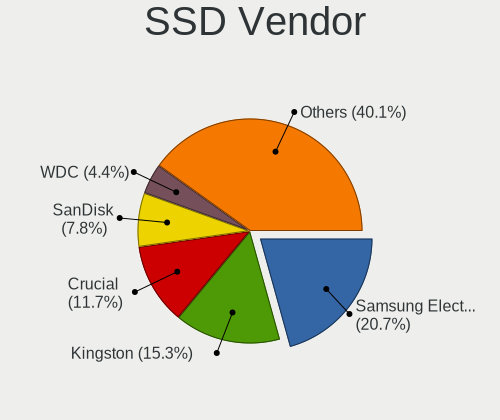
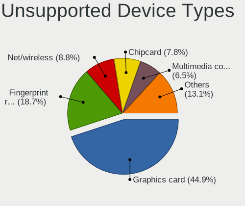

Debian 11 - Tested Hardware & Statistics
----------------------------------------

A project to collect tested hardware configurations for Debian 11.

Anyone can contribute to this report by the [hw-probe](https://github.com/linuxhw/hw-probe) tool:

    sudo -E hw-probe -all -upload

Please contribute! Especially if your hardware is rare.

This is a report for all computer types. See also reports for [desktops](/Dist/Debian_11/Desktop/README.md) and [notebooks](/Dist/Debian_11/Notebook/README.md).

Contents
--------

* [ Test Cases ](#test-cases)

* [ System ](#system)
  - [ Kernel                   ](#kernel)
  - [ Kernel Family            ](#kernel-family)
  - [ Kernel Major Ver.        ](#kernel-major-ver)
  - [ Arch                     ](#arch)
  - [ DE                       ](#de)
  - [ Display Server           ](#display-server)
  - [ Display Manager          ](#display-manager)
  - [ OS Lang                  ](#os-lang)
  - [ Boot Mode                ](#boot-mode)
  - [ Filesystem               ](#filesystem)
  - [ Part. scheme             ](#part-scheme)
  - [ Dual Boot with Linux/BSD ](#dual-boot-with-linuxbsd)
  - [ Dual Boot (Win)          ](#dual-boot-win)

* [ Board ](#board)
  - [ Vendor                   ](#vendor)
  - [ Model                    ](#model)
  - [ Model Family             ](#model-family)
  - [ MFG Year                 ](#mfg-year)
  - [ Form Factor              ](#form-factor)
  - [ Secure Boot              ](#secure-boot)
  - [ Coreboot                 ](#coreboot)
  - [ RAM Size                 ](#ram-size)
  - [ RAM Used                 ](#ram-used)
  - [ Total Drives             ](#total-drives)
  - [ Has CD-ROM               ](#has-cd-rom)
  - [ Has Ethernet             ](#has-ethernet)
  - [ Has WiFi                 ](#has-wifi)
  - [ Has Bluetooth            ](#has-bluetooth)

* [ Location ](#location)
  - [ Country                  ](#country)
  - [ City                     ](#city)

* [ Drives ](#drives)
  - [ Drive Vendor             ](#drive-vendor)
  - [ Drive Model              ](#drive-model)
  - [ HDD Vendor               ](#hdd-vendor)
  - [ SSD Vendor               ](#ssd-vendor)
  - [ Drive Kind               ](#drive-kind)
  - [ Drive Connector          ](#drive-connector)
  - [ Drive Size               ](#drive-size)
  - [ Space Total              ](#space-total)
  - [ Space Used               ](#space-used)
  - [ Malfunc. Drives          ](#malfunc-drives)
  - [ Malfunc. Drive Vendor    ](#malfunc-drive-vendor)
  - [ Malfunc. HDD Vendor      ](#malfunc-hdd-vendor)
  - [ Malfunc. Drive Kind      ](#malfunc-drive-kind)
  - [ Failed Drives            ](#failed-drives)
  - [ Failed Drive Vendor      ](#failed-drive-vendor)
  - [ Drive Status             ](#drive-status)

* [ Storage controller ](#storage-controller)
  - [ Storage Vendor           ](#storage-vendor)
  - [ Storage Model            ](#storage-model)
  - [ Storage Kind             ](#storage-kind)

* [ Processor ](#processor)
  - [ CPU Vendor               ](#cpu-vendor)
  - [ CPU Model                ](#cpu-model)
  - [ CPU Model Family         ](#cpu-model-family)
  - [ CPU Cores                ](#cpu-cores)
  - [ CPU Sockets              ](#cpu-sockets)
  - [ CPU Threads              ](#cpu-threads)
  - [ CPU Op-Modes             ](#cpu-op-modes)
  - [ CPU Microcode            ](#cpu-microcode)
  - [ CPU Microarch            ](#cpu-microarch)

* [ Graphics ](#graphics)
  - [ GPU Vendor               ](#gpu-vendor)
  - [ GPU Model                ](#gpu-model)
  - [ GPU Combo                ](#gpu-combo)
  - [ GPU Driver               ](#gpu-driver)
  - [ GPU Memory               ](#gpu-memory)

* [ Monitor ](#monitor)
  - [ Monitor Vendor           ](#monitor-vendor)
  - [ Monitor Model            ](#monitor-model)
  - [ Monitor Resolution       ](#monitor-resolution)
  - [ Monitor Diagonal         ](#monitor-diagonal)
  - [ Monitor Width            ](#monitor-width)
  - [ Aspect Ratio             ](#aspect-ratio)
  - [ Monitor Area             ](#monitor-area)
  - [ Pixel Density            ](#pixel-density)
  - [ Multiple Monitors        ](#multiple-monitors)

* [ Network ](#network)
  - [ Net Controller Vendor    ](#net-controller-vendor)
  - [ Net Controller Model     ](#net-controller-model)
  - [ Wireless Vendor          ](#wireless-vendor)
  - [ Wireless Model           ](#wireless-model)
  - [ Ethernet Vendor          ](#ethernet-vendor)
  - [ Ethernet Model           ](#ethernet-model)
  - [ Net Controller Kind      ](#net-controller-kind)
  - [ Used Controller          ](#used-controller)
  - [ NICs                     ](#nics)
  - [ IPv6                     ](#ipv6)

* [ Bluetooth ](#bluetooth)
  - [ Bluetooth Vendor         ](#bluetooth-vendor)
  - [ Bluetooth Model          ](#bluetooth-model)

* [ Sound ](#sound)
  - [ Sound Vendor             ](#sound-vendor)
  - [ Sound Model              ](#sound-model)

* [ Memory ](#memory)
  - [ Memory Vendor            ](#memory-vendor)
  - [ Memory Model             ](#memory-model)
  - [ Memory Kind              ](#memory-kind)
  - [ Memory Form Factor       ](#memory-form-factor)
  - [ Memory Size              ](#memory-size)
  - [ Memory Speed             ](#memory-speed)

* [ Printers & scanners ](#printers--scanners)
  - [ Printer Vendor           ](#printer-vendor)
  - [ Printer Model            ](#printer-model)
  - [ Scanner Vendor           ](#scanner-vendor)
  - [ Scanner Model            ](#scanner-model)

* [ Camera ](#camera)
  - [ Camera Vendor            ](#camera-vendor)
  - [ Camera Model             ](#camera-model)

* [ Security ](#security)
  - [ Fingerprint Vendor       ](#fingerprint-vendor)
  - [ Fingerprint Model        ](#fingerprint-model)
  - [ Chipcard Vendor          ](#chipcard-vendor)
  - [ Chipcard Model           ](#chipcard-model)

* [ Unsupported ](#unsupported)
  - [ Unsupported Devices      ](#unsupported-devices)
  - [ Unsupported Device Types ](#unsupported-device-types)

Test Cases
----------

Total: 7116

| Vendor        | Model                       | Form-Factor | Probe                                                      | Date         |
|---------------|-----------------------------|-------------|------------------------------------------------------------|--------------|
| ASUSTek       | TUF Z390-PRO GAMING         | Desktop     | [de65f4b654](https://linux-hardware.org/?probe=de65f4b654) | Dec 31, 2022 |
| Google        | Teemo                       | Desktop     | [6f6671a40e](https://linux-hardware.org/?probe=6f6671a40e) | Dec 31, 2022 |
| Gigabyte      | AB350-Gaming 3-CF           | Desktop     | [500ce7ae28](https://linux-hardware.org/?probe=500ce7ae28) | Dec 31, 2022 |
| ASUSTek       | ZenBook UX425UAZ_UM425UA... | Notebook    | [8d33275e7b](https://linux-hardware.org/?probe=8d33275e7b) | Dec 31, 2022 |
| Google        | Teemo                       | Desktop     | [e3c39f29da](https://linux-hardware.org/?probe=e3c39f29da) | Dec 31, 2022 |
| ASUSTek       | VivoBook_ASUSLaptop X509... | Notebook    | [fb22f9430c](https://linux-hardware.org/?probe=fb22f9430c) | Dec 31, 2022 |
| Dell          | 0PV3YR A05                  | Server      | [3710331d81](https://linux-hardware.org/?probe=3710331d81) | Dec 31, 2022 |
| Lenovo        | IdeaPad Y560                | Notebook    | [c9d3a1d0a3](https://linux-hardware.org/?probe=c9d3a1d0a3) | Dec 31, 2022 |
| Acer          | Aspire A514-54              | Notebook    | [5775c77a91](https://linux-hardware.org/?probe=5775c77a91) | Dec 31, 2022 |
| HP            | Compaq 6710b (KE207ES#AB... | Notebook    | [d7d0be3872](https://linux-hardware.org/?probe=d7d0be3872) | Dec 30, 2022 |
| ASRock        | J3455-ITX                   | Desktop     | [4f45d532ac](https://linux-hardware.org/?probe=4f45d532ac) | Dec 30, 2022 |
| Dell          | Inspiron 5490               | Notebook    | [c8a80649d2](https://linux-hardware.org/?probe=c8a80649d2) | Dec 30, 2022 |
| Supermicro    | X11SRA-RF                   | Server      | [2887a82948](https://linux-hardware.org/?probe=2887a82948) | Dec 30, 2022 |
| Supermicro    | X11SRA-RF                   | Server      | [e5f0b1d802](https://linux-hardware.org/?probe=e5f0b1d802) | Dec 30, 2022 |
| Supermicro    | X11SRA-RF                   | Server      | [cd84ddc342](https://linux-hardware.org/?probe=cd84ddc342) | Dec 30, 2022 |
| Lenovo        | ThinkStation C20 4263BA7    | Desktop     | [7b55955e2a](https://linux-hardware.org/?probe=7b55955e2a) | Dec 30, 2022 |
| Dell          | 0PV3YR A05                  | Server      | [a295f18c9f](https://linux-hardware.org/?probe=a295f18c9f) | Dec 30, 2022 |
| HP            | 255 G3                      | Notebook    | [89d6bd459c](https://linux-hardware.org/?probe=89d6bd459c) | Dec 30, 2022 |
| HP            | 339A                        | Desktop     | [8e0b785427](https://linux-hardware.org/?probe=8e0b785427) | Dec 29, 2022 |
| ASUSTek       | PRIME B360M-C               | Desktop     | [c38ca6386e](https://linux-hardware.org/?probe=c38ca6386e) | Dec 29, 2022 |
| Lenovo        | ThinkPad T470p 20J7S1JT0... | Notebook    | [4b7bbb186f](https://linux-hardware.org/?probe=4b7bbb186f) | Dec 29, 2022 |
| Lenovo        | ThinkPad E14 Gen 3 20Y7S... | Notebook    | [5bf3ff5c0e](https://linux-hardware.org/?probe=5bf3ff5c0e) | Dec 29, 2022 |
| Lenovo        | ThinkPad E14 Gen 3 20Y7S... | Notebook    | [4f63c4474c](https://linux-hardware.org/?probe=4f63c4474c) | Dec 29, 2022 |
| Gigabyte      | H61M-DS2                    | Desktop     | [50149bf9e3](https://linux-hardware.org/?probe=50149bf9e3) | Dec 29, 2022 |
| Gigabyte      | H61M-DS2                    | Desktop     | [b0a40a3ac0](https://linux-hardware.org/?probe=b0a40a3ac0) | Dec 29, 2022 |
| Dell          | Inspiron 7506 2n1           | Convertible | [716ba7f970](https://linux-hardware.org/?probe=716ba7f970) | Dec 29, 2022 |
| HP            | EliteBook Folio 1040 G3     | Notebook    | [6aad572cd5](https://linux-hardware.org/?probe=6aad572cd5) | Dec 29, 2022 |
| HP            | ZBook 15 G6                 | Notebook    | [af1655497e](https://linux-hardware.org/?probe=af1655497e) | Dec 29, 2022 |
| Unknown       | Unknown                     | Desktop     | [34b6109940](https://linux-hardware.org/?probe=34b6109940) | Dec 29, 2022 |
| HP            | ProBook 6570b               | Notebook    | [46fd918b7c](https://linux-hardware.org/?probe=46fd918b7c) | Dec 29, 2022 |
| Dell          | 0PV3YR A05                  | Server      | [4239e2fa3c](https://linux-hardware.org/?probe=4239e2fa3c) | Dec 29, 2022 |
| Dell          | Inspiron 7506 2n1           | Convertible | [7881f027ea](https://linux-hardware.org/?probe=7881f027ea) | Dec 29, 2022 |
| ASRock        | X570 Taichi                 | Desktop     | [c1e5e82fbb](https://linux-hardware.org/?probe=c1e5e82fbb) | Dec 29, 2022 |
| Dell          | Inspiron 5490               | Notebook    | [457c2ae4ae](https://linux-hardware.org/?probe=457c2ae4ae) | Dec 28, 2022 |
| Dell          | Inspiron 5490               | Notebook    | [fdfd0f21c7](https://linux-hardware.org/?probe=fdfd0f21c7) | Dec 28, 2022 |
| Toshiba       | Satellite L455D             | Notebook    | [35c085aa82](https://linux-hardware.org/?probe=35c085aa82) | Dec 28, 2022 |
| Dell          | Vostro 3400                 | Notebook    | [27f58a8ad1](https://linux-hardware.org/?probe=27f58a8ad1) | Dec 28, 2022 |
| HP            | ProLiant ML30 Gen9          | Desktop     | [174e7e831b](https://linux-hardware.org/?probe=174e7e831b) | Dec 28, 2022 |
| Acer          | Aspire ES1-531              | Notebook    | [c29088a63f](https://linux-hardware.org/?probe=c29088a63f) | Dec 28, 2022 |
| Raspberry ... | Raspberry Pi Compute Mod... | Soc         | [7c60cc0210](https://linux-hardware.org/?probe=7c60cc0210) | Dec 28, 2022 |
| Lenovo        | ThinkPad X1 Yoga 2nd 20J... | Convertible | [72f770277e](https://linux-hardware.org/?probe=72f770277e) | Dec 28, 2022 |
| HP            | ProBook 6470b               | Notebook    | [055705b3f2](https://linux-hardware.org/?probe=055705b3f2) | Dec 28, 2022 |
| HP            | 158A                        | Desktop     | [c80bfd7c30](https://linux-hardware.org/?probe=c80bfd7c30) | Dec 28, 2022 |
| Dell          | 0PV3YR A05                  | Server      | [ec0ad4d293](https://linux-hardware.org/?probe=ec0ad4d293) | Dec 28, 2022 |
| Apple         | Mac-F42786A9 DVT            | All in one  | [2ceb80faeb](https://linux-hardware.org/?probe=2ceb80faeb) | Dec 28, 2022 |
| Lenovo        | 0B98401 WIN                 | Desktop     | [0f71bbaf67](https://linux-hardware.org/?probe=0f71bbaf67) | Dec 28, 2022 |
| ASUSTek       | A4110                       | All in one  | [fa417dc5c7](https://linux-hardware.org/?probe=fa417dc5c7) | Dec 28, 2022 |
| ASRock        | J3455-ITX                   | Desktop     | [6e628aeb01](https://linux-hardware.org/?probe=6e628aeb01) | Dec 28, 2022 |
| Apple         | MacBookAir7,2               | Notebook    | [10dce91da1](https://linux-hardware.org/?probe=10dce91da1) | Dec 27, 2022 |
| ASUSTek       | PRIME B360M-K               | Desktop     | [48f161dfc8](https://linux-hardware.org/?probe=48f161dfc8) | Dec 27, 2022 |
| Apple         | MacBookAir7,1               | Notebook    | [d174ffb318](https://linux-hardware.org/?probe=d174ffb318) | Dec 27, 2022 |
| MSI           | GE62 2QC                    | Notebook    | [dbd69d70ac](https://linux-hardware.org/?probe=dbd69d70ac) | Dec 27, 2022 |
| Dell          | 0M017G A00                  | Desktop     | [5c41315695](https://linux-hardware.org/?probe=5c41315695) | Dec 27, 2022 |
| Intel         | NUC10i7FNB K61360-303       | Mini pc     | [042fb842d2](https://linux-hardware.org/?probe=042fb842d2) | Dec 27, 2022 |
| Panasonic     | FZ55-2                      | Notebook    | [1699b7c3b2](https://linux-hardware.org/?probe=1699b7c3b2) | Dec 27, 2022 |
| ASUSTek       | VivoBook_ASUS Laptop E40... | Notebook    | [78c6c15502](https://linux-hardware.org/?probe=78c6c15502) | Dec 27, 2022 |
| Raspberry ... | Raspberry Pi Compute Mod... | Soc         | [06cba3f478](https://linux-hardware.org/?probe=06cba3f478) | Dec 27, 2022 |
| ASRock        | H470M-HVS                   | Desktop     | [210f0c0375](https://linux-hardware.org/?probe=210f0c0375) | Dec 27, 2022 |
| ASRock        | Brazos                      | Desktop     | [f5183b395b](https://linux-hardware.org/?probe=f5183b395b) | Dec 27, 2022 |
| Notebook      | L14xMU                      | Notebook    | [7644bc65e2](https://linux-hardware.org/?probe=7644bc65e2) | Dec 27, 2022 |
| Dell          | Inspiron 1012               | Notebook    | [3dd6b8a416](https://linux-hardware.org/?probe=3dd6b8a416) | Dec 26, 2022 |
| Dell          | 02YRK5 A02                  | Desktop     | [56dc5ff1b9](https://linux-hardware.org/?probe=56dc5ff1b9) | Dec 26, 2022 |
| Exo           | Smart Serie M               | Notebook    | [942ee3b035](https://linux-hardware.org/?probe=942ee3b035) | Dec 26, 2022 |
| Lenovo        | ThinkPad E560 20EV002FUS    | Notebook    | [3bb1c5cc47](https://linux-hardware.org/?probe=3bb1c5cc47) | Dec 26, 2022 |
| Gigabyte      | B660M GAMING DDR4           | Desktop     | [2618b85414](https://linux-hardware.org/?probe=2618b85414) | Dec 26, 2022 |
| Lenovo        | ThinkStation D30 42234T7    | Desktop     | [6ad649ad46](https://linux-hardware.org/?probe=6ad649ad46) | Dec 26, 2022 |
| Gigabyte      | B360M H                     | Desktop     | [2f0d1b1c8d](https://linux-hardware.org/?probe=2f0d1b1c8d) | Dec 26, 2022 |
| ASUSTek       | PRIME A320M-K               | Desktop     | [d90a9cdcd3](https://linux-hardware.org/?probe=d90a9cdcd3) | Dec 26, 2022 |
| ASUSTek       | PRIME A320M-K               | Desktop     | [fc0eac877c](https://linux-hardware.org/?probe=fc0eac877c) | Dec 26, 2022 |
| Dell          | 0PV3YR A05                  | Server      | [67fee9ab39](https://linux-hardware.org/?probe=67fee9ab39) | Dec 26, 2022 |
| Acer          | Aspire ES1-533              | Notebook    | [3b5fa6d85a](https://linux-hardware.org/?probe=3b5fa6d85a) | Dec 26, 2022 |
| Lenovo        | ThinkPad X250 20CLS1UB00    | Notebook    | [fc8b2899fa](https://linux-hardware.org/?probe=fc8b2899fa) | Dec 25, 2022 |
| SANTECH       | NHx0DB,DE                   | Notebook    | [a0996d42bd](https://linux-hardware.org/?probe=a0996d42bd) | Dec 25, 2022 |
| HP            | 470 G8 Notebook PC          | Notebook    | [6d77c48324](https://linux-hardware.org/?probe=6d77c48324) | Dec 25, 2022 |
| Lenovo        | ThinkStation D30 42234T7    | Desktop     | [6ac63aca4f](https://linux-hardware.org/?probe=6ac63aca4f) | Dec 25, 2022 |
| Dell          | Inspiron 7506 2n1           | Convertible | [b5eaa2b6aa](https://linux-hardware.org/?probe=b5eaa2b6aa) | Dec 25, 2022 |
| Unknown       | Unknown                     | Soc         | [95c95c980d](https://linux-hardware.org/?probe=95c95c980d) | Dec 25, 2022 |
| Dell          | 0PV3YR A05                  | Server      | [5977afc830](https://linux-hardware.org/?probe=5977afc830) | Dec 25, 2022 |
| ASUSTek       | G751JT                      | Notebook    | [16e989ff99](https://linux-hardware.org/?probe=16e989ff99) | Dec 25, 2022 |
| Dell          | Latitude E6520              | Notebook    | [33a51c934d](https://linux-hardware.org/?probe=33a51c934d) | Dec 25, 2022 |
| Dell          | Inspiron 5490               | Notebook    | [ea09a6daa8](https://linux-hardware.org/?probe=ea09a6daa8) | Dec 25, 2022 |
| Dell          | 00TD00 A00                  | All in one  | [84beba0484](https://linux-hardware.org/?probe=84beba0484) | Dec 25, 2022 |
| Dell          | Inspiron 5490               | Notebook    | [45737153e4](https://linux-hardware.org/?probe=45737153e4) | Dec 25, 2022 |
| HP            | Laptop 15-bw0xx             | Notebook    | [42221f61fb](https://linux-hardware.org/?probe=42221f61fb) | Dec 25, 2022 |
| Medion        | E122X                       | Notebook    | [6e4e34bcc3](https://linux-hardware.org/?probe=6e4e34bcc3) | Dec 24, 2022 |
| Medion        | E122X                       | Notebook    | [bf41c45a7d](https://linux-hardware.org/?probe=bf41c45a7d) | Dec 24, 2022 |
| Lenovo        | ThinkBook 15 G3 ACL 21A4    | Notebook    | [096d4fc8c2](https://linux-hardware.org/?probe=096d4fc8c2) | Dec 24, 2022 |
| Raspberry ... | Raspberry Pi 400 Rev 1.0    | Soc         | [f7af4b1164](https://linux-hardware.org/?probe=f7af4b1164) | Dec 24, 2022 |
| HP            | ProLiant MicroServer        | Desktop     | [b95892f2dc](https://linux-hardware.org/?probe=b95892f2dc) | Dec 24, 2022 |
| ASUSTek       | WS C422 DC                  | Desktop     | [7be7c81575](https://linux-hardware.org/?probe=7be7c81575) | Dec 24, 2022 |
| Supermicro    | X11SRA-RF                   | Server      | [efdf519660](https://linux-hardware.org/?probe=efdf519660) | Dec 24, 2022 |
| ASUSTek       | WS C422 DC                  | Desktop     | [526414fd8f](https://linux-hardware.org/?probe=526414fd8f) | Dec 24, 2022 |
| Lenovo        | ThinkPad X1 Carbon 7th 2... | Notebook    | [c5f2f2db53](https://linux-hardware.org/?probe=c5f2f2db53) | Dec 24, 2022 |
| Dell          | 0PV3YR A05                  | Server      | [39f35288d4](https://linux-hardware.org/?probe=39f35288d4) | Dec 24, 2022 |
| Lenovo        | ThinkPad X270 20HMS16200    | Notebook    | [6ac6e552a8](https://linux-hardware.org/?probe=6ac6e552a8) | Dec 24, 2022 |
| Dell          | Inspiron 5570               | Notebook    | [1c7e7f8dd2](https://linux-hardware.org/?probe=1c7e7f8dd2) | Dec 24, 2022 |
| Dell          | Latitude E7440              | Notebook    | [baae52327d](https://linux-hardware.org/?probe=baae52327d) | Dec 23, 2022 |
| Dell          | Latitude E7440              | Notebook    | [bc5d48b831](https://linux-hardware.org/?probe=bc5d48b831) | Dec 23, 2022 |
| Dell          | Latitude E7440              | Notebook    | [fde483d476](https://linux-hardware.org/?probe=fde483d476) | Dec 23, 2022 |
| HP            | 876C SMVB                   | Desktop     | [988b03aae5](https://linux-hardware.org/?probe=988b03aae5) | Dec 23, 2022 |
| Dell          | Latitude E7440              | Notebook    | [a746012ffd](https://linux-hardware.org/?probe=a746012ffd) | Dec 23, 2022 |
| Lenovo        | ThinkPad T16 Gen 1 21BWS... | Notebook    | [9e5c4705fa](https://linux-hardware.org/?probe=9e5c4705fa) | Dec 23, 2022 |
| Dell          | Latitude D630               | Notebook    | [8175d003ce](https://linux-hardware.org/?probe=8175d003ce) | Dec 23, 2022 |
| Google        | Reks                        | Notebook    | [ecee690e6e](https://linux-hardware.org/?probe=ecee690e6e) | Dec 23, 2022 |
| Toshiba       | Satellite L10W-B-101        | Notebook    | [54d5cca493](https://linux-hardware.org/?probe=54d5cca493) | Dec 23, 2022 |
| Google        | Reks                        | Notebook    | [58b1b4cac1](https://linux-hardware.org/?probe=58b1b4cac1) | Dec 23, 2022 |
| Dell          | Inspiron 3501               | Notebook    | [297651d437](https://linux-hardware.org/?probe=297651d437) | Dec 23, 2022 |
| Lenovo        | Legion 5 15ACH6A 82NW       | Notebook    | [79b015dcea](https://linux-hardware.org/?probe=79b015dcea) | Dec 23, 2022 |
| Dell          | 0PV3YR A05                  | Server      | [d5625e9592](https://linux-hardware.org/?probe=d5625e9592) | Dec 23, 2022 |
| Dell          | Inspiron 3501               | Notebook    | [958ee9d145](https://linux-hardware.org/?probe=958ee9d145) | Dec 23, 2022 |
| Dell          | G3 3590                     | Notebook    | [d75d9e6663](https://linux-hardware.org/?probe=d75d9e6663) | Dec 23, 2022 |
| Lenovo        | ThinkPad X260 20F5005NAU    | Notebook    | [5f75bb423d](https://linux-hardware.org/?probe=5f75bb423d) | Dec 23, 2022 |
| Acer          | Aspire 4750                 | Notebook    | [3256c282db](https://linux-hardware.org/?probe=3256c282db) | Dec 23, 2022 |
| Lenovo        | ThinkBook 14s Yoga G2 IA... | Convertible | [3ea5c420b1](https://linux-hardware.org/?probe=3ea5c420b1) | Dec 23, 2022 |
| HP            | 255 G7 Notebook PC          | Notebook    | [5bedf1557b](https://linux-hardware.org/?probe=5bedf1557b) | Dec 23, 2022 |
| Dell          | Inspiron 5490               | Notebook    | [1c424b5f55](https://linux-hardware.org/?probe=1c424b5f55) | Dec 23, 2022 |
| Unknown       | Unknown                     | Notebook    | [f9c4fecaf4](https://linux-hardware.org/?probe=f9c4fecaf4) | Dec 23, 2022 |
| Unknown       | Unknown                     | Notebook    | [3832db2827](https://linux-hardware.org/?probe=3832db2827) | Dec 23, 2022 |
| Toshiba       | Satellite C55Dt-A           | Notebook    | [67294324c5](https://linux-hardware.org/?probe=67294324c5) | Dec 22, 2022 |
| HP            | EliteBook x360 1040 G8 N... | Convertible | [7794581d04](https://linux-hardware.org/?probe=7794581d04) | Dec 22, 2022 |
| Dell          | Latitude E7440              | Notebook    | [c6d28912f0](https://linux-hardware.org/?probe=c6d28912f0) | Dec 22, 2022 |
| Dell          | Latitude E7440              | Notebook    | [1a14f26bd3](https://linux-hardware.org/?probe=1a14f26bd3) | Dec 22, 2022 |
| Dell          | Latitude E7440              | Notebook    | [db77bb7a3f](https://linux-hardware.org/?probe=db77bb7a3f) | Dec 22, 2022 |
| Dell          | Latitude E7440              | Notebook    | [d2278ed94d](https://linux-hardware.org/?probe=d2278ed94d) | Dec 22, 2022 |
| Apple         | MacBookAir7,1               | Notebook    | [09ba8ccf48](https://linux-hardware.org/?probe=09ba8ccf48) | Dec 22, 2022 |
| Dell          | Latitude E7440              | Notebook    | [f4e79df709](https://linux-hardware.org/?probe=f4e79df709) | Dec 22, 2022 |
| Apple         | MacBookAir7,1               | Notebook    | [2c3febf6fa](https://linux-hardware.org/?probe=2c3febf6fa) | Dec 22, 2022 |
| Dell          | Latitude E7440              | Notebook    | [cddffa9123](https://linux-hardware.org/?probe=cddffa9123) | Dec 22, 2022 |
| Dell          | Latitude E7440              | Notebook    | [5f911806c8](https://linux-hardware.org/?probe=5f911806c8) | Dec 22, 2022 |
| Lenovo        | ThinkPad X260 20F5005NAU    | Notebook    | [844f589d20](https://linux-hardware.org/?probe=844f589d20) | Dec 22, 2022 |
| Dell          | Latitude D630               | Notebook    | [e1106d8868](https://linux-hardware.org/?probe=e1106d8868) | Dec 22, 2022 |
| ASRock        | X300M-STX                   | Desktop     | [3d90b10b72](https://linux-hardware.org/?probe=3d90b10b72) | Dec 22, 2022 |
| HP            | Stream Notebook PC 13       | Notebook    | [b049c64ff7](https://linux-hardware.org/?probe=b049c64ff7) | Dec 22, 2022 |
| Dell          | 0PV3YR A05                  | Server      | [3a87279be6](https://linux-hardware.org/?probe=3a87279be6) | Dec 22, 2022 |
| Lenovo        | ThinkPad T14 Gen 1 20S1S... | Notebook    | [5f132c928b](https://linux-hardware.org/?probe=5f132c928b) | Dec 22, 2022 |
| Raspberry ... | Raspberry Pi 400 Rev 1.0    | Soc         | [ba82bee4c7](https://linux-hardware.org/?probe=ba82bee4c7) | Dec 22, 2022 |
| Raspberry ... | Raspberry Pi 400 Rev 1.0    | Soc         | [a2a2f20ef4](https://linux-hardware.org/?probe=a2a2f20ef4) | Dec 22, 2022 |
| Dell          | G3 3590                     | Notebook    | [8038491eb0](https://linux-hardware.org/?probe=8038491eb0) | Dec 22, 2022 |
| Gigabyte      | B450M DS3H-CF               | Desktop     | [fe4ef75450](https://linux-hardware.org/?probe=fe4ef75450) | Dec 21, 2022 |
| Lenovo        | IdeaPad 5 15IAL7 82SF       | Notebook    | [16cae3015a](https://linux-hardware.org/?probe=16cae3015a) | Dec 21, 2022 |
| Apple         | MacBookAir7,2               | Notebook    | [b4e828bef3](https://linux-hardware.org/?probe=b4e828bef3) | Dec 21, 2022 |
| Dell          | Vostro 3583                 | Notebook    | [cf3c6eb18b](https://linux-hardware.org/?probe=cf3c6eb18b) | Dec 21, 2022 |
| Apple         | MacBookAir7,2               | Notebook    | [056d76bae8](https://linux-hardware.org/?probe=056d76bae8) | Dec 21, 2022 |
| Sony          | SVE1112M1EB                 | Notebook    | [74e100e63b](https://linux-hardware.org/?probe=74e100e63b) | Dec 21, 2022 |
| HP            | ZBook Power 15.6 inch G8... | Notebook    | [6b202d6cc2](https://linux-hardware.org/?probe=6b202d6cc2) | Dec 21, 2022 |
| Lenovo        | Legion 5 15ARH05 82B5       | Notebook    | [9438c80c85](https://linux-hardware.org/?probe=9438c80c85) | Dec 21, 2022 |
| Dell          | 0020HJ A01                  | Server      | [e266254c60](https://linux-hardware.org/?probe=e266254c60) | Dec 21, 2022 |
| HP            | ProLiant DL360e Gen8        | Server      | [5477e8f714](https://linux-hardware.org/?probe=5477e8f714) | Dec 21, 2022 |
| Dell          | 0PV3YR A05                  | Server      | [428c861575](https://linux-hardware.org/?probe=428c861575) | Dec 21, 2022 |
| HP            | ProLiant MicroServer Gen... | Desktop     | [57182d09ed](https://linux-hardware.org/?probe=57182d09ed) | Dec 21, 2022 |
| Dell          | Inspiron 3501               | Notebook    | [449e38a14d](https://linux-hardware.org/?probe=449e38a14d) | Dec 21, 2022 |
| Intel         | DQ77CP AAG67261-300         | Desktop     | [908f619aa7](https://linux-hardware.org/?probe=908f619aa7) | Dec 21, 2022 |
| Gigabyte      | M68MT-S2P                   | Desktop     | [363c106fa2](https://linux-hardware.org/?probe=363c106fa2) | Dec 21, 2022 |
| Dell          | G3 3590                     | Notebook    | [8272655600](https://linux-hardware.org/?probe=8272655600) | Dec 21, 2022 |
| Gigabyte      | M68MT-S2P                   | Desktop     | [ed29442d39](https://linux-hardware.org/?probe=ed29442d39) | Dec 21, 2022 |
| Supermicro    | X10DRH-iT                   | Server      | [1215ed7cbf](https://linux-hardware.org/?probe=1215ed7cbf) | Dec 21, 2022 |
| Inventec      | Dell Wyse Thin Client De... | Mini pc     | [3007d5dd93](https://linux-hardware.org/?probe=3007d5dd93) | Dec 21, 2022 |
| Fujitsu       | D3222-A1 S26361-D3222-A1    | Desktop     | [c4719bd0ac](https://linux-hardware.org/?probe=c4719bd0ac) | Dec 21, 2022 |
| Unknown       | Unknown                     | Soc         | [764115860e](https://linux-hardware.org/?probe=764115860e) | Dec 21, 2022 |
| MSI           | MS-7318                     | Desktop     | [4622016059](https://linux-hardware.org/?probe=4622016059) | Dec 21, 2022 |
| Lenovo        | ThinkPad 13 2nd Gen 20J1... | Notebook    | [cd4fa20e66](https://linux-hardware.org/?probe=cd4fa20e66) | Dec 20, 2022 |
| Lenovo        | ThinkPad L13 Yoga Gen 2 ... | Convertible | [60b20a8efa](https://linux-hardware.org/?probe=60b20a8efa) | Dec 20, 2022 |
| Lenovo        | ThinkPad 13 2nd Gen 20J1... | Notebook    | [e676fe186f](https://linux-hardware.org/?probe=e676fe186f) | Dec 20, 2022 |
| Lenovo        | ThinkPad L13 Yoga Gen 2 ... | Convertible | [a2c8bb966e](https://linux-hardware.org/?probe=a2c8bb966e) | Dec 20, 2022 |
| Intel         | DG35EC AAE29266-205         | Desktop     | [3cee3ad865](https://linux-hardware.org/?probe=3cee3ad865) | Dec 20, 2022 |
| HP            | OMEN Laptop 15-en1xxx       | Notebook    | [1e53c20bdd](https://linux-hardware.org/?probe=1e53c20bdd) | Dec 20, 2022 |
| Dell          | 0PV3YR A05                  | Server      | [68731f4d29](https://linux-hardware.org/?probe=68731f4d29) | Dec 20, 2022 |
| Dell          | 0MN1TX A00                  | Desktop     | [f2ae430663](https://linux-hardware.org/?probe=f2ae430663) | Dec 20, 2022 |
| ASUSTek       | T100TA                      | Notebook    | [1dc546e14a](https://linux-hardware.org/?probe=1dc546e14a) | Dec 20, 2022 |
| Gigabyte      | P75-D3P                     | Desktop     | [ff2420e759](https://linux-hardware.org/?probe=ff2420e759) | Dec 19, 2022 |
| Lenovo        | ThinkPad T490 20N2CTO1WW    | Notebook    | [2aeb8fd0cd](https://linux-hardware.org/?probe=2aeb8fd0cd) | Dec 19, 2022 |
| Dell          | 09KPNV A01                  | Desktop     | [a4c5e58eec](https://linux-hardware.org/?probe=a4c5e58eec) | Dec 19, 2022 |
| Lenovo        | ThinkPad L13 Yoga Gen 2 ... | Convertible | [a79b17ea96](https://linux-hardware.org/?probe=a79b17ea96) | Dec 19, 2022 |
| ASRock        | N68-GS3 UCC                 | Desktop     | [19dad9b5b2](https://linux-hardware.org/?probe=19dad9b5b2) | Dec 19, 2022 |
| Gigabyte      | G41MT-ES2L                  | Desktop     | [d23b58b5da](https://linux-hardware.org/?probe=d23b58b5da) | Dec 19, 2022 |
| MSI           | A320M-A PRO MAX             | Desktop     | [30aec905c0](https://linux-hardware.org/?probe=30aec905c0) | Dec 19, 2022 |
| GIFA Indus... | TM-J3355-2G2L               | Desktop     | [526697a9d0](https://linux-hardware.org/?probe=526697a9d0) | Dec 19, 2022 |
| Apple         | Mac-F221BEC8                | Desktop     | [493ddb6998](https://linux-hardware.org/?probe=493ddb6998) | Dec 19, 2022 |
| IceWhale T... | ZimaBoard 216 ZMB           | Desktop     | [647bf0e2a7](https://linux-hardware.org/?probe=647bf0e2a7) | Dec 19, 2022 |
| ASUSTek       | 900SD                       | Notebook    | [43d2c88062](https://linux-hardware.org/?probe=43d2c88062) | Dec 18, 2022 |
| Dell          | Inspiron 3501               | Notebook    | [956aaecbb9](https://linux-hardware.org/?probe=956aaecbb9) | Dec 18, 2022 |
| Dell          | Inspiron 3501               | Notebook    | [d5ceb48450](https://linux-hardware.org/?probe=d5ceb48450) | Dec 18, 2022 |
| HP            | ENVY Laptop 13-ad1xx        | Notebook    | [756263bf48](https://linux-hardware.org/?probe=756263bf48) | Dec 18, 2022 |
| EUROCOM       | SCORPIUS 3D                 | Notebook    | [4fdf299276](https://linux-hardware.org/?probe=4fdf299276) | Dec 18, 2022 |
| Dell          | 0UY894 A02                  | Desktop     | [904ee2bb12](https://linux-hardware.org/?probe=904ee2bb12) | Dec 18, 2022 |
| Dell          | 06JWJY A00                  | Desktop     | [89ac693c2c](https://linux-hardware.org/?probe=89ac693c2c) | Dec 18, 2022 |
| ASUSTek       | M51BC                       | Desktop     | [78a6f49d22](https://linux-hardware.org/?probe=78a6f49d22) | Dec 18, 2022 |
| Dell          | Latitude E6530              | Notebook    | [198a9bc936](https://linux-hardware.org/?probe=198a9bc936) | Dec 18, 2022 |
| Lenovo        | ThinkPad T470 20HES3JR02    | Notebook    | [f9e4638f19](https://linux-hardware.org/?probe=f9e4638f19) | Dec 18, 2022 |
| Dell          | Inspiron N5110              | Notebook    | [9e4f7a69c9](https://linux-hardware.org/?probe=9e4f7a69c9) | Dec 18, 2022 |
| Unknown       | Unknown                     | Other       | [78a211835b](https://linux-hardware.org/?probe=78a211835b) | Dec 18, 2022 |
| Dell          | 0PV3YR A05                  | Server      | [a80a6922d4](https://linux-hardware.org/?probe=a80a6922d4) | Dec 18, 2022 |
| Dell          | Latitude E4310              | Notebook    | [ace267f47c](https://linux-hardware.org/?probe=ace267f47c) | Dec 18, 2022 |
| ASUSTek       | ROG Maximus Z690 FORMULA    | Desktop     | [0886e650a3](https://linux-hardware.org/?probe=0886e650a3) | Dec 18, 2022 |
| Acer          | Aspire E5-573G              | Notebook    | [937a672cb0](https://linux-hardware.org/?probe=937a672cb0) | Dec 17, 2022 |
| Gigabyte      | X570S AERO G                | Desktop     | [1ec932aa3a](https://linux-hardware.org/?probe=1ec932aa3a) | Dec 17, 2022 |
| ASUSTek       | P8H67-M                     | Desktop     | [cf6fc033d6](https://linux-hardware.org/?probe=cf6fc033d6) | Dec 17, 2022 |
| Intel         | NUC8BEB J72693-303          | Mini pc     | [b882d3e249](https://linux-hardware.org/?probe=b882d3e249) | Dec 17, 2022 |
| Raspberry ... | Raspberry Pi 4 Model B R... | Soc         | [ed5d3570ef](https://linux-hardware.org/?probe=ed5d3570ef) | Dec 17, 2022 |
| Lenovo        | ThinkPad X1 Carbon Gen 9... | Notebook    | [1e2531fdf1](https://linux-hardware.org/?probe=1e2531fdf1) | Dec 17, 2022 |
| Lenovo        | K14 Gen 1 21CUS02600        | Notebook    | [218654b079](https://linux-hardware.org/?probe=218654b079) | Dec 17, 2022 |
| Dell          | 0PV3YR A05                  | Server      | [96ae6bc093](https://linux-hardware.org/?probe=96ae6bc093) | Dec 17, 2022 |
| HP            | Notebook                    | Notebook    | [844d855f78](https://linux-hardware.org/?probe=844d855f78) | Dec 17, 2022 |
| Unknown       | Unknown                     | Notebook    | [208016df07](https://linux-hardware.org/?probe=208016df07) | Dec 17, 2022 |
| Dell          | 0V8F20 A01                  | Desktop     | [d9e3649f12](https://linux-hardware.org/?probe=d9e3649f12) | Dec 16, 2022 |
| ASUSTek       | PRIME B560M-A               | Desktop     | [abfa3437b3](https://linux-hardware.org/?probe=abfa3437b3) | Dec 16, 2022 |
| Gigabyte      | B550M DS3H                  | Desktop     | [7b3f9b5af0](https://linux-hardware.org/?probe=7b3f9b5af0) | Dec 16, 2022 |
| Dell          | 0M5DCD A00                  | Desktop     | [f58cc5bcba](https://linux-hardware.org/?probe=f58cc5bcba) | Dec 16, 2022 |
| Dell          | Inspiron 7590               | Notebook    | [e8fb837cf5](https://linux-hardware.org/?probe=e8fb837cf5) | Dec 16, 2022 |
| ASUSTek       | PRIME B560M-A               | Desktop     | [f43049fe6d](https://linux-hardware.org/?probe=f43049fe6d) | Dec 16, 2022 |
| HP            | 876C SMVB                   | Desktop     | [e214378eea](https://linux-hardware.org/?probe=e214378eea) | Dec 16, 2022 |
| Lenovo        | ThinkPad X230 23255NG       | Notebook    | [5cc0ff812b](https://linux-hardware.org/?probe=5cc0ff812b) | Dec 16, 2022 |
| Lenovo        | ThinkPad X230 23255NG       | Notebook    | [062a6ed428](https://linux-hardware.org/?probe=062a6ed428) | Dec 16, 2022 |
| Lenovo        | ThinkPad X1 Carbon Gen 9... | Notebook    | [db670caadd](https://linux-hardware.org/?probe=db670caadd) | Dec 16, 2022 |
| ASUSTek       | Z170-DELUXE                 | Desktop     | [3a524796f6](https://linux-hardware.org/?probe=3a524796f6) | Dec 16, 2022 |
| Dell          | 0PV3YR A05                  | Server      | [4676cf2979](https://linux-hardware.org/?probe=4676cf2979) | Dec 16, 2022 |
| ASUSTek       | TUF Gaming X570-PLUS        | Desktop     | [138cbfa0ba](https://linux-hardware.org/?probe=138cbfa0ba) | Dec 16, 2022 |
| Lenovo        | ThinkPad X1 Extreme Gen ... | Notebook    | [d5cf351351](https://linux-hardware.org/?probe=d5cf351351) | Dec 16, 2022 |
| MSI           | AM1I                        | Desktop     | [0ebd00e848](https://linux-hardware.org/?probe=0ebd00e848) | Dec 16, 2022 |
| Lenovo        | ThinkPad X1 Extreme Gen ... | Notebook    | [e2056deb8a](https://linux-hardware.org/?probe=e2056deb8a) | Dec 16, 2022 |
| MSI           | AM1I                        | Desktop     | [97dfa5ebf8](https://linux-hardware.org/?probe=97dfa5ebf8) | Dec 16, 2022 |
| Intel         | powered classmate PC        | Notebook    | [e0401225a2](https://linux-hardware.org/?probe=e0401225a2) | Dec 15, 2022 |
| HP            | 829E                        | Mini pc     | [dccdfac601](https://linux-hardware.org/?probe=dccdfac601) | Dec 15, 2022 |
| HP            | 876C SMVB                   | Desktop     | [c704265799](https://linux-hardware.org/?probe=c704265799) | Dec 15, 2022 |
| HP            | 876C SMVB                   | Desktop     | [3a6fdcc184](https://linux-hardware.org/?probe=3a6fdcc184) | Dec 15, 2022 |
| ASRock        | H470M-HVS                   | Desktop     | [3c6c7c5eb5](https://linux-hardware.org/?probe=3c6c7c5eb5) | Dec 15, 2022 |
| Dell          | 0PV3YR A05                  | Server      | [b184d02286](https://linux-hardware.org/?probe=b184d02286) | Dec 15, 2022 |
| Unknown       | T3 MRD                      | Notebook    | [909e1a1604](https://linux-hardware.org/?probe=909e1a1604) | Dec 15, 2022 |
| Google        | Cyan                        | Notebook    | [2b9f20b7da](https://linux-hardware.org/?probe=2b9f20b7da) | Dec 15, 2022 |
| Lenovo        | ThinkPad T430 2349I62       | Notebook    | [f7590c1a07](https://linux-hardware.org/?probe=f7590c1a07) | Dec 15, 2022 |
| Dell          | Latitude 3490               | Notebook    | [af008f69f1](https://linux-hardware.org/?probe=af008f69f1) | Dec 14, 2022 |
| Fujitsu       | D3313-G1 S26361-D3313-G1    | Desktop     | [4651fa0db3](https://linux-hardware.org/?probe=4651fa0db3) | Dec 14, 2022 |
| Acer          | Aspire 5738                 | Notebook    | [c0c4581310](https://linux-hardware.org/?probe=c0c4581310) | Dec 14, 2022 |
| Apple         | MacBook6,1                  | Notebook    | [f19d464a26](https://linux-hardware.org/?probe=f19d464a26) | Dec 14, 2022 |
| ASRockRack    | X470D4U2-2T                 | Desktop     | [47c18717db](https://linux-hardware.org/?probe=47c18717db) | Dec 14, 2022 |
| ASRock        | B550M Steel Legend          | Desktop     | [516d6f7f12](https://linux-hardware.org/?probe=516d6f7f12) | Dec 14, 2022 |
| Dell          | 0N185P A02                  | Desktop     | [32d47ba775](https://linux-hardware.org/?probe=32d47ba775) | Dec 14, 2022 |
| Dell          | 0N185P A02                  | Desktop     | [ee28e5efa8](https://linux-hardware.org/?probe=ee28e5efa8) | Dec 14, 2022 |
| Gigabyte      | GA-MA785GMT-UD2H            | Desktop     | [9e8ad3aefd](https://linux-hardware.org/?probe=9e8ad3aefd) | Dec 14, 2022 |
| Raspberry ... | Raspberry Pi 4 Model B R... | Soc         | [eadca468de](https://linux-hardware.org/?probe=eadca468de) | Dec 14, 2022 |
| Dell          | 0H8367                      | Desktop     | [7fff4bfffc](https://linux-hardware.org/?probe=7fff4bfffc) | Dec 14, 2022 |
| Gigabyte      | GA-MA785GMT-UD2H            | Desktop     | [bdbf3d8792](https://linux-hardware.org/?probe=bdbf3d8792) | Dec 14, 2022 |
| ASUSTek       | P8H61-M LX3 R2.0            | Desktop     | [049fef0294](https://linux-hardware.org/?probe=049fef0294) | Dec 14, 2022 |
| Gigabyte      | Z87M-D3H                    | Desktop     | [88c6ca8956](https://linux-hardware.org/?probe=88c6ca8956) | Dec 14, 2022 |
| Dell          | 0PV3YR A05                  | Server      | [2afff07992](https://linux-hardware.org/?probe=2afff07992) | Dec 14, 2022 |
| ASUSTek       | X302LA                      | Notebook    | [8404a0b0c6](https://linux-hardware.org/?probe=8404a0b0c6) | Dec 14, 2022 |
| Lenovo        | ThinkPad E15 Gen 3 20YHS... | Notebook    | [14f87b8695](https://linux-hardware.org/?probe=14f87b8695) | Dec 13, 2022 |
| MSI           | MS-7318                     | Desktop     | [420ae8857b](https://linux-hardware.org/?probe=420ae8857b) | Dec 13, 2022 |
| Lenovo        | Aptio CRB SDK0E50510 WIN    | Mini pc     | [ce2a33caff](https://linux-hardware.org/?probe=ce2a33caff) | Dec 13, 2022 |
| ASUSTek       | A88XM-A                     | Desktop     | [64176404e2](https://linux-hardware.org/?probe=64176404e2) | Dec 13, 2022 |
| Dell          | Latitude 5520               | Notebook    | [7e5d86eaaf](https://linux-hardware.org/?probe=7e5d86eaaf) | Dec 13, 2022 |
| ASUSTek       | G75VW                       | Notebook    | [8d2a0ec4e4](https://linux-hardware.org/?probe=8d2a0ec4e4) | Dec 13, 2022 |
| Exo           | Smart Serie M               | Notebook    | [7fcf3d09bb](https://linux-hardware.org/?probe=7fcf3d09bb) | Dec 13, 2022 |
| MSI           | MS-B1591                    | Desktop     | [33cb107fb9](https://linux-hardware.org/?probe=33cb107fb9) | Dec 13, 2022 |
| ASUSTek       | P7H55-M SI                  | Desktop     | [973e367765](https://linux-hardware.org/?probe=973e367765) | Dec 13, 2022 |
| NetGear       | ReadyDATA 5200              | Desktop     | [2db45cfb13](https://linux-hardware.org/?probe=2db45cfb13) | Dec 13, 2022 |
| Google        | Terra                       | Notebook    | [765deab389](https://linux-hardware.org/?probe=765deab389) | Dec 12, 2022 |
| HP            | EliteBook 8460p             | Notebook    | [95dc27194a](https://linux-hardware.org/?probe=95dc27194a) | Dec 12, 2022 |
| Lenovo        | Yoga Slim 7 ProX 14IAH7 ... | Notebook    | [dc916ac78c](https://linux-hardware.org/?probe=dc916ac78c) | Dec 12, 2022 |
| Lenovo        | Yoga Slim 7 ProX 14IAH7 ... | Notebook    | [2bfcc16f6b](https://linux-hardware.org/?probe=2bfcc16f6b) | Dec 12, 2022 |
| Google        | Enguarde                    | Notebook    | [60cce42479](https://linux-hardware.org/?probe=60cce42479) | Dec 12, 2022 |
| Lenovo        | ThinkPad R61e 7650DHU       | Notebook    | [138f60e67c](https://linux-hardware.org/?probe=138f60e67c) | Dec 12, 2022 |
| Intel         | NUC6CAYB J23203-410         | Mini pc     | [e9c5ef16cd](https://linux-hardware.org/?probe=e9c5ef16cd) | Dec 12, 2022 |
| HP            | EliteBook 8460p             | Notebook    | [99c965b83f](https://linux-hardware.org/?probe=99c965b83f) | Dec 12, 2022 |
| Lenovo        | ThinkPad L13 Yoga Gen 2 ... | Convertible | [22ce155034](https://linux-hardware.org/?probe=22ce155034) | Dec 12, 2022 |
| Dell          | Latitude 5411               | Notebook    | [af806502e8](https://linux-hardware.org/?probe=af806502e8) | Dec 12, 2022 |
| Acer          | Nitro AN515-51              | Notebook    | [918c340b04](https://linux-hardware.org/?probe=918c340b04) | Dec 12, 2022 |
| ASUSTek       | STRIX H270F GAMING          | Desktop     | [3b9b8bb589](https://linux-hardware.org/?probe=3b9b8bb589) | Dec 12, 2022 |
| ASUSTek       | CM6330_CM6630_CM6730_CM6... | Desktop     | [d1b0bc1c03](https://linux-hardware.org/?probe=d1b0bc1c03) | Dec 12, 2022 |
| Lenovo        | ThinkPad T470 20HES6HC00    | Notebook    | [ca9d609d9d](https://linux-hardware.org/?probe=ca9d609d9d) | Dec 12, 2022 |
| HP            | 1850                        | Desktop     | [af4f26481a](https://linux-hardware.org/?probe=af4f26481a) | Dec 11, 2022 |
| HP            | 1850                        | Desktop     | [28b194e897](https://linux-hardware.org/?probe=28b194e897) | Dec 11, 2022 |
| Lenovo        | ThinkPad X201 Tablet 309... | Notebook    | [cd7399049b](https://linux-hardware.org/?probe=cd7399049b) | Dec 11, 2022 |
| Intel         | Kabylake Platform           | Notebook    | [b5c2316016](https://linux-hardware.org/?probe=b5c2316016) | Dec 11, 2022 |
| Lenovo        | G770 20089                  | Notebook    | [f6f1441538](https://linux-hardware.org/?probe=f6f1441538) | Dec 11, 2022 |
| Raspberry ... | Raspberry Pi 3 Model B R... | Soc         | [11202d4caa](https://linux-hardware.org/?probe=11202d4caa) | Dec 11, 2022 |
| Gigabyte      | A320M-H-CF                  | Desktop     | [7d4b5e1c20](https://linux-hardware.org/?probe=7d4b5e1c20) | Dec 11, 2022 |
| Lenovo        | G50-45 80E3                 | Notebook    | [754e028997](https://linux-hardware.org/?probe=754e028997) | Dec 11, 2022 |
| Lenovo        | G50-45 80E3                 | Notebook    | [fb2f97325d](https://linux-hardware.org/?probe=fb2f97325d) | Dec 11, 2022 |
| ASUSTek       | PRIME B450-PLUS             | Desktop     | [822e79aa3e](https://linux-hardware.org/?probe=822e79aa3e) | Dec 11, 2022 |
| Dell          | Latitude 5480               | Notebook    | [01c96ca524](https://linux-hardware.org/?probe=01c96ca524) | Dec 11, 2022 |
| Dell          | Inspiron 13-5368            | Notebook    | [b4ea41e00f](https://linux-hardware.org/?probe=b4ea41e00f) | Dec 11, 2022 |
| ASUSTek       | ROG STRIX B550-F GAMING ... | Desktop     | [e3cecbe4be](https://linux-hardware.org/?probe=e3cecbe4be) | Dec 11, 2022 |
| Lenovo        | ThinkPad X270 20HMS16200    | Notebook    | [89e7835b90](https://linux-hardware.org/?probe=89e7835b90) | Dec 11, 2022 |
| Raspberry ... | Raspberry Pi                | Soc         | [3282a529f0](https://linux-hardware.org/?probe=3282a529f0) | Dec 11, 2022 |
| ASUSTek       | CM6330_CM6630_CM6730_CM6... | Desktop     | [32e7431c24](https://linux-hardware.org/?probe=32e7431c24) | Dec 11, 2022 |
| Supermicro    | C7SIM-Q                     | Desktop     | [76cf2b62db](https://linux-hardware.org/?probe=76cf2b62db) | Dec 11, 2022 |
| Notebook      | NJ50_70CU                   | Notebook    | [f77f39af95](https://linux-hardware.org/?probe=f77f39af95) | Dec 11, 2022 |
| ASUSTek       | ZenBook Pro Duo UX581GV_... | Notebook    | [4686ea3469](https://linux-hardware.org/?probe=4686ea3469) | Dec 11, 2022 |
| ASRock        | X370 Killer SLI/ac          | Desktop     | [83fc85f9e5](https://linux-hardware.org/?probe=83fc85f9e5) | Dec 10, 2022 |
| HP            | Laptop 15s-du3xxx           | Notebook    | [400a0b555d](https://linux-hardware.org/?probe=400a0b555d) | Dec 10, 2022 |
| Dell          | Latitude E7240              | Notebook    | [e0aca47e1b](https://linux-hardware.org/?probe=e0aca47e1b) | Dec 10, 2022 |
| Dell          | 0VHWTR A02                  | Desktop     | [b489057ccc](https://linux-hardware.org/?probe=b489057ccc) | Dec 10, 2022 |
| ASUSTek       | VivoBook S15 X510UF         | Notebook    | [5f72ad2758](https://linux-hardware.org/?probe=5f72ad2758) | Dec 10, 2022 |
| Google        | Peppy                       | Notebook    | [59f9af1c52](https://linux-hardware.org/?probe=59f9af1c52) | Dec 10, 2022 |
| HP            | 876C SMVB                   | Desktop     | [d6211ccceb](https://linux-hardware.org/?probe=d6211ccceb) | Dec 10, 2022 |
| SANTECH       | NHx0DB,DE                   | Notebook    | [89e8d0f23e](https://linux-hardware.org/?probe=89e8d0f23e) | Dec 10, 2022 |
| Xunlong       | Orange Pi PC                | Soc         | [ab1dd22124](https://linux-hardware.org/?probe=ab1dd22124) | Dec 10, 2022 |
| HP            | 339A                        | Desktop     | [ca1d494630](https://linux-hardware.org/?probe=ca1d494630) | Dec 10, 2022 |
| Apple         | Mac-8ED6AF5B48C039E1 Mac... | Mini pc     | [dfceb62f5d](https://linux-hardware.org/?probe=dfceb62f5d) | Dec 09, 2022 |
| Lenovo        | ThinkPad 13 20J10046US      | Notebook    | [170accb6cc](https://linux-hardware.org/?probe=170accb6cc) | Dec 09, 2022 |
| ASUSTek       | PRIME B550-PLUS             | Desktop     | [a80714c4ec](https://linux-hardware.org/?probe=a80714c4ec) | Dec 09, 2022 |
| Dell          | 0PV3YR A05                  | Server      | [c09429d3ad](https://linux-hardware.org/?probe=c09429d3ad) | Dec 09, 2022 |
| Gigabyte      | B450 AORUS M                | Desktop     | [bb3d3b636f](https://linux-hardware.org/?probe=bb3d3b636f) | Dec 09, 2022 |
| Raspberry ... | Raspberry Pi 4 Model B R... | Soc         | [070127f3e8](https://linux-hardware.org/?probe=070127f3e8) | Dec 09, 2022 |
| Gigabyte      | 990FXA-UD3                  | Desktop     | [b2aa17a680](https://linux-hardware.org/?probe=b2aa17a680) | Dec 09, 2022 |
| Gigabyte      | 990FXA-UD3                  | Desktop     | [416ad70d66](https://linux-hardware.org/?probe=416ad70d66) | Dec 08, 2022 |
| HP            | EliteBook 830 G8 Noteboo... | Notebook    | [5d96a0484a](https://linux-hardware.org/?probe=5d96a0484a) | Dec 08, 2022 |
| Supermicro    | X11SSZ-TLN4F                | Server      | [c37f8cd97a](https://linux-hardware.org/?probe=c37f8cd97a) | Dec 08, 2022 |
| Toshiba       | Satellite C850-1LJ          | Notebook    | [4af2ab112f](https://linux-hardware.org/?probe=4af2ab112f) | Dec 08, 2022 |
| Acer          | Veriton N2620G              | Desktop     | [2c4bd5a093](https://linux-hardware.org/?probe=2c4bd5a093) | Dec 08, 2022 |
| Dell          | 0VHWTR A02                  | Desktop     | [5b85a90055](https://linux-hardware.org/?probe=5b85a90055) | Dec 08, 2022 |
| ASUSTek       | N750JV                      | Notebook    | [e06c6025f3](https://linux-hardware.org/?probe=e06c6025f3) | Dec 08, 2022 |
| Lenovo        | ThinkPad T61 889502U        | Notebook    | [b9d0a07e47](https://linux-hardware.org/?probe=b9d0a07e47) | Dec 08, 2022 |
| Lenovo        | ThinkPad L13 Yoga Gen 2 ... | Convertible | [6d3946c1de](https://linux-hardware.org/?probe=6d3946c1de) | Dec 08, 2022 |
| Lenovo        | ThinkPad 13 2nd Gen 20J1... | Notebook    | [09de0ec660](https://linux-hardware.org/?probe=09de0ec660) | Dec 08, 2022 |
| Lenovo        | ThinkPad T60 1953PKK        | Notebook    | [fc308e2f1c](https://linux-hardware.org/?probe=fc308e2f1c) | Dec 08, 2022 |
| Lenovo        | ThinkPad X201 Tablet 309... | Notebook    | [e13e889312](https://linux-hardware.org/?probe=e13e889312) | Dec 08, 2022 |
| ASRock        | H470M-HVS                   | Desktop     | [2f4b3b1185](https://linux-hardware.org/?probe=2f4b3b1185) | Dec 08, 2022 |
| Lenovo        | ThinkPad T14 Gen 3 21AHC... | Notebook    | [e56fd20ec9](https://linux-hardware.org/?probe=e56fd20ec9) | Dec 08, 2022 |
| HP            | ProLiant DL380 Gen9         | Server      | [d368f224c8](https://linux-hardware.org/?probe=d368f224c8) | Dec 08, 2022 |
| Dell          | 0PV3YR A05                  | Server      | [9cf6cede24](https://linux-hardware.org/?probe=9cf6cede24) | Dec 08, 2022 |
| Supermicro    | X10SLH-F/X10SLM+-F          | Server      | [8617185fdc](https://linux-hardware.org/?probe=8617185fdc) | Dec 08, 2022 |
| Unknown       | Unknown                     | Desktop     | [3a5aa82738](https://linux-hardware.org/?probe=3a5aa82738) | Dec 07, 2022 |
| Dell          | 0RM5DR A00                  | Desktop     | [cd67b584bb](https://linux-hardware.org/?probe=cd67b584bb) | Dec 07, 2022 |
| ASUSTek       | ProArt Z690-CREATOR WIFI    | Desktop     | [611fd80398](https://linux-hardware.org/?probe=611fd80398) | Dec 07, 2022 |
| Unknown       | Unknown                     | Desktop     | [4d8d2c3a47](https://linux-hardware.org/?probe=4d8d2c3a47) | Dec 07, 2022 |
| ASUSTek       | STRIX Z270F GAMING          | Desktop     | [7766e8d043](https://linux-hardware.org/?probe=7766e8d043) | Dec 07, 2022 |
| Lenovo        | ThinkPad E495 20NES0J800    | Notebook    | [17182155b5](https://linux-hardware.org/?probe=17182155b5) | Dec 07, 2022 |
| Lenovo        | ThinkPad X230 2320CTO       | Notebook    | [b74f2893d0](https://linux-hardware.org/?probe=b74f2893d0) | Dec 07, 2022 |
| Panasonic     | CFMX4-1                     | Notebook    | [c25c16fc1a](https://linux-hardware.org/?probe=c25c16fc1a) | Dec 06, 2022 |
| Dell          | Latitude 5310               | Notebook    | [06d96a49a1](https://linux-hardware.org/?probe=06d96a49a1) | Dec 06, 2022 |
| MSI           | B550-A PRO                  | Desktop     | [eb1b8bc98a](https://linux-hardware.org/?probe=eb1b8bc98a) | Dec 06, 2022 |
| HP            | EliteBook 8470p             | Notebook    | [e2be1fe149](https://linux-hardware.org/?probe=e2be1fe149) | Dec 06, 2022 |
| Dell          | Latitude 5411               | Notebook    | [62e5941721](https://linux-hardware.org/?probe=62e5941721) | Dec 06, 2022 |
| Dell          | Latitude 5411               | Notebook    | [e0815067bd](https://linux-hardware.org/?probe=e0815067bd) | Dec 06, 2022 |
| Dell          | Latitude 5310               | Notebook    | [f3801600ff](https://linux-hardware.org/?probe=f3801600ff) | Dec 06, 2022 |
| HP            | EliteBook 2570p             | Notebook    | [fc7d866c16](https://linux-hardware.org/?probe=fc7d866c16) | Dec 06, 2022 |
| Dell          | 0XHGV1 A00                  | Desktop     | [9b9778c525](https://linux-hardware.org/?probe=9b9778c525) | Dec 06, 2022 |
| Lenovo        | ThinkPad X230 2325SDE       | Notebook    | [4dc49eeb10](https://linux-hardware.org/?probe=4dc49eeb10) | Dec 06, 2022 |
| Dell          | 01XK1W A00                  | Desktop     | [e2ec28bd7c](https://linux-hardware.org/?probe=e2ec28bd7c) | Dec 06, 2022 |
| Lenovo        | ThinkPad L470 W10DG 20JV... | Notebook    | [5b72cdbdb8](https://linux-hardware.org/?probe=5b72cdbdb8) | Dec 05, 2022 |
| MSI           | H110M PRO-VD                | Desktop     | [64c80c03cf](https://linux-hardware.org/?probe=64c80c03cf) | Dec 05, 2022 |
| ASUSTek       | X756UQK                     | Notebook    | [b473216b84](https://linux-hardware.org/?probe=b473216b84) | Dec 05, 2022 |
| Gigabyte      | Z97-HD3                     | Desktop     | [9b7999b50d](https://linux-hardware.org/?probe=9b7999b50d) | Dec 05, 2022 |
| ASUSTek       | ROG STRIX B550-I GAMING     | Desktop     | [b7b2f976e8](https://linux-hardware.org/?probe=b7b2f976e8) | Dec 05, 2022 |
| MSI           | Creator 15M A9SD            | Notebook    | [f8e6206ba6](https://linux-hardware.org/?probe=f8e6206ba6) | Dec 05, 2022 |
| Acer          | Aspire A315-23G             | Notebook    | [41e6f6a3fa](https://linux-hardware.org/?probe=41e6f6a3fa) | Dec 05, 2022 |
| GMKtec        | NucBox5                     | Notebook    | [cdfbbcc5b2](https://linux-hardware.org/?probe=cdfbbcc5b2) | Dec 04, 2022 |
| ASUSTek       | S500CA                      | Notebook    | [267ffa24d1](https://linux-hardware.org/?probe=267ffa24d1) | Dec 04, 2022 |
| Lenovo        | ThinkPad T470 W10DG 20JN... | Notebook    | [f5be4eb37d](https://linux-hardware.org/?probe=f5be4eb37d) | Dec 04, 2022 |
| ASUSTek       | ROG STRIX B450-F GAMING     | Desktop     | [4d38cbb41a](https://linux-hardware.org/?probe=4d38cbb41a) | Dec 04, 2022 |
| ASUSTek       | ROG STRIX B450-F GAMING     | Desktop     | [7428311d73](https://linux-hardware.org/?probe=7428311d73) | Dec 04, 2022 |
| Toshiba       | dynabook R63/P              | Notebook    | [f51571b62c](https://linux-hardware.org/?probe=f51571b62c) | Dec 04, 2022 |
| Intel         | NUC7i5BNB J31144-304        | Mini pc     | [cc6834a359](https://linux-hardware.org/?probe=cc6834a359) | Dec 04, 2022 |
| Dell          | 0K3CM7 A00                  | Desktop     | [9ee4df50e7](https://linux-hardware.org/?probe=9ee4df50e7) | Dec 04, 2022 |
| ASUSTek       | LEUCITE3                    | Desktop     | [4f28bb5933](https://linux-hardware.org/?probe=4f28bb5933) | Dec 04, 2022 |
| HP            | 339A                        | Desktop     | [91ed08d2a9](https://linux-hardware.org/?probe=91ed08d2a9) | Dec 04, 2022 |
| ASUSTek       | ASUS TUF Gaming A15 FA50... | Notebook    | [b475911aaf](https://linux-hardware.org/?probe=b475911aaf) | Dec 03, 2022 |
| Unknown       | Unknown                     | Soc         | [6fd63c60ab](https://linux-hardware.org/?probe=6fd63c60ab) | Dec 03, 2022 |
| Dell          | Inspiron 15-5578            | Notebook    | [61f5950e07](https://linux-hardware.org/?probe=61f5950e07) | Dec 03, 2022 |
| ASUSTek       | PRIME A320M-A               | Desktop     | [91d50f0379](https://linux-hardware.org/?probe=91d50f0379) | Dec 03, 2022 |
| Lenovo        | SHARKBAY NOK                | Desktop     | [c7cf7a1604](https://linux-hardware.org/?probe=c7cf7a1604) | Dec 03, 2022 |
| Lenovo        | SHARKBAY NOK                | Desktop     | [67c278b32e](https://linux-hardware.org/?probe=67c278b32e) | Dec 03, 2022 |
| ASUSTek       | S500CA                      | Notebook    | [7145280e9e](https://linux-hardware.org/?probe=7145280e9e) | Dec 03, 2022 |
| MSI           | B450M BAZOOKA PLUS          | Desktop     | [dc890ad363](https://linux-hardware.org/?probe=dc890ad363) | Dec 03, 2022 |
| MSI           | B450M BAZOOKA PLUS          | Desktop     | [a087ddb18f](https://linux-hardware.org/?probe=a087ddb18f) | Dec 03, 2022 |
| Acer          | Aspire A315-21              | Notebook    | [91eb1913d7](https://linux-hardware.org/?probe=91eb1913d7) | Dec 03, 2022 |
| ASUSTek       | ROG STRIX X670E-E GAMING... | Desktop     | [61e955b5a6](https://linux-hardware.org/?probe=61e955b5a6) | Dec 03, 2022 |
| ASUSTek       | ROG STRIX X670E-E GAMING... | Desktop     | [dc9c0686e7](https://linux-hardware.org/?probe=dc9c0686e7) | Dec 03, 2022 |
| HP            | EliteBook 845 G8 Noteboo... | Notebook    | [28ab0eb248](https://linux-hardware.org/?probe=28ab0eb248) | Dec 03, 2022 |
| Raspberry ... | Raspberry Pi 4 Model B R... | Soc         | [c300b0a438](https://linux-hardware.org/?probe=c300b0a438) | Dec 03, 2022 |
| Lenovo        | XiaoXinPro 16ACH 2021 82... | Notebook    | [2085f260e1](https://linux-hardware.org/?probe=2085f260e1) | Dec 03, 2022 |
| Lenovo        | ThinkPad X280 20KE0015BR    | Notebook    | [4c65d4e572](https://linux-hardware.org/?probe=4c65d4e572) | Dec 03, 2022 |
| Dell          | 0GY6Y8 A01                  | Desktop     | [f86e02dee0](https://linux-hardware.org/?probe=f86e02dee0) | Dec 03, 2022 |
| ASUSTek       | Z170I PRO GAMING            | Desktop     | [bf8f5e2683](https://linux-hardware.org/?probe=bf8f5e2683) | Dec 03, 2022 |
| Intel         | DP45SG AAE27733-401         | Desktop     | [bc19b3f6a3](https://linux-hardware.org/?probe=bc19b3f6a3) | Dec 02, 2022 |
| Dell          | Inspiron 5566               | Notebook    | [54e06d37fc](https://linux-hardware.org/?probe=54e06d37fc) | Dec 02, 2022 |
| ASUSTek       | N750JV                      | Notebook    | [0fc50d63c4](https://linux-hardware.org/?probe=0fc50d63c4) | Dec 02, 2022 |
| Raspberry ... | Raspberry Pi 3 Model B R... | Soc         | [93c4564635](https://linux-hardware.org/?probe=93c4564635) | Dec 02, 2022 |
| Dell          | Latitude 5591               | Notebook    | [f5735acca7](https://linux-hardware.org/?probe=f5735acca7) | Dec 02, 2022 |
| TrekStor      | SurfTab twin 11.6           | Convertible | [4dc73d8f69](https://linux-hardware.org/?probe=4dc73d8f69) | Dec 02, 2022 |
| HP            | Unknown                     | Notebook    | [741029c3af](https://linux-hardware.org/?probe=741029c3af) | Dec 02, 2022 |
| Lenovo        | 3753 SDK0T76479 WIN 3423... | Desktop     | [5476b73cb7](https://linux-hardware.org/?probe=5476b73cb7) | Dec 02, 2022 |
| Aquarius      | NS585                       | Notebook    | [bbd3bd3ca6](https://linux-hardware.org/?probe=bbd3bd3ca6) | Dec 02, 2022 |
| Lenovo        | 3753 SDK0T76479 WIN 3423... | Desktop     | [6d07106192](https://linux-hardware.org/?probe=6d07106192) | Dec 02, 2022 |
| Aquarius      | NS585                       | Notebook    | [50222418e5](https://linux-hardware.org/?probe=50222418e5) | Dec 02, 2022 |
| Aquarius      | NS585                       | Notebook    | [d55d40681f](https://linux-hardware.org/?probe=d55d40681f) | Dec 02, 2022 |
| Aquarius      | NS585                       | Notebook    | [9013a1cce6](https://linux-hardware.org/?probe=9013a1cce6) | Dec 02, 2022 |
| Dell          | 0PV3YR A05                  | Server      | [767ac17f22](https://linux-hardware.org/?probe=767ac17f22) | Dec 02, 2022 |
| HP            | 620                         | Notebook    | [6be09298b6](https://linux-hardware.org/?probe=6be09298b6) | Dec 01, 2022 |
| Lenovo        | ThinkPad T440p 20AN0079M... | Notebook    | [79261239c1](https://linux-hardware.org/?probe=79261239c1) | Dec 01, 2022 |
| Lenovo        | SHARKBAY NOK                | Desktop     | [e03c6b53ed](https://linux-hardware.org/?probe=e03c6b53ed) | Dec 01, 2022 |
| Lenovo        | ThinkPad E15 Gen 4 21EES... | Notebook    | [674157de54](https://linux-hardware.org/?probe=674157de54) | Dec 01, 2022 |
| ASUSTek       | P5B                         | Desktop     | [44f13beada](https://linux-hardware.org/?probe=44f13beada) | Dec 01, 2022 |
| Dell          | 0PV3YR A05                  | Server      | [3131016a26](https://linux-hardware.org/?probe=3131016a26) | Dec 01, 2022 |
| MSI           | GL65 Leopard 10SDR          | Notebook    | [73c388fb61](https://linux-hardware.org/?probe=73c388fb61) | Dec 01, 2022 |
| MSI           | GL65 Leopard 10SDR          | Notebook    | [6d44ef56c9](https://linux-hardware.org/?probe=6d44ef56c9) | Dec 01, 2022 |
| Raspberry ... | Raspberry Pi 3 Model B P... | Soc         | [5fa6ceed90](https://linux-hardware.org/?probe=5fa6ceed90) | Dec 01, 2022 |
| Gigabyte      | Z390 M GAMING-CF            | Desktop     | [f0dba35258](https://linux-hardware.org/?probe=f0dba35258) | Dec 01, 2022 |
| sunxi         | FriendlyARM NanoPi NEO 2    | Soc         | [f1e2cbe354](https://linux-hardware.org/?probe=f1e2cbe354) | Nov 30, 2022 |
| Gigabyte      | Z390 M GAMING-CF            | Desktop     | [baa969bf8b](https://linux-hardware.org/?probe=baa969bf8b) | Nov 30, 2022 |
| HP            | Pavilion dv5                | Notebook    | [0fc7017b0c](https://linux-hardware.org/?probe=0fc7017b0c) | Nov 30, 2022 |
| HUAWEI        | NBLK-WAX9X                  | Notebook    | [183243daeb](https://linux-hardware.org/?probe=183243daeb) | Nov 30, 2022 |
| Pegatron      | BYT-X1                      | Desktop     | [edadb85201](https://linux-hardware.org/?probe=edadb85201) | Nov 30, 2022 |
| Pegatron      | BYT-X1                      | Desktop     | [b248df8671](https://linux-hardware.org/?probe=b248df8671) | Nov 30, 2022 |
| Dell          | 0Y2G81 A01                  | Server      | [7ce42afb90](https://linux-hardware.org/?probe=7ce42afb90) | Nov 30, 2022 |
| ASUSTek       | ROG STRIX Z490-A GAMING     | Desktop     | [dc5ec6eb84](https://linux-hardware.org/?probe=dc5ec6eb84) | Nov 30, 2022 |
| ASUSTek       | ROG STRIX Z690-A GAMING ... | Desktop     | [6b21f343c3](https://linux-hardware.org/?probe=6b21f343c3) | Nov 30, 2022 |
| Gigabyte      | B450M DS3H-CF               | Desktop     | [952c3681c0](https://linux-hardware.org/?probe=952c3681c0) | Nov 30, 2022 |
| Gigabyte      | B450 AORUS M                | Desktop     | [3e3ccd1471](https://linux-hardware.org/?probe=3e3ccd1471) | Nov 30, 2022 |
| Lenovo        | ThinkPad L13 Yoga Gen 2 ... | Convertible | [00232e7345](https://linux-hardware.org/?probe=00232e7345) | Nov 29, 2022 |
| MSI           | B560M-A PRO                 | Desktop     | [81bf84e7e5](https://linux-hardware.org/?probe=81bf84e7e5) | Nov 29, 2022 |
| Apple         | MacBookAir6,2               | Notebook    | [e0187bc636](https://linux-hardware.org/?probe=e0187bc636) | Nov 29, 2022 |
| ASUSTek       | M4A89GTD-PRO/USB3           | Desktop     | [9dd6019148](https://linux-hardware.org/?probe=9dd6019148) | Nov 29, 2022 |
| BESSTAR Te... | UM700                       | Desktop     | [a97334be81](https://linux-hardware.org/?probe=a97334be81) | Nov 29, 2022 |
| Gigabyte      | B450M DS3H-CF               | Desktop     | [eae94e440a](https://linux-hardware.org/?probe=eae94e440a) | Nov 29, 2022 |
| Apple         | MacBookAir6,2               | Notebook    | [99eb1cfce0](https://linux-hardware.org/?probe=99eb1cfce0) | Nov 29, 2022 |
| ASUSTek       | P5KPL-CM                    | Desktop     | [a20e18af73](https://linux-hardware.org/?probe=a20e18af73) | Nov 29, 2022 |
| Dell          | Latitude 7490               | Notebook    | [8934413cf0](https://linux-hardware.org/?probe=8934413cf0) | Nov 29, 2022 |
| ASRock        | H510M-HDV                   | Desktop     | [03a1675c85](https://linux-hardware.org/?probe=03a1675c85) | Nov 29, 2022 |
| Lenovo        | V310-14IKB 80T2             | Notebook    | [b7c976ef9c](https://linux-hardware.org/?probe=b7c976ef9c) | Nov 29, 2022 |
| HP            | Victus by Laptop 16-e0xx... | Notebook    | [9c45563fb6](https://linux-hardware.org/?probe=9c45563fb6) | Nov 29, 2022 |
| Dell          | XPS 15 9500                 | Notebook    | [9c87ab493e](https://linux-hardware.org/?probe=9c87ab493e) | Nov 29, 2022 |
| Gigabyte      | F2A55M-HD2                  | Desktop     | [8b3da34947](https://linux-hardware.org/?probe=8b3da34947) | Nov 28, 2022 |
| Lenovo        | ThinkPad X301 2776LEG       | Notebook    | [ebaea0c805](https://linux-hardware.org/?probe=ebaea0c805) | Nov 28, 2022 |
| ASRock        | B450M Pro4-F                | Desktop     | [8d0514a0df](https://linux-hardware.org/?probe=8d0514a0df) | Nov 28, 2022 |
| Dell          | Precision M6400             | Notebook    | [05f69c6917](https://linux-hardware.org/?probe=05f69c6917) | Nov 28, 2022 |
| ASUSTek       | PN52                        | Mini pc     | [1e84d5c704](https://linux-hardware.org/?probe=1e84d5c704) | Nov 28, 2022 |
| ASUSTek       | GL752VW                     | Notebook    | [edc0678b85](https://linux-hardware.org/?probe=edc0678b85) | Nov 28, 2022 |
| ECS           | H61H2-M13                   | Desktop     | [88988d4d0d](https://linux-hardware.org/?probe=88988d4d0d) | Nov 28, 2022 |
| Dell          | 0K3CM7 A00                  | Desktop     | [076eeadd80](https://linux-hardware.org/?probe=076eeadd80) | Nov 28, 2022 |
| Dell          | XPS 15 9500                 | Notebook    | [f149afb5d1](https://linux-hardware.org/?probe=f149afb5d1) | Nov 28, 2022 |
| HP            | 212B                        | Desktop     | [53471968c2](https://linux-hardware.org/?probe=53471968c2) | Nov 28, 2022 |
| ASUSTek       | N61Vg                       | Notebook    | [b5cc07b253](https://linux-hardware.org/?probe=b5cc07b253) | Nov 27, 2022 |
| Lenovo        | ThinkPad T450 20BUS03J00    | Notebook    | [8423f90db0](https://linux-hardware.org/?probe=8423f90db0) | Nov 27, 2022 |
| Dell          | 05XGC8 A00                  | Desktop     | [e0e0efb9be](https://linux-hardware.org/?probe=e0e0efb9be) | Nov 27, 2022 |
| Lenovo        | ThinkPad T520 4243F53       | Notebook    | [8f9e96442a](https://linux-hardware.org/?probe=8f9e96442a) | Nov 27, 2022 |
| ASUSTek       | VivoBook S15 X510UF         | Notebook    | [7bd68a8bb1](https://linux-hardware.org/?probe=7bd68a8bb1) | Nov 27, 2022 |
| HP            | Compaq nx9110 (DU432EA#A... | Notebook    | [1b54092e14](https://linux-hardware.org/?probe=1b54092e14) | Nov 27, 2022 |
| ASUSTek       | VivoBook_ASUSLaptop X421... | Notebook    | [32bfa52fc1](https://linux-hardware.org/?probe=32bfa52fc1) | Nov 27, 2022 |
| Lenovo        | ThinkPad T450 20BV0001US    | Notebook    | [3d1b8f282a](https://linux-hardware.org/?probe=3d1b8f282a) | Nov 27, 2022 |
| MSI           | Creator 15M A9SD            | Notebook    | [8b47bbf475](https://linux-hardware.org/?probe=8b47bbf475) | Nov 26, 2022 |
| Dell          | 0D24M8 A00                  | Desktop     | [c58c83e367](https://linux-hardware.org/?probe=c58c83e367) | Nov 26, 2022 |
| Dell          | 0D24M8 A00                  | Desktop     | [85b508d6d3](https://linux-hardware.org/?probe=85b508d6d3) | Nov 26, 2022 |
| HP            | Laptop 15-da3xxx            | Notebook    | [335fce26dd](https://linux-hardware.org/?probe=335fce26dd) | Nov 26, 2022 |
| HP            | Laptop 15s-du3xxx           | Notebook    | [2902b75068](https://linux-hardware.org/?probe=2902b75068) | Nov 26, 2022 |
| HP            | Laptop 15s-du3xxx           | Notebook    | [973662f8d5](https://linux-hardware.org/?probe=973662f8d5) | Nov 26, 2022 |
| ASUSTek       | VivoBook_ASUSLaptop X512... | Notebook    | [bede773ce4](https://linux-hardware.org/?probe=bede773ce4) | Nov 26, 2022 |
| Dell          | 05XGC8 A00                  | Desktop     | [6ea1a60122](https://linux-hardware.org/?probe=6ea1a60122) | Nov 26, 2022 |
| ASUSTek       | A6R                         | Notebook    | [68f38deab1](https://linux-hardware.org/?probe=68f38deab1) | Nov 26, 2022 |
| Dell          | Latitude E7240              | Notebook    | [634ebb2a88](https://linux-hardware.org/?probe=634ebb2a88) | Nov 25, 2022 |
| HP            | Pavilion TS Sleekbook 14    | Notebook    | [26440cddbb](https://linux-hardware.org/?probe=26440cddbb) | Nov 25, 2022 |
| MSI           | Creator 15M A9SD            | Notebook    | [a15ef33296](https://linux-hardware.org/?probe=a15ef33296) | Nov 25, 2022 |
| Lenovo        | ThinkPad E14 20RBS3LE00     | Notebook    | [83203a04f2](https://linux-hardware.org/?probe=83203a04f2) | Nov 25, 2022 |
| ASUSTek       | GL752VW                     | Notebook    | [2dfd7f3926](https://linux-hardware.org/?probe=2dfd7f3926) | Nov 25, 2022 |
| Lenovo        | ThinkPad E470 20H2S00700    | Notebook    | [f82ee02c50](https://linux-hardware.org/?probe=f82ee02c50) | Nov 25, 2022 |
| Fujitsu       | LIFEBOOK E756               | Notebook    | [9e69bdbaff](https://linux-hardware.org/?probe=9e69bdbaff) | Nov 25, 2022 |
| Fujitsu       | LIFEBOOK E756               | Notebook    | [16acde36ab](https://linux-hardware.org/?probe=16acde36ab) | Nov 25, 2022 |
| Dell          | 0PV3YR A05                  | Server      | [618ea5fb0e](https://linux-hardware.org/?probe=618ea5fb0e) | Nov 25, 2022 |
| HP            | 255 G7 Notebook PC          | Notebook    | [f5a6bcf0fb](https://linux-hardware.org/?probe=f5a6bcf0fb) | Nov 24, 2022 |
| ASUSTek       | X551CAP                     | Notebook    | [f40e3110d0](https://linux-hardware.org/?probe=f40e3110d0) | Nov 24, 2022 |
| Gigabyte      | B250-FinTech-CF             | Desktop     | [fcc81ea02b](https://linux-hardware.org/?probe=fcc81ea02b) | Nov 24, 2022 |
| Dell          | Latitude 5310               | Notebook    | [8b4ad51670](https://linux-hardware.org/?probe=8b4ad51670) | Nov 24, 2022 |
| Dell          | Latitude 5310               | Notebook    | [a5265c8a0e](https://linux-hardware.org/?probe=a5265c8a0e) | Nov 24, 2022 |
| Dell          | Latitude E6500              | Notebook    | [73d607f9e1](https://linux-hardware.org/?probe=73d607f9e1) | Nov 24, 2022 |
| ASUSTek       | P5Q3                        | Desktop     | [655065ee03](https://linux-hardware.org/?probe=655065ee03) | Nov 24, 2022 |
| Lenovo        | 312A NOK                    | Desktop     | [94cdaff2c9](https://linux-hardware.org/?probe=94cdaff2c9) | Nov 24, 2022 |
| Aquarius      | NS585                       | Notebook    | [d54530cbcb](https://linux-hardware.org/?probe=d54530cbcb) | Nov 24, 2022 |
| Aquarius      | NS585                       | Notebook    | [64d9bcbcde](https://linux-hardware.org/?probe=64d9bcbcde) | Nov 24, 2022 |
| Dell          | 0PV3YR A05                  | Server      | [93e1fc870a](https://linux-hardware.org/?probe=93e1fc870a) | Nov 24, 2022 |
| Apple         | MacBookAir6,2               | Notebook    | [1f43ba0436](https://linux-hardware.org/?probe=1f43ba0436) | Nov 24, 2022 |
| Gigabyte      | 990FXA-UD3                  | Desktop     | [38aca80776](https://linux-hardware.org/?probe=38aca80776) | Nov 24, 2022 |
| MSI           | MAG X570 TOMAHAWK WIFI      | Desktop     | [c0ce9a3ff3](https://linux-hardware.org/?probe=c0ce9a3ff3) | Nov 23, 2022 |
| MSI           | Modern 14 A10M              | Notebook    | [0545f4e38b](https://linux-hardware.org/?probe=0545f4e38b) | Nov 23, 2022 |
| Lenovo        | ThinkPad T495 20NK000UUS    | Notebook    | [0e8c0e6f07](https://linux-hardware.org/?probe=0e8c0e6f07) | Nov 23, 2022 |
| Lenovo        | ThinkPad T490 20N3S8T211    | Notebook    | [97ea649145](https://linux-hardware.org/?probe=97ea649145) | Nov 23, 2022 |
| Dell          | Latitude E6530              | Notebook    | [71623eedf3](https://linux-hardware.org/?probe=71623eedf3) | Nov 23, 2022 |
| MSI           | MAG B550 TORPEDO            | Desktop     | [ca3bcfa403](https://linux-hardware.org/?probe=ca3bcfa403) | Nov 23, 2022 |
| Raspberry ... | Raspberry Pi 4 Model B R... | Soc         | [1e57ddd940](https://linux-hardware.org/?probe=1e57ddd940) | Nov 23, 2022 |
| MSI           | MS-ACD31                    | All in one  | [12e48e36c7](https://linux-hardware.org/?probe=12e48e36c7) | Nov 23, 2022 |
| ASUSTek       | ZenBook UX431FLC_UX431FL    | Notebook    | [df91e2d404](https://linux-hardware.org/?probe=df91e2d404) | Nov 23, 2022 |
| Gigabyte      | G31M-ES2L                   | Desktop     | [e8ab5ad410](https://linux-hardware.org/?probe=e8ab5ad410) | Nov 23, 2022 |
| ASRock        | H410M-HVS R2.0              | Desktop     | [3f381f9fa3](https://linux-hardware.org/?probe=3f381f9fa3) | Nov 23, 2022 |
| HP            | Compaq 6720s                | Notebook    | [63a0e0161c](https://linux-hardware.org/?probe=63a0e0161c) | Nov 22, 2022 |
| Lenovo        | ThinkPad L13 Yoga Gen 2 ... | Convertible | [9311837a60](https://linux-hardware.org/?probe=9311837a60) | Nov 22, 2022 |
| Lenovo        | ThinkPad 13 2nd Gen 20J1... | Notebook    | [363e0b0149](https://linux-hardware.org/?probe=363e0b0149) | Nov 22, 2022 |
| VIT           | M2400-01                    | Mini pc     | [4b590aa76a](https://linux-hardware.org/?probe=4b590aa76a) | Nov 22, 2022 |
| ASUSTek       | PRIME Z270-P                | Desktop     | [0e778da8b6](https://linux-hardware.org/?probe=0e778da8b6) | Nov 22, 2022 |
| Unknown       | Unknown                     | Notebook    | [1de34b67e2](https://linux-hardware.org/?probe=1de34b67e2) | Nov 22, 2022 |
| Dell          | Latitude 3420               | Notebook    | [30434de3e9](https://linux-hardware.org/?probe=30434de3e9) | Nov 22, 2022 |
| TMAX          | TM101W638L                  | Tablet      | [ac8adad039](https://linux-hardware.org/?probe=ac8adad039) | Nov 22, 2022 |
| Unknown       | Wiren Board rev. 7.3.1 (... | Notebook    | [1f9ccab914](https://linux-hardware.org/?probe=1f9ccab914) | Nov 22, 2022 |
| ECS           | H61H2-M13                   | Desktop     | [6d50058ef8](https://linux-hardware.org/?probe=6d50058ef8) | Nov 22, 2022 |
| ECS           | H61H2-M13                   | Desktop     | [f6a783a27a](https://linux-hardware.org/?probe=f6a783a27a) | Nov 22, 2022 |
| ASUSTek       | VivoBook_ASUSLaptop X515... | Notebook    | [0565ef1a0d](https://linux-hardware.org/?probe=0565ef1a0d) | Nov 22, 2022 |
| ECS           | H61H2-M13                   | Desktop     | [423fbc1fa0](https://linux-hardware.org/?probe=423fbc1fa0) | Nov 22, 2022 |
| ECS           | H61H2-M13                   | Desktop     | [debc5b7ab9](https://linux-hardware.org/?probe=debc5b7ab9) | Nov 22, 2022 |
| ECS           | H61H2-M13                   | Desktop     | [dc53077baa](https://linux-hardware.org/?probe=dc53077baa) | Nov 22, 2022 |
| ECS           | H61H2-M13                   | Desktop     | [856bb3def2](https://linux-hardware.org/?probe=856bb3def2) | Nov 22, 2022 |
| Foxconn       | H61MXL/H61MXL-K             | Desktop     | [d140a0f503](https://linux-hardware.org/?probe=d140a0f503) | Nov 22, 2022 |
| ECS           | H61H2-M13                   | Desktop     | [ee55108218](https://linux-hardware.org/?probe=ee55108218) | Nov 22, 2022 |
| ECS           | H61H2-M13                   | Desktop     | [ec03d1b050](https://linux-hardware.org/?probe=ec03d1b050) | Nov 22, 2022 |
| ECS           | H61H2-M13                   | Desktop     | [1f2a4089cc](https://linux-hardware.org/?probe=1f2a4089cc) | Nov 22, 2022 |
| ECS           | H61H2-M13                   | Desktop     | [4190bbb2d8](https://linux-hardware.org/?probe=4190bbb2d8) | Nov 22, 2022 |
| HP            | Pavilion Sleekbook 15       | Notebook    | [add4f71bc0](https://linux-hardware.org/?probe=add4f71bc0) | Nov 22, 2022 |
| ECS           | H61H2-M13                   | Desktop     | [570a11d74b](https://linux-hardware.org/?probe=570a11d74b) | Nov 22, 2022 |
| HP            | ENVY 6                      | Notebook    | [feb348843e](https://linux-hardware.org/?probe=feb348843e) | Nov 22, 2022 |
| Dell          | Inspiron 7586               | Convertible | [ea152cdb94](https://linux-hardware.org/?probe=ea152cdb94) | Nov 22, 2022 |
| Gigabyte      | G41M-ES2L                   | Desktop     | [404927f4cc](https://linux-hardware.org/?probe=404927f4cc) | Nov 22, 2022 |
| Lenovo        | Y520-15IKBA 80WY            | Notebook    | [c1cccb2b2a](https://linux-hardware.org/?probe=c1cccb2b2a) | Nov 22, 2022 |
| Intel         | NUC10i7FNB K61360-302       | Mini pc     | [b5ed1b189a](https://linux-hardware.org/?probe=b5ed1b189a) | Nov 22, 2022 |
| ASUSTek       | M4A78T-E                    | Desktop     | [aef32a0e69](https://linux-hardware.org/?probe=aef32a0e69) | Nov 22, 2022 |
| Dell          | 05DN3X A00                  | Desktop     | [f15eef78fa](https://linux-hardware.org/?probe=f15eef78fa) | Nov 22, 2022 |
| ASUSTek       | K53SD                       | Notebook    | [c127a0db71](https://linux-hardware.org/?probe=c127a0db71) | Nov 21, 2022 |
| Lenovo        | ThinkPad E14 20RAS04700     | Notebook    | [63d93d05db](https://linux-hardware.org/?probe=63d93d05db) | Nov 21, 2022 |
| MSI           | Creator 15M A9SD            | Notebook    | [e6d5440b09](https://linux-hardware.org/?probe=e6d5440b09) | Nov 21, 2022 |
| Dell          | Latitude 5310               | Notebook    | [9c19a3de68](https://linux-hardware.org/?probe=9c19a3de68) | Nov 21, 2022 |
| Raspberry ... | Raspberry Pi 4 Model B R... | Soc         | [5c1c053b03](https://linux-hardware.org/?probe=5c1c053b03) | Nov 21, 2022 |
| HP            | Laptop 15-db0xxx            | Notebook    | [f634446cde](https://linux-hardware.org/?probe=f634446cde) | Nov 21, 2022 |
| Acer          | Popcorn                     | Notebook    | [6f446a097a](https://linux-hardware.org/?probe=6f446a097a) | Nov 20, 2022 |
| ASUSTek       | X550LB                      | Notebook    | [466592b744](https://linux-hardware.org/?probe=466592b744) | Nov 20, 2022 |
| ASUSTek       | X550LB                      | Notebook    | [3ca5ee2f7a](https://linux-hardware.org/?probe=3ca5ee2f7a) | Nov 20, 2022 |
| HP            | Pro x2 612 G2               | Tablet      | [6c49fe9d07](https://linux-hardware.org/?probe=6c49fe9d07) | Nov 20, 2022 |
| Gigabyte      | GA-78LMT-USB3               | Desktop     | [dba99c363e](https://linux-hardware.org/?probe=dba99c363e) | Nov 20, 2022 |
| Intel         | JSL MRD                     | Desktop     | [469567b71f](https://linux-hardware.org/?probe=469567b71f) | Nov 20, 2022 |
| Dell          | 0WPMFG A00                  | Desktop     | [8b3a3dc37f](https://linux-hardware.org/?probe=8b3a3dc37f) | Nov 20, 2022 |
| Raspberry ... | Raspberry Pi 3 Model B R... | Soc         | [c209fc2b22](https://linux-hardware.org/?probe=c209fc2b22) | Nov 20, 2022 |
| Hardkernel    | Odroid XU4                  | Soc         | [5cb7f434ac](https://linux-hardware.org/?probe=5cb7f434ac) | Nov 20, 2022 |
| Acer          | Nitro N50-620               | Desktop     | [ecd8e9ec1b](https://linux-hardware.org/?probe=ecd8e9ec1b) | Nov 20, 2022 |
| Intel         | JSL MRD                     | Desktop     | [e8171566d3](https://linux-hardware.org/?probe=e8171566d3) | Nov 19, 2022 |
| HP            | Laptop 15s-du3xxx           | Notebook    | [a90cea62ff](https://linux-hardware.org/?probe=a90cea62ff) | Nov 19, 2022 |
| Dell          | XPS 13 9380                 | Notebook    | [d42bddbd11](https://linux-hardware.org/?probe=d42bddbd11) | Nov 19, 2022 |
| Gigabyte      | G31M-ES2L                   | Desktop     | [3e3d8f727c](https://linux-hardware.org/?probe=3e3d8f727c) | Nov 19, 2022 |
| Aquarius      | NS585                       | Notebook    | [a0bc8d3f44](https://linux-hardware.org/?probe=a0bc8d3f44) | Nov 19, 2022 |
| Acer          | Aspire ES1-533              | Notebook    | [8c080caac2](https://linux-hardware.org/?probe=8c080caac2) | Nov 19, 2022 |
| Fujitsu       | FMVNQL7PM                   | Notebook    | [28ee68da79](https://linux-hardware.org/?probe=28ee68da79) | Nov 19, 2022 |
| Apple         | Mac-942B59F58194171B iMa... | All in one  | [c9cee6c5e5](https://linux-hardware.org/?probe=c9cee6c5e5) | Nov 19, 2022 |
| Dell          | 02YRK5 A02                  | Desktop     | [da08e08dec](https://linux-hardware.org/?probe=da08e08dec) | Nov 18, 2022 |
| Dell          | Latitude 7410               | Notebook    | [ce222880fe](https://linux-hardware.org/?probe=ce222880fe) | Nov 18, 2022 |
| MSI           | H510M-A PRO                 | Desktop     | [e913feb821](https://linux-hardware.org/?probe=e913feb821) | Nov 18, 2022 |
| Dynabook      | TECRA A50-J                 | Notebook    | [c0ae8746e0](https://linux-hardware.org/?probe=c0ae8746e0) | Nov 18, 2022 |
| HP            | 650                         | Notebook    | [43998a620b](https://linux-hardware.org/?probe=43998a620b) | Nov 18, 2022 |
| Lenovo        | ThinkPad T14 Gen 3 21AJS... | Notebook    | [0278a1f18d](https://linux-hardware.org/?probe=0278a1f18d) | Nov 18, 2022 |
| MSI           | MAG B550M MORTAR            | Desktop     | [57c6327e27](https://linux-hardware.org/?probe=57c6327e27) | Nov 18, 2022 |
| ASUSTek       | TUF Gaming X570-PLUS        | Desktop     | [d1d9ddf9f3](https://linux-hardware.org/?probe=d1d9ddf9f3) | Nov 18, 2022 |
| MSI           | B550M PRO-VDH WIFI          | Desktop     | [da04bee118](https://linux-hardware.org/?probe=da04bee118) | Nov 18, 2022 |
| Intel         | NUC11ATBC4 M53051-302       | Mini pc     | [b03e6d95e5](https://linux-hardware.org/?probe=b03e6d95e5) | Nov 18, 2022 |
| Apple         | MacBookAir7,2               | Notebook    | [f0fa194e20](https://linux-hardware.org/?probe=f0fa194e20) | Nov 18, 2022 |
| Google        | Terra                       | Notebook    | [9fcc3fb18a](https://linux-hardware.org/?probe=9fcc3fb18a) | Nov 18, 2022 |
| ASUSTek       | PRIME Z690-A                | Desktop     | [06a234be2c](https://linux-hardware.org/?probe=06a234be2c) | Nov 17, 2022 |
| ASUSTek       | T100TA                      | Notebook    | [871be7733f](https://linux-hardware.org/?probe=871be7733f) | Nov 17, 2022 |
| MPMAN         | CONVERTER8                  | Notebook    | [0c8f7446f7](https://linux-hardware.org/?probe=0c8f7446f7) | Nov 17, 2022 |
| Dell          | Latitude 5310               | Notebook    | [8c9625dc17](https://linux-hardware.org/?probe=8c9625dc17) | Nov 17, 2022 |
| Dell          | Latitude 5310               | Notebook    | [958c48cd54](https://linux-hardware.org/?probe=958c48cd54) | Nov 17, 2022 |
| Lenovo        | B475 Sabine                 | Notebook    | [5be5a7cd5f](https://linux-hardware.org/?probe=5be5a7cd5f) | Nov 17, 2022 |
| HP            | EliteBook 745 G5            | Notebook    | [9d7fefd253](https://linux-hardware.org/?probe=9d7fefd253) | Nov 17, 2022 |
| ASUSTek       | P6T DELUXE V2               | Desktop     | [550bd99088](https://linux-hardware.org/?probe=550bd99088) | Nov 17, 2022 |
| MSI           | Creator 15M A9SD            | Notebook    | [f1fdc384f9](https://linux-hardware.org/?probe=f1fdc384f9) | Nov 17, 2022 |
| Dell          | 0PV3YR A05                  | Server      | [d71e1be6dc](https://linux-hardware.org/?probe=d71e1be6dc) | Nov 17, 2022 |
| Raspberry ... | Raspberry Pi 4 Model B R... | Soc         | [14c23218a5](https://linux-hardware.org/?probe=14c23218a5) | Nov 17, 2022 |
| ASUSTek       | ASUS TUF Gaming A15 FA50... | Notebook    | [814b5d3d2e](https://linux-hardware.org/?probe=814b5d3d2e) | Nov 17, 2022 |
| ASUSTek       | Pro WS WRX80E-SAGE SE WI... | Desktop     | [b3e809f3d2](https://linux-hardware.org/?probe=b3e809f3d2) | Nov 17, 2022 |
| HP            | Laptop 15-db0xxx            | Notebook    | [5aa50e7f6c](https://linux-hardware.org/?probe=5aa50e7f6c) | Nov 17, 2022 |
| HP            | OMEN by Laptop 15-dh0xxx    | Notebook    | [523e8a1c6b](https://linux-hardware.org/?probe=523e8a1c6b) | Nov 17, 2022 |
| Dell          | 09KPNV A01                  | Desktop     | [b21e07c887](https://linux-hardware.org/?probe=b21e07c887) | Nov 16, 2022 |
| Dell          | Inspiron 13 5310            | Notebook    | [3c9865d86e](https://linux-hardware.org/?probe=3c9865d86e) | Nov 16, 2022 |
| HP            | Laptop 15-db0xxx            | Notebook    | [f6202bb6fa](https://linux-hardware.org/?probe=f6202bb6fa) | Nov 16, 2022 |
| Lenovo        | ThinkPad 13 2nd Gen 20J1... | Notebook    | [8fe0bcfe69](https://linux-hardware.org/?probe=8fe0bcfe69) | Nov 16, 2022 |
| GuoGuang      | IC2M1028N-3                 | Desktop     | [32351ceb62](https://linux-hardware.org/?probe=32351ceb62) | Nov 16, 2022 |
| Gigabyte      | H61M-DS2                    | Desktop     | [757a1066ff](https://linux-hardware.org/?probe=757a1066ff) | Nov 16, 2022 |
| ASUSTek       | P8Z68-V LX                  | Desktop     | [a3c41dcc96](https://linux-hardware.org/?probe=a3c41dcc96) | Nov 16, 2022 |
| ASUSTek       | ZenBook UX431FLC_UX431FL    | Notebook    | [5ea39eac4c](https://linux-hardware.org/?probe=5ea39eac4c) | Nov 16, 2022 |
| Lenovo        | Legion 5 15ACH6H 82JU       | Notebook    | [be72c5d9db](https://linux-hardware.org/?probe=be72c5d9db) | Nov 16, 2022 |
| Gigabyte      | P75-D3                      | Desktop     | [02bdf99508](https://linux-hardware.org/?probe=02bdf99508) | Nov 16, 2022 |
| ASRock        | J3455-ITX                   | Desktop     | [71c99edeb1](https://linux-hardware.org/?probe=71c99edeb1) | Nov 16, 2022 |
| ASUSTek       | PN51-E1                     | Mini pc     | [d6bae26c19](https://linux-hardware.org/?probe=d6bae26c19) | Nov 16, 2022 |
| Lenovo        | G470 20078                  | Notebook    | [55f47f2c19](https://linux-hardware.org/?probe=55f47f2c19) | Nov 16, 2022 |
| Unknown       | Unknown                     | Notebook    | [a86465b0f3](https://linux-hardware.org/?probe=a86465b0f3) | Nov 16, 2022 |
| Intel         | NUC6i7KYB H90766-406        | Mini pc     | [769e7a63d1](https://linux-hardware.org/?probe=769e7a63d1) | Nov 16, 2022 |
| Dell          | 0PV3YR A05                  | Server      | [41a49817ef](https://linux-hardware.org/?probe=41a49817ef) | Nov 16, 2022 |
| Hardkernel    | Odroid XU4                  | Soc         | [35a7094f72](https://linux-hardware.org/?probe=35a7094f72) | Nov 16, 2022 |
| ASUSTek       | VivoBook_ASUSLaptop M760... | Notebook    | [f29e7d7659](https://linux-hardware.org/?probe=f29e7d7659) | Nov 16, 2022 |
| Lenovo        | ThinkPad 13 2nd Gen 20J1... | Notebook    | [867825d906](https://linux-hardware.org/?probe=867825d906) | Nov 15, 2022 |
| Lenovo        | ThinkPad L13 Yoga Gen 2 ... | Convertible | [ab62b77bfb](https://linux-hardware.org/?probe=ab62b77bfb) | Nov 15, 2022 |
| ASRock        | FM2A68M-HD+                 | Desktop     | [e907b4c718](https://linux-hardware.org/?probe=e907b4c718) | Nov 15, 2022 |
| Dell          | Inspiron 5558               | Notebook    | [0674cb5916](https://linux-hardware.org/?probe=0674cb5916) | Nov 15, 2022 |
| Gigabyte      | A320M-S2H-CF                | Desktop     | [c3cacc3ed6](https://linux-hardware.org/?probe=c3cacc3ed6) | Nov 15, 2022 |
| Gigabyte      | GA-78LMT-S2P                | Desktop     | [ee8a80240d](https://linux-hardware.org/?probe=ee8a80240d) | Nov 15, 2022 |
| HP            | 871A                        | Mini pc     | [ac658f992a](https://linux-hardware.org/?probe=ac658f992a) | Nov 15, 2022 |
| ASRock        | B450M-HDV R4.0              | Desktop     | [a46c1d62cf](https://linux-hardware.org/?probe=a46c1d62cf) | Nov 15, 2022 |
| GPU Compan... | GWTN116-3                   | Notebook    | [f8d8191f69](https://linux-hardware.org/?probe=f8d8191f69) | Nov 15, 2022 |
| ASUSTek       | X550VX                      | Notebook    | [8e55592803](https://linux-hardware.org/?probe=8e55592803) | Nov 15, 2022 |
| Dell          | G7 7700                     | Notebook    | [2440bebe2c](https://linux-hardware.org/?probe=2440bebe2c) | Nov 15, 2022 |
| Chuwi         | LarkBox X                   | Mini pc     | [cbfdfc82b4](https://linux-hardware.org/?probe=cbfdfc82b4) | Nov 15, 2022 |
| IBM           | ThinkPad X31 2672JBU        | Notebook    | [ea0c82f4eb](https://linux-hardware.org/?probe=ea0c82f4eb) | Nov 15, 2022 |
| HP            | EliteBook 820 G3            | Notebook    | [fe84036164](https://linux-hardware.org/?probe=fe84036164) | Nov 15, 2022 |
| ASRock        | H470M-HVS                   | Desktop     | [e69c2f0da4](https://linux-hardware.org/?probe=e69c2f0da4) | Nov 15, 2022 |
| Intel         | DH77KC AAG39641-400         | Desktop     | [137906fffe](https://linux-hardware.org/?probe=137906fffe) | Nov 15, 2022 |
| Lenovo        | ThinkPad T15 Gen 2i 20W4... | Notebook    | [862e9a2c25](https://linux-hardware.org/?probe=862e9a2c25) | Nov 15, 2022 |
| Lenovo        | ThinkPad T15 Gen 2i 20W4... | Notebook    | [a94cf56482](https://linux-hardware.org/?probe=a94cf56482) | Nov 15, 2022 |
| HUAWEI        | BOHK-WAX9X                  | Notebook    | [ee5852d273](https://linux-hardware.org/?probe=ee5852d273) | Nov 15, 2022 |
| Acer          | Aspire A315-23G             | Notebook    | [16e5672a66](https://linux-hardware.org/?probe=16e5672a66) | Nov 15, 2022 |
| HUAWEI        | BOHK-WAX9X                  | Notebook    | [1604955bcb](https://linux-hardware.org/?probe=1604955bcb) | Nov 15, 2022 |
| ASUSTek       | B85M-G                      | Desktop     | [2029195495](https://linux-hardware.org/?probe=2029195495) | Nov 14, 2022 |
| Lenovo        | ThinkServer TS440           | Desktop     | [9fe9bc94a0](https://linux-hardware.org/?probe=9fe9bc94a0) | Nov 14, 2022 |
| ASUSTek       | M4A89GTD-PRO/USB3           | Desktop     | [28df02c741](https://linux-hardware.org/?probe=28df02c741) | Nov 14, 2022 |
| Samsung       | 300E4C/300E5C/300E7C        | Notebook    | [100714ed23](https://linux-hardware.org/?probe=100714ed23) | Nov 14, 2022 |
| Gigabyte      | P75-D3                      | Desktop     | [37f9da1b7f](https://linux-hardware.org/?probe=37f9da1b7f) | Nov 14, 2022 |
| AXDIA Inte... | MYBOOK 14 PRO               | Notebook    | [8267ec6686](https://linux-hardware.org/?probe=8267ec6686) | Nov 14, 2022 |
| Toshiba       | Satellite P50-B-10Q         | Notebook    | [f28064cdad](https://linux-hardware.org/?probe=f28064cdad) | Nov 14, 2022 |
| ASUSTek       | B85M-G                      | Desktop     | [277739769b](https://linux-hardware.org/?probe=277739769b) | Nov 14, 2022 |
| ASUSTek       | PRIME H310M-R R2.0          | Desktop     | [53a532435e](https://linux-hardware.org/?probe=53a532435e) | Nov 14, 2022 |
| ASUSTek       | PRIME H310M-A R2.0          | Desktop     | [80cce966ce](https://linux-hardware.org/?probe=80cce966ce) | Nov 14, 2022 |
| HP            | 530 Notebook PC(KD092AA#... | Notebook    | [b6c682238c](https://linux-hardware.org/?probe=b6c682238c) | Nov 13, 2022 |
| Gigabyte      | A320M-H-CF                  | Desktop     | [2a6473f450](https://linux-hardware.org/?probe=2a6473f450) | Nov 13, 2022 |
| ASUSTek       | H81M-K                      | Desktop     | [d7ae86ad73](https://linux-hardware.org/?probe=d7ae86ad73) | Nov 13, 2022 |
| Gigabyte      | GA-MA770-UD3                | Desktop     | [d31168230f](https://linux-hardware.org/?probe=d31168230f) | Nov 13, 2022 |
| MSI           | GF63 8RD                    | Notebook    | [0ca4cc20c5](https://linux-hardware.org/?probe=0ca4cc20c5) | Nov 13, 2022 |
| HP            | ENVY Laptop 17-ch1xxx       | Notebook    | [ff0881b6e4](https://linux-hardware.org/?probe=ff0881b6e4) | Nov 13, 2022 |
| ASUSTek       | PRIME H310M-A R2.0          | Desktop     | [4788a2a91d](https://linux-hardware.org/?probe=4788a2a91d) | Nov 13, 2022 |
| HP            | 250 G8 Notebook PC          | Notebook    | [7e9c7562d6](https://linux-hardware.org/?probe=7e9c7562d6) | Nov 13, 2022 |
| Dell          | Latitude 7210 2-in-1        | Tablet      | [acce4cc1af](https://linux-hardware.org/?probe=acce4cc1af) | Nov 13, 2022 |
| Gigabyte      | Z590 UD AC                  | Desktop     | [57952c1512](https://linux-hardware.org/?probe=57952c1512) | Nov 13, 2022 |
| HP            | EliteBook 8460p             | Notebook    | [8cb389e68e](https://linux-hardware.org/?probe=8cb389e68e) | Nov 13, 2022 |
| Gigabyte      | GA-78LMT-USB3               | Desktop     | [dc2a41e0ee](https://linux-hardware.org/?probe=dc2a41e0ee) | Nov 12, 2022 |
| Lenovo        | ThinkPad X1 Carbon Gen 1... | Notebook    | [6677ca6be8](https://linux-hardware.org/?probe=6677ca6be8) | Nov 12, 2022 |
| GPU Compan... | GWTC116-2                   | Notebook    | [978facebde](https://linux-hardware.org/?probe=978facebde) | Nov 12, 2022 |
| Lenovo        | ThinkPad P14s Gen 1 20Y1... | Notebook    | [904b7c0e89](https://linux-hardware.org/?probe=904b7c0e89) | Nov 12, 2022 |
| IP3 Tech      | GB3B                        | Mini pc     | [53d2019fae](https://linux-hardware.org/?probe=53d2019fae) | Nov 12, 2022 |
| HP            | Notebook                    | Notebook    | [2419e7d149](https://linux-hardware.org/?probe=2419e7d149) | Nov 12, 2022 |
| HP            | Notebook                    | Notebook    | [97c6c3c412](https://linux-hardware.org/?probe=97c6c3c412) | Nov 12, 2022 |
| GPU Compan... | GWTC116-2                   | Notebook    | [9e0c2df66d](https://linux-hardware.org/?probe=9e0c2df66d) | Nov 12, 2022 |
| Apple         | Mac-35C5E08120C7EEAF Mac... | Mini pc     | [3d18010536](https://linux-hardware.org/?probe=3d18010536) | Nov 12, 2022 |
| Dell          | 0PV3YR A05                  | Server      | [d9dd29ce39](https://linux-hardware.org/?probe=d9dd29ce39) | Nov 12, 2022 |
| IBM           | ThinkPad X31 2672JBU        | Notebook    | [9f627ba3f8](https://linux-hardware.org/?probe=9f627ba3f8) | Nov 12, 2022 |
| MSI           | B450 TOMAHAWK MAX           | Desktop     | [e69a98ce67](https://linux-hardware.org/?probe=e69a98ce67) | Nov 11, 2022 |
| HP            | ENVY Laptop 17-ch1xxx       | Notebook    | [22ab694d81](https://linux-hardware.org/?probe=22ab694d81) | Nov 11, 2022 |
| Lenovo        | ThinkPad W700 275236U       | Notebook    | [c79bbe36c5](https://linux-hardware.org/?probe=c79bbe36c5) | Nov 11, 2022 |
| HP            | 872E                        | Mini pc     | [b2e72a139e](https://linux-hardware.org/?probe=b2e72a139e) | Nov 11, 2022 |
| NCA Group     | iRU_Notebook                | Notebook    | [6d22b3942e](https://linux-hardware.org/?probe=6d22b3942e) | Nov 11, 2022 |
| HP            | Spectre x2 Detachable       | Notebook    | [0c480bd74d](https://linux-hardware.org/?probe=0c480bd74d) | Nov 11, 2022 |
| ASUSTek       | K50IE                       | Notebook    | [4bd91fccfa](https://linux-hardware.org/?probe=4bd91fccfa) | Nov 11, 2022 |
| ASRock        | H470M-HVS                   | Desktop     | [b81b19a472](https://linux-hardware.org/?probe=b81b19a472) | Nov 11, 2022 |
| Gigabyte      | H61M-D2-B3                  | Desktop     | [46ee069dd8](https://linux-hardware.org/?probe=46ee069dd8) | Nov 11, 2022 |
| Gigabyte      | GA-78LMT-USB3               | Desktop     | [524b1115eb](https://linux-hardware.org/?probe=524b1115eb) | Nov 11, 2022 |
| Dell          | 0PV3YR A05                  | Server      | [3acc2b87a6](https://linux-hardware.org/?probe=3acc2b87a6) | Nov 11, 2022 |
| Positivo B... | VJFE53F11X-XXXXXX           | Notebook    | [7e81c7cf85](https://linux-hardware.org/?probe=7e81c7cf85) | Nov 10, 2022 |
| HP            | ENVY 17 Leap Motion SE N... | Notebook    | [ae40e6e5b3](https://linux-hardware.org/?probe=ae40e6e5b3) | Nov 10, 2022 |
| Lenovo        | Legion 5 15IMH05H 81Y6      | Notebook    | [f8cd836199](https://linux-hardware.org/?probe=f8cd836199) | Nov 10, 2022 |
| Lenovo        | IdeaPad 3 15ALC6 82MF       | Notebook    | [8bb3389cc1](https://linux-hardware.org/?probe=8bb3389cc1) | Nov 10, 2022 |
| Apple         | Mac-F4208DC8 PVT            | Desktop     | [45dc316bea](https://linux-hardware.org/?probe=45dc316bea) | Nov 10, 2022 |
| Lenovo        | G50-30 80G0                 | Notebook    | [1e0c308a85](https://linux-hardware.org/?probe=1e0c308a85) | Nov 10, 2022 |
| ASUSTek       | X550VXK                     | Notebook    | [f752e7959c](https://linux-hardware.org/?probe=f752e7959c) | Nov 10, 2022 |
| ASUSTek       | M4A78T-E                    | Desktop     | [a885b61478](https://linux-hardware.org/?probe=a885b61478) | Nov 10, 2022 |
| ASUSTek       | M4A78T-E                    | Desktop     | [475ad820cd](https://linux-hardware.org/?probe=475ad820cd) | Nov 10, 2022 |
| ASUSTek       | K50IE                       | Notebook    | [5176f404f1](https://linux-hardware.org/?probe=5176f404f1) | Nov 10, 2022 |
| Lenovo        | ThinkPad P1 Gen 2 20QT00... | Notebook    | [9a69ea4724](https://linux-hardware.org/?probe=9a69ea4724) | Nov 10, 2022 |
| Gigabyte      | B75M-D3H                    | Desktop     | [6dd51f8707](https://linux-hardware.org/?probe=6dd51f8707) | Nov 10, 2022 |
| Dell          | Latitude E6530              | Notebook    | [f71e1a930c](https://linux-hardware.org/?probe=f71e1a930c) | Nov 10, 2022 |
| Lenovo        | ThinkPad L14 Gen 1 20U50... | Notebook    | [9d27997bce](https://linux-hardware.org/?probe=9d27997bce) | Nov 09, 2022 |
| Gigabyte      | Sabre 15                    | Notebook    | [1edede0895](https://linux-hardware.org/?probe=1edede0895) | Nov 09, 2022 |
| Apple         | Mac-F2268CC8                | All in one  | [0841a971e1](https://linux-hardware.org/?probe=0841a971e1) | Nov 09, 2022 |
| Lenovo        | ThinkPad P15v Gen 3 21D8... | Notebook    | [098d4ab9ec](https://linux-hardware.org/?probe=098d4ab9ec) | Nov 09, 2022 |
| Raspberry ... | Raspberry Pi 3 Model B R... | Soc         | [33a4a1ea9a](https://linux-hardware.org/?probe=33a4a1ea9a) | Nov 09, 2022 |
| Gigabyte      | X570 UD                     | Desktop     | [29641e8b7c](https://linux-hardware.org/?probe=29641e8b7c) | Nov 09, 2022 |
| Lenovo        | ThinkPad L13 Yoga Gen 2 ... | Convertible | [67129f7239](https://linux-hardware.org/?probe=67129f7239) | Nov 08, 2022 |
| Lenovo        | ThinkPad E15 Gen 3 20YHS... | Notebook    | [6b1f5f2c2a](https://linux-hardware.org/?probe=6b1f5f2c2a) | Nov 08, 2022 |
| Apple         | Mac-F2268CC8                | All in one  | [b3db07cbc7](https://linux-hardware.org/?probe=b3db07cbc7) | Nov 08, 2022 |
| ASUSTek       | A88XM-PLUS                  | Desktop     | [e6eee311ea](https://linux-hardware.org/?probe=e6eee311ea) | Nov 08, 2022 |
| ASRock        | FM2A68M-HD+                 | Desktop     | [a90c14df17](https://linux-hardware.org/?probe=a90c14df17) | Nov 08, 2022 |
| Lenovo        | ThinkPad X380 Yoga 20LJS... | Convertible | [11c3b15916](https://linux-hardware.org/?probe=11c3b15916) | Nov 08, 2022 |
| Aquarius      | NS585                       | Notebook    | [9b20fcc4b8](https://linux-hardware.org/?probe=9b20fcc4b8) | Nov 08, 2022 |
| Dell          | Latitude E7470              | Notebook    | [3938dbeadd](https://linux-hardware.org/?probe=3938dbeadd) | Nov 08, 2022 |
| Raspberry ... | Raspberry Pi 4 Model B R... | Soc         | [873668d836](https://linux-hardware.org/?probe=873668d836) | Nov 07, 2022 |
| ASUSTek       | ASUS TUF Gaming A15 FA50... | Notebook    | [da41b87b7c](https://linux-hardware.org/?probe=da41b87b7c) | Nov 07, 2022 |
| Lenovo        | ThinkPad E15 Gen 4 21EES... | Notebook    | [f3c625be2d](https://linux-hardware.org/?probe=f3c625be2d) | Nov 07, 2022 |
| Unknown       | Unknown                     | Notebook    | [6af513692f](https://linux-hardware.org/?probe=6af513692f) | Nov 07, 2022 |
| Unknown       | Unknown                     | Notebook    | [b4859caaba](https://linux-hardware.org/?probe=b4859caaba) | Nov 07, 2022 |
| Lenovo        | ThinkPad W700 275236U       | Notebook    | [d3580b26c6](https://linux-hardware.org/?probe=d3580b26c6) | Nov 06, 2022 |
| HP            | Laptop 15-db0xxx            | Notebook    | [32b59c7a7d](https://linux-hardware.org/?probe=32b59c7a7d) | Nov 06, 2022 |
| HP            | Laptop 15-db0xxx            | Notebook    | [f0c8aff40f](https://linux-hardware.org/?probe=f0c8aff40f) | Nov 06, 2022 |
| Raspberry ... | Raspberry Pi 4 Model B R... | Soc         | [8c5e823980](https://linux-hardware.org/?probe=8c5e823980) | Nov 06, 2022 |
| ASUSTek       | H110-PLUS                   | Desktop     | [4d260267d7](https://linux-hardware.org/?probe=4d260267d7) | Nov 06, 2022 |
| ASUSTek       | H110-PLUS                   | Desktop     | [789df18cfb](https://linux-hardware.org/?probe=789df18cfb) | Nov 06, 2022 |
| Dell          | Latitude E6520              | Notebook    | [9593951427](https://linux-hardware.org/?probe=9593951427) | Nov 06, 2022 |
| Samsung       | 300E4A/300E5A/300E7A        | Notebook    | [e872e8551e](https://linux-hardware.org/?probe=e872e8551e) | Nov 06, 2022 |
| Dell          | Latitude E6520              | Notebook    | [53eedbde1f](https://linux-hardware.org/?probe=53eedbde1f) | Nov 06, 2022 |
| Xunlong       | Orange Pi Zero              | Soc         | [024050e40a](https://linux-hardware.org/?probe=024050e40a) | Nov 06, 2022 |
| ASUSTek       | VivoBook_ASUSLaptop X531... | Notebook    | [55d115647e](https://linux-hardware.org/?probe=55d115647e) | Nov 06, 2022 |
| HP            | EliteBook 845 G8 Noteboo... | Notebook    | [47dda70950](https://linux-hardware.org/?probe=47dda70950) | Nov 06, 2022 |
| HP            | EliteBook 845 G8 Noteboo... | Notebook    | [5a2028bd2d](https://linux-hardware.org/?probe=5a2028bd2d) | Nov 05, 2022 |
| Acer          | Aspire V3-572G              | Notebook    | [77f939bab4](https://linux-hardware.org/?probe=77f939bab4) | Nov 05, 2022 |
| ASUSTek       | X756UWK                     | Notebook    | [2d165dd7b0](https://linux-hardware.org/?probe=2d165dd7b0) | Nov 05, 2022 |
| Lenovo        | ThinkPad L380 20M50013MH    | Notebook    | [80ac51627a](https://linux-hardware.org/?probe=80ac51627a) | Nov 05, 2022 |
| Lenovo        | Yoga 730-15IKB 81CU         | Convertible | [1b0d72cfeb](https://linux-hardware.org/?probe=1b0d72cfeb) | Nov 05, 2022 |
| ASUSTek       | X756UWK                     | Notebook    | [b89c7882f3](https://linux-hardware.org/?probe=b89c7882f3) | Nov 05, 2022 |
| Dell          | Inspiron 7570               | Notebook    | [158f7b0bcd](https://linux-hardware.org/?probe=158f7b0bcd) | Nov 05, 2022 |
| Dell          | 0PV3YR A05                  | Server      | [e4d9794c31](https://linux-hardware.org/?probe=e4d9794c31) | Nov 05, 2022 |
| Intel         | DQ67SW AAG12527-310         | Desktop     | [97d0b022d2](https://linux-hardware.org/?probe=97d0b022d2) | Nov 05, 2022 |
| Foxconn       | A88GMV                      | Desktop     | [1391b33f62](https://linux-hardware.org/?probe=1391b33f62) | Nov 05, 2022 |
| Lenovo        | ThinkPad 13 2nd Gen 20J1... | Notebook    | [605e06c6ad](https://linux-hardware.org/?probe=605e06c6ad) | Nov 04, 2022 |
| Google        | Terra                       | Notebook    | [90518f31df](https://linux-hardware.org/?probe=90518f31df) | Nov 04, 2022 |
| Google        | Terra                       | Notebook    | [46ffa8092b](https://linux-hardware.org/?probe=46ffa8092b) | Nov 04, 2022 |
| ASUSTek       | X99-DELUXE                  | Desktop     | [ab4089c760](https://linux-hardware.org/?probe=ab4089c760) | Nov 04, 2022 |
| Google        | Terra                       | Notebook    | [fc3f4b0ba5](https://linux-hardware.org/?probe=fc3f4b0ba5) | Nov 04, 2022 |
| Google        | Terra                       | Notebook    | [41017e02e4](https://linux-hardware.org/?probe=41017e02e4) | Nov 04, 2022 |
| Google        | Terra                       | Notebook    | [7429a311e4](https://linux-hardware.org/?probe=7429a311e4) | Nov 04, 2022 |
| SK hynix      | HyBook                      | Notebook    | [e758cde5ed](https://linux-hardware.org/?probe=e758cde5ed) | Nov 04, 2022 |
| Dell          | 0UW816 A00                  | Server      | [a41cabb3d6](https://linux-hardware.org/?probe=a41cabb3d6) | Nov 04, 2022 |
| Dell          | 0UW816 A00                  | Server      | [a9a5e01e23](https://linux-hardware.org/?probe=a9a5e01e23) | Nov 04, 2022 |
| Dell          | 0PV3YR A05                  | Server      | [8607fcf09d](https://linux-hardware.org/?probe=8607fcf09d) | Nov 04, 2022 |
| ASUSTek       | X99-E WS/USB                | Desktop     | [7a65820be2](https://linux-hardware.org/?probe=7a65820be2) | Nov 04, 2022 |
| HP            | ProBook 6450b               | Notebook    | [7e595214cb](https://linux-hardware.org/?probe=7e595214cb) | Nov 04, 2022 |
| Acer          | Nitro AN515-55              | Notebook    | [a1cef4e43d](https://linux-hardware.org/?probe=a1cef4e43d) | Nov 04, 2022 |
| Acer          | Nitro AN515-55              | Notebook    | [b58a40d876](https://linux-hardware.org/?probe=b58a40d876) | Nov 04, 2022 |
| Samsung       | 300E4A/300E5A/300E7A        | Notebook    | [391881cdd5](https://linux-hardware.org/?probe=391881cdd5) | Nov 03, 2022 |
| Olimex        | A20-Olinuxino Micro         | Soc         | [82674b87bb](https://linux-hardware.org/?probe=82674b87bb) | Nov 03, 2022 |
| Lenovo        | ThinkPad 13 2nd Gen 20J1... | Notebook    | [67e9f8d2f4](https://linux-hardware.org/?probe=67e9f8d2f4) | Nov 03, 2022 |
| Lenovo        | ThinkPad 13 2nd Gen 20J1... | Notebook    | [ecf54fa708](https://linux-hardware.org/?probe=ecf54fa708) | Nov 03, 2022 |
| Lenovo        | ThinkPad 13 2nd Gen 20J1... | Notebook    | [8681693f03](https://linux-hardware.org/?probe=8681693f03) | Nov 03, 2022 |
| HP            | EliteBook 745 G6            | Notebook    | [d4d0f735d4](https://linux-hardware.org/?probe=d4d0f735d4) | Nov 03, 2022 |
| HP            | 8458                        | Mini pc     | [4da864256d](https://linux-hardware.org/?probe=4da864256d) | Nov 03, 2022 |
| HP            | EliteBook 745 G6            | Notebook    | [04e15fb2d7](https://linux-hardware.org/?probe=04e15fb2d7) | Nov 03, 2022 |
| Lenovo        | ThinkPad E475 20H40006US    | Notebook    | [c80c7a9048](https://linux-hardware.org/?probe=c80c7a9048) | Nov 03, 2022 |
| Lenovo        | ThinkPad E475 20H40006US    | Notebook    | [e507b9a974](https://linux-hardware.org/?probe=e507b9a974) | Nov 03, 2022 |
| Lenovo        | ThinkPad L13 Yoga Gen 2 ... | Convertible | [521e8b0053](https://linux-hardware.org/?probe=521e8b0053) | Nov 03, 2022 |
| BESSTAR Te... | GB7                         | Mini pc     | [4021f75f8e](https://linux-hardware.org/?probe=4021f75f8e) | Nov 03, 2022 |
| Lenovo        | ThinkPad E15 Gen 3 20YHS... | Notebook    | [7a5f1eaf6c](https://linux-hardware.org/?probe=7a5f1eaf6c) | Nov 03, 2022 |
| SAGER         | D900F                       | Notebook    | [7e0d0de36a](https://linux-hardware.org/?probe=7e0d0de36a) | Nov 03, 2022 |
| Lenovo        | ThinkPad E15 Gen 3 20YHS... | Notebook    | [cecc0cca9d](https://linux-hardware.org/?probe=cecc0cca9d) | Nov 03, 2022 |
| Lenovo        | ThinkPad E475 20H40006US    | Notebook    | [464cc2acc3](https://linux-hardware.org/?probe=464cc2acc3) | Nov 03, 2022 |
| Dell          | 0200DY A01                  | Desktop     | [a473b71b4e](https://linux-hardware.org/?probe=a473b71b4e) | Nov 03, 2022 |
| MSI           | H510M PRO-E                 | Desktop     | [23fa7a2cf8](https://linux-hardware.org/?probe=23fa7a2cf8) | Nov 03, 2022 |
| Dell          | 0PV3YR A05                  | Server      | [d4f292aa03](https://linux-hardware.org/?probe=d4f292aa03) | Nov 03, 2022 |
| IP3 Tech      | GB3                         | Mini pc     | [1bbd4f8bd9](https://linux-hardware.org/?probe=1bbd4f8bd9) | Nov 03, 2022 |
| Foxconn       | 2A92                        | Desktop     | [927cf971e9](https://linux-hardware.org/?probe=927cf971e9) | Nov 02, 2022 |
| Gigabyte      | B560M DS3H V2               | Desktop     | [36612b5e01](https://linux-hardware.org/?probe=36612b5e01) | Nov 02, 2022 |
| Shenzhen a... | AC1-DP                      | Desktop     | [754335ffe9](https://linux-hardware.org/?probe=754335ffe9) | Nov 02, 2022 |
| Lenovo        | ThinkPad E475 20H40006US    | Notebook    | [d59bd1e8f1](https://linux-hardware.org/?probe=d59bd1e8f1) | Nov 02, 2022 |
| Lenovo        | ThinkPad E475 20H40006US    | Notebook    | [4342ecb0f9](https://linux-hardware.org/?probe=4342ecb0f9) | Nov 02, 2022 |
| Google        | Terra                       | Notebook    | [46299bf228](https://linux-hardware.org/?probe=46299bf228) | Nov 02, 2022 |
| Lenovo        | ThinkPad E475 20H40006US    | Notebook    | [fd32769391](https://linux-hardware.org/?probe=fd32769391) | Nov 02, 2022 |
| Lenovo        | ThinkPad E475 20H40006US    | Notebook    | [d3c1c92563](https://linux-hardware.org/?probe=d3c1c92563) | Nov 02, 2022 |
| Lenovo        | ThinkPad E475 20H40006US    | Notebook    | [0ffaee423b](https://linux-hardware.org/?probe=0ffaee423b) | Nov 02, 2022 |
| ASUSTek       | 1005HA                      | Notebook    | [1d386943d6](https://linux-hardware.org/?probe=1d386943d6) | Nov 02, 2022 |
| Dell          | 0JGM7F A00                  | Desktop     | [28f4800b2b](https://linux-hardware.org/?probe=28f4800b2b) | Nov 02, 2022 |
| MSI           | H110M PRO-VD                | Desktop     | [1fb0a79791](https://linux-hardware.org/?probe=1fb0a79791) | Nov 02, 2022 |
| HP            | G42                         | Notebook    | [18c487d99d](https://linux-hardware.org/?probe=18c487d99d) | Nov 02, 2022 |
| Digma         | EVE 11 C422 ES1068EW        | Notebook    | [f5177de131](https://linux-hardware.org/?probe=f5177de131) | Nov 02, 2022 |
| Dell          | 0PV3YR A05                  | Server      | [47c34f9269](https://linux-hardware.org/?probe=47c34f9269) | Nov 02, 2022 |
| Foxconn       | 2A92                        | Desktop     | [0898482b18](https://linux-hardware.org/?probe=0898482b18) | Nov 02, 2022 |
| ASUSTek       | PRO B460M-C                 | Desktop     | [dcf7112b3d](https://linux-hardware.org/?probe=dcf7112b3d) | Nov 01, 2022 |
| ASUSTek       | PRO B460M-C                 | Desktop     | [a333f47ffa](https://linux-hardware.org/?probe=a333f47ffa) | Nov 01, 2022 |
| Microsoft     | Surface Book 2              | Tablet      | [0092b0ddaf](https://linux-hardware.org/?probe=0092b0ddaf) | Nov 01, 2022 |
| Phoenix       | POULSBO                     | Desktop     | [177f05205b](https://linux-hardware.org/?probe=177f05205b) | Nov 01, 2022 |
| Gigabyte      | H610M H DDR4                | Desktop     | [b726668f90](https://linux-hardware.org/?probe=b726668f90) | Nov 01, 2022 |
| Toshiba       | Satellite L755              | Notebook    | [dc3d60731e](https://linux-hardware.org/?probe=dc3d60731e) | Nov 01, 2022 |
| Lenovo        | 3130 SDK0J40697 WIN 3305... | Mini pc     | [08649bd1e9](https://linux-hardware.org/?probe=08649bd1e9) | Nov 01, 2022 |
| Gigabyte      | X570S AERO G                | Desktop     | [92fccb6716](https://linux-hardware.org/?probe=92fccb6716) | Nov 01, 2022 |
| MSI           | Z390-A PRO                  | Desktop     | [3eea020596](https://linux-hardware.org/?probe=3eea020596) | Nov 01, 2022 |
| Dell          | 0PV3YR A05                  | Server      | [dab530a737](https://linux-hardware.org/?probe=dab530a737) | Nov 01, 2022 |
| Acer          | Aspire one                  | Notebook    | [bfb9f97d74](https://linux-hardware.org/?probe=bfb9f97d74) | Oct 31, 2022 |
| Lenovo        | ThinkPad L14 Gen 1 20U50... | Notebook    | [c9e0b81f80](https://linux-hardware.org/?probe=c9e0b81f80) | Oct 31, 2022 |
| MSI           | MEG Z590 ACE                | Desktop     | [1082f00d60](https://linux-hardware.org/?probe=1082f00d60) | Oct 31, 2022 |
| ASRock        | 960GM-VGS3 FX               | Desktop     | [f31f613901](https://linux-hardware.org/?probe=f31f613901) | Oct 31, 2022 |
| HP            | Compaq nc6320 (EV073AV)     | Notebook    | [b73f359ded](https://linux-hardware.org/?probe=b73f359ded) | Oct 31, 2022 |
| ASUSTek       | G75VW                       | Notebook    | [6f1d41a85c](https://linux-hardware.org/?probe=6f1d41a85c) | Oct 31, 2022 |
| Acer          | Aspire one                  | Notebook    | [82b34552f6](https://linux-hardware.org/?probe=82b34552f6) | Oct 31, 2022 |
| HP            | Spectre x360 Convertible... | Convertible | [fb96cd8e21](https://linux-hardware.org/?probe=fb96cd8e21) | Oct 31, 2022 |
| Chuwi         | LarkBox X                   | Mini pc     | [ed3f906a17](https://linux-hardware.org/?probe=ed3f906a17) | Oct 31, 2022 |
| Intel         | DG41AN AAE92991-401         | Desktop     | [cd670cef3d](https://linux-hardware.org/?probe=cd670cef3d) | Oct 31, 2022 |
| Aquarius      | NS585                       | Notebook    | [e4b4e0456d](https://linux-hardware.org/?probe=e4b4e0456d) | Oct 31, 2022 |
| Dell          | 0PV3YR A05                  | Server      | [0c1875c94f](https://linux-hardware.org/?probe=0c1875c94f) | Oct 31, 2022 |
| ASUSTek       | M5A99FX PRO R2.0            | Desktop     | [4179fe16d6](https://linux-hardware.org/?probe=4179fe16d6) | Oct 31, 2022 |
| Apple         | MacBookPro5,5               | Notebook    | [00e1f1f754](https://linux-hardware.org/?probe=00e1f1f754) | Oct 31, 2022 |
| HUAWEI        | NBLB-WAX9N                  | Notebook    | [a872c9888a](https://linux-hardware.org/?probe=a872c9888a) | Oct 30, 2022 |
| ASUSTek       | PRIME X570-PRO              | Desktop     | [3fbcca75d5](https://linux-hardware.org/?probe=3fbcca75d5) | Oct 30, 2022 |
| HUAWEI        | NBLB-WAX9N                  | Notebook    | [45f670d99f](https://linux-hardware.org/?probe=45f670d99f) | Oct 30, 2022 |
| Acer          | Aspire A515-51G             | Notebook    | [12380f78de](https://linux-hardware.org/?probe=12380f78de) | Oct 30, 2022 |
| HP            | 158B                        | Desktop     | [9c02b7fe58](https://linux-hardware.org/?probe=9c02b7fe58) | Oct 30, 2022 |
| Chuwi         | LarkBox X                   | Mini pc     | [5cd057be2a](https://linux-hardware.org/?probe=5cd057be2a) | Oct 30, 2022 |
| ASUSTek       | N751JK                      | Notebook    | [eea92055f3](https://linux-hardware.org/?probe=eea92055f3) | Oct 30, 2022 |
| Dell          | 0PV3YR A05                  | Server      | [9991d15803](https://linux-hardware.org/?probe=9991d15803) | Oct 30, 2022 |
| ASUSTek       | TP401CA                     | Convertible | [8d97908e58](https://linux-hardware.org/?probe=8d97908e58) | Oct 30, 2022 |
| Dell          | Latitude 5501               | Notebook    | [67f979a26d](https://linux-hardware.org/?probe=67f979a26d) | Oct 29, 2022 |
| Notebook      | W230SD                      | Notebook    | [76ae019222](https://linux-hardware.org/?probe=76ae019222) | Oct 29, 2022 |
| Raspberry ... | Raspberry Pi 4 Model B R... | Soc         | [d99707ef15](https://linux-hardware.org/?probe=d99707ef15) | Oct 29, 2022 |
| Foxconn       | 2ADA                        | Desktop     | [16815dacc1](https://linux-hardware.org/?probe=16815dacc1) | Oct 29, 2022 |
| Dell          | Latitude 5590               | Notebook    | [c7fa986fbd](https://linux-hardware.org/?probe=c7fa986fbd) | Oct 29, 2022 |
| ASUSTek       | X75VC                       | Notebook    | [9c1ab509ec](https://linux-hardware.org/?probe=9c1ab509ec) | Oct 29, 2022 |
| HP            | Pavilion Laptop 15-eg0xx... | Notebook    | [8cc0e0d828](https://linux-hardware.org/?probe=8cc0e0d828) | Oct 29, 2022 |
| Insyde        | Braswell                    | Notebook    | [d98b2d9661](https://linux-hardware.org/?probe=d98b2d9661) | Oct 29, 2022 |
| Samsung       | 300V3A/300V4A/300V5A        | Notebook    | [4acb2d0863](https://linux-hardware.org/?probe=4acb2d0863) | Oct 29, 2022 |
| Dell          | 0PV3YR A05                  | Server      | [182d67f23e](https://linux-hardware.org/?probe=182d67f23e) | Oct 29, 2022 |
| Dell          | XPS 17 9720                 | Notebook    | [270b988521](https://linux-hardware.org/?probe=270b988521) | Oct 29, 2022 |
| Dell          | Precision 7520              | Notebook    | [30f6ad7a26](https://linux-hardware.org/?probe=30f6ad7a26) | Oct 29, 2022 |
| Dell          | Precision 7520              | Notebook    | [b81923dbd2](https://linux-hardware.org/?probe=b81923dbd2) | Oct 29, 2022 |
| libre-comp... | aml-s905x-cc                | Soc         | [0258982a5a](https://linux-hardware.org/?probe=0258982a5a) | Oct 29, 2022 |
| MSI           | Modern 15 A10RBS            | Notebook    | [ddc3eded89](https://linux-hardware.org/?probe=ddc3eded89) | Oct 28, 2022 |
| Lenovo        | ThinkPad E475 20H40006US    | Notebook    | [60d1db050b](https://linux-hardware.org/?probe=60d1db050b) | Oct 28, 2022 |
| Lenovo        | ThinkPad E475 20H40006US    | Notebook    | [2a9f06c2b4](https://linux-hardware.org/?probe=2a9f06c2b4) | Oct 28, 2022 |
| Lenovo        | ThinkPad E475 20H40006US    | Notebook    | [787904d265](https://linux-hardware.org/?probe=787904d265) | Oct 28, 2022 |
| Lenovo        | IdeaPad 3 15ADA05 81W1      | Notebook    | [0971db18ed](https://linux-hardware.org/?probe=0971db18ed) | Oct 28, 2022 |
| Supermicro    | X12DPU-6A                   | Server      | [28c143d1f2](https://linux-hardware.org/?probe=28c143d1f2) | Oct 28, 2022 |
| Toshiba       | Satellite L755              | Notebook    | [0fa70f29d4](https://linux-hardware.org/?probe=0fa70f29d4) | Oct 28, 2022 |
| Lenovo        | ThinkPad T530 239242U       | Notebook    | [dbf70338e9](https://linux-hardware.org/?probe=dbf70338e9) | Oct 28, 2022 |
| Unknown       | 775V88+                     | Desktop     | [f1a685b497](https://linux-hardware.org/?probe=f1a685b497) | Oct 28, 2022 |
| ASUSTek       | ZenBook UX431FLC_UX431FL    | Notebook    | [e34c4fde2c](https://linux-hardware.org/?probe=e34c4fde2c) | Oct 28, 2022 |
| Dell          | Latitude 5280               | Notebook    | [368f237efe](https://linux-hardware.org/?probe=368f237efe) | Oct 28, 2022 |
| Dell          | XPS 17 9700                 | Notebook    | [81121b7762](https://linux-hardware.org/?probe=81121b7762) | Oct 28, 2022 |
| Toshiba       | Satellite C650D             | Notebook    | [0696abd43c](https://linux-hardware.org/?probe=0696abd43c) | Oct 28, 2022 |
| Toshiba       | Satellite C650D             | Notebook    | [d42867d201](https://linux-hardware.org/?probe=d42867d201) | Oct 28, 2022 |
| Unknown       | Unknown                     | Soc         | [44fc490d82](https://linux-hardware.org/?probe=44fc490d82) | Oct 28, 2022 |
| ASUSTek       | X555QG                      | Notebook    | [bace747804](https://linux-hardware.org/?probe=bace747804) | Oct 28, 2022 |
| HP            | 3396                        | Desktop     | [d42479acb8](https://linux-hardware.org/?probe=d42479acb8) | Oct 28, 2022 |
| Acer          | Aspire A715-75G             | Notebook    | [78b0c55e62](https://linux-hardware.org/?probe=78b0c55e62) | Oct 28, 2022 |
| Unknown       | Unknown                     | Server      | [cdca95f7e5](https://linux-hardware.org/?probe=cdca95f7e5) | Oct 28, 2022 |
| ASUSTek       | PRIME X370-PRO              | Desktop     | [d3cf194e94](https://linux-hardware.org/?probe=d3cf194e94) | Oct 28, 2022 |
| HP            | EliteBook 840 G8 Noteboo... | Notebook    | [02c6d1fe1a](https://linux-hardware.org/?probe=02c6d1fe1a) | Oct 28, 2022 |
| Lenovo        | ThinkPad E470 20H2S00700    | Notebook    | [768c6c8357](https://linux-hardware.org/?probe=768c6c8357) | Oct 28, 2022 |
| SANTECH       | NHx0DB,DE                   | Notebook    | [db8c0489f4](https://linux-hardware.org/?probe=db8c0489f4) | Oct 28, 2022 |
| Lenovo        | ThinkPad E475 20H40006US    | Notebook    | [63565608d1](https://linux-hardware.org/?probe=63565608d1) | Oct 28, 2022 |
| Google        | Boten                       | Notebook    | [2ed6baabf0](https://linux-hardware.org/?probe=2ed6baabf0) | Oct 27, 2022 |
| HP            | ZBook 15 G3                 | Notebook    | [2b886c255e](https://linux-hardware.org/?probe=2b886c255e) | Oct 27, 2022 |
| Lenovo        | ThinkPad X1 Carbon Gen 9... | Notebook    | [24da197a3a](https://linux-hardware.org/?probe=24da197a3a) | Oct 27, 2022 |
| Apple         | Mac-F221BEC8                | Desktop     | [0bf03c49f7](https://linux-hardware.org/?probe=0bf03c49f7) | Oct 27, 2022 |
| Lenovo        | ThinkPad E475 20H40006US    | Notebook    | [3ab1fbc8e8](https://linux-hardware.org/?probe=3ab1fbc8e8) | Oct 27, 2022 |
| Lenovo        | ThinkPad E475 20H40006US    | Notebook    | [faafe16cfb](https://linux-hardware.org/?probe=faafe16cfb) | Oct 27, 2022 |
| MSI           | B450 TOMAHAWK MAX           | Desktop     | [b682a38061](https://linux-hardware.org/?probe=b682a38061) | Oct 27, 2022 |
| MSI           | H110M PRO-VD                | Desktop     | [175f39979c](https://linux-hardware.org/?probe=175f39979c) | Oct 27, 2022 |
| Dell          | 0PV3YR A05                  | Server      | [98cd87adf9](https://linux-hardware.org/?probe=98cd87adf9) | Oct 27, 2022 |
| THTF          | CR F860-T1                  | Notebook    | [0e20f4f61a](https://linux-hardware.org/?probe=0e20f4f61a) | Oct 27, 2022 |
| Gigabyte      | 970A-DS3P                   | Desktop     | [1bc5db124b](https://linux-hardware.org/?probe=1bc5db124b) | Oct 27, 2022 |
| ASUSTek       | X541UAK                     | Notebook    | [87ee863ba2](https://linux-hardware.org/?probe=87ee863ba2) | Oct 26, 2022 |
| Lenovo        | ThinkPad E475 20H40006US    | Notebook    | [bfd570bbef](https://linux-hardware.org/?probe=bfd570bbef) | Oct 26, 2022 |
| Lenovo        | ThinkPad E475 20H40006US    | Notebook    | [58820ca517](https://linux-hardware.org/?probe=58820ca517) | Oct 26, 2022 |
| Lenovo        | ThinkServer TS440           | Desktop     | [acdfb9b02e](https://linux-hardware.org/?probe=acdfb9b02e) | Oct 26, 2022 |
| Lenovo        | ThinkPad E475 20H40006US    | Notebook    | [6b9a3ab27e](https://linux-hardware.org/?probe=6b9a3ab27e) | Oct 26, 2022 |
| Lenovo        | ThinkPad E475 20H40006US    | Notebook    | [a5bd8bebc7](https://linux-hardware.org/?probe=a5bd8bebc7) | Oct 26, 2022 |
| Lenovo        | ThinkPad E475 20H40006US    | Notebook    | [bce3a8b1b3](https://linux-hardware.org/?probe=bce3a8b1b3) | Oct 26, 2022 |
| Lenovo        | ThinkPad E475 20H40006US    | Notebook    | [65a1d5242f](https://linux-hardware.org/?probe=65a1d5242f) | Oct 26, 2022 |
| ASUSTek       | B85M-G                      | Desktop     | [0d3545c6aa](https://linux-hardware.org/?probe=0d3545c6aa) | Oct 26, 2022 |
| Lenovo        | ThinkBook 15 G2 ITL 20VE    | Notebook    | [a09e3f3669](https://linux-hardware.org/?probe=a09e3f3669) | Oct 26, 2022 |
| ASUSTek       | 1005HA                      | Notebook    | [118fed891f](https://linux-hardware.org/?probe=118fed891f) | Oct 26, 2022 |
| Lenovo        | ThinkPad L380 Yoga 20M7C... | Convertible | [1d55c9b411](https://linux-hardware.org/?probe=1d55c9b411) | Oct 26, 2022 |
| ASUSTek       | B85M-G                      | Desktop     | [0b8dc998a9](https://linux-hardware.org/?probe=0b8dc998a9) | Oct 26, 2022 |
| ASUSTek       | PRIME H310M-R R2.0          | Desktop     | [c1067e423b](https://linux-hardware.org/?probe=c1067e423b) | Oct 26, 2022 |
| Dell          | 0PV3YR A05                  | Server      | [ff62c670fd](https://linux-hardware.org/?probe=ff62c670fd) | Oct 26, 2022 |
| Lenovo        | ThinkPad E475 20H40006US    | Notebook    | [93b8dd8c3e](https://linux-hardware.org/?probe=93b8dd8c3e) | Oct 25, 2022 |
| Lenovo        | ThinkPad E475 20H40006US    | Notebook    | [5e08852d18](https://linux-hardware.org/?probe=5e08852d18) | Oct 25, 2022 |
| MSI           | Z170A GAMING M5             | Desktop     | [b5dcdb6844](https://linux-hardware.org/?probe=b5dcdb6844) | Oct 25, 2022 |
| IBM           | 81Y7045                     | Server      | [27bd1ebecd](https://linux-hardware.org/?probe=27bd1ebecd) | Oct 25, 2022 |
| Lenovo        | Z50-70 20354                | Notebook    | [08b673e57b](https://linux-hardware.org/?probe=08b673e57b) | Oct 25, 2022 |
| MSI           | H81M-P33                    | Desktop     | [b0f36ae0c5](https://linux-hardware.org/?probe=b0f36ae0c5) | Oct 25, 2022 |
| Lenovo        | ThinkPad E475 20H40006US    | Notebook    | [438afb4185](https://linux-hardware.org/?probe=438afb4185) | Oct 25, 2022 |
| Intel         | NUC7JYB J67967-404          | Mini pc     | [739b6fc4a9](https://linux-hardware.org/?probe=739b6fc4a9) | Oct 25, 2022 |
| MSI           | H110M PRO-VD                | Desktop     | [f8466185a4](https://linux-hardware.org/?probe=f8466185a4) | Oct 25, 2022 |
| Toshiba       | dynabook MX/33KBL           | Notebook    | [7ee9057da2](https://linux-hardware.org/?probe=7ee9057da2) | Oct 25, 2022 |
| Dell          | 0YJPT1 A00                  | Desktop     | [bb1a7da646](https://linux-hardware.org/?probe=bb1a7da646) | Oct 25, 2022 |
| Dell          | 01XK1W A00                  | Desktop     | [c0fb49f07a](https://linux-hardware.org/?probe=c0fb49f07a) | Oct 25, 2022 |
| Dell          | Vostro 5490                 | Notebook    | [6b4c7d3c8b](https://linux-hardware.org/?probe=6b4c7d3c8b) | Oct 24, 2022 |
| Lenovo        | ThinkPad L13 Yoga Gen 2 ... | Convertible | [9604dda439](https://linux-hardware.org/?probe=9604dda439) | Oct 24, 2022 |
| ASUSTek       | ROG CROSSHAIR X670E HERO    | Desktop     | [54710cefe5](https://linux-hardware.org/?probe=54710cefe5) | Oct 24, 2022 |
| ASUSTek       | H81M-C                      | Desktop     | [1deed99314](https://linux-hardware.org/?probe=1deed99314) | Oct 24, 2022 |
| ASUSTek       | M4A78T-E                    | Desktop     | [ee86cdac2a](https://linux-hardware.org/?probe=ee86cdac2a) | Oct 24, 2022 |
| Lenovo        | ThinkPad X230 Tablet 343... | Notebook    | [eae727e6a0](https://linux-hardware.org/?probe=eae727e6a0) | Oct 24, 2022 |
| Dell          | 0M5WNK A00                  | Desktop     | [fad0f2f50e](https://linux-hardware.org/?probe=fad0f2f50e) | Oct 24, 2022 |
| Packard Be... | DOT S                       | Notebook    | [f280a6ccbc](https://linux-hardware.org/?probe=f280a6ccbc) | Oct 24, 2022 |
| Lenovo        | 0x36C017AA SDK0J40700 WI... | Desktop     | [0d21d658ee](https://linux-hardware.org/?probe=0d21d658ee) | Oct 24, 2022 |
| Lenovo        | ThinkPad T470 20HES4VB00    | Notebook    | [f7b39d371a](https://linux-hardware.org/?probe=f7b39d371a) | Oct 24, 2022 |
| Packard Be... | H17HV                       | Notebook    | [2e94cfdd84](https://linux-hardware.org/?probe=2e94cfdd84) | Oct 24, 2022 |
| Inventec      | DQ Class A02                | Desktop     | [f64d3223c5](https://linux-hardware.org/?probe=f64d3223c5) | Oct 24, 2022 |
| Raspberry ... | Raspberry Pi 4 Model B R... | Soc         | [dd05575bb4](https://linux-hardware.org/?probe=dd05575bb4) | Oct 24, 2022 |
| Raspberry ... | Raspberry Pi 4 Model B R... | Soc         | [d2cb5dc9c7](https://linux-hardware.org/?probe=d2cb5dc9c7) | Oct 24, 2022 |
| Alienware     | M11xR3                      | Notebook    | [62bf8b7b02](https://linux-hardware.org/?probe=62bf8b7b02) | Oct 24, 2022 |
| Inventec      | DQ Class A02                | Desktop     | [c4fddde4b6](https://linux-hardware.org/?probe=c4fddde4b6) | Oct 24, 2022 |
| HP            | Pavilion g4                 | Notebook    | [3b6666b5ba](https://linux-hardware.org/?probe=3b6666b5ba) | Oct 24, 2022 |
| Dell          | 040DDP A01                  | Desktop     | [083b2c218e](https://linux-hardware.org/?probe=083b2c218e) | Oct 24, 2022 |
| Biostar       | B450MH                      | Desktop     | [048cd18957](https://linux-hardware.org/?probe=048cd18957) | Oct 24, 2022 |
| Lenovo        | V310-14IKB 80T2             | Notebook    | [73f18a6fbb](https://linux-hardware.org/?probe=73f18a6fbb) | Oct 24, 2022 |
| ASUSTek       | STRIX Z270F GAMING          | Desktop     | [ce3e956a0a](https://linux-hardware.org/?probe=ce3e956a0a) | Oct 24, 2022 |
| ASRock        | Z97 Anniversary             | Desktop     | [9c94714d56](https://linux-hardware.org/?probe=9c94714d56) | Oct 24, 2022 |
| Dell          | 01XK1W A00                  | Desktop     | [86e8f9141a](https://linux-hardware.org/?probe=86e8f9141a) | Oct 24, 2022 |
| Gigabyte      | G41MT-S2P                   | Desktop     | [9d2d49b8e4](https://linux-hardware.org/?probe=9d2d49b8e4) | Oct 23, 2022 |
| ASUSTek       | ROG STRIX B550-I GAMING     | Desktop     | [50b6612f7d](https://linux-hardware.org/?probe=50b6612f7d) | Oct 23, 2022 |
| ASRock        | G31M-S                      | Desktop     | [5f1ca232ea](https://linux-hardware.org/?probe=5f1ca232ea) | Oct 23, 2022 |
| Dell          | Precision 7750              | Notebook    | [dd51bb7ccd](https://linux-hardware.org/?probe=dd51bb7ccd) | Oct 23, 2022 |
| HP            | Pavilion g4                 | Notebook    | [487a972bda](https://linux-hardware.org/?probe=487a972bda) | Oct 23, 2022 |
| Dell          | 0YJPT1 A00                  | Desktop     | [678916671d](https://linux-hardware.org/?probe=678916671d) | Oct 23, 2022 |
| Unknown       | Unknown                     | Desktop     | [dcb8b694a7](https://linux-hardware.org/?probe=dcb8b694a7) | Oct 23, 2022 |
| ASRock        | FM2A68M-HD+                 | Desktop     | [1a49be478c](https://linux-hardware.org/?probe=1a49be478c) | Oct 22, 2022 |
| Panasonic     | CF-LX3J-50M3                | Notebook    | [949acb4c3a](https://linux-hardware.org/?probe=949acb4c3a) | Oct 22, 2022 |
| HP            | Pavilion TS 11              | Notebook    | [6437fb22e1](https://linux-hardware.org/?probe=6437fb22e1) | Oct 22, 2022 |
| HP            | Pavilion TS 11              | Notebook    | [a19b5987c6](https://linux-hardware.org/?probe=a19b5987c6) | Oct 22, 2022 |
| Dell          | Latitude E6520              | Notebook    | [88af6c857c](https://linux-hardware.org/?probe=88af6c857c) | Oct 22, 2022 |
| Dell          | Latitude E6520              | Notebook    | [246517ceab](https://linux-hardware.org/?probe=246517ceab) | Oct 22, 2022 |
| ASUSTek       | X756UQK                     | Notebook    | [2570a4e51f](https://linux-hardware.org/?probe=2570a4e51f) | Oct 22, 2022 |
| Toshiba       | Satellite P50-B-103         | Notebook    | [011581fdbf](https://linux-hardware.org/?probe=011581fdbf) | Oct 21, 2022 |
| Apple         | MacBook5,2                  | Notebook    | [165ce75570](https://linux-hardware.org/?probe=165ce75570) | Oct 21, 2022 |
| ASUSTek       | M4A89GTD-PRO/USB3           | Desktop     | [168cbb8438](https://linux-hardware.org/?probe=168cbb8438) | Oct 21, 2022 |
| Acer          | Swift SF314-42              | Notebook    | [2449f6a1b7](https://linux-hardware.org/?probe=2449f6a1b7) | Oct 21, 2022 |
| Aquarius      | NS585                       | Notebook    | [c953c5090c](https://linux-hardware.org/?probe=c953c5090c) | Oct 21, 2022 |
| Lenovo        | IdeaPad Gaming 3 15ACH6 ... | Notebook    | [1e4d67ad76](https://linux-hardware.org/?probe=1e4d67ad76) | Oct 21, 2022 |
| MSI           | H81M-P33                    | Desktop     | [efbd4959b8](https://linux-hardware.org/?probe=efbd4959b8) | Oct 21, 2022 |
| Lenovo        | ThinkPad L13 Yoga Gen 2 ... | Convertible | [55a46537f8](https://linux-hardware.org/?probe=55a46537f8) | Oct 21, 2022 |
| MSI           | H81M-P33                    | Desktop     | [a59f545a7b](https://linux-hardware.org/?probe=a59f545a7b) | Oct 21, 2022 |
| Lenovo        | V310-14IKB 80T2             | Notebook    | [8a0f6b66e6](https://linux-hardware.org/?probe=8a0f6b66e6) | Oct 21, 2022 |
| HP            | Pavilion Gaming Laptop 1... | Notebook    | [7acb5493d7](https://linux-hardware.org/?probe=7acb5493d7) | Oct 21, 2022 |
| Lenovo        | ThinkPad E15 Gen 4 21EES... | Notebook    | [b13dc58884](https://linux-hardware.org/?probe=b13dc58884) | Oct 20, 2022 |
| Gigabyte      | H61M-S2PV                   | Desktop     | [f60716afd0](https://linux-hardware.org/?probe=f60716afd0) | Oct 20, 2022 |
| ASRock        | Q1900-ITX                   | Desktop     | [c9d76cd138](https://linux-hardware.org/?probe=c9d76cd138) | Oct 20, 2022 |
| ASUSTek       | G75VW                       | Notebook    | [194959e65e](https://linux-hardware.org/?probe=194959e65e) | Oct 20, 2022 |
| HP            | EliteBook 745 G3            | Notebook    | [3bfbc8dcac](https://linux-hardware.org/?probe=3bfbc8dcac) | Oct 20, 2022 |
| HP            | Laptop 15-ef2xxx            | Notebook    | [823d998220](https://linux-hardware.org/?probe=823d998220) | Oct 20, 2022 |
| Apple         | MacBook5,2                  | Notebook    | [1e76467975](https://linux-hardware.org/?probe=1e76467975) | Oct 20, 2022 |
| Gigabyte      | GA-6LXSV 00000001           | Desktop     | [ac15415eca](https://linux-hardware.org/?probe=ac15415eca) | Oct 20, 2022 |
| Aquarius      | NS585                       | Notebook    | [a134ed693c](https://linux-hardware.org/?probe=a134ed693c) | Oct 20, 2022 |
| Dell          | 0D4MD1 A02                  | Desktop     | [becbded076](https://linux-hardware.org/?probe=becbded076) | Oct 20, 2022 |
| HP            | ENVY Laptop 17-ch1xxx       | Notebook    | [162e7a20b2](https://linux-hardware.org/?probe=162e7a20b2) | Oct 20, 2022 |
| ASUSTek       | Pro WS WRX80E-SAGE SE WI... | Desktop     | [e7875c59bc](https://linux-hardware.org/?probe=e7875c59bc) | Oct 20, 2022 |
| Gigabyte      | B360M AORUS Gaming 3-CF     | Desktop     | [7799fd6266](https://linux-hardware.org/?probe=7799fd6266) | Oct 20, 2022 |
| ASUSTek       | M4A89GTD-PRO/USB3           | Desktop     | [565e5d5e3b](https://linux-hardware.org/?probe=565e5d5e3b) | Oct 20, 2022 |
| ASUSTek       | ZenBook Pro Duo UX581GV_... | Notebook    | [35d4f4cf0e](https://linux-hardware.org/?probe=35d4f4cf0e) | Oct 20, 2022 |
| HP            | 245 G7                      | Notebook    | [9ec088c343](https://linux-hardware.org/?probe=9ec088c343) | Oct 19, 2022 |
| Dell          | 0782GW A00                  | Desktop     | [d54932d557](https://linux-hardware.org/?probe=d54932d557) | Oct 19, 2022 |
| ASUSTek       | X541NA                      | Notebook    | [5b61fd3a38](https://linux-hardware.org/?probe=5b61fd3a38) | Oct 19, 2022 |
| ASUSTek       | P9X79                       | Desktop     | [285e78cfbe](https://linux-hardware.org/?probe=285e78cfbe) | Oct 19, 2022 |
| Dell          | Inspiron 7590               | Notebook    | [43ec5b2df8](https://linux-hardware.org/?probe=43ec5b2df8) | Oct 19, 2022 |
| HP            | 876C SMVB                   | Desktop     | [384313312d](https://linux-hardware.org/?probe=384313312d) | Oct 19, 2022 |
| Raspberry ... | Raspberry Pi 4 Model B R... | Soc         | [1bdb835242](https://linux-hardware.org/?probe=1bdb835242) | Oct 19, 2022 |
| Lenovo        | ThinkPad P14s Gen 2i 20V... | Notebook    | [67ebd92594](https://linux-hardware.org/?probe=67ebd92594) | Oct 19, 2022 |
| MSI           | H81M-P33                    | Desktop     | [784b068521](https://linux-hardware.org/?probe=784b068521) | Oct 19, 2022 |
| ASUSTek       | B85M-G                      | Desktop     | [42a1bedb35](https://linux-hardware.org/?probe=42a1bedb35) | Oct 19, 2022 |
| HP            | 8061                        | Desktop     | [8692ad745b](https://linux-hardware.org/?probe=8692ad745b) | Oct 19, 2022 |
| Dell          | 0PV3YR A05                  | Server      | [5e02a12da7](https://linux-hardware.org/?probe=5e02a12da7) | Oct 19, 2022 |
| Acer          | Aspire A315-23G             | Notebook    | [93584b3b67](https://linux-hardware.org/?probe=93584b3b67) | Oct 19, 2022 |
| ASUSTek       | P5G41T-M LX2/BR             | Desktop     | [46a99f3d0e](https://linux-hardware.org/?probe=46a99f3d0e) | Oct 18, 2022 |
| Fujitsu       | LIFEBOOK E753               | Notebook    | [1fbb05ae6b](https://linux-hardware.org/?probe=1fbb05ae6b) | Oct 18, 2022 |
| HP            | 0A58h                       | Desktop     | [4c8d533bb0](https://linux-hardware.org/?probe=4c8d533bb0) | Oct 18, 2022 |
| HP            | EliteBook 745 G3            | Notebook    | [e800d683ef](https://linux-hardware.org/?probe=e800d683ef) | Oct 18, 2022 |
| Dell          | 0K7CVF A03                  | Server      | [f5274874b0](https://linux-hardware.org/?probe=f5274874b0) | Oct 18, 2022 |
| HP            | 3047h                       | Desktop     | [c1716b926a](https://linux-hardware.org/?probe=c1716b926a) | Oct 18, 2022 |
| Giga-Byte ... | i440BX-W977                 | Desktop     | [018daa60e1](https://linux-hardware.org/?probe=018daa60e1) | Oct 18, 2022 |
| ASUSTek       | G75VW                       | Notebook    | [5ee12be257](https://linux-hardware.org/?probe=5ee12be257) | Oct 18, 2022 |
| Raspberry ... | Raspberry Pi 4 Model B R... | Soc         | [40c831481b](https://linux-hardware.org/?probe=40c831481b) | Oct 18, 2022 |
| ASUSTek       | B85M-G                      | Desktop     | [86b92cdc50](https://linux-hardware.org/?probe=86b92cdc50) | Oct 18, 2022 |
| UNOWHY        | Y13G010S4EI                 | Notebook    | [f7f13866aa](https://linux-hardware.org/?probe=f7f13866aa) | Oct 18, 2022 |
| Dell          | 0DFRFW A01                  | Desktop     | [dd4ada0631](https://linux-hardware.org/?probe=dd4ada0631) | Oct 18, 2022 |
| MSI           | B450 TOMAHAWK MAX           | Desktop     | [db3ce64578](https://linux-hardware.org/?probe=db3ce64578) | Oct 18, 2022 |
| MSI           | B450 TOMAHAWK MAX           | Desktop     | [621cca0fca](https://linux-hardware.org/?probe=621cca0fca) | Oct 18, 2022 |
| Dell          | 0PV3YR A05                  | Server      | [d458ae27cf](https://linux-hardware.org/?probe=d458ae27cf) | Oct 18, 2022 |
| Gigabyte      | B450M DS3H-CF               | Desktop     | [e61760eab3](https://linux-hardware.org/?probe=e61760eab3) | Oct 18, 2022 |
| Lenovo        | IdeaPad 5 Pro 16IAH7 82S... | Notebook    | [dfa3140411](https://linux-hardware.org/?probe=dfa3140411) | Oct 17, 2022 |
| Dell          | 0WG864                      | Desktop     | [2feb42b3cf](https://linux-hardware.org/?probe=2feb42b3cf) | Oct 17, 2022 |
| Dell          | XPS 17 9700                 | Notebook    | [5368bd3ad6](https://linux-hardware.org/?probe=5368bd3ad6) | Oct 17, 2022 |
| HP            | 8158 A01                    | Mini pc     | [d7021dfe8a](https://linux-hardware.org/?probe=d7021dfe8a) | Oct 17, 2022 |
| Lenovo        | ThinkPad 13 2nd Gen 20J1... | Notebook    | [e076f9208c](https://linux-hardware.org/?probe=e076f9208c) | Oct 17, 2022 |
| HP            | 1589                        | Desktop     | [a6be3ee931](https://linux-hardware.org/?probe=a6be3ee931) | Oct 17, 2022 |
| ASUSTek       | G75VW                       | Notebook    | [10bcc184e7](https://linux-hardware.org/?probe=10bcc184e7) | Oct 17, 2022 |
| ASRock        | B450M-HDV                   | Desktop     | [6a523a41da](https://linux-hardware.org/?probe=6a523a41da) | Oct 17, 2022 |
| Dell          | 01XK1W A00                  | Desktop     | [d86b86e8a8](https://linux-hardware.org/?probe=d86b86e8a8) | Oct 17, 2022 |
| Dell          | 0PV3YR A05                  | Server      | [464ce69071](https://linux-hardware.org/?probe=464ce69071) | Oct 17, 2022 |
| HP            | 1589                        | Desktop     | [c36aa260eb](https://linux-hardware.org/?probe=c36aa260eb) | Oct 17, 2022 |
| Acer          | MCP7A                       | Desktop     | [32f914d009](https://linux-hardware.org/?probe=32f914d009) | Oct 17, 2022 |
| ASRock        | B450M Pro4                  | Desktop     | [d55b50c6c7](https://linux-hardware.org/?probe=d55b50c6c7) | Oct 16, 2022 |
| ASRock        | B450M Pro4                  | Desktop     | [4af4c60051](https://linux-hardware.org/?probe=4af4c60051) | Oct 16, 2022 |
| Gigabyte      | C246N-WU2-CF                | Desktop     | [cb7ca4eb5a](https://linux-hardware.org/?probe=cb7ca4eb5a) | Oct 16, 2022 |
| ASUSTek       | G75VW                       | Notebook    | [a88a291921](https://linux-hardware.org/?probe=a88a291921) | Oct 16, 2022 |
| Lenovo        | Legion Y545 81Q6            | Notebook    | [b6162e2c5e](https://linux-hardware.org/?probe=b6162e2c5e) | Oct 16, 2022 |
| ASUSTek       | PRIME B250M-PLUS            | Desktop     | [c0feb12708](https://linux-hardware.org/?probe=c0feb12708) | Oct 16, 2022 |
| Dell          | Inspiron 1545               | Notebook    | [d9928a4ee9](https://linux-hardware.org/?probe=d9928a4ee9) | Oct 16, 2022 |
| Dell          | Latitude 3320               | Notebook    | [e4645890b8](https://linux-hardware.org/?probe=e4645890b8) | Oct 16, 2022 |
| Dell          | Inspiron N5110              | Notebook    | [ae7d737ee5](https://linux-hardware.org/?probe=ae7d737ee5) | Oct 16, 2022 |
| Dell          | Inspiron N5110              | Notebook    | [5cbc449f36](https://linux-hardware.org/?probe=5cbc449f36) | Oct 16, 2022 |
| ASUSTek       | PRIME Z690-P WIFI D4        | Desktop     | [f26592e956](https://linux-hardware.org/?probe=f26592e956) | Oct 16, 2022 |
| HP            | Laptop 15-ef2xxx            | Notebook    | [fb37bc6617](https://linux-hardware.org/?probe=fb37bc6617) | Oct 15, 2022 |
| Dell          | 0782GW A00                  | Desktop     | [6a6f7314c0](https://linux-hardware.org/?probe=6a6f7314c0) | Oct 15, 2022 |
| Gigabyte      | H61M-S2PV                   | Desktop     | [f9568da63c](https://linux-hardware.org/?probe=f9568da63c) | Oct 15, 2022 |
| Gigabyte      | H61M-S2PV                   | Desktop     | [b226135430](https://linux-hardware.org/?probe=b226135430) | Oct 15, 2022 |
| HP            | EliteBook Folio 1040 G1     | Notebook    | [81df2d786a](https://linux-hardware.org/?probe=81df2d786a) | Oct 15, 2022 |
| Dell          | 0M863N A00                  | Desktop     | [27e1ded122](https://linux-hardware.org/?probe=27e1ded122) | Oct 15, 2022 |
| ASRock        | J5040-ITX                   | Desktop     | [aee52607f0](https://linux-hardware.org/?probe=aee52607f0) | Oct 14, 2022 |
| Panasonic     | CF-LX3J-50M3                | Notebook    | [95386977de](https://linux-hardware.org/?probe=95386977de) | Oct 14, 2022 |
| Dell          | Vostro 15 5510              | Notebook    | [8cf96a6d0b](https://linux-hardware.org/?probe=8cf96a6d0b) | Oct 14, 2022 |
| MSI           | G31TM-P21                   | Desktop     | [ea0fc2d497](https://linux-hardware.org/?probe=ea0fc2d497) | Oct 14, 2022 |
| Dell          | Vostro 15 5510              | Notebook    | [a68e7df338](https://linux-hardware.org/?probe=a68e7df338) | Oct 14, 2022 |
| ASRockRack    | X470D4U2-2T                 | Desktop     | [ebada4e791](https://linux-hardware.org/?probe=ebada4e791) | Oct 14, 2022 |
| Dell          | 0N4YC8 A00                  | Desktop     | [85766540b3](https://linux-hardware.org/?probe=85766540b3) | Oct 14, 2022 |
| Raspberry ... | Raspberry Pi 400 Rev 1.0    | Soc         | [82a7e620f0](https://linux-hardware.org/?probe=82a7e620f0) | Oct 14, 2022 |
| Dell          | 0GY6Y8 A01                  | Desktop     | [06e46e98b4](https://linux-hardware.org/?probe=06e46e98b4) | Oct 14, 2022 |
| Dell          | Inspiron 7415 2-in-1        | Convertible | [5a0485a292](https://linux-hardware.org/?probe=5a0485a292) | Oct 14, 2022 |
| Fujitsu       | D3221-A1 S26361-D3221-A1    | Desktop     | [9554b1f29a](https://linux-hardware.org/?probe=9554b1f29a) | Oct 14, 2022 |
| Dell          | Latitude E6330              | Notebook    | [1b1f5a27f7](https://linux-hardware.org/?probe=1b1f5a27f7) | Oct 14, 2022 |
| ASUSTek       | P5QL-CM                     | Desktop     | [34c01c8045](https://linux-hardware.org/?probe=34c01c8045) | Oct 14, 2022 |
| Lenovo        | IdeaPad S340-15IIL 81VW     | Notebook    | [4e29271bab](https://linux-hardware.org/?probe=4e29271bab) | Oct 14, 2022 |
| MSI           | PRO B550-VC                 | Desktop     | [0141458d01](https://linux-hardware.org/?probe=0141458d01) | Oct 14, 2022 |
| Dell          | Inspiron 5502               | Notebook    | [41fb5ecf07](https://linux-hardware.org/?probe=41fb5ecf07) | Oct 14, 2022 |
| MSI           | MS-N014                     | Notebook    | [87e6e540be](https://linux-hardware.org/?probe=87e6e540be) | Oct 14, 2022 |
| Raspberry ... | Raspberry Pi 400 Rev 1.1    | Soc         | [76678b6d58](https://linux-hardware.org/?probe=76678b6d58) | Oct 14, 2022 |
| Google        | Robo                        | Notebook    | [d070697e72](https://linux-hardware.org/?probe=d070697e72) | Oct 13, 2022 |

...

See full list of test cases in the file [Test_Cases.md](</Dist/Debian_11/All/Test_Cases.md>).

System
------

Kernel
------

Version of the Linux kernel

| Version                | Computers | Percent |
|------------------------|-----------|---------|
| 5.10.0-8-amd64         | 962       | 17.09%  |
| 5.10.0-7-amd64         | 691       | 12.27%  |
| 5.10.0-10-amd64        | 570       | 10.12%  |
| 5.10.0-16-amd64        | 368       | 6.54%   |
| 5.10.0-9-amd64         | 320       | 5.68%   |
| 5.10.0-19-amd64        | 277       | 4.92%   |
| 5.10.0-18-amd64        | 273       | 4.85%   |
| 5.10.0-13-amd64        | 260       | 4.62%   |
| 5.10.0-11-amd64        | 192       | 3.41%   |
| 5.10.0-14-amd64        | 136       | 2.42%   |
| 5.10.0-17-amd64        | 124       | 2.2%    |
| 5.10.0-2-amd64         | 105       | 1.87%   |
| 5.10.0-15-amd64        | 89        | 1.58%   |
| 5.10.0-20-amd64        | 75        | 1.33%   |
| 5.10.0-12-amd64        | 73        | 1.3%    |
| 5.10.0-6-amd64         | 46        | 0.82%   |
| 5.15.0-2-amd64         | 38        | 0.67%   |
| 5.18.0-0.deb11.4-amd64 | 34        | 0.6%    |
| 5.10.0-13-686-pae      | 30        | 0.53%   |
| 5.16.0-0.bpo.4-amd64   | 29        | 0.52%   |
| 5.18.0-0.bpo.1-amd64   | 25        | 0.44%   |
| 5.14.0-0.bpo.2-amd64   | 25        | 0.44%   |
| 6.0.0-0.deb11.2-amd64  | 24        | 0.43%   |
| 5.19.0-0.deb11.2-amd64 | 20        | 0.36%   |
| 5.13.19-6-pve          | 18        | 0.32%   |
| 5.10.0-8-arm64         | 18        | 0.32%   |
| 5.15.32-v8+            | 17        | 0.3%    |
| 5.19.0-2-amd64         | 16        | 0.28%   |
| 5.13.19-2-pve          | 16        | 0.28%   |
| 5.15.30-2-pve          | 15        | 0.27%   |
| 5.10.0-3-amd64         | 15        | 0.27%   |
| 5.15.53-1-pve          | 14        | 0.25%   |
| 5.10.0-8-686-pae       | 14        | 0.25%   |
| 5.15.76-v8+            | 13        | 0.23%   |
| 5.15.61-v8+            | 12        | 0.21%   |
| 5.15.35-1-pve          | 12        | 0.21%   |
| 5.10.92-v8+            | 12        | 0.21%   |
| 5.10.0-9-686-pae       | 12        | 0.21%   |
| 5.10.0-9-686           | 12        | 0.21%   |
| 5.15.74-1-pve          | 11        | 0.2%    |

Kernel Family
-------------

Linux kernel without a distro release

| Version  | Computers | Percent |
|----------|-----------|---------|
| 5.10.0   | 4366      | 84.17%  |
| 5.18.0   | 89        | 1.72%   |
| 5.15.0   | 76        | 1.47%   |
| 5.16.0   | 59        | 1.14%   |
| 5.13.19  | 52        | 1%      |
| 5.19.0   | 51        | 0.98%   |
| 5.14.0   | 41        | 0.79%   |
| 6.0.0    | 33        | 0.64%   |
| 5.11.22  | 25        | 0.48%   |
| 5.17.0   | 24        | 0.46%   |
| 5.15.39  | 18        | 0.35%   |
| 5.15.32  | 18        | 0.35%   |
| 5.15.35  | 17        | 0.33%   |
| 5.15.30  | 16        | 0.31%   |
| 5.15.74  | 15        | 0.29%   |
| 5.15.53  | 14        | 0.27%   |
| 5.10.92  | 14        | 0.27%   |
| 5.15.76  | 13        | 0.25%   |
| 5.15.61  | 12        | 0.23%   |
| 4.19.0   | 10        | 0.19%   |
| 5.13.0   | 7         | 0.13%   |
| 5.10.63  | 7         | 0.13%   |
| 5.10.60  | 6         | 0.12%   |
| 5.10.109 | 5         | 0.1%    |
| 6.0.8    | 4         | 0.08%   |
| 5.19.11  | 4         | 0.08%   |
| 5.16.5   | 4         | 0.08%   |
| 5.15.64  | 4         | 0.08%   |
| 5.15.60  | 4         | 0.08%   |
| 5.12.0   | 4         | 0.08%   |
| 5.11.0   | 4         | 0.08%   |
| 5.10.103 | 4         | 0.08%   |
| 5.10     | 4         | 0.08%   |
| 5.9.0    | 3         | 0.06%   |
| 5.4.0    | 3         | 0.06%   |
| 5.19.1   | 3         | 0.06%   |
| 5.17.5   | 3         | 0.06%   |
| 5.15.48  | 3         | 0.06%   |
| 5.15.19  | 3         | 0.06%   |
| 5.13.8   | 3         | 0.06%   |

Kernel Major Ver.
-----------------

Linux kernel major version

| Version | Computers | Percent |
|---------|-----------|---------|
| 5.10    | 4433      | 85.71%  |
| 5.15    | 231       | 4.47%   |
| 5.18    | 98        | 1.89%   |
| 5.13    | 71        | 1.37%   |
| 5.19    | 65        | 1.26%   |
| 5.16    | 65        | 1.26%   |
| 5.14    | 48        | 0.93%   |
| 6.0     | 40        | 0.77%   |
| 5.17    | 34        | 0.66%   |
| 5.11    | 34        | 0.66%   |
| 4.19    | 12        | 0.23%   |
| 5.12    | 9         | 0.17%   |
| 5.4     | 7         | 0.14%   |
| 5       | 5         | 0.1%    |
| 5.9     | 3         | 0.06%   |
| 5.1     | 3         | 0.06%   |
| 4.4     | 3         | 0.06%   |
| 6.1     | 2         | 0.04%   |
| 4.9     | 2         | 0.04%   |
| 3.18    | 2         | 0.04%   |
| 5.8     | 1         | 0.02%   |
| 5.5     | 1         | 0.02%   |
| 5.15.6  | 1         | 0.02%   |
| 3.8     | 1         | 0.02%   |
| 3.10    | 1         | 0.02%   |

Arch
----

OS architecture (x86_64, i586, etc.)

| Name    | Computers | Percent |
|---------|-----------|---------|
| x86_64  | 4775      | 94.05%  |
| i686    | 154       | 3.03%   |
| aarch64 | 121       | 2.38%   |
| armv7l  | 24        | 0.47%   |
| riscv64 | 3         | 0.06%   |

DE
--

Desktop Environment

| Name              | Computers | Percent |
|-------------------|-----------|---------|
| Unknown           | 2069      | 40.16%  |
| GNOME             | 1090      | 21.16%  |
| KDE5              | 557       | 10.81%  |
| XFCE              | 542       | 10.52%  |
| MATE              | 177       | 3.44%   |
| LXDE              | 146       | 2.83%   |
| X-Cinnamon        | 142       | 2.76%   |
| Cinnamon          | 112       | 2.17%   |
| LXQt              | 61        | 1.18%   |
| i3                | 60        | 1.16%   |
| KDE               | 42        | 0.82%   |
| GNOME Flashback   | 33        | 0.64%   |
| Openbox           | 27        | 0.52%   |
| lightdm-xsession  | 24        | 0.47%   |
| Trinity           | 17        | 0.33%   |
| Budgie            | 10        | 0.19%   |
| GNOME Classic     | 8         | 0.16%   |
| sway              | 5         | 0.1%    |
| awesome           | 5         | 0.1%    |
| Enlightenment     | 3         | 0.06%   |
| DWM               | 3         | 0.06%   |
| Cutefish          | 3         | 0.06%   |
| x-session-manager | 2         | 0.04%   |
| ICEWM             | 2         | 0.04%   |
| xmonad            | 1         | 0.02%   |
| wmaker-common     | 1         | 0.02%   |
| UKUI              | 1         | 0.02%   |
| Phosh:GNOME       | 1         | 0.02%   |
| matchbox          | 1         | 0.02%   |
| jwm               | 1         | 0.02%   |
| GNUstep           | 1         | 0.02%   |
| fvwm              | 1         | 0.02%   |
| fluxbox           | 1         | 0.02%   |
| e16-session       | 1         | 0.02%   |
| default           | 1         | 0.02%   |
| Deepin            | 1         | 0.02%   |

Display Server
--------------

X11 or Wayland

| Name        | Computers | Percent |
|-------------|-----------|---------|
| X11         | 2222      | 43.22%  |
| Unknown     | 1658      | 32.25%  |
| Wayland     | 744       | 14.47%  |
| Tty         | 514       | 10%     |
| Web         | 2         | 0.04%   |
| Unspecified | 1         | 0.02%   |

Display Manager
---------------

SDDM, LightDM, etc.

| Name    | Computers | Percent |
|---------|-----------|---------|
| Unknown | 2635      | 51.33%  |
| GDM     | 871       | 16.97%  |
| LightDM | 865       | 16.85%  |
| SDDM    | 496       | 9.66%   |
| TDM     | 154       | 3%      |
| GDM3    | 86        | 1.68%   |
| XDM     | 10        | 0.19%   |
| SLiM    | 9         | 0.18%   |
| NODM    | 3         | 0.06%   |
| LXDM    | 3         | 0.06%   |
| KDM     | 1         | 0.02%   |

OS Lang
-------

Language

| Lang    | Computers | Percent |
|---------|-----------|---------|
| en_US   | 1565      | 30.51%  |
| Unknown | 866       | 16.88%  |
| ru_RU   | 845       | 16.47%  |
| de_DE   | 262       | 5.11%   |
| en_GB   | 234       | 4.56%   |
| fr_FR   | 230       | 4.48%   |
| es_ES   | 145       | 2.83%   |
| it_IT   | 117       | 2.28%   |
| pt_BR   | 104       | 2.03%   |
| pl_PL   | 74        | 1.44%   |
| en_AU   | 60        | 1.17%   |
| C       | 55        | 1.07%   |
| en_CA   | 53        | 1.03%   |
| es_MX   | 36        | 0.7%    |
| zh_CN   | 30        | 0.58%   |
| hu_HU   | 26        | 0.51%   |
| es_AR   | 26        | 0.51%   |
| es_VE   | 25        | 0.49%   |
| en_IN   | 24        | 0.47%   |
| en_IE   | 22        | 0.43%   |
| ja_JP   | 21        | 0.41%   |
| de_AT   | 16        | 0.31%   |
| nl_NL   | 15        | 0.29%   |
| pt_PT   | 14        | 0.27%   |
| de_CH   | 14        | 0.27%   |
| sv_SE   | 12        | 0.23%   |
| es_CL   | 12        | 0.23%   |
| en_NZ   | 11        | 0.21%   |
| fi_FI   | 10        | 0.19%   |
| en_ZA   | 10        | 0.19%   |
| cs_CZ   | 10        | 0.19%   |
| es_CO   | 9         | 0.18%   |
| uk_UA   | 8         | 0.16%   |
| tr_TR   | 8         | 0.16%   |
| en_SG   | 8         | 0.16%   |
| nl_BE   | 7         | 0.14%   |
| nb_NO   | 7         | 0.14%   |
| ko_KR   | 7         | 0.14%   |
| fr_BE   | 7         | 0.14%   |
| es_PE   | 7         | 0.14%   |

Boot Mode
---------

EFI or BIOS

| Mode | Computers | Percent |
|------|-----------|---------|
| EFI  | 2910      | 56.74%  |
| BIOS | 2219      | 43.26%  |

Filesystem
----------

Type of filesystem

| Type    | Computers | Percent |
|---------|-----------|---------|
| Ext4    | 3087      | 60.58%  |
| Overlay | 1703      | 33.42%  |
| Btrfs   | 157       | 3.08%   |
| Zfs     | 65        | 1.28%   |
| Xfs     | 50        | 0.98%   |
| Tmpfs   | 10        | 0.2%    |
| Ext3    | 10        | 0.2%    |
| Unknown | 7         | 0.14%   |
| Ext2    | 5         | 0.1%    |
| Rootfs  | 2         | 0.04%   |

Part. scheme
------------

Scheme of partitioning

| Type    | Computers | Percent |
|---------|-----------|---------|
| GPT     | 2994      | 58.24%  |
| MBR     | 1436      | 27.93%  |
| Unknown | 711       | 13.83%  |

Dual Boot with Linux/BSD
------------------------

Hosting more than one Linux/BSD

| Dual boot | Computers | Percent |
|-----------|-----------|---------|
| No        | 4116      | 80.45%  |
| Yes       | 1000      | 19.55%  |

Dual Boot (Win)
---------------

Hosting Linux and Windows

| Dual boot | Computers | Percent |
|-----------|-----------|---------|
| No        | 3503      | 68.38%  |
| Yes       | 1620      | 31.62%  |

Board
-----

Vendor
------

Motherboard manufacturer

| Name                    | Computers | Percent |
|-------------------------|-----------|---------|
| ASUSTek Computer        | 761       | 15%     |
| Lenovo                  | 749       | 14.76%  |
| Apple                   | 604       | 11.9%   |
| Hewlett-Packard         | 515       | 10.15%  |
| Dell                    | 480       | 9.46%   |
| Gigabyte Technology     | 328       | 6.46%   |
| MSI                     | 237       | 4.67%   |
| ASRock                  | 180       | 3.55%   |
| Acer                    | 162       | 3.19%   |
| Google                  | 128       | 2.52%   |
| Intel                   | 108       | 2.13%   |
| Raspberry Pi Foundation | 91        | 1.79%   |
| Unknown                 | 59        | 1.16%   |
| Aquarius                | 46        | 0.91%   |
| Supermicro              | 44        | 0.87%   |
| ECS                     | 44        | 0.87%   |
| Toshiba                 | 36        | 0.71%   |
| Samsung Electronics     | 32        | 0.63%   |
| Fujitsu                 | 32        | 0.63%   |
| Foxconn                 | 26        | 0.51%   |
| HUAWEI                  | 25        | 0.49%   |
| Sony                    | 17        | 0.33%   |
| ASRockRack              | 16        | 0.32%   |
| Notebook                | 14        | 0.28%   |
| Packard Bell            | 12        | 0.24%   |
| Pegatron                | 11        | 0.22%   |
| Biostar                 | 10        | 0.2%    |
| Medion                  | 9         | 0.18%   |
| AZW                     | 9         | 0.18%   |
| IBM                     | 8         | 0.16%   |
| Xunlong                 | 7         | 0.14%   |
| sunxi                   | 7         | 0.14%   |
| Positivo                | 7         | 0.14%   |
| Microsoft               | 7         | 0.14%   |
| Hardkernel              | 7         | 0.14%   |
| Fujitsu Siemens         | 7         | 0.14%   |
| BESSTAR Tech            | 7         | 0.14%   |
| AMI                     | 7         | 0.14%   |
| ZOTAC                   | 6         | 0.12%   |
| Panasonic               | 6         | 0.12%   |

Model
-----

Motherboard model

| Name                                      | Computers | Percent |
|-------------------------------------------|-----------|---------|
| Apple MacBook5,2                          | 305       | 6.01%   |
| Lenovo ThinkPad L13 Yoga Gen 2 20VK0019US | 114       | 2.25%   |
| Apple MacBookAir7,1                       | 77        | 1.52%   |
| Google Enguarde                           | 74        | 1.46%   |
| Apple MacBookAir7,2                       | 74        | 1.46%   |
| ASUS All Series                           | 73        | 1.44%   |
| Unknown                                   | 69        | 1.36%   |
| ASUS S20 K29                              | 55        | 1.08%   |
| Apple MacBook2,1                          | 55        | 1.08%   |
| Aquarius NS585                            | 44        | 0.87%   |
| MSI MS-7996                               | 37        | 0.73%   |
| Lenovo ThinkPad E475 20H40006US           | 24        | 0.47%   |
| Google Terra                              | 23        | 0.45%   |
| RPi Raspberry Pi 4 Model B Rev 1.4        | 21        | 0.41%   |
| Apple MacBook4,1                          | 21        | 0.41%   |
| ECS G31T-M9                               | 20        | 0.39%   |
| ASRock H470M-HVS                          | 20        | 0.39%   |
| MSI MS-7817                               | 18        | 0.35%   |
| Gigabyte H81M-S2V                         | 17        | 0.33%   |
| ASUS PRIME H510M-A                        | 17        | 0.33%   |
| RPi Raspberry Pi 3 Model B Rev 1.2        | 16        | 0.32%   |
| Lenovo ThinkPad 13 2nd Gen 20J10046US     | 16        | 0.32%   |
| Gigabyte H410M S2H                        | 16        | 0.32%   |
| ECS H61H2-M13                             | 16        | 0.32%   |
| ASUS P8H61-M LX3 R2.0                     | 15        | 0.3%    |
| Acer Aspire A315-23                       | 15        | 0.3%    |
| Supermicro Super Server                   | 14        | 0.28%   |
| RPi Raspberry Pi 4 Model B Rev 1.2        | 14        | 0.28%   |
| ASUS 1005HA                               | 14        | 0.28%   |
| HP Notebook                               | 13        | 0.26%   |
| Dell OptiPlex 7010                        | 12        | 0.24%   |
| RPi Raspberry Pi 4 Model B Rev 1.1        | 11        | 0.22%   |
| Google Reks                               | 11        | 0.22%   |
| HP Pavilion g6                            | 10        | 0.2%    |
| HP EliteBook 8460p                        | 9         | 0.18%   |
| Gigabyte B450M DS3H                       | 9         | 0.18%   |
| ASUS PRIME B450M-A                        | 9         | 0.18%   |
| HP Laptop 15-db0xxx                       | 8         | 0.16%   |
| Gigabyte B360M H                          | 8         | 0.16%   |
| Dell Latitude E7440                       | 8         | 0.16%   |

Model Family
------------

Motherboard model prefix

| Name               | Computers | Percent |
|--------------------|-----------|---------|
| Lenovo ThinkPad    | 497       | 9.79%   |
| Apple MacBook5     | 305       | 6.01%   |
| Apple MacBookAir7  | 151       | 2.98%   |
| Dell Latitude      | 129       | 2.54%   |
| Dell Inspiron      | 112       | 2.21%   |
| Acer Aspire        | 106       | 2.09%   |
| ASUS PRIME         | 100       | 1.97%   |
| RPi Raspberry      | 91        | 1.79%   |
| Lenovo IdeaPad     | 83        | 1.64%   |
| Google Enguarde    | 74        | 1.46%   |
| ASUS All           | 73        | 1.44%   |
| HP EliteBook       | 69        | 1.36%   |
| Unknown            | 69        | 1.36%   |
| Dell OptiPlex      | 68        | 1.34%   |
| HP Pavilion        | 65        | 1.28%   |
| HP Laptop          | 57        | 1.12%   |
| ASUS S20           | 55        | 1.08%   |
| Apple MacBook2     | 55        | 1.08%   |
| HP Compaq          | 53        | 1.04%   |
| Dell Precision     | 49        | 0.97%   |
| Dell XPS           | 46        | 0.91%   |
| HP ProBook         | 45        | 0.89%   |
| Aquarius NS585     | 44        | 0.87%   |
| ASUS ROG           | 43        | 0.85%   |
| Lenovo ThinkCentre | 41        | 0.81%   |
| MSI MS-7996        | 37        | 0.73%   |
| Dell Vostro        | 34        | 0.67%   |
| ASUS VivoBook      | 34        | 0.67%   |
| ASUS TUF           | 33        | 0.65%   |
| Toshiba Satellite  | 29        | 0.57%   |
| ASUS P8H61-M       | 29        | 0.57%   |
| HP ProLiant        | 26        | 0.51%   |
| Dell PowerEdge     | 26        | 0.51%   |
| Google Terra       | 23        | 0.45%   |
| Gigabyte B450M     | 21        | 0.41%   |
| ASUS ZenBook       | 21        | 0.41%   |
| Apple MacBook4     | 21        | 0.41%   |
| ECS G31T-M9        | 20        | 0.39%   |
| ASRock H470M-HVS   | 20        | 0.39%   |
| ASUS PRO           | 19        | 0.37%   |

MFG Year
--------

Motherboard manufacture year

| Year    | Computers | Percent |
|---------|-----------|---------|
| 2020    | 641       | 12.63%  |
| 2009    | 474       | 9.34%   |
| 2021    | 467       | 9.2%    |
| 2019    | 397       | 7.82%   |
| 2018    | 357       | 7.03%   |
| 2012    | 348       | 6.86%   |
| 2015    | 296       | 5.83%   |
| 2013    | 288       | 5.67%   |
| 2011    | 269       | 5.3%    |
| 2016    | 262       | 5.16%   |
| 2017    | 257       | 5.06%   |
| 2014    | 210       | 4.14%   |
| 2010    | 166       | 3.27%   |
| 2022    | 147       | 2.9%    |
| 2008    | 143       | 2.82%   |
| 2007    | 138       | 2.72%   |
| Unknown | 126       | 2.48%   |
| 2006    | 34        | 0.67%   |
| 2005    | 29        | 0.57%   |
| 2003    | 13        | 0.26%   |
| 2004    | 8         | 0.16%   |
| 2001    | 3         | 0.06%   |
| 2002    | 1         | 0.02%   |
| 2000    | 1         | 0.02%   |

Form Factor
-----------

Physical design of the computer

| Name           | Computers | Percent |
|----------------|-----------|---------|
| Notebook       | 2669      | 52.59%  |
| Desktop        | 1839      | 36.24%  |
| Convertible    | 173       | 3.41%   |
| System on chip | 133       | 2.62%   |
| Mini pc        | 107       | 2.11%   |
| Server         | 85        | 1.67%   |
| All in one     | 41        | 0.81%   |
| Tablet         | 23        | 0.45%   |
| Phone          | 3         | 0.06%   |
| Other          | 2         | 0.04%   |

Secure Boot
-----------

Enabled or disabled

| State    | Computers | Percent |
|----------|-----------|---------|
| Disabled | 4817      | 94.49%  |
| Enabled  | 281       | 5.51%   |

Coreboot
--------

Have coreboot on board

| Used | Computers | Percent |
|------|-----------|---------|
| No   | 4938      | 97.28%  |
| Yes  | 138       | 2.72%   |

RAM Size
--------

Total RAM memory

| Size in GB      | Computers | Percent |
|-----------------|-----------|---------|
| 4.01-8.0        | 1192      | 23.33%  |
| 3.01-4.0        | 913       | 17.87%  |
| 16.01-24.0      | 901       | 17.63%  |
| 8.01-16.0       | 638       | 12.49%  |
| 1.01-2.0        | 570       | 11.15%  |
| 32.01-64.0      | 388       | 7.59%   |
| 64.01-256.0     | 205       | 4.01%   |
| 2.01-3.0        | 102       | 2%      |
| 0.51-1.0        | 95        | 1.86%   |
| 24.01-32.0      | 66        | 1.29%   |
| 0.01-0.5        | 24        | 0.47%   |
| More than 256.0 | 15        | 0.29%   |
| Unknown         | 1         | 0.02%   |

RAM Used
--------

Used RAM memory

| Used GB     | Computers | Percent |
|-------------|-----------|---------|
| 1.01-2.0    | 1882      | 35.36%  |
| 0.51-1.0    | 1027      | 19.29%  |
| 2.01-3.0    | 850       | 15.97%  |
| 4.01-8.0    | 576       | 10.82%  |
| 3.01-4.0    | 457       | 8.59%   |
| 0.01-0.5    | 234       | 4.4%    |
| 8.01-16.0   | 184       | 3.46%   |
| 16.01-24.0  | 53        | 1%      |
| 32.01-64.0  | 30        | 0.56%   |
| 24.01-32.0  | 20        | 0.38%   |
| 64.01-256.0 | 8         | 0.15%   |
| Unknown     | 2         | 0.04%   |

Total Drives
------------

Number of drives on board

| Drives | Computers | Percent |
|--------|-----------|---------|
| 1      | 3599      | 69.9%   |
| 2      | 877       | 17.03%  |
| 3      | 273       | 5.3%    |
| 4      | 170       | 3.3%    |
| 5      | 76        | 1.48%   |
| 0      | 40        | 0.78%   |
| 6      | 37        | 0.72%   |
| 7      | 25        | 0.49%   |
| 8      | 19        | 0.37%   |
| 10     | 8         | 0.16%   |
| 9      | 6         | 0.12%   |
| 14     | 4         | 0.08%   |
| 12     | 4         | 0.08%   |
| 13     | 3         | 0.06%   |
| 28     | 2         | 0.04%   |
| 11     | 2         | 0.04%   |
| 27     | 1         | 0.02%   |
| 26     | 1         | 0.02%   |
| 21     | 1         | 0.02%   |
| 16     | 1         | 0.02%   |

Has CD-ROM
----------

Has CD-ROM on board

| Presented | Computers | Percent |
|-----------|-----------|---------|
| No        | 3450      | 67.81%  |
| Yes       | 1638      | 32.19%  |

Has Ethernet
------------

Has Ethernet on board

| Presented | Computers | Percent |
|-----------|-----------|---------|
| Yes       | 4355      | 85.69%  |
| No        | 727       | 14.31%  |

Has WiFi
--------

Has WiFi module

| Presented | Computers | Percent |
|-----------|-----------|---------|
| Yes       | 3447      | 67.77%  |
| No        | 1639      | 32.23%  |

Has Bluetooth
-------------

Has Bluetooth module

| Presented | Computers | Percent |
|-----------|-----------|---------|
| Yes       | 2900      | 56.9%   |
| No        | 2197      | 43.1%   |

Location
--------

Country
-------

Geographic location (country)

| Country      | Computers | Percent |
|--------------|-----------|---------|
| USA          | 1439      | 28.29%  |
| Russia       | 885       | 17.4%   |
| Germany      | 414       | 8.14%   |
| France       | 295       | 5.8%    |
| Spain        | 189       | 3.72%   |
| Italy        | 151       | 2.97%   |
| Brazil       | 137       | 2.69%   |
| UK           | 129       | 2.54%   |
| Poland       | 114       | 2.24%   |
| Canada       | 91        | 1.79%   |
| Australia    | 78        | 1.53%   |
| Netherlands  | 75        | 1.47%   |
| Switzerland  | 67        | 1.32%   |
| Mexico       | 59        | 1.16%   |
| China        | 51        | 1%      |
| Argentina    | 46        | 0.9%    |
| Ukraine      | 43        | 0.85%   |
| Sweden       | 42        | 0.83%   |
| Hungary      | 38        | 0.75%   |
| Austria      | 38        | 0.75%   |
| Portugal     | 33        | 0.65%   |
| India        | 31        | 0.61%   |
| Belgium      | 31        | 0.61%   |
| Venezuela    | 29        | 0.57%   |
| Czechia      | 29        | 0.57%   |
| Japan        | 28        | 0.55%   |
| Turkey       | 27        | 0.53%   |
| Norway       | 27        | 0.53%   |
| Finland      | 27        | 0.53%   |
| Bulgaria     | 23        | 0.45%   |
| Romania      | 21        | 0.41%   |
| Ireland      | 19        | 0.37%   |
| Greece       | 18        | 0.35%   |
| New Zealand  | 16        | 0.31%   |
| Croatia      | 16        | 0.31%   |
| Colombia     | 16        | 0.31%   |
| South Africa | 15        | 0.29%   |
| Chile        | 15        | 0.29%   |
| Indonesia    | 13        | 0.26%   |
| Denmark      | 13        | 0.26%   |

City
----

Geographic location (city)

| City              | Computers | Percent |
|-------------------|-----------|---------|
| Bangor            | 696       | 13.15%  |
| Voronezh          | 671       | 12.67%  |
| Dover-Foxcroft    | 305       | 5.76%   |
| Paris             | 47        | 0.89%   |
| Seville           | 46        | 0.87%   |
| Moscow            | 44        | 0.83%   |
| St Petersburg     | 42        | 0.79%   |
| Berlin            | 34        | 0.64%   |
| Vienna            | 28        | 0.53%   |
| Madrid            | 28        | 0.53%   |
| Zurich            | 26        | 0.49%   |
| Warsaw            | 26        | 0.49%   |
| Munich            | 24        | 0.45%   |
| Milan             | 24        | 0.45%   |
| Barcelona         | 24        | 0.45%   |
| Amsterdam         | 24        | 0.45%   |
| Sao Paulo         | 20        | 0.38%   |
| London            | 19        | 0.36%   |
| Perm              | 18        | 0.34%   |
| Falkenstein       | 18        | 0.34%   |
| Sydney            | 17        | 0.32%   |
| Brisbane          | 17        | 0.32%   |
| Toronto           | 16        | 0.3%    |
| Melbourne         | 15        | 0.28%   |
| Frankfurt am Main | 15        | 0.28%   |
| Hamburg           | 14        | 0.26%   |
| Lyon              | 13        | 0.25%   |
| Blizniew          | 13        | 0.25%   |
| San Jose          | 12        | 0.23%   |
| Prague            | 12        | 0.23%   |
| Leipzig           | 12        | 0.23%   |
| Helsinki          | 12        | 0.23%   |
| Dublin            | 12        | 0.23%   |
| Caracas           | 12        | 0.23%   |
| Budapest          | 12        | 0.23%   |
| Athens            | 12        | 0.23%   |
| Winterport        | 11        | 0.21%   |
| Valencia          | 11        | 0.21%   |
| Stockholm         | 11        | 0.21%   |
| Istanbul          | 11        | 0.21%   |

Drives
------

Drive Vendor
------------

Hard drive vendors

| Vendor              | Computers | Drives | Percent |
|---------------------|-----------|--------|---------|
| Samsung Electronics | 1027      | 1504   | 15.03%  |
| WDC                 | 909       | 1389   | 13.31%  |
| Seagate             | 866       | 1418   | 12.68%  |
| Toshiba             | 491       | 710    | 7.19%   |
| Kingston            | 415       | 519    | 6.08%   |
| Unknown             | 385       | 492    | 5.64%   |
| Crucial             | 331       | 398    | 4.85%   |
| SanDisk             | 251       | 311    | 3.67%   |
| Fujitsu             | 245       | 253    | 3.59%   |
| Hitachi             | 206       | 273    | 3.02%   |
| Apple               | 178       | 211    | 2.61%   |
| Intel               | 150       | 183    | 2.2%    |
| SK hynix            | 138       | 171    | 2.02%   |
| A-DATA Technology   | 133       | 227    | 1.95%   |
| HGST                | 95        | 148    | 1.39%   |
| Micron Technology   | 86        | 90     | 1.26%   |
| China               | 63        | 73     | 0.92%   |
| SPCC                | 45        | 51     | 0.66%   |
| KIOXIA              | 43        | 48     | 0.63%   |
| Unknown             | 43        | 44     | 0.63%   |
| Transcend           | 32        | 38     | 0.47%   |
| PNY                 | 32        | 37     | 0.47%   |
| Phison              | 29        | 38     | 0.42%   |
| Netac               | 29        | 88     | 0.42%   |
| Intenso             | 29        | 35     | 0.42%   |
| SABRENT             | 26        | 27     | 0.38%   |
| LITEON              | 24        | 28     | 0.35%   |
| Patriot             | 23        | 25     | 0.34%   |
| JMicron Technology  | 23        | 23     | 0.34%   |
| Silicon Motion      | 20        | 24     | 0.29%   |
| Maxtor              | 20        | 25     | 0.29%   |
| Hewlett-Packard     | 20        | 36     | 0.29%   |
| Corsair             | 19        | 30     | 0.28%   |
| OCZ                 | 18        | 22     | 0.26%   |
| GOODRAM             | 18        | 28     | 0.26%   |
| LITEONIT            | 16        | 20     | 0.23%   |
| Gigabyte Technology | 14        | 16     | 0.2%    |
| Team                | 12        | 21     | 0.18%   |
| ASMT                | 12        | 14     | 0.18%   |
| XPG                 | 10        | 12     | 0.15%   |

Drive Model
-----------

Hard drive models

| Model                              | Computers | Percent |
|------------------------------------|-----------|---------|
| Fujitsu MHZ2160BH FFS G1 160GB     | 201       | 2.7%    |
| Samsung MZVLB512HBJQ-000L7 512GB   | 122       | 1.64%   |
| Kingston SA400S37240G 240GB SSD    | 100       | 1.34%   |
| Apple SSD AP0128H 121GB            | 77        | 1.04%   |
| Seagate ST500DM002-1BD142 500GB    | 75        | 1.01%   |
| Crucial CT480BX500SSD1 480GB       | 72        | 0.97%   |
| Apple SSD SM0128G 121GB            | 71        | 0.95%   |
| Kingston SA400S37120G 120GB SSD    | 53        | 0.71%   |
| Samsung SSD 860 EVO 250GB          | 49        | 0.66%   |
| Kingston SV300S37A120G 120GB SSD   | 48        | 0.65%   |
| A-DATA SU800 512GB SSD             | 48        | 0.65%   |
| Toshiba MK1655GSXF 160GB           | 47        | 0.63%   |
| Toshiba DT01ACA050 500GB           | 47        | 0.63%   |
| Samsung SSD 860 EVO 500GB          | 45        | 0.61%   |
| Toshiba MK1653GSX 160GB            | 43        | 0.58%   |
| Seagate ST1000LM035-1RK172 1TB     | 43        | 0.58%   |
| Kingston SA400S37480G 480GB SSD    | 43        | 0.58%   |
| Unknown                            | 43        | 0.58%   |
| Seagate ST1000DM010-2EP102 1TB     | 42        | 0.56%   |
| Crucial CT500MX500SSD1 500GB       | 40        | 0.54%   |
| Unknown AGND3R  16GB               | 39        | 0.52%   |
| Crucial CT1000MX500SSD1 1TB        | 38        | 0.51%   |
| Samsung SSD 970 EVO Plus 1TB       | 37        | 0.5%    |
| Samsung SSD 860 EVO 1TB            | 37        | 0.5%    |
| WDC WD5000AAKX-60U6AA0 500GB       | 34        | 0.46%   |
| Unknown MMC Card  32GB             | 32        | 0.43%   |
| Samsung SSD 970 EVO Plus 500GB     | 32        | 0.43%   |
| Seagate ST1000LM024 HN-M101MBB 1TB | 31        | 0.42%   |
| Unknown HAG2e  16GB                | 30        | 0.4%    |
| Samsung SSD 850 EVO 250GB          | 30        | 0.4%    |
| Toshiba HDWD110 1TB                | 29        | 0.39%   |
| Toshiba DT01ACA100 1TB             | 29        | 0.39%   |
| Hitachi HDS721050CLA362 500GB      | 29        | 0.39%   |
| Crucial CT240BX500SSD1 240GB       | 29        | 0.39%   |
| WDC WD10EZEX-08WN4A0 1TB           | 28        | 0.38%   |
| Seagate ST1000DM003-1ER162 1TB     | 27        | 0.36%   |
| SABRENT Disk 1TB                   | 26        | 0.35%   |
| Unknown SDW16G  16GB               | 25        | 0.34%   |
| Samsung SSD 850 EVO 500GB          | 25        | 0.34%   |
| Samsung SSD 870 EVO 500GB          | 23        | 0.31%   |

HDD Vendor
----------

Hard disk drive vendors

| Vendor              | Computers | Drives | Percent |
|---------------------|-----------|--------|---------|
| Seagate             | 841       | 1371   | 31.94%  |
| WDC                 | 675       | 1069   | 25.64%  |
| Toshiba             | 413       | 617    | 15.69%  |
| Fujitsu             | 245       | 253    | 9.3%    |
| Hitachi             | 206       | 273    | 7.82%   |
| HGST                | 95        | 148    | 3.61%   |
| Samsung Electronics | 61        | 78     | 2.32%   |
| Unknown             | 20        | 29     | 0.76%   |
| Maxtor              | 19        | 21     | 0.72%   |
| ASMT                | 7         | 9      | 0.27%   |
| Apple               | 7         | 9      | 0.27%   |
| Intenso             | 5         | 5      | 0.19%   |
| Hewlett-Packard     | 5         | 14     | 0.19%   |
| USB3.0              | 4         | 4      | 0.15%   |
| JMicron Technology  | 3         | 3      | 0.11%   |
| ASMedia             | 3         | 3      | 0.11%   |
| IBM/Hitachi         | 2         | 2      | 0.08%   |
| IBM-ESXS            | 2         | 4      | 0.08%   |
| HPE                 | 2         | 6      | 0.08%   |
| Unknown (CF)        | 1         | 1      | 0.04%   |
| TrueNAS             | 1         | 1      | 0.04%   |
| Synology            | 1         | 1      | 0.04%   |
| SILICONMOTION       | 1         | 1      | 0.04%   |
| RSH-319             | 1         | 1      | 0.04%   |
| QNAP                | 1         | 1      | 0.04%   |
| pqi                 | 1         | 1      | 0.04%   |
| Pear 2TB            | 1         | 1      | 0.04%   |
| NAS                 | 1         | 5      | 0.04%   |
| Maxone              | 1         | 1      | 0.04%   |
| MaxDigital          | 1         | 4      | 0.04%   |
| MARSHAL             | 1         | 1      | 0.04%   |
| Hajaan              | 1         | 1      | 0.04%   |
| ASMT109x            | 1         | 1      | 0.04%   |
| AMP                 | 1         | 1      | 0.04%   |
| Advantech           | 1         | 1      | 0.04%   |
| 3ware               | 1         | 4      | 0.04%   |
| 128MB               | 1         | 1      | 0.04%   |

SSD Vendor
----------

Solid state drive vendors

| Vendor              | Computers | Drives | Percent |
|---------------------|-----------|--------|---------|
| Samsung Electronics | 475       | 640    | 20.88%  |
| Kingston            | 351       | 444    | 15.43%  |
| Crucial             | 298       | 354    | 13.1%   |
| SanDisk             | 181       | 227    | 7.96%   |
| A-DATA Technology   | 103       | 179    | 4.53%   |
| WDC                 | 92        | 110    | 4.04%   |
| Apple               | 87        | 93     | 3.82%   |
| China               | 62        | 72     | 2.73%   |
| Intel               | 60        | 71     | 2.64%   |
| Micron Technology   | 39        | 40     | 1.71%   |
| SPCC                | 38        | 41     | 1.67%   |
| Toshiba             | 32        | 38     | 1.41%   |
| Transcend           | 29        | 35     | 1.27%   |
| Netac               | 29        | 88     | 1.27%   |
| SK hynix            | 28        | 37     | 1.23%   |
| PNY                 | 26        | 30     | 1.14%   |
| Intenso             | 22        | 26     | 0.97%   |
| Patriot             | 20        | 21     | 0.88%   |
| LITEON              | 20        | 23     | 0.88%   |
| OCZ                 | 18        | 22     | 0.79%   |
| LITEONIT            | 16        | 20     | 0.7%    |
| GOODRAM             | 14        | 20     | 0.62%   |
| Unknown             | 12        | 13     | 0.53%   |
| JMicron Technology  | 11        | 11     | 0.48%   |
| Team                | 10        | 18     | 0.44%   |
| Seagate             | 10        | 12     | 0.44%   |
| Apacer              | 9         | 9      | 0.4%    |
| Hewlett-Packard     | 8         | 11     | 0.35%   |
| Gigabyte Technology | 8         | 8      | 0.35%   |
| Corsair             | 8         | 12     | 0.35%   |
| Unknown             | 7         | 10     | 0.31%   |
| Plextor             | 7         | 10     | 0.31%   |
| Hajaan              | 7         | 8      | 0.31%   |
| Lexar               | 6         | 8      | 0.26%   |
| Mushkin             | 5         | 6      | 0.22%   |
| LDLC                | 5         | 5      | 0.22%   |
| KingDian            | 5         | 5      | 0.22%   |
| Dogfish             | 5         | 6      | 0.22%   |
| ASMT                | 5         | 5      | 0.22%   |
| Xinhaike            | 4         | 6      | 0.18%   |

Drive Kind
----------

HDD or SSD

| Kind    | Computers | Drives | Percent |
|---------|-----------|--------|---------|
| HDD     | 2293      | 3946   | 36.65%  |
| SSD     | 2025      | 2918   | 32.37%  |
| NVMe    | 1471      | 2019   | 23.51%  |
| MMC     | 394       | 485    | 6.3%    |
| Unknown | 73        | 110    | 1.17%   |

Drive Connector
---------------

SATA, SAS, NVMe, etc.

| Type | Computers | Drives | Percent |
|------|-----------|--------|---------|
| SATA | 3620      | 6526   | 63.31%  |
| NVMe | 1446      | 1982   | 25.29%  |
| MMC  | 394       | 485    | 6.89%   |
| SAS  | 258       | 485    | 4.51%   |

Drive Size
----------

Size of hard drive

| Size in TB  | Computers | Drives | Percent |
|-------------|-----------|--------|---------|
| 0.01-0.5    | 2889      | 4024   | 63.92%  |
| 0.51-1.0    | 1015      | 1517   | 22.46%  |
| 1.01-2.0    | 272       | 468    | 6.02%   |
| 3.01-4.0    | 138       | 327    | 3.05%   |
| 4.01-10.0   | 117       | 300    | 2.59%   |
| 2.01-3.0    | 58        | 100    | 1.28%   |
| 10.01-20.0  | 29        | 122    | 0.64%   |
| 20.01-50.0  | 1         | 2      | 0.02%   |
| 50.01-100.0 | 1         | 4      | 0.02%   |

Space Total
-----------

Amount of disk space available on the file system

| Size in GB     | Computers | Percent |
|----------------|-----------|---------|
| Unknown        | 1320      | 25.38%  |
| 101-250        | 1115      | 21.44%  |
| 251-500        | 854       | 16.42%  |
| 501-1000       | 540       | 10.38%  |
| 1-20           | 297       | 5.71%   |
| 51-100         | 283       | 5.44%   |
| 1001-2000      | 261       | 5.02%   |
| More than 3000 | 233       | 4.48%   |
| 21-50          | 193       | 3.71%   |
| 2001-3000      | 105       | 2.02%   |

Space Used
----------

Amount of used disk space

| Used GB        | Computers | Percent |
|----------------|-----------|---------|
| 1-20           | 1857      | 35.08%  |
| Unknown        | 1320      | 24.94%  |
| 101-250        | 465       | 8.79%   |
| 21-50          | 460       | 8.69%   |
| 51-100         | 407       | 7.69%   |
| 251-500        | 286       | 5.4%    |
| 501-1000       | 211       | 3.99%   |
| 1001-2000      | 113       | 2.13%   |
| More than 3000 | 102       | 1.93%   |
| 2001-3000      | 51        | 0.96%   |
| 0              | 21        | 0.4%    |

Malfunc. Drives
---------------

Drive models with a malfunction

| Model                                | Computers | Drives | Percent |
|--------------------------------------|-----------|--------|---------|
| WDC WD5000AAKX-60U6AA0 500GB         | 20        | 23     | 2.84%   |
| Seagate ST500DM002-1BD142 500GB      | 20        | 23     | 2.84%   |
| Fujitsu MHZ2160BH FFS G1 160GB       | 20        | 20     | 2.84%   |
| Kingston SV300S37A120G 120GB SSD     | 16        | 16     | 2.28%   |
| Toshiba MK1653GSX 160GB              | 9         | 9      | 1.28%   |
| Seagate ST1000LM024 HN-M101MBB 1TB   | 9         | 10     | 1.28%   |
| Toshiba MK1655GSXF 160GB             | 8         | 8      | 1.14%   |
| Seagate ST9500325AS 500GB            | 8         | 10     | 1.14%   |
| Hitachi HDS721050CLA362 500GB        | 8         | 8      | 1.14%   |
| WDC WD5000AAKX-08U6AA0 500GB         | 7         | 7      | 1%      |
| Seagate ST3250318AS 250GB            | 6         | 6      | 0.85%   |
| Hitachi HTS543216L9SA02 160GB        | 6         | 6      | 0.85%   |
| Seagate ST9500420AS 500GB            | 5         | 5      | 0.71%   |
| Seagate ST3500418AS 500GB            | 5         | 6      | 0.71%   |
| Seagate ST250DM000-1BD141 250GB      | 5         | 5      | 0.71%   |
| Seagate ST1000DM003-9YN162 1TB       | 5         | 6      | 0.71%   |
| Hitachi HTS542512K9SA00 120GB        | 5         | 6      | 0.71%   |
| Hitachi HDS721050DLE630 500GB        | 5         | 10     | 0.71%   |
| WDC WDS120G2G0A-00JH30 120GB SSD     | 4         | 4      | 0.57%   |
| WDC WD20EARS-00MVWB0 2TB             | 4         | 4      | 0.57%   |
| WDC WD1600BUDT-63DPZY0 160GB         | 4         | 4      | 0.57%   |
| WDC WD10EZEX-08WN4A0 1TB             | 4         | 4      | 0.57%   |
| Toshiba DT01ACA050 500GB             | 4         | 5      | 0.57%   |
| Seagate ST500LT012-1DG142 500GB      | 4         | 4      | 0.57%   |
| Seagate ST500LM021-1KJ152 500GB      | 4         | 4      | 0.57%   |
| Seagate ST31500341AS 1TB             | 4         | 6      | 0.57%   |
| Seagate ST31000528AS 1TB             | 4         | 4      | 0.57%   |
| Seagate ST1000LM035-1RK172 1TB       | 4         | 4      | 0.57%   |
| Seagate ST1000DM003-1CH162 1TB       | 4         | 4      | 0.57%   |
| Hitachi HTS547575A9E384 752GB        | 4         | 4      | 0.57%   |
| Hitachi HTS545050B9A300 500GB        | 4         | 4      | 0.57%   |
| HGST HTS725050A7E630 500GB           | 4         | 4      | 0.57%   |
| WDC WD5000AAKX-001CA0 500GB          | 3         | 3      | 0.43%   |
| WDC WD3200AAJS-08L7A0 320GB          | 3         | 3      | 0.43%   |
| WDC WD2500AAJS-00YZCA0 250GB         | 3         | 3      | 0.43%   |
| SK hynix PC711 HFS512GDE9X073N 512GB | 3         | 3      | 0.43%   |
| Seagate ST500LT012-9WS142 500GB      | 3         | 3      | 0.43%   |
| Seagate ST500LM000-SSHD-8GB          | 3         | 3      | 0.43%   |
| Seagate ST3500413AS 500GB            | 3         | 4      | 0.43%   |
| Seagate ST3320620AS 320GB            | 3         | 5      | 0.43%   |

Malfunc. Drive Vendor
---------------------

Vendors of faulty drives

| Vendor              | Computers | Drives | Percent |
|---------------------|-----------|--------|---------|
| Seagate             | 184       | 231    | 26.78%  |
| WDC                 | 159       | 193    | 23.14%  |
| Hitachi             | 75        | 91     | 10.92%  |
| Toshiba             | 43        | 45     | 6.26%   |
| Samsung Electronics | 38        | 41     | 5.53%   |
| Kingston            | 31        | 36     | 4.51%   |
| Fujitsu             | 29        | 30     | 4.22%   |
| Intel               | 24        | 30     | 3.49%   |
| HGST                | 17        | 18     | 2.47%   |
| SK hynix            | 15        | 18     | 2.18%   |
| Micron Technology   | 11        | 11     | 1.6%    |
| Crucial             | 11        | 14     | 1.6%    |
| A-DATA Technology   | 11        | 14     | 1.6%    |
| SanDisk             | 9         | 10     | 1.31%   |
| Maxtor              | 7         | 7      | 1.02%   |
| LITEONIT            | 4         | 5      | 0.58%   |
| LITEON              | 3         | 3      | 0.44%   |
| Hewlett-Packard     | 2         | 3      | 0.29%   |
| China               | 2         | 2      | 0.29%   |
| USB3.0              | 1         | 1      | 0.15%   |
| ShiJi               | 1         | 1      | 0.15%   |
| PNY                 | 1         | 1      | 0.15%   |
| Lenovo              | 1         | 1      | 0.15%   |
| KingDian            | 1         | 1      | 0.15%   |
| JMicron Technology  | 1         | 1      | 0.15%   |
| IBM/Hitachi         | 1         | 1      | 0.15%   |
| GOODRAM             | 1         | 1      | 0.15%   |
| DGM                 | 1         | 1      | 0.15%   |
| ASMedia             | 1         | 1      | 0.15%   |
| Apple               | 1         | 1      | 0.15%   |
| Unknown             | 1         | 1      | 0.15%   |

Malfunc. HDD Vendor
-------------------

Vendors of faulty HDD drives

| Vendor              | Computers | Drives | Percent |
|---------------------|-----------|--------|---------|
| Seagate             | 184       | 231    | 34.65%  |
| WDC                 | 153       | 186    | 28.81%  |
| Hitachi             | 75        | 91     | 14.12%  |
| Toshiba             | 42        | 44     | 7.91%   |
| Fujitsu             | 29        | 30     | 5.46%   |
| Samsung Electronics | 17        | 17     | 3.2%    |
| HGST                | 17        | 18     | 3.2%    |
| Maxtor              | 7         | 7      | 1.32%   |
| Hewlett-Packard     | 2         | 3      | 0.38%   |
| USB3.0              | 1         | 1      | 0.19%   |
| JMicron Technology  | 1         | 1      | 0.19%   |
| IBM/Hitachi         | 1         | 1      | 0.19%   |
| ASMedia             | 1         | 1      | 0.19%   |
| Apple               | 1         | 1      | 0.19%   |

Malfunc. Drive Kind
-------------------

Kinds of faulty drives

| Kind | Computers | Drives | Percent |
|------|-----------|--------|---------|
| HDD  | 508       | 632    | 76.51%  |
| SSD  | 131       | 151    | 19.73%  |
| NVMe | 25        | 31     | 3.77%   |

Failed Drives
-------------

Failed drive models

| Model                                           | Computers | Drives | Percent |
|-------------------------------------------------|-----------|--------|---------|
| WDC WD5000BEVT-35A0RT0 500GB                    | 1         | 1      | 5.88%   |
| WDC WD4001FFSX-68JNUN0 4TB                      | 1         | 1      | 5.88%   |
| Seagate ST500LT012-1DG142 500GB                 | 1         | 1      | 5.88%   |
| Seagate ST500LM000-1EJ162 500GB                 | 1         | 1      | 5.88%   |
| Seagate ST500DM005 HD502HJ 500GB                | 1         | 1      | 5.88%   |
| Seagate ST500DM002-1BD142 500GB                 | 1         | 2      | 5.88%   |
| Seagate ST3500830AS 500GB                       | 1         | 1      | 5.88%   |
| Seagate ST3500630A 500GB                        | 1         | 1      | 5.88%   |
| Samsung Electronics SSD 980 1TB                 | 1         | 1      | 5.88%   |
| Samsung Electronics MZVLB512HAJQ-000H1 512GB    | 1         | 1      | 5.88%   |
| Samsung Electronics MZMPC032HBCD-000H1 32GB SSD | 1         | 1      | 5.88%   |
| Samsung Electronics HD253GJ 250GB               | 1         | 1      | 5.88%   |
| KingDian S400 120GB SSD                         | 1         | 1      | 5.88%   |
| Hitachi HTS545050A7E380 500GB                   | 1         | 2      | 5.88%   |
| HGST HUH728080ALN600 8TB                        | 1         | 1      | 5.88%   |
| HGST HDN724040ALE640 4TB                        | 1         | 1      | 5.88%   |
| Hewlett-Packard SSD S700 500GB                  | 1         | 2      | 5.88%   |

Failed Drive Vendor
-------------------

Failed drive vendors

| Vendor              | Computers | Drives | Percent |
|---------------------|-----------|--------|---------|
| Seagate             | 6         | 7      | 35.29%  |
| Samsung Electronics | 4         | 4      | 23.53%  |
| WDC                 | 2         | 2      | 11.76%  |
| HGST                | 2         | 2      | 11.76%  |
| KingDian            | 1         | 1      | 5.88%   |
| Hitachi             | 1         | 2      | 5.88%   |
| Hewlett-Packard     | 1         | 2      | 5.88%   |

Drive Status
------------

Number of failed and malfunc. drives

| Status   | Computers | Drives | Percent |
|----------|-----------|--------|---------|
| Works    | 3669      | 6339   | 66.35%  |
| Detected | 1193      | 2303   | 21.57%  |
| Malfunc  | 649       | 814    | 11.74%  |
| Failed   | 17        | 20     | 0.31%   |
| Limited  | 2         | 2      | 0.04%   |

Storage controller
------------------

Storage Vendor
--------------

Storage controller vendors

| Vendor                           | Computers | Percent |
|----------------------------------|-----------|---------|
| Intel                            | 2968      | 50.02%  |
| AMD                              | 762       | 12.84%  |
| Samsung Electronics              | 629       | 10.6%   |
| Nvidia                           | 368       | 6.2%    |
| SanDisk                          | 223       | 3.76%   |
| SK hynix                         | 107       | 1.8%    |
| ASMedia Technology               | 87        | 1.47%   |
| Apple                            | 84        | 1.42%   |
| Phison Electronics               | 70        | 1.18%   |
| Kingston Technology Company      | 70        | 1.18%   |
| Marvell Technology Group         | 61        | 1.03%   |
| Toshiba America Info Systems     | 52        | 0.88%   |
| JMicron Technology               | 52        | 0.88%   |
| Micron Technology                | 48        | 0.81%   |
| KIOXIA                           | 44        | 0.74%   |
| Micron/Crucial Technology        | 43        | 0.72%   |
| LSI Logic / Symbios Logic        | 43        | 0.72%   |
| Silicon Motion                   | 40        | 0.67%   |
| ADATA Technology                 | 36        | 0.61%   |
| Broadcom / LSI                   | 28        | 0.47%   |
| VIA Technologies                 | 23        | 0.39%   |
| Solid State Storage Technology   | 13        | 0.22%   |
| Hewlett-Packard                  | 10        | 0.17%   |
| Adaptec                          | 9         | 0.15%   |
| Union Memory (Shenzhen)          | 7         | 0.12%   |
| Realtek Semiconductor            | 7         | 0.12%   |
| Seagate Technology               | 6         | 0.1%    |
| MAXIO Technology (Hangzhou)      | 6         | 0.1%    |
| Silicon Image                    | 5         | 0.08%   |
| Shenzhen Longsys Electronics     | 4         | 0.07%   |
| Lite-On Technology               | 4         | 0.07%   |
| Lenovo                           | 4         | 0.07%   |
| Unknown                          | 4         | 0.07%   |
| Silicon Integrated Systems [SiS] | 3         | 0.05%   |
| 3ware                            | 3         | 0.05%   |
| ULi Electronics                  | 2         | 0.03%   |
| INNOGRIT                         | 2         | 0.03%   |
| Yangtze Memory Technologies      | 1         | 0.02%   |
| OCZ Technology Group             | 1         | 0.02%   |
| Integrated Technology Express    | 1         | 0.02%   |

Storage Model
-------------

Storage controller models

| Model                                                                                   | Computers | Percent |
|-----------------------------------------------------------------------------------------|-----------|---------|
| AMD FCH SATA Controller [AHCI mode]                                                     | 529       | 7.74%   |
| Samsung NVMe SSD Controller SM981/PM981/PM983                                           | 356       | 5.21%   |
| Nvidia MCP79 AHCI Controller                                                            | 316       | 4.62%   |
| Intel 8 Series/C220 Series Chipset Family 6-port SATA Controller 1 [AHCI mode]          | 230       | 3.37%   |
| Intel Sunrise Point-LP SATA Controller [AHCI mode]                                      | 199       | 2.91%   |
| Intel 7 Series Chipset Family 6-port SATA Controller [AHCI mode]                        | 164       | 2.4%    |
| Intel 82801G (ICH7 Family) IDE Controller                                               | 150       | 2.2%    |
| Intel 200 Series PCH SATA controller [AHCI mode]                                        | 129       | 1.89%   |
| Intel Q170/Q150/B150/H170/H110/Z170/CM236 Chipset SATA Controller [AHCI Mode]           | 125       | 1.83%   |
| Intel 6 Series/C200 Series Chipset Family 6 port Desktop SATA AHCI Controller           | 115       | 1.68%   |
| Intel NM10/ICH7 Family SATA Controller [IDE mode]                                       | 112       | 1.64%   |
| AMD 400 Series Chipset SATA Controller                                                  | 111       | 1.62%   |
| Intel Volume Management Device NVMe RAID Controller                                     | 110       | 1.61%   |
| Intel 82801 Mobile SATA Controller [RAID mode]                                          | 110       | 1.61%   |
| Intel Cannon Lake PCH SATA AHCI Controller                                              | 96        | 1.4%    |
| Samsung NVMe SSD Controller 980                                                         | 90        | 1.32%   |
| Intel Comet Lake SATA AHCI Controller                                                   | 90        | 1.32%   |
| Intel 82801GBM/GHM (ICH7-M Family) SATA Controller [AHCI mode]                          | 87        | 1.27%   |
| Intel 6 Series/C200 Series Chipset Family 6 port Mobile SATA AHCI Controller            | 85        | 1.24%   |
| AMD SB7x0/SB8x0/SB9x0 SATA Controller [AHCI mode]                                       | 82        | 1.2%    |
| Samsung Electronics SATA controller                                                     | 81        | 1.19%   |
| Apple S1X NVMe Controller                                                               | 79        | 1.16%   |
| ASMedia ASM1062 Serial ATA Controller                                                   | 71        | 1.04%   |
| Intel 8 Series SATA Controller 1 [AHCI mode]                                            | 68        | 1%      |
| AMD 500 Series Chipset SATA Controller                                                  | 68        | 1%      |
| AMD SB7x0/SB8x0/SB9x0 IDE Controller                                                    | 67        | 0.98%   |
| SanDisk WD Blue SN550 NVMe SSD                                                          | 63        | 0.92%   |
| SanDisk WD Black SN750 / PC SN730 NVMe SSD                                              | 63        | 0.92%   |
| Intel 500 Series Chipset Family SATA AHCI Controller                                    | 63        | 0.92%   |
| Intel 7 Series/C210 Series Chipset Family 6-port SATA Controller [AHCI mode]            | 61        | 0.89%   |
| Intel Wildcat Point-LP SATA Controller [AHCI Mode]                                      | 60        | 0.88%   |
| Samsung NVMe SSD Controller PM9A1/PM9A3/980PRO                                          | 59        | 0.86%   |
| Intel Celeron/Pentium Silver Processor SATA Controller                                  | 58        | 0.85%   |
| Intel 82801HM/HEM (ICH8M/ICH8M-E) IDE Controller                                        | 58        | 0.85%   |
| Intel 82801HM/HEM (ICH8M/ICH8M-E) SATA Controller [AHCI mode]                           | 54        | 0.79%   |
| SK hynix Gold P31/PC711 NVMe Solid State Drive                                          | 51        | 0.75%   |
| Intel 6 Series/C200 Series Chipset Family Desktop SATA Controller (IDE mode, ports 4-5) | 50        | 0.73%   |
| Intel 6 Series/C200 Series Chipset Family Desktop SATA Controller (IDE mode, ports 0-3) | 50        | 0.73%   |
| Intel 5 Series/3400 Series Chipset 6 port SATA AHCI Controller                          | 49        | 0.72%   |
| Intel 400 Series Chipset Family SATA AHCI Controller                                    | 49        | 0.72%   |

Storage Kind
------------

Kind of storage controller (IDE, SATA, NVMe, SAS, ...)

| Kind | Computers | Percent |
|------|-----------|---------|
| SATA | 3520      | 57.65%  |
| NVMe | 1446      | 23.68%  |
| IDE  | 723       | 11.84%  |
| RAID | 347       | 5.68%   |
| SAS  | 55        | 0.9%    |
| SCSI | 15        | 0.25%   |

Processor
---------

CPU Vendor
----------

Processor vendors

| Vendor                | Computers | Percent |
|-----------------------|-----------|---------|
| Intel                 | 3996      | 78.72%  |
| AMD                   | 926       | 18.24%  |
| ARM                   | 139       | 2.74%   |
| CentaurHauls          | 6         | 0.12%   |
| Phytium               | 3         | 0.06%   |
| Unknown               | 2         | 0.04%   |
| sifive,u74-mc         | 1         | 0.02%   |
| Qualcomm              | 1         | 0.02%   |
| Marvell Semiconductor | 1         | 0.02%   |
| HISILICON             | 1         | 0.02%   |

CPU Model
---------

Processor models

| Model                                         | Computers | Percent |
|-----------------------------------------------|-----------|---------|
| Intel Core 2 Duo CPU P7450 @ 2.13GHz          | 307       | 6.04%   |
| Intel 11th Gen Core i7-1165G7 @ 2.80GHz       | 172       | 3.39%   |
| Intel Core i5-5250U CPU @ 1.60GHz             | 146       | 2.87%   |
| ARM Processor                                 | 112       | 2.2%    |
| Intel Celeron CPU N2840 @ 2.16GHz             | 87        | 1.71%   |
| Intel 11th Gen Core i5-1135G7 @ 2.40GHz       | 63        | 1.24%   |
| Intel Core i5-9400 CPU @ 2.90GHz              | 59        | 1.16%   |
| Intel Core 2 CPU T7200 @ 2.00GHz              | 59        | 1.16%   |
| AMD Ryzen 5 3500U with Radeon Vega Mobile Gfx | 51        | 1%      |
| Intel Core i3-9100 CPU @ 3.60GHz              | 45        | 0.89%   |
| Intel Celeron CPU N3060 @ 1.60GHz             | 42        | 0.83%   |
| Intel Core i5-8250U CPU @ 1.60GHz             | 38        | 0.75%   |
| Intel Core i5-10210U CPU @ 1.60GHz            | 38        | 0.75%   |
| Intel Pentium CPU G3420 @ 3.20GHz             | 35        | 0.69%   |
| Intel Core i7-8550U CPU @ 1.80GHz             | 33        | 0.65%   |
| Intel Core i5-8265U CPU @ 1.60GHz             | 30        | 0.59%   |
| Intel Core i5-7200U CPU @ 2.50GHz             | 30        | 0.59%   |
| Intel Pentium CPU G4400 @ 3.30GHz             | 29        | 0.57%   |
| Intel Core i5-3320M CPU @ 2.60GHz             | 29        | 0.57%   |
| Intel Pentium Dual-Core CPU E6500 @ 2.93GHz   | 28        | 0.55%   |
| Intel Core i3-10100 CPU @ 3.60GHz             | 27        | 0.53%   |
| Intel Core i7-8565U CPU @ 1.80GHz             | 26        | 0.51%   |
| Intel Core i7-10700 CPU @ 2.90GHz             | 26        | 0.51%   |
| AMD Ryzen 5 3600 6-Core Processor             | 26        | 0.51%   |
| Intel Core 2 Duo CPU T8100 @ 2.10GHz          | 24        | 0.47%   |
| AMD Ryzen 5 5500U with Radeon Graphics        | 24        | 0.47%   |
| AMD PRO A6-9500B R5, 6 COMPUTE CORES 2C+4G    | 24        | 0.47%   |
| Intel Core i5-6200U CPU @ 2.30GHz             | 23        | 0.45%   |
| Intel Atom CPU N270 @ 1.60GHz                 | 23        | 0.45%   |
| Intel Core i7-7500U CPU @ 2.70GHz             | 22        | 0.43%   |
| Intel Core i7-10750H CPU @ 2.60GHz            | 22        | 0.43%   |
| Intel Core i7-10510U CPU @ 1.80GHz            | 22        | 0.43%   |
| Intel Core i5-3210M CPU @ 2.50GHz             | 22        | 0.43%   |
| Intel Core i5-10400 CPU @ 2.90GHz             | 22        | 0.43%   |
| Intel Core i3-4130 CPU @ 3.40GHz              | 22        | 0.43%   |
| Intel Core i7-9750H CPU @ 2.60GHz             | 21        | 0.41%   |
| Intel Core i5-2520M CPU @ 2.50GHz             | 21        | 0.41%   |
| AMD Ryzen 9 5950X 16-Core Processor           | 21        | 0.41%   |
| Intel Pentium CPU G630 @ 2.70GHz              | 20        | 0.39%   |
| Intel Core i3-2120 CPU @ 3.30GHz              | 19        | 0.37%   |

CPU Model Family
----------------

Processor model prefix

| Model                   | Computers | Percent |
|-------------------------|-----------|---------|
| Intel Core i5           | 1021      | 20.11%  |
| Intel Core i7           | 595       | 11.72%  |
| Other                   | 534       | 10.52%  |
| Intel Core 2 Duo        | 490       | 9.65%   |
| Intel Core i3           | 375       | 7.39%   |
| Intel Celeron           | 354       | 6.97%   |
| AMD Ryzen 5             | 242       | 4.77%   |
| Intel Pentium           | 202       | 3.98%   |
| Intel Xeon              | 181       | 3.57%   |
| AMD Ryzen 7             | 145       | 2.86%   |
| Intel Atom              | 97        | 1.91%   |
| Intel Core 2            | 72        | 1.42%   |
| AMD Ryzen 9             | 62        | 1.22%   |
| Intel Pentium Dual-Core | 61        | 1.2%    |
| AMD FX                  | 52        | 1.02%   |
| AMD Ryzen 3             | 45        | 0.89%   |
| Intel Core 2 Quad       | 31        | 0.61%   |
| AMD Ryzen 7 PRO         | 30        | 0.59%   |
| AMD A6                  | 26        | 0.51%   |
| Intel Core i9           | 22        | 0.43%   |
| AMD A10                 | 22        | 0.43%   |
| AMD Athlon              | 21        | 0.41%   |
| AMD Ryzen Threadripper  | 20        | 0.39%   |
| Intel Pentium M         | 19        | 0.37%   |
| Intel Pentium Gold      | 19        | 0.37%   |
| AMD Ryzen 5 PRO         | 19        | 0.37%   |
| Intel Pentium 4         | 18        | 0.35%   |
| Intel Genuine           | 17        | 0.33%   |
| AMD Athlon II X2        | 16        | 0.32%   |
| AMD A4                  | 16        | 0.32%   |
| Intel Pentium Dual      | 15        | 0.3%    |
| AMD Athlon 64 X2        | 15        | 0.3%    |
| AMD A8                  | 14        | 0.28%   |
| ARM Allwinner           | 12        | 0.24%   |
| AMD Phenom II X4        | 12        | 0.24%   |
| Intel Celeron M         | 10        | 0.2%    |
| AMD E1                  | 10        | 0.2%    |
| Intel Pentium Silver    | 9         | 0.18%   |
| AMD Opteron             | 9         | 0.18%   |
| AMD GX                  | 9         | 0.18%   |

CPU Cores
---------

Number of processor cores

| Number  | Computers | Percent |
|---------|-----------|---------|
| 2       | 2271      | 44.7%   |
| 4       | 1682      | 33.1%   |
| 6       | 427       | 8.4%    |
| 8       | 321       | 6.32%   |
| 1       | 179       | 3.52%   |
| 16      | 57        | 1.12%   |
| 12      | 53        | 1.04%   |
| 3       | 22        | 0.43%   |
| 10      | 18        | 0.35%   |
| 32      | 11        | 0.22%   |
| Unknown | 9         | 0.18%   |
| 24      | 8         | 0.16%   |
| 14      | 7         | 0.14%   |
| 20      | 4         | 0.08%   |
| 28      | 3         | 0.06%   |
| 48      | 2         | 0.04%   |
| 44      | 2         | 0.04%   |
| 18      | 2         | 0.04%   |
| 80      | 1         | 0.02%   |
| 64      | 1         | 0.02%   |
| 56      | 1         | 0.02%   |

CPU Sockets
-----------

Number of sockets

| Number  | Computers | Percent |
|---------|-----------|---------|
| 1       | 4992      | 98.31%  |
| 2       | 76        | 1.5%    |
| Unknown | 9         | 0.18%   |
| 4       | 1         | 0.02%   |

CPU Threads
-----------

Threads per core (Hyper-Threading)

| Number  | Computers | Percent |
|---------|-----------|---------|
| 2       | 2902      | 57.11%  |
| 1       | 2169      | 42.69%  |
| Unknown | 9         | 0.18%   |
| 4       | 1         | 0.02%   |

CPU Op-Modes
------------

CPU Operation Modes (32-bit, 64-bit)

| Op mode        | Computers | Percent |
|----------------|-----------|---------|
| 32-bit, 64-bit | 4929      | 97.07%  |
| 32-bit         | 96        | 1.89%   |
| Unknown        | 39        | 0.77%   |
| 64-bit         | 14        | 0.28%   |

CPU Microcode
-------------

Microcode number

| Number     | Computers | Percent |
|------------|-----------|---------|
| Unknown    | 921       | 17.89%  |
| 0x1067a    | 465       | 9.03%   |
| 0x806c1    | 245       | 4.76%   |
| 0x306c3    | 225       | 4.37%   |
| 0x306a9    | 223       | 4.33%   |
| 0x206a7    | 214       | 4.16%   |
| 0x306d4    | 204       | 3.96%   |
| 0x906ea    | 135       | 2.62%   |
| 0x506e3    | 113       | 2.2%    |
| 0x30678    | 107       | 2.08%   |
| 0x806ec    | 98        | 1.9%    |
| 0x806e9    | 94        | 1.83%   |
| 0x08108109 | 79        | 1.53%   |
| 0x806ea    | 72        | 1.4%    |
| 0x6f6      | 68        | 1.32%   |
| 0xa0653    | 66        | 1.28%   |
| 0x40651    | 65        | 1.26%   |
| 0x406e3    | 64        | 1.24%   |
| 0x406c4    | 64        | 1.24%   |
| 0x906e9    | 63        | 1.22%   |
| 0x906eb    | 59        | 1.15%   |
| 0x08701021 | 53        | 1.03%   |
| 0x08600106 | 50        | 0.97%   |
| 0x10676    | 47        | 0.91%   |
| 0x20655    | 46        | 0.89%   |
| 0xa0652    | 45        | 0.87%   |
| 0x0a50000c | 45        | 0.87%   |
| 0xa0655    | 40        | 0.78%   |
| 0x706a8    | 38        | 0.74%   |
| 0x6fd      | 37        | 0.72%   |
| 0x0600611a | 36        | 0.7%    |
| 0x506c9    | 34        | 0.66%   |
| 0x08608103 | 33        | 0.64%   |
| 0x106c2    | 31        | 0.6%    |
| 0x706e5    | 30        | 0.58%   |
| 0x0a201016 | 29        | 0.56%   |
| 0xa0671    | 28        | 0.54%   |
| 0x0800820d | 28        | 0.54%   |
| 0x206d7    | 25        | 0.49%   |
| 0x6fb      | 22        | 0.43%   |

CPU Microarch
-------------

Microarchitecture

| Name             | Computers | Percent |
|------------------|-----------|---------|
| KabyLake         | 678       | 13.34%  |
| Penryn           | 543       | 10.68%  |
| Haswell          | 384       | 7.56%   |
| IvyBridge        | 291       | 5.73%   |
| SandyBridge      | 290       | 5.71%   |
| TigerLake        | 282       | 5.55%   |
| Unknown          | 254       | 5%      |
| Broadwell        | 234       | 4.6%    |
| Skylake          | 229       | 4.51%   |
| Silvermont       | 217       | 4.27%   |
| Zen 2            | 179       | 3.52%   |
| CometLake        | 178       | 3.5%    |
| Zen+             | 167       | 3.29%   |
| Core             | 160       | 3.15%   |
| Zen 3            | 135       | 2.66%   |
| Westmere         | 103       | 2.03%   |
| Excavator        | 78        | 1.53%   |
| Zen              | 66        | 1.3%    |
| K10              | 64        | 1.26%   |
| Goldmont plus    | 61        | 1.2%    |
| Bonnell          | 59        | 1.16%   |
| IceLake          | 56        | 1.1%    |
| Piledriver       | 53        | 1.04%   |
| P6               | 42        | 0.83%   |
| Goldmont         | 41        | 0.81%   |
| Nehalem          | 35        | 0.69%   |
| NetBurst         | 31        | 0.61%   |
| K8 Hammer        | 28        | 0.55%   |
| Bobcat           | 24        | 0.47%   |
| Puma             | 19        | 0.37%   |
| Tremont          | 18        | 0.35%   |
| Steamroller      | 18        | 0.35%   |
| Jaguar           | 17        | 0.33%   |
| Bulldozer        | 16        | 0.31%   |
| Alderlake Hybrid | 16        | 0.31%   |
| K10 Llano        | 10        | 0.2%    |
| K8 & K10 hybrid  | 3         | 0.06%   |
| K6               | 3         | 0.06%   |

Graphics
--------

GPU Vendor
----------

Vendors of graphics cards

| Vendor                           | Computers | Percent |
|----------------------------------|-----------|---------|
| Intel                            | 2981      | 53.91%  |
| Nvidia                           | 1437      | 25.99%  |
| AMD                              | 980       | 17.72%  |
| ASPEED Technology                | 60        | 1.08%   |
| Matrox Electronics Systems       | 59        | 1.07%   |
| VIA Technologies                 | 6         | 0.11%   |
| Silicon Integrated Systems [SiS] | 3         | 0.05%   |
| Zhaoxin                          | 2         | 0.04%   |
| S3 Graphics                      | 1         | 0.02%   |
| ATI Technologies                 | 1         | 0.02%   |

GPU Model
---------

Graphics card models

| Model                                                                                    | Computers | Percent |
|------------------------------------------------------------------------------------------|-----------|---------|
| Nvidia C79 [GeForce 9400M G]                                                             | 305       | 5.31%   |
| Intel TigerLake-LP GT2 [Iris Xe Graphics]                                                | 266       | 4.63%   |
| Intel 2nd Generation Core Processor Family Integrated Graphics Controller                | 192       | 3.34%   |
| Intel HD Graphics 6000                                                                   | 152       | 2.65%   |
| Intel 3rd Gen Core processor Graphics Controller                                         | 146       | 2.54%   |
| Intel CoffeeLake-S GT2 [UHD Graphics 630]                                                | 143       | 2.49%   |
| Intel Atom Processor Z36xxx/Z37xxx Series Graphics & Display                             | 128       | 2.23%   |
| Intel Xeon E3-1200 v3/4th Gen Core Processor Integrated Graphics Controller              | 123       | 2.14%   |
| AMD Picasso/Raven 2 [Radeon Vega Series / Radeon Vega Mobile Series]                     | 120       | 2.09%   |
| Intel Mobile 945GM/GMS/GME, 943/940GML Express Integrated Graphics Controller            | 94        | 1.64%   |
| Intel UHD Graphics 620                                                                   | 91        | 1.58%   |
| AMD Renoir                                                                               | 91        | 1.58%   |
| Intel HD Graphics 620                                                                    | 86        | 1.5%    |
| Intel Atom/Celeron/Pentium Processor x5-E8000/J3xxx/N3xxx Integrated Graphics Controller | 84        | 1.46%   |
| Intel Haswell-ULT Integrated Graphics Controller                                         | 79        | 1.38%   |
| Intel Skylake GT2 [HD Graphics 520]                                                      | 75        | 1.31%   |
| Intel CometLake-S GT2 [UHD Graphics 630]                                                 | 74        | 1.29%   |
| Intel CometLake-U GT2 [UHD Graphics]                                                     | 73        | 1.27%   |
| Intel Mobile 945GM/GMS, 943/940GML Express Integrated Graphics Controller                | 68        | 1.18%   |
| Intel WhiskeyLake-U GT2 [UHD Graphics 620]                                               | 67        | 1.17%   |
| Intel HD Graphics 5500                                                                   | 61        | 1.06%   |
| Intel Xeon E3-1200 v2/3rd Gen Core processor Graphics Controller                         | 60        | 1.04%   |
| Intel HD Graphics 530                                                                    | 60        | 1.04%   |
| ASPEED Technology ASPEED Graphics Family                                                 | 60        | 1.04%   |
| AMD Ellesmere [Radeon RX 470/480/570/570X/580/580X/590]                                  | 59        | 1.03%   |
| AMD Cezanne [Radeon Vega Series / Radeon Vega Mobile Series]                             | 59        | 1.03%   |
| Intel GeminiLake [UHD Graphics 600]                                                      | 55        | 0.96%   |
| Intel HD Graphics 630                                                                    | 54        | 0.94%   |
| Intel Core Processor Integrated Graphics Controller                                      | 52        | 0.91%   |
| Intel 4th Gen Core Processor Integrated Graphics Controller                              | 51        | 0.89%   |
| Intel Mobile GM965/GL960 Integrated Graphics Controller (secondary)                      | 50        | 0.87%   |
| Intel Mobile GM965/GL960 Integrated Graphics Controller (primary)                        | 50        | 0.87%   |
| Intel 82G33/G31 Express Integrated Graphics Controller                                   | 50        | 0.87%   |
| Intel 4 Series Chipset Integrated Graphics Controller                                    | 48        | 0.84%   |
| AMD Wani [Radeon R5/R6/R7 Graphics]                                                      | 48        | 0.84%   |
| Intel CometLake-H GT2 [UHD Graphics]                                                     | 46        | 0.8%    |
| Intel CoffeeLake-H GT2 [UHD Graphics 630]                                                | 45        | 0.78%   |
| Nvidia GP107 [GeForce GTX 1050 Ti]                                                       | 39        | 0.68%   |
| AMD Raven Ridge [Radeon Vega Series / Radeon Vega Mobile Series]                         | 39        | 0.68%   |
| AMD Lucienne                                                                             | 39        | 0.68%   |

GPU Combo
---------

Combinations of graphics cards

| Name                              | Computers | Percent |
|-----------------------------------|-----------|---------|
| 1 x Intel                         | 2458      | 48.22%  |
| 1 x Nvidia                        | 967       | 18.97%  |
| 1 x AMD                           | 799       | 15.68%  |
| Intel + Nvidia                    | 399       | 7.83%   |
| Other                             | 162       | 3.18%   |
| Intel + AMD                       | 69        | 1.35%   |
| 1 x Matrox                        | 56        | 1.1%    |
| AMD + Nvidia                      | 56        | 1.1%    |
| 2 x AMD                           | 48        | 0.94%   |
| 1 x ASPEED                        | 47        | 0.92%   |
| 1 x VIA                           | 6         | 0.12%   |
| AMD + ASPEED                      | 6         | 0.12%   |
| Nvidia + ASPEED                   | 5         | 0.1%    |
| 2 x Nvidia                        | 4         | 0.08%   |
| 1 x SiS                           | 3         | 0.06%   |
| Intel + 2 x Nvidia                | 3         | 0.06%   |
| 1 x Zhaoxin                       | 2         | 0.04%   |
| Nvidia + Matrox                   | 2         | 0.04%   |
| 3 x AMD                           | 1         | 0.02%   |
| 2 x Nvidia + 1 x ASPEED           | 1         | 0.02%   |
| 2 x AMD + 1 x Nvidia + 1 x ASPEED | 1         | 0.02%   |
| 1 x S3 Graphics                   | 1         | 0.02%   |
| AMD + Matrox                      | 1         | 0.02%   |

GPU Driver
----------

Free vs proprietary

| Driver      | Computers | Percent |
|-------------|-----------|---------|
| Free        | 3605      | 70.63%  |
| Unknown     | 1088      | 21.32%  |
| Proprietary | 411       | 8.05%   |

GPU Memory
----------

Total video memory

| Size in GB     | Computers | Percent |
|----------------|-----------|---------|
| Unknown        | 3682      | 71.82%  |
| 0.01-0.5       | 636       | 12.4%   |
| 1.01-2.0       | 267       | 5.21%   |
| 3.01-4.0       | 171       | 3.34%   |
| 0.51-1.0       | 170       | 3.32%   |
| 7.01-8.0       | 97        | 1.89%   |
| 5.01-6.0       | 56        | 1.09%   |
| 2.01-3.0       | 21        | 0.41%   |
| 8.01-16.0      | 17        | 0.33%   |
| 16.01-24.0     | 6         | 0.12%   |
| 4.01-5.0       | 2         | 0.04%   |
| More than 64.0 | 1         | 0.02%   |
| 24.01-32.0     | 1         | 0.02%   |

Monitor
-------

Monitor Vendor
--------------

Monitor vendors

| Vendor                  | Computers | Percent |
|-------------------------|-----------|---------|
| Apple                   | 585       | 12.99%  |
| AU Optronics            | 571       | 12.68%  |
| Samsung Electronics     | 418       | 9.28%   |
| BOE                     | 382       | 8.48%   |
| LG Display              | 316       | 7.02%   |
| Chimei Innolux          | 315       | 7%      |
| Dell                    | 227       | 5.04%   |
| Goldstar                | 197       | 4.37%   |
| Hewlett-Packard         | 121       | 2.69%   |
| BenQ                    | 108       | 2.4%    |
| Acer                    | 104       | 2.31%   |
| Lenovo                  | 91        | 2.02%   |
| AOC                     | 91        | 2.02%   |
| Ancor Communications    | 84        | 1.87%   |
| Philips                 | 78        | 1.73%   |
| Sharp                   | 60        | 1.33%   |
| Iiyama                  | 54        | 1.2%    |
| ViewSonic               | 51        | 1.13%   |
| Unknown                 | 47        | 1.04%   |
| Chi Mei Optoelectronics | 47        | 1.04%   |
| InfoVision              | 42        | 0.93%   |
| Eizo                    | 35        | 0.78%   |
| PANDA                   | 29        | 0.64%   |
| ASUSTek Computer        | 28        | 0.62%   |
| HannStar                | 25        | 0.56%   |
| NEC Computers           | 22        | 0.49%   |
| Sony                    | 20        | 0.44%   |
| LG Philips              | 17        | 0.38%   |
| LG Electronics          | 16        | 0.36%   |
| CSO                     | 15        | 0.33%   |
| Panasonic               | 11        | 0.24%   |
| Vestel Elektronik       | 10        | 0.22%   |
| Toshiba                 | 10        | 0.22%   |
| MSI                     | 10        | 0.22%   |
| Vizio                   | 8         | 0.18%   |
| Unknown                 | 8         | 0.18%   |
| Medion                  | 7         | 0.16%   |
| RTK                     | 6         | 0.13%   |
| Fujitsu Siemens         | 6         | 0.13%   |
| CPT                     | 6         | 0.13%   |

Monitor Model
-------------

Monitor models

| Model                                                                     | Computers | Percent |
|---------------------------------------------------------------------------|-----------|---------|
| Apple Color LCD APP9C5B 1280x800 286x179mm 13.3-inch                      | 199       | 4.31%   |
| Apple LCD Monitor APP9C5F 1280x800 286x179mm 13.3-inch                    | 150       | 3.25%   |
| AU Optronics LCD Monitor AUO592D 1920x1080 293x165mm 13.2-inch            | 112       | 2.43%   |
| BOE LCD Monitor BOE0609 1366x768 256x144mm 11.6-inch                      | 52        | 1.13%   |
| Apple Color LCD APP9CF3 1366x768 260x140mm 11.6-inch                      | 41        | 0.89%   |
| Apple Color LCD APP9CDF 1440x900 286x179mm 13.3-inch                      | 41        | 0.89%   |
| AU Optronics LCD Monitor AUO235C 1366x768 256x144mm 11.6-inch             | 39        | 0.85%   |
| Unknown LCD Monitor FFFF 2288x1287 2550x2550mm 142.0-inch                 | 37        | 0.8%    |
| Apple Color LCD APP9CF2 1366x768 256x144mm 11.6-inch                      | 36        | 0.78%   |
| BOE LCD Monitor BOE06B3 1920x1080                                         | 25        | 0.54%   |
| Apple Color LCD APP9CF0 1440x900 290x180mm 13.4-inch                      | 25        | 0.54%   |
| AU Optronics LCD Monitor AUO38ED 1920x1080 344x193mm 15.5-inch            | 22        | 0.48%   |
| Chimei Innolux LCD Monitor CMN14D4 1920x1080 309x173mm 13.9-inch          | 21        | 0.46%   |
| Chimei Innolux LCD Monitor CMN1132 1366x768 256x144mm 11.6-inch           | 21        | 0.46%   |
| Apple Color LCD APP9C5C 1280x800 286x179mm 13.3-inch                      | 21        | 0.46%   |
| HannStar HSD101PFW2 HSD03E9 1024x600 222x125mm 10.0-inch                  | 18        | 0.39%   |
| Chimei Innolux LCD Monitor CMN15DB 1366x768 344x193mm 15.5-inch           | 18        | 0.39%   |
| ViewSonic VG730m VSC951E 1280x1024 338x270mm 17.0-inch                    | 16        | 0.35%   |
| AU Optronics LCD Monitor AUO21ED 1920x1080 344x193mm 15.5-inch            | 16        | 0.35%   |
| AU Optronics LCD Monitor AUO106C 1366x768 276x155mm 12.5-inch             | 14        | 0.3%    |
| Chimei Innolux LCD Monitor CMN15F5 1920x1080 344x193mm 15.5-inch          | 13        | 0.28%   |
| Apple Color LCD APP9C5E 1280x800 286x178mm 13.3-inch                      | 13        | 0.28%   |
| Goldstar FULL HD GSM5B55 1920x1080 480x270mm 21.7-inch                    | 12        | 0.26%   |
| Chimei Innolux LCD Monitor CMN14C9 1920x1080 309x173mm 13.9-inch          | 12        | 0.26%   |
| Samsung Electronics LCD Monitor SEC5441 1366x768 344x194mm 15.5-inch      | 11        | 0.24%   |
| BOE LCD Monitor BOE06CF 1366x768 277x156mm 12.5-inch                      | 11        | 0.24%   |
| AU Optronics LCD Monitor AUO403D 1920x1080 309x173mm 13.9-inch            | 11        | 0.24%   |
| Vestel Elektronik 40UHD_LCD_TV VES3700 3840x2160 890x500mm 40.2-inch      | 10        | 0.22%   |
| Goldstar ULTRAWIDE GSM59F1 2560x1080 798x334mm 34.1-inch                  | 10        | 0.22%   |
| BenQ GW2470 BNQ78E4 1920x1080 527x296mm 23.8-inch                         | 10        | 0.22%   |
| AU Optronics LCD Monitor AUO61ED 1920x1080 344x194mm 15.5-inch            | 10        | 0.22%   |
| Samsung Electronics C24F390 SAM0D2C 1920x1080 521x293mm 23.5-inch         | 9         | 0.2%    |
| Philips PHL 243V7 PHLC155 1920x1080 527x296mm 23.8-inch                   | 9         | 0.2%    |
| InfoVision LCD Monitor IVO0533 1366x768 293x165mm 13.2-inch               | 9         | 0.2%    |
| Dell U2412M DELA07A 1920x1200 518x324mm 24.1-inch                         | 9         | 0.2%    |
| Chimei Innolux LCD Monitor CMN1521 1920x1080 344x193mm 15.5-inch          | 9         | 0.2%    |
| Chi Mei Optoelectronics LCD Monitor CMO1720 1920x1080 382x215mm 17.3-inch | 9         | 0.2%    |
| AU Optronics LCD Monitor AUO71EC 1366x768 344x193mm 15.5-inch             | 9         | 0.2%    |
| AU Optronics LCD Monitor AUO303E 1600x900 309x174mm 14.0-inch             | 9         | 0.2%    |
| AU Optronics LCD Monitor AUO2E3C 1366x768 309x173mm 13.9-inch             | 9         | 0.2%    |

Monitor Resolution
------------------

Monitor screen resolution

| Resolution         | Computers | Percent |
|--------------------|-----------|---------|
| 1920x1080 (FHD)    | 1713      | 39.59%  |
| 1366x768 (WXGA)    | 774       | 17.89%  |
| 1280x800 (WXGA)    | 454       | 10.49%  |
| 3840x2160 (4K)     | 215       | 4.97%   |
| 2560x1440 (QHD)    | 165       | 3.81%   |
| 1280x1024 (SXGA)   | 152       | 3.51%   |
| 1440x900 (WXGA+)   | 140       | 3.24%   |
| 1600x900 (HD+)     | 131       | 3.03%   |
| 1920x1200 (WUXGA)  | 94        | 2.17%   |
| 1680x1050 (WSXGA+) | 79        | 1.83%   |
| Unknown            | 46        | 1.06%   |
| 1024x600           | 43        | 0.99%   |
| 2288x1287          | 39        | 0.9%    |
| 1024x768 (XGA)     | 35        | 0.81%   |
| 2560x1080          | 28        | 0.65%   |
| 1360x768           | 28        | 0.65%   |
| 3440x1440          | 24        | 0.55%   |
| 2560x1600          | 21        | 0.49%   |
| 3840x1080          | 20        | 0.46%   |
| 1600x1200          | 19        | 0.44%   |
| 1920x540           | 11        | 0.25%   |
| 3840x2400          | 10        | 0.23%   |
| 2880x1800          | 8         | 0.18%   |
| 2160x1440          | 7         | 0.16%   |
| 1400x1050          | 6         | 0.14%   |
| 4480x1440          | 5         | 0.12%   |
| 1920x1280          | 5         | 0.12%   |
| 2736x1824          | 4         | 0.09%   |
| 3840x1600          | 3         | 0.07%   |
| 3200x1080          | 3         | 0.07%   |
| 2048x1152          | 3         | 0.07%   |
| 5760x1080          | 2         | 0.05%   |
| 5360x1440          | 2         | 0.05%   |
| 3840x1100          | 2         | 0.05%   |
| 3360x1050          | 2         | 0.05%   |
| 3200x1800 (QHD+)   | 2         | 0.05%   |
| 2256x1504          | 2         | 0.05%   |
| 1800x1200          | 2         | 0.05%   |
| 1280x720 (HD)      | 2         | 0.05%   |
| 7680x4320          | 1         | 0.02%   |

Monitor Diagonal
----------------

Diagonal size in inches

| Inches  | Computers | Percent |
|---------|-----------|---------|
| 13      | 944       | 21.16%  |
| 15      | 819       | 18.35%  |
| 14      | 328       | 7.35%   |
| 24      | 310       | 6.95%   |
| 27      | 255       | 5.71%   |
| 23      | 250       | 5.6%    |
| 11      | 234       | 5.24%   |
| 17      | 201       | 4.5%    |
| 21      | 189       | 4.24%   |
| Unknown | 128       | 2.87%   |
| 19      | 111       | 2.49%   |
| 12      | 105       | 2.35%   |
| 18      | 81        | 1.82%   |
| 31      | 75        | 1.68%   |
| 22      | 58        | 1.3%    |
| 20      | 48        | 1.08%   |
| 10      | 45        | 1.01%   |
| 142     | 37        | 0.83%   |
| 34      | 37        | 0.83%   |
| 84      | 25        | 0.56%   |
| 32      | 20        | 0.45%   |
| 25      | 18        | 0.4%    |
| 72      | 16        | 0.36%   |
| 16      | 15        | 0.34%   |
| 54      | 11        | 0.25%   |
| 29      | 11        | 0.25%   |
| 26      | 10        | 0.22%   |
| 28      | 9         | 0.2%    |
| 52      | 7         | 0.16%   |
| 40      | 6         | 0.13%   |
| 33      | 6         | 0.13%   |
| 48      | 5         | 0.11%   |
| 65      | 4         | 0.09%   |
| 55      | 4         | 0.09%   |
| 46      | 4         | 0.09%   |
| 43      | 4         | 0.09%   |
| 42      | 4         | 0.09%   |
| 8       | 4         | 0.09%   |
| 49      | 3         | 0.07%   |
| 47      | 3         | 0.07%   |

Monitor Width
-------------

Physical width

| Width in mm    | Computers | Percent |
|----------------|-----------|---------|
| 301-350        | 1416      | 32.23%  |
| 201-300        | 1121      | 25.52%  |
| 501-600        | 754       | 17.16%  |
| 401-500        | 413       | 9.4%    |
| 351-400        | 219       | 4.99%   |
| 601-700        | 128       | 2.91%   |
| Unknown        | 128       | 2.91%   |
| 701-800        | 61        | 1.39%   |
| 1001-1500      | 44        | 1%      |
| 1501-2000      | 43        | 0.98%   |
| More than 2000 | 37        | 0.84%   |
| 801-900        | 16        | 0.36%   |
| 901-1000       | 8         | 0.18%   |
| 101-200        | 5         | 0.11%   |

Aspect Ratio
------------

Proportional relationship between the width and the height

| Ratio   | Computers | Percent |
|---------|-----------|---------|
| 16/9    | 2807      | 68.53%  |
| 16/10   | 827       | 20.19%  |
| 5/4     | 142       | 3.47%   |
| Unknown | 101       | 2.47%   |
| 4/3     | 73        | 1.78%   |
| 21/9    | 48        | 1.17%   |
| 1.00    | 39        | 0.95%   |
| 3/2     | 35        | 0.85%   |
| 6/5     | 8         | 0.2%    |
| 2.65    | 5         | 0.12%   |
| 32/9    | 4         | 0.1%    |
| 3.40    | 2         | 0.05%   |
| 3.73    | 1         | 0.02%   |
| 3.20    | 1         | 0.02%   |
| 2.00    | 1         | 0.02%   |
| 1.96    | 1         | 0.02%   |
| 0.56    | 1         | 0.02%   |

Monitor Area
------------

Area in inch

| Area in inch | Computers | Percent |
|----------------|-----------|---------|
| 81-90          | 956       | 21.63%  |
| 101-110        | 813       | 18.39%  |
| 201-250        | 634       | 14.34%  |
| 71-80          | 314       | 7.1%    |
| 301-350        | 262       | 5.93%   |
| 51-60          | 236       | 5.34%   |
| 151-200        | 217       | 4.91%   |
| 351-500        | 152       | 3.44%   |
| 141-150        | 140       | 3.17%   |
| Unknown        | 128       | 2.9%    |
| 251-300        | 124       | 2.81%   |
| More than 1000 | 112       | 2.53%   |
| 121-130        | 107       | 2.42%   |
| 61-70          | 99        | 2.24%   |
| 41-50          | 45        | 1.02%   |
| 501-1000       | 31        | 0.7%    |
| 131-140        | 21        | 0.48%   |
| 111-120        | 12        | 0.27%   |
| 91-100         | 12        | 0.27%   |
| 1-40           | 5         | 0.11%   |

Pixel Density
-------------

Pixels per inch

| Density       | Computers | Percent |
|---------------|-----------|---------|
| 121-160       | 1281      | 29.65%  |
| 101-120       | 1222      | 28.29%  |
| 51-100        | 1210      | 28.01%  |
| 161-240       | 321       | 7.43%   |
| Unknown       | 128       | 2.96%   |
| 1-50          | 99        | 2.29%   |
| More than 240 | 59        | 1.37%   |

Multiple Monitors
-----------------

Total monitors connected

| Total | Computers | Percent |
|-------|-----------|---------|
| 1     | 3373      | 65.5%   |
| 0     | 1130      | 21.94%  |
| 2     | 577       | 11.2%   |
| 3     | 67        | 1.3%    |
| 4     | 2         | 0.04%   |
| 5     | 1         | 0.02%   |

Network
-------

Net Controller Vendor
---------------------

Controller vendors

| Vendor                            | Computers | Percent |
|-----------------------------------|-----------|---------|
| Realtek Semiconductor             | 2343      | 32.24%  |
| Intel                             | 2228      | 30.65%  |
| Qualcomm Atheros                  | 664       | 9.14%   |
| Broadcom                          | 623       | 8.57%   |
| Nvidia                            | 360       | 4.95%   |
| Broadcom Limited                  | 232       | 3.19%   |
| Marvell Technology Group          | 122       | 1.68%   |
| Ralink Technology                 | 55        | 0.76%   |
| MediaTek                          | 53        | 0.73%   |
| TP-Link                           | 52        | 0.72%   |
| Ralink                            | 44        | 0.61%   |
| ASIX Electronics                  | 40        | 0.55%   |
| Samsung Electronics               | 29        | 0.4%    |
| Dell                              | 22        | 0.3%    |
| Microchip Technology              | 21        | 0.29%   |
| Sierra Wireless                   | 19        | 0.26%   |
| Qualcomm Atheros Communications   | 18        | 0.25%   |
| Qualcomm                          | 18        | 0.25%   |
| Mellanox Technologies             | 14        | 0.19%   |
| Huawei Technologies               | 14        | 0.19%   |
| DisplayLink                       | 14        | 0.19%   |
| NetGear                           | 13        | 0.18%   |
| D-Link System                     | 13        | 0.18%   |
| Aquantia                          | 13        | 0.18%   |
| Xiaomi                            | 12        | 0.17%   |
| Lenovo                            | 12        | 0.17%   |
| Dresden Elektronik                | 12        | 0.17%   |
| D-Link                            | 11        | 0.15%   |
| ASUSTek Computer                  | 11        | 0.15%   |
| Microsoft                         | 10        | 0.14%   |
| Hewlett-Packard                   | 10        | 0.14%   |
| Ericsson Business Mobile Networks | 9         | 0.12%   |
| VIA Technologies                  | 8         | 0.11%   |
| JMicron Technology                | 8         | 0.11%   |
| ICS Advent                        | 8         | 0.11%   |
| Fibocom                           | 6         | 0.08%   |
| Cypress Semiconductor             | 6         | 0.08%   |
| Standard Microsystems             | 5         | 0.07%   |
| OPPO Electronics                  | 5         | 0.07%   |
| Edimax Technology                 | 5         | 0.07%   |

Net Controller Model
--------------------

Controller models

| Model                                                                                 | Computers | Percent |
|---------------------------------------------------------------------------------------|-----------|---------|
| Realtek RTL8111/8168/8411 PCI Express Gigabit Ethernet Controller                     | 1683      | 19.87%  |
| Nvidia MCP79 Ethernet                                                                 | 317       | 3.74%   |
| Broadcom BCM4322 802.11a/b/g/n Wireless LAN Controller                                | 310       | 3.66%   |
| Realtek RTL810xE PCI Express Fast Ethernet controller                                 | 244       | 2.88%   |
| Intel Wi-Fi 6 AX201                                                                   | 231       | 2.73%   |
| Intel Wi-Fi 6 AX200                                                                   | 163       | 1.92%   |
| Intel 82579LM Gigabit Network Connection (Lewisville)                                 | 162       | 1.91%   |
| Broadcom Limited BCM4360 802.11ac Wireless Network Adapter                            | 156       | 1.84%   |
| Intel Wireless 7260                                                                   | 140       | 1.65%   |
| Intel Ethernet Connection (13) I219-V                                                 | 133       | 1.57%   |
| Qualcomm Atheros QCA9377 802.11ac Wireless Network Adapter                            | 129       | 1.52%   |
| Realtek RTL8153 Gigabit Ethernet Adapter                                              | 127       | 1.5%    |
| Intel Wireless 8265 / 8275                                                            | 123       | 1.45%   |
| Intel Wireless 7265                                                                   | 116       | 1.37%   |
| Intel Cannon Lake PCH CNVi WiFi                                                       | 76        | 0.9%    |
| Realtek RTL8821CE 802.11ac PCIe Wireless Network Adapter                              | 74        | 0.87%   |
| Qualcomm Atheros AR9285 Wireless Network Adapter (PCI-Express)                        | 74        | 0.87%   |
| Realtek RTL8125 2.5GbE Controller                                                     | 73        | 0.86%   |
| Intel I211 Gigabit Network Connection                                                 | 73        | 0.86%   |
| Intel Comet Lake PCH-LP CNVi WiFi                                                     | 71        | 0.84%   |
| Realtek RTL8822CE 802.11ac PCIe Wireless Network Adapter                              | 67        | 0.79%   |
| Qualcomm Atheros AR9485 Wireless Network Adapter                                      | 67        | 0.79%   |
| Intel I210 Gigabit Network Connection                                                 | 65        | 0.77%   |
| Intel Wireless 8260                                                                   | 64        | 0.76%   |
| Intel Centrino Advanced-N 6205 [Taylor Peak]                                          | 61        | 0.72%   |
| Qualcomm Atheros QCA9565 / AR9565 Wireless Network Adapter                            | 58        | 0.68%   |
| Marvell Group 88E8053 PCI-E Gigabit Ethernet Controller                               | 57        | 0.67%   |
| Intel Comet Lake PCH CNVi WiFi                                                        | 57        | 0.67%   |
| Qualcomm Atheros AR5418 Wireless Network Adapter [AR5008E 802.11(a)bgn] (PCI-Express) | 56        | 0.66%   |
| Intel Wireless 3165                                                                   | 55        | 0.65%   |
| Qualcomm Atheros QCA6174 802.11ac Wireless Network Adapter                            | 49        | 0.58%   |
| Intel Ethernet Connection I217-LM                                                     | 47        | 0.56%   |
| Intel Ethernet Connection (4) I219-V                                                  | 45        | 0.53%   |
| Intel Ethernet Connection (2) I219-V                                                  | 45        | 0.53%   |
| Intel Cannon Point-LP CNVi [Wireless-AC]                                              | 45        | 0.53%   |
| Intel Ethernet Controller I225-V                                                      | 44        | 0.52%   |
| Realtek RTL8723BE PCIe Wireless Network Adapter                                       | 39        | 0.46%   |
| Intel Dual Band Wireless-AC 3168NGW [Stone Peak]                                      | 39        | 0.46%   |
| Intel 82574L Gigabit Network Connection                                               | 39        | 0.46%   |
| Intel Wi-Fi 6 AX210/AX211/AX411 160MHz                                                | 38        | 0.45%   |

Wireless Vendor
---------------

Wireless vendors

| Vendor                          | Computers | Percent |
|---------------------------------|-----------|---------|
| Intel                           | 1607      | 44.89%  |
| Qualcomm Atheros                | 543       | 15.17%  |
| Broadcom                        | 473       | 13.21%  |
| Realtek Semiconductor           | 443       | 12.37%  |
| Broadcom Limited                | 194       | 5.42%   |
| Ralink Technology               | 55        | 1.54%   |
| MediaTek                        | 50        | 1.4%    |
| Ralink                          | 44        | 1.23%   |
| TP-Link                         | 35        | 0.98%   |
| Sierra Wireless                 | 19        | 0.53%   |
| Qualcomm Atheros Communications | 18        | 0.5%    |
| NetGear                         | 13        | 0.36%   |
| Dell                            | 12        | 0.34%   |
| ASUSTek Computer                | 11        | 0.31%   |
| D-Link                          | 8         | 0.22%   |
| Microsoft                       | 7         | 0.2%    |
| D-Link System                   | 7         | 0.2%    |
| Qualcomm                        | 6         | 0.17%   |
| Fibocom                         | 6         | 0.17%   |
| Edimax Technology               | 5         | 0.14%   |
| Marvell Technology Group        | 4         | 0.11%   |
| Belkin Components               | 4         | 0.11%   |
| IMC Networks                    | 3         | 0.08%   |
| Gemtek                          | 3         | 0.08%   |
| Wilocity                        | 2         | 0.06%   |
| AVM                             | 2         | 0.06%   |
| Z-Com                           | 1         | 0.03%   |
| Sitecom Europe                  | 1         | 0.03%   |
| Micro Star International        | 1         | 0.03%   |
| Linksys                         | 1         | 0.03%   |
| BUFFALO                         | 1         | 0.03%   |
| 3Com                            | 1         | 0.03%   |

Wireless Model
--------------

Wireless models

| Model                                                                                 | Computers | Percent |
|---------------------------------------------------------------------------------------|-----------|---------|
| Broadcom BCM4322 802.11a/b/g/n Wireless LAN Controller                                | 310       | 8.63%   |
| Intel Wi-Fi 6 AX201                                                                   | 231       | 6.43%   |
| Intel Wi-Fi 6 AX200                                                                   | 163       | 4.54%   |
| Broadcom Limited BCM4360 802.11ac Wireless Network Adapter                            | 156       | 4.34%   |
| Intel Wireless 7260                                                                   | 140       | 3.9%    |
| Qualcomm Atheros QCA9377 802.11ac Wireless Network Adapter                            | 129       | 3.59%   |
| Intel Wireless 8265 / 8275                                                            | 123       | 3.42%   |
| Intel Wireless 7265                                                                   | 116       | 3.23%   |
| Intel Cannon Lake PCH CNVi WiFi                                                       | 76        | 2.12%   |
| Realtek RTL8821CE 802.11ac PCIe Wireless Network Adapter                              | 74        | 2.06%   |
| Qualcomm Atheros AR9285 Wireless Network Adapter (PCI-Express)                        | 74        | 2.06%   |
| Intel Comet Lake PCH-LP CNVi WiFi                                                     | 71        | 1.98%   |
| Realtek RTL8822CE 802.11ac PCIe Wireless Network Adapter                              | 67        | 1.86%   |
| Qualcomm Atheros AR9485 Wireless Network Adapter                                      | 67        | 1.86%   |
| Intel Wireless 8260                                                                   | 64        | 1.78%   |
| Intel Centrino Advanced-N 6205 [Taylor Peak]                                          | 61        | 1.7%    |
| Qualcomm Atheros QCA9565 / AR9565 Wireless Network Adapter                            | 58        | 1.61%   |
| Intel Comet Lake PCH CNVi WiFi                                                        | 57        | 1.59%   |
| Qualcomm Atheros AR5418 Wireless Network Adapter [AR5008E 802.11(a)bgn] (PCI-Express) | 56        | 1.56%   |
| Intel Wireless 3165                                                                   | 55        | 1.53%   |
| Qualcomm Atheros QCA6174 802.11ac Wireless Network Adapter                            | 49        | 1.36%   |
| Intel Cannon Point-LP CNVi [Wireless-AC]                                              | 45        | 1.25%   |
| Realtek RTL8723BE PCIe Wireless Network Adapter                                       | 39        | 1.09%   |
| Intel Dual Band Wireless-AC 3168NGW [Stone Peak]                                      | 39        | 1.09%   |
| Intel Wi-Fi 6 AX210/AX211/AX411 160MHz                                                | 38        | 1.06%   |
| Qualcomm Atheros AR9462 Wireless Network Adapter                                      | 33        | 0.92%   |
| MediaTek MT7921 802.11ax PCI Express Wireless Network Adapter                         | 32        | 0.89%   |
| Intel Wireless-AC 9260                                                                | 32        | 0.89%   |
| Broadcom BCM4321 802.11a/b/g/n                                                        | 26        | 0.72%   |
| Realtek RTL88x2bu [AC1200 Techkey]                                                    | 25        | 0.7%    |
| Intel PRO/Wireless 3945ABG [Golan] Network Connection                                 | 25        | 0.7%    |
| Broadcom BCM43142 802.11b/g/n                                                         | 25        | 0.7%    |
| Realtek RTL8852AE 802.11ax PCIe Wireless Network Adapter                              | 24        | 0.67%   |
| Realtek RTL8188CE 802.11b/g/n WiFi Adapter                                            | 24        | 0.67%   |
| Intel Wireless 3160                                                                   | 24        | 0.67%   |
| Qualcomm Atheros AR242x / AR542x Wireless Network Adapter (PCI-Express)               | 21        | 0.58%   |
| Intel Centrino Ultimate-N 6300                                                        | 21        | 0.58%   |
| Broadcom BCM4313 802.11bgn Wireless Network Adapter                                   | 21        | 0.58%   |
| Qualcomm Atheros AR928X Wireless Network Adapter (PCI-Express)                        | 20        | 0.56%   |
| Intel PRO/Wireless 4965 AG or AGN [Kedron] Network Connection                         | 20        | 0.56%   |

Ethernet Vendor
---------------

Ethernet vendors

| Vendor                           | Computers | Percent |
|----------------------------------|-----------|---------|
| Realtek Semiconductor            | 2166      | 46.8%   |
| Intel                            | 1283      | 27.72%  |
| Nvidia                           | 360       | 7.78%   |
| Broadcom                         | 182       | 3.93%   |
| Qualcomm Atheros                 | 179       | 3.87%   |
| Marvell Technology Group         | 118       | 2.55%   |
| Broadcom Limited                 | 41        | 0.89%   |
| ASIX Electronics                 | 40        | 0.86%   |
| Samsung Electronics              | 29        | 0.63%   |
| Microchip Technology             | 21        | 0.45%   |
| TP-Link                          | 17        | 0.37%   |
| DisplayLink                      | 14        | 0.3%    |
| Aquantia                         | 13        | 0.28%   |
| Xiaomi                           | 12        | 0.26%   |
| Mellanox Technologies            | 12        | 0.26%   |
| Lenovo                           | 12        | 0.26%   |
| Qualcomm                         | 11        | 0.24%   |
| Huawei Technologies              | 10        | 0.22%   |
| VIA Technologies                 | 8         | 0.17%   |
| JMicron Technology               | 8         | 0.17%   |
| ICS Advent                       | 8         | 0.17%   |
| D-Link System                    | 6         | 0.13%   |
| Cypress Semiconductor            | 6         | 0.13%   |
| Standard Microsystems            | 5         | 0.11%   |
| OPPO Electronics                 | 5         | 0.11%   |
| American Megatrends              | 5         | 0.11%   |
| Silicon Integrated Systems [SiS] | 4         | 0.09%   |
| Attansic Technology              | 4         | 0.09%   |
| NetXen Incorporated              | 3         | 0.06%   |
| Motorola PCS                     | 3         | 0.06%   |
| Microsoft                        | 3         | 0.06%   |
| IBM                              | 3         | 0.06%   |
| Hewlett-Packard                  | 3         | 0.06%   |
| D-Link                           | 3         | 0.06%   |
| Apple                            | 3         | 0.06%   |
| ZTE WCDMA Technologies MSM       | 2         | 0.04%   |
| QLogic                           | 2         | 0.04%   |
| National Semiconductor           | 2         | 0.04%   |
| MediaTek                         | 2         | 0.04%   |
| LG Electronics                   | 2         | 0.04%   |

Ethernet Model
--------------

Ethernet models

| Model                                                             | Computers | Percent |
|-------------------------------------------------------------------|-----------|---------|
| Realtek RTL8111/8168/8411 PCI Express Gigabit Ethernet Controller | 1683      | 35.33%  |
| Nvidia MCP79 Ethernet                                             | 317       | 6.66%   |
| Realtek RTL810xE PCI Express Fast Ethernet controller             | 244       | 5.12%   |
| Intel 82579LM Gigabit Network Connection (Lewisville)             | 162       | 3.4%    |
| Intel Ethernet Connection (13) I219-V                             | 133       | 2.79%   |
| Realtek RTL8153 Gigabit Ethernet Adapter                          | 127       | 2.67%   |
| Realtek RTL8125 2.5GbE Controller                                 | 73        | 1.53%   |
| Intel I211 Gigabit Network Connection                             | 73        | 1.53%   |
| Intel I210 Gigabit Network Connection                             | 65        | 1.36%   |
| Marvell Group 88E8053 PCI-E Gigabit Ethernet Controller           | 57        | 1.2%    |
| Intel Ethernet Connection I217-LM                                 | 47        | 0.99%   |
| Intel Ethernet Connection (4) I219-V                              | 45        | 0.94%   |
| Intel Ethernet Connection (2) I219-V                              | 45        | 0.94%   |
| Intel Ethernet Controller I225-V                                  | 44        | 0.92%   |
| Intel 82574L Gigabit Network Connection                           | 39        | 0.82%   |
| Qualcomm Atheros AR8151 v2.0 Gigabit Ethernet                     | 36        | 0.76%   |
| Intel 82579V Gigabit Network Connection                           | 36        | 0.76%   |
| Intel Ethernet Connection (14) I219-V                             | 35        | 0.73%   |
| Intel Ethernet Connection I218-LM                                 | 31        | 0.65%   |
| Intel Ethernet Connection (4) I219-LM                             | 31        | 0.65%   |
| Intel Ethernet Connection (7) I219-V                              | 30        | 0.63%   |
| ASIX AX88179 Gigabit Ethernet                                     | 30        | 0.63%   |
| Intel Ethernet Connection (2) I219-LM                             | 29        | 0.61%   |
| Intel Ethernet Connection I219-LM                                 | 28        | 0.59%   |
| Intel Ethernet Connection (6) I219-V                              | 28        | 0.59%   |
| Intel Ethernet Connection (10) I219-V                             | 27        | 0.57%   |
| Realtek RTL-8100/8101L/8139 PCI Fast Ethernet Adapter             | 26        | 0.55%   |
| Intel Ethernet Connection (3) I218-LM                             | 26        | 0.55%   |
| Nvidia MCP61 Ethernet                                             | 25        | 0.52%   |
| Marvell Group 88E8058 PCI-E Gigabit Ethernet Controller           | 25        | 0.52%   |
| Qualcomm Atheros AR8132 Fast Ethernet                             | 24        | 0.5%    |
| Intel Ethernet Connection I217-V                                  | 24        | 0.5%    |
| Intel I350 Gigabit Network Connection                             | 23        | 0.48%   |
| Intel 82577LM Gigabit Network Connection                          | 22        | 0.46%   |
| Qualcomm Atheros Killer E220x Gigabit Ethernet Controller         | 19        | 0.4%    |
| Qualcomm Atheros AR8131 Gigabit Ethernet                          | 19        | 0.4%    |
| Microchip SMSC9512/9514 Fast Ethernet Adapter                     | 18        | 0.38%   |
| Intel Ethernet Connection I219-V                                  | 18        | 0.38%   |
| Intel Ethernet Connection (5) I219-LM                             | 18        | 0.38%   |
| Samsung Galaxy series, misc. (tethering mode)                     | 17        | 0.36%   |

Net Controller Kind
-------------------

Ethernet, WiFi or modem

| Kind     | Computers | Percent |
|----------|-----------|---------|
| Ethernet | 4353      | 55.07%  |
| WiFi     | 3443      | 43.55%  |
| Modem    | 98        | 1.24%   |
| Unknown  | 11        | 0.14%   |

Used Controller
---------------

Currently used network controller

| Kind     | Computers | Percent |
|----------|-----------|---------|
| Ethernet | 2591      | 51.07%  |
| WiFi     | 2482      | 48.93%  |

NICs
----

Total network controllers on board

| Total | Computers | Percent |
|-------|-----------|---------|
| 2     | 2594      | 51.02%  |
| 1     | 2090      | 41.11%  |
| 0     | 190       | 3.74%   |
| 3     | 126       | 2.48%   |
| 4     | 46        | 0.9%    |
| 6     | 14        | 0.28%   |
| 5     | 12        | 0.24%   |
| 8     | 4         | 0.08%   |
| 20    | 2         | 0.04%   |
| 7     | 2         | 0.04%   |
| 14    | 1         | 0.02%   |
| 13    | 1         | 0.02%   |
| 12    | 1         | 0.02%   |
| 9     | 1         | 0.02%   |

IPv6
----

IPv6 vs IPv4

| Used | Computers | Percent |
|------|-----------|---------|
| No   | 4221      | 82.67%  |
| Yes  | 885       | 17.33%  |

Bluetooth
---------

Bluetooth Vendor
----------------

Controller vendors

| Vendor                          | Computers | Percent |
|---------------------------------|-----------|---------|
| Intel                           | 1311      | 44.77%  |
| Apple                           | 591       | 20.18%  |
| Realtek Semiconductor           | 218       | 7.45%   |
| Qualcomm Atheros Communications | 186       | 6.35%   |
| Cambridge Silicon Radio         | 124       | 4.23%   |
| Broadcom                        | 114       | 3.89%   |
| IMC Networks                    | 94        | 3.21%   |
| Lite-On Technology              | 84        | 2.87%   |
| Foxconn / Hon Hai               | 50        | 1.71%   |
| Dell                            | 31        | 1.06%   |
| ASUSTek Computer                | 30        | 1.02%   |
| Hewlett-Packard                 | 20        | 0.68%   |
| Realtek                         | 14        | 0.48%   |
| MediaTek                        | 12        | 0.41%   |
| Toshiba                         | 11        | 0.38%   |
| Ralink                          | 11        | 0.38%   |
| Ralink Technology               | 4         | 0.14%   |
| Taiyo Yuden                     | 3         | 0.1%    |
| Foxconn International           | 3         | 0.1%    |
| Fujitsu                         | 2         | 0.07%   |
| Edimax Technology               | 2         | 0.07%   |
| Belkin Components               | 2         | 0.07%   |
| Alps Electric                   | 2         | 0.07%   |
| USI                             | 1         | 0.03%   |
| TP-Link                         | 1         | 0.03%   |
| Sitecom Europe                  | 1         | 0.03%   |
| Qcom                            | 1         | 0.03%   |
| Microsoft                       | 1         | 0.03%   |
| Micro Star International        | 1         | 0.03%   |
| Integrated System Solution      | 1         | 0.03%   |
| Dynex                           | 1         | 0.03%   |
| Unknown                         | 1         | 0.03%   |

Bluetooth Model
---------------

Controller models

| Model                                               | Computers | Percent |
|-----------------------------------------------------|-----------|---------|
| Intel Bluetooth wireless interface                  | 498       | 17%     |
| Intel AX201 Bluetooth                               | 343       | 11.71%  |
| Apple Built-in Bluetooth 2.0+EDR HCI                | 314       | 10.72%  |
| Apple Bluetooth USB Host Controller                 | 170       | 5.8%    |
| Intel Bluetooth 9460/9560 Jefferson Peak (JfP)      | 168       | 5.74%   |
| Intel AX200 Bluetooth                               | 155       | 5.29%   |
| Realtek Bluetooth Radio                             | 146       | 4.98%   |
| Cambridge Silicon Radio Bluetooth Dongle (HCI mode) | 124       | 4.23%   |
| Qualcomm Atheros  Bluetooth Device                  | 112       | 3.82%   |
| Apple Bluetooth HCI MacBookPro (HID mode)           | 76        | 2.59%   |
| Realtek  Bluetooth 4.2 Adapter                      | 53        | 1.81%   |
| Intel Wireless-AC 3168 Bluetooth                    | 38        | 1.3%    |
| Lite-On Qualcomm Atheros QCA9377 Bluetooth          | 33        | 1.13%   |
| Intel AX210 Bluetooth                               | 30        | 1.02%   |
| IMC Networks Bluetooth Radio                        | 29        | 0.99%   |
| Intel Wireless-AC 9260 Bluetooth Adapter            | 28        | 0.96%   |
| Qualcomm Atheros AR3012 Bluetooth 4.0               | 25        | 0.85%   |
| Lite-On Bluetooth Device                            | 24        | 0.82%   |
| Intel Centrino Bluetooth Wireless Transceiver       | 24        | 0.82%   |
| IMC Networks Bluetooth Device                       | 24        | 0.82%   |
| Apple Bluetooth Host Controller                     | 24        | 0.82%   |
| Broadcom BCM20702 Bluetooth 4.0 [ThinkPad]          | 20        | 0.68%   |
| Broadcom BCM2045B (BDC-2.1)                         | 19        | 0.65%   |
| Qualcomm Atheros QCA61x4 Bluetooth 4.0              | 18        | 0.61%   |
| Foxconn / Hon Hai Bluetooth Device                  | 18        | 0.61%   |
| Intel Centrino Advanced-N 6230 Bluetooth adapter    | 15        | 0.51%   |
| Broadcom BCM20702A0 Bluetooth 4.0                   | 15        | 0.51%   |
| Realtek Bluetooth Radio                             | 14        | 0.48%   |
| Qualcomm Atheros AR3011 Bluetooth                   | 14        | 0.48%   |
| IMC Networks Wireless_Device                        | 14        | 0.48%   |
| Realtek RTL8723B Bluetooth                          | 13        | 0.44%   |
| Intel Bluetooth Device                              | 13        | 0.44%   |
| Foxconn / Hon Hai Wireless_Device                   | 13        | 0.44%   |
| Ralink RT3290 Bluetooth                             | 11        | 0.38%   |
| MediaTek Wireless_Device                            | 11        | 0.38%   |
| Dell BCM20702A0 Bluetooth Module                    | 11        | 0.38%   |
| HP Broadcom 2070 Bluetooth Combo                    | 10        | 0.34%   |
| Lite-On Atheros AR3012 Bluetooth                    | 9         | 0.31%   |
| IMC Networks Atheros AR3012 Bluetooth 4.0 Adapter   | 9         | 0.31%   |
| Dell DW375 Bluetooth Module                         | 9         | 0.31%   |

Sound
-----

Sound Vendor
------------

Sound card vendors

| Vendor                                       | Computers | Percent |
|----------------------------------------------|-----------|---------|
| Intel                                        | 3458      | 56.49%  |
| Nvidia                                       | 1147      | 18.74%  |
| AMD                                          | 1033      | 16.88%  |
| C-Media Electronics                          | 73        | 1.19%   |
| Logitech                                     | 38        | 0.62%   |
| Creative Labs                                | 25        | 0.41%   |
| Texas Instruments                            | 22        | 0.36%   |
| Generalplus Technology                       | 22        | 0.36%   |
| ASUSTek Computer                             | 19        | 0.31%   |
| Plantronics                                  | 16        | 0.26%   |
| Creative Technology                          | 16        | 0.26%   |
| Realtek Semiconductor                        | 15        | 0.25%   |
| Lenovo                                       | 14        | 0.23%   |
| JMTek                                        | 12        | 0.2%    |
| Focusrite-Novation                           | 12        | 0.2%    |
| VIA Technologies                             | 11        | 0.18%   |
| Kingston Technology                          | 11        | 0.18%   |
| GN Netcom                                    | 11        | 0.18%   |
| RODE Microphones                             | 7         | 0.11%   |
| Razer USA                                    | 7         | 0.11%   |
| Hewlett-Packard                              | 7         | 0.11%   |
| GYROCOM C&C                                  | 7         | 0.11%   |
| SteelSeries ApS                              | 6         | 0.1%    |
| Sennheiser Communications                    | 6         | 0.1%    |
| BEHRINGER International                      | 6         | 0.1%    |
| Microsoft                                    | 5         | 0.08%   |
| Micro Star International                     | 5         | 0.08%   |
| Cambridge Silicon Radio                      | 5         | 0.08%   |
| Yamaha                                       | 4         | 0.07%   |
| Unknown                                      | 4         | 0.07%   |
| Zoran Co. Personal Media Division (Nogatech) | 3         | 0.05%   |
| XMOS                                         | 3         | 0.05%   |
| Tenx Technology                              | 3         | 0.05%   |
| Silicon Integrated Systems [SiS]             | 3         | 0.05%   |
| Samson Technologies                          | 3         | 0.05%   |
| M-Audio                                      | 3         | 0.05%   |
| Dell                                         | 3         | 0.05%   |
| Corsair                                      | 3         | 0.05%   |
| CMX Systems                                  | 3         | 0.05%   |
| Blue Microphones                             | 3         | 0.05%   |

Sound Model
-----------

Sound card models

| Model                                                                                             | Computers | Percent |
|---------------------------------------------------------------------------------------------------|-----------|---------|
| AMD Family 17h/19h HD Audio Controller                                                            | 356       | 4.9%    |
| Nvidia MCP79 High Definition Audio                                                                | 319       | 4.39%   |
| Intel Sunrise Point-LP HD Audio                                                                   | 291       | 4%      |
| Intel Tiger Lake-LP Smart Sound Technology Audio Controller                                       | 281       | 3.87%   |
| Intel 7 Series/C216 Chipset Family High Definition Audio Controller                               | 261       | 3.59%   |
| Intel 6 Series/C200 Series Chipset Family High Definition Audio Controller                        | 254       | 3.5%    |
| Intel 8 Series/C220 Series Chipset High Definition Audio Controller                               | 241       | 3.32%   |
| Intel NM10/ICH7 Family High Definition Audio Controller                                           | 230       | 3.17%   |
| Intel Broadwell-U Audio Controller                                                                | 220       | 3.03%   |
| Intel Wildcat Point-LP High Definition Audio Controller                                           | 215       | 2.96%   |
| Intel Xeon E3-1200 v3/4th Gen Core Processor HD Audio Controller                                  | 193       | 2.66%   |
| AMD Renoir Radeon High Definition Audio Controller                                                | 167       | 2.3%    |
| AMD Raven/Raven2/Fenghuang HDMI/DP Audio Controller                                               | 157       | 2.16%   |
| Intel Cannon Lake PCH cAVS                                                                        | 144       | 1.98%   |
| AMD Starship/Matisse HD Audio Controller                                                          | 139       | 1.91%   |
| Intel 100 Series/C230 Series Chipset Family HD Audio Controller                                   | 137       | 1.89%   |
| Intel 200 Series PCH HD Audio                                                                     | 126       | 1.73%   |
| Intel Atom Processor Z36xxx/Z37xxx Series High Definition Audio Controller                        | 116       | 1.6%    |
| AMD SBx00 Azalia (Intel HDA)                                                                      | 115       | 1.58%   |
| Intel Comet Lake PCH cAVS                                                                         | 103       | 1.42%   |
| Nvidia GF108 High Definition Audio Controller                                                     | 100       | 1.38%   |
| Intel 5 Series/3400 Series Chipset High Definition Audio                                          | 93        | 1.28%   |
| AMD FCH Azalia Controller                                                                         | 86        | 1.18%   |
| Intel Comet Lake PCH-LP cAVS                                                                      | 83        | 1.14%   |
| Nvidia GP107GL High Definition Audio Controller                                                   | 81        | 1.11%   |
| Intel Haswell-ULT HD Audio Controller                                                             | 81        | 1.11%   |
| Intel 8 Series HD Audio Controller                                                                | 81        | 1.11%   |
| Intel 82801H (ICH8 Family) HD Audio Controller                                                    | 80        | 1.1%    |
| AMD Kabini HDMI/DP Audio                                                                          | 80        | 1.1%    |
| Intel Cannon Point-LP High Definition Audio Controller                                            | 75        | 1.03%   |
| AMD Family 15h (Models 60h-6fh) Audio Controller                                                  | 73        | 1%      |
| Intel 82801I (ICH9 Family) HD Audio Controller                                                    | 69        | 0.95%   |
| Intel Atom/Celeron/Pentium Processor x5-E8000/J3xxx/N3xxx Series High Definition Audio Controller | 64        | 0.88%   |
| Nvidia GK208 HDMI/DP Audio Controller                                                             | 63        | 0.87%   |
| AMD Family 17h (Models 00h-0fh) HD Audio Controller                                               | 63        | 0.87%   |
| Intel Celeron/Pentium Silver Processor High Definition Audio                                      | 61        | 0.84%   |
| AMD Ellesmere HDMI Audio [Radeon RX 470/480 / 570/580/590]                                        | 61        | 0.84%   |
| Nvidia TU107 GeForce GTX 1650 High Definition Audio Controller                                    | 53        | 0.73%   |
| Nvidia TU106 High Definition Audio Controller                                                     | 52        | 0.72%   |
| Intel 82801JI (ICH10 Family) HD Audio Controller                                                  | 51        | 0.7%    |

Memory
------

Memory Vendor
-------------

Memory module vendors

| Vendor              | Computers | Percent |
|---------------------|-----------|---------|
| Samsung Electronics | 1071      | 21.87%  |
| SK hynix            | 1054      | 21.52%  |
| Kingston            | 516       | 10.53%  |
| Unknown             | 444       | 9.06%   |
| Crucial             | 431       | 8.8%    |
| Micron Technology   | 364       | 7.43%   |
| Corsair             | 165       | 3.37%   |
| G.Skill             | 106       | 2.16%   |
| Elpida              | 102       | 2.08%   |
| A-DATA Technology   | 79        | 1.61%   |
| Ramaxel Technology  | 65        | 1.33%   |
| Patriot             | 64        | 1.31%   |
| Unknown             | 60        | 1.22%   |
| Nanya Technology    | 45        | 0.92%   |
| Unknown (ABCD)      | 41        | 0.84%   |
| Team                | 28        | 0.57%   |
| GOODRAM             | 25        | 0.51%   |
| Hikvision           | 21        | 0.43%   |
| Transcend           | 19        | 0.39%   |
| Smart               | 18        | 0.37%   |
| AMD                 | 17        | 0.35%   |
| Hewlett-Packard     | 9         | 0.18%   |
| Qimonda             | 8         | 0.16%   |
| Apacer              | 7         | 0.14%   |
| Timetec             | 6         | 0.12%   |
| PNY                 | 6         | 0.12%   |
| Silicon Power       | 5         | 0.1%    |
| GeIL                | 5         | 0.1%    |
| ASint Technology    | 5         | 0.1%    |
| Wilk                | 4         | 0.08%   |
| Unifosa             | 4         | 0.08%   |
| Toshiba             | 4         | 0.08%   |
| Infineon            | 4         | 0.08%   |
| Goldkey             | 4         | 0.08%   |
| Avant               | 4         | 0.08%   |
| 48spaces            | 4         | 0.08%   |
| Teikon              | 3         | 0.06%   |
| Smart Brazil        | 3         | 0.06%   |
| Neo Forza           | 3         | 0.06%   |
| Kllisre             | 3         | 0.06%   |

Memory Model
------------

Memory module models

| Model                                                            | Computers | Percent |
|------------------------------------------------------------------|-----------|---------|
| SK hynix RAM Module 1GB SODIMM DDR2 800MT/s                      | 257       | 4.93%   |
| Samsung RAM M471A1G44AB0-CWE 8GB SODIMM DDR4 3200MT/s            | 142       | 2.72%   |
| SK hynix RAM Module 1GB SODIMM DDR2 667MT/s                      | 68        | 1.3%    |
| Samsung RAM Module 2GB SODIMM DDR3 1600MT/s                      | 62        | 1.19%   |
| Samsung RAM M471B5674QH0-YK0 2GB SODIMM DDR3 1600MT/s            | 61        | 1.17%   |
| Unknown                                                          | 60        | 1.15%   |
| Crucial RAM CT8G4SFRA266.C8FD1 8GB SODIMM DDR4 2667MT/s          | 44        | 0.84%   |
| Elpida RAM Module 4GB SODIMM DDR3 1600MT/s                       | 38        | 0.73%   |
| Unknown RAM Module 2GB DIMM SDRAM                                | 37        | 0.71%   |
| Kingston RAM 99U5584-010.A00LF 4GB DIMM DDR3 1866MT/s            | 33        | 0.63%   |
| Crucial RAM CT8G4DFRA266.M16FG 8GB DIMM DDR4 2666MT/s            | 31        | 0.59%   |
| Samsung RAM Module 1GB SODIMM DDR2 800MT/s                       | 29        | 0.56%   |
| SK hynix RAM Module 4GB SODIMM DDR3 1600MT/s                     | 28        | 0.54%   |
| SK hynix RAM HMT351S6CFR8C-PB 4GB SODIMM DDR3 1600MT/s           | 28        | 0.54%   |
| Micron RAM 4ATF51264HZ-3G2J1 4GB SODIMM DDR4 3200MT/s            | 28        | 0.54%   |
| Samsung RAM M471A5244CB0-CTD 4GB SODIMM DDR4 3266MT/s            | 27        | 0.52%   |
| Crucial RAM CT4G4DFS8213.C8FAR2 4GB DIMM DDR4 2133MT/s           | 27        | 0.52%   |
| SK hynix RAM HMAA1GS6CJR6N-XN 8GB SODIMM DDR4 3200MT/s           | 26        | 0.5%    |
| Crucial RAM CT8G4SFS824A.M8FE 8192MB SODIMM DDR4 2667MT/s        | 25        | 0.48%   |
| SK hynix RAM Module 2GB SODIMM DDR2 800MT/s                      | 24        | 0.46%   |
| Samsung RAM M471B5173DB0-YK0 4GB SODIMM DDR3 1600MT/s            | 24        | 0.46%   |
| Crucial RAM CT8G4DFRA266.C8FN 8GB DIMM DDR4 2866MT/s             | 24        | 0.46%   |
| Samsung RAM Module 4GB SODIMM DDR3 1600MT/s                      | 23        | 0.44%   |
| SK hynix RAM HMA81GS6AFR8N-UH 8GB SODIMM DDR4 2667MT/s           | 22        | 0.42%   |
| Samsung RAM M471B5173QH0-YK0 4GB SODIMM DDR3 1600MT/s            | 22        | 0.42%   |
| Unknown (ABCD) RAM 123456789012345678 2GB SODIMM LPDDR4 2400MT/s | 21        | 0.4%    |
| Samsung RAM M471B5273CH0-CH9 4GB SODIMM DDR3 1334MT/s            | 21        | 0.4%    |
| Unknown (ABCD) RAM 123456789012345678 4GB DIMM DDR4 2400MT/s     | 20        | 0.38%   |
| SK hynix RAM HMT451S6BFR8A-PB 4GB SODIMM DDR3 1600MT/s           | 20        | 0.38%   |
| Hikvision RAM HKED4161DAA1D0MA1 16GB DIMM DDR4 2667MT/s          | 20        | 0.38%   |
| SK hynix RAM HMT41GS6BFR8A-PB 8GB SODIMM DDR3 1600MT/s           | 19        | 0.36%   |
| SK hynix RAM HMA81GS6DJR8N-XN 8GB SODIMM DDR4 3200MT/s           | 19        | 0.36%   |
| Unknown RAM Module 2GB DIMM 800MT/s                              | 18        | 0.35%   |
| Unknown RAM Module 1GB DIMM SDRAM                                | 18        | 0.35%   |
| SK hynix RAM HMA82GU6JJR8N-VK 16GB DIMM DDR4 2667MT/s            | 18        | 0.35%   |
| SK hynix RAM HMA81GS6CJR8N-VK 8GB SODIMM DDR4 2667MT/s           | 17        | 0.33%   |
| Samsung RAM M471B5273DH0-CH9 4096MB SODIMM DDR3 1334MT/s         | 17        | 0.33%   |
| Unknown RAM Module 1GB SODIMM SDRAM                              | 16        | 0.31%   |
| Samsung RAM M471B5173EB0-YK0 4GB SODIMM DDR3 1600MT/s            | 16        | 0.31%   |
| Patriot RAM PSD34G160081 4GB DIMM DDR3 1600MT/s                  | 16        | 0.31%   |

Memory Kind
-----------

Memory module kinds

| Kind         | Computers | Percent |
|--------------|-----------|---------|
| DDR4         | 1813      | 41.67%  |
| DDR3         | 1435      | 32.98%  |
| DDR2         | 547       | 12.57%  |
| SDRAM        | 147       | 3.38%   |
| Unknown      | 132       | 3.03%   |
| LPDDR4       | 109       | 2.51%   |
| LPDDR3       | 98        | 2.25%   |
| DDR          | 49        | 1.13%   |
| DDR5         | 9         | 0.21%   |
| DRAM         | 8         | 0.18%   |
| LPDDR5       | 3         | 0.07%   |
| DDR2 FB-DIMM | 1         | 0.02%   |

Memory Form Factor
------------------

Physical design of the memory module

| Name         | Computers | Percent |
|--------------|-----------|---------|
| SODIMM       | 2504      | 57.66%  |
| DIMM         | 1605      | 36.96%  |
| Row Of Chips | 158       | 3.64%   |
| Unknown      | 42        | 0.97%   |
| Chip         | 27        | 0.62%   |
| FB-DIMM      | 5         | 0.12%   |
| RIMM         | 2         | 0.05%   |

Memory Size
-----------

Memory module size

| Size  | Computers | Percent |
|-------|-----------|---------|
| 8192  | 1461      | 31.28%  |
| 4096  | 1124      | 24.07%  |
| 2048  | 747       | 16%     |
| 1024  | 562       | 12.03%  |
| 16384 | 526       | 11.26%  |
| 32768 | 172       | 3.68%   |
| 512   | 51        | 1.09%   |
| 256   | 17        | 0.36%   |
| 65536 | 7         | 0.15%   |
| 6144  | 1         | 0.02%   |
| 1536  | 1         | 0.02%   |
| 128   | 1         | 0.02%   |

Memory Speed
------------

Memory module speed

| Speed   | Computers | Percent |
|---------|-----------|---------|
| 1600    | 976       | 21.06%  |
| 3200    | 659       | 14.22%  |
| 2667    | 571       | 12.32%  |
| 800     | 408       | 8.8%    |
| 1333    | 323       | 6.97%   |
| 2400    | 286       | 6.17%   |
| 2133    | 188       | 4.06%   |
| 667     | 175       | 3.78%   |
| Unknown | 130       | 2.81%   |
| 1334    | 98        | 2.11%   |
| 3600    | 76        | 1.64%   |
| 2666    | 67        | 1.45%   |
| 1867    | 66        | 1.42%   |
| 1866    | 62        | 1.34%   |
| 1067    | 57        | 1.23%   |
| 1066    | 44        | 0.95%   |
| 4267    | 39        | 0.84%   |
| 3266    | 27        | 0.58%   |
| 3000    | 27        | 0.58%   |
| 3400    | 26        | 0.56%   |
| 2933    | 26        | 0.56%   |
| 2866    | 25        | 0.54%   |
| 533     | 22        | 0.47%   |
| 3466    | 20        | 0.43%   |
| 4199    | 18        | 0.39%   |
| 3733    | 18        | 0.39%   |
| 1800    | 17        | 0.37%   |
| 400     | 16        | 0.35%   |
| 2048    | 15        | 0.32%   |
| 4800    | 12        | 0.26%   |
| 333     | 12        | 0.26%   |
| 3866    | 10        | 0.22%   |
| 266     | 10        | 0.22%   |
| 8400    | 8         | 0.17%   |
| 3800    | 8         | 0.17%   |
| 975     | 8         | 0.17%   |
| 4333    | 7         | 0.15%   |
| 4266    | 7         | 0.15%   |
| 3066    | 6         | 0.13%   |
| 3500    | 5         | 0.11%   |

Printers & scanners
-------------------

Printer Vendor
--------------

Printer device vendors

| Vendor                 | Computers | Percent |
|------------------------|-----------|---------|
| Hewlett-Packard        | 36        | 34.62%  |
| Brother Industries     | 18        | 17.31%  |
| Canon                  | 13        | 12.5%   |
| Xerox                  | 8         | 7.69%   |
| Samsung Electronics    | 7         | 6.73%   |
| Seiko Epson            | 5         | 4.81%   |
| Dymo-CoStar            | 4         | 3.85%   |
| Prolific Technology    | 3         | 2.88%   |
| Zebra                  | 2         | 1.92%   |
| Pantum                 | 2         | 1.92%   |
| STMicroelectronics     | 1         | 0.96%   |
| Panasonic (Matsushita) | 1         | 0.96%   |
| Kyocera                | 1         | 0.96%   |
| Konica Minolta         | 1         | 0.96%   |
| GODEX INTERNATIONAL    | 1         | 0.96%   |
| Apple                  | 1         | 0.96%   |

Printer Model
-------------

Printer device models

| Model                                                                 | Computers | Percent |
|-----------------------------------------------------------------------|-----------|---------|
| Xerox B205                                                            | 7         | 6.73%   |
| Prolific PL2305 Parallel Port                                         | 3         | 2.88%   |
| HP LaserJet M101-M106                                                 | 3         | 2.88%   |
| HP LaserJet 1200                                                      | 3         | 2.88%   |
| HP LaserJet 1020                                                      | 3         | 2.88%   |
| Samsung ML-1660 Series                                                | 2         | 1.92%   |
| HP LaserJet P1005                                                     | 2         | 1.92%   |
| HP ENVY 4520 series                                                   | 2         | 1.92%   |
| HP DeskJet 2620 All-in-One Printer                                    | 2         | 1.92%   |
| Dymo-CoStar DYMO LabelWriter 450 Turbo                                | 2         | 1.92%   |
| Canon PIXMA MX920 Series                                              | 2         | 1.92%   |
| Canon MF4410                                                          | 2         | 1.92%   |
| Canon LiDE 400                                                        | 2         | 1.92%   |
| Canon G3010 series                                                    | 2         | 1.92%   |
| Zebra ZTC ZP 500 (ZPL)                                                | 1         | 0.96%   |
| Zebra ZTC ZD420-203dpi ZPL                                            | 1         | 0.96%   |
| Xerox Phaser 3250                                                     | 1         | 0.96%   |
| STMicroelectronics LED badge -- mini LED display -- 11x44             | 1         | 0.96%   |
| Seiko Epson XP-200 Series                                             | 1         | 0.96%   |
| Seiko Epson ME OFFICE 620F Series/Stylus Office BX305F/BX305FW/TX320F | 1         | 0.96%   |
| Seiko Epson L4150 Series                                              | 1         | 0.96%   |
| Seiko Epson L3150 Series                                              | 1         | 0.96%   |
| Seiko Epson ET-2850 Series                                            | 1         | 0.96%   |
| Samsung SCX-4650 4x21S Series                                         | 1         | 0.96%   |
| Samsung SCX-3200 Series                                               | 1         | 0.96%   |
| Samsung ML-216x Series Laser Printer                                  | 1         | 0.96%   |
| Samsung ML-2010P Mono Laser Printer                                   | 1         | 0.96%   |
| Samsung ML-1520 Laser Printer                                         | 1         | 0.96%   |
| Pantum P2500W series                                                  | 1         | 0.96%   |
| Pantum M6500-series                                                   | 1         | 0.96%   |
| Panasonic (Matsushita) KX-MB1500RU                                    | 1         | 0.96%   |
| Kyocera ECOSYS M5521cdn                                               | 1         | 0.96%   |
| Konica Minolta bizhub 4402P                                           | 1         | 0.96%   |
| HP Officejet J4500 series                                             | 1         | 0.96%   |
| HP Officejet 7110 series                                              | 1         | 0.96%   |
| HP LaserJet Pro M404-M405                                             | 1         | 0.96%   |
| HP LaserJet Pro M148-M149                                             | 1         | 0.96%   |
| HP LaserJet P2055 series                                              | 1         | 0.96%   |
| HP Laserjet P1505                                                     | 1         | 0.96%   |
| HP LaserJet P1006                                                     | 1         | 0.96%   |

Scanner Vendor
--------------

Scanner device vendors

| Vendor          | Computers | Percent |
|-----------------|-----------|---------|
| Canon           | 15        | 57.69%  |
| Seiko Epson     | 6         | 23.08%  |
| Hewlett-Packard | 3         | 11.54%  |
| AGFA-Gevaert NV | 2         | 7.69%   |

Scanner Model
-------------

Scanner device models

| Model                                                         | Computers | Percent |
|---------------------------------------------------------------|-----------|---------|
| Canon CanoScan LiDE 220                                       | 4         | 15.38%  |
| Canon CanoScan N670U/N676U/LiDE 20                            | 3         | 11.54%  |
| Canon CanoScan LiDE 120                                       | 2         | 7.69%   |
| Canon CanoScan LiDE 110                                       | 2         | 7.69%   |
| AGFA-Gevaert NV SnapScan 1212U (?)                            | 2         | 7.69%   |
| Seiko Epson GT-F650 [GT-S600/Perfection V10/V100]             | 1         | 3.85%   |
| Seiko Epson GT-F500/GT-F550 [Perfection 2480/2580 PHOTO]      | 1         | 3.85%   |
| Seiko Epson GT-9300UF [Perfection 2400 PHOTO]                 | 1         | 3.85%   |
| Seiko Epson GT-8700/GT-8700F [Perfection 1640SU/1640SU PHOTO] | 1         | 3.85%   |
| Seiko Epson GT-8300UF [Perfection 1660 PHOTO]                 | 1         | 3.85%   |
| Seiko Epson GT-7700U [Perfection 1240U]                       | 1         | 3.85%   |
| HP ScanJet Pro 2500 f1                                        | 1         | 3.85%   |
| HP ScanJet 3970c                                              | 1         | 3.85%   |
| HP Scanjet 300                                                | 1         | 3.85%   |
| Canon CanoScan LIDE 25                                        | 1         | 3.85%   |
| Canon CanoScan LiDE 210                                       | 1         | 3.85%   |
| Canon CanoScan 8800F                                          | 1         | 3.85%   |
| Canon CanoScan 5600F                                          | 1         | 3.85%   |

Camera
------

Camera Vendor
-------------

Camera device vendors

| Vendor                                 | Computers | Percent |
|----------------------------------------|-----------|---------|
| Chicony Electronics                    | 561       | 22.91%  |
| Acer                                   | 319       | 13.03%  |
| IMC Networks                           | 235       | 9.6%    |
| Quanta                                 | 197       | 8.04%   |
| Microdia                               | 176       | 7.19%   |
| Realtek Semiconductor                  | 152       | 6.21%   |
| Logitech                               | 137       | 5.59%   |
| Sunplus Innovation Technology          | 91        | 3.72%   |
| Cheng Uei Precision Industry (Foxlink) | 66        | 2.69%   |
| Apple                                  | 62        | 2.53%   |
| Suyin                                  | 56        | 2.29%   |
| Syntek                                 | 46        | 1.88%   |
| Lite-On Technology                     | 46        | 1.88%   |
| Luxvisions Innotech Limited            | 38        | 1.55%   |
| Alcor Micro                            | 20        | 0.82%   |
| Silicon Motion                         | 19        | 0.78%   |
| Lenovo                                 | 19        | 0.78%   |
| Z-Star Microelectronics                | 13        | 0.53%   |
| Generalplus Technology                 | 13        | 0.53%   |
| Samsung Electronics                    | 12        | 0.49%   |
| Ricoh                                  | 12        | 0.49%   |
| Microsoft                              | 12        | 0.49%   |
| Sonix Technology                       | 9         | 0.37%   |
| Primax Electronics                     | 9         | 0.37%   |
| Creative Technology                    | 8         | 0.33%   |
| KYE Systems (Mouse Systems)            | 6         | 0.24%   |
| Jieli Technology                       | 6         | 0.24%   |
| Importek                               | 6         | 0.24%   |
| Genesys Logic                          | 6         | 0.24%   |
| ARC International                      | 6         | 0.24%   |
| Unknown                                | 5         | 0.2%    |
| SunplusIT                              | 5         | 0.2%    |
| ALi                                    | 5         | 0.2%    |
| Intel                                  | 4         | 0.16%   |
| Y Media                                | 3         | 0.12%   |
| USB Camera                             | 3         | 0.12%   |
| Novatek Microelectronics               | 3         | 0.12%   |
| Mimaki Engineering                     | 3         | 0.12%   |
| MacroSilicon                           | 3         | 0.12%   |
| Google                                 | 3         | 0.12%   |

Camera Model
------------

Camera device models

| Model                                               | Computers | Percent |
|-----------------------------------------------------|-----------|---------|
| Chicony Integrated Camera                           | 189       | 7.57%   |
| Acer Integrated Camera                              | 138       | 5.52%   |
| Microdia Integrated_Webcam_HD                       | 83        | 3.32%   |
| IMC Networks Integrated Camera                      | 75        | 3%      |
| Acer Integrated 5M Camera                           | 73        | 2.92%   |
| Quanta Chromebook HD Camera                         | 67        | 2.68%   |
| Realtek Integrated_Webcam_HD                        | 58        | 2.32%   |
| Acer BisonCam, NB Pro                               | 52        | 2.08%   |
| IMC Networks USB2.0 HD UVC WebCam                   | 49        | 1.96%   |
| Logitech Webcam C270                                | 44        | 1.76%   |
| Chicony Integrated 5M Camera                        | 43        | 1.72%   |
| Chicony HD WebCam                                   | 43        | 1.72%   |
| Chicony USB2.0 HD UVC WebCam                        | 30        | 1.2%    |
| Sunplus Integrated_Webcam_HD                        | 28        | 1.12%   |
| Syntek Integrated Camera                            | 26        | 1.04%   |
| IMC Networks USB2.0 VGA UVC WebCam                  | 26        | 1.04%   |
| Chicony HP HD Camera                                | 25        | 1%      |
| Quanta HP TrueVision HD Camera                      | 23        | 0.92%   |
| Apple Built-in iSight                               | 23        | 0.92%   |
| Quanta VGA WebCam                                   | 21        | 0.84%   |
| Quanta HD User Facing                               | 19        | 0.76%   |
| Realtek USB Camera                                  | 18        | 0.72%   |
| Microdia Integrated Webcam                          | 18        | 0.72%   |
| Luxvisions Innotech Limited HP TrueVision HD Camera | 18        | 0.72%   |
| Apple iPhone5/5C/5S/6                               | 18        | 0.72%   |
| Lite-On Integrated Camera                           | 17        | 0.68%   |
| Acer SunplusIT Integrated Camera                    | 17        | 0.68%   |
| Quanta HP HD Camera                                 | 16        | 0.64%   |
| Chicony Integrated Camera (1280x720@30)             | 16        | 0.64%   |
| Microdia USB 2.0 Camera                             | 15        | 0.6%    |
| Chicony Chromebook HD Camera                        | 15        | 0.6%    |
| Logitech HD Pro Webcam C920                         | 14        | 0.56%   |
| Chicony HP TrueVision HD Camera                     | 14        | 0.56%   |
| Logitech C922 Pro Stream Webcam                     | 13        | 0.52%   |
| IMC Networks USB 2.0 Camera                         | 13        | 0.52%   |
| Chicony HP Webcam                                   | 13        | 0.52%   |
| Chicony HD User Facing                              | 13        | 0.52%   |
| Apple FaceTime HD Camera (Built-in)                 | 13        | 0.52%   |
| Acer Lenovo EasyCamera                              | 13        | 0.52%   |
| Samsung Galaxy A5 (MTP)                             | 12        | 0.48%   |

Security
--------

Fingerprint Vendor
------------------

Fingerprint sensor vendors

| Vendor                             | Computers | Percent |
|------------------------------------|-----------|---------|
| Synaptics                          | 253       | 46.17%  |
| Validity Sensors                   | 148       | 27.01%  |
| Shenzhen Goodix Technology         | 62        | 11.31%  |
| AuthenTec                          | 21        | 3.83%   |
| Upek                               | 20        | 3.65%   |
| Elan Microelectronics              | 20        | 3.65%   |
| LighTuning Technology              | 13        | 2.37%   |
| STMicroelectronics                 | 9         | 1.64%   |
| Samsung Electronics                | 1         | 0.18%   |
| Realtek USB2.0 Finger Print Bridge | 1         | 0.18%   |

Fingerprint Model
-----------------

Fingerprint sensor models

| Model                                                                      | Computers | Percent |
|----------------------------------------------------------------------------|-----------|---------|
| Synaptics Prometheus MIS Touch Fingerprint Reader                          | 171       | 31.2%   |
| Validity Sensors VFS5011 Fingerprint Reader                                | 38        | 6.93%   |
| Shenzhen Goodix  FingerPrint Device                                        | 33        | 6.02%   |
| Unknown                                                                    | 30        | 5.47%   |
| Validity Sensors VFS 5011 fingerprint sensor                               | 29        | 5.29%   |
| Validity Sensors VFS495 Fingerprint Reader                                 | 24        | 4.38%   |
| Synaptics Metallica MIS Touch Fingerprint Reader                           | 20        | 3.65%   |
| Upek Biometric Touchchip/Touchstrip Fingerprint Sensor                     | 18        | 3.28%   |
| Shenzhen Goodix Fingerprint Reader                                         | 15        | 2.74%   |
| Validity Sensors Synaptics WBDI                                            | 14        | 2.55%   |
| Shenzhen Goodix FingerPrint                                                | 14        | 2.55%   |
| Elan ELAN:Fingerprint                                                      | 12        | 2.19%   |
| Synaptics  FS7604 Touch Fingerprint Sensor with PurePrint                  | 11        | 2.01%   |
| AuthenTec AES2501 Fingerprint Sensor                                       | 11        | 2.01%   |
| Synaptics Metallica MOH Touch Fingerprint Reader                           | 8         | 1.46%   |
| Elan ELAN:ARM-M4                                                           | 8         | 1.46%   |
| Validity Sensors VFS7500 Touch Fingerprint Sensor                          | 7         | 1.28%   |
| Validity Sensors Synaptics VFS7552 Touch Fingerprint Sensor with PurePrint | 7         | 1.28%   |
| Synaptics  WBDI                                                            | 7         | 1.28%   |
| STMicroelectronics Fingerprint Reader                                      | 7         | 1.28%   |
| LighTuning EgisTec Touch Fingerprint Sensor                                | 7         | 1.28%   |
| Validity Sensors VFS471 Fingerprint Reader                                 | 6         | 1.09%   |
| Synaptics  VFS7552 Touch Fingerprint Sensor with PurePrint                 | 6         | 1.09%   |
| Validity Sensors Swipe Fingerprint Sensor                                  | 5         | 0.91%   |
| LighTuning ES603 Swipe Fingerprint Sensor                                  | 5         | 0.91%   |
| Validity Sensors VFS491                                                    | 4         | 0.73%   |
| AuthenTec AES2810                                                          | 4         | 0.73%   |
| Validity Sensors VFS451 Fingerprint Reader                                 | 3         | 0.55%   |
| Validity Sensors VFS Fingerprint sensor                                    | 3         | 0.55%   |
| Validity Sensors VFS7552 Touch Fingerprint Sensor                          | 2         | 0.36%   |
| Validity Sensors VFS301 Fingerprint Reader                                 | 2         | 0.36%   |
| Validity Sensors Fingerprint scanner                                       | 2         | 0.36%   |
| Upek TCS5B Fingerprint sensor                                              | 2         | 0.36%   |
| STMicroelectronics TouchChip Fingerprint Reader                          | 2         | 0.36%   |
| AuthenTec AES2550 Fingerprint Sensor                                       | 2         | 0.36%   |
| AuthenTec AES1660 Fingerprint Sensor                                       | 2         | 0.36%   |
| Validity Sensors VFS101 Fingerprint Reader                                 | 1         | 0.18%   |
| Validity Sensors Synaptics VFS7552 Touch Fingerprint Sensor                | 1         | 0.18%   |
| Samsung Fingerprint Sensor Device - 730B                                   | 1         | 0.18%   |
| Realtek USB2.0 Finger Print Bridge FocalTech Fingerprint Device            | 1         | 0.18%   |

Chipcard Vendor
---------------

Chipcard module vendors

| Vendor                    | Computers | Percent |
|---------------------------|-----------|---------|
| Alcor Micro               | 77        | 35.16%  |
| Broadcom                  | 72        | 32.88%  |
| Upek                      | 19        | 8.68%   |
| O2 Micro                  | 15        | 6.85%   |
| Lenovo                    | 14        | 6.39%   |
| Gemalto (was Gemplus)     | 5         | 2.28%   |
| Yubico.com                | 3         | 1.37%   |
| SCM Microsystems          | 3         | 1.37%   |
| Clay Logic                | 2         | 0.91%   |
| Cherry                    | 2         | 0.91%   |
| Aladdin Knowledge Systems | 2         | 0.91%   |
| Reiner SCT Kartensysteme  | 1         | 0.46%   |
| OmniKey                   | 1         | 0.46%   |
| Feitian Technologies      | 1         | 0.46%   |
| Chicony Electronics       | 1         | 0.46%   |
| C3PO                      | 1         | 0.46%   |

Chipcard Model
--------------

Chipcard module models

| Model                                                                        | Computers | Percent |
|------------------------------------------------------------------------------|-----------|---------|
| Alcor Micro AU9540 Smartcard Reader                                          | 75        | 34.25%  |
| Broadcom 58200                                                               | 24        | 10.96%  |
| Broadcom BCM5880 Secure Applications Processor                               | 22        | 10.05%  |
| Upek TouchChip Fingerprint Coprocessor (WBF advanced mode)                   | 19        | 8.68%   |
| Broadcom 5880                                                                | 16        | 7.31%   |
| O2 Micro OZ776 CCID Smartcard Reader                                         | 13        | 5.94%   |
| Lenovo Integrated Smart Card Reader                                          | 13        | 5.94%   |
| Broadcom BCM5880 Secure Applications Processor with fingerprint swipe sensor | 9         | 4.11%   |
| Gemalto (was Gemplus) GemPC Twin SmartCard Reader                            | 3         | 1.37%   |
| Yubico.com Yubikey 4/5 U2F+CCID                                              | 2         | 0.91%   |
| O2 Micro Oz776 SmartCard Reader                                              | 2         | 0.91%   |
| Clay Logic Nitrokey Pro                                                      | 2         | 0.91%   |
| Alcor Micro Watchdata W 1981                                                 | 2         | 0.91%   |
| Aladdin Knowledge Systems Token JC                                           | 2         | 0.91%   |
| Yubico.com Yubikey 4/5 CCID                                                  | 1         | 0.46%   |
| SCM Microsystems uTrust FIDO2 Security Key                                   | 1         | 0.46%   |
| SCM Microsystems uTrust 3512 SAM slot Token                                  | 1         | 0.46%   |
| SCM Microsystems SCR331-LC1 / SCR3310 SmartCard Reader                       | 1         | 0.46%   |
| Reiner SCT Kartensysteme cyberJack RFID basis contactless smartcard reader   | 1         | 0.46%   |
| OmniKey CardMan 4321                                                         | 1         | 0.46%   |
| Lenovo Smartcard Keyboard                                                    | 1         | 0.46%   |
| Gemalto (was Gemplus) GemPC Key SmartCard Reader                             | 1         | 0.46%   |
| Gemalto (was Gemplus) Compact Smart Card Reader Writer                       | 1         | 0.46%   |
| Feitian Technologies SCR301                                                  | 1         | 0.46%   |
| Chicony Electronics HP Skylab USB Smartcard Keyboard                         | 1         | 0.46%   |
| Cherry SmartTerminal XX1X                                                    | 1         | 0.46%   |
| Cherry SmartCard Reader Keyboard KC 1000 SC                                  | 1         | 0.46%   |
| C3PO LTC31v2                                                                 | 1         | 0.46%   |
| Broadcom BCM5880 Secure Applications Processor with fingerprint touch sensor | 1         | 0.46%   |

Unsupported
-----------

Unsupported Devices
-------------------

Total unsupported devices on board

| Total | Computers | Percent |
|-------|-----------|---------|
| 0     | 2934      | 57.27%  |
| 1     | 1807      | 35.27%  |
| 2     | 308       | 6.01%   |
| 3     | 61        | 1.19%   |
| 4     | 7         | 0.14%   |
| 5     | 4         | 0.08%   |
| 7     | 1         | 0.02%   |
| 6     | 1         | 0.02%   |

Unsupported Device Types
------------------------

Types of unsupported devices

| Type                     | Computers | Percent |
|--------------------------|-----------|---------|
| Graphics card            | 1119      | 44.07%  |
| Fingerprint reader       | 546       | 21.5%   |
| Multimedia controller    | 216       | 8.51%   |
| Chipcard                 | 194       | 7.64%   |
| Net/wireless             | 182       | 7.17%   |
| Communication controller | 78        | 3.07%   |
| Unassigned class         | 46        | 1.81%   |
| Bluetooth                | 38        | 1.5%    |
| Card reader              | 23        | 0.91%   |
| Storage                  | 20        | 0.79%   |
| Sound                    | 18        | 0.71%   |
| Camera                   | 18        | 0.71%   |
| Net/ethernet             | 11        | 0.43%   |
| Network                  | 8         | 0.32%   |
| Storage/raid             | 6         | 0.24%   |
| Modem                    | 6         | 0.24%   |
| Tv card                  | 4         | 0.16%   |
| Flash memory             | 2         | 0.08%   |
| Dvb card                 | 2         | 0.08%   |
| Storage/ide              | 1         | 0.04%   |
| Firewire controller      | 1         | 0.04%   |

